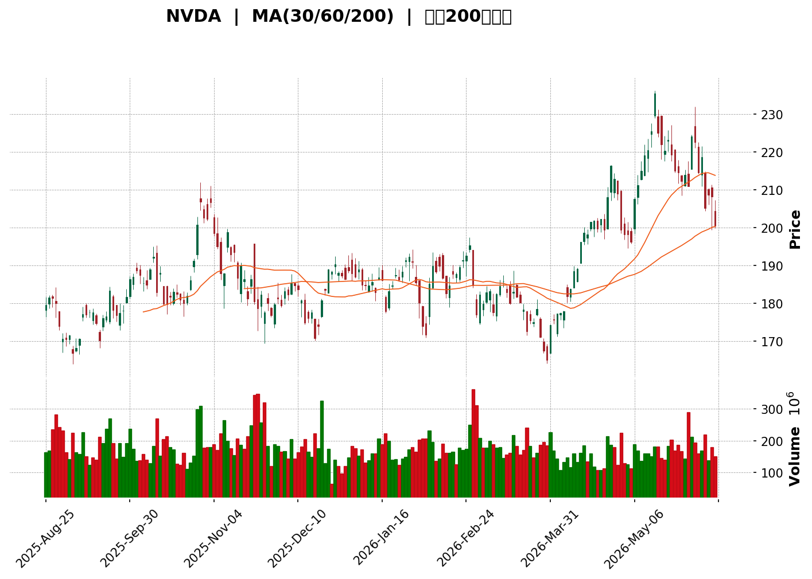
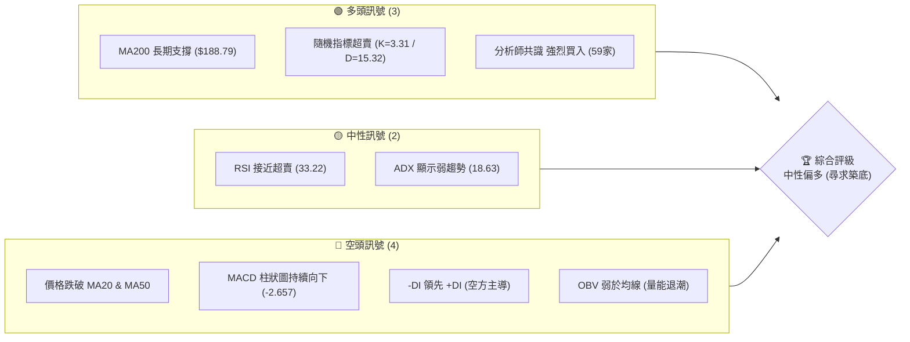
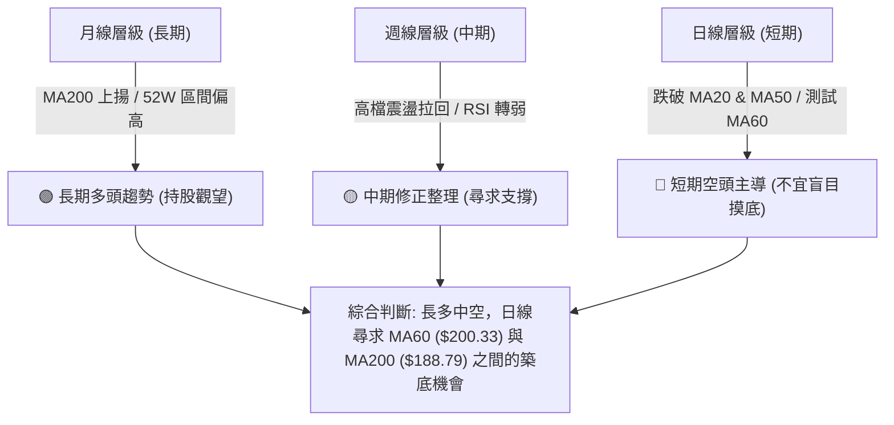
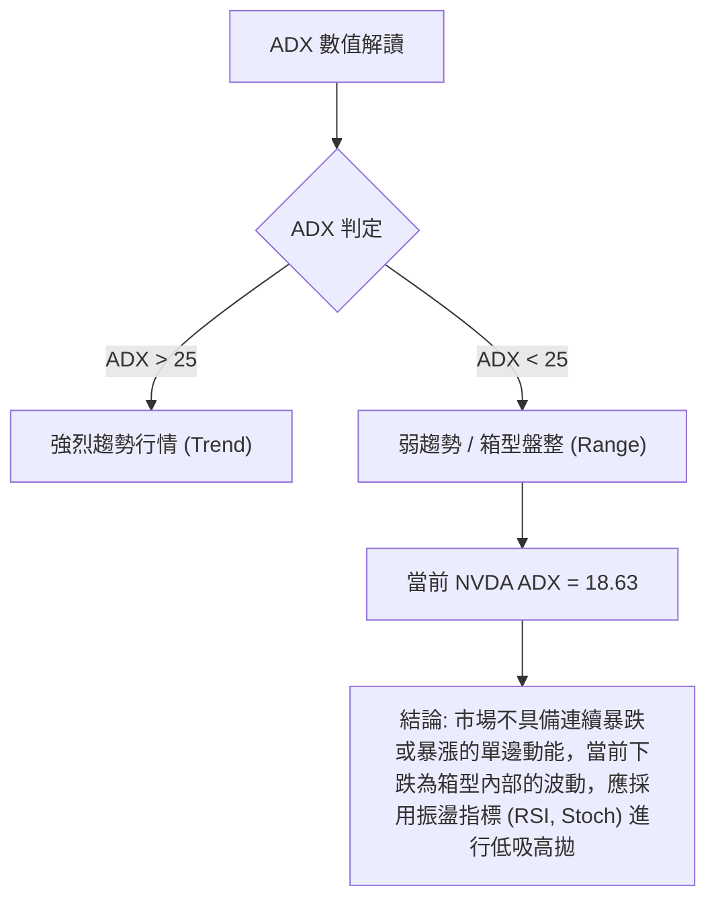

<details>
<summary>📊 靜態圖表 (點擊展開)</summary>

</details>

<html>
<head><meta charset="utf-8" /></head>
<body>
    <div style="height:500px; width:100%;">                        <script>window.PlotlyConfig = {MathJaxConfig: 'local'};</script>
        <script charset="utf-8" src="https://cdn.plot.ly/plotly-3.6.0.min.js" integrity="sha256-QaOVwtVY0T02VaHrr6pnoHLCwayMJp4O5n4YyaE3rJk=" crossorigin="anonymous"></script>                <div id="candlestick-chart" class="plotly-graph-div" style="height:100%; width:100%;"></div>            <script>                window.PLOTLYENV=window.PLOTLYENV || {};                                if (document.getElementById("candlestick-chart")) {                    Plotly.newPlot(                        "candlestick-chart",                        [{"close":{"dtype":"f8","bdata":"AAAAQERyZkAAAABA57BmQAAAAGB4q2ZAAAAAgMV9ZkAAAACAWL5lQAAAAOCwUWVAAAAAAJRMZUAAAABg0G1lQAAAACCI2WRAAAAAgMECZUAAAAAgDVFlQAAAACADI2ZAAAAAADgeZkAAAADg\u002fTJmQAAAACDBMGZAAAAAIAjVZUAAAACgVkJlQAAAACB\u002fAGZAAAAAAD0OZkAAAAAgCexmQAAAAKB8RmZAAAAAgNMXZkAAAABg1i5mQAAAACDRPmZAAAAAwMmzZkAAAABg9EpnQAAAAEAMYGdAAAAA4MeUZ0AAAAAgMWxnQAAAAIC3KWdAAAAAwLwZZ0AAAADAz5tnQAAAAABkCmhAAAAAgKfdZkAAAABgkIJnQAAAAACfeWZAAAAA4DpzZkAAAABggrJmQAAAAGCS32ZAAAAAAAnNZkAAAABAvJ1mQAAAAICcgWZAAAAA4LG9ZkAAAAAgukBnQAAAAODf52dAAAAAIMQYaUAAAABA19hpQAAAAMA1VGlAAAAAIG1HaUAAAAAgutNpQAAAACD7zWhAAAAAYMNeaEAAAADA5HpnQAAAAIAhfWdAAAAAoHzZaEAAAAAgPx1oQAAAAGCzMWhAAAAAIOdTZ0AAAABAsL1nQAAAAACYS2dAAAAAoCCkZkAAAABgCUlnQAAAAOAdjWZAAAAAYN5UZkAAAADAKMpmQAAAAOD9MmZAAAAA4PiAZkAAAAAAyRhmQAAAAEAbdmZAAAAAwFKnZkAAAABAj2tmQAAAAAAD5WZAAAAAYALGZkAAAAAAXipnQAAAAGDUF2dAAAAAwMvxZkAAAADgtJZmQAAAAEDR2WVAAAAAYGgCZkAAAADAHDBmQAAAAKBqV2VAAAAAALG9ZUAAAADgn5hmQAAAAGDr7mZAAAAAIFifZ0AAAADgKoxnQAAAAGCIyWdAAAAA4LN\u002fZ0AAAAAg+GlnQAAAAOC6SGdAAAAAoNaTZ0AAAADAgXxnQAAAAKBhYGdAAAAA4CWcZ0AAAAAgERpnQAAAAEBQFGdAAAAA4N4WZ0AAAABArTJnQAAAACBX3WZAAAAAAE9aZ0AAAACgGUBnQAAAAGBMO2ZAAAAAIBjjZkAAAACgrBNnQAAAAMAfbmdAAAAAYMVHZ0AAAACASolnQAAAAKAs6WdAAAAAwNAIaEAAAACgtdxnQAAAAOBILGdAAAAAgNmDZkAAAAAgSr9lQAAAAKB1dWVAAAAAYOQlZ0AAAAAg37lnQAAAACDuiWdAAAAAADG6Z0AAAAAAy1ZnQAAAAEDL0mZAAAAAYNQXZ0AAAAAgCHhnQAAAAKB5dWdAAAAAQNeyZ0AAAAAgIupnQAAAAMCuE2hAAAAA4EtqaEAAAADARRVnQAAAAEAsH2ZAAAAAID\u002fIZkAAAADAlHpmQAAAAAAl2mZAAAAAoLvjZkAAAADgTjNmQAAAAACuzWZAAAAAAHARZ0AAAACgBzpnQAAAAGCo3WZAAAAAAEmBZkAAAAAAN+BmQAAAAID7tmZAAAAAYBSGZkAAAACgREtmQAAAAGD3j2VAAAAA4O\u002ftZUAAAACA399lQAAAAIAaT2ZAAAAAIE1hZUAAAABAZupkQAAAAIBJn2RAAAAAoE3GZUAAAAAAdPFlQAAAACDfJWZAAAAAwNwtZkAAAADAkDxmQAAAAADHu2ZAAAAA4ET2ZkAAAAAgIo1nQAAAACDeomdAAAAA4P+IaEAAAACAbtRoQAAAAKDPw2hAAAAAID8uaUAAAACAZDppQAAAAOC29GhAAAAA4HRIaUAAAAAAC+1oQAAAAKDhAGpAAAAAYHMLa0AAAADAf51qQAAAAIA0IGpAAAAAQM7qaEAAAADgAcdoQAAAAED3x2hAAAAAAK6IaEAAAABg0fJpQAAAAAAfaGpAAAAAIGLeakAAAADA52VrQAAAAEC8kGtAAAAAwCUybEAAAAAA5m5tQAAAAMDYIWxAAAAAYPXBa0AAAABATYtrQAAAACC35mtAAAAAgCRoa0AAAADgieJqQAAAACCE02pAAAAAwEeLakAAAADABMBqQAAAAGCdXGpAAAAAgCkDbEAAAACA8NFrQAAAAAAA0GpAAAAAwB5Va0AAAABAM6NpQAAAAOB6FGpAAAAAgBQGakAAAACgcA1pQA=="},"high":{"dtype":"f8","bdata":"uUgsnmC1ZkAtiIx+t8RmQLYwQY3px2ZAVyO4RTAHZ0BLKGN9Nz1mQDbE2LDShGVAlyAyP8iFZUAUmiSSNHRlQFtzrRnEGWVAy4O\u002ff3FXZUAD4kj6FFhlQC+sqwSmYWZAAi+3rJyBZkDSnkJ860tmQPYMZ+XoU2ZAZaYKycMoZkCSXDoCV59lQAiUtUb7G2ZAAuk4CU07ZkBpUODQEwpnQBfMfx0BxmZADFc1raFxZkCwxeLu+IBmQMnyVANQcWZAodfoEID4ZkBZZwA3kGNnQKvIwpvPfGdAvJYMFtDZZ0BJuTuowsNnQJwVXF26X2dAuL83rTaaZ0BryALDeKtnQJUjFaOjYWhA+2lOu91raEAIBUVSxbtnQHUhrBgREmdAevKM6E0UZ0Cl\u002fjlJfeFmQAnGODGy+2ZAU706ydkeZ0CNw30d1NFmQHezXUaa5mZAx\u002fjiy3\u002fZZkA94mzfZWdnQHz0lW0s+GdApN8PAYVcaUDyEwdjbn1qQJMlxoC3vGlAF5\u002fXEJD2aUAvyU3VQ2JqQLLi6sa5dmlA69QALCtVaUB3gBzTyKtoQOjd2nmQgmdANi+XNu71aEAGcL1qeWVoQOCHA9F+dGhA+WlwtEbmZ0AWah+8iNhnQOINfrRLmGdAFG15OhESZ0DyERak3HNnQNU9cLcCeGhABJSYmmUKZ0DiBkM2hehmQJUntpPbPWZAUq7rGKrVZkD6Q5a6+GFmQBk+60hAgmZABo7DS40tZ0BbM\u002f+H9sZmQFkupn9yCWdAnjvD6+sNZ0CNMxvtq3hnQDtr+OPML2dAVaABKSEoZ0BFKJf7K6NmQPigxwgd02ZA5yF6HnxGZkApm+TwuEhmQKQA\u002flRL\u002fWVAEXXU0O79ZUCU9cuIU6dmQIcDRe\u002fw\u002fWZAgARw7S2jZ0CkVI+BwZVnQIwlyJGRDmhAIC1tHPaQZ0B7ILAnUJhnQIRjANx9ymdAmo+qKD0WaECiF\u002f7DnCxoQG69ge3y\u002fWdAZFMxMmHkZ0BkcLUeNqpnQAxz2JqdQ2dAfD6cnotcZ0B\u002fLjHsL3xnQGUchHOHB2dA0dcRTgGvZ0DtyF\u002f8p8ZnQIDjjtwMxWZA3e5oEe8kZ0BjHia6Lj5nQMDxPx3Pq2dA8nLurXecZ0A2+eXal7hnQG7hk7ezA2hAy5fsUdEnaEAeDRA4GUhoQHl7f5IuwmdAq5jn8WBBZ0DxYIY1j2tmQJ1Ry9JYE2ZAlYDJwbVYZ0A3k8ofki1oQJIXdU7bB2hAglgtN8kgaEBifm0Q+StoQLMU4fKwaGdAhGHCHoFdZ0A\u002fP\u002fgla8RnQO9LABZqhmdAs4QhCSTDZ0DDg9js1jZoQDuWsDEWMWhA8XCNt3SsaECx9iWxtEFoQJEJfhzDy2ZAqHBlmJHnZkDiiGdkv5VmQJOiJy8zD2dA0o6XsL76ZkDk7w7zMdFmQADYvWf91WZA\u002fbCn9c9GZ0C7qim22WxnQDYvnNUwF2dAgvItjvI7Z0D2qjPGH5VnQBnBaajkJWdA6vPONFTlZkCgLzi1p3hmQEwQwNmtQWZA+Nsa9zFFZkAt+bKleQBmQJQi5gZKoGZAbvxhnr4JZkAFw\u002f+4q1hlQFa0LG8WKGVAPBjqxlXNZUC29CCNOyVmQMYu12sRKWZAR9LMEagyZkDhMqRiuEBmQAqqrixrIWdA+8744LP7ZkAdhlwP7LhnQH9QgQkOrmdAAAAA4P+IaEBIGcuoVQVpQLYV3lHB82hAkkwpz+IuaUBKanGT6D1pQDeld4FyUGlAAAAA4HRIaUCyCriK93JpQBM08ZCKVmpA3n\u002fjhnsSa0DGToxfXM9qQHRBlqgdj2pAHUixC8RBakA1PvwbcFhpQHYdVkHYL2lAjS\u002f7dDgAaUCxb8mt4QBqQGGgR6BrvmpAhWWBlHwxa0BNl42ZUcFrQHLCGC2q72tA4hrrdGRybEAxgfbed4htQBKtnFBg52xARVHCom63bEBe2OJX\u002fwZsQC2AAYK8O2xA9NyhIVRkbECtsSU1FphrQFBrztahPWtAtjLfd9K8akA5QGaDnOhqQFStdopnM2tA3TLrgnYTbEDv2RGITgBtQOXT+4nw0WtAAAAAQDOza0AAAAAA19tqQAAAAEAKT2pAAAAAwMxsakAAAABACudpQA=="},"hovertemplate":"\u003cb\u003e%{x|%Y-%m-%d}\u003c\u002fb\u003e\u003cbr\u003e\u958b: $%{open:.2f}\u003cbr\u003e\u9ad8: $%{high:.2f}\u003cbr\u003e\u4f4e: $%{low:.2f}\u003cbr\u003e\u6536: $%{close:.2f}\u003cextra\u003e\u003c\u002fextra\u003e","low":{"dtype":"f8","bdata":"QZu8jbkKZkBpWtEgT1JmQA0yAp6TW2ZAGtv\u002fl5wFZkBUCEL5bZ1lQEuneCrs32RADzxK9fgUZUCWvvzj6CVlQIzcMuRBe2RAQi7qtRPkZEDu0SguldBkQISJaESS52VAu\u002fYZsyoIZkB1cu8LNQdmQMXNeM80yWVAkHuuVw3FZUD6WTJeQQZlQLQcwJmrl2VAZfp\u002fbJ7eZUBInnQ\u002fmc9lQIx9P6qJ\u002f2VA15M1YqblZUDvHe90Gp1lQB61eySh1mVALajz9uOCZkBbSjdY9qdmQAZyfbpN9WZAUn0oKUF6Z0B2OAGAmiRnQMOhuk8W42ZAaOkr+n\u002f4ZkDc\u002fnQRrUlnQOsH2MEh2mdAH0os9S26ZkDI+W3gIzdnQMYynhETb2ZAu9YuoQ0iZkAAoGAJUHFmQItvf1WscGZAxjf7vvOvZkA3CDxRRXJmQDXyVlsdEWZAY8lEe\u002fNxZkCSp2sNhehmQGOTmy4UhmdAc3lcSUz1Z0C7zwP1nJBpQKiWihHpJGlAXaj54QA6aUDBVFlmiqlpQHq3TQ6xtWhAENn7l91MaEDV0FMdkERnQG7EJOrTVWZAsOjKgmExaEBebLtozeFnQFPaVpxe3GdAMcBBqbTzZkBjcLMRM4tmQHTH8Qq6AmdA5lQQGHptZkA9fidiG9NmQJRyYX7ec2ZAOWK69rWWZUDhCOKWKghmQA3JB02wKmVAbpcUNGpAZkByAa83zghmQLUZgDyurmVAznhjnKl4ZkBtAjoiOFxmQPV0DYG0d2ZA7IIoWBGWZkAjuS6PsMVmQALjPxcY42ZAtyg0\u002fS66ZkBq3S5j9AxmQBKF7l0IzWVABlvoEiPaZUBMVjBk+9VlQEaVfOlHQ2VA2Ewox4pzZUDBMgRoAQRmQDg\u002fV38XxGZA8mHDeKvVZkCYuqcom0tnQO1VdN+reGdAIH2Tbd81Z0CHq1oWeVZnQAhkiBlpSGdAAZVUI\u002fuAZ0ARKp0oiz1nQEyt9DD1UmdAVb23sqVKZ0Cn9ZYlj+9mQGCCRKBH7mZABY8paYHZZkC8ctOMpuVmQLCkczqNkmZADHhi70tDZ0AdbDNfTjtnQMO+QJeYLGZAKSf0eNhFZkBVBdr0lvZmQB+nihv1UmdAAbtECm44Z0AvMZIkKS9nQCkz88N6s2dA3\u002fLlvao6Z0AH4+Fwp6dnQBSp6Qj0FGdAxHhOZH0AZkCDMvwga3ZlQKbyrdtKWmVAysn+wWTMZUBqhmWmOvdmQNml+LCBfGdAkJodBkiRZ0BbE4aqDElnQIkroCzNq2ZAFzzFZ8ZeZkA0weMMClFnQK+jjPrhLWdAt4ok+NQ2Z0DM86uIK6tnQNiZF6N+ZWdAzjAAqrkxaEDHTTMQDgNnQBd\u002fUtVIBWZAwJqYHKzNZUAAEK78ihZmQMVIDp3memZAaWDM3Dk1ZkDjZdraWBNmQKNkIIET62VAnHz\u002fijm5ZkD0v29RhwdnQAs0cME6sWZAYLTUdGB3ZkCOzMHCXKZmQM87WOL9rmZA0q7fqteDZkCqvK4qu\u002fJlQF3\u002fkpikcGVA9AdoRM\u002fRZUAp75Xi4LhlQL6xrLOcFGZAkg8l1BpeZUDHCSodGdpkQHErK1WFgmRAMBQgM4DYZEDjMUmJfdFlQL0Fg6l0ZWVAboDnrcXxZUCRTeOXpq5lQNcMgznigmZAgiIfgByNZkDSmQ0LvAJnQNYfrcvCMGdA3s0onYjRZ0BeLkl5Y3BoQGRbOxmgcmhAgHDGezfhaEBikMR+grNoQP8tXESW2GhAOtGhQJbYaED8whJ0sZ9oQO6bpu558mhA3lEgRm\u002fkaUCO81vlpP5pQKKjA83T6mlAhhUNbP\u002fOaECj3vUuf5xoQOhh8epsUGhA53V7O6h5aEBDsYYNH8xoQNAv565OyGlASE58p4yUakClmtsNg7RqQMPcfQJv1WpA3DMZgPypa0A4xzHqDqFsQA51o6xT\u002f2tAngo0i7RDa0B5TrWfADVrQBtWzjLJh2tASm1cMaQ1a0AJq+ktmdFqQLP9M0YaeGpAd9oiri4RakCcz3flK19qQEBLZphLXGpARmM0Vl3uakDuoOhE9KJrQIFK8ilUyGpAAAAAQApfakAAAABgj4ppQAAAAAAAwGlAAAAAQOHqaEAAAACgcP1oQA=="},"name":"\u50f9\u683c","open":{"dtype":"f8","bdata":"vn+M6JtDZkCRbf6BQXpmQMbJ+hudt2ZAogXjSouSZkAQmvNM8DtmQKWHxp\u002fDOGVAzLK3tKNaZUCXYVsA+0plQDh75v7O+WRAv\u002fcE6HfqZEBLSKCyrhtlQL4BvST2DGZAEk9sr29uZkAs2JTFZDFmQNQ+mHRH7mVA9iG5AMkYZkBJBDRacY1lQNSMFrVEuGVAObtNpHnxZUBsqlZXdOJlQOBxk2+ft2ZAUITo509xZkCBTcJ+P8hlQAACcHUtPmZA2VQo0WeGZkB3R1pVI7tmQE4zyh4hIGdAHI5h13irZ0AW4tA9Xp5nQGxZ1kpwKGdAI4Ya1cQ\u002fZ0BnOUehokpnQAbOTiyG\u002f2dAOwzOn24oaEAnuv7GYHdnQB3W0KgbEWdAkaCFQxESZ0CCDxKe7r9mQCgX2VhqfmZAuSoAA7LcZkCNw30d1NFmQBQlmKYYnWZA3H1E6BWGZkD\u002fyxvBYvNmQBfUJIfvt2dAReowRLsZaEClPgTx4fZpQBgu1QpwnGlAWWhaDfzFaUAnEUH6E\u002fppQEwtMqa5V2lACaUKuonQaEC8dsD4boVoQBbEf2lDFWdAC6W5PJFbaEA8b0dBKl1oQC7RIPcPb2hAW25U5s\u002fZZ0C\u002fUCcHEdRmQO6+CZN1N2dAokTRa6\u002fkZkBn+N4tvxFnQOQgBJ1pdmhAdziM30qgZkBfPTUuXWhmQKhh+X391WVAeQU8tMGsZkCuCJHmBVlmQDq2kFcy0WVA4iqWHumwZkCgb7TTLZtmQKzPSZDCrGZAY7fyuk\u002f1ZkA+NQ1KXM1mQPCTu7yvKmdAbIvkX9QXZ0BIx5qc7oFmQJB+dLl1nGZAn9e4yCQ3ZkCP8dXxcgFmQPd1oeFV\u002fGVAd1+f+yfKZUB\u002fWup8jQ5mQCLEazRF9mZAYb3oRejXZkDdtLHvwHZnQIt1YlYJtmdA38buFmdvZ0A6ALKjV4BnQIlYHL3ZqmdABErTvnqzZ0CN2SpN2PBnQN1lsaQ2yWdA+YeRo+OKZ0DUr70CJpxnQFmH7k1YG2dAzxk3yuXfZkAHGkzVyRhnQKNAM\u002fkNA2dAokUX3bpIZ0CcI99uMJtnQCxQ62a1tWZAMAFn3J5aZkDBi+tFzBBnQDnuTtKwaGdAJJY3\u002fdJdZ0Ax9yWGYWBnQLwVrh4v4WdAGcYCzWvjZ0Cbq50zRN9nQJ5nDUIaX2dASc6LfmtAZ0DQPBdouWdmQHMVl6\u002fw1mVAR6BaJjEPZkBYcW4OIwFnQAXwmyiz5GdA4\u002fyKzOUGaEDUfSJ6bxloQKJ4+0UNaGdAXywoQuqwZkAJGMZQpJBnQGK99MGgWmdAPbqvrvdKZ0BttDi\u002fVuVnQElNYTI36GdAZmDT09FGaEB6NzckEUFoQO8H0TvvoGZARYtha3\u002fZZUCRoo3RuEhmQJfkP9ILh2ZAAtfBp2CeZkCmijl33nNmQNcvl7SqE2ZAnZmqhrDFZkBnJfXEMTZnQP\u002f3YnK++mZANayfFo0WZ0CcjVNiOdhmQDAQeaYGG2dAaTYH6o\u002fIZkCwusY+sDlmQKoSgXReOWZA9lYDbbchZkDmJ1QHDNRlQEABVVGaHGZA+duFcK77ZUDjzzW5qjllQD7q2TKsEmVA2dK5+tHYZECHs62dcfllQIht8m9Yf2VAJYLgM4UeZkAxtC060PBlQC2oDowgCWdAfVCmHRu0ZkAYLafSDQNnQMPpsacHOmdA40lJUsXTZ0Azz0NY9YloQDcFJKZnpmhA5fW1WVr1aEBP\u002fST26PdoQLt6EGuhPGlA9o9iZjEYaUA60lybLUdpQNVaaWBF92hA3OQrYP0sakB5XwlY4CdqQDCHbPl5jmpAfwUKc\u002fA1akCbJQ9DdiFpQGDVuWWR6GhAXBvy6yziaECREpCYCPVoQAONxWIeA2pAJx+zMQaZakBIGqlfTrlqQOSrRGR1SWtAGqU6dWEVbEAJGXRLo7JsQDcricjCr2xASCgk4EazbEDFz\u002fmQqGtrQKQAAyRy3WtAYC0Cvf\u002fAa0AtgbIhkpRrQLOzlZo2CWtAzlMcAd27akAwSf3SFmFqQMNg7BGRympAaH33zFLvakDX5GPrS11sQE9ohsfHrmtAAAAAwB69akAAAADA9dBqQAAAAIDCRWpAAAAAANdTakAAAACgmY1pQA=="},"x":["2025-08-25T00:00:00-04:00","2025-08-26T00:00:00-04:00","2025-08-27T00:00:00-04:00","2025-08-28T00:00:00-04:00","2025-08-29T00:00:00-04:00","2025-09-02T00:00:00-04:00","2025-09-03T00:00:00-04:00","2025-09-04T00:00:00-04:00","2025-09-05T00:00:00-04:00","2025-09-08T00:00:00-04:00","2025-09-09T00:00:00-04:00","2025-09-10T00:00:00-04:00","2025-09-11T00:00:00-04:00","2025-09-12T00:00:00-04:00","2025-09-15T00:00:00-04:00","2025-09-16T00:00:00-04:00","2025-09-17T00:00:00-04:00","2025-09-18T00:00:00-04:00","2025-09-19T00:00:00-04:00","2025-09-22T00:00:00-04:00","2025-09-23T00:00:00-04:00","2025-09-24T00:00:00-04:00","2025-09-25T00:00:00-04:00","2025-09-26T00:00:00-04:00","2025-09-29T00:00:00-04:00","2025-09-30T00:00:00-04:00","2025-10-01T00:00:00-04:00","2025-10-02T00:00:00-04:00","2025-10-03T00:00:00-04:00","2025-10-06T00:00:00-04:00","2025-10-07T00:00:00-04:00","2025-10-08T00:00:00-04:00","2025-10-09T00:00:00-04:00","2025-10-10T00:00:00-04:00","2025-10-13T00:00:00-04:00","2025-10-14T00:00:00-04:00","2025-10-15T00:00:00-04:00","2025-10-16T00:00:00-04:00","2025-10-17T00:00:00-04:00","2025-10-20T00:00:00-04:00","2025-10-21T00:00:00-04:00","2025-10-22T00:00:00-04:00","2025-10-23T00:00:00-04:00","2025-10-24T00:00:00-04:00","2025-10-27T00:00:00-04:00","2025-10-28T00:00:00-04:00","2025-10-29T00:00:00-04:00","2025-10-30T00:00:00-04:00","2025-10-31T00:00:00-04:00","2025-11-03T00:00:00-05:00","2025-11-04T00:00:00-05:00","2025-11-05T00:00:00-05:00","2025-11-06T00:00:00-05:00","2025-11-07T00:00:00-05:00","2025-11-10T00:00:00-05:00","2025-11-11T00:00:00-05:00","2025-11-12T00:00:00-05:00","2025-11-13T00:00:00-05:00","2025-11-14T00:00:00-05:00","2025-11-17T00:00:00-05:00","2025-11-18T00:00:00-05:00","2025-11-19T00:00:00-05:00","2025-11-20T00:00:00-05:00","2025-11-21T00:00:00-05:00","2025-11-24T00:00:00-05:00","2025-11-25T00:00:00-05:00","2025-11-26T00:00:00-05:00","2025-11-28T00:00:00-05:00","2025-12-01T00:00:00-05:00","2025-12-02T00:00:00-05:00","2025-12-03T00:00:00-05:00","2025-12-04T00:00:00-05:00","2025-12-05T00:00:00-05:00","2025-12-08T00:00:00-05:00","2025-12-09T00:00:00-05:00","2025-12-10T00:00:00-05:00","2025-12-11T00:00:00-05:00","2025-12-12T00:00:00-05:00","2025-12-15T00:00:00-05:00","2025-12-16T00:00:00-05:00","2025-12-17T00:00:00-05:00","2025-12-18T00:00:00-05:00","2025-12-19T00:00:00-05:00","2025-12-22T00:00:00-05:00","2025-12-23T00:00:00-05:00","2025-12-24T00:00:00-05:00","2025-12-26T00:00:00-05:00","2025-12-29T00:00:00-05:00","2025-12-30T00:00:00-05:00","2025-12-31T00:00:00-05:00","2026-01-02T00:00:00-05:00","2026-01-05T00:00:00-05:00","2026-01-06T00:00:00-05:00","2026-01-07T00:00:00-05:00","2026-01-08T00:00:00-05:00","2026-01-09T00:00:00-05:00","2026-01-12T00:00:00-05:00","2026-01-13T00:00:00-05:00","2026-01-14T00:00:00-05:00","2026-01-15T00:00:00-05:00","2026-01-16T00:00:00-05:00","2026-01-20T00:00:00-05:00","2026-01-21T00:00:00-05:00","2026-01-22T00:00:00-05:00","2026-01-23T00:00:00-05:00","2026-01-26T00:00:00-05:00","2026-01-27T00:00:00-05:00","2026-01-28T00:00:00-05:00","2026-01-29T00:00:00-05:00","2026-01-30T00:00:00-05:00","2026-02-02T00:00:00-05:00","2026-02-03T00:00:00-05:00","2026-02-04T00:00:00-05:00","2026-02-05T00:00:00-05:00","2026-02-06T00:00:00-05:00","2026-02-09T00:00:00-05:00","2026-02-10T00:00:00-05:00","2026-02-11T00:00:00-05:00","2026-02-12T00:00:00-05:00","2026-02-13T00:00:00-05:00","2026-02-17T00:00:00-05:00","2026-02-18T00:00:00-05:00","2026-02-19T00:00:00-05:00","2026-02-20T00:00:00-05:00","2026-02-23T00:00:00-05:00","2026-02-24T00:00:00-05:00","2026-02-25T00:00:00-05:00","2026-02-26T00:00:00-05:00","2026-02-27T00:00:00-05:00","2026-03-02T00:00:00-05:00","2026-03-03T00:00:00-05:00","2026-03-04T00:00:00-05:00","2026-03-05T00:00:00-05:00","2026-03-06T00:00:00-05:00","2026-03-09T00:00:00-04:00","2026-03-10T00:00:00-04:00","2026-03-11T00:00:00-04:00","2026-03-12T00:00:00-04:00","2026-03-13T00:00:00-04:00","2026-03-16T00:00:00-04:00","2026-03-17T00:00:00-04:00","2026-03-18T00:00:00-04:00","2026-03-19T00:00:00-04:00","2026-03-20T00:00:00-04:00","2026-03-23T00:00:00-04:00","2026-03-24T00:00:00-04:00","2026-03-25T00:00:00-04:00","2026-03-26T00:00:00-04:00","2026-03-27T00:00:00-04:00","2026-03-30T00:00:00-04:00","2026-03-31T00:00:00-04:00","2026-04-01T00:00:00-04:00","2026-04-02T00:00:00-04:00","2026-04-06T00:00:00-04:00","2026-04-07T00:00:00-04:00","2026-04-08T00:00:00-04:00","2026-04-09T00:00:00-04:00","2026-04-10T00:00:00-04:00","2026-04-13T00:00:00-04:00","2026-04-14T00:00:00-04:00","2026-04-15T00:00:00-04:00","2026-04-16T00:00:00-04:00","2026-04-17T00:00:00-04:00","2026-04-20T00:00:00-04:00","2026-04-21T00:00:00-04:00","2026-04-22T00:00:00-04:00","2026-04-23T00:00:00-04:00","2026-04-24T00:00:00-04:00","2026-04-27T00:00:00-04:00","2026-04-28T00:00:00-04:00","2026-04-29T00:00:00-04:00","2026-04-30T00:00:00-04:00","2026-05-01T00:00:00-04:00","2026-05-04T00:00:00-04:00","2026-05-05T00:00:00-04:00","2026-05-06T00:00:00-04:00","2026-05-07T00:00:00-04:00","2026-05-08T00:00:00-04:00","2026-05-11T00:00:00-04:00","2026-05-12T00:00:00-04:00","2026-05-13T00:00:00-04:00","2026-05-14T00:00:00-04:00","2026-05-15T00:00:00-04:00","2026-05-18T00:00:00-04:00","2026-05-19T00:00:00-04:00","2026-05-20T00:00:00-04:00","2026-05-21T00:00:00-04:00","2026-05-22T00:00:00-04:00","2026-05-26T00:00:00-04:00","2026-05-27T00:00:00-04:00","2026-05-28T00:00:00-04:00","2026-05-29T00:00:00-04:00","2026-06-01T00:00:00-04:00","2026-06-02T00:00:00-04:00","2026-06-03T00:00:00-04:00","2026-06-04T00:00:00-04:00","2026-06-05T00:00:00-04:00","2026-06-08T00:00:00-04:00","2026-06-09T00:00:00-04:00","2026-06-10T00:00:00-04:00"],"type":"candlestick"},{"hovertemplate":"MA30: $%{y:.2f}\u003cextra\u003e\u003c\u002fextra\u003e","line":{"color":"#2196F3","dash":"dash","width":2},"mode":"lines","name":"MA30","x":["2025-08-25T00:00:00-04:00","2025-08-26T00:00:00-04:00","2025-08-27T00:00:00-04:00","2025-08-28T00:00:00-04:00","2025-08-29T00:00:00-04:00","2025-09-02T00:00:00-04:00","2025-09-03T00:00:00-04:00","2025-09-04T00:00:00-04:00","2025-09-05T00:00:00-04:00","2025-09-08T00:00:00-04:00","2025-09-09T00:00:00-04:00","2025-09-10T00:00:00-04:00","2025-09-11T00:00:00-04:00","2025-09-12T00:00:00-04:00","2025-09-15T00:00:00-04:00","2025-09-16T00:00:00-04:00","2025-09-17T00:00:00-04:00","2025-09-18T00:00:00-04:00","2025-09-19T00:00:00-04:00","2025-09-22T00:00:00-04:00","2025-09-23T00:00:00-04:00","2025-09-24T00:00:00-04:00","2025-09-25T00:00:00-04:00","2025-09-26T00:00:00-04:00","2025-09-29T00:00:00-04:00","2025-09-30T00:00:00-04:00","2025-10-01T00:00:00-04:00","2025-10-02T00:00:00-04:00","2025-10-03T00:00:00-04:00","2025-10-06T00:00:00-04:00","2025-10-07T00:00:00-04:00","2025-10-08T00:00:00-04:00","2025-10-09T00:00:00-04:00","2025-10-10T00:00:00-04:00","2025-10-13T00:00:00-04:00","2025-10-14T00:00:00-04:00","2025-10-15T00:00:00-04:00","2025-10-16T00:00:00-04:00","2025-10-17T00:00:00-04:00","2025-10-20T00:00:00-04:00","2025-10-21T00:00:00-04:00","2025-10-22T00:00:00-04:00","2025-10-23T00:00:00-04:00","2025-10-24T00:00:00-04:00","2025-10-27T00:00:00-04:00","2025-10-28T00:00:00-04:00","2025-10-29T00:00:00-04:00","2025-10-30T00:00:00-04:00","2025-10-31T00:00:00-04:00","2025-11-03T00:00:00-05:00","2025-11-04T00:00:00-05:00","2025-11-05T00:00:00-05:00","2025-11-06T00:00:00-05:00","2025-11-07T00:00:00-05:00","2025-11-10T00:00:00-05:00","2025-11-11T00:00:00-05:00","2025-11-12T00:00:00-05:00","2025-11-13T00:00:00-05:00","2025-11-14T00:00:00-05:00","2025-11-17T00:00:00-05:00","2025-11-18T00:00:00-05:00","2025-11-19T00:00:00-05:00","2025-11-20T00:00:00-05:00","2025-11-21T00:00:00-05:00","2025-11-24T00:00:00-05:00","2025-11-25T00:00:00-05:00","2025-11-26T00:00:00-05:00","2025-11-28T00:00:00-05:00","2025-12-01T00:00:00-05:00","2025-12-02T00:00:00-05:00","2025-12-03T00:00:00-05:00","2025-12-04T00:00:00-05:00","2025-12-05T00:00:00-05:00","2025-12-08T00:00:00-05:00","2025-12-09T00:00:00-05:00","2025-12-10T00:00:00-05:00","2025-12-11T00:00:00-05:00","2025-12-12T00:00:00-05:00","2025-12-15T00:00:00-05:00","2025-12-16T00:00:00-05:00","2025-12-17T00:00:00-05:00","2025-12-18T00:00:00-05:00","2025-12-19T00:00:00-05:00","2025-12-22T00:00:00-05:00","2025-12-23T00:00:00-05:00","2025-12-24T00:00:00-05:00","2025-12-26T00:00:00-05:00","2025-12-29T00:00:00-05:00","2025-12-30T00:00:00-05:00","2025-12-31T00:00:00-05:00","2026-01-02T00:00:00-05:00","2026-01-05T00:00:00-05:00","2026-01-06T00:00:00-05:00","2026-01-07T00:00:00-05:00","2026-01-08T00:00:00-05:00","2026-01-09T00:00:00-05:00","2026-01-12T00:00:00-05:00","2026-01-13T00:00:00-05:00","2026-01-14T00:00:00-05:00","2026-01-15T00:00:00-05:00","2026-01-16T00:00:00-05:00","2026-01-20T00:00:00-05:00","2026-01-21T00:00:00-05:00","2026-01-22T00:00:00-05:00","2026-01-23T00:00:00-05:00","2026-01-26T00:00:00-05:00","2026-01-27T00:00:00-05:00","2026-01-28T00:00:00-05:00","2026-01-29T00:00:00-05:00","2026-01-30T00:00:00-05:00","2026-02-02T00:00:00-05:00","2026-02-03T00:00:00-05:00","2026-02-04T00:00:00-05:00","2026-02-05T00:00:00-05:00","2026-02-06T00:00:00-05:00","2026-02-09T00:00:00-05:00","2026-02-10T00:00:00-05:00","2026-02-11T00:00:00-05:00","2026-02-12T00:00:00-05:00","2026-02-13T00:00:00-05:00","2026-02-17T00:00:00-05:00","2026-02-18T00:00:00-05:00","2026-02-19T00:00:00-05:00","2026-02-20T00:00:00-05:00","2026-02-23T00:00:00-05:00","2026-02-24T00:00:00-05:00","2026-02-25T00:00:00-05:00","2026-02-26T00:00:00-05:00","2026-02-27T00:00:00-05:00","2026-03-02T00:00:00-05:00","2026-03-03T00:00:00-05:00","2026-03-04T00:00:00-05:00","2026-03-05T00:00:00-05:00","2026-03-06T00:00:00-05:00","2026-03-09T00:00:00-04:00","2026-03-10T00:00:00-04:00","2026-03-11T00:00:00-04:00","2026-03-12T00:00:00-04:00","2026-03-13T00:00:00-04:00","2026-03-16T00:00:00-04:00","2026-03-17T00:00:00-04:00","2026-03-18T00:00:00-04:00","2026-03-19T00:00:00-04:00","2026-03-20T00:00:00-04:00","2026-03-23T00:00:00-04:00","2026-03-24T00:00:00-04:00","2026-03-25T00:00:00-04:00","2026-03-26T00:00:00-04:00","2026-03-27T00:00:00-04:00","2026-03-30T00:00:00-04:00","2026-03-31T00:00:00-04:00","2026-04-01T00:00:00-04:00","2026-04-02T00:00:00-04:00","2026-04-06T00:00:00-04:00","2026-04-07T00:00:00-04:00","2026-04-08T00:00:00-04:00","2026-04-09T00:00:00-04:00","2026-04-10T00:00:00-04:00","2026-04-13T00:00:00-04:00","2026-04-14T00:00:00-04:00","2026-04-15T00:00:00-04:00","2026-04-16T00:00:00-04:00","2026-04-17T00:00:00-04:00","2026-04-20T00:00:00-04:00","2026-04-21T00:00:00-04:00","2026-04-22T00:00:00-04:00","2026-04-23T00:00:00-04:00","2026-04-24T00:00:00-04:00","2026-04-27T00:00:00-04:00","2026-04-28T00:00:00-04:00","2026-04-29T00:00:00-04:00","2026-04-30T00:00:00-04:00","2026-05-01T00:00:00-04:00","2026-05-04T00:00:00-04:00","2026-05-05T00:00:00-04:00","2026-05-06T00:00:00-04:00","2026-05-07T00:00:00-04:00","2026-05-08T00:00:00-04:00","2026-05-11T00:00:00-04:00","2026-05-12T00:00:00-04:00","2026-05-13T00:00:00-04:00","2026-05-14T00:00:00-04:00","2026-05-15T00:00:00-04:00","2026-05-18T00:00:00-04:00","2026-05-19T00:00:00-04:00","2026-05-20T00:00:00-04:00","2026-05-21T00:00:00-04:00","2026-05-22T00:00:00-04:00","2026-05-26T00:00:00-04:00","2026-05-27T00:00:00-04:00","2026-05-28T00:00:00-04:00","2026-05-29T00:00:00-04:00","2026-06-01T00:00:00-04:00","2026-06-02T00:00:00-04:00","2026-06-03T00:00:00-04:00","2026-06-04T00:00:00-04:00","2026-06-05T00:00:00-04:00","2026-06-08T00:00:00-04:00","2026-06-09T00:00:00-04:00","2026-06-10T00:00:00-04:00"],"y":{"dtype":"f8","bdata":"AAAAAAAA+H8AAAAAAAD4fwAAAAAAAPh\u002fAAAAAAAA+H8AAAAAAAD4fwAAAAAAAPh\u002fAAAAAAAA+H8AAAAAAAD4fwAAAAAAAPh\u002fAAAAAAAA+H8AAAAAAAD4fwAAAAAAAPh\u002fAAAAAAAA+H8AAAAAAAD4fwAAAAAAAPh\u002fAAAAAAAA+H8AAAAAAAD4fwAAAAAAAPh\u002fAAAAAAAA+H8AAAAAAAD4fwAAAAAAAPh\u002fAAAAAAAA+H8AAAAAAAD4fwAAAAAAAPh\u002fAAAAAAAA+H8AAAAAAAD4fwAAAAAAAPh\u002fAAAAAAAA+H8AAAAAAAD4f3d3dzfkNWZAzczMTHk7ZkCamZnZTUNmQO\u002fu7l4AT2ZAIiIikjJSZkAAAACARWFmQFVVVcUia2ZAIiIiIvV0ZkDe3d3dx39mQJqZmXkMkWZAAAAAIFOgZkB3d3cHaqtmQGZmZkaRrmZAMzMzI+KzZkARERHh37xmQJqZmQmDy2ZAMzMzo17nZkDv7u4OhQ5nQDMzMwPpKmdA3t3dnWpGZ0CJiIjINF9nQBERERHKdGdAZmZmdjiIZ0AiIiICSpNnQJqZmUnmnWdAzczMDDmwZ0CrqqqKO7dnQERERJQ4vmdARERE9A68Z0BERERkxr5nQJqZmXnnv2dA7+7u3vu7Z0BmZmaGOblnQM3MzPyDrGdAAAAAwPSnZ0CamZkpz6FnQFVVVXV0n2dAmpmZuemfZ0AiIiLyyZpnQJqZmflFl2dAq6qqKgSWZ0AAAAAAWJRnQHd3dzeol2dAq6qqKu+XZ0DNzMxcMJdnQLy7uwtBkGdA7+7ubuN9Z0DNzMx8FWJnQImIiHhnRGdAmpmZ6YAoZ0AiIiIicwlnQImIiMjl62ZAzczMPHbVZkCJiIho681mQO\u002fu7t4tyWZAAAAAMLW+ZkDe3d0t37lmQHd3d0dmtmZAmpmZCdy3ZkAiIiKiEbVmQCIiIjL5tGZAq6qquva8ZkARERHxrb5mQLy7u7u4xWZAREREhKHQZkBVVVVlS9NmQERERCTO2mZAZmZmRs3fZkAAAADAMulmQN7d3a2j7GZAVVVVBZvyZkAzMzOzsPlmQKuqqnoI9GZAvLu7qwD1ZkBmZmYGP\u002fRmQHd3d2cf92ZA7+7uDv35ZkDNzMwcEwJnQJqZmTmnE2dAiYiI+O4kZ0BVVVVVODNnQHd3d1fZQmdAq6qqSnRJZ0AzMzOzNUJnQFVVVbWgNWdAERERUZQxZ0AzMzNTGjNnQFVVVZX7MGdAAAAAsO4yZ0DNzMwMSzJnQJqZmalcLmdAREREdDoqZ0BEREREFCpnQERERETIKmdAmpmZ6YkrZ0CamZlpeTJnQAAAAJD8OmdA7+7u\u002fkxGZ0BEREQUUkVnQBEREVH7PmdAvLu76xw6Z0DNzMxshzNnQJqZmenSOGdAzczMXNg4Z0BVVVXFXTFnQFVVVaUELGdAAAAAADUqZ0AzMzOjkCdnQERERNSlHmdAVVVVxZgRZ0BmZmYmLglnQLy7uytFBWdAMzMzM1gFZ0Dv7u6uAgpnQAAAAODkCmdAvLu7234AZ0AiIiISsvBmQM3MzIwz5mZARERE9CvSZkDe3d3tfb1mQGZmZla1qmZAzczMHHWfZkDNzMwscJJmQLy7u1tAh2ZAMzMzE0l6ZkDe3d1t92tmQFVVVcWAYGZAMzMzIxpUZkAzMzPzGFhmQHd3d0cFZWZAMzMzo\u002fpzZkDe3d1tCohmQKuqqupcmGZAVVVV1emrZkAzMzPjv8VmQM3MzAwe2GZAzczMnATrZkCamZm5hPlmQGZmZuZKFGdAvLu7Cwg7Z0Dv7u7e8FpnQO\u002fu7l4MeGdAd3d393iMZ0ARERHxqaFnQHd3d2chvWdAERER8VrTZ0DNzMy8HvZnQKuqqloWGWhAMzMzY+xHaEARERGBPX9oQAAAABB9umhAiYiIiEjxaEC8u7u7MjFpQGZmZpZDZGlAIiIiAt6TaUDv7u6OKMFpQBEREaFB7WlAvLu7ey8TakAAAADgoS9qQLy7u5vaSmpAMzMzI\u002f9bakAzMzMDYmxqQImIiHgCempAq6qqaiySakDv7u6uSqhqQERERHQiuGpAVVVVlZ\u002fJakDe3d39sc9qQLy7uztZ0GpA7+7u3qLHakCJiIgITbpqQA=="},"type":"scatter"},{"hovertemplate":"MA60: $%{y:.2f}\u003cextra\u003e\u003c\u002fextra\u003e","line":{"color":"#9C27B0","dash":"dash","width":2},"mode":"lines","name":"MA60","x":["2025-08-25T00:00:00-04:00","2025-08-26T00:00:00-04:00","2025-08-27T00:00:00-04:00","2025-08-28T00:00:00-04:00","2025-08-29T00:00:00-04:00","2025-09-02T00:00:00-04:00","2025-09-03T00:00:00-04:00","2025-09-04T00:00:00-04:00","2025-09-05T00:00:00-04:00","2025-09-08T00:00:00-04:00","2025-09-09T00:00:00-04:00","2025-09-10T00:00:00-04:00","2025-09-11T00:00:00-04:00","2025-09-12T00:00:00-04:00","2025-09-15T00:00:00-04:00","2025-09-16T00:00:00-04:00","2025-09-17T00:00:00-04:00","2025-09-18T00:00:00-04:00","2025-09-19T00:00:00-04:00","2025-09-22T00:00:00-04:00","2025-09-23T00:00:00-04:00","2025-09-24T00:00:00-04:00","2025-09-25T00:00:00-04:00","2025-09-26T00:00:00-04:00","2025-09-29T00:00:00-04:00","2025-09-30T00:00:00-04:00","2025-10-01T00:00:00-04:00","2025-10-02T00:00:00-04:00","2025-10-03T00:00:00-04:00","2025-10-06T00:00:00-04:00","2025-10-07T00:00:00-04:00","2025-10-08T00:00:00-04:00","2025-10-09T00:00:00-04:00","2025-10-10T00:00:00-04:00","2025-10-13T00:00:00-04:00","2025-10-14T00:00:00-04:00","2025-10-15T00:00:00-04:00","2025-10-16T00:00:00-04:00","2025-10-17T00:00:00-04:00","2025-10-20T00:00:00-04:00","2025-10-21T00:00:00-04:00","2025-10-22T00:00:00-04:00","2025-10-23T00:00:00-04:00","2025-10-24T00:00:00-04:00","2025-10-27T00:00:00-04:00","2025-10-28T00:00:00-04:00","2025-10-29T00:00:00-04:00","2025-10-30T00:00:00-04:00","2025-10-31T00:00:00-04:00","2025-11-03T00:00:00-05:00","2025-11-04T00:00:00-05:00","2025-11-05T00:00:00-05:00","2025-11-06T00:00:00-05:00","2025-11-07T00:00:00-05:00","2025-11-10T00:00:00-05:00","2025-11-11T00:00:00-05:00","2025-11-12T00:00:00-05:00","2025-11-13T00:00:00-05:00","2025-11-14T00:00:00-05:00","2025-11-17T00:00:00-05:00","2025-11-18T00:00:00-05:00","2025-11-19T00:00:00-05:00","2025-11-20T00:00:00-05:00","2025-11-21T00:00:00-05:00","2025-11-24T00:00:00-05:00","2025-11-25T00:00:00-05:00","2025-11-26T00:00:00-05:00","2025-11-28T00:00:00-05:00","2025-12-01T00:00:00-05:00","2025-12-02T00:00:00-05:00","2025-12-03T00:00:00-05:00","2025-12-04T00:00:00-05:00","2025-12-05T00:00:00-05:00","2025-12-08T00:00:00-05:00","2025-12-09T00:00:00-05:00","2025-12-10T00:00:00-05:00","2025-12-11T00:00:00-05:00","2025-12-12T00:00:00-05:00","2025-12-15T00:00:00-05:00","2025-12-16T00:00:00-05:00","2025-12-17T00:00:00-05:00","2025-12-18T00:00:00-05:00","2025-12-19T00:00:00-05:00","2025-12-22T00:00:00-05:00","2025-12-23T00:00:00-05:00","2025-12-24T00:00:00-05:00","2025-12-26T00:00:00-05:00","2025-12-29T00:00:00-05:00","2025-12-30T00:00:00-05:00","2025-12-31T00:00:00-05:00","2026-01-02T00:00:00-05:00","2026-01-05T00:00:00-05:00","2026-01-06T00:00:00-05:00","2026-01-07T00:00:00-05:00","2026-01-08T00:00:00-05:00","2026-01-09T00:00:00-05:00","2026-01-12T00:00:00-05:00","2026-01-13T00:00:00-05:00","2026-01-14T00:00:00-05:00","2026-01-15T00:00:00-05:00","2026-01-16T00:00:00-05:00","2026-01-20T00:00:00-05:00","2026-01-21T00:00:00-05:00","2026-01-22T00:00:00-05:00","2026-01-23T00:00:00-05:00","2026-01-26T00:00:00-05:00","2026-01-27T00:00:00-05:00","2026-01-28T00:00:00-05:00","2026-01-29T00:00:00-05:00","2026-01-30T00:00:00-05:00","2026-02-02T00:00:00-05:00","2026-02-03T00:00:00-05:00","2026-02-04T00:00:00-05:00","2026-02-05T00:00:00-05:00","2026-02-06T00:00:00-05:00","2026-02-09T00:00:00-05:00","2026-02-10T00:00:00-05:00","2026-02-11T00:00:00-05:00","2026-02-12T00:00:00-05:00","2026-02-13T00:00:00-05:00","2026-02-17T00:00:00-05:00","2026-02-18T00:00:00-05:00","2026-02-19T00:00:00-05:00","2026-02-20T00:00:00-05:00","2026-02-23T00:00:00-05:00","2026-02-24T00:00:00-05:00","2026-02-25T00:00:00-05:00","2026-02-26T00:00:00-05:00","2026-02-27T00:00:00-05:00","2026-03-02T00:00:00-05:00","2026-03-03T00:00:00-05:00","2026-03-04T00:00:00-05:00","2026-03-05T00:00:00-05:00","2026-03-06T00:00:00-05:00","2026-03-09T00:00:00-04:00","2026-03-10T00:00:00-04:00","2026-03-11T00:00:00-04:00","2026-03-12T00:00:00-04:00","2026-03-13T00:00:00-04:00","2026-03-16T00:00:00-04:00","2026-03-17T00:00:00-04:00","2026-03-18T00:00:00-04:00","2026-03-19T00:00:00-04:00","2026-03-20T00:00:00-04:00","2026-03-23T00:00:00-04:00","2026-03-24T00:00:00-04:00","2026-03-25T00:00:00-04:00","2026-03-26T00:00:00-04:00","2026-03-27T00:00:00-04:00","2026-03-30T00:00:00-04:00","2026-03-31T00:00:00-04:00","2026-04-01T00:00:00-04:00","2026-04-02T00:00:00-04:00","2026-04-06T00:00:00-04:00","2026-04-07T00:00:00-04:00","2026-04-08T00:00:00-04:00","2026-04-09T00:00:00-04:00","2026-04-10T00:00:00-04:00","2026-04-13T00:00:00-04:00","2026-04-14T00:00:00-04:00","2026-04-15T00:00:00-04:00","2026-04-16T00:00:00-04:00","2026-04-17T00:00:00-04:00","2026-04-20T00:00:00-04:00","2026-04-21T00:00:00-04:00","2026-04-22T00:00:00-04:00","2026-04-23T00:00:00-04:00","2026-04-24T00:00:00-04:00","2026-04-27T00:00:00-04:00","2026-04-28T00:00:00-04:00","2026-04-29T00:00:00-04:00","2026-04-30T00:00:00-04:00","2026-05-01T00:00:00-04:00","2026-05-04T00:00:00-04:00","2026-05-05T00:00:00-04:00","2026-05-06T00:00:00-04:00","2026-05-07T00:00:00-04:00","2026-05-08T00:00:00-04:00","2026-05-11T00:00:00-04:00","2026-05-12T00:00:00-04:00","2026-05-13T00:00:00-04:00","2026-05-14T00:00:00-04:00","2026-05-15T00:00:00-04:00","2026-05-18T00:00:00-04:00","2026-05-19T00:00:00-04:00","2026-05-20T00:00:00-04:00","2026-05-21T00:00:00-04:00","2026-05-22T00:00:00-04:00","2026-05-26T00:00:00-04:00","2026-05-27T00:00:00-04:00","2026-05-28T00:00:00-04:00","2026-05-29T00:00:00-04:00","2026-06-01T00:00:00-04:00","2026-06-02T00:00:00-04:00","2026-06-03T00:00:00-04:00","2026-06-04T00:00:00-04:00","2026-06-05T00:00:00-04:00","2026-06-08T00:00:00-04:00","2026-06-09T00:00:00-04:00","2026-06-10T00:00:00-04:00"],"y":{"dtype":"f8","bdata":"AAAAAAAA+H8AAAAAAAD4fwAAAAAAAPh\u002fAAAAAAAA+H8AAAAAAAD4fwAAAAAAAPh\u002fAAAAAAAA+H8AAAAAAAD4fwAAAAAAAPh\u002fAAAAAAAA+H8AAAAAAAD4fwAAAAAAAPh\u002fAAAAAAAA+H8AAAAAAAD4fwAAAAAAAPh\u002fAAAAAAAA+H8AAAAAAAD4fwAAAAAAAPh\u002fAAAAAAAA+H8AAAAAAAD4fwAAAAAAAPh\u002fAAAAAAAA+H8AAAAAAAD4fwAAAAAAAPh\u002fAAAAAAAA+H8AAAAAAAD4fwAAAAAAAPh\u002fAAAAAAAA+H8AAAAAAAD4fwAAAAAAAPh\u002fAAAAAAAA+H8AAAAAAAD4fwAAAAAAAPh\u002fAAAAAAAA+H8AAAAAAAD4fwAAAAAAAPh\u002fAAAAAAAA+H8AAAAAAAD4fwAAAAAAAPh\u002fAAAAAAAA+H8AAAAAAAD4fwAAAAAAAPh\u002fAAAAAAAA+H8AAAAAAAD4fwAAAAAAAPh\u002fAAAAAAAA+H8AAAAAAAD4fwAAAAAAAPh\u002fAAAAAAAA+H8AAAAAAAD4fwAAAAAAAPh\u002fAAAAAAAA+H8AAAAAAAD4fwAAAAAAAPh\u002fAAAAAAAA+H8AAAAAAAD4fwAAAAAAAPh\u002fAAAAAAAA+H8AAAAAAAD4f4mIiNjl+mZA3t3dlbr7ZkAAAACwQ\u002f5mQN7d3S3C\u002fWZAERERqRP9ZkDNzMxUigFnQFVVVZ1LBWdA3t3dbW8KZ0AAAADoSA1nQJqZmTkpFGdAVVVVpSsbZ0C8u7sD4R9nQO\u002fu7r4cI2dA7+7upuglZ0Dv7u4eCCpnQKuqqgriLWdAERERCaEyZ0De3d1FTThnQN7d3T2oN2dAvLu7w3U3Z0BVVVX1UzRnQM3MzOxXMGdAmpmZWdcuZ0BVVVW1mjBnQERERBSKM2dAZmZmHnc3Z0BERERcjThnQN7d3W1POmdA7+7ufvU5Z0AzMzMD7DlnQN7d3VVwOmdAzczMTHk8Z0C8u7u78ztnQERERFweOWdAIiIiIks8Z0B3d3dHjTpnQM3MzEwhPWdAAAAAgNs\u002fZ0ARERFZ\u002fkFnQLy7u9P0QWdAAAAAmE9EZ0CamZlZBEdnQBEREVnYRWdAMzMz63dGZ0CamZmxt0VnQJqZmTmwQ2dA7+7uPvA7Z0DNzMxMFDJnQBEREVkHLGdAERER8bcmZ0C8u7u7VR5nQAAAAJBfF2dAvLu7Q3UPZ0De3d2NEAhnQCIiIkpn\u002f2ZAiYiIwCT4ZkCJiIjAfPZmQGZmZu6w82ZAzczMXGX1ZkB3d3dXrvNmQN7d3e2q8WZAd3d3l5jzZkCrqqoaYfRmQAAAAIBA+GZA7+7uthX+ZkB3d3dn4gJnQCIiIlrlCmdAq6qqIg0TZ0AiIiJqQhdnQHd3d3\u002fPFWdAiYiI+FsWZ0AAAAAQnBZnQCIiIrJtFmdAREREhOwWZ0De3d1lzhJnQGZmZgaSEWdAd3d3BxkSZ0AAAADg0RRnQO\u002fu7oYmGWdA7+7u3kMbZ0De3d09Mx5nQJqZmUEPJGdA7+7uPmYnZ0ARERExHCZnQKuqqspCIGdAZmZmlgkZZ0Crqqoy5hFnQBEREZGXC2dAIiIiUo0CZ0BVVVV95PdmQAAAAACJ7GZAiYiIyNfkZkCJiIg4Qt5mQAAAAFAE2WZAZmZmfunSZkC8u7trOM9mQKuqqqq+zWZAERERkTPNZkC8u7uDtc5mQEREREwA0mZAd3d3xwvXZkBVVVXtyN1mQCIiIuqX6GZAERERGWHyZkBERETUjvtmQBEREVkRAmdAZmZmzpwKZ0BmZmauihBnQFVVVV14GWdAiYiIaFAmZ0CrqqqCDzJnQFVVVcWoPmdAVVVVlehIZ0AAAABQ1lVnQLy7uyMDZGdAZmZm5uxpZ0B3d3dnaHNnQLy7u\u002fOkf2dAvLu7KwyNZ0B3d3e3XZ5nQDMzMzOZsmdAq6qq0l7IZ0BERER00eFnQBEREfnB9WdAq6qqihMHaEBmZmb+jxZoQDMzMzPhJmhAd3d3z6QzaECamZlp3UNoQJqZmfHvV2hAMzMz4\u002fxnaECJiIg4NnpoQJqZmbEviWhAAAAAIAufaEARERFJBbdoQImIiEAgyGhAERERGVLaaEC8u7tbm+RoQBERERFS8mhAVVVVdVUBaUC8u7vzngppQA=="},"type":"scatter"},{"hovertemplate":"MA200: $%{y:.2f}\u003cextra\u003e\u003c\u002fextra\u003e","line":{"color":"#FF6F00","dash":"solid","width":2},"mode":"lines","name":"MA200","x":["2025-08-25T00:00:00-04:00","2025-08-26T00:00:00-04:00","2025-08-27T00:00:00-04:00","2025-08-28T00:00:00-04:00","2025-08-29T00:00:00-04:00","2025-09-02T00:00:00-04:00","2025-09-03T00:00:00-04:00","2025-09-04T00:00:00-04:00","2025-09-05T00:00:00-04:00","2025-09-08T00:00:00-04:00","2025-09-09T00:00:00-04:00","2025-09-10T00:00:00-04:00","2025-09-11T00:00:00-04:00","2025-09-12T00:00:00-04:00","2025-09-15T00:00:00-04:00","2025-09-16T00:00:00-04:00","2025-09-17T00:00:00-04:00","2025-09-18T00:00:00-04:00","2025-09-19T00:00:00-04:00","2025-09-22T00:00:00-04:00","2025-09-23T00:00:00-04:00","2025-09-24T00:00:00-04:00","2025-09-25T00:00:00-04:00","2025-09-26T00:00:00-04:00","2025-09-29T00:00:00-04:00","2025-09-30T00:00:00-04:00","2025-10-01T00:00:00-04:00","2025-10-02T00:00:00-04:00","2025-10-03T00:00:00-04:00","2025-10-06T00:00:00-04:00","2025-10-07T00:00:00-04:00","2025-10-08T00:00:00-04:00","2025-10-09T00:00:00-04:00","2025-10-10T00:00:00-04:00","2025-10-13T00:00:00-04:00","2025-10-14T00:00:00-04:00","2025-10-15T00:00:00-04:00","2025-10-16T00:00:00-04:00","2025-10-17T00:00:00-04:00","2025-10-20T00:00:00-04:00","2025-10-21T00:00:00-04:00","2025-10-22T00:00:00-04:00","2025-10-23T00:00:00-04:00","2025-10-24T00:00:00-04:00","2025-10-27T00:00:00-04:00","2025-10-28T00:00:00-04:00","2025-10-29T00:00:00-04:00","2025-10-30T00:00:00-04:00","2025-10-31T00:00:00-04:00","2025-11-03T00:00:00-05:00","2025-11-04T00:00:00-05:00","2025-11-05T00:00:00-05:00","2025-11-06T00:00:00-05:00","2025-11-07T00:00:00-05:00","2025-11-10T00:00:00-05:00","2025-11-11T00:00:00-05:00","2025-11-12T00:00:00-05:00","2025-11-13T00:00:00-05:00","2025-11-14T00:00:00-05:00","2025-11-17T00:00:00-05:00","2025-11-18T00:00:00-05:00","2025-11-19T00:00:00-05:00","2025-11-20T00:00:00-05:00","2025-11-21T00:00:00-05:00","2025-11-24T00:00:00-05:00","2025-11-25T00:00:00-05:00","2025-11-26T00:00:00-05:00","2025-11-28T00:00:00-05:00","2025-12-01T00:00:00-05:00","2025-12-02T00:00:00-05:00","2025-12-03T00:00:00-05:00","2025-12-04T00:00:00-05:00","2025-12-05T00:00:00-05:00","2025-12-08T00:00:00-05:00","2025-12-09T00:00:00-05:00","2025-12-10T00:00:00-05:00","2025-12-11T00:00:00-05:00","2025-12-12T00:00:00-05:00","2025-12-15T00:00:00-05:00","2025-12-16T00:00:00-05:00","2025-12-17T00:00:00-05:00","2025-12-18T00:00:00-05:00","2025-12-19T00:00:00-05:00","2025-12-22T00:00:00-05:00","2025-12-23T00:00:00-05:00","2025-12-24T00:00:00-05:00","2025-12-26T00:00:00-05:00","2025-12-29T00:00:00-05:00","2025-12-30T00:00:00-05:00","2025-12-31T00:00:00-05:00","2026-01-02T00:00:00-05:00","2026-01-05T00:00:00-05:00","2026-01-06T00:00:00-05:00","2026-01-07T00:00:00-05:00","2026-01-08T00:00:00-05:00","2026-01-09T00:00:00-05:00","2026-01-12T00:00:00-05:00","2026-01-13T00:00:00-05:00","2026-01-14T00:00:00-05:00","2026-01-15T00:00:00-05:00","2026-01-16T00:00:00-05:00","2026-01-20T00:00:00-05:00","2026-01-21T00:00:00-05:00","2026-01-22T00:00:00-05:00","2026-01-23T00:00:00-05:00","2026-01-26T00:00:00-05:00","2026-01-27T00:00:00-05:00","2026-01-28T00:00:00-05:00","2026-01-29T00:00:00-05:00","2026-01-30T00:00:00-05:00","2026-02-02T00:00:00-05:00","2026-02-03T00:00:00-05:00","2026-02-04T00:00:00-05:00","2026-02-05T00:00:00-05:00","2026-02-06T00:00:00-05:00","2026-02-09T00:00:00-05:00","2026-02-10T00:00:00-05:00","2026-02-11T00:00:00-05:00","2026-02-12T00:00:00-05:00","2026-02-13T00:00:00-05:00","2026-02-17T00:00:00-05:00","2026-02-18T00:00:00-05:00","2026-02-19T00:00:00-05:00","2026-02-20T00:00:00-05:00","2026-02-23T00:00:00-05:00","2026-02-24T00:00:00-05:00","2026-02-25T00:00:00-05:00","2026-02-26T00:00:00-05:00","2026-02-27T00:00:00-05:00","2026-03-02T00:00:00-05:00","2026-03-03T00:00:00-05:00","2026-03-04T00:00:00-05:00","2026-03-05T00:00:00-05:00","2026-03-06T00:00:00-05:00","2026-03-09T00:00:00-04:00","2026-03-10T00:00:00-04:00","2026-03-11T00:00:00-04:00","2026-03-12T00:00:00-04:00","2026-03-13T00:00:00-04:00","2026-03-16T00:00:00-04:00","2026-03-17T00:00:00-04:00","2026-03-18T00:00:00-04:00","2026-03-19T00:00:00-04:00","2026-03-20T00:00:00-04:00","2026-03-23T00:00:00-04:00","2026-03-24T00:00:00-04:00","2026-03-25T00:00:00-04:00","2026-03-26T00:00:00-04:00","2026-03-27T00:00:00-04:00","2026-03-30T00:00:00-04:00","2026-03-31T00:00:00-04:00","2026-04-01T00:00:00-04:00","2026-04-02T00:00:00-04:00","2026-04-06T00:00:00-04:00","2026-04-07T00:00:00-04:00","2026-04-08T00:00:00-04:00","2026-04-09T00:00:00-04:00","2026-04-10T00:00:00-04:00","2026-04-13T00:00:00-04:00","2026-04-14T00:00:00-04:00","2026-04-15T00:00:00-04:00","2026-04-16T00:00:00-04:00","2026-04-17T00:00:00-04:00","2026-04-20T00:00:00-04:00","2026-04-21T00:00:00-04:00","2026-04-22T00:00:00-04:00","2026-04-23T00:00:00-04:00","2026-04-24T00:00:00-04:00","2026-04-27T00:00:00-04:00","2026-04-28T00:00:00-04:00","2026-04-29T00:00:00-04:00","2026-04-30T00:00:00-04:00","2026-05-01T00:00:00-04:00","2026-05-04T00:00:00-04:00","2026-05-05T00:00:00-04:00","2026-05-06T00:00:00-04:00","2026-05-07T00:00:00-04:00","2026-05-08T00:00:00-04:00","2026-05-11T00:00:00-04:00","2026-05-12T00:00:00-04:00","2026-05-13T00:00:00-04:00","2026-05-14T00:00:00-04:00","2026-05-15T00:00:00-04:00","2026-05-18T00:00:00-04:00","2026-05-19T00:00:00-04:00","2026-05-20T00:00:00-04:00","2026-05-21T00:00:00-04:00","2026-05-22T00:00:00-04:00","2026-05-26T00:00:00-04:00","2026-05-27T00:00:00-04:00","2026-05-28T00:00:00-04:00","2026-05-29T00:00:00-04:00","2026-06-01T00:00:00-04:00","2026-06-02T00:00:00-04:00","2026-06-03T00:00:00-04:00","2026-06-04T00:00:00-04:00","2026-06-05T00:00:00-04:00","2026-06-08T00:00:00-04:00","2026-06-09T00:00:00-04:00","2026-06-10T00:00:00-04:00"],"y":{"dtype":"f8","bdata":"AAAAAAAA+H8AAAAAAAD4fwAAAAAAAPh\u002fAAAAAAAA+H8AAAAAAAD4fwAAAAAAAPh\u002fAAAAAAAA+H8AAAAAAAD4fwAAAAAAAPh\u002fAAAAAAAA+H8AAAAAAAD4fwAAAAAAAPh\u002fAAAAAAAA+H8AAAAAAAD4fwAAAAAAAPh\u002fAAAAAAAA+H8AAAAAAAD4fwAAAAAAAPh\u002fAAAAAAAA+H8AAAAAAAD4fwAAAAAAAPh\u002fAAAAAAAA+H8AAAAAAAD4fwAAAAAAAPh\u002fAAAAAAAA+H8AAAAAAAD4fwAAAAAAAPh\u002fAAAAAAAA+H8AAAAAAAD4fwAAAAAAAPh\u002fAAAAAAAA+H8AAAAAAAD4fwAAAAAAAPh\u002fAAAAAAAA+H8AAAAAAAD4fwAAAAAAAPh\u002fAAAAAAAA+H8AAAAAAAD4fwAAAAAAAPh\u002fAAAAAAAA+H8AAAAAAAD4fwAAAAAAAPh\u002fAAAAAAAA+H8AAAAAAAD4fwAAAAAAAPh\u002fAAAAAAAA+H8AAAAAAAD4fwAAAAAAAPh\u002fAAAAAAAA+H8AAAAAAAD4fwAAAAAAAPh\u002fAAAAAAAA+H8AAAAAAAD4fwAAAAAAAPh\u002fAAAAAAAA+H8AAAAAAAD4fwAAAAAAAPh\u002fAAAAAAAA+H8AAAAAAAD4fwAAAAAAAPh\u002fAAAAAAAA+H8AAAAAAAD4fwAAAAAAAPh\u002fAAAAAAAA+H8AAAAAAAD4fwAAAAAAAPh\u002fAAAAAAAA+H8AAAAAAAD4fwAAAAAAAPh\u002fAAAAAAAA+H8AAAAAAAD4fwAAAAAAAPh\u002fAAAAAAAA+H8AAAAAAAD4fwAAAAAAAPh\u002fAAAAAAAA+H8AAAAAAAD4fwAAAAAAAPh\u002fAAAAAAAA+H8AAAAAAAD4fwAAAAAAAPh\u002fAAAAAAAA+H8AAAAAAAD4fwAAAAAAAPh\u002fAAAAAAAA+H8AAAAAAAD4fwAAAAAAAPh\u002fAAAAAAAA+H8AAAAAAAD4fwAAAAAAAPh\u002fAAAAAAAA+H8AAAAAAAD4fwAAAAAAAPh\u002fAAAAAAAA+H8AAAAAAAD4fwAAAAAAAPh\u002fAAAAAAAA+H8AAAAAAAD4fwAAAAAAAPh\u002fAAAAAAAA+H8AAAAAAAD4fwAAAAAAAPh\u002fAAAAAAAA+H8AAAAAAAD4fwAAAAAAAPh\u002fAAAAAAAA+H8AAAAAAAD4fwAAAAAAAPh\u002fAAAAAAAA+H8AAAAAAAD4fwAAAAAAAPh\u002fAAAAAAAA+H8AAAAAAAD4fwAAAAAAAPh\u002fAAAAAAAA+H8AAAAAAAD4fwAAAAAAAPh\u002fAAAAAAAA+H8AAAAAAAD4fwAAAAAAAPh\u002fAAAAAAAA+H8AAAAAAAD4fwAAAAAAAPh\u002fAAAAAAAA+H8AAAAAAAD4fwAAAAAAAPh\u002fAAAAAAAA+H8AAAAAAAD4fwAAAAAAAPh\u002fAAAAAAAA+H8AAAAAAAD4fwAAAAAAAPh\u002fAAAAAAAA+H8AAAAAAAD4fwAAAAAAAPh\u002fAAAAAAAA+H8AAAAAAAD4fwAAAAAAAPh\u002fAAAAAAAA+H8AAAAAAAD4fwAAAAAAAPh\u002fAAAAAAAA+H8AAAAAAAD4fwAAAAAAAPh\u002fAAAAAAAA+H8AAAAAAAD4fwAAAAAAAPh\u002fAAAAAAAA+H8AAAAAAAD4fwAAAAAAAPh\u002fAAAAAAAA+H8AAAAAAAD4fwAAAAAAAPh\u002fAAAAAAAA+H8AAAAAAAD4fwAAAAAAAPh\u002fAAAAAAAA+H8AAAAAAAD4fwAAAAAAAPh\u002fAAAAAAAA+H8AAAAAAAD4fwAAAAAAAPh\u002fAAAAAAAA+H8AAAAAAAD4fwAAAAAAAPh\u002fAAAAAAAA+H8AAAAAAAD4fwAAAAAAAPh\u002fAAAAAAAA+H8AAAAAAAD4fwAAAAAAAPh\u002fAAAAAAAA+H8AAAAAAAD4fwAAAAAAAPh\u002fAAAAAAAA+H8AAAAAAAD4fwAAAAAAAPh\u002fAAAAAAAA+H8AAAAAAAD4fwAAAAAAAPh\u002fAAAAAAAA+H8AAAAAAAD4fwAAAAAAAPh\u002fAAAAAAAA+H8AAAAAAAD4fwAAAAAAAPh\u002fAAAAAAAA+H8AAAAAAAD4fwAAAAAAAPh\u002fAAAAAAAA+H8AAAAAAAD4fwAAAAAAAPh\u002fAAAAAAAA+H8AAAAAAAD4fwAAAAAAAPh\u002fAAAAAAAA+H8AAAAAAAD4fwAAAAAAAPh\u002fAAAAAAAA+H8zMzN3XJlnQA=="},"type":"scatter"}],                        {"template":{"data":{"barpolar":[{"marker":{"line":{"color":"rgb(17,17,17)","width":0.5},"pattern":{"fillmode":"overlay","size":10,"solidity":0.2}},"type":"barpolar"}],"bar":[{"error_x":{"color":"#f2f5fa"},"error_y":{"color":"#f2f5fa"},"marker":{"line":{"color":"rgb(17,17,17)","width":0.5},"pattern":{"fillmode":"overlay","size":10,"solidity":0.2}},"type":"bar"}],"carpet":[{"aaxis":{"endlinecolor":"#A2B1C6","gridcolor":"#506784","linecolor":"#506784","minorgridcolor":"#506784","startlinecolor":"#A2B1C6"},"baxis":{"endlinecolor":"#A2B1C6","gridcolor":"#506784","linecolor":"#506784","minorgridcolor":"#506784","startlinecolor":"#A2B1C6"},"type":"carpet"}],"choropleth":[{"colorbar":{"outlinewidth":0,"ticks":""},"type":"choropleth"}],"contourcarpet":[{"colorbar":{"outlinewidth":0,"ticks":""},"type":"contourcarpet"}],"contour":[{"colorbar":{"outlinewidth":0,"ticks":""},"colorscale":[[0.0,"#0d0887"],[0.1111111111111111,"#46039f"],[0.2222222222222222,"#7201a8"],[0.3333333333333333,"#9c179e"],[0.4444444444444444,"#bd3786"],[0.5555555555555556,"#d8576b"],[0.6666666666666666,"#ed7953"],[0.7777777777777778,"#fb9f3a"],[0.8888888888888888,"#fdca26"],[1.0,"#f0f921"]],"type":"contour"}],"heatmap":[{"colorbar":{"outlinewidth":0,"ticks":""},"colorscale":[[0.0,"#0d0887"],[0.1111111111111111,"#46039f"],[0.2222222222222222,"#7201a8"],[0.3333333333333333,"#9c179e"],[0.4444444444444444,"#bd3786"],[0.5555555555555556,"#d8576b"],[0.6666666666666666,"#ed7953"],[0.7777777777777778,"#fb9f3a"],[0.8888888888888888,"#fdca26"],[1.0,"#f0f921"]],"type":"heatmap"}],"histogram2dcontour":[{"colorbar":{"outlinewidth":0,"ticks":""},"colorscale":[[0.0,"#0d0887"],[0.1111111111111111,"#46039f"],[0.2222222222222222,"#7201a8"],[0.3333333333333333,"#9c179e"],[0.4444444444444444,"#bd3786"],[0.5555555555555556,"#d8576b"],[0.6666666666666666,"#ed7953"],[0.7777777777777778,"#fb9f3a"],[0.8888888888888888,"#fdca26"],[1.0,"#f0f921"]],"type":"histogram2dcontour"}],"histogram2d":[{"colorbar":{"outlinewidth":0,"ticks":""},"colorscale":[[0.0,"#0d0887"],[0.1111111111111111,"#46039f"],[0.2222222222222222,"#7201a8"],[0.3333333333333333,"#9c179e"],[0.4444444444444444,"#bd3786"],[0.5555555555555556,"#d8576b"],[0.6666666666666666,"#ed7953"],[0.7777777777777778,"#fb9f3a"],[0.8888888888888888,"#fdca26"],[1.0,"#f0f921"]],"type":"histogram2d"}],"histogram":[{"marker":{"pattern":{"fillmode":"overlay","size":10,"solidity":0.2}},"type":"histogram"}],"mesh3d":[{"colorbar":{"outlinewidth":0,"ticks":""},"type":"mesh3d"}],"parcoords":[{"line":{"colorbar":{"outlinewidth":0,"ticks":""}},"type":"parcoords"}],"pie":[{"automargin":true,"type":"pie"}],"scatter3d":[{"line":{"colorbar":{"outlinewidth":0,"ticks":""}},"marker":{"colorbar":{"outlinewidth":0,"ticks":""}},"type":"scatter3d"}],"scattercarpet":[{"marker":{"colorbar":{"outlinewidth":0,"ticks":""}},"type":"scattercarpet"}],"scattergeo":[{"marker":{"colorbar":{"outlinewidth":0,"ticks":""}},"type":"scattergeo"}],"scattergl":[{"marker":{"line":{"color":"#283442"}},"type":"scattergl"}],"scattermapbox":[{"marker":{"colorbar":{"outlinewidth":0,"ticks":""}},"type":"scattermapbox"}],"scattermap":[{"marker":{"colorbar":{"outlinewidth":0,"ticks":""}},"type":"scattermap"}],"scatterpolargl":[{"marker":{"colorbar":{"outlinewidth":0,"ticks":""}},"type":"scatterpolargl"}],"scatterpolar":[{"marker":{"colorbar":{"outlinewidth":0,"ticks":""}},"type":"scatterpolar"}],"scatter":[{"marker":{"line":{"color":"#283442"}},"type":"scatter"}],"scatterternary":[{"marker":{"colorbar":{"outlinewidth":0,"ticks":""}},"type":"scatterternary"}],"surface":[{"colorbar":{"outlinewidth":0,"ticks":""},"colorscale":[[0.0,"#0d0887"],[0.1111111111111111,"#46039f"],[0.2222222222222222,"#7201a8"],[0.3333333333333333,"#9c179e"],[0.4444444444444444,"#bd3786"],[0.5555555555555556,"#d8576b"],[0.6666666666666666,"#ed7953"],[0.7777777777777778,"#fb9f3a"],[0.8888888888888888,"#fdca26"],[1.0,"#f0f921"]],"type":"surface"}],"table":[{"cells":{"fill":{"color":"#506784"},"line":{"color":"rgb(17,17,17)"}},"header":{"fill":{"color":"#2a3f5f"},"line":{"color":"rgb(17,17,17)"}},"type":"table"}]},"layout":{"annotationdefaults":{"arrowcolor":"#f2f5fa","arrowhead":0,"arrowwidth":1},"autotypenumbers":"strict","coloraxis":{"colorbar":{"outlinewidth":0,"ticks":""}},"colorscale":{"diverging":[[0,"#8e0152"],[0.1,"#c51b7d"],[0.2,"#de77ae"],[0.3,"#f1b6da"],[0.4,"#fde0ef"],[0.5,"#f7f7f7"],[0.6,"#e6f5d0"],[0.7,"#b8e186"],[0.8,"#7fbc41"],[0.9,"#4d9221"],[1,"#276419"]],"sequential":[[0.0,"#0d0887"],[0.1111111111111111,"#46039f"],[0.2222222222222222,"#7201a8"],[0.3333333333333333,"#9c179e"],[0.4444444444444444,"#bd3786"],[0.5555555555555556,"#d8576b"],[0.6666666666666666,"#ed7953"],[0.7777777777777778,"#fb9f3a"],[0.8888888888888888,"#fdca26"],[1.0,"#f0f921"]],"sequentialminus":[[0.0,"#0d0887"],[0.1111111111111111,"#46039f"],[0.2222222222222222,"#7201a8"],[0.3333333333333333,"#9c179e"],[0.4444444444444444,"#bd3786"],[0.5555555555555556,"#d8576b"],[0.6666666666666666,"#ed7953"],[0.7777777777777778,"#fb9f3a"],[0.8888888888888888,"#fdca26"],[1.0,"#f0f921"]]},"colorway":["#636efa","#EF553B","#00cc96","#ab63fa","#FFA15A","#19d3f3","#FF6692","#B6E880","#FF97FF","#FECB52"],"font":{"color":"#f2f5fa"},"geo":{"bgcolor":"rgb(17,17,17)","lakecolor":"rgb(17,17,17)","landcolor":"rgb(17,17,17)","showlakes":true,"showland":true,"subunitcolor":"#506784"},"hoverlabel":{"align":"left"},"hovermode":"closest","mapbox":{"style":"dark"},"paper_bgcolor":"rgb(17,17,17)","plot_bgcolor":"rgb(17,17,17)","polar":{"angularaxis":{"gridcolor":"#506784","linecolor":"#506784","ticks":""},"bgcolor":"rgb(17,17,17)","radialaxis":{"gridcolor":"#506784","linecolor":"#506784","ticks":""}},"scene":{"xaxis":{"backgroundcolor":"rgb(17,17,17)","gridcolor":"#506784","gridwidth":2,"linecolor":"#506784","showbackground":true,"ticks":"","zerolinecolor":"#C8D4E3"},"yaxis":{"backgroundcolor":"rgb(17,17,17)","gridcolor":"#506784","gridwidth":2,"linecolor":"#506784","showbackground":true,"ticks":"","zerolinecolor":"#C8D4E3"},"zaxis":{"backgroundcolor":"rgb(17,17,17)","gridcolor":"#506784","gridwidth":2,"linecolor":"#506784","showbackground":true,"ticks":"","zerolinecolor":"#C8D4E3"}},"shapedefaults":{"line":{"color":"#f2f5fa"}},"sliderdefaults":{"bgcolor":"#C8D4E3","bordercolor":"rgb(17,17,17)","borderwidth":1,"tickwidth":0},"ternary":{"aaxis":{"gridcolor":"#506784","linecolor":"#506784","ticks":""},"baxis":{"gridcolor":"#506784","linecolor":"#506784","ticks":""},"bgcolor":"rgb(17,17,17)","caxis":{"gridcolor":"#506784","linecolor":"#506784","ticks":""}},"title":{"x":0.05},"updatemenudefaults":{"bgcolor":"#506784","borderwidth":0},"xaxis":{"automargin":true,"gridcolor":"#283442","linecolor":"#506784","ticks":"","title":{"standoff":15},"zerolinecolor":"#283442","zerolinewidth":2},"yaxis":{"automargin":true,"gridcolor":"#283442","linecolor":"#506784","ticks":"","title":{"standoff":15},"zerolinecolor":"#283442","zerolinewidth":2}}},"xaxis":{"rangeslider":{"visible":false},"title":{"text":"\u65e5\u671f"}},"font":{"size":11},"title":{"text":"NVDA  |  MA(30\u002f60\u002f200)  |  \u6700\u8fd1200\u4ea4\u6613\u65e5"},"yaxis":{"title":{"text":"\u80a1\u50f9 (USD)"}},"hovermode":"x unified","height":500},                        {"responsive": true}                    )                };            </script>        </div>
</body>
</html>

# NVDA 技術分析報告

> **報告日期**：2026-06-11 ｜ **語言**：繁體中文 ｜ **數據來源**：Yahoo Finance ｜ **當前價格**：$200.42

---

## 目錄

| 章節 | 內容 |
|------|------|
| [1. 技術面概覽](#1-技術面概覽) | 訊號儀表板、核心指標、評分卡 |
| [2. 趨勢分析](#2-趨勢分析) | 多時框趨勢、長中短期走勢 |
| [3. 圖表形態分析](#3-圖表形態分析) | 形態識別、K線組合、目標價 |
| [4. 支撐與阻力](#4-支撐與阻力) | 關鍵價位、斐波那契回調 |
| [5. 技術指標深度解讀](#5-技術指標深度解讀) | MA/RSI/MACD/布林/成交量 |
| [6. 動能與波動率](#6-動能與波動率) | 動能評估、ATR、Beta |
| [7. 多時框架總結](#7-多時框架總結) | 時框架評分矩陣 |
| [8. 交易策略建議](#8-交易策略建議) | 多空策略、風險報酬比 |
| [9. 風險提示與監控](#9-風險提示與監控) | 監控指標、風險場景 |
| [10. 📋 報告總結](#-報告總結) | 核心結論與最優策略 |

---

## 1. 技術面概覽

### 🎯 技術訊號儀表板

本儀表板整合了當前 NVDA 的主要技術訊號。目前市場呈現「**短期修正、長期多頭未變、指標嚴重超賣**」的典型拉回蓄勢結構。



### 📊 核心指標速覽表

| 指標類別 | 指標名稱 | 當前數值 | 訊號 | 解讀 |
|----------|----------|----------|------|------|
| **價格** | 當前價格 | $200.42 | 🟡 中性 | 處於52周區間（$140.66 - $236.26）的 62.5% 位置，短期回檔至整數關卡 |
| **均線** | MA20 | $217.00 | 🔴 空頭 | 股價位於 MA20 下方，且 MA20 扣抵高值，短期下行壓力沉重 |
| **均線** | MA50 | $205.50 | 🔴 空頭 | 股價跌破中期生命線，短期轉為弱勢整理 |
| **均線** | MA200 | $188.79 | 🟢 多頭 | 股價遠高於年線，且 MA200 持續上揚，長期多頭趨勢不變 |
| **動能** | RSI(14) | 33.22 | 🟡 中性 | 接近 30 極度超賣區，存在強烈技術性反彈需求 |
| **動能** | MACD | -0.138 | 🔴 空頭 | MACD 位於信號線下方，柱狀圖為 -2.657，空頭動能仍在釋放 |
| **波動** | ATR(14) | $8.75 | 🟡 中性 | 波動率佔股價 4.37%，每日波動幅度正常，未見恐慌性拋售 |
| **量能** | 量比 | 0.84x | 🟡 中性 | 今日成交量為 1.50 億股，低於 20 日均量，顯示殺跌動能漸衰 |

### 🏆 技術評分卡

╔══════════════════════════════════════════════════════════════╗
║             技術評分卡 — NVDA (2026-06-11)                   ║
╠══════════════════════════════════════════════════════════════╣
║ 趨勢強度      ██████████░░░░░░░░░░░░  50/100  🟡 中性       ║
║ 動能指標      ██████░░░░░░░░░░░░░░░░  30/100  🔴 空頭       ║
║ 支撐穩定度    ████████████████░░░░░░  80/100  🟢 強勁       ║
║ 成交量配合    ████████░░░░░░░░░░░░░░  40/100  🟡 弱勢       ║
║ 形態完整度    ████████████░░░░░░░░░░  60/100  🟡 中性       ║
║ 均線排列      ██████████████░░░░░░░░  70/100  🟢 多頭       ║
╠══════════════════════════════════════════════════════════════╣
║ 綜合評分      ████████████░░░░░░░░░░  60/100  ⚖️ 觀望築底    ║
╚══════════════════════════════════════════════════════════════╝

---

## 2. 趨勢分析

### 🌐 多時框趨勢分析

技術分析必須遵循「由大到小」的原則。以下為 NVDA 從月線到日線的趨勢演變邏輯：



### 📈 長期趨勢 — 12個月走勢圖（Unicode）

以下為 NVDA 過去 12 個月（2025-07 至 2026-06）的收盤走勢圖。可以明顯看出，股價在 2025 年 10 月達到 $202.23 後經歷了一波健康的箱型整理，隨後在 2026 年 5 月創下 $210.89 的收盤新高（盤中高點達 $236.26），目前正處於創高後的技術性回檔階段。

```
NVDA 月線走勢圖（過去12個月）
價格軸 ($)
$220 ┤                                                 ● (2026-05: 210.89)
$210 ┤                                                     
$200 ┤                   ● (2025-10: 202.23)               ● (2026-06: 200.42)
$190 ┤         ● (09)                ● (2026-01: 190.90)   ● (2026-04: 199.34)
$180 ┤ ● (07)          ● (11)  ● (12)
$170 ┤     ● (08)                    ● (02)  ● (03: 174.20)
     └──────────────────────────────────────────────────────────────
      07   08   09   10   11   12   01   02   03   04   05   06 (當前)
```

**走勢特徵分析表**：

| 階段 | 時間區間 | 收盤價變動 | 走勢特徵 | 量能狀態 |
|------|----------|------------|----------|----------|
| **階段 I** | 2025-07 至 2025-10 | $177.63 → $202.23 | 震盪走高，創下當時歷史新高，AI 需求持續釋放。 | 溫和放大 |
| **階段 II** | 2025-11 至 2026-03 | $202.23 → $174.20 | 高檔箱型整理，最低下探 $174.20 構築雙底。 | 縮量整理 |
| **階段 III**| 2026-04 至 2026-05 | $174.20 → $210.89 | 強勢突破箱頂，創下 $236.26 的盤中歷史新高。 | 爆量突破 |
| **階段 IV** | 2026-06 (至今) | $210.89 → $200.42 | 創高後的獲利回吐與技術性修正，回測中期均線。 | 縮量拉回 |

### 📊 中期趨勢（週線分析）

從週線數據來看，NVDA 在 2026 年 5 月中旬（2026-05-17）達到週收盤高點 $225.06，隨後連續四週收陰（$215.08 → $210.89 → $205.10 → $200.42）。
這是一次標準的**中期健康回檔**，主要原因在於週線級別的 RSI 曾一度高達 92.8（2026-04-19），呈現極度超買。目前的拉回成功將週線 RSI 降至 33.2，徹底清洗了高位浮碼。

### ⚡ 趨勢強度評估（ADX 解讀）

目前 ADX(14) 數值為 **18.63**。在技術分析中，ADX 值的解讀如下：



| 指標 | 當前值 | 狀態 | 意涵 |
|------|--------|------|------|
| **ADX** | 18.63 | 弱勢 (Below 25) | 趨勢動能衰竭，市場進入無趨勢的震盪築底期。 |
| **+DI** | 18.61 | 弱勢 | 多頭力量暫時退潮。 |
| **-DI** | 25.07 | 偏強 | 空頭力量主導短期走勢，但未達 30 以上的極端強勢。 |

---

## 3. 圖表形態分析

### 🔍 形態識別系統

在日線與週線圖表上，NVDA 呈現出一個非常經典的**「上升通道（Ascending Channel）」**與**「雙重頂（Double Top）」**的複合形態。

```mermaid
graph TD
    subgraph 形態結構