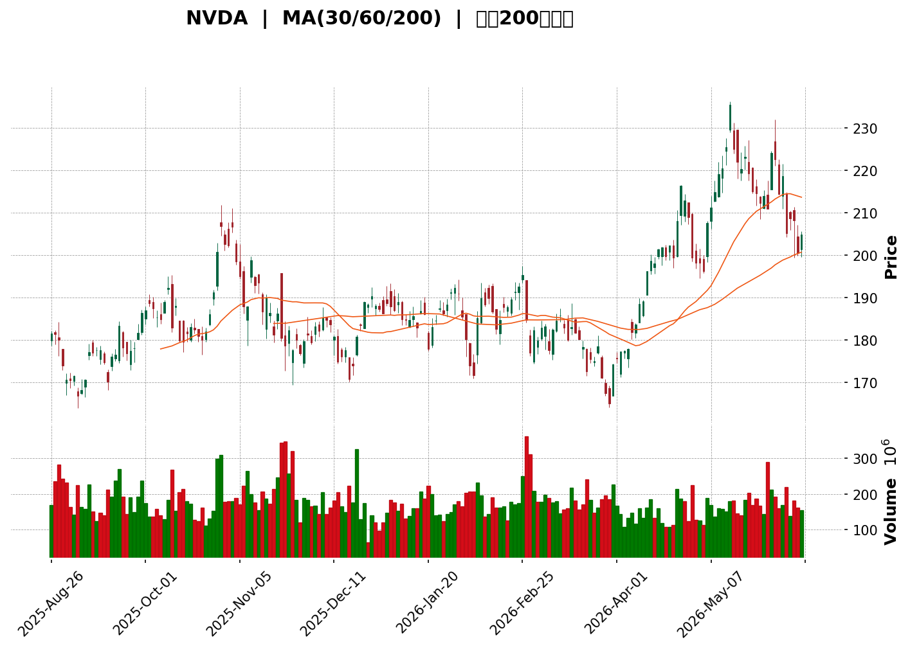
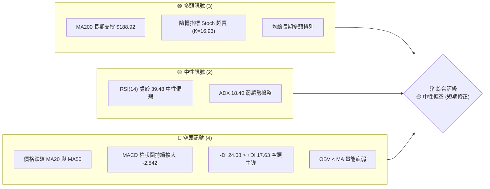
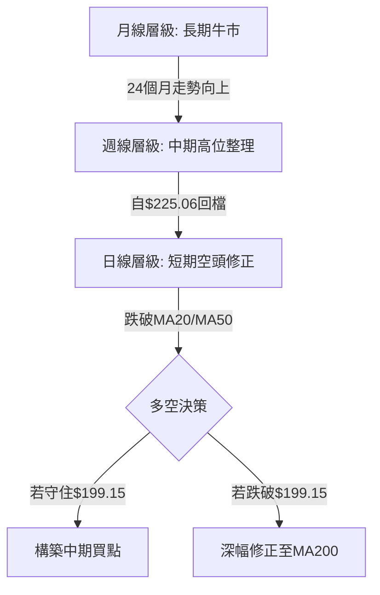
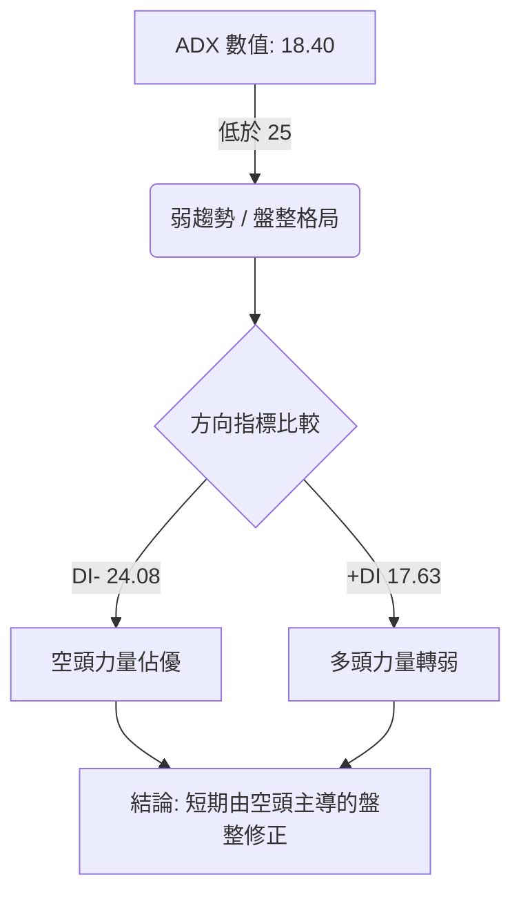
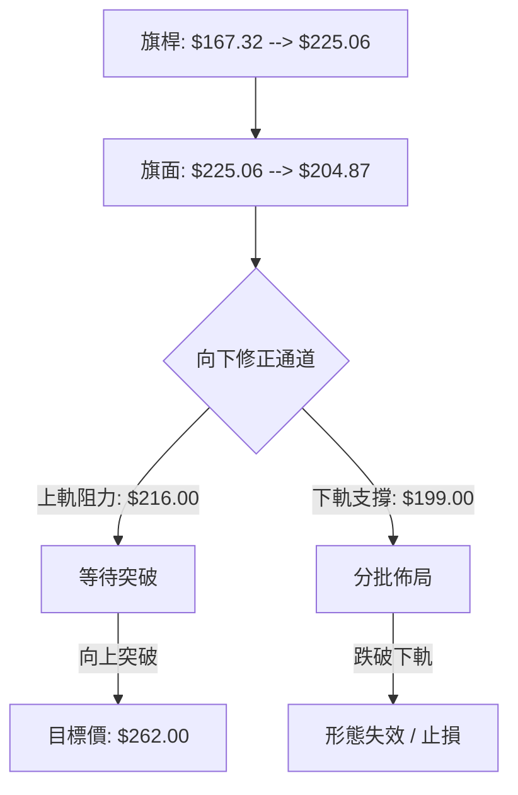

<details>
<summary>📊 靜態圖表 (點擊展開)</summary>

</details>

<html>
<head><meta charset="utf-8" /></head>
<body>
    <div style="height:500px; width:100%;">                        <script>window.PlotlyConfig = {MathJaxConfig: 'local'};</script>
        <script charset="utf-8" src="https://cdn.plot.ly/plotly-3.6.0.min.js" integrity="sha256-QaOVwtVY0T02VaHrr6pnoHLCwayMJp4O5n4YyaE3rJk=" crossorigin="anonymous"></script>                <div id="candlestick-chart" class="plotly-graph-div" style="height:100%; width:100%;"></div>            <script>                window.PLOTLYENV=window.PLOTLYENV || {};                                if (document.getElementById("candlestick-chart")) {                    Plotly.newPlot(                        "candlestick-chart",                        [{"close":{"dtype":"f8","bdata":"AAAAQOewZkAAAACAeKtmQAAAAGDFfWZAAAAAgFi+ZUAAAADgsFFlQAAAAOCTTGVAAAAAYNBtZUAAAAAAiNlkQAAAAKDBAmVAAAAAQA1RZUAAAAAgAyNmQAAAAOA3HmZAAAAA4P0yZkAAAABAwTBmQAAAAEAI1WVAAAAAoFZCZUAAAAAgfwBmQAAAAAA9DmZAAAAAQAnsZkAAAACgfEZmQAAAAIDTF2ZAAAAAQNYuZkAAAAAg0T5mQAAAAKDJs2ZAAAAAYPRKZ0AAAABgDGBnQAAAAODHlGdAAAAAQDFsZ0AAAACAtylnQAAAAOC8GWdAAAAAwM+bZ0AAAAAAZApoQAAAAICn3WZAAAAAYJCCZ0AAAAAgn3lmQAAAAOA6c2ZAAAAAQIKyZkAAAABAkt9mQAAAAAAJzWZAAAAAYLydZkAAAACgnIFmQAAAAOCxvWZAAAAAILpAZ0AAAADg3+dnQAAAAADEGGlAAAAAQNfYaUAAAADANVRpQAAAACBtR2lAAAAAILrTaUAAAAAg+81oQAAAAIDDXmhAAAAA4OR6Z0AAAABgIX1nQAAAAKB82WhAAAAAID8daEAAAABgszFoQAAAAEDnU2dAAAAAILC9Z0AAAAAgmEtnQAAAAKAgpGZAAAAAgAlJZ0AAAADgHY1mQAAAAGDeVGZAAAAAwCjKZkAAAADg\u002fTJmQAAAAOD4gGZAAAAAAMkYZkAAAAAgG3ZmQAAAAOBSp2ZAAAAAQI9rZkAAAAAAA+VmQAAAAGACxmZAAAAAAF4qZ0AAAABg1BdnQAAAAMDL8WZAAAAA4LSWZkAAAABA0dllQAAAAGBoAmZAAAAAwBwwZkAAAACgaldlQAAAAACxvWVAAAAA4J+YZkAAAABg6+5mQAAAACBYn2dAAAAA4CqMZ0AAAABgiMlnQAAAAOCzf2dAAAAAIPhpZ0AAAADgukhnQAAAAKDWk2dAAAAAwIF8Z0AAAACgYWBnQAAAAOAlnGdAAAAAIBEaZ0AAAABAUBRnQAAAAODeFmdAAAAAQK0yZ0AAAAAgV91mQAAAAABPWmdAAAAAoBlAZ0AAAABgTDtmQAAAACAY42ZAAAAAoKwTZ0AAAADAH25nQAAAAGDFR2dAAAAAgEqJZ0AAAACgLOlnQAAAAMDQCGhAAAAAoLXcZ0AAAADgSCxnQAAAAIDZg2ZAAAAAIEq\u002fZUAAAACgdXVlQAAAAGDkJWdAAAAAIN+5Z0AAAAAg7olnQAAAAAAxumdAAAAAAMtWZ0AAAABAy9JmQAAAAGDUF2dAAAAAIAh4Z0AAAACgeXVnQAAAAEDXsmdAAAAAICLqZ0AAAADArhNoQAAAAOBLamhAAAAAwEUVZ0AAAABALB9mQAAAACA\u002fyGZAAAAAwJR6ZkAAAAAAJdpmQAAAAKC742ZAAAAA4E4zZkAAAAAArs1mQAAAAABwEWdAAAAAoAc6Z0AAAABgqN1mQAAAAABJgWZAAAAAADfgZkAAAACA+7ZmQAAAAGAUhmZAAAAAoERLZkAAAABg949lQAAAAODv7WVAAAAAgN\u002ffZUAAAACAGk9mQAAAACBNYWVAAAAAQGbqZEAAAACASZ9kQAAAAKBNxmVAAAAAAHTxZUAAAAAg3yVmQAAAAMDcLWZAAAAAwJA8ZkAAAAAAx7tmQAAAAOBE9mZAAAAAICKNZ0AAAAAg3qJnQAAAAOD\u002fiGhAAAAAgG7UaEAAAACgz8NoQAAAACA\u002fLmlAAAAAgGQ6aUAAAADgtvRoQAAAAOB0SGlAAAAAAAvtaEAAAACg4QBqQAAAAGBzC2tAAAAAwH+dakAAAACANCBqQAAAAEDO6mhAAAAA4AHHaEAAAABA98doQAAAAACuiGhAAAAAYNHyaUAAAAAAH2hqQAAAACBi3mpAAAAAwOdla0AAAABAvJBrQAAAAMAlMmxAAAAAAOZubUAAAADA2CFsQAAAAGD1wWtAAAAAQE2La0AAAAAgt+ZrQAAAAIAkaGtAAAAA4IniakAAAAAghNNqQAAAAMBHi2pAAAAAwATAakAAAABgnVxqQAAAAIApA2xAAAAAgPDRa0AAAAAAANBqQAAAAMAeVWtAAAAAQDOjaUAAAADgehRqQAAAAIAUBmpAAAAAoHANaUAAAAAA15tpQA=="},"high":{"dtype":"f8","bdata":"LYiMfrfEZkCYVmmt6cdmQPKf9CQwB2dASyhjfTc9ZkA2xNiw0oRlQPIu3B7IhWVAFJokkjR0ZUBI3Ur5wxllQA5\u002fQKBxV2VA6W9TGhVYZUAvrKsEpmFmQBdiJ4ycgWZA0p5CfOtLZkAwv5kF6VNmQD5hhenDKGZAklw6AlefZUAIlLVG+xtmQALpOAlNO2ZA6EAK8RMKZ0AXzH8dAcZmQAxXNa2hcWZA2klszviAZkDJ8lQDUHFmQDj9h\u002fB\u002f+GZAWWcAN5BjZ0DpKOq7z3xnQLyWDBbQ2WdAIVyzyMLDZ0CcFVxdul9nQHe46c02mmdAa8gCw3irZ0CVIxWjo2FoQPtpTrvda2hACAVFUsW7Z0DGLoU5ERJnQHryjOhNFGdAZML3KH3hZkBsbRERsvtmQFO9OsnZHmdAtHjHPdTRZkD\u002fSu1mmuZmQMf44st\u002f2WZAPeJs32VnZ0B89JVtLPhnQMd7ueCEXGlA8hMHY259akCTJcaAt7xpQBef1xCQ9mlAL8lN1UNiakCy4urGuXZpQMphRE0rVWlAbwa89MiraEDodtNZkIJnQDYvlzbu9WhABnC9anllaEDghwPRfnRoQOAzOdVG5mdAzDr7m4jYZ0DUaufUS5hnQBRteToREmdATexQxNxzZ0DVPXC3AnhoQASUmJplCmdA4gZDNoXoZkCVJ7aT2z1mQFKu6xiq1WZA+kOWuvhhZkDB8NkoQIJmQNIpgWyNLWdAWzP\u002fh\u002fbGZkBZLqZ\u002fcglnQJ47w+vrDWdAjTMb7at4Z0A7a\u002fjjzC9nQFWgASkhKGdARSiX+yujZkD4oMcIHdNmQOcheh58RmZAKZvk8LhIZkCkAP5US\u002f1lQBF11NDu\u002fWVAlPXLiFOnZkCHA0Xv8P1mQIAEcO0to2dApFSPgcGVZ0CMJciRkQ5oQCAtbRz2kGdAeyCwJ1CYZ0CEYwDcfcpnQJqPqig9FmhAohf+w5wsaEBuvYHt8v1nQGRTMTJh5GdAZHC1HjaqZ0AMc9ianUNnQHw+nJ6LXGdAfy4x7C98Z0BlHIRzhwdnQNHXEU4Br2dA7chf\u002fKfGZ0CA447cDMVmQN3uaBHvJGdAYx4mui4+Z0DA8T8dz6tnQPJy7q13nGdANvnl2pe4Z0Bu4ZO3swNoQMuX7FHRJ2hAHg0QOBlIaEB5e3+SLsJnQKuY5\u002fFgQWdA8WCGNY9rZkCdUcvSWBNmQJWAycG1WGdAN5PKH5ItaECSF3VO2wdoQIJYLTfJIGhAYn5tEPkraECzFOHysGhnQIRhwh6BXWdAPz\u002f4JWvEZ0DvSwAWaoZnQLOEIQkkw2dAw4PY7NY2aEA7lrAxFjFoQPFwjbd0rGhAsfYlsbRBaECRCX4cw8tmQKhwZZiR52ZA4ohnZL+VZkCToicvMw9nQNKOl7C++mZA5O8O8zHRZkAA2L1n\u002fdVmQP2wp\u002fXPRmdAu6opttlsZ0A2L5zVMBdnQILyLY7yO2dA9qozxh+VZ0AZwWmo5CVnQOrzzjRU5WZAoC84tad4ZkBMEMDZrUFmQPjbGvcxRWZALfmypXkAZkCUIuYGSqBmQG78YZ6+CWZABcP\u002fuKtYZUBWtCxvFihlQDwY6sZVzWVAtvQgjTslZkDGLtdrESlmQEfSzBGoMmZA4TKkYrhAZkAKqq4sayFnQPvO+OCz+2ZAHYZcD+y4Z0B\u002fUIEJDq5nQAAAAOD\u002fiGhASBnLqFUFaUC2Fd5RwfNoQJJMKc\u002fiLmlASmpxk+g9aUA3pXeBclBpQAAAAOB0SGlAsgq4ivdyaUATNPGQilZqQN5\u002f44Z7EmtAxk6MX1zPakB0QZaoHY9qQB1IsQvEQWpANT78G3BYaUB2HVZB2C9pQI0v+3Q4AGlAsW\u002fJreEAakBhoEega75qQIVlgZR8MWtATZeNmVHBa0Bywhgtqu9rQOIa63RkcmxAMYH23neIbUASrZxQYOdsQEVRwqJut2xAXtjiV\u002f8GbEAtgAGCvDtsQPTcoSFUZGxArbElNRaYa0BQa87WoT1rQLYy33fSvGpAOUBmg5zoakBUrXaKZzNrQN0y64J2E2xA79kRiE4AbUDl0\u002fuJ8NFrQAAAAEAzs2tAAAAAANfbakAAAABACk9qQAAAAMDMbGpAAAAAQArnaUAAAADAHrVpQA=="},"hovertemplate":"\u003cb\u003e%{x|%Y-%m-%d}\u003c\u002fb\u003e\u003cbr\u003e\u958b: $%{open:.2f}\u003cbr\u003e\u9ad8: $%{high:.2f}\u003cbr\u003e\u4f4e: $%{low:.2f}\u003cbr\u003e\u6536: $%{close:.2f}\u003cextra\u003e\u003c\u002fextra\u003e","low":{"dtype":"f8","bdata":"aVrRIE9SZkCQa5G9k1tmQOHQqnicBWZAVAhC+W2dZUBLp3gq7N9kQOfGndX4FGVAlr784+glZUCTjcPEQXtkQLZ0u9UT5GRATfdnTZXQZECEiWhEkudlQEDeOZMqCGZAdXLvCzUHZkAje+PuNMllQJgPl3cNxWVA+lkyXkEGZUC0HMCZq5dlQGX6f2ye3mVAkIjnXZnPZUCMfT+qif9lQNeTNWKm5WVAbVjBVRqdZUAetXskodZlQJyUONfjgmZAW0o3WPanZkDBUOvZTfVmQFJ9KClBemdAnmqfn5okZ0DDobpPFuNmQKPe\u002fRmA+GZA3P50Ea1JZ0DrB9jBIdpnQB9KLPUtumZAyPlt4CM3Z0CdLo8xE29mQLvWLqENImZAB4u86U9xZkB7lRo2rHBmQMY3+77zr2ZAhYj+cEVyZkDi\u002frZ6HRFmQGPJRHvzcWZAkqdrDYXoZkBjk5suFIZnQJAd0CpM9WdAu88D9ZyQaUColooR6SRpQF2o+eEAOmlAwVRZZoqpaUB6t00OsbVoQNBY5LfdTGhAU8UJPZBEZ0DwErfL01VmQLDoyoJhMWhAXmy7aM3hZ0BT2lacXtxnQKrKvci082ZAtoxQ8zKLZkAbr40qugJnQOZUEBh6bWZAam2FgRvTZkCUcmF+3nNmQDliuva1lmVA4QjilioIZkANyQdNsCplQG6XFDRqQGZAcgGvN84IZkBeN5wdrq5lQFyPIbypeGZAbQI6IjhcZkD1dA2BtHdmQOyCKFgRlmZAI7kuj7DFZkAC4z8XGONmQLcoNP0uumZAat0uY\u002fQMZkAShe5dCM1lQAZb6BIj2mVATFYwZPvVZUBGlXzpR0NlQNhMKMeKc2VAwTIEaAEEZkA4P1d\u002fF8RmQPJhw3ir1WZAmLqnKJtLZ0DtVXTfq3hnQCB9k23fNWdAh6taFnlWZ0AIZIgZaUhnQAGVVCP7gGdAESqdKIs9Z0BMrfQw9VJnQFW9t7KlSmdAp\u002fWWJY\u002fvZkBggkSgR+5mQAWPKWmB2WZAvHLTjKblZkCwpHM6jZJmQAx4Yu9LQ2dAHWwzX047Z0DDvkCXmCxmQCkn9HjYRWZAVQXa9Jb2ZkAfp4ob9VJnQAG7RApuOGdALzGSJCkvZ0ApM\u002fPDerNnQN\u002fy5b2qOmdAB+PhcKenZ0AUqekI9BRnQMR4TmR9AGZAgzL8IGt2ZUCm8q3bSlplQMrJ\u002fsFkzGVAaoZlpjr3ZkDZpfiwgXxnQJCaHQZIkWdAWxOGqgxJZ0CJK6AszatmQBc8xWfGXmZANMHjDApRZ0Cvo4z64S1nQLeKJPjUNmdAzPOriCurZ0DYmRejfmVnQM4wAKq5MWhAx00zEA4DZ0AXf1LVSAVmQMCamByszWVAABCu\u002fIoWZkDFSA6d5npmQGlgzNw5NWZA42Xa2lgTZkCjZCCBE+tlQJx8\u002f4o5uWZA9L9vUYcHZ0ALNHDBOrFmQGC01HRgd2ZAjszBwlymZkDPO1ji\u002fa5mQNKu36rXg2ZAqryuKrvyZUBd\u002f5KYpHBlQPQHaETP0WVAKe+V4uC4ZUC+sayznBRmQJIPJdQaXmVAxwkqHRnaZEBxKytVhYJkQDAUIDOA2GRA4zFJiX3RZUC9BYOpdGVlQG6A563F8WVAkU3jl6auZUDXDIM54oJmQIIiH4AcjWZA0pkNC7wCZ0DWH63LwjBnQN7NKJ2I0WdAXi5JeWNwaEBkWzsZoHJoQIBwxns34WhAYpDEfoKzaED\u002fLVxElthoQDrRoUCW2GhA\u002fMISdLGfaEDum6buefJoQN5RIEZv5GlAjvNb5aT+aUCiowPN0+ppQIYVDWz\u002fzmhAo971Ln+caEDoYfHqbFBoQOd1ezuoeWhAQ7GGDR\u002fMaEDQL+euTshpQEhOfKeMlGpApZrbDYO0akDD3H0Cb9VqQNwzGYD8qWtAOMcx6g6hbEAOdaOsU\u002f9rQJ4KNIu0Q2tAeU61nwA1a0AbVs4yyYdrQEptXDGkNWtACavpLZnRakCz\u002fTNGGnhqQHfaIq4uEWpAnM935StfakBAS2aYS1xqQEZjNFZd7mpA7qDoRPSia0CBSvIpVMhqQAAAAEAKX2pAAAAAYI+KaUAAAAAAAMBpQAAAAEDh6mhAAAAAoHD9aEAAAACgR\u002fFoQA=="},"name":"\u50f9\u683c","open":{"dtype":"f8","bdata":"kW3+gUF6ZkD37Qs8nbdmQJ93xSqLkmZAEJrzTPA7ZkClh8afwzhlQJGSopSjWmVAl2FbAPtKZUBv8bTezvlkQCz63wd46mRAkipQ0q4bZUC+Ab0k9gxmQGVA+I5vbmZALNiUxWQxZkBLYjiUR+5lQNVwHCHJGGZASQQ0WnGNZUDUjBa1RLhlQDm7TaR58WVAgefjdXTiZUDgcZNvn7dmQFCE6OdPcWZA\u002fUpWXz\u002fIZUAAAnB1LT5mQOZMaLFnhmZAd0daVSO7ZkCgsnI+ISBnQByOYdd4q2dAF28VXl6eZ0BsWdZKcChnQAo1T\u002fXEP2dAZzlHoaJKZ0AGzk4shv9nQDsMzp9uKGhAJ7r+xmB3Z0D6hajJGxFnQJGghUMREmdA5CL\u002ffe6\u002fZkBbA2E5an5mQLkqAAOy3GZAtHjHPdTRZkBAOb\u002fGGJ1mQNx9ROgVhmZA\u002f8sbwWLzZkAX1CSH77dnQN4ZdiW7GWhApT4E8eH2aUAYLtUKcJxpQFloWg38xWlAJxFB+hP6aUBMLTKmuVdpQEoKoNqJ0GhAW7grGm+FaEAkRQ1KQxVnQAuluTyRW2hAPG9HQSpdaEAu0SD3D29oQD8fDAfQ2WdAwjVi6BDUZkB2Fu6ydTdnQKJE0Wuv5GZA5PySTb8RZ0DkIASdaXZoQHc4jN9KoGZAXz01Ll1oZkCoYfl9\u002fdVlQHkFPLTBrGZArgiR5gVZZkBcp3s4MtFlQOC1oz7psGZAoG+00y2bZkCsz0mQwqxmQGO38rpP9WZAPjUNSlzNZkDwk7u8rypnQGyL5F\u002fUF2dASMeanO6BZkCQfnS5dZxmQJ\u002fXuMgkN2ZAj\u002fHV8XIBZkD3daHhVfxlQHdfn\u002fsnymVAf1rqfI0OZkAixGs0RfZmQGG96EXo12ZA3bSx78B2Z0CLdWJWCbZnQN\u002fG7hZnb2dAOgCyo1eAZ0CJWBy92apnQARK0756s2dAjdkqTdjwZ0DdZbGkNslnQPmHkaPjimdA1K+9AiacZ0BZh+5NWBtnQM8ZN8rl32ZABxpM1ckYZ0CjQDP5DQNnQKJFF926SGdAnCPfbjCbZ0AsUOtmtbVmQDABZ9yeWmZAwYvrRcwQZ0A57k7SsGhnQCSWN\u002f3SXWdAMfclhmFgZ0C8Fa4eL+FnQBnGAs1r42dAm6udM0TfZ0CeZw1CGl9nQEnOi35rQGdA0DwXaLlnZkBzFZev8NZlQEegWiYxD2ZAWHFuDiMBZ0AF8Jsos+RnQOP8iszlBmhA1H0iem8ZaECiePtFDWhnQF8sKELqsGZACRjGUKSQZ0BivfTBoFpnQD26r673SmdAbbQ4v1blZ0BJTWEyN+hnQGZg09PRRmhAejc3JBFBaEDvB9E776BmQEWLYWt\u002f2WVAkaKN0bhIZkCX5D\u002fSC4dmQALXwadgnmZApoo5d95zZkDXL5e0qhNmQJ2ZqoawxWZAZyX1xDE2Z0D\u002f92JyvvpmQDWsnxaNFmdAnI1TYjnYZkAwEHmmBhtnQGk2B+qPyGZAsLrGPrA5ZkCqEoF0XjlmQPZWA223IWZA5idUBwzUZUBAAVVRmhxmQPnbhXCu+2VA4881uao5ZUA+6tkyrBJlQNnSufrR2GRAh7OtnXH5ZUCIbfJvWH9lQCWC4DOFHmZAMbQtOtDwZUAtqA6MIAlnQH1Qph0btGZAGC2n0g0DZ0DD6bGnBzpnQONJSVLF02dAM89DWPWJaEA3BSSmZ6ZoQOX1tVla9WhAT\u002f0k9uj3aEC7ehBroTxpQPaPYmYxGGlAOtJcmy1HaUDVWmlgRfdoQNzkK2D9LGpAeV8JWOAnakAwh2z5eY5qQH8FCnPwNWpAmyUPQ3YhaUBg1bllkehoQFwb8uss4mhAkRKQmAj1aEADjcViHgNqQCcfszEGmWpASBqpX065akDkq0RkdUlrQBqlOnVhFWxACRl0S6OybEA3K4nIwq9sQEgoJOBGs2xAxc\u002f5kKhra0CkAAMkct1rQGAtAr3\u002fwGtALYGyIZKUa0Czs5WaNglrQM5THAHdu2pAMEn90hZhakDDYOwRkcpqQGh998xS72pA1+Rj60tdbEBPaIbHx65rQAAAAMAevWpAAAAAwPXQakAAAACAwkVqQAAAAADXU2pAAAAAgMKNaUAAAADgoyxpQA=="},"x":["2025-08-26T00:00:00-04:00","2025-08-27T00:00:00-04:00","2025-08-28T00:00:00-04:00","2025-08-29T00:00:00-04:00","2025-09-02T00:00:00-04:00","2025-09-03T00:00:00-04:00","2025-09-04T00:00:00-04:00","2025-09-05T00:00:00-04:00","2025-09-08T00:00:00-04:00","2025-09-09T00:00:00-04:00","2025-09-10T00:00:00-04:00","2025-09-11T00:00:00-04:00","2025-09-12T00:00:00-04:00","2025-09-15T00:00:00-04:00","2025-09-16T00:00:00-04:00","2025-09-17T00:00:00-04:00","2025-09-18T00:00:00-04:00","2025-09-19T00:00:00-04:00","2025-09-22T00:00:00-04:00","2025-09-23T00:00:00-04:00","2025-09-24T00:00:00-04:00","2025-09-25T00:00:00-04:00","2025-09-26T00:00:00-04:00","2025-09-29T00:00:00-04:00","2025-09-30T00:00:00-04:00","2025-10-01T00:00:00-04:00","2025-10-02T00:00:00-04:00","2025-10-03T00:00:00-04:00","2025-10-06T00:00:00-04:00","2025-10-07T00:00:00-04:00","2025-10-08T00:00:00-04:00","2025-10-09T00:00:00-04:00","2025-10-10T00:00:00-04:00","2025-10-13T00:00:00-04:00","2025-10-14T00:00:00-04:00","2025-10-15T00:00:00-04:00","2025-10-16T00:00:00-04:00","2025-10-17T00:00:00-04:00","2025-10-20T00:00:00-04:00","2025-10-21T00:00:00-04:00","2025-10-22T00:00:00-04:00","2025-10-23T00:00:00-04:00","2025-10-24T00:00:00-04:00","2025-10-27T00:00:00-04:00","2025-10-28T00:00:00-04:00","2025-10-29T00:00:00-04:00","2025-10-30T00:00:00-04:00","2025-10-31T00:00:00-04:00","2025-11-03T00:00:00-05:00","2025-11-04T00:00:00-05:00","2025-11-05T00:00:00-05:00","2025-11-06T00:00:00-05:00","2025-11-07T00:00:00-05:00","2025-11-10T00:00:00-05:00","2025-11-11T00:00:00-05:00","2025-11-12T00:00:00-05:00","2025-11-13T00:00:00-05:00","2025-11-14T00:00:00-05:00","2025-11-17T00:00:00-05:00","2025-11-18T00:00:00-05:00","2025-11-19T00:00:00-05:00","2025-11-20T00:00:00-05:00","2025-11-21T00:00:00-05:00","2025-11-24T00:00:00-05:00","2025-11-25T00:00:00-05:00","2025-11-26T00:00:00-05:00","2025-11-28T00:00:00-05:00","2025-12-01T00:00:00-05:00","2025-12-02T00:00:00-05:00","2025-12-03T00:00:00-05:00","2025-12-04T00:00:00-05:00","2025-12-05T00:00:00-05:00","2025-12-08T00:00:00-05:00","2025-12-09T00:00:00-05:00","2025-12-10T00:00:00-05:00","2025-12-11T00:00:00-05:00","2025-12-12T00:00:00-05:00","2025-12-15T00:00:00-05:00","2025-12-16T00:00:00-05:00","2025-12-17T00:00:00-05:00","2025-12-18T00:00:00-05:00","2025-12-19T00:00:00-05:00","2025-12-22T00:00:00-05:00","2025-12-23T00:00:00-05:00","2025-12-24T00:00:00-05:00","2025-12-26T00:00:00-05:00","2025-12-29T00:00:00-05:00","2025-12-30T00:00:00-05:00","2025-12-31T00:00:00-05:00","2026-01-02T00:00:00-05:00","2026-01-05T00:00:00-05:00","2026-01-06T00:00:00-05:00","2026-01-07T00:00:00-05:00","2026-01-08T00:00:00-05:00","2026-01-09T00:00:00-05:00","2026-01-12T00:00:00-05:00","2026-01-13T00:00:00-05:00","2026-01-14T00:00:00-05:00","2026-01-15T00:00:00-05:00","2026-01-16T00:00:00-05:00","2026-01-20T00:00:00-05:00","2026-01-21T00:00:00-05:00","2026-01-22T00:00:00-05:00","2026-01-23T00:00:00-05:00","2026-01-26T00:00:00-05:00","2026-01-27T00:00:00-05:00","2026-01-28T00:00:00-05:00","2026-01-29T00:00:00-05:00","2026-01-30T00:00:00-05:00","2026-02-02T00:00:00-05:00","2026-02-03T00:00:00-05:00","2026-02-04T00:00:00-05:00","2026-02-05T00:00:00-05:00","2026-02-06T00:00:00-05:00","2026-02-09T00:00:00-05:00","2026-02-10T00:00:00-05:00","2026-02-11T00:00:00-05:00","2026-02-12T00:00:00-05:00","2026-02-13T00:00:00-05:00","2026-02-17T00:00:00-05:00","2026-02-18T00:00:00-05:00","2026-02-19T00:00:00-05:00","2026-02-20T00:00:00-05:00","2026-02-23T00:00:00-05:00","2026-02-24T00:00:00-05:00","2026-02-25T00:00:00-05:00","2026-02-26T00:00:00-05:00","2026-02-27T00:00:00-05:00","2026-03-02T00:00:00-05:00","2026-03-03T00:00:00-05:00","2026-03-04T00:00:00-05:00","2026-03-05T00:00:00-05:00","2026-03-06T00:00:00-05:00","2026-03-09T00:00:00-04:00","2026-03-10T00:00:00-04:00","2026-03-11T00:00:00-04:00","2026-03-12T00:00:00-04:00","2026-03-13T00:00:00-04:00","2026-03-16T00:00:00-04:00","2026-03-17T00:00:00-04:00","2026-03-18T00:00:00-04:00","2026-03-19T00:00:00-04:00","2026-03-20T00:00:00-04:00","2026-03-23T00:00:00-04:00","2026-03-24T00:00:00-04:00","2026-03-25T00:00:00-04:00","2026-03-26T00:00:00-04:00","2026-03-27T00:00:00-04:00","2026-03-30T00:00:00-04:00","2026-03-31T00:00:00-04:00","2026-04-01T00:00:00-04:00","2026-04-02T00:00:00-04:00","2026-04-06T00:00:00-04:00","2026-04-07T00:00:00-04:00","2026-04-08T00:00:00-04:00","2026-04-09T00:00:00-04:00","2026-04-10T00:00:00-04:00","2026-04-13T00:00:00-04:00","2026-04-14T00:00:00-04:00","2026-04-15T00:00:00-04:00","2026-04-16T00:00:00-04:00","2026-04-17T00:00:00-04:00","2026-04-20T00:00:00-04:00","2026-04-21T00:00:00-04:00","2026-04-22T00:00:00-04:00","2026-04-23T00:00:00-04:00","2026-04-24T00:00:00-04:00","2026-04-27T00:00:00-04:00","2026-04-28T00:00:00-04:00","2026-04-29T00:00:00-04:00","2026-04-30T00:00:00-04:00","2026-05-01T00:00:00-04:00","2026-05-04T00:00:00-04:00","2026-05-05T00:00:00-04:00","2026-05-06T00:00:00-04:00","2026-05-07T00:00:00-04:00","2026-05-08T00:00:00-04:00","2026-05-11T00:00:00-04:00","2026-05-12T00:00:00-04:00","2026-05-13T00:00:00-04:00","2026-05-14T00:00:00-04:00","2026-05-15T00:00:00-04:00","2026-05-18T00:00:00-04:00","2026-05-19T00:00:00-04:00","2026-05-20T00:00:00-04:00","2026-05-21T00:00:00-04:00","2026-05-22T00:00:00-04:00","2026-05-26T00:00:00-04:00","2026-05-27T00:00:00-04:00","2026-05-28T00:00:00-04:00","2026-05-29T00:00:00-04:00","2026-06-01T00:00:00-04:00","2026-06-02T00:00:00-04:00","2026-06-03T00:00:00-04:00","2026-06-04T00:00:00-04:00","2026-06-05T00:00:00-04:00","2026-06-08T00:00:00-04:00","2026-06-09T00:00:00-04:00","2026-06-10T00:00:00-04:00","2026-06-11T00:00:00-04:00"],"type":"candlestick"},{"hovertemplate":"MA30: $%{y:.2f}\u003cextra\u003e\u003c\u002fextra\u003e","line":{"color":"#2196F3","dash":"dash","width":2},"mode":"lines","name":"MA30","x":["2025-08-26T00:00:00-04:00","2025-08-27T00:00:00-04:00","2025-08-28T00:00:00-04:00","2025-08-29T00:00:00-04:00","2025-09-02T00:00:00-04:00","2025-09-03T00:00:00-04:00","2025-09-04T00:00:00-04:00","2025-09-05T00:00:00-04:00","2025-09-08T00:00:00-04:00","2025-09-09T00:00:00-04:00","2025-09-10T00:00:00-04:00","2025-09-11T00:00:00-04:00","2025-09-12T00:00:00-04:00","2025-09-15T00:00:00-04:00","2025-09-16T00:00:00-04:00","2025-09-17T00:00:00-04:00","2025-09-18T00:00:00-04:00","2025-09-19T00:00:00-04:00","2025-09-22T00:00:00-04:00","2025-09-23T00:00:00-04:00","2025-09-24T00:00:00-04:00","2025-09-25T00:00:00-04:00","2025-09-26T00:00:00-04:00","2025-09-29T00:00:00-04:00","2025-09-30T00:00:00-04:00","2025-10-01T00:00:00-04:00","2025-10-02T00:00:00-04:00","2025-10-03T00:00:00-04:00","2025-10-06T00:00:00-04:00","2025-10-07T00:00:00-04:00","2025-10-08T00:00:00-04:00","2025-10-09T00:00:00-04:00","2025-10-10T00:00:00-04:00","2025-10-13T00:00:00-04:00","2025-10-14T00:00:00-04:00","2025-10-15T00:00:00-04:00","2025-10-16T00:00:00-04:00","2025-10-17T00:00:00-04:00","2025-10-20T00:00:00-04:00","2025-10-21T00:00:00-04:00","2025-10-22T00:00:00-04:00","2025-10-23T00:00:00-04:00","2025-10-24T00:00:00-04:00","2025-10-27T00:00:00-04:00","2025-10-28T00:00:00-04:00","2025-10-29T00:00:00-04:00","2025-10-30T00:00:00-04:00","2025-10-31T00:00:00-04:00","2025-11-03T00:00:00-05:00","2025-11-04T00:00:00-05:00","2025-11-05T00:00:00-05:00","2025-11-06T00:00:00-05:00","2025-11-07T00:00:00-05:00","2025-11-10T00:00:00-05:00","2025-11-11T00:00:00-05:00","2025-11-12T00:00:00-05:00","2025-11-13T00:00:00-05:00","2025-11-14T00:00:00-05:00","2025-11-17T00:00:00-05:00","2025-11-18T00:00:00-05:00","2025-11-19T00:00:00-05:00","2025-11-20T00:00:00-05:00","2025-11-21T00:00:00-05:00","2025-11-24T00:00:00-05:00","2025-11-25T00:00:00-05:00","2025-11-26T00:00:00-05:00","2025-11-28T00:00:00-05:00","2025-12-01T00:00:00-05:00","2025-12-02T00:00:00-05:00","2025-12-03T00:00:00-05:00","2025-12-04T00:00:00-05:00","2025-12-05T00:00:00-05:00","2025-12-08T00:00:00-05:00","2025-12-09T00:00:00-05:00","2025-12-10T00:00:00-05:00","2025-12-11T00:00:00-05:00","2025-12-12T00:00:00-05:00","2025-12-15T00:00:00-05:00","2025-12-16T00:00:00-05:00","2025-12-17T00:00:00-05:00","2025-12-18T00:00:00-05:00","2025-12-19T00:00:00-05:00","2025-12-22T00:00:00-05:00","2025-12-23T00:00:00-05:00","2025-12-24T00:00:00-05:00","2025-12-26T00:00:00-05:00","2025-12-29T00:00:00-05:00","2025-12-30T00:00:00-05:00","2025-12-31T00:00:00-05:00","2026-01-02T00:00:00-05:00","2026-01-05T00:00:00-05:00","2026-01-06T00:00:00-05:00","2026-01-07T00:00:00-05:00","2026-01-08T00:00:00-05:00","2026-01-09T00:00:00-05:00","2026-01-12T00:00:00-05:00","2026-01-13T00:00:00-05:00","2026-01-14T00:00:00-05:00","2026-01-15T00:00:00-05:00","2026-01-16T00:00:00-05:00","2026-01-20T00:00:00-05:00","2026-01-21T00:00:00-05:00","2026-01-22T00:00:00-05:00","2026-01-23T00:00:00-05:00","2026-01-26T00:00:00-05:00","2026-01-27T00:00:00-05:00","2026-01-28T00:00:00-05:00","2026-01-29T00:00:00-05:00","2026-01-30T00:00:00-05:00","2026-02-02T00:00:00-05:00","2026-02-03T00:00:00-05:00","2026-02-04T00:00:00-05:00","2026-02-05T00:00:00-05:00","2026-02-06T00:00:00-05:00","2026-02-09T00:00:00-05:00","2026-02-10T00:00:00-05:00","2026-02-11T00:00:00-05:00","2026-02-12T00:00:00-05:00","2026-02-13T00:00:00-05:00","2026-02-17T00:00:00-05:00","2026-02-18T00:00:00-05:00","2026-02-19T00:00:00-05:00","2026-02-20T00:00:00-05:00","2026-02-23T00:00:00-05:00","2026-02-24T00:00:00-05:00","2026-02-25T00:00:00-05:00","2026-02-26T00:00:00-05:00","2026-02-27T00:00:00-05:00","2026-03-02T00:00:00-05:00","2026-03-03T00:00:00-05:00","2026-03-04T00:00:00-05:00","2026-03-05T00:00:00-05:00","2026-03-06T00:00:00-05:00","2026-03-09T00:00:00-04:00","2026-03-10T00:00:00-04:00","2026-03-11T00:00:00-04:00","2026-03-12T00:00:00-04:00","2026-03-13T00:00:00-04:00","2026-03-16T00:00:00-04:00","2026-03-17T00:00:00-04:00","2026-03-18T00:00:00-04:00","2026-03-19T00:00:00-04:00","2026-03-20T00:00:00-04:00","2026-03-23T00:00:00-04:00","2026-03-24T00:00:00-04:00","2026-03-25T00:00:00-04:00","2026-03-26T00:00:00-04:00","2026-03-27T00:00:00-04:00","2026-03-30T00:00:00-04:00","2026-03-31T00:00:00-04:00","2026-04-01T00:00:00-04:00","2026-04-02T00:00:00-04:00","2026-04-06T00:00:00-04:00","2026-04-07T00:00:00-04:00","2026-04-08T00:00:00-04:00","2026-04-09T00:00:00-04:00","2026-04-10T00:00:00-04:00","2026-04-13T00:00:00-04:00","2026-04-14T00:00:00-04:00","2026-04-15T00:00:00-04:00","2026-04-16T00:00:00-04:00","2026-04-17T00:00:00-04:00","2026-04-20T00:00:00-04:00","2026-04-21T00:00:00-04:00","2026-04-22T00:00:00-04:00","2026-04-23T00:00:00-04:00","2026-04-24T00:00:00-04:00","2026-04-27T00:00:00-04:00","2026-04-28T00:00:00-04:00","2026-04-29T00:00:00-04:00","2026-04-30T00:00:00-04:00","2026-05-01T00:00:00-04:00","2026-05-04T00:00:00-04:00","2026-05-05T00:00:00-04:00","2026-05-06T00:00:00-04:00","2026-05-07T00:00:00-04:00","2026-05-08T00:00:00-04:00","2026-05-11T00:00:00-04:00","2026-05-12T00:00:00-04:00","2026-05-13T00:00:00-04:00","2026-05-14T00:00:00-04:00","2026-05-15T00:00:00-04:00","2026-05-18T00:00:00-04:00","2026-05-19T00:00:00-04:00","2026-05-20T00:00:00-04:00","2026-05-21T00:00:00-04:00","2026-05-22T00:00:00-04:00","2026-05-26T00:00:00-04:00","2026-05-27T00:00:00-04:00","2026-05-28T00:00:00-04:00","2026-05-29T00:00:00-04:00","2026-06-01T00:00:00-04:00","2026-06-02T00:00:00-04:00","2026-06-03T00:00:00-04:00","2026-06-04T00:00:00-04:00","2026-06-05T00:00:00-04:00","2026-06-08T00:00:00-04:00","2026-06-09T00:00:00-04:00","2026-06-10T00:00:00-04:00","2026-06-11T00:00:00-04:00"],"y":{"dtype":"f8","bdata":"AAAAAAAA+H8AAAAAAAD4fwAAAAAAAPh\u002fAAAAAAAA+H8AAAAAAAD4fwAAAAAAAPh\u002fAAAAAAAA+H8AAAAAAAD4fwAAAAAAAPh\u002fAAAAAAAA+H8AAAAAAAD4fwAAAAAAAPh\u002fAAAAAAAA+H8AAAAAAAD4fwAAAAAAAPh\u002fAAAAAAAA+H8AAAAAAAD4fwAAAAAAAPh\u002fAAAAAAAA+H8AAAAAAAD4fwAAAAAAAPh\u002fAAAAAAAA+H8AAAAAAAD4fwAAAAAAAPh\u002fAAAAAAAA+H8AAAAAAAD4fwAAAAAAAPh\u002fAAAAAAAA+H8AAAAAAAD4fwAAAFB5O2ZAzczM3E1DZkARERFhAE9mQFVVVZUyUmZAMzMzg0VhZkCamZnJImtmQHd3dyf1dGZAIiIi4sd\u002fZkDe3d19DJFmQDMzMyNToGZAq6qqCmqrZkCrqqpKka5mQImIiCjis2ZAZmZm5t+8ZkDe3d0Ng8tmQFVVVaVe52ZAEREREYUOZ0BVVVUF6SpnQAAAAKBqRmdAmpmZyTRfZ0AiIiISynRnQImIiHg4iGdAZmZmBkqTZ0DNzMxM5p1nQBERERE5sGdA7+7ujju3Z0B3d3eXOL5nQImIiPgOvGdAZmZmZsa+Z0DNzMx8579nQBEREeH7u2dAmpmZiTm5Z0AAAAAAhKxnQDMzM8P0p2dAzczMLM+hZ0B3d3d3dJ9nQLy7u7vpn2dAVVVV9cmaZ0DNzMz8RZdnQO\u002fu7i4ElmdAMzMzA1iUZ0CamZk5qJdnQM3MzCzvl2dA7+7uXjCXZ0De3d0NQZBnQCIiInLjfWdAAAAAgBViZ0C8u7t7Z0RnQM3MzOyAKGdAVVVVJXMJZ0C8u7vL5etmQO\u002fu7j521WZAmpmZaevNZkARERHhLclmQCIiIjK1vmZAAAAAMN+5ZkCamZlJZrZmQKuqqgrct2ZAREREpBG1ZkAzMzMz+bRmQLy7u7v2vGZAERER8a2+ZkC8u7u7uMVmQERERISh0GZAVVVVZUvTZkBEREQkztpmQGZmZkbN32ZAAAAAwDLpZkDv7u6uo+xmQFVVVQWb8mZAMzMzs7D5ZkCrqqp6CPRmQLy7u6sA9WZAZmZmBj\u002f0ZkB3d3dnH\u002fdmQO\u002fu7g79+WZAzczMHBMCZ0CamZk5pxNnQImIiPjuJGdAVVVVVTgzZ0B3d3dX2UJnQKuqqkp0SWdAMzMzszVCZ0BVVVW1oDVnQBEREVGUMWdAMzMzUxozZ0BVVVWV+zBnQAAAALDuMmdAzczMDEsyZ0CamZmpXC5nQERERHQ6KmdARERERBQqZ0BEREREyCpnQJqZmemJK2dAmpmZaXkyZ0AAAACQ\u002fDpnQO\u002fu7v5MRmdAREREFFJFZ0ARERFR+z5nQLy7u+scOmdAzczMbIczZ0CamZnp0jhnQM3MzFzYOGdAVVVVxV0xZ0BVVVWlBCxnQAAAAAA1KmdAMzMzo5AnZ0BERETUpR5nQFVVVcWYEWdAZmZmJi4JZ0C8u7srRQVnQDMzMzNYBWdA7+7urgIKZ0AAAADg5ApnQLy7u9t+AGdAIiIiErLwZkDNzMyMM+ZmQERERPQr0mZA3t3d7X29ZkBmZmZWtapmQM3MzBx1n2ZAzczMLHCSZkC8u7tbQIdmQDMzMxNJemZA3t3dbfdrZkBVVVXFgGBmQDMzMyMaVGZAMzMz8xhYZkB3d3dHBWVmQDMzM6P6c2ZA3t3dbQqIZkCrqqrqXJhmQFVVVdXpq2ZAMzMz47\u002fFZkDNzMwMHthmQM3MzJwE62ZAmpmZuYT5ZkBmZmbmShRnQLy7uwsIO2dA7+7u3vBaZ0Dv7u5eDHhnQHd3d\u002fd4jGdAERER8amhZ0B3d3dnIb1nQBEREfFa02dAzczMvB72Z0CrqqpaFhloQDMzM2PsR2hAERERgT1\u002faEAAAAAQfbpoQImIiIhI8WhAvLu7uzIxaUBmZmaWQ2RpQCIiIgLek2lA7+7ujijBaUARERGhQe1pQLy7u3svE2pAAAAA4KEvakC8u7ub2kpqQDMzMyP\u002fW2pAMzMzA2JsakCJiIh4AnpqQKuqqmoskmpA7+7urkqoakBERER0IrhqQFVVVZWfyWpA3t3d\u002fbHPakC8u7s7WdBqQO\u002fu7t6ix2pAiYiICE26akBERESE47VqQA=="},"type":"scatter"},{"hovertemplate":"MA60: $%{y:.2f}\u003cextra\u003e\u003c\u002fextra\u003e","line":{"color":"#9C27B0","dash":"dash","width":2},"mode":"lines","name":"MA60","x":["2025-08-26T00:00:00-04:00","2025-08-27T00:00:00-04:00","2025-08-28T00:00:00-04:00","2025-08-29T00:00:00-04:00","2025-09-02T00:00:00-04:00","2025-09-03T00:00:00-04:00","2025-09-04T00:00:00-04:00","2025-09-05T00:00:00-04:00","2025-09-08T00:00:00-04:00","2025-09-09T00:00:00-04:00","2025-09-10T00:00:00-04:00","2025-09-11T00:00:00-04:00","2025-09-12T00:00:00-04:00","2025-09-15T00:00:00-04:00","2025-09-16T00:00:00-04:00","2025-09-17T00:00:00-04:00","2025-09-18T00:00:00-04:00","2025-09-19T00:00:00-04:00","2025-09-22T00:00:00-04:00","2025-09-23T00:00:00-04:00","2025-09-24T00:00:00-04:00","2025-09-25T00:00:00-04:00","2025-09-26T00:00:00-04:00","2025-09-29T00:00:00-04:00","2025-09-30T00:00:00-04:00","2025-10-01T00:00:00-04:00","2025-10-02T00:00:00-04:00","2025-10-03T00:00:00-04:00","2025-10-06T00:00:00-04:00","2025-10-07T00:00:00-04:00","2025-10-08T00:00:00-04:00","2025-10-09T00:00:00-04:00","2025-10-10T00:00:00-04:00","2025-10-13T00:00:00-04:00","2025-10-14T00:00:00-04:00","2025-10-15T00:00:00-04:00","2025-10-16T00:00:00-04:00","2025-10-17T00:00:00-04:00","2025-10-20T00:00:00-04:00","2025-10-21T00:00:00-04:00","2025-10-22T00:00:00-04:00","2025-10-23T00:00:00-04:00","2025-10-24T00:00:00-04:00","2025-10-27T00:00:00-04:00","2025-10-28T00:00:00-04:00","2025-10-29T00:00:00-04:00","2025-10-30T00:00:00-04:00","2025-10-31T00:00:00-04:00","2025-11-03T00:00:00-05:00","2025-11-04T00:00:00-05:00","2025-11-05T00:00:00-05:00","2025-11-06T00:00:00-05:00","2025-11-07T00:00:00-05:00","2025-11-10T00:00:00-05:00","2025-11-11T00:00:00-05:00","2025-11-12T00:00:00-05:00","2025-11-13T00:00:00-05:00","2025-11-14T00:00:00-05:00","2025-11-17T00:00:00-05:00","2025-11-18T00:00:00-05:00","2025-11-19T00:00:00-05:00","2025-11-20T00:00:00-05:00","2025-11-21T00:00:00-05:00","2025-11-24T00:00:00-05:00","2025-11-25T00:00:00-05:00","2025-11-26T00:00:00-05:00","2025-11-28T00:00:00-05:00","2025-12-01T00:00:00-05:00","2025-12-02T00:00:00-05:00","2025-12-03T00:00:00-05:00","2025-12-04T00:00:00-05:00","2025-12-05T00:00:00-05:00","2025-12-08T00:00:00-05:00","2025-12-09T00:00:00-05:00","2025-12-10T00:00:00-05:00","2025-12-11T00:00:00-05:00","2025-12-12T00:00:00-05:00","2025-12-15T00:00:00-05:00","2025-12-16T00:00:00-05:00","2025-12-17T00:00:00-05:00","2025-12-18T00:00:00-05:00","2025-12-19T00:00:00-05:00","2025-12-22T00:00:00-05:00","2025-12-23T00:00:00-05:00","2025-12-24T00:00:00-05:00","2025-12-26T00:00:00-05:00","2025-12-29T00:00:00-05:00","2025-12-30T00:00:00-05:00","2025-12-31T00:00:00-05:00","2026-01-02T00:00:00-05:00","2026-01-05T00:00:00-05:00","2026-01-06T00:00:00-05:00","2026-01-07T00:00:00-05:00","2026-01-08T00:00:00-05:00","2026-01-09T00:00:00-05:00","2026-01-12T00:00:00-05:00","2026-01-13T00:00:00-05:00","2026-01-14T00:00:00-05:00","2026-01-15T00:00:00-05:00","2026-01-16T00:00:00-05:00","2026-01-20T00:00:00-05:00","2026-01-21T00:00:00-05:00","2026-01-22T00:00:00-05:00","2026-01-23T00:00:00-05:00","2026-01-26T00:00:00-05:00","2026-01-27T00:00:00-05:00","2026-01-28T00:00:00-05:00","2026-01-29T00:00:00-05:00","2026-01-30T00:00:00-05:00","2026-02-02T00:00:00-05:00","2026-02-03T00:00:00-05:00","2026-02-04T00:00:00-05:00","2026-02-05T00:00:00-05:00","2026-02-06T00:00:00-05:00","2026-02-09T00:00:00-05:00","2026-02-10T00:00:00-05:00","2026-02-11T00:00:00-05:00","2026-02-12T00:00:00-05:00","2026-02-13T00:00:00-05:00","2026-02-17T00:00:00-05:00","2026-02-18T00:00:00-05:00","2026-02-19T00:00:00-05:00","2026-02-20T00:00:00-05:00","2026-02-23T00:00:00-05:00","2026-02-24T00:00:00-05:00","2026-02-25T00:00:00-05:00","2026-02-26T00:00:00-05:00","2026-02-27T00:00:00-05:00","2026-03-02T00:00:00-05:00","2026-03-03T00:00:00-05:00","2026-03-04T00:00:00-05:00","2026-03-05T00:00:00-05:00","2026-03-06T00:00:00-05:00","2026-03-09T00:00:00-04:00","2026-03-10T00:00:00-04:00","2026-03-11T00:00:00-04:00","2026-03-12T00:00:00-04:00","2026-03-13T00:00:00-04:00","2026-03-16T00:00:00-04:00","2026-03-17T00:00:00-04:00","2026-03-18T00:00:00-04:00","2026-03-19T00:00:00-04:00","2026-03-20T00:00:00-04:00","2026-03-23T00:00:00-04:00","2026-03-24T00:00:00-04:00","2026-03-25T00:00:00-04:00","2026-03-26T00:00:00-04:00","2026-03-27T00:00:00-04:00","2026-03-30T00:00:00-04:00","2026-03-31T00:00:00-04:00","2026-04-01T00:00:00-04:00","2026-04-02T00:00:00-04:00","2026-04-06T00:00:00-04:00","2026-04-07T00:00:00-04:00","2026-04-08T00:00:00-04:00","2026-04-09T00:00:00-04:00","2026-04-10T00:00:00-04:00","2026-04-13T00:00:00-04:00","2026-04-14T00:00:00-04:00","2026-04-15T00:00:00-04:00","2026-04-16T00:00:00-04:00","2026-04-17T00:00:00-04:00","2026-04-20T00:00:00-04:00","2026-04-21T00:00:00-04:00","2026-04-22T00:00:00-04:00","2026-04-23T00:00:00-04:00","2026-04-24T00:00:00-04:00","2026-04-27T00:00:00-04:00","2026-04-28T00:00:00-04:00","2026-04-29T00:00:00-04:00","2026-04-30T00:00:00-04:00","2026-05-01T00:00:00-04:00","2026-05-04T00:00:00-04:00","2026-05-05T00:00:00-04:00","2026-05-06T00:00:00-04:00","2026-05-07T00:00:00-04:00","2026-05-08T00:00:00-04:00","2026-05-11T00:00:00-04:00","2026-05-12T00:00:00-04:00","2026-05-13T00:00:00-04:00","2026-05-14T00:00:00-04:00","2026-05-15T00:00:00-04:00","2026-05-18T00:00:00-04:00","2026-05-19T00:00:00-04:00","2026-05-20T00:00:00-04:00","2026-05-21T00:00:00-04:00","2026-05-22T00:00:00-04:00","2026-05-26T00:00:00-04:00","2026-05-27T00:00:00-04:00","2026-05-28T00:00:00-04:00","2026-05-29T00:00:00-04:00","2026-06-01T00:00:00-04:00","2026-06-02T00:00:00-04:00","2026-06-03T00:00:00-04:00","2026-06-04T00:00:00-04:00","2026-06-05T00:00:00-04:00","2026-06-08T00:00:00-04:00","2026-06-09T00:00:00-04:00","2026-06-10T00:00:00-04:00","2026-06-11T00:00:00-04:00"],"y":{"dtype":"f8","bdata":"AAAAAAAA+H8AAAAAAAD4fwAAAAAAAPh\u002fAAAAAAAA+H8AAAAAAAD4fwAAAAAAAPh\u002fAAAAAAAA+H8AAAAAAAD4fwAAAAAAAPh\u002fAAAAAAAA+H8AAAAAAAD4fwAAAAAAAPh\u002fAAAAAAAA+H8AAAAAAAD4fwAAAAAAAPh\u002fAAAAAAAA+H8AAAAAAAD4fwAAAAAAAPh\u002fAAAAAAAA+H8AAAAAAAD4fwAAAAAAAPh\u002fAAAAAAAA+H8AAAAAAAD4fwAAAAAAAPh\u002fAAAAAAAA+H8AAAAAAAD4fwAAAAAAAPh\u002fAAAAAAAA+H8AAAAAAAD4fwAAAAAAAPh\u002fAAAAAAAA+H8AAAAAAAD4fwAAAAAAAPh\u002fAAAAAAAA+H8AAAAAAAD4fwAAAAAAAPh\u002fAAAAAAAA+H8AAAAAAAD4fwAAAAAAAPh\u002fAAAAAAAA+H8AAAAAAAD4fwAAAAAAAPh\u002fAAAAAAAA+H8AAAAAAAD4fwAAAAAAAPh\u002fAAAAAAAA+H8AAAAAAAD4fwAAAAAAAPh\u002fAAAAAAAA+H8AAAAAAAD4fwAAAAAAAPh\u002fAAAAAAAA+H8AAAAAAAD4fwAAAAAAAPh\u002fAAAAAAAA+H8AAAAAAAD4fwAAAAAAAPh\u002fAAAAAAAA+H8AAAAAAAD4f4mIiJi6+2ZAMzMzs0P+ZkCJiIgwwv1mQERERKwT\u002fWZAAAAAWIoBZ0CJiIigSwVnQJqZmXFvCmdAvLu760gNZ0BVVVU9KRRnQBEREakrG2dA7+7uBuEfZ0AiIiLCHCNnQKuqqqroJWdAq6qqIggqZ0De3d0N4i1nQLy7uwuhMmdAiYiISE04Z0CJiIhAqDdnQGZmZsZ1N2dAd3d391M0Z0Dv7u7uVzBnQLy7u1vXLmdAAAAAuJowZ0Dv7u4WijNnQJqZmSF3N2dAd3d3X404Z0CJiIhwTzpnQJqZmYH1OWdAVVVVBew5Z0AAAABYcDpnQGZmZk55PGdAVVVVvfM7Z0De3d1dHjlnQLy7uyNLPGdAERERSY06Z0De3d1NIT1nQBEREYHbP2dAq6qqWv5BZ0De3d3V9EFnQCIiIppPRGdAMzMzWwRHZ0AiIiJa2EVnQEREROx3RmdAq6qqsrdFZ0Crqqo6sENnQImIiEDwO2dAZmZmThQyZ0CrqqpaByxnQKuqqvK3JmdAVVVVvVUeZ0CamZmRXxdnQM3MzER1D2dAZmZmjhAIZ0AzMzNLZ\u002f9mQJqZmcEk+GZAmpmZwXz2ZkB3d3fvsPNmQFVVVV1l9WZAiYiIWK7zZkBmZmbuqvFmQAAAAJiY82ZAq6qqGmH0ZkAAAACAQPhmQO\u002fu7rYV\u002fmZAd3d3Z+ICZ0AiIiJa5QpnQKuqqiINE2dAIiIiakIXZ0AAAACAzxVnQImIiPhbFmdAAAAAEJwWZ0AiIiKybRZnQERERITsFmdA3t3dZc4SZ0BmZmYGkhFnQHd3dwcZEmdAAAAA4NEUZ0Dv7u6GJhlnQO\u002fu7t5DG2dA3t3dPTMeZ0CamZlBDyRnQO\u002fu7j5mJ2dAERERMRwmZ0CrqqrKQiBnQGZmZpYJGWdAq6qqMuYRZ0ARERGRlwtnQCIiIlKNAmdAVVVVfeT3ZkAAAAAAiexmQImIiMjX5GZAiYiIOELeZkAAAABQBNlmQGZmZn7p0mZAvLu7azjPZkCrqqqqvs1mQBEREZEzzWZAvLu7g7XOZkBERERMANJmQHd3d8cL12ZAVVVV7cjdZkAiIiLql+hmQBERERlh8mZARERE1I77ZkARERFZEQJnQGZmZs6cCmdAZmZmrooQZ0BVVVVdeBlnQImIiGhQJmdAq6qqgg8yZ0BVVVXFqD5nQFVVVZXoSGdAAAAAUNZVZ0C8u7sjA2RnQGZmZubsaWdAd3d3Z2hzZ0C8u7vzpH9nQLy7uysMjWdAd3d3t12eZ0AzMzMzmbJnQKuqqtJeyGdAREREdNHhZ0ARERH5wfVnQKuqqooTB2hAZmZm\u002fo8WaEAzMzMz4SZoQHd3d8+kM2hAmpmZad1DaECamZnx71doQDMzM+P8Z2hAiYiIODZ6aECamZmxL4loQAAAACALn2hAERERSQW3aECJiIhAIMhoQBERERlS2mhAvLu7W5vkaEARERERUvJoQFVVVXVVAWlAvLu7854KaUCamZnx9xZpQA=="},"type":"scatter"},{"hovertemplate":"MA200: $%{y:.2f}\u003cextra\u003e\u003c\u002fextra\u003e","line":{"color":"#FF6F00","dash":"solid","width":2},"mode":"lines","name":"MA200","x":["2025-08-26T00:00:00-04:00","2025-08-27T00:00:00-04:00","2025-08-28T00:00:00-04:00","2025-08-29T00:00:00-04:00","2025-09-02T00:00:00-04:00","2025-09-03T00:00:00-04:00","2025-09-04T00:00:00-04:00","2025-09-05T00:00:00-04:00","2025-09-08T00:00:00-04:00","2025-09-09T00:00:00-04:00","2025-09-10T00:00:00-04:00","2025-09-11T00:00:00-04:00","2025-09-12T00:00:00-04:00","2025-09-15T00:00:00-04:00","2025-09-16T00:00:00-04:00","2025-09-17T00:00:00-04:00","2025-09-18T00:00:00-04:00","2025-09-19T00:00:00-04:00","2025-09-22T00:00:00-04:00","2025-09-23T00:00:00-04:00","2025-09-24T00:00:00-04:00","2025-09-25T00:00:00-04:00","2025-09-26T00:00:00-04:00","2025-09-29T00:00:00-04:00","2025-09-30T00:00:00-04:00","2025-10-01T00:00:00-04:00","2025-10-02T00:00:00-04:00","2025-10-03T00:00:00-04:00","2025-10-06T00:00:00-04:00","2025-10-07T00:00:00-04:00","2025-10-08T00:00:00-04:00","2025-10-09T00:00:00-04:00","2025-10-10T00:00:00-04:00","2025-10-13T00:00:00-04:00","2025-10-14T00:00:00-04:00","2025-10-15T00:00:00-04:00","2025-10-16T00:00:00-04:00","2025-10-17T00:00:00-04:00","2025-10-20T00:00:00-04:00","2025-10-21T00:00:00-04:00","2025-10-22T00:00:00-04:00","2025-10-23T00:00:00-04:00","2025-10-24T00:00:00-04:00","2025-10-27T00:00:00-04:00","2025-10-28T00:00:00-04:00","2025-10-29T00:00:00-04:00","2025-10-30T00:00:00-04:00","2025-10-31T00:00:00-04:00","2025-11-03T00:00:00-05:00","2025-11-04T00:00:00-05:00","2025-11-05T00:00:00-05:00","2025-11-06T00:00:00-05:00","2025-11-07T00:00:00-05:00","2025-11-10T00:00:00-05:00","2025-11-11T00:00:00-05:00","2025-11-12T00:00:00-05:00","2025-11-13T00:00:00-05:00","2025-11-14T00:00:00-05:00","2025-11-17T00:00:00-05:00","2025-11-18T00:00:00-05:00","2025-11-19T00:00:00-05:00","2025-11-20T00:00:00-05:00","2025-11-21T00:00:00-05:00","2025-11-24T00:00:00-05:00","2025-11-25T00:00:00-05:00","2025-11-26T00:00:00-05:00","2025-11-28T00:00:00-05:00","2025-12-01T00:00:00-05:00","2025-12-02T00:00:00-05:00","2025-12-03T00:00:00-05:00","2025-12-04T00:00:00-05:00","2025-12-05T00:00:00-05:00","2025-12-08T00:00:00-05:00","2025-12-09T00:00:00-05:00","2025-12-10T00:00:00-05:00","2025-12-11T00:00:00-05:00","2025-12-12T00:00:00-05:00","2025-12-15T00:00:00-05:00","2025-12-16T00:00:00-05:00","2025-12-17T00:00:00-05:00","2025-12-18T00:00:00-05:00","2025-12-19T00:00:00-05:00","2025-12-22T00:00:00-05:00","2025-12-23T00:00:00-05:00","2025-12-24T00:00:00-05:00","2025-12-26T00:00:00-05:00","2025-12-29T00:00:00-05:00","2025-12-30T00:00:00-05:00","2025-12-31T00:00:00-05:00","2026-01-02T00:00:00-05:00","2026-01-05T00:00:00-05:00","2026-01-06T00:00:00-05:00","2026-01-07T00:00:00-05:00","2026-01-08T00:00:00-05:00","2026-01-09T00:00:00-05:00","2026-01-12T00:00:00-05:00","2026-01-13T00:00:00-05:00","2026-01-14T00:00:00-05:00","2026-01-15T00:00:00-05:00","2026-01-16T00:00:00-05:00","2026-01-20T00:00:00-05:00","2026-01-21T00:00:00-05:00","2026-01-22T00:00:00-05:00","2026-01-23T00:00:00-05:00","2026-01-26T00:00:00-05:00","2026-01-27T00:00:00-05:00","2026-01-28T00:00:00-05:00","2026-01-29T00:00:00-05:00","2026-01-30T00:00:00-05:00","2026-02-02T00:00:00-05:00","2026-02-03T00:00:00-05:00","2026-02-04T00:00:00-05:00","2026-02-05T00:00:00-05:00","2026-02-06T00:00:00-05:00","2026-02-09T00:00:00-05:00","2026-02-10T00:00:00-05:00","2026-02-11T00:00:00-05:00","2026-02-12T00:00:00-05:00","2026-02-13T00:00:00-05:00","2026-02-17T00:00:00-05:00","2026-02-18T00:00:00-05:00","2026-02-19T00:00:00-05:00","2026-02-20T00:00:00-05:00","2026-02-23T00:00:00-05:00","2026-02-24T00:00:00-05:00","2026-02-25T00:00:00-05:00","2026-02-26T00:00:00-05:00","2026-02-27T00:00:00-05:00","2026-03-02T00:00:00-05:00","2026-03-03T00:00:00-05:00","2026-03-04T00:00:00-05:00","2026-03-05T00:00:00-05:00","2026-03-06T00:00:00-05:00","2026-03-09T00:00:00-04:00","2026-03-10T00:00:00-04:00","2026-03-11T00:00:00-04:00","2026-03-12T00:00:00-04:00","2026-03-13T00:00:00-04:00","2026-03-16T00:00:00-04:00","2026-03-17T00:00:00-04:00","2026-03-18T00:00:00-04:00","2026-03-19T00:00:00-04:00","2026-03-20T00:00:00-04:00","2026-03-23T00:00:00-04:00","2026-03-24T00:00:00-04:00","2026-03-25T00:00:00-04:00","2026-03-26T00:00:00-04:00","2026-03-27T00:00:00-04:00","2026-03-30T00:00:00-04:00","2026-03-31T00:00:00-04:00","2026-04-01T00:00:00-04:00","2026-04-02T00:00:00-04:00","2026-04-06T00:00:00-04:00","2026-04-07T00:00:00-04:00","2026-04-08T00:00:00-04:00","2026-04-09T00:00:00-04:00","2026-04-10T00:00:00-04:00","2026-04-13T00:00:00-04:00","2026-04-14T00:00:00-04:00","2026-04-15T00:00:00-04:00","2026-04-16T00:00:00-04:00","2026-04-17T00:00:00-04:00","2026-04-20T00:00:00-04:00","2026-04-21T00:00:00-04:00","2026-04-22T00:00:00-04:00","2026-04-23T00:00:00-04:00","2026-04-24T00:00:00-04:00","2026-04-27T00:00:00-04:00","2026-04-28T00:00:00-04:00","2026-04-29T00:00:00-04:00","2026-04-30T00:00:00-04:00","2026-05-01T00:00:00-04:00","2026-05-04T00:00:00-04:00","2026-05-05T00:00:00-04:00","2026-05-06T00:00:00-04:00","2026-05-07T00:00:00-04:00","2026-05-08T00:00:00-04:00","2026-05-11T00:00:00-04:00","2026-05-12T00:00:00-04:00","2026-05-13T00:00:00-04:00","2026-05-14T00:00:00-04:00","2026-05-15T00:00:00-04:00","2026-05-18T00:00:00-04:00","2026-05-19T00:00:00-04:00","2026-05-20T00:00:00-04:00","2026-05-21T00:00:00-04:00","2026-05-22T00:00:00-04:00","2026-05-26T00:00:00-04:00","2026-05-27T00:00:00-04:00","2026-05-28T00:00:00-04:00","2026-05-29T00:00:00-04:00","2026-06-01T00:00:00-04:00","2026-06-02T00:00:00-04:00","2026-06-03T00:00:00-04:00","2026-06-04T00:00:00-04:00","2026-06-05T00:00:00-04:00","2026-06-08T00:00:00-04:00","2026-06-09T00:00:00-04:00","2026-06-10T00:00:00-04:00","2026-06-11T00:00:00-04:00"],"y":{"dtype":"f8","bdata":"AAAAAAAA+H8AAAAAAAD4fwAAAAAAAPh\u002fAAAAAAAA+H8AAAAAAAD4fwAAAAAAAPh\u002fAAAAAAAA+H8AAAAAAAD4fwAAAAAAAPh\u002fAAAAAAAA+H8AAAAAAAD4fwAAAAAAAPh\u002fAAAAAAAA+H8AAAAAAAD4fwAAAAAAAPh\u002fAAAAAAAA+H8AAAAAAAD4fwAAAAAAAPh\u002fAAAAAAAA+H8AAAAAAAD4fwAAAAAAAPh\u002fAAAAAAAA+H8AAAAAAAD4fwAAAAAAAPh\u002fAAAAAAAA+H8AAAAAAAD4fwAAAAAAAPh\u002fAAAAAAAA+H8AAAAAAAD4fwAAAAAAAPh\u002fAAAAAAAA+H8AAAAAAAD4fwAAAAAAAPh\u002fAAAAAAAA+H8AAAAAAAD4fwAAAAAAAPh\u002fAAAAAAAA+H8AAAAAAAD4fwAAAAAAAPh\u002fAAAAAAAA+H8AAAAAAAD4fwAAAAAAAPh\u002fAAAAAAAA+H8AAAAAAAD4fwAAAAAAAPh\u002fAAAAAAAA+H8AAAAAAAD4fwAAAAAAAPh\u002fAAAAAAAA+H8AAAAAAAD4fwAAAAAAAPh\u002fAAAAAAAA+H8AAAAAAAD4fwAAAAAAAPh\u002fAAAAAAAA+H8AAAAAAAD4fwAAAAAAAPh\u002fAAAAAAAA+H8AAAAAAAD4fwAAAAAAAPh\u002fAAAAAAAA+H8AAAAAAAD4fwAAAAAAAPh\u002fAAAAAAAA+H8AAAAAAAD4fwAAAAAAAPh\u002fAAAAAAAA+H8AAAAAAAD4fwAAAAAAAPh\u002fAAAAAAAA+H8AAAAAAAD4fwAAAAAAAPh\u002fAAAAAAAA+H8AAAAAAAD4fwAAAAAAAPh\u002fAAAAAAAA+H8AAAAAAAD4fwAAAAAAAPh\u002fAAAAAAAA+H8AAAAAAAD4fwAAAAAAAPh\u002fAAAAAAAA+H8AAAAAAAD4fwAAAAAAAPh\u002fAAAAAAAA+H8AAAAAAAD4fwAAAAAAAPh\u002fAAAAAAAA+H8AAAAAAAD4fwAAAAAAAPh\u002fAAAAAAAA+H8AAAAAAAD4fwAAAAAAAPh\u002fAAAAAAAA+H8AAAAAAAD4fwAAAAAAAPh\u002fAAAAAAAA+H8AAAAAAAD4fwAAAAAAAPh\u002fAAAAAAAA+H8AAAAAAAD4fwAAAAAAAPh\u002fAAAAAAAA+H8AAAAAAAD4fwAAAAAAAPh\u002fAAAAAAAA+H8AAAAAAAD4fwAAAAAAAPh\u002fAAAAAAAA+H8AAAAAAAD4fwAAAAAAAPh\u002fAAAAAAAA+H8AAAAAAAD4fwAAAAAAAPh\u002fAAAAAAAA+H8AAAAAAAD4fwAAAAAAAPh\u002fAAAAAAAA+H8AAAAAAAD4fwAAAAAAAPh\u002fAAAAAAAA+H8AAAAAAAD4fwAAAAAAAPh\u002fAAAAAAAA+H8AAAAAAAD4fwAAAAAAAPh\u002fAAAAAAAA+H8AAAAAAAD4fwAAAAAAAPh\u002fAAAAAAAA+H8AAAAAAAD4fwAAAAAAAPh\u002fAAAAAAAA+H8AAAAAAAD4fwAAAAAAAPh\u002fAAAAAAAA+H8AAAAAAAD4fwAAAAAAAPh\u002fAAAAAAAA+H8AAAAAAAD4fwAAAAAAAPh\u002fAAAAAAAA+H8AAAAAAAD4fwAAAAAAAPh\u002fAAAAAAAA+H8AAAAAAAD4fwAAAAAAAPh\u002fAAAAAAAA+H8AAAAAAAD4fwAAAAAAAPh\u002fAAAAAAAA+H8AAAAAAAD4fwAAAAAAAPh\u002fAAAAAAAA+H8AAAAAAAD4fwAAAAAAAPh\u002fAAAAAAAA+H8AAAAAAAD4fwAAAAAAAPh\u002fAAAAAAAA+H8AAAAAAAD4fwAAAAAAAPh\u002fAAAAAAAA+H8AAAAAAAD4fwAAAAAAAPh\u002fAAAAAAAA+H8AAAAAAAD4fwAAAAAAAPh\u002fAAAAAAAA+H8AAAAAAAD4fwAAAAAAAPh\u002fAAAAAAAA+H8AAAAAAAD4fwAAAAAAAPh\u002fAAAAAAAA+H8AAAAAAAD4fwAAAAAAAPh\u002fAAAAAAAA+H8AAAAAAAD4fwAAAAAAAPh\u002fAAAAAAAA+H8AAAAAAAD4fwAAAAAAAPh\u002fAAAAAAAA+H8AAAAAAAD4fwAAAAAAAPh\u002fAAAAAAAA+H8AAAAAAAD4fwAAAAAAAPh\u002fAAAAAAAA+H8AAAAAAAD4fwAAAAAAAPh\u002fAAAAAAAA+H8AAAAAAAD4fwAAAAAAAPh\u002fAAAAAAAA+H8AAAAAAAD4fwAAAAAAAPh\u002fAAAAAAAA+H9SuB65aJ1nQA=="},"type":"scatter"}],                        {"template":{"data":{"barpolar":[{"marker":{"line":{"color":"rgb(17,17,17)","width":0.5},"pattern":{"fillmode":"overlay","size":10,"solidity":0.2}},"type":"barpolar"}],"bar":[{"error_x":{"color":"#f2f5fa"},"error_y":{"color":"#f2f5fa"},"marker":{"line":{"color":"rgb(17,17,17)","width":0.5},"pattern":{"fillmode":"overlay","size":10,"solidity":0.2}},"type":"bar"}],"carpet":[{"aaxis":{"endlinecolor":"#A2B1C6","gridcolor":"#506784","linecolor":"#506784","minorgridcolor":"#506784","startlinecolor":"#A2B1C6"},"baxis":{"endlinecolor":"#A2B1C6","gridcolor":"#506784","linecolor":"#506784","minorgridcolor":"#506784","startlinecolor":"#A2B1C6"},"type":"carpet"}],"choropleth":[{"colorbar":{"outlinewidth":0,"ticks":""},"type":"choropleth"}],"contourcarpet":[{"colorbar":{"outlinewidth":0,"ticks":""},"type":"contourcarpet"}],"contour":[{"colorbar":{"outlinewidth":0,"ticks":""},"colorscale":[[0.0,"#0d0887"],[0.1111111111111111,"#46039f"],[0.2222222222222222,"#7201a8"],[0.3333333333333333,"#9c179e"],[0.4444444444444444,"#bd3786"],[0.5555555555555556,"#d8576b"],[0.6666666666666666,"#ed7953"],[0.7777777777777778,"#fb9f3a"],[0.8888888888888888,"#fdca26"],[1.0,"#f0f921"]],"type":"contour"}],"heatmap":[{"colorbar":{"outlinewidth":0,"ticks":""},"colorscale":[[0.0,"#0d0887"],[0.1111111111111111,"#46039f"],[0.2222222222222222,"#7201a8"],[0.3333333333333333,"#9c179e"],[0.4444444444444444,"#bd3786"],[0.5555555555555556,"#d8576b"],[0.6666666666666666,"#ed7953"],[0.7777777777777778,"#fb9f3a"],[0.8888888888888888,"#fdca26"],[1.0,"#f0f921"]],"type":"heatmap"}],"histogram2dcontour":[{"colorbar":{"outlinewidth":0,"ticks":""},"colorscale":[[0.0,"#0d0887"],[0.1111111111111111,"#46039f"],[0.2222222222222222,"#7201a8"],[0.3333333333333333,"#9c179e"],[0.4444444444444444,"#bd3786"],[0.5555555555555556,"#d8576b"],[0.6666666666666666,"#ed7953"],[0.7777777777777778,"#fb9f3a"],[0.8888888888888888,"#fdca26"],[1.0,"#f0f921"]],"type":"histogram2dcontour"}],"histogram2d":[{"colorbar":{"outlinewidth":0,"ticks":""},"colorscale":[[0.0,"#0d0887"],[0.1111111111111111,"#46039f"],[0.2222222222222222,"#7201a8"],[0.3333333333333333,"#9c179e"],[0.4444444444444444,"#bd3786"],[0.5555555555555556,"#d8576b"],[0.6666666666666666,"#ed7953"],[0.7777777777777778,"#fb9f3a"],[0.8888888888888888,"#fdca26"],[1.0,"#f0f921"]],"type":"histogram2d"}],"histogram":[{"marker":{"pattern":{"fillmode":"overlay","size":10,"solidity":0.2}},"type":"histogram"}],"mesh3d":[{"colorbar":{"outlinewidth":0,"ticks":""},"type":"mesh3d"}],"parcoords":[{"line":{"colorbar":{"outlinewidth":0,"ticks":""}},"type":"parcoords"}],"pie":[{"automargin":true,"type":"pie"}],"scatter3d":[{"line":{"colorbar":{"outlinewidth":0,"ticks":""}},"marker":{"colorbar":{"outlinewidth":0,"ticks":""}},"type":"scatter3d"}],"scattercarpet":[{"marker":{"colorbar":{"outlinewidth":0,"ticks":""}},"type":"scattercarpet"}],"scattergeo":[{"marker":{"colorbar":{"outlinewidth":0,"ticks":""}},"type":"scattergeo"}],"scattergl":[{"marker":{"line":{"color":"#283442"}},"type":"scattergl"}],"scattermapbox":[{"marker":{"colorbar":{"outlinewidth":0,"ticks":""}},"type":"scattermapbox"}],"scattermap":[{"marker":{"colorbar":{"outlinewidth":0,"ticks":""}},"type":"scattermap"}],"scatterpolargl":[{"marker":{"colorbar":{"outlinewidth":0,"ticks":""}},"type":"scatterpolargl"}],"scatterpolar":[{"marker":{"colorbar":{"outlinewidth":0,"ticks":""}},"type":"scatterpolar"}],"scatter":[{"marker":{"line":{"color":"#283442"}},"type":"scatter"}],"scatterternary":[{"marker":{"colorbar":{"outlinewidth":0,"ticks":""}},"type":"scatterternary"}],"surface":[{"colorbar":{"outlinewidth":0,"ticks":""},"colorscale":[[0.0,"#0d0887"],[0.1111111111111111,"#46039f"],[0.2222222222222222,"#7201a8"],[0.3333333333333333,"#9c179e"],[0.4444444444444444,"#bd3786"],[0.5555555555555556,"#d8576b"],[0.6666666666666666,"#ed7953"],[0.7777777777777778,"#fb9f3a"],[0.8888888888888888,"#fdca26"],[1.0,"#f0f921"]],"type":"surface"}],"table":[{"cells":{"fill":{"color":"#506784"},"line":{"color":"rgb(17,17,17)"}},"header":{"fill":{"color":"#2a3f5f"},"line":{"color":"rgb(17,17,17)"}},"type":"table"}]},"layout":{"annotationdefaults":{"arrowcolor":"#f2f5fa","arrowhead":0,"arrowwidth":1},"autotypenumbers":"strict","coloraxis":{"colorbar":{"outlinewidth":0,"ticks":""}},"colorscale":{"diverging":[[0,"#8e0152"],[0.1,"#c51b7d"],[0.2,"#de77ae"],[0.3,"#f1b6da"],[0.4,"#fde0ef"],[0.5,"#f7f7f7"],[0.6,"#e6f5d0"],[0.7,"#b8e186"],[0.8,"#7fbc41"],[0.9,"#4d9221"],[1,"#276419"]],"sequential":[[0.0,"#0d0887"],[0.1111111111111111,"#46039f"],[0.2222222222222222,"#7201a8"],[0.3333333333333333,"#9c179e"],[0.4444444444444444,"#bd3786"],[0.5555555555555556,"#d8576b"],[0.6666666666666666,"#ed7953"],[0.7777777777777778,"#fb9f3a"],[0.8888888888888888,"#fdca26"],[1.0,"#f0f921"]],"sequentialminus":[[0.0,"#0d0887"],[0.1111111111111111,"#46039f"],[0.2222222222222222,"#7201a8"],[0.3333333333333333,"#9c179e"],[0.4444444444444444,"#bd3786"],[0.5555555555555556,"#d8576b"],[0.6666666666666666,"#ed7953"],[0.7777777777777778,"#fb9f3a"],[0.8888888888888888,"#fdca26"],[1.0,"#f0f921"]]},"colorway":["#636efa","#EF553B","#00cc96","#ab63fa","#FFA15A","#19d3f3","#FF6692","#B6E880","#FF97FF","#FECB52"],"font":{"color":"#f2f5fa"},"geo":{"bgcolor":"rgb(17,17,17)","lakecolor":"rgb(17,17,17)","landcolor":"rgb(17,17,17)","showlakes":true,"showland":true,"subunitcolor":"#506784"},"hoverlabel":{"align":"left"},"hovermode":"closest","mapbox":{"style":"dark"},"paper_bgcolor":"rgb(17,17,17)","plot_bgcolor":"rgb(17,17,17)","polar":{"angularaxis":{"gridcolor":"#506784","linecolor":"#506784","ticks":""},"bgcolor":"rgb(17,17,17)","radialaxis":{"gridcolor":"#506784","linecolor":"#506784","ticks":""}},"scene":{"xaxis":{"backgroundcolor":"rgb(17,17,17)","gridcolor":"#506784","gridwidth":2,"linecolor":"#506784","showbackground":true,"ticks":"","zerolinecolor":"#C8D4E3"},"yaxis":{"backgroundcolor":"rgb(17,17,17)","gridcolor":"#506784","gridwidth":2,"linecolor":"#506784","showbackground":true,"ticks":"","zerolinecolor":"#C8D4E3"},"zaxis":{"backgroundcolor":"rgb(17,17,17)","gridcolor":"#506784","gridwidth":2,"linecolor":"#506784","showbackground":true,"ticks":"","zerolinecolor":"#C8D4E3"}},"shapedefaults":{"line":{"color":"#f2f5fa"}},"sliderdefaults":{"bgcolor":"#C8D4E3","bordercolor":"rgb(17,17,17)","borderwidth":1,"tickwidth":0},"ternary":{"aaxis":{"gridcolor":"#506784","linecolor":"#506784","ticks":""},"baxis":{"gridcolor":"#506784","linecolor":"#506784","ticks":""},"bgcolor":"rgb(17,17,17)","caxis":{"gridcolor":"#506784","linecolor":"#506784","ticks":""}},"title":{"x":0.05},"updatemenudefaults":{"bgcolor":"#506784","borderwidth":0},"xaxis":{"automargin":true,"gridcolor":"#283442","linecolor":"#506784","ticks":"","title":{"standoff":15},"zerolinecolor":"#283442","zerolinewidth":2},"yaxis":{"automargin":true,"gridcolor":"#283442","linecolor":"#506784","ticks":"","title":{"standoff":15},"zerolinecolor":"#283442","zerolinewidth":2}}},"xaxis":{"rangeslider":{"visible":false},"title":{"text":"\u65e5\u671f"}},"font":{"size":11},"title":{"text":"NVDA  |  MA(30\u002f60\u002f200)  |  \u6700\u8fd1200\u4ea4\u6613\u65e5"},"yaxis":{"title":{"text":"\u80a1\u50f9 (USD)"}},"hovermode":"x unified","height":500},                        {"responsive": true}                    )                };            </script>        </div>
</body>
</html>

# NVDA 技術分析報告

> **報告日期**：2026-06-12 ｜ **語言**：繁體中文 ｜ **數據來源**：Yahoo Finance ｜ **當前價格**：$204.87

---

## 目錄

| 章節 | 內容 |
|------|------|
| [1. 技術面概覽](#1-技術面概覽) | 訊號儀表板、核心指標、評分卡 |
| [2. 趨勢分析](#2-趨勢分析) | 多時框趨勢、長中短期走勢 |
| [3. 圖表形態分析](#3-圖表形態分析) | 形態識別、K線組合、目標價 |
| [4. 支撐與阻力](#4-支撐與阻力) | 關鍵價位、斐波那契回調 |
| [5. 技術指標深度解讀](#5-技術指標深度解讀) | MA/RSI/MACD/布林/成交量 |
| [6. 動能與波動率](#6-動能與波動率) | 動能評估、ATR、Beta |
| [7. 多時框架總結](#7-多時框架總結) | 時框架評分矩陣 |
| [8. 交易策略建議](#8-交易策略建議) | 多空策略、風險報酬比 |
| [9. 風險提示與監控](#9-風險提示與監控) | 監控指標、風險場景 |
| [10. 報告總結](#10-報告總結) | 核心結論與最優策略組合 |

---

## 1. 技術面概覽

### 🎯 技術訊號儀表板

目前 NVDA 的技術訊號呈現「**短期修正、長期多頭未變**」的拉鋸狀態。以下為多空與中性訊號的分佈圖：



### 📊 核心指標速覽表

| 指標類別 | 指標名稱 | 當前數值 | 訊號 | 解讀 |
|----------|----------|----------|------|------|
| **價格** | 當前收盤價 | $204.87 | 🟡 中性 | 位於 52 週高低區間的 67.2% 位置，短期面臨修正 |
| **均線** | MA20 | $215.97 | 🔴 空頭 | 價格在 MA20 下方，且 MA20 扣值走平下彎，短期阻力大 |
| **均線** | MA50 | $206.11 | 🔴 空頭 | 價格微幅跌破 MA50，中期多空分水嶺面臨考驗 |
| **均線** | MA200 | $188.92 | 🟢 多頭 | 價格遠高於 MA200，長期牛市格局未破壞 |
| **動能** | RSI(14) | 39.48 | 🟡 中性 | 進入 30-40 弱勢區間，尚未進入極端超賣 |
| **動能** | MACD | -0.659 | 🔴 空頭 | MACD 處於信號線下方，柱狀圖 -2.542 顯示空頭動能增加 |
| **動能** | Stoch %K / %D | 16.93 / 15.77 | 🟢 多頭 | 隨機指標進入嚴重超賣區，存在反彈契機 |
| **波動** | ATR(14) | $8.51 (4.16%) | 🟡 中性 | 波動率適中，每日波幅約 8.5 美元，適合波段操作 |
| **量能** | 20日均量比 | 0.86x | 🔴 空頭 | 成交量萎縮，買盤追價意願不足，OBV 跌破均線 |

### 🏆 技術評分卡

╔══════════════════════════════════════════════════════════════╗
║                 技術評分卡 — NVDA (2026-06-12)               ║
╠══════════════════════════════════════════════════════════════╣
║ 趨勢強度    ████████░░░░░░░░░░░░  40/100  🟡 中性偏弱        ║
║ 動能指標    ██████░░░░░░░░░░░░░░  30/100  🔴 空頭主導        ║
║ 支撐穩定度  ████████████░░░░░░░░  60/100  🟡 關鍵支撐臨近    ║
║ 成交量配合  ████████░░░░░░░░░░░░  40/100  🔴 量縮回檔        ║
║ 形態完整度  ████████████░░░░░░░░  60/100  🟡 旗形整理中      ║
║ 均線排列    ████████████████░░░░  80/100  🟢 長期多頭排列    ║
╠══════════════════════════════════════════════════════════════╣
║ 綜合評分    ██████████░░░░░░░░░░  51/100  🟡 中性 (HOLD)     ║
╚══════════════════════════════════════════════════════════════╝

---

## 2. 趨勢分析

### 🌐 多時框趨勢分析

技術分析必須由大到小，進行多時框架的解構。NVDA 當前的趨勢結構如下：



### 📈 長期趨勢 — 12個月走勢圖

以下為 NVDA 自 2025 年 6 月至 2026 年 6 月的月線收盤走勢圖，清晰展示了股價從 $157.78 攀升至高點 $210.89 隨後小幅回落的軌跡：

```
NVDA 月線走勢圖（過去12個月）
價格軸 ($)
$215 ┤                                                 ● (210.89)
$205 ┤                                             ●   │ (現在: 204.87)
$195 ┤                                         ●   │   ●
$185 ┤                 ●               ●   ●   │   │
$175 ┤         ●   ●   │   ●           │   │   │   │
$165 ┤         │   │   │   │   ●       │   │   │   │
$155 ┤ ●       │   │   │   │   │       │   │   │   │
$145 ┤ │       │   │   │   │   │       │   │   │   │
$135 ┤ │   ●   │   │   │   │   │   ●   │   │   │   │
$125 ┤ │   │   │   │   │   │   │   │   │   │   │   │
$115 ┤ │   │   │   │   │   │   │   │   │   │   │   │
$105 ┤ │   │   │   │   │   │   ●   │   │   │   │   │
     └─┬───┬───┬───┬───┬───┬───┬───┬───┬───┬───┬───┬───┤
      06  07  08  09  10  11  12  01  02  03  04  05  06 (月份)
     2025                             2026
```

#### 📅 走勢特徵分析表

| 階段 | 期間 | 價格區間 | 走勢特徵 | 成交量變化 |
|------|------|----------|----------|------------|
| **第一階段：高位震盪** | 2025-06 至 2025-11 | $157.78 - $202.23 | 股價震盪走高，於10月創下 $202.23 階段高點後快速回吐。 | 穩定，維持在均量水平 |
| **第二階段：中期回撤** | 2025-12 至 2026-03 | $202.23 - $174.20 | 遭遇獲利了結壓力，連續回檔，並在 2026 年 3 月落底於 $174.20。 | 量縮，顯示賣壓逐漸竭盡 |
| **第三階段：主升段噴發** | 2026-04 至 2026-05 | $174.20 - $210.89 | 伴隨強勁買盤，股價急速拉升突破前高，最高觸及 $225.06 (週線高點)。 | 顯著放量，呈現價漲量增 |
| **第四階段：高檔修正** | 2026-06 至今 | $210.89 - $204.87 | 股價遭遇阻力回落，目前正測試 MA50 支撐。 | 縮量回檔，屬於技術性修正 |

### 📊 中期趨勢（週線分析）

從近 20 週的收盤走勢來看，NVDA 經歷了一次完美的「V型反轉後的回踩測試」：
- **起漲點**：2026-03-29 收盤 $167.32，RSI 跌至 31.4 的極度超賣區。
- **主升段**：4月份連續暴漲，於 2026-04-19 達到 $201.45，當時 RSI 飆升至 92.8（極度超買）。
- **見頂與回檔**：5月中旬股價觸及 $225.06 後，RSI 開始回落，MACD 柱狀圖由正轉負（-2.542），顯示中期動能衰竭，目前股價已連續四週收陰。

```
中期壓力與支撐示意圖（週線）
==================================================
$225.06 ═══════════════════════════════════ (5月高點壓力)
            \ 
             \  (近期修正軌跡)
              \
$204.87 ───────● ◄ 當前價格 (測試中軌支撐)
              /
             /  
$199.15 ═══════════════════════════════════ (布林下軌 / 關鍵支撐 S1)
           /
$188.92 ═══════════════════════════════════ (MA200 長期防線 S2)
==================================================
```

### ⚡ 趨勢強度評估（ADX 解讀）

當前 ADX(14) 數值為 **18.40**。在技術分析中，ADX 數值低於 25 代表市場處於**無趨勢或盤整行情**。



#### 📊 ADX 強度對照表

| ADX 區間 | 趨勢強度 | NVDA 當前狀態 | 交易策略建議 |
|----------|----------|---------------|--------------|
| **< 20** | **極弱 / 盤整** | **✓ 18.40** | **避免趨勢追蹤，採用區間低吸高拋** |
| **20 - 25** | 弱趨勢 | | 觀察趨勢是否開始萌芽 |
| **25 - 50** | 強趨勢 | | 順勢操作，持有趨勢倉位 |
| **> 50** | 極強趨勢 | | 注意趨勢過度延伸，隨時準備獲利了結 |

---

## 3. 圖表形態分析

### 🔍 形態識別系統

在日線與週線圖表上，NVDA 展現出一個非常經典的**「牛旗形態」 (Bull Flag)**。



### 🕯️ 重要K線形態分析（近期四週）

| 週別收盤 | 收盤價 | K線形態 | 解讀 | 訊號 |
|------|--------|---------|------|------|
| **2026-05-17** | $225.06 | **流星線 (Shooting Star)** | 長上影線，代表高檔遭遇強烈獲利回吐賣壓，見頂訊號。 | 🔴 看空 |
| **2026-05-24** | $215.08 | **大陰線 (Bearish Marubozu)** | 實體陰線直接吞噬前一週部分漲幅，確認短期轉向。 | 🔴 看空 |
| **2026-05-31** | $210.89 | **十字星 (Doji)** | 在 MA20 附近震盪，多空暫時取得平衡，但重心持續下移。 | 🟡 中性 |
| **2026-06-14** | $204.87 | **錘頭線 (Hammer) 雛形** | 價格盤中一度跌破 $200，但收盤拉回 $204.87，留下長下影線，暗示下方買盤強勁。 | 🟢 看多 (潛在反彈) |

### 📉 ASCII 走勢形態示意圖

```
NVDA 日線層級 - 牛旗形態 (Bull Flag)
===================================================================
                  (旗桿頂部)
                    $225.06
                     /\
                    /  \─────\  (旗面通道上軌 - 壓力線)
                   /    \     \
                  /      \     \
                 /        \     \
                /          \     ● $204.87 (當前位置)
               /            \     \
              /              \─────\ (旗面通道下軌 - 支撐線 $199.15)
             /
            /
           /
          /
     $167.32 (旗桿底部)
===================================================================
```

### 🎯 形態目標價計算

1. **旗桿高度 (H)** = $225.06 (高點) - $167.32 (起漲點) = $57.74
2. **旗面回檔底點 (L)** = 預估在 $199.15 (布林下