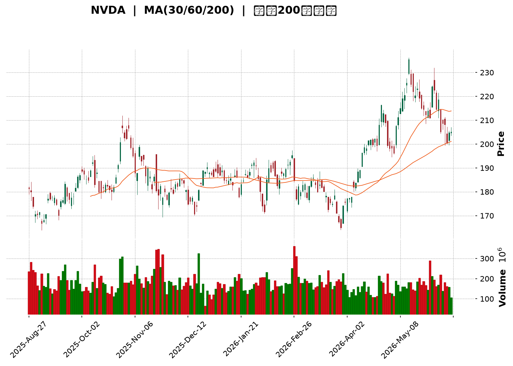
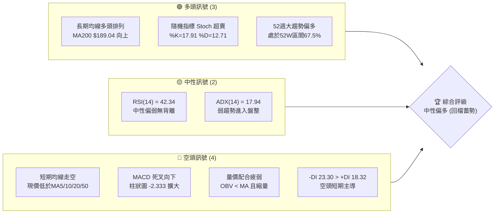
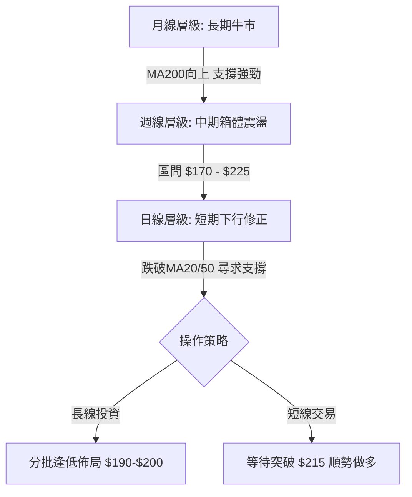
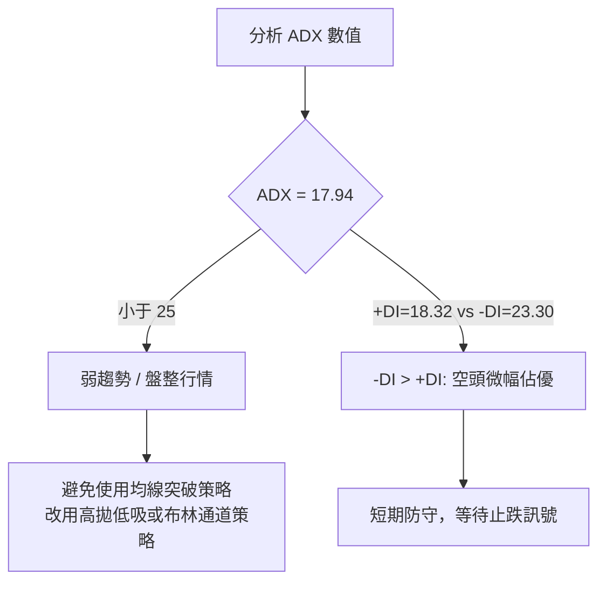
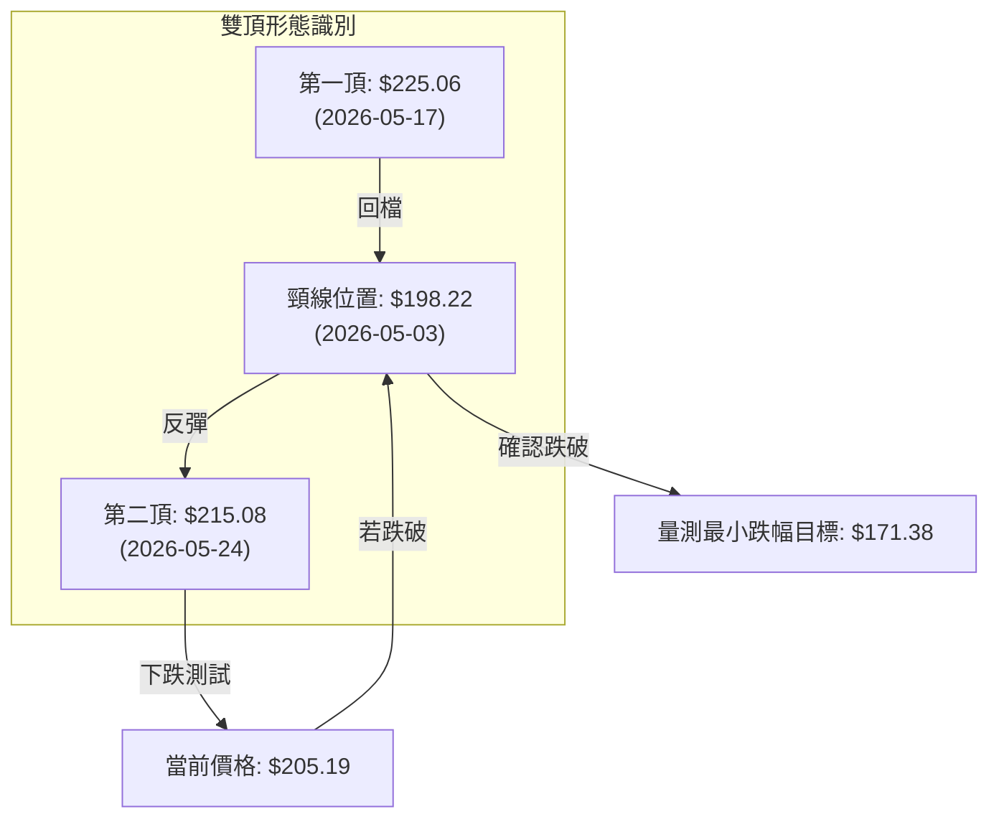

<details>
<summary>📊 靜態圖表 (點擊展開)</summary>

</details>

<html>
<head><meta charset="utf-8" /></head>
<body>
    <div style="height:500px; width:100%;">                        <script>window.PlotlyConfig = {MathJaxConfig: 'local'};</script>
        <script charset="utf-8" src="https://cdn.plot.ly/plotly-3.6.0.min.js" integrity="sha256-QaOVwtVY0T02VaHrr6pnoHLCwayMJp4O5n4YyaE3rJk=" crossorigin="anonymous"></script>                <div id="candlestick-chart" class="plotly-graph-div" style="height:100%; width:100%;"></div>            <script>                window.PLOTLYENV=window.PLOTLYENV || {};                                if (document.getElementById("candlestick-chart")) {                    Plotly.newPlot(                        "candlestick-chart",                        [{"close":{"dtype":"f8","bdata":"AAAAgHirZkAAAACAxX1mQAAAAKBYvmVAAAAA4LBRZUAAAAAAlExlQAAAAEDQbWVAAAAAAIjZZEAAAACgwQJlQAAAAEANUWVAAAAAQAMjZkAAAADgNx5mQAAAAOD9MmZAAAAAIMEwZkAAAAAgCNVlQAAAAMBWQmVAAAAAIH8AZkAAAAAAPQ5mQAAAAEAJ7GZAAAAAoHxGZkAAAACA0xdmQAAAAGDWLmZAAAAAINE+ZkAAAADAybNmQAAAAGD0SmdAAAAAYAxgZ0AAAADgx5RnQAAAACAxbGdAAAAAgLcpZ0AAAADAvBlnQAAAAMDPm2dAAAAAAGQKaEAAAACAp91mQAAAAGCQgmdAAAAAIJ95ZkAAAADgOnNmQAAAAGCCsmZAAAAAYJLfZkAAAAAgCc1mQAAAAGC8nWZAAAAAgJyBZkAAAADgsb1mQAAAACC6QGdAAAAA4N\u002fnZ0AAAAAgxBhpQAAAAEDX2GlAAAAAwDVUaUAAAAAgbUdpQAAAACC602lAAAAAIPvNaEAAAABgw15oQAAAAODkemdAAAAAYCF9Z0AAAACgfNloQAAAACA\u002fHWhAAAAAQLMxaEAAAABA51NnQAAAACCwvWdAAAAAIJhLZ0AAAACgIKRmQAAAAIAJSWdAAAAA4B2NZkAAAABA3lRmQAAAAKAoymZAAAAA4P0yZkAAAADA+IBmQAAAAADJGGZAAAAAQBt2ZkAAAADgUqdmQAAAAECPa2ZAAAAA4ALlZkAAAABgAsZmQAAAAABeKmdAAAAAYNQXZ0AAAADAy\u002fFmQAAAAOC0lmZAAAAAQNHZZUAAAABAaAJmQAAAAKAcMGZAAAAAgGpXZUAAAAAAsb1lQAAAAACgmGZAAAAAYOvuZkAAAABAWJ9nQAAAAOAqjGdAAAAAYIjJZ0AAAADgs39nQAAAACD4aWdAAAAAwLpIZ0AAAACg1pNnQAAAAMCBfGdAAAAAoGFgZ0AAAADgJZxnQAAAAAARGmdAAAAAQFAUZ0AAAADg3hZnQAAAAECtMmdAAAAAQFfdZkAAAADgTlpnQAAAAKAZQGdAAAAAgEw7ZkAAAAAgGONmQAAAAKCsE2dAAAAAwB9uZ0AAAABgxUdnQAAAAIBKiWdAAAAAgCzpZ0AAAADA0AhoQAAAAKC13GdAAAAAwEgsZ0AAAACA2YNmQAAAAEBKv2VAAAAAwHV1ZUAAAACA5CVnQAAAACDfuWdAAAAAIO6JZ0AAAAAgMbpnQAAAAADLVmdAAAAAIMvSZkAAAABg1BdnQAAAACAIeGdAAAAAoHl1Z0AAAABA17JnQAAAAAAi6mdAAAAAwK4TaEAAAADgS2poQAAAAMBFFWdAAAAAQCwfZkAAAAAgP8hmQAAAAMCUemZAAAAAACXaZkAAAACAu+NmQAAAAABPM2ZAAAAAAK7NZkAAAADgbxFnQAAAAKAHOmdAAAAAYKjdZkAAAAAASYFmQAAAAAA34GZAAAAAgPu2ZkAAAABgFIZmQAAAAKBES2ZAAAAAYPePZUAAAADg7+1lQAAAAIDf32VAAAAAgBpPZkAAAAAgTWFlQAAAAEBm6mRAAAAAgEmfZEAAAACgTcZlQAAAAAB08WVAAAAAIN8lZkAAAADA3C1mQAAAAMCQPGZAAAAAAMe7ZkAAAADgRPZmQAAAACAijWdAAAAAIN6iZ0AAAADg\u002f4hoQAAAAIBu1GhAAAAAoM\u002fDaEAAAAAgPy5pQAAAAIBkOmlAAAAA4Lb0aEAAAADgdEhpQAAAAAAL7WhAAAAAoOEAakAAAABgcwtrQAAAAMB\u002fnWpAAAAAgDQgakAAAABAzupoQAAAAOABx2hAAAAAQPfHaEAAAAAArohoQAAAAGDR8mlAAAAAAB9oakAAAAAgYt5qQAAAAMDnZWtAAAAAQLyQa0AAAADAJTJsQAAAAADmbm1AAAAAwNghbEAAAABg9cFrQAAAAEBNi2tAAAAAILfma0AAAACAJGhrQAAAAOCJ4mpAAAAAIITTakAAAADAR4tqQAAAAMAEwGpAAAAAYJ1cakAAAACAKQNsQAAAAIDw0WtAAAAAAADQakAAAADAHlVrQAAAAEAzo2lAAAAA4HoUakAAAACAFAZqQAAAAKBwDWlAAAAAANebaUAAAACAFKZpQA=="},"high":{"dtype":"f8","bdata":"mFZprenHZkBXI7hFMAdnQK3fHZ43PWZANsTYsNKEZUCXIDI\u002fyIVlQL0OG3I0dGVASN1K+cMZZUAOf0CgcVdlQOlvUxoVWGVAkTcGJaZhZkAXYieMnIFmQNKeQnzrS2ZA9gxn5ehTZkBlpgrJwyhmQMtZxiJXn2VACJS1RvsbZkAC6TgJTTtmQOhACvETCmdAF8x\u002fHQHGZkAMVzWtoXFmQLDF4u74gGZAyfJUA1BxZkCh1+gQgPhmQFlnADeQY2dA6Sjqu898Z0C8lgwW0NlnQEm5O6jCw2dAnBVcXbpfZ0C4vzetNppnQGvIAsN4q2dAlSMVo6NhaED7aU673WtoQAgFRVLFu2dAxi6FORESZ0B68ozoTRRnQKX+OUl94WZACcY4MbL7ZkBVkK3p2R5nQLR4xz3U0WZAd7NdRprmZkDH+OLLf9lmQD3ibN9lZ2dAfPSVbSz4Z0Ck3w8BhVxpQPITB2NufWpAkyXGgLe8aUAXn9cQkPZpQC\u002fJTdVDYmpAsuLqxrl2aUDr1AAsK1VpQG8GvPTIq2hA6HbTWZCCZ0A2L5c27vVoQAZwvWp5ZWhAki+rsH50aEDgMznVRuZnQMw6+5uI2GdA1Grn1EuYZ0AUbXk6ERJnQE3sUMTcc2dA1T1wtwJ4aED2dJR5ZQpnQDplGBaF6GZAlSe2k9s9ZkABQHP4qdVmQPpDlrr4YWZAGT7rSECCZkDSKYFsjS1nQFsz\u002f4f2xmZANEFzX3IJZ0CeO8Pr6w1nQI0zG+2reGdAO2v448wvZ0BVoAEpIShnQEUol\u002fsro2ZA+KDHCB3TZkBLJxf+e0ZmQN4cwdC4SGZA3kcFNEv9ZUARddTQ7v1lQI7H4KhTp2ZAhwNF7\u002fD9ZkB+NnUNLqNnQKRUj4HBlWdAjCXIkZEOaEAgLW0c9pBnQHsgsCdQmGdAug1Ou33KZ0Caj6ooPRZoQKIX\u002fsOcLGhAbr2B7fL9Z0BkUzEyYeRnQCrG7f01qmdADHPYmp1DZ0B8Ppyei1xnQH8uMewvfGdA6ie\u002fk4cHZ0DVyJ0tAa9nQO3IX\u002fynxmdA3SpV\u002fQzFZkDd7mgR7yRnQGMeJrouPmdAwPE\u002fHc+rZ0Dycu6td5xnQDb55dqXuGdA4GBwl7MDaEDLl+xR0SdoQB4NEDgZSGhAiXywcS7CZ0CrmOfxYEFnQJPdg1aPa2ZA2sO281gTZkDbwA\u002fitVhnQDeTyh+SLWhAkhd1TtsHaEDstbdXySBoQGJ+bRD5K2hAIOoO0rBoZ0CEYcIegV1nQD8\u002f+CVrxGdA70sAFmqGZ0CzhCEJJMNnQNjfcczWNmhAO5awMRYxaEDxcI23dKxoQLH2JbG0QWhAkQl+HMPLZkCocGWYkedmQOKIZ2S\u002flWZAk6InLzMPZ0AFY3eQvvpmQIOE8hMy0WZAANi9Z\u002f3VZkBlpl3Vz0ZnQLuqKbbZbGdANi+c1TAXZ0CC8i2O8jtnQPaqM8YflWdAGcFpqOQlZ0Dq8840VOVmQKAvOLWneGZATBDA2a1BZkD42xr3MUVmQC35sqV5AGZAlCLmBkqgZkBu\u002fGGevglmQAXD\u002f7irWGVAVrQsbxYoZUA8GOrGVc1lQLb0II07JWZAxi7XaxEpZkBH0swRqDJmQOEypGK4QGZACqquLGshZ0D7zvjgs\u002ftmQB2GXA\u002fsuGdAf1CBCQ6uZ0AAAADg\u002f4hoQEgZy6hVBWlAthXeUcHzaECSTCnP4i5pQEpqcZPoPWlAN6V3gXJQaUAAAADgdEhpQLIKuIr3cmlAEzTxkIpWakDef+OGexJrQMZOjF9cz2pAdEGWqB2PakAdSLELxEFqQDU+\u002fBtwWGlAdh1WQdgvaUCNL\u002ft0OABpQLFvya3hAGpAYaBHoGu+akCFZYGUfDFrQE2XjZlRwWtAcsIYLarva0DiGut0ZHJsQDGB9t53iG1AEq2cUGDnbEBFUcKibrdsQF7Y4lf\u002fBmxALYABgrw7bED03KEhVGRsQK2xJTUWmGtAUGvO1qE9a0C2Mt930rxqQDlAZoOc6GpAVK12imcza0DdMuuCdhNsQO\u002fZEYhOAG1A5dP7ifDRa0AAAABAM7NrQAAAAADX22pAAAAAQApPakAAAADAzGxqQAAAAEAK52lAAAAAwB61aUAAAACAPeJpQA=="},"hovertemplate":"\u003cb\u003e%{x|%Y-%m-%d}\u003c\u002fb\u003e\u003cbr\u003e\u958b: $%{open:.2f}\u003cbr\u003e\u9ad8: $%{high:.2f}\u003cbr\u003e\u4f4e: $%{low:.2f}\u003cbr\u003e\u6536: $%{close:.2f}\u003cextra\u003e\u003c\u002fextra\u003e","low":{"dtype":"f8","bdata":"kGuRvZNbZkAa2\u002f+XnAVmQP+WERlunWVAS6d4KuzfZEAPPEr1+BRlQJgeaMToJWVAk43DxEF7ZEC2dLvVE+RkQE33Z02V0GRAp5wSZJLnZUBA3jmTKghmQHVy7ws1B2ZAxc14zzTJZUCQe65XDcVlQJHp131BBmVAtBzAmauXZUBl+n9snt5lQJCI512Zz2VAjH0\u002fqon\u002fZUDXkzVipuVlQO8d73QanWVAHrV7JKHWZUAtqPP244JmQFtKN1j2p2ZAwVDr2U31ZkBSfSgpQXpnQHY4AYCaJGdAw6G6TxbjZkBo6Sv6f\u002fhmQNz+dBGtSWdA6wfYwSHaZ0AfSiz1LbpmQMj5beAjN2dAnS6PMRNvZkC71i6hDSJmQACgYAlQcWZAi29\u002fVaxwZkC3ZtLe869mQIWI\u002fnBFcmZANfJWWx0RZkBjyUR783FmQJKnaw2F6GZAY5ObLhSGZ0BzeVxJTPVnQLvPA\u002fWckGlAqJaKEekkaUBdqPnhADppQMFUWWaKqWlAerdNDrG1aEAQ2fuX3UxoQFPFCT2QRGdA8BK3y9NVZkCw6MqCYTFoQF5su2jN4WdA9bbHfF7cZ0Cqyr3ItPNmQLaMUPMyi2ZAG6+NKroCZ0DmVBAYem1mQGpthYEb02ZAlHJhft5zZkDt3srXtZZlQLVt8ncqCGZADckHTbAqZUAQZHAUakBmQHIBrzfOCGZAtRmAPK6uZUBcjyG8qXhmQG0COiI4XGZAZjymYbR3ZkDsgihYEZZmQCO5Lo+wxWZAAuM\u002fFxjjZkC3KDT9LrpmQGrdLmP0DGZAEoXuXQjNZUD35yLzItplQEZTskT71WVAZMaayUdDZUDYTCjHinNlQJG6MYcBBGZAOD9XfxfEZkB9L7KXq9VmQJi6pyibS2dA7VV036t4Z0AgfZNt3zVnQIerWhZ5VmdAa9SI+WhIZ0ABlVQj+4BnQBEqnSiLPWdATK30MPVSZ0BVvbeypUpnQBDX0QWP72ZAYIJEoEfuZkAFjylpgdlmQLxy04ym5WZAL\u002fkKWo2SZkB\u002fAILPS0NnQB1sM19OO2dANZUrt5gsZkApJ\u002fR42EVmQFUF2vSW9mZAH6eKG\u002fVSZ0ABu0QKbjhnQC8xkiQpL2dAUg87pHqzZ0Df8uW9qjpnQAfj4XCnp2dAFeEJ6fMUZ0DEeE5kfQBmQJT4kEBrdmVAgW+F+0paZUAbKyHgZMxlQGqGZaY692ZA2aX4sIF8Z0AdbuYlSJFnQFsThqoMSWdAF9fWDM2rZkAXPMVnxl5mQDTB4wwKUWdAr6OM+uEtZ0C3iiT41DZnQAM0AGkrq2dA2JkXo35lZ0DOMACquTFoQMdNMxAOA2dAF39S1UgFZkDAmpgcrM1lQAAQrvyKFmZAxUgOneZ6ZkALV8C9OTVmQDVUrPpYE2ZAo2QggRPrZUDo2nlrOblmQPS\u002fb1GHB2dACzRwwTqxZkBgtNR0YHdmQI7MwcJcpmZAzztY4v2uZkDSrt+q14NmQKq8riq78mVAXf+SmKRwZUD0B2hEz9FlQCnvleLguGVAvrGss5wUZkCSDyXUGl5lQMcJKh0Z2mRAcSsrVYWCZEAwFCAzgNhkQOMxSYl90WVAvQWDqXRlZUBugOetxfFlQJFN45emrmVA1wyDOeKCZkCCIh+AHI1mQNKZDQu8AmdA1h+ty8IwZ0DezSidiNFnQF4uSXljcGhAZFs7GaByaECAcMZ7N+FoQGKQxH6Cs2hA\u002fy1cRJbYaEA60aFAlthoQPzCEnSxn2hA7pum7nnyaEDeUSBGb+RpQI7zW+Wk\u002fmlAoqMDzdPqaUCGFQ1s\u002f85oQKPe9S5\u002fnGhA6GHx6mxQaEDndXs7qHloQEOxhg0fzGhA0C\u002fnrk7IaUBITnynjJRqQKWa2w2DtGpAw9x9Am\u002fVakDcMxmA\u002fKlrQDjHMeoOoWxADnWjrFP\u002fa0CeCjSLtENrQHlOtZ8ANWtAG1bOMsmHa0BKbVwxpDVrQAmr6S2Z0WpAs\u002f0zRhp4akB32iKuLhFqQJzPd+UrX2pAQEtmmEtcakBGYzRWXe5qQO6g6ET0omtAgUryKVTIakAAAABACl9qQAAAAGCPimlAAAAAAADAaUAAAABA4epoQAAAAKBw\u002fWhAAAAAoEfxaEAAAABACG5pQA=="},"name":"\u50f9\u683c","open":{"dtype":"f8","bdata":"9+0LPJ23ZkCiBeNKi5JmQOxvrG3wO2ZApYfGn8M4ZUDMsre0o1plQPZlj+D6SmVAb\u002fG03s75ZEAs+t8HeOpkQJIqUNKuG2VAlyGdRPYMZkBlQPiOb25mQCzYlMVkMWZA1D6YdEfuZUD2IbkAyRhmQAkRpXpxjWVA1IwWtUS4ZUA5u02kefFlQIHn43V04mVA4HGTb5+3ZkBQhOjnT3FmQIFNwn4\u002fyGVAAAJwdS0+ZkDZVCjRZ4ZmQHdHWlUju2ZAoLJyPiEgZ0AcjmHXeKtnQBbi0D1enmdAbFnWSnAoZ0AjhhrVxD9nQGc5R6GiSmdABs5OLIb\u002fZ0A7DM6fbihoQCe6\u002fsZgd2dA+oWoyRsRZ0CRoIVDERJnQIIPEp7uv2ZAKBfZWGp+ZkAuJRYjstxmQLR4xz3U0WZAFCWYphidZkDcfUToFYZmQP\u002fLG8Fi82ZAF9Qkh++3Z0BF6jBEuxloQKU+BPHh9mlAGC7VCnCcaUBZaFoN\u002fMVpQCcRQfoT+mlATC0yprlXaUAJpQq6idBoQFu4KxpvhWhAJEUNSkMVZ0ALpbk8kVtoQDxvR0EqXWhAd6jP1g9vaEA\u002fHwwH0NlnQMI1YugQ1GZAdhbusnU3Z0CiRNFrr+RmQOT8kk2\u002fEWdA5CAEnWl2aEBPJCC\u002fSqBmQOuOvg5daGZAqGH5ff3VZUC3wv2TwaxmQK4IkeYFWWZAOraQVzLRZUDgtaM+6bBmQKBvtNMtm2ZAUW+YcMKsZkBjt\u002fK6T\u002fVmQD41DUpczWZA8JO7vK8qZ0Bsi+Rf1BdnQEjHmpzugWZAkH50uXWcZkAOK2yoJDdmQBk+GdJyAWZAOi2qwFX8ZUB3X5\u002f7J8plQBPSJpyNDmZAIsRrNEX2ZkDdktpk6NdmQN20se\u002fAdmdAi3ViVgm2Z0Dfxu4WZ29nQDoAsqNXgGdA+X6VnNmqZ0AEStO+erNnQI3ZKk3Y8GdA3WWxpDbJZ0D5h5Gj44pnQF+ACeIlnGdAWYfuTVgbZ0DPGTfK5d9mQAcaTNXJGGdAAgloGQ4DZ0AcXC+9ukhnQJwj324wm2dAY4Kbh7W1ZkAwAWfcnlpmQMGL60XMEGdAOe5O0rBoZ0Akljf90l1nQDH3JYZhYGdAP8e4\u002fi7hZ0AZxgLNa+NnQJurnTNE32dAuTrHIRpfZ0BJzot+a0BnQMYUD4m5Z2ZAInMo0PDWZUBQWdlEMQ9mQFhxbg4jAWdABfCbKLPkZ0AxcPLs5QZoQNR9InpvGWhAizMqJQ1oZ0BfLChC6rBmQAkYxlCkkGdAYr30waBaZ0A9uq+u90pnQMYeP59W5WdASU1hMjfoZ0BmYNPT0UZoQHo3NyQRQWhA7wfRO++gZkBFi2Frf9llQJGijdG4SGZAl+Q\u002f0guHZkC9zCKIYJ5mQMCZlpfec2ZA1y+XtKoTZkBlrRNnsMVmQGcl9cQxNmdA\u002f\u002fdicr76ZkA1rJ8WjRZnQJyNU2I52GZAMBB5pgYbZ0BpNgfqj8hmQLC6xj6wOWZAqhKBdF45ZkD2VgNttyFmQOYnVAcM1GVAQAFVUZocZkD524VwrvtlQOPPNbmqOWVAPurZMqwSZUDZ0rn60dhkQIezrZ1x+WVAiG3yb1h\u002fZUAlguAzhR5mQDG0LTrQ8GVALagOjCAJZ0B9UKYdG7RmQBgtp9INA2dAw+mxpwc6Z0DjSUlSxdNnQDPPQ1j1iWhANwUkpmemaEDl9bVZWvVoQE\u002f9JPbo92hAu3oQa6E8aUD2j2JmMRhpQDrSXJstR2lA1VppYEX3aEDc5Ctg\u002fSxqQHlfCVjgJ2pAMIds+XmOakB\u002fBQpz8DVqQJslD0N2IWlAYNW5ZZHoaEBcG\u002fLrLOJoQJESkJgI9WhAA43FYh4DakAnH7MxBplqQEgaqV9OuWpA5KtEZHVJa0AapTp1YRVsQAkZdEujsmxANyuJyMKvbEBIKCTgRrNsQMXP+ZCoa2tApAADJHLda0BgLQK9\u002f8BrQC2BsiGSlGtAs7OVmjYJa0DOUxwB3btqQDBJ\u002fdIWYWpAw2DsEZHKakBofffMUu9qQNfkY+tLXWxAT2iGx8eua0AAAADAHr1qQAAAAMD10GpAAAAAgMJFakAAAAAA11NqQAAAAIDCjWlAAAAAIK4vaUAAAAAgXJdpQA=="},"x":["2025-08-27T00:00:00-04:00","2025-08-28T00:00:00-04:00","2025-08-29T00:00:00-04:00","2025-09-02T00:00:00-04:00","2025-09-03T00:00:00-04:00","2025-09-04T00:00:00-04:00","2025-09-05T00:00:00-04:00","2025-09-08T00:00:00-04:00","2025-09-09T00:00:00-04:00","2025-09-10T00:00:00-04:00","2025-09-11T00:00:00-04:00","2025-09-12T00:00:00-04:00","2025-09-15T00:00:00-04:00","2025-09-16T00:00:00-04:00","2025-09-17T00:00:00-04:00","2025-09-18T00:00:00-04:00","2025-09-19T00:00:00-04:00","2025-09-22T00:00:00-04:00","2025-09-23T00:00:00-04:00","2025-09-24T00:00:00-04:00","2025-09-25T00:00:00-04:00","2025-09-26T00:00:00-04:00","2025-09-29T00:00:00-04:00","2025-09-30T00:00:00-04:00","2025-10-01T00:00:00-04:00","2025-10-02T00:00:00-04:00","2025-10-03T00:00:00-04:00","2025-10-06T00:00:00-04:00","2025-10-07T00:00:00-04:00","2025-10-08T00:00:00-04:00","2025-10-09T00:00:00-04:00","2025-10-10T00:00:00-04:00","2025-10-13T00:00:00-04:00","2025-10-14T00:00:00-04:00","2025-10-15T00:00:00-04:00","2025-10-16T00:00:00-04:00","2025-10-17T00:00:00-04:00","2025-10-20T00:00:00-04:00","2025-10-21T00:00:00-04:00","2025-10-22T00:00:00-04:00","2025-10-23T00:00:00-04:00","2025-10-24T00:00:00-04:00","2025-10-27T00:00:00-04:00","2025-10-28T00:00:00-04:00","2025-10-29T00:00:00-04:00","2025-10-30T00:00:00-04:00","2025-10-31T00:00:00-04:00","2025-11-03T00:00:00-05:00","2025-11-04T00:00:00-05:00","2025-11-05T00:00:00-05:00","2025-11-06T00:00:00-05:00","2025-11-07T00:00:00-05:00","2025-11-10T00:00:00-05:00","2025-11-11T00:00:00-05:00","2025-11-12T00:00:00-05:00","2025-11-13T00:00:00-05:00","2025-11-14T00:00:00-05:00","2025-11-17T00:00:00-05:00","2025-11-18T00:00:00-05:00","2025-11-19T00:00:00-05:00","2025-11-20T00:00:00-05:00","2025-11-21T00:00:00-05:00","2025-11-24T00:00:00-05:00","2025-11-25T00:00:00-05:00","2025-11-26T00:00:00-05:00","2025-11-28T00:00:00-05:00","2025-12-01T00:00:00-05:00","2025-12-02T00:00:00-05:00","2025-12-03T00:00:00-05:00","2025-12-04T00:00:00-05:00","2025-12-05T00:00:00-05:00","2025-12-08T00:00:00-05:00","2025-12-09T00:00:00-05:00","2025-12-10T00:00:00-05:00","2025-12-11T00:00:00-05:00","2025-12-12T00:00:00-05:00","2025-12-15T00:00:00-05:00","2025-12-16T00:00:00-05:00","2025-12-17T00:00:00-05:00","2025-12-18T00:00:00-05:00","2025-12-19T00:00:00-05:00","2025-12-22T00:00:00-05:00","2025-12-23T00:00:00-05:00","2025-12-24T00:00:00-05:00","2025-12-26T00:00:00-05:00","2025-12-29T00:00:00-05:00","2025-12-30T00:00:00-05:00","2025-12-31T00:00:00-05:00","2026-01-02T00:00:00-05:00","2026-01-05T00:00:00-05:00","2026-01-06T00:00:00-05:00","2026-01-07T00:00:00-05:00","2026-01-08T00:00:00-05:00","2026-01-09T00:00:00-05:00","2026-01-12T00:00:00-05:00","2026-01-13T00:00:00-05:00","2026-01-14T00:00:00-05:00","2026-01-15T00:00:00-05:00","2026-01-16T00:00:00-05:00","2026-01-20T00:00:00-05:00","2026-01-21T00:00:00-05:00","2026-01-22T00:00:00-05:00","2026-01-23T00:00:00-05:00","2026-01-26T00:00:00-05:00","2026-01-27T00:00:00-05:00","2026-01-28T00:00:00-05:00","2026-01-29T00:00:00-05:00","2026-01-30T00:00:00-05:00","2026-02-02T00:00:00-05:00","2026-02-03T00:00:00-05:00","2026-02-04T00:00:00-05:00","2026-02-05T00:00:00-05:00","2026-02-06T00:00:00-05:00","2026-02-09T00:00:00-05:00","2026-02-10T00:00:00-05:00","2026-02-11T00:00:00-05:00","2026-02-12T00:00:00-05:00","2026-02-13T00:00:00-05:00","2026-02-17T00:00:00-05:00","2026-02-18T00:00:00-05:00","2026-02-19T00:00:00-05:00","2026-02-20T00:00:00-05:00","2026-02-23T00:00:00-05:00","2026-02-24T00:00:00-05:00","2026-02-25T00:00:00-05:00","2026-02-26T00:00:00-05:00","2026-02-27T00:00:00-05:00","2026-03-02T00:00:00-05:00","2026-03-03T00:00:00-05:00","2026-03-04T00:00:00-05:00","2026-03-05T00:00:00-05:00","2026-03-06T00:00:00-05:00","2026-03-09T00:00:00-04:00","2026-03-10T00:00:00-04:00","2026-03-11T00:00:00-04:00","2026-03-12T00:00:00-04:00","2026-03-13T00:00:00-04:00","2026-03-16T00:00:00-04:00","2026-03-17T00:00:00-04:00","2026-03-18T00:00:00-04:00","2026-03-19T00:00:00-04:00","2026-03-20T00:00:00-04:00","2026-03-23T00:00:00-04:00","2026-03-24T00:00:00-04:00","2026-03-25T00:00:00-04:00","2026-03-26T00:00:00-04:00","2026-03-27T00:00:00-04:00","2026-03-30T00:00:00-04:00","2026-03-31T00:00:00-04:00","2026-04-01T00:00:00-04:00","2026-04-02T00:00:00-04:00","2026-04-06T00:00:00-04:00","2026-04-07T00:00:00-04:00","2026-04-08T00:00:00-04:00","2026-04-09T00:00:00-04:00","2026-04-10T00:00:00-04:00","2026-04-13T00:00:00-04:00","2026-04-14T00:00:00-04:00","2026-04-15T00:00:00-04:00","2026-04-16T00:00:00-04:00","2026-04-17T00:00:00-04:00","2026-04-20T00:00:00-04:00","2026-04-21T00:00:00-04:00","2026-04-22T00:00:00-04:00","2026-04-23T00:00:00-04:00","2026-04-24T00:00:00-04:00","2026-04-27T00:00:00-04:00","2026-04-28T00:00:00-04:00","2026-04-29T00:00:00-04:00","2026-04-30T00:00:00-04:00","2026-05-01T00:00:00-04:00","2026-05-04T00:00:00-04:00","2026-05-05T00:00:00-04:00","2026-05-06T00:00:00-04:00","2026-05-07T00:00:00-04:00","2026-05-08T00:00:00-04:00","2026-05-11T00:00:00-04:00","2026-05-12T00:00:00-04:00","2026-05-13T00:00:00-04:00","2026-05-14T00:00:00-04:00","2026-05-15T00:00:00-04:00","2026-05-18T00:00:00-04:00","2026-05-19T00:00:00-04:00","2026-05-20T00:00:00-04:00","2026-05-21T00:00:00-04:00","2026-05-22T00:00:00-04:00","2026-05-26T00:00:00-04:00","2026-05-27T00:00:00-04:00","2026-05-28T00:00:00-04:00","2026-05-29T00:00:00-04:00","2026-06-01T00:00:00-04:00","2026-06-02T00:00:00-04:00","2026-06-03T00:00:00-04:00","2026-06-04T00:00:00-04:00","2026-06-05T00:00:00-04:00","2026-06-08T00:00:00-04:00","2026-06-09T00:00:00-04:00","2026-06-10T00:00:00-04:00","2026-06-11T00:00:00-04:00","2026-06-12T00:00:00-04:00"],"type":"candlestick"},{"hovertemplate":"MA30: $%{y:.2f}\u003cextra\u003e\u003c\u002fextra\u003e","line":{"color":"#2196F3","dash":"dash","width":2},"mode":"lines","name":"MA30","x":["2025-08-27T00:00:00-04:00","2025-08-28T00:00:00-04:00","2025-08-29T00:00:00-04:00","2025-09-02T00:00:00-04:00","2025-09-03T00:00:00-04:00","2025-09-04T00:00:00-04:00","2025-09-05T00:00:00-04:00","2025-09-08T00:00:00-04:00","2025-09-09T00:00:00-04:00","2025-09-10T00:00:00-04:00","2025-09-11T00:00:00-04:00","2025-09-12T00:00:00-04:00","2025-09-15T00:00:00-04:00","2025-09-16T00:00:00-04:00","2025-09-17T00:00:00-04:00","2025-09-18T00:00:00-04:00","2025-09-19T00:00:00-04:00","2025-09-22T00:00:00-04:00","2025-09-23T00:00:00-04:00","2025-09-24T00:00:00-04:00","2025-09-25T00:00:00-04:00","2025-09-26T00:00:00-04:00","2025-09-29T00:00:00-04:00","2025-09-30T00:00:00-04:00","2025-10-01T00:00:00-04:00","2025-10-02T00:00:00-04:00","2025-10-03T00:00:00-04:00","2025-10-06T00:00:00-04:00","2025-10-07T00:00:00-04:00","2025-10-08T00:00:00-04:00","2025-10-09T00:00:00-04:00","2025-10-10T00:00:00-04:00","2025-10-13T00:00:00-04:00","2025-10-14T00:00:00-04:00","2025-10-15T00:00:00-04:00","2025-10-16T00:00:00-04:00","2025-10-17T00:00:00-04:00","2025-10-20T00:00:00-04:00","2025-10-21T00:00:00-04:00","2025-10-22T00:00:00-04:00","2025-10-23T00:00:00-04:00","2025-10-24T00:00:00-04:00","2025-10-27T00:00:00-04:00","2025-10-28T00:00:00-04:00","2025-10-29T00:00:00-04:00","2025-10-30T00:00:00-04:00","2025-10-31T00:00:00-04:00","2025-11-03T00:00:00-05:00","2025-11-04T00:00:00-05:00","2025-11-05T00:00:00-05:00","2025-11-06T00:00:00-05:00","2025-11-07T00:00:00-05:00","2025-11-10T00:00:00-05:00","2025-11-11T00:00:00-05:00","2025-11-12T00:00:00-05:00","2025-11-13T00:00:00-05:00","2025-11-14T00:00:00-05:00","2025-11-17T00:00:00-05:00","2025-11-18T00:00:00-05:00","2025-11-19T00:00:00-05:00","2025-11-20T00:00:00-05:00","2025-11-21T00:00:00-05:00","2025-11-24T00:00:00-05:00","2025-11-25T00:00:00-05:00","2025-11-26T00:00:00-05:00","2025-11-28T00:00:00-05:00","2025-12-01T00:00:00-05:00","2025-12-02T00:00:00-05:00","2025-12-03T00:00:00-05:00","2025-12-04T00:00:00-05:00","2025-12-05T00:00:00-05:00","2025-12-08T00:00:00-05:00","2025-12-09T00:00:00-05:00","2025-12-10T00:00:00-05:00","2025-12-11T00:00:00-05:00","2025-12-12T00:00:00-05:00","2025-12-15T00:00:00-05:00","2025-12-16T00:00:00-05:00","2025-12-17T00:00:00-05:00","2025-12-18T00:00:00-05:00","2025-12-19T00:00:00-05:00","2025-12-22T00:00:00-05:00","2025-12-23T00:00:00-05:00","2025-12-24T00:00:00-05:00","2025-12-26T00:00:00-05:00","2025-12-29T00:00:00-05:00","2025-12-30T00:00:00-05:00","2025-12-31T00:00:00-05:00","2026-01-02T00:00:00-05:00","2026-01-05T00:00:00-05:00","2026-01-06T00:00:00-05:00","2026-01-07T00:00:00-05:00","2026-01-08T00:00:00-05:00","2026-01-09T00:00:00-05:00","2026-01-12T00:00:00-05:00","2026-01-13T00:00:00-05:00","2026-01-14T00:00:00-05:00","2026-01-15T00:00:00-05:00","2026-01-16T00:00:00-05:00","2026-01-20T00:00:00-05:00","2026-01-21T00:00:00-05:00","2026-01-22T00:00:00-05:00","2026-01-23T00:00:00-05:00","2026-01-26T00:00:00-05:00","2026-01-27T00:00:00-05:00","2026-01-28T00:00:00-05:00","2026-01-29T00:00:00-05:00","2026-01-30T00:00:00-05:00","2026-02-02T00:00:00-05:00","2026-02-03T00:00:00-05:00","2026-02-04T00:00:00-05:00","2026-02-05T00:00:00-05:00","2026-02-06T00:00:00-05:00","2026-02-09T00:00:00-05:00","2026-02-10T00:00:00-05:00","2026-02-11T00:00:00-05:00","2026-02-12T00:00:00-05:00","2026-02-13T00:00:00-05:00","2026-02-17T00:00:00-05:00","2026-02-18T00:00:00-05:00","2026-02-19T00:00:00-05:00","2026-02-20T00:00:00-05:00","2026-02-23T00:00:00-05:00","2026-02-24T00:00:00-05:00","2026-02-25T00:00:00-05:00","2026-02-26T00:00:00-05:00","2026-02-27T00:00:00-05:00","2026-03-02T00:00:00-05:00","2026-03-03T00:00:00-05:00","2026-03-04T00:00:00-05:00","2026-03-05T00:00:00-05:00","2026-03-06T00:00:00-05:00","2026-03-09T00:00:00-04:00","2026-03-10T00:00:00-04:00","2026-03-11T00:00:00-04:00","2026-03-12T00:00:00-04:00","2026-03-13T00:00:00-04:00","2026-03-16T00:00:00-04:00","2026-03-17T00:00:00-04:00","2026-03-18T00:00:00-04:00","2026-03-19T00:00:00-04:00","2026-03-20T00:00:00-04:00","2026-03-23T00:00:00-04:00","2026-03-24T00:00:00-04:00","2026-03-25T00:00:00-04:00","2026-03-26T00:00:00-04:00","2026-03-27T00:00:00-04:00","2026-03-30T00:00:00-04:00","2026-03-31T00:00:00-04:00","2026-04-01T00:00:00-04:00","2026-04-02T00:00:00-04:00","2026-04-06T00:00:00-04:00","2026-04-07T00:00:00-04:00","2026-04-08T00:00:00-04:00","2026-04-09T00:00:00-04:00","2026-04-10T00:00:00-04:00","2026-04-13T00:00:00-04:00","2026-04-14T00:00:00-04:00","2026-04-15T00:00:00-04:00","2026-04-16T00:00:00-04:00","2026-04-17T00:00:00-04:00","2026-04-20T00:00:00-04:00","2026-04-21T00:00:00-04:00","2026-04-22T00:00:00-04:00","2026-04-23T00:00:00-04:00","2026-04-24T00:00:00-04:00","2026-04-27T00:00:00-04:00","2026-04-28T00:00:00-04:00","2026-04-29T00:00:00-04:00","2026-04-30T00:00:00-04:00","2026-05-01T00:00:00-04:00","2026-05-04T00:00:00-04:00","2026-05-05T00:00:00-04:00","2026-05-06T00:00:00-04:00","2026-05-07T00:00:00-04:00","2026-05-08T00:00:00-04:00","2026-05-11T00:00:00-04:00","2026-05-12T00:00:00-04:00","2026-05-13T00:00:00-04:00","2026-05-14T00:00:00-04:00","2026-05-15T00:00:00-04:00","2026-05-18T00:00:00-04:00","2026-05-19T00:00:00-04:00","2026-05-20T00:00:00-04:00","2026-05-21T00:00:00-04:00","2026-05-22T00:00:00-04:00","2026-05-26T00:00:00-04:00","2026-05-27T00:00:00-04:00","2026-05-28T00:00:00-04:00","2026-05-29T00:00:00-04:00","2026-06-01T00:00:00-04:00","2026-06-02T00:00:00-04:00","2026-06-03T00:00:00-04:00","2026-06-04T00:00:00-04:00","2026-06-05T00:00:00-04:00","2026-06-08T00:00:00-04:00","2026-06-09T00:00:00-04:00","2026-06-10T00:00:00-04:00","2026-06-11T00:00:00-04:00","2026-06-12T00:00:00-04:00"],"y":{"dtype":"f8","bdata":"AAAAAAAA+H8AAAAAAAD4fwAAAAAAAPh\u002fAAAAAAAA+H8AAAAAAAD4fwAAAAAAAPh\u002fAAAAAAAA+H8AAAAAAAD4fwAAAAAAAPh\u002fAAAAAAAA+H8AAAAAAAD4fwAAAAAAAPh\u002fAAAAAAAA+H8AAAAAAAD4fwAAAAAAAPh\u002fAAAAAAAA+H8AAAAAAAD4fwAAAAAAAPh\u002fAAAAAAAA+H8AAAAAAAD4fwAAAAAAAPh\u002fAAAAAAAA+H8AAAAAAAD4fwAAAAAAAPh\u002fAAAAAAAA+H8AAAAAAAD4fwAAAAAAAPh\u002fAAAAAAAA+H8AAAAAAAD4f+\u002fu7t5NQ2ZAMzMzYwBPZkBmZmaWMlJmQDMzM4NFYWZAmpmZySJrZkBmZmYm9XRmQDMzM+PHf2ZAAAAAgAyRZkBmZmYmU6BmQN7d3Q1qq2ZAvLu7S5GuZkCamZkp4rNmQHd3d+ffvGZAAAAAEIPLZkCamZmpXudmQERERBSFDmdAiYiICOkqZ0AzMzOjakZnQM3MzMw0X2dAVVVVFcp0Z0Crqqp6OIhnQHd3dwdKk2dA3t3dTeadZ0ARERERObBnQO\u002fu7o47t2dAZmZmlji+Z0B3d3f3DrxnQGZmZmbGvmdAzczMfOe\u002fZ0AiIiLi+7tnQKuqqoo5uWdAERERAYSsZ0AzMzPD9KdnQLy7uyvPoWdAZmZmdnSfZ0CamZm56Z9nQCIiIvLJmmdAmpmZ+UWXZ0CrqqoqBJZnQO\u002fu7v5XlGdAVVVVNaiXZ0CJiIgo75dnQKuqqlowl2dAmpmZCUGQZ0DNzMxs431nQKuqqnoVYmdAZmZmdmdEZ0BmZmbmgChnQN7d3R1zCWdAMzMzw+XrZkB3d3c3dtVmQDMzM2PrzWZAq6qq2i3JZkDNzMwstb5mQKuqqirfuWZAVVVVRWa2ZkBmZmYG3LdmQAAAAKARtWZA3t3dLfm0ZkBmZma29rxmQLy7u+utvmZAZmZmtrjFZkAAAACAodBmQBEREWFL02ZAAAAAIM7aZkAzMzNDzd9mQM3MzLwy6WZAvLu7q6PsZkAREREBm\u002fJmQO\u002fu7q6w+WZAiYiIeAj0ZkCamZmpAPVmQERERAQ\u002f9GZAVVVVZR\u002f3ZkDNzMwM\u002fflmQKuqqhoTAmdAZmZmNqcTZ0BmZmb27iRnQERERFQ4M2dAZmZmVtlCZ0CamZlJdElnQCIiIrI1QmdAVVVVtaA1Z0ARERFRlDFnQDMzM1MaM2dAVVVVlfswZ0ARERGx7jJnQN7d3Q1LMmdAq6qqqlwuZ0BVVVV1OipnQFVVVUUUKmdAVVVVRcgqZ0CrqqrqiStnQKuqqmp5MmdAERERkfw6Z0AAAAAATUZnQFVVVRVSRWdAERERUfs+Z0DNzMzsHDpnQN7d3W2HM2dAmpmZ6dI4Z0C8u7tb2DhnQFVVVcVdMWdAVVVVpQQsZ0Dv7u7+NCpnQCIiIqKQJ2dARERE1KUeZ0BVVVXFmBFnQGZmZiYuCWdAzczMLEUFZ0BEREQ0WAVnQO\u002fu7q4CCmdA7+7u3uQKZ0CamZnZfgBnQAAAABCy8GZAq6qqijPmZkARERHxK9JmQKuqqup9vWZAREREVLWqZkCrqqoadZ9mQKuqqipwkmZAmpmZWUCHZkARERERSXpmQM3MzGz3a2ZARERExIBgZkAiIiIiGlRmQCIiIvIYWGZAZmZmRgVlZkAiIiKi+nNmQM3MzGwKiGZAmpmZ6VyYZkBVVVXV6atmQCIiIuK\u002fxWZAvLu7Cx7YZkDNzMycBOtmQJqZmbmE+WZAZmZm5koUZ0C8u7sLCDtnQO\u002fu7t7wWmdA7+7uXgx4Z0B3d3f3eIxnQBEREfGpoWdAd3d3ZyG9Z0ARERHxWtNnQM3MzLwe9mdAq6qqWhYZaEAzMzNj7EdoQBEREYE9f2hAAAAAEH26aECJiIiISPFoQLy7u7syMWlAZmZmlkNkaUAiIiIC3pNpQO\u002fu7o4owWlAERERoUHtaUC8u7t7LxNqQAAAAOChL2pAvLu7m9pKakAzMzMj\u002f1tqQDMzMwNibGpAiYiIeAJ6akCrqqpqLJJqQO\u002fu7q5KqGpAREREdCK4akBVVVWVn8lqQN7d3f2xz2pAvLu7O1nQakDv7u7eosdqQImIiAhNumpAREREhOO1akB3d3eXIbxqQA=="},"type":"scatter"},{"hovertemplate":"MA60: $%{y:.2f}\u003cextra\u003e\u003c\u002fextra\u003e","line":{"color":"#9C27B0","dash":"dash","width":2},"mode":"lines","name":"MA60","x":["2025-08-27T00:00:00-04:00","2025-08-28T00:00:00-04:00","2025-08-29T00:00:00-04:00","2025-09-02T00:00:00-04:00","2025-09-03T00:00:00-04:00","2025-09-04T00:00:00-04:00","2025-09-05T00:00:00-04:00","2025-09-08T00:00:00-04:00","2025-09-09T00:00:00-04:00","2025-09-10T00:00:00-04:00","2025-09-11T00:00:00-04:00","2025-09-12T00:00:00-04:00","2025-09-15T00:00:00-04:00","2025-09-16T00:00:00-04:00","2025-09-17T00:00:00-04:00","2025-09-18T00:00:00-04:00","2025-09-19T00:00:00-04:00","2025-09-22T00:00:00-04:00","2025-09-23T00:00:00-04:00","2025-09-24T00:00:00-04:00","2025-09-25T00:00:00-04:00","2025-09-26T00:00:00-04:00","2025-09-29T00:00:00-04:00","2025-09-30T00:00:00-04:00","2025-10-01T00:00:00-04:00","2025-10-02T00:00:00-04:00","2025-10-03T00:00:00-04:00","2025-10-06T00:00:00-04:00","2025-10-07T00:00:00-04:00","2025-10-08T00:00:00-04:00","2025-10-09T00:00:00-04:00","2025-10-10T00:00:00-04:00","2025-10-13T00:00:00-04:00","2025-10-14T00:00:00-04:00","2025-10-15T00:00:00-04:00","2025-10-16T00:00:00-04:00","2025-10-17T00:00:00-04:00","2025-10-20T00:00:00-04:00","2025-10-21T00:00:00-04:00","2025-10-22T00:00:00-04:00","2025-10-23T00:00:00-04:00","2025-10-24T00:00:00-04:00","2025-10-27T00:00:00-04:00","2025-10-28T00:00:00-04:00","2025-10-29T00:00:00-04:00","2025-10-30T00:00:00-04:00","2025-10-31T00:00:00-04:00","2025-11-03T00:00:00-05:00","2025-11-04T00:00:00-05:00","2025-11-05T00:00:00-05:00","2025-11-06T00:00:00-05:00","2025-11-07T00:00:00-05:00","2025-11-10T00:00:00-05:00","2025-11-11T00:00:00-05:00","2025-11-12T00:00:00-05:00","2025-11-13T00:00:00-05:00","2025-11-14T00:00:00-05:00","2025-11-17T00:00:00-05:00","2025-11-18T00:00:00-05:00","2025-11-19T00:00:00-05:00","2025-11-20T00:00:00-05:00","2025-11-21T00:00:00-05:00","2025-11-24T00:00:00-05:00","2025-11-25T00:00:00-05:00","2025-11-26T00:00:00-05:00","2025-11-28T00:00:00-05:00","2025-12-01T00:00:00-05:00","2025-12-02T00:00:00-05:00","2025-12-03T00:00:00-05:00","2025-12-04T00:00:00-05:00","2025-12-05T00:00:00-05:00","2025-12-08T00:00:00-05:00","2025-12-09T00:00:00-05:00","2025-12-10T00:00:00-05:00","2025-12-11T00:00:00-05:00","2025-12-12T00:00:00-05:00","2025-12-15T00:00:00-05:00","2025-12-16T00:00:00-05:00","2025-12-17T00:00:00-05:00","2025-12-18T00:00:00-05:00","2025-12-19T00:00:00-05:00","2025-12-22T00:00:00-05:00","2025-12-23T00:00:00-05:00","2025-12-24T00:00:00-05:00","2025-12-26T00:00:00-05:00","2025-12-29T00:00:00-05:00","2025-12-30T00:00:00-05:00","2025-12-31T00:00:00-05:00","2026-01-02T00:00:00-05:00","2026-01-05T00:00:00-05:00","2026-01-06T00:00:00-05:00","2026-01-07T00:00:00-05:00","2026-01-08T00:00:00-05:00","2026-01-09T00:00:00-05:00","2026-01-12T00:00:00-05:00","2026-01-13T00:00:00-05:00","2026-01-14T00:00:00-05:00","2026-01-15T00:00:00-05:00","2026-01-16T00:00:00-05:00","2026-01-20T00:00:00-05:00","2026-01-21T00:00:00-05:00","2026-01-22T00:00:00-05:00","2026-01-23T00:00:00-05:00","2026-01-26T00:00:00-05:00","2026-01-27T00:00:00-05:00","2026-01-28T00:00:00-05:00","2026-01-29T00:00:00-05:00","2026-01-30T00:00:00-05:00","2026-02-02T00:00:00-05:00","2026-02-03T00:00:00-05:00","2026-02-04T00:00:00-05:00","2026-02-05T00:00:00-05:00","2026-02-06T00:00:00-05:00","2026-02-09T00:00:00-05:00","2026-02-10T00:00:00-05:00","2026-02-11T00:00:00-05:00","2026-02-12T00:00:00-05:00","2026-02-13T00:00:00-05:00","2026-02-17T00:00:00-05:00","2026-02-18T00:00:00-05:00","2026-02-19T00:00:00-05:00","2026-02-20T00:00:00-05:00","2026-02-23T00:00:00-05:00","2026-02-24T00:00:00-05:00","2026-02-25T00:00:00-05:00","2026-02-26T00:00:00-05:00","2026-02-27T00:00:00-05:00","2026-03-02T00:00:00-05:00","2026-03-03T00:00:00-05:00","2026-03-04T00:00:00-05:00","2026-03-05T00:00:00-05:00","2026-03-06T00:00:00-05:00","2026-03-09T00:00:00-04:00","2026-03-10T00:00:00-04:00","2026-03-11T00:00:00-04:00","2026-03-12T00:00:00-04:00","2026-03-13T00:00:00-04:00","2026-03-16T00:00:00-04:00","2026-03-17T00:00:00-04:00","2026-03-18T00:00:00-04:00","2026-03-19T00:00:00-04:00","2026-03-20T00:00:00-04:00","2026-03-23T00:00:00-04:00","2026-03-24T00:00:00-04:00","2026-03-25T00:00:00-04:00","2026-03-26T00:00:00-04:00","2026-03-27T00:00:00-04:00","2026-03-30T00:00:00-04:00","2026-03-31T00:00:00-04:00","2026-04-01T00:00:00-04:00","2026-04-02T00:00:00-04:00","2026-04-06T00:00:00-04:00","2026-04-07T00:00:00-04:00","2026-04-08T00:00:00-04:00","2026-04-09T00:00:00-04:00","2026-04-10T00:00:00-04:00","2026-04-13T00:00:00-04:00","2026-04-14T00:00:00-04:00","2026-04-15T00:00:00-04:00","2026-04-16T00:00:00-04:00","2026-04-17T00:00:00-04:00","2026-04-20T00:00:00-04:00","2026-04-21T00:00:00-04:00","2026-04-22T00:00:00-04:00","2026-04-23T00:00:00-04:00","2026-04-24T00:00:00-04:00","2026-04-27T00:00:00-04:00","2026-04-28T00:00:00-04:00","2026-04-29T00:00:00-04:00","2026-04-30T00:00:00-04:00","2026-05-01T00:00:00-04:00","2026-05-04T00:00:00-04:00","2026-05-05T00:00:00-04:00","2026-05-06T00:00:00-04:00","2026-05-07T00:00:00-04:00","2026-05-08T00:00:00-04:00","2026-05-11T00:00:00-04:00","2026-05-12T00:00:00-04:00","2026-05-13T00:00:00-04:00","2026-05-14T00:00:00-04:00","2026-05-15T00:00:00-04:00","2026-05-18T00:00:00-04:00","2026-05-19T00:00:00-04:00","2026-05-20T00:00:00-04:00","2026-05-21T00:00:00-04:00","2026-05-22T00:00:00-04:00","2026-05-26T00:00:00-04:00","2026-05-27T00:00:00-04:00","2026-05-28T00:00:00-04:00","2026-05-29T00:00:00-04:00","2026-06-01T00:00:00-04:00","2026-06-02T00:00:00-04:00","2026-06-03T00:00:00-04:00","2026-06-04T00:00:00-04:00","2026-06-05T00:00:00-04:00","2026-06-08T00:00:00-04:00","2026-06-09T00:00:00-04:00","2026-06-10T00:00:00-04:00","2026-06-11T00:00:00-04:00","2026-06-12T00:00:00-04:00"],"y":{"dtype":"f8","bdata":"AAAAAAAA+H8AAAAAAAD4fwAAAAAAAPh\u002fAAAAAAAA+H8AAAAAAAD4fwAAAAAAAPh\u002fAAAAAAAA+H8AAAAAAAD4fwAAAAAAAPh\u002fAAAAAAAA+H8AAAAAAAD4fwAAAAAAAPh\u002fAAAAAAAA+H8AAAAAAAD4fwAAAAAAAPh\u002fAAAAAAAA+H8AAAAAAAD4fwAAAAAAAPh\u002fAAAAAAAA+H8AAAAAAAD4fwAAAAAAAPh\u002fAAAAAAAA+H8AAAAAAAD4fwAAAAAAAPh\u002fAAAAAAAA+H8AAAAAAAD4fwAAAAAAAPh\u002fAAAAAAAA+H8AAAAAAAD4fwAAAAAAAPh\u002fAAAAAAAA+H8AAAAAAAD4fwAAAAAAAPh\u002fAAAAAAAA+H8AAAAAAAD4fwAAAAAAAPh\u002fAAAAAAAA+H8AAAAAAAD4fwAAAAAAAPh\u002fAAAAAAAA+H8AAAAAAAD4fwAAAAAAAPh\u002fAAAAAAAA+H8AAAAAAAD4fwAAAAAAAPh\u002fAAAAAAAA+H8AAAAAAAD4fwAAAAAAAPh\u002fAAAAAAAA+H8AAAAAAAD4fwAAAAAAAPh\u002fAAAAAAAA+H8AAAAAAAD4fwAAAAAAAPh\u002fAAAAAAAA+H8AAAAAAAD4fwAAAAAAAPh\u002fAAAAAAAA+H8AAAAAAAD4f83MzLRD\u002fmZAIiIiMsL9ZkDNzMysE\u002f1mQHd3d1eKAWdAAAAAoEsFZ0AAAABwbwpnQKuqqupIDWdAzczMPCkUZ0CJiIioKxtnQGZmZgbhH2dAiYiIwBwjZ0ARERGp6CVnQBERESEIKmdAzczMDOItZ0AzMzMLoTJnQHd3d0dNOGdAd3d3P6g3Z0DNzMzEdTdnQFVVVfVTNGdARERE7FcwZ0ARERFZ1y5nQFVVVbWaMGdAREREFIozZ0Dv7u4edzdnQM3MzFyNOGdA3t3dbU86Z0Dv7u5+9TlnQDMzMwPsOWdAVVVVVXA6Z0BERERMeTxnQDMzM7vzO2dAvLu7Wx45Z0CamZkhSzxnQGZmZkaNOmdAMzMzSyE9Z0BmZmZ+2z9nQHd3d1f+QWdAq6qq0vRBZ0De3d2VT0RnQO\u002fu7lYER2dA7+7uVthFZ0ARERHpd0ZnQHd3d6+3RWdAd3d3N7BDZ0DNzMw88DtnQKuqqkoUMmdAZmZmVgcsZ0BmZmbutyZnQBEREblVHmdAzczMjF8XZ0CJiIhAdQ9nQKuqqooQCGdAAAAASGf\u002fZkDv7u6+JPhmQO\u002fu7r589mZAVVVV7bDzZkC8u7tbZfVmQO\u002fu7lau82ZARERE7KrxZkDe3d2VmPNmQImIiBhh9GZA3t3dfUD4ZkBVVVW1Ff5mQN7d3WXiAmdAiYiIWOUKZ0CamZkhDRNnQBEREWlCF2dAZmZmfs8VZ0Dv7u72WxZnQGZmZg6cFmdAERERsW0WZ0CrqqqC7BZnQM3MzGTOEmdAVVVVBZIRZ0De3d0FGRJnQGZmZt7RFGdAVVVVhSYZZ0De3d3dQxtnQFVVVT0zHmdAmpmZQQ8kZ0Dv7u4+ZidnQImIiDAcJmdAIiIiykIgZ0BVVVWVCRlnQJqZmTHmEWdAAAAAkJcLZ0ARERFRjQJnQERERHzk92ZAd3d3\u002f4jsZkAAAADI1+RmQAAAADhC3mZAd3d3TwTZZkDe3d196dJmQLy7u2s4z2ZAq6qqqr7NZkARERGRM81mQLy7u4O1zmZAvLu7SwDSZkB3d3fHC9dmQFVVVe3I3WZAmpmZ6ZfoZkCJiIgYYfJmQLy7u9OO+2ZAiYiIWBECZ0De3d3NnApnQN7d3a2KEGdAVVVVXXgZZ0CJiIhoUCZnQKuqqoIPMmdA3t3dxag+Z0De3d2V6EhnQAAAAFDWVWdAMzMzIwNkZ0BVVVXl7GlnQGZmZmZoc2dAq6qq8qR\u002fZ0AiIiIqDI1nQN7d3bVdnmdAIiIiMpmyZ0CamZnRXshnQDMzM3PR4WdAAAAA+MH1Z0CamZmJEwdoQN7d3f2PFmhAq6qqMuEmaEDv7u7OpDNoQBEREWndQ2hAERER8e9XaECrqqri\u002fGdoQAAAADg2emhAERERsS+JaEAAAAAgC59oQImIiEgFt2hAAAAAQCDIaEAREREZUtpoQLy7u1ub5GhAEREREVLyaEBVVVV1VQFpQLy7u\u002fOeCmlAmpmZ8fcWaUB3d3dHTSRpQA=="},"type":"scatter"},{"hovertemplate":"MA200: $%{y:.2f}\u003cextra\u003e\u003c\u002fextra\u003e","line":{"color":"#FF6F00","dash":"solid","width":2},"mode":"lines","name":"MA200","x":["2025-08-27T00:00:00-04:00","2025-08-28T00:00:00-04:00","2025-08-29T00:00:00-04:00","2025-09-02T00:00:00-04:00","2025-09-03T00:00:00-04:00","2025-09-04T00:00:00-04:00","2025-09-05T00:00:00-04:00","2025-09-08T00:00:00-04:00","2025-09-09T00:00:00-04:00","2025-09-10T00:00:00-04:00","2025-09-11T00:00:00-04:00","2025-09-12T00:00:00-04:00","2025-09-15T00:00:00-04:00","2025-09-16T00:00:00-04:00","2025-09-17T00:00:00-04:00","2025-09-18T00:00:00-04:00","2025-09-19T00:00:00-04:00","2025-09-22T00:00:00-04:00","2025-09-23T00:00:00-04:00","2025-09-24T00:00:00-04:00","2025-09-25T00:00:00-04:00","2025-09-26T00:00:00-04:00","2025-09-29T00:00:00-04:00","2025-09-30T00:00:00-04:00","2025-10-01T00:00:00-04:00","2025-10-02T00:00:00-04:00","2025-10-03T00:00:00-04:00","2025-10-06T00:00:00-04:00","2025-10-07T00:00:00-04:00","2025-10-08T00:00:00-04:00","2025-10-09T00:00:00-04:00","2025-10-10T00:00:00-04:00","2025-10-13T00:00:00-04:00","2025-10-14T00:00:00-04:00","2025-10-15T00:00:00-04:00","2025-10-16T00:00:00-04:00","2025-10-17T00:00:00-04:00","2025-10-20T00:00:00-04:00","2025-10-21T00:00:00-04:00","2025-10-22T00:00:00-04:00","2025-10-23T00:00:00-04:00","2025-10-24T00:00:00-04:00","2025-10-27T00:00:00-04:00","2025-10-28T00:00:00-04:00","2025-10-29T00:00:00-04:00","2025-10-30T00:00:00-04:00","2025-10-31T00:00:00-04:00","2025-11-03T00:00:00-05:00","2025-11-04T00:00:00-05:00","2025-11-05T00:00:00-05:00","2025-11-06T00:00:00-05:00","2025-11-07T00:00:00-05:00","2025-11-10T00:00:00-05:00","2025-11-11T00:00:00-05:00","2025-11-12T00:00:00-05:00","2025-11-13T00:00:00-05:00","2025-11-14T00:00:00-05:00","2025-11-17T00:00:00-05:00","2025-11-18T00:00:00-05:00","2025-11-19T00:00:00-05:00","2025-11-20T00:00:00-05:00","2025-11-21T00:00:00-05:00","2025-11-24T00:00:00-05:00","2025-11-25T00:00:00-05:00","2025-11-26T00:00:00-05:00","2025-11-28T00:00:00-05:00","2025-12-01T00:00:00-05:00","2025-12-02T00:00:00-05:00","2025-12-03T00:00:00-05:00","2025-12-04T00:00:00-05:00","2025-12-05T00:00:00-05:00","2025-12-08T00:00:00-05:00","2025-12-09T00:00:00-05:00","2025-12-10T00:00:00-05:00","2025-12-11T00:00:00-05:00","2025-12-12T00:00:00-05:00","2025-12-15T00:00:00-05:00","2025-12-16T00:00:00-05:00","2025-12-17T00:00:00-05:00","2025-12-18T00:00:00-05:00","2025-12-19T00:00:00-05:00","2025-12-22T00:00:00-05:00","2025-12-23T00:00:00-05:00","2025-12-24T00:00:00-05:00","2025-12-26T00:00:00-05:00","2025-12-29T00:00:00-05:00","2025-12-30T00:00:00-05:00","2025-12-31T00:00:00-05:00","2026-01-02T00:00:00-05:00","2026-01-05T00:00:00-05:00","2026-01-06T00:00:00-05:00","2026-01-07T00:00:00-05:00","2026-01-08T00:00:00-05:00","2026-01-09T00:00:00-05:00","2026-01-12T00:00:00-05:00","2026-01-13T00:00:00-05:00","2026-01-14T00:00:00-05:00","2026-01-15T00:00:00-05:00","2026-01-16T00:00:00-05:00","2026-01-20T00:00:00-05:00","2026-01-21T00:00:00-05:00","2026-01-22T00:00:00-05:00","2026-01-23T00:00:00-05:00","2026-01-26T00:00:00-05:00","2026-01-27T00:00:00-05:00","2026-01-28T00:00:00-05:00","2026-01-29T00:00:00-05:00","2026-01-30T00:00:00-05:00","2026-02-02T00:00:00-05:00","2026-02-03T00:00:00-05:00","2026-02-04T00:00:00-05:00","2026-02-05T00:00:00-05:00","2026-02-06T00:00:00-05:00","2026-02-09T00:00:00-05:00","2026-02-10T00:00:00-05:00","2026-02-11T00:00:00-05:00","2026-02-12T00:00:00-05:00","2026-02-13T00:00:00-05:00","2026-02-17T00:00:00-05:00","2026-02-18T00:00:00-05:00","2026-02-19T00:00:00-05:00","2026-02-20T00:00:00-05:00","2026-02-23T00:00:00-05:00","2026-02-24T00:00:00-05:00","2026-02-25T00:00:00-05:00","2026-02-26T00:00:00-05:00","2026-02-27T00:00:00-05:00","2026-03-02T00:00:00-05:00","2026-03-03T00:00:00-05:00","2026-03-04T00:00:00-05:00","2026-03-05T00:00:00-05:00","2026-03-06T00:00:00-05:00","2026-03-09T00:00:00-04:00","2026-03-10T00:00:00-04:00","2026-03-11T00:00:00-04:00","2026-03-12T00:00:00-04:00","2026-03-13T00:00:00-04:00","2026-03-16T00:00:00-04:00","2026-03-17T00:00:00-04:00","2026-03-18T00:00:00-04:00","2026-03-19T00:00:00-04:00","2026-03-20T00:00:00-04:00","2026-03-23T00:00:00-04:00","2026-03-24T00:00:00-04:00","2026-03-25T00:00:00-04:00","2026-03-26T00:00:00-04:00","2026-03-27T00:00:00-04:00","2026-03-30T00:00:00-04:00","2026-03-31T00:00:00-04:00","2026-04-01T00:00:00-04:00","2026-04-02T00:00:00-04:00","2026-04-06T00:00:00-04:00","2026-04-07T00:00:00-04:00","2026-04-08T00:00:00-04:00","2026-04-09T00:00:00-04:00","2026-04-10T00:00:00-04:00","2026-04-13T00:00:00-04:00","2026-04-14T00:00:00-04:00","2026-04-15T00:00:00-04:00","2026-04-16T00:00:00-04:00","2026-04-17T00:00:00-04:00","2026-04-20T00:00:00-04:00","2026-04-21T00:00:00-04:00","2026-04-22T00:00:00-04:00","2026-04-23T00:00:00-04:00","2026-04-24T00:00:00-04:00","2026-04-27T00:00:00-04:00","2026-04-28T00:00:00-04:00","2026-04-29T00:00:00-04:00","2026-04-30T00:00:00-04:00","2026-05-01T00:00:00-04:00","2026-05-04T00:00:00-04:00","2026-05-05T00:00:00-04:00","2026-05-06T00:00:00-04:00","2026-05-07T00:00:00-04:00","2026-05-08T00:00:00-04:00","2026-05-11T00:00:00-04:00","2026-05-12T00:00:00-04:00","2026-05-13T00:00:00-04:00","2026-05-14T00:00:00-04:00","2026-05-15T00:00:00-04:00","2026-05-18T00:00:00-04:00","2026-05-19T00:00:00-04:00","2026-05-20T00:00:00-04:00","2026-05-21T00:00:00-04:00","2026-05-22T00:00:00-04:00","2026-05-26T00:00:00-04:00","2026-05-27T00:00:00-04:00","2026-05-28T00:00:00-04:00","2026-05-29T00:00:00-04:00","2026-06-01T00:00:00-04:00","2026-06-02T00:00:00-04:00","2026-06-03T00:00:00-04:00","2026-06-04T00:00:00-04:00","2026-06-05T00:00:00-04:00","2026-06-08T00:00:00-04:00","2026-06-09T00:00:00-04:00","2026-06-10T00:00:00-04:00","2026-06-11T00:00:00-04:00","2026-06-12T00:00:00-04:00"],"y":{"dtype":"f8","bdata":"AAAAAAAA+H8AAAAAAAD4fwAAAAAAAPh\u002fAAAAAAAA+H8AAAAAAAD4fwAAAAAAAPh\u002fAAAAAAAA+H8AAAAAAAD4fwAAAAAAAPh\u002fAAAAAAAA+H8AAAAAAAD4fwAAAAAAAPh\u002fAAAAAAAA+H8AAAAAAAD4fwAAAAAAAPh\u002fAAAAAAAA+H8AAAAAAAD4fwAAAAAAAPh\u002fAAAAAAAA+H8AAAAAAAD4fwAAAAAAAPh\u002fAAAAAAAA+H8AAAAAAAD4fwAAAAAAAPh\u002fAAAAAAAA+H8AAAAAAAD4fwAAAAAAAPh\u002fAAAAAAAA+H8AAAAAAAD4fwAAAAAAAPh\u002fAAAAAAAA+H8AAAAAAAD4fwAAAAAAAPh\u002fAAAAAAAA+H8AAAAAAAD4fwAAAAAAAPh\u002fAAAAAAAA+H8AAAAAAAD4fwAAAAAAAPh\u002fAAAAAAAA+H8AAAAAAAD4fwAAAAAAAPh\u002fAAAAAAAA+H8AAAAAAAD4fwAAAAAAAPh\u002fAAAAAAAA+H8AAAAAAAD4fwAAAAAAAPh\u002fAAAAAAAA+H8AAAAAAAD4fwAAAAAAAPh\u002fAAAAAAAA+H8AAAAAAAD4fwAAAAAAAPh\u002fAAAAAAAA+H8AAAAAAAD4fwAAAAAAAPh\u002fAAAAAAAA+H8AAAAAAAD4fwAAAAAAAPh\u002fAAAAAAAA+H8AAAAAAAD4fwAAAAAAAPh\u002fAAAAAAAA+H8AAAAAAAD4fwAAAAAAAPh\u002fAAAAAAAA+H8AAAAAAAD4fwAAAAAAAPh\u002fAAAAAAAA+H8AAAAAAAD4fwAAAAAAAPh\u002fAAAAAAAA+H8AAAAAAAD4fwAAAAAAAPh\u002fAAAAAAAA+H8AAAAAAAD4fwAAAAAAAPh\u002fAAAAAAAA+H8AAAAAAAD4fwAAAAAAAPh\u002fAAAAAAAA+H8AAAAAAAD4fwAAAAAAAPh\u002fAAAAAAAA+H8AAAAAAAD4fwAAAAAAAPh\u002fAAAAAAAA+H8AAAAAAAD4fwAAAAAAAPh\u002fAAAAAAAA+H8AAAAAAAD4fwAAAAAAAPh\u002fAAAAAAAA+H8AAAAAAAD4fwAAAAAAAPh\u002fAAAAAAAA+H8AAAAAAAD4fwAAAAAAAPh\u002fAAAAAAAA+H8AAAAAAAD4fwAAAAAAAPh\u002fAAAAAAAA+H8AAAAAAAD4fwAAAAAAAPh\u002fAAAAAAAA+H8AAAAAAAD4fwAAAAAAAPh\u002fAAAAAAAA+H8AAAAAAAD4fwAAAAAAAPh\u002fAAAAAAAA+H8AAAAAAAD4fwAAAAAAAPh\u002fAAAAAAAA+H8AAAAAAAD4fwAAAAAAAPh\u002fAAAAAAAA+H8AAAAAAAD4fwAAAAAAAPh\u002fAAAAAAAA+H8AAAAAAAD4fwAAAAAAAPh\u002fAAAAAAAA+H8AAAAAAAD4fwAAAAAAAPh\u002fAAAAAAAA+H8AAAAAAAD4fwAAAAAAAPh\u002fAAAAAAAA+H8AAAAAAAD4fwAAAAAAAPh\u002fAAAAAAAA+H8AAAAAAAD4fwAAAAAAAPh\u002fAAAAAAAA+H8AAAAAAAD4fwAAAAAAAPh\u002fAAAAAAAA+H8AAAAAAAD4fwAAAAAAAPh\u002fAAAAAAAA+H8AAAAAAAD4fwAAAAAAAPh\u002fAAAAAAAA+H8AAAAAAAD4fwAAAAAAAPh\u002fAAAAAAAA+H8AAAAAAAD4fwAAAAAAAPh\u002fAAAAAAAA+H8AAAAAAAD4fwAAAAAAAPh\u002fAAAAAAAA+H8AAAAAAAD4fwAAAAAAAPh\u002fAAAAAAAA+H8AAAAAAAD4fwAAAAAAAPh\u002fAAAAAAAA+H8AAAAAAAD4fwAAAAAAAPh\u002fAAAAAAAA+H8AAAAAAAD4fwAAAAAAAPh\u002fAAAAAAAA+H8AAAAAAAD4fwAAAAAAAPh\u002fAAAAAAAA+H8AAAAAAAD4fwAAAAAAAPh\u002fAAAAAAAA+H8AAAAAAAD4fwAAAAAAAPh\u002fAAAAAAAA+H8AAAAAAAD4fwAAAAAAAPh\u002fAAAAAAAA+H8AAAAAAAD4fwAAAAAAAPh\u002fAAAAAAAA+H8AAAAAAAD4fwAAAAAAAPh\u002fAAAAAAAA+H8AAAAAAAD4fwAAAAAAAPh\u002fAAAAAAAA+H8AAAAAAAD4fwAAAAAAAPh\u002fAAAAAAAA+H8AAAAAAAD4fwAAAAAAAPh\u002fAAAAAAAA+H8AAAAAAAD4fwAAAAAAAPh\u002fAAAAAAAA+H8AAAAAAAD4fwAAAAAAAPh\u002fAAAAAAAA+H+F61HoMaFnQA=="},"type":"scatter"}],                        {"template":{"data":{"barpolar":[{"marker":{"line":{"color":"rgb(17,17,17)","width":0.5},"pattern":{"fillmode":"overlay","size":10,"solidity":0.2}},"type":"barpolar"}],"bar":[{"error_x":{"color":"#f2f5fa"},"error_y":{"color":"#f2f5fa"},"marker":{"line":{"color":"rgb(17,17,17)","width":0.5},"pattern":{"fillmode":"overlay","size":10,"solidity":0.2}},"type":"bar"}],"carpet":[{"aaxis":{"endlinecolor":"#A2B1C6","gridcolor":"#506784","linecolor":"#506784","minorgridcolor":"#506784","startlinecolor":"#A2B1C6"},"baxis":{"endlinecolor":"#A2B1C6","gridcolor":"#506784","linecolor":"#506784","minorgridcolor":"#506784","startlinecolor":"#A2B1C6"},"type":"carpet"}],"choropleth":[{"colorbar":{"outlinewidth":0,"ticks":""},"type":"choropleth"}],"contourcarpet":[{"colorbar":{"outlinewidth":0,"ticks":""},"type":"contourcarpet"}],"contour":[{"colorbar":{"outlinewidth":0,"ticks":""},"colorscale":[[0.0,"#0d0887"],[0.1111111111111111,"#46039f"],[0.2222222222222222,"#7201a8"],[0.3333333333333333,"#9c179e"],[0.4444444444444444,"#bd3786"],[0.5555555555555556,"#d8576b"],[0.6666666666666666,"#ed7953"],[0.7777777777777778,"#fb9f3a"],[0.8888888888888888,"#fdca26"],[1.0,"#f0f921"]],"type":"contour"}],"heatmap":[{"colorbar":{"outlinewidth":0,"ticks":""},"colorscale":[[0.0,"#0d0887"],[0.1111111111111111,"#46039f"],[0.2222222222222222,"#7201a8"],[0.3333333333333333,"#9c179e"],[0.4444444444444444,"#bd3786"],[0.5555555555555556,"#d8576b"],[0.6666666666666666,"#ed7953"],[0.7777777777777778,"#fb9f3a"],[0.8888888888888888,"#fdca26"],[1.0,"#f0f921"]],"type":"heatmap"}],"histogram2dcontour":[{"colorbar":{"outlinewidth":0,"ticks":""},"colorscale":[[0.0,"#0d0887"],[0.1111111111111111,"#46039f"],[0.2222222222222222,"#7201a8"],[0.3333333333333333,"#9c179e"],[0.4444444444444444,"#bd3786"],[0.5555555555555556,"#d8576b"],[0.6666666666666666,"#ed7953"],[0.7777777777777778,"#fb9f3a"],[0.8888888888888888,"#fdca26"],[1.0,"#f0f921"]],"type":"histogram2dcontour"}],"histogram2d":[{"colorbar":{"outlinewidth":0,"ticks":""},"colorscale":[[0.0,"#0d0887"],[0.1111111111111111,"#46039f"],[0.2222222222222222,"#7201a8"],[0.3333333333333333,"#9c179e"],[0.4444444444444444,"#bd3786"],[0.5555555555555556,"#d8576b"],[0.6666666666666666,"#ed7953"],[0.7777777777777778,"#fb9f3a"],[0.8888888888888888,"#fdca26"],[1.0,"#f0f921"]],"type":"histogram2d"}],"histogram":[{"marker":{"pattern":{"fillmode":"overlay","size":10,"solidity":0.2}},"type":"histogram"}],"mesh3d":[{"colorbar":{"outlinewidth":0,"ticks":""},"type":"mesh3d"}],"parcoords":[{"line":{"colorbar":{"outlinewidth":0,"ticks":""}},"type":"parcoords"}],"pie":[{"automargin":true,"type":"pie"}],"scatter3d":[{"line":{"colorbar":{"outlinewidth":0,"ticks":""}},"marker":{"colorbar":{"outlinewidth":0,"ticks":""}},"type":"scatter3d"}],"scattercarpet":[{"marker":{"colorbar":{"outlinewidth":0,"ticks":""}},"type":"scattercarpet"}],"scattergeo":[{"marker":{"colorbar":{"outlinewidth":0,"ticks":""}},"type":"scattergeo"}],"scattergl":[{"marker":{"line":{"color":"#283442"}},"type":"scattergl"}],"scattermapbox":[{"marker":{"colorbar":{"outlinewidth":0,"ticks":""}},"type":"scattermapbox"}],"scattermap":[{"marker":{"colorbar":{"outlinewidth":0,"ticks":""}},"type":"scattermap"}],"scatterpolargl":[{"marker":{"colorbar":{"outlinewidth":0,"ticks":""}},"type":"scatterpolargl"}],"scatterpolar":[{"marker":{"colorbar":{"outlinewidth":0,"ticks":""}},"type":"scatterpolar"}],"scatter":[{"marker":{"line":{"color":"#283442"}},"type":"scatter"}],"scatterternary":[{"marker":{"colorbar":{"outlinewidth":0,"ticks":""}},"type":"scatterternary"}],"surface":[{"colorbar":{"outlinewidth":0,"ticks":""},"colorscale":[[0.0,"#0d0887"],[0.1111111111111111,"#46039f"],[0.2222222222222222,"#7201a8"],[0.3333333333333333,"#9c179e"],[0.4444444444444444,"#bd3786"],[0.5555555555555556,"#d8576b"],[0.6666666666666666,"#ed7953"],[0.7777777777777778,"#fb9f3a"],[0.8888888888888888,"#fdca26"],[1.0,"#f0f921"]],"type":"surface"}],"table":[{"cells":{"fill":{"color":"#506784"},"line":{"color":"rgb(17,17,17)"}},"header":{"fill":{"color":"#2a3f5f"},"line":{"color":"rgb(17,17,17)"}},"type":"table"}]},"layout":{"annotationdefaults":{"arrowcolor":"#f2f5fa","arrowhead":0,"arrowwidth":1},"autotypenumbers":"strict","coloraxis":{"colorbar":{"outlinewidth":0,"ticks":""}},"colorscale":{"diverging":[[0,"#8e0152"],[0.1,"#c51b7d"],[0.2,"#de77ae"],[0.3,"#f1b6da"],[0.4,"#fde0ef"],[0.5,"#f7f7f7"],[0.6,"#e6f5d0"],[0.7,"#b8e186"],[0.8,"#7fbc41"],[0.9,"#4d9221"],[1,"#276419"]],"sequential":[[0.0,"#0d0887"],[0.1111111111111111,"#46039f"],[0.2222222222222222,"#7201a8"],[0.3333333333333333,"#9c179e"],[0.4444444444444444,"#bd3786"],[0.5555555555555556,"#d8576b"],[0.6666666666666666,"#ed7953"],[0.7777777777777778,"#fb9f3a"],[0.8888888888888888,"#fdca26"],[1.0,"#f0f921"]],"sequentialminus":[[0.0,"#0d0887"],[0.1111111111111111,"#46039f"],[0.2222222222222222,"#7201a8"],[0.3333333333333333,"#9c179e"],[0.4444444444444444,"#bd3786"],[0.5555555555555556,"#d8576b"],[0.6666666666666666,"#ed7953"],[0.7777777777777778,"#fb9f3a"],[0.8888888888888888,"#fdca26"],[1.0,"#f0f921"]]},"colorway":["#636efa","#EF553B","#00cc96","#ab63fa","#FFA15A","#19d3f3","#FF6692","#B6E880","#FF97FF","#FECB52"],"font":{"color":"#f2f5fa"},"geo":{"bgcolor":"rgb(17,17,17)","lakecolor":"rgb(17,17,17)","landcolor":"rgb(17,17,17)","showlakes":true,"showland":true,"subunitcolor":"#506784"},"hoverlabel":{"align":"left"},"hovermode":"closest","mapbox":{"style":"dark"},"paper_bgcolor":"rgb(17,17,17)","plot_bgcolor":"rgb(17,17,17)","polar":{"angularaxis":{"gridcolor":"#506784","linecolor":"#506784","ticks":""},"bgcolor":"rgb(17,17,17)","radialaxis":{"gridcolor":"#506784","linecolor":"#506784","ticks":""}},"scene":{"xaxis":{"backgroundcolor":"rgb(17,17,17)","gridcolor":"#506784","gridwidth":2,"linecolor":"#506784","showbackground":true,"ticks":"","zerolinecolor":"#C8D4E3"},"yaxis":{"backgroundcolor":"rgb(17,17,17)","gridcolor":"#506784","gridwidth":2,"linecolor":"#506784","showbackground":true,"ticks":"","zerolinecolor":"#C8D4E3"},"zaxis":{"backgroundcolor":"rgb(17,17,17)","gridcolor":"#506784","gridwidth":2,"linecolor":"#506784","showbackground":true,"ticks":"","zerolinecolor":"#C8D4E3"}},"shapedefaults":{"line":{"color":"#f2f5fa"}},"sliderdefaults":{"bgcolor":"#C8D4E3","bordercolor":"rgb(17,17,17)","borderwidth":1,"tickwidth":0},"ternary":{"aaxis":{"gridcolor":"#506784","linecolor":"#506784","ticks":""},"baxis":{"gridcolor":"#506784","linecolor":"#506784","ticks":""},"bgcolor":"rgb(17,17,17)","caxis":{"gridcolor":"#506784","linecolor":"#506784","ticks":""}},"title":{"x":0.05},"updatemenudefaults":{"bgcolor":"#506784","borderwidth":0},"xaxis":{"automargin":true,"gridcolor":"#283442","linecolor":"#506784","ticks":"","title":{"standoff":15},"zerolinecolor":"#283442","zerolinewidth":2},"yaxis":{"automargin":true,"gridcolor":"#283442","linecolor":"#506784","ticks":"","title":{"standoff":15},"zerolinecolor":"#283442","zerolinewidth":2}}},"xaxis":{"rangeslider":{"visible":false},"title":{"text":"\u65e5\u671f"}},"font":{"size":11},"title":{"text":"NVDA  |  MA(30\u002f60\u002f200)  |  \u6700\u8fd1200\u4ea4\u6613\u65e5"},"yaxis":{"title":{"text":"\u80a1\u50f9 (USD)"}},"hovermode":"x unified","height":500},                        {"responsive": true}                    )                };            </script>        </div>
</body>
</html>

# NVDA 技術分析報告

> **報告日期**：2026-06-13 ｜ **語言**：繁體中文 ｜ **數據來源**：Yahoo Finance ｜ **當前價格**：$205.19

---

## 目錄

| 章節 | 內容 |
|------|------|
| [1. 技術面概覽](#1-技術面概覽) | 訊號儀表板、核心指標、評分卡 |
| [2. 趨勢分析](#2-趨勢分析) | 多時框趨勢、長中短期走勢 |
| [3. 圖表形態分析](#3-圖表形態分析) | 形態識別、K線組合、目標價 |
| [4. 支撐與阻力](#4-支撐與阻力) | 關鍵價位、斐波那契回調 |
| [5. 技術指標深度解讀](#5-技術指標深度解讀) | MA/RSI/MACD/布林/成交量 |
| [6. 動能與波動率](#6-動能與波動率) | 動能評估、ATR、Beta |
| [7. 多時框架總結](#7-多時框架總結) | 時框架評分矩陣 |
| [8. 交易策略建議](#8-交易策略建議) | 多空策略、風險報酬比 |
| [9. 風險提示與監控](#9-風險提示與監控) | 監控指標、風險場景 |

---

## 1. 技術面概覽

### 🎯 技術訊號儀表板

NVDA 當前價格處於中短期回檔、長期牛市支撐的關鍵十字路口。以下為多空技術訊號的分佈圖：



### 📊 核心指標速覽表

| 指標類別 | 指標名稱 | 當前數值 | 訊號 | 解讀 |
|----------|----------|----------|------|------|
| **價格** | 當前收盤價 | $205.19 | 🟡 中性 | 位於52週高低點區間（$140.66 - $236.26）的 67.5% |
| **均線** | MA20 (中軌) | $214.46 | 🔴 空頭 | 價格在MA20下方，MA20扣高位且下行，短期阻力強勁 |
| **均線** | MA50 | $206.70 | 🔴 空頭 | 價格跌破中期生命線，短期面臨修正壓力 |
| **均線** | MA200 | $189.04 | 🟢 多頭 | 長期多頭趨勢不變，MA200持續上揚，提供強大支撐 |
| **動能** | RSI(14) | 42.34 | 🟡 中性 | 進入 30-50 弱勢區間，但尚未進入超賣區，無背離 |
| **動能** | MACD | -1.034 | 🔴 空頭 | 雙線在零軸上方死叉下行，柱狀圖 -2.333 顯示空頭動能增強 |
| **波動** | ATR(14) | $8.33 | 🟡 中性 | 佔股價 4.06%，波動度適中，適合以 ATR 設定止損 |
| **趨勢** | ADX(14) | 17.94 | 🟡 中性 | 數值 < 25，顯示當前非單邊趨勢行情，屬於盤整修正 |
| **量能** | OBV | 弱於均線 | 🔴 空頭 | 量能無法配合價格上攻，量能指標低於其均線，資金觀望 |

### 🏆 技術評分卡

```
技術評分卡 — NVDA (2026-06-13)
════════════════════════════════════════════════════
趨勢強度      ████████░░░░░░░░░░░░  40/100  🟡 中性偏弱
動能指標      ██████░░░░░░░░░░░░░░  30/100  🔴 空頭主導
支撐穩定度    ████████████░░░░░░░░  60/100  🟡 中等支撐
成交量配合    ████████░░░░░░░░░░░░  40/100  🔴 量能退潮
形態完整度    ████████████░░░░░░░░  60/100  🟡 區間震盪
均線排列      ████████████████░░░░  80/100  🟢 長期多頭
════════════════════════════════════════════════════
綜合評分      ██████████░░░░░░░░░░  51/100  HOLD (觀望/逢低買入)
════════════════════════════════════════════════════
```

---

## 2. 趨勢分析

### 🌐 多時框趨勢分析

技術分析必須從大到小進行多時框架檢視。NVDA 當前呈現「長多、中盤、短空」的典型牛市回檔格局：



### 📈 長期趨勢 — 12個月走勢圖（Unicode）

以下為 NVDA 過去 12 個月（2025-06 至 2026-06）的月線收盤走勢圖，清晰展示股價從 150 元附近一路上攻至 220 元上方，近期則出現高位回檔。

```
NVDA 月線走勢圖（過去12個月）
價格軸 ($)
220 ┤                                           ● (2026-05: 210.89)
210 ┤                                       ●   │
200 ┤                           ●           │   ● (當前: 205.19)
190 ┤                       ●   │   ●   ●   │
180 ┤               ●   ●   │   │   │   │   │
170 ┤           ●   │   │   │   │   │   │   │
160 ┤   ●       │   │   │   │   │   │   │   │
150 ┤   │       │   │   │   │   │   │   │   │
    └─┬───┬───┬───┬───┬───┬───┬───┬───┬───┬───┬───┬───►
     06  07  08  09  10  11  12  01  02  03  04  05  06  (月份)
```

**走勢特徵分析表格**：

| 階段時間 | 價格區間 | 漲跌幅 | 走勢特徵 | 技術面解讀 |
|----------|----------|--------|----------|------------|
| **2025-06 ~ 2025-10** | $157.78 → $202.23 | +28.17% | 主升段上攻 | 價量齊揚，突破前期高點，奠定多頭基調 |
| **2025-11 ~ 2026-03** | $176.77 → $174.20 | -1.45% | 中期寬幅震盪 | 股價在 $170 - $190 區間洗盤，MACD 進行零軸回抽 |
| **2026-04 ~ 2026-05** | $199.34 → $210.89 | +5.79% | 二次衝高 | 突破 $200 關卡，創下近期收盤新高 $210.89，但量能未創高 |
| **2026-06 (至今)** | $210.89 → $205.19 | -2.70% | 短期回檔修正 | 跌破短期均線，測試 MA50 支撐，進入防守態勢 |

### 📊 中期趨勢（週線分析）

從近 20 週的收盤走勢來看，NVDA 呈現出一個明顯的**高檔箱體震盪形態**。
*   **箱體上軌（壓力帶）**：$215.00 - $225.00
*   **箱體下軌（支撐帶）**：$170.00 - $177.00

近期（5月中旬）股價衝高至 $225.06 後，隨即遭遇強烈賣壓，連續四週收陰，RSI 從 56.2 回落至 42.3，週線 MACD 柱狀圖由正轉負（-2.333），顯示中期動能正處於退潮階段。

```
中期壓力與支撐示意圖 (週線)
══════════════════════════════════════════════════════════
[壓力區] ────────────────────────── $225.06 (近期高點)
                 ▲          ▲
                / \        / \
               /   \      /   \
  ▲   ▲      /     \    /     \      ▼ (當前回檔中 $205.19)
 / \ / \    /       \  /       \    /
/   ▼   \  /         ▼         \  /
         ▼                       ▼
────────────────────────────────────────────────────────
[支撐區] ────────────────────────── $172.50 - $176.97
══════════════════════════════════════════════════════════
```

### ⚡ 趨勢強度評估（ADX 解讀）

我們引入 ADX（平均趨向指標）來評估當前趨勢的真實強度，避免在盤整市中過度交易。



**ADX 趨勢強度對照表**：

| ADX 數值區間 | 趨勢強度 | NVDA 當前狀態 (17.94) | 適用交易系統 |
|--------------|----------|-----------------------|--------------|
| **0 - 20** | 🔴 極弱/無趨勢 | **✓ 處於此區間** | **震盪指標 (Oscillators) / 網格交易** |
| **20 - 25** | 🟡 溫和趨勢 | ❌ 否 | 觀望，等待趨勢確立 |
| **25 - 50** | 🟢 強趨勢 | ❌ 否 | 均線系統 (MA Crossover) / 突破交易 |
| **50 - 100** | 🟣 極強趨勢 | ❌ 否 | 趨勢追蹤 / 槓桿加碼 |

---

## 3. 圖表形態分析

### 🔍 形態識別系統

在日線與週線圖表上，NVDA 呈現出「雙重頂 (Double Top)」與「上升通道跌破」的複合形態。



### 🕯️ 重要K線形態分析

分析最近 5 週的 K 線組合，空方力量顯著佔優：

| 日期 (週) | 收盤價 | K線形態 | 解讀 | 訊號強度 |
|-----------|--------|---------|------|----------|
| **2026-05-17** | $225.06 | **長上影線 (Shooting Star)** | 股價盤中創高後遭遇強烈獲利回吐，顯示上方 $225 以上阻力極重。 | 🔴🔴🔴 高檔反轉 |
| **2026-05-24** | $215.08 | **陰線吞噬 (Bearish Engulfing)** | 開高走低，實體完全包覆前一週部分漲幅，確認頂部壓力。 | 🔴🔴🔴 空頭確認 |
| **2026-05-31** | $210.89 | **延續陰線 (Marubozu)** | 幾乎無下影線，顯示多頭無力抵抗，賣壓沉重。 | 🔴🔴 空頭延續 |
| **2026-06-07** | $205.10 | **十字星 (Doji)** | 股價在 MA50 ($206.70) 附近多空拉鋸，暫時出現止跌跡象。 | 🟡 中性/變盤 |
| **2026-06-14** | $205.19 | **小陽線 (Spinning Top)** | 價格微幅反彈，量能萎縮，顯示反彈無量，仍屬弱勢整理。 | 🟡 中性偏弱 |

### 📉 ASCII 走勢形態示意圖

以下展示日線級別的「雙頂」與「頸線」關係。當前價格 $205.19 正處於右肩下滑、尚未跌破頸線 $198.22 的中陰階段。

```
NVDA 雙頂與頸線示意圖 (日線)
價格 ($)
$225 ┤          Peak 1 ($225.06)
     │           /\
$215 ┤          /  \                  Peak 2 ($215.08)
     │         /    \                  /\
$205 ┤--------/------\----------------/--\-----[★當前現價: $205.19]
     │       /        \              /    \
$198 ┤      /          \  Trough    /      \
     │     /            \ ($198.22)/        \
$190 ┤────/──────────────\───●────/──────────\─────── [頸線關鍵支撐]
     │   /                                    \
$180 ┤  /                                      \  ◄ 若確認跌破，
     │ /                                        \   最小量測目標 $171.38
     └─┬────────────────────────────────────────┬────► 時間
```

### 🎯 形態目標價計算

根據雙頂形態的量測原理，若股價不幸跌破頸線，其最小跌幅目標計算如下：

1.  **形態高度 (H)** = 第一頂最大值 ($225.06) - 頸線低點 ($198.22) = **$26.84**
2.  **破位確認點** = $198.22 (跌破 1% 濾網，即 $196.24 確認破位)
3.  **最小下行目標價 (T1)** = 頸線 ($198.22) - 形態高度 ($26.84) = **$171.38**
    *   *註：此目標價與中期箱體下軌 $172.50 及 分析師最低目標價 $180.00 形成高度共振，具備極高的技術參考價值。*

---

## 4. 支撐與阻力

### 🗺️ 關鍵價位分布圖（Unicode）

透過成交量密集區、歷史高低點及均線系統，我們繪製出 NVDA 縝密的價位結構分布圖。這張圖表是交易者設定止損與止盈的藍圖：

```
NVDA 價位結構分布圖
═════════════════════════════════════════════════════════════════════
$236.26 ║████████████████████████████████║ 強阻力 R3 (52週歷史高點)
$225.06 ║████████████████████████        ║ 阻力 R2 (近期雙頂左肩)
$214.46 ║████████████████                ║ 關鍵阻力 R1 (MA20 / BB中軌)
$205.19 ╠════════════════════════════════╣ ◄ 當前現價
$199.70 ║▓▓▓▓▓▓▓▓▓▓▓▓▓▓▓▓                ║ 近期支撐 S1 (BB下軌 / $200心理關卡)
$189.04 ║▓▓▓▓▓▓▓▓▓▓▓▓▓▓▓▓▓▓▓▓▓▓▓▓        ║ 強支撐 S2 (MA200 / 長期生命線)
$172.50 ║▓▓▓▓▓▓▓▓▓▓▓▓▓▓▓▓▓▓▓▓▓▓▓▓▓▓▓▓▓▓▓▓║ 極強支撐 S3 (箱體下軌 / 形態目標價)
═════════════════════════════════════════════════════════════════════
```

### 🚧 阻力位分析表

| 阻力級別 | 精確價位 | 形成原因 | 突破難度 | 交易策略意義 |
|----------|----------|----------|----------|--------------|
| **R1 (弱阻力)** | **$214.46** | MA20 均線、布林通道中軌重合區 | 🟡 中等 | 短線多頭收復失地的第一道防線，站穩此處方能緩解空頭警報。 |
| **R2 (強阻力)** | **$225.06** | 5月中旬波段高點、雙頂左肩 | 🔴 困難 | 中期多空分水嶺，若能放量突破此處，代表雙頂形態失效，將挑戰歷史高點。 |
| **R3 (極強阻力)**| **$236.26** | 52週最高點、整數心理關卡 | 🔴🔴 極難 | 歷史天價區，累積大量高位套牢盤，需要極大的基本面利多與量能方能突破。 |

### 🛡️ 支撐位分析表

| 支撐級別 | 精確價位 | 形成原因 | 守住機率 | 