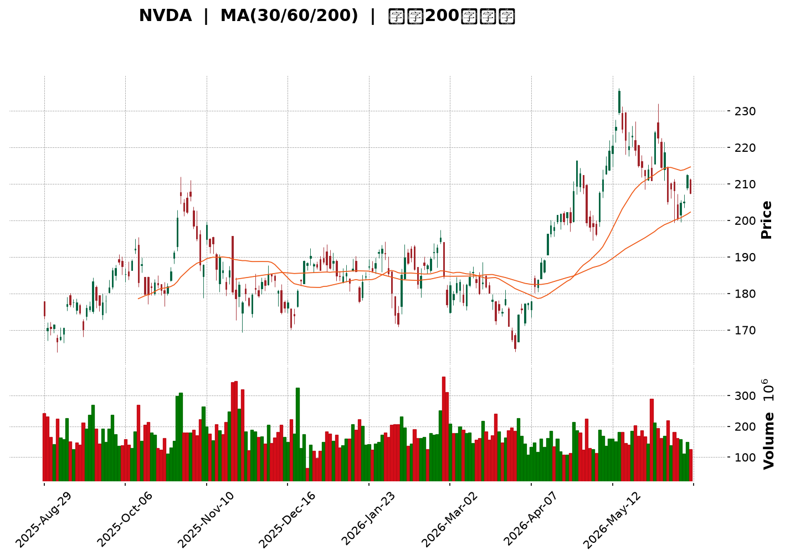
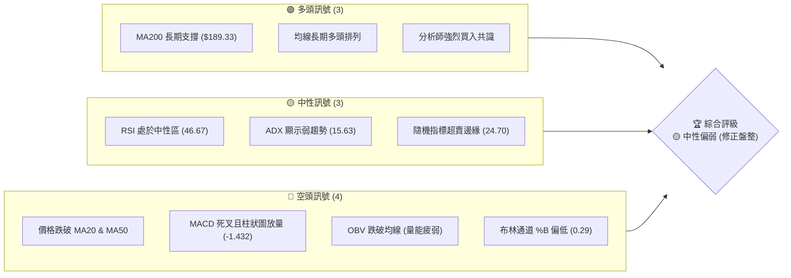
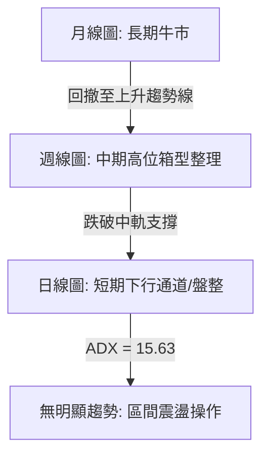
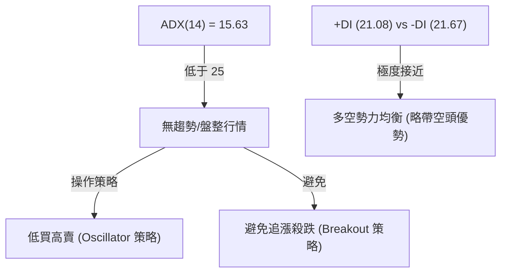
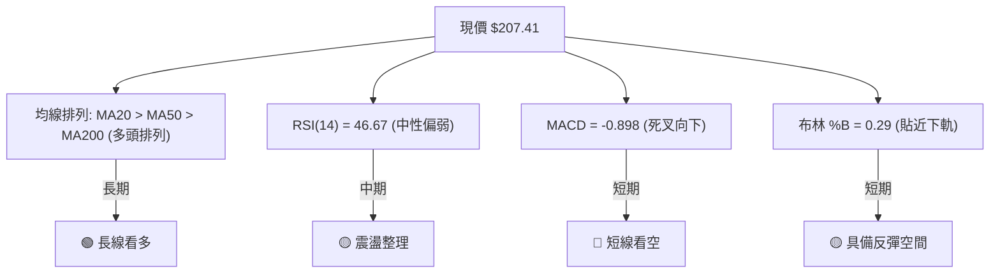
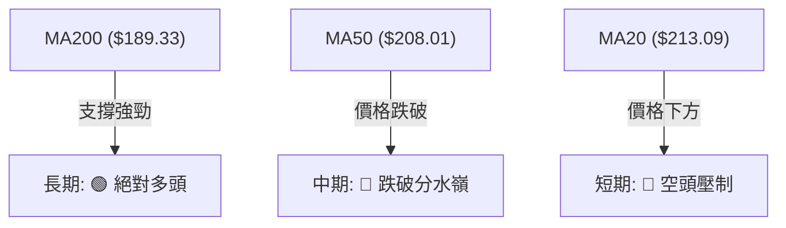
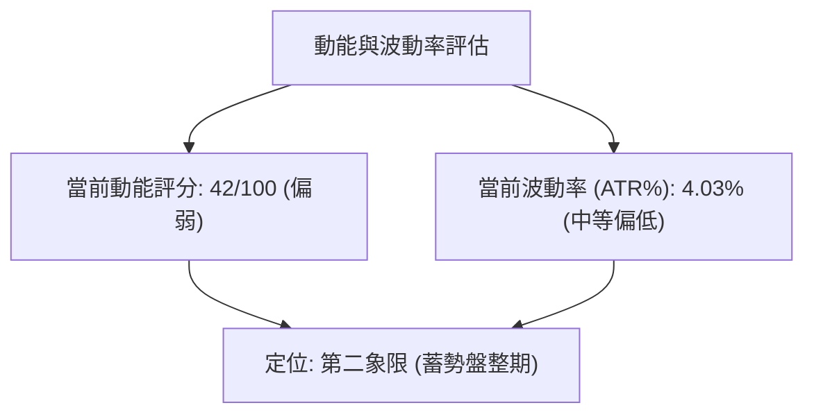
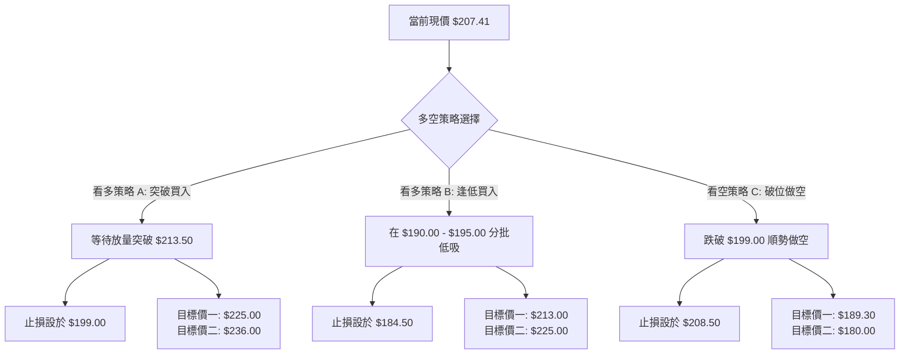
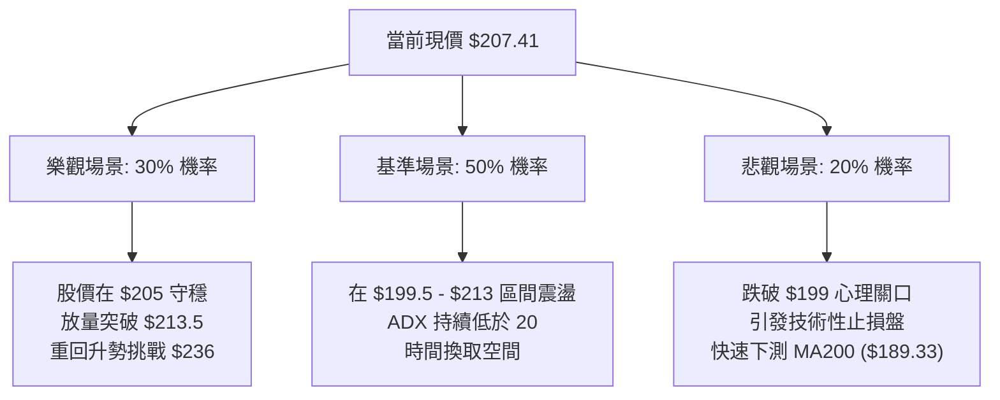

<details>
<summary>📊 靜態圖表 (點擊展開)</summary>

</details>

<html>
<head><meta charset="utf-8" /></head>
<body>
    <div style="height:500px; width:100%;">                        <script>window.PlotlyConfig = {MathJaxConfig: 'local'};</script>
        <script charset="utf-8" src="https://cdn.plot.ly/plotly-3.6.0.min.js" integrity="sha256-QaOVwtVY0T02VaHrr6pnoHLCwayMJp4O5n4YyaE3rJk=" crossorigin="anonymous"></script>                <div id="candlestick-chart" class="plotly-graph-div" style="height:100%; width:100%;"></div>            <script>                window.PLOTLYENV=window.PLOTLYENV || {};                                if (document.getElementById("candlestick-chart")) {                    Plotly.newPlot(                        "candlestick-chart",                        [{"close":{"dtype":"f8","bdata":"AAAAgFi+ZUAAAAAAsVFlQAAAAOCTTGVAAAAAQNBtZUAAAAAAiNlkQAAAAKDBAmVAAAAAQA1RZUAAAABAAyNmQAAAAMA3HmZAAAAAAP4yZkAAAAAgwTBmQAAAACAI1WVAAAAAoFZCZUAAAAAgfwBmQAAAAAA9DmZAAAAAQAnsZkAAAACgfEZmQAAAAIDTF2ZAAAAAYNYuZkAAAAAg0T5mQAAAAKDJs2ZAAAAAYPRKZ0AAAABgDGBnQAAAAODHlGdAAAAAIDFsZ0AAAACgtylnQAAAAMC8GWdAAAAAwM+bZ0AAAAAAZApoQAAAAICn3WZAAAAAgJCCZ0AAAAAgn3lmQAAAAOA6c2ZAAAAAQIKyZkAAAABgkt9mQAAAAAAJzWZAAAAAYLydZkAAAACAnIFmQAAAAOCxvWZAAAAAQLpAZ0AAAAAA4OdnQAAAAADEGGlAAAAAQNfYaUAAAADANVRpQAAAACBtR2lAAAAAQLrTaUAAAAAg+81oQAAAAGDDXmhAAAAA4OR6Z0AAAABAIX1nQAAAAKB82WhAAAAAID8daEAAAABAszFoQAAAAEDnU2dAAAAAILC9Z0AAAAAgmEtnQAAAAMAgpGZAAAAAgAlJZ0AAAADgHY1mQAAAAGDeVGZAAAAAwCjKZkAAAAAA\u002fjJmQAAAAMD4gGZAAAAAAMkYZkAAAAAgG3ZmQAAAAOBSp2ZAAAAAYI9rZkAAAADgAuVmQAAAAGACxmZAAAAAAF4qZ0AAAABg1BdnQAAAAMDL8WZAAAAA4LSWZkAAAABA0dllQAAAAEBoAmZAAAAAoBwwZkAAAACAaldlQAAAAACxvWVAAAAAAKCYZkAAAABg6+5mQAAAAEBYn2dAAAAA4CqMZ0AAAABgiMlnQAAAAOCzf2dAAAAAIPhpZ0AAAADAukhnQAAAAKDWk2dAAAAAwIF8Z0AAAACgYWBnQAAAAOAlnGdAAAAAABEaZ0AAAABAUBRnQAAAAODeFmdAAAAAQK0yZ0AAAABAV91mQAAAAOBOWmdAAAAAoBlAZ0AAAACATDtmQAAAACAY42ZAAAAAoKwTZ0AAAADAH25nQAAAAGDFR2dAAAAAgEqJZ0AAAACALOlnQAAAAMDQCGhAAAAAoLXcZ0AAAADASCxnQAAAAIDZg2ZAAAAAQEq\u002fZUAAAADAdXVlQAAAAIDkJWdAAAAAIN+5Z0AAAAAg7olnQAAAACAxumdAAAAAAMtWZ0AAAAAgy9JmQAAAAGDUF2dAAAAAIAh4Z0AAAACgeXVnQAAAAEDXsmdAAAAAACLqZ0AAAADArhNoQAAAAOBLamhAAAAAwEUVZ0AAAABALB9mQAAAACA\u002fyGZAAAAAwJR6ZkAAAAAAJdpmQAAAAIC742ZAAAAAAE8zZkAAAAAArs1mQAAAAOBvEWdAAAAAoAc6Z0AAAABgqN1mQAAAAABJgWZAAAAAADfgZkAAAACA+7ZmQAAAAGAUhmZAAAAAoERLZkAAAABg949lQAAAAODv7WVAAAAAgN\u002ffZUAAAACAGk9mQAAAACBNYWVAAAAAQGbqZEAAAACASZ9kQAAAAKBNxmVAAAAAAHTxZUAAAAAg3yVmQAAAAMDcLWZAAAAAwJA8ZkAAAAAAx7tmQAAAAOBE9mZAAAAAICKNZ0AAAAAg3qJnQAAAAOD\u002fiGhAAAAAgG7UaEAAAACgz8NoQAAAACA\u002fLmlAAAAAgGQ6aUAAAADgtvRoQAAAAOB0SGlAAAAAAAvtaEAAAACg4QBqQAAAAGBzC2tAAAAAwH+dakAAAACANCBqQAAAAEDO6mhAAAAA4AHHaEAAAABA98doQAAAAACuiGhAAAAAYNHyaUAAAAAAH2hqQAAAACBi3mpAAAAAwOdla0AAAABAvJBrQAAAAMAlMmxAAAAAAOZubUAAAADA2CFsQAAAAGD1wWtAAAAAQE2La0AAAAAgt+ZrQAAAAIAkaGtAAAAA4IniakAAAAAghNNqQAAAAMBHi2pAAAAAwATAakAAAABgnVxqQAAAAIApA2xAAAAAgPDRa0AAAAAAANBqQAAAAMAeVWtAAAAAQDOjaUAAAADgehRqQAAAAIAUBmpAAAAAoHANaUAAAAAA15tpQAAAAIAUpmlAAAAAYGaOakAAAADAHu1pQA=="},"high":{"dtype":"f8","bdata":"SyhjfTc9ZkAKhCXR0oRlQPIu3B7IhWVAvQ4bcjR0ZUBI3Ur5wxllQA5\u002fQKBxV2VA6W9TGhVYZUCRNwYlpmFmQC2Vl2ucgWZA4I1mnOtLZkD2DGfl6FNmQGWmCsnDKGZAklw6AlefZUAIlLVG+xtmQALpOAlNO2ZA6EAK8RMKZ0AXzH8dAcZmQAxXNa2hcWZAsMXi7viAZkDJ8lQDUHFmQDj9h\u002fB\u002f+GZAWWcAN5BjZ0DpKOq7z3xnQLyWDBbQ2WdASbk7qMLDZ0Cls6Z9ul9nQLi\u002fN602mmdAa8gCw3irZ0CVIxWjo2FoQPtpTrvda2hAl+KScsW7Z0DGLoU5ERJnQHryjOhNFGdAZML3KH3hZkAJxjgxsvtmQFO9OsnZHmdAtHjHPdTRZkB3s11GmuZmQMf44st\u002f2WZACBqi\u002f2VnZ0DSxauNLPhnQMd7ueCEXGlA8hMHY259akCTJcaAt7xpQBef1xCQ9mlAUmT+9UNiakCy4urGuXZpQOvUACwrVWlAbwa89MiraEDoD8w5kIJnQDYvlzbu9WhABnC9anllaECSL6uwfnRoQOAzOdVG5mdAzDr7m4jYZ0DUaufUS5hnQHfPFFsREmdATexQxNxzZ0DVPXC3AnhoQASUmJplCmdA4gZDNoXoZkBj0cWz2z1mQAFAc\u002fip1WZA+kOWuvhhZkDB8NkoQIJmQNIpgWyNLWdA2qiBqPbGZkA0QXNfcglnQJ47w+vrDWdAjTMb7at4Z0A7a\u002fjjzC9nQFWgASkhKGdARSiX+yujZkD4oMcIHdNmQEsnF\u002f57RmZA3hzB0LhIZkDeRwU0S\u002f1lQBF11NDu\u002fWVAjsfgqFOnZkCHA0Xv8P1mQH42dQ0uo2dApFSPgcGVZ0CMJciRkQ5oQCAtbRz2kGdAeyCwJ1CYZ0C6DU67fcpnQJqPqig9FmhAohf+w5wsaEBuvYHt8v1nQGRTMTJh5GdAKsbt\u002fTWqZ0AMc9ianUNnQHw+nJ6LXGdAfy4x7C98Z0DqJ7+ThwdnQNXInS0Br2dA7chf\u002fKfGZ0DdKlX9DMVmQN3uaBHvJGdAYx4mui4+Z0DA8T8dz6tnQPJy7q13nGdANvnl2pe4Z0DgYHCXswNoQMuX7FHRJ2hAHg0QOBlIaECJfLBxLsJnQKuY5\u002fFgQWdAk92DVo9rZkDaw7bzWBNmQNvAD+K1WGdAN5PKH5ItaECSF3VO2wdoQOy1t1fJIGhAYn5tEPkraEAg6g7SsGhnQIRhwh6BXWdAPz\u002f4JWvEZ0DvSwAWaoZnQLOEIQkkw2dA2N9xzNY2aEA7lrAxFjFoQPFwjbd0rGhAsfYlsbRBaECRCX4cw8tmQKhwZZiR52ZA4ohnZL+VZkCToicvMw9nQAVjd5C++mZAg4TyEzLRZkAA2L1n\u002fdVmQGWmXdXPRmdAu6opttlsZ0A2L5zVMBdnQILyLY7yO2dA9qozxh+VZ0AZwWmo5CVnQOrzzjRU5WZAoC84tad4ZkBMEMDZrUFmQPjbGvcxRWZALfmypXkAZkCUIuYGSqBmQG78YZ6+CWZABcP\u002fuKtYZUBWtCxvFihlQDwY6sZVzWVAtvQgjTslZkDGLtdrESlmQEfSzBGoMmZA4TKkYrhAZkAKqq4sayFnQPvO+OCz+2ZAHYZcD+y4Z0B\u002fUIEJDq5nQAAAAOD\u002fiGhASBnLqFUFaUC2Fd5RwfNoQJJMKc\u002fiLmlASmpxk+g9aUA3pXeBclBpQAAAAOB0SGlAsgq4ivdyaUATNPGQilZqQN5\u002f44Z7EmtAxk6MX1zPakB0QZaoHY9qQB1IsQvEQWpANT78G3BYaUB2HVZB2C9pQI0v+3Q4AGlAsW\u002fJreEAakBhoEega75qQIVlgZR8MWtATZeNmVHBa0Bywhgtqu9rQOIa63RkcmxAMYH23neIbUASrZxQYOdsQEVRwqJut2xAXtjiV\u002f8GbEAtgAGCvDtsQPTcoSFUZGxArbElNRaYa0BQa87WoT1rQLYy33fSvGpAOUBmg5zoakBUrXaKZzNrQN0y64J2E2xA79kRiE4AbUDl0\u002fuJ8NFrQAAAAEAzs2tAAAAAANfbakAAAABACk9qQAAAAMDMbGpAAAAAQArnaUAAAADAHrVpQAAAAIA94mlAAAAAYLiWakAAAAAgrm9qQA=="},"hovertemplate":"\u003cb\u003e%{x|%Y-%m-%d}\u003c\u002fb\u003e\u003cbr\u003e\u958b: $%{open:.2f}\u003cbr\u003e\u9ad8: $%{high:.2f}\u003cbr\u003e\u4f4e: $%{low:.2f}\u003cbr\u003e\u6536: $%{close:.2f}\u003cextra\u003e\u003c\u002fextra\u003e","low":{"dtype":"f8","bdata":"VAhC+W2dZUAT481J7N9kQOfGndX4FGVAmB5oxOglZUCTjcPEQXtkQLZ0u9UT5GRATfdnTZXQZECnnBJkkudlQMbFWXMqCGZA\u002f1SwKzUHZkDFzXjPNMllQJB7rlcNxWVA+lkyXkEGZUC0HMCZq5dlQGX6f2ye3mVAkIjnXZnPZUCMfT+qif9lQNeTNWKm5WVA7x3vdBqdZUAetXskodZlQJyUONfjgmZAW0o3WPanZkDBUOvZTfVmQFJ9KClBemdAdjgBgJokZ0BODllvFuNmQGjpK\u002fp\u002f+GZA3P50Ea1JZ0DrB9jBIdpnQB9KLPUtumZAjlAHACQ3Z0CdLo8xE29mQLvWLqENImZAB4u86U9xZkCLb39VrHBmQMY3+77zr2ZAhYj+cEVyZkA18lZbHRFmQGPJRHvzcWZACkTyLIXoZkDeqhhOFIZnQJAd0CpM9WdAu88D9ZyQaUColooR6SRpQF2o+eEAOmlAyA8lhoqpaUB6t00OsbVoQBDZ+5fdTGhAU8UJPZBEZ0BzYUmt01VmQLDoyoJhMWhAXmy7aM3hZ0D1tsd8XtxnQKrKvci082ZAtoxQ8zKLZkAbr40qugJnQEcXwzd6bWZAam2FgRvTZkCUcmF+3nNmQDliuva1lmVA4QjilioIZkBHy4prsCplQBBkcBRqQGZAcgGvN84IZkBeN5wdrq5lQFyPIbypeGZATR0kQjhcZkBmPKZhtHdmQOyCKFgRlmZAI7kuj7DFZkAC4z8XGONmQLcoNP0uumZAat0uY\u002fQMZkAShe5dCM1lQPfnIvMi2mVARlOyRPvVZUBkxprJR0NlQNhMKMeKc2VAkboxhwEEZkA4P1d\u002fF8RmQH0vsper1WZAmLqnKJtLZ0DtVXTfq3hnQCB9k23fNWdAh6taFnlWZ0Br1Ij5aEhnQAGVVCP7gGdAESqdKIs9Z0BMrfQw9VJnQFW9t7KlSmdAENfRBY\u002fvZkBggkSgR+5mQAWPKWmB2WZAvHLTjKblZkAv+QpajZJmQH8Ags9LQ2dAHWwzX047Z0A1lSu3mCxmQCkn9HjYRWZAVQXa9Jb2ZkAfp4ob9VJnQAG7RApuOGdALzGSJCkvZ0BSDzukerNnQN\u002fy5b2qOmdAB+PhcKenZ0AV4Qnp8xRnQMR4TmR9AGZAlPiQQGt2ZUCBb4X7SlplQBsrIeBkzGVAaoZlpjr3ZkDZpfiwgXxnQB1u5iVIkWdAWxOGqgxJZ0AX19YMzatmQBc8xWfGXmZANMHjDApRZ0Cvo4z64S1nQLeKJPjUNmdAAzQAaSurZ0DYmRejfmVnQM4wAKq5MWhAx00zEA4DZ0AXf1LVSAVmQMCamByszWVAABCu\u002fIoWZkDFSA6d5npmQAtXwL05NWZANVSs+lgTZkCjZCCBE+tlQOjaeWs5uWZA9L9vUYcHZ0ALNHDBOrFmQGC01HRgd2ZAjszBwlymZkDPO1ji\u002fa5mQNKu36rXg2ZAqryuKrvyZUBd\u002f5KYpHBlQPQHaETP0WVAKe+V4uC4ZUC+sayznBRmQJIPJdQaXmVAxwkqHRnaZEBxKytVhYJkQDAUIDOA2GRA4zFJiX3RZUC9BYOpdGVlQG6A563F8WVAkU3jl6auZUDXDIM54oJmQIIiH4AcjWZA0pkNC7wCZ0DWH63LwjBnQN7NKJ2I0WdAXi5JeWNwaEBkWzsZoHJoQIBwxns34WhAYpDEfoKzaED\u002fLVxElthoQDrRoUCW2GhA\u002fMISdLGfaEDum6buefJoQN5RIEZv5GlAjvNb5aT+aUCiowPN0+ppQIYVDWz\u002fzmhAo971Ln+caEDoYfHqbFBoQOd1ezuoeWhAQ7GGDR\u002fMaEDQL+euTshpQEhOfKeMlGpApZrbDYO0akDD3H0Cb9VqQNwzGYD8qWtAOMcx6g6hbEAOdaOsU\u002f9rQJ4KNIu0Q2tAeU61nwA1a0AbVs4yyYdrQEptXDGkNWtACavpLZnRakCz\u002fTNGGnhqQHfaIq4uEWpAnM935StfakBAS2aYS1xqQEZjNFZd7mpA7qDoRPSia0CBSvIpVMhqQAAAAEAKX2pAAAAAYI+KaUAAAAAAAMBpQAAAAEDh6mhAAAAAoHD9aEAAAACgR\u002fFoQAAAAIAUbmlAAAAAQOEKakAAAACgR+lpQA=="},"name":"\u50f9\u683c","open":{"dtype":"f8","bdata":"EJrzTPA7ZkBhHaG\u002fwzhlQJGSopSjWmVA9mWP4PpKZUBv8bTezvlkQCz63wd46mRAkipQ0q4bZUCXIZ1E9gxmQLkxhG5vbmZAdIqS5WQxZkDUPph0R+5lQPYhuQDJGGZASQQ0WnGNZUDUjBa1RLhlQDm7TaR58WVAgefjdXTiZUDgcZNvn7dmQFCE6OdPcWZAgU3Cfj\u002fIZUAAAnB1LT5mQOZMaLFnhmZAd0daVSO7ZkCgsnI+ISBnQByOYdd4q2dAFuLQPV6eZ0BhldRqcChnQCOGGtXEP2dAZzlHoaJKZ0AGzk4shv9nQDsMzp9uKGhAcoDv5mB3Z0D6hajJGxFnQJGghUMREmdA5CL\u002ffe6\u002fZkAoF9lYan5mQLkqAAOy3GZAtHjHPdTRZkAUJZimGJ1mQNx9ROgVhmZAk1yx4GLzZkB1qOSm77dnQN4ZdiW7GWhApT4E8eH2aUAYLtUKcJxpQFloWg38xWlAlJVwGhT6aUBMLTKmuVdpQAmlCrqJ0GhAW7grGm+FaEAyxpoqQxVnQAuluTyRW2hAPG9HQSpdaEB3qM\u002fWD29oQD8fDAfQ2WdAwjVi6BDUZkB2Fu6ydTdnQOiCLIyv5GZA5PySTb8RZ0DkIASdaXZoQHc4jN9KoGZAXz01Ll1oZkADUnOd\u002fdVlQLfC\u002fZPBrGZArgiR5gVZZkBcp3s4MtFlQOC1oz7psGZAFWf48y2bZkBRb5hwwqxmQGO38rpP9WZAPjUNSlzNZkDwk7u8rypnQGyL5F\u002fUF2dASMeanO6BZkCQfnS5dZxmQA4rbKgkN2ZAGT4Z0nIBZkA6LarAVfxlQHdfn\u002fsnymVAE9ImnI0OZkAixGs0RfZmQN2S2mTo12ZA3bSx78B2Z0CLdWJWCbZnQN\u002fG7hZnb2dAOgCyo1eAZ0D5fpWc2apnQARK0756s2dAjdkqTdjwZ0DdZbGkNslnQPmHkaPjimdAX4AJ4iWcZ0BZh+5NWBtnQM8ZN8rl32ZABxpM1ckYZ0ACCWgZDgNnQBxcL726SGdAnCPfbjCbZ0BjgpuHtbVmQDABZ9yeWmZAwYvrRcwQZ0A57k7SsGhnQCSWN\u002f3SXWdAMfclhmFgZ0A\u002fx7j+LuFnQBnGAs1r42dAm6udM0TfZ0C5OschGl9nQEnOi35rQGdAxhQPiblnZkAicyjQ8NZlQFBZ2UQxD2ZAWHFuDiMBZ0AF8Jsos+RnQDFw8uzlBmhA1H0iem8ZaECLMyolDWhnQF8sKELqsGZACRjGUKSQZ0BivfTBoFpnQD26r673SmdAxh4\u002fn1blZ0BJTWEyN+hnQGZg09PRRmhAejc3JBFBaEDvB9E776BmQEWLYWt\u002f2WVAkaKN0bhIZkCX5D\u002fSC4dmQL3MIohgnmZAwJmWl95zZkDXL5e0qhNmQGWtE2ewxWZAZyX1xDE2Z0D\u002f92JyvvpmQDWsnxaNFmdAnI1TYjnYZkAwEHmmBhtnQGk2B+qPyGZAsLrGPrA5ZkCqEoF0XjlmQPZWA223IWZA5idUBwzUZUBAAVVRmhxmQPnbhXCu+2VA4881uao5ZUA+6tkyrBJlQNnSufrR2GRAh7OtnXH5ZUCIbfJvWH9lQCWC4DOFHmZAMbQtOtDwZUAtqA6MIAlnQH1Qph0btGZAGC2n0g0DZ0DD6bGnBzpnQONJSVLF02dAM89DWPWJaEA3BSSmZ6ZoQOX1tVla9WhAT\u002f0k9uj3aEC7ehBroTxpQPaPYmYxGGlAOtJcmy1HaUDVWmlgRfdoQNzkK2D9LGpAeV8JWOAnakAwh2z5eY5qQH8FCnPwNWpAmyUPQ3YhaUBg1bllkehoQFwb8uss4mhAkRKQmAj1aEADjcViHgNqQCcfszEGmWpASBqpX065akDkq0RkdUlrQBqlOnVhFWxACRl0S6OybEA3K4nIwq9sQEgoJOBGs2xAxc\u002f5kKhra0CkAAMkct1rQGAtAr3\u002fwGtALYGyIZKUa0Czs5WaNglrQM5THAHdu2pAMEn90hZhakDDYOwRkcpqQGh998xS72pA1+Rj60tdbEBPaIbHx65rQAAAAMAevWpAAAAAwPXQakAAAACAwkVqQAAAAADXU2pAAAAAgMKNaUAAAAAgri9pQAAAACCFm2lAAAAAoHAdakAAAACAwmVqQA=="},"x":["2025-08-29T00:00:00-04:00","2025-09-02T00:00:00-04:00","2025-09-03T00:00:00-04:00","2025-09-04T00:00:00-04:00","2025-09-05T00:00:00-04:00","2025-09-08T00:00:00-04:00","2025-09-09T00:00:00-04:00","2025-09-10T00:00:00-04:00","2025-09-11T00:00:00-04:00","2025-09-12T00:00:00-04:00","2025-09-15T00:00:00-04:00","2025-09-16T00:00:00-04:00","2025-09-17T00:00:00-04:00","2025-09-18T00:00:00-04:00","2025-09-19T00:00:00-04:00","2025-09-22T00:00:00-04:00","2025-09-23T00:00:00-04:00","2025-09-24T00:00:00-04:00","2025-09-25T00:00:00-04:00","2025-09-26T00:00:00-04:00","2025-09-29T00:00:00-04:00","2025-09-30T00:00:00-04:00","2025-10-01T00:00:00-04:00","2025-10-02T00:00:00-04:00","2025-10-03T00:00:00-04:00","2025-10-06T00:00:00-04:00","2025-10-07T00:00:00-04:00","2025-10-08T00:00:00-04:00","2025-10-09T00:00:00-04:00","2025-10-10T00:00:00-04:00","2025-10-13T00:00:00-04:00","2025-10-14T00:00:00-04:00","2025-10-15T00:00:00-04:00","2025-10-16T00:00:00-04:00","2025-10-17T00:00:00-04:00","2025-10-20T00:00:00-04:00","2025-10-21T00:00:00-04:00","2025-10-22T00:00:00-04:00","2025-10-23T00:00:00-04:00","2025-10-24T00:00:00-04:00","2025-10-27T00:00:00-04:00","2025-10-28T00:00:00-04:00","2025-10-29T00:00:00-04:00","2025-10-30T00:00:00-04:00","2025-10-31T00:00:00-04:00","2025-11-03T00:00:00-05:00","2025-11-04T00:00:00-05:00","2025-11-05T00:00:00-05:00","2025-11-06T00:00:00-05:00","2025-11-07T00:00:00-05:00","2025-11-10T00:00:00-05:00","2025-11-11T00:00:00-05:00","2025-11-12T00:00:00-05:00","2025-11-13T00:00:00-05:00","2025-11-14T00:00:00-05:00","2025-11-17T00:00:00-05:00","2025-11-18T00:00:00-05:00","2025-11-19T00:00:00-05:00","2025-11-20T00:00:00-05:00","2025-11-21T00:00:00-05:00","2025-11-24T00:00:00-05:00","2025-11-25T00:00:00-05:00","2025-11-26T00:00:00-05:00","2025-11-28T00:00:00-05:00","2025-12-01T00:00:00-05:00","2025-12-02T00:00:00-05:00","2025-12-03T00:00:00-05:00","2025-12-04T00:00:00-05:00","2025-12-05T00:00:00-05:00","2025-12-08T00:00:00-05:00","2025-12-09T00:00:00-05:00","2025-12-10T00:00:00-05:00","2025-12-11T00:00:00-05:00","2025-12-12T00:00:00-05:00","2025-12-15T00:00:00-05:00","2025-12-16T00:00:00-05:00","2025-12-17T00:00:00-05:00","2025-12-18T00:00:00-05:00","2025-12-19T00:00:00-05:00","2025-12-22T00:00:00-05:00","2025-12-23T00:00:00-05:00","2025-12-24T00:00:00-05:00","2025-12-26T00:00:00-05:00","2025-12-29T00:00:00-05:00","2025-12-30T00:00:00-05:00","2025-12-31T00:00:00-05:00","2026-01-02T00:00:00-05:00","2026-01-05T00:00:00-05:00","2026-01-06T00:00:00-05:00","2026-01-07T00:00:00-05:00","2026-01-08T00:00:00-05:00","2026-01-09T00:00:00-05:00","2026-01-12T00:00:00-05:00","2026-01-13T00:00:00-05:00","2026-01-14T00:00:00-05:00","2026-01-15T00:00:00-05:00","2026-01-16T00:00:00-05:00","2026-01-20T00:00:00-05:00","2026-01-21T00:00:00-05:00","2026-01-22T00:00:00-05:00","2026-01-23T00:00:00-05:00","2026-01-26T00:00:00-05:00","2026-01-27T00:00:00-05:00","2026-01-28T00:00:00-05:00","2026-01-29T00:00:00-05:00","2026-01-30T00:00:00-05:00","2026-02-02T00:00:00-05:00","2026-02-03T00:00:00-05:00","2026-02-04T00:00:00-05:00","2026-02-05T00:00:00-05:00","2026-02-06T00:00:00-05:00","2026-02-09T00:00:00-05:00","2026-02-10T00:00:00-05:00","2026-02-11T00:00:00-05:00","2026-02-12T00:00:00-05:00","2026-02-13T00:00:00-05:00","2026-02-17T00:00:00-05:00","2026-02-18T00:00:00-05:00","2026-02-19T00:00:00-05:00","2026-02-20T00:00:00-05:00","2026-02-23T00:00:00-05:00","2026-02-24T00:00:00-05:00","2026-02-25T00:00:00-05:00","2026-02-26T00:00:00-05:00","2026-02-27T00:00:00-05:00","2026-03-02T00:00:00-05:00","2026-03-03T00:00:00-05:00","2026-03-04T00:00:00-05:00","2026-03-05T00:00:00-05:00","2026-03-06T00:00:00-05:00","2026-03-09T00:00:00-04:00","2026-03-10T00:00:00-04:00","2026-03-11T00:00:00-04:00","2026-03-12T00:00:00-04:00","2026-03-13T00:00:00-04:00","2026-03-16T00:00:00-04:00","2026-03-17T00:00:00-04:00","2026-03-18T00:00:00-04:00","2026-03-19T00:00:00-04:00","2026-03-20T00:00:00-04:00","2026-03-23T00:00:00-04:00","2026-03-24T00:00:00-04:00","2026-03-25T00:00:00-04:00","2026-03-26T00:00:00-04:00","2026-03-27T00:00:00-04:00","2026-03-30T00:00:00-04:00","2026-03-31T00:00:00-04:00","2026-04-01T00:00:00-04:00","2026-04-02T00:00:00-04:00","2026-04-06T00:00:00-04:00","2026-04-07T00:00:00-04:00","2026-04-08T00:00:00-04:00","2026-04-09T00:00:00-04:00","2026-04-10T00:00:00-04:00","2026-04-13T00:00:00-04:00","2026-04-14T00:00:00-04:00","2026-04-15T00:00:00-04:00","2026-04-16T00:00:00-04:00","2026-04-17T00:00:00-04:00","2026-04-20T00:00:00-04:00","2026-04-21T00:00:00-04:00","2026-04-22T00:00:00-04:00","2026-04-23T00:00:00-04:00","2026-04-24T00:00:00-04:00","2026-04-27T00:00:00-04:00","2026-04-28T00:00:00-04:00","2026-04-29T00:00:00-04:00","2026-04-30T00:00:00-04:00","2026-05-01T00:00:00-04:00","2026-05-04T00:00:00-04:00","2026-05-05T00:00:00-04:00","2026-05-06T00:00:00-04:00","2026-05-07T00:00:00-04:00","2026-05-08T00:00:00-04:00","2026-05-11T00:00:00-04:00","2026-05-12T00:00:00-04:00","2026-05-13T00:00:00-04:00","2026-05-14T00:00:00-04:00","2026-05-15T00:00:00-04:00","2026-05-18T00:00:00-04:00","2026-05-19T00:00:00-04:00","2026-05-20T00:00:00-04:00","2026-05-21T00:00:00-04:00","2026-05-22T00:00:00-04:00","2026-05-26T00:00:00-04:00","2026-05-27T00:00:00-04:00","2026-05-28T00:00:00-04:00","2026-05-29T00:00:00-04:00","2026-06-01T00:00:00-04:00","2026-06-02T00:00:00-04:00","2026-06-03T00:00:00-04:00","2026-06-04T00:00:00-04:00","2026-06-05T00:00:00-04:00","2026-06-08T00:00:00-04:00","2026-06-09T00:00:00-04:00","2026-06-10T00:00:00-04:00","2026-06-11T00:00:00-04:00","2026-06-12T00:00:00-04:00","2026-06-15T00:00:00-04:00","2026-06-16T00:00:00-04:00"],"type":"candlestick"},{"hovertemplate":"MA30: $%{y:.2f}\u003cextra\u003e\u003c\u002fextra\u003e","line":{"color":"#2196F3","dash":"dash","width":2},"mode":"lines","name":"MA30","x":["2025-08-29T00:00:00-04:00","2025-09-02T00:00:00-04:00","2025-09-03T00:00:00-04:00","2025-09-04T00:00:00-04:00","2025-09-05T00:00:00-04:00","2025-09-08T00:00:00-04:00","2025-09-09T00:00:00-04:00","2025-09-10T00:00:00-04:00","2025-09-11T00:00:00-04:00","2025-09-12T00:00:00-04:00","2025-09-15T00:00:00-04:00","2025-09-16T00:00:00-04:00","2025-09-17T00:00:00-04:00","2025-09-18T00:00:00-04:00","2025-09-19T00:00:00-04:00","2025-09-22T00:00:00-04:00","2025-09-23T00:00:00-04:00","2025-09-24T00:00:00-04:00","2025-09-25T00:00:00-04:00","2025-09-26T00:00:00-04:00","2025-09-29T00:00:00-04:00","2025-09-30T00:00:00-04:00","2025-10-01T00:00:00-04:00","2025-10-02T00:00:00-04:00","2025-10-03T00:00:00-04:00","2025-10-06T00:00:00-04:00","2025-10-07T00:00:00-04:00","2025-10-08T00:00:00-04:00","2025-10-09T00:00:00-04:00","2025-10-10T00:00:00-04:00","2025-10-13T00:00:00-04:00","2025-10-14T00:00:00-04:00","2025-10-15T00:00:00-04:00","2025-10-16T00:00:00-04:00","2025-10-17T00:00:00-04:00","2025-10-20T00:00:00-04:00","2025-10-21T00:00:00-04:00","2025-10-22T00:00:00-04:00","2025-10-23T00:00:00-04:00","2025-10-24T00:00:00-04:00","2025-10-27T00:00:00-04:00","2025-10-28T00:00:00-04:00","2025-10-29T00:00:00-04:00","2025-10-30T00:00:00-04:00","2025-10-31T00:00:00-04:00","2025-11-03T00:00:00-05:00","2025-11-04T00:00:00-05:00","2025-11-05T00:00:00-05:00","2025-11-06T00:00:00-05:00","2025-11-07T00:00:00-05:00","2025-11-10T00:00:00-05:00","2025-11-11T00:00:00-05:00","2025-11-12T00:00:00-05:00","2025-11-13T00:00:00-05:00","2025-11-14T00:00:00-05:00","2025-11-17T00:00:00-05:00","2025-11-18T00:00:00-05:00","2025-11-19T00:00:00-05:00","2025-11-20T00:00:00-05:00","2025-11-21T00:00:00-05:00","2025-11-24T00:00:00-05:00","2025-11-25T00:00:00-05:00","2025-11-26T00:00:00-05:00","2025-11-28T00:00:00-05:00","2025-12-01T00:00:00-05:00","2025-12-02T00:00:00-05:00","2025-12-03T00:00:00-05:00","2025-12-04T00:00:00-05:00","2025-12-05T00:00:00-05:00","2025-12-08T00:00:00-05:00","2025-12-09T00:00:00-05:00","2025-12-10T00:00:00-05:00","2025-12-11T00:00:00-05:00","2025-12-12T00:00:00-05:00","2025-12-15T00:00:00-05:00","2025-12-16T00:00:00-05:00","2025-12-17T00:00:00-05:00","2025-12-18T00:00:00-05:00","2025-12-19T00:00:00-05:00","2025-12-22T00:00:00-05:00","2025-12-23T00:00:00-05:00","2025-12-24T00:00:00-05:00","2025-12-26T00:00:00-05:00","2025-12-29T00:00:00-05:00","2025-12-30T00:00:00-05:00","2025-12-31T00:00:00-05:00","2026-01-02T00:00:00-05:00","2026-01-05T00:00:00-05:00","2026-01-06T00:00:00-05:00","2026-01-07T00:00:00-05:00","2026-01-08T00:00:00-05:00","2026-01-09T00:00:00-05:00","2026-01-12T00:00:00-05:00","2026-01-13T00:00:00-05:00","2026-01-14T00:00:00-05:00","2026-01-15T00:00:00-05:00","2026-01-16T00:00:00-05:00","2026-01-20T00:00:00-05:00","2026-01-21T00:00:00-05:00","2026-01-22T00:00:00-05:00","2026-01-23T00:00:00-05:00","2026-01-26T00:00:00-05:00","2026-01-27T00:00:00-05:00","2026-01-28T00:00:00-05:00","2026-01-29T00:00:00-05:00","2026-01-30T00:00:00-05:00","2026-02-02T00:00:00-05:00","2026-02-03T00:00:00-05:00","2026-02-04T00:00:00-05:00","2026-02-05T00:00:00-05:00","2026-02-06T00:00:00-05:00","2026-02-09T00:00:00-05:00","2026-02-10T00:00:00-05:00","2026-02-11T00:00:00-05:00","2026-02-12T00:00:00-05:00","2026-02-13T00:00:00-05:00","2026-02-17T00:00:00-05:00","2026-02-18T00:00:00-05:00","2026-02-19T00:00:00-05:00","2026-02-20T00:00:00-05:00","2026-02-23T00:00:00-05:00","2026-02-24T00:00:00-05:00","2026-02-25T00:00:00-05:00","2026-02-26T00:00:00-05:00","2026-02-27T00:00:00-05:00","2026-03-02T00:00:00-05:00","2026-03-03T00:00:00-05:00","2026-03-04T00:00:00-05:00","2026-03-05T00:00:00-05:00","2026-03-06T00:00:00-05:00","2026-03-09T00:00:00-04:00","2026-03-10T00:00:00-04:00","2026-03-11T00:00:00-04:00","2026-03-12T00:00:00-04:00","2026-03-13T00:00:00-04:00","2026-03-16T00:00:00-04:00","2026-03-17T00:00:00-04:00","2026-03-18T00:00:00-04:00","2026-03-19T00:00:00-04:00","2026-03-20T00:00:00-04:00","2026-03-23T00:00:00-04:00","2026-03-24T00:00:00-04:00","2026-03-25T00:00:00-04:00","2026-03-26T00:00:00-04:00","2026-03-27T00:00:00-04:00","2026-03-30T00:00:00-04:00","2026-03-31T00:00:00-04:00","2026-04-01T00:00:00-04:00","2026-04-02T00:00:00-04:00","2026-04-06T00:00:00-04:00","2026-04-07T00:00:00-04:00","2026-04-08T00:00:00-04:00","2026-04-09T00:00:00-04:00","2026-04-10T00:00:00-04:00","2026-04-13T00:00:00-04:00","2026-04-14T00:00:00-04:00","2026-04-15T00:00:00-04:00","2026-04-16T00:00:00-04:00","2026-04-17T00:00:00-04:00","2026-04-20T00:00:00-04:00","2026-04-21T00:00:00-04:00","2026-04-22T00:00:00-04:00","2026-04-23T00:00:00-04:00","2026-04-24T00:00:00-04:00","2026-04-27T00:00:00-04:00","2026-04-28T00:00:00-04:00","2026-04-29T00:00:00-04:00","2026-04-30T00:00:00-04:00","2026-05-01T00:00:00-04:00","2026-05-04T00:00:00-04:00","2026-05-05T00:00:00-04:00","2026-05-06T00:00:00-04:00","2026-05-07T00:00:00-04:00","2026-05-08T00:00:00-04:00","2026-05-11T00:00:00-04:00","2026-05-12T00:00:00-04:00","2026-05-13T00:00:00-04:00","2026-05-14T00:00:00-04:00","2026-05-15T00:00:00-04:00","2026-05-18T00:00:00-04:00","2026-05-19T00:00:00-04:00","2026-05-20T00:00:00-04:00","2026-05-21T00:00:00-04:00","2026-05-22T00:00:00-04:00","2026-05-26T00:00:00-04:00","2026-05-27T00:00:00-04:00","2026-05-28T00:00:00-04:00","2026-05-29T00:00:00-04:00","2026-06-01T00:00:00-04:00","2026-06-02T00:00:00-04:00","2026-06-03T00:00:00-04:00","2026-06-04T00:00:00-04:00","2026-06-05T00:00:00-04:00","2026-06-08T00:00:00-04:00","2026-06-09T00:00:00-04:00","2026-06-10T00:00:00-04:00","2026-06-11T00:00:00-04:00","2026-06-12T00:00:00-04:00","2026-06-15T00:00:00-04:00","2026-06-16T00:00:00-04:00"],"y":{"dtype":"f8","bdata":"AAAAAAAA+H8AAAAAAAD4fwAAAAAAAPh\u002fAAAAAAAA+H8AAAAAAAD4fwAAAAAAAPh\u002fAAAAAAAA+H8AAAAAAAD4fwAAAAAAAPh\u002fAAAAAAAA+H8AAAAAAAD4fwAAAAAAAPh\u002fAAAAAAAA+H8AAAAAAAD4fwAAAAAAAPh\u002fAAAAAAAA+H8AAAAAAAD4fwAAAAAAAPh\u002fAAAAAAAA+H8AAAAAAAD4fwAAAAAAAPh\u002fAAAAAAAA+H8AAAAAAAD4fwAAAAAAAPh\u002fAAAAAAAA+H8AAAAAAAD4fwAAAAAAAPh\u002fAAAAAAAA+H8AAAAAAAD4f0RERJQyUmZAMzMzg0VhZkCJiIjIImtmQGZmZib1dGZAIiIi4sd\u002fZkDv7u5+DJFmQERERCRToGZAvLu7C2qrZkCamZlJka5mQImIiCjis2ZAZmZm5t+8ZkAAAAAQg8tmQImIiKhe52ZAREREFIUOZ0CJiIgI6SpnQDMzM6NqRmdA3t3dzTRfZ0BmZmYWynRnQLy7u3s4iGdAiYiICEqTZ0De3d1N5p1nQCIiIhI5sGdAAAAAkDu3Z0B3d3eXOL5nQImIiPgOvGdAd3d3Z8a+Z0DNzMx8579nQDMzM+P7u2dAvLu7izm5Z0AiIiIChKxnQFVVVcX0p2dA3t3dLc+hZ0CamZl5dJ9nQM3MzLzpn2dAZmZm9smaZ0DNzMz8RZdnQO\u002fu7i4ElmdAREREBFiUZ0Crqqo6qJdnQN7d3S3vl2dA7+7uXjCXZ0DNzMwMQZBnQBEREXHjfWdA7+7ufhViZ0Crqqp6Z0RnQKuqquqAKGdAERERIXMJZ0BmZmbG5etmQKuqqjp21WZAZmZmZuvNZkDv7u7eLclmQBERETG1vmZA7+7uLt+5ZkCamZlJZrZmQKuqqgrct2ZAREREpBG1ZkAiIiIy+bRmQJqZmbn2vGZA7+7u7q2+ZkCamZm5uMVmQCIiIoKh0GZAIiIiYkvTZkAAAAAgztpmQDMzM0PN32ZAzczMvDLpZkDNzMyso+xmQCIiIgKb8mZA7+7urrD5ZkCJiIh4CPRmQJqZmakA9WZAREREBD\u002f0ZkBVVVVlH\u002fdmQM3MzAz9+WZAq6qqGhMCZ0BmZmY2pxNnQGZmZvbuJGdAREREVDgzZ0BmZmZW2UJnQJqZmUl0SWdAIiIisjVCZ0BVVVW1oDVnQBEREVGUMWdAMzMzUxozZ0BVVVWV+zBnQBEREbHuMmdA3t3dDUsyZ0CrqqqqXC5nQFVVVXU6KmdAVVVVRRQqZ0BVVVVFyCpnQKuqquqJK2dAq6qqankyZ0ARERGR\u002fDpnQAAAAABNRmdAVVVVFVJFZ0ARERFR+z5nQM3MzOwcOmdA3t3dbYczZ0CamZnp0jhnQLy7u1vYOGdAVVVVxV0xZ0BVVVWlBCxnQO\u002fu7v40KmdAIiIiopAnZ0BERETUpR5nQFVVVcWYEWdAZmZmJi4JZ0DNzMwsRQVnQERERDRYBWdA7+7urgIKZ0Dv7u7e5ApnQJqZmdl+AGdAAAAAELLwZkCrqqqKM+ZmQBEREfEr0mZAq6qq6n29ZkBERERUtapmQKuqqhp1n2ZAq6qqKnCSZkCamZlZQIdmQBERERFJemZAzczMbPdrZkBERETEgGBmQCIiIiIaVGZAIiIi8hhYZkBmZmZGBWVmQCIiIqL6c2ZAzczMbAqIZkCamZnpXJhmQFVVVdXpq2ZAIiIi4r\u002fFZkC8u7sLHthmQM3MzJwE62ZAmpmZuYT5ZkBmZmbmShRnQLy7uwsIO2dA7+7u3vBaZ0Dv7u5eDHhnQHd3d\u002fd4jGdAERER8amhZ0B3d3dnIb1nQBEREfFa02dAzczMvB72Z0CrqqpaFhloQDMzM2PsR2hAERERgT1\u002faEAAAAAQfbpoQImIiIhI8WhAvLu7uzIxaUBmZmaWQ2RpQCIiIgLek2lA7+7ujijBaUARERGhQe1pQLy7u3svE2pAAAAA4KEvakC8u7ub2kpqQDMzMyP\u002fW2pAMzMzA2JsakCJiIh4AnpqQKuqqmoskmpA7+7urkqoakBERER0IrhqQFVVVZWfyWpA3t3d\u002fbHPakC8u7s7WdBqQO\u002fu7t6ix2pAiYiICE26akBERESE47VqQHd3d5chvGpAvLu7m0\u002fLakARERExFdVqQA=="},"type":"scatter"},{"hovertemplate":"MA60: $%{y:.2f}\u003cextra\u003e\u003c\u002fextra\u003e","line":{"color":"#9C27B0","dash":"dash","width":2},"mode":"lines","name":"MA60","x":["2025-08-29T00:00:00-04:00","2025-09-02T00:00:00-04:00","2025-09-03T00:00:00-04:00","2025-09-04T00:00:00-04:00","2025-09-05T00:00:00-04:00","2025-09-08T00:00:00-04:00","2025-09-09T00:00:00-04:00","2025-09-10T00:00:00-04:00","2025-09-11T00:00:00-04:00","2025-09-12T00:00:00-04:00","2025-09-15T00:00:00-04:00","2025-09-16T00:00:00-04:00","2025-09-17T00:00:00-04:00","2025-09-18T00:00:00-04:00","2025-09-19T00:00:00-04:00","2025-09-22T00:00:00-04:00","2025-09-23T00:00:00-04:00","2025-09-24T00:00:00-04:00","2025-09-25T00:00:00-04:00","2025-09-26T00:00:00-04:00","2025-09-29T00:00:00-04:00","2025-09-30T00:00:00-04:00","2025-10-01T00:00:00-04:00","2025-10-02T00:00:00-04:00","2025-10-03T00:00:00-04:00","2025-10-06T00:00:00-04:00","2025-10-07T00:00:00-04:00","2025-10-08T00:00:00-04:00","2025-10-09T00:00:00-04:00","2025-10-10T00:00:00-04:00","2025-10-13T00:00:00-04:00","2025-10-14T00:00:00-04:00","2025-10-15T00:00:00-04:00","2025-10-16T00:00:00-04:00","2025-10-17T00:00:00-04:00","2025-10-20T00:00:00-04:00","2025-10-21T00:00:00-04:00","2025-10-22T00:00:00-04:00","2025-10-23T00:00:00-04:00","2025-10-24T00:00:00-04:00","2025-10-27T00:00:00-04:00","2025-10-28T00:00:00-04:00","2025-10-29T00:00:00-04:00","2025-10-30T00:00:00-04:00","2025-10-31T00:00:00-04:00","2025-11-03T00:00:00-05:00","2025-11-04T00:00:00-05:00","2025-11-05T00:00:00-05:00","2025-11-06T00:00:00-05:00","2025-11-07T00:00:00-05:00","2025-11-10T00:00:00-05:00","2025-11-11T00:00:00-05:00","2025-11-12T00:00:00-05:00","2025-11-13T00:00:00-05:00","2025-11-14T00:00:00-05:00","2025-11-17T00:00:00-05:00","2025-11-18T00:00:00-05:00","2025-11-19T00:00:00-05:00","2025-11-20T00:00:00-05:00","2025-11-21T00:00:00-05:00","2025-11-24T00:00:00-05:00","2025-11-25T00:00:00-05:00","2025-11-26T00:00:00-05:00","2025-11-28T00:00:00-05:00","2025-12-01T00:00:00-05:00","2025-12-02T00:00:00-05:00","2025-12-03T00:00:00-05:00","2025-12-04T00:00:00-05:00","2025-12-05T00:00:00-05:00","2025-12-08T00:00:00-05:00","2025-12-09T00:00:00-05:00","2025-12-10T00:00:00-05:00","2025-12-11T00:00:00-05:00","2025-12-12T00:00:00-05:00","2025-12-15T00:00:00-05:00","2025-12-16T00:00:00-05:00","2025-12-17T00:00:00-05:00","2025-12-18T00:00:00-05:00","2025-12-19T00:00:00-05:00","2025-12-22T00:00:00-05:00","2025-12-23T00:00:00-05:00","2025-12-24T00:00:00-05:00","2025-12-26T00:00:00-05:00","2025-12-29T00:00:00-05:00","2025-12-30T00:00:00-05:00","2025-12-31T00:00:00-05:00","2026-01-02T00:00:00-05:00","2026-01-05T00:00:00-05:00","2026-01-06T00:00:00-05:00","2026-01-07T00:00:00-05:00","2026-01-08T00:00:00-05:00","2026-01-09T00:00:00-05:00","2026-01-12T00:00:00-05:00","2026-01-13T00:00:00-05:00","2026-01-14T00:00:00-05:00","2026-01-15T00:00:00-05:00","2026-01-16T00:00:00-05:00","2026-01-20T00:00:00-05:00","2026-01-21T00:00:00-05:00","2026-01-22T00:00:00-05:00","2026-01-23T00:00:00-05:00","2026-01-26T00:00:00-05:00","2026-01-27T00:00:00-05:00","2026-01-28T00:00:00-05:00","2026-01-29T00:00:00-05:00","2026-01-30T00:00:00-05:00","2026-02-02T00:00:00-05:00","2026-02-03T00:00:00-05:00","2026-02-04T00:00:00-05:00","2026-02-05T00:00:00-05:00","2026-02-06T00:00:00-05:00","2026-02-09T00:00:00-05:00","2026-02-10T00:00:00-05:00","2026-02-11T00:00:00-05:00","2026-02-12T00:00:00-05:00","2026-02-13T00:00:00-05:00","2026-02-17T00:00:00-05:00","2026-02-18T00:00:00-05:00","2026-02-19T00:00:00-05:00","2026-02-20T00:00:00-05:00","2026-02-23T00:00:00-05:00","2026-02-24T00:00:00-05:00","2026-02-25T00:00:00-05:00","2026-02-26T00:00:00-05:00","2026-02-27T00:00:00-05:00","2026-03-02T00:00:00-05:00","2026-03-03T00:00:00-05:00","2026-03-04T00:00:00-05:00","2026-03-05T00:00:00-05:00","2026-03-06T00:00:00-05:00","2026-03-09T00:00:00-04:00","2026-03-10T00:00:00-04:00","2026-03-11T00:00:00-04:00","2026-03-12T00:00:00-04:00","2026-03-13T00:00:00-04:00","2026-03-16T00:00:00-04:00","2026-03-17T00:00:00-04:00","2026-03-18T00:00:00-04:00","2026-03-19T00:00:00-04:00","2026-03-20T00:00:00-04:00","2026-03-23T00:00:00-04:00","2026-03-24T00:00:00-04:00","2026-03-25T00:00:00-04:00","2026-03-26T00:00:00-04:00","2026-03-27T00:00:00-04:00","2026-03-30T00:00:00-04:00","2026-03-31T00:00:00-04:00","2026-04-01T00:00:00-04:00","2026-04-02T00:00:00-04:00","2026-04-06T00:00:00-04:00","2026-04-07T00:00:00-04:00","2026-04-08T00:00:00-04:00","2026-04-09T00:00:00-04:00","2026-04-10T00:00:00-04:00","2026-04-13T00:00:00-04:00","2026-04-14T00:00:00-04:00","2026-04-15T00:00:00-04:00","2026-04-16T00:00:00-04:00","2026-04-17T00:00:00-04:00","2026-04-20T00:00:00-04:00","2026-04-21T00:00:00-04:00","2026-04-22T00:00:00-04:00","2026-04-23T00:00:00-04:00","2026-04-24T00:00:00-04:00","2026-04-27T00:00:00-04:00","2026-04-28T00:00:00-04:00","2026-04-29T00:00:00-04:00","2026-04-30T00:00:00-04:00","2026-05-01T00:00:00-04:00","2026-05-04T00:00:00-04:00","2026-05-05T00:00:00-04:00","2026-05-06T00:00:00-04:00","2026-05-07T00:00:00-04:00","2026-05-08T00:00:00-04:00","2026-05-11T00:00:00-04:00","2026-05-12T00:00:00-04:00","2026-05-13T00:00:00-04:00","2026-05-14T00:00:00-04:00","2026-05-15T00:00:00-04:00","2026-05-18T00:00:00-04:00","2026-05-19T00:00:00-04:00","2026-05-20T00:00:00-04:00","2026-05-21T00:00:00-04:00","2026-05-22T00:00:00-04:00","2026-05-26T00:00:00-04:00","2026-05-27T00:00:00-04:00","2026-05-28T00:00:00-04:00","2026-05-29T00:00:00-04:00","2026-06-01T00:00:00-04:00","2026-06-02T00:00:00-04:00","2026-06-03T00:00:00-04:00","2026-06-04T00:00:00-04:00","2026-06-05T00:00:00-04:00","2026-06-08T00:00:00-04:00","2026-06-09T00:00:00-04:00","2026-06-10T00:00:00-04:00","2026-06-11T00:00:00-04:00","2026-06-12T00:00:00-04:00","2026-06-15T00:00:00-04:00","2026-06-16T00:00:00-04:00"],"y":{"dtype":"f8","bdata":"AAAAAAAA+H8AAAAAAAD4fwAAAAAAAPh\u002fAAAAAAAA+H8AAAAAAAD4fwAAAAAAAPh\u002fAAAAAAAA+H8AAAAAAAD4fwAAAAAAAPh\u002fAAAAAAAA+H8AAAAAAAD4fwAAAAAAAPh\u002fAAAAAAAA+H8AAAAAAAD4fwAAAAAAAPh\u002fAAAAAAAA+H8AAAAAAAD4fwAAAAAAAPh\u002fAAAAAAAA+H8AAAAAAAD4fwAAAAAAAPh\u002fAAAAAAAA+H8AAAAAAAD4fwAAAAAAAPh\u002fAAAAAAAA+H8AAAAAAAD4fwAAAAAAAPh\u002fAAAAAAAA+H8AAAAAAAD4fwAAAAAAAPh\u002fAAAAAAAA+H8AAAAAAAD4fwAAAAAAAPh\u002fAAAAAAAA+H8AAAAAAAD4fwAAAAAAAPh\u002fAAAAAAAA+H8AAAAAAAD4fwAAAAAAAPh\u002fAAAAAAAA+H8AAAAAAAD4fwAAAAAAAPh\u002fAAAAAAAA+H8AAAAAAAD4fwAAAAAAAPh\u002fAAAAAAAA+H8AAAAAAAD4fwAAAAAAAPh\u002fAAAAAAAA+H8AAAAAAAD4fwAAAAAAAPh\u002fAAAAAAAA+H8AAAAAAAD4fwAAAAAAAPh\u002fAAAAAAAA+H8AAAAAAAD4fwAAAAAAAPh\u002fAAAAAAAA+H8AAAAAAAD4f83MzKwT\u002fWZAiYiIWIoBZ0ARERGhSwVnQJqZmXFvCmdARERE7EgNZ0De3d09KRRnQJqZmakrG2dAAAAACOEfZ0AiIiLCHCNnQDMzM6voJWdAq6qqIggqZ0BmZmYO4i1nQM3MzAyhMmdAmpmZSU04Z0CamZlBqDdnQO\u002fu7sZ1N2dAd3d391M0Z0BmZmbuVzBnQDMzM1vXLmdAd3d3t5owZ0BmZmYWijNnQJqZmSF3N2dAd3d3X404Z0CJiIhwTzpnQJqZmYH1OWdA3t3dBew5Z0B3d3dXcDpnQGZmZk55PGdAVVVVvfM7Z0De3d1dHjlnQLy7uyNLPGdAAAAASI06Z0DNzMxMIT1nQAAAAIDbP2dAmpmZWf5BZ0DNzMzU9EFnQImIiJhPRGdAmpmZWQRHZ0CamZlZ2EVnQLy7u+t3RmdAmpmZsbdFZ0ARERE5sENnQO\u002fu7j7wO2dAzczMTBQyZ0CJiIhYByxnQImIiPC3JmdAq6qqulUeZ0BmZmaOXxdnQCIiIkJ1D2dAREREjBAIZ0AiIiJKZ\u002f9mQBEREcEk+GZAERERwXz2ZkB3d3fvsPNmQN7d3V1l9WZAERERWa7zZkBmZmbuqvFmQHd3d5eY82ZAIiIiGmH0ZkB3d3d\u002fQPhmQGZmZrYV\u002fmZAZmZmZuICZ0CJiIhY5QpnQJqZmSENE2dAERERaUIXZ0Dv7u5+zxVnQHd3d\u002fdbFmdAZmZmDpwWZ0ARERGxbRZnQKuqqoLsFmdAzczMZM4SZ0BVVVUFkhFnQN7d3QUZEmdAZmZm3tEUZ0BVVVWFJhlnQN7d3d1DG2dAVVVVPTMeZ0CamZlBDyRnQO\u002fu7j5mJ2dAiYiIMBwmZ0AiIiLKQiBnQFVVVZUJGWdAmpmZMeYRZ0AAAACQlwtnQBEREVGNAmdAREREfOT3ZkB3d3f\u002fiOxmQAAAAMjX5GZAAAAAOELeZkB3d3dPBNlmQN7d3X3p0mZAvLu7azjPZkCrqqqqvs1mQBEREZEzzWZAvLu7g7XOZkC8u7tLANJmQHd3d8cL12ZAVVVV7cjdZkCamZnpl+hmQImIiBhh8mZAvLu70477ZkCJiIhYEQJnQN7d3c2cCmdA3t3drYoQZ0BVVVVdeBlnQImIiGhQJmdAq6qqgg8yZ0De3d3FqD5nQN7d3ZXoSGdAAAAAUNZVZ0AzMzMjA2RnQFVVVeXsaWdAZmZmZmhzZ0CrqqrypH9nQCIiIioMjWdA3t3dtV2eZ0AiIiIymbJnQJqZmdFeyGdAMzMzc9HhZ0AAAAD4wfVnQJqZmYkTB2hA3t3d\u002fY8WaECrqqoy4SZoQO\u002fu7s6kM2hAERERad1DaEARERHx71doQKuqquL8Z2hAAAAAODZ6aEARERGxL4loQAAAACALn2hAiYiISAW3aEAAAABAIMhoQBERERlS2mhAvLu7W5vkaEARERERUvJoQFVVVXVVAWlAvLu7854KaUCamZnx9xZpQHd3d0dNJGlAZmZmxnw2aUBERERMG0lpQA=="},"type":"scatter"},{"hovertemplate":"MA200: $%{y:.2f}\u003cextra\u003e\u003c\u002fextra\u003e","line":{"color":"#FF6F00","dash":"solid","width":2},"mode":"lines","name":"MA200","x":["2025-08-29T00:00:00-04:00","2025-09-02T00:00:00-04:00","2025-09-03T00:00:00-04:00","2025-09-04T00:00:00-04:00","2025-09-05T00:00:00-04:00","2025-09-08T00:00:00-04:00","2025-09-09T00:00:00-04:00","2025-09-10T00:00:00-04:00","2025-09-11T00:00:00-04:00","2025-09-12T00:00:00-04:00","2025-09-15T00:00:00-04:00","2025-09-16T00:00:00-04:00","2025-09-17T00:00:00-04:00","2025-09-18T00:00:00-04:00","2025-09-19T00:00:00-04:00","2025-09-22T00:00:00-04:00","2025-09-23T00:00:00-04:00","2025-09-24T00:00:00-04:00","2025-09-25T00:00:00-04:00","2025-09-26T00:00:00-04:00","2025-09-29T00:00:00-04:00","2025-09-30T00:00:00-04:00","2025-10-01T00:00:00-04:00","2025-10-02T00:00:00-04:00","2025-10-03T00:00:00-04:00","2025-10-06T00:00:00-04:00","2025-10-07T00:00:00-04:00","2025-10-08T00:00:00-04:00","2025-10-09T00:00:00-04:00","2025-10-10T00:00:00-04:00","2025-10-13T00:00:00-04:00","2025-10-14T00:00:00-04:00","2025-10-15T00:00:00-04:00","2025-10-16T00:00:00-04:00","2025-10-17T00:00:00-04:00","2025-10-20T00:00:00-04:00","2025-10-21T00:00:00-04:00","2025-10-22T00:00:00-04:00","2025-10-23T00:00:00-04:00","2025-10-24T00:00:00-04:00","2025-10-27T00:00:00-04:00","2025-10-28T00:00:00-04:00","2025-10-29T00:00:00-04:00","2025-10-30T00:00:00-04:00","2025-10-31T00:00:00-04:00","2025-11-03T00:00:00-05:00","2025-11-04T00:00:00-05:00","2025-11-05T00:00:00-05:00","2025-11-06T00:00:00-05:00","2025-11-07T00:00:00-05:00","2025-11-10T00:00:00-05:00","2025-11-11T00:00:00-05:00","2025-11-12T00:00:00-05:00","2025-11-13T00:00:00-05:00","2025-11-14T00:00:00-05:00","2025-11-17T00:00:00-05:00","2025-11-18T00:00:00-05:00","2025-11-19T00:00:00-05:00","2025-11-20T00:00:00-05:00","2025-11-21T00:00:00-05:00","2025-11-24T00:00:00-05:00","2025-11-25T00:00:00-05:00","2025-11-26T00:00:00-05:00","2025-11-28T00:00:00-05:00","2025-12-01T00:00:00-05:00","2025-12-02T00:00:00-05:00","2025-12-03T00:00:00-05:00","2025-12-04T00:00:00-05:00","2025-12-05T00:00:00-05:00","2025-12-08T00:00:00-05:00","2025-12-09T00:00:00-05:00","2025-12-10T00:00:00-05:00","2025-12-11T00:00:00-05:00","2025-12-12T00:00:00-05:00","2025-12-15T00:00:00-05:00","2025-12-16T00:00:00-05:00","2025-12-17T00:00:00-05:00","2025-12-18T00:00:00-05:00","2025-12-19T00:00:00-05:00","2025-12-22T00:00:00-05:00","2025-12-23T00:00:00-05:00","2025-12-24T00:00:00-05:00","2025-12-26T00:00:00-05:00","2025-12-29T00:00:00-05:00","2025-12-30T00:00:00-05:00","2025-12-31T00:00:00-05:00","2026-01-02T00:00:00-05:00","2026-01-05T00:00:00-05:00","2026-01-06T00:00:00-05:00","2026-01-07T00:00:00-05:00","2026-01-08T00:00:00-05:00","2026-01-09T00:00:00-05:00","2026-01-12T00:00:00-05:00","2026-01-13T00:00:00-05:00","2026-01-14T00:00:00-05:00","2026-01-15T00:00:00-05:00","2026-01-16T00:00:00-05:00","2026-01-20T00:00:00-05:00","2026-01-21T00:00:00-05:00","2026-01-22T00:00:00-05:00","2026-01-23T00:00:00-05:00","2026-01-26T00:00:00-05:00","2026-01-27T00:00:00-05:00","2026-01-28T00:00:00-05:00","2026-01-29T00:00:00-05:00","2026-01-30T00:00:00-05:00","2026-02-02T00:00:00-05:00","2026-02-03T00:00:00-05:00","2026-02-04T00:00:00-05:00","2026-02-05T00:00:00-05:00","2026-02-06T00:00:00-05:00","2026-02-09T00:00:00-05:00","2026-02-10T00:00:00-05:00","2026-02-11T00:00:00-05:00","2026-02-12T00:00:00-05:00","2026-02-13T00:00:00-05:00","2026-02-17T00:00:00-05:00","2026-02-18T00:00:00-05:00","2026-02-19T00:00:00-05:00","2026-02-20T00:00:00-05:00","2026-02-23T00:00:00-05:00","2026-02-24T00:00:00-05:00","2026-02-25T00:00:00-05:00","2026-02-26T00:00:00-05:00","2026-02-27T00:00:00-05:00","2026-03-02T00:00:00-05:00","2026-03-03T00:00:00-05:00","2026-03-04T00:00:00-05:00","2026-03-05T00:00:00-05:00","2026-03-06T00:00:00-05:00","2026-03-09T00:00:00-04:00","2026-03-10T00:00:00-04:00","2026-03-11T00:00:00-04:00","2026-03-12T00:00:00-04:00","2026-03-13T00:00:00-04:00","2026-03-16T00:00:00-04:00","2026-03-17T00:00:00-04:00","2026-03-18T00:00:00-04:00","2026-03-19T00:00:00-04:00","2026-03-20T00:00:00-04:00","2026-03-23T00:00:00-04:00","2026-03-24T00:00:00-04:00","2026-03-25T00:00:00-04:00","2026-03-26T00:00:00-04:00","2026-03-27T00:00:00-04:00","2026-03-30T00:00:00-04:00","2026-03-31T00:00:00-04:00","2026-04-01T00:00:00-04:00","2026-04-02T00:00:00-04:00","2026-04-06T00:00:00-04:00","2026-04-07T00:00:00-04:00","2026-04-08T00:00:00-04:00","2026-04-09T00:00:00-04:00","2026-04-10T00:00:00-04:00","2026-04-13T00:00:00-04:00","2026-04-14T00:00:00-04:00","2026-04-15T00:00:00-04:00","2026-04-16T00:00:00-04:00","2026-04-17T00:00:00-04:00","2026-04-20T00:00:00-04:00","2026-04-21T00:00:00-04:00","2026-04-22T00:00:00-04:00","2026-04-23T00:00:00-04:00","2026-04-24T00:00:00-04:00","2026-04-27T00:00:00-04:00","2026-04-28T00:00:00-04:00","2026-04-29T00:00:00-04:00","2026-04-30T00:00:00-04:00","2026-05-01T00:00:00-04:00","2026-05-04T00:00:00-04:00","2026-05-05T00:00:00-04:00","2026-05-06T00:00:00-04:00","2026-05-07T00:00:00-04:00","2026-05-08T00:00:00-04:00","2026-05-11T00:00:00-04:00","2026-05-12T00:00:00-04:00","2026-05-13T00:00:00-04:00","2026-05-14T00:00:00-04:00","2026-05-15T00:00:00-04:00","2026-05-18T00:00:00-04:00","2026-05-19T00:00:00-04:00","2026-05-20T00:00:00-04:00","2026-05-21T00:00:00-04:00","2026-05-22T00:00:00-04:00","2026-05-26T00:00:00-04:00","2026-05-27T00:00:00-04:00","2026-05-28T00:00:00-04:00","2026-05-29T00:00:00-04:00","2026-06-01T00:00:00-04:00","2026-06-02T00:00:00-04:00","2026-06-03T00:00:00-04:00","2026-06-04T00:00:00-04:00","2026-06-05T00:00:00-04:00","2026-06-08T00:00:00-04:00","2026-06-09T00:00:00-04:00","2026-06-10T00:00:00-04:00","2026-06-11T00:00:00-04:00","2026-06-12T00:00:00-04:00","2026-06-15T00:00:00-04:00","2026-06-16T00:00:00-04:00"],"y":{"dtype":"f8","bdata":"AAAAAAAA+H8AAAAAAAD4fwAAAAAAAPh\u002fAAAAAAAA+H8AAAAAAAD4fwAAAAAAAPh\u002fAAAAAAAA+H8AAAAAAAD4fwAAAAAAAPh\u002fAAAAAAAA+H8AAAAAAAD4fwAAAAAAAPh\u002fAAAAAAAA+H8AAAAAAAD4fwAAAAAAAPh\u002fAAAAAAAA+H8AAAAAAAD4fwAAAAAAAPh\u002fAAAAAAAA+H8AAAAAAAD4fwAAAAAAAPh\u002fAAAAAAAA+H8AAAAAAAD4fwAAAAAAAPh\u002fAAAAAAAA+H8AAAAAAAD4fwAAAAAAAPh\u002fAAAAAAAA+H8AAAAAAAD4fwAAAAAAAPh\u002fAAAAAAAA+H8AAAAAAAD4fwAAAAAAAPh\u002fAAAAAAAA+H8AAAAAAAD4fwAAAAAAAPh\u002fAAAAAAAA+H8AAAAAAAD4fwAAAAAAAPh\u002fAAAAAAAA+H8AAAAAAAD4fwAAAAAAAPh\u002fAAAAAAAA+H8AAAAAAAD4fwAAAAAAAPh\u002fAAAAAAAA+H8AAAAAAAD4fwAAAAAAAPh\u002fAAAAAAAA+H8AAAAAAAD4fwAAAAAAAPh\u002fAAAAAAAA+H8AAAAAAAD4fwAAAAAAAPh\u002fAAAAAAAA+H8AAAAAAAD4fwAAAAAAAPh\u002fAAAAAAAA+H8AAAAAAAD4fwAAAAAAAPh\u002fAAAAAAAA+H8AAAAAAAD4fwAAAAAAAPh\u002fAAAAAAAA+H8AAAAAAAD4fwAAAAAAAPh\u002fAAAAAAAA+H8AAAAAAAD4fwAAAAAAAPh\u002fAAAAAAAA+H8AAAAAAAD4fwAAAAAAAPh\u002fAAAAAAAA+H8AAAAAAAD4fwAAAAAAAPh\u002fAAAAAAAA+H8AAAAAAAD4fwAAAAAAAPh\u002fAAAAAAAA+H8AAAAAAAD4fwAAAAAAAPh\u002fAAAAAAAA+H8AAAAAAAD4fwAAAAAAAPh\u002fAAAAAAAA+H8AAAAAAAD4fwAAAAAAAPh\u002fAAAAAAAA+H8AAAAAAAD4fwAAAAAAAPh\u002fAAAAAAAA+H8AAAAAAAD4fwAAAAAAAPh\u002fAAAAAAAA+H8AAAAAAAD4fwAAAAAAAPh\u002fAAAAAAAA+H8AAAAAAAD4fwAAAAAAAPh\u002fAAAAAAAA+H8AAAAAAAD4fwAAAAAAAPh\u002fAAAAAAAA+H8AAAAAAAD4fwAAAAAAAPh\u002fAAAAAAAA+H8AAAAAAAD4fwAAAAAAAPh\u002fAAAAAAAA+H8AAAAAAAD4fwAAAAAAAPh\u002fAAAAAAAA+H8AAAAAAAD4fwAAAAAAAPh\u002fAAAAAAAA+H8AAAAAAAD4fwAAAAAAAPh\u002fAAAAAAAA+H8AAAAAAAD4fwAAAAAAAPh\u002fAAAAAAAA+H8AAAAAAAD4fwAAAAAAAPh\u002fAAAAAAAA+H8AAAAAAAD4fwAAAAAAAPh\u002fAAAAAAAA+H8AAAAAAAD4fwAAAAAAAPh\u002fAAAAAAAA+H8AAAAAAAD4fwAAAAAAAPh\u002fAAAAAAAA+H8AAAAAAAD4fwAAAAAAAPh\u002fAAAAAAAA+H8AAAAAAAD4fwAAAAAAAPh\u002fAAAAAAAA+H8AAAAAAAD4fwAAAAAAAPh\u002fAAAAAAAA+H8AAAAAAAD4fwAAAAAAAPh\u002fAAAAAAAA+H8AAAAAAAD4fwAAAAAAAPh\u002fAAAAAAAA+H8AAAAAAAD4fwAAAAAAAPh\u002fAAAAAAAA+H8AAAAAAAD4fwAAAAAAAPh\u002fAAAAAAAA+H8AAAAAAAD4fwAAAAAAAPh\u002fAAAAAAAA+H8AAAAAAAD4fwAAAAAAAPh\u002fAAAAAAAA+H8AAAAAAAD4fwAAAAAAAPh\u002fAAAAAAAA+H8AAAAAAAD4fwAAAAAAAPh\u002fAAAAAAAA+H8AAAAAAAD4fwAAAAAAAPh\u002fAAAAAAAA+H8AAAAAAAD4fwAAAAAAAPh\u002fAAAAAAAA+H8AAAAAAAD4fwAAAAAAAPh\u002fAAAAAAAA+H8AAAAAAAD4fwAAAAAAAPh\u002fAAAAAAAA+H8AAAAAAAD4fwAAAAAAAPh\u002fAAAAAAAA+H8AAAAAAAD4fwAAAAAAAPh\u002fAAAAAAAA+H8AAAAAAAD4fwAAAAAAAPh\u002fAAAAAAAA+H8AAAAAAAD4fwAAAAAAAPh\u002fAAAAAAAA+H8AAAAAAAD4fwAAAAAAAPh\u002fAAAAAAAA+H8AAAAAAAD4fwAAAAAAAPh\u002fAAAAAAAA+H8AAAAAAAD4fwAAAAAAAPh\u002fAAAAAAAA+H8AAAD8kKpnQA=="},"type":"scatter"}],                        {"template":{"data":{"barpolar":[{"marker":{"line":{"color":"rgb(17,17,17)","width":0.5},"pattern":{"fillmode":"overlay","size":10,"solidity":0.2}},"type":"barpolar"}],"bar":[{"error_x":{"color":"#f2f5fa"},"error_y":{"color":"#f2f5fa"},"marker":{"line":{"color":"rgb(17,17,17)","width":0.5},"pattern":{"fillmode":"overlay","size":10,"solidity":0.2}},"type":"bar"}],"carpet":[{"aaxis":{"endlinecolor":"#A2B1C6","gridcolor":"#506784","linecolor":"#506784","minorgridcolor":"#506784","startlinecolor":"#A2B1C6"},"baxis":{"endlinecolor":"#A2B1C6","gridcolor":"#506784","linecolor":"#506784","minorgridcolor":"#506784","startlinecolor":"#A2B1C6"},"type":"carpet"}],"choropleth":[{"colorbar":{"outlinewidth":0,"ticks":""},"type":"choropleth"}],"contourcarpet":[{"colorbar":{"outlinewidth":0,"ticks":""},"type":"contourcarpet"}],"contour":[{"colorbar":{"outlinewidth":0,"ticks":""},"colorscale":[[0.0,"#0d0887"],[0.1111111111111111,"#46039f"],[0.2222222222222222,"#7201a8"],[0.3333333333333333,"#9c179e"],[0.4444444444444444,"#bd3786"],[0.5555555555555556,"#d8576b"],[0.6666666666666666,"#ed7953"],[0.7777777777777778,"#fb9f3a"],[0.8888888888888888,"#fdca26"],[1.0,"#f0f921"]],"type":"contour"}],"heatmap":[{"colorbar":{"outlinewidth":0,"ticks":""},"colorscale":[[0.0,"#0d0887"],[0.1111111111111111,"#46039f"],[0.2222222222222222,"#7201a8"],[0.3333333333333333,"#9c179e"],[0.4444444444444444,"#bd3786"],[0.5555555555555556,"#d8576b"],[0.6666666666666666,"#ed7953"],[0.7777777777777778,"#fb9f3a"],[0.8888888888888888,"#fdca26"],[1.0,"#f0f921"]],"type":"heatmap"}],"histogram2dcontour":[{"colorbar":{"outlinewidth":0,"ticks":""},"colorscale":[[0.0,"#0d0887"],[0.1111111111111111,"#46039f"],[0.2222222222222222,"#7201a8"],[0.3333333333333333,"#9c179e"],[0.4444444444444444,"#bd3786"],[0.5555555555555556,"#d8576b"],[0.6666666666666666,"#ed7953"],[0.7777777777777778,"#fb9f3a"],[0.8888888888888888,"#fdca26"],[1.0,"#f0f921"]],"type":"histogram2dcontour"}],"histogram2d":[{"colorbar":{"outlinewidth":0,"ticks":""},"colorscale":[[0.0,"#0d0887"],[0.1111111111111111,"#46039f"],[0.2222222222222222,"#7201a8"],[0.3333333333333333,"#9c179e"],[0.4444444444444444,"#bd3786"],[0.5555555555555556,"#d8576b"],[0.6666666666666666,"#ed7953"],[0.7777777777777778,"#fb9f3a"],[0.8888888888888888,"#fdca26"],[1.0,"#f0f921"]],"type":"histogram2d"}],"histogram":[{"marker":{"pattern":{"fillmode":"overlay","size":10,"solidity":0.2}},"type":"histogram"}],"mesh3d":[{"colorbar":{"outlinewidth":0,"ticks":""},"type":"mesh3d"}],"parcoords":[{"line":{"colorbar":{"outlinewidth":0,"ticks":""}},"type":"parcoords"}],"pie":[{"automargin":true,"type":"pie"}],"scatter3d":[{"line":{"colorbar":{"outlinewidth":0,"ticks":""}},"marker":{"colorbar":{"outlinewidth":0,"ticks":""}},"type":"scatter3d"}],"scattercarpet":[{"marker":{"colorbar":{"outlinewidth":0,"ticks":""}},"type":"scattercarpet"}],"scattergeo":[{"marker":{"colorbar":{"outlinewidth":0,"ticks":""}},"type":"scattergeo"}],"scattergl":[{"marker":{"line":{"color":"#283442"}},"type":"scattergl"}],"scattermapbox":[{"marker":{"colorbar":{"outlinewidth":0,"ticks":""}},"type":"scattermapbox"}],"scattermap":[{"marker":{"colorbar":{"outlinewidth":0,"ticks":""}},"type":"scattermap"}],"scatterpolargl":[{"marker":{"colorbar":{"outlinewidth":0,"ticks":""}},"type":"scatterpolargl"}],"scatterpolar":[{"marker":{"colorbar":{"outlinewidth":0,"ticks":""}},"type":"scatterpolar"}],"scatter":[{"marker":{"line":{"color":"#283442"}},"type":"scatter"}],"scatterternary":[{"marker":{"colorbar":{"outlinewidth":0,"ticks":""}},"type":"scatterternary"}],"surface":[{"colorbar":{"outlinewidth":0,"ticks":""},"colorscale":[[0.0,"#0d0887"],[0.1111111111111111,"#46039f"],[0.2222222222222222,"#7201a8"],[0.3333333333333333,"#9c179e"],[0.4444444444444444,"#bd3786"],[0.5555555555555556,"#d8576b"],[0.6666666666666666,"#ed7953"],[0.7777777777777778,"#fb9f3a"],[0.8888888888888888,"#fdca26"],[1.0,"#f0f921"]],"type":"surface"}],"table":[{"cells":{"fill":{"color":"#506784"},"line":{"color":"rgb(17,17,17)"}},"header":{"fill":{"color":"#2a3f5f"},"line":{"color":"rgb(17,17,17)"}},"type":"table"}]},"layout":{"annotationdefaults":{"arrowcolor":"#f2f5fa","arrowhead":0,"arrowwidth":1},"autotypenumbers":"strict","coloraxis":{"colorbar":{"outlinewidth":0,"ticks":""}},"colorscale":{"diverging":[[0,"#8e0152"],[0.1,"#c51b7d"],[0.2,"#de77ae"],[0.3,"#f1b6da"],[0.4,"#fde0ef"],[0.5,"#f7f7f7"],[0.6,"#e6f5d0"],[0.7,"#b8e186"],[0.8,"#7fbc41"],[0.9,"#4d9221"],[1,"#276419"]],"sequential":[[0.0,"#0d0887"],[0.1111111111111111,"#46039f"],[0.2222222222222222,"#7201a8"],[0.3333333333333333,"#9c179e"],[0.4444444444444444,"#bd3786"],[0.5555555555555556,"#d8576b"],[0.6666666666666666,"#ed7953"],[0.7777777777777778,"#fb9f3a"],[0.8888888888888888,"#fdca26"],[1.0,"#f0f921"]],"sequentialminus":[[0.0,"#0d0887"],[0.1111111111111111,"#46039f"],[0.2222222222222222,"#7201a8"],[0.3333333333333333,"#9c179e"],[0.4444444444444444,"#bd3786"],[0.5555555555555556,"#d8576b"],[0.6666666666666666,"#ed7953"],[0.7777777777777778,"#fb9f3a"],[0.8888888888888888,"#fdca26"],[1.0,"#f0f921"]]},"colorway":["#636efa","#EF553B","#00cc96","#ab63fa","#FFA15A","#19d3f3","#FF6692","#B6E880","#FF97FF","#FECB52"],"font":{"color":"#f2f5fa"},"geo":{"bgcolor":"rgb(17,17,17)","lakecolor":"rgb(17,17,17)","landcolor":"rgb(17,17,17)","showlakes":true,"showland":true,"subunitcolor":"#506784"},"hoverlabel":{"align":"left"},"hovermode":"closest","mapbox":{"style":"dark"},"paper_bgcolor":"rgb(17,17,17)","plot_bgcolor":"rgb(17,17,17)","polar":{"angularaxis":{"gridcolor":"#506784","linecolor":"#506784","ticks":""},"bgcolor":"rgb(17,17,17)","radialaxis":{"gridcolor":"#506784","linecolor":"#506784","ticks":""}},"scene":{"xaxis":{"backgroundcolor":"rgb(17,17,17)","gridcolor":"#506784","gridwidth":2,"linecolor":"#506784","showbackground":true,"ticks":"","zerolinecolor":"#C8D4E3"},"yaxis":{"backgroundcolor":"rgb(17,17,17)","gridcolor":"#506784","gridwidth":2,"linecolor":"#506784","showbackground":true,"ticks":"","zerolinecolor":"#C8D4E3"},"zaxis":{"backgroundcolor":"rgb(17,17,17)","gridcolor":"#506784","gridwidth":2,"linecolor":"#506784","showbackground":true,"ticks":"","zerolinecolor":"#C8D4E3"}},"shapedefaults":{"line":{"color":"#f2f5fa"}},"sliderdefaults":{"bgcolor":"#C8D4E3","bordercolor":"rgb(17,17,17)","borderwidth":1,"tickwidth":0},"ternary":{"aaxis":{"gridcolor":"#506784","linecolor":"#506784","ticks":""},"baxis":{"gridcolor":"#506784","linecolor":"#506784","ticks":""},"bgcolor":"rgb(17,17,17)","caxis":{"gridcolor":"#506784","linecolor":"#506784","ticks":""}},"title":{"x":0.05},"updatemenudefaults":{"bgcolor":"#506784","borderwidth":0},"xaxis":{"automargin":true,"gridcolor":"#283442","linecolor":"#506784","ticks":"","title":{"standoff":15},"zerolinecolor":"#283442","zerolinewidth":2},"yaxis":{"automargin":true,"gridcolor":"#283442","linecolor":"#506784","ticks":"","title":{"standoff":15},"zerolinecolor":"#283442","zerolinewidth":2}}},"xaxis":{"rangeslider":{"visible":false},"title":{"text":"\u65e5\u671f"}},"font":{"size":11},"title":{"text":"NVDA  |  MA(30\u002f60\u002f200)  |  \u6700\u8fd1200\u4ea4\u6613\u65e5"},"yaxis":{"title":{"text":"\u80a1\u50f9 (USD)"}},"hovermode":"x unified","height":500},                        {"responsive": true}                    )                };            </script>        </div>
</body>
</html>

# NVDA 技術分析報告

> **報告日期**：2026-06-17 ｜ **語言**：繁體中文 ｜ **數據來源**：Yahoo Finance ｜ **當前價格**：$207.41

---

## 目錄

| 章節 | 內容 |
|------|------|
| [1. 技術面概覽](#1-技術面概覽) | 訊號儀表板、核心指標、評分卡 |
| [2. 趨勢分析](#2-趨勢分析) | 多時框趨勢、長中短期走勢 |
| [3. 圖表形態分析](#3-圖表形態分析) | 形態識別、K線組合、目標價 |
| [4. 支撐與阻力](#4-支撐與阻力) | 關鍵價位、斐波那契回調 |
| [5. 技術指標深度解讀](#5-技術指標深度解讀) | MA/RSI/MACD/布林/成交量 |
| [6. 動能與波動率](#6-動能與波動率) | 動能評估、ATR、Beta |
| [7. 多時框架總結](#7-多時框架總結) | 時框架評分矩陣 |
| [8. 交易策略建議](#8-交易策略建議) | 多空策略、風險報酬比 |
| [9. 風險提示與監控](#9-風險提示與監控) | 監控指標、風險場景 |

---

## 1. 技術面概覽

### 🎯 技術訊號儀表板

目前 NVIDIA (NVDA) 的技術面呈現**「短期修正、中期盤整、長期多頭」**的格局。以下為多空技術訊號的分布與綜合評級：



### 📊 核心指標速覽表

| 指標類別 | 指標名稱 | 當前數值 | 訊號 | 解讀 |
|----------|----------|----------|------|------|
| **價格** | 當前收盤價 | $207.41 | 🟡 中性 | 位於 52 週高低點區間之 69.4% 位置，短期偏向弱勢整理 |
| **均線** | MA20 | $213.09 | 🔴 空頭 | 價格位於 MA20 下方，MA20 趨勢向下，短期阻力強勁 |
| **均線** | MA50 | $208.01 | 🔴 空頭 | 價格微幅跌破 MA50，中期多空分水嶺面臨考驗 |
| **均線** | MA200 | $189.33 | 🟢 多頭 | 價格遠高於 MA200，長期牛市格局未變，具備強力支撐 |
| **動能** | RSI(14) | 46.67 | 🟡 中性 | 無超買或超賣，動能偏弱，處於空頭控盤但未失控狀態 |
| **動能** | MACD | -0.898 | 🔴 空頭 | MACD 位於信號線下方，柱狀圖 -1.432 顯示下行動能仍在釋放 |
| **波動** | ATR(14) | $8.36 | 🟡 中性 | 波動率佔股價 4.03%，每日波動幅度正常，適合波段佈局 |
| **趨勢** | ADX(14) | 15.63 | 🟡 中性 | ADX < 25 指示當前為無趨勢的盤整行情，以區間震盪為主 |
| **量能** | OBV 趨勢 | OBV < MA | 🔴 空頭 | 量能無法配合價格，顯示買盤追高意願低落，資金流出 |

### 🏆 技術評分卡

╔══════════════════════════════════════════════════════════════╗
║             技術評分卡 — NVDA (2026-06-17)                   ║
╠══════════════════════════════════════════════════════════════╣
║ 趨勢強度      ██████░░░░░░░░░░░░░░  30/100  🔴 弱趨勢/盤整   ║
║ 動能指標      ████████░░░░░░░░░░░░  40/100  🟡 偏弱          ║
║ 支撐穩定度    ██══════════════════  75/100  🟢 結構性強支撐  ║
║ 成交量配合    ██████░░░░░░░░░░░░░░  30/100  🔴 價穩量縮      ║
║ 形態完整度    ████████████░░░░░░░░  60/100  🟡 旗形整理中    ║
║ 均線排列      ████████████████░░░░  80/100  🟢 長期多頭未變  ║
╠══════════════════════════════════════════════════════════════╣
║ 綜合評分      ██████████░░░░░░░░░░  52/100  🟡 中性持有      ║
╚══════════════════════════════════════════════════════════════╝

---

## 2. 趨勢分析

### 🌐 多時框趨勢分析

技術分析必須從大週期往小週期層層剖析，以確保交易方向不與大趨勢逆行。



*   **月線維度 (Long-term)**：超強多頭。價格自 2024 年 6 月的 $123.34 穩定攀升至當前的 $207.41，漲幅達 68.15%。MA240 穩定上行，月 K 線呈現高點不斷過高 (Higher Highs) 的多頭特徵。
*   **週線維度 (Medium-term)**：進入高檔箱型整理。2026 年 5 月中旬觸及 $225.06 的高點後，連續四週收黑，目前在 $205.10 - $207.41 附近尋求支撐。
*   **日線維度 (Short-term)**：偏弱修正。股價已跌破 20 日均線 ($213.09) 與 50 日均線 ($208.01)，空頭暫時掌握短期主導權。

### 📈 長期趨勢 — 12個月收盤走勢圖

以下為 NVDA 過去 12 個月（2025-07 至 2026-06）的收盤走勢與關鍵轉折點：

```
NVDA 月線走勢圖（過去12個月）
價格軸 ($)
220 ┤                                                 ● (2026-05 $210.89)
210 ┤                                             ●   │
200 ┤                             ● (2025-10     / \  ● (現在 $207.41)
190 ┤                         ●   │  $202.23)   /   \
180 ┤     ● (2025-07 $177.63)/ \  │            /     ● (2026-03 $174.20)
170 ┤    / \                /   \-●           /
160 ┤  ●/   \              /     (2025-11    /
150 ┤  (2025-06 $157.78)  /       $176.77)  /
140 ┤                    /                 /
130 ┤                   ● (2025-05 $134.94)
    └──────────────────────────────────────────────────────────────
        M1   M2   M3   M4   M5   M6   M7   M8   M9   M10  M11  M12 (月份)
```

**走勢特徵分析表格**：

| 階段 | 期間 | 起迄價格 | 漲跌幅 | 走勢特徵與量能配合 |
|:---|:---|:---|:---|:---|
| **第一階段** | 2025-05 ~ 2025-10 | $134.94 → $202.23 | +49.87% | **主升段**。成交量溫和放大，日線與週線呈現完美的多頭排列。 |
| **第二階段** | 2025-10 ~ 2026-03 | $202.23 → $174.20 | -13.86% | **中級調整段**。雙重頂部確立後回調，在 $174 附近獲得 MA200 強力支撐。 |
| **第三階段** | 2026-03 ~ 2026-05 | $174.20 → $210.89 | +21.06% | **二波攻勢**。回測支撐後快速反彈，並創下收盤新高，但量能未創波段新高。 |
| **第四階段** | 2026-05 ~ 2026-06 | $210.89 → $207.41 | -1.65% | **高位盤整段**。目前進入窄幅波動，成交量顯著萎縮（量比 0.72x）。 |

### 📊 中期趨勢（週線分析）

從週線級別來看，近期 20 週的走勢顯示出一個明顯的**「高檔旗形 (Bull Flag)」**或**「下降通道 (Descending Channel)」**修正。

```
週線壓力與支撐示意圖
$225.06 ═════════════════════════════════════ (5月高點壓力線 - 近期頭部)
            \
             \   ● $215.08
              \    \
               \    ● $210.89
                \     \
$207.41 ═════════\═════●═════════════════════ (當前價格 - 考驗50日均線)
                  \     \
                   \     ● $205.10 (近期波段低點)
                    \
$199.48 ───────────────────────────────────── (布林通道下軌支撐)
$189.33 ═════════════════════════════════════ (MA200 長期終極防線)
```

週線級別在 5 月 17 日當週收在 $225.06，隨後成交量逐週下滑，股價也呈現緩步下行。這種**「價跌量縮」**的特徵，在週線級別上屬於健康的修正，並非系統性轉折。

### ⚡ 趨勢強度評估（ADX 解讀）

我們引入 ADX（平均趨向指標）來量化當前的趨勢強度，避免在盤整市中過度使用趨勢突破策略。



| ADX 數值區間 | 趨勢強度 | NVDA 當前狀態 (15.63) | 適用技術指標 |
|:---|:---|:---|:---|
| 0 - 15 | 極弱或無趨勢 | | 隨機指標 (KD)、RSI、布林通道軌道 |
| **15 - 25** | **弱趨勢 / 盤整** | **█ 當前位置 (15.63)** | **RSI、布林通道、震盪指標** |
| 25 - 50 | 中等/強趨勢 | | 均線系統、MACD、DMI 趨勢指標 |
| 50 - 100 | 極強趨勢 | | 均線順勢、移動止損 (Trailing Stop) |

---

## 3. 圖表形態分析

### 🔍 形態識別系統

在日線與週線圖表上，NVDA 目前正處於一個關鍵的**下降旗形 (Bull Flag)** 中。這是一個經典的看漲持續形態。

```mermaid
graph TD
    subgraph 旗桿 (Flagpole)
        A["3月低點 $167.32"] -->|大成交量拉升| B["5月高點 $225.06"]
    end
    subgraph 旗面 (Flag Body)
        B -->|價跌量縮| C["通道下軌 $205.10"]
        C -->|反彈震盪| D["當前現價 $207.41"]
    end
    subgraph 未來預測 (Projection)
        D -->|若放量突破 $213.5| E["形態確立: 挑戰 $250+"]
        D -->|若跌破 $199.5| F["形態失效: 下測 $189"]
    end
```

### 🕯️ 重要 K 線形態分析（近 2 個月關鍵轉折）

| 交易日期/週 | 收盤價 | 關鍵 K 線形態 | 技術解讀 | 訊號強度 |
|:---|:---|:---|:---|:---|
| 2026-04-19 | $201.45 | **長陽突破 (Marubozu)** | 突破前期高位箱型，RSI 飆升至 92.8，極度強勢。 | 🟢 權重：高 |
| 2026-05-17 | $225.06 | **流星線 (Shooting Star)** | 上影線極長，顯示高檔獲利了結賣壓沉重，見頂訊號。 | 🔴 權重：高 |
| 2026-05-31 | $210.89 | **陰包陽 (Bearish Engulfing)** | 空頭吞噬前週實體，確認中期修正開始。 | 🔴 權重：中 |
| 2026-06-07 | $205.10 | **錘頭線 (Hammer)** | 探底 $205.10 後留長下影線，顯示下方買盤強勁。 | 🟢 權重：中 |
| 2026-06-14 | $205.19 | **十字星 (Doji)** | 連續兩週在 $205 附近收出十字星，多空勢力在此達成暫時平衡。 | 🟡 權重：中 |

### 📉 ASCII 走勢形態示意圖

```
NVDA 日線「下降旗形 (Bull Flag)」形態分析
價格 ($)
$225 ┤       ● (旗桿頂部 5/17)
     │      / \
$220 ┤     /   \───────\
     │    /     \       \  ← 下降通道上軌 (阻力線 ~$213.5)
$215 ┤   /       ●       \
     │  /         \       \
$210 ┤ /           \       ● (當前現價 $207.41)
     │/             \       \
$205 ┤●              ●───────● ← 下降通道下軌 (支撐線 ~$205.0)
     │(旗桿起點 3/29)
$200 ┤
     └───────────────────────────────────────────────
```

### 🎯 形態目標價計算

1.  **旗桿高度 (H)**:
    $$\text{旗桿頂部 } \$225.06 - \text{旗桿底部 } \$167.32 = \$57.74$$
2.  **突破點預估 (B)**:
    目前下降通道上軌阻力位於 **$213.50** 附近（與 20 日均線 $213.09 重合）。
3.  **形態目標價 (T)**:
    *   **保守目標價 (T1 - 61.8% 投影)**:
        $$T1 = B + (H \times 0.618) = 213.50 + (57.74 \times 0.618) = \$249.18$$
    *   **標準目標價 (T2 - 100% 投影)**:
        $$T2 = B + H = 213.50 + 57.74 = \$271.24$$
    *   **失效點 (Stop Loss)**:
        若股價收盤跌破旗面下軌與布林通道下軌 **$199.48**，則此看漲旗形宣告失效。

---

## 4. 支撐與阻力

### 🗺️ 關鍵價位分布圖

基於歷史成交量密集區、移動平均線、以及斐波那契回調位，我們繪製出以下 NVDA 的價位結構圖：

```
NVDA 價位結構分布圖 (2026-06-17)
═══════════════════════════════════════════════════════════════════
$236.26 ║████████████████████████████████║ 歷史天花板 (52W 高點) - R3
$225.06 ║████████████████████████        ║ 波段高點強阻力 - R2
$213.09 ║████████████████                ║ MA20 & 通道上軌 - R1
$207.41 ╠════════════════════════════════╣ ◄ 當前現價
$202.28 ║▓▓▓▓▓▓▓▓▓▓▓▓▓▓                  ║ MA60 & 近期箱底 - S1
$199.48 ║▓▓▓▓▓▓▓▓▓▓▓▓▓▓▓▓▓▓▓▓            ║ 布林下軌 & 心理關口 - S2
$189.33 ║▓▓▓▓▓▓▓▓▓▓▓▓▓▓▓▓▓▓▓▓▓▓▓▓▓▓▓▓    ║ MA200 & 61.8% 斐波那契 - S3 (黃金防線)
═══════════════════════════════════════════════════════════════════
```

### 🚧 阻力位分析表

| 阻力級別 | 價位 | 形成原因 | 突破難度 | 交易策略意義 |
|:---|:---|:---|:---|:---|
| **R1 (弱)** | **$213.09** | 20日均線、布林中軌、下降通道上軌三合一 | 🟡 中等 | 短期多空分水嶺，站穩此處方能宣告修正結束。 |
| **R2 (強)** | **$225.06** | 2026年5月中旬歷史收盤高點 | 🔴 極高 | 前期頭部套牢區，需配合日均量突破 2 億股方能突破。 |
| **R3 (極強)**| **$236.26** | 52 週最高點（波段天花板） | 🔴 極高 | 歷史高點，預期在此會有劇烈震盪與獲利回吐。 |

### 🛡️ 支撐位分析表

| 支撐級別 | 價位 | 形成原因 | 守住機率 | 交易策略意義 |
|:---|:---|:---|:---|:---|
| **S1 (弱)** | **$202.28** | 60日均線 (MA60) 支撐、近期日線低點 | 🟡 中等 | 短期防線，若跌破則向下尋求整數關口支撐。 |
| **S2 (強)** | **$199.48** | 布林通道下軌、$200.00 心理整數大關 | 🟢 高 | 強力支撐區。此處為多頭必須死守的堡壘。 |
| **S3 (極強)**| **$189.33** | 200日均線 (MA200)、61.8% 斐波那契回調位 | 🟢 極高 | **終極黃金防線**。若觸及此處為極佳的長線買入點。 |

### 📐 斐波那契回調位分析

以 2026 年 3 月低點 **$167.32** 至 2026 年 5 月高點 **$225.06** 為一個完整上升波段進行黃金分割：

```
斐波那契回調位與均線共振分析
 0.0% ── $225.06 ────────────────────────────────── (波段高點)
23.6% ── $211.43 ────────────────────────────────── (與 MA20 $213.09 接近 - 短期阻力)
38.2% ── $203.00 ────────────────────────────────── (與 MA60 $202.28 共振 - 第一支撐)
50.0% ── $196.19 ────────────────────────────────── (與布林下軌 $199.48 接近 - 第二支撐)
61.8% ── $189.33 ══════════════════════════════════ (與 MA200 $189.33 完美重合 - 黃金支撐)
```

**結論**：**$189.33** 既是長期均線 MA200 的位置，又是 61.8% 的黃金分割回調位，這在技術分析中稱為**「指標共振」**，該價位的支撐強度極高。

---

## 5. 技術指標深度解讀

### 🎛️ 指標訊號總覽



### 📈 移動平均線 (MA) 排列分析

目前 NVDA 均線呈現**「長多短空」**的糾結狀態：

1.  **長期牛市結構未變**：
    $$MA20 (\$213.09) > MA50 (\$208.01) > MA200 (\$189.33)$$
    這顯示大趨勢依然是牛市。
2.  **短期空頭壓制**：
    當前價格 **$207.41** 已經跌破了 MA20 ($213.09) 與 MA50 ($208.01)。且短期均線 MA5 ($206.07) 與 MA10 ($208.54) 均呈現下行趨勢，顯示短期內空頭力量佔優。



### 📉 RSI(14) 深度分析

*   **當前數值**：**46.67**（處於 30 - 70 的中性區間）。
*   **動能解讀**：RSI 從 2026 年 4 月中的超買高點 **92.8** 震盪回落至目前的 46.67。這是一個非常健康的**「動能指標修復」**過程，成功消化了前期的超買壓力，並未跌入 <30 的極度恐慌區。
*   **背離分析**：
    *   **價格**：4 月高點 $201.45 → 5 月高點 $225.06（價格創新高）。
    *   **RSI**：4 月高點 92.8 → 5 月高點 56.2（RSI 未創新高，呈現**「中週期頂背離」**）。
    *   *結論*：此頂背離解釋了為何 5 月底至 6 月會出現這波價格修正。目前背離效應已基本釋放完畢。

### 📊 MACD(12, 26, 9) 訊號解讀

*   **DIF 線**：-0.898
*   **DEA (Signal) 線**：0.534
*   **MACD 柱狀圖 (Hist)**：**-1.432**
*   **解讀**：MACD 在 0 軸上方完成死叉後，目前雙線已跌破 0 軸，且柱狀圖在負值區間持續擴大。這表明**短期下行阻力最小的方向依然是向下**。在 MACD 柱狀圖出現「綠柱縮短」（即負值收斂）之前，不宜盲目重倉抄底。

### 📦 布林通道 (Bollinger Bands) 分析

```
布林通道現狀示意圖
$226.71 ───────────────────────────────────── BB 上軌 (阻力位)
     │
$213.09 ───────────────────────────────────── BB 中軌 (MA20 - 多空強弱線)
     │   ● 當前現價 $207.41 (位於中軌與下軌之間，%B = 0.29)
$199.48 ───────────────────────────────────── BB 下軌 (支撐位)
```

*   **通道寬度**：上軌 $226.71 與下軌 $199.48 寬度適中，未出現極度擠壓 (Squeeze)，暗示短期內爆發暴漲暴跌的機率較低，更傾向於在通道內進行寬幅震盪。
*   **%B 指標**：**0.29**。當 %B 接近 0 時代表股價超賣。目前 0.29 顯示股價已偏向通道下半部，下行空間有限，隨時可能在觸及下軌 $199.48 附近時引發技術性反彈。

### 💹 成交量分析（量價配合度）

*   **最新成交量**：125,334,200 股。
*   **20日均量**：173,440,690 股（**量比：0.72x**）。
*   **量價關係評估**：
    *   近期股價下跌的過程中，成交量顯著萎縮（從 6 月初的 9.5 億週量萎縮至當前預估的低水位）。
    *   **「價跌量縮」**說明市場上並未出現恐慌性拋盤，賣壓正在枯竭。
    *   然而，**OBV < MA** 顯示量能指標依然疲弱，說明多頭買盤同樣持觀望態度，缺乏主動推升股價的意願。

---

## 6. 動能與波動率

### ⚡ 動能評估四象限

我們將 NVDA 當前的市場狀態定位於**「低波動、弱動能」**的蓄勢象限。

| 象限 | 動能狀態 | 波動率狀態 | 當前狀態 | 交易策略建議 |
|:---|:---|:---|:---|:---|
| **Q1 (主升/主降)**| 強動能 | 高波動 | | 順勢突破、移動止損 |
| **Q2 (蓄勢盤整)**| **弱動能** | **低波動** | **█ 當前位置** | **區間低吸、靜待方向突破** |
| **Q3 (高危震盪)**| 強動能 | 低波動 | | 觀望、防範假突破 |
| **Q4 (恐慌出逃)**| 弱動能 | 高波動 | | 逢高避險、嚴格止損 |



### 📊 ATR 波動率分析

*   **當前 ATR(14)**：**$8.36**（佔股價的 **4.03%**）。
*   **止損與波動區間設定參考**：
    *   **日內波動安全區**：$\pm 1.0 \times \text{ATR} = \pm \$8.36$（今日波動預期區間為 $199.05 - $215.77）。
    *   **波段防守止損距離**：$\pm 2.0 \times \text{ATR} = \pm \$16.72$。
    *   *實戰應用*：若在現價 $207.41 建立多單，技術止損應設在 $207.41 - \$16.72 = \$190.69$ 之外，這剛好落在 MA200 ($189.33) 下方，是極具統計學優勢的防守位置。

### 📐 Beta 與市場相關性

*   **NVDA 3年 Beta**：**1.85**（高 Beta 屬性）。
*   **解讀**：NVDA 的波動幅度約為標普 500 指數 (SPY) 的 1.85 倍。在市場整體回調時，NVDA 會面臨放大版的回撤；同理，一旦大盤止跌反彈，NVDA 的反彈動能也將顯著超越大盤。目前大盤若進入築底階段，則是分批佈局 NVDA 的良機。

---

## 7. 多時框架總結

### 📋 時框架評分表

| 時框架 | 趨勢方向 | 動能 (RSI) | 均線排列 | 關鍵 K 線形態 | 綜合評分 | 交易建議 |
|:---|:---|:---|:---|:---|:---|:---|
| **日線 (D)** | 🟡 盤整向下 | 🟡 中性 (46.67) | 🔴 跌破 MA20/50 | 十字星 (Doji) | **45/100** | 觀望，等待止跌訊號 |
| **週線 (W)** | 🟡 箱型整理 | 🟡 中性 (46.70) | 🟢 MA 多頭排列 | 雙重錘頭支撐 | **65/100** | 分批逢低吸納 (Buy the Dip) |
| **月線 (M)** | 🟢 強勁多頭 | 🟢 偏強 (58.00) | 🟢 完美多頭排列 | 上升通道內 | **85/100** | 長線堅定持有 |

### 🔲 綜合訊號矩陣

```
 ══════════════════════════════════════════════════════════════════════════
  時框架 \ 指標     均線系統      動能指標      波動通道      成交量能      綜合方向
 ══════════════════════════════════════════════════════════════════════════
  短期 (日線)       🔴 空頭       🔴 空頭       🟡 中性       🔴 空頭       🔴 修正
  中期 (週線)       🟢 多頭       🟡 中性       🟡 中性       🟡 中性       🟡 盤整
  長期 (月線)       🟢 多頭       🟢 多頭       🟢 多頭       🟢 多頭       🟢 多頭
 ══════════════════════════════════════════════════════════════════════════
```

**研判結論**：短期修正尚未完全結束，但中期已進入築底盤整階段，長期牛市趨勢並未遭到破壞。

---

## 8. 交易策略建議

### 🗺️ 策略決策流程圖



### 🟢 多頭策略詳情

| 策略要素 | 策略 A（右側突破買入法） | 策略 B（左側支撐低吸法） |
|:---|:---|:---|
| **適用場景** | 確認短期修正結束，重回上升趨勢 | 股價回踩長期核心支撐，博弈高盈虧比反彈 |
| **進場條件** | 日 K 線收盤價**放量站上 $213.50** | 股價回撤至 **$190.00 - $195.00** 區間且日線收長下影線 |
| **確切進場價**| **$214.00** | **$193.50** (分批佈局) |
| **止損價格** | **$199.00** (跌破布林下軌) | **$184.50** (跌破 MA200 支撐) |
| **目標價 T1** | **$225.00** (前期高點) | **$213.00** (MA20 阻力) |
| **目標價 T2** | **$236.00** (52W 高點) | **$225.00** (波段高點) |
| **風險報酬比**| **1 : 1.47** (風險 $15.00 / 預期回報 $22.00) | **1 : 3.50** (風險 $9.00 / 預期回報 $31.50) |
| **成功機率** | 65% | 55% |
| **建議倉位** | 15% 總資金 | 25% 總資金 (採 10%-15% 分批建倉) |

### 🔴 空頭策略詳情

| 策略要素 | 策略 C（破位順勢做空法） | 策略 D（高位遇阻做空法） |
|:---|:---|:---|
| **適用場景** | 中期支撐崩潰，市場進入深度調整 | 股價反彈至強阻力位受阻，博弈二次探底 |
| **進場條件** | 日 K 線收盤**跌破 $199.00** | 股價反彈至 **$213.00 - $215.00** 出現流星線或墓碑線 |
| **確切進場價**| **$198.50** | **$213.50** |
| **止損價格** | **$208.50** (重回 MA50 上方) | **$218.50** (突破下降通道上軌) |
| **目標價 T1** | **$189.30** (MA200 支撐) | **$205.00** (通道下軌) |
| **目標價 T2** | **$180.00** (分析師目標價下限) | **$199.50** (布林下軌) |
| **風險報酬比**| **1 : 1.85** (風險 $10.00 / 預期回報 $18.50) | **1 : 2.80** (風險 $5.00 / 預期回報 $14.00) |
| **成功機率** | 50% | 60% |
| **建議倉位** | 10% 總資金 | 10% 總資金 |

### ⭐ 整體訊號強度評星

```
做多訊號強度：★★★☆☆  (3.5/5星 - 長期趨勢保護，但短期缺乏動能配合)
做空訊號強度：★★☆☆☆  (2.5/5星 - 短期佔優，但下方支撐重重，空間有限)
整體可信度：  ★★★★☆  (4.0/5星 - 均線與斐波那契共振，定位清晰)
```

---

## 9. Risk Mitigation & Monitoring (風險提示與監控)

### ✅ 關鍵監控指標 Checklist

為了防範市場突發性風險，交易者應每日密切監控以下指標的變化：

╔══════════════════════════════════════════════════════════════╗
║             每日交易監控 Checklist                           ║
╠══════════════════════════════════════════════════════════════╣
║ [ ] 價格是否收盤跌破 $199.48（布林下軌）？                   ║
║ [ ] 日成交量是否突破 2 億股（1.5x 均量）且收跌？             ║
║ [ ] MACD 柱狀圖是否開始出現收斂（綠柱縮短）？                ║
║ [ ] RSI(14) 是否跌破 40（代表短期下行加速）？                ║
║ [ ] 10年期美債收益率與 VIX 指數是否大幅飆升？                ║
╚══════════════════════════════════════════════════════════════╝

### ⚠️ 風險場景分析



### 🛡️ 風險管理重要提醒

1.  **高 Beta 屬性防範**：NVDA 的 Beta 值為 1.85，這意味著市場一旦出現 2% 的回撤，NVDA 的理論跌幅將接近 3.7%。因此，**絕對禁止滿倉操作**。
2.  **止損執行紀律**：不論是做多還是做空，一旦收盤價跌破或突破止損位，必須**無條件執行止損**，切勿將「短期技術交易」被動轉為「長期套牢投資」。
3.  **資金管理黃金法則**：單筆交易的最大允許虧損額度不應超過總賬戶資金的 **1% - 2%**。以當前 ATR $8.36 計算，合理的倉位控制是確保賬戶能承受多次波動洗盤的前提。

---

## 📋 報告總結

```
NVDA 技術分析報告總結
══════════════════════════════════════════════════════════════════════════
 報告日期：2026-06-17
 當前價格：$207.41
 分析評級：⚖️ 中性偏弱（短期修正、中期蓄勢、長期看多）

 關鍵結論：
 ├─ 長期趨勢：🟢 強勁多頭（MA20>MA50>MA200 排列未變）
 ├─ 中期趨勢：🟡 盤整整理（週線呈現高位下降旗形，價跌量縮）
 ├─ 短期趨勢：🔴 弱勢修正（股價受制於 MA20 阻力，MACD 處於死叉狀態）
 ├─ 關鍵支撐：$202.28 (MA60) ｜ $199.48 (布林下軌) ｜ $189.33 (MA200 - 黃金防線)
 ├─ 關鍵阻力：$213.09 (MA20) ｜ $225.06 (前高) ｜ $236.26 (52W 高點)
 └─ 分析師目標均價：$298.93 (潛在漲幅 44.12%)

 最優策略組合：
 1. 🥇 最佳機會：策略 B（左側低吸法）。在 $190 - $195 區間分批佈局多單，
                止損設於 $184.50，目標看向 $225.00，盈虧比高達 1:3.5。
 2. 🥈 次選機會：策略 A（右側突破法）。等待日 K 線放量站上 $213.50 後順勢追多，
                止損設於 $199.00，目標看向 $236.00。
 3. 🥉 避險選擇：若股價收盤不幸跌破 $199.00，應立即啟動策略 C，順勢做空至 $189.30。
══════════════════════════════════════════════════════════════════════════
```

---

> ⚠️ **免責聲明**：本報告為基於歷史數據與量化技術指標之客觀分析，所有內容均不構成任何投資建議。金融市場具有高度不確定性，投資人應獨立思考並審慎評估自身風險承受能力。

---
*報告生成時間：2026-06-17 ｜ 數據來源：Yahoo Finance ｜ 分析框架：多時框技術分析*