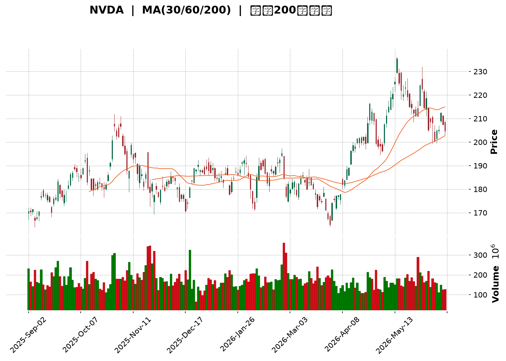
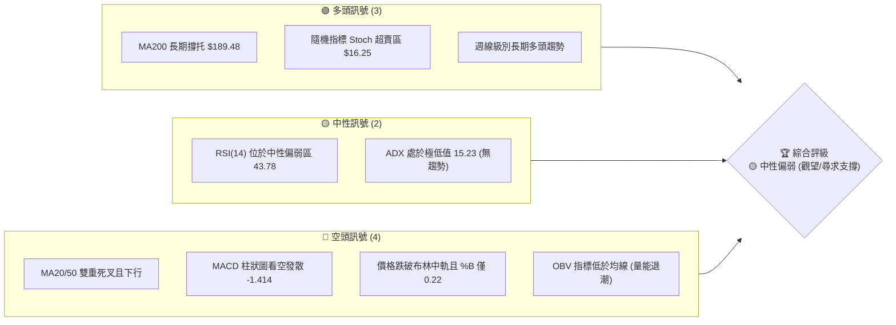
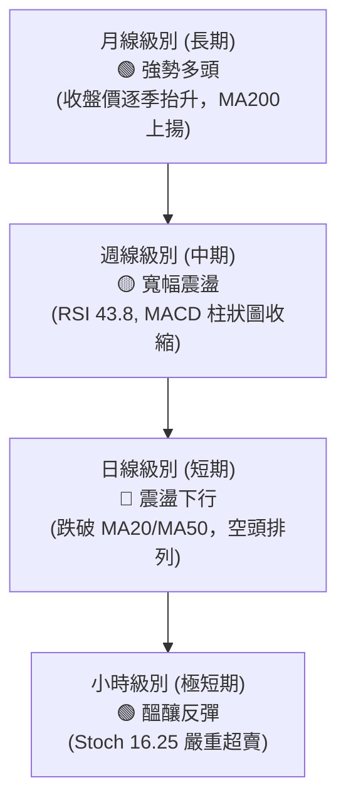
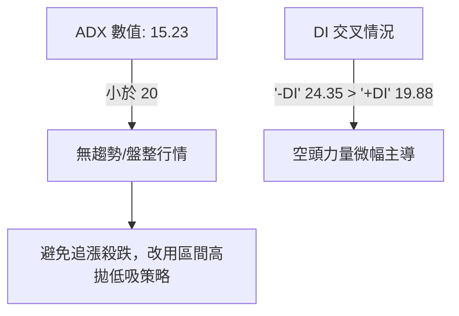
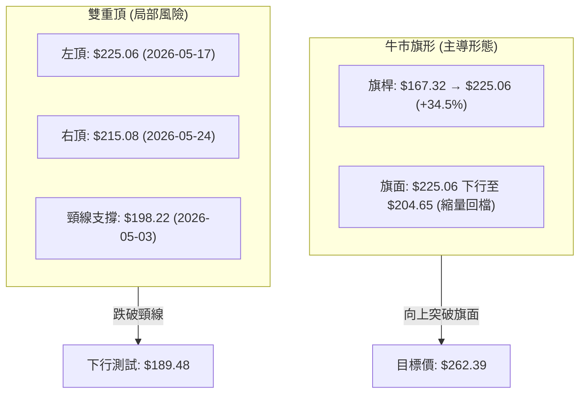
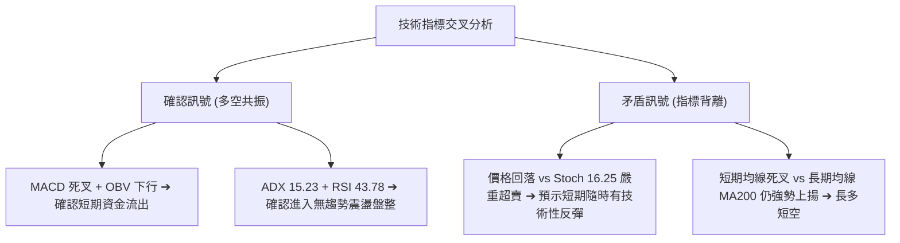
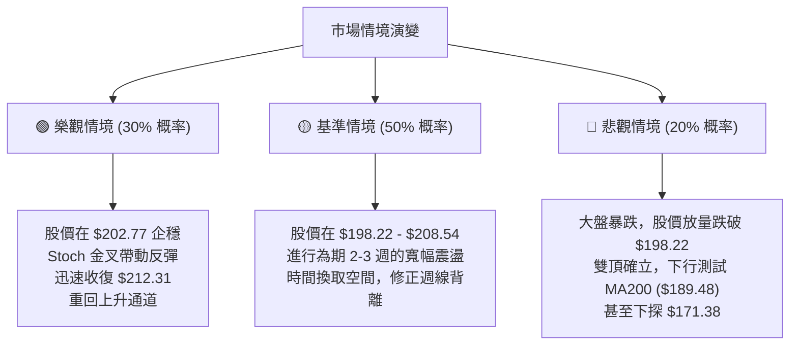

<details>
<summary>📊 靜態圖表 (點擊展開)</summary>

</details>

<html>
<head><meta charset="utf-8" /></head>
<body>
    <div style="height:500px; width:100%;">                        <script>window.PlotlyConfig = {MathJaxConfig: 'local'};</script>
        <script charset="utf-8" src="https://cdn.plot.ly/plotly-3.6.0.min.js" integrity="sha256-QaOVwtVY0T02VaHrr6pnoHLCwayMJp4O5n4YyaE3rJk=" crossorigin="anonymous"></script>                <div id="candlestick-chart" class="plotly-graph-div" style="height:100%; width:100%;"></div>            <script>                window.PLOTLYENV=window.PLOTLYENV || {};                                if (document.getElementById("candlestick-chart")) {                    Plotly.newPlot(                        "candlestick-chart",                        [{"close":{"dtype":"f8","bdata":"AAAAALFRZUAAAADgk0xlQAAAAEDQbWVAAAAAAIjZZEAAAACgwQJlQAAAAEANUWVAAAAAIAMjZkAAAADANx5mQAAAAAD+MmZAAAAAIMEwZkAAAAAgCNVlQAAAAKBWQmVAAAAAIH8AZkAAAAAAPQ5mQAAAAEAJ7GZAAAAAoHxGZkAAAACA0xdmQAAAAGDWLmZAAAAAINE+ZkAAAACgybNmQAAAAGD0SmdAAAAAYAxgZ0AAAADgx5RnQAAAACAxbGdAAAAAoLcpZ0AAAADAvBlnQAAAAMDPm2dAAAAAAGQKaEAAAACAp91mQAAAAICQgmdAAAAAIJ95ZkAAAADgOnNmQAAAAECCsmZAAAAAYJLfZkAAAAAACc1mQAAAAGC8nWZAAAAAgJyBZkAAAADgsb1mQAAAAEC6QGdAAAAAAODnZ0AAAAAAxBhpQAAAAEDX2GlAAAAAwDVUaUAAAAAgbUdpQAAAAEC602lAAAAAIPvNaEAAAABgw15oQAAAAODkemdAAAAAQCF9Z0AAAACgfNloQAAAACA\u002fHWhAAAAAQLMxaEAAAABA51NnQAAAACCwvWdAAAAAIJhLZ0AAAADAIKRmQAAAAIAJSWdAAAAA4B2NZkAAAABg3lRmQAAAAMAoymZAAAAAAP4yZkAAAADA+IBmQAAAAADJGGZAAAAAIBt2ZkAAAADgUqdmQAAAAGCPa2ZAAAAA4ALlZkAAAABgAsZmQAAAAABeKmdAAAAAYNQXZ0AAAADAy\u002fFmQAAAAOC0lmZAAAAAQNHZZUAAAABAaAJmQAAAAKAcMGZAAAAAgGpXZUAAAAAAsb1lQAAAAACgmGZAAAAAYOvuZkAAAABAWJ9nQAAAAOAqjGdAAAAAYIjJZ0AAAADgs39nQAAAACD4aWdAAAAAwLpIZ0AAAACg1pNnQAAAAMCBfGdAAAAAoGFgZ0AAAADgJZxnQAAAAAARGmdAAAAAQFAUZ0AAAADg3hZnQAAAAECtMmdAAAAAQFfdZkAAAADgTlpnQAAAAKAZQGdAAAAAgEw7ZkAAAAAgGONmQAAAAKCsE2dAAAAAwB9uZ0AAAABgxUdnQAAAAIBKiWdAAAAAgCzpZ0AAAADA0AhoQAAAAKC13GdAAAAAwEgsZ0AAAACA2YNmQAAAAEBKv2VAAAAAwHV1ZUAAAACA5CVnQAAAACDfuWdAAAAAIO6JZ0AAAAAgMbpnQAAAAADLVmdAAAAAIMvSZkAAAABg1BdnQAAAACAIeGdAAAAAoHl1Z0AAAABA17JnQAAAAAAi6mdAAAAAwK4TaEAAAADgS2poQAAAAMBFFWdAAAAAQCwfZkAAAAAgP8hmQAAAAMCUemZAAAAAACXaZkAAAACAu+NmQAAAAABPM2ZAAAAAAK7NZkAAAADgbxFnQAAAAKAHOmdAAAAAYKjdZkAAAAAASYFmQAAAAAA34GZAAAAAgPu2ZkAAAABgFIZmQAAAAKBES2ZAAAAAYPePZUAAAADg7+1lQAAAAIDf32VAAAAAgBpPZkAAAAAgTWFlQAAAAEBm6mRAAAAAgEmfZEAAAACgTcZlQAAAAAB08WVAAAAAIN8lZkAAAADA3C1mQAAAAMCQPGZAAAAAAMe7ZkAAAADgRPZmQAAAACAijWdAAAAAIN6iZ0AAAADg\u002f4hoQAAAAIBu1GhAAAAAoM\u002fDaEAAAAAgPy5pQAAAAIBkOmlAAAAA4Lb0aEAAAADgdEhpQAAAAAAL7WhAAAAAoOEAakAAAABgcwtrQAAAAMB\u002fnWpAAAAAgDQgakAAAABAzupoQAAAAOABx2hAAAAAQPfHaEAAAAAArohoQAAAAGDR8mlAAAAAAB9oakAAAAAgYt5qQAAAAMDnZWtAAAAAQLyQa0AAAADAJTJsQAAAAADmbm1AAAAAwNghbEAAAABg9cFrQAAAAEBNi2tAAAAAILfma0AAAACAJGhrQAAAAOCJ4mpAAAAAIITTakAAAADAR4tqQAAAAMAEwGpAAAAAYJ1cakAAAACAKQNsQAAAAIDw0WtAAAAAAADQakAAAADAHlVrQAAAAEAzo2lAAAAA4HoUakAAAACAFAZqQAAAAKBwDWlAAAAAANebaUAAAACAFKZpQAAAAGBmjmpAAAAAwB7taUAAAADAzJRpQA=="},"high":{"dtype":"f8","bdata":"CoQl0dKEZUDyLtweyIVlQL0OG3I0dGVASN1K+cMZZUAOf0CgcVdlQOlvUxoVWGVAL6yrBKZhZkAtlZdrnIFmQOCNZpzrS2ZA9gxn5ehTZkBlpgrJwyhmQJJcOgJXn2VACJS1RvsbZkAC6TgJTTtmQOhACvETCmdAF8x\u002fHQHGZkAMVzWtoXFmQLDF4u74gGZAyfJUA1BxZkA4\u002fYfwf\u002fhmQFlnADeQY2dA6Sjqu898Z0C8lgwW0NlnQEm5O6jCw2dApbOmfbpfZ0C4vzetNppnQGvIAsN4q2dAlSMVo6NhaED7aU673WtoQJfiknLFu2dAxi6FORESZ0B68ozoTRRnQGTC9yh94WZACcY4MbL7ZkBTvTrJ2R5nQLR4xz3U0WZAd7NdRprmZkDH+OLLf9lmQAgaov9lZ2dA0sWrjSz4Z0DHe7nghFxpQPITB2NufWpAkyXGgLe8aUAXn9cQkPZpQFJk\u002fvVDYmpAsuLqxrl2aUDr1AAsK1VpQG8GvPTIq2hA6A\u002fMOZCCZ0A2L5c27vVoQAZwvWp5ZWhAki+rsH50aEDgMznVRuZnQMw6+5uI2GdA1Grn1EuYZ0B3zxRbERJnQE3sUMTcc2dA1T1wtwJ4aEAElJiaZQpnQOIGQzaF6GZAY9HFs9s9ZkABQHP4qdVmQPpDlrr4YWZAwfDZKECCZkDSKYFsjS1nQNqogaj2xmZANEFzX3IJZ0CeO8Pr6w1nQI0zG+2reGdAO2v448wvZ0BVoAEpIShnQEUol\u002fsro2ZA+KDHCB3TZkBLJxf+e0ZmQN4cwdC4SGZA3kcFNEv9ZUARddTQ7v1lQI7H4KhTp2ZAhwNF7\u002fD9ZkB+NnUNLqNnQKRUj4HBlWdAjCXIkZEOaEAgLW0c9pBnQHsgsCdQmGdAug1Ou33KZ0Caj6ooPRZoQKIX\u002fsOcLGhAbr2B7fL9Z0BkUzEyYeRnQCrG7f01qmdADHPYmp1DZ0B8Ppyei1xnQH8uMewvfGdA6ie\u002fk4cHZ0DVyJ0tAa9nQO3IX\u002fynxmdA3SpV\u002fQzFZkDd7mgR7yRnQGMeJrouPmdAwPE\u002fHc+rZ0Dycu6td5xnQDb55dqXuGdA4GBwl7MDaEDLl+xR0SdoQB4NEDgZSGhAiXywcS7CZ0CrmOfxYEFnQJPdg1aPa2ZA2sO281gTZkDbwA\u002fitVhnQDeTyh+SLWhAkhd1TtsHaEDstbdXySBoQGJ+bRD5K2hAIOoO0rBoZ0CEYcIegV1nQD8\u002f+CVrxGdA70sAFmqGZ0CzhCEJJMNnQNjfcczWNmhAO5awMRYxaEDxcI23dKxoQLH2JbG0QWhAkQl+HMPLZkCocGWYkedmQOKIZ2S\u002flWZAk6InLzMPZ0AFY3eQvvpmQIOE8hMy0WZAANi9Z\u002f3VZkBlpl3Vz0ZnQLuqKbbZbGdANi+c1TAXZ0CC8i2O8jtnQPaqM8YflWdAGcFpqOQlZ0Dq8840VOVmQKAvOLWneGZATBDA2a1BZkD42xr3MUVmQC35sqV5AGZAlCLmBkqgZkBu\u002fGGevglmQAXD\u002f7irWGVAVrQsbxYoZUA8GOrGVc1lQLb0II07JWZAxi7XaxEpZkBH0swRqDJmQOEypGK4QGZACqquLGshZ0D7zvjgs\u002ftmQB2GXA\u002fsuGdAf1CBCQ6uZ0AAAADg\u002f4hoQEgZy6hVBWlAthXeUcHzaECSTCnP4i5pQEpqcZPoPWlAN6V3gXJQaUAAAADgdEhpQLIKuIr3cmlAEzTxkIpWakDef+OGexJrQMZOjF9cz2pAdEGWqB2PakAdSLELxEFqQDU+\u002fBtwWGlAdh1WQdgvaUCNL\u002ft0OABpQLFvya3hAGpAYaBHoGu+akCFZYGUfDFrQE2XjZlRwWtAcsIYLarva0DiGut0ZHJsQDGB9t53iG1AEq2cUGDnbEBFUcKibrdsQF7Y4lf\u002fBmxALYABgrw7bED03KEhVGRsQK2xJTUWmGtAUGvO1qE9a0C2Mt930rxqQDlAZoOc6GpAVK12imcza0DdMuuCdhNsQO\u002fZEYhOAG1A5dP7ifDRa0AAAABAM7NrQAAAAADX22pAAAAAQApPakAAAADAzGxqQAAAAEAK52lAAAAAwB61aUAAAACAPeJpQAAAAGC4lmpAAAAAIK5vakAAAABguCZqQA=="},"hovertemplate":"\u003cb\u003e%{x|%Y-%m-%d}\u003c\u002fb\u003e\u003cbr\u003e\u958b: $%{open:.2f}\u003cbr\u003e\u9ad8: $%{high:.2f}\u003cbr\u003e\u4f4e: $%{low:.2f}\u003cbr\u003e\u6536: $%{close:.2f}\u003cextra\u003e\u003c\u002fextra\u003e","low":{"dtype":"f8","bdata":"E+PNSezfZEDnxp3V+BRlQJgeaMToJWVAk43DxEF7ZEC2dLvVE+RkQE33Z02V0GRAhIloRJLnZUDGxVlzKghmQP9UsCs1B2ZAxc14zzTJZUCQe65XDcVlQPpZMl5BBmVAtBzAmauXZUBl+n9snt5lQJCI512Zz2VAjH0\u002fqon\u002fZUDXkzVipuVlQO8d73QanWVAHrV7JKHWZUCclDjX44JmQFtKN1j2p2ZAwVDr2U31ZkBSfSgpQXpnQHY4AYCaJGdATg5ZbxbjZkBo6Sv6f\u002fhmQNz+dBGtSWdA6wfYwSHaZ0AfSiz1LbpmQI5QBwAkN2dAnS6PMRNvZkC71i6hDSJmQAeLvOlPcWZAi29\u002fVaxwZkDGN\u002fu+869mQIWI\u002fnBFcmZANfJWWx0RZkBjyUR783FmQApE8iyF6GZA3qoYThSGZ0CQHdAqTPVnQLvPA\u002fWckGlAqJaKEekkaUBdqPnhADppQMgPJYaKqWlAerdNDrG1aEAQ2fuX3UxoQFPFCT2QRGdAc2FJrdNVZkCw6MqCYTFoQF5su2jN4WdA9bbHfF7cZ0Cqyr3ItPNmQLaMUPMyi2ZAG6+NKroCZ0BHF8M3em1mQGpthYEb02ZAlHJhft5zZkA5Yrr2tZZlQOEI4pYqCGZAR8uKa7AqZUAQZHAUakBmQHIBrzfOCGZAXjecHa6uZUBcjyG8qXhmQE0dJEI4XGZAZjymYbR3ZkDsgihYEZZmQCO5Lo+wxWZAAuM\u002fFxjjZkC3KDT9LrpmQGrdLmP0DGZAEoXuXQjNZUD35yLzItplQEZTskT71WVAZMaayUdDZUDYTCjHinNlQJG6MYcBBGZAOD9XfxfEZkB9L7KXq9VmQJi6pyibS2dA7VV036t4Z0AgfZNt3zVnQIerWhZ5VmdAa9SI+WhIZ0ABlVQj+4BnQBEqnSiLPWdATK30MPVSZ0BVvbeypUpnQBDX0QWP72ZAYIJEoEfuZkAFjylpgdlmQLxy04ym5WZAL\u002fkKWo2SZkB\u002fAILPS0NnQB1sM19OO2dANZUrt5gsZkApJ\u002fR42EVmQFUF2vSW9mZAH6eKG\u002fVSZ0ABu0QKbjhnQC8xkiQpL2dAUg87pHqzZ0Df8uW9qjpnQAfj4XCnp2dAFeEJ6fMUZ0DEeE5kfQBmQJT4kEBrdmVAgW+F+0paZUAbKyHgZMxlQGqGZaY692ZA2aX4sIF8Z0AdbuYlSJFnQFsThqoMSWdAF9fWDM2rZkAXPMVnxl5mQDTB4wwKUWdAr6OM+uEtZ0C3iiT41DZnQAM0AGkrq2dA2JkXo35lZ0DOMACquTFoQMdNMxAOA2dAF39S1UgFZkDAmpgcrM1lQAAQrvyKFmZAxUgOneZ6ZkALV8C9OTVmQDVUrPpYE2ZAo2QggRPrZUDo2nlrOblmQPS\u002fb1GHB2dACzRwwTqxZkBgtNR0YHdmQI7MwcJcpmZAzztY4v2uZkDSrt+q14NmQKq8riq78mVAXf+SmKRwZUD0B2hEz9FlQCnvleLguGVAvrGss5wUZkCSDyXUGl5lQMcJKh0Z2mRAcSsrVYWCZEAwFCAzgNhkQOMxSYl90WVAvQWDqXRlZUBugOetxfFlQJFN45emrmVA1wyDOeKCZkCCIh+AHI1mQNKZDQu8AmdA1h+ty8IwZ0DezSidiNFnQF4uSXljcGhAZFs7GaByaECAcMZ7N+FoQGKQxH6Cs2hA\u002fy1cRJbYaEA60aFAlthoQPzCEnSxn2hA7pum7nnyaEDeUSBGb+RpQI7zW+Wk\u002fmlAoqMDzdPqaUCGFQ1s\u002f85oQKPe9S5\u002fnGhA6GHx6mxQaEDndXs7qHloQEOxhg0fzGhA0C\u002fnrk7IaUBITnynjJRqQKWa2w2DtGpAw9x9Am\u002fVakDcMxmA\u002fKlrQDjHMeoOoWxADnWjrFP\u002fa0CeCjSLtENrQHlOtZ8ANWtAG1bOMsmHa0BKbVwxpDVrQAmr6S2Z0WpAs\u002f0zRhp4akB32iKuLhFqQJzPd+UrX2pAQEtmmEtcakBGYzRWXe5qQO6g6ET0omtAgUryKVTIakAAAABACl9qQAAAAGCPimlAAAAAAADAaUAAAABA4epoQAAAAKBw\u002fWhAAAAAoEfxaEAAAACAFG5pQAAAAEDhCmpAAAAAoEfpaUAAAABgj2JpQA=="},"name":"\u50f9\u683c","open":{"dtype":"f8","bdata":"YR2hv8M4ZUCRkqKUo1plQPZlj+D6SmVAb\u002fG03s75ZEAs+t8HeOpkQJIqUNKuG2VAvgG9JPYMZkC5MYRub25mQHSKkuVkMWZA1D6YdEfuZUD2IbkAyRhmQEkENFpxjWVA1IwWtUS4ZUA5u02kefFlQIHn43V04mVA4HGTb5+3ZkBQhOjnT3FmQIFNwn4\u002fyGVAAAJwdS0+ZkDmTGixZ4ZmQHdHWlUju2ZAoLJyPiEgZ0AcjmHXeKtnQBbi0D1enmdAYZXUanAoZ0AjhhrVxD9nQGc5R6GiSmdABs5OLIb\u002fZ0A7DM6fbihoQHKA7+Zgd2dA+oWoyRsRZ0CRoIVDERJnQOQi\u002f33uv2ZAKBfZWGp+ZkC5KgADstxmQLR4xz3U0WZAFCWYphidZkDcfUToFYZmQJNcseBi82ZAdajkpu+3Z0DeGXYluxloQKU+BPHh9mlAGC7VCnCcaUBZaFoN\u002fMVpQJSVcBoU+mlATC0yprlXaUAJpQq6idBoQFu4KxpvhWhAMsaaKkMVZ0ALpbk8kVtoQDxvR0EqXWhAd6jP1g9vaEA\u002fHwwH0NlnQMI1YugQ1GZAdhbusnU3Z0DogiyMr+RmQOT8kk2\u002fEWdA5CAEnWl2aEB3OIzfSqBmQF89NS5daGZAA1Jznf3VZUC3wv2TwaxmQK4IkeYFWWZAXKd7ODLRZUDgtaM+6bBmQBVn+PMtm2ZAUW+YcMKsZkBjt\u002fK6T\u002fVmQD41DUpczWZA8JO7vK8qZ0Bsi+Rf1BdnQEjHmpzugWZAkH50uXWcZkAOK2yoJDdmQBk+GdJyAWZAOi2qwFX8ZUB3X5\u002f7J8plQBPSJpyNDmZAIsRrNEX2ZkDdktpk6NdmQN20se\u002fAdmdAi3ViVgm2Z0Dfxu4WZ29nQDoAsqNXgGdA+X6VnNmqZ0AEStO+erNnQI3ZKk3Y8GdA3WWxpDbJZ0D5h5Gj44pnQF+ACeIlnGdAWYfuTVgbZ0DPGTfK5d9mQAcaTNXJGGdAAgloGQ4DZ0AcXC+9ukhnQJwj324wm2dAY4Kbh7W1ZkAwAWfcnlpmQMGL60XMEGdAOe5O0rBoZ0Akljf90l1nQDH3JYZhYGdAP8e4\u002fi7hZ0AZxgLNa+NnQJurnTNE32dAuTrHIRpfZ0BJzot+a0BnQMYUD4m5Z2ZAInMo0PDWZUBQWdlEMQ9mQFhxbg4jAWdABfCbKLPkZ0AxcPLs5QZoQNR9InpvGWhAizMqJQ1oZ0BfLChC6rBmQAkYxlCkkGdAYr30waBaZ0A9uq+u90pnQMYeP59W5WdASU1hMjfoZ0BmYNPT0UZoQHo3NyQRQWhA7wfRO++gZkBFi2Frf9llQJGijdG4SGZAl+Q\u002f0guHZkC9zCKIYJ5mQMCZlpfec2ZA1y+XtKoTZkBlrRNnsMVmQGcl9cQxNmdA\u002f\u002fdicr76ZkA1rJ8WjRZnQJyNU2I52GZAMBB5pgYbZ0BpNgfqj8hmQLC6xj6wOWZAqhKBdF45ZkD2VgNttyFmQOYnVAcM1GVAQAFVUZocZkD524VwrvtlQOPPNbmqOWVAPurZMqwSZUDZ0rn60dhkQIezrZ1x+WVAiG3yb1h\u002fZUAlguAzhR5mQDG0LTrQ8GVALagOjCAJZ0B9UKYdG7RmQBgtp9INA2dAw+mxpwc6Z0DjSUlSxdNnQDPPQ1j1iWhANwUkpmemaEDl9bVZWvVoQE\u002f9JPbo92hAu3oQa6E8aUD2j2JmMRhpQDrSXJstR2lA1VppYEX3aEDc5Ctg\u002fSxqQHlfCVjgJ2pAMIds+XmOakB\u002fBQpz8DVqQJslD0N2IWlAYNW5ZZHoaEBcG\u002fLrLOJoQJESkJgI9WhAA43FYh4DakAnH7MxBplqQEgaqV9OuWpA5KtEZHVJa0AapTp1YRVsQAkZdEujsmxANyuJyMKvbEBIKCTgRrNsQMXP+ZCoa2tApAADJHLda0BgLQK9\u002f8BrQC2BsiGSlGtAs7OVmjYJa0DOUxwB3btqQDBJ\u002fdIWYWpAw2DsEZHKakBofffMUu9qQNfkY+tLXWxAT2iGx8eua0AAAADAHr1qQAAAAMD10GpAAAAAgMJFakAAAAAA11NqQAAAAIDCjWlAAAAAIK4vaUAAAAAghZtpQAAAAKBwHWpAAAAAgMJlakAAAADA9RBqQA=="},"x":["2025-09-02T00:00:00-04:00","2025-09-03T00:00:00-04:00","2025-09-04T00:00:00-04:00","2025-09-05T00:00:00-04:00","2025-09-08T00:00:00-04:00","2025-09-09T00:00:00-04:00","2025-09-10T00:00:00-04:00","2025-09-11T00:00:00-04:00","2025-09-12T00:00:00-04:00","2025-09-15T00:00:00-04:00","2025-09-16T00:00:00-04:00","2025-09-17T00:00:00-04:00","2025-09-18T00:00:00-04:00","2025-09-19T00:00:00-04:00","2025-09-22T00:00:00-04:00","2025-09-23T00:00:00-04:00","2025-09-24T00:00:00-04:00","2025-09-25T00:00:00-04:00","2025-09-26T00:00:00-04:00","2025-09-29T00:00:00-04:00","2025-09-30T00:00:00-04:00","2025-10-01T00:00:00-04:00","2025-10-02T00:00:00-04:00","2025-10-03T00:00:00-04:00","2025-10-06T00:00:00-04:00","2025-10-07T00:00:00-04:00","2025-10-08T00:00:00-04:00","2025-10-09T00:00:00-04:00","2025-10-10T00:00:00-04:00","2025-10-13T00:00:00-04:00","2025-10-14T00:00:00-04:00","2025-10-15T00:00:00-04:00","2025-10-16T00:00:00-04:00","2025-10-17T00:00:00-04:00","2025-10-20T00:00:00-04:00","2025-10-21T00:00:00-04:00","2025-10-22T00:00:00-04:00","2025-10-23T00:00:00-04:00","2025-10-24T00:00:00-04:00","2025-10-27T00:00:00-04:00","2025-10-28T00:00:00-04:00","2025-10-29T00:00:00-04:00","2025-10-30T00:00:00-04:00","2025-10-31T00:00:00-04:00","2025-11-03T00:00:00-05:00","2025-11-04T00:00:00-05:00","2025-11-05T00:00:00-05:00","2025-11-06T00:00:00-05:00","2025-11-07T00:00:00-05:00","2025-11-10T00:00:00-05:00","2025-11-11T00:00:00-05:00","2025-11-12T00:00:00-05:00","2025-11-13T00:00:00-05:00","2025-11-14T00:00:00-05:00","2025-11-17T00:00:00-05:00","2025-11-18T00:00:00-05:00","2025-11-19T00:00:00-05:00","2025-11-20T00:00:00-05:00","2025-11-21T00:00:00-05:00","2025-11-24T00:00:00-05:00","2025-11-25T00:00:00-05:00","2025-11-26T00:00:00-05:00","2025-11-28T00:00:00-05:00","2025-12-01T00:00:00-05:00","2025-12-02T00:00:00-05:00","2025-12-03T00:00:00-05:00","2025-12-04T00:00:00-05:00","2025-12-05T00:00:00-05:00","2025-12-08T00:00:00-05:00","2025-12-09T00:00:00-05:00","2025-12-10T00:00:00-05:00","2025-12-11T00:00:00-05:00","2025-12-12T00:00:00-05:00","2025-12-15T00:00:00-05:00","2025-12-16T00:00:00-05:00","2025-12-17T00:00:00-05:00","2025-12-18T00:00:00-05:00","2025-12-19T00:00:00-05:00","2025-12-22T00:00:00-05:00","2025-12-23T00:00:00-05:00","2025-12-24T00:00:00-05:00","2025-12-26T00:00:00-05:00","2025-12-29T00:00:00-05:00","2025-12-30T00:00:00-05:00","2025-12-31T00:00:00-05:00","2026-01-02T00:00:00-05:00","2026-01-05T00:00:00-05:00","2026-01-06T00:00:00-05:00","2026-01-07T00:00:00-05:00","2026-01-08T00:00:00-05:00","2026-01-09T00:00:00-05:00","2026-01-12T00:00:00-05:00","2026-01-13T00:00:00-05:00","2026-01-14T00:00:00-05:00","2026-01-15T00:00:00-05:00","2026-01-16T00:00:00-05:00","2026-01-20T00:00:00-05:00","2026-01-21T00:00:00-05:00","2026-01-22T00:00:00-05:00","2026-01-23T00:00:00-05:00","2026-01-26T00:00:00-05:00","2026-01-27T00:00:00-05:00","2026-01-28T00:00:00-05:00","2026-01-29T00:00:00-05:00","2026-01-30T00:00:00-05:00","2026-02-02T00:00:00-05:00","2026-02-03T00:00:00-05:00","2026-02-04T00:00:00-05:00","2026-02-05T00:00:00-05:00","2026-02-06T00:00:00-05:00","2026-02-09T00:00:00-05:00","2026-02-10T00:00:00-05:00","2026-02-11T00:00:00-05:00","2026-02-12T00:00:00-05:00","2026-02-13T00:00:00-05:00","2026-02-17T00:00:00-05:00","2026-02-18T00:00:00-05:00","2026-02-19T00:00:00-05:00","2026-02-20T00:00:00-05:00","2026-02-23T00:00:00-05:00","2026-02-24T00:00:00-05:00","2026-02-25T00:00:00-05:00","2026-02-26T00:00:00-05:00","2026-02-27T00:00:00-05:00","2026-03-02T00:00:00-05:00","2026-03-03T00:00:00-05:00","2026-03-04T00:00:00-05:00","2026-03-05T00:00:00-05:00","2026-03-06T00:00:00-05:00","2026-03-09T00:00:00-04:00","2026-03-10T00:00:00-04:00","2026-03-11T00:00:00-04:00","2026-03-12T00:00:00-04:00","2026-03-13T00:00:00-04:00","2026-03-16T00:00:00-04:00","2026-03-17T00:00:00-04:00","2026-03-18T00:00:00-04:00","2026-03-19T00:00:00-04:00","2026-03-20T00:00:00-04:00","2026-03-23T00:00:00-04:00","2026-03-24T00:00:00-04:00","2026-03-25T00:00:00-04:00","2026-03-26T00:00:00-04:00","2026-03-27T00:00:00-04:00","2026-03-30T00:00:00-04:00","2026-03-31T00:00:00-04:00","2026-04-01T00:00:00-04:00","2026-04-02T00:00:00-04:00","2026-04-06T00:00:00-04:00","2026-04-07T00:00:00-04:00","2026-04-08T00:00:00-04:00","2026-04-09T00:00:00-04:00","2026-04-10T00:00:00-04:00","2026-04-13T00:00:00-04:00","2026-04-14T00:00:00-04:00","2026-04-15T00:00:00-04:00","2026-04-16T00:00:00-04:00","2026-04-17T00:00:00-04:00","2026-04-20T00:00:00-04:00","2026-04-21T00:00:00-04:00","2026-04-22T00:00:00-04:00","2026-04-23T00:00:00-04:00","2026-04-24T00:00:00-04:00","2026-04-27T00:00:00-04:00","2026-04-28T00:00:00-04:00","2026-04-29T00:00:00-04:00","2026-04-30T00:00:00-04:00","2026-05-01T00:00:00-04:00","2026-05-04T00:00:00-04:00","2026-05-05T00:00:00-04:00","2026-05-06T00:00:00-04:00","2026-05-07T00:00:00-04:00","2026-05-08T00:00:00-04:00","2026-05-11T00:00:00-04:00","2026-05-12T00:00:00-04:00","2026-05-13T00:00:00-04:00","2026-05-14T00:00:00-04:00","2026-05-15T00:00:00-04:00","2026-05-18T00:00:00-04:00","2026-05-19T00:00:00-04:00","2026-05-20T00:00:00-04:00","2026-05-21T00:00:00-04:00","2026-05-22T00:00:00-04:00","2026-05-26T00:00:00-04:00","2026-05-27T00:00:00-04:00","2026-05-28T00:00:00-04:00","2026-05-29T00:00:00-04:00","2026-06-01T00:00:00-04:00","2026-06-02T00:00:00-04:00","2026-06-03T00:00:00-04:00","2026-06-04T00:00:00-04:00","2026-06-05T00:00:00-04:00","2026-06-08T00:00:00-04:00","2026-06-09T00:00:00-04:00","2026-06-10T00:00:00-04:00","2026-06-11T00:00:00-04:00","2026-06-12T00:00:00-04:00","2026-06-15T00:00:00-04:00","2026-06-16T00:00:00-04:00","2026-06-17T00:00:00-04:00"],"type":"candlestick"},{"hovertemplate":"MA30: $%{y:.2f}\u003cextra\u003e\u003c\u002fextra\u003e","line":{"color":"#2196F3","dash":"dash","width":2},"mode":"lines","name":"MA30","x":["2025-09-02T00:00:00-04:00","2025-09-03T00:00:00-04:00","2025-09-04T00:00:00-04:00","2025-09-05T00:00:00-04:00","2025-09-08T00:00:00-04:00","2025-09-09T00:00:00-04:00","2025-09-10T00:00:00-04:00","2025-09-11T00:00:00-04:00","2025-09-12T00:00:00-04:00","2025-09-15T00:00:00-04:00","2025-09-16T00:00:00-04:00","2025-09-17T00:00:00-04:00","2025-09-18T00:00:00-04:00","2025-09-19T00:00:00-04:00","2025-09-22T00:00:00-04:00","2025-09-23T00:00:00-04:00","2025-09-24T00:00:00-04:00","2025-09-25T00:00:00-04:00","2025-09-26T00:00:00-04:00","2025-09-29T00:00:00-04:00","2025-09-30T00:00:00-04:00","2025-10-01T00:00:00-04:00","2025-10-02T00:00:00-04:00","2025-10-03T00:00:00-04:00","2025-10-06T00:00:00-04:00","2025-10-07T00:00:00-04:00","2025-10-08T00:00:00-04:00","2025-10-09T00:00:00-04:00","2025-10-10T00:00:00-04:00","2025-10-13T00:00:00-04:00","2025-10-14T00:00:00-04:00","2025-10-15T00:00:00-04:00","2025-10-16T00:00:00-04:00","2025-10-17T00:00:00-04:00","2025-10-20T00:00:00-04:00","2025-10-21T00:00:00-04:00","2025-10-22T00:00:00-04:00","2025-10-23T00:00:00-04:00","2025-10-24T00:00:00-04:00","2025-10-27T00:00:00-04:00","2025-10-28T00:00:00-04:00","2025-10-29T00:00:00-04:00","2025-10-30T00:00:00-04:00","2025-10-31T00:00:00-04:00","2025-11-03T00:00:00-05:00","2025-11-04T00:00:00-05:00","2025-11-05T00:00:00-05:00","2025-11-06T00:00:00-05:00","2025-11-07T00:00:00-05:00","2025-11-10T00:00:00-05:00","2025-11-11T00:00:00-05:00","2025-11-12T00:00:00-05:00","2025-11-13T00:00:00-05:00","2025-11-14T00:00:00-05:00","2025-11-17T00:00:00-05:00","2025-11-18T00:00:00-05:00","2025-11-19T00:00:00-05:00","2025-11-20T00:00:00-05:00","2025-11-21T00:00:00-05:00","2025-11-24T00:00:00-05:00","2025-11-25T00:00:00-05:00","2025-11-26T00:00:00-05:00","2025-11-28T00:00:00-05:00","2025-12-01T00:00:00-05:00","2025-12-02T00:00:00-05:00","2025-12-03T00:00:00-05:00","2025-12-04T00:00:00-05:00","2025-12-05T00:00:00-05:00","2025-12-08T00:00:00-05:00","2025-12-09T00:00:00-05:00","2025-12-10T00:00:00-05:00","2025-12-11T00:00:00-05:00","2025-12-12T00:00:00-05:00","2025-12-15T00:00:00-05:00","2025-12-16T00:00:00-05:00","2025-12-17T00:00:00-05:00","2025-12-18T00:00:00-05:00","2025-12-19T00:00:00-05:00","2025-12-22T00:00:00-05:00","2025-12-23T00:00:00-05:00","2025-12-24T00:00:00-05:00","2025-12-26T00:00:00-05:00","2025-12-29T00:00:00-05:00","2025-12-30T00:00:00-05:00","2025-12-31T00:00:00-05:00","2026-01-02T00:00:00-05:00","2026-01-05T00:00:00-05:00","2026-01-06T00:00:00-05:00","2026-01-07T00:00:00-05:00","2026-01-08T00:00:00-05:00","2026-01-09T00:00:00-05:00","2026-01-12T00:00:00-05:00","2026-01-13T00:00:00-05:00","2026-01-14T00:00:00-05:00","2026-01-15T00:00:00-05:00","2026-01-16T00:00:00-05:00","2026-01-20T00:00:00-05:00","2026-01-21T00:00:00-05:00","2026-01-22T00:00:00-05:00","2026-01-23T00:00:00-05:00","2026-01-26T00:00:00-05:00","2026-01-27T00:00:00-05:00","2026-01-28T00:00:00-05:00","2026-01-29T00:00:00-05:00","2026-01-30T00:00:00-05:00","2026-02-02T00:00:00-05:00","2026-02-03T00:00:00-05:00","2026-02-04T00:00:00-05:00","2026-02-05T00:00:00-05:00","2026-02-06T00:00:00-05:00","2026-02-09T00:00:00-05:00","2026-02-10T00:00:00-05:00","2026-02-11T00:00:00-05:00","2026-02-12T00:00:00-05:00","2026-02-13T00:00:00-05:00","2026-02-17T00:00:00-05:00","2026-02-18T00:00:00-05:00","2026-02-19T00:00:00-05:00","2026-02-20T00:00:00-05:00","2026-02-23T00:00:00-05:00","2026-02-24T00:00:00-05:00","2026-02-25T00:00:00-05:00","2026-02-26T00:00:00-05:00","2026-02-27T00:00:00-05:00","2026-03-02T00:00:00-05:00","2026-03-03T00:00:00-05:00","2026-03-04T00:00:00-05:00","2026-03-05T00:00:00-05:00","2026-03-06T00:00:00-05:00","2026-03-09T00:00:00-04:00","2026-03-10T00:00:00-04:00","2026-03-11T00:00:00-04:00","2026-03-12T00:00:00-04:00","2026-03-13T00:00:00-04:00","2026-03-16T00:00:00-04:00","2026-03-17T00:00:00-04:00","2026-03-18T00:00:00-04:00","2026-03-19T00:00:00-04:00","2026-03-20T00:00:00-04:00","2026-03-23T00:00:00-04:00","2026-03-24T00:00:00-04:00","2026-03-25T00:00:00-04:00","2026-03-26T00:00:00-04:00","2026-03-27T00:00:00-04:00","2026-03-30T00:00:00-04:00","2026-03-31T00:00:00-04:00","2026-04-01T00:00:00-04:00","2026-04-02T00:00:00-04:00","2026-04-06T00:00:00-04:00","2026-04-07T00:00:00-04:00","2026-04-08T00:00:00-04:00","2026-04-09T00:00:00-04:00","2026-04-10T00:00:00-04:00","2026-04-13T00:00:00-04:00","2026-04-14T00:00:00-04:00","2026-04-15T00:00:00-04:00","2026-04-16T00:00:00-04:00","2026-04-17T00:00:00-04:00","2026-04-20T00:00:00-04:00","2026-04-21T00:00:00-04:00","2026-04-22T00:00:00-04:00","2026-04-23T00:00:00-04:00","2026-04-24T00:00:00-04:00","2026-04-27T00:00:00-04:00","2026-04-28T00:00:00-04:00","2026-04-29T00:00:00-04:00","2026-04-30T00:00:00-04:00","2026-05-01T00:00:00-04:00","2026-05-04T00:00:00-04:00","2026-05-05T00:00:00-04:00","2026-05-06T00:00:00-04:00","2026-05-07T00:00:00-04:00","2026-05-08T00:00:00-04:00","2026-05-11T00:00:00-04:00","2026-05-12T00:00:00-04:00","2026-05-13T00:00:00-04:00","2026-05-14T00:00:00-04:00","2026-05-15T00:00:00-04:00","2026-05-18T00:00:00-04:00","2026-05-19T00:00:00-04:00","2026-05-20T00:00:00-04:00","2026-05-21T00:00:00-04:00","2026-05-22T00:00:00-04:00","2026-05-26T00:00:00-04:00","2026-05-27T00:00:00-04:00","2026-05-28T00:00:00-04:00","2026-05-29T00:00:00-04:00","2026-06-01T00:00:00-04:00","2026-06-02T00:00:00-04:00","2026-06-03T00:00:00-04:00","2026-06-04T00:00:00-04:00","2026-06-05T00:00:00-04:00","2026-06-08T00:00:00-04:00","2026-06-09T00:00:00-04:00","2026-06-10T00:00:00-04:00","2026-06-11T00:00:00-04:00","2026-06-12T00:00:00-04:00","2026-06-15T00:00:00-04:00","2026-06-16T00:00:00-04:00","2026-06-17T00:00:00-04:00"],"y":{"dtype":"f8","bdata":"AAAAAAAA+H8AAAAAAAD4fwAAAAAAAPh\u002fAAAAAAAA+H8AAAAAAAD4fwAAAAAAAPh\u002fAAAAAAAA+H8AAAAAAAD4fwAAAAAAAPh\u002fAAAAAAAA+H8AAAAAAAD4fwAAAAAAAPh\u002fAAAAAAAA+H8AAAAAAAD4fwAAAAAAAPh\u002fAAAAAAAA+H8AAAAAAAD4fwAAAAAAAPh\u002fAAAAAAAA+H8AAAAAAAD4fwAAAAAAAPh\u002fAAAAAAAA+H8AAAAAAAD4fwAAAAAAAPh\u002fAAAAAAAA+H8AAAAAAAD4fwAAAAAAAPh\u002fAAAAAAAA+H8AAAAAAAD4fyIiIoJFYWZAd3d3xyJrZkBVVVUl9XRmQBEREeHHf2ZA3t3dfQyRZkAzMzMjU6BmQKuqqgpqq2ZAmpmZSZGuZkCJiIgo4rNmQGZmZubfvGZAAAAAEIPLZkCJiIioXudmQERERBSFDmdAiYiICOkqZ0AzMzOjakZnQN7d3c00X2dAZmZmFsp0Z0C8u7t7OIhnQImIiAhKk2dA3t3dTeadZ0AiIiISObBnQAAAAJA7t2dAd3d3lzi+Z0CJiIj4DrxnQHd3d2fGvmdAzczMfOe\u002fZ0AzMzPj+7tnQLy7u4s5uWdAIiIiAoSsZ0BVVVXF9KdnQN7d3S3PoWdAmpmZeXSfZ0DNzMy86Z9nQGZmZvbJmmdAzczM\u002fEWXZ0Dv7u4uBJZnQERERARYlGdAq6qqOqiXZ0De3d0t75dnQO\u002fu7l4wl2dAzczMDEGQZ0ARERFx431nQO\u002fu7n4VYmdAq6qqemdEZ0CrqqrqgChnQBERESFzCWdAZmZmxuXrZkCrqqo6dtVmQGZmZmbrzWZA7+7u3i3JZkARERExtb5mQO\u002fu7i7fuWZAmpmZSWa2ZkCrqqoK3LdmQERERKQRtWZAIiIiMvm0ZkCamZm59rxmQO\u002fu7u6tvmZAmpmZubjFZkAiIiKCodBmQCIiImJL02ZAAAAAIM7aZkAzMzNDzd9mQM3MzLwy6WZAzczMrKPsZkAiIiICm\u002fJmQO\u002fu7q6w+WZAiYiIeAj0ZkCamZmpAPVmQERERAQ\u002f9GZAVVVVZR\u002f3ZkDNzMwM\u002fflmQKuqqhoTAmdAZmZmNqcTZ0BmZmb27iRnQERERFQ4M2dAZmZmVtlCZ0CamZlJdElnQCIiIrI1QmdAVVVVtaA1Z0ARERFRlDFnQDMzM1MaM2dAVVVVlfswZ0ARERGx7jJnQN7d3Q1LMmdAq6qqqlwuZ0BVVVV1OipnQFVVVUUUKmdAVVVVRcgqZ0CrqqrqiStnQKuqqmp5MmdAERERkfw6Z0AAAAAATUZnQFVVVRVSRWdAERERUfs+Z0DNzMzsHDpnQN7d3W2HM2dAmpmZ6dI4Z0C8u7tb2DhnQFVVVcVdMWdAVVVVpQQsZ0Dv7u7+NCpnQCIiIqKQJ2dARERE1KUeZ0BVVVXFmBFnQGZmZiYuCWdAzczMLEUFZ0BEREQ0WAVnQO\u002fu7q4CCmdA7+7u3uQKZ0CamZnZfgBnQAAAABCy8GZAq6qqijPmZkARERHxK9JmQKuqqup9vWZAREREVLWqZkCrqqoadZ9mQKuqqipwkmZAmpmZWUCHZkARERERSXpmQM3MzGz3a2ZARERExIBgZkAiIiIiGlRmQCIiIvIYWGZAZmZmRgVlZkAiIiKi+nNmQM3MzGwKiGZAmpmZ6VyYZkBVVVXV6atmQCIiIuK\u002fxWZAvLu7Cx7YZkDNzMycBOtmQJqZmbmE+WZAZmZm5koUZ0C8u7sLCDtnQO\u002fu7t7wWmdA7+7uXgx4Z0B3d3f3eIxnQBEREfGpoWdAd3d3ZyG9Z0ARERHxWtNnQM3MzLwe9mdAq6qqWhYZaEAzMzNj7EdoQBEREYE9f2hAAAAAEH26aECJiIiISPFoQLy7u7syMWlAZmZmlkNkaUAiIiIC3pNpQO\u002fu7o4owWlAERERoUHtaUC8u7t7LxNqQAAAAOChL2pAvLu7m9pKakAzMzMj\u002f1tqQDMzMwNibGpAiYiIeAJ6akCrqqpqLJJqQO\u002fu7q5KqGpAREREdCK4akBVVVWVn8lqQN7d3f2xz2pAvLu7O1nQakDv7u7eosdqQImIiAhNumpAREREhOO1akB3d3eXIbxqQLy7u5tPy2pAERERMRXVakBmZmYmBd5qQA=="},"type":"scatter"},{"hovertemplate":"MA60: $%{y:.2f}\u003cextra\u003e\u003c\u002fextra\u003e","line":{"color":"#9C27B0","dash":"dash","width":2},"mode":"lines","name":"MA60","x":["2025-09-02T00:00:00-04:00","2025-09-03T00:00:00-04:00","2025-09-04T00:00:00-04:00","2025-09-05T00:00:00-04:00","2025-09-08T00:00:00-04:00","2025-09-09T00:00:00-04:00","2025-09-10T00:00:00-04:00","2025-09-11T00:00:00-04:00","2025-09-12T00:00:00-04:00","2025-09-15T00:00:00-04:00","2025-09-16T00:00:00-04:00","2025-09-17T00:00:00-04:00","2025-09-18T00:00:00-04:00","2025-09-19T00:00:00-04:00","2025-09-22T00:00:00-04:00","2025-09-23T00:00:00-04:00","2025-09-24T00:00:00-04:00","2025-09-25T00:00:00-04:00","2025-09-26T00:00:00-04:00","2025-09-29T00:00:00-04:00","2025-09-30T00:00:00-04:00","2025-10-01T00:00:00-04:00","2025-10-02T00:00:00-04:00","2025-10-03T00:00:00-04:00","2025-10-06T00:00:00-04:00","2025-10-07T00:00:00-04:00","2025-10-08T00:00:00-04:00","2025-10-09T00:00:00-04:00","2025-10-10T00:00:00-04:00","2025-10-13T00:00:00-04:00","2025-10-14T00:00:00-04:00","2025-10-15T00:00:00-04:00","2025-10-16T00:00:00-04:00","2025-10-17T00:00:00-04:00","2025-10-20T00:00:00-04:00","2025-10-21T00:00:00-04:00","2025-10-22T00:00:00-04:00","2025-10-23T00:00:00-04:00","2025-10-24T00:00:00-04:00","2025-10-27T00:00:00-04:00","2025-10-28T00:00:00-04:00","2025-10-29T00:00:00-04:00","2025-10-30T00:00:00-04:00","2025-10-31T00:00:00-04:00","2025-11-03T00:00:00-05:00","2025-11-04T00:00:00-05:00","2025-11-05T00:00:00-05:00","2025-11-06T00:00:00-05:00","2025-11-07T00:00:00-05:00","2025-11-10T00:00:00-05:00","2025-11-11T00:00:00-05:00","2025-11-12T00:00:00-05:00","2025-11-13T00:00:00-05:00","2025-11-14T00:00:00-05:00","2025-11-17T00:00:00-05:00","2025-11-18T00:00:00-05:00","2025-11-19T00:00:00-05:00","2025-11-20T00:00:00-05:00","2025-11-21T00:00:00-05:00","2025-11-24T00:00:00-05:00","2025-11-25T00:00:00-05:00","2025-11-26T00:00:00-05:00","2025-11-28T00:00:00-05:00","2025-12-01T00:00:00-05:00","2025-12-02T00:00:00-05:00","2025-12-03T00:00:00-05:00","2025-12-04T00:00:00-05:00","2025-12-05T00:00:00-05:00","2025-12-08T00:00:00-05:00","2025-12-09T00:00:00-05:00","2025-12-10T00:00:00-05:00","2025-12-11T00:00:00-05:00","2025-12-12T00:00:00-05:00","2025-12-15T00:00:00-05:00","2025-12-16T00:00:00-05:00","2025-12-17T00:00:00-05:00","2025-12-18T00:00:00-05:00","2025-12-19T00:00:00-05:00","2025-12-22T00:00:00-05:00","2025-12-23T00:00:00-05:00","2025-12-24T00:00:00-05:00","2025-12-26T00:00:00-05:00","2025-12-29T00:00:00-05:00","2025-12-30T00:00:00-05:00","2025-12-31T00:00:00-05:00","2026-01-02T00:00:00-05:00","2026-01-05T00:00:00-05:00","2026-01-06T00:00:00-05:00","2026-01-07T00:00:00-05:00","2026-01-08T00:00:00-05:00","2026-01-09T00:00:00-05:00","2026-01-12T00:00:00-05:00","2026-01-13T00:00:00-05:00","2026-01-14T00:00:00-05:00","2026-01-15T00:00:00-05:00","2026-01-16T00:00:00-05:00","2026-01-20T00:00:00-05:00","2026-01-21T00:00:00-05:00","2026-01-22T00:00:00-05:00","2026-01-23T00:00:00-05:00","2026-01-26T00:00:00-05:00","2026-01-27T00:00:00-05:00","2026-01-28T00:00:00-05:00","2026-01-29T00:00:00-05:00","2026-01-30T00:00:00-05:00","2026-02-02T00:00:00-05:00","2026-02-03T00:00:00-05:00","2026-02-04T00:00:00-05:00","2026-02-05T00:00:00-05:00","2026-02-06T00:00:00-05:00","2026-02-09T00:00:00-05:00","2026-02-10T00:00:00-05:00","2026-02-11T00:00:00-05:00","2026-02-12T00:00:00-05:00","2026-02-13T00:00:00-05:00","2026-02-17T00:00:00-05:00","2026-02-18T00:00:00-05:00","2026-02-19T00:00:00-05:00","2026-02-20T00:00:00-05:00","2026-02-23T00:00:00-05:00","2026-02-24T00:00:00-05:00","2026-02-25T00:00:00-05:00","2026-02-26T00:00:00-05:00","2026-02-27T00:00:00-05:00","2026-03-02T00:00:00-05:00","2026-03-03T00:00:00-05:00","2026-03-04T00:00:00-05:00","2026-03-05T00:00:00-05:00","2026-03-06T00:00:00-05:00","2026-03-09T00:00:00-04:00","2026-03-10T00:00:00-04:00","2026-03-11T00:00:00-04:00","2026-03-12T00:00:00-04:00","2026-03-13T00:00:00-04:00","2026-03-16T00:00:00-04:00","2026-03-17T00:00:00-04:00","2026-03-18T00:00:00-04:00","2026-03-19T00:00:00-04:00","2026-03-20T00:00:00-04:00","2026-03-23T00:00:00-04:00","2026-03-24T00:00:00-04:00","2026-03-25T00:00:00-04:00","2026-03-26T00:00:00-04:00","2026-03-27T00:00:00-04:00","2026-03-30T00:00:00-04:00","2026-03-31T00:00:00-04:00","2026-04-01T00:00:00-04:00","2026-04-02T00:00:00-04:00","2026-04-06T00:00:00-04:00","2026-04-07T00:00:00-04:00","2026-04-08T00:00:00-04:00","2026-04-09T00:00:00-04:00","2026-04-10T00:00:00-04:00","2026-04-13T00:00:00-04:00","2026-04-14T00:00:00-04:00","2026-04-15T00:00:00-04:00","2026-04-16T00:00:00-04:00","2026-04-17T00:00:00-04:00","2026-04-20T00:00:00-04:00","2026-04-21T00:00:00-04:00","2026-04-22T00:00:00-04:00","2026-04-23T00:00:00-04:00","2026-04-24T00:00:00-04:00","2026-04-27T00:00:00-04:00","2026-04-28T00:00:00-04:00","2026-04-29T00:00:00-04:00","2026-04-30T00:00:00-04:00","2026-05-01T00:00:00-04:00","2026-05-04T00:00:00-04:00","2026-05-05T00:00:00-04:00","2026-05-06T00:00:00-04:00","2026-05-07T00:00:00-04:00","2026-05-08T00:00:00-04:00","2026-05-11T00:00:00-04:00","2026-05-12T00:00:00-04:00","2026-05-13T00:00:00-04:00","2026-05-14T00:00:00-04:00","2026-05-15T00:00:00-04:00","2026-05-18T00:00:00-04:00","2026-05-19T00:00:00-04:00","2026-05-20T00:00:00-04:00","2026-05-21T00:00:00-04:00","2026-05-22T00:00:00-04:00","2026-05-26T00:00:00-04:00","2026-05-27T00:00:00-04:00","2026-05-28T00:00:00-04:00","2026-05-29T00:00:00-04:00","2026-06-01T00:00:00-04:00","2026-06-02T00:00:00-04:00","2026-06-03T00:00:00-04:00","2026-06-04T00:00:00-04:00","2026-06-05T00:00:00-04:00","2026-06-08T00:00:00-04:00","2026-06-09T00:00:00-04:00","2026-06-10T00:00:00-04:00","2026-06-11T00:00:00-04:00","2026-06-12T00:00:00-04:00","2026-06-15T00:00:00-04:00","2026-06-16T00:00:00-04:00","2026-06-17T00:00:00-04:00"],"y":{"dtype":"f8","bdata":"AAAAAAAA+H8AAAAAAAD4fwAAAAAAAPh\u002fAAAAAAAA+H8AAAAAAAD4fwAAAAAAAPh\u002fAAAAAAAA+H8AAAAAAAD4fwAAAAAAAPh\u002fAAAAAAAA+H8AAAAAAAD4fwAAAAAAAPh\u002fAAAAAAAA+H8AAAAAAAD4fwAAAAAAAPh\u002fAAAAAAAA+H8AAAAAAAD4fwAAAAAAAPh\u002fAAAAAAAA+H8AAAAAAAD4fwAAAAAAAPh\u002fAAAAAAAA+H8AAAAAAAD4fwAAAAAAAPh\u002fAAAAAAAA+H8AAAAAAAD4fwAAAAAAAPh\u002fAAAAAAAA+H8AAAAAAAD4fwAAAAAAAPh\u002fAAAAAAAA+H8AAAAAAAD4fwAAAAAAAPh\u002fAAAAAAAA+H8AAAAAAAD4fwAAAAAAAPh\u002fAAAAAAAA+H8AAAAAAAD4fwAAAAAAAPh\u002fAAAAAAAA+H8AAAAAAAD4fwAAAAAAAPh\u002fAAAAAAAA+H8AAAAAAAD4fwAAAAAAAPh\u002fAAAAAAAA+H8AAAAAAAD4fwAAAAAAAPh\u002fAAAAAAAA+H8AAAAAAAD4fwAAAAAAAPh\u002fAAAAAAAA+H8AAAAAAAD4fwAAAAAAAPh\u002fAAAAAAAA+H8AAAAAAAD4fwAAAAAAAPh\u002fAAAAAAAA+H8AAAAAAAD4fwAAAFiKAWdAiYiIoEsFZ0ARERFxbwpnQLy7u+tIDWdAVVVVPSkUZ0ARERGpKxtnQHd3dwfhH2dAIiIiwhwjZ0AzMzOr6CVnQKuqqiIIKmdAZmZmDuItZ0DNzMwMoTJnQJqZmUlNOGdAmpmZQag3Z0Dv7u7GdTdnQHd3d\u002fdTNGdAZmZm7lcwZ0AzMzNb1y5nQHd3d7eaMGdAZmZmFoozZ0CamZkhdzdnQHd3d1+NOGdAiYiIcE86Z0CamZmB9TlnQN7d3QXsOWdAd3d3V3A6Z0BmZmZOeTxnQFVVVb3zO2dA3t3dXR45Z0C8u7sjSzxnQAAAAEiNOmdAzczMTCE9Z0AAAACA2z9nQJqZmVn+QWdAzczM1PRBZ0CJiIiYT0RnQJqZmVkER2dAmpmZWdhFZ0C8u7vrd0ZnQJqZmbG3RWdAERERObBDZ0Dv7u4+8DtnQM3MzEwUMmdAiYiIWAcsZ0CJiIjwtyZnQKuqqrpVHmdAZmZmjl8XZ0AiIiJCdQ9nQERERIwQCGdAIiIiSmf\u002fZkARERHBJPhmQBEREcF89mZAd3d377DzZkDe3d1dZfVmQBEREVmu82ZAZmZm7qrxZkB3d3eXmPNmQCIiIhph9GZAd3d3f0D4ZkBmZma2Ff5mQGZmZmbiAmdAiYiIWOUKZ0CamZkhDRNnQBEREWlCF2dA7+7ufs8VZ0B3d3f3WxZnQGZmZg6cFmdAERERsW0WZ0CrqqqC7BZnQM3MzGTOEmdAVVVVBZIRZ0De3d0FGRJnQGZmZt7RFGdAVVVVhSYZZ0De3d3dQxtnQFVVVT0zHmdAmpmZQQ8kZ0Dv7u4+ZidnQImIiDAcJmdAIiIiykIgZ0BVVVWVCRlnQJqZmTHmEWdAAAAAkJcLZ0ARERFRjQJnQERERHzk92ZAd3d3\u002f4jsZkAAAADI1+RmQAAAADhC3mZAd3d3TwTZZkDe3d196dJmQLy7u2s4z2ZAq6qqqr7NZkARERGRM81mQLy7u4O1zmZAvLu7SwDSZkB3d3fHC9dmQFVVVe3I3WZAmpmZ6ZfoZkCJiIgYYfJmQLy7u9OO+2ZAiYiIWBECZ0De3d3NnApnQN7d3a2KEGdAVVVVXXgZZ0CJiIhoUCZnQKuqqoIPMmdA3t3dxag+Z0De3d2V6EhnQAAAAFDWVWdAMzMzIwNkZ0BVVVXl7GlnQGZmZmZoc2dAq6qq8qR\u002fZ0AiIiIqDI1nQN7d3bVdnmdAIiIiMpmyZ0CamZnRXshnQDMzM3PR4WdAAAAA+MH1Z0CamZmJEwdoQN7d3f2PFmhAq6qqMuEmaEDv7u7OpDNoQBEREWndQ2hAERER8e9XaECrqqri\u002fGdoQAAAADg2emhAERERsS+JaEAAAAAgC59oQImIiEgFt2hAAAAAQCDIaEAREREZUtpoQLy7u1ub5GhAEREREVLyaEBVVVV1VQFpQLy7u\u002fOeCmlAmpmZ8fcWaUB3d3dHTSRpQGZmZsZ8NmlARERETBtJaUC8u7sLsFhpQA=="},"type":"scatter"},{"hovertemplate":"MA200: $%{y:.2f}\u003cextra\u003e\u003c\u002fextra\u003e","line":{"color":"#FF6F00","dash":"solid","width":2},"mode":"lines","name":"MA200","x":["2025-09-02T00:00:00-04:00","2025-09-03T00:00:00-04:00","2025-09-04T00:00:00-04:00","2025-09-05T00:00:00-04:00","2025-09-08T00:00:00-04:00","2025-09-09T00:00:00-04:00","2025-09-10T00:00:00-04:00","2025-09-11T00:00:00-04:00","2025-09-12T00:00:00-04:00","2025-09-15T00:00:00-04:00","2025-09-16T00:00:00-04:00","2025-09-17T00:00:00-04:00","2025-09-18T00:00:00-04:00","2025-09-19T00:00:00-04:00","2025-09-22T00:00:00-04:00","2025-09-23T00:00:00-04:00","2025-09-24T00:00:00-04:00","2025-09-25T00:00:00-04:00","2025-09-26T00:00:00-04:00","2025-09-29T00:00:00-04:00","2025-09-30T00:00:00-04:00","2025-10-01T00:00:00-04:00","2025-10-02T00:00:00-04:00","2025-10-03T00:00:00-04:00","2025-10-06T00:00:00-04:00","2025-10-07T00:00:00-04:00","2025-10-08T00:00:00-04:00","2025-10-09T00:00:00-04:00","2025-10-10T00:00:00-04:00","2025-10-13T00:00:00-04:00","2025-10-14T00:00:00-04:00","2025-10-15T00:00:00-04:00","2025-10-16T00:00:00-04:00","2025-10-17T00:00:00-04:00","2025-10-20T00:00:00-04:00","2025-10-21T00:00:00-04:00","2025-10-22T00:00:00-04:00","2025-10-23T00:00:00-04:00","2025-10-24T00:00:00-04:00","2025-10-27T00:00:00-04:00","2025-10-28T00:00:00-04:00","2025-10-29T00:00:00-04:00","2025-10-30T00:00:00-04:00","2025-10-31T00:00:00-04:00","2025-11-03T00:00:00-05:00","2025-11-04T00:00:00-05:00","2025-11-05T00:00:00-05:00","2025-11-06T00:00:00-05:00","2025-11-07T00:00:00-05:00","2025-11-10T00:00:00-05:00","2025-11-11T00:00:00-05:00","2025-11-12T00:00:00-05:00","2025-11-13T00:00:00-05:00","2025-11-14T00:00:00-05:00","2025-11-17T00:00:00-05:00","2025-11-18T00:00:00-05:00","2025-11-19T00:00:00-05:00","2025-11-20T00:00:00-05:00","2025-11-21T00:00:00-05:00","2025-11-24T00:00:00-05:00","2025-11-25T00:00:00-05:00","2025-11-26T00:00:00-05:00","2025-11-28T00:00:00-05:00","2025-12-01T00:00:00-05:00","2025-12-02T00:00:00-05:00","2025-12-03T00:00:00-05:00","2025-12-04T00:00:00-05:00","2025-12-05T00:00:00-05:00","2025-12-08T00:00:00-05:00","2025-12-09T00:00:00-05:00","2025-12-10T00:00:00-05:00","2025-12-11T00:00:00-05:00","2025-12-12T00:00:00-05:00","2025-12-15T00:00:00-05:00","2025-12-16T00:00:00-05:00","2025-12-17T00:00:00-05:00","2025-12-18T00:00:00-05:00","2025-12-19T00:00:00-05:00","2025-12-22T00:00:00-05:00","2025-12-23T00:00:00-05:00","2025-12-24T00:00:00-05:00","2025-12-26T00:00:00-05:00","2025-12-29T00:00:00-05:00","2025-12-30T00:00:00-05:00","2025-12-31T00:00:00-05:00","2026-01-02T00:00:00-05:00","2026-01-05T00:00:00-05:00","2026-01-06T00:00:00-05:00","2026-01-07T00:00:00-05:00","2026-01-08T00:00:00-05:00","2026-01-09T00:00:00-05:00","2026-01-12T00:00:00-05:00","2026-01-13T00:00:00-05:00","2026-01-14T00:00:00-05:00","2026-01-15T00:00:00-05:00","2026-01-16T00:00:00-05:00","2026-01-20T00:00:00-05:00","2026-01-21T00:00:00-05:00","2026-01-22T00:00:00-05:00","2026-01-23T00:00:00-05:00","2026-01-26T00:00:00-05:00","2026-01-27T00:00:00-05:00","2026-01-28T00:00:00-05:00","2026-01-29T00:00:00-05:00","2026-01-30T00:00:00-05:00","2026-02-02T00:00:00-05:00","2026-02-03T00:00:00-05:00","2026-02-04T00:00:00-05:00","2026-02-05T00:00:00-05:00","2026-02-06T00:00:00-05:00","2026-02-09T00:00:00-05:00","2026-02-10T00:00:00-05:00","2026-02-11T00:00:00-05:00","2026-02-12T00:00:00-05:00","2026-02-13T00:00:00-05:00","2026-02-17T00:00:00-05:00","2026-02-18T00:00:00-05:00","2026-02-19T00:00:00-05:00","2026-02-20T00:00:00-05:00","2026-02-23T00:00:00-05:00","2026-02-24T00:00:00-05:00","2026-02-25T00:00:00-05:00","2026-02-26T00:00:00-05:00","2026-02-27T00:00:00-05:00","2026-03-02T00:00:00-05:00","2026-03-03T00:00:00-05:00","2026-03-04T00:00:00-05:00","2026-03-05T00:00:00-05:00","2026-03-06T00:00:00-05:00","2026-03-09T00:00:00-04:00","2026-03-10T00:00:00-04:00","2026-03-11T00:00:00-04:00","2026-03-12T00:00:00-04:00","2026-03-13T00:00:00-04:00","2026-03-16T00:00:00-04:00","2026-03-17T00:00:00-04:00","2026-03-18T00:00:00-04:00","2026-03-19T00:00:00-04:00","2026-03-20T00:00:00-04:00","2026-03-23T00:00:00-04:00","2026-03-24T00:00:00-04:00","2026-03-25T00:00:00-04:00","2026-03-26T00:00:00-04:00","2026-03-27T00:00:00-04:00","2026-03-30T00:00:00-04:00","2026-03-31T00:00:00-04:00","2026-04-01T00:00:00-04:00","2026-04-02T00:00:00-04:00","2026-04-06T00:00:00-04:00","2026-04-07T00:00:00-04:00","2026-04-08T00:00:00-04:00","2026-04-09T00:00:00-04:00","2026-04-10T00:00:00-04:00","2026-04-13T00:00:00-04:00","2026-04-14T00:00:00-04:00","2026-04-15T00:00:00-04:00","2026-04-16T00:00:00-04:00","2026-04-17T00:00:00-04:00","2026-04-20T00:00:00-04:00","2026-04-21T00:00:00-04:00","2026-04-22T00:00:00-04:00","2026-04-23T00:00:00-04:00","2026-04-24T00:00:00-04:00","2026-04-27T00:00:00-04:00","2026-04-28T00:00:00-04:00","2026-04-29T00:00:00-04:00","2026-04-30T00:00:00-04:00","2026-05-01T00:00:00-04:00","2026-05-04T00:00:00-04:00","2026-05-05T00:00:00-04:00","2026-05-06T00:00:00-04:00","2026-05-07T00:00:00-04:00","2026-05-08T00:00:00-04:00","2026-05-11T00:00:00-04:00","2026-05-12T00:00:00-04:00","2026-05-13T00:00:00-04:00","2026-05-14T00:00:00-04:00","2026-05-15T00:00:00-04:00","2026-05-18T00:00:00-04:00","2026-05-19T00:00:00-04:00","2026-05-20T00:00:00-04:00","2026-05-21T00:00:00-04:00","2026-05-22T00:00:00-04:00","2026-05-26T00:00:00-04:00","2026-05-27T00:00:00-04:00","2026-05-28T00:00:00-04:00","2026-05-29T00:00:00-04:00","2026-06-01T00:00:00-04:00","2026-06-02T00:00:00-04:00","2026-06-03T00:00:00-04:00","2026-06-04T00:00:00-04:00","2026-06-05T00:00:00-04:00","2026-06-08T00:00:00-04:00","2026-06-09T00:00:00-04:00","2026-06-10T00:00:00-04:00","2026-06-11T00:00:00-04:00","2026-06-12T00:00:00-04:00","2026-06-15T00:00:00-04:00","2026-06-16T00:00:00-04:00","2026-06-17T00:00:00-04:00"],"y":{"dtype":"f8","bdata":"AAAAAAAA+H8AAAAAAAD4fwAAAAAAAPh\u002fAAAAAAAA+H8AAAAAAAD4fwAAAAAAAPh\u002fAAAAAAAA+H8AAAAAAAD4fwAAAAAAAPh\u002fAAAAAAAA+H8AAAAAAAD4fwAAAAAAAPh\u002fAAAAAAAA+H8AAAAAAAD4fwAAAAAAAPh\u002fAAAAAAAA+H8AAAAAAAD4fwAAAAAAAPh\u002fAAAAAAAA+H8AAAAAAAD4fwAAAAAAAPh\u002fAAAAAAAA+H8AAAAAAAD4fwAAAAAAAPh\u002fAAAAAAAA+H8AAAAAAAD4fwAAAAAAAPh\u002fAAAAAAAA+H8AAAAAAAD4fwAAAAAAAPh\u002fAAAAAAAA+H8AAAAAAAD4fwAAAAAAAPh\u002fAAAAAAAA+H8AAAAAAAD4fwAAAAAAAPh\u002fAAAAAAAA+H8AAAAAAAD4fwAAAAAAAPh\u002fAAAAAAAA+H8AAAAAAAD4fwAAAAAAAPh\u002fAAAAAAAA+H8AAAAAAAD4fwAAAAAAAPh\u002fAAAAAAAA+H8AAAAAAAD4fwAAAAAAAPh\u002fAAAAAAAA+H8AAAAAAAD4fwAAAAAAAPh\u002fAAAAAAAA+H8AAAAAAAD4fwAAAAAAAPh\u002fAAAAAAAA+H8AAAAAAAD4fwAAAAAAAPh\u002fAAAAAAAA+H8AAAAAAAD4fwAAAAAAAPh\u002fAAAAAAAA+H8AAAAAAAD4fwAAAAAAAPh\u002fAAAAAAAA+H8AAAAAAAD4fwAAAAAAAPh\u002fAAAAAAAA+H8AAAAAAAD4fwAAAAAAAPh\u002fAAAAAAAA+H8AAAAAAAD4fwAAAAAAAPh\u002fAAAAAAAA+H8AAAAAAAD4fwAAAAAAAPh\u002fAAAAAAAA+H8AAAAAAAD4fwAAAAAAAPh\u002fAAAAAAAA+H8AAAAAAAD4fwAAAAAAAPh\u002fAAAAAAAA+H8AAAAAAAD4fwAAAAAAAPh\u002fAAAAAAAA+H8AAAAAAAD4fwAAAAAAAPh\u002fAAAAAAAA+H8AAAAAAAD4fwAAAAAAAPh\u002fAAAAAAAA+H8AAAAAAAD4fwAAAAAAAPh\u002fAAAAAAAA+H8AAAAAAAD4fwAAAAAAAPh\u002fAAAAAAAA+H8AAAAAAAD4fwAAAAAAAPh\u002fAAAAAAAA+H8AAAAAAAD4fwAAAAAAAPh\u002fAAAAAAAA+H8AAAAAAAD4fwAAAAAAAPh\u002fAAAAAAAA+H8AAAAAAAD4fwAAAAAAAPh\u002fAAAAAAAA+H8AAAAAAAD4fwAAAAAAAPh\u002fAAAAAAAA+H8AAAAAAAD4fwAAAAAAAPh\u002fAAAAAAAA+H8AAAAAAAD4fwAAAAAAAPh\u002fAAAAAAAA+H8AAAAAAAD4fwAAAAAAAPh\u002fAAAAAAAA+H8AAAAAAAD4fwAAAAAAAPh\u002fAAAAAAAA+H8AAAAAAAD4fwAAAAAAAPh\u002fAAAAAAAA+H8AAAAAAAD4fwAAAAAAAPh\u002fAAAAAAAA+H8AAAAAAAD4fwAAAAAAAPh\u002fAAAAAAAA+H8AAAAAAAD4fwAAAAAAAPh\u002fAAAAAAAA+H8AAAAAAAD4fwAAAAAAAPh\u002fAAAAAAAA+H8AAAAAAAD4fwAAAAAAAPh\u002fAAAAAAAA+H8AAAAAAAD4fwAAAAAAAPh\u002fAAAAAAAA+H8AAAAAAAD4fwAAAAAAAPh\u002fAAAAAAAA+H8AAAAAAAD4fwAAAAAAAPh\u002fAAAAAAAA+H8AAAAAAAD4fwAAAAAAAPh\u002fAAAAAAAA+H8AAAAAAAD4fwAAAAAAAPh\u002fAAAAAAAA+H8AAAAAAAD4fwAAAAAAAPh\u002fAAAAAAAA+H8AAAAAAAD4fwAAAAAAAPh\u002fAAAAAAAA+H8AAAAAAAD4fwAAAAAAAPh\u002fAAAAAAAA+H8AAAAAAAD4fwAAAAAAAPh\u002fAAAAAAAA+H8AAAAAAAD4fwAAAAAAAPh\u002fAAAAAAAA+H8AAAAAAAD4fwAAAAAAAPh\u002fAAAAAAAA+H8AAAAAAAD4fwAAAAAAAPh\u002fAAAAAAAA+H8AAAAAAAD4fwAAAAAAAPh\u002fAAAAAAAA+H8AAAAAAAD4fwAAAAAAAPh\u002fAAAAAAAA+H8AAAAAAAD4fwAAAAAAAPh\u002fAAAAAAAA+H8AAAAAAAD4fwAAAAAAAPh\u002fAAAAAAAA+H8AAAAAAAD4fwAAAAAAAPh\u002fAAAAAAAA+H8AAAAAAAD4fwAAAAAAAPh\u002fAAAAAAAA+H8AAAAAAAD4fwAAAAAAAPh\u002fAAAAAAAA+H9mZmaGeq9nQA=="},"type":"scatter"}],                        {"template":{"data":{"barpolar":[{"marker":{"line":{"color":"rgb(17,17,17)","width":0.5},"pattern":{"fillmode":"overlay","size":10,"solidity":0.2}},"type":"barpolar"}],"bar":[{"error_x":{"color":"#f2f5fa"},"error_y":{"color":"#f2f5fa"},"marker":{"line":{"color":"rgb(17,17,17)","width":0.5},"pattern":{"fillmode":"overlay","size":10,"solidity":0.2}},"type":"bar"}],"carpet":[{"aaxis":{"endlinecolor":"#A2B1C6","gridcolor":"#506784","linecolor":"#506784","minorgridcolor":"#506784","startlinecolor":"#A2B1C6"},"baxis":{"endlinecolor":"#A2B1C6","gridcolor":"#506784","linecolor":"#506784","minorgridcolor":"#506784","startlinecolor":"#A2B1C6"},"type":"carpet"}],"choropleth":[{"colorbar":{"outlinewidth":0,"ticks":""},"type":"choropleth"}],"contourcarpet":[{"colorbar":{"outlinewidth":0,"ticks":""},"type":"contourcarpet"}],"contour":[{"colorbar":{"outlinewidth":0,"ticks":""},"colorscale":[[0.0,"#0d0887"],[0.1111111111111111,"#46039f"],[0.2222222222222222,"#7201a8"],[0.3333333333333333,"#9c179e"],[0.4444444444444444,"#bd3786"],[0.5555555555555556,"#d8576b"],[0.6666666666666666,"#ed7953"],[0.7777777777777778,"#fb9f3a"],[0.8888888888888888,"#fdca26"],[1.0,"#f0f921"]],"type":"contour"}],"heatmap":[{"colorbar":{"outlinewidth":0,"ticks":""},"colorscale":[[0.0,"#0d0887"],[0.1111111111111111,"#46039f"],[0.2222222222222222,"#7201a8"],[0.3333333333333333,"#9c179e"],[0.4444444444444444,"#bd3786"],[0.5555555555555556,"#d8576b"],[0.6666666666666666,"#ed7953"],[0.7777777777777778,"#fb9f3a"],[0.8888888888888888,"#fdca26"],[1.0,"#f0f921"]],"type":"heatmap"}],"histogram2dcontour":[{"colorbar":{"outlinewidth":0,"ticks":""},"colorscale":[[0.0,"#0d0887"],[0.1111111111111111,"#46039f"],[0.2222222222222222,"#7201a8"],[0.3333333333333333,"#9c179e"],[0.4444444444444444,"#bd3786"],[0.5555555555555556,"#d8576b"],[0.6666666666666666,"#ed7953"],[0.7777777777777778,"#fb9f3a"],[0.8888888888888888,"#fdca26"],[1.0,"#f0f921"]],"type":"histogram2dcontour"}],"histogram2d":[{"colorbar":{"outlinewidth":0,"ticks":""},"colorscale":[[0.0,"#0d0887"],[0.1111111111111111,"#46039f"],[0.2222222222222222,"#7201a8"],[0.3333333333333333,"#9c179e"],[0.4444444444444444,"#bd3786"],[0.5555555555555556,"#d8576b"],[0.6666666666666666,"#ed7953"],[0.7777777777777778,"#fb9f3a"],[0.8888888888888888,"#fdca26"],[1.0,"#f0f921"]],"type":"histogram2d"}],"histogram":[{"marker":{"pattern":{"fillmode":"overlay","size":10,"solidity":0.2}},"type":"histogram"}],"mesh3d":[{"colorbar":{"outlinewidth":0,"ticks":""},"type":"mesh3d"}],"parcoords":[{"line":{"colorbar":{"outlinewidth":0,"ticks":""}},"type":"parcoords"}],"pie":[{"automargin":true,"type":"pie"}],"scatter3d":[{"line":{"colorbar":{"outlinewidth":0,"ticks":""}},"marker":{"colorbar":{"outlinewidth":0,"ticks":""}},"type":"scatter3d"}],"scattercarpet":[{"marker":{"colorbar":{"outlinewidth":0,"ticks":""}},"type":"scattercarpet"}],"scattergeo":[{"marker":{"colorbar":{"outlinewidth":0,"ticks":""}},"type":"scattergeo"}],"scattergl":[{"marker":{"line":{"color":"#283442"}},"type":"scattergl"}],"scattermapbox":[{"marker":{"colorbar":{"outlinewidth":0,"ticks":""}},"type":"scattermapbox"}],"scattermap":[{"marker":{"colorbar":{"outlinewidth":0,"ticks":""}},"type":"scattermap"}],"scatterpolargl":[{"marker":{"colorbar":{"outlinewidth":0,"ticks":""}},"type":"scatterpolargl"}],"scatterpolar":[{"marker":{"colorbar":{"outlinewidth":0,"ticks":""}},"type":"scatterpolar"}],"scatter":[{"marker":{"line":{"color":"#283442"}},"type":"scatter"}],"scatterternary":[{"marker":{"colorbar":{"outlinewidth":0,"ticks":""}},"type":"scatterternary"}],"surface":[{"colorbar":{"outlinewidth":0,"ticks":""},"colorscale":[[0.0,"#0d0887"],[0.1111111111111111,"#46039f"],[0.2222222222222222,"#7201a8"],[0.3333333333333333,"#9c179e"],[0.4444444444444444,"#bd3786"],[0.5555555555555556,"#d8576b"],[0.6666666666666666,"#ed7953"],[0.7777777777777778,"#fb9f3a"],[0.8888888888888888,"#fdca26"],[1.0,"#f0f921"]],"type":"surface"}],"table":[{"cells":{"fill":{"color":"#506784"},"line":{"color":"rgb(17,17,17)"}},"header":{"fill":{"color":"#2a3f5f"},"line":{"color":"rgb(17,17,17)"}},"type":"table"}]},"layout":{"annotationdefaults":{"arrowcolor":"#f2f5fa","arrowhead":0,"arrowwidth":1},"autotypenumbers":"strict","coloraxis":{"colorbar":{"outlinewidth":0,"ticks":""}},"colorscale":{"diverging":[[0,"#8e0152"],[0.1,"#c51b7d"],[0.2,"#de77ae"],[0.3,"#f1b6da"],[0.4,"#fde0ef"],[0.5,"#f7f7f7"],[0.6,"#e6f5d0"],[0.7,"#b8e186"],[0.8,"#7fbc41"],[0.9,"#4d9221"],[1,"#276419"]],"sequential":[[0.0,"#0d0887"],[0.1111111111111111,"#46039f"],[0.2222222222222222,"#7201a8"],[0.3333333333333333,"#9c179e"],[0.4444444444444444,"#bd3786"],[0.5555555555555556,"#d8576b"],[0.6666666666666666,"#ed7953"],[0.7777777777777778,"#fb9f3a"],[0.8888888888888888,"#fdca26"],[1.0,"#f0f921"]],"sequentialminus":[[0.0,"#0d0887"],[0.1111111111111111,"#46039f"],[0.2222222222222222,"#7201a8"],[0.3333333333333333,"#9c179e"],[0.4444444444444444,"#bd3786"],[0.5555555555555556,"#d8576b"],[0.6666666666666666,"#ed7953"],[0.7777777777777778,"#fb9f3a"],[0.8888888888888888,"#fdca26"],[1.0,"#f0f921"]]},"colorway":["#636efa","#EF553B","#00cc96","#ab63fa","#FFA15A","#19d3f3","#FF6692","#B6E880","#FF97FF","#FECB52"],"font":{"color":"#f2f5fa"},"geo":{"bgcolor":"rgb(17,17,17)","lakecolor":"rgb(17,17,17)","landcolor":"rgb(17,17,17)","showlakes":true,"showland":true,"subunitcolor":"#506784"},"hoverlabel":{"align":"left"},"hovermode":"closest","mapbox":{"style":"dark"},"paper_bgcolor":"rgb(17,17,17)","plot_bgcolor":"rgb(17,17,17)","polar":{"angularaxis":{"gridcolor":"#506784","linecolor":"#506784","ticks":""},"bgcolor":"rgb(17,17,17)","radialaxis":{"gridcolor":"#506784","linecolor":"#506784","ticks":""}},"scene":{"xaxis":{"backgroundcolor":"rgb(17,17,17)","gridcolor":"#506784","gridwidth":2,"linecolor":"#506784","showbackground":true,"ticks":"","zerolinecolor":"#C8D4E3"},"yaxis":{"backgroundcolor":"rgb(17,17,17)","gridcolor":"#506784","gridwidth":2,"linecolor":"#506784","showbackground":true,"ticks":"","zerolinecolor":"#C8D4E3"},"zaxis":{"backgroundcolor":"rgb(17,17,17)","gridcolor":"#506784","gridwidth":2,"linecolor":"#506784","showbackground":true,"ticks":"","zerolinecolor":"#C8D4E3"}},"shapedefaults":{"line":{"color":"#f2f5fa"}},"sliderdefaults":{"bgcolor":"#C8D4E3","bordercolor":"rgb(17,17,17)","borderwidth":1,"tickwidth":0},"ternary":{"aaxis":{"gridcolor":"#506784","linecolor":"#506784","ticks":""},"baxis":{"gridcolor":"#506784","linecolor":"#506784","ticks":""},"bgcolor":"rgb(17,17,17)","caxis":{"gridcolor":"#506784","linecolor":"#506784","ticks":""}},"title":{"x":0.05},"updatemenudefaults":{"bgcolor":"#506784","borderwidth":0},"xaxis":{"automargin":true,"gridcolor":"#283442","linecolor":"#506784","ticks":"","title":{"standoff":15},"zerolinecolor":"#283442","zerolinewidth":2},"yaxis":{"automargin":true,"gridcolor":"#283442","linecolor":"#506784","ticks":"","title":{"standoff":15},"zerolinecolor":"#283442","zerolinewidth":2}}},"xaxis":{"rangeslider":{"visible":false},"title":{"text":"\u65e5\u671f"}},"font":{"size":11},"title":{"text":"NVDA  |  MA(30\u002f60\u002f200)  |  \u6700\u8fd1200\u4ea4\u6613\u65e5"},"yaxis":{"title":{"text":"\u80a1\u50f9 (USD)"}},"hovermode":"x unified","height":500},                        {"responsive": true}                    )                };            </script>        </div>
</body>
</html>

# NVDA 技術分析報告

> **報告日期**：2026-06-18 ｜ **語言**：繁體中文 ｜ **數據來源**：Yahoo Finance ｜ **當前價格**：$204.65

---

## 目錄

| 章節 | 內容 |
|------|------|
| [1. 技術面概覽](#1-技術面概覽) | 訊號儀表板、核心指標、評分卡 |
| [2. 趨勢分析](#2-趨勢分析) | 多時框趨勢、長中短期走勢 |
| [3. 圖表形態分析](#3-圖表形態分析) | 形態識別、K線組合、目標價 |
| [4. 支撐與阻力](#4-支撐與阻力) | 關鍵價位、斐波那契回調 |
| [5. 技術指標深度解讀](#5-技術指標深度解讀) | MA/RSI/MACD/布林/成交量 |
| [6. 動能與波動率](#6-動能與波動率) | 動能評估、ATR、Beta |
| [7. 多時框架總結](#7-多時框架總結) | 時框架評分矩陣 |
| [8. 交易策略建議](#8-交易策略建議) | 多空策略、風險報酬比 |
| [9. 風險提示與監控](#9-風險提示與監控) | 監控指標、風險場景 |

---

## 1. 技術面概覽

### 🎯 技術訊號儀表板

NVDA 目前的整體技術面呈現**「短期回檔整理、長期多頭未變」**的格局。下圖展示了當前市場多空力量的分布與交叉確認關係：



### 📊 核心指標速覽表

| 指標類別 | 指標名稱 | 當前數值 | 訊號 | 解讀 |
|----------|----------|----------|------|------|
| **價格** | 當前價格 | $204.65 | 🟡 中性 | 位於 52 週高低區間的 66.5%，短期震盪回檔中 |
| **均線** | MA20 | $212.31 | 🔴 空頭 | 價格跌破 MA20，且 MA20 扣高走平下行，構成短期阻力 |
| **均線** | MA50 | $208.54 | 🔴 空頭 | 跌破中期生命線，均線轉為下行扣值壓力 |
| **均線** | MA200 | $189.48 | 🟢 多頭 | 長期牛熊分界線持續向上，提供極強的長期底部支撐 |
| **動能** | RSI(14) | 43.78 | 🟡 中性 | 未進入極端超買/超賣區，多空力量暫時處於拉鋸偏弱 |
| **動能** | MACD | -1.234 | 🔴 空頭 | MACD 跌至信號線下，柱狀圖 -1.414 顯示空頭動能主導 |
| **波動** | ATR(14) | $8.49 | 🟡 中性 | 佔股價 4.15%，波動率在中等水平，適合進行區間策略 |
| **成交** | OBV | 弱於均線 | 🔴 空頭 | 量能無法配合價格反彈，資金呈現短期流出跡象 |

### 🏆 技術評分卡

根據 NVDA 截至 2026-06-18 的技術數據，我們對其六大技術維度進行量化評分。目前綜合得分為 **51/100**，技術評級為 **「HOLD / 觀望偏多」**，建議等待短期止跌訊號。

```
技術評分卡 — NVDA (2026-06-18)
════════════════════════════════════════════════════
趨勢強度      ██████░░░░░░░░░░░░░░  30/100  🔴 空頭主導 (ADX 15.23 弱趨勢)
動能指標      ████████░░░░░░░░░░░░  40/100  🔴 看空 (MACD 死叉、Stoch 超賣)
支撐穩定度    ██████████████░░░░░░  70/100  🟢 良好 (MA60/MA200 支撐強勁)
成交量配合    ████████░░░░░░░░░░░░  40/100  🔴 疲弱 (量比 0.74x 且 OBV 走弱)
形態完整度    ████████████░░░░░░░░  60/100  🟡 中性 (旗形整理末端)
均線排列      ██████████████░░░░░░  70/100  🟢 偏多 (長天期 MA200 仍上揚)
════════════════════════════════════════════════════
綜合評分      ██████████░░░░░░░░░░  51/100  🟡 中性偏弱 (觀望尋求買點)
════════════════════════════════════════════════════
```

---

## 2. 趨勢分析

### 🌐 多時框趨勢分析

技術分析的精髓在於多時框架的相互印證。NVDA 目前在不同時間週期上展現出顯著的「趨勢衝突」，這是典型的高位盤整特徵：



### 📈 長期趨勢 — 12個月走勢圖（Unicode）

以下為 NVDA 過去 12 個月（2025-07 至 2026-06）的收盤價走勢圖。可以清晰看出，股價在 2025-10 創下 $202.23 的高點後經歷了一波健康回檔至 $167.32，隨後在 2026-05 衝上 $210.89 的高位，目前則處於高位回踩的二次築底階段：

```
NVDA 月線走勢圖（過去12個月）
價格軸 ($)
215 ┤                                                 ●
205 ┤                                  ●              │  ●(現在: 204.65)
195 ┤                              ●   │   ●   ●      │  │
185 ┤                  ●       ●   │   │   │   │  ●   │  │
175 ┤              ●   │   ●   │   │   │   │   │  │   │  │
165 ┤              │   │   │   │   │   │   │   │  │   │  │
155 ┤          ●   │   │   │   │   │   │   │   │  │   │  │
145 ┤          │   │   │   │   │   │   │   │   │  │   │  │
135 ┤  ●   ●   │   │   │   │   │   │   │   │   │  │   │  │
125 ┤  │   │   │   │   │   │   │   │   │   │   │  │   │  │
115 ┤  │   │   │   │   │   │   │   │   │   │   │  │   │  │
    └─┬───┬───┬───┬───┬───┬───┬───┬───┬───┬───┬───┬───┬───
     07  08  09  10  11  12  01  02  03  04  05  06(月份)
     25  25  25  25  25  25  26  26  26  26  26  26
```

**走勢特徵分析表格**：

| 階段 | 時間區間 | 起始/結束價格 | 漲跌幅 | 主要技術特徵 |
|------|----------|---------------|--------|--------------|
| **1. 狂飆期** | 2025-07 ~ 2025-10 | $177.63 → $202.23 | +13.85% | 伴隨 AI 基礎設施需求爆發，股價呈現突破式上漲，創下當時歷史新高。 |
| **2. 獲利回吐期** | 2025-11 ~ 2026-03 | $202.23 → $174.20 | -13.86% | 價格跌破短期均線，呈現一頂比一頂低的下行通道，最終在 $167.32 附近止跌。 |
| **3. 強勁復甦期** | 2026-04 ~ 2026-05 | $174.20 → $210.89 | +21.06% | 日線與週線級別多頭共振，RSI 一度攀升至 92.8 極端超買區。 |
| **4. 旗形整理期** | 2026-06 (至今) | $210.89 → $204.65 | -2.96% | 股價自高點回落，成交量萎縮，呈現縮量整理的牛市旗形形態。 |

### 📊 中期趨勢（週線分析）

從近 20 週的數據來看，NVDA 的中期趨勢由 4 月份的「極度狂熱」（RSI 92.8）轉向 5-6 月份的「降溫整理」。

```
【中期壓力與支撐示意圖】
                      [ R2: $225.06 - 近期波段高點 ]
                                  ▲
                      [ R1: $212.31 - MA20 壓力帶 ]
                                  ▲
  ═══════════════════════ 現價: $204.65 ═══════════════════════
                                  ▼
                      [ S1: $202.77 - MA60 關鍵支撐 ]
                                  ▼
                      [ S2: $189.48 - MA200 牛熊分界線 ]
```

週線級別的 MACD 柱狀圖在 2026-06-21 當週回落至 -1.414，相較於 2026-04-19 當週的 +3.010 出現明顯退潮。然而，這屬於典型的**「高位震盪洗盤」**，而非趨勢反轉。

### ⚡ 趨勢強度評估（ADX 解讀）

目前 NVDA 的 ADX(14) 數值為 **15.23**。在技術分析中，ADX 數值低於 20-25 意味著市場處於**「極度弱趨勢或無趨勢的盤整行情」**。



**ADX 趨勢強度對照表**：

| ADX 區間 | 趨勢強度 | NVDA 當前狀態 | 交易策略建議 |
|----------|----------|---------------|--------------|
| **< 20** | **極弱/無趨勢** | **★ (15.23)** | **不宜追突破，應在支撐位布局，阻力位減碼** |
| 20 - 25 | 溫和趨勢 | | 觀察趨勢是否開始成型 |
| 25 - 50 | 強烈趨勢 | | 順勢交易，持有波段倉位 |
| > 50 | 極強趨勢 | | 趨勢進入末端，注意過度拉升風險 |

---

## 3. 圖表形態分析

### 🔍 形態識別系統

在日線與週線圖表上，NVDA 呈現出一個非常標準的**「牛市旗形 (Bull Flag)」**整理形態，同時伴隨著高位**「雙重頂 (Double Top)」**的局部威脅。



### 🕯️ 重要K線形態分析

觀察近期（2026年5月至6月）的 K 線組合，可以發現高位拋壓與低位買盤的拉鋸：

| 月份/日期 | 收盤價 | K線形態 | 解讀 | 訊號 |
|-----------|--------|---------|------|------|
| **2026-05-17** | $225.06 | **流星線 (Shooting Star)** | 股價創下近期高點後遭遇強烈獲利回吐，留長上影線，暗示頂部壓力沉重。 | 🔴 看空確認 |
| **2026-05-24** | $215.08 | **陰線吞噬 (Bearish Engulfing)** | 實體完全覆蓋前日反彈，確認 $225 附近構成短期雙頂阻力。 | 🔴 看空確認 |
| **2026-06-07** | $205.10 | **錘頭線 (Hammer)** | 股價盤中下探至 $198.65 附近後獲得買盤支撐收復失地，顯示下檔買盤強勁。 | 🟢 看多反彈 |
| **2026-06-14** | $205.19 | **十字星 (Doji)** | 價格連續兩週在 $205 附近收盤，波動率極度收窄，多空雙方達成暫時平衡。 | 🟡 中性盤整 |

### 📉 ASCII 走勢形態示意圖

以下為 NVDA 日線級別的「牛市旗形與雙頂頸線」結構示意圖：

```
$225 ┼───────● (左頂: $225.06)
     │        \
$215 ┼─────────\───────● (右頂: $215.08)
     │          \     / \
$205 ┼───────────\───/───\─────● (現價: $204.65)
     │            \ /     \   / 
$198 ┼─────────────●───────●─/─ [ 雙頂頸線 / 旗形下軌: $198.22 ]
     │            (頸線)     (下軌)
$189 ┼───────────────────────── [ MA200 強支撐位: $189.48 ]
     └──────────────────────────────────────────
```

### 🎯 形態目標價計算

#### 1. 牛市旗形（偏多情境）
*   **旗桿高度**：$225.06 (頂) - $167.32 (底) = $57.74
*   **突破點假設**：若股價放量突破旗面上軌 $211.50
*   **多頭目標價 (T1)**：$211.50 + $57.74 = **$269.24**

#### 2. 雙重頂（偏空情境）
*   **頭部高度**：$225.06 (最高) - $198.22 (頸線) = $26.84
*   **跌破點假設**：若股價收盤跌破頸線 $198.22
*   **空頭目標價 (S2)**：$198.22 - $26.84 = **$171.38**（此價位與 2026-03-29 的波段低點 $167.32 高度重合）

---

## 4. 支撐與阻力

### 🗺️ 關鍵價位分布圖

透過成交量密集區與歷史高低點計算，NVDA 目前的價位結構如下。現價 $204.65 正處於一個極為關鍵的「籌碼分水嶺」：

```
NVDA 價位結構分布圖
═══════════════════════════════════════════════════
$236.26 ║████████████████████████║ 強阻力 R3 (52W 歷史高點)
$225.06 ║████████████████████    ║ 阻力 R2 (近期波段高點/雙頂左肩)
$212.31 ║████████████████████████║ 關鍵阻力 R1 (MA20 均線壓力帶)
$204.65 ╠════════════════════════╣ ◄ 當前現價
$202.77 ║▓▓▓▓▓▓▓▓▓▓▓▓▓▓▓▓        ║ 近期支撐 S1 (MA60 支撐)
$198.22 ║████████████████████████║ 關鍵支撐 S2 (雙頂頸線/布林下軌)
$189.48 ║████████████████████████║ 強支撐 S3 (MA200 長期牛熊線)
═══════════════════════════════════════════════════
```

### 🚧 阻力位分析表

| 阻力級別 | 價位 | 形成原因 | 突破難度 | 重要性 |
|----------|------|----------|----------|--------|
| **R1** | **$212.31** | MA20 均線與布林中軌重合區，密集套牢盤。 | ▓▓▓▓░░░░░░ 中等 | 短期多空分水嶺，站穩此處方能宣告止跌。 |
| **R2** | **$225.06** | 2026-05-17 的波段高點，雙頂形態的左頂。 | ▓▓▓▓▓▓▓░░░ 偏高 | 中期趨勢反轉點，必須放量突破才能打開上行空間。 |
| **R3** | **$236.26** | 52 週歷史最高點，心理壓力關卡。 | ▓▓▓▓▓▓▓▓▓░ 極高 | 歷史極限阻力，需要極大的利多消息與成交量配合。 |

### 🛡️ 支撐位分析表

| 支撐級別 | 價位 | 形成原因 | 守住機率 | 重要性 |
|----------|------|----------|----------|--------|
| **S1** | **$202.77** | MA60 均線（生命線），過去多次回檔的防守線。 | ▓▓▓▓▓▓░░░░ 中等 | 短期防守第一線，跌破則回踩空間擴大。 |
| **S2** | **$198.22** | 雙頂頸線、布林下軌（$198.65）重合區。 | ▓▓▓▓▓▓▓▓░░ 較高 | 中期關鍵防線，一旦失守，雙頂形態將正式確立。 |
| **S3** | **$189.48** | MA200 長期均線，長期籌碼成本線。 | ▓▓▓▓▓▓▓▓▓▓ 極高 | 長期牛熊分界點，具有極強的買盤護盤效應。 |

### 📐 斐波那契回調位分析

我們以 NVDA 近期波段起點 $167.32 (2026-03-29 低點) 至波段高點 $225.06 (2026-05-17 高點) 作為黃金分割數值基礎：

```
斐波那契回調位 (波段: $167.32 ➔ $225.06)
═══════════════════════════════════════════════════
0.0%   (高點) ┤ $225.06
23.6%         ┤ $211.43  (與 MA20 $212.31 高度重合 ── 短期阻力)
38.2%         ┤ $202.99  (與 MA60 $202.77 高度重合 ── 目前現價支撐區)
50.0%         ┤ $196.19  (與 布林下軌 $198.65 鄰近 ── 中期強支撐)
61.8%  (黃金) ┤ $189.38  (與 MA200 $189.48 完美重合 ── 鋼鐵底)
100.0% (低點) ┤ $167.32
═══════════════════════════════════════════════════
```

**結論**：目前股價 $204.65 正精準地在 **38.2% 回調位 ($202.99)** 附近尋求支撐。此處與 MA60 ($202.77) 形成了極為強大的「共振支撐區」，是多頭不容失守的防線。

---

## 5. 技術指標深度解讀

### 🎛️ 指標訊號總覽

多個指標之間出現了有趣的「背離與確認」現象。隨機指標與均線系統在當前價位形成了強烈的對抗。



### 📈 移動平均線排列分析

雖然 NVDA 的長天期均線（MA60, MA120, MA200, MA240）仍呈現完美的**「多頭排列」**，但短期均線已全面失守。

*   **MA5 ($206.91) < MA10 ($207.56) < MA20 ($212.31)**：短期均線呈現空頭排列，且均線下行對股價構成泰山壓頂之勢。
*   **現價 $204.65 跌破 MA50 ($208.54)**：中期生命線失守，暗示整理時間將會拉長。
*   **MA200 ($189.48) 與 MA240 ($187.01) 依然保持斜率向上**：長期牛市趨勢並未被破壞，回檔是為了修正過度拉升的乖離率。

### 📉 RSI(14) 分析

目前 RSI(14) 數值為 **43.78**。

```
RSI(14) 強度：██████████░░░░░░░░░░░░  43.78%  🟡 中性偏弱
```

*   **背離分析**：
    *   **日線級別**：無明顯頂背離或底背離。RSI 的下行與價格下行完全同步，屬於正常的動能消退。
    *   **週線級別**：4月中旬 RSI 達到極端的 92.8，隨後股價雖在5月中旬創下新高（$225.06），但當週 RSI 僅為 56.2。這構成了顯著的**「週線級別頂背離」**，這也正是隨後一個月股價持續回檔的根本原因。目前該背離修正已接近尾聲。

### 📊 MACD(12/26/9) 訊號解讀

*   **MACD 主線**：-1.234
*   **Signal 信號線**：0.181
*   **MACD 柱狀圖 (Hist)**：-1.414 🔴 看空


MACD 於零軸上方死叉下行，且柱狀圖未見收斂，這意味著短期內空頭仍掌握主導權，不宜盲目左側抄底，應靜待柱狀圖出現「由紅變淺」的拐點。

### 📦 布林通道分析

*   **BB上軌**：$225.97
*   **BB中軌 (MA20)**：$212.31
*   **BB下軌**：$198.65
*   **BB %B**：**0.22**

```
布林通道現價位置 (%B = 0.22)
[ $198.65 下軌 ] ───● (現價 $204.65) ─────────────── [ $212.31 中軌 ] ─────────────── [ $225.97 上軌 ]
```

當 %B 降至 0.22，代表股價已極度逼近布林通道下軌。根據統計學原理，股價有 95% 的機率在布林通道內部波動。當前寬度（Width = 12.87%）處於中等水平，顯示股價正在下軌附近尋求支撐，跌破下軌 $198.65 的機率較低。

### 💹 成交量分析（量價配合度）

*   **最新成交量**：127,804,800
*   **20日均量**：172,801,515（量比：**0.74x**）
*   **OBV 趨勢**：OBV 指標目前低於其 20 日移動平均線，且斜率向下。

**量價關係解讀**：
NVDA 近期的下跌伴隨著成交量的顯著萎縮（1.27億股 vs 20日均量 1.72億股）。在技術分析中，**「縮量下跌」**通常意味著市場並未出現恐慌性拋售，而是買盤觀望導致的無量陰跌。這進一步印證了「牛市旗形」的縮量整理特徵，一旦未來出現放量陽線，將是極強的反轉訊號。

---

## 6. 動能與波動率

### ⚡ 動能評估

利用「動能強度（RSI/MACD）」與「波動率（ATR/布林寬度）」兩個維度，我們可以對 NVDA 的市場狀態進行定位：

| 象限 | 動能 | 波動 | 當前狀態 | 評估 |
|------|------|------|----------|------|
| **Q1: 強勢爆發** | 強 (RSI > 65) | 高 (ATR 上揚) | | 適合突破追隨策略 |
| **Q2: 縮量整理** | 弱 (RSI 40-50) | 低 (ATR 收窄) | **✓ (當前狀態)** | **適合網格交易、低吸高拋、靜待突破** |
| **Q3: 恐慌殺跌** | 弱 (RSI < 35) | 高 (ATR 暴增) | | 適合左側超強支撐位抄底 |
| **Q4: 橫盤陰跌** | 弱 (RSI < 40) | 中 (ATR 持平) | | 應保持觀望，避免資金被套 |

### 📊 ATR 波動率分析

目前 **ATR(14) 為 $8.49**，佔股價的 **4.15%**。
這意味著 NVDA 的每日正常波動區間約為 $8.5。在制定交易策略時：
*   **短期止損安全距離**：應設在 1.5 倍 ATR 之外，即 $8.49 × 1.5 = **$12.74**。
*   **波段止損安全距離**：應設在 2.0 倍 ATR ── **$16.98**。
*   這意味著在 $204.65 進場做多，技術止損位不應高於 $191.91（$204.65 - $12.74），這與我們的強支撐位 $189.48 (MA200) 形成了完美的空間呼應。

### 📐 Beta 與市場相關性

*   **NVDA 3年平均 Beta**：**1.85**
*   作為高 Beta 的龍頭科技股，NVDA 的波動方向與標普500 (SPY) 及納指100 (QQQ) 高度一致，但波幅約為大盤的 1.85 倍。
*   當前 QQQ 指標同樣處於高位回檔，NVDA 的弱勢在很大程度上是受到納指整體回檔的拖累。一旦大盤企穩，NVDA 將憑藉其高 Beta 屬性展現出更強的反彈斜率。

---

## 7. 多時框架總結

### 📋 時框架評分表

| 時框架 | 趨勢方向 | 動能 (RSI/MACD) | 均線排列 | 形態 | 綜合評分 | 交易建議 |
|--------|----------|-----------------|----------|------|----------|----------|
| **日線 (短期)** | 🔴 下行 | 🔴 RSI 43.78 / MACD 死叉 | 🔴 短期空頭排列 (MA20下方) | 🟡 牛市旗形整理中 | **42/100** | 暫停買入，等待止跌 |
| **週線 (中期)** | 🟡 震盪 | 🟡 RSI 43.8 / MACD 柱狀收縮 | 🟢 中期偏多 (MA60上方) | 🟢 大雙底突破後回踩 | **65/100** | 分批逢低布局 |
| **月線 (長期)** | 🟢 上行 | 🟢 長期多頭動能充沛 | 🟢 完美多頭排列 (MA200上方) | 🟢 階梯式上升通道 | **88/100** | 長線堅定持有 |

### 🔲 綜合訊號矩陣

```
【短期/中期/長期訊號共振矩陣】
  
  短期 (日線) ──── 🔴 空頭控制 ──── 壓制反彈空間
         │
         ├─► 關鍵交叉點：$198.22 - $202.77 (多頭必須死守的防線)
         │
  中期 (週線) ──── 🟡 中性整理 ──── 提供底部分批建倉機會
         │
  長期 (月線) ──── 🟢 多頭主導 ──── 確立每一次大跌都是買點的基調
```

---

## 8. 交易策略建議

### 🗺️ 策略決策流程圖

根據上述分析，我們為不同風險偏好的投資人制定了以下決策路徑：

```mermaid
graph TD
    Start["當前現價 $204.65"] --> Decision{"交易風格偏好?"}
    
    Decision -->|右側交易 (保守型)| Breakout["等待突破策略"]
    Breakout --> Cond1{"股價突破並站穩 $212.31?"}
    Cond1 -->|Yes| BuyA["🟢 策略 A: 突破做多\n進場: $213.50\n目標: $225.06 / $236.26"]
    Cond1 -->|No| Wait["繼續觀望"]
    
    Decision -->|左側交易 (激進型)| BuyLow["逢低買入策略"]
    BuyLow --> Cond2{"股價回踩 $198.50 - $202.50?"}
    Cond2 -->|Yes| BuyB["🟢 策略 B: 支撐區低吸\n進場: $201.00\n目標: $212.30 / $225.00"]
    Cond2 -->|No| Wait
    
    Decision -->|空頭防禦| Short["跌破做空策略"]
    Short --> Cond3{"收盤價跌破 $198.22?"}
    Cond3 -->|Yes| SellC["🔴 策略 C: 破位做空\n進場: $197.50\n目標: $189.50 / $171.38"]
```

### 🟢 多頭策略詳情

| 策略要素 | 策略 A：右側突破做多（保守型） | 策略 B：左側支撐低吸（波段型） |
|----------|--------------------------------|--------------------------------|
| **進場條件** | 日K線收盤價站穩 MA20 阻力位 **$212.31** 以上，且成交量大於 1.5 億股。 | 股價回踩 MA60 至雙頂頸線區間 **$198.50 - $202.50**，且日K線出現長下影線（針底）。 |
| **進場價格** | **$213.50** | **$201.00** |
| **第一目標價 (T1)** | **$225.06** (前高/雙頂左肩阻力) | **$212.31** (MA20/布林中軌) |
| **第二目標價 (T2)** | **$236.26** (52W 歷史高點) | **$225.00** (前高阻力) |
| **止損價格** | **$205.50** (跌回 MA50 以下，證明突破無效) | **$191.50** (跌破 MA200 強支撐位) |
| **風險報酬比** | **1.45 : 1** (風險 $8.00 / 預期利潤 $11.56) | **2.53 : 1** (風險 $9.50 / 預期利潤 $24.00) |
| **成功機率** | **65%** | **55%** |
| **建議倉位** | **20%** (突破確認後可加碼至 40%) | **15%** (分批建倉，不宜一次滿倉) |

### 🔴 空頭策略詳情

| 策略要素 | 策略 C：破位做空（防守型） |
|----------|----------------------------|
| **進場條件** | 股價放量跌破雙頂頸線 **$198.22**，且日K線收在該價位下方。 |
| **進場價格** | **$197.50** |
| **第一目標價 (T1)** | **$189.48** (MA200 長期強支撐) |
| **第二目標價 (T2)** | **$171.38** (雙頂形態一比一等幅跌幅目標) |
| **止損價格** | **$203.50** (重新站回布林下軌之上，判定為假突破) |
| **風險報酬比** | **4.35 : 1** (風險 $6.00 / 預期利潤 $26.12) |
| **成功機率** | **45%** (由於長期多頭趨勢強勁，做空勝率偏低) |
| **建議倉位** | **5%** (僅限短期對沖，不可重倉) |

### ⭐ 整體訊號強度評星

```
做多訊號強度：★★★☆☆  (3.0 / 5星 ── 長期趨勢優異，但短期需要時間築底)
做空訊號強度：★★☆☆☆  (2.0 / 5星 ── 短期佔優，但面臨下方密集強支撐，空間有限)
整體可信度：  ★★★★☆  (4.0 / 5星 ── 縮量回檔與指標超賣高度吻合，策略可信度高)
```

---

## 9. 風險提示與監控

### ✅ 關鍵監控指標 Checklist

在接下來的 5-10 個交易日中，投資人應密切關注以下技術指標的變化，這將直接決定 NVDA 的下一步方向：

```
╔══════════════════════════════════════════════════════════════════════════════╗
║ [ ] 監控指標 1: MA60 支撐是否有效？                                          ║
║     - 若每日收盤價連續三天高於 $202.77，則確立短期築底成功。                   ║
║                                                                              ║
║ [ ] 監控指標 2: MACD 柱狀圖是否開始收斂？                                     ║
║     - 當 Hist 數值由 -1.414 向上收縮至 -0.500 以內，代表跌勢趨緩，反彈將至。   ║
║                                                                              ║
║ [ ] 監控指標 3: 隨機指標 Stoch %K 與 %D 是否在超賣區金叉？                     ║
║     - 當 %K 突破 %D (目前 16.25 向上穿過 27.03)，是極佳的短線超跌反彈買點。     ║
║                                                                              ║
║ [ ] 監控指標 4: 成交量是否出現「放量陽線」？                                  ║
║     - 單日成交量若突破 1.8 億股且收陽線，則代表主力資金重新進場接盤。           ║
╚══════════════════════════════════════════════════════════════════════════════╝
```

### ⚠️ 風險場景分析



### 🛡️ 風險管理重要提醒

1.  **嚴格執行止損**：不論是多頭還是空頭策略，止損是唯一的保險。若選擇左側在 $201.00 附近建倉，一旦日K線收盤價跌破 $191.50，必須無條件止損，切勿將短線交易被動轉為長線套牢。
2.  **資金分批管理**：鑑於當前 ADX(14) 僅為 15.23，市場短期內大概率維持無方向的橫盤整理。此時最忌諱一次性滿倉。建議採用 **「2-3-5 建倉法」**（即先建 20% 觀察倉，確認不跌破支撐後加碼 30%，突破阻力後再加碼 50%）。
3.  **注意大盤共振**：NVDA 的 Beta 值高達 1.85，其走勢極易受到 QQQ 與 SPY 的牽制。若大盤未出現止跌訊號，即使 NVDA 到達技術支撐位，也可能出現短暫的「超跌假突破」，操作時需結合大盤走勢進行綜合決策。

---

## 📋 報告總結

```
NVDA 技術分析報告總結
════════════════════════════════════════════════════════
報告日期：2026-06-18
當前價格：$204.65
分析評級：⚖️ HOLD / 觀望偏多 (短期震盪，長期多頭)

關鍵結論：
├─ 長期趨勢：🟢 多頭排列，MA200 ($189.48) 向上斜率完美
├─ 中期趨勢：🟡 寬幅震盪，週線頂背離修正中
├─ 短期趨勢：🔴 震盪下行，受制於 MA20 ($212.31) 與 MA50 ($208.54)
├─ 關鍵支撐：$202.77 (MA60) ｜ $198.22 (雙頂頸線)
├─ 關鍵阻力：$212.31 (MA20) ｜ $225.06 (前波高點)
└─ 分析師目標：平均 $298.93 (潛在上漲空間 46.1%)

最優策略組合：
1. 🥇 最佳機會：等待股價回踩 $198.50 - $201.00 區間，
                出現止跌K線後分批做多 (策略 B)，風險報酬比高達 2.53。
2. 🥈 次選機會：等待股價放量突破並站穩 $212.31 後，
                順勢做多 (策略 A)，目標看向 $225.06。
3. 🥉 保守選擇：在 ADX 升至 25 以上前，保持 10% 以下的極低倉位，
                以標普500指數基金進行防守配置。
════════════════════════════════════════════════════════
```

---

> ⚠️ **免責聲明**：本報告為 AI 自動生成之技術分析，所有數據及估算均基於提供的歷史價格資訊。本報告**僅供研究與學術參考**，**不構成任何投資建議**。投資有風險，入市需謹慎。

---

*報告生成時間：2026-06-18 ｜ 數據來源：Yahoo Finance ｜ 分析框架：多時框技術分析*