<details>
<summary>📊 靜態圖表 (點擊展開)</summary>
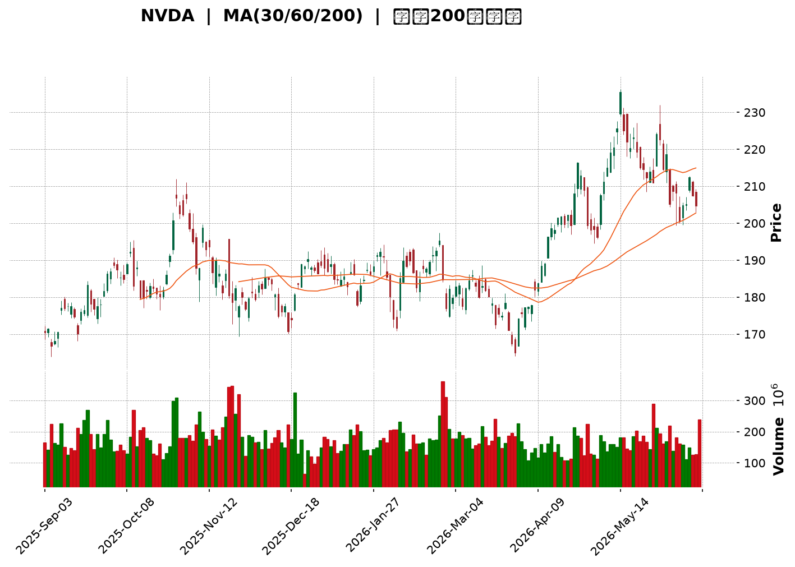
</details>

<html>
<head><meta charset="utf-8" /></head>
<body>
    <div style="height:500px; width:100%;">                        <script>window.PlotlyConfig = {MathJaxConfig: 'local'};</script>
        <script charset="utf-8" src="https://cdn.plot.ly/plotly-3.6.0.min.js" integrity="sha256-QaOVwtVY0T02VaHrr6pnoHLCwayMJp4O5n4YyaE3rJk=" crossorigin="anonymous"></script>                <div id="candlestick-chart" class="plotly-graph-div" style="height:100%; width:100%;"></div>            <script>                window.PLOTLYENV=window.PLOTLYENV || {};                                if (document.getElementById("candlestick-chart")) {                    Plotly.newPlot(                        "candlestick-chart",                        [{"close":{"dtype":"f8","bdata":"AAAA4JNMZUAAAABg0G1lQAAAAACI2WRAAAAAoMECZUAAAABADVFlQAAAAEADI2ZAAAAAwDceZkAAAAAA\u002fjJmQAAAACDBMGZAAAAAIAjVZUAAAACgVkJlQAAAACB\u002fAGZAAAAAAD0OZkAAAABACexmQAAAAKB8RmZAAAAAgNMXZkAAAABA1i5mQAAAACDRPmZAAAAAoMmzZkAAAABg9EpnQAAAAGAMYGdAAAAA4MeUZ0AAAAAgMWxnQAAAAKC3KWdAAAAAwLwZZ0AAAADAz5tnQAAAAABkCmhAAAAAgKfdZkAAAACAkIJnQAAAACCfeWZAAAAA4DpzZkAAAABAgrJmQAAAAGCS32ZAAAAAAAnNZkAAAABgvJ1mQAAAAICcgWZAAAAA4LG9ZkAAAABAukBnQAAAAADg52dAAAAAAMQYaUAAAABA19hpQAAAAMA1VGlAAAAAIG1HaUAAAABAutNpQAAAACD7zWhAAAAAYMNeaEAAAADg5HpnQAAAAEAhfWdAAAAAoHzZaEAAAAAgPx1oQAAAAECzMWhAAAAAQOdTZ0AAAAAgsL1nQAAAACCYS2dAAAAAoCCkZkAAAACACUlnQAAAAOAdjWZAAAAAYN5UZkAAAADAKMpmQAAAAAD+MmZAAAAAwPiAZkAAAAAAyRhmQAAAACAbdmZAAAAA4FKnZkAAAABgj2tmQAAAAOAC5WZAAAAAYALGZkAAAAAAXipnQAAAAGDUF2dAAAAAwMvxZkAAAADgtJZmQAAAAEDR2WVAAAAAQGgCZkAAAACgHDBmQAAAAIBqV2VAAAAAALG9ZUAAAAAAoJhmQAAAAGDr7mZAAAAAQFifZ0AAAADgKoxnQAAAAGCIyWdAAAAA4LN\u002fZ0AAAAAg+GlnQAAAAMC6SGdAAAAAoNaTZ0AAAADAgXxnQAAAAKBhYGdAAAAA4CWcZ0AAAAAAERpnQAAAAEBQFGdAAAAA4N4WZ0AAAABArTJnQAAAAEBX3WZAAAAA4E5aZ0AAAACgGUBnQAAAAIBMO2ZAAAAAIBjjZkAAAACgrBNnQAAAAMAfbmdAAAAAYMVHZ0AAAACASolnQAAAAIAs6WdAAAAAwNAIaEAAAACgtdxnQAAAAMBILGdAAAAAgNmDZkAAAABASr9lQAAAAMB1dWVAAAAAgOQlZ0AAAAAg37lnQAAAACDuiWdAAAAAIDG6Z0AAAAAAy1ZnQAAAACDL0mZAAAAAYNQXZ0AAAAAgCHhnQAAAAKB5dWdAAAAAQNeyZ0AAAAAAIupnQAAAAMCuE2hAAAAA4EtqaEAAAADARRVnQAAAAEAsH2ZAAAAAID\u002fIZkAAAADAlHpmQAAAAAAl2mZAAAAAgLvjZkAAAAAATzNmQAAAAACuzWZAAAAA4G8RZ0AAAACgBzpnQAAAAGCo3WZAAAAAAEmBZkAAAAAAN+BmQAAAAID7tmZAAAAAYBSGZkAAAACgREtmQAAAAGD3j2VAAAAA4O\u002ftZUAAAACA399lQAAAAIAaT2ZAAAAAIE1hZUAAAABAZupkQAAAAIBJn2RAAAAAoE3GZUAAAAAAdPFlQAAAACDfJWZAAAAAwNwtZkAAAADAkDxmQAAAAADHu2ZAAAAA4ET2ZkAAAAAgIo1nQAAAACDeomdAAAAA4P+IaEAAAACAbtRoQAAAAKDPw2hAAAAAID8uaUAAAACAZDppQAAAAOC29GhAAAAA4HRIaUAAAAAAC+1oQAAAAKDhAGpAAAAAYHMLa0AAAADAf51qQAAAAIA0IGpAAAAAQM7qaEAAAADgAcdoQAAAAED3x2hAAAAAAK6IaEAAAABg0fJpQAAAAAAfaGpAAAAAIGLeakAAAADA52VrQAAAAEC8kGtAAAAAwCUybEAAAAAA5m5tQAAAAMDYIWxAAAAAYPXBa0AAAABATYtrQAAAACC35mtAAAAAgCRoa0AAAADgieJqQAAAACCE02pAAAAAwEeLakAAAADABMBqQAAAAGCdXGpAAAAAgCkDbEAAAACA8NFrQAAAAAAA0GpAAAAAwB5Va0AAAABAM6NpQAAAAOB6FGpAAAAAgBQGakAAAACgcA1pQAAAAADXm2lAAAAAgBSmaUAAAABgZo5qQAAAAMAe7WlAAAAAwMyUaUAAAAAAAAD4fw=="},"high":{"dtype":"f8","bdata":"8i7cHsiFZUAUmiSSNHRlQEjdSvnDGWVADn9AoHFXZUDpb1MaFVhlQJE3BiWmYWZALZWXa5yBZkDgjWac60tmQPYMZ+XoU2ZAZaYKycMoZkCSXDoCV59lQAiUtUb7G2ZAAuk4CU07ZkDoQArxEwpnQBfMfx0BxmZADFc1raFxZkDaSWzO+IBmQMnyVANQcWZAOP2H8H\u002f4ZkBZZwA3kGNnQOko6rvPfGdAvJYMFtDZZ0BJuTuowsNnQKWzpn26X2dAuL83rTaaZ0BryALDeKtnQJUjFaOjYWhA+2lOu91raECX4pJyxbtnQMYuhTkREmdAevKM6E0UZ0BkwvcofeFmQAnGODGy+2ZAU706ydkeZ0C0eMc91NFmQHezXUaa5mZAx\u002fjiy3\u002fZZkAIGqL\u002fZWdnQNLFq40s+GdAx3u54IRcaUDyEwdjbn1qQJMlxoC3vGlAF5\u002fXEJD2aUBSZP71Q2JqQLLi6sa5dmlA69QALCtVaUBvBrz0yKtoQOgPzDmQgmdANi+XNu71aEAGcL1qeWVoQJIvq7B+dGhA4DM51UbmZ0DMOvubiNhnQNRq59RLmGdAFG15OhESZ0BN7FDE3HNnQNU9cLcCeGhABJSYmmUKZ0DiBkM2hehmQGPRxbPbPWZAAUBz+KnVZkD6Q5a6+GFmQMHw2ShAgmZA0imBbI0tZ0DaqIGo9sZmQDRBc19yCWdAnjvD6+sNZ0CNMxvtq3hnQDtr+OPML2dAVaABKSEoZ0BFKJf7K6NmQPigxwgd02ZASycX\u002fntGZkDeHMHQuEhmQN5HBTRL\u002fWVAEXXU0O79ZUCOx+CoU6dmQIcDRe\u002fw\u002fWZAfjZ1DS6jZ0CkVI+BwZVnQIwlyJGRDmhAIC1tHPaQZ0B7ILAnUJhnQLoNTrt9ymdAmo+qKD0WaECiF\u002f7DnCxoQG69ge3y\u002fWdAZFMxMmHkZ0Aqxu39NapnQAxz2JqdQ2dAfD6cnotcZ0B\u002fLjHsL3xnQOonv5OHB2dA1cidLQGvZ0DtyF\u002f8p8ZnQN0qVf0MxWZA3e5oEe8kZ0BjHia6Lj5nQMDxPx3Pq2dA8nLurXecZ0A2+eXal7hnQOBgcJezA2hAy5fsUdEnaEAeDRA4GUhoQIl8sHEuwmdAq5jn8WBBZ0CT3YNWj2tmQNrDtvNYE2ZA28AP4rVYZ0A3k8ofki1oQJIXdU7bB2hA7LW3V8kgaEBifm0Q+StoQCDqDtKwaGdAhGHCHoFdZ0A\u002fP\u002fgla8RnQO9LABZqhmdAs4QhCSTDZ0DY33HM1jZoQDuWsDEWMWhA8XCNt3SsaECx9iWxtEFoQJEJfhzDy2ZAqHBlmJHnZkDiiGdkv5VmQJOiJy8zD2dABWN3kL76ZkCDhPITMtFmQADYvWf91WZAZaZd1c9GZ0C7qim22WxnQDYvnNUwF2dAgvItjvI7Z0D2qjPGH5VnQBnBaajkJWdA6vPONFTlZkCgLzi1p3hmQEwQwNmtQWZA+Nsa9zFFZkAt+bKleQBmQJQi5gZKoGZAbvxhnr4JZkAFw\u002f+4q1hlQFa0LG8WKGVAPBjqxlXNZUC29CCNOyVmQMYu12sRKWZAR9LMEagyZkDhMqRiuEBmQAqqrixrIWdA+8744LP7ZkAdhlwP7LhnQH9QgQkOrmdAAAAA4P+IaEBIGcuoVQVpQLYV3lHB82hAkkwpz+IuaUBKanGT6D1pQDeld4FyUGlAAAAA4HRIaUCyCriK93JpQBM08ZCKVmpA3n\u002fjhnsSa0DGToxfXM9qQHRBlqgdj2pAHUixC8RBakA1PvwbcFhpQHYdVkHYL2lAjS\u002f7dDgAaUCxb8mt4QBqQGGgR6BrvmpAhWWBlHwxa0BNl42ZUcFrQHLCGC2q72tA4hrrdGRybEAxgfbed4htQBKtnFBg52xARVHCom63bEBe2OJX\u002fwZsQC2AAYK8O2xA9NyhIVRkbECtsSU1FphrQFBrztahPWtAtjLfd9K8akA5QGaDnOhqQFStdopnM2tA3TLrgnYTbEDv2RGITgBtQOXT+4nw0WtAAAAAQDOza0AAAAAA19tqQAAAAEAKT2pAAAAAwMxsakAAAABACudpQAAAAMAetWlAAAAAgD3iaUAAAABguJZqQAAAACCub2pAAAAAYLgmakAAAAAAAAD4fw=="},"hovertemplate":"\u003cb\u003e%{x|%Y-%m-%d}\u003c\u002fb\u003e\u003cbr\u003e\u958b: $%{open:.2f}\u003cbr\u003e\u9ad8: $%{high:.2f}\u003cbr\u003e\u4f4e: $%{low:.2f}\u003cbr\u003e\u6536: $%{close:.2f}\u003cextra\u003e\u003c\u002fextra\u003e","low":{"dtype":"f8","bdata":"58ad1fgUZUCWvvzj6CVlQJONw8RBe2RAtnS71RPkZEBN92dNldBkQKecEmSS52VAxsVZcyoIZkD\u002fVLArNQdmQMXNeM80yWVAkHuuVw3FZUD6WTJeQQZlQLQcwJmrl2VAZfp\u002fbJ7eZUCQiOddmc9lQIx9P6qJ\u002f2VA15M1YqblZUBtWMFVGp1lQB61eySh1mVAnJQ41+OCZkBbSjdY9qdmQMFQ69lN9WZAUn0oKUF6Z0B2OAGAmiRnQE4OWW8W42ZAaOkr+n\u002f4ZkDc\u002fnQRrUlnQOsH2MEh2mdAH0os9S26ZkCOUAcAJDdnQJ0ujzETb2ZAu9YuoQ0iZkAHi7zpT3FmQItvf1WscGZAxjf7vvOvZkCFiP5wRXJmQDXyVlsdEWZAY8lEe\u002fNxZkAKRPIshehmQN6qGE4UhmdAkB3QKkz1Z0C7zwP1nJBpQKiWihHpJGlAXaj54QA6aUDIDyWGiqlpQHq3TQ6xtWhAENn7l91MaEBTxQk9kERnQHNhSa3TVWZAsOjKgmExaEBebLtozeFnQPW2x3xe3GdAqsq9yLTzZkC2jFDzMotmQBuvjSq6AmdA5lQQGHptZkBqbYWBG9NmQJRyYX7ec2ZAOWK69rWWZUDhCOKWKghmQEfLimuwKmVAEGRwFGpAZkByAa83zghmQF43nB2urmVAXI8hvKl4ZkBNHSRCOFxmQGY8pmG0d2ZA7IIoWBGWZkAjuS6PsMVmQALjPxcY42ZAtyg0\u002fS66ZkBq3S5j9AxmQBKF7l0IzWVA9+ci8yLaZUBGU7JE+9VlQGTGmslHQ2VA2Ewox4pzZUCRujGHAQRmQDg\u002fV38XxGZAfS+yl6vVZkCYuqcom0tnQO1VdN+reGdAIH2Tbd81Z0CHq1oWeVZnQGvUiPloSGdAAZVUI\u002fuAZ0ARKp0oiz1nQEyt9DD1UmdAVb23sqVKZ0AQ19EFj+9mQGCCRKBH7mZABY8paYHZZkC8ctOMpuVmQC\u002f5ClqNkmZAfwCCz0tDZ0AdbDNfTjtnQDWVK7eYLGZAKSf0eNhFZkBVBdr0lvZmQB+nihv1UmdAAbtECm44Z0AvMZIkKS9nQFIPO6R6s2dA3\u002fLlvao6Z0AH4+Fwp6dnQBXhCenzFGdAxHhOZH0AZkCU+JBAa3ZlQIFvhftKWmVAGysh4GTMZUBqhmWmOvdmQNml+LCBfGdAHW7mJUiRZ0BbE4aqDElnQBfX1gzNq2ZAFzzFZ8ZeZkA0weMMClFnQK+jjPrhLWdAt4ok+NQ2Z0ADNABpK6tnQNiZF6N+ZWdAzjAAqrkxaEDHTTMQDgNnQBd\u002fUtVIBWZAwJqYHKzNZUAAEK78ihZmQMVIDp3memZAC1fAvTk1ZkA1VKz6WBNmQKNkIIET62VA6Np5azm5ZkD0v29RhwdnQAs0cME6sWZAYLTUdGB3ZkCOzMHCXKZmQM87WOL9rmZA0q7fqteDZkCqvK4qu\u002fJlQF3\u002fkpikcGVA9AdoRM\u002fRZUAp75Xi4LhlQL6xrLOcFGZAkg8l1BpeZUDHCSodGdpkQHErK1WFgmRAMBQgM4DYZEDjMUmJfdFlQL0Fg6l0ZWVAboDnrcXxZUCRTeOXpq5lQNcMgznigmZAgiIfgByNZkDSmQ0LvAJnQNYfrcvCMGdA3s0onYjRZ0BeLkl5Y3BoQGRbOxmgcmhAgHDGezfhaEBikMR+grNoQP8tXESW2GhAOtGhQJbYaED8whJ0sZ9oQO6bpu558mhA3lEgRm\u002fkaUCO81vlpP5pQKKjA83T6mlAhhUNbP\u002fOaECj3vUuf5xoQOhh8epsUGhA53V7O6h5aEBDsYYNH8xoQNAv565OyGlASE58p4yUakClmtsNg7RqQMPcfQJv1WpA3DMZgPypa0A4xzHqDqFsQA51o6xT\u002f2tAngo0i7RDa0B5TrWfADVrQBtWzjLJh2tASm1cMaQ1a0AJq+ktmdFqQLP9M0YaeGpAd9oiri4RakCcz3flK19qQEBLZphLXGpARmM0Vl3uakDuoOhE9KJrQIFK8ilUyGpAAAAAQApfakAAAABgj4ppQAAAAAAAwGlAAAAAQOHqaEAAAACgcP1oQAAAAKBH8WhAAAAAgBRuaUAAAABA4QpqQAAAAKBH6WlAAAAAYI9iaUAAAAAAAAD4fw=="},"name":"\u50f9\u683c","open":{"dtype":"f8","bdata":"kZKilKNaZUCXYVsA+0plQG\u002fxtN7O+WRALPrfB3jqZECSKlDSrhtlQJchnUT2DGZAuTGEbm9uZkB0ipLlZDFmQNQ+mHRH7mVA9iG5AMkYZkBJBDRacY1lQNSMFrVEuGVAObtNpHnxZUCB5+N1dOJlQOBxk2+ft2ZAUITo509xZkD9SlZfP8hlQAACcHUtPmZA5kxosWeGZkB3R1pVI7tmQKCycj4hIGdAHI5h13irZ0AW4tA9Xp5nQGGV1GpwKGdAI4Ya1cQ\u002fZ0BnOUehokpnQAbOTiyG\u002f2dAOwzOn24oaEBygO\u002fmYHdnQPqFqMkbEWdAkaCFQxESZ0DkIv997r9mQCgX2VhqfmZAuSoAA7LcZkC0eMc91NFmQBQlmKYYnWZA3H1E6BWGZkCTXLHgYvNmQHWo5Kbvt2dA3hl2JbsZaEClPgTx4fZpQBgu1QpwnGlAWWhaDfzFaUCUlXAaFPppQEwtMqa5V2lACaUKuonQaEBbuCsab4VoQDLGmipDFWdAC6W5PJFbaEA8b0dBKl1oQHeoz9YPb2hAPx8MB9DZZ0DCNWLoENRmQHYW7rJ1N2dAokTRa6\u002fkZkDk\u002fJJNvxFnQOQgBJ1pdmhAdziM30qgZkBfPTUuXWhmQANSc5391WVAt8L9k8GsZkCuCJHmBVlmQFynezgy0WVA4LWjPumwZkAVZ\u002fjzLZtmQFFvmHDCrGZAY7fyuk\u002f1ZkA+NQ1KXM1mQPCTu7yvKmdAbIvkX9QXZ0BIx5qc7oFmQJB+dLl1nGZADitsqCQ3ZkAZPhnScgFmQDotqsBV\u002fGVAd1+f+yfKZUAT0iacjQ5mQCLEazRF9mZA3ZLaZOjXZkDdtLHvwHZnQIt1YlYJtmdA38buFmdvZ0A6ALKjV4BnQPl+lZzZqmdABErTvnqzZ0CN2SpN2PBnQN1lsaQ2yWdA+YeRo+OKZ0BfgAniJZxnQFmH7k1YG2dAzxk3yuXfZkAHGkzVyRhnQAIJaBkOA2dAHFwvvbpIZ0CcI99uMJtnQGOCm4e1tWZAMAFn3J5aZkDBi+tFzBBnQDnuTtKwaGdAJJY3\u002fdJdZ0Ax9yWGYWBnQD\u002fHuP4u4WdAGcYCzWvjZ0Cbq50zRN9nQLk6xyEaX2dASc6LfmtAZ0DGFA+JuWdmQCJzKNDw1mVAUFnZRDEPZkBYcW4OIwFnQAXwmyiz5GdAMXDy7OUGaEDUfSJ6bxloQIszKiUNaGdAXywoQuqwZkAJGMZQpJBnQGK99MGgWmdAPbqvrvdKZ0DGHj+fVuVnQElNYTI36GdAZmDT09FGaEB6NzckEUFoQO8H0TvvoGZARYtha3\u002fZZUCRoo3RuEhmQJfkP9ILh2ZAvcwiiGCeZkDAmZaX3nNmQNcvl7SqE2ZAZa0TZ7DFZkBnJfXEMTZnQP\u002f3YnK++mZANayfFo0WZ0CcjVNiOdhmQDAQeaYGG2dAaTYH6o\u002fIZkCwusY+sDlmQKoSgXReOWZA9lYDbbchZkDmJ1QHDNRlQEABVVGaHGZA+duFcK77ZUDjzzW5qjllQD7q2TKsEmVA2dK5+tHYZECHs62dcfllQIht8m9Yf2VAJYLgM4UeZkAxtC060PBlQC2oDowgCWdAfVCmHRu0ZkAYLafSDQNnQMPpsacHOmdA40lJUsXTZ0Azz0NY9YloQDcFJKZnpmhA5fW1WVr1aEBP\u002fST26PdoQLt6EGuhPGlA9o9iZjEYaUA60lybLUdpQNVaaWBF92hA3OQrYP0sakB5XwlY4CdqQDCHbPl5jmpAfwUKc\u002fA1akCbJQ9DdiFpQGDVuWWR6GhAXBvy6yziaECREpCYCPVoQAONxWIeA2pAJx+zMQaZakBIGqlfTrlqQOSrRGR1SWtAGqU6dWEVbEAJGXRLo7JsQDcricjCr2xASCgk4EazbEDFz\u002fmQqGtrQKQAAyRy3WtAYC0Cvf\u002fAa0AtgbIhkpRrQLOzlZo2CWtAzlMcAd27akAwSf3SFmFqQMNg7BGRympAaH33zFLvakDX5GPrS11sQE9ohsfHrmtAAAAAwB69akAAAADA9dBqQAAAAIDCRWpAAAAAANdTakAAAACAwo1pQAAAACCuL2lAAAAAIIWbaUAAAACgcB1qQAAAAIDCZWpAAAAAwPUQakAAAAAAAAD4fw=="},"x":["2025-09-03T00:00:00-04:00","2025-09-04T00:00:00-04:00","2025-09-05T00:00:00-04:00","2025-09-08T00:00:00-04:00","2025-09-09T00:00:00-04:00","2025-09-10T00:00:00-04:00","2025-09-11T00:00:00-04:00","2025-09-12T00:00:00-04:00","2025-09-15T00:00:00-04:00","2025-09-16T00:00:00-04:00","2025-09-17T00:00:00-04:00","2025-09-18T00:00:00-04:00","2025-09-19T00:00:00-04:00","2025-09-22T00:00:00-04:00","2025-09-23T00:00:00-04:00","2025-09-24T00:00:00-04:00","2025-09-25T00:00:00-04:00","2025-09-26T00:00:00-04:00","2025-09-29T00:00:00-04:00","2025-09-30T00:00:00-04:00","2025-10-01T00:00:00-04:00","2025-10-02T00:00:00-04:00","2025-10-03T00:00:00-04:00","2025-10-06T00:00:00-04:00","2025-10-07T00:00:00-04:00","2025-10-08T00:00:00-04:00","2025-10-09T00:00:00-04:00","2025-10-10T00:00:00-04:00","2025-10-13T00:00:00-04:00","2025-10-14T00:00:00-04:00","2025-10-15T00:00:00-04:00","2025-10-16T00:00:00-04:00","2025-10-17T00:00:00-04:00","2025-10-20T00:00:00-04:00","2025-10-21T00:00:00-04:00","2025-10-22T00:00:00-04:00","2025-10-23T00:00:00-04:00","2025-10-24T00:00:00-04:00","2025-10-27T00:00:00-04:00","2025-10-28T00:00:00-04:00","2025-10-29T00:00:00-04:00","2025-10-30T00:00:00-04:00","2025-10-31T00:00:00-04:00","2025-11-03T00:00:00-05:00","2025-11-04T00:00:00-05:00","2025-11-05T00:00:00-05:00","2025-11-06T00:00:00-05:00","2025-11-07T00:00:00-05:00","2025-11-10T00:00:00-05:00","2025-11-11T00:00:00-05:00","2025-11-12T00:00:00-05:00","2025-11-13T00:00:00-05:00","2025-11-14T00:00:00-05:00","2025-11-17T00:00:00-05:00","2025-11-18T00:00:00-05:00","2025-11-19T00:00:00-05:00","2025-11-20T00:00:00-05:00","2025-11-21T00:00:00-05:00","2025-11-24T00:00:00-05:00","2025-11-25T00:00:00-05:00","2025-11-26T00:00:00-05:00","2025-11-28T00:00:00-05:00","2025-12-01T00:00:00-05:00","2025-12-02T00:00:00-05:00","2025-12-03T00:00:00-05:00","2025-12-04T00:00:00-05:00","2025-12-05T00:00:00-05:00","2025-12-08T00:00:00-05:00","2025-12-09T00:00:00-05:00","2025-12-10T00:00:00-05:00","2025-12-11T00:00:00-05:00","2025-12-12T00:00:00-05:00","2025-12-15T00:00:00-05:00","2025-12-16T00:00:00-05:00","2025-12-17T00:00:00-05:00","2025-12-18T00:00:00-05:00","2025-12-19T00:00:00-05:00","2025-12-22T00:00:00-05:00","2025-12-23T00:00:00-05:00","2025-12-24T00:00:00-05:00","2025-12-26T00:00:00-05:00","2025-12-29T00:00:00-05:00","2025-12-30T00:00:00-05:00","2025-12-31T00:00:00-05:00","2026-01-02T00:00:00-05:00","2026-01-05T00:00:00-05:00","2026-01-06T00:00:00-05:00","2026-01-07T00:00:00-05:00","2026-01-08T00:00:00-05:00","2026-01-09T00:00:00-05:00","2026-01-12T00:00:00-05:00","2026-01-13T00:00:00-05:00","2026-01-14T00:00:00-05:00","2026-01-15T00:00:00-05:00","2026-01-16T00:00:00-05:00","2026-01-20T00:00:00-05:00","2026-01-21T00:00:00-05:00","2026-01-22T00:00:00-05:00","2026-01-23T00:00:00-05:00","2026-01-26T00:00:00-05:00","2026-01-27T00:00:00-05:00","2026-01-28T00:00:00-05:00","2026-01-29T00:00:00-05:00","2026-01-30T00:00:00-05:00","2026-02-02T00:00:00-05:00","2026-02-03T00:00:00-05:00","2026-02-04T00:00:00-05:00","2026-02-05T00:00:00-05:00","2026-02-06T00:00:00-05:00","2026-02-09T00:00:00-05:00","2026-02-10T00:00:00-05:00","2026-02-11T00:00:00-05:00","2026-02-12T00:00:00-05:00","2026-02-13T00:00:00-05:00","2026-02-17T00:00:00-05:00","2026-02-18T00:00:00-05:00","2026-02-19T00:00:00-05:00","2026-02-20T00:00:00-05:00","2026-02-23T00:00:00-05:00","2026-02-24T00:00:00-05:00","2026-02-25T00:00:00-05:00","2026-02-26T00:00:00-05:00","2026-02-27T00:00:00-05:00","2026-03-02T00:00:00-05:00","2026-03-03T00:00:00-05:00","2026-03-04T00:00:00-05:00","2026-03-05T00:00:00-05:00","2026-03-06T00:00:00-05:00","2026-03-09T00:00:00-04:00","2026-03-10T00:00:00-04:00","2026-03-11T00:00:00-04:00","2026-03-12T00:00:00-04:00","2026-03-13T00:00:00-04:00","2026-03-16T00:00:00-04:00","2026-03-17T00:00:00-04:00","2026-03-18T00:00:00-04:00","2026-03-19T00:00:00-04:00","2026-03-20T00:00:00-04:00","2026-03-23T00:00:00-04:00","2026-03-24T00:00:00-04:00","2026-03-25T00:00:00-04:00","2026-03-26T00:00:00-04:00","2026-03-27T00:00:00-04:00","2026-03-30T00:00:00-04:00","2026-03-31T00:00:00-04:00","2026-04-01T00:00:00-04:00","2026-04-02T00:00:00-04:00","2026-04-06T00:00:00-04:00","2026-04-07T00:00:00-04:00","2026-04-08T00:00:00-04:00","2026-04-09T00:00:00-04:00","2026-04-10T00:00:00-04:00","2026-04-13T00:00:00-04:00","2026-04-14T00:00:00-04:00","2026-04-15T00:00:00-04:00","2026-04-16T00:00:00-04:00","2026-04-17T00:00:00-04:00","2026-04-20T00:00:00-04:00","2026-04-21T00:00:00-04:00","2026-04-22T00:00:00-04:00","2026-04-23T00:00:00-04:00","2026-04-24T00:00:00-04:00","2026-04-27T00:00:00-04:00","2026-04-28T00:00:00-04:00","2026-04-29T00:00:00-04:00","2026-04-30T00:00:00-04:00","2026-05-01T00:00:00-04:00","2026-05-04T00:00:00-04:00","2026-05-05T00:00:00-04:00","2026-05-06T00:00:00-04:00","2026-05-07T00:00:00-04:00","2026-05-08T00:00:00-04:00","2026-05-11T00:00:00-04:00","2026-05-12T00:00:00-04:00","2026-05-13T00:00:00-04:00","2026-05-14T00:00:00-04:00","2026-05-15T00:00:00-04:00","2026-05-18T00:00:00-04:00","2026-05-19T00:00:00-04:00","2026-05-20T00:00:00-04:00","2026-05-21T00:00:00-04:00","2026-05-22T00:00:00-04:00","2026-05-26T00:00:00-04:00","2026-05-27T00:00:00-04:00","2026-05-28T00:00:00-04:00","2026-05-29T00:00:00-04:00","2026-06-01T00:00:00-04:00","2026-06-02T00:00:00-04:00","2026-06-03T00:00:00-04:00","2026-06-04T00:00:00-04:00","2026-06-05T00:00:00-04:00","2026-06-08T00:00:00-04:00","2026-06-09T00:00:00-04:00","2026-06-10T00:00:00-04:00","2026-06-11T00:00:00-04:00","2026-06-12T00:00:00-04:00","2026-06-15T00:00:00-04:00","2026-06-16T00:00:00-04:00","2026-06-17T00:00:00-04:00","2026-06-18T00:00:00-04:00"],"type":"candlestick"},{"hovertemplate":"MA30: $%{y:.2f}\u003cextra\u003e\u003c\u002fextra\u003e","line":{"color":"#2196F3","dash":"dash","width":2},"mode":"lines","name":"MA30","x":["2025-09-03T00:00:00-04:00","2025-09-04T00:00:00-04:00","2025-09-05T00:00:00-04:00","2025-09-08T00:00:00-04:00","2025-09-09T00:00:00-04:00","2025-09-10T00:00:00-04:00","2025-09-11T00:00:00-04:00","2025-09-12T00:00:00-04:00","2025-09-15T00:00:00-04:00","2025-09-16T00:00:00-04:00","2025-09-17T00:00:00-04:00","2025-09-18T00:00:00-04:00","2025-09-19T00:00:00-04:00","2025-09-22T00:00:00-04:00","2025-09-23T00:00:00-04:00","2025-09-24T00:00:00-04:00","2025-09-25T00:00:00-04:00","2025-09-26T00:00:00-04:00","2025-09-29T00:00:00-04:00","2025-09-30T00:00:00-04:00","2025-10-01T00:00:00-04:00","2025-10-02T00:00:00-04:00","2025-10-03T00:00:00-04:00","2025-10-06T00:00:00-04:00","2025-10-07T00:00:00-04:00","2025-10-08T00:00:00-04:00","2025-10-09T00:00:00-04:00","2025-10-10T00:00:00-04:00","2025-10-13T00:00:00-04:00","2025-10-14T00:00:00-04:00","2025-10-15T00:00:00-04:00","2025-10-16T00:00:00-04:00","2025-10-17T00:00:00-04:00","2025-10-20T00:00:00-04:00","2025-10-21T00:00:00-04:00","2025-10-22T00:00:00-04:00","2025-10-23T00:00:00-04:00","2025-10-24T00:00:00-04:00","2025-10-27T00:00:00-04:00","2025-10-28T00:00:00-04:00","2025-10-29T00:00:00-04:00","2025-10-30T00:00:00-04:00","2025-10-31T00:00:00-04:00","2025-11-03T00:00:00-05:00","2025-11-04T00:00:00-05:00","2025-11-05T00:00:00-05:00","2025-11-06T00:00:00-05:00","2025-11-07T00:00:00-05:00","2025-11-10T00:00:00-05:00","2025-11-11T00:00:00-05:00","2025-11-12T00:00:00-05:00","2025-11-13T00:00:00-05:00","2025-11-14T00:00:00-05:00","2025-11-17T00:00:00-05:00","2025-11-18T00:00:00-05:00","2025-11-19T00:00:00-05:00","2025-11-20T00:00:00-05:00","2025-11-21T00:00:00-05:00","2025-11-24T00:00:00-05:00","2025-11-25T00:00:00-05:00","2025-11-26T00:00:00-05:00","2025-11-28T00:00:00-05:00","2025-12-01T00:00:00-05:00","2025-12-02T00:00:00-05:00","2025-12-03T00:00:00-05:00","2025-12-04T00:00:00-05:00","2025-12-05T00:00:00-05:00","2025-12-08T00:00:00-05:00","2025-12-09T00:00:00-05:00","2025-12-10T00:00:00-05:00","2025-12-11T00:00:00-05:00","2025-12-12T00:00:00-05:00","2025-12-15T00:00:00-05:00","2025-12-16T00:00:00-05:00","2025-12-17T00:00:00-05:00","2025-12-18T00:00:00-05:00","2025-12-19T00:00:00-05:00","2025-12-22T00:00:00-05:00","2025-12-23T00:00:00-05:00","2025-12-24T00:00:00-05:00","2025-12-26T00:00:00-05:00","2025-12-29T00:00:00-05:00","2025-12-30T00:00:00-05:00","2025-12-31T00:00:00-05:00","2026-01-02T00:00:00-05:00","2026-01-05T00:00:00-05:00","2026-01-06T00:00:00-05:00","2026-01-07T00:00:00-05:00","2026-01-08T00:00:00-05:00","2026-01-09T00:00:00-05:00","2026-01-12T00:00:00-05:00","2026-01-13T00:00:00-05:00","2026-01-14T00:00:00-05:00","2026-01-15T00:00:00-05:00","2026-01-16T00:00:00-05:00","2026-01-20T00:00:00-05:00","2026-01-21T00:00:00-05:00","2026-01-22T00:00:00-05:00","2026-01-23T00:00:00-05:00","2026-01-26T00:00:00-05:00","2026-01-27T00:00:00-05:00","2026-01-28T00:00:00-05:00","2026-01-29T00:00:00-05:00","2026-01-30T00:00:00-05:00","2026-02-02T00:00:00-05:00","2026-02-03T00:00:00-05:00","2026-02-04T00:00:00-05:00","2026-02-05T00:00:00-05:00","2026-02-06T00:00:00-05:00","2026-02-09T00:00:00-05:00","2026-02-10T00:00:00-05:00","2026-02-11T00:00:00-05:00","2026-02-12T00:00:00-05:00","2026-02-13T00:00:00-05:00","2026-02-17T00:00:00-05:00","2026-02-18T00:00:00-05:00","2026-02-19T00:00:00-05:00","2026-02-20T00:00:00-05:00","2026-02-23T00:00:00-05:00","2026-02-24T00:00:00-05:00","2026-02-25T00:00:00-05:00","2026-02-26T00:00:00-05:00","2026-02-27T00:00:00-05:00","2026-03-02T00:00:00-05:00","2026-03-03T00:00:00-05:00","2026-03-04T00:00:00-05:00","2026-03-05T00:00:00-05:00","2026-03-06T00:00:00-05:00","2026-03-09T00:00:00-04:00","2026-03-10T00:00:00-04:00","2026-03-11T00:00:00-04:00","2026-03-12T00:00:00-04:00","2026-03-13T00:00:00-04:00","2026-03-16T00:00:00-04:00","2026-03-17T00:00:00-04:00","2026-03-18T00:00:00-04:00","2026-03-19T00:00:00-04:00","2026-03-20T00:00:00-04:00","2026-03-23T00:00:00-04:00","2026-03-24T00:00:00-04:00","2026-03-25T00:00:00-04:00","2026-03-26T00:00:00-04:00","2026-03-27T00:00:00-04:00","2026-03-30T00:00:00-04:00","2026-03-31T00:00:00-04:00","2026-04-01T00:00:00-04:00","2026-04-02T00:00:00-04:00","2026-04-06T00:00:00-04:00","2026-04-07T00:00:00-04:00","2026-04-08T00:00:00-04:00","2026-04-09T00:00:00-04:00","2026-04-10T00:00:00-04:00","2026-04-13T00:00:00-04:00","2026-04-14T00:00:00-04:00","2026-04-15T00:00:00-04:00","2026-04-16T00:00:00-04:00","2026-04-17T00:00:00-04:00","2026-04-20T00:00:00-04:00","2026-04-21T00:00:00-04:00","2026-04-22T00:00:00-04:00","2026-04-23T00:00:00-04:00","2026-04-24T00:00:00-04:00","2026-04-27T00:00:00-04:00","2026-04-28T00:00:00-04:00","2026-04-29T00:00:00-04:00","2026-04-30T00:00:00-04:00","2026-05-01T00:00:00-04:00","2026-05-04T00:00:00-04:00","2026-05-05T00:00:00-04:00","2026-05-06T00:00:00-04:00","2026-05-07T00:00:00-04:00","2026-05-08T00:00:00-04:00","2026-05-11T00:00:00-04:00","2026-05-12T00:00:00-04:00","2026-05-13T00:00:00-04:00","2026-05-14T00:00:00-04:00","2026-05-15T00:00:00-04:00","2026-05-18T00:00:00-04:00","2026-05-19T00:00:00-04:00","2026-05-20T00:00:00-04:00","2026-05-21T00:00:00-04:00","2026-05-22T00:00:00-04:00","2026-05-26T00:00:00-04:00","2026-05-27T00:00:00-04:00","2026-05-28T00:00:00-04:00","2026-05-29T00:00:00-04:00","2026-06-01T00:00:00-04:00","2026-06-02T00:00:00-04:00","2026-06-03T00:00:00-04:00","2026-06-04T00:00:00-04:00","2026-06-05T00:00:00-04:00","2026-06-08T00:00:00-04:00","2026-06-09T00:00:00-04:00","2026-06-10T00:00:00-04:00","2026-06-11T00:00:00-04:00","2026-06-12T00:00:00-04:00","2026-06-15T00:00:00-04:00","2026-06-16T00:00:00-04:00","2026-06-17T00:00:00-04:00","2026-06-18T00:00:00-04:00"],"y":{"dtype":"f8","bdata":"AAAAAAAA+H8AAAAAAAD4fwAAAAAAAPh\u002fAAAAAAAA+H8AAAAAAAD4fwAAAAAAAPh\u002fAAAAAAAA+H8AAAAAAAD4fwAAAAAAAPh\u002fAAAAAAAA+H8AAAAAAAD4fwAAAAAAAPh\u002fAAAAAAAA+H8AAAAAAAD4fwAAAAAAAPh\u002fAAAAAAAA+H8AAAAAAAD4fwAAAAAAAPh\u002fAAAAAAAA+H8AAAAAAAD4fwAAAAAAAPh\u002fAAAAAAAA+H8AAAAAAAD4fwAAAAAAAPh\u002fAAAAAAAA+H8AAAAAAAD4fwAAAAAAAPh\u002fAAAAAAAA+H8AAAAAAAD4f4mIiMgia2ZAZmZmJvV0ZkARERHhx39mQN7d3X0MkWZAMzMzI1OgZkCrqqoKaqtmQImIiEiRrmZAd3d3J+KzZkBVVVXl37xmQO\u002fu7g6Dy2ZAd3d3p17nZkAzMzMThQ5nQHd3dwfpKmdAIiIiompGZ0DNzMzMNF9nQFVVVRXKdGdAq6qqejiIZ0CJiIgISpNnQN7d3U3mnWdAIiIiEjmwZ0AAAACQO7dnQHd3d5c4vmdAiYiI+A68Z0B3d3dnxr5nQM3MzHznv2dAIiIi4vu7Z0CrqqqKOblnQBEREQGErGdARERExPSnZ0DNzMwsz6FnQImIiHh0n2dAvLu7u+mfZ0BVVVX1yZpnQLy7u\u002ftFl2dA3t3dLQSWZ0AzMzMDWJRnQJqZmTmol2dAzczMLO+XZ0De3d1dMJdnQLy7uwtBkGdAAAAAcON9Z0De3d19FWJnQJqZmXlnRGdAmpmZ6YAoZ0AAAAAgcwlnQFVVVcXl62ZAmpmZOXbVZkBVVVVl681mQN7d3d0tyWZAAAAAMLW+ZkDe3d0t37lmQImIiEhmtmZAmpmZCdy3ZkAzMzOjEbVmQBERETH5tGZAmpmZufa8ZkDv7u7urb5mQJqZmbm4xWZAIiIigqHQZkAiIiJiS9NmQAAAACDO2mZAMzMzQ83fZkDNzMy8MulmQM3MzKyj7GZAIiIiApvyZkDv7u6usPlmQImIiHgI9GZAmpmZqQD1ZkBEREQEP\u002fRmQFVVVWUf92ZAzczMDP35ZkCrqqoaEwJnQGZmZjanE2dAZmZm9u4kZ0BERERUODNnQGZmZlbZQmdAmpmZSXRJZ0AiIiKyNUJnQFVVVbWgNWdAERERUZQxZ0AzMzNTGjNnQFVVVZX7MGdAERERse4yZ0De3d0NSzJnQKuqqqpcLmdAVVVVdToqZ0BVVVVFFCpnQFVVVUXIKmdAq6qq6okrZ0CrqqpqeTJnQBEREZH8OmdAAAAAAE1GZ0BVVVUVUkVnQBEREVH7PmdAzczM7Bw6Z0De3d1thzNnQJqZmenSOGdAvLu7W9g4Z0BVVVXFXTFnQFVVVaUELGdA7+7u\u002fjQqZ0AiIiKikCdnQERERNSlHmdAVVVVxZgRZ0BmZmYmLglnQM3MzCxFBWdARERENFgFZ0Dv7u6uAgpnQO\u002fu7t7kCmdAmpmZ2X4AZ0AAAAAQsvBmQKuqqooz5mZAERER8SvSZkCrqqrqfb1mQERERFS1qmZAq6qqGnWfZkCrqqoqcJJmQJqZmVlAh2ZAEREREUl6ZkDNzMxs92tmQERERMSAYGZAIiIiIhpUZkAiIiLyGFhmQGZmZkYFZWZAIiIiovpzZkDNzMxsCohmQJqZmelcmGZAVVVV1emrZkAiIiLiv8VmQLy7uwse2GZAzczMnATrZkCamZm5hPlmQGZmZuZKFGdAvLu7Cwg7Z0Dv7u7e8FpnQO\u002fu7l4MeGdAd3d393iMZ0ARERHxqaFnQHd3d2chvWdAERER8VrTZ0DNzMy8HvZnQKuqqloWGWhAMzMzY+xHaEARERGBPX9oQAAAABB9umhAiYiIiEjxaEC8u7u7MjFpQGZmZpZDZGlAIiIiAt6TaUDv7u6OKMFpQBEREaFB7WlAvLu7ey8TakAAAADgoS9qQLy7u5vaSmpAMzMzI\u002f9bakAzMzMDYmxqQImIiHgCempAq6qqaiySakDv7u6uSqhqQERERHQiuGpAVVVVlZ\u002fJakDe3d39sc9qQLy7uztZ0GpA7+7u3qLHakCJiIgITbpqQERERITjtWpAd3d3lyG8akC8u7ubT8tqQBERETEV1WpAZmZmJgXeakAAAAAAAAD4fw=="},"type":"scatter"},{"hovertemplate":"MA60: $%{y:.2f}\u003cextra\u003e\u003c\u002fextra\u003e","line":{"color":"#9C27B0","dash":"dash","width":2},"mode":"lines","name":"MA60","x":["2025-09-03T00:00:00-04:00","2025-09-04T00:00:00-04:00","2025-09-05T00:00:00-04:00","2025-09-08T00:00:00-04:00","2025-09-09T00:00:00-04:00","2025-09-10T00:00:00-04:00","2025-09-11T00:00:00-04:00","2025-09-12T00:00:00-04:00","2025-09-15T00:00:00-04:00","2025-09-16T00:00:00-04:00","2025-09-17T00:00:00-04:00","2025-09-18T00:00:00-04:00","2025-09-19T00:00:00-04:00","2025-09-22T00:00:00-04:00","2025-09-23T00:00:00-04:00","2025-09-24T00:00:00-04:00","2025-09-25T00:00:00-04:00","2025-09-26T00:00:00-04:00","2025-09-29T00:00:00-04:00","2025-09-30T00:00:00-04:00","2025-10-01T00:00:00-04:00","2025-10-02T00:00:00-04:00","2025-10-03T00:00:00-04:00","2025-10-06T00:00:00-04:00","2025-10-07T00:00:00-04:00","2025-10-08T00:00:00-04:00","2025-10-09T00:00:00-04:00","2025-10-10T00:00:00-04:00","2025-10-13T00:00:00-04:00","2025-10-14T00:00:00-04:00","2025-10-15T00:00:00-04:00","2025-10-16T00:00:00-04:00","2025-10-17T00:00:00-04:00","2025-10-20T00:00:00-04:00","2025-10-21T00:00:00-04:00","2025-10-22T00:00:00-04:00","2025-10-23T00:00:00-04:00","2025-10-24T00:00:00-04:00","2025-10-27T00:00:00-04:00","2025-10-28T00:00:00-04:00","2025-10-29T00:00:00-04:00","2025-10-30T00:00:00-04:00","2025-10-31T00:00:00-04:00","2025-11-03T00:00:00-05:00","2025-11-04T00:00:00-05:00","2025-11-05T00:00:00-05:00","2025-11-06T00:00:00-05:00","2025-11-07T00:00:00-05:00","2025-11-10T00:00:00-05:00","2025-11-11T00:00:00-05:00","2025-11-12T00:00:00-05:00","2025-11-13T00:00:00-05:00","2025-11-14T00:00:00-05:00","2025-11-17T00:00:00-05:00","2025-11-18T00:00:00-05:00","2025-11-19T00:00:00-05:00","2025-11-20T00:00:00-05:00","2025-11-21T00:00:00-05:00","2025-11-24T00:00:00-05:00","2025-11-25T00:00:00-05:00","2025-11-26T00:00:00-05:00","2025-11-28T00:00:00-05:00","2025-12-01T00:00:00-05:00","2025-12-02T00:00:00-05:00","2025-12-03T00:00:00-05:00","2025-12-04T00:00:00-05:00","2025-12-05T00:00:00-05:00","2025-12-08T00:00:00-05:00","2025-12-09T00:00:00-05:00","2025-12-10T00:00:00-05:00","2025-12-11T00:00:00-05:00","2025-12-12T00:00:00-05:00","2025-12-15T00:00:00-05:00","2025-12-16T00:00:00-05:00","2025-12-17T00:00:00-05:00","2025-12-18T00:00:00-05:00","2025-12-19T00:00:00-05:00","2025-12-22T00:00:00-05:00","2025-12-23T00:00:00-05:00","2025-12-24T00:00:00-05:00","2025-12-26T00:00:00-05:00","2025-12-29T00:00:00-05:00","2025-12-30T00:00:00-05:00","2025-12-31T00:00:00-05:00","2026-01-02T00:00:00-05:00","2026-01-05T00:00:00-05:00","2026-01-06T00:00:00-05:00","2026-01-07T00:00:00-05:00","2026-01-08T00:00:00-05:00","2026-01-09T00:00:00-05:00","2026-01-12T00:00:00-05:00","2026-01-13T00:00:00-05:00","2026-01-14T00:00:00-05:00","2026-01-15T00:00:00-05:00","2026-01-16T00:00:00-05:00","2026-01-20T00:00:00-05:00","2026-01-21T00:00:00-05:00","2026-01-22T00:00:00-05:00","2026-01-23T00:00:00-05:00","2026-01-26T00:00:00-05:00","2026-01-27T00:00:00-05:00","2026-01-28T00:00:00-05:00","2026-01-29T00:00:00-05:00","2026-01-30T00:00:00-05:00","2026-02-02T00:00:00-05:00","2026-02-03T00:00:00-05:00","2026-02-04T00:00:00-05:00","2026-02-05T00:00:00-05:00","2026-02-06T00:00:00-05:00","2026-02-09T00:00:00-05:00","2026-02-10T00:00:00-05:00","2026-02-11T00:00:00-05:00","2026-02-12T00:00:00-05:00","2026-02-13T00:00:00-05:00","2026-02-17T00:00:00-05:00","2026-02-18T00:00:00-05:00","2026-02-19T00:00:00-05:00","2026-02-20T00:00:00-05:00","2026-02-23T00:00:00-05:00","2026-02-24T00:00:00-05:00","2026-02-25T00:00:00-05:00","2026-02-26T00:00:00-05:00","2026-02-27T00:00:00-05:00","2026-03-02T00:00:00-05:00","2026-03-03T00:00:00-05:00","2026-03-04T00:00:00-05:00","2026-03-05T00:00:00-05:00","2026-03-06T00:00:00-05:00","2026-03-09T00:00:00-04:00","2026-03-10T00:00:00-04:00","2026-03-11T00:00:00-04:00","2026-03-12T00:00:00-04:00","2026-03-13T00:00:00-04:00","2026-03-16T00:00:00-04:00","2026-03-17T00:00:00-04:00","2026-03-18T00:00:00-04:00","2026-03-19T00:00:00-04:00","2026-03-20T00:00:00-04:00","2026-03-23T00:00:00-04:00","2026-03-24T00:00:00-04:00","2026-03-25T00:00:00-04:00","2026-03-26T00:00:00-04:00","2026-03-27T00:00:00-04:00","2026-03-30T00:00:00-04:00","2026-03-31T00:00:00-04:00","2026-04-01T00:00:00-04:00","2026-04-02T00:00:00-04:00","2026-04-06T00:00:00-04:00","2026-04-07T00:00:00-04:00","2026-04-08T00:00:00-04:00","2026-04-09T00:00:00-04:00","2026-04-10T00:00:00-04:00","2026-04-13T00:00:00-04:00","2026-04-14T00:00:00-04:00","2026-04-15T00:00:00-04:00","2026-04-16T00:00:00-04:00","2026-04-17T00:00:00-04:00","2026-04-20T00:00:00-04:00","2026-04-21T00:00:00-04:00","2026-04-22T00:00:00-04:00","2026-04-23T00:00:00-04:00","2026-04-24T00:00:00-04:00","2026-04-27T00:00:00-04:00","2026-04-28T00:00:00-04:00","2026-04-29T00:00:00-04:00","2026-04-30T00:00:00-04:00","2026-05-01T00:00:00-04:00","2026-05-04T00:00:00-04:00","2026-05-05T00:00:00-04:00","2026-05-06T00:00:00-04:00","2026-05-07T00:00:00-04:00","2026-05-08T00:00:00-04:00","2026-05-11T00:00:00-04:00","2026-05-12T00:00:00-04:00","2026-05-13T00:00:00-04:00","2026-05-14T00:00:00-04:00","2026-05-15T00:00:00-04:00","2026-05-18T00:00:00-04:00","2026-05-19T00:00:00-04:00","2026-05-20T00:00:00-04:00","2026-05-21T00:00:00-04:00","2026-05-22T00:00:00-04:00","2026-05-26T00:00:00-04:00","2026-05-27T00:00:00-04:00","2026-05-28T00:00:00-04:00","2026-05-29T00:00:00-04:00","2026-06-01T00:00:00-04:00","2026-06-02T00:00:00-04:00","2026-06-03T00:00:00-04:00","2026-06-04T00:00:00-04:00","2026-06-05T00:00:00-04:00","2026-06-08T00:00:00-04:00","2026-06-09T00:00:00-04:00","2026-06-10T00:00:00-04:00","2026-06-11T00:00:00-04:00","2026-06-12T00:00:00-04:00","2026-06-15T00:00:00-04:00","2026-06-16T00:00:00-04:00","2026-06-17T00:00:00-04:00","2026-06-18T00:00:00-04:00"],"y":{"dtype":"f8","bdata":"AAAAAAAA+H8AAAAAAAD4fwAAAAAAAPh\u002fAAAAAAAA+H8AAAAAAAD4fwAAAAAAAPh\u002fAAAAAAAA+H8AAAAAAAD4fwAAAAAAAPh\u002fAAAAAAAA+H8AAAAAAAD4fwAAAAAAAPh\u002fAAAAAAAA+H8AAAAAAAD4fwAAAAAAAPh\u002fAAAAAAAA+H8AAAAAAAD4fwAAAAAAAPh\u002fAAAAAAAA+H8AAAAAAAD4fwAAAAAAAPh\u002fAAAAAAAA+H8AAAAAAAD4fwAAAAAAAPh\u002fAAAAAAAA+H8AAAAAAAD4fwAAAAAAAPh\u002fAAAAAAAA+H8AAAAAAAD4fwAAAAAAAPh\u002fAAAAAAAA+H8AAAAAAAD4fwAAAAAAAPh\u002fAAAAAAAA+H8AAAAAAAD4fwAAAAAAAPh\u002fAAAAAAAA+H8AAAAAAAD4fwAAAAAAAPh\u002fAAAAAAAA+H8AAAAAAAD4fwAAAAAAAPh\u002fAAAAAAAA+H8AAAAAAAD4fwAAAAAAAPh\u002fAAAAAAAA+H8AAAAAAAD4fwAAAAAAAPh\u002fAAAAAAAA+H8AAAAAAAD4fwAAAAAAAPh\u002fAAAAAAAA+H8AAAAAAAD4fwAAAAAAAPh\u002fAAAAAAAA+H8AAAAAAAD4fwAAAAAAAPh\u002fAAAAAAAA+H8AAAAAAAD4f4mIiKBLBWdAERERcW8KZ0AzMzPrSA1nQM3MzDwpFGdAiYiIqCsbZ0Dv7u4G4R9nQBEREcEcI2dAIiIiquglZ0CamZkhCCpnQFVVVQ3iLWdAvLu7C6EyZ0CJiIhITThnQImIiECoN2dA3t3dxXU3Z0BmZmb2UzRnQFVVVe1XMGdAIiIiWtcuZ0Dv7u62mjBnQN7d3RWKM2dAERERIXc3Z0Dv7u5ejThnQAAAAHBPOmdAERERgfU5Z0BVVVUF7DlnQO\u002fu7lZwOmdA3t3dTXk8Z0DNzMy88ztnQFVVVV0eOWdAMzMzI0s8Z0B3d3dHjTpnQEREREwhPWdAd3d3f9s\u002fZ0ARERFZ\u002fkFnQERERNT0QWdAAAAAmE9EZ0ARERFZBEdnQBEREVnYRWdAMzMz63dGZ0ARERGxt0VnQImIiDiwQ2dAZmZmPvA7Z0BERERMFDJnQAAAAFgHLGdAAAAA8LcmZ0AiIiK6VR5nQN7d3Y1fF2dAmpmZQXUPZ0C8u7uLEAhnQJqZmUln\u002f2ZAiYiIwCT4ZkCJiIjAfPZmQO\u002fu7u6w82ZAVVVVXWX1ZkCJiIhYrvNmQN7d3e2q8WZAd3d3l5jzZkAiIiIaYfRmQHd3d39A+GZAZmZmthX+ZkBmZmZm4gJnQImIiFjlCmdAmpmZIQ0TZ0ARERFpQhdnQO\u002fu7n7PFWdAd3d391sWZ0BmZmYOnBZnQBEREbFtFmdAq6qqguwWZ0DNzMxkzhJnQFVVVQWSEWdA3t3dBRkSZ0BmZmbe0RRnQFVVVYUmGWdA3t3d3UMbZ0BVVVU9Mx5nQJqZmUEPJGdA7+7uPmYnZ0CJiIgwHCZnQCIiIspCIGdAVVVVlQkZZ0CamZkx5hFnQAAAAJCXC2dAERERUY0CZ0BERER85PdmQHd3d\u002f+I7GZAAAAAyNfkZkAAAAA4Qt5mQHd3d08E2WZA3t3dfenSZkC8u7trOM9mQKuqqqq+zWZAERERkTPNZkC8u7uDtc5mQLy7u0sA0mZAd3d3xwvXZkBVVVXtyN1mQJqZmemX6GZAiYiIGGHyZkC8u7vTjvtmQImIiFgRAmdA3t3dzZwKZ0De3d2tihBnQFVVVV14GWdAiYiIaFAmZ0CrqqqCDzJnQN7d3cWoPmdA3t3dlehIZ0AAAABQ1lVnQDMzMyMDZGdAVVVV5expZ0BmZmZmaHNnQKuqqvKkf2dAIiIiKgyNZ0De3d21XZ5nQCIiIjKZsmdAmpmZ0V7IZ0AzMzNz0eFnQAAAAPjB9WdAmpmZiRMHaEDe3d39jxZoQKuqqjLhJmhA7+7uzqQzaEARERFp3UNoQBEREfHvV2hAq6qq4vxnaEAAAAA4NnpoQBEREbEviWhAAAAAIAufaECJiIhIBbdoQAAAAEAgyGhAERERGVLaaEC8u7tbm+RoQBERERFS8mhAVVVVdVUBaUC8u7vzngppQJqZmfH3FmlAd3d3R00kaUBmZmbGfDZpQEREREwbSWlAvLu7C7BYaUAAAAAAAAD4fw=="},"type":"scatter"},{"hovertemplate":"MA200: $%{y:.2f}\u003cextra\u003e\u003c\u002fextra\u003e","line":{"color":"#FF6F00","dash":"solid","width":2},"mode":"lines","name":"MA200","x":["2025-09-03T00:00:00-04:00","2025-09-04T00:00:00-04:00","2025-09-05T00:00:00-04:00","2025-09-08T00:00:00-04:00","2025-09-09T00:00:00-04:00","2025-09-10T00:00:00-04:00","2025-09-11T00:00:00-04:00","2025-09-12T00:00:00-04:00","2025-09-15T00:00:00-04:00","2025-09-16T00:00:00-04:00","2025-09-17T00:00:00-04:00","2025-09-18T00:00:00-04:00","2025-09-19T00:00:00-04:00","2025-09-22T00:00:00-04:00","2025-09-23T00:00:00-04:00","2025-09-24T00:00:00-04:00","2025-09-25T00:00:00-04:00","2025-09-26T00:00:00-04:00","2025-09-29T00:00:00-04:00","2025-09-30T00:00:00-04:00","2025-10-01T00:00:00-04:00","2025-10-02T00:00:00-04:00","2025-10-03T00:00:00-04:00","2025-10-06T00:00:00-04:00","2025-10-07T00:00:00-04:00","2025-10-08T00:00:00-04:00","2025-10-09T00:00:00-04:00","2025-10-10T00:00:00-04:00","2025-10-13T00:00:00-04:00","2025-10-14T00:00:00-04:00","2025-10-15T00:00:00-04:00","2025-10-16T00:00:00-04:00","2025-10-17T00:00:00-04:00","2025-10-20T00:00:00-04:00","2025-10-21T00:00:00-04:00","2025-10-22T00:00:00-04:00","2025-10-23T00:00:00-04:00","2025-10-24T00:00:00-04:00","2025-10-27T00:00:00-04:00","2025-10-28T00:00:00-04:00","2025-10-29T00:00:00-04:00","2025-10-30T00:00:00-04:00","2025-10-31T00:00:00-04:00","2025-11-03T00:00:00-05:00","2025-11-04T00:00:00-05:00","2025-11-05T00:00:00-05:00","2025-11-06T00:00:00-05:00","2025-11-07T00:00:00-05:00","2025-11-10T00:00:00-05:00","2025-11-11T00:00:00-05:00","2025-11-12T00:00:00-05:00","2025-11-13T00:00:00-05:00","2025-11-14T00:00:00-05:00","2025-11-17T00:00:00-05:00","2025-11-18T00:00:00-05:00","2025-11-19T00:00:00-05:00","2025-11-20T00:00:00-05:00","2025-11-21T00:00:00-05:00","2025-11-24T00:00:00-05:00","2025-11-25T00:00:00-05:00","2025-11-26T00:00:00-05:00","2025-11-28T00:00:00-05:00","2025-12-01T00:00:00-05:00","2025-12-02T00:00:00-05:00","2025-12-03T00:00:00-05:00","2025-12-04T00:00:00-05:00","2025-12-05T00:00:00-05:00","2025-12-08T00:00:00-05:00","2025-12-09T00:00:00-05:00","2025-12-10T00:00:00-05:00","2025-12-11T00:00:00-05:00","2025-12-12T00:00:00-05:00","2025-12-15T00:00:00-05:00","2025-12-16T00:00:00-05:00","2025-12-17T00:00:00-05:00","2025-12-18T00:00:00-05:00","2025-12-19T00:00:00-05:00","2025-12-22T00:00:00-05:00","2025-12-23T00:00:00-05:00","2025-12-24T00:00:00-05:00","2025-12-26T00:00:00-05:00","2025-12-29T00:00:00-05:00","2025-12-30T00:00:00-05:00","2025-12-31T00:00:00-05:00","2026-01-02T00:00:00-05:00","2026-01-05T00:00:00-05:00","2026-01-06T00:00:00-05:00","2026-01-07T00:00:00-05:00","2026-01-08T00:00:00-05:00","2026-01-09T00:00:00-05:00","2026-01-12T00:00:00-05:00","2026-01-13T00:00:00-05:00","2026-01-14T00:00:00-05:00","2026-01-15T00:00:00-05:00","2026-01-16T00:00:00-05:00","2026-01-20T00:00:00-05:00","2026-01-21T00:00:00-05:00","2026-01-22T00:00:00-05:00","2026-01-23T00:00:00-05:00","2026-01-26T00:00:00-05:00","2026-01-27T00:00:00-05:00","2026-01-28T00:00:00-05:00","2026-01-29T00:00:00-05:00","2026-01-30T00:00:00-05:00","2026-02-02T00:00:00-05:00","2026-02-03T00:00:00-05:00","2026-02-04T00:00:00-05:00","2026-02-05T00:00:00-05:00","2026-02-06T00:00:00-05:00","2026-02-09T00:00:00-05:00","2026-02-10T00:00:00-05:00","2026-02-11T00:00:00-05:00","2026-02-12T00:00:00-05:00","2026-02-13T00:00:00-05:00","2026-02-17T00:00:00-05:00","2026-02-18T00:00:00-05:00","2026-02-19T00:00:00-05:00","2026-02-20T00:00:00-05:00","2026-02-23T00:00:00-05:00","2026-02-24T00:00:00-05:00","2026-02-25T00:00:00-05:00","2026-02-26T00:00:00-05:00","2026-02-27T00:00:00-05:00","2026-03-02T00:00:00-05:00","2026-03-03T00:00:00-05:00","2026-03-04T00:00:00-05:00","2026-03-05T00:00:00-05:00","2026-03-06T00:00:00-05:00","2026-03-09T00:00:00-04:00","2026-03-10T00:00:00-04:00","2026-03-11T00:00:00-04:00","2026-03-12T00:00:00-04:00","2026-03-13T00:00:00-04:00","2026-03-16T00:00:00-04:00","2026-03-17T00:00:00-04:00","2026-03-18T00:00:00-04:00","2026-03-19T00:00:00-04:00","2026-03-20T00:00:00-04:00","2026-03-23T00:00:00-04:00","2026-03-24T00:00:00-04:00","2026-03-25T00:00:00-04:00","2026-03-26T00:00:00-04:00","2026-03-27T00:00:00-04:00","2026-03-30T00:00:00-04:00","2026-03-31T00:00:00-04:00","2026-04-01T00:00:00-04:00","2026-04-02T00:00:00-04:00","2026-04-06T00:00:00-04:00","2026-04-07T00:00:00-04:00","2026-04-08T00:00:00-04:00","2026-04-09T00:00:00-04:00","2026-04-10T00:00:00-04:00","2026-04-13T00:00:00-04:00","2026-04-14T00:00:00-04:00","2026-04-15T00:00:00-04:00","2026-04-16T00:00:00-04:00","2026-04-17T00:00:00-04:00","2026-04-20T00:00:00-04:00","2026-04-21T00:00:00-04:00","2026-04-22T00:00:00-04:00","2026-04-23T00:00:00-04:00","2026-04-24T00:00:00-04:00","2026-04-27T00:00:00-04:00","2026-04-28T00:00:00-04:00","2026-04-29T00:00:00-04:00","2026-04-30T00:00:00-04:00","2026-05-01T00:00:00-04:00","2026-05-04T00:00:00-04:00","2026-05-05T00:00:00-04:00","2026-05-06T00:00:00-04:00","2026-05-07T00:00:00-04:00","2026-05-08T00:00:00-04:00","2026-05-11T00:00:00-04:00","2026-05-12T00:00:00-04:00","2026-05-13T00:00:00-04:00","2026-05-14T00:00:00-04:00","2026-05-15T00:00:00-04:00","2026-05-18T00:00:00-04:00","2026-05-19T00:00:00-04:00","2026-05-20T00:00:00-04:00","2026-05-21T00:00:00-04:00","2026-05-22T00:00:00-04:00","2026-05-26T00:00:00-04:00","2026-05-27T00:00:00-04:00","2026-05-28T00:00:00-04:00","2026-05-29T00:00:00-04:00","2026-06-01T00:00:00-04:00","2026-06-02T00:00:00-04:00","2026-06-03T00:00:00-04:00","2026-06-04T00:00:00-04:00","2026-06-05T00:00:00-04:00","2026-06-08T00:00:00-04:00","2026-06-09T00:00:00-04:00","2026-06-10T00:00:00-04:00","2026-06-11T00:00:00-04:00","2026-06-12T00:00:00-04:00","2026-06-15T00:00:00-04:00","2026-06-16T00:00:00-04:00","2026-06-17T00:00:00-04:00","2026-06-18T00:00:00-04:00"],"y":{"dtype":"f8","bdata":"AAAAAAAA+H8AAAAAAAD4fwAAAAAAAPh\u002fAAAAAAAA+H8AAAAAAAD4fwAAAAAAAPh\u002fAAAAAAAA+H8AAAAAAAD4fwAAAAAAAPh\u002fAAAAAAAA+H8AAAAAAAD4fwAAAAAAAPh\u002fAAAAAAAA+H8AAAAAAAD4fwAAAAAAAPh\u002fAAAAAAAA+H8AAAAAAAD4fwAAAAAAAPh\u002fAAAAAAAA+H8AAAAAAAD4fwAAAAAAAPh\u002fAAAAAAAA+H8AAAAAAAD4fwAAAAAAAPh\u002fAAAAAAAA+H8AAAAAAAD4fwAAAAAAAPh\u002fAAAAAAAA+H8AAAAAAAD4fwAAAAAAAPh\u002fAAAAAAAA+H8AAAAAAAD4fwAAAAAAAPh\u002fAAAAAAAA+H8AAAAAAAD4fwAAAAAAAPh\u002fAAAAAAAA+H8AAAAAAAD4fwAAAAAAAPh\u002fAAAAAAAA+H8AAAAAAAD4fwAAAAAAAPh\u002fAAAAAAAA+H8AAAAAAAD4fwAAAAAAAPh\u002fAAAAAAAA+H8AAAAAAAD4fwAAAAAAAPh\u002fAAAAAAAA+H8AAAAAAAD4fwAAAAAAAPh\u002fAAAAAAAA+H8AAAAAAAD4fwAAAAAAAPh\u002fAAAAAAAA+H8AAAAAAAD4fwAAAAAAAPh\u002fAAAAAAAA+H8AAAAAAAD4fwAAAAAAAPh\u002fAAAAAAAA+H8AAAAAAAD4fwAAAAAAAPh\u002fAAAAAAAA+H8AAAAAAAD4fwAAAAAAAPh\u002fAAAAAAAA+H8AAAAAAAD4fwAAAAAAAPh\u002fAAAAAAAA+H8AAAAAAAD4fwAAAAAAAPh\u002fAAAAAAAA+H8AAAAAAAD4fwAAAAAAAPh\u002fAAAAAAAA+H8AAAAAAAD4fwAAAAAAAPh\u002fAAAAAAAA+H8AAAAAAAD4fwAAAAAAAPh\u002fAAAAAAAA+H8AAAAAAAD4fwAAAAAAAPh\u002fAAAAAAAA+H8AAAAAAAD4fwAAAAAAAPh\u002fAAAAAAAA+H8AAAAAAAD4fwAAAAAAAPh\u002fAAAAAAAA+H8AAAAAAAD4fwAAAAAAAPh\u002fAAAAAAAA+H8AAAAAAAD4fwAAAAAAAPh\u002fAAAAAAAA+H8AAAAAAAD4fwAAAAAAAPh\u002fAAAAAAAA+H8AAAAAAAD4fwAAAAAAAPh\u002fAAAAAAAA+H8AAAAAAAD4fwAAAAAAAPh\u002fAAAAAAAA+H8AAAAAAAD4fwAAAAAAAPh\u002fAAAAAAAA+H8AAAAAAAD4fwAAAAAAAPh\u002fAAAAAAAA+H8AAAAAAAD4fwAAAAAAAPh\u002fAAAAAAAA+H8AAAAAAAD4fwAAAAAAAPh\u002fAAAAAAAA+H8AAAAAAAD4fwAAAAAAAPh\u002fAAAAAAAA+H8AAAAAAAD4fwAAAAAAAPh\u002fAAAAAAAA+H8AAAAAAAD4fwAAAAAAAPh\u002fAAAAAAAA+H8AAAAAAAD4fwAAAAAAAPh\u002fAAAAAAAA+H8AAAAAAAD4fwAAAAAAAPh\u002fAAAAAAAA+H8AAAAAAAD4fwAAAAAAAPh\u002fAAAAAAAA+H8AAAAAAAD4fwAAAAAAAPh\u002fAAAAAAAA+H8AAAAAAAD4fwAAAAAAAPh\u002fAAAAAAAA+H8AAAAAAAD4fwAAAAAAAPh\u002fAAAAAAAA+H8AAAAAAAD4fwAAAAAAAPh\u002fAAAAAAAA+H8AAAAAAAD4fwAAAAAAAPh\u002fAAAAAAAA+H8AAAAAAAD4fwAAAAAAAPh\u002fAAAAAAAA+H8AAAAAAAD4fwAAAAAAAPh\u002fAAAAAAAA+H8AAAAAAAD4fwAAAAAAAPh\u002fAAAAAAAA+H8AAAAAAAD4fwAAAAAAAPh\u002fAAAAAAAA+H8AAAAAAAD4fwAAAAAAAPh\u002fAAAAAAAA+H8AAAAAAAD4fwAAAAAAAPh\u002fAAAAAAAA+H8AAAAAAAD4fwAAAAAAAPh\u002fAAAAAAAA+H8AAAAAAAD4fwAAAAAAAPh\u002fAAAAAAAA+H8AAAAAAAD4fwAAAAAAAPh\u002fAAAAAAAA+H8AAAAAAAD4fwAAAAAAAPh\u002fAAAAAAAA+H8AAAAAAAD4fwAAAAAAAPh\u002fAAAAAAAA+H8AAAAAAAD4fwAAAAAAAPh\u002fAAAAAAAA+H8AAAAAAAD4fwAAAAAAAPh\u002fAAAAAAAA+H8AAAAAAAD4fwAAAAAAAPh\u002fAAAAAAAA+H8AAAAAAAD4fwAAAAAAAPh\u002fAAAAAAAA+H8AAAAAAAD4fwAAAAAAAPh\u002fAAAAAAAA+H8AAAAAAAD4fw=="},"type":"scatter"}],                        {"template":{"data":{"barpolar":[{"marker":{"line":{"color":"rgb(17,17,17)","width":0.5},"pattern":{"fillmode":"overlay","size":10,"solidity":0.2}},"type":"barpolar"}],"bar":[{"error_x":{"color":"#f2f5fa"},"error_y":{"color":"#f2f5fa"},"marker":{"line":{"color":"rgb(17,17,17)","width":0.5},"pattern":{"fillmode":"overlay","size":10,"solidity":0.2}},"type":"bar"}],"carpet":[{"aaxis":{"endlinecolor":"#A2B1C6","gridcolor":"#506784","linecolor":"#506784","minorgridcolor":"#506784","startlinecolor":"#A2B1C6"},"baxis":{"endlinecolor":"#A2B1C6","gridcolor":"#506784","linecolor":"#506784","minorgridcolor":"#506784","startlinecolor":"#A2B1C6"},"type":"carpet"}],"choropleth":[{"colorbar":{"outlinewidth":0,"ticks":""},"type":"choropleth"}],"contourcarpet":[{"colorbar":{"outlinewidth":0,"ticks":""},"type":"contourcarpet"}],"contour":[{"colorbar":{"outlinewidth":0,"ticks":""},"colorscale":[[0.0,"#0d0887"],[0.1111111111111111,"#46039f"],[0.2222222222222222,"#7201a8"],[0.3333333333333333,"#9c179e"],[0.4444444444444444,"#bd3786"],[0.5555555555555556,"#d8576b"],[0.6666666666666666,"#ed7953"],[0.7777777777777778,"#fb9f3a"],[0.8888888888888888,"#fdca26"],[1.0,"#f0f921"]],"type":"contour"}],"heatmap":[{"colorbar":{"outlinewidth":0,"ticks":""},"colorscale":[[0.0,"#0d0887"],[0.1111111111111111,"#46039f"],[0.2222222222222222,"#7201a8"],[0.3333333333333333,"#9c179e"],[0.4444444444444444,"#bd3786"],[0.5555555555555556,"#d8576b"],[0.6666666666666666,"#ed7953"],[0.7777777777777778,"#fb9f3a"],[0.8888888888888888,"#fdca26"],[1.0,"#f0f921"]],"type":"heatmap"}],"histogram2dcontour":[{"colorbar":{"outlinewidth":0,"ticks":""},"colorscale":[[0.0,"#0d0887"],[0.1111111111111111,"#46039f"],[0.2222222222222222,"#7201a8"],[0.3333333333333333,"#9c179e"],[0.4444444444444444,"#bd3786"],[0.5555555555555556,"#d8576b"],[0.6666666666666666,"#ed7953"],[0.7777777777777778,"#fb9f3a"],[0.8888888888888888,"#fdca26"],[1.0,"#f0f921"]],"type":"histogram2dcontour"}],"histogram2d":[{"colorbar":{"outlinewidth":0,"ticks":""},"colorscale":[[0.0,"#0d0887"],[0.1111111111111111,"#46039f"],[0.2222222222222222,"#7201a8"],[0.3333333333333333,"#9c179e"],[0.4444444444444444,"#bd3786"],[0.5555555555555556,"#d8576b"],[0.6666666666666666,"#ed7953"],[0.7777777777777778,"#fb9f3a"],[0.8888888888888888,"#fdca26"],[1.0,"#f0f921"]],"type":"histogram2d"}],"histogram":[{"marker":{"pattern":{"fillmode":"overlay","size":10,"solidity":0.2}},"type":"histogram"}],"mesh3d":[{"colorbar":{"outlinewidth":0,"ticks":""},"type":"mesh3d"}],"parcoords":[{"line":{"colorbar":{"outlinewidth":0,"ticks":""}},"type":"parcoords"}],"pie":[{"automargin":true,"type":"pie"}],"scatter3d":[{"line":{"colorbar":{"outlinewidth":0,"ticks":""}},"marker":{"colorbar":{"outlinewidth":0,"ticks":""}},"type":"scatter3d"}],"scattercarpet":[{"marker":{"colorbar":{"outlinewidth":0,"ticks":""}},"type":"scattercarpet"}],"scattergeo":[{"marker":{"colorbar":{"outlinewidth":0,"ticks":""}},"type":"scattergeo"}],"scattergl":[{"marker":{"line":{"color":"#283442"}},"type":"scattergl"}],"scattermapbox":[{"marker":{"colorbar":{"outlinewidth":0,"ticks":""}},"type":"scattermapbox"}],"scattermap":[{"marker":{"colorbar":{"outlinewidth":0,"ticks":""}},"type":"scattermap"}],"scatterpolargl":[{"marker":{"colorbar":{"outlinewidth":0,"ticks":""}},"type":"scatterpolargl"}],"scatterpolar":[{"marker":{"colorbar":{"outlinewidth":0,"ticks":""}},"type":"scatterpolar"}],"scatter":[{"marker":{"line":{"color":"#283442"}},"type":"scatter"}],"scatterternary":[{"marker":{"colorbar":{"outlinewidth":0,"ticks":""}},"type":"scatterternary"}],"surface":[{"colorbar":{"outlinewidth":0,"ticks":""},"colorscale":[[0.0,"#0d0887"],[0.1111111111111111,"#46039f"],[0.2222222222222222,"#7201a8"],[0.3333333333333333,"#9c179e"],[0.4444444444444444,"#bd3786"],[0.5555555555555556,"#d8576b"],[0.6666666666666666,"#ed7953"],[0.7777777777777778,"#fb9f3a"],[0.8888888888888888,"#fdca26"],[1.0,"#f0f921"]],"type":"surface"}],"table":[{"cells":{"fill":{"color":"#506784"},"line":{"color":"rgb(17,17,17)"}},"header":{"fill":{"color":"#2a3f5f"},"line":{"color":"rgb(17,17,17)"}},"type":"table"}]},"layout":{"annotationdefaults":{"arrowcolor":"#f2f5fa","arrowhead":0,"arrowwidth":1},"autotypenumbers":"strict","coloraxis":{"colorbar":{"outlinewidth":0,"ticks":""}},"colorscale":{"diverging":[[0,"#8e0152"],[0.1,"#c51b7d"],[0.2,"#de77ae"],[0.3,"#f1b6da"],[0.4,"#fde0ef"],[0.5,"#f7f7f7"],[0.6,"#e6f5d0"],[0.7,"#b8e186"],[0.8,"#7fbc41"],[0.9,"#4d9221"],[1,"#276419"]],"sequential":[[0.0,"#0d0887"],[0.1111111111111111,"#46039f"],[0.2222222222222222,"#7201a8"],[0.3333333333333333,"#9c179e"],[0.4444444444444444,"#bd3786"],[0.5555555555555556,"#d8576b"],[0.6666666666666666,"#ed7953"],[0.7777777777777778,"#fb9f3a"],[0.8888888888888888,"#fdca26"],[1.0,"#f0f921"]],"sequentialminus":[[0.0,"#0d0887"],[0.1111111111111111,"#46039f"],[0.2222222222222222,"#7201a8"],[0.3333333333333333,"#9c179e"],[0.4444444444444444,"#bd3786"],[0.5555555555555556,"#d8576b"],[0.6666666666666666,"#ed7953"],[0.7777777777777778,"#fb9f3a"],[0.8888888888888888,"#fdca26"],[1.0,"#f0f921"]]},"colorway":["#636efa","#EF553B","#00cc96","#ab63fa","#FFA15A","#19d3f3","#FF6692","#B6E880","#FF97FF","#FECB52"],"font":{"color":"#f2f5fa"},"geo":{"bgcolor":"rgb(17,17,17)","lakecolor":"rgb(17,17,17)","landcolor":"rgb(17,17,17)","showlakes":true,"showland":true,"subunitcolor":"#506784"},"hoverlabel":{"align":"left"},"hovermode":"closest","mapbox":{"style":"dark"},"paper_bgcolor":"rgb(17,17,17)","plot_bgcolor":"rgb(17,17,17)","polar":{"angularaxis":{"gridcolor":"#506784","linecolor":"#506784","ticks":""},"bgcolor":"rgb(17,17,17)","radialaxis":{"gridcolor":"#506784","linecolor":"#506784","ticks":""}},"scene":{"xaxis":{"backgroundcolor":"rgb(17,17,17)","gridcolor":"#506784","gridwidth":2,"linecolor":"#506784","showbackground":true,"ticks":"","zerolinecolor":"#C8D4E3"},"yaxis":{"backgroundcolor":"rgb(17,17,17)","gridcolor":"#506784","gridwidth":2,"linecolor":"#506784","showbackground":true,"ticks":"","zerolinecolor":"#C8D4E3"},"zaxis":{"backgroundcolor":"rgb(17,17,17)","gridcolor":"#506784","gridwidth":2,"linecolor":"#506784","showbackground":true,"ticks":"","zerolinecolor":"#C8D4E3"}},"shapedefaults":{"line":{"color":"#f2f5fa"}},"sliderdefaults":{"bgcolor":"#C8D4E3","bordercolor":"rgb(17,17,17)","borderwidth":1,"tickwidth":0},"ternary":{"aaxis":{"gridcolor":"#506784","linecolor":"#506784","ticks":""},"baxis":{"gridcolor":"#506784","linecolor":"#506784","ticks":""},"bgcolor":"rgb(17,17,17)","caxis":{"gridcolor":"#506784","linecolor":"#506784","ticks":""}},"title":{"x":0.05},"updatemenudefaults":{"bgcolor":"#506784","borderwidth":0},"xaxis":{"automargin":true,"gridcolor":"#283442","linecolor":"#506784","ticks":"","title":{"standoff":15},"zerolinecolor":"#283442","zerolinewidth":2},"yaxis":{"automargin":true,"gridcolor":"#283442","linecolor":"#506784","ticks":"","title":{"standoff":15},"zerolinecolor":"#283442","zerolinewidth":2}}},"xaxis":{"rangeslider":{"visible":false},"title":{"text":"\u65e5\u671f"}},"font":{"size":11},"title":{"text":"NVDA  |  MA(30\u002f60\u002f200)  |  \u6700\u8fd1200\u4ea4\u6613\u65e5"},"yaxis":{"title":{"text":"\u80a1\u50f9 (USD)"}},"hovermode":"x unified","height":500},                        {"responsive": true}                    )                };            </script>        </div>
</body>
</html>

# NVDA 技術分析報告

> **報告日期**：2026-06-19 ｜ **語言**：繁體中文 ｜ **數據來源**：Yahoo Finance ｜ **當前價格**：$204.65

---

## 目錄

| 章節 | 內容 |
|------|------|
| [1. 技術面概覽](#1-技術面概覽) | 訊號儀表板、核心指標、評分卡 |
| [2. 趨勢分析](#2-趨勢分析) | 多時框趨勢、長中短期走勢 |
| [3. 圖表形態分析](#3-圖表形態分析) | 形態識別、K線組合、目標價 |
| [4. 支撐與阻力](#4-支撐與阻力) | 關鍵價位、斐波那契回調 |
| [5. 技術指標深度解讀](#5-技術指標深度解讀) | MA/RSI/MACD/布林/成交量 |
| [6. 動能與波動率](#6-動能與波動率) | 動能評估、ATR、Beta |
| [7. 多時框架總結](#7-多時框架總結) | 時框架評分矩陣 |
| [8. 交易策略建議](#8-交易策略建議) | 多空策略、風險報酬比 |
| [9. 風險提示與監控](#9-風險提示與監控) | 監控指標、風險場景 |

---

## 1. 技術面概覽

NVIDIA (NVDA) 目前正處於高檔震盪後的局部修正階段。自 2026 年 5 月中旬創下歷史新高（週線高點 $225.06）後，股價展開了連續四週的修正，目前在 $204.65 附近尋求關鍵支撐。整體技術面呈現「長期多頭未變、中期高檔震盪、短期弱勢修正」的格局。

### 🎯 技術訊號儀表板

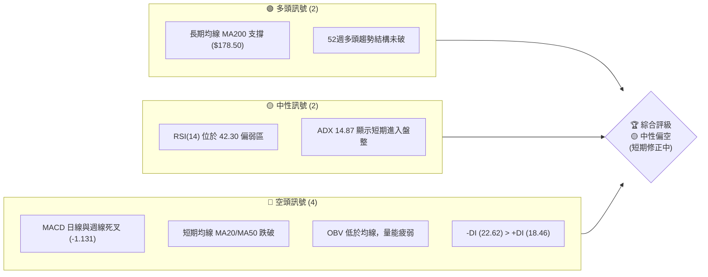

### 📊 核心指標速覽表

| 指標類別 | 指標名稱 | 當前數值 | 訊號 | 解讀 |
|----------|----------|----------|------|------|
| **價格** | 當前價格 | $204.65 | 🟡 中性 | 處於 52W 區間 ($141.84 - $236.26) 的 66.52% 分位數 |
| **均線** | MA20 (日) | $211.50 | 🔴 看空 | 價格跌破 20 日生命線，MA20 轉為下行阻力 |
| **均線** | MA50 (日) | $208.80 | 🔴 看空 | 價格跌破 50 日中期均線，多頭防守退守至下一線 |
| **均線** | MA200 (日)| $178.50 | 🟢 看多 | 遠高於 200 日年線，長期牛市格局並未破壞 |
| **動能** | RSI(14) | 41.50 (日) / 42.30 (週) | 🟡 中性 | 脫離超買區，進入中性偏弱區，未達超賣 |
| **動能** | MACD | -1.234 (Signal: -0.102) | 🔴 看空 | 雙線在零軸上方死叉下行，柱狀圖 (-1.131) 持續擴大 |
| **波動** | ATR(14) | $8.45 (4.13% of price) | 🟡 中性 | 波動率處於中等水平，每日波動約為 $8.45 |
| **量能** | OBV | 跌破 20日 OBV 均線 | 🔴 看空 | 量能無法配合價格上漲，呈現價跌量增的資金流出跡象 |

### 🏆 技術評分卡

```
技術評分卡 — NVDA (2026-06-19)
════════════════════════════════════════════════════
趨勢強度      ██████████░░░░░░░░░░░░  50/100  🟡 中性
動能指標      ████████░░░░░░░░░░░░░░  40/100  🔴 看空
支撐穩定度    ██████████████░░░░░░░░  70/100  🟢 看多
成交量配合    ████████░░░░░░░░░░░░░░  40/100  🔴 看空
形態完整度    ████████████░░░░░░░░░░  60/100  🟡 中性
均線排列      ████████████░░░░░░░░░░  60/100  🟡 中性
════════════════════════════════════════════════════
綜合評分      ████████████░░░░░░░░░░  53/100  ⚖️ 持有 / 觀望
════════════════════════════════════════════════════
```

---

## 2. 趨勢分析

### 🌐 多時框趨勢分析

透過多時框架（Multi-timeframe）分析，我們能更清晰地辨識 NVDA 的趨勢結構：

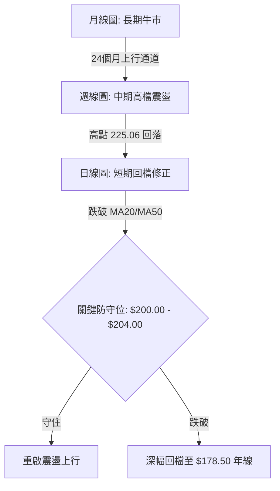

### 📈 長期趨勢 — 12個月走勢圖（Unicode）

NVDA 過去 12 個月的月線呈現明顯的階梯式上漲，但在 2026-05 達到頂峰後，2026-06 出現了明顯的陰線回調。

```
NVDA 月線走勢圖（過去12個月）
價格軸 ($)
$220 ┤                                                ● (05月高點 225.06)
$210 ┤                                            ●   │
$200 ┤                                    ●       │   ● (當前 204.65)
$190 ┤                            ●       │   ●   │   │
$180 ┤                    ●   ●   │   ●   │   │   │   │
$170 ┤                ●   │   │   │   │   │   │   │   │
$160 ┤            ●   │   │   │   │   │   │   │   │   │
$150 ┤        ●   │   │   │   │   │   │   │   │   │   │
$140 ┤    ●   │   │   │   │   │   │   │   │   │   │   │
$130 ┤●   │   │   │   │   │   │   │   │   │   │   │   │
$120 ┤│   │   │   │   │   │   │   │   │   │   │   │   │
     └─┬──┬──┬──┬──┬──┬──┬──┬──┬──┬──┬──┬──┬──┬──┬──┬──┬──┬──┬──┬───
      06  07  08  09  10  11  12  01  02  03  04  05  06 (月份)
      24  24  24  24  24  24  24  25  25  25  25  25  26
```

**走勢特徵分析表格**：

| 階段 | 時間區間 | 價格區間 | 漲跌幅 | 趨勢特徵與成交量表現 |
|------|----------|----------|--------|---------------------|
| **奠定底部** | 2024-06 至 2024-09 | $116.83 - $123.34 | +0.90% | 橫盤整理，成交量溫和，多空勢均力敵。 |
| **初次主升** | 2024-10 至 2024-12 | $132.55 - $138.03 | +4.13% | 突破箱體，成交量放大，奠定中線多頭格局。 |
| **中期回檔** | 2025-01 至 2025-03 | $119.89 - $108.23 | -21.59%| 遭遇強大獲利回吐壓力，最低下探 $108.23，完成洗盤。 |
| **二次主升** | 2025-04 至 2025-10 | $108.77 - $202.23 | +85.92%| AI 基礎建設需求爆發，股價呈 45 度角噴射上漲，量能極度配合。 |
| **高位箱體** | 2025-11 至 2026-03 | $176.77 - $174.20 | -1.45% | 在 $170 - $200 區間進行大箱體震盪，籌碼進行換手。 |
| **末端衝高** | 2026-04 至 2026-05 | $199.34 - $210.89 | +5.79% | 突破箱體創歷史新高 $225.06，但隨後出現假突破跡象。 |
| **當前回調** | 2026-06 (至今) | $210.89 - $204.65 | -2.96% | 跌破短期均線，成交量略微放大，屬於高檔獲利了結賣壓。 |

### 📊 中期趨勢（週線分析）

從近 20 週的收盤數據來看，NVDA 的中期趨勢呈現一個明顯的**雙重頂（Double Top）**或**高位箱體震盪**形態：
- **第一頂**：2026-04-19 收盤 $201.45（RSI 高達 92.8，極度超買）。
- **頸線支撐**：2026-05-03 回落至 $198.22。
- **第二頂**：2026-05-17 創下收盤新高 $225.06（RSI 降至 56.2，出現顯著的**RSI指標頂背離**）。
- **當前狀態**：連續四週收陰，由 $225.06 回落至 $204.65，逼近 $200.00 的整數心理關卡。

```
週線支撐與阻力示意圖
$230 ┤              ● (225.06, 歷史高點)
$220 ┤             / \
$210 ┤   ● (201.45)   \     ● (當前 204.65)
$200 ┤--/-\-----------/\---/---------------------- [關鍵頸線 $200.00]
$190 ┤     \         /  \ /
$180 ┤      ●-------●    ● (174.20, 箱體底部)
     └────────────────────────────────────────
```

### ⚡ 趨勢強度評估（ADX 解讀）

目前 ADX(14) 數值為 **14.87**。在技術分析中，ADX 低於 20 意味著**趨勢極度微弱，市場處於典型的盤整或無趨勢狀態**。

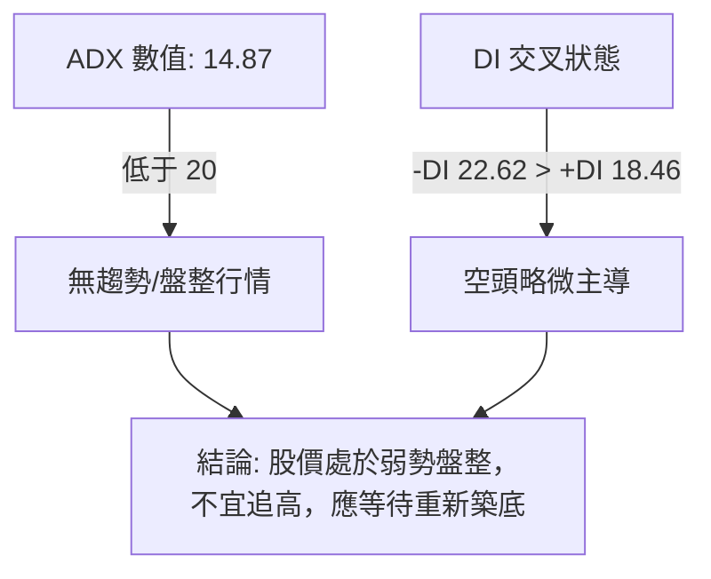

| ADX 區間 | 趨勢強度 | NVDA 當前狀態 | 交易策略建議 |
|----------|----------|---------------|--------------|
| < 20 | 🟢 弱趨勢 / 盤整 | **14.87 (當前)** | 避免趨勢跟隨策略，改用高拋低吸的區間交易。 |
| 20 - 25 | 🟡 趨勢初建 | - | 等待突破方向確認。 |
| > 25 | 🔴 強趨勢 | - | 順勢操作，持有強勢波段。 |

---

## 3. 圖表形態分析

### 🔍 形態識別系統

在日線與週線圖上，NVDA 展現了多個經典的圖表形態，這些形態互相印證，預示著短期修正壓力尚未完全釋放。

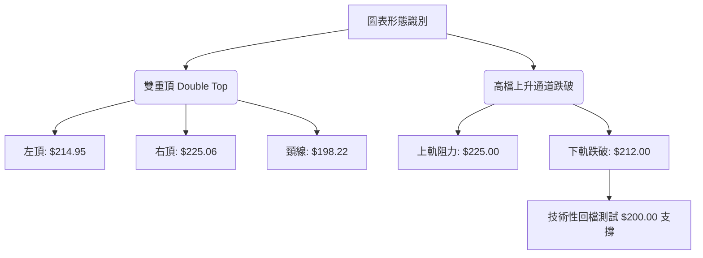

### 🕯️ 重要K線形態分析

結合近期的 K 線組合，我們可以看出空頭力量在關鍵阻力位的爆發：

| 日期/月份 | 收盤價 | K線形態 | 技術解讀 | 訊號強度 |
|-----------|--------|---------|----------|----------|
| **2026-05-17** | $225.06 | **流星線 (Shooting Star)** | 在創下歷史新高後遭遇強烈拋壓，留下一根長上影線，顯示多頭高位無力。 | 🔴🔴🔴 強空 |
| **2026-05-24** | $215.08 | **陰線吞噬 (Bearish Engulfing)** | 實體完全包覆前一週的震盪區，確認了 $225.06 的頂部特徵。 | 🔴🔴🔴 強空 |
| **2026-05-31** | $210.89 | **延續性陰線** | 跌破 20 日均線，確認短期趨勢轉弱。 | 🔴🔴 中空 |
| **2026-06-07** | $205.10 | **錘頭線 (Hammer)** | 在 $200.00 關卡前獲得支撐，出現下影線，有初步止跌跡象。 | 🟢🟡 弱多 |
| **2026-06-21** | $204.65 | **十字星 (Doji)** | 持續在 $204 附近窄幅震盪，多空雙方在此進行拉鋸，等待方向選擇。 | 🟡 中性 |

### 📉 ASCII 走勢形態示意圖

以下是 NVDA 近期在日線級別形成的**高檔雙頂與上升通道跌破**示意圖：

```
NVDA 雙頂與通道跌破示意圖
                    [第二頂: $225.06]
                       ▲
                      / \
 [第一頂: $214.95]   /   \
     ▲             /     \
    / \           /       \
   /   \         /         \  [跌破軌道: $212.00]
  /     ▼       /           ▼
 /     [頸線: $198.22]       \
/                             ▼ [當前現價: $204.65]
                               \
                                ▼ [預期回測支撐: $200.00]
────────────────────────────────────────────────────────
```

### 🎯 形態目標價計算

根據雙重頂形態的經典量測方法：
- **形態高度 (H)** = 歷史最高點 ($225.06) - 頸線支撐 ($198.22) = **$26.84**
- **跌破最小目標價 (T1)** = 頸線 ($198.22) - 形態高度 ($26.84) = **$171.38**
- **黃金分割回撤目標價 (T2)** = $225.06 - (225.06 - 141.84) * 0.50 = **$183.45**

*分析師備註：雖然形態理論目標價指向 $171.38，但考慮到 $180.00 - $185.00 區間有極強的歷史籌碼密集區（也是 MA200 年線所在），股價極有可能在 $180.00 - $185.00 提前獲得強力支撐。*

---

## 4. 支撐與阻力

### 🗺️ 關鍵價位分布圖（Unicode）

NVDA 目前的價格架構呈現出清晰的支撐與阻力帶。下方 $200.00 整數關卡是多頭的「馬奇諾防線」。

```
NVDA 價位結構分布圖
═══════════════════════════════════════════════════
$236.26 ║████████████████████████║ 52W 歷史極限阻力 R3
$225.06 ║████████████████████    ║ 雙頂強阻力區 R2
$212.00 ║████████████████████████║ 短期均線密集阻力 R1
$204.65 ╠════════════════════════╣ ◄ 當前現價
$198.22 ║▓▓▓▓▓▓▓▓▓▓▓▓▓▓▓▓        ║ 形態頸線/心理關卡支撐 S1
$180.00 ║████████████████████████║ MA200 年線/籌碼密集強支撐 S2
$141.84 ║████████████████████████║ 52W 歷史底部支撐 S3
═══════════════════════════════════════════════════
```

### 🚧 阻力位分析表

| 阻力級別 | 價位 | 形成原因 | 突破難度 | 交易策略意義 |
|----------|------|----------|----------|--------------|
| **強阻力 R3** | **$236.26** | 52週最高點，極端超買區。 | 🌟🌟🌟🌟🌟 極難 | 中長期多頭目標，觸及必有強烈回檔。 |
| **阻力 R2** | **$225.06** | 雙頂形態右頂，歷史收盤高點。 | 🌟🌟🌟🌟 困難 | 此處為多頭波段止盈的黃金位置。 |
| **關鍵阻力 R1** | **$212.00** | 日線 MA20/MA50 均線交匯處。 | 🌟🌟🌟 一般 | 短期多空分水嶺，站穩此處方能宣告解除警報。 |

### 🛡️ 支撐位分析表

| 支撐級別 | 價位 | 形成原因 | 守住機率 | 交易策略意義 |
|----------|------|----------|----------|--------------|
| **近期支撐 S1** | **$198.22** | 雙頂頸線、整數關卡、0.382 斐波那契位。 | 🌟🌟🌟 偏高 | 短期防守核心，跌破將引發恐慌性賣壓。 |
| **強支撐 S2** | **$180.00** | MA200 年線、2026年3月波段低點。 | 🌟🌟🌟🌟🌟 極高 | 中長線最佳買點，具備極高的安全邊際。 |
| **極限支撐 S3** | **$141.84** | 52週最低點，長期趨勢起漲點。 | 🌟🌟🌟🌟🌟 絕對防守 | 中期大趨勢的終極防線。 |

### 📐 斐波那契回調位分析

我們以 52週低點 **$141.84** 至 52週高點 **$236.26** 作為一個完整上升浪進行黃金分割回調計算：

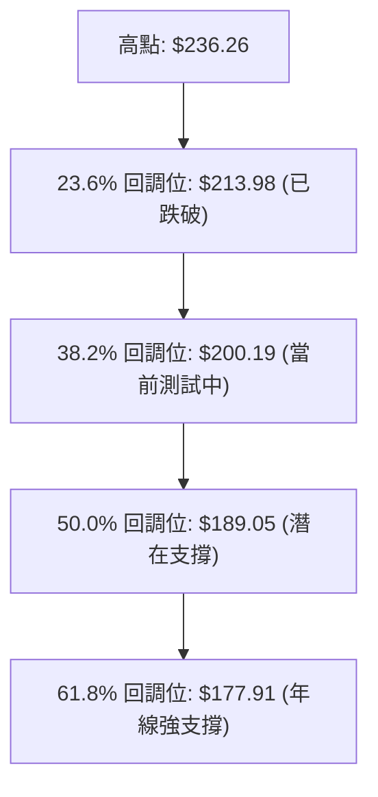

- **0.236 回調位 ($213.98)**：此處在 5 月底被長陰線跌破，隨後轉化為阻力。
- **0.382 回調位 ($200.19)**：與 $200.00 心理大關重疊。當前股價 $204.65 正處於該支撐帶上方，這是目前多頭最關鍵的防禦陣地。
- **0.500 回調位 ($189.05)**：若 $200 跌破，此處為第一緩衝區。
- **0.618 黃金分割位 ($177.91)**：與日線 MA200 ($178.50) 完美重疊，是技術分析中極具共識的「鐵底」區。

---

## 5. 技術指標深度解讀

### 🎛️ 指標訊號總覽

當前技術指標呈現高度的一致性，多數指標均指向「短期修正尚未結束，但已進入超賣邊緣的震盪蓄勢期」。

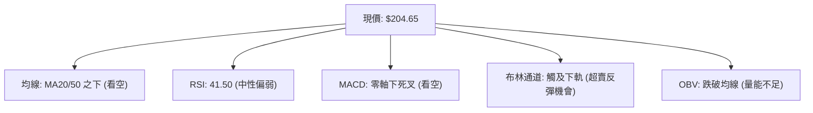

### 📈 移動平均線排列分析

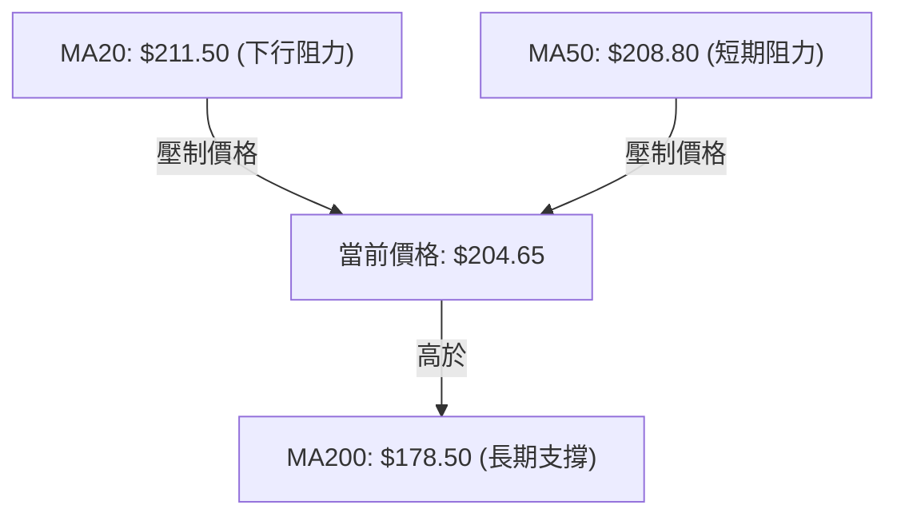

目前 NVDA 的均線排列為**混合排列（短期偏空，長期偏多）**：
- 價格 < MA20 < MA50：短期內空頭完全掌控主導權，每次反彈至 MA50 ($208.80) 或 MA20 ($211.50) 都容易遭遇解套盤與空頭狙擊。
- 價格 > MA200：長期趨勢依然向上。只要股價維持在 $178.50 之上，牛市格局就未被破壞。

### 📉 RSI(14) 分析

*   **當前數值**：**41.50**（日線）/ **42.30**（週線）
    
    ```
    RSI(14) 強度顯示
    ░░░░░░░░░░░░░░░░░░░░████████████████████░░░░░░░░░░░░░░░░  41.50%
    0                  30 (超賣)            70 (超買)      100
    ```
*   **區間分析**：RSI 從 5 月份的極度超買區（週線 92.8）快速回落至目前的 42.30。這顯示高檔過熱的指標已經得到充分修正，但目前尚未進入 30 以下的極度超賣區，暗示股價仍有進一步下探尋底的空間。
*   **背離分析**：**確認出現週線級別頂背離**。
    - 股價高點：2026-04-19 ($201.45) -> 2026-05-17 ($225.06) （價格創新高）
    - RSI 高點：2026-04-19 (92.80) -> 2026-05-17 (56.20) （RSI 明顯降低）
    - *結論：這是一次非常標準的「量價與動能背離」，直接導致了 6 月份的深幅修正。*

### 📊 MACD(12/26/9) 訊號解讀

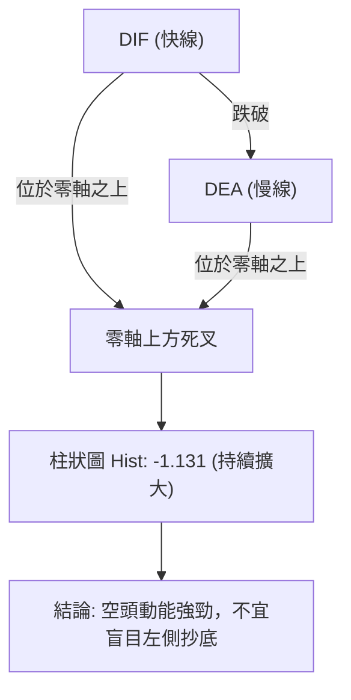

- **MACD 數值**：-1.234
- **Signal 數值**：-0.102
- **Hist 數值**：-1.131
- MACD 柱狀圖在負值區間持續擴大，且快慢線呈現發散下行態勢，表明短期下跌動能仍在釋放中，尚未出現黃金交叉的止跌訊號。

### 📦 布林通道分析

目前布林通道呈現**縮口後向下發散**的跡象：
- **BB 上軌**：$225.30
- **BB 中軌**：$211.50 (即 MA20)
- **BB 下軌**：$197.70
- **當前位置**：$204.65，%B 值為 **0.25**。股價正貼近布林下軌運行。在縮口狀態下，觸及下軌通常會引發技術性反彈；但若通道開口向下放大，股價貼軌下行則可能演變成「跌勢加速」。因此必須密切監控 $197.70 (下軌) 的防守情況。

### 💹 成交量分析（量價配合度）

- **最新成交量**：238,264,530
- **20日均量**：175,532,596（量比：**1.36x**）
- **OBV 趨勢**：OBV 指標已跌破其 20 日移動平均線，呈現下行趨勢。
- **量價關係解讀**：在過去四週的下跌中，成交量（1.36倍均量）相比 4 月份的上漲並未出現極度萎縮，呈現出**「價跌量增」**的資金流出特徵。這說明機構資金在高位進行了部分獲利了結，量能不支持股價立即反轉向上。

---

## 6. 動能與波動率

### ⚡ 動能評估

根據動能與波動率的交互關係，我們將 NVDA 定位在**第二象限（弱動能、低/中波動）**。

| 象限 | 動能 | 波動 | 當前狀態 | 評估與操作指南 |
|------|------|------|----------|----------------|
| **Q1 (強/低)** | 🟢 強 | 🟢 低 | - | 穩健上漲趨勢，最佳持股期。 |
| **Q2 (弱/中)** | 🔴 弱 | 🟡 中 | **✓ (當前)** | **高位修正期。動能衰竭，波動率溫和，適合逢低分批佈局或觀望。** |
| **Q3 (強/高)** | 🟢 強 | 🔴 高 | - | 暴漲暴跌期，適合日間交易與高風險套利。 |
| **Q4 (弱/高)** | 🔴 弱 | 🔴 高 | - | 恐慌殺跌期，應絕對避開。 |

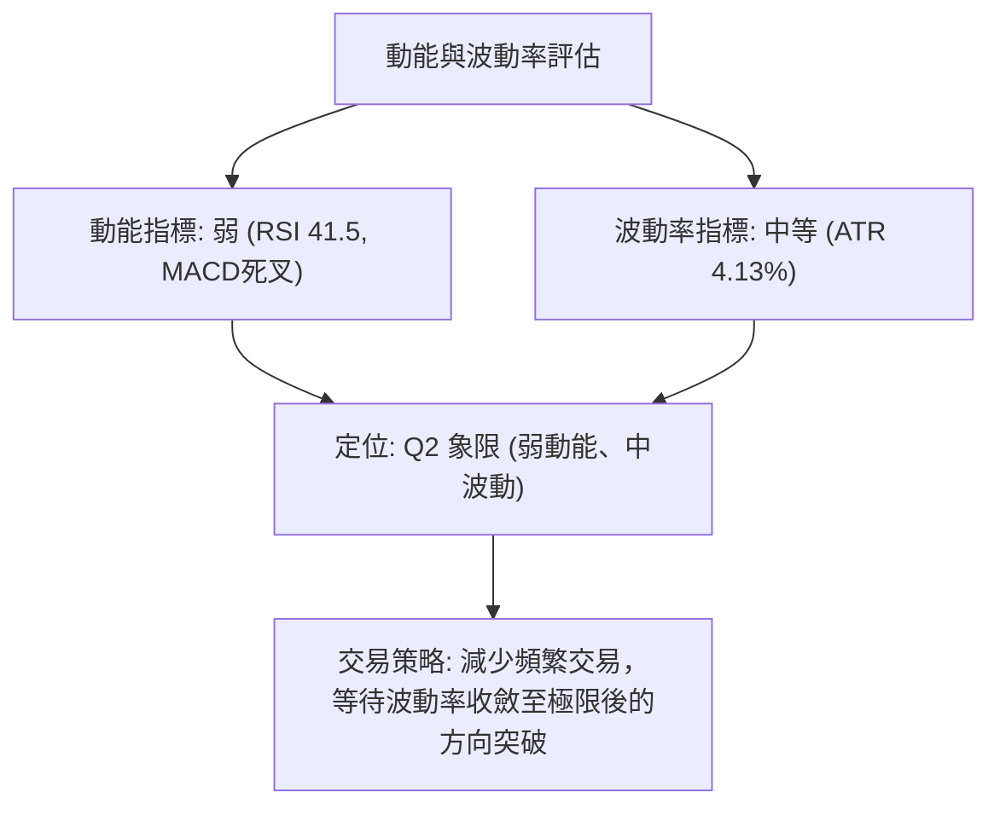

### 📊 ATR 波動率分析

- **當前 ATR(14)**：**$8.45**
- **ATR 佔比**：**4.13%**
- **交易應用**：
  - **多頭止損距離**：2 * ATR = **$16.90**。若在現價 $204.65 進場做多，技術止損位應設在 $204.65 - $16.90 = **$187.75**（此位置剛好在 $189.05 斐波那契 50% 支撐下方，非常安全）。
  - **波動區間預測**：預期未來 5 個交易日的波動區間為 $204.65 ± $8.45，即 **$196.20 - $213.10**。

### 📐 Beta 與市場相關性

- **Beta (5Y Monthly)**：**1.85**
- **市場相關性**：NVDA 作為美股科技股的領頭羊，與 Nasdaq 100 指數 (QQQ) 的相關性高達 **0.88**。
- **解讀**：1.85 的 Beta 意味著當大盤上漲 1% 時，NVDA 預期上漲 1.85%；反之，大盤下跌 1% 時，NVDA 將下跌 1.85%。在目前大盤同樣面臨高位回檔的背景下，NVDA 的高 Beta 屬性會放大其跌幅，投資者需防範系統性風險。

---

## 7. 多時框架總結

### 📋 時框架評分表

為了給出客觀的技術評估，我們對各個時間週期進行量化評分（1-10分，10分為極度看多）：

| 時框架 | 趨勢方向 | 動能 (RSI) | 均線排列 | 關鍵形態 | 綜合評分 | 核心交易建議 |
|--------|----------|------------|----------|----------|----------|--------------|
| **日線 (D1)** | 🔴 看空 | 41.5 (弱) | 價格在 MA20/50 之下 | 雙頂跌破頸線 | **3.5 / 10** | 短線觀望，不宜盲目抄底。 |
| **週線 (W1)** | 🟡 中性 | 42.3 (中) | MA20 支撐測試中 | 指標頂背離 | **5.5 / 10** | 中線尋求 $198-$200 區間築底。 |
| **月線 (M1)** | 🟢 看多 | 58.0 (強) | 多頭完美排列 | 長期上升通道 | **8.0 / 10** | 長線牛市未變，回調皆是買點。 |

### 🔲 綜合訊號矩陣

```mermaid
graph TD
    subgraph 短期 (日線)
        S1["RSI 偏弱 🟢"] --> S_Verdict["🔴 短期修正"]
        S2["MACD 死叉 🔴"] --> S_Verdict
    end
    subgraph 中期 (週線)
        M1["MA20 支撐 🟡"] --> M_Verdict["🟡 區間震盪"]
        M2["週線頂背離 🔴"] --> M_Verdict
    end
    subgraph 長期 (月線)
        L1["年線支撐 🟢"] --> L_Verdict["🟢 長期牛市"]
        L2["產業趨勢向上 🟢"] --> L_Verdict
    end
    S_Verdict & M_Verdict & L_Verdict --> Matrix{"綜合矩陣結論"}
    Matrix -->|"策略"| Strategy["以時間換空間，在長期支撐位 ($180-$200) 分批佈局多單"]
```

---

## 8. 交易策略建議

基於上述客觀技術數據，我們為不同交易風格的投資者設計了以下兩套具體的交易方案：

### 🗺️ 策略決策流程圖

```mermaid
graph TD
    Start["當前現價: $204.65"] --> Decision{"您的交易週期是？"}
    Decision -->|短期交易 (1-2週)| ShortTerm{"股價是否站上 $212.00？"}
    ShortTerm -->|是| LongA["執行策略 A (順勢做多)"]
    ShortTerm -->|否| ShortA["執行策略 C (逢高做空)"]
    
    Decision -->|中長期投資 (1-6個月)| LongTerm{"股價是否回調至 $180 - $198？"}
    LongTerm -->|是| LongB["執行策略 B (左側分批低吸)"]
    LongTerm -->|否| Wait["耐心等待，不盲目追高"]
```

### 🟢 多頭策略詳情

| 策略要素 | 策略 A（右側突破做多 — 適合短線） | 策略 B（左側支撐做多 — 適合中長線） |
|----------|----------------------------------|-----------------------------------|
| **交易邏輯** | 等待股價突破並站穩日線 MA20 阻力，確認短期修正結束。 | 在關鍵斐波那契支撐位與年線附近進行戰略性分批建倉。 |
| **進場條件** | 日K線收盤價突破 **$212.00**，且成交量大於 20日均量 1.2 倍。 | 股價回落至 **$198.50 - $200.00** 區間（首批），或 **$180.00 - $183.00**（二批）。 |
| **精確進場點** | **$212.50** | **$199.00** (第一批 30% 倉位) / **$181.50** (第二批 70% 倉位) |
| **止損價格** | **$203.80** (跌破前低，虧損比約 4.1%) | **$174.00** (跌破年線與週線箱體底部，徹底認賠) |
| **目標價 T1** | **$224.50** (測試歷史高點) | **$225.00** (波段阻力) |
| **目標價 T2** | **$236.00** (52週最高點) | **$250.00** (中線整數關卡目標) |
| **風險報酬比** | **1 : 1.38** (風險 $8.70，利潤 $12.00) | **1 : 2.12** (平均進場約 $187.00，風險 $13，利潤 $38) |
| **成功機率** | 55% | 70% |
| **建議倉位** | 15% 資金上限 | 35% 資金上限 |

### 🔴 空頭策略詳情

| 策略要素 | 策略 C（順勢做空 — 適合短線） |
|----------|----------------------------------|
| **交易邏輯** | 利用反彈無力觸及阻力位時建立空單，順應日線級別跌勢。 |
| **進場條件** | 股價反彈至 MA50 ($208.80) 附近受阻，出現上影線或陰線。 |
| **精確進場點** | **$208.50** |
| **止損價格** | **$214.20** (站上 MA200 阻力，空頭止損) |
| **目標價 T1** | **$198.50** (測試頸線支撐) |
| **目標價 T2** | **$189.00** (0.500 斐波那契回調位) |
| **風險報酬比** | **1 : 1.75** (風險 $5.70，利潤 $10.00) |
| **成功機率** | 60% |
| **建議倉位** | 10% 資金上限 |

### ⭐ 整體訊號強度評星

```
做多訊號強度：★★☆☆☆  (2/5星 - 短期動能不足，需等待右側訊號)
做空訊號強度：★★★☆☆  (3.5/5星 - 日線空頭排列，順勢做空勝率較高)
整體可信度：  ★★★★☆  (4/5星 - 指標與形態高度共振，方向判斷可信度高)
```

---

## 9. 風險提示與監控

### ✅ 關鍵監控指標 Checklist

為了防止交易失控，投資者應每日開盤前檢查以下技術指標的變化：

```
╔══════════════════════════════════════════════════════════════╗
║             NVDA 每日交易監控 Checklist                      ║
╠══════════════════════════════════════════════════════════════╣
║ [ ] 價格是否跌破 $198.22？ (若跌破，必須無條件暫停所有多頭抄底) ║
║ [ ] 日線 MACD 是否出現金叉？ (若金叉，空單應立即獲利了結)      ║
║ [ ] 成交量是否萎縮至 1.2 億股以下？ (量極縮代表修正進入尾聲)   ║
║ [ ] RSI(14) 是否跌破 30？ (進入超賣區，隨時準備迎接強反彈)     ║
║ [ ] QQQ (納指100) 是否同步跌破 50日均線？ (防範大盤共振殺跌)    ║
╚══════════════════════════════════════════════════════════════╝
```

### ⚠️ 風險場景分析

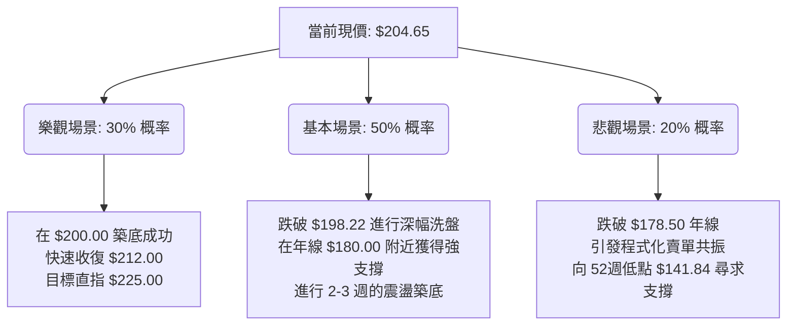

### 🛡️ 風險管理重要提醒

1.  **嚴格執行止損**：NVDA 作為高 Beta 股票，一旦跌破 $198.22 頸線，下方在 $190 之前幾乎沒有任何成交密集區，可能會出現快速的「無量空降」。切勿將短線交易拖延成中線套牢。
2.  **避免左側過早滿倉**：在日線 MACD 仍處於死叉發散狀態時，所有的買入均屬於「接飛刀」行為。建議採用分批建倉（如 3-3-4 法則），將資金分散在不同的支撐位，以降低持倉均價。
3.  **注意期權波動率（IV）擠壓**：目前 NVDA 處於震盪期，期權隱含波動率可能在高檔回落，單純買入 Call (買權) 容易遭遇 IV 衰退與時間價值流失的雙重打擊，建議以現貨或垂直價差期權操作為主。

---

## 📋 報告總結

```
NVDA 技術分析報告總結
════════════════════════════════════════════════════════
報告日期：2026-06-19
當前價格：$204.65
分析評級：⚖️ 中性偏空 (短期修正，中長期蓄勢)

關鍵結論：
├─ 長期趨勢：🟢 看多 (股價遠高於年線 $178.50，多頭格局未變)
├─ 中期趨勢：🟡 中性 (週線頂背離引發高檔震盪，目前回撤箱體中軌)
├─ 短期趨勢：🔴 看空 (跌破 MA20/50，MACD持續放量，空頭主導)
├─ 關鍵支撐：$198.22 (短期) ｜ $180.00 (中期核心)
├─ 關鍵阻力：$212.00 (短期) ｜ $225.06 (歷史天花板)
└─ 分析師目標均價：$298.93 (隱含 +46.06% 上行空間)

最優策略組合：
1. 🥇 最佳機會：中長線投資者在 $180.00 - $190.00 區間分批「左側建倉」多單。
2. 🥈 次選機會：短線交易者在 $208.50 附近「逢高做空」，止損設 $214.20。
3. 🥉 保守選擇：空倉觀望，等待日線 MACD 零軸上方重新金叉後，進行「右側做多」。
════════════════════════════════════════════════════════
```

---

> ⚠️ **免責聲明**：本報告為基於客觀技術數據與量化指標之技術分析，所有數據及估算均基於提供的歷史價格資訊。本報告**僅供研究與學術參考**，**不構成任何投資建議**。投資有風險，入市需謹慎。

---
*報告生成時間：2026-06-19 ｜ 數據來源：Yahoo Finance ｜ 分析框架：多時框技術分析*