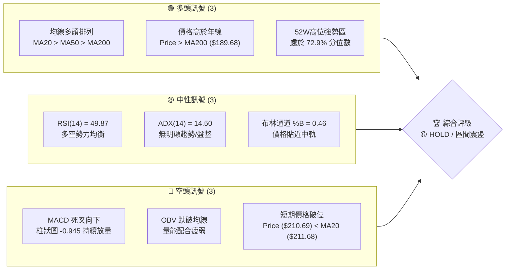
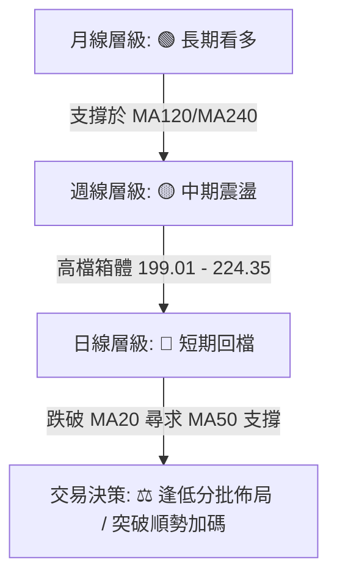
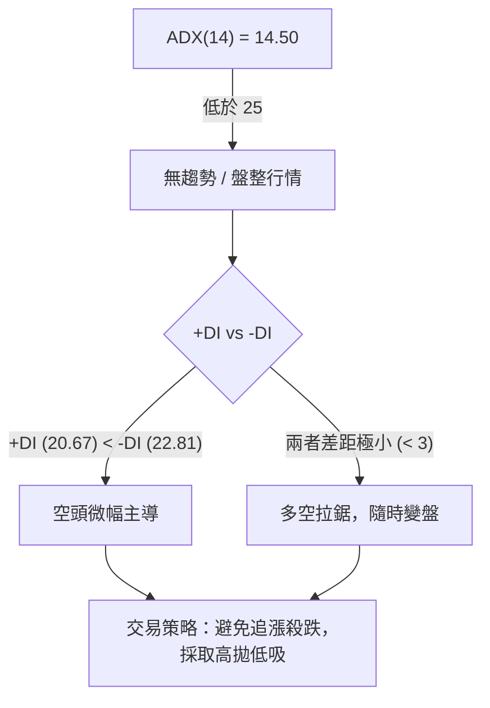
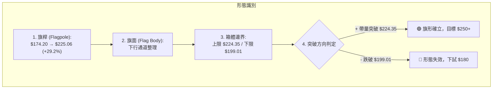
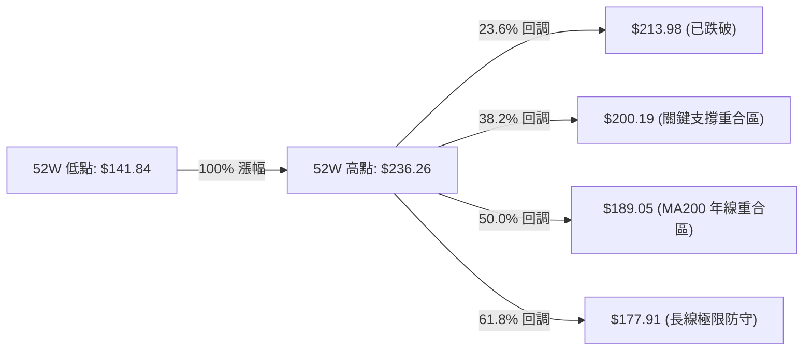
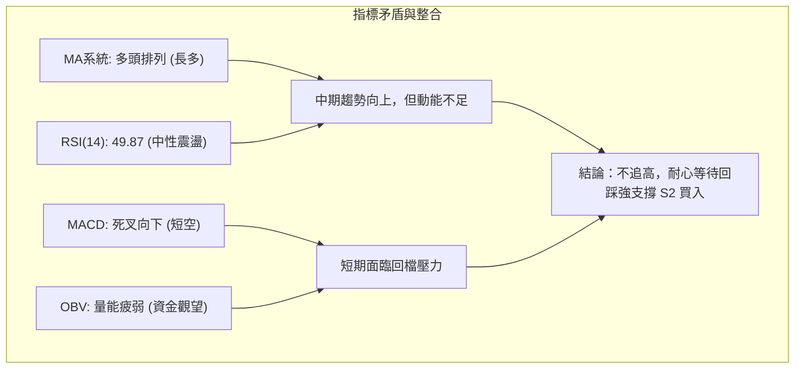
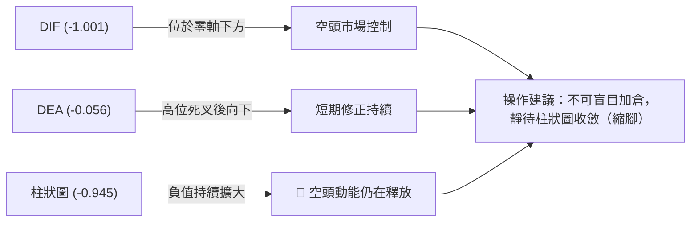
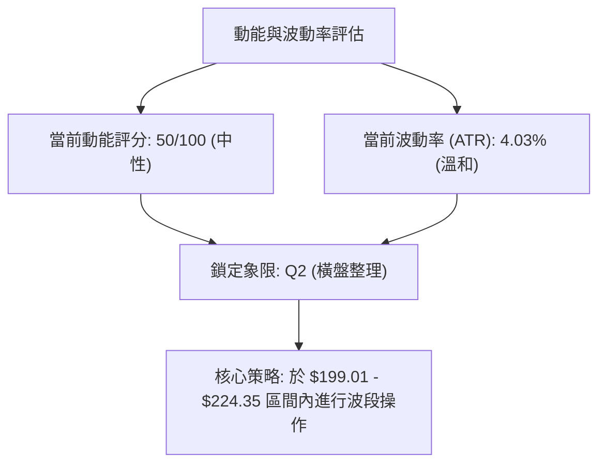
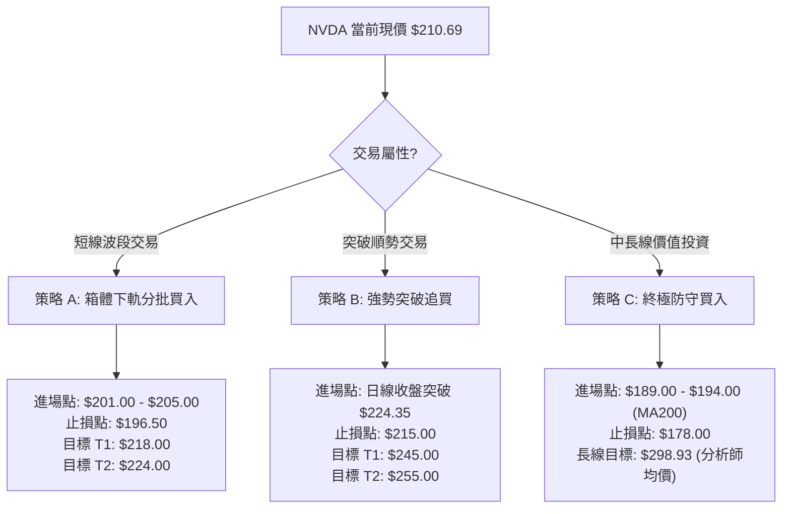
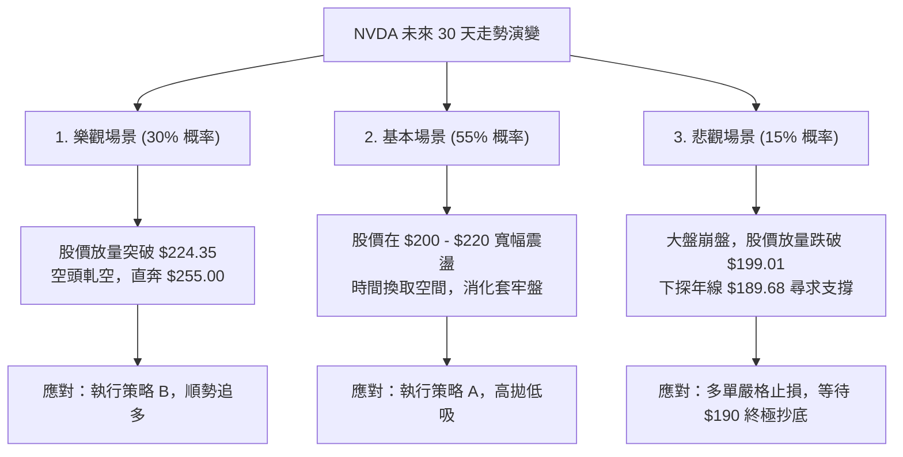

<details>
<summary>📊 靜態圖表 (點擊展開)</summary>

</details>

<html>
<head><meta charset="utf-8" /></head>
<body>
    <div style="height:500px; width:100%;">                        <script>window.PlotlyConfig = {MathJaxConfig: 'local'};</script>
        <script charset="utf-8" src="https://cdn.plot.ly/plotly-3.6.0.min.js" integrity="sha256-QaOVwtVY0T02VaHrr6pnoHLCwayMJp4O5n4YyaE3rJk=" crossorigin="anonymous"></script>                <div id="candlestick-chart" class="plotly-graph-div" style="height:100%; width:100%;"></div>            <script>                window.PLOTLYENV=window.PLOTLYENV || {};                                if (document.getElementById("candlestick-chart")) {                    Plotly.newPlot(                        "candlestick-chart",                        [{"close":{"dtype":"f8","bdata":"AAAA4JNMZUAAAABg0G1lQAAAAACI2WRAAAAAoMECZUAAAABADVFlQAAAAEADI2ZAAAAAwDceZkAAAAAA\u002fjJmQAAAACDBMGZAAAAAIAjVZUAAAACgVkJlQAAAACB\u002fAGZAAAAAAD0OZkAAAABACexmQAAAAKB8RmZAAAAAgNMXZkAAAABA1i5mQAAAACDRPmZAAAAAoMmzZkAAAABg9EpnQAAAAGAMYGdAAAAA4MeUZ0AAAAAgMWxnQAAAAKC3KWdAAAAAwLwZZ0AAAADAz5tnQAAAAABkCmhAAAAAgKfdZkAAAACAkIJnQAAAACCfeWZAAAAA4DpzZkAAAABAgrJmQAAAAGCS32ZAAAAAAAnNZkAAAABgvJ1mQAAAAICcgWZAAAAA4LG9ZkAAAABAukBnQAAAAADg52dAAAAAAMQYaUAAAABA19hpQAAAAMA1VGlAAAAAIG1HaUAAAABAutNpQAAAACD7zWhAAAAAYMNeaEAAAADg5HpnQAAAAEAhfWdAAAAAoHzZaEAAAAAgPx1oQAAAAECzMWhAAAAAQOdTZ0AAAAAgsL1nQAAAACCYS2dAAAAAoCCkZkAAAACACUlnQAAAAOAdjWZAAAAAYN5UZkAAAADAKMpmQAAAAAD+MmZAAAAAwPiAZkAAAAAAyRhmQAAAACAbdmZAAAAA4FKnZkAAAABgj2tmQAAAAOAC5WZAAAAAYALGZkAAAAAAXipnQAAAAGDUF2dAAAAAwMvxZkAAAADgtJZmQAAAAEDR2WVAAAAAQGgCZkAAAACgHDBmQAAAAIBqV2VAAAAAALG9ZUAAAAAAoJhmQAAAAGDr7mZAAAAAQFifZ0AAAADgKoxnQAAAAGCIyWdAAAAA4LN\u002fZ0AAAAAg+GlnQAAAAMC6SGdAAAAAoNaTZ0AAAADAgXxnQAAAAKBhYGdAAAAA4CWcZ0AAAAAAERpnQAAAAEBQFGdAAAAA4N4WZ0AAAABArTJnQAAAAEBX3WZAAAAA4E5aZ0AAAACgGUBnQAAAAIBMO2ZAAAAAIBjjZkAAAACgrBNnQAAAAMAfbmdAAAAAYMVHZ0AAAACASolnQAAAAIAs6WdAAAAAwNAIaEAAAACgtdxnQAAAAMBILGdAAAAAgNmDZkAAAABASr9lQAAAAMB1dWVAAAAAgOQlZ0AAAAAg37lnQAAAACDuiWdAAAAAIDG6Z0AAAAAAy1ZnQAAAACDL0mZAAAAAYNQXZ0AAAAAgCHhnQAAAAKB5dWdAAAAAQNeyZ0AAAAAAIupnQAAAAMCuE2hAAAAA4EtqaEAAAADARRVnQAAAAEAsH2ZAAAAAID\u002fIZkAAAADAlHpmQAAAAAAl2mZAAAAAgLvjZkAAAAAATzNmQAAAAACuzWZAAAAA4G8RZ0AAAACgBzpnQAAAAGCo3WZAAAAAAEmBZkAAAAAAN+BmQAAAAID7tmZAAAAAYBSGZkAAAACgREtmQAAAAGD3j2VAAAAA4O\u002ftZUAAAACA399lQAAAAIAaT2ZAAAAAIE1hZUAAAABAZupkQAAAAIBJn2RAAAAAoE3GZUAAAAAAdPFlQAAAACDfJWZAAAAAwNwtZkAAAADAkDxmQAAAAADHu2ZAAAAA4ET2ZkAAAAAgIo1nQAAAACDeomdAAAAA4P+IaEAAAACAbtRoQAAAAKDPw2hAAAAAID8uaUAAAACAZDppQAAAAOC29GhAAAAA4HRIaUAAAAAAC+1oQAAAAKDhAGpAAAAAYHMLa0AAAADAf51qQAAAAIA0IGpAAAAAQM7qaEAAAADgAcdoQAAAAED3x2hAAAAAAK6IaEAAAABg0fJpQAAAAAAfaGpAAAAAIGLeakAAAADA52VrQAAAAEC8kGtAAAAAwCUybEAAAAAA5m5tQAAAAMDYIWxAAAAAYPXBa0AAAABATYtrQAAAACC35mtAAAAAgCRoa0AAAADgieJqQAAAACCE02pAAAAAwEeLakAAAADABMBqQAAAAGCdXGpAAAAAgCkDbEAAAACA8NFrQAAAAAAA0GpAAAAAwB5Va0AAAABAM6NpQAAAAOB6FGpAAAAAgBQGakAAAACgcA1pQAAAAADXm2lAAAAAgBSmaUAAAABgZo5qQAAAAMAe7WlAAAAAwMyUaUAAAACAFFZqQA=="},"high":{"dtype":"f8","bdata":"8i7cHsiFZUAUmiSSNHRlQEjdSvnDGWVADn9AoHFXZUDpb1MaFVhlQJE3BiWmYWZALZWXa5yBZkDgjWac60tmQPYMZ+XoU2ZAZaYKycMoZkCSXDoCV59lQAiUtUb7G2ZAAuk4CU07ZkDoQArxEwpnQBfMfx0BxmZADFc1raFxZkDaSWzO+IBmQMnyVANQcWZAOP2H8H\u002f4ZkBZZwA3kGNnQOko6rvPfGdAvJYMFtDZZ0BJuTuowsNnQKWzpn26X2dAuL83rTaaZ0BryALDeKtnQJUjFaOjYWhA+2lOu91raECX4pJyxbtnQMYuhTkREmdAevKM6E0UZ0BkwvcofeFmQAnGODGy+2ZAU706ydkeZ0C0eMc91NFmQHezXUaa5mZAx\u002fjiy3\u002fZZkAIGqL\u002fZWdnQNLFq40s+GdAx3u54IRcaUDyEwdjbn1qQJMlxoC3vGlAF5\u002fXEJD2aUBSZP71Q2JqQLLi6sa5dmlA69QALCtVaUBvBrz0yKtoQOgPzDmQgmdANi+XNu71aEAGcL1qeWVoQJIvq7B+dGhA4DM51UbmZ0DMOvubiNhnQNRq59RLmGdAFG15OhESZ0BN7FDE3HNnQNU9cLcCeGhABJSYmmUKZ0DiBkM2hehmQGPRxbPbPWZAAUBz+KnVZkD6Q5a6+GFmQMHw2ShAgmZA0imBbI0tZ0DaqIGo9sZmQDRBc19yCWdAnjvD6+sNZ0CNMxvtq3hnQDtr+OPML2dAVaABKSEoZ0BFKJf7K6NmQPigxwgd02ZASycX\u002fntGZkDeHMHQuEhmQN5HBTRL\u002fWVAEXXU0O79ZUCOx+CoU6dmQIcDRe\u002fw\u002fWZAfjZ1DS6jZ0CkVI+BwZVnQIwlyJGRDmhAIC1tHPaQZ0B7ILAnUJhnQLoNTrt9ymdAmo+qKD0WaECiF\u002f7DnCxoQG69ge3y\u002fWdAZFMxMmHkZ0Aqxu39NapnQAxz2JqdQ2dAfD6cnotcZ0B\u002fLjHsL3xnQOonv5OHB2dA1cidLQGvZ0DtyF\u002f8p8ZnQN0qVf0MxWZA3e5oEe8kZ0BjHia6Lj5nQMDxPx3Pq2dA8nLurXecZ0A2+eXal7hnQOBgcJezA2hAy5fsUdEnaEAeDRA4GUhoQIl8sHEuwmdAq5jn8WBBZ0CT3YNWj2tmQNrDtvNYE2ZA28AP4rVYZ0A3k8ofki1oQJIXdU7bB2hA7LW3V8kgaEBifm0Q+StoQCDqDtKwaGdAhGHCHoFdZ0A\u002fP\u002fgla8RnQO9LABZqhmdAs4QhCSTDZ0DY33HM1jZoQDuWsDEWMWhA8XCNt3SsaECx9iWxtEFoQJEJfhzDy2ZAqHBlmJHnZkDiiGdkv5VmQJOiJy8zD2dABWN3kL76ZkCDhPITMtFmQADYvWf91WZAZaZd1c9GZ0C7qim22WxnQDYvnNUwF2dAgvItjvI7Z0D2qjPGH5VnQBnBaajkJWdA6vPONFTlZkCgLzi1p3hmQEwQwNmtQWZA+Nsa9zFFZkAt+bKleQBmQJQi5gZKoGZAbvxhnr4JZkAFw\u002f+4q1hlQFa0LG8WKGVAPBjqxlXNZUC29CCNOyVmQMYu12sRKWZAR9LMEagyZkDhMqRiuEBmQAqqrixrIWdA+8744LP7ZkAdhlwP7LhnQH9QgQkOrmdAAAAA4P+IaEBIGcuoVQVpQLYV3lHB82hAkkwpz+IuaUBKanGT6D1pQDeld4FyUGlAAAAA4HRIaUCyCriK93JpQBM08ZCKVmpA3n\u002fjhnsSa0DGToxfXM9qQHRBlqgdj2pAHUixC8RBakA1PvwbcFhpQHYdVkHYL2lAjS\u002f7dDgAaUCxb8mt4QBqQGGgR6BrvmpAhWWBlHwxa0BNl42ZUcFrQHLCGC2q72tA4hrrdGRybEAxgfbed4htQBKtnFBg52xARVHCom63bEBe2OJX\u002fwZsQC2AAYK8O2xA9NyhIVRkbECtsSU1FphrQFBrztahPWtAtjLfd9K8akA5QGaDnOhqQFStdopnM2tA3TLrgnYTbEDv2RGITgBtQOXT+4nw0WtAAAAAQDOza0AAAAAA19tqQAAAAEAKT2pAAAAAwMxsakAAAABACudpQAAAAMAetWlAAAAAgD3iaUAAAABguJZqQAAAACCub2pAAAAAYLgmakAAAADgemxqQA=="},"hovertemplate":"\u003cb\u003e%{x|%Y-%m-%d}\u003c\u002fb\u003e\u003cbr\u003e\u958b: $%{open:.2f}\u003cbr\u003e\u9ad8: $%{high:.2f}\u003cbr\u003e\u4f4e: $%{low:.2f}\u003cbr\u003e\u6536: $%{close:.2f}\u003cextra\u003e\u003c\u002fextra\u003e","low":{"dtype":"f8","bdata":"58ad1fgUZUCWvvzj6CVlQJONw8RBe2RAtnS71RPkZEBN92dNldBkQKecEmSS52VAxsVZcyoIZkD\u002fVLArNQdmQMXNeM80yWVAkHuuVw3FZUD6WTJeQQZlQLQcwJmrl2VAZfp\u002fbJ7eZUCQiOddmc9lQIx9P6qJ\u002f2VA15M1YqblZUBtWMFVGp1lQB61eySh1mVAnJQ41+OCZkBbSjdY9qdmQMFQ69lN9WZAUn0oKUF6Z0B2OAGAmiRnQE4OWW8W42ZAaOkr+n\u002f4ZkDc\u002fnQRrUlnQOsH2MEh2mdAH0os9S26ZkCOUAcAJDdnQJ0ujzETb2ZAu9YuoQ0iZkAHi7zpT3FmQItvf1WscGZAxjf7vvOvZkCFiP5wRXJmQDXyVlsdEWZAY8lEe\u002fNxZkAKRPIshehmQN6qGE4UhmdAkB3QKkz1Z0C7zwP1nJBpQKiWihHpJGlAXaj54QA6aUDIDyWGiqlpQHq3TQ6xtWhAENn7l91MaEBTxQk9kERnQHNhSa3TVWZAsOjKgmExaEBebLtozeFnQPW2x3xe3GdAqsq9yLTzZkC2jFDzMotmQBuvjSq6AmdA5lQQGHptZkBqbYWBG9NmQJRyYX7ec2ZAOWK69rWWZUDhCOKWKghmQEfLimuwKmVAEGRwFGpAZkByAa83zghmQF43nB2urmVAXI8hvKl4ZkBNHSRCOFxmQGY8pmG0d2ZA7IIoWBGWZkAjuS6PsMVmQALjPxcY42ZAtyg0\u002fS66ZkBq3S5j9AxmQBKF7l0IzWVA9+ci8yLaZUBGU7JE+9VlQGTGmslHQ2VA2Ewox4pzZUCRujGHAQRmQDg\u002fV38XxGZAfS+yl6vVZkCYuqcom0tnQO1VdN+reGdAIH2Tbd81Z0CHq1oWeVZnQGvUiPloSGdAAZVUI\u002fuAZ0ARKp0oiz1nQEyt9DD1UmdAVb23sqVKZ0AQ19EFj+9mQGCCRKBH7mZABY8paYHZZkC8ctOMpuVmQC\u002f5ClqNkmZAfwCCz0tDZ0AdbDNfTjtnQDWVK7eYLGZAKSf0eNhFZkBVBdr0lvZmQB+nihv1UmdAAbtECm44Z0AvMZIkKS9nQFIPO6R6s2dA3\u002fLlvao6Z0AH4+Fwp6dnQBXhCenzFGdAxHhOZH0AZkCU+JBAa3ZlQIFvhftKWmVAGysh4GTMZUBqhmWmOvdmQNml+LCBfGdAHW7mJUiRZ0BbE4aqDElnQBfX1gzNq2ZAFzzFZ8ZeZkA0weMMClFnQK+jjPrhLWdAt4ok+NQ2Z0ADNABpK6tnQNiZF6N+ZWdAzjAAqrkxaEDHTTMQDgNnQBd\u002fUtVIBWZAwJqYHKzNZUAAEK78ihZmQMVIDp3memZAC1fAvTk1ZkA1VKz6WBNmQKNkIIET62VA6Np5azm5ZkD0v29RhwdnQAs0cME6sWZAYLTUdGB3ZkCOzMHCXKZmQM87WOL9rmZA0q7fqteDZkCqvK4qu\u002fJlQF3\u002fkpikcGVA9AdoRM\u002fRZUAp75Xi4LhlQL6xrLOcFGZAkg8l1BpeZUDHCSodGdpkQHErK1WFgmRAMBQgM4DYZEDjMUmJfdFlQL0Fg6l0ZWVAboDnrcXxZUCRTeOXpq5lQNcMgznigmZAgiIfgByNZkDSmQ0LvAJnQNYfrcvCMGdA3s0onYjRZ0BeLkl5Y3BoQGRbOxmgcmhAgHDGezfhaEBikMR+grNoQP8tXESW2GhAOtGhQJbYaED8whJ0sZ9oQO6bpu558mhA3lEgRm\u002fkaUCO81vlpP5pQKKjA83T6mlAhhUNbP\u002fOaECj3vUuf5xoQOhh8epsUGhA53V7O6h5aEBDsYYNH8xoQNAv565OyGlASE58p4yUakClmtsNg7RqQMPcfQJv1WpA3DMZgPypa0A4xzHqDqFsQA51o6xT\u002f2tAngo0i7RDa0B5TrWfADVrQBtWzjLJh2tASm1cMaQ1a0AJq+ktmdFqQLP9M0YaeGpAd9oiri4RakCcz3flK19qQEBLZphLXGpARmM0Vl3uakDuoOhE9KJrQIFK8ilUyGpAAAAAQApfakAAAABgj4ppQAAAAAAAwGlAAAAAQOHqaEAAAACgcP1oQAAAAKBH8WhAAAAAgBRuaUAAAABA4QpqQAAAAKBH6WlAAAAAYI9iaUAAAAAAANBpQA=="},"name":"\u50f9\u683c","open":{"dtype":"f8","bdata":"kZKilKNaZUCXYVsA+0plQG\u002fxtN7O+WRALPrfB3jqZECSKlDSrhtlQJchnUT2DGZAuTGEbm9uZkB0ipLlZDFmQNQ+mHRH7mVA9iG5AMkYZkBJBDRacY1lQNSMFrVEuGVAObtNpHnxZUCB5+N1dOJlQOBxk2+ft2ZAUITo509xZkD9SlZfP8hlQAACcHUtPmZA5kxosWeGZkB3R1pVI7tmQKCycj4hIGdAHI5h13irZ0AW4tA9Xp5nQGGV1GpwKGdAI4Ya1cQ\u002fZ0BnOUehokpnQAbOTiyG\u002f2dAOwzOn24oaEBygO\u002fmYHdnQPqFqMkbEWdAkaCFQxESZ0DkIv997r9mQCgX2VhqfmZAuSoAA7LcZkC0eMc91NFmQBQlmKYYnWZA3H1E6BWGZkCTXLHgYvNmQHWo5Kbvt2dA3hl2JbsZaEClPgTx4fZpQBgu1QpwnGlAWWhaDfzFaUCUlXAaFPppQEwtMqa5V2lACaUKuonQaEBbuCsab4VoQDLGmipDFWdAC6W5PJFbaEA8b0dBKl1oQHeoz9YPb2hAPx8MB9DZZ0DCNWLoENRmQHYW7rJ1N2dAokTRa6\u002fkZkDk\u002fJJNvxFnQOQgBJ1pdmhAdziM30qgZkBfPTUuXWhmQANSc5391WVAt8L9k8GsZkCuCJHmBVlmQFynezgy0WVA4LWjPumwZkAVZ\u002fjzLZtmQFFvmHDCrGZAY7fyuk\u002f1ZkA+NQ1KXM1mQPCTu7yvKmdAbIvkX9QXZ0BIx5qc7oFmQJB+dLl1nGZADitsqCQ3ZkAZPhnScgFmQDotqsBV\u002fGVAd1+f+yfKZUAT0iacjQ5mQCLEazRF9mZA3ZLaZOjXZkDdtLHvwHZnQIt1YlYJtmdA38buFmdvZ0A6ALKjV4BnQPl+lZzZqmdABErTvnqzZ0CN2SpN2PBnQN1lsaQ2yWdA+YeRo+OKZ0BfgAniJZxnQFmH7k1YG2dAzxk3yuXfZkAHGkzVyRhnQAIJaBkOA2dAHFwvvbpIZ0CcI99uMJtnQGOCm4e1tWZAMAFn3J5aZkDBi+tFzBBnQDnuTtKwaGdAJJY3\u002fdJdZ0Ax9yWGYWBnQD\u002fHuP4u4WdAGcYCzWvjZ0Cbq50zRN9nQLk6xyEaX2dASc6LfmtAZ0DGFA+JuWdmQCJzKNDw1mVAUFnZRDEPZkBYcW4OIwFnQAXwmyiz5GdAMXDy7OUGaEDUfSJ6bxloQIszKiUNaGdAXywoQuqwZkAJGMZQpJBnQGK99MGgWmdAPbqvrvdKZ0DGHj+fVuVnQElNYTI36GdAZmDT09FGaEB6NzckEUFoQO8H0TvvoGZARYtha3\u002fZZUCRoo3RuEhmQJfkP9ILh2ZAvcwiiGCeZkDAmZaX3nNmQNcvl7SqE2ZAZa0TZ7DFZkBnJfXEMTZnQP\u002f3YnK++mZANayfFo0WZ0CcjVNiOdhmQDAQeaYGG2dAaTYH6o\u002fIZkCwusY+sDlmQKoSgXReOWZA9lYDbbchZkDmJ1QHDNRlQEABVVGaHGZA+duFcK77ZUDjzzW5qjllQD7q2TKsEmVA2dK5+tHYZECHs62dcfllQIht8m9Yf2VAJYLgM4UeZkAxtC060PBlQC2oDowgCWdAfVCmHRu0ZkAYLafSDQNnQMPpsacHOmdA40lJUsXTZ0Azz0NY9YloQDcFJKZnpmhA5fW1WVr1aEBP\u002fST26PdoQLt6EGuhPGlA9o9iZjEYaUA60lybLUdpQNVaaWBF92hA3OQrYP0sakB5XwlY4CdqQDCHbPl5jmpAfwUKc\u002fA1akCbJQ9DdiFpQGDVuWWR6GhAXBvy6yziaECREpCYCPVoQAONxWIeA2pAJx+zMQaZakBIGqlfTrlqQOSrRGR1SWtAGqU6dWEVbEAJGXRLo7JsQDcricjCr2xASCgk4EazbEDFz\u002fmQqGtrQKQAAyRy3WtAYC0Cvf\u002fAa0AtgbIhkpRrQLOzlZo2CWtAzlMcAd27akAwSf3SFmFqQMNg7BGRympAaH33zFLvakDX5GPrS11sQE9ohsfHrmtAAAAAwB69akAAAADA9dBqQAAAAIDCRWpAAAAAANdTakAAAACAwo1pQAAAACCuL2lAAAAAIIWbaUAAAACgcB1qQAAAAIDCZWpAAAAAwPUQakAAAABgj+ppQA=="},"x":["2025-09-03T00:00:00-04:00","2025-09-04T00:00:00-04:00","2025-09-05T00:00:00-04:00","2025-09-08T00:00:00-04:00","2025-09-09T00:00:00-04:00","2025-09-10T00:00:00-04:00","2025-09-11T00:00:00-04:00","2025-09-12T00:00:00-04:00","2025-09-15T00:00:00-04:00","2025-09-16T00:00:00-04:00","2025-09-17T00:00:00-04:00","2025-09-18T00:00:00-04:00","2025-09-19T00:00:00-04:00","2025-09-22T00:00:00-04:00","2025-09-23T00:00:00-04:00","2025-09-24T00:00:00-04:00","2025-09-25T00:00:00-04:00","2025-09-26T00:00:00-04:00","2025-09-29T00:00:00-04:00","2025-09-30T00:00:00-04:00","2025-10-01T00:00:00-04:00","2025-10-02T00:00:00-04:00","2025-10-03T00:00:00-04:00","2025-10-06T00:00:00-04:00","2025-10-07T00:00:00-04:00","2025-10-08T00:00:00-04:00","2025-10-09T00:00:00-04:00","2025-10-10T00:00:00-04:00","2025-10-13T00:00:00-04:00","2025-10-14T00:00:00-04:00","2025-10-15T00:00:00-04:00","2025-10-16T00:00:00-04:00","2025-10-17T00:00:00-04:00","2025-10-20T00:00:00-04:00","2025-10-21T00:00:00-04:00","2025-10-22T00:00:00-04:00","2025-10-23T00:00:00-04:00","2025-10-24T00:00:00-04:00","2025-10-27T00:00:00-04:00","2025-10-28T00:00:00-04:00","2025-10-29T00:00:00-04:00","2025-10-30T00:00:00-04:00","2025-10-31T00:00:00-04:00","2025-11-03T00:00:00-05:00","2025-11-04T00:00:00-05:00","2025-11-05T00:00:00-05:00","2025-11-06T00:00:00-05:00","2025-11-07T00:00:00-05:00","2025-11-10T00:00:00-05:00","2025-11-11T00:00:00-05:00","2025-11-12T00:00:00-05:00","2025-11-13T00:00:00-05:00","2025-11-14T00:00:00-05:00","2025-11-17T00:00:00-05:00","2025-11-18T00:00:00-05:00","2025-11-19T00:00:00-05:00","2025-11-20T00:00:00-05:00","2025-11-21T00:00:00-05:00","2025-11-24T00:00:00-05:00","2025-11-25T00:00:00-05:00","2025-11-26T00:00:00-05:00","2025-11-28T00:00:00-05:00","2025-12-01T00:00:00-05:00","2025-12-02T00:00:00-05:00","2025-12-03T00:00:00-05:00","2025-12-04T00:00:00-05:00","2025-12-05T00:00:00-05:00","2025-12-08T00:00:00-05:00","2025-12-09T00:00:00-05:00","2025-12-10T00:00:00-05:00","2025-12-11T00:00:00-05:00","2025-12-12T00:00:00-05:00","2025-12-15T00:00:00-05:00","2025-12-16T00:00:00-05:00","2025-12-17T00:00:00-05:00","2025-12-18T00:00:00-05:00","2025-12-19T00:00:00-05:00","2025-12-22T00:00:00-05:00","2025-12-23T00:00:00-05:00","2025-12-24T00:00:00-05:00","2025-12-26T00:00:00-05:00","2025-12-29T00:00:00-05:00","2025-12-30T00:00:00-05:00","2025-12-31T00:00:00-05:00","2026-01-02T00:00:00-05:00","2026-01-05T00:00:00-05:00","2026-01-06T00:00:00-05:00","2026-01-07T00:00:00-05:00","2026-01-08T00:00:00-05:00","2026-01-09T00:00:00-05:00","2026-01-12T00:00:00-05:00","2026-01-13T00:00:00-05:00","2026-01-14T00:00:00-05:00","2026-01-15T00:00:00-05:00","2026-01-16T00:00:00-05:00","2026-01-20T00:00:00-05:00","2026-01-21T00:00:00-05:00","2026-01-22T00:00:00-05:00","2026-01-23T00:00:00-05:00","2026-01-26T00:00:00-05:00","2026-01-27T00:00:00-05:00","2026-01-28T00:00:00-05:00","2026-01-29T00:00:00-05:00","2026-01-30T00:00:00-05:00","2026-02-02T00:00:00-05:00","2026-02-03T00:00:00-05:00","2026-02-04T00:00:00-05:00","2026-02-05T00:00:00-05:00","2026-02-06T00:00:00-05:00","2026-02-09T00:00:00-05:00","2026-02-10T00:00:00-05:00","2026-02-11T00:00:00-05:00","2026-02-12T00:00:00-05:00","2026-02-13T00:00:00-05:00","2026-02-17T00:00:00-05:00","2026-02-18T00:00:00-05:00","2026-02-19T00:00:00-05:00","2026-02-20T00:00:00-05:00","2026-02-23T00:00:00-05:00","2026-02-24T00:00:00-05:00","2026-02-25T00:00:00-05:00","2026-02-26T00:00:00-05:00","2026-02-27T00:00:00-05:00","2026-03-02T00:00:00-05:00","2026-03-03T00:00:00-05:00","2026-03-04T00:00:00-05:00","2026-03-05T00:00:00-05:00","2026-03-06T00:00:00-05:00","2026-03-09T00:00:00-04:00","2026-03-10T00:00:00-04:00","2026-03-11T00:00:00-04:00","2026-03-12T00:00:00-04:00","2026-03-13T00:00:00-04:00","2026-03-16T00:00:00-04:00","2026-03-17T00:00:00-04:00","2026-03-18T00:00:00-04:00","2026-03-19T00:00:00-04:00","2026-03-20T00:00:00-04:00","2026-03-23T00:00:00-04:00","2026-03-24T00:00:00-04:00","2026-03-25T00:00:00-04:00","2026-03-26T00:00:00-04:00","2026-03-27T00:00:00-04:00","2026-03-30T00:00:00-04:00","2026-03-31T00:00:00-04:00","2026-04-01T00:00:00-04:00","2026-04-02T00:00:00-04:00","2026-04-06T00:00:00-04:00","2026-04-07T00:00:00-04:00","2026-04-08T00:00:00-04:00","2026-04-09T00:00:00-04:00","2026-04-10T00:00:00-04:00","2026-04-13T00:00:00-04:00","2026-04-14T00:00:00-04:00","2026-04-15T00:00:00-04:00","2026-04-16T00:00:00-04:00","2026-04-17T00:00:00-04:00","2026-04-20T00:00:00-04:00","2026-04-21T00:00:00-04:00","2026-04-22T00:00:00-04:00","2026-04-23T00:00:00-04:00","2026-04-24T00:00:00-04:00","2026-04-27T00:00:00-04:00","2026-04-28T00:00:00-04:00","2026-04-29T00:00:00-04:00","2026-04-30T00:00:00-04:00","2026-05-01T00:00:00-04:00","2026-05-04T00:00:00-04:00","2026-05-05T00:00:00-04:00","2026-05-06T00:00:00-04:00","2026-05-07T00:00:00-04:00","2026-05-08T00:00:00-04:00","2026-05-11T00:00:00-04:00","2026-05-12T00:00:00-04:00","2026-05-13T00:00:00-04:00","2026-05-14T00:00:00-04:00","2026-05-15T00:00:00-04:00","2026-05-18T00:00:00-04:00","2026-05-19T00:00:00-04:00","2026-05-20T00:00:00-04:00","2026-05-21T00:00:00-04:00","2026-05-22T00:00:00-04:00","2026-05-26T00:00:00-04:00","2026-05-27T00:00:00-04:00","2026-05-28T00:00:00-04:00","2026-05-29T00:00:00-04:00","2026-06-01T00:00:00-04:00","2026-06-02T00:00:00-04:00","2026-06-03T00:00:00-04:00","2026-06-04T00:00:00-04:00","2026-06-05T00:00:00-04:00","2026-06-08T00:00:00-04:00","2026-06-09T00:00:00-04:00","2026-06-10T00:00:00-04:00","2026-06-11T00:00:00-04:00","2026-06-12T00:00:00-04:00","2026-06-15T00:00:00-04:00","2026-06-16T00:00:00-04:00","2026-06-17T00:00:00-04:00","2026-06-18T00:00:00-04:00"],"type":"candlestick"},{"hovertemplate":"MA30: $%{y:.2f}\u003cextra\u003e\u003c\u002fextra\u003e","line":{"color":"#2196F3","dash":"dash","width":2},"mode":"lines","name":"MA30","x":["2025-09-03T00:00:00-04:00","2025-09-04T00:00:00-04:00","2025-09-05T00:00:00-04:00","2025-09-08T00:00:00-04:00","2025-09-09T00:00:00-04:00","2025-09-10T00:00:00-04:00","2025-09-11T00:00:00-04:00","2025-09-12T00:00:00-04:00","2025-09-15T00:00:00-04:00","2025-09-16T00:00:00-04:00","2025-09-17T00:00:00-04:00","2025-09-18T00:00:00-04:00","2025-09-19T00:00:00-04:00","2025-09-22T00:00:00-04:00","2025-09-23T00:00:00-04:00","2025-09-24T00:00:00-04:00","2025-09-25T00:00:00-04:00","2025-09-26T00:00:00-04:00","2025-09-29T00:00:00-04:00","2025-09-30T00:00:00-04:00","2025-10-01T00:00:00-04:00","2025-10-02T00:00:00-04:00","2025-10-03T00:00:00-04:00","2025-10-06T00:00:00-04:00","2025-10-07T00:00:00-04:00","2025-10-08T00:00:00-04:00","2025-10-09T00:00:00-04:00","2025-10-10T00:00:00-04:00","2025-10-13T00:00:00-04:00","2025-10-14T00:00:00-04:00","2025-10-15T00:00:00-04:00","2025-10-16T00:00:00-04:00","2025-10-17T00:00:00-04:00","2025-10-20T00:00:00-04:00","2025-10-21T00:00:00-04:00","2025-10-22T00:00:00-04:00","2025-10-23T00:00:00-04:00","2025-10-24T00:00:00-04:00","2025-10-27T00:00:00-04:00","2025-10-28T00:00:00-04:00","2025-10-29T00:00:00-04:00","2025-10-30T00:00:00-04:00","2025-10-31T00:00:00-04:00","2025-11-03T00:00:00-05:00","2025-11-04T00:00:00-05:00","2025-11-05T00:00:00-05:00","2025-11-06T00:00:00-05:00","2025-11-07T00:00:00-05:00","2025-11-10T00:00:00-05:00","2025-11-11T00:00:00-05:00","2025-11-12T00:00:00-05:00","2025-11-13T00:00:00-05:00","2025-11-14T00:00:00-05:00","2025-11-17T00:00:00-05:00","2025-11-18T00:00:00-05:00","2025-11-19T00:00:00-05:00","2025-11-20T00:00:00-05:00","2025-11-21T00:00:00-05:00","2025-11-24T00:00:00-05:00","2025-11-25T00:00:00-05:00","2025-11-26T00:00:00-05:00","2025-11-28T00:00:00-05:00","2025-12-01T00:00:00-05:00","2025-12-02T00:00:00-05:00","2025-12-03T00:00:00-05:00","2025-12-04T00:00:00-05:00","2025-12-05T00:00:00-05:00","2025-12-08T00:00:00-05:00","2025-12-09T00:00:00-05:00","2025-12-10T00:00:00-05:00","2025-12-11T00:00:00-05:00","2025-12-12T00:00:00-05:00","2025-12-15T00:00:00-05:00","2025-12-16T00:00:00-05:00","2025-12-17T00:00:00-05:00","2025-12-18T00:00:00-05:00","2025-12-19T00:00:00-05:00","2025-12-22T00:00:00-05:00","2025-12-23T00:00:00-05:00","2025-12-24T00:00:00-05:00","2025-12-26T00:00:00-05:00","2025-12-29T00:00:00-05:00","2025-12-30T00:00:00-05:00","2025-12-31T00:00:00-05:00","2026-01-02T00:00:00-05:00","2026-01-05T00:00:00-05:00","2026-01-06T00:00:00-05:00","2026-01-07T00:00:00-05:00","2026-01-08T00:00:00-05:00","2026-01-09T00:00:00-05:00","2026-01-12T00:00:00-05:00","2026-01-13T00:00:00-05:00","2026-01-14T00:00:00-05:00","2026-01-15T00:00:00-05:00","2026-01-16T00:00:00-05:00","2026-01-20T00:00:00-05:00","2026-01-21T00:00:00-05:00","2026-01-22T00:00:00-05:00","2026-01-23T00:00:00-05:00","2026-01-26T00:00:00-05:00","2026-01-27T00:00:00-05:00","2026-01-28T00:00:00-05:00","2026-01-29T00:00:00-05:00","2026-01-30T00:00:00-05:00","2026-02-02T00:00:00-05:00","2026-02-03T00:00:00-05:00","2026-02-04T00:00:00-05:00","2026-02-05T00:00:00-05:00","2026-02-06T00:00:00-05:00","2026-02-09T00:00:00-05:00","2026-02-10T00:00:00-05:00","2026-02-11T00:00:00-05:00","2026-02-12T00:00:00-05:00","2026-02-13T00:00:00-05:00","2026-02-17T00:00:00-05:00","2026-02-18T00:00:00-05:00","2026-02-19T00:00:00-05:00","2026-02-20T00:00:00-05:00","2026-02-23T00:00:00-05:00","2026-02-24T00:00:00-05:00","2026-02-25T00:00:00-05:00","2026-02-26T00:00:00-05:00","2026-02-27T00:00:00-05:00","2026-03-02T00:00:00-05:00","2026-03-03T00:00:00-05:00","2026-03-04T00:00:00-05:00","2026-03-05T00:00:00-05:00","2026-03-06T00:00:00-05:00","2026-03-09T00:00:00-04:00","2026-03-10T00:00:00-04:00","2026-03-11T00:00:00-04:00","2026-03-12T00:00:00-04:00","2026-03-13T00:00:00-04:00","2026-03-16T00:00:00-04:00","2026-03-17T00:00:00-04:00","2026-03-18T00:00:00-04:00","2026-03-19T00:00:00-04:00","2026-03-20T00:00:00-04:00","2026-03-23T00:00:00-04:00","2026-03-24T00:00:00-04:00","2026-03-25T00:00:00-04:00","2026-03-26T00:00:00-04:00","2026-03-27T00:00:00-04:00","2026-03-30T00:00:00-04:00","2026-03-31T00:00:00-04:00","2026-04-01T00:00:00-04:00","2026-04-02T00:00:00-04:00","2026-04-06T00:00:00-04:00","2026-04-07T00:00:00-04:00","2026-04-08T00:00:00-04:00","2026-04-09T00:00:00-04:00","2026-04-10T00:00:00-04:00","2026-04-13T00:00:00-04:00","2026-04-14T00:00:00-04:00","2026-04-15T00:00:00-04:00","2026-04-16T00:00:00-04:00","2026-04-17T00:00:00-04:00","2026-04-20T00:00:00-04:00","2026-04-21T00:00:00-04:00","2026-04-22T00:00:00-04:00","2026-04-23T00:00:00-04:00","2026-04-24T00:00:00-04:00","2026-04-27T00:00:00-04:00","2026-04-28T00:00:00-04:00","2026-04-29T00:00:00-04:00","2026-04-30T00:00:00-04:00","2026-05-01T00:00:00-04:00","2026-05-04T00:00:00-04:00","2026-05-05T00:00:00-04:00","2026-05-06T00:00:00-04:00","2026-05-07T00:00:00-04:00","2026-05-08T00:00:00-04:00","2026-05-11T00:00:00-04:00","2026-05-12T00:00:00-04:00","2026-05-13T00:00:00-04:00","2026-05-14T00:00:00-04:00","2026-05-15T00:00:00-04:00","2026-05-18T00:00:00-04:00","2026-05-19T00:00:00-04:00","2026-05-20T00:00:00-04:00","2026-05-21T00:00:00-04:00","2026-05-22T00:00:00-04:00","2026-05-26T00:00:00-04:00","2026-05-27T00:00:00-04:00","2026-05-28T00:00:00-04:00","2026-05-29T00:00:00-04:00","2026-06-01T00:00:00-04:00","2026-06-02T00:00:00-04:00","2026-06-03T00:00:00-04:00","2026-06-04T00:00:00-04:00","2026-06-05T00:00:00-04:00","2026-06-08T00:00:00-04:00","2026-06-09T00:00:00-04:00","2026-06-10T00:00:00-04:00","2026-06-11T00:00:00-04:00","2026-06-12T00:00:00-04:00","2026-06-15T00:00:00-04:00","2026-06-16T00:00:00-04:00","2026-06-17T00:00:00-04:00","2026-06-18T00:00:00-04:00"],"y":{"dtype":"f8","bdata":"AAAAAAAA+H8AAAAAAAD4fwAAAAAAAPh\u002fAAAAAAAA+H8AAAAAAAD4fwAAAAAAAPh\u002fAAAAAAAA+H8AAAAAAAD4fwAAAAAAAPh\u002fAAAAAAAA+H8AAAAAAAD4fwAAAAAAAPh\u002fAAAAAAAA+H8AAAAAAAD4fwAAAAAAAPh\u002fAAAAAAAA+H8AAAAAAAD4fwAAAAAAAPh\u002fAAAAAAAA+H8AAAAAAAD4fwAAAAAAAPh\u002fAAAAAAAA+H8AAAAAAAD4fwAAAAAAAPh\u002fAAAAAAAA+H8AAAAAAAD4fwAAAAAAAPh\u002fAAAAAAAA+H8AAAAAAAD4f4mIiMgia2ZAZmZmJvV0ZkARERHhx39mQN7d3X0MkWZAMzMzI1OgZkCrqqoKaqtmQImIiEiRrmZAd3d3J+KzZkBVVVXl37xmQO\u002fu7g6Dy2ZAd3d3p17nZkAzMzMThQ5nQHd3dwfpKmdAIiIiompGZ0DNzMzMNF9nQFVVVRXKdGdAq6qqejiIZ0CJiIgISpNnQN7d3U3mnWdAIiIiEjmwZ0AAAACQO7dnQHd3d5c4vmdAiYiI+A68Z0B3d3dnxr5nQM3MzHznv2dAIiIi4vu7Z0CrqqqKOblnQBEREQGErGdARERExPSnZ0DNzMwsz6FnQImIiHh0n2dAvLu7u+mfZ0BVVVX1yZpnQLy7u\u002ftFl2dA3t3dLQSWZ0AzMzMDWJRnQJqZmTmol2dAzczMLO+XZ0De3d1dMJdnQLy7uwtBkGdAAAAAcON9Z0De3d19FWJnQJqZmXlnRGdAmpmZ6YAoZ0AAAAAgcwlnQFVVVcXl62ZAmpmZOXbVZkBVVVVl681mQN7d3d0tyWZAAAAAMLW+ZkDe3d0t37lmQImIiEhmtmZAmpmZCdy3ZkAzMzOjEbVmQBERETH5tGZAmpmZufa8ZkDv7u7urb5mQJqZmbm4xWZAIiIigqHQZkAiIiJiS9NmQAAAACDO2mZAMzMzQ83fZkDNzMy8MulmQM3MzKyj7GZAIiIiApvyZkDv7u6usPlmQImIiHgI9GZAmpmZqQD1ZkBEREQEP\u002fRmQFVVVWUf92ZAzczMDP35ZkCrqqoaEwJnQGZmZjanE2dAZmZm9u4kZ0BERERUODNnQGZmZlbZQmdAmpmZSXRJZ0AiIiKyNUJnQFVVVbWgNWdAERERUZQxZ0AzMzNTGjNnQFVVVZX7MGdAERERse4yZ0De3d0NSzJnQKuqqqpcLmdAVVVVdToqZ0BVVVVFFCpnQFVVVUXIKmdAq6qq6okrZ0CrqqpqeTJnQBEREZH8OmdAAAAAAE1GZ0BVVVUVUkVnQBEREVH7PmdAzczM7Bw6Z0De3d1thzNnQJqZmenSOGdAvLu7W9g4Z0BVVVXFXTFnQFVVVaUELGdA7+7u\u002fjQqZ0AiIiKikCdnQERERNSlHmdAVVVVxZgRZ0BmZmYmLglnQM3MzCxFBWdARERENFgFZ0Dv7u6uAgpnQO\u002fu7t7kCmdAmpmZ2X4AZ0AAAAAQsvBmQKuqqooz5mZAERER8SvSZkCrqqrqfb1mQERERFS1qmZAq6qqGnWfZkCrqqoqcJJmQJqZmVlAh2ZAEREREUl6ZkDNzMxs92tmQERERMSAYGZAIiIiIhpUZkAiIiLyGFhmQGZmZkYFZWZAIiIiovpzZkDNzMxsCohmQJqZmelcmGZAVVVV1emrZkAiIiLiv8VmQLy7uwse2GZAzczMnATrZkCamZm5hPlmQGZmZuZKFGdAvLu7Cwg7Z0Dv7u7e8FpnQO\u002fu7l4MeGdAd3d393iMZ0ARERHxqaFnQHd3d2chvWdAERER8VrTZ0DNzMy8HvZnQKuqqloWGWhAMzMzY+xHaEARERGBPX9oQAAAABB9umhAiYiIiEjxaEC8u7u7MjFpQGZmZpZDZGlAIiIiAt6TaUDv7u6OKMFpQBEREaFB7WlAvLu7ey8TakAAAADgoS9qQLy7u5vaSmpAMzMzI\u002f9bakAzMzMDYmxqQImIiHgCempAq6qqaiySakDv7u6uSqhqQERERHQiuGpAVVVVlZ\u002fJakDe3d39sc9qQLy7uztZ0GpA7+7u3qLHakCJiIgITbpqQERERITjtWpAd3d3lyG8akC8u7ubT8tqQBERETEV1WpAZmZmJgXeakAAAAAwVOFqQA=="},"type":"scatter"},{"hovertemplate":"MA60: $%{y:.2f}\u003cextra\u003e\u003c\u002fextra\u003e","line":{"color":"#9C27B0","dash":"dash","width":2},"mode":"lines","name":"MA60","x":["2025-09-03T00:00:00-04:00","2025-09-04T00:00:00-04:00","2025-09-05T00:00:00-04:00","2025-09-08T00:00:00-04:00","2025-09-09T00:00:00-04:00","2025-09-10T00:00:00-04:00","2025-09-11T00:00:00-04:00","2025-09-12T00:00:00-04:00","2025-09-15T00:00:00-04:00","2025-09-16T00:00:00-04:00","2025-09-17T00:00:00-04:00","2025-09-18T00:00:00-04:00","2025-09-19T00:00:00-04:00","2025-09-22T00:00:00-04:00","2025-09-23T00:00:00-04:00","2025-09-24T00:00:00-04:00","2025-09-25T00:00:00-04:00","2025-09-26T00:00:00-04:00","2025-09-29T00:00:00-04:00","2025-09-30T00:00:00-04:00","2025-10-01T00:00:00-04:00","2025-10-02T00:00:00-04:00","2025-10-03T00:00:00-04:00","2025-10-06T00:00:00-04:00","2025-10-07T00:00:00-04:00","2025-10-08T00:00:00-04:00","2025-10-09T00:00:00-04:00","2025-10-10T00:00:00-04:00","2025-10-13T00:00:00-04:00","2025-10-14T00:00:00-04:00","2025-10-15T00:00:00-04:00","2025-10-16T00:00:00-04:00","2025-10-17T00:00:00-04:00","2025-10-20T00:00:00-04:00","2025-10-21T00:00:00-04:00","2025-10-22T00:00:00-04:00","2025-10-23T00:00:00-04:00","2025-10-24T00:00:00-04:00","2025-10-27T00:00:00-04:00","2025-10-28T00:00:00-04:00","2025-10-29T00:00:00-04:00","2025-10-30T00:00:00-04:00","2025-10-31T00:00:00-04:00","2025-11-03T00:00:00-05:00","2025-11-04T00:00:00-05:00","2025-11-05T00:00:00-05:00","2025-11-06T00:00:00-05:00","2025-11-07T00:00:00-05:00","2025-11-10T00:00:00-05:00","2025-11-11T00:00:00-05:00","2025-11-12T00:00:00-05:00","2025-11-13T00:00:00-05:00","2025-11-14T00:00:00-05:00","2025-11-17T00:00:00-05:00","2025-11-18T00:00:00-05:00","2025-11-19T00:00:00-05:00","2025-11-20T00:00:00-05:00","2025-11-21T00:00:00-05:00","2025-11-24T00:00:00-05:00","2025-11-25T00:00:00-05:00","2025-11-26T00:00:00-05:00","2025-11-28T00:00:00-05:00","2025-12-01T00:00:00-05:00","2025-12-02T00:00:00-05:00","2025-12-03T00:00:00-05:00","2025-12-04T00:00:00-05:00","2025-12-05T00:00:00-05:00","2025-12-08T00:00:00-05:00","2025-12-09T00:00:00-05:00","2025-12-10T00:00:00-05:00","2025-12-11T00:00:00-05:00","2025-12-12T00:00:00-05:00","2025-12-15T00:00:00-05:00","2025-12-16T00:00:00-05:00","2025-12-17T00:00:00-05:00","2025-12-18T00:00:00-05:00","2025-12-19T00:00:00-05:00","2025-12-22T00:00:00-05:00","2025-12-23T00:00:00-05:00","2025-12-24T00:00:00-05:00","2025-12-26T00:00:00-05:00","2025-12-29T00:00:00-05:00","2025-12-30T00:00:00-05:00","2025-12-31T00:00:00-05:00","2026-01-02T00:00:00-05:00","2026-01-05T00:00:00-05:00","2026-01-06T00:00:00-05:00","2026-01-07T00:00:00-05:00","2026-01-08T00:00:00-05:00","2026-01-09T00:00:00-05:00","2026-01-12T00:00:00-05:00","2026-01-13T00:00:00-05:00","2026-01-14T00:00:00-05:00","2026-01-15T00:00:00-05:00","2026-01-16T00:00:00-05:00","2026-01-20T00:00:00-05:00","2026-01-21T00:00:00-05:00","2026-01-22T00:00:00-05:00","2026-01-23T00:00:00-05:00","2026-01-26T00:00:00-05:00","2026-01-27T00:00:00-05:00","2026-01-28T00:00:00-05:00","2026-01-29T00:00:00-05:00","2026-01-30T00:00:00-05:00","2026-02-02T00:00:00-05:00","2026-02-03T00:00:00-05:00","2026-02-04T00:00:00-05:00","2026-02-05T00:00:00-05:00","2026-02-06T00:00:00-05:00","2026-02-09T00:00:00-05:00","2026-02-10T00:00:00-05:00","2026-02-11T00:00:00-05:00","2026-02-12T00:00:00-05:00","2026-02-13T00:00:00-05:00","2026-02-17T00:00:00-05:00","2026-02-18T00:00:00-05:00","2026-02-19T00:00:00-05:00","2026-02-20T00:00:00-05:00","2026-02-23T00:00:00-05:00","2026-02-24T00:00:00-05:00","2026-02-25T00:00:00-05:00","2026-02-26T00:00:00-05:00","2026-02-27T00:00:00-05:00","2026-03-02T00:00:00-05:00","2026-03-03T00:00:00-05:00","2026-03-04T00:00:00-05:00","2026-03-05T00:00:00-05:00","2026-03-06T00:00:00-05:00","2026-03-09T00:00:00-04:00","2026-03-10T00:00:00-04:00","2026-03-11T00:00:00-04:00","2026-03-12T00:00:00-04:00","2026-03-13T00:00:00-04:00","2026-03-16T00:00:00-04:00","2026-03-17T00:00:00-04:00","2026-03-18T00:00:00-04:00","2026-03-19T00:00:00-04:00","2026-03-20T00:00:00-04:00","2026-03-23T00:00:00-04:00","2026-03-24T00:00:00-04:00","2026-03-25T00:00:00-04:00","2026-03-26T00:00:00-04:00","2026-03-27T00:00:00-04:00","2026-03-30T00:00:00-04:00","2026-03-31T00:00:00-04:00","2026-04-01T00:00:00-04:00","2026-04-02T00:00:00-04:00","2026-04-06T00:00:00-04:00","2026-04-07T00:00:00-04:00","2026-04-08T00:00:00-04:00","2026-04-09T00:00:00-04:00","2026-04-10T00:00:00-04:00","2026-04-13T00:00:00-04:00","2026-04-14T00:00:00-04:00","2026-04-15T00:00:00-04:00","2026-04-16T00:00:00-04:00","2026-04-17T00:00:00-04:00","2026-04-20T00:00:00-04:00","2026-04-21T00:00:00-04:00","2026-04-22T00:00:00-04:00","2026-04-23T00:00:00-04:00","2026-04-24T00:00:00-04:00","2026-04-27T00:00:00-04:00","2026-04-28T00:00:00-04:00","2026-04-29T00:00:00-04:00","2026-04-30T00:00:00-04:00","2026-05-01T00:00:00-04:00","2026-05-04T00:00:00-04:00","2026-05-05T00:00:00-04:00","2026-05-06T00:00:00-04:00","2026-05-07T00:00:00-04:00","2026-05-08T00:00:00-04:00","2026-05-11T00:00:00-04:00","2026-05-12T00:00:00-04:00","2026-05-13T00:00:00-04:00","2026-05-14T00:00:00-04:00","2026-05-15T00:00:00-04:00","2026-05-18T00:00:00-04:00","2026-05-19T00:00:00-04:00","2026-05-20T00:00:00-04:00","2026-05-21T00:00:00-04:00","2026-05-22T00:00:00-04:00","2026-05-26T00:00:00-04:00","2026-05-27T00:00:00-04:00","2026-05-28T00:00:00-04:00","2026-05-29T00:00:00-04:00","2026-06-01T00:00:00-04:00","2026-06-02T00:00:00-04:00","2026-06-03T00:00:00-04:00","2026-06-04T00:00:00-04:00","2026-06-05T00:00:00-04:00","2026-06-08T00:00:00-04:00","2026-06-09T00:00:00-04:00","2026-06-10T00:00:00-04:00","2026-06-11T00:00:00-04:00","2026-06-12T00:00:00-04:00","2026-06-15T00:00:00-04:00","2026-06-16T00:00:00-04:00","2026-06-17T00:00:00-04:00","2026-06-18T00:00:00-04:00"],"y":{"dtype":"f8","bdata":"AAAAAAAA+H8AAAAAAAD4fwAAAAAAAPh\u002fAAAAAAAA+H8AAAAAAAD4fwAAAAAAAPh\u002fAAAAAAAA+H8AAAAAAAD4fwAAAAAAAPh\u002fAAAAAAAA+H8AAAAAAAD4fwAAAAAAAPh\u002fAAAAAAAA+H8AAAAAAAD4fwAAAAAAAPh\u002fAAAAAAAA+H8AAAAAAAD4fwAAAAAAAPh\u002fAAAAAAAA+H8AAAAAAAD4fwAAAAAAAPh\u002fAAAAAAAA+H8AAAAAAAD4fwAAAAAAAPh\u002fAAAAAAAA+H8AAAAAAAD4fwAAAAAAAPh\u002fAAAAAAAA+H8AAAAAAAD4fwAAAAAAAPh\u002fAAAAAAAA+H8AAAAAAAD4fwAAAAAAAPh\u002fAAAAAAAA+H8AAAAAAAD4fwAAAAAAAPh\u002fAAAAAAAA+H8AAAAAAAD4fwAAAAAAAPh\u002fAAAAAAAA+H8AAAAAAAD4fwAAAAAAAPh\u002fAAAAAAAA+H8AAAAAAAD4fwAAAAAAAPh\u002fAAAAAAAA+H8AAAAAAAD4fwAAAAAAAPh\u002fAAAAAAAA+H8AAAAAAAD4fwAAAAAAAPh\u002fAAAAAAAA+H8AAAAAAAD4fwAAAAAAAPh\u002fAAAAAAAA+H8AAAAAAAD4fwAAAAAAAPh\u002fAAAAAAAA+H8AAAAAAAD4f4mIiKBLBWdAERERcW8KZ0AzMzPrSA1nQM3MzDwpFGdAiYiIqCsbZ0Dv7u4G4R9nQBEREcEcI2dAIiIiquglZ0CamZkhCCpnQFVVVQ3iLWdAvLu7C6EyZ0CJiIhITThnQImIiECoN2dA3t3dxXU3Z0BmZmb2UzRnQFVVVe1XMGdAIiIiWtcuZ0Dv7u62mjBnQN7d3RWKM2dAERERIXc3Z0Dv7u5ejThnQAAAAHBPOmdAERERgfU5Z0BVVVUF7DlnQO\u002fu7lZwOmdA3t3dTXk8Z0DNzMy88ztnQFVVVV0eOWdAMzMzI0s8Z0B3d3dHjTpnQEREREwhPWdAd3d3f9s\u002fZ0ARERFZ\u002fkFnQERERNT0QWdAAAAAmE9EZ0ARERFZBEdnQBEREVnYRWdAMzMz63dGZ0ARERGxt0VnQImIiDiwQ2dAZmZmPvA7Z0BERERMFDJnQAAAAFgHLGdAAAAA8LcmZ0AiIiK6VR5nQN7d3Y1fF2dAmpmZQXUPZ0C8u7uLEAhnQJqZmUln\u002f2ZAiYiIwCT4ZkCJiIjAfPZmQO\u002fu7u6w82ZAVVVVXWX1ZkCJiIhYrvNmQN7d3e2q8WZAd3d3l5jzZkAiIiIaYfRmQHd3d39A+GZAZmZmthX+ZkBmZmZm4gJnQImIiFjlCmdAmpmZIQ0TZ0ARERFpQhdnQO\u002fu7n7PFWdAd3d391sWZ0BmZmYOnBZnQBEREbFtFmdAq6qqguwWZ0DNzMxkzhJnQFVVVQWSEWdA3t3dBRkSZ0BmZmbe0RRnQFVVVYUmGWdA3t3d3UMbZ0BVVVU9Mx5nQJqZmUEPJGdA7+7uPmYnZ0CJiIgwHCZnQCIiIspCIGdAVVVVlQkZZ0CamZkx5hFnQAAAAJCXC2dAERERUY0CZ0BERER85PdmQHd3d\u002f+I7GZAAAAAyNfkZkAAAAA4Qt5mQHd3d08E2WZA3t3dfenSZkC8u7trOM9mQKuqqqq+zWZAERERkTPNZkC8u7uDtc5mQLy7u0sA0mZAd3d3xwvXZkBVVVXtyN1mQJqZmemX6GZAiYiIGGHyZkC8u7vTjvtmQImIiFgRAmdA3t3dzZwKZ0De3d2tihBnQFVVVV14GWdAiYiIaFAmZ0CrqqqCDzJnQN7d3cWoPmdA3t3dlehIZ0AAAABQ1lVnQDMzMyMDZGdAVVVV5expZ0BmZmZmaHNnQKuqqvKkf2dAIiIiKgyNZ0De3d21XZ5nQCIiIjKZsmdAmpmZ0V7IZ0AzMzNz0eFnQAAAAPjB9WdAmpmZiRMHaEDe3d39jxZoQKuqqjLhJmhA7+7uzqQzaEARERFp3UNoQBEREfHvV2hAq6qq4vxnaEAAAAA4NnpoQBEREbEviWhAAAAAIAufaECJiIhIBbdoQAAAAEAgyGhAERERGVLaaEC8u7tbm+RoQBERERFS8mhAVVVVdVUBaUC8u7vzngppQJqZmfH3FmlAd3d3R00kaUBmZmbGfDZpQEREREwbSWlAvLu7C7BYaUBmZmZ2uWtpQA=="},"type":"scatter"},{"hovertemplate":"MA200: $%{y:.2f}\u003cextra\u003e\u003c\u002fextra\u003e","line":{"color":"#FF6F00","dash":"solid","width":2},"mode":"lines","name":"MA200","x":["2025-09-03T00:00:00-04:00","2025-09-04T00:00:00-04:00","2025-09-05T00:00:00-04:00","2025-09-08T00:00:00-04:00","2025-09-09T00:00:00-04:00","2025-09-10T00:00:00-04:00","2025-09-11T00:00:00-04:00","2025-09-12T00:00:00-04:00","2025-09-15T00:00:00-04:00","2025-09-16T00:00:00-04:00","2025-09-17T00:00:00-04:00","2025-09-18T00:00:00-04:00","2025-09-19T00:00:00-04:00","2025-09-22T00:00:00-04:00","2025-09-23T00:00:00-04:00","2025-09-24T00:00:00-04:00","2025-09-25T00:00:00-04:00","2025-09-26T00:00:00-04:00","2025-09-29T00:00:00-04:00","2025-09-30T00:00:00-04:00","2025-10-01T00:00:00-04:00","2025-10-02T00:00:00-04:00","2025-10-03T00:00:00-04:00","2025-10-06T00:00:00-04:00","2025-10-07T00:00:00-04:00","2025-10-08T00:00:00-04:00","2025-10-09T00:00:00-04:00","2025-10-10T00:00:00-04:00","2025-10-13T00:00:00-04:00","2025-10-14T00:00:00-04:00","2025-10-15T00:00:00-04:00","2025-10-16T00:00:00-04:00","2025-10-17T00:00:00-04:00","2025-10-20T00:00:00-04:00","2025-10-21T00:00:00-04:00","2025-10-22T00:00:00-04:00","2025-10-23T00:00:00-04:00","2025-10-24T00:00:00-04:00","2025-10-27T00:00:00-04:00","2025-10-28T00:00:00-04:00","2025-10-29T00:00:00-04:00","2025-10-30T00:00:00-04:00","2025-10-31T00:00:00-04:00","2025-11-03T00:00:00-05:00","2025-11-04T00:00:00-05:00","2025-11-05T00:00:00-05:00","2025-11-06T00:00:00-05:00","2025-11-07T00:00:00-05:00","2025-11-10T00:00:00-05:00","2025-11-11T00:00:00-05:00","2025-11-12T00:00:00-05:00","2025-11-13T00:00:00-05:00","2025-11-14T00:00:00-05:00","2025-11-17T00:00:00-05:00","2025-11-18T00:00:00-05:00","2025-11-19T00:00:00-05:00","2025-11-20T00:00:00-05:00","2025-11-21T00:00:00-05:00","2025-11-24T00:00:00-05:00","2025-11-25T00:00:00-05:00","2025-11-26T00:00:00-05:00","2025-11-28T00:00:00-05:00","2025-12-01T00:00:00-05:00","2025-12-02T00:00:00-05:00","2025-12-03T00:00:00-05:00","2025-12-04T00:00:00-05:00","2025-12-05T00:00:00-05:00","2025-12-08T00:00:00-05:00","2025-12-09T00:00:00-05:00","2025-12-10T00:00:00-05:00","2025-12-11T00:00:00-05:00","2025-12-12T00:00:00-05:00","2025-12-15T00:00:00-05:00","2025-12-16T00:00:00-05:00","2025-12-17T00:00:00-05:00","2025-12-18T00:00:00-05:00","2025-12-19T00:00:00-05:00","2025-12-22T00:00:00-05:00","2025-12-23T00:00:00-05:00","2025-12-24T00:00:00-05:00","2025-12-26T00:00:00-05:00","2025-12-29T00:00:00-05:00","2025-12-30T00:00:00-05:00","2025-12-31T00:00:00-05:00","2026-01-02T00:00:00-05:00","2026-01-05T00:00:00-05:00","2026-01-06T00:00:00-05:00","2026-01-07T00:00:00-05:00","2026-01-08T00:00:00-05:00","2026-01-09T00:00:00-05:00","2026-01-12T00:00:00-05:00","2026-01-13T00:00:00-05:00","2026-01-14T00:00:00-05:00","2026-01-15T00:00:00-05:00","2026-01-16T00:00:00-05:00","2026-01-20T00:00:00-05:00","2026-01-21T00:00:00-05:00","2026-01-22T00:00:00-05:00","2026-01-23T00:00:00-05:00","2026-01-26T00:00:00-05:00","2026-01-27T00:00:00-05:00","2026-01-28T00:00:00-05:00","2026-01-29T00:00:00-05:00","2026-01-30T00:00:00-05:00","2026-02-02T00:00:00-05:00","2026-02-03T00:00:00-05:00","2026-02-04T00:00:00-05:00","2026-02-05T00:00:00-05:00","2026-02-06T00:00:00-05:00","2026-02-09T00:00:00-05:00","2026-02-10T00:00:00-05:00","2026-02-11T00:00:00-05:00","2026-02-12T00:00:00-05:00","2026-02-13T00:00:00-05:00","2026-02-17T00:00:00-05:00","2026-02-18T00:00:00-05:00","2026-02-19T00:00:00-05:00","2026-02-20T00:00:00-05:00","2026-02-23T00:00:00-05:00","2026-02-24T00:00:00-05:00","2026-02-25T00:00:00-05:00","2026-02-26T00:00:00-05:00","2026-02-27T00:00:00-05:00","2026-03-02T00:00:00-05:00","2026-03-03T00:00:00-05:00","2026-03-04T00:00:00-05:00","2026-03-05T00:00:00-05:00","2026-03-06T00:00:00-05:00","2026-03-09T00:00:00-04:00","2026-03-10T00:00:00-04:00","2026-03-11T00:00:00-04:00","2026-03-12T00:00:00-04:00","2026-03-13T00:00:00-04:00","2026-03-16T00:00:00-04:00","2026-03-17T00:00:00-04:00","2026-03-18T00:00:00-04:00","2026-03-19T00:00:00-04:00","2026-03-20T00:00:00-04:00","2026-03-23T00:00:00-04:00","2026-03-24T00:00:00-04:00","2026-03-25T00:00:00-04:00","2026-03-26T00:00:00-04:00","2026-03-27T00:00:00-04:00","2026-03-30T00:00:00-04:00","2026-03-31T00:00:00-04:00","2026-04-01T00:00:00-04:00","2026-04-02T00:00:00-04:00","2026-04-06T00:00:00-04:00","2026-04-07T00:00:00-04:00","2026-04-08T00:00:00-04:00","2026-04-09T00:00:00-04:00","2026-04-10T00:00:00-04:00","2026-04-13T00:00:00-04:00","2026-04-14T00:00:00-04:00","2026-04-15T00:00:00-04:00","2026-04-16T00:00:00-04:00","2026-04-17T00:00:00-04:00","2026-04-20T00:00:00-04:00","2026-04-21T00:00:00-04:00","2026-04-22T00:00:00-04:00","2026-04-23T00:00:00-04:00","2026-04-24T00:00:00-04:00","2026-04-27T00:00:00-04:00","2026-04-28T00:00:00-04:00","2026-04-29T00:00:00-04:00","2026-04-30T00:00:00-04:00","2026-05-01T00:00:00-04:00","2026-05-04T00:00:00-04:00","2026-05-05T00:00:00-04:00","2026-05-06T00:00:00-04:00","2026-05-07T00:00:00-04:00","2026-05-08T00:00:00-04:00","2026-05-11T00:00:00-04:00","2026-05-12T00:00:00-04:00","2026-05-13T00:00:00-04:00","2026-05-14T00:00:00-04:00","2026-05-15T00:00:00-04:00","2026-05-18T00:00:00-04:00","2026-05-19T00:00:00-04:00","2026-05-20T00:00:00-04:00","2026-05-21T00:00:00-04:00","2026-05-22T00:00:00-04:00","2026-05-26T00:00:00-04:00","2026-05-27T00:00:00-04:00","2026-05-28T00:00:00-04:00","2026-05-29T00:00:00-04:00","2026-06-01T00:00:00-04:00","2026-06-02T00:00:00-04:00","2026-06-03T00:00:00-04:00","2026-06-04T00:00:00-04:00","2026-06-05T00:00:00-04:00","2026-06-08T00:00:00-04:00","2026-06-09T00:00:00-04:00","2026-06-10T00:00:00-04:00","2026-06-11T00:00:00-04:00","2026-06-12T00:00:00-04:00","2026-06-15T00:00:00-04:00","2026-06-16T00:00:00-04:00","2026-06-17T00:00:00-04:00","2026-06-18T00:00:00-04:00"],"y":{"dtype":"f8","bdata":"AAAAAAAA+H8AAAAAAAD4fwAAAAAAAPh\u002fAAAAAAAA+H8AAAAAAAD4fwAAAAAAAPh\u002fAAAAAAAA+H8AAAAAAAD4fwAAAAAAAPh\u002fAAAAAAAA+H8AAAAAAAD4fwAAAAAAAPh\u002fAAAAAAAA+H8AAAAAAAD4fwAAAAAAAPh\u002fAAAAAAAA+H8AAAAAAAD4fwAAAAAAAPh\u002fAAAAAAAA+H8AAAAAAAD4fwAAAAAAAPh\u002fAAAAAAAA+H8AAAAAAAD4fwAAAAAAAPh\u002fAAAAAAAA+H8AAAAAAAD4fwAAAAAAAPh\u002fAAAAAAAA+H8AAAAAAAD4fwAAAAAAAPh\u002fAAAAAAAA+H8AAAAAAAD4fwAAAAAAAPh\u002fAAAAAAAA+H8AAAAAAAD4fwAAAAAAAPh\u002fAAAAAAAA+H8AAAAAAAD4fwAAAAAAAPh\u002fAAAAAAAA+H8AAAAAAAD4fwAAAAAAAPh\u002fAAAAAAAA+H8AAAAAAAD4fwAAAAAAAPh\u002fAAAAAAAA+H8AAAAAAAD4fwAAAAAAAPh\u002fAAAAAAAA+H8AAAAAAAD4fwAAAAAAAPh\u002fAAAAAAAA+H8AAAAAAAD4fwAAAAAAAPh\u002fAAAAAAAA+H8AAAAAAAD4fwAAAAAAAPh\u002fAAAAAAAA+H8AAAAAAAD4fwAAAAAAAPh\u002fAAAAAAAA+H8AAAAAAAD4fwAAAAAAAPh\u002fAAAAAAAA+H8AAAAAAAD4fwAAAAAAAPh\u002fAAAAAAAA+H8AAAAAAAD4fwAAAAAAAPh\u002fAAAAAAAA+H8AAAAAAAD4fwAAAAAAAPh\u002fAAAAAAAA+H8AAAAAAAD4fwAAAAAAAPh\u002fAAAAAAAA+H8AAAAAAAD4fwAAAAAAAPh\u002fAAAAAAAA+H8AAAAAAAD4fwAAAAAAAPh\u002fAAAAAAAA+H8AAAAAAAD4fwAAAAAAAPh\u002fAAAAAAAA+H8AAAAAAAD4fwAAAAAAAPh\u002fAAAAAAAA+H8AAAAAAAD4fwAAAAAAAPh\u002fAAAAAAAA+H8AAAAAAAD4fwAAAAAAAPh\u002fAAAAAAAA+H8AAAAAAAD4fwAAAAAAAPh\u002fAAAAAAAA+H8AAAAAAAD4fwAAAAAAAPh\u002fAAAAAAAA+H8AAAAAAAD4fwAAAAAAAPh\u002fAAAAAAAA+H8AAAAAAAD4fwAAAAAAAPh\u002fAAAAAAAA+H8AAAAAAAD4fwAAAAAAAPh\u002fAAAAAAAA+H8AAAAAAAD4fwAAAAAAAPh\u002fAAAAAAAA+H8AAAAAAAD4fwAAAAAAAPh\u002fAAAAAAAA+H8AAAAAAAD4fwAAAAAAAPh\u002fAAAAAAAA+H8AAAAAAAD4fwAAAAAAAPh\u002fAAAAAAAA+H8AAAAAAAD4fwAAAAAAAPh\u002fAAAAAAAA+H8AAAAAAAD4fwAAAAAAAPh\u002fAAAAAAAA+H8AAAAAAAD4fwAAAAAAAPh\u002fAAAAAAAA+H8AAAAAAAD4fwAAAAAAAPh\u002fAAAAAAAA+H8AAAAAAAD4fwAAAAAAAPh\u002fAAAAAAAA+H8AAAAAAAD4fwAAAAAAAPh\u002fAAAAAAAA+H8AAAAAAAD4fwAAAAAAAPh\u002fAAAAAAAA+H8AAAAAAAD4fwAAAAAAAPh\u002fAAAAAAAA+H8AAAAAAAD4fwAAAAAAAPh\u002fAAAAAAAA+H8AAAAAAAD4fwAAAAAAAPh\u002fAAAAAAAA+H8AAAAAAAD4fwAAAAAAAPh\u002fAAAAAAAA+H8AAAAAAAD4fwAAAAAAAPh\u002fAAAAAAAA+H8AAAAAAAD4fwAAAAAAAPh\u002fAAAAAAAA+H8AAAAAAAD4fwAAAAAAAPh\u002fAAAAAAAA+H8AAAAAAAD4fwAAAAAAAPh\u002fAAAAAAAA+H8AAAAAAAD4fwAAAAAAAPh\u002fAAAAAAAA+H8AAAAAAAD4fwAAAAAAAPh\u002fAAAAAAAA+H8AAAAAAAD4fwAAAAAAAPh\u002fAAAAAAAA+H8AAAAAAAD4fwAAAAAAAPh\u002fAAAAAAAA+H8AAAAAAAD4fwAAAAAAAPh\u002fAAAAAAAA+H8AAAAAAAD4fwAAAAAAAPh\u002fAAAAAAAA+H8AAAAAAAD4fwAAAAAAAPh\u002fAAAAAAAA+H8AAAAAAAD4fwAAAAAAAPh\u002fAAAAAAAA+H8AAAAAAAD4fwAAAAAAAPh\u002fAAAAAAAA+H8AAAAAAAD4fwAAAAAAAPh\u002fAAAAAAAA+H8AAAAAAAD4fwAAAAAAAPh\u002fAAAAAAAA+H+uR+GK5rVnQA=="},"type":"scatter"}],                        {"template":{"data":{"barpolar":[{"marker":{"line":{"color":"rgb(17,17,17)","width":0.5},"pattern":{"fillmode":"overlay","size":10,"solidity":0.2}},"type":"barpolar"}],"bar":[{"error_x":{"color":"#f2f5fa"},"error_y":{"color":"#f2f5fa"},"marker":{"line":{"color":"rgb(17,17,17)","width":0.5},"pattern":{"fillmode":"overlay","size":10,"solidity":0.2}},"type":"bar"}],"carpet":[{"aaxis":{"endlinecolor":"#A2B1C6","gridcolor":"#506784","linecolor":"#506784","minorgridcolor":"#506784","startlinecolor":"#A2B1C6"},"baxis":{"endlinecolor":"#A2B1C6","gridcolor":"#506784","linecolor":"#506784","minorgridcolor":"#506784","startlinecolor":"#A2B1C6"},"type":"carpet"}],"choropleth":[{"colorbar":{"outlinewidth":0,"ticks":""},"type":"choropleth"}],"contourcarpet":[{"colorbar":{"outlinewidth":0,"ticks":""},"type":"contourcarpet"}],"contour":[{"colorbar":{"outlinewidth":0,"ticks":""},"colorscale":[[0.0,"#0d0887"],[0.1111111111111111,"#46039f"],[0.2222222222222222,"#7201a8"],[0.3333333333333333,"#9c179e"],[0.4444444444444444,"#bd3786"],[0.5555555555555556,"#d8576b"],[0.6666666666666666,"#ed7953"],[0.7777777777777778,"#fb9f3a"],[0.8888888888888888,"#fdca26"],[1.0,"#f0f921"]],"type":"contour"}],"heatmap":[{"colorbar":{"outlinewidth":0,"ticks":""},"colorscale":[[0.0,"#0d0887"],[0.1111111111111111,"#46039f"],[0.2222222222222222,"#7201a8"],[0.3333333333333333,"#9c179e"],[0.4444444444444444,"#bd3786"],[0.5555555555555556,"#d8576b"],[0.6666666666666666,"#ed7953"],[0.7777777777777778,"#fb9f3a"],[0.8888888888888888,"#fdca26"],[1.0,"#f0f921"]],"type":"heatmap"}],"histogram2dcontour":[{"colorbar":{"outlinewidth":0,"ticks":""},"colorscale":[[0.0,"#0d0887"],[0.1111111111111111,"#46039f"],[0.2222222222222222,"#7201a8"],[0.3333333333333333,"#9c179e"],[0.4444444444444444,"#bd3786"],[0.5555555555555556,"#d8576b"],[0.6666666666666666,"#ed7953"],[0.7777777777777778,"#fb9f3a"],[0.8888888888888888,"#fdca26"],[1.0,"#f0f921"]],"type":"histogram2dcontour"}],"histogram2d":[{"colorbar":{"outlinewidth":0,"ticks":""},"colorscale":[[0.0,"#0d0887"],[0.1111111111111111,"#46039f"],[0.2222222222222222,"#7201a8"],[0.3333333333333333,"#9c179e"],[0.4444444444444444,"#bd3786"],[0.5555555555555556,"#d8576b"],[0.6666666666666666,"#ed7953"],[0.7777777777777778,"#fb9f3a"],[0.8888888888888888,"#fdca26"],[1.0,"#f0f921"]],"type":"histogram2d"}],"histogram":[{"marker":{"pattern":{"fillmode":"overlay","size":10,"solidity":0.2}},"type":"histogram"}],"mesh3d":[{"colorbar":{"outlinewidth":0,"ticks":""},"type":"mesh3d"}],"parcoords":[{"line":{"colorbar":{"outlinewidth":0,"ticks":""}},"type":"parcoords"}],"pie":[{"automargin":true,"type":"pie"}],"scatter3d":[{"line":{"colorbar":{"outlinewidth":0,"ticks":""}},"marker":{"colorbar":{"outlinewidth":0,"ticks":""}},"type":"scatter3d"}],"scattercarpet":[{"marker":{"colorbar":{"outlinewidth":0,"ticks":""}},"type":"scattercarpet"}],"scattergeo":[{"marker":{"colorbar":{"outlinewidth":0,"ticks":""}},"type":"scattergeo"}],"scattergl":[{"marker":{"line":{"color":"#283442"}},"type":"scattergl"}],"scattermapbox":[{"marker":{"colorbar":{"outlinewidth":0,"ticks":""}},"type":"scattermapbox"}],"scattermap":[{"marker":{"colorbar":{"outlinewidth":0,"ticks":""}},"type":"scattermap"}],"scatterpolargl":[{"marker":{"colorbar":{"outlinewidth":0,"ticks":""}},"type":"scatterpolargl"}],"scatterpolar":[{"marker":{"colorbar":{"outlinewidth":0,"ticks":""}},"type":"scatterpolar"}],"scatter":[{"marker":{"line":{"color":"#283442"}},"type":"scatter"}],"scatterternary":[{"marker":{"colorbar":{"outlinewidth":0,"ticks":""}},"type":"scatterternary"}],"surface":[{"colorbar":{"outlinewidth":0,"ticks":""},"colorscale":[[0.0,"#0d0887"],[0.1111111111111111,"#46039f"],[0.2222222222222222,"#7201a8"],[0.3333333333333333,"#9c179e"],[0.4444444444444444,"#bd3786"],[0.5555555555555556,"#d8576b"],[0.6666666666666666,"#ed7953"],[0.7777777777777778,"#fb9f3a"],[0.8888888888888888,"#fdca26"],[1.0,"#f0f921"]],"type":"surface"}],"table":[{"cells":{"fill":{"color":"#506784"},"line":{"color":"rgb(17,17,17)"}},"header":{"fill":{"color":"#2a3f5f"},"line":{"color":"rgb(17,17,17)"}},"type":"table"}]},"layout":{"annotationdefaults":{"arrowcolor":"#f2f5fa","arrowhead":0,"arrowwidth":1},"autotypenumbers":"strict","coloraxis":{"colorbar":{"outlinewidth":0,"ticks":""}},"colorscale":{"diverging":[[0,"#8e0152"],[0.1,"#c51b7d"],[0.2,"#de77ae"],[0.3,"#f1b6da"],[0.4,"#fde0ef"],[0.5,"#f7f7f7"],[0.6,"#e6f5d0"],[0.7,"#b8e186"],[0.8,"#7fbc41"],[0.9,"#4d9221"],[1,"#276419"]],"sequential":[[0.0,"#0d0887"],[0.1111111111111111,"#46039f"],[0.2222222222222222,"#7201a8"],[0.3333333333333333,"#9c179e"],[0.4444444444444444,"#bd3786"],[0.5555555555555556,"#d8576b"],[0.6666666666666666,"#ed7953"],[0.7777777777777778,"#fb9f3a"],[0.8888888888888888,"#fdca26"],[1.0,"#f0f921"]],"sequentialminus":[[0.0,"#0d0887"],[0.1111111111111111,"#46039f"],[0.2222222222222222,"#7201a8"],[0.3333333333333333,"#9c179e"],[0.4444444444444444,"#bd3786"],[0.5555555555555556,"#d8576b"],[0.6666666666666666,"#ed7953"],[0.7777777777777778,"#fb9f3a"],[0.8888888888888888,"#fdca26"],[1.0,"#f0f921"]]},"colorway":["#636efa","#EF553B","#00cc96","#ab63fa","#FFA15A","#19d3f3","#FF6692","#B6E880","#FF97FF","#FECB52"],"font":{"color":"#f2f5fa"},"geo":{"bgcolor":"rgb(17,17,17)","lakecolor":"rgb(17,17,17)","landcolor":"rgb(17,17,17)","showlakes":true,"showland":true,"subunitcolor":"#506784"},"hoverlabel":{"align":"left"},"hovermode":"closest","mapbox":{"style":"dark"},"paper_bgcolor":"rgb(17,17,17)","plot_bgcolor":"rgb(17,17,17)","polar":{"angularaxis":{"gridcolor":"#506784","linecolor":"#506784","ticks":""},"bgcolor":"rgb(17,17,17)","radialaxis":{"gridcolor":"#506784","linecolor":"#506784","ticks":""}},"scene":{"xaxis":{"backgroundcolor":"rgb(17,17,17)","gridcolor":"#506784","gridwidth":2,"linecolor":"#506784","showbackground":true,"ticks":"","zerolinecolor":"#C8D4E3"},"yaxis":{"backgroundcolor":"rgb(17,17,17)","gridcolor":"#506784","gridwidth":2,"linecolor":"#506784","showbackground":true,"ticks":"","zerolinecolor":"#C8D4E3"},"zaxis":{"backgroundcolor":"rgb(17,17,17)","gridcolor":"#506784","gridwidth":2,"linecolor":"#506784","showbackground":true,"ticks":"","zerolinecolor":"#C8D4E3"}},"shapedefaults":{"line":{"color":"#f2f5fa"}},"sliderdefaults":{"bgcolor":"#C8D4E3","bordercolor":"rgb(17,17,17)","borderwidth":1,"tickwidth":0},"ternary":{"aaxis":{"gridcolor":"#506784","linecolor":"#506784","ticks":""},"baxis":{"gridcolor":"#506784","linecolor":"#506784","ticks":""},"bgcolor":"rgb(17,17,17)","caxis":{"gridcolor":"#506784","linecolor":"#506784","ticks":""}},"title":{"x":0.05},"updatemenudefaults":{"bgcolor":"#506784","borderwidth":0},"xaxis":{"automargin":true,"gridcolor":"#283442","linecolor":"#506784","ticks":"","title":{"standoff":15},"zerolinecolor":"#283442","zerolinewidth":2},"yaxis":{"automargin":true,"gridcolor":"#283442","linecolor":"#506784","ticks":"","title":{"standoff":15},"zerolinecolor":"#283442","zerolinewidth":2}}},"xaxis":{"rangeslider":{"visible":false},"title":{"text":"\u65e5\u671f"}},"font":{"size":11},"title":{"text":"NVDA  |  MA(30\u002f60\u002f200)  |  \u6700\u8fd1200\u4ea4\u6613\u65e5"},"yaxis":{"title":{"text":"\u80a1\u50f9 (USD)"}},"hovermode":"x unified","height":500},                        {"responsive": true}                    )                };            </script>        </div>
</body>
</html>

# NVDA 技術分析報告

> **報告日期**：2026-06-20 ｜ **語言**：繁體中文 ｜ **數據來源**：Yahoo Finance ｜ **當前價格**：$210.69

---

## 目錄

| 章節 | 內容 |
|------|------|
| [1. 技術面概覽](#1-技術面概覽) | 訊號儀表板、核心指標、評分卡 |
| [2. 趨勢分析](#2-趨勢分析) | 多時框趨勢、長中短期走勢 |
| [3. 圖表形態分析](#3-圖表形態分析) | 形態識別、K線組合、目標價 |
| [4. 支撐與阻力](#4-支撐與阻力) | 關鍵價位、斐波那契回調 |
| [5. 技術指標深度解讀](#5-技術指標深度解讀) | MA/RSI/MACD/布林/成交量 |
| [6. 動能與波動率](#6-動能與波動率) | 動能評估、ATR、Beta |
| [7. 多時框架總結](#7-多時框架總結) | 時框架評分矩陣 |
| [8. 交易策略建議](#8-交易策略建議) | 多空策略、風險報酬比 |
| [9. 風險提示與監控](#9-風險提示與監控) | 監控指標、風險場景 |
| [10. 報告總結](#10-報告總結) | 核心結論與最優策略組合 |

---

## 1. 技術面概覽

### 🎯 技術訊號儀表板

NVDA 目前的整體技術面呈現「**中性偏弱，高檔震盪**」的格局。雖然長期均線系統仍維持多頭排列，但短期動能指標（MACD、OBV）已發出修正警告，且趨勢強度（ADX）極低，顯示市場進入無趨勢的箱體整理階段。



### 📊 核心指標速覽表

| 指標類別 | 指標名稱 | 當前數值 | 訊號 | 解讀 |
|----------|----------|----------|------|------|
| **價格** | 當前收盤價 | $210.69 | 🟡 中性 | 位於 52 週高低區間（$141.84 - $236.26）的 72.9% 位置，高檔震盪。 |
| **均線** | MA20 | $211.68 | 🔴 空頭 | 價格跌破月線，短期支撐轉為阻力，短線多頭動能受阻。 |
| **均線** | MA50 | $209.12 | 🟢 多頭 | 價格維持在季線上方，中期上升趨勢未破，具備防守支撐。 |
| **均線** | MA200 | $189.68 | 🟢 多頭 | 價格遠高於年線（+11.08%），長期牛市格局不變。 |
| **動能** | RSI(14) | 49.87 | 🟡 中性 | 數值極度接近 50 強弱分水嶺，顯示買賣雙方勢均力敵，等待突破。 |
| **動能** | MACD | -1.001 | 🔴 空頭 | 雙線位於零軸下方死叉，柱狀圖為 -0.945，短期修正壓力沉重。 |
| **波動** | ATR(14) | $8.49 | 🟡 中性 | 佔股價 4.03%，波動率溫和，適合進行區間波段操作。 |
| **量能** | OBV 趨勢 | OBV < MA | 🔴 空頭 | 量能無法有效放大，且 OBV 跌破其移動平均線，呈現量價背離。 |

### 🏆 技術評分卡

╔══════════════════════════════════════════════════════════════╗
║             技術評分卡 — NVDA (2026-06-20)                   ║
╠══════════════════════════════════════════════════════════════╣
║ 趨勢強度    ██████░░░░░░░░░░░░░░  30/100  🔴 弱趨勢/盤整     ║
║ 動能指標    ██████████░░░░░░░░░░  50/100  🟡 中性偏弱        ║
║ 支撐穩定度  ██████████████░░░░░░  70/100  🟢 中期支撐強勁    ║
║ 成交量配合  ████████░░░░░░░░░░░░  40/100  🔴 量能退潮        ║
║ 形態完整度  ████████████░░░░░░░░  60/100  🟡 區間箱體構築中  ║
║ 均線排列    ████████████████░░░░  80/100  🟢 長期多頭排列    ║
╠══════════════════════════════════════════════════════════════╣
║ 綜合評分    ███████████░░░░░░░░░  55/100  🟡 HOLD / 觀望     ║
╚══════════════════════════════════════════════════════════════╝

---

## 2. 趨勢分析

### 🌐 多時框趨勢分析

技術分析必須從大到小進行多時框架檢視，以避免陷入「見樹不見林」的盲區。



*   **長期（月線）**：**🟢 強烈多頭**。24個月歷史數據顯示，NVDA 從 2024-06 的 $123.34 上漲至當前的 $210.69，漲幅達 **70.82%**。均線系統（MA120, MA240）持續上揚，長線牛市架構極為穩固。
*   **中期（週線）**：**🟡 區間震盪**。自 2026 年 4 月突破 $200 關卡後，股價在 $199.01 至 $224.35 之間進行了為期 8 週的寬幅箱體整理。
*   **短期（日線）**：**🔴 弱勢修正**。股價目前處於 MA20（$211.68）下方，且短期均線（MA5、MA10）呈現下行趨勢，短期內有進一步向下測試 MA50（$209.12）或布林下軌（$199.01）的風險。

---

### 📈 長期趨勢 — 12個月走勢圖（Unicode）

以下為 NVDA 過去 12 個月（2025-07 至 2026-06）的收盤價走勢圖，清晰展示了股價從中期回檔走向高位橫盤的軌跡：

```
NVDA 月線走勢圖（過去12個月）
價格軸 ($)
$215 ┤                                                 ● (210.89)
     │                                                 │
$200 ┤                                 ● (202.23)      ● (210.69) 現價
     │                                 │               │
$185 ┤                 ● (186.34)      │   ● (186.27)  │
     │                 │               │   │           │
$170 ┤ ● (177.63)      │               ● (176.77)      │
     │ │               │                               │
$155 ┤ └───────● (173.95)                              │
     │                                                 │
$140 ┤                                                 ● (141.84 52W低點)
     └─┬───────┬───────┬───────┬───────┬───────┬───────┬───────
      07/25   08/25   09/25   10/25   11/25   12/25   06/26 (月份)
```

#### 走勢特徵分析表格

| 階段 | 期間 | 價格區間 | 累計漲跌幅 | 走勢特徵描述 |
|------|------|----------|------------|--------------|
| **第一階段：高檔蓄勢** | 2025-07 ~ 2025-10 | $173.95 - $202.23 | +16.26% | 股價緩步推升，創下當時歷史新高，均線呈現標準多頭排列。 |
| **第二階段：中期回檔** | 2025-11 ~ 2026-03 | $202.23 - $174.20 | -13.86% | 受到市場獲利了結賣壓影響，股價回踩 52 週低點上方，完成雙底打底。 |
| **第三階段：強勢突破** | 2026-04 ~ 2026-05 | $174.20 - $210.89 | +21.06% | 伴隨成交量放大，股價旱地拔蔥突破 $200 大關，重回上升通道。 |
| **第四階段：高檔橫盤** | 2026-06 ~ 至今 | $210.89 - $210.69 | -0.09% | 股價在 $210 附近橫盤整理，動能指標收斂，等待方向性突破。 |

---

### 📊 中期趨勢（週線分析）

從週線數據來看，NVDA 展現了極高強度的「箱體整理」特徵。

```
中期週線支撐與阻力示意圖
======================================================
$225.06 ═══════════════════════════════════════ (週線波段高點阻力區)
            ▲          ▲
            │          │  (幾度衝高受阻)
            ▼          ▼
$210.69 ───────────────────●────────────────── (目前收盤價位置)
                       ▲
                       │  (回檔尋求支撐)
                       ▼
$199.01 ═══════════════════════════════════════ (布林下軌 / 週線強支撐)
======================================================
```

*   **多頭抵抗區**：在 2026-05-17，週線收盤達到 $225.06 的波段高點，隨後遭遇強大獲利回吐賣壓，連續三週收陰，最低回踩 $205.10。
*   **多頭反撲區**：在 2026-06-21 當週，股價再次自低點 $205.19 彈升至 $210.69，顯示 $200 - $205 區間具備極強的買盤承接力道。

---

### ⚡ 趨勢強度評估（ADX 解讀）

我們引入 **ADX (平均趨向指標)** 來量化當前的趨勢強度。



#### ADX 趨勢強度對照與 NVDA 定位

| ADX 數值區間 | 趨勢強度分類 | 市場狀態 | 適合的交易系統 | NVDA 當前狀態 |
|--------------|--------------|----------|----------------|---------------|
| **0 - 20** | **極弱趨勢 / 無趨勢** | **箱體震盪 / 橫盤整理** | **震盪指標 (RSI, KD) / 網格交易** | **★ 處於此區間 (14.50)** |
| **20 - 40** | **中度趨勢** | **趨勢初成型 / 溫和推進** | **均線系統 / 突破跟進** | 否 |
| **40 - 60** | **強烈趨勢** | **單邊暴漲或暴跌** | **趨勢追蹤 (Trend Following)** | 否 |
| **60 - 100** | **極端趨勢** | **超強單邊 / 隨時反轉** | **減倉 / 逆勢尋找反轉點** | 否 |

**結論**：ADX 僅為 **14.50**，伴隨 +DI 與 -DI 的高度纏繞（差距僅 2.14），這在技術分析上是極其標準的**「無趨勢震盪市」**。此時任何基於均線交叉的突破信號極易流為「假突破」，交易者應將焦點轉向布林通道上下軌與 RSI 超買超賣區間。

---

## 3. 圖表形態分析

### 🔍 形態識別系統

通過對日線與週線圖表的綜合研判，NVDA 目前正處於一個**「上升旗形 (Bull Flag)」**與**「高檔矩形箱體 (Rectangle Box)」**的複合形態中。



---

### 🕯️ 重要K線形態分析

觀察近期日線與週線的 K 線組合，可以發現多空雙方在關鍵價位的爭奪非常激烈：

| 日期/週 | 收盤價 | K線形態 | 形態解讀 | 訊號強度 |
|------|--------|---------|------|------|
| **2026-05-17** | $225.06 | **射擊之星 (Shooting Star)** | 在波段高位收出長上影線，伴隨成交量放大，顯示上方阻力沉重，為中期見頂訊號。 | 🔴🔴🔴 強烈看空 |
| **2026-06-07** | $205.10 | **錘頭線 (Hammer)** | 股價盤中跌破 $200 大關後迅速被買盤拉回，留下長下影線，確認 $200 附近的強勁買盤支撐。 | 🟢🟢🟢 強烈看多 |
| **2026-06-14** | $205.19 | **十字星 (Doji)** | 收盤價與開盤價近乎持平，波動極小，顯示市場在經歷回檔後，多空雙方達成暫時勢力均衡。 | 🟡🟡 中性 |
| **2026-06-21** | $210.69 | **大陽線 (Bullish Marubozu)** | 週線收復前一週失地，收在當週高點附近，顯示多頭重新奪回主導權。 | 🟢🟢 溫和看多 |

---

### 📉 ASCII 走勢形態示意圖

以下展示 NVDA 日線級別的「上升旗形」與「箱體整理」融合形態：

```
       (波段高點 $225.06)
            ● 
           / \   ● (次高點 $215.08)
          /   \ / \
         /     ●   \
        / (回檔)    \     ● (現價 $210.69)
       /             \   /
      /               ● (波段低點 $205.10)
     /
    /  (旗桿起點)
   ● ($174.20)
  
   └─────────────────────────────────────────────► 時間
    ◄──── 旗桿階段 ────►◄───────── 旗面箱體整理 ────────►
```

---

### 🎯 形態目標價計算

根據經典圖表形態學，當前「上升旗形」的理論目標價計算如下：

1.  **旗桿高度 (H)** = 波段高點 ($225.06) - 波段低點 ($174.20) = **$50.86**
2.  **整理箱體下軌 (S)** = **$199.01**（亦為布林通道下軌）
3.  **突破點 (Trigger)** = **$224.35**（箱體上軌阻力）
4.  **理論上行目標價 (T1)** = 突破點 ($224.35) + (旗桿高度 $50.86 * 0.618) = **$255.78**
5.  **理論上行目標價 (T2)** = 突破點 ($224.35) + 旗桿高度 ($50.86) = **$275.21**
6.  **失效臨界點 (Stop)** = 跌破箱體下軌 **$199.01**

---

## 4. 支撐與阻力

### 🗺️ 關鍵價位分布圖（Unicode）

透過成交量密集區、歷史高低點以及均線系統，我們繪製出以下完整的 NVDA 價位結構分布圖。這張圖是交易者設定止損與止盈的核心依據。

```
NVDA 價位結構分布圖 (2026-06-20)
═════════════════════════════════════════════════════════════════════
$236.26 ║██████████████████████████████║ 強阻力 R3 (52週歷史高點)
$224.35 ║████████████████████████      ║ 關鍵阻力 R2 (布林上軌 / 箱體上軌)
$211.68 ║████████████████              ║ 短期阻力 R1 (MA20 / 月線)
$210.69 ╠══════════════════════════════╣ ◄ 當前現價位置
$209.12 ║▓▓▓▓▓▓▓▓▓▓▓▓▓▓▓▓▓▓            ║ 短期支撐 S1 (MA50 / 季線)
$199.01 ║▓▓▓▓▓▓▓▓▓▓▓▓▓▓▓▓▓▓▓▓▓▓▓▓      ║ 關鍵支撐 S2 (布林下軌 / 箱體下軌)
$189.68 ║▓▓▓▓▓▓▓▓▓▓▓▓▓▓▓▓▓▓▓▓▓▓▓▓▓▓▓▓  ║ 強支撐 S3 (MA200 / 年線防守位置)
═════════════════════════════════════════════════════════════════════
```

---

### 🚧 阻力位分析表

| 阻力級別 | 精確價位 | 形成原因 | 突破難度 | 交易策略意義 |
|----------|----------|----------|----------|--------------|
| **R1 (弱阻力)** | **$211.68** | MA20 (月線) 扣高走平，成為短線蓋頂壓力。 | 🟡 低 | 日線收盤站穩此處，宣告短線修正結束，多頭重回主導。 |
| **R2 (強阻力)** | **$224.35** | 布林通道上軌與 5 月份多個週 K 線高點重合區。 | 🔴 中 | 箱體整理上限。此處預期有強大套牢盤與波段空單進場，需放量才能突破。 |
| **R3 (極強阻力)** | **$236.26** | 52 週歷史最高點。 | 🔴🔴 高 | 歷史天花板。若能突破此位，上方將無套牢壓力，開啟新一波無極限主升段。 |

---

### 🛡️ 支撐位分析表

| 支撐級別 | 精確價位 | 形成原因 | 守住機率 | 交易策略意義 |
|----------|----------|----------|----------|--------------|
| **S1 (弱支撐)** | **$209.12** | MA50 (季線) 支撐，為中期多空分水嶺。 | 🟡 中 | 短線多頭防守的第一道防線，跌破則向箱體下軌尋求支撐。 |
| **S2 (強支撐)** | **$199.01** | 布林通道下軌、整數關卡 $200，以及多次週線下影線密集區。 | 🟢 高 | **波段做多的最佳「黃金買點」**。此處為強烈買盤駐守區，極難一次性跌破。 |
| **S3 (極強支撐)** | **$189.68** | MA200 (年線) 支撐，為長線牛熊分界線。 | 🟢🟢 極高 | 長線投資者的「護城河」。一旦觸及此處，將引發大規模長線資金無腦買入。 |

---

### 📐 斐波那契回調位分析

我們以 52 週低點 **$141.84** 作為起點，52 週高點 **$236.26** 作為終點，計算黃金分割回調位：



*   **38.2% 回調位 ($200.19)**：與我們的 **S2 強支撐 ($199.01)** 完美重合。這在技術分析上稱為**「共振支撐 (Confluence)」**，極大地提高了該價位的支撐可信度。
*   **50.0% 回調位 ($189.05)**：與 **MA200 年線 ($189.68)** 高度重合，確認了 $189 - $190 區間為長線牛市的終極底線。

---

## 5. 技術指標深度解讀

### 🎛️ 指標訊號總覽

當前各技術指標並非完全同步，而是呈現「長多、中震、短空」的矛盾狀態。這種指標間的背離，恰恰是市場即將進行方向性選擇的特徵。



---

### 📈 移動平均線排列分析

雖然短期股價有所波動，但 NVDA 的均線系統依然維持著健康的**多頭排列 (Golden Alignment)**：

$$\text{MA20 (\$211.68)} > \text{MA50 (\$209.12)} > \text{MA200 (\$189.68)}$$

*   **MA5 ($208.08) 與 MA10 ($206.76)**：短期均線出現黃金交叉（MA5 越過 MA10），顯示超短期跌勢已得到遏制，股價正試圖在 $205 - $210 之間構築短期底部。
*   **MA60 ($203.37) 與 MA120 ($193.96)**：中期均線持續向上斜率運行，提供股價下行時的層層緩衝墊。

---

### 📉 RSI(14) 動能分析

RSI 目前數值為 **49.87**。

```
RSI(14) 區間定位與狀態
[0] ─────────────────── [30] ─────────────────── [49.87] ─────────────────── [70] ─────────────────── [100]
     極度超賣 (尋找買點)      偏弱區間            ★當前位置 (中性)      偏強區間            極度超買 (尋找賣點)
```

*   **背離分析**：
    *   **日線級別**：無明顯背離。RSI 隨著股價從 $225 回落至 $205 而同步回落，並在 $210 附近隨股價橫盤，屬於健康的動能修正。
    *   **週線級別**：2026-04-19 週股價創高時 RSI 達到極端超買的 **92.8**，隨後股價雖再創新高至 $225.06 (2026-05-17)，但當週 RSI 僅為 **56.2**。**此處存在顯著的「週線級別頂背離 (Bearish Divergence)」**，這也是導致過去幾週股價持續承壓回檔的根本技術原因。

---

### 📊 MACD 訊號解讀

MACD 目前各項參數如下：
*   **DIF (MACD 線)**: -1.001
*   **DEA (Signal 線)**: -0.056
*   **MACD 柱狀圖 (Histogram)**: -0.945



---

### 📦 布林通道 (Bollinger Bands) 分析

布林通道目前呈現**「收口 (Squeeze)」**狀態，預示著橫盤整理已接近尾聲，市場在未來 2-3 週內將迎來一次劇烈的單邊突破行情。

```
布林通道日線示意圖
====================================================================
$224.35 ─────────────────────────────────────────── (BB上軌 - 強阻力)
                     ● (高點衝高受阻)
                    / \
$211.68 ───────────●───●────────────────────────── (BB中軌 / MA20)
                  /     \       ● (現價 $210.69)
                 /       \     /
$199.01 ────────●─────────●───●──────────────────── (BB下軌 - 強支撐)
             (低點探底回升)
====================================================================
```

*   **%B 指標**：目前為 **0.46**，顯示價格極度貼近中軌（$211.68），處於不上不下的尷尬位置。
*   **通道寬度**：(上軌 $224.35 - 下軌 $199.01) / 中軌 $211.68 = **11.97%**。通道已收窄至歷史低位區，根據「物極必反」原理，收口越緊，隨後的爆發力越強。

---

### 💹 成交量與 OBV 分析

*   **最新成交量**：241,272,000，相較於 20 日均量（175,682,970）呈現 **1.37x 的放量**。
*   **量價關係**：2026-06-21 當週股價止跌反彈，且成交量（645,266,300）雖較前一週略有萎縮，但最新日線出現放量反彈，顯示低位抄底資金活躍，屬於**「價漲量增」的良性反彈**。
*   **OBV (能量潮指標)**：目前 **OBV < OBV_MA**。
    *   **解讀**：雖然短期價格反彈，但整體 OBV 仍處於下行通道，且低於其移動平均線。這表明主流機構資金在大舉進場前仍持觀望態度，目前的上漲多為散戶與短線游資的存量博弈。**量能未能確認價格突破，需提防假突破。**

---

## 6. 動能與波動率

### ⚡ 動能評估

我們將 NVDA 當前的技術狀態放入動能與波動率的評估系統中：

| 象限 | 動能強度 | 波動率水平 | 當前市場狀態 | 交易策略導向 | NVDA 評估 |
|------|----------|------------|--------------|--------------|-----------|
| **Q1 (強趨勢)** | 高 | 低 | 單邊牛市 / 穩定推升 | 買入持有 (Buy & Hold) | 否 |
| **Q2 (橫盤整理)** | 低 | 低 | **箱體收斂 / 蓄勢待變** | **網格交易 / 高拋低吸** | **★ 完美符合** |
| **Q3 (高危暴動)** | 高 | 高 | 突破初期 / 暴風雨來臨 | 突破追單 (Breakout) | 否 |
| **Q4 (無量陰跌)** | 低 | 高 | 熊市殺跌 / 恐慌拋售 | 空倉觀望 (Cash is King) | 否 |



---

### 📊 ATR 波動率分析

*   **當前 ATR(14)**：**$8.49** (佔股價的 **4.03%**)。
*   **止損與波動區間設定**：
    *   **短線交易 (1.5倍 ATR)**：$8.49 * 1.5 = **$12.74**。若在現價 $210.69 進場，短線合理止損應設在 $197.95。
    *   **波段交易 (2.0倍 ATR)**：$8.49 * 2.0 = **$16.98**。波段合理止損應設在 $193.71。
    *   **每日波動區間預測**：在無重大消息面刺激下，NVDA 每日理論波動範圍為 $[\text{現價} - \$8.49, \text{現價} + \$8.49]$，即 **$202.20 - $219.18**。

---

### 📐 Beta 與市場相關性

*   **Beta 係數**：**1.85**（相較於 S&P 500 指數）。
    *   **解讀**：NVDA 屬於典型的高 Beta、高成長科技股。當大盤上漲 1% 時，NVDA 理論上漲 1.85%；反之，當大盤下跌 1% 時，NVDA 跌幅亦會放大至 1.85%。
*   **市場相關性**：目前與 Nasdaq 100 指數的相關性高達 **0.88**。在操作 NVDA 時，必須密切監控納指與半導體板塊（SOX）的整體走勢。若大盤未止跌，NVDA 難以獨自發動單邊行情。

---

## 7. 多時框架總結

### 📋 時框架評分表

為了給交易者提供最清晰的全局觀，我們將各個時間週期的技術指標進行矩陣化梳理：

| 時框架 | 趨勢方向 | 動能指標 (RSI/MACD) | 均線排列 | 圖表形態 | 綜合評分 | 核心交易建議 |
|--------|----------|---------------------|----------|----------|----------|--------------|
| **日線 (短期)** | 🔴 看空 | 🔴 MACD 死叉 / RSI 49.8 | 🟡 MA20 跌破 / MA50 支撐 | 🟡 箱體中軌震盪 | **45%** | 暫不追高，等待回踩 $199 - $205 區間分批接回。 |
| **週線 (中期)** | 🟡 中性 | 🟡 RSI 49.9 / MACD 柱收斂 | 🟢 多頭排列未破 | 🟢 上升旗形構築中 | **65%** | 區間波段操作，高拋低吸，突破 $224.35 順勢加碼。 |
| **月線 (長期)** | 🟢 看多 | 🟢 長期動能維持健康 | 🟢 極佳多頭排列 | 🟢 大牛市上升通道 | **85%** | 長線投資者無需理會短期波動，堅定持股，年線附近大舉加倉。 |

---

### 🔲 綜合訊號矩陣

```
               【 短期 (日線) 】 ──► 🔴 空頭修正
                      │
                      ▼
               【 中期 (週線) 】 ──► 🟡 橫盤蓄勢 (上升旗形)
                      │
                      ▼
               【 長期 (月線) 】 ──► 🟢 長多不變
```

**技術面核心矛盾**：短期修正動能與長期上漲趨勢的碰撞。這種矩陣特徵表明，**任何短期的下跌都是長線資金極佳的乘車機會**，而非牛市結束的信號。

---

## 8. 交易策略建議

### 🗺️ 策略決策流程圖



---

### 🟢 多頭策略詳情

#### 策略 A：箱體下軌回踩買入（低吸策略）

*   **適合對象**：波段交易者、不願承擔高風險的投資者。
*   **核心邏輯**：利用布林通道下軌與 38.2% 斐波那契回調位的雙重共振支撐進行防守性買入。

| 策略要素 | 具體設定值 | 備註說明 |
|----------|------------|----------|
| **建議進場區間** | **$201.00 - $205.00** | 接近強支撐 S2，分批建倉。 |
| **止損價格** | **$196.50** | 跌破箱體下軌及 $199.01 支撐，且預留 1.5% 的假突破空間。 |
| **第一目標價 (T1)** | **$218.00** | 箱體中軌與 MA20 短期阻力區。 |
| **第二目標價 (T2)** | **$224.00** | 箱體上軌阻力，此處應獲利了結 70% 倉位。 |
| **風險報酬比 (R:R)** | **1 : 3.2** | 冒 $6.50 的風險，賺取 $21.00 的利潤，極具性價比。 |
| **預估成功機率** | **68%** | 基於週線強支撐的守住概率。 |
| **建議配置倉位** | **20% 總資金** | 震盪市不宜過度重倉。 |

#### 策略 B：突破箱體順勢追買（突破策略）

*   **適合對象**：動能交易者、趨勢追隨者。
*   **核心邏輯**：一旦股價突破箱體上限，意味著長達數月的橫盤整理結束，新一波主升浪開啟。

| 策略要素 | 具體設定值 | 備註說明 |
|----------|------------|----------|
| **進場觸發條件** | **日線收盤價 ＞ $224.35** | 必須是收盤價確認，且當日成交量需大於 2.5 億股。 |
| **進場價格** | **$225.50** | 突破確認後的順勢跟進。 |
| **止損價格** | **$215.00** | 跌回箱體內部則止損（防止假突破）。 |
| **第一目標價 (T1)** | **$245.00** | 整數心理關卡。 |
| **第二目標價 (T2)** | **$255.00** | 上升旗形理論目標價。 |
| **風險報酬比 (R:R)** | **1 : 2.8** | 冒 $10.50 的風險，賺取 $29.50 的利潤。 |
| **預估成功機率** | **60%** | 突破行情成功率通常稍低，但利潤空間巨大。 |
| **建議配置倉位** | **15% 總資金** | 突破後可逐步加倉。 |

---

### 🔴 空頭策略詳情

#### 策略 C：箱體上軌受阻放空（逆勢策略）

*   **適合對象**：日間交易員、高風險偏好者。
*   **核心邏輯**：在 ADX 極低的震盪市中，箱體上軌是天然的開空防守點。

| 策略要素 | 具體設定值 | 備註說明 |
|----------|------------|----------|
| **建議進場區間** | **$222.00 - $224.00** | 股價觸及布林上軌且日線出現上影線時進場。 |
| **止損價格** | **$226.50** | 突破前高 $225.06 則無條件嚴格止損。 |
| **第一目標價 (T1)** | **$211.50** | 回測月線（MA20）。 |
| **第二目標價 (T2)** | **$203.00** | 回測箱體下軌。 |
| **風險報酬比 (R:R)** | **1 : 4.2** | 冒 $3.50 的風險，賺取 $15.00 以上的利潤，損益比極佳。 |
| **預估成功機率** | **55%** | 由於長線趨勢看多，做空屬於逆勢操作，需嚴格執行止損。 |
| **建議配置倉位** | **5% 總資金** | 僅限娛樂或對沖，不宜重倉。 |

---

### ⭐ 綜合訊號強度評星

*   **做多訊號強度**：★★★★☆ (4/5星) — 長期趨勢極佳，回踩強支撐提供高勝率買點。
*   **做空訊號強度**：★★☆☆☆ (2/5星) — 逆大勢操作，僅限於短線箱體頂部套利。
*   **整體可信度**：  ★★★★☆ (4/5星) — 指標雖有短期矛盾，但價位結構非常清晰。

---

## 9. 風險提示與監控

### ✅ 關鍵監控指標 Checklist

為了防範市場突發性風險，交易者每日開盤前應完成以下指標的 Check 流程：

╔══════════════════════════════════════════════════════════════╗
║             每日交易監控 Checklist                           ║
╠══════════════════════════════════════════════════════════════╣
║ [ ] NVDA 收盤價是否跌破 MA50 ($209.12)？                     ║
║     └─ 若跌破，短期多頭宣告失敗，立即暫停多頭策略。          ║
║ [ ] 費城半導體指數 (SOX) 是否維持在季線上方？                ║
║     └─ 若 SOX 破位，NVDA 獨木難支，應調低買入預期。          ║
║ [ ] MACD 柱狀圖是否出現「縮腳」（負值縮小）？               ║
║     └─ 若開始收斂，代表短期修正結束，多頭可提前進場。        ║
║ [ ] 成交量是否萎縮至 1.5 億股以下？                          ║
║     └─ 若持續無量，代表盤整將延長，應避免使用突破策略。      ║
╚══════════════════════════════════════════════════════════════╝

---

### ⚠️ 風險場景分析

市場走勢瞬息萬變，我們必須針對樂觀、基本、悲觀三種場景制定相應的應對預案：



---

### 🛡️ 風險管理重要提醒

1.  **嚴格執行「波動率止損」**：NVDA 的 ATR 高達 $8.49，這意味著盤中 ±4% 的波動屬於完全正常的隨機噪音。**切勿將止損設得過窄**（例如僅設 $2.00），否則極易在被主力「掃損」後眼睜睜看著股價反彈。
2.  **板塊聯動風險**：半導體板塊目前處於高估值區間，若美債收益率無預警飆升導致科技股整體估值修正，NVDA 將面臨系統性殺估值風險。此時技術面支撐可能暫時失效。
3.  **資金分批原則**：在 ADX < 15 的盤整市中，最忌諱「一次性梭哈」。最科學的資金管理是：**三分之一資金在 $205 附近試水，三分之一資金在 $200 補倉，剩餘三分之一資金留作突破 $224.35 時的追兵。**

---

## 10. 報告總結

╔══════════════════════════════════════════════════════════════╗
║              NVDA 技術分析報告總結                           ║
╠══════════════════════════════════════════════════════════════╣
║  報告日期：2026-06-20                                        ║
║  當前價格：$210.69                                           ║
║  分析評級：⚖️ NEUTRAL / HOLD (高檔箱體震盪)                  ║
║                                                              ║
║  關鍵結論：                                                  ║
║  ├─ 長期趨勢：🟢 看多。MA200 向上運行，長線牛市架構穩固。    ║
║  ├─ 中期趨勢：🟡 中性。處於 $199.01 - $224.35 箱體區間。     ║
║  ├─ 短期趨勢：🔴 看空。跌破月線 MA20，短期仍有回踩季線壓力。 ║
║  ├─ 關鍵支撐：$199.01 (布林下軌 / 38.2% 斐波那契回調位)      ║
║  ├─ 關鍵阻力：$224.35 (箱體上限 / 布林上軌)                  ║
║  └─ 分析師目標均價：$298.93 (潛在上行空間 +41.88%)            ║
║                                                              ║
║  最優策略組合：                                              ║
║  1. 🥇 最佳機會：於 $201.00 - $205.00 逢低分批布局多單，      ║
║                  止損設於 $196.50，目標直指 $224.00。        ║
║  2. 🥈 次選機會：若日線收盤強勢站穩 $224.35，順勢進場追多，  ║
║                  波段目標看至 $255.78。                      ║
║  3. 🥉 保守選擇：長線投資者靜待大盤大跌時，於年線 $189.68     ║
║                  附近進行「無腦定投式」長線實質性建倉。      ║
╚══════════════════════════════════════════════════════════════╝

---

> ⚠️ **免責聲明**：本報告為 AI 基於客觀技術指標與歷史價格數據生成之技術分析，不涉及任何主觀基本面預測。本報告**僅供研究與學術參考**，**不構成任何形式的投資建議**。金融市場瞬息萬變，投資人應獨立思考，審慎評估風險，並自負盈虧。

---

*報告生成時間：2026-06-20 ｜ 數據來源：Yahoo Finance ｜ 分析框架：多時框技術分析與量化指標整合系統*