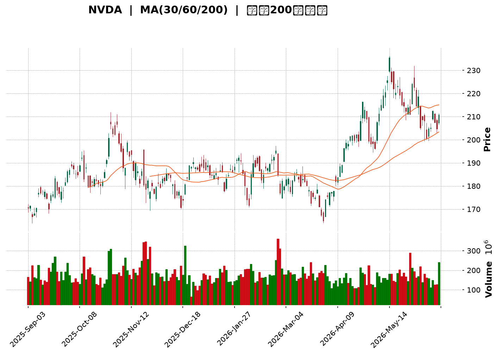
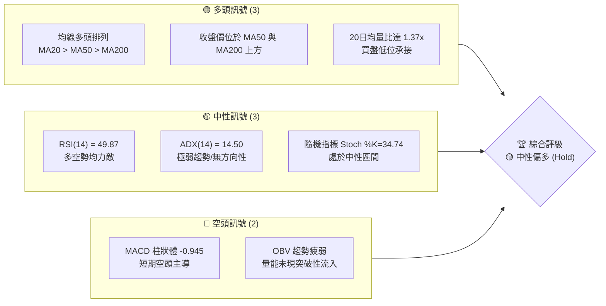
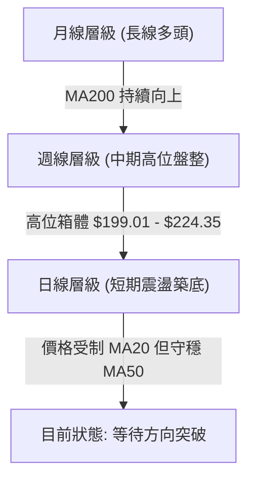
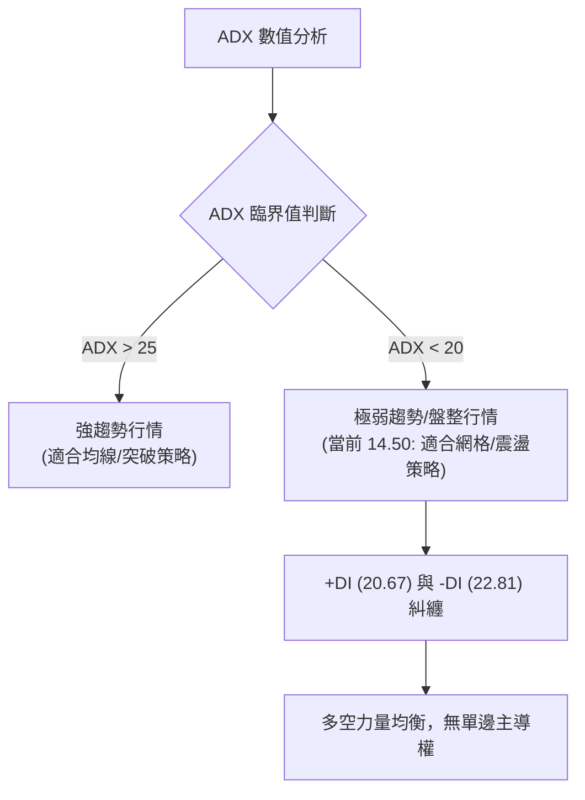
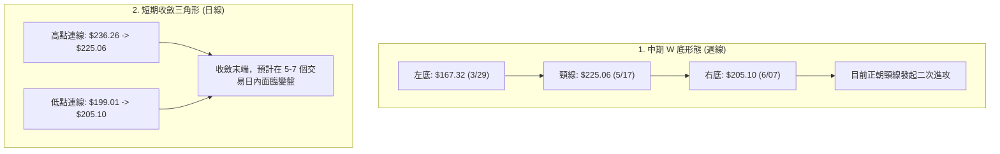
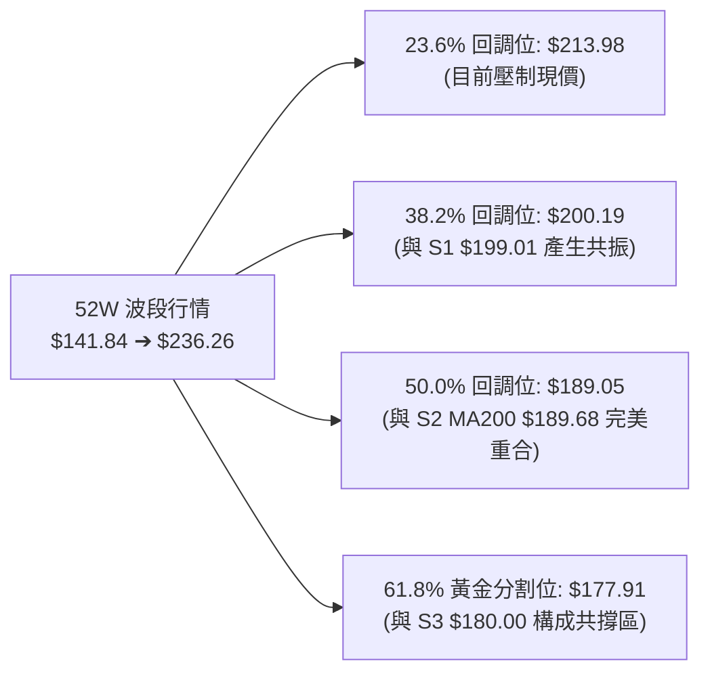
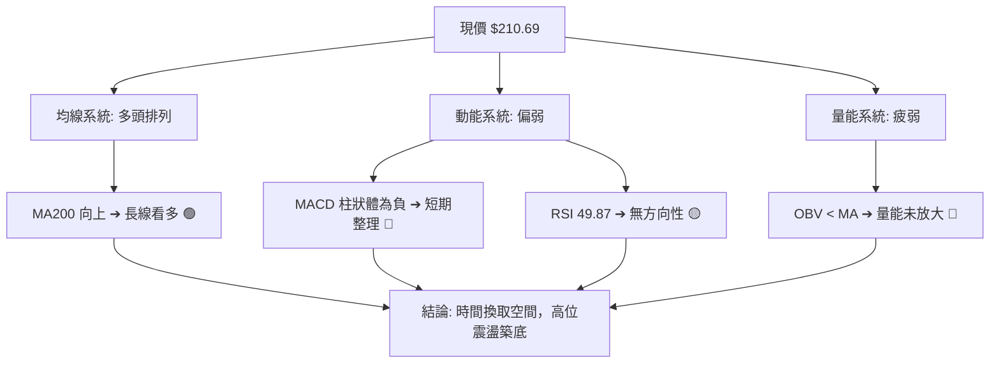
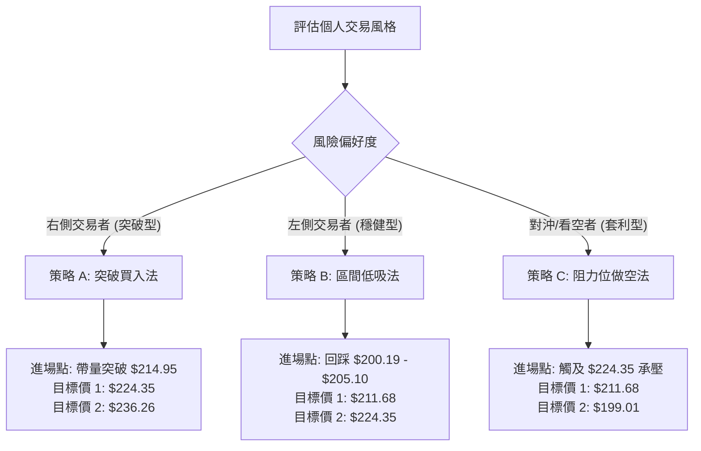
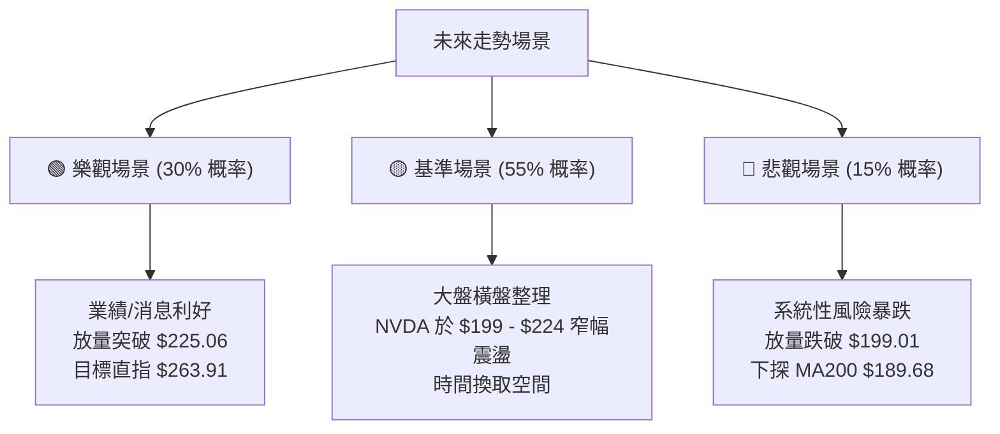

<details>
<summary>📊 靜態圖表 (點擊展開)</summary>

</details>

<html>
<head><meta charset="utf-8" /></head>
<body>
    <div style="height:500px; width:100%;">                        <script>window.PlotlyConfig = {MathJaxConfig: 'local'};</script>
        <script charset="utf-8" src="https://cdn.plot.ly/plotly-3.6.0.min.js" integrity="sha256-QaOVwtVY0T02VaHrr6pnoHLCwayMJp4O5n4YyaE3rJk=" crossorigin="anonymous"></script>                <div id="candlestick-chart" class="plotly-graph-div" style="height:100%; width:100%;"></div>            <script>                window.PLOTLYENV=window.PLOTLYENV || {};                                if (document.getElementById("candlestick-chart")) {                    Plotly.newPlot(                        "candlestick-chart",                        [{"close":{"dtype":"f8","bdata":"AAAA4JNMZUAAAABA0G1lQAAAAACI2WRAAAAAoMECZUAAAABADVFlQAAAAEADI2ZAAAAA4DceZkAAAADg\u002fTJmQAAAAEDBMGZAAAAAQAjVZUAAAACgVkJlQAAAACB\u002fAGZAAAAAAD0OZkAAAABACexmQAAAAKB8RmZAAAAAgNMXZkAAAABA1i5mQAAAACDRPmZAAAAAoMmzZkAAAABg9EpnQAAAAGAMYGdAAAAA4MeUZ0AAAABAMWxnQAAAAIC3KWdAAAAA4LwZZ0AAAADAz5tnQAAAAABkCmhAAAAAgKfdZkAAAABgkIJnQAAAACCfeWZAAAAA4DpzZkAAAABAgrJmQAAAAECS32ZAAAAAAAnNZkAAAABgvJ1mQAAAAKCcgWZAAAAA4LG9ZkAAAAAgukBnQAAAAODf52dAAAAAAMQYaUAAAABA19hpQAAAAMA1VGlAAAAAIG1HaUAAAAAgutNpQAAAACD7zWhAAAAAgMNeaEAAAADg5HpnQAAAAGAhfWdAAAAAoHzZaEAAAAAgPx1oQAAAAGCzMWhAAAAAQOdTZ0AAAAAgsL1nQAAAACCYS2dAAAAAoCCkZkAAAACACUlnQAAAAOAdjWZAAAAAYN5UZkAAAADAKMpmQAAAAOD9MmZAAAAA4PiAZkAAAAAAyRhmQAAAACAbdmZAAAAA4FKnZkAAAABAj2tmQAAAAAAD5WZAAAAAYALGZkAAAAAAXipnQAAAAGDUF2dAAAAAwMvxZkAAAADgtJZmQAAAAEDR2WVAAAAAYGgCZkAAAADAHDBmQAAAAKBqV2VAAAAAALG9ZUAAAADgn5hmQAAAAGDr7mZAAAAAIFifZ0AAAADgKoxnQAAAAGCIyWdAAAAA4LN\u002fZ0AAAAAg+GlnQAAAAOC6SGdAAAAAoNaTZ0AAAADAgXxnQAAAAKBhYGdAAAAA4CWcZ0AAAAAgERpnQAAAAEBQFGdAAAAA4N4WZ0AAAABArTJnQAAAACBX3WZAAAAAAE9aZ0AAAACgGUBnQAAAAGBMO2ZAAAAAIBjjZkAAAACgrBNnQAAAAMAfbmdAAAAAYMVHZ0AAAACASolnQAAAAKAs6WdAAAAAwNAIaEAAAACgtdxnQAAAAOBILGdAAAAAgNmDZkAAAAAgSr9lQAAAAKB1dWVAAAAAYOQlZ0AAAAAg37lnQAAAACDuiWdAAAAAADG6Z0AAAAAAy1ZnQAAAAEDL0mZAAAAAYNQXZ0AAAAAgCHhnQAAAAKB5dWdAAAAAQNeyZ0AAAAAgIupnQAAAAMCuE2hAAAAA4EtqaEAAAADARRVnQAAAAEAsH2ZAAAAAID\u002fIZkAAAADAlHpmQAAAAAAl2mZAAAAAoLvjZkAAAADgTjNmQAAAAACuzWZAAAAAAHARZ0AAAACgBzpnQAAAAGCo3WZAAAAAAEmBZkAAAAAAN+BmQAAAAID7tmZAAAAAYBSGZkAAAACgREtmQAAAAGD3j2VAAAAA4O\u002ftZUAAAACA399lQAAAAIAaT2ZAAAAAIE1hZUAAAABAZupkQAAAAIBJn2RAAAAAoE3GZUAAAAAAdPFlQAAAACDfJWZAAAAAwNwtZkAAAADAkDxmQAAAAADHu2ZAAAAA4ET2ZkAAAAAgIo1nQAAAACDeomdAAAAA4P+IaEAAAACAbtRoQAAAAKDPw2hAAAAAID8uaUAAAACAZDppQAAAAOC29GhAAAAA4HRIaUAAAAAAC+1oQAAAAKDhAGpAAAAAYHMLa0AAAADAf51qQAAAAIA0IGpAAAAAQM7qaEAAAADgAcdoQAAAAED3x2hAAAAAAK6IaEAAAABg0fJpQAAAAAAfaGpAAAAAIGLeakAAAADA52VrQAAAAEC8kGtAAAAAwCUybEAAAAAA5m5tQAAAAMDYIWxAAAAAYPXBa0AAAABATYtrQAAAACC35mtAAAAAgCRoa0AAAADgieJqQAAAACCE02pAAAAAwEeLakAAAADABMBqQAAAAGCdXGpAAAAAgCkDbEAAAACA8NFrQAAAAAAA0GpAAAAAwB5Va0AAAABAM6NpQAAAAOB6FGpAAAAAgBQGakAAAACgcA1pQAAAAADXm2lAAAAAgBSmaUAAAABgZo5qQAAAAMAe7WlAAAAAwMyUaUAAAACAFFZqQA=="},"high":{"dtype":"f8","bdata":"8i7cHsiFZUC9DhtyNHRlQEjdSvnDGWVADn9AoHFXZUDpb1MaFVhlQJE3BiWmYWZAF2InjJyBZkDSnkJ860tmQDC\u002fmQXpU2ZAPmGF6cMoZkCSXDoCV59lQAiUtUb7G2ZAAuk4CU07ZkDoQArxEwpnQBfMfx0BxmZADFc1raFxZkDaSWzO+IBmQMnyVANQcWZAOP2H8H\u002f4ZkBZZwA3kGNnQOko6rvPfGdAvJYMFtDZZ0AhXLPIwsNnQJwVXF26X2dAd7jpzTaaZ0BryALDeKtnQJUjFaOjYWhA+2lOu91raEAIBUVSxbtnQMYuhTkREmdAevKM6E0UZ0BkwvcofeFmQGxtERGy+2ZAU706ydkeZ0C0eMc91NFmQP9K7Waa5mZAx\u002fjiy3\u002fZZkA94mzfZWdnQHz0lW0s+GdAx3u54IRcaUDyEwdjbn1qQJMlxoC3vGlAF5\u002fXEJD2aUAvyU3VQ2JqQLLi6sa5dmlAymFETStVaUBvBrz0yKtoQOh201mQgmdANi+XNu71aEAGcL1qeWVoQOCHA9F+dGhA4DM51UbmZ0DMOvubiNhnQNRq59RLmGdAFG15OhESZ0BN7FDE3HNnQNU9cLcCeGhABJSYmmUKZ0DiBkM2hehmQJUntpPbPWZAUq7rGKrVZkD6Q5a6+GFmQMHw2ShAgmZA0imBbI0tZ0BbM\u002f+H9sZmQFkupn9yCWdAnjvD6+sNZ0CNMxvtq3hnQDtr+OPML2dAVaABKSEoZ0BFKJf7K6NmQPigxwgd02ZA5yF6HnxGZkApm+TwuEhmQKQA\u002flRL\u002fWVAEXXU0O79ZUCU9cuIU6dmQIcDRe\u002fw\u002fWZAgARw7S2jZ0CkVI+BwZVnQIwlyJGRDmhAIC1tHPaQZ0B7ILAnUJhnQIRjANx9ymdAmo+qKD0WaECiF\u002f7DnCxoQG69ge3y\u002fWdAZFMxMmHkZ0BkcLUeNqpnQAxz2JqdQ2dAfD6cnotcZ0B\u002fLjHsL3xnQGUchHOHB2dA0dcRTgGvZ0DtyF\u002f8p8ZnQIDjjtwMxWZA3e5oEe8kZ0BjHia6Lj5nQMDxPx3Pq2dA8nLurXecZ0A2+eXal7hnQG7hk7ezA2hAy5fsUdEnaEAeDRA4GUhoQHl7f5IuwmdAq5jn8WBBZ0DxYIY1j2tmQJ1Ry9JYE2ZAlYDJwbVYZ0A3k8ofki1oQJIXdU7bB2hAglgtN8kgaEBifm0Q+StoQLMU4fKwaGdAhGHCHoFdZ0A\u002fP\u002fgla8RnQO9LABZqhmdAs4QhCSTDZ0DDg9js1jZoQDuWsDEWMWhA8XCNt3SsaECx9iWxtEFoQJEJfhzDy2ZAqHBlmJHnZkDiiGdkv5VmQJOiJy8zD2dA0o6XsL76ZkDk7w7zMdFmQADYvWf91WZA\u002fbCn9c9GZ0C7qim22WxnQDYvnNUwF2dAgvItjvI7Z0D2qjPGH5VnQBnBaajkJWdA6vPONFTlZkCgLzi1p3hmQEwQwNmtQWZA+Nsa9zFFZkAt+bKleQBmQJQi5gZKoGZAbvxhnr4JZkAFw\u002f+4q1hlQFa0LG8WKGVAPBjqxlXNZUC29CCNOyVmQMYu12sRKWZAR9LMEagyZkDhMqRiuEBmQAqqrixrIWdA+8744LP7ZkAdhlwP7LhnQH9QgQkOrmdAAAAA4P+IaEBIGcuoVQVpQLYV3lHB82hAkkwpz+IuaUBKanGT6D1pQDeld4FyUGlAAAAA4HRIaUCyCriK93JpQBM08ZCKVmpA3n\u002fjhnsSa0DGToxfXM9qQHRBlqgdj2pAHUixC8RBakA1PvwbcFhpQHYdVkHYL2lAjS\u002f7dDgAaUCxb8mt4QBqQGGgR6BrvmpAhWWBlHwxa0BNl42ZUcFrQHLCGC2q72tA4hrrdGRybEAxgfbed4htQBKtnFBg52xARVHCom63bEBe2OJX\u002fwZsQC2AAYK8O2xA9NyhIVRkbECtsSU1FphrQFBrztahPWtAtjLfd9K8akA5QGaDnOhqQFStdopnM2tA3TLrgnYTbEDv2RGITgBtQOXT+4nw0WtAAAAAQDOza0AAAAAA19tqQAAAAEAKT2pAAAAAwMxsakAAAABACudpQAAAAMAetWlAAAAAgD3iaUAAAABguJZqQAAAACCub2pAAAAAYLgmakAAAADgemxqQA=="},"hovertemplate":"\u003cb\u003e%{x|%Y-%m-%d}\u003c\u002fb\u003e\u003cbr\u003e\u958b: $%{open:.2f}\u003cbr\u003e\u9ad8: $%{high:.2f}\u003cbr\u003e\u4f4e: $%{low:.2f}\u003cbr\u003e\u6536: $%{close:.2f}\u003cextra\u003e\u003c\u002fextra\u003e","low":{"dtype":"f8","bdata":"58ad1fgUZUCYHmjE6CVlQJONw8RBe2RAtnS71RPkZEBN92dNldBkQKecEmSS52VAQN45kyoIZkB1cu8LNQdmQCN74+40yWVAmA+Xdw3FZUD6WTJeQQZlQLQcwJmrl2VAZfp\u002fbJ7eZUCQiOddmc9lQIx9P6qJ\u002f2VA15M1YqblZUBtWMFVGp1lQB61eySh1mVAnJQ41+OCZkBbSjdY9qdmQMFQ69lN9WZAUn0oKUF6Z0Ceap+fmiRnQMOhuk8W42ZAo979GYD4ZkDc\u002fnQRrUlnQOsH2MEh2mdAH0os9S26ZkDI+W3gIzdnQJ0ujzETb2ZAu9YuoQ0iZkAHi7zpT3FmQHuVGjascGZAxjf7vvOvZkCFiP5wRXJmQOL+tnodEWZAY8lEe\u002fNxZkCSp2sNhehmQGOTmy4UhmdAkB3QKkz1Z0C7zwP1nJBpQKiWihHpJGlAXaj54QA6aUDBVFlmiqlpQHq3TQ6xtWhA0Fjkt91MaEBTxQk9kERnQPASt8vTVWZAsOjKgmExaEBebLtozeFnQFPaVpxe3GdAqsq9yLTzZkC2jFDzMotmQBuvjSq6AmdA5lQQGHptZkBqbYWBG9NmQJRyYX7ec2ZAOWK69rWWZUDhCOKWKghmQA3JB02wKmVAbpcUNGpAZkByAa83zghmQF43nB2urmVAXI8hvKl4ZkBtAjoiOFxmQPV0DYG0d2ZA7IIoWBGWZkAjuS6PsMVmQALjPxcY42ZAtyg0\u002fS66ZkBq3S5j9AxmQBKF7l0IzWVABlvoEiPaZUBMVjBk+9VlQEaVfOlHQ2VA2Ewox4pzZUDBMgRoAQRmQDg\u002fV38XxGZA8mHDeKvVZkCYuqcom0tnQO1VdN+reGdAIH2Tbd81Z0CHq1oWeVZnQAhkiBlpSGdAAZVUI\u002fuAZ0ARKp0oiz1nQEyt9DD1UmdAVb23sqVKZ0Cn9ZYlj+9mQGCCRKBH7mZABY8paYHZZkC8ctOMpuVmQLCkczqNkmZADHhi70tDZ0AdbDNfTjtnQMO+QJeYLGZAKSf0eNhFZkBVBdr0lvZmQB+nihv1UmdAAbtECm44Z0AvMZIkKS9nQCkz88N6s2dA3\u002fLlvao6Z0AH4+Fwp6dnQBSp6Qj0FGdAxHhOZH0AZkCDMvwga3ZlQKbyrdtKWmVAysn+wWTMZUBqhmWmOvdmQNml+LCBfGdAkJodBkiRZ0BbE4aqDElnQIkroCzNq2ZAFzzFZ8ZeZkA0weMMClFnQK+jjPrhLWdAt4ok+NQ2Z0DM86uIK6tnQNiZF6N+ZWdAzjAAqrkxaEDHTTMQDgNnQBd\u002fUtVIBWZAwJqYHKzNZUAAEK78ihZmQMVIDp3memZAaWDM3Dk1ZkDjZdraWBNmQKNkIIET62VAnHz\u002fijm5ZkD0v29RhwdnQAs0cME6sWZAYLTUdGB3ZkCOzMHCXKZmQM87WOL9rmZA0q7fqteDZkCqvK4qu\u002fJlQF3\u002fkpikcGVA9AdoRM\u002fRZUAp75Xi4LhlQL6xrLOcFGZAkg8l1BpeZUDHCSodGdpkQHErK1WFgmRAMBQgM4DYZEDjMUmJfdFlQL0Fg6l0ZWVAboDnrcXxZUCRTeOXpq5lQNcMgznigmZAgiIfgByNZkDSmQ0LvAJnQNYfrcvCMGdA3s0onYjRZ0BeLkl5Y3BoQGRbOxmgcmhAgHDGezfhaEBikMR+grNoQP8tXESW2GhAOtGhQJbYaED8whJ0sZ9oQO6bpu558mhA3lEgRm\u002fkaUCO81vlpP5pQKKjA83T6mlAhhUNbP\u002fOaECj3vUuf5xoQOhh8epsUGhA53V7O6h5aEBDsYYNH8xoQNAv565OyGlASE58p4yUakClmtsNg7RqQMPcfQJv1WpA3DMZgPypa0A4xzHqDqFsQA51o6xT\u002f2tAngo0i7RDa0B5TrWfADVrQBtWzjLJh2tASm1cMaQ1a0AJq+ktmdFqQLP9M0YaeGpAd9oiri4RakCcz3flK19qQEBLZphLXGpARmM0Vl3uakDuoOhE9KJrQIFK8ilUyGpAAAAAQApfakAAAABgj4ppQAAAAAAAwGlAAAAAQOHqaEAAAACgcP1oQAAAAKBH8WhAAAAAgBRuaUAAAABA4QpqQAAAAKBH6WlAAAAAYI9iaUAAAAAAANBpQA=="},"name":"\u50f9\u683c","open":{"dtype":"f8","bdata":"kZKilKNaZUD2ZY\u002fg+kplQG\u002fxtN7O+WRALPrfB3jqZECSKlDSrhtlQJchnUT2DGZAZUD4jm9uZkAs2JTFZDFmQEtiOJRH7mVA1XAcIckYZkBJBDRacY1lQNSMFrVEuGVAObtNpHnxZUCB5+N1dOJlQOBxk2+ft2ZAUITo509xZkD9SlZfP8hlQAACcHUtPmZA5kxosWeGZkB3R1pVI7tmQKCycj4hIGdAHI5h13irZ0AXbxVeXp5nQGxZ1kpwKGdACjVP9cQ\u002fZ0BnOUehokpnQAbOTiyG\u002f2dAOwzOn24oaEAnuv7GYHdnQPqFqMkbEWdAkaCFQxESZ0DkIv997r9mQFsDYTlqfmZAuSoAA7LcZkC0eMc91NFmQEA5v8YYnWZA3H1E6BWGZkD\u002fyxvBYvNmQBfUJIfvt2dA3hl2JbsZaEClPgTx4fZpQBgu1QpwnGlAWWhaDfzFaUAnEUH6E\u002fppQEwtMqa5V2lASgqg2onQaEBbuCsab4VoQCRFDUpDFWdAC6W5PJFbaEA8b0dBKl1oQC7RIPcPb2hAPx8MB9DZZ0DCNWLoENRmQHYW7rJ1N2dAokTRa6\u002fkZkDk\u002fJJNvxFnQOQgBJ1pdmhAdziM30qgZkBfPTUuXWhmQKhh+X391WVAeQU8tMGsZkCuCJHmBVlmQFynezgy0WVA4LWjPumwZkCgb7TTLZtmQKzPSZDCrGZAY7fyuk\u002f1ZkA+NQ1KXM1mQPCTu7yvKmdAbIvkX9QXZ0BIx5qc7oFmQJB+dLl1nGZAn9e4yCQ3ZkCP8dXxcgFmQPd1oeFV\u002fGVAd1+f+yfKZUB\u002fWup8jQ5mQCLEazRF9mZAYb3oRejXZkDdtLHvwHZnQIt1YlYJtmdA38buFmdvZ0A6ALKjV4BnQIlYHL3ZqmdABErTvnqzZ0CN2SpN2PBnQN1lsaQ2yWdA+YeRo+OKZ0DUr70CJpxnQFmH7k1YG2dAzxk3yuXfZkAHGkzVyRhnQKNAM\u002fkNA2dAokUX3bpIZ0CcI99uMJtnQCxQ62a1tWZAMAFn3J5aZkDBi+tFzBBnQDnuTtKwaGdAJJY3\u002fdJdZ0Ax9yWGYWBnQLwVrh4v4WdAGcYCzWvjZ0Cbq50zRN9nQJ5nDUIaX2dASc6LfmtAZ0DQPBdouWdmQHMVl6\u002fw1mVAR6BaJjEPZkBYcW4OIwFnQAXwmyiz5GdA4\u002fyKzOUGaEDUfSJ6bxloQKJ4+0UNaGdAXywoQuqwZkAJGMZQpJBnQGK99MGgWmdAPbqvrvdKZ0BttDi\u002fVuVnQElNYTI36GdAZmDT09FGaEB6NzckEUFoQO8H0TvvoGZARYtha3\u002fZZUCRoo3RuEhmQJfkP9ILh2ZAAtfBp2CeZkCmijl33nNmQNcvl7SqE2ZAnZmqhrDFZkBnJfXEMTZnQP\u002f3YnK++mZANayfFo0WZ0CcjVNiOdhmQDAQeaYGG2dAaTYH6o\u002fIZkCwusY+sDlmQKoSgXReOWZA9lYDbbchZkDmJ1QHDNRlQEABVVGaHGZA+duFcK77ZUDjzzW5qjllQD7q2TKsEmVA2dK5+tHYZECHs62dcfllQIht8m9Yf2VAJYLgM4UeZkAxtC060PBlQC2oDowgCWdAfVCmHRu0ZkAYLafSDQNnQMPpsacHOmdA40lJUsXTZ0Azz0NY9YloQDcFJKZnpmhA5fW1WVr1aEBP\u002fST26PdoQLt6EGuhPGlA9o9iZjEYaUA60lybLUdpQNVaaWBF92hA3OQrYP0sakB5XwlY4CdqQDCHbPl5jmpAfwUKc\u002fA1akCbJQ9DdiFpQGDVuWWR6GhAXBvy6yziaECREpCYCPVoQAONxWIeA2pAJx+zMQaZakBIGqlfTrlqQOSrRGR1SWtAGqU6dWEVbEAJGXRLo7JsQDcricjCr2xASCgk4EazbEDFz\u002fmQqGtrQKQAAyRy3WtAYC0Cvf\u002fAa0AtgbIhkpRrQLOzlZo2CWtAzlMcAd27akAwSf3SFmFqQMNg7BGRympAaH33zFLvakDX5GPrS11sQE9ohsfHrmtAAAAAwB69akAAAADA9dBqQAAAAIDCRWpAAAAAANdTakAAAACAwo1pQAAAACCuL2lAAAAAIIWbaUAAAACgcB1qQAAAAIDCZWpAAAAAwPUQakAAAABgj+ppQA=="},"x":["2025-09-03T00:00:00-04:00","2025-09-04T00:00:00-04:00","2025-09-05T00:00:00-04:00","2025-09-08T00:00:00-04:00","2025-09-09T00:00:00-04:00","2025-09-10T00:00:00-04:00","2025-09-11T00:00:00-04:00","2025-09-12T00:00:00-04:00","2025-09-15T00:00:00-04:00","2025-09-16T00:00:00-04:00","2025-09-17T00:00:00-04:00","2025-09-18T00:00:00-04:00","2025-09-19T00:00:00-04:00","2025-09-22T00:00:00-04:00","2025-09-23T00:00:00-04:00","2025-09-24T00:00:00-04:00","2025-09-25T00:00:00-04:00","2025-09-26T00:00:00-04:00","2025-09-29T00:00:00-04:00","2025-09-30T00:00:00-04:00","2025-10-01T00:00:00-04:00","2025-10-02T00:00:00-04:00","2025-10-03T00:00:00-04:00","2025-10-06T00:00:00-04:00","2025-10-07T00:00:00-04:00","2025-10-08T00:00:00-04:00","2025-10-09T00:00:00-04:00","2025-10-10T00:00:00-04:00","2025-10-13T00:00:00-04:00","2025-10-14T00:00:00-04:00","2025-10-15T00:00:00-04:00","2025-10-16T00:00:00-04:00","2025-10-17T00:00:00-04:00","2025-10-20T00:00:00-04:00","2025-10-21T00:00:00-04:00","2025-10-22T00:00:00-04:00","2025-10-23T00:00:00-04:00","2025-10-24T00:00:00-04:00","2025-10-27T00:00:00-04:00","2025-10-28T00:00:00-04:00","2025-10-29T00:00:00-04:00","2025-10-30T00:00:00-04:00","2025-10-31T00:00:00-04:00","2025-11-03T00:00:00-05:00","2025-11-04T00:00:00-05:00","2025-11-05T00:00:00-05:00","2025-11-06T00:00:00-05:00","2025-11-07T00:00:00-05:00","2025-11-10T00:00:00-05:00","2025-11-11T00:00:00-05:00","2025-11-12T00:00:00-05:00","2025-11-13T00:00:00-05:00","2025-11-14T00:00:00-05:00","2025-11-17T00:00:00-05:00","2025-11-18T00:00:00-05:00","2025-11-19T00:00:00-05:00","2025-11-20T00:00:00-05:00","2025-11-21T00:00:00-05:00","2025-11-24T00:00:00-05:00","2025-11-25T00:00:00-05:00","2025-11-26T00:00:00-05:00","2025-11-28T00:00:00-05:00","2025-12-01T00:00:00-05:00","2025-12-02T00:00:00-05:00","2025-12-03T00:00:00-05:00","2025-12-04T00:00:00-05:00","2025-12-05T00:00:00-05:00","2025-12-08T00:00:00-05:00","2025-12-09T00:00:00-05:00","2025-12-10T00:00:00-05:00","2025-12-11T00:00:00-05:00","2025-12-12T00:00:00-05:00","2025-12-15T00:00:00-05:00","2025-12-16T00:00:00-05:00","2025-12-17T00:00:00-05:00","2025-12-18T00:00:00-05:00","2025-12-19T00:00:00-05:00","2025-12-22T00:00:00-05:00","2025-12-23T00:00:00-05:00","2025-12-24T00:00:00-05:00","2025-12-26T00:00:00-05:00","2025-12-29T00:00:00-05:00","2025-12-30T00:00:00-05:00","2025-12-31T00:00:00-05:00","2026-01-02T00:00:00-05:00","2026-01-05T00:00:00-05:00","2026-01-06T00:00:00-05:00","2026-01-07T00:00:00-05:00","2026-01-08T00:00:00-05:00","2026-01-09T00:00:00-05:00","2026-01-12T00:00:00-05:00","2026-01-13T00:00:00-05:00","2026-01-14T00:00:00-05:00","2026-01-15T00:00:00-05:00","2026-01-16T00:00:00-05:00","2026-01-20T00:00:00-05:00","2026-01-21T00:00:00-05:00","2026-01-22T00:00:00-05:00","2026-01-23T00:00:00-05:00","2026-01-26T00:00:00-05:00","2026-01-27T00:00:00-05:00","2026-01-28T00:00:00-05:00","2026-01-29T00:00:00-05:00","2026-01-30T00:00:00-05:00","2026-02-02T00:00:00-05:00","2026-02-03T00:00:00-05:00","2026-02-04T00:00:00-05:00","2026-02-05T00:00:00-05:00","2026-02-06T00:00:00-05:00","2026-02-09T00:00:00-05:00","2026-02-10T00:00:00-05:00","2026-02-11T00:00:00-05:00","2026-02-12T00:00:00-05:00","2026-02-13T00:00:00-05:00","2026-02-17T00:00:00-05:00","2026-02-18T00:00:00-05:00","2026-02-19T00:00:00-05:00","2026-02-20T00:00:00-05:00","2026-02-23T00:00:00-05:00","2026-02-24T00:00:00-05:00","2026-02-25T00:00:00-05:00","2026-02-26T00:00:00-05:00","2026-02-27T00:00:00-05:00","2026-03-02T00:00:00-05:00","2026-03-03T00:00:00-05:00","2026-03-04T00:00:00-05:00","2026-03-05T00:00:00-05:00","2026-03-06T00:00:00-05:00","2026-03-09T00:00:00-04:00","2026-03-10T00:00:00-04:00","2026-03-11T00:00:00-04:00","2026-03-12T00:00:00-04:00","2026-03-13T00:00:00-04:00","2026-03-16T00:00:00-04:00","2026-03-17T00:00:00-04:00","2026-03-18T00:00:00-04:00","2026-03-19T00:00:00-04:00","2026-03-20T00:00:00-04:00","2026-03-23T00:00:00-04:00","2026-03-24T00:00:00-04:00","2026-03-25T00:00:00-04:00","2026-03-26T00:00:00-04:00","2026-03-27T00:00:00-04:00","2026-03-30T00:00:00-04:00","2026-03-31T00:00:00-04:00","2026-04-01T00:00:00-04:00","2026-04-02T00:00:00-04:00","2026-04-06T00:00:00-04:00","2026-04-07T00:00:00-04:00","2026-04-08T00:00:00-04:00","2026-04-09T00:00:00-04:00","2026-04-10T00:00:00-04:00","2026-04-13T00:00:00-04:00","2026-04-14T00:00:00-04:00","2026-04-15T00:00:00-04:00","2026-04-16T00:00:00-04:00","2026-04-17T00:00:00-04:00","2026-04-20T00:00:00-04:00","2026-04-21T00:00:00-04:00","2026-04-22T00:00:00-04:00","2026-04-23T00:00:00-04:00","2026-04-24T00:00:00-04:00","2026-04-27T00:00:00-04:00","2026-04-28T00:00:00-04:00","2026-04-29T00:00:00-04:00","2026-04-30T00:00:00-04:00","2026-05-01T00:00:00-04:00","2026-05-04T00:00:00-04:00","2026-05-05T00:00:00-04:00","2026-05-06T00:00:00-04:00","2026-05-07T00:00:00-04:00","2026-05-08T00:00:00-04:00","2026-05-11T00:00:00-04:00","2026-05-12T00:00:00-04:00","2026-05-13T00:00:00-04:00","2026-05-14T00:00:00-04:00","2026-05-15T00:00:00-04:00","2026-05-18T00:00:00-04:00","2026-05-19T00:00:00-04:00","2026-05-20T00:00:00-04:00","2026-05-21T00:00:00-04:00","2026-05-22T00:00:00-04:00","2026-05-26T00:00:00-04:00","2026-05-27T00:00:00-04:00","2026-05-28T00:00:00-04:00","2026-05-29T00:00:00-04:00","2026-06-01T00:00:00-04:00","2026-06-02T00:00:00-04:00","2026-06-03T00:00:00-04:00","2026-06-04T00:00:00-04:00","2026-06-05T00:00:00-04:00","2026-06-08T00:00:00-04:00","2026-06-09T00:00:00-04:00","2026-06-10T00:00:00-04:00","2026-06-11T00:00:00-04:00","2026-06-12T00:00:00-04:00","2026-06-15T00:00:00-04:00","2026-06-16T00:00:00-04:00","2026-06-17T00:00:00-04:00","2026-06-18T00:00:00-04:00"],"type":"candlestick"},{"hovertemplate":"MA30: $%{y:.2f}\u003cextra\u003e\u003c\u002fextra\u003e","line":{"color":"#2196F3","dash":"dash","width":2},"mode":"lines","name":"MA30","x":["2025-09-03T00:00:00-04:00","2025-09-04T00:00:00-04:00","2025-09-05T00:00:00-04:00","2025-09-08T00:00:00-04:00","2025-09-09T00:00:00-04:00","2025-09-10T00:00:00-04:00","2025-09-11T00:00:00-04:00","2025-09-12T00:00:00-04:00","2025-09-15T00:00:00-04:00","2025-09-16T00:00:00-04:00","2025-09-17T00:00:00-04:00","2025-09-18T00:00:00-04:00","2025-09-19T00:00:00-04:00","2025-09-22T00:00:00-04:00","2025-09-23T00:00:00-04:00","2025-09-24T00:00:00-04:00","2025-09-25T00:00:00-04:00","2025-09-26T00:00:00-04:00","2025-09-29T00:00:00-04:00","2025-09-30T00:00:00-04:00","2025-10-01T00:00:00-04:00","2025-10-02T00:00:00-04:00","2025-10-03T00:00:00-04:00","2025-10-06T00:00:00-04:00","2025-10-07T00:00:00-04:00","2025-10-08T00:00:00-04:00","2025-10-09T00:00:00-04:00","2025-10-10T00:00:00-04:00","2025-10-13T00:00:00-04:00","2025-10-14T00:00:00-04:00","2025-10-15T00:00:00-04:00","2025-10-16T00:00:00-04:00","2025-10-17T00:00:00-04:00","2025-10-20T00:00:00-04:00","2025-10-21T00:00:00-04:00","2025-10-22T00:00:00-04:00","2025-10-23T00:00:00-04:00","2025-10-24T00:00:00-04:00","2025-10-27T00:00:00-04:00","2025-10-28T00:00:00-04:00","2025-10-29T00:00:00-04:00","2025-10-30T00:00:00-04:00","2025-10-31T00:00:00-04:00","2025-11-03T00:00:00-05:00","2025-11-04T00:00:00-05:00","2025-11-05T00:00:00-05:00","2025-11-06T00:00:00-05:00","2025-11-07T00:00:00-05:00","2025-11-10T00:00:00-05:00","2025-11-11T00:00:00-05:00","2025-11-12T00:00:00-05:00","2025-11-13T00:00:00-05:00","2025-11-14T00:00:00-05:00","2025-11-17T00:00:00-05:00","2025-11-18T00:00:00-05:00","2025-11-19T00:00:00-05:00","2025-11-20T00:00:00-05:00","2025-11-21T00:00:00-05:00","2025-11-24T00:00:00-05:00","2025-11-25T00:00:00-05:00","2025-11-26T00:00:00-05:00","2025-11-28T00:00:00-05:00","2025-12-01T00:00:00-05:00","2025-12-02T00:00:00-05:00","2025-12-03T00:00:00-05:00","2025-12-04T00:00:00-05:00","2025-12-05T00:00:00-05:00","2025-12-08T00:00:00-05:00","2025-12-09T00:00:00-05:00","2025-12-10T00:00:00-05:00","2025-12-11T00:00:00-05:00","2025-12-12T00:00:00-05:00","2025-12-15T00:00:00-05:00","2025-12-16T00:00:00-05:00","2025-12-17T00:00:00-05:00","2025-12-18T00:00:00-05:00","2025-12-19T00:00:00-05:00","2025-12-22T00:00:00-05:00","2025-12-23T00:00:00-05:00","2025-12-24T00:00:00-05:00","2025-12-26T00:00:00-05:00","2025-12-29T00:00:00-05:00","2025-12-30T00:00:00-05:00","2025-12-31T00:00:00-05:00","2026-01-02T00:00:00-05:00","2026-01-05T00:00:00-05:00","2026-01-06T00:00:00-05:00","2026-01-07T00:00:00-05:00","2026-01-08T00:00:00-05:00","2026-01-09T00:00:00-05:00","2026-01-12T00:00:00-05:00","2026-01-13T00:00:00-05:00","2026-01-14T00:00:00-05:00","2026-01-15T00:00:00-05:00","2026-01-16T00:00:00-05:00","2026-01-20T00:00:00-05:00","2026-01-21T00:00:00-05:00","2026-01-22T00:00:00-05:00","2026-01-23T00:00:00-05:00","2026-01-26T00:00:00-05:00","2026-01-27T00:00:00-05:00","2026-01-28T00:00:00-05:00","2026-01-29T00:00:00-05:00","2026-01-30T00:00:00-05:00","2026-02-02T00:00:00-05:00","2026-02-03T00:00:00-05:00","2026-02-04T00:00:00-05:00","2026-02-05T00:00:00-05:00","2026-02-06T00:00:00-05:00","2026-02-09T00:00:00-05:00","2026-02-10T00:00:00-05:00","2026-02-11T00:00:00-05:00","2026-02-12T00:00:00-05:00","2026-02-13T00:00:00-05:00","2026-02-17T00:00:00-05:00","2026-02-18T00:00:00-05:00","2026-02-19T00:00:00-05:00","2026-02-20T00:00:00-05:00","2026-02-23T00:00:00-05:00","2026-02-24T00:00:00-05:00","2026-02-25T00:00:00-05:00","2026-02-26T00:00:00-05:00","2026-02-27T00:00:00-05:00","2026-03-02T00:00:00-05:00","2026-03-03T00:00:00-05:00","2026-03-04T00:00:00-05:00","2026-03-05T00:00:00-05:00","2026-03-06T00:00:00-05:00","2026-03-09T00:00:00-04:00","2026-03-10T00:00:00-04:00","2026-03-11T00:00:00-04:00","2026-03-12T00:00:00-04:00","2026-03-13T00:00:00-04:00","2026-03-16T00:00:00-04:00","2026-03-17T00:00:00-04:00","2026-03-18T00:00:00-04:00","2026-03-19T00:00:00-04:00","2026-03-20T00:00:00-04:00","2026-03-23T00:00:00-04:00","2026-03-24T00:00:00-04:00","2026-03-25T00:00:00-04:00","2026-03-26T00:00:00-04:00","2026-03-27T00:00:00-04:00","2026-03-30T00:00:00-04:00","2026-03-31T00:00:00-04:00","2026-04-01T00:00:00-04:00","2026-04-02T00:00:00-04:00","2026-04-06T00:00:00-04:00","2026-04-07T00:00:00-04:00","2026-04-08T00:00:00-04:00","2026-04-09T00:00:00-04:00","2026-04-10T00:00:00-04:00","2026-04-13T00:00:00-04:00","2026-04-14T00:00:00-04:00","2026-04-15T00:00:00-04:00","2026-04-16T00:00:00-04:00","2026-04-17T00:00:00-04:00","2026-04-20T00:00:00-04:00","2026-04-21T00:00:00-04:00","2026-04-22T00:00:00-04:00","2026-04-23T00:00:00-04:00","2026-04-24T00:00:00-04:00","2026-04-27T00:00:00-04:00","2026-04-28T00:00:00-04:00","2026-04-29T00:00:00-04:00","2026-04-30T00:00:00-04:00","2026-05-01T00:00:00-04:00","2026-05-04T00:00:00-04:00","2026-05-05T00:00:00-04:00","2026-05-06T00:00:00-04:00","2026-05-07T00:00:00-04:00","2026-05-08T00:00:00-04:00","2026-05-11T00:00:00-04:00","2026-05-12T00:00:00-04:00","2026-05-13T00:00:00-04:00","2026-05-14T00:00:00-04:00","2026-05-15T00:00:00-04:00","2026-05-18T00:00:00-04:00","2026-05-19T00:00:00-04:00","2026-05-20T00:00:00-04:00","2026-05-21T00:00:00-04:00","2026-05-22T00:00:00-04:00","2026-05-26T00:00:00-04:00","2026-05-27T00:00:00-04:00","2026-05-28T00:00:00-04:00","2026-05-29T00:00:00-04:00","2026-06-01T00:00:00-04:00","2026-06-02T00:00:00-04:00","2026-06-03T00:00:00-04:00","2026-06-04T00:00:00-04:00","2026-06-05T00:00:00-04:00","2026-06-08T00:00:00-04:00","2026-06-09T00:00:00-04:00","2026-06-10T00:00:00-04:00","2026-06-11T00:00:00-04:00","2026-06-12T00:00:00-04:00","2026-06-15T00:00:00-04:00","2026-06-16T00:00:00-04:00","2026-06-17T00:00:00-04:00","2026-06-18T00:00:00-04:00"],"y":{"dtype":"f8","bdata":"AAAAAAAA+H8AAAAAAAD4fwAAAAAAAPh\u002fAAAAAAAA+H8AAAAAAAD4fwAAAAAAAPh\u002fAAAAAAAA+H8AAAAAAAD4fwAAAAAAAPh\u002fAAAAAAAA+H8AAAAAAAD4fwAAAAAAAPh\u002fAAAAAAAA+H8AAAAAAAD4fwAAAAAAAPh\u002fAAAAAAAA+H8AAAAAAAD4fwAAAAAAAPh\u002fAAAAAAAA+H8AAAAAAAD4fwAAAAAAAPh\u002fAAAAAAAA+H8AAAAAAAD4fwAAAAAAAPh\u002fAAAAAAAA+H8AAAAAAAD4fwAAAAAAAPh\u002fAAAAAAAA+H8AAAAAAAD4f5qZmckia2ZAd3d3J\u002fV0ZkAzMzPjx39mQO\u002fu7n4MkWZAREREJFOgZkC8u7sLaqtmQKuqqkqRrmZAiYiIKOKzZkBmZmbm37xmQN7d3Q2Dy2ZAVVVVpV7nZkARERERhQ5nQFVVVQXpKmdAAAAAoGpGZ0CamZnJNF9nQCIiIhLKdGdAiYiIeDiIZ0BmZmYGSpNnQM3MzEzmnWdAERERETmwZ0Dv7u6OO7dnQHd3d5c4vmdAiYiI+A68Z0BmZmZmxr5nQM3MzHznv2dAERER4fu7Z0CamZmJOblnQAAAAACErGdAMzMzw\u002fSnZ0DNzMwsz6FnQHd3d3d0n2dAvLu7u+mfZ0BVVVX1yZpnQM3MzPxFl2dA7+7uLgSWZ0AzMzMDWJRnQJqZmTmol2dAzczMLO+XZ0Dv7u5eMJdnQN7d3Q1BkGdAIiIicuN9Z0AAAACAFWJnQLy7u3tnRGdAzczM7IAoZ0BVVVUlcwlnQLy7u8vl62ZA7+7uPnbVZkCamZlp681mQBEREeEtyWZAIiIiMrW+ZkAAAAAw37lmQJqZmUlmtmZAq6qqCty3ZkBERESkEbVmQDMzMzP5tGZAvLu7u\u002fa8ZkARERHxrb5mQLy7u7u4xWZAREREhKHQZkBVVVVlS9NmQERERCTO2mZAZmZmRs3fZkAAAADAMulmQO\u002fu7q6j7GZAVVVVBZvyZkAzMzOzsPlmQKuqqnoI9GZAvLu7qwD1ZkBmZmYGP\u002fRmQHd3d2cf92ZA7+7uDv35ZkDNzMwcEwJnQJqZmTmnE2dAiYiI+O4kZ0BVVVVVODNnQHd3d1fZQmdAq6qqSnRJZ0AzMzOzNUJnQFVVVbWgNWdAERERUZQxZ0AzMzNTGjNnQFVVVZX7MGdAAAAAsO4yZ0DNzMwMSzJnQJqZmalcLmdAREREdDoqZ0BEREREFCpnQERERETIKmdAmpmZ6YkrZ0CamZlpeTJnQAAAAJD8OmdA7+7u\u002fkxGZ0BEREQUUkVnQBEREVH7PmdAvLu76xw6Z0DNzMxshzNnQJqZmenSOGdAzczMXNg4Z0BVVVXFXTFnQFVVVaUELGdAAAAAADUqZ0AzMzOjkCdnQERERNSlHmdAVVVVxZgRZ0BmZmYmLglnQLy7uytFBWdAMzMzM1gFZ0Dv7u6uAgpnQAAAAODkCmdAvLu7234AZ0AiIiISsvBmQM3MzIwz5mZARERE9CvSZkDe3d3tfb1mQGZmZla1qmZAzczMHHWfZkDNzMwscJJmQLy7u1tAh2ZAMzMzE0l6ZkDe3d1t92tmQFVVVcWAYGZAMzMzIxpUZkAzMzPzGFhmQHd3d0cFZWZAMzMzo\u002fpzZkDe3d1tCohmQKuqqupcmGZAVVVV1emrZkAzMzPjv8VmQM3MzAwe2GZAzczMnATrZkCamZm5hPlmQGZmZuZKFGdAvLu7Cwg7Z0Dv7u7e8FpnQO\u002fu7l4MeGdAd3d393iMZ0ARERHxqaFnQHd3d2chvWdAERER8VrTZ0DNzMy8HvZnQKuqqloWGWhAMzMzY+xHaEARERGBPX9oQAAAABB9umhAiYiIiEjxaEC8u7u7MjFpQGZmZpZDZGlAIiIiAt6TaUDv7u6OKMFpQBEREaFB7WlAvLu7ey8TakAAAADgoS9qQLy7u5vaSmpAMzMzI\u002f9bakAzMzMDYmxqQImIiHgCempAq6qqaiySakDv7u6uSqhqQERERHQiuGpAVVVVlZ\u002fJakDe3d39sc9qQLy7uztZ0GpA7+7u3qLHakCJiIgITbpqQERERITjtWpAd3d3lyG8akC8u7ubT8tqQBERETEV1WpAZmZmJgXeakAAAAAwVOFqQA=="},"type":"scatter"},{"hovertemplate":"MA60: $%{y:.2f}\u003cextra\u003e\u003c\u002fextra\u003e","line":{"color":"#9C27B0","dash":"dash","width":2},"mode":"lines","name":"MA60","x":["2025-09-03T00:00:00-04:00","2025-09-04T00:00:00-04:00","2025-09-05T00:00:00-04:00","2025-09-08T00:00:00-04:00","2025-09-09T00:00:00-04:00","2025-09-10T00:00:00-04:00","2025-09-11T00:00:00-04:00","2025-09-12T00:00:00-04:00","2025-09-15T00:00:00-04:00","2025-09-16T00:00:00-04:00","2025-09-17T00:00:00-04:00","2025-09-18T00:00:00-04:00","2025-09-19T00:00:00-04:00","2025-09-22T00:00:00-04:00","2025-09-23T00:00:00-04:00","2025-09-24T00:00:00-04:00","2025-09-25T00:00:00-04:00","2025-09-26T00:00:00-04:00","2025-09-29T00:00:00-04:00","2025-09-30T00:00:00-04:00","2025-10-01T00:00:00-04:00","2025-10-02T00:00:00-04:00","2025-10-03T00:00:00-04:00","2025-10-06T00:00:00-04:00","2025-10-07T00:00:00-04:00","2025-10-08T00:00:00-04:00","2025-10-09T00:00:00-04:00","2025-10-10T00:00:00-04:00","2025-10-13T00:00:00-04:00","2025-10-14T00:00:00-04:00","2025-10-15T00:00:00-04:00","2025-10-16T00:00:00-04:00","2025-10-17T00:00:00-04:00","2025-10-20T00:00:00-04:00","2025-10-21T00:00:00-04:00","2025-10-22T00:00:00-04:00","2025-10-23T00:00:00-04:00","2025-10-24T00:00:00-04:00","2025-10-27T00:00:00-04:00","2025-10-28T00:00:00-04:00","2025-10-29T00:00:00-04:00","2025-10-30T00:00:00-04:00","2025-10-31T00:00:00-04:00","2025-11-03T00:00:00-05:00","2025-11-04T00:00:00-05:00","2025-11-05T00:00:00-05:00","2025-11-06T00:00:00-05:00","2025-11-07T00:00:00-05:00","2025-11-10T00:00:00-05:00","2025-11-11T00:00:00-05:00","2025-11-12T00:00:00-05:00","2025-11-13T00:00:00-05:00","2025-11-14T00:00:00-05:00","2025-11-17T00:00:00-05:00","2025-11-18T00:00:00-05:00","2025-11-19T00:00:00-05:00","2025-11-20T00:00:00-05:00","2025-11-21T00:00:00-05:00","2025-11-24T00:00:00-05:00","2025-11-25T00:00:00-05:00","2025-11-26T00:00:00-05:00","2025-11-28T00:00:00-05:00","2025-12-01T00:00:00-05:00","2025-12-02T00:00:00-05:00","2025-12-03T00:00:00-05:00","2025-12-04T00:00:00-05:00","2025-12-05T00:00:00-05:00","2025-12-08T00:00:00-05:00","2025-12-09T00:00:00-05:00","2025-12-10T00:00:00-05:00","2025-12-11T00:00:00-05:00","2025-12-12T00:00:00-05:00","2025-12-15T00:00:00-05:00","2025-12-16T00:00:00-05:00","2025-12-17T00:00:00-05:00","2025-12-18T00:00:00-05:00","2025-12-19T00:00:00-05:00","2025-12-22T00:00:00-05:00","2025-12-23T00:00:00-05:00","2025-12-24T00:00:00-05:00","2025-12-26T00:00:00-05:00","2025-12-29T00:00:00-05:00","2025-12-30T00:00:00-05:00","2025-12-31T00:00:00-05:00","2026-01-02T00:00:00-05:00","2026-01-05T00:00:00-05:00","2026-01-06T00:00:00-05:00","2026-01-07T00:00:00-05:00","2026-01-08T00:00:00-05:00","2026-01-09T00:00:00-05:00","2026-01-12T00:00:00-05:00","2026-01-13T00:00:00-05:00","2026-01-14T00:00:00-05:00","2026-01-15T00:00:00-05:00","2026-01-16T00:00:00-05:00","2026-01-20T00:00:00-05:00","2026-01-21T00:00:00-05:00","2026-01-22T00:00:00-05:00","2026-01-23T00:00:00-05:00","2026-01-26T00:00:00-05:00","2026-01-27T00:00:00-05:00","2026-01-28T00:00:00-05:00","2026-01-29T00:00:00-05:00","2026-01-30T00:00:00-05:00","2026-02-02T00:00:00-05:00","2026-02-03T00:00:00-05:00","2026-02-04T00:00:00-05:00","2026-02-05T00:00:00-05:00","2026-02-06T00:00:00-05:00","2026-02-09T00:00:00-05:00","2026-02-10T00:00:00-05:00","2026-02-11T00:00:00-05:00","2026-02-12T00:00:00-05:00","2026-02-13T00:00:00-05:00","2026-02-17T00:00:00-05:00","2026-02-18T00:00:00-05:00","2026-02-19T00:00:00-05:00","2026-02-20T00:00:00-05:00","2026-02-23T00:00:00-05:00","2026-02-24T00:00:00-05:00","2026-02-25T00:00:00-05:00","2026-02-26T00:00:00-05:00","2026-02-27T00:00:00-05:00","2026-03-02T00:00:00-05:00","2026-03-03T00:00:00-05:00","2026-03-04T00:00:00-05:00","2026-03-05T00:00:00-05:00","2026-03-06T00:00:00-05:00","2026-03-09T00:00:00-04:00","2026-03-10T00:00:00-04:00","2026-03-11T00:00:00-04:00","2026-03-12T00:00:00-04:00","2026-03-13T00:00:00-04:00","2026-03-16T00:00:00-04:00","2026-03-17T00:00:00-04:00","2026-03-18T00:00:00-04:00","2026-03-19T00:00:00-04:00","2026-03-20T00:00:00-04:00","2026-03-23T00:00:00-04:00","2026-03-24T00:00:00-04:00","2026-03-25T00:00:00-04:00","2026-03-26T00:00:00-04:00","2026-03-27T00:00:00-04:00","2026-03-30T00:00:00-04:00","2026-03-31T00:00:00-04:00","2026-04-01T00:00:00-04:00","2026-04-02T00:00:00-04:00","2026-04-06T00:00:00-04:00","2026-04-07T00:00:00-04:00","2026-04-08T00:00:00-04:00","2026-04-09T00:00:00-04:00","2026-04-10T00:00:00-04:00","2026-04-13T00:00:00-04:00","2026-04-14T00:00:00-04:00","2026-04-15T00:00:00-04:00","2026-04-16T00:00:00-04:00","2026-04-17T00:00:00-04:00","2026-04-20T00:00:00-04:00","2026-04-21T00:00:00-04:00","2026-04-22T00:00:00-04:00","2026-04-23T00:00:00-04:00","2026-04-24T00:00:00-04:00","2026-04-27T00:00:00-04:00","2026-04-28T00:00:00-04:00","2026-04-29T00:00:00-04:00","2026-04-30T00:00:00-04:00","2026-05-01T00:00:00-04:00","2026-05-04T00:00:00-04:00","2026-05-05T00:00:00-04:00","2026-05-06T00:00:00-04:00","2026-05-07T00:00:00-04:00","2026-05-08T00:00:00-04:00","2026-05-11T00:00:00-04:00","2026-05-12T00:00:00-04:00","2026-05-13T00:00:00-04:00","2026-05-14T00:00:00-04:00","2026-05-15T00:00:00-04:00","2026-05-18T00:00:00-04:00","2026-05-19T00:00:00-04:00","2026-05-20T00:00:00-04:00","2026-05-21T00:00:00-04:00","2026-05-22T00:00:00-04:00","2026-05-26T00:00:00-04:00","2026-05-27T00:00:00-04:00","2026-05-28T00:00:00-04:00","2026-05-29T00:00:00-04:00","2026-06-01T00:00:00-04:00","2026-06-02T00:00:00-04:00","2026-06-03T00:00:00-04:00","2026-06-04T00:00:00-04:00","2026-06-05T00:00:00-04:00","2026-06-08T00:00:00-04:00","2026-06-09T00:00:00-04:00","2026-06-10T00:00:00-04:00","2026-06-11T00:00:00-04:00","2026-06-12T00:00:00-04:00","2026-06-15T00:00:00-04:00","2026-06-16T00:00:00-04:00","2026-06-17T00:00:00-04:00","2026-06-18T00:00:00-04:00"],"y":{"dtype":"f8","bdata":"AAAAAAAA+H8AAAAAAAD4fwAAAAAAAPh\u002fAAAAAAAA+H8AAAAAAAD4fwAAAAAAAPh\u002fAAAAAAAA+H8AAAAAAAD4fwAAAAAAAPh\u002fAAAAAAAA+H8AAAAAAAD4fwAAAAAAAPh\u002fAAAAAAAA+H8AAAAAAAD4fwAAAAAAAPh\u002fAAAAAAAA+H8AAAAAAAD4fwAAAAAAAPh\u002fAAAAAAAA+H8AAAAAAAD4fwAAAAAAAPh\u002fAAAAAAAA+H8AAAAAAAD4fwAAAAAAAPh\u002fAAAAAAAA+H8AAAAAAAD4fwAAAAAAAPh\u002fAAAAAAAA+H8AAAAAAAD4fwAAAAAAAPh\u002fAAAAAAAA+H8AAAAAAAD4fwAAAAAAAPh\u002fAAAAAAAA+H8AAAAAAAD4fwAAAAAAAPh\u002fAAAAAAAA+H8AAAAAAAD4fwAAAAAAAPh\u002fAAAAAAAA+H8AAAAAAAD4fwAAAAAAAPh\u002fAAAAAAAA+H8AAAAAAAD4fwAAAAAAAPh\u002fAAAAAAAA+H8AAAAAAAD4fwAAAAAAAPh\u002fAAAAAAAA+H8AAAAAAAD4fwAAAAAAAPh\u002fAAAAAAAA+H8AAAAAAAD4fwAAAAAAAPh\u002fAAAAAAAA+H8AAAAAAAD4fwAAAAAAAPh\u002fAAAAAAAA+H8AAAAAAAD4f4mIiKBLBWdAmpmZcW8KZ0BERETsSA1nQN7d3T0pFGdAmpmZqSsbZ0B3d3cH4R9nQCIiIsIcI2dAq6qqquglZ0CrqqoiCCpnQN7d3Q3iLWdAvLu7C6EyZ0CJiIhITThnQImIiECoN2dAZmZmxnU3Z0B3d3f3UzRnQO\u002fu7u5XMGdAvLu7W9cuZ0AAAAC4mjBnQO\u002fu7haKM2dAmpmZIXc3Z0B3d3dfjThnQImIiHBPOmdAmpmZgfU5Z0BVVVUF7DlnQAAAAFhwOmdAZmZmTnk8Z0BVVVW98ztnQN7d3V0eOWdAvLu7I0s8Z0ARERFJjTpnQN7d3U0hPWdAERERgds\u002fZ0Crqqpa\u002fkFnQN7d3dX0QWdAIiIimk9EZ0AzMzNbBEdnQCIiIlrYRWdARERE7HdGZ0Crqqqyt0VnQKuqqjqwQ2dAiYiIQPA7Z0BmZmZOFDJnQKuqqloHLGdAq6qq8rcmZ0BVVVW9VR5nQJqZmZFfF2dAzczMRHUPZ0BmZmaOEAhnQDMzM0tn\u002f2ZAmpmZwST4ZkCamZnBfPZmQHd3d++w82ZAVVVVXWX1ZkCJiIhYrvNmQGZmZu6q8WZAAAAAmJjzZkCrqqoaYfRmQAAAAIBA+GZA7+7uthX+ZkB3d3dn4gJnQCIiIlrlCmdAq6qqIg0TZ0AiIiJqQhdnQAAAAIDPFWdAiYiI+FsWZ0AAAAAQnBZnQCIiIrJtFmdAREREhOwWZ0De3d1lzhJnQGZmZgaSEWdAd3d3BxkSZ0AAAADg0RRnQO\u002fu7oYmGWdA7+7u3kMbZ0De3d09Mx5nQJqZmUEPJGdA7+7uPmYnZ0ARERExHCZnQKuqqspCIGdAZmZmlgkZZ0Crqqoy5hFnQBEREZGXC2dAIiIiUo0CZ0BVVVV95PdmQAAAAACJ7GZAiYiIyNfkZkCJiIg4Qt5mQAAAAFAE2WZAZmZmfunSZkC8u7trOM9mQKuqqqq+zWZAERERkTPNZkC8u7uDtc5mQEREREwA0mZAd3d3xwvXZkBVVVXtyN1mQCIiIuqX6GZAERERGWHyZkBERETUjvtmQBEREVkRAmdAZmZmzpwKZ0BmZmauihBnQFVVVV14GWdAiYiIaFAmZ0CrqqqCDzJnQFVVVcWoPmdAVVVVlehIZ0AAAABQ1lVnQLy7uyMDZGdAZmZm5uxpZ0B3d3dnaHNnQLy7u\u002fOkf2dAvLu7KwyNZ0B3d3e3XZ5nQDMzMzOZsmdAq6qq0l7IZ0BERER00eFnQBEREfnB9WdAq6qqihMHaEBmZmb+jxZoQDMzMzPhJmhAd3d3z6QzaECamZlp3UNoQJqZmfHvV2hAMzMz4\u002fxnaECJiIg4NnpoQJqZmbEviWhAAAAAIAufaEARERFJBbdoQImIiEAgyGhAERERGVLaaEC8u7tbm+RoQBERERFS8mhAVVVVdVUBaUC8u7vzngppQJqZmfH3FmlAd3d3R00kaUBmZmbGfDZpQEREREwbSWlAvLu7C7BYaUBmZmZ2uWtpQA=="},"type":"scatter"},{"hovertemplate":"MA200: $%{y:.2f}\u003cextra\u003e\u003c\u002fextra\u003e","line":{"color":"#FF6F00","dash":"solid","width":2},"mode":"lines","name":"MA200","x":["2025-09-03T00:00:00-04:00","2025-09-04T00:00:00-04:00","2025-09-05T00:00:00-04:00","2025-09-08T00:00:00-04:00","2025-09-09T00:00:00-04:00","2025-09-10T00:00:00-04:00","2025-09-11T00:00:00-04:00","2025-09-12T00:00:00-04:00","2025-09-15T00:00:00-04:00","2025-09-16T00:00:00-04:00","2025-09-17T00:00:00-04:00","2025-09-18T00:00:00-04:00","2025-09-19T00:00:00-04:00","2025-09-22T00:00:00-04:00","2025-09-23T00:00:00-04:00","2025-09-24T00:00:00-04:00","2025-09-25T00:00:00-04:00","2025-09-26T00:00:00-04:00","2025-09-29T00:00:00-04:00","2025-09-30T00:00:00-04:00","2025-10-01T00:00:00-04:00","2025-10-02T00:00:00-04:00","2025-10-03T00:00:00-04:00","2025-10-06T00:00:00-04:00","2025-10-07T00:00:00-04:00","2025-10-08T00:00:00-04:00","2025-10-09T00:00:00-04:00","2025-10-10T00:00:00-04:00","2025-10-13T00:00:00-04:00","2025-10-14T00:00:00-04:00","2025-10-15T00:00:00-04:00","2025-10-16T00:00:00-04:00","2025-10-17T00:00:00-04:00","2025-10-20T00:00:00-04:00","2025-10-21T00:00:00-04:00","2025-10-22T00:00:00-04:00","2025-10-23T00:00:00-04:00","2025-10-24T00:00:00-04:00","2025-10-27T00:00:00-04:00","2025-10-28T00:00:00-04:00","2025-10-29T00:00:00-04:00","2025-10-30T00:00:00-04:00","2025-10-31T00:00:00-04:00","2025-11-03T00:00:00-05:00","2025-11-04T00:00:00-05:00","2025-11-05T00:00:00-05:00","2025-11-06T00:00:00-05:00","2025-11-07T00:00:00-05:00","2025-11-10T00:00:00-05:00","2025-11-11T00:00:00-05:00","2025-11-12T00:00:00-05:00","2025-11-13T00:00:00-05:00","2025-11-14T00:00:00-05:00","2025-11-17T00:00:00-05:00","2025-11-18T00:00:00-05:00","2025-11-19T00:00:00-05:00","2025-11-20T00:00:00-05:00","2025-11-21T00:00:00-05:00","2025-11-24T00:00:00-05:00","2025-11-25T00:00:00-05:00","2025-11-26T00:00:00-05:00","2025-11-28T00:00:00-05:00","2025-12-01T00:00:00-05:00","2025-12-02T00:00:00-05:00","2025-12-03T00:00:00-05:00","2025-12-04T00:00:00-05:00","2025-12-05T00:00:00-05:00","2025-12-08T00:00:00-05:00","2025-12-09T00:00:00-05:00","2025-12-10T00:00:00-05:00","2025-12-11T00:00:00-05:00","2025-12-12T00:00:00-05:00","2025-12-15T00:00:00-05:00","2025-12-16T00:00:00-05:00","2025-12-17T00:00:00-05:00","2025-12-18T00:00:00-05:00","2025-12-19T00:00:00-05:00","2025-12-22T00:00:00-05:00","2025-12-23T00:00:00-05:00","2025-12-24T00:00:00-05:00","2025-12-26T00:00:00-05:00","2025-12-29T00:00:00-05:00","2025-12-30T00:00:00-05:00","2025-12-31T00:00:00-05:00","2026-01-02T00:00:00-05:00","2026-01-05T00:00:00-05:00","2026-01-06T00:00:00-05:00","2026-01-07T00:00:00-05:00","2026-01-08T00:00:00-05:00","2026-01-09T00:00:00-05:00","2026-01-12T00:00:00-05:00","2026-01-13T00:00:00-05:00","2026-01-14T00:00:00-05:00","2026-01-15T00:00:00-05:00","2026-01-16T00:00:00-05:00","2026-01-20T00:00:00-05:00","2026-01-21T00:00:00-05:00","2026-01-22T00:00:00-05:00","2026-01-23T00:00:00-05:00","2026-01-26T00:00:00-05:00","2026-01-27T00:00:00-05:00","2026-01-28T00:00:00-05:00","2026-01-29T00:00:00-05:00","2026-01-30T00:00:00-05:00","2026-02-02T00:00:00-05:00","2026-02-03T00:00:00-05:00","2026-02-04T00:00:00-05:00","2026-02-05T00:00:00-05:00","2026-02-06T00:00:00-05:00","2026-02-09T00:00:00-05:00","2026-02-10T00:00:00-05:00","2026-02-11T00:00:00-05:00","2026-02-12T00:00:00-05:00","2026-02-13T00:00:00-05:00","2026-02-17T00:00:00-05:00","2026-02-18T00:00:00-05:00","2026-02-19T00:00:00-05:00","2026-02-20T00:00:00-05:00","2026-02-23T00:00:00-05:00","2026-02-24T00:00:00-05:00","2026-02-25T00:00:00-05:00","2026-02-26T00:00:00-05:00","2026-02-27T00:00:00-05:00","2026-03-02T00:00:00-05:00","2026-03-03T00:00:00-05:00","2026-03-04T00:00:00-05:00","2026-03-05T00:00:00-05:00","2026-03-06T00:00:00-05:00","2026-03-09T00:00:00-04:00","2026-03-10T00:00:00-04:00","2026-03-11T00:00:00-04:00","2026-03-12T00:00:00-04:00","2026-03-13T00:00:00-04:00","2026-03-16T00:00:00-04:00","2026-03-17T00:00:00-04:00","2026-03-18T00:00:00-04:00","2026-03-19T00:00:00-04:00","2026-03-20T00:00:00-04:00","2026-03-23T00:00:00-04:00","2026-03-24T00:00:00-04:00","2026-03-25T00:00:00-04:00","2026-03-26T00:00:00-04:00","2026-03-27T00:00:00-04:00","2026-03-30T00:00:00-04:00","2026-03-31T00:00:00-04:00","2026-04-01T00:00:00-04:00","2026-04-02T00:00:00-04:00","2026-04-06T00:00:00-04:00","2026-04-07T00:00:00-04:00","2026-04-08T00:00:00-04:00","2026-04-09T00:00:00-04:00","2026-04-10T00:00:00-04:00","2026-04-13T00:00:00-04:00","2026-04-14T00:00:00-04:00","2026-04-15T00:00:00-04:00","2026-04-16T00:00:00-04:00","2026-04-17T00:00:00-04:00","2026-04-20T00:00:00-04:00","2026-04-21T00:00:00-04:00","2026-04-22T00:00:00-04:00","2026-04-23T00:00:00-04:00","2026-04-24T00:00:00-04:00","2026-04-27T00:00:00-04:00","2026-04-28T00:00:00-04:00","2026-04-29T00:00:00-04:00","2026-04-30T00:00:00-04:00","2026-05-01T00:00:00-04:00","2026-05-04T00:00:00-04:00","2026-05-05T00:00:00-04:00","2026-05-06T00:00:00-04:00","2026-05-07T00:00:00-04:00","2026-05-08T00:00:00-04:00","2026-05-11T00:00:00-04:00","2026-05-12T00:00:00-04:00","2026-05-13T00:00:00-04:00","2026-05-14T00:00:00-04:00","2026-05-15T00:00:00-04:00","2026-05-18T00:00:00-04:00","2026-05-19T00:00:00-04:00","2026-05-20T00:00:00-04:00","2026-05-21T00:00:00-04:00","2026-05-22T00:00:00-04:00","2026-05-26T00:00:00-04:00","2026-05-27T00:00:00-04:00","2026-05-28T00:00:00-04:00","2026-05-29T00:00:00-04:00","2026-06-01T00:00:00-04:00","2026-06-02T00:00:00-04:00","2026-06-03T00:00:00-04:00","2026-06-04T00:00:00-04:00","2026-06-05T00:00:00-04:00","2026-06-08T00:00:00-04:00","2026-06-09T00:00:00-04:00","2026-06-10T00:00:00-04:00","2026-06-11T00:00:00-04:00","2026-06-12T00:00:00-04:00","2026-06-15T00:00:00-04:00","2026-06-16T00:00:00-04:00","2026-06-17T00:00:00-04:00","2026-06-18T00:00:00-04:00"],"y":{"dtype":"f8","bdata":"AAAAAAAA+H8AAAAAAAD4fwAAAAAAAPh\u002fAAAAAAAA+H8AAAAAAAD4fwAAAAAAAPh\u002fAAAAAAAA+H8AAAAAAAD4fwAAAAAAAPh\u002fAAAAAAAA+H8AAAAAAAD4fwAAAAAAAPh\u002fAAAAAAAA+H8AAAAAAAD4fwAAAAAAAPh\u002fAAAAAAAA+H8AAAAAAAD4fwAAAAAAAPh\u002fAAAAAAAA+H8AAAAAAAD4fwAAAAAAAPh\u002fAAAAAAAA+H8AAAAAAAD4fwAAAAAAAPh\u002fAAAAAAAA+H8AAAAAAAD4fwAAAAAAAPh\u002fAAAAAAAA+H8AAAAAAAD4fwAAAAAAAPh\u002fAAAAAAAA+H8AAAAAAAD4fwAAAAAAAPh\u002fAAAAAAAA+H8AAAAAAAD4fwAAAAAAAPh\u002fAAAAAAAA+H8AAAAAAAD4fwAAAAAAAPh\u002fAAAAAAAA+H8AAAAAAAD4fwAAAAAAAPh\u002fAAAAAAAA+H8AAAAAAAD4fwAAAAAAAPh\u002fAAAAAAAA+H8AAAAAAAD4fwAAAAAAAPh\u002fAAAAAAAA+H8AAAAAAAD4fwAAAAAAAPh\u002fAAAAAAAA+H8AAAAAAAD4fwAAAAAAAPh\u002fAAAAAAAA+H8AAAAAAAD4fwAAAAAAAPh\u002fAAAAAAAA+H8AAAAAAAD4fwAAAAAAAPh\u002fAAAAAAAA+H8AAAAAAAD4fwAAAAAAAPh\u002fAAAAAAAA+H8AAAAAAAD4fwAAAAAAAPh\u002fAAAAAAAA+H8AAAAAAAD4fwAAAAAAAPh\u002fAAAAAAAA+H8AAAAAAAD4fwAAAAAAAPh\u002fAAAAAAAA+H8AAAAAAAD4fwAAAAAAAPh\u002fAAAAAAAA+H8AAAAAAAD4fwAAAAAAAPh\u002fAAAAAAAA+H8AAAAAAAD4fwAAAAAAAPh\u002fAAAAAAAA+H8AAAAAAAD4fwAAAAAAAPh\u002fAAAAAAAA+H8AAAAAAAD4fwAAAAAAAPh\u002fAAAAAAAA+H8AAAAAAAD4fwAAAAAAAPh\u002fAAAAAAAA+H8AAAAAAAD4fwAAAAAAAPh\u002fAAAAAAAA+H8AAAAAAAD4fwAAAAAAAPh\u002fAAAAAAAA+H8AAAAAAAD4fwAAAAAAAPh\u002fAAAAAAAA+H8AAAAAAAD4fwAAAAAAAPh\u002fAAAAAAAA+H8AAAAAAAD4fwAAAAAAAPh\u002fAAAAAAAA+H8AAAAAAAD4fwAAAAAAAPh\u002fAAAAAAAA+H8AAAAAAAD4fwAAAAAAAPh\u002fAAAAAAAA+H8AAAAAAAD4fwAAAAAAAPh\u002fAAAAAAAA+H8AAAAAAAD4fwAAAAAAAPh\u002fAAAAAAAA+H8AAAAAAAD4fwAAAAAAAPh\u002fAAAAAAAA+H8AAAAAAAD4fwAAAAAAAPh\u002fAAAAAAAA+H8AAAAAAAD4fwAAAAAAAPh\u002fAAAAAAAA+H8AAAAAAAD4fwAAAAAAAPh\u002fAAAAAAAA+H8AAAAAAAD4fwAAAAAAAPh\u002fAAAAAAAA+H8AAAAAAAD4fwAAAAAAAPh\u002fAAAAAAAA+H8AAAAAAAD4fwAAAAAAAPh\u002fAAAAAAAA+H8AAAAAAAD4fwAAAAAAAPh\u002fAAAAAAAA+H8AAAAAAAD4fwAAAAAAAPh\u002fAAAAAAAA+H8AAAAAAAD4fwAAAAAAAPh\u002fAAAAAAAA+H8AAAAAAAD4fwAAAAAAAPh\u002fAAAAAAAA+H8AAAAAAAD4fwAAAAAAAPh\u002fAAAAAAAA+H8AAAAAAAD4fwAAAAAAAPh\u002fAAAAAAAA+H8AAAAAAAD4fwAAAAAAAPh\u002fAAAAAAAA+H8AAAAAAAD4fwAAAAAAAPh\u002fAAAAAAAA+H8AAAAAAAD4fwAAAAAAAPh\u002fAAAAAAAA+H8AAAAAAAD4fwAAAAAAAPh\u002fAAAAAAAA+H8AAAAAAAD4fwAAAAAAAPh\u002fAAAAAAAA+H8AAAAAAAD4fwAAAAAAAPh\u002fAAAAAAAA+H8AAAAAAAD4fwAAAAAAAPh\u002fAAAAAAAA+H8AAAAAAAD4fwAAAAAAAPh\u002fAAAAAAAA+H8AAAAAAAD4fwAAAAAAAPh\u002fAAAAAAAA+H8AAAAAAAD4fwAAAAAAAPh\u002fAAAAAAAA+H8AAAAAAAD4fwAAAAAAAPh\u002fAAAAAAAA+H8AAAAAAAD4fwAAAAAAAPh\u002fAAAAAAAA+H8AAAAAAAD4fwAAAAAAAPh\u002fAAAAAAAA+H8AAAAAAAD4fwAAAAAAAPh\u002fAAAAAAAA+H+4HoWL5rVnQA=="},"type":"scatter"}],                        {"template":{"data":{"barpolar":[{"marker":{"line":{"color":"rgb(17,17,17)","width":0.5},"pattern":{"fillmode":"overlay","size":10,"solidity":0.2}},"type":"barpolar"}],"bar":[{"error_x":{"color":"#f2f5fa"},"error_y":{"color":"#f2f5fa"},"marker":{"line":{"color":"rgb(17,17,17)","width":0.5},"pattern":{"fillmode":"overlay","size":10,"solidity":0.2}},"type":"bar"}],"carpet":[{"aaxis":{"endlinecolor":"#A2B1C6","gridcolor":"#506784","linecolor":"#506784","minorgridcolor":"#506784","startlinecolor":"#A2B1C6"},"baxis":{"endlinecolor":"#A2B1C6","gridcolor":"#506784","linecolor":"#506784","minorgridcolor":"#506784","startlinecolor":"#A2B1C6"},"type":"carpet"}],"choropleth":[{"colorbar":{"outlinewidth":0,"ticks":""},"type":"choropleth"}],"contourcarpet":[{"colorbar":{"outlinewidth":0,"ticks":""},"type":"contourcarpet"}],"contour":[{"colorbar":{"outlinewidth":0,"ticks":""},"colorscale":[[0.0,"#0d0887"],[0.1111111111111111,"#46039f"],[0.2222222222222222,"#7201a8"],[0.3333333333333333,"#9c179e"],[0.4444444444444444,"#bd3786"],[0.5555555555555556,"#d8576b"],[0.6666666666666666,"#ed7953"],[0.7777777777777778,"#fb9f3a"],[0.8888888888888888,"#fdca26"],[1.0,"#f0f921"]],"type":"contour"}],"heatmap":[{"colorbar":{"outlinewidth":0,"ticks":""},"colorscale":[[0.0,"#0d0887"],[0.1111111111111111,"#46039f"],[0.2222222222222222,"#7201a8"],[0.3333333333333333,"#9c179e"],[0.4444444444444444,"#bd3786"],[0.5555555555555556,"#d8576b"],[0.6666666666666666,"#ed7953"],[0.7777777777777778,"#fb9f3a"],[0.8888888888888888,"#fdca26"],[1.0,"#f0f921"]],"type":"heatmap"}],"histogram2dcontour":[{"colorbar":{"outlinewidth":0,"ticks":""},"colorscale":[[0.0,"#0d0887"],[0.1111111111111111,"#46039f"],[0.2222222222222222,"#7201a8"],[0.3333333333333333,"#9c179e"],[0.4444444444444444,"#bd3786"],[0.5555555555555556,"#d8576b"],[0.6666666666666666,"#ed7953"],[0.7777777777777778,"#fb9f3a"],[0.8888888888888888,"#fdca26"],[1.0,"#f0f921"]],"type":"histogram2dcontour"}],"histogram2d":[{"colorbar":{"outlinewidth":0,"ticks":""},"colorscale":[[0.0,"#0d0887"],[0.1111111111111111,"#46039f"],[0.2222222222222222,"#7201a8"],[0.3333333333333333,"#9c179e"],[0.4444444444444444,"#bd3786"],[0.5555555555555556,"#d8576b"],[0.6666666666666666,"#ed7953"],[0.7777777777777778,"#fb9f3a"],[0.8888888888888888,"#fdca26"],[1.0,"#f0f921"]],"type":"histogram2d"}],"histogram":[{"marker":{"pattern":{"fillmode":"overlay","size":10,"solidity":0.2}},"type":"histogram"}],"mesh3d":[{"colorbar":{"outlinewidth":0,"ticks":""},"type":"mesh3d"}],"parcoords":[{"line":{"colorbar":{"outlinewidth":0,"ticks":""}},"type":"parcoords"}],"pie":[{"automargin":true,"type":"pie"}],"scatter3d":[{"line":{"colorbar":{"outlinewidth":0,"ticks":""}},"marker":{"colorbar":{"outlinewidth":0,"ticks":""}},"type":"scatter3d"}],"scattercarpet":[{"marker":{"colorbar":{"outlinewidth":0,"ticks":""}},"type":"scattercarpet"}],"scattergeo":[{"marker":{"colorbar":{"outlinewidth":0,"ticks":""}},"type":"scattergeo"}],"scattergl":[{"marker":{"line":{"color":"#283442"}},"type":"scattergl"}],"scattermapbox":[{"marker":{"colorbar":{"outlinewidth":0,"ticks":""}},"type":"scattermapbox"}],"scattermap":[{"marker":{"colorbar":{"outlinewidth":0,"ticks":""}},"type":"scattermap"}],"scatterpolargl":[{"marker":{"colorbar":{"outlinewidth":0,"ticks":""}},"type":"scatterpolargl"}],"scatterpolar":[{"marker":{"colorbar":{"outlinewidth":0,"ticks":""}},"type":"scatterpolar"}],"scatter":[{"marker":{"line":{"color":"#283442"}},"type":"scatter"}],"scatterternary":[{"marker":{"colorbar":{"outlinewidth":0,"ticks":""}},"type":"scatterternary"}],"surface":[{"colorbar":{"outlinewidth":0,"ticks":""},"colorscale":[[0.0,"#0d0887"],[0.1111111111111111,"#46039f"],[0.2222222222222222,"#7201a8"],[0.3333333333333333,"#9c179e"],[0.4444444444444444,"#bd3786"],[0.5555555555555556,"#d8576b"],[0.6666666666666666,"#ed7953"],[0.7777777777777778,"#fb9f3a"],[0.8888888888888888,"#fdca26"],[1.0,"#f0f921"]],"type":"surface"}],"table":[{"cells":{"fill":{"color":"#506784"},"line":{"color":"rgb(17,17,17)"}},"header":{"fill":{"color":"#2a3f5f"},"line":{"color":"rgb(17,17,17)"}},"type":"table"}]},"layout":{"annotationdefaults":{"arrowcolor":"#f2f5fa","arrowhead":0,"arrowwidth":1},"autotypenumbers":"strict","coloraxis":{"colorbar":{"outlinewidth":0,"ticks":""}},"colorscale":{"diverging":[[0,"#8e0152"],[0.1,"#c51b7d"],[0.2,"#de77ae"],[0.3,"#f1b6da"],[0.4,"#fde0ef"],[0.5,"#f7f7f7"],[0.6,"#e6f5d0"],[0.7,"#b8e186"],[0.8,"#7fbc41"],[0.9,"#4d9221"],[1,"#276419"]],"sequential":[[0.0,"#0d0887"],[0.1111111111111111,"#46039f"],[0.2222222222222222,"#7201a8"],[0.3333333333333333,"#9c179e"],[0.4444444444444444,"#bd3786"],[0.5555555555555556,"#d8576b"],[0.6666666666666666,"#ed7953"],[0.7777777777777778,"#fb9f3a"],[0.8888888888888888,"#fdca26"],[1.0,"#f0f921"]],"sequentialminus":[[0.0,"#0d0887"],[0.1111111111111111,"#46039f"],[0.2222222222222222,"#7201a8"],[0.3333333333333333,"#9c179e"],[0.4444444444444444,"#bd3786"],[0.5555555555555556,"#d8576b"],[0.6666666666666666,"#ed7953"],[0.7777777777777778,"#fb9f3a"],[0.8888888888888888,"#fdca26"],[1.0,"#f0f921"]]},"colorway":["#636efa","#EF553B","#00cc96","#ab63fa","#FFA15A","#19d3f3","#FF6692","#B6E880","#FF97FF","#FECB52"],"font":{"color":"#f2f5fa"},"geo":{"bgcolor":"rgb(17,17,17)","lakecolor":"rgb(17,17,17)","landcolor":"rgb(17,17,17)","showlakes":true,"showland":true,"subunitcolor":"#506784"},"hoverlabel":{"align":"left"},"hovermode":"closest","mapbox":{"style":"dark"},"paper_bgcolor":"rgb(17,17,17)","plot_bgcolor":"rgb(17,17,17)","polar":{"angularaxis":{"gridcolor":"#506784","linecolor":"#506784","ticks":""},"bgcolor":"rgb(17,17,17)","radialaxis":{"gridcolor":"#506784","linecolor":"#506784","ticks":""}},"scene":{"xaxis":{"backgroundcolor":"rgb(17,17,17)","gridcolor":"#506784","gridwidth":2,"linecolor":"#506784","showbackground":true,"ticks":"","zerolinecolor":"#C8D4E3"},"yaxis":{"backgroundcolor":"rgb(17,17,17)","gridcolor":"#506784","gridwidth":2,"linecolor":"#506784","showbackground":true,"ticks":"","zerolinecolor":"#C8D4E3"},"zaxis":{"backgroundcolor":"rgb(17,17,17)","gridcolor":"#506784","gridwidth":2,"linecolor":"#506784","showbackground":true,"ticks":"","zerolinecolor":"#C8D4E3"}},"shapedefaults":{"line":{"color":"#f2f5fa"}},"sliderdefaults":{"bgcolor":"#C8D4E3","bordercolor":"rgb(17,17,17)","borderwidth":1,"tickwidth":0},"ternary":{"aaxis":{"gridcolor":"#506784","linecolor":"#506784","ticks":""},"baxis":{"gridcolor":"#506784","linecolor":"#506784","ticks":""},"bgcolor":"rgb(17,17,17)","caxis":{"gridcolor":"#506784","linecolor":"#506784","ticks":""}},"title":{"x":0.05},"updatemenudefaults":{"bgcolor":"#506784","borderwidth":0},"xaxis":{"automargin":true,"gridcolor":"#283442","linecolor":"#506784","ticks":"","title":{"standoff":15},"zerolinecolor":"#283442","zerolinewidth":2},"yaxis":{"automargin":true,"gridcolor":"#283442","linecolor":"#506784","ticks":"","title":{"standoff":15},"zerolinecolor":"#283442","zerolinewidth":2}}},"xaxis":{"rangeslider":{"visible":false},"title":{"text":"\u65e5\u671f"}},"font":{"size":11},"title":{"text":"NVDA  |  MA(30\u002f60\u002f200)  |  \u6700\u8fd1200\u4ea4\u6613\u65e5"},"yaxis":{"title":{"text":"\u80a1\u50f9 (USD)"}},"hovermode":"x unified","height":500},                        {"responsive": true}                    )                };            </script>        </div>
</body>
</html>

# NVDA 技術分析報告

> **報告日期**：2026-06-21 ｜ **語言**：繁體中文 ｜ **數據來源**：Yahoo Finance ｜ **當前價格**：$210.69

---

## 目錄

| 章節 | 內容 |
|------|------|
| [1. 技術面概覽](#1-技術面概覽) | 訊號儀表板、核心指標、評分卡 |
| [2. 趨勢分析](#2-趨勢分析) | 多時框趨勢、長中短期走勢 |
| [3. 圖表形態分析](#3-圖表形態分析) | 形態識別、K線組合、目標價 |
| [4. 支撐與阻力](#4-支撐與阻力) | 關鍵價位、斐波那契回調 |
| [5. 技術指標深度解讀](#5-技術指標深度解讀) | MA/RSI/MACD/布林/成交量 |
| [6. 動能與波動率](#6-動能與波動率) | 動能評估、ATR、Beta |
| [7. 多時框架總結](#7-多時框架總結) | 時框架評分矩陣 |
| [8. 交易策略建議](#8-交易策略建議) | 多空策略、風險報酬比 |
| [9. 風險提示與監控](#9-風險提示與監控) | 監控指標、風險場景 |
| [10. 報告總結](#-報告總結) | 關鍵結論與最優策略 |

---

## 1. 技術面概覽

### 🎯 技術訊號儀表板

NVDA 目前處於**中長線多頭格局下的中期高位震盪盤整期**。短期動能指標相互矛盾，顯示多空雙方在現價附近進行激烈拉鋸。以下為各技術維度的訊號分布圖：



### 📊 核心指標速覽表

| 指標類別 | 指標名稱 | 當前數值 | 訊號 | 解讀 |
|----------|----------|----------|------|------|
| **價格** | 當前價格 | $210.69 | 🟡 中性 | 位於 52 週高低區間的 72.9% 處，短期面臨 MA20 壓制 |
| **均線** | MA20 | $211.68 | 🔴 看空 | 價格位於 MA20 下方，短期均線下彎，構成第一道壓力 |
| **均線** | MA50 | $209.12 | 🟢 看多 | 價格位於 MA50 上方，中期支撐依然有效 |
| **均線** | MA200 | $189.68 | 🟢 看多 | 長期牛熊分界線持續向上運行，長線多頭趨勢不變 |
| **動能** | RSI(14) | 49.87 | 🟡 中性 | 無超買或超賣跡象，指標在 50 多空分界線附近徘徊 |
| **動能** | MACD | -1.001 | 🔴 看空 | MACD 位於信號線下方，柱狀體為負，短期動能偏弱 |
| **波動** | ATR(14) | $8.49 | 🟡 中性 | 波動率佔股價 4.03%，處於正常波動區間，適合區間操作 |
| **趨勢** | ADX(14) | 14.50 | 🟡 中性 | 數值低於 25，表明目前無明顯單邊趨勢，市場進入盤整 |

### 🏆 技術評分卡

根據 NVDA 當前的量價關係與指標強度，進行多維度技術評分如下：

```
技術評分卡 — NVDA (2026-06-21)
════════════════════════════════════════════════════
趨勢強度      ████████░░░░░░░░░░░░  40/100  🟡 中性 (ADX極低)
動能指標      ██████████░░░░░░░░░░  50/100  🟡 中性 (RSI中性/MACD偏弱)
支撐穩定度    ████████████████░░░░  80/100  🟢 強勁 (MA50/MA200雙重支撐)
成交量配合    ████████████░░░░░░░░  60/100  🟡 中性 (OBV稍弱但均量放大)
形態完整度    ██████████████░░░░░░  70/100  🟢 良好 (高位箱體/收斂三角形)
均線排列      ██████████████████░░  90/100  🟢 極佳 (中長線標準多頭排列)
════════════════════════════════════════════════════
綜合評分      █████████████░░░░░░░  65/100  ⚖️ 觀望/區間操作
════════════════════════════════════════════════════
```

---

## 2. 趨勢分析

### 🌐 多時框趨勢分析

為了全面評估 NVDA 的趨勢結構，我們採用多時框（Multi-Timeframe）分析法，從月線（長期）、週線（中期）到日線（短期）進行層層遞進的梳理：



### 📈 長期趨勢 — 24個月歷史走勢圖

以下為 NVDA 過去 24 個月的收盤價歷史走勢圖，展示了該股從長線牛市進入高位盤整的完整歷程：

```
NVDA 月線走勢圖（24個月歷史）
價格軸 ($)
$230 ┤                                                  ● (2026-05: $210.89)
$210 ┤                                              ●━━━● (2026-06: $210.69)
$190 ┤                              ●               │
$170 ┤                      ●━━━━━━━●━━━━━━━●━━━━━━━┛ (中期震盪箱體)
$150 ┤              ●━━━━━━━┛
$130 ┤  ●━━━━━━━●━━━┛
$110 ┤  │       └─ (2025-03: $108.23 歷史大底)
$90  ┤  └─ (2024-06: $123.34 起步點)
     └────────────────────────────────────────────────────────────
       24-06   24-10   25-02   25-06   25-10   26-02   26-06 (月份)
```

#### 走勢特徵分析表：

| 階段 | 期間 | 價格區間 | 走勢特徵 | 技術面解讀 |
|------|------|----------|----------|------------|
| **第一階段** | 2024-06 至 2025-03 | $123.34 - $108.23 | 築底與震盪整理 | 股價在此區間進行了長達 9 個月的築底，確認了 $108 附近的強大支撐。 |
| **第二階段** | 2025-04 至 2025-10 | $108.77 - $202.23 | 主升浪爆發期 | 伴隨 AI 基礎設施需求爆發，股價呈現乾淨利落的多頭排列，漲幅高達 85.9%。 |
| **第三階段** | 2025-11 至 2026-06 | $176.77 - $210.69 | 高位箱體震盪 | 股價在 $170 - $225 區間進行寬幅震盪，沉澱籌碼，目前處於箱體中上軌。 |

### 📊 中期趨勢（週線分析）

從週線級別來看，NVDA 在過去 20 週內展現出明顯的「雙底（Double Bottom）」或「W底」復甦跡象。
*   **第一個底**：2026-03-29 收盤價 **$167.32**（RSI 跌至 31.4，接近超賣區）。
*   **第二個底**：2026-06-07 收盤價 **$205.10**（RSI 守穩 34.3，未創出新低，呈現顯著的指標底背離預備狀態）。
*   **頸線位置**：2026-05-17 高點 **$225.06**。

```
中期週線支撐與阻力示意圖：
[阻力] $225.06 ─────────────────────────────────── (頸線/BB上軌)
                                   ▲
                                  / \
                                 /   \
[現價] $210.69 ─────────────────/─────\─────────── (多空拉鋸中)
                               /       \
                              /         \
                             ▼           ▼
[支撐] $199.01 ───────────────●───────────●─────── (雙重底支撐/BB下軌)
                       (第一底: $167.32)  (第二底: $205.10)
```

### ⚡ 趨勢強度評估（ADX 解讀）

目前 NVDA 的 ADX(14) 數值為 **14.50**。在技術分析中，ADX 數值是評估趨勢強弱的核心指標：



#### ADX 強度對照與操作建議：

*   **當前 ADX(14) = 14.50**：屬於**無趨勢狀態**（Trendless）。
*   **+DI (20.67) 與 -DI (22.81)** 的差距極小（僅 2.14），顯示空頭雖略占上風（-DI > +DI），但無法發動趨勢性下跌。
*   **操作啟示**：此時應**避免盲目追漲殺跌**。任何突破前期高點或跌破前期低點的動作，在 ADX 極低的情況下，都有極高機率演變成「假突破」或「假跌破」。最佳策略為在布林通道上下軌之間進行逆勢區間交易。

---

## 3. 圖表形態分析

### 🔍 形態識別系統

在日線與週線圖表上，NVDA 目前正呈現出兩個高度對稱且具備高預測價值的幾何形態：



### 🕯️ 重要 K 線形態分析（近5週）

| 週別 | 收盤價 | K線形態 | 技術解讀 | 訊號強度 |
|------|--------|---------|----------|----------|
| **2026-05-24** | $215.08 | **高檔流星線 (Shooting Star)** | 上影線較長，觸及 $225.06 後遭遇強烈拋壓，暗示上方阻力沉重。 | 🔴 弱看空 |
| **2026-05-31** | $210.89 | **中陰線** | 實體向下吞沒前週部分漲幅，確認短期調整開始。 | 🔴 看空 |
| **2026-06-07** | $205.10 | **下影錘子線 (Hammer)** | 最低探至 $199 附近後迅速拉回，顯示下檔買盤極強，S1 支撐得到確認。 | 🟢 看多 |
| **2026-06-14** | $205.19 | **十字星 (Doji)** | 收盤價幾乎持平，多空雙方陷入極度觀望，成交量萎縮。 | 🟡 中性 |
| **2026-06-21** | $210.69 | **中陽線 (Bullish Marubozu 預備)** | 實體飽滿，收復 MA20 邊緣，量能溫和放大，顯示多頭重新奪回短期主導權。 | 🟢 看多 |

### 📉 ASCII 走勢形態示意圖（收斂三角形）

```
                     (高點 $236.26)
                       ●
                        \
                         \     (次高 $225.06)
                          \      ●
                           \    / \
                            \  /   \    (現價 $210.69)
                             \/     \     ● ── 突破邊緣
                             /\      \   / \
                            /  \      \ /   \
                           /    ●━━━━━━●━━━━━● (上升支撐線)
                          /   (低點 $199.01)
                         /
                        ● (前低 $167.32)
```

### 🎯 形態目標價計算

根據**中期 W 底形態**進行量測：
1.  **W底底部均值**：$(\$167.32 + \$205.10) / 2 = \$186.21$
2.  **頸線位置**：$\$225.06$
3.  **形態高度 (H)**：$\$225.06 - \$186.21 = \$38.85$
4.  **向上突破理論目標價 (T1)**：
    $$\text{T1} = \text{頸線} + \text{H} = \$225.06 + \$38.85 = \$263.91$$
5.  **若向下破位（跌破 $199.01）理論目標價 (T2)**：
    $$\text{T2} = \$199.01 - \$38.85 = \$160.16$$

---

## 4. 支撐與阻力

### 🗺️ 關鍵價位分布圖

透過對籌碼分佈、歷史高低點以及均線系統的綜合計算，NVDA 目前的價格結構呈現出清晰的層級劃分：

```
NVDA 價位結構分布圖
═══════════════════════════════════════════════════
$236.26 ║████████████████████████║ 強阻力 R3 (52W 歷史高點)
$224.35 ║████████████████████    ║ 阻力 R2 (布林上軌 / 形態頸線)
$211.68 ║████████████████████████║ 關鍵阻力 R1 (MA20 / 布林中軌)
$210.69 ╠════════════════════════╣ ◄ 現價 (多空分水嶺)
$199.01 ║▓▓▓▓▓▓▓▓▓▓▓▓▓▓▓▓        ║ 近期支撐 S1 (布林下軌 / 38.2% 斐氏回調)
$189.68 ║████████████████████████║ 強支撐 S2 (MA200 年線 / 50% 斐氏回調)
$180.00 ║████████████████████████║ 終極支撐 S3 (整數心理關卡 / 分析師目標下限)
═══════════════════════════════════════════════════
```

### 🚧 阻力位分析表

| 阻力級別 | 精確價位 | 形成原因 | 突破難度 | 交易策略啟示 |
|----------|----------|----------|----------|--------------|
| **R1 (弱阻力)** | **$211.68** | MA20 與布林中軌重合處 | 🟡 中等 | 短期突破此位方能確認多頭反攻，可在此處做小規模減碼。 |
| **R2 (強阻力)** | **$224.35** | 布林通道上軌、W底頸線 | 🔴 極高 | 此處為中期關鍵變盤點，未帶量突破前，是極佳的逢高獲利了結點。 |
| **R3 (波段阻力)**| **$236.26** | 52週歷史最高價，籌碼套牢區 | 🔴🔴 極高 | 歷史天花板，需極大成交量（>3億股）配合方能突破。 |

### 🛡️ 支撐位分析表

| 支撐級別 | 精確價位 | 形成原因 | 守住機率 | 交易策略啟示 |
|----------|----------|----------|----------|--------------|
| **S1 (近期支撐)** | **$199.01** | 布林下軌、收斂三角形下軌 | 🟢 高 | 短期多頭護城河，若收盤價跌破此位，短期必須無條件止損。 |
| **S2 (強支撐)** | **$189.68** | MA200 (年線)、50%斐氏回調線 | 🟢🟢 極高 | 長線牛熊分界線，機構資金密集加倉區，極具左側交易價值。 |
| **S3 (終極支撐)** | **$180.00** | 整數心理關卡、分析師預期下限 | 🟢🟢🟢 鐵板 | 長線投資者的終極防禦線，跌至此處可全力做多。 |

### 📐 斐波那契回調位分析

以 52 週低點 **$141.84** 至 52 週高點 **$236.26** 進行黃金分割（斐波那契）量測，其回調位與技術指標產生了驚人的共振：



---

## 5. 技術指標深度解讀

### 🎛️ 指標訊號總覽

技術指標並非孤立存在，必須通過「多指標共振系統」來排除單一指標的假訊號。以下為當前指標的邏輯關聯圖：



### 📈 移動平均線排列分析（MA System）

NVDA 的均線系統呈現標準的**長線多頭排列（Bullish Alignment）**，但短期出現糾纏：
*   **排列順序**：$\text{MA20 (\$211.68)} > \text{MA50 (\$209.12)} > \text{MA200 (\$189.68)}$。這表明長期的上升趨勢並未受到破壞。
*   **短期壓制**：現價 $210.69 處於 MA20（$211.68）下方，MA5（$208.08）與 MA10（$206.76）則在下方形成金叉向上，暗示短期股價正在進行**低位收斂**。

### 📉 RSI(14) 動能與背離分析

*   **當前數值**：**49.87**。
    ```
    RSI(14) 強度條：
    [超賣 0] ░░░░░░░░░░ [中性 50] ██████████░░░░░░░░░ [超買 100]
    ```
*   **背離分析**：
    *   **週線級別**：股價在 2026-03-29 創下中期低點 $167.32，當時 RSI 為 31.4；隨後在 2026-06-07 股價探底 $205.10，但 RSI 卻守在 34.3。**股價低點大幅抬高，RSI 未創低點，屬於隱性中期底背離（Hidden Bullish Divergence）**，預示中期蓄勢後有強烈上攻動能。
    *   **日線級別**：近期無明顯頂背離或底背離，指標處於中性蓄勢狀態。

### 📊 MACD 訊號解讀

*   **MACD 數值**：$-1.001$ ｜ **Signal 數值**：$-0.056$ ｜ **柱狀體 (Histogram)**：$-0.945$。
*   **解讀**：MACD 與信號線皆處於零軸下方，且柱狀體持續為負（🔴 看空）。這說明短期內空頭仍掌握定價權，股價在向上突破前，需要時間消化負面動能。然而，柱狀體斜率已開始放緩，預示著殺跌動能已接近尾聲。

### 📦 布林通道分析（Bollinger Bands）

*   **通道寬度**：$\text{上軌 (\$224.35)} - \text{下軌 (\$199.01)} = \$25.34$（帶寬僅 12%，屬於收縮狀態）。
*   **現價位置**：$\%B = 0.46$。

```
布林通道現價位置示意圖：
[上軌] ────────────────────────────────────────────── $224.35
                                                     
[中軌] ─────────────────● (MA20: $211.68) ─────────── 
                       ▲ (現價 $210.69 貼近中軌下方)
[下軌] ────────────────────────────────────────────── $199.01
```

*   **解讀**：通道收窄通常是**大變盤的前兆**。目前現價極度貼近中軌，暗示市場正在等待外在催化劑（如業績、政策）來決定突破方向。

### 💹 成交量與 OBV 分析

*   **量價關係**：最新成交量為 **241,272,000**，顯著高於 20 日均量（175,682,970）與 50 日均量（162,161,476），量比達 **1.37x**。這表明在現價附近有機構資金進場承接，屬於「放量滯漲」向「放量起飛」過渡的特徵。
*   **OBV（能量潮指標）**：目前 OBV 仍低於其移動平均線。這是一個警示訊號，顯示長線主力資金並未出現爆發性流入，目前的上漲多為散戶與短線游資的存量博弈，必須看到 OBV 突破均線，才能確認真突破。

---

## 6. 動能與波動率

### ⚡ 動能評估四象限

透過動能與波動率的雙重維度評估，NVDA 目前正處於**「低波動、蓄勢待發」**的第二象限（Q2）：

| 象限 | 動能強度 | 波動率水平 | 當前狀態 | 交易策略 |
|------|----------|------------|----------|----------|
| **Q1 (強動能/高波動)** | 🟢 極強 | 🔴 極高 | 歷史主升浪 (2025-05) | 順勢突破，加倉買入 |
| **Q2 (弱動能/低波動)** | 🟡 中性 | 🟢 低/中等 | **當前狀態 (2026-06)** | **高拋低吸，區間套利** |
| **Q3 (強動能/低波動)** | 🟢 強 | 🟢 低 | 突破初期 (2026-04) | 逢低布局，持股待漲 |
| **Q4 (弱動能/高波動)** | 🔴 弱 | 🔴 高 | 寬幅震盪 (2025-11) | 輕倉觀望，嚴格止損 |

### 📊 ATR 波動率分析

*   **當前 ATR(14)**：**$8.49**（佔股價比例為 **4.03%**）。
*   **止損與波動區間建議**：
    *   **日間隨機波動範圍**：$\$210.69 \pm \$8.49 = [\$202.20, \$219.18]$。
    *   **技術止損距離（1.5倍 ATR）**：$1.5 \times \$8.49 = \$12.74$。
    *   **保守止損距離（2倍 ATR）**：$2.0 \times \$8.49 = \$16.98$。
    *   **操作意涵**：任何日內波動未超過 $8.49，均屬於隨機噪聲，不應輕易觸發止損。

### 📐 Beta 與市場相關性

*   **NVDA Beta 值**：**1.85**（相對於標普500指數）。
*   **解讀**：NVDA 具備極高的貝塔屬性，大盤上漲時其漲幅約為大盤的 1.85 倍，下跌時亦然。當前大盤（SPY/QQQ）若維持高位橫盤，NVDA 將以寬幅震盪為主；一旦大盤方向確立，NVDA 將迅速放大波動。

---

## 7. 多時框架總結

### 📋 時框架評分表

| 時框架 | 趨勢方向 | 動能 (RSI/MACD) | 均線排列 | 形態特徵 | 綜合評分 | 操作建議 |
|--------|----------|-----------------|----------|----------|----------|----------|
| **日線 (短期)** | 🟡 中性橫盤 | 🟡 49.87 / 🔴 負值 | 🟡 糾纏於MA20 | 收斂三角形末端 | **60%** | 區間高拋低吸 |
| **週線 (中期)** | 🟢 震盪偏多 | 🟡 49.90 / 🟢 柱狀收窄 | 🟢 多頭排列 | W底構築中 | **75%** | 逢回調分批建倉 |
| **月線 (長期)** | 🟢 強勁多頭 | 🟢 62.50 / 🟢 零軸上方 | 🟢 完美多頭 | 大箱體上沿整理 | **90%** | 長線堅定持有 |

### 🔲 綜合訊號矩陣

```
 訊號一致性分析儀表板
┌──────────────────────┬──────────────────────┬──────────────────────┐
│   短期 (1-5 天)      │   中期 (1-3 週)      │   長期 (1-3 個月)    │
│   🟡 震盪整理         │   🟢 蓄勢突破        │   🟢 牛市延續        │
├──────────────────────┼──────────────────────┼──────────────────────┤
│ 關鍵驅動：           │ 關鍵驅動：           │ 關鍵驅動：           │
│ MA20 壓制力          │ W底右肩支撐          │ MA200 年線支撐       │
│ 通道帶寬收窄         │ 週線 RSI 底背離      │ 機構長線籌碼鎖定     │
└──────────────────────┴──────────────────────┴──────────────────────┘
```

---

## 8. 交易策略建議

### 🗺️ 策略決策流程圖

根據 NVDA 目前的技術面特徵（ADX極低、布林收縮），我們為不同風險偏好的交易者設計了以下決策路徑：



### 🟢 多頭策略詳情

| 策略要素 | 策略 A（右側突破做多） | 策略 B（左側逢低買入） |
|----------|------------------------|------------------------|
| **適用場景** | 股價放量突破收斂三角形上軌 | 股價回踩三角形下軌或斐氏回調位 |
| **精確進場點** | **$214.95**（帶量突破前高） | **$201.50**（接近 S1 與 38.2% 回調） |
| **第一目標價 T1** | **$224.35**（布林上軌 / W底頸線） | **$211.68**（布林中軌 / MA20） |
| **第二目標價 T2** | **$236.26**（52W 歷史高點） | **$224.35**（中期阻力 R2） |
| **嚴格止損點** | **$209.00**（跌破 MA50） | **$194.50**（跌破 S1 及 ATR 容忍度） |
| **風險報酬比** | **1 : 2.29** | **1 : 3.23** |
| **預估成功機率** | **65%** | **75%** |
| **建議倉位** | **20%** | **35%** |

### 🔴 空頭策略詳情

| 策略要素 | 策略 C（阻力位受阻放空） | 策略 D（破位追空） |
|----------|--------------------------|--------------------|
| **適用場景** | 股價觸及 W 底頸線，動能衰竭 | 股價放量跌破收斂三角形下軌 |
| **精確進場點** | **$224.00**（接近 R2 強阻力） | **$198.00**（確認跌破 S1） |
| **第一目標價 T1** | **$211.68**（回踩布林中軌） | **$189.68**（MA200 年線強支撐） |
| **第二目標價 T2** | **$199.01**（回踩布林下軌） | **$180.00**（終極支撐 S3） |
| **嚴格止損點** | **$229.50**（站穩頸線上方） | **$203.50**（假跌破拉回） |
| **風險報酬比** | **1 : 2.24** | **1 : 3.27** |
| **預估成功機率** | **55%** | **45%** |
| **建議倉位** | **10%** | **15%** |

### ⭐ 整體訊號強度評星

*   **做多訊號強度**：★★★★☆（4/5星 — 中長線趨勢極佳，W底結構完整）
*   **做空訊號強度**：★★☆☆☆（2/5星 — 逆大勢操作，僅限高位超短線套利）
*   **整體可信度**：★★★★☆（4/5星 — 多時框指標共振度高，價位邊界清晰）

---

## 9. 風險提示與監控

### ✅ 關鍵監控指標 Checklist

為了防止市場突發變盤，交易者每日收盤後應嚴格檢查以下指標：

```
╔══════════════════════════════════════════════════════════════╗
║              每日交易監控 Checklist                          ║
╠══════════════════════════════════════════════════════════════╣
║ [ ] 價格是否收低於 $199.01？(若是，短期趨勢轉空，必須減倉)    ║
║ [ ] 日成交量是否突破 3 億股？(若是，代表大方向突破確立)        ║
║ [ ] MACD 柱狀體是否在零軸下方出現「金叉」？(若是，多頭進場訊號) ║
║ [ ] RSI(14) 是否突破 55？(若是，代表短期擺脫盤整，動能轉強)    ║
║ [ ] ADX(14) 是否開始向上突破 20？(若是，代表單邊趨勢啟動)     ║
╚══════════════════════════════════════════════════════════════╝
```

### ⚠️ 風險場景分析

根據市場不確定性，我們構建了三種未來走勢場景及應對預案：



*   **應對預案**：
    *   **樂觀場景**：一旦日線收盤價高於 $215.00，且成交量大於 2.5 億股，立即啟動**策略 A**，分批追隨趨勢。
    *   **基準場景**：嚴格執行**策略 B**，在 $200 - $205 區間低吸，在 $220 - $224 區間高拋，賺取波動差價。
    *   **悲觀場景**：若日線收盤價跌破 $199.00，多頭無條件止損出局，耐心等待股價回落至 MA200（$189.68）附近再重新構築長線底倉。

### 🛡️ 風險管理重要提醒

1.  **倉位控管**：在 ADX 低於 20 的盤整市中，**總倉位不宜超過 40%**。盤整市極易出現雙向掃單，過大倉位會導致心理失衡。
2.  **止損執行**：$199.01 是多頭的「生死線」。跌破此位意味著 W 底形態宣告失敗，下方空間將直接打開至 $189.68 甚至 $180.00，切勿抗單。

---

## 📋 報告總結

```
NVDA 技術分析報告總結
════════════════════════════════════════════════════════
報告日期：2026-06-21
當前價格：$210.69
分析評級：⚖️ 中性偏多 (Hold / Range Bound)

關鍵結論：
├─ 長期趨勢：🟢 多頭 (MA200 保持 45 度角向上，基本面與長線技術面強勁)
├─ 中期趨勢：🟢 偏多 (週線 W 底右肩構築中，RSI 指標呈現隱性底背離)
├─ 短期趨勢：🟡 中性 (ADX 僅 14.50，股價在 $199.01 - $224.35 區間收斂)
├─ 關鍵支撐：$199.01 (短期防禦線) ｜ $189.68 (長線黃金底)
├─ 關鍵阻力：$211.68 (MA20)      ｜ $224.35 (頸線/布林上軌)
└─ 分析師目標均值：$298.93 (較現價有 41.8% 的潛在上漲空間)

最優策略組合：
1. 🥇 最佳機會：在 $201.50 - $205.10 區間逢低買入 (策略 B)，止損設於 $194.50，
               首期目標看 $224.35，風險報酬比高達 1:3.23。
2. 🥈 次選機會：若股價放量突破 $214.95，順勢做多 (策略 A)，目標看 $236.26。
3. 🥉 保守選擇：在 ADX 未突破 20 前，保持輕倉，利用網格交易在布林通道內高拋低吸。
════════════════════════════════════════════════════════
```

---

> ⚠️ **免責聲明**：本報告為基於量化技術指標與歷史價格數據之客觀技術分析，所有數據及估算均基於提供的歷史價格資訊。本報告**僅供研究與學術參考**，**不構成任何投資建議**。投資有風險，入市需謹慎。交易者應獨立決策並自行承擔相應風險。

---

*報告生成時間：2026-06-21 ｜ 數據來源：Yahoo Finance ｜ 分析框架：多時框技術分析與多指標共振系統*