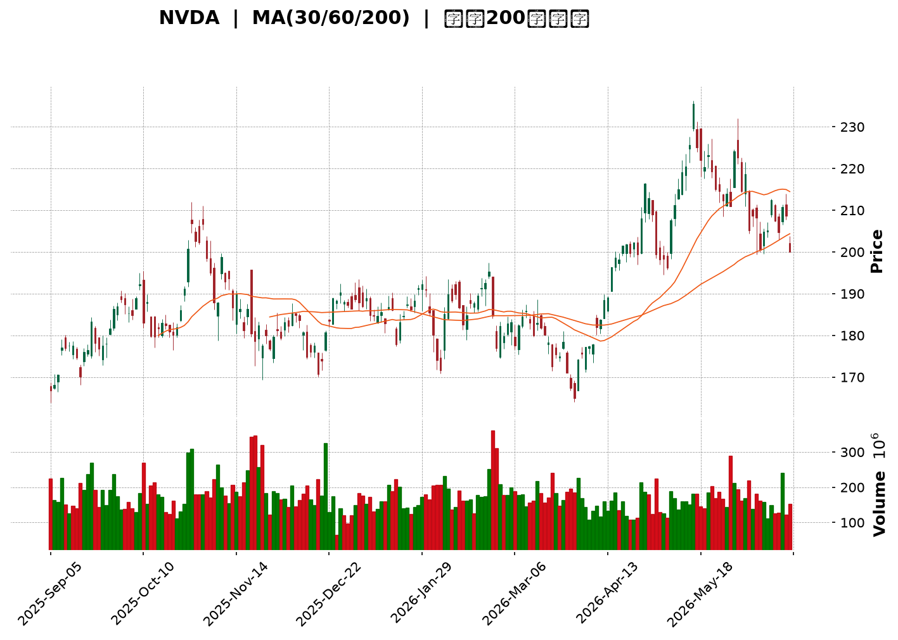
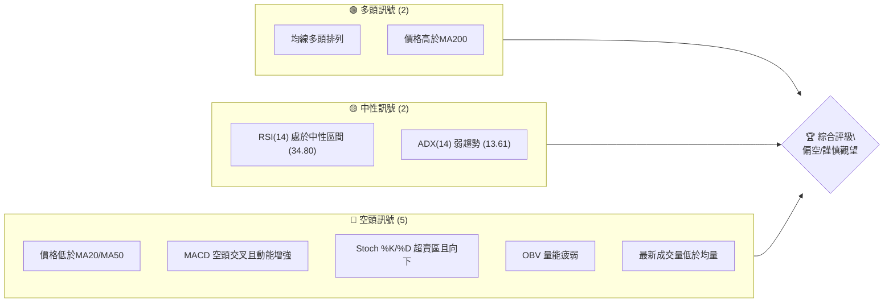
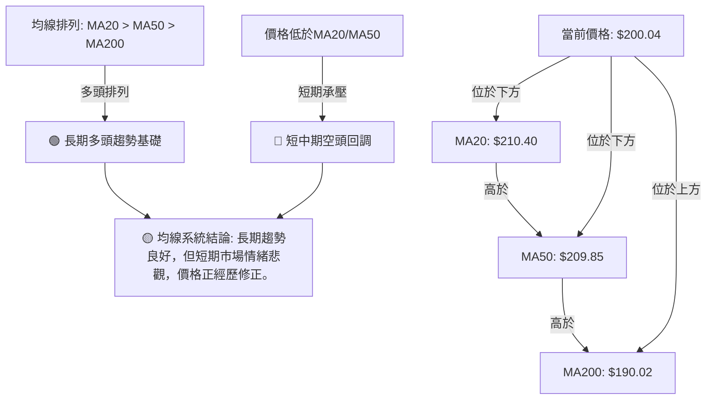

<details>
<summary>📊 靜態圖表 (點擊展開)</summary>

</details>

<html>
<head><meta charset="utf-8" /></head>
<body>
    <div style="height:500px; width:100%;">                        <script>window.PlotlyConfig = {MathJaxConfig: 'local'};</script>
        <script charset="utf-8" src="https://cdn.plot.ly/plotly-3.6.0.min.js" integrity="sha256-QaOVwtVY0T02VaHrr6pnoHLCwayMJp4O5n4YyaE3rJk=" crossorigin="anonymous"></script>                <div id="candlestick-chart" class="plotly-graph-div" style="height:100%; width:100%;"></div>            <script>                window.PLOTLYENV=window.PLOTLYENV || {};                                if (document.getElementById("candlestick-chart")) {                    Plotly.newPlot(                        "candlestick-chart",                        [{"close":{"dtype":"f8","bdata":"AAAAAIjZZEAAAACgwQJlQAAAAEANUWVAAAAAIAMjZkAAAADgNx5mQAAAAOD9MmZAAAAAQMEwZkAAAABACNVlQAAAAKBWQmVAAAAAIH8AZkAAAAAAPQ5mQAAAAEAJ7GZAAAAAoHxGZkAAAACA0xdmQAAAAEDWLmZAAAAAINE+ZkAAAACgybNmQAAAAGD0SmdAAAAAYAxgZ0AAAADgx5RnQAAAAEAxbGdAAAAAgLcpZ0AAAADgvBlnQAAAAMDPm2dAAAAAAGQKaEAAAACAp91mQAAAAGCQgmdAAAAAIJ95ZkAAAADgOnNmQAAAAECCsmZAAAAAQJLfZkAAAAAACc1mQAAAAGC8nWZAAAAAoJyBZkAAAADgsb1mQAAAACC6QGdAAAAA4N\u002fnZ0AAAAAAxBhpQAAAAEDX2GlAAAAAwDVUaUAAAAAgbUdpQAAAACC602lAAAAAIPvNaEAAAACAw15oQAAAAODkemdAAAAAYCF9Z0AAAACgfNloQAAAACA\u002fHWhAAAAAYLMxaEAAAABA51NnQAAAACCwvWdAAAAAIJhLZ0AAAACgIKRmQAAAAIAJSWdAAAAA4B2NZkAAAABg3lRmQAAAAMAoymZAAAAA4P0yZkAAAADg+IBmQAAAAADJGGZAAAAAIBt2ZkAAAADgUqdmQAAAAECPa2ZAAAAAAAPlZkAAAABgAsZmQAAAAABeKmdAAAAAYNQXZ0AAAADAy\u002fFmQAAAAOC0lmZAAAAAQNHZZUAAAABgaAJmQAAAAMAcMGZAAAAAoGpXZUAAAAAAsb1lQAAAAOCfmGZAAAAAYOvuZkAAAAAgWJ9nQAAAAOAqjGdAAAAAYIjJZ0AAAADgs39nQAAAACD4aWdAAAAA4LpIZ0AAAACg1pNnQAAAAMCBfGdAAAAAoGFgZ0AAAADgJZxnQAAAACARGmdAAAAAQFAUZ0AAAADg3hZnQAAAAECtMmdAAAAAIFfdZkAAAAAAT1pnQAAAAKAZQGdAAAAAYEw7ZkAAAAAgGONmQAAAAKCsE2dAAAAAwB9uZ0AAAABgxUdnQAAAAIBKiWdAAAAAoCzpZ0AAAADA0AhoQAAAAKC13GdAAAAA4EgsZ0AAAACA2YNmQAAAACBKv2VAAAAAoHV1ZUAAAABg5CVnQAAAACDfuWdAAAAAIO6JZ0AAAAAAMbpnQAAAAADLVmdAAAAAQMvSZkAAAABg1BdnQAAAACAIeGdAAAAAoHl1Z0AAAABA17JnQAAAACAi6mdAAAAAwK4TaEAAAADgS2poQAAAAMBFFWdAAAAAQCwfZkAAAAAgP8hmQAAAAMCUemZAAAAAACXaZkAAAACgu+NmQAAAAOBOM2ZAAAAAAK7NZkAAAAAAcBFnQAAAAKAHOmdAAAAAYKjdZkAAAAAASYFmQAAAAAA34GZAAAAAgPu2ZkAAAABgFIZmQAAAAKBES2ZAAAAAYPePZUAAAADg7+1lQAAAAIDf32VAAAAAgBpPZkAAAAAgTWFlQAAAAEBm6mRAAAAAgEmfZEAAAACgTcZlQAAAAAB08WVAAAAAIN8lZkAAAADA3C1mQAAAAMCQPGZAAAAAAMe7ZkAAAADgRPZmQAAAACAijWdAAAAAIN6iZ0AAAADg\u002f4hoQAAAAIBu1GhAAAAAoM\u002fDaEAAAAAgPy5pQAAAAIBkOmlAAAAA4Lb0aEAAAADgdEhpQAAAAAAL7WhAAAAAoOEAakAAAABgcwtrQAAAAMB\u002fnWpAAAAAgDQgakAAAABAzupoQAAAAOABx2hAAAAAQPfHaEAAAAAArohoQAAAAGDR8mlAAAAAAB9oakAAAAAgYt5qQAAAAMDnZWtAAAAAQLyQa0AAAADAJTJsQAAAAADmbm1AAAAAwNghbEAAAABg9cFrQAAAAEBNi2tAAAAAILfma0AAAACAJGhrQAAAAOCJ4mpAAAAAIITTakAAAADAR4tqQAAAAMAEwGpAAAAAYJ1cakAAAACAKQNsQAAAAIDw0WtAAAAAAADQakAAAADAHlVrQAAAAEAzo2lAAAAA4HoUakAAAACAFAZqQAAAAKBwDWlAAAAAANebaUAAAACAFKZpQAAAAGBmjmpAAAAAwB7taUAAAADAzJRpQAAAAIAUVmpAAAAAwMwUakAAAACgRwFpQA=="},"high":{"dtype":"f8","bdata":"SN1K+cMZZUAOf0CgcVdlQOlvUxoVWGVAL6yrBKZhZkAXYieMnIFmQNKeQnzrS2ZAML+ZBelTZkA+YYXpwyhmQJJcOgJXn2VACJS1RvsbZkAC6TgJTTtmQOhACvETCmdAF8x\u002fHQHGZkAMVzWtoXFmQNpJbM74gGZAyfJUA1BxZkA4\u002fYfwf\u002fhmQFlnADeQY2dA6Sjqu898Z0C8lgwW0NlnQCFcs8jCw2dAnBVcXbpfZ0B3uOnNNppnQGvIAsN4q2dAlSMVo6NhaED7aU673WtoQAgFRVLFu2dAxi6FORESZ0B68ozoTRRnQGTC9yh94WZAbG0REbL7ZkBTvTrJ2R5nQLR4xz3U0WZA\u002f0rtZprmZkDH+OLLf9lmQD3ibN9lZ2dAfPSVbSz4Z0DHe7nghFxpQPITB2NufWpAkyXGgLe8aUAXn9cQkPZpQC\u002fJTdVDYmpAsuLqxrl2aUDKYURNK1VpQG8GvPTIq2hA6HbTWZCCZ0A2L5c27vVoQAZwvWp5ZWhA4IcD0X50aEDgMznVRuZnQMw6+5uI2GdA1Grn1EuYZ0AUbXk6ERJnQE3sUMTcc2dA1T1wtwJ4aEAElJiaZQpnQOIGQzaF6GZAlSe2k9s9ZkBSrusYqtVmQPpDlrr4YWZAwfDZKECCZkDSKYFsjS1nQFsz\u002f4f2xmZAWS6mf3IJZ0CeO8Pr6w1nQI0zG+2reGdAO2v448wvZ0BVoAEpIShnQEUol\u002fsro2ZA+KDHCB3TZkDnIXoefEZmQCmb5PC4SGZApAD+VEv9ZUARddTQ7v1lQJT1y4hTp2ZAhwNF7\u002fD9ZkCABHDtLaNnQKRUj4HBlWdAjCXIkZEOaEAgLW0c9pBnQHsgsCdQmGdAhGMA3H3KZ0Caj6ooPRZoQKIX\u002fsOcLGhAbr2B7fL9Z0BkUzEyYeRnQGRwtR42qmdADHPYmp1DZ0B8Ppyei1xnQH8uMewvfGdAZRyEc4cHZ0DR1xFOAa9nQO3IX\u002fynxmdAgOOO3AzFZkDd7mgR7yRnQGMeJrouPmdAwPE\u002fHc+rZ0Dycu6td5xnQDb55dqXuGdAbuGTt7MDaEDLl+xR0SdoQB4NEDgZSGhAeXt\u002fki7CZ0CrmOfxYEFnQPFghjWPa2ZAnVHL0lgTZkCVgMnBtVhnQDeTyh+SLWhAkhd1TtsHaECCWC03ySBoQGJ+bRD5K2hAsxTh8rBoZ0CEYcIegV1nQD8\u002f+CVrxGdA70sAFmqGZ0CzhCEJJMNnQMOD2OzWNmhAO5awMRYxaEDxcI23dKxoQLH2JbG0QWhAkQl+HMPLZkCocGWYkedmQOKIZ2S\u002flWZAk6InLzMPZ0DSjpewvvpmQOTvDvMx0WZAANi9Z\u002f3VZkD9sKf1z0ZnQLuqKbbZbGdANi+c1TAXZ0CC8i2O8jtnQPaqM8YflWdAGcFpqOQlZ0Dq8840VOVmQKAvOLWneGZATBDA2a1BZkD42xr3MUVmQC35sqV5AGZAlCLmBkqgZkBu\u002fGGevglmQAXD\u002f7irWGVAVrQsbxYoZUA8GOrGVc1lQLb0II07JWZAxi7XaxEpZkBH0swRqDJmQOEypGK4QGZACqquLGshZ0D7zvjgs\u002ftmQB2GXA\u002fsuGdAf1CBCQ6uZ0AAAADg\u002f4hoQEgZy6hVBWlAthXeUcHzaECSTCnP4i5pQEpqcZPoPWlAN6V3gXJQaUAAAADgdEhpQLIKuIr3cmlAEzTxkIpWakDef+OGexJrQMZOjF9cz2pAdEGWqB2PakAdSLELxEFqQDU+\u002fBtwWGlAdh1WQdgvaUCNL\u002ft0OABpQLFvya3hAGpAYaBHoGu+akCFZYGUfDFrQE2XjZlRwWtAcsIYLarva0DiGut0ZHJsQDGB9t53iG1AEq2cUGDnbEBFUcKibrdsQF7Y4lf\u002fBmxALYABgrw7bED03KEhVGRsQK2xJTUWmGtAUGvO1qE9a0C2Mt930rxqQDlAZoOc6GpAVK12imcza0DdMuuCdhNsQO\u002fZEYhOAG1A5dP7ifDRa0AAAABAM7NrQAAAAADX22pAAAAAQApPakAAAADAzGxqQAAAAEAK52lAAAAAwB61aUAAAACAPeJpQAAAAGC4lmpAAAAAIK5vakAAAABguCZqQAAAAOB6bGpAAAAAIK6\u002fakAAAADgo3hpQA=="},"hovertemplate":"\u003cb\u003e%{x|%Y-%m-%d}\u003c\u002fb\u003e\u003cbr\u003e\u958b: $%{open:.2f}\u003cbr\u003e\u9ad8: $%{high:.2f}\u003cbr\u003e\u4f4e: $%{low:.2f}\u003cbr\u003e\u6536: $%{close:.2f}\u003cextra\u003e\u003c\u002fextra\u003e","low":{"dtype":"f8","bdata":"k43DxEF7ZEC2dLvVE+RkQE33Z02V0GRAhIloRJLnZUBA3jmTKghmQHVy7ws1B2ZAI3vj7jTJZUCYD5d3DcVlQPpZMl5BBmVAtBzAmauXZUBl+n9snt5lQJCI512Zz2VAjH0\u002fqon\u002fZUDXkzVipuVlQG1YwVUanWVAHrV7JKHWZUCclDjX44JmQFtKN1j2p2ZAwVDr2U31ZkBSfSgpQXpnQJ5qn5+aJGdAw6G6TxbjZkCj3v0ZgPhmQNz+dBGtSWdA6wfYwSHaZ0AfSiz1LbpmQMj5beAjN2dAnS6PMRNvZkC71i6hDSJmQAeLvOlPcWZAe5UaNqxwZkDGN\u002fu+869mQIWI\u002fnBFcmZA4v62eh0RZkBjyUR783FmQJKnaw2F6GZAY5ObLhSGZ0CQHdAqTPVnQLvPA\u002fWckGlAqJaKEekkaUBdqPnhADppQMFUWWaKqWlAerdNDrG1aEDQWOS33UxoQFPFCT2QRGdA8BK3y9NVZkCw6MqCYTFoQF5su2jN4WdAU9pWnF7cZ0Cqyr3ItPNmQLaMUPMyi2ZAG6+NKroCZ0DmVBAYem1mQGpthYEb02ZAlHJhft5zZkA5Yrr2tZZlQOEI4pYqCGZADckHTbAqZUBulxQ0akBmQHIBrzfOCGZAXjecHa6uZUBcjyG8qXhmQG0COiI4XGZA9XQNgbR3ZkDsgihYEZZmQCO5Lo+wxWZAAuM\u002fFxjjZkC3KDT9LrpmQGrdLmP0DGZAEoXuXQjNZUAGW+gSI9plQExWMGT71WVARpV86UdDZUDYTCjHinNlQMEyBGgBBGZAOD9XfxfEZkDyYcN4q9VmQJi6pyibS2dA7VV036t4Z0AgfZNt3zVnQIerWhZ5VmdACGSIGWlIZ0ABlVQj+4BnQBEqnSiLPWdATK30MPVSZ0BVvbeypUpnQKf1liWP72ZAYIJEoEfuZkAFjylpgdlmQLxy04ym5WZAsKRzOo2SZkAMeGLvS0NnQB1sM19OO2dAw75Al5gsZkApJ\u002fR42EVmQFUF2vSW9mZAH6eKG\u002fVSZ0ABu0QKbjhnQC8xkiQpL2dAKTPzw3qzZ0Df8uW9qjpnQAfj4XCnp2dAFKnpCPQUZ0DEeE5kfQBmQIMy\u002fCBrdmVApvKt20paZUDKyf7BZMxlQGqGZaY692ZA2aX4sIF8Z0CQmh0GSJFnQFsThqoMSWdAiSugLM2rZkAXPMVnxl5mQDTB4wwKUWdAr6OM+uEtZ0C3iiT41DZnQMzzq4grq2dA2JkXo35lZ0DOMACquTFoQMdNMxAOA2dAF39S1UgFZkDAmpgcrM1lQAAQrvyKFmZAxUgOneZ6ZkBpYMzcOTVmQONl2tpYE2ZAo2QggRPrZUCcfP+KOblmQPS\u002fb1GHB2dACzRwwTqxZkBgtNR0YHdmQI7MwcJcpmZAzztY4v2uZkDSrt+q14NmQKq8riq78mVAXf+SmKRwZUD0B2hEz9FlQCnvleLguGVAvrGss5wUZkCSDyXUGl5lQMcJKh0Z2mRAcSsrVYWCZEAwFCAzgNhkQOMxSYl90WVAvQWDqXRlZUBugOetxfFlQJFN45emrmVA1wyDOeKCZkCCIh+AHI1mQNKZDQu8AmdA1h+ty8IwZ0DezSidiNFnQF4uSXljcGhAZFs7GaByaECAcMZ7N+FoQGKQxH6Cs2hA\u002fy1cRJbYaEA60aFAlthoQPzCEnSxn2hA7pum7nnyaEDeUSBGb+RpQI7zW+Wk\u002fmlAoqMDzdPqaUCGFQ1s\u002f85oQKPe9S5\u002fnGhA6GHx6mxQaEDndXs7qHloQEOxhg0fzGhA0C\u002fnrk7IaUBITnynjJRqQKWa2w2DtGpAw9x9Am\u002fVakDcMxmA\u002fKlrQDjHMeoOoWxADnWjrFP\u002fa0CeCjSLtENrQHlOtZ8ANWtAG1bOMsmHa0BKbVwxpDVrQAmr6S2Z0WpAs\u002f0zRhp4akB32iKuLhFqQJzPd+UrX2pAQEtmmEtcakBGYzRWXe5qQO6g6ET0omtAgUryKVTIakAAAABACl9qQAAAAGCPimlAAAAAAADAaUAAAABA4epoQAAAAKBw\u002fWhAAAAAoEfxaEAAAACAFG5pQAAAAEDhCmpAAAAAoEfpaUAAAABgj2JpQAAAAAAA0GlAAAAAQAr3aUAAAAAAAABpQA=="},"name":"\u50f9\u683c","open":{"dtype":"f8","bdata":"b\u002fG03s75ZEAs+t8HeOpkQJIqUNKuG2VAvgG9JPYMZkBlQPiOb25mQCzYlMVkMWZAS2I4lEfuZUDVcBwhyRhmQEkENFpxjWVA1IwWtUS4ZUA5u02kefFlQIHn43V04mVA4HGTb5+3ZkBQhOjnT3FmQP1KVl8\u002fyGVAAAJwdS0+ZkDmTGixZ4ZmQHdHWlUju2ZAoLJyPiEgZ0AcjmHXeKtnQBdvFV5enmdAbFnWSnAoZ0AKNU\u002f1xD9nQGc5R6GiSmdABs5OLIb\u002fZ0A7DM6fbihoQCe6\u002fsZgd2dA+oWoyRsRZ0CRoIVDERJnQOQi\u002f33uv2ZAWwNhOWp+ZkC5KgADstxmQLR4xz3U0WZAQDm\u002fxhidZkDcfUToFYZmQP\u002fLG8Fi82ZAF9Qkh++3Z0DeGXYluxloQKU+BPHh9mlAGC7VCnCcaUBZaFoN\u002fMVpQCcRQfoT+mlATC0yprlXaUBKCqDaidBoQFu4KxpvhWhAJEUNSkMVZ0ALpbk8kVtoQDxvR0EqXWhALtEg9w9vaEA\u002fHwwH0NlnQMI1YugQ1GZAdhbusnU3Z0CiRNFrr+RmQOT8kk2\u002fEWdA5CAEnWl2aEB3OIzfSqBmQF89NS5daGZAqGH5ff3VZUB5BTy0waxmQK4IkeYFWWZAXKd7ODLRZUDgtaM+6bBmQKBvtNMtm2ZArM9JkMKsZkBjt\u002fK6T\u002fVmQD41DUpczWZA8JO7vK8qZ0Bsi+Rf1BdnQEjHmpzugWZAkH50uXWcZkCf17jIJDdmQI\u002fx1fFyAWZA93Wh4VX8ZUB3X5\u002f7J8plQH9a6nyNDmZAIsRrNEX2ZkBhvehF6NdmQN20se\u002fAdmdAi3ViVgm2Z0Dfxu4WZ29nQDoAsqNXgGdAiVgcvdmqZ0AEStO+erNnQI3ZKk3Y8GdA3WWxpDbJZ0D5h5Gj44pnQNSvvQImnGdAWYfuTVgbZ0DPGTfK5d9mQAcaTNXJGGdAo0Az+Q0DZ0CiRRfdukhnQJwj324wm2dALFDrZrW1ZkAwAWfcnlpmQMGL60XMEGdAOe5O0rBoZ0Akljf90l1nQDH3JYZhYGdAvBWuHi\u002fhZ0AZxgLNa+NnQJurnTNE32dAnmcNQhpfZ0BJzot+a0BnQNA8F2i5Z2ZAcxWXr\u002fDWZUBHoFomMQ9mQFhxbg4jAWdABfCbKLPkZ0Dj\u002fIrM5QZoQNR9InpvGWhAonj7RQ1oZ0BfLChC6rBmQAkYxlCkkGdAYr30waBaZ0A9uq+u90pnQG20OL9W5WdASU1hMjfoZ0BmYNPT0UZoQHo3NyQRQWhA7wfRO++gZkBFi2Frf9llQJGijdG4SGZAl+Q\u002f0guHZkAC18GnYJ5mQKaKOXfec2ZA1y+XtKoTZkCdmaqGsMVmQGcl9cQxNmdA\u002f\u002fdicr76ZkA1rJ8WjRZnQJyNU2I52GZAMBB5pgYbZ0BpNgfqj8hmQLC6xj6wOWZAqhKBdF45ZkD2VgNttyFmQOYnVAcM1GVAQAFVUZocZkD524VwrvtlQOPPNbmqOWVAPurZMqwSZUDZ0rn60dhkQIezrZ1x+WVAiG3yb1h\u002fZUAlguAzhR5mQDG0LTrQ8GVALagOjCAJZ0B9UKYdG7RmQBgtp9INA2dAw+mxpwc6Z0DjSUlSxdNnQDPPQ1j1iWhANwUkpmemaEDl9bVZWvVoQE\u002f9JPbo92hAu3oQa6E8aUD2j2JmMRhpQDrSXJstR2lA1VppYEX3aEDc5Ctg\u002fSxqQHlfCVjgJ2pAMIds+XmOakB\u002fBQpz8DVqQJslD0N2IWlAYNW5ZZHoaEBcG\u002fLrLOJoQJESkJgI9WhAA43FYh4DakAnH7MxBplqQEgaqV9OuWpA5KtEZHVJa0AapTp1YRVsQAkZdEujsmxANyuJyMKvbEBIKCTgRrNsQMXP+ZCoa2tApAADJHLda0BgLQK9\u002f8BrQC2BsiGSlGtAs7OVmjYJa0DOUxwB3btqQDBJ\u002fdIWYWpAw2DsEZHKakBofffMUu9qQNfkY+tLXWxAT2iGx8eua0AAAADAHr1qQAAAAMD10GpAAAAAgMJFakAAAAAA11NqQAAAAIDCjWlAAAAAIK4vaUAAAAAghZtpQAAAAKBwHWpAAAAAgMJlakAAAADA9RBqQAAAAGCP6mlAAAAAgBRuakAAAACgcEVpQA=="},"x":["2025-09-05T00:00:00-04:00","2025-09-08T00:00:00-04:00","2025-09-09T00:00:00-04:00","2025-09-10T00:00:00-04:00","2025-09-11T00:00:00-04:00","2025-09-12T00:00:00-04:00","2025-09-15T00:00:00-04:00","2025-09-16T00:00:00-04:00","2025-09-17T00:00:00-04:00","2025-09-18T00:00:00-04:00","2025-09-19T00:00:00-04:00","2025-09-22T00:00:00-04:00","2025-09-23T00:00:00-04:00","2025-09-24T00:00:00-04:00","2025-09-25T00:00:00-04:00","2025-09-26T00:00:00-04:00","2025-09-29T00:00:00-04:00","2025-09-30T00:00:00-04:00","2025-10-01T00:00:00-04:00","2025-10-02T00:00:00-04:00","2025-10-03T00:00:00-04:00","2025-10-06T00:00:00-04:00","2025-10-07T00:00:00-04:00","2025-10-08T00:00:00-04:00","2025-10-09T00:00:00-04:00","2025-10-10T00:00:00-04:00","2025-10-13T00:00:00-04:00","2025-10-14T00:00:00-04:00","2025-10-15T00:00:00-04:00","2025-10-16T00:00:00-04:00","2025-10-17T00:00:00-04:00","2025-10-20T00:00:00-04:00","2025-10-21T00:00:00-04:00","2025-10-22T00:00:00-04:00","2025-10-23T00:00:00-04:00","2025-10-24T00:00:00-04:00","2025-10-27T00:00:00-04:00","2025-10-28T00:00:00-04:00","2025-10-29T00:00:00-04:00","2025-10-30T00:00:00-04:00","2025-10-31T00:00:00-04:00","2025-11-03T00:00:00-05:00","2025-11-04T00:00:00-05:00","2025-11-05T00:00:00-05:00","2025-11-06T00:00:00-05:00","2025-11-07T00:00:00-05:00","2025-11-10T00:00:00-05:00","2025-11-11T00:00:00-05:00","2025-11-12T00:00:00-05:00","2025-11-13T00:00:00-05:00","2025-11-14T00:00:00-05:00","2025-11-17T00:00:00-05:00","2025-11-18T00:00:00-05:00","2025-11-19T00:00:00-05:00","2025-11-20T00:00:00-05:00","2025-11-21T00:00:00-05:00","2025-11-24T00:00:00-05:00","2025-11-25T00:00:00-05:00","2025-11-26T00:00:00-05:00","2025-11-28T00:00:00-05:00","2025-12-01T00:00:00-05:00","2025-12-02T00:00:00-05:00","2025-12-03T00:00:00-05:00","2025-12-04T00:00:00-05:00","2025-12-05T00:00:00-05:00","2025-12-08T00:00:00-05:00","2025-12-09T00:00:00-05:00","2025-12-10T00:00:00-05:00","2025-12-11T00:00:00-05:00","2025-12-12T00:00:00-05:00","2025-12-15T00:00:00-05:00","2025-12-16T00:00:00-05:00","2025-12-17T00:00:00-05:00","2025-12-18T00:00:00-05:00","2025-12-19T00:00:00-05:00","2025-12-22T00:00:00-05:00","2025-12-23T00:00:00-05:00","2025-12-24T00:00:00-05:00","2025-12-26T00:00:00-05:00","2025-12-29T00:00:00-05:00","2025-12-30T00:00:00-05:00","2025-12-31T00:00:00-05:00","2026-01-02T00:00:00-05:00","2026-01-05T00:00:00-05:00","2026-01-06T00:00:00-05:00","2026-01-07T00:00:00-05:00","2026-01-08T00:00:00-05:00","2026-01-09T00:00:00-05:00","2026-01-12T00:00:00-05:00","2026-01-13T00:00:00-05:00","2026-01-14T00:00:00-05:00","2026-01-15T00:00:00-05:00","2026-01-16T00:00:00-05:00","2026-01-20T00:00:00-05:00","2026-01-21T00:00:00-05:00","2026-01-22T00:00:00-05:00","2026-01-23T00:00:00-05:00","2026-01-26T00:00:00-05:00","2026-01-27T00:00:00-05:00","2026-01-28T00:00:00-05:00","2026-01-29T00:00:00-05:00","2026-01-30T00:00:00-05:00","2026-02-02T00:00:00-05:00","2026-02-03T00:00:00-05:00","2026-02-04T00:00:00-05:00","2026-02-05T00:00:00-05:00","2026-02-06T00:00:00-05:00","2026-02-09T00:00:00-05:00","2026-02-10T00:00:00-05:00","2026-02-11T00:00:00-05:00","2026-02-12T00:00:00-05:00","2026-02-13T00:00:00-05:00","2026-02-17T00:00:00-05:00","2026-02-18T00:00:00-05:00","2026-02-19T00:00:00-05:00","2026-02-20T00:00:00-05:00","2026-02-23T00:00:00-05:00","2026-02-24T00:00:00-05:00","2026-02-25T00:00:00-05:00","2026-02-26T00:00:00-05:00","2026-02-27T00:00:00-05:00","2026-03-02T00:00:00-05:00","2026-03-03T00:00:00-05:00","2026-03-04T00:00:00-05:00","2026-03-05T00:00:00-05:00","2026-03-06T00:00:00-05:00","2026-03-09T00:00:00-04:00","2026-03-10T00:00:00-04:00","2026-03-11T00:00:00-04:00","2026-03-12T00:00:00-04:00","2026-03-13T00:00:00-04:00","2026-03-16T00:00:00-04:00","2026-03-17T00:00:00-04:00","2026-03-18T00:00:00-04:00","2026-03-19T00:00:00-04:00","2026-03-20T00:00:00-04:00","2026-03-23T00:00:00-04:00","2026-03-24T00:00:00-04:00","2026-03-25T00:00:00-04:00","2026-03-26T00:00:00-04:00","2026-03-27T00:00:00-04:00","2026-03-30T00:00:00-04:00","2026-03-31T00:00:00-04:00","2026-04-01T00:00:00-04:00","2026-04-02T00:00:00-04:00","2026-04-06T00:00:00-04:00","2026-04-07T00:00:00-04:00","2026-04-08T00:00:00-04:00","2026-04-09T00:00:00-04:00","2026-04-10T00:00:00-04:00","2026-04-13T00:00:00-04:00","2026-04-14T00:00:00-04:00","2026-04-15T00:00:00-04:00","2026-04-16T00:00:00-04:00","2026-04-17T00:00:00-04:00","2026-04-20T00:00:00-04:00","2026-04-21T00:00:00-04:00","2026-04-22T00:00:00-04:00","2026-04-23T00:00:00-04:00","2026-04-24T00:00:00-04:00","2026-04-27T00:00:00-04:00","2026-04-28T00:00:00-04:00","2026-04-29T00:00:00-04:00","2026-04-30T00:00:00-04:00","2026-05-01T00:00:00-04:00","2026-05-04T00:00:00-04:00","2026-05-05T00:00:00-04:00","2026-05-06T00:00:00-04:00","2026-05-07T00:00:00-04:00","2026-05-08T00:00:00-04:00","2026-05-11T00:00:00-04:00","2026-05-12T00:00:00-04:00","2026-05-13T00:00:00-04:00","2026-05-14T00:00:00-04:00","2026-05-15T00:00:00-04:00","2026-05-18T00:00:00-04:00","2026-05-19T00:00:00-04:00","2026-05-20T00:00:00-04:00","2026-05-21T00:00:00-04:00","2026-05-22T00:00:00-04:00","2026-05-26T00:00:00-04:00","2026-05-27T00:00:00-04:00","2026-05-28T00:00:00-04:00","2026-05-29T00:00:00-04:00","2026-06-01T00:00:00-04:00","2026-06-02T00:00:00-04:00","2026-06-03T00:00:00-04:00","2026-06-04T00:00:00-04:00","2026-06-05T00:00:00-04:00","2026-06-08T00:00:00-04:00","2026-06-09T00:00:00-04:00","2026-06-10T00:00:00-04:00","2026-06-11T00:00:00-04:00","2026-06-12T00:00:00-04:00","2026-06-15T00:00:00-04:00","2026-06-16T00:00:00-04:00","2026-06-17T00:00:00-04:00","2026-06-18T00:00:00-04:00","2026-06-22T00:00:00-04:00","2026-06-23T00:00:00-04:00"],"type":"candlestick"},{"hovertemplate":"MA30: $%{y:.2f}\u003cextra\u003e\u003c\u002fextra\u003e","line":{"color":"#2196F3","dash":"dash","width":2},"mode":"lines","name":"MA30","x":["2025-09-05T00:00:00-04:00","2025-09-08T00:00:00-04:00","2025-09-09T00:00:00-04:00","2025-09-10T00:00:00-04:00","2025-09-11T00:00:00-04:00","2025-09-12T00:00:00-04:00","2025-09-15T00:00:00-04:00","2025-09-16T00:00:00-04:00","2025-09-17T00:00:00-04:00","2025-09-18T00:00:00-04:00","2025-09-19T00:00:00-04:00","2025-09-22T00:00:00-04:00","2025-09-23T00:00:00-04:00","2025-09-24T00:00:00-04:00","2025-09-25T00:00:00-04:00","2025-09-26T00:00:00-04:00","2025-09-29T00:00:00-04:00","2025-09-30T00:00:00-04:00","2025-10-01T00:00:00-04:00","2025-10-02T00:00:00-04:00","2025-10-03T00:00:00-04:00","2025-10-06T00:00:00-04:00","2025-10-07T00:00:00-04:00","2025-10-08T00:00:00-04:00","2025-10-09T00:00:00-04:00","2025-10-10T00:00:00-04:00","2025-10-13T00:00:00-04:00","2025-10-14T00:00:00-04:00","2025-10-15T00:00:00-04:00","2025-10-16T00:00:00-04:00","2025-10-17T00:00:00-04:00","2025-10-20T00:00:00-04:00","2025-10-21T00:00:00-04:00","2025-10-22T00:00:00-04:00","2025-10-23T00:00:00-04:00","2025-10-24T00:00:00-04:00","2025-10-27T00:00:00-04:00","2025-10-28T00:00:00-04:00","2025-10-29T00:00:00-04:00","2025-10-30T00:00:00-04:00","2025-10-31T00:00:00-04:00","2025-11-03T00:00:00-05:00","2025-11-04T00:00:00-05:00","2025-11-05T00:00:00-05:00","2025-11-06T00:00:00-05:00","2025-11-07T00:00:00-05:00","2025-11-10T00:00:00-05:00","2025-11-11T00:00:00-05:00","2025-11-12T00:00:00-05:00","2025-11-13T00:00:00-05:00","2025-11-14T00:00:00-05:00","2025-11-17T00:00:00-05:00","2025-11-18T00:00:00-05:00","2025-11-19T00:00:00-05:00","2025-11-20T00:00:00-05:00","2025-11-21T00:00:00-05:00","2025-11-24T00:00:00-05:00","2025-11-25T00:00:00-05:00","2025-11-26T00:00:00-05:00","2025-11-28T00:00:00-05:00","2025-12-01T00:00:00-05:00","2025-12-02T00:00:00-05:00","2025-12-03T00:00:00-05:00","2025-12-04T00:00:00-05:00","2025-12-05T00:00:00-05:00","2025-12-08T00:00:00-05:00","2025-12-09T00:00:00-05:00","2025-12-10T00:00:00-05:00","2025-12-11T00:00:00-05:00","2025-12-12T00:00:00-05:00","2025-12-15T00:00:00-05:00","2025-12-16T00:00:00-05:00","2025-12-17T00:00:00-05:00","2025-12-18T00:00:00-05:00","2025-12-19T00:00:00-05:00","2025-12-22T00:00:00-05:00","2025-12-23T00:00:00-05:00","2025-12-24T00:00:00-05:00","2025-12-26T00:00:00-05:00","2025-12-29T00:00:00-05:00","2025-12-30T00:00:00-05:00","2025-12-31T00:00:00-05:00","2026-01-02T00:00:00-05:00","2026-01-05T00:00:00-05:00","2026-01-06T00:00:00-05:00","2026-01-07T00:00:00-05:00","2026-01-08T00:00:00-05:00","2026-01-09T00:00:00-05:00","2026-01-12T00:00:00-05:00","2026-01-13T00:00:00-05:00","2026-01-14T00:00:00-05:00","2026-01-15T00:00:00-05:00","2026-01-16T00:00:00-05:00","2026-01-20T00:00:00-05:00","2026-01-21T00:00:00-05:00","2026-01-22T00:00:00-05:00","2026-01-23T00:00:00-05:00","2026-01-26T00:00:00-05:00","2026-01-27T00:00:00-05:00","2026-01-28T00:00:00-05:00","2026-01-29T00:00:00-05:00","2026-01-30T00:00:00-05:00","2026-02-02T00:00:00-05:00","2026-02-03T00:00:00-05:00","2026-02-04T00:00:00-05:00","2026-02-05T00:00:00-05:00","2026-02-06T00:00:00-05:00","2026-02-09T00:00:00-05:00","2026-02-10T00:00:00-05:00","2026-02-11T00:00:00-05:00","2026-02-12T00:00:00-05:00","2026-02-13T00:00:00-05:00","2026-02-17T00:00:00-05:00","2026-02-18T00:00:00-05:00","2026-02-19T00:00:00-05:00","2026-02-20T00:00:00-05:00","2026-02-23T00:00:00-05:00","2026-02-24T00:00:00-05:00","2026-02-25T00:00:00-05:00","2026-02-26T00:00:00-05:00","2026-02-27T00:00:00-05:00","2026-03-02T00:00:00-05:00","2026-03-03T00:00:00-05:00","2026-03-04T00:00:00-05:00","2026-03-05T00:00:00-05:00","2026-03-06T00:00:00-05:00","2026-03-09T00:00:00-04:00","2026-03-10T00:00:00-04:00","2026-03-11T00:00:00-04:00","2026-03-12T00:00:00-04:00","2026-03-13T00:00:00-04:00","2026-03-16T00:00:00-04:00","2026-03-17T00:00:00-04:00","2026-03-18T00:00:00-04:00","2026-03-19T00:00:00-04:00","2026-03-20T00:00:00-04:00","2026-03-23T00:00:00-04:00","2026-03-24T00:00:00-04:00","2026-03-25T00:00:00-04:00","2026-03-26T00:00:00-04:00","2026-03-27T00:00:00-04:00","2026-03-30T00:00:00-04:00","2026-03-31T00:00:00-04:00","2026-04-01T00:00:00-04:00","2026-04-02T00:00:00-04:00","2026-04-06T00:00:00-04:00","2026-04-07T00:00:00-04:00","2026-04-08T00:00:00-04:00","2026-04-09T00:00:00-04:00","2026-04-10T00:00:00-04:00","2026-04-13T00:00:00-04:00","2026-04-14T00:00:00-04:00","2026-04-15T00:00:00-04:00","2026-04-16T00:00:00-04:00","2026-04-17T00:00:00-04:00","2026-04-20T00:00:00-04:00","2026-04-21T00:00:00-04:00","2026-04-22T00:00:00-04:00","2026-04-23T00:00:00-04:00","2026-04-24T00:00:00-04:00","2026-04-27T00:00:00-04:00","2026-04-28T00:00:00-04:00","2026-04-29T00:00:00-04:00","2026-04-30T00:00:00-04:00","2026-05-01T00:00:00-04:00","2026-05-04T00:00:00-04:00","2026-05-05T00:00:00-04:00","2026-05-06T00:00:00-04:00","2026-05-07T00:00:00-04:00","2026-05-08T00:00:00-04:00","2026-05-11T00:00:00-04:00","2026-05-12T00:00:00-04:00","2026-05-13T00:00:00-04:00","2026-05-14T00:00:00-04:00","2026-05-15T00:00:00-04:00","2026-05-18T00:00:00-04:00","2026-05-19T00:00:00-04:00","2026-05-20T00:00:00-04:00","2026-05-21T00:00:00-04:00","2026-05-22T00:00:00-04:00","2026-05-26T00:00:00-04:00","2026-05-27T00:00:00-04:00","2026-05-28T00:00:00-04:00","2026-05-29T00:00:00-04:00","2026-06-01T00:00:00-04:00","2026-06-02T00:00:00-04:00","2026-06-03T00:00:00-04:00","2026-06-04T00:00:00-04:00","2026-06-05T00:00:00-04:00","2026-06-08T00:00:00-04:00","2026-06-09T00:00:00-04:00","2026-06-10T00:00:00-04:00","2026-06-11T00:00:00-04:00","2026-06-12T00:00:00-04:00","2026-06-15T00:00:00-04:00","2026-06-16T00:00:00-04:00","2026-06-17T00:00:00-04:00","2026-06-18T00:00:00-04:00","2026-06-22T00:00:00-04:00","2026-06-23T00:00:00-04:00"],"y":{"dtype":"f8","bdata":"AAAAAAAA+H8AAAAAAAD4fwAAAAAAAPh\u002fAAAAAAAA+H8AAAAAAAD4fwAAAAAAAPh\u002fAAAAAAAA+H8AAAAAAAD4fwAAAAAAAPh\u002fAAAAAAAA+H8AAAAAAAD4fwAAAAAAAPh\u002fAAAAAAAA+H8AAAAAAAD4fwAAAAAAAPh\u002fAAAAAAAA+H8AAAAAAAD4fwAAAAAAAPh\u002fAAAAAAAA+H8AAAAAAAD4fwAAAAAAAPh\u002fAAAAAAAA+H8AAAAAAAD4fwAAAAAAAPh\u002fAAAAAAAA+H8AAAAAAAD4fwAAAAAAAPh\u002fAAAAAAAA+H8AAAAAAAD4fyIiIuLHf2ZA3t3dfQyRZkAzMzMjU6BmQKuqqgpqq2ZAq6qqSpGuZkCJiIgo4rNmQGZmZubfvGZA3t3dDYPLZkBVVVWlXudmQBERERGFDmdAVVVVBekqZ0AAAACgakZnQJqZmck0X2dAIiIiEsp0Z0CJiIh4OIhnQGZmZgZKk2dAzczMTOadZ0ARERERObBnQO\u002fu7o47t2dAd3d3lzi+Z0CJiIj4DrxnQGZmZmbGvmdAzczMfOe\u002fZ0ARERHh+7tnQJqZmYk5uWdAAAAAAISsZ0AzMzPD9KdnQM3MzCzPoWdAd3d3d3SfZ0C8u7u76Z9nQFVVVfXJmmdAzczM\u002fEWXZ0Dv7u4uBJZnQDMzMwNYlGdAmpmZOaiXZ0DNzMws75dnQO\u002fu7l4wl2dA3t3dDUGQZ0AiIiJy431nQAAAAIAVYmdAvLu7e2dEZ0DNzMzsgChnQFVVVSVzCWdAvLu7y+XrZkDv7u4+dtVmQJqZmWnrzWZAERER4S3JZkAiIiIytb5mQAAAADDfuWZAmpmZSWa2ZkCrqqoK3LdmQERERKQRtWZAMzMzM\u002fm0ZkC8u7u79rxmQBEREfGtvmZAvLu7u7jFZkBERESEodBmQFVVVWVL02ZAREREJM7aZkBmZmZGzd9mQAAAAMAy6WZA7+7urqPsZkBVVVUFm\u002fJmQDMzM7Ow+WZAq6qqegj0ZkC8u7urAPVmQGZmZgY\u002f9GZAd3d3Zx\u002f3ZkDv7u4O\u002fflmQM3MzBwTAmdAmpmZOacTZ0CJiIj47iRnQFVVVVU4M2dAd3d3V9lCZ0CrqqpKdElnQDMzM7M1QmdAVVVVtaA1Z0ARERFRlDFnQDMzM1MaM2dAVVVVlfswZ0AAAACw7jJnQM3MzAxLMmdAmpmZqVwuZ0BERER0OipnQEREREQUKmdARERERMgqZ0CamZnpiStnQJqZmWl5MmdAAAAAkPw6Z0Dv7u7+TEZnQERERBRSRWdAERERUfs+Z0C8u7vrHDpnQM3MzGyHM2dAmpmZ6dI4Z0DNzMxc2DhnQFVVVcVdMWdAVVVVpQQsZ0AAAAAANSpnQDMzM6OQJ2dARERE1KUeZ0BVVVXFmBFnQGZmZiYuCWdAvLu7K0UFZ0AzMzMzWAVnQO\u002fu7q4CCmdAAAAA4OQKZ0C8u7vbfgBnQCIiIhKy8GZAzczMjDPmZkBERET0K9JmQN7d3e19vWZAZmZmVrWqZkDNzMwcdZ9mQM3MzCxwkmZAvLu7W0CHZkAzMzMTSXpmQN7d3W33a2ZAVVVVxYBgZkAzMzMjGlRmQDMzM\u002fMYWGZAd3d3RwVlZkAzMzOj+nNmQN7d3W0KiGZAq6qq6lyYZkBVVVXV6atmQDMzM+O\u002fxWZAzczMDB7YZkDNzMycBOtmQJqZmbmE+WZAZmZm5koUZ0C8u7sLCDtnQO\u002fu7t7wWmdA7+7uXgx4Z0B3d3f3eIxnQBEREfGpoWdAd3d3ZyG9Z0ARERHxWtNnQM3MzLwe9mdAq6qqWhYZaEAzMzNj7EdoQBEREYE9f2hAAAAAEH26aECJiIiISPFoQLy7u7syMWlAZmZmlkNkaUAiIiIC3pNpQO\u002fu7o4owWlAERERoUHtaUC8u7t7LxNqQAAAAOChL2pAvLu7m9pKakAzMzMj\u002f1tqQDMzMwNibGpAiYiIeAJ6akCrqqpqLJJqQO\u002fu7q5KqGpAREREdCK4akBVVVWVn8lqQN7d3f2xz2pAvLu7O1nQakDv7u7eosdqQImIiAhNumpAREREhOO1akB3d3eXIbxqQLy7u5tPy2pAERERMRXVakBmZmYmBd5qQAAAADBU4WpA3t3dLY3eakBVVVXlpc5qQA=="},"type":"scatter"},{"hovertemplate":"MA60: $%{y:.2f}\u003cextra\u003e\u003c\u002fextra\u003e","line":{"color":"#9C27B0","dash":"dash","width":2},"mode":"lines","name":"MA60","x":["2025-09-05T00:00:00-04:00","2025-09-08T00:00:00-04:00","2025-09-09T00:00:00-04:00","2025-09-10T00:00:00-04:00","2025-09-11T00:00:00-04:00","2025-09-12T00:00:00-04:00","2025-09-15T00:00:00-04:00","2025-09-16T00:00:00-04:00","2025-09-17T00:00:00-04:00","2025-09-18T00:00:00-04:00","2025-09-19T00:00:00-04:00","2025-09-22T00:00:00-04:00","2025-09-23T00:00:00-04:00","2025-09-24T00:00:00-04:00","2025-09-25T00:00:00-04:00","2025-09-26T00:00:00-04:00","2025-09-29T00:00:00-04:00","2025-09-30T00:00:00-04:00","2025-10-01T00:00:00-04:00","2025-10-02T00:00:00-04:00","2025-10-03T00:00:00-04:00","2025-10-06T00:00:00-04:00","2025-10-07T00:00:00-04:00","2025-10-08T00:00:00-04:00","2025-10-09T00:00:00-04:00","2025-10-10T00:00:00-04:00","2025-10-13T00:00:00-04:00","2025-10-14T00:00:00-04:00","2025-10-15T00:00:00-04:00","2025-10-16T00:00:00-04:00","2025-10-17T00:00:00-04:00","2025-10-20T00:00:00-04:00","2025-10-21T00:00:00-04:00","2025-10-22T00:00:00-04:00","2025-10-23T00:00:00-04:00","2025-10-24T00:00:00-04:00","2025-10-27T00:00:00-04:00","2025-10-28T00:00:00-04:00","2025-10-29T00:00:00-04:00","2025-10-30T00:00:00-04:00","2025-10-31T00:00:00-04:00","2025-11-03T00:00:00-05:00","2025-11-04T00:00:00-05:00","2025-11-05T00:00:00-05:00","2025-11-06T00:00:00-05:00","2025-11-07T00:00:00-05:00","2025-11-10T00:00:00-05:00","2025-11-11T00:00:00-05:00","2025-11-12T00:00:00-05:00","2025-11-13T00:00:00-05:00","2025-11-14T00:00:00-05:00","2025-11-17T00:00:00-05:00","2025-11-18T00:00:00-05:00","2025-11-19T00:00:00-05:00","2025-11-20T00:00:00-05:00","2025-11-21T00:00:00-05:00","2025-11-24T00:00:00-05:00","2025-11-25T00:00:00-05:00","2025-11-26T00:00:00-05:00","2025-11-28T00:00:00-05:00","2025-12-01T00:00:00-05:00","2025-12-02T00:00:00-05:00","2025-12-03T00:00:00-05:00","2025-12-04T00:00:00-05:00","2025-12-05T00:00:00-05:00","2025-12-08T00:00:00-05:00","2025-12-09T00:00:00-05:00","2025-12-10T00:00:00-05:00","2025-12-11T00:00:00-05:00","2025-12-12T00:00:00-05:00","2025-12-15T00:00:00-05:00","2025-12-16T00:00:00-05:00","2025-12-17T00:00:00-05:00","2025-12-18T00:00:00-05:00","2025-12-19T00:00:00-05:00","2025-12-22T00:00:00-05:00","2025-12-23T00:00:00-05:00","2025-12-24T00:00:00-05:00","2025-12-26T00:00:00-05:00","2025-12-29T00:00:00-05:00","2025-12-30T00:00:00-05:00","2025-12-31T00:00:00-05:00","2026-01-02T00:00:00-05:00","2026-01-05T00:00:00-05:00","2026-01-06T00:00:00-05:00","2026-01-07T00:00:00-05:00","2026-01-08T00:00:00-05:00","2026-01-09T00:00:00-05:00","2026-01-12T00:00:00-05:00","2026-01-13T00:00:00-05:00","2026-01-14T00:00:00-05:00","2026-01-15T00:00:00-05:00","2026-01-16T00:00:00-05:00","2026-01-20T00:00:00-05:00","2026-01-21T00:00:00-05:00","2026-01-22T00:00:00-05:00","2026-01-23T00:00:00-05:00","2026-01-26T00:00:00-05:00","2026-01-27T00:00:00-05:00","2026-01-28T00:00:00-05:00","2026-01-29T00:00:00-05:00","2026-01-30T00:00:00-05:00","2026-02-02T00:00:00-05:00","2026-02-03T00:00:00-05:00","2026-02-04T00:00:00-05:00","2026-02-05T00:00:00-05:00","2026-02-06T00:00:00-05:00","2026-02-09T00:00:00-05:00","2026-02-10T00:00:00-05:00","2026-02-11T00:00:00-05:00","2026-02-12T00:00:00-05:00","2026-02-13T00:00:00-05:00","2026-02-17T00:00:00-05:00","2026-02-18T00:00:00-05:00","2026-02-19T00:00:00-05:00","2026-02-20T00:00:00-05:00","2026-02-23T00:00:00-05:00","2026-02-24T00:00:00-05:00","2026-02-25T00:00:00-05:00","2026-02-26T00:00:00-05:00","2026-02-27T00:00:00-05:00","2026-03-02T00:00:00-05:00","2026-03-03T00:00:00-05:00","2026-03-04T00:00:00-05:00","2026-03-05T00:00:00-05:00","2026-03-06T00:00:00-05:00","2026-03-09T00:00:00-04:00","2026-03-10T00:00:00-04:00","2026-03-11T00:00:00-04:00","2026-03-12T00:00:00-04:00","2026-03-13T00:00:00-04:00","2026-03-16T00:00:00-04:00","2026-03-17T00:00:00-04:00","2026-03-18T00:00:00-04:00","2026-03-19T00:00:00-04:00","2026-03-20T00:00:00-04:00","2026-03-23T00:00:00-04:00","2026-03-24T00:00:00-04:00","2026-03-25T00:00:00-04:00","2026-03-26T00:00:00-04:00","2026-03-27T00:00:00-04:00","2026-03-30T00:00:00-04:00","2026-03-31T00:00:00-04:00","2026-04-01T00:00:00-04:00","2026-04-02T00:00:00-04:00","2026-04-06T00:00:00-04:00","2026-04-07T00:00:00-04:00","2026-04-08T00:00:00-04:00","2026-04-09T00:00:00-04:00","2026-04-10T00:00:00-04:00","2026-04-13T00:00:00-04:00","2026-04-14T00:00:00-04:00","2026-04-15T00:00:00-04:00","2026-04-16T00:00:00-04:00","2026-04-17T00:00:00-04:00","2026-04-20T00:00:00-04:00","2026-04-21T00:00:00-04:00","2026-04-22T00:00:00-04:00","2026-04-23T00:00:00-04:00","2026-04-24T00:00:00-04:00","2026-04-27T00:00:00-04:00","2026-04-28T00:00:00-04:00","2026-04-29T00:00:00-04:00","2026-04-30T00:00:00-04:00","2026-05-01T00:00:00-04:00","2026-05-04T00:00:00-04:00","2026-05-05T00:00:00-04:00","2026-05-06T00:00:00-04:00","2026-05-07T00:00:00-04:00","2026-05-08T00:00:00-04:00","2026-05-11T00:00:00-04:00","2026-05-12T00:00:00-04:00","2026-05-13T00:00:00-04:00","2026-05-14T00:00:00-04:00","2026-05-15T00:00:00-04:00","2026-05-18T00:00:00-04:00","2026-05-19T00:00:00-04:00","2026-05-20T00:00:00-04:00","2026-05-21T00:00:00-04:00","2026-05-22T00:00:00-04:00","2026-05-26T00:00:00-04:00","2026-05-27T00:00:00-04:00","2026-05-28T00:00:00-04:00","2026-05-29T00:00:00-04:00","2026-06-01T00:00:00-04:00","2026-06-02T00:00:00-04:00","2026-06-03T00:00:00-04:00","2026-06-04T00:00:00-04:00","2026-06-05T00:00:00-04:00","2026-06-08T00:00:00-04:00","2026-06-09T00:00:00-04:00","2026-06-10T00:00:00-04:00","2026-06-11T00:00:00-04:00","2026-06-12T00:00:00-04:00","2026-06-15T00:00:00-04:00","2026-06-16T00:00:00-04:00","2026-06-17T00:00:00-04:00","2026-06-18T00:00:00-04:00","2026-06-22T00:00:00-04:00","2026-06-23T00:00:00-04:00"],"y":{"dtype":"f8","bdata":"AAAAAAAA+H8AAAAAAAD4fwAAAAAAAPh\u002fAAAAAAAA+H8AAAAAAAD4fwAAAAAAAPh\u002fAAAAAAAA+H8AAAAAAAD4fwAAAAAAAPh\u002fAAAAAAAA+H8AAAAAAAD4fwAAAAAAAPh\u002fAAAAAAAA+H8AAAAAAAD4fwAAAAAAAPh\u002fAAAAAAAA+H8AAAAAAAD4fwAAAAAAAPh\u002fAAAAAAAA+H8AAAAAAAD4fwAAAAAAAPh\u002fAAAAAAAA+H8AAAAAAAD4fwAAAAAAAPh\u002fAAAAAAAA+H8AAAAAAAD4fwAAAAAAAPh\u002fAAAAAAAA+H8AAAAAAAD4fwAAAAAAAPh\u002fAAAAAAAA+H8AAAAAAAD4fwAAAAAAAPh\u002fAAAAAAAA+H8AAAAAAAD4fwAAAAAAAPh\u002fAAAAAAAA+H8AAAAAAAD4fwAAAAAAAPh\u002fAAAAAAAA+H8AAAAAAAD4fwAAAAAAAPh\u002fAAAAAAAA+H8AAAAAAAD4fwAAAAAAAPh\u002fAAAAAAAA+H8AAAAAAAD4fwAAAAAAAPh\u002fAAAAAAAA+H8AAAAAAAD4fwAAAAAAAPh\u002fAAAAAAAA+H8AAAAAAAD4fwAAAAAAAPh\u002fAAAAAAAA+H8AAAAAAAD4fwAAAAAAAPh\u002fAAAAAAAA+H8AAAAAAAD4f7y7u+tIDWdAVVVVPSkUZ0ARERGpKxtnQO\u002fu7gbhH2dAIiIiwhwjZ0Crqqqq6CVnQKuqqiIIKmdA3t3dDeItZ0C8u7sLoTJnQImIiEhNOGdAiYiIQKg3Z0BmZmbGdTdnQHd3d\u002fdTNGdA7+7u7lcwZ0C8u7tb1y5nQAAAALiaMGdA7+7uFoozZ0CamZkhdzdnQHd3d1+NOGdAiYiIcE86Z0CamZmB9TlnQFVVVQXsOWdAAAAAWHA6Z0BmZmZOeTxnQFVVVb3zO2dA3t3dXR45Z0C8u7sjSzxnQBEREUmNOmdA3t3dTSE9Z0ARERGB2z9nQKuqqlr+QWdA3t3d1fRBZ0AiIiKaT0RnQDMzM1sER2dAIiIiWthFZ0BERETsd0ZnQKuqqrK3RWdAq6qqOrBDZ0CJiIhA8DtnQGZmZk4UMmdAq6qqWgcsZ0CrqqrytyZnQFVVVb1VHmdAmpmZkV8XZ0DNzMxEdQ9nQGZmZo4QCGdAMzMzS2f\u002fZkCamZnBJPhmQJqZmcF89mZAd3d377DzZkBVVVVdZfVmQImIiFiu82ZAZmZm7qrxZkAAAACYmPNmQKuqqhph9GZAAAAAgED4ZkDv7u62Ff5mQHd3d2fiAmdAIiIiWuUKZ0CrqqoiDRNnQCIiImpCF2dAAAAAgM8VZ0CJiIj4WxZnQAAAABCcFmdAIiIism0WZ0BERESE7BZnQN7d3WXOEmdAZmZmBpIRZ0B3d3cHGRJnQAAAAODRFGdA7+7uhiYZZ0Dv7u7eQxtnQN7d3T0zHmdAmpmZQQ8kZ0Dv7u4+ZidnQBERETEcJmdAq6qqykIgZ0BmZmaWCRlnQKuqqjLmEWdAERERkZcLZ0AiIiJSjQJnQFVVVX3k92ZAAAAAAInsZkCJiIjI1+RmQImIiDhC3mZAAAAAUATZZkBmZmZ+6dJmQLy7u2s4z2ZAq6qqqr7NZkARERGRM81mQLy7u4O1zmZARERETADSZkB3d3fHC9dmQFVVVe3I3WZAIiIi6pfoZkAREREZYfJmQERERNSO+2ZAERERWRECZ0BmZmbOnApnQGZmZq6KEGdAVVVVXXgZZ0CJiIhoUCZnQKuqqoIPMmdAVVVVxag+Z0BVVVWV6EhnQAAAAFDWVWdAvLu7IwNkZ0BmZmbm7GlnQHd3d2doc2dAvLu786R\u002fZ0C8u7srDI1nQHd3d7ddnmdAMzMzM5myZ0CrqqrSXshnQERERHTR4WdAERER+cH1Z0CrqqqKEwdoQGZmZv6PFmhAMzMzM+EmaEB3d3fPpDNoQJqZmWndQ2hAmpmZ8e9XaEAzMzPj\u002fGdoQImIiDg2emhAmpmZsS+JaEAAAAAgC59oQBEREUkFt2hAiYiIQCDIaEAREREZUtpoQLy7u1ub5GhAEREREVLyaEBVVVV1VQFpQLy7u\u002fOeCmlAmpmZ8fcWaUB3d3dHTSRpQGZmZsZ8NmlARERETBtJaUC8u7sLsFhpQGZmZna5a2lARERExNF7aUBEREQkSYtpQA=="},"type":"scatter"},{"hovertemplate":"MA200: $%{y:.2f}\u003cextra\u003e\u003c\u002fextra\u003e","line":{"color":"#FF6F00","dash":"solid","width":2},"mode":"lines","name":"MA200","x":["2025-09-05T00:00:00-04:00","2025-09-08T00:00:00-04:00","2025-09-09T00:00:00-04:00","2025-09-10T00:00:00-04:00","2025-09-11T00:00:00-04:00","2025-09-12T00:00:00-04:00","2025-09-15T00:00:00-04:00","2025-09-16T00:00:00-04:00","2025-09-17T00:00:00-04:00","2025-09-18T00:00:00-04:00","2025-09-19T00:00:00-04:00","2025-09-22T00:00:00-04:00","2025-09-23T00:00:00-04:00","2025-09-24T00:00:00-04:00","2025-09-25T00:00:00-04:00","2025-09-26T00:00:00-04:00","2025-09-29T00:00:00-04:00","2025-09-30T00:00:00-04:00","2025-10-01T00:00:00-04:00","2025-10-02T00:00:00-04:00","2025-10-03T00:00:00-04:00","2025-10-06T00:00:00-04:00","2025-10-07T00:00:00-04:00","2025-10-08T00:00:00-04:00","2025-10-09T00:00:00-04:00","2025-10-10T00:00:00-04:00","2025-10-13T00:00:00-04:00","2025-10-14T00:00:00-04:00","2025-10-15T00:00:00-04:00","2025-10-16T00:00:00-04:00","2025-10-17T00:00:00-04:00","2025-10-20T00:00:00-04:00","2025-10-21T00:00:00-04:00","2025-10-22T00:00:00-04:00","2025-10-23T00:00:00-04:00","2025-10-24T00:00:00-04:00","2025-10-27T00:00:00-04:00","2025-10-28T00:00:00-04:00","2025-10-29T00:00:00-04:00","2025-10-30T00:00:00-04:00","2025-10-31T00:00:00-04:00","2025-11-03T00:00:00-05:00","2025-11-04T00:00:00-05:00","2025-11-05T00:00:00-05:00","2025-11-06T00:00:00-05:00","2025-11-07T00:00:00-05:00","2025-11-10T00:00:00-05:00","2025-11-11T00:00:00-05:00","2025-11-12T00:00:00-05:00","2025-11-13T00:00:00-05:00","2025-11-14T00:00:00-05:00","2025-11-17T00:00:00-05:00","2025-11-18T00:00:00-05:00","2025-11-19T00:00:00-05:00","2025-11-20T00:00:00-05:00","2025-11-21T00:00:00-05:00","2025-11-24T00:00:00-05:00","2025-11-25T00:00:00-05:00","2025-11-26T00:00:00-05:00","2025-11-28T00:00:00-05:00","2025-12-01T00:00:00-05:00","2025-12-02T00:00:00-05:00","2025-12-03T00:00:00-05:00","2025-12-04T00:00:00-05:00","2025-12-05T00:00:00-05:00","2025-12-08T00:00:00-05:00","2025-12-09T00:00:00-05:00","2025-12-10T00:00:00-05:00","2025-12-11T00:00:00-05:00","2025-12-12T00:00:00-05:00","2025-12-15T00:00:00-05:00","2025-12-16T00:00:00-05:00","2025-12-17T00:00:00-05:00","2025-12-18T00:00:00-05:00","2025-12-19T00:00:00-05:00","2025-12-22T00:00:00-05:00","2025-12-23T00:00:00-05:00","2025-12-24T00:00:00-05:00","2025-12-26T00:00:00-05:00","2025-12-29T00:00:00-05:00","2025-12-30T00:00:00-05:00","2025-12-31T00:00:00-05:00","2026-01-02T00:00:00-05:00","2026-01-05T00:00:00-05:00","2026-01-06T00:00:00-05:00","2026-01-07T00:00:00-05:00","2026-01-08T00:00:00-05:00","2026-01-09T00:00:00-05:00","2026-01-12T00:00:00-05:00","2026-01-13T00:00:00-05:00","2026-01-14T00:00:00-05:00","2026-01-15T00:00:00-05:00","2026-01-16T00:00:00-05:00","2026-01-20T00:00:00-05:00","2026-01-21T00:00:00-05:00","2026-01-22T00:00:00-05:00","2026-01-23T00:00:00-05:00","2026-01-26T00:00:00-05:00","2026-01-27T00:00:00-05:00","2026-01-28T00:00:00-05:00","2026-01-29T00:00:00-05:00","2026-01-30T00:00:00-05:00","2026-02-02T00:00:00-05:00","2026-02-03T00:00:00-05:00","2026-02-04T00:00:00-05:00","2026-02-05T00:00:00-05:00","2026-02-06T00:00:00-05:00","2026-02-09T00:00:00-05:00","2026-02-10T00:00:00-05:00","2026-02-11T00:00:00-05:00","2026-02-12T00:00:00-05:00","2026-02-13T00:00:00-05:00","2026-02-17T00:00:00-05:00","2026-02-18T00:00:00-05:00","2026-02-19T00:00:00-05:00","2026-02-20T00:00:00-05:00","2026-02-23T00:00:00-05:00","2026-02-24T00:00:00-05:00","2026-02-25T00:00:00-05:00","2026-02-26T00:00:00-05:00","2026-02-27T00:00:00-05:00","2026-03-02T00:00:00-05:00","2026-03-03T00:00:00-05:00","2026-03-04T00:00:00-05:00","2026-03-05T00:00:00-05:00","2026-03-06T00:00:00-05:00","2026-03-09T00:00:00-04:00","2026-03-10T00:00:00-04:00","2026-03-11T00:00:00-04:00","2026-03-12T00:00:00-04:00","2026-03-13T00:00:00-04:00","2026-03-16T00:00:00-04:00","2026-03-17T00:00:00-04:00","2026-03-18T00:00:00-04:00","2026-03-19T00:00:00-04:00","2026-03-20T00:00:00-04:00","2026-03-23T00:00:00-04:00","2026-03-24T00:00:00-04:00","2026-03-25T00:00:00-04:00","2026-03-26T00:00:00-04:00","2026-03-27T00:00:00-04:00","2026-03-30T00:00:00-04:00","2026-03-31T00:00:00-04:00","2026-04-01T00:00:00-04:00","2026-04-02T00:00:00-04:00","2026-04-06T00:00:00-04:00","2026-04-07T00:00:00-04:00","2026-04-08T00:00:00-04:00","2026-04-09T00:00:00-04:00","2026-04-10T00:00:00-04:00","2026-04-13T00:00:00-04:00","2026-04-14T00:00:00-04:00","2026-04-15T00:00:00-04:00","2026-04-16T00:00:00-04:00","2026-04-17T00:00:00-04:00","2026-04-20T00:00:00-04:00","2026-04-21T00:00:00-04:00","2026-04-22T00:00:00-04:00","2026-04-23T00:00:00-04:00","2026-04-24T00:00:00-04:00","2026-04-27T00:00:00-04:00","2026-04-28T00:00:00-04:00","2026-04-29T00:00:00-04:00","2026-04-30T00:00:00-04:00","2026-05-01T00:00:00-04:00","2026-05-04T00:00:00-04:00","2026-05-05T00:00:00-04:00","2026-05-06T00:00:00-04:00","2026-05-07T00:00:00-04:00","2026-05-08T00:00:00-04:00","2026-05-11T00:00:00-04:00","2026-05-12T00:00:00-04:00","2026-05-13T00:00:00-04:00","2026-05-14T00:00:00-04:00","2026-05-15T00:00:00-04:00","2026-05-18T00:00:00-04:00","2026-05-19T00:00:00-04:00","2026-05-20T00:00:00-04:00","2026-05-21T00:00:00-04:00","2026-05-22T00:00:00-04:00","2026-05-26T00:00:00-04:00","2026-05-27T00:00:00-04:00","2026-05-28T00:00:00-04:00","2026-05-29T00:00:00-04:00","2026-06-01T00:00:00-04:00","2026-06-02T00:00:00-04:00","2026-06-03T00:00:00-04:00","2026-06-04T00:00:00-04:00","2026-06-05T00:00:00-04:00","2026-06-08T00:00:00-04:00","2026-06-09T00:00:00-04:00","2026-06-10T00:00:00-04:00","2026-06-11T00:00:00-04:00","2026-06-12T00:00:00-04:00","2026-06-15T00:00:00-04:00","2026-06-16T00:00:00-04:00","2026-06-17T00:00:00-04:00","2026-06-18T00:00:00-04:00","2026-06-22T00:00:00-04:00","2026-06-23T00:00:00-04:00"],"y":{"dtype":"f8","bdata":"AAAAAAAA+H8AAAAAAAD4fwAAAAAAAPh\u002fAAAAAAAA+H8AAAAAAAD4fwAAAAAAAPh\u002fAAAAAAAA+H8AAAAAAAD4fwAAAAAAAPh\u002fAAAAAAAA+H8AAAAAAAD4fwAAAAAAAPh\u002fAAAAAAAA+H8AAAAAAAD4fwAAAAAAAPh\u002fAAAAAAAA+H8AAAAAAAD4fwAAAAAAAPh\u002fAAAAAAAA+H8AAAAAAAD4fwAAAAAAAPh\u002fAAAAAAAA+H8AAAAAAAD4fwAAAAAAAPh\u002fAAAAAAAA+H8AAAAAAAD4fwAAAAAAAPh\u002fAAAAAAAA+H8AAAAAAAD4fwAAAAAAAPh\u002fAAAAAAAA+H8AAAAAAAD4fwAAAAAAAPh\u002fAAAAAAAA+H8AAAAAAAD4fwAAAAAAAPh\u002fAAAAAAAA+H8AAAAAAAD4fwAAAAAAAPh\u002fAAAAAAAA+H8AAAAAAAD4fwAAAAAAAPh\u002fAAAAAAAA+H8AAAAAAAD4fwAAAAAAAPh\u002fAAAAAAAA+H8AAAAAAAD4fwAAAAAAAPh\u002fAAAAAAAA+H8AAAAAAAD4fwAAAAAAAPh\u002fAAAAAAAA+H8AAAAAAAD4fwAAAAAAAPh\u002fAAAAAAAA+H8AAAAAAAD4fwAAAAAAAPh\u002fAAAAAAAA+H8AAAAAAAD4fwAAAAAAAPh\u002fAAAAAAAA+H8AAAAAAAD4fwAAAAAAAPh\u002fAAAAAAAA+H8AAAAAAAD4fwAAAAAAAPh\u002fAAAAAAAA+H8AAAAAAAD4fwAAAAAAAPh\u002fAAAAAAAA+H8AAAAAAAD4fwAAAAAAAPh\u002fAAAAAAAA+H8AAAAAAAD4fwAAAAAAAPh\u002fAAAAAAAA+H8AAAAAAAD4fwAAAAAAAPh\u002fAAAAAAAA+H8AAAAAAAD4fwAAAAAAAPh\u002fAAAAAAAA+H8AAAAAAAD4fwAAAAAAAPh\u002fAAAAAAAA+H8AAAAAAAD4fwAAAAAAAPh\u002fAAAAAAAA+H8AAAAAAAD4fwAAAAAAAPh\u002fAAAAAAAA+H8AAAAAAAD4fwAAAAAAAPh\u002fAAAAAAAA+H8AAAAAAAD4fwAAAAAAAPh\u002fAAAAAAAA+H8AAAAAAAD4fwAAAAAAAPh\u002fAAAAAAAA+H8AAAAAAAD4fwAAAAAAAPh\u002fAAAAAAAA+H8AAAAAAAD4fwAAAAAAAPh\u002fAAAAAAAA+H8AAAAAAAD4fwAAAAAAAPh\u002fAAAAAAAA+H8AAAAAAAD4fwAAAAAAAPh\u002fAAAAAAAA+H8AAAAAAAD4fwAAAAAAAPh\u002fAAAAAAAA+H8AAAAAAAD4fwAAAAAAAPh\u002fAAAAAAAA+H8AAAAAAAD4fwAAAAAAAPh\u002fAAAAAAAA+H8AAAAAAAD4fwAAAAAAAPh\u002fAAAAAAAA+H8AAAAAAAD4fwAAAAAAAPh\u002fAAAAAAAA+H8AAAAAAAD4fwAAAAAAAPh\u002fAAAAAAAA+H8AAAAAAAD4fwAAAAAAAPh\u002fAAAAAAAA+H8AAAAAAAD4fwAAAAAAAPh\u002fAAAAAAAA+H8AAAAAAAD4fwAAAAAAAPh\u002fAAAAAAAA+H8AAAAAAAD4fwAAAAAAAPh\u002fAAAAAAAA+H8AAAAAAAD4fwAAAAAAAPh\u002fAAAAAAAA+H8AAAAAAAD4fwAAAAAAAPh\u002fAAAAAAAA+H8AAAAAAAD4fwAAAAAAAPh\u002fAAAAAAAA+H8AAAAAAAD4fwAAAAAAAPh\u002fAAAAAAAA+H8AAAAAAAD4fwAAAAAAAPh\u002fAAAAAAAA+H8AAAAAAAD4fwAAAAAAAPh\u002fAAAAAAAA+H8AAAAAAAD4fwAAAAAAAPh\u002fAAAAAAAA+H8AAAAAAAD4fwAAAAAAAPh\u002fAAAAAAAA+H8AAAAAAAD4fwAAAAAAAPh\u002fAAAAAAAA+H8AAAAAAAD4fwAAAAAAAPh\u002fAAAAAAAA+H8AAAAAAAD4fwAAAAAAAPh\u002fAAAAAAAA+H8AAAAAAAD4fwAAAAAAAPh\u002fAAAAAAAA+H8AAAAAAAD4fwAAAAAAAPh\u002fAAAAAAAA+H8AAAAAAAD4fwAAAAAAAPh\u002fAAAAAAAA+H8AAAAAAAD4fwAAAAAAAPh\u002fAAAAAAAA+H8AAAAAAAD4fwAAAAAAAPh\u002fAAAAAAAA+H8AAAAAAAD4fwAAAAAAAPh\u002fAAAAAAAA+H8AAAAAAAD4fwAAAAAAAPh\u002fAAAAAAAA+H8AAAAAAAD4fwAAAAAAAPh\u002fAAAAAAAA+H9I4XpYmcBnQA=="},"type":"scatter"}],                        {"template":{"data":{"barpolar":[{"marker":{"line":{"color":"rgb(17,17,17)","width":0.5},"pattern":{"fillmode":"overlay","size":10,"solidity":0.2}},"type":"barpolar"}],"bar":[{"error_x":{"color":"#f2f5fa"},"error_y":{"color":"#f2f5fa"},"marker":{"line":{"color":"rgb(17,17,17)","width":0.5},"pattern":{"fillmode":"overlay","size":10,"solidity":0.2}},"type":"bar"}],"carpet":[{"aaxis":{"endlinecolor":"#A2B1C6","gridcolor":"#506784","linecolor":"#506784","minorgridcolor":"#506784","startlinecolor":"#A2B1C6"},"baxis":{"endlinecolor":"#A2B1C6","gridcolor":"#506784","linecolor":"#506784","minorgridcolor":"#506784","startlinecolor":"#A2B1C6"},"type":"carpet"}],"choropleth":[{"colorbar":{"outlinewidth":0,"ticks":""},"type":"choropleth"}],"contourcarpet":[{"colorbar":{"outlinewidth":0,"ticks":""},"type":"contourcarpet"}],"contour":[{"colorbar":{"outlinewidth":0,"ticks":""},"colorscale":[[0.0,"#0d0887"],[0.1111111111111111,"#46039f"],[0.2222222222222222,"#7201a8"],[0.3333333333333333,"#9c179e"],[0.4444444444444444,"#bd3786"],[0.5555555555555556,"#d8576b"],[0.6666666666666666,"#ed7953"],[0.7777777777777778,"#fb9f3a"],[0.8888888888888888,"#fdca26"],[1.0,"#f0f921"]],"type":"contour"}],"heatmap":[{"colorbar":{"outlinewidth":0,"ticks":""},"colorscale":[[0.0,"#0d0887"],[0.1111111111111111,"#46039f"],[0.2222222222222222,"#7201a8"],[0.3333333333333333,"#9c179e"],[0.4444444444444444,"#bd3786"],[0.5555555555555556,"#d8576b"],[0.6666666666666666,"#ed7953"],[0.7777777777777778,"#fb9f3a"],[0.8888888888888888,"#fdca26"],[1.0,"#f0f921"]],"type":"heatmap"}],"histogram2dcontour":[{"colorbar":{"outlinewidth":0,"ticks":""},"colorscale":[[0.0,"#0d0887"],[0.1111111111111111,"#46039f"],[0.2222222222222222,"#7201a8"],[0.3333333333333333,"#9c179e"],[0.4444444444444444,"#bd3786"],[0.5555555555555556,"#d8576b"],[0.6666666666666666,"#ed7953"],[0.7777777777777778,"#fb9f3a"],[0.8888888888888888,"#fdca26"],[1.0,"#f0f921"]],"type":"histogram2dcontour"}],"histogram2d":[{"colorbar":{"outlinewidth":0,"ticks":""},"colorscale":[[0.0,"#0d0887"],[0.1111111111111111,"#46039f"],[0.2222222222222222,"#7201a8"],[0.3333333333333333,"#9c179e"],[0.4444444444444444,"#bd3786"],[0.5555555555555556,"#d8576b"],[0.6666666666666666,"#ed7953"],[0.7777777777777778,"#fb9f3a"],[0.8888888888888888,"#fdca26"],[1.0,"#f0f921"]],"type":"histogram2d"}],"histogram":[{"marker":{"pattern":{"fillmode":"overlay","size":10,"solidity":0.2}},"type":"histogram"}],"mesh3d":[{"colorbar":{"outlinewidth":0,"ticks":""},"type":"mesh3d"}],"parcoords":[{"line":{"colorbar":{"outlinewidth":0,"ticks":""}},"type":"parcoords"}],"pie":[{"automargin":true,"type":"pie"}],"scatter3d":[{"line":{"colorbar":{"outlinewidth":0,"ticks":""}},"marker":{"colorbar":{"outlinewidth":0,"ticks":""}},"type":"scatter3d"}],"scattercarpet":[{"marker":{"colorbar":{"outlinewidth":0,"ticks":""}},"type":"scattercarpet"}],"scattergeo":[{"marker":{"colorbar":{"outlinewidth":0,"ticks":""}},"type":"scattergeo"}],"scattergl":[{"marker":{"line":{"color":"#283442"}},"type":"scattergl"}],"scattermapbox":[{"marker":{"colorbar":{"outlinewidth":0,"ticks":""}},"type":"scattermapbox"}],"scattermap":[{"marker":{"colorbar":{"outlinewidth":0,"ticks":""}},"type":"scattermap"}],"scatterpolargl":[{"marker":{"colorbar":{"outlinewidth":0,"ticks":""}},"type":"scatterpolargl"}],"scatterpolar":[{"marker":{"colorbar":{"outlinewidth":0,"ticks":""}},"type":"scatterpolar"}],"scatter":[{"marker":{"line":{"color":"#283442"}},"type":"scatter"}],"scatterternary":[{"marker":{"colorbar":{"outlinewidth":0,"ticks":""}},"type":"scatterternary"}],"surface":[{"colorbar":{"outlinewidth":0,"ticks":""},"colorscale":[[0.0,"#0d0887"],[0.1111111111111111,"#46039f"],[0.2222222222222222,"#7201a8"],[0.3333333333333333,"#9c179e"],[0.4444444444444444,"#bd3786"],[0.5555555555555556,"#d8576b"],[0.6666666666666666,"#ed7953"],[0.7777777777777778,"#fb9f3a"],[0.8888888888888888,"#fdca26"],[1.0,"#f0f921"]],"type":"surface"}],"table":[{"cells":{"fill":{"color":"#506784"},"line":{"color":"rgb(17,17,17)"}},"header":{"fill":{"color":"#2a3f5f"},"line":{"color":"rgb(17,17,17)"}},"type":"table"}]},"layout":{"annotationdefaults":{"arrowcolor":"#f2f5fa","arrowhead":0,"arrowwidth":1},"autotypenumbers":"strict","coloraxis":{"colorbar":{"outlinewidth":0,"ticks":""}},"colorscale":{"diverging":[[0,"#8e0152"],[0.1,"#c51b7d"],[0.2,"#de77ae"],[0.3,"#f1b6da"],[0.4,"#fde0ef"],[0.5,"#f7f7f7"],[0.6,"#e6f5d0"],[0.7,"#b8e186"],[0.8,"#7fbc41"],[0.9,"#4d9221"],[1,"#276419"]],"sequential":[[0.0,"#0d0887"],[0.1111111111111111,"#46039f"],[0.2222222222222222,"#7201a8"],[0.3333333333333333,"#9c179e"],[0.4444444444444444,"#bd3786"],[0.5555555555555556,"#d8576b"],[0.6666666666666666,"#ed7953"],[0.7777777777777778,"#fb9f3a"],[0.8888888888888888,"#fdca26"],[1.0,"#f0f921"]],"sequentialminus":[[0.0,"#0d0887"],[0.1111111111111111,"#46039f"],[0.2222222222222222,"#7201a8"],[0.3333333333333333,"#9c179e"],[0.4444444444444444,"#bd3786"],[0.5555555555555556,"#d8576b"],[0.6666666666666666,"#ed7953"],[0.7777777777777778,"#fb9f3a"],[0.8888888888888888,"#fdca26"],[1.0,"#f0f921"]]},"colorway":["#636efa","#EF553B","#00cc96","#ab63fa","#FFA15A","#19d3f3","#FF6692","#B6E880","#FF97FF","#FECB52"],"font":{"color":"#f2f5fa"},"geo":{"bgcolor":"rgb(17,17,17)","lakecolor":"rgb(17,17,17)","landcolor":"rgb(17,17,17)","showlakes":true,"showland":true,"subunitcolor":"#506784"},"hoverlabel":{"align":"left"},"hovermode":"closest","mapbox":{"style":"dark"},"paper_bgcolor":"rgb(17,17,17)","plot_bgcolor":"rgb(17,17,17)","polar":{"angularaxis":{"gridcolor":"#506784","linecolor":"#506784","ticks":""},"bgcolor":"rgb(17,17,17)","radialaxis":{"gridcolor":"#506784","linecolor":"#506784","ticks":""}},"scene":{"xaxis":{"backgroundcolor":"rgb(17,17,17)","gridcolor":"#506784","gridwidth":2,"linecolor":"#506784","showbackground":true,"ticks":"","zerolinecolor":"#C8D4E3"},"yaxis":{"backgroundcolor":"rgb(17,17,17)","gridcolor":"#506784","gridwidth":2,"linecolor":"#506784","showbackground":true,"ticks":"","zerolinecolor":"#C8D4E3"},"zaxis":{"backgroundcolor":"rgb(17,17,17)","gridcolor":"#506784","gridwidth":2,"linecolor":"#506784","showbackground":true,"ticks":"","zerolinecolor":"#C8D4E3"}},"shapedefaults":{"line":{"color":"#f2f5fa"}},"sliderdefaults":{"bgcolor":"#C8D4E3","bordercolor":"rgb(17,17,17)","borderwidth":1,"tickwidth":0},"ternary":{"aaxis":{"gridcolor":"#506784","linecolor":"#506784","ticks":""},"baxis":{"gridcolor":"#506784","linecolor":"#506784","ticks":""},"bgcolor":"rgb(17,17,17)","caxis":{"gridcolor":"#506784","linecolor":"#506784","ticks":""}},"title":{"x":0.05},"updatemenudefaults":{"bgcolor":"#506784","borderwidth":0},"xaxis":{"automargin":true,"gridcolor":"#283442","linecolor":"#506784","ticks":"","title":{"standoff":15},"zerolinecolor":"#283442","zerolinewidth":2},"yaxis":{"automargin":true,"gridcolor":"#283442","linecolor":"#506784","ticks":"","title":{"standoff":15},"zerolinecolor":"#283442","zerolinewidth":2}}},"xaxis":{"rangeslider":{"visible":false},"title":{"text":"\u65e5\u671f"}},"font":{"size":11},"title":{"text":"NVDA  |  MA(30\u002f60\u002f200)  |  \u6700\u8fd1200\u4ea4\u6613\u65e5"},"yaxis":{"title":{"text":"\u80a1\u50f9 (USD)"}},"hovermode":"x unified","height":500},                        {"responsive": true}                    )                };            </script>        </div>
</body>
</html>

# NVDA 技術分析報告

> **報告日期**：2026-06-24 ｜ **語言**：繁體中文 ｜ **數據來源**：提供數據包 ｜ **當前價格**：$200.04

---

## 目錄

| 章節 | 內容 |
|------|------|
| [1. 技術面概覽](#1-技術面概覽) | 訊號儀表板、核心指標、評分卡 |
| [2. 趨勢分析](#2-趨勢分析) | 多時框趨勢、長中短期走勢 |
| [3. 圖表形態分析](#3-圖表形態分析) | 形態識別、K線組合、目標價 |
| [4. 支撐與阻力](#4-支撐與阻力) | 關鍵價位、斐波那契回調 |
| [5. 技術指標深度解讀](#5-技術指標深度解讀) | MA/RSI/MACD/布林/成交量 |
| [6. 動能與波動率](#6-動能與波動率) | 動能評估、ATR、Beta |
| [7. 多時框架總結](#7-多時框架總結) | 時框架評分矩陣 |
| [8. 交易策略建議](#8-交易策略建議) | 多空策略、風險報酬比 |
| [9. 風險提示與監控](#9-風險提示與監控) | 監控指標、風險場景 |

---

## 1. 技術面概覽

本章節提供 NVDA 當前技術狀況的全面速覽，透過儀表板、核心指標與評分卡，快速掌握其多空訊號分佈與整體技術評級。

### 🎯 技術訊號儀表板

NVDA 目前的技術訊號呈現多空交織的局面，短期壓力顯著，但長期趨勢仍有支撐。



**解讀**：目前空頭訊號數量明顯多於多頭訊號，主要來自短期價格動能的疲軟和量能的萎縮。雖然長期均線仍保持多頭排列且價格位於MA200上方，但中短期均線壓制明顯，動能指標亦顯示賣壓。整體而言，建議投資人保持謹慎觀望態度。

### 📊 核心指標速覽表

| 指標類別 | 指標名稱 | 當前數值 | 訊號 | 解讀 |
|----------|----------|----------|------|------|
| **價格** | 當前價格 | $200.04 | 🔴 | 價格近期明顯回調，位於短期均線下方 |
| **均線** | MA20 | $210.40 | 🔴 | 價格 $200.04 位於 MA20 ($210.40) 下方，短期壓力 |
| **均線** | MA50 | $209.85 | 🔴 | 價格 $200.04 位於 MA50 ($209.85) 下方，中期壓力 |
| **均線** | MA200 | $190.02 | 🟢 | 價格 $200.04 位於 MA200 ($190.02) 上方，長期支撐 |
| **動能** | RSI(14) | 34.80 | 🟡 | 處於中性偏弱區間，接近超賣區 (30) |
| **動能** | MACD | -1.621 | 🔴 | MACD線低於Signal線，柱狀圖為負且擴大，空頭動能強勁 |
| **波動** | ATR(14) | $7.80 | 🟡 | 每日波動約 3.90%，屬中等波動水平 |
| **趨勢** | ADX(14) | 13.61 | 🟡 | 趨勢強度弱，市場處於盤整或弱趨勢狀態 |
| **趨勢** | +DI/-DI | +DI:20.13, -DI:26.97 | 🔴 | -DI高於+DI，顯示空頭主導市場方向 |
| **布林通道** | %B | 0.10 | 🔴 | 價格接近布林通道下軌，顯示短期超賣壓力 |
| **成交量** | 量比 | 0.89x | 🔴 | 最新成交量低於20日均量，量能萎縮 |
| **成交量** | OBV | OBV < MA | 🔴 | OBV趨勢向下且低於其均線，量能疲弱，未確認價格走勢 |

### 🏆 技術評分卡

根據各項技術指標的表現，NVDA 的整體技術評級偏向負面，短期內面臨較大賣壓。

```
╔══════════════════════════════════════════════════════════════╗
║              技術評分卡 — NVDA (2026-06-24)                   ║
╠══════════════════════════════════════════════════════════════╣
║ 趨勢強度      ████░░░░░░░░░░░░░░░░  20/100  🔴 (ADX弱趨勢，空頭主導)   ║
║ 動能指標      ██████░░░░░░░░░░░░░░  30/100  🔴 (RSI偏弱，MACD強烈空頭) ║
║ 支撐穩定度    ████████████░░░░░░░░  60/100  🟡 (MA200提供長期支撐，但短期承壓) ║
║ 成交量配合    ████░░░░░░░░░░░░░░░░  20/100  🔴 (量能萎縮，OBV疲弱)   ║
║ 形態完整度    ██████░░░░░░░░░░░░░░  30/100  🔴 (短期下跌形態，未見反轉) ║
║ 均線排列      ██████████░░░░░░░░░░  50/100  🟡 (長期多頭排列，但價格已跌破短中期均線) ║
╠══════════════════════════════════════════════════════════════╣
║ 綜合評分      ███████░░░░░░░░░░░░░  35/100  🔴 (整體技術面偏空，建議謹慎) ║
╚══════════════════════════════════════════════════════════════╝
```

---

## 2. 趨勢分析

本章節將深入分析 NVDA 在不同時間框架下的趨勢走向，從長期月線到中短期週線，並結合 ADX 指標評估趨勢的強度與市場主導力量。

### 🌐 多時框趨勢分析

```mermaid
graph TD
    A[NVDA 多時框趨勢分析] --> B{長期趨勢 (月線)}
    B --> B1[MA200 ($190.02) 向上]
    B --> B2[價格 ($200.04) 位於 MA200 之上]
    B1 & B2 --> B3[🟢 長期多頭趨勢]

    A --> C{中期趨勢 (週線)}
    C --> C1[MA50 ($209.85) 走勢向下]
    C --> C2[價格 ($200.04) 位於 MA50 之下]
    C1 & C2 --> C3[🔴 中期回調/空頭趨勢]

    A --> D{短期趨勢 (日線)}
    D --> D1[MA20 ($210.40) 走勢向下]
    D --> D2[價格 ($200.04) 位於 MA20 之下]
    D1 & D2 --> D3[🔴 短期空頭趨勢]

    B3 & C3 & D3 --> E[綜合結論: 長期趨勢支撐，但中短期賣壓沉重，處於回調階段。]
```

**解讀**：從多時框分析來看，NVDA 的長期趨勢依然由 MA200 的上行和價格在其上方所確認，顯示出長期投資者仍持樂觀態度。然而，中期和短期趨勢均已轉為空頭，價格持續跌破 MA50 和 MA20，且這些短期均線也呈現下行趨勢，表明市場正在經歷一波顯著的修正或回調。

### 📈 長期趨勢 — 12個月走勢圖（Unicode）

NVDA 過去 12 個月的股價走勢呈現先抑後揚再回落的格局，但整體而言，股價從一年前的低點有顯著抬升。

```
NVDA 月線走勢圖（過去12個月）
價格軸 ($)
$220 ┤                                    ●(210.89, 26-05)
$210 ┤
$200 ┤              ●───────────────●(200.04, 26-06)
$190 ┤                      ●   ●
$180 ┤          ●       ●       ●
$170 ┤    ●(177.63)         ●(174.20, 26-03)
$160 ┤●(157.78, 25-06)
     └─────────────────────────────────────────────────────
      25-06 25-07 25-08 25-09 25-10 25-11 25-12 26-01 26-02 26-03 26-04 26-05 26-06
```

**走勢特徵分析表格**：
| 月份 (2025-2026) | 收盤價 ($) | 月漲跌幅 (%) | 走勢特徵 | 訊號 |
|------------------|------------|--------------|----------|------|
| 25-06            | 157.78     | -            | 過去12個月起點，相對低位 | 🟢 |
| 25-07            | 177.63     | +12.58%      | 強勁上漲，突破前期壓力 | 🟢 |
| 25-08            | 173.95     | -2.07%       | 短暫回調，但仍維持高位 | 🟡 |
| 25-09            | 186.34     | +7.12%       | 再次上漲，創階段新高 | 🟢 |
| 25-10            | 202.23     | +8.53%       | 突破200關口，動能強勁 | 🟢 |
| 25-11            | 176.77     | -12.59%      | 劇烈回調，吞噬前兩月漲幅 | 🔴 |
| 25-12            | 186.27     | +5.37%       | 反彈修正，重回180上方 | 🟡 |
| 26-01            | 190.90     | +2.43%       | 緩慢上漲，動能一般 | 🟡 |
| 26-02            | 176.97     | -7.29%       | 再度回調，顯示上方壓力 | 🔴 |
| 26-03            | 174.20     | -1.56%       | 趨勢轉弱，接近近期低點 | 🔴 |
| 26-04            | 199.34     | +14.43%      | 強勢反彈，重回200附近 | 🟢 |
| 26-05            | 210.89     | +5.70%       | 創12個月新高，動能強勁 | 🟢 |
| 26-06 (當前)     | 200.04     | -5.14%       | 大幅回調，跌破200關口 | 🔴 |

**總結**：NVDA 在過去一年中經歷了多次大幅波動，但總體趨勢仍是上行的。最近兩個月（2026-05至2026-06）的走勢顯示，在創下階段性高點 $210.89 後，股價遭遇了明顯的賣壓，回調至 $200.04，這是一個重要的心理關口。

### 📊 中期趨勢（週線分析）

從週線圖來看，NVDA 在 2026-05-17 達到 $225.06 的高點後，便進入了明顯的下降通道。最近幾週的收盤價顯示，股價呈現震盪走低的趨勢，未能有效突破關鍵阻力。

**近期壓力與支撐示意圖**：
```
NVDA 近期壓力與支撐示意圖
═══════════════════════════════════════════════════
$225.06 ║████████████████████████║ 強阻力 (近期高點)
$210.40 ║████████████████████████║ 阻力 R1 (MA20)
$209.85 ║████████████████████████║ 阻力 R1 (MA50)
$200.04 ╠════════════════════════╣ ◄ 現價
$197.38 ║▓▓▓▓▓▓▓▓▓▓▓▓▓▓▓▓        ║ 近期支撐 S1 (布林下軌)
$190.02 ║████████████████████████║ 強支撐 S2 (MA200)
═══════════════════════════════════════════════════
```
**解讀**：中期趨勢目前處於空頭回調階段。股價在 $225.06 形成一個明顯的頂部後，持續向下尋求支撐。MA20 ($210.40) 和 MA50 ($209.85) 已轉為阻力，並呈現向下趨勢。當前價格 $200.04 位於這些中期均線下方，顯示出市場對該股中期走勢的悲觀情緒。

### ⚡ 趨勢強度評估（ADX 解讀）

ADX (Average Directional Index) 用於衡量趨勢的強度，而非方向。+DI 和 -DI 則指示趨勢的方向。

```mermaid
graph TD
    A[ADX(14) 數值: 13.61] --> B{ADX < 25?}
    B -- Yes --> C[🟡 趨勢強度弱 / 盤整行情]
    C --> D[市場缺乏明確方向]

    D --> E[+DI 數值: 20.13]
    D --> F[-DI 數值: 26.97]
    E & F --> G{+DI vs -DI?}
    G -- -DI > +DI --> H[🔴 空頭主導市場]
    H --> I[賣方力量強於買方]
    I --> J[綜合結論: 市場處於弱勢盤整，且空頭力量佔優。]
```

**ADX 強度對照表**：
| ADX 值 | 趨勢強度 | 市場類型 |
|--------|----------|----------|
| 0-25   | 弱趨勢   | 盤整行情 |
| 25-50  | 中等趨勢 | 趨勢行情 |
| 50-75  | 強趨勢   | 強勁趨勢 |
| 75-100 | 極強趨勢 | 極端趨勢 |

**解讀**：NVDA 的 ADX(14) 數值為 13.61，遠低於 25，這明確指出當前市場缺乏強勁的趨勢，可能處於盤整或弱勢行情中。進一步觀察 +DI (20.13) 和 -DI (26.97)，由於 -DI 高於 +DI，這表明在當前的弱勢市場中，空頭力量佔據主導地位。這意味著即使市場整體趨勢不強，目前也是賣方在推動價格下跌，而非買方在推動上漲。

---

## 3. 圖表形態分析

圖表形態是價格行為的重要組成部分，它們能預示潛在的趨勢反轉或延續。本章節將識別 NVDA 近期的圖表形態，並分析重要 K 線形態，進而推導可能的目標價。

### 🔍 形態識別系統

根據近期的價格走勢，NVDA 似乎正在形成一個**下降旗形 (Bearish Flag)** 或**下降通道 (Descending Channel)** 的形態。從 2026-05-17 的高點 $225.06 開始，股價經歷了快速下跌，隨後在 $210.89 (2026-05-31) 附近進行了短暫反彈，但未能突破前期下跌的阻力，隨後再次下跌至 $200.04。

```mermaid
graph TD
    A[起始高點: $225.06 (2026-05-17)] --> B[急劇下跌]
    B --> C[形成旗桿 (Flagpole)]
    C --> D[價格在 $210.89 - $200.04 區間震盪下行]
    D --> E[形成下降旗形/通道 (Bearish Flag/Descending Channel)]
    E --> F{形態確認?}
    F -- 向下跌破 --> G[🔴 空頭趨勢延續]
    F -- 向上突破 --> H[🟡 暫時止跌/反彈]
    G --> I[潛在目標價計算]
```

**解讀**：目前股價在 $200.04，下方接近布林下軌 $197.38。如果價格跌破 $197.38，下降旗形或通道將被確認，預示著更進一步的下跌。

### 🕯️ 重要K線形態分析

分析近 20 週的收盤價和成交量數據，我們觀察到一些關鍵的 K 線形態：

| 月份 (週) | 收盤價 ($) | K線形態 (根據趨勢推斷) | 解讀 | 訊號 |
|-----------|------------|-------------------------|------|------|
| 26-03-29  | 167.32     | 潛在錘子線/低位十字星 (若有下影線) | 經歷大跌後的止跌信號，動能減弱 | 🟡 |
| 26-04-05  | 177.18     | 大陽線/看漲吞噬 (若前週為陰線) | 強勢反彈，買盤介入，結束短期跌勢 | 🟢 |
| 26-04-19  | 201.45     | 大陽線/突破形態 | 突破關鍵阻力，RSI高達92.8，超買 | 🟢 |
| 26-05-03  | 198.22     | 大陰線/烏雲蓋頂 (若前週陽線) | 高位回落，賣壓顯現，RSI從高位回落 | 🔴 |
| 26-05-17  | 225.06     | 大陽線/高位突破 | 創出近期新高，但RSI已從高位回落 | 🟢 |
| 26-05-24  | 215.08     | 大陰線/看跌吞噬 (若前週陽線) | 吞噬前週部分漲幅，賣壓加劇 | 🔴 |
| 26-05-31  | 210.89     | 大陰線/紡錘線 (若有影線) | 回調加速，MACD轉為負值，動能減弱 | 🔴 |
| 26-06-07  | 205.10     | 大陰線/三隻烏鴉 (若連續陰線) | 連續下跌，空頭強勢，RSI跌至34.3 | 🔴 |
| 26-06-28  | 200.04     | 大陰線 (根據當前價格推斷) | 繼續下探，跌破200關口，確認空頭 | 🔴 |

**解讀**：從 K 線形態來看，近期 NVDA 在 2026-05-17 創下高點後，隨後幾週出現了多個看跌 K 線形態，特別是 2026-05-24 和 2026-05-31 的連續陰線，以及 2026-06-07 的進一步下跌，都表明賣壓沉重。最新的收盤價 $200.04 是一個重要的心理關口，若以大陰線跌破，將進一步確認空頭趨勢。

### 📉 ASCII 走勢形態示意圖

以下是根據近期價格數據繪製的下降旗形/通道示意圖，展示了從高點回落的過程。

```
NVDA 下降旗形/通道示意圖
══════════════════════════════════════════════════════════════
$225.06 ┤                     ● (高點)
        │                    /
        │                   /
        │                  /
$210.89 ┤                 ●
        │                /
        │               /
        │              /
$200.04 ┤───────────●← 現價
        │          /  │
        │         /   │
        │        /    │
$197.38 ┤───────┴─────┘← 旗形下沿/通道支撐
        │      /
        │     /
        │    /
$190.02 ┤───● (潛在目標/強支撐)
══════════════════════════════════════════════════════════════
```
**解讀**：圖中顯示，股價從 $225.06 高點回落，形成一個向下的通道。當前價格 $200.04 位於通道中下方，如果跌破旗形下沿或通道支撐 $197.38，則下降趨勢將被確認，並可能測試更低的支撐位。

### 🎯 形態目標價計算

基於下降旗形形態的理論，其目標價通常是旗桿的高度從旗形突破點向下投射。
*   **旗桿高度**：從 2026-04-19 的 $201.45 (反彈起點) 到 2026-05-17 的 $225.06 (高點)，然後跌至 2026-05-31 的 $210.89。或者更直接地，從 2026-04-19 的 $201.45 (反彈起點) 到 2026-05-17 的 $225.06 (高點)。這段上漲是旗桿。
*   **下降旗形旗桿高度**：若以 2026-05-17 的 $225.06 為近期高點，到 2026-06-07 的 $205.10 為一個小反彈後的低點，則旗桿高度可粗略估計為 $225.06 - $205.10 = $19.96。
*   **突破點**：假設旗形下沿的突破點為 $197.00 (略低於布林下軌 $197.38)。
*   **形態目標價**：$197.00 - $19.96 = $177.04。

**解讀**：若下降旗形確認並向下跌破，則 NVDA 的潛在目標價可能下探至 $177.04 附近。此價位接近分析師的低目標價 $180.00，也接近 2025-07 的 $177.63 和 2025-11 的 $176.77。

---

## 4. 支撐與阻力

識別關鍵的支撐與阻力位是技術分析的基石。這些價位不僅能幫助判斷趨勢的轉折點，也能為交易策略提供明確的進出場依據。本章節將詳細分析 NVDA 的關鍵價位。

### 🗺️ 關鍵價位分布圖（Unicode）

以下是 NVDA 當前價格附近的關鍵支撐與阻力位分布圖。

```
NVDA 價位結構分布圖
═══════════════════════════════════════════════════
$236.26 ║████████████████████████║ 強阻力 R4 (52週高點)
$225.06 ║████████████████████    ║ 強阻力 R3 (2026-05 近期高點)
$210.40 ║████████████████████████║ 關鍵阻力 R2 (MA20)
$209.85 ║████████████████████████║ 關鍵阻力 R1 (MA50)
$200.04 ╠════════════════════════╣ ◄ 現價
$197.38 ║▓▓▓▓▓▓▓▓▓▓▓▓▓▓▓▓        ║ 近期支撐 S1 (布林通道下軌)
$190.02 ║████████████████████████║ 強支撐 S2 (MA200)
$180.00 ║████████████████████████║ 強支撐 S3 (分析師低目標價)
$174.20 ║████████████████████████║ 強支撐 S4 (2026-03 月收盤低點)
$141.84 ║████████████████████████║ 極強支撐 S5 (52週低點)
═══════════════════════════════════════════════════
```

### 🚧 阻力位分析表

| 阻力級別 | 價位 ($) | 形成原因 | 突破難度 | 重要性 |
|----------|----------|----------|----------|--------|
| **R1**   | 209.85   | MA50 | 中等偏高 | 🟡 (中期趨勢關鍵，若能突破有望止跌) |
| **R2**   | 210.40   | MA20 | 中等偏高 | 🟡 (短期趨勢關鍵，接近R1，形成密集阻力區) |
| **R3**   | 225.06   | 2026-05-17 近期高點 | 高 | 🔴 (強勁賣壓區，需大量買盤才能突破) |
| **R4**   | 236.26   | 52週高點 | 極高 | 🔴 (歷史高點，突破意味新一輪牛市) |

**解讀**：目前 NVDA 面臨來自 MA20 和 MA50 的雙重阻力，這兩個價位 ($210.40 和 $209.85) 構成了一個強大的短期和中期阻力區。若要扭轉當前跌勢，股價必須首先有效站穩並突破這一區間。上方的 $225.06 和 $236.26 則是更強勁的阻力，代表著前期的賣壓頂部。

### 🛡️ 支撐位分析表

| 支撐級別 | 價位 ($) | 形成原因 | 守住機率 | 重要性 |
|----------|----------|----------|----------|--------|
| **S1**   | 197.38   | 布林通道下軌 | 中等 | 🟡 (短期技術性支撐，跌破可能加速下跌) |
| **S2**   | 190.02   | MA200 | 高 | 🟢 (長期牛熊分界線，守住則長期趨勢不變) |
| **S3**   | 180.00   | 分析師低目標價 / 心理關口 | 中等偏高 | 🟡 (市場共識支撐，跌破可能引發恐慌) |
| **S4**   | 174.20   | 2026-03 月收盤低點 | 高 | 🟢 (前期重要低點，具備技術性支撐作用) |
| **S5**   | 141.84   | 52週低點 | 極高 | 🟢 (極強的歷史支撐，通常為最後防線) |

**解讀**：當前價格 $200.04 距離布林通道下軌 S1 ($197.38) 非常近，這是一個即時的短期支撐。如果 S1 被跌破，則 MA200 ($190.02) 將成為下一個關鍵支撐，它代表了 NVDA 的長期牛熊分界線，其重要性不言而喻。再往下，分析師的低目標價 $180.00 和 2026-03 的低點 $174.20 也是不容忽視的強勁支撐。

### 📐 斐波那契回調位分析

我們選擇 2026-03-29 的近期低點 ($167.32) 作為波段起點，以及 2026-05-17 的近期高點 ($225.06) 作為波段終點，計算其回調水平。

*   **波段高點 (Swing High)**: $225.06
*   **波段低點 (Swing Low)**: $167.32
*   **波段總幅度**: $225.06 - $167.32 = $57.74

**斐波那契回調位計算**：
*   **23.6% 回調**：$225.06 - ($57.74 * 0.236) = $225.06 - $13.63 = **$211.43**
*   **38.2% 回調**：$225.06 - ($57.74 * 0.382) = $225.06 - $22.06 = **$203.00**
*   **50.0% 回調**：$225.06 - ($57.74 * 0.500) = $225.06 - $28.87 = **$196.19**
*   **61.8% 回調**：$225.06 - ($57.74 * 0.618) = $225.06 - $35.69 = **$189.37**
*   **76.4% 回調**：$225.06 - ($57.74 * 0.764) = $225.06 - $44.11 = **$180.95**

**斐波那契回調位示意圖**：
```
NVDA 斐波那契回調位 (2026-03-29 低點至 2026-05-17 高點)
══════════════════════════════════════════════════════════════
$225.06 ┤█████████████████████████████████████████████████ (0%)
$211.43 ┤█████████████████████████████████████████████████ (23.6%)
$203.00 ┤█████████████████████████████████████████████████ (38.2%)
$200.04 ╠═════════════════════════════════════════════════╣ ◄ 現價
$196.19 ┤▓▓▓▓▓▓▓▓▓▓▓▓▓▓▓▓▓▓▓▓▓▓▓▓▓▓▓▓▓▓▓▓▓▓▓▓▓▓▓▓▓▓▓▓▓▓▓▓▓ (50.0%)
$189.37 ┤█████████████████████████████████████████████████ (61.8%)
$180.95 ┤█████████████████████████████████████████████████ (76.4%)
$167.32 ┤█████████████████████████████████████████████████ (100%)
══════════════════════════════════════════════════════════════
```
**解讀**：當前價格 $200.04 位於 38.2% 回調位 ($203.00) 之下，且非常接近 50% 回調位 ($196.19)。這表明股價已經回吐了近期漲幅的一半，若 50% 回調位未能守住，則可能進一步下探至 61.8% 回調位 ($189.37)，此價位也與 MA200 ($190.02) 接近，形成重要的匯合支撐。

---

## 5. 技術指標深度解讀

技術指標是量化市場行為的重要工具。本章節將對 NVDA 的主要技術指標進行深入分析，包括移動平均線、RSI、MACD、布林通道和成交量，並探討它們之間的相互確認或矛盾。

### 🎛️ 指標訊號總覽

```mermaid
graph TD
    A[當前價格 $200.04] --> B{均線系統}
    A --> C{動能指標}
    A --> D{波動率指標}
    A --> E{成交量指標}

    B --> B1[MA20 ($210.40) & MA50 ($209.85)]
    B1 --> B2[🔴 價格位於MA20/MA50下方: 短中期空頭]
    B --> B3[MA200 ($190.02)]
    B3 --> B4[🟢 價格位於MA200上方: 長期多頭]
    B1 & B3 --> B5[🟡 均線排列MA20>MA50>MA200: 長期多頭排列，但短期承壓]

    C --> C1[RSI(14): 34.80]
    C1 --> C2[🟡 中性偏弱，接近超賣]
    C --> C3[MACD: -1.621 / Signal: -0.515 / Hist: -1.106]
    C3 --> C4[🔴 MACD線下穿Signal線，柱狀圖負值擴大: 強烈空頭動能]
    C --> C5[Stoch %K: 3.01 / %D: 22.08]
    C5 --> C6[🔴 超賣區且向下: 空頭持續]

    D --> D1[ATR(14): $7.80]
    D1 --> D2[🟡 中等波動率]
    D --> D3[布林通道 %B: 0.10]
    D3 --> D4[🔴 價格接近下軌: 短期超賣壓力]

    E --> E1[最新成交量: 1.52億 / 20日均量: 1.70億]
    E1 --> E2[🔴 量能萎縮: 買盤不足]
    E --> E3[OBV趨勢: OBV < MA]
    E3 --> E4[🔴 量能疲弱: 確認下跌趨勢]

    B2 & C4 & C6 & D4 & E2 & E4 --> F[🔴 綜合空頭訊號: 短期賣壓沉重]
    B4 & B5 --> G[🟢 綜合多頭訊號: 長期趨勢仍有支撐]
    F & G --> H[🟡 總結: 長期多頭中的短期深度回調，需謹慎觀望]
```

### 📈 移動平均線排列分析

NVDA 的移動平均線系統揭示了長期與中短期趨勢的背離。



**均線排列狀態**：
| 均線組合 | 狀態 | 價格相對位置 | 趨勢判斷 | 訊號 |
|----------|------|--------------|----------|------|
| MA20 / MA50 / MA200 | 多頭排列 (MA20 > MA50 > MA200) | - | 長期趨勢保持強勁 | 🟢 |
| 價格 vs MA20 | 價格 ($200.04) < MA20 ($210.40) | 下方 | 短期趨勢偏空，短期壓力 | 🔴 |
| 價格 vs MA50 | 價格 ($200.04) < MA50 ($209.85) | 下方 | 中期趨勢偏空，中期壓力 | 🔴 |
| 價格 vs MA200 | 價格 ($200.04) > MA200 ($190.02) | 上方 | 長期趨勢偏多，獲得長期支撐 | 🟢 |

**解讀**：雖然 MA20 > MA50 > MA200 的均線排列顯示 NVDA 仍處於長期多頭趨勢中，但當前股價已跌破短期 (MA20) 和中期 (MA50) 移動平均線，這表明近期賣壓強勁，股價正在經歷一個顯著的回調。MA200 $190.02 成為重要的長期支撐，若能守住此位，長期牛市格局不變。

### 📉 RSI(14) 分析

RSI (Relative Strength Index) 用於衡量價格變動的速度和變化，區間 0-100。

*   **RSI(14) 數值**：34.80
*   **RSI 進度條**：▓▓▓▓▓▓▓░░░░░░░░░░░░ (34.8%)
*   **超買區**：>70
*   **超賣區**：<30

**解讀**：NVDA 的 RSI 數值為 34.80，處於中性偏弱的區間，但已非常接近超賣區 (30)。這表明市場賣壓雖強，但股價可能已接近短期超賣狀態，潛在的反彈需求正在積累。

**RSI 背離**：提供的數據中明確指出「無明顯背離」。這意味著在當前價格下跌的過程中，RSI 並未出現與價格走勢相反的背離情況 (例如價格創新低而 RSI 未創新低)，因此目前無法從 RSI 背離中尋找反轉訊號。

### 📊 MACD(12/26/9) 訊號解讀

MAC