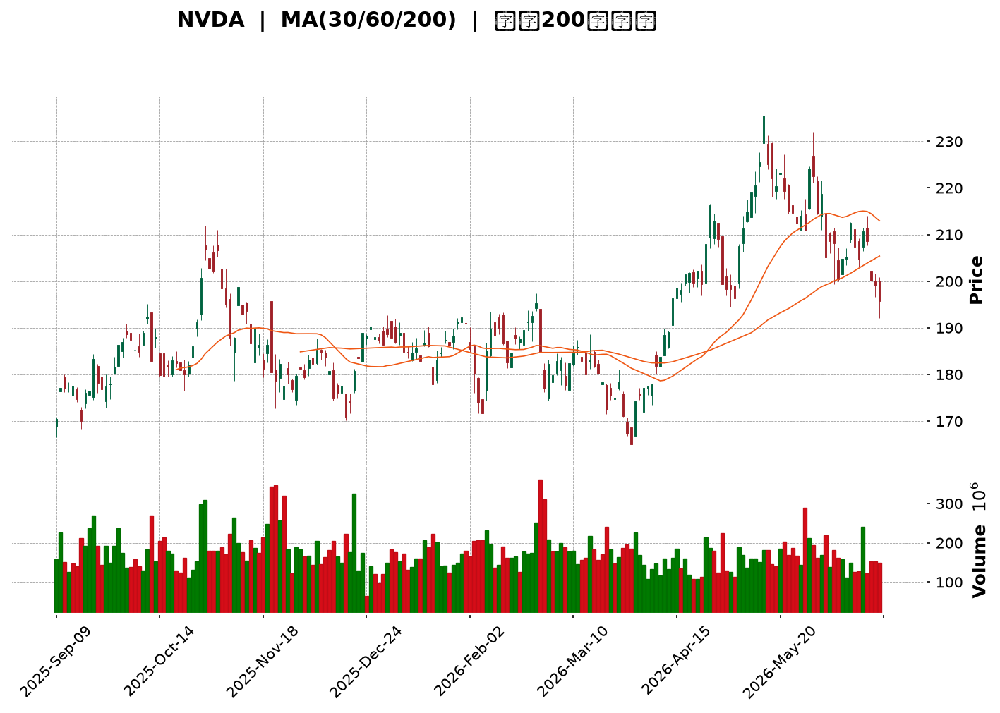
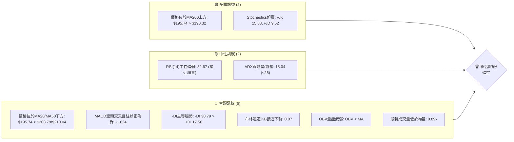
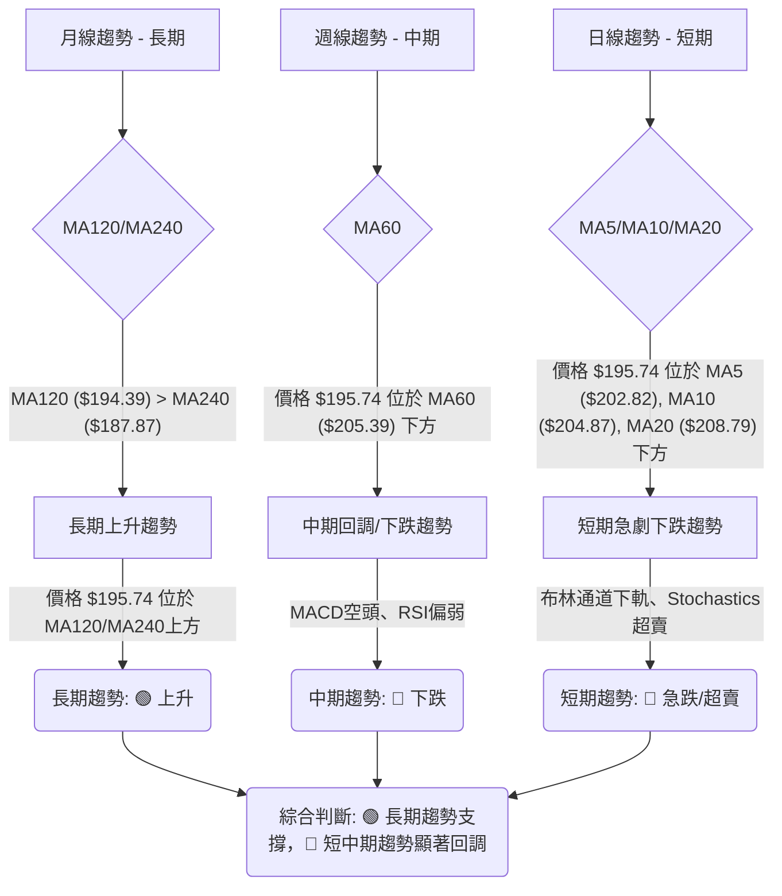
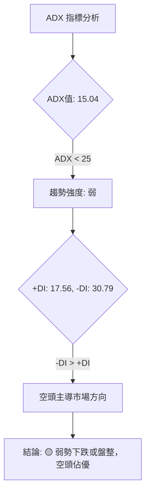

<details>
<summary>📊 靜態圖表 (點擊展開)</summary>

</details>

<html>
<head><meta charset="utf-8" /></head>
<body>
    <div style="height:500px; width:100%;">                        <script>window.PlotlyConfig = {MathJaxConfig: 'local'};</script>
        <script charset="utf-8" src="https://cdn.plot.ly/plotly-3.6.0.min.js" integrity="sha256-QaOVwtVY0T02VaHrr6pnoHLCwayMJp4O5n4YyaE3rJk=" crossorigin="anonymous"></script>                <div id="candlestick-chart" class="plotly-graph-div" style="height:100%; width:100%;"></div>            <script>                window.PLOTLYENV=window.PLOTLYENV || {};                                if (document.getElementById("candlestick-chart")) {                    Plotly.newPlot(                        "candlestick-chart",                        [{"close":{"dtype":"f8","bdata":"AAAAQA1RZUAAAABAAyNmQAAAAOA3HmZAAAAA4P0yZkAAAAAgwTBmQAAAACAI1WVAAAAAwFZCZUAAAAAgfwBmQAAAAAA9DmZAAAAAQAnsZkAAAACgfEZmQAAAAIDTF2ZAAAAAYNYuZkAAAAAg0T5mQAAAAMDJs2ZAAAAAYPRKZ0AAAABgDGBnQAAAAODHlGdAAAAAIDFsZ0AAAACAtylnQAAAAMC8GWdAAAAAwM+bZ0AAAAAAZApoQAAAAICn3WZAAAAAYJCCZ0AAAAAgn3lmQAAAAOA6c2ZAAAAAYIKyZkAAAABgkt9mQAAAACAJzWZAAAAAYLydZkAAAACAnIFmQAAAAOCxvWZAAAAAILpAZ0AAAADg3+dnQAAAACDEGGlAAAAAQNfYaUAAAADANVRpQAAAACBtR2lAAAAAILrTaUAAAAAg+81oQAAAAGDDXmhAAAAA4OR6Z0AAAABgIX1nQAAAAKB82WhAAAAAID8daEAAAABAszFoQAAAAEDnU2dAAAAAILC9Z0AAAAAgmEtnQAAAAKAgpGZAAAAAgAlJZ0AAAADgHY1mQAAAAEDeVGZAAAAAoCjKZkAAAADg\u002fTJmQAAAAMD4gGZAAAAAAMkYZkAAAABAG3ZmQAAAAOBSp2ZAAAAAQI9rZkAAAADgAuVmQAAAAGACxmZAAAAAAF4qZ0AAAABg1BdnQAAAAMDL8WZAAAAA4LSWZkAAAABA0dllQAAAAEBoAmZAAAAAoBwwZkAAAACAaldlQAAAAACxvWVAAAAAAKCYZkAAAABg6+5mQAAAAEBYn2dAAAAA4CqMZ0AAAABgiMlnQAAAAOCzf2dAAAAAIPhpZ0AAAADAukhnQAAAAKDWk2dAAAAAwIF8Z0AAAACgYWBnQAAAAOAlnGdAAAAAABEaZ0AAAABAUBRnQAAAAODeFmdAAAAAQK0yZ0AAAABAV91mQAAAAOBOWmdAAAAAoBlAZ0AAAACATDtmQAAAACAY42ZAAAAAoKwTZ0AAAADAH25nQAAAAGDFR2dAAAAAgEqJZ0AAAACALOlnQAAAAMDQCGhAAAAAoLXcZ0AAAADASCxnQAAAAIDZg2ZAAAAAQEq\u002fZUAAAADAdXVlQAAAAIDkJWdAAAAAIN+5Z0AAAAAg7olnQAAAACAxumdAAAAAAMtWZ0AAAAAgy9JmQAAAAGDUF2dAAAAAIAh4Z0AAAACgeXVnQAAAAEDXsmdAAAAAACLqZ0AAAADArhNoQAAAAOBLamhAAAAAwEUVZ0AAAABALB9mQAAAACA\u002fyGZAAAAAwJR6ZkAAAAAAJdpmQAAAAIC742ZAAAAAAE8zZkAAAAAArs1mQAAAAOBvEWdAAAAAoAc6Z0AAAABgqN1mQAAAAABJgWZAAAAAADfgZkAAAACA+7ZmQAAAAGAUhmZAAAAAoERLZkAAAABg949lQAAAAODv7WVAAAAAgN\u002ffZUAAAACAGk9mQAAAACBNYWVAAAAAQGbqZEAAAACASZ9kQAAAAKBNxmVAAAAAAHTxZUAAAAAg3yVmQAAAAMDcLWZAAAAAwJA8ZkAAAAAAx7tmQAAAAOBE9mZAAAAAICKNZ0AAAAAg3qJnQAAAAOD\u002fiGhAAAAAgG7UaEAAAACgz8NoQAAAACA\u002fLmlAAAAAgGQ6aUAAAADgtvRoQAAAAOB0SGlAAAAAAAvtaEAAAACg4QBqQAAAAGBzC2tAAAAAwH+dakAAAACANCBqQAAAAEDO6mhAAAAA4AHHaEAAAABA98doQAAAAACuiGhAAAAAYNHyaUAAAAAAH2hqQAAAACBi3mpAAAAAwOdla0AAAABAvJBrQAAAAMAlMmxAAAAAAOZubUAAAADA2CFsQAAAAGD1wWtAAAAAQE2La0AAAAAgt+ZrQAAAAIAkaGtAAAAA4IniakAAAAAghNNqQAAAAMBHi2pAAAAAwATAakAAAABgnVxqQAAAAIApA2xAAAAAgPDRa0AAAAAAANBqQAAAAMAeVWtAAAAAQDOjaUAAAADgehRqQAAAAIAUBmpAAAAAoHANaUAAAAAA15tpQAAAAIAUpmlAAAAAYGaOakAAAADAHu1pQAAAAMDMlGlAAAAAgBRWakAAAADAzBRqQAAAAKBHAWlAAAAAAADgaEAAAAAgrndoQA=="},"high":{"dtype":"f8","bdata":"6W9TGhVYZUCRNwYlpmFmQBdiJ4ycgWZA0p5CfOtLZkD2DGfl6FNmQGWmCsnDKGZAy1nGIlefZUAIlLVG+xtmQALpOAlNO2ZA6EAK8RMKZ0AXzH8dAcZmQAxXNa2hcWZAsMXi7viAZkDJ8lQDUHFmQKHX6BCA+GZAWWcAN5BjZ0DpKOq7z3xnQLyWDBbQ2WdASbk7qMLDZ0CcFVxdul9nQLi\u002fN602mmdAa8gCw3irZ0CVIxWjo2FoQPtpTrvda2hACAVFUsW7Z0DGLoU5ERJnQHryjOhNFGdApf45SX3hZkAJxjgxsvtmQFWQrenZHmdAtHjHPdTRZkB3s11GmuZmQMf44st\u002f2WZAPeJs32VnZ0B89JVtLPhnQKTfDwGFXGlA8hMHY259akCTJcaAt7xpQBef1xCQ9mlAL8lN1UNiakCy4urGuXZpQOvUACwrVWlAbwa89MiraEDodtNZkIJnQDYvlzbu9WhABnC9anllaECSL6uwfnRoQOAzOdVG5mdAzDr7m4jYZ0DUaufUS5hnQBRteToREmdATexQxNxzZ0DVPXC3AnhoQPZ0lHllCmdAOmUYFoXoZkCVJ7aT2z1mQAFAc\u002fip1WZA+kOWuvhhZkAZPutIQIJmQNIpgWyNLWdAWzP\u002fh\u002fbGZkA0QXNfcglnQJ47w+vrDWdAjTMb7at4Z0A7a\u002fjjzC9nQFWgASkhKGdARSiX+yujZkD4oMcIHdNmQEsnF\u002f57RmZA3hzB0LhIZkDeRwU0S\u002f1lQBF11NDu\u002fWVAjsfgqFOnZkCHA0Xv8P1mQH42dQ0uo2dApFSPgcGVZ0CMJciRkQ5oQCAtbRz2kGdAeyCwJ1CYZ0C6DU67fcpnQJqPqig9FmhAohf+w5wsaEBuvYHt8v1nQGRTMTJh5GdAKsbt\u002fTWqZ0AMc9ianUNnQHw+nJ6LXGdAfy4x7C98Z0DqJ7+ThwdnQNXInS0Br2dA7chf\u002fKfGZ0DdKlX9DMVmQN3uaBHvJGdAYx4mui4+Z0DA8T8dz6tnQPJy7q13nGdANvnl2pe4Z0DgYHCXswNoQMuX7FHRJ2hAHg0QOBlIaECJfLBxLsJnQKuY5\u002fFgQWdAk92DVo9rZkDaw7bzWBNmQNvAD+K1WGdAN5PKH5ItaECSF3VO2wdoQOy1t1fJIGhAYn5tEPkraEAg6g7SsGhnQIRhwh6BXWdAPz\u002f4JWvEZ0DvSwAWaoZnQLOEIQkkw2dA2N9xzNY2aEA7lrAxFjFoQPFwjbd0rGhAsfYlsbRBaECRCX4cw8tmQKhwZZiR52ZA4ohnZL+VZkCToicvMw9nQAVjd5C++mZAg4TyEzLRZkAA2L1n\u002fdVmQGWmXdXPRmdAu6opttlsZ0A2L5zVMBdnQILyLY7yO2dA9qozxh+VZ0AZwWmo5CVnQOrzzjRU5WZAoC84tad4ZkBMEMDZrUFmQPjbGvcxRWZALfmypXkAZkCUIuYGSqBmQG78YZ6+CWZABcP\u002fuKtYZUBWtCxvFihlQDwY6sZVzWVAtvQgjTslZkDGLtdrESlmQEfSzBGoMmZA4TKkYrhAZkAKqq4sayFnQPvO+OCz+2ZAHYZcD+y4Z0B\u002fUIEJDq5nQAAAAOD\u002fiGhASBnLqFUFaUC2Fd5RwfNoQJJMKc\u002fiLmlASmpxk+g9aUA3pXeBclBpQAAAAOB0SGlAsgq4ivdyaUATNPGQilZqQN5\u002f44Z7EmtAxk6MX1zPakB0QZaoHY9qQB1IsQvEQWpANT78G3BYaUB2HVZB2C9pQI0v+3Q4AGlAsW\u002fJreEAakBhoEega75qQIVlgZR8MWtATZeNmVHBa0Bywhgtqu9rQOIa63RkcmxAMYH23neIbUASrZxQYOdsQEVRwqJut2xAXtjiV\u002f8GbEAtgAGCvDtsQPTcoSFUZGxArbElNRaYa0BQa87WoT1rQLYy33fSvGpAOUBmg5zoakBUrXaKZzNrQN0y64J2E2xA79kRiE4AbUDl0\u002fuJ8NFrQAAAAEAzs2tAAAAAANfbakAAAABACk9qQAAAAMDMbGpAAAAAQArnaUAAAADAHrVpQAAAAIA94mlAAAAAYLiWakAAAAAgrm9qQAAAAGC4JmpAAAAA4HpsakAAAAAgrr9qQAAAAOCjeGlAAAAAoHA1aUAAAACgmRlpQA=="},"hovertemplate":"\u003cb\u003e%{x|%Y-%m-%d}\u003c\u002fb\u003e\u003cbr\u003e\u958b: $%{open:.2f}\u003cbr\u003e\u9ad8: $%{high:.2f}\u003cbr\u003e\u4f4e: $%{low:.2f}\u003cbr\u003e\u6536: $%{close:.2f}\u003cextra\u003e\u003c\u002fextra\u003e","low":{"dtype":"f8","bdata":"TfdnTZXQZECnnBJkkudlQEDeOZMqCGZAdXLvCzUHZkDFzXjPNMllQJB7rlcNxWVAkenXfUEGZUC0HMCZq5dlQGX6f2ye3mVAkIjnXZnPZUCMfT+qif9lQNeTNWKm5WVA7x3vdBqdZUAetXskodZlQC2o8\u002fbjgmZAW0o3WPanZkDBUOvZTfVmQFJ9KClBemdAdjgBgJokZ0DDobpPFuNmQGjpK\u002fp\u002f+GZA3P50Ea1JZ0DrB9jBIdpnQB9KLPUtumZAyPlt4CM3Z0CdLo8xE29mQLvWLqENImZAAKBgCVBxZkCLb39VrHBmQLdm0t7zr2ZAhYj+cEVyZkA18lZbHRFmQGPJRHvzcWZAkqdrDYXoZkBjk5suFIZnQHN5XElM9WdAu88D9ZyQaUColooR6SRpQF2o+eEAOmlAwVRZZoqpaUB6t00OsbVoQBDZ+5fdTGhAU8UJPZBEZ0DwErfL01VmQLDoyoJhMWhAXmy7aM3hZ0D1tsd8XtxnQKrKvci082ZAtoxQ8zKLZkAbr40qugJnQOZUEBh6bWZAam2FgRvTZkCUcmF+3nNmQO3eyte1lmVAtW3ydyoIZkANyQdNsCplQBBkcBRqQGZAcgGvN84IZkC1GYA8rq5lQFyPIbypeGZAbQI6IjhcZkBmPKZhtHdmQOyCKFgRlmZAI7kuj7DFZkAC4z8XGONmQLcoNP0uumZAat0uY\u002fQMZkAShe5dCM1lQPfnIvMi2mVARlOyRPvVZUBkxprJR0NlQNhMKMeKc2VAkboxhwEEZkA4P1d\u002fF8RmQH0vsper1WZAmLqnKJtLZ0DtVXTfq3hnQCB9k23fNWdAh6taFnlWZ0Br1Ij5aEhnQAGVVCP7gGdAESqdKIs9Z0BMrfQw9VJnQFW9t7KlSmdAENfRBY\u002fvZkBggkSgR+5mQAWPKWmB2WZAvHLTjKblZkAv+QpajZJmQH8Ags9LQ2dAHWwzX047Z0A1lSu3mCxmQCkn9HjYRWZAVQXa9Jb2ZkAfp4ob9VJnQAG7RApuOGdALzGSJCkvZ0BSDzukerNnQN\u002fy5b2qOmdAB+PhcKenZ0AV4Qnp8xRnQMR4TmR9AGZAlPiQQGt2ZUCBb4X7SlplQBsrIeBkzGVAaoZlpjr3ZkDZpfiwgXxnQB1u5iVIkWdAWxOGqgxJZ0AX19YMzatmQBc8xWfGXmZANMHjDApRZ0Cvo4z64S1nQLeKJPjUNmdAAzQAaSurZ0DYmRejfmVnQM4wAKq5MWhAx00zEA4DZ0AXf1LVSAVmQMCamByszWVAABCu\u002fIoWZkDFSA6d5npmQAtXwL05NWZANVSs+lgTZkCjZCCBE+tlQOjaeWs5uWZA9L9vUYcHZ0ALNHDBOrFmQGC01HRgd2ZAjszBwlymZkDPO1ji\u002fa5mQNKu36rXg2ZAqryuKrvyZUBd\u002f5KYpHBlQPQHaETP0WVAKe+V4uC4ZUC+sayznBRmQJIPJdQaXmVAxwkqHRnaZEBxKytVhYJkQDAUIDOA2GRA4zFJiX3RZUC9BYOpdGVlQG6A563F8WVAkU3jl6auZUDXDIM54oJmQIIiH4AcjWZA0pkNC7wCZ0DWH63LwjBnQN7NKJ2I0WdAXi5JeWNwaEBkWzsZoHJoQIBwxns34WhAYpDEfoKzaED\u002fLVxElthoQDrRoUCW2GhA\u002fMISdLGfaEDum6buefJoQN5RIEZv5GlAjvNb5aT+aUCiowPN0+ppQIYVDWz\u002fzmhAo971Ln+caEDoYfHqbFBoQOd1ezuoeWhAQ7GGDR\u002fMaEDQL+euTshpQEhOfKeMlGpApZrbDYO0akDD3H0Cb9VqQNwzGYD8qWtAOMcx6g6hbEAOdaOsU\u002f9rQJ4KNIu0Q2tAeU61nwA1a0AbVs4yyYdrQEptXDGkNWtACavpLZnRakCz\u002fTNGGnhqQHfaIq4uEWpAnM935StfakBAS2aYS1xqQEZjNFZd7mpA7qDoRPSia0CBSvIpVMhqQAAAAEAKX2pAAAAAYI+KaUAAAAAAAMBpQAAAAEDh6mhAAAAAoHD9aEAAAACgR\u002fFoQAAAAIAUbmlAAAAAQOEKakAAAACgR+lpQAAAAGCPYmlAAAAAAADQaUAAAABACvdpQAAAAAAAAGlAAAAAYI+SaEAAAAAAKQRoQA=="},"name":"\u50f9\u683c","open":{"dtype":"f8","bdata":"kipQ0q4bZUCXIZ1E9gxmQGVA+I5vbmZALNiUxWQxZkDUPph0R+5lQPYhuQDJGGZACRGlenGNZUDUjBa1RLhlQDm7TaR58WVAgefjdXTiZUDgcZNvn7dmQFCE6OdPcWZAgU3Cfj\u002fIZUAAAnB1LT5mQNlUKNFnhmZAd0daVSO7ZkCgsnI+ISBnQByOYdd4q2dAFuLQPV6eZ0BsWdZKcChnQCOGGtXEP2dAZzlHoaJKZ0AGzk4shv9nQDsMzp9uKGhAJ7r+xmB3Z0D6hajJGxFnQJGghUMREmdAgg8Snu6\u002fZkAoF9lYan5mQC4lFiOy3GZAtHjHPdTRZkAUJZimGJ1mQNx9ROgVhmZA\u002f8sbwWLzZkAX1CSH77dnQEXqMES7GWhApT4E8eH2aUAYLtUKcJxpQFloWg38xWlAJxFB+hP6aUBMLTKmuVdpQAmlCrqJ0GhAW7grGm+FaEAkRQ1KQxVnQAuluTyRW2hAPG9HQSpdaEB3qM\u002fWD29oQD8fDAfQ2WdAwjVi6BDUZkB2Fu6ydTdnQKJE0Wuv5GZA5PySTb8RZ0DkIASdaXZoQE8kIL9KoGZA646+Dl1oZkCoYfl9\u002fdVlQLfC\u002fZPBrGZArgiR5gVZZkA6tpBXMtFlQOC1oz7psGZAoG+00y2bZkBRb5hwwqxmQGO38rpP9WZAPjUNSlzNZkDwk7u8rypnQGyL5F\u002fUF2dASMeanO6BZkCQfnS5dZxmQA4rbKgkN2ZAGT4Z0nIBZkA6LarAVfxlQHdfn\u002fsnymVAE9ImnI0OZkAixGs0RfZmQN2S2mTo12ZA3bSx78B2Z0CLdWJWCbZnQN\u002fG7hZnb2dAOgCyo1eAZ0D5fpWc2apnQARK0756s2dAjdkqTdjwZ0DdZbGkNslnQPmHkaPjimdAX4AJ4iWcZ0BZh+5NWBtnQM8ZN8rl32ZABxpM1ckYZ0ACCWgZDgNnQBxcL726SGdAnCPfbjCbZ0BjgpuHtbVmQDABZ9yeWmZAwYvrRcwQZ0A57k7SsGhnQCSWN\u002f3SXWdAMfclhmFgZ0A\u002fx7j+LuFnQBnGAs1r42dAm6udM0TfZ0C5OschGl9nQEnOi35rQGdAxhQPiblnZkAicyjQ8NZlQFBZ2UQxD2ZAWHFuDiMBZ0AF8Jsos+RnQDFw8uzlBmhA1H0iem8ZaECLMyolDWhnQF8sKELqsGZACRjGUKSQZ0BivfTBoFpnQD26r673SmdAxh4\u002fn1blZ0BJTWEyN+hnQGZg09PRRmhAejc3JBFBaEDvB9E776BmQEWLYWt\u002f2WVAkaKN0bhIZkCX5D\u002fSC4dmQL3MIohgnmZAwJmWl95zZkDXL5e0qhNmQGWtE2ewxWZAZyX1xDE2Z0D\u002f92JyvvpmQDWsnxaNFmdAnI1TYjnYZkAwEHmmBhtnQGk2B+qPyGZAsLrGPrA5ZkCqEoF0XjlmQPZWA223IWZA5idUBwzUZUBAAVVRmhxmQPnbhXCu+2VA4881uao5ZUA+6tkyrBJlQNnSufrR2GRAh7OtnXH5ZUCIbfJvWH9lQCWC4DOFHmZAMbQtOtDwZUAtqA6MIAlnQH1Qph0btGZAGC2n0g0DZ0DD6bGnBzpnQONJSVLF02dAM89DWPWJaEA3BSSmZ6ZoQOX1tVla9WhAT\u002f0k9uj3aEC7ehBroTxpQPaPYmYxGGlAOtJcmy1HaUDVWmlgRfdoQNzkK2D9LGpAeV8JWOAnakAwh2z5eY5qQH8FCnPwNWpAmyUPQ3YhaUBg1bllkehoQFwb8uss4mhAkRKQmAj1aEADjcViHgNqQCcfszEGmWpASBqpX065akDkq0RkdUlrQBqlOnVhFWxACRl0S6OybEA3K4nIwq9sQEgoJOBGs2xAxc\u002f5kKhra0CkAAMkct1rQGAtAr3\u002fwGtALYGyIZKUa0Czs5WaNglrQM5THAHdu2pAMEn90hZhakDDYOwRkcpqQGh998xS72pA1+Rj60tdbEBPaIbHx65rQAAAAMAevWpAAAAAwPXQakAAAACAwkVqQAAAAADXU2pAAAAAgMKNaUAAAAAgri9pQAAAACCFm2lAAAAAoHAdakAAAACAwmVqQAAAAMD1EGpAAAAAYI\u002fqaUAAAACAFG5qQAAAAKBwRWlAAAAAANcDaUAAAABgjwJpQA=="},"x":["2025-09-09T00:00:00-04:00","2025-09-10T00:00:00-04:00","2025-09-11T00:00:00-04:00","2025-09-12T00:00:00-04:00","2025-09-15T00:00:00-04:00","2025-09-16T00:00:00-04:00","2025-09-17T00:00:00-04:00","2025-09-18T00:00:00-04:00","2025-09-19T00:00:00-04:00","2025-09-22T00:00:00-04:00","2025-09-23T00:00:00-04:00","2025-09-24T00:00:00-04:00","2025-09-25T00:00:00-04:00","2025-09-26T00:00:00-04:00","2025-09-29T00:00:00-04:00","2025-09-30T00:00:00-04:00","2025-10-01T00:00:00-04:00","2025-10-02T00:00:00-04:00","2025-10-03T00:00:00-04:00","2025-10-06T00:00:00-04:00","2025-10-07T00:00:00-04:00","2025-10-08T00:00:00-04:00","2025-10-09T00:00:00-04:00","2025-10-10T00:00:00-04:00","2025-10-13T00:00:00-04:00","2025-10-14T00:00:00-04:00","2025-10-15T00:00:00-04:00","2025-10-16T00:00:00-04:00","2025-10-17T00:00:00-04:00","2025-10-20T00:00:00-04:00","2025-10-21T00:00:00-04:00","2025-10-22T00:00:00-04:00","2025-10-23T00:00:00-04:00","2025-10-24T00:00:00-04:00","2025-10-27T00:00:00-04:00","2025-10-28T00:00:00-04:00","2025-10-29T00:00:00-04:00","2025-10-30T00:00:00-04:00","2025-10-31T00:00:00-04:00","2025-11-03T00:00:00-05:00","2025-11-04T00:00:00-05:00","2025-11-05T00:00:00-05:00","2025-11-06T00:00:00-05:00","2025-11-07T00:00:00-05:00","2025-11-10T00:00:00-05:00","2025-11-11T00:00:00-05:00","2025-11-12T00:00:00-05:00","2025-11-13T00:00:00-05:00","2025-11-14T00:00:00-05:00","2025-11-17T00:00:00-05:00","2025-11-18T00:00:00-05:00","2025-11-19T00:00:00-05:00","2025-11-20T00:00:00-05:00","2025-11-21T00:00:00-05:00","2025-11-24T00:00:00-05:00","2025-11-25T00:00:00-05:00","2025-11-26T00:00:00-05:00","2025-11-28T00:00:00-05:00","2025-12-01T00:00:00-05:00","2025-12-02T00:00:00-05:00","2025-12-03T00:00:00-05:00","2025-12-04T00:00:00-05:00","2025-12-05T00:00:00-05:00","2025-12-08T00:00:00-05:00","2025-12-09T00:00:00-05:00","2025-12-10T00:00:00-05:00","2025-12-11T00:00:00-05:00","2025-12-12T00:00:00-05:00","2025-12-15T00:00:00-05:00","2025-12-16T00:00:00-05:00","2025-12-17T00:00:00-05:00","2025-12-18T00:00:00-05:00","2025-12-19T00:00:00-05:00","2025-12-22T00:00:00-05:00","2025-12-23T00:00:00-05:00","2025-12-24T00:00:00-05:00","2025-12-26T00:00:00-05:00","2025-12-29T00:00:00-05:00","2025-12-30T00:00:00-05:00","2025-12-31T00:00:00-05:00","2026-01-02T00:00:00-05:00","2026-01-05T00:00:00-05:00","2026-01-06T00:00:00-05:00","2026-01-07T00:00:00-05:00","2026-01-08T00:00:00-05:00","2026-01-09T00:00:00-05:00","2026-01-12T00:00:00-05:00","2026-01-13T00:00:00-05:00","2026-01-14T00:00:00-05:00","2026-01-15T00:00:00-05:00","2026-01-16T00:00:00-05:00","2026-01-20T00:00:00-05:00","2026-01-21T00:00:00-05:00","2026-01-22T00:00:00-05:00","2026-01-23T00:00:00-05:00","2026-01-26T00:00:00-05:00","2026-01-27T00:00:00-05:00","2026-01-28T00:00:00-05:00","2026-01-29T00:00:00-05:00","2026-01-30T00:00:00-05:00","2026-02-02T00:00:00-05:00","2026-02-03T00:00:00-05:00","2026-02-04T00:00:00-05:00","2026-02-05T00:00:00-05:00","2026-02-06T00:00:00-05:00","2026-02-09T00:00:00-05:00","2026-02-10T00:00:00-05:00","2026-02-11T00:00:00-05:00","2026-02-12T00:00:00-05:00","2026-02-13T00:00:00-05:00","2026-02-17T00:00:00-05:00","2026-02-18T00:00:00-05:00","2026-02-19T00:00:00-05:00","2026-02-20T00:00:00-05:00","2026-02-23T00:00:00-05:00","2026-02-24T00:00:00-05:00","2026-02-25T00:00:00-05:00","2026-02-26T00:00:00-05:00","2026-02-27T00:00:00-05:00","2026-03-02T00:00:00-05:00","2026-03-03T00:00:00-05:00","2026-03-04T00:00:00-05:00","2026-03-05T00:00:00-05:00","2026-03-06T00:00:00-05:00","2026-03-09T00:00:00-04:00","2026-03-10T00:00:00-04:00","2026-03-11T00:00:00-04:00","2026-03-12T00:00:00-04:00","2026-03-13T00:00:00-04:00","2026-03-16T00:00:00-04:00","2026-03-17T00:00:00-04:00","2026-03-18T00:00:00-04:00","2026-03-19T00:00:00-04:00","2026-03-20T00:00:00-04:00","2026-03-23T00:00:00-04:00","2026-03-24T00:00:00-04:00","2026-03-25T00:00:00-04:00","2026-03-26T00:00:00-04:00","2026-03-27T00:00:00-04:00","2026-03-30T00:00:00-04:00","2026-03-31T00:00:00-04:00","2026-04-01T00:00:00-04:00","2026-04-02T00:00:00-04:00","2026-04-06T00:00:00-04:00","2026-04-07T00:00:00-04:00","2026-04-08T00:00:00-04:00","2026-04-09T00:00:00-04:00","2026-04-10T00:00:00-04:00","2026-04-13T00:00:00-04:00","2026-04-14T00:00:00-04:00","2026-04-15T00:00:00-04:00","2026-04-16T00:00:00-04:00","2026-04-17T00:00:00-04:00","2026-04-20T00:00:00-04:00","2026-04-21T00:00:00-04:00","2026-04-22T00:00:00-04:00","2026-04-23T00:00:00-04:00","2026-04-24T00:00:00-04:00","2026-04-27T00:00:00-04:00","2026-04-28T00:00:00-04:00","2026-04-29T00:00:00-04:00","2026-04-30T00:00:00-04:00","2026-05-01T00:00:00-04:00","2026-05-04T00:00:00-04:00","2026-05-05T00:00:00-04:00","2026-05-06T00:00:00-04:00","2026-05-07T00:00:00-04:00","2026-05-08T00:00:00-04:00","2026-05-11T00:00:00-04:00","2026-05-12T00:00:00-04:00","2026-05-13T00:00:00-04:00","2026-05-14T00:00:00-04:00","2026-05-15T00:00:00-04:00","2026-05-18T00:00:00-04:00","2026-05-19T00:00:00-04:00","2026-05-20T00:00:00-04:00","2026-05-21T00:00:00-04:00","2026-05-22T00:00:00-04:00","2026-05-26T00:00:00-04:00","2026-05-27T00:00:00-04:00","2026-05-28T00:00:00-04:00","2026-05-29T00:00:00-04:00","2026-06-01T00:00:00-04:00","2026-06-02T00:00:00-04:00","2026-06-03T00:00:00-04:00","2026-06-04T00:00:00-04:00","2026-06-05T00:00:00-04:00","2026-06-08T00:00:00-04:00","2026-06-09T00:00:00-04:00","2026-06-10T00:00:00-04:00","2026-06-11T00:00:00-04:00","2026-06-12T00:00:00-04:00","2026-06-15T00:00:00-04:00","2026-06-16T00:00:00-04:00","2026-06-17T00:00:00-04:00","2026-06-18T00:00:00-04:00","2026-06-22T00:00:00-04:00","2026-06-23T00:00:00-04:00","2026-06-24T00:00:00-04:00","2026-06-25T00:00:00-04:00"],"type":"candlestick"},{"hovertemplate":"MA30: $%{y:.2f}\u003cextra\u003e\u003c\u002fextra\u003e","line":{"color":"#2196F3","dash":"dash","width":2},"mode":"lines","name":"MA30","x":["2025-09-09T00:00:00-04:00","2025-09-10T00:00:00-04:00","2025-09-11T00:00:00-04:00","2025-09-12T00:00:00-04:00","2025-09-15T00:00:00-04:00","2025-09-16T00:00:00-04:00","2025-09-17T00:00:00-04:00","2025-09-18T00:00:00-04:00","2025-09-19T00:00:00-04:00","2025-09-22T00:00:00-04:00","2025-09-23T00:00:00-04:00","2025-09-24T00:00:00-04:00","2025-09-25T00:00:00-04:00","2025-09-26T00:00:00-04:00","2025-09-29T00:00:00-04:00","2025-09-30T00:00:00-04:00","2025-10-01T00:00:00-04:00","2025-10-02T00:00:00-04:00","2025-10-03T00:00:00-04:00","2025-10-06T00:00:00-04:00","2025-10-07T00:00:00-04:00","2025-10-08T00:00:00-04:00","2025-10-09T00:00:00-04:00","2025-10-10T00:00:00-04:00","2025-10-13T00:00:00-04:00","2025-10-14T00:00:00-04:00","2025-10-15T00:00:00-04:00","2025-10-16T00:00:00-04:00","2025-10-17T00:00:00-04:00","2025-10-20T00:00:00-04:00","2025-10-21T00:00:00-04:00","2025-10-22T00:00:00-04:00","2025-10-23T00:00:00-04:00","2025-10-24T00:00:00-04:00","2025-10-27T00:00:00-04:00","2025-10-28T00:00:00-04:00","2025-10-29T00:00:00-04:00","2025-10-30T00:00:00-04:00","2025-10-31T00:00:00-04:00","2025-11-03T00:00:00-05:00","2025-11-04T00:00:00-05:00","2025-11-05T00:00:00-05:00","2025-11-06T00:00:00-05:00","2025-11-07T00:00:00-05:00","2025-11-10T00:00:00-05:00","2025-11-11T00:00:00-05:00","2025-11-12T00:00:00-05:00","2025-11-13T00:00:00-05:00","2025-11-14T00:00:00-05:00","2025-11-17T00:00:00-05:00","2025-11-18T00:00:00-05:00","2025-11-19T00:00:00-05:00","2025-11-20T00:00:00-05:00","2025-11-21T00:00:00-05:00","2025-11-24T00:00:00-05:00","2025-11-25T00:00:00-05:00","2025-11-26T00:00:00-05:00","2025-11-28T00:00:00-05:00","2025-12-01T00:00:00-05:00","2025-12-02T00:00:00-05:00","2025-12-03T00:00:00-05:00","2025-12-04T00:00:00-05:00","2025-12-05T00:00:00-05:00","2025-12-08T00:00:00-05:00","2025-12-09T00:00:00-05:00","2025-12-10T00:00:00-05:00","2025-12-11T00:00:00-05:00","2025-12-12T00:00:00-05:00","2025-12-15T00:00:00-05:00","2025-12-16T00:00:00-05:00","2025-12-17T00:00:00-05:00","2025-12-18T00:00:00-05:00","2025-12-19T00:00:00-05:00","2025-12-22T00:00:00-05:00","2025-12-23T00:00:00-05:00","2025-12-24T00:00:00-05:00","2025-12-26T00:00:00-05:00","2025-12-29T00:00:00-05:00","2025-12-30T00:00:00-05:00","2025-12-31T00:00:00-05:00","2026-01-02T00:00:00-05:00","2026-01-05T00:00:00-05:00","2026-01-06T00:00:00-05:00","2026-01-07T00:00:00-05:00","2026-01-08T00:00:00-05:00","2026-01-09T00:00:00-05:00","2026-01-12T00:00:00-05:00","2026-01-13T00:00:00-05:00","2026-01-14T00:00:00-05:00","2026-01-15T00:00:00-05:00","2026-01-16T00:00:00-05:00","2026-01-20T00:00:00-05:00","2026-01-21T00:00:00-05:00","2026-01-22T00:00:00-05:00","2026-01-23T00:00:00-05:00","2026-01-26T00:00:00-05:00","2026-01-27T00:00:00-05:00","2026-01-28T00:00:00-05:00","2026-01-29T00:00:00-05:00","2026-01-30T00:00:00-05:00","2026-02-02T00:00:00-05:00","2026-02-03T00:00:00-05:00","2026-02-04T00:00:00-05:00","2026-02-05T00:00:00-05:00","2026-02-06T00:00:00-05:00","2026-02-09T00:00:00-05:00","2026-02-10T00:00:00-05:00","2026-02-11T00:00:00-05:00","2026-02-12T00:00:00-05:00","2026-02-13T00:00:00-05:00","2026-02-17T00:00:00-05:00","2026-02-18T00:00:00-05:00","2026-02-19T00:00:00-05:00","2026-02-20T00:00:00-05:00","2026-02-23T00:00:00-05:00","2026-02-24T00:00:00-05:00","2026-02-25T00:00:00-05:00","2026-02-26T00:00:00-05:00","2026-02-27T00:00:00-05:00","2026-03-02T00:00:00-05:00","2026-03-03T00:00:00-05:00","2026-03-04T00:00:00-05:00","2026-03-05T00:00:00-05:00","2026-03-06T00:00:00-05:00","2026-03-09T00:00:00-04:00","2026-03-10T00:00:00-04:00","2026-03-11T00:00:00-04:00","2026-03-12T00:00:00-04:00","2026-03-13T00:00:00-04:00","2026-03-16T00:00:00-04:00","2026-03-17T00:00:00-04:00","2026-03-18T00:00:00-04:00","2026-03-19T00:00:00-04:00","2026-03-20T00:00:00-04:00","2026-03-23T00:00:00-04:00","2026-03-24T00:00:00-04:00","2026-03-25T00:00:00-04:00","2026-03-26T00:00:00-04:00","2026-03-27T00:00:00-04:00","2026-03-30T00:00:00-04:00","2026-03-31T00:00:00-04:00","2026-04-01T00:00:00-04:00","2026-04-02T00:00:00-04:00","2026-04-06T00:00:00-04:00","2026-04-07T00:00:00-04:00","2026-04-08T00:00:00-04:00","2026-04-09T00:00:00-04:00","2026-04-10T00:00:00-04:00","2026-04-13T00:00:00-04:00","2026-04-14T00:00:00-04:00","2026-04-15T00:00:00-04:00","2026-04-16T00:00:00-04:00","2026-04-17T00:00:00-04:00","2026-04-20T00:00:00-04:00","2026-04-21T00:00:00-04:00","2026-04-22T00:00:00-04:00","2026-04-23T00:00:00-04:00","2026-04-24T00:00:00-04:00","2026-04-27T00:00:00-04:00","2026-04-28T00:00:00-04:00","2026-04-29T00:00:00-04:00","2026-04-30T00:00:00-04:00","2026-05-01T00:00:00-04:00","2026-05-04T00:00:00-04:00","2026-05-05T00:00:00-04:00","2026-05-06T00:00:00-04:00","2026-05-07T00:00:00-04:00","2026-05-08T00:00:00-04:00","2026-05-11T00:00:00-04:00","2026-05-12T00:00:00-04:00","2026-05-13T00:00:00-04:00","2026-05-14T00:00:00-04:00","2026-05-15T00:00:00-04:00","2026-05-18T00:00:00-04:00","2026-05-19T00:00:00-04:00","2026-05-20T00:00:00-04:00","2026-05-21T00:00:00-04:00","2026-05-22T00:00:00-04:00","2026-05-26T00:00:00-04:00","2026-05-27T00:00:00-04:00","2026-05-28T00:00:00-04:00","2026-05-29T00:00:00-04:00","2026-06-01T00:00:00-04:00","2026-06-02T00:00:00-04:00","2026-06-03T00:00:00-04:00","2026-06-04T00:00:00-04:00","2026-06-05T00:00:00-04:00","2026-06-08T00:00:00-04:00","2026-06-09T00:00:00-04:00","2026-06-10T00:00:00-04:00","2026-06-11T00:00:00-04:00","2026-06-12T00:00:00-04:00","2026-06-15T00:00:00-04:00","2026-06-16T00:00:00-04:00","2026-06-17T00:00:00-04:00","2026-06-18T00:00:00-04:00","2026-06-22T00:00:00-04:00","2026-06-23T00:00:00-04:00","2026-06-24T00:00:00-04:00","2026-06-25T00:00:00-04:00"],"y":{"dtype":"f8","bdata":"AAAAAAAA+H8AAAAAAAD4fwAAAAAAAPh\u002fAAAAAAAA+H8AAAAAAAD4fwAAAAAAAPh\u002fAAAAAAAA+H8AAAAAAAD4fwAAAAAAAPh\u002fAAAAAAAA+H8AAAAAAAD4fwAAAAAAAPh\u002fAAAAAAAA+H8AAAAAAAD4fwAAAAAAAPh\u002fAAAAAAAA+H8AAAAAAAD4fwAAAAAAAPh\u002fAAAAAAAA+H8AAAAAAAD4fwAAAAAAAPh\u002fAAAAAAAA+H8AAAAAAAD4fwAAAAAAAPh\u002fAAAAAAAA+H8AAAAAAAD4fwAAAAAAAPh\u002fAAAAAAAA+H8AAAAAAAD4f2ZmZiZToGZA3t3dDWqrZkC8u7tLka5mQJqZmSnis2ZAd3d359+8ZkAAAAAQg8tmQJqZmale52ZAREREFIUOZ0CJiIgI6SpnQDMzM6NqRmdAzczMzDRfZ0BVVVUVynRnQKuqqno4iGdAd3d3B0qTZ0De3d1N5p1nQBERERE5sGdA7+7ujju3Z0BmZmaWOL5nQHd3d\u002fcOvGdAZmZmZsa+Z0DNzMx8579nQCIiIuL7u2dAq6qqijm5Z0AREREBhKxnQDMzM8P0p2dAvLu7K8+hZ0BmZmZ2dJ9nQJqZmbnpn2dAIiIi8smaZ0CamZn5RZdnQKuqqioElmdA7+7u\u002fleUZ0BVVVU1qJdnQImIiCjvl2dAq6qqWjCXZ0CamZkJQZBnQM3MzGzjfWdAq6qqehViZ0BmZmZ2Z0RnQGZmZuaAKGdA3t3dHXMJZ0AzMzPD5etmQHd3dzd21WZAMzMzY+vNZkCrqqraLclmQM3MzCy1vmZAq6qqKt+5ZkBVVVVFZrZmQGZmZgbct2ZAAAAAoBG1ZkDe3d0t+bRmQGZmZrb2vGZAvLu7662+ZkBmZma2uMVmQAAAAICh0GZAERERYUvTZkAAAAAgztpmQDMzM0PN32ZAzczMvDLpZkC8u7uro+xmQBEREQGb8mZA7+7urrD5ZkCJiIh4CPRmQJqZmakA9WZAREREBD\u002f0ZkBVVVVlH\u002fdmQM3MzAz9+WZAq6qqGhMCZ0BmZmY2pxNnQGZmZvbuJGdAREREVDgzZ0BmZmZW2UJnQJqZmUl0SWdAIiIisjVCZ0BVVVW1oDVnQBEREVGUMWdAMzMzUxozZ0BVVVWV+zBnQBEREbHuMmdA3t3dDUsyZ0CrqqqqXC5nQFVVVXU6KmdAVVVVRRQqZ0BVVVVFyCpnQKuqquqJK2dAq6qqankyZ0ARERGR\u002fDpnQAAAAABNRmdAVVVVFVJFZ0ARERFR+z5nQM3MzOwcOmdA3t3dbYczZ0CamZnp0jhnQLy7u1vYOGdAVVVVxV0xZ0BVVVWlBCxnQO\u002fu7v40KmdAIiIiopAnZ0BERETUpR5nQFVVVcWYEWdAZmZmJi4JZ0DNzMwsRQVnQERERDRYBWdA7+7urgIKZ0Dv7u7e5ApnQJqZmdl+AGdAAAAAELLwZkCrqqqKM+ZmQBEREfEr0mZAq6qq6n29ZkBERERUtapmQKuqqhp1n2ZAq6qqKnCSZkCamZlZQIdmQBERERFJemZAzczMbPdrZkBERETEgGBmQCIiIiIaVGZAIiIi8hhYZkBmZmZGBWVmQCIiIqL6c2ZAzczMbAqIZkCamZnpXJhmQFVVVdXpq2ZAIiIi4r\u002fFZkC8u7sLHthmQM3MzJwE62ZAmpmZuYT5ZkBmZmbmShRnQLy7uwsIO2dA7+7u3vBaZ0Dv7u5eDHhnQHd3d\u002fd4jGdAERER8amhZ0B3d3dnIb1nQBEREfFa02dAzczMvB72Z0CrqqpaFhloQDMzM2PsR2hAERERgT1\u002faEAAAAAQfbpoQImIiIhI8WhAvLu7uzIxaUBmZmaWQ2RpQCIiIgLek2lA7+7ujijBaUARERGhQe1pQLy7u3svE2pAAAAA4KEvakC8u7ub2kpqQDMzMyP\u002fW2pAMzMzA2JsakCJiIh4AnpqQKuqqmoskmpA7+7urkqoakBERER0IrhqQFVVVZWfyWpA3t3d\u002fbHPakC8u7s7WdBqQO\u002fu7t6ix2pAiYiICE26akBERESE47VqQHd3d5chvGpAvLu7m0\u002fLakARERExFdVqQGZmZiYF3mpAAAAAMFThakDe3d0tjd5qQFVVVeWlzmpAvLu7Kx65akBERETErp5qQA=="},"type":"scatter"},{"hovertemplate":"MA60: $%{y:.2f}\u003cextra\u003e\u003c\u002fextra\u003e","line":{"color":"#9C27B0","dash":"dash","width":2},"mode":"lines","name":"MA60","x":["2025-09-09T00:00:00-04:00","2025-09-10T00:00:00-04:00","2025-09-11T00:00:00-04:00","2025-09-12T00:00:00-04:00","2025-09-15T00:00:00-04:00","2025-09-16T00:00:00-04:00","2025-09-17T00:00:00-04:00","2025-09-18T00:00:00-04:00","2025-09-19T00:00:00-04:00","2025-09-22T00:00:00-04:00","2025-09-23T00:00:00-04:00","2025-09-24T00:00:00-04:00","2025-09-25T00:00:00-04:00","2025-09-26T00:00:00-04:00","2025-09-29T00:00:00-04:00","2025-09-30T00:00:00-04:00","2025-10-01T00:00:00-04:00","2025-10-02T00:00:00-04:00","2025-10-03T00:00:00-04:00","2025-10-06T00:00:00-04:00","2025-10-07T00:00:00-04:00","2025-10-08T00:00:00-04:00","2025-10-09T00:00:00-04:00","2025-10-10T00:00:00-04:00","2025-10-13T00:00:00-04:00","2025-10-14T00:00:00-04:00","2025-10-15T00:00:00-04:00","2025-10-16T00:00:00-04:00","2025-10-17T00:00:00-04:00","2025-10-20T00:00:00-04:00","2025-10-21T00:00:00-04:00","2025-10-22T00:00:00-04:00","2025-10-23T00:00:00-04:00","2025-10-24T00:00:00-04:00","2025-10-27T00:00:00-04:00","2025-10-28T00:00:00-04:00","2025-10-29T00:00:00-04:00","2025-10-30T00:00:00-04:00","2025-10-31T00:00:00-04:00","2025-11-03T00:00:00-05:00","2025-11-04T00:00:00-05:00","2025-11-05T00:00:00-05:00","2025-11-06T00:00:00-05:00","2025-11-07T00:00:00-05:00","2025-11-10T00:00:00-05:00","2025-11-11T00:00:00-05:00","2025-11-12T00:00:00-05:00","2025-11-13T00:00:00-05:00","2025-11-14T00:00:00-05:00","2025-11-17T00:00:00-05:00","2025-11-18T00:00:00-05:00","2025-11-19T00:00:00-05:00","2025-11-20T00:00:00-05:00","2025-11-21T00:00:00-05:00","2025-11-24T00:00:00-05:00","2025-11-25T00:00:00-05:00","2025-11-26T00:00:00-05:00","2025-11-28T00:00:00-05:00","2025-12-01T00:00:00-05:00","2025-12-02T00:00:00-05:00","2025-12-03T00:00:00-05:00","2025-12-04T00:00:00-05:00","2025-12-05T00:00:00-05:00","2025-12-08T00:00:00-05:00","2025-12-09T00:00:00-05:00","2025-12-10T00:00:00-05:00","2025-12-11T00:00:00-05:00","2025-12-12T00:00:00-05:00","2025-12-15T00:00:00-05:00","2025-12-16T00:00:00-05:00","2025-12-17T00:00:00-05:00","2025-12-18T00:00:00-05:00","2025-12-19T00:00:00-05:00","2025-12-22T00:00:00-05:00","2025-12-23T00:00:00-05:00","2025-12-24T00:00:00-05:00","2025-12-26T00:00:00-05:00","2025-12-29T00:00:00-05:00","2025-12-30T00:00:00-05:00","2025-12-31T00:00:00-05:00","2026-01-02T00:00:00-05:00","2026-01-05T00:00:00-05:00","2026-01-06T00:00:00-05:00","2026-01-07T00:00:00-05:00","2026-01-08T00:00:00-05:00","2026-01-09T00:00:00-05:00","2026-01-12T00:00:00-05:00","2026-01-13T00:00:00-05:00","2026-01-14T00:00:00-05:00","2026-01-15T00:00:00-05:00","2026-01-16T00:00:00-05:00","2026-01-20T00:00:00-05:00","2026-01-21T00:00:00-05:00","2026-01-22T00:00:00-05:00","2026-01-23T00:00:00-05:00","2026-01-26T00:00:00-05:00","2026-01-27T00:00:00-05:00","2026-01-28T00:00:00-05:00","2026-01-29T00:00:00-05:00","2026-01-30T00:00:00-05:00","2026-02-02T00:00:00-05:00","2026-02-03T00:00:00-05:00","2026-02-04T00:00:00-05:00","2026-02-05T00:00:00-05:00","2026-02-06T00:00:00-05:00","2026-02-09T00:00:00-05:00","2026-02-10T00:00:00-05:00","2026-02-11T00:00:00-05:00","2026-02-12T00:00:00-05:00","2026-02-13T00:00:00-05:00","2026-02-17T00:00:00-05:00","2026-02-18T00:00:00-05:00","2026-02-19T00:00:00-05:00","2026-02-20T00:00:00-05:00","2026-02-23T00:00:00-05:00","2026-02-24T00:00:00-05:00","2026-02-25T00:00:00-05:00","2026-02-26T00:00:00-05:00","2026-02-27T00:00:00-05:00","2026-03-02T00:00:00-05:00","2026-03-03T00:00:00-05:00","2026-03-04T00:00:00-05:00","2026-03-05T00:00:00-05:00","2026-03-06T00:00:00-05:00","2026-03-09T00:00:00-04:00","2026-03-10T00:00:00-04:00","2026-03-11T00:00:00-04:00","2026-03-12T00:00:00-04:00","2026-03-13T00:00:00-04:00","2026-03-16T00:00:00-04:00","2026-03-17T00:00:00-04:00","2026-03-18T00:00:00-04:00","2026-03-19T00:00:00-04:00","2026-03-20T00:00:00-04:00","2026-03-23T00:00:00-04:00","2026-03-24T00:00:00-04:00","2026-03-25T00:00:00-04:00","2026-03-26T00:00:00-04:00","2026-03-27T00:00:00-04:00","2026-03-30T00:00:00-04:00","2026-03-31T00:00:00-04:00","2026-04-01T00:00:00-04:00","2026-04-02T00:00:00-04:00","2026-04-06T00:00:00-04:00","2026-04-07T00:00:00-04:00","2026-04-08T00:00:00-04:00","2026-04-09T00:00:00-04:00","2026-04-10T00:00:00-04:00","2026-04-13T00:00:00-04:00","2026-04-14T00:00:00-04:00","2026-04-15T00:00:00-04:00","2026-04-16T00:00:00-04:00","2026-04-17T00:00:00-04:00","2026-04-20T00:00:00-04:00","2026-04-21T00:00:00-04:00","2026-04-22T00:00:00-04:00","2026-04-23T00:00:00-04:00","2026-04-24T00:00:00-04:00","2026-04-27T00:00:00-04:00","2026-04-28T00:00:00-04:00","2026-04-29T00:00:00-04:00","2026-04-30T00:00:00-04:00","2026-05-01T00:00:00-04:00","2026-05-04T00:00:00-04:00","2026-05-05T00:00:00-04:00","2026-05-06T00:00:00-04:00","2026-05-07T00:00:00-04:00","2026-05-08T00:00:00-04:00","2026-05-11T00:00:00-04:00","2026-05-12T00:00:00-04:00","2026-05-13T00:00:00-04:00","2026-05-14T00:00:00-04:00","2026-05-15T00:00:00-04:00","2026-05-18T00:00:00-04:00","2026-05-19T00:00:00-04:00","2026-05-20T00:00:00-04:00","2026-05-21T00:00:00-04:00","2026-05-22T00:00:00-04:00","2026-05-26T00:00:00-04:00","2026-05-27T00:00:00-04:00","2026-05-28T00:00:00-04:00","2026-05-29T00:00:00-04:00","2026-06-01T00:00:00-04:00","2026-06-02T00:00:00-04:00","2026-06-03T00:00:00-04:00","2026-06-04T00:00:00-04:00","2026-06-05T00:00:00-04:00","2026-06-08T00:00:00-04:00","2026-06-09T00:00:00-04:00","2026-06-10T00:00:00-04:00","2026-06-11T00:00:00-04:00","2026-06-12T00:00:00-04:00","2026-06-15T00:00:00-04:00","2026-06-16T00:00:00-04:00","2026-06-17T00:00:00-04:00","2026-06-18T00:00:00-04:00","2026-06-22T00:00:00-04:00","2026-06-23T00:00:00-04:00","2026-06-24T00:00:00-04:00","2026-06-25T00:00:00-04:00"],"y":{"dtype":"f8","bdata":"AAAAAAAA+H8AAAAAAAD4fwAAAAAAAPh\u002fAAAAAAAA+H8AAAAAAAD4fwAAAAAAAPh\u002fAAAAAAAA+H8AAAAAAAD4fwAAAAAAAPh\u002fAAAAAAAA+H8AAAAAAAD4fwAAAAAAAPh\u002fAAAAAAAA+H8AAAAAAAD4fwAAAAAAAPh\u002fAAAAAAAA+H8AAAAAAAD4fwAAAAAAAPh\u002fAAAAAAAA+H8AAAAAAAD4fwAAAAAAAPh\u002fAAAAAAAA+H8AAAAAAAD4fwAAAAAAAPh\u002fAAAAAAAA+H8AAAAAAAD4fwAAAAAAAPh\u002fAAAAAAAA+H8AAAAAAAD4fwAAAAAAAPh\u002fAAAAAAAA+H8AAAAAAAD4fwAAAAAAAPh\u002fAAAAAAAA+H8AAAAAAAD4fwAAAAAAAPh\u002fAAAAAAAA+H8AAAAAAAD4fwAAAAAAAPh\u002fAAAAAAAA+H8AAAAAAAD4fwAAAAAAAPh\u002fAAAAAAAA+H8AAAAAAAD4fwAAAAAAAPh\u002fAAAAAAAA+H8AAAAAAAD4fwAAAAAAAPh\u002fAAAAAAAA+H8AAAAAAAD4fwAAAAAAAPh\u002fAAAAAAAA+H8AAAAAAAD4fwAAAAAAAPh\u002fAAAAAAAA+H8AAAAAAAD4fwAAAAAAAPh\u002fAAAAAAAA+H8AAAAAAAD4f4mIiKgrG2dAZmZmBuEfZ0CJiIjAHCNnQBEREanoJWdAERERIQgqZ0DNzMwM4i1nQDMzMwuhMmdAd3d3R004Z0B3d3c\u002fqDdnQM3MzMR1N2dAVVVV9VM0Z0BERETsVzBnQBEREVnXLmdAVVVVtZowZ0BEREQUijNnQO\u002fu7h53N2dAzczMXI04Z0De3d1tTzpnQO\u002fu7n71OWdAMzMzA+w5Z0BVVVVVcDpnQEREREx5PGdAMzMzu\u002fM7Z0C8u7tbHjlnQJqZmSFLPGdAZmZmRo06Z0AzMzNLIT1nQGZmZn7bP2dAd3d3V\u002f5BZ0CrqqrS9EFnQN7d3ZVPRGdA7+7uVgRHZ0Dv7u5W2EVnQBEREel3RmdAd3d3r7dFZ0B3d3c3sENnQM3MzDzwO2dAq6qqShQyZ0BmZmZWByxnQGZmZu63JmdAERERuVUeZ0DNzMyMXxdnQImIiEB1D2dAq6qqihAIZ0AAAABIZ\u002f9mQO\u002fu7r4k+GZA7+7uvnz2ZkBVVVXtsPNmQLy7u1tl9WZA7+7uVq7zZkBERETsqvFmQN7d3ZWY82ZAiYiIGGH0ZkDe3d19QPhmQFVVVbUV\u002fmZA3t3dZeICZ0CJiIhY5QpnQJqZmSENE2dAERERaUIXZ0BmZmZ+zxVnQO\u002fu7vZbFmdAZmZmDpwWZ0ARERGxbRZnQKuqqoLsFmdAzczMZM4SZ0BVVVUFkhFnQN7d3QUZEmdAZmZm3tEUZ0BVVVWFJhlnQN7d3d1DG2dAVVVVPTMeZ0CamZlBDyRnQO\u002fu7j5mJ2dAiYiIMBwmZ0AiIiLKQiBnQFVVVZUJGWdAmpmZMeYRZ0AAAACQlwtnQBEREVGNAmdAREREfOT3ZkB3d3f\u002fiOxmQAAAAMjX5GZAAAAAOELeZkB3d3dPBNlmQN7d3X3p0mZAvLu7azjPZkCrqqqqvs1mQBEREZEzzWZAvLu7g7XOZkC8u7tLANJmQHd3d8cL12ZAVVVV7cjdZkCamZnpl+hmQImIiBhh8mZAvLu70477ZkCJiIhYEQJnQN7d3c2cCmdA3t3drYoQZ0BVVVVdeBlnQImIiGhQJmdAq6qqgg8yZ0De3d3FqD5nQN7d3ZXoSGdAAAAAUNZVZ0AzMzMjA2RnQFVVVeXsaWdAZmZmZmhzZ0CrqqrypH9nQCIiIioMjWdA3t3dtV2eZ0AiIiIymbJnQJqZmdFeyGdAMzMzc9HhZ0AAAAD4wfVnQJqZmYkTB2hA3t3d\u002fY8WaECrqqoy4SZoQO\u002fu7s6kM2hAERERad1DaEARERHx71doQKuqquL8Z2hAAAAAODZ6aEARERGxL4loQAAAACALn2hAiYiISAW3aEAAAABAIMhoQBERERlS2mhAvLu7W5vkaEARERERUvJoQFVVVXVVAWlAvLu7854KaUCamZnx9xZpQHd3d0dNJGlAZmZmxnw2aUBERERMG0lpQLy7uwuwWGlAZmZmdrlraUBERETE0XtpQERERCRJi2lAZmZm1i2caUAiIiLqlaxpQA=="},"type":"scatter"},{"hovertemplate":"MA200: $%{y:.2f}\u003cextra\u003e\u003c\u002fextra\u003e","line":{"color":"#FF6F00","dash":"solid","width":2},"mode":"lines","name":"MA200","x":["2025-09-09T00:00:00-04:00","2025-09-10T00:00:00-04:00","2025-09-11T00:00:00-04:00","2025-09-12T00:00:00-04:00","2025-09-15T00:00:00-04:00","2025-09-16T00:00:00-04:00","2025-09-17T00:00:00-04:00","2025-09-18T00:00:00-04:00","2025-09-19T00:00:00-04:00","2025-09-22T00:00:00-04:00","2025-09-23T00:00:00-04:00","2025-09-24T00:00:00-04:00","2025-09-25T00:00:00-04:00","2025-09-26T00:00:00-04:00","2025-09-29T00:00:00-04:00","2025-09-30T00:00:00-04:00","2025-10-01T00:00:00-04:00","2025-10-02T00:00:00-04:00","2025-10-03T00:00:00-04:00","2025-10-06T00:00:00-04:00","2025-10-07T00:00:00-04:00","2025-10-08T00:00:00-04:00","2025-10-09T00:00:00-04:00","2025-10-10T00:00:00-04:00","2025-10-13T00:00:00-04:00","2025-10-14T00:00:00-04:00","2025-10-15T00:00:00-04:00","2025-10-16T00:00:00-04:00","2025-10-17T00:00:00-04:00","2025-10-20T00:00:00-04:00","2025-10-21T00:00:00-04:00","2025-10-22T00:00:00-04:00","2025-10-23T00:00:00-04:00","2025-10-24T00:00:00-04:00","2025-10-27T00:00:00-04:00","2025-10-28T00:00:00-04:00","2025-10-29T00:00:00-04:00","2025-10-30T00:00:00-04:00","2025-10-31T00:00:00-04:00","2025-11-03T00:00:00-05:00","2025-11-04T00:00:00-05:00","2025-11-05T00:00:00-05:00","2025-11-06T00:00:00-05:00","2025-11-07T00:00:00-05:00","2025-11-10T00:00:00-05:00","2025-11-11T00:00:00-05:00","2025-11-12T00:00:00-05:00","2025-11-13T00:00:00-05:00","2025-11-14T00:00:00-05:00","2025-11-17T00:00:00-05:00","2025-11-18T00:00:00-05:00","2025-11-19T00:00:00-05:00","2025-11-20T00:00:00-05:00","2025-11-21T00:00:00-05:00","2025-11-24T00:00:00-05:00","2025-11-25T00:00:00-05:00","2025-11-26T00:00:00-05:00","2025-11-28T00:00:00-05:00","2025-12-01T00:00:00-05:00","2025-12-02T00:00:00-05:00","2025-12-03T00:00:00-05:00","2025-12-04T00:00:00-05:00","2025-12-05T00:00:00-05:00","2025-12-08T00:00:00-05:00","2025-12-09T00:00:00-05:00","2025-12-10T00:00:00-05:00","2025-12-11T00:00:00-05:00","2025-12-12T00:00:00-05:00","2025-12-15T00:00:00-05:00","2025-12-16T00:00:00-05:00","2025-12-17T00:00:00-05:00","2025-12-18T00:00:00-05:00","2025-12-19T00:00:00-05:00","2025-12-22T00:00:00-05:00","2025-12-23T00:00:00-05:00","2025-12-24T00:00:00-05:00","2025-12-26T00:00:00-05:00","2025-12-29T00:00:00-05:00","2025-12-30T00:00:00-05:00","2025-12-31T00:00:00-05:00","2026-01-02T00:00:00-05:00","2026-01-05T00:00:00-05:00","2026-01-06T00:00:00-05:00","2026-01-07T00:00:00-05:00","2026-01-08T00:00:00-05:00","2026-01-09T00:00:00-05:00","2026-01-12T00:00:00-05:00","2026-01-13T00:00:00-05:00","2026-01-14T00:00:00-05:00","2026-01-15T00:00:00-05:00","2026-01-16T00:00:00-05:00","2026-01-20T00:00:00-05:00","2026-01-21T00:00:00-05:00","2026-01-22T00:00:00-05:00","2026-01-23T00:00:00-05:00","2026-01-26T00:00:00-05:00","2026-01-27T00:00:00-05:00","2026-01-28T00:00:00-05:00","2026-01-29T00:00:00-05:00","2026-01-30T00:00:00-05:00","2026-02-02T00:00:00-05:00","2026-02-03T00:00:00-05:00","2026-02-04T00:00:00-05:00","2026-02-05T00:00:00-05:00","2026-02-06T00:00:00-05:00","2026-02-09T00:00:00-05:00","2026-02-10T00:00:00-05:00","2026-02-11T00:00:00-05:00","2026-02-12T00:00:00-05:00","2026-02-13T00:00:00-05:00","2026-02-17T00:00:00-05:00","2026-02-18T00:00:00-05:00","2026-02-19T00:00:00-05:00","2026-02-20T00:00:00-05:00","2026-02-23T00:00:00-05:00","2026-02-24T00:00:00-05:00","2026-02-25T00:00:00-05:00","2026-02-26T00:00:00-05:00","2026-02-27T00:00:00-05:00","2026-03-02T00:00:00-05:00","2026-03-03T00:00:00-05:00","2026-03-04T00:00:00-05:00","2026-03-05T00:00:00-05:00","2026-03-06T00:00:00-05:00","2026-03-09T00:00:00-04:00","2026-03-10T00:00:00-04:00","2026-03-11T00:00:00-04:00","2026-03-12T00:00:00-04:00","2026-03-13T00:00:00-04:00","2026-03-16T00:00:00-04:00","2026-03-17T00:00:00-04:00","2026-03-18T00:00:00-04:00","2026-03-19T00:00:00-04:00","2026-03-20T00:00:00-04:00","2026-03-23T00:00:00-04:00","2026-03-24T00:00:00-04:00","2026-03-25T00:00:00-04:00","2026-03-26T00:00:00-04:00","2026-03-27T00:00:00-04:00","2026-03-30T00:00:00-04:00","2026-03-31T00:00:00-04:00","2026-04-01T00:00:00-04:00","2026-04-02T00:00:00-04:00","2026-04-06T00:00:00-04:00","2026-04-07T00:00:00-04:00","2026-04-08T00:00:00-04:00","2026-04-09T00:00:00-04:00","2026-04-10T00:00:00-04:00","2026-04-13T00:00:00-04:00","2026-04-14T00:00:00-04:00","2026-04-15T00:00:00-04:00","2026-04-16T00:00:00-04:00","2026-04-17T00:00:00-04:00","2026-04-20T00:00:00-04:00","2026-04-21T00:00:00-04:00","2026-04-22T00:00:00-04:00","2026-04-23T00:00:00-04:00","2026-04-24T00:00:00-04:00","2026-04-27T00:00:00-04:00","2026-04-28T00:00:00-04:00","2026-04-29T00:00:00-04:00","2026-04-30T00:00:00-04:00","2026-05-01T00:00:00-04:00","2026-05-04T00:00:00-04:00","2026-05-05T00:00:00-04:00","2026-05-06T00:00:00-04:00","2026-05-07T00:00:00-04:00","2026-05-08T00:00:00-04:00","2026-05-11T00:00:00-04:00","2026-05-12T00:00:00-04:00","2026-05-13T00:00:00-04:00","2026-05-14T00:00:00-04:00","2026-05-15T00:00:00-04:00","2026-05-18T00:00:00-04:00","2026-05-19T00:00:00-04:00","2026-05-20T00:00:00-04:00","2026-05-21T00:00:00-04:00","2026-05-22T00:00:00-04:00","2026-05-26T00:00:00-04:00","2026-05-27T00:00:00-04:00","2026-05-28T00:00:00-04:00","2026-05-29T00:00:00-04:00","2026-06-01T00:00:00-04:00","2026-06-02T00:00:00-04:00","2026-06-03T00:00:00-04:00","2026-06-04T00:00:00-04:00","2026-06-05T00:00:00-04:00","2026-06-08T00:00:00-04:00","2026-06-09T00:00:00-04:00","2026-06-10T00:00:00-04:00","2026-06-11T00:00:00-04:00","2026-06-12T00:00:00-04:00","2026-06-15T00:00:00-04:00","2026-06-16T00:00:00-04:00","2026-06-17T00:00:00-04:00","2026-06-18T00:00:00-04:00","2026-06-22T00:00:00-04:00","2026-06-23T00:00:00-04:00","2026-06-24T00:00:00-04:00","2026-06-25T00:00:00-04:00"],"y":{"dtype":"f8","bdata":"AAAAAAAA+H8AAAAAAAD4fwAAAAAAAPh\u002fAAAAAAAA+H8AAAAAAAD4fwAAAAAAAPh\u002fAAAAAAAA+H8AAAAAAAD4fwAAAAAAAPh\u002fAAAAAAAA+H8AAAAAAAD4fwAAAAAAAPh\u002fAAAAAAAA+H8AAAAAAAD4fwAAAAAAAPh\u002fAAAAAAAA+H8AAAAAAAD4fwAAAAAAAPh\u002fAAAAAAAA+H8AAAAAAAD4fwAAAAAAAPh\u002fAAAAAAAA+H8AAAAAAAD4fwAAAAAAAPh\u002fAAAAAAAA+H8AAAAAAAD4fwAAAAAAAPh\u002fAAAAAAAA+H8AAAAAAAD4fwAAAAAAAPh\u002fAAAAAAAA+H8AAAAAAAD4fwAAAAAAAPh\u002fAAAAAAAA+H8AAAAAAAD4fwAAAAAAAPh\u002fAAAAAAAA+H8AAAAAAAD4fwAAAAAAAPh\u002fAAAAAAAA+H8AAAAAAAD4fwAAAAAAAPh\u002fAAAAAAAA+H8AAAAAAAD4fwAAAAAAAPh\u002fAAAAAAAA+H8AAAAAAAD4fwAAAAAAAPh\u002fAAAAAAAA+H8AAAAAAAD4fwAAAAAAAPh\u002fAAAAAAAA+H8AAAAAAAD4fwAAAAAAAPh\u002fAAAAAAAA+H8AAAAAAAD4fwAAAAAAAPh\u002fAAAAAAAA+H8AAAAAAAD4fwAAAAAAAPh\u002fAAAAAAAA+H8AAAAAAAD4fwAAAAAAAPh\u002fAAAAAAAA+H8AAAAAAAD4fwAAAAAAAPh\u002fAAAAAAAA+H8AAAAAAAD4fwAAAAAAAPh\u002fAAAAAAAA+H8AAAAAAAD4fwAAAAAAAPh\u002fAAAAAAAA+H8AAAAAAAD4fwAAAAAAAPh\u002fAAAAAAAA+H8AAAAAAAD4fwAAAAAAAPh\u002fAAAAAAAA+H8AAAAAAAD4fwAAAAAAAPh\u002fAAAAAAAA+H8AAAAAAAD4fwAAAAAAAPh\u002fAAAAAAAA+H8AAAAAAAD4fwAAAAAAAPh\u002fAAAAAAAA+H8AAAAAAAD4fwAAAAAAAPh\u002fAAAAAAAA+H8AAAAAAAD4fwAAAAAAAPh\u002fAAAAAAAA+H8AAAAAAAD4fwAAAAAAAPh\u002fAAAAAAAA+H8AAAAAAAD4fwAAAAAAAPh\u002fAAAAAAAA+H8AAAAAAAD4fwAAAAAAAPh\u002fAAAAAAAA+H8AAAAAAAD4fwAAAAAAAPh\u002fAAAAAAAA+H8AAAAAAAD4fwAAAAAAAPh\u002fAAAAAAAA+H8AAAAAAAD4fwAAAAAAAPh\u002fAAAAAAAA+H8AAAAAAAD4fwAAAAAAAPh\u002fAAAAAAAA+H8AAAAAAAD4fwAAAAAAAPh\u002fAAAAAAAA+H8AAAAAAAD4fwAAAAAAAPh\u002fAAAAAAAA+H8AAAAAAAD4fwAAAAAAAPh\u002fAAAAAAAA+H8AAAAAAAD4fwAAAAAAAPh\u002fAAAAAAAA+H8AAAAAAAD4fwAAAAAAAPh\u002fAAAAAAAA+H8AAAAAAAD4fwAAAAAAAPh\u002fAAAAAAAA+H8AAAAAAAD4fwAAAAAAAPh\u002fAAAAAAAA+H8AAAAAAAD4fwAAAAAAAPh\u002fAAAAAAAA+H8AAAAAAAD4fwAAAAAAAPh\u002fAAAAAAAA+H8AAAAAAAD4fwAAAAAAAPh\u002fAAAAAAAA+H8AAAAAAAD4fwAAAAAAAPh\u002fAAAAAAAA+H8AAAAAAAD4fwAAAAAAAPh\u002fAAAAAAAA+H8AAAAAAAD4fwAAAAAAAPh\u002fAAAAAAAA+H8AAAAAAAD4fwAAAAAAAPh\u002fAAAAAAAA+H8AAAAAAAD4fwAAAAAAAPh\u002fAAAAAAAA+H8AAAAAAAD4fwAAAAAAAPh\u002fAAAAAAAA+H8AAAAAAAD4fwAAAAAAAPh\u002fAAAAAAAA+H8AAAAAAAD4fwAAAAAAAPh\u002fAAAAAAAA+H8AAAAAAAD4fwAAAAAAAPh\u002fAAAAAAAA+H8AAAAAAAD4fwAAAAAAAPh\u002fAAAAAAAA+H8AAAAAAAD4fwAAAAAAAPh\u002fAAAAAAAA+H8AAAAAAAD4fwAAAAAAAPh\u002fAAAAAAAA+H8AAAAAAAD4fwAAAAAAAPh\u002fAAAAAAAA+H8AAAAAAAD4fwAAAAAAAPh\u002fAAAAAAAA+H8AAAAAAAD4fwAAAAAAAPh\u002fAAAAAAAA+H8AAAAAAAD4fwAAAAAAAPh\u002fAAAAAAAA+H8AAAAAAAD4fwAAAAAAAPh\u002fAAAAAAAA+H8AAAAAAAD4fwAAAAAAAPh\u002fAAAAAAAA+H+4HoULLcpnQA=="},"type":"scatter"}],                        {"template":{"data":{"barpolar":[{"marker":{"line":{"color":"rgb(17,17,17)","width":0.5},"pattern":{"fillmode":"overlay","size":10,"solidity":0.2}},"type":"barpolar"}],"bar":[{"error_x":{"color":"#f2f5fa"},"error_y":{"color":"#f2f5fa"},"marker":{"line":{"color":"rgb(17,17,17)","width":0.5},"pattern":{"fillmode":"overlay","size":10,"solidity":0.2}},"type":"bar"}],"carpet":[{"aaxis":{"endlinecolor":"#A2B1C6","gridcolor":"#506784","linecolor":"#506784","minorgridcolor":"#506784","startlinecolor":"#A2B1C6"},"baxis":{"endlinecolor":"#A2B1C6","gridcolor":"#506784","linecolor":"#506784","minorgridcolor":"#506784","startlinecolor":"#A2B1C6"},"type":"carpet"}],"choropleth":[{"colorbar":{"outlinewidth":0,"ticks":""},"type":"choropleth"}],"contourcarpet":[{"colorbar":{"outlinewidth":0,"ticks":""},"type":"contourcarpet"}],"contour":[{"colorbar":{"outlinewidth":0,"ticks":""},"colorscale":[[0.0,"#0d0887"],[0.1111111111111111,"#46039f"],[0.2222222222222222,"#7201a8"],[0.3333333333333333,"#9c179e"],[0.4444444444444444,"#bd3786"],[0.5555555555555556,"#d8576b"],[0.6666666666666666,"#ed7953"],[0.7777777777777778,"#fb9f3a"],[0.8888888888888888,"#fdca26"],[1.0,"#f0f921"]],"type":"contour"}],"heatmap":[{"colorbar":{"outlinewidth":0,"ticks":""},"colorscale":[[0.0,"#0d0887"],[0.1111111111111111,"#46039f"],[0.2222222222222222,"#7201a8"],[0.3333333333333333,"#9c179e"],[0.4444444444444444,"#bd3786"],[0.5555555555555556,"#d8576b"],[0.6666666666666666,"#ed7953"],[0.7777777777777778,"#fb9f3a"],[0.8888888888888888,"#fdca26"],[1.0,"#f0f921"]],"type":"heatmap"}],"histogram2dcontour":[{"colorbar":{"outlinewidth":0,"ticks":""},"colorscale":[[0.0,"#0d0887"],[0.1111111111111111,"#46039f"],[0.2222222222222222,"#7201a8"],[0.3333333333333333,"#9c179e"],[0.4444444444444444,"#bd3786"],[0.5555555555555556,"#d8576b"],[0.6666666666666666,"#ed7953"],[0.7777777777777778,"#fb9f3a"],[0.8888888888888888,"#fdca26"],[1.0,"#f0f921"]],"type":"histogram2dcontour"}],"histogram2d":[{"colorbar":{"outlinewidth":0,"ticks":""},"colorscale":[[0.0,"#0d0887"],[0.1111111111111111,"#46039f"],[0.2222222222222222,"#7201a8"],[0.3333333333333333,"#9c179e"],[0.4444444444444444,"#bd3786"],[0.5555555555555556,"#d8576b"],[0.6666666666666666,"#ed7953"],[0.7777777777777778,"#fb9f3a"],[0.8888888888888888,"#fdca26"],[1.0,"#f0f921"]],"type":"histogram2d"}],"histogram":[{"marker":{"pattern":{"fillmode":"overlay","size":10,"solidity":0.2}},"type":"histogram"}],"mesh3d":[{"colorbar":{"outlinewidth":0,"ticks":""},"type":"mesh3d"}],"parcoords":[{"line":{"colorbar":{"outlinewidth":0,"ticks":""}},"type":"parcoords"}],"pie":[{"automargin":true,"type":"pie"}],"scatter3d":[{"line":{"colorbar":{"outlinewidth":0,"ticks":""}},"marker":{"colorbar":{"outlinewidth":0,"ticks":""}},"type":"scatter3d"}],"scattercarpet":[{"marker":{"colorbar":{"outlinewidth":0,"ticks":""}},"type":"scattercarpet"}],"scattergeo":[{"marker":{"colorbar":{"outlinewidth":0,"ticks":""}},"type":"scattergeo"}],"scattergl":[{"marker":{"line":{"color":"#283442"}},"type":"scattergl"}],"scattermapbox":[{"marker":{"colorbar":{"outlinewidth":0,"ticks":""}},"type":"scattermapbox"}],"scattermap":[{"marker":{"colorbar":{"outlinewidth":0,"ticks":""}},"type":"scattermap"}],"scatterpolargl":[{"marker":{"colorbar":{"outlinewidth":0,"ticks":""}},"type":"scatterpolargl"}],"scatterpolar":[{"marker":{"colorbar":{"outlinewidth":0,"ticks":""}},"type":"scatterpolar"}],"scatter":[{"marker":{"line":{"color":"#283442"}},"type":"scatter"}],"scatterternary":[{"marker":{"colorbar":{"outlinewidth":0,"ticks":""}},"type":"scatterternary"}],"surface":[{"colorbar":{"outlinewidth":0,"ticks":""},"colorscale":[[0.0,"#0d0887"],[0.1111111111111111,"#46039f"],[0.2222222222222222,"#7201a8"],[0.3333333333333333,"#9c179e"],[0.4444444444444444,"#bd3786"],[0.5555555555555556,"#d8576b"],[0.6666666666666666,"#ed7953"],[0.7777777777777778,"#fb9f3a"],[0.8888888888888888,"#fdca26"],[1.0,"#f0f921"]],"type":"surface"}],"table":[{"cells":{"fill":{"color":"#506784"},"line":{"color":"rgb(17,17,17)"}},"header":{"fill":{"color":"#2a3f5f"},"line":{"color":"rgb(17,17,17)"}},"type":"table"}]},"layout":{"annotationdefaults":{"arrowcolor":"#f2f5fa","arrowhead":0,"arrowwidth":1},"autotypenumbers":"strict","coloraxis":{"colorbar":{"outlinewidth":0,"ticks":""}},"colorscale":{"diverging":[[0,"#8e0152"],[0.1,"#c51b7d"],[0.2,"#de77ae"],[0.3,"#f1b6da"],[0.4,"#fde0ef"],[0.5,"#f7f7f7"],[0.6,"#e6f5d0"],[0.7,"#b8e186"],[0.8,"#7fbc41"],[0.9,"#4d9221"],[1,"#276419"]],"sequential":[[0.0,"#0d0887"],[0.1111111111111111,"#46039f"],[0.2222222222222222,"#7201a8"],[0.3333333333333333,"#9c179e"],[0.4444444444444444,"#bd3786"],[0.5555555555555556,"#d8576b"],[0.6666666666666666,"#ed7953"],[0.7777777777777778,"#fb9f3a"],[0.8888888888888888,"#fdca26"],[1.0,"#f0f921"]],"sequentialminus":[[0.0,"#0d0887"],[0.1111111111111111,"#46039f"],[0.2222222222222222,"#7201a8"],[0.3333333333333333,"#9c179e"],[0.4444444444444444,"#bd3786"],[0.5555555555555556,"#d8576b"],[0.6666666666666666,"#ed7953"],[0.7777777777777778,"#fb9f3a"],[0.8888888888888888,"#fdca26"],[1.0,"#f0f921"]]},"colorway":["#636efa","#EF553B","#00cc96","#ab63fa","#FFA15A","#19d3f3","#FF6692","#B6E880","#FF97FF","#FECB52"],"font":{"color":"#f2f5fa"},"geo":{"bgcolor":"rgb(17,17,17)","lakecolor":"rgb(17,17,17)","landcolor":"rgb(17,17,17)","showlakes":true,"showland":true,"subunitcolor":"#506784"},"hoverlabel":{"align":"left"},"hovermode":"closest","mapbox":{"style":"dark"},"paper_bgcolor":"rgb(17,17,17)","plot_bgcolor":"rgb(17,17,17)","polar":{"angularaxis":{"gridcolor":"#506784","linecolor":"#506784","ticks":""},"bgcolor":"rgb(17,17,17)","radialaxis":{"gridcolor":"#506784","linecolor":"#506784","ticks":""}},"scene":{"xaxis":{"backgroundcolor":"rgb(17,17,17)","gridcolor":"#506784","gridwidth":2,"linecolor":"#506784","showbackground":true,"ticks":"","zerolinecolor":"#C8D4E3"},"yaxis":{"backgroundcolor":"rgb(17,17,17)","gridcolor":"#506784","gridwidth":2,"linecolor":"#506784","showbackground":true,"ticks":"","zerolinecolor":"#C8D4E3"},"zaxis":{"backgroundcolor":"rgb(17,17,17)","gridcolor":"#506784","gridwidth":2,"linecolor":"#506784","showbackground":true,"ticks":"","zerolinecolor":"#C8D4E3"}},"shapedefaults":{"line":{"color":"#f2f5fa"}},"sliderdefaults":{"bgcolor":"#C8D4E3","bordercolor":"rgb(17,17,17)","borderwidth":1,"tickwidth":0},"ternary":{"aaxis":{"gridcolor":"#506784","linecolor":"#506784","ticks":""},"baxis":{"gridcolor":"#506784","linecolor":"#506784","ticks":""},"bgcolor":"rgb(17,17,17)","caxis":{"gridcolor":"#506784","linecolor":"#506784","ticks":""}},"title":{"x":0.05},"updatemenudefaults":{"bgcolor":"#506784","borderwidth":0},"xaxis":{"automargin":true,"gridcolor":"#283442","linecolor":"#506784","ticks":"","title":{"standoff":15},"zerolinecolor":"#283442","zerolinewidth":2},"yaxis":{"automargin":true,"gridcolor":"#283442","linecolor":"#506784","ticks":"","title":{"standoff":15},"zerolinecolor":"#283442","zerolinewidth":2}}},"xaxis":{"rangeslider":{"visible":false},"title":{"text":"\u65e5\u671f"}},"font":{"size":11},"title":{"text":"NVDA  |  MA(30\u002f60\u002f200)  |  \u6700\u8fd1200\u4ea4\u6613\u65e5"},"yaxis":{"title":{"text":"\u80a1\u50f9 (USD)"}},"hovermode":"x unified","height":500},                        {"responsive": true}                    )                };            </script>        </div>
</body>
</html>

# NVDA 技術分析報告

> **報告日期**：2026-06-26 ｜ **語言**：繁體中文 ｜ **數據來源**：Yahoo Finance ｜ **當前價格**：$195.74

---

## 目錄

| 章節 | 內容 |
|------|------|
| [1. 技術面概覽](#1-技術面概覽) | 訊號儀表板、核心指標、評分卡 |
| [2. 趨勢分析](#2-趨勢分析) | 多時框趨勢、長中短期走勢 |
| [3. 圖表形態分析](#3-圖表形態分析) | 形態識別、K線組合、目標價 |
| [4. 支撐與阻力](#4-支撐與阻力) | 關鍵價位、斐波那契回調 |
| [5. 技術指標深度解讀](#5-技術指標深度解讀) | MA/RSI/MACD/布林/成交量 |
| [6. 動能與波動率](#6-動能與波動率) | 動能評估、ATR、Beta |
| [7. 多時框架總結](#7-多時框架總結) | 時框架評分矩陣 |
| [8. 交易策略建議](#8-交易策略建議) | 多空策略、風險報酬比 |
| [9. 風險提示與監控](#9-風險提示與監控) | 監控指標、風險場景 |

---

## 1. 技術面概覽

本章節提供 NVDA 股票當前技術面的快速概覽，透過訊號儀表板、核心指標速覽表及綜合評分卡，幫助投資者迅速掌握其多空態勢。當前數據顯示，NVDA 經歷了近期大幅回調，多數短期動能指標轉為空頭，但長期支撐仍具韌性。

### 🎯 技術訊號儀表板

以下 Mermaid 圖表展示了 NVDA 當前技術訊號的多空分布，提供直觀的市場情緒判斷。



**分析說明**：
NVDA 目前空頭訊號佔據主導地位，主要體現在短期移動平均線的下破、MACD 的強烈空頭趨勢、以及布林通道價格貼近下軌的弱勢表現。RSI 雖未完全進入超賣區，但已極其接近，顯示短期賣壓沉重。ADX 指標則指出當前市場缺乏強勁的單邊趨勢，更傾向於盤整或弱勢下跌。然而，價格仍維持在長期移動平均線 MA200 之上，且Stochastics指標已進入超賣區，這為多頭提供了潛在的反彈依據。整體而言，市場短期情緒偏空，但需警惕技術性反彈的可能性。

### 📊 核心指標速覽表

下表彙整了 NVDA 當前關鍵技術指標的數值、訊號及初步解讀。

| 指標類別 | 指標名稱 | 當前數值 | 訊號 | 解讀 |
|----------|----------|----------|------|------|
| **價格** | 當前價格 | $195.74 | 🔴 | 位於近期所有短期均線下方，顯示短期弱勢 |
| **均線** | MA20 | $208.79 | 🔴 | 價格遠低於短期均線，空頭壓力大 |
| **均線** | MA50 | $210.04 | 🔴 | 價格遠低於中期均線，中期趨勢轉弱 |
| **均線** | MA200 | $190.32 | 🟢 | 價格仍位於長期均線上方，長期趨勢未完全破壞 |
| **動能** | RSI(14) | 32.67 | 🟡 | 接近超賣區間，短期賣壓沉重，但有反彈潛力 |
| **動能** | MACD | -2.882 | 🔴 | MACD線位於訊號線下方，且柱狀圖為負，空頭動能強勁 |
| **波動** | ATR(14) | $7.43 | 🟡 | 每日波動約3.80%，處於中高波動水平 |
| **趨勢** | ADX(14) | 15.04 | 🟡 | 趨勢強度較弱，市場處於盤整或弱勢下跌 |
| **成交量** | 量比(vs 20D Avg) | 0.89x | 🔴 | 成交量萎縮，下跌量能不足以確認強烈趨勢，但OBV疲弱 |

### 🏆 技術評分卡

下方的技術評分卡綜合考量各項指標，以量化的方式呈現 NVDA 當前的技術面強弱。

```
╔══════════════════════════════════════════════════════════════╗
║                技術評分卡 — NVDA (2026-06-26)                ║
╠══════════════════════════════════════════════════════════════╣
║ 趨勢強度      ▓▓▓▓▓▓▓▓░░░░░░░░░░░░  40/100  🔴 (ADX弱，-DI主導)  ║
║ 動能指標      ▓▓▓▓▓▓░░░░░░░░░░░░░░  30/100  🔴 (MACD空頭，RSI接近超賣)║
║ 支撐穩定度    ▓▓▓▓▓▓▓▓▓▓▓▓░░░░░░░░  60/100  🟡 (MA200與Fib支撐尚存) ║
║ 成交量配合    ▓▓▓▓▓▓░░░░░░░░░░░░░░  30/100  🔴 (量能疲弱，OBV下降)  ║
║ 形態完整度    ▓▓▓▓▓▓▓▓░░░░░░░░░░░░  40/100  🟡 (近期下跌趨勢，無明顯反轉形態)║
║ 均線排列      ▓▓▓▓▓▓░░░░░░░░░░░░░░  35/100  🔴 (短期均線空頭排列，價格在下方)║
╠══════════════════════════════════════════════════════════════╣
║ 綜合評分      ▓▓▓▓▓▓▓▓░░░░░░░░░░░░  40/100  評級: 🟡 偏空/觀望       ║
╚══════════════════════════════════════════════════════════════╝
```

**評分卡解讀**：
NVDA 的技術評分卡顯示，在多數關鍵技術維度上，目前呈現偏弱或空頭訊號。趨勢強度和動能指標得分較低，反映了短期內賣壓強勁且缺乏明確上漲動能。成交量配合度不佳，下跌時量能不足以完全確認趨勢，但OBV的疲弱顯示多頭買盤不足。儘管如此，支撐穩定度在中等水平，因為長期均線MA200以及斐波那契回調位提供了潛在的支撐。整體評級為「偏空/觀望」，建議投資者在當前階段保持謹慎，等待更明確的止跌訊號或趨勢反轉形態的出現。

---

## 2. 趨勢分析

對 NVDA 進行多時框架趨勢分析，可以幫助我們理解股價在不同時間維度上的表現，從而制定更為全面的投資策略。本章將從長、中、短期三個維度深入剖析 NVDA 的價格走勢及趨勢強度。

### 🌐 多時框趨勢分析

以下 Mermaid 流程圖展示了 NVDA 在不同時間框架下的趨勢判斷，從月線到日線層層遞進。



**分析說明**：
- **長期趨勢 (月線)**：NVDA 的價格 $195.74 仍位於其長期移動平均線 MA120 ($194.39) 和 MA240 ($187.87) 之上，且 MA120 位於 MA240 上方，表明長期上升趨勢結構保持完好。這為股價提供了堅實的基礎支撐，即使短期回調，長期投資者仍可保持信心。
- **中期趨勢 (週線)**：從中期來看，NVDA 的價格 $195.74 已跌破 MA60 ($205.39)，並結合 MACD 的空頭訊號和 RSI 的疲弱表現，顯示中期趨勢已轉為回調或下跌。這段時間的賣壓較重，投資者需警惕中期趨勢的進一步惡化。
- **短期趨勢 (日線)**：在日線級別上，股價 $195.74 顯著低於所有短期移動平均線 MA5 ($202.82)、MA10 ($204.87) 和 MA20 ($208.79)，呈現出典型的短期急劇下跌趨勢。布林通道價格貼近下軌且 Stochastics 指標進入超賣區，進一步確認了短期賣壓的強度。

**綜合判斷**：NVDA 目前處於一個「長期上升趨勢中的短中期顯著回調」階段。長期來看，基本面和技術面仍有支撐，但短中期內面臨較大的下行壓力。

### 📈 長期趨勢 — 12個月走勢圖（Unicode）

以下 ASCII 圖表展示了 NVDA 過去 12 個月的月線收盤價走勢，並標註了關鍵的高低點，以視覺化方式呈現其長期趨勢。

```
NVDA 月線走勢圖（過去12個月：2025-07 至 2026-06）
價格軸 ($)
$215 ┤                                     ● $210.89 (2026-05)
$210 ┤                                     │
$205 ┤                                     │
$200 ┤                          ● $199.34 (2026-04)
$195 ┤                                           ● $195.74 (現價)
$190 ┤              ● $190.90 (2026-01)
$185 ┤          ● $186.34 (2025-09)
$180 ┤● $177.63 (2025-07)
$175 ┤  ● $173.95 (2025-08)      ● $176.77 (2025-11) ● $176.97 (2026-02)
$170 ┤                               ● $174.20 (2026-03)
     └────────────────────────────────────────────────────────────────────────
      2025-07 08    09    10    11    12    2026-01 02    03    04    05    06
```

**走勢特徵分析表格**：
下表詳細分析了 NVDA 過去 12 個月內的價格走勢特徵。

| 階段 | 時間區間 | 價格區間 | 走勢特徵 | 漲跌幅 (約略) | 說明 |
|------|----------|----------|----------|--------------|------|
| 1 | 2025-07 ~ 2025-10 | $173.95 ~ $202.23 | 震盪上行 | +16% | 從低點 $173.95 開始反彈，形成一個逐步抬高的趨勢，達到 $202.23 的高點，顯示買盤逐漸活躍。 |
| 2 | 2025-10 ~ 2025-11 | $176.77 ~ $202.23 | 快速回調 | -12% | 在達到階段高點後，股價經歷了快速回調，跌至 $176.77，但仍守住前期低點。 |
| 3 | 2025-11 ~ 2026-01 | $176.77 ~ $190.90 | 震盪築底/反彈 | +8% | 股價在相對低位震盪後逐步反彈，顯示有資金入場承接，形成一個小幅上升的趨勢。 |
| 4 | 2026-01 ~ 2026-03 | $174.20 ~ $190.90 | 再次回調 | -9% | 再次出現回調，股價跌至 $174.20，接近前低，顯示市場仍在尋找支撐。 |
| 5 | 2026-03 ~ 2026-05 | $174.20 ~ $210.89 | 強勁反彈 | +21% | 從 $174.20 的低點開始，股價經歷了一波強勁的反彈，創下 $210.89 的近期新高，多頭動能強勁。 |
| 6 | 2026-05 ~ 2026-06 | $195.74 ~ $210.89 | 急速下跌 | -7% | 在創下近期高點後，股價迅速回落至 $195.74，顯示短期獲利了結壓力或市場情緒轉變。 |

**長期趨勢總結**：從過去 12 個月的走勢來看，NVDA 總體呈現震盪上行的趨勢，儘管中間經歷了多次較大幅度的回調，但每次回調後都能創出新高。當前正處於一個從近期高點 $210.89 回調的階段，但仍位於長期上升通道內。

### 📊 中期趨勢（週線分析）

中期趨勢主要觀察過去 20 週的收盤價數據，結合均線系統和圖表形態。從數據來看，NVDA 在 2026-05-17 達到 $225.06 的高點，隨後經歷了連續數週的下跌，目前收盤價為 $195.74。這段時間的下跌已使股價跌破 MA20 和 MA50，顯示中期趨勢已轉弱。

**近期壓力與支撐示意圖**：
以下 ASCII 圖表展示了 NVDA 近期（過去20週）的關鍵壓力與支撐位。

```
NVDA 近期中期走勢與關鍵價位示意圖
價格軸 ($)
$230 ┤                                  ● $225.06 (高點)
$220 ┤                                  │
$210 ┤                                  │
$200 ┤                                  │
$190 ┤                                 ● $195.74 (現價)
$180 ┤                                  │
$170 ┤●───────────────────────────────────● $167.32 (低點)
     └───────────────────────────────────────────────────────────
      2026-02-15                                          2026-06-28
```

**分析說明**：
從週線圖來看，股價在 2026 年 5 月中旬達到 $225.06 的高點後，開始形成一個下降趨勢。此高點成為重要的中期壓力位。隨後股價快速下跌，在 $195.74 附近尋求支撐。下方的 $167.32 (2026-03-29) 是一個較為重要的中期支撐位，若當前價位無法守住，則該價位將是下一個潛在的承接區域。

### ⚡ 趨勢強度評估（ADX 解讀）

ADX (Average Directional Index) 指標用於衡量趨勢的強度，而非方向。+DI 和 -DI 則分別指示多頭和空頭的力量。

以下 Mermaid 圖表展示了 ADX 指標的解讀流程。



**ADX 強度對照表**：
| ADX 數值範圍 | 趨勢強度 | 市場解讀 |
|--------------|----------|----------|
| 0-25         | 弱趨勢/盤整 | 市場缺乏明確方向，多空力量拉鋸，或趨勢正在形成/結束 |
| 25-50        | 中等趨勢 | 趨勢明確且持續，可作為交易訊號的確認 |
| 50-75        | 強趨勢   | 趨勢非常強勁，價格可能加速運行 |
| 75-100       | 極強趨勢 | 趨勢過熱，可能面臨回調或反轉 |

**分析說明**：
NVDA 當前的 ADX(14) 數值為 15.04，顯著低於 25，這明確指出市場目前處於**弱趨勢或盤整狀態**。這意味著股價缺乏強勁的單邊動能，無論是上漲還是下跌，其趨勢的持續性都較差。
進一步觀察方向指標：+DI 為 17.56，而 -DI 為 30.79。由於 **-DI 明顯高於 +DI**，這表明在當前的弱勢趨勢中，**空頭力量佔據主導地位**。雖然整體趨勢不強，但空頭在市場中的影響力更大，股價更容易受到賣壓而下跌。
**綜合來看**，ADX 指標建議當前 NVDA 處於一個由空頭主導的弱勢下跌或盤整階段。在這種市場環境下，趨勢追蹤策略的效果可能不佳，投資者應更關注區間交易或等待趨勢明確後再行動。

---

## 3. 圖表形態分析

圖表形態分析旨在透過識別價格走勢中形成的特定圖案，預測未來的價格方向和目標。儘管 NVDA 的數據中沒有明確標識的經典形態，但我們將根據近期價格行為進行推斷和分析。

### 🔍 形態識別系統

根據提供的數據，NVDA 在過去幾個月經歷了從 $174.20 (2026-03) 上漲至 $210.89 (2026-05) 的強勁反彈，隨後又從高點回落至 $195.74 (2026-06)。這種快速的漲跌模式可能形成一些形態。

```mermaid
graph TD
    A[價格走勢分析] --> B{近期高點 $210.89 (2026-05)}
    B --> C{近期低點 $195.74 (2026-06)}
    C --> D{前高 $225.06 (2026-05-17)}
    D --> E{前低 $167.32 (2026-03-29)}
    E --> F{形態推斷}
    F -- 短期快速下跌 --> G[潛在下降通道或旗形整理]
    F -- 價格未創新低 --> H[下跌動能可能減緩]
    G --> I(結論: 🟡 處於短線下降通道中，尋求支撐)
    H --> I
```

**分析說明**：
從 2026 年 5 月的高點 $210.89 (月線) 和 $225.06 (週線) 來看，NVDA 經歷了快速且持續的回調。這種模式可能正在形成一個**下降通道 (Descending Channel)** 或**下降旗形 (Bearish Flag)**。下降通道通常表示在一個較大的下跌趨勢中，價格在兩條平行下降的趨勢線之間波動。下降旗形則是一個短期的、與主要趨勢相反的整理形態，通常預示著主要趨勢的延續。由於價格在短期內迅速下跌，目前在 $195.74 附近，尚未形成明確的反轉形態，因此更傾向於認為是在當前趨勢中的整理或延續。

### 🕯️ 重要K線形態分析

分析近期的週K線走勢，尤其關注 2026 年 5 月底至 6 月底的數據。

| 月份/週 | 收盤價 | K線形態 (推斷) | 解讀 | 訊號 |
|---------|--------|----------------|------|------|
| 2026-05-17 | $225.06 | 潛在見頂K線 | 達到階段性高點，隨後開始回落，顯示上方壓力較大。 | 🔴 |
| 2026-05-24 | $215.08 | 長陰線/吞噬 | 較前週收盤價大幅下跌，顯示空頭力量開始佔優。 | 🔴 |
| 2026-05-31 | $210.89 | 陰線 | 延續下跌趨勢，但跌幅有所收斂，仍在尋找支撐。 | 🔴 |
| 2026-06-07 | $205.10 | 陰線 | 繼續下跌，顯示賣壓持續。 | 🔴 |
| 2026-06-14 | $205.19 | 小陽線/十字星 | 跌勢暫緩，多空拉鋸，可能預示短期止跌或盤整。 | 🟡 |
| 2026-06-21 | $210.69 | 陽線 | 短暫反彈，但未有效突破阻力，動能不足。 | 🟡 |
| 2026-06-28 | $195.74 | 大陰線 | 再次大幅下跌，確認空頭趨勢，且跌破多個支撐位。 | 🔴 |

**分析說明**：
從 5 月中旬的 $225.06 高點後，NVDA 的週K線形態開始轉弱，出現了多根陰線。特別是 2026-06-28 的大陰線，顯示了強烈的賣壓，並且吞噬了前幾週的小幅反彈，確認了短期內的空頭主導。這種形態通常預示著下跌趨勢的延續，除非在關鍵支撐位出現強勢的止跌反轉K線組合（如錘頭線、啟明星等）。

### 📉 ASCII 走勢形態示意圖

以下 ASCII 圖表展示了 NVDA 近期可能的下降通道形態，並標注了關鍵點位。

```
NVDA 近期下降通道形態示意圖 (2026-05 至 2026-06)
價格軸 ($)
$225 ┤● (高點 2026-05-17)
$220 ┤ \
$215 ┤  \
$210 ┤   ● (2026-05-31)
$205 ┤    \
$200 ┤     ● (2026-06-21)
$195 ┤      \  ● (現價 2026-06-28)
$190 ┤       \
$185 ┤        ● (潛在下軌支撐)
     └───────────────────────────────────────────
      時間軸 (2026-05-17 -> 2026-06-28)
```

**分析說明**：
此示意圖描繪了 NVDA 從 5 月中旬高點開始的下降趨勢，股價呈現出在一個下降通道內運行的特徵。現價 $195.74 位於通道的下半部分，並接近通道下軌。若通道形態確認，則股價可能在下軌附近獲得短期支撐，或在反彈至上軌後再次受阻。突破通道上軌將是多頭反轉的初步訊號，而跌破通道下軌則可能加速下跌。

### 🎯 形態目標價計算

鑑於目前形態尚不明確為經典反轉形態，更多是趨勢延續或整理形態，我們將基於下降通道的潛在突破或跌破來推算目標價。

**假設形態**：下降通道或下降旗形。
- **下降通道阻力**：若股價反彈，通道上軌可能位於 $205.00 - $210.00 區間，與 MA20/MA50 形成共振阻力。
- **下降通道支撐**：若股價繼續下跌，通道下軌可能指向 $185.00 - $190.00 區間，與 MA200 和斐波那契回調位形成共振支撐。

**目標價計算方法 (基於下降旗形或通道突破/跌破)**：
1. **反彈目標 (若突破通道上軌)**：
   - 假設通道寬度為 $210.89 (高點) - $195.74 (現價) = $15.15。
   - 若從底部 $185.00 突破，則目標價可能為 $185.00 + $15.15 = $200.15。
   - 考慮到 MA20 ($208.79) 和 MA50 ($210.04) 的壓力，突破後的初步目標可能在 $208.79 - $210.04 區間。
2. **下跌目標 (若跌破通道下軌)**：
   - 若跌破 $185.00 的通道下軌，則可能測試前一個重要低點 $167.32 (2026-03-29)。
   - 若以旗形理論計算，前一波跌幅為 $225.06 (2026-05-17) 到 $195.74 (現價) 左右，約 $29.32。若旗形確認，且從 $195.74 跌破，則理論目標價可能為 $195.74 - $29.32 = $166.42。

**結論**：
由於目前股價正處於下降通道之中，且短期動能偏弱，形態目標價的計算需要根據後續的突破或跌破來確認。
- **潛在反彈目標區間**：$208.79 - $210.04 (MA20/MA50 阻力區)。
- **潛在下跌目標區間**：$166.42 - $167.32 (基於旗形理論和前低)。
這些僅為基於形態的理論估算，實際走勢仍需結合其他指標和市場情緒綜合判斷。

---

## 4. 支撐與阻力

識別關鍵的支撐與阻力價位是技術分析的核心環節，它們是價格走勢中多空力量轉換的關鍵點。本章將詳細分析 NVDA 的關鍵價位，並結合斐波那契回調位提供更精確的參考。

### 🗺️ 關鍵價位分布圖（Unicode）

以下 ASCII 圖表清晰展示了 NVDA 當前價格附近的關鍵支撐與阻力價位。

```
NVDA 價位結構分布圖 (2026-06-28)
═════════════════════════════════════════════════════════════════════
$236.26 ║████████████████████████████████████████████████████████████████║ 強阻力 R4 (52週高點)
$225.06 ║████████████████████████████████████████████████████████████████║ 阻力 R3 (週線高點)
$223.84 ║████████████████████████████████████████████████████████████████║ 阻力 R2 (布林上軌)
$210.04 ║████████████████████████████████████████████████████████████████║ 關鍵阻力 R1 (MA50)
$208.79 ║████████████████████████████████████████████████████████████████║ 阻力 (MA20)
$203.00 ║████████████████████████████████████████████████████████████████║ 阻力 (38.2% Fib回調位)
$195.74 ╠═════════════════════════════════════════════════════════════════╣ ◄ 現價
$193.73 ║▓▓▓▓▓▓▓▓▓▓▓▓▓▓▓▓▓▓▓▓▓▓▓▓▓▓▓▓▓▓▓▓▓▓▓▓▓▓▓▓▓▓▓▓▓▓▓▓▓▓▓▓▓▓▓▓▓▓▓▓▓▓▓▓║ 近期支撐 S1 (布林下軌)
$190.32 ║████████████████████████████████████████████████████████████████║ 強支撐 S2 (MA200)
$189.37 ║████████████████████████████████████████████████████████████████║ 支撐 (61.8% Fib回調位)
$180.00 ║████████████████████████████████████████████████████████████████║ 支撐 (分析師低目標)
$167.32 ║████████████████████████████████████████████████████████████████║ 強支撐 S3 (2026-03-29 低點)
$149.06 ║████████████████████████████████████████████████████████████████║ 極強支撐 S4 (52週低點)
═════════════════════════════════════════════════════════════════════
```

**分析說明**：
當前 NVDA 價格 $195.74 正處於一個關鍵的交匯點，上方阻力重重，下方支撐也相當密集。
- **現價上方**：最近的阻力是 MA20 ($208.79) 和 MA50 ($210.04)，以及 38.2% 斐波那契回調位 ($203.00)。這些價位在短期內將對股價形成顯著壓力。
- **現價下方**：即時支撐是布林通道下軌 ($193.73) 和長期均線 MA200 ($190.32)，以及 61.8% 斐波那契回調位 ($189.37)。這些價位將是判斷股價能否止跌回穩的關鍵。

### 🚧 阻力位分析表

下表詳細列出了 NVDA 的主要阻力位及其形成原因、突破難度與重要性。

| 阻力級別 | 價位 | 形成原因 | 突破難度 | 重要性 |
|----------|------|----------|----------|--------|
| R1 (即時) | $203.00 | 斐波那契 38.2% 回調位 | 中等 | 若能突破，顯示短期賣壓減輕，有望反彈至均線阻力。 |
| R2 (短期) | $208.79 | MA20 (20日移動平均線) | 中高 | 價格位於MA20下方，MA20將作為反彈的強阻力，突破則預示短期趨勢可能轉強。 |
| R3 (中期) | $210.04 | MA50 (50日移動平均線) | 高 | 價格位於MA50下方，MA50是更強的中期阻力，突破則中期趨勢有望扭轉。 |
| R4 (關鍵) | $223.84 | 布林通道上軌 | 高 | 象徵極端超買區間的上限，也是短期漲勢的潛在極限。 |
| R5 (強勁) | $225.06 | 2026-05-17 週線高點 | 極高 | 歷史高點的心理阻力，也是上一波下跌的起點，突破將是極強的多頭訊號。 |
| R6 (年度) | $236.26 | 52週高點 | 極高 | 年度最高點，突破意味著新一輪強勁上漲趨勢的開始。 |

### 🛡️ 支撐位分析表

下表詳細列出了 NVDA 的主要支撐位及其形成原因、守住機率與重要性。

| 支撐級別 | 價位 | 形成原因 | 守住機率 | 重要性 |
|----------|------|----------|----------|--------|
| S1 (即時) | $193.73 | 布林通道下軌 | 中等 | 價格已貼近下軌，短期可能獲得支撐，但若跌破則顯示極端弱勢。 |
| S2 (關鍵) | $190.32 | MA200 (200日移動平均線) | 高 | 長期趨勢線，對股價有強烈支撐作用，跌破則長期趨勢堪憂。 |
| S3 (關鍵) | $189.37 | 斐波那契 61.8% 回調位 | 高 | 與MA200非常接近，形成強烈共振支撐區，是多頭能否止跌的關鍵。 |
| S4 (心理) | $180.00 | 分析師平均低目標價，整數心理關口 | 中高 | 具有一定的心理支撐作用，也是分析師給出的悲觀情境下目標。 |
| S5 (強勁) | $167.32 | 2026-03-29 週線低點 | 極高 | 歷史低點的物理支撐，若跌破則可能引發更深層次的回調。 |
| S6 (年度) | $149.06 | 52週低點 | 極高 | 年度最低點，極端情況下的最終防線，跌破將是極強的空頭訊號。 |

### 📐 斐波那契回調位分析

斐波那契回調是基於股價波動的黃金比例，常用於判斷回調的潛在支撐位。我們將以近期一個重要的上漲波段作為參考：從 2026-03-29 的低點 $167.32 到 2026-05-17 的高點 $225.06。

- **上漲波段**：$167.32 (低點) 至 $225.06 (高點)
- **波段幅度**：$225.06 - $167.32 = $57.74

**斐波那契回調位計算**：
- **23.6% 回調**：$225.06 - ($57.74 × 0.236) = $225.06 - $13.62 = **$211.44** (已跌破)
- **38.2% 回調**：$225.06 - ($57.74 × 0.382) = $225.06 - $22.06 = **$203.00** (目前是阻力)
- **50% 回調**：$225.06 - ($57.74 × 0.500) = $225.06 - $28.87 = **$196.19** (非常接近現價 $195.74)
- **61.8% 回調**：$225.06 - ($57.74 × 0.618) = $225.06 - $35.69 = **$189.37** (潛在強支撐)
- **76.4% 回調**：$225.06 - ($57.74 × 0.764) = $225.06 - $44.09 = **$180.97