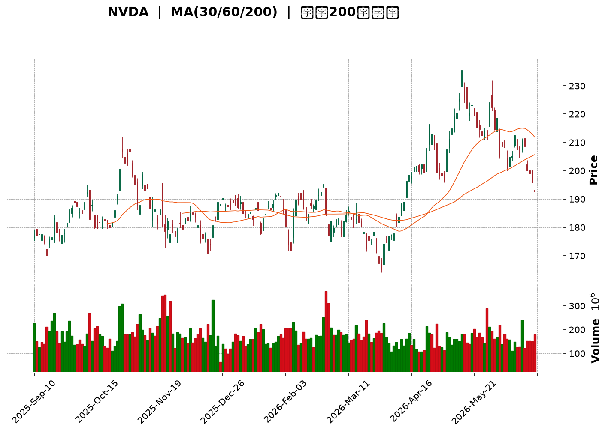
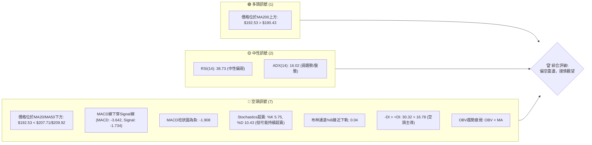
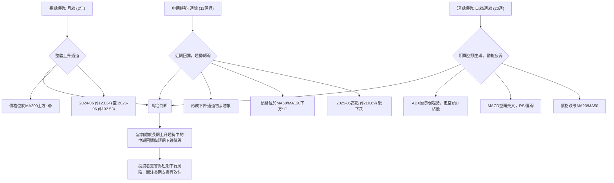
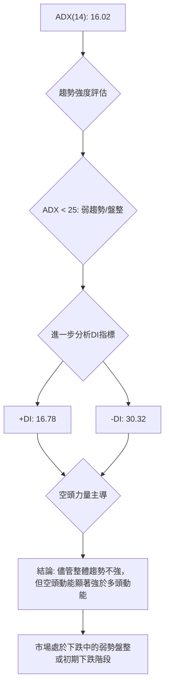
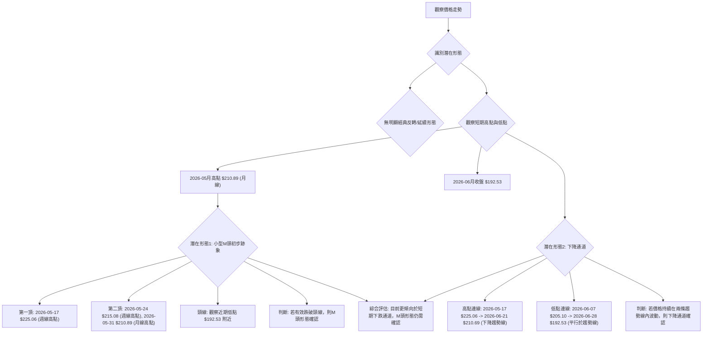
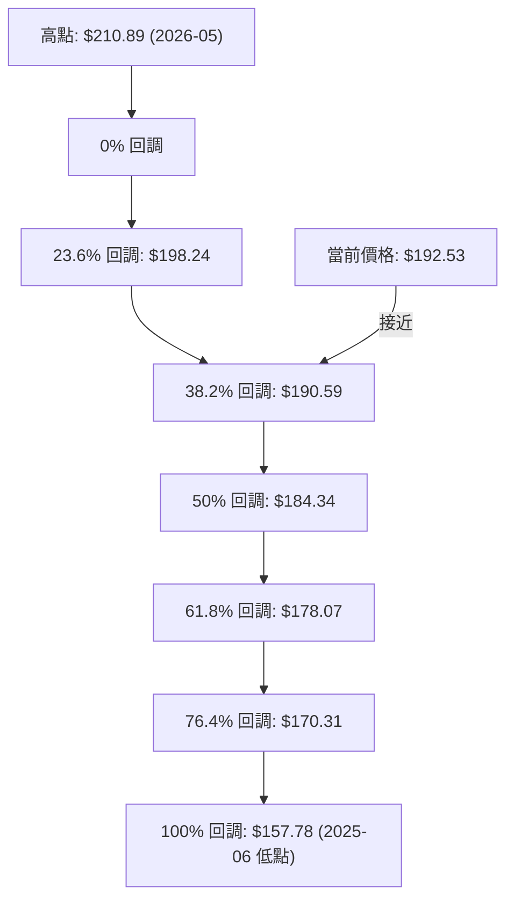
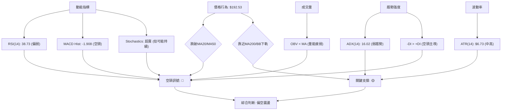
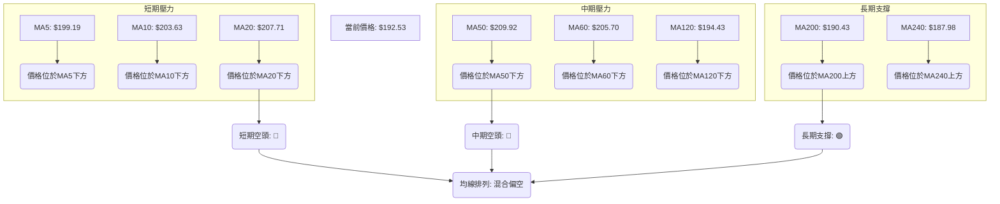

<details>
<summary>📊 靜態圖表 (點擊展開)</summary>

</details>

<html>
<head><meta charset="utf-8" /></head>
<body>
    <div style="height:500px; width:100%;">                        <script>window.PlotlyConfig = {MathJaxConfig: 'local'};</script>
        <script charset="utf-8" src="https://cdn.plot.ly/plotly-3.6.0.min.js" integrity="sha256-QaOVwtVY0T02VaHrr6pnoHLCwayMJp4O5n4YyaE3rJk=" crossorigin="anonymous"></script>                <div id="candlestick-chart" class="plotly-graph-div" style="height:100%; width:100%;"></div>            <script>                window.PLOTLYENV=window.PLOTLYENV || {};                                if (document.getElementById("candlestick-chart")) {                    Plotly.newPlot(                        "candlestick-chart",                        [{"close":{"dtype":"f8","bdata":"AAAAQAMjZkAAAADANx5mQAAAAAD+MmZAAAAAIMEwZkAAAAAgCNVlQAAAAKBWQmVAAAAAIH8AZkAAAAAAPQ5mQAAAAEAJ7GZAAAAAoHxGZkAAAACA0xdmQAAAAGDWLmZAAAAAINE+ZkAAAACgybNmQAAAAGD0SmdAAAAAYAxgZ0AAAADgx5RnQAAAACAxbGdAAAAAoLcpZ0AAAADAvBlnQAAAAMDPm2dAAAAAAGQKaEAAAACAp91mQAAAAICQgmdAAAAAIJ95ZkAAAADgOnNmQAAAAECCsmZAAAAAYJLfZkAAAAAACc1mQAAAAGC8nWZAAAAAgJyBZkAAAADgsb1mQAAAAEC6QGdAAAAAAODnZ0AAAAAAxBhpQAAAAEDX2GlAAAAAwDVUaUAAAAAgbUdpQAAAAEC602lAAAAAIPvNaEAAAABgw15oQAAAAODkemdAAAAAQCF9Z0AAAACgfNloQAAAACA\u002fHWhAAAAAQLMxaEAAAABA51NnQAAAACCwvWdAAAAAIJhLZ0AAAADAIKRmQAAAAIAJSWdAAAAA4B2NZkAAAABg3lRmQAAAAMAoymZAAAAAAP4yZkAAAADA+IBmQAAAAADJGGZAAAAAIBt2ZkAAAADgUqdmQAAAAGCPa2ZAAAAA4ALlZkAAAABgAsZmQAAAAABeKmdAAAAAYNQXZ0AAAADAy\u002fFmQAAAAOC0lmZAAAAAQNHZZUAAAABAaAJmQAAAAKAcMGZAAAAAgGpXZUAAAAAAsb1lQAAAAACgmGZAAAAAYOvuZkAAAABAWJ9nQAAAAOAqjGdAAAAAYIjJZ0AAAADgs39nQAAAACD4aWdAAAAAwLpIZ0AAAACg1pNnQAAAAMCBfGdAAAAAoGFgZ0AAAADgJZxnQAAAAAARGmdAAAAAQFAUZ0AAAADg3hZnQAAAAECtMmdAAAAAQFfdZkAAAADgTlpnQAAAAKAZQGdAAAAAgEw7ZkAAAAAgGONmQAAAAKCsE2dAAAAAwB9uZ0AAAABgxUdnQAAAAIBKiWdAAAAAgCzpZ0AAAADA0AhoQAAAAKC13GdAAAAAwEgsZ0AAAACA2YNmQAAAAEBKv2VAAAAAwHV1ZUAAAACA5CVnQAAAACDfuWdAAAAAIO6JZ0AAAAAgMbpnQAAAAADLVmdAAAAAIMvSZkAAAABg1BdnQAAAACAIeGdAAAAAoHl1Z0AAAABA17JnQAAAAAAi6mdAAAAAwK4TaEAAAADgS2poQAAAAMBFFWdAAAAAQCwfZkAAAAAgP8hmQAAAAMCUemZAAAAAACXaZkAAAACAu+NmQAAAAABPM2ZAAAAAAK7NZkAAAADgbxFnQAAAAKAHOmdAAAAAYKjdZkAAAAAASYFmQAAAAAA34GZAAAAAgPu2ZkAAAABgFIZmQAAAAKBES2ZAAAAAYPePZUAAAADg7+1lQAAAAIDf32VAAAAAgBpPZkAAAAAgTWFlQAAAAEBm6mRAAAAAgEmfZEAAAACgTcZlQAAAAAB08WVAAAAAIN8lZkAAAADA3C1mQAAAAMCQPGZAAAAAAMe7ZkAAAADgRPZmQAAAACAijWdAAAAAIN6iZ0AAAADg\u002f4hoQAAAAIBu1GhAAAAAoM\u002fDaEAAAAAgPy5pQAAAAIBkOmlAAAAA4Lb0aEAAAADgdEhpQAAAAAAL7WhAAAAAoOEAakAAAABgcwtrQAAAAMB\u002fnWpAAAAAgDQgakAAAABAzupoQAAAAOABx2hAAAAAQPfHaEAAAAAArohoQAAAAGDR8mlAAAAAAB9oakAAAAAgYt5qQAAAAMDnZWtAAAAAQLyQa0AAAADAJTJsQAAAAADmbm1AAAAAwNghbEAAAABg9cFrQAAAAEBNi2tAAAAAILfma0AAAACAJGhrQAAAAOCJ4mpAAAAAIITTakAAAADAR4tqQAAAAMAEwGpAAAAAYJ1cakAAAACAKQNsQAAAAIDw0WtAAAAAAADQakAAAADAHlVrQAAAAEAzo2lAAAAA4HoUakAAAACAFAZqQAAAAKBwDWlAAAAAANebaUAAAACAFKZpQAAAAGBmjmpAAAAAwB7taUAAAADAzJRpQAAAAIAUVmpAAAAAwMwUakAAAACgRwFpQAAAAAAA4GhAAAAAIK53aEAAAADA9RBoQA=="},"high":{"dtype":"f8","bdata":"kTcGJaZhZkAtlZdrnIFmQOCNZpzrS2ZA9gxn5ehTZkBlpgrJwyhmQJJcOgJXn2VACJS1RvsbZkAC6TgJTTtmQOhACvETCmdAF8x\u002fHQHGZkAMVzWtoXFmQLDF4u74gGZAyfJUA1BxZkA4\u002fYfwf\u002fhmQFlnADeQY2dA6Sjqu898Z0C8lgwW0NlnQEm5O6jCw2dApbOmfbpfZ0C4vzetNppnQGvIAsN4q2dAlSMVo6NhaED7aU673WtoQJfiknLFu2dAxi6FORESZ0B68ozoTRRnQGTC9yh94WZACcY4MbL7ZkBTvTrJ2R5nQLR4xz3U0WZAd7NdRprmZkDH+OLLf9lmQAgaov9lZ2dA0sWrjSz4Z0DHe7nghFxpQPITB2NufWpAkyXGgLe8aUAXn9cQkPZpQFJk\u002fvVDYmpAsuLqxrl2aUDr1AAsK1VpQG8GvPTIq2hA6A\u002fMOZCCZ0A2L5c27vVoQAZwvWp5ZWhAki+rsH50aEDgMznVRuZnQMw6+5uI2GdA1Grn1EuYZ0B3zxRbERJnQE3sUMTcc2dA1T1wtwJ4aEAElJiaZQpnQOIGQzaF6GZAY9HFs9s9ZkABQHP4qdVmQPpDlrr4YWZAwfDZKECCZkDSKYFsjS1nQNqogaj2xmZANEFzX3IJZ0CeO8Pr6w1nQI0zG+2reGdAO2v448wvZ0BVoAEpIShnQEUol\u002fsro2ZA+KDHCB3TZkBLJxf+e0ZmQN4cwdC4SGZA3kcFNEv9ZUARddTQ7v1lQI7H4KhTp2ZAhwNF7\u002fD9ZkB+NnUNLqNnQKRUj4HBlWdAjCXIkZEOaEAgLW0c9pBnQHsgsCdQmGdAug1Ou33KZ0Caj6ooPRZoQKIX\u002fsOcLGhAbr2B7fL9Z0BkUzEyYeRnQCrG7f01qmdADHPYmp1DZ0B8Ppyei1xnQH8uMewvfGdA6ie\u002fk4cHZ0DVyJ0tAa9nQO3IX\u002fynxmdA3SpV\u002fQzFZkDd7mgR7yRnQGMeJrouPmdAwPE\u002fHc+rZ0Dycu6td5xnQDb55dqXuGdA4GBwl7MDaEDLl+xR0SdoQB4NEDgZSGhAiXywcS7CZ0CrmOfxYEFnQJPdg1aPa2ZA2sO281gTZkDbwA\u002fitVhnQDeTyh+SLWhAkhd1TtsHaEDstbdXySBoQGJ+bRD5K2hAIOoO0rBoZ0CEYcIegV1nQD8\u002f+CVrxGdA70sAFmqGZ0CzhCEJJMNnQNjfcczWNmhAO5awMRYxaEDxcI23dKxoQLH2JbG0QWhAkQl+HMPLZkCocGWYkedmQOKIZ2S\u002flWZAk6InLzMPZ0AFY3eQvvpmQIOE8hMy0WZAANi9Z\u002f3VZkBlpl3Vz0ZnQLuqKbbZbGdANi+c1TAXZ0CC8i2O8jtnQPaqM8YflWdAGcFpqOQlZ0Dq8840VOVmQKAvOLWneGZATBDA2a1BZkD42xr3MUVmQC35sqV5AGZAlCLmBkqgZkBu\u002fGGevglmQAXD\u002f7irWGVAVrQsbxYoZUA8GOrGVc1lQLb0II07JWZAxi7XaxEpZkBH0swRqDJmQOEypGK4QGZACqquLGshZ0D7zvjgs\u002ftmQB2GXA\u002fsuGdAf1CBCQ6uZ0AAAADg\u002f4hoQEgZy6hVBWlAthXeUcHzaECSTCnP4i5pQEpqcZPoPWlAN6V3gXJQaUAAAADgdEhpQLIKuIr3cmlAEzTxkIpWakDef+OGexJrQMZOjF9cz2pAdEGWqB2PakAdSLELxEFqQDU+\u002fBtwWGlAdh1WQdgvaUCNL\u002ft0OABpQLFvya3hAGpAYaBHoGu+akCFZYGUfDFrQE2XjZlRwWtAcsIYLarva0DiGut0ZHJsQDGB9t53iG1AEq2cUGDnbEBFUcKibrdsQF7Y4lf\u002fBmxALYABgrw7bED03KEhVGRsQK2xJTUWmGtAUGvO1qE9a0C2Mt930rxqQDlAZoOc6GpAVK12imcza0DdMuuCdhNsQO\u002fZEYhOAG1A5dP7ifDRa0AAAABAM7NrQAAAAADX22pAAAAAQApPakAAAADAzGxqQAAAAEAK52lAAAAAwB61aUAAAACAPeJpQAAAAGC4lmpAAAAAIK5vakAAAABguCZqQAAAAOB6bGpAAAAAIK6\u002fakAAAADgo3hpQAAAAKBwNWlAAAAAoJkZaUAAAACgmXFoQA=="},"hovertemplate":"\u003cb\u003e%{x|%Y-%m-%d}\u003c\u002fb\u003e\u003cbr\u003e\u958b: $%{open:.2f}\u003cbr\u003e\u9ad8: $%{high:.2f}\u003cbr\u003e\u4f4e: $%{low:.2f}\u003cbr\u003e\u6536: $%{close:.2f}\u003cextra\u003e\u003c\u002fextra\u003e","low":{"dtype":"f8","bdata":"p5wSZJLnZUDGxVlzKghmQP9UsCs1B2ZAxc14zzTJZUCQe65XDcVlQPpZMl5BBmVAtBzAmauXZUBl+n9snt5lQJCI512Zz2VAjH0\u002fqon\u002fZUDXkzVipuVlQO8d73QanWVAHrV7JKHWZUCclDjX44JmQFtKN1j2p2ZAwVDr2U31ZkBSfSgpQXpnQHY4AYCaJGdATg5ZbxbjZkBo6Sv6f\u002fhmQNz+dBGtSWdA6wfYwSHaZ0AfSiz1LbpmQI5QBwAkN2dAnS6PMRNvZkC71i6hDSJmQAeLvOlPcWZAi29\u002fVaxwZkDGN\u002fu+869mQIWI\u002fnBFcmZANfJWWx0RZkBjyUR783FmQApE8iyF6GZA3qoYThSGZ0CQHdAqTPVnQLvPA\u002fWckGlAqJaKEekkaUBdqPnhADppQMgPJYaKqWlAerdNDrG1aEAQ2fuX3UxoQFPFCT2QRGdAc2FJrdNVZkCw6MqCYTFoQF5su2jN4WdA9bbHfF7cZ0Cqyr3ItPNmQLaMUPMyi2ZAG6+NKroCZ0BHF8M3em1mQGpthYEb02ZAlHJhft5zZkA5Yrr2tZZlQOEI4pYqCGZAR8uKa7AqZUAQZHAUakBmQHIBrzfOCGZAXjecHa6uZUBcjyG8qXhmQE0dJEI4XGZAZjymYbR3ZkDsgihYEZZmQCO5Lo+wxWZAAuM\u002fFxjjZkC3KDT9LrpmQGrdLmP0DGZAEoXuXQjNZUD35yLzItplQEZTskT71WVAZMaayUdDZUDYTCjHinNlQJG6MYcBBGZAOD9XfxfEZkB9L7KXq9VmQJi6pyibS2dA7VV036t4Z0AgfZNt3zVnQIerWhZ5VmdAa9SI+WhIZ0ABlVQj+4BnQBEqnSiLPWdATK30MPVSZ0BVvbeypUpnQBDX0QWP72ZAYIJEoEfuZkAFjylpgdlmQLxy04ym5WZAL\u002fkKWo2SZkB\u002fAILPS0NnQB1sM19OO2dANZUrt5gsZkApJ\u002fR42EVmQFUF2vSW9mZAH6eKG\u002fVSZ0ABu0QKbjhnQC8xkiQpL2dAUg87pHqzZ0Df8uW9qjpnQAfj4XCnp2dAFeEJ6fMUZ0DEeE5kfQBmQJT4kEBrdmVAgW+F+0paZUAbKyHgZMxlQGqGZaY692ZA2aX4sIF8Z0AdbuYlSJFnQFsThqoMSWdAF9fWDM2rZkAXPMVnxl5mQDTB4wwKUWdAr6OM+uEtZ0C3iiT41DZnQAM0AGkrq2dA2JkXo35lZ0DOMACquTFoQMdNMxAOA2dAF39S1UgFZkDAmpgcrM1lQAAQrvyKFmZAxUgOneZ6ZkALV8C9OTVmQDVUrPpYE2ZAo2QggRPrZUDo2nlrOblmQPS\u002fb1GHB2dACzRwwTqxZkBgtNR0YHdmQI7MwcJcpmZAzztY4v2uZkDSrt+q14NmQKq8riq78mVAXf+SmKRwZUD0B2hEz9FlQCnvleLguGVAvrGss5wUZkCSDyXUGl5lQMcJKh0Z2mRAcSsrVYWCZEAwFCAzgNhkQOMxSYl90WVAvQWDqXRlZUBugOetxfFlQJFN45emrmVA1wyDOeKCZkCCIh+AHI1mQNKZDQu8AmdA1h+ty8IwZ0DezSidiNFnQF4uSXljcGhAZFs7GaByaECAcMZ7N+FoQGKQxH6Cs2hA\u002fy1cRJbYaEA60aFAlthoQPzCEnSxn2hA7pum7nnyaEDeUSBGb+RpQI7zW+Wk\u002fmlAoqMDzdPqaUCGFQ1s\u002f85oQKPe9S5\u002fnGhA6GHx6mxQaEDndXs7qHloQEOxhg0fzGhA0C\u002fnrk7IaUBITnynjJRqQKWa2w2DtGpAw9x9Am\u002fVakDcMxmA\u002fKlrQDjHMeoOoWxADnWjrFP\u002fa0CeCjSLtENrQHlOtZ8ANWtAG1bOMsmHa0BKbVwxpDVrQAmr6S2Z0WpAs\u002f0zRhp4akB32iKuLhFqQJzPd+UrX2pAQEtmmEtcakBGYzRWXe5qQO6g6ET0omtAgUryKVTIakAAAABACl9qQAAAAGCPimlAAAAAAADAaUAAAABA4epoQAAAAKBw\u002fWhAAAAAoEfxaEAAAACAFG5pQAAAAEDhCmpAAAAAoEfpaUAAAABgj2JpQAAAAAAA0GlAAAAAQAr3aUAAAAAAAABpQAAAAGCPkmhAAAAAACkEaEAAAABACudnQA=="},"name":"\u50f9\u683c","open":{"dtype":"f8","bdata":"lyGdRPYMZkC5MYRub25mQHSKkuVkMWZA1D6YdEfuZUD2IbkAyRhmQEkENFpxjWVA1IwWtUS4ZUA5u02kefFlQIHn43V04mVA4HGTb5+3ZkBQhOjnT3FmQIFNwn4\u002fyGVAAAJwdS0+ZkDmTGixZ4ZmQHdHWlUju2ZAoLJyPiEgZ0AcjmHXeKtnQBbi0D1enmdAYZXUanAoZ0AjhhrVxD9nQGc5R6GiSmdABs5OLIb\u002fZ0A7DM6fbihoQHKA7+Zgd2dA+oWoyRsRZ0CRoIVDERJnQOQi\u002f33uv2ZAKBfZWGp+ZkC5KgADstxmQLR4xz3U0WZAFCWYphidZkDcfUToFYZmQJNcseBi82ZAdajkpu+3Z0DeGXYluxloQKU+BPHh9mlAGC7VCnCcaUBZaFoN\u002fMVpQJSVcBoU+mlATC0yprlXaUAJpQq6idBoQFu4KxpvhWhAMsaaKkMVZ0ALpbk8kVtoQDxvR0EqXWhAd6jP1g9vaEA\u002fHwwH0NlnQMI1YugQ1GZAdhbusnU3Z0DogiyMr+RmQOT8kk2\u002fEWdA5CAEnWl2aEB3OIzfSqBmQF89NS5daGZAA1Jznf3VZUC3wv2TwaxmQK4IkeYFWWZAXKd7ODLRZUDgtaM+6bBmQBVn+PMtm2ZAUW+YcMKsZkBjt\u002fK6T\u002fVmQD41DUpczWZA8JO7vK8qZ0Bsi+Rf1BdnQEjHmpzugWZAkH50uXWcZkAOK2yoJDdmQBk+GdJyAWZAOi2qwFX8ZUB3X5\u002f7J8plQBPSJpyNDmZAIsRrNEX2ZkDdktpk6NdmQN20se\u002fAdmdAi3ViVgm2Z0Dfxu4WZ29nQDoAsqNXgGdA+X6VnNmqZ0AEStO+erNnQI3ZKk3Y8GdA3WWxpDbJZ0D5h5Gj44pnQF+ACeIlnGdAWYfuTVgbZ0DPGTfK5d9mQAcaTNXJGGdAAgloGQ4DZ0AcXC+9ukhnQJwj324wm2dAY4Kbh7W1ZkAwAWfcnlpmQMGL60XMEGdAOe5O0rBoZ0Akljf90l1nQDH3JYZhYGdAP8e4\u002fi7hZ0AZxgLNa+NnQJurnTNE32dAuTrHIRpfZ0BJzot+a0BnQMYUD4m5Z2ZAInMo0PDWZUBQWdlEMQ9mQFhxbg4jAWdABfCbKLPkZ0AxcPLs5QZoQNR9InpvGWhAizMqJQ1oZ0BfLChC6rBmQAkYxlCkkGdAYr30waBaZ0A9uq+u90pnQMYeP59W5WdASU1hMjfoZ0BmYNPT0UZoQHo3NyQRQWhA7wfRO++gZkBFi2Frf9llQJGijdG4SGZAl+Q\u002f0guHZkC9zCKIYJ5mQMCZlpfec2ZA1y+XtKoTZkBlrRNnsMVmQGcl9cQxNmdA\u002f\u002fdicr76ZkA1rJ8WjRZnQJyNU2I52GZAMBB5pgYbZ0BpNgfqj8hmQLC6xj6wOWZAqhKBdF45ZkD2VgNttyFmQOYnVAcM1GVAQAFVUZocZkD524VwrvtlQOPPNbmqOWVAPurZMqwSZUDZ0rn60dhkQIezrZ1x+WVAiG3yb1h\u002fZUAlguAzhR5mQDG0LTrQ8GVALagOjCAJZ0B9UKYdG7RmQBgtp9INA2dAw+mxpwc6Z0DjSUlSxdNnQDPPQ1j1iWhANwUkpmemaEDl9bVZWvVoQE\u002f9JPbo92hAu3oQa6E8aUD2j2JmMRhpQDrSXJstR2lA1VppYEX3aEDc5Ctg\u002fSxqQHlfCVjgJ2pAMIds+XmOakB\u002fBQpz8DVqQJslD0N2IWlAYNW5ZZHoaEBcG\u002fLrLOJoQJESkJgI9WhAA43FYh4DakAnH7MxBplqQEgaqV9OuWpA5KtEZHVJa0AapTp1YRVsQAkZdEujsmxANyuJyMKvbEBIKCTgRrNsQMXP+ZCoa2tApAADJHLda0BgLQK9\u002f8BrQC2BsiGSlGtAs7OVmjYJa0DOUxwB3btqQDBJ\u002fdIWYWpAw2DsEZHKakBofffMUu9qQNfkY+tLXWxAT2iGx8eua0AAAADAHr1qQAAAAMD10GpAAAAAgMJFakAAAAAA11NqQAAAAIDCjWlAAAAAIK4vaUAAAAAghZtpQAAAAKBwHWpAAAAAgMJlakAAAADA9RBqQAAAAGCP6mlAAAAAgBRuakAAAACgcEVpQAAAAADXA2lAAAAAYI8CaUAAAAAA1yNoQA=="},"x":["2025-09-10T00:00:00-04:00","2025-09-11T00:00:00-04:00","2025-09-12T00:00:00-04:00","2025-09-15T00:00:00-04:00","2025-09-16T00:00:00-04:00","2025-09-17T00:00:00-04:00","2025-09-18T00:00:00-04:00","2025-09-19T00:00:00-04:00","2025-09-22T00:00:00-04:00","2025-09-23T00:00:00-04:00","2025-09-24T00:00:00-04:00","2025-09-25T00:00:00-04:00","2025-09-26T00:00:00-04:00","2025-09-29T00:00:00-04:00","2025-09-30T00:00:00-04:00","2025-10-01T00:00:00-04:00","2025-10-02T00:00:00-04:00","2025-10-03T00:00:00-04:00","2025-10-06T00:00:00-04:00","2025-10-07T00:00:00-04:00","2025-10-08T00:00:00-04:00","2025-10-09T00:00:00-04:00","2025-10-10T00:00:00-04:00","2025-10-13T00:00:00-04:00","2025-10-14T00:00:00-04:00","2025-10-15T00:00:00-04:00","2025-10-16T00:00:00-04:00","2025-10-17T00:00:00-04:00","2025-10-20T00:00:00-04:00","2025-10-21T00:00:00-04:00","2025-10-22T00:00:00-04:00","2025-10-23T00:00:00-04:00","2025-10-24T00:00:00-04:00","2025-10-27T00:00:00-04:00","2025-10-28T00:00:00-04:00","2025-10-29T00:00:00-04:00","2025-10-30T00:00:00-04:00","2025-10-31T00:00:00-04:00","2025-11-03T00:00:00-05:00","2025-11-04T00:00:00-05:00","2025-11-05T00:00:00-05:00","2025-11-06T00:00:00-05:00","2025-11-07T00:00:00-05:00","2025-11-10T00:00:00-05:00","2025-11-11T00:00:00-05:00","2025-11-12T00:00:00-05:00","2025-11-13T00:00:00-05:00","2025-11-14T00:00:00-05:00","2025-11-17T00:00:00-05:00","2025-11-18T00:00:00-05:00","2025-11-19T00:00:00-05:00","2025-11-20T00:00:00-05:00","2025-11-21T00:00:00-05:00","2025-11-24T00:00:00-05:00","2025-11-25T00:00:00-05:00","2025-11-26T00:00:00-05:00","2025-11-28T00:00:00-05:00","2025-12-01T00:00:00-05:00","2025-12-02T00:00:00-05:00","2025-12-03T00:00:00-05:00","2025-12-04T00:00:00-05:00","2025-12-05T00:00:00-05:00","2025-12-08T00:00:00-05:00","2025-12-09T00:00:00-05:00","2025-12-10T00:00:00-05:00","2025-12-11T00:00:00-05:00","2025-12-12T00:00:00-05:00","2025-12-15T00:00:00-05:00","2025-12-16T00:00:00-05:00","2025-12-17T00:00:00-05:00","2025-12-18T00:00:00-05:00","2025-12-19T00:00:00-05:00","2025-12-22T00:00:00-05:00","2025-12-23T00:00:00-05:00","2025-12-24T00:00:00-05:00","2025-12-26T00:00:00-05:00","2025-12-29T00:00:00-05:00","2025-12-30T00:00:00-05:00","2025-12-31T00:00:00-05:00","2026-01-02T00:00:00-05:00","2026-01-05T00:00:00-05:00","2026-01-06T00:00:00-05:00","2026-01-07T00:00:00-05:00","2026-01-08T00:00:00-05:00","2026-01-09T00:00:00-05:00","2026-01-12T00:00:00-05:00","2026-01-13T00:00:00-05:00","2026-01-14T00:00:00-05:00","2026-01-15T00:00:00-05:00","2026-01-16T00:00:00-05:00","2026-01-20T00:00:00-05:00","2026-01-21T00:00:00-05:00","2026-01-22T00:00:00-05:00","2026-01-23T00:00:00-05:00","2026-01-26T00:00:00-05:00","2026-01-27T00:00:00-05:00","2026-01-28T00:00:00-05:00","2026-01-29T00:00:00-05:00","2026-01-30T00:00:00-05:00","2026-02-02T00:00:00-05:00","2026-02-03T00:00:00-05:00","2026-02-04T00:00:00-05:00","2026-02-05T00:00:00-05:00","2026-02-06T00:00:00-05:00","2026-02-09T00:00:00-05:00","2026-02-10T00:00:00-05:00","2026-02-11T00:00:00-05:00","2026-02-12T00:00:00-05:00","2026-02-13T00:00:00-05:00","2026-02-17T00:00:00-05:00","2026-02-18T00:00:00-05:00","2026-02-19T00:00:00-05:00","2026-02-20T00:00:00-05:00","2026-02-23T00:00:00-05:00","2026-02-24T00:00:00-05:00","2026-02-25T00:00:00-05:00","2026-02-26T00:00:00-05:00","2026-02-27T00:00:00-05:00","2026-03-02T00:00:00-05:00","2026-03-03T00:00:00-05:00","2026-03-04T00:00:00-05:00","2026-03-05T00:00:00-05:00","2026-03-06T00:00:00-05:00","2026-03-09T00:00:00-04:00","2026-03-10T00:00:00-04:00","2026-03-11T00:00:00-04:00","2026-03-12T00:00:00-04:00","2026-03-13T00:00:00-04:00","2026-03-16T00:00:00-04:00","2026-03-17T00:00:00-04:00","2026-03-18T00:00:00-04:00","2026-03-19T00:00:00-04:00","2026-03-20T00:00:00-04:00","2026-03-23T00:00:00-04:00","2026-03-24T00:00:00-04:00","2026-03-25T00:00:00-04:00","2026-03-26T00:00:00-04:00","2026-03-27T00:00:00-04:00","2026-03-30T00:00:00-04:00","2026-03-31T00:00:00-04:00","2026-04-01T00:00:00-04:00","2026-04-02T00:00:00-04:00","2026-04-06T00:00:00-04:00","2026-04-07T00:00:00-04:00","2026-04-08T00:00:00-04:00","2026-04-09T00:00:00-04:00","2026-04-10T00:00:00-04:00","2026-04-13T00:00:00-04:00","2026-04-14T00:00:00-04:00","2026-04-15T00:00:00-04:00","2026-04-16T00:00:00-04:00","2026-04-17T00:00:00-04:00","2026-04-20T00:00:00-04:00","2026-04-21T00:00:00-04:00","2026-04-22T00:00:00-04:00","2026-04-23T00:00:00-04:00","2026-04-24T00:00:00-04:00","2026-04-27T00:00:00-04:00","2026-04-28T00:00:00-04:00","2026-04-29T00:00:00-04:00","2026-04-30T00:00:00-04:00","2026-05-01T00:00:00-04:00","2026-05-04T00:00:00-04:00","2026-05-05T00:00:00-04:00","2026-05-06T00:00:00-04:00","2026-05-07T00:00:00-04:00","2026-05-08T00:00:00-04:00","2026-05-11T00:00:00-04:00","2026-05-12T00:00:00-04:00","2026-05-13T00:00:00-04:00","2026-05-14T00:00:00-04:00","2026-05-15T00:00:00-04:00","2026-05-18T00:00:00-04:00","2026-05-19T00:00:00-04:00","2026-05-20T00:00:00-04:00","2026-05-21T00:00:00-04:00","2026-05-22T00:00:00-04:00","2026-05-26T00:00:00-04:00","2026-05-27T00:00:00-04:00","2026-05-28T00:00:00-04:00","2026-05-29T00:00:00-04:00","2026-06-01T00:00:00-04:00","2026-06-02T00:00:00-04:00","2026-06-03T00:00:00-04:00","2026-06-04T00:00:00-04:00","2026-06-05T00:00:00-04:00","2026-06-08T00:00:00-04:00","2026-06-09T00:00:00-04:00","2026-06-10T00:00:00-04:00","2026-06-11T00:00:00-04:00","2026-06-12T00:00:00-04:00","2026-06-15T00:00:00-04:00","2026-06-16T00:00:00-04:00","2026-06-17T00:00:00-04:00","2026-06-18T00:00:00-04:00","2026-06-22T00:00:00-04:00","2026-06-23T00:00:00-04:00","2026-06-24T00:00:00-04:00","2026-06-25T00:00:00-04:00","2026-06-26T00:00:00-04:00"],"type":"candlestick"},{"hovertemplate":"MA30: $%{y:.2f}\u003cextra\u003e\u003c\u002fextra\u003e","line":{"color":"#2196F3","dash":"dash","width":2},"mode":"lines","name":"MA30","x":["2025-09-10T00:00:00-04:00","2025-09-11T00:00:00-04:00","2025-09-12T00:00:00-04:00","2025-09-15T00:00:00-04:00","2025-09-16T00:00:00-04:00","2025-09-17T00:00:00-04:00","2025-09-18T00:00:00-04:00","2025-09-19T00:00:00-04:00","2025-09-22T00:00:00-04:00","2025-09-23T00:00:00-04:00","2025-09-24T00:00:00-04:00","2025-09-25T00:00:00-04:00","2025-09-26T00:00:00-04:00","2025-09-29T00:00:00-04:00","2025-09-30T00:00:00-04:00","2025-10-01T00:00:00-04:00","2025-10-02T00:00:00-04:00","2025-10-03T00:00:00-04:00","2025-10-06T00:00:00-04:00","2025-10-07T00:00:00-04:00","2025-10-08T00:00:00-04:00","2025-10-09T00:00:00-04:00","2025-10-10T00:00:00-04:00","2025-10-13T00:00:00-04:00","2025-10-14T00:00:00-04:00","2025-10-15T00:00:00-04:00","2025-10-16T00:00:00-04:00","2025-10-17T00:00:00-04:00","2025-10-20T00:00:00-04:00","2025-10-21T00:00:00-04:00","2025-10-22T00:00:00-04:00","2025-10-23T00:00:00-04:00","2025-10-24T00:00:00-04:00","2025-10-27T00:00:00-04:00","2025-10-28T00:00:00-04:00","2025-10-29T00:00:00-04:00","2025-10-30T00:00:00-04:00","2025-10-31T00:00:00-04:00","2025-11-03T00:00:00-05:00","2025-11-04T00:00:00-05:00","2025-11-05T00:00:00-05:00","2025-11-06T00:00:00-05:00","2025-11-07T00:00:00-05:00","2025-11-10T00:00:00-05:00","2025-11-11T00:00:00-05:00","2025-11-12T00:00:00-05:00","2025-11-13T00:00:00-05:00","2025-11-14T00:00:00-05:00","2025-11-17T00:00:00-05:00","2025-11-18T00:00:00-05:00","2025-11-19T00:00:00-05:00","2025-11-20T00:00:00-05:00","2025-11-21T00:00:00-05:00","2025-11-24T00:00:00-05:00","2025-11-25T00:00:00-05:00","2025-11-26T00:00:00-05:00","2025-11-28T00:00:00-05:00","2025-12-01T00:00:00-05:00","2025-12-02T00:00:00-05:00","2025-12-03T00:00:00-05:00","2025-12-04T00:00:00-05:00","2025-12-05T00:00:00-05:00","2025-12-08T00:00:00-05:00","2025-12-09T00:00:00-05:00","2025-12-10T00:00:00-05:00","2025-12-11T00:00:00-05:00","2025-12-12T00:00:00-05:00","2025-12-15T00:00:00-05:00","2025-12-16T00:00:00-05:00","2025-12-17T00:00:00-05:00","2025-12-18T00:00:00-05:00","2025-12-19T00:00:00-05:00","2025-12-22T00:00:00-05:00","2025-12-23T00:00:00-05:00","2025-12-24T00:00:00-05:00","2025-12-26T00:00:00-05:00","2025-12-29T00:00:00-05:00","2025-12-30T00:00:00-05:00","2025-12-31T00:00:00-05:00","2026-01-02T00:00:00-05:00","2026-01-05T00:00:00-05:00","2026-01-06T00:00:00-05:00","2026-01-07T00:00:00-05:00","2026-01-08T00:00:00-05:00","2026-01-09T00:00:00-05:00","2026-01-12T00:00:00-05:00","2026-01-13T00:00:00-05:00","2026-01-14T00:00:00-05:00","2026-01-15T00:00:00-05:00","2026-01-16T00:00:00-05:00","2026-01-20T00:00:00-05:00","2026-01-21T00:00:00-05:00","2026-01-22T00:00:00-05:00","2026-01-23T00:00:00-05:00","2026-01-26T00:00:00-05:00","2026-01-27T00:00:00-05:00","2026-01-28T00:00:00-05:00","2026-01-29T00:00:00-05:00","2026-01-30T00:00:00-05:00","2026-02-02T00:00:00-05:00","2026-02-03T00:00:00-05:00","2026-02-04T00:00:00-05:00","2026-02-05T00:00:00-05:00","2026-02-06T00:00:00-05:00","2026-02-09T00:00:00-05:00","2026-02-10T00:00:00-05:00","2026-02-11T00:00:00-05:00","2026-02-12T00:00:00-05:00","2026-02-13T00:00:00-05:00","2026-02-17T00:00:00-05:00","2026-02-18T00:00:00-05:00","2026-02-19T00:00:00-05:00","2026-02-20T00:00:00-05:00","2026-02-23T00:00:00-05:00","2026-02-24T00:00:00-05:00","2026-02-25T00:00:00-05:00","2026-02-26T00:00:00-05:00","2026-02-27T00:00:00-05:00","2026-03-02T00:00:00-05:00","2026-03-03T00:00:00-05:00","2026-03-04T00:00:00-05:00","2026-03-05T00:00:00-05:00","2026-03-06T00:00:00-05:00","2026-03-09T00:00:00-04:00","2026-03-10T00:00:00-04:00","2026-03-11T00:00:00-04:00","2026-03-12T00:00:00-04:00","2026-03-13T00:00:00-04:00","2026-03-16T00:00:00-04:00","2026-03-17T00:00:00-04:00","2026-03-18T00:00:00-04:00","2026-03-19T00:00:00-04:00","2026-03-20T00:00:00-04:00","2026-03-23T00:00:00-04:00","2026-03-24T00:00:00-04:00","2026-03-25T00:00:00-04:00","2026-03-26T00:00:00-04:00","2026-03-27T00:00:00-04:00","2026-03-30T00:00:00-04:00","2026-03-31T00:00:00-04:00","2026-04-01T00:00:00-04:00","2026-04-02T00:00:00-04:00","2026-04-06T00:00:00-04:00","2026-04-07T00:00:00-04:00","2026-04-08T00:00:00-04:00","2026-04-09T00:00:00-04:00","2026-04-10T00:00:00-04:00","2026-04-13T00:00:00-04:00","2026-04-14T00:00:00-04:00","2026-04-15T00:00:00-04:00","2026-04-16T00:00:00-04:00","2026-04-17T00:00:00-04:00","2026-04-20T00:00:00-04:00","2026-04-21T00:00:00-04:00","2026-04-22T00:00:00-04:00","2026-04-23T00:00:00-04:00","2026-04-24T00:00:00-04:00","2026-04-27T00:00:00-04:00","2026-04-28T00:00:00-04:00","2026-04-29T00:00:00-04:00","2026-04-30T00:00:00-04:00","2026-05-01T00:00:00-04:00","2026-05-04T00:00:00-04:00","2026-05-05T00:00:00-04:00","2026-05-06T00:00:00-04:00","2026-05-07T00:00:00-04:00","2026-05-08T00:00:00-04:00","2026-05-11T00:00:00-04:00","2026-05-12T00:00:00-04:00","2026-05-13T00:00:00-04:00","2026-05-14T00:00:00-04:00","2026-05-15T00:00:00-04:00","2026-05-18T00:00:00-04:00","2026-05-19T00:00:00-04:00","2026-05-20T00:00:00-04:00","2026-05-21T00:00:00-04:00","2026-05-22T00:00:00-04:00","2026-05-26T00:00:00-04:00","2026-05-27T00:00:00-04:00","2026-05-28T00:00:00-04:00","2026-05-29T00:00:00-04:00","2026-06-01T00:00:00-04:00","2026-06-02T00:00:00-04:00","2026-06-03T00:00:00-04:00","2026-06-04T00:00:00-04:00","2026-06-05T00:00:00-04:00","2026-06-08T00:00:00-04:00","2026-06-09T00:00:00-04:00","2026-06-10T00:00:00-04:00","2026-06-11T00:00:00-04:00","2026-06-12T00:00:00-04:00","2026-06-15T00:00:00-04:00","2026-06-16T00:00:00-04:00","2026-06-17T00:00:00-04:00","2026-06-18T00:00:00-04:00","2026-06-22T00:00:00-04:00","2026-06-23T00:00:00-04:00","2026-06-24T00:00:00-04:00","2026-06-25T00:00:00-04:00","2026-06-26T00:00:00-04:00"],"y":{"dtype":"f8","bdata":"AAAAAAAA+H8AAAAAAAD4fwAAAAAAAPh\u002fAAAAAAAA+H8AAAAAAAD4fwAAAAAAAPh\u002fAAAAAAAA+H8AAAAAAAD4fwAAAAAAAPh\u002fAAAAAAAA+H8AAAAAAAD4fwAAAAAAAPh\u002fAAAAAAAA+H8AAAAAAAD4fwAAAAAAAPh\u002fAAAAAAAA+H8AAAAAAAD4fwAAAAAAAPh\u002fAAAAAAAA+H8AAAAAAAD4fwAAAAAAAPh\u002fAAAAAAAA+H8AAAAAAAD4fwAAAAAAAPh\u002fAAAAAAAA+H8AAAAAAAD4fwAAAAAAAPh\u002fAAAAAAAA+H8AAAAAAAD4f7y7uwtqq2ZAmpmZSZGuZkCJiIgo4rNmQGZmZubfvGZAAAAAEIPLZkCJiIioXudmQERERBSFDmdAiYiICOkqZ0AzMzOjakZnQN7d3c00X2dAZmZmFsp0Z0C8u7t7OIhnQImIiAhKk2dA3t3dTeadZ0AiIiISObBnQAAAAJA7t2dAd3d3lzi+Z0CJiIj4DrxnQHd3d2fGvmdAzczMfOe\u002fZ0AzMzPj+7tnQLy7u4s5uWdAIiIiAoSsZ0BVVVXF9KdnQN7d3S3PoWdAmpmZeXSfZ0DNzMy86Z9nQGZmZvbJmmdAzczM\u002fEWXZ0Dv7u4uBJZnQERERARYlGdAq6qqOqiXZ0De3d0t75dnQO\u002fu7l4wl2dAzczMDEGQZ0ARERFx431nQO\u002fu7n4VYmdAq6qqemdEZ0CrqqrqgChnQBERESFzCWdAZmZmxuXrZkCrqqo6dtVmQGZmZmbrzWZA7+7u3i3JZkARERExtb5mQO\u002fu7i7fuWZAmpmZSWa2ZkCrqqoK3LdmQERERKQRtWZAIiIiMvm0ZkCamZm59rxmQO\u002fu7u6tvmZAmpmZubjFZkAiIiKCodBmQCIiImJL02ZAAAAAIM7aZkAzMzNDzd9mQM3MzLwy6WZAzczMrKPsZkAiIiICm\u002fJmQO\u002fu7q6w+WZAiYiIeAj0ZkCamZmpAPVmQERERAQ\u002f9GZAVVVVZR\u002f3ZkDNzMwM\u002fflmQKuqqhoTAmdAZmZmNqcTZ0BmZmb27iRnQERERFQ4M2dAZmZmVtlCZ0CamZlJdElnQCIiIrI1QmdAVVVVtaA1Z0ARERFRlDFnQDMzM1MaM2dAVVVVlfswZ0ARERGx7jJnQN7d3Q1LMmdAq6qqqlwuZ0BVVVV1OipnQFVVVUUUKmdAVVVVRcgqZ0CrqqrqiStnQKuqqmp5MmdAERERkfw6Z0AAAAAATUZnQFVVVRVSRWdAERERUfs+Z0DNzMzsHDpnQN7d3W2HM2dAmpmZ6dI4Z0C8u7tb2DhnQFVVVcVdMWdAVVVVpQQsZ0Dv7u7+NCpnQCIiIqKQJ2dARERE1KUeZ0BVVVXFmBFnQGZmZiYuCWdAzczMLEUFZ0BEREQ0WAVnQO\u002fu7q4CCmdA7+7u3uQKZ0CamZnZfgBnQAAAABCy8GZAq6qqijPmZkARERHxK9JmQKuqqup9vWZAREREVLWqZkCrqqoadZ9mQKuqqipwkmZAmpmZWUCHZkARERERSXpmQM3MzGz3a2ZARERExIBgZkAiIiIiGlRmQCIiIvIYWGZAZmZmRgVlZkAiIiKi+nNmQM3MzGwKiGZAmpmZ6VyYZkBVVVXV6atmQCIiIuK\u002fxWZAvLu7Cx7YZkDNzMycBOtmQJqZmbmE+WZAZmZm5koUZ0C8u7sLCDtnQO\u002fu7t7wWmdA7+7uXgx4Z0B3d3f3eIxnQBEREfGpoWdAd3d3ZyG9Z0ARERHxWtNnQM3MzLwe9mdAq6qqWhYZaEAzMzNj7EdoQBEREYE9f2hAAAAAEH26aECJiIiISPFoQLy7u7syMWlAZmZmlkNkaUAiIiIC3pNpQO\u002fu7o4owWlAERERoUHtaUC8u7t7LxNqQAAAAOChL2pAvLu7m9pKakAzMzMj\u002f1tqQDMzMwNibGpAiYiIeAJ6akCrqqpqLJJqQO\u002fu7q5KqGpAREREdCK4akBVVVWVn8lqQN7d3f2xz2pAvLu7O1nQakDv7u7eosdqQImIiAhNumpAREREhOO1akB3d3eXIbxqQLy7u5tPy2pAERERMRXVakBmZmYmBd5qQAAAADBU4WpA3t3dLY3eakBVVVXlpc5qQLy7uyseuWpARERExK6eakDv7u5ucXtqQA=="},"type":"scatter"},{"hovertemplate":"MA60: $%{y:.2f}\u003cextra\u003e\u003c\u002fextra\u003e","line":{"color":"#9C27B0","dash":"dash","width":2},"mode":"lines","name":"MA60","x":["2025-09-10T00:00:00-04:00","2025-09-11T00:00:00-04:00","2025-09-12T00:00:00-04:00","2025-09-15T00:00:00-04:00","2025-09-16T00:00:00-04:00","2025-09-17T00:00:00-04:00","2025-09-18T00:00:00-04:00","2025-09-19T00:00:00-04:00","2025-09-22T00:00:00-04:00","2025-09-23T00:00:00-04:00","2025-09-24T00:00:00-04:00","2025-09-25T00:00:00-04:00","2025-09-26T00:00:00-04:00","2025-09-29T00:00:00-04:00","2025-09-30T00:00:00-04:00","2025-10-01T00:00:00-04:00","2025-10-02T00:00:00-04:00","2025-10-03T00:00:00-04:00","2025-10-06T00:00:00-04:00","2025-10-07T00:00:00-04:00","2025-10-08T00:00:00-04:00","2025-10-09T00:00:00-04:00","2025-10-10T00:00:00-04:00","2025-10-13T00:00:00-04:00","2025-10-14T00:00:00-04:00","2025-10-15T00:00:00-04:00","2025-10-16T00:00:00-04:00","2025-10-17T00:00:00-04:00","2025-10-20T00:00:00-04:00","2025-10-21T00:00:00-04:00","2025-10-22T00:00:00-04:00","2025-10-23T00:00:00-04:00","2025-10-24T00:00:00-04:00","2025-10-27T00:00:00-04:00","2025-10-28T00:00:00-04:00","2025-10-29T00:00:00-04:00","2025-10-30T00:00:00-04:00","2025-10-31T00:00:00-04:00","2025-11-03T00:00:00-05:00","2025-11-04T00:00:00-05:00","2025-11-05T00:00:00-05:00","2025-11-06T00:00:00-05:00","2025-11-07T00:00:00-05:00","2025-11-10T00:00:00-05:00","2025-11-11T00:00:00-05:00","2025-11-12T00:00:00-05:00","2025-11-13T00:00:00-05:00","2025-11-14T00:00:00-05:00","2025-11-17T00:00:00-05:00","2025-11-18T00:00:00-05:00","2025-11-19T00:00:00-05:00","2025-11-20T00:00:00-05:00","2025-11-21T00:00:00-05:00","2025-11-24T00:00:00-05:00","2025-11-25T00:00:00-05:00","2025-11-26T00:00:00-05:00","2025-11-28T00:00:00-05:00","2025-12-01T00:00:00-05:00","2025-12-02T00:00:00-05:00","2025-12-03T00:00:00-05:00","2025-12-04T00:00:00-05:00","2025-12-05T00:00:00-05:00","2025-12-08T00:00:00-05:00","2025-12-09T00:00:00-05:00","2025-12-10T00:00:00-05:00","2025-12-11T00:00:00-05:00","2025-12-12T00:00:00-05:00","2025-12-15T00:00:00-05:00","2025-12-16T00:00:00-05:00","2025-12-17T00:00:00-05:00","2025-12-18T00:00:00-05:00","2025-12-19T00:00:00-05:00","2025-12-22T00:00:00-05:00","2025-12-23T00:00:00-05:00","2025-12-24T00:00:00-05:00","2025-12-26T00:00:00-05:00","2025-12-29T00:00:00-05:00","2025-12-30T00:00:00-05:00","2025-12-31T00:00:00-05:00","2026-01-02T00:00:00-05:00","2026-01-05T00:00:00-05:00","2026-01-06T00:00:00-05:00","2026-01-07T00:00:00-05:00","2026-01-08T00:00:00-05:00","2026-01-09T00:00:00-05:00","2026-01-12T00:00:00-05:00","2026-01-13T00:00:00-05:00","2026-01-14T00:00:00-05:00","2026-01-15T00:00:00-05:00","2026-01-16T00:00:00-05:00","2026-01-20T00:00:00-05:00","2026-01-21T00:00:00-05:00","2026-01-22T00:00:00-05:00","2026-01-23T00:00:00-05:00","2026-01-26T00:00:00-05:00","2026-01-27T00:00:00-05:00","2026-01-28T00:00:00-05:00","2026-01-29T00:00:00-05:00","2026-01-30T00:00:00-05:00","2026-02-02T00:00:00-05:00","2026-02-03T00:00:00-05:00","2026-02-04T00:00:00-05:00","2026-02-05T00:00:00-05:00","2026-02-06T00:00:00-05:00","2026-02-09T00:00:00-05:00","2026-02-10T00:00:00-05:00","2026-02-11T00:00:00-05:00","2026-02-12T00:00:00-05:00","2026-02-13T00:00:00-05:00","2026-02-17T00:00:00-05:00","2026-02-18T00:00:00-05:00","2026-02-19T00:00:00-05:00","2026-02-20T00:00:00-05:00","2026-02-23T00:00:00-05:00","2026-02-24T00:00:00-05:00","2026-02-25T00:00:00-05:00","2026-02-26T00:00:00-05:00","2026-02-27T00:00:00-05:00","2026-03-02T00:00:00-05:00","2026-03-03T00:00:00-05:00","2026-03-04T00:00:00-05:00","2026-03-05T00:00:00-05:00","2026-03-06T00:00:00-05:00","2026-03-09T00:00:00-04:00","2026-03-10T00:00:00-04:00","2026-03-11T00:00:00-04:00","2026-03-12T00:00:00-04:00","2026-03-13T00:00:00-04:00","2026-03-16T00:00:00-04:00","2026-03-17T00:00:00-04:00","2026-03-18T00:00:00-04:00","2026-03-19T00:00:00-04:00","2026-03-20T00:00:00-04:00","2026-03-23T00:00:00-04:00","2026-03-24T00:00:00-04:00","2026-03-25T00:00:00-04:00","2026-03-26T00:00:00-04:00","2026-03-27T00:00:00-04:00","2026-03-30T00:00:00-04:00","2026-03-31T00:00:00-04:00","2026-04-01T00:00:00-04:00","2026-04-02T00:00:00-04:00","2026-04-06T00:00:00-04:00","2026-04-07T00:00:00-04:00","2026-04-08T00:00:00-04:00","2026-04-09T00:00:00-04:00","2026-04-10T00:00:00-04:00","2026-04-13T00:00:00-04:00","2026-04-14T00:00:00-04:00","2026-04-15T00:00:00-04:00","2026-04-16T00:00:00-04:00","2026-04-17T00:00:00-04:00","2026-04-20T00:00:00-04:00","2026-04-21T00:00:00-04:00","2026-04-22T00:00:00-04:00","2026-04-23T00:00:00-04:00","2026-04-24T00:00:00-04:00","2026-04-27T00:00:00-04:00","2026-04-28T00:00:00-04:00","2026-04-29T00:00:00-04:00","2026-04-30T00:00:00-04:00","2026-05-01T00:00:00-04:00","2026-05-04T00:00:00-04:00","2026-05-05T00:00:00-04:00","2026-05-06T00:00:00-04:00","2026-05-07T00:00:00-04:00","2026-05-08T00:00:00-04:00","2026-05-11T00:00:00-04:00","2026-05-12T00:00:00-04:00","2026-05-13T00:00:00-04:00","2026-05-14T00:00:00-04:00","2026-05-15T00:00:00-04:00","2026-05-18T00:00:00-04:00","2026-05-19T00:00:00-04:00","2026-05-20T00:00:00-04:00","2026-05-21T00:00:00-04:00","2026-05-22T00:00:00-04:00","2026-05-26T00:00:00-04:00","2026-05-27T00:00:00-04:00","2026-05-28T00:00:00-04:00","2026-05-29T00:00:00-04:00","2026-06-01T00:00:00-04:00","2026-06-02T00:00:00-04:00","2026-06-03T00:00:00-04:00","2026-06-04T00:00:00-04:00","2026-06-05T00:00:00-04:00","2026-06-08T00:00:00-04:00","2026-06-09T00:00:00-04:00","2026-06-10T00:00:00-04:00","2026-06-11T00:00:00-04:00","2026-06-12T00:00:00-04:00","2026-06-15T00:00:00-04:00","2026-06-16T00:00:00-04:00","2026-06-17T00:00:00-04:00","2026-06-18T00:00:00-04:00","2026-06-22T00:00:00-04:00","2026-06-23T00:00:00-04:00","2026-06-24T00:00:00-04:00","2026-06-25T00:00:00-04:00","2026-06-26T00:00:00-04:00"],"y":{"dtype":"f8","bdata":"AAAAAAAA+H8AAAAAAAD4fwAAAAAAAPh\u002fAAAAAAAA+H8AAAAAAAD4fwAAAAAAAPh\u002fAAAAAAAA+H8AAAAAAAD4fwAAAAAAAPh\u002fAAAAAAAA+H8AAAAAAAD4fwAAAAAAAPh\u002fAAAAAAAA+H8AAAAAAAD4fwAAAAAAAPh\u002fAAAAAAAA+H8AAAAAAAD4fwAAAAAAAPh\u002fAAAAAAAA+H8AAAAAAAD4fwAAAAAAAPh\u002fAAAAAAAA+H8AAAAAAAD4fwAAAAAAAPh\u002fAAAAAAAA+H8AAAAAAAD4fwAAAAAAAPh\u002fAAAAAAAA+H8AAAAAAAD4fwAAAAAAAPh\u002fAAAAAAAA+H8AAAAAAAD4fwAAAAAAAPh\u002fAAAAAAAA+H8AAAAAAAD4fwAAAAAAAPh\u002fAAAAAAAA+H8AAAAAAAD4fwAAAAAAAPh\u002fAAAAAAAA+H8AAAAAAAD4fwAAAAAAAPh\u002fAAAAAAAA+H8AAAAAAAD4fwAAAAAAAPh\u002fAAAAAAAA+H8AAAAAAAD4fwAAAAAAAPh\u002fAAAAAAAA+H8AAAAAAAD4fwAAAAAAAPh\u002fAAAAAAAA+H8AAAAAAAD4fwAAAAAAAPh\u002fAAAAAAAA+H8AAAAAAAD4fwAAAAAAAPh\u002fAAAAAAAA+H8AAAAAAAD4fwAAAAjhH2dAIiIiwhwjZ0AzMzOr6CVnQKuqqiIIKmdAZmZmDuItZ0DNzMwMoTJnQJqZmUlNOGdAmpmZQag3Z0Dv7u7GdTdnQHd3d\u002fdTNGdAZmZm7lcwZ0AzMzNb1y5nQHd3d7eaMGdAZmZmFoozZ0CamZkhdzdnQHd3d1+NOGdAiYiIcE86Z0CamZmB9TlnQN7d3QXsOWdAd3d3V3A6Z0BmZmZOeTxnQFVVVb3zO2dA3t3dXR45Z0C8u7sjSzxnQAAAAEiNOmdAzczMTCE9Z0AAAACA2z9nQJqZmVn+QWdAzczM1PRBZ0CJiIiYT0RnQJqZmVkER2dAmpmZWdhFZ0C8u7vrd0ZnQJqZmbG3RWdAERERObBDZ0Dv7u4+8DtnQM3MzEwUMmdAiYiIWAcsZ0CJiIjwtyZnQKuqqrpVHmdAZmZmjl8XZ0AiIiJCdQ9nQERERIwQCGdAIiIiSmf\u002fZkARERHBJPhmQBEREcF89mZAd3d377DzZkDe3d1dZfVmQBEREVmu82ZAZmZm7qrxZkB3d3eXmPNmQCIiIhph9GZAd3d3f0D4ZkBmZma2Ff5mQGZmZmbiAmdAiYiIWOUKZ0CamZkhDRNnQBEREWlCF2dA7+7ufs8VZ0B3d3f3WxZnQGZmZg6cFmdAERERsW0WZ0CrqqqC7BZnQM3MzGTOEmdAVVVVBZIRZ0De3d0FGRJnQGZmZt7RFGdAVVVVhSYZZ0De3d3dQxtnQFVVVT0zHmdAmpmZQQ8kZ0Dv7u4+ZidnQImIiDAcJmdAIiIiykIgZ0BVVVWVCRlnQJqZmTHmEWdAAAAAkJcLZ0ARERFRjQJnQERERHzk92ZAd3d3\u002f4jsZkAAAADI1+RmQAAAADhC3mZAd3d3TwTZZkDe3d196dJmQLy7u2s4z2ZAq6qqqr7NZkARERGRM81mQLy7u4O1zmZAvLu7SwDSZkB3d3fHC9dmQFVVVe3I3WZAmpmZ6ZfoZkCJiIgYYfJmQLy7u9OO+2ZAiYiIWBECZ0De3d3NnApnQN7d3a2KEGdAVVVVXXgZZ0CJiIhoUCZnQKuqqoIPMmdA3t3dxag+Z0De3d2V6EhnQAAAAFDWVWdAMzMzIwNkZ0BVVVXl7GlnQGZmZmZoc2dAq6qq8qR\u002fZ0AiIiIqDI1nQN7d3bVdnmdAIiIiMpmyZ0CamZnRXshnQDMzM3PR4WdAAAAA+MH1Z0CamZmJEwdoQN7d3f2PFmhAq6qqMuEmaEDv7u7OpDNoQBEREWndQ2hAERER8e9XaECrqqri\u002fGdoQAAAADg2emhAERERsS+JaEAAAAAgC59oQImIiEgFt2hAAAAAQCDIaEAREREZUtpoQLy7u1ub5GhAEREREVLyaEBVVVV1VQFpQLy7u\u002fOeCmlAmpmZ8fcWaUB3d3dHTSRpQGZmZsZ8NmlARERETBtJaUC8u7sLsFhpQGZmZna5a2lARERExNF7aUBEREQkSYtpQGZmZtYtnGlAIiIi6pWsaUC8u7v7XLZpQA=="},"type":"scatter"},{"hovertemplate":"MA200: $%{y:.2f}\u003cextra\u003e\u003c\u002fextra\u003e","line":{"color":"#FF6F00","dash":"solid","width":2},"mode":"lines","name":"MA200","x":["2025-09-10T00:00:00-04:00","2025-09-11T00:00:00-04:00","2025-09-12T00:00:00-04:00","2025-09-15T00:00:00-04:00","2025-09-16T00:00:00-04:00","2025-09-17T00:00:00-04:00","2025-09-18T00:00:00-04:00","2025-09-19T00:00:00-04:00","2025-09-22T00:00:00-04:00","2025-09-23T00:00:00-04:00","2025-09-24T00:00:00-04:00","2025-09-25T00:00:00-04:00","2025-09-26T00:00:00-04:00","2025-09-29T00:00:00-04:00","2025-09-30T00:00:00-04:00","2025-10-01T00:00:00-04:00","2025-10-02T00:00:00-04:00","2025-10-03T00:00:00-04:00","2025-10-06T00:00:00-04:00","2025-10-07T00:00:00-04:00","2025-10-08T00:00:00-04:00","2025-10-09T00:00:00-04:00","2025-10-10T00:00:00-04:00","2025-10-13T00:00:00-04:00","2025-10-14T00:00:00-04:00","2025-10-15T00:00:00-04:00","2025-10-16T00:00:00-04:00","2025-10-17T00:00:00-04:00","2025-10-20T00:00:00-04:00","2025-10-21T00:00:00-04:00","2025-10-22T00:00:00-04:00","2025-10-23T00:00:00-04:00","2025-10-24T00:00:00-04:00","2025-10-27T00:00:00-04:00","2025-10-28T00:00:00-04:00","2025-10-29T00:00:00-04:00","2025-10-30T00:00:00-04:00","2025-10-31T00:00:00-04:00","2025-11-03T00:00:00-05:00","2025-11-04T00:00:00-05:00","2025-11-05T00:00:00-05:00","2025-11-06T00:00:00-05:00","2025-11-07T00:00:00-05:00","2025-11-10T00:00:00-05:00","2025-11-11T00:00:00-05:00","2025-11-12T00:00:00-05:00","2025-11-13T00:00:00-05:00","2025-11-14T00:00:00-05:00","2025-11-17T00:00:00-05:00","2025-11-18T00:00:00-05:00","2025-11-19T00:00:00-05:00","2025-11-20T00:00:00-05:00","2025-11-21T00:00:00-05:00","2025-11-24T00:00:00-05:00","2025-11-25T00:00:00-05:00","2025-11-26T00:00:00-05:00","2025-11-28T00:00:00-05:00","2025-12-01T00:00:00-05:00","2025-12-02T00:00:00-05:00","2025-12-03T00:00:00-05:00","2025-12-04T00:00:00-05:00","2025-12-05T00:00:00-05:00","2025-12-08T00:00:00-05:00","2025-12-09T00:00:00-05:00","2025-12-10T00:00:00-05:00","2025-12-11T00:00:00-05:00","2025-12-12T00:00:00-05:00","2025-12-15T00:00:00-05:00","2025-12-16T00:00:00-05:00","2025-12-17T00:00:00-05:00","2025-12-18T00:00:00-05:00","2025-12-19T00:00:00-05:00","2025-12-22T00:00:00-05:00","2025-12-23T00:00:00-05:00","2025-12-24T00:00:00-05:00","2025-12-26T00:00:00-05:00","2025-12-29T00:00:00-05:00","2025-12-30T00:00:00-05:00","2025-12-31T00:00:00-05:00","2026-01-02T00:00:00-05:00","2026-01-05T00:00:00-05:00","2026-01-06T00:00:00-05:00","2026-01-07T00:00:00-05:00","2026-01-08T00:00:00-05:00","2026-01-09T00:00:00-05:00","2026-01-12T00:00:00-05:00","2026-01-13T00:00:00-05:00","2026-01-14T00:00:00-05:00","2026-01-15T00:00:00-05:00","2026-01-16T00:00:00-05:00","2026-01-20T00:00:00-05:00","2026-01-21T00:00:00-05:00","2026-01-22T00:00:00-05:00","2026-01-23T00:00:00-05:00","2026-01-26T00:00:00-05:00","2026-01-27T00:00:00-05:00","2026-01-28T00:00:00-05:00","2026-01-29T00:00:00-05:00","2026-01-30T00:00:00-05:00","2026-02-02T00:00:00-05:00","2026-02-03T00:00:00-05:00","2026-02-04T00:00:00-05:00","2026-02-05T00:00:00-05:00","2026-02-06T00:00:00-05:00","2026-02-09T00:00:00-05:00","2026-02-10T00:00:00-05:00","2026-02-11T00:00:00-05:00","2026-02-12T00:00:00-05:00","2026-02-13T00:00:00-05:00","2026-02-17T00:00:00-05:00","2026-02-18T00:00:00-05:00","2026-02-19T00:00:00-05:00","2026-02-20T00:00:00-05:00","2026-02-23T00:00:00-05:00","2026-02-24T00:00:00-05:00","2026-02-25T00:00:00-05:00","2026-02-26T00:00:00-05:00","2026-02-27T00:00:00-05:00","2026-03-02T00:00:00-05:00","2026-03-03T00:00:00-05:00","2026-03-04T00:00:00-05:00","2026-03-05T00:00:00-05:00","2026-03-06T00:00:00-05:00","2026-03-09T00:00:00-04:00","2026-03-10T00:00:00-04:00","2026-03-11T00:00:00-04:00","2026-03-12T00:00:00-04:00","2026-03-13T00:00:00-04:00","2026-03-16T00:00:00-04:00","2026-03-17T00:00:00-04:00","2026-03-18T00:00:00-04:00","2026-03-19T00:00:00-04:00","2026-03-20T00:00:00-04:00","2026-03-23T00:00:00-04:00","2026-03-24T00:00:00-04:00","2026-03-25T00:00:00-04:00","2026-03-26T00:00:00-04:00","2026-03-27T00:00:00-04:00","2026-03-30T00:00:00-04:00","2026-03-31T00:00:00-04:00","2026-04-01T00:00:00-04:00","2026-04-02T00:00:00-04:00","2026-04-06T00:00:00-04:00","2026-04-07T00:00:00-04:00","2026-04-08T00:00:00-04:00","2026-04-09T00:00:00-04:00","2026-04-10T00:00:00-04:00","2026-04-13T00:00:00-04:00","2026-04-14T00:00:00-04:00","2026-04-15T00:00:00-04:00","2026-04-16T00:00:00-04:00","2026-04-17T00:00:00-04:00","2026-04-20T00:00:00-04:00","2026-04-21T00:00:00-04:00","2026-04-22T00:00:00-04:00","2026-04-23T00:00:00-04:00","2026-04-24T00:00:00-04:00","2026-04-27T00:00:00-04:00","2026-04-28T00:00:00-04:00","2026-04-29T00:00:00-04:00","2026-04-30T00:00:00-04:00","2026-05-01T00:00:00-04:00","2026-05-04T00:00:00-04:00","2026-05-05T00:00:00-04:00","2026-05-06T00:00:00-04:00","2026-05-07T00:00:00-04:00","2026-05-08T00:00:00-04:00","2026-05-11T00:00:00-04:00","2026-05-12T00:00:00-04:00","2026-05-13T00:00:00-04:00","2026-05-14T00:00:00-04:00","2026-05-15T00:00:00-04:00","2026-05-18T00:00:00-04:00","2026-05-19T00:00:00-04:00","2026-05-20T00:00:00-04:00","2026-05-21T00:00:00-04:00","2026-05-22T00:00:00-04:00","2026-05-26T00:00:00-04:00","2026-05-27T00:00:00-04:00","2026-05-28T00:00:00-04:00","2026-05-29T00:00:00-04:00","2026-06-01T00:00:00-04:00","2026-06-02T00:00:00-04:00","2026-06-03T00:00:00-04:00","2026-06-04T00:00:00-04:00","2026-06-05T00:00:00-04:00","2026-06-08T00:00:00-04:00","2026-06-09T00:00:00-04:00","2026-06-10T00:00:00-04:00","2026-06-11T00:00:00-04:00","2026-06-12T00:00:00-04:00","2026-06-15T00:00:00-04:00","2026-06-16T00:00:00-04:00","2026-06-17T00:00:00-04:00","2026-06-18T00:00:00-04:00","2026-06-22T00:00:00-04:00","2026-06-23T00:00:00-04:00","2026-06-24T00:00:00-04:00","2026-06-25T00:00:00-04:00","2026-06-26T00:00:00-04:00"],"y":{"dtype":"f8","bdata":"AAAAAAAA+H8AAAAAAAD4fwAAAAAAAPh\u002fAAAAAAAA+H8AAAAAAAD4fwAAAAAAAPh\u002fAAAAAAAA+H8AAAAAAAD4fwAAAAAAAPh\u002fAAAAAAAA+H8AAAAAAAD4fwAAAAAAAPh\u002fAAAAAAAA+H8AAAAAAAD4fwAAAAAAAPh\u002fAAAAAAAA+H8AAAAAAAD4fwAAAAAAAPh\u002fAAAAAAAA+H8AAAAAAAD4fwAAAAAAAPh\u002fAAAAAAAA+H8AAAAAAAD4fwAAAAAAAPh\u002fAAAAAAAA+H8AAAAAAAD4fwAAAAAAAPh\u002fAAAAAAAA+H8AAAAAAAD4fwAAAAAAAPh\u002fAAAAAAAA+H8AAAAAAAD4fwAAAAAAAPh\u002fAAAAAAAA+H8AAAAAAAD4fwAAAAAAAPh\u002fAAAAAAAA+H8AAAAAAAD4fwAAAAAAAPh\u002fAAAAAAAA+H8AAAAAAAD4fwAAAAAAAPh\u002fAAAAAAAA+H8AAAAAAAD4fwAAAAAAAPh\u002fAAAAAAAA+H8AAAAAAAD4fwAAAAAAAPh\u002fAAAAAAAA+H8AAAAAAAD4fwAAAAAAAPh\u002fAAAAAAAA+H8AAAAAAAD4fwAAAAAAAPh\u002fAAAAAAAA+H8AAAAAAAD4fwAAAAAAAPh\u002fAAAAAAAA+H8AAAAAAAD4fwAAAAAAAPh\u002fAAAAAAAA+H8AAAAAAAD4fwAAAAAAAPh\u002fAAAAAAAA+H8AAAAAAAD4fwAAAAAAAPh\u002fAAAAAAAA+H8AAAAAAAD4fwAAAAAAAPh\u002fAAAAAAAA+H8AAAAAAAD4fwAAAAAAAPh\u002fAAAAAAAA+H8AAAAAAAD4fwAAAAAAAPh\u002fAAAAAAAA+H8AAAAAAAD4fwAAAAAAAPh\u002fAAAAAAAA+H8AAAAAAAD4fwAAAAAAAPh\u002fAAAAAAAA+H8AAAAAAAD4fwAAAAAAAPh\u002fAAAAAAAA+H8AAAAAAAD4fwAAAAAAAPh\u002fAAAAAAAA+H8AAAAAAAD4fwAAAAAAAPh\u002fAAAAAAAA+H8AAAAAAAD4fwAAAAAAAPh\u002fAAAAAAAA+H8AAAAAAAD4fwAAAAAAAPh\u002fAAAAAAAA+H8AAAAAAAD4fwAAAAAAAPh\u002fAAAAAAAA+H8AAAAAAAD4fwAAAAAAAPh\u002fAAAAAAAA+H8AAAAAAAD4fwAAAAAAAPh\u002fAAAAAAAA+H8AAAAAAAD4fwAAAAAAAPh\u002fAAAAAAAA+H8AAAAAAAD4fwAAAAAAAPh\u002fAAAAAAAA+H8AAAAAAAD4fwAAAAAAAPh\u002fAAAAAAAA+H8AAAAAAAD4fwAAAAAAAPh\u002fAAAAAAAA+H8AAAAAAAD4fwAAAAAAAPh\u002fAAAAAAAA+H8AAAAAAAD4fwAAAAAAAPh\u002fAAAAAAAA+H8AAAAAAAD4fwAAAAAAAPh\u002fAAAAAAAA+H8AAAAAAAD4fwAAAAAAAPh\u002fAAAAAAAA+H8AAAAAAAD4fwAAAAAAAPh\u002fAAAAAAAA+H8AAAAAAAD4fwAAAAAAAPh\u002fAAAAAAAA+H8AAAAAAAD4fwAAAAAAAPh\u002fAAAAAAAA+H8AAAAAAAD4fwAAAAAAAPh\u002fAAAAAAAA+H8AAAAAAAD4fwAAAAAAAPh\u002fAAAAAAAA+H8AAAAAAAD4fwAAAAAAAPh\u002fAAAAAAAA+H8AAAAAAAD4fwAAAAAAAPh\u002fAAAAAAAA+H8AAAAAAAD4fwAAAAAAAPh\u002fAAAAAAAA+H8AAAAAAAD4fwAAAAAAAPh\u002fAAAAAAAA+H8AAAAAAAD4fwAAAAAAAPh\u002fAAAAAAAA+H8AAAAAAAD4fwAAAAAAAPh\u002fAAAAAAAA+H8AAAAAAAD4fwAAAAAAAPh\u002fAAAAAAAA+H8AAAAAAAD4fwAAAAAAAPh\u002fAAAAAAAA+H8AAAAAAAD4fwAAAAAAAPh\u002fAAAAAAAA+H8AAAAAAAD4fwAAAAAAAPh\u002fAAAAAAAA+H8AAAAAAAD4fwAAAAAAAPh\u002fAAAAAAAA+H8AAAAAAAD4fwAAAAAAAPh\u002fAAAAAAAA+H8AAAAAAAD4fwAAAAAAAPh\u002fAAAAAAAA+H8AAAAAAAD4fwAAAAAAAPh\u002fAAAAAAAA+H8AAAAAAAD4fwAAAAAAAPh\u002fAAAAAAAA+H8AAAAAAAD4fwAAAAAAAPh\u002fAAAAAAAA+H8AAAAAAAD4fwAAAAAAAPh\u002fAAAAAAAA+H8AAAAAAAD4fwAAAAAAAPh\u002fAAAAAAAA+H8K16MMss1nQA=="},"type":"scatter"}],                        {"template":{"data":{"barpolar":[{"marker":{"line":{"color":"rgb(17,17,17)","width":0.5},"pattern":{"fillmode":"overlay","size":10,"solidity":0.2}},"type":"barpolar"}],"bar":[{"error_x":{"color":"#f2f5fa"},"error_y":{"color":"#f2f5fa"},"marker":{"line":{"color":"rgb(17,17,17)","width":0.5},"pattern":{"fillmode":"overlay","size":10,"solidity":0.2}},"type":"bar"}],"carpet":[{"aaxis":{"endlinecolor":"#A2B1C6","gridcolor":"#506784","linecolor":"#506784","minorgridcolor":"#506784","startlinecolor":"#A2B1C6"},"baxis":{"endlinecolor":"#A2B1C6","gridcolor":"#506784","linecolor":"#506784","minorgridcolor":"#506784","startlinecolor":"#A2B1C6"},"type":"carpet"}],"choropleth":[{"colorbar":{"outlinewidth":0,"ticks":""},"type":"choropleth"}],"contourcarpet":[{"colorbar":{"outlinewidth":0,"ticks":""},"type":"contourcarpet"}],"contour":[{"colorbar":{"outlinewidth":0,"ticks":""},"colorscale":[[0.0,"#0d0887"],[0.1111111111111111,"#46039f"],[0.2222222222222222,"#7201a8"],[0.3333333333333333,"#9c179e"],[0.4444444444444444,"#bd3786"],[0.5555555555555556,"#d8576b"],[0.6666666666666666,"#ed7953"],[0.7777777777777778,"#fb9f3a"],[0.8888888888888888,"#fdca26"],[1.0,"#f0f921"]],"type":"contour"}],"heatmap":[{"colorbar":{"outlinewidth":0,"ticks":""},"colorscale":[[0.0,"#0d0887"],[0.1111111111111111,"#46039f"],[0.2222222222222222,"#7201a8"],[0.3333333333333333,"#9c179e"],[0.4444444444444444,"#bd3786"],[0.5555555555555556,"#d8576b"],[0.6666666666666666,"#ed7953"],[0.7777777777777778,"#fb9f3a"],[0.8888888888888888,"#fdca26"],[1.0,"#f0f921"]],"type":"heatmap"}],"histogram2dcontour":[{"colorbar":{"outlinewidth":0,"ticks":""},"colorscale":[[0.0,"#0d0887"],[0.1111111111111111,"#46039f"],[0.2222222222222222,"#7201a8"],[0.3333333333333333,"#9c179e"],[0.4444444444444444,"#bd3786"],[0.5555555555555556,"#d8576b"],[0.6666666666666666,"#ed7953"],[0.7777777777777778,"#fb9f3a"],[0.8888888888888888,"#fdca26"],[1.0,"#f0f921"]],"type":"histogram2dcontour"}],"histogram2d":[{"colorbar":{"outlinewidth":0,"ticks":""},"colorscale":[[0.0,"#0d0887"],[0.1111111111111111,"#46039f"],[0.2222222222222222,"#7201a8"],[0.3333333333333333,"#9c179e"],[0.4444444444444444,"#bd3786"],[0.5555555555555556,"#d8576b"],[0.6666666666666666,"#ed7953"],[0.7777777777777778,"#fb9f3a"],[0.8888888888888888,"#fdca26"],[1.0,"#f0f921"]],"type":"histogram2d"}],"histogram":[{"marker":{"pattern":{"fillmode":"overlay","size":10,"solidity":0.2}},"type":"histogram"}],"mesh3d":[{"colorbar":{"outlinewidth":0,"ticks":""},"type":"mesh3d"}],"parcoords":[{"line":{"colorbar":{"outlinewidth":0,"ticks":""}},"type":"parcoords"}],"pie":[{"automargin":true,"type":"pie"}],"scatter3d":[{"line":{"colorbar":{"outlinewidth":0,"ticks":""}},"marker":{"colorbar":{"outlinewidth":0,"ticks":""}},"type":"scatter3d"}],"scattercarpet":[{"marker":{"colorbar":{"outlinewidth":0,"ticks":""}},"type":"scattercarpet"}],"scattergeo":[{"marker":{"colorbar":{"outlinewidth":0,"ticks":""}},"type":"scattergeo"}],"scattergl":[{"marker":{"line":{"color":"#283442"}},"type":"scattergl"}],"scattermapbox":[{"marker":{"colorbar":{"outlinewidth":0,"ticks":""}},"type":"scattermapbox"}],"scattermap":[{"marker":{"colorbar":{"outlinewidth":0,"ticks":""}},"type":"scattermap"}],"scatterpolargl":[{"marker":{"colorbar":{"outlinewidth":0,"ticks":""}},"type":"scatterpolargl"}],"scatterpolar":[{"marker":{"colorbar":{"outlinewidth":0,"ticks":""}},"type":"scatterpolar"}],"scatter":[{"marker":{"line":{"color":"#283442"}},"type":"scatter"}],"scatterternary":[{"marker":{"colorbar":{"outlinewidth":0,"ticks":""}},"type":"scatterternary"}],"surface":[{"colorbar":{"outlinewidth":0,"ticks":""},"colorscale":[[0.0,"#0d0887"],[0.1111111111111111,"#46039f"],[0.2222222222222222,"#7201a8"],[0.3333333333333333,"#9c179e"],[0.4444444444444444,"#bd3786"],[0.5555555555555556,"#d8576b"],[0.6666666666666666,"#ed7953"],[0.7777777777777778,"#fb9f3a"],[0.8888888888888888,"#fdca26"],[1.0,"#f0f921"]],"type":"surface"}],"table":[{"cells":{"fill":{"color":"#506784"},"line":{"color":"rgb(17,17,17)"}},"header":{"fill":{"color":"#2a3f5f"},"line":{"color":"rgb(17,17,17)"}},"type":"table"}]},"layout":{"annotationdefaults":{"arrowcolor":"#f2f5fa","arrowhead":0,"arrowwidth":1},"autotypenumbers":"strict","coloraxis":{"colorbar":{"outlinewidth":0,"ticks":""}},"colorscale":{"diverging":[[0,"#8e0152"],[0.1,"#c51b7d"],[0.2,"#de77ae"],[0.3,"#f1b6da"],[0.4,"#fde0ef"],[0.5,"#f7f7f7"],[0.6,"#e6f5d0"],[0.7,"#b8e186"],[0.8,"#7fbc41"],[0.9,"#4d9221"],[1,"#276419"]],"sequential":[[0.0,"#0d0887"],[0.1111111111111111,"#46039f"],[0.2222222222222222,"#7201a8"],[0.3333333333333333,"#9c179e"],[0.4444444444444444,"#bd3786"],[0.5555555555555556,"#d8576b"],[0.6666666666666666,"#ed7953"],[0.7777777777777778,"#fb9f3a"],[0.8888888888888888,"#fdca26"],[1.0,"#f0f921"]],"sequentialminus":[[0.0,"#0d0887"],[0.1111111111111111,"#46039f"],[0.2222222222222222,"#7201a8"],[0.3333333333333333,"#9c179e"],[0.4444444444444444,"#bd3786"],[0.5555555555555556,"#d8576b"],[0.6666666666666666,"#ed7953"],[0.7777777777777778,"#fb9f3a"],[0.8888888888888888,"#fdca26"],[1.0,"#f0f921"]]},"colorway":["#636efa","#EF553B","#00cc96","#ab63fa","#FFA15A","#19d3f3","#FF6692","#B6E880","#FF97FF","#FECB52"],"font":{"color":"#f2f5fa"},"geo":{"bgcolor":"rgb(17,17,17)","lakecolor":"rgb(17,17,17)","landcolor":"rgb(17,17,17)","showlakes":true,"showland":true,"subunitcolor":"#506784"},"hoverlabel":{"align":"left"},"hovermode":"closest","mapbox":{"style":"dark"},"paper_bgcolor":"rgb(17,17,17)","plot_bgcolor":"rgb(17,17,17)","polar":{"angularaxis":{"gridcolor":"#506784","linecolor":"#506784","ticks":""},"bgcolor":"rgb(17,17,17)","radialaxis":{"gridcolor":"#506784","linecolor":"#506784","ticks":""}},"scene":{"xaxis":{"backgroundcolor":"rgb(17,17,17)","gridcolor":"#506784","gridwidth":2,"linecolor":"#506784","showbackground":true,"ticks":"","zerolinecolor":"#C8D4E3"},"yaxis":{"backgroundcolor":"rgb(17,17,17)","gridcolor":"#506784","gridwidth":2,"linecolor":"#506784","showbackground":true,"ticks":"","zerolinecolor":"#C8D4E3"},"zaxis":{"backgroundcolor":"rgb(17,17,17)","gridcolor":"#506784","gridwidth":2,"linecolor":"#506784","showbackground":true,"ticks":"","zerolinecolor":"#C8D4E3"}},"shapedefaults":{"line":{"color":"#f2f5fa"}},"sliderdefaults":{"bgcolor":"#C8D4E3","bordercolor":"rgb(17,17,17)","borderwidth":1,"tickwidth":0},"ternary":{"aaxis":{"gridcolor":"#506784","linecolor":"#506784","ticks":""},"baxis":{"gridcolor":"#506784","linecolor":"#506784","ticks":""},"bgcolor":"rgb(17,17,17)","caxis":{"gridcolor":"#506784","linecolor":"#506784","ticks":""}},"title":{"x":0.05},"updatemenudefaults":{"bgcolor":"#506784","borderwidth":0},"xaxis":{"automargin":true,"gridcolor":"#283442","linecolor":"#506784","ticks":"","title":{"standoff":15},"zerolinecolor":"#283442","zerolinewidth":2},"yaxis":{"automargin":true,"gridcolor":"#283442","linecolor":"#506784","ticks":"","title":{"standoff":15},"zerolinecolor":"#283442","zerolinewidth":2}}},"xaxis":{"rangeslider":{"visible":false},"title":{"text":"\u65e5\u671f"}},"font":{"size":11},"title":{"text":"NVDA  |  MA(30\u002f60\u002f200)  |  \u6700\u8fd1200\u4ea4\u6613\u65e5"},"yaxis":{"title":{"text":"\u80a1\u50f9 (USD)"}},"hovermode":"x unified","height":500},                        {"responsive": true}                    )                };            </script>        </div>
</body>
</html>

# NVDA 技術分析報告

> **報告日期**：2026-06-27 ｜ **語言**：繁體中文 ｜ **數據來源**：提供之技術數據 ｜ **當前價格**：$192.53

---

## 目錄

| 章節 | 內容 |
|------|------|
| [1. 技術面概覽](#1-技術面概覽) | 訊號儀表板、核心指標、評分卡 |
| [2. 趨勢分析](#2-趨勢分析) | 多時框趨勢、長中短期走勢 |
| [3. 圖表形態分析](#3-圖表形態分析) | 形態識別、K線組合、目標價 |
| [4. 支撐與阻力](#4-支撐與阻力) | 關鍵價位、斐波那契回調 |
| [5. 技術指標深度解讀](#5-技術指標深度解讀) | MA/RSI/MACD/布林/成交量 |
| [6. 動能與波動率](#6-動能與波動率) | 動能評估、ATR、Beta |
| [7. 多時框架總結](#7-多時框架總結) | 時框架評分矩陣 |
| [8. 交易策略建議](#8-交易策略建議) | 多空策略、風險報酬比 |
| [9. 風險提示與監控](#9-風險提示與監控) | 監控指標、風險場景 |

---

## 1. 技術面概覽

本章節提供 NVDA 當前技術狀態的快速總覽，透過整合多個關鍵指標，呈現其多空訊號分佈與綜合評級。

### 🎯 技術訊號儀表板

NVDA 當前技術訊號呈現短期偏弱，中期趨勢不明，而長期則勉強維持在關鍵支撐之上。空頭訊號主導了近期走勢，買方動能顯著不足。



### 📊 核心指標速覽表

下表彙整了 NVDA 當前關鍵技術指標的數值、訊號與初步解讀。

| 指標類別 | 指標名稱 | 當前數值 | 訊號 | 解讀 |
|----------|----------|----------|------|------|
| **價格** | 當前價格 | $192.53 | 🔴 | 位於短期與中期均線下方，顯示短期壓力沉重。 |
| **均線** | MA20 | $207.71 | 🔴 | 價格遠低於MA20，短期趨勢呈現空頭。 |
| **均線** | MA50 | $209.92 | 🔴 | 價格遠低於MA50，中期趨勢轉弱。 |
| **均線** | MA200 | $190.43 | 🟢 | 價格勉強位於MA200上方，為長期趨勢的最後一道支撐。 |
| **動能** | RSI(14) | 38.73 | 🟡 | 位於中性區間，但接近超賣區30，顯示動能疲弱。 |
| **動能** | MACD | -3.642 | 🔴 | MACD線已下穿訊號線，柱狀圖為負，確認空頭動能。 |
| **波動** | ATR(14) | $6.73 | 🟡 | 每日波動約3.49%，屬於中高波動，交易需留意風險。 |
| **趨勢** | ADX(14) | 16.02 | 🟡 | 趨勢強度較弱，市場可能處於盤整或初步下跌階段。 |
| **量能** | OBV趨勢 | OBV < MA | 🔴 | 量能未能配合價格上漲，反而在下跌中放量，呈現量價背離。 |

### 🏆 技術評分卡

根據各項技術指標的表現，我們對 NVDA 進行了綜合評分，以量化其當前的技術吸引力。

```
╔══════════════════════════════════════════════════════════════╗
║              技術評分卡 — NVDA (2026-06-27)                    ║
╠══════════════════════════════════════════════════════════════╣
║ 趨勢強度      ████████░░░░░░░░░░░░  40/100  🟡 (ADX弱，但空頭主導)   ║
║ 動能指標      ████░░░░░░░░░░░░░░░░  20/100  🔴 (RSI偏弱，MACD空頭) ║
║ 支撐穩定度    ████████████░░░░░░░░  60/100  🟡 (MA200/斐波那契提供支撐)║
║ 成交量配合    ████░░░░░░░░░░░░░░░░  20/100  🔴 (OBV疲弱，量能背離) ║
║ 形態完整度    ██████░░░░░░░░░░░░░░  30/100  🔴 (短期下跌通道，無明確反轉形態)║
║ 均線排列      ████░░░░░░░░░░░░░░░░  20/100  🔴 (短期均線空頭排列，價格位於下方)║
╠══════════════════════════════════════════════════════════════╣
║ 綜合評分      ████░░░░░░░░░░░░░░░░  30/100  評級: 🔴 偏空震盪       ║
╚══════════════════════════════════════════════════════════════╝
```

**評分說明**：
- **趨勢強度**：ADX(14)為16.02，顯示趨勢不強，但-DI顯著高於+DI，表明空頭力量佔優。因此趨勢強度評分偏低。
- **動能指標**：RSI(14)為38.73，接近超賣區間，MACD柱狀圖為負且MACD線下穿訊號線，動能明顯偏空。
- **支撐穩定度**：當前價格接近MA200及斐波那契38.2%回調位，這些位置提供了一定的支撐作用，但其穩定性仍需觀察。
- **成交量配合**：OBV趨勢疲弱，量能未有效支撐價格，顯示下跌過程中賣壓較重。
- **形態完整度**：目前未見明顯的底部反轉形態，近期走勢更傾向於短期下跌通道或盤整。
- **均線排列**：短期移動平均線（MA5, MA10, MA20, MA60）均位於價格上方，且呈空頭排列，對價格形成壓制。

綜合來看，NVDA 在短期內面臨較大的下行壓力，市場情緒偏空，建議投資者保持謹慎。

---

## 2. 趨勢分析

本章節將從多個時間框架深入分析 NVDA 的股價趨勢，包括長期、中期和短期走勢，並透過 ADX 指標評估其趨勢強度。

### 🌐 多時框趨勢分析

NVDA 的多時框趨勢呈現複雜局面，長期來看仍處於上升通道，但中短期已顯著轉弱，面臨回調壓力。



### 📈 長期趨勢 — 12個月走勢圖（Unicode）

NVDA 在過去12個月中經歷了顯著的波動，從2025年7月的$177.63上漲至2026年5月的歷史高點$210.89，隨後在2026年6月出現快速回調至$192.53。整體而言，雖然近期有所回落，但股價相較一年前仍有顯著增長，長期趨勢仍偏向上行。

```
NVDA 月線走勢圖（過去12個月）
價格軸 ($)
$215 ┤                                  ●(210.89)
$210 ┤
$205 ┤
$200 ┤              ●(202.23)
$195 ┤                                                  ●(192.53)
$190 ┤          ●(190.90)
$185 ┤    ●(186.34)      ●(186.27)
$180 ┤●(177.63)         ●(176.77)  ●(176.97)  ●(174.20)
$175 ┤  ●(173.95)
$170 ┤
     └────────────────────────────────────────────────────────────
      25/07 25/08 25/09 25/10 25/11 25/12 26/01 26/02 26/03 26/04 26/05 26/06
```

**走勢特徵分析表格**

| 階段日期 | 期間 | 關鍵價位 (高/低) | 走勢特徵 | 趨勢判斷 | 影響因素 |
|----------|------|------------------|----------|----------|----------|
| 2025/07-2025/10 | 快速上漲 | 高: $202.23 (25/10) | 從$177.63穩步上漲，突破多個阻力位。 | 🟢 強勢多頭 | 市場對AI需求樂觀，財報超預期。 |
| 2025/11-2026/03 | 震盪盤整 | 高: $190.90 (26/01)<br>低: $174.20 (26/03) | 在$170-$190區間震盪，動能減弱，出現回調。 | 🟡 中性盤整 | 獲利了結壓力，市場對高估值產生疑慮。 |
| 2026/04-2026/05 | 再次衝高 | 高: $210.89 (26/05) | 突破盤整區間，創下新高，市場情緒再次高漲。 | 🟢 短期強勢 | 新產品發布或利好消息刺激。 |
| 2026/06 | 急速回調 | 現價: $192.53 | 從高點$210.89快速下跌，跌破多條短期均線。 | 🔴 短期空頭 | 獲利了結、大盤疲軟或特定利空傳聞。 |

總結來說，NVDA 在過去一年中表現出強勁的長期上升潛力，但在達到高點後，近期出現了較為劇烈的回調，這可能預示著短期趨勢的轉變或至少是深度調整。

### 📊 中期趨勢（週線分析）

從中期週線來看，NVDA 在2026年5月創下新高後，未能維持強勁動能，隨即轉為下跌。價格跌破了關鍵的中期移動平均線，顯示出中期趨勢的疲軟。

**近期壓力與支撐示意圖 (基於週線)**

```
NVDA 近期週線壓力與支撐示意圖
════════════════════════════════════════════════════════════════
$215 ┤                                  ● (210.89)  ← 上方壓力區
$210 ┤                    ┌───────┐
$205 ┤                    │       │
$200 ┤                    │       │
$195 ┤                    │       │
$190 ┤────────────────────● (192.53) ← 現價
$185 ┤                    │       │
$180 ┤                    │       │
$175 ┤                    └───────┘  ← 下方支撐區
$170 ┤                                  ● (174.20)
════════════════════════════════════════════════════════════════
    關鍵觀察：
    - 最近高點 $210.89 已形成短期壓力。
    - 當前價格 $192.53 已跌破多條中期均線。
    - 下方關鍵支撐位於 $190.43 (MA200) 和 $174.20 (2026-03低點)。
```

從上圖可見，NVDA 在衝擊$210.89高點失敗後，股價進入快速下跌通道。短期內，$210.89和$207.71（MA20）構成上方主要阻力。下方則需重點關注$190.43（MA200）和$191.23（布林下軌）所形成的密集支撐區。若此區間失守，則可能進一步下探至$174.20甚至更低。

### ⚡ 趨勢強度評估（ADX 解讀）

ADX 指標用於衡量趨勢的強度，而非方向。當前 NVDA 的 ADX 數值為 16.02，遠低於25的閾值，這表明市場目前處於弱趨勢或盤整狀態。然而，結合 +DI 和 -DI 的數值，我們可以進一步判斷市場的主導力量。



**ADX 強度對照表**

| ADX 數值範圍 | 趨勢強度 | 市場狀態 | NVDA 當前狀態 |
|--------------|----------|----------|---------------|
| 0-25         | 弱趨勢   | 盤整/震盪 | ▓▓▓▓▓▓▓▓░░░░░░░░░░░░ (16.02) 🟡 |
| 25-50        | 中等趨勢 | 趨勢形成 | ░░░░░░░░░░░░░░░░░░░░ |
| 50-75        | 強趨勢   | 強勁趨勢 | ░░░░░░░░░░░░░░░░░░░░ |
| 75-100       | 極強趨勢 | 爆發趨勢 | ░░░░░░░░░░░░░░░░░░░░ |

**解讀**：
NVDA 的 ADX 數值為 16.02，明確指出市場目前缺乏強勁的單一方向趨勢。這意味著股價可能在一定範圍內震盪，或者正處於一個趨勢的早期階段，尚未完全確立。然而，+DI (16.78) 和 -DI (30.32) 的對比至關重要。-DI 顯著高於 +DI，表明在當前弱勢市場中，空頭力量佔據了主導地位，賣壓較重。這與價格跌破短期和中期均線、MACD 轉空等訊號相互印證，提示儘管趨勢強度不高，但方向上偏向空頭。

---

## 3. 圖表形態分析

圖表形態分析旨在識別股價走勢中重複出現的特定結構，這些結構通常預示著趨勢的延續或反轉。

### 🔍 形態識別系統

根據提供的數據，NVDA 在過去20週的走勢中，未能形成教科書般的經典反轉或延續形態。然而，可以觀察到2026年5月24日和2026年5月31日之間的高點$225.06和$215.08，以及隨後的快速下跌，這可能形成一個**小型M頭形態（Double Top）**的初步跡象，或是**下降通道（Descending Channel）**的開端。



**形態解讀**：
目前 NVDA 的走勢更傾向於一個短期下跌趨勢通道，而非一個完整的經典形態。雖然在 $210.89 附近形成了一個較高的頂部，然後回落，這與 M 頭形態的特徵吻合，但其「頸線」尚未明確有效跌破。如果將 2026-06-07 的 $205.10 和 2026-06-28 的 $192.53 視為下跌通道的下軌，而 2026-05-17 的 $225.06 和 2026-06-21 的 $210.69 視為上軌，則股價目前正沿著這個通道下行。

### 🕯️ 重要K線形態分析

分析近期的週線K線形態，可以發現多個顯示賣壓增強的訊號。

| 日期       | 收盤價  | K線形態       | 解讀                                                                                                                                                                                                                                                         | 訊號 |
|------------|---------|---------------|------------------------------------------------------------------------------------------------------------------------------------------------------------------------------------------------------------------------------------------------------|------|
| 2026-04-19 | $201.45 | 長陽線        | 從前期的低點反彈，RSI達到92.8的超買區，顯示市場極度樂觀，買盤強勁。                                                                                                                                                                                        | 🟢   |
| 2026-04-26 | $208.03 | 上影線較長陽線 | 雖然收盤價繼續上漲，但上影線較長，RSI從超買區回落至86.7，表明上方壓力開始顯現，多頭動能有所衰竭。                                                                                                                                                             | 🟡   |
| 2026-05-03 | $198.22 | 長陰線        | 在高位形成長陰線，且跌破前一周收盤價，RSI迅速回落至58.1，MACD柱狀圖轉負，顯示空頭力量開始佔據主導，前期強勁上漲趨勢可能告一段落。                                                                                                                              | 🔴   |
| 2026-05-10 | $214.95 | 長陽線        | 股價再次反彈，收出長陽線，RSI回升至60.3，MACD柱狀圖轉正，試圖扭轉跌勢。這是一個多頭抵抗的訊號，但未能突破前高。                                                                                                                                                 | 🟢   |
| 2026-05-17 | $225.06 | 突破性陽線    | 股價強勢突破，創下新高，RSI為56.2，但MACD柱狀圖顯著放大至+1.845，顯示買盤強勁。這可能是市場情緒最後的瘋狂，但與超買不同，RSI處於中性區間。                                                                                                                   | 🟢   |
| 2026-05-24 | $215.08 | 長上影線陰線  | 股價沖高回落，收出帶有長上影線的陰線，RSI回落至62.5，MACD柱狀圖轉負，這是非常明顯的看跌訊號，表明上方拋壓沉重，多頭上攻失敗。                                                                                                                                  | 🔴   |
| 2026-05-31 | $210.89 | 長陰線        | 股價繼續下跌，收出長陰線，RSI跌至46.3，MACD柱狀圖進一步放大負值，確認了上周的看跌訊號，市場情緒由盛轉衰，空頭趨勢確立。                                                                                                                                      | 🔴   |
| 2026-06-28 | $192.53 | 長陰線        | 股價從上週的$210.69急劇下跌至$192.53，收出非常長的陰線，RSI跌至38.73，MACD柱狀圖進一步擴大負值，形成**看跌吞噬（Bearish Engulfing）**或**烏雲罩頂（Dark Cloud Cover）**的強烈空頭訊號，確認短期下跌趨勢。 | 🔴   |

### 📉 ASCII 走勢形態示意圖

以下為 NVDA 近期走勢的示意圖，顯示一個潛在的短期下降通道。

```
NVDA 短期走勢形態示意圖 (下降通道)
價格軸 ($)
$225 ┤                     ● (225.06 高點)
$220 ┤                    /
$215 ┤                   / ● (215.08)
$210 ┤                  /   ● (210.89)
$205 ┤                 /     ● (205.10)
$200 ┤                /
$195 ┤               /
$190 ┤              ● (192.53 現價)
$185 ┤             /
$180 ┤            /
$175 ┤           ● (174.20 潛在通道下軌)
     └───────────────────────────────────
      時間軸 (近期)
      ↑
      下降通道上軌線 (約 $225.06 -> $210.69)
      下降通道下軌線 (約 $205.10 -> $192.53)
```
**圖表說明**：從2026年5月中旬的高點$225.06開始，股價呈現出「高點降低，低點降低」的下降通道特徵。當前價格$192.53位於此通道的下半部分，且接近通道下軌。

### 🎯 形態目標價計算

由於目前未形成明確的經典反轉形態，因此形態目標價主要基於潛在的「下降通道」進行預估，並結合 M 頭形態的初步判斷。

1.  **下降通道目標價**：
    *   若價格持續沿下降通道運行，且跌破當前通道下軌 $192.53 附近的支撐，則通道的下一個目標價可能基於通道的寬度進行計算。
    *   通道寬度（上軌與下軌之間距離）約為 $225.06 - $205.10 (近似) = $19.96。
    *   若從當前關鍵支撐 $190.43 (MA200) 跌破，則下一目標價約為 $190.43 - $19.96 = $170.47。
    *   **下降通道目標價：$170.47**

2.  **小型 M 頭形態目標價** (若確認跌破頸線)：
    *   M 頭形態的頸線目前可暫定為近期低點 $192.53 附近。
    *   形態高度約為 $225.06 (高點) - $192.53 (頸線) = $32.53。
    *   若頸線 $192.53 有效跌破，則目標價約為 $192.53 - $32.53 = $160.00。
    *   **M 頭形態目標價：$160.00**

**結論**：根據上述形態分析，若 NVDA 的短期下跌趨勢延續或 M 頭形態確認，其潛在的下行目標價區間將落在 **$160.00 至 $170.47** 之間。這是一個較為悲觀的預期，需要密切關注關鍵支撐位的表現。

---

## 4. 支撐與阻力

識別關鍵的支撐與阻力位對於制定交易策略至關重要。這些價位通常是市場心理的反應點，也是多空力量轉換的區域。

### 🗺️ 關鍵價位分布圖（Unicode）

以下為 NVDA 當前價格附近的關鍵支撐與阻力位分布圖。

```
NVDA 價位結構分布圖
═══════════════════════════════════════════════════
$236.26 ║████████████████████████║ 強阻力 R3 (52週高點)
$224.20 ║████████████████████    ║ 阻力 R2 (布林上軌)
$210.89 ║████████████████████████║ 關鍵阻力 R1 (近期高點/MA20/MA50密集區)
$192.53 ╠════════════════════════╣ ◄ 現價
$191.23 ║▓▓▓▓▓▓▓▓▓▓▓▓▓▓▓▓        ║ 近期支撐 S1 (布林下軌/MA200/斐波那契38.2%)
$184.34 ║████████████████████████║ 強支撐 S2 (斐波那契50%回調位)
$178.07 ║████████████████████████║ 強支撐 S3 (斐波那契61.8%回調位)
$170.31 ║████████████████████████║ 強支撐 S4 (斐波那契76.4%回調位)
$151.29 ║████████████████████████║ 超強支撐 S5 (52週低點)
═══════════════════════════════════════════════════
```

### 🚧 阻力位分析表

當前 NVDA 面臨多重阻力，上方壓力沉重。

| 阻力級別 | 價位     | 形成原因                                       | 突破難度 | 重要性 |
|----------|----------|------------------------------------------------|----------|--------|
| **R1 (關鍵)** | $210.89  | 近期歷史高點 (2026-05月)，同時接近MA20 ($207.71) 和 MA50 ($209.92) | 極高     | ★★★★★ |
| **R2 (中級)** | $224.20  | 布林通道上軌，過去一個月的高點區間           | 高       | ★★★★☆ |
| **R3 (強級)** | $236.26  | 過去52週最高點，歷史套牢盤壓力                 | 極高     | ★★★☆☆ |

**解讀**：
NVDA 股價目前遠低於其短期和中期移動平均線，這使得這些均線轉化為強勁的動態阻力。特別是 $207.71 (MA20) 和 $209.92 (MA50) 形成了一個密集的阻力區，與近期高點 $210.89 共同構成第一道關鍵阻力。若要逆轉當前跌勢，股價必須有效突破並站穩 $210.89 之上。

### 🛡️ 支撐位分析表

NVDA 當前股價正考驗多重支撐，能否守住這些關鍵價位至關重要。

| 支撐級別 | 價位     | 形成原因                                       | 守住機率 | 重要性 |
|----------|----------|------------------------------------------------|----------|--------|
| **S1 (關鍵)** | $190.43  | MA200，斐波那契38.2%回調位 ($190.59)，布林通道下軌 ($191.23) | 中等     | ★★★★★ |
| **S2 (強級)** | $184.34  | 斐波那契50%回調位                              | 中等     | ★★★★☆ |
| **S3 (強級)** | $178.07  | 斐波那契61.8%回調位，歷史交易密集區         | 較高     | ★★★★☆ |
| **S4 (強級)** | $170.31  | 斐波那契76.4%回調位                            | 較高     | ★★★☆☆ |
| **S5 (超強)** | $151.29  | 過去52週最低點，強勁心理支撐                 | 極高     | ★★★☆☆ |

**解讀**：
當前價格 $192.53 緊鄰 MA200 ($190.43)、斐波那契38.2%回調位 ($190.59) 和布林通道下軌 ($191.23)。這個 $190.43 - $191.23 區間形成了 NVDA 的第一道也是最關鍵的支撐。MA200 作為長期趨勢的生命線，其失守將對長期看多情緒造成嚴重打擊。若此區間無法守住，則股價很可能繼續下探至斐波那契50%回調位 $184.34，甚至更深的回調位。

### 📐 斐波那契回調位分析

我們選擇自2025年6月的低點 $157.78 到 2026年5月的高點 $210.89 作為主要上升波段，計算其回調位。

**斐波那契回調示意圖**


**斐波那契回調位計算表**

| 斐波那契水平 | 價位     | 意義                                                                       |
|--------------|----------|----------------------------------------------------------------------------|
| 0%           | $210.89  | 上漲波段的起點 (高點)                                                      |
| 23.6%        | $198.24  | 初步回調位，通常在強勢上漲後出現                                         |
| **38.2%**    | **$190.59** | 較為重要的回調位，常與其他關鍵支撐重疊，如MA200，一旦跌破可能加速下跌  |
| **50%**      | **$184.34** | 心理與技術上的重要回調位，若跌破表示多頭力量顯著削弱                     |
| **61.8%**    | **$178.07** | 黃金分割回調位，若此位失守，則原上升趨勢可能已結束，轉為下跌趨勢         |
| 76.4%        | $170.31  | 深度回調位，接近前一個主要低點                                           |
| 100%         | $157.78  | 上漲波段的終點 (低點)，若跌破則表示回歸起點或形成新的下跌趨勢           |

**分析**：
當前 NVDA 的股價 $192.53 正位於斐波那契 38.2% 回調位 $190.59 附近。這個位置與 MA200 ($190.43) 以及布林通道下軌 ($191.23) 形成了一個非常重要的密集支撐區。能否在此區間獲得有效支撐並反彈，將是判斷 NVDA 短期走勢的關鍵。若此區間失守，則下一個重要支撐將是斐波那契 50% 回調位 $184.34 和 61.8% 回調位 $178.07。

---

## 5. 技術指標深度解讀

本章節將對 NVDA 的各項技術指標進行詳盡分析，並探討它們之間的相互關係與訊號確認。

### 🎛️ 指標訊號總覽

當前 NVDA 的技術指標大多指向空頭，顯示市場處於弱勢。



### 📈 移動平均線排列分析

NVDA 的移動平均線排列呈現混合但短期偏空的狀態，這反映了近期股價的快速下跌。



**移動平均線排列狀態表**

| 移動平均線 | 數值     | 相對價格 ($192.53) | 趨勢判斷 |
|------------|----------|--------------------|----------|
| MA  5      | $199.19  | 價格在其下方       | 🔴 短期空頭 |
| MA 10      | $203.63  | 價格在其下方       | 🔴 短期空頭 |
| MA 20      | $207.71  | 價格在其下方       | 🔴 短期空頭 |
| MA 50      | $209.92  | 價格在其下方       | 🔴 中期空頭 |
| MA 60      | $205.70  | 價格在其下方       | 🔴 中期空頭 |
| MA120      | $194.43  | 價格在其下方       | 🔴 中期空頭 |
| MA200      | $190.43  | 價格在其上方       | 🟢 長期支撐 |
| MA240      | $187.98  | 價格在其上方       | 🟢 長期支撐 |

**分析**：
當前 NVDA 的股價 $192.53 已經跌破了所有短期和中期移動平均線（MA5、MA10、MA20、MA50、MA60、MA120）。這是一個非常強烈的空頭訊號，表明短期和中期趨勢已經轉為下跌。值得注意的是，MA20 ($207.71) 和 MA50 ($209.92) 均線已經開始向下彎曲，並可能形成死亡交叉，進一步確認了中期趨勢的疲軟。

然而，股價仍勉強維持在長期移動平均線 MA200 ($190.43) 和 MA240 ($187.98) 之上，這為長期多頭提供了一線希望。MA200 通常被視為牛熊分界線，若股價跌破此線，則長期趨勢將被視為轉為空頭。目前的均線排列顯示短期和中期賣壓沉重，而長期支撐正在接受考驗。

### 📉 RSI(14) 分析

相對強弱指數 (RSI) 用於衡量價格變動的速度和變化，以識別超買或超賣狀況。

**RSI(14) 數值進度條**

```
RSI(14) 強度：▓▓▓▓▓▓▓░░░░░░░░░░░░░░░░░░░░░░░░░░░░░░░░ (38.73/100)
```

**分析**：
NVDA 當前的 RSI(14) 數值為 38.73。
- **超買超賣區間**：RSI 位於 30-70 的中性區間內，但已經非常接近超賣區 (通常定義為 30 以下)。這表明市場賣壓沉重，股價動能疲弱。雖然尚未進入超賣區，但其持續向下的趨勢預示著可能很快就會達到超賣水平。
- **RSI 背離**：根據提供的數據，**無明顯背離**。在股價下跌的同時，RSI 也同步下跌，並未出現底背離（價格創新低，RSI未創新低），因此目前不能判斷有反轉跡象。若未來價格繼續下跌但 RSI 拒絕創新低，則可能形成潛在的底背離，預示跌勢可能放緩或反轉。

**結論**：RSI 指標確認了