<details>
<summary>📊 靜態圖表 (點擊展開)</summary>

</details>

<html>
<head><meta charset="utf-8" /></head>
<body>
    <div style="height:500px; width:100%;">                        <script>window.PlotlyConfig = {MathJaxConfig: 'local'};</script>
        <script charset="utf-8" src="https://cdn.plot.ly/plotly-3.6.0.min.js" integrity="sha256-QaOVwtVY0T02VaHrr6pnoHLCwayMJp4O5n4YyaE3rJk=" crossorigin="anonymous"></script>                <div id="candlestick-chart" class="plotly-graph-div" style="height:100%; width:100%;"></div>            <script>                window.PLOTLYENV=window.PLOTLYENV || {};                                if (document.getElementById("candlestick-chart")) {                    Plotly.newPlot(                        "candlestick-chart",                        [{"close":{"dtype":"f8","bdata":"AAAAIAMjZkAAAADANx5mQAAAAAD+MmZAAAAAIMEwZkAAAAAgCNVlQAAAAKBWQmVAAAAAIH8AZkAAAAAAPQ5mQAAAAEAJ7GZAAAAAoHxGZkAAAACA0xdmQAAAAEDWLmZAAAAAINE+ZkAAAACgybNmQAAAAGD0SmdAAAAAYAxgZ0AAAADgx5RnQAAAACAxbGdAAAAAoLcpZ0AAAADAvBlnQAAAAMDPm2dAAAAAAGQKaEAAAACAp91mQAAAAICQgmdAAAAAIJ95ZkAAAADgOnNmQAAAAECCsmZAAAAAYJLfZkAAAAAACc1mQAAAAGC8nWZAAAAAgJyBZkAAAADgsb1mQAAAAEC6QGdAAAAAAODnZ0AAAAAAxBhpQAAAAEDX2GlAAAAAwDVUaUAAAAAgbUdpQAAAAEC602lAAAAAIPvNaEAAAABgw15oQAAAAODkemdAAAAAQCF9Z0AAAACgfNloQAAAACA\u002fHWhAAAAAQLMxaEAAAABA51NnQAAAACCwvWdAAAAAIJhLZ0AAAACgIKRmQAAAAIAJSWdAAAAA4B2NZkAAAABg3lRmQAAAAMAoymZAAAAAAP4yZkAAAADA+IBmQAAAAADJGGZAAAAAIBt2ZkAAAADgUqdmQAAAAGCPa2ZAAAAA4ALlZkAAAABgAsZmQAAAAABeKmdAAAAAYNQXZ0AAAADAy\u002fFmQAAAAOC0lmZAAAAAQNHZZUAAAABAaAJmQAAAAKAcMGZAAAAAgGpXZUAAAAAAsb1lQAAAAACgmGZAAAAAYOvuZkAAAABAWJ9nQAAAAOAqjGdAAAAAYIjJZ0AAAADgs39nQAAAACD4aWdAAAAAwLpIZ0AAAACg1pNnQAAAAMCBfGdAAAAAoGFgZ0AAAADgJZxnQAAAAAARGmdAAAAAQFAUZ0AAAADg3hZnQAAAAECtMmdAAAAAQFfdZkAAAADgTlpnQAAAAKAZQGdAAAAAgEw7ZkAAAAAgGONmQAAAAKCsE2dAAAAAwB9uZ0AAAABgxUdnQAAAAIBKiWdAAAAAgCzpZ0AAAADA0AhoQAAAAKC13GdAAAAAwEgsZ0AAAACA2YNmQAAAAEBKv2VAAAAAwHV1ZUAAAACA5CVnQAAAACDfuWdAAAAAIO6JZ0AAAAAgMbpnQAAAAADLVmdAAAAAIMvSZkAAAABg1BdnQAAAACAIeGdAAAAAoHl1Z0AAAABA17JnQAAAAAAi6mdAAAAAwK4TaEAAAADgS2poQAAAAMBFFWdAAAAAQCwfZkAAAAAgP8hmQAAAAMCUemZAAAAAACXaZkAAAACAu+NmQAAAAABPM2ZAAAAAAK7NZkAAAADgbxFnQAAAAKAHOmdAAAAAYKjdZkAAAAAASYFmQAAAAAA34GZAAAAAgPu2ZkAAAABgFIZmQAAAAKBES2ZAAAAAYPePZUAAAADg7+1lQAAAAIDf32VAAAAAgBpPZkAAAAAgTWFlQAAAAEBm6mRAAAAAgEmfZEAAAACgTcZlQAAAAAB08WVAAAAAIN8lZkAAAADA3C1mQAAAAMCQPGZAAAAAAMe7ZkAAAADgRPZmQAAAACAijWdAAAAAIN6iZ0AAAADg\u002f4hoQAAAAIBu1GhAAAAAoM\u002fDaEAAAAAgPy5pQAAAAIBkOmlAAAAA4Lb0aEAAAADgdEhpQAAAAAAL7WhAAAAAoOEAakAAAABgcwtrQAAAAMB\u002fnWpAAAAAgDQgakAAAABAzupoQAAAAOABx2hAAAAAQPfHaEAAAAAArohoQAAAAGDR8mlAAAAAAB9oakAAAAAgYt5qQAAAAMDnZWtAAAAAQLyQa0AAAADAJTJsQAAAAADmbm1AAAAAwNghbEAAAABg9cFrQAAAAEBNi2tAAAAAILfma0AAAACAJGhrQAAAAOCJ4mpAAAAAIITTakAAAADAR4tqQAAAAMAEwGpAAAAAYJ1cakAAAACAKQNsQAAAAIDw0WtAAAAAAADQakAAAADAHlVrQAAAAEAzo2lAAAAA4HoUakAAAACAFAZqQAAAAKBwDWlAAAAAANebaUAAAACAFKZpQAAAAGBmjmpAAAAAwB7taUAAAADAzJRpQAAAAIAUVmpAAAAAwMwUakAAAACgRwFpQAAAAAAA4GhAAAAAIK53aEAAAADA9RBoQA=="},"high":{"dtype":"f8","bdata":"L6yrBKZhZkAtlZdrnIFmQOCNZpzrS2ZA9gxn5ehTZkBlpgrJwyhmQJJcOgJXn2VACJS1RvsbZkAC6TgJTTtmQOhACvETCmdAF8x\u002fHQHGZkAMVzWtoXFmQNpJbM74gGZAyfJUA1BxZkA4\u002fYfwf\u002fhmQFlnADeQY2dA6Sjqu898Z0C8lgwW0NlnQEm5O6jCw2dApbOmfbpfZ0C4vzetNppnQGvIAsN4q2dAlSMVo6NhaED7aU673WtoQJfiknLFu2dAxi6FORESZ0B68ozoTRRnQGTC9yh94WZACcY4MbL7ZkBTvTrJ2R5nQLR4xz3U0WZAd7NdRprmZkDH+OLLf9lmQAgaov9lZ2dA0sWrjSz4Z0DHe7nghFxpQPITB2NufWpAkyXGgLe8aUAXn9cQkPZpQFJk\u002fvVDYmpAsuLqxrl2aUDr1AAsK1VpQG8GvPTIq2hA6A\u002fMOZCCZ0A2L5c27vVoQAZwvWp5ZWhAki+rsH50aEDgMznVRuZnQMw6+5uI2GdA1Grn1EuYZ0AUbXk6ERJnQE3sUMTcc2dA1T1wtwJ4aEAElJiaZQpnQOIGQzaF6GZAY9HFs9s9ZkABQHP4qdVmQPpDlrr4YWZAwfDZKECCZkDSKYFsjS1nQNqogaj2xmZANEFzX3IJZ0CeO8Pr6w1nQI0zG+2reGdAO2v448wvZ0BVoAEpIShnQEUol\u002fsro2ZA+KDHCB3TZkBLJxf+e0ZmQN4cwdC4SGZA3kcFNEv9ZUARddTQ7v1lQI7H4KhTp2ZAhwNF7\u002fD9ZkB+NnUNLqNnQKRUj4HBlWdAjCXIkZEOaEAgLW0c9pBnQHsgsCdQmGdAug1Ou33KZ0Caj6ooPRZoQKIX\u002fsOcLGhAbr2B7fL9Z0BkUzEyYeRnQCrG7f01qmdADHPYmp1DZ0B8Ppyei1xnQH8uMewvfGdA6ie\u002fk4cHZ0DVyJ0tAa9nQO3IX\u002fynxmdA3SpV\u002fQzFZkDd7mgR7yRnQGMeJrouPmdAwPE\u002fHc+rZ0Dycu6td5xnQDb55dqXuGdA4GBwl7MDaEDLl+xR0SdoQB4NEDgZSGhAiXywcS7CZ0CrmOfxYEFnQJPdg1aPa2ZA2sO281gTZkDbwA\u002fitVhnQDeTyh+SLWhAkhd1TtsHaEDstbdXySBoQGJ+bRD5K2hAIOoO0rBoZ0CEYcIegV1nQD8\u002f+CVrxGdA70sAFmqGZ0CzhCEJJMNnQNjfcczWNmhAO5awMRYxaEDxcI23dKxoQLH2JbG0QWhAkQl+HMPLZkCocGWYkedmQOKIZ2S\u002flWZAk6InLzMPZ0AFY3eQvvpmQIOE8hMy0WZAANi9Z\u002f3VZkBlpl3Vz0ZnQLuqKbbZbGdANi+c1TAXZ0CC8i2O8jtnQPaqM8YflWdAGcFpqOQlZ0Dq8840VOVmQKAvOLWneGZATBDA2a1BZkD42xr3MUVmQC35sqV5AGZAlCLmBkqgZkBu\u002fGGevglmQAXD\u002f7irWGVAVrQsbxYoZUA8GOrGVc1lQLb0II07JWZAxi7XaxEpZkBH0swRqDJmQOEypGK4QGZACqquLGshZ0D7zvjgs\u002ftmQB2GXA\u002fsuGdAf1CBCQ6uZ0AAAADg\u002f4hoQEgZy6hVBWlAthXeUcHzaECSTCnP4i5pQEpqcZPoPWlAN6V3gXJQaUAAAADgdEhpQLIKuIr3cmlAEzTxkIpWakDef+OGexJrQMZOjF9cz2pAdEGWqB2PakAdSLELxEFqQDU+\u002fBtwWGlAdh1WQdgvaUCNL\u002ft0OABpQLFvya3hAGpAYaBHoGu+akCFZYGUfDFrQE2XjZlRwWtAcsIYLarva0DiGut0ZHJsQDGB9t53iG1AEq2cUGDnbEBFUcKibrdsQF7Y4lf\u002fBmxALYABgrw7bED03KEhVGRsQK2xJTUWmGtAUGvO1qE9a0C2Mt930rxqQDlAZoOc6GpAVK12imcza0DdMuuCdhNsQO\u002fZEYhOAG1A5dP7ifDRa0AAAABAM7NrQAAAAADX22pAAAAAQApPakAAAADAzGxqQAAAAEAK52lAAAAAwB61aUAAAACAPeJpQAAAAGC4lmpAAAAAIK5vakAAAABguCZqQAAAAOB6bGpAAAAAIK6\u002fakAAAADgo3hpQAAAAKBwNWlAAAAAoJkZaUAAAACgmXFoQA=="},"hovertemplate":"\u003cb\u003e%{x|%Y-%m-%d}\u003c\u002fb\u003e\u003cbr\u003e\u958b: $%{open:.2f}\u003cbr\u003e\u9ad8: $%{high:.2f}\u003cbr\u003e\u4f4e: $%{low:.2f}\u003cbr\u003e\u6536: $%{close:.2f}\u003cextra\u003e\u003c\u002fextra\u003e","low":{"dtype":"f8","bdata":"hIloRJLnZUDGxVlzKghmQP9UsCs1B2ZAxc14zzTJZUCQe65XDcVlQPpZMl5BBmVAtBzAmauXZUBl+n9snt5lQJCI512Zz2VAjH0\u002fqon\u002fZUDXkzVipuVlQG1YwVUanWVAHrV7JKHWZUCclDjX44JmQFtKN1j2p2ZAwVDr2U31ZkBSfSgpQXpnQHY4AYCaJGdATg5ZbxbjZkBo6Sv6f\u002fhmQNz+dBGtSWdA6wfYwSHaZ0AfSiz1LbpmQI5QBwAkN2dAnS6PMRNvZkC71i6hDSJmQAeLvOlPcWZAi29\u002fVaxwZkDGN\u002fu+869mQIWI\u002fnBFcmZANfJWWx0RZkBjyUR783FmQApE8iyF6GZA3qoYThSGZ0CQHdAqTPVnQLvPA\u002fWckGlAqJaKEekkaUBdqPnhADppQMgPJYaKqWlAerdNDrG1aEAQ2fuX3UxoQFPFCT2QRGdAc2FJrdNVZkCw6MqCYTFoQF5su2jN4WdA9bbHfF7cZ0Cqyr3ItPNmQLaMUPMyi2ZAG6+NKroCZ0DmVBAYem1mQGpthYEb02ZAlHJhft5zZkA5Yrr2tZZlQOEI4pYqCGZAR8uKa7AqZUAQZHAUakBmQHIBrzfOCGZAXjecHa6uZUBcjyG8qXhmQE0dJEI4XGZAZjymYbR3ZkDsgihYEZZmQCO5Lo+wxWZAAuM\u002fFxjjZkC3KDT9LrpmQGrdLmP0DGZAEoXuXQjNZUD35yLzItplQEZTskT71WVAZMaayUdDZUDYTCjHinNlQJG6MYcBBGZAOD9XfxfEZkB9L7KXq9VmQJi6pyibS2dA7VV036t4Z0AgfZNt3zVnQIerWhZ5VmdAa9SI+WhIZ0ABlVQj+4BnQBEqnSiLPWdATK30MPVSZ0BVvbeypUpnQBDX0QWP72ZAYIJEoEfuZkAFjylpgdlmQLxy04ym5WZAL\u002fkKWo2SZkB\u002fAILPS0NnQB1sM19OO2dANZUrt5gsZkApJ\u002fR42EVmQFUF2vSW9mZAH6eKG\u002fVSZ0ABu0QKbjhnQC8xkiQpL2dAUg87pHqzZ0Df8uW9qjpnQAfj4XCnp2dAFeEJ6fMUZ0DEeE5kfQBmQJT4kEBrdmVAgW+F+0paZUAbKyHgZMxlQGqGZaY692ZA2aX4sIF8Z0AdbuYlSJFnQFsThqoMSWdAF9fWDM2rZkAXPMVnxl5mQDTB4wwKUWdAr6OM+uEtZ0C3iiT41DZnQAM0AGkrq2dA2JkXo35lZ0DOMACquTFoQMdNMxAOA2dAF39S1UgFZkDAmpgcrM1lQAAQrvyKFmZAxUgOneZ6ZkALV8C9OTVmQDVUrPpYE2ZAo2QggRPrZUDo2nlrOblmQPS\u002fb1GHB2dACzRwwTqxZkBgtNR0YHdmQI7MwcJcpmZAzztY4v2uZkDSrt+q14NmQKq8riq78mVAXf+SmKRwZUD0B2hEz9FlQCnvleLguGVAvrGss5wUZkCSDyXUGl5lQMcJKh0Z2mRAcSsrVYWCZEAwFCAzgNhkQOMxSYl90WVAvQWDqXRlZUBugOetxfFlQJFN45emrmVA1wyDOeKCZkCCIh+AHI1mQNKZDQu8AmdA1h+ty8IwZ0DezSidiNFnQF4uSXljcGhAZFs7GaByaECAcMZ7N+FoQGKQxH6Cs2hA\u002fy1cRJbYaEA60aFAlthoQPzCEnSxn2hA7pum7nnyaEDeUSBGb+RpQI7zW+Wk\u002fmlAoqMDzdPqaUCGFQ1s\u002f85oQKPe9S5\u002fnGhA6GHx6mxQaEDndXs7qHloQEOxhg0fzGhA0C\u002fnrk7IaUBITnynjJRqQKWa2w2DtGpAw9x9Am\u002fVakDcMxmA\u002fKlrQDjHMeoOoWxADnWjrFP\u002fa0CeCjSLtENrQHlOtZ8ANWtAG1bOMsmHa0BKbVwxpDVrQAmr6S2Z0WpAs\u002f0zRhp4akB32iKuLhFqQJzPd+UrX2pAQEtmmEtcakBGYzRWXe5qQO6g6ET0omtAgUryKVTIakAAAABACl9qQAAAAGCPimlAAAAAAADAaUAAAABA4epoQAAAAKBw\u002fWhAAAAAoEfxaEAAAACAFG5pQAAAAEDhCmpAAAAAoEfpaUAAAABgj2JpQAAAAAAA0GlAAAAAQAr3aUAAAAAAAABpQAAAAGCPkmhAAAAAACkEaEAAAABACudnQA=="},"name":"\u50f9\u683c","open":{"dtype":"f8","bdata":"vgG9JPYMZkC5MYRub25mQHSKkuVkMWZA1D6YdEfuZUD2IbkAyRhmQEkENFpxjWVA1IwWtUS4ZUA5u02kefFlQIHn43V04mVA4HGTb5+3ZkBQhOjnT3FmQP1KVl8\u002fyGVAAAJwdS0+ZkDmTGixZ4ZmQHdHWlUju2ZAoLJyPiEgZ0AcjmHXeKtnQBbi0D1enmdAYZXUanAoZ0AjhhrVxD9nQGc5R6GiSmdABs5OLIb\u002fZ0A7DM6fbihoQHKA7+Zgd2dA+oWoyRsRZ0CRoIVDERJnQOQi\u002f33uv2ZAKBfZWGp+ZkC5KgADstxmQLR4xz3U0WZAFCWYphidZkDcfUToFYZmQJNcseBi82ZAdajkpu+3Z0DeGXYluxloQKU+BPHh9mlAGC7VCnCcaUBZaFoN\u002fMVpQJSVcBoU+mlATC0yprlXaUAJpQq6idBoQFu4KxpvhWhAMsaaKkMVZ0ALpbk8kVtoQDxvR0EqXWhAd6jP1g9vaEA\u002fHwwH0NlnQMI1YugQ1GZAdhbusnU3Z0CiRNFrr+RmQOT8kk2\u002fEWdA5CAEnWl2aEB3OIzfSqBmQF89NS5daGZAA1Jznf3VZUC3wv2TwaxmQK4IkeYFWWZAXKd7ODLRZUDgtaM+6bBmQBVn+PMtm2ZAUW+YcMKsZkBjt\u002fK6T\u002fVmQD41DUpczWZA8JO7vK8qZ0Bsi+Rf1BdnQEjHmpzugWZAkH50uXWcZkAOK2yoJDdmQBk+GdJyAWZAOi2qwFX8ZUB3X5\u002f7J8plQBPSJpyNDmZAIsRrNEX2ZkDdktpk6NdmQN20se\u002fAdmdAi3ViVgm2Z0Dfxu4WZ29nQDoAsqNXgGdA+X6VnNmqZ0AEStO+erNnQI3ZKk3Y8GdA3WWxpDbJZ0D5h5Gj44pnQF+ACeIlnGdAWYfuTVgbZ0DPGTfK5d9mQAcaTNXJGGdAAgloGQ4DZ0AcXC+9ukhnQJwj324wm2dAY4Kbh7W1ZkAwAWfcnlpmQMGL60XMEGdAOe5O0rBoZ0Akljf90l1nQDH3JYZhYGdAP8e4\u002fi7hZ0AZxgLNa+NnQJurnTNE32dAuTrHIRpfZ0BJzot+a0BnQMYUD4m5Z2ZAInMo0PDWZUBQWdlEMQ9mQFhxbg4jAWdABfCbKLPkZ0AxcPLs5QZoQNR9InpvGWhAizMqJQ1oZ0BfLChC6rBmQAkYxlCkkGdAYr30waBaZ0A9uq+u90pnQMYeP59W5WdASU1hMjfoZ0BmYNPT0UZoQHo3NyQRQWhA7wfRO++gZkBFi2Frf9llQJGijdG4SGZAl+Q\u002f0guHZkC9zCKIYJ5mQMCZlpfec2ZA1y+XtKoTZkBlrRNnsMVmQGcl9cQxNmdA\u002f\u002fdicr76ZkA1rJ8WjRZnQJyNU2I52GZAMBB5pgYbZ0BpNgfqj8hmQLC6xj6wOWZAqhKBdF45ZkD2VgNttyFmQOYnVAcM1GVAQAFVUZocZkD524VwrvtlQOPPNbmqOWVAPurZMqwSZUDZ0rn60dhkQIezrZ1x+WVAiG3yb1h\u002fZUAlguAzhR5mQDG0LTrQ8GVALagOjCAJZ0B9UKYdG7RmQBgtp9INA2dAw+mxpwc6Z0DjSUlSxdNnQDPPQ1j1iWhANwUkpmemaEDl9bVZWvVoQE\u002f9JPbo92hAu3oQa6E8aUD2j2JmMRhpQDrSXJstR2lA1VppYEX3aEDc5Ctg\u002fSxqQHlfCVjgJ2pAMIds+XmOakB\u002fBQpz8DVqQJslD0N2IWlAYNW5ZZHoaEBcG\u002fLrLOJoQJESkJgI9WhAA43FYh4DakAnH7MxBplqQEgaqV9OuWpA5KtEZHVJa0AapTp1YRVsQAkZdEujsmxANyuJyMKvbEBIKCTgRrNsQMXP+ZCoa2tApAADJHLda0BgLQK9\u002f8BrQC2BsiGSlGtAs7OVmjYJa0DOUxwB3btqQDBJ\u002fdIWYWpAw2DsEZHKakBofffMUu9qQNfkY+tLXWxAT2iGx8eua0AAAADAHr1qQAAAAMD10GpAAAAAgMJFakAAAAAA11NqQAAAAIDCjWlAAAAAIK4vaUAAAAAghZtpQAAAAKBwHWpAAAAAgMJlakAAAADA9RBqQAAAAGCP6mlAAAAAgBRuakAAAACgcEVpQAAAAADXA2lAAAAAYI8CaUAAAAAA1yNoQA=="},"x":["2025-09-10T00:00:00-04:00","2025-09-11T00:00:00-04:00","2025-09-12T00:00:00-04:00","2025-09-15T00:00:00-04:00","2025-09-16T00:00:00-04:00","2025-09-17T00:00:00-04:00","2025-09-18T00:00:00-04:00","2025-09-19T00:00:00-04:00","2025-09-22T00:00:00-04:00","2025-09-23T00:00:00-04:00","2025-09-24T00:00:00-04:00","2025-09-25T00:00:00-04:00","2025-09-26T00:00:00-04:00","2025-09-29T00:00:00-04:00","2025-09-30T00:00:00-04:00","2025-10-01T00:00:00-04:00","2025-10-02T00:00:00-04:00","2025-10-03T00:00:00-04:00","2025-10-06T00:00:00-04:00","2025-10-07T00:00:00-04:00","2025-10-08T00:00:00-04:00","2025-10-09T00:00:00-04:00","2025-10-10T00:00:00-04:00","2025-10-13T00:00:00-04:00","2025-10-14T00:00:00-04:00","2025-10-15T00:00:00-04:00","2025-10-16T00:00:00-04:00","2025-10-17T00:00:00-04:00","2025-10-20T00:00:00-04:00","2025-10-21T00:00:00-04:00","2025-10-22T00:00:00-04:00","2025-10-23T00:00:00-04:00","2025-10-24T00:00:00-04:00","2025-10-27T00:00:00-04:00","2025-10-28T00:00:00-04:00","2025-10-29T00:00:00-04:00","2025-10-30T00:00:00-04:00","2025-10-31T00:00:00-04:00","2025-11-03T00:00:00-05:00","2025-11-04T00:00:00-05:00","2025-11-05T00:00:00-05:00","2025-11-06T00:00:00-05:00","2025-11-07T00:00:00-05:00","2025-11-10T00:00:00-05:00","2025-11-11T00:00:00-05:00","2025-11-12T00:00:00-05:00","2025-11-13T00:00:00-05:00","2025-11-14T00:00:00-05:00","2025-11-17T00:00:00-05:00","2025-11-18T00:00:00-05:00","2025-11-19T00:00:00-05:00","2025-11-20T00:00:00-05:00","2025-11-21T00:00:00-05:00","2025-11-24T00:00:00-05:00","2025-11-25T00:00:00-05:00","2025-11-26T00:00:00-05:00","2025-11-28T00:00:00-05:00","2025-12-01T00:00:00-05:00","2025-12-02T00:00:00-05:00","2025-12-03T00:00:00-05:00","2025-12-04T00:00:00-05:00","2025-12-05T00:00:00-05:00","2025-12-08T00:00:00-05:00","2025-12-09T00:00:00-05:00","2025-12-10T00:00:00-05:00","2025-12-11T00:00:00-05:00","2025-12-12T00:00:00-05:00","2025-12-15T00:00:00-05:00","2025-12-16T00:00:00-05:00","2025-12-17T00:00:00-05:00","2025-12-18T00:00:00-05:00","2025-12-19T00:00:00-05:00","2025-12-22T00:00:00-05:00","2025-12-23T00:00:00-05:00","2025-12-24T00:00:00-05:00","2025-12-26T00:00:00-05:00","2025-12-29T00:00:00-05:00","2025-12-30T00:00:00-05:00","2025-12-31T00:00:00-05:00","2026-01-02T00:00:00-05:00","2026-01-05T00:00:00-05:00","2026-01-06T00:00:00-05:00","2026-01-07T00:00:00-05:00","2026-01-08T00:00:00-05:00","2026-01-09T00:00:00-05:00","2026-01-12T00:00:00-05:00","2026-01-13T00:00:00-05:00","2026-01-14T00:00:00-05:00","2026-01-15T00:00:00-05:00","2026-01-16T00:00:00-05:00","2026-01-20T00:00:00-05:00","2026-01-21T00:00:00-05:00","2026-01-22T00:00:00-05:00","2026-01-23T00:00:00-05:00","2026-01-26T00:00:00-05:00","2026-01-27T00:00:00-05:00","2026-01-28T00:00:00-05:00","2026-01-29T00:00:00-05:00","2026-01-30T00:00:00-05:00","2026-02-02T00:00:00-05:00","2026-02-03T00:00:00-05:00","2026-02-04T00:00:00-05:00","2026-02-05T00:00:00-05:00","2026-02-06T00:00:00-05:00","2026-02-09T00:00:00-05:00","2026-02-10T00:00:00-05:00","2026-02-11T00:00:00-05:00","2026-02-12T00:00:00-05:00","2026-02-13T00:00:00-05:00","2026-02-17T00:00:00-05:00","2026-02-18T00:00:00-05:00","2026-02-19T00:00:00-05:00","2026-02-20T00:00:00-05:00","2026-02-23T00:00:00-05:00","2026-02-24T00:00:00-05:00","2026-02-25T00:00:00-05:00","2026-02-26T00:00:00-05:00","2026-02-27T00:00:00-05:00","2026-03-02T00:00:00-05:00","2026-03-03T00:00:00-05:00","2026-03-04T00:00:00-05:00","2026-03-05T00:00:00-05:00","2026-03-06T00:00:00-05:00","2026-03-09T00:00:00-04:00","2026-03-10T00:00:00-04:00","2026-03-11T00:00:00-04:00","2026-03-12T00:00:00-04:00","2026-03-13T00:00:00-04:00","2026-03-16T00:00:00-04:00","2026-03-17T00:00:00-04:00","2026-03-18T00:00:00-04:00","2026-03-19T00:00:00-04:00","2026-03-20T00:00:00-04:00","2026-03-23T00:00:00-04:00","2026-03-24T00:00:00-04:00","2026-03-25T00:00:00-04:00","2026-03-26T00:00:00-04:00","2026-03-27T00:00:00-04:00","2026-03-30T00:00:00-04:00","2026-03-31T00:00:00-04:00","2026-04-01T00:00:00-04:00","2026-04-02T00:00:00-04:00","2026-04-06T00:00:00-04:00","2026-04-07T00:00:00-04:00","2026-04-08T00:00:00-04:00","2026-04-09T00:00:00-04:00","2026-04-10T00:00:00-04:00","2026-04-13T00:00:00-04:00","2026-04-14T00:00:00-04:00","2026-04-15T00:00:00-04:00","2026-04-16T00:00:00-04:00","2026-04-17T00:00:00-04:00","2026-04-20T00:00:00-04:00","2026-04-21T00:00:00-04:00","2026-04-22T00:00:00-04:00","2026-04-23T00:00:00-04:00","2026-04-24T00:00:00-04:00","2026-04-27T00:00:00-04:00","2026-04-28T00:00:00-04:00","2026-04-29T00:00:00-04:00","2026-04-30T00:00:00-04:00","2026-05-01T00:00:00-04:00","2026-05-04T00:00:00-04:00","2026-05-05T00:00:00-04:00","2026-05-06T00:00:00-04:00","2026-05-07T00:00:00-04:00","2026-05-08T00:00:00-04:00","2026-05-11T00:00:00-04:00","2026-05-12T00:00:00-04:00","2026-05-13T00:00:00-04:00","2026-05-14T00:00:00-04:00","2026-05-15T00:00:00-04:00","2026-05-18T00:00:00-04:00","2026-05-19T00:00:00-04:00","2026-05-20T00:00:00-04:00","2026-05-21T00:00:00-04:00","2026-05-22T00:00:00-04:00","2026-05-26T00:00:00-04:00","2026-05-27T00:00:00-04:00","2026-05-28T00:00:00-04:00","2026-05-29T00:00:00-04:00","2026-06-01T00:00:00-04:00","2026-06-02T00:00:00-04:00","2026-06-03T00:00:00-04:00","2026-06-04T00:00:00-04:00","2026-06-05T00:00:00-04:00","2026-06-08T00:00:00-04:00","2026-06-09T00:00:00-04:00","2026-06-10T00:00:00-04:00","2026-06-11T00:00:00-04:00","2026-06-12T00:00:00-04:00","2026-06-15T00:00:00-04:00","2026-06-16T00:00:00-04:00","2026-06-17T00:00:00-04:00","2026-06-18T00:00:00-04:00","2026-06-22T00:00:00-04:00","2026-06-23T00:00:00-04:00","2026-06-24T00:00:00-04:00","2026-06-25T00:00:00-04:00","2026-06-26T00:00:00-04:00"],"type":"candlestick"},{"hovertemplate":"MA30: $%{y:.2f}\u003cextra\u003e\u003c\u002fextra\u003e","line":{"color":"#2196F3","dash":"dash","width":2},"mode":"lines","name":"MA30","x":["2025-09-10T00:00:00-04:00","2025-09-11T00:00:00-04:00","2025-09-12T00:00:00-04:00","2025-09-15T00:00:00-04:00","2025-09-16T00:00:00-04:00","2025-09-17T00:00:00-04:00","2025-09-18T00:00:00-04:00","2025-09-19T00:00:00-04:00","2025-09-22T00:00:00-04:00","2025-09-23T00:00:00-04:00","2025-09-24T00:00:00-04:00","2025-09-25T00:00:00-04:00","2025-09-26T00:00:00-04:00","2025-09-29T00:00:00-04:00","2025-09-30T00:00:00-04:00","2025-10-01T00:00:00-04:00","2025-10-02T00:00:00-04:00","2025-10-03T00:00:00-04:00","2025-10-06T00:00:00-04:00","2025-10-07T00:00:00-04:00","2025-10-08T00:00:00-04:00","2025-10-09T00:00:00-04:00","2025-10-10T00:00:00-04:00","2025-10-13T00:00:00-04:00","2025-10-14T00:00:00-04:00","2025-10-15T00:00:00-04:00","2025-10-16T00:00:00-04:00","2025-10-17T00:00:00-04:00","2025-10-20T00:00:00-04:00","2025-10-21T00:00:00-04:00","2025-10-22T00:00:00-04:00","2025-10-23T00:00:00-04:00","2025-10-24T00:00:00-04:00","2025-10-27T00:00:00-04:00","2025-10-28T00:00:00-04:00","2025-10-29T00:00:00-04:00","2025-10-30T00:00:00-04:00","2025-10-31T00:00:00-04:00","2025-11-03T00:00:00-05:00","2025-11-04T00:00:00-05:00","2025-11-05T00:00:00-05:00","2025-11-06T00:00:00-05:00","2025-11-07T00:00:00-05:00","2025-11-10T00:00:00-05:00","2025-11-11T00:00:00-05:00","2025-11-12T00:00:00-05:00","2025-11-13T00:00:00-05:00","2025-11-14T00:00:00-05:00","2025-11-17T00:00:00-05:00","2025-11-18T00:00:00-05:00","2025-11-19T00:00:00-05:00","2025-11-20T00:00:00-05:00","2025-11-21T00:00:00-05:00","2025-11-24T00:00:00-05:00","2025-11-25T00:00:00-05:00","2025-11-26T00:00:00-05:00","2025-11-28T00:00:00-05:00","2025-12-01T00:00:00-05:00","2025-12-02T00:00:00-05:00","2025-12-03T00:00:00-05:00","2025-12-04T00:00:00-05:00","2025-12-05T00:00:00-05:00","2025-12-08T00:00:00-05:00","2025-12-09T00:00:00-05:00","2025-12-10T00:00:00-05:00","2025-12-11T00:00:00-05:00","2025-12-12T00:00:00-05:00","2025-12-15T00:00:00-05:00","2025-12-16T00:00:00-05:00","2025-12-17T00:00:00-05:00","2025-12-18T00:00:00-05:00","2025-12-19T00:00:00-05:00","2025-12-22T00:00:00-05:00","2025-12-23T00:00:00-05:00","2025-12-24T00:00:00-05:00","2025-12-26T00:00:00-05:00","2025-12-29T00:00:00-05:00","2025-12-30T00:00:00-05:00","2025-12-31T00:00:00-05:00","2026-01-02T00:00:00-05:00","2026-01-05T00:00:00-05:00","2026-01-06T00:00:00-05:00","2026-01-07T00:00:00-05:00","2026-01-08T00:00:00-05:00","2026-01-09T00:00:00-05:00","2026-01-12T00:00:00-05:00","2026-01-13T00:00:00-05:00","2026-01-14T00:00:00-05:00","2026-01-15T00:00:00-05:00","2026-01-16T00:00:00-05:00","2026-01-20T00:00:00-05:00","2026-01-21T00:00:00-05:00","2026-01-22T00:00:00-05:00","2026-01-23T00:00:00-05:00","2026-01-26T00:00:00-05:00","2026-01-27T00:00:00-05:00","2026-01-28T00:00:00-05:00","2026-01-29T00:00:00-05:00","2026-01-30T00:00:00-05:00","2026-02-02T00:00:00-05:00","2026-02-03T00:00:00-05:00","2026-02-04T00:00:00-05:00","2026-02-05T00:00:00-05:00","2026-02-06T00:00:00-05:00","2026-02-09T00:00:00-05:00","2026-02-10T00:00:00-05:00","2026-02-11T00:00:00-05:00","2026-02-12T00:00:00-05:00","2026-02-13T00:00:00-05:00","2026-02-17T00:00:00-05:00","2026-02-18T00:00:00-05:00","2026-02-19T00:00:00-05:00","2026-02-20T00:00:00-05:00","2026-02-23T00:00:00-05:00","2026-02-24T00:00:00-05:00","2026-02-25T00:00:00-05:00","2026-02-26T00:00:00-05:00","2026-02-27T00:00:00-05:00","2026-03-02T00:00:00-05:00","2026-03-03T00:00:00-05:00","2026-03-04T00:00:00-05:00","2026-03-05T00:00:00-05:00","2026-03-06T00:00:00-05:00","2026-03-09T00:00:00-04:00","2026-03-10T00:00:00-04:00","2026-03-11T00:00:00-04:00","2026-03-12T00:00:00-04:00","2026-03-13T00:00:00-04:00","2026-03-16T00:00:00-04:00","2026-03-17T00:00:00-04:00","2026-03-18T00:00:00-04:00","2026-03-19T00:00:00-04:00","2026-03-20T00:00:00-04:00","2026-03-23T00:00:00-04:00","2026-03-24T00:00:00-04:00","2026-03-25T00:00:00-04:00","2026-03-26T00:00:00-04:00","2026-03-27T00:00:00-04:00","2026-03-30T00:00:00-04:00","2026-03-31T00:00:00-04:00","2026-04-01T00:00:00-04:00","2026-04-02T00:00:00-04:00","2026-04-06T00:00:00-04:00","2026-04-07T00:00:00-04:00","2026-04-08T00:00:00-04:00","2026-04-09T00:00:00-04:00","2026-04-10T00:00:00-04:00","2026-04-13T00:00:00-04:00","2026-04-14T00:00:00-04:00","2026-04-15T00:00:00-04:00","2026-04-16T00:00:00-04:00","2026-04-17T00:00:00-04:00","2026-04-20T00:00:00-04:00","2026-04-21T00:00:00-04:00","2026-04-22T00:00:00-04:00","2026-04-23T00:00:00-04:00","2026-04-24T00:00:00-04:00","2026-04-27T00:00:00-04:00","2026-04-28T00:00:00-04:00","2026-04-29T00:00:00-04:00","2026-04-30T00:00:00-04:00","2026-05-01T00:00:00-04:00","2026-05-04T00:00:00-04:00","2026-05-05T00:00:00-04:00","2026-05-06T00:00:00-04:00","2026-05-07T00:00:00-04:00","2026-05-08T00:00:00-04:00","2026-05-11T00:00:00-04:00","2026-05-12T00:00:00-04:00","2026-05-13T00:00:00-04:00","2026-05-14T00:00:00-04:00","2026-05-15T00:00:00-04:00","2026-05-18T00:00:00-04:00","2026-05-19T00:00:00-04:00","2026-05-20T00:00:00-04:00","2026-05-21T00:00:00-04:00","2026-05-22T00:00:00-04:00","2026-05-26T00:00:00-04:00","2026-05-27T00:00:00-04:00","2026-05-28T00:00:00-04:00","2026-05-29T00:00:00-04:00","2026-06-01T00:00:00-04:00","2026-06-02T00:00:00-04:00","2026-06-03T00:00:00-04:00","2026-06-04T00:00:00-04:00","2026-06-05T00:00:00-04:00","2026-06-08T00:00:00-04:00","2026-06-09T00:00:00-04:00","2026-06-10T00:00:00-04:00","2026-06-11T00:00:00-04:00","2026-06-12T00:00:00-04:00","2026-06-15T00:00:00-04:00","2026-06-16T00:00:00-04:00","2026-06-17T00:00:00-04:00","2026-06-18T00:00:00-04:00","2026-06-22T00:00:00-04:00","2026-06-23T00:00:00-04:00","2026-06-24T00:00:00-04:00","2026-06-25T00:00:00-04:00","2026-06-26T00:00:00-04:00"],"y":{"dtype":"f8","bdata":"AAAAAAAA+H8AAAAAAAD4fwAAAAAAAPh\u002fAAAAAAAA+H8AAAAAAAD4fwAAAAAAAPh\u002fAAAAAAAA+H8AAAAAAAD4fwAAAAAAAPh\u002fAAAAAAAA+H8AAAAAAAD4fwAAAAAAAPh\u002fAAAAAAAA+H8AAAAAAAD4fwAAAAAAAPh\u002fAAAAAAAA+H8AAAAAAAD4fwAAAAAAAPh\u002fAAAAAAAA+H8AAAAAAAD4fwAAAAAAAPh\u002fAAAAAAAA+H8AAAAAAAD4fwAAAAAAAPh\u002fAAAAAAAA+H8AAAAAAAD4fwAAAAAAAPh\u002fAAAAAAAA+H8AAAAAAAD4f5qZmQlqq2ZAiYiISJGuZkB3d3cn4rNmQFVVVeXfvGZA7+7uDoPLZkB3d3enXudmQDMzMxOFDmdAd3d3B+kqZ0AiIiKiakZnQM3MzMw0X2dAVVVVFcp0Z0Crqqp6OIhnQImIiAhKk2dA3t3dTeadZ0AiIiISObBnQAAAAJA7t2dAd3d3lzi+Z0CJiIj4DrxnQHd3d2fGvmdAzczMfOe\u002fZ0AiIiLi+7tnQKuqqoo5uWdAERERAYSsZ0BERETE9KdnQM3MzCzPoWdAiYiIeHSfZ0C8u7u76Z9nQFVVVfXJmmdAvLu7+0WXZ0De3d0tBJZnQDMzMwNYlGdAmpmZOaiXZ0DNzMws75dnQN7d3V0wl2dAvLu7C0GQZ0AAAABw431nQN7d3X0VYmdAmpmZeWdEZ0CamZnpgChnQAAAACBzCWdAVVVVxeXrZkCamZk5dtVmQFVVVWXrzWZA3t3d3S3JZkAAAAAwtb5mQN7d3S3fuWZAiYiISGa2ZkCamZkJ3LdmQDMzM6MRtWZAERERMfm0ZkCamZm59rxmQO\u002fu7u6tvmZAmpmZubjFZkAiIiKCodBmQCIiImJL02ZAAAAAIM7aZkAzMzNDzd9mQM3MzLwy6WZAzczMrKPsZkAiIiICm\u002fJmQO\u002fu7q6w+WZAiYiIeAj0ZkCamZmpAPVmQERERAQ\u002f9GZAVVVVZR\u002f3ZkDNzMwM\u002fflmQKuqqhoTAmdAZmZmNqcTZ0BmZmb27iRnQERERFQ4M2dAZmZmVtlCZ0CamZlJdElnQCIiIrI1QmdAVVVVtaA1Z0ARERFRlDFnQDMzM1MaM2dAVVVVlfswZ0ARERGx7jJnQN7d3Q1LMmdAq6qqqlwuZ0BVVVV1OipnQFVVVUUUKmdAVVVVRcgqZ0CrqqrqiStnQKuqqmp5MmdAERERkfw6Z0AAAAAATUZnQFVVVRVSRWdAERERUfs+Z0DNzMzsHDpnQN7d3W2HM2dAmpmZ6dI4Z0C8u7tb2DhnQFVVVcVdMWdAVVVVpQQsZ0Dv7u7+NCpnQCIiIqKQJ2dARERE1KUeZ0BVVVXFmBFnQGZmZiYuCWdAzczMLEUFZ0BEREQ0WAVnQO\u002fu7q4CCmdA7+7u3uQKZ0CamZnZfgBnQAAAABCy8GZAq6qqijPmZkARERHxK9JmQKuqqup9vWZAREREVLWqZkCrqqoadZ9mQKuqqipwkmZAmpmZWUCHZkARERERSXpmQM3MzGz3a2ZARERExIBgZkAiIiIiGlRmQCIiIvIYWGZAZmZmRgVlZkAiIiKi+nNmQM3MzGwKiGZAmpmZ6VyYZkBVVVXV6atmQCIiIuK\u002fxWZAvLu7Cx7YZkDNzMycBOtmQJqZmbmE+WZAZmZm5koUZ0C8u7sLCDtnQO\u002fu7t7wWmdA7+7uXgx4Z0B3d3f3eIxnQBEREfGpoWdAd3d3ZyG9Z0ARERHxWtNnQM3MzLwe9mdAq6qqWhYZaEAzMzNj7EdoQBEREYE9f2hAAAAAEH26aECJiIiISPFoQLy7u7syMWlAZmZmlkNkaUAiIiIC3pNpQO\u002fu7o4owWlAERERoUHtaUC8u7t7LxNqQAAAAOChL2pAvLu7m9pKakAzMzMj\u002f1tqQDMzMwNibGpAiYiIeAJ6akCrqqpqLJJqQO\u002fu7q5KqGpAREREdCK4akBVVVWVn8lqQN7d3f2xz2pAvLu7O1nQakDv7u7eosdqQImIiAhNumpAREREhOO1akB3d3eXIbxqQLy7u5tPy2pAERERMRXVakBmZmYmBd5qQAAAADBU4WpA3t3dLY3eakBVVVXlpc5qQLy7uyseuWpARERExK6eakDv7u5ucXtqQA=="},"type":"scatter"},{"hovertemplate":"MA60: $%{y:.2f}\u003cextra\u003e\u003c\u002fextra\u003e","line":{"color":"#9C27B0","dash":"dash","width":2},"mode":"lines","name":"MA60","x":["2025-09-10T00:00:00-04:00","2025-09-11T00:00:00-04:00","2025-09-12T00:00:00-04:00","2025-09-15T00:00:00-04:00","2025-09-16T00:00:00-04:00","2025-09-17T00:00:00-04:00","2025-09-18T00:00:00-04:00","2025-09-19T00:00:00-04:00","2025-09-22T00:00:00-04:00","2025-09-23T00:00:00-04:00","2025-09-24T00:00:00-04:00","2025-09-25T00:00:00-04:00","2025-09-26T00:00:00-04:00","2025-09-29T00:00:00-04:00","2025-09-30T00:00:00-04:00","2025-10-01T00:00:00-04:00","2025-10-02T00:00:00-04:00","2025-10-03T00:00:00-04:00","2025-10-06T00:00:00-04:00","2025-10-07T00:00:00-04:00","2025-10-08T00:00:00-04:00","2025-10-09T00:00:00-04:00","2025-10-10T00:00:00-04:00","2025-10-13T00:00:00-04:00","2025-10-14T00:00:00-04:00","2025-10-15T00:00:00-04:00","2025-10-16T00:00:00-04:00","2025-10-17T00:00:00-04:00","2025-10-20T00:00:00-04:00","2025-10-21T00:00:00-04:00","2025-10-22T00:00:00-04:00","2025-10-23T00:00:00-04:00","2025-10-24T00:00:00-04:00","2025-10-27T00:00:00-04:00","2025-10-28T00:00:00-04:00","2025-10-29T00:00:00-04:00","2025-10-30T00:00:00-04:00","2025-10-31T00:00:00-04:00","2025-11-03T00:00:00-05:00","2025-11-04T00:00:00-05:00","2025-11-05T00:00:00-05:00","2025-11-06T00:00:00-05:00","2025-11-07T00:00:00-05:00","2025-11-10T00:00:00-05:00","2025-11-11T00:00:00-05:00","2025-11-12T00:00:00-05:00","2025-11-13T00:00:00-05:00","2025-11-14T00:00:00-05:00","2025-11-17T00:00:00-05:00","2025-11-18T00:00:00-05:00","2025-11-19T00:00:00-05:00","2025-11-20T00:00:00-05:00","2025-11-21T00:00:00-05:00","2025-11-24T00:00:00-05:00","2025-11-25T00:00:00-05:00","2025-11-26T00:00:00-05:00","2025-11-28T00:00:00-05:00","2025-12-01T00:00:00-05:00","2025-12-02T00:00:00-05:00","2025-12-03T00:00:00-05:00","2025-12-04T00:00:00-05:00","2025-12-05T00:00:00-05:00","2025-12-08T00:00:00-05:00","2025-12-09T00:00:00-05:00","2025-12-10T00:00:00-05:00","2025-12-11T00:00:00-05:00","2025-12-12T00:00:00-05:00","2025-12-15T00:00:00-05:00","2025-12-16T00:00:00-05:00","2025-12-17T00:00:00-05:00","2025-12-18T00:00:00-05:00","2025-12-19T00:00:00-05:00","2025-12-22T00:00:00-05:00","2025-12-23T00:00:00-05:00","2025-12-24T00:00:00-05:00","2025-12-26T00:00:00-05:00","2025-12-29T00:00:00-05:00","2025-12-30T00:00:00-05:00","2025-12-31T00:00:00-05:00","2026-01-02T00:00:00-05:00","2026-01-05T00:00:00-05:00","2026-01-06T00:00:00-05:00","2026-01-07T00:00:00-05:00","2026-01-08T00:00:00-05:00","2026-01-09T00:00:00-05:00","2026-01-12T00:00:00-05:00","2026-01-13T00:00:00-05:00","2026-01-14T00:00:00-05:00","2026-01-15T00:00:00-05:00","2026-01-16T00:00:00-05:00","2026-01-20T00:00:00-05:00","2026-01-21T00:00:00-05:00","2026-01-22T00:00:00-05:00","2026-01-23T00:00:00-05:00","2026-01-26T00:00:00-05:00","2026-01-27T00:00:00-05:00","2026-01-28T00:00:00-05:00","2026-01-29T00:00:00-05:00","2026-01-30T00:00:00-05:00","2026-02-02T00:00:00-05:00","2026-02-03T00:00:00-05:00","2026-02-04T00:00:00-05:00","2026-02-05T00:00:00-05:00","2026-02-06T00:00:00-05:00","2026-02-09T00:00:00-05:00","2026-02-10T00:00:00-05:00","2026-02-11T00:00:00-05:00","2026-02-12T00:00:00-05:00","2026-02-13T00:00:00-05:00","2026-02-17T00:00:00-05:00","2026-02-18T00:00:00-05:00","2026-02-19T00:00:00-05:00","2026-02-20T00:00:00-05:00","2026-02-23T00:00:00-05:00","2026-02-24T00:00:00-05:00","2026-02-25T00:00:00-05:00","2026-02-26T00:00:00-05:00","2026-02-27T00:00:00-05:00","2026-03-02T00:00:00-05:00","2026-03-03T00:00:00-05:00","2026-03-04T00:00:00-05:00","2026-03-05T00:00:00-05:00","2026-03-06T00:00:00-05:00","2026-03-09T00:00:00-04:00","2026-03-10T00:00:00-04:00","2026-03-11T00:00:00-04:00","2026-03-12T00:00:00-04:00","2026-03-13T00:00:00-04:00","2026-03-16T00:00:00-04:00","2026-03-17T00:00:00-04:00","2026-03-18T00:00:00-04:00","2026-03-19T00:00:00-04:00","2026-03-20T00:00:00-04:00","2026-03-23T00:00:00-04:00","2026-03-24T00:00:00-04:00","2026-03-25T00:00:00-04:00","2026-03-26T00:00:00-04:00","2026-03-27T00:00:00-04:00","2026-03-30T00:00:00-04:00","2026-03-31T00:00:00-04:00","2026-04-01T00:00:00-04:00","2026-04-02T00:00:00-04:00","2026-04-06T00:00:00-04:00","2026-04-07T00:00:00-04:00","2026-04-08T00:00:00-04:00","2026-04-09T00:00:00-04:00","2026-04-10T00:00:00-04:00","2026-04-13T00:00:00-04:00","2026-04-14T00:00:00-04:00","2026-04-15T00:00:00-04:00","2026-04-16T00:00:00-04:00","2026-04-17T00:00:00-04:00","2026-04-20T00:00:00-04:00","2026-04-21T00:00:00-04:00","2026-04-22T00:00:00-04:00","2026-04-23T00:00:00-04:00","2026-04-24T00:00:00-04:00","2026-04-27T00:00:00-04:00","2026-04-28T00:00:00-04:00","2026-04-29T00:00:00-04:00","2026-04-30T00:00:00-04:00","2026-05-01T00:00:00-04:00","2026-05-04T00:00:00-04:00","2026-05-05T00:00:00-04:00","2026-05-06T00:00:00-04:00","2026-05-07T00:00:00-04:00","2026-05-08T00:00:00-04:00","2026-05-11T00:00:00-04:00","2026-05-12T00:00:00-04:00","2026-05-13T00:00:00-04:00","2026-05-14T00:00:00-04:00","2026-05-15T00:00:00-04:00","2026-05-18T00:00:00-04:00","2026-05-19T00:00:00-04:00","2026-05-20T00:00:00-04:00","2026-05-21T00:00:00-04:00","2026-05-22T00:00:00-04:00","2026-05-26T00:00:00-04:00","2026-05-27T00:00:00-04:00","2026-05-28T00:00:00-04:00","2026-05-29T00:00:00-04:00","2026-06-01T00:00:00-04:00","2026-06-02T00:00:00-04:00","2026-06-03T00:00:00-04:00","2026-06-04T00:00:00-04:00","2026-06-05T00:00:00-04:00","2026-06-08T00:00:00-04:00","2026-06-09T00:00:00-04:00","2026-06-10T00:00:00-04:00","2026-06-11T00:00:00-04:00","2026-06-12T00:00:00-04:00","2026-06-15T00:00:00-04:00","2026-06-16T00:00:00-04:00","2026-06-17T00:00:00-04:00","2026-06-18T00:00:00-04:00","2026-06-22T00:00:00-04:00","2026-06-23T00:00:00-04:00","2026-06-24T00:00:00-04:00","2026-06-25T00:00:00-04:00","2026-06-26T00:00:00-04:00"],"y":{"dtype":"f8","bdata":"AAAAAAAA+H8AAAAAAAD4fwAAAAAAAPh\u002fAAAAAAAA+H8AAAAAAAD4fwAAAAAAAPh\u002fAAAAAAAA+H8AAAAAAAD4fwAAAAAAAPh\u002fAAAAAAAA+H8AAAAAAAD4fwAAAAAAAPh\u002fAAAAAAAA+H8AAAAAAAD4fwAAAAAAAPh\u002fAAAAAAAA+H8AAAAAAAD4fwAAAAAAAPh\u002fAAAAAAAA+H8AAAAAAAD4fwAAAAAAAPh\u002fAAAAAAAA+H8AAAAAAAD4fwAAAAAAAPh\u002fAAAAAAAA+H8AAAAAAAD4fwAAAAAAAPh\u002fAAAAAAAA+H8AAAAAAAD4fwAAAAAAAPh\u002fAAAAAAAA+H8AAAAAAAD4fwAAAAAAAPh\u002fAAAAAAAA+H8AAAAAAAD4fwAAAAAAAPh\u002fAAAAAAAA+H8AAAAAAAD4fwAAAAAAAPh\u002fAAAAAAAA+H8AAAAAAAD4fwAAAAAAAPh\u002fAAAAAAAA+H8AAAAAAAD4fwAAAAAAAPh\u002fAAAAAAAA+H8AAAAAAAD4fwAAAAAAAPh\u002fAAAAAAAA+H8AAAAAAAD4fwAAAAAAAPh\u002fAAAAAAAA+H8AAAAAAAD4fwAAAAAAAPh\u002fAAAAAAAA+H8AAAAAAAD4fwAAAAAAAPh\u002fAAAAAAAA+H8AAAAAAAD4f2ZmZgbhH2dAERERwRwjZ0AiIiKq6CVnQJqZmSEIKmdAVVVVDeItZ0C8u7sLoTJnQImIiEhNOGdAiYiIQKg3Z0De3d3FdTdnQGZmZvZTNGdAVVVV7VcwZ0AiIiJa1y5nQO\u002fu7raaMGdA3t3dFYozZ0AREREhdzdnQO\u002fu7l6NOGdAAAAAcE86Z0ARERGB9TlnQFVVVQXsOWdA7+7uVnA6Z0De3d1NeTxnQM3MzLzzO2dAVVVVXR45Z0AzMzMjSzxnQHd3d0eNOmdARERETCE9Z0B3d3d\u002f2z9nQBEREVn+QWdARERE1PRBZ0AAAACYT0RnQBEREVkER2dAERERWdhFZ0AzMzPrd0ZnQBEREbG3RWdAiYiIOLBDZ0BmZmY+8DtnQEREREwUMmdAAAAAWAcsZ0AAAADwtyZnQCIiIrpVHmdA3t3djV8XZ0CamZlBdQ9nQLy7u4sQCGdAmpmZSWf\u002fZkCJiIjAJPhmQImIiMB89mZA7+7u7rDzZkBVVVVdZfVmQImIiFiu82ZA3t3d7arxZkB3d3eXmPNmQCIiIhph9GZAd3d3f0D4ZkBmZma2Ff5mQGZmZmbiAmdAiYiIWOUKZ0CamZkhDRNnQBEREWlCF2dA7+7ufs8VZ0B3d3f3WxZnQGZmZg6cFmdAERERsW0WZ0CrqqqC7BZnQM3MzGTOEmdAVVVVBZIRZ0De3d0FGRJnQGZmZt7RFGdAVVVVhSYZZ0De3d3dQxtnQFVVVT0zHmdAmpmZQQ8kZ0Dv7u4+ZidnQImIiDAcJmdAIiIiykIgZ0BVVVWVCRlnQJqZmTHmEWdAAAAAkJcLZ0ARERFRjQJnQERERHzk92ZAd3d3\u002f4jsZkAAAADI1+RmQAAAADhC3mZAd3d3TwTZZkDe3d196dJmQLy7u2s4z2ZAq6qqqr7NZkARERGRM81mQLy7u4O1zmZAvLu7SwDSZkB3d3fHC9dmQFVVVe3I3WZAmpmZ6ZfoZkCJiIgYYfJmQLy7u9OO+2ZAiYiIWBECZ0De3d3NnApnQN7d3a2KEGdAVVVVXXgZZ0CJiIhoUCZnQKuqqoIPMmdA3t3dxag+Z0De3d2V6EhnQAAAAFDWVWdAMzMzIwNkZ0BVVVXl7GlnQGZmZmZoc2dAq6qq8qR\u002fZ0AiIiIqDI1nQN7d3bVdnmdAIiIiMpmyZ0CamZnRXshnQDMzM3PR4WdAAAAA+MH1Z0CamZmJEwdoQN7d3f2PFmhAq6qqMuEmaEDv7u7OpDNoQBEREWndQ2hAERER8e9XaECrqqri\u002fGdoQAAAADg2emhAERERsS+JaEAAAAAgC59oQImIiEgFt2hAAAAAQCDIaEAREREZUtpoQLy7u1ub5GhAEREREVLyaEBVVVV1VQFpQLy7u\u002fOeCmlAmpmZ8fcWaUB3d3dHTSRpQGZmZsZ8NmlARERETBtJaUC8u7sLsFhpQGZmZna5a2lARERExNF7aUBEREQkSYtpQGZmZtYtnGlAIiIi6pWsaUC8u7v7XLZpQA=="},"type":"scatter"},{"hovertemplate":"MA200: $%{y:.2f}\u003cextra\u003e\u003c\u002fextra\u003e","line":{"color":"#FF6F00","dash":"solid","width":2},"mode":"lines","name":"MA200","x":["2025-09-10T00:00:00-04:00","2025-09-11T00:00:00-04:00","2025-09-12T00:00:00-04:00","2025-09-15T00:00:00-04:00","2025-09-16T00:00:00-04:00","2025-09-17T00:00:00-04:00","2025-09-18T00:00:00-04:00","2025-09-19T00:00:00-04:00","2025-09-22T00:00:00-04:00","2025-09-23T00:00:00-04:00","2025-09-24T00:00:00-04:00","2025-09-25T00:00:00-04:00","2025-09-26T00:00:00-04:00","2025-09-29T00:00:00-04:00","2025-09-30T00:00:00-04:00","2025-10-01T00:00:00-04:00","2025-10-02T00:00:00-04:00","2025-10-03T00:00:00-04:00","2025-10-06T00:00:00-04:00","2025-10-07T00:00:00-04:00","2025-10-08T00:00:00-04:00","2025-10-09T00:00:00-04:00","2025-10-10T00:00:00-04:00","2025-10-13T00:00:00-04:00","2025-10-14T00:00:00-04:00","2025-10-15T00:00:00-04:00","2025-10-16T00:00:00-04:00","2025-10-17T00:00:00-04:00","2025-10-20T00:00:00-04:00","2025-10-21T00:00:00-04:00","2025-10-22T00:00:00-04:00","2025-10-23T00:00:00-04:00","2025-10-24T00:00:00-04:00","2025-10-27T00:00:00-04:00","2025-10-28T00:00:00-04:00","2025-10-29T00:00:00-04:00","2025-10-30T00:00:00-04:00","2025-10-31T00:00:00-04:00","2025-11-03T00:00:00-05:00","2025-11-04T00:00:00-05:00","2025-11-05T00:00:00-05:00","2025-11-06T00:00:00-05:00","2025-11-07T00:00:00-05:00","2025-11-10T00:00:00-05:00","2025-11-11T00:00:00-05:00","2025-11-12T00:00:00-05:00","2025-11-13T00:00:00-05:00","2025-11-14T00:00:00-05:00","2025-11-17T00:00:00-05:00","2025-11-18T00:00:00-05:00","2025-11-19T00:00:00-05:00","2025-11-20T00:00:00-05:00","2025-11-21T00:00:00-05:00","2025-11-24T00:00:00-05:00","2025-11-25T00:00:00-05:00","2025-11-26T00:00:00-05:00","2025-11-28T00:00:00-05:00","2025-12-01T00:00:00-05:00","2025-12-02T00:00:00-05:00","2025-12-03T00:00:00-05:00","2025-12-04T00:00:00-05:00","2025-12-05T00:00:00-05:00","2025-12-08T00:00:00-05:00","2025-12-09T00:00:00-05:00","2025-12-10T00:00:00-05:00","2025-12-11T00:00:00-05:00","2025-12-12T00:00:00-05:00","2025-12-15T00:00:00-05:00","2025-12-16T00:00:00-05:00","2025-12-17T00:00:00-05:00","2025-12-18T00:00:00-05:00","2025-12-19T00:00:00-05:00","2025-12-22T00:00:00-05:00","2025-12-23T00:00:00-05:00","2025-12-24T00:00:00-05:00","2025-12-26T00:00:00-05:00","2025-12-29T00:00:00-05:00","2025-12-30T00:00:00-05:00","2025-12-31T00:00:00-05:00","2026-01-02T00:00:00-05:00","2026-01-05T00:00:00-05:00","2026-01-06T00:00:00-05:00","2026-01-07T00:00:00-05:00","2026-01-08T00:00:00-05:00","2026-01-09T00:00:00-05:00","2026-01-12T00:00:00-05:00","2026-01-13T00:00:00-05:00","2026-01-14T00:00:00-05:00","2026-01-15T00:00:00-05:00","2026-01-16T00:00:00-05:00","2026-01-20T00:00:00-05:00","2026-01-21T00:00:00-05:00","2026-01-22T00:00:00-05:00","2026-01-23T00:00:00-05:00","2026-01-26T00:00:00-05:00","2026-01-27T00:00:00-05:00","2026-01-28T00:00:00-05:00","2026-01-29T00:00:00-05:00","2026-01-30T00:00:00-05:00","2026-02-02T00:00:00-05:00","2026-02-03T00:00:00-05:00","2026-02-04T00:00:00-05:00","2026-02-05T00:00:00-05:00","2026-02-06T00:00:00-05:00","2026-02-09T00:00:00-05:00","2026-02-10T00:00:00-05:00","2026-02-11T00:00:00-05:00","2026-02-12T00:00:00-05:00","2026-02-13T00:00:00-05:00","2026-02-17T00:00:00-05:00","2026-02-18T00:00:00-05:00","2026-02-19T00:00:00-05:00","2026-02-20T00:00:00-05:00","2026-02-23T00:00:00-05:00","2026-02-24T00:00:00-05:00","2026-02-25T00:00:00-05:00","2026-02-26T00:00:00-05:00","2026-02-27T00:00:00-05:00","2026-03-02T00:00:00-05:00","2026-03-03T00:00:00-05:00","2026-03-04T00:00:00-05:00","2026-03-05T00:00:00-05:00","2026-03-06T00:00:00-05:00","2026-03-09T00:00:00-04:00","2026-03-10T00:00:00-04:00","2026-03-11T00:00:00-04:00","2026-03-12T00:00:00-04:00","2026-03-13T00:00:00-04:00","2026-03-16T00:00:00-04:00","2026-03-17T00:00:00-04:00","2026-03-18T00:00:00-04:00","2026-03-19T00:00:00-04:00","2026-03-20T00:00:00-04:00","2026-03-23T00:00:00-04:00","2026-03-24T00:00:00-04:00","2026-03-25T00:00:00-04:00","2026-03-26T00:00:00-04:00","2026-03-27T00:00:00-04:00","2026-03-30T00:00:00-04:00","2026-03-31T00:00:00-04:00","2026-04-01T00:00:00-04:00","2026-04-02T00:00:00-04:00","2026-04-06T00:00:00-04:00","2026-04-07T00:00:00-04:00","2026-04-08T00:00:00-04:00","2026-04-09T00:00:00-04:00","2026-04-10T00:00:00-04:00","2026-04-13T00:00:00-04:00","2026-04-14T00:00:00-04:00","2026-04-15T00:00:00-04:00","2026-04-16T00:00:00-04:00","2026-04-17T00:00:00-04:00","2026-04-20T00:00:00-04:00","2026-04-21T00:00:00-04:00","2026-04-22T00:00:00-04:00","2026-04-23T00:00:00-04:00","2026-04-24T00:00:00-04:00","2026-04-27T00:00:00-04:00","2026-04-28T00:00:00-04:00","2026-04-29T00:00:00-04:00","2026-04-30T00:00:00-04:00","2026-05-01T00:00:00-04:00","2026-05-04T00:00:00-04:00","2026-05-05T00:00:00-04:00","2026-05-06T00:00:00-04:00","2026-05-07T00:00:00-04:00","2026-05-08T00:00:00-04:00","2026-05-11T00:00:00-04:00","2026-05-12T00:00:00-04:00","2026-05-13T00:00:00-04:00","2026-05-14T00:00:00-04:00","2026-05-15T00:00:00-04:00","2026-05-18T00:00:00-04:00","2026-05-19T00:00:00-04:00","2026-05-20T00:00:00-04:00","2026-05-21T00:00:00-04:00","2026-05-22T00:00:00-04:00","2026-05-26T00:00:00-04:00","2026-05-27T00:00:00-04:00","2026-05-28T00:00:00-04:00","2026-05-29T00:00:00-04:00","2026-06-01T00:00:00-04:00","2026-06-02T00:00:00-04:00","2026-06-03T00:00:00-04:00","2026-06-04T00:00:00-04:00","2026-06-05T00:00:00-04:00","2026-06-08T00:00:00-04:00","2026-06-09T00:00:00-04:00","2026-06-10T00:00:00-04:00","2026-06-11T00:00:00-04:00","2026-06-12T00:00:00-04:00","2026-06-15T00:00:00-04:00","2026-06-16T00:00:00-04:00","2026-06-17T00:00:00-04:00","2026-06-18T00:00:00-04:00","2026-06-22T00:00:00-04:00","2026-06-23T00:00:00-04:00","2026-06-24T00:00:00-04:00","2026-06-25T00:00:00-04:00","2026-06-26T00:00:00-04:00"],"y":{"dtype":"f8","bdata":"AAAAAAAA+H8AAAAAAAD4fwAAAAAAAPh\u002fAAAAAAAA+H8AAAAAAAD4fwAAAAAAAPh\u002fAAAAAAAA+H8AAAAAAAD4fwAAAAAAAPh\u002fAAAAAAAA+H8AAAAAAAD4fwAAAAAAAPh\u002fAAAAAAAA+H8AAAAAAAD4fwAAAAAAAPh\u002fAAAAAAAA+H8AAAAAAAD4fwAAAAAAAPh\u002fAAAAAAAA+H8AAAAAAAD4fwAAAAAAAPh\u002fAAAAAAAA+H8AAAAAAAD4fwAAAAAAAPh\u002fAAAAAAAA+H8AAAAAAAD4fwAAAAAAAPh\u002fAAAAAAAA+H8AAAAAAAD4fwAAAAAAAPh\u002fAAAAAAAA+H8AAAAAAAD4fwAAAAAAAPh\u002fAAAAAAAA+H8AAAAAAAD4fwAAAAAAAPh\u002fAAAAAAAA+H8AAAAAAAD4fwAAAAAAAPh\u002fAAAAAAAA+H8AAAAAAAD4fwAAAAAAAPh\u002fAAAAAAAA+H8AAAAAAAD4fwAAAAAAAPh\u002fAAAAAAAA+H8AAAAAAAD4fwAAAAAAAPh\u002fAAAAAAAA+H8AAAAAAAD4fwAAAAAAAPh\u002fAAAAAAAA+H8AAAAAAAD4fwAAAAAAAPh\u002fAAAAAAAA+H8AAAAAAAD4fwAAAAAAAPh\u002fAAAAAAAA+H8AAAAAAAD4fwAAAAAAAPh\u002fAAAAAAAA+H8AAAAAAAD4fwAAAAAAAPh\u002fAAAAAAAA+H8AAAAAAAD4fwAAAAAAAPh\u002fAAAAAAAA+H8AAAAAAAD4fwAAAAAAAPh\u002fAAAAAAAA+H8AAAAAAAD4fwAAAAAAAPh\u002fAAAAAAAA+H8AAAAAAAD4fwAAAAAAAPh\u002fAAAAAAAA+H8AAAAAAAD4fwAAAAAAAPh\u002fAAAAAAAA+H8AAAAAAAD4fwAAAAAAAPh\u002fAAAAAAAA+H8AAAAAAAD4fwAAAAAAAPh\u002fAAAAAAAA+H8AAAAAAAD4fwAAAAAAAPh\u002fAAAAAAAA+H8AAAAAAAD4fwAAAAAAAPh\u002fAAAAAAAA+H8AAAAAAAD4fwAAAAAAAPh\u002fAAAAAAAA+H8AAAAAAAD4fwAAAAAAAPh\u002fAAAAAAAA+H8AAAAAAAD4fwAAAAAAAPh\u002fAAAAAAAA+H8AAAAAAAD4fwAAAAAAAPh\u002fAAAAAAAA+H8AAAAAAAD4fwAAAAAAAPh\u002fAAAAAAAA+H8AAAAAAAD4fwAAAAAAAPh\u002fAAAAAAAA+H8AAAAAAAD4fwAAAAAAAPh\u002fAAAAAAAA+H8AAAAAAAD4fwAAAAAAAPh\u002fAAAAAAAA+H8AAAAAAAD4fwAAAAAAAPh\u002fAAAAAAAA+H8AAAAAAAD4fwAAAAAAAPh\u002fAAAAAAAA+H8AAAAAAAD4fwAAAAAAAPh\u002fAAAAAAAA+H8AAAAAAAD4fwAAAAAAAPh\u002fAAAAAAAA+H8AAAAAAAD4fwAAAAAAAPh\u002fAAAAAAAA+H8AAAAAAAD4fwAAAAAAAPh\u002fAAAAAAAA+H8AAAAAAAD4fwAAAAAAAPh\u002fAAAAAAAA+H8AAAAAAAD4fwAAAAAAAPh\u002fAAAAAAAA+H8AAAAAAAD4fwAAAAAAAPh\u002fAAAAAAAA+H8AAAAAAAD4fwAAAAAAAPh\u002fAAAAAAAA+H8AAAAAAAD4fwAAAAAAAPh\u002fAAAAAAAA+H8AAAAAAAD4fwAAAAAAAPh\u002fAAAAAAAA+H8AAAAAAAD4fwAAAAAAAPh\u002fAAAAAAAA+H8AAAAAAAD4fwAAAAAAAPh\u002fAAAAAAAA+H8AAAAAAAD4fwAAAAAAAPh\u002fAAAAAAAA+H8AAAAAAAD4fwAAAAAAAPh\u002fAAAAAAAA+H8AAAAAAAD4fwAAAAAAAPh\u002fAAAAAAAA+H8AAAAAAAD4fwAAAAAAAPh\u002fAAAAAAAA+H8AAAAAAAD4fwAAAAAAAPh\u002fAAAAAAAA+H8AAAAAAAD4fwAAAAAAAPh\u002fAAAAAAAA+H8AAAAAAAD4fwAAAAAAAPh\u002fAAAAAAAA+H8AAAAAAAD4fwAAAAAAAPh\u002fAAAAAAAA+H8AAAAAAAD4fwAAAAAAAPh\u002fAAAAAAAA+H8AAAAAAAD4fwAAAAAAAPh\u002fAAAAAAAA+H8AAAAAAAD4fwAAAAAAAPh\u002fAAAAAAAA+H8AAAAAAAD4fwAAAAAAAPh\u002fAAAAAAAA+H8AAAAAAAD4fwAAAAAAAPh\u002fAAAAAAAA+H8AAAAAAAD4fwAAAAAAAPh\u002fAAAAAAAA+H\u002fD9SgMss1nQA=="},"type":"scatter"}],                        {"template":{"data":{"barpolar":[{"marker":{"line":{"color":"rgb(17,17,17)","width":0.5},"pattern":{"fillmode":"overlay","size":10,"solidity":0.2}},"type":"barpolar"}],"bar":[{"error_x":{"color":"#f2f5fa"},"error_y":{"color":"#f2f5fa"},"marker":{"line":{"color":"rgb(17,17,17)","width":0.5},"pattern":{"fillmode":"overlay","size":10,"solidity":0.2}},"type":"bar"}],"carpet":[{"aaxis":{"endlinecolor":"#A2B1C6","gridcolor":"#506784","linecolor":"#506784","minorgridcolor":"#506784","startlinecolor":"#A2B1C6"},"baxis":{"endlinecolor":"#A2B1C6","gridcolor":"#506784","linecolor":"#506784","minorgridcolor":"#506784","startlinecolor":"#A2B1C6"},"type":"carpet"}],"choropleth":[{"colorbar":{"outlinewidth":0,"ticks":""},"type":"choropleth"}],"contourcarpet":[{"colorbar":{"outlinewidth":0,"ticks":""},"type":"contourcarpet"}],"contour":[{"colorbar":{"outlinewidth":0,"ticks":""},"colorscale":[[0.0,"#0d0887"],[0.1111111111111111,"#46039f"],[0.2222222222222222,"#7201a8"],[0.3333333333333333,"#9c179e"],[0.4444444444444444,"#bd3786"],[0.5555555555555556,"#d8576b"],[0.6666666666666666,"#ed7953"],[0.7777777777777778,"#fb9f3a"],[0.8888888888888888,"#fdca26"],[1.0,"#f0f921"]],"type":"contour"}],"heatmap":[{"colorbar":{"outlinewidth":0,"ticks":""},"colorscale":[[0.0,"#0d0887"],[0.1111111111111111,"#46039f"],[0.2222222222222222,"#7201a8"],[0.3333333333333333,"#9c179e"],[0.4444444444444444,"#bd3786"],[0.5555555555555556,"#d8576b"],[0.6666666666666666,"#ed7953"],[0.7777777777777778,"#fb9f3a"],[0.8888888888888888,"#fdca26"],[1.0,"#f0f921"]],"type":"heatmap"}],"histogram2dcontour":[{"colorbar":{"outlinewidth":0,"ticks":""},"colorscale":[[0.0,"#0d0887"],[0.1111111111111111,"#46039f"],[0.2222222222222222,"#7201a8"],[0.3333333333333333,"#9c179e"],[0.4444444444444444,"#bd3786"],[0.5555555555555556,"#d8576b"],[0.6666666666666666,"#ed7953"],[0.7777777777777778,"#fb9f3a"],[0.8888888888888888,"#fdca26"],[1.0,"#f0f921"]],"type":"histogram2dcontour"}],"histogram2d":[{"colorbar":{"outlinewidth":0,"ticks":""},"colorscale":[[0.0,"#0d0887"],[0.1111111111111111,"#46039f"],[0.2222222222222222,"#7201a8"],[0.3333333333333333,"#9c179e"],[0.4444444444444444,"#bd3786"],[0.5555555555555556,"#d8576b"],[0.6666666666666666,"#ed7953"],[0.7777777777777778,"#fb9f3a"],[0.8888888888888888,"#fdca26"],[1.0,"#f0f921"]],"type":"histogram2d"}],"histogram":[{"marker":{"pattern":{"fillmode":"overlay","size":10,"solidity":0.2}},"type":"histogram"}],"mesh3d":[{"colorbar":{"outlinewidth":0,"ticks":""},"type":"mesh3d"}],"parcoords":[{"line":{"colorbar":{"outlinewidth":0,"ticks":""}},"type":"parcoords"}],"pie":[{"automargin":true,"type":"pie"}],"scatter3d":[{"line":{"colorbar":{"outlinewidth":0,"ticks":""}},"marker":{"colorbar":{"outlinewidth":0,"ticks":""}},"type":"scatter3d"}],"scattercarpet":[{"marker":{"colorbar":{"outlinewidth":0,"ticks":""}},"type":"scattercarpet"}],"scattergeo":[{"marker":{"colorbar":{"outlinewidth":0,"ticks":""}},"type":"scattergeo"}],"scattergl":[{"marker":{"line":{"color":"#283442"}},"type":"scattergl"}],"scattermapbox":[{"marker":{"colorbar":{"outlinewidth":0,"ticks":""}},"type":"scattermapbox"}],"scattermap":[{"marker":{"colorbar":{"outlinewidth":0,"ticks":""}},"type":"scattermap"}],"scatterpolargl":[{"marker":{"colorbar":{"outlinewidth":0,"ticks":""}},"type":"scatterpolargl"}],"scatterpolar":[{"marker":{"colorbar":{"outlinewidth":0,"ticks":""}},"type":"scatterpolar"}],"scatter":[{"marker":{"line":{"color":"#283442"}},"type":"scatter"}],"scatterternary":[{"marker":{"colorbar":{"outlinewidth":0,"ticks":""}},"type":"scatterternary"}],"surface":[{"colorbar":{"outlinewidth":0,"ticks":""},"colorscale":[[0.0,"#0d0887"],[0.1111111111111111,"#46039f"],[0.2222222222222222,"#7201a8"],[0.3333333333333333,"#9c179e"],[0.4444444444444444,"#bd3786"],[0.5555555555555556,"#d8576b"],[0.6666666666666666,"#ed7953"],[0.7777777777777778,"#fb9f3a"],[0.8888888888888888,"#fdca26"],[1.0,"#f0f921"]],"type":"surface"}],"table":[{"cells":{"fill":{"color":"#506784"},"line":{"color":"rgb(17,17,17)"}},"header":{"fill":{"color":"#2a3f5f"},"line":{"color":"rgb(17,17,17)"}},"type":"table"}]},"layout":{"annotationdefaults":{"arrowcolor":"#f2f5fa","arrowhead":0,"arrowwidth":1},"autotypenumbers":"strict","coloraxis":{"colorbar":{"outlinewidth":0,"ticks":""}},"colorscale":{"diverging":[[0,"#8e0152"],[0.1,"#c51b7d"],[0.2,"#de77ae"],[0.3,"#f1b6da"],[0.4,"#fde0ef"],[0.5,"#f7f7f7"],[0.6,"#e6f5d0"],[0.7,"#b8e186"],[0.8,"#7fbc41"],[0.9,"#4d9221"],[1,"#276419"]],"sequential":[[0.0,"#0d0887"],[0.1111111111111111,"#46039f"],[0.2222222222222222,"#7201a8"],[0.3333333333333333,"#9c179e"],[0.4444444444444444,"#bd3786"],[0.5555555555555556,"#d8576b"],[0.6666666666666666,"#ed7953"],[0.7777777777777778,"#fb9f3a"],[0.8888888888888888,"#fdca26"],[1.0,"#f0f921"]],"sequentialminus":[[0.0,"#0d0887"],[0.1111111111111111,"#46039f"],[0.2222222222222222,"#7201a8"],[0.3333333333333333,"#9c179e"],[0.4444444444444444,"#bd3786"],[0.5555555555555556,"#d8576b"],[0.6666666666666666,"#ed7953"],[0.7777777777777778,"#fb9f3a"],[0.8888888888888888,"#fdca26"],[1.0,"#f0f921"]]},"colorway":["#636efa","#EF553B","#00cc96","#ab63fa","#FFA15A","#19d3f3","#FF6692","#B6E880","#FF97FF","#FECB52"],"font":{"color":"#f2f5fa"},"geo":{"bgcolor":"rgb(17,17,17)","lakecolor":"rgb(17,17,17)","landcolor":"rgb(17,17,17)","showlakes":true,"showland":true,"subunitcolor":"#506784"},"hoverlabel":{"align":"left"},"hovermode":"closest","mapbox":{"style":"dark"},"paper_bgcolor":"rgb(17,17,17)","plot_bgcolor":"rgb(17,17,17)","polar":{"angularaxis":{"gridcolor":"#506784","linecolor":"#506784","ticks":""},"bgcolor":"rgb(17,17,17)","radialaxis":{"gridcolor":"#506784","linecolor":"#506784","ticks":""}},"scene":{"xaxis":{"backgroundcolor":"rgb(17,17,17)","gridcolor":"#506784","gridwidth":2,"linecolor":"#506784","showbackground":true,"ticks":"","zerolinecolor":"#C8D4E3"},"yaxis":{"backgroundcolor":"rgb(17,17,17)","gridcolor":"#506784","gridwidth":2,"linecolor":"#506784","showbackground":true,"ticks":"","zerolinecolor":"#C8D4E3"},"zaxis":{"backgroundcolor":"rgb(17,17,17)","gridcolor":"#506784","gridwidth":2,"linecolor":"#506784","showbackground":true,"ticks":"","zerolinecolor":"#C8D4E3"}},"shapedefaults":{"line":{"color":"#f2f5fa"}},"sliderdefaults":{"bgcolor":"#C8D4E3","bordercolor":"rgb(17,17,17)","borderwidth":1,"tickwidth":0},"ternary":{"aaxis":{"gridcolor":"#506784","linecolor":"#506784","ticks":""},"baxis":{"gridcolor":"#506784","linecolor":"#506784","ticks":""},"bgcolor":"rgb(17,17,17)","caxis":{"gridcolor":"#506784","linecolor":"#506784","ticks":""}},"title":{"x":0.05},"updatemenudefaults":{"bgcolor":"#506784","borderwidth":0},"xaxis":{"automargin":true,"gridcolor":"#283442","linecolor":"#506784","ticks":"","title":{"standoff":15},"zerolinecolor":"#283442","zerolinewidth":2},"yaxis":{"automargin":true,"gridcolor":"#283442","linecolor":"#506784","ticks":"","title":{"standoff":15},"zerolinecolor":"#283442","zerolinewidth":2}}},"xaxis":{"rangeslider":{"visible":false},"title":{"text":"\u65e5\u671f"}},"font":{"size":11},"title":{"text":"NVDA  |  MA(30\u002f60\u002f200)  |  \u6700\u8fd1200\u4ea4\u6613\u65e5"},"yaxis":{"title":{"text":"\u80a1\u50f9 (USD)"}},"hovermode":"x unified","height":500},                        {"responsive": true}                    )                };            </script>        </div>
</body>
</html>

# NVDA 技術分析報告

> **報告日期**：2026-06-28 ｜ **語言**：繁體中文 ｜ **數據來源**：Yahoo Finance ｜ **當前價格**：$192.53

---

## 目錄

| 章節 | 內容 |
|------|------|
| [1. 技術面概覽](#1-技術面概覽) | 訊號儀表板、核心指標、評分卡 |
| [2. 趨勢分析](#2-趨勢分析) | 多時框趨勢、長中短期走勢 |
| [3. 圖表形態分析](#3-圖表形態分析) | 形態識別、K線組合、目標價 |
| [4. 支撐與阻力](#4-支撐與阻力) | 關鍵價位、斐波那契回調 |
| [5. 技術指標深度解讀](#5-技術指標深度解讀) | MA/RSI/MACD/布林/成交量 |
| [6. 動能與波動率](#6-動能與波動率) | 動能評估、ATR、Beta |
| [7. 多時框架總結](#7-多時框架總結) | 時框架評分矩陣 |
| [8. 交易策略建議](#8-交易策略建議) | 多空策略、風險報酬比 |
| [9. 風險提示與監控](#9-風險提示與監控) | 監控指標、風險場景 |

---

## 1. 技術面概覽

### 🎯 技術訊號儀表板

NVDA 目前的技術訊號呈現出短期空頭主導，但已進入超賣區，長期趨勢仍有支撐的複雜局面。

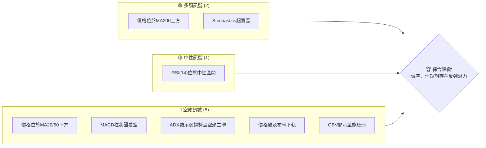

**訊號解讀：**
目前空頭訊號數量明顯多於多頭訊號，主要體現在短期均線壓力、動能指標的弱勢、趨勢強度不足以及量能配合不佳。然而，價格已接近長期均線MA200和布林通道下軌，且Stochastics進入超賣區，這暗示短期賣壓可能已達極限，存在技術性反彈的需求。RSI雖在中性區間，但數值偏低，也支持了這種觀點。

### 📊 核心指標速覽表

| 指標類別 | 指標名稱 | 當前數值 | 訊號 | 解讀 |
|----------|----------|----------|------|------|
| **價格** | 當前價格 | $192.53 | 🔴 | 近期快速回落，位於短期均線下方 |
| **均線** | MA20 | $207.71 | 🔴 | 價格遠低於短期均線，壓力顯著 |
| **均線** | MA50 | $209.92 | 🔴 | 價格遠低於中期均線，空頭排列 |
| **均線** | MA200 | $190.43 | 🟢 | 價格略高於長期均線，提供關鍵支撐 |
| **動能** | RSI(14) | 38.73 | 🟡 | 接近超賣區，但尚未進入，中性偏弱 |
| **動能** | MACD | -3.642 | 🔴 | MACD線位於訊號線下方，柱狀圖為負，空頭動能強勁 |
| **波動** | ATR | $6.73 | 🟡 | 波動率適中，佔股價3.49% |
| **趨勢** | ADX(14) | 16.02 | 🔴 | 趨勢強度弱，市場處於盤整或弱勢下跌 |

### 🏆 技術評分卡

```
╔══════════════════════════════════════════════════════════════╗
║             技術評分卡 — NVDA (2026-06-28)                     ║
╠══════════════════════════════════════════════════════════════╣
║ 趨勢強度      █████░░░░░░░░░░░░░░░  25/100  🔴 (ADX弱，空頭主導)   ║
║ 動能指標      ████░░░░░░░░░░░░░░░░  20/100  🔴 (MACD空頭，RSI偏弱)  ║
║ 支撐穩定度    ██████████████░░░░░░  70/100  🟡 (MA200及Fib支撐密集)║
║ 成交量配合    ████░░░░░░░░░░░░░░░░  20/100  🔴 (OBV疲弱，量價背離)  ║
║ 形態完整度    ██████░░░░░░░░░░░░░░  30/100  🔴 (短期下跌通道不明顯)║
║ 均線排列      ████░░░░░░░░░░░░░░░░  20/100  🔴 (短期均線空頭排列)  ║
╠══════════════════════════════════════════════════════════════╣
║ 綜合評分      ████░░░░░░░░░░░░░░░░  28/100  🔴 弱勢/潛在反彈       ║
╚══════════════════════════════════════════════════════════════╝
```
**評分總結：** NVDA 的技術評分整體偏低，主要受到趨勢強度、動能指標和均線排列的負面影響。目前股價處於短期空頭趨勢中，但值得注意的是，其支撐穩定度相對較高，因MA200和斐波那契關鍵回調位形成了密集支撐區，這為股價提供了潛在的止跌點。成交量配合不佳，顯示當前下跌過程中缺乏有效買盤承接，反彈動能不足。

---

## 2. 趨勢分析

### 🌐 多時框趨勢分析

NVDA 的多時框趨勢分析顯示，儘管短期面臨顯著壓力，但其長期上升趨勢的基礎依然存在。

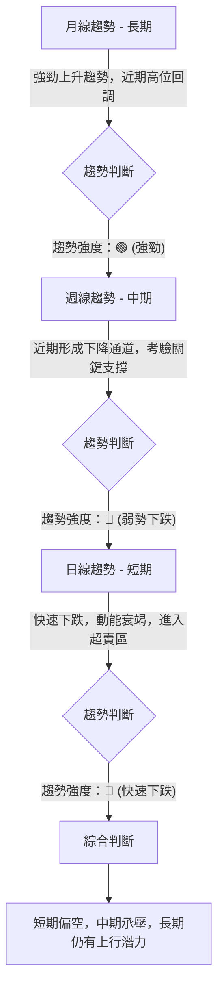
**詳細解讀：**
*   **長期趨勢 (月線)**：從過去24個月的數據來看，NVDA 經歷了顯著的成長，從2024年6月的$123.34一路飆升至2026年5月的$210.89，呈現出明確且強勁的上升趨勢。儘管2026年6月出現回落，但這被視為牛市中的健康調整。月線級別的趨勢線和MA200（$190.43）仍構成強大支撐，表明長期上升結構未被破壞。
*   **中期趨勢 (週線)**：檢視近20週的數據，NVDA 在2026年4月達到$208.03（週收盤價），並在5月17日達到$225.06的近期高點後，開始進入一個明顯的回調階段。從$210.89（5月底）到$192.53（6月底），股價呈現出連續下跌的走勢，形成了一個初步的下降通道。MACD柱狀圖持續為負，RSI也從超買區回落至中性區間，顯示中期動能轉弱。
*   **短期趨勢 (日線)**：當前價格$192.53位於MA20($207.71)和MA50($209.92)下方，且MA20已下穿MA50，形成了短期的死亡交叉訊號，均線呈現空頭排列。股價在過去一個月內從$210.89迅速下跌，MACD柱狀圖呈現深紅色，Stochastics也處於超賣區，表明短期賣壓極重，下跌動能強勁。然而，接近MA200和布林下軌可能帶來技術性反彈。

### 📈 長期趨勢 — 12個月走勢圖（Unicode）

以下為NVDA過去12個月的月線收盤價走勢圖，標注了關鍵高低點：

```
NVDA 月線走勢圖 (2025-06 至 2026-06)
價格軸 ($)
$225 ┤                                 ● (210.89, 2026-05)
$220 ┤
$215 ┤
$210 ┤
$205 ┤          ● (202.23, 2025-10)
$200 ┤                      ● (199.34, 2026-04)
$195 ┤                                   ● (192.53, 2026-06)
$190 ┤              ● (190.90, 2026-01)
$185 ┤    ● (186.34, 2025-09) ● (186.27, 2025-12)
$180 ┤  ● (177.63, 2025-07) ● (176.77, 2025-11) ● (176.97, 2026-02)
$175 ┤                               ● (174.20, 2026-03)
$170 ┤
$165 ┤
$160 ┤● (157.78, 2025-06)
     └────────────────────────────────────────────────────────────
      2025-06 -07 -08 -09 -10 -11 -12  2026-01 -02 -03 -04 -05 -06

```
**走勢特徵分析表格**

| 階段 | 時間區間 | 價格範圍 | 漲跌幅 | 主要特徵 |
|------|------------|----------|--------|----------|
| **強勁上漲** | 2025-06 至 2025-10 | $157.78 - $202.23 | +28.17% | 股價穩步攀升，動能強勁，突破多個阻力位。 |
| **高位盤整** | 2025-11 至 2026-03 | $174.20 - $190.90 | -8.75% | 在高位進行震盪整理，期間有多次嘗試突破但未能成功，形成區間震盪。 |
| **再次拉升** | 2026-04 至 2026-05 | $174.20 - $210.89 | +21.06% | 突破盤整區間，再次展現強勁上漲動能，創下近期新高。 |
| **快速回調** | 2026-06 | $210.89 - $192.53 | -8.71% | 從近期高點快速回落，短期賣壓沉重，考驗關鍵支撐。 |

### 📊 中期趨勢（週線分析）

近期的週線走勢顯示，NVDA在達到2026年5月的高點$210.89（週收盤價）後，經歷了連續四周的下跌，從$210.89、$205.10、$205.19到目前的$192.53。這表明中期上升趨勢受到嚴重挑戰，市場情緒轉為謹慎。

**近期壓力與支撐示意圖**
```
近期週線壓力與支撐示意圖
價格軸 ($)
$225 ┤                                 ● (225.06 高點)
$220 ┤
$215 ┤                                 R1 ($210.89)
$210 ┤───────────────────────────┐
$205 ┤                           S/R ($205.10)
$200 ┤
$195 ┤                             ● (現價 $192.53)
$190 ┤───────────────S1 ($190.43 MA200)───┘
$185 ┤
$180 ┤               S2 ($180.00 Fib 78.6%)
$175 ┤
$170 ┤S3 ($167.32 低點)
     └───────────────────────────────────
       時間軸 (近期數週)
```
**解讀：**
*   **近期阻力 (R1)**: $210.89 (2026年5月31日週收盤價)，這是最近一波下跌的起點，也是多頭需要克服的首要壓力。
*   **中間壓力/支撐 (S/R)**: $205.10 (2026年6月7日/14日週收盤價)，在回調初期曾作為支撐，現在轉為阻力。
*   **關鍵支撐 (S1)**: $190.43 (MA200)，這一長期均線在週線圖上通常具有強大的支撐作用。
*   **次要支撐 (S2)**: $180.00 (斐波那契78.6%回調位及分析師低目標)，若MA200失守，此價位將提供重要支撐。
*   **長期支撐 (S3)**: $167.32 (2026年3月29日週低點)，是最近一波大漲的起點，具有極強的歷史意義。

### ⚡ 趨勢強度評估（ADX 解讀）

ADX (Average Directional Index) 指標用於衡量趨勢的強度，而非方向。當前NVDA的ADX(14)為16.02，遠低於25的閾值，這明確指出市場處於弱趨勢或盤整狀態。

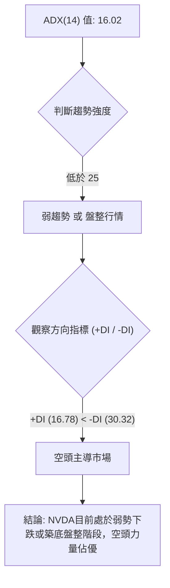

**ADX 強度對照表**

| ADX 值範圍 | 趨勢強度 | 市場解讀 |
|------------|----------|----------|
| 0-25       | 弱趨勢/盤整 | 市場缺乏明確方向，價格波動可能較小，或在小區間內震盪。 |
| 25-50      | 中等趨勢 | 趨勢開始形成或正在發展中，動能逐漸增強。 |
| 50-75      | 強趨勢   | 趨勢明確且強勁，價格沿單一方向快速移動。 |
| 75-100     | 極強趨勢 | 趨勢非常強勁，可能接近超買/超賣極端。 |

**解讀：**
當前ADX為16.02，落在「弱趨勢/盤整」區間，表明NVDA目前缺乏一個明確且強勁的單邊趨勢。這與其近期從高點回落，並在關鍵支撐區附近震盪的表現相符。
進一步觀察方向指標：+DI (16.78) 低於 -DI (30.32)，這明確指示當前市場由空頭力量主導。儘管趨勢整體強度較弱，但現有動能的方向是向下。這意味著在目前的盤整或弱勢下跌中，空頭掌握了主動權，多頭反攻的動能不足。交易者應謹慎對待任何反彈，並關注空頭力量是否會進一步推動價格跌破關鍵支撐。

---

## 3. 圖表形態分析

### 🔍 形態識別系統

根據提供的週線數據和當前價格走勢，NVDA在最近的下跌中尚未形成經典且明確的大型反轉或持續形態，如頭肩頂或大型三角形。然而，我們可以觀察到一些短期內的價格行為模式。

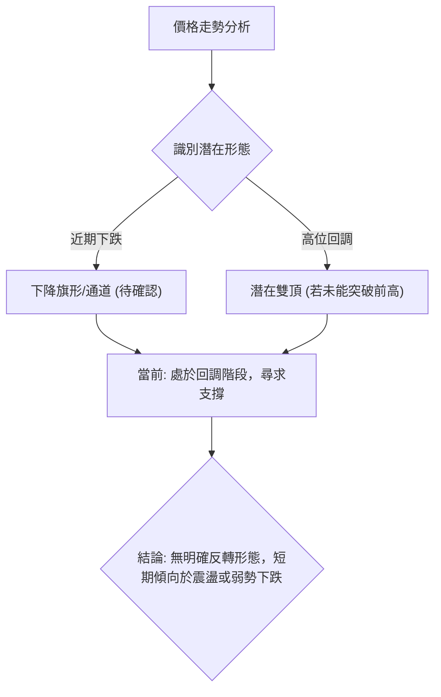
**解讀：**
1.  **下降旗形/通道 (Descending Flag/Channel)**：從2026年5月17日的高點$225.06開始，到2026年6月28日的$192.53，股價呈現出連續的下跌。如果我們將高點（$225.06, $210.89）和低點（$205.10, $192.53）連接起來，可能會形成一個傾斜向下的通道或旗形。這種形態通常出現在強勁上漲之後的回調中，若突破上軌則可能預示上漲趨勢的恢復，若跌破下軌則可能加速下跌。目前股價正沿著下軌運行。
2.  **潛在雙頂 (Potential Double Top)**：NVDA在2026年5月17日達到$225.06，然後回落。如果股價在反彈後未能突破此高點，並再次下跌，則可能形成雙頂形態。但目前僅為一次回調，尚未形成第二個頂部，因此僅為潛在可能。
目前，最明顯的觀察是股價處於一個從高位回落的調整階段，尚未形成足以改變長期趨勢的明確反轉形態。短期內，價格在尋找下方支撐。

### 🕯️ 重要K線形態分析

根據近20週的收盤數據，我們可以觀察到一些關鍵的K線形態和價格行為：

| 月份 | 收盤價 | K線形態 (週) | 解讀 | 訊號 |
|------|--------|---------------|------|------|
| 2026-03-01 | $176.97 | 長陰線 | 大幅下跌，賣壓沉重，確認短期頂部壓力。 | 🔴 |
| 2026-03-29 | $167.32 | 長陰線 | 創下近期新低，但隨後出現反彈，可能為止跌前的最後一跌。 | 🔴 |
| 2026-04-12 | $188.41 | 長陽線 | 強勁上漲，RSI從31.4升至68.2，市場情緒反轉。 | 🟢 |
| 2026-04-19 | $201.45 | 長陽線 | 持續上漲，RSI高達92.8，進入超買區，暗示短期漲勢過猛。 | 🟢 |
| 2026-05-31 | $210.89 | 長陰線 | 從高點回落，賣壓開始顯現，結束短期上漲趨勢。 | 🔴 |
| 2026-06-07 | $205.10 | 長陰線 | 延續下跌，確認空頭趨勢，RSI從46.3跌至34.3。 | 🔴 |
| 2026-06-28 | $192.53 | 長陰線 | 再次大幅下跌，MACD柱狀圖擴大，顯示空頭動能加速。 | 🔴 |

**總結：**
近期的K線形態主要以長陰線為主，尤其是在2026年5月底和6月的下跌過程中，顯示出強勁的賣壓。在2026年4月，曾出現連續長陽線，伴隨RSI超買，隨後的回調是預期之中的。目前的長陰線形態，加上MACD和RSI的表現，確認了短期內空頭的控制。

### 📉 ASCII 走勢形態示意圖

以下示意圖展示了NVDA從2026年5月高點至今的價格走勢，呈現出一個初步的下降通道形態。

```
NVDA 近期下降通道示意圖 (週線)
價格軸 ($)
$230 ┤
$225 ┤       ● (225.06) 頂部
$220 ┤      / \
$215 ┤     /   \ R_Line (通道上軌)
$210 ┤    /     \
$205 ┤   ●       ● (210.89)
$200 ┤  /         \
$195 ┤ /           ● (192.53 現價)
$190 ┤<───────────S_Line (通道下軌 - 潛在支撐)
$185 ┤
$180 ┤
     └───────────────────────────────
       時間軸 (近期數週)
```
**形態解讀：**
此示意圖顯示了股價從$225.06的高點回落，並在$210.89附近形成了一個次高點，隨後持續下跌至$192.53。如果將這些高點和低點連接起來，可以初步繪製出一個下降通道。
*   **通道上軌 (R_Line)**：連接225.06和210.89附近的阻力位。
*   **通道下軌 (S_Line)**：連接下降過程中的低點，目前$192.53位於通道下軌附近，這是一個潛在的短期支撐點。

**意義：** 若股價能在此通道下軌獲得支撐並反彈，則可能在通道內繼續震盪。若跌破下軌，則可能加速下跌，尋找更深層次的支撐。反之，若能突破上軌，則意味著短期下跌趨勢的結束，可能開啟新的上升波段。

### 🎯 形態目標價計算

由於目前並未形成明確的經典圖表反轉或持續形態，如頭肩頂或大型三角形，因此無法給出基於形態的精確目標價。然而，如果我們將當前的下跌視為一個潛在的「下降旗形」或「下降通道」的一部分，我們可以推測其潛在目標。

**基於下降通道的潛在目標：**
假設從$225.06到$192.53的下跌形成了一個下降通道。
*   **若跌破通道下軌：**
    *   通道高度（約） = $225.06 (高點) - $192.53 (現價接近下軌) ≈ $32.53
    *   若通道下軌 $189.38 (斐波那契61.8%) 被有效跌破，則下跌目標可能為 $189.38 - $32.53 = $156.85。這個目標接近52週低點 $151.29，具有一定參考意義。
*   **若突破通道上軌：**
    *   通道上軌目前約在 $205.00 - $210.00 之間。
    *   若能有效突破並站穩，則可能重新挑戰 $225.06 的前高。

**結論：**
目前階段，市場更傾向於關注斐波那契回調位和移動平均線等動態支撐阻力，而非明確的形態目標。投資者應密切觀察股價在關鍵支撐區的反應，以判斷是否有形態形成的可能。

---

## 4. 支撐與阻力

### 🗺️ 關鍵價位分布圖（Unicode）

NVDA 目前的價格 $192.53 處於一個關鍵的支撐區間，上方阻力重重，下方則有較強的長期支撐。

```
NVDA 價位結構分布圖 (2026-06-28)
═══════════════════════════════════════════════════
$236.26 ║████████████████████████║ 強阻力 R4 (52週高點)
$225.06 ║████████████████████████║ 阻力 R3 (近期高點)
$214.95 ║████████████████████    ║ 阻力 R2 (Fib 23.6%)
$209.92 ║████████████████████████║ 關鍵阻力 R1 (MA50 / MA20)
$207.71 ║████████████████████████║
$203.00 ║████████████████████    ║ 阻力 (Fib 38.2%)
$196.19 ║████████████████████████║ 阻力 (Fib 50%)
$192.53 ╠════════════════════════╣ ◄ 現價
$191.23 ║▓▓▓▓▓▓▓▓▓▓▓▓▓▓▓▓        ║ 近期支撐 S1 (BB下軌)
$190.43 ║████████████████████████║ 強支撐 S2 (MA200)
$189.38 ║████████████████████████║ 強支撐 S3 (Fib 61.8%)
$180.00 ║▓▓▓▓▓▓▓▓▓▓▓▓▓▓▓▓▓▓▓▓    ║ 關鍵支撐 S4 (Fib 78.6% / 分析師低目標)
$167.32 ║████████████████████████║ 強支撐 S5 (3月底低點)
$151.29 ║████████████████████████║ 極強支撐 S6 (52週低點)
═══════════════════════════════════════════════════
```
**解讀：**
當前價格 $192.53 正好位於多重支撐的交匯點，包括布林通道下軌、MA200和斐波那契61.8%回調位。這是一個極為重要的區域，決定了短期走勢的關鍵。上方阻力則從$196.19（斐波那契50%）開始，一直延伸至$207.71-$209.92（短期/中期均線），突破這些阻力需要強勁的買盤動能。

### 🚧 阻力位分析表

| 阻力級別 | 價位 | 形成原因 | 突破難度 | 重要性 |
|----------|------|----------|----------|--------|
| **R1 (即時)** | $196.19 | 斐波那契50%回調位，心理關口 | 中等 | 🟢 |
| **R2 (短期)** | $203.00 | 斐波那契38.2%回調位 | 中等偏高 | 🟡 |
| **R3 (中期)** | $207.71 - $209.92 | MA20 / MA50 匯聚區，同時也是布林中軌，短期下跌趨勢的關鍵確認點。 | 高 | 🔴 |
| **R4 (強勁)** | $214.95 | 斐波那契23.6%回調位，近期數次反彈受阻點。 | 高 | 🔴 |
| **R5 (關鍵)** | $225.06 | 2026年5月17日近期高點，若突破則有望挑戰52週高點。 | 極高 | 🔴 |
| **R6 (極強)** | $236.26 | 52週高點，也是歷史高點，代表了當前市場的極限。 | 極高 | 🔴 |

### 🛡️ 支撐位分析表

| 支撐級別 | 價位 | 形成原因 | 守住機率 | 重要性 |
|----------|------|----------|----------|--------|
| **S1 (即時)** | $191.23 | 布林通道下軌，表示股價已進入相對超賣區間。 | 中等 | 🟢 |
| **S2 (關鍵)** | $190.43 | MA200，長期趨勢線，通常是強大的動態支撐。 | 高 | 🟢 |
| **S3 (關鍵)** | $189.38 | 斐波那契61.8%回調位，黃金分割位，技術回調的常見止跌點。 | 高 | 🟢 |
| **S4 (強勁)** | $180.00 | 斐波那契78.6%回調位，同時也是分析師低目標價，具有心理和技術雙重支撐。 | 中等偏高 | 🟡 |
| **S5 (強勁)** | $167.32 | 2026年3月29日週收盤低點，是上一波大漲的起點。 | 高 | 🟡 |
| **S6 (極強)** | $151.29 | 52週低點，終極防線，若跌破將確認長期趨勢反轉。 | 極高 | 🔴 |

### 📐 斐波那契回調位分析

我們以NVDA從2026年3月29日的低點 $167.32 到2026年5月17日的高點 $225.06 作為主要上升波段，計算其回調位。

*   **上升波段範圍**：$225.06 - $167.32 = $57.74

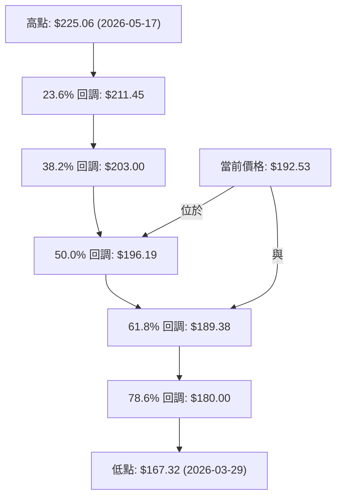

**斐波那契回調位列表：**

| 回調比例 | 價位 | 與現價關係 | 解讀 |
|----------|------|------------|------|
| 23.6%    | $211.45 | 阻力 | 淺層回調位，若反彈至此，可能面臨壓力。 |
| 38.2%    | $203.00 | 阻力 | 較為關鍵的回調位，若能突破顯示反彈強度。 |
| **50.0%** | **$196.19** | **阻力** | **重要的心理和技術關口，短期反彈的首個目標。** |
| **61.8%** | **$189.38** | **支撐** | **黃金分割位，極其重要的技術支撐，若失守則趨勢可能進一步惡化。** |
| 78.6%    | $180.00 | 支撐 | 深度回調位，若跌至此處，將考驗多頭信心。 |

**分析：**
當前價格 $192.53 正好位於50% ($196.19) 和61.8% ($189.38) 斐波那契回調位之間。
*   **$196.19 (50%回調)**：這是短期反彈的直接阻力。如果NVDA能有效站上此價位，將顯示出一定的止跌企穩信號。
*   **$189.38 (61.8%回調)**：這個價位與MA200 ($190.43) 和布林通道下軌 ($191.23) 形成一個極其密集的強大支撐區。這是判斷短期趨勢能否止跌的關鍵防線。若此區間失守，將確認更深層次的回調，目標將指向$180.00甚至更低。

---

## 5. 技術指標深度解讀

### 🎛️ 指標訊號總覽

當前NVDA的技術指標呈現出普遍的空頭訊號，但部分指標已進入超賣區，預示著短期存在反彈的可能性。

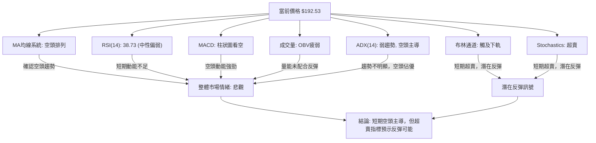

### 📈 移動平均線排列分析

NVDA 的移動平均線（MA）系統目前呈現出「混合排列」，但短期均線已形成空頭排列，對股價構成顯著壓力。

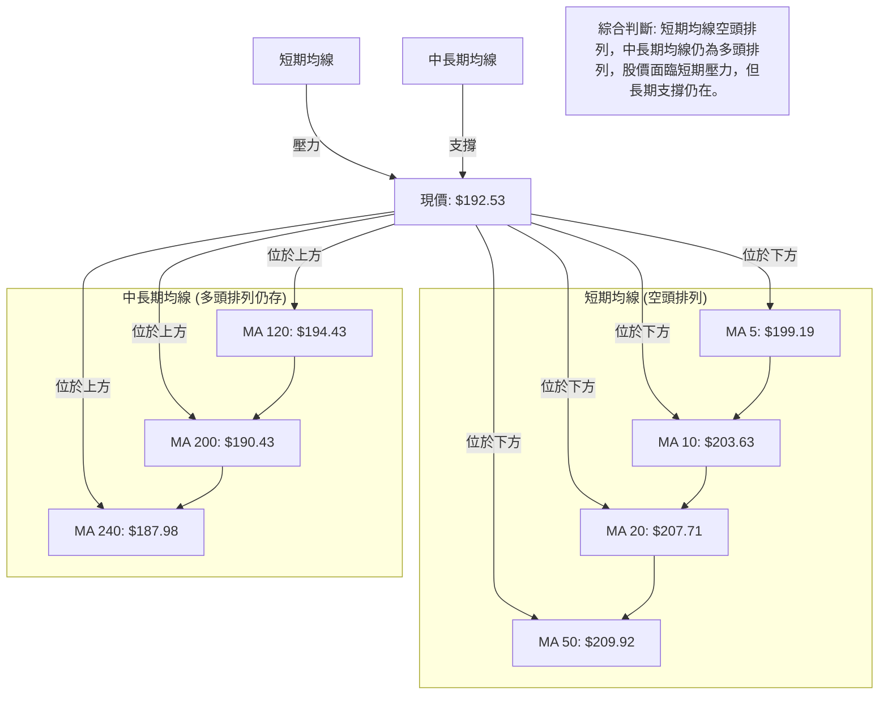
**詳細分析：**
*   **短期均線 (MA5, MA10, MA20, MA50)**：當前價格 $192.53 遠低於 MA5 ($199.19)、MA10 ($203.63)、MA20 ($207.71) 和 MA50 ($209.92)。這些短期均線均呈現下降趨勢，且MA20已下穿MA50，形成「死亡交叉」，這是典型的短期空頭排列訊號，對股價構成強大阻力。
*   **中長期均線 (MA120, MA200, MA240)**：值得注意的是，價格 $192.53 仍位於 MA120 ($194.43) 和 MA200 ($190.43) 上方，且MA200 ($190.43) 位於 MA240 ($187.98) 上方。這表明長期上升趨勢的骨架尚未被破壞。MA200作為長期生命線，目前為股價提供了關鍵的動態支撐。
*   **總結**：這種「混合排列」顯示NVDA目前處於一個短期空頭回調、但長期多頭結構尚存的過渡階段。短期均線的壓力需要密切關注，若股價能守住MA200並重新站上短期均線，則有望扭轉頹勢；反之，若MA200失守，則長期趨勢可能面臨考驗。

### 📉 RSI(14) 分析

RSI(14) 當前數值為 38.73。

**RSI(14) 數值進度條：**
RSI 強度：████████░░░░░░░░░░░░ 38.73 / 100 (中性偏弱)

**超買超賣區間分析：**
*   **超買區 (Overbought)**：RSI > 70。在2026年4月19日，週RSI曾高達92.8，明確進入超買區，這預示了隨後的回調。
*   **超賣區 (Oversold)**：RSI < 30。當前RSI 38.73，尚未進入超賣區，但已非常接近。這表明賣壓雖然沉重，但尚未達到極致的超賣狀態，因此短期反彈的力度可能有限，或者需要跌破30才能真正引發強勁的超賣反彈。
*   **中性區間 (Neutral)**：30 < RSI < 70。目前RSI位於中性區間，但其數值偏低，顯示市場動能偏弱，空頭佔優。

**背離判斷：**
根據提供的數據，**無明顯背離**。
*   **頂背離 (Bearish Divergence)**：當股價創出新高，而RSI未能創出新高時，預示上漲動能減弱，可能出現回調。在2026年5月17日股價達到$225.06後，RSI並未明顯高於4月19日的92.8，但由於數據不夠精確到日線，且週線RSI在5月17日為56.2，與4月19日的92.8形成明顯下降，這本身就支持了後續下跌的判斷，而不是背離。
*   **底背離 (Bullish Divergence)**：當股價創出新低，而RSI未能創出新低時，預示下跌動能減弱，可能出現反彈。目前股價 $192.53 接近近期低點，但RSI 38.73 並未明確顯示出與價格走勢的背離。若股價進一步下跌並創出新低，而RSI能在30以上企穩或回升，則可能形成底背離。

**結論：**
RSI 38.73 顯示NVDA目前動能偏弱，處於中性偏賣方狀態。雖然尚未進入超賣區，但其低位運行與MACD的空頭訊號相互確認，表明短期內市場情緒悲觀。

### 📊 MACD(12/26/9) 訊號解讀

MACD (Moving Average Convergence Divergence) 指標是判斷趨勢和動能的有力工具。

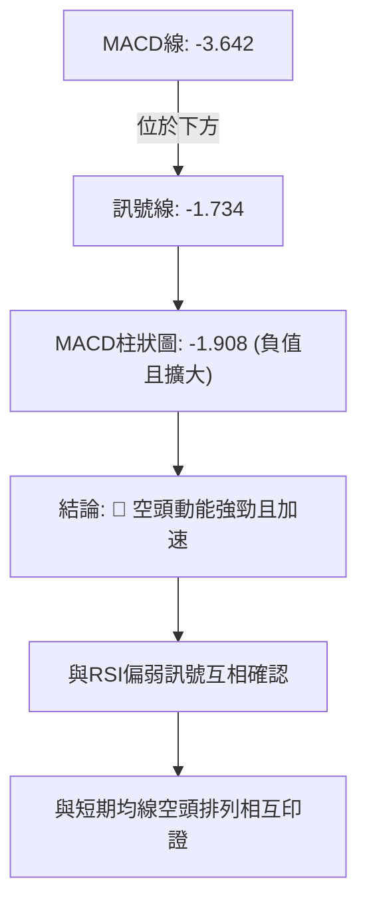
**詳細分析：**
*   **MACD 線 (-3.642) 與訊號線 (-1.734)**：MACD 線目前位於訊號線下方 (-3.642 < -1.734)，這是一個明確的空頭訊號，表示短期動能已轉為向下，並持續弱於中期動能。
*   **MACD 柱狀圖 (-1.908)**：柱狀圖為負值，且其絕對值較前一期 (-0.945) 有明顯擴大，從-0.945變為-1.908。這表明空頭動能正在增強，賣壓尚未減輕，甚至有加速下跌的趨勢。
*   **背離判斷：** 根據提供的數據，**無明顯背離**。
    *   **頂背離**：股價創新高，MACD未創新高。在週線數據中，5月底高點($210.89)後MACD柱狀圖從正轉負並持續擴大，這本身就是強烈的下跌訊號，而非背離。
    *   **底背離**：股價創新低，MACD未創新低。目前股價雖下跌，但MACD柱狀圖仍在擴大，未見收斂或轉正，因此沒有底背離的跡象。

**結論：**
MACD指標發出明確的空頭訊號，MACD線位於訊號線下方，且柱狀圖為負值並進一步擴大，顯示空頭動能強勁且正在加速。這與RSI的偏弱訊號以及短期均線的空頭排列相互印證，確認了NVDA當前處於下行趨勢中。

### 📦 布林通道分析

布林通道 (Bollinger Bands) 用於衡量價格的波動範圍和相對位置。

```
NVDA 布林通道示意圖
價格軸 ($)
$230 ┤
$225 ┤═════════════════════════════════════════════ BB上軌 ($224.20)
$220 ┤
$215 ┤
$210 ┤
$205 ┤───────────────────────────────────────────── BB中軌 (MA20: $207.71)
$200 ┤
$195 ┤
$192.53 ╠═════════════════════════════════════════════ 現價
$191.23 ║▓▓▓▓▓▓▓▓▓▓▓▓▓▓▓▓▓▓▓▓▓▓▓▓▓▓▓▓▓▓▓▓▓▓▓▓▓▓▓▓▓▓▓▓▓▓▓▓▓▓▓▓▓▓▓▓▓▓▓▓▓▓ BB下軌 ($191.23)
$185 ┤
     └────────────────────────────────────────────────────────────
       時間軸 (近期)
```
**布林通道關鍵數據：**
*   BB上軌: $224.20
*   BB中軌 (MA20): $207.71
*   BB下軌: $191.23
*   當前收盤價: $192.53
*   BB %B: 0.04 (接近0，表示價格接近下軌)

**分析：**
*   **價格位置**：當前價格 $192.53 幾乎觸及布林通道下軌 $191.23。這是一個重要的訊號，通常表示股價已進入相對超賣區間。
*   **BB %B**：BB %B 值為 0.04，非常接近0，進一步確認了價格正緊貼布林下軌運行。在強勁的下跌趨勢中，價格可能會沿著下軌運行；但在盤整或調整末期，觸及下軌往往預示著短期反彈的可能性。
*   **通道寬度**：從數據來看，通道的絕對寬度為 $224.20 - $191.23 = $32.97。ATR(14)為$6.73，約佔通道寬度的20%，顯示波動性適中。通道在近期下跌中可能略有擴張，反映了賣壓的增加。
*   **中軌阻力**：MA20 ($207.71) 作為布林中軌，目前對股價構成強大阻力。若股價能反彈並突破中軌，將是一個重要的看漲訊號。

**結論：**
布林通道分析表明NVDA短期內處於超賣狀態，價格已觸及下軌，這可能預示著短期內存在技術性反彈的需求。然而，若賣壓持續，股價也可能沿著下軌繼續下跌。投資者應密切關注股價在布林下軌附近的表現，以及能否突破中軌的壓力。

### 💹 成交量分析（量價配合度）

成交量是確認價格走勢的重要指標。

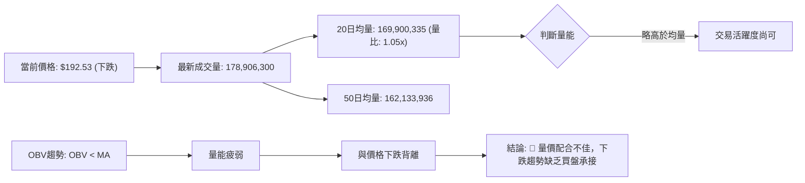
**詳細分析：**
*   **最新成交量**：178,906,300，略高於20日均量 (169,900,335) 和50日均量 (162,133,936)。量比為1.05x，表明當天的交易活躍度略高於近期平均水平。
*   **量價關係**：在股價下跌的同時，成交量略微放大，這通常被視為下跌趨勢的確認訊號，表明市場上的賣壓依然存在，且有資金在積極出貨。
*   **OBV趨勢**：數據明確指出「OBV < MA → 量能疲弱」。OBV (On Balance Volume) 是一種累積成交量指標，其趨勢通常應與價格趨勢保持一致。OBV低於其移動平均線，且整體趨勢疲弱，這是一個強烈的看空訊號。它表明儘管價格下跌，但並沒有出現大量買盤進場承接，反而可能是賣盤主導，使得OBV無法有效上升。這與價格的下跌形成了不利的量價配合。

**結論：**
NVDA 的成交量分析顯示，在股價下跌的同時，量能雖然略有放大，但OBV的疲弱趨勢表明這並非健康的買盤進場訊號，而是賣壓的持續。這種量價配合不佳的情況，證實了當前下跌趨勢的有效性，並暗示在短期內，市場缺乏足夠的買盤力量來扭轉頹勢。任何反彈都可能缺乏持續的量能支撐。

---

## 6. 動能與波動率

### ⚡ 動能評估四象限

由於Prompt要求避免使用 quadrantChart，我們將使用表格形式來評估NVDA當前的動能與波動率狀態。

| 象限 | 動能 (MACD, RSI) | 波動 (ATR) | 當前狀態 | 評估 |
|------|------------------|------------|----------|------|
| Q1   | 強 (🟢)          | 低 (🟢)    | -        | 最佳機會：強勢上漲，風險相對可控 |
| Q2   | 弱 (🔴)          | 低 (🟢)    | -        | 謹慎觀望：缺乏上漲動力，波動小可能陷入盤整 |
| Q3   | 強 (🟢)          | 高 (🔴)    | -        | 高風險高收益：劇烈波動，機會與風險並存 |
| **Q4** | **弱 (🔴)**      | **中 (🟡)** | **✓**    | **避免進場：動能不足，波動適中但方向不明或下跌** |

**NVDA當前動能與波動率分析：**
*   **動能評估**：
    *   MACD柱狀圖為負且擴大 (-1.908)，MACD線位於訊號線下方。
    *   RSI(14)為38.73，位於中性區間偏下，且接近超賣區。
    *   Stochastics %K (5.75) 和 %D (10.43) 均處於超賣區。
    *   綜合判斷：NVDA當前動能顯著偏弱，空頭力量佔優。評為 **弱 (🔴)**。
*   **波動率評估**：
    *   ATR(14)為$6.73，佔當前價格$192.53的3.49%。
    *   根據經驗，3-5%的ATR通常被認為是中等波動率。
    *   綜合判斷：NVDA當前波動率適中。評為 **中 (🟡)**。

**結論：**
NVDA目前處於 **Q4 (弱動能，中波動)** 象限。這意味著股價缺乏上漲的內在動力，雖然波動性不是極端高，但其動能的疲弱使得投資者應避免盲目進場。在這種狀態下，股價可能繼續弱勢下跌，或者在尋求關鍵支撐的過程中進行築底盤整。任何反彈都可能缺乏持續性。

### 📊 ATR 波動率分析

ATR (Average True Range) 是一個衡量資產價格波動性的指標。

*   **ATR(14) 值**：$6.73
*   **ATR佔比**：$6.73 / $192.53 = 3.49%

**詳細分析：**
*   **波動性解讀**：ATR(14)為$6.73，表示NVDA在過去14天內平均每日價格波動範圍約為$6.73。這個數值佔當前股價的3.49%，屬於中等偏高的波動水平。這意味著NVDA的股價在一天內可能出現較大的漲跌幅，為日內交易者提供了機會，但也增加了風險。
*   **止損距離建議**：ATR常用於設定止損點，以適應股票本身的波動特性。
    *   **保守止損**：建議將止損設置在1.5倍ATR之外。即 $192.53 - (1.5 * $6.73) = $192.53 - $10.10 = $182.43。
    *   **激進止損**：建議將止損設置在1倍ATR之外。即 $192.53 - (1 * $6.73) = $192.53 - $6.73 = $185.80。
    *   **結合支撐位**：更穩健的做法是將ATR止損與關鍵支撐位結合。例如，若在$190.00附近進場，止損可以考慮設置在 $190.00 - (1.5 * $6.73) = $179.90，或直接參考斐波那契78.6%回調位 $180.00。

**結論：**
NVDA 的中等波動率要求交易者在設置止損和管理倉位時更加謹慎。應避免過於緊密的止損，以免被正常波動震出。同時，較高的波動率也意味著價格可能在短時間內快速達到目標價，或快速觸發止損。

### 📐 Beta 與市場相關性

Beta 值用於衡量單一股票相對於整個市場（通常是大盤指數如S&P 500）的波動性。

**數據說明：** 提供的技術數據中未包含NVDA的Beta值。

**一般性分析 (基於NVDA的產業特性)：**
*   **行業特性**：NVIDIA (NVDA) 作為半導體和AI領域的領軍企業，其股價通常具有較高的波動性。半導體行業屬於高成長、高科技板塊，對經濟週期和技術創新具有較高的敏感度。
*   **歷史觀察**：從歷史數據來看，NVDA的股價波動幅度往往大於大盤指數。這意味著其Beta值通常會大於1。Beta值大於1的股票被認為是「進攻型」股票，在牛市中漲幅可能超過大盤，但在熊市中跌幅也可能大於大盤。
*   **當前影響**：在當前市場整體情緒不明朗或面臨調整時，高Beta股票可能會承受更大的下行壓力。NVDA目前的下跌，可能部分反映了市場對高成長科技股的謹慎態度。

**結論：**
雖然沒有具體的Beta數值，但根據NVDA的行業地位和歷史表現，我們可以合理推斷其Beta值可能較高。這意味著投資NVDA需要承受比市場更高的波動風險。在當前短期下跌趨勢中，高Beta特性可能加劇其跌幅。交易者應充分考慮其市場相關性，並在整體市場趨勢不明朗時更加謹慎。

---

## 7. 多時框架總結

### 📋 時框架評分表

本表綜合了各時框架的趨勢、動能、均線排列和圖表形態，給出綜合評分和建議。

| 時框架 | 趨勢方向 | 動能 | 均線排列 | 形態 | 綜合評分 | 建議 |
|--------|----------|------|----------|------|----------|------|
| **長期 (月線)** | 🟢 上升 | 🟢 強勁 (歷史) | 🟢 多頭 | 🟡 調整中 | █████████████░░░░░░ 70/100 | 持有/逢低買入 |
| **中期 (週線)** | 🔴 下跌 | 🔴 疲弱 | 🔴 混合偏空 | 🔴 下降通道 | ████░░░░░░░░░░░░░░░░ 20/100 | 觀望/謹慎操作 |
| **短期 (日線)** | 🔴 下跌 | 🔴 衰竭 (超賣) | 🔴 空頭 | 🔴 下跌中 | ████░░░░░░░░░░░░░░░░ 20/100 | 觀望/短期反彈 |

**總體評估：**
長期來看，NVDA依然處於一個健康的上升趨勢中，但中期和短期均面臨顯著的下行壓力。中期趨勢從上升轉為下跌通道，動能疲弱。短期則表現為快速下跌，指標顯示超賣但動能仍在衰竭。當前正考驗長期關鍵支撐。

### 🔲 綜合訊號矩陣

此矩陣展示了不同時框架下各技術指標訊號的一致性。

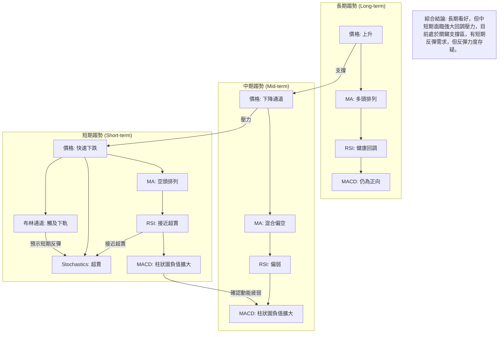
**一致性分析：**
*   **長期與中短期矛盾**：長期趨勢依然強勁，但中短期指標普遍發出空頭訊號，顯示長期牛市中的深度調整。
*   **中短期指標一致性高**：週線和日線層面的價格、均線、RSI、MACD均指向下跌，且動能持續疲弱。MACD柱狀圖的擴大和RSI的偏低位置共同確認了這一點。
*   **超賣訊號的出現**：Stochastics進入超賣區，布林通道價格觸及下軌，這兩個指標在短期內發出反彈訊號，與其他動能指標的疲弱形成對比。這意味著短期賣壓可能已達極限，但缺乏強勁的買盤支持，反彈可能只是技術性修正。

**總結：**
NVDA目前處於一個關鍵的轉折點。長期投資者可能將此視為逢低買入的機會，但中短期交易者需要警惕持續的下行風險。當前的超賣訊號可能帶來短暫的反彈，但要確認趨勢反轉，需要看到價格突破短期均線阻力，並伴隨成交量的放大和動能指標的改善。

---

## 8. 交易策略建議

基於NVDA當前的技術分析，我們觀察到短期顯著的下行壓力，但價格已接近長期關鍵支撐及超賣區，存在技術性反彈的可能性。因此，我們將提出兩種情境下的交易策略。

### 🗺️ 策略決策流程圖

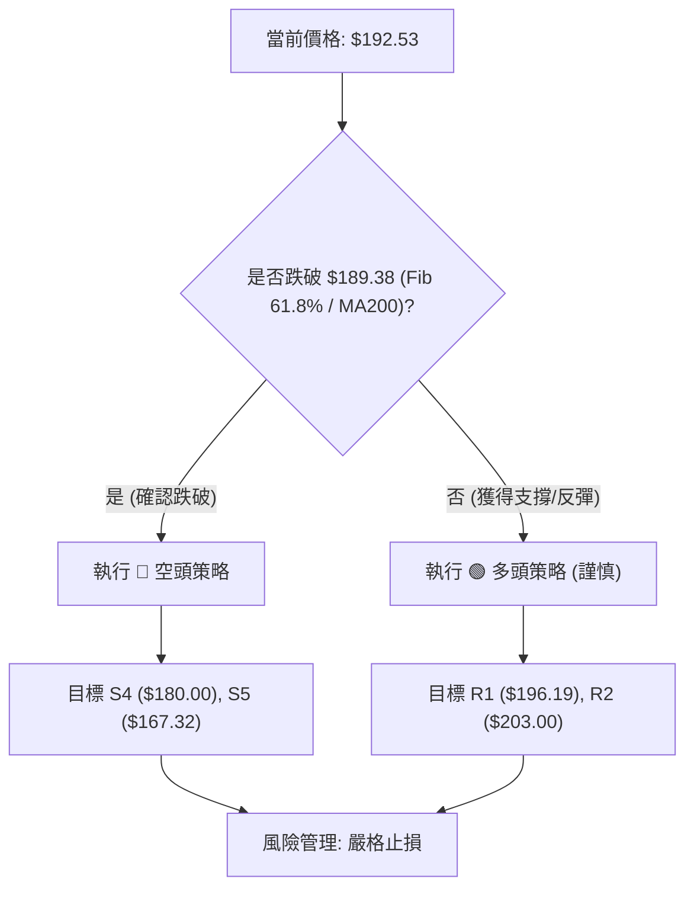

### 🟢 多頭策略詳情 (謹慎反彈策略)

此策略基於股價在關鍵支撐區獲得支撐並出現技術性反彈的預期。

| 策略要素 | 策略 A (短線反彈) | 策略 B (等待確認) |
|----------|-------------------|-------------------|
| 進場條件 | 價格在 $189.38 - $190.43 區間企穩，出現止跌K線（如錘頭線、啟明星）或小幅放量反彈。Stochastics從超賣區金叉。 | 價格突破並站穩 $196.19 (Fib 50%)，MACD柱狀圖縮小或轉正，RSI回升至45以上。 |
| 進場價格 | $190.00 - $191.00 | $196.50 |
| 目標價 T1 | $196.19 (Fib 50%) | $203.00 (Fib 38.2%) |
| 目標價 T2 | $203.00 (Fib 38.2%) | $207.71 (MA20 / BB中軌) |
| 止損價格 | $187.00 (低於 Fib 61.8% / MA200) | $193.00 (低於 $196.19 和現價) |
| 風險報酬比 | T1: 約 1:2.0 (盈$5.19 / 虧$3.00) <br> T2: 約 1:4.3 (盈$12.00 / 虧$3.00) | T1: 約 1:2.0 (盈$6.50 / 虧$3.50) <br> T2: 約 1:3.2 (盈$11.21 / 虧$3.50) |
| 成功機率 | 55% | 60% |
| 建議倉位 | 10-15% | 15-20% |

**策略解讀：**
策略A較為激進，旨在捕捉超賣後的短期反彈，風險較高。策略B則更為保守，等待初步的反彈確認，成功機率相對較高，但進場點會略高。無論哪種策略，都應嚴格執行止損，因為下方關鍵支撐一旦失守，跌幅可能擴大。

### 🔴 空頭策略詳情 (趨勢延續策略)

此策略基於股價未能守住關鍵支撐，下跌趨勢延續的預期。

| 策略要素 | 策略 A (跌破支撐) | 策略 B (反彈受阻) |
|----------|-------------------|-------------------|
| 進場條件 | 價格有效跌破 $189.38 (Fib 61.8% / MA200)，伴隨放量。MACD柱狀圖持續擴大。 | 價格反彈至 $196.19 (Fib 50%) 或 $203.00 (Fib 38.2%) 受阻，出現長上影線或陰線吞噬。 |
| 進場價格 | $189.00 | $196.00 或 $202.50 |
| 目標價 T1 | $180.00 (Fib 78.6% / 分析師低目標) | $190.00 (MA200 / Fib 61.8%) |
| 目標價 T2 | $167.32 (3月底低點) | $180.00 (Fib 78.6%) |
| 止損價格 | $192.00 (高於 MA200 / Fib 61.8%) | $199.00 (高於 $196.19) 或 $205.00 (高於 $203.00) |
| 風險報酬比 | T1: 約 1:3.0 (盈$9.00 / 虧$3.00) <br> T2: 約 1:7.3 (盈$21.68 / 虧$3.00) | T1: 約 1:2.0 (盈$6.00 / 虧$3.00) <br> T2: 約 1:5.3 (盈$16.00 / 虧$3.00) |
| 成功機率 | 60% | 50% (反彈幅度不確定) |
| 建議倉位 | 15-20% | 10-15% |

**策略解讀：**
空頭策略的成功機率目前較高，因為短期趨勢明顯偏空，且動能指標支持下跌。策略A是順勢交易，等待關鍵支撐失守。策略B是反彈做空，利用反彈受阻的機會。兩種策略均需嚴格控制風險，高位止損是關鍵。

### ⭐ 整體訊號強度評星

```
做多訊號強度：★★☆☆☆  (2/5星)
  理由：短期超賣，接近關鍵支撐，但動能疲弱，缺乏強勁買盤。
做空訊號強度：★★★★☆  (4/5星)
  理由：短期趨勢明確下跌，均線空頭排列，MACD動能強勁，量價配合不佳。
整體可信度：  ★★★☆☆  (3/5星)
  理由：儘管空頭訊號佔優，但價格已處於關鍵支撐區，長期趨勢仍為多頭，存在變數。
```

---

## 9. 風險提示與監控

### ✅ 關鍵監控指標 Checklist

以下為投資者在交易NVDA時應密切關注的關鍵指標清單，以實時調整策略和管理風險：

```
╔══════════════════════════════════════════════════════════════╗
║             NVDA 關鍵監控指標 Checklist                        ║
╠══════════════════════════════════════════════════════════════╣
║ [ ] 價格是否有效跌破 $189.38 (Fib 61.8% / MA200)?          ║
║     (若跌破，空頭趨勢確認，加速下跌風險高)                   ║
║ [ ] 價格是否能站穩 $196.19 (Fib 50%) 並挑戰 $203.00 (Fib 38.2%)? ║
║     (若站穩，短期反彈有望，可考慮加倉或持有)                 ║
║ [ ] MACD柱狀圖是否收斂或轉正?                                ║
║     (若轉正，空頭動能減弱，多頭動能啟動，為重要反轉訊號)     ║
║ [ ] RSI(14)是否從30附近反彈並突破45?                         ║
║     (若突破，動能回升，反彈強度增加)                         ║
║ [ ] 成交量是否在反彈時顯著放大，而在下跌時縮小?              ║
║     (若量價配合良好，反彈可信度高)                           ║
║ [ ] ADX是否從低位回升並確認趨勢方向? (+DI/-DI變化)          ║
║     (若ADX回升且+DI佔優，確認新的上升趨勢)                   ║
║ [ ] 布林通道是否收斂或價格突破中軌?                          ║
║     (若突破中軌，趨勢可能轉強)                               ║
║ [ ] 52週低點 $151.29 是否面臨挑戰?                           ║
║     (若跌破，長期趨勢可能反轉，需極度謹慎)                   ║
╚══════════════════════════════════════════════════════════════╝
```

### ⚠️ 風險場景分析

NVDA 的未來走勢存在多種可能性，以下為三種主要情境分析：

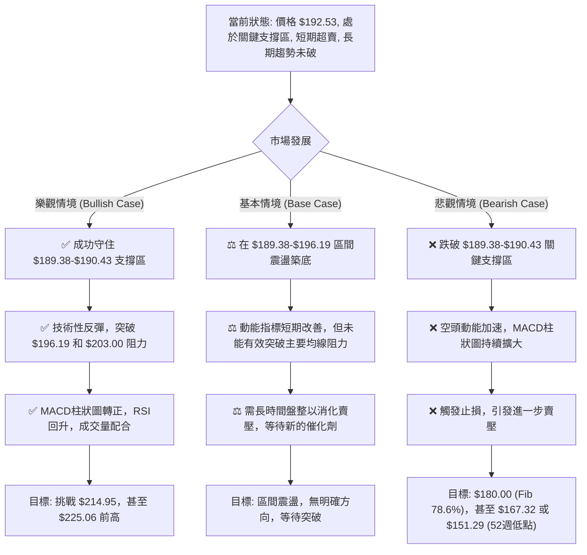

**分析：**
*   **樂觀情境 (機率約 30%)**：基於當前超賣和接近強支撐的狀況，若市場情緒轉好或有正面消息刺激，股價有望在 $189.38-$190.43 區域止跌反彈。成功突破多重阻力將確認反彈的有效性。
*   **基本情境 (機率約 45%)**：考慮到動能疲弱和趨勢強度不足，最有可能的情況是股價在當前關鍵支撐區附近進行震盪整理，消化賣壓，等待市場重新選擇方向。這可能是一個較長的築底過程。
*   **悲觀情境 (機率約 25%)**：如果關鍵支撐 $189.38-$190.43 失守，將觸發更多止損盤，空頭力量將進一步佔優，股價可能加速下跌，考驗更深層次的支撐位。

### 🛡️ 風險管理重要提醒

1.  **嚴格止損**：無論採取何種策略，都必須設定並嚴格執行止損點。尤其在當前波動性較高的市場環境中，止損是保護資本的關鍵。建議參考ATR或其他關鍵價位來設定止損。
2.  **倉位管理**：避免重倉單一股票，尤其是在趨勢不明朗或面臨關鍵點位時。建議將倉位控制在總投資組合的合理比例內，並根據風險偏好和市場情況調整。
3.  **多時框確認**：在做出交易決策前，務必進行多時框分析。短期訊號可能與中長期趨勢相悖，避免在反彈時盲目追高，或在回調時過度恐慌。
4.  **關注基本面和新聞**：儘管本報告側重技術分析，但NVDA作為科技巨頭，其基本面消息、財報、行業動態（如AI發展、競爭格局）等都可能對股價產生重大影響。密切關注相關新聞，以避免技術訊號被突發事件推翻。
5.  **市場情緒**：當前市場對高成長科技股的風險偏好可能較低。觀察整體市場指數（如納斯達克100）的走勢，以及資金流向，有助於判斷NVDA的表現。
6.  **避免情緒化交易**：市場的恐懼和貪婪情緒容易導致非理性決策。堅持交易計劃，避免追漲殺跌。

---

## 📋 報告總結

```
╔════════════════════════════════════════════════════════════════════════╗
║                   NVDA 技術分析報告總結                                ║
╠════════════════════════════════════════════════════════════════════════╣
║ 報告日期：2026-06-28                                                     ║
║ 當前價格：$192.53                                                        ║
║ 分析評級：⚖️ 偏空且短期超賣，存在反彈潛力，但需確認 (中性偏空)          ║
║                                                                          ║
║ 關鍵結論：                                                               ║
║ ├─ 長期趨勢：🟢 強勁上升趨勢未變，但正經歷健康回調。                     ║
║ ├─ 中期趨勢：🔴 進入下降通道，動能疲弱，均線壓力顯著。                   ║
║ ├─ 短期趨勢：🔴 快速下跌，動能衰竭，指標顯示超賣。                       ║
║ ├─ 關鍵支撐：$190.43 (MA200) 和 $189.38 (Fib 61.8%) 形成密集支撐區。   ║
║ ├─ 關鍵阻力：$196.19 (Fib 50%) 和 $203.00 (Fib 38.2%)。                 ║
║ └─ 分析師目標：均值 $300.59，低點 $180.00，高點 $500.00。               ║
║                                                                          ║
║ 最優策略組合：                                                           ║
║ 1. 🥇 **最佳機會 (謹慎做多)**：若價格在 $189.38-$190.43 區間有效止跌，  ║
║    進場價 $190.00-$191.00，止損 $187.00，目標 T1 $196.19，T2 $203.00。  ║
║ 2. 🥈 **次選機會 (順勢做空)**：若價格有效跌破 $189.38，伴隨放量，       ║
║    進場價 $189.00，止損 $192.00，目標 T1 $180.00，T2 $167.32。          ║
║ 3. 🥉 **保守選擇 (觀望)**：在 $189.38-$196.19 區間未見明確方向前，       ║
║    保持觀望，等待突破或築底形態確認，避免盲目操作。                      ║
╚════════════════════════════════════════════════════════════════════════╝
```

---

> ⚠️ **免責聲明**：本報告為 AI 自動生成之技術分析，所有數據及估算均基於提供的歷史價格資訊。本報告**僅供研究與學術參考**，**不構成任何投資建議**。投資有風險，入市需謹慎。

---

*報告生成時間：2026-06-28 ｜ 數據來源：Yahoo Finance ｜ 分析框架：多時框技術分析*