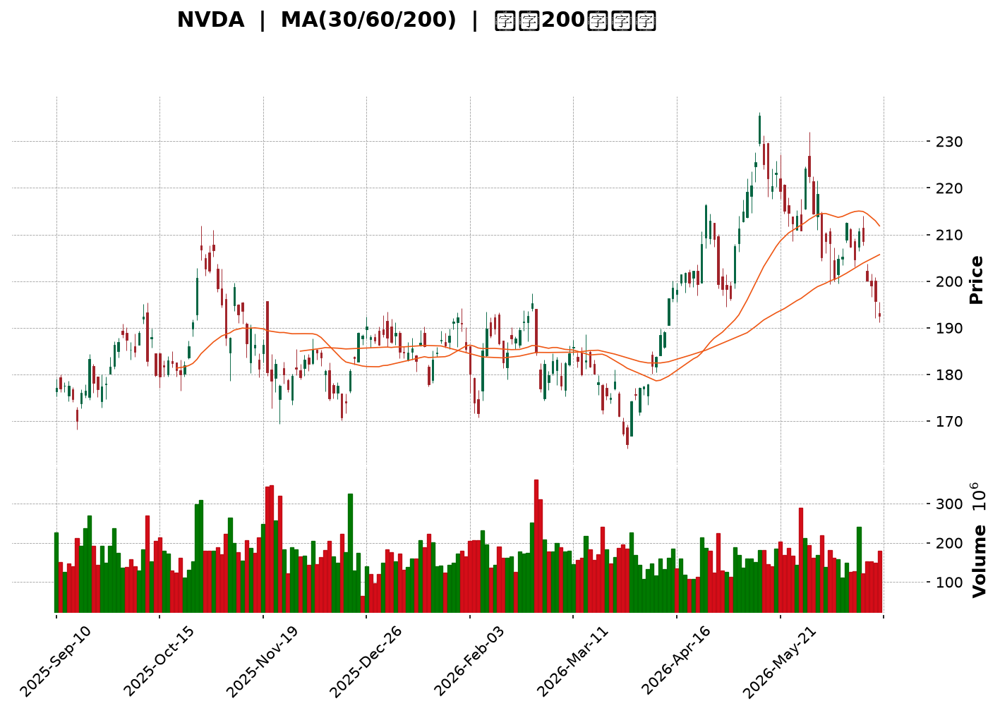
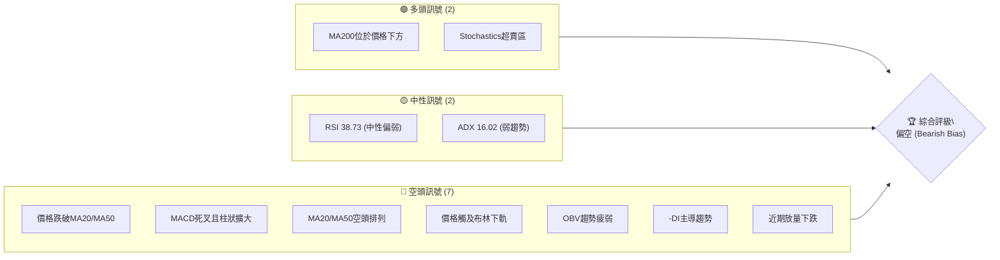
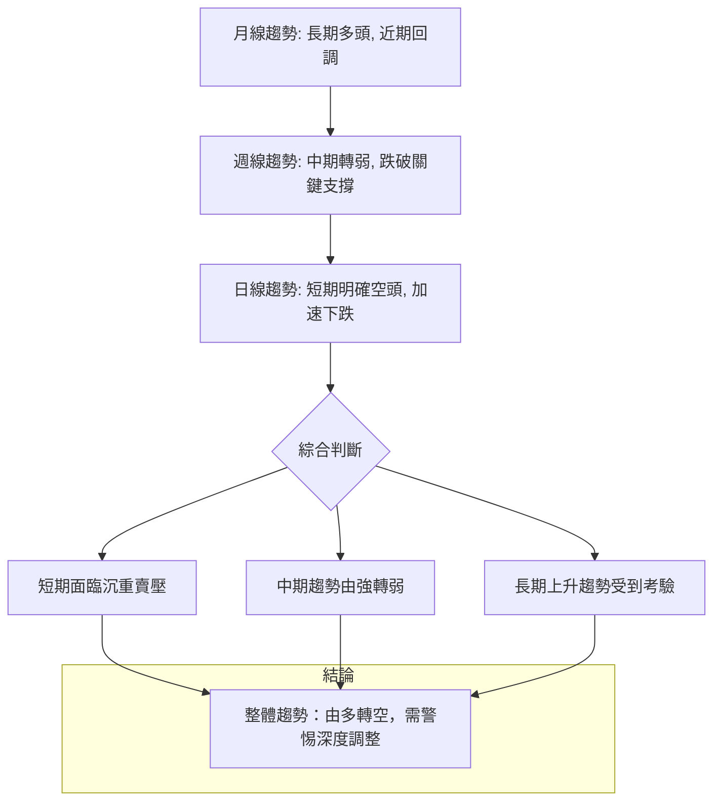
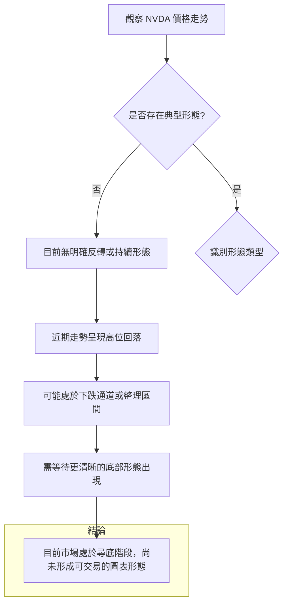
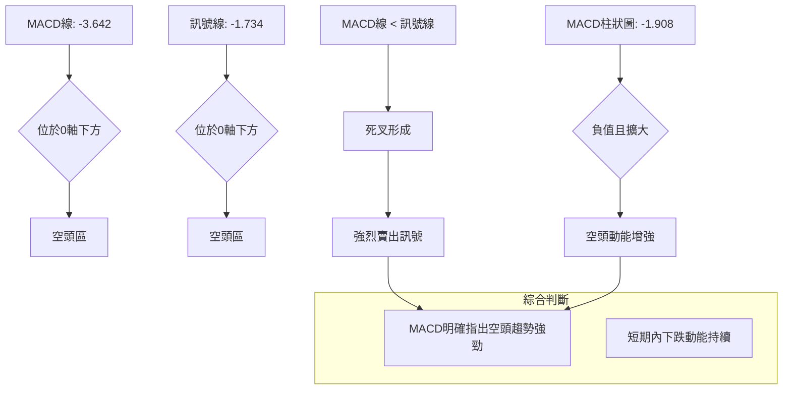
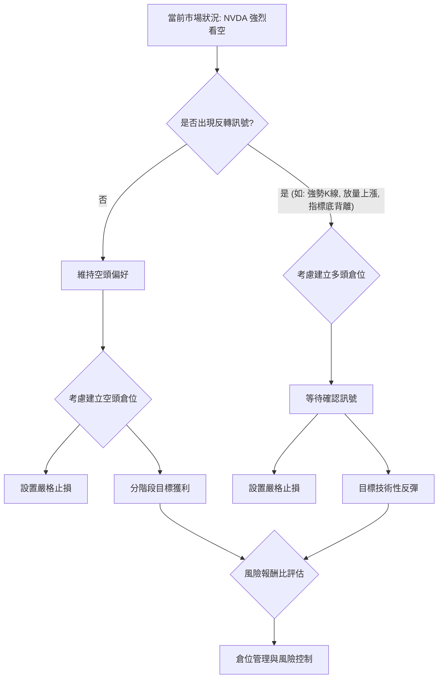

<details>
<summary>📊 靜態圖表 (點擊展開)</summary>

</details>

<html>
<head><meta charset="utf-8" /></head>
<body>
    <div style="height:500px; width:100%;">                        <script>window.PlotlyConfig = {MathJaxConfig: 'local'};</script>
        <script charset="utf-8" src="https://cdn.plot.ly/plotly-3.6.0.min.js" integrity="sha256-QaOVwtVY0T02VaHrr6pnoHLCwayMJp4O5n4YyaE3rJk=" crossorigin="anonymous"></script>                <div id="candlestick-chart" class="plotly-graph-div" style="height:100%; width:100%;"></div>            <script>                window.PLOTLYENV=window.PLOTLYENV || {};                                if (document.getElementById("candlestick-chart")) {                    Plotly.newPlot(                        "candlestick-chart",                        [{"close":{"dtype":"f8","bdata":"AAAAQAMjZkAAAADANx5mQAAAAAD+MmZAAAAAIMEwZkAAAAAgCNVlQAAAAKBWQmVAAAAAIH8AZkAAAAAAPQ5mQAAAAEAJ7GZAAAAAoHxGZkAAAACA0xdmQAAAAGDWLmZAAAAAINE+ZkAAAACgybNmQAAAAGD0SmdAAAAAYAxgZ0AAAADgx5RnQAAAACAxbGdAAAAAoLcpZ0AAAADAvBlnQAAAAMDPm2dAAAAAAGQKaEAAAACAp91mQAAAAICQgmdAAAAAIJ95ZkAAAADgOnNmQAAAAECCsmZAAAAAYJLfZkAAAAAACc1mQAAAAGC8nWZAAAAAgJyBZkAAAADgsb1mQAAAAEC6QGdAAAAAAODnZ0AAAAAAxBhpQAAAAEDX2GlAAAAAwDVUaUAAAAAgbUdpQAAAAEC602lAAAAAIPvNaEAAAABgw15oQAAAAODkemdAAAAAQCF9Z0AAAACgfNloQAAAACA\u002fHWhAAAAAQLMxaEAAAABA51NnQAAAACCwvWdAAAAAIJhLZ0AAAADAIKRmQAAAAIAJSWdAAAAA4B2NZkAAAABg3lRmQAAAAMAoymZAAAAAAP4yZkAAAADA+IBmQAAAAADJGGZAAAAAIBt2ZkAAAADgUqdmQAAAAGCPa2ZAAAAA4ALlZkAAAABgAsZmQAAAAABeKmdAAAAAYNQXZ0AAAADAy\u002fFmQAAAAOC0lmZAAAAAQNHZZUAAAABAaAJmQAAAAKAcMGZAAAAAgGpXZUAAAAAAsb1lQAAAAACgmGZAAAAAYOvuZkAAAABAWJ9nQAAAAOAqjGdAAAAAYIjJZ0AAAADgs39nQAAAACD4aWdAAAAAwLpIZ0AAAACg1pNnQAAAAMCBfGdAAAAAoGFgZ0AAAADgJZxnQAAAAAARGmdAAAAAQFAUZ0AAAADg3hZnQAAAAECtMmdAAAAAQFfdZkAAAADgTlpnQAAAAKAZQGdAAAAAgEw7ZkAAAAAgGONmQAAAAKCsE2dAAAAAwB9uZ0AAAABgxUdnQAAAAIBKiWdAAAAAgCzpZ0AAAADA0AhoQAAAAKC13GdAAAAAwEgsZ0AAAACA2YNmQAAAAEBKv2VAAAAAwHV1ZUAAAACA5CVnQAAAACDfuWdAAAAAIO6JZ0AAAAAgMbpnQAAAAADLVmdAAAAAIMvSZkAAAABg1BdnQAAAACAIeGdAAAAAoHl1Z0AAAABA17JnQAAAAAAi6mdAAAAAwK4TaEAAAADgS2poQAAAAMBFFWdAAAAAQCwfZkAAAAAgP8hmQAAAAMCUemZAAAAAACXaZkAAAACAu+NmQAAAAABPM2ZAAAAAAK7NZkAAAADgbxFnQAAAAKAHOmdAAAAAYKjdZkAAAAAASYFmQAAAAAA34GZAAAAAgPu2ZkAAAABgFIZmQAAAAKBES2ZAAAAAYPePZUAAAADg7+1lQAAAAIDf32VAAAAAgBpPZkAAAAAgTWFlQAAAAEBm6mRAAAAAgEmfZEAAAACgTcZlQAAAAAB08WVAAAAAIN8lZkAAAADA3C1mQAAAAMCQPGZAAAAAAMe7ZkAAAADgRPZmQAAAACAijWdAAAAAIN6iZ0AAAADg\u002f4hoQAAAAIBu1GhAAAAAoM\u002fDaEAAAAAgPy5pQAAAAIBkOmlAAAAA4Lb0aEAAAADgdEhpQAAAAAAL7WhAAAAAoOEAakAAAABgcwtrQAAAAMB\u002fnWpAAAAAgDQgakAAAABAzupoQAAAAOABx2hAAAAAQPfHaEAAAAAArohoQAAAAGDR8mlAAAAAAB9oakAAAAAgYt5qQAAAAMDnZWtAAAAAQLyQa0AAAADAJTJsQAAAAADmbm1AAAAAwNghbEAAAABg9cFrQAAAAEBNi2tAAAAAILfma0AAAACAJGhrQAAAAOCJ4mpAAAAAIITTakAAAADAR4tqQAAAAMAEwGpAAAAAYJ1cakAAAACAKQNsQAAAAIDw0WtAAAAAAADQakAAAADAHlVrQAAAAEAzo2lAAAAA4HoUakAAAACAFAZqQAAAAKBwDWlAAAAAANebaUAAAACAFKZpQAAAAGBmjmpAAAAAwB7taUAAAADAzJRpQAAAAIAUVmpAAAAAwMwUakAAAACgRwFpQAAAAAAA4GhAAAAAIK53aEAAAADA9RBoQA=="},"high":{"dtype":"f8","bdata":"kTcGJaZhZkAtlZdrnIFmQOCNZpzrS2ZA9gxn5ehTZkBlpgrJwyhmQJJcOgJXn2VACJS1RvsbZkAC6TgJTTtmQOhACvETCmdAF8x\u002fHQHGZkAMVzWtoXFmQLDF4u74gGZAyfJUA1BxZkA4\u002fYfwf\u002fhmQFlnADeQY2dA6Sjqu898Z0C8lgwW0NlnQEm5O6jCw2dApbOmfbpfZ0C4vzetNppnQGvIAsN4q2dAlSMVo6NhaED7aU673WtoQJfiknLFu2dAxi6FORESZ0B68ozoTRRnQGTC9yh94WZACcY4MbL7ZkBTvTrJ2R5nQLR4xz3U0WZAd7NdRprmZkDH+OLLf9lmQAgaov9lZ2dA0sWrjSz4Z0DHe7nghFxpQPITB2NufWpAkyXGgLe8aUAXn9cQkPZpQFJk\u002fvVDYmpAsuLqxrl2aUDr1AAsK1VpQG8GvPTIq2hA6A\u002fMOZCCZ0A2L5c27vVoQAZwvWp5ZWhAki+rsH50aEDgMznVRuZnQMw6+5uI2GdA1Grn1EuYZ0B3zxRbERJnQE3sUMTcc2dA1T1wtwJ4aEAElJiaZQpnQOIGQzaF6GZAY9HFs9s9ZkABQHP4qdVmQPpDlrr4YWZAwfDZKECCZkDSKYFsjS1nQNqogaj2xmZANEFzX3IJZ0CeO8Pr6w1nQI0zG+2reGdAO2v448wvZ0BVoAEpIShnQEUol\u002fsro2ZA+KDHCB3TZkBLJxf+e0ZmQN4cwdC4SGZA3kcFNEv9ZUARddTQ7v1lQI7H4KhTp2ZAhwNF7\u002fD9ZkB+NnUNLqNnQKRUj4HBlWdAjCXIkZEOaEAgLW0c9pBnQHsgsCdQmGdAug1Ou33KZ0Caj6ooPRZoQKIX\u002fsOcLGhAbr2B7fL9Z0BkUzEyYeRnQCrG7f01qmdADHPYmp1DZ0B8Ppyei1xnQH8uMewvfGdA6ie\u002fk4cHZ0DVyJ0tAa9nQO3IX\u002fynxmdA3SpV\u002fQzFZkDd7mgR7yRnQGMeJrouPmdAwPE\u002fHc+rZ0Dycu6td5xnQDb55dqXuGdA4GBwl7MDaEDLl+xR0SdoQB4NEDgZSGhAiXywcS7CZ0CrmOfxYEFnQJPdg1aPa2ZA2sO281gTZkDbwA\u002fitVhnQDeTyh+SLWhAkhd1TtsHaEDstbdXySBoQGJ+bRD5K2hAIOoO0rBoZ0CEYcIegV1nQD8\u002f+CVrxGdA70sAFmqGZ0CzhCEJJMNnQNjfcczWNmhAO5awMRYxaEDxcI23dKxoQLH2JbG0QWhAkQl+HMPLZkCocGWYkedmQOKIZ2S\u002flWZAk6InLzMPZ0AFY3eQvvpmQIOE8hMy0WZAANi9Z\u002f3VZkBlpl3Vz0ZnQLuqKbbZbGdANi+c1TAXZ0CC8i2O8jtnQPaqM8YflWdAGcFpqOQlZ0Dq8840VOVmQKAvOLWneGZATBDA2a1BZkD42xr3MUVmQC35sqV5AGZAlCLmBkqgZkBu\u002fGGevglmQAXD\u002f7irWGVAVrQsbxYoZUA8GOrGVc1lQLb0II07JWZAxi7XaxEpZkBH0swRqDJmQOEypGK4QGZACqquLGshZ0D7zvjgs\u002ftmQB2GXA\u002fsuGdAf1CBCQ6uZ0AAAADg\u002f4hoQEgZy6hVBWlAthXeUcHzaECSTCnP4i5pQEpqcZPoPWlAN6V3gXJQaUAAAADgdEhpQLIKuIr3cmlAEzTxkIpWakDef+OGexJrQMZOjF9cz2pAdEGWqB2PakAdSLELxEFqQDU+\u002fBtwWGlAdh1WQdgvaUCNL\u002ft0OABpQLFvya3hAGpAYaBHoGu+akCFZYGUfDFrQE2XjZlRwWtAcsIYLarva0DiGut0ZHJsQDGB9t53iG1AEq2cUGDnbEBFUcKibrdsQF7Y4lf\u002fBmxALYABgrw7bED03KEhVGRsQK2xJTUWmGtAUGvO1qE9a0C2Mt930rxqQDlAZoOc6GpAVK12imcza0DdMuuCdhNsQO\u002fZEYhOAG1A5dP7ifDRa0AAAABAM7NrQAAAAADX22pAAAAAQApPakAAAADAzGxqQAAAAEAK52lAAAAAwB61aUAAAACAPeJpQAAAAGC4lmpAAAAAIK5vakAAAABguCZqQAAAAOB6bGpAAAAAIK6\u002fakAAAADgo3hpQAAAAKBwNWlAAAAAoJkZaUAAAACgmXFoQA=="},"hovertemplate":"\u003cb\u003e%{x|%Y-%m-%d}\u003c\u002fb\u003e\u003cbr\u003e\u958b: $%{open:.2f}\u003cbr\u003e\u9ad8: $%{high:.2f}\u003cbr\u003e\u4f4e: $%{low:.2f}\u003cbr\u003e\u6536: $%{close:.2f}\u003cextra\u003e\u003c\u002fextra\u003e","low":{"dtype":"f8","bdata":"p5wSZJLnZUDGxVlzKghmQP9UsCs1B2ZAxc14zzTJZUCQe65XDcVlQPpZMl5BBmVAtBzAmauXZUBl+n9snt5lQJCI512Zz2VAjH0\u002fqon\u002fZUDXkzVipuVlQO8d73QanWVAHrV7JKHWZUCclDjX44JmQFtKN1j2p2ZAwVDr2U31ZkBSfSgpQXpnQHY4AYCaJGdATg5ZbxbjZkBo6Sv6f\u002fhmQNz+dBGtSWdA6wfYwSHaZ0AfSiz1LbpmQI5QBwAkN2dAnS6PMRNvZkC71i6hDSJmQAeLvOlPcWZAi29\u002fVaxwZkDGN\u002fu+869mQIWI\u002fnBFcmZANfJWWx0RZkBjyUR783FmQApE8iyF6GZA3qoYThSGZ0CQHdAqTPVnQLvPA\u002fWckGlAqJaKEekkaUBdqPnhADppQMgPJYaKqWlAerdNDrG1aEAQ2fuX3UxoQFPFCT2QRGdAc2FJrdNVZkCw6MqCYTFoQF5su2jN4WdA9bbHfF7cZ0Cqyr3ItPNmQLaMUPMyi2ZAG6+NKroCZ0BHF8M3em1mQGpthYEb02ZAlHJhft5zZkA5Yrr2tZZlQOEI4pYqCGZAR8uKa7AqZUAQZHAUakBmQHIBrzfOCGZAXjecHa6uZUBcjyG8qXhmQE0dJEI4XGZAZjymYbR3ZkDsgihYEZZmQCO5Lo+wxWZAAuM\u002fFxjjZkC3KDT9LrpmQGrdLmP0DGZAEoXuXQjNZUD35yLzItplQEZTskT71WVAZMaayUdDZUDYTCjHinNlQJG6MYcBBGZAOD9XfxfEZkB9L7KXq9VmQJi6pyibS2dA7VV036t4Z0AgfZNt3zVnQIerWhZ5VmdAa9SI+WhIZ0ABlVQj+4BnQBEqnSiLPWdATK30MPVSZ0BVvbeypUpnQBDX0QWP72ZAYIJEoEfuZkAFjylpgdlmQLxy04ym5WZAL\u002fkKWo2SZkB\u002fAILPS0NnQB1sM19OO2dANZUrt5gsZkApJ\u002fR42EVmQFUF2vSW9mZAH6eKG\u002fVSZ0ABu0QKbjhnQC8xkiQpL2dAUg87pHqzZ0Df8uW9qjpnQAfj4XCnp2dAFeEJ6fMUZ0DEeE5kfQBmQJT4kEBrdmVAgW+F+0paZUAbKyHgZMxlQGqGZaY692ZA2aX4sIF8Z0AdbuYlSJFnQFsThqoMSWdAF9fWDM2rZkAXPMVnxl5mQDTB4wwKUWdAr6OM+uEtZ0C3iiT41DZnQAM0AGkrq2dA2JkXo35lZ0DOMACquTFoQMdNMxAOA2dAF39S1UgFZkDAmpgcrM1lQAAQrvyKFmZAxUgOneZ6ZkALV8C9OTVmQDVUrPpYE2ZAo2QggRPrZUDo2nlrOblmQPS\u002fb1GHB2dACzRwwTqxZkBgtNR0YHdmQI7MwcJcpmZAzztY4v2uZkDSrt+q14NmQKq8riq78mVAXf+SmKRwZUD0B2hEz9FlQCnvleLguGVAvrGss5wUZkCSDyXUGl5lQMcJKh0Z2mRAcSsrVYWCZEAwFCAzgNhkQOMxSYl90WVAvQWDqXRlZUBugOetxfFlQJFN45emrmVA1wyDOeKCZkCCIh+AHI1mQNKZDQu8AmdA1h+ty8IwZ0DezSidiNFnQF4uSXljcGhAZFs7GaByaECAcMZ7N+FoQGKQxH6Cs2hA\u002fy1cRJbYaEA60aFAlthoQPzCEnSxn2hA7pum7nnyaEDeUSBGb+RpQI7zW+Wk\u002fmlAoqMDzdPqaUCGFQ1s\u002f85oQKPe9S5\u002fnGhA6GHx6mxQaEDndXs7qHloQEOxhg0fzGhA0C\u002fnrk7IaUBITnynjJRqQKWa2w2DtGpAw9x9Am\u002fVakDcMxmA\u002fKlrQDjHMeoOoWxADnWjrFP\u002fa0CeCjSLtENrQHlOtZ8ANWtAG1bOMsmHa0BKbVwxpDVrQAmr6S2Z0WpAs\u002f0zRhp4akB32iKuLhFqQJzPd+UrX2pAQEtmmEtcakBGYzRWXe5qQO6g6ET0omtAgUryKVTIakAAAABACl9qQAAAAGCPimlAAAAAAADAaUAAAABA4epoQAAAAKBw\u002fWhAAAAAoEfxaEAAAACAFG5pQAAAAEDhCmpAAAAAoEfpaUAAAABgj2JpQAAAAAAA0GlAAAAAQAr3aUAAAAAAAABpQAAAAGCPkmhAAAAAACkEaEAAAABACudnQA=="},"name":"\u50f9\u683c","open":{"dtype":"f8","bdata":"lyGdRPYMZkC5MYRub25mQHSKkuVkMWZA1D6YdEfuZUD2IbkAyRhmQEkENFpxjWVA1IwWtUS4ZUA5u02kefFlQIHn43V04mVA4HGTb5+3ZkBQhOjnT3FmQIFNwn4\u002fyGVAAAJwdS0+ZkDmTGixZ4ZmQHdHWlUju2ZAoLJyPiEgZ0AcjmHXeKtnQBbi0D1enmdAYZXUanAoZ0AjhhrVxD9nQGc5R6GiSmdABs5OLIb\u002fZ0A7DM6fbihoQHKA7+Zgd2dA+oWoyRsRZ0CRoIVDERJnQOQi\u002f33uv2ZAKBfZWGp+ZkC5KgADstxmQLR4xz3U0WZAFCWYphidZkDcfUToFYZmQJNcseBi82ZAdajkpu+3Z0DeGXYluxloQKU+BPHh9mlAGC7VCnCcaUBZaFoN\u002fMVpQJSVcBoU+mlATC0yprlXaUAJpQq6idBoQFu4KxpvhWhAMsaaKkMVZ0ALpbk8kVtoQDxvR0EqXWhAd6jP1g9vaEA\u002fHwwH0NlnQMI1YugQ1GZAdhbusnU3Z0DogiyMr+RmQOT8kk2\u002fEWdA5CAEnWl2aEB3OIzfSqBmQF89NS5daGZAA1Jznf3VZUC3wv2TwaxmQK4IkeYFWWZAXKd7ODLRZUDgtaM+6bBmQBVn+PMtm2ZAUW+YcMKsZkBjt\u002fK6T\u002fVmQD41DUpczWZA8JO7vK8qZ0Bsi+Rf1BdnQEjHmpzugWZAkH50uXWcZkAOK2yoJDdmQBk+GdJyAWZAOi2qwFX8ZUB3X5\u002f7J8plQBPSJpyNDmZAIsRrNEX2ZkDdktpk6NdmQN20se\u002fAdmdAi3ViVgm2Z0Dfxu4WZ29nQDoAsqNXgGdA+X6VnNmqZ0AEStO+erNnQI3ZKk3Y8GdA3WWxpDbJZ0D5h5Gj44pnQF+ACeIlnGdAWYfuTVgbZ0DPGTfK5d9mQAcaTNXJGGdAAgloGQ4DZ0AcXC+9ukhnQJwj324wm2dAY4Kbh7W1ZkAwAWfcnlpmQMGL60XMEGdAOe5O0rBoZ0Akljf90l1nQDH3JYZhYGdAP8e4\u002fi7hZ0AZxgLNa+NnQJurnTNE32dAuTrHIRpfZ0BJzot+a0BnQMYUD4m5Z2ZAInMo0PDWZUBQWdlEMQ9mQFhxbg4jAWdABfCbKLPkZ0AxcPLs5QZoQNR9InpvGWhAizMqJQ1oZ0BfLChC6rBmQAkYxlCkkGdAYr30waBaZ0A9uq+u90pnQMYeP59W5WdASU1hMjfoZ0BmYNPT0UZoQHo3NyQRQWhA7wfRO++gZkBFi2Frf9llQJGijdG4SGZAl+Q\u002f0guHZkC9zCKIYJ5mQMCZlpfec2ZA1y+XtKoTZkBlrRNnsMVmQGcl9cQxNmdA\u002f\u002fdicr76ZkA1rJ8WjRZnQJyNU2I52GZAMBB5pgYbZ0BpNgfqj8hmQLC6xj6wOWZAqhKBdF45ZkD2VgNttyFmQOYnVAcM1GVAQAFVUZocZkD524VwrvtlQOPPNbmqOWVAPurZMqwSZUDZ0rn60dhkQIezrZ1x+WVAiG3yb1h\u002fZUAlguAzhR5mQDG0LTrQ8GVALagOjCAJZ0B9UKYdG7RmQBgtp9INA2dAw+mxpwc6Z0DjSUlSxdNnQDPPQ1j1iWhANwUkpmemaEDl9bVZWvVoQE\u002f9JPbo92hAu3oQa6E8aUD2j2JmMRhpQDrSXJstR2lA1VppYEX3aEDc5Ctg\u002fSxqQHlfCVjgJ2pAMIds+XmOakB\u002fBQpz8DVqQJslD0N2IWlAYNW5ZZHoaEBcG\u002fLrLOJoQJESkJgI9WhAA43FYh4DakAnH7MxBplqQEgaqV9OuWpA5KtEZHVJa0AapTp1YRVsQAkZdEujsmxANyuJyMKvbEBIKCTgRrNsQMXP+ZCoa2tApAADJHLda0BgLQK9\u002f8BrQC2BsiGSlGtAs7OVmjYJa0DOUxwB3btqQDBJ\u002fdIWYWpAw2DsEZHKakBofffMUu9qQNfkY+tLXWxAT2iGx8eua0AAAADAHr1qQAAAAMD10GpAAAAAgMJFakAAAAAA11NqQAAAAIDCjWlAAAAAIK4vaUAAAAAghZtpQAAAAKBwHWpAAAAAgMJlakAAAADA9RBqQAAAAGCP6mlAAAAAgBRuakAAAACgcEVpQAAAAADXA2lAAAAAYI8CaUAAAAAA1yNoQA=="},"x":["2025-09-10T00:00:00-04:00","2025-09-11T00:00:00-04:00","2025-09-12T00:00:00-04:00","2025-09-15T00:00:00-04:00","2025-09-16T00:00:00-04:00","2025-09-17T00:00:00-04:00","2025-09-18T00:00:00-04:00","2025-09-19T00:00:00-04:00","2025-09-22T00:00:00-04:00","2025-09-23T00:00:00-04:00","2025-09-24T00:00:00-04:00","2025-09-25T00:00:00-04:00","2025-09-26T00:00:00-04:00","2025-09-29T00:00:00-04:00","2025-09-30T00:00:00-04:00","2025-10-01T00:00:00-04:00","2025-10-02T00:00:00-04:00","2025-10-03T00:00:00-04:00","2025-10-06T00:00:00-04:00","2025-10-07T00:00:00-04:00","2025-10-08T00:00:00-04:00","2025-10-09T00:00:00-04:00","2025-10-10T00:00:00-04:00","2025-10-13T00:00:00-04:00","2025-10-14T00:00:00-04:00","2025-10-15T00:00:00-04:00","2025-10-16T00:00:00-04:00","2025-10-17T00:00:00-04:00","2025-10-20T00:00:00-04:00","2025-10-21T00:00:00-04:00","2025-10-22T00:00:00-04:00","2025-10-23T00:00:00-04:00","2025-10-24T00:00:00-04:00","2025-10-27T00:00:00-04:00","2025-10-28T00:00:00-04:00","2025-10-29T00:00:00-04:00","2025-10-30T00:00:00-04:00","2025-10-31T00:00:00-04:00","2025-11-03T00:00:00-05:00","2025-11-04T00:00:00-05:00","2025-11-05T00:00:00-05:00","2025-11-06T00:00:00-05:00","2025-11-07T00:00:00-05:00","2025-11-10T00:00:00-05:00","2025-11-11T00:00:00-05:00","2025-11-12T00:00:00-05:00","2025-11-13T00:00:00-05:00","2025-11-14T00:00:00-05:00","2025-11-17T00:00:00-05:00","2025-11-18T00:00:00-05:00","2025-11-19T00:00:00-05:00","2025-11-20T00:00:00-05:00","2025-11-21T00:00:00-05:00","2025-11-24T00:00:00-05:00","2025-11-25T00:00:00-05:00","2025-11-26T00:00:00-05:00","2025-11-28T00:00:00-05:00","2025-12-01T00:00:00-05:00","2025-12-02T00:00:00-05:00","2025-12-03T00:00:00-05:00","2025-12-04T00:00:00-05:00","2025-12-05T00:00:00-05:00","2025-12-08T00:00:00-05:00","2025-12-09T00:00:00-05:00","2025-12-10T00:00:00-05:00","2025-12-11T00:00:00-05:00","2025-12-12T00:00:00-05:00","2025-12-15T00:00:00-05:00","2025-12-16T00:00:00-05:00","2025-12-17T00:00:00-05:00","2025-12-18T00:00:00-05:00","2025-12-19T00:00:00-05:00","2025-12-22T00:00:00-05:00","2025-12-23T00:00:00-05:00","2025-12-24T00:00:00-05:00","2025-12-26T00:00:00-05:00","2025-12-29T00:00:00-05:00","2025-12-30T00:00:00-05:00","2025-12-31T00:00:00-05:00","2026-01-02T00:00:00-05:00","2026-01-05T00:00:00-05:00","2026-01-06T00:00:00-05:00","2026-01-07T00:00:00-05:00","2026-01-08T00:00:00-05:00","2026-01-09T00:00:00-05:00","2026-01-12T00:00:00-05:00","2026-01-13T00:00:00-05:00","2026-01-14T00:00:00-05:00","2026-01-15T00:00:00-05:00","2026-01-16T00:00:00-05:00","2026-01-20T00:00:00-05:00","2026-01-21T00:00:00-05:00","2026-01-22T00:00:00-05:00","2026-01-23T00:00:00-05:00","2026-01-26T00:00:00-05:00","2026-01-27T00:00:00-05:00","2026-01-28T00:00:00-05:00","2026-01-29T00:00:00-05:00","2026-01-30T00:00:00-05:00","2026-02-02T00:00:00-05:00","2026-02-03T00:00:00-05:00","2026-02-04T00:00:00-05:00","2026-02-05T00:00:00-05:00","2026-02-06T00:00:00-05:00","2026-02-09T00:00:00-05:00","2026-02-10T00:00:00-05:00","2026-02-11T00:00:00-05:00","2026-02-12T00:00:00-05:00","2026-02-13T00:00:00-05:00","2026-02-17T00:00:00-05:00","2026-02-18T00:00:00-05:00","2026-02-19T00:00:00-05:00","2026-02-20T00:00:00-05:00","2026-02-23T00:00:00-05:00","2026-02-24T00:00:00-05:00","2026-02-25T00:00:00-05:00","2026-02-26T00:00:00-05:00","2026-02-27T00:00:00-05:00","2026-03-02T00:00:00-05:00","2026-03-03T00:00:00-05:00","2026-03-04T00:00:00-05:00","2026-03-05T00:00:00-05:00","2026-03-06T00:00:00-05:00","2026-03-09T00:00:00-04:00","2026-03-10T00:00:00-04:00","2026-03-11T00:00:00-04:00","2026-03-12T00:00:00-04:00","2026-03-13T00:00:00-04:00","2026-03-16T00:00:00-04:00","2026-03-17T00:00:00-04:00","2026-03-18T00:00:00-04:00","2026-03-19T00:00:00-04:00","2026-03-20T00:00:00-04:00","2026-03-23T00:00:00-04:00","2026-03-24T00:00:00-04:00","2026-03-25T00:00:00-04:00","2026-03-26T00:00:00-04:00","2026-03-27T00:00:00-04:00","2026-03-30T00:00:00-04:00","2026-03-31T00:00:00-04:00","2026-04-01T00:00:00-04:00","2026-04-02T00:00:00-04:00","2026-04-06T00:00:00-04:00","2026-04-07T00:00:00-04:00","2026-04-08T00:00:00-04:00","2026-04-09T00:00:00-04:00","2026-04-10T00:00:00-04:00","2026-04-13T00:00:00-04:00","2026-04-14T00:00:00-04:00","2026-04-15T00:00:00-04:00","2026-04-16T00:00:00-04:00","2026-04-17T00:00:00-04:00","2026-04-20T00:00:00-04:00","2026-04-21T00:00:00-04:00","2026-04-22T00:00:00-04:00","2026-04-23T00:00:00-04:00","2026-04-24T00:00:00-04:00","2026-04-27T00:00:00-04:00","2026-04-28T00:00:00-04:00","2026-04-29T00:00:00-04:00","2026-04-30T00:00:00-04:00","2026-05-01T00:00:00-04:00","2026-05-04T00:00:00-04:00","2026-05-05T00:00:00-04:00","2026-05-06T00:00:00-04:00","2026-05-07T00:00:00-04:00","2026-05-08T00:00:00-04:00","2026-05-11T00:00:00-04:00","2026-05-12T00:00:00-04:00","2026-05-13T00:00:00-04:00","2026-05-14T00:00:00-04:00","2026-05-15T00:00:00-04:00","2026-05-18T00:00:00-04:00","2026-05-19T00:00:00-04:00","2026-05-20T00:00:00-04:00","2026-05-21T00:00:00-04:00","2026-05-22T00:00:00-04:00","2026-05-26T00:00:00-04:00","2026-05-27T00:00:00-04:00","2026-05-28T00:00:00-04:00","2026-05-29T00:00:00-04:00","2026-06-01T00:00:00-04:00","2026-06-02T00:00:00-04:00","2026-06-03T00:00:00-04:00","2026-06-04T00:00:00-04:00","2026-06-05T00:00:00-04:00","2026-06-08T00:00:00-04:00","2026-06-09T00:00:00-04:00","2026-06-10T00:00:00-04:00","2026-06-11T00:00:00-04:00","2026-06-12T00:00:00-04:00","2026-06-15T00:00:00-04:00","2026-06-16T00:00:00-04:00","2026-06-17T00:00:00-04:00","2026-06-18T00:00:00-04:00","2026-06-22T00:00:00-04:00","2026-06-23T00:00:00-04:00","2026-06-24T00:00:00-04:00","2026-06-25T00:00:00-04:00","2026-06-26T00:00:00-04:00"],"type":"candlestick"},{"hovertemplate":"MA30: $%{y:.2f}\u003cextra\u003e\u003c\u002fextra\u003e","line":{"color":"#2196F3","dash":"dash","width":2},"mode":"lines","name":"MA30","x":["2025-09-10T00:00:00-04:00","2025-09-11T00:00:00-04:00","2025-09-12T00:00:00-04:00","2025-09-15T00:00:00-04:00","2025-09-16T00:00:00-04:00","2025-09-17T00:00:00-04:00","2025-09-18T00:00:00-04:00","2025-09-19T00:00:00-04:00","2025-09-22T00:00:00-04:00","2025-09-23T00:00:00-04:00","2025-09-24T00:00:00-04:00","2025-09-25T00:00:00-04:00","2025-09-26T00:00:00-04:00","2025-09-29T00:00:00-04:00","2025-09-30T00:00:00-04:00","2025-10-01T00:00:00-04:00","2025-10-02T00:00:00-04:00","2025-10-03T00:00:00-04:00","2025-10-06T00:00:00-04:00","2025-10-07T00:00:00-04:00","2025-10-08T00:00:00-04:00","2025-10-09T00:00:00-04:00","2025-10-10T00:00:00-04:00","2025-10-13T00:00:00-04:00","2025-10-14T00:00:00-04:00","2025-10-15T00:00:00-04:00","2025-10-16T00:00:00-04:00","2025-10-17T00:00:00-04:00","2025-10-20T00:00:00-04:00","2025-10-21T00:00:00-04:00","2025-10-22T00:00:00-04:00","2025-10-23T00:00:00-04:00","2025-10-24T00:00:00-04:00","2025-10-27T00:00:00-04:00","2025-10-28T00:00:00-04:00","2025-10-29T00:00:00-04:00","2025-10-30T00:00:00-04:00","2025-10-31T00:00:00-04:00","2025-11-03T00:00:00-05:00","2025-11-04T00:00:00-05:00","2025-11-05T00:00:00-05:00","2025-11-06T00:00:00-05:00","2025-11-07T00:00:00-05:00","2025-11-10T00:00:00-05:00","2025-11-11T00:00:00-05:00","2025-11-12T00:00:00-05:00","2025-11-13T00:00:00-05:00","2025-11-14T00:00:00-05:00","2025-11-17T00:00:00-05:00","2025-11-18T00:00:00-05:00","2025-11-19T00:00:00-05:00","2025-11-20T00:00:00-05:00","2025-11-21T00:00:00-05:00","2025-11-24T00:00:00-05:00","2025-11-25T00:00:00-05:00","2025-11-26T00:00:00-05:00","2025-11-28T00:00:00-05:00","2025-12-01T00:00:00-05:00","2025-12-02T00:00:00-05:00","2025-12-03T00:00:00-05:00","2025-12-04T00:00:00-05:00","2025-12-05T00:00:00-05:00","2025-12-08T00:00:00-05:00","2025-12-09T00:00:00-05:00","2025-12-10T00:00:00-05:00","2025-12-11T00:00:00-05:00","2025-12-12T00:00:00-05:00","2025-12-15T00:00:00-05:00","2025-12-16T00:00:00-05:00","2025-12-17T00:00:00-05:00","2025-12-18T00:00:00-05:00","2025-12-19T00:00:00-05:00","2025-12-22T00:00:00-05:00","2025-12-23T00:00:00-05:00","2025-12-24T00:00:00-05:00","2025-12-26T00:00:00-05:00","2025-12-29T00:00:00-05:00","2025-12-30T00:00:00-05:00","2025-12-31T00:00:00-05:00","2026-01-02T00:00:00-05:00","2026-01-05T00:00:00-05:00","2026-01-06T00:00:00-05:00","2026-01-07T00:00:00-05:00","2026-01-08T00:00:00-05:00","2026-01-09T00:00:00-05:00","2026-01-12T00:00:00-05:00","2026-01-13T00:00:00-05:00","2026-01-14T00:00:00-05:00","2026-01-15T00:00:00-05:00","2026-01-16T00:00:00-05:00","2026-01-20T00:00:00-05:00","2026-01-21T00:00:00-05:00","2026-01-22T00:00:00-05:00","2026-01-23T00:00:00-05:00","2026-01-26T00:00:00-05:00","2026-01-27T00:00:00-05:00","2026-01-28T00:00:00-05:00","2026-01-29T00:00:00-05:00","2026-01-30T00:00:00-05:00","2026-02-02T00:00:00-05:00","2026-02-03T00:00:00-05:00","2026-02-04T00:00:00-05:00","2026-02-05T00:00:00-05:00","2026-02-06T00:00:00-05:00","2026-02-09T00:00:00-05:00","2026-02-10T00:00:00-05:00","2026-02-11T00:00:00-05:00","2026-02-12T00:00:00-05:00","2026-02-13T00:00:00-05:00","2026-02-17T00:00:00-05:00","2026-02-18T00:00:00-05:00","2026-02-19T00:00:00-05:00","2026-02-20T00:00:00-05:00","2026-02-23T00:00:00-05:00","2026-02-24T00:00:00-05:00","2026-02-25T00:00:00-05:00","2026-02-26T00:00:00-05:00","2026-02-27T00:00:00-05:00","2026-03-02T00:00:00-05:00","2026-03-03T00:00:00-05:00","2026-03-04T00:00:00-05:00","2026-03-05T00:00:00-05:00","2026-03-06T00:00:00-05:00","2026-03-09T00:00:00-04:00","2026-03-10T00:00:00-04:00","2026-03-11T00:00:00-04:00","2026-03-12T00:00:00-04:00","2026-03-13T00:00:00-04:00","2026-03-16T00:00:00-04:00","2026-03-17T00:00:00-04:00","2026-03-18T00:00:00-04:00","2026-03-19T00:00:00-04:00","2026-03-20T00:00:00-04:00","2026-03-23T00:00:00-04:00","2026-03-24T00:00:00-04:00","2026-03-25T00:00:00-04:00","2026-03-26T00:00:00-04:00","2026-03-27T00:00:00-04:00","2026-03-30T00:00:00-04:00","2026-03-31T00:00:00-04:00","2026-04-01T00:00:00-04:00","2026-04-02T00:00:00-04:00","2026-04-06T00:00:00-04:00","2026-04-07T00:00:00-04:00","2026-04-08T00:00:00-04:00","2026-04-09T00:00:00-04:00","2026-04-10T00:00:00-04:00","2026-04-13T00:00:00-04:00","2026-04-14T00:00:00-04:00","2026-04-15T00:00:00-04:00","2026-04-16T00:00:00-04:00","2026-04-17T00:00:00-04:00","2026-04-20T00:00:00-04:00","2026-04-21T00:00:00-04:00","2026-04-22T00:00:00-04:00","2026-04-23T00:00:00-04:00","2026-04-24T00:00:00-04:00","2026-04-27T00:00:00-04:00","2026-04-28T00:00:00-04:00","2026-04-29T00:00:00-04:00","2026-04-30T00:00:00-04:00","2026-05-01T00:00:00-04:00","2026-05-04T00:00:00-04:00","2026-05-05T00:00:00-04:00","2026-05-06T00:00:00-04:00","2026-05-07T00:00:00-04:00","2026-05-08T00:00:00-04:00","2026-05-11T00:00:00-04:00","2026-05-12T00:00:00-04:00","2026-05-13T00:00:00-04:00","2026-05-14T00:00:00-04:00","2026-05-15T00:00:00-04:00","2026-05-18T00:00:00-04:00","2026-05-19T00:00:00-04:00","2026-05-20T00:00:00-04:00","2026-05-21T00:00:00-04:00","2026-05-22T00:00:00-04:00","2026-05-26T00:00:00-04:00","2026-05-27T00:00:00-04:00","2026-05-28T00:00:00-04:00","2026-05-29T00:00:00-04:00","2026-06-01T00:00:00-04:00","2026-06-02T00:00:00-04:00","2026-06-03T00:00:00-04:00","2026-06-04T00:00:00-04:00","2026-06-05T00:00:00-04:00","2026-06-08T00:00:00-04:00","2026-06-09T00:00:00-04:00","2026-06-10T00:00:00-04:00","2026-06-11T00:00:00-04:00","2026-06-12T00:00:00-04:00","2026-06-15T00:00:00-04:00","2026-06-16T00:00:00-04:00","2026-06-17T00:00:00-04:00","2026-06-18T00:00:00-04:00","2026-06-22T00:00:00-04:00","2026-06-23T00:00:00-04:00","2026-06-24T00:00:00-04:00","2026-06-25T00:00:00-04:00","2026-06-26T00:00:00-04:00"],"y":{"dtype":"f8","bdata":"AAAAAAAA+H8AAAAAAAD4fwAAAAAAAPh\u002fAAAAAAAA+H8AAAAAAAD4fwAAAAAAAPh\u002fAAAAAAAA+H8AAAAAAAD4fwAAAAAAAPh\u002fAAAAAAAA+H8AAAAAAAD4fwAAAAAAAPh\u002fAAAAAAAA+H8AAAAAAAD4fwAAAAAAAPh\u002fAAAAAAAA+H8AAAAAAAD4fwAAAAAAAPh\u002fAAAAAAAA+H8AAAAAAAD4fwAAAAAAAPh\u002fAAAAAAAA+H8AAAAAAAD4fwAAAAAAAPh\u002fAAAAAAAA+H8AAAAAAAD4fwAAAAAAAPh\u002fAAAAAAAA+H8AAAAAAAD4f7y7uwtqq2ZAmpmZSZGuZkCJiIgo4rNmQGZmZubfvGZAAAAAEIPLZkCJiIioXudmQERERBSFDmdAiYiICOkqZ0AzMzOjakZnQN7d3c00X2dAZmZmFsp0Z0C8u7t7OIhnQImIiAhKk2dA3t3dTeadZ0AiIiISObBnQAAAAJA7t2dAd3d3lzi+Z0CJiIj4DrxnQHd3d2fGvmdAzczMfOe\u002fZ0AzMzPj+7tnQLy7u4s5uWdAIiIiAoSsZ0BVVVXF9KdnQN7d3S3PoWdAmpmZeXSfZ0DNzMy86Z9nQGZmZvbJmmdAzczM\u002fEWXZ0Dv7u4uBJZnQERERARYlGdAq6qqOqiXZ0De3d0t75dnQO\u002fu7l4wl2dAzczMDEGQZ0ARERFx431nQO\u002fu7n4VYmdAq6qqemdEZ0CrqqrqgChnQBERESFzCWdAZmZmxuXrZkCrqqo6dtVmQGZmZmbrzWZA7+7u3i3JZkARERExtb5mQO\u002fu7i7fuWZAmpmZSWa2ZkCrqqoK3LdmQERERKQRtWZAIiIiMvm0ZkCamZm59rxmQO\u002fu7u6tvmZAmpmZubjFZkAiIiKCodBmQCIiImJL02ZAAAAAIM7aZkAzMzNDzd9mQM3MzLwy6WZAzczMrKPsZkAiIiICm\u002fJmQO\u002fu7q6w+WZAiYiIeAj0ZkCamZmpAPVmQERERAQ\u002f9GZAVVVVZR\u002f3ZkDNzMwM\u002fflmQKuqqhoTAmdAZmZmNqcTZ0BmZmb27iRnQERERFQ4M2dAZmZmVtlCZ0CamZlJdElnQCIiIrI1QmdAVVVVtaA1Z0ARERFRlDFnQDMzM1MaM2dAVVVVlfswZ0ARERGx7jJnQN7d3Q1LMmdAq6qqqlwuZ0BVVVV1OipnQFVVVUUUKmdAVVVVRcgqZ0CrqqrqiStnQKuqqmp5MmdAERERkfw6Z0AAAAAATUZnQFVVVRVSRWdAERERUfs+Z0DNzMzsHDpnQN7d3W2HM2dAmpmZ6dI4Z0C8u7tb2DhnQFVVVcVdMWdAVVVVpQQsZ0Dv7u7+NCpnQCIiIqKQJ2dARERE1KUeZ0BVVVXFmBFnQGZmZiYuCWdAzczMLEUFZ0BEREQ0WAVnQO\u002fu7q4CCmdA7+7u3uQKZ0CamZnZfgBnQAAAABCy8GZAq6qqijPmZkARERHxK9JmQKuqqup9vWZAREREVLWqZkCrqqoadZ9mQKuqqipwkmZAmpmZWUCHZkARERERSXpmQM3MzGz3a2ZARERExIBgZkAiIiIiGlRmQCIiIvIYWGZAZmZmRgVlZkAiIiKi+nNmQM3MzGwKiGZAmpmZ6VyYZkBVVVXV6atmQCIiIuK\u002fxWZAvLu7Cx7YZkDNzMycBOtmQJqZmbmE+WZAZmZm5koUZ0C8u7sLCDtnQO\u002fu7t7wWmdA7+7uXgx4Z0B3d3f3eIxnQBEREfGpoWdAd3d3ZyG9Z0ARERHxWtNnQM3MzLwe9mdAq6qqWhYZaEAzMzNj7EdoQBEREYE9f2hAAAAAEH26aECJiIiISPFoQLy7u7syMWlAZmZmlkNkaUAiIiIC3pNpQO\u002fu7o4owWlAERERoUHtaUC8u7t7LxNqQAAAAOChL2pAvLu7m9pKakAzMzMj\u002f1tqQDMzMwNibGpAiYiIeAJ6akCrqqpqLJJqQO\u002fu7q5KqGpAREREdCK4akBVVVWVn8lqQN7d3f2xz2pAvLu7O1nQakDv7u7eosdqQImIiAhNumpAREREhOO1akB3d3eXIbxqQLy7u5tPy2pAERERMRXVakBmZmYmBd5qQAAAADBU4WpA3t3dLY3eakBVVVXlpc5qQLy7uyseuWpARERExK6eakDv7u5ucXtqQA=="},"type":"scatter"},{"hovertemplate":"MA60: $%{y:.2f}\u003cextra\u003e\u003c\u002fextra\u003e","line":{"color":"#9C27B0","dash":"dash","width":2},"mode":"lines","name":"MA60","x":["2025-09-10T00:00:00-04:00","2025-09-11T00:00:00-04:00","2025-09-12T00:00:00-04:00","2025-09-15T00:00:00-04:00","2025-09-16T00:00:00-04:00","2025-09-17T00:00:00-04:00","2025-09-18T00:00:00-04:00","2025-09-19T00:00:00-04:00","2025-09-22T00:00:00-04:00","2025-09-23T00:00:00-04:00","2025-09-24T00:00:00-04:00","2025-09-25T00:00:00-04:00","2025-09-26T00:00:00-04:00","2025-09-29T00:00:00-04:00","2025-09-30T00:00:00-04:00","2025-10-01T00:00:00-04:00","2025-10-02T00:00:00-04:00","2025-10-03T00:00:00-04:00","2025-10-06T00:00:00-04:00","2025-10-07T00:00:00-04:00","2025-10-08T00:00:00-04:00","2025-10-09T00:00:00-04:00","2025-10-10T00:00:00-04:00","2025-10-13T00:00:00-04:00","2025-10-14T00:00:00-04:00","2025-10-15T00:00:00-04:00","2025-10-16T00:00:00-04:00","2025-10-17T00:00:00-04:00","2025-10-20T00:00:00-04:00","2025-10-21T00:00:00-04:00","2025-10-22T00:00:00-04:00","2025-10-23T00:00:00-04:00","2025-10-24T00:00:00-04:00","2025-10-27T00:00:00-04:00","2025-10-28T00:00:00-04:00","2025-10-29T00:00:00-04:00","2025-10-30T00:00:00-04:00","2025-10-31T00:00:00-04:00","2025-11-03T00:00:00-05:00","2025-11-04T00:00:00-05:00","2025-11-05T00:00:00-05:00","2025-11-06T00:00:00-05:00","2025-11-07T00:00:00-05:00","2025-11-10T00:00:00-05:00","2025-11-11T00:00:00-05:00","2025-11-12T00:00:00-05:00","2025-11-13T00:00:00-05:00","2025-11-14T00:00:00-05:00","2025-11-17T00:00:00-05:00","2025-11-18T00:00:00-05:00","2025-11-19T00:00:00-05:00","2025-11-20T00:00:00-05:00","2025-11-21T00:00:00-05:00","2025-11-24T00:00:00-05:00","2025-11-25T00:00:00-05:00","2025-11-26T00:00:00-05:00","2025-11-28T00:00:00-05:00","2025-12-01T00:00:00-05:00","2025-12-02T00:00:00-05:00","2025-12-03T00:00:00-05:00","2025-12-04T00:00:00-05:00","2025-12-05T00:00:00-05:00","2025-12-08T00:00:00-05:00","2025-12-09T00:00:00-05:00","2025-12-10T00:00:00-05:00","2025-12-11T00:00:00-05:00","2025-12-12T00:00:00-05:00","2025-12-15T00:00:00-05:00","2025-12-16T00:00:00-05:00","2025-12-17T00:00:00-05:00","2025-12-18T00:00:00-05:00","2025-12-19T00:00:00-05:00","2025-12-22T00:00:00-05:00","2025-12-23T00:00:00-05:00","2025-12-24T00:00:00-05:00","2025-12-26T00:00:00-05:00","2025-12-29T00:00:00-05:00","2025-12-30T00:00:00-05:00","2025-12-31T00:00:00-05:00","2026-01-02T00:00:00-05:00","2026-01-05T00:00:00-05:00","2026-01-06T00:00:00-05:00","2026-01-07T00:00:00-05:00","2026-01-08T00:00:00-05:00","2026-01-09T00:00:00-05:00","2026-01-12T00:00:00-05:00","2026-01-13T00:00:00-05:00","2026-01-14T00:00:00-05:00","2026-01-15T00:00:00-05:00","2026-01-16T00:00:00-05:00","2026-01-20T00:00:00-05:00","2026-01-21T00:00:00-05:00","2026-01-22T00:00:00-05:00","2026-01-23T00:00:00-05:00","2026-01-26T00:00:00-05:00","2026-01-27T00:00:00-05:00","2026-01-28T00:00:00-05:00","2026-01-29T00:00:00-05:00","2026-01-30T00:00:00-05:00","2026-02-02T00:00:00-05:00","2026-02-03T00:00:00-05:00","2026-02-04T00:00:00-05:00","2026-02-05T00:00:00-05:00","2026-02-06T00:00:00-05:00","2026-02-09T00:00:00-05:00","2026-02-10T00:00:00-05:00","2026-02-11T00:00:00-05:00","2026-02-12T00:00:00-05:00","2026-02-13T00:00:00-05:00","2026-02-17T00:00:00-05:00","2026-02-18T00:00:00-05:00","2026-02-19T00:00:00-05:00","2026-02-20T00:00:00-05:00","2026-02-23T00:00:00-05:00","2026-02-24T00:00:00-05:00","2026-02-25T00:00:00-05:00","2026-02-26T00:00:00-05:00","2026-02-27T00:00:00-05:00","2026-03-02T00:00:00-05:00","2026-03-03T00:00:00-05:00","2026-03-04T00:00:00-05:00","2026-03-05T00:00:00-05:00","2026-03-06T00:00:00-05:00","2026-03-09T00:00:00-04:00","2026-03-10T00:00:00-04:00","2026-03-11T00:00:00-04:00","2026-03-12T00:00:00-04:00","2026-03-13T00:00:00-04:00","2026-03-16T00:00:00-04:00","2026-03-17T00:00:00-04:00","2026-03-18T00:00:00-04:00","2026-03-19T00:00:00-04:00","2026-03-20T00:00:00-04:00","2026-03-23T00:00:00-04:00","2026-03-24T00:00:00-04:00","2026-03-25T00:00:00-04:00","2026-03-26T00:00:00-04:00","2026-03-27T00:00:00-04:00","2026-03-30T00:00:00-04:00","2026-03-31T00:00:00-04:00","2026-04-01T00:00:00-04:00","2026-04-02T00:00:00-04:00","2026-04-06T00:00:00-04:00","2026-04-07T00:00:00-04:00","2026-04-08T00:00:00-04:00","2026-04-09T00:00:00-04:00","2026-04-10T00:00:00-04:00","2026-04-13T00:00:00-04:00","2026-04-14T00:00:00-04:00","2026-04-15T00:00:00-04:00","2026-04-16T00:00:00-04:00","2026-04-17T00:00:00-04:00","2026-04-20T00:00:00-04:00","2026-04-21T00:00:00-04:00","2026-04-22T00:00:00-04:00","2026-04-23T00:00:00-04:00","2026-04-24T00:00:00-04:00","2026-04-27T00:00:00-04:00","2026-04-28T00:00:00-04:00","2026-04-29T00:00:00-04:00","2026-04-30T00:00:00-04:00","2026-05-01T00:00:00-04:00","2026-05-04T00:00:00-04:00","2026-05-05T00:00:00-04:00","2026-05-06T00:00:00-04:00","2026-05-07T00:00:00-04:00","2026-05-08T00:00:00-04:00","2026-05-11T00:00:00-04:00","2026-05-12T00:00:00-04:00","2026-05-13T00:00:00-04:00","2026-05-14T00:00:00-04:00","2026-05-15T00:00:00-04:00","2026-05-18T00:00:00-04:00","2026-05-19T00:00:00-04:00","2026-05-20T00:00:00-04:00","2026-05-21T00:00:00-04:00","2026-05-22T00:00:00-04:00","2026-05-26T00:00:00-04:00","2026-05-27T00:00:00-04:00","2026-05-28T00:00:00-04:00","2026-05-29T00:00:00-04:00","2026-06-01T00:00:00-04:00","2026-06-02T00:00:00-04:00","2026-06-03T00:00:00-04:00","2026-06-04T00:00:00-04:00","2026-06-05T00:00:00-04:00","2026-06-08T00:00:00-04:00","2026-06-09T00:00:00-04:00","2026-06-10T00:00:00-04:00","2026-06-11T00:00:00-04:00","2026-06-12T00:00:00-04:00","2026-06-15T00:00:00-04:00","2026-06-16T00:00:00-04:00","2026-06-17T00:00:00-04:00","2026-06-18T00:00:00-04:00","2026-06-22T00:00:00-04:00","2026-06-23T00:00:00-04:00","2026-06-24T00:00:00-04:00","2026-06-25T00:00:00-04:00","2026-06-26T00:00:00-04:00"],"y":{"dtype":"f8","bdata":"AAAAAAAA+H8AAAAAAAD4fwAAAAAAAPh\u002fAAAAAAAA+H8AAAAAAAD4fwAAAAAAAPh\u002fAAAAAAAA+H8AAAAAAAD4fwAAAAAAAPh\u002fAAAAAAAA+H8AAAAAAAD4fwAAAAAAAPh\u002fAAAAAAAA+H8AAAAAAAD4fwAAAAAAAPh\u002fAAAAAAAA+H8AAAAAAAD4fwAAAAAAAPh\u002fAAAAAAAA+H8AAAAAAAD4fwAAAAAAAPh\u002fAAAAAAAA+H8AAAAAAAD4fwAAAAAAAPh\u002fAAAAAAAA+H8AAAAAAAD4fwAAAAAAAPh\u002fAAAAAAAA+H8AAAAAAAD4fwAAAAAAAPh\u002fAAAAAAAA+H8AAAAAAAD4fwAAAAAAAPh\u002fAAAAAAAA+H8AAAAAAAD4fwAAAAAAAPh\u002fAAAAAAAA+H8AAAAAAAD4fwAAAAAAAPh\u002fAAAAAAAA+H8AAAAAAAD4fwAAAAAAAPh\u002fAAAAAAAA+H8AAAAAAAD4fwAAAAAAAPh\u002fAAAAAAAA+H8AAAAAAAD4fwAAAAAAAPh\u002fAAAAAAAA+H8AAAAAAAD4fwAAAAAAAPh\u002fAAAAAAAA+H8AAAAAAAD4fwAAAAAAAPh\u002fAAAAAAAA+H8AAAAAAAD4fwAAAAAAAPh\u002fAAAAAAAA+H8AAAAAAAD4fwAAAAjhH2dAIiIiwhwjZ0AzMzOr6CVnQKuqqiIIKmdAZmZmDuItZ0DNzMwMoTJnQJqZmUlNOGdAmpmZQag3Z0Dv7u7GdTdnQHd3d\u002fdTNGdAZmZm7lcwZ0AzMzNb1y5nQHd3d7eaMGdAZmZmFoozZ0CamZkhdzdnQHd3d1+NOGdAiYiIcE86Z0CamZmB9TlnQN7d3QXsOWdAd3d3V3A6Z0BmZmZOeTxnQFVVVb3zO2dA3t3dXR45Z0C8u7sjSzxnQAAAAEiNOmdAzczMTCE9Z0AAAACA2z9nQJqZmVn+QWdAzczM1PRBZ0CJiIiYT0RnQJqZmVkER2dAmpmZWdhFZ0C8u7vrd0ZnQJqZmbG3RWdAERERObBDZ0Dv7u4+8DtnQM3MzEwUMmdAiYiIWAcsZ0CJiIjwtyZnQKuqqrpVHmdAZmZmjl8XZ0AiIiJCdQ9nQERERIwQCGdAIiIiSmf\u002fZkARERHBJPhmQBEREcF89mZAd3d377DzZkDe3d1dZfVmQBEREVmu82ZAZmZm7qrxZkB3d3eXmPNmQCIiIhph9GZAd3d3f0D4ZkBmZma2Ff5mQGZmZmbiAmdAiYiIWOUKZ0CamZkhDRNnQBEREWlCF2dA7+7ufs8VZ0B3d3f3WxZnQGZmZg6cFmdAERERsW0WZ0CrqqqC7BZnQM3MzGTOEmdAVVVVBZIRZ0De3d0FGRJnQGZmZt7RFGdAVVVVhSYZZ0De3d3dQxtnQFVVVT0zHmdAmpmZQQ8kZ0Dv7u4+ZidnQImIiDAcJmdAIiIiykIgZ0BVVVWVCRlnQJqZmTHmEWdAAAAAkJcLZ0ARERFRjQJnQERERHzk92ZAd3d3\u002f4jsZkAAAADI1+RmQAAAADhC3mZAd3d3TwTZZkDe3d196dJmQLy7u2s4z2ZAq6qqqr7NZkARERGRM81mQLy7u4O1zmZAvLu7SwDSZkB3d3fHC9dmQFVVVe3I3WZAmpmZ6ZfoZkCJiIgYYfJmQLy7u9OO+2ZAiYiIWBECZ0De3d3NnApnQN7d3a2KEGdAVVVVXXgZZ0CJiIhoUCZnQKuqqoIPMmdA3t3dxag+Z0De3d2V6EhnQAAAAFDWVWdAMzMzIwNkZ0BVVVXl7GlnQGZmZmZoc2dAq6qq8qR\u002fZ0AiIiIqDI1nQN7d3bVdnmdAIiIiMpmyZ0CamZnRXshnQDMzM3PR4WdAAAAA+MH1Z0CamZmJEwdoQN7d3f2PFmhAq6qqMuEmaEDv7u7OpDNoQBEREWndQ2hAERER8e9XaECrqqri\u002fGdoQAAAADg2emhAERERsS+JaEAAAAAgC59oQImIiEgFt2hAAAAAQCDIaEAREREZUtpoQLy7u1ub5GhAEREREVLyaEBVVVV1VQFpQLy7u\u002fOeCmlAmpmZ8fcWaUB3d3dHTSRpQGZmZsZ8NmlARERETBtJaUC8u7sLsFhpQGZmZna5a2lARERExNF7aUBEREQkSYtpQGZmZtYtnGlAIiIi6pWsaUC8u7v7XLZpQA=="},"type":"scatter"},{"hovertemplate":"MA200: $%{y:.2f}\u003cextra\u003e\u003c\u002fextra\u003e","line":{"color":"#FF6F00","dash":"solid","width":2},"mode":"lines","name":"MA200","x":["2025-09-10T00:00:00-04:00","2025-09-11T00:00:00-04:00","2025-09-12T00:00:00-04:00","2025-09-15T00:00:00-04:00","2025-09-16T00:00:00-04:00","2025-09-17T00:00:00-04:00","2025-09-18T00:00:00-04:00","2025-09-19T00:00:00-04:00","2025-09-22T00:00:00-04:00","2025-09-23T00:00:00-04:00","2025-09-24T00:00:00-04:00","2025-09-25T00:00:00-04:00","2025-09-26T00:00:00-04:00","2025-09-29T00:00:00-04:00","2025-09-30T00:00:00-04:00","2025-10-01T00:00:00-04:00","2025-10-02T00:00:00-04:00","2025-10-03T00:00:00-04:00","2025-10-06T00:00:00-04:00","2025-10-07T00:00:00-04:00","2025-10-08T00:00:00-04:00","2025-10-09T00:00:00-04:00","2025-10-10T00:00:00-04:00","2025-10-13T00:00:00-04:00","2025-10-14T00:00:00-04:00","2025-10-15T00:00:00-04:00","2025-10-16T00:00:00-04:00","2025-10-17T00:00:00-04:00","2025-10-20T00:00:00-04:00","2025-10-21T00:00:00-04:00","2025-10-22T00:00:00-04:00","2025-10-23T00:00:00-04:00","2025-10-24T00:00:00-04:00","2025-10-27T00:00:00-04:00","2025-10-28T00:00:00-04:00","2025-10-29T00:00:00-04:00","2025-10-30T00:00:00-04:00","2025-10-31T00:00:00-04:00","2025-11-03T00:00:00-05:00","2025-11-04T00:00:00-05:00","2025-11-05T00:00:00-05:00","2025-11-06T00:00:00-05:00","2025-11-07T00:00:00-05:00","2025-11-10T00:00:00-05:00","2025-11-11T00:00:00-05:00","2025-11-12T00:00:00-05:00","2025-11-13T00:00:00-05:00","2025-11-14T00:00:00-05:00","2025-11-17T00:00:00-05:00","2025-11-18T00:00:00-05:00","2025-11-19T00:00:00-05:00","2025-11-20T00:00:00-05:00","2025-11-21T00:00:00-05:00","2025-11-24T00:00:00-05:00","2025-11-25T00:00:00-05:00","2025-11-26T00:00:00-05:00","2025-11-28T00:00:00-05:00","2025-12-01T00:00:00-05:00","2025-12-02T00:00:00-05:00","2025-12-03T00:00:00-05:00","2025-12-04T00:00:00-05:00","2025-12-05T00:00:00-05:00","2025-12-08T00:00:00-05:00","2025-12-09T00:00:00-05:00","2025-12-10T00:00:00-05:00","2025-12-11T00:00:00-05:00","2025-12-12T00:00:00-05:00","2025-12-15T00:00:00-05:00","2025-12-16T00:00:00-05:00","2025-12-17T00:00:00-05:00","2025-12-18T00:00:00-05:00","2025-12-19T00:00:00-05:00","2025-12-22T00:00:00-05:00","2025-12-23T00:00:00-05:00","2025-12-24T00:00:00-05:00","2025-12-26T00:00:00-05:00","2025-12-29T00:00:00-05:00","2025-12-30T00:00:00-05:00","2025-12-31T00:00:00-05:00","2026-01-02T00:00:00-05:00","2026-01-05T00:00:00-05:00","2026-01-06T00:00:00-05:00","2026-01-07T00:00:00-05:00","2026-01-08T00:00:00-05:00","2026-01-09T00:00:00-05:00","2026-01-12T00:00:00-05:00","2026-01-13T00:00:00-05:00","2026-01-14T00:00:00-05:00","2026-01-15T00:00:00-05:00","2026-01-16T00:00:00-05:00","2026-01-20T00:00:00-05:00","2026-01-21T00:00:00-05:00","2026-01-22T00:00:00-05:00","2026-01-23T00:00:00-05:00","2026-01-26T00:00:00-05:00","2026-01-27T00:00:00-05:00","2026-01-28T00:00:00-05:00","2026-01-29T00:00:00-05:00","2026-01-30T00:00:00-05:00","2026-02-02T00:00:00-05:00","2026-02-03T00:00:00-05:00","2026-02-04T00:00:00-05:00","2026-02-05T00:00:00-05:00","2026-02-06T00:00:00-05:00","2026-02-09T00:00:00-05:00","2026-02-10T00:00:00-05:00","2026-02-11T00:00:00-05:00","2026-02-12T00:00:00-05:00","2026-02-13T00:00:00-05:00","2026-02-17T00:00:00-05:00","2026-02-18T00:00:00-05:00","2026-02-19T00:00:00-05:00","2026-02-20T00:00:00-05:00","2026-02-23T00:00:00-05:00","2026-02-24T00:00:00-05:00","2026-02-25T00:00:00-05:00","2026-02-26T00:00:00-05:00","2026-02-27T00:00:00-05:00","2026-03-02T00:00:00-05:00","2026-03-03T00:00:00-05:00","2026-03-04T00:00:00-05:00","2026-03-05T00:00:00-05:00","2026-03-06T00:00:00-05:00","2026-03-09T00:00:00-04:00","2026-03-10T00:00:00-04:00","2026-03-11T00:00:00-04:00","2026-03-12T00:00:00-04:00","2026-03-13T00:00:00-04:00","2026-03-16T00:00:00-04:00","2026-03-17T00:00:00-04:00","2026-03-18T00:00:00-04:00","2026-03-19T00:00:00-04:00","2026-03-20T00:00:00-04:00","2026-03-23T00:00:00-04:00","2026-03-24T00:00:00-04:00","2026-03-25T00:00:00-04:00","2026-03-26T00:00:00-04:00","2026-03-27T00:00:00-04:00","2026-03-30T00:00:00-04:00","2026-03-31T00:00:00-04:00","2026-04-01T00:00:00-04:00","2026-04-02T00:00:00-04:00","2026-04-06T00:00:00-04:00","2026-04-07T00:00:00-04:00","2026-04-08T00:00:00-04:00","2026-04-09T00:00:00-04:00","2026-04-10T00:00:00-04:00","2026-04-13T00:00:00-04:00","2026-04-14T00:00:00-04:00","2026-04-15T00:00:00-04:00","2026-04-16T00:00:00-04:00","2026-04-17T00:00:00-04:00","2026-04-20T00:00:00-04:00","2026-04-21T00:00:00-04:00","2026-04-22T00:00:00-04:00","2026-04-23T00:00:00-04:00","2026-04-24T00:00:00-04:00","2026-04-27T00:00:00-04:00","2026-04-28T00:00:00-04:00","2026-04-29T00:00:00-04:00","2026-04-30T00:00:00-04:00","2026-05-01T00:00:00-04:00","2026-05-04T00:00:00-04:00","2026-05-05T00:00:00-04:00","2026-05-06T00:00:00-04:00","2026-05-07T00:00:00-04:00","2026-05-08T00:00:00-04:00","2026-05-11T00:00:00-04:00","2026-05-12T00:00:00-04:00","2026-05-13T00:00:00-04:00","2026-05-14T00:00:00-04:00","2026-05-15T00:00:00-04:00","2026-05-18T00:00:00-04:00","2026-05-19T00:00:00-04:00","2026-05-20T00:00:00-04:00","2026-05-21T00:00:00-04:00","2026-05-22T00:00:00-04:00","2026-05-26T00:00:00-04:00","2026-05-27T00:00:00-04:00","2026-05-28T00:00:00-04:00","2026-05-29T00:00:00-04:00","2026-06-01T00:00:00-04:00","2026-06-02T00:00:00-04:00","2026-06-03T00:00:00-04:00","2026-06-04T00:00:00-04:00","2026-06-05T00:00:00-04:00","2026-06-08T00:00:00-04:00","2026-06-09T00:00:00-04:00","2026-06-10T00:00:00-04:00","2026-06-11T00:00:00-04:00","2026-06-12T00:00:00-04:00","2026-06-15T00:00:00-04:00","2026-06-16T00:00:00-04:00","2026-06-17T00:00:00-04:00","2026-06-18T00:00:00-04:00","2026-06-22T00:00:00-04:00","2026-06-23T00:00:00-04:00","2026-06-24T00:00:00-04:00","2026-06-25T00:00:00-04:00","2026-06-26T00:00:00-04:00"],"y":{"dtype":"f8","bdata":"AAAAAAAA+H8AAAAAAAD4fwAAAAAAAPh\u002fAAAAAAAA+H8AAAAAAAD4fwAAAAAAAPh\u002fAAAAAAAA+H8AAAAAAAD4fwAAAAAAAPh\u002fAAAAAAAA+H8AAAAAAAD4fwAAAAAAAPh\u002fAAAAAAAA+H8AAAAAAAD4fwAAAAAAAPh\u002fAAAAAAAA+H8AAAAAAAD4fwAAAAAAAPh\u002fAAAAAAAA+H8AAAAAAAD4fwAAAAAAAPh\u002fAAAAAAAA+H8AAAAAAAD4fwAAAAAAAPh\u002fAAAAAAAA+H8AAAAAAAD4fwAAAAAAAPh\u002fAAAAAAAA+H8AAAAAAAD4fwAAAAAAAPh\u002fAAAAAAAA+H8AAAAAAAD4fwAAAAAAAPh\u002fAAAAAAAA+H8AAAAAAAD4fwAAAAAAAPh\u002fAAAAAAAA+H8AAAAAAAD4fwAAAAAAAPh\u002fAAAAAAAA+H8AAAAAAAD4fwAAAAAAAPh\u002fAAAAAAAA+H8AAAAAAAD4fwAAAAAAAPh\u002fAAAAAAAA+H8AAAAAAAD4fwAAAAAAAPh\u002fAAAAAAAA+H8AAAAAAAD4fwAAAAAAAPh\u002fAAAAAAAA+H8AAAAAAAD4fwAAAAAAAPh\u002fAAAAAAAA+H8AAAAAAAD4fwAAAAAAAPh\u002fAAAAAAAA+H8AAAAAAAD4fwAAAAAAAPh\u002fAAAAAAAA+H8AAAAAAAD4fwAAAAAAAPh\u002fAAAAAAAA+H8AAAAAAAD4fwAAAAAAAPh\u002fAAAAAAAA+H8AAAAAAAD4fwAAAAAAAPh\u002fAAAAAAAA+H8AAAAAAAD4fwAAAAAAAPh\u002fAAAAAAAA+H8AAAAAAAD4fwAAAAAAAPh\u002fAAAAAAAA+H8AAAAAAAD4fwAAAAAAAPh\u002fAAAAAAAA+H8AAAAAAAD4fwAAAAAAAPh\u002fAAAAAAAA+H8AAAAAAAD4fwAAAAAAAPh\u002fAAAAAAAA+H8AAAAAAAD4fwAAAAAAAPh\u002fAAAAAAAA+H8AAAAAAAD4fwAAAAAAAPh\u002fAAAAAAAA+H8AAAAAAAD4fwAAAAAAAPh\u002fAAAAAAAA+H8AAAAAAAD4fwAAAAAAAPh\u002fAAAAAAAA+H8AAAAAAAD4fwAAAAAAAPh\u002fAAAAAAAA+H8AAAAAAAD4fwAAAAAAAPh\u002fAAAAAAAA+H8AAAAAAAD4fwAAAAAAAPh\u002fAAAAAAAA+H8AAAAAAAD4fwAAAAAAAPh\u002fAAAAAAAA+H8AAAAAAAD4fwAAAAAAAPh\u002fAAAAAAAA+H8AAAAAAAD4fwAAAAAAAPh\u002fAAAAAAAA+H8AAAAAAAD4fwAAAAAAAPh\u002fAAAAAAAA+H8AAAAAAAD4fwAAAAAAAPh\u002fAAAAAAAA+H8AAAAAAAD4fwAAAAAAAPh\u002fAAAAAAAA+H8AAAAAAAD4fwAAAAAAAPh\u002fAAAAAAAA+H8AAAAAAAD4fwAAAAAAAPh\u002fAAAAAAAA+H8AAAAAAAD4fwAAAAAAAPh\u002fAAAAAAAA+H8AAAAAAAD4fwAAAAAAAPh\u002fAAAAAAAA+H8AAAAAAAD4fwAAAAAAAPh\u002fAAAAAAAA+H8AAAAAAAD4fwAAAAAAAPh\u002fAAAAAAAA+H8AAAAAAAD4fwAAAAAAAPh\u002fAAAAAAAA+H8AAAAAAAD4fwAAAAAAAPh\u002fAAAAAAAA+H8AAAAAAAD4fwAAAAAAAPh\u002fAAAAAAAA+H8AAAAAAAD4fwAAAAAAAPh\u002fAAAAAAAA+H8AAAAAAAD4fwAAAAAAAPh\u002fAAAAAAAA+H8AAAAAAAD4fwAAAAAAAPh\u002fAAAAAAAA+H8AAAAAAAD4fwAAAAAAAPh\u002fAAAAAAAA+H8AAAAAAAD4fwAAAAAAAPh\u002fAAAAAAAA+H8AAAAAAAD4fwAAAAAAAPh\u002fAAAAAAAA+H8AAAAAAAD4fwAAAAAAAPh\u002fAAAAAAAA+H8AAAAAAAD4fwAAAAAAAPh\u002fAAAAAAAA+H8AAAAAAAD4fwAAAAAAAPh\u002fAAAAAAAA+H8AAAAAAAD4fwAAAAAAAPh\u002fAAAAAAAA+H8AAAAAAAD4fwAAAAAAAPh\u002fAAAAAAAA+H8AAAAAAAD4fwAAAAAAAPh\u002fAAAAAAAA+H8AAAAAAAD4fwAAAAAAAPh\u002fAAAAAAAA+H8AAAAAAAD4fwAAAAAAAPh\u002fAAAAAAAA+H8AAAAAAAD4fwAAAAAAAPh\u002fAAAAAAAA+H8AAAAAAAD4fwAAAAAAAPh\u002fAAAAAAAA+H8K16MMss1nQA=="},"type":"scatter"}],                        {"template":{"data":{"barpolar":[{"marker":{"line":{"color":"rgb(17,17,17)","width":0.5},"pattern":{"fillmode":"overlay","size":10,"solidity":0.2}},"type":"barpolar"}],"bar":[{"error_x":{"color":"#f2f5fa"},"error_y":{"color":"#f2f5fa"},"marker":{"line":{"color":"rgb(17,17,17)","width":0.5},"pattern":{"fillmode":"overlay","size":10,"solidity":0.2}},"type":"bar"}],"carpet":[{"aaxis":{"endlinecolor":"#A2B1C6","gridcolor":"#506784","linecolor":"#506784","minorgridcolor":"#506784","startlinecolor":"#A2B1C6"},"baxis":{"endlinecolor":"#A2B1C6","gridcolor":"#506784","linecolor":"#506784","minorgridcolor":"#506784","startlinecolor":"#A2B1C6"},"type":"carpet"}],"choropleth":[{"colorbar":{"outlinewidth":0,"ticks":""},"type":"choropleth"}],"contourcarpet":[{"colorbar":{"outlinewidth":0,"ticks":""},"type":"contourcarpet"}],"contour":[{"colorbar":{"outlinewidth":0,"ticks":""},"colorscale":[[0.0,"#0d0887"],[0.1111111111111111,"#46039f"],[0.2222222222222222,"#7201a8"],[0.3333333333333333,"#9c179e"],[0.4444444444444444,"#bd3786"],[0.5555555555555556,"#d8576b"],[0.6666666666666666,"#ed7953"],[0.7777777777777778,"#fb9f3a"],[0.8888888888888888,"#fdca26"],[1.0,"#f0f921"]],"type":"contour"}],"heatmap":[{"colorbar":{"outlinewidth":0,"ticks":""},"colorscale":[[0.0,"#0d0887"],[0.1111111111111111,"#46039f"],[0.2222222222222222,"#7201a8"],[0.3333333333333333,"#9c179e"],[0.4444444444444444,"#bd3786"],[0.5555555555555556,"#d8576b"],[0.6666666666666666,"#ed7953"],[0.7777777777777778,"#fb9f3a"],[0.8888888888888888,"#fdca26"],[1.0,"#f0f921"]],"type":"heatmap"}],"histogram2dcontour":[{"colorbar":{"outlinewidth":0,"ticks":""},"colorscale":[[0.0,"#0d0887"],[0.1111111111111111,"#46039f"],[0.2222222222222222,"#7201a8"],[0.3333333333333333,"#9c179e"],[0.4444444444444444,"#bd3786"],[0.5555555555555556,"#d8576b"],[0.6666666666666666,"#ed7953"],[0.7777777777777778,"#fb9f3a"],[0.8888888888888888,"#fdca26"],[1.0,"#f0f921"]],"type":"histogram2dcontour"}],"histogram2d":[{"colorbar":{"outlinewidth":0,"ticks":""},"colorscale":[[0.0,"#0d0887"],[0.1111111111111111,"#46039f"],[0.2222222222222222,"#7201a8"],[0.3333333333333333,"#9c179e"],[0.4444444444444444,"#bd3786"],[0.5555555555555556,"#d8576b"],[0.6666666666666666,"#ed7953"],[0.7777777777777778,"#fb9f3a"],[0.8888888888888888,"#fdca26"],[1.0,"#f0f921"]],"type":"histogram2d"}],"histogram":[{"marker":{"pattern":{"fillmode":"overlay","size":10,"solidity":0.2}},"type":"histogram"}],"mesh3d":[{"colorbar":{"outlinewidth":0,"ticks":""},"type":"mesh3d"}],"parcoords":[{"line":{"colorbar":{"outlinewidth":0,"ticks":""}},"type":"parcoords"}],"pie":[{"automargin":true,"type":"pie"}],"scatter3d":[{"line":{"colorbar":{"outlinewidth":0,"ticks":""}},"marker":{"colorbar":{"outlinewidth":0,"ticks":""}},"type":"scatter3d"}],"scattercarpet":[{"marker":{"colorbar":{"outlinewidth":0,"ticks":""}},"type":"scattercarpet"}],"scattergeo":[{"marker":{"colorbar":{"outlinewidth":0,"ticks":""}},"type":"scattergeo"}],"scattergl":[{"marker":{"line":{"color":"#283442"}},"type":"scattergl"}],"scattermapbox":[{"marker":{"colorbar":{"outlinewidth":0,"ticks":""}},"type":"scattermapbox"}],"scattermap":[{"marker":{"colorbar":{"outlinewidth":0,"ticks":""}},"type":"scattermap"}],"scatterpolargl":[{"marker":{"colorbar":{"outlinewidth":0,"ticks":""}},"type":"scatterpolargl"}],"scatterpolar":[{"marker":{"colorbar":{"outlinewidth":0,"ticks":""}},"type":"scatterpolar"}],"scatter":[{"marker":{"line":{"color":"#283442"}},"type":"scatter"}],"scatterternary":[{"marker":{"colorbar":{"outlinewidth":0,"ticks":""}},"type":"scatterternary"}],"surface":[{"colorbar":{"outlinewidth":0,"ticks":""},"colorscale":[[0.0,"#0d0887"],[0.1111111111111111,"#46039f"],[0.2222222222222222,"#7201a8"],[0.3333333333333333,"#9c179e"],[0.4444444444444444,"#bd3786"],[0.5555555555555556,"#d8576b"],[0.6666666666666666,"#ed7953"],[0.7777777777777778,"#fb9f3a"],[0.8888888888888888,"#fdca26"],[1.0,"#f0f921"]],"type":"surface"}],"table":[{"cells":{"fill":{"color":"#506784"},"line":{"color":"rgb(17,17,17)"}},"header":{"fill":{"color":"#2a3f5f"},"line":{"color":"rgb(17,17,17)"}},"type":"table"}]},"layout":{"annotationdefaults":{"arrowcolor":"#f2f5fa","arrowhead":0,"arrowwidth":1},"autotypenumbers":"strict","coloraxis":{"colorbar":{"outlinewidth":0,"ticks":""}},"colorscale":{"diverging":[[0,"#8e0152"],[0.1,"#c51b7d"],[0.2,"#de77ae"],[0.3,"#f1b6da"],[0.4,"#fde0ef"],[0.5,"#f7f7f7"],[0.6,"#e6f5d0"],[0.7,"#b8e186"],[0.8,"#7fbc41"],[0.9,"#4d9221"],[1,"#276419"]],"sequential":[[0.0,"#0d0887"],[0.1111111111111111,"#46039f"],[0.2222222222222222,"#7201a8"],[0.3333333333333333,"#9c179e"],[0.4444444444444444,"#bd3786"],[0.5555555555555556,"#d8576b"],[0.6666666666666666,"#ed7953"],[0.7777777777777778,"#fb9f3a"],[0.8888888888888888,"#fdca26"],[1.0,"#f0f921"]],"sequentialminus":[[0.0,"#0d0887"],[0.1111111111111111,"#46039f"],[0.2222222222222222,"#7201a8"],[0.3333333333333333,"#9c179e"],[0.4444444444444444,"#bd3786"],[0.5555555555555556,"#d8576b"],[0.6666666666666666,"#ed7953"],[0.7777777777777778,"#fb9f3a"],[0.8888888888888888,"#fdca26"],[1.0,"#f0f921"]]},"colorway":["#636efa","#EF553B","#00cc96","#ab63fa","#FFA15A","#19d3f3","#FF6692","#B6E880","#FF97FF","#FECB52"],"font":{"color":"#f2f5fa"},"geo":{"bgcolor":"rgb(17,17,17)","lakecolor":"rgb(17,17,17)","landcolor":"rgb(17,17,17)","showlakes":true,"showland":true,"subunitcolor":"#506784"},"hoverlabel":{"align":"left"},"hovermode":"closest","mapbox":{"style":"dark"},"paper_bgcolor":"rgb(17,17,17)","plot_bgcolor":"rgb(17,17,17)","polar":{"angularaxis":{"gridcolor":"#506784","linecolor":"#506784","ticks":""},"bgcolor":"rgb(17,17,17)","radialaxis":{"gridcolor":"#506784","linecolor":"#506784","ticks":""}},"scene":{"xaxis":{"backgroundcolor":"rgb(17,17,17)","gridcolor":"#506784","gridwidth":2,"linecolor":"#506784","showbackground":true,"ticks":"","zerolinecolor":"#C8D4E3"},"yaxis":{"backgroundcolor":"rgb(17,17,17)","gridcolor":"#506784","gridwidth":2,"linecolor":"#506784","showbackground":true,"ticks":"","zerolinecolor":"#C8D4E3"},"zaxis":{"backgroundcolor":"rgb(17,17,17)","gridcolor":"#506784","gridwidth":2,"linecolor":"#506784","showbackground":true,"ticks":"","zerolinecolor":"#C8D4E3"}},"shapedefaults":{"line":{"color":"#f2f5fa"}},"sliderdefaults":{"bgcolor":"#C8D4E3","bordercolor":"rgb(17,17,17)","borderwidth":1,"tickwidth":0},"ternary":{"aaxis":{"gridcolor":"#506784","linecolor":"#506784","ticks":""},"baxis":{"gridcolor":"#506784","linecolor":"#506784","ticks":""},"bgcolor":"rgb(17,17,17)","caxis":{"gridcolor":"#506784","linecolor":"#506784","ticks":""}},"title":{"x":0.05},"updatemenudefaults":{"bgcolor":"#506784","borderwidth":0},"xaxis":{"automargin":true,"gridcolor":"#283442","linecolor":"#506784","ticks":"","title":{"standoff":15},"zerolinecolor":"#283442","zerolinewidth":2},"yaxis":{"automargin":true,"gridcolor":"#283442","linecolor":"#506784","ticks":"","title":{"standoff":15},"zerolinecolor":"#283442","zerolinewidth":2}}},"xaxis":{"rangeslider":{"visible":false},"title":{"text":"\u65e5\u671f"}},"font":{"size":11},"title":{"text":"NVDA  |  MA(30\u002f60\u002f200)  |  \u6700\u8fd1200\u4ea4\u6613\u65e5"},"yaxis":{"title":{"text":"\u80a1\u50f9 (USD)"}},"hovermode":"x unified","height":500},                        {"responsive": true}                    )                };            </script>        </div>
</body>
</html>

# NVDA 技術分析報告

> **報告日期**：2026-06-29 ｜ **語言**：繁體中文 ｜ **數據來源**：Yahoo Finance ｜ **當前價格**：$192.53

---

## 目錄

| 章節 | 內容 |
|------|------|
| [1. 技術面概覽](#1-技術面概覽) | 訊號儀表板、核心指標、評分卡 |
| [2. 趨勢分析](#2-趨勢分析) | 多時框趨勢、長中短期走勢 |
| [3. 圖表形態分析](#3-圖表形態分析) | 形態識別、K線組合、目標價 |
| [4. 支撐與阻力](#4-支撐與阻力) | 關鍵價位、斐波那契回調 |
| [5. 技術指標深度解讀](#5-技術指標深度解讀) | MA/RSI/MACD/布林/成交量 |
| [6. 動能與波動率](#6-動能與波動率) | 動能評估、ATR、Beta |
| [7. 多時框架總結](#7-多時框架總結) | 時框架評分矩陣 |
| [8. 交易策略建議](#8-交易策略建議) | 多空策略、風險報酬比 |
| [9. 風險提示與監控](#9-風險提示與監控) | 監控指標、風險場景 |

---

## 1. 技術面概覽

本章提供 NVDA 當前技術狀況的快速總覽，透過視覺化儀表板與評分卡，幫助投資者迅速掌握多空訊號及整體風險報酬。

### 🎯 技術訊號儀表板

NVDA 目前的技術訊號分佈顯示空頭佔據主導地位，儘管有部分指標觸及超賣區間，但缺乏強勢反轉訊號。



**儀表板解讀**：
目前多頭訊號稀少，主要依賴長期均線的支撐作用以及短線超賣指標可能帶來的技術性反彈。中性訊號指出市場缺乏明確方向，趨勢強度不足。然而，空頭訊號數量明顯佔優，包括短期均線壓力、MACD的明確賣出訊號、布林通道的下軌壓力以及成交量的負面配合。這表明 NVDA 短期內面臨顯著的下行壓力。

### 📊 核心指標速覽表

| 指標類別 | 指標名稱 | 當前數值 | 訊號 | 解讀 |
|----------|----------|----------|------|------|
| **價格** | 當前價格 | $192.53 | 🔴 | 價格位於短期MA下方，顯示短期弱勢 |
| **均線** | MA20 | $207.71 | 🔴 | 價格遠低於MA20，短期壓力沉重 |
| **均線** | MA50 | $209.92 | 🔴 | 價格遠低於MA50，中期趨勢轉弱 |
| **均線** | MA200 | $190.43 | 🟢 | 價格略高於MA200，長期趨勢仍獲支撐，但岌岌可危 |
| **動能** | RSI(14) | 38.73 | 🟡 | 接近超賣區(30)，但尚未提供買入訊號 |
| **動能** | MACD | -3.642 | 🔴 | MACD線位於訊號線下方，且柱狀圖為負值並擴大，空頭動能強勁 |
| **動能** | Stochastics | %K: 5.75, %D: 10.43 | 🟢 | 進入超賣區，預示可能出現技術性反彈，但需其他指標確認 |
| **波動** | ATR(14) | $6.73 | 🟡 | 相對於股價 ($192.53) 波動幅度約 3.49%，屬於中等偏高波動 |
| **趨勢** | ADX(14) | 16.02 | 🟡 | 趨勢強度較弱，市場處於盤整或弱勢下跌中 |
| **趨勢** | +DI/-DI | +DI: 16.78, -DI: 30.32 | 🔴 | -DI明顯高於+DI，空頭力量主導市場 |
| **布林通道** | BB %B | 0.04 | 🔴 | 價格非常接近布林下軌，顯示短期超跌狀態 |
| **成交量** | 量比 (20日) | 1.05x | 🔴 | 價格下跌伴隨成交量略增，確認賣壓 |
| **成交量** | OBV趨勢 | OBV < MA | 🔴 | 量能疲弱，未能配合價格上漲動能 |

### 🏆 技術評分卡

本評分卡綜合各項技術指標，對 NVDA 的當前技術面進行量化評估。

```
╔══════════════════════════════════════════════════════════════╗
║                技術評分卡 — NVDA (2026-06-29)                  ║
╠══════════════════════════════════════════════════════════════╣
║ 趨勢強度      ███░░░░░░░░░░░░░░░░░░  15/100  🔴 (弱勢下跌)     ║
║ 動能指標      ████░░░░░░░░░░░░░░░░  20/100  🔴 (空頭主導)     ║
║ 支撐穩定度    █████████░░░░░░░░░░░  45/100  🟡 (短期脆弱)     ║
║ 成交量配合    ██░░░░░░░░░░░░░░░░░░  10/100  🔴 (量價背離)     ║
║ 形態完整度    ████░░░░░░░░░░░░░░░░  20/100  🔴 (無明確底部)   ║
║ 均線排列      ██░░░░░░░░░░░░░░░░░░  10/100  🔴 (空頭排列)     ║
╠══════════════════════════════════════════════════════════════╣
║ 綜合評分      ████░░░░░░░░░░░░░░░░  20/100  🔴 (強烈看空)     ║
╚══════════════════════════════════════════════════════════════╝
```

**評分卡解讀**：
NVDA 的技術評分卡顯示整體技術面極其疲弱。趨勢強度低迷，動能指標強烈指向空頭。儘管長期均線提供一絲支撐，但短期支撐顯得脆弱。成交量未能配合價格上漲，反而確認下跌動能。K線形態上，目前尚未形成明確的底部反轉形態。均線系統已呈現短中期空頭排列，對股價構成持續壓力。綜合評分僅為 20/100，表明當前市場情緒極度悲觀，建議投資者保持高度警惕。

---

## 2. 趨勢分析

本章將透過多時框架分析，深入探討 NVDA 的長期、中期及短期趨勢，並利用 ADX 指標評估當前趨勢的強度與方向。

### 🌐 多時框趨勢分析



**多時框趨勢解讀**：
*   **月線趨勢 (長期)**：從過去 24 個月的數據來看，NVDA 經歷了顯著的長期上升趨勢，從 2024 年的低點 $108.23 一路攀升至 2026 年 5 月的高點 $210.89。然而，2026 年 6 月的月線收盤價 $192.53 相較於 5 月份出現明顯回調，這標誌著長期上升趨勢中的一次較大幅度調整，但尚未完全破壞長期上升結構。MA200 ($190.43) 仍位於價格下方，提供長期支撐。
*   **週線趨勢 (中期)**：從近 20 週數據來看，NVDA 在 2026 年 4 月達到階段性高點 $208.03 後，經歷了兩週的震盪整理，隨後在 5 月份短暫反彈至 $225.06，但未能持續，並在 5 月底和 6 月初開始快速下跌。目前股價已跌破中期均線 MA50 ($209.92)，顯示中期趨勢已由強轉弱。
*   **日線趨勢 (短期)**：當前價格 $192.53 遠低於 MA20 ($207.71) 和 MA50 ($209.92)，且 MA20 已經下穿 MA50 形成死叉，確認了短期明確的空頭趨勢。近期的快速下跌顯示賣壓沉重，短期走勢呈現加速下行的態勢。

### 📈 長期趨勢 — 12個月走勢圖（Unicode）

以下是 NVDA 過去 12 個月的月線收盤價走勢圖，清晰展示了其長期趨勢的演變。

```
NVDA 月線走勢圖（過去12個月）
價格軸 ($)
$220 ┤                                     ●(210.89)
$210 ┤                                   ●
$200 ┤                     ●           ●
$190 ┤           ●       ● ●           ● ←現在(192.53)
$180 ┤         ●   ●   ●
$170 ┤   ●   ●
$160 ┤ ●
$150 ┤●(157.78)
$140 ┤
$130 ┤
     └─────────────────────────────────────────────────────
      25/06 25/07 25/08 25/09 25/10 25/11 25/12 26/01 26/02 26/03 26/04 26/05 26/06
      (157.78)(177.63)(173.95)(186.34)(202.23)(176.77)(186.27)(190.90)(176.97)(174.20)(199.34)(210.89)(192.53)
```

**走勢特徵分析表格**：

| 階段 | 時間區間 | 價格區間 | 漲跌幅 | 走勢特徵 |
|------|----------|----------|--------|----------|
| **強勁上漲** | 2025/06 - 2025/10 | $157.78 - $202.23 | +28.18% | 經歷快速拉升，創下階段新高，動能強勁。 |
| **高位震盪** | 2025/11 - 2026/01 | $176.77 - $190.90 | 波動 | 在高位進行整理，雖有回調但仍能守住部分漲幅。 |
| **階段回調** | 2026/02 - 2026/03 | $176.97 - $174.20 | -8.13% | 經歷一波回調，回吐部分漲幅，市場情緒謹慎。 |
| **再次拉升** | 2026/04 - 2026/05 | $199.34 - $210.89 | +5.80% | 在回調後再次啟動上漲，創下年內新高。 |
| **近期急挫** | 2026/06 | $210.89 - $192.53 | -8.71% | 5月高點後快速下跌，跌破關鍵均線，賣壓沉重。 |

**長期趨勢總結**：NVDA 在過去一年中整體呈現強勁的上升趨勢，但在 2026 年 5 月達到峰值後，6 月份出現了顯著的回調，回吐了近期的部分漲幅。雖然長期上升結構尚未被完全破壞，但這次回調的深度和速度值得警惕，表明市場情緒發生了明顯轉變。

### 📊 中期趨勢（週線分析）

從近 20 週的週線數據來看，NVDA 在 2026 年 4 月中旬至 5 月中旬經歷了一波強勁上漲，股價從 $177.18 飆升至 $225.06。然而，自 5 月中旬以來，股價開始呈現出震盪下行的態勢。

**近期壓力與支撐示意圖**：
```
NVDA 週線壓力與支撐示意圖
══════════════════════════════════════════════════════════════
$225.06 ┤ ╔════════════════════════════╗  ← 階段高點 (2026-05-17)
        ║ ║                          ║
$214.95 ┤ ║                          ║  ← 近期阻力 (2026-05-10)
        ║ ║                          ║
$209.92 ┤ ╠════════════════════════════╣  ← MA50 (中期壓力)
$207.71 ┤ ╠════════════════════════════╣  ← MA20 (短期壓力)
        ║ ║                          ║
$198.22 ┤ ║                          ║  ← 失去的支撐 (2026-05-03)
        ║ ║                          ║
$192.53 ┤ ╠════════════════════════════╣  ◄ 現價 (2026-06-29)
        ║ ║▓▓▓▓▓▓▓▓▓▓▓▓▓▓▓▓▓▓▓▓▓▓▓▓▓▓▓▓▓▓▓▓▓▓▓▓▓▓▓▓▓▓▓▓▓▓▓▓▓▓▓▓▓▓▓▓▓▓▓▓▓▓▓▓▓▓▓▓▓▓▓▓▓▓▓▓▓▓▓▓▓▓▓▓▓▓▓▓▓▓▓▓▓▓▓▓▓▓▓▓▓▓▓▓▓▓▓▓▓▓▓▓▓▓▓▓▓▓▓▓▓▓▓▓▓▓▓▓▓▓▓▓▓▓▓▓▓▓▓▓▓▓▓▓▓▓▓▓▓▓▓▓▓▓▓▓▓▓▓▓▓▓▓▓▓▓▓▓▓▓▓▓▓▓▓▓▓▓▓▓▓▓▓▓▓▓▓▓▓▓▓▓▓▓▓▓▓▓▓▓▓▓▓▓▓▓▓▓▓▓▓▓▓▓▓▓▓▓▓▓▓▓▓▓▓▓▓▓▓▓▓▓▓▓▓▓▓▓▓▓▓▓▓▓▓▓▓▓▓▓▓▓▓▓▓▓▓▓▓▓▓▓▓▓▓▓▓▓▓▓▓▓▓▓▓▓▓▓▓▓▓▓▓▓▓▓▓▓▓▓▓▓▓▓▓▓▓▓▓▓▓▓▓▓▓▓▓▓▓▓▓▓▓▓▓▓▓▓▓▓▓▓▓▓▓▓▓▓▓▓▓▓▓▓▓▓▓▓▓▓▓▓▓▓▓▓▓▓▓▓▓▓▓▓▓▓▓▓▓▓▓▓▓▓▓▓▓▓▓▓▓▓▓▓▓▓▓▓▓▓▓▓▓▓▓▓▓▓▓▓▓▓▓▓▓▓▓▓▓▓▓▓▓▓▓▓▓▓▓▓▓▓▓▓▓▓▓▓▓▓▓▓▓▓▓▓▓▓▓▓▓▓▓▓▓▓▓▓▓▓▓▓▓▓▓▓▓▓▓▓▓▓▓▓▓▓▓▓▓▓▓▓▓▓▓▓▓▓▓▓▓▓▓▓▓▓▓▓▓▓▓▓▓▓▓▓▓▓▓▓▓▓▓▓▓▓▓▓▓▓▓▓▓▓▓▓▓▓▓▓▓▓▓▓▓▓▓▓▓▓▓▓▓▓▓▓▓▓▓▓▓▓▓▓▓▓▓▓▓▓▓▓▓▓▓▓▓▓▓▓▓▓▓▓▓▓▓▓▓▓▓▓▓▓▓▓▓▓▓▓▓▓▓▓▓▓▓▓▓▓▓▓▓▓▓▓▓▓▓▓▓▓▓▓▓▓▓▓▓▓▓▓▓▓▓▓▓▓▓▓▓▓▓▓▓▓▓▓▓▓▓▓▓▓▓▓▓▓▓▓▓▓▓▓▓▓▓▓▓▓▓▓▓▓▓▓▓▓▓▓▓▓▓▓▓▓▓▓▓▓▓▓▓▓▓▓▓▓▓▓▓▓▓▓▓▓▓▓▓▓▓▓▓▓▓▓▓▓▓▓▓▓▓▓▓▓▓▓▓▓▓▓▓▓▓▓▓▓▓▓▓▓▓▓▓▓▓▓▓▓▓▓▓▓▓▓▓▓▓▓▓▓▓▓▓▓▓▓▓▓▓▓▓▓▓▓▓▓▓▓▓▓▓▓▓▓▓▓▓▓▓▓▓▓▓▓▓▓▓▓▓▓▓▓▓▓▓▓▓▓▓▓▓▓▓▓▓▓▓▓▓▓▓▓▓▓▓▓▓▓▓▓▓▓▓▓▓▓▓▓▓▓▓▓▓▓▓▓▓▓▓▓▓▓▓▓▓▓▓▓▓▓▓▓▓▓▓▓▓▓▓▓▓▓▓▓▓▓▓▓▓▓▓▓▓▓▓▓▓▓▓▓▓▓▓▓▓▓▓▓▓▓▓▓▓▓▓▓▓▓▓▓▓▓▓▓▓▓▓▓▓▓▓▓▓▓▓▓▓▓▓▓▓▓▓▓▓▓▓▓▓▓▓▓▓▓▓▓▓▓▓▓▓▓▓▓▓▓▓▓▓▓▓▓▓▓▓▓▓▓▓▓▓▓▓▓▓▓▓▓▓▓▓▓▓▓▓▓▓▓▓▓▓▓▓▓▓▓▓▓▓▓▓▓▓▓▓▓▓▓▓▓▓▓▓▓▓▓▓▓▓▓▓▓▓▓▓▓▓▓▓▓▓▓▓▓▓▓▓▓▓▓▓▓▓▓▓▓▓▓▓▓▓▓▓▓▓▓▓▓▓▓▓▓▓▓▓▓▓▓▓▓▓▓▓▓▓▓▓▓▓▓▓▓▓▓▓▓▓▓▓▓▓▓▓▓▓▓▓▓▓▓▓▓▓▓▓▓▓▓▓▓▓▓▓▓▓▓▓▓▓▓▓▓▓▓▓▓▓▓▓▓▓▓▓▓▓▓▓▓▓▓▓▓▓▓▓▓▓▓▓▓▓▓▓▓▓▓▓▓▓▓▓▓▓▓▓▓▓▓▓▓▓▓▓▓▓▓▓▓▓▓▓▓▓▓▓▓▓▓▓▓▓▓▓▓▓▓▓▓▓▓▓▓▓▓▓▓▓▓▓▓▓▓▓▓▓▓▓▓▓▓▓▓▓▓▓▓▓▓▓▓▓▓▓▓▓▓▓▓▓▓▓▓▓▓▓▓▓▓▓▓▓▓▓▓▓▓▓▓▓▓▓▓▓▓▓▓▓▓▓▓▓▓▓▓▓▓▓▓▓▓▓▓▓▓▓▓▓▓▓▓▓▓▓▓▓▓▓▓▓▓▓▓▓▓▓▓▓▓▓▓▓▓▓▓▓▓▓▓▓▓▓▓▓▓▓▓▓▓▓▓▓▓▓▓▓▓▓▓▓▓▓▓▓▓▓▓▓▓▓▓▓▓▓▓▓▓▓▓▓▓▓▓▓▓▓▓▓▓▓▓▓▓▓▓▓▓▓▓▓▓▓▓▓▓▓▓▓▓▓▓▓▓▓▓▓▓▓▓▓▓▓▓▓▓▓▓▓▓▓▓▓▓▓▓▓▓▓▓▓▓▓▓▓▓▓▓▓▓▓▓▓▓▓▓▓▓▓▓▓▓▓▓▓▓▓▓▓▓▓▓▓▓▓▓▓▓▓▓▓▓▓▓▓▓▓▓▓▓▓▓▓▓▓▓▓▓▓▓▓▓▓▓▓▓▓▓▓▓▓▓▓▓▓▓▓▓▓▓▓▓▓▓▓▓▓▓▓▓▓▓▓▓▓▓▓▓▓▓▓▓▓▓▓▓▓▓▓▓▓▓▓▓▓▓▓▓▓▓▓▓▓▓▓▓▓▓▓▓▓▓▓▓▓▓▓▓▓▓▓▓▓▓▓▓▓▓▓▓▓▓▓▓▓▓▓▓▓▓▓▓▓▓▓▓▓▓▓▓▓▓▓▓▓▓▓▓▓▓▓▓▓▓▓▓▓▓▓▓▓▓▓▓▓▓▓▓▓▓▓▓▓▓▓▓▓▓▓▓▓▓▓▓▓▓▓▓▓▓▓▓▓▓▓▓▓▓▓▓▓▓▓▓▓▓▓▓▓▓▓▓▓▓▓▓▓▓▓▓▓▓▓▓▓▓▓▓▓▓▓▓▓▓▓▓▓▓▓▓▓▓▓▓▓▓▓▓▓▓▓▓▓▓▓▓▓▓▓▓▓▓▓▓▓▓▓▓▓▓▓▓▓▓▓▓▓▓▓▓▓▓▓▓▓▓▓▓▓▓▓▓▓▓▓▓▓▓▓▓▓▓▓▓▓▓▓▓▓▓▓▓▓▓▓▓▓▓▓▓▓▓▓▓▓▓▓▓▓▓▓▓▓▓▓▓▓▓▓▓▓▓▓▓▓▓▓▓▓▓▓▓▓▓▓▓▓▓▓▓▓▓▓▓▓▓▓▓▓▓▓▓▓▓▓▓▓▓▓▓▓▓▓▓▓▓▓▓▓▓▓▓▓▓▓▓▓▓▓▓▓▓▓▓▓▓▓▓▓▓▓▓▓▓▓▓▓▓▓▓▓▓▓▓▓▓▓▓▓▓▓▓▓▓▓▓▓▓▓▓▓▓▓▓▓▓▓▓▓▓▓▓▓▓▓▓▓▓▓▓▓▓▓▓▓▓▓▓▓▓▓▓▓▓▓▓▓▓▓▓▓▓▓▓▓▓▓▓▓▓▓▓▓▓▓▓▓▓▓▓▓▓▓▓▓▓▓▓▓▓▓▓▓▓▓▓▓▓▓▓▓▓▓▓▓▓▓▓▓▓▓▓▓▓▓▓▓▓▓▓▓▓▓▓▓▓▓▓▓▓▓▓▓▓▓▓▓▓▓▓▓▓▓▓▓▓▓▓▓▓▓▓▓▓▓▓▓▓▓▓▓▓▓▓▓▓▓▓▓▓▓▓▓▓▓▓▓▓▓▓▓▓▓▓▓▓▓▓▓▓▓▓▓▓▓▓▓▓▓▓▓▓▓▓▓▓▓▓▓▓▓▓▓▓▓▓▓▓▓▓▓▓▓▓▓▓▓▓▓▓▓▓▓▓▓▓▓▓▓▓▓▓▓▓▓▓▓▓▓▓▓▓▓▓▓▓▓▓▓▓▓▓▓▓▓▓▓▓▓▓▓▓▓▓▓▓▓▓▓▓▓▓▓▓▓▓▓▓▓▓▓▓▓▓▓▓▓▓▓▓▓▓▓▓▓▓▓▓▓▓▓▓▓▓▓▓▓▓▓▓▓▓▓▓▓▓▓▓▓▓▓▓▓▓▓▓▓▓▓▓▓▓▓▓▓▓▓▓▓▓▓▓▓▓▓▓▓▓▓▓▓▓▓▓▓▓▓▓▓▓▓▓▓▓▓▓▓▓▓▓▓▓▓▓▓▓▓▓▓▓▓▓▓▓▓▓▓▓▓▓▓▓▓
```

### ⚡ 趨勢強度評估（ADX 解讀）

ADX (Average Directional Index) 指標用於衡量趨勢的強度，而非方向。它由 ADX 線、+DI (正向動向指標) 和 -DI (負向動向指標) 組成。

```mermaid
graph TD
    A[ADX(14) = 16.02] --> B{趨勢強度評估}
    B --> C{ADX < 25: 趨勢弱或盤整}
    C --> D[結論: NVDA目前處於弱趨勢或盤整行情]

    E[+DI = 16.78] --> F{多頭動能}
    G[-DI = 30.32] --> H{空頭動能}

    F --> I{比較 +DI 與 -DI}
    H --> I
    I --> J[結論: -DI 顯著高於 +DI, 表明空頭力量主導市場]

    subgraph 綜合判斷
        K[ADX弱勢，但空頭動能明顯強於多頭動能]
        L[市場處於弱勢下跌或築底階段]
    end
    J --> K
    C --> K
```

**ADX 強度對照表**：

| ADX 數值 | 趨勢強度 | 市場狀態 |
|----------|----------|----------|
| 0-25     | 弱       | 盤整或弱趨勢 |
| 25-50    | 中等     | 趨勢明顯 |
| 50-75    | 強       | 趨勢非常強勁 |
| 75-100   | 極強     | 極端趨勢 |

**ADX 解讀**：
NVDA 當前的 ADX(14) 數值為 16.02，遠低於 25 的閾值。這明確指出，當前市場缺乏一個強勁的單邊趨勢，可能處於盤整或弱勢行情中。然而，我們不能僅憑 ADX 判斷趨勢方向。
進一步觀察 +DI (16.78) 和 -DI (30.32)，可以發現 -DI 明顯高於 +DI。這表明儘管整體趨勢強度不高，但在這個弱勢行情中，空頭力量佔據了絕對主導地位。換句話說，NVDA 目前正處於一個**弱勢下跌或盤整偏空的行情**中。這與價格跌破短期均線的訊號相符，提示投資者應謹慎看待任何反彈，因為反彈可能缺乏持續的動能。

---

## 3. 圖表形態分析

圖表形態分析旨在透過歷史價格模式預測未來價格走勢。從 NVDA 的近 20 週週線數據和月線走勢來看，目前尚未形成經典的底部反轉形態，而是呈現出高位震盪後下行的趨勢。

### 🔍 形態識別系統



**形態識別解讀**：
根據提供的數據，NVDA 在過去幾個月中，經歷了從 2026 年 3 月低點 $174.20 到 5 月高點 $210.89 的一波反彈。然而，隨後在 6 月份迅速回落至 $192.53。在此過程中，我們沒有觀察到明顯的頭肩頂/底、雙頂/底、或大型的三角形/矩形等形態。當前走勢更像是從高點開始的回調或下跌趨勢中的盤整。

**近期觀察**：
*   **高位震盪後回落**：2026 年 4 月下旬至 5 月中旬，股價在 $200-$225 區間震盪，隨後在 5 月底至 6 月初跌破此區間，顯示多頭力量衰竭。
*   **潛在下跌通道**：如果將 5 月高點 $225.06 和 4 月高點 $208.03 連線作為潛在阻力，並將 3 月低點 $174.20 和 6 月低點 $192.53 （或更低點）作為潛在支撐，可能正在形成一個向下的通道。但需要更多數據來確認。
*   **無明確底部形態**：目前價格下跌至 $192.53，RSI 接近超賣，Stochastics 處於超賣區，但 K 線形態上並未出現錘子線、啟明星或吞噬形態等強勢反轉訊號。這意味著市場可能仍在尋找底部。

### 🕯️ 重要K線形態分析

根據近 20 週的收盤走勢，我們識別出以下值得關注的 K 線模式，儘管單一 K 線形態的效力有限，仍可作為市場情緒的參考。

| 月份 | 收盤價 | K線形態 (週) | 解讀 | 訊號 |
|------|--------|--------------|------|------|
| 2026-03-01 | $176.97 | 長陰線 | 價格大幅下跌，市場賣壓沉重，顯示空頭力量強勁。 | 🔴 |
| 2026-03-08 | $177.60 | 小陽線/十字星 | 價格下跌後出現小幅反彈或整理，多空力量暫時均衡，但未見明確反轉。 | 🟡 |
| 2026-04-12 | $188.41 | 長陽線 | 價格從低位強勁反彈，多頭力量回歸，突破阻力。 | 🟢 |
| 2026-04-19 | $201.45 | 長陽線 | 延續上漲趨勢，動能強勁，RSI進入超買區。 | 🟢 |
| 2026-05-03 | $198.22 | 長陰線 | 價格從高位大幅回落，顯示高位賣壓沉重，反轉訊號。 | 🔴 |
| 2026-05-17 | $225.06 | 長陽線 | 再次嘗試上攻，但隨後未能守住漲幅，顯示上漲動能不足。 | 🟡 |
| 2026-05-31 | $210.89 | 長陰線 | 強勢下跌，跌破關鍵支撐，確認空頭趨勢。 | 🔴 |
| 2026-06-07 | $205.10 | 長陰線 | 延續下跌，空頭力量持續。 | 🔴 |
| 2026-06-28 | $192.53 | 長陰線 | 近期收盤價持續下跌，且帶有較大的陰線實體，顯示空頭勢力強勁，市場恐慌情緒蔓延。 | 🔴 |

**K線形態總結**：
近期 NVDA 的 K 線形態呈現明顯的空頭主導。在 4 月中旬至 5 月初的拉升過程中，出現了幾根強勁的陽線，但在 5 月中旬達到高點後，隨後出現的長陰線和連續下跌的 K 線組合，明確顯示多頭力量衰竭，空頭開始佔據上風。尤其 2026-05-03 和 2026-05-31 的長陰線，以及 2026-06-28 的長陰線，都確認了市場的拋售壓力。目前缺乏強勢的底部反轉 K 線形態，表明下跌趨勢仍在進行中。

### 📉 ASCII 走勢形態示意圖

以下示意圖描繪了 NVDA 近期從高點回落的走勢，並標示出潛在的下行趨勢線。

```
NVDA 近期走勢形態示意圖 (週線視角)
價格軸 ($)
$230 ┤                                  .
$220 ┤                                 / \
$210 ┤                                /   \
$200 ┤                     ───────   /     \
$190 ┤           ─────────        \ /       ● (現價 $192.53)
$180 ┤          /                  X
$170 ┤         /                  / \
$160 ┤        /                  /   \
$150 ┤───────/                  /     \
     └───────────────────────────────────────────────────
      (高點 $225.06)             (下行趨勢線)
      (低點 $174.20)
```

**形態解讀**：
圖中顯示 NVDA 在達到 $225.06 的高點後，未能維持強勁動能，隨後價格開始震盪下行。當前股價已跌破此前的整理區間，並呈現出沿著一條潛在下行趨勢線運行的特徵。這種走勢通常被解讀為多頭力量減弱，空頭力量增強的表現。由於尚未看到明確的底部形態，預計股價可能在短期內繼續承壓。

### 🎯 形態目標價計算

由於目前 NVDA 的圖表上並無明確且完整的經典反轉或持續形態，因此我們將基於最近的下跌波段來推算潛在的下跌目標價位。我們將以 2026 年 5 月高點 $210.89 作為下跌波段的起點，並以當前價格 $192.53 作為參考點。

**計算方法 (基於下跌波段推演)**：
1.  **第一目標價 (基於近期跌幅)**：
    *   假設股價會回測近期反彈波段的 0.618 斐波那契回調位。
    *   近期反彈波段：從 2026-03-29 的 $167.32 到 2026-05-17 的 $225.06。
    *   回調幅度 = ($225.06 - $167.32) = $57.74。
    *   0.618 回調位 = $225.06 - ($57.74 * 0.618) = $225.06 - $35.69 = $189.37。
    *   **結論**：若跌破 $191.23 的布林下軌支撐，則 $189.37 可能成為下一個潛在目標。

2.  **第二目標價 (基於歷史支撐區間)**：
    *   參考 2026 年 3 月的低點 $174.20 和 2025 年 11 月至 12 月的整理區間 ($176.77 - $186.27)。
    *   若當前跌勢未能止住，價格可能進一步探底至這些歷史支撐區間。
    *   **結論**：若 $189.37 失守，則 $174.20 - $176.77 區間將是更深層次的支撐目標。

**形態目標價總結**：
由於缺乏明確的形態，當前的目標價推算主要基於斐波那契回調和歷史支撐位。
*   **短期潛在下行目標價 T1**：$189.37 (基於近期反彈波段的 0.618 回調位)。
*   **中期潛在下行目標價 T2**：$174.20 - $176.77 區間 (基於 2026 年 3 月低點及 2025 年底整理區間)。

**風險提示**：這些目標價是基於當前市場走勢的推演。若市場情緒或基本面發生重大變化，這些目標價可能需要重新評估。在下跌過程中，任何反彈都應謹慎對待，直到有明確的底部反轉形態和成交量配合出現。

---

## 4. 支撐與阻力

識別關鍵的支撐與阻力位對於制定交易策略至關重要。這些價位不僅是歷史上多空力量拉鋸的結果，也往往是市場情緒轉折的關鍵點。

### 🗺️ 關鍵價位分布圖（Unicode）

以下圖表展示了 NVDA 當前價格附近的關鍵支撐與阻力位，包括基於均線、布林通道和歷史高低點的參考。

```
NVDA 價位結構分布圖 (2026-06-29)
═══════════════════════════════════════════════════
$236.26 ║████████████████████████║ 強阻力 R4 (52週高點)
$224.20 ║████████████████████    ║ 阻力 R3 (布林上軌)
$210.89 ║████████████████████████║ 關鍵阻力 R2 (5月高點)
$209.92 ║████████████████████    ║ 阻力 R1b (MA50)
$207.71 ║████████████████████████║ 關鍵阻力 R1a (MA20)
$192.53 ╠════════════════════════╣ ◄ 現價
$191.23 ║▓▓▓▓▓▓▓▓▓▓▓▓▓▓▓▓        ║ 近期支撐 S1 (布林下軌)
$190.43 ║████████████████████████║ 關鍵支撐 S2 (MA200)
$174.20 ║▓▓▓▓▓▓▓▓▓▓▓▓▓▓▓▓▓▓▓▓▓▓▓▓║ 強支撐 S3 (2026年3月低點)
$151.29 ║████████████████████████║ 極強支撐 S4 (52週低點)
═══════════════════════════════════════════════════
```

**價位分布圖解讀**：
當前價格 $192.53 位於多個重要均線下方，並接近布林通道下軌和長期均線 MA200。這表明上方阻力重重，下方支撐相對較近但強度有待考驗。

### 🚧 阻力位分析表

| 阻力級別 | 價位 | 形成原因 | 突破難度 | 重要性 |
|----------|------|----------|----------|--------|
| **R1a (短期)** | $207.71 | MA20 (20日移動平均線)。價格在其下方運行，形成即時壓力。 | 中等偏高 | 🟢 |
| **R1b (中期)** | $209.92 | MA50 (50日移動平均線)。MA20已下穿MA50，形成死叉，該區域阻力顯著。 | 高       | 🟢 |
| **R2 (關鍵)** | $210.89 | 2026年5月高點。此高點是近期上漲波段的終結點，具有強烈的心理和技術阻力作用。 | 高       | 🟢 |
| **R3 (強阻力)** | $224.20 | 布林通道上軌。在當前弱勢中，達到此價位需要強勁的多頭動能。 | 極高     | 🟡 |
| **R4 (極強阻力)** | $236.26 | 52週高點。代表過去一年最高價，突破需要極大的基本面利好和市場情緒支撐。 | 極高     | 🔴 |

### 🛡️ 支撐位分析表

| 支撐級別 | 價位 | 形成原因 | 守住機率 | 重要性 |
|----------|------|----------|----------|--------|
| **S1 (近期)** | $191.23 | 布林通道下軌。價格觸及下軌通常暗示超賣，可能引發技術性反彈。 | 中等     | 🟢 |
| **S2 (關鍵)** | $190.43 | MA200 (200日移動平均線)。長期趨勢的重要分界線，具有較強的心理和技術支撐作用。 | 中等偏高 | 🟢 |
| **S3 (強支撐)** | $174.20 | 2026年3月低點。歷史成交密集區和近期底部。 | 高       | 🟡 |
| **S4 (極強支撐)** | $151.29 | 52週低點。代表過去一年最低價，若跌破將嚴重惡化長期趨勢。 | 極高     | 🔴 |

### 📐 斐波那契回調位分析

我們將以 NVDA 過去一年最顯著的上升波段 (從 52 週低點 $151.29 到 52 週高點 $236.26) 進行斐波那契回調分析，以找出潛在的支撐位。

**上升波段**：
*   低點 (0%)：$151.29
*   高點 (100%)：$236.26
*   波段幅度：$236.26 - $151.29 = $84.97

**斐波那契回調位計算**：
*   **23.6% 回調**：$236.26 - ($84.97 * 0.236) = $236.26 - $20.05 = **$216.21**
*   **38.2% 回調**：$236.26 - ($84.97 * 0.382) = $236.26 - $32.46 = **$203.80**
*   **50.0% 回調**：$236.26 - ($84.97 * 0.500) = $236.26 - $42.49 = **$193.77**
*   **61.8% 回調**：$236.26 - ($84.97 * 0.618) = $236.26 - $52.51 = **$183.75**
*   **76.4% 回調**：$236.26 - ($84.97 * 0.764) = $236.26 - $64.89 = **$171.37**

**斐波那契回調位視覺化**：
```
NVDA 斐波那契回調位 (基於52週高低點)
══════════════════════════════════════════════════════════════
$236.26 ┤█████████████████████████████████████████████████████ 100% (52週高點)
$216.21 ┤█████████████████████████████████████████████████████ 23.6% 回調
$203.80 ┤█████████████████████████████████████████████████████ 38.2% 回調
$193.77 ┤█████████████████████████████████████████████████████ 50.0% 回調 (關鍵)
$192.53 ╠═════════════════════════════════════════════════════╣ ◄ 現價
$183.75 ┤█████████████████████████████████████████████████████ 61.8% 回調 (黃金比例)
$171.37 ┤█████████████████████████████████████████████████████ 76.4% 回調
$151.29 ┤█████████████████████████████████████████████████████ 0% (52週低點)
══════════════════════════════════════════════════════════════
```

**斐波那契分析結論**：
*   當前價格 $192.53 已經跌破了 50.0% 回調位 ($193.77)，這是一個重要的看空訊號，表明多頭在過去一年的漲幅中已經回吐了一半。
*   下一個關鍵支撐將是 61.8% 的黃金回調位 $183.75。這個價位與 2025 年 11 月的 $176.77 附近有一定重合，是潛在的強支撐區。
*   若 $183.75 失守，則更深層次的支撐將是 76.4% 回調位 $171.37，這個價位非常接近 2026 年 3 月低點 $174.20。
*   **綜合來看**，NVDA 當前處於關鍵的斐波那契回調區間，50% 回調位的失守意味著中期趨勢的進一步弱化，投資者應密切關注 $183.75 附近的表現。

---

## 5. 技術指標深度解讀

本章將對 NVDA 的各項核心技術指標進行詳盡分析，並探討它們之間的相互確認或矛盾關係，以提供更全面的市場視角。

### 🎛️ 指標訊號總覽

```mermaid
graph TD
    A[價格 $192.53] --> B{短期均線下方}
    B --> C[MA20 $207.71]
    B --> D[MA50 $209.92]

    E[RSI 38.73] --> F{中性偏弱}
    F --> G[接近超賣區]

    H[MACD -3.642] --> I{MACD線 < 訊號線}
    I --> J[柱狀圖負值且擴大]
    J --> K[空頭動能強勁]

    L[Stochastics %K 5.75] --> M{超賣區}
    M --> N[潛在反彈動能]

    O[ADX 16.02] --> P{弱趨勢}
    P --> Q[-DI > +DI (空頭主導)]

    R[布林通道 %B 0.04] --> S{價格觸及下軌}
    S --> T[短期超跌]

    U[OBV趨勢 < MA] --> V{量能疲弱}
    V --> W[下跌量能確認]

    X{綜合判斷}
    B & K & Q & W --> X
    G & N & T --> X

    X --> Y[短期強烈看空，但超賣指標預示可能技術性反彈]
    X --> Z[中期趨勢轉弱，長期趨勢受考驗]
```

**指標訊號總覽解讀**：
NVDA 的多項技術指標協同指出當前市場的疲弱。價格已跌破短期和中期均線，MACD 呈現強烈的空頭訊號，ADX 雖然顯示趨勢不強，但明確指出空頭主導。成交量也未能支持價格上漲。然而，Stochastics 和布林通道 %B 觸及超賣區，暗示短期內存在技術性反彈的可能性。這種矛盾的訊號要求交易者在追空時保持警惕，並等待明確的反轉訊號出現。

### 📈 移動平均線排列分析

NVDA 的移動平均線系統目前呈現出短期空頭排列，中期趨勢也轉弱，對股價構成顯著壓力。

```mermaid
graph LR
    P[當前價格 $192.53]

    MA20[MA20: $207.71]
    MA50[MA50: $209.92]
    MA200[MA200: $190.43]

    P -->|位於下方| MA20
    P -->|位於下方| MA50
    P -->|位於上方| MA200

    MA20 -->|位於下方| MA50
    MA50 -->|位於上方| MA200

    subgraph 均線排列
        MA_ShortTerm[短期: MA20 < MA50 (死叉形成)] --> BearishShort(🔴 短期看空)
        MA_MidTerm[中期: 價格 < MA50 (趨勢轉弱)] --> BearishMid(🔴 中期轉弱)
        MA_LongTerm[長期: 價格 > MA200 (支撐待考驗)] --> NeutralLong(🟡 長期壓力)
    end
```

**均線排列解讀**：
1.  **短期均線**：MA5 ($199.19) 和 MA10 ($203.63) 均已下穿 MA20 ($207.71)，且所有短期均線都位於當前價格上方，形成短期壓力。
2.  **中期均線**：MA20 ($207.71) 已下穿 MA50 ($209.92)，形成明顯的「死叉」形態，這是一個強烈的看空訊號，確認了中期趨勢的轉弱。
3.  **長期均線**：當前價格 $192.53 略高於 MA200 ($190.43)。MA200 作為長期趨勢的參考線，目前仍為股價提供最後一道防線。然而，如果價格跌破 MA200，將意味著長期上升趨勢的嚴重惡化。
**結論**：均線系統呈現「混合排列」，但本質上是短期和中期空頭排列，而長期支撐岌岌可危。這種排列暗示市場處於下跌趨勢中，且短期賣壓沉重。

### 📉 RSI(14) 分析

RSI (Relative Strength Index) 衡量價格變動的速度和變化，用於判斷超買或超賣狀態。

**RSI 數值進度條**：
RSI(14): 38.73 ▓▓▓▓▓▓▓▓▓▓▓▓▓▓▓▓▓▓▓▓▓▓▓▓▓▓▓▓▓▓▓▓▓▓▓▓▓░░░░░░░░░░░░░░░░░░░░░░░░░░░░░░░░░░░░░░░░░░░░░░░░░░░░ 38.73 (中性偏弱) 🟡

**超買超賣區間分析**：
*   **超買區 (RSI > 70)**：NVDA 在 2026 年 4 月 19 日曾達到 RSI 92.8 的極端超買水平，隨後在 4 月 26 日回落至 86.7，預示著回調的開始。這與隨後價格下跌的走勢相符。
*   **超賣區 (RSI < 30)**：當前 RSI 38.73 位於中性區間 (30-70)，但已接近超賣區的邊緣。這表明股價已經經歷了一波顯著的下跌，賣壓雖然強勁，但短期內可能面臨技術性反彈的需求。然而，RSI 尚未跌破 30，因此尚未發出明確的「買入」訊號。

**背離判斷 (頂背離/底背離)**：
*   **頂背離**：在 2026 年 4 月 19 日股價創下 $201.45 的高點時，RSI 達到 92.8。隨後在 2026 年 5 月 17 日，股價再次創出 $225.06 的更高高點，但 RSI 僅為 56.2，遠低於前高。這形成了一個明顯的**頂背離 (Bearish Divergence)** 訊號 (股價創新高，RSI 未創新高)，預示著上漲動能的減弱，隨後股價確實出現了大幅下跌。
*   **底背離**：目前 RSI 38.73，價格在下跌。由於價格仍在尋底，尚未觀察到明顯的底背離 (股價創新低，RSI 未創新低) 訊號。如果未來價格繼續下跌並創出新低，而 RSI 能在 30 以上企穩甚至抬頭，則可能形成底背離，預示潛在的反轉。

**RSI 總結**：
RSI 歷史上的頂背離成功預警了 NVDA 的下跌。當前 RSI 接近超賣區，雖然沒有明確的買入訊號，但暗示短期賣壓可能有所緩解。在沒有底背離確認的情況下，RSI 38.73 更多地反映了當前市場的弱勢。

### 📊 MACD(12/26/9) 訊號解讀

MACD (Moving Average Convergence Divergence) 是一個趨勢追蹤動量指標，它顯示兩條移動平均線之間的關係。



**MACD 訊號解讀**：
*   **MACD 線 (-3.642) 與訊號線 (-1.734)**：MACD 線位於訊號線下方，形成了一個明確的「死叉」結構。這是一個強烈的賣出訊號，表明短期價格的下行壓力正在加速。
*   **MACD 線與零軸**：MACD 線和訊號線均已跌破零軸，這確認了中長期趨勢已轉為空頭。位於零軸下方表示空頭力量佔據主導。
*   **MACD 柱狀圖 (-1.908)**：柱狀圖為負值，且其絕對值 ($1.908) 相較前一週 ($0.945) 有所擴大，這表明空頭動能正在增強，賣壓持續。

**背離判斷**：
*   **頂背離**：從近 20 週數據來看，2026 年 4 月 19 日 MACD 柱狀圖達到 +3.010 的高點，而 5 月 17 日股價創新高時，MACD 柱狀圖僅為 +1.845。這也形成了 MACD 柱狀圖的頂背離，進一步確認了 RSI 的頂背離訊號，預示著隨後的下跌。
*   **底背離**：目前 MACD 柱狀圖為負值並擴大，價格仍在下跌，尚未出現底背離訊號。

**MACD 總結**：
MACD 指標目前發出非常明確的看空訊號，包括死叉、線體跌破零軸以及負值且擴大的柱狀圖。這與當前價格走勢和均線排列高度一致，預示 NVDA 的下跌動能短期內將持續。

### 📦 布林通道分析

布林通道 (Bollinger Bands) 由中軌 (通常是 20 日移動平均線)、上軌和下軌組成，用於衡量價格波動性和判斷超買超賣。

**ASCII 布林通道示意圖**：
```
NVDA 布林通道示意圖 (2026-06-29)
═══════════════════════════════════════════════════
$224.20 ┤█████████████████████████████████████████████ ← BB上軌 (壓力)
        ║                                           ║
        ║                                           ║
$207.71 ┤─────────── BB中軌 (MA20) ───────────────║ ← BB中軌 (MA20)
        ║                                           ║
        ║                                           ║
$192.53 ╠═══════════════════════════════════════════╣ ◄ 現價
$191.23 ┤█████████████████████████████████████████████ ← BB下軌 (支撐)
═══════════════════════════════════════════════════
```

**布林通道解讀**：
*   **當前位置**：NVDA 當前收盤價 $192.53 位於布林通道中軌 ($207.71) 和下軌 ($191.23) 之間，且非常接近下軌。BB %B 數值為 0.04，表示價格幾乎觸及布林下軌。
*   **超賣訊號**：價格觸及或跌破布林下軌通常被視為超賣訊號，可能預示著短期內下跌動能的衰竭，並可能引發技術性反彈。然而，這並非絕對的反轉訊號，在強勢下跌趨勢中，價格可能沿著下軌運行甚至跌破下軌。
*   **通道寬度**：數據中未直接提供布林通道的寬度，但從上軌 $224.20 和下軌 $191.23 的價差 ($32.97) 來看，通道寬度相對較大，表明市場波動性較高。
*   **中軌壓力**：布林中軌 (MA20) $207.71 已成為當前的主要動態阻力。若價格要擺脫弱勢，必須有效站穩中軌之上。

**布林通道總結**：
布林通道顯示 NVDA 處於短期超賣狀態，這與 Stochastics 的超賣訊號相互確認，增加了短期技術性反彈的可能性。然而，在整體空頭趨勢下，這種反彈可能只是暫時的，中軌 $207.71 將構成強大阻力。

### 💹 成交量分析（量價配合度）

成交量是價格走勢的能量來源，分析量價關係有助於判斷趨勢的可靠性。

**成交量數據**：
*   最新成交量: 178,906,300
*   20日均量: 169,900,335 (量比: 1.05x)
*   50日均量: 162,133,936
*   OBV趨勢: OBV < MA → 量能疲弱

**量價配合度解讀**：
1.  **近期下跌伴隨放量**：當前收盤價 $192.53 較前一週 $210.69 大幅下跌，而最新成交量 178,906,300 略高於 20 日均量 169,900,335 (量比 1.05x)。這表明在價格下跌的同時，市場的拋售意願增加，有較大的成交量配合下跌，確認了賣壓的真實性。
2.  **OBV 趨勢疲弱**：OBV (On Balance Volume) 是一種累積成交量指標，其趨勢與價格趨勢的配合度是判斷趨勢可靠性的重要依據。數據顯示 OBV 趨勢低於其移動平均線 (OBV < MA)，這是一個看空訊號，表示在價格上漲時買盤力量不足，而在價格下跌時賣盤力量強勁，導致 OBV 無法有效抬升甚至下跌。這與價格的下跌走勢相互確認，顯示量能未能支持多頭。
3.  **歷史成交量觀察**：
    *   在 2026 年 4 月中旬至 5 月中旬的拉升階段，週成交量從 723,083,500 增加到 832,028,300，顯示上漲有量能配合。
    *   然而，在 5 月下旬開始的回調中，成交量雖有波動，但整體維持在較高水平 (例如 2026-05-24 的 844,088,200 和 2026-06-07 的 955,798,300)。這表明在下跌過程中，市場的換手和拋售壓力持續存在。

**成交量分析總結**：
NVDA 的成交量分析顯示，近期價格下跌伴隨著相對較高的成交量，且 OBV 趨勢疲弱。這是一個典型的「量價齊跌」或「下跌放量」的空頭訊號，確認了當前下跌趨勢的有效性。在沒有看到明顯縮量止跌或放量上攻的情況下，量能指標不支持股價短期內強勢反轉。

---

## 6. 動能與波動率

本章將評估 NVDA 的動能強度和波動性，這對於理解股票的交易特性和風險管理至關重要。

### ⚡ 動能評估四象限

動能評估四象限分析旨在根據股票的動能強度和波動率來判斷其當前所處的市場階段和潛在交易機會。

| 象限 | 動能 | 波動 | 當前狀態 | 評估 |
|------|------|------|----------|------|
| Q1 | 強 | 低 | - | 最佳機會 (強勢股，低風險) |
| Q2 | 弱 | 低 | - | 謹慎觀望 (盤整，等待方向) |
| Q3 | 強 | 高 | - | 高風險高收益 (趨勢股，波動大) |
| Q4 | 弱 | 高 | ✓ | 避免進場 (不確定性高，風險大) |

**動能與波動率評估流程**：
```mermaid
graph TD
    A[NVDA 當前狀態評估] --> B{動能強度?}
    B --> C[MACD: -1.908 (負且擴大) --> 弱動能]
    B --> D[RSI: 38.73 (中性偏弱) --> 弱動能]
    B --> E[Stochastics: 5.75 (超賣) --> 弱動能]
    B --> F[ADX: 16.02 (弱趨勢) --> 弱動能]

    A --> G{波動率?}
    G --> H[ATR(14): $6.73 (3.49% of price) --> 中等偏高波動]

    C & D & E & F --> I[動能結論: 弱勢動能 (偏空)]
    H --> J[波動結論: 中等偏高波動]

    I & J --> K{綜合判斷: 弱動能 + 中等偏高波動}
    K --> L[象限 Q4: 弱動能，高波動]

    subgraph 結論
        M[NVDA 目前處於 Q4 象限，不建議積極進場]
        N[市場缺乏明確方向，但波動性較高，風險較大]
    end
    L --> M
    L --> N
```

**動能評估四象限解讀**：
NVDA 的動能指標 (RSI, MACD, ADX) 均顯示當前動能疲弱，且 MACD 指向空頭動能增強。ATR 顯示其波動率為中等偏高。綜合來看，NVDA 目前處於**弱動能、中等偏高波動**的狀態，這將其歸類到 **Q4 象限**。
*   **動能疲弱**：MACD 呈現死叉且柱狀圖負值擴大，RSI 位於中性區間偏低，ADX 指數低於 25，都表明股票缺乏強勁的單邊動能。
*   **波動率中等偏高**：ATR 數值 $6.73 佔股價的 3.49%，表明每日價格波動相對較大，增加了交易的不確定性。
**結論**：處於 Q4 象限的股票通常不適合積極的趨勢交易。這類股票在下跌過程中可能伴隨較大的震盪，風險較高，且缺乏明確的盈利方向。建議投資者保持觀望，等待動能轉強或波動率降低，並出現明確的底部反轉訊號。

### 📊 ATR 波動率分析

ATR (Average True Range) 衡量市場波動性，反映了在特定時間段內價格的平均波動幅度。

**ATR 數值**：
*   ATR(14): $6.73 (3.49% of price)

**ATR 分析**：
1.  **波動性水平**：NVDA 的 14 日 ATR 為 $6.73。相對於當前 $192.53 的股價，其每日平均波動幅度約為 3.49%。這屬於中等偏高的波動水平。高波動性意味著價格在短期內可能出現較大的漲跌幅，提供了潛在的交易機會，但也伴隨著更高的風險。
2.  **止損距離建議**：ATR 可以作為設定止損點的參考。一般建議將止損點設置在當前價格下方 1 到 2 倍 ATR 的距離。
    *   **保守止損**：當前價格 $192.53 - (1 * $6.73) = $185.80。
    *   **激進止損**：當前價格 $192.53 - (2 * $6.73) = $179.07。
    *   **交易者應根據自身的風險承受能力和交易策略來選擇合適的止損距離。**
3.  **市場情緒**：高 ATR 通常伴隨著市場的不確定性或恐慌情緒，特別是在下跌趨勢中。這表明市場參與者意見分歧較大，價格波動劇烈。

**ATR 總結**：
NVDA 的中等偏高 ATR 顯示其波動性較大，這在下跌趨勢中增加了交易的風險。投資者在制定交易策略時，應充分考慮這種波動性，並設定合理的止損點以控制風險。

### 📐 Beta 與市場相關性

Beta 值衡量股票相對於整體市場（通常是 S&P 500 指數）的波動性或系統性風險。如果 Beta 大於 1，表示股票波動性大於市場；如果小於 1，則波動性小於市場。

**數據說明**：提供的技術數據中未包含 NVDA 的 Beta 值。

**一般分析**：
儘管數據中未提供具體數值，但根據 NVIDIA 作為半導體和 AI 領軍企業的性質，其股票通常被認為具有較高的 Beta 值。
1.  **產業特性**：半導體產業是科技領域的核心，其景氣循環與宏觀經濟狀況高度相關。AI 領域的快速發展也使其成為市場熱點，但也容易受到情緒波動的影響。
2.  **成長型股票**：NVIDIA 屬於典型的成長型股票，這類股票在牛市中往往表現優於大盤 (高 Beta)，而在熊市中則可能跌幅更大 (也表現出高 Beta 的負面影響)。
3.  **市場敏感性**：作為市場的焦點股，NVDA 的股價通常對市場情緒、利率變化、技術創新和行業新聞等因素高度敏感。
**結論**：雖然沒有具體數值，但基於其行業地位和成長特性，NVDA 很可能具有**高 Beta 值**。這意味著在當前市場整體偏弱或不確定的情況下，NVDA 的波動可能比大盤更劇烈，下跌時跌幅可能更大。投資者應意識到 NVDA 不僅面臨自身的基本面和技術面風險，還承受著較高的系統性風險。

---

## 7. 多時框架總結

本章將綜合短期、中期和長期各時框架的分析結果，提供一個全面的 NVDA 技術面評估，以幫助投資者更好地理解當前市場狀況。

### 📋 時框架評分表

| 時框架 | 趨勢方向 | 動能 | 均線排列 | 形態 | 綜合評分 (1-10) | 建議 |
|--------|----------|------|----------|------|-----------------|------|
| **短期** | 🔴 下跌   | 🔴 偏空 | 🔴 空頭排列 | 🔴 無底部 | 2               | 🔴 避免做多，趨勢向下 |
| **中期** | 🔴 轉弱   | 🔴 偏空 | 🔴 死叉形成 | 🔴 回調中 | 3               | 🔴 謹慎觀望，等待反轉 |
| **長期** | 🟡 受考驗 | 🟡 中性 | 🟡 混合排列 | 🟡 回調中 | 5               | 🟡 保持警惕，觀察MA200 |

**時框架評分表解讀**：
*   **短期 (日線)**：NVDA 的短期走勢極其疲弱，價格持續下跌，動能指標如 MACD 顯示空頭力量強勁。均線已形成空頭排列，且 K 線形態上並未出現任何底部反轉訊號。綜合評分為 2，建議投資者完全避免短期做多操作。
*   **中期 (週線)**：中期趨勢已從強勢轉為弱勢，MACD 形成死叉，確認了空頭動能。價格已跌破 MA50，預示著進一步下跌的可能性。雖然有超賣訊號，但尚未形成明確的反轉形態。綜合評分為 3，建議投資者保持謹慎觀望，不宜輕易介入。
*   **長期 (月線)**：長期趨勢雖然仍受 MA200 支撐，但 5 月高點後的急劇回調已使長期上升趨勢面臨考驗。動能指標在中性區間，但偏弱。綜合評分為 5，表明長期趨勢仍有潛力，但當前處於關鍵調整期，需密切關注 MA200 的支撐作用。

### 🔲 綜合訊號矩陣

本矩陣將各時框架的關鍵訊號進行整合，分析其一致性及可能存在的矛盾。

```mermaid
graph TD
    subgraph 短期訊號 (Bearish)
        A[價格 < MA20/MA50]
        B[MACD死叉擴大]
        C[RSI接近超賣]
        D[Stochastics超賣]
        E[BB觸及下軌]
        F[量價齊跌]
    end

    subgraph 中期訊號 (Bearish)
        G[MA20下穿MA50]
        H[價格跌破中期支撐]
        I[MACD跌破0軸]
        J[ADX弱趨勢但空頭主導]
    end

    subgraph 長期訊號 (Neutral to Weakening)
        K[價格 > MA200 (但接近)]
        L[月線高位回調]
        M[斐波那契50%回調失守]
    end

    A & B & F --> BearishShort("🔴 短期強烈看空")
    G & H & I & J --> BearishMid("🔴 中期趨勢轉弱")
    K & L & M --> NeutralLong("🟡 長期趨勢受考驗")

    BearishShort --> ConflictResolve{"訊號一致性分析"}
    BearishMid --> ConflictResolve
    NeutralLong --> ConflictResolve

    subgraph 結論
        ConsistentBearish[短期與中期訊號高度一致，指向強烈空頭]
        OversoldPotential[部分超賣指標 (RSI, Stochastics, BB) 預示技術性反彈可能]
        LongTermRisk[長期支撐 (MA200, 斐波那契61.8%) 面臨壓力]
        OverallWeakness[整體市場環境偏空，風險較高]
    end
    ConflictResolve --> ConsistentBearish
    ConflictResolve --> OversoldPotential
    ConflictResolve --> LongTermRisk
    ConflictResolve --> OverallWeakness
```

**綜合訊號矩陣解讀**：
*   **高度一致的空頭訊號**：NVDA 的短期和中期技術指標呈現高度一致的空頭訊號。價格已跌破所有短期和中期移動平均線，MACD 呈現強烈的賣出訊號並跌破零軸，成交量也配合下跌，確認了趨勢的弱勢。ADX 指出雖然趨勢不強，但空頭動能佔主導。
*   **短期超賣與潛在反彈**：RSI 接近超賣區，Stochastics 處於超賣區，且價格觸及布林通道下軌。這些指標共同暗示 NVDA 短期內存在技術性反彈的需求。然而，在缺乏其他強勢反轉訊號 (如底部形態、放量上漲) 的情況下，這種反彈可能只是短暫的，難以改變整體下跌趨勢。
*   **長期趨勢的考驗**：儘管長期均線 MA200 仍提供支撐，但價格已跌破斐波那契 50% 回調位，且正向 MA200 靠近。這表明即使是長期趨勢也受到了嚴峻考驗。如果 MA200 和斐波那契 61.8% 回調位失守，長期走勢將進一步惡化。
**總結**：NVDA 當前處於一個明確的短期和中期下跌趨勢中，空頭力量強勁。雖然短線有超賣反彈的可能，但整體技術面嚴重偏空。長期投資者需警惕長期支撐的有效性，短期交易者應避免逆勢操作，或僅考慮在明確反轉訊號出現後的小幅反彈機會。

---

## 8. 交易策略建議

基於上述詳盡的技術分析，NVDA 目前整體技術面偏空。本章將提供多頭和空頭策略建議，並強調風險報酬比和倉位管理。

### 🗺️ 策略決策流程圖



**策略決策流程解讀**：
目前 NVDA 的技術面偏空，因此主要策略應以空頭為主，或在出現明確反轉訊號後，考慮進行短線多頭反彈交易。無論何種策略，都必須嚴格遵守止損和倉位管理原則。

### 🔴 空頭策略詳情

鑑於 NVDA 當前強烈的空頭訊號，空頭策略是目前較為可行的選擇。

| 策略要素 | 策略 A (反彈做空)                                   | 策略 B (跌破追空)                                   |
|----------|-----------------------------------------------------|-----------------------------------------------------|
| 進場條件 | 股價反彈至阻力位 R1 ($207.71 - $209.92 區間) 附近，且反彈動能衰竭。 | 股價跌破關鍵支撐 S2 ($190.43) 或斐波那契 61.8% 回調位 ($183.75)。 |
| 進場價格 | $205.00 - $208.00 區間                               | $189.00 (跌破MA200後確認) 或 $183.00 (跌破61.8%回調位後確認) |
| 目標價 T1 | $192.00 (回測近期低點)                             | $174.50 (S3 附近，2026年3月低點)                   |
| 目標價 T2 | $184.00 (斐波那契 61.8% 回調位)                     | $155.00 (接近52週低點 S4)                           |
| 止損價格 | $212.00 (MA50 上方，確認反彈失敗)                  | $195.00 (跌破後反彈站穩 S2 上方) 或 $187.00 (跌破後反彈站穩61.8%回調位上方) |
| 風險報酬比 | 1:2.8 (T1), 1:4.8 (T2)                              | 1:2.9 (T1), 1:5.7 (T2)                              |
| 成功機率 | 60%                                                 | 55%                                                 |
| 建議倉位 | 10-15%                                              | 10-15%                                              |

**空頭策略分析**：
*   **策略 A** 旨在利用短期技術性反彈後的賣壓。由於當前股價超賣，短期可能會有反彈，但上方阻力重重，因此反彈至 MA20/MA50 區域將是較好的做空機會。止損設在 MA50 上方，確保反彈趨勢未被改變。
*   **策略 B** 則是在趨勢確認跌破關鍵支撐後的順勢追空。MA200 和斐波那契 61.8% 回調位是重要的長期支撐，一旦跌破，可能引發更深度的下跌，提供較大的獲利空間。止損設在跌破點上方，以防假突破。

### 🟢 多頭策略詳情

儘管整體偏空，但由於 Stochastics 和布林下軌顯示超賣，可能存在短線技術性反彈的機會。此策略風險較高，需嚴格止損。

| 策略要素 | 策略 C (超賣反彈)                                   |
|----------|-----------------------------------------------------|
| 進場條件 | 股價在 MA200 ($190.43) 或布林下軌 ($191.23) 附近止跌，並出現小陽線或縮量止跌訊號。 |
| 進場價格 | $190.50 - $192.00 區間                               |
| 目標價 T1 | $200.00 (短期反彈至斐波那契 38.2% 回調位附近)       |
| 目標價 T2 | $207.00 (反彈至 MA20 附近)                         |
| 止損價格 | $188.00 (跌破 MA200 且確認失守)                     |
| 風險報酬比 | 1:2.8 (T1), 1:5.2 (T2)                              |
| 成功機率 | 40% (高風險)                                        |
| 建議倉位 | 5-8% (小倉位)                                       |

**多頭策略分析**：
*   **策略 C** 屬於逆勢交易，風險較高。進場點選擇在 MA200 或布林下軌附近，這些是潛在的強支撐位。等待止跌訊號 (如 K 線反轉、縮量) 出現後才考慮進場。目標價設定為短期阻力位，不宜過於貪婪。止損必須嚴格設定在 MA200 下方，一旦失守，應立即出場。

### ⭐ 整體訊號強度評星

```
╔══════════════════════════════════════════════════════════════╗
║                    NVDA 交易策略評星                           ║
╠══════════════════════════════════════════════════════════════╣
║ 做多訊號強度：★★☆☆☆  (2/5星) 理由：超賣但缺乏明確反轉，風險高。 ║
║ 做空訊號強度：★★★★☆  (4/5星) 理由：多重指標確認空頭趨勢，空間大。 ║
║ 整體可信度：  ★★★☆☆  (3/5星) 理由：趨勢明確，但超賣可能引發反彈。 ║
╚══════════════════════════════════════════════════════════════╝
```

**評星解讀**：
NVDA 當前的做空訊號強度遠高於做多訊號。多頭策略雖然有技術性反彈的機會，但風險極高，且成功機率較低。整體可信度為中等，因為雖然趨勢明確，但超賣狀況可能導致短期波動，增加交易難度。

---

## 9. 風險提示與監控

在當前 NVDA 偏空且波動性較高的市場環境下，風險管理和持續監控至關重要。本章將列出關鍵監控指標和潛在風險場景，以幫助投資者規避風險。

### ✅ 關鍵監控指標 Checklist

以下是交易者應密切關注的 NVDA 技術指標和價位，作為風險管理和趨勢判斷的依據。

```
╔══════════════════════════════════════════════════════════════╗
║                 NVDA 關鍵監控指標 Checklist                    ║
╠══════════════════════════════════════════════════════════════╣
║ ├─ 價格行為：                                                 ║
║ ║  ├── 是否跌破關鍵支撐 $190.43 (MA200)?          [ ]        ║
║ ║  ├── 是否有效站穩 $193.77 (斐波那契50%回調位)?  [ ]        ║
║ ║  └── 是否形成任何底部反轉 K 線形態?             [ ]        ║
║ ├─ 移動平均線：                                               ║
║ ║  ├── MA20 ($207.71) 和 MA50 ($209.92) 是否被突破? [ ]        ║
║ ║  └── MA200 ($190.43) 是否被跌破?                [ ]        ║
║ ├─ 動能指標：                                                 ║
║ ║  ├── RSI(14) 是否跌破 30 或形成底背離?          [ ]        ║
║ ║  ├── MACD 柱狀圖是否縮小或向上穿越訊號線?       [ ]        ║
║ ║  └── Stochastics 是否從超賣區金叉向上?          [ ]        ║
║ ├─ 成交量：                                                   ║
║ ║  ├── 價格下跌時是否縮量?                        [ ]        ║
║ ║  └── 價格上漲時是否放量?                        [ ]        ║
║ ├─ 波動率：                                                   ║
║ ║  └── ATR 是否持續擴大，暗示市場恐慌?            [ ]        ║
║ ├─ 外部因素：                                                 ║
║ ║  └── 半導體行業新聞、宏觀經濟數據、大盤走勢。   [ ]        ║
╚══════════════════════════════════════════════════════════════╝
```

### ⚠️ 風險場景分析

NVDA 的未來走勢可能受到多種因素影響。以下是三種主要的情境分析：

```mermaid
graph TD
    A[當前狀態: 偏空回調，超賣] --> B{市場發展情境}

    subgraph 樂觀情境 (Bullish Scenario)
        B1[價格在 $190.43 (MA200) 獲得強勁支撐] --> C1[形成底部反轉形態 (如 W 底)]
        C1 --> D1[RSI/Stochastics從超賣區強勁反彈，MACD金叉]
        D1 --> E1[放量上漲，突破 MA20/MA50 阻力]
        E1 --> F1[目標價: $210.89 (前高), $225.06 (階段高點)]
    end

    subgraph 基本情境 (Base Case Scenario)
        B2[價格在 $190.43 (MA200) 附近震盪] --> C2[短線技術性反彈]
        C2 --> D2[反彈至 $207.71 (MA20) 或 $209.92 (MA50) 遇阻]
        D2 --> E2[再次下行，測試 $183.75 (斐波那契61.8%回調位)]
        E2 --> F2[目標價: $183.75 - $190.43 區間震盪]
    end

    subgraph 悲觀情境 (Bearish Scenario)
        B3[價格跌破 $190.43 (MA200)] --> C3[確認長期趨勢惡化]
        C3 --> D3[MACD柱狀圖持續擴大，RSI跌破30]
        D3 --> E3[放量下跌，加速探底]
        E3 --> F3[目標價: $174.20 (2026年3月低點), $151.29 (52週低點)]
    end

    B --> B1
    B --> B2
    B --> B3
```

**風險場景分析解讀**：
*   **樂觀情境**：需要 MA200 提供強勁支撐，並伴隨明確的底部反轉形態、動能指標回升和成交量放大。這種情境的發生機率較低，需要非常積極的催化劑。
*   **基本情境**：目前最有可能的情境。股價在 MA200 附近震盪，並可能出現短線技術性反彈，但反彈動能有限，難以突破主要阻力。隨後可能再次回落，測試更深層次的支撐。
*   **悲觀情境**：如果 MA200 支撐失守，將是一個非常強烈的看空訊號，可能導致股價加速下跌，甚至回測 52 週低點。此情境的發生機率不容忽視。

### 🛡️ 風險管理重要提醒

1.  **嚴格止損**：無論採取何種策略，都必須預先設定嚴格的止損點並嚴格執行。在當前高波動環境下，虧損可能迅速擴大。
2.  **倉位管理**：避免重倉單一股票，尤其是在趨勢不明或偏空的情況下。控制倉位大小，確保即使止損，對總體資金的影響也在可承受範圍內。對於逆勢的多頭策略，更應採取小倉位試探。
3.  **分批建倉/平倉**：避免一次性全部進出。分批建倉可以在不同價位攤平風險，分批平倉則有助於鎖定部分利潤，並在市場波動中保持靈活性。
4.  **關注大盤走勢**：NVDA 作為高 Beta 股，其走勢與大盤高度相關。在當前市場整體不確定的情況下，大盤的任何風吹草動都可能對 NVDA 造成影響。
5.  **不盲目追漲殺跌**：在缺乏明確訊號的情況下，避免追逐短線波動。等待趨勢明朗或反轉訊號確認後再行動，可以有效降低交易風險。
6.  **基本面配合**：雖然本報告是技術分析，但長期而言，基本面因素是驅動股價的根本。建議結合基本面分析，尤其是在評估長期趨勢和潛在反轉時。
7.  **心理紀律**：在市場波動中保持冷靜和客觀，避免情緒化交易。嚴格遵守自己的交易計劃和風險管理原則。

---

## 📋 報告總結

```
╔════════════════════════════════════════════════════════════╗
║                   NVDA 技術分析報告總結                      ║
╠════════════════════════════════════════════════════════════╣
║ 報告日期：2026-06-29                                         ║
║ 當前價格：$192.53                                            ║
║ 分析評級：⚖️ 偏空 (Bearish Bias) - 短中期面臨顯著下行壓力，但短期超賣。 ║
║                                                              ║
║ 關鍵結論：                                                   ║
║ ├─ 長期趨勢：🟡 受考驗，MA200 ($190.43) 為關鍵支撐，若跌破則長期趨勢惡化。 ║
║ ├─ 中期趨勢：🔴 明確轉弱，MA20已下穿MA50形成死叉，價格遠低於中期均線。 ║
║ ├─ 短期趨勢：🔴 強烈下跌，MACD空頭動能強勁，價格觸及布林下軌並接近超賣。 ║
║ ├─ 關鍵支撐：$190.43 (MA200), $183.75 (斐波那契61.8%), $174.20 (2026年3月低點)。 ║
║ ├─ 關鍵阻力：$207.71 (MA20), $209.92 (MA50), $210.89 (5月高點)。 ║
║ └─ 分析師目標：$300.59 (平均), $180.00 (低點) - 分析師目標價普遍偏高，與當前技術面存在較大差異。 ║
║                                                              ║
║ 最優策略組合：                                               ║
║ 1. 🥇 最佳機會：**反彈做空策略**。等待股價反彈至 $205.00 - $208.00 阻力區間，確認反彈動能衰竭後做空。止損 $212.00，目標 $192.00, $184.00。此策略風險報酬比高，成功機率較大。 ║
║ 2. 🥈 次選機會：**跌破追空策略**。若股價有效跌破 $190.43 (MA200) 或 $183.75 (斐波那契61.8%)，則追空。止損 $195.00 或 $187.00，目標 $174.50, $155.00。此策略需嚴格止損以防假突破。 ║
║ 3. 🥉 保守選擇：**觀望或小倉位超賣反彈多頭策略**。若無明確做空機會，或風險偏好較低，可等待股價在 $190.43 附近企穩並出現明確底部反轉訊號後，考慮小倉位短線多頭反彈。止損 $188.00，目標 $200.00, $207.00。此策略風險高，不建議激進參與。 ║
╚════════════════════════════════════════════════════════════╝
```

---

> ⚠️ **免責聲明**：本報告為 AI 自動生成之技術分析，所有數據及估算均基於提供的歷史價格資訊。本報告**僅供研究與學術參考**，**不構成任何投資建議**。投資有風險，入市需謹慎。

---

*報告生成時間：2026-06-29 ｜ 數據來源：Yahoo Finance ｜ 分析框架：多時框技術分析*