<details>
<summary>📊 靜態圖表 (點擊展開)</summary>
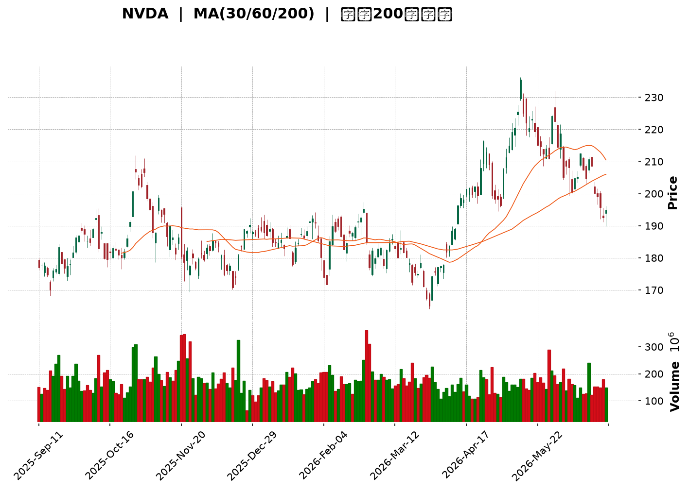
</details>

<html>
<head><meta charset="utf-8" /></head>
<body>
    <div style="height:500px; width:100%;">                        <script>window.PlotlyConfig = {MathJaxConfig: 'local'};</script>
        <script charset="utf-8" src="https://cdn.plot.ly/plotly-3.6.0.min.js" integrity="sha256-QaOVwtVY0T02VaHrr6pnoHLCwayMJp4O5n4YyaE3rJk=" crossorigin="anonymous"></script>                <div id="candlestick-chart" class="plotly-graph-div" style="height:100%; width:100%;"></div>            <script>                window.PLOTLYENV=window.PLOTLYENV || {};                                if (document.getElementById("candlestick-chart")) {                    Plotly.newPlot(                        "candlestick-chart",                        [{"close":{"dtype":"f8","bdata":"AAAAADgeZkAAAADg\u002fTJmQAAAACDBMGZAAAAAIAjVZUAAAACgVkJlQAAAACB\u002fAGZAAAAAAD0OZkAAAAAgCexmQAAAAKB8RmZAAAAAgNMXZkAAAABg1i5mQAAAACDRPmZAAAAAwMmzZkAAAABg9EpnQAAAAEAMYGdAAAAA4MeUZ0AAAAAgMWxnQAAAAIC3KWdAAAAAwLwZZ0AAAADAz5tnQAAAAABkCmhAAAAAgKfdZkAAAABgkIJnQAAAAACfeWZAAAAA4DpzZkAAAABggrJmQAAAAGCS32ZAAAAAAAnNZkAAAABAvJ1mQAAAAICcgWZAAAAA4LG9ZkAAAAAgukBnQAAAAODf52dAAAAAIMQYaUAAAABA19hpQAAAAMA1VGlAAAAAIG1HaUAAAAAgutNpQAAAACD7zWhAAAAAYMNeaEAAAADA5HpnQAAAAIAhfWdAAAAAoHzZaEAAAAAgPx1oQAAAAGCzMWhAAAAAIOdTZ0AAAABAsL1nQAAAAACYS2dAAAAAoCCkZkAAAABgCUlnQAAAAOAdjWZAAAAAYN5UZkAAAADAKMpmQAAAAOD9MmZAAAAA4PiAZkAAAAAAyRhmQAAAAEAbdmZAAAAAwFKnZkAAAABAj2tmQAAAAAAD5WZAAAAAYALGZkAAAAAAXipnQAAAAGDUF2dAAAAAwMvxZkAAAADgtJZmQAAAAEDR2WVAAAAAYGgCZkAAAADAHDBmQAAAAKBqV2VAAAAAALG9ZUAAAADgn5hmQAAAAGDr7mZAAAAAIFifZ0AAAADgKoxnQAAAAGCIyWdAAAAA4LN\u002fZ0AAAAAg+GlnQAAAAOC6SGdAAAAAoNaTZ0AAAADAgXxnQAAAAKBhYGdAAAAA4CWcZ0AAAAAgERpnQAAAAEBQFGdAAAAA4N4WZ0AAAABArTJnQAAAACBX3WZAAAAAAE9aZ0AAAACgGUBnQAAAAGBMO2ZAAAAAIBjjZkAAAACgrBNnQAAAAMAfbmdAAAAAYMVHZ0AAAACASolnQAAAAKAs6WdAAAAAwNAIaEAAAACgtdxnQAAAAOBILGdAAAAAgNmDZkAAAAAgSr9lQAAAAKB1dWVAAAAAYOQlZ0AAAAAg37lnQAAAACDuiWdAAAAAADG6Z0AAAAAAy1ZnQAAAAEDL0mZAAAAAYNQXZ0AAAAAgCHhnQAAAAKB5dWdAAAAAQNeyZ0AAAAAgIupnQAAAAMCuE2hAAAAA4EtqaEAAAADARRVnQAAAAEAsH2ZAAAAAID\u002fIZkAAAADAlHpmQAAAAAAl2mZAAAAAoLvjZkAAAADgTjNmQAAAAACuzWZAAAAAAHARZ0AAAACgBzpnQAAAAGCo3WZAAAAAAEmBZkAAAAAAN+BmQAAAAID7tmZAAAAAYBSGZkAAAACgREtmQAAAAGD3j2VAAAAA4O\u002ftZUAAAACA399lQAAAAIAaT2ZAAAAAIE1hZUAAAABAZupkQAAAAIBJn2RAAAAAoE3GZUAAAAAAdPFlQAAAACDfJWZAAAAAwNwtZkAAAADAkDxmQAAAAADHu2ZAAAAA4ET2ZkAAAAAgIo1nQAAAACDeomdAAAAA4P+IaEAAAACAbtRoQAAAAKDPw2hAAAAAID8uaUAAAACAZDppQAAAAOC29GhAAAAA4HRIaUAAAAAAC+1oQAAAAKDhAGpAAAAAYHMLa0AAAADAf51qQAAAAIA0IGpAAAAAQM7qaEAAAADgAcdoQAAAAED3x2hAAAAAAK6IaEAAAABg0fJpQAAAAAAfaGpAAAAAIGLeakAAAADA52VrQAAAAEC8kGtAAAAAwCUybEAAAAAA5m5tQAAAAMDYIWxAAAAAYPXBa0AAAABATYtrQAAAACC35mtAAAAAgCRoa0AAAADgieJqQAAAACCE02pAAAAAwEeLakAAAADABMBqQAAAAGCdXGpAAAAAgCkDbEAAAACA8NFrQAAAAAAA0GpAAAAAwB5Va0AAAABAM6NpQAAAAOB6FGpAAAAAgBQGakAAAACgcA1pQAAAAADXm2lAAAAAgBSmaUAAAABgZo5qQAAAAMAe7WlAAAAAwMyUaUAAAACAFFZqQAAAAMDMFGpAAAAAoEcBaUAAAAAAAOBoQAAAACCud2hAAAAAwPUQaEAAAABACl9oQA=="},"high":{"dtype":"f8","bdata":"Ai+3rJyBZkDSnkJ860tmQPYMZ+XoU2ZAZaYKycMoZkCSXDoCV59lQAiUtUb7G2ZAAuk4CU07ZkBpUODQEwpnQBfMfx0BxmZADFc1raFxZkCwxeLu+IBmQMnyVANQcWZAodfoEID4ZkBZZwA3kGNnQKvIwpvPfGdAvJYMFtDZZ0BJuTuowsNnQJwVXF26X2dAuL83rTaaZ0BryALDeKtnQJUjFaOjYWhA+2lOu91raEAIBUVSxbtnQHUhrBgREmdAevKM6E0UZ0Cl\u002fjlJfeFmQAnGODGy+2ZAU706ydkeZ0CNw30d1NFmQHezXUaa5mZAx\u002fjiy3\u002fZZkA94mzfZWdnQHz0lW0s+GdApN8PAYVcaUDyEwdjbn1qQJMlxoC3vGlAF5\u002fXEJD2aUAvyU3VQ2JqQLLi6sa5dmlA69QALCtVaUB3gBzTyKtoQOjd2nmQgmdANi+XNu71aEAGcL1qeWVoQOCHA9F+dGhA+WlwtEbmZ0AWah+8iNhnQOINfrRLmGdAFG15OhESZ0DyERak3HNnQNU9cLcCeGhABJSYmmUKZ0DiBkM2hehmQJUntpPbPWZAUq7rGKrVZkD6Q5a6+GFmQBk+60hAgmZABo7DS40tZ0BbM\u002f+H9sZmQFkupn9yCWdAnjvD6+sNZ0CNMxvtq3hnQDtr+OPML2dAVaABKSEoZ0BFKJf7K6NmQPigxwgd02ZA5yF6HnxGZkApm+TwuEhmQKQA\u002flRL\u002fWVAEXXU0O79ZUCU9cuIU6dmQIcDRe\u002fw\u002fWZAgARw7S2jZ0CkVI+BwZVnQIwlyJGRDmhAIC1tHPaQZ0B7ILAnUJhnQIRjANx9ymdAmo+qKD0WaECiF\u002f7DnCxoQG69ge3y\u002fWdAZFMxMmHkZ0BkcLUeNqpnQAxz2JqdQ2dAfD6cnotcZ0B\u002fLjHsL3xnQGUchHOHB2dA0dcRTgGvZ0DtyF\u002f8p8ZnQIDjjtwMxWZA3e5oEe8kZ0BjHia6Lj5nQMDxPx3Pq2dA8nLurXecZ0A2+eXal7hnQG7hk7ezA2hAy5fsUdEnaEAeDRA4GUhoQHl7f5IuwmdAq5jn8WBBZ0DxYIY1j2tmQJ1Ry9JYE2ZAlYDJwbVYZ0A3k8ofki1oQJIXdU7bB2hAglgtN8kgaEBifm0Q+StoQLMU4fKwaGdAhGHCHoFdZ0A\u002fP\u002fgla8RnQO9LABZqhmdAs4QhCSTDZ0DDg9js1jZoQDuWsDEWMWhA8XCNt3SsaECx9iWxtEFoQJEJfhzDy2ZAqHBlmJHnZkDiiGdkv5VmQJOiJy8zD2dA0o6XsL76ZkDk7w7zMdFmQADYvWf91WZA\u002fbCn9c9GZ0C7qim22WxnQDYvnNUwF2dAgvItjvI7Z0D2qjPGH5VnQBnBaajkJWdA6vPONFTlZkCgLzi1p3hmQEwQwNmtQWZA+Nsa9zFFZkAt+bKleQBmQJQi5gZKoGZAbvxhnr4JZkAFw\u002f+4q1hlQFa0LG8WKGVAPBjqxlXNZUC29CCNOyVmQMYu12sRKWZAR9LMEagyZkDhMqRiuEBmQAqqrixrIWdA+8744LP7ZkAdhlwP7LhnQH9QgQkOrmdAAAAA4P+IaEBIGcuoVQVpQLYV3lHB82hAkkwpz+IuaUBKanGT6D1pQDeld4FyUGlAAAAA4HRIaUCyCriK93JpQBM08ZCKVmpA3n\u002fjhnsSa0DGToxfXM9qQHRBlqgdj2pAHUixC8RBakA1PvwbcFhpQHYdVkHYL2lAjS\u002f7dDgAaUCxb8mt4QBqQGGgR6BrvmpAhWWBlHwxa0BNl42ZUcFrQHLCGC2q72tA4hrrdGRybEAxgfbed4htQBKtnFBg52xARVHCom63bEBe2OJX\u002fwZsQC2AAYK8O2xA9NyhIVRkbECtsSU1FphrQFBrztahPWtAtjLfd9K8akA5QGaDnOhqQFStdopnM2tA3TLrgnYTbEDv2RGITgBtQOXT+4nw0WtAAAAAQDOza0AAAAAA19tqQAAAAEAKT2pAAAAAwMxsakAAAABACudpQAAAAMAetWlAAAAAgD3iaUAAAABguJZqQAAAACCub2pAAAAAYLgmakAAAADgemxqQAAAACCuv2pAAAAA4KN4aUAAAACgcDVpQAAAAKCZGWlAAAAAoJlxaEAAAACAwoVoQA=="},"hovertemplate":"\u003cb\u003e%{x|%Y-%m-%d}\u003c\u002fb\u003e\u003cbr\u003e\u958b: $%{open:.2f}\u003cbr\u003e\u9ad8: $%{high:.2f}\u003cbr\u003e\u4f4e: $%{low:.2f}\u003cbr\u003e\u6536: $%{close:.2f}\u003cextra\u003e\u003c\u002fextra\u003e","low":{"dtype":"f8","bdata":"u\u002fYZsyoIZkB1cu8LNQdmQMXNeM80yWVAkHuuVw3FZUD6WTJeQQZlQLQcwJmrl2VAZfp\u002fbJ7eZUBInnQ\u002fmc9lQIx9P6qJ\u002f2VA15M1YqblZUDvHe90Gp1lQB61eySh1mVALajz9uOCZkBbSjdY9qdmQAZyfbpN9WZAUn0oKUF6Z0B2OAGAmiRnQMOhuk8W42ZAaOkr+n\u002f4ZkDc\u002fnQRrUlnQOsH2MEh2mdAH0os9S26ZkDI+W3gIzdnQMYynhETb2ZAu9YuoQ0iZkAAoGAJUHFmQItvf1WscGZAxjf7vvOvZkA3CDxRRXJmQDXyVlsdEWZAY8lEe\u002fNxZkCSp2sNhehmQGOTmy4UhmdAc3lcSUz1Z0C7zwP1nJBpQKiWihHpJGlAXaj54QA6aUDBVFlmiqlpQHq3TQ6xtWhAENn7l91MaEDV0FMdkERnQG7EJOrTVWZAsOjKgmExaEBebLtozeFnQFPaVpxe3GdAMcBBqbTzZkBjcLMRM4tmQHTH8Qq6AmdA5lQQGHptZkA9fidiG9NmQJRyYX7ec2ZAOWK69rWWZUDhCOKWKghmQA3JB02wKmVAbpcUNGpAZkByAa83zghmQLUZgDyurmVAznhjnKl4ZkBtAjoiOFxmQPV0DYG0d2ZA7IIoWBGWZkAjuS6PsMVmQALjPxcY42ZAtyg0\u002fS66ZkBq3S5j9AxmQBKF7l0IzWVABlvoEiPaZUBMVjBk+9VlQEaVfOlHQ2VA2Ewox4pzZUDBMgRoAQRmQDg\u002fV38XxGZA8mHDeKvVZkCYuqcom0tnQO1VdN+reGdAIH2Tbd81Z0CHq1oWeVZnQAhkiBlpSGdAAZVUI\u002fuAZ0ARKp0oiz1nQEyt9DD1UmdAVb23sqVKZ0Cn9ZYlj+9mQGCCRKBH7mZABY8paYHZZkC8ctOMpuVmQLCkczqNkmZADHhi70tDZ0AdbDNfTjtnQMO+QJeYLGZAKSf0eNhFZkBVBdr0lvZmQB+nihv1UmdAAbtECm44Z0AvMZIkKS9nQCkz88N6s2dA3\u002fLlvao6Z0AH4+Fwp6dnQBSp6Qj0FGdAxHhOZH0AZkCDMvwga3ZlQKbyrdtKWmVAysn+wWTMZUBqhmWmOvdmQNml+LCBfGdAkJodBkiRZ0BbE4aqDElnQIkroCzNq2ZAFzzFZ8ZeZkA0weMMClFnQK+jjPrhLWdAt4ok+NQ2Z0DM86uIK6tnQNiZF6N+ZWdAzjAAqrkxaEDHTTMQDgNnQBd\u002fUtVIBWZAwJqYHKzNZUAAEK78ihZmQMVIDp3memZAaWDM3Dk1ZkDjZdraWBNmQKNkIIET62VAnHz\u002fijm5ZkD0v29RhwdnQAs0cME6sWZAYLTUdGB3ZkCOzMHCXKZmQM87WOL9rmZA0q7fqteDZkCqvK4qu\u002fJlQF3\u002fkpikcGVA9AdoRM\u002fRZUAp75Xi4LhlQL6xrLOcFGZAkg8l1BpeZUDHCSodGdpkQHErK1WFgmRAMBQgM4DYZEDjMUmJfdFlQL0Fg6l0ZWVAboDnrcXxZUCRTeOXpq5lQNcMgznigmZAgiIfgByNZkDSmQ0LvAJnQNYfrcvCMGdA3s0onYjRZ0BeLkl5Y3BoQGRbOxmgcmhAgHDGezfhaEBikMR+grNoQP8tXESW2GhAOtGhQJbYaED8whJ0sZ9oQO6bpu558mhA3lEgRm\u002fkaUCO81vlpP5pQKKjA83T6mlAhhUNbP\u002fOaECj3vUuf5xoQOhh8epsUGhA53V7O6h5aEBDsYYNH8xoQNAv565OyGlASE58p4yUakClmtsNg7RqQMPcfQJv1WpA3DMZgPypa0A4xzHqDqFsQA51o6xT\u002f2tAngo0i7RDa0B5TrWfADVrQBtWzjLJh2tASm1cMaQ1a0AJq+ktmdFqQLP9M0YaeGpAd9oiri4RakCcz3flK19qQEBLZphLXGpARmM0Vl3uakDuoOhE9KJrQIFK8ilUyGpAAAAAQApfakAAAABgj4ppQAAAAAAAwGlAAAAAQOHqaEAAAACgcP1oQAAAAKBH8WhAAAAAgBRuaUAAAABA4QpqQAAAAKBH6WlAAAAAYI9iaUAAAAAAANBpQAAAAEAK92lAAAAAAAAAaUAAAABgj5JoQAAAAAApBGhAAAAAQArnZ0AAAACgmblnQA=="},"name":"\u50f9\u683c","open":{"dtype":"f8","bdata":"Ek9sr29uZkAs2JTFZDFmQNQ+mHRH7mVA9iG5AMkYZkBJBDRacY1lQNSMFrVEuGVAObtNpHnxZUBsqlZXdOJlQOBxk2+ft2ZAUITo509xZkCBTcJ+P8hlQAACcHUtPmZA2VQo0WeGZkB3R1pVI7tmQE4zyh4hIGdAHI5h13irZ0AW4tA9Xp5nQGxZ1kpwKGdAI4Ya1cQ\u002fZ0BnOUehokpnQAbOTiyG\u002f2dAOwzOn24oaEAnuv7GYHdnQB3W0KgbEWdAkaCFQxESZ0CCDxKe7r9mQCgX2VhqfmZAuSoAA7LcZkCNw30d1NFmQBQlmKYYnWZA3H1E6BWGZkD\u002fyxvBYvNmQBfUJIfvt2dAReowRLsZaEClPgTx4fZpQBgu1QpwnGlAWWhaDfzFaUAnEUH6E\u002fppQEwtMqa5V2lACaUKuonQaEC8dsD4boVoQBbEf2lDFWdAC6W5PJFbaEA8b0dBKl1oQC7RIPcPb2hAW25U5s\u002fZZ0C\u002fUCcHEdRmQO6+CZN1N2dAokTRa6\u002fkZkBn+N4tvxFnQOQgBJ1pdmhAdziM30qgZkBfPTUuXWhmQKhh+X391WVAeQU8tMGsZkCuCJHmBVlmQDq2kFcy0WVA4iqWHumwZkCgb7TTLZtmQKzPSZDCrGZAY7fyuk\u002f1ZkA+NQ1KXM1mQPCTu7yvKmdAbIvkX9QXZ0BIx5qc7oFmQJB+dLl1nGZAn9e4yCQ3ZkCP8dXxcgFmQPd1oeFV\u002fGVAd1+f+yfKZUB\u002fWup8jQ5mQCLEazRF9mZAYb3oRejXZkDdtLHvwHZnQIt1YlYJtmdA38buFmdvZ0A6ALKjV4BnQIlYHL3ZqmdABErTvnqzZ0CN2SpN2PBnQN1lsaQ2yWdA+YeRo+OKZ0DUr70CJpxnQFmH7k1YG2dAzxk3yuXfZkAHGkzVyRhnQKNAM\u002fkNA2dAokUX3bpIZ0CcI99uMJtnQCxQ62a1tWZAMAFn3J5aZkDBi+tFzBBnQDnuTtKwaGdAJJY3\u002fdJdZ0Ax9yWGYWBnQLwVrh4v4WdAGcYCzWvjZ0Cbq50zRN9nQJ5nDUIaX2dASc6LfmtAZ0DQPBdouWdmQHMVl6\u002fw1mVAR6BaJjEPZkBYcW4OIwFnQAXwmyiz5GdA4\u002fyKzOUGaEDUfSJ6bxloQKJ4+0UNaGdAXywoQuqwZkAJGMZQpJBnQGK99MGgWmdAPbqvrvdKZ0BttDi\u002fVuVnQElNYTI36GdAZmDT09FGaEB6NzckEUFoQO8H0TvvoGZARYtha3\u002fZZUCRoo3RuEhmQJfkP9ILh2ZAAtfBp2CeZkCmijl33nNmQNcvl7SqE2ZAnZmqhrDFZkBnJfXEMTZnQP\u002f3YnK++mZANayfFo0WZ0CcjVNiOdhmQDAQeaYGG2dAaTYH6o\u002fIZkCwusY+sDlmQKoSgXReOWZA9lYDbbchZkDmJ1QHDNRlQEABVVGaHGZA+duFcK77ZUDjzzW5qjllQD7q2TKsEmVA2dK5+tHYZECHs62dcfllQIht8m9Yf2VAJYLgM4UeZkAxtC060PBlQC2oDowgCWdAfVCmHRu0ZkAYLafSDQNnQMPpsacHOmdA40lJUsXTZ0Azz0NY9YloQDcFJKZnpmhA5fW1WVr1aEBP\u002fST26PdoQLt6EGuhPGlA9o9iZjEYaUA60lybLUdpQNVaaWBF92hA3OQrYP0sakB5XwlY4CdqQDCHbPl5jmpAfwUKc\u002fA1akCbJQ9DdiFpQGDVuWWR6GhAXBvy6yziaECREpCYCPVoQAONxWIeA2pAJx+zMQaZakBIGqlfTrlqQOSrRGR1SWtAGqU6dWEVbEAJGXRLo7JsQDcricjCr2xASCgk4EazbEDFz\u002fmQqGtrQKQAAyRy3WtAYC0Cvf\u002fAa0AtgbIhkpRrQLOzlZo2CWtAzlMcAd27akAwSf3SFmFqQMNg7BGRympAaH33zFLvakDX5GPrS11sQE9ohsfHrmtAAAAAwB69akAAAADA9dBqQAAAAIDCRWpAAAAAANdTakAAAACAwo1pQAAAACCuL2lAAAAAIIWbaUAAAACgcB1qQAAAAIDCZWpAAAAAwPUQakAAAABgj+ppQAAAAIAUbmpAAAAAoHBFaUAAAAAA1wNpQAAAAGCPAmlAAAAAANcjaEAAAABAMztoQA=="},"x":["2025-09-11T00:00:00-04:00","2025-09-12T00:00:00-04:00","2025-09-15T00:00:00-04:00","2025-09-16T00:00:00-04:00","2025-09-17T00:00:00-04:00","2025-09-18T00:00:00-04:00","2025-09-19T00:00:00-04:00","2025-09-22T00:00:00-04:00","2025-09-23T00:00:00-04:00","2025-09-24T00:00:00-04:00","2025-09-25T00:00:00-04:00","2025-09-26T00:00:00-04:00","2025-09-29T00:00:00-04:00","2025-09-30T00:00:00-04:00","2025-10-01T00:00:00-04:00","2025-10-02T00:00:00-04:00","2025-10-03T00:00:00-04:00","2025-10-06T00:00:00-04:00","2025-10-07T00:00:00-04:00","2025-10-08T00:00:00-04:00","2025-10-09T00:00:00-04:00","2025-10-10T00:00:00-04:00","2025-10-13T00:00:00-04:00","2025-10-14T00:00:00-04:00","2025-10-15T00:00:00-04:00","2025-10-16T00:00:00-04:00","2025-10-17T00:00:00-04:00","2025-10-20T00:00:00-04:00","2025-10-21T00:00:00-04:00","2025-10-22T00:00:00-04:00","2025-10-23T00:00:00-04:00","2025-10-24T00:00:00-04:00","2025-10-27T00:00:00-04:00","2025-10-28T00:00:00-04:00","2025-10-29T00:00:00-04:00","2025-10-30T00:00:00-04:00","2025-10-31T00:00:00-04:00","2025-11-03T00:00:00-05:00","2025-11-04T00:00:00-05:00","2025-11-05T00:00:00-05:00","2025-11-06T00:00:00-05:00","2025-11-07T00:00:00-05:00","2025-11-10T00:00:00-05:00","2025-11-11T00:00:00-05:00","2025-11-12T00:00:00-05:00","2025-11-13T00:00:00-05:00","2025-11-14T00:00:00-05:00","2025-11-17T00:00:00-05:00","2025-11-18T00:00:00-05:00","2025-11-19T00:00:00-05:00","2025-11-20T00:00:00-05:00","2025-11-21T00:00:00-05:00","2025-11-24T00:00:00-05:00","2025-11-25T00:00:00-05:00","2025-11-26T00:00:00-05:00","2025-11-28T00:00:00-05:00","2025-12-01T00:00:00-05:00","2025-12-02T00:00:00-05:00","2025-12-03T00:00:00-05:00","2025-12-04T00:00:00-05:00","2025-12-05T00:00:00-05:00","2025-12-08T00:00:00-05:00","2025-12-09T00:00:00-05:00","2025-12-10T00:00:00-05:00","2025-12-11T00:00:00-05:00","2025-12-12T00:00:00-05:00","2025-12-15T00:00:00-05:00","2025-12-16T00:00:00-05:00","2025-12-17T00:00:00-05:00","2025-12-18T00:00:00-05:00","2025-12-19T00:00:00-05:00","2025-12-22T00:00:00-05:00","2025-12-23T00:00:00-05:00","2025-12-24T00:00:00-05:00","2025-12-26T00:00:00-05:00","2025-12-29T00:00:00-05:00","2025-12-30T00:00:00-05:00","2025-12-31T00:00:00-05:00","2026-01-02T00:00:00-05:00","2026-01-05T00:00:00-05:00","2026-01-06T00:00:00-05:00","2026-01-07T00:00:00-05:00","2026-01-08T00:00:00-05:00","2026-01-09T00:00:00-05:00","2026-01-12T00:00:00-05:00","2026-01-13T00:00:00-05:00","2026-01-14T00:00:00-05:00","2026-01-15T00:00:00-05:00","2026-01-16T00:00:00-05:00","2026-01-20T00:00:00-05:00","2026-01-21T00:00:00-05:00","2026-01-22T00:00:00-05:00","2026-01-23T00:00:00-05:00","2026-01-26T00:00:00-05:00","2026-01-27T00:00:00-05:00","2026-01-28T00:00:00-05:00","2026-01-29T00:00:00-05:00","2026-01-30T00:00:00-05:00","2026-02-02T00:00:00-05:00","2026-02-03T00:00:00-05:00","2026-02-04T00:00:00-05:00","2026-02-05T00:00:00-05:00","2026-02-06T00:00:00-05:00","2026-02-09T00:00:00-05:00","2026-02-10T00:00:00-05:00","2026-02-11T00:00:00-05:00","2026-02-12T00:00:00-05:00","2026-02-13T00:00:00-05:00","2026-02-17T00:00:00-05:00","2026-02-18T00:00:00-05:00","2026-02-19T00:00:00-05:00","2026-02-20T00:00:00-05:00","2026-02-23T00:00:00-05:00","2026-02-24T00:00:00-05:00","2026-02-25T00:00:00-05:00","2026-02-26T00:00:00-05:00","2026-02-27T00:00:00-05:00","2026-03-02T00:00:00-05:00","2026-03-03T00:00:00-05:00","2026-03-04T00:00:00-05:00","2026-03-05T00:00:00-05:00","2026-03-06T00:00:00-05:00","2026-03-09T00:00:00-04:00","2026-03-10T00:00:00-04:00","2026-03-11T00:00:00-04:00","2026-03-12T00:00:00-04:00","2026-03-13T00:00:00-04:00","2026-03-16T00:00:00-04:00","2026-03-17T00:00:00-04:00","2026-03-18T00:00:00-04:00","2026-03-19T00:00:00-04:00","2026-03-20T00:00:00-04:00","2026-03-23T00:00:00-04:00","2026-03-24T00:00:00-04:00","2026-03-25T00:00:00-04:00","2026-03-26T00:00:00-04:00","2026-03-27T00:00:00-04:00","2026-03-30T00:00:00-04:00","2026-03-31T00:00:00-04:00","2026-04-01T00:00:00-04:00","2026-04-02T00:00:00-04:00","2026-04-06T00:00:00-04:00","2026-04-07T00:00:00-04:00","2026-04-08T00:00:00-04:00","2026-04-09T00:00:00-04:00","2026-04-10T00:00:00-04:00","2026-04-13T00:00:00-04:00","2026-04-14T00:00:00-04:00","2026-04-15T00:00:00-04:00","2026-04-16T00:00:00-04:00","2026-04-17T00:00:00-04:00","2026-04-20T00:00:00-04:00","2026-04-21T00:00:00-04:00","2026-04-22T00:00:00-04:00","2026-04-23T00:00:00-04:00","2026-04-24T00:00:00-04:00","2026-04-27T00:00:00-04:00","2026-04-28T00:00:00-04:00","2026-04-29T00:00:00-04:00","2026-04-30T00:00:00-04:00","2026-05-01T00:00:00-04:00","2026-05-04T00:00:00-04:00","2026-05-05T00:00:00-04:00","2026-05-06T00:00:00-04:00","2026-05-07T00:00:00-04:00","2026-05-08T00:00:00-04:00","2026-05-11T00:00:00-04:00","2026-05-12T00:00:00-04:00","2026-05-13T00:00:00-04:00","2026-05-14T00:00:00-04:00","2026-05-15T00:00:00-04:00","2026-05-18T00:00:00-04:00","2026-05-19T00:00:00-04:00","2026-05-20T00:00:00-04:00","2026-05-21T00:00:00-04:00","2026-05-22T00:00:00-04:00","2026-05-26T00:00:00-04:00","2026-05-27T00:00:00-04:00","2026-05-28T00:00:00-04:00","2026-05-29T00:00:00-04:00","2026-06-01T00:00:00-04:00","2026-06-02T00:00:00-04:00","2026-06-03T00:00:00-04:00","2026-06-04T00:00:00-04:00","2026-06-05T00:00:00-04:00","2026-06-08T00:00:00-04:00","2026-06-09T00:00:00-04:00","2026-06-10T00:00:00-04:00","2026-06-11T00:00:00-04:00","2026-06-12T00:00:00-04:00","2026-06-15T00:00:00-04:00","2026-06-16T00:00:00-04:00","2026-06-17T00:00:00-04:00","2026-06-18T00:00:00-04:00","2026-06-22T00:00:00-04:00","2026-06-23T00:00:00-04:00","2026-06-24T00:00:00-04:00","2026-06-25T00:00:00-04:00","2026-06-26T00:00:00-04:00","2026-06-29T00:00:00-04:00"],"type":"candlestick"},{"hovertemplate":"MA30: $%{y:.2f}\u003cextra\u003e\u003c\u002fextra\u003e","line":{"color":"#2196F3","dash":"dash","width":2},"mode":"lines","name":"MA30","x":["2025-09-11T00:00:00-04:00","2025-09-12T00:00:00-04:00","2025-09-15T00:00:00-04:00","2025-09-16T00:00:00-04:00","2025-09-17T00:00:00-04:00","2025-09-18T00:00:00-04:00","2025-09-19T00:00:00-04:00","2025-09-22T00:00:00-04:00","2025-09-23T00:00:00-04:00","2025-09-24T00:00:00-04:00","2025-09-25T00:00:00-04:00","2025-09-26T00:00:00-04:00","2025-09-29T00:00:00-04:00","2025-09-30T00:00:00-04:00","2025-10-01T00:00:00-04:00","2025-10-02T00:00:00-04:00","2025-10-03T00:00:00-04:00","2025-10-06T00:00:00-04:00","2025-10-07T00:00:00-04:00","2025-10-08T00:00:00-04:00","2025-10-09T00:00:00-04:00","2025-10-10T00:00:00-04:00","2025-10-13T00:00:00-04:00","2025-10-14T00:00:00-04:00","2025-10-15T00:00:00-04:00","2025-10-16T00:00:00-04:00","2025-10-17T00:00:00-04:00","2025-10-20T00:00:00-04:00","2025-10-21T00:00:00-04:00","2025-10-22T00:00:00-04:00","2025-10-23T00:00:00-04:00","2025-10-24T00:00:00-04:00","2025-10-27T00:00:00-04:00","2025-10-28T00:00:00-04:00","2025-10-29T00:00:00-04:00","2025-10-30T00:00:00-04:00","2025-10-31T00:00:00-04:00","2025-11-03T00:00:00-05:00","2025-11-04T00:00:00-05:00","2025-11-05T00:00:00-05:00","2025-11-06T00:00:00-05:00","2025-11-07T00:00:00-05:00","2025-11-10T00:00:00-05:00","2025-11-11T00:00:00-05:00","2025-11-12T00:00:00-05:00","2025-11-13T00:00:00-05:00","2025-11-14T00:00:00-05:00","2025-11-17T00:00:00-05:00","2025-11-18T00:00:00-05:00","2025-11-19T00:00:00-05:00","2025-11-20T00:00:00-05:00","2025-11-21T00:00:00-05:00","2025-11-24T00:00:00-05:00","2025-11-25T00:00:00-05:00","2025-11-26T00:00:00-05:00","2025-11-28T00:00:00-05:00","2025-12-01T00:00:00-05:00","2025-12-02T00:00:00-05:00","2025-12-03T00:00:00-05:00","2025-12-04T00:00:00-05:00","2025-12-05T00:00:00-05:00","2025-12-08T00:00:00-05:00","2025-12-09T00:00:00-05:00","2025-12-10T00:00:00-05:00","2025-12-11T00:00:00-05:00","2025-12-12T00:00:00-05:00","2025-12-15T00:00:00-05:00","2025-12-16T00:00:00-05:00","2025-12-17T00:00:00-05:00","2025-12-18T00:00:00-05:00","2025-12-19T00:00:00-05:00","2025-12-22T00:00:00-05:00","2025-12-23T00:00:00-05:00","2025-12-24T00:00:00-05:00","2025-12-26T00:00:00-05:00","2025-12-29T00:00:00-05:00","2025-12-30T00:00:00-05:00","2025-12-31T00:00:00-05:00","2026-01-02T00:00:00-05:00","2026-01-05T00:00:00-05:00","2026-01-06T00:00:00-05:00","2026-01-07T00:00:00-05:00","2026-01-08T00:00:00-05:00","2026-01-09T00:00:00-05:00","2026-01-12T00:00:00-05:00","2026-01-13T00:00:00-05:00","2026-01-14T00:00:00-05:00","2026-01-15T00:00:00-05:00","2026-01-16T00:00:00-05:00","2026-01-20T00:00:00-05:00","2026-01-21T00:00:00-05:00","2026-01-22T00:00:00-05:00","2026-01-23T00:00:00-05:00","2026-01-26T00:00:00-05:00","2026-01-27T00:00:00-05:00","2026-01-28T00:00:00-05:00","2026-01-29T00:00:00-05:00","2026-01-30T00:00:00-05:00","2026-02-02T00:00:00-05:00","2026-02-03T00:00:00-05:00","2026-02-04T00:00:00-05:00","2026-02-05T00:00:00-05:00","2026-02-06T00:00:00-05:00","2026-02-09T00:00:00-05:00","2026-02-10T00:00:00-05:00","2026-02-11T00:00:00-05:00","2026-02-12T00:00:00-05:00","2026-02-13T00:00:00-05:00","2026-02-17T00:00:00-05:00","2026-02-18T00:00:00-05:00","2026-02-19T00:00:00-05:00","2026-02-20T00:00:00-05:00","2026-02-23T00:00:00-05:00","2026-02-24T00:00:00-05:00","2026-02-25T00:00:00-05:00","2026-02-26T00:00:00-05:00","2026-02-27T00:00:00-05:00","2026-03-02T00:00:00-05:00","2026-03-03T00:00:00-05:00","2026-03-04T00:00:00-05:00","2026-03-05T00:00:00-05:00","2026-03-06T00:00:00-05:00","2026-03-09T00:00:00-04:00","2026-03-10T00:00:00-04:00","2026-03-11T00:00:00-04:00","2026-03-12T00:00:00-04:00","2026-03-13T00:00:00-04:00","2026-03-16T00:00:00-04:00","2026-03-17T00:00:00-04:00","2026-03-18T00:00:00-04:00","2026-03-19T00:00:00-04:00","2026-03-20T00:00:00-04:00","2026-03-23T00:00:00-04:00","2026-03-24T00:00:00-04:00","2026-03-25T00:00:00-04:00","2026-03-26T00:00:00-04:00","2026-03-27T00:00:00-04:00","2026-03-30T00:00:00-04:00","2026-03-31T00:00:00-04:00","2026-04-01T00:00:00-04:00","2026-04-02T00:00:00-04:00","2026-04-06T00:00:00-04:00","2026-04-07T00:00:00-04:00","2026-04-08T00:00:00-04:00","2026-04-09T00:00:00-04:00","2026-04-10T00:00:00-04:00","2026-04-13T00:00:00-04:00","2026-04-14T00:00:00-04:00","2026-04-15T00:00:00-04:00","2026-04-16T00:00:00-04:00","2026-04-17T00:00:00-04:00","2026-04-20T00:00:00-04:00","2026-04-21T00:00:00-04:00","2026-04-22T00:00:00-04:00","2026-04-23T00:00:00-04:00","2026-04-24T00:00:00-04:00","2026-04-27T00:00:00-04:00","2026-04-28T00:00:00-04:00","2026-04-29T00:00:00-04:00","2026-04-30T00:00:00-04:00","2026-05-01T00:00:00-04:00","2026-05-04T00:00:00-04:00","2026-05-05T00:00:00-04:00","2026-05-06T00:00:00-04:00","2026-05-07T00:00:00-04:00","2026-05-08T00:00:00-04:00","2026-05-11T00:00:00-04:00","2026-05-12T00:00:00-04:00","2026-05-13T00:00:00-04:00","2026-05-14T00:00:00-04:00","2026-05-15T00:00:00-04:00","2026-05-18T00:00:00-04:00","2026-05-19T00:00:00-04:00","2026-05-20T00:00:00-04:00","2026-05-21T00:00:00-04:00","2026-05-22T00:00:00-04:00","2026-05-26T00:00:00-04:00","2026-05-27T00:00:00-04:00","2026-05-28T00:00:00-04:00","2026-05-29T00:00:00-04:00","2026-06-01T00:00:00-04:00","2026-06-02T00:00:00-04:00","2026-06-03T00:00:00-04:00","2026-06-04T00:00:00-04:00","2026-06-05T00:00:00-04:00","2026-06-08T00:00:00-04:00","2026-06-09T00:00:00-04:00","2026-06-10T00:00:00-04:00","2026-06-11T00:00:00-04:00","2026-06-12T00:00:00-04:00","2026-06-15T00:00:00-04:00","2026-06-16T00:00:00-04:00","2026-06-17T00:00:00-04:00","2026-06-18T00:00:00-04:00","2026-06-22T00:00:00-04:00","2026-06-23T00:00:00-04:00","2026-06-24T00:00:00-04:00","2026-06-25T00:00:00-04:00","2026-06-26T00:00:00-04:00","2026-06-29T00:00:00-04:00"],"y":{"dtype":"f8","bdata":"AAAAAAAA+H8AAAAAAAD4fwAAAAAAAPh\u002fAAAAAAAA+H8AAAAAAAD4fwAAAAAAAPh\u002fAAAAAAAA+H8AAAAAAAD4fwAAAAAAAPh\u002fAAAAAAAA+H8AAAAAAAD4fwAAAAAAAPh\u002fAAAAAAAA+H8AAAAAAAD4fwAAAAAAAPh\u002fAAAAAAAA+H8AAAAAAAD4fwAAAAAAAPh\u002fAAAAAAAA+H8AAAAAAAD4fwAAAAAAAPh\u002fAAAAAAAA+H8AAAAAAAD4fwAAAAAAAPh\u002fAAAAAAAA+H8AAAAAAAD4fwAAAAAAAPh\u002fAAAAAAAA+H8AAAAAAAD4f2ZmZkaRrmZAMzMzI+KzZkARERHh37xmQJqZmQmDy2ZAMzMzo17nZkDv7u4OhQ5nQDMzMwPpKmdA3t3dnWpGZ0CJiIjINF9nQBERERHKdGdAZmZmdjiIZ0AiIiICSpNnQJqZmUnmnWdAzczMDDmwZ0CrqqqKO7dnQERERJQ4vmdARERE9A68Z0BERERkxr5nQJqZmXnnv2dA7+7u3vu7Z0BmZmaGOblnQM3MzPyDrGdAAAAAwPSnZ0CamZkpz6FnQFVVVXV0n2dAmpmZuemfZ0AiIiLyyZpnQJqZmflFl2dAq6qqKgSWZ0AAAAAAWJRnQHd3dzeol2dAq6qqKu+XZ0DNzMxcMJdnQLy7uwtBkGdA7+7ubuN9Z0DNzMx8FWJnQImIiHhnRGdAmpmZ6YAoZ0AiIiIicwlnQImIiMjl62ZAzczMPHbVZkCJiIho681mQO\u002fu7t4tyWZAAAAAMLW+ZkDe3d0t37lmQHd3d0dmtmZAmpmZCdy3ZkAiIiKiEbVmQCIiIjL5tGZAq6qquva8ZkARERHxrb5mQLy7u7u4xWZAREREhKHQZkBVVVVlS9NmQERERCTO2mZAZmZmRs3fZkAAAADAMulmQN7d3a2j7GZAVVVVBZvyZkAzMzOzsPlmQKuqqnoI9GZAvLu7qwD1ZkBmZmYGP\u002fRmQHd3d2cf92ZA7+7uDv35ZkDNzMwcEwJnQJqZmTmnE2dAiYiI+O4kZ0BVVVVVODNnQHd3d1fZQmdAq6qqSnRJZ0AzMzOzNUJnQFVVVbWgNWdAERERUZQxZ0AzMzNTGjNnQFVVVZX7MGdAAAAAsO4yZ0DNzMwMSzJnQJqZmalcLmdAREREdDoqZ0BEREREFCpnQERERETIKmdAmpmZ6YkrZ0CamZlpeTJnQAAAAJD8OmdA7+7u\u002fkxGZ0BEREQUUkVnQBEREVH7PmdAvLu76xw6Z0DNzMxshzNnQJqZmenSOGdAzczMXNg4Z0BVVVXFXTFnQFVVVaUELGdAAAAAADUqZ0AzMzOjkCdnQERERNSlHmdAVVVVxZgRZ0BmZmYmLglnQLy7uytFBWdAMzMzM1gFZ0Dv7u6uAgpnQAAAAODkCmdAvLu7234AZ0AiIiISsvBmQM3MzIwz5mZARERE9CvSZkDe3d3tfb1mQGZmZla1qmZAzczMHHWfZkDNzMwscJJmQLy7u1tAh2ZAMzMzE0l6ZkDe3d1t92tmQFVVVcWAYGZAMzMzIxpUZkAzMzPzGFhmQHd3d0cFZWZAMzMzo\u002fpzZkDe3d1tCohmQKuqqupcmGZAVVVV1emrZkAzMzPjv8VmQM3MzAwe2GZAzczMnATrZkCamZm5hPlmQGZmZuZKFGdAvLu7Cwg7Z0Dv7u7e8FpnQO\u002fu7l4MeGdAd3d393iMZ0ARERHxqaFnQHd3d2chvWdAERER8VrTZ0DNzMy8HvZnQKuqqloWGWhAMzMzY+xHaEARERGBPX9oQAAAABB9umhAiYiIiEjxaEC8u7u7MjFpQGZmZpZDZGlAIiIiAt6TaUDv7u6OKMFpQBEREaFB7WlAvLu7ey8TakAAAADgoS9qQLy7u5vaSmpAMzMzI\u002f9bakAzMzMDYmxqQImIiHgCempAq6qqaiySakDv7u6uSqhqQERERHQiuGpAVVVVlZ\u002fJakDe3d39sc9qQLy7uztZ0GpA7+7u3qLHakCJiIgITbpqQERERITjtWpAd3d3lyG8akC8u7ubT8tqQBERETEV1WpAZmZmJgXeakAAAAAwVOFqQN7d3S2N3mpAVVVV5aXOakC8u7srHrlqQERERMSunmpA7+7ubnF7akARERFxP1BqQA=="},"type":"scatter"},{"hovertemplate":"MA60: $%{y:.2f}\u003cextra\u003e\u003c\u002fextra\u003e","line":{"color":"#9C27B0","dash":"dash","width":2},"mode":"lines","name":"MA60","x":["2025-09-11T00:00:00-04:00","2025-09-12T00:00:00-04:00","2025-09-15T00:00:00-04:00","2025-09-16T00:00:00-04:00","2025-09-17T00:00:00-04:00","2025-09-18T00:00:00-04:00","2025-09-19T00:00:00-04:00","2025-09-22T00:00:00-04:00","2025-09-23T00:00:00-04:00","2025-09-24T00:00:00-04:00","2025-09-25T00:00:00-04:00","2025-09-26T00:00:00-04:00","2025-09-29T00:00:00-04:00","2025-09-30T00:00:00-04:00","2025-10-01T00:00:00-04:00","2025-10-02T00:00:00-04:00","2025-10-03T00:00:00-04:00","2025-10-06T00:00:00-04:00","2025-10-07T00:00:00-04:00","2025-10-08T00:00:00-04:00","2025-10-09T00:00:00-04:00","2025-10-10T00:00:00-04:00","2025-10-13T00:00:00-04:00","2025-10-14T00:00:00-04:00","2025-10-15T00:00:00-04:00","2025-10-16T00:00:00-04:00","2025-10-17T00:00:00-04:00","2025-10-20T00:00:00-04:00","2025-10-21T00:00:00-04:00","2025-10-22T00:00:00-04:00","2025-10-23T00:00:00-04:00","2025-10-24T00:00:00-04:00","2025-10-27T00:00:00-04:00","2025-10-28T00:00:00-04:00","2025-10-29T00:00:00-04:00","2025-10-30T00:00:00-04:00","2025-10-31T00:00:00-04:00","2025-11-03T00:00:00-05:00","2025-11-04T00:00:00-05:00","2025-11-05T00:00:00-05:00","2025-11-06T00:00:00-05:00","2025-11-07T00:00:00-05:00","2025-11-10T00:00:00-05:00","2025-11-11T00:00:00-05:00","2025-11-12T00:00:00-05:00","2025-11-13T00:00:00-05:00","2025-11-14T00:00:00-05:00","2025-11-17T00:00:00-05:00","2025-11-18T00:00:00-05:00","2025-11-19T00:00:00-05:00","2025-11-20T00:00:00-05:00","2025-11-21T00:00:00-05:00","2025-11-24T00:00:00-05:00","2025-11-25T00:00:00-05:00","2025-11-26T00:00:00-05:00","2025-11-28T00:00:00-05:00","2025-12-01T00:00:00-05:00","2025-12-02T00:00:00-05:00","2025-12-03T00:00:00-05:00","2025-12-04T00:00:00-05:00","2025-12-05T00:00:00-05:00","2025-12-08T00:00:00-05:00","2025-12-09T00:00:00-05:00","2025-12-10T00:00:00-05:00","2025-12-11T00:00:00-05:00","2025-12-12T00:00:00-05:00","2025-12-15T00:00:00-05:00","2025-12-16T00:00:00-05:00","2025-12-17T00:00:00-05:00","2025-12-18T00:00:00-05:00","2025-12-19T00:00:00-05:00","2025-12-22T00:00:00-05:00","2025-12-23T00:00:00-05:00","2025-12-24T00:00:00-05:00","2025-12-26T00:00:00-05:00","2025-12-29T00:00:00-05:00","2025-12-30T00:00:00-05:00","2025-12-31T00:00:00-05:00","2026-01-02T00:00:00-05:00","2026-01-05T00:00:00-05:00","2026-01-06T00:00:00-05:00","2026-01-07T00:00:00-05:00","2026-01-08T00:00:00-05:00","2026-01-09T00:00:00-05:00","2026-01-12T00:00:00-05:00","2026-01-13T00:00:00-05:00","2026-01-14T00:00:00-05:00","2026-01-15T00:00:00-05:00","2026-01-16T00:00:00-05:00","2026-01-20T00:00:00-05:00","2026-01-21T00:00:00-05:00","2026-01-22T00:00:00-05:00","2026-01-23T00:00:00-05:00","2026-01-26T00:00:00-05:00","2026-01-27T00:00:00-05:00","2026-01-28T00:00:00-05:00","2026-01-29T00:00:00-05:00","2026-01-30T00:00:00-05:00","2026-02-02T00:00:00-05:00","2026-02-03T00:00:00-05:00","2026-02-04T00:00:00-05:00","2026-02-05T00:00:00-05:00","2026-02-06T00:00:00-05:00","2026-02-09T00:00:00-05:00","2026-02-10T00:00:00-05:00","2026-02-11T00:00:00-05:00","2026-02-12T00:00:00-05:00","2026-02-13T00:00:00-05:00","2026-02-17T00:00:00-05:00","2026-02-18T00:00:00-05:00","2026-02-19T00:00:00-05:00","2026-02-20T00:00:00-05:00","2026-02-23T00:00:00-05:00","2026-02-24T00:00:00-05:00","2026-02-25T00:00:00-05:00","2026-02-26T00:00:00-05:00","2026-02-27T00:00:00-05:00","2026-03-02T00:00:00-05:00","2026-03-03T00:00:00-05:00","2026-03-04T00:00:00-05:00","2026-03-05T00:00:00-05:00","2026-03-06T00:00:00-05:00","2026-03-09T00:00:00-04:00","2026-03-10T00:00:00-04:00","2026-03-11T00:00:00-04:00","2026-03-12T00:00:00-04:00","2026-03-13T00:00:00-04:00","2026-03-16T00:00:00-04:00","2026-03-17T00:00:00-04:00","2026-03-18T00:00:00-04:00","2026-03-19T00:00:00-04:00","2026-03-20T00:00:00-04:00","2026-03-23T00:00:00-04:00","2026-03-24T00:00:00-04:00","2026-03-25T00:00:00-04:00","2026-03-26T00:00:00-04:00","2026-03-27T00:00:00-04:00","2026-03-30T00:00:00-04:00","2026-03-31T00:00:00-04:00","2026-04-01T00:00:00-04:00","2026-04-02T00:00:00-04:00","2026-04-06T00:00:00-04:00","2026-04-07T00:00:00-04:00","2026-04-08T00:00:00-04:00","2026-04-09T00:00:00-04:00","2026-04-10T00:00:00-04:00","2026-04-13T00:00:00-04:00","2026-04-14T00:00:00-04:00","2026-04-15T00:00:00-04:00","2026-04-16T00:00:00-04:00","2026-04-17T00:00:00-04:00","2026-04-20T00:00:00-04:00","2026-04-21T00:00:00-04:00","2026-04-22T00:00:00-04:00","2026-04-23T00:00:00-04:00","2026-04-24T00:00:00-04:00","2026-04-27T00:00:00-04:00","2026-04-28T00:00:00-04:00","2026-04-29T00:00:00-04:00","2026-04-30T00:00:00-04:00","2026-05-01T00:00:00-04:00","2026-05-04T00:00:00-04:00","2026-05-05T00:00:00-04:00","2026-05-06T00:00:00-04:00","2026-05-07T00:00:00-04:00","2026-05-08T00:00:00-04:00","2026-05-11T00:00:00-04:00","2026-05-12T00:00:00-04:00","2026-05-13T00:00:00-04:00","2026-05-14T00:00:00-04:00","2026-05-15T00:00:00-04:00","2026-05-18T00:00:00-04:00","2026-05-19T00:00:00-04:00","2026-05-20T00:00:00-04:00","2026-05-21T00:00:00-04:00","2026-05-22T00:00:00-04:00","2026-05-26T00:00:00-04:00","2026-05-27T00:00:00-04:00","2026-05-28T00:00:00-04:00","2026-05-29T00:00:00-04:00","2026-06-01T00:00:00-04:00","2026-06-02T00:00:00-04:00","2026-06-03T00:00:00-04:00","2026-06-04T00:00:00-04:00","2026-06-05T00:00:00-04:00","2026-06-08T00:00:00-04:00","2026-06-09T00:00:00-04:00","2026-06-10T00:00:00-04:00","2026-06-11T00:00:00-04:00","2026-06-12T00:00:00-04:00","2026-06-15T00:00:00-04:00","2026-06-16T00:00:00-04:00","2026-06-17T00:00:00-04:00","2026-06-18T00:00:00-04:00","2026-06-22T00:00:00-04:00","2026-06-23T00:00:00-04:00","2026-06-24T00:00:00-04:00","2026-06-25T00:00:00-04:00","2026-06-26T00:00:00-04:00","2026-06-29T00:00:00-04:00"],"y":{"dtype":"f8","bdata":"AAAAAAAA+H8AAAAAAAD4fwAAAAAAAPh\u002fAAAAAAAA+H8AAAAAAAD4fwAAAAAAAPh\u002fAAAAAAAA+H8AAAAAAAD4fwAAAAAAAPh\u002fAAAAAAAA+H8AAAAAAAD4fwAAAAAAAPh\u002fAAAAAAAA+H8AAAAAAAD4fwAAAAAAAPh\u002fAAAAAAAA+H8AAAAAAAD4fwAAAAAAAPh\u002fAAAAAAAA+H8AAAAAAAD4fwAAAAAAAPh\u002fAAAAAAAA+H8AAAAAAAD4fwAAAAAAAPh\u002fAAAAAAAA+H8AAAAAAAD4fwAAAAAAAPh\u002fAAAAAAAA+H8AAAAAAAD4fwAAAAAAAPh\u002fAAAAAAAA+H8AAAAAAAD4fwAAAAAAAPh\u002fAAAAAAAA+H8AAAAAAAD4fwAAAAAAAPh\u002fAAAAAAAA+H8AAAAAAAD4fwAAAAAAAPh\u002fAAAAAAAA+H8AAAAAAAD4fwAAAAAAAPh\u002fAAAAAAAA+H8AAAAAAAD4fwAAAAAAAPh\u002fAAAAAAAA+H8AAAAAAAD4fwAAAAAAAPh\u002fAAAAAAAA+H8AAAAAAAD4fwAAAAAAAPh\u002fAAAAAAAA+H8AAAAAAAD4fwAAAAAAAPh\u002fAAAAAAAA+H8AAAAAAAD4fwAAAAAAAPh\u002fAAAAAAAA+H8AAAAAAAD4f+\u002fu7r4cI2dA7+7upuglZ0Dv7u4eCCpnQKuqqgriLWdAERERCaEyZ0De3d1FTThnQN7d3T2oN2dAvLu7w3U3Z0BVVVX1UzRnQM3MzOxXMGdAmpmZWdcuZ0BVVVW1mjBnQERERBSKM2dAZmZmHnc3Z0BERERcjThnQN7d3W1POmdA7+7ufvU5Z0AzMzMD7DlnQN7d3VVwOmdAzczMTHk8Z0C8u7u78ztnQERERFweOWdAIiIiIks8Z0B3d3dHjTpnQM3MzEwhPWdAAAAAgNs\u002fZ0ARERFZ\u002fkFnQLy7u9P0QWdAAAAAmE9EZ0CamZlZBEdnQBEREVnYRWdAMzMz63dGZ0CamZmxt0VnQJqZmTmwQ2dA7+7uPvA7Z0DNzMxMFDJnQBEREVkHLGdAERER8bcmZ0C8u7u7VR5nQAAAAJBfF2dAvLu7Q3UPZ0De3d2NEAhnQCIiIkpn\u002f2ZAiYiIwCT4ZkCJiIjAfPZmQGZmZu6w82ZAzczMXGX1ZkB3d3dXrvNmQN7d3e2q8WZAd3d3l5jzZkCrqqoaYfRmQAAAAIBA+GZA7+7uthX+ZkB3d3dn4gJnQCIiIlrlCmdAq6qqIg0TZ0AiIiJqQhdnQHd3d3\u002fPFWdAiYiI+FsWZ0AAAAAQnBZnQCIiIrJtFmdAREREhOwWZ0De3d1lzhJnQGZmZgaSEWdAd3d3BxkSZ0AAAADg0RRnQO\u002fu7oYmGWdA7+7u3kMbZ0De3d09Mx5nQJqZmUEPJGdA7+7uPmYnZ0ARERExHCZnQKuqqspCIGdAZmZmlgkZZ0Crqqoy5hFnQBEREZGXC2dAIiIiUo0CZ0BVVVV95PdmQAAAAACJ7GZAiYiIyNfkZkCJiIg4Qt5mQAAAAFAE2WZAZmZmfunSZkC8u7trOM9mQKuqqqq+zWZAERERkTPNZkC8u7uDtc5mQEREREwA0mZAd3d3xwvXZkBVVVXtyN1mQCIiIuqX6GZAERERGWHyZkBERETUjvtmQBEREVkRAmdAZmZmzpwKZ0BmZmauihBnQFVVVV14GWdAiYiIaFAmZ0CrqqqCDzJnQFVVVcWoPmdAVVVVlehIZ0AAAABQ1lVnQLy7uyMDZGdAZmZm5uxpZ0B3d3dnaHNnQLy7u\u002fOkf2dAvLu7KwyNZ0B3d3e3XZ5nQDMzMzOZsmdAq6qq0l7IZ0BERER00eFnQBEREfnB9WdAq6qqihMHaEBmZmb+jxZoQDMzMzPhJmhAd3d3z6QzaECamZlp3UNoQJqZmfHvV2hAMzMz4\u002fxnaECJiIg4NnpoQJqZmbEviWhAAAAAIAufaEARERFJBbdoQImIiEAgyGhAERERGVLaaEC8u7tbm+RoQBERERFS8mhAVVVVdVUBaUC8u7vzngppQJqZmfH3FmlAd3d3R00kaUBmZmbGfDZpQEREREwbSWlAvLu7C7BYaUBmZmZ2uWtpQERERMTRe2lAREREJEmLaUBmZmbWLZxpQCIiIuqVrGlAvLu7+1y2aUBmZmYWucBpQA=="},"type":"scatter"},{"hovertemplate":"MA200: $%{y:.2f}\u003cextra\u003e\u003c\u002fextra\u003e","line":{"color":"#FF6F00","dash":"solid","width":2},"mode":"lines","name":"MA200","x":["2025-09-11T00:00:00-04:00","2025-09-12T00:00:00-04:00","2025-09-15T00:00:00-04:00","2025-09-16T00:00:00-04:00","2025-09-17T00:00:00-04:00","2025-09-18T00:00:00-04:00","2025-09-19T00:00:00-04:00","2025-09-22T00:00:00-04:00","2025-09-23T00:00:00-04:00","2025-09-24T00:00:00-04:00","2025-09-25T00:00:00-04:00","2025-09-26T00:00:00-04:00","2025-09-29T00:00:00-04:00","2025-09-30T00:00:00-04:00","2025-10-01T00:00:00-04:00","2025-10-02T00:00:00-04:00","2025-10-03T00:00:00-04:00","2025-10-06T00:00:00-04:00","2025-10-07T00:00:00-04:00","2025-10-08T00:00:00-04:00","2025-10-09T00:00:00-04:00","2025-10-10T00:00:00-04:00","2025-10-13T00:00:00-04:00","2025-10-14T00:00:00-04:00","2025-10-15T00:00:00-04:00","2025-10-16T00:00:00-04:00","2025-10-17T00:00:00-04:00","2025-10-20T00:00:00-04:00","2025-10-21T00:00:00-04:00","2025-10-22T00:00:00-04:00","2025-10-23T00:00:00-04:00","2025-10-24T00:00:00-04:00","2025-10-27T00:00:00-04:00","2025-10-28T00:00:00-04:00","2025-10-29T00:00:00-04:00","2025-10-30T00:00:00-04:00","2025-10-31T00:00:00-04:00","2025-11-03T00:00:00-05:00","2025-11-04T00:00:00-05:00","2025-11-05T00:00:00-05:00","2025-11-06T00:00:00-05:00","2025-11-07T00:00:00-05:00","2025-11-10T00:00:00-05:00","2025-11-11T00:00:00-05:00","2025-11-12T00:00:00-05:00","2025-11-13T00:00:00-05:00","2025-11-14T00:00:00-05:00","2025-11-17T00:00:00-05:00","2025-11-18T00:00:00-05:00","2025-11-19T00:00:00-05:00","2025-11-20T00:00:00-05:00","2025-11-21T00:00:00-05:00","2025-11-24T00:00:00-05:00","2025-11-25T00:00:00-05:00","2025-11-26T00:00:00-05:00","2025-11-28T00:00:00-05:00","2025-12-01T00:00:00-05:00","2025-12-02T00:00:00-05:00","2025-12-03T00:00:00-05:00","2025-12-04T00:00:00-05:00","2025-12-05T00:00:00-05:00","2025-12-08T00:00:00-05:00","2025-12-09T00:00:00-05:00","2025-12-10T00:00:00-05:00","2025-12-11T00:00:00-05:00","2025-12-12T00:00:00-05:00","2025-12-15T00:00:00-05:00","2025-12-16T00:00:00-05:00","2025-12-17T00:00:00-05:00","2025-12-18T00:00:00-05:00","2025-12-19T00:00:00-05:00","2025-12-22T00:00:00-05:00","2025-12-23T00:00:00-05:00","2025-12-24T00:00:00-05:00","2025-12-26T00:00:00-05:00","2025-12-29T00:00:00-05:00","2025-12-30T00:00:00-05:00","2025-12-31T00:00:00-05:00","2026-01-02T00:00:00-05:00","2026-01-05T00:00:00-05:00","2026-01-06T00:00:00-05:00","2026-01-07T00:00:00-05:00","2026-01-08T00:00:00-05:00","2026-01-09T00:00:00-05:00","2026-01-12T00:00:00-05:00","2026-01-13T00:00:00-05:00","2026-01-14T00:00:00-05:00","2026-01-15T00:00:00-05:00","2026-01-16T00:00:00-05:00","2026-01-20T00:00:00-05:00","2026-01-21T00:00:00-05:00","2026-01-22T00:00:00-05:00","2026-01-23T00:00:00-05:00","2026-01-26T00:00:00-05:00","2026-01-27T00:00:00-05:00","2026-01-28T00:00:00-05:00","2026-01-29T00:00:00-05:00","2026-01-30T00:00:00-05:00","2026-02-02T00:00:00-05:00","2026-02-03T00:00:00-05:00","2026-02-04T00:00:00-05:00","2026-02-05T00:00:00-05:00","2026-02-06T00:00:00-05:00","2026-02-09T00:00:00-05:00","2026-02-10T00:00:00-05:00","2026-02-11T00:00:00-05:00","2026-02-12T00:00:00-05:00","2026-02-13T00:00:00-05:00","2026-02-17T00:00:00-05:00","2026-02-18T00:00:00-05:00","2026-02-19T00:00:00-05:00","2026-02-20T00:00:00-05:00","2026-02-23T00:00:00-05:00","2026-02-24T00:00:00-05:00","2026-02-25T00:00:00-05:00","2026-02-26T00:00:00-05:00","2026-02-27T00:00:00-05:00","2026-03-02T00:00:00-05:00","2026-03-03T00:00:00-05:00","2026-03-04T00:00:00-05:00","2026-03-05T00:00:00-05:00","2026-03-06T00:00:00-05:00","2026-03-09T00:00:00-04:00","2026-03-10T00:00:00-04:00","2026-03-11T00:00:00-04:00","2026-03-12T00:00:00-04:00","2026-03-13T00:00:00-04:00","2026-03-16T00:00:00-04:00","2026-03-17T00:00:00-04:00","2026-03-18T00:00:00-04:00","2026-03-19T00:00:00-04:00","2026-03-20T00:00:00-04:00","2026-03-23T00:00:00-04:00","2026-03-24T00:00:00-04:00","2026-03-25T00:00:00-04:00","2026-03-26T00:00:00-04:00","2026-03-27T00:00:00-04:00","2026-03-30T00:00:00-04:00","2026-03-31T00:00:00-04:00","2026-04-01T00:00:00-04:00","2026-04-02T00:00:00-04:00","2026-04-06T00:00:00-04:00","2026-04-07T00:00:00-04:00","2026-04-08T00:00:00-04:00","2026-04-09T00:00:00-04:00","2026-04-10T00:00:00-04:00","2026-04-13T00:00:00-04:00","2026-04-14T00:00:00-04:00","2026-04-15T00:00:00-04:00","2026-04-16T00:00:00-04:00","2026-04-17T00:00:00-04:00","2026-04-20T00:00:00-04:00","2026-04-21T00:00:00-04:00","2026-04-22T00:00:00-04:00","2026-04-23T00:00:00-04:00","2026-04-24T00:00:00-04:00","2026-04-27T00:00:00-04:00","2026-04-28T00:00:00-04:00","2026-04-29T00:00:00-04:00","2026-04-30T00:00:00-04:00","2026-05-01T00:00:00-04:00","2026-05-04T00:00:00-04:00","2026-05-05T00:00:00-04:00","2026-05-06T00:00:00-04:00","2026-05-07T00:00:00-04:00","2026-05-08T00:00:00-04:00","2026-05-11T00:00:00-04:00","2026-05-12T00:00:00-04:00","2026-05-13T00:00:00-04:00","2026-05-14T00:00:00-04:00","2026-05-15T00:00:00-04:00","2026-05-18T00:00:00-04:00","2026-05-19T00:00:00-04:00","2026-05-20T00:00:00-04:00","2026-05-21T00:00:00-04:00","2026-05-22T00:00:00-04:00","2026-05-26T00:00:00-04:00","2026-05-27T00:00:00-04:00","2026-05-28T00:00:00-04:00","2026-05-29T00:00:00-04:00","2026-06-01T00:00:00-04:00","2026-06-02T00:00:00-04:00","2026-06-03T00:00:00-04:00","2026-06-04T00:00:00-04:00","2026-06-05T00:00:00-04:00","2026-06-08T00:00:00-04:00","2026-06-09T00:00:00-04:00","2026-06-10T00:00:00-04:00","2026-06-11T00:00:00-04:00","2026-06-12T00:00:00-04:00","2026-06-15T00:00:00-04:00","2026-06-16T00:00:00-04:00","2026-06-17T00:00:00-04:00","2026-06-18T00:00:00-04:00","2026-06-22T00:00:00-04:00","2026-06-23T00:00:00-04:00","2026-06-24T00:00:00-04:00","2026-06-25T00:00:00-04:00","2026-06-26T00:00:00-04:00","2026-06-29T00:00:00-04:00"],"y":{"dtype":"f8","bdata":"AAAAAAAA+H8AAAAAAAD4fwAAAAAAAPh\u002fAAAAAAAA+H8AAAAAAAD4fwAAAAAAAPh\u002fAAAAAAAA+H8AAAAAAAD4fwAAAAAAAPh\u002fAAAAAAAA+H8AAAAAAAD4fwAAAAAAAPh\u002fAAAAAAAA+H8AAAAAAAD4fwAAAAAAAPh\u002fAAAAAAAA+H8AAAAAAAD4fwAAAAAAAPh\u002fAAAAAAAA+H8AAAAAAAD4fwAAAAAAAPh\u002fAAAAAAAA+H8AAAAAAAD4fwAAAAAAAPh\u002fAAAAAAAA+H8AAAAAAAD4fwAAAAAAAPh\u002fAAAAAAAA+H8AAAAAAAD4fwAAAAAAAPh\u002fAAAAAAAA+H8AAAAAAAD4fwAAAAAAAPh\u002fAAAAAAAA+H8AAAAAAAD4fwAAAAAAAPh\u002fAAAAAAAA+H8AAAAAAAD4fwAAAAAAAPh\u002fAAAAAAAA+H8AAAAAAAD4fwAAAAAAAPh\u002fAAAAAAAA+H8AAAAAAAD4fwAAAAAAAPh\u002fAAAAAAAA+H8AAAAAAAD4fwAAAAAAAPh\u002fAAAAAAAA+H8AAAAAAAD4fwAAAAAAAPh\u002fAAAAAAAA+H8AAAAAAAD4fwAAAAAAAPh\u002fAAAAAAAA+H8AAAAAAAD4fwAAAAAAAPh\u002fAAAAAAAA+H8AAAAAAAD4fwAAAAAAAPh\u002fAAAAAAAA+H8AAAAAAAD4fwAAAAAAAPh\u002fAAAAAAAA+H8AAAAAAAD4fwAAAAAAAPh\u002fAAAAAAAA+H8AAAAAAAD4fwAAAAAAAPh\u002fAAAAAAAA+H8AAAAAAAD4fwAAAAAAAPh\u002fAAAAAAAA+H8AAAAAAAD4fwAAAAAAAPh\u002fAAAAAAAA+H8AAAAAAAD4fwAAAAAAAPh\u002fAAAAAAAA+H8AAAAAAAD4fwAAAAAAAPh\u002fAAAAAAAA+H8AAAAAAAD4fwAAAAAAAPh\u002fAAAAAAAA+H8AAAAAAAD4fwAAAAAAAPh\u002fAAAAAAAA+H8AAAAAAAD4fwAAAAAAAPh\u002fAAAAAAAA+H8AAAAAAAD4fwAAAAAAAPh\u002fAAAAAAAA+H8AAAAAAAD4fwAAAAAAAPh\u002fAAAAAAAA+H8AAAAAAAD4fwAAAAAAAPh\u002fAAAAAAAA+H8AAAAAAAD4fwAAAAAAAPh\u002fAAAAAAAA+H8AAAAAAAD4fwAAAAAAAPh\u002fAAAAAAAA+H8AAAAAAAD4fwAAAAAAAPh\u002fAAAAAAAA+H8AAAAAAAD4fwAAAAAAAPh\u002fAAAAAAAA+H8AAAAAAAD4fwAAAAAAAPh\u002fAAAAAAAA+H8AAAAAAAD4fwAAAAAAAPh\u002fAAAAAAAA+H8AAAAAAAD4fwAAAAAAAPh\u002fAAAAAAAA+H8AAAAAAAD4fwAAAAAAAPh\u002fAAAAAAAA+H8AAAAAAAD4fwAAAAAAAPh\u002fAAAAAAAA+H8AAAAAAAD4fwAAAAAAAPh\u002fAAAAAAAA+H8AAAAAAAD4fwAAAAAAAPh\u002fAAAAAAAA+H8AAAAAAAD4fwAAAAAAAPh\u002fAAAAAAAA+H8AAAAAAAD4fwAAAAAAAPh\u002fAAAAAAAA+H8AAAAAAAD4fwAAAAAAAPh\u002fAAAAAAAA+H8AAAAAAAD4fwAAAAAAAPh\u002fAAAAAAAA+H8AAAAAAAD4fwAAAAAAAPh\u002fAAAAAAAA+H8AAAAAAAD4fwAAAAAAAPh\u002fAAAAAAAA+H8AAAAAAAD4fwAAAAAAAPh\u002fAAAAAAAA+H8AAAAAAAD4fwAAAAAAAPh\u002fAAAAAAAA+H8AAAAAAAD4fwAAAAAAAPh\u002fAAAAAAAA+H8AAAAAAAD4fwAAAAAAAPh\u002fAAAAAAAA+H8AAAAAAAD4fwAAAAAAAPh\u002fAAAAAAAA+H8AAAAAAAD4fwAAAAAAAPh\u002fAAAAAAAA+H8AAAAAAAD4fwAAAAAAAPh\u002fAAAAAAAA+H8AAAAAAAD4fwAAAAAAAPh\u002fAAAAAAAA+H8AAAAAAAD4fwAAAAAAAPh\u002fAAAAAAAA+H8AAAAAAAD4fwAAAAAAAPh\u002fAAAAAAAA+H8AAAAAAAD4fwAAAAAAAPh\u002fAAAAAAAA+H8AAAAAAAD4fwAAAAAAAPh\u002fAAAAAAAA+H8AAAAAAAD4fwAAAAAAAPh\u002fAAAAAAAA+H8AAAAAAAD4fwAAAAAAAPh\u002fAAAAAAAA+H8AAAAAAAD4fwAAAAAAAPh\u002fAAAAAAAA+H8AAAAAAAD4fwAAAAAAAPh\u002fAAAAAAAA+H\u002fhehQ+jtBnQA=="},"type":"scatter"}],                        {"template":{"data":{"barpolar":[{"marker":{"line":{"color":"rgb(17,17,17)","width":0.5},"pattern":{"fillmode":"overlay","size":10,"solidity":0.2}},"type":"barpolar"}],"bar":[{"error_x":{"color":"#f2f5fa"},"error_y":{"color":"#f2f5fa"},"marker":{"line":{"color":"rgb(17,17,17)","width":0.5},"pattern":{"fillmode":"overlay","size":10,"solidity":0.2}},"type":"bar"}],"carpet":[{"aaxis":{"endlinecolor":"#A2B1C6","gridcolor":"#506784","linecolor":"#506784","minorgridcolor":"#506784","startlinecolor":"#A2B1C6"},"baxis":{"endlinecolor":"#A2B1C6","gridcolor":"#506784","linecolor":"#506784","minorgridcolor":"#506784","startlinecolor":"#A2B1C6"},"type":"carpet"}],"choropleth":[{"colorbar":{"outlinewidth":0,"ticks":""},"type":"choropleth"}],"contourcarpet":[{"colorbar":{"outlinewidth":0,"ticks":""},"type":"contourcarpet"}],"contour":[{"colorbar":{"outlinewidth":0,"ticks":""},"colorscale":[[0.0,"#0d0887"],[0.1111111111111111,"#46039f"],[0.2222222222222222,"#7201a8"],[0.3333333333333333,"#9c179e"],[0.4444444444444444,"#bd3786"],[0.5555555555555556,"#d8576b"],[0.6666666666666666,"#ed7953"],[0.7777777777777778,"#fb9f3a"],[0.8888888888888888,"#fdca26"],[1.0,"#f0f921"]],"type":"contour"}],"heatmap":[{"colorbar":{"outlinewidth":0,"ticks":""},"colorscale":[[0.0,"#0d0887"],[0.1111111111111111,"#46039f"],[0.2222222222222222,"#7201a8"],[0.3333333333333333,"#9c179e"],[0.4444444444444444,"#bd3786"],[0.5555555555555556,"#d8576b"],[0.6666666666666666,"#ed7953"],[0.7777777777777778,"#fb9f3a"],[0.8888888888888888,"#fdca26"],[1.0,"#f0f921"]],"type":"heatmap"}],"histogram2dcontour":[{"colorbar":{"outlinewidth":0,"ticks":""},"colorscale":[[0.0,"#0d0887"],[0.1111111111111111,"#46039f"],[0.2222222222222222,"#7201a8"],[0.3333333333333333,"#9c179e"],[0.4444444444444444,"#bd3786"],[0.5555555555555556,"#d8576b"],[0.6666666666666666,"#ed7953"],[0.7777777777777778,"#fb9f3a"],[0.8888888888888888,"#fdca26"],[1.0,"#f0f921"]],"type":"histogram2dcontour"}],"histogram2d":[{"colorbar":{"outlinewidth":0,"ticks":""},"colorscale":[[0.0,"#0d0887"],[0.1111111111111111,"#46039f"],[0.2222222222222222,"#7201a8"],[0.3333333333333333,"#9c179e"],[0.4444444444444444,"#bd3786"],[0.5555555555555556,"#d8576b"],[0.6666666666666666,"#ed7953"],[0.7777777777777778,"#fb9f3a"],[0.8888888888888888,"#fdca26"],[1.0,"#f0f921"]],"type":"histogram2d"}],"histogram":[{"marker":{"pattern":{"fillmode":"overlay","size":10,"solidity":0.2}},"type":"histogram"}],"mesh3d":[{"colorbar":{"outlinewidth":0,"ticks":""},"type":"mesh3d"}],"parcoords":[{"line":{"colorbar":{"outlinewidth":0,"ticks":""}},"type":"parcoords"}],"pie":[{"automargin":true,"type":"pie"}],"scatter3d":[{"line":{"colorbar":{"outlinewidth":0,"ticks":""}},"marker":{"colorbar":{"outlinewidth":0,"ticks":""}},"type":"scatter3d"}],"scattercarpet":[{"marker":{"colorbar":{"outlinewidth":0,"ticks":""}},"type":"scattercarpet"}],"scattergeo":[{"marker":{"colorbar":{"outlinewidth":0,"ticks":""}},"type":"scattergeo"}],"scattergl":[{"marker":{"line":{"color":"#283442"}},"type":"scattergl"}],"scattermapbox":[{"marker":{"colorbar":{"outlinewidth":0,"ticks":""}},"type":"scattermapbox"}],"scattermap":[{"marker":{"colorbar":{"outlinewidth":0,"ticks":""}},"type":"scattermap"}],"scatterpolargl":[{"marker":{"colorbar":{"outlinewidth":0,"ticks":""}},"type":"scatterpolargl"}],"scatterpolar":[{"marker":{"colorbar":{"outlinewidth":0,"ticks":""}},"type":"scatterpolar"}],"scatter":[{"marker":{"line":{"color":"#283442"}},"type":"scatter"}],"scatterternary":[{"marker":{"colorbar":{"outlinewidth":0,"ticks":""}},"type":"scatterternary"}],"surface":[{"colorbar":{"outlinewidth":0,"ticks":""},"colorscale":[[0.0,"#0d0887"],[0.1111111111111111,"#46039f"],[0.2222222222222222,"#7201a8"],[0.3333333333333333,"#9c179e"],[0.4444444444444444,"#bd3786"],[0.5555555555555556,"#d8576b"],[0.6666666666666666,"#ed7953"],[0.7777777777777778,"#fb9f3a"],[0.8888888888888888,"#fdca26"],[1.0,"#f0f921"]],"type":"surface"}],"table":[{"cells":{"fill":{"color":"#506784"},"line":{"color":"rgb(17,17,17)"}},"header":{"fill":{"color":"#2a3f5f"},"line":{"color":"rgb(17,17,17)"}},"type":"table"}]},"layout":{"annotationdefaults":{"arrowcolor":"#f2f5fa","arrowhead":0,"arrowwidth":1},"autotypenumbers":"strict","coloraxis":{"colorbar":{"outlinewidth":0,"ticks":""}},"colorscale":{"diverging":[[0,"#8e0152"],[0.1,"#c51b7d"],[0.2,"#de77ae"],[0.3,"#f1b6da"],[0.4,"#fde0ef"],[0.5,"#f7f7f7"],[0.6,"#e6f5d0"],[0.7,"#b8e186"],[0.8,"#7fbc41"],[0.9,"#4d9221"],[1,"#276419"]],"sequential":[[0.0,"#0d0887"],[0.1111111111111111,"#46039f"],[0.2222222222222222,"#7201a8"],[0.3333333333333333,"#9c179e"],[0.4444444444444444,"#bd3786"],[0.5555555555555556,"#d8576b"],[0.6666666666666666,"#ed7953"],[0.7777777777777778,"#fb9f3a"],[0.8888888888888888,"#fdca26"],[1.0,"#f0f921"]],"sequentialminus":[[0.0,"#0d0887"],[0.1111111111111111,"#46039f"],[0.2222222222222222,"#7201a8"],[0.3333333333333333,"#9c179e"],[0.4444444444444444,"#bd3786"],[0.5555555555555556,"#d8576b"],[0.6666666666666666,"#ed7953"],[0.7777777777777778,"#fb9f3a"],[0.8888888888888888,"#fdca26"],[1.0,"#f0f921"]]},"colorway":["#636efa","#EF553B","#00cc96","#ab63fa","#FFA15A","#19d3f3","#FF6692","#B6E880","#FF97FF","#FECB52"],"font":{"color":"#f2f5fa"},"geo":{"bgcolor":"rgb(17,17,17)","lakecolor":"rgb(17,17,17)","landcolor":"rgb(17,17,17)","showlakes":true,"showland":true,"subunitcolor":"#506784"},"hoverlabel":{"align":"left"},"hovermode":"closest","mapbox":{"style":"dark"},"paper_bgcolor":"rgb(17,17,17)","plot_bgcolor":"rgb(17,17,17)","polar":{"angularaxis":{"gridcolor":"#506784","linecolor":"#506784","ticks":""},"bgcolor":"rgb(17,17,17)","radialaxis":{"gridcolor":"#506784","linecolor":"#506784","ticks":""}},"scene":{"xaxis":{"backgroundcolor":"rgb(17,17,17)","gridcolor":"#506784","gridwidth":2,"linecolor":"#506784","showbackground":true,"ticks":"","zerolinecolor":"#C8D4E3"},"yaxis":{"backgroundcolor":"rgb(17,17,17)","gridcolor":"#506784","gridwidth":2,"linecolor":"#506784","showbackground":true,"ticks":"","zerolinecolor":"#C8D4E3"},"zaxis":{"backgroundcolor":"rgb(17,17,17)","gridcolor":"#506784","gridwidth":2,"linecolor":"#506784","showbackground":true,"ticks":"","zerolinecolor":"#C8D4E3"}},"shapedefaults":{"line":{"color":"#f2f5fa"}},"sliderdefaults":{"bgcolor":"#C8D4E3","bordercolor":"rgb(17,17,17)","borderwidth":1,"tickwidth":0},"ternary":{"aaxis":{"gridcolor":"#506784","linecolor":"#506784","ticks":""},"baxis":{"gridcolor":"#506784","linecolor":"#506784","ticks":""},"bgcolor":"rgb(17,17,17)","caxis":{"gridcolor":"#506784","linecolor":"#506784","ticks":""}},"title":{"x":0.05},"updatemenudefaults":{"bgcolor":"#506784","borderwidth":0},"xaxis":{"automargin":true,"gridcolor":"#283442","linecolor":"#506784","ticks":"","title":{"standoff":15},"zerolinecolor":"#283442","zerolinewidth":2},"yaxis":{"automargin":true,"gridcolor":"#283442","linecolor":"#506784","ticks":"","title":{"standoff":15},"zerolinecolor":"#283442","zerolinewidth":2}}},"xaxis":{"rangeslider":{"visible":false},"title":{"text":"\u65e5\u671f"}},"font":{"size":11},"title":{"text":"NVDA  |  MA(30\u002f60\u002f200)  |  \u6700\u8fd1200\u4ea4\u6613\u65e5"},"yaxis":{"title":{"text":"\u80a1\u50f9 (USD)"}},"hovermode":"x unified","height":500},                        {"responsive": true}                    )                };            </script>        </div>
</body>
</html>

# NVDA 技術分析報告

> **報告日期**：2026-06-30 ｜ **語言**：繁體中文 ｜ **數據來源**：Yahoo Finance ｜ **當前價格**：$194.97

---

## 目錄

| 章節 | 內容 |
|------|------|
| [1. 技術面概覽](#1-技術面概覽) | 訊號儀表板、核心指標、評分卡 |
| [2. 趨勢分析](#2-趨勢分析) | 多時框趨勢、長中短期走勢 |
| [3. 圖表形態分析](#3-圖表形態分析) | 形態識別、K線組合、目標價 |
| [4. 支撐與阻力](#4-支撐與阻力) | 關鍵價位、斐波那契回調 |
| [5. 技術指標深度解讀](#5-技術指標深度解讀) | MA/RSI/MACD/布林/成交量 |
| [6. 動能與波動率](#6-動能與波動率) | 動能評估、ATR、Beta |
| [7. 多時框架總結](#7-多時框架總結) | 時框架評分矩陣 |
| [8. 交易策略建議](#8-交易策略建議) | 多空策略、風險報酬比 |
| [9. 風險提示與監控](#9-風險提示與監控) | 監控指標、風險場景 |

---

## 1. 技術面概覽

本章節提供 NVDA 當前技術狀況的鳥瞰圖，透過整合多個關鍵指標，快速評估其多空傾向與整體健康度。

### 🎯 技術訊號儀表板

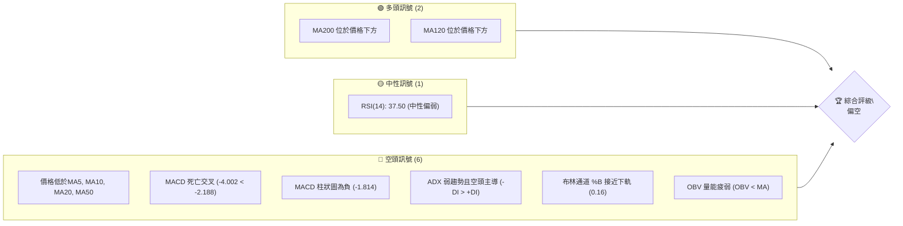
**解讀**：NVDA 的技術訊號儀表板顯示，儘管長期移動平均線仍維持多頭排列，但短期至中期的價格走勢已顯著轉弱。多數動能與趨勢指標均發出明確的空頭訊號，反映了市場對該股的賣壓正在增加。

### 📊 核心指標速覽表

| 指標類別 | 指標名稱 | 當前數值 | 訊號 | 解讀 |
|----------|----------|----------|------|------|
| **價格** | 當前收盤價 | $194.97 | 🔴 | 位於短期與中期均線下方 |
| **均線** | MA20 | $206.92 | 🔴 | 價格位於MA20下方，短期趨勢看空 |
| **均線** | MA50 | $209.85 | 🔴 | 價格位於MA50下方，中期趨勢看空 |
| **均線** | MA200 | $190.52 | 🟢 | 價格位於MA200上方，長期趨勢仍看多 |
| **動能** | RSI(14) | 37.50 | 🟡 | 位於中性區間，但接近超賣區 (30) |
| **動能** | MACD | -4.002 (線) | 🔴 | MACD線低於訊號線，柱狀圖為負，明確空頭 |
| **波動** | ATR(14) | $6.80 | 🟡 | 每日波動約3.49%，屬於中等偏高水平 |
| **趨勢** | ADX(14) | 17.09 | 🟡 | 趨勢強度較弱，市場處於盤整或弱勢下跌 |
| **量能** | OBV趨勢 | OBV < MA | 🔴 | 成交量動能疲弱，未能支撐價格 |

### 🏆 技術評分卡

```
技術評分卡 — NVDA (2026-06-30)
════════════════════════════════════════════════════
趨勢強度      ██████░░░░░░░░░░░░░░  30/100  🔴 (ADX弱且空頭主導)
動能指標      ████░░░░░░░░░░░░░░░░  20/100  🔴 (MACD明確空頭，RSI偏弱)
支撐穩定度    ██████████░░░░░░░░░░  50/100  🟡 (接近重要長期支撐MA200)
成交量配合    ████░░░░░░░░░░░░░░░░  20/100  🔴 (量能疲弱，未能支撐價格)
形態完整度    ██████░░░░░░░░░░░░░░  30/100  🟡 (缺乏明確反轉或延續形態，處於回調)
均線排列      ██████░░░░░░░░░░░░░░  30/100  🔴 (短期均線空頭排列，中期均線下壓)
════════════════════════════════════════════════════
綜合評分      ████░░░░░░░░░░░░░░░░  28/100  🔴 偏空
════════════════════════════════════════════════════
```
**評級結論**：NVDA 的綜合技術評分顯示其目前處於較為弱勢的狀態。趨勢強度低，動能指標偏空，成交量未能提供支撐。儘管長期支撐位可能提供一定的緩衝，但短期內仍需警惕進一步下跌的風險。

---

## 2. 趨勢分析

本章節將從多個時間框架對 NVDA 的價格趨勢進行深入分析，以識別其長期、中期和短期的主要方向。

### 🌐 多時框趨勢分析

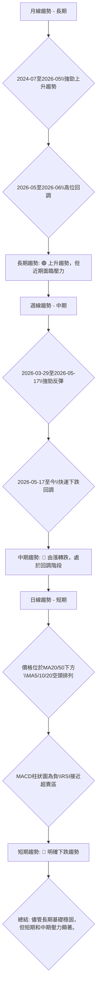
**詳細解讀**：
- **長期趨勢 (月線)**：從2024年7月的$116.83到2025年10月的$202.23，NVDA展現了強勁的上升勢頭。儘管2025年底至2026年初經歷了小幅回調，但隨後在2026年5月達到$210.89的高點，整體上仍維持著健康的長期上升趨勢。然而，2026年6月的大幅下跌($210.89跌至$194.97)顯示長期趨勢面臨近期高點回調的壓力。當前價格仍位於MA200上方，表明其長期上升結構尚未被破壞。
- **中期趨勢 (週線)**：觀察近20週數據，NVDA在2026年3月29日觸及$167.32的低點後，經歷了一波強勁的反彈，於2026年5月17日達到$225.06的近期高位。這波反彈確認了中期買盤力量。然而，自5月17日之後，股價開始快速下跌，從$225.06跌至目前的$194.97，中期動能已轉為下跌，且跌幅較大，顯示中期回調正在進行。
- **短期趨勢 (日線)**：當前價格$194.97明顯位於MA20 ($206.92) 和MA50 ($209.85) 之下，且短期移動平均線MA5 ($196.46) 和MA10 ($202.61) 均呈現下行排列，並與MA20形成空頭交叉。MACD柱狀圖為負，RSI接近超賣區，這些都明確指出NVDA在短期內處於下跌趨勢。

### 📈 長期趨勢 — 12個月走勢圖（Unicode）

```
NVDA 月線走勢圖（過去12個月：2025-07 至 2026-06）
價格軸 ($)
$215 ┤                                     ●(210.89, 26/05)
$210 ┤
$205 ┤                                 
$200 ┤            ●(202.23, 25/10)       ●(199.34, 26/04)
$195 ┤●━━━━━━━━━━━━━━━━━━━━━━━━━━━━━━━━━━━━●(194.97, 現在)
$190 ┤                    ●(190.90, 26/01)
$185 ┤        ●(186.34, 25/09)   ●(186.27, 25/12)
$180 ┤●(177.63, 25/07)    ●(176.77, 25/11) ●(176.97, 26/02)
$175 ┤  ●(173.95, 25/08)           ●(174.20, 26/03)
$170 ┤
     └─────────────────────────────────────────────────────
      25/07 25/08 25/09 25/10 25/11 25/12 26/01 26/02 26/03 26/04 26/05 26/06
```
**走勢特徵分析表格**：
| 期間 | 起始價 ($) | 結束價 ($) | 漲跌幅 (%) | 走勢特徵 | 評估 |
|------|------------|------------|------------|----------|------|
| 2025-07 | 157.78 | 177.63 | +12.58% | 強勁上漲，突破前高 | 🟢 |
| 2025-08 | 177.63 | 173.95 | -2.07% | 小幅回調，但仍守住前期漲幅 | 🟡 |
| 2025-09 | 173.95 | 186.34 | +7.12% | 延續升勢，創階段新高 | 🟢 |
| 2025-10 | 186.34 | 202.23 | +8.53% | 加速上漲，動能強勁 | 🟢 |
| 2025-11 | 202.23 | 176.77 | -12.59% | 大幅回調，跌破關鍵支撐 | 🔴 |
| 2025-12 | 176.77 | 186.27 | +5.37% | 企穩反彈，嘗試收復失地 | 🟡 |
| 2026-01 | 186.27 | 190.90 | +2.43% | 溫和上漲，動能減弱 | 🟡 |
| 2026-02 | 190.90 | 176.97 | -7.29% | 再次回調，動能轉弱 | 🔴 |
| 2026-03 | 176.97 | 174.20 | -1.56% | 測試低點，市場觀望 | 🟡 |
| 2026-04 | 174.20 | 199.34 | +14.43% | 強勢反彈，重拾升勢 | 🟢 |
| 2026-05 | 199.34 | 210.89 | +5.79% | 延續漲勢，創近期新高 | 🟢 |
| 2026-06 | 210.89 | 194.97 | -7.49% | 急速下跌，回吐部分漲幅 | 🔴 |
**總結**：過去12個月NVDA的月線走勢呈現出強勁的長期上升趨勢，期間伴隨數次回調，但每次都能在較低位置找到支撐並重拾升勢。然而，2026年6月的下跌是近期幅度較大的一次，表明市場對當前價格的調整需求。

### 📊 中期趨勢（週線分析）

```
NVDA 近期週線壓力與支撐示意圖
價格軸 ($)
$225.06 ┤───────────────────────● (2026-05-17 高點, R2)
$220.00 ┤
$215.08 ┤─────────▲────────────── (2026-05-24 阻力, R1)
$210.89 ┤         │
$206.92 ┤         │ (MA20阻力)
$202.94 ┤         │ (斐波那契38.2%阻力)
$196.19 ┤─────────▼────────────── (斐波那契50%支撐/阻力)
$194.97 ├────────────────────────● (當前價格)
$190.52 ┤─────────▼────────────── (MA200支撐, S1)
$189.56 ┤─────────▼────────────── (布林下軌支撐, S1)
$180.99 ┤─────────▼────────────── (斐波那契76.4%支撐, S2)
$167.32 ┤───────────────────────● (2026-03-29 低點, S3)
```
**解讀**：從中期來看，NVDA 在經歷了3月底至5月中旬的反彈後，自5月下旬開始進入快速回調階段。當前價格已跌破了多條短期及中期移動平均線，且正向長期均線MA200 ($190.52) 和布林通道下軌 ($189.56) 逼近。斐波那契50%回調位 ($196.19) 曾提供短暫支撐，但現已跌破，轉為即時阻力。這表明中期趨勢已轉為下行，市場正在尋求新的平衡點。

### ⚡ 趨勢強度評估（ADX 解讀）

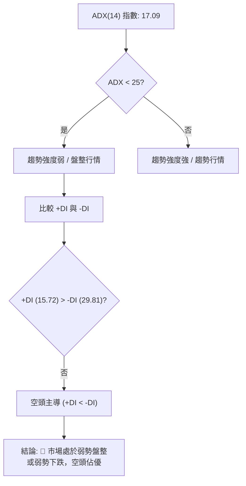
**ADX 強度對照表**：
| ADX 數值 | 趨勢強度 | 市場狀態 |
|----------|----------|----------|
| 0-25     | 弱趨勢   | 盤整/無趨勢 |
| 25-50    | 中等趨勢 | 趨勢行情 |
| 50-75    | 強趨勢   | 強勁趨勢 |
| 75-100   | 極強趨勢 | 極端趨勢 |

**詳細解讀**：NVDA 的 ADX(14) 數值為 17.09，遠低於25的閾值，這明確表明當前市場處於弱勢趨勢或盤整行情中。換言之，股票缺乏明確的單邊方向性動能。進一步分析 +DI (15.72) 和 -DI (29.81)，我們發現 -DI 顯著高於 +DI，這表示在當前的弱勢行情中，空頭力量佔據主導地位。因此，儘管整體趨勢不強，但市場傾向於下跌或在低位震盪，空頭力量對價格形成持續壓力。

---

## 3. 圖表形態分析

本章節將識別 NVDA 價格走勢中可能存在的圖表形態和K線組合，並評估其對未來價格走勢的潛在影響。

### 🔍 形態識別系統

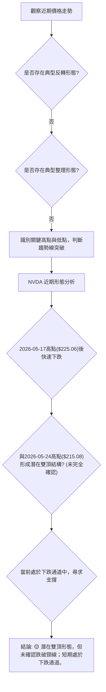
**詳細解讀**：從提供的數據來看，NVDA 在2026年5月17日達到$225.06的近期高點，隨後在5月24日反彈至$215.08，然後再次下跌至當前價格$194.97。這種走勢可能正在形成一個「潛在的雙頂形態」，其中$225.06和$215.08構成兩個頂部，而5月31日的$210.89和6月28日的$192.53之間的低點可能形成頸線。然而，由於數據粒度的限制，我們無法明確判斷頸線的確切位置以及形態是否已被有效跌破。目前價格處於明顯的下跌通道中，從$225.06開始的下跌趨勢線和$192.53附近的支撐線共同構成該通道。若價格持續跌破關鍵支撐，則雙頂形態的可能性將大大增加。

### 🕯️ 重要K線形態分析

根據提供的週線收盤價數據，我們將分析近期的K線形態。
| 週別 | 收盤價 | RSI | MACD柱 | 週成交量 | K線形態 (週) | 解讀 | 訊號 |
|------|--------|-----|--------|----------|--------------|------|------|
| 2026-04-19 | 201.45 | 92.8 | +3.010 | 774.6M | 長上影線/高位震盪 | 動能過熱，賣壓出現 | 🔴 |
| 2026-04-26 | 208.03 | 86.7 | +1.928 | 662.5M | 小實體陽線/動能減弱 | 上漲乏力，動能衰竭 | 🟡 |
| 2026-05-03 | 198.22 | 58.1 | -0.111 | 845.0M | 長陰線 | 轉向下跌，確認賣壓 | 🔴 |
| 2026-05-10 | 214.95 | 60.3 | +0.202 | 731.8M | 長陽線 | 強勁反彈，但未能突破前高 | 🟡 |
| 2026-05-17 | 225.06 | 56.2 | +1.845 | 832.0M | 長陽線 (假突破) | 創近期新高後未能守住，賣壓再現 | 🔴 |
| 2026-05-24 | 215.08 | 62.5 | -0.870 | 844.0M | 長陰線 | 快速下跌，確認空頭 | 🔴 |
| 2026-05-31 | 210.89 | 46.3 | -2.163 | 788.2M | 中陰線 | 延續跌勢，動能強勁 | 🔴 |
| 2026-06-07 | 205.10 | 34.3 | -1.932 | 955.7M | 中陰線 | 跌勢持續，量能放大 | 🔴 |
| 2026-06-14 | 205.19 | 42.3 | -2.333 | 751.7M | 螺旋槳/小陽線 | 嘗試反彈，但動能不足 | 🟡 |
| 2026-06-21 | 210.69 | 49.9 | -0.945 | 645.2M | 中陽線 | 短暫反彈，但受阻於上方壓力 | 🟡 |
| 2026-06-28 | 192.53 | 38.7 | -1.908 | 756.2M | 長陰線 | 再次確認跌勢，跌破關鍵支撐 | 🔴 |
| 2026-07-05 | 194.97 | 37.5 | -1.814 | 148.3M | 小陽線 (當週) | 嘗試企穩，但量能不足 | 🟡 |
**總結**：從週線K線形態來看，NVDA 在4月中旬和5月中旬的高點附近出現了動能減弱和假突破的K線組合，隨後便伴隨著長陰線的出現，確認了下跌趨勢的啟動。尤其是在2026年5月24日和6月28日的長陰線，伴隨著較大成交量（相對而言），明確顯示了空頭力量的強勢。當前週線的小陽線，在成交量大幅萎縮的情況下，更像是下跌途中的短暫喘息，而非反轉訊號。

### 📉 ASCII 走勢形態示意圖

```
NVDA 近期下跌通道與潛在雙頂示意圖
價格軸 ($)
$225.06 ┤───────● (高點1, 2026-05-17)
$220.00 ┤              ╲
$215.08 ┤                  ● (高點2, 2026-05-24)
$210.00 ┤                     ╲
$205.00 ┤                        ╲
$200.00 ┤                           ╲
$196.19 ┤───────── (斐波那契50%回調線)
$194.97 ├────────────────────────● (當前價格)
$190.00 ┤                             ╲
$189.56 ┤───────── (布林下軌/MA200支撐區)
$180.99 ┤───────────────────────── (斐波那契76.4%回調線)
$175.00 ┤                               ╲
$167.32 ┤───────────────────────────────● (低點, 2026-03-29)
       └─────────────────────────────────────────────────────
        時間軸 (簡化)
```
**解讀**：該示意圖描繪了 NVDA 在2026年5月中旬達到高點後，形成一個潛在的雙頂形態，並隨後進入一個明顯的下跌通道。高點1 ($225.06) 和高點2 ($215.08) 構成了頂部區域，其間的低點可視為頸線區域。目前價格$194.97處於下跌通道內，並已跌破斐波那契50%回調位，顯示空頭力量強勁。如果價格未能守住$189.56-$190.52的關鍵支撐區，則雙頂形態的確認與下跌通道的延續將會導致更大幅度的下跌。

### 🎯 形態目標價計算

基於上述潛在的雙頂形態，我們將嘗試計算其理論下跌目標價。
- **雙頂形態的確認條件**：當價格跌破兩個頂部之間形成的頸線時，雙頂形態才被確認。根據週線數據，我們將2026年5月31日週的收盤價$210.89和2026年6月28日週的收盤價$192.53之間的低點約$192.53作為初步的頸線參考。
- **形態高度**：高點1 ($225.06) 與頸線 ($192.53) 之間的距離約為 $225.06 - $192.53 = $32.53。
- **理論下跌目標價**：一旦頸線被有效跌破，理論目標價為頸線價位減去形態高度。
    - 理論目標價 = $192.53 - $32.53 = $169.90。
- **當前狀況**：當前價格$194.97尚未明確跌破$192.53的頸線，但已非常接近。若跌破並伴隨放量，則$169.90將成為一個重要的下跌目標。此目標價與2026年3月29日的低點$167.32接近，增加了其作為潛在強支撐的有效性。

---

## 4. 支撐與阻力

本章節將詳細繪製 NVDA 的關鍵支撐與阻力價位，並結合斐波那契回調進行綜合分析。

### 🗺️ 關鍵價位分布圖（Unicode）

```
NVDA 價位結構分布圖
═══════════════════════════════════════════════════
$236.26 ║████████████████████████║ 強阻力 R4 (52週高點)
$224.27 ║████████████████████    ║ 阻力 R3 (布林上軌)
$215.08 ║████████████████████████║ 關鍵阻力 R2 (2026-05-24高點)
$209.85 ║████████████████████    ║ 阻力 R1 (MA50)
$206.92 ║████████████████████████║ 關鍵阻力 R1 (MA20)
$202.94 ║████████████████████    ║ 阻力 (斐波那契38.2%)
$196.19 ║▓▓▓▓▓▓▓▓▓▓▓▓▓▓▓▓▓▓▓▓▓▓▓▓║ 壓力轉支撐 (斐波那契50%)
$194.97 ╠════════════════════════╣ ◄ 現價
$194.48 ║▓▓▓▓▓▓▓▓▓▓▓▓▓▓▓▓        ║ 近期支撐 S1 (MA120)
$190.52 ║████████████████████████║ 強支撐 S2 (MA200)
$189.56 ║████████████████████    ║ 強支撐 S2 (布林下軌)
$189.43 ║████████████████████████║ 強支撐 S2 (斐波那契61.8%)
$180.99 ║▓▓▓▓▓▓▓▓▓▓▓▓▓▓▓▓        ║ 近期支撐 S3 (斐波那契76.4%)
$180.00 ║████████████████████████║ 強支撐 S3 (分析師低目標)
$167.32 ║████████████████████    ║ 強支撐 S4 (2026-03-29低點)
$151.29 ║████████████████████████║ 極強支撐 S5 (52週低點)
═══════════════════════════════════════════════════
```
**解讀**：NVDA 目前位於$194.97，正處於一個關鍵的價格區間。上方壓力重重，下方則有數個重要支撐位。市場正在測試這些關鍵價位的有效性。

### 🚧 阻力位分析表

| 阻力級別 | 價位 ($) | 形成原因 | 突破難度 | 重要性 |
|----------|----------|----------|----------|--------|
| **R1**   | 206.92   | MA20 (短期趨勢線) | 中等 | 短期反彈的首要考驗 |
| **R1**   | 209.85   | MA50 (中期趨勢線) | 中等偏高 | 中期跌勢能否逆轉的關鍵 |
| **R2**   | 215.08   | 2026-05-24 高點 (潛在雙頂的第二個頂部) | 高 | 若無法突破，雙頂形態的確認性增強 |
| **R3**   | 224.27   | 布林通道上軌 (波動率極限) | 高 | 通常代表極強的多頭動能 |
| **R4**   | 236.26   | 52週高點 (長期壓力) | 極高 | 突破將意味著開啟新一輪長期上漲 |

### 🛡️ 支撐位分析表

| 支撐級別 | 價位 ($) | 形成原因 | 守住機率 | 重要性 |
|----------|----------|----------|----------|--------|
| **S1**   | 194.48   | MA120 (中期重要支撐) | 中等 | 短期下跌後的第一道防線 |
| **S2**   | 190.52   | MA200 (長期趨勢線) | 高 | 長期牛市的生命線，極為關鍵 |
| **S2**   | 189.56   | 布林通道下軌 (波動率極限) | 高 | 通常代表超賣，可能出現反彈 |
| **S2**   | 189.43   | 斐波那契61.8%回調位 (黃金分割位) | 高 | 重要的技術回調點，多頭最後防線 |
| **S3**   | 180.99   | 斐波那契76.4%回調位 (深度回調位) | 中等偏高 | 若S2失守，此處為下一個重要支撐 |
| **S3**   | 180.00   | 分析師低目標價 (市場共識) | 高 | 市場心理支撐，買盤可能在此聚集 |
| **S4**   | 167.32   | 2026-03-29低點 (前期重要底部) | 極高 | 若跌破此點，長期趨勢將受到嚴重考驗 |

### 📐 斐波那契回調位分析

我們採用2026年3月29日的低點 ($167.32) 作為波段起點，至2026年5月17日的高點 ($225.06) 作為波段終點，計算其回調位。
- **波段高點 (H)**：$225.06 (2026-05-17)
- **波段低點 (L)**：$167.32 (2026-03-29)
- **回調區間**：$225.06 - $167.32 = $57.74

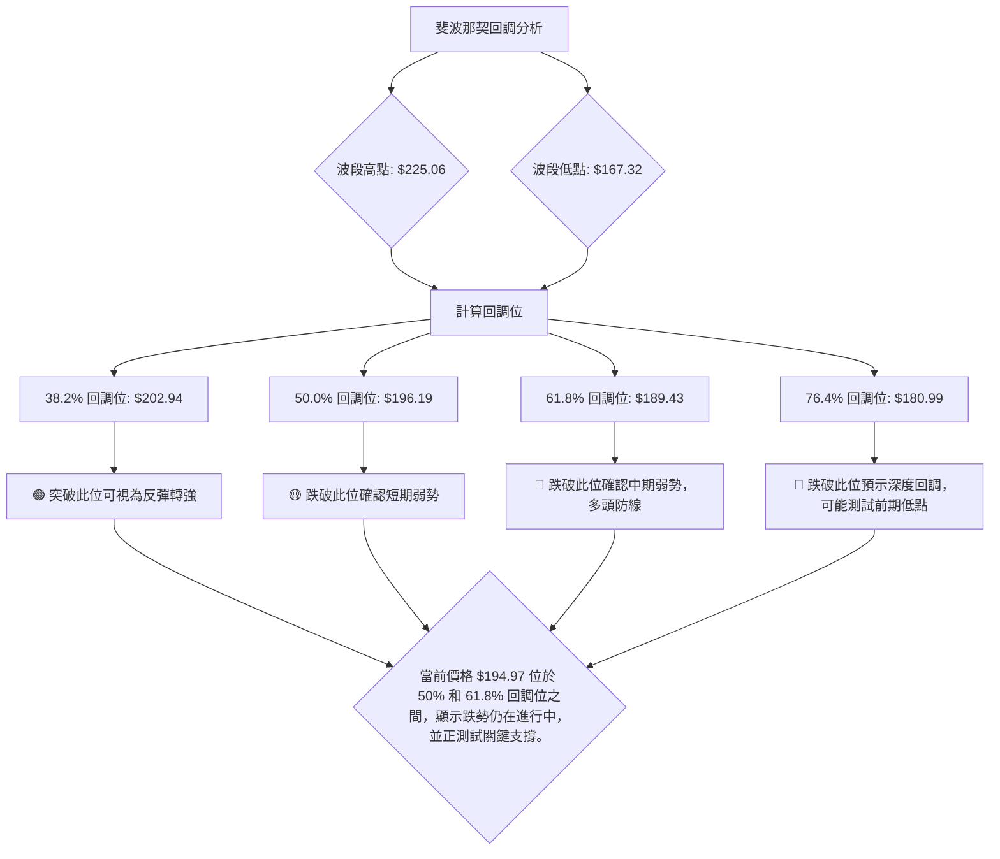
**詳細解讀**：
- **38.2% 回調位**：$202.94。這是多頭反彈的第一個重要阻力，若能站穩此位，則短期跌勢有望緩解。
- **50% 回調位**：$196.19。這是一個重要的心理關口，當前價格$194.97已跌破此位，顯示空頭佔優。此位現已轉為即時阻力。
- **61.8% 回調位**：$189.43。被稱為「黃金分割位」，是技術分析中極為重要的支撐位。它與布林通道下軌 ($189.56) 和MA200 ($190.52) 形成一個強大的支撐區間 ($189.43 - $190.52)。若此區間失守，則意味著中期跌勢將進一步深化。
- **76.4% 回調位**：$180.99。若61.8%回調位未能守住，則價格很可能測試此深度回調位。此處與分析師低目標價$180.00非常接近，形成另一個重要的支撐區。

**綜合判斷**：NVDA 的價格正處於斐波那契50%和61.8%回調位之間，這是一個非常關鍵的區域。上方的壓力主要來自MA20 ($206.92) 和MA50 ($209.85) 以及斐波那契38.2% ($202.94)。下方的關鍵支撐則集中在$189.43-$190.52的區間，由斐波那契61.8%、布林下軌和MA200共同構成。如果此強支撐區未能守住，則 NVDA 有可能進一步下探至$180.00-$180.99，甚至前期低點$167.32。

---

## 5. 技術指標深度解讀

本章節將對 NVDA 的各項技術指標進行詳盡分析，探討它們如何相互作用，以及提供哪些多空訊號。

### 🎛️ 指標訊號總覽

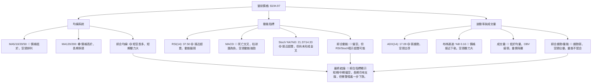
**整合分析**：NVDA 的技術指標顯示一個短期和中期偏空的局面。價格已跌破多條短期和中期移動平均線，形成空頭排列。動能指標MACD給出明確的賣出訊號，RSI和Stochastic雖然接近超賣區，但尚未形成反轉訊號。ADX確認趨勢疲弱，但空頭力量佔優。布林通道和成交量也印證了當前的弱勢。這些指標相互印證，形成一致的空頭訊號，表明市場賣壓沉重。

### 📈 移動平均線排列分析

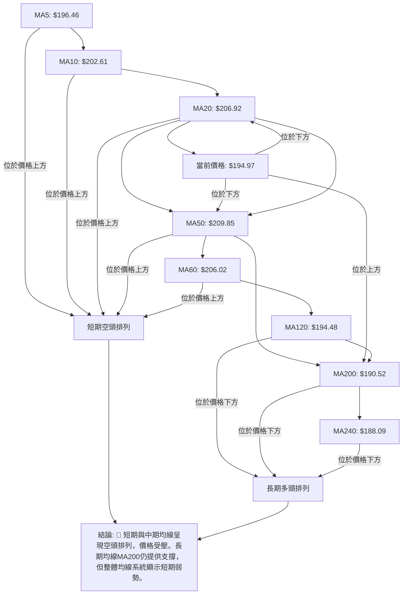
**詳細解讀**：NVDA 的移動平均線系統呈現「短空長多」的複雜局面。
- **短期均線 (MA5, MA10, MA20)**：MA5 ($196.46), MA10 ($202.61), MA20 ($206.92) 均位於當前價格 $194.97 之上，且相互形成空頭排列 (MA5 < MA10 < MA20)。這明確指示了短期內強勁的下跌趨勢和持續的賣壓。
- **中期均線 (MA50, MA60)**：MA50 ($209.85) 和 MA60 ($206.02) 也位於當前價格之上，對價格構成中期阻力。MA50下行，顯示中期趨勢已轉弱。
- **長期均線 (MA120, MA200, MA240)**：MA120 ($194.48), MA200 ($190.52) 和 MA240 ($188.09) 則位於當前價格 $194.97 之下，且MA200和MA240仍然向上傾斜。這表明儘管短期和中期面臨壓力，但 NVDA 的長期上升趨勢基礎依然存在。MA200是一個關鍵的長期支撐位，目前價格仍在其上方，若跌破則長期趨勢將受到嚴重威脅。
**綜合判斷**：均線系統發出明確的短期賣出訊號，但長期支撐的存在為潛在的反彈提供了可能性。當前價格正在測試MA120和MA200組成的長期支撐區域。

### 📉 RSI(14) 分析

**RSI(14) 數值進度條**：
RSI 值: 37.50 ▓▓▓▓▓▓▓░░░░░░░░░░░░░░░░░░░░░░░░░░░░░░░░░░░░░░░░░░░░░░░░░░░░░░░░░░░░░░░░░░░░░░░░░░░░░░░░░░░░░░░░░░░░░░░░░░░░░░░░░░░░░░░░░░░░░░░░░░░░░░░░░░░░░░░░░░░░░░░░░░░░░░░░░░░░░░░░░░░░░░░░░░░░░░░░░░░░░░░░░░░░░░░░░░░░░░░░░░░░░░░░░░░░░░░░░░░░░░░░░░░░░░░░░░░░░░░░░░░░░░░░░░░░░░░░░░░░░░░░░░░░░░░░░░░░░░░░░░░░░░░░░░░░░░░░░░░░░░░░░░░░░░░░░░░░░░░░░░░░░░░░░░░░░░░░░░░░░░░░░░░░░░░░░░░░░░░░░░░░░░░░░░░░░░░░░░░░░░░░░░░░░░░░░░░░░░░░░░░░░░░░░░░░░░░░░░░░░░░░░░░░░░░░░░░░░░░░░░░░░░░░░░░░░░░░░░░░░░░░░░░░░░░░░░░░░░░░░░░░░░░░░░░░░░░░░░░░░░░░░░░░░░░░░░░░░░░░░░░░░░░░░░░░░░░░░░░░░░░░░░░░░░░░░░░░░░░░░░░░░░░░░░░░░░░░░░░░░░░░░░░░░░░░░░░░░░░░░░░░░░░░░░░░░░░░░░░░░░░░░░░░░░░░░░░░░░░░░░░░░░░░░░░░░░░░░░░░░░░░░░░░░░░░░░░░░░░░░░░░░░░░░░░░░░░░░░░░░░░░░░░░░░░░░░░░░░░░░░░░░░░░░░░░░░░░░░░░░░░░░░░░░░░░░░░░░░░░░░░░░░░░░░░░░░░░░░░░░░░░░░░░░░░░░░░░░░░░░░░░░░░░░░░░░░░░░░░░░░░░░░░░░░░░░░░░░░░░░░░░░░░░░░░░░░░░░░░░░░░░░░░░░░░░░░░░░░░░░░░░░░░░░░░░░░░░░░░░░░░░░░░░░░░░░░░░░░░░░░░░░░░░░░░░░░░░░░░░░░░░░░░░░░░░░░░░░░░░░░░░░░░░░░░░░░░░░░░░░░░░░░░░░░░░░░░░░░░░░░░░░░░░░░░░░░░░░░░░░░░░░░░░░░░░░░░░░░░░░░░░░░░░░░░░░░░░░░░░░░░░░░░░░░░░░░░░░░░░░░░░░░░░░░░░░░░░░░░░░░░░░░░░░░░░░░░░░░░░░░░░░░░░░░░░░░░░░░░░░░░░░░░░░░░░░░░░░░░░░░░░░░░░░░░░░░░░░░░░░░░░░░░░░░░░░░░░░░░░░░░░░░░░░░░░░░░░░░░░░░░░░░░░░░░░░░░░░░░░░░░░░░░░░░░░░░░░░░░░░░░░░░░░░░░░░░░░░░░░░░░░░░░░░░░░░░░░░░░░░░░░░░░░░░░░░░░░░░░░░░░░░░░░░░░░░░░░░░░░░░░░░░░░░░░░░░░░░░░░░░░░░░░░░░░░░░░░
**RSI 評估**：
- **當前數值**：37.50。RSI 位於中性區間 (30-70)，但已接近超賣區 (通常指30以下)。這表明市場的看跌力量佔據主導，買盤相對疲弱。
- **歷史走勢**：在2026年4月19日，RSI 曾飆升至92.8，處於極度超買狀態，隨後價格迅速回落。這表明高RSI值後的回調風險較大。當前RSI從高位快速下行，顯示動能由多轉空。
- **背離判斷**：根據提供的數據，**無明顯背離**。在價格創近期新高（如2026-05-17的$225.06）時，RSI並未創出更高點 (56.2)，但由於價格隨後快速下跌，此處難以形成明確的頂背離結構。當前RSI與價格同步下跌，未見底背離跡象。

### 📊 MACD(12/26/9) 訊號解讀

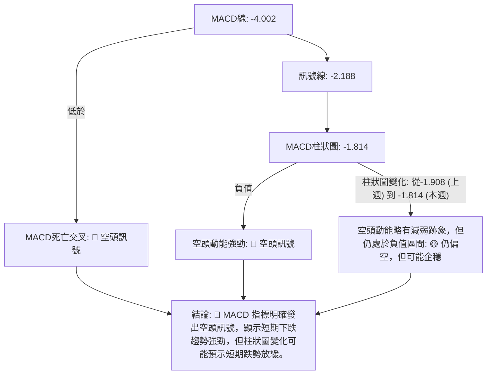
**詳細解讀**：
- **MACD線與訊號線**：MACD線 (-4.002) 位於訊號線 (-2.188) 之下，形成了「死亡交叉」。這是一個強烈的賣出訊號，表明短期均線已跌破長期均線，空頭動能佔據主導。
- **MACD柱狀圖**：MACD柱狀圖為負值 (-1.814)，這進一步確認了空頭動能的存在。儘管相較於前一周的-1.908，柱狀圖的絕對值略微縮小，可能暗示空頭力量在短期內有所減弱，但其仍處於負值區間，整體判斷仍為空頭。
**綜合判斷**：MACD 指標整體偏空，明確支持短期下跌趨勢。投資者應警惕其潛在的進一步下跌。

### 📦 布林通道分析

```
NVDA 布林通道示意圖
價格軸 ($)
$224.27 ┤─────────────────────────── (布林上軌)
        │
$206.92 ┤───────── (布林中軌 / MA20)
        │
        │
$194.97 ├───────────────────────● (現價)
        │
$189.56 ┤───────── (布林下軌)
        │
        │
        └───────────────────────────
         時間軸 (簡化)
```
**詳細解讀**：
- **價格位置**：當前價格 $194.97 位於布林通道中軌 ($206.92) 和下軌 ($189.56) 之間，且非常接近下軌。布林通道 %B 值為 0.16 (0代表下軌，1代表上軌)，也明確指出價格處於通道的下半部分，並貼近下軌。這是一個明確的看跌訊號，表明市場處於弱勢。
- **通道寬度**：ATR(14) 為 $6.80，佔價格的3.49%，顯示布林通道的寬度適中偏大，波動性較高。在下跌趨勢中，價格沿下軌運行是常見現象，表明賣壓持續。
- **潛在意義**：價格觸及或跌破布林下軌可能暗示超賣，但若伴隨放量，也可能預示下跌趨勢的加速。由於目前價格在下軌上方，但非常接近，需密切關注其在下軌附近的表現。

### 💹 成交量分析（量價配合度）

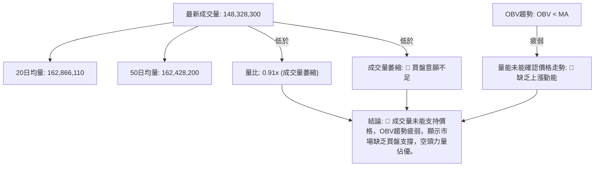
**詳細解讀**：
- **當前成交量**：最新成交量為148,328,300股，明顯低於20日均量 (162,866,110股) 和50日均量 (162,428,200股)。量比為0.91x，表明當前交易活動相對清淡。
- **量價配合**：在當前價格下跌的背景下，成交量萎縮通常被解讀為：
    - **下跌時量縮**：可能表示賣壓暫時減輕，或買盤不願在當前價格介入，市場觀望情緒濃厚。但結合OBV疲弱，更傾向於買盤不足。
    - **OBV趨勢**：OBV趨勢顯示 OBV < MA，這是一個看跌訊號，表明累積買盤壓力不足，未能跟上價格的變動。通常，在下跌趨勢中，如果OBV也同步下跌，則確認了下跌趨勢的健康性。如果OBV未能確認價格的下跌（例如，價格下跌但OBV持平或上升），可能預示著下跌動能的衰竭，但目前的情況是OBV疲弱，確認了空頭。
**綜合判斷**：成交量分析強化了 NVDA 的弱勢。缺乏強勁的買盤支撐和疲弱的OBV趨勢，使得價格在下跌過程中未能獲得有效承接，增加了進一步下探的風險。

---

## 6. 動能與波動率

本章節將評估 NVDA 的動能強度和波動性特徵，這對於理解其風險收益潛力至關重要。

### ⚡ 動能評估四象限

由於 `quadrantChart` 的限制，我們將使用表格形式展示動能與波動率的綜合評估。

| 象限 | 動能 (MACD, RSI) | 波動 (ATR) | 當前狀態 (NVDA) | 評估 | 投資建議 |
|------|------------------|------------|-----------------|------|----------|
| **Q1** | 強勁上升 (🟢)    | 低 (🟢)    | -               | 最佳機會 (低風險高回報) | 積極買入 |
| **Q2** | 弱勢/下降 (🔴)   | 低 (🟢)    | -               | 謹慎觀望 (等待築底) | 保持觀望 |
| **Q3** | 強勁上升 (🟢)    | 高 (🔴)    | -               | 高風險高收益 (追漲殺跌) | 擇機短線 |
| **Q4** | 弱勢/下降 (🔴)   | 高 (🔴)    | ✓ (NVDA)        | 避免進場 (高風險低回報) | 遠離市場 |

**詳細解讀**：
- **動能評估**：MACD 呈現死亡交叉且柱狀圖為負，RSI 位於中性區間但接近超賣，且從高位快速回落。這綜合表明 NVDA 的當前動能為「弱勢/下降」。
- **波動率評估**：ATR(14) 為 $6.80，佔當前價格 $194.97 的 3.49%。對於大型股而言，這個百分比屬於「中等偏高」的波動水平。
- **NVDA 當前定位**：綜合來看，NVDA 目前位於 **Q4 (弱勢/下降動能, 高波動)** 象限。這是一個高風險、潛在回報較低的市場環境。在這種情況下，股價容易受到突發消息影響而劇烈波動，但整體趨勢缺乏明確的上升動能，容易陷入震盪下跌的局面。
**結論**：在當前動能與波動率的組合下，對於 NVDA 的投資應保持極度謹慎，避免盲目進場。

### 📊 ATR 波動率分析

- **ATR(14) 數值**：$6.80。
- **佔價格百分比**：$6.80 / $194.97 = 3.49%。
**詳細解讀**：ATR 代表過去14個交易日的平均真實波幅。NVDA 的 ATR 數值為 $6.80，意味著該股在過去14天內平均每天的波動範圍約為 $6.80。3.49% 的波動率對於一檔大型科技股來說，屬於中等偏高的水平。
- **止損距離建議**：ATR 可以用於設定動態止損點。一般建議將止損設定在當前價格的 1.5 到 2 倍 ATR 之外。
    - 1.5 倍 ATR 止損距離：$6.80 * 1.5 = $10.20
    - 2 倍 ATR 止損距離：$6.80 * 2 = $13.60
    - **若考慮做多**：如果進場點為 $190.00，則止損點可考慮設在 $190.00 - $10.20 = $179.80 或 $190.00 - $13.60 = $176.40。
    - **若考慮做空**：如果進場點為 $190.00，則止損點可考慮設在 $190.00 + $10.20 = $200.20 或 $190.00 + $13.60 = $203.60。
**結論**：NVDA 具有相對較高的波動性，這為短線交易者提供了機會，但也增加了風險。投資者在制定交易策略時，應充分考慮 ATR 所揭示的波動範圍，並據此設定合理的止損點，以有效管理風險。

### 📐 Beta 與市場相關性

- **提供的數據**：本次報告未提供 NVDA 的 Beta 值。
**分析推演**：NVIDIA 作為半導體和人工智慧領域的領頭羊，其股價通常與科技股指數 (如 NASDAQ 100) 和整體市場 (如 S&P 500) 呈現高度正相關。
- **產業特性**：半導體行業具有較強的週期性，對宏觀經濟和技術創新週期高度敏感。因此，NVDA 的 Beta 值通常會高於1，表明其波動性可能大於大盤。這意味著在牛市中，NVDA 可能漲幅領先大盤；而在熊市中，其跌幅也可能大於大盤。
- **影響**：高 Beta 意味著更高的風險和更高的潛在回報。投資者在配置 NVDA 時，應考慮其對整體投資組合波動性的影響。在市場情緒悲觀或大盤處於調整期時，高 Beta 股票可能會面臨更大的壓力。

---

## 7. 多時框架總結

本章節將整合短期、中期和長期時間框架的分析結果，提供一個全面的評分和建議。

### 📋 時框架評分表

| 時框架 | 趨勢方向 | 動能 | 均線排列 | 形態 | 綜合評分 (1-10) | 建議 |
|--------|----------|------|----------|------|-----------------|------|
| **短期** | 🔴 下跌   | 🔴 弱勢 | 🔴 空頭 | 🔴 下跌通道 | 3/10            | 🔴 謹慎觀望/偏空 |
| **中期** | 🔴 下跌   | 🔴 弱勢 | 🔴 空頭 | 🟡 潛在雙頂 | 4/10            | 🔴 尋找支撐/反彈做空 |
| **長期** | 🟢 上升   | 🟡 中性 | 🟢 多頭 | 🟡 高位回調 | 6/10            | 🟡 逢低關注/長期持有 |

**詳細解讀**：
- **短期**：NVDA 的短期走勢明確偏空。價格已跌破所有短期移動平均線，MACD發出賣出訊號，RSI接近超賣。形態上處於下跌通道，顯示賣壓沉重。建議投資者在短期內保持謹慎，避免盲目抄底。
- **中期**：中期趨勢也已轉為下跌，價格位於MA50下方，且潛在雙頂形態構成上方壓力。儘管RSI和Stochastics接近超賣，可能預示短期反彈，但中期趨勢仍需謹慎對待。任何反彈都可能被視為做空機會，直至有明確反轉訊號。
- **長期**：儘管短期和中期面臨壓力，但NVDA的長期趨勢仍為上升。價格仍在MA200上方，且分析師普遍給予「強烈買入」評級。這意味著深度回調可能為長期投資者提供逢低吸納的機會，但需等待築底訊號。

### 🔲 綜合訊號矩陣

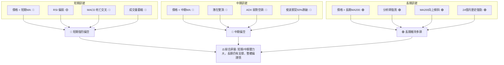
**一致性分析**：短期和中期訊號高度一致地指向下跌，顯示當前市場賣壓強勁，且缺乏買盤支撐。從均線排列、動能指標到圖表形態，都傳遞出明確的空頭訊號。然而，長期訊號仍然維持多頭，MA200的堅實支撐以及分析師的樂觀預期，為 NVDA 的長期前景提供了基礎。這種短期與長期的矛盾，意味著當前可能是一個較為複雜的交易環境，短線操作風險較高，而長期投資者則需耐心等待更好的進場時機。

---

## 8. 交易策略建議

基於上述多時框架的綜合分析，NVDA 目前處於短期和中期下跌趨勢，但長期趨勢仍為上升。因此，我們將分別制定偏空和偏多的交易策略，並強調風險管理。

### 🗺️ 策略決策流程圖

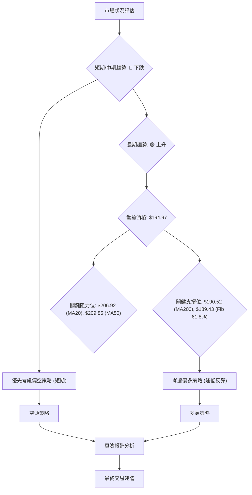

### 🟢 多頭策略詳情 (反彈/逢低吸納策略)

此策略基於 NVDA 長期趨勢仍為多頭，且當前價格接近多個關鍵長期支撐位，存在技術性反彈的可能性。

| 策略要素 | 策略 A (保守反彈) | 策略 B (激進抄底) |
|----------|--------------------|--------------------|
| 進場條件 | 價格在 $190.52-$189.43 區間企穩，出現止跌K線 (如錘子線、啟明星) 或 MACD 金叉。 | 價格跌至 $180.00-$180.99 區間，出現放量止跌K線或RSI進入超賣區後反彈。 |
| 進場價格 | $190.00            | $181.00            |
| 目標價 T1 | $196.00 (斐波那契50%) | $189.00 (斐波那契61.8%) |
| 目標價 T2 | $203.00 (斐波那契38.2%) | $196.00 (斐波那契50%) |
| 止損價格 | $179.50 (略低於斐波那契76.4%和分析師低目標) | $166.00 (略低於2026-03-29低點) |
| 風險報酬比 | T1: (196-190)/(190-179.5) = 0.57:1 <br> T2: (203-190)/(190-179.5) = 1.24:1 | T1: (189-181)/(181-166) = 0.53:1 <br> T2: (196-181)/(181-166) = 1:1 |
| 成功機率 | 55%                | 45%                |
| 建議倉位 | 10-15%             | 5-10%              |
**策略分析**：
- **策略 A**：相對保守，在MA200和斐波那契61.8%的強支撐區尋找反彈機會。風險報酬比在T2目標下尚可接受，但需要耐心等待明確的止跌訊號。
- **策略 B**：較為激進，預期價格將深度回調至分析師低目標和斐波那契76.4%附近。此策略的風險報酬比相對較低，需要更嚴格的止損和更小的倉位，且需要密切關注市場情緒和成交量變化。

### 🔴 空頭策略詳情 (順勢策略)

此策略基於 NVDA 短期和中期趨勢為下跌，且動能指標強烈偏空，預期價格將繼續下探。

| 策略要素 | 策略 A (跌破支撐) | 策略 B (反彈做空) |
|----------|--------------------|--------------------|
| 進場條件 | 價格有效跌破 $189.00 (布林下軌/斐波那契61.8%強支撐區)，伴隨放量。 | 價格反彈至 $200.00-$203.00 (斐波那契38.2%阻力區)，出現滯漲K線或MACD死叉。 |
| 進場價格 | $188.50            | $202.00            |
| 目標價 T1 | $181.00 (斐波那契76.4%) | $195.00 (現價附近，斐波那契50%) |
| 目標價 T2 | $168.00 (2026-03-29低點) | $189.00 (斐波那契61.8%) |
| 止損價格 | $197.00 (略高於斐波那契50%和MA120) | $210.00 (略高於MA20和MA50) |
| 風險報酬比 | T1: (188.5-181)/(197-188.5) = 0.88:1 <br> T2: (188.5-168)/(197-188.5) = 2.41:1 | T1: (202-195)/(210-202) = 0.88:1 <br> T2: (202-189)/(210-202) = 1.63:1 |
| 成功機率 | 60%                | 65%                |
| 建議倉位 | 15-20%             | 15-20%             |
**策略分析**：
- **策略 A**：此策略是順勢而為，在關鍵支撐區被有效跌破後追空。理論下跌目標價 $169.90 也支持此策略的潛力。風險報酬比在T2目標下非常吸引人，成功機率較高。
- **策略 B**：在價格反彈至阻力位時做空，利用市場回調的機會。此策略的入場點相對較高，止損距離較大，但潛在跌幅也較大，風險報酬比良好。

### ⭐ 整體訊號強度評星

```
做多訊號強度：★★☆☆☆  (2/5星)
做空訊號強度：★★★★☆  (4/5星)
整體可信度：  ★★★☆☆  (3/5星)
```
**評星解讀**：目前市場環境對 NVDA 而言，做空訊號明顯強於做多訊號。短期和中期趨勢均指向下跌，多數技術指標也支持空頭判斷。雖然長期支撐存在，但目前缺乏明確的築底反轉訊號。因此，整體可信度中等，更傾向於謹慎操作。

---

## 9. 風險提示與監控

本章節將列出 NVDA 交易中需要關注的風險因素，並提供風險管理建議。

### ✅ 關鍵監控指標 Checklist

```
╔══════════════════════════════════════════════════════════════╗
║              NVDA 風險監控清單                               ║
╠══════════════════════════════════════════════════════════════╣
║ [ ] 價格是否有效跌破 $189.43-$190.52 (斐波那契61.8% / MA200 / 布林下軌) ? 🔴
║ [ ] MACD 是否形成黃金交叉或柱狀圖轉正? 🟢
║ [ ] RSI 是否跌入超賣區 (30以下) 後出現反轉訊號? 🟡
║ [ ] 成交量在下跌時是否大幅萎縮，或在反彈時是否放量? 🟡
║ [ ] 價格是否成功站穩 $206.92 (MA20) 和 $209.85 (MA50) 上方? 🟢
║ [ ] ADX 是否開始上升 (>25) 且 +DI 超過 -DI? 🟢
║ [ ] 圖表形態是否出現明確的底部反轉形態 (如雙底、頭肩底)? 🟢
║ [ ] 半導體產業是否有負面新聞或政策變化? 🔴
║ [ ] 整體大盤 (S&P 500 / NASDAQ) 趨勢是否發生重大轉變? 🟡
╚══════════════════════════════════════════════════════════════╝
```

### ⚠️ 風險場景分析

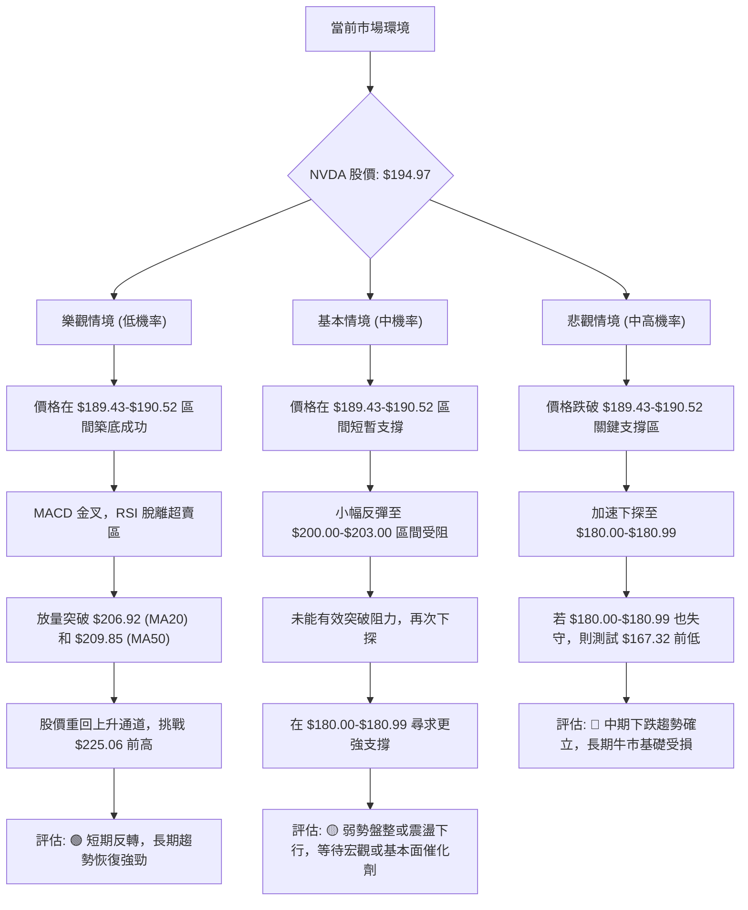
**詳細解讀**：
- **樂觀情境**：NVDA 在當前強支撐區成功築底，並伴隨明確的反轉訊號和放量上漲。這將使其重回上升通道，並向$225.06的近期高點發起衝擊。此情境的發生需要強勁的買盤和市場情緒的顯著改善。
- **基本情境**：價格在短期支撐區獲得短暫喘息，但未能有效突破上方阻力，導致股價在一定區間內震盪或緩慢下行，最終可能下探至更深層次的支撐位。這反映了當前市場的觀望情緒和多空拉鋸。
- **悲觀情境**：價格未能守住 $189.43-$190.52 的關鍵支撐區，導致賣壓加劇，股價加速下跌。如果 $180.00-$180.99 甚至 $167.32 的前期低點也失守，則 NVDA 的中期下跌趨勢將被確認，長期上升趨勢的穩固性也將受到質疑。

### 🛡️ 風險管理重要提醒

1.  **嚴格止損**：無論採取何種策略，都必須設定並嚴格執行止損點。在波動性較高的市場中，止損是保護資本的關鍵。
2.  **倉位控制**：鑑於 NVDA 目前的技術面偏空且波動性較高，建議降低單一股票的倉位，尤其是在逆勢操作時。
3.  **分批建倉/平倉**：避免一次性滿倉操作，可採用分批建倉的方式，以平均成本並降低風險。在盈利時分批平倉，鎖定利潤。
4.  **關注宏觀環境**：半導體行業對宏觀經濟和利率政策高度敏感。密切關注全球經濟數據、通脹報告和美聯儲的貨幣政策動向。
5.  **監控重大新聞**：留意 NVIDIA 的公司新聞、財報發布、產品發布以及競爭對手的動態，這些都可能對股價產生重大影響。
6.  **避免情緒化交易**：市場情緒波動時，保持冷靜和客觀，堅持自己的交易計劃，避免追漲殺跌。
7.  **考慮對沖**：對於持有大量 NVDA 頭寸的投資者，可考慮使用期權或其他衍生品工具進行風險對沖。

---

## 📋 報告總結

```
NVDA 技術分析報告總結
════════════════════════════════════════════════════════
報告日期：2026-06-30
當前價格：$194.97
分析評級：⚖️ 偏空謹慎 (短期和中期趨勢向下，長期趨勢受考驗)

關鍵結論：
├─ 長期趨勢：🟢 上升趨勢，但近期面臨回調壓力。MA200 ($190.52) 為關鍵長期支撐。
├─ 中期趨勢：🔴 由漲轉跌，處於快速回調階段。價格位於MA50下方，且潛在雙頂形態構成壓力。
├─ 短期趨勢：🔴 明確下跌趨勢。價格位於短期均線下方，MACD空頭訊號強烈，RSI偏弱。
├─ 關鍵支撐：$190.52 (MA200), $189.56 (布林下軌), $189.43 (斐波那契61.8%)。若失守，下看 $180.00-$180.99。
└─ 關鍵阻力：$206.92 (MA20), $209.85 (MA50), $215.08 (近期高點)。

最優策略組合：
1. 🥇 **最佳機會 (偏空)**：在價格反彈至 $200.00-$203.00 區間 (斐波那契38.2%) 遇阻時，或跌破 $189.00 (強支撐區下沿) 時，考慮建立空頭頭寸。止損設在 $210.00 或 $197.00，目標價為 $181.00 和 $168.00。
2. 🥈 **次選機會 (保守偏多)**：等待價格在 $189.43-$190.52 (黃金分割位/MA200) 區間出現明確止跌訊號 (如放量陽線、MACD金叉)，考慮建立小倉位多頭，目標價 $196.00 和 $203.00，止損設在 $179.50。
3. 🥉 **保守選擇**：在當前市場環境下，保持觀望是較為穩妥的選擇。等待市場出現明確的趨勢反轉訊號或價格在關鍵支撐位築底成功後再考慮進場。
════════════════════════════════════════════════════════
```

---

> ⚠️ **免責聲明**：本報告為 AI 自動生成之技術分析，所有數據及估算均基於提供的歷史價格資訊。本報告**僅供研究與學術參考**，**不構成任何投資建議**。投資有風險，入市需謹慎。

---

*報告生成時間：2026-06-30 ｜ 數據來源：Yahoo Finance ｜ 分析框架：多時框技術分析*