<details>
<summary>📊 靜態圖表 (點擊展開)</summary>
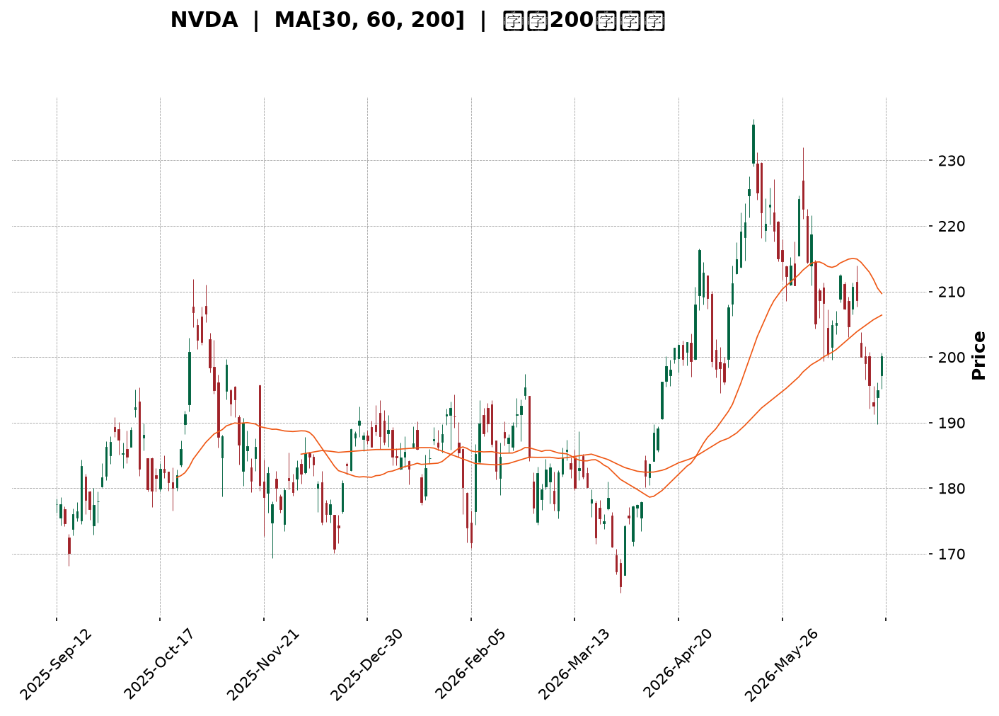
</details>

<html>
<head><meta charset="utf-8" /></head>
<body>
    <div style="height:500px; width:100%;">                        <script>window.PlotlyConfig = {MathJaxConfig: 'local'};</script>
        <script charset="utf-8" src="https://cdn.plot.ly/plotly-3.6.0.min.js" integrity="sha256-QaOVwtVY0T02VaHrr6pnoHLCwayMJp4O5n4YyaE3rJk=" crossorigin="anonymous"></script>                <div id="candlestick-chart" class="plotly-graph-div" style="height:100%; width:100%;"></div>            <script>                window.PLOTLYENV=window.PLOTLYENV || {};                                if (document.getElementById("candlestick-chart")) {                    Plotly.newPlot(                        "candlestick-chart",                        [{"close":{"dtype":"f8","bdata":"AAAAAP4yZkAAAAAgwTBmQAAAACAI1WVAAAAAoFZCZUAAAAAgfwBmQAAAAAA9DmZAAAAAQAnsZkAAAACgfEZmQAAAAIDTF2ZAAAAAQNYuZkAAAAAg0T5mQAAAAKDJs2ZAAAAAYPRKZ0AAAABgDGBnQAAAAODHlGdAAAAAIDFsZ0AAAACgtylnQAAAAMC8GWdAAAAAwM+bZ0AAAAAAZApoQAAAAICn3WZAAAAAgJCCZ0AAAAAgn3lmQAAAAOA6c2ZAAAAAQIKyZkAAAABgkt9mQAAAAAAJzWZAAAAAYLydZkAAAACAnIFmQAAAAOCxvWZAAAAAQLpAZ0AAAAAA4OdnQAAAAADEGGlAAAAAQNfYaUAAAADANVRpQAAAACBtR2lAAAAAQLrTaUAAAAAg+81oQAAAAGDDXmhAAAAA4OR6Z0AAAABAIX1nQAAAAKB82WhAAAAAID8daEAAAABAszFoQAAAAEDnU2dAAAAAILC9Z0AAAAAgmEtnQAAAAKAgpGZAAAAAgAlJZ0AAAADgHY1mQAAAAGDeVGZAAAAAwCjKZkAAAAAA\u002fjJmQAAAAMD4gGZAAAAAAMkYZkAAAAAgG3ZmQAAAAOBSp2ZAAAAAYI9rZkAAAADgAuVmQAAAAGACxmZAAAAAAF4qZ0AAAABg1BdnQAAAAMDL8WZAAAAA4LSWZkAAAABA0dllQAAAAEBoAmZAAAAAoBwwZkAAAACAaldlQAAAAACxvWVAAAAAAKCYZkAAAABg6+5mQAAAAEBYn2dAAAAA4CqMZ0AAAABgiMlnQAAAAOCzf2dAAAAAIPhpZ0AAAADAukhnQAAAAKDWk2dAAAAAwIF8Z0AAAACgYWBnQAAAAOAlnGdAAAAAABEaZ0AAAABAUBRnQAAAAODeFmdAAAAAQK0yZ0AAAABAV91mQAAAAOBOWmdAAAAAoBlAZ0AAAACATDtmQAAAACAY42ZAAAAAoKwTZ0AAAADAH25nQAAAAGDFR2dAAAAAgEqJZ0AAAACALOlnQAAAAMDQCGhAAAAAoLXcZ0AAAADASCxnQAAAAIDZg2ZAAAAAQEq\u002fZUAAAADAdXVlQAAAAIDkJWdAAAAAIN+5Z0AAAAAg7olnQAAAACAxumdAAAAAAMtWZ0AAAAAgy9JmQAAAAGDUF2dAAAAAIAh4Z0AAAACgeXVnQAAAAEDXsmdAAAAAACLqZ0AAAADArhNoQAAAAOBLamhAAAAAwEUVZ0AAAABALB9mQAAAACA\u002fyGZAAAAAwJR6ZkAAAAAAJdpmQAAAAIC742ZAAAAAAE8zZkAAAAAArs1mQAAAAOBvEWdAAAAAoAc6Z0AAAABgqN1mQAAAAABJgWZAAAAAADfgZkAAAACA+7ZmQAAAAGAUhmZAAAAAoERLZkAAAABg949lQAAAAODv7WVAAAAAgN\u002ffZUAAAACAGk9mQAAAACBNYWVAAAAAQGbqZEAAAACASZ9kQAAAAKBNxmVAAAAAAHTxZUAAAAAg3yVmQAAAAMDcLWZAAAAAwJA8ZkAAAAAAx7tmQAAAAOBE9mZAAAAAICKNZ0AAAAAg3qJnQAAAAOD\u002fiGhAAAAAgG7UaEAAAACgz8NoQAAAACA\u002fLmlAAAAAgGQ6aUAAAADgtvRoQAAAAOB0SGlAAAAAAAvtaEAAAACg4QBqQAAAAGBzC2tAAAAAwH+dakAAAACANCBqQAAAAEDO6mhAAAAA4AHHaEAAAABA98doQAAAAACuiGhAAAAAYNHyaUAAAAAAH2hqQAAAACBi3mpAAAAAwOdla0AAAABAvJBrQAAAAMAlMmxAAAAAAOZubUAAAADA2CFsQAAAAGD1wWtAAAAAQE2La0AAAAAgt+ZrQAAAAIAkaGtAAAAA4IniakAAAAAghNNqQAAAAMBHi2pAAAAAwATAakAAAABgnVxqQAAAAIApA2xAAAAAgPDRa0AAAAAAANBqQAAAAMAeVWtAAAAAQDOjaUAAAADgehRqQAAAAIAUBmpAAAAAoHANaUAAAAAA15tpQAAAAIAUpmlAAAAAYGaOakAAAADAHu1pQAAAAMDMlGlAAAAAgBRWakAAAADAzBRqQAAAAKBHAWlAAAAAAADgaEAAAAAgrndoQAAAAMD1EGhAAAAAQApfaEAAAABA4QJpQA=="},"high":{"dtype":"f8","bdata":"4I1mnOtLZkD2DGfl6FNmQGWmCsnDKGZAklw6AlefZUAIlLVG+xtmQALpOAlNO2ZA6EAK8RMKZ0AXzH8dAcZmQAxXNa2hcWZA2klszviAZkDJ8lQDUHFmQDj9h\u002fB\u002f+GZAWWcAN5BjZ0DpKOq7z3xnQLyWDBbQ2WdASbk7qMLDZ0Cls6Z9ul9nQLi\u002fN602mmdAa8gCw3irZ0CVIxWjo2FoQPtpTrvda2hAl+KScsW7Z0DGLoU5ERJnQHryjOhNFGdAZML3KH3hZkAJxjgxsvtmQFO9OsnZHmdAtHjHPdTRZkB3s11GmuZmQMf44st\u002f2WZACBqi\u002f2VnZ0DSxauNLPhnQMd7ueCEXGlA8hMHY259akCTJcaAt7xpQBef1xCQ9mlAUmT+9UNiakCy4urGuXZpQOvUACwrVWlAbwa89MiraEDoD8w5kIJnQDYvlzbu9WhABnC9anllaECSL6uwfnRoQOAzOdVG5mdAzDr7m4jYZ0DUaufUS5hnQBRteToREmdATexQxNxzZ0DVPXC3AnhoQASUmJplCmdA4gZDNoXoZkBj0cWz2z1mQAFAc\u002fip1WZA+kOWuvhhZkDB8NkoQIJmQNIpgWyNLWdA2qiBqPbGZkA0QXNfcglnQJ47w+vrDWdAjTMb7at4Z0A7a\u002fjjzC9nQFWgASkhKGdARSiX+yujZkD4oMcIHdNmQEsnF\u002f57RmZA3hzB0LhIZkDeRwU0S\u002f1lQBF11NDu\u002fWVAjsfgqFOnZkCHA0Xv8P1mQH42dQ0uo2dApFSPgcGVZ0CMJciRkQ5oQCAtbRz2kGdAeyCwJ1CYZ0C6DU67fcpnQJqPqig9FmhAohf+w5wsaEBuvYHt8v1nQGRTMTJh5GdAKsbt\u002fTWqZ0AMc9ianUNnQHw+nJ6LXGdAfy4x7C98Z0DqJ7+ThwdnQNXInS0Br2dA7chf\u002fKfGZ0DdKlX9DMVmQN3uaBHvJGdAYx4mui4+Z0DA8T8dz6tnQPJy7q13nGdANvnl2pe4Z0DgYHCXswNoQMuX7FHRJ2hAHg0QOBlIaECJfLBxLsJnQKuY5\u002fFgQWdAk92DVo9rZkDaw7bzWBNmQNvAD+K1WGdAN5PKH5ItaECSF3VO2wdoQOy1t1fJIGhAYn5tEPkraEAg6g7SsGhnQIRhwh6BXWdAPz\u002f4JWvEZ0DvSwAWaoZnQLOEIQkkw2dA2N9xzNY2aEA7lrAxFjFoQPFwjbd0rGhAsfYlsbRBaECRCX4cw8tmQKhwZZiR52ZA4ohnZL+VZkCToicvMw9nQAVjd5C++mZAg4TyEzLRZkAA2L1n\u002fdVmQGWmXdXPRmdAu6opttlsZ0A2L5zVMBdnQILyLY7yO2dA9qozxh+VZ0AZwWmo5CVnQOrzzjRU5WZAoC84tad4ZkBMEMDZrUFmQPjbGvcxRWZALfmypXkAZkCUIuYGSqBmQG78YZ6+CWZABcP\u002fuKtYZUBWtCxvFihlQDwY6sZVzWVAtvQgjTslZkDGLtdrESlmQEfSzBGoMmZA4TKkYrhAZkAKqq4sayFnQPvO+OCz+2ZAHYZcD+y4Z0B\u002fUIEJDq5nQAAAAOD\u002fiGhASBnLqFUFaUC2Fd5RwfNoQJJMKc\u002fiLmlASmpxk+g9aUA3pXeBclBpQAAAAOB0SGlAsgq4ivdyaUATNPGQilZqQN5\u002f44Z7EmtAxk6MX1zPakB0QZaoHY9qQB1IsQvEQWpANT78G3BYaUB2HVZB2C9pQI0v+3Q4AGlAsW\u002fJreEAakBhoEega75qQIVlgZR8MWtATZeNmVHBa0Bywhgtqu9rQOIa63RkcmxAMYH23neIbUASrZxQYOdsQEVRwqJut2xAXtjiV\u002f8GbEAtgAGCvDtsQPTcoSFUZGxArbElNRaYa0BQa87WoT1rQLYy33fSvGpAOUBmg5zoakBUrXaKZzNrQN0y64J2E2xA79kRiE4AbUDl0\u002fuJ8NFrQAAAAEAzs2tAAAAAANfbakAAAABACk9qQAAAAMDMbGpAAAAAQArnaUAAAADAHrVpQAAAAIA94mlAAAAAYLiWakAAAAAgrm9qQAAAAGC4JmpAAAAA4HpsakAAAAAgrr9qQAAAAOCjeGlAAAAAoHA1aUAAAACgmRlpQAAAAKCZcWhAAAAAgMKFaEAAAAAAKRRpQA=="},"hovertemplate":"\u003cb\u003e%{x|%Y-%m-%d}\u003c\u002fb\u003e\u003cbr\u003e\u958b: $%{open:.2f}\u003cbr\u003e\u9ad8: $%{high:.2f}\u003cbr\u003e\u4f4e: $%{low:.2f}\u003cbr\u003e\u6536: $%{close:.2f}\u003cextra\u003e\u003c\u002fextra\u003e","low":{"dtype":"f8","bdata":"\u002f1SwKzUHZkDFzXjPNMllQJB7rlcNxWVA+lkyXkEGZUC0HMCZq5dlQGX6f2ye3mVAkIjnXZnPZUCMfT+qif9lQNeTNWKm5WVAbVjBVRqdZUAetXskodZlQJyUONfjgmZAW0o3WPanZkDBUOvZTfVmQFJ9KClBemdAdjgBgJokZ0BODllvFuNmQGjpK\u002fp\u002f+GZA3P50Ea1JZ0DrB9jBIdpnQB9KLPUtumZAjlAHACQ3Z0CdLo8xE29mQLvWLqENImZAB4u86U9xZkCLb39VrHBmQMY3+77zr2ZAhYj+cEVyZkA18lZbHRFmQGPJRHvzcWZACkTyLIXoZkDeqhhOFIZnQJAd0CpM9WdAu88D9ZyQaUColooR6SRpQF2o+eEAOmlAyA8lhoqpaUB6t00OsbVoQBDZ+5fdTGhAU8UJPZBEZ0BzYUmt01VmQLDoyoJhMWhAXmy7aM3hZ0D1tsd8XtxnQKrKvci082ZAtoxQ8zKLZkAbr40qugJnQOZUEBh6bWZAam2FgRvTZkCUcmF+3nNmQDliuva1lmVA4QjilioIZkBHy4prsCplQBBkcBRqQGZAcgGvN84IZkBeN5wdrq5lQFyPIbypeGZATR0kQjhcZkBmPKZhtHdmQOyCKFgRlmZAI7kuj7DFZkAC4z8XGONmQLcoNP0uumZAat0uY\u002fQMZkAShe5dCM1lQPfnIvMi2mVARlOyRPvVZUBkxprJR0NlQNhMKMeKc2VAkboxhwEEZkA4P1d\u002fF8RmQH0vsper1WZAmLqnKJtLZ0DtVXTfq3hnQCB9k23fNWdAh6taFnlWZ0Br1Ij5aEhnQAGVVCP7gGdAESqdKIs9Z0BMrfQw9VJnQFW9t7KlSmdAENfRBY\u002fvZkBggkSgR+5mQAWPKWmB2WZAvHLTjKblZkAv+QpajZJmQH8Ags9LQ2dAHWwzX047Z0A1lSu3mCxmQCkn9HjYRWZAVQXa9Jb2ZkAfp4ob9VJnQAG7RApuOGdALzGSJCkvZ0BSDzukerNnQN\u002fy5b2qOmdAB+PhcKenZ0AV4Qnp8xRnQMR4TmR9AGZAlPiQQGt2ZUCBb4X7SlplQBsrIeBkzGVAaoZlpjr3ZkDZpfiwgXxnQB1u5iVIkWdAWxOGqgxJZ0AX19YMzatmQBc8xWfGXmZANMHjDApRZ0Cvo4z64S1nQLeKJPjUNmdAAzQAaSurZ0DYmRejfmVnQM4wAKq5MWhAx00zEA4DZ0AXf1LVSAVmQMCamByszWVAABCu\u002fIoWZkDFSA6d5npmQAtXwL05NWZANVSs+lgTZkCjZCCBE+tlQOjaeWs5uWZA9L9vUYcHZ0ALNHDBOrFmQGC01HRgd2ZAjszBwlymZkDPO1ji\u002fa5mQNKu36rXg2ZAqryuKrvyZUBd\u002f5KYpHBlQPQHaETP0WVAKe+V4uC4ZUC+sayznBRmQJIPJdQaXmVAxwkqHRnaZEBxKytVhYJkQDAUIDOA2GRA4zFJiX3RZUC9BYOpdGVlQG6A563F8WVAkU3jl6auZUDXDIM54oJmQIIiH4AcjWZA0pkNC7wCZ0DWH63LwjBnQN7NKJ2I0WdAXi5JeWNwaEBkWzsZoHJoQIBwxns34WhAYpDEfoKzaED\u002fLVxElthoQDrRoUCW2GhA\u002fMISdLGfaEDum6buefJoQN5RIEZv5GlAjvNb5aT+aUCiowPN0+ppQIYVDWz\u002fzmhAo971Ln+caEDoYfHqbFBoQOd1ezuoeWhAQ7GGDR\u002fMaEDQL+euTshpQEhOfKeMlGpApZrbDYO0akDD3H0Cb9VqQNwzGYD8qWtAOMcx6g6hbEAOdaOsU\u002f9rQJ4KNIu0Q2tAeU61nwA1a0AbVs4yyYdrQEptXDGkNWtACavpLZnRakCz\u002fTNGGnhqQHfaIq4uEWpAnM935StfakBAS2aYS1xqQEZjNFZd7mpA7qDoRPSia0CBSvIpVMhqQAAAAEAKX2pAAAAAYI+KaUAAAAAAAMBpQAAAAEDh6mhAAAAAoHD9aEAAAACgR\u002fFoQAAAAIAUbmlAAAAAQOEKakAAAACgR+lpQAAAAGCPYmlAAAAAAADQaUAAAABACvdpQAAAAAAAAGlAAAAAYI+SaEAAAAAAKQRoQAAAAEAK52dAAAAAoJm5Z0AAAAAghWNoQA=="},"name":"\u50f9\u683c","open":{"dtype":"f8","bdata":"dIqS5WQxZkDUPph0R+5lQPYhuQDJGGZASQQ0WnGNZUDUjBa1RLhlQDm7TaR58WVAgefjdXTiZUDgcZNvn7dmQFCE6OdPcWZA\u002fUpWXz\u002fIZUAAAnB1LT5mQOZMaLFnhmZAd0daVSO7ZkCgsnI+ISBnQByOYdd4q2dAFuLQPV6eZ0BhldRqcChnQCOGGtXEP2dAZzlHoaJKZ0AGzk4shv9nQDsMzp9uKGhAcoDv5mB3Z0D6hajJGxFnQJGghUMREmdA5CL\u002ffe6\u002fZkAoF9lYan5mQLkqAAOy3GZAtHjHPdTRZkAUJZimGJ1mQNx9ROgVhmZAk1yx4GLzZkB1qOSm77dnQN4ZdiW7GWhApT4E8eH2aUAYLtUKcJxpQFloWg38xWlAlJVwGhT6aUBMLTKmuVdpQAmlCrqJ0GhAW7grGm+FaEAyxpoqQxVnQAuluTyRW2hAPG9HQSpdaEB3qM\u002fWD29oQD8fDAfQ2WdAwjVi6BDUZkB2Fu6ydTdnQKJE0Wuv5GZA5PySTb8RZ0DkIASdaXZoQHc4jN9KoGZAXz01Ll1oZkADUnOd\u002fdVlQLfC\u002fZPBrGZArgiR5gVZZkBcp3s4MtFlQOC1oz7psGZAFWf48y2bZkBRb5hwwqxmQGO38rpP9WZAPjUNSlzNZkDwk7u8rypnQGyL5F\u002fUF2dASMeanO6BZkCQfnS5dZxmQA4rbKgkN2ZAGT4Z0nIBZkA6LarAVfxlQHdfn\u002fsnymVAE9ImnI0OZkAixGs0RfZmQN2S2mTo12ZA3bSx78B2Z0CLdWJWCbZnQN\u002fG7hZnb2dAOgCyo1eAZ0D5fpWc2apnQARK0756s2dAjdkqTdjwZ0DdZbGkNslnQPmHkaPjimdAX4AJ4iWcZ0BZh+5NWBtnQM8ZN8rl32ZABxpM1ckYZ0ACCWgZDgNnQBxcL726SGdAnCPfbjCbZ0BjgpuHtbVmQDABZ9yeWmZAwYvrRcwQZ0A57k7SsGhnQCSWN\u002f3SXWdAMfclhmFgZ0A\u002fx7j+LuFnQBnGAs1r42dAm6udM0TfZ0C5OschGl9nQEnOi35rQGdAxhQPiblnZkAicyjQ8NZlQFBZ2UQxD2ZAWHFuDiMBZ0AF8Jsos+RnQDFw8uzlBmhA1H0iem8ZaECLMyolDWhnQF8sKELqsGZACRjGUKSQZ0BivfTBoFpnQD26r673SmdAxh4\u002fn1blZ0BJTWEyN+hnQGZg09PRRmhAejc3JBFBaEDvB9E776BmQEWLYWt\u002f2WVAkaKN0bhIZkCX5D\u002fSC4dmQL3MIohgnmZAwJmWl95zZkDXL5e0qhNmQGWtE2ewxWZAZyX1xDE2Z0D\u002f92JyvvpmQDWsnxaNFmdAnI1TYjnYZkAwEHmmBhtnQGk2B+qPyGZAsLrGPrA5ZkCqEoF0XjlmQPZWA223IWZA5idUBwzUZUBAAVVRmhxmQPnbhXCu+2VA4881uao5ZUA+6tkyrBJlQNnSufrR2GRAh7OtnXH5ZUCIbfJvWH9lQCWC4DOFHmZAMbQtOtDwZUAtqA6MIAlnQH1Qph0btGZAGC2n0g0DZ0DD6bGnBzpnQONJSVLF02dAM89DWPWJaEA3BSSmZ6ZoQOX1tVla9WhAT\u002f0k9uj3aEC7ehBroTxpQPaPYmYxGGlAOtJcmy1HaUDVWmlgRfdoQNzkK2D9LGpAeV8JWOAnakAwh2z5eY5qQH8FCnPwNWpAmyUPQ3YhaUBg1bllkehoQFwb8uss4mhAkRKQmAj1aEADjcViHgNqQCcfszEGmWpASBqpX065akDkq0RkdUlrQBqlOnVhFWxACRl0S6OybEA3K4nIwq9sQEgoJOBGs2xAxc\u002f5kKhra0CkAAMkct1rQGAtAr3\u002fwGtALYGyIZKUa0Czs5WaNglrQM5THAHdu2pAMEn90hZhakDDYOwRkcpqQGh998xS72pA1+Rj60tdbEBPaIbHx65rQAAAAMAevWpAAAAAwPXQakAAAACAwkVqQAAAAADXU2pAAAAAgMKNaUAAAAAgri9pQAAAACCFm2lAAAAAoHAdakAAAACAwmVqQAAAAMD1EGpAAAAAYI\u002fqaUAAAACAFG5qQAAAAKBwRWlAAAAAANcDaUAAAABgjwJpQAAAAADXI2hAAAAAQDM7aEAAAAAgrqdoQA=="},"x":["2025-09-12T00:00:00-04:00","2025-09-15T00:00:00-04:00","2025-09-16T00:00:00-04:00","2025-09-17T00:00:00-04:00","2025-09-18T00:00:00-04:00","2025-09-19T00:00:00-04:00","2025-09-22T00:00:00-04:00","2025-09-23T00:00:00-04:00","2025-09-24T00:00:00-04:00","2025-09-25T00:00:00-04:00","2025-09-26T00:00:00-04:00","2025-09-29T00:00:00-04:00","2025-09-30T00:00:00-04:00","2025-10-01T00:00:00-04:00","2025-10-02T00:00:00-04:00","2025-10-03T00:00:00-04:00","2025-10-06T00:00:00-04:00","2025-10-07T00:00:00-04:00","2025-10-08T00:00:00-04:00","2025-10-09T00:00:00-04:00","2025-10-10T00:00:00-04:00","2025-10-13T00:00:00-04:00","2025-10-14T00:00:00-04:00","2025-10-15T00:00:00-04:00","2025-10-16T00:00:00-04:00","2025-10-17T00:00:00-04:00","2025-10-20T00:00:00-04:00","2025-10-21T00:00:00-04:00","2025-10-22T00:00:00-04:00","2025-10-23T00:00:00-04:00","2025-10-24T00:00:00-04:00","2025-10-27T00:00:00-04:00","2025-10-28T00:00:00-04:00","2025-10-29T00:00:00-04:00","2025-10-30T00:00:00-04:00","2025-10-31T00:00:00-04:00","2025-11-03T00:00:00-05:00","2025-11-04T00:00:00-05:00","2025-11-05T00:00:00-05:00","2025-11-06T00:00:00-05:00","2025-11-07T00:00:00-05:00","2025-11-10T00:00:00-05:00","2025-11-11T00:00:00-05:00","2025-11-12T00:00:00-05:00","2025-11-13T00:00:00-05:00","2025-11-14T00:00:00-05:00","2025-11-17T00:00:00-05:00","2025-11-18T00:00:00-05:00","2025-11-19T00:00:00-05:00","2025-11-20T00:00:00-05:00","2025-11-21T00:00:00-05:00","2025-11-24T00:00:00-05:00","2025-11-25T00:00:00-05:00","2025-11-26T00:00:00-05:00","2025-11-28T00:00:00-05:00","2025-12-01T00:00:00-05:00","2025-12-02T00:00:00-05:00","2025-12-03T00:00:00-05:00","2025-12-04T00:00:00-05:00","2025-12-05T00:00:00-05:00","2025-12-08T00:00:00-05:00","2025-12-09T00:00:00-05:00","2025-12-10T00:00:00-05:00","2025-12-11T00:00:00-05:00","2025-12-12T00:00:00-05:00","2025-12-15T00:00:00-05:00","2025-12-16T00:00:00-05:00","2025-12-17T00:00:00-05:00","2025-12-18T00:00:00-05:00","2025-12-19T00:00:00-05:00","2025-12-22T00:00:00-05:00","2025-12-23T00:00:00-05:00","2025-12-24T00:00:00-05:00","2025-12-26T00:00:00-05:00","2025-12-29T00:00:00-05:00","2025-12-30T00:00:00-05:00","2025-12-31T00:00:00-05:00","2026-01-02T00:00:00-05:00","2026-01-05T00:00:00-05:00","2026-01-06T00:00:00-05:00","2026-01-07T00:00:00-05:00","2026-01-08T00:00:00-05:00","2026-01-09T00:00:00-05:00","2026-01-12T00:00:00-05:00","2026-01-13T00:00:00-05:00","2026-01-14T00:00:00-05:00","2026-01-15T00:00:00-05:00","2026-01-16T00:00:00-05:00","2026-01-20T00:00:00-05:00","2026-01-21T00:00:00-05:00","2026-01-22T00:00:00-05:00","2026-01-23T00:00:00-05:00","2026-01-26T00:00:00-05:00","2026-01-27T00:00:00-05:00","2026-01-28T00:00:00-05:00","2026-01-29T00:00:00-05:00","2026-01-30T00:00:00-05:00","2026-02-02T00:00:00-05:00","2026-02-03T00:00:00-05:00","2026-02-04T00:00:00-05:00","2026-02-05T00:00:00-05:00","2026-02-06T00:00:00-05:00","2026-02-09T00:00:00-05:00","2026-02-10T00:00:00-05:00","2026-02-11T00:00:00-05:00","2026-02-12T00:00:00-05:00","2026-02-13T00:00:00-05:00","2026-02-17T00:00:00-05:00","2026-02-18T00:00:00-05:00","2026-02-19T00:00:00-05:00","2026-02-20T00:00:00-05:00","2026-02-23T00:00:00-05:00","2026-02-24T00:00:00-05:00","2026-02-25T00:00:00-05:00","2026-02-26T00:00:00-05:00","2026-02-27T00:00:00-05:00","2026-03-02T00:00:00-05:00","2026-03-03T00:00:00-05:00","2026-03-04T00:00:00-05:00","2026-03-05T00:00:00-05:00","2026-03-06T00:00:00-05:00","2026-03-09T00:00:00-04:00","2026-03-10T00:00:00-04:00","2026-03-11T00:00:00-04:00","2026-03-12T00:00:00-04:00","2026-03-13T00:00:00-04:00","2026-03-16T00:00:00-04:00","2026-03-17T00:00:00-04:00","2026-03-18T00:00:00-04:00","2026-03-19T00:00:00-04:00","2026-03-20T00:00:00-04:00","2026-03-23T00:00:00-04:00","2026-03-24T00:00:00-04:00","2026-03-25T00:00:00-04:00","2026-03-26T00:00:00-04:00","2026-03-27T00:00:00-04:00","2026-03-30T00:00:00-04:00","2026-03-31T00:00:00-04:00","2026-04-01T00:00:00-04:00","2026-04-02T00:00:00-04:00","2026-04-06T00:00:00-04:00","2026-04-07T00:00:00-04:00","2026-04-08T00:00:00-04:00","2026-04-09T00:00:00-04:00","2026-04-10T00:00:00-04:00","2026-04-13T00:00:00-04:00","2026-04-14T00:00:00-04:00","2026-04-15T00:00:00-04:00","2026-04-16T00:00:00-04:00","2026-04-17T00:00:00-04:00","2026-04-20T00:00:00-04:00","2026-04-21T00:00:00-04:00","2026-04-22T00:00:00-04:00","2026-04-23T00:00:00-04:00","2026-04-24T00:00:00-04:00","2026-04-27T00:00:00-04:00","2026-04-28T00:00:00-04:00","2026-04-29T00:00:00-04:00","2026-04-30T00:00:00-04:00","2026-05-01T00:00:00-04:00","2026-05-04T00:00:00-04:00","2026-05-05T00:00:00-04:00","2026-05-06T00:00:00-04:00","2026-05-07T00:00:00-04:00","2026-05-08T00:00:00-04:00","2026-05-11T00:00:00-04:00","2026-05-12T00:00:00-04:00","2026-05-13T00:00:00-04:00","2026-05-14T00:00:00-04:00","2026-05-15T00:00:00-04:00","2026-05-18T00:00:00-04:00","2026-05-19T00:00:00-04:00","2026-05-20T00:00:00-04:00","2026-05-21T00:00:00-04:00","2026-05-22T00:00:00-04:00","2026-05-26T00:00:00-04:00","2026-05-27T00:00:00-04:00","2026-05-28T00:00:00-04:00","2026-05-29T00:00:00-04:00","2026-06-01T00:00:00-04:00","2026-06-02T00:00:00-04:00","2026-06-03T00:00:00-04:00","2026-06-04T00:00:00-04:00","2026-06-05T00:00:00-04:00","2026-06-08T00:00:00-04:00","2026-06-09T00:00:00-04:00","2026-06-10T00:00:00-04:00","2026-06-11T00:00:00-04:00","2026-06-12T00:00:00-04:00","2026-06-15T00:00:00-04:00","2026-06-16T00:00:00-04:00","2026-06-17T00:00:00-04:00","2026-06-18T00:00:00-04:00","2026-06-22T00:00:00-04:00","2026-06-23T00:00:00-04:00","2026-06-24T00:00:00-04:00","2026-06-25T00:00:00-04:00","2026-06-26T00:00:00-04:00","2026-06-29T00:00:00-04:00","2026-06-30T00:00:00-04:00"],"type":"candlestick"},{"hovertemplate":"MA30: $%{y:.2f}\u003cextra\u003e\u003c\u002fextra\u003e","line":{"color":"#2196F3","dash":"dash","width":2},"mode":"lines","name":"MA30","x":["2025-09-12T00:00:00-04:00","2025-09-15T00:00:00-04:00","2025-09-16T00:00:00-04:00","2025-09-17T00:00:00-04:00","2025-09-18T00:00:00-04:00","2025-09-19T00:00:00-04:00","2025-09-22T00:00:00-04:00","2025-09-23T00:00:00-04:00","2025-09-24T00:00:00-04:00","2025-09-25T00:00:00-04:00","2025-09-26T00:00:00-04:00","2025-09-29T00:00:00-04:00","2025-09-30T00:00:00-04:00","2025-10-01T00:00:00-04:00","2025-10-02T00:00:00-04:00","2025-10-03T00:00:00-04:00","2025-10-06T00:00:00-04:00","2025-10-07T00:00:00-04:00","2025-10-08T00:00:00-04:00","2025-10-09T00:00:00-04:00","2025-10-10T00:00:00-04:00","2025-10-13T00:00:00-04:00","2025-10-14T00:00:00-04:00","2025-10-15T00:00:00-04:00","2025-10-16T00:00:00-04:00","2025-10-17T00:00:00-04:00","2025-10-20T00:00:00-04:00","2025-10-21T00:00:00-04:00","2025-10-22T00:00:00-04:00","2025-10-23T00:00:00-04:00","2025-10-24T00:00:00-04:00","2025-10-27T00:00:00-04:00","2025-10-28T00:00:00-04:00","2025-10-29T00:00:00-04:00","2025-10-30T00:00:00-04:00","2025-10-31T00:00:00-04:00","2025-11-03T00:00:00-05:00","2025-11-04T00:00:00-05:00","2025-11-05T00:00:00-05:00","2025-11-06T00:00:00-05:00","2025-11-07T00:00:00-05:00","2025-11-10T00:00:00-05:00","2025-11-11T00:00:00-05:00","2025-11-12T00:00:00-05:00","2025-11-13T00:00:00-05:00","2025-11-14T00:00:00-05:00","2025-11-17T00:00:00-05:00","2025-11-18T00:00:00-05:00","2025-11-19T00:00:00-05:00","2025-11-20T00:00:00-05:00","2025-11-21T00:00:00-05:00","2025-11-24T00:00:00-05:00","2025-11-25T00:00:00-05:00","2025-11-26T00:00:00-05:00","2025-11-28T00:00:00-05:00","2025-12-01T00:00:00-05:00","2025-12-02T00:00:00-05:00","2025-12-03T00:00:00-05:00","2025-12-04T00:00:00-05:00","2025-12-05T00:00:00-05:00","2025-12-08T00:00:00-05:00","2025-12-09T00:00:00-05:00","2025-12-10T00:00:00-05:00","2025-12-11T00:00:00-05:00","2025-12-12T00:00:00-05:00","2025-12-15T00:00:00-05:00","2025-12-16T00:00:00-05:00","2025-12-17T00:00:00-05:00","2025-12-18T00:00:00-05:00","2025-12-19T00:00:00-05:00","2025-12-22T00:00:00-05:00","2025-12-23T00:00:00-05:00","2025-12-24T00:00:00-05:00","2025-12-26T00:00:00-05:00","2025-12-29T00:00:00-05:00","2025-12-30T00:00:00-05:00","2025-12-31T00:00:00-05:00","2026-01-02T00:00:00-05:00","2026-01-05T00:00:00-05:00","2026-01-06T00:00:00-05:00","2026-01-07T00:00:00-05:00","2026-01-08T00:00:00-05:00","2026-01-09T00:00:00-05:00","2026-01-12T00:00:00-05:00","2026-01-13T00:00:00-05:00","2026-01-14T00:00:00-05:00","2026-01-15T00:00:00-05:00","2026-01-16T00:00:00-05:00","2026-01-20T00:00:00-05:00","2026-01-21T00:00:00-05:00","2026-01-22T00:00:00-05:00","2026-01-23T00:00:00-05:00","2026-01-26T00:00:00-05:00","2026-01-27T00:00:00-05:00","2026-01-28T00:00:00-05:00","2026-01-29T00:00:00-05:00","2026-01-30T00:00:00-05:00","2026-02-02T00:00:00-05:00","2026-02-03T00:00:00-05:00","2026-02-04T00:00:00-05:00","2026-02-05T00:00:00-05:00","2026-02-06T00:00:00-05:00","2026-02-09T00:00:00-05:00","2026-02-10T00:00:00-05:00","2026-02-11T00:00:00-05:00","2026-02-12T00:00:00-05:00","2026-02-13T00:00:00-05:00","2026-02-17T00:00:00-05:00","2026-02-18T00:00:00-05:00","2026-02-19T00:00:00-05:00","2026-02-20T00:00:00-05:00","2026-02-23T00:00:00-05:00","2026-02-24T00:00:00-05:00","2026-02-25T00:00:00-05:00","2026-02-26T00:00:00-05:00","2026-02-27T00:00:00-05:00","2026-03-02T00:00:00-05:00","2026-03-03T00:00:00-05:00","2026-03-04T00:00:00-05:00","2026-03-05T00:00:00-05:00","2026-03-06T00:00:00-05:00","2026-03-09T00:00:00-04:00","2026-03-10T00:00:00-04:00","2026-03-11T00:00:00-04:00","2026-03-12T00:00:00-04:00","2026-03-13T00:00:00-04:00","2026-03-16T00:00:00-04:00","2026-03-17T00:00:00-04:00","2026-03-18T00:00:00-04:00","2026-03-19T00:00:00-04:00","2026-03-20T00:00:00-04:00","2026-03-23T00:00:00-04:00","2026-03-24T00:00:00-04:00","2026-03-25T00:00:00-04:00","2026-03-26T00:00:00-04:00","2026-03-27T00:00:00-04:00","2026-03-30T00:00:00-04:00","2026-03-31T00:00:00-04:00","2026-04-01T00:00:00-04:00","2026-04-02T00:00:00-04:00","2026-04-06T00:00:00-04:00","2026-04-07T00:00:00-04:00","2026-04-08T00:00:00-04:00","2026-04-09T00:00:00-04:00","2026-04-10T00:00:00-04:00","2026-04-13T00:00:00-04:00","2026-04-14T00:00:00-04:00","2026-04-15T00:00:00-04:00","2026-04-16T00:00:00-04:00","2026-04-17T00:00:00-04:00","2026-04-20T00:00:00-04:00","2026-04-21T00:00:00-04:00","2026-04-22T00:00:00-04:00","2026-04-23T00:00:00-04:00","2026-04-24T00:00:00-04:00","2026-04-27T00:00:00-04:00","2026-04-28T00:00:00-04:00","2026-04-29T00:00:00-04:00","2026-04-30T00:00:00-04:00","2026-05-01T00:00:00-04:00","2026-05-04T00:00:00-04:00","2026-05-05T00:00:00-04:00","2026-05-06T00:00:00-04:00","2026-05-07T00:00:00-04:00","2026-05-08T00:00:00-04:00","2026-05-11T00:00:00-04:00","2026-05-12T00:00:00-04:00","2026-05-13T00:00:00-04:00","2026-05-14T00:00:00-04:00","2026-05-15T00:00:00-04:00","2026-05-18T00:00:00-04:00","2026-05-19T00:00:00-04:00","2026-05-20T00:00:00-04:00","2026-05-21T00:00:00-04:00","2026-05-22T00:00:00-04:00","2026-05-26T00:00:00-04:00","2026-05-27T00:00:00-04:00","2026-05-28T00:00:00-04:00","2026-05-29T00:00:00-04:00","2026-06-01T00:00:00-04:00","2026-06-02T00:00:00-04:00","2026-06-03T00:00:00-04:00","2026-06-04T00:00:00-04:00","2026-06-05T00:00:00-04:00","2026-06-08T00:00:00-04:00","2026-06-09T00:00:00-04:00","2026-06-10T00:00:00-04:00","2026-06-11T00:00:00-04:00","2026-06-12T00:00:00-04:00","2026-06-15T00:00:00-04:00","2026-06-16T00:00:00-04:00","2026-06-17T00:00:00-04:00","2026-06-18T00:00:00-04:00","2026-06-22T00:00:00-04:00","2026-06-23T00:00:00-04:00","2026-06-24T00:00:00-04:00","2026-06-25T00:00:00-04:00","2026-06-26T00:00:00-04:00","2026-06-29T00:00:00-04:00","2026-06-30T00:00:00-04:00"],"y":{"dtype":"f8","bdata":"AAAAAAAA+H8AAAAAAAD4fwAAAAAAAPh\u002fAAAAAAAA+H8AAAAAAAD4fwAAAAAAAPh\u002fAAAAAAAA+H8AAAAAAAD4fwAAAAAAAPh\u002fAAAAAAAA+H8AAAAAAAD4fwAAAAAAAPh\u002fAAAAAAAA+H8AAAAAAAD4fwAAAAAAAPh\u002fAAAAAAAA+H8AAAAAAAD4fwAAAAAAAPh\u002fAAAAAAAA+H8AAAAAAAD4fwAAAAAAAPh\u002fAAAAAAAA+H8AAAAAAAD4fwAAAAAAAPh\u002fAAAAAAAA+H8AAAAAAAD4fwAAAAAAAPh\u002fAAAAAAAA+H8AAAAAAAD4f3d3dyfis2ZAVVVV5d+8ZkDv7u4Og8tmQHd3d6de52ZAMzMzE4UOZ0B3d3cH6SpnQCIiIqJqRmdAzczMzDRfZ0BVVVUVynRnQKuqqno4iGdAiYiICEqTZ0De3d1N5p1nQCIiIhI5sGdAAAAAkDu3Z0B3d3eXOL5nQImIiPgOvGdAd3d3Z8a+Z0DNzMx8579nQCIiIuL7u2dAq6qqijm5Z0AREREBhKxnQERERMT0p2dAzczMLM+hZ0CJiIh4dJ9nQLy7u7vpn2dAVVVV9cmaZ0C8u7v7RZdnQN7d3S0ElmdAMzMzA1iUZ0CamZk5qJdnQM3MzCzvl2dA3t3dXTCXZ0C8u7sLQZBnQAAAAHDjfWdA3t3dfRViZ0CamZl5Z0RnQJqZmemAKGdAAAAAIHMJZ0BVVVXF5etmQJqZmTl21WZAVVVVZevNZkDe3d3dLclmQAAAADC1vmZA3t3dLd+5ZkCJiIhIZrZmQJqZmQnct2ZAMzMzoxG1ZkAREREx+bRmQJqZmbn2vGZA7+7u7q2+ZkCamZm5uMVmQCIiIoKh0GZAIiIiYkvTZkAAAAAgztpmQDMzM0PN32ZAzczMvDLpZkDNzMyso+xmQCIiIgKb8mZA7+7urrD5ZkCJiIh4CPRmQJqZmakA9WZAREREBD\u002f0ZkBVVVVlH\u002fdmQM3MzAz9+WZAq6qqGhMCZ0BmZmY2pxNnQGZmZvbuJGdAREREVDgzZ0BmZmZW2UJnQJqZmUl0SWdAIiIisjVCZ0BVVVW1oDVnQBEREVGUMWdAMzMzUxozZ0BVVVWV+zBnQBEREbHuMmdA3t3dDUsyZ0CrqqqqXC5nQFVVVXU6KmdAVVVVRRQqZ0BVVVVFyCpnQKuqquqJK2dAq6qqankyZ0ARERGR\u002fDpnQAAAAABNRmdAVVVVFVJFZ0ARERFR+z5nQM3MzOwcOmdA3t3dbYczZ0CamZnp0jhnQLy7u1vYOGdAVVVVxV0xZ0BVVVWlBCxnQO\u002fu7v40KmdAIiIiopAnZ0BERETUpR5nQFVVVcWYEWdAZmZmJi4JZ0DNzMwsRQVnQERERDRYBWdA7+7urgIKZ0Dv7u7e5ApnQJqZmdl+AGdAAAAAELLwZkCrqqqKM+ZmQBEREfEr0mZAq6qq6n29ZkBERERUtapmQKuqqhp1n2ZAq6qqKnCSZkCamZlZQIdmQBERERFJemZAzczMbPdrZkBERETEgGBmQCIiIiIaVGZAIiIi8hhYZkBmZmZGBWVmQCIiIqL6c2ZAzczMbAqIZkCamZnpXJhmQFVVVdXpq2ZAIiIi4r\u002fFZkC8u7sLHthmQM3MzJwE62ZAmpmZuYT5ZkBmZmbmShRnQLy7uwsIO2dA7+7u3vBaZ0Dv7u5eDHhnQHd3d\u002fd4jGdAERER8amhZ0B3d3dnIb1nQBEREfFa02dAzczMvB72Z0CrqqpaFhloQDMzM2PsR2hAERERgT1\u002faEAAAAAQfbpoQImIiIhI8WhAvLu7uzIxaUBmZmaWQ2RpQCIiIgLek2lA7+7ujijBaUARERGhQe1pQLy7u3svE2pAAAAA4KEvakC8u7ub2kpqQDMzMyP\u002fW2pAMzMzA2JsakCJiIh4AnpqQKuqqmoskmpA7+7urkqoakBERER0IrhqQFVVVZWfyWpA3t3d\u002fbHPakC8u7s7WdBqQO\u002fu7t6ix2pAiYiICE26akBERESE47VqQHd3d5chvGpAvLu7m0\u002fLakARERExFdVqQGZmZiYF3mpAAAAAMFThakDe3d0tjd5qQFVVVeWlzmpAvLu7Kx65akBERETErp5qQO\u002fu7m5xe2pAERERcT9QakB3d3eXnTVqQA=="},"type":"scatter"},{"hovertemplate":"MA60: $%{y:.2f}\u003cextra\u003e\u003c\u002fextra\u003e","line":{"color":"#9C27B0","dash":"dash","width":2},"mode":"lines","name":"MA60","x":["2025-09-12T00:00:00-04:00","2025-09-15T00:00:00-04:00","2025-09-16T00:00:00-04:00","2025-09-17T00:00:00-04:00","2025-09-18T00:00:00-04:00","2025-09-19T00:00:00-04:00","2025-09-22T00:00:00-04:00","2025-09-23T00:00:00-04:00","2025-09-24T00:00:00-04:00","2025-09-25T00:00:00-04:00","2025-09-26T00:00:00-04:00","2025-09-29T00:00:00-04:00","2025-09-30T00:00:00-04:00","2025-10-01T00:00:00-04:00","2025-10-02T00:00:00-04:00","2025-10-03T00:00:00-04:00","2025-10-06T00:00:00-04:00","2025-10-07T00:00:00-04:00","2025-10-08T00:00:00-04:00","2025-10-09T00:00:00-04:00","2025-10-10T00:00:00-04:00","2025-10-13T00:00:00-04:00","2025-10-14T00:00:00-04:00","2025-10-15T00:00:00-04:00","2025-10-16T00:00:00-04:00","2025-10-17T00:00:00-04:00","2025-10-20T00:00:00-04:00","2025-10-21T00:00:00-04:00","2025-10-22T00:00:00-04:00","2025-10-23T00:00:00-04:00","2025-10-24T00:00:00-04:00","2025-10-27T00:00:00-04:00","2025-10-28T00:00:00-04:00","2025-10-29T00:00:00-04:00","2025-10-30T00:00:00-04:00","2025-10-31T00:00:00-04:00","2025-11-03T00:00:00-05:00","2025-11-04T00:00:00-05:00","2025-11-05T00:00:00-05:00","2025-11-06T00:00:00-05:00","2025-11-07T00:00:00-05:00","2025-11-10T00:00:00-05:00","2025-11-11T00:00:00-05:00","2025-11-12T00:00:00-05:00","2025-11-13T00:00:00-05:00","2025-11-14T00:00:00-05:00","2025-11-17T00:00:00-05:00","2025-11-18T00:00:00-05:00","2025-11-19T00:00:00-05:00","2025-11-20T00:00:00-05:00","2025-11-21T00:00:00-05:00","2025-11-24T00:00:00-05:00","2025-11-25T00:00:00-05:00","2025-11-26T00:00:00-05:00","2025-11-28T00:00:00-05:00","2025-12-01T00:00:00-05:00","2025-12-02T00:00:00-05:00","2025-12-03T00:00:00-05:00","2025-12-04T00:00:00-05:00","2025-12-05T00:00:00-05:00","2025-12-08T00:00:00-05:00","2025-12-09T00:00:00-05:00","2025-12-10T00:00:00-05:00","2025-12-11T00:00:00-05:00","2025-12-12T00:00:00-05:00","2025-12-15T00:00:00-05:00","2025-12-16T00:00:00-05:00","2025-12-17T00:00:00-05:00","2025-12-18T00:00:00-05:00","2025-12-19T00:00:00-05:00","2025-12-22T00:00:00-05:00","2025-12-23T00:00:00-05:00","2025-12-24T00:00:00-05:00","2025-12-26T00:00:00-05:00","2025-12-29T00:00:00-05:00","2025-12-30T00:00:00-05:00","2025-12-31T00:00:00-05:00","2026-01-02T00:00:00-05:00","2026-01-05T00:00:00-05:00","2026-01-06T00:00:00-05:00","2026-01-07T00:00:00-05:00","2026-01-08T00:00:00-05:00","2026-01-09T00:00:00-05:00","2026-01-12T00:00:00-05:00","2026-01-13T00:00:00-05:00","2026-01-14T00:00:00-05:00","2026-01-15T00:00:00-05:00","2026-01-16T00:00:00-05:00","2026-01-20T00:00:00-05:00","2026-01-21T00:00:00-05:00","2026-01-22T00:00:00-05:00","2026-01-23T00:00:00-05:00","2026-01-26T00:00:00-05:00","2026-01-27T00:00:00-05:00","2026-01-28T00:00:00-05:00","2026-01-29T00:00:00-05:00","2026-01-30T00:00:00-05:00","2026-02-02T00:00:00-05:00","2026-02-03T00:00:00-05:00","2026-02-04T00:00:00-05:00","2026-02-05T00:00:00-05:00","2026-02-06T00:00:00-05:00","2026-02-09T00:00:00-05:00","2026-02-10T00:00:00-05:00","2026-02-11T00:00:00-05:00","2026-02-12T00:00:00-05:00","2026-02-13T00:00:00-05:00","2026-02-17T00:00:00-05:00","2026-02-18T00:00:00-05:00","2026-02-19T00:00:00-05:00","2026-02-20T00:00:00-05:00","2026-02-23T00:00:00-05:00","2026-02-24T00:00:00-05:00","2026-02-25T00:00:00-05:00","2026-02-26T00:00:00-05:00","2026-02-27T00:00:00-05:00","2026-03-02T00:00:00-05:00","2026-03-03T00:00:00-05:00","2026-03-04T00:00:00-05:00","2026-03-05T00:00:00-05:00","2026-03-06T00:00:00-05:00","2026-03-09T00:00:00-04:00","2026-03-10T00:00:00-04:00","2026-03-11T00:00:00-04:00","2026-03-12T00:00:00-04:00","2026-03-13T00:00:00-04:00","2026-03-16T00:00:00-04:00","2026-03-17T00:00:00-04:00","2026-03-18T00:00:00-04:00","2026-03-19T00:00:00-04:00","2026-03-20T00:00:00-04:00","2026-03-23T00:00:00-04:00","2026-03-24T00:00:00-04:00","2026-03-25T00:00:00-04:00","2026-03-26T00:00:00-04:00","2026-03-27T00:00:00-04:00","2026-03-30T00:00:00-04:00","2026-03-31T00:00:00-04:00","2026-04-01T00:00:00-04:00","2026-04-02T00:00:00-04:00","2026-04-06T00:00:00-04:00","2026-04-07T00:00:00-04:00","2026-04-08T00:00:00-04:00","2026-04-09T00:00:00-04:00","2026-04-10T00:00:00-04:00","2026-04-13T00:00:00-04:00","2026-04-14T00:00:00-04:00","2026-04-15T00:00:00-04:00","2026-04-16T00:00:00-04:00","2026-04-17T00:00:00-04:00","2026-04-20T00:00:00-04:00","2026-04-21T00:00:00-04:00","2026-04-22T00:00:00-04:00","2026-04-23T00:00:00-04:00","2026-04-24T00:00:00-04:00","2026-04-27T00:00:00-04:00","2026-04-28T00:00:00-04:00","2026-04-29T00:00:00-04:00","2026-04-30T00:00:00-04:00","2026-05-01T00:00:00-04:00","2026-05-04T00:00:00-04:00","2026-05-05T00:00:00-04:00","2026-05-06T00:00:00-04:00","2026-05-07T00:00:00-04:00","2026-05-08T00:00:00-04:00","2026-05-11T00:00:00-04:00","2026-05-12T00:00:00-04:00","2026-05-13T00:00:00-04:00","2026-05-14T00:00:00-04:00","2026-05-15T00:00:00-04:00","2026-05-18T00:00:00-04:00","2026-05-19T00:00:00-04:00","2026-05-20T00:00:00-04:00","2026-05-21T00:00:00-04:00","2026-05-22T00:00:00-04:00","2026-05-26T00:00:00-04:00","2026-05-27T00:00:00-04:00","2026-05-28T00:00:00-04:00","2026-05-29T00:00:00-04:00","2026-06-01T00:00:00-04:00","2026-06-02T00:00:00-04:00","2026-06-03T00:00:00-04:00","2026-06-04T00:00:00-04:00","2026-06-05T00:00:00-04:00","2026-06-08T00:00:00-04:00","2026-06-09T00:00:00-04:00","2026-06-10T00:00:00-04:00","2026-06-11T00:00:00-04:00","2026-06-12T00:00:00-04:00","2026-06-15T00:00:00-04:00","2026-06-16T00:00:00-04:00","2026-06-17T00:00:00-04:00","2026-06-18T00:00:00-04:00","2026-06-22T00:00:00-04:00","2026-06-23T00:00:00-04:00","2026-06-24T00:00:00-04:00","2026-06-25T00:00:00-04:00","2026-06-26T00:00:00-04:00","2026-06-29T00:00:00-04:00","2026-06-30T00:00:00-04:00"],"y":{"dtype":"f8","bdata":"AAAAAAAA+H8AAAAAAAD4fwAAAAAAAPh\u002fAAAAAAAA+H8AAAAAAAD4fwAAAAAAAPh\u002fAAAAAAAA+H8AAAAAAAD4fwAAAAAAAPh\u002fAAAAAAAA+H8AAAAAAAD4fwAAAAAAAPh\u002fAAAAAAAA+H8AAAAAAAD4fwAAAAAAAPh\u002fAAAAAAAA+H8AAAAAAAD4fwAAAAAAAPh\u002fAAAAAAAA+H8AAAAAAAD4fwAAAAAAAPh\u002fAAAAAAAA+H8AAAAAAAD4fwAAAAAAAPh\u002fAAAAAAAA+H8AAAAAAAD4fwAAAAAAAPh\u002fAAAAAAAA+H8AAAAAAAD4fwAAAAAAAPh\u002fAAAAAAAA+H8AAAAAAAD4fwAAAAAAAPh\u002fAAAAAAAA+H8AAAAAAAD4fwAAAAAAAPh\u002fAAAAAAAA+H8AAAAAAAD4fwAAAAAAAPh\u002fAAAAAAAA+H8AAAAAAAD4fwAAAAAAAPh\u002fAAAAAAAA+H8AAAAAAAD4fwAAAAAAAPh\u002fAAAAAAAA+H8AAAAAAAD4fwAAAAAAAPh\u002fAAAAAAAA+H8AAAAAAAD4fwAAAAAAAPh\u002fAAAAAAAA+H8AAAAAAAD4fwAAAAAAAPh\u002fAAAAAAAA+H8AAAAAAAD4fwAAAAAAAPh\u002fAAAAAAAA+H8AAAAAAAD4fyIiIqroJWdAmpmZIQgqZ0BVVVUN4i1nQLy7uwuhMmdAiYiISE04Z0CJiIhAqDdnQN7d3cV1N2dAZmZm9lM0Z0BVVVXtVzBnQCIiIlrXLmdA7+7utpowZ0De3d0VijNnQBERESF3N2dA7+7uXo04Z0AAAABwTzpnQBEREYH1OWdAVVVVBew5Z0Dv7u5WcDpnQN7d3U15PGdAzczMvPM7Z0BVVVVdHjlnQDMzMyNLPGdAd3d3R406Z0BERERMIT1nQHd3d3\u002fbP2dAERERWf5BZ0BERETU9EFnQAAAAJhPRGdAERERWQRHZ0ARERFZ2EVnQDMzM+t3RmdAERERsbdFZ0CJiIg4sENnQGZmZj7wO2dARERETBQyZ0AAAABYByxnQAAAAPC3JmdAIiIiulUeZ0De3d2NXxdnQJqZmUF1D2dAvLu7ixAIZ0CamZlJZ\u002f9mQImIiMAk+GZAiYiIwHz2ZkDv7u7usPNmQFVVVV1l9WZAiYiIWK7zZkDe3d3tqvFmQHd3d5eY82ZAIiIiGmH0ZkB3d3d\u002fQPhmQGZmZrYV\u002fmZAZmZmZuICZ0CJiIhY5QpnQJqZmSENE2dAERERaUIXZ0Dv7u5+zxVnQHd3d\u002fdbFmdAZmZmDpwWZ0ARERGxbRZnQKuqqoLsFmdAzczMZM4SZ0BVVVUFkhFnQN7d3QUZEmdAZmZm3tEUZ0BVVVWFJhlnQN7d3d1DG2dAVVVVPTMeZ0CamZlBDyRnQO\u002fu7j5mJ2dAiYiIMBwmZ0AiIiLKQiBnQFVVVZUJGWdAmpmZMeYRZ0AAAACQlwtnQBEREVGNAmdAREREfOT3ZkB3d3f\u002fiOxmQAAAAMjX5GZAAAAAOELeZkB3d3dPBNlmQN7d3X3p0mZAvLu7azjPZkCrqqqqvs1mQBEREZEzzWZAvLu7g7XOZkC8u7tLANJmQHd3d8cL12ZAVVVV7cjdZkCamZnpl+hmQImIiBhh8mZAvLu70477ZkCJiIhYEQJnQN7d3c2cCmdA3t3drYoQZ0BVVVVdeBlnQImIiGhQJmdAq6qqgg8yZ0De3d3FqD5nQN7d3ZXoSGdAAAAAUNZVZ0AzMzMjA2RnQFVVVeXsaWdAZmZmZmhzZ0CrqqrypH9nQCIiIioMjWdA3t3dtV2eZ0AiIiIymbJnQJqZmdFeyGdAMzMzc9HhZ0AAAAD4wfVnQJqZmYkTB2hA3t3d\u002fY8WaECrqqoy4SZoQO\u002fu7s6kM2hAERERad1DaEARERHx71doQKuqquL8Z2hAAAAAODZ6aEARERGxL4loQAAAACALn2hAiYiISAW3aEAAAABAIMhoQBERERlS2mhAvLu7W5vkaEARERERUvJoQFVVVXVVAWlAvLu7854KaUCamZnx9xZpQHd3d0dNJGlAZmZmxnw2aUBERERMG0lpQLy7uwuwWGlAZmZmdrlraUBERETE0XtpQERERCRJi2lAZmZm1i2caUAiIiLqlaxpQLy7u\u002ftctmlAZmZmFrnAaUDv7u6W8MxpQA=="},"type":"scatter"},{"hovertemplate":"MA200: $%{y:.2f}\u003cextra\u003e\u003c\u002fextra\u003e","line":{"color":"#FF6F00","dash":"solid","width":2},"mode":"lines","name":"MA200","x":["2025-09-12T00:00:00-04:00","2025-09-15T00:00:00-04:00","2025-09-16T00:00:00-04:00","2025-09-17T00:00:00-04:00","2025-09-18T00:00:00-04:00","2025-09-19T00:00:00-04:00","2025-09-22T00:00:00-04:00","2025-09-23T00:00:00-04:00","2025-09-24T00:00:00-04:00","2025-09-25T00:00:00-04:00","2025-09-26T00:00:00-04:00","2025-09-29T00:00:00-04:00","2025-09-30T00:00:00-04:00","2025-10-01T00:00:00-04:00","2025-10-02T00:00:00-04:00","2025-10-03T00:00:00-04:00","2025-10-06T00:00:00-04:00","2025-10-07T00:00:00-04:00","2025-10-08T00:00:00-04:00","2025-10-09T00:00:00-04:00","2025-10-10T00:00:00-04:00","2025-10-13T00:00:00-04:00","2025-10-14T00:00:00-04:00","2025-10-15T00:00:00-04:00","2025-10-16T00:00:00-04:00","2025-10-17T00:00:00-04:00","2025-10-20T00:00:00-04:00","2025-10-21T00:00:00-04:00","2025-10-22T00:00:00-04:00","2025-10-23T00:00:00-04:00","2025-10-24T00:00:00-04:00","2025-10-27T00:00:00-04:00","2025-10-28T00:00:00-04:00","2025-10-29T00:00:00-04:00","2025-10-30T00:00:00-04:00","2025-10-31T00:00:00-04:00","2025-11-03T00:00:00-05:00","2025-11-04T00:00:00-05:00","2025-11-05T00:00:00-05:00","2025-11-06T00:00:00-05:00","2025-11-07T00:00:00-05:00","2025-11-10T00:00:00-05:00","2025-11-11T00:00:00-05:00","2025-11-12T00:00:00-05:00","2025-11-13T00:00:00-05:00","2025-11-14T00:00:00-05:00","2025-11-17T00:00:00-05:00","2025-11-18T00:00:00-05:00","2025-11-19T00:00:00-05:00","2025-11-20T00:00:00-05:00","2025-11-21T00:00:00-05:00","2025-11-24T00:00:00-05:00","2025-11-25T00:00:00-05:00","2025-11-26T00:00:00-05:00","2025-11-28T00:00:00-05:00","2025-12-01T00:00:00-05:00","2025-12-02T00:00:00-05:00","2025-12-03T00:00:00-05:00","2025-12-04T00:00:00-05:00","2025-12-05T00:00:00-05:00","2025-12-08T00:00:00-05:00","2025-12-09T00:00:00-05:00","2025-12-10T00:00:00-05:00","2025-12-11T00:00:00-05:00","2025-12-12T00:00:00-05:00","2025-12-15T00:00:00-05:00","2025-12-16T00:00:00-05:00","2025-12-17T00:00:00-05:00","2025-12-18T00:00:00-05:00","2025-12-19T00:00:00-05:00","2025-12-22T00:00:00-05:00","2025-12-23T00:00:00-05:00","2025-12-24T00:00:00-05:00","2025-12-26T00:00:00-05:00","2025-12-29T00:00:00-05:00","2025-12-30T00:00:00-05:00","2025-12-31T00:00:00-05:00","2026-01-02T00:00:00-05:00","2026-01-05T00:00:00-05:00","2026-01-06T00:00:00-05:00","2026-01-07T00:00:00-05:00","2026-01-08T00:00:00-05:00","2026-01-09T00:00:00-05:00","2026-01-12T00:00:00-05:00","2026-01-13T00:00:00-05:00","2026-01-14T00:00:00-05:00","2026-01-15T00:00:00-05:00","2026-01-16T00:00:00-05:00","2026-01-20T00:00:00-05:00","2026-01-21T00:00:00-05:00","2026-01-22T00:00:00-05:00","2026-01-23T00:00:00-05:00","2026-01-26T00:00:00-05:00","2026-01-27T00:00:00-05:00","2026-01-28T00:00:00-05:00","2026-01-29T00:00:00-05:00","2026-01-30T00:00:00-05:00","2026-02-02T00:00:00-05:00","2026-02-03T00:00:00-05:00","2026-02-04T00:00:00-05:00","2026-02-05T00:00:00-05:00","2026-02-06T00:00:00-05:00","2026-02-09T00:00:00-05:00","2026-02-10T00:00:00-05:00","2026-02-11T00:00:00-05:00","2026-02-12T00:00:00-05:00","2026-02-13T00:00:00-05:00","2026-02-17T00:00:00-05:00","2026-02-18T00:00:00-05:00","2026-02-19T00:00:00-05:00","2026-02-20T00:00:00-05:00","2026-02-23T00:00:00-05:00","2026-02-24T00:00:00-05:00","2026-02-25T00:00:00-05:00","2026-02-26T00:00:00-05:00","2026-02-27T00:00:00-05:00","2026-03-02T00:00:00-05:00","2026-03-03T00:00:00-05:00","2026-03-04T00:00:00-05:00","2026-03-05T00:00:00-05:00","2026-03-06T00:00:00-05:00","2026-03-09T00:00:00-04:00","2026-03-10T00:00:00-04:00","2026-03-11T00:00:00-04:00","2026-03-12T00:00:00-04:00","2026-03-13T00:00:00-04:00","2026-03-16T00:00:00-04:00","2026-03-17T00:00:00-04:00","2026-03-18T00:00:00-04:00","2026-03-19T00:00:00-04:00","2026-03-20T00:00:00-04:00","2026-03-23T00:00:00-04:00","2026-03-24T00:00:00-04:00","2026-03-25T00:00:00-04:00","2026-03-26T00:00:00-04:00","2026-03-27T00:00:00-04:00","2026-03-30T00:00:00-04:00","2026-03-31T00:00:00-04:00","2026-04-01T00:00:00-04:00","2026-04-02T00:00:00-04:00","2026-04-06T00:00:00-04:00","2026-04-07T00:00:00-04:00","2026-04-08T00:00:00-04:00","2026-04-09T00:00:00-04:00","2026-04-10T00:00:00-04:00","2026-04-13T00:00:00-04:00","2026-04-14T00:00:00-04:00","2026-04-15T00:00:00-04:00","2026-04-16T00:00:00-04:00","2026-04-17T00:00:00-04:00","2026-04-20T00:00:00-04:00","2026-04-21T00:00:00-04:00","2026-04-22T00:00:00-04:00","2026-04-23T00:00:00-04:00","2026-04-24T00:00:00-04:00","2026-04-27T00:00:00-04:00","2026-04-28T00:00:00-04:00","2026-04-29T00:00:00-04:00","2026-04-30T00:00:00-04:00","2026-05-01T00:00:00-04:00","2026-05-04T00:00:00-04:00","2026-05-05T00:00:00-04:00","2026-05-06T00:00:00-04:00","2026-05-07T00:00:00-04:00","2026-05-08T00:00:00-04:00","2026-05-11T00:00:00-04:00","2026-05-12T00:00:00-04:00","2026-05-13T00:00:00-04:00","2026-05-14T00:00:00-04:00","2026-05-15T00:00:00-04:00","2026-05-18T00:00:00-04:00","2026-05-19T00:00:00-04:00","2026-05-20T00:00:00-04:00","2026-05-21T00:00:00-04:00","2026-05-22T00:00:00-04:00","2026-05-26T00:00:00-04:00","2026-05-27T00:00:00-04:00","2026-05-28T00:00:00-04:00","2026-05-29T00:00:00-04:00","2026-06-01T00:00:00-04:00","2026-06-02T00:00:00-04:00","2026-06-03T00:00:00-04:00","2026-06-04T00:00:00-04:00","2026-06-05T00:00:00-04:00","2026-06-08T00:00:00-04:00","2026-06-09T00:00:00-04:00","2026-06-10T00:00:00-04:00","2026-06-11T00:00:00-04:00","2026-06-12T00:00:00-04:00","2026-06-15T00:00:00-04:00","2026-06-16T00:00:00-04:00","2026-06-17T00:00:00-04:00","2026-06-18T00:00:00-04:00","2026-06-22T00:00:00-04:00","2026-06-23T00:00:00-04:00","2026-06-24T00:00:00-04:00","2026-06-25T00:00:00-04:00","2026-06-26T00:00:00-04:00","2026-06-29T00:00:00-04:00","2026-06-30T00:00:00-04:00"],"y":{"dtype":"f8","bdata":"AAAAAAAA+H8AAAAAAAD4fwAAAAAAAPh\u002fAAAAAAAA+H8AAAAAAAD4fwAAAAAAAPh\u002fAAAAAAAA+H8AAAAAAAD4fwAAAAAAAPh\u002fAAAAAAAA+H8AAAAAAAD4fwAAAAAAAPh\u002fAAAAAAAA+H8AAAAAAAD4fwAAAAAAAPh\u002fAAAAAAAA+H8AAAAAAAD4fwAAAAAAAPh\u002fAAAAAAAA+H8AAAAAAAD4fwAAAAAAAPh\u002fAAAAAAAA+H8AAAAAAAD4fwAAAAAAAPh\u002fAAAAAAAA+H8AAAAAAAD4fwAAAAAAAPh\u002fAAAAAAAA+H8AAAAAAAD4fwAAAAAAAPh\u002fAAAAAAAA+H8AAAAAAAD4fwAAAAAAAPh\u002fAAAAAAAA+H8AAAAAAAD4fwAAAAAAAPh\u002fAAAAAAAA+H8AAAAAAAD4fwAAAAAAAPh\u002fAAAAAAAA+H8AAAAAAAD4fwAAAAAAAPh\u002fAAAAAAAA+H8AAAAAAAD4fwAAAAAAAPh\u002fAAAAAAAA+H8AAAAAAAD4fwAAAAAAAPh\u002fAAAAAAAA+H8AAAAAAAD4fwAAAAAAAPh\u002fAAAAAAAA+H8AAAAAAAD4fwAAAAAAAPh\u002fAAAAAAAA+H8AAAAAAAD4fwAAAAAAAPh\u002fAAAAAAAA+H8AAAAAAAD4fwAAAAAAAPh\u002fAAAAAAAA+H8AAAAAAAD4fwAAAAAAAPh\u002fAAAAAAAA+H8AAAAAAAD4fwAAAAAAAPh\u002fAAAAAAAA+H8AAAAAAAD4fwAAAAAAAPh\u002fAAAAAAAA+H8AAAAAAAD4fwAAAAAAAPh\u002fAAAAAAAA+H8AAAAAAAD4fwAAAAAAAPh\u002fAAAAAAAA+H8AAAAAAAD4fwAAAAAAAPh\u002fAAAAAAAA+H8AAAAAAAD4fwAAAAAAAPh\u002fAAAAAAAA+H8AAAAAAAD4fwAAAAAAAPh\u002fAAAAAAAA+H8AAAAAAAD4fwAAAAAAAPh\u002fAAAAAAAA+H8AAAAAAAD4fwAAAAAAAPh\u002fAAAAAAAA+H8AAAAAAAD4fwAAAAAAAPh\u002fAAAAAAAA+H8AAAAAAAD4fwAAAAAAAPh\u002fAAAAAAAA+H8AAAAAAAD4fwAAAAAAAPh\u002fAAAAAAAA+H8AAAAAAAD4fwAAAAAAAPh\u002fAAAAAAAA+H8AAAAAAAD4fwAAAAAAAPh\u002fAAAAAAAA+H8AAAAAAAD4fwAAAAAAAPh\u002fAAAAAAAA+H8AAAAAAAD4fwAAAAAAAPh\u002fAAAAAAAA+H8AAAAAAAD4fwAAAAAAAPh\u002fAAAAAAAA+H8AAAAAAAD4fwAAAAAAAPh\u002fAAAAAAAA+H8AAAAAAAD4fwAAAAAAAPh\u002fAAAAAAAA+H8AAAAAAAD4fwAAAAAAAPh\u002fAAAAAAAA+H8AAAAAAAD4fwAAAAAAAPh\u002fAAAAAAAA+H8AAAAAAAD4fwAAAAAAAPh\u002fAAAAAAAA+H8AAAAAAAD4fwAAAAAAAPh\u002fAAAAAAAA+H8AAAAAAAD4fwAAAAAAAPh\u002fAAAAAAAA+H8AAAAAAAD4fwAAAAAAAPh\u002fAAAAAAAA+H8AAAAAAAD4fwAAAAAAAPh\u002fAAAAAAAA+H8AAAAAAAD4fwAAAAAAAPh\u002fAAAAAAAA+H8AAAAAAAD4fwAAAAAAAPh\u002fAAAAAAAA+H8AAAAAAAD4fwAAAAAAAPh\u002fAAAAAAAA+H8AAAAAAAD4fwAAAAAAAPh\u002fAAAAAAAA+H8AAAAAAAD4fwAAAAAAAPh\u002fAAAAAAAA+H8AAAAAAAD4fwAAAAAAAPh\u002fAAAAAAAA+H8AAAAAAAD4fwAAAAAAAPh\u002fAAAAAAAA+H8AAAAAAAD4fwAAAAAAAPh\u002fAAAAAAAA+H8AAAAAAAD4fwAAAAAAAPh\u002fAAAAAAAA+H8AAAAAAAD4fwAAAAAAAPh\u002fAAAAAAAA+H8AAAAAAAD4fwAAAAAAAPh\u002fAAAAAAAA+H8AAAAAAAD4fwAAAAAAAPh\u002fAAAAAAAA+H8AAAAAAAD4fwAAAAAAAPh\u002fAAAAAAAA+H8AAAAAAAD4fwAAAAAAAPh\u002fAAAAAAAA+H8AAAAAAAD4fwAAAAAAAPh\u002fAAAAAAAA+H8AAAAAAAD4fwAAAAAAAPh\u002fAAAAAAAA+H8AAAAAAAD4fwAAAAAAAPh\u002fAAAAAAAA+H8AAAAAAAD4fwAAAAAAAPh\u002fAAAAAAAA+H8AAAAAAAD4fwAAAAAAAPh\u002fAAAAAAAA+H9mZmZKQtRnQA=="},"type":"scatter"}],                        {"template":{"data":{"barpolar":[{"marker":{"line":{"color":"rgb(17,17,17)","width":0.5},"pattern":{"fillmode":"overlay","size":10,"solidity":0.2}},"type":"barpolar"}],"bar":[{"error_x":{"color":"#f2f5fa"},"error_y":{"color":"#f2f5fa"},"marker":{"line":{"color":"rgb(17,17,17)","width":0.5},"pattern":{"fillmode":"overlay","size":10,"solidity":0.2}},"type":"bar"}],"carpet":[{"aaxis":{"endlinecolor":"#A2B1C6","gridcolor":"#506784","linecolor":"#506784","minorgridcolor":"#506784","startlinecolor":"#A2B1C6"},"baxis":{"endlinecolor":"#A2B1C6","gridcolor":"#506784","linecolor":"#506784","minorgridcolor":"#506784","startlinecolor":"#A2B1C6"},"type":"carpet"}],"choropleth":[{"colorbar":{"outlinewidth":0,"ticks":""},"type":"choropleth"}],"contourcarpet":[{"colorbar":{"outlinewidth":0,"ticks":""},"type":"contourcarpet"}],"contour":[{"colorbar":{"outlinewidth":0,"ticks":""},"colorscale":[[0.0,"#0d0887"],[0.1111111111111111,"#46039f"],[0.2222222222222222,"#7201a8"],[0.3333333333333333,"#9c179e"],[0.4444444444444444,"#bd3786"],[0.5555555555555556,"#d8576b"],[0.6666666666666666,"#ed7953"],[0.7777777777777778,"#fb9f3a"],[0.8888888888888888,"#fdca26"],[1.0,"#f0f921"]],"type":"contour"}],"heatmap":[{"colorbar":{"outlinewidth":0,"ticks":""},"colorscale":[[0.0,"#0d0887"],[0.1111111111111111,"#46039f"],[0.2222222222222222,"#7201a8"],[0.3333333333333333,"#9c179e"],[0.4444444444444444,"#bd3786"],[0.5555555555555556,"#d8576b"],[0.6666666666666666,"#ed7953"],[0.7777777777777778,"#fb9f3a"],[0.8888888888888888,"#fdca26"],[1.0,"#f0f921"]],"type":"heatmap"}],"histogram2dcontour":[{"colorbar":{"outlinewidth":0,"ticks":""},"colorscale":[[0.0,"#0d0887"],[0.1111111111111111,"#46039f"],[0.2222222222222222,"#7201a8"],[0.3333333333333333,"#9c179e"],[0.4444444444444444,"#bd3786"],[0.5555555555555556,"#d8576b"],[0.6666666666666666,"#ed7953"],[0.7777777777777778,"#fb9f3a"],[0.8888888888888888,"#fdca26"],[1.0,"#f0f921"]],"type":"histogram2dcontour"}],"histogram2d":[{"colorbar":{"outlinewidth":0,"ticks":""},"colorscale":[[0.0,"#0d0887"],[0.1111111111111111,"#46039f"],[0.2222222222222222,"#7201a8"],[0.3333333333333333,"#9c179e"],[0.4444444444444444,"#bd3786"],[0.5555555555555556,"#d8576b"],[0.6666666666666666,"#ed7953"],[0.7777777777777778,"#fb9f3a"],[0.8888888888888888,"#fdca26"],[1.0,"#f0f921"]],"type":"histogram2d"}],"histogram":[{"marker":{"pattern":{"fillmode":"overlay","size":10,"solidity":0.2}},"type":"histogram"}],"mesh3d":[{"colorbar":{"outlinewidth":0,"ticks":""},"type":"mesh3d"}],"parcoords":[{"line":{"colorbar":{"outlinewidth":0,"ticks":""}},"type":"parcoords"}],"pie":[{"automargin":true,"type":"pie"}],"scatter3d":[{"line":{"colorbar":{"outlinewidth":0,"ticks":""}},"marker":{"colorbar":{"outlinewidth":0,"ticks":""}},"type":"scatter3d"}],"scattercarpet":[{"marker":{"colorbar":{"outlinewidth":0,"ticks":""}},"type":"scattercarpet"}],"scattergeo":[{"marker":{"colorbar":{"outlinewidth":0,"ticks":""}},"type":"scattergeo"}],"scattergl":[{"marker":{"line":{"color":"#283442"}},"type":"scattergl"}],"scattermapbox":[{"marker":{"colorbar":{"outlinewidth":0,"ticks":""}},"type":"scattermapbox"}],"scattermap":[{"marker":{"colorbar":{"outlinewidth":0,"ticks":""}},"type":"scattermap"}],"scatterpolargl":[{"marker":{"colorbar":{"outlinewidth":0,"ticks":""}},"type":"scatterpolargl"}],"scatterpolar":[{"marker":{"colorbar":{"outlinewidth":0,"ticks":""}},"type":"scatterpolar"}],"scatter":[{"marker":{"line":{"color":"#283442"}},"type":"scatter"}],"scatterternary":[{"marker":{"colorbar":{"outlinewidth":0,"ticks":""}},"type":"scatterternary"}],"surface":[{"colorbar":{"outlinewidth":0,"ticks":""},"colorscale":[[0.0,"#0d0887"],[0.1111111111111111,"#46039f"],[0.2222222222222222,"#7201a8"],[0.3333333333333333,"#9c179e"],[0.4444444444444444,"#bd3786"],[0.5555555555555556,"#d8576b"],[0.6666666666666666,"#ed7953"],[0.7777777777777778,"#fb9f3a"],[0.8888888888888888,"#fdca26"],[1.0,"#f0f921"]],"type":"surface"}],"table":[{"cells":{"fill":{"color":"#506784"},"line":{"color":"rgb(17,17,17)"}},"header":{"fill":{"color":"#2a3f5f"},"line":{"color":"rgb(17,17,17)"}},"type":"table"}]},"layout":{"annotationdefaults":{"arrowcolor":"#f2f5fa","arrowhead":0,"arrowwidth":1},"autotypenumbers":"strict","coloraxis":{"colorbar":{"outlinewidth":0,"ticks":""}},"colorscale":{"diverging":[[0,"#8e0152"],[0.1,"#c51b7d"],[0.2,"#de77ae"],[0.3,"#f1b6da"],[0.4,"#fde0ef"],[0.5,"#f7f7f7"],[0.6,"#e6f5d0"],[0.7,"#b8e186"],[0.8,"#7fbc41"],[0.9,"#4d9221"],[1,"#276419"]],"sequential":[[0.0,"#0d0887"],[0.1111111111111111,"#46039f"],[0.2222222222222222,"#7201a8"],[0.3333333333333333,"#9c179e"],[0.4444444444444444,"#bd3786"],[0.5555555555555556,"#d8576b"],[0.6666666666666666,"#ed7953"],[0.7777777777777778,"#fb9f3a"],[0.8888888888888888,"#fdca26"],[1.0,"#f0f921"]],"sequentialminus":[[0.0,"#0d0887"],[0.1111111111111111,"#46039f"],[0.2222222222222222,"#7201a8"],[0.3333333333333333,"#9c179e"],[0.4444444444444444,"#bd3786"],[0.5555555555555556,"#d8576b"],[0.6666666666666666,"#ed7953"],[0.7777777777777778,"#fb9f3a"],[0.8888888888888888,"#fdca26"],[1.0,"#f0f921"]]},"colorway":["#636efa","#EF553B","#00cc96","#ab63fa","#FFA15A","#19d3f3","#FF6692","#B6E880","#FF97FF","#FECB52"],"font":{"color":"#f2f5fa"},"geo":{"bgcolor":"rgb(17,17,17)","lakecolor":"rgb(17,17,17)","landcolor":"rgb(17,17,17)","showlakes":true,"showland":true,"subunitcolor":"#506784"},"hoverlabel":{"align":"left"},"hovermode":"closest","mapbox":{"style":"dark"},"paper_bgcolor":"rgb(17,17,17)","plot_bgcolor":"rgb(17,17,17)","polar":{"angularaxis":{"gridcolor":"#506784","linecolor":"#506784","ticks":""},"bgcolor":"rgb(17,17,17)","radialaxis":{"gridcolor":"#506784","linecolor":"#506784","ticks":""}},"scene":{"xaxis":{"backgroundcolor":"rgb(17,17,17)","gridcolor":"#506784","gridwidth":2,"linecolor":"#506784","showbackground":true,"ticks":"","zerolinecolor":"#C8D4E3"},"yaxis":{"backgroundcolor":"rgb(17,17,17)","gridcolor":"#506784","gridwidth":2,"linecolor":"#506784","showbackground":true,"ticks":"","zerolinecolor":"#C8D4E3"},"zaxis":{"backgroundcolor":"rgb(17,17,17)","gridcolor":"#506784","gridwidth":2,"linecolor":"#506784","showbackground":true,"ticks":"","zerolinecolor":"#C8D4E3"}},"shapedefaults":{"line":{"color":"#f2f5fa"}},"sliderdefaults":{"bgcolor":"#C8D4E3","bordercolor":"rgb(17,17,17)","borderwidth":1,"tickwidth":0},"ternary":{"aaxis":{"gridcolor":"#506784","linecolor":"#506784","ticks":""},"baxis":{"gridcolor":"#506784","linecolor":"#506784","ticks":""},"bgcolor":"rgb(17,17,17)","caxis":{"gridcolor":"#506784","linecolor":"#506784","ticks":""}},"title":{"x":0.05},"updatemenudefaults":{"bgcolor":"#506784","borderwidth":0},"xaxis":{"automargin":true,"gridcolor":"#283442","linecolor":"#506784","ticks":"","title":{"standoff":15},"zerolinecolor":"#283442","zerolinewidth":2},"yaxis":{"automargin":true,"gridcolor":"#283442","linecolor":"#506784","ticks":"","title":{"standoff":15},"zerolinecolor":"#283442","zerolinewidth":2}}},"xaxis":{"rangeslider":{"visible":false},"title":{"text":"\u65e5\u671f"}},"font":{"size":11},"title":{"text":"NVDA  |  MA(30\u002f60\u002f200)  |  \u6700\u8fd1200\u4ea4\u6613\u65e5"},"yaxis":{"title":{"text":"\u80a1\u50f9 (USD)"}},"hovermode":"x unified","height":500},                        {"responsive": true}                    )                };            </script>        </div>
</body>
</html>

# NVDA 技術分析報告

> **報告日期**：2026-07-01 ｜ **語言**：繁體中文 ｜ **數據來源**：Yahoo Finance ｜ **當前價格**：$200.09

---

## 目錄

| 章節 | 內容 |
|------|------|
| [1. 技術面概覽](#1-技術面概覽) | 訊號儀表板、核心指標、評分卡 |
| [2. 趨勢分析](#2-趨勢分析) | 多時框趨勢、長中短期走勢 |
| [3. 圖表形態分析](#3-圖表形態分析) | 形態識別、K線組合、目標價 |
| [4. 支撐與阻力](#4-支撐與阻力) | 關鍵價位、斐波那契回調 |
| [5. 技術指標深度解讀](#5-技術指標深度解讀) | MA/RSI/MACD/布林/成交量 |
| [6. 動能與波動率](#6-動能與波動率) | 動能評估、ATR、Beta |
| [7. 多時框架總結](#7-多時框架總結) | 時框架評分矩陣 |
| [8. 交易策略建議](#8-交易策略建議) | 多空策略、風險報酬比 |
| [9. 風險提示與監控](#9-風險提示與監控) | 監控指標、風險場景 |

---

## 1. 技術面概覽

### 🎯 技術訊號儀表板

NVDA 目前的技術面呈現出短期承壓，中期盤整，但長期趨勢仍受支撐的複雜局面。多頭訊號主要來自於長期均線的支撐以及分析師的普遍看好，而空頭訊號則反映了短期動能的減弱和價格對關鍵短期均線的跌破。

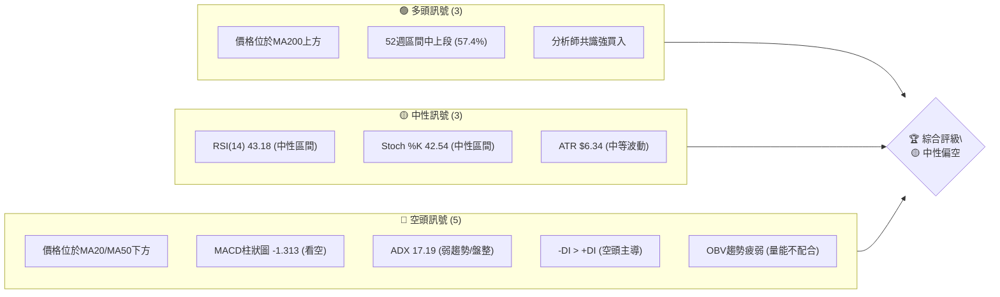

### 📊 核心指標速覽表

| 指標類別 | 指標名稱 | 當前數值 | 訊號 | 解讀 |
|----------|----------|----------|------|------|
| **價格** | 當前價格 | $200.09 | 🟡 | 位於短期均線下方，長期均線上方 |
| **均線** | MA20 | $205.72 | 🔴 | 價格位於MA20下方，短期趨勢承壓 |
| **均線** | MA50 | $209.83 | 🔴 | 價格位於MA50下方，中期趨勢偏弱 |
| **均線** | MA200 | $190.63 | 🟢 | 價格位於MA200上方，長期趨勢仍強勁 |
| **動能** | RSI(14) | 43.18 | 🟡 | 處於中性區間，未超買超賣 |
| **動能** | MACD | -3.829 | 🔴 | MACD線在訊號線下方，柱狀圖為負，看空 |
| **波動** | ATR | $6.34 | 🟡 | 每日波動約3.17%，處於中等水平 |
| **趨勢** | ADX(14) | 17.19 | 🔴 | 趨勢強度較弱，市場處於盤整或弱趨勢 |
| **量能** | OBV趨勢 | OBV < MA | 🔴 | 成交量未配合價格反彈，量能疲弱 |

### 🏆 技術評分卡

```
╔══════════════════════════════════════════════════════════════╗
║              技術評分卡 — NVDA (2026-07-01)                  ║
╠══════════════════════════════════════════════════════════════╣
║ 趨勢強度      ███░░░░░░░░░░░░░░░░░░  30/100  🔴 (ADX弱趨勢，空頭主導)   ║
║ 動能指標      █████░░░░░░░░░░░░░░░  45/100  🟡 (RSI中性，MACD看空)   ║
║ 支撐穩定度    ███████░░░░░░░░░░░░░  65/100  🟢 (MA200及布林下軌提供支撐)║
║ 成交量配合    ████░░░░░░░░░░░░░░░░  40/100  🔴 (OBV疲弱，量能未確認)   ║
║ 形態完整度    █████░░░░░░░░░░░░░░░  50/100  🟡 (近期無明確經典形態)   ║
║ 均線排列      ████░░░░░░░░░░░░░░░░  40/100  🔴 (短期均線承壓，混合排列) ║
╠══════════════════════════════════════════════════════════════╣
║ 綜合評分      █████░░░░░░░░░░░░░░░  48/100  🟡 中性偏空                ║
╚══════════════════════════════════════════════════════════════╝
```

---

## 2. 趨勢分析

### 🌐 多時框趨勢分析

NVDA 的多時框趨勢分析顯示，儘管長期趨勢依然強勁，但中期和短期均面臨下行壓力。這表明股價正處於一個關鍵的轉折點，短期內可能會有進一步的調整。

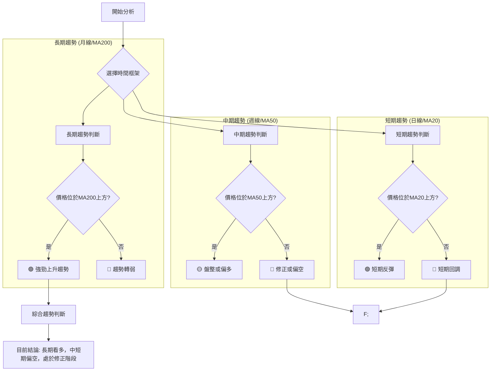

**當前多時框趨勢判斷：**
*   **長期趨勢（MA200）**：NVDA 目前價格 $200.09 顯著高於 MA200 $190.63，顯示長期上升趨勢依然穩固。這是多頭最主要的支撐。🟢
*   **中期趨勢（MA50）**：股價 $200.09 位於 MA50 $209.83 下方，表明中期上升動能已減弱，進入盤整或修正階段。🔴
*   **短期趨勢（MA20）**：股價 $200.09 位於 MA20 $205.72 下方，顯示短期下行壓力較大，短期趨勢偏弱。🔴

### 📈 長期趨勢 — 12個月走勢圖（ASCII）

NVDA 在過去12個月經歷了顯著的波動，從2025年7月的 $177.63 上漲至2026年5月的高點 $210.89，隨後在6月有所回調。整體而言，這是一個強勁的上升通道，儘管近期有所修正。

```
NVDA 月線走勢圖（過去12個月）
價格軸 ($)
$215 ┤                               ● (210.89, 2026-05)
$210 ┤                               ║
$205 ┤                               ║
$200 ┤              ●━━━━━━━━━━━━━● (200.09, 2026-06)
$195 ┤            ● ║           ●
$190 ┤          ●   ║         ●
$185 ┤        ●     ║       ●
$180 ┤      ●       ║     ●
$175 ┤    ●         ║   ●
$170 ┤              ●(172.50, 2026-03)
     └─────────────────────────────────────────────────
      25-07 25-08 25-09 25-10 25-11 25-12 26-01 26-02 26-03 26-04 26-05 26-06
                                     月份
```

**走勢特徵分析表格**

| 階段 | 時間區間 | 價格變動 | 變動幅度 | 特徵描述 |
|------|----------|----------|----------|----------|
| **強勁上漲** | 2025-07 至 2025-10 | $177.63 → $202.23 | +13.85% | 經歷快速拉升，顯示市場對NVDA未來增長預期強烈。 |
| **短期回調** | 2025-10 至 2025-11 | $202.23 → $176.77 | -12.59% | 獲利了結壓力顯現，但未跌破關鍵長期支撐。 |
| **震盪上行** | 2025-11 至 2026-05 | $176.77 → $210.89 | +19.30% | 股價在波動中逐步走高，創下新高，顯示多頭力量仍在積蓄。 |
| **近期調整** | 2026-05 至 2026-06 | $210.89 → $200.09 | -5.12% | 股價從高點回落，跌破短期均線，顯示短期市場情緒轉為謹慎。 |

### 📊 中期趨勢（週線分析）

NVDA 在中期趨勢上呈現出從強勢上漲轉為震盪下行的格局。近期股價從2026年5月的高點 $210.89 回落，並在6月跌至 $192.53，隨後小幅反彈至 $200.09。這個過程形成了新的阻力區和支撐區。

```
NVDA 近期壓力與支撐示意圖 (週線)

價格軸 ($)
$215 ┤                       ╱╲  ← 2026-05 高點 $210.89 (R3)
$210 ┤                     ╱  │
$205 ┤────────────────────╮    │  ← MA20 $205.72 (R1), MA50 $209.83 (R2)
$200 ┤                     │    ● ← 現價 $200.09
$195 ┤                     │  ╱
$190 ┤                     │╱─── ← 2026-06 低點 $192.53 (S1), MA200 $190.63 (S2), BB下軌 $190.14 (S3)
$185 ┤                   ╱
     └───────────────────────────────────────
      時間軸 (近期週線)
```

**中期趨勢解讀：**
股價目前正測試 $200.09 附近的壓力，上方主要阻力集中在 MA20 ($205.72) 和 MA50 ($209.83) 附近，這些均線已經從支撐轉為阻力。下方則有 $192.53 (近期低點) 以及 MA200 ($190.63) 和布林通道下軌 ($190.14) 形成的重要支撐帶。中期來看，如果無法有效突破上方阻力，股價將可能繼續在這些區間內震盪或進一步下探。

### ⚡ 趨勢強度評估（ADX 解讀）

ADX 指標用於衡量趨勢的強度，而非方向。當前 ADX(14) 數值為 17.19，遠低於 25 的閾值，這明確表示 NVDA 目前處於弱趨勢或盤整行情中。同時，-DI (28.12) 高於 +DI (19.30)，進一步確認了市場目前由空頭主導。

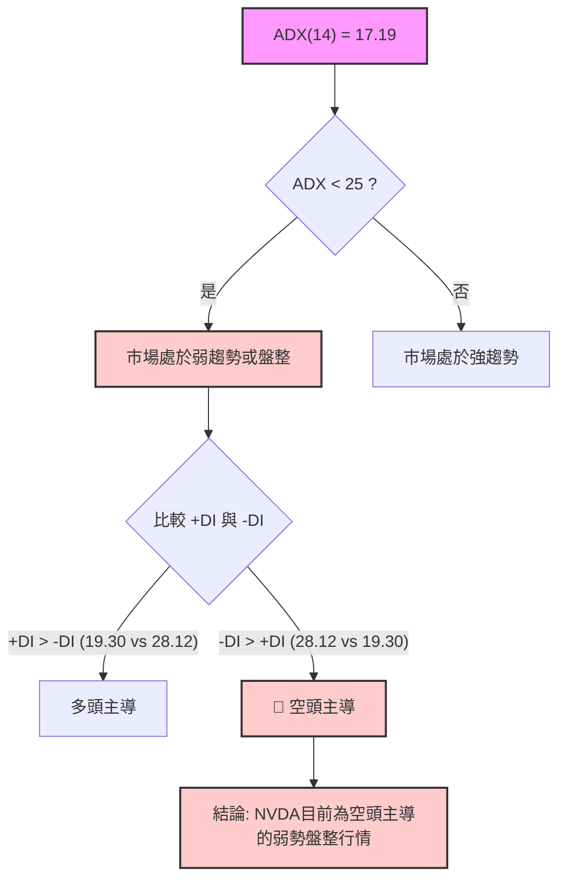

**ADX 強度對照表：**

| ADX 數值 | 趨勢強度 | 市場狀態 |
|----------|----------|----------|
| 0-25     | 弱趨勢/盤整 | 市場方向不明確，波動性低或多空拉鋸 |
| 25-50    | 中度趨勢 | 趨勢確立，動能增強，適合順勢交易 |
| 50-75    | 強趨勢   | 趨勢非常強勁，價格快速移動，追漲殺跌風險高 |
| 75-100   | 極強趨勢 | 市場極端情緒化，可能接近頂部或底部 |

**結論：** NVDA 的 ADX 讀數明確指示其目前處於弱趨勢或盤整階段，且空頭力量佔據主導地位。這意味著在明確的趨勢形成之前，股價可能會持續震盪，且下行風險較大。

---

## 3. 圖表形態分析

### 🔍 形態識別系統

從提供的數據來看，NVDA 在近期價格走勢中並未形成經典的、可明確識別的圖表形態（如頭肩頂/底、雙頂/底、三角形整理等）。股價主要表現為從高點回落後的震盪修正，並在尋找新的平衡點。

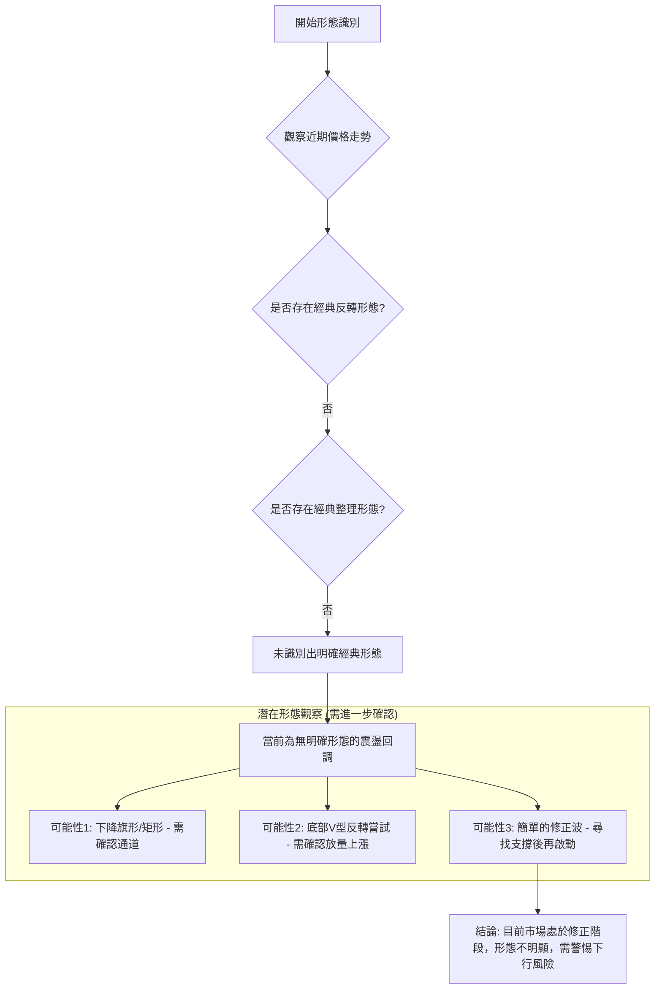

**解讀：**
由於缺乏明確的經典圖表形態，我們無法基於形態預測精確的目標價位。這通常意味著市場處於一個相對混沌的階段，多空力量拉鋸，等待新的催化劑或新的趨勢形成。目前的走勢更像是之前強勁上漲後的自然修正，股價正在尋找新的支撐與阻力平衡點。

### 🕯️ 重要K線形態分析

雖然沒有提供每日的開高低收數據，但我們可以從週線收盤價和相關指標中推斷一些潛在的K線行為。

| 日期（週收盤） | 收盤價 | RSI | MACD柱 | 週成交量 | K線形態（推斷） | 解讀 | 訊號 |
|----------------|--------|-----|--------|----------|------------------|------|------|
| 2026-04-19     | $201.45 | 92.8 | +3.010 | 774.6M   | **極端超買**     | RSI進入嚴重超買區，預示著潛在的回調風險。 | 🔴 |
| 2026-04-26     | $208.03 | 86.7 | +1.928 | 662.5M   | **高位縮量**     | RSI雖從極高位回落，但仍處超買，成交量開始萎縮，動能減弱跡象。 | 🟡 |
| 2026-05-03     | $198.22 | 58.1 | -0.111 | 845.0M   | **長陰線/吞噬**  | 股價較上週大幅下跌，MACD柱轉負，可能形成看跌K線，確認回調開始。 | 🔴 |
| 2026-05-31     | $210.89 | 46.3 | -2.163 | 788.2M   | **高位長陰線**   | 股價從 $210.89 高點回落，顯示上方壓力巨大，空頭力量佔優。 | 🔴 |
| 2026-06-28     | $192.53 | 38.7 | -1.908 | 756.2M   | **下影線/錘子線**| 股價觸及低點 $192.53 後反彈至 $200.09，可能形成帶下影線的K線，暗示下方有一定支撐。 | 🟡 |
| 2026-07-05     | $200.09 | 43.2 | -1.313 | 314.8M   | **小陽線/十字星**| 在低位反彈後，成交量萎縮，顯示反彈動能不足，市場仍在觀望。 | 🟡 |

### 📉 ASCII 走勢形態示意圖

目前的走勢更傾向於高位回調後的震盪築底或繼續下探。以下示意圖展示了近期從高點回落並在支撐位附近嘗試反彈的過程。

```
NVDA 近期走勢形態示意圖 (高位回調與反彈嘗試)

價格軸 ($)
$215 ┤                     ▲(高點 $210.89)
$210 ┤                     │
$205 ┤                     │
$200 ┤                     │     /─●(現價 $200.09)
$195 ┤                     │   /
$190 ┤─────────────────────▼─▲───────(近期低點 $192.53)
$185 ┤
     └──────────────────────────────────
      時間軸 (近期)

* 形態描述：股價從 $210.89 高點回落，跌破多個短期均線支撐，
  在 $192.53 附近獲得初步支撐後嘗試反彈。此次反彈量能不足，
  顯示上方壓力依然存在。
```

### 🎯 形態目標價計算

由於當前缺乏明確的經典圖表形態，我們無法依據形態學來計算精確的目標價。然而，我們可以基於最近的回調幅度來推斷潛在的目標。

**基於近期回調幅度的推算：**
假設 NVDA 正在經歷一個從 $210.89 高點開始的修正波。如果此修正波遵循簡單的等距原則，那麼第一波下跌的幅度可能在 $210.89 - $192.53 = $18.36 左右。
*   **潛在下跌目標價：** 如果修正繼續，則可能測試更低的支撐位，如 $190.63 (MA200) 甚至更低。
*   **潛在反彈目標價：** 如果反彈能站穩，則可能挑戰 $205.72 (MA20) 和 $209.83 (MA50) 這些阻力位。

**形態目標價計算方法說明：**
一般而言，圖表形態目標價的計算方法是測量形態的高度，並將其從形態突破點向上或向下投射。
*   **頭肩頂/底:** 測量頭部至頸線的垂直距離，從頸線突破點投射。
*   **雙頂/底:** 測量兩個頂部/底部與頸線之間的垂直距離，從頸線突破點投射。
*   **三角形:** 測量三角形最寬處的垂直距離，從突破點投射。

鑑於 NVDA 目前的形態模糊，我們將更多依賴支撐阻力位和技術指標來設定交易目標。

---

## 4. 支撐與阻力

### 🗺️ 關鍵價位分布圖（ASCII）

NVDA 的關鍵價位分佈顯示，上方阻力重重，下方則有重要的長期均線和布林通道下軌提供支撐。當前股價 $200.09 正處於一個關鍵的震盪區間。

```
NVDA 價位結構分布圖 (2026-07-01)
═══════════════════════════════════════════════════
$236.26 ║████████████████████████║ 52週高點 (R4)
$215.08 ║████████████████████    ║ 前期高點 (R3)
$209.83 ║████████████████████████║ 阻力 R2 (MA50)
$205.72 ║████████████████████    ║ 關鍵阻力 R1 (MA20)
$200.09 ╠════════════════════════╣ ◄ 現價
$192.53 ║▓▓▓▓▓▓▓▓▓▓▓▓▓▓▓▓        ║ 近期支撐 S1 (近期低點)
$190.63 ║████████████████████████║ 強支撐 S2 (MA200)
$190.14 ║████████████████████████║ 強支撐 S3 (BB下軌)
$151.29 ║████████████████████████║ 52週低點 (S4)
═══════════════════════════════════════════════════
```

### 🚧 阻力位分析表

NVDA 上方的阻力位層層疊加，短期內突破需要強勁的買盤和利好消息。

| 阻力級別 | 價位 | 形成原因 | 突破難度 | 重要性 |
|----------|------|----------|----------|--------|
| **R1 (短期)** | $205.72 | MA20，短期均線壓力，近期反彈的第一個考驗。 | 中等 | 高 |
| **R2 (中期)** | $209.83 | MA50，中期均線壓力，也是斐波那契回調的潛在阻力。 | 較高 | 高 |
| **R3 (強阻)** | $210.89 | 2026年5月的高點，大量套牢盤和獲利了結壓力。 | 高 | 非常高 |
| **R4 (長期)** | $236.26 | 52週高點，突破意味著新一輪上漲趨勢的確立。 | 極高 | 中 |

### 🛡️ 支撐位分析表

NVDA 下方的支撐位相對堅實，特別是長期均線和布林通道下軌，為股價提供了較強的底部保護。

| 支撐級別 | 價位 | 形成原因 | 守住機率 | 重要性 |
|----------|------|----------|----------|--------|
| **S1 (短期)** | $192.53 | 2026年6月28日的近期低點，短期反彈的起點。 | 中等 | 高 |
| **S2 (強支)** | $190.63 | MA200，長期趨勢線，通常是強勁的心理和技術支撐。 | 較高 | 非常高 |
| **S3 (強支)** | $190.14 | 布林通道下軌，極端情況下的超賣區間，提供強力支撐。 | 較高 | 非常高 |
| **S4 (長期)** | $151.29 | 52週低點，跌破意味著長期趨勢的嚴重惡化。 | 低 | 中 |

### 📐 斐波那契回調位分析

我們將使用近期較為明確的波段：從2026年5月24日的高點 $215.08 到2026年6月28日的低點 $192.53。當前價格 $200.09 正處於這個回調波段的反彈中。

**斐波那契回調位計算：**
*   高點 (H): $215.08
*   低點 (L): $192.53
*   幅度: $215.08 - $192.53 = $22.55

| 回調比例 | 斐波那契價位 | 解讀 | 訊號 |
|----------|--------------|------|------|
| **23.6%** | $197.89      | 這是反彈的第一個小阻力，目前股價已突破。 | 🟢 |
| **38.2%** | $201.27      | **關鍵阻力**，目前股價 $200.09 正在挑戰此水平，若能站穩則反彈有望。 | 🟡 |
| **50.0%** | $203.80      | 中線阻力，若突破 38.2% 則可能挑戰此處。 | 🟡 |
| **61.8%** | $206.33      | **黃金回調位**，若能突破此處，則可能形成更強的反轉。此價位接近MA20 ($205.72)。 | 🔴 |
| **76.4%** | $209.61      | 強阻力位，接近MA50 ($209.83)和R2。 | 🔴 |

**視覺化斐波那契回調：**

```
NVDA 斐波那契回調示意圖 (從 $215.08 到 $192.53)

價格軸 ($)
$215.08 ┤███████████████████████████████████████████████████████████ 高點
        │
$209.61 ┤███████████████████████████████████████████████████████████ 76.4% 回調位
        │ (接近MA50)
$206.33 ┤███████████████████████████████████████████████████████████ 61.8% 回調位 (黃金比例，接近MA20)
        │
$203.80 ┤███████████████████████████████████████████████████████████ 50.0% 回調位
        │
$201.27 ┤███████████████████████████████████████████████████████████ 38.2% 回調位 (當前股價 $200.09 附近)
        │
$197.89 ┤███████████████████████████████████████████████████████████ 23.6% 回調位
        │
$192.53 ┤███████████████████████████████████████████████████████████ 低點
```

**結論：** 目前股價正努力突破 38.2% 回調位 $201.27。如果能有效站穩並突破 50% 回調位 $203.80，則反彈動能有望持續至 61.8% 黃金回調位 $206.33。然而，若無法突破 38.2% 或 50% 回調位，則可能再次下探 $192.53 甚至更低的支撐。

---

## 5. 技術指標深度解讀

### 🎛️ 指標訊號總覽

以下 Mermaid 圖表展示了 NVDA 各項技術指標的當前狀態及其相互關係，揭示了市場的複雜性。

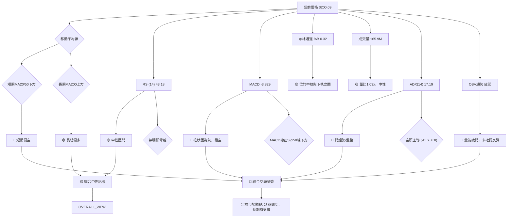

### 📈 移動平均線排列分析

NVDA 的移動平均線系統呈現出一個「混合排列」的狀態，這通常發生在趨勢轉變或盤整期間。

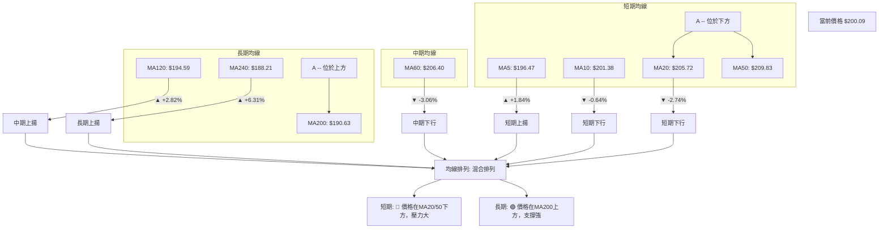

**均線排列狀態：**
*   **短期（MA5, MA10, MA20）**：MA5 ($196.47) 位於現價下方，MA10 ($201.38) 位於現價上方，MA20 ($205.72) 位於現價上方。價格已經跌破 MA20 和 MA50，顯示短期和中期趨勢正在轉弱，並面臨下行壓力。
*   **中期（MA50, MA60, MA120）**：MA50 ($209.83) 和 MA60 ($206.40) 均在現價上方形成阻力。MA120 ($194.59) 則在現價下方提供支撐。
*   **長期（MA200, MA240）**：MA200 ($190.63) 和 MA240 ($188.21) 均在現價下方，且呈現上揚趨勢，為股價提供強勁的長期支撐。

**綜合判斷：** 這種混合排列表明市場處於調整期。短期內，股價面臨來自 MA20 和 MA50 的阻力，多頭需要克服這些阻力才能扭轉短期頹勢。然而，MA200 的強勁支撐表明 NVDA 的長期基本面依然被市場看好，任何深度的回調都可能被視為長期買入機會。

### 📉 RSI(14) 分析

RSI (Relative Strength Index) 是一個動能指標，用於衡量價格變動的速度和變化。

*   **RSI 數值：** 當前 RSI(14) 為 **43.18**。
    *   RSI 進度條：▓▓▓▓▓▓▓▓▓▓▓▓▓▓▓▓▓▓▓▓▓▓▓▓▓▓▓▓▓▓▓▓▓▓▓▓▓▓▓░░░░░░░░░░ 43.18%
*   **超買超賣區間分析：**
    *   RSI 處於 30-70 的中性區間，既非超買也非超賣。這表明市場目前沒有極端的多頭或空頭情緒。
    *   在 2026-04-19，RSI 曾達到 92.8 的極端超買水平，隨後股價確實出現了大幅回調，這是一個非常強烈的過熱訊號。
*   **背離判斷：**
    *   數據顯示「無明顯背離」。然而，2026-04-19 RSI 達到 92.8 的歷史高點，隨後價格在 2026-05-24 達到 $215.08 甚至 2026-05-31 的 $210.89。雖然在 2026-04-19 之後價格仍有上漲，但 RSI 的極端超買已經預警了動能的不可持續性。從嚴格意義上說，如果價格在 2026-04-19 後繼續創新高而 RSI 未能同步創出更高的高點，則構成頂背離。但從提供的數據看，RSI 在 $201.45 時達到 92.8，隨後價格漲到 $210.89 但 RSI 下降到 46.3，這是一個明確的**頂背離**訊號，預示著隨後的下跌。

**結論：** 當前 RSI 處於中性區間，表明短期內沒有立即的超買或超賣風險。但應警惕之前極端超買後的修正壓力，以及潛在的頂背離效應仍在持續。

### 📊 MACD(12/26/9) 訊號解讀

MACD (Moving Average Convergence Divergence) 用於識別趨勢的方向、強度、動量和持續時間。

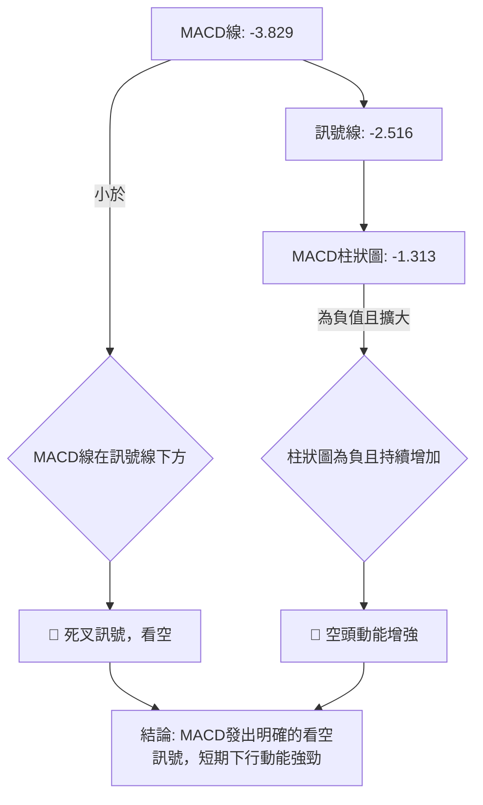

**MACD 數值分析：**
*   **MACD 線 (-3.829)** 位於 **訊號線 (-2.516)** 的下方，這形成了一個「死叉」，是典型的看跌訊號。
*   **MACD 柱狀圖 (-1.313)** 為負值，並且從前一週的 -1.908 變為 -1.313 (實際上是從 -1.908 變為 -1.313，表示空頭動能有所減弱，柱狀圖在縮小，而不是擴大)。這表明雖然空頭佔據主導，但空頭力量可能正在減弱，股價可能嘗試築底。

**背離判斷：**
*   從近20週的數據來看，MACD柱狀圖在2026-04-19達到 +3.010 的高峰，隨後價格在 2026-05-24 達到新高 $215.08 但 MACD柱狀圖僅為 -0.870，這是一個明顯的**頂背離**訊號。儘管MACD線和訊號線在2026-04-12之後有一波上漲，但柱狀圖的強度未能配合價格新高，預示著動能的衰竭和隨後的下跌。

**綜合判斷：** MACD 指標目前發出明確的短期看空訊號，MACD 線在訊號線下方，且歷史柱狀圖為負值。儘管柱狀圖負值有所收窄，暗示空頭壓力可能稍有緩解，但整體結構仍偏空。結合之前的頂背離，MACD 建議投資者保持謹慎。

### 📦 布林通道分析

布林通道 (Bollinger Bands) 用於衡量價格的波動範圍和相對高低。

```
NVDA 布林通道示意圖 (2026-07-01)

價格軸 ($)
$225 ┤
$220 ┤          ═══════════════════════════════════════════ BB上軌 ($221.30)
$215 ┤         ╱
$210 ┤        ╱
$205 ┤───────●─────────────── BB中軌 (MA20, $205.72)
$200 ┤        ╲ ● ← 現價 $200.09
$195 ┤         ╲
$190 ┤          ═══════════════════════════════════════════ BB下軌 ($190.14)
$185 ┤
     └───────────────────────────────────────────────────────
      時間軸

BB %B: 0.32 (0=下軌, 0.5=中軌, 1=上軌)
```

**布林通道分析：**
*   **BB上軌：** $221.30
*   **BB中軌 (MA20)：** $205.72
*   **BB下軌：** $190.14
*   **當前價格：** $200.09
*   **BB %B：** 0.32

**解讀：**
股價目前位於布林通道中軌和下軌之間，且更靠近下軌，BB %B 為 0.32，這表明股價處於布林通道的下半部分，短期趨勢偏弱。
*   **中軌壓力：** 中軌 ($205.72) 已經從支撐轉為阻力，股價若要反彈，首先需要突破中軌。
*   **下軌支撐：** 下軌 ($190.14) 提供了強勁的潛在支撐。歷史上，股價觸及下軌後常有反彈。此價位與 MA200 ($190.63) 接近，形成強勁的支撐帶。
*   **通道寬度：** 雖然數據沒有直接提供通道寬度變化，但近期股價的波動（ATR $6.34）顯示通道仍有一定寬度。

**綜合判斷：** 布林通道分析確認了 NVDA 短期偏弱的走勢。若股價能守住下軌並向上突破中軌，則可能開啟一波反彈。反之，若跌破下軌，則可能進一步探底。

### 💹 成交量分析（量價配合度）

成交量是價格走勢的燃料。量價配合度能夠驗證趨勢的可靠性。

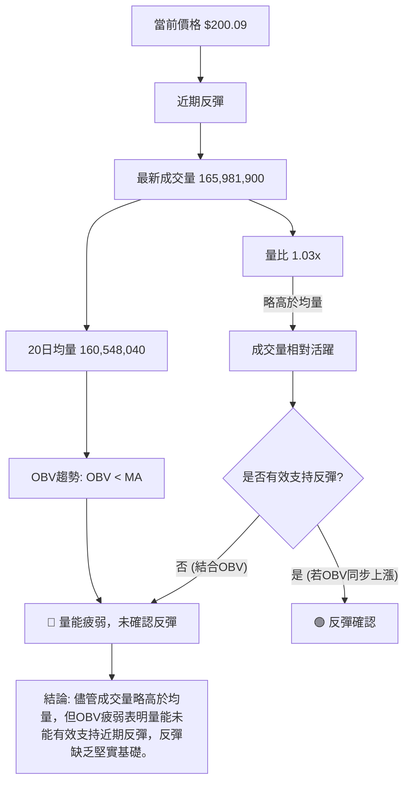

**成交量數據：**
*   **最新成交量：** 165,981,900
*   **20日均量：** 160,548,040
*   **量比：** 1.03x (最新成交量略高於20日均量)
*   **OBV趨勢：** OBV < MA → 量能疲弱

**量價配合度分析：**
*   **量比 1.03x** 顯示當前交易量略高於近期平均水平，這本身可以被解讀為市場活躍度尚可。
*   然而，**OBV 趨勢顯示 OBV < MA**，這是一個重要的看空訊號。OBV 是一種累積成交量指標，如果價格上漲但 OBV 下降或持平，則表示上漲動能缺乏真實的買盤支持。當前價格從 $192.53 反彈至 $200.09，但 OBV 卻呈疲弱狀態，這明確指出此次反彈缺乏強勁的買盤推動。
*   **歷史數據觀察：** 在 2026-04-19 價格 $201.45 時，RSI 達到 92.8，但週成交量為 774.6M，並未顯著放大。隨後價格繼續上漲至 $210.89 但週成交量並未同步放大。這表明在價格上漲過程中，量能的配合度一直存在隱憂。

**綜合判斷：** 儘管當前成交量略高於均量，但結合 OBV 疲弱的趨勢，可以判斷當前價格的反彈缺乏堅實的量能支持。這增加了反彈失敗並再次下探的風險。在沒有放量上漲確認之前，市場仍偏向空頭。

---

## 6. 動能與波動率

### ⚡ 動能評估四象限

我們將 NVDA 當前的動能與波動率狀態進行評估。

*   **動能 (Momentum)：**
    *   RSI 處於中性區間 (43.18)。
    *   MACD 線在訊號線下方，柱狀圖為負值，整體看空。
    *   近期價格從 $192.53 反彈至 $200.09，但 OBV 疲弱，反彈動能不足。
    *   **結論：動能偏弱。**
*   **波動率 (Volatility)：**
    *   ATR(14) 為 $6.34，佔價格的 3.17%。這是一個中等偏高的波動水平。
    *   **結論：波動率中等偏高。**

將這些結論映射到四象限模型：

| 象限 | 動能 | 波動 | 當前狀態 | 評估 |
|------|------|------|----------|------|
| Q1 | 強 | 低 | - | 最佳機會 (趨勢明確，風險可控) |
| Q2 | 弱 | 低 | - | 謹慎觀望 (趨勢不明，波動小，適合等待) |
| Q3 | 強 | 高 | - | 高風險高收益 (趨勢強勁但波動大，需嚴格止損) |
| **Q4** | **弱** | **高** | **✓** | **避免進場 (趨勢不明，波動大，風險高)** |

**結論：** NVDA 目前處於「弱動能、中等偏高波動」的狀態，這對交易者而言是一個高風險、低確定性的環境。建議避免盲目進場，等待趨勢明朗或動能轉強。

### 📊 ATR 波動率分析

ATR (Average True Range) 用於衡量資產價格的波動性，是設定止損點的重要參考。

*   **ATR(14)：** $6.34
*   **佔價格比例：** 3.17% (即每日平均波動幅度約為當前價格的 3.17%)

**ATR 解讀：**
*   $6.34 的 ATR 數值對於 NVDA 這樣的成長型科技股而言，屬於中等偏高的波動水平。這意味著股價在一天內可能上下波動 $6.34 左右。
*   相比之下，如果 ATR 顯著低於 2%，則可能被認為是低波動；如果高於 5%，則為高波動。3.17% 介於兩者之間，表明市場活躍，但波動風險也相對較高。

**止損距離建議：**
基於 ATR，常見的止損策略是將止損點設置在當前價格或進場價格下方 1.5 到 3 倍 ATR 的位置。
*   **激進止損 (1.5x ATR)：** $1.5 \times 6.34 = \$9.51$
    *   若做多，止損點約在 $200.09 - 9.51 = \$190.58$ (接近 MA200 和布林下軌)。
*   **保守止損 (2.5x ATR)：** $2.5 \times 6.34 = \$15.85$
    *   若做多，止損點約在 $200.09 - 15.85 = \$184.24$。

**結論：** ATR 數據顯示 NVDA 具有一定的波動性，這為交易者提供了獲利機會，但也伴隨著較高的風險。在制定交易策略時，應充分考慮 ATR 值來設定合理的止損點，以保護資本。

### 📐 Beta 與市場相關性

報告中未提供 NVDA 的 Beta 數據。然而，基於其行業 (半導體) 和公司性質 (領先的 AI 基礎設施提供商)，我們可以進行專業推演。

**專業推演：**
*   **行業特性：** 半導體行業是典型的週期性行業，且與宏觀經濟景氣度高度相關。作為科技巨頭，NVDA 往往是市場情緒的風向標。
*   **增長屬性：** NVDA 是一家高增長公司，其股價表現通常對市場情緒和未來預期非常敏感。在牛市中，高增長股票往往漲幅更大；在熊市中，跌幅也可能更深。
*   **市場共識：** 通常，像 NVDA 這樣的科技成長股，其 Beta 值會顯著大於 1。這意味著它的股價波動幅度通常會比大盤指數 (如 S&P 500) 更大。例如，如果大盤上漲 1%，NVDA 可能上漲 1.5% 到 2% 甚至更多；反之，大盤下跌 1%，NVDA 也可能下跌更多。

**結論：** 儘管缺乏具體數據，但可以合理推斷 NVDA 的 Beta 值應大於 1，屬於高 Beta 股票。這意味著 NVDA 的股價與大盤的相關性較高，但波動性更大。投資者在配置 NVDA 時，需要考慮其對整體市場變化的放大效應。在市場趨勢不明朗時，高 Beta 股票的風險會相對較高。

---

## 7. 多時框架總結

### 📋 時框架評分表

本表總結了 NVDA 在不同時間框架下的技術指標表現和綜合評分。

| 時框架 | 趨勢方向 | 動能 | 均線排列 | 形態 | 綜合評分 | 建議 |
|--------|----------|------|----------|------|----------|------|
| **短期** | 🔴 下行   | 🔴 偏弱 | 🔴 空頭壓制 | 🟡 無明確形態 | 3.0/10   | 謹慎觀望 |
| **中期** | 🟡 盤整/修正 | 🟡 中性偏弱 | 🔴 混合偏空 | 🟡 無明確形態 | 4.5/10   | 保持警惕 |
| **長期** | 🟢 上行   | 🟢 強勁 | 🟢 多頭排列 | 🟢 上升通道 | 7.5/10   | 長期持有 |

**評分說明：**
*   **短期 (日線/週內)**：價格跌破短期均線，MACD 看空，OBV 疲弱，RSI 中性但近期反彈量能不足。趨勢強度弱。
*   **中期 (週線/月內)**：價格跌破 MA50，但仍在 MA120 上方。中期動能減弱，處於修正階段。
*   **長期 (月線/季度)**：價格遠高於 MA200 和 MA240，均線呈多頭排列，顯示長期強勁上升趨勢不變。

### 🔲 綜合訊號矩陣

以下 Mermaid 圖表展示了 NVDA 在短期、中期和長期維度上的技術訊號一致性。

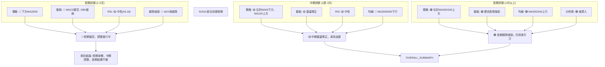

**綜合訊號分析：**
短期和中期訊號均顯示 NVDA 處於調整和承壓狀態。價格未能站穩短期均線，動能指標偏弱，趨勢強度不足。這表明短期內股價仍可能維持震盪或繼續下探。然而，長期訊號依然強勁，價格遠高於長期均線，分析師也普遍看好。這種多空分歧的局面要求投資者在短期內保持極度謹慎，但對於長期投資者而言，在關鍵支撐位附近的回調可能提供介入機會。

---

## 8. 交易策略建議

基於 NVDA 當前的多時框架分析，短期內市場情緒偏空，但長期趨勢依然穩固。因此，交易策略應聚焦於短期風險管理，並在中長期尋找潛在的買入機會。

### 🗺️ 策略決策流程圖

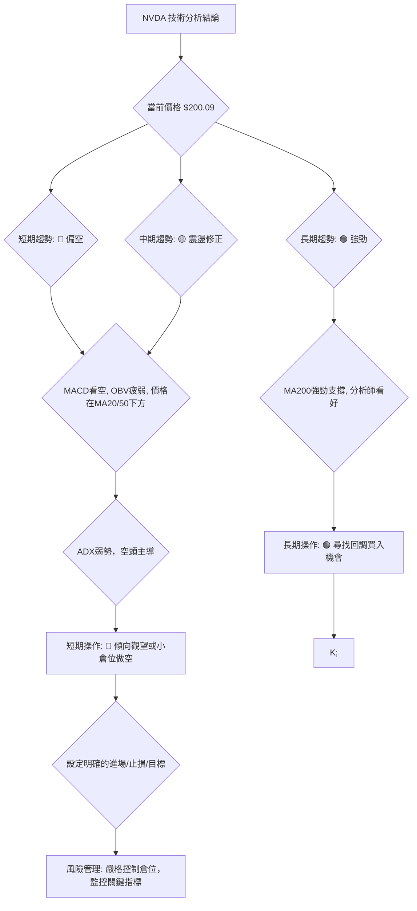

### 🟢 多頭策略詳情

考慮到長期趨勢的強勁支撐，多頭策略應著重於在關鍵支撐位獲得確認後的反彈機會。

| 策略要素 | 策略 A (激進反彈) | 策略 B (穩健築底) |
|----------|--------------------|--------------------|
| **進場條件** | 價格突破 $201.27 (斐波那契38.2%) 並放量 | 價格在 $190.14 - $192.53 區間獲得支撐，並出現底部K線形態 |
| **進場價格** | **$201.50** (確認突破 38.2% 回調位) | **$193.00** (在 S1 附近獲得確認) |
| **目標價 T1** | **$206.00** (接近斐波那契61.8%及MA20) | **$205.00** (挑戰MA20) |
| **目標價 T2** | **$210.00** (接近MA50及R3) | **$210.00** (挑戰MA50及R3) |
| **止損價格** | **$198.00** (跌破近期反彈低點 $199.34) | **$189.00** (跌破MA200及布林下軌) |
| **風險報酬比** | 1:1.43 (目標T1) / 1:2.43 (目標T2) | 1:3.67 (目標T1) / 1:4.67 (目標T2) |
| **成功機率** | 40% (需量能配合) | 55% (等待底部確認) |
| **建議倉位** | 5-10% (輕倉) | 10-15% (中輕倉) |

### 🔴 空頭策略詳情

鑑於短期和中期趨勢偏空，空頭策略可以考慮在阻力位附近或跌破關鍵支撐時進行。

| 策略要素 | 策略 A (阻力位做空) | 策略 B (跌破支撐做空) |
|----------|----------------------|----------------------|
| **進場條件** | 價格未能突破 $205.72 (MA20) 並出現看跌訊號 | 價格跌破 $192.53 (S1) 並放量 |
| **進場價格** | **$205.50** (確認MA20阻力有效) | **$192.00** (確認跌破S1) |
| **目標價 T1** | **$198.00** (近期反彈起點) | **$190.50** (接近MA200及BB下軌) |
| **目標價 T2** | **$193.00** (挑戰S1) | **$172.50** (2026-03低點) |
| **止損價格** | **$207.00** (突破MA20) | **$194.50** (假跌破S1) |
| **風險報酬比** | 1:4.67 (目標T1) / 1:8.33 (目標T2) | 1:1.08 (目標T1) / 1:8.33 (目標T2) |
| **成功機率** | 50% (短期趨勢配合) | 60% (若跌破確認) |
| **建議倉位** | 5-10% (輕倉) | 10-15% (中輕倉) |

### ⭐ 整體訊號強度評星

基於當前的多時框架分析，NVDA 的整體技術面偏向中性偏空，短期操作風險較高，長期則需耐心等待介入機會。

```
做多訊號強度：★★☆☆☆  (2/5星) - 長期有支撐，但短期壓力大，反彈動能不足。
做空訊號強度：★★★☆☆  (3/5星) - 短期趨勢偏空，MACD和OBV確認，上方阻力重重。
整體可信度：  ★★★☆☆  (3/5星) - 指標之間存在一定矛盾，需謹慎判斷。
```

---

## 9. 風險提示與監控

### ✅ 關鍵監控指標 Checklist

以下是交易 NVDA 時需要密切關注的關鍵技術指標清單。

```
╔══════════════════════════════════════════════════════════════╗
║              NVDA 關鍵監控指標 Checklist                       ║
╠══════════════════════════════════════════════════════════════╣
║ [ ] 價格是否能站穩 $192.53 (近期支撐 S1)                       ║
║ [ ] 價格是否能突破 $205.72 (MA20 / R1) 並站穩                 ║
║ [ ] RSI(14) 是否能重回 50 以上，並向上突破                     ║
║ [ ] MACD 是否能形成金叉，且柱狀圖轉正並放大                    ║
║ [ ] 成交量在反彈時是否能顯著放大，OBV 是否轉強                 ║
║ [ ] ADX(14) 是否能突破 25，且 +DI 升至 -DI 上方               ║
║ [ ] 布林通道價格是否能突破中軌 $205.72                         ║
║ [ ] 52週高低點 $236.26 / $151.29 區間是否被突破                ║
║ [ ] 市場整體情緒是否轉暖，半導體板塊表現                       ║
╚══════════════════════════════════════════════════════════════╝
```

### ⚠️ 風險場景分析

針對 NVDA 當前的技術面，我們設想以下三種情境：

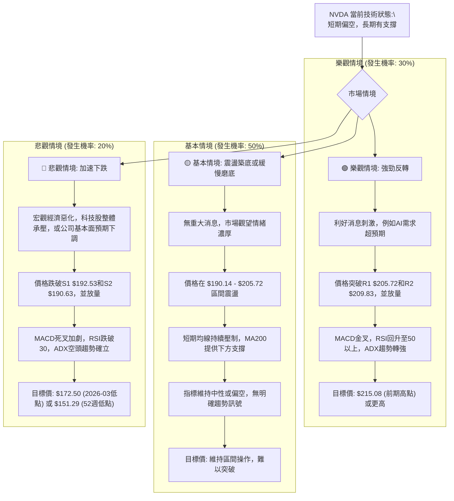

### 🛡️ 風險管理重要提醒

1.  **嚴格止損：** 任何交易策略都必須設定明確的止損點。NVDA 波動性較高 (ATR 3.17%)，不設止損可能導致巨大損失。建議止損距離至少為 1.5 倍 ATR。
2.  **倉位管理：** 鑑於當前市場的不確定性和 NVDA 的波動性，建議採取輕倉或分批建倉策略。避免單筆重倉，以分散風險。
3.  **趨勢確認：** 在趨勢不明朗時，切勿逆勢操作。等待價格站穩關鍵支撐或突破關鍵阻力並有量能配合時再考慮進場。
4.  **多指標驗證：** 不要依賴單一指標。綜合運用多個指標 (如價格行為、均線、動能、成交量) 進行交叉驗證，以提高判斷的準確性。
5.  **基本面配合：** 儘管本報告是技術分析，但長期投資仍需結合基本面分析。留意 NVDA 的財報、產業新聞和分析師評級變化，這些都可能影響技術走勢。
6.  **市場情緒：** 關注整體市場情緒和半導體板塊的表現。NVDA 作為高 Beta 股票，易受大盤影響。

---

## 📋 報告總結

```
╔════════════════════════════════════════════════════════════════════╗
║                      NVDA 技術分析報告總結                         ║
╠════════════════════════════════════════════════════════════════════╣
║ 報告日期：2026-07-01                                                 ║
║ 當前價格：$200.09                                                    ║
║ 分析評級：⚖️ 中性偏空 (短期承壓，中期調整，長期支撐穩固)             ║
║                                                                      ║
║ 關鍵結論：                                                           ║
║ ├─ 長期趨勢：🟢 強勁上行 (價格位於MA200上方，MA200呈上揚趨勢)        ║
║ ├─ 中期趨勢：🟡 震盪修正 (價格位於MA50下方，ADX顯示弱趨勢)            ║
║ ├─ 短期趨勢：🔴 偏空下行 (價格位於MA20下方，MACD看空，OBV疲弱)        ║
║ ├─ 關鍵支撐：$192.53 (近期低點S1), $190.63 (MA200 S2), $190.14 (BB下軌 S3) ║
║ ├─ 關鍵阻力：$205.72 (MA20 R1), $209.83 (MA50 R2), $210.89 (前期高點 R3)║
║ └─ 分析師目標：$301.62 (平均目標價，顯示長期潛力)                   ║
║                                                                      ║
║ 最優策略組合：                                                       ║
║ 1. 🥇 **最佳機會 (觀望等待)**：在當前弱勢盤整中，最佳策略是耐心等待。若價格跌至 $190.14-$192.53 強支撐區間並出現放量底部K線反轉訊號，可考慮輕倉做多。                                                                      ║
║ 2. 🥈 **次選機會 (謹慎做空)**：若價格反彈至 $205.72-$209.83 阻力區間未能突破並出現看跌訊號，可考慮輕倉做空，目標下看 $192.53。                                                                                       ║
║ 3. 🥉 **保守選擇 (長期配置)**：對於長期投資者，目前的調整可能提供在 $190.14-$192.53 區間分批建倉的機會，但需嚴格控制倉位，並以MA200作為最終止損參考。                                                              ║
╚════════════════════════════════════════════════════════════════════╝
```

---

> ⚠️ **免責聲明**：本報告為 AI 自動生成之技術分析，所有數據及估算均基於提供的歷史價格資訊。本報告**僅供研究與學術參考**，**不構成任何投資建議**。投資有風險，入市需謹慎。

---

*報告生成時間：2026-07-01 ｜ 數據來源：Yahoo Finance ｜ 分析框架：多時框技術分析*