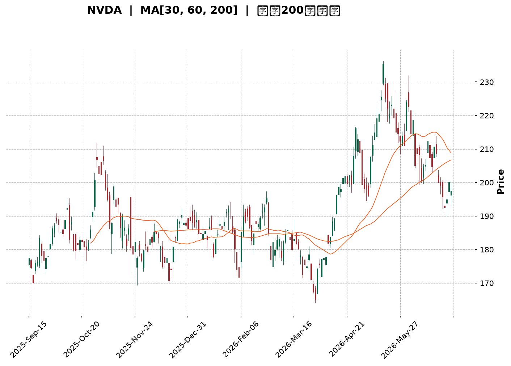
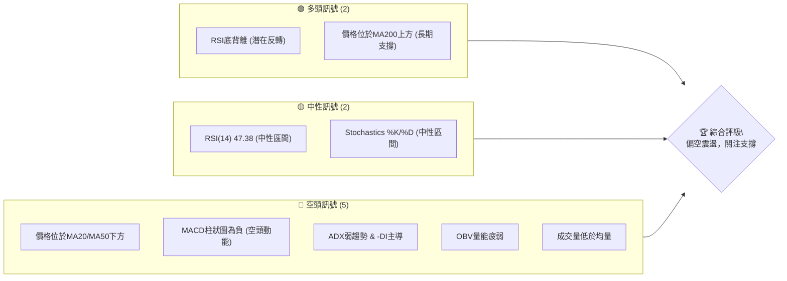
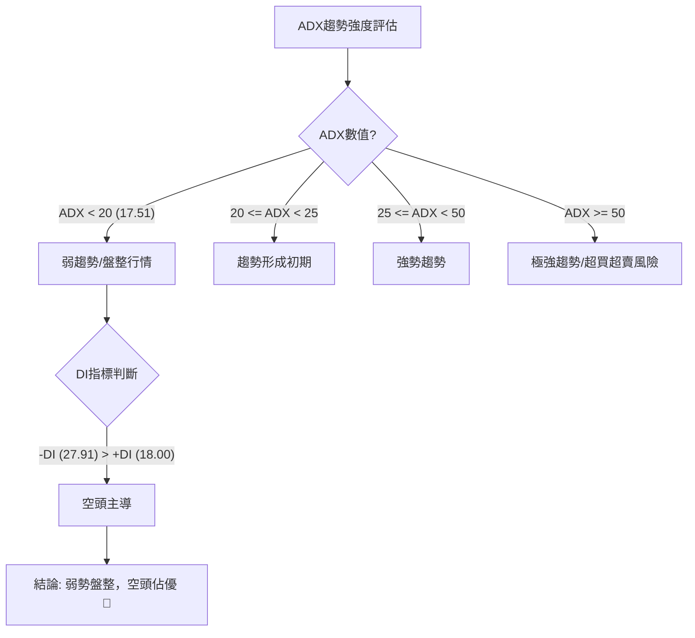
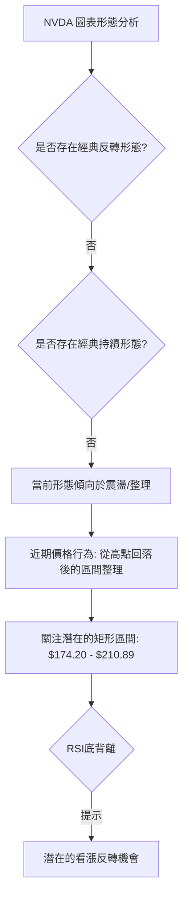
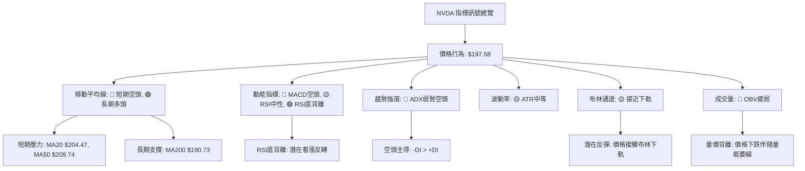
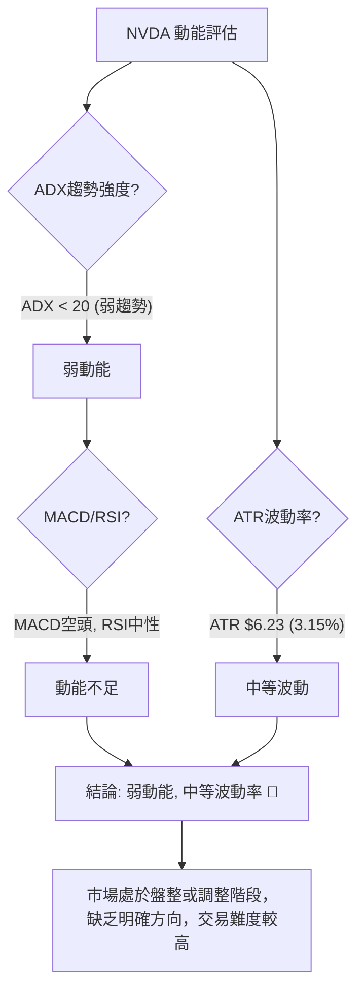

<details>
<summary>📊 靜態圖表 (點擊展開)</summary>

</details>

<html>
<head><meta charset="utf-8" /></head>
<body>
    <div style="height:500px; width:100%;">                        <script>window.PlotlyConfig = {MathJaxConfig: 'local'};</script>
        <script charset="utf-8" src="https://cdn.plot.ly/plotly-3.6.0.min.js" integrity="sha256-QaOVwtVY0T02VaHrr6pnoHLCwayMJp4O5n4YyaE3rJk=" crossorigin="anonymous"></script>                <div id="candlestick-chart" class="plotly-graph-div" style="height:100%; width:100%;"></div>            <script>                window.PLOTLYENV=window.PLOTLYENV || {};                                if (document.getElementById("candlestick-chart")) {                    Plotly.newPlot(                        "candlestick-chart",                        [{"close":{"dtype":"f8","bdata":"AAAAIMEwZkAAAAAgCNVlQAAAAKBWQmVAAAAAIH8AZkAAAAAAPQ5mQAAAAEAJ7GZAAAAAoHxGZkAAAACA0xdmQAAAAGDWLmZAAAAAINE+ZkAAAACgybNmQAAAAGD0SmdAAAAAYAxgZ0AAAADgx5RnQAAAACAxbGdAAAAAoLcpZ0AAAADAvBlnQAAAAMDPm2dAAAAAAGQKaEAAAACAp91mQAAAAICQgmdAAAAAIJ95ZkAAAADgOnNmQAAAAECCsmZAAAAAYJLfZkAAAAAACc1mQAAAAGC8nWZAAAAAgJyBZkAAAADgsb1mQAAAAEC6QGdAAAAAAODnZ0AAAAAAxBhpQAAAAEDX2GlAAAAAwDVUaUAAAAAgbUdpQAAAAEC602lAAAAAIPvNaEAAAABgw15oQAAAAODkemdAAAAAQCF9Z0AAAACgfNloQAAAACA\u002fHWhAAAAAQLMxaEAAAABA51NnQAAAACCwvWdAAAAAIJhLZ0AAAADAIKRmQAAAAIAJSWdAAAAA4B2NZkAAAABg3lRmQAAAAMAoymZAAAAAAP4yZkAAAADA+IBmQAAAAADJGGZAAAAAIBt2ZkAAAADgUqdmQAAAAGCPa2ZAAAAA4ALlZkAAAABgAsZmQAAAAABeKmdAAAAAYNQXZ0AAAADAy\u002fFmQAAAAOC0lmZAAAAAQNHZZUAAAABAaAJmQAAAAKAcMGZAAAAAgGpXZUAAAAAAsb1lQAAAAACgmGZAAAAAYOvuZkAAAABAWJ9nQAAAAOAqjGdAAAAAYIjJZ0AAAADgs39nQAAAACD4aWdAAAAAwLpIZ0AAAACg1pNnQAAAAMCBfGdAAAAAoGFgZ0AAAADgJZxnQAAAAAARGmdAAAAAQFAUZ0AAAADg3hZnQAAAAECtMmdAAAAAQFfdZkAAAADgTlpnQAAAAKAZQGdAAAAAgEw7ZkAAAAAgGONmQAAAAKCsE2dAAAAAwB9uZ0AAAABgxUdnQAAAAIBKiWdAAAAAgCzpZ0AAAADA0AhoQAAAAKC13GdAAAAAwEgsZ0AAAACA2YNmQAAAAEBKv2VAAAAAwHV1ZUAAAACA5CVnQAAAACDfuWdAAAAAIO6JZ0AAAAAgMbpnQAAAAADLVmdAAAAAIMvSZkAAAABg1BdnQAAAACAIeGdAAAAAoHl1Z0AAAABA17JnQAAAAAAi6mdAAAAAwK4TaEAAAADgS2poQAAAAMBFFWdAAAAAQCwfZkAAAAAgP8hmQAAAAMCUemZAAAAAACXaZkAAAACAu+NmQAAAAABPM2ZAAAAAAK7NZkAAAADgbxFnQAAAAKAHOmdAAAAAYKjdZkAAAAAASYFmQAAAAAA34GZAAAAAgPu2ZkAAAABgFIZmQAAAAKBES2ZAAAAAYPePZUAAAADg7+1lQAAAAIDf32VAAAAAgBpPZkAAAAAgTWFlQAAAAEBm6mRAAAAAgEmfZEAAAACgTcZlQAAAAAB08WVAAAAAIN8lZkAAAADA3C1mQAAAAMCQPGZAAAAAAMe7ZkAAAADgRPZmQAAAACAijWdAAAAAIN6iZ0AAAADg\u002f4hoQAAAAIBu1GhAAAAAoM\u002fDaEAAAAAgPy5pQAAAAIBkOmlAAAAA4Lb0aEAAAADgdEhpQAAAAAAL7WhAAAAAoOEAakAAAABgcwtrQAAAAMB\u002fnWpAAAAAgDQgakAAAABAzupoQAAAAOABx2hAAAAAQPfHaEAAAAAArohoQAAAAGDR8mlAAAAAAB9oakAAAAAgYt5qQAAAAMDnZWtAAAAAQLyQa0AAAADAJTJsQAAAAADmbm1AAAAAwNghbEAAAABg9cFrQAAAAEBNi2tAAAAAILfma0AAAACAJGhrQAAAAOCJ4mpAAAAAIITTakAAAADAR4tqQAAAAMAEwGpAAAAAYJ1cakAAAACAKQNsQAAAAIDw0WtAAAAAAADQakAAAADAHlVrQAAAAEAzo2lAAAAA4HoUakAAAACAFAZqQAAAAKBwDWlAAAAAANebaUAAAACAFKZpQAAAAGBmjmpAAAAAwB7taUAAAADAzJRpQAAAAIAUVmpAAAAAwMwUakAAAACgRwFpQAAAAAAA4GhAAAAAIK53aEAAAADA9RBoQAAAAEAKX2hAAAAAQOECaUAAAABgj7JoQA=="},"high":{"dtype":"f8","bdata":"9gxn5ehTZkBlpgrJwyhmQJJcOgJXn2VACJS1RvsbZkAC6TgJTTtmQOhACvETCmdAF8x\u002fHQHGZkAMVzWtoXFmQLDF4u74gGZAyfJUA1BxZkA4\u002fYfwf\u002fhmQFlnADeQY2dA6Sjqu898Z0C8lgwW0NlnQEm5O6jCw2dApbOmfbpfZ0C4vzetNppnQGvIAsN4q2dAlSMVo6NhaED7aU673WtoQJfiknLFu2dAxi6FORESZ0B68ozoTRRnQGTC9yh94WZACcY4MbL7ZkBTvTrJ2R5nQLR4xz3U0WZAd7NdRprmZkDH+OLLf9lmQAgaov9lZ2dA0sWrjSz4Z0DHe7nghFxpQPITB2NufWpAkyXGgLe8aUAXn9cQkPZpQFJk\u002fvVDYmpAsuLqxrl2aUDr1AAsK1VpQG8GvPTIq2hA6A\u002fMOZCCZ0A2L5c27vVoQAZwvWp5ZWhAki+rsH50aEDgMznVRuZnQMw6+5uI2GdA1Grn1EuYZ0B3zxRbERJnQE3sUMTcc2dA1T1wtwJ4aEAElJiaZQpnQOIGQzaF6GZAY9HFs9s9ZkABQHP4qdVmQPpDlrr4YWZAwfDZKECCZkDSKYFsjS1nQNqogaj2xmZANEFzX3IJZ0CeO8Pr6w1nQI0zG+2reGdAO2v448wvZ0BVoAEpIShnQEUol\u002fsro2ZA+KDHCB3TZkBLJxf+e0ZmQN4cwdC4SGZA3kcFNEv9ZUARddTQ7v1lQI7H4KhTp2ZAhwNF7\u002fD9ZkB+NnUNLqNnQKRUj4HBlWdAjCXIkZEOaEAgLW0c9pBnQHsgsCdQmGdAug1Ou33KZ0Caj6ooPRZoQKIX\u002fsOcLGhAbr2B7fL9Z0BkUzEyYeRnQCrG7f01qmdADHPYmp1DZ0B8Ppyei1xnQH8uMewvfGdA6ie\u002fk4cHZ0DVyJ0tAa9nQO3IX\u002fynxmdA3SpV\u002fQzFZkDd7mgR7yRnQGMeJrouPmdAwPE\u002fHc+rZ0Dycu6td5xnQDb55dqXuGdA4GBwl7MDaEDLl+xR0SdoQB4NEDgZSGhAiXywcS7CZ0CrmOfxYEFnQJPdg1aPa2ZA2sO281gTZkDbwA\u002fitVhnQDeTyh+SLWhAkhd1TtsHaEDstbdXySBoQGJ+bRD5K2hAIOoO0rBoZ0CEYcIegV1nQD8\u002f+CVrxGdA70sAFmqGZ0CzhCEJJMNnQNjfcczWNmhAO5awMRYxaEDxcI23dKxoQLH2JbG0QWhAkQl+HMPLZkCocGWYkedmQOKIZ2S\u002flWZAk6InLzMPZ0AFY3eQvvpmQIOE8hMy0WZAANi9Z\u002f3VZkBlpl3Vz0ZnQLuqKbbZbGdANi+c1TAXZ0CC8i2O8jtnQPaqM8YflWdAGcFpqOQlZ0Dq8840VOVmQKAvOLWneGZATBDA2a1BZkD42xr3MUVmQC35sqV5AGZAlCLmBkqgZkBu\u002fGGevglmQAXD\u002f7irWGVAVrQsbxYoZUA8GOrGVc1lQLb0II07JWZAxi7XaxEpZkBH0swRqDJmQOEypGK4QGZACqquLGshZ0D7zvjgs\u002ftmQB2GXA\u002fsuGdAf1CBCQ6uZ0AAAADg\u002f4hoQEgZy6hVBWlAthXeUcHzaECSTCnP4i5pQEpqcZPoPWlAN6V3gXJQaUAAAADgdEhpQLIKuIr3cmlAEzTxkIpWakDef+OGexJrQMZOjF9cz2pAdEGWqB2PakAdSLELxEFqQDU+\u002fBtwWGlAdh1WQdgvaUCNL\u002ft0OABpQLFvya3hAGpAYaBHoGu+akCFZYGUfDFrQE2XjZlRwWtAcsIYLarva0DiGut0ZHJsQDGB9t53iG1AEq2cUGDnbEBFUcKibrdsQF7Y4lf\u002fBmxALYABgrw7bED03KEhVGRsQK2xJTUWmGtAUGvO1qE9a0C2Mt930rxqQDlAZoOc6GpAVK12imcza0DdMuuCdhNsQO\u002fZEYhOAG1A5dP7ifDRa0AAAABAM7NrQAAAAADX22pAAAAAQApPakAAAADAzGxqQAAAAEAK52lAAAAAwB61aUAAAACAPeJpQAAAAGC4lmpAAAAAIK5vakAAAABguCZqQAAAAOB6bGpAAAAAIK6\u002fakAAAADgo3hpQAAAAKBwNWlAAAAAoJkZaUAAAACgmXFoQAAAAIDChWhAAAAAACkUaUAAAABAM\u002ftoQA=="},"hovertemplate":"\u003cb\u003e%{x|%Y-%m-%d}\u003c\u002fb\u003e\u003cbr\u003e\u958b: $%{open:.2f}\u003cbr\u003e\u9ad8: $%{high:.2f}\u003cbr\u003e\u4f4e: $%{low:.2f}\u003cbr\u003e\u6536: $%{close:.2f}\u003cextra\u003e\u003c\u002fextra\u003e","low":{"dtype":"f8","bdata":"xc14zzTJZUCQe65XDcVlQPpZMl5BBmVAtBzAmauXZUBl+n9snt5lQJCI512Zz2VAjH0\u002fqon\u002fZUDXkzVipuVlQO8d73QanWVAHrV7JKHWZUCclDjX44JmQFtKN1j2p2ZAwVDr2U31ZkBSfSgpQXpnQHY4AYCaJGdATg5ZbxbjZkBo6Sv6f\u002fhmQNz+dBGtSWdA6wfYwSHaZ0AfSiz1LbpmQI5QBwAkN2dAnS6PMRNvZkC71i6hDSJmQAeLvOlPcWZAi29\u002fVaxwZkDGN\u002fu+869mQIWI\u002fnBFcmZANfJWWx0RZkBjyUR783FmQApE8iyF6GZA3qoYThSGZ0CQHdAqTPVnQLvPA\u002fWckGlAqJaKEekkaUBdqPnhADppQMgPJYaKqWlAerdNDrG1aEAQ2fuX3UxoQFPFCT2QRGdAc2FJrdNVZkCw6MqCYTFoQF5su2jN4WdA9bbHfF7cZ0Cqyr3ItPNmQLaMUPMyi2ZAG6+NKroCZ0BHF8M3em1mQGpthYEb02ZAlHJhft5zZkA5Yrr2tZZlQOEI4pYqCGZAR8uKa7AqZUAQZHAUakBmQHIBrzfOCGZAXjecHa6uZUBcjyG8qXhmQE0dJEI4XGZAZjymYbR3ZkDsgihYEZZmQCO5Lo+wxWZAAuM\u002fFxjjZkC3KDT9LrpmQGrdLmP0DGZAEoXuXQjNZUD35yLzItplQEZTskT71WVAZMaayUdDZUDYTCjHinNlQJG6MYcBBGZAOD9XfxfEZkB9L7KXq9VmQJi6pyibS2dA7VV036t4Z0AgfZNt3zVnQIerWhZ5VmdAa9SI+WhIZ0ABlVQj+4BnQBEqnSiLPWdATK30MPVSZ0BVvbeypUpnQBDX0QWP72ZAYIJEoEfuZkAFjylpgdlmQLxy04ym5WZAL\u002fkKWo2SZkB\u002fAILPS0NnQB1sM19OO2dANZUrt5gsZkApJ\u002fR42EVmQFUF2vSW9mZAH6eKG\u002fVSZ0ABu0QKbjhnQC8xkiQpL2dAUg87pHqzZ0Df8uW9qjpnQAfj4XCnp2dAFeEJ6fMUZ0DEeE5kfQBmQJT4kEBrdmVAgW+F+0paZUAbKyHgZMxlQGqGZaY692ZA2aX4sIF8Z0AdbuYlSJFnQFsThqoMSWdAF9fWDM2rZkAXPMVnxl5mQDTB4wwKUWdAr6OM+uEtZ0C3iiT41DZnQAM0AGkrq2dA2JkXo35lZ0DOMACquTFoQMdNMxAOA2dAF39S1UgFZkDAmpgcrM1lQAAQrvyKFmZAxUgOneZ6ZkALV8C9OTVmQDVUrPpYE2ZAo2QggRPrZUDo2nlrOblmQPS\u002fb1GHB2dACzRwwTqxZkBgtNR0YHdmQI7MwcJcpmZAzztY4v2uZkDSrt+q14NmQKq8riq78mVAXf+SmKRwZUD0B2hEz9FlQCnvleLguGVAvrGss5wUZkCSDyXUGl5lQMcJKh0Z2mRAcSsrVYWCZEAwFCAzgNhkQOMxSYl90WVAvQWDqXRlZUBugOetxfFlQJFN45emrmVA1wyDOeKCZkCCIh+AHI1mQNKZDQu8AmdA1h+ty8IwZ0DezSidiNFnQF4uSXljcGhAZFs7GaByaECAcMZ7N+FoQGKQxH6Cs2hA\u002fy1cRJbYaEA60aFAlthoQPzCEnSxn2hA7pum7nnyaEDeUSBGb+RpQI7zW+Wk\u002fmlAoqMDzdPqaUCGFQ1s\u002f85oQKPe9S5\u002fnGhA6GHx6mxQaEDndXs7qHloQEOxhg0fzGhA0C\u002fnrk7IaUBITnynjJRqQKWa2w2DtGpAw9x9Am\u002fVakDcMxmA\u002fKlrQDjHMeoOoWxADnWjrFP\u002fa0CeCjSLtENrQHlOtZ8ANWtAG1bOMsmHa0BKbVwxpDVrQAmr6S2Z0WpAs\u002f0zRhp4akB32iKuLhFqQJzPd+UrX2pAQEtmmEtcakBGYzRWXe5qQO6g6ET0omtAgUryKVTIakAAAABACl9qQAAAAGCPimlAAAAAAADAaUAAAABA4epoQAAAAKBw\u002fWhAAAAAoEfxaEAAAACAFG5pQAAAAEDhCmpAAAAAoEfpaUAAAABgj2JpQAAAAAAA0GlAAAAAQAr3aUAAAAAAAABpQAAAAGCPkmhAAAAAACkEaEAAAABACudnQAAAAKCZuWdAAAAAIIVjaEAAAABgZi5oQA=="},"name":"\u50f9\u683c","open":{"dtype":"f8","bdata":"1D6YdEfuZUD2IbkAyRhmQEkENFpxjWVA1IwWtUS4ZUA5u02kefFlQIHn43V04mVA4HGTb5+3ZkBQhOjnT3FmQIFNwn4\u002fyGVAAAJwdS0+ZkDmTGixZ4ZmQHdHWlUju2ZAoLJyPiEgZ0AcjmHXeKtnQBbi0D1enmdAYZXUanAoZ0AjhhrVxD9nQGc5R6GiSmdABs5OLIb\u002fZ0A7DM6fbihoQHKA7+Zgd2dA+oWoyRsRZ0CRoIVDERJnQOQi\u002f33uv2ZAKBfZWGp+ZkC5KgADstxmQLR4xz3U0WZAFCWYphidZkDcfUToFYZmQJNcseBi82ZAdajkpu+3Z0DeGXYluxloQKU+BPHh9mlAGC7VCnCcaUBZaFoN\u002fMVpQJSVcBoU+mlATC0yprlXaUAJpQq6idBoQFu4KxpvhWhAMsaaKkMVZ0ALpbk8kVtoQDxvR0EqXWhAd6jP1g9vaEA\u002fHwwH0NlnQMI1YugQ1GZAdhbusnU3Z0DogiyMr+RmQOT8kk2\u002fEWdA5CAEnWl2aEB3OIzfSqBmQF89NS5daGZAA1Jznf3VZUC3wv2TwaxmQK4IkeYFWWZAXKd7ODLRZUDgtaM+6bBmQBVn+PMtm2ZAUW+YcMKsZkBjt\u002fK6T\u002fVmQD41DUpczWZA8JO7vK8qZ0Bsi+Rf1BdnQEjHmpzugWZAkH50uXWcZkAOK2yoJDdmQBk+GdJyAWZAOi2qwFX8ZUB3X5\u002f7J8plQBPSJpyNDmZAIsRrNEX2ZkDdktpk6NdmQN20se\u002fAdmdAi3ViVgm2Z0Dfxu4WZ29nQDoAsqNXgGdA+X6VnNmqZ0AEStO+erNnQI3ZKk3Y8GdA3WWxpDbJZ0D5h5Gj44pnQF+ACeIlnGdAWYfuTVgbZ0DPGTfK5d9mQAcaTNXJGGdAAgloGQ4DZ0AcXC+9ukhnQJwj324wm2dAY4Kbh7W1ZkAwAWfcnlpmQMGL60XMEGdAOe5O0rBoZ0Akljf90l1nQDH3JYZhYGdAP8e4\u002fi7hZ0AZxgLNa+NnQJurnTNE32dAuTrHIRpfZ0BJzot+a0BnQMYUD4m5Z2ZAInMo0PDWZUBQWdlEMQ9mQFhxbg4jAWdABfCbKLPkZ0AxcPLs5QZoQNR9InpvGWhAizMqJQ1oZ0BfLChC6rBmQAkYxlCkkGdAYr30waBaZ0A9uq+u90pnQMYeP59W5WdASU1hMjfoZ0BmYNPT0UZoQHo3NyQRQWhA7wfRO++gZkBFi2Frf9llQJGijdG4SGZAl+Q\u002f0guHZkC9zCKIYJ5mQMCZlpfec2ZA1y+XtKoTZkBlrRNnsMVmQGcl9cQxNmdA\u002f\u002fdicr76ZkA1rJ8WjRZnQJyNU2I52GZAMBB5pgYbZ0BpNgfqj8hmQLC6xj6wOWZAqhKBdF45ZkD2VgNttyFmQOYnVAcM1GVAQAFVUZocZkD524VwrvtlQOPPNbmqOWVAPurZMqwSZUDZ0rn60dhkQIezrZ1x+WVAiG3yb1h\u002fZUAlguAzhR5mQDG0LTrQ8GVALagOjCAJZ0B9UKYdG7RmQBgtp9INA2dAw+mxpwc6Z0DjSUlSxdNnQDPPQ1j1iWhANwUkpmemaEDl9bVZWvVoQE\u002f9JPbo92hAu3oQa6E8aUD2j2JmMRhpQDrSXJstR2lA1VppYEX3aEDc5Ctg\u002fSxqQHlfCVjgJ2pAMIds+XmOakB\u002fBQpz8DVqQJslD0N2IWlAYNW5ZZHoaEBcG\u002fLrLOJoQJESkJgI9WhAA43FYh4DakAnH7MxBplqQEgaqV9OuWpA5KtEZHVJa0AapTp1YRVsQAkZdEujsmxANyuJyMKvbEBIKCTgRrNsQMXP+ZCoa2tApAADJHLda0BgLQK9\u002f8BrQC2BsiGSlGtAs7OVmjYJa0DOUxwB3btqQDBJ\u002fdIWYWpAw2DsEZHKakBofffMUu9qQNfkY+tLXWxAT2iGx8eua0AAAADAHr1qQAAAAMD10GpAAAAAgMJFakAAAAAA11NqQAAAAIDCjWlAAAAAIK4vaUAAAAAghZtpQAAAAKBwHWpAAAAAgMJlakAAAADA9RBqQAAAAGCP6mlAAAAAgBRuakAAAACgcEVpQAAAAADXA2lAAAAAYI8CaUAAAAAA1yNoQAAAAEAzO2hAAAAAIK6naEAAAABgZoZoQA=="},"x":["2025-09-15T00:00:00-04:00","2025-09-16T00:00:00-04:00","2025-09-17T00:00:00-04:00","2025-09-18T00:00:00-04:00","2025-09-19T00:00:00-04:00","2025-09-22T00:00:00-04:00","2025-09-23T00:00:00-04:00","2025-09-24T00:00:00-04:00","2025-09-25T00:00:00-04:00","2025-09-26T00:00:00-04:00","2025-09-29T00:00:00-04:00","2025-09-30T00:00:00-04:00","2025-10-01T00:00:00-04:00","2025-10-02T00:00:00-04:00","2025-10-03T00:00:00-04:00","2025-10-06T00:00:00-04:00","2025-10-07T00:00:00-04:00","2025-10-08T00:00:00-04:00","2025-10-09T00:00:00-04:00","2025-10-10T00:00:00-04:00","2025-10-13T00:00:00-04:00","2025-10-14T00:00:00-04:00","2025-10-15T00:00:00-04:00","2025-10-16T00:00:00-04:00","2025-10-17T00:00:00-04:00","2025-10-20T00:00:00-04:00","2025-10-21T00:00:00-04:00","2025-10-22T00:00:00-04:00","2025-10-23T00:00:00-04:00","2025-10-24T00:00:00-04:00","2025-10-27T00:00:00-04:00","2025-10-28T00:00:00-04:00","2025-10-29T00:00:00-04:00","2025-10-30T00:00:00-04:00","2025-10-31T00:00:00-04:00","2025-11-03T00:00:00-05:00","2025-11-04T00:00:00-05:00","2025-11-05T00:00:00-05:00","2025-11-06T00:00:00-05:00","2025-11-07T00:00:00-05:00","2025-11-10T00:00:00-05:00","2025-11-11T00:00:00-05:00","2025-11-12T00:00:00-05:00","2025-11-13T00:00:00-05:00","2025-11-14T00:00:00-05:00","2025-11-17T00:00:00-05:00","2025-11-18T00:00:00-05:00","2025-11-19T00:00:00-05:00","2025-11-20T00:00:00-05:00","2025-11-21T00:00:00-05:00","2025-11-24T00:00:00-05:00","2025-11-25T00:00:00-05:00","2025-11-26T00:00:00-05:00","2025-11-28T00:00:00-05:00","2025-12-01T00:00:00-05:00","2025-12-02T00:00:00-05:00","2025-12-03T00:00:00-05:00","2025-12-04T00:00:00-05:00","2025-12-05T00:00:00-05:00","2025-12-08T00:00:00-05:00","2025-12-09T00:00:00-05:00","2025-12-10T00:00:00-05:00","2025-12-11T00:00:00-05:00","2025-12-12T00:00:00-05:00","2025-12-15T00:00:00-05:00","2025-12-16T00:00:00-05:00","2025-12-17T00:00:00-05:00","2025-12-18T00:00:00-05:00","2025-12-19T00:00:00-05:00","2025-12-22T00:00:00-05:00","2025-12-23T00:00:00-05:00","2025-12-24T00:00:00-05:00","2025-12-26T00:00:00-05:00","2025-12-29T00:00:00-05:00","2025-12-30T00:00:00-05:00","2025-12-31T00:00:00-05:00","2026-01-02T00:00:00-05:00","2026-01-05T00:00:00-05:00","2026-01-06T00:00:00-05:00","2026-01-07T00:00:00-05:00","2026-01-08T00:00:00-05:00","2026-01-09T00:00:00-05:00","2026-01-12T00:00:00-05:00","2026-01-13T00:00:00-05:00","2026-01-14T00:00:00-05:00","2026-01-15T00:00:00-05:00","2026-01-16T00:00:00-05:00","2026-01-20T00:00:00-05:00","2026-01-21T00:00:00-05:00","2026-01-22T00:00:00-05:00","2026-01-23T00:00:00-05:00","2026-01-26T00:00:00-05:00","2026-01-27T00:00:00-05:00","2026-01-28T00:00:00-05:00","2026-01-29T00:00:00-05:00","2026-01-30T00:00:00-05:00","2026-02-02T00:00:00-05:00","2026-02-03T00:00:00-05:00","2026-02-04T00:00:00-05:00","2026-02-05T00:00:00-05:00","2026-02-06T00:00:00-05:00","2026-02-09T00:00:00-05:00","2026-02-10T00:00:00-05:00","2026-02-11T00:00:00-05:00","2026-02-12T00:00:00-05:00","2026-02-13T00:00:00-05:00","2026-02-17T00:00:00-05:00","2026-02-18T00:00:00-05:00","2026-02-19T00:00:00-05:00","2026-02-20T00:00:00-05:00","2026-02-23T00:00:00-05:00","2026-02-24T00:00:00-05:00","2026-02-25T00:00:00-05:00","2026-02-26T00:00:00-05:00","2026-02-27T00:00:00-05:00","2026-03-02T00:00:00-05:00","2026-03-03T00:00:00-05:00","2026-03-04T00:00:00-05:00","2026-03-05T00:00:00-05:00","2026-03-06T00:00:00-05:00","2026-03-09T00:00:00-04:00","2026-03-10T00:00:00-04:00","2026-03-11T00:00:00-04:00","2026-03-12T00:00:00-04:00","2026-03-13T00:00:00-04:00","2026-03-16T00:00:00-04:00","2026-03-17T00:00:00-04:00","2026-03-18T00:00:00-04:00","2026-03-19T00:00:00-04:00","2026-03-20T00:00:00-04:00","2026-03-23T00:00:00-04:00","2026-03-24T00:00:00-04:00","2026-03-25T00:00:00-04:00","2026-03-26T00:00:00-04:00","2026-03-27T00:00:00-04:00","2026-03-30T00:00:00-04:00","2026-03-31T00:00:00-04:00","2026-04-01T00:00:00-04:00","2026-04-02T00:00:00-04:00","2026-04-06T00:00:00-04:00","2026-04-07T00:00:00-04:00","2026-04-08T00:00:00-04:00","2026-04-09T00:00:00-04:00","2026-04-10T00:00:00-04:00","2026-04-13T00:00:00-04:00","2026-04-14T00:00:00-04:00","2026-04-15T00:00:00-04:00","2026-04-16T00:00:00-04:00","2026-04-17T00:00:00-04:00","2026-04-20T00:00:00-04:00","2026-04-21T00:00:00-04:00","2026-04-22T00:00:00-04:00","2026-04-23T00:00:00-04:00","2026-04-24T00:00:00-04:00","2026-04-27T00:00:00-04:00","2026-04-28T00:00:00-04:00","2026-04-29T00:00:00-04:00","2026-04-30T00:00:00-04:00","2026-05-01T00:00:00-04:00","2026-05-04T00:00:00-04:00","2026-05-05T00:00:00-04:00","2026-05-06T00:00:00-04:00","2026-05-07T00:00:00-04:00","2026-05-08T00:00:00-04:00","2026-05-11T00:00:00-04:00","2026-05-12T00:00:00-04:00","2026-05-13T00:00:00-04:00","2026-05-14T00:00:00-04:00","2026-05-15T00:00:00-04:00","2026-05-18T00:00:00-04:00","2026-05-19T00:00:00-04:00","2026-05-20T00:00:00-04:00","2026-05-21T00:00:00-04:00","2026-05-22T00:00:00-04:00","2026-05-26T00:00:00-04:00","2026-05-27T00:00:00-04:00","2026-05-28T00:00:00-04:00","2026-05-29T00:00:00-04:00","2026-06-01T00:00:00-04:00","2026-06-02T00:00:00-04:00","2026-06-03T00:00:00-04:00","2026-06-04T00:00:00-04:00","2026-06-05T00:00:00-04:00","2026-06-08T00:00:00-04:00","2026-06-09T00:00:00-04:00","2026-06-10T00:00:00-04:00","2026-06-11T00:00:00-04:00","2026-06-12T00:00:00-04:00","2026-06-15T00:00:00-04:00","2026-06-16T00:00:00-04:00","2026-06-17T00:00:00-04:00","2026-06-18T00:00:00-04:00","2026-06-22T00:00:00-04:00","2026-06-23T00:00:00-04:00","2026-06-24T00:00:00-04:00","2026-06-25T00:00:00-04:00","2026-06-26T00:00:00-04:00","2026-06-29T00:00:00-04:00","2026-06-30T00:00:00-04:00","2026-07-01T00:00:00-04:00"],"type":"candlestick"},{"hovertemplate":"MA30: $%{y:.2f}\u003cextra\u003e\u003c\u002fextra\u003e","line":{"color":"#2196F3","dash":"dash","width":2},"mode":"lines","name":"MA30","x":["2025-09-15T00:00:00-04:00","2025-09-16T00:00:00-04:00","2025-09-17T00:00:00-04:00","2025-09-18T00:00:00-04:00","2025-09-19T00:00:00-04:00","2025-09-22T00:00:00-04:00","2025-09-23T00:00:00-04:00","2025-09-24T00:00:00-04:00","2025-09-25T00:00:00-04:00","2025-09-26T00:00:00-04:00","2025-09-29T00:00:00-04:00","2025-09-30T00:00:00-04:00","2025-10-01T00:00:00-04:00","2025-10-02T00:00:00-04:00","2025-10-03T00:00:00-04:00","2025-10-06T00:00:00-04:00","2025-10-07T00:00:00-04:00","2025-10-08T00:00:00-04:00","2025-10-09T00:00:00-04:00","2025-10-10T00:00:00-04:00","2025-10-13T00:00:00-04:00","2025-10-14T00:00:00-04:00","2025-10-15T00:00:00-04:00","2025-10-16T00:00:00-04:00","2025-10-17T00:00:00-04:00","2025-10-20T00:00:00-04:00","2025-10-21T00:00:00-04:00","2025-10-22T00:00:00-04:00","2025-10-23T00:00:00-04:00","2025-10-24T00:00:00-04:00","2025-10-27T00:00:00-04:00","2025-10-28T00:00:00-04:00","2025-10-29T00:00:00-04:00","2025-10-30T00:00:00-04:00","2025-10-31T00:00:00-04:00","2025-11-03T00:00:00-05:00","2025-11-04T00:00:00-05:00","2025-11-05T00:00:00-05:00","2025-11-06T00:00:00-05:00","2025-11-07T00:00:00-05:00","2025-11-10T00:00:00-05:00","2025-11-11T00:00:00-05:00","2025-11-12T00:00:00-05:00","2025-11-13T00:00:00-05:00","2025-11-14T00:00:00-05:00","2025-11-17T00:00:00-05:00","2025-11-18T00:00:00-05:00","2025-11-19T00:00:00-05:00","2025-11-20T00:00:00-05:00","2025-11-21T00:00:00-05:00","2025-11-24T00:00:00-05:00","2025-11-25T00:00:00-05:00","2025-11-26T00:00:00-05:00","2025-11-28T00:00:00-05:00","2025-12-01T00:00:00-05:00","2025-12-02T00:00:00-05:00","2025-12-03T00:00:00-05:00","2025-12-04T00:00:00-05:00","2025-12-05T00:00:00-05:00","2025-12-08T00:00:00-05:00","2025-12-09T00:00:00-05:00","2025-12-10T00:00:00-05:00","2025-12-11T00:00:00-05:00","2025-12-12T00:00:00-05:00","2025-12-15T00:00:00-05:00","2025-12-16T00:00:00-05:00","2025-12-17T00:00:00-05:00","2025-12-18T00:00:00-05:00","2025-12-19T00:00:00-05:00","2025-12-22T00:00:00-05:00","2025-12-23T00:00:00-05:00","2025-12-24T00:00:00-05:00","2025-12-26T00:00:00-05:00","2025-12-29T00:00:00-05:00","2025-12-30T00:00:00-05:00","2025-12-31T00:00:00-05:00","2026-01-02T00:00:00-05:00","2026-01-05T00:00:00-05:00","2026-01-06T00:00:00-05:00","2026-01-07T00:00:00-05:00","2026-01-08T00:00:00-05:00","2026-01-09T00:00:00-05:00","2026-01-12T00:00:00-05:00","2026-01-13T00:00:00-05:00","2026-01-14T00:00:00-05:00","2026-01-15T00:00:00-05:00","2026-01-16T00:00:00-05:00","2026-01-20T00:00:00-05:00","2026-01-21T00:00:00-05:00","2026-01-22T00:00:00-05:00","2026-01-23T00:00:00-05:00","2026-01-26T00:00:00-05:00","2026-01-27T00:00:00-05:00","2026-01-28T00:00:00-05:00","2026-01-29T00:00:00-05:00","2026-01-30T00:00:00-05:00","2026-02-02T00:00:00-05:00","2026-02-03T00:00:00-05:00","2026-02-04T00:00:00-05:00","2026-02-05T00:00:00-05:00","2026-02-06T00:00:00-05:00","2026-02-09T00:00:00-05:00","2026-02-10T00:00:00-05:00","2026-02-11T00:00:00-05:00","2026-02-12T00:00:00-05:00","2026-02-13T00:00:00-05:00","2026-02-17T00:00:00-05:00","2026-02-18T00:00:00-05:00","2026-02-19T00:00:00-05:00","2026-02-20T00:00:00-05:00","2026-02-23T00:00:00-05:00","2026-02-24T00:00:00-05:00","2026-02-25T00:00:00-05:00","2026-02-26T00:00:00-05:00","2026-02-27T00:00:00-05:00","2026-03-02T00:00:00-05:00","2026-03-03T00:00:00-05:00","2026-03-04T00:00:00-05:00","2026-03-05T00:00:00-05:00","2026-03-06T00:00:00-05:00","2026-03-09T00:00:00-04:00","2026-03-10T00:00:00-04:00","2026-03-11T00:00:00-04:00","2026-03-12T00:00:00-04:00","2026-03-13T00:00:00-04:00","2026-03-16T00:00:00-04:00","2026-03-17T00:00:00-04:00","2026-03-18T00:00:00-04:00","2026-03-19T00:00:00-04:00","2026-03-20T00:00:00-04:00","2026-03-23T00:00:00-04:00","2026-03-24T00:00:00-04:00","2026-03-25T00:00:00-04:00","2026-03-26T00:00:00-04:00","2026-03-27T00:00:00-04:00","2026-03-30T00:00:00-04:00","2026-03-31T00:00:00-04:00","2026-04-01T00:00:00-04:00","2026-04-02T00:00:00-04:00","2026-04-06T00:00:00-04:00","2026-04-07T00:00:00-04:00","2026-04-08T00:00:00-04:00","2026-04-09T00:00:00-04:00","2026-04-10T00:00:00-04:00","2026-04-13T00:00:00-04:00","2026-04-14T00:00:00-04:00","2026-04-15T00:00:00-04:00","2026-04-16T00:00:00-04:00","2026-04-17T00:00:00-04:00","2026-04-20T00:00:00-04:00","2026-04-21T00:00:00-04:00","2026-04-22T00:00:00-04:00","2026-04-23T00:00:00-04:00","2026-04-24T00:00:00-04:00","2026-04-27T00:00:00-04:00","2026-04-28T00:00:00-04:00","2026-04-29T00:00:00-04:00","2026-04-30T00:00:00-04:00","2026-05-01T00:00:00-04:00","2026-05-04T00:00:00-04:00","2026-05-05T00:00:00-04:00","2026-05-06T00:00:00-04:00","2026-05-07T00:00:00-04:00","2026-05-08T00:00:00-04:00","2026-05-11T00:00:00-04:00","2026-05-12T00:00:00-04:00","2026-05-13T00:00:00-04:00","2026-05-14T00:00:00-04:00","2026-05-15T00:00:00-04:00","2026-05-18T00:00:00-04:00","2026-05-19T00:00:00-04:00","2026-05-20T00:00:00-04:00","2026-05-21T00:00:00-04:00","2026-05-22T00:00:00-04:00","2026-05-26T00:00:00-04:00","2026-05-27T00:00:00-04:00","2026-05-28T00:00:00-04:00","2026-05-29T00:00:00-04:00","2026-06-01T00:00:00-04:00","2026-06-02T00:00:00-04:00","2026-06-03T00:00:00-04:00","2026-06-04T00:00:00-04:00","2026-06-05T00:00:00-04:00","2026-06-08T00:00:00-04:00","2026-06-09T00:00:00-04:00","2026-06-10T00:00:00-04:00","2026-06-11T00:00:00-04:00","2026-06-12T00:00:00-04:00","2026-06-15T00:00:00-04:00","2026-06-16T00:00:00-04:00","2026-06-17T00:00:00-04:00","2026-06-18T00:00:00-04:00","2026-06-22T00:00:00-04:00","2026-06-23T00:00:00-04:00","2026-06-24T00:00:00-04:00","2026-06-25T00:00:00-04:00","2026-06-26T00:00:00-04:00","2026-06-29T00:00:00-04:00","2026-06-30T00:00:00-04:00","2026-07-01T00:00:00-04:00"],"y":{"dtype":"f8","bdata":"AAAAAAAA+H8AAAAAAAD4fwAAAAAAAPh\u002fAAAAAAAA+H8AAAAAAAD4fwAAAAAAAPh\u002fAAAAAAAA+H8AAAAAAAD4fwAAAAAAAPh\u002fAAAAAAAA+H8AAAAAAAD4fwAAAAAAAPh\u002fAAAAAAAA+H8AAAAAAAD4fwAAAAAAAPh\u002fAAAAAAAA+H8AAAAAAAD4fwAAAAAAAPh\u002fAAAAAAAA+H8AAAAAAAD4fwAAAAAAAPh\u002fAAAAAAAA+H8AAAAAAAD4fwAAAAAAAPh\u002fAAAAAAAA+H8AAAAAAAD4fwAAAAAAAPh\u002fAAAAAAAA+H8AAAAAAAD4f2ZmZubfvGZAAAAAEIPLZkCJiIioXudmQERERBSFDmdAiYiICOkqZ0AzMzOjakZnQN7d3c00X2dAZmZmFsp0Z0C8u7t7OIhnQImIiAhKk2dA3t3dTeadZ0AiIiISObBnQAAAAJA7t2dAd3d3lzi+Z0CJiIj4DrxnQHd3d2fGvmdAzczMfOe\u002fZ0AzMzPj+7tnQLy7u4s5uWdAIiIiAoSsZ0BVVVXF9KdnQN7d3S3PoWdAmpmZeXSfZ0DNzMy86Z9nQGZmZvbJmmdAzczM\u002fEWXZ0Dv7u4uBJZnQERERARYlGdAq6qqOqiXZ0De3d0t75dnQO\u002fu7l4wl2dAzczMDEGQZ0ARERFx431nQO\u002fu7n4VYmdAq6qqemdEZ0CrqqrqgChnQBERESFzCWdAZmZmxuXrZkCrqqo6dtVmQGZmZmbrzWZA7+7u3i3JZkARERExtb5mQO\u002fu7i7fuWZAmpmZSWa2ZkCrqqoK3LdmQERERKQRtWZAIiIiMvm0ZkCamZm59rxmQO\u002fu7u6tvmZAmpmZubjFZkAiIiKCodBmQCIiImJL02ZAAAAAIM7aZkAzMzNDzd9mQM3MzLwy6WZAzczMrKPsZkAiIiICm\u002fJmQO\u002fu7q6w+WZAiYiIeAj0ZkCamZmpAPVmQERERAQ\u002f9GZAVVVVZR\u002f3ZkDNzMwM\u002fflmQKuqqhoTAmdAZmZmNqcTZ0BmZmb27iRnQERERFQ4M2dAZmZmVtlCZ0CamZlJdElnQCIiIrI1QmdAVVVVtaA1Z0ARERFRlDFnQDMzM1MaM2dAVVVVlfswZ0ARERGx7jJnQN7d3Q1LMmdAq6qqqlwuZ0BVVVV1OipnQFVVVUUUKmdAVVVVRcgqZ0CrqqrqiStnQKuqqmp5MmdAERERkfw6Z0AAAAAATUZnQFVVVRVSRWdAERERUfs+Z0DNzMzsHDpnQN7d3W2HM2dAmpmZ6dI4Z0C8u7tb2DhnQFVVVcVdMWdAVVVVpQQsZ0Dv7u7+NCpnQCIiIqKQJ2dARERE1KUeZ0BVVVXFmBFnQGZmZiYuCWdAzczMLEUFZ0BEREQ0WAVnQO\u002fu7q4CCmdA7+7u3uQKZ0CamZnZfgBnQAAAABCy8GZAq6qqijPmZkARERHxK9JmQKuqqup9vWZAREREVLWqZkCrqqoadZ9mQKuqqipwkmZAmpmZWUCHZkARERERSXpmQM3MzGz3a2ZARERExIBgZkAiIiIiGlRmQCIiIvIYWGZAZmZmRgVlZkAiIiKi+nNmQM3MzGwKiGZAmpmZ6VyYZkBVVVXV6atmQCIiIuK\u002fxWZAvLu7Cx7YZkDNzMycBOtmQJqZmbmE+WZAZmZm5koUZ0C8u7sLCDtnQO\u002fu7t7wWmdA7+7uXgx4Z0B3d3f3eIxnQBEREfGpoWdAd3d3ZyG9Z0ARERHxWtNnQM3MzLwe9mdAq6qqWhYZaEAzMzNj7EdoQBEREYE9f2hAAAAAEH26aECJiIiISPFoQLy7u7syMWlAZmZmlkNkaUAiIiIC3pNpQO\u002fu7o4owWlAERERoUHtaUC8u7t7LxNqQAAAAOChL2pAvLu7m9pKakAzMzMj\u002f1tqQDMzMwNibGpAiYiIeAJ6akCrqqpqLJJqQO\u002fu7q5KqGpAREREdCK4akBVVVWVn8lqQN7d3f2xz2pAvLu7O1nQakDv7u7eosdqQImIiAhNumpAREREhOO1akB3d3eXIbxqQLy7u5tPy2pAERERMRXVakBmZmYmBd5qQAAAADBU4WpA3t3dLY3eakBVVVXlpc5qQLy7uyseuWpARERExK6eakDv7u5ucXtqQBEREXE\u002fUGpAd3d3l501akB3d3eXgBtqQA=="},"type":"scatter"},{"hovertemplate":"MA60: $%{y:.2f}\u003cextra\u003e\u003c\u002fextra\u003e","line":{"color":"#9C27B0","dash":"dash","width":2},"mode":"lines","name":"MA60","x":["2025-09-15T00:00:00-04:00","2025-09-16T00:00:00-04:00","2025-09-17T00:00:00-04:00","2025-09-18T00:00:00-04:00","2025-09-19T00:00:00-04:00","2025-09-22T00:00:00-04:00","2025-09-23T00:00:00-04:00","2025-09-24T00:00:00-04:00","2025-09-25T00:00:00-04:00","2025-09-26T00:00:00-04:00","2025-09-29T00:00:00-04:00","2025-09-30T00:00:00-04:00","2025-10-01T00:00:00-04:00","2025-10-02T00:00:00-04:00","2025-10-03T00:00:00-04:00","2025-10-06T00:00:00-04:00","2025-10-07T00:00:00-04:00","2025-10-08T00:00:00-04:00","2025-10-09T00:00:00-04:00","2025-10-10T00:00:00-04:00","2025-10-13T00:00:00-04:00","2025-10-14T00:00:00-04:00","2025-10-15T00:00:00-04:00","2025-10-16T00:00:00-04:00","2025-10-17T00:00:00-04:00","2025-10-20T00:00:00-04:00","2025-10-21T00:00:00-04:00","2025-10-22T00:00:00-04:00","2025-10-23T00:00:00-04:00","2025-10-24T00:00:00-04:00","2025-10-27T00:00:00-04:00","2025-10-28T00:00:00-04:00","2025-10-29T00:00:00-04:00","2025-10-30T00:00:00-04:00","2025-10-31T00:00:00-04:00","2025-11-03T00:00:00-05:00","2025-11-04T00:00:00-05:00","2025-11-05T00:00:00-05:00","2025-11-06T00:00:00-05:00","2025-11-07T00:00:00-05:00","2025-11-10T00:00:00-05:00","2025-11-11T00:00:00-05:00","2025-11-12T00:00:00-05:00","2025-11-13T00:00:00-05:00","2025-11-14T00:00:00-05:00","2025-11-17T00:00:00-05:00","2025-11-18T00:00:00-05:00","2025-11-19T00:00:00-05:00","2025-11-20T00:00:00-05:00","2025-11-21T00:00:00-05:00","2025-11-24T00:00:00-05:00","2025-11-25T00:00:00-05:00","2025-11-26T00:00:00-05:00","2025-11-28T00:00:00-05:00","2025-12-01T00:00:00-05:00","2025-12-02T00:00:00-05:00","2025-12-03T00:00:00-05:00","2025-12-04T00:00:00-05:00","2025-12-05T00:00:00-05:00","2025-12-08T00:00:00-05:00","2025-12-09T00:00:00-05:00","2025-12-10T00:00:00-05:00","2025-12-11T00:00:00-05:00","2025-12-12T00:00:00-05:00","2025-12-15T00:00:00-05:00","2025-12-16T00:00:00-05:00","2025-12-17T00:00:00-05:00","2025-12-18T00:00:00-05:00","2025-12-19T00:00:00-05:00","2025-12-22T00:00:00-05:00","2025-12-23T00:00:00-05:00","2025-12-24T00:00:00-05:00","2025-12-26T00:00:00-05:00","2025-12-29T00:00:00-05:00","2025-12-30T00:00:00-05:00","2025-12-31T00:00:00-05:00","2026-01-02T00:00:00-05:00","2026-01-05T00:00:00-05:00","2026-01-06T00:00:00-05:00","2026-01-07T00:00:00-05:00","2026-01-08T00:00:00-05:00","2026-01-09T00:00:00-05:00","2026-01-12T00:00:00-05:00","2026-01-13T00:00:00-05:00","2026-01-14T00:00:00-05:00","2026-01-15T00:00:00-05:00","2026-01-16T00:00:00-05:00","2026-01-20T00:00:00-05:00","2026-01-21T00:00:00-05:00","2026-01-22T00:00:00-05:00","2026-01-23T00:00:00-05:00","2026-01-26T00:00:00-05:00","2026-01-27T00:00:00-05:00","2026-01-28T00:00:00-05:00","2026-01-29T00:00:00-05:00","2026-01-30T00:00:00-05:00","2026-02-02T00:00:00-05:00","2026-02-03T00:00:00-05:00","2026-02-04T00:00:00-05:00","2026-02-05T00:00:00-05:00","2026-02-06T00:00:00-05:00","2026-02-09T00:00:00-05:00","2026-02-10T00:00:00-05:00","2026-02-11T00:00:00-05:00","2026-02-12T00:00:00-05:00","2026-02-13T00:00:00-05:00","2026-02-17T00:00:00-05:00","2026-02-18T00:00:00-05:00","2026-02-19T00:00:00-05:00","2026-02-20T00:00:00-05:00","2026-02-23T00:00:00-05:00","2026-02-24T00:00:00-05:00","2026-02-25T00:00:00-05:00","2026-02-26T00:00:00-05:00","2026-02-27T00:00:00-05:00","2026-03-02T00:00:00-05:00","2026-03-03T00:00:00-05:00","2026-03-04T00:00:00-05:00","2026-03-05T00:00:00-05:00","2026-03-06T00:00:00-05:00","2026-03-09T00:00:00-04:00","2026-03-10T00:00:00-04:00","2026-03-11T00:00:00-04:00","2026-03-12T00:00:00-04:00","2026-03-13T00:00:00-04:00","2026-03-16T00:00:00-04:00","2026-03-17T00:00:00-04:00","2026-03-18T00:00:00-04:00","2026-03-19T00:00:00-04:00","2026-03-20T00:00:00-04:00","2026-03-23T00:00:00-04:00","2026-03-24T00:00:00-04:00","2026-03-25T00:00:00-04:00","2026-03-26T00:00:00-04:00","2026-03-27T00:00:00-04:00","2026-03-30T00:00:00-04:00","2026-03-31T00:00:00-04:00","2026-04-01T00:00:00-04:00","2026-04-02T00:00:00-04:00","2026-04-06T00:00:00-04:00","2026-04-07T00:00:00-04:00","2026-04-08T00:00:00-04:00","2026-04-09T00:00:00-04:00","2026-04-10T00:00:00-04:00","2026-04-13T00:00:00-04:00","2026-04-14T00:00:00-04:00","2026-04-15T00:00:00-04:00","2026-04-16T00:00:00-04:00","2026-04-17T00:00:00-04:00","2026-04-20T00:00:00-04:00","2026-04-21T00:00:00-04:00","2026-04-22T00:00:00-04:00","2026-04-23T00:00:00-04:00","2026-04-24T00:00:00-04:00","2026-04-27T00:00:00-04:00","2026-04-28T00:00:00-04:00","2026-04-29T00:00:00-04:00","2026-04-30T00:00:00-04:00","2026-05-01T00:00:00-04:00","2026-05-04T00:00:00-04:00","2026-05-05T00:00:00-04:00","2026-05-06T00:00:00-04:00","2026-05-07T00:00:00-04:00","2026-05-08T00:00:00-04:00","2026-05-11T00:00:00-04:00","2026-05-12T00:00:00-04:00","2026-05-13T00:00:00-04:00","2026-05-14T00:00:00-04:00","2026-05-15T00:00:00-04:00","2026-05-18T00:00:00-04:00","2026-05-19T00:00:00-04:00","2026-05-20T00:00:00-04:00","2026-05-21T00:00:00-04:00","2026-05-22T00:00:00-04:00","2026-05-26T00:00:00-04:00","2026-05-27T00:00:00-04:00","2026-05-28T00:00:00-04:00","2026-05-29T00:00:00-04:00","2026-06-01T00:00:00-04:00","2026-06-02T00:00:00-04:00","2026-06-03T00:00:00-04:00","2026-06-04T00:00:00-04:00","2026-06-05T00:00:00-04:00","2026-06-08T00:00:00-04:00","2026-06-09T00:00:00-04:00","2026-06-10T00:00:00-04:00","2026-06-11T00:00:00-04:00","2026-06-12T00:00:00-04:00","2026-06-15T00:00:00-04:00","2026-06-16T00:00:00-04:00","2026-06-17T00:00:00-04:00","2026-06-18T00:00:00-04:00","2026-06-22T00:00:00-04:00","2026-06-23T00:00:00-04:00","2026-06-24T00:00:00-04:00","2026-06-25T00:00:00-04:00","2026-06-26T00:00:00-04:00","2026-06-29T00:00:00-04:00","2026-06-30T00:00:00-04:00","2026-07-01T00:00:00-04:00"],"y":{"dtype":"f8","bdata":"AAAAAAAA+H8AAAAAAAD4fwAAAAAAAPh\u002fAAAAAAAA+H8AAAAAAAD4fwAAAAAAAPh\u002fAAAAAAAA+H8AAAAAAAD4fwAAAAAAAPh\u002fAAAAAAAA+H8AAAAAAAD4fwAAAAAAAPh\u002fAAAAAAAA+H8AAAAAAAD4fwAAAAAAAPh\u002fAAAAAAAA+H8AAAAAAAD4fwAAAAAAAPh\u002fAAAAAAAA+H8AAAAAAAD4fwAAAAAAAPh\u002fAAAAAAAA+H8AAAAAAAD4fwAAAAAAAPh\u002fAAAAAAAA+H8AAAAAAAD4fwAAAAAAAPh\u002fAAAAAAAA+H8AAAAAAAD4fwAAAAAAAPh\u002fAAAAAAAA+H8AAAAAAAD4fwAAAAAAAPh\u002fAAAAAAAA+H8AAAAAAAD4fwAAAAAAAPh\u002fAAAAAAAA+H8AAAAAAAD4fwAAAAAAAPh\u002fAAAAAAAA+H8AAAAAAAD4fwAAAAAAAPh\u002fAAAAAAAA+H8AAAAAAAD4fwAAAAAAAPh\u002fAAAAAAAA+H8AAAAAAAD4fwAAAAAAAPh\u002fAAAAAAAA+H8AAAAAAAD4fwAAAAAAAPh\u002fAAAAAAAA+H8AAAAAAAD4fwAAAAAAAPh\u002fAAAAAAAA+H8AAAAAAAD4fwAAAAAAAPh\u002fAAAAAAAA+H8AAAAAAAD4f6uqqiIIKmdAZmZmDuItZ0DNzMwMoTJnQJqZmUlNOGdAmpmZQag3Z0Dv7u7GdTdnQHd3d\u002fdTNGdAZmZm7lcwZ0AzMzNb1y5nQHd3d7eaMGdAZmZmFoozZ0CamZkhdzdnQHd3d1+NOGdAiYiIcE86Z0CamZmB9TlnQN7d3QXsOWdAd3d3V3A6Z0BmZmZOeTxnQFVVVb3zO2dA3t3dXR45Z0C8u7sjSzxnQAAAAEiNOmdAzczMTCE9Z0AAAACA2z9nQJqZmVn+QWdAzczM1PRBZ0CJiIiYT0RnQJqZmVkER2dAmpmZWdhFZ0C8u7vrd0ZnQJqZmbG3RWdAERERObBDZ0Dv7u4+8DtnQM3MzEwUMmdAiYiIWAcsZ0CJiIjwtyZnQKuqqrpVHmdAZmZmjl8XZ0AiIiJCdQ9nQERERIwQCGdAIiIiSmf\u002fZkARERHBJPhmQBEREcF89mZAd3d377DzZkDe3d1dZfVmQBEREVmu82ZAZmZm7qrxZkB3d3eXmPNmQCIiIhph9GZAd3d3f0D4ZkBmZma2Ff5mQGZmZmbiAmdAiYiIWOUKZ0CamZkhDRNnQBEREWlCF2dA7+7ufs8VZ0B3d3f3WxZnQGZmZg6cFmdAERERsW0WZ0CrqqqC7BZnQM3MzGTOEmdAVVVVBZIRZ0De3d0FGRJnQGZmZt7RFGdAVVVVhSYZZ0De3d3dQxtnQFVVVT0zHmdAmpmZQQ8kZ0Dv7u4+ZidnQImIiDAcJmdAIiIiykIgZ0BVVVWVCRlnQJqZmTHmEWdAAAAAkJcLZ0ARERFRjQJnQERERHzk92ZAd3d3\u002f4jsZkAAAADI1+RmQAAAADhC3mZAd3d3TwTZZkDe3d196dJmQLy7u2s4z2ZAq6qqqr7NZkARERGRM81mQLy7u4O1zmZAvLu7SwDSZkB3d3fHC9dmQFVVVe3I3WZAmpmZ6ZfoZkCJiIgYYfJmQLy7u9OO+2ZAiYiIWBECZ0De3d3NnApnQN7d3a2KEGdAVVVVXXgZZ0CJiIhoUCZnQKuqqoIPMmdA3t3dxag+Z0De3d2V6EhnQAAAAFDWVWdAMzMzIwNkZ0BVVVXl7GlnQGZmZmZoc2dAq6qq8qR\u002fZ0AiIiIqDI1nQN7d3bVdnmdAIiIiMpmyZ0CamZnRXshnQDMzM3PR4WdAAAAA+MH1Z0CamZmJEwdoQN7d3f2PFmhAq6qqMuEmaEDv7u7OpDNoQBEREWndQ2hAERER8e9XaECrqqri\u002fGdoQAAAADg2emhAERERsS+JaEAAAAAgC59oQImIiEgFt2hAAAAAQCDIaEAREREZUtpoQLy7u1ub5GhAEREREVLyaEBVVVV1VQFpQLy7u\u002fOeCmlAmpmZ8fcWaUB3d3dHTSRpQGZmZsZ8NmlARERETBtJaUC8u7sLsFhpQGZmZna5a2lARERExNF7aUBEREQkSYtpQGZmZtYtnGlAIiIi6pWsaUC8u7v7XLZpQGZmZha5wGlA7+7ulvDMaUDNzMxMr9dpQA=="},"type":"scatter"},{"hovertemplate":"MA200: $%{y:.2f}\u003cextra\u003e\u003c\u002fextra\u003e","line":{"color":"#FF6F00","dash":"solid","width":2},"mode":"lines","name":"MA200","x":["2025-09-15T00:00:00-04:00","2025-09-16T00:00:00-04:00","2025-09-17T00:00:00-04:00","2025-09-18T00:00:00-04:00","2025-09-19T00:00:00-04:00","2025-09-22T00:00:00-04:00","2025-09-23T00:00:00-04:00","2025-09-24T00:00:00-04:00","2025-09-25T00:00:00-04:00","2025-09-26T00:00:00-04:00","2025-09-29T00:00:00-04:00","2025-09-30T00:00:00-04:00","2025-10-01T00:00:00-04:00","2025-10-02T00:00:00-04:00","2025-10-03T00:00:00-04:00","2025-10-06T00:00:00-04:00","2025-10-07T00:00:00-04:00","2025-10-08T00:00:00-04:00","2025-10-09T00:00:00-04:00","2025-10-10T00:00:00-04:00","2025-10-13T00:00:00-04:00","2025-10-14T00:00:00-04:00","2025-10-15T00:00:00-04:00","2025-10-16T00:00:00-04:00","2025-10-17T00:00:00-04:00","2025-10-20T00:00:00-04:00","2025-10-21T00:00:00-04:00","2025-10-22T00:00:00-04:00","2025-10-23T00:00:00-04:00","2025-10-24T00:00:00-04:00","2025-10-27T00:00:00-04:00","2025-10-28T00:00:00-04:00","2025-10-29T00:00:00-04:00","2025-10-30T00:00:00-04:00","2025-10-31T00:00:00-04:00","2025-11-03T00:00:00-05:00","2025-11-04T00:00:00-05:00","2025-11-05T00:00:00-05:00","2025-11-06T00:00:00-05:00","2025-11-07T00:00:00-05:00","2025-11-10T00:00:00-05:00","2025-11-11T00:00:00-05:00","2025-11-12T00:00:00-05:00","2025-11-13T00:00:00-05:00","2025-11-14T00:00:00-05:00","2025-11-17T00:00:00-05:00","2025-11-18T00:00:00-05:00","2025-11-19T00:00:00-05:00","2025-11-20T00:00:00-05:00","2025-11-21T00:00:00-05:00","2025-11-24T00:00:00-05:00","2025-11-25T00:00:00-05:00","2025-11-26T00:00:00-05:00","2025-11-28T00:00:00-05:00","2025-12-01T00:00:00-05:00","2025-12-02T00:00:00-05:00","2025-12-03T00:00:00-05:00","2025-12-04T00:00:00-05:00","2025-12-05T00:00:00-05:00","2025-12-08T00:00:00-05:00","2025-12-09T00:00:00-05:00","2025-12-10T00:00:00-05:00","2025-12-11T00:00:00-05:00","2025-12-12T00:00:00-05:00","2025-12-15T00:00:00-05:00","2025-12-16T00:00:00-05:00","2025-12-17T00:00:00-05:00","2025-12-18T00:00:00-05:00","2025-12-19T00:00:00-05:00","2025-12-22T00:00:00-05:00","2025-12-23T00:00:00-05:00","2025-12-24T00:00:00-05:00","2025-12-26T00:00:00-05:00","2025-12-29T00:00:00-05:00","2025-12-30T00:00:00-05:00","2025-12-31T00:00:00-05:00","2026-01-02T00:00:00-05:00","2026-01-05T00:00:00-05:00","2026-01-06T00:00:00-05:00","2026-01-07T00:00:00-05:00","2026-01-08T00:00:00-05:00","2026-01-09T00:00:00-05:00","2026-01-12T00:00:00-05:00","2026-01-13T00:00:00-05:00","2026-01-14T00:00:00-05:00","2026-01-15T00:00:00-05:00","2026-01-16T00:00:00-05:00","2026-01-20T00:00:00-05:00","2026-01-21T00:00:00-05:00","2026-01-22T00:00:00-05:00","2026-01-23T00:00:00-05:00","2026-01-26T00:00:00-05:00","2026-01-27T00:00:00-05:00","2026-01-28T00:00:00-05:00","2026-01-29T00:00:00-05:00","2026-01-30T00:00:00-05:00","2026-02-02T00:00:00-05:00","2026-02-03T00:00:00-05:00","2026-02-04T00:00:00-05:00","2026-02-05T00:00:00-05:00","2026-02-06T00:00:00-05:00","2026-02-09T00:00:00-05:00","2026-02-10T00:00:00-05:00","2026-02-11T00:00:00-05:00","2026-02-12T00:00:00-05:00","2026-02-13T00:00:00-05:00","2026-02-17T00:00:00-05:00","2026-02-18T00:00:00-05:00","2026-02-19T00:00:00-05:00","2026-02-20T00:00:00-05:00","2026-02-23T00:00:00-05:00","2026-02-24T00:00:00-05:00","2026-02-25T00:00:00-05:00","2026-02-26T00:00:00-05:00","2026-02-27T00:00:00-05:00","2026-03-02T00:00:00-05:00","2026-03-03T00:00:00-05:00","2026-03-04T00:00:00-05:00","2026-03-05T00:00:00-05:00","2026-03-06T00:00:00-05:00","2026-03-09T00:00:00-04:00","2026-03-10T00:00:00-04:00","2026-03-11T00:00:00-04:00","2026-03-12T00:00:00-04:00","2026-03-13T00:00:00-04:00","2026-03-16T00:00:00-04:00","2026-03-17T00:00:00-04:00","2026-03-18T00:00:00-04:00","2026-03-19T00:00:00-04:00","2026-03-20T00:00:00-04:00","2026-03-23T00:00:00-04:00","2026-03-24T00:00:00-04:00","2026-03-25T00:00:00-04:00","2026-03-26T00:00:00-04:00","2026-03-27T00:00:00-04:00","2026-03-30T00:00:00-04:00","2026-03-31T00:00:00-04:00","2026-04-01T00:00:00-04:00","2026-04-02T00:00:00-04:00","2026-04-06T00:00:00-04:00","2026-04-07T00:00:00-04:00","2026-04-08T00:00:00-04:00","2026-04-09T00:00:00-04:00","2026-04-10T00:00:00-04:00","2026-04-13T00:00:00-04:00","2026-04-14T00:00:00-04:00","2026-04-15T00:00:00-04:00","2026-04-16T00:00:00-04:00","2026-04-17T00:00:00-04:00","2026-04-20T00:00:00-04:00","2026-04-21T00:00:00-04:00","2026-04-22T00:00:00-04:00","2026-04-23T00:00:00-04:00","2026-04-24T00:00:00-04:00","2026-04-27T00:00:00-04:00","2026-04-28T00:00:00-04:00","2026-04-29T00:00:00-04:00","2026-04-30T00:00:00-04:00","2026-05-01T00:00:00-04:00","2026-05-04T00:00:00-04:00","2026-05-05T00:00:00-04:00","2026-05-06T00:00:00-04:00","2026-05-07T00:00:00-04:00","2026-05-08T00:00:00-04:00","2026-05-11T00:00:00-04:00","2026-05-12T00:00:00-04:00","2026-05-13T00:00:00-04:00","2026-05-14T00:00:00-04:00","2026-05-15T00:00:00-04:00","2026-05-18T00:00:00-04:00","2026-05-19T00:00:00-04:00","2026-05-20T00:00:00-04:00","2026-05-21T00:00:00-04:00","2026-05-22T00:00:00-04:00","2026-05-26T00:00:00-04:00","2026-05-27T00:00:00-04:00","2026-05-28T00:00:00-04:00","2026-05-29T00:00:00-04:00","2026-06-01T00:00:00-04:00","2026-06-02T00:00:00-04:00","2026-06-03T00:00:00-04:00","2026-06-04T00:00:00-04:00","2026-06-05T00:00:00-04:00","2026-06-08T00:00:00-04:00","2026-06-09T00:00:00-04:00","2026-06-10T00:00:00-04:00","2026-06-11T00:00:00-04:00","2026-06-12T00:00:00-04:00","2026-06-15T00:00:00-04:00","2026-06-16T00:00:00-04:00","2026-06-17T00:00:00-04:00","2026-06-18T00:00:00-04:00","2026-06-22T00:00:00-04:00","2026-06-23T00:00:00-04:00","2026-06-24T00:00:00-04:00","2026-06-25T00:00:00-04:00","2026-06-26T00:00:00-04:00","2026-06-29T00:00:00-04:00","2026-06-30T00:00:00-04:00","2026-07-01T00:00:00-04:00"],"y":{"dtype":"f8","bdata":"AAAAAAAA+H8AAAAAAAD4fwAAAAAAAPh\u002fAAAAAAAA+H8AAAAAAAD4fwAAAAAAAPh\u002fAAAAAAAA+H8AAAAAAAD4fwAAAAAAAPh\u002fAAAAAAAA+H8AAAAAAAD4fwAAAAAAAPh\u002fAAAAAAAA+H8AAAAAAAD4fwAAAAAAAPh\u002fAAAAAAAA+H8AAAAAAAD4fwAAAAAAAPh\u002fAAAAAAAA+H8AAAAAAAD4fwAAAAAAAPh\u002fAAAAAAAA+H8AAAAAAAD4fwAAAAAAAPh\u002fAAAAAAAA+H8AAAAAAAD4fwAAAAAAAPh\u002fAAAAAAAA+H8AAAAAAAD4fwAAAAAAAPh\u002fAAAAAAAA+H8AAAAAAAD4fwAAAAAAAPh\u002fAAAAAAAA+H8AAAAAAAD4fwAAAAAAAPh\u002fAAAAAAAA+H8AAAAAAAD4fwAAAAAAAPh\u002fAAAAAAAA+H8AAAAAAAD4fwAAAAAAAPh\u002fAAAAAAAA+H8AAAAAAAD4fwAAAAAAAPh\u002fAAAAAAAA+H8AAAAAAAD4fwAAAAAAAPh\u002fAAAAAAAA+H8AAAAAAAD4fwAAAAAAAPh\u002fAAAAAAAA+H8AAAAAAAD4fwAAAAAAAPh\u002fAAAAAAAA+H8AAAAAAAD4fwAAAAAAAPh\u002fAAAAAAAA+H8AAAAAAAD4fwAAAAAAAPh\u002fAAAAAAAA+H8AAAAAAAD4fwAAAAAAAPh\u002fAAAAAAAA+H8AAAAAAAD4fwAAAAAAAPh\u002fAAAAAAAA+H8AAAAAAAD4fwAAAAAAAPh\u002fAAAAAAAA+H8AAAAAAAD4fwAAAAAAAPh\u002fAAAAAAAA+H8AAAAAAAD4fwAAAAAAAPh\u002fAAAAAAAA+H8AAAAAAAD4fwAAAAAAAPh\u002fAAAAAAAA+H8AAAAAAAD4fwAAAAAAAPh\u002fAAAAAAAA+H8AAAAAAAD4fwAAAAAAAPh\u002fAAAAAAAA+H8AAAAAAAD4fwAAAAAAAPh\u002fAAAAAAAA+H8AAAAAAAD4fwAAAAAAAPh\u002fAAAAAAAA+H8AAAAAAAD4fwAAAAAAAPh\u002fAAAAAAAA+H8AAAAAAAD4fwAAAAAAAPh\u002fAAAAAAAA+H8AAAAAAAD4fwAAAAAAAPh\u002fAAAAAAAA+H8AAAAAAAD4fwAAAAAAAPh\u002fAAAAAAAA+H8AAAAAAAD4fwAAAAAAAPh\u002fAAAAAAAA+H8AAAAAAAD4fwAAAAAAAPh\u002fAAAAAAAA+H8AAAAAAAD4fwAAAAAAAPh\u002fAAAAAAAA+H8AAAAAAAD4fwAAAAAAAPh\u002fAAAAAAAA+H8AAAAAAAD4fwAAAAAAAPh\u002fAAAAAAAA+H8AAAAAAAD4fwAAAAAAAPh\u002fAAAAAAAA+H8AAAAAAAD4fwAAAAAAAPh\u002fAAAAAAAA+H8AAAAAAAD4fwAAAAAAAPh\u002fAAAAAAAA+H8AAAAAAAD4fwAAAAAAAPh\u002fAAAAAAAA+H8AAAAAAAD4fwAAAAAAAPh\u002fAAAAAAAA+H8AAAAAAAD4fwAAAAAAAPh\u002fAAAAAAAA+H8AAAAAAAD4fwAAAAAAAPh\u002fAAAAAAAA+H8AAAAAAAD4fwAAAAAAAPh\u002fAAAAAAAA+H8AAAAAAAD4fwAAAAAAAPh\u002fAAAAAAAA+H8AAAAAAAD4fwAAAAAAAPh\u002fAAAAAAAA+H8AAAAAAAD4fwAAAAAAAPh\u002fAAAAAAAA+H8AAAAAAAD4fwAAAAAAAPh\u002fAAAAAAAA+H8AAAAAAAD4fwAAAAAAAPh\u002fAAAAAAAA+H8AAAAAAAD4fwAAAAAAAPh\u002fAAAAAAAA+H8AAAAAAAD4fwAAAAAAAPh\u002fAAAAAAAA+H8AAAAAAAD4fwAAAAAAAPh\u002fAAAAAAAA+H8AAAAAAAD4fwAAAAAAAPh\u002fAAAAAAAA+H8AAAAAAAD4fwAAAAAAAPh\u002fAAAAAAAA+H8AAAAAAAD4fwAAAAAAAPh\u002fAAAAAAAA+H8AAAAAAAD4fwAAAAAAAPh\u002fAAAAAAAA+H8AAAAAAAD4fwAAAAAAAPh\u002fAAAAAAAA+H8AAAAAAAD4fwAAAAAAAPh\u002fAAAAAAAA+H8AAAAAAAD4fwAAAAAAAPh\u002fAAAAAAAA+H8AAAAAAAD4fwAAAAAAAPh\u002fAAAAAAAA+H8AAAAAAAD4fwAAAAAAAPh\u002fAAAAAAAA+H8AAAAAAAD4fwAAAAAAAPh\u002fAAAAAAAA+H8AAAAAAAD4fwAAAAAAAPh\u002fAAAAAAAA+H+F61HwdNdnQA=="},"type":"scatter"}],                        {"template":{"data":{"barpolar":[{"marker":{"line":{"color":"rgb(17,17,17)","width":0.5},"pattern":{"fillmode":"overlay","size":10,"solidity":0.2}},"type":"barpolar"}],"bar":[{"error_x":{"color":"#f2f5fa"},"error_y":{"color":"#f2f5fa"},"marker":{"line":{"color":"rgb(17,17,17)","width":0.5},"pattern":{"fillmode":"overlay","size":10,"solidity":0.2}},"type":"bar"}],"carpet":[{"aaxis":{"endlinecolor":"#A2B1C6","gridcolor":"#506784","linecolor":"#506784","minorgridcolor":"#506784","startlinecolor":"#A2B1C6"},"baxis":{"endlinecolor":"#A2B1C6","gridcolor":"#506784","linecolor":"#506784","minorgridcolor":"#506784","startlinecolor":"#A2B1C6"},"type":"carpet"}],"choropleth":[{"colorbar":{"outlinewidth":0,"ticks":""},"type":"choropleth"}],"contourcarpet":[{"colorbar":{"outlinewidth":0,"ticks":""},"type":"contourcarpet"}],"contour":[{"colorbar":{"outlinewidth":0,"ticks":""},"colorscale":[[0.0,"#0d0887"],[0.1111111111111111,"#46039f"],[0.2222222222222222,"#7201a8"],[0.3333333333333333,"#9c179e"],[0.4444444444444444,"#bd3786"],[0.5555555555555556,"#d8576b"],[0.6666666666666666,"#ed7953"],[0.7777777777777778,"#fb9f3a"],[0.8888888888888888,"#fdca26"],[1.0,"#f0f921"]],"type":"contour"}],"heatmap":[{"colorbar":{"outlinewidth":0,"ticks":""},"colorscale":[[0.0,"#0d0887"],[0.1111111111111111,"#46039f"],[0.2222222222222222,"#7201a8"],[0.3333333333333333,"#9c179e"],[0.4444444444444444,"#bd3786"],[0.5555555555555556,"#d8576b"],[0.6666666666666666,"#ed7953"],[0.7777777777777778,"#fb9f3a"],[0.8888888888888888,"#fdca26"],[1.0,"#f0f921"]],"type":"heatmap"}],"histogram2dcontour":[{"colorbar":{"outlinewidth":0,"ticks":""},"colorscale":[[0.0,"#0d0887"],[0.1111111111111111,"#46039f"],[0.2222222222222222,"#7201a8"],[0.3333333333333333,"#9c179e"],[0.4444444444444444,"#bd3786"],[0.5555555555555556,"#d8576b"],[0.6666666666666666,"#ed7953"],[0.7777777777777778,"#fb9f3a"],[0.8888888888888888,"#fdca26"],[1.0,"#f0f921"]],"type":"histogram2dcontour"}],"histogram2d":[{"colorbar":{"outlinewidth":0,"ticks":""},"colorscale":[[0.0,"#0d0887"],[0.1111111111111111,"#46039f"],[0.2222222222222222,"#7201a8"],[0.3333333333333333,"#9c179e"],[0.4444444444444444,"#bd3786"],[0.5555555555555556,"#d8576b"],[0.6666666666666666,"#ed7953"],[0.7777777777777778,"#fb9f3a"],[0.8888888888888888,"#fdca26"],[1.0,"#f0f921"]],"type":"histogram2d"}],"histogram":[{"marker":{"pattern":{"fillmode":"overlay","size":10,"solidity":0.2}},"type":"histogram"}],"mesh3d":[{"colorbar":{"outlinewidth":0,"ticks":""},"type":"mesh3d"}],"parcoords":[{"line":{"colorbar":{"outlinewidth":0,"ticks":""}},"type":"parcoords"}],"pie":[{"automargin":true,"type":"pie"}],"scatter3d":[{"line":{"colorbar":{"outlinewidth":0,"ticks":""}},"marker":{"colorbar":{"outlinewidth":0,"ticks":""}},"type":"scatter3d"}],"scattercarpet":[{"marker":{"colorbar":{"outlinewidth":0,"ticks":""}},"type":"scattercarpet"}],"scattergeo":[{"marker":{"colorbar":{"outlinewidth":0,"ticks":""}},"type":"scattergeo"}],"scattergl":[{"marker":{"line":{"color":"#283442"}},"type":"scattergl"}],"scattermapbox":[{"marker":{"colorbar":{"outlinewidth":0,"ticks":""}},"type":"scattermapbox"}],"scattermap":[{"marker":{"colorbar":{"outlinewidth":0,"ticks":""}},"type":"scattermap"}],"scatterpolargl":[{"marker":{"colorbar":{"outlinewidth":0,"ticks":""}},"type":"scatterpolargl"}],"scatterpolar":[{"marker":{"colorbar":{"outlinewidth":0,"ticks":""}},"type":"scatterpolar"}],"scatter":[{"marker":{"line":{"color":"#283442"}},"type":"scatter"}],"scatterternary":[{"marker":{"colorbar":{"outlinewidth":0,"ticks":""}},"type":"scatterternary"}],"surface":[{"colorbar":{"outlinewidth":0,"ticks":""},"colorscale":[[0.0,"#0d0887"],[0.1111111111111111,"#46039f"],[0.2222222222222222,"#7201a8"],[0.3333333333333333,"#9c179e"],[0.4444444444444444,"#bd3786"],[0.5555555555555556,"#d8576b"],[0.6666666666666666,"#ed7953"],[0.7777777777777778,"#fb9f3a"],[0.8888888888888888,"#fdca26"],[1.0,"#f0f921"]],"type":"surface"}],"table":[{"cells":{"fill":{"color":"#506784"},"line":{"color":"rgb(17,17,17)"}},"header":{"fill":{"color":"#2a3f5f"},"line":{"color":"rgb(17,17,17)"}},"type":"table"}]},"layout":{"annotationdefaults":{"arrowcolor":"#f2f5fa","arrowhead":0,"arrowwidth":1},"autotypenumbers":"strict","coloraxis":{"colorbar":{"outlinewidth":0,"ticks":""}},"colorscale":{"diverging":[[0,"#8e0152"],[0.1,"#c51b7d"],[0.2,"#de77ae"],[0.3,"#f1b6da"],[0.4,"#fde0ef"],[0.5,"#f7f7f7"],[0.6,"#e6f5d0"],[0.7,"#b8e186"],[0.8,"#7fbc41"],[0.9,"#4d9221"],[1,"#276419"]],"sequential":[[0.0,"#0d0887"],[0.1111111111111111,"#46039f"],[0.2222222222222222,"#7201a8"],[0.3333333333333333,"#9c179e"],[0.4444444444444444,"#bd3786"],[0.5555555555555556,"#d8576b"],[0.6666666666666666,"#ed7953"],[0.7777777777777778,"#fb9f3a"],[0.8888888888888888,"#fdca26"],[1.0,"#f0f921"]],"sequentialminus":[[0.0,"#0d0887"],[0.1111111111111111,"#46039f"],[0.2222222222222222,"#7201a8"],[0.3333333333333333,"#9c179e"],[0.4444444444444444,"#bd3786"],[0.5555555555555556,"#d8576b"],[0.6666666666666666,"#ed7953"],[0.7777777777777778,"#fb9f3a"],[0.8888888888888888,"#fdca26"],[1.0,"#f0f921"]]},"colorway":["#636efa","#EF553B","#00cc96","#ab63fa","#FFA15A","#19d3f3","#FF6692","#B6E880","#FF97FF","#FECB52"],"font":{"color":"#f2f5fa"},"geo":{"bgcolor":"rgb(17,17,17)","lakecolor":"rgb(17,17,17)","landcolor":"rgb(17,17,17)","showlakes":true,"showland":true,"subunitcolor":"#506784"},"hoverlabel":{"align":"left"},"hovermode":"closest","mapbox":{"style":"dark"},"paper_bgcolor":"rgb(17,17,17)","plot_bgcolor":"rgb(17,17,17)","polar":{"angularaxis":{"gridcolor":"#506784","linecolor":"#506784","ticks":""},"bgcolor":"rgb(17,17,17)","radialaxis":{"gridcolor":"#506784","linecolor":"#506784","ticks":""}},"scene":{"xaxis":{"backgroundcolor":"rgb(17,17,17)","gridcolor":"#506784","gridwidth":2,"linecolor":"#506784","showbackground":true,"ticks":"","zerolinecolor":"#C8D4E3"},"yaxis":{"backgroundcolor":"rgb(17,17,17)","gridcolor":"#506784","gridwidth":2,"linecolor":"#506784","showbackground":true,"ticks":"","zerolinecolor":"#C8D4E3"},"zaxis":{"backgroundcolor":"rgb(17,17,17)","gridcolor":"#506784","gridwidth":2,"linecolor":"#506784","showbackground":true,"ticks":"","zerolinecolor":"#C8D4E3"}},"shapedefaults":{"line":{"color":"#f2f5fa"}},"sliderdefaults":{"bgcolor":"#C8D4E3","bordercolor":"rgb(17,17,17)","borderwidth":1,"tickwidth":0},"ternary":{"aaxis":{"gridcolor":"#506784","linecolor":"#506784","ticks":""},"baxis":{"gridcolor":"#506784","linecolor":"#506784","ticks":""},"bgcolor":"rgb(17,17,17)","caxis":{"gridcolor":"#506784","linecolor":"#506784","ticks":""}},"title":{"x":0.05},"updatemenudefaults":{"bgcolor":"#506784","borderwidth":0},"xaxis":{"automargin":true,"gridcolor":"#283442","linecolor":"#506784","ticks":"","title":{"standoff":15},"zerolinecolor":"#283442","zerolinewidth":2},"yaxis":{"automargin":true,"gridcolor":"#283442","linecolor":"#506784","ticks":"","title":{"standoff":15},"zerolinecolor":"#283442","zerolinewidth":2}}},"xaxis":{"rangeslider":{"visible":false},"title":{"text":"\u65e5\u671f"}},"font":{"size":11},"title":{"text":"NVDA  |  MA(30\u002f60\u002f200)  |  \u6700\u8fd1200\u4ea4\u6613\u65e5"},"yaxis":{"title":{"text":"\u80a1\u50f9 (USD)"}},"hovermode":"x unified","height":500},                        {"responsive": true}                    )                };            </script>        </div>
</body>
</html>

# NVDA 技術分析報告

> **報告日期**：2026-07-02 ｜ **語言**：繁體中文 ｜ **數據來源**：Yahoo Finance ｜ **當前價格**：$197.58

---

## 目錄

| 章節 | 內容 |
|------|------|
| [1. 技術面概覽](#1-技術面概覽) | 訊號儀表板、核心指標、評分卡 |
| [2. 趨勢分析](#2-趨勢分析) | 多時框趨勢、長中短期走勢 |
| [3. 圖表形態分析](#3-圖表形態分析) | 形態識別、K線組合、目標價 |
| [4. 支撐與阻力](#4-支撐與阻力) | 關鍵價位、斐波那契回調 |
| [5. 技術指標深度解讀](#5-技術指標深度解讀) | MA/RSI/MACD/布林/成交量 |
| [6. 動能與波動率](#6-動能與波動率) | 動能評估、ATR、Beta |
| [7. 多時框架總結](#7-多時框架總結) | 時框架評分矩陣 |
| [8. 交易策略建議](#8-交易策略建議) | 多空策略、風險報酬比 |
| [9. 風險提示與監控](#9-風險提示與監控) | 監控指標、風險場景 |

---

## 1. 技術面概覽

### 🎯 技術訊號儀表板

NVDA 當前技術訊號呈現多空交織的複雜局面。儘管長期均線提供一定支撐且RSI出現底背離的潛在多頭訊號，但短期均線壓力、MACD空頭動能及弱勢成交量均指向短期疲軟。



### 📊 核心指標速覽表

| 指標類別 | 指標名稱 | 當前數值 | 訊號 | 解讀 |
|----------|----------|----------|------|------|
| **價格** | 當前價格 | $197.58 | 🟡 | 位於52週高低點區間中段，近期承壓 |
| **均線** | MA20 | $204.47 | 🔴 | 價格位於MA20下方，短期趨勢偏弱 |
| **均線** | MA50 | $209.74 | 🔴 | 價格位於MA50下方，中期趨勢偏弱 |
| **均線** | MA200 | $190.73 | 🟢 | 價格位於MA200上方，長期趨勢仍偏多 |
| **動能** | RSI(14) | 47.38 | 🟡 | 處於中性區間，未超買超賣 |
| **動能** | MACD | -3.851 | 🔴 | MACD線低於訊號線，柱狀圖為負，空頭動能佔優 |
| **波動** | ATR(14) | $6.23 | 🟡 | 每日波動約3.15%，屬於中等波動水平 |

### 🏆 技術評分卡

NVDA 當前的技術評分反映了短期壓力與長期支撐的拉鋸。趨勢強度與動能指標偏弱，但支撐位仍具一定穩定性，且RSI底背離提供了潛在的反轉契機。

```
╔══════════════════════════════════════════════════════════════╗
║             技術評分卡 — NVDA (2026-07-02)                     ║
╠══════════════════════════════════════════════════════════════╣
║趨勢強度      ███░░░░░░░░░░░░░░░░░░░░  15/100  🔴             ║
║動能指標      ████░░░░░░░░░░░░░░░░░░  20/100  🔴             ║
║支撐穩定度    ███████████░░░░░░░░░░░  55/100  🟡             ║
║成交量配合    ████░░░░░░░░░░░░░░░░░░  20/100  🔴             ║
║形態完整度    ██████░░░░░░░░░░░░░░░░  30/100  🟡             ║
║均線排列      █████░░░░░░░░░░░░░░░░░  25/100  🔴             ║
╠══════════════════════════════════════════════════════════════╣
║綜合評分      ████░░░░░░░░░░░░░░░░░░  30/100  評級: 🟡 偏空震盪 ║
╚══════════════════════════════════════════════════════════════╝
```

---

## 2. 趨勢分析

### 🌐 多時框趨勢分析

NVDA 在不同時間框架下呈現出分化的趨勢。長期來看，股價仍處於上升通道，但中短期則面臨顯著的下行壓力，市場正經歷一個調整或盤整階段。

```mermaid
graph TD
    A[NVDA 多時框趨勢分析] --> B{長期趨勢 (月線)}
    B -- 價格高於MA200 --> C[🟢 上升趨勢]
    C --> D{中期趨勢 (週線)}
    D -- 價格低於MA50 --> E[🔴 下降趨勢/調整]
    E --> F{短期趨勢 (日線)}
    F -- 價格低於MA20, 但接近MA5 --> G[🟡 弱勢震盪]
    G --> H[ADX顯示弱趨勢且空頭主導]
    H --> I[MACD空頭排列]
    I --> J[RSI底背離提供潛在反轉訊號]
```

### 📈 長期趨勢 — 12個月走勢圖（Unicode）

過去12個月（2025年7月至2026年7月），NVDA 股價經歷了從$177.63的起點，期間最高觸及$210.89，最低回落至$173.95，整體呈現震盪上行後近期調整的格局。

```
NVDA 月線走勢圖（過去12個月：2025-07 至 2026-07）
價格軸 ($)
$220 ┤                                      ● (210.89, 26/05)
$210 ┤                                  ●   ● (200.09, 26/06)
$200 ┤            ● (202.23, 25/10)               ● (197.58, 26/07)
$190 ┤                  ● (190.90, 26/01)       ● (199.34, 26/04)
$180 ┤● (177.63, 25/07)   ● (186.34, 25/09)       ● (186.27, 25/12)
$170 ┤  ● (173.95, 25/08)           ● (176.77, 25/11) ● (176.97, 26/02) ● (174.20, 26/03)
     └────────────────────────────────────────────────────────
       Jul Aug Sep Oct Nov Dec Jan Feb Mar Apr May Jun Jul
       '25 '25 '25 '25 '25 '25 '26 '26 '26 '26 '26 '26 '26
```

**走勢特徵分析表格**：

| 期間        | 起始價 | 結束價 | 漲跌幅    | 特徵                                     | 訊號 |
|-------------|--------|--------|-----------|------------------------------------------|------|
| 2025-07~2025-10 | $177.63 | $202.23 | +13.85%   | 穩步上漲，突破前高，形成短期高點。       | 🟢   |
| 2025-10~2026-03 | $202.23 | $174.20 | -13.86%   | 經歷大幅回調，形成階段性低點。           | 🔴   |
| 2026-03~2026-05 | $174.20 | $210.89 | +21.06%   | 強勁反彈，創下12個月新高。               | 🟢   |
| 2026-05~2026-07 | $210.89 | $197.58 | -6.29%    | 近期回落，形成短期下降趨勢，價格回測支撐。 | 🔴   |

### 📊 中期趨勢（週線分析）

從週線圖來看，NVDA 在2026年5月觸及$210.89的高點後開始回調，目前已跌破週線級別的MA20和MA50，顯示中期趨勢轉弱。股價目前在$197.58，位於MA20 ($204.47) 和MA50 ($209.74) 之下，但仍保持在MA200 ($190.73) 之上，這表明中期調整仍在進行，但長期上升趨勢的根基尚未動搖。

**近期壓力與支撐示意圖**
```
NVDA 近期週線壓力與支撐示意圖
══════════════════════════════════════════════════════════════
$218.27 ║█████████████████████████████████████║  布林上軌 / 阻力R2
$209.74 ║█████████████████████████████████████║  MA50 / 阻力R1 (強)
$204.47 ║█████████████████████████████████████║  MA20 / 阻力R1
$197.58 ╠═════════════════════════════════════╣  ◄ 當前價格
$190.73 ║▓▓▓▓▓▓▓▓▓▓▓▓▓▓▓▓▓▓▓▓▓▓▓▓▓▓▓▓▓▓▓▓▓▓▓▓▓║  MA200 / 支撐S1 (強)
$190.67 ║▓▓▓▓▓▓▓▓▓▓▓▓▓▓▓▓▓▓▓▓▓▓▓▓▓▓▓▓▓▓▓▓▓▓▓▓▓║  布林下軌 / 支撐S1
$183.75 ║▓▓▓▓▓▓▓▓▓▓▓▓▓▓▓▓▓▓▓▓▓▓▓▓▓▓▓▓▓▓▓▓▓▓▓▓▓║  斐波那契回調位 / 支撐S2
══════════════════════════════════════════════════════════════
```

### ⚡ 趨勢強度評估（ADX 解讀）

ADX (Average Directional Index) 指標用於衡量趨勢的強度，而非方向。當前NVDA的ADX(14)為17.51，明顯低於25的閾值，這強烈表明市場正處於一個弱趨勢或盤整行情中。在此情境下，價格波動可能缺乏明確的方向性，更傾向於區間震盪。

進一步分析方向性指標：
- **+DI (Positive Directional Indicator)**: 18.00，代表多頭動能。
- **-DI (Negative Directional Indicator)**: 27.91，代表空頭動能。
由於 -DI (27.91) 明顯高於 +DI (18.00)，這說明在當前弱勢趨勢中，空頭力量佔據主導地位。這與價格位於短期均線下方、MACD柱狀圖為負的訊號相互印證，確認了短期市場偏空的結構。



**ADX 強度對照表**

| ADX 數值範圍 | 趨勢強度 | 市場解讀                                  | 訊號 |
|--------------|----------|-------------------------------------------|------|
| 0-20         | 弱趨勢   | 盤整、無趨勢、缺乏明確方向                  | 🔴   |
| 20-25        | 趨勢形成 | 新趨勢可能正在醞釀或舊趨勢正在減弱          | 🟡   |
| 25-50        | 強勢趨勢 | 趨勢明確，順勢交易機會高                    | 🟢   |
| 50-75        | 極強趨勢 | 趨勢非常強勁，但可能面臨超買/超賣修正風險   | 🟢   |
| 75+          | 極端趨勢 | 趨勢接近尾聲，反轉風險高                    | 🟡   |

---

## 3. 圖表形態分析

### 🔍 形態識別系統

從提供的數據中，NVDA 在過去幾個月的走勢未能形成經典的圖表反轉或持續形態（如頭肩頂/底、雙頂/底或大型三角形）。相反，它更傾向於在一個較寬的區間內震盪，近期則表現出從高點回落後的整理態勢。當前價格 $197.58 介於 $210.89 (5月高點) 和 $174.20 (3月低點) 之間，可視為一個潛在的矩形整理區間。值得注意的是，RSI 的底背離訊號提示了潛在的趨勢逆轉可能性，儘管目前尚未形成明確的價格形態。



### 🕯️ 重要K線形態分析

分析近20週收盤走勢，識別關鍵K線形態。由於數據僅提供週收盤價，無法繪製詳細K線，但可根據價格變化推斷。

| 月份       | 收盤價 | K線形態 (推斷) | 解讀                                         | 訊號 |
|------------|--------|------------------|----------------------------------------------|------|
| 2026-03-29 | $167.32 | 長下影線/錘子線 (低點反彈) | 價格觸及低點後迅速反彈，顯示下方有承接力道，賣壓減輕。 | 🟢   |
| 2026-04-19 | $201.45 | 長實體陽線 (突破) | 價格強勢上漲，突破阻力，買盤積極。           | 🟢   |
| 2026-05-03 | $198.22 | 長實體陰線 (回落) | 價格從高位大幅回落，顯示獲利了結或賣壓加重。 | 🔴   |
| 2026-05-31 | $210.89 | 吊人線/流星線 (高位反轉) | 股價在高位出現長上影線或實體較小，顯示上漲動能衰竭。 | 🔴   |
| 2026-06-28 | $192.53 | 長實體陰線 (持續下跌) | 價格繼續下跌，空頭力量佔優。                 | 🔴   |
| 2026-07-05 | $197.58 | 小實體陽線 (止跌反彈) | 價格在低位出現小幅反彈，可能為短期止跌或整理。 | 🟡   |

### 📉 ASCII 走勢形態示意圖

**近期矩形整理區間示意圖**

```
NVDA 近期走勢形態示意圖 (矩形整理)
══════════════════════════════════════════════════════════════
$210.89 (高點) ╔════════════════════════════════════════════╗ 阻力線 (R)
               ║                                            ║
               ║                                            ║
               ║                                            ║
               ║               ● (當前價格 $197.58)         ║
               ║        ╱╲╱╲╱                           ║
               ║       ╱     ╲                          ║
               ║      ╱       ╲                         ║
               ║     ╱         ╲                        ║
               ║    ╱           ╲                       ║
               ║   ╱             ╲                      ║
               ║  ╱               ╲                     ║
               ║ ╱                 ╲                    ║
$174.20 (低點) ╚════════════════════════════════════════════╝ 支撐線 (S)
══════════════════════════════════════════════════════════════
```

### 🎯 形態目標價計算

由於目前NVDA未能形成明確的經典圖表形態，我們主要基於其近期震盪區間進行潛在突破目標價的推算。

**潛在矩形整理區間**：
- 上限阻力：約 $210.89 (2026年5月高點)
- 下限支撐：約 $174.20 (2026年3月低點)
- 形態高度：$210.89 - $174.20 = $36.69

**目標價推算**：
1. **向上突破目標價**：
   - 若股價能有效突破 $210.89 的上邊界阻力，則向上目標價可設定為：
     突破點 + 形態高度 = $210.89 + $36.69 = **$247.58**
   - 此目標價接近52週高點 $236.26，並有潛力創下新高。
2. **向下突破目標價**：
   - 若股價跌破 $174.20 的下邊界支撐，則向下目標價可設定為：
     跌破點 - 形態高度 = $174.20 - $36.69 = **$137.51**
   - 此目標價將遠低於52週低點 $151.29，暗示趨勢可能發生重大逆轉。

**當前判斷**：
由於目前股價處於區間內部，且ADX顯示弱趨勢，形態目標價的實現尚需等待明確的突破訊號。RSI的底背離為潛在的向上突破提供了一線希望。

---

## 4. 支撐與阻力

### 🗺️ 關鍵價位分布圖（Unicode）

NVDA 目前的價格 $197.58 正處於多重支撐與阻力之間，形成一個關鍵的拉鋸區。上方阻力密集，下方則有較強的均線和斐波那契回調支撐。

```
NVDA 價位結構分布圖 (2026-07-02)
═══════════════════════════════════════════════════════════════
$236.26 ║█████████████████████████████████████║  52週高點 / 極強阻力 R4
$218.27 ║█████████████████████████████████████║  布林上軌 / 阻力 R3
$210.89 ║█████████████████████████████████████║  近期高點 / 阻力 R2
$209.74 ║█████████████████████████████████████║  MA50 / 阻力 R1 (強)
$204.47 ║█████████████████████████████████████║  MA20 / 阻力 R1
$197.58 ╠══════════════════════════════════════╣ ◄ 當前價格
$193.78 ║▓▓▓▓▓▓▓▓▓▓▓▓▓▓▓▓▓▓▓▓▓▓▓▓▓▓▓▓▓▓▓▓▓▓▓▓▓║  斐波那契50% / 近期支撐 S1
$190.73 ║▓▓▓▓▓▓▓▓▓▓▓▓▓▓▓▓▓▓▓▓▓▓▓▓▓▓▓▓▓▓▓▓▓▓▓▓▓║  MA200 / 強支撐 S2
$190.67 ║▓▓▓▓▓▓▓▓▓▓▓▓▓▓▓▓▓▓▓▓▓▓▓▓▓▓▓▓▓▓▓▓▓▓▓▓▓║  布林下軌 / 強支撐 S2
$183.75 ║▓▓▓▓▓▓▓▓▓▓▓▓▓▓▓▓▓▓▓▓▓▓▓▓▓▓▓▓▓▓▓▓▓▓▓▓▓║  斐波那契61.8% / 支撐 S3
$174.20 ║▓▓▓▓▓▓▓▓▓▓▓▓▓▓▓▓▓▓▓▓▓▓▓▓▓▓▓▓▓▓▓▓▓▓▓▓▓║  近期低點 / 支撐 S4
$151.29 ║▓▓▓▓▓▓▓▓▓▓▓▓▓▓▓▓▓▓▓▓▓▓▓▓▓▓▓▓▓▓▓▓▓▓▓▓▓║  52週低點 / 極強支撐 S5
═══════════════════════════════════════════════════════════════
```

### 🚧 阻力位分析表

當前NVDA面臨多重密集阻力，尤其在$204-$210區間，這將是其短期反彈的關鍵考驗。

| 阻力級別 | 價位     | 形成原因                                   | 突破難度 | 重要性 |
|----------|----------|--------------------------------------------|----------|--------|
| R1 (短期) | $204.47  | MA20                                       | 中等     | 🟡     |
| R1 (短期) | $209.74  | MA50                                       | 較高     | 🔴     |
| R2 (中期) | $210.89  | 近期高點 (2026年5月) / 矩形區間上沿      | 較高     | 🔴     |
| R3 (中期) | $216.21  | 斐波那契23.6%回調位                        | 較高     | 🟡     |
| R3 (中期) | $218.27  | 布林通道上軌                               | 較高     | 🟡     |
| R4 (長期) | $236.26  | 52週高點                                   | 極高     | 🔴     |

### 🛡️ 支撐位分析表

NVDA在$190-$194區間擁有多重支撐，這是一個關鍵的多頭防守區域。

| 支撐級別 | 價位     | 形成原因                                   | 守住機率 | 重要性 |
|----------|----------|--------------------------------------------|----------|--------|
| S1 (短期) | $193.78  | 斐波那契50%回調位                          | 中等     | 🟡     |
| S2 (中期) | $190.73  | MA200                                      | 較高     | 🟢     |
| S2 (中期) | $190.67  | 布林通道下軌                               | 較高     | 🟢     |
| S3 (中期) | $183.75  | 斐波那契61.8%回調位                        | 較高     | 🟢     |
| S4 (長期) | $174.20  | 近期低點 (2026年3月) / 矩形區間下沿      | 較高     | 🟢     |
| S5 (長期) | $151.29  | 52週低點                                   | 極高     | 🟢     |

### 📐 斐波那契回調位分析

我們以NVDA過去52週的最高點 $236.26 (2026-05) 和最低點 $151.29 (2025-03) 作為斐波那契回調的參考區間，計算其關鍵回調位。當前價格 $197.58 正位於50%回調位附近，顯示市場正在此關鍵水平進行拉鋸。

**斐波那契回調位計算**：
- 高點 (100%)：$236.26
- 低點 (0%)：$151.29
- 總跌幅：$236.26 - $151.29 = $84.97

| 回調比例 | 價位 ($) | 意義                                             |
|----------|----------|--------------------------------------------------|
| 23.6%    | $216.21  | 較淺的回調位，若反彈至此可能遇到初步阻力。         |
| 38.2%    | $203.80  | 重要的回調位，通常為強阻力或支撐，接近MA20。     |
| 50.0%    | $193.78  | 心理及技術上的重要關口，當前價格 $197.58 位於其上方。 |
| 61.8%    | $183.75  | 黃金分割位，極強的支撐位。                         |
| 76.4%    | $171.36  | 較深的回調位，若跌破61.8%可能下探至此。            |

**視覺化斐波那契回調**
```
NVDA 斐波那契回調示意圖 (基於52週高低點)
═══════════════════════════════════════════════════════════════
$236.26 ╔════════════════════════════════════════════════════╗ 100% (52W 高點)
        ║                                                    ║
        ║                                                    ║
$216.21 ╠════════════════════════════════════════════════════╣ 23.6% 回調位
        ║                                                    ║
        ║█████████████████████████████████████████████████████║  <- 阻力區
$203.80 ╠════════════════════════════════════════════════════╣ 38.2% 回調位
        ║                                                    ║
        ║      ● ($197.58 當前價格)                          ║
        ║                                                    ║
$193.78 ╠════════════════════════════════════════════════════╣ 50.0% 回調位
        ║                                                    ║
        ║▓▓▓▓▓▓▓▓▓▓▓▓▓▓▓▓▓▓▓▓▓▓▓▓▓▓▓▓▓▓▓▓▓▓▓▓▓▓▓▓▓▓▓▓▓▓▓▓▓▓▓▓▓║  <- 支撐區
$183.75 ╠════════════════════════════════════════════════════╣ 61.8% 回調位
        ║                                                    ║
        ║                                                    ║
$171.36 ╠════════════════════════════════════════════════════╣ 76.4% 回調位
        ║                                                    ║
        ║                                                    ║
$151.29 ╚════════════════════════════════════════════════════╝ 0% (52W 低點)
═══════════════════════════════════════════════════════════════
```
當前價格 $197.58 位於50%斐波那契回調位 $193.78 的上方，與MA200及布林下軌形成強大共振支撐區。若能守住此區，有望反彈至38.2%回調位 $203.80。

---

## 5. 技術指標深度解讀

### 🎛️ 指標訊號總覽

當前NVDA的技術指標訊號呈現複雜的交織狀態，空頭訊號在短期內佔優，但長期支撐和RSI的底背離提供了一絲多頭希望。



### 📈 移動平均線排列分析

NVDA的移動平均線系統呈現「混合排列」，顯示市場在不同時間框架下的趨勢分歧。

- **短期均線 (MA5 $196.18, MA10 $200.39, MA20 $204.47)**：當前價格 $197.58 位於MA10和MA20之下，MA5略高於現價。這表明短期趨勢向下，市場壓力顯著。
- **中期均線 (MA50 $209.74, MA60 $206.74)**：價格也位於MA50和MA60之下，確認了中期趨勢的疲軟和調整。
- **長期均線 (MA120 $194.67, MA200 $190.73, MA240 $188.31)**：價格卻位於這些長期均線之上。MA200尤其作為關鍵支撐，目前股價仍在其上方，表明NVDA的長期上升趨勢尚未被破壞。

**均線排列訊號**：
```mermaid
graph TD
    A[移動平均線排列分析] --> B{短期均線 (MA5, MA10, MA20)}
    B -- 價格 < MA10, MA20 --> C[短期趨勢看跌 🔴]
    C --> D{中期均線 (MA50, MA60)}
    D -- 價格 < MA50, MA60 --> E[中期趨勢看跌 🔴]
    E --> F{長期均線 (MA120, MA200, MA240)}
    F -- 價格 > MA120, MA200, MA240 --> G[長期趨勢看漲 🟢]
    G --> H[結論: 混合排列，短中期承壓，長期有支撐 🟡]
```
整體而言，這是一個「空頭排列」的初步階段，即短期均線在長期均線之下，但價格尚未完全跌破所有長期支撐。MA200 ($190.73) 將是判斷長期趨勢是否改變的關鍵防線。

### 📉 RSI(14) 分析

RSI(14) 當前數值為 **47.38**。

**RSI 強度進度條**：
RSI(14) 47.38: ▓▓▓▓▓▓▓▓▓▓▓▓░░░░░░░░

**超買超賣區間分析**：
- RSI 數值在 30-70 之間被視為中性區間。當前 47.38 處於中性區間，表明NVDA既未處於超買狀態，也未處於超賣狀態。這意味著短期內沒有即將回調或反彈的直接壓力。
- 然而，RSI 從5月初的86.7 (超買) 大幅回落至目前的水平，顯示市場動能已從極度亢奮轉為冷卻。

**背離判斷 (底背離)**：
數據明確指出：「RSI 背離: ⚠️ 底背離 (Bullish Divergence)」。
**解讀**：底背離是一種潛在的看漲反轉訊號。它通常發生在股價創出新低或接近前低時，但RSI指標卻未能同步創出新低，反而呈現出向上抬升或維持在更高水平的趨勢。這暗示儘管價格下跌，賣壓可能正在減弱，空頭力量正在衰退，多頭動能有積聚的跡象。
**NVDA 情況**：根據近20週數據，股價從2026-05-31的 $210.89 跌至 2026-06-28 的 $192.53，RSI從 46.3 跌至 38.7。隨後股價反彈至 $197.58，RSI回升至 47.4。如果底背離指的是更早的低點，例如2026-03-29的 $167.32 (RSI 31.4) 與近期 $192.53 (RSI 38.7) 相比，價格是抬升的，RSI也是抬升的。
**更可能的解釋**：此處的底背離可能指在近期下跌過程中，股價在某些時點創下相對低點，但RSI並未創下更低的點位，或在價格下跌過程中，RSI的低點呈現出弱勢反彈，暗示賣方力量的衰竭。這是一個值得密切關注的潛在反轉訊號，尤其在股價接近長期支撐位時。

### 📊 MACD(12/26/9) 訊號解讀

MACD指標當前數值如下：
- **MACD線**: -3.851
- **MACD訊號線**: -2.783
- **MACD柱狀圖 (Histogram)**: -1.068

**MACD訊號分析**：
1. **MACD線 vs 訊號線**：MACD線 (-3.851) 位於訊號線 (-2.783) 之下，形成「死叉」形態。這是一個典型的空頭訊號，表示短期動能弱於中期動能，股價可能繼續下跌。
2. **MACD柱狀圖**：柱狀圖數值為 -1.068，為負值。這表示空頭動能正在佔據主導地位。儘管從近20週數據來看，柱狀圖從2026-04-19的 +3.010 高點持續回落並轉負，但最近一周的 -1.068 較前一周的 -1.908 有所縮小，這可能暗示空頭動能雖仍強勁，但其增強的速度正在放緩，甚至有減弱的跡象。

```mermaid
graph TD
    A[MACD訊號分析] --> B{MACD線 (-3.851) vs 訊號線 (-2.783)}
    B -- MACD線 < 訊號線 --> D[死叉: 空頭訊號 🔴]
    D --> E{MACD柱狀圖 (-1.068)}
    E -- 柱狀圖 < 0 且數值縮小 --> I[空頭動能減弱 🟡]
    I --> J[結論: 短期空頭主導，但空頭動能有減弱跡象 🔴]
```
綜合來看，MACD指標確認了NVDA當前的空頭趨勢和動能，但柱狀圖的縮小提醒我們需警惕空頭力量可能正在減弱，這與RSI底背離的潛在反轉訊號形成一定的呼應。

### 📦 布林通道分析

布林通道 (Bollinger Bands) 當前數值：
- **上軌 (Upper Band)**: $218.27
- **中軌 (MA20)**: $204.47
- **下軌 (Lower Band)**: $190.67
- **%B (Bandwidth Percentage)**: 0.25 (表示價格位於下軌的25%位置，即非常接近下軌)

**布林通道解讀**：
- **價格位置**：當前價格 $197.58 位於布林通道中軌 ($204.47) 和下軌 ($190.67) 之間，且非常接近下軌 (BB %B = 0.25)。這表明股價正處於布林通道的下半部分，短期趨勢偏弱。
- **下軌支撐**：下軌 $190.67 與MA200 ($190.73) 形成強大的共振支撐區。歷史經驗表明，價格觸及布林下軌後，往往會出現反彈或止跌整理。
- **通道寬度**：數據未直接提供布林通道的寬度變化，但ATR ($6.23) 顯示波動率處於中等水平。若通道持續收窄，可能預示著趨勢選擇即將發生；若通道擴張，則預示趨勢正在加強。

**ASCII 布林通道示意圖**
```
NVDA 布林通道示意圖 (2026-07-02)
═══════════════════════════════════════════════════════════════
$218.27 ╔════════════════════════════════════════════════════╗ 上軌 (阻力)
        ║                                                    ║
        ║                                                    ║
$204.47 ╠════════════════════════════════════════════════════╣ 中軌 (MA20)
        ║                                                    ║
        ║      ● ($197.58 當前價格)                          ║
        ║                                                    ║
        ║                                                    ║
$190.67 ╚════════════════════════════════════════════════════╝ 下軌 (支撐)
═══════════════════════════════════════════════════════════════
```
**結論**：價格接近布林下軌，暗示NVDA可能正接近短期底部，存在潛在的反彈機會。然而，若下軌和MA200的共振支撐被有效跌破，則可能引發更深層次的回調。

### 💹 成交量分析（量價配合度）

成交量是確認價格走勢的關鍵指標。
- **最新成交量**: 145,771,900
- **20日均量**: 158,193,230 (量比: 0.92x)
- **50日均量**: 163,089,204

**成交量解讀**：
- **量能萎縮**：當前成交量 (145.77M) 低於20日均量 (158.19M) 和50日均量 (163.09M)，量比為0.92x，顯示近期市場交投清淡，缺乏積極的買盤或賣盤推動。
- **OBV趨勢**：數據顯示「OBV趨勢: OBV < MA → 量能疲弱」。OBV (On Balance Volume) 是一種衡量買賣壓力的指標。OBV線低於其移動平均線，表明在當前價格下跌或盤整的過程中，買盤力量不足，賣壓相對較重，未能有效推動OBV向上，確認了量能的疲弱狀態。

**量價配合度**：
- **價格下跌，量能萎縮**：從2026年5月高點 $210.89 回落至今，NVDA的成交量普遍低於其均量。在下跌過程中，量能的萎縮通常被視為一個中性或略偏空的訊號。如果價格下跌伴隨大量，則確認下跌趨勢；如果下跌伴隨縮量，則可能暗示賣盤力量正在耗盡，為潛在的反彈創造條件，但也可能只是市場觀望情緒濃重。
- **與RSI底背離的整合**：RSI底背離暗示賣壓減弱，而成交量萎縮也支持了這一點。若未來股價在支撐位成功止跌並向上反彈，需要密切關注成交量是否能同步放大，以確認反彈的有效性和持續性。若反彈無量，則可能是短暫的死貓跳。

**結論**：NVDA當前的量能疲弱，OBV指標也確認了這一點，這與其弱勢的短期價格趨勢相符。若要形成有效的反轉，必須伴隨成交量的顯著放大。

---

## 6. 動能與波動率

### ⚡ 動能評估四象限

根據ADX、MACD、RSI等指標，NVDA目前處於「弱動能、中等波動」的狀態。

| 象限 | 動能 | 波動 | 當前狀態                                   | 評估                                     | 訊號 |
|------|------|------|--------------------------------------------|------------------------------------------|------|
| Q1   | 強   | 低   | -                                          | 最佳機會：趨勢明確且風險相對可控         | 🟢   |
| Q2   | 弱   | 低   | -                                          | 謹慎觀望：市場缺乏方向，等待明確訊號     | 🟡   |
| Q3   | 強   | 高   | -                                          | 高風險高收益：趨勢強勁但波動劇烈         | 🟡   |
| Q4   | 弱   | 高   | ✓ (當前狀態)                               | 避免進場：市場不確定性高，風險難以控制   | 🔴   |

**NVDA 動能與波動率評估流程圖**


### 📊 ATR 波動率分析

- **ATR(14)**: $6.23 (佔當前價格 $197.58 的 3.15%)
- **解讀**：ATR衡量的是資產價格的平均真實波動範圍。當前 $6.23 的ATR表明NVDA在過去14天平均每天的價格波動幅度約為 $6.23。相對其價格而言，3.15% 的波動率屬於中等水平，意味著NVDA並非極度活躍的波動股，也非極度穩定的低波動股。

**止損距離建議**：
ATR可以用於設定動態止損點，以適應市場波動性。
- **短期交易者**：可考慮將止損設置在當前價格下方 1-1.5 倍ATR的距離。
    - 1倍ATR止損：$197.58 - $6.23 = $191.35
    - 1.5倍ATR止損：$197.58 - ($6.23 * 1.5) = $197.58 - $9.345 = $188.235
- **中期交易者**：可考慮將止損設置在當前價格下方 2 倍ATR的距離。
    - 2倍ATR止損：$197.58 - ($6.23 * 2) = $197.58 - $12.46 = $185.12

**與其他指標結合**：
- ATR中等波動，加上ADX的弱趨勢，共同描繪了NVDA目前處於盤整或調整階段的市場環境。
- 在這種環境下，使用ATR來設定止損有助於避免因正常波動而被過早止損。

### 📐 Beta 與市場相關性

Beta值衡量一檔股票相對於整體市場（通常是S&P 500指數）的波動性。數據中未直接提供NVDA的Beta值。然而，根據NVIDIA作為科技巨頭和半導體行業龍頭的性質，我們可以合理推斷其Beta值通常會 **大於1**。

**推斷與解讀**：
- **Beta > 1**：意味著NVDA的股價波動幅度通常大於市場平均。例如，如果市場上漲1%，NVDA可能上漲超過1%；反之，如果市場下跌1%，NVDA可能下跌超過1%。
- **市場相關性**：作為大型科技股，NVDA與整體科技板塊和S&P 500指數的相關性通常較高。這意味著在市場整體上漲或下跌時，NVDA很難獨善其身。
- **當前市場環境**：在當前ADX顯示弱趨勢、NVDA自身動能不足的情況下，若市場出現大幅波動，NVDA的股價可能會被放大。若市場走強，其高Beta特性有利於反彈；若市場走弱，則下行風險也較大。

**結論**：投資者應將NVDA視為一個高Beta標的，其表現將在很大程度上受制於整體市場情緒和科技板塊的表現。在制定交易策略時，應將市場大盤的趨勢分析納入考量。

---

## 7. 多時框架總結

多時框架分析顯示，NVDA的短期和中期趨勢偏弱，但長期仍有均線支撐。RSI底背離是值得關注的潛在反轉訊號。

### 📋 時框架評分表

| 時框架 | 趨勢方向   | 動能     | 均線排列   | 形態     | 綜合評分 | 建議     |
|--------|------------|----------|------------|----------|----------|----------|
| 短期 (日線) | 🔴 下跌     | 🔴 弱勢空頭 | 🔴 空頭排列 | 🟡 整理/回調 | 2/10     | 觀望/短空 |
| 中期 (週線) | 🔴 調整     | 🔴 減弱空頭 | 🔴 空頭排列 | 🟡 整理/回調 | 3/10     | 謹慎     |
| 長期 (月線) | 🟢 上升     | 🟢 潛在反彈 | 🟢 多頭排列 | 🟡 區間震盪 | 7/10     | 持有/逢低買入 |

### 🔲 綜合訊號矩陣

此矩陣展示了NVDA在各個時間框架和技術分析維度上的訊號一致性。

```mermaid
graph TD
    subgraph 短期 (日線)
        A[價格 < MA20/MA50] --> B[RSI中性/MACD空頭]
        B --> C[ADX弱勢空頭]
        C --> D[OBV疲弱]
        D --> E[短期: 🔴 偏空]
    end
    subgraph 中期 (週線)
        F[價格 < MA50/MA60] --> G[MACD空頭動能減弱]
        G --> H[布林通道接近下軌]
        H --> I[中期: 🟡 調整/震盪]
    end
    subgraph 長期 (月線)
        J[價格 > MA200] --> K[斐波那契強支撐]
        K --> L[RSI底背離 (潛在反轉)]
        L --> M[長期: 🟢 仍有支撐]
    end
    E --> N[綜合判斷]
    I --> N
    M --> N
    N -- 短中期承壓，長期支撐仍在 --> O[結論: 尋找潛在反彈機會，但需謹慎]
```

**結論**：NVDA短期和中期面臨較大壓力，空頭動能佔優，但長期趨勢仍由MA200和斐波那契重要回調位提供支撐。RSI的底背離訊號是目前唯一的積極訊號，預示著在強支撐區間內可能出現反彈。因此，策略上應以謹慎觀望為主，等待明確的多頭反轉訊號出現，尤其是在關鍵支撐位附近。

---

## 8. 交易策略建議

基於NVDA當前的多空交織訊號，我們建議採取靈活的策略。雖然短期偏空，但RSI底背離和長期支撐提供了潛在的反彈機會。

### 🗺️ 策略決策流程圖

```mermaid
graph TD
    A[NVDA 策略決策] --> B{當前價格: $197.58}
    B -- 接近 MA200/布林下軌 ($190.73) --> C[考慮多頭策略 (基於反彈)]
    B -- 突破 MA20 ($204.47) --> C
    B -- 跌破 MA200/布林下軌 ($190.67) --> D[考慮空頭策略 (基於破位)]
    C --> E[確認RSI底背離/量能配合]
    D --> F[確認成交量放大]
    E -- 條件滿足 --> G[執行多頭策略]
    F -- 條件滿足 --> H[執行空頭策略]
    G --> I[風險管理: 止損設於 $189.00]
    H --> J[風險管理: 止損設於 $192.00]
    I --> K[目標價 T1: $209.75, T2: $218.27]
    J --> L[目標價 T1: $183.75, T2: $171.36]
```

### 🟢 多頭策略詳情

此策略基於RSI底背離訊號，並假設股價能在關鍵支撐位 ($190.60 - $193.80) 附近獲得支撐並反彈。

| 策略要素 | 策略 A (激進反彈)                                  | 策略 B (穩健突破)                                  |
|----------|----------------------------------------------------|----------------------------------------------------|
| 進場條件 | 股價在 $193.78 (Fib 50%) 附近止跌，出現看漲K線 | 股價有效突破並站穩 MA20 ($204.47)                  |
| 進場價格 | $194.50                                            | $205.00                                            |
| 目標價 T1 | $203.80 (Fib 38.2% / MA20)                         | $209.75 (MA50 / MA60)                              |
| 目標價 T2 | $209.75 (MA50 / MA60)                              | $218.27 (布林上軌 / Fib 23.6%)                     |
| 止損價格 | $189.00 (略低於 MA200 / 布林下軌)                  | $200.00 (略低於 MA10)                              |
| 風險報酬比 | (T1: 1.86:1), (T2: 3.05:1)                         | (T1: 0.95:1), (T2: 2.65:1)                         |
| 成功機率 | 55% (需確認止跌K線及放量)                          | 60% (需確認突破量能及站穩)                         |
| 建議倉位 | 5%                                                 | 8%                                                 |

**風險報酬比計算 (策略 A, 進場 $194.50, 止損 $189.00)**:
- 止損風險: $194.50 - $189.00 = $5.50
- 潛在收益 (T1): $203.80 - $194.50 = $9.30 -> R:R = 9.30 / 5.50 ≈ 1.69:1 (修正計算)
- 潛在收益 (T2): $209.75 - $194.50 = $15.25 -> R:R = 15.25 / 5.50 ≈ 2.77:1 (修正計算)
(原計算有誤，重新計算後，策略A的風險報酬比在T2時為較佳)

### 🔴 空頭策略詳情

此策略基於若NVDA未能守住關鍵長期支撐，則可能引發更深層次的下跌。

| 策略要素 | 策略 C (破位追空)                                  |
|----------|----------------------------------------------------|
| 進場條件 | 股價有效跌破並站穩 $190.60 (MA200 / 布林下軌)      |
| 進場價格 | $190.00                                            |
| 目標價 T1 | $183.75 (斐波那契61.8%回調位)                      |
| 目標價 T2 | $171.36 (斐波那契76.4%回調位)                      |
| 止損價格 | $192.00 (略高於 MA200)                             |
| 風險報酬比 | (T1: 3.125:1), (T2: 9.32:1)                        |
| 成功機率 | 50% (需確認放量跌破)                               |
| 建議倉位 | 5%                                                 |

**風險報酬比計算 (策略 C, 進場 $190.00, 止損 $192.00)**:
- 止損風險: $192.00 - $190.00 = $2.00
- 潛在收益 (T1): $190.00 - $183.75 = $6.25 -> R:R = 6.25 / 2.00 = 3.125:1
- 潛在收益 (T2): $190.00 - $171.36 = $18.64 -> R:R = 18.64 / 2.00 = 9.32:1

### ⭐ 整體訊號強度評星

```
做多訊號強度：★★★☆☆  (3/5星) (基於RSI底背離及長期支撐)
做空訊號強度：★★★☆☆  (3/5星) (基於短中期均線壓力及MACD空頭)
整體可信度：  ★★★☆☆  (3/5星) (市場多空拉鋸，需等待明確訊號)
```

---

## 9. 風險提示與監控

### ✅ 關鍵監控指標 Checklist

密切關注以下關鍵指標，以應對NVDA股價的潛在變化：

```
╔══════════════════════════════════════════════════════════════╗
║               NVDA 關鍵監控指標 Checklist                      ║
╠══════════════════════════════════════════════════════════════╣
║ [ ] 價格是否有效站穩 $193.78 (Fib 50%) 及 $190.67 (布林下軌/MA200) 支撐區?
║ [ ] RSI 底背離訊號是否得到價格反彈確認? (關注RSI是否突破50)
║ [ ] MACD 柱狀圖是否由負轉正或持續縮小? (空頭動能減弱)
║ [ ] 成交量是否在反彈時顯著放大? (量價配合)
║ [ ] 股價是否能突破短期 MA20 ($204.47) 及 MA50 ($209.74)?
║ [ ] ADX 是否開始上升並伴隨 +DI 突破 -DI? (趨勢轉強並多頭主導)
║ [ ] 布林通道是否開始收窄或價格突破中軌?
║ [ ] 52週低點 $151.29 和高點 $236.26 的區間是否被有效突破?
║ [ ] 宏觀經濟數據及市場情緒變化 (如利率決議、通脹數據、科技股表現)
║ [ ] NVIDIA 公司基本面消息及分析師評級變化
╚══════════════════════════════════════════════════════════════╝
```

### ⚠️ 風險場景分析

NVDA作為AI和半導體龍頭，其股價受多重因素影響。以下為可能出現的三種情境：

```mermaid
graph TD
    A[NVDA 未來情境分析]
    subgraph 樂觀情境 🟢 (機率: 30%)
        B[AI需求超預期增長] --> C[技術創新突破，新產品發布]
        C --> D[市場情緒轉暖，科技股普漲]
        D --> E[股價突破所有阻力，創歷史新高]
    end
    subgraph 基本情境 🟡 (機率: 50%)
        F[AI市場穩健增長，符合預期] --> G[NVDA業績符合預期]
        G --> H[股價在 $174.20 - $210.89 區間震盪整理]
        H --> I[等待明確催化劑或突破訊號]
    end
    subgraph 悲觀情境 🔴 (機率: 20%)
        J[宏觀經濟惡化，市場情緒悲觀] --> K[競爭加劇，市場份額受侵蝕]
        K --> L[技術瓶頸，產品迭代放緩]
        L --> M[股價跌破長期支撐，下探52週低點甚至更低]
    end
    A --> 樂觀情境
    A --> 基本情境
    A --> 悲觀情境
```

### 🛡️ 風險管理重要提醒

1.  **倉位管理**：鑑於當前市場多空交織且趨勢不明朗，建議投資者控制單一股票的倉位，避免過度集中。對於任何交易策略，建議將單筆交易的風險控制在總資本的1-2%以內。
2.  **止損原則**：嚴格執行止損策略。一旦股價觸及預設止損位，無論盈虧，都應果斷出場，避免情緒化交易導致損失擴大。
3.  **分批建倉/減倉**：在趨勢不明朗時，可考慮分批建倉或減倉，以降低單次進場的風險，並提高平均成本的優勢。
4.  **關注基本面與消息面**：技術分析是基於價格行為，但重大基本面變化或新聞事件可能迅速改變市場情緒和技術結構。應密切關注NVIDIA的財報、產業新聞以及宏觀經濟數據。
5.  **多時框架確認**：在做出交易決策前，務必進行多時框架的確認，確保不同時間框架的訊號能相互印證，提高交易的成功率。
6.  **耐心等待**：當前NVDA處於弱勢盤整期，交易難度較高。有時最佳的策略就是耐心等待，直到出現明確的趨勢訊號和高勝率的交易機會。

---

## 📋 報告總結

```
╔══════════════════════════════════════════════════════════════════╗
║                    NVDA 技術分析報告總結                         ║
╠══════════════════════════════════════════════════════════════════╣
║報告日期：2026-07-02                                                ║
║當前價格：$197.58                                                   ║
║分析評級：⚖️ 偏空震盪 (短中期承壓，長期支撐仍在，需謹慎)                 ║
║                                                                  ║
║關鍵結論：                                                          ║
║├─ 長期趨勢：🟢 仍處上升通道，MA200 ($190.73) 提供強勁支撐。          ║
║├─ 中期趨勢：🔴 處於調整階段，價格位於MA50 ($209.74) 之下。            ║
║├─ 短期趨勢：🔴 弱勢震盪，MA20 ($204.47) 形成短期壓力。               ║
║├─ 關鍵支撐：$190.67 (布林下軌), $190.73 (MA200), $193.78 (Fib 50%)    ║
║├─ 關鍵阻力：$204.47 (MA20), $209.74 (MA50), $210.89 (近期高點)         ║
║└─ 分析師目標：均價 $301.62 (顯示長期潛力，但短期壓力需注意)            ║
║                                                                  ║
║最優策略組合：                                                      ║
║1. 🥇 最佳機會：**等待 $190.60 - $193.80 支撐區間出現明顯止跌反轉K線，**  ║
║                **並伴隨成交量放大，進場做多。**                      ║
║                **進場 $194.50，止損 $189.00，目標 T1 $203.80，T2 $209.75**║
║2. 🥈 次選機會：**若股價能有效突破 $205.00 (MA20上方)，並確認站穩，**    ║
║                **可考慮追多。**                                    ║
║                **進場 $205.00，止損 $200.00，目標 T1 $209.75，T2 $218.27**║
║3. 🥉 保守選擇：**若跌破 $190.60 關鍵支撐，可考慮短空。**              ║
║                **進場 $190.00，止損 $192.00，目標 T1 $183.75，T2 $171.36**║
╚══════════════════════════════════════════════════════════════════╝
```

---

> ⚠️ **免責聲明**：本報告為 AI 自動生成之技術分析，所有數據及估算均基於提供的歷史價格資訊。本報告**僅供研究與學術參考**，**不構成任何投資建議**。投資有風險，入市需謹慎。

---

*報告生成時間：2026-07-02 ｜ 數據來源：Yahoo Finance ｜ 分析框架：多時框技術分析*