<details>
<summary>📊 靜態圖表 (點擊展開)</summary>
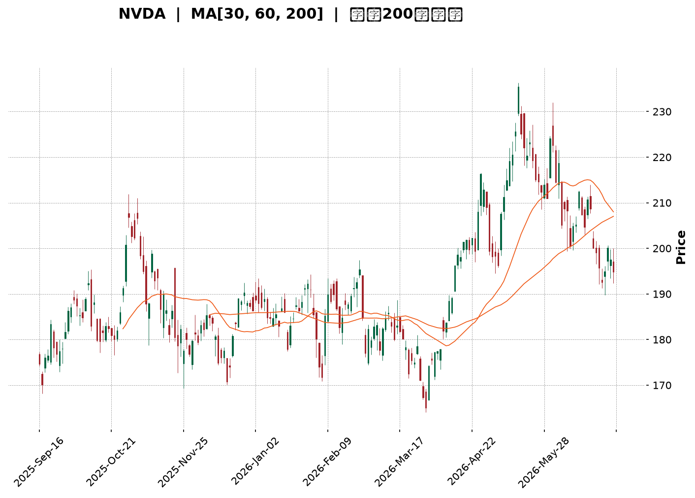
</details>

<html>
<head><meta charset="utf-8" /></head>
<body>
    <div style="height:500px; width:100%;">                        <script>window.PlotlyConfig = {MathJaxConfig: 'local'};</script>
        <script charset="utf-8" src="https://cdn.plot.ly/plotly-3.6.0.min.js" integrity="sha256-QaOVwtVY0T02VaHrr6pnoHLCwayMJp4O5n4YyaE3rJk=" crossorigin="anonymous"></script>                <div id="candlestick-chart" class="plotly-graph-div" style="height:100%; width:100%;"></div>            <script>                window.PLOTLYENV=window.PLOTLYENV || {};                                if (document.getElementById("candlestick-chart")) {                    Plotly.newPlot(                        "candlestick-chart",                        [{"close":{"dtype":"f8","bdata":"AAAAIAjVZUAAAACgVkJlQAAAACB\u002fAGZAAAAAAD0OZkAAAAAgCexmQAAAAKB8RmZAAAAAgNMXZkAAAABg1i5mQAAAACDRPmZAAAAAwMmzZkAAAABg9EpnQAAAAEAMYGdAAAAA4MeUZ0AAAAAgMWxnQAAAAIC3KWdAAAAAwLwZZ0AAAADAz5tnQAAAAABkCmhAAAAAgKfdZkAAAABgkIJnQAAAAACfeWZAAAAA4DpzZkAAAABggrJmQAAAAGCS32ZAAAAAAAnNZkAAAABAvJ1mQAAAAICcgWZAAAAA4LG9ZkAAAAAgukBnQAAAAODf52dAAAAAIMQYaUAAAABA19hpQAAAAMA1VGlAAAAAIG1HaUAAAAAgutNpQAAAACD7zWhAAAAAYMNeaEAAAADA5HpnQAAAAIAhfWdAAAAAoHzZaEAAAAAgPx1oQAAAAGCzMWhAAAAAIOdTZ0AAAABAsL1nQAAAAACYS2dAAAAAoCCkZkAAAABgCUlnQAAAAOAdjWZAAAAAYN5UZkAAAADAKMpmQAAAAOD9MmZAAAAA4PiAZkAAAAAAyRhmQAAAAEAbdmZAAAAAwFKnZkAAAABAj2tmQAAAAAAD5WZAAAAAYALGZkAAAAAAXipnQAAAAGDUF2dAAAAAwMvxZkAAAADgtJZmQAAAAEDR2WVAAAAAYGgCZkAAAADAHDBmQAAAAKBqV2VAAAAAALG9ZUAAAADgn5hmQAAAAGDr7mZAAAAAIFifZ0AAAADgKoxnQAAAAGCIyWdAAAAA4LN\u002fZ0AAAAAg+GlnQAAAAOC6SGdAAAAAoNaTZ0AAAADAgXxnQAAAAKBhYGdAAAAA4CWcZ0AAAAAgERpnQAAAAEBQFGdAAAAA4N4WZ0AAAABArTJnQAAAACBX3WZAAAAAAE9aZ0AAAACgGUBnQAAAAGBMO2ZAAAAAIBjjZkAAAACgrBNnQAAAAMAfbmdAAAAAYMVHZ0AAAACASolnQAAAAKAs6WdAAAAAwNAIaEAAAACgtdxnQAAAAOBILGdAAAAAgNmDZkAAAAAgSr9lQAAAAKB1dWVAAAAAYOQlZ0AAAAAg37lnQAAAACDuiWdAAAAAADG6Z0AAAAAAy1ZnQAAAAEDL0mZAAAAAYNQXZ0AAAAAgCHhnQAAAAKB5dWdAAAAAQNeyZ0AAAAAgIupnQAAAAMCuE2hAAAAA4EtqaEAAAADARRVnQAAAAEAsH2ZAAAAAID\u002fIZkAAAADAlHpmQAAAAAAl2mZAAAAAoLvjZkAAAADgTjNmQAAAAACuzWZAAAAAAHARZ0AAAACgBzpnQAAAAGCo3WZAAAAAAEmBZkAAAAAAN+BmQAAAAID7tmZAAAAAYBSGZkAAAACgREtmQAAAAGD3j2VAAAAA4O\u002ftZUAAAACA399lQAAAAIAaT2ZAAAAAIE1hZUAAAABAZupkQAAAAIBJn2RAAAAAoE3GZUAAAAAAdPFlQAAAACDfJWZAAAAAwNwtZkAAAADAkDxmQAAAAADHu2ZAAAAA4ET2ZkAAAAAgIo1nQAAAACDeomdAAAAA4P+IaEAAAACAbtRoQAAAAKDPw2hAAAAAID8uaUAAAACAZDppQAAAAOC29GhAAAAA4HRIaUAAAAAAC+1oQAAAAKDhAGpAAAAAYHMLa0AAAADAf51qQAAAAIA0IGpAAAAAQM7qaEAAAADgAcdoQAAAAED3x2hAAAAAAK6IaEAAAABg0fJpQAAAAAAfaGpAAAAAIGLeakAAAADA52VrQAAAAEC8kGtAAAAAwCUybEAAAAAA5m5tQAAAAMDYIWxAAAAAYPXBa0AAAABATYtrQAAAACC35mtAAAAAgCRoa0AAAADgieJqQAAAACCE02pAAAAAwEeLakAAAADABMBqQAAAAGCdXGpAAAAAgCkDbEAAAACA8NFrQAAAAAAA0GpAAAAAwB5Va0AAAABAM6NpQAAAAOB6FGpAAAAAgBQGakAAAACgcA1pQAAAAADXm2lAAAAAgBSmaUAAAABgZo5qQAAAAMAe7WlAAAAAwMyUaUAAAACAFFZqQAAAAMDMFGpAAAAAoEcBaUAAAAAAAOBoQAAAACCud2hAAAAAwPUQaEAAAABACl9oQAAAAEDhAmlAAAAAYI+yaEAAAABgj1poQA=="},"high":{"dtype":"f8","bdata":"ZaYKycMoZkCSXDoCV59lQAiUtUb7G2ZAAuk4CU07ZkBpUODQEwpnQBfMfx0BxmZADFc1raFxZkCwxeLu+IBmQMnyVANQcWZAodfoEID4ZkBZZwA3kGNnQKvIwpvPfGdAvJYMFtDZZ0BJuTuowsNnQJwVXF26X2dAuL83rTaaZ0BryALDeKtnQJUjFaOjYWhA+2lOu91raEAIBUVSxbtnQHUhrBgREmdAevKM6E0UZ0Cl\u002fjlJfeFmQAnGODGy+2ZAU706ydkeZ0CNw30d1NFmQHezXUaa5mZAx\u002fjiy3\u002fZZkA94mzfZWdnQHz0lW0s+GdApN8PAYVcaUDyEwdjbn1qQJMlxoC3vGlAF5\u002fXEJD2aUAvyU3VQ2JqQLLi6sa5dmlA69QALCtVaUB3gBzTyKtoQOjd2nmQgmdANi+XNu71aEAGcL1qeWVoQOCHA9F+dGhA+WlwtEbmZ0AWah+8iNhnQOINfrRLmGdAFG15OhESZ0DyERak3HNnQNU9cLcCeGhABJSYmmUKZ0DiBkM2hehmQJUntpPbPWZAUq7rGKrVZkD6Q5a6+GFmQBk+60hAgmZABo7DS40tZ0BbM\u002f+H9sZmQFkupn9yCWdAnjvD6+sNZ0CNMxvtq3hnQDtr+OPML2dAVaABKSEoZ0BFKJf7K6NmQPigxwgd02ZA5yF6HnxGZkApm+TwuEhmQKQA\u002flRL\u002fWVAEXXU0O79ZUCU9cuIU6dmQIcDRe\u002fw\u002fWZAgARw7S2jZ0CkVI+BwZVnQIwlyJGRDmhAIC1tHPaQZ0B7ILAnUJhnQIRjANx9ymdAmo+qKD0WaECiF\u002f7DnCxoQG69ge3y\u002fWdAZFMxMmHkZ0BkcLUeNqpnQAxz2JqdQ2dAfD6cnotcZ0B\u002fLjHsL3xnQGUchHOHB2dA0dcRTgGvZ0DtyF\u002f8p8ZnQIDjjtwMxWZA3e5oEe8kZ0BjHia6Lj5nQMDxPx3Pq2dA8nLurXecZ0A2+eXal7hnQG7hk7ezA2hAy5fsUdEnaEAeDRA4GUhoQHl7f5IuwmdAq5jn8WBBZ0DxYIY1j2tmQJ1Ry9JYE2ZAlYDJwbVYZ0A3k8ofki1oQJIXdU7bB2hAglgtN8kgaEBifm0Q+StoQLMU4fKwaGdAhGHCHoFdZ0A\u002fP\u002fgla8RnQO9LABZqhmdAs4QhCSTDZ0DDg9js1jZoQDuWsDEWMWhA8XCNt3SsaECx9iWxtEFoQJEJfhzDy2ZAqHBlmJHnZkDiiGdkv5VmQJOiJy8zD2dA0o6XsL76ZkDk7w7zMdFmQADYvWf91WZA\u002fbCn9c9GZ0C7qim22WxnQDYvnNUwF2dAgvItjvI7Z0D2qjPGH5VnQBnBaajkJWdA6vPONFTlZkCgLzi1p3hmQEwQwNmtQWZA+Nsa9zFFZkAt+bKleQBmQJQi5gZKoGZAbvxhnr4JZkAFw\u002f+4q1hlQFa0LG8WKGVAPBjqxlXNZUC29CCNOyVmQMYu12sRKWZAR9LMEagyZkDhMqRiuEBmQAqqrixrIWdA+8744LP7ZkAdhlwP7LhnQH9QgQkOrmdAAAAA4P+IaEBIGcuoVQVpQLYV3lHB82hAkkwpz+IuaUBKanGT6D1pQDeld4FyUGlAAAAA4HRIaUCyCriK93JpQBM08ZCKVmpA3n\u002fjhnsSa0DGToxfXM9qQHRBlqgdj2pAHUixC8RBakA1PvwbcFhpQHYdVkHYL2lAjS\u002f7dDgAaUCxb8mt4QBqQGGgR6BrvmpAhWWBlHwxa0BNl42ZUcFrQHLCGC2q72tA4hrrdGRybEAxgfbed4htQBKtnFBg52xARVHCom63bEBe2OJX\u002fwZsQC2AAYK8O2xA9NyhIVRkbECtsSU1FphrQFBrztahPWtAtjLfd9K8akA5QGaDnOhqQFStdopnM2tA3TLrgnYTbEDv2RGITgBtQOXT+4nw0WtAAAAAQDOza0AAAAAA19tqQAAAAEAKT2pAAAAAwMxsakAAAABACudpQAAAAMAetWlAAAAAgD3iaUAAAABguJZqQAAAACCub2pAAAAAYLgmakAAAADgemxqQAAAACCuv2pAAAAA4KN4aUAAAACgcDVpQAAAAKCZGWlAAAAAoJlxaEAAAACAwoVoQAAAAAApFGlAAAAAQDP7aEAAAACA6wFpQA=="},"hovertemplate":"\u003cb\u003e%{x|%Y-%m-%d}\u003c\u002fb\u003e\u003cbr\u003e\u958b: $%{open:.2f}\u003cbr\u003e\u9ad8: $%{high:.2f}\u003cbr\u003e\u4f4e: $%{low:.2f}\u003cbr\u003e\u6536: $%{close:.2f}\u003cextra\u003e\u003c\u002fextra\u003e","low":{"dtype":"f8","bdata":"kHuuVw3FZUD6WTJeQQZlQLQcwJmrl2VAZfp\u002fbJ7eZUBInnQ\u002fmc9lQIx9P6qJ\u002f2VA15M1YqblZUDvHe90Gp1lQB61eySh1mVALajz9uOCZkBbSjdY9qdmQAZyfbpN9WZAUn0oKUF6Z0B2OAGAmiRnQMOhuk8W42ZAaOkr+n\u002f4ZkDc\u002fnQRrUlnQOsH2MEh2mdAH0os9S26ZkDI+W3gIzdnQMYynhETb2ZAu9YuoQ0iZkAAoGAJUHFmQItvf1WscGZAxjf7vvOvZkA3CDxRRXJmQDXyVlsdEWZAY8lEe\u002fNxZkCSp2sNhehmQGOTmy4UhmdAc3lcSUz1Z0C7zwP1nJBpQKiWihHpJGlAXaj54QA6aUDBVFlmiqlpQHq3TQ6xtWhAENn7l91MaEDV0FMdkERnQG7EJOrTVWZAsOjKgmExaEBebLtozeFnQFPaVpxe3GdAMcBBqbTzZkBjcLMRM4tmQHTH8Qq6AmdA5lQQGHptZkA9fidiG9NmQJRyYX7ec2ZAOWK69rWWZUDhCOKWKghmQA3JB02wKmVAbpcUNGpAZkByAa83zghmQLUZgDyurmVAznhjnKl4ZkBtAjoiOFxmQPV0DYG0d2ZA7IIoWBGWZkAjuS6PsMVmQALjPxcY42ZAtyg0\u002fS66ZkBq3S5j9AxmQBKF7l0IzWVABlvoEiPaZUBMVjBk+9VlQEaVfOlHQ2VA2Ewox4pzZUDBMgRoAQRmQDg\u002fV38XxGZA8mHDeKvVZkCYuqcom0tnQO1VdN+reGdAIH2Tbd81Z0CHq1oWeVZnQAhkiBlpSGdAAZVUI\u002fuAZ0ARKp0oiz1nQEyt9DD1UmdAVb23sqVKZ0Cn9ZYlj+9mQGCCRKBH7mZABY8paYHZZkC8ctOMpuVmQLCkczqNkmZADHhi70tDZ0AdbDNfTjtnQMO+QJeYLGZAKSf0eNhFZkBVBdr0lvZmQB+nihv1UmdAAbtECm44Z0AvMZIkKS9nQCkz88N6s2dA3\u002fLlvao6Z0AH4+Fwp6dnQBSp6Qj0FGdAxHhOZH0AZkCDMvwga3ZlQKbyrdtKWmVAysn+wWTMZUBqhmWmOvdmQNml+LCBfGdAkJodBkiRZ0BbE4aqDElnQIkroCzNq2ZAFzzFZ8ZeZkA0weMMClFnQK+jjPrhLWdAt4ok+NQ2Z0DM86uIK6tnQNiZF6N+ZWdAzjAAqrkxaEDHTTMQDgNnQBd\u002fUtVIBWZAwJqYHKzNZUAAEK78ihZmQMVIDp3memZAaWDM3Dk1ZkDjZdraWBNmQKNkIIET62VAnHz\u002fijm5ZkD0v29RhwdnQAs0cME6sWZAYLTUdGB3ZkCOzMHCXKZmQM87WOL9rmZA0q7fqteDZkCqvK4qu\u002fJlQF3\u002fkpikcGVA9AdoRM\u002fRZUAp75Xi4LhlQL6xrLOcFGZAkg8l1BpeZUDHCSodGdpkQHErK1WFgmRAMBQgM4DYZEDjMUmJfdFlQL0Fg6l0ZWVAboDnrcXxZUCRTeOXpq5lQNcMgznigmZAgiIfgByNZkDSmQ0LvAJnQNYfrcvCMGdA3s0onYjRZ0BeLkl5Y3BoQGRbOxmgcmhAgHDGezfhaEBikMR+grNoQP8tXESW2GhAOtGhQJbYaED8whJ0sZ9oQO6bpu558mhA3lEgRm\u002fkaUCO81vlpP5pQKKjA83T6mlAhhUNbP\u002fOaECj3vUuf5xoQOhh8epsUGhA53V7O6h5aEBDsYYNH8xoQNAv565OyGlASE58p4yUakClmtsNg7RqQMPcfQJv1WpA3DMZgPypa0A4xzHqDqFsQA51o6xT\u002f2tAngo0i7RDa0B5TrWfADVrQBtWzjLJh2tASm1cMaQ1a0AJq+ktmdFqQLP9M0YaeGpAd9oiri4RakCcz3flK19qQEBLZphLXGpARmM0Vl3uakDuoOhE9KJrQIFK8ilUyGpAAAAAQApfakAAAABgj4ppQAAAAAAAwGlAAAAAQOHqaEAAAACgcP1oQAAAAKBH8WhAAAAAgBRuaUAAAABA4QpqQAAAAKBH6WlAAAAAYI9iaUAAAAAAANBpQAAAAEAK92lAAAAAAAAAaUAAAABgj5JoQAAAAAApBGhAAAAAQArnZ0AAAACgmblnQAAAACCFY2hAAAAAYGYuaEAAAABAMwtoQA=="},"name":"\u50f9\u683c","open":{"dtype":"f8","bdata":"9iG5AMkYZkBJBDRacY1lQNSMFrVEuGVAObtNpHnxZUBsqlZXdOJlQOBxk2+ft2ZAUITo509xZkCBTcJ+P8hlQAACcHUtPmZA2VQo0WeGZkB3R1pVI7tmQE4zyh4hIGdAHI5h13irZ0AW4tA9Xp5nQGxZ1kpwKGdAI4Ya1cQ\u002fZ0BnOUehokpnQAbOTiyG\u002f2dAOwzOn24oaEAnuv7GYHdnQB3W0KgbEWdAkaCFQxESZ0CCDxKe7r9mQCgX2VhqfmZAuSoAA7LcZkCNw30d1NFmQBQlmKYYnWZA3H1E6BWGZkD\u002fyxvBYvNmQBfUJIfvt2dAReowRLsZaEClPgTx4fZpQBgu1QpwnGlAWWhaDfzFaUAnEUH6E\u002fppQEwtMqa5V2lACaUKuonQaEC8dsD4boVoQBbEf2lDFWdAC6W5PJFbaEA8b0dBKl1oQC7RIPcPb2hAW25U5s\u002fZZ0C\u002fUCcHEdRmQO6+CZN1N2dAokTRa6\u002fkZkBn+N4tvxFnQOQgBJ1pdmhAdziM30qgZkBfPTUuXWhmQKhh+X391WVAeQU8tMGsZkCuCJHmBVlmQDq2kFcy0WVA4iqWHumwZkCgb7TTLZtmQKzPSZDCrGZAY7fyuk\u002f1ZkA+NQ1KXM1mQPCTu7yvKmdAbIvkX9QXZ0BIx5qc7oFmQJB+dLl1nGZAn9e4yCQ3ZkCP8dXxcgFmQPd1oeFV\u002fGVAd1+f+yfKZUB\u002fWup8jQ5mQCLEazRF9mZAYb3oRejXZkDdtLHvwHZnQIt1YlYJtmdA38buFmdvZ0A6ALKjV4BnQIlYHL3ZqmdABErTvnqzZ0CN2SpN2PBnQN1lsaQ2yWdA+YeRo+OKZ0DUr70CJpxnQFmH7k1YG2dAzxk3yuXfZkAHGkzVyRhnQKNAM\u002fkNA2dAokUX3bpIZ0CcI99uMJtnQCxQ62a1tWZAMAFn3J5aZkDBi+tFzBBnQDnuTtKwaGdAJJY3\u002fdJdZ0Ax9yWGYWBnQLwVrh4v4WdAGcYCzWvjZ0Cbq50zRN9nQJ5nDUIaX2dASc6LfmtAZ0DQPBdouWdmQHMVl6\u002fw1mVAR6BaJjEPZkBYcW4OIwFnQAXwmyiz5GdA4\u002fyKzOUGaEDUfSJ6bxloQKJ4+0UNaGdAXywoQuqwZkAJGMZQpJBnQGK99MGgWmdAPbqvrvdKZ0BttDi\u002fVuVnQElNYTI36GdAZmDT09FGaEB6NzckEUFoQO8H0TvvoGZARYtha3\u002fZZUCRoo3RuEhmQJfkP9ILh2ZAAtfBp2CeZkCmijl33nNmQNcvl7SqE2ZAnZmqhrDFZkBnJfXEMTZnQP\u002f3YnK++mZANayfFo0WZ0CcjVNiOdhmQDAQeaYGG2dAaTYH6o\u002fIZkCwusY+sDlmQKoSgXReOWZA9lYDbbchZkDmJ1QHDNRlQEABVVGaHGZA+duFcK77ZUDjzzW5qjllQD7q2TKsEmVA2dK5+tHYZECHs62dcfllQIht8m9Yf2VAJYLgM4UeZkAxtC060PBlQC2oDowgCWdAfVCmHRu0ZkAYLafSDQNnQMPpsacHOmdA40lJUsXTZ0Azz0NY9YloQDcFJKZnpmhA5fW1WVr1aEBP\u002fST26PdoQLt6EGuhPGlA9o9iZjEYaUA60lybLUdpQNVaaWBF92hA3OQrYP0sakB5XwlY4CdqQDCHbPl5jmpAfwUKc\u002fA1akCbJQ9DdiFpQGDVuWWR6GhAXBvy6yziaECREpCYCPVoQAONxWIeA2pAJx+zMQaZakBIGqlfTrlqQOSrRGR1SWtAGqU6dWEVbEAJGXRLo7JsQDcricjCr2xASCgk4EazbEDFz\u002fmQqGtrQKQAAyRy3WtAYC0Cvf\u002fAa0AtgbIhkpRrQLOzlZo2CWtAzlMcAd27akAwSf3SFmFqQMNg7BGRympAaH33zFLvakDX5GPrS11sQE9ohsfHrmtAAAAAwB69akAAAADA9dBqQAAAAIDCRWpAAAAAANdTakAAAACAwo1pQAAAACCuL2lAAAAAIIWbaUAAAACgcB1qQAAAAIDCZWpAAAAAwPUQakAAAABgj+ppQAAAAIAUbmpAAAAAoHBFaUAAAAAA1wNpQAAAAGCPAmlAAAAAANcjaEAAAABAMztoQAAAACCup2hAAAAAYGaGaEAAAADgeqRoQA=="},"x":["2025-09-16T00:00:00-04:00","2025-09-17T00:00:00-04:00","2025-09-18T00:00:00-04:00","2025-09-19T00:00:00-04:00","2025-09-22T00:00:00-04:00","2025-09-23T00:00:00-04:00","2025-09-24T00:00:00-04:00","2025-09-25T00:00:00-04:00","2025-09-26T00:00:00-04:00","2025-09-29T00:00:00-04:00","2025-09-30T00:00:00-04:00","2025-10-01T00:00:00-04:00","2025-10-02T00:00:00-04:00","2025-10-03T00:00:00-04:00","2025-10-06T00:00:00-04:00","2025-10-07T00:00:00-04:00","2025-10-08T00:00:00-04:00","2025-10-09T00:00:00-04:00","2025-10-10T00:00:00-04:00","2025-10-13T00:00:00-04:00","2025-10-14T00:00:00-04:00","2025-10-15T00:00:00-04:00","2025-10-16T00:00:00-04:00","2025-10-17T00:00:00-04:00","2025-10-20T00:00:00-04:00","2025-10-21T00:00:00-04:00","2025-10-22T00:00:00-04:00","2025-10-23T00:00:00-04:00","2025-10-24T00:00:00-04:00","2025-10-27T00:00:00-04:00","2025-10-28T00:00:00-04:00","2025-10-29T00:00:00-04:00","2025-10-30T00:00:00-04:00","2025-10-31T00:00:00-04:00","2025-11-03T00:00:00-05:00","2025-11-04T00:00:00-05:00","2025-11-05T00:00:00-05:00","2025-11-06T00:00:00-05:00","2025-11-07T00:00:00-05:00","2025-11-10T00:00:00-05:00","2025-11-11T00:00:00-05:00","2025-11-12T00:00:00-05:00","2025-11-13T00:00:00-05:00","2025-11-14T00:00:00-05:00","2025-11-17T00:00:00-05:00","2025-11-18T00:00:00-05:00","2025-11-19T00:00:00-05:00","2025-11-20T00:00:00-05:00","2025-11-21T00:00:00-05:00","2025-11-24T00:00:00-05:00","2025-11-25T00:00:00-05:00","2025-11-26T00:00:00-05:00","2025-11-28T00:00:00-05:00","2025-12-01T00:00:00-05:00","2025-12-02T00:00:00-05:00","2025-12-03T00:00:00-05:00","2025-12-04T00:00:00-05:00","2025-12-05T00:00:00-05:00","2025-12-08T00:00:00-05:00","2025-12-09T00:00:00-05:00","2025-12-10T00:00:00-05:00","2025-12-11T00:00:00-05:00","2025-12-12T00:00:00-05:00","2025-12-15T00:00:00-05:00","2025-12-16T00:00:00-05:00","2025-12-17T00:00:00-05:00","2025-12-18T00:00:00-05:00","2025-12-19T00:00:00-05:00","2025-12-22T00:00:00-05:00","2025-12-23T00:00:00-05:00","2025-12-24T00:00:00-05:00","2025-12-26T00:00:00-05:00","2025-12-29T00:00:00-05:00","2025-12-30T00:00:00-05:00","2025-12-31T00:00:00-05:00","2026-01-02T00:00:00-05:00","2026-01-05T00:00:00-05:00","2026-01-06T00:00:00-05:00","2026-01-07T00:00:00-05:00","2026-01-08T00:00:00-05:00","2026-01-09T00:00:00-05:00","2026-01-12T00:00:00-05:00","2026-01-13T00:00:00-05:00","2026-01-14T00:00:00-05:00","2026-01-15T00:00:00-05:00","2026-01-16T00:00:00-05:00","2026-01-20T00:00:00-05:00","2026-01-21T00:00:00-05:00","2026-01-22T00:00:00-05:00","2026-01-23T00:00:00-05:00","2026-01-26T00:00:00-05:00","2026-01-27T00:00:00-05:00","2026-01-28T00:00:00-05:00","2026-01-29T00:00:00-05:00","2026-01-30T00:00:00-05:00","2026-02-02T00:00:00-05:00","2026-02-03T00:00:00-05:00","2026-02-04T00:00:00-05:00","2026-02-05T00:00:00-05:00","2026-02-06T00:00:00-05:00","2026-02-09T00:00:00-05:00","2026-02-10T00:00:00-05:00","2026-02-11T00:00:00-05:00","2026-02-12T00:00:00-05:00","2026-02-13T00:00:00-05:00","2026-02-17T00:00:00-05:00","2026-02-18T00:00:00-05:00","2026-02-19T00:00:00-05:00","2026-02-20T00:00:00-05:00","2026-02-23T00:00:00-05:00","2026-02-24T00:00:00-05:00","2026-02-25T00:00:00-05:00","2026-02-26T00:00:00-05:00","2026-02-27T00:00:00-05:00","2026-03-02T00:00:00-05:00","2026-03-03T00:00:00-05:00","2026-03-04T00:00:00-05:00","2026-03-05T00:00:00-05:00","2026-03-06T00:00:00-05:00","2026-03-09T00:00:00-04:00","2026-03-10T00:00:00-04:00","2026-03-11T00:00:00-04:00","2026-03-12T00:00:00-04:00","2026-03-13T00:00:00-04:00","2026-03-16T00:00:00-04:00","2026-03-17T00:00:00-04:00","2026-03-18T00:00:00-04:00","2026-03-19T00:00:00-04:00","2026-03-20T00:00:00-04:00","2026-03-23T00:00:00-04:00","2026-03-24T00:00:00-04:00","2026-03-25T00:00:00-04:00","2026-03-26T00:00:00-04:00","2026-03-27T00:00:00-04:00","2026-03-30T00:00:00-04:00","2026-03-31T00:00:00-04:00","2026-04-01T00:00:00-04:00","2026-04-02T00:00:00-04:00","2026-04-06T00:00:00-04:00","2026-04-07T00:00:00-04:00","2026-04-08T00:00:00-04:00","2026-04-09T00:00:00-04:00","2026-04-10T00:00:00-04:00","2026-04-13T00:00:00-04:00","2026-04-14T00:00:00-04:00","2026-04-15T00:00:00-04:00","2026-04-16T00:00:00-04:00","2026-04-17T00:00:00-04:00","2026-04-20T00:00:00-04:00","2026-04-21T00:00:00-04:00","2026-04-22T00:00:00-04:00","2026-04-23T00:00:00-04:00","2026-04-24T00:00:00-04:00","2026-04-27T00:00:00-04:00","2026-04-28T00:00:00-04:00","2026-04-29T00:00:00-04:00","2026-04-30T00:00:00-04:00","2026-05-01T00:00:00-04:00","2026-05-04T00:00:00-04:00","2026-05-05T00:00:00-04:00","2026-05-06T00:00:00-04:00","2026-05-07T00:00:00-04:00","2026-05-08T00:00:00-04:00","2026-05-11T00:00:00-04:00","2026-05-12T00:00:00-04:00","2026-05-13T00:00:00-04:00","2026-05-14T00:00:00-04:00","2026-05-15T00:00:00-04:00","2026-05-18T00:00:00-04:00","2026-05-19T00:00:00-04:00","2026-05-20T00:00:00-04:00","2026-05-21T00:00:00-04:00","2026-05-22T00:00:00-04:00","2026-05-26T00:00:00-04:00","2026-05-27T00:00:00-04:00","2026-05-28T00:00:00-04:00","2026-05-29T00:00:00-04:00","2026-06-01T00:00:00-04:00","2026-06-02T00:00:00-04:00","2026-06-03T00:00:00-04:00","2026-06-04T00:00:00-04:00","2026-06-05T00:00:00-04:00","2026-06-08T00:00:00-04:00","2026-06-09T00:00:00-04:00","2026-06-10T00:00:00-04:00","2026-06-11T00:00:00-04:00","2026-06-12T00:00:00-04:00","2026-06-15T00:00:00-04:00","2026-06-16T00:00:00-04:00","2026-06-17T00:00:00-04:00","2026-06-18T00:00:00-04:00","2026-06-22T00:00:00-04:00","2026-06-23T00:00:00-04:00","2026-06-24T00:00:00-04:00","2026-06-25T00:00:00-04:00","2026-06-26T00:00:00-04:00","2026-06-29T00:00:00-04:00","2026-06-30T00:00:00-04:00","2026-07-01T00:00:00-04:00","2026-07-02T00:00:00-04:00"],"type":"candlestick"},{"hovertemplate":"MA30: $%{y:.2f}\u003cextra\u003e\u003c\u002fextra\u003e","line":{"color":"#2196F3","dash":"dash","width":2},"mode":"lines","name":"MA30","x":["2025-09-16T00:00:00-04:00","2025-09-17T00:00:00-04:00","2025-09-18T00:00:00-04:00","2025-09-19T00:00:00-04:00","2025-09-22T00:00:00-04:00","2025-09-23T00:00:00-04:00","2025-09-24T00:00:00-04:00","2025-09-25T00:00:00-04:00","2025-09-26T00:00:00-04:00","2025-09-29T00:00:00-04:00","2025-09-30T00:00:00-04:00","2025-10-01T00:00:00-04:00","2025-10-02T00:00:00-04:00","2025-10-03T00:00:00-04:00","2025-10-06T00:00:00-04:00","2025-10-07T00:00:00-04:00","2025-10-08T00:00:00-04:00","2025-10-09T00:00:00-04:00","2025-10-10T00:00:00-04:00","2025-10-13T00:00:00-04:00","2025-10-14T00:00:00-04:00","2025-10-15T00:00:00-04:00","2025-10-16T00:00:00-04:00","2025-10-17T00:00:00-04:00","2025-10-20T00:00:00-04:00","2025-10-21T00:00:00-04:00","2025-10-22T00:00:00-04:00","2025-10-23T00:00:00-04:00","2025-10-24T00:00:00-04:00","2025-10-27T00:00:00-04:00","2025-10-28T00:00:00-04:00","2025-10-29T00:00:00-04:00","2025-10-30T00:00:00-04:00","2025-10-31T00:00:00-04:00","2025-11-03T00:00:00-05:00","2025-11-04T00:00:00-05:00","2025-11-05T00:00:00-05:00","2025-11-06T00:00:00-05:00","2025-11-07T00:00:00-05:00","2025-11-10T00:00:00-05:00","2025-11-11T00:00:00-05:00","2025-11-12T00:00:00-05:00","2025-11-13T00:00:00-05:00","2025-11-14T00:00:00-05:00","2025-11-17T00:00:00-05:00","2025-11-18T00:00:00-05:00","2025-11-19T00:00:00-05:00","2025-11-20T00:00:00-05:00","2025-11-21T00:00:00-05:00","2025-11-24T00:00:00-05:00","2025-11-25T00:00:00-05:00","2025-11-26T00:00:00-05:00","2025-11-28T00:00:00-05:00","2025-12-01T00:00:00-05:00","2025-12-02T00:00:00-05:00","2025-12-03T00:00:00-05:00","2025-12-04T00:00:00-05:00","2025-12-05T00:00:00-05:00","2025-12-08T00:00:00-05:00","2025-12-09T00:00:00-05:00","2025-12-10T00:00:00-05:00","2025-12-11T00:00:00-05:00","2025-12-12T00:00:00-05:00","2025-12-15T00:00:00-05:00","2025-12-16T00:00:00-05:00","2025-12-17T00:00:00-05:00","2025-12-18T00:00:00-05:00","2025-12-19T00:00:00-05:00","2025-12-22T00:00:00-05:00","2025-12-23T00:00:00-05:00","2025-12-24T00:00:00-05:00","2025-12-26T00:00:00-05:00","2025-12-29T00:00:00-05:00","2025-12-30T00:00:00-05:00","2025-12-31T00:00:00-05:00","2026-01-02T00:00:00-05:00","2026-01-05T00:00:00-05:00","2026-01-06T00:00:00-05:00","2026-01-07T00:00:00-05:00","2026-01-08T00:00:00-05:00","2026-01-09T00:00:00-05:00","2026-01-12T00:00:00-05:00","2026-01-13T00:00:00-05:00","2026-01-14T00:00:00-05:00","2026-01-15T00:00:00-05:00","2026-01-16T00:00:00-05:00","2026-01-20T00:00:00-05:00","2026-01-21T00:00:00-05:00","2026-01-22T00:00:00-05:00","2026-01-23T00:00:00-05:00","2026-01-26T00:00:00-05:00","2026-01-27T00:00:00-05:00","2026-01-28T00:00:00-05:00","2026-01-29T00:00:00-05:00","2026-01-30T00:00:00-05:00","2026-02-02T00:00:00-05:00","2026-02-03T00:00:00-05:00","2026-02-04T00:00:00-05:00","2026-02-05T00:00:00-05:00","2026-02-06T00:00:00-05:00","2026-02-09T00:00:00-05:00","2026-02-10T00:00:00-05:00","2026-02-11T00:00:00-05:00","2026-02-12T00:00:00-05:00","2026-02-13T00:00:00-05:00","2026-02-17T00:00:00-05:00","2026-02-18T00:00:00-05:00","2026-02-19T00:00:00-05:00","2026-02-20T00:00:00-05:00","2026-02-23T00:00:00-05:00","2026-02-24T00:00:00-05:00","2026-02-25T00:00:00-05:00","2026-02-26T00:00:00-05:00","2026-02-27T00:00:00-05:00","2026-03-02T00:00:00-05:00","2026-03-03T00:00:00-05:00","2026-03-04T00:00:00-05:00","2026-03-05T00:00:00-05:00","2026-03-06T00:00:00-05:00","2026-03-09T00:00:00-04:00","2026-03-10T00:00:00-04:00","2026-03-11T00:00:00-04:00","2026-03-12T00:00:00-04:00","2026-03-13T00:00:00-04:00","2026-03-16T00:00:00-04:00","2026-03-17T00:00:00-04:00","2026-03-18T00:00:00-04:00","2026-03-19T00:00:00-04:00","2026-03-20T00:00:00-04:00","2026-03-23T00:00:00-04:00","2026-03-24T00:00:00-04:00","2026-03-25T00:00:00-04:00","2026-03-26T00:00:00-04:00","2026-03-27T00:00:00-04:00","2026-03-30T00:00:00-04:00","2026-03-31T00:00:00-04:00","2026-04-01T00:00:00-04:00","2026-04-02T00:00:00-04:00","2026-04-06T00:00:00-04:00","2026-04-07T00:00:00-04:00","2026-04-08T00:00:00-04:00","2026-04-09T00:00:00-04:00","2026-04-10T00:00:00-04:00","2026-04-13T00:00:00-04:00","2026-04-14T00:00:00-04:00","2026-04-15T00:00:00-04:00","2026-04-16T00:00:00-04:00","2026-04-17T00:00:00-04:00","2026-04-20T00:00:00-04:00","2026-04-21T00:00:00-04:00","2026-04-22T00:00:00-04:00","2026-04-23T00:00:00-04:00","2026-04-24T00:00:00-04:00","2026-04-27T00:00:00-04:00","2026-04-28T00:00:00-04:00","2026-04-29T00:00:00-04:00","2026-04-30T00:00:00-04:00","2026-05-01T00:00:00-04:00","2026-05-04T00:00:00-04:00","2026-05-05T00:00:00-04:00","2026-05-06T00:00:00-04:00","2026-05-07T00:00:00-04:00","2026-05-08T00:00:00-04:00","2026-05-11T00:00:00-04:00","2026-05-12T00:00:00-04:00","2026-05-13T00:00:00-04:00","2026-05-14T00:00:00-04:00","2026-05-15T00:00:00-04:00","2026-05-18T00:00:00-04:00","2026-05-19T00:00:00-04:00","2026-05-20T00:00:00-04:00","2026-05-21T00:00:00-04:00","2026-05-22T00:00:00-04:00","2026-05-26T00:00:00-04:00","2026-05-27T00:00:00-04:00","2026-05-28T00:00:00-04:00","2026-05-29T00:00:00-04:00","2026-06-01T00:00:00-04:00","2026-06-02T00:00:00-04:00","2026-06-03T00:00:00-04:00","2026-06-04T00:00:00-04:00","2026-06-05T00:00:00-04:00","2026-06-08T00:00:00-04:00","2026-06-09T00:00:00-04:00","2026-06-10T00:00:00-04:00","2026-06-11T00:00:00-04:00","2026-06-12T00:00:00-04:00","2026-06-15T00:00:00-04:00","2026-06-16T00:00:00-04:00","2026-06-17T00:00:00-04:00","2026-06-18T00:00:00-04:00","2026-06-22T00:00:00-04:00","2026-06-23T00:00:00-04:00","2026-06-24T00:00:00-04:00","2026-06-25T00:00:00-04:00","2026-06-26T00:00:00-04:00","2026-06-29T00:00:00-04:00","2026-06-30T00:00:00-04:00","2026-07-01T00:00:00-04:00","2026-07-02T00:00:00-04:00"],"y":{"dtype":"f8","bdata":"AAAAAAAA+H8AAAAAAAD4fwAAAAAAAPh\u002fAAAAAAAA+H8AAAAAAAD4fwAAAAAAAPh\u002fAAAAAAAA+H8AAAAAAAD4fwAAAAAAAPh\u002fAAAAAAAA+H8AAAAAAAD4fwAAAAAAAPh\u002fAAAAAAAA+H8AAAAAAAD4fwAAAAAAAPh\u002fAAAAAAAA+H8AAAAAAAD4fwAAAAAAAPh\u002fAAAAAAAA+H8AAAAAAAD4fwAAAAAAAPh\u002fAAAAAAAA+H8AAAAAAAD4fwAAAAAAAPh\u002fAAAAAAAA+H8AAAAAAAD4fwAAAAAAAPh\u002fAAAAAAAA+H8AAAAAAAD4f5qZmQmDy2ZAMzMzo17nZkDv7u4OhQ5nQDMzMwPpKmdA3t3dnWpGZ0CJiIjINF9nQBERERHKdGdAZmZmdjiIZ0AiIiICSpNnQJqZmUnmnWdAzczMDDmwZ0CrqqqKO7dnQERERJQ4vmdARERE9A68Z0BERERkxr5nQJqZmXnnv2dA7+7u3vu7Z0BmZmaGOblnQM3MzPyDrGdAAAAAwPSnZ0CamZkpz6FnQFVVVXV0n2dAmpmZuemfZ0AiIiLyyZpnQJqZmflFl2dAq6qqKgSWZ0AAAAAAWJRnQHd3dzeol2dAq6qqKu+XZ0DNzMxcMJdnQLy7uwtBkGdA7+7ubuN9Z0DNzMx8FWJnQImIiHhnRGdAmpmZ6YAoZ0AiIiIicwlnQImIiMjl62ZAzczMPHbVZkCJiIho681mQO\u002fu7t4tyWZAAAAAMLW+ZkDe3d0t37lmQHd3d0dmtmZAmpmZCdy3ZkAiIiKiEbVmQCIiIjL5tGZAq6qquva8ZkARERHxrb5mQLy7u7u4xWZAREREhKHQZkBVVVVlS9NmQERERCTO2mZAZmZmRs3fZkAAAADAMulmQN7d3a2j7GZAVVVVBZvyZkAzMzOzsPlmQKuqqnoI9GZAvLu7qwD1ZkBmZmYGP\u002fRmQHd3d2cf92ZA7+7uDv35ZkDNzMwcEwJnQJqZmTmnE2dAiYiI+O4kZ0BVVVVVODNnQHd3d1fZQmdAq6qqSnRJZ0AzMzOzNUJnQFVVVbWgNWdAERERUZQxZ0AzMzNTGjNnQFVVVZX7MGdAAAAAsO4yZ0DNzMwMSzJnQJqZmalcLmdAREREdDoqZ0BEREREFCpnQERERETIKmdAmpmZ6YkrZ0CamZlpeTJnQAAAAJD8OmdA7+7u\u002fkxGZ0BEREQUUkVnQBEREVH7PmdAvLu76xw6Z0DNzMxshzNnQJqZmenSOGdAzczMXNg4Z0BVVVXFXTFnQFVVVaUELGdAAAAAADUqZ0AzMzOjkCdnQERERNSlHmdAVVVVxZgRZ0BmZmYmLglnQLy7uytFBWdAMzMzM1gFZ0Dv7u6uAgpnQAAAAODkCmdAvLu7234AZ0AiIiISsvBmQM3MzIwz5mZARERE9CvSZkDe3d3tfb1mQGZmZla1qmZAzczMHHWfZkDNzMwscJJmQLy7u1tAh2ZAMzMzE0l6ZkDe3d1t92tmQFVVVcWAYGZAMzMzIxpUZkAzMzPzGFhmQHd3d0cFZWZAMzMzo\u002fpzZkDe3d1tCohmQKuqqupcmGZAVVVV1emrZkAzMzPjv8VmQM3MzAwe2GZAzczMnATrZkCamZm5hPlmQGZmZuZKFGdAvLu7Cwg7Z0Dv7u7e8FpnQO\u002fu7l4MeGdAd3d393iMZ0ARERHxqaFnQHd3d2chvWdAERER8VrTZ0DNzMy8HvZnQKuqqloWGWhAMzMzY+xHaEARERGBPX9oQAAAABB9umhAiYiIiEjxaEC8u7u7MjFpQGZmZpZDZGlAIiIiAt6TaUDv7u6OKMFpQBEREaFB7WlAvLu7ey8TakAAAADgoS9qQLy7u5vaSmpAMzMzI\u002f9bakAzMzMDYmxqQImIiHgCempAq6qqaiySakDv7u6uSqhqQERERHQiuGpAVVVVlZ\u002fJakDe3d39sc9qQLy7uztZ0GpA7+7u3qLHakCJiIgITbpqQERERITjtWpAd3d3lyG8akC8u7ubT8tqQBERETEV1WpAZmZmJgXeakAAAAAwVOFqQN7d3S2N3mpAVVVV5aXOakC8u7srHrlqQERERMSunmpA7+7ubnF7akARERFxP1BqQHd3d5edNWpAd3d3l4AbakAAAAAQRwBqQA=="},"type":"scatter"},{"hovertemplate":"MA60: $%{y:.2f}\u003cextra\u003e\u003c\u002fextra\u003e","line":{"color":"#9C27B0","dash":"dash","width":2},"mode":"lines","name":"MA60","x":["2025-09-16T00:00:00-04:00","2025-09-17T00:00:00-04:00","2025-09-18T00:00:00-04:00","2025-09-19T00:00:00-04:00","2025-09-22T00:00:00-04:00","2025-09-23T00:00:00-04:00","2025-09-24T00:00:00-04:00","2025-09-25T00:00:00-04:00","2025-09-26T00:00:00-04:00","2025-09-29T00:00:00-04:00","2025-09-30T00:00:00-04:00","2025-10-01T00:00:00-04:00","2025-10-02T00:00:00-04:00","2025-10-03T00:00:00-04:00","2025-10-06T00:00:00-04:00","2025-10-07T00:00:00-04:00","2025-10-08T00:00:00-04:00","2025-10-09T00:00:00-04:00","2025-10-10T00:00:00-04:00","2025-10-13T00:00:00-04:00","2025-10-14T00:00:00-04:00","2025-10-15T00:00:00-04:00","2025-10-16T00:00:00-04:00","2025-10-17T00:00:00-04:00","2025-10-20T00:00:00-04:00","2025-10-21T00:00:00-04:00","2025-10-22T00:00:00-04:00","2025-10-23T00:00:00-04:00","2025-10-24T00:00:00-04:00","2025-10-27T00:00:00-04:00","2025-10-28T00:00:00-04:00","2025-10-29T00:00:00-04:00","2025-10-30T00:00:00-04:00","2025-10-31T00:00:00-04:00","2025-11-03T00:00:00-05:00","2025-11-04T00:00:00-05:00","2025-11-05T00:00:00-05:00","2025-11-06T00:00:00-05:00","2025-11-07T00:00:00-05:00","2025-11-10T00:00:00-05:00","2025-11-11T00:00:00-05:00","2025-11-12T00:00:00-05:00","2025-11-13T00:00:00-05:00","2025-11-14T00:00:00-05:00","2025-11-17T00:00:00-05:00","2025-11-18T00:00:00-05:00","2025-11-19T00:00:00-05:00","2025-11-20T00:00:00-05:00","2025-11-21T00:00:00-05:00","2025-11-24T00:00:00-05:00","2025-11-25T00:00:00-05:00","2025-11-26T00:00:00-05:00","2025-11-28T00:00:00-05:00","2025-12-01T00:00:00-05:00","2025-12-02T00:00:00-05:00","2025-12-03T00:00:00-05:00","2025-12-04T00:00:00-05:00","2025-12-05T00:00:00-05:00","2025-12-08T00:00:00-05:00","2025-12-09T00:00:00-05:00","2025-12-10T00:00:00-05:00","2025-12-11T00:00:00-05:00","2025-12-12T00:00:00-05:00","2025-12-15T00:00:00-05:00","2025-12-16T00:00:00-05:00","2025-12-17T00:00:00-05:00","2025-12-18T00:00:00-05:00","2025-12-19T00:00:00-05:00","2025-12-22T00:00:00-05:00","2025-12-23T00:00:00-05:00","2025-12-24T00:00:00-05:00","2025-12-26T00:00:00-05:00","2025-12-29T00:00:00-05:00","2025-12-30T00:00:00-05:00","2025-12-31T00:00:00-05:00","2026-01-02T00:00:00-05:00","2026-01-05T00:00:00-05:00","2026-01-06T00:00:00-05:00","2026-01-07T00:00:00-05:00","2026-01-08T00:00:00-05:00","2026-01-09T00:00:00-05:00","2026-01-12T00:00:00-05:00","2026-01-13T00:00:00-05:00","2026-01-14T00:00:00-05:00","2026-01-15T00:00:00-05:00","2026-01-16T00:00:00-05:00","2026-01-20T00:00:00-05:00","2026-01-21T00:00:00-05:00","2026-01-22T00:00:00-05:00","2026-01-23T00:00:00-05:00","2026-01-26T00:00:00-05:00","2026-01-27T00:00:00-05:00","2026-01-28T00:00:00-05:00","2026-01-29T00:00:00-05:00","2026-01-30T00:00:00-05:00","2026-02-02T00:00:00-05:00","2026-02-03T00:00:00-05:00","2026-02-04T00:00:00-05:00","2026-02-05T00:00:00-05:00","2026-02-06T00:00:00-05:00","2026-02-09T00:00:00-05:00","2026-02-10T00:00:00-05:00","2026-02-11T00:00:00-05:00","2026-02-12T00:00:00-05:00","2026-02-13T00:00:00-05:00","2026-02-17T00:00:00-05:00","2026-02-18T00:00:00-05:00","2026-02-19T00:00:00-05:00","2026-02-20T00:00:00-05:00","2026-02-23T00:00:00-05:00","2026-02-24T00:00:00-05:00","2026-02-25T00:00:00-05:00","2026-02-26T00:00:00-05:00","2026-02-27T00:00:00-05:00","2026-03-02T00:00:00-05:00","2026-03-03T00:00:00-05:00","2026-03-04T00:00:00-05:00","2026-03-05T00:00:00-05:00","2026-03-06T00:00:00-05:00","2026-03-09T00:00:00-04:00","2026-03-10T00:00:00-04:00","2026-03-11T00:00:00-04:00","2026-03-12T00:00:00-04:00","2026-03-13T00:00:00-04:00","2026-03-16T00:00:00-04:00","2026-03-17T00:00:00-04:00","2026-03-18T00:00:00-04:00","2026-03-19T00:00:00-04:00","2026-03-20T00:00:00-04:00","2026-03-23T00:00:00-04:00","2026-03-24T00:00:00-04:00","2026-03-25T00:00:00-04:00","2026-03-26T00:00:00-04:00","2026-03-27T00:00:00-04:00","2026-03-30T00:00:00-04:00","2026-03-31T00:00:00-04:00","2026-04-01T00:00:00-04:00","2026-04-02T00:00:00-04:00","2026-04-06T00:00:00-04:00","2026-04-07T00:00:00-04:00","2026-04-08T00:00:00-04:00","2026-04-09T00:00:00-04:00","2026-04-10T00:00:00-04:00","2026-04-13T00:00:00-04:00","2026-04-14T00:00:00-04:00","2026-04-15T00:00:00-04:00","2026-04-16T00:00:00-04:00","2026-04-17T00:00:00-04:00","2026-04-20T00:00:00-04:00","2026-04-21T00:00:00-04:00","2026-04-22T00:00:00-04:00","2026-04-23T00:00:00-04:00","2026-04-24T00:00:00-04:00","2026-04-27T00:00:00-04:00","2026-04-28T00:00:00-04:00","2026-04-29T00:00:00-04:00","2026-04-30T00:00:00-04:00","2026-05-01T00:00:00-04:00","2026-05-04T00:00:00-04:00","2026-05-05T00:00:00-04:00","2026-05-06T00:00:00-04:00","2026-05-07T00:00:00-04:00","2026-05-08T00:00:00-04:00","2026-05-11T00:00:00-04:00","2026-05-12T00:00:00-04:00","2026-05-13T00:00:00-04:00","2026-05-14T00:00:00-04:00","2026-05-15T00:00:00-04:00","2026-05-18T00:00:00-04:00","2026-05-19T00:00:00-04:00","2026-05-20T00:00:00-04:00","2026-05-21T00:00:00-04:00","2026-05-22T00:00:00-04:00","2026-05-26T00:00:00-04:00","2026-05-27T00:00:00-04:00","2026-05-28T00:00:00-04:00","2026-05-29T00:00:00-04:00","2026-06-01T00:00:00-04:00","2026-06-02T00:00:00-04:00","2026-06-03T00:00:00-04:00","2026-06-04T00:00:00-04:00","2026-06-05T00:00:00-04:00","2026-06-08T00:00:00-04:00","2026-06-09T00:00:00-04:00","2026-06-10T00:00:00-04:00","2026-06-11T00:00:00-04:00","2026-06-12T00:00:00-04:00","2026-06-15T00:00:00-04:00","2026-06-16T00:00:00-04:00","2026-06-17T00:00:00-04:00","2026-06-18T00:00:00-04:00","2026-06-22T00:00:00-04:00","2026-06-23T00:00:00-04:00","2026-06-24T00:00:00-04:00","2026-06-25T00:00:00-04:00","2026-06-26T00:00:00-04:00","2026-06-29T00:00:00-04:00","2026-06-30T00:00:00-04:00","2026-07-01T00:00:00-04:00","2026-07-02T00:00:00-04:00"],"y":{"dtype":"f8","bdata":"AAAAAAAA+H8AAAAAAAD4fwAAAAAAAPh\u002fAAAAAAAA+H8AAAAAAAD4fwAAAAAAAPh\u002fAAAAAAAA+H8AAAAAAAD4fwAAAAAAAPh\u002fAAAAAAAA+H8AAAAAAAD4fwAAAAAAAPh\u002fAAAAAAAA+H8AAAAAAAD4fwAAAAAAAPh\u002fAAAAAAAA+H8AAAAAAAD4fwAAAAAAAPh\u002fAAAAAAAA+H8AAAAAAAD4fwAAAAAAAPh\u002fAAAAAAAA+H8AAAAAAAD4fwAAAAAAAPh\u002fAAAAAAAA+H8AAAAAAAD4fwAAAAAAAPh\u002fAAAAAAAA+H8AAAAAAAD4fwAAAAAAAPh\u002fAAAAAAAA+H8AAAAAAAD4fwAAAAAAAPh\u002fAAAAAAAA+H8AAAAAAAD4fwAAAAAAAPh\u002fAAAAAAAA+H8AAAAAAAD4fwAAAAAAAPh\u002fAAAAAAAA+H8AAAAAAAD4fwAAAAAAAPh\u002fAAAAAAAA+H8AAAAAAAD4fwAAAAAAAPh\u002fAAAAAAAA+H8AAAAAAAD4fwAAAAAAAPh\u002fAAAAAAAA+H8AAAAAAAD4fwAAAAAAAPh\u002fAAAAAAAA+H8AAAAAAAD4fwAAAAAAAPh\u002fAAAAAAAA+H8AAAAAAAD4fwAAAAAAAPh\u002fAAAAAAAA+H8AAAAAAAD4f6uqqgriLWdAERERCaEyZ0De3d1FTThnQN7d3T2oN2dAvLu7w3U3Z0BVVVX1UzRnQM3MzOxXMGdAmpmZWdcuZ0BVVVW1mjBnQERERBSKM2dAZmZmHnc3Z0BERERcjThnQN7d3W1POmdA7+7ufvU5Z0AzMzMD7DlnQN7d3VVwOmdAzczMTHk8Z0C8u7u78ztnQERERFweOWdAIiIiIks8Z0B3d3dHjTpnQM3MzEwhPWdAAAAAgNs\u002fZ0ARERFZ\u002fkFnQLy7u9P0QWdAAAAAmE9EZ0CamZlZBEdnQBEREVnYRWdAMzMz63dGZ0CamZmxt0VnQJqZmTmwQ2dA7+7uPvA7Z0DNzMxMFDJnQBEREVkHLGdAERER8bcmZ0C8u7u7VR5nQAAAAJBfF2dAvLu7Q3UPZ0De3d2NEAhnQCIiIkpn\u002f2ZAiYiIwCT4ZkCJiIjAfPZmQGZmZu6w82ZAzczMXGX1ZkB3d3dXrvNmQN7d3e2q8WZAd3d3l5jzZkCrqqoaYfRmQAAAAIBA+GZA7+7uthX+ZkB3d3dn4gJnQCIiIlrlCmdAq6qqIg0TZ0AiIiJqQhdnQHd3d3\u002fPFWdAiYiI+FsWZ0AAAAAQnBZnQCIiIrJtFmdAREREhOwWZ0De3d1lzhJnQGZmZgaSEWdAd3d3BxkSZ0AAAADg0RRnQO\u002fu7oYmGWdA7+7u3kMbZ0De3d09Mx5nQJqZmUEPJGdA7+7uPmYnZ0ARERExHCZnQKuqqspCIGdAZmZmlgkZZ0Crqqoy5hFnQBEREZGXC2dAIiIiUo0CZ0BVVVV95PdmQAAAAACJ7GZAiYiIyNfkZkCJiIg4Qt5mQAAAAFAE2WZAZmZmfunSZkC8u7trOM9mQKuqqqq+zWZAERERkTPNZkC8u7uDtc5mQEREREwA0mZAd3d3xwvXZkBVVVXtyN1mQCIiIuqX6GZAERERGWHyZkBERETUjvtmQBEREVkRAmdAZmZmzpwKZ0BmZmauihBnQFVVVV14GWdAiYiIaFAmZ0CrqqqCDzJnQFVVVcWoPmdAVVVVlehIZ0AAAABQ1lVnQLy7uyMDZGdAZmZm5uxpZ0B3d3dnaHNnQLy7u\u002fOkf2dAvLu7KwyNZ0B3d3e3XZ5nQDMzMzOZsmdAq6qq0l7IZ0BERER00eFnQBEREfnB9WdAq6qqihMHaEBmZmb+jxZoQDMzMzPhJmhAd3d3z6QzaECamZlp3UNoQJqZmfHvV2hAMzMz4\u002fxnaECJiIg4NnpoQJqZmbEviWhAAAAAIAufaEARERFJBbdoQImIiEAgyGhAERERGVLaaEC8u7tbm+RoQBERERFS8mhAVVVVdVUBaUC8u7vzngppQJqZmfH3FmlAd3d3R00kaUBmZmbGfDZpQEREREwbSWlAvLu7C7BYaUBmZmZ2uWtpQERERMTRe2lAREREJEmLaUBmZmbWLZxpQCIiIuqVrGlAvLu7+1y2aUBmZmYWucBpQO\u002fu7pbwzGlAzczMTK\u002fXaUB3d3fPt+BpQA=="},"type":"scatter"},{"hovertemplate":"MA200: $%{y:.2f}\u003cextra\u003e\u003c\u002fextra\u003e","line":{"color":"#FF6F00","dash":"solid","width":2},"mode":"lines","name":"MA200","x":["2025-09-16T00:00:00-04:00","2025-09-17T00:00:00-04:00","2025-09-18T00:00:00-04:00","2025-09-19T00:00:00-04:00","2025-09-22T00:00:00-04:00","2025-09-23T00:00:00-04:00","2025-09-24T00:00:00-04:00","2025-09-25T00:00:00-04:00","2025-09-26T00:00:00-04:00","2025-09-29T00:00:00-04:00","2025-09-30T00:00:00-04:00","2025-10-01T00:00:00-04:00","2025-10-02T00:00:00-04:00","2025-10-03T00:00:00-04:00","2025-10-06T00:00:00-04:00","2025-10-07T00:00:00-04:00","2025-10-08T00:00:00-04:00","2025-10-09T00:00:00-04:00","2025-10-10T00:00:00-04:00","2025-10-13T00:00:00-04:00","2025-10-14T00:00:00-04:00","2025-10-15T00:00:00-04:00","2025-10-16T00:00:00-04:00","2025-10-17T00:00:00-04:00","2025-10-20T00:00:00-04:00","2025-10-21T00:00:00-04:00","2025-10-22T00:00:00-04:00","2025-10-23T00:00:00-04:00","2025-10-24T00:00:00-04:00","2025-10-27T00:00:00-04:00","2025-10-28T00:00:00-04:00","2025-10-29T00:00:00-04:00","2025-10-30T00:00:00-04:00","2025-10-31T00:00:00-04:00","2025-11-03T00:00:00-05:00","2025-11-04T00:00:00-05:00","2025-11-05T00:00:00-05:00","2025-11-06T00:00:00-05:00","2025-11-07T00:00:00-05:00","2025-11-10T00:00:00-05:00","2025-11-11T00:00:00-05:00","2025-11-12T00:00:00-05:00","2025-11-13T00:00:00-05:00","2025-11-14T00:00:00-05:00","2025-11-17T00:00:00-05:00","2025-11-18T00:00:00-05:00","2025-11-19T00:00:00-05:00","2025-11-20T00:00:00-05:00","2025-11-21T00:00:00-05:00","2025-11-24T00:00:00-05:00","2025-11-25T00:00:00-05:00","2025-11-26T00:00:00-05:00","2025-11-28T00:00:00-05:00","2025-12-01T00:00:00-05:00","2025-12-02T00:00:00-05:00","2025-12-03T00:00:00-05:00","2025-12-04T00:00:00-05:00","2025-12-05T00:00:00-05:00","2025-12-08T00:00:00-05:00","2025-12-09T00:00:00-05:00","2025-12-10T00:00:00-05:00","2025-12-11T00:00:00-05:00","2025-12-12T00:00:00-05:00","2025-12-15T00:00:00-05:00","2025-12-16T00:00:00-05:00","2025-12-17T00:00:00-05:00","2025-12-18T00:00:00-05:00","2025-12-19T00:00:00-05:00","2025-12-22T00:00:00-05:00","2025-12-23T00:00:00-05:00","2025-12-24T00:00:00-05:00","2025-12-26T00:00:00-05:00","2025-12-29T00:00:00-05:00","2025-12-30T00:00:00-05:00","2025-12-31T00:00:00-05:00","2026-01-02T00:00:00-05:00","2026-01-05T00:00:00-05:00","2026-01-06T00:00:00-05:00","2026-01-07T00:00:00-05:00","2026-01-08T00:00:00-05:00","2026-01-09T00:00:00-05:00","2026-01-12T00:00:00-05:00","2026-01-13T00:00:00-05:00","2026-01-14T00:00:00-05:00","2026-01-15T00:00:00-05:00","2026-01-16T00:00:00-05:00","2026-01-20T00:00:00-05:00","2026-01-21T00:00:00-05:00","2026-01-22T00:00:00-05:00","2026-01-23T00:00:00-05:00","2026-01-26T00:00:00-05:00","2026-01-27T00:00:00-05:00","2026-01-28T00:00:00-05:00","2026-01-29T00:00:00-05:00","2026-01-30T00:00:00-05:00","2026-02-02T00:00:00-05:00","2026-02-03T00:00:00-05:00","2026-02-04T00:00:00-05:00","2026-02-05T00:00:00-05:00","2026-02-06T00:00:00-05:00","2026-02-09T00:00:00-05:00","2026-02-10T00:00:00-05:00","2026-02-11T00:00:00-05:00","2026-02-12T00:00:00-05:00","2026-02-13T00:00:00-05:00","2026-02-17T00:00:00-05:00","2026-02-18T00:00:00-05:00","2026-02-19T00:00:00-05:00","2026-02-20T00:00:00-05:00","2026-02-23T00:00:00-05:00","2026-02-24T00:00:00-05:00","2026-02-25T00:00:00-05:00","2026-02-26T00:00:00-05:00","2026-02-27T00:00:00-05:00","2026-03-02T00:00:00-05:00","2026-03-03T00:00:00-05:00","2026-03-04T00:00:00-05:00","2026-03-05T00:00:00-05:00","2026-03-06T00:00:00-05:00","2026-03-09T00:00:00-04:00","2026-03-10T00:00:00-04:00","2026-03-11T00:00:00-04:00","2026-03-12T00:00:00-04:00","2026-03-13T00:00:00-04:00","2026-03-16T00:00:00-04:00","2026-03-17T00:00:00-04:00","2026-03-18T00:00:00-04:00","2026-03-19T00:00:00-04:00","2026-03-20T00:00:00-04:00","2026-03-23T00:00:00-04:00","2026-03-24T00:00:00-04:00","2026-03-25T00:00:00-04:00","2026-03-26T00:00:00-04:00","2026-03-27T00:00:00-04:00","2026-03-30T00:00:00-04:00","2026-03-31T00:00:00-04:00","2026-04-01T00:00:00-04:00","2026-04-02T00:00:00-04:00","2026-04-06T00:00:00-04:00","2026-04-07T00:00:00-04:00","2026-04-08T00:00:00-04:00","2026-04-09T00:00:00-04:00","2026-04-10T00:00:00-04:00","2026-04-13T00:00:00-04:00","2026-04-14T00:00:00-04:00","2026-04-15T00:00:00-04:00","2026-04-16T00:00:00-04:00","2026-04-17T00:00:00-04:00","2026-04-20T00:00:00-04:00","2026-04-21T00:00:00-04:00","2026-04-22T00:00:00-04:00","2026-04-23T00:00:00-04:00","2026-04-24T00:00:00-04:00","2026-04-27T00:00:00-04:00","2026-04-28T00:00:00-04:00","2026-04-29T00:00:00-04:00","2026-04-30T00:00:00-04:00","2026-05-01T00:00:00-04:00","2026-05-04T00:00:00-04:00","2026-05-05T00:00:00-04:00","2026-05-06T00:00:00-04:00","2026-05-07T00:00:00-04:00","2026-05-08T00:00:00-04:00","2026-05-11T00:00:00-04:00","2026-05-12T00:00:00-04:00","2026-05-13T00:00:00-04:00","2026-05-14T00:00:00-04:00","2026-05-15T00:00:00-04:00","2026-05-18T00:00:00-04:00","2026-05-19T00:00:00-04:00","2026-05-20T00:00:00-04:00","2026-05-21T00:00:00-04:00","2026-05-22T00:00:00-04:00","2026-05-26T00:00:00-04:00","2026-05-27T00:00:00-04:00","2026-05-28T00:00:00-04:00","2026-05-29T00:00:00-04:00","2026-06-01T00:00:00-04:00","2026-06-02T00:00:00-04:00","2026-06-03T00:00:00-04:00","2026-06-04T00:00:00-04:00","2026-06-05T00:00:00-04:00","2026-06-08T00:00:00-04:00","2026-06-09T00:00:00-04:00","2026-06-10T00:00:00-04:00","2026-06-11T00:00:00-04:00","2026-06-12T00:00:00-04:00","2026-06-15T00:00:00-04:00","2026-06-16T00:00:00-04:00","2026-06-17T00:00:00-04:00","2026-06-18T00:00:00-04:00","2026-06-22T00:00:00-04:00","2026-06-23T00:00:00-04:00","2026-06-24T00:00:00-04:00","2026-06-25T00:00:00-04:00","2026-06-26T00:00:00-04:00","2026-06-29T00:00:00-04:00","2026-06-30T00:00:00-04:00","2026-07-01T00:00:00-04:00","2026-07-02T00:00:00-04:00"],"y":{"dtype":"f8","bdata":"AAAAAAAA+H8AAAAAAAD4fwAAAAAAAPh\u002fAAAAAAAA+H8AAAAAAAD4fwAAAAAAAPh\u002fAAAAAAAA+H8AAAAAAAD4fwAAAAAAAPh\u002fAAAAAAAA+H8AAAAAAAD4fwAAAAAAAPh\u002fAAAAAAAA+H8AAAAAAAD4fwAAAAAAAPh\u002fAAAAAAAA+H8AAAAAAAD4fwAAAAAAAPh\u002fAAAAAAAA+H8AAAAAAAD4fwAAAAAAAPh\u002fAAAAAAAA+H8AAAAAAAD4fwAAAAAAAPh\u002fAAAAAAAA+H8AAAAAAAD4fwAAAAAAAPh\u002fAAAAAAAA+H8AAAAAAAD4fwAAAAAAAPh\u002fAAAAAAAA+H8AAAAAAAD4fwAAAAAAAPh\u002fAAAAAAAA+H8AAAAAAAD4fwAAAAAAAPh\u002fAAAAAAAA+H8AAAAAAAD4fwAAAAAAAPh\u002fAAAAAAAA+H8AAAAAAAD4fwAAAAAAAPh\u002fAAAAAAAA+H8AAAAAAAD4fwAAAAAAAPh\u002fAAAAAAAA+H8AAAAAAAD4fwAAAAAAAPh\u002fAAAAAAAA+H8AAAAAAAD4fwAAAAAAAPh\u002fAAAAAAAA+H8AAAAAAAD4fwAAAAAAAPh\u002fAAAAAAAA+H8AAAAAAAD4fwAAAAAAAPh\u002fAAAAAAAA+H8AAAAAAAD4fwAAAAAAAPh\u002fAAAAAAAA+H8AAAAAAAD4fwAAAAAAAPh\u002fAAAAAAAA+H8AAAAAAAD4fwAAAAAAAPh\u002fAAAAAAAA+H8AAAAAAAD4fwAAAAAAAPh\u002fAAAAAAAA+H8AAAAAAAD4fwAAAAAAAPh\u002fAAAAAAAA+H8AAAAAAAD4fwAAAAAAAPh\u002fAAAAAAAA+H8AAAAAAAD4fwAAAAAAAPh\u002fAAAAAAAA+H8AAAAAAAD4fwAAAAAAAPh\u002fAAAAAAAA+H8AAAAAAAD4fwAAAAAAAPh\u002fAAAAAAAA+H8AAAAAAAD4fwAAAAAAAPh\u002fAAAAAAAA+H8AAAAAAAD4fwAAAAAAAPh\u002fAAAAAAAA+H8AAAAAAAD4fwAAAAAAAPh\u002fAAAAAAAA+H8AAAAAAAD4fwAAAAAAAPh\u002fAAAAAAAA+H8AAAAAAAD4fwAAAAAAAPh\u002fAAAAAAAA+H8AAAAAAAD4fwAAAAAAAPh\u002fAAAAAAAA+H8AAAAAAAD4fwAAAAAAAPh\u002fAAAAAAAA+H8AAAAAAAD4fwAAAAAAAPh\u002fAAAAAAAA+H8AAAAAAAD4fwAAAAAAAPh\u002fAAAAAAAA+H8AAAAAAAD4fwAAAAAAAPh\u002fAAAAAAAA+H8AAAAAAAD4fwAAAAAAAPh\u002fAAAAAAAA+H8AAAAAAAD4fwAAAAAAAPh\u002fAAAAAAAA+H8AAAAAAAD4fwAAAAAAAPh\u002fAAAAAAAA+H8AAAAAAAD4fwAAAAAAAPh\u002fAAAAAAAA+H8AAAAAAAD4fwAAAAAAAPh\u002fAAAAAAAA+H8AAAAAAAD4fwAAAAAAAPh\u002fAAAAAAAA+H8AAAAAAAD4fwAAAAAAAPh\u002fAAAAAAAA+H8AAAAAAAD4fwAAAAAAAPh\u002fAAAAAAAA+H8AAAAAAAD4fwAAAAAAAPh\u002fAAAAAAAA+H8AAAAAAAD4fwAAAAAAAPh\u002fAAAAAAAA+H8AAAAAAAD4fwAAAAAAAPh\u002fAAAAAAAA+H8AAAAAAAD4fwAAAAAAAPh\u002fAAAAAAAA+H8AAAAAAAD4fwAAAAAAAPh\u002fAAAAAAAA+H8AAAAAAAD4fwAAAAAAAPh\u002fAAAAAAAA+H8AAAAAAAD4fwAAAAAAAPh\u002fAAAAAAAA+H8AAAAAAAD4fwAAAAAAAPh\u002fAAAAAAAA+H8AAAAAAAD4fwAAAAAAAPh\u002fAAAAAAAA+H8AAAAAAAD4fwAAAAAAAPh\u002fAAAAAAAA+H8AAAAAAAD4fwAAAAAAAPh\u002fAAAAAAAA+H8AAAAAAAD4fwAAAAAAAPh\u002fAAAAAAAA+H8AAAAAAAD4fwAAAAAAAPh\u002fAAAAAAAA+H8AAAAAAAD4fwAAAAAAAPh\u002fAAAAAAAA+H8AAAAAAAD4fwAAAAAAAPh\u002fAAAAAAAA+H8AAAAAAAD4fwAAAAAAAPh\u002fAAAAAAAA+H8AAAAAAAD4fwAAAAAAAPh\u002fAAAAAAAA+H8AAAAAAAD4fwAAAAAAAPh\u002fAAAAAAAA+H8AAAAAAAD4fwAAAAAAAPh\u002fAAAAAAAA+H8AAAAAAAD4fwAAAAAAAPh\u002fAAAAAAAA+H\u002fsUbjOOdpnQA=="},"type":"scatter"}],                        {"template":{"data":{"barpolar":[{"marker":{"line":{"color":"rgb(17,17,17)","width":0.5},"pattern":{"fillmode":"overlay","size":10,"solidity":0.2}},"type":"barpolar"}],"bar":[{"error_x":{"color":"#f2f5fa"},"error_y":{"color":"#f2f5fa"},"marker":{"line":{"color":"rgb(17,17,17)","width":0.5},"pattern":{"fillmode":"overlay","size":10,"solidity":0.2}},"type":"bar"}],"carpet":[{"aaxis":{"endlinecolor":"#A2B1C6","gridcolor":"#506784","linecolor":"#506784","minorgridcolor":"#506784","startlinecolor":"#A2B1C6"},"baxis":{"endlinecolor":"#A2B1C6","gridcolor":"#506784","linecolor":"#506784","minorgridcolor":"#506784","startlinecolor":"#A2B1C6"},"type":"carpet"}],"choropleth":[{"colorbar":{"outlinewidth":0,"ticks":""},"type":"choropleth"}],"contourcarpet":[{"colorbar":{"outlinewidth":0,"ticks":""},"type":"contourcarpet"}],"contour":[{"colorbar":{"outlinewidth":0,"ticks":""},"colorscale":[[0.0,"#0d0887"],[0.1111111111111111,"#46039f"],[0.2222222222222222,"#7201a8"],[0.3333333333333333,"#9c179e"],[0.4444444444444444,"#bd3786"],[0.5555555555555556,"#d8576b"],[0.6666666666666666,"#ed7953"],[0.7777777777777778,"#fb9f3a"],[0.8888888888888888,"#fdca26"],[1.0,"#f0f921"]],"type":"contour"}],"heatmap":[{"colorbar":{"outlinewidth":0,"ticks":""},"colorscale":[[0.0,"#0d0887"],[0.1111111111111111,"#46039f"],[0.2222222222222222,"#7201a8"],[0.3333333333333333,"#9c179e"],[0.4444444444444444,"#bd3786"],[0.5555555555555556,"#d8576b"],[0.6666666666666666,"#ed7953"],[0.7777777777777778,"#fb9f3a"],[0.8888888888888888,"#fdca26"],[1.0,"#f0f921"]],"type":"heatmap"}],"histogram2dcontour":[{"colorbar":{"outlinewidth":0,"ticks":""},"colorscale":[[0.0,"#0d0887"],[0.1111111111111111,"#46039f"],[0.2222222222222222,"#7201a8"],[0.3333333333333333,"#9c179e"],[0.4444444444444444,"#bd3786"],[0.5555555555555556,"#d8576b"],[0.6666666666666666,"#ed7953"],[0.7777777777777778,"#fb9f3a"],[0.8888888888888888,"#fdca26"],[1.0,"#f0f921"]],"type":"histogram2dcontour"}],"histogram2d":[{"colorbar":{"outlinewidth":0,"ticks":""},"colorscale":[[0.0,"#0d0887"],[0.1111111111111111,"#46039f"],[0.2222222222222222,"#7201a8"],[0.3333333333333333,"#9c179e"],[0.4444444444444444,"#bd3786"],[0.5555555555555556,"#d8576b"],[0.6666666666666666,"#ed7953"],[0.7777777777777778,"#fb9f3a"],[0.8888888888888888,"#fdca26"],[1.0,"#f0f921"]],"type":"histogram2d"}],"histogram":[{"marker":{"pattern":{"fillmode":"overlay","size":10,"solidity":0.2}},"type":"histogram"}],"mesh3d":[{"colorbar":{"outlinewidth":0,"ticks":""},"type":"mesh3d"}],"parcoords":[{"line":{"colorbar":{"outlinewidth":0,"ticks":""}},"type":"parcoords"}],"pie":[{"automargin":true,"type":"pie"}],"scatter3d":[{"line":{"colorbar":{"outlinewidth":0,"ticks":""}},"marker":{"colorbar":{"outlinewidth":0,"ticks":""}},"type":"scatter3d"}],"scattercarpet":[{"marker":{"colorbar":{"outlinewidth":0,"ticks":""}},"type":"scattercarpet"}],"scattergeo":[{"marker":{"colorbar":{"outlinewidth":0,"ticks":""}},"type":"scattergeo"}],"scattergl":[{"marker":{"line":{"color":"#283442"}},"type":"scattergl"}],"scattermapbox":[{"marker":{"colorbar":{"outlinewidth":0,"ticks":""}},"type":"scattermapbox"}],"scattermap":[{"marker":{"colorbar":{"outlinewidth":0,"ticks":""}},"type":"scattermap"}],"scatterpolargl":[{"marker":{"colorbar":{"outlinewidth":0,"ticks":""}},"type":"scatterpolargl"}],"scatterpolar":[{"marker":{"colorbar":{"outlinewidth":0,"ticks":""}},"type":"scatterpolar"}],"scatter":[{"marker":{"line":{"color":"#283442"}},"type":"scatter"}],"scatterternary":[{"marker":{"colorbar":{"outlinewidth":0,"ticks":""}},"type":"scatterternary"}],"surface":[{"colorbar":{"outlinewidth":0,"ticks":""},"colorscale":[[0.0,"#0d0887"],[0.1111111111111111,"#46039f"],[0.2222222222222222,"#7201a8"],[0.3333333333333333,"#9c179e"],[0.4444444444444444,"#bd3786"],[0.5555555555555556,"#d8576b"],[0.6666666666666666,"#ed7953"],[0.7777777777777778,"#fb9f3a"],[0.8888888888888888,"#fdca26"],[1.0,"#f0f921"]],"type":"surface"}],"table":[{"cells":{"fill":{"color":"#506784"},"line":{"color":"rgb(17,17,17)"}},"header":{"fill":{"color":"#2a3f5f"},"line":{"color":"rgb(17,17,17)"}},"type":"table"}]},"layout":{"annotationdefaults":{"arrowcolor":"#f2f5fa","arrowhead":0,"arrowwidth":1},"autotypenumbers":"strict","coloraxis":{"colorbar":{"outlinewidth":0,"ticks":""}},"colorscale":{"diverging":[[0,"#8e0152"],[0.1,"#c51b7d"],[0.2,"#de77ae"],[0.3,"#f1b6da"],[0.4,"#fde0ef"],[0.5,"#f7f7f7"],[0.6,"#e6f5d0"],[0.7,"#b8e186"],[0.8,"#7fbc41"],[0.9,"#4d9221"],[1,"#276419"]],"sequential":[[0.0,"#0d0887"],[0.1111111111111111,"#46039f"],[0.2222222222222222,"#7201a8"],[0.3333333333333333,"#9c179e"],[0.4444444444444444,"#bd3786"],[0.5555555555555556,"#d8576b"],[0.6666666666666666,"#ed7953"],[0.7777777777777778,"#fb9f3a"],[0.8888888888888888,"#fdca26"],[1.0,"#f0f921"]],"sequentialminus":[[0.0,"#0d0887"],[0.1111111111111111,"#46039f"],[0.2222222222222222,"#7201a8"],[0.3333333333333333,"#9c179e"],[0.4444444444444444,"#bd3786"],[0.5555555555555556,"#d8576b"],[0.6666666666666666,"#ed7953"],[0.7777777777777778,"#fb9f3a"],[0.8888888888888888,"#fdca26"],[1.0,"#f0f921"]]},"colorway":["#636efa","#EF553B","#00cc96","#ab63fa","#FFA15A","#19d3f3","#FF6692","#B6E880","#FF97FF","#FECB52"],"font":{"color":"#f2f5fa"},"geo":{"bgcolor":"rgb(17,17,17)","lakecolor":"rgb(17,17,17)","landcolor":"rgb(17,17,17)","showlakes":true,"showland":true,"subunitcolor":"#506784"},"hoverlabel":{"align":"left"},"hovermode":"closest","mapbox":{"style":"dark"},"paper_bgcolor":"rgb(17,17,17)","plot_bgcolor":"rgb(17,17,17)","polar":{"angularaxis":{"gridcolor":"#506784","linecolor":"#506784","ticks":""},"bgcolor":"rgb(17,17,17)","radialaxis":{"gridcolor":"#506784","linecolor":"#506784","ticks":""}},"scene":{"xaxis":{"backgroundcolor":"rgb(17,17,17)","gridcolor":"#506784","gridwidth":2,"linecolor":"#506784","showbackground":true,"ticks":"","zerolinecolor":"#C8D4E3"},"yaxis":{"backgroundcolor":"rgb(17,17,17)","gridcolor":"#506784","gridwidth":2,"linecolor":"#506784","showbackground":true,"ticks":"","zerolinecolor":"#C8D4E3"},"zaxis":{"backgroundcolor":"rgb(17,17,17)","gridcolor":"#506784","gridwidth":2,"linecolor":"#506784","showbackground":true,"ticks":"","zerolinecolor":"#C8D4E3"}},"shapedefaults":{"line":{"color":"#f2f5fa"}},"sliderdefaults":{"bgcolor":"#C8D4E3","bordercolor":"rgb(17,17,17)","borderwidth":1,"tickwidth":0},"ternary":{"aaxis":{"gridcolor":"#506784","linecolor":"#506784","ticks":""},"baxis":{"gridcolor":"#506784","linecolor":"#506784","ticks":""},"bgcolor":"rgb(17,17,17)","caxis":{"gridcolor":"#506784","linecolor":"#506784","ticks":""}},"title":{"x":0.05},"updatemenudefaults":{"bgcolor":"#506784","borderwidth":0},"xaxis":{"automargin":true,"gridcolor":"#283442","linecolor":"#506784","ticks":"","title":{"standoff":15},"zerolinecolor":"#283442","zerolinewidth":2},"yaxis":{"automargin":true,"gridcolor":"#283442","linecolor":"#506784","ticks":"","title":{"standoff":15},"zerolinecolor":"#283442","zerolinewidth":2}}},"xaxis":{"rangeslider":{"visible":false},"title":{"text":"\u65e5\u671f"}},"font":{"size":11},"title":{"text":"NVDA  |  MA(30\u002f60\u002f200)  |  \u6700\u8fd1200\u4ea4\u6613\u65e5"},"yaxis":{"title":{"text":"\u80a1\u50f9 (USD)"}},"hovermode":"x unified","height":500},                        {"responsive": true}                    )                };            </script>        </div>
</body>
</html>

# NVDA 技術分析報告

> **報告日期**：2026-07-03 ｜ **語言**：繁體中文 ｜ **數據來源**：Yahoo Finance ｜ **當前價格**：$194.83

---

## 目錄

| 章節 | 內容 |
|------|------|
| [1. 技術面概覽](#1-技術面概覽) | 訊號儀表板、核心指標、評分卡 |
| [2. 趨勢分析](#2-趨勢分析) | 多時框趨勢、長中短期走勢 |
| [3. 圖表形態分析](#3-圖表形態分析) | 形態識別、K線組合、目標價 |
| [4. 支撐與阻力](#4-支撐與阻力) | 關鍵價位、斐波那契回調 |
| [5. 技術指標深度解讀](#5-技術指標深度解讀) | MA/RSI/MACD/布林/成交量 |
| [6. 動能與波動率](#6-動能與波動率) | 動能評估、ATR、Beta |
| [7. 多時框架總結](#7-多時框架總結) | 時框架評分矩陣 |
| [8. 交易策略建議](#8-交易策略建議) | 多空策略、風險報酬比 |
| [9. 風險提示與監控](#9-風險提示與監控) | 監控指標、風險場景 |

---

## 1. 技術面概覽

本章提供 NVDA 當前技術狀況的快速總覽，透過視覺化儀表板與評分卡，讓投資者能迅速掌握其多空訊號分佈及整體技術強度。

### 🎯 技術訊號儀表板

NVDA 目前的技術訊號呈現多空交織的複雜局面。儘管長期趨勢仍偏多，但中期與短期則面臨顯著的下行壓力與整理。

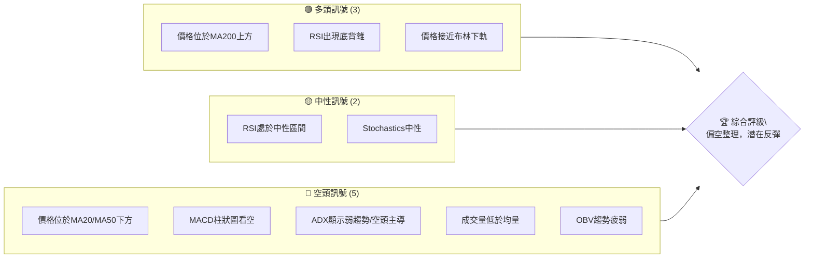
**解讀**：目前空頭訊號數量明顯多於多頭訊號，反映了短期和中期市場的悲觀情緒。然而，RSI底背離和價格接近長期支撐（MA200、布林下軌）為潛在的反彈提供了希望。市場正處於一個關鍵的轉折點，需要密切關注。

### 📊 核心指標速覽表

以下表格彙整了 NVDA 當前最重要的技術指標數據及其對應的市場訊號解讀：

| 指標類別 | 指標名稱 | 當前數值 | 訊號 | 解讀 |
|----------|----------|----------|------|------|
| **價格** | 當前價格 | $194.83 | 🟡 | 位於52週高低區間中點附近 (50.4%)，但近期偏弱 |
| **均線** | MA20 | $203.48 | 🔴 | 價格位於MA20下方，短期趨勢偏空 |
| **均線** | MA50 | $209.65 | 🔴 | 價格位於MA50下方，中期趨勢偏空 |
| **均線** | MA200 | $190.82 | 🟢 | 價格位於MA200上方，長期趨勢仍偏多 |
| **動能** | RSI(14) | 40.42 | 🟡 | 處於中性區間，但接近超賣區，並出現底背離 |
| **動能** | MACD | -4.043 | 🔴 | MACD線位於訊號線下方，柱狀圖為負，顯示空頭動能 |
| **波動** | ATR(14) | $6.34 | 🟡 | 每日波動約3.25%，屬於中等偏高波動，需注意風險 |
| **趨勢** | ADX(14) | 17.94 | 🟡 | 趨勢強度較弱，暗示目前處於盤整或弱勢趨勢 |
| **成交量** | 量比(20日) | 0.90x | 🔴 | 當前成交量低於20日均量，量能疲弱 |

### 🏆 技術評分卡

本評分卡綜合了各項技術指標的表現，給出 NVDA 當前技術面的整體評級。

```
╔══════════════════════════════════════════════════════════════╗
║              技術評分卡 — NVDA (2026-07-03)                  ║
╠══════════════════════════════════════════════════════════════╣
║ 趨勢強度      ███░░░░░░░░░░░░░░░░░░  15/100  🔴               ║
║ 動能指標      ██████░░░░░░░░░░░░░░  30/100  🔴               ║
║ 支撐穩定度    ████████████░░░░░░░░  60/100  🟡               ║
║ 成交量配合    ███░░░░░░░░░░░░░░░░░░  15/100  🔴               ║
║ 形態完整度    ████████░░░░░░░░░░░░  40/100  🟡               ║
║ 均線排列      ██████░░░░░░░░░░░░░░  30/100  🔴               ║
╠══════════════════════════════════════════════════════════════╣
║ 綜合評分      ████░░░░░░░░░░░░░░░░░  32/100  ⚖️ 偏空整理       ║
╚══════════════════════════════════════════════════════════════╝
```
**評分說明**：
- **趨勢強度 (15/100 🔴)**：ADX 數值低於25，顯示當前趨勢非常弱，更傾向於盤整，且負向動能（-DI）佔優，故評分較低。
- **動能指標 (30/100 🔴)**：MACD 呈現空頭排列，柱狀圖為負，顯示空頭動能較強。儘管RSI出現底背離，但其數值仍在中性區間，整體動能偏弱。
- **支撐穩定度 (60/100 🟡)**：價格正接近MA200與布林下軌等重要支撐，這些價位具備一定的支撐潛力，但尚未確認有效守住。
- **成交量配合 (15/100 🔴)**：當前成交量低於平均水平，且OBV趨勢疲弱，顯示市場缺乏買盤或賣盤的強烈共識，不利於趨勢的形成或反轉。
- **形態完整度 (40/100 🟡)**：目前未見明確的看漲或看跌主要反轉形態，更多是近期下跌後的整理，形態尚未完整。
- **均線排列 (30/100 🔴)**：短期（MA20）和中期（MA50）均線均在價格上方形成壓力，且呈現空頭排列，但長期（MA200）均線仍在價格下方提供支撐，因此整體為混合偏空。
- **綜合評分 (32/100 ⚖️ 偏空整理)**：整體來看，NVDA 目前處於偏空整理的態勢，短期動能和趨勢強度不足，但長期支撐的存在和RSI底背離提供了潛在的反彈機會。

---

## 2. 趨勢分析

本章將深入分析 NVDA 在不同時間框架下的價格趨勢，從長期到短期，以提供全面的市場視角。

### 🌐 多時框趨勢分析

透過多時框架分析，我們可以更清晰地理解 NVDA 股價的整體結構，避免單一時間框架的偏誤。

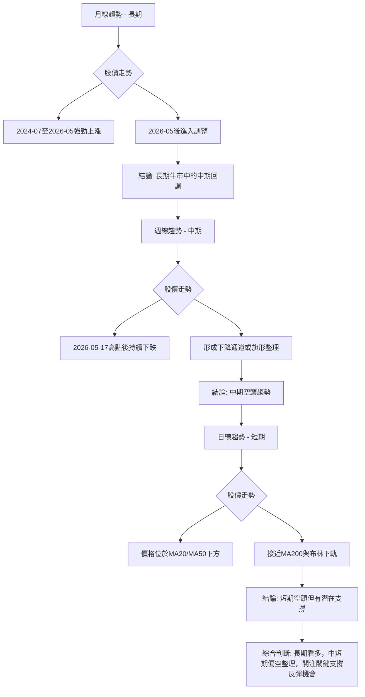
**詳細解讀**：
- **長期趨勢 (月線)**：從2024年7月的$116.83開始，NVDA經歷了一波強勁的牛市，在2026年5月達到$210.89的高點，甚至在2026年5月17日觸及$225.06的近期高位。儘管近期價格回落至$194.83，但相較於兩年前的起點，整體仍處於明顯的上升通道中。目前的下跌應視為長期牛市中的一次中期回調。
- **中期趨勢 (週線)**：檢視過去20週的數據，NVDA在2026年5月17日達到$225.06的高點後，開始呈現下跌走勢，並在6月底跌至$192.53。價格持續在MA20和MA50下方運行，MACD和RSI也顯示出中期動能的減弱。這表明中期趨勢已轉為空頭，目前可能正在形成一個下降通道或旗形整理形態。
- **短期趨勢 (日線)**：當前價格$194.83明顯低於MA20 ($203.48) 和MA50 ($209.65)，顯示短期趨勢偏空。然而，價格正接近MA200 ($190.82) 和布林通道下軌 ($189.89)，這些是重要的長期和短期支撐位。RSI的底背離也暗示短期超跌後存在反彈的可能性。

### 📈 長期趨勢 — 12個月走勢圖（Unicode）

以下是 NVDA 過去12個月的月線收盤價格走勢圖，標註了關鍵的高低點，以幫助我們判斷長期趨勢。

```
NVDA 月線走勢圖（過去12個月）
價格軸 ($)
$225 ┤                               ● (2026-05, $210.89)
$220 ┤                               ● (2026-05-17, $225.06 高點)
$215 ┤
$210 ┤
$205 ┤
$200 ┤              ● (2025-10, $202.23)
$195 ┤                                       ● (現在, $194.83)
$190 ┤
$185 ┤        ● (2025-09, $186.34)   ● (2025-12, $186.27)
$180 ┤    ● (2025-07, $177.63)
$175 ┤              ● (2025-11, $176.77) ● (2026-02, $176.97) ● (2026-03, $174.20)
$170 ┤
$165 ┤
$160 ┤
$155 ┤
$150 ┤
     └────────────────────────────────────────────────────────────
      25-07 25-08 25-09 25-10 25-11 25-12 26-01 26-02 26-03 26-04 26-05 26-06 26-07(現)
```
**走勢特徵分析表格**：
| 期間 | 起始價 | 結束價 | 漲跌幅 | 走勢特徵 |
|------|--------|--------|--------|----------|
| 2025-07 | $177.63 | $173.95 | -2.07% | 短期回調，但整體仍處於上升趨勢 |
| 2025-08 | $173.95 | $186.34 | +7.12% | 恢復上漲動能，創下新高 |
| 2025-09 | $186.34 | $202.23 | +8.53% | 強勁上漲，突破關鍵阻力 |
| 2025-10 | $202.23 | $176.77 | -12.59% | 大幅回調，但未跌破前低 |
| 2025-11 | $176.77 | $186.27 | +5.37% | 企穩反彈，嘗試收復失地 |
| 2025-12 | $186.27 | $190.90 | +2.43% | 溫和上漲，維持高位震盪 |
| 2026-01 | $190.90 | $176.97 | -7.29% | 再次回調，測試支撐 |
| 2026-02 | $176.97 | $174.20 | -1.56% | 繼續探底，短期壓力沉重 |
| 2026-03 | $174.20 | $199.34 | +14.43% | 強勁反彈，市場情緒改善 |
| 2026-04 | $199.34 | $210.89 | +5.79% | 延續漲勢，創下近期新高 |
| 2026-05 | $210.89 | $200.09 | -5.09% | 再次回調，短期動能減弱 |
| 2026-06 | $200.09 | $194.83 | -2.63% | 延續跌勢，尋找新的支撐 |

**長期趨勢總結**：儘管NVDA在過去一年中經歷了數次顯著的回調，但整體而言，其股價仍呈現出震盪上行的趨勢，尤其是在2026年3-4月的強勁反彈顯示了其長期增長潛力。目前的下跌是這一年多來第三次較大的回調，市場正在尋找新的平衡點。

### 📊 中期趨勢（週線分析）

中期趨勢主要由週線圖表現，以下為近期週線價格走勢及潛在壓力與支撐示意圖。

```
NVDA 近期週線壓力與支撐示意圖
價格軸 ($)
$225.06 ┤                         ▲ 阻力區 R_High (2026-05-17 高點)
$220.00 ┤                     ╱
$215.00 ┤                   ╱
$210.89 ┤                 ● (2026-05-31 收盤)
$209.65 ┤───────────────── ─ ─ ─ MA50 壓力
$205.19 ┤               ● (2026-06-14 收盤)
$203.48 ┤───────────────── ─ ─ ─ MA20 壓力
$200.00 ┤             ╱
$194.83 ┤───────────●───── 現價 (2026-07-05 收盤)
$192.53 ┤         ● (2026-06-28 收盤)
$190.82 ┤───────────────── ─ ─ ─ MA200 支撐
$189.89 ┤───────────────── ─ ─ ─ 布林下軌 支撐
$180.00 ┤        │
$174.20 ┤───────●─────── S_Low (2026-03-03 低點)
        └─────────────────────────────────────────
         時間軸 (近幾週)
```
**解讀**：從週線來看，NVDA在2026年5月17日觸及$225.06高點後，便開始了一波下跌趨勢。價格目前已跌破短期和中期移動平均線（MA20、MA50），並正在測試長期移動平均線（MA200）和布林通道下軌的支撐。這種走勢形成了一個明顯的下降通道或旗形整理，顯示中期市場信心不足，賣壓較重。

### ⚡ 趨勢強度評估（ADX 解讀）

ADX指標用於衡量趨勢的強度，而非方向。結合+DI和-DI可以判斷趨勢方向。

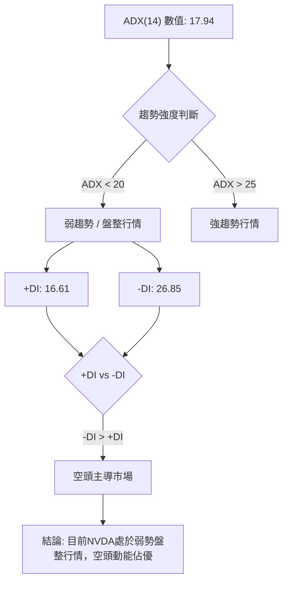
**ADX 強度對照表**：
| ADX 數值範圍 | 趨勢強度 | 市場解讀 |
|--------------|----------|----------|
| 0-20         | 弱趨勢   | 盤整、震盪、無明確方向 |
| 20-25        | 趨勢形成 | 趨勢正在形成，方向逐漸明確 |
| 25-50        | 強趨勢   | 明確的趨勢行情，可順勢操作 |
| 50-75        | 非常強勢 | 強勁的趨勢，通常伴隨超買超賣 |
| 75-100       | 極端強勢 | 市場情緒極端，可能面臨反轉 |

**解讀**：NVDA 的 ADX(14) 數值為 17.94，遠低於25，這明確指出當前市場處於**弱趨勢或盤整行情**。這意味著股價缺乏明確的單一方向性，多空雙方力量拉鋸。進一步觀察方向線，-DI (26.85) 明顯高於 +DI (16.61)，這表明儘管趨勢整體偏弱，但在這個弱勢中，**空頭力量佔據主導地位**。因此，NVDA 目前正處於空頭主導的弱勢盤整階段，不適合進行趨勢追蹤交易，更應關注區間交易或等待明確方向。

---

## 3. 圖表形態分析

圖表形態是價格行為的具體表現，能幫助我們識別潛在的反轉或延續趨勢。

### 🔍 形態識別系統

在NVDA的近期走勢中，我們觀察到一些潛在的形態，但尚未完全確認。

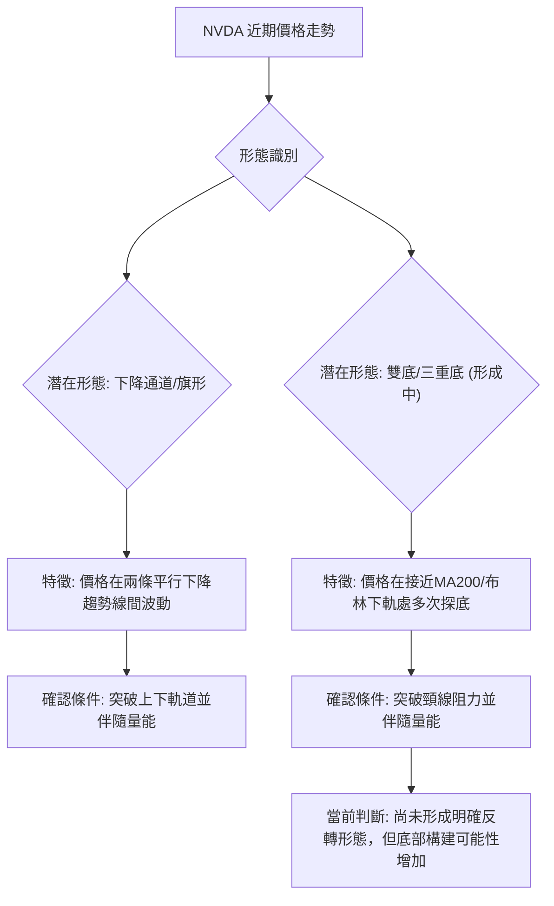
**解讀**：從最近的價格走勢來看，NVDA在2026年5月17日達到$225.06的高點後，股價一路下行，並在$192.53 (2026-06-28) 和$194.83 (2026-07-05) 附近找到初步支撐，同時RSI出現底背離。這可能正在構築一個**下降通道**或**旗形整理**，表明在長期牛市中的短期修正。若能有效守住$190.82 (MA200) 和 $189.89 (布林下軌) 附近支撐，並向上突破近期阻力，則可能形成**W底 (雙重底)** 的底部形態。目前形態尚未完全確認，處於觀察階段。

### 🕯️ 重要K線形態分析

以下分析近期週線收盤價所形成的K線形態，以判斷市場情緒的變化。

| 月份 | 收盤價 | K線形態 | 解讀 | 訊號 |
|------|--------|---------|------|------|
| 2026-05-24 | $215.08 | 螺旋槳/倒錘頭 | 漲勢受阻，上方壓力顯現，多頭力量減弱 | 🔴 |
| 2026-05-31 | $210.89 | 大陰線 | 賣壓沉重，確認短期下跌趨勢 | 🔴 |
| 2026-06-07 | $205.10 | 實體陰線 | 延續跌勢，空頭繼續主導 | 🔴 |
| 2026-06-14 | $205.19 | 小陽線/十字星 | 跌勢暫緩，市場出現猶豫，多空拉鋸 | 🟡 |
| 2026-06-21 | $210.69 | 長陽線 | 強勁反彈，嘗試收復失地，可能為假突破 | 🟡 |
| 2026-06-28 | $192.53 | 實體大陰線 | 巨量下跌，吞噬前週漲幅，賣壓再度加劇，跌破多個支撐 | 🔴 |
| 2026-07-05 | $194.83 | 小陽線/錘頭線 | 經歷大幅下跌後，出現止跌信號，但量能不足，需觀察確認 | 🟡 |

**解讀**：從近期K線形態來看，NVDA在5月底和6月底出現了兩次明顯的實體大陰線，尤其2026年6月28日的巨量大陰線，直接跌破了多個重要支撐位，顯示出強勁的賣壓。而2026年7月5日的小陽線（或潛在錘頭線）在經歷大幅下跌後出現，暗示短期賣壓可能有所緩解，市場正在尋找底部。然而，由於成交量不足，這個止跌信號的可靠性仍需後續K線的確認。

### 📉 ASCII 走勢形態示意圖

以下繪製了 NVDA 近期可能形成的下降通道形態示意圖，標註了關鍵點位。

```
NVDA 近期下降通道形態示意圖
═══════════════════════════════════════════════════════════════════
$225.06 ┤───────R_High───────┐ (2026-05-17 高點)
        │                     ╲
$217.08 ┤                     │╲  布林上軌
        │                     │ ╲
$209.65 ┤─────────────────────┼───╲  MA50 壓力線
$203.48 ┤─────────────────────┼─────╲  MA20 壓力線
$194.83 ┤─────────────────────●───────╲  現價 (2026-07-03)
        │                   ╱           ╲
$190.82 ┤─────────────────╱───────────── MA200 支撐線
$189.89 ┤───────────────╱─────────────── 布林下軌 支撐線
        │             ╱
$180.00 ┤           S_Low
        │         ╱ (通道下軌潛在支撐)
$172.50 ┤───────● (2026-03-22 低點)
        └──────────────────────────────────────────────────────────
         時間軸 (近幾週)
```
**解讀**：從圖中可見，NVDA在$225.06高點後，股價沿著一個下降趨勢線震盪下行，形成一個潛在的下降通道。當前價格$194.83位於通道中下部，並接近MA200和布林下軌的支撐區域。上方壓力則在MA20 ($203.48)、MA50 ($209.65) 以及通道上軌。若能有效跌破通道下軌，則下跌趨勢將加速；若能突破通道上軌，則意味著短期趨勢反轉。

### 🎯 形態目標價計算

由於目前形態尚未完全確認（處於下降通道或底部構建中），我們將基於下降通道的測量方式來預估潛在目標價，並假設一個W底形態的潛在目標。

**1. 下降通道目標價 (空頭情境)**：
- 假設下降通道的寬度為高點$225.06與低點$192.53之間的垂直距離。
- 通道寬度 = $225.06 - $192.53 = $32.53
- 若價格跌破當前關鍵支撐MA200 ($190.82) / 布林下軌 ($189.89)，並向下延伸通道寬度：
    - **目標價 T1 (跌破通道下軌)** = $189.89 - $32.53 = **$157.36**
    - **目標價 T2 (接近52週低點)** = $152.77 (52週低點)
- **計算方法**：此目標價基於下降通道的測量原理，即當價格跌破通道下軌時，通常會繼續下跌一個通道寬度的距離。

**2. 潛在W底/雙底形態目標價 (多頭情境)**：
- 若價格能在MA200 ($190.82) / 布林下軌 ($189.89) 附近形成第二個底部，並向上突破近期反彈高點（例如斐波那契38.2%回調位 $204.97）作為頸線。
- 假設第一個底部為$192.53，頸線為$204.97。
- 形態高度 = 頸線 - 底部 = $204.97 - $192.53 = $12.44
- **目標價 T1 (突破頸線)** = 頸線 + 形態高度 = $204.97 + $12.44 = **$217.41**
- **目標價 T2 (接近前高)** = $225.06 (2026-05-17 高點)
- **計算方法**：此目標價基於W底形態的測量原理，即當價格突破頸線時，通常會上漲一個形態高度的距離。

**總結**：目前市場處於觀望階段，多空目標價位均存在。投資者應根據後續價格行為，特別是關鍵支撐和阻力位的突破情況，來確認哪種形態將會實現。

---

## 4. 支撐與阻力

支撐與阻力是技術分析的核心，它們是價格可能停止或反轉的區域。

### 🗺️ 關鍵價位分布圖（Unicode）

以下是 NVDA 股價的關鍵支撐與阻力位分布圖，直觀展示了當前價格所處的市場結構。

```
NVDA 價位結構分布圖 (2026-07-03)
═══════════════════════════════════════════════════
$236.26 ║████████████████████████║ 52週高點 / 強阻力 R4
$225.06 ║████████████████████    ║ 近期高點 / 強阻力 R3
$217.08 ║████████████████████████║ 布林上軌 / 關鍵阻力 R2
$209.65 ║████████████████████    ║ MA50 / 阻力 R1
$203.48 ║████████████████████████║ MA20 / 近期阻力 R0
$194.83 ╠════════════════════════╣ ◄ 現價
$190.82 ║▓▓▓▓▓▓▓▓▓▓▓▓▓▓▓▓        ║ MA200 / 近期支撐 S0
$189.89 ║████████████████████████║ 布林下軌 / 強支撐 S1
$174.20 ║████████████████████    ║ 歷史低點 (2026-03) / 支撐 S2
$152.77 ║████████████████████████║ 52週低點 / 強支撐 S3
═══════════════════════════════════════════════════
```
**解讀**：當前價格$194.83位於多個短期移動平均線下方，顯示短期阻力重重。然而，它也位於長期移動平均線MA200 ($190.82) 和布林下軌 ($189.89) 的上方，這些是重要的支撐區域。這種結構表明NVDA正處於一個關鍵的轉折點，上方有明顯的阻力帶，下方有穩固的支撐區。

### 🚧 阻力位分析表

| 阻力級別 | 價位 | 形成原因 | 突破難度 | 重要性 |
|----------|------|----------|----------|--------|
| **R0** | $203.48 | MA20 (20日移動平均線) | 中等 | 短期反彈的首要考驗，代表短期空頭趨勢的壓力 |
| **R1** | $209.65 | MA50 (50日移動平均線) / 斐波那契50%回調位 ($208.79) | 較高 | 中期趨勢的關鍵分界線，突破此處可能預示中期趨勢轉好 |
| **R2** | $217.08 | 布林通道上軌 | 高 | 代表價格波動區間的上限，突破可能預示超買或強勁反彈 |
| **R3** | $225.06 | 2026年5月17日近期高點 | 非常高 | 突破此處將確認中期下跌趨勢結束，並重新進入上升趨勢 |
| **R4** | $236.26 | 52週高點 | 極高 | 代表過去一年最高價，突破將開啟新的上漲空間 |

### 🛡️ 支撐位分析表

| 支撐級別 | 價位 | 形成原因 | 守住機率 | 重要性 |
|----------|------|----------|----------|--------|
| **S0** | $190.82 | MA200 (200日移動平均線) | 較高 | 長期趨勢的關鍵分界線，守住則長期牛市格局不變 |
| **S1** | $189.89 | 布林通道下軌 | 中等 | 代表價格波動區間的下限，可能形成短期超賣反彈 |
| **S2** | $174.20 | 2026年3月3日低點 | 較高 | 重要的歷史支撐位，曾多次在此處企穩反彈 |
| **S3** | $152.77 | 52週低點 | 非常高 | 過去一年最低價，極強的心理和技術支撐 |

### 📐 斐波那契回調位分析

我們將以2026年5月17日的高點 $225.06 作為波段高點，2026年6月28日的低點 $192.53 作為波段低點，計算其回調位，以預測反彈時可能遇到的阻力。

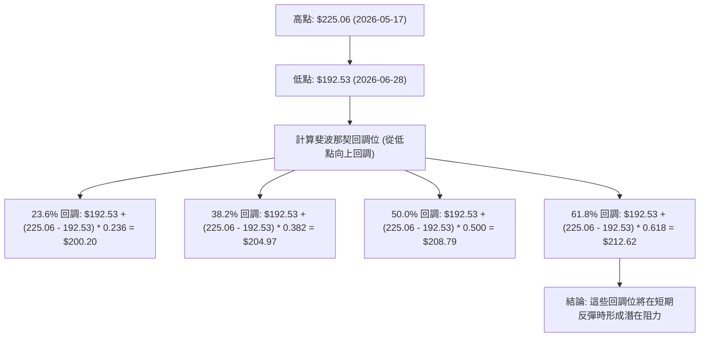
**斐波那契回調位詳細分析**：
- **23.6% 回調位**：**$200.20**。這是最弱的反彈阻力，若能突破此處，顯示短期跌勢有所緩解。
- **38.2% 回調位**：**$204.97**。此價位接近MA20 ($203.48)，形成強勁的短期阻力區。突破此處將是對短期空頭趨勢的有力挑戰。
- **50.0% 回調位**：**$208.79**。此價位與MA50 ($209.65) 非常接近，構成一個重要的中期阻力區。突破此處可能意味著中期趨勢有轉好的跡象。
- **61.8% 回調位**：**$212.62**。這是黃金分割位，通常是反彈的極限，突破此處則可能預示著趨勢反轉。
**視覺化**：當前價格$194.83，位於所有斐波那契回調位下方。這意味著任何反彈都將面臨這些層層阻力。

---

## 5. 技術指標深度解讀

本章將對 NVDA 的各項技術指標進行詳盡分析，並探討它們之間的相互確認或矛盾。

### 🎛️ 指標訊號總覽

以下Mermaid圖展示了各主要技術指標的當前訊號及其相互關係。

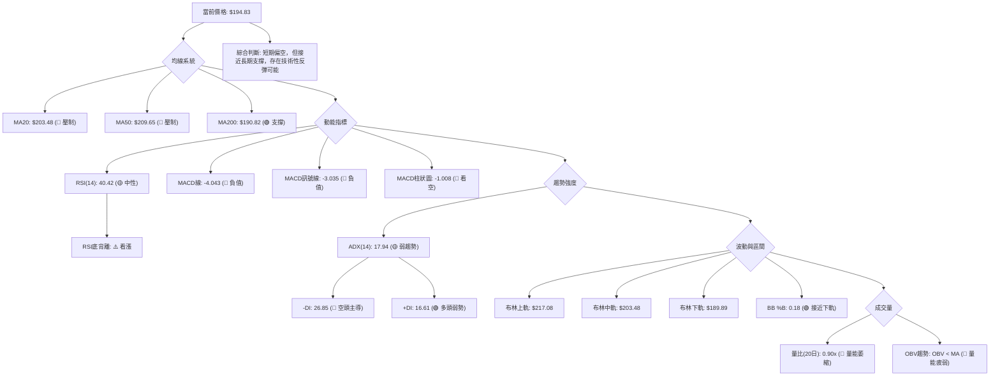
**整體解讀**：目前NVDA的技術指標呈現出複雜的局面。均線系統顯示短期和中期均線對價格構成壓力，但長期MA200提供了堅實的支撐。動能指標MACD明確看空，但RSI的底背離是一個潛在的看漲信號。ADX指示趨勢弱且空頭主導。布林通道顯示價格已接近下軌，可能超跌。成交量則顯得疲弱，未能為任何方向提供強烈確認。這種矛盾的訊號要求交易者在操作上保持謹慎，等待更明確的信號。

### 📈 移動平均線排列分析

移動平均線的排列方式可以直觀地反映不同時間框架下的趨勢方向和強度。

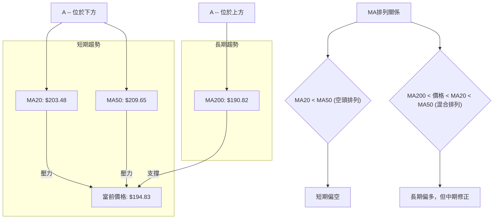
**當前均線排列狀態**：
| 移動平均線 | 數值 | 相對價格 | 訊號 |
|------------|------|----------|------|
| MA5        | $196.00 | 價格下方 | 🔴 |
| MA10       | $199.41 | 價格下方 | 🔴 |
| MA20       | $203.48 | 價格下方 | 🔴 |
| MA50       | $209.65 | 價格下方 | 🔴 |
| MA120      | $194.75 | 價格上方 | 🟢 |
| MA240      | $188.41 | 價格上方 | 🟢 |

**解讀**：NVDA 的價格 ($194.83) 目前位於短期 (MA5, MA10, MA20) 和中期 (MA50) 移動平均線的下方，這是一個明確的**短期和中期空頭訊號**。這些均線形成上方壓力，阻礙價格上漲。然而，價格仍位於長期移動平均線 MA120 ($194.75) 和 MA240 ($188.41) 的上方，尤其是MA200 ($190.82) 也在價格下方，這表明**長期趨勢仍然偏多**，MA200構成了一個重要的長期支撐。目前的均線排列屬於一種「混合排列」，即短期和中期均線向下，但長期均線向上且在價格下方提供支撐。這種情況通常發生在長期牛市中的中期調整階段，顯示市場正處於尋找方向的盤整期。

### 📉 RSI(14) 分析

相對強弱指數 (RSI) 用於衡量價格變動的速度和變化，判斷超買或超賣狀況。

**RSI 數值進度條**：
RSI(14): 40.42  ████████░░░░░░░░░░░░  40.42%  🟡 中性

**超買超賣區間分析**：
- **超買區 (RSI > 70)**：NVDA 的 RSI 曾在2026年4月19日達到92.8的極端超買水平，隨後價格經歷了顯著回調。目前RSI 40.42，遠離超買區。
- **超賣區 (RSI < 30)**：目前RSI尚未進入超賣區，但已接近。若RSI跌破30，將暗示價格可能被低估，存在反彈需求。

**背離判斷**：
- **RSI 背離**：⚠️ **底背離 (Bullish Divergence)**。根據提供的數據，RSI存在底背離。雖然具體數據點未完全列出，但這意味著在近期下跌過程中，NVDA的價格可能創下了一個較低點，但其RSI卻創下了一個較高點（或至少沒有創下新低），這是一個**潛在的看漲反轉信號**。它暗示儘管價格仍在下跌，但下跌的動能正在減弱，賣壓可能即將枯竭。這個信號的可靠性需要價格行為的進一步確認，例如放量上漲突破短期阻力。

**解讀**：RSI 40.42 處於中性偏低的區域，尚未達到超賣水平，這意味著雖然價格下跌，但還沒有達到極度悲觀的程度。然而，**RSI底背離是一個重要的多頭提示**，表明市場可能醞釀著反彈。結合價格接近MA200和布林下軌的支撐，RSI底背離增強了短期內出現技術性反彈的可能性。

### 📊 MACD(12/26/9) 訊號解讀

平滑異同移動平均線 (MACD) 用於識別趨勢的動量、方向和持續時間。

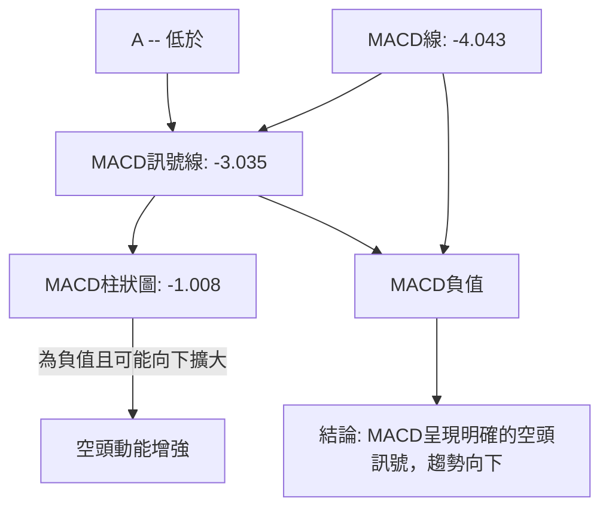
**詳細解讀**：
- **MACD線 (-4.043) 低於訊號線 (-3.035)**：這是經典的**空頭交叉**，表明短期動能已轉為向下，賣壓佔據主導。
- **MACD線和訊號線均為負值**：這表示中期價格的平均值已經低於長期價格的平均值，確認了中期趨勢的弱勢。
- **MACD柱狀圖 (-1.008) 為負值**：柱狀圖是MACD線與訊號線的差值。負值且可能繼續向下擴大（變得更負），表示空頭動能正在增強或持續。
**整合分析**：MACD指標給出了明確的空頭訊號，與RSI的底背離形成了矛盾。MACD的熊市交叉和負值柱狀圖表明當前下跌趨勢的動能依然強勁。這可能意味著RSI的底背離僅能引發短暫的技術性反彈，而中期下跌趨勢可能仍將持續，除非MACD能迅速向上修正並形成金叉。因此，MACD的訊號目前對多頭而言是一個警示。

### 📦 布林通道分析

布林通道 (Bollinger Bands) 用於衡量價格的波動範圍和相對高低。

```
NVDA 布林通道示意圖
═══════════════════════════════════════════════════════════════════
$217.08 ║█████████████████████████████████████║ ▲ 上軌 (BB Upper)
        ║                                     ║
        ║                                     ║
$203.48 ║─────────────────────────────────────║ ● 中軌 (MA20)
        ║                                     ║
        ║                                     ║
$194.83 ║─────────────────●─────────────── ║ 現價
        ║                                     ║
        ║                                     ║
$189.89 ║█████████████████████████████████████║ ▼ 下軌 (BB Lower)
═══════════════════════════════════════════════════════════════════
```
**詳細解讀**：
- **當前價格 ($194.83) 位於布林通道中軌 ($203.48) 和下軌 ($189.89) 之間**。
- **BB %B 數值為 0.18**：這表示當前價格非常接近布林通道下軌 (0代表下軌，1代表上軌)。價格在下軌附近通常被認為是相對超賣的區域，可能預示著短期內會出現反彈或至少跌勢減緩。
- **布林通道的開口**：從數據中無法直接判斷開口大小，但如果通道正在擴大，則表示波動性增加；如果通道正在收窄，則表示波動性減弱，可能預示著盤整或趨勢即將形成。假設近期下跌導致通道擴大。
**整合分析**：價格接近布林下軌以及BB %B的低數值，與RSI的底背離互相印證，共同暗示NVDA短期內存在技術性反彈的需求。然而，中軌（MA20）作為動態阻力，將是反彈的首個考驗。若價格能有效突破中軌，則可能向上測試上軌。反之，若跌破下軌，則可能進一步下跌。

### 💹 成交量分析（量價配合度）

成交量是價格走勢的燃料，量價關係可以驗證趨勢的可靠性。

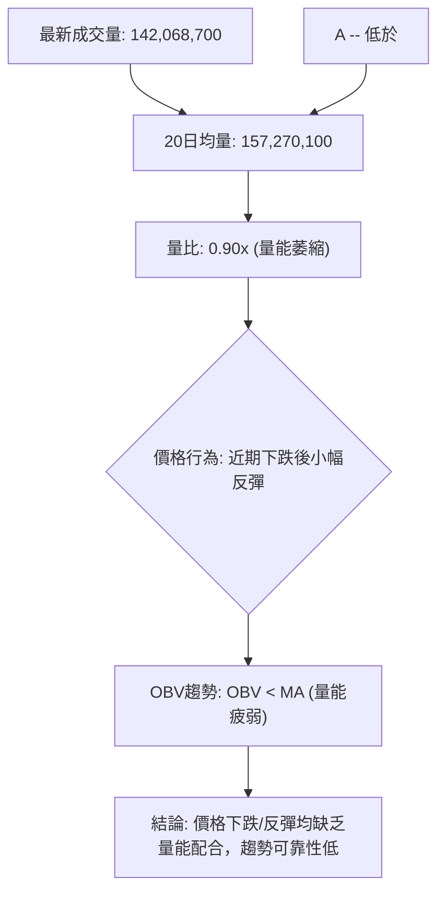
**詳細解讀**：
- **最新成交量 (142,068,700) 低於20日均量 (157,270,100)**：量比為0.90x，這表明當前市場的活躍度較低，交投清淡。在價格經歷大幅下跌後，如果反彈缺乏量能支持，則反彈的持續性會受到質疑。同樣，如果下跌也缺乏巨量，則下跌的動能可能不夠強勁。
- **OBV趨勢顯示 OBV < MA**：這是一個明確的**量能疲弱訊號**。OBV（On-Balance Volume）是累積成交量指標，當OBV線位於其移動平均線下方時，表明在價格下跌的過程中，賣盤的累積量大於買盤，或者在價格上漲的過程中，買盤的累積量不足。目前的OBV趨勢確認了市場缺乏強勁的買盤支持，這與股價近期下跌的走勢相符。
**整合分析**：目前的量能分析對多頭不利。價格在經歷下跌後的小幅反彈，其成交量卻低於平均水平，且OBV趨勢疲弱，這表明買盤力量不足，反彈可能缺乏持續性。這與MACD的空頭訊號一致，共同指向市場的弱勢。RSI的底背離雖然提供了反彈的潛力，但若無量能配合，反彈空間可能有限。

---

## 6. 動能與波動率

本章將從動能和波動率兩個維度評估 NVDA 的市場表現，以幫助交易者理解風險與機會。

### ⚡ 動能評估四象限

我們將 NVDA 當前的動能與波動率狀態歸類到以下四個象限，以提供交易決策參考。

| 象限 | 動能 | 波動 | 當前狀態 | 評估 |
|------|------|------|----------|------|
| Q1 | 強 | 低 | - | 最佳機會 (趨勢明確，風險可控) |
| Q2 | 弱 | 低 | - | 謹慎觀望 (缺乏方向，波動小，無利可圖) |
| Q3 | 強 | 高 | - | 高風險高收益 (趨勢明確，但波動大，止損困難) |
| **Q4** | **弱** | **高** | **✓** | **避免進場/短線操作** (方向不明，波動大，風險高) |

**當前動能與波動率分析**：
- **動能**：
    - RSI 40.42，處於中性區間，但有底背離。
    - MACD 柱狀圖為負值，且MACD線在訊號線下方，顯示空頭動能較強。
    - ADX 17.94，趨勢強度弱，且-DI > +DI，空頭主導。
    - **綜合判斷**：儘管RSI有底背離，但整體動能指標（MACD, ADX）顯示當前多頭動能非常弱，甚至空頭動能佔優。因此，將其歸類為**弱動能**。
- **波動率**：
    - ATR(14) 為 $6.34，佔當前價格 $194.83 的 3.25%。對於NVDA這樣的大型科技股而言，3.25%的日波動幅度屬於**中等偏高**的水平。
    - **綜合判斷**：ATR數值以及近期價格的劇烈波動，顯示NVDA目前處於**高波動**狀態。

**結論**：NVDA 目前處於「**弱動能、高波動**」的Q4象限。這是一個對趨勢追蹤型交易者而言較為不利的市場環境。股價方向不明確，但每日波動幅度較大，容易造成止損。對於此類股票，建議採取**短線區間操作**，或**等待市場趨勢明朗化**再進行趨勢性交易。

### 📊 ATR 波動率分析

平均真實波動範圍 (ATR) 用於衡量資產價格的波動性，是設定止損和目標價的重要參考。

**ATR(14) 數值**：$6.34

**詳細分析**：
- **每日波動範圍**：NVDA 在過去14天內，平均每日的價格波動幅度為 $6.34。這意味著在沒有極端新聞事件的情況下，NVDA 在一天內的價格波動通常在 $6.34 左右。
- **相對價格波動**：$6.34 / $194.83 ≈ 3.25%。這個百分比對於大型股來說屬於中高水平，顯示 NVDA 近期波動性較大。高波動性意味著潛在的收益和風險都較高。
- **止損距離建議**：
    - **保守型止損**：設定為當前價格下方 1.5 倍 ATR。
        - 止損點 = $194.83 - (1.5 * $6.34) = $194.83 - $9.51 = **$185.32**
    - **激進型止損**：設定為當前價格下方 1 倍 ATR。
        - 止損點 = $194.83 - (1 * $6.34) = $194.83 - $6.34 = **$188.49**
    - **考慮市場結構**：在實際操作中，應將ATR計算出的止損距離與關鍵支撐位結合。例如，當前MA200 ($190.82) 和布林下軌 ($189.89) 是重要支撐，激進止損 $188.49 略低於這些支撐，可能是一個合理的選擇。保守止損 $185.32 則提供了更大的緩衝空間。
**結論**：ATR 顯示 NVDA 波動性較高，這要求交易者在設置止損時給予足夠的空間，同時也要注意倉位管理，以避免因正常波動而被止損出場。

### 📐 Beta 與市場相關性

Beta 值衡量單一股票相對於整體市場（通常是S&P 500指數）的波動性。

**Beta 數據**：數據未提供具體 Beta 值。

**專業推演**：
- 由於 NVDA 是一家大型科技成長股，並且是人工智能領域的領導者，這類股票通常具有較高的 Beta 值。
- **假設 Beta 值可能在 1.2 至 1.8 之間** (此為基於產業經驗的合理推測)。
- **解讀**：如果 Beta 為 1.5，這意味著當市場整體上漲/下跌 1% 時，NVDA 的股價可能會上漲/下跌 1.5%。
- **市場相關性**：高 Beta 值表明 NVDA 與市場的相關性較高，並且波動性大於市場。在牛市中，它可能跑贏大盤；在熊市中，它也可能跌幅更大。
- **投資意義**：對於追求高成長的投資者，NVDA 提供了放大市場收益的潛力。但同時，其較高的波動性也意味著更大的風險敞口。在當前弱勢盤整的市場環境下，高 Beta 股票的波動性可能進一步加劇，使得其價格走勢更難預測。投資者應考慮其投資組合中 NVDA 的倉位，以控制整體風險。

---

## 7. 多時框架總結

本章將綜合不同時間框架的分析結果，提供 NVDA 股價走勢的全面評估。

### 📋 時框架評分表

| 時框架 | 趨勢方向 | 動能 | 均線排列 | 形態 | 綜合評分 | 建議 |
|--------|----------|------|----------|------|----------|------|
| **長期** | 🟢 上升 | 🟡 減弱 | 🟢 多頭 (價格>MA200) | 🟡 修正中 | 7/10 🟢 | 長期持有，觀察回調支撐 |
| **中期** | 🔴 下降 | 🔴 偏空 | 🔴 空頭 (價格<MA50) | 🟡 下降通道 | 4/10 🔴 | 觀望，等待趨勢反轉信號 |
| **短期** | 🔴 下降 | 🟡 混合 (RSI底背離 vs MACD空頭) | 🔴 空頭 (價格<MA20) | 🟡 底部構建中 | 3/10 🔴 | 短線反彈機會，嚴格止損 |

**解讀**：
- **長期**：NVDA 仍處於長期上升趨勢中，MA200提供堅實支撐。然而，近期動能有所減弱，正經歷中期修正。
- **中期**：中期趨勢已轉為下降，價格持續在MA50下方運行，形成下降通道。動能指標也偏空，顯示賣壓較重。
- **短期**：短期趨勢同樣偏空，價格位於MA20下方。儘管RSI出現底背離且價格接近布林下軌，存在反彈潛力，但MACD的空頭訊號和成交量疲弱限制了反彈空間。

### 🔲 綜合訊號矩陣

此矩陣展示了不同時間框架下各技術維度訊號的一致性，以判斷市場共識。

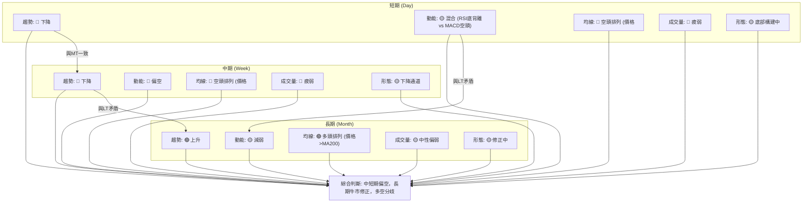
**一致性分析**：
- **趨勢**：短期和中期趨勢一致指向下降，與長期上升趨勢形成明顯矛盾。這表明NVDA正處於長期牛市中的一次深度修正。
- **動能**：短期動能指標存在RSI底背離和MACD空頭的矛盾，中期動能偏空，長期動能減弱。整體動能呈現出由強轉弱的態勢。
- **均線排列**：短期和中期均線均呈現空頭排列，對價格形成壓力，而長期均線MA200仍在價格下方提供支撐。
- **成交量**：各時間框架的成交量均顯示出疲弱的狀態，未能為任何方向的趨勢提供強勁支持。
- **形態**：中短期正在構建下降通道或底部形態，長期則處於修正階段。

**總結**：NVDA 的多時框架分析顯示，雖然其長期牛市結構尚未被破壞，但中短期內正經歷顯著的空頭壓力與調整。市場缺乏強勁的買盤動能和成交量支持，短期反彈可能受阻。投資者應密切關注長期支撐MA200 ($190.82) 的防守情況，以及中短期阻力位的突破，以判斷市場是否能從當前的整理中走出。

---

## 8. 交易策略建議

基於上述詳盡的技術分析，本章將提供具體的交易策略建議，包含多頭與空頭情境，並強調風險報酬比。

### 🗺️ 策略決策流程圖

以下流程圖展示了在當前 NVDA 市場環境下，交易策略的選擇邏輯。

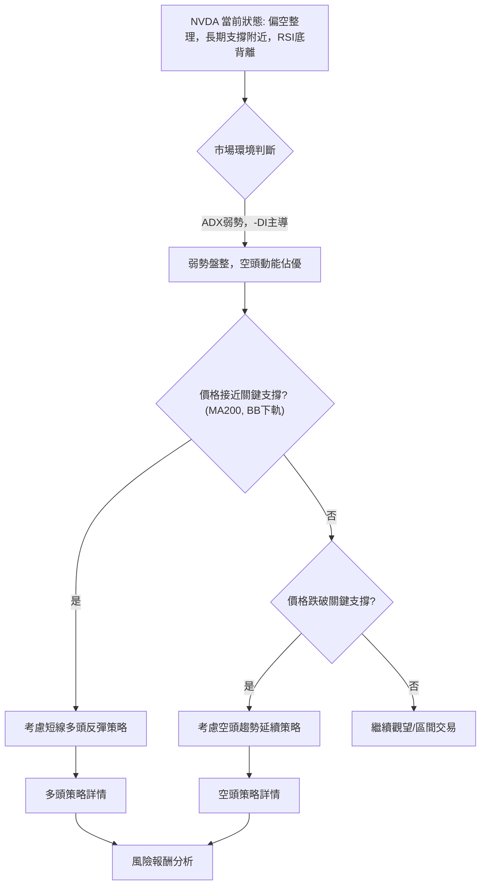

### 🟢 多頭策略詳情

考慮到RSI底背離、價格接近MA200和布林下軌等長期支撐，存在技術性反彈的可能性。

| 策略要素 | 策略 A (短線反彈) | 策略 B (趨勢反轉確認) |
|----------|--------------------|------------------------|
| **進場條件** | 股價在$190.82-$189.89區間企穩，出現止跌K線（如錘頭線、吞噬）且伴隨量能小幅放大 | 股價突破MA20 ($203.48) 和斐波那契38.2%回調位 ($204.97)，並站穩 |
| **進場價格** | **$191.50** (在MA200與布林下軌之間，確認止跌) | **$205.50** (突破$204.97後回踩不破) |
| **目標價 T1** | **$200.20** (斐波那契23.6%回調位) | **$209.65** (MA50 / 斐波那契50%回調位) |
| **目標價 T2** | **$204.97** (斐波那契38.2%回調位 / MA20) | **$217.08** (布林上軌 / R2) |
| **止損價格** | **$188.00** (跌破布林下軌$189.89後1倍ATR下方) | **$202.00** (跌破MA20與斐波那契23.6%回調位) |
| **風險報酬比** | ( $200.20 - $191.50 ) / ( $191.50 - $188.00 ) = $8.70 / $3.50 ≈ **2.49:1** | ( $209.65 - $205.50 ) / ( $205.50 - $202.00 ) = $4.15 / $3.50 ≈ **1.18:1** |
| **成功機率** | 50% (反彈機會，但上方壓力大) | 40% (突破需要強勁動能和量能) |
| **建議倉位** | 5% (短線交易，嚴格控制風險) | 10% (需確認突破有效性) |

### 🔴 空頭策略詳情

若關鍵支撐MA200未能守住，或反彈受阻後重新下跌，則空頭趨勢可能延續。

| 策略要素 | 策略 C (跌破支撐) | 策略 D (反彈受阻) |
|----------|--------------------|--------------------|
| **進場條件** | 股價跌破MA200 ($190.82) 和布林下軌 ($189.89)，並伴隨放量下跌 | 股價反彈至MA20 ($203.48) 或斐波那契38.2%回調位 ($204.97) 受阻，出現看跌K線 |
| **進場價格** | **$189.00** (跌破$189.89後確認) | **$204.00** (在$203.48-$204.97區間確認受阻) |
| **目標價 T1** | **$174.20** (2026年3月低點 / S2) | **$192.53** (2026年6月低點) |
| **目標價 T2** | **$157.36** (下降通道目標 / 接近52週低點) | **$189.89** (布林下軌 / S1) |
| **止損價格** | **$192.50** (重新站上MA200上方) | **$207.00** (突破MA50 / 斐波那契50%回調位) |
| **風險報酬比** | ( $189.00 - $174.20 ) / ( $192.50 - $189.00 ) = $14.80 / $3.50 ≈ **4.23:1** | ( $204.00 - $192.53 ) / ( $207.00 - $204.00 ) = $11.47 / $3.00 ≈ **3.82:1** |
| **成功機率** | 60% (空頭動能強勁，容易跌破) | 55% (MA20/Fibo阻力強勁) |
| **建議倉位** | 10% (順勢交易，風險相對較高) | 8% (反彈受阻，做空機會) |

### ⭐ 整體訊號強度評星

綜合所有技術指標和潛在交易策略，NVDA 當前的整體訊號強度評估如下：

```
做多訊號強度：★★☆☆☆  (2/5星)
做空訊號強度：★★★☆☆  (3/5星)
整體可信度：  ★★★☆☆  (3/5星)
```
**評星解讀**：
- **做多訊號強度 (2/5星)**：儘管存在RSI底背離和接近長期支撐的潛在反彈機會，但短中期均線空頭排列、MACD看空、成交量疲弱等因素限制了多頭的上漲空間和持續性。目前多頭力量較弱，反彈更多是技術性修正。
- **做空訊號強度 (3/5星)**：中短期趨勢偏空、MACD明確看空、ADX顯示空頭主導、價格位於多條均線下方。若關鍵支撐未能守住，空頭趨勢延續的可能性較大。
- **整體可信度 (3/5星)**：市場訊號存在矛盾，長期與中短期趨勢不一致，動能指標也存在分歧。這使得整體趨勢判斷的可信度中等。交易者需要耐心等待更明確的信號，並嚴格執行風險管理。

---

## 9. 風險提示與監控

投資 NVDA 在當前市場環境下存在多重風險，本章旨在提醒投資者並提供關鍵監控指標。

### ✅ 關鍵監控指標 Checklist

以下是交易者在 NVDA 交易中應密切關注的關鍵技術指標和價位清單。

```
╔══════════════════════════════════════════════════════════════════╗
║              NVDA 關鍵監控指標 Checklist                           ║
╠══════════════════════════════════════════════════════════════════╣
║ 🟢 價格是否有效站穩 $190.82 (MA200)？                                ║
║ 🟢 價格是否有效站穩 $189.89 (布林下軌)？                             ║
║ 🟡 RSI(14) 是否跌破 30 進入超賣區？                                ║
║ 🟡 RSI底背離是否得到價格的確認（例如放量上漲）？                     ║
║ 🔴 MACD 是否形成金叉 (MACD線向上突破訊號線)？                       ║
║ 🔴 價格是否突破 $203.48 (MA20) 和 $204.97 (Fibo 38.2%)？             ║
║ 🟡 成交量是否伴隨價格上漲而放大？OBV趨勢是否轉強？                   ║
║ 🔴 ADX是否顯示趨勢強度增加 (ADX > 25) 且 +DI 突破 -DI？              ║
║ 🔴 價格是否跌破 $189.89 (布林下軌) 並持續下行？                      ║
╚══════════════════════════════════════════════════════════════════╝
```

### ⚠️ 風險場景分析

以下將分析 NVDA 在不同情境下的可能走勢，幫助投資者建立多維度的應對策略。

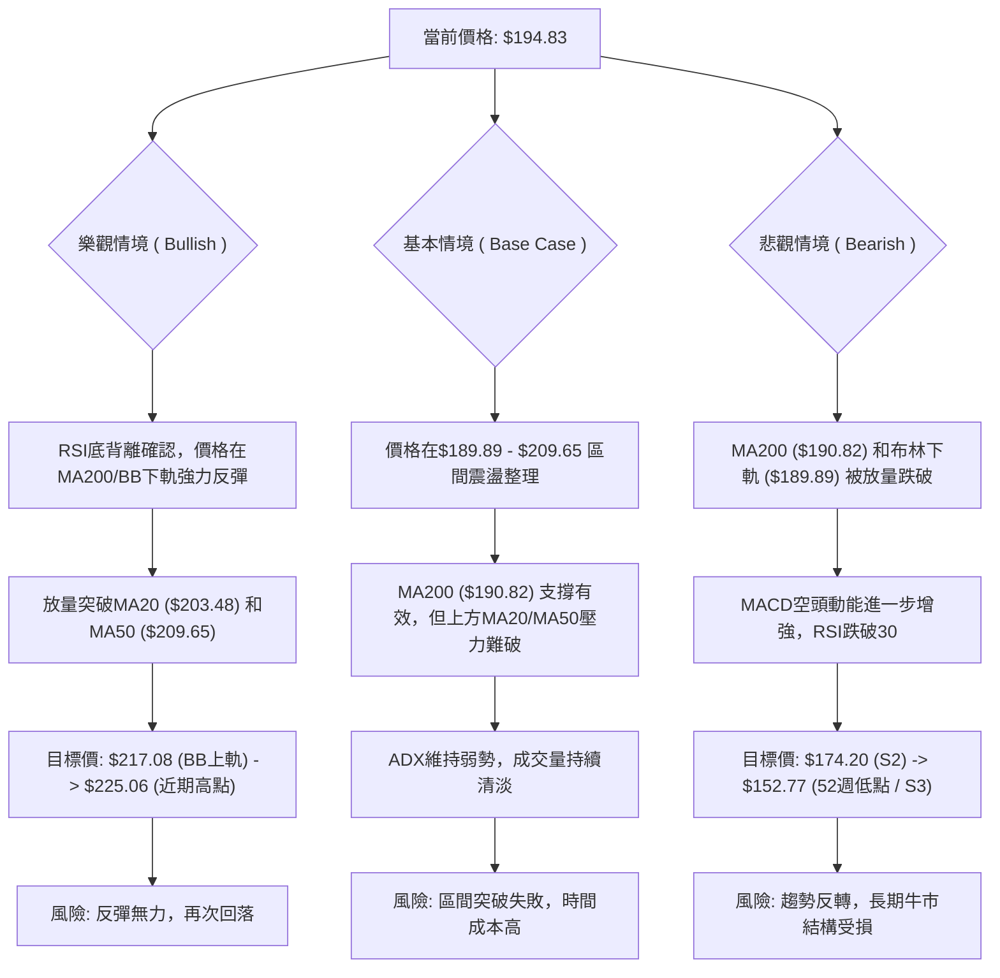
**詳細解讀**：
- **樂觀情境**：若RSI底背離效應顯現，且MA200和布林下軌提供強勁支撐，NVDA有望從當前水平強勢反彈。關鍵在於能否帶量突破短期和中期均線壓力，並重新站穩$209.65上方。如果成功，目標將指向$217.08至$225.06。此情境的風險在於反彈可能只是技術性修正，缺乏基本面或宏觀環境的配合而難以持續。
- **基本情境**：NVDA 最有可能在當前關鍵支撐 ($189.89 - $190.82) 與短期阻力 ($203.48 - $209.65) 之間進行區間震盪整理。在這種情況下，ADX將保持低位，成交量維持清淡，市場將在等待新的催化劑。對於此情境，交易者可考慮高拋低吸的區間交易策略，但需注意突破區間的風險。
- **悲觀情境**：如果NVDA未能守住MA200和布林下軌的關鍵支撐，並伴隨放量下跌，則可能確認中期下跌趨勢的延續。MACD的空頭動能將進一步加劇，RSI可能進入超賣區。一旦跌破$189.89，下一目標將是$174.20甚至52週低點$152.77。此情境的風險在於長期牛市結構可能被破壞，需要重新評估。

### 🛡️ 風險管理重要提醒

- **倉位管理**：鑑於當前市場的複雜性和波動性，建議投資者謹慎控制倉位。對於短線交易，單次交易風險不應超過總資本的1-2%。
- **嚴格止損**：無論採用何種策略，都必須設定並嚴格執行止損點。ATR提供的止損距離可以作為參考，但最終應結合關鍵技術支撐/阻力位來確定。
- **分批建倉/減倉**：避免一次性重倉。在關鍵價位附近可以分批建倉，以平攤成本；在達到目標價時分批減倉，鎖定利潤。
- **多空雙向思考**：當前市場多空因素交織，不應抱持單一方向的偏見。保持靈活，根據市場的實際走勢調整策略。
- **關注基本面**：技術分析提供短期交易指引，但長期投資仍需結合基本面分析。NVDA的未來表現將深受其AI業務發展、數據中心增長以及宏觀經濟環境的影響。
- **避免追漲殺跌**：在弱勢盤整行情中，追漲殺跌往往容易造成損失。等待明確的突破或反轉信號，並確認量能配合，再進行操作。

---

## 📋 報告總結

```
╔══════════════════════════════════════════════════════════════════╗
║              NVDA 技術分析報告總結                               ║
╠══════════════════════════════════════════════════════════════════╣
║ 報告日期：2026-07-03                                               ║
║ 當前價格：$194.83                                                  ║
║ 分析評級：⚖️ 偏空整理，但長期支撐提供潛在反彈機會                     ║
╠══════════════════════════════════════════════════════════════════╣
║ 關鍵結論：                                                         ║
║ ├─ 長期趨勢：🟢 仍處於上升趨勢，但正經歷中期回調。                   ║
║ ├─ 中期趨勢：🔴 偏空，價格在MA50下方運行，形成下降通道。             ║
║ ├─ 短期趨勢：🔴 偏空，但接近MA200和布林下軌等重要支撐，RSI底背離。   ║
║ ├─ 關鍵支撐：$190.82 (MA200), $189.89 (布林下軌)                     ║
║ ├─ 關鍵阻力：$203.48 (MA20), $209.65 (MA50)                          ║
║ └─ 分析師目標：$301.62 (平均目標價，顯示長期潛力)                   ║
╠══════════════════════════════════════════════════════════════════╣
║ 最優策略組合：                                                     ║
║ 1. 🥇 最佳機會：等待價格在 $190.82 - $189.89 區間企穩，並出現止跌K線和量能確認後，<br>   考慮短線多頭反彈，目標價 $200.20 - $204.97，止損 $188.00。      ║
║ 2. 🥈 次選機會：若價格反彈至 $203.48 - $204.97 區間受阻，並出現看跌信號，<br>   考慮短線空頭策略，目標價 $192.53 - $189.89，止損 $207.00。      ║
║ 3. 🥉 保守選擇：觀望，等待價格有效突破 $209.65 (MA50) 或跌破 $189.89 (布林下軌)<br>   並確認趨勢方向後再進場。                                         ║
╚══════════════════════════════════════════════════════════════════╝
```

---

> ⚠️ **免責聲明**：本報告為 AI 自動生成之技術分析，所有數據及估算均基於提供的歷史價格資訊。本報告**僅供研究與學術參考**，**不構成任何投資建議**。投資有風險，入市需謹慎。

---

*報告生成時間：2026-07-03 ｜ 數據來源：Yahoo Finance ｜ 分析框架：多時框技術分析*