<details>
<summary>📊 靜態圖表 (點擊展開)</summary>

</details>

<html>
<head><meta charset="utf-8" /></head>
<body>
    <div style="height:500px; width:100%;">                        <script>window.PlotlyConfig = {MathJaxConfig: 'local'};</script>
        <script charset="utf-8" src="https://cdn.plot.ly/plotly-3.6.0.min.js" integrity="sha256-QaOVwtVY0T02VaHrr6pnoHLCwayMJp4O5n4YyaE3rJk=" crossorigin="anonymous"></script>                <div id="candlestick-chart" class="plotly-graph-div" style="height:100%; width:100%;"></div>            <script>                window.PLOTLYENV=window.PLOTLYENV || {};                                if (document.getElementById("candlestick-chart")) {                    Plotly.newPlot(                        "candlestick-chart",                        [{"close":{"dtype":"f8","bdata":"AAAAIAjVZUAAAADAVkJlQAAAACB\u002fAGZAAAAAAD0OZkAAAABACexmQAAAAKB8RmZAAAAAgNMXZkAAAABg1i5mQAAAACDRPmZAAAAAwMmzZkAAAABg9EpnQAAAAGAMYGdAAAAA4MeUZ0AAAAAgMWxnQAAAAIC3KWdAAAAAwLwZZ0AAAADAz5tnQAAAAABkCmhAAAAAgKfdZkAAAABgkIJnQAAAACCfeWZAAAAA4DpzZkAAAABggrJmQAAAAGCS32ZAAAAAIAnNZkAAAABgvJ1mQAAAAICcgWZAAAAA4LG9ZkAAAAAgukBnQAAAAODf52dAAAAAIMQYaUAAAABA19hpQAAAAMA1VGlAAAAAIG1HaUAAAAAgutNpQAAAACD7zWhAAAAAYMNeaEAAAADg5HpnQAAAAGAhfWdAAAAAoHzZaEAAAAAgPx1oQAAAAECzMWhAAAAAQOdTZ0AAAAAgsL1nQAAAACCYS2dAAAAAoCCkZkAAAACACUlnQAAAAOAdjWZAAAAAQN5UZkAAAACgKMpmQAAAAOD9MmZAAAAAwPiAZkAAAAAAyRhmQAAAAEAbdmZAAAAA4FKnZkAAAABAj2tmQAAAAOAC5WZAAAAAYALGZkAAAAAAXipnQAAAAGDUF2dAAAAAwMvxZkAAAADgtJZmQAAAAEDR2WVAAAAAQGgCZkAAAACgHDBmQAAAAIBqV2VAAAAAALG9ZUAAAAAAoJhmQAAAAGDr7mZAAAAAQFifZ0AAAADgKoxnQAAAAGCIyWdAAAAA4LN\u002fZ0AAAAAg+GlnQAAAAMC6SGdAAAAAoNaTZ0AAAADAgXxnQAAAAKBhYGdAAAAA4CWcZ0AAAAAAERpnQAAAAEBQFGdAAAAA4N4WZ0AAAABArTJnQAAAAEBX3WZAAAAA4E5aZ0AAAACgGUBnQAAAAIBMO2ZAAAAAIBjjZkAAAACgrBNnQAAAAMAfbmdAAAAAYMVHZ0AAAACASolnQAAAAIAs6WdAAAAAwNAIaEAAAACgtdxnQAAAAMBILGdAAAAAgNmDZkAAAABASr9lQAAAAMB1dWVAAAAAgOQlZ0AAAAAg37lnQAAAACDuiWdAAAAAIDG6Z0AAAAAAy1ZnQAAAACDL0mZAAAAAYNQXZ0AAAAAgCHhnQAAAAKB5dWdAAAAAQNeyZ0AAAAAAIupnQAAAAMCuE2hAAAAA4EtqaEAAAADARRVnQAAAAEAsH2ZAAAAAID\u002fIZkAAAADAlHpmQAAAAAAl2mZAAAAAgLvjZkAAAAAATzNmQAAAAACuzWZAAAAA4G8RZ0AAAACgBzpnQAAAAGCo3WZAAAAAAEmBZkAAAAAAN+BmQAAAAID7tmZAAAAAYBSGZkAAAACgREtmQAAAAGD3j2VAAAAA4O\u002ftZUAAAACA399lQAAAAIAaT2ZAAAAAIE1hZUAAAABAZupkQAAAAIBJn2RAAAAAoE3GZUAAAAAAdPFlQAAAACDfJWZAAAAAwNwtZkAAAADAkDxmQAAAAADHu2ZAAAAA4ET2ZkAAAAAgIo1nQAAAACDeomdAAAAA4P+IaEAAAACAbtRoQAAAAKDPw2hAAAAAID8uaUAAAACAZDppQAAAAOC29GhAAAAA4HRIaUAAAAAAC+1oQAAAAKDhAGpAAAAAYHMLa0AAAADAf51qQAAAAIA0IGpAAAAAQM7qaEAAAADgAcdoQAAAAED3x2hAAAAAAK6IaEAAAABg0fJpQAAAAAAfaGpAAAAAIGLeakAAAADA52VrQAAAAEC8kGtAAAAAwCUybEAAAAAA5m5tQAAAAMDYIWxAAAAAYPXBa0AAAABATYtrQAAAACC35mtAAAAAgCRoa0AAAADgieJqQAAAACCE02pAAAAAwEeLakAAAADABMBqQAAAAGCdXGpAAAAAgCkDbEAAAACA8NFrQAAAAAAA0GpAAAAAwB5Va0AAAABAM6NpQAAAAOB6FGpAAAAAgBQGakAAAACgcA1pQAAAAADXm2lAAAAAgBSmaUAAAABgZo5qQAAAAMAe7WlAAAAAwMyUaUAAAACAFFZqQAAAAMDMFGpAAAAAoEcBaUAAAAAAAOBoQAAAACCud2hAAAAAwPUQaEAAAABACl9oQAAAAEDhAmlAAAAAYI+yaEAAAABgj1poQA=="},"high":{"dtype":"f8","bdata":"ZaYKycMoZkDLWcYiV59lQAiUtUb7G2ZAAuk4CU07ZkDoQArxEwpnQBfMfx0BxmZADFc1raFxZkCwxeLu+IBmQMnyVANQcWZAodfoEID4ZkBZZwA3kGNnQOko6rvPfGdAvJYMFtDZZ0BJuTuowsNnQJwVXF26X2dAuL83rTaaZ0BryALDeKtnQJUjFaOjYWhA+2lOu91raEAIBUVSxbtnQMYuhTkREmdAevKM6E0UZ0Cl\u002fjlJfeFmQAnGODGy+2ZAVZCt6dkeZ0C0eMc91NFmQHezXUaa5mZAx\u002fjiy3\u002fZZkA94mzfZWdnQHz0lW0s+GdApN8PAYVcaUDyEwdjbn1qQJMlxoC3vGlAF5\u002fXEJD2aUAvyU3VQ2JqQLLi6sa5dmlA69QALCtVaUBvBrz0yKtoQOh201mQgmdANi+XNu71aEAGcL1qeWVoQJIvq7B+dGhA4DM51UbmZ0DMOvubiNhnQNRq59RLmGdAFG15OhESZ0BN7FDE3HNnQNU9cLcCeGhA9nSUeWUKZ0A6ZRgWhehmQJUntpPbPWZAAUBz+KnVZkD6Q5a6+GFmQBk+60hAgmZA0imBbI0tZ0BbM\u002f+H9sZmQDRBc19yCWdAnjvD6+sNZ0CNMxvtq3hnQDtr+OPML2dAVaABKSEoZ0BFKJf7K6NmQPigxwgd02ZASycX\u002fntGZkDeHMHQuEhmQN5HBTRL\u002fWVAEXXU0O79ZUCOx+CoU6dmQIcDRe\u002fw\u002fWZAfjZ1DS6jZ0CkVI+BwZVnQIwlyJGRDmhAIC1tHPaQZ0B7ILAnUJhnQLoNTrt9ymdAmo+qKD0WaECiF\u002f7DnCxoQG69ge3y\u002fWdAZFMxMmHkZ0Aqxu39NapnQAxz2JqdQ2dAfD6cnotcZ0B\u002fLjHsL3xnQOonv5OHB2dA1cidLQGvZ0DtyF\u002f8p8ZnQN0qVf0MxWZA3e5oEe8kZ0BjHia6Lj5nQMDxPx3Pq2dA8nLurXecZ0A2+eXal7hnQOBgcJezA2hAy5fsUdEnaEAeDRA4GUhoQIl8sHEuwmdAq5jn8WBBZ0CT3YNWj2tmQNrDtvNYE2ZA28AP4rVYZ0A3k8ofki1oQJIXdU7bB2hA7LW3V8kgaEBifm0Q+StoQCDqDtKwaGdAhGHCHoFdZ0A\u002fP\u002fgla8RnQO9LABZqhmdAs4QhCSTDZ0DY33HM1jZoQDuWsDEWMWhA8XCNt3SsaECx9iWxtEFoQJEJfhzDy2ZAqHBlmJHnZkDiiGdkv5VmQJOiJy8zD2dABWN3kL76ZkCDhPITMtFmQADYvWf91WZAZaZd1c9GZ0C7qim22WxnQDYvnNUwF2dAgvItjvI7Z0D2qjPGH5VnQBnBaajkJWdA6vPONFTlZkCgLzi1p3hmQEwQwNmtQWZA+Nsa9zFFZkAt+bKleQBmQJQi5gZKoGZAbvxhnr4JZkAFw\u002f+4q1hlQFa0LG8WKGVAPBjqxlXNZUC29CCNOyVmQMYu12sRKWZAR9LMEagyZkDhMqRiuEBmQAqqrixrIWdA+8744LP7ZkAdhlwP7LhnQH9QgQkOrmdAAAAA4P+IaEBIGcuoVQVpQLYV3lHB82hAkkwpz+IuaUBKanGT6D1pQDeld4FyUGlAAAAA4HRIaUCyCriK93JpQBM08ZCKVmpA3n\u002fjhnsSa0DGToxfXM9qQHRBlqgdj2pAHUixC8RBakA1PvwbcFhpQHYdVkHYL2lAjS\u002f7dDgAaUCxb8mt4QBqQGGgR6BrvmpAhWWBlHwxa0BNl42ZUcFrQHLCGC2q72tA4hrrdGRybEAxgfbed4htQBKtnFBg52xARVHCom63bEBe2OJX\u002fwZsQC2AAYK8O2xA9NyhIVRkbECtsSU1FphrQFBrztahPWtAtjLfd9K8akA5QGaDnOhqQFStdopnM2tA3TLrgnYTbEDv2RGITgBtQOXT+4nw0WtAAAAAQDOza0AAAAAA19tqQAAAAEAKT2pAAAAAwMxsakAAAABACudpQAAAAMAetWlAAAAAgD3iaUAAAABguJZqQAAAACCub2pAAAAAYLgmakAAAADgemxqQAAAACCuv2pAAAAA4KN4aUAAAACgcDVpQAAAAKCZGWlAAAAAoJlxaEAAAACAwoVoQAAAAAApFGlAAAAAQDP7aEAAAACA6wFpQA=="},"hovertemplate":"\u003cb\u003e%{x|%Y-%m-%d}\u003c\u002fb\u003e\u003cbr\u003e\u958b: $%{open:.2f}\u003cbr\u003e\u9ad8: $%{high:.2f}\u003cbr\u003e\u4f4e: $%{low:.2f}\u003cbr\u003e\u6536: $%{close:.2f}\u003cextra\u003e\u003c\u002fextra\u003e","low":{"dtype":"f8","bdata":"kHuuVw3FZUCR6dd9QQZlQLQcwJmrl2VAZfp\u002fbJ7eZUCQiOddmc9lQIx9P6qJ\u002f2VA15M1YqblZUDvHe90Gp1lQB61eySh1mVALajz9uOCZkBbSjdY9qdmQMFQ69lN9WZAUn0oKUF6Z0B2OAGAmiRnQMOhuk8W42ZAaOkr+n\u002f4ZkDc\u002fnQRrUlnQOsH2MEh2mdAH0os9S26ZkDI+W3gIzdnQJ0ujzETb2ZAu9YuoQ0iZkAAoGAJUHFmQItvf1WscGZAt2bS3vOvZkCFiP5wRXJmQDXyVlsdEWZAY8lEe\u002fNxZkCSp2sNhehmQGOTmy4UhmdAc3lcSUz1Z0C7zwP1nJBpQKiWihHpJGlAXaj54QA6aUDBVFlmiqlpQHq3TQ6xtWhAENn7l91MaEBTxQk9kERnQPASt8vTVWZAsOjKgmExaEBebLtozeFnQPW2x3xe3GdAqsq9yLTzZkC2jFDzMotmQBuvjSq6AmdA5lQQGHptZkBqbYWBG9NmQJRyYX7ec2ZA7d7K17WWZUC1bfJ3KghmQA3JB02wKmVAEGRwFGpAZkByAa83zghmQLUZgDyurmVAXI8hvKl4ZkBtAjoiOFxmQGY8pmG0d2ZA7IIoWBGWZkAjuS6PsMVmQALjPxcY42ZAtyg0\u002fS66ZkBq3S5j9AxmQBKF7l0IzWVA9+ci8yLaZUBGU7JE+9VlQGTGmslHQ2VA2Ewox4pzZUCRujGHAQRmQDg\u002fV38XxGZAfS+yl6vVZkCYuqcom0tnQO1VdN+reGdAIH2Tbd81Z0CHq1oWeVZnQGvUiPloSGdAAZVUI\u002fuAZ0ARKp0oiz1nQEyt9DD1UmdAVb23sqVKZ0AQ19EFj+9mQGCCRKBH7mZABY8paYHZZkC8ctOMpuVmQC\u002f5ClqNkmZAfwCCz0tDZ0AdbDNfTjtnQDWVK7eYLGZAKSf0eNhFZkBVBdr0lvZmQB+nihv1UmdAAbtECm44Z0AvMZIkKS9nQFIPO6R6s2dA3\u002fLlvao6Z0AH4+Fwp6dnQBXhCenzFGdAxHhOZH0AZkCU+JBAa3ZlQIFvhftKWmVAGysh4GTMZUBqhmWmOvdmQNml+LCBfGdAHW7mJUiRZ0BbE4aqDElnQBfX1gzNq2ZAFzzFZ8ZeZkA0weMMClFnQK+jjPrhLWdAt4ok+NQ2Z0ADNABpK6tnQNiZF6N+ZWdAzjAAqrkxaEDHTTMQDgNnQBd\u002fUtVIBWZAwJqYHKzNZUAAEK78ihZmQMVIDp3memZAC1fAvTk1ZkA1VKz6WBNmQKNkIIET62VA6Np5azm5ZkD0v29RhwdnQAs0cME6sWZAYLTUdGB3ZkCOzMHCXKZmQM87WOL9rmZA0q7fqteDZkCqvK4qu\u002fJlQF3\u002fkpikcGVA9AdoRM\u002fRZUAp75Xi4LhlQL6xrLOcFGZAkg8l1BpeZUDHCSodGdpkQHErK1WFgmRAMBQgM4DYZEDjMUmJfdFlQL0Fg6l0ZWVAboDnrcXxZUCRTeOXpq5lQNcMgznigmZAgiIfgByNZkDSmQ0LvAJnQNYfrcvCMGdA3s0onYjRZ0BeLkl5Y3BoQGRbOxmgcmhAgHDGezfhaEBikMR+grNoQP8tXESW2GhAOtGhQJbYaED8whJ0sZ9oQO6bpu558mhA3lEgRm\u002fkaUCO81vlpP5pQKKjA83T6mlAhhUNbP\u002fOaECj3vUuf5xoQOhh8epsUGhA53V7O6h5aEBDsYYNH8xoQNAv565OyGlASE58p4yUakClmtsNg7RqQMPcfQJv1WpA3DMZgPypa0A4xzHqDqFsQA51o6xT\u002f2tAngo0i7RDa0B5TrWfADVrQBtWzjLJh2tASm1cMaQ1a0AJq+ktmdFqQLP9M0YaeGpAd9oiri4RakCcz3flK19qQEBLZphLXGpARmM0Vl3uakDuoOhE9KJrQIFK8ilUyGpAAAAAQApfakAAAABgj4ppQAAAAAAAwGlAAAAAQOHqaEAAAACgcP1oQAAAAKBH8WhAAAAAgBRuaUAAAABA4QpqQAAAAKBH6WlAAAAAYI9iaUAAAAAAANBpQAAAAEAK92lAAAAAAAAAaUAAAABgj5JoQAAAAAApBGhAAAAAQArnZ0AAAACgmblnQAAAACCFY2hAAAAAYGYuaEAAAABAMwtoQA=="},"name":"\u50f9\u683c","open":{"dtype":"f8","bdata":"9iG5AMkYZkAJEaV6cY1lQNSMFrVEuGVAObtNpHnxZUCB5+N1dOJlQOBxk2+ft2ZAUITo509xZkCBTcJ+P8hlQAACcHUtPmZA2VQo0WeGZkB3R1pVI7tmQKCycj4hIGdAHI5h13irZ0AW4tA9Xp5nQGxZ1kpwKGdAI4Ya1cQ\u002fZ0BnOUehokpnQAbOTiyG\u002f2dAOwzOn24oaEAnuv7GYHdnQPqFqMkbEWdAkaCFQxESZ0CCDxKe7r9mQCgX2VhqfmZALiUWI7LcZkC0eMc91NFmQBQlmKYYnWZA3H1E6BWGZkD\u002fyxvBYvNmQBfUJIfvt2dAReowRLsZaEClPgTx4fZpQBgu1QpwnGlAWWhaDfzFaUAnEUH6E\u002fppQEwtMqa5V2lACaUKuonQaEBbuCsab4VoQCRFDUpDFWdAC6W5PJFbaEA8b0dBKl1oQHeoz9YPb2hAPx8MB9DZZ0DCNWLoENRmQHYW7rJ1N2dAokTRa6\u002fkZkDk\u002fJJNvxFnQOQgBJ1pdmhATyQgv0qgZkDrjr4OXWhmQKhh+X391WVAt8L9k8GsZkCuCJHmBVlmQDq2kFcy0WVA4LWjPumwZkCgb7TTLZtmQFFvmHDCrGZAY7fyuk\u002f1ZkA+NQ1KXM1mQPCTu7yvKmdAbIvkX9QXZ0BIx5qc7oFmQJB+dLl1nGZADitsqCQ3ZkAZPhnScgFmQDotqsBV\u002fGVAd1+f+yfKZUAT0iacjQ5mQCLEazRF9mZA3ZLaZOjXZkDdtLHvwHZnQIt1YlYJtmdA38buFmdvZ0A6ALKjV4BnQPl+lZzZqmdABErTvnqzZ0CN2SpN2PBnQN1lsaQ2yWdA+YeRo+OKZ0BfgAniJZxnQFmH7k1YG2dAzxk3yuXfZkAHGkzVyRhnQAIJaBkOA2dAHFwvvbpIZ0CcI99uMJtnQGOCm4e1tWZAMAFn3J5aZkDBi+tFzBBnQDnuTtKwaGdAJJY3\u002fdJdZ0Ax9yWGYWBnQD\u002fHuP4u4WdAGcYCzWvjZ0Cbq50zRN9nQLk6xyEaX2dASc6LfmtAZ0DGFA+JuWdmQCJzKNDw1mVAUFnZRDEPZkBYcW4OIwFnQAXwmyiz5GdAMXDy7OUGaEDUfSJ6bxloQIszKiUNaGdAXywoQuqwZkAJGMZQpJBnQGK99MGgWmdAPbqvrvdKZ0DGHj+fVuVnQElNYTI36GdAZmDT09FGaEB6NzckEUFoQO8H0TvvoGZARYtha3\u002fZZUCRoo3RuEhmQJfkP9ILh2ZAvcwiiGCeZkDAmZaX3nNmQNcvl7SqE2ZAZa0TZ7DFZkBnJfXEMTZnQP\u002f3YnK++mZANayfFo0WZ0CcjVNiOdhmQDAQeaYGG2dAaTYH6o\u002fIZkCwusY+sDlmQKoSgXReOWZA9lYDbbchZkDmJ1QHDNRlQEABVVGaHGZA+duFcK77ZUDjzzW5qjllQD7q2TKsEmVA2dK5+tHYZECHs62dcfllQIht8m9Yf2VAJYLgM4UeZkAxtC060PBlQC2oDowgCWdAfVCmHRu0ZkAYLafSDQNnQMPpsacHOmdA40lJUsXTZ0Azz0NY9YloQDcFJKZnpmhA5fW1WVr1aEBP\u002fST26PdoQLt6EGuhPGlA9o9iZjEYaUA60lybLUdpQNVaaWBF92hA3OQrYP0sakB5XwlY4CdqQDCHbPl5jmpAfwUKc\u002fA1akCbJQ9DdiFpQGDVuWWR6GhAXBvy6yziaECREpCYCPVoQAONxWIeA2pAJx+zMQaZakBIGqlfTrlqQOSrRGR1SWtAGqU6dWEVbEAJGXRLo7JsQDcricjCr2xASCgk4EazbEDFz\u002fmQqGtrQKQAAyRy3WtAYC0Cvf\u002fAa0AtgbIhkpRrQLOzlZo2CWtAzlMcAd27akAwSf3SFmFqQMNg7BGRympAaH33zFLvakDX5GPrS11sQE9ohsfHrmtAAAAAwB69akAAAADA9dBqQAAAAIDCRWpAAAAAANdTakAAAACAwo1pQAAAACCuL2lAAAAAIIWbaUAAAACgcB1qQAAAAIDCZWpAAAAAwPUQakAAAABgj+ppQAAAAIAUbmpAAAAAoHBFaUAAAAAA1wNpQAAAAGCPAmlAAAAAANcjaEAAAABAMztoQAAAACCup2hAAAAAYGaGaEAAAADgeqRoQA=="},"x":["2025-09-16T00:00:00-04:00","2025-09-17T00:00:00-04:00","2025-09-18T00:00:00-04:00","2025-09-19T00:00:00-04:00","2025-09-22T00:00:00-04:00","2025-09-23T00:00:00-04:00","2025-09-24T00:00:00-04:00","2025-09-25T00:00:00-04:00","2025-09-26T00:00:00-04:00","2025-09-29T00:00:00-04:00","2025-09-30T00:00:00-04:00","2025-10-01T00:00:00-04:00","2025-10-02T00:00:00-04:00","2025-10-03T00:00:00-04:00","2025-10-06T00:00:00-04:00","2025-10-07T00:00:00-04:00","2025-10-08T00:00:00-04:00","2025-10-09T00:00:00-04:00","2025-10-10T00:00:00-04:00","2025-10-13T00:00:00-04:00","2025-10-14T00:00:00-04:00","2025-10-15T00:00:00-04:00","2025-10-16T00:00:00-04:00","2025-10-17T00:00:00-04:00","2025-10-20T00:00:00-04:00","2025-10-21T00:00:00-04:00","2025-10-22T00:00:00-04:00","2025-10-23T00:00:00-04:00","2025-10-24T00:00:00-04:00","2025-10-27T00:00:00-04:00","2025-10-28T00:00:00-04:00","2025-10-29T00:00:00-04:00","2025-10-30T00:00:00-04:00","2025-10-31T00:00:00-04:00","2025-11-03T00:00:00-05:00","2025-11-04T00:00:00-05:00","2025-11-05T00:00:00-05:00","2025-11-06T00:00:00-05:00","2025-11-07T00:00:00-05:00","2025-11-10T00:00:00-05:00","2025-11-11T00:00:00-05:00","2025-11-12T00:00:00-05:00","2025-11-13T00:00:00-05:00","2025-11-14T00:00:00-05:00","2025-11-17T00:00:00-05:00","2025-11-18T00:00:00-05:00","2025-11-19T00:00:00-05:00","2025-11-20T00:00:00-05:00","2025-11-21T00:00:00-05:00","2025-11-24T00:00:00-05:00","2025-11-25T00:00:00-05:00","2025-11-26T00:00:00-05:00","2025-11-28T00:00:00-05:00","2025-12-01T00:00:00-05:00","2025-12-02T00:00:00-05:00","2025-12-03T00:00:00-05:00","2025-12-04T00:00:00-05:00","2025-12-05T00:00:00-05:00","2025-12-08T00:00:00-05:00","2025-12-09T00:00:00-05:00","2025-12-10T00:00:00-05:00","2025-12-11T00:00:00-05:00","2025-12-12T00:00:00-05:00","2025-12-15T00:00:00-05:00","2025-12-16T00:00:00-05:00","2025-12-17T00:00:00-05:00","2025-12-18T00:00:00-05:00","2025-12-19T00:00:00-05:00","2025-12-22T00:00:00-05:00","2025-12-23T00:00:00-05:00","2025-12-24T00:00:00-05:00","2025-12-26T00:00:00-05:00","2025-12-29T00:00:00-05:00","2025-12-30T00:00:00-05:00","2025-12-31T00:00:00-05:00","2026-01-02T00:00:00-05:00","2026-01-05T00:00:00-05:00","2026-01-06T00:00:00-05:00","2026-01-07T00:00:00-05:00","2026-01-08T00:00:00-05:00","2026-01-09T00:00:00-05:00","2026-01-12T00:00:00-05:00","2026-01-13T00:00:00-05:00","2026-01-14T00:00:00-05:00","2026-01-15T00:00:00-05:00","2026-01-16T00:00:00-05:00","2026-01-20T00:00:00-05:00","2026-01-21T00:00:00-05:00","2026-01-22T00:00:00-05:00","2026-01-23T00:00:00-05:00","2026-01-26T00:00:00-05:00","2026-01-27T00:00:00-05:00","2026-01-28T00:00:00-05:00","2026-01-29T00:00:00-05:00","2026-01-30T00:00:00-05:00","2026-02-02T00:00:00-05:00","2026-02-03T00:00:00-05:00","2026-02-04T00:00:00-05:00","2026-02-05T00:00:00-05:00","2026-02-06T00:00:00-05:00","2026-02-09T00:00:00-05:00","2026-02-10T00:00:00-05:00","2026-02-11T00:00:00-05:00","2026-02-12T00:00:00-05:00","2026-02-13T00:00:00-05:00","2026-02-17T00:00:00-05:00","2026-02-18T00:00:00-05:00","2026-02-19T00:00:00-05:00","2026-02-20T00:00:00-05:00","2026-02-23T00:00:00-05:00","2026-02-24T00:00:00-05:00","2026-02-25T00:00:00-05:00","2026-02-26T00:00:00-05:00","2026-02-27T00:00:00-05:00","2026-03-02T00:00:00-05:00","2026-03-03T00:00:00-05:00","2026-03-04T00:00:00-05:00","2026-03-05T00:00:00-05:00","2026-03-06T00:00:00-05:00","2026-03-09T00:00:00-04:00","2026-03-10T00:00:00-04:00","2026-03-11T00:00:00-04:00","2026-03-12T00:00:00-04:00","2026-03-13T00:00:00-04:00","2026-03-16T00:00:00-04:00","2026-03-17T00:00:00-04:00","2026-03-18T00:00:00-04:00","2026-03-19T00:00:00-04:00","2026-03-20T00:00:00-04:00","2026-03-23T00:00:00-04:00","2026-03-24T00:00:00-04:00","2026-03-25T00:00:00-04:00","2026-03-26T00:00:00-04:00","2026-03-27T00:00:00-04:00","2026-03-30T00:00:00-04:00","2026-03-31T00:00:00-04:00","2026-04-01T00:00:00-04:00","2026-04-02T00:00:00-04:00","2026-04-06T00:00:00-04:00","2026-04-07T00:00:00-04:00","2026-04-08T00:00:00-04:00","2026-04-09T00:00:00-04:00","2026-04-10T00:00:00-04:00","2026-04-13T00:00:00-04:00","2026-04-14T00:00:00-04:00","2026-04-15T00:00:00-04:00","2026-04-16T00:00:00-04:00","2026-04-17T00:00:00-04:00","2026-04-20T00:00:00-04:00","2026-04-21T00:00:00-04:00","2026-04-22T00:00:00-04:00","2026-04-23T00:00:00-04:00","2026-04-24T00:00:00-04:00","2026-04-27T00:00:00-04:00","2026-04-28T00:00:00-04:00","2026-04-29T00:00:00-04:00","2026-04-30T00:00:00-04:00","2026-05-01T00:00:00-04:00","2026-05-04T00:00:00-04:00","2026-05-05T00:00:00-04:00","2026-05-06T00:00:00-04:00","2026-05-07T00:00:00-04:00","2026-05-08T00:00:00-04:00","2026-05-11T00:00:00-04:00","2026-05-12T00:00:00-04:00","2026-05-13T00:00:00-04:00","2026-05-14T00:00:00-04:00","2026-05-15T00:00:00-04:00","2026-05-18T00:00:00-04:00","2026-05-19T00:00:00-04:00","2026-05-20T00:00:00-04:00","2026-05-21T00:00:00-04:00","2026-05-22T00:00:00-04:00","2026-05-26T00:00:00-04:00","2026-05-27T00:00:00-04:00","2026-05-28T00:00:00-04:00","2026-05-29T00:00:00-04:00","2026-06-01T00:00:00-04:00","2026-06-02T00:00:00-04:00","2026-06-03T00:00:00-04:00","2026-06-04T00:00:00-04:00","2026-06-05T00:00:00-04:00","2026-06-08T00:00:00-04:00","2026-06-09T00:00:00-04:00","2026-06-10T00:00:00-04:00","2026-06-11T00:00:00-04:00","2026-06-12T00:00:00-04:00","2026-06-15T00:00:00-04:00","2026-06-16T00:00:00-04:00","2026-06-17T00:00:00-04:00","2026-06-18T00:00:00-04:00","2026-06-22T00:00:00-04:00","2026-06-23T00:00:00-04:00","2026-06-24T00:00:00-04:00","2026-06-25T00:00:00-04:00","2026-06-26T00:00:00-04:00","2026-06-29T00:00:00-04:00","2026-06-30T00:00:00-04:00","2026-07-01T00:00:00-04:00","2026-07-02T00:00:00-04:00"],"type":"candlestick"},{"hovertemplate":"MA30: $%{y:.2f}\u003cextra\u003e\u003c\u002fextra\u003e","line":{"color":"#2196F3","dash":"dash","width":2},"mode":"lines","name":"MA30","x":["2025-09-16T00:00:00-04:00","2025-09-17T00:00:00-04:00","2025-09-18T00:00:00-04:00","2025-09-19T00:00:00-04:00","2025-09-22T00:00:00-04:00","2025-09-23T00:00:00-04:00","2025-09-24T00:00:00-04:00","2025-09-25T00:00:00-04:00","2025-09-26T00:00:00-04:00","2025-09-29T00:00:00-04:00","2025-09-30T00:00:00-04:00","2025-10-01T00:00:00-04:00","2025-10-02T00:00:00-04:00","2025-10-03T00:00:00-04:00","2025-10-06T00:00:00-04:00","2025-10-07T00:00:00-04:00","2025-10-08T00:00:00-04:00","2025-10-09T00:00:00-04:00","2025-10-10T00:00:00-04:00","2025-10-13T00:00:00-04:00","2025-10-14T00:00:00-04:00","2025-10-15T00:00:00-04:00","2025-10-16T00:00:00-04:00","2025-10-17T00:00:00-04:00","2025-10-20T00:00:00-04:00","2025-10-21T00:00:00-04:00","2025-10-22T00:00:00-04:00","2025-10-23T00:00:00-04:00","2025-10-24T00:00:00-04:00","2025-10-27T00:00:00-04:00","2025-10-28T00:00:00-04:00","2025-10-29T00:00:00-04:00","2025-10-30T00:00:00-04:00","2025-10-31T00:00:00-04:00","2025-11-03T00:00:00-05:00","2025-11-04T00:00:00-05:00","2025-11-05T00:00:00-05:00","2025-11-06T00:00:00-05:00","2025-11-07T00:00:00-05:00","2025-11-10T00:00:00-05:00","2025-11-11T00:00:00-05:00","2025-11-12T00:00:00-05:00","2025-11-13T00:00:00-05:00","2025-11-14T00:00:00-05:00","2025-11-17T00:00:00-05:00","2025-11-18T00:00:00-05:00","2025-11-19T00:00:00-05:00","2025-11-20T00:00:00-05:00","2025-11-21T00:00:00-05:00","2025-11-24T00:00:00-05:00","2025-11-25T00:00:00-05:00","2025-11-26T00:00:00-05:00","2025-11-28T00:00:00-05:00","2025-12-01T00:00:00-05:00","2025-12-02T00:00:00-05:00","2025-12-03T00:00:00-05:00","2025-12-04T00:00:00-05:00","2025-12-05T00:00:00-05:00","2025-12-08T00:00:00-05:00","2025-12-09T00:00:00-05:00","2025-12-10T00:00:00-05:00","2025-12-11T00:00:00-05:00","2025-12-12T00:00:00-05:00","2025-12-15T00:00:00-05:00","2025-12-16T00:00:00-05:00","2025-12-17T00:00:00-05:00","2025-12-18T00:00:00-05:00","2025-12-19T00:00:00-05:00","2025-12-22T00:00:00-05:00","2025-12-23T00:00:00-05:00","2025-12-24T00:00:00-05:00","2025-12-26T00:00:00-05:00","2025-12-29T00:00:00-05:00","2025-12-30T00:00:00-05:00","2025-12-31T00:00:00-05:00","2026-01-02T00:00:00-05:00","2026-01-05T00:00:00-05:00","2026-01-06T00:00:00-05:00","2026-01-07T00:00:00-05:00","2026-01-08T00:00:00-05:00","2026-01-09T00:00:00-05:00","2026-01-12T00:00:00-05:00","2026-01-13T00:00:00-05:00","2026-01-14T00:00:00-05:00","2026-01-15T00:00:00-05:00","2026-01-16T00:00:00-05:00","2026-01-20T00:00:00-05:00","2026-01-21T00:00:00-05:00","2026-01-22T00:00:00-05:00","2026-01-23T00:00:00-05:00","2026-01-26T00:00:00-05:00","2026-01-27T00:00:00-05:00","2026-01-28T00:00:00-05:00","2026-01-29T00:00:00-05:00","2026-01-30T00:00:00-05:00","2026-02-02T00:00:00-05:00","2026-02-03T00:00:00-05:00","2026-02-04T00:00:00-05:00","2026-02-05T00:00:00-05:00","2026-02-06T00:00:00-05:00","2026-02-09T00:00:00-05:00","2026-02-10T00:00:00-05:00","2026-02-11T00:00:00-05:00","2026-02-12T00:00:00-05:00","2026-02-13T00:00:00-05:00","2026-02-17T00:00:00-05:00","2026-02-18T00:00:00-05:00","2026-02-19T00:00:00-05:00","2026-02-20T00:00:00-05:00","2026-02-23T00:00:00-05:00","2026-02-24T00:00:00-05:00","2026-02-25T00:00:00-05:00","2026-02-26T00:00:00-05:00","2026-02-27T00:00:00-05:00","2026-03-02T00:00:00-05:00","2026-03-03T00:00:00-05:00","2026-03-04T00:00:00-05:00","2026-03-05T00:00:00-05:00","2026-03-06T00:00:00-05:00","2026-03-09T00:00:00-04:00","2026-03-10T00:00:00-04:00","2026-03-11T00:00:00-04:00","2026-03-12T00:00:00-04:00","2026-03-13T00:00:00-04:00","2026-03-16T00:00:00-04:00","2026-03-17T00:00:00-04:00","2026-03-18T00:00:00-04:00","2026-03-19T00:00:00-04:00","2026-03-20T00:00:00-04:00","2026-03-23T00:00:00-04:00","2026-03-24T00:00:00-04:00","2026-03-25T00:00:00-04:00","2026-03-26T00:00:00-04:00","2026-03-27T00:00:00-04:00","2026-03-30T00:00:00-04:00","2026-03-31T00:00:00-04:00","2026-04-01T00:00:00-04:00","2026-04-02T00:00:00-04:00","2026-04-06T00:00:00-04:00","2026-04-07T00:00:00-04:00","2026-04-08T00:00:00-04:00","2026-04-09T00:00:00-04:00","2026-04-10T00:00:00-04:00","2026-04-13T00:00:00-04:00","2026-04-14T00:00:00-04:00","2026-04-15T00:00:00-04:00","2026-04-16T00:00:00-04:00","2026-04-17T00:00:00-04:00","2026-04-20T00:00:00-04:00","2026-04-21T00:00:00-04:00","2026-04-22T00:00:00-04:00","2026-04-23T00:00:00-04:00","2026-04-24T00:00:00-04:00","2026-04-27T00:00:00-04:00","2026-04-28T00:00:00-04:00","2026-04-29T00:00:00-04:00","2026-04-30T00:00:00-04:00","2026-05-01T00:00:00-04:00","2026-05-04T00:00:00-04:00","2026-05-05T00:00:00-04:00","2026-05-06T00:00:00-04:00","2026-05-07T00:00:00-04:00","2026-05-08T00:00:00-04:00","2026-05-11T00:00:00-04:00","2026-05-12T00:00:00-04:00","2026-05-13T00:00:00-04:00","2026-05-14T00:00:00-04:00","2026-05-15T00:00:00-04:00","2026-05-18T00:00:00-04:00","2026-05-19T00:00:00-04:00","2026-05-20T00:00:00-04:00","2026-05-21T00:00:00-04:00","2026-05-22T00:00:00-04:00","2026-05-26T00:00:00-04:00","2026-05-27T00:00:00-04:00","2026-05-28T00:00:00-04:00","2026-05-29T00:00:00-04:00","2026-06-01T00:00:00-04:00","2026-06-02T00:00:00-04:00","2026-06-03T00:00:00-04:00","2026-06-04T00:00:00-04:00","2026-06-05T00:00:00-04:00","2026-06-08T00:00:00-04:00","2026-06-09T00:00:00-04:00","2026-06-10T00:00:00-04:00","2026-06-11T00:00:00-04:00","2026-06-12T00:00:00-04:00","2026-06-15T00:00:00-04:00","2026-06-16T00:00:00-04:00","2026-06-17T00:00:00-04:00","2026-06-18T00:00:00-04:00","2026-06-22T00:00:00-04:00","2026-06-23T00:00:00-04:00","2026-06-24T00:00:00-04:00","2026-06-25T00:00:00-04:00","2026-06-26T00:00:00-04:00","2026-06-29T00:00:00-04:00","2026-06-30T00:00:00-04:00","2026-07-01T00:00:00-04:00","2026-07-02T00:00:00-04:00"],"y":{"dtype":"f8","bdata":"AAAAAAAA+H8AAAAAAAD4fwAAAAAAAPh\u002fAAAAAAAA+H8AAAAAAAD4fwAAAAAAAPh\u002fAAAAAAAA+H8AAAAAAAD4fwAAAAAAAPh\u002fAAAAAAAA+H8AAAAAAAD4fwAAAAAAAPh\u002fAAAAAAAA+H8AAAAAAAD4fwAAAAAAAPh\u002fAAAAAAAA+H8AAAAAAAD4fwAAAAAAAPh\u002fAAAAAAAA+H8AAAAAAAD4fwAAAAAAAPh\u002fAAAAAAAA+H8AAAAAAAD4fwAAAAAAAPh\u002fAAAAAAAA+H8AAAAAAAD4fwAAAAAAAPh\u002fAAAAAAAA+H8AAAAAAAD4fwAAABCDy2ZAmpmZqV7nZkBEREQUhQ5nQImIiAjpKmdAMzMzo2pGZ0DNzMzMNF9nQFVVVRXKdGdAq6qqejiIZ0B3d3cHSpNnQN7d3U3mnWdAERERETmwZ0Dv7u6OO7dnQGZmZpY4vmdAd3d39w68Z0BmZmZmxr5nQM3MzHznv2dAIiIi4vu7Z0CrqqqKOblnQBEREQGErGdAMzMzw\u002fSnZ0C8u7srz6FnQGZmZnZ0n2dAmpmZuemfZ0AiIiLyyZpnQJqZmflFl2dAq6qqKgSWZ0Dv7u7+V5RnQFVVVTWol2dAiYiIKO+XZ0CrqqpaMJdnQJqZmQlBkGdAzczMbON9Z0Crqqp6FWJnQGZmZnZnRGdAZmZm5oAoZ0De3d0dcwlnQDMzM8Pl62ZAd3d3N3bVZkAzMzNj681mQKuqqtotyWZAzczMLLW+ZkCrqqoq37lmQFVVVUVmtmZAZmZmBty3ZkAAAACgEbVmQN7d3S35tGZAZmZmtva8ZkC8u7vrrb5mQGZmZra4xWZAAAAAgKHQZkARERFhS9NmQAAAACDO2mZAMzMzQ83fZkDNzMy8MulmQLy7u6uj7GZAERERAZvyZkDv7u6usPlmQImIiHgI9GZAmpmZqQD1ZkBEREQEP\u002fRmQFVVVWUf92ZAzczMDP35ZkCrqqoaEwJnQGZmZjanE2dAZmZm9u4kZ0BERERUODNnQGZmZlbZQmdAmpmZSXRJZ0AiIiKyNUJnQFVVVbWgNWdAERERUZQxZ0AzMzNTGjNnQFVVVZX7MGdAERERse4yZ0De3d0NSzJnQKuqqqpcLmdAVVVVdToqZ0BVVVVFFCpnQFVVVUXIKmdAq6qq6okrZ0CrqqpqeTJnQBEREZH8OmdAAAAAAE1GZ0BVVVUVUkVnQBEREVH7PmdAzczM7Bw6Z0De3d1thzNnQJqZmenSOGdAvLu7W9g4Z0BVVVXFXTFnQFVVVaUELGdA7+7u\u002fjQqZ0AiIiKikCdnQERERNSlHmdAVVVVxZgRZ0BmZmYmLglnQM3MzCxFBWdARERENFgFZ0Dv7u6uAgpnQO\u002fu7t7kCmdAmpmZ2X4AZ0AAAAAQsvBmQKuqqooz5mZAERER8SvSZkCrqqrqfb1mQERERFS1qmZAq6qqGnWfZkCrqqoqcJJmQJqZmVlAh2ZAEREREUl6ZkDNzMxs92tmQERERMSAYGZAIiIiIhpUZkAiIiLyGFhmQGZmZkYFZWZAIiIiovpzZkDNzMxsCohmQJqZmelcmGZAVVVV1emrZkAiIiLiv8VmQLy7uwse2GZAzczMnATrZkCamZm5hPlmQGZmZuZKFGdAvLu7Cwg7Z0Dv7u7e8FpnQO\u002fu7l4MeGdAd3d393iMZ0ARERHxqaFnQHd3d2chvWdAERER8VrTZ0DNzMy8HvZnQKuqqloWGWhAMzMzY+xHaEARERGBPX9oQAAAABB9umhAiYiIiEjxaEC8u7u7MjFpQGZmZpZDZGlAIiIiAt6TaUDv7u6OKMFpQBEREaFB7WlAvLu7ey8TakAAAADgoS9qQLy7u5vaSmpAMzMzI\u002f9bakAzMzMDYmxqQImIiHgCempAq6qqaiySakDv7u6uSqhqQERERHQiuGpAVVVVlZ\u002fJakDe3d39sc9qQLy7uztZ0GpA7+7u3qLHakCJiIgITbpqQERERITjtWpAd3d3lyG8akC8u7ubT8tqQBERETEV1WpAZmZmJgXeakAAAAAwVOFqQN7d3S2N3mpAVVVV5aXOakC8u7srHrlqQERERMSunmpA7+7ubnF7akARERFxP1BqQHd3d5edNWpAd3d3l4AbakAAAAAQRwBqQA=="},"type":"scatter"},{"hovertemplate":"MA60: $%{y:.2f}\u003cextra\u003e\u003c\u002fextra\u003e","line":{"color":"#9C27B0","dash":"dash","width":2},"mode":"lines","name":"MA60","x":["2025-09-16T00:00:00-04:00","2025-09-17T00:00:00-04:00","2025-09-18T00:00:00-04:00","2025-09-19T00:00:00-04:00","2025-09-22T00:00:00-04:00","2025-09-23T00:00:00-04:00","2025-09-24T00:00:00-04:00","2025-09-25T00:00:00-04:00","2025-09-26T00:00:00-04:00","2025-09-29T00:00:00-04:00","2025-09-30T00:00:00-04:00","2025-10-01T00:00:00-04:00","2025-10-02T00:00:00-04:00","2025-10-03T00:00:00-04:00","2025-10-06T00:00:00-04:00","2025-10-07T00:00:00-04:00","2025-10-08T00:00:00-04:00","2025-10-09T00:00:00-04:00","2025-10-10T00:00:00-04:00","2025-10-13T00:00:00-04:00","2025-10-14T00:00:00-04:00","2025-10-15T00:00:00-04:00","2025-10-16T00:00:00-04:00","2025-10-17T00:00:00-04:00","2025-10-20T00:00:00-04:00","2025-10-21T00:00:00-04:00","2025-10-22T00:00:00-04:00","2025-10-23T00:00:00-04:00","2025-10-24T00:00:00-04:00","2025-10-27T00:00:00-04:00","2025-10-28T00:00:00-04:00","2025-10-29T00:00:00-04:00","2025-10-30T00:00:00-04:00","2025-10-31T00:00:00-04:00","2025-11-03T00:00:00-05:00","2025-11-04T00:00:00-05:00","2025-11-05T00:00:00-05:00","2025-11-06T00:00:00-05:00","2025-11-07T00:00:00-05:00","2025-11-10T00:00:00-05:00","2025-11-11T00:00:00-05:00","2025-11-12T00:00:00-05:00","2025-11-13T00:00:00-05:00","2025-11-14T00:00:00-05:00","2025-11-17T00:00:00-05:00","2025-11-18T00:00:00-05:00","2025-11-19T00:00:00-05:00","2025-11-20T00:00:00-05:00","2025-11-21T00:00:00-05:00","2025-11-24T00:00:00-05:00","2025-11-25T00:00:00-05:00","2025-11-26T00:00:00-05:00","2025-11-28T00:00:00-05:00","2025-12-01T00:00:00-05:00","2025-12-02T00:00:00-05:00","2025-12-03T00:00:00-05:00","2025-12-04T00:00:00-05:00","2025-12-05T00:00:00-05:00","2025-12-08T00:00:00-05:00","2025-12-09T00:00:00-05:00","2025-12-10T00:00:00-05:00","2025-12-11T00:00:00-05:00","2025-12-12T00:00:00-05:00","2025-12-15T00:00:00-05:00","2025-12-16T00:00:00-05:00","2025-12-17T00:00:00-05:00","2025-12-18T00:00:00-05:00","2025-12-19T00:00:00-05:00","2025-12-22T00:00:00-05:00","2025-12-23T00:00:00-05:00","2025-12-24T00:00:00-05:00","2025-12-26T00:00:00-05:00","2025-12-29T00:00:00-05:00","2025-12-30T00:00:00-05:00","2025-12-31T00:00:00-05:00","2026-01-02T00:00:00-05:00","2026-01-05T00:00:00-05:00","2026-01-06T00:00:00-05:00","2026-01-07T00:00:00-05:00","2026-01-08T00:00:00-05:00","2026-01-09T00:00:00-05:00","2026-01-12T00:00:00-05:00","2026-01-13T00:00:00-05:00","2026-01-14T00:00:00-05:00","2026-01-15T00:00:00-05:00","2026-01-16T00:00:00-05:00","2026-01-20T00:00:00-05:00","2026-01-21T00:00:00-05:00","2026-01-22T00:00:00-05:00","2026-01-23T00:00:00-05:00","2026-01-26T00:00:00-05:00","2026-01-27T00:00:00-05:00","2026-01-28T00:00:00-05:00","2026-01-29T00:00:00-05:00","2026-01-30T00:00:00-05:00","2026-02-02T00:00:00-05:00","2026-02-03T00:00:00-05:00","2026-02-04T00:00:00-05:00","2026-02-05T00:00:00-05:00","2026-02-06T00:00:00-05:00","2026-02-09T00:00:00-05:00","2026-02-10T00:00:00-05:00","2026-02-11T00:00:00-05:00","2026-02-12T00:00:00-05:00","2026-02-13T00:00:00-05:00","2026-02-17T00:00:00-05:00","2026-02-18T00:00:00-05:00","2026-02-19T00:00:00-05:00","2026-02-20T00:00:00-05:00","2026-02-23T00:00:00-05:00","2026-02-24T00:00:00-05:00","2026-02-25T00:00:00-05:00","2026-02-26T00:00:00-05:00","2026-02-27T00:00:00-05:00","2026-03-02T00:00:00-05:00","2026-03-03T00:00:00-05:00","2026-03-04T00:00:00-05:00","2026-03-05T00:00:00-05:00","2026-03-06T00:00:00-05:00","2026-03-09T00:00:00-04:00","2026-03-10T00:00:00-04:00","2026-03-11T00:00:00-04:00","2026-03-12T00:00:00-04:00","2026-03-13T00:00:00-04:00","2026-03-16T00:00:00-04:00","2026-03-17T00:00:00-04:00","2026-03-18T00:00:00-04:00","2026-03-19T00:00:00-04:00","2026-03-20T00:00:00-04:00","2026-03-23T00:00:00-04:00","2026-03-24T00:00:00-04:00","2026-03-25T00:00:00-04:00","2026-03-26T00:00:00-04:00","2026-03-27T00:00:00-04:00","2026-03-30T00:00:00-04:00","2026-03-31T00:00:00-04:00","2026-04-01T00:00:00-04:00","2026-04-02T00:00:00-04:00","2026-04-06T00:00:00-04:00","2026-04-07T00:00:00-04:00","2026-04-08T00:00:00-04:00","2026-04-09T00:00:00-04:00","2026-04-10T00:00:00-04:00","2026-04-13T00:00:00-04:00","2026-04-14T00:00:00-04:00","2026-04-15T00:00:00-04:00","2026-04-16T00:00:00-04:00","2026-04-17T00:00:00-04:00","2026-04-20T00:00:00-04:00","2026-04-21T00:00:00-04:00","2026-04-22T00:00:00-04:00","2026-04-23T00:00:00-04:00","2026-04-24T00:00:00-04:00","2026-04-27T00:00:00-04:00","2026-04-28T00:00:00-04:00","2026-04-29T00:00:00-04:00","2026-04-30T00:00:00-04:00","2026-05-01T00:00:00-04:00","2026-05-04T00:00:00-04:00","2026-05-05T00:00:00-04:00","2026-05-06T00:00:00-04:00","2026-05-07T00:00:00-04:00","2026-05-08T00:00:00-04:00","2026-05-11T00:00:00-04:00","2026-05-12T00:00:00-04:00","2026-05-13T00:00:00-04:00","2026-05-14T00:00:00-04:00","2026-05-15T00:00:00-04:00","2026-05-18T00:00:00-04:00","2026-05-19T00:00:00-04:00","2026-05-20T00:00:00-04:00","2026-05-21T00:00:00-04:00","2026-05-22T00:00:00-04:00","2026-05-26T00:00:00-04:00","2026-05-27T00:00:00-04:00","2026-05-28T00:00:00-04:00","2026-05-29T00:00:00-04:00","2026-06-01T00:00:00-04:00","2026-06-02T00:00:00-04:00","2026-06-03T00:00:00-04:00","2026-06-04T00:00:00-04:00","2026-06-05T00:00:00-04:00","2026-06-08T00:00:00-04:00","2026-06-09T00:00:00-04:00","2026-06-10T00:00:00-04:00","2026-06-11T00:00:00-04:00","2026-06-12T00:00:00-04:00","2026-06-15T00:00:00-04:00","2026-06-16T00:00:00-04:00","2026-06-17T00:00:00-04:00","2026-06-18T00:00:00-04:00","2026-06-22T00:00:00-04:00","2026-06-23T00:00:00-04:00","2026-06-24T00:00:00-04:00","2026-06-25T00:00:00-04:00","2026-06-26T00:00:00-04:00","2026-06-29T00:00:00-04:00","2026-06-30T00:00:00-04:00","2026-07-01T00:00:00-04:00","2026-07-02T00:00:00-04:00"],"y":{"dtype":"f8","bdata":"AAAAAAAA+H8AAAAAAAD4fwAAAAAAAPh\u002fAAAAAAAA+H8AAAAAAAD4fwAAAAAAAPh\u002fAAAAAAAA+H8AAAAAAAD4fwAAAAAAAPh\u002fAAAAAAAA+H8AAAAAAAD4fwAAAAAAAPh\u002fAAAAAAAA+H8AAAAAAAD4fwAAAAAAAPh\u002fAAAAAAAA+H8AAAAAAAD4fwAAAAAAAPh\u002fAAAAAAAA+H8AAAAAAAD4fwAAAAAAAPh\u002fAAAAAAAA+H8AAAAAAAD4fwAAAAAAAPh\u002fAAAAAAAA+H8AAAAAAAD4fwAAAAAAAPh\u002fAAAAAAAA+H8AAAAAAAD4fwAAAAAAAPh\u002fAAAAAAAA+H8AAAAAAAD4fwAAAAAAAPh\u002fAAAAAAAA+H8AAAAAAAD4fwAAAAAAAPh\u002fAAAAAAAA+H8AAAAAAAD4fwAAAAAAAPh\u002fAAAAAAAA+H8AAAAAAAD4fwAAAAAAAPh\u002fAAAAAAAA+H8AAAAAAAD4fwAAAAAAAPh\u002fAAAAAAAA+H8AAAAAAAD4fwAAAAAAAPh\u002fAAAAAAAA+H8AAAAAAAD4fwAAAAAAAPh\u002fAAAAAAAA+H8AAAAAAAD4fwAAAAAAAPh\u002fAAAAAAAA+H8AAAAAAAD4fwAAAAAAAPh\u002fAAAAAAAA+H8AAAAAAAD4f83MzAziLWdAMzMzC6EyZ0B3d3dHTThnQHd3dz+oN2dAzczMxHU3Z0BVVVX1UzRnQEREROxXMGdAERERWdcuZ0BVVVW1mjBnQERERBSKM2dA7+7uHnc3Z0DNzMxcjThnQN7d3W1POmdA7+7ufvU5Z0AzMzMD7DlnQFVVVVVwOmdARERETHk8Z0AzMzO78ztnQLy7u1seOWdAmpmZIUs8Z0BmZmZGjTpnQDMzM0shPWdAZmZmfts\u002fZ0B3d3dX\u002fkFnQKuqqtL0QWdA3t3dlU9EZ0Dv7u5WBEdnQO\u002fu7lbYRWdAERER6XdGZ0B3d3evt0VnQHd3dzewQ2dAzczMPPA7Z0CrqqpKFDJnQGZmZlYHLGdAZmZm7rcmZ0ARERG5VR5nQM3MzIxfF2dAiYiIQHUPZ0CrqqqKEAhnQAAAAEhn\u002f2ZA7+7uviT4ZkDv7u6+fPZmQFVVVe2w82ZAvLu7W2X1ZkDv7u5WrvNmQEREROyq8WZA3t3dlZjzZkCJiIgYYfRmQN7d3X1A+GZAVVVVtRX+ZkDe3d1l4gJnQImIiFjlCmdAmpmZIQ0TZ0ARERFpQhdnQGZmZn7PFWdA7+7u9lsWZ0BmZmYOnBZnQBEREbFtFmdAq6qqguwWZ0DNzMxkzhJnQFVVVQWSEWdA3t3dBRkSZ0BmZmbe0RRnQFVVVYUmGWdA3t3d3UMbZ0BVVVU9Mx5nQJqZmUEPJGdA7+7uPmYnZ0CJiIgwHCZnQCIiIspCIGdAVVVVlQkZZ0CamZkx5hFnQAAAAJCXC2dAERERUY0CZ0BERER85PdmQHd3d\u002f+I7GZAAAAAyNfkZkAAAAA4Qt5mQHd3d08E2WZA3t3dfenSZkC8u7trOM9mQKuqqqq+zWZAERERkTPNZkC8u7uDtc5mQLy7u0sA0mZAd3d3xwvXZkBVVVXtyN1mQJqZmemX6GZAiYiIGGHyZkC8u7vTjvtmQImIiFgRAmdA3t3dzZwKZ0De3d2tihBnQFVVVV14GWdAiYiIaFAmZ0CrqqqCDzJnQN7d3cWoPmdA3t3dlehIZ0AAAABQ1lVnQDMzMyMDZGdAVVVV5expZ0BmZmZmaHNnQKuqqvKkf2dAIiIiKgyNZ0De3d21XZ5nQCIiIjKZsmdAmpmZ0V7IZ0AzMzNz0eFnQAAAAPjB9WdAmpmZiRMHaEDe3d39jxZoQKuqqjLhJmhA7+7uzqQzaEARERFp3UNoQBEREfHvV2hAq6qq4vxnaEAAAAA4NnpoQBEREbEviWhAAAAAIAufaECJiIhIBbdoQAAAAEAgyGhAERERGVLaaEC8u7tbm+RoQBERERFS8mhAVVVVdVUBaUC8u7vzngppQJqZmfH3FmlAd3d3R00kaUBmZmbGfDZpQEREREwbSWlAvLu7C7BYaUBmZmZ2uWtpQERERMTRe2lAREREJEmLaUBmZmbWLZxpQCIiIuqVrGlAvLu7+1y2aUBmZmYWucBpQO\u002fu7pbwzGlAzczMTK\u002fXaUB3d3fPt+BpQA=="},"type":"scatter"},{"hovertemplate":"MA200: $%{y:.2f}\u003cextra\u003e\u003c\u002fextra\u003e","line":{"color":"#FF6F00","dash":"solid","width":2},"mode":"lines","name":"MA200","x":["2025-09-16T00:00:00-04:00","2025-09-17T00:00:00-04:00","2025-09-18T00:00:00-04:00","2025-09-19T00:00:00-04:00","2025-09-22T00:00:00-04:00","2025-09-23T00:00:00-04:00","2025-09-24T00:00:00-04:00","2025-09-25T00:00:00-04:00","2025-09-26T00:00:00-04:00","2025-09-29T00:00:00-04:00","2025-09-30T00:00:00-04:00","2025-10-01T00:00:00-04:00","2025-10-02T00:00:00-04:00","2025-10-03T00:00:00-04:00","2025-10-06T00:00:00-04:00","2025-10-07T00:00:00-04:00","2025-10-08T00:00:00-04:00","2025-10-09T00:00:00-04:00","2025-10-10T00:00:00-04:00","2025-10-13T00:00:00-04:00","2025-10-14T00:00:00-04:00","2025-10-15T00:00:00-04:00","2025-10-16T00:00:00-04:00","2025-10-17T00:00:00-04:00","2025-10-20T00:00:00-04:00","2025-10-21T00:00:00-04:00","2025-10-22T00:00:00-04:00","2025-10-23T00:00:00-04:00","2025-10-24T00:00:00-04:00","2025-10-27T00:00:00-04:00","2025-10-28T00:00:00-04:00","2025-10-29T00:00:00-04:00","2025-10-30T00:00:00-04:00","2025-10-31T00:00:00-04:00","2025-11-03T00:00:00-05:00","2025-11-04T00:00:00-05:00","2025-11-05T00:00:00-05:00","2025-11-06T00:00:00-05:00","2025-11-07T00:00:00-05:00","2025-11-10T00:00:00-05:00","2025-11-11T00:00:00-05:00","2025-11-12T00:00:00-05:00","2025-11-13T00:00:00-05:00","2025-11-14T00:00:00-05:00","2025-11-17T00:00:00-05:00","2025-11-18T00:00:00-05:00","2025-11-19T00:00:00-05:00","2025-11-20T00:00:00-05:00","2025-11-21T00:00:00-05:00","2025-11-24T00:00:00-05:00","2025-11-25T00:00:00-05:00","2025-11-26T00:00:00-05:00","2025-11-28T00:00:00-05:00","2025-12-01T00:00:00-05:00","2025-12-02T00:00:00-05:00","2025-12-03T00:00:00-05:00","2025-12-04T00:00:00-05:00","2025-12-05T00:00:00-05:00","2025-12-08T00:00:00-05:00","2025-12-09T00:00:00-05:00","2025-12-10T00:00:00-05:00","2025-12-11T00:00:00-05:00","2025-12-12T00:00:00-05:00","2025-12-15T00:00:00-05:00","2025-12-16T00:00:00-05:00","2025-12-17T00:00:00-05:00","2025-12-18T00:00:00-05:00","2025-12-19T00:00:00-05:00","2025-12-22T00:00:00-05:00","2025-12-23T00:00:00-05:00","2025-12-24T00:00:00-05:00","2025-12-26T00:00:00-05:00","2025-12-29T00:00:00-05:00","2025-12-30T00:00:00-05:00","2025-12-31T00:00:00-05:00","2026-01-02T00:00:00-05:00","2026-01-05T00:00:00-05:00","2026-01-06T00:00:00-05:00","2026-01-07T00:00:00-05:00","2026-01-08T00:00:00-05:00","2026-01-09T00:00:00-05:00","2026-01-12T00:00:00-05:00","2026-01-13T00:00:00-05:00","2026-01-14T00:00:00-05:00","2026-01-15T00:00:00-05:00","2026-01-16T00:00:00-05:00","2026-01-20T00:00:00-05:00","2026-01-21T00:00:00-05:00","2026-01-22T00:00:00-05:00","2026-01-23T00:00:00-05:00","2026-01-26T00:00:00-05:00","2026-01-27T00:00:00-05:00","2026-01-28T00:00:00-05:00","2026-01-29T00:00:00-05:00","2026-01-30T00:00:00-05:00","2026-02-02T00:00:00-05:00","2026-02-03T00:00:00-05:00","2026-02-04T00:00:00-05:00","2026-02-05T00:00:00-05:00","2026-02-06T00:00:00-05:00","2026-02-09T00:00:00-05:00","2026-02-10T00:00:00-05:00","2026-02-11T00:00:00-05:00","2026-02-12T00:00:00-05:00","2026-02-13T00:00:00-05:00","2026-02-17T00:00:00-05:00","2026-02-18T00:00:00-05:00","2026-02-19T00:00:00-05:00","2026-02-20T00:00:00-05:00","2026-02-23T00:00:00-05:00","2026-02-24T00:00:00-05:00","2026-02-25T00:00:00-05:00","2026-02-26T00:00:00-05:00","2026-02-27T00:00:00-05:00","2026-03-02T00:00:00-05:00","2026-03-03T00:00:00-05:00","2026-03-04T00:00:00-05:00","2026-03-05T00:00:00-05:00","2026-03-06T00:00:00-05:00","2026-03-09T00:00:00-04:00","2026-03-10T00:00:00-04:00","2026-03-11T00:00:00-04:00","2026-03-12T00:00:00-04:00","2026-03-13T00:00:00-04:00","2026-03-16T00:00:00-04:00","2026-03-17T00:00:00-04:00","2026-03-18T00:00:00-04:00","2026-03-19T00:00:00-04:00","2026-03-20T00:00:00-04:00","2026-03-23T00:00:00-04:00","2026-03-24T00:00:00-04:00","2026-03-25T00:00:00-04:00","2026-03-26T00:00:00-04:00","2026-03-27T00:00:00-04:00","2026-03-30T00:00:00-04:00","2026-03-31T00:00:00-04:00","2026-04-01T00:00:00-04:00","2026-04-02T00:00:00-04:00","2026-04-06T00:00:00-04:00","2026-04-07T00:00:00-04:00","2026-04-08T00:00:00-04:00","2026-04-09T00:00:00-04:00","2026-04-10T00:00:00-04:00","2026-04-13T00:00:00-04:00","2026-04-14T00:00:00-04:00","2026-04-15T00:00:00-04:00","2026-04-16T00:00:00-04:00","2026-04-17T00:00:00-04:00","2026-04-20T00:00:00-04:00","2026-04-21T00:00:00-04:00","2026-04-22T00:00:00-04:00","2026-04-23T00:00:00-04:00","2026-04-24T00:00:00-04:00","2026-04-27T00:00:00-04:00","2026-04-28T00:00:00-04:00","2026-04-29T00:00:00-04:00","2026-04-30T00:00:00-04:00","2026-05-01T00:00:00-04:00","2026-05-04T00:00:00-04:00","2026-05-05T00:00:00-04:00","2026-05-06T00:00:00-04:00","2026-05-07T00:00:00-04:00","2026-05-08T00:00:00-04:00","2026-05-11T00:00:00-04:00","2026-05-12T00:00:00-04:00","2026-05-13T00:00:00-04:00","2026-05-14T00:00:00-04:00","2026-05-15T00:00:00-04:00","2026-05-18T00:00:00-04:00","2026-05-19T00:00:00-04:00","2026-05-20T00:00:00-04:00","2026-05-21T00:00:00-04:00","2026-05-22T00:00:00-04:00","2026-05-26T00:00:00-04:00","2026-05-27T00:00:00-04:00","2026-05-28T00:00:00-04:00","2026-05-29T00:00:00-04:00","2026-06-01T00:00:00-04:00","2026-06-02T00:00:00-04:00","2026-06-03T00:00:00-04:00","2026-06-04T00:00:00-04:00","2026-06-05T00:00:00-04:00","2026-06-08T00:00:00-04:00","2026-06-09T00:00:00-04:00","2026-06-10T00:00:00-04:00","2026-06-11T00:00:00-04:00","2026-06-12T00:00:00-04:00","2026-06-15T00:00:00-04:00","2026-06-16T00:00:00-04:00","2026-06-17T00:00:00-04:00","2026-06-18T00:00:00-04:00","2026-06-22T00:00:00-04:00","2026-06-23T00:00:00-04:00","2026-06-24T00:00:00-04:00","2026-06-25T00:00:00-04:00","2026-06-26T00:00:00-04:00","2026-06-29T00:00:00-04:00","2026-06-30T00:00:00-04:00","2026-07-01T00:00:00-04:00","2026-07-02T00:00:00-04:00"],"y":{"dtype":"f8","bdata":"AAAAAAAA+H8AAAAAAAD4fwAAAAAAAPh\u002fAAAAAAAA+H8AAAAAAAD4fwAAAAAAAPh\u002fAAAAAAAA+H8AAAAAAAD4fwAAAAAAAPh\u002fAAAAAAAA+H8AAAAAAAD4fwAAAAAAAPh\u002fAAAAAAAA+H8AAAAAAAD4fwAAAAAAAPh\u002fAAAAAAAA+H8AAAAAAAD4fwAAAAAAAPh\u002fAAAAAAAA+H8AAAAAAAD4fwAAAAAAAPh\u002fAAAAAAAA+H8AAAAAAAD4fwAAAAAAAPh\u002fAAAAAAAA+H8AAAAAAAD4fwAAAAAAAPh\u002fAAAAAAAA+H8AAAAAAAD4fwAAAAAAAPh\u002fAAAAAAAA+H8AAAAAAAD4fwAAAAAAAPh\u002fAAAAAAAA+H8AAAAAAAD4fwAAAAAAAPh\u002fAAAAAAAA+H8AAAAAAAD4fwAAAAAAAPh\u002fAAAAAAAA+H8AAAAAAAD4fwAAAAAAAPh\u002fAAAAAAAA+H8AAAAAAAD4fwAAAAAAAPh\u002fAAAAAAAA+H8AAAAAAAD4fwAAAAAAAPh\u002fAAAAAAAA+H8AAAAAAAD4fwAAAAAAAPh\u002fAAAAAAAA+H8AAAAAAAD4fwAAAAAAAPh\u002fAAAAAAAA+H8AAAAAAAD4fwAAAAAAAPh\u002fAAAAAAAA+H8AAAAAAAD4fwAAAAAAAPh\u002fAAAAAAAA+H8AAAAAAAD4fwAAAAAAAPh\u002fAAAAAAAA+H8AAAAAAAD4fwAAAAAAAPh\u002fAAAAAAAA+H8AAAAAAAD4fwAAAAAAAPh\u002fAAAAAAAA+H8AAAAAAAD4fwAAAAAAAPh\u002fAAAAAAAA+H8AAAAAAAD4fwAAAAAAAPh\u002fAAAAAAAA+H8AAAAAAAD4fwAAAAAAAPh\u002fAAAAAAAA+H8AAAAAAAD4fwAAAAAAAPh\u002fAAAAAAAA+H8AAAAAAAD4fwAAAAAAAPh\u002fAAAAAAAA+H8AAAAAAAD4fwAAAAAAAPh\u002fAAAAAAAA+H8AAAAAAAD4fwAAAAAAAPh\u002fAAAAAAAA+H8AAAAAAAD4fwAAAAAAAPh\u002fAAAAAAAA+H8AAAAAAAD4fwAAAAAAAPh\u002fAAAAAAAA+H8AAAAAAAD4fwAAAAAAAPh\u002fAAAAAAAA+H8AAAAAAAD4fwAAAAAAAPh\u002fAAAAAAAA+H8AAAAAAAD4fwAAAAAAAPh\u002fAAAAAAAA+H8AAAAAAAD4fwAAAAAAAPh\u002fAAAAAAAA+H8AAAAAAAD4fwAAAAAAAPh\u002fAAAAAAAA+H8AAAAAAAD4fwAAAAAAAPh\u002fAAAAAAAA+H8AAAAAAAD4fwAAAAAAAPh\u002fAAAAAAAA+H8AAAAAAAD4fwAAAAAAAPh\u002fAAAAAAAA+H8AAAAAAAD4fwAAAAAAAPh\u002fAAAAAAAA+H8AAAAAAAD4fwAAAAAAAPh\u002fAAAAAAAA+H8AAAAAAAD4fwAAAAAAAPh\u002fAAAAAAAA+H8AAAAAAAD4fwAAAAAAAPh\u002fAAAAAAAA+H8AAAAAAAD4fwAAAAAAAPh\u002fAAAAAAAA+H8AAAAAAAD4fwAAAAAAAPh\u002fAAAAAAAA+H8AAAAAAAD4fwAAAAAAAPh\u002fAAAAAAAA+H8AAAAAAAD4fwAAAAAAAPh\u002fAAAAAAAA+H8AAAAAAAD4fwAAAAAAAPh\u002fAAAAAAAA+H8AAAAAAAD4fwAAAAAAAPh\u002fAAAAAAAA+H8AAAAAAAD4fwAAAAAAAPh\u002fAAAAAAAA+H8AAAAAAAD4fwAAAAAAAPh\u002fAAAAAAAA+H8AAAAAAAD4fwAAAAAAAPh\u002fAAAAAAAA+H8AAAAAAAD4fwAAAAAAAPh\u002fAAAAAAAA+H8AAAAAAAD4fwAAAAAAAPh\u002fAAAAAAAA+H8AAAAAAAD4fwAAAAAAAPh\u002fAAAAAAAA+H8AAAAAAAD4fwAAAAAAAPh\u002fAAAAAAAA+H8AAAAAAAD4fwAAAAAAAPh\u002fAAAAAAAA+H8AAAAAAAD4fwAAAAAAAPh\u002fAAAAAAAA+H8AAAAAAAD4fwAAAAAAAPh\u002fAAAAAAAA+H8AAAAAAAD4fwAAAAAAAPh\u002fAAAAAAAA+H8AAAAAAAD4fwAAAAAAAPh\u002fAAAAAAAA+H8AAAAAAAD4fwAAAAAAAPh\u002fAAAAAAAA+H8AAAAAAAD4fwAAAAAAAPh\u002fAAAAAAAA+H8AAAAAAAD4fwAAAAAAAPh\u002fAAAAAAAA+H8AAAAAAAD4fwAAAAAAAPh\u002fAAAAAAAA+H+uR+HOOdpnQA=="},"type":"scatter"}],                        {"template":{"data":{"barpolar":[{"marker":{"line":{"color":"rgb(17,17,17)","width":0.5},"pattern":{"fillmode":"overlay","size":10,"solidity":0.2}},"type":"barpolar"}],"bar":[{"error_x":{"color":"#f2f5fa"},"error_y":{"color":"#f2f5fa"},"marker":{"line":{"color":"rgb(17,17,17)","width":0.5},"pattern":{"fillmode":"overlay","size":10,"solidity":0.2}},"type":"bar"}],"carpet":[{"aaxis":{"endlinecolor":"#A2B1C6","gridcolor":"#506784","linecolor":"#506784","minorgridcolor":"#506784","startlinecolor":"#A2B1C6"},"baxis":{"endlinecolor":"#A2B1C6","gridcolor":"#506784","linecolor":"#506784","minorgridcolor":"#506784","startlinecolor":"#A2B1C6"},"type":"carpet"}],"choropleth":[{"colorbar":{"outlinewidth":0,"ticks":""},"type":"choropleth"}],"contourcarpet":[{"colorbar":{"outlinewidth":0,"ticks":""},"type":"contourcarpet"}],"contour":[{"colorbar":{"outlinewidth":0,"ticks":""},"colorscale":[[0.0,"#0d0887"],[0.1111111111111111,"#46039f"],[0.2222222222222222,"#7201a8"],[0.3333333333333333,"#9c179e"],[0.4444444444444444,"#bd3786"],[0.5555555555555556,"#d8576b"],[0.6666666666666666,"#ed7953"],[0.7777777777777778,"#fb9f3a"],[0.8888888888888888,"#fdca26"],[1.0,"#f0f921"]],"type":"contour"}],"heatmap":[{"colorbar":{"outlinewidth":0,"ticks":""},"colorscale":[[0.0,"#0d0887"],[0.1111111111111111,"#46039f"],[0.2222222222222222,"#7201a8"],[0.3333333333333333,"#9c179e"],[0.4444444444444444,"#bd3786"],[0.5555555555555556,"#d8576b"],[0.6666666666666666,"#ed7953"],[0.7777777777777778,"#fb9f3a"],[0.8888888888888888,"#fdca26"],[1.0,"#f0f921"]],"type":"heatmap"}],"histogram2dcontour":[{"colorbar":{"outlinewidth":0,"ticks":""},"colorscale":[[0.0,"#0d0887"],[0.1111111111111111,"#46039f"],[0.2222222222222222,"#7201a8"],[0.3333333333333333,"#9c179e"],[0.4444444444444444,"#bd3786"],[0.5555555555555556,"#d8576b"],[0.6666666666666666,"#ed7953"],[0.7777777777777778,"#fb9f3a"],[0.8888888888888888,"#fdca26"],[1.0,"#f0f921"]],"type":"histogram2dcontour"}],"histogram2d":[{"colorbar":{"outlinewidth":0,"ticks":""},"colorscale":[[0.0,"#0d0887"],[0.1111111111111111,"#46039f"],[0.2222222222222222,"#7201a8"],[0.3333333333333333,"#9c179e"],[0.4444444444444444,"#bd3786"],[0.5555555555555556,"#d8576b"],[0.6666666666666666,"#ed7953"],[0.7777777777777778,"#fb9f3a"],[0.8888888888888888,"#fdca26"],[1.0,"#f0f921"]],"type":"histogram2d"}],"histogram":[{"marker":{"pattern":{"fillmode":"overlay","size":10,"solidity":0.2}},"type":"histogram"}],"mesh3d":[{"colorbar":{"outlinewidth":0,"ticks":""},"type":"mesh3d"}],"parcoords":[{"line":{"colorbar":{"outlinewidth":0,"ticks":""}},"type":"parcoords"}],"pie":[{"automargin":true,"type":"pie"}],"scatter3d":[{"line":{"colorbar":{"outlinewidth":0,"ticks":""}},"marker":{"colorbar":{"outlinewidth":0,"ticks":""}},"type":"scatter3d"}],"scattercarpet":[{"marker":{"colorbar":{"outlinewidth":0,"ticks":""}},"type":"scattercarpet"}],"scattergeo":[{"marker":{"colorbar":{"outlinewidth":0,"ticks":""}},"type":"scattergeo"}],"scattergl":[{"marker":{"line":{"color":"#283442"}},"type":"scattergl"}],"scattermapbox":[{"marker":{"colorbar":{"outlinewidth":0,"ticks":""}},"type":"scattermapbox"}],"scattermap":[{"marker":{"colorbar":{"outlinewidth":0,"ticks":""}},"type":"scattermap"}],"scatterpolargl":[{"marker":{"colorbar":{"outlinewidth":0,"ticks":""}},"type":"scatterpolargl"}],"scatterpolar":[{"marker":{"colorbar":{"outlinewidth":0,"ticks":""}},"type":"scatterpolar"}],"scatter":[{"marker":{"line":{"color":"#283442"}},"type":"scatter"}],"scatterternary":[{"marker":{"colorbar":{"outlinewidth":0,"ticks":""}},"type":"scatterternary"}],"surface":[{"colorbar":{"outlinewidth":0,"ticks":""},"colorscale":[[0.0,"#0d0887"],[0.1111111111111111,"#46039f"],[0.2222222222222222,"#7201a8"],[0.3333333333333333,"#9c179e"],[0.4444444444444444,"#bd3786"],[0.5555555555555556,"#d8576b"],[0.6666666666666666,"#ed7953"],[0.7777777777777778,"#fb9f3a"],[0.8888888888888888,"#fdca26"],[1.0,"#f0f921"]],"type":"surface"}],"table":[{"cells":{"fill":{"color":"#506784"},"line":{"color":"rgb(17,17,17)"}},"header":{"fill":{"color":"#2a3f5f"},"line":{"color":"rgb(17,17,17)"}},"type":"table"}]},"layout":{"annotationdefaults":{"arrowcolor":"#f2f5fa","arrowhead":0,"arrowwidth":1},"autotypenumbers":"strict","coloraxis":{"colorbar":{"outlinewidth":0,"ticks":""}},"colorscale":{"diverging":[[0,"#8e0152"],[0.1,"#c51b7d"],[0.2,"#de77ae"],[0.3,"#f1b6da"],[0.4,"#fde0ef"],[0.5,"#f7f7f7"],[0.6,"#e6f5d0"],[0.7,"#b8e186"],[0.8,"#7fbc41"],[0.9,"#4d9221"],[1,"#276419"]],"sequential":[[0.0,"#0d0887"],[0.1111111111111111,"#46039f"],[0.2222222222222222,"#7201a8"],[0.3333333333333333,"#9c179e"],[0.4444444444444444,"#bd3786"],[0.5555555555555556,"#d8576b"],[0.6666666666666666,"#ed7953"],[0.7777777777777778,"#fb9f3a"],[0.8888888888888888,"#fdca26"],[1.0,"#f0f921"]],"sequentialminus":[[0.0,"#0d0887"],[0.1111111111111111,"#46039f"],[0.2222222222222222,"#7201a8"],[0.3333333333333333,"#9c179e"],[0.4444444444444444,"#bd3786"],[0.5555555555555556,"#d8576b"],[0.6666666666666666,"#ed7953"],[0.7777777777777778,"#fb9f3a"],[0.8888888888888888,"#fdca26"],[1.0,"#f0f921"]]},"colorway":["#636efa","#EF553B","#00cc96","#ab63fa","#FFA15A","#19d3f3","#FF6692","#B6E880","#FF97FF","#FECB52"],"font":{"color":"#f2f5fa"},"geo":{"bgcolor":"rgb(17,17,17)","lakecolor":"rgb(17,17,17)","landcolor":"rgb(17,17,17)","showlakes":true,"showland":true,"subunitcolor":"#506784"},"hoverlabel":{"align":"left"},"hovermode":"closest","mapbox":{"style":"dark"},"paper_bgcolor":"rgb(17,17,17)","plot_bgcolor":"rgb(17,17,17)","polar":{"angularaxis":{"gridcolor":"#506784","linecolor":"#506784","ticks":""},"bgcolor":"rgb(17,17,17)","radialaxis":{"gridcolor":"#506784","linecolor":"#506784","ticks":""}},"scene":{"xaxis":{"backgroundcolor":"rgb(17,17,17)","gridcolor":"#506784","gridwidth":2,"linecolor":"#506784","showbackground":true,"ticks":"","zerolinecolor":"#C8D4E3"},"yaxis":{"backgroundcolor":"rgb(17,17,17)","gridcolor":"#506784","gridwidth":2,"linecolor":"#506784","showbackground":true,"ticks":"","zerolinecolor":"#C8D4E3"},"zaxis":{"backgroundcolor":"rgb(17,17,17)","gridcolor":"#506784","gridwidth":2,"linecolor":"#506784","showbackground":true,"ticks":"","zerolinecolor":"#C8D4E3"}},"shapedefaults":{"line":{"color":"#f2f5fa"}},"sliderdefaults":{"bgcolor":"#C8D4E3","bordercolor":"rgb(17,17,17)","borderwidth":1,"tickwidth":0},"ternary":{"aaxis":{"gridcolor":"#506784","linecolor":"#506784","ticks":""},"baxis":{"gridcolor":"#506784","linecolor":"#506784","ticks":""},"bgcolor":"rgb(17,17,17)","caxis":{"gridcolor":"#506784","linecolor":"#506784","ticks":""}},"title":{"x":0.05},"updatemenudefaults":{"bgcolor":"#506784","borderwidth":0},"xaxis":{"automargin":true,"gridcolor":"#283442","linecolor":"#506784","ticks":"","title":{"standoff":15},"zerolinecolor":"#283442","zerolinewidth":2},"yaxis":{"automargin":true,"gridcolor":"#283442","linecolor":"#506784","ticks":"","title":{"standoff":15},"zerolinecolor":"#283442","zerolinewidth":2}}},"xaxis":{"rangeslider":{"visible":false},"title":{"text":"\u65e5\u671f"}},"font":{"size":11},"title":{"text":"NVDA  |  MA(30\u002f60\u002f200)  |  \u6700\u8fd1200\u4ea4\u6613\u65e5"},"yaxis":{"title":{"text":"\u80a1\u50f9 (USD)"}},"hovermode":"x unified","height":500},                        {"responsive": true}                    )                };            </script>        </div>
</body>
</html>

# NVDA 技術分析報告

> **報告日期**：2026-07-05 ｜ **語言**：繁體中文 ｜ **數據來源**：提供數據 ｜ **當前價格**：$194.83

---

## 目錄

| 章節 | 內容 |
|------|------|
| [1. 技術面概覽](#1-技術面概覽) | 訊號儀表板、核心指標、評分卡 |
| [2. 趨勢分析](#2-趨勢分析) | 多時框趨勢、長中短期走勢 |
| [3. 圖表形態分析](#3-圖表形態分析) | 形態識別、K線組合、目標價 |
| [4. 支撐與阻力](#4-支撐與阻力) | 關鍵價位、斐波那契回調 |
| [5. 技術指標深度解讀](#5-技術指標深度解讀) | MA/RSI/MACD/布林/成交量 |
| [6. 動能與波動率](#6-動能與波動率) | 動能評估、ATR、Beta |
| [7. 多時框架總結](#7-多時框架總結) | 時框架評分矩陣 |
| [8. 交易策略建議](#8-交易策略建議) | 多空策略、風險報酬比 |
| [9. 風險提示與監控](#9-風險提示與監控) | 監控指標、風險場景 |

---

## 1. 技術面概覽

### 🎯 技術訊號儀表板

NVDA 目前技術面呈現短期空頭壓力與長期多頭趨勢並存的複雜局面，其中RSI的底背離訊號值得關注，可能預示潛在的反轉機會。

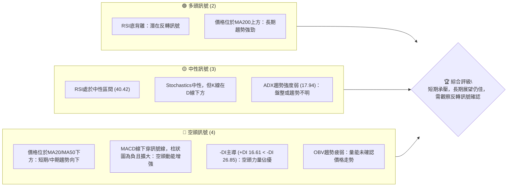

### 📊 核心指標速覽表

| 指標類別 | 指標名稱 | 當前數值 | 訊號 | 解讀 |
|----------|----------|----------|------|------|
| **價格** | 當前價格 | $194.83 | 🟡 | 位於52週區間中點，近期回調 |
| **均線** | MA20 | $203.48 | 🔴 | 價格位於短期均線下方，短期看空 |
| **均線** | MA50 | $209.65 | 🔴 | 價格位於中期均線下方，中期看空 |
| **均線** | MA200 | $190.82 | 🟢 | 價格位於長期均線上方，長期看多 |
| **動能** | RSI(14) | 40.42 | 🟡 | 處於中性區間，但接近超賣區 |
| **動能** | MACD | -1.008 (Hist) | 🔴 | MACD柱狀圖為負，且空頭動能擴大 |
| **波動** | ATR(14) | $6.34 | 🟡 | 日均波動率適中 (3.25%) |
| **趨勢** | ADX(14) | 17.94 | 🟡 | 趨勢強度弱，市場處於盤整或弱趨勢 |
| **量能** | OBV趨勢 | OBV < MA | 🔴 | 量能疲弱，未確認價格走勢 |

### 🏆 技術評分卡

```
╔══════════════════════════════════════════════════════════════╗
║             技術評分卡 — NVDA (2026-07-05)                   ║
╠══════════════════════════════════════════════════════════════╣
║趨勢強度      ███████░░░░░░░░░░░░░░  35/100  🔴                 ║
║  (ADX弱趨勢，空頭主導)                                         ║
║動能指標      ██████████░░░░░░░░░░  50/100  🟡                 ║
║  (RSI底背離為亮點，MACD空頭，Stoch中性偏弱)                      ║
║支撐穩定度    ██████████████░░░░░░  70/100  🟢                 ║
║  (價格接近MA200與布林下軌，斐波那契關鍵支撐)                      ║
║成交量配合    ███████░░░░░░░░░░░░░░  35/100  🔴                 ║
║  (成交量萎縮，OBV疲弱，量價背離)                                 ║
║形態完整度    ████████░░░░░░░░░░░░  40/100  🟡                 ║
║  (目前無大型形態，短期可能構成下降楔形)                          ║
║均線排列      ███████░░░░░░░░░░░░░░  35/100  🔴                 ║
║  (短期與中期均線空頭排列，長期均線多頭)                          ║
╠══════════════════════════════════════════════════════════════╣
║綜合評分      ████████░░░░░░░░░░░░  45/100  ⚖️ 觀望偏空         ║
╚══════════════════════════════════════════════════════════════╝
```

---

## 2. 趨勢分析

### 🌐 多時框趨勢分析

NVDA 的多時框趨勢分析顯示，雖然短期和中期面臨下行壓力，但長期而言，其上升趨勢的結構尚未被破壞。這意味著當前的回調可能是一個修正階段，而非趨勢反轉。

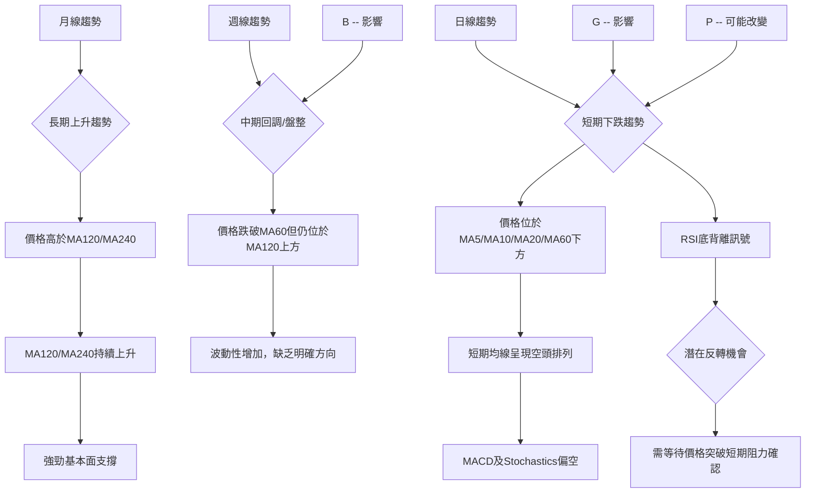

### 📈 長期趨勢 — 12個月走勢圖（Unicode）

NVDA 在過去12個月的走勢呈現先上升後回調的格局。從2025年7月的$177.63一路攀升至2026年5月的$210.89，隨後進入調整階段。儘管近期有所回落，但股價仍遠高於2025年初的低點，且長期均線仍保持上升態勢。

```
NVDA 月線走勢圖（過去12個月：2025-07 至 2026-07）
價格軸 ($)
$215 ┤                               ●(210.89 - 2026-05)
$210 ┤                               │
$205 ┤                               │
$200 ┤              ●(202.23 - 2025-10)               ●(200.09 - 2026-06)
$195 ┤●━━━━━━━━━━━━━━━━━━━━━━━━━━━━━━━━━━━━━━━━━━━━━●(194.83 - 2026-07)
$190 ┤           ●(190.90 - 2026-01)
$185 ┤         ●(186.34 - 2025-09)
$180 ┤●(177.63 - 2025-07)
$175 ┤                               │ ●(174.20 - 2026-03)
$170 ┤
$165 ┤
     └─────────────────────────────────────────────────────
      Jul'25 Aug'25 Sep'25 Oct'25 Nov'25 Dec'25 Jan'26 Feb'26 Mar'26 Apr'26 May'26 Jun'26 Jul'26
```

**走勢特徵分析表格**

| 階段 | 時間區間 | 價格區間 | 漲跌幅 | 主要特徵 | 訊號 |
|------|----------|----------|--------|----------|------|
| **強勁上升** | 2025-07 至 2025-10 | $177.63 → $202.23 | +13.85% | 價格穩步上揚，量能配合，多頭趨勢確立 | 🟢 |
| **高位盤整** | 2025-11 至 2026-01 | $176.77 → $190.90 | +7.99% | 波動性增加，價格在區間內震盪，形成高位整理 | 🟡 |
| **深度回調** | 2026-02 至 2026-03 | $190.90 → $174.20 | -8.69% | 價格快速下跌，跌破短期均線，空頭力量增強 | 🔴 |
| **強勁反彈** | 2026-04 至 2026-05 | $174.20 → $210.89 | +21.06% | 突破關鍵阻力，RSI進入超買區，量能配合 | 🟢 |
| **近期調整** | 2026-06 至 2026-07 | $210.89 → $194.83 | -7.52% | 價格再次回調，短期均線壓力顯現，ADX趨勢減弱 | 🔴 |

### 📊 中期趨勢（週線分析）

中期來看，NVDA 自2026年5月的近期高點$210.89（月線數據，週線高點$225.06）以來，進入了明顯的回調階段。股價目前在$194.83，已跌破週線級別的MA20和MA50，但仍位於MA120上方。這顯示中期趨勢已轉為偏空，但長期支撐仍在。

```
NVDA 週線壓力與支撐示意圖 (近半年)
價格軸 ($)
$225 ┤               R2 (225.06 - 2026-05)
$220 ┤
$215 ┤             R1 (210.89 - 2026-05)
$210 ┤
$205 ┤           . MA50 (209.65)
$200 ┤         . MA20 (203.48)
$195 ┤───────● 現價 (194.83)
$190 ┤ S1 . MA200 (190.82)
$185 ┤
$180 ┤
$175 ┤ S2 (174.20 - 2026-03)
     └──────────────────────────────────────────────────
      2026-02   2026-03   2026-04   2026-05   2026-06   2026-07
```
從圖中可見，當前價格$194.83已跌破MA20和MA50，這些均線已轉化為中期阻力。MA200在$190.82提供了初步的長期支撐。近期高點$210.89和$225.06構成重要的中期阻力區間。

### ⚡ 趨勢強度評估（ADX 解讀）

ADX 指標用於衡量趨勢的強度，而非方向。當前 ADX 數值為 17.94，遠低於25的閾值，這明確指出 NVDA 目前處於一個**弱趨勢或盤整行情**。同時，方向性指標 (DMI) 顯示 -DI (26.85) 大於 +DI (16.61)，這表明在當前的弱勢行情中，空頭力量佔據主導地位。

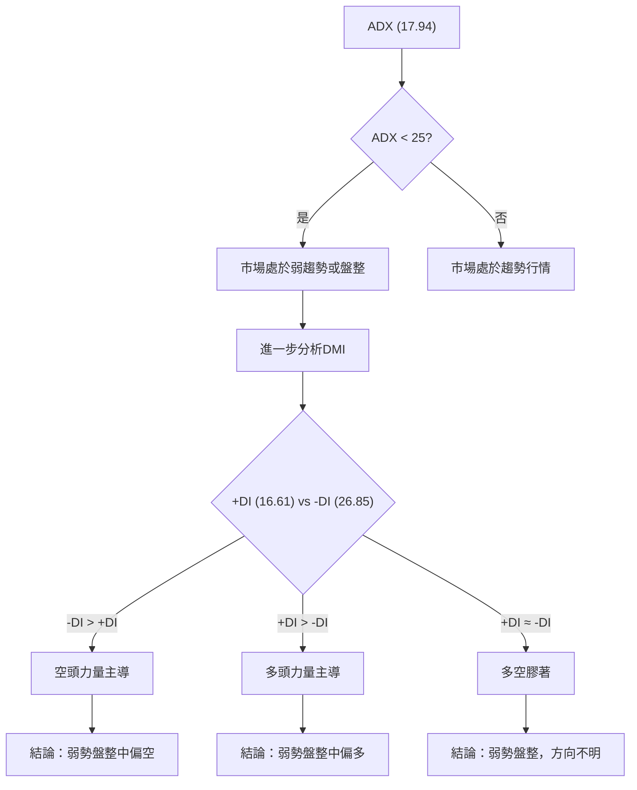

**ADX 強度對照表**

| ADX 數值範圍 | 趨勢強度 | 市場狀態 |
|--------------|----------|----------|
| 0 - 25       | 弱       | 盤整或弱趨勢 |
| 25 - 50      | 中等     | 趨勢明顯 |
| 50 - 75      | 強       | 強勁趨勢 |
| 75 - 100     | 非常強   | 極強趨勢 |

**結論**：NVDA 的 ADX 數值 17.94 顯示當前趨勢強度非常弱，市場很可能處於盤整階段。而 -DI 高於 +DI 則表明在這種弱勢中，空頭掌握了短期優勢，股價可能在尋找更穩固的支撐。

---

## 3. 圖表形態分析

### 🔍 形態識別系統

根據近期的價格走勢，NVDA 在2026年5月中旬達到高點$225.06後開始回調。觀察到價格在回調過程中，雖然持續走低，但下跌的動能似乎有所減弱，且RSI出現底背離，這可能預示著一個潛在的**下降楔形 (Falling Wedge)** 形態正在構建。下降楔形通常被視為看漲反轉形態。

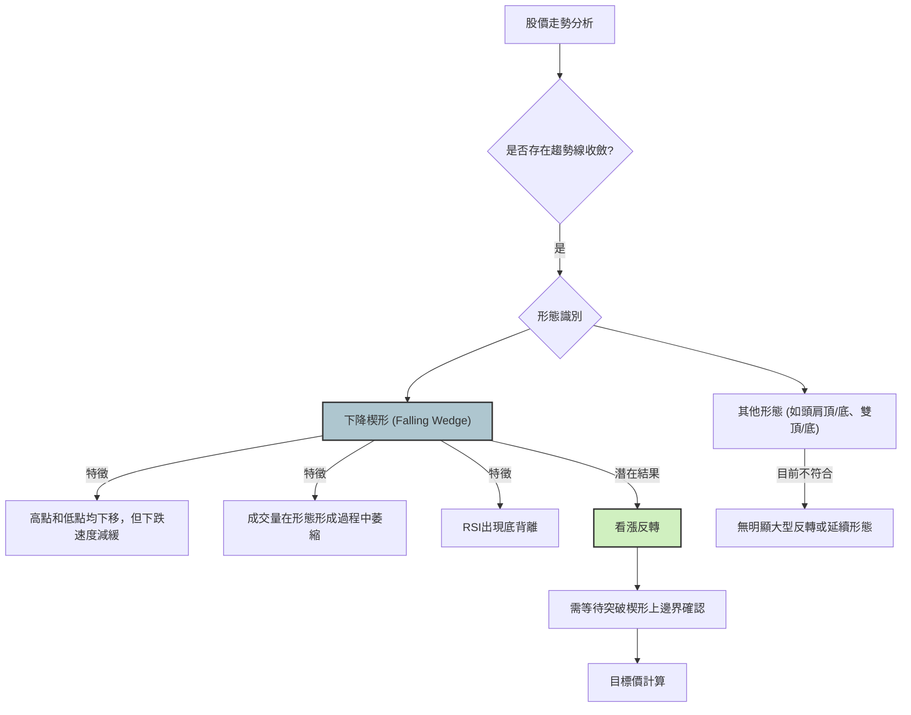

### 🕯️ 重要K線形態分析

分析近20週的週收盤數據，識別出幾個關鍵的K線形態，這些形態為我們提供了市場情緒和潛在轉折點的線索。

| 日期 | 收盤價 | K線形態 | 解讀 | 訊號 |
|------|--------|---------|------|------|
| 2026-03-29 | $167.32 | 長陰線 | 股價大幅下跌，顯示空頭力量強勁，市場情緒悲觀，為近期低點。 | 🔴 |
| 2026-04-05 | $177.18 | 大陽線 | 價格強勢反彈，吞噬前一週跌幅，顯示多頭開始反攻，市場情緒轉為樂觀。 | 🟢 |
| 2026-05-31 | $210.89 | 長陰線 | 股價從高點回落，空頭力量再次顯現，顯示上漲動能減弱，賣壓增加。 | 🔴 |
| 2026-06-28 | $192.53 | 長陰線 | 再次出現大幅下跌，確認了短期回調趨勢，空頭繼續主導。 | 🔴 |
| 2026-07-05 | $194.83 | 小陽線/錘子線 | 股價在低位略微反彈，K線實體較小，下影線可能較長（數據未提供），顯示下跌動能有所減弱，多空力量膠著，可能為潛在底部訊號。 | 🟡 |

### 📉 ASCII 走勢形態示意圖

基於上述分析，NVDA 可能正在形成一個短期下降楔形形態。此形態的特點是高點和低點均持續下降，但下降速度逐漸放緩，兩條趨勢線向下收斂。RSI的底背離進一步增強了此形態的看漲潛力。

```
NVDA 潛在下降楔形形態示意圖 (2026-05 至 2026-07)
價格軸 ($)
$220 ┤                     R (225.06)
$215 ┤                     │
$210 ┤                     │
$205 ┤                     │  /
$200 ┤                     │ /
$195 ┤                     │/        ● 現價 (194.83)
$190 ┤                     /         │
$185 ┤                    /          │
$180 ┤                   /           │
$175 ┤                  S (174.20)   │
$170 ┤                               │
     └───────────────────────────────────
      May'26    Jun'26    Jul'26
      (下降楔形上邊界)
      (下降楔形下邊界)
```
**形態描述**：
- **上邊界**: 從2026年5月高點$225.06和2026年6月初$210.89的次高點連接而成的下降趨勢線。
- **下邊界**: 從2026年3月低點$174.20和2026年6月底$192.53的低點連接而成的下降趨勢線，但下降斜率較上邊界平緩。
- **當前位置**: 價格$194.83位於楔形內部，靠近下邊界。

### 🎯 形態目標價計算

如果下降楔形形態最終被確認突破其上邊界，我們可以根據形態的高度來預估潛在的目標價。

1.  **形態高度 (H)**：取下降楔形最寬處的高度。假設我們以2026年5月高點$210.89（週線高點為$225.06，此處取月線高點作為形態起點）和2026年3月低點$174.20作為形態的初始垂直高度。
    H = $210.89 - $174.20 = $36.69

2.  **突破點 (BP)**：預計突破點為下降楔形上邊界的某個價位。假設突破發生在$200.00左右 (接近MA20)。

3.  **形態目標價 (TP)**：突破點 + 形態高度。
    TP = BP + H = $200.00 + $36.69 = $236.69

**目標價結論**：若NVDA能有效突破下降楔形上邊界，潛在的形態目標價約為**$236.69**。此目標價接近52週高點$236.26，顯示了較大的上漲潛力。然而，突破必須伴隨放大的成交量才能視為有效。

---

## 4. 支撐與阻力

### 🗺️ 關鍵價位分布圖（Unicode）

NVDA 的價位結構顯示，當前價格$194.83正處於多重支撐與阻力之間，下方有MA200和布林下軌的強勁支撐，上方則面臨短期均線和斐波那契回調位的阻力。

```
NVDA 價位結構分布圖
═══════════════════════════════════════════════════
$236.26 ║████████████████████████║ 強阻力 R3 (52週高點)
$217.08 ║████████████████████    ║ 阻力 R2 (布林上軌)
$209.65 ║████████████████████████║ 關鍵阻力 R1 (MA50, 近期高點210.89)
$203.48 ║▓▓▓▓▓▓▓▓▓▓▓▓▓▓▓▓        ║ 短期阻力 (MA20, 斐波那契38.2%)
$194.83 ╠════════════════════════╣ ◄ 現價
$190.82 ║▓▓▓▓▓▓▓▓▓▓▓▓▓▓▓▓        ║ 近期支撐 S1 (MA200, 布林下軌189.89, 斐波那契61.8%)
$167.32 ║████████████████████████║ 強支撐 S2 (2026-03-29 低點)
$152.77 ║████████████████████████║ 極強支撐 S3 (52週低點)
═══════════════════════════════════════════════════
```

### 🚧 阻力位分析表

| 阻力級別 | 價位 | 形成原因 | 突破難度 | 重要性 | 訊號 |
|----------|------|----------|----------|--------|------|
| **短期阻力** | $203.48 | MA20，斐波那契38.2%回調位 | 中等 | 高 | 🔴 |
| **關鍵阻力R1** | $209.65 - $210.89 | MA50，2026年5月高點 | 較高 | 非常高 | 🔴 |
| **阻力R2** | $217.08 | 布林通道上軌 | 中等 | 中 | 🟡 |
| **強阻力R3** | $236.26 | 52週高點 | 高 | 高 | 🔴 |

### 🛡️ 支撐位分析表

| 支撐級別 | 價位 | 形成原因 | 守住機率 | 重要性 | 訊號 |
|----------|------|----------|----------|--------|------|
| **近期支撐S1** | $189.89 - $190.82 | 布林通道下軌，MA200，斐波那契61.8%回調位 | 較高 | 非常高 | 🟢 |
| **強支撐S2** | $167.32 | 2026年3月29日低點 | 高 | 中 | 🟢 |
| **極強支撐S3** | $152.77 | 52週低點 | 非常高 | 低 | 🟢 |

### 📐 斐波那契回調位分析

為了評估當前回調的潛在支撐點，我們使用2026年3月29日的近期低點 ($167.32) 作為波段起點，以及2026年5月17日的近期高點 ($225.06) 作為波段終點，計算斐波那契回調位。

**斐波那契回調位計算**：
*   **波段低點 (Swing Low)**：$167.32 (2026-03-29)
*   **波段高點 (Swing High)**：$225.06 (2026-05-17)
*   **總漲幅**：$225.06 - $167.32 = $57.74

| 回調比例 | 回調價位 | 說明 |
|----------|----------|------|
| 38.2%    | $202.83  | 價格若從此處反彈，則為較強勢回調 |
| 50.0%    | $196.19  | 重要的心理關口，常有反彈或盤整 |
| 61.8%    | $189.55  | 黃金分割位，通常是強勁支撐區 |
| 76.4%    | $181.33  | 若跌破61.8%，此處為下一重要支撐 |

**當前情況**：當前價格 $194.83 位於斐波那契 50% ($196.19) 和 61.8% ($189.55) 回調位之間。這是一個關鍵的支撐區間。特別是 61.8% 回調位 $189.55 與布林通道下軌 $189.89 以及 MA200 $190.82 形成強大的共振支撐區。若此區間能有效守住，將為後續的反彈奠定基礎。

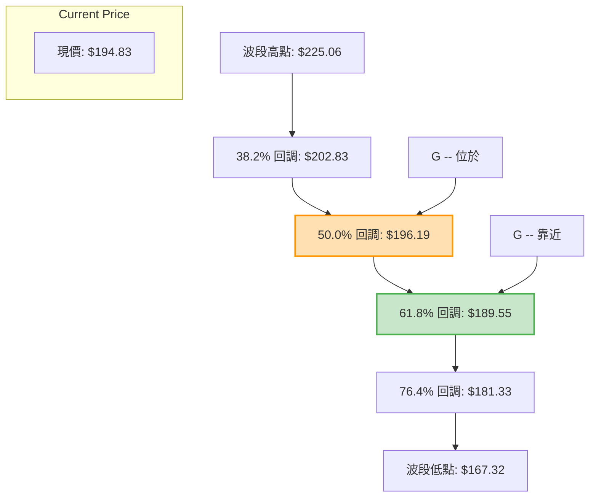

---

## 5. 技術指標深度解讀

### 🎛️ 指標訊號總覽

NVDA 的技術指標呈現多空交織的複雜訊號。短期均線和MACD顯示空頭主導，但RSI的底背離和價格接近長期均線及關鍵斐波那契支撐，則提供了潛在的多頭反轉線索。

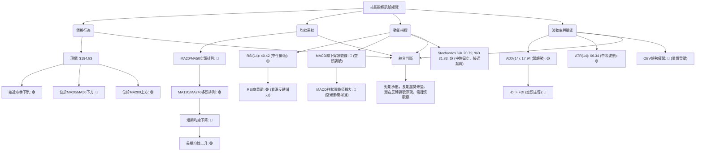

### 📈 移動平均線排列分析

NVDA 的移動平均線系統呈現「混合排列」狀態，這反映了不同時間框架下的趨勢差異。

**當前均線狀態**：
*   **短期趨勢 (MA5, MA10, MA20, MA60)**：價格 ($194.83) 位於所有短期和中期均線下方。MA5 ($196.00)、MA10 ($199.41)、MA20 ($203.48) 和 MA60 ($207.02) 均呈下降趨勢，並且 MA5 < MA10 < MA20 < MA60，形成了短期和中期的空頭排列。這是一個明確的短期看跌訊號。
*   **長期趨勢 (MA120, MA240)**：價格 ($194.83) 位於長期均線 MA120 ($194.75) 和 MA240 ($188.41) 上方。MA120 和 MA240 均呈上升趨勢，且 MA120 > MA240，表明長期趨勢依然強勁，保持多頭排列。MA120與現價極為接近，構成關鍵支撐。

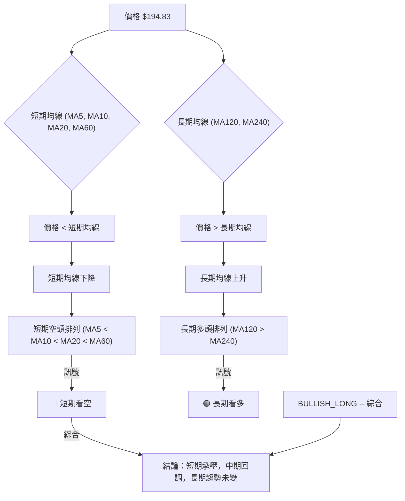
**結論**：短期和中期均線的空頭排列表明 NVDA 正處於回調階段，上行壓力較大。然而，價格仍在長期均線 MA120 和 MA240 之上，且這些長期均線保持上升，這為股價提供了堅實的長期支撐。MA200 ($190.82) 尤其關鍵，若能守住此線，則長期多頭趨勢仍有望延續。

### 📉 RSI(14) 分析

RSI(14) 是衡量股票超買超賣狀態和動能的重要指標。
*   **當前數值**：RSI(14) 為 **40.42**。
*   **區間分析**：此數值位於 30-70 的中性區間內，但更接近超賣區 (30)。這表明市場的買盤動能相對較弱，賣盤壓力較大，但尚未達到極度超賣的水平。

```
RSI(14) 強度進度條
超賣區 (0-30)        中性區 (30-70)        超買區 (70-100)
░░░░░░░░░░░░░░░░▓▓▓▓▓▓▓▓▓▓▓▓▓▓▓▓▓▓▓▓▓▓▓▓▓▓▓▓▓▓▓▓░░░░░░░░░░░░░░░░░░
0%                                        40.42%                  100%
```

*   **背離判斷**：數據明確指出存在 **⚠️ 底背離 (Bullish Divergence)**。
    *   **定義**：底背離發生在股價創下新低（或與前低持平），而RSI指標卻未能創下新低，反而形成更高（或持平）的低點。
    *   **意義**：這是一個強烈的看漲反轉訊號，暗示雖然股價仍在下跌，但下跌的動能已經減弱，賣盤力量正在耗盡，買盤可能即將入場。在NVDA的案例中，這與價格接近MA200和斐波那契61.8%支撐的狀況相符，增加了潛在反彈的可信度。
    *   **結論**：RSI的底背離是當前最值得關注的多頭訊號，它預示著NVDA在經歷短期下跌後，可能迎來一波反彈。

### 📊 MACD(12/26/9) 訊號解讀

MACD (移動平均線收斂發散指標) 用於識別趨勢的動能、方向和潛在反轉。
*   **MACD線**：-4.043
*   **訊號線 (Signal Line)**：-3.035
*   **MACD柱狀圖 (Histogram)**：-1.008

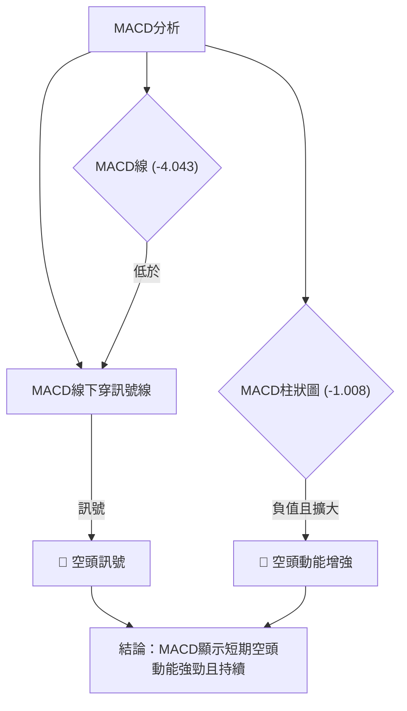
**解讀**：
1.  **MACD線下穿訊號線**：MACD線 (-4.043) 低於其9日指數移動平均線 (訊號線 -3.035)，這是一個典型的**空頭交叉 (Bearish Crossover)** 訊號，表明短期動能已轉為向下，賣壓正在增加。
2.  **MACD柱狀圖為負且擴大**：柱狀圖值為 -1.008，且其絕對值可能正在擴大（從提供數據無法直接判斷擴大趨勢，但負值本身表示空頭動能）。負值表示MACD線位於訊號線下方，且若絕對值持續擴大，則表示空頭動能正在增強。
**結論**：MACD指標明確發出空頭訊號，顯示短期內股價的下跌動能強勁。這與短期均線的空頭排列相符，共同確認了當前的短期下跌趨勢。然而，若RSI底背離生效，MACD可能隨後出現收斂並形成金叉，需密切關注。

### 📦 布林通道分析

布林通道 (Bollinger Bands) 用於衡量股價的波動範圍和相對位置。
*   **布林上軌 (Upper Band)**：$217.08
*   **布林中軌 (Middle Band) (MA20)**：$203.48
*   **布林下軌 (Lower Band)**：$189.89
*   **當前收盤價**：$194.83
*   **%B 值**：0.18 (0=下軌, 0.5=中軌, 1=上軌)

```
NVDA 布林通道示意圖
價格軸 ($)
$220 ┤                      BB上軌 (217.08)
$215 ┤                      │
$210 ┤                      │
$205 ┤                      │  BB中軌 (MA20) (203.48)
$200 ┤                      │ /
$195 ┤───────────────────● 現價 (194.83)
$190 ┤                      │ BB下軌 (189.89)
$185 ┤
     └───────────────────────────────────
```
**解讀**：
1.  **價格位置**：當前價格 $194.83 位於布林中軌 ($203.48) 之下，並接近布林下軌 ($189.89)。%B 值 0.18 也明確指出價格處於通道的下半部分，非常接近下軌。
2.  **市場狀態**：價格觸及或接近布林下軌，通常被視為短期超賣的潛在訊號，可能預示著股價有機會反彈。然而，在強烈的下跌趨勢中，價格也可能沿著下軌運行，甚至跌破下軌，表明趨勢的持續性。
3.  **通道寬度**：數據未直接提供通道寬度，但ATR (14) $6.34 顯示波動性適中。若通道持續收窄，則可能預示著橫盤整理後的突破；若通道擴張，則預示著趨勢的加強。
**結論**：NVDA 股價接近布林下軌，結合 RSI 的底背離，這增加了短期內出現技術性反彈的可能性。布林下軌 $189.89 構成了一個重要的短期支撐位。

### 💹 成交量分析（量價配合度）

成交量是確認價格走勢有效性的關鍵指標。
*   **最新成交量**：142,068,700 股
*   **20日均量**：157,270,100 股 (量比: 0.90x)
*   **50日均量**：163,779,186 股
*   **OBV趨勢**：OBV < MA → 量能疲弱

**解讀**：
1.  **成交量萎縮**：最新成交量 (142M) 低於20日均量 (157M) 和50日均量 (163M)，量比為 0.90x。這表明市場交投清淡，當前價格的回調或盤整缺乏強勁的成交量支持。
2.  **OBV趨勢疲弱**：OBV (On-Balance Volume) 趨勢低於其移動平均線，這是一個看跌訊號。OBV 疲弱表明在價格下跌期間，累積的賣壓超過買盤，或者在價格反彈時缺乏買盤的積極參與。這通常被解讀為下跌趨勢的量能確認，或者反彈缺乏持續性。
3.  **量價背離**：當前價格處於回調階段，但成交量卻在萎縮，這是一種量價背離現象。在下跌過程中，量能萎縮可能意味著賣壓正在減輕，但若反彈時量能未能放大，則反彈的持續性存疑。結合RSI的底背離，量能萎縮也可能解讀為在潛在底部區域，市場觀望情緒濃厚，等待明確方向。

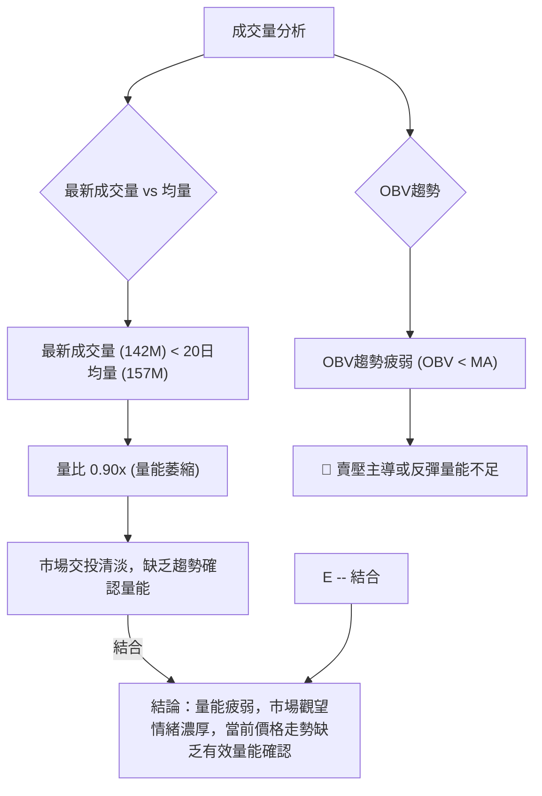
**結論**：成交量指標目前發出偏空訊號。量能萎縮和OBV疲弱表明市場缺乏強勁的買盤支持，這使得任何反彈都顯得脆弱。若要確認底部反轉，則必須看到放大的成交量伴隨價格上漲。

---

## 6. 動能與波動率

### ⚡ 動能評估四象限

動能評估四象限分析旨在結合動能強度和波動率，為投資者提供當前市場環境下的股票狀態判斷。

| 象限 | 動能 | 波動 | 當前狀態 (NVDA) | 評估 | 訊號 |
|------|------|------|-----------------|------|------|
| Q1   | 強   | 低   | -               | 最佳進場機會，潛力大風險低 | - |
| Q2   | 弱   | 低   | -               | 謹慎觀望，等待動能積聚或趨勢轉變 | - |
| Q3   | 強   | 高   | -               | 高風險高收益，適合激進交易者 | - |
| Q4   | 弱   | 高   | ✓               | 避免進場，市場混亂不明 | 🔴 |

**NVDA 當前狀態分析**：
1.  **動能評估**：
    *   MACD：空頭訊號強勁 (-1.008)，顯示短期動能向下。
    *   RSI：40.42，中性偏弱，但存在底背離，預示潛在動能轉強。
    *   ADX：17.94，趨勢強度弱。
    *   **綜合動能**：短期動能偏弱，但RSI底背離提供了潛在反轉的線索，因此評為**中性偏弱 (但有轉強潛力)**。
2.  **波動率評估**：
    *   ATR(14)：$6.34，佔價格的 3.25%。這是一個相對**中等偏高**的波動率，每日價格波動幅度不小。
    *   布林通道：價格接近下軌，顯示通道可能正在擴張或維持較寬狀態，暗示波動性較高。

**結論**：NVDA 目前的動能為中性偏弱（但有潛在轉強訊號），波動率為中等偏高。這使得 NVDA 位於「弱動能，高波動」的象限 (Q4)。此象限通常建議投資者避免進場，因為市場方向不明確，且波動性高，容易造成不必要的損失。儘管RSI底背離提供了希望，但在動能未明確轉強之前，仍需保持謹慎。

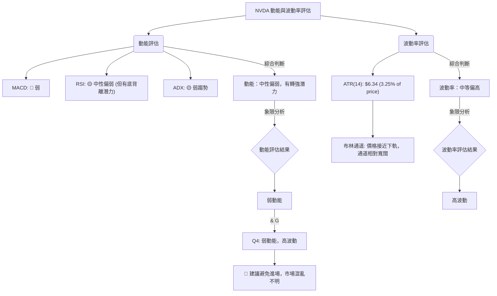

### 📊 ATR 波動率分析

平均真實波幅 (ATR) 衡量資產在特定時間段內的波動性。
*   **ATR(14)**：$6.34
*   **佔收盤價比例**：$6.34 / $194.83 = 3.25%

**解讀**：
1.  **波動性水平**：ATR 數值 $6.34 意味著 NVDA 在過去14個交易日中，平均每日的價格波動範圍約為 $6.34。3.25% 的比例顯示 NVDA 的波動性屬於中等偏高水平。對於一個大型科技股而言，這不是一個極低的波動率，反映了市場對其未來增長前景存在較大分歧或情緒波動較大。
2.  **止損距離建議**：ATR 是設定止損點的有效工具。一般建議將止損點設置在進場價格下方 1 到 2 倍 ATR 的距離。
    *   1 倍 ATR 止損：$194.83 - $6.34 = $188.49
    *   1.5 倍 ATR 止損：$194.83 - ($6.34 * 1.5) = $194.83 - $9.51 = $185.32
    *   2 倍 ATR 止損：$194.83 - ($6.34 * 2) = $194.83 - $12.68 = $182.15
**結論**：中等偏高的 ATR 提醒投資者，NVDA 股價波動較大，在制定交易策略時需預留足夠的止損空間，以避免被短期波動震出。同時，這也意味著潛在的獲利空間可能較大。

### 📐 Beta 與市場相關性

Beta 值衡量單一股票相對於整個市場的波動性或系統性風險。
*   **數據缺失**：提供的技術數據中未包含 NVDA 的 Beta 值。
*   **產業推斷**：作為半導體行業的龍頭企業，NVDA 通常被認為具有較高的 Beta 值。半導體行業是典型的週期性行業，且與高成長的科技創新高度相關，這使得其股價波動性往往大於市場平均水平。
*   **影響**：高 Beta 值意味著當市場上漲時，NVDA 股價可能漲幅更大；而當市場下跌時，其跌幅也可能更大。投資者應意識到，投資 NVDA 帶有較高的系統性風險。在當前市場情緒不明朗或趨勢不確定時，高 Beta 股票的風險會相對放大。
**結論**：雖然無法提供具體數值，但基於產業特性，預計 NVDA 具有高 Beta 值。投資者應將此納入風險評估，並觀察大盤走勢對 NVDA 的影響。

---

## 7. 多時框架總結

多時框架分析揭示了 NVDA 在不同時間維度上的趨勢差異，這對於制定全面的交易策略至關重要。

### 📋 時框架評分表

| 時框架 | 趨勢方向 | 動能 | 均線排列 | 形態 | 綜合評分 | 建議 | 訊號 |
|--------|----------|------|----------|------|----------|------|------|
| **長期 (月線)** | 上升趨勢 | 穩健 | 多頭排列 | 無大型形態 | 8/10 | 持有/逢低買入 | 🟢 |
| **中期 (週線)** | 回調/盤整 | 減弱 | 混合排列 | 潛在下降楔形 | 5/10 | 觀望/謹慎 | 🟡 |
| **短期 (日線)** | 下跌趨勢 | 疲弱 | 空頭排列 | 潛在下降楔形 | 4/10 | 謹慎/等待反轉 | 🔴 |

### 🔲 綜合訊號矩陣

綜合訊號矩陣展示了不同時間框架下各指標的一致性，幫助我們形成更全面的市場判斷。

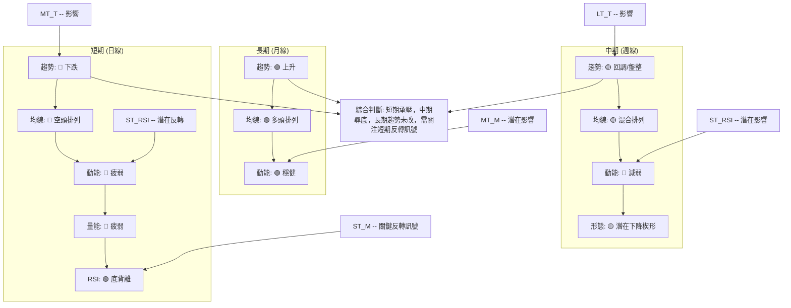
**分析**：
*   **長期**：NVDA 仍處於強勁的上升趨勢中，由MA120和MA240的多頭排列所支持。這表明任何短期回調都被視為修正而非趨勢反轉。
*   **中期**：中期趨勢已轉為回調或盤整，均線呈現混合排列，動能減弱。潛在的下降楔形形態若能成功突破，將預示中期趨勢的轉強。
*   **短期**：短期趨勢明確為下跌，均線空頭排列，MACD和OBV顯示空頭動能強勁。然而，RSI的底背離是一個重要的多頭反轉訊號，提示短期下跌可能已接近尾聲。

**總結**：NVDA 目前處於一個關鍵的轉折點。短期內空頭力量佔優，股價面臨下行壓力，但長期上升趨勢的結構完整，且RSI的底背離為潛在的反彈提供了希望。交易者應密切關注短期支撐位的表現以及反轉訊號的確認。

---

## 8. 交易策略建議

基於NVDA多時框架的技術分析，我們為不同風險偏好的投資者提供多頭和空頭策略建議。當前市場訊號複雜，短期偏空但有潛在反轉訊號，因此策略需靈活應變。

### 🗺️ 策略決策流程圖

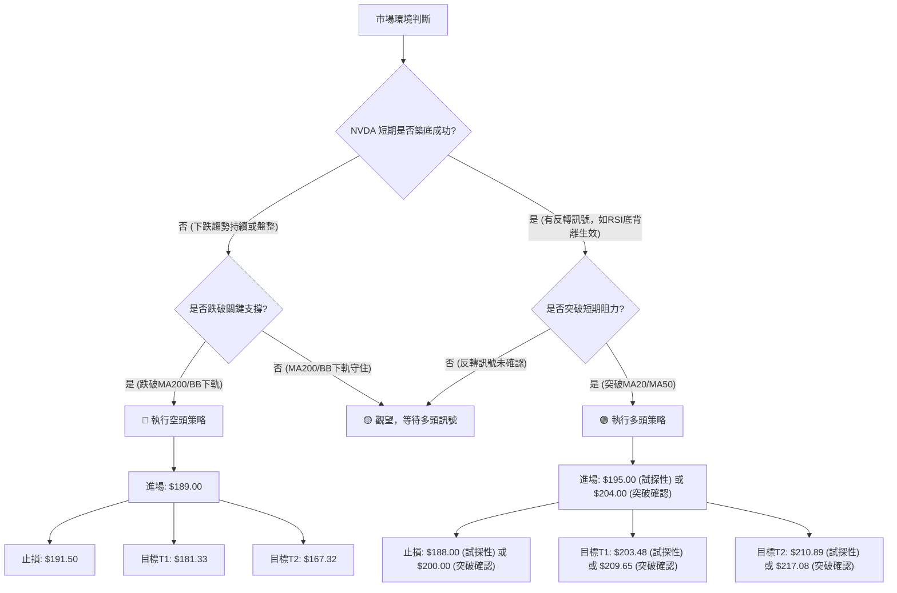

### 🟢 多頭策略詳情

考慮到RSI底背離和價格接近MA200/布林下軌等關鍵支撐，NVDA存在潛在的反彈機會。

| 策略要素 | 策略 A (激進反彈捕捉) | 策略 B (穩健突破追漲) |
|----------|------------------------|------------------------|
| **進場條件** | 價格在關鍵支撐區企穩，RSI底背離生效，K線出現看漲形態（如錘子線或早晨之星）。 | 價格有效突破MA20 ($203.48) 和斐波那契38.2% ($202.83) 阻力，並伴隨成交量放大。 |
| **進場價格** | **$195.00** (接近現價，在50%斐波那契回調位$196.19下方) | **$204.00** (確認突破MA20及斐波那契38.2%後) |
| **目標價 T1** | **$203.48** (MA20阻力位) | **$209.65** (MA50阻力位) |
| **目標價 T2** | **$210.89** (近期高點/MA50阻力) | **$217.08** (布林上軌阻力) |
| **止損價格** | **$188.00** (略低於MA200 $190.82 和斐波那契61.8% $189.55) | **$200.00** (突破後回踩不破的支撐) |
| **風險報酬比** | T1: (203.48-195.00)/(195.00-188.00) = 8.48/7.00 ≈ **1.21:1** <br> T2: (210.89-195.00)/(195.00-188.00) = 15.89/7.00 ≈ **2.27:1** | T1: (209.65-204.00)/(204.00-200.00) = 5.65/4.00 ≈ **1.41:1** <br> T2: (217.08-204.00)/(204.00-200.00) = 13.08/4.00 ≈ **3.27:1** |
| **成功機率** | 50% (依賴反轉訊號確認) | 65% (需確認突破有效性) |
| **建議倉位** | 輕倉 (5-10%) | 中等倉位 (10-15%) |

### 🔴 空頭策略詳情

若股價未能守住關鍵支撐，短期下跌趨勢將加速。

| 策略要素 | 策略 C (跌破追空) |
|----------|--------------------|
| **進場條件** | 價格有效跌破MA200 ($190.82) 和布林下軌 ($189.89)，並伴隨成交量放大。 |
| **進場價格** | **$189.00** (確認跌破關鍵支撐後) |
| **目標價 T1** | **$181.33** (斐波那契76.4%回調位) |
| **目標價 T2** | **$167.32** (2026-03-29 低點) |
| **止損價格** | **$191.50** (略高於MA200，作為回踩確認點) |
| **風險報酬比** | T1: (189.00-181.33)/(191.50-189.00) = 7.67/2.50 ≈ **3.07:1** <br> T2: (189.00-167.32)/(191.50-189.00) = 21.68/2.50 ≈ **8.67:1** |
| **成功機率** | 60% (若關鍵支撐失守，下跌空間較大) |
| **建議倉位** | 中等倉位 (10-15%) |

### ⭐ 整體訊號強度評星

基於當前NVDA的技術面分析，多空訊號複雜交織，但短期空頭壓力較大，同時RSI底背離提供了潛在的反轉希望。

```
做多訊號強度：★★☆☆☆  (2/5星)
  (RSI底背離，價格接近強支撐，但短期均線空頭排列，MACD看空)
做空訊號強度：★★★☆☆  (3/5星)
  (短期/中期均線空頭排列，MACD空頭，OBV疲弱，ADX弱勢空頭主導)
整體可信度：  ★★★☆☆  (3/5星)
  (市場方向不明，需等待關鍵訊號確認，風險管理至關重要)
```

---

## 9. 風險提示與監控

NVDA 目前處於一個多空拉鋸的階段，風險管理和持續監控市場訊號至關重要。

### ✅ 關鍵監控指標 Checklist

以下是針對 NVDA 投資者應密切關注的關鍵技術指標和價位清單：

```
╔══════════════════════════════════════════════════════════════╗
║             NVDA 關鍵監控指標 Checklist                      ║
╠══════════════════════════════════════════════════════════════╣
║ [ ] 價格是否有效站穩 $190.82 (MA200) 和 $189.89 (布林下軌)?   ║
║ [ ] RSI 底背離是否最終確認並帶動價格上漲?                      ║
║ [ ] MACD 是否出現金叉，柱狀圖是否轉正並擴大?                   ║
║ [ ] 價格是否能突破 $203.48 (MA20) 和 $209.65 (MA50) 阻力?    ║
║ [ ] 突破阻力時，成交量是否明顯放大?                           ║
║ [ ] ADX 是否開始上升，且 +DI 突破 -DI，趨勢轉強?             ║
║ [ ] OBV 趨勢是否轉為上升，確認買盤力量?                       ║
║ [ ] 是否出現任何看漲的K線組合或圖表形態突破?                  ║
║ [ ] 若跌破 $189.00，下跌動能是否加速?                         ║
╚══════════════════════════════════════════════════════════════╝
```

### ⚠️ 風險場景分析

針對 NVDA 未來可能的走勢，我們構築三種情境，以幫助投資者評估風險與機會。

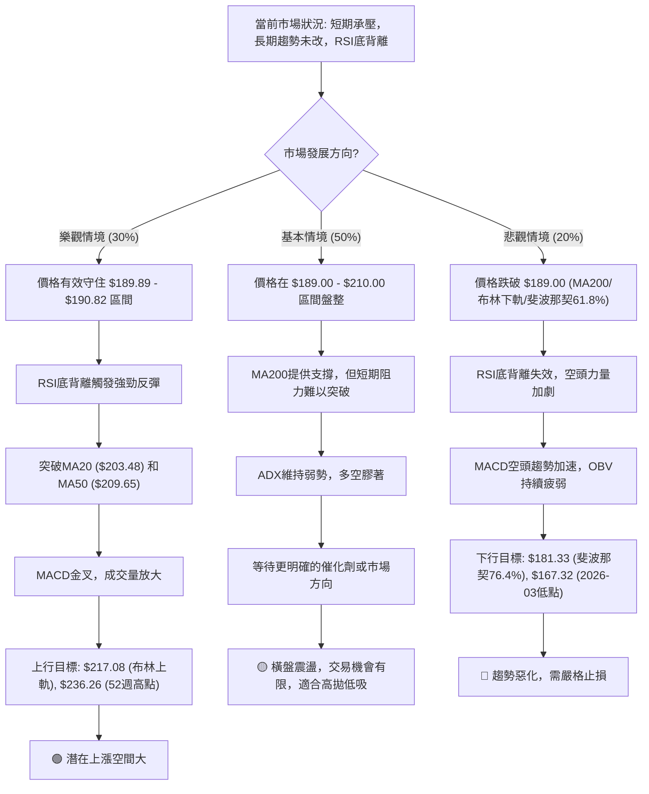

### 🛡️ 風險管理重要提醒

1.  **嚴格執行止損**：在任何交易策略中，都必須提前設定並嚴格執行止損點。尤其在當前多空膠著且波動性較高的市場環境下，止損是保護資金的最後一道防線。
2.  **倉位管理**：避免重倉單一股票，特別是在趨勢不明朗時。建議採用分批建倉或輕倉試探的策略，逐步增加倉位，以降低單次交易的風險。
3.  **關注成交量**：任何價格突破或反轉訊號，若無成交量的配合，其可信度將大打折扣。特別是多頭策略，需要放大的成交量來確認買盤的積極性。
4.  **基本面配合**：雖然本報告側重技術分析，但投資者仍應關注 NVDA 的基本面發展，如財報、新產品發布、行業趨勢等，這些因素可能對股價產生重大影響。分析師共識的平均目標價$301.62遠高於現價，反映了基本面的長期樂觀預期。
5.  **市場情緒**：密切關注整體市場情緒和大盤走勢，高 Beta 股票易受大盤影響。

---

## 📋 報告總結

```
╔══════════════════════════════════════════════════════════════╗
║             NVDA 技術分析報告總結                            ║
╠══════════════════════════════════════════════════════════════╣
║報告日期：2026-07-05                                            ║
║當前價格：$194.83                                               ║
║分析評級：⚖️ 觀望偏空 (短期承壓，長期趨勢未變，潛在反轉訊號浮現)      ║
║                                                              ║
║關鍵結論：                                                    ║
║├─ 長期趨勢：🟢 強勁上升趨勢，價格位於MA200上方。                  ║
║├─ 中期趨勢：🟡 回調/盤整，價格位於MA50下方，但MA120上方。        ║
║├─ 短期趨勢：🔴 下跌趨勢，價格位於MA20/MA50下方，MACD空頭。         ║
║├─ 關鍵支撐：$189.89 - $190.82 (布林下軌，MA200，斐波那契61.8%)   ║
║├─ 關鍵阻力：$203.48 (MA20)，$209.65 (MA50)，$210.89 (近期高點)    ║
║└─ 分析師目標：$301.62 (平均目標價，顯示長期基本面樂觀)             ║
║                                                              ║
║最優策略組合：                                                ║
║1. 🥇 最佳機會：等待價格在 $189.89 - $190.82 強支撐區企穩，且RSI底背離訊號得到K線形態確認後，輕倉試探性做多，目標價T1 $203.48，止損 $188.00。此為激進反彈捕捉策略。                                         ║
║2. 🥈 次選機會：若價格能有效突破 $203.48 (MA20) 和 $209.65 (MA50) 阻力，並伴隨成交量放大，可考慮穩健追漲，目標價T1 $209.65，T2 $217.08，止損 $200.00。此為突破追漲策略。                                 ║
║3. 🥉 保守選擇：若價格跌破 $189.00 關鍵支撐，則考慮執行空頭策略，目標價T1 $181.33，T2 $167.32，止損 $191.50，嚴格控制風險。                                                                               ║
╚══════════════════════════════════════════════════════════════╝
```

---

> ⚠️ **免責聲明**：本報告為 AI 自動生成之技術分析，所有數據及估算均基於提供的歷史價格資訊。本報告**僅供研究與學術參考**，**不構成任何投資建議**。投資有風險，入市需謹慎。

---

*報告生成時間：2026-07-05 ｜ 數據來源：Yahoo Finance ｜ 分析框架：多時框技術分析*