<details>
<summary>📊 靜態圖表 (點擊展開)</summary>
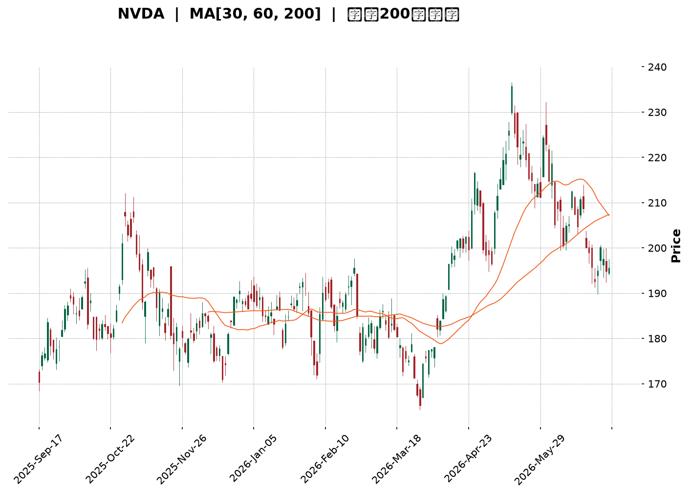
</details>

<html>
<head><meta charset="utf-8" /></head>
<body>
    <div style="height:500px; width:100%;">                        <script>window.PlotlyConfig = {MathJaxConfig: 'local'};</script>
        <script charset="utf-8" src="https://cdn.plot.ly/plotly-3.6.0.min.js" integrity="sha256-QaOVwtVY0T02VaHrr6pnoHLCwayMJp4O5n4YyaE3rJk=" crossorigin="anonymous"></script>                <div id="candlestick-chart" class="plotly-graph-div" style="height:100%; width:100%;"></div>            <script>                window.PLOTLYENV=window.PLOTLYENV || {};                                if (document.getElementById("candlestick-chart")) {                    Plotly.newPlot(                        "candlestick-chart",                        [{"close":{"dtype":"f8","bdata":"AAAAgK5IZUAAAACgDwdmQAAAAKDRFGZAAAAAAODyZkAAAAAAIk1mQAAAAABrHmZAAAAAwHQ1ZkAAAABAdEVmQAAAAMCPumZAAAAAgOdRZ0AAAADABWdnQAAAAADRm2dAAAAAQC5zZ0AAAADAoDBnQAAAAEChIGdAAAAAANuiZ0AAAABAkBFoQAAAAAB65GZAAAAAIJSJZ0AAAADAU4BmQAAAAKDteWZAAAAAAEi5ZkAAAACAZeZmQAAAAKDW02ZAAAAAwHukZkAAAACgU4hmQAAAAOB6xGZAAAAAQKpHZ0AAAADgAe9nQAAAAABBIGlAAAAAgI3gaUAAAABgxFtpQAAAAAD4TmlAAAAA4G7baUAAAADAYdVoQAAAAOAIZmhAAAAAQOaBZ0AAAACgI4RnQAAAAKDm4GhAAAAAAHEkaEAAAABg6zhoQAAAAADdWmdAAAAAoMXEZ0AAAABgi1JnQAAAAADiqmZAAAAAAPxPZ0AAAABg2JNmQAAAACCIW2ZAAAAAgPXQZkAAAACAnTlmQAAAAMCvh2ZAAAAAwGAfZkAAAADgznxmQAAAACAVrmZAAAAAwD9yZkAAAADA1+tmQAAAAODNzGZAAAAAYEcxZ0AAAABAuB5nQAAAAECk+GZAAAAAQHKdZkAAAABAVuBlQAAAAID5CGZAAAAAgLs2ZkAAAADAyF1lQAAAAKAtxGVAAAAA4F2fZkAAAAAAw\u002fVmQAAAAIBkpmdAAAAAgDGTZ0AAAABAodBnQAAAAMC2hmdAAAAAgPRwZ0AAAABgrU9nQAAAAIDfmmdAAAAAoIODZ0AAAAAgW2dnQAAAAEAxo2dAAAAAoPUgZ0AAAAAgMxtnQAAAAIDCHWdAAAAAIJk5Z0AAAACgKeRmQAAAAMBGYWdAAAAAgAlHZ0AAAACA7kFmQAAAAEDs6WZAAAAAQI8aZ0AAAABgHXVnQAAAAKC3TmdAAAAAQFCQZ0AAAAAAT\u002fBnQAAAAID8D2hAAAAAQNTjZ0AAAADgMjNnQAAAAECRimZAAAAAQMfFZUAAAADA3HtlQAAAAIDMLGdAAAAAYPPAZ0AAAAAA9JBnQAAAAGBFwWdAAAAAoMFdZ0AAAACAmtlmQAAAAEC4HmdAAAAAwAh\u002fZ0AAAACAeXxnQAAAAGDpuWdAAAAAwETxZ0AAAADA3RpoQAAAAMCUcWhAAAAA4CgcZ0AAAAAAxiVmQAAAAEALz2ZAAAAAwEmBZkAAAACA9uBmQAAAAACQ6mZAAAAAoO45ZkAAAADAe9RmQAAAAABSGGdAAAAAwPVAZ0AAAADgeuRmQAAAAAAAiGZAAAAAQArnZkAAAACAwr1mQAAAAMDMjGZAAAAAgOtRZkAAAABgZpZlQAAAAOB69GVAAAAAYGbmZUAAAACAwlVmQAAAACCuZ2VAAAAA4KPwZEAAAACgcKVkQAAAAMDMzGVAAAAAAAD4ZUAAAADgeixmQAAAAOB6NGZAAAAAQDNDZkAAAABgj8JmQAAAAMAe\u002fWZAAAAAACmUZ0AAAACA66lnQAAAAOBRkGhAAAAAANfbaEAAAABAM8toQAAAAIDCNWlAAAAAgOtBaUAAAAAAKfxoQAAAAAAAUGlAAAAA4Hr0aEAAAADgowhqQAAAACCFE2tAAAAAoHClakAAAAAAAChqQAAAAIA98mhAAAAAYGbOaEAAAAAgXM9oQAAAAAAAkGhAAAAAYI\u002f6aUAAAAAAAHBqQAAAAGBm5mpAAAAAgBRua0AAAADA9ZhrQAAAAGCPOmxAAAAAIK53bUAAAACAPSpsQAAAAIA9ymtAAAAAIIWTa0AAAABACu9rQAAAAOBRcGtAAAAAYI\u002fqakAAAAAghdtqQAAAAEAzk2pAAAAAAADIakAAAADgemRqQAAAACCFC2xAAAAAgD3aa0AAAAAAANhqQAAAAMAeVWtAAAAAQDOjaUAAAADgehRqQAAAAIAUBmpAAAAAoHANaUAAAAAA15tpQAAAAIAUpmlAAAAAYGaOakAAAADAHu1pQAAAAMDMlGlAAAAAgBRWakAAAADAzBRqQAAAAKBHAWlAAAAAAADgaEAAAAAgrndoQAAAAMD1EGhAAAAAQApfaEAAAABA4QJpQAAAAGCPsmhAAAAAYI9aaEAAAACgmXFoQA=="},"high":{"dtype":"f8","bdata":"Kk0hosqlZUCxMgD6kyJmQBQrJBvvQWZADQGWp\u002fMQZ0CGYzOJzMxmQPuIq\u002fhTeGZAsMmB0K+HZkDRAz40AnhmQOoMJJFa\u002f2ZAIAOkropqZ0AcntCw0YNnQP85tM7t4GdA60Ib6dnKZ0BK2+G6s2ZnQAq4r4JBoWdAut0mr4iyZ0CT1jzr6WhoQInk2gonc2hAY0vcI9rCZ0DSlCxV8xhnQE9Ee7cwG2dAWieU7VDoZkBDyW21jQJnQD3xoNK\u002fJWdAPj+NKKPYZkDCSYGIb+1mQLAyoxdR4GZAxro6iWFuZ0AlL49KU\u002f9nQHjtBxgWZGlAgA7IvlWFakAb+wFPZcRpQGByNjJP\u002fmlAwqrJHCNqakCGp\u002fi\u002fUn5pQHRshzG6XGlA\u002ffXkSyWzaEC3ouA4lIlnQJEwHLNg\u002fWhABC6U18BsaECsJu++yntoQMY1E0Fo7WdAJUqjHqbfZ0C3ZEH3VZ9nQA9352fzGGdAjIFAC9x6Z0Be0LWuT39oQPfhR4RFEWdANuFYBVvvZkBk9q5xfkRmQGoc2T163GZAOhiNUKZoZkC7CYuI94hmQFIws7h3NGdAfwSXTcLNZkC83rEeUhBnQHGInuDMFGdAPij6qax\u002fZ0C+LOLqtzZnQIEeAd8JL2dA2xK3E+2pZkBAoWBq7NlmQJMmWo4hTWZAbDOnCF9PZkB3mzrz2gNmQF7FvJt+BGZAx2zJ6xWuZkDBsp0KzQRnQKT2YXI7qmdAw8zy\u002fcqcZ0BFEcMKvxVoQKJirCL+l2dAdOd3W1qfZ0A5fIgTl9FnQFVbzfBsHWhA1knWLtMzaECiWItwGwVoQDQUZR+C62dA38tboEWxZ0AT8++XjkpnQDoujgiEY2dAYaj3ujGDZ0AmwRSKZg5nQFwwbVMStmdAQtfTAcDNZ0AW038W2MtmQCBVRNbWK2dAXSX0CB5FZ0D4h9Mk37JnQLmwZjODo2dAki3vt6u\u002fZ0B7B9YB3gpoQIXB31EGL2hAoHiX4ldPaEDruvRLRclnQEqjkT5RSGdAdCARvD9yZkD2y\u002fkO7xlmQM3MbgutX2dAC3wo5cg0aEBQsKDABg9oQGUOtjP8J2hA5\u002fgDSy8zaECLPQTsrG9nQEF0mMh5ZGdAREKhkILLZ0D67uIDb41nQKF+IwY7ymdASzzDbxA+aEA5HZX3TThoQAeD7VTRs2hAVt2+dPFIaEA7UI9bkNJmQIEVzxBn7mZAbMV3f3ycZkDHRqeDFBZnQGDIUO6ZAWdAVqwMzwDYZkB7QHuizdxmQGbmjuLBTWdAAAAAANdzZ0AAAACAFB5nQAAAAEDhQmdAAAAAACmcZ0AAAADAzCxnQAAAAAAp7GZAAAAAIFx\u002fZkAAAADgUUhmQAAAAADXS2ZAAAAAQAoHZkAAAABACqdmQAAAAOBREGZAAAAAQApfZUAAAABgZi5lQAAAAADX02VAAAAAANcrZkAAAAAgri9mQAAAAKBHOWZAAAAAIFxHZkAAAADgUShnQAAAAGCPAmdAAAAAAADAZ0AAAADAHrVnQAAAAOBRkGhAAAAAwMwMaUAAAABAM\u002ftoQAAAAGBmNmlAAAAAoHBFaUAAAAAAAFhpQAAAAAAAUGlAAAAAYI96aUAAAABgZl5qQAAAAGCPGmtAAAAAIFzXakAAAABACpdqQAAAAKCZSWpAAAAAAABgaUAAAAAgXDdpQAAAACCuB2lAAAAA4KMIakAAAABgZsZqQAAAAKCZOWtAAAAAoJnJa0AAAAAAAPhrQAAAAEDhemxAAAAAoEeRbUAAAAAAAPBsQAAAAAAAwGxAAAAAIFwPbEAAAAAAKURsQAAAAMDMbGxAAAAA4FGga0AAAACAwkVrQAAAAMDMxGpAAAAA4KPwakAAAAAghTtrQAAAAADXG2xAAAAAwPUIbUAAAACAPdprQAAAAEAzs2tAAAAAANfbakAAAABACk9qQAAAAMDMbGpAAAAAQArnaUAAAADAHrVpQAAAAIA94mlAAAAAYLiWakAAAAAgrm9qQAAAAGC4JmpAAAAA4HpsakAAAAAgrr9qQAAAAOCjeGlAAAAAoHA1aUAAAACgmRlpQAAAAKCZcWhAAAAAgMKFaEAAAAAAKRRpQAAAAEAz+2hAAAAAgOsBaUAAAACgmbFoQA=="},"hovertemplate":"\u003cb\u003e%{x|%Y-%m-%d}\u003c\u002fb\u003e\u003cbr\u003e\u958b: $%{open:.2f}\u003cbr\u003e\u9ad8: $%{high:.2f}\u003cbr\u003e\u4f4e: $%{low:.2f}\u003cbr\u003e\u6536: $%{close:.2f}\u003cextra\u003e\u003c\u002fextra\u003e","low":{"dtype":"f8","bdata":"GOjDUIcMZUDFtSjTHJ5lQFhxStck5WVADxcFQRvWZUC9KjXfGQZmQE1treku7GVA9QCAWY2jZUCeHoouJd1lQJMEKGCbiWZAEme21riuZkBDD+VgJ\u002fxmQDk3F19CgWdAL4DDQ4IrZ0AN9dd86ulmQAMAYo9a\u002f2ZA4krfz59QZ0AZn8ebP+FnQEEqmd\u002f1wGZAY7BhHxE+Z0B\u002fDgWsxHVmQFgC3iioKGZAmNekNQJ4ZkCeTcVeXndmQJgOgbG4tmZAaHNC2fd4ZkCtyl\u002fqshdmQEAQ0uGleGZAZF3e21rvZkD2l6cAGY1nQKT1MDNy\u002fGdA3\u002fUcqD2YaUCgas2UaSxpQCy7tMCHQWlAhy4FkDKxaUCqZglvEL1oQIpd48AdVGhAedJWZ4FLZ0BF8UDufVxmQGbh7FqZOGhAQ\u002fpPjO3oZ0DJZ5EmfeNnQLL4TNWN+mZAp1uP\u002f+yRZkADvxutlwlnQAIgvykrdGZATEU20urZZkD76u11kXpmQEXx4vkmnWVAbCMVdb0OZkDK2\u002fQQATFlQC3BF9ENR2ZAivEpM2EPZkA67B1cJrVlQC3zQBBef2ZAyFqADuRiZkDLY+qjaH5mQF\u002f6QIrOnGZAPpt15XvMZkAtcEE77OlmQGelieX2wGZAQ8tiqYgTZkBb5WqNidNlQAgX8i6o4GVAHo7kP3\u002fcZUB1R3gHoEllQMqUd0fxeWVAZGrRD5MKZkB4SjNY4spmQO9AE6x73GZAZVdHhY5SZ0Di6T6frH9nQBo6WEbMPGdAb1s3pW9dZ0AvLyKBW09nQJrL+2L+h2dAzu2DP3pEZ0CdUamv6llnQFGOiMGYUWdAE57h9mb2ZkBD1SEnH\u002fVmQJvy7rlS4GZAdU2EcXvsZkCFc8NpSZlmQBJjqtE8SmdAP0sJ0TxCZ0COlj5UNjNmQPkLPa59TGZA1wVZ53D9ZkCvnYag6llnQOiecrZbP2dAjy08ABQ2Z0Bd7pgejbpnQPuQR\u002fyYQWdAHytvPLauZ0CJ8s8S1xtnQOu\u002fvvINB2ZA9trZgtJ8ZUDXfIjgqWBlQC\u002feocvl0mVAW04q0xT+ZkAvb7CPg4NnQCIIQzFQmGdAsVDNMP9PZ0DbQWLKkLJmQPayGRFzZWZAtRiGCv9XZ0D8chB+zDRnQKWSNBjCPWdAO1N2XzuyZ0D8HJCqeWxnQAjpAKnxOGhAwjO3wOsJZ0CfqN3b2gtmQDarhHkt1GVARkV4IyIdZkDkah2ym4FmQMs2cCvaO2ZAJJONEe8ZZkDV3OqknfFlQG1EFzkBwGZAAAAAYGYOZ0AAAAAAALhmQAAAAIAUfmZAAAAAwB6tZkAAAACAwrVmQAAAAGCPimZAAAAAoEf5ZUAAAABACndlQAAAAOBR2GVAAAAAIFy\u002fZUAAAABAMxtmQAAAAOB6ZGVAAAAA4FHgZEAAAADgo4hkQAAAAGC43mRAAAAAAADYZUAAAAAA12tlQAAAAOBR+GVAAAAAwB61ZUAAAACgmYlmQAAAAADXk2ZAAAAAoJkJZ0AAAAAgrjdnQAAAAOCj2GdAAAAAIK53aEAAAACA63loQAAAAOCj6GhAAAAAQOG6aEAAAAAAAOBoQAAAAAAA4GhAAAAAQAqnaEAAAACA6\u002floQAAAAAAp7GlAAAAAYGYGakAAAABgj\u002fJpQAAAAGBm1mhAAAAAANejaEAAAAAgrldoQAAAAMD1gGhAAAAAIIXTaEAAAAAAANBpQAAAAOB6nGpAAAAA4Hq8akAAAACgcN1qQAAAAIA9smtAAAAAoJmpbEAAAAAgrgdsQAAAAADXS2tAAAAAwB49a0AAAAAAAJBrQAAAAIDCPWtAAAAAoJnZakAAAAAAAIBqQAAAAMD1GGpAAAAAQApnakAAAAAAKWRqQAAAAGBm9mpAAAAAQDOra0AAAADgUdBqQAAAAEAKX2pAAAAAYI+KaUAAAAAAAMBpQAAAAEDh6mhAAAAAoHD9aEAAAACgR\u002fFoQAAAAIAUbmlAAAAAQOEKakAAAACgR+lpQAAAAGCPYmlAAAAAAADQaUAAAABACvdpQAAAAAAAAGlAAAAAYI+SaEAAAAAAKQRoQAAAAEAK52dAAAAAoJm5Z0AAAAAghWNoQAAAAGBmLmhAAAAAQDMLaEAAAAAgrj9oQA=="},"name":"\u50f9\u683c","open":{"dtype":"f8","bdata":"I\u002f4Jo9+TZUA8T1Oov75lQIvMWq8F+GVAls0v+fvoZUAU6dKQZr5mQDDz+BoCeGZAZHLLQr\u002fOZUB\u002fAptk0ERmQLNb10YgjWZAHoKCjOvBZkDxF2qMBydnQHsjibyIsmdA7GyAVmqlZ0ACVTUpWS9nQEenFq60RmdAIcP1qJVRZ0DGaE8urwZoQJzSuNCjL2hAeG+WMGF+Z0C+rxWc\u002fRdnQLMXmWfzGGdAjwdPP7jGZkD+EMp7IIVmQD50ME+E42ZAPj+NKKPYZkDAzQL616NmQO2AulDOjGZAEKSJzTv6ZkCi4Wo5A79nQPDWygzsIGhANC6rJ6H+aUCL1JU3FKRpQM3gMrCszWlAXMWeK9QBakAD8F5fSV9pQHixqCzx12hAuTEiAMCMaEBNFN+LJhxnQASzCqvVYmhAz\u002fxyM29kaEAxRxBGWnZoQJGb57rt4GdA8MW3suDaZkAL0RjxYj5nQKiQ3w6E62ZA43OcTqEYZ0A3vDkatn1oQF6qpiALp2ZAaD5LwAxvZkAEPU5egdxlQPfJj6SFs2ZAOekK0bBfZkCH2I7DtNdlQETv6Fqut2ZAkiD7iOyhZkCIWqGHhrNmQHdHBFgp\u002fGZAfk456inUZkD3xgo9mTFnQOUM5zi4HmdAe\u002f3NyaWIZkDhqojMNKNmQG6xzqTFPWZAq1uexQMIZkAE0aE25QJmQNnOtVOo0GVAmR5cSiIVZkB+YOAFH\u002f1mQNJvISS53mZAlCkMLMF9Z0C\u002fyUFlHL1nQERw6xlldmdAKfqRsFqHZ0AVPdCD6bFnQBxumw+NumdAj+sB4\u002fz3Z0BdIclrT9BnQF\u002fnT93pkWdAZGVGUjGjZ0ClegRHPSJnQEl5OwO55mZAHbDt+60fZ0B9Pfu56wlnQOA3Yl6tT2dAr91LfDuiZ0A\u002fCAQNfLxmQHeSfERKYWZA+oI4Cq4XZ0CKH07TrG9nQMT7utHLZGdAkrpaEVtnZ0CM0VwcT+hnQFz71GSM6mdAOCzrlmPmZ0Czm6BrE2ZnQK7E+YFbR2dAz6mwyWhuZkBtxZ7ldN1lQHRoSB7GFWZA6Kj7LwAIZ0BoCIcd1OtnQCBtog8RDmhAtynXLKAgaEBIH0kOCW9nQLoEb22vt2ZATBWSSKyXZ0AeK0afmGFnQOZuutDqUWdAIRME8XfsZ0CmUVs6We9nQBSHDR4QTmhA1NsDt01IaECoFImzr6dmQBj5iU8E4GVAL6Aq8V5PZkCivP+GxI1mQObsL1YgpWZAP8efepF6ZkAPUbz0QBpmQECa2ex7zGZAAAAAwB49Z0AAAACgmQFnQAAAAKBwHWdAAAAAQArfZkAAAACA6yFnQAAAACBcz2ZAAAAA4FFAZkAAAAAAAEBmQAAAAOBRKGZAAAAAYI\u002faZUAAAABAMyNmQAAAAIA9AmZAAAAAAABAZUAAAADA9RhlQAAAAEAK32RAAAAAAAAAZkAAAACAwoVlQAAAAMAeJWZAAAAAIFz3ZUAAAAAAABBnQAAAAEDhumZAAAAAgOsJZ0AAAADA9UBnQAAAAEDh2mdAAAAAoEeRaEAAAACAwq1oQAAAAMDM\u002fGhAAAAAIFz\u002faEAAAAAAKURpQAAAACCuH2lAAAAAYLhOaUAAAABguP5oQAAAAMDMNGpAAAAAIK4vakAAAABgZpZqQAAAAIDCPWpAAAAAwPUoaUAAAAAAAPBoQAAAAKCZ6WhAAAAA4Hr8aEAAAABA4QpqQAAAAMD1oGpAAAAAoEfBakAAAACgmVFrQAAAAIDCHWxAAAAAQDO7bEAAAADgUbhsQAAAAADXu2xAAAAAANdza0AAAACAwuVrQAAAAKBHyWtAAAAAwMyca0AAAACgRxFrQAAAAADXw2pAAAAAwPVoakAAAABgj9JqQAAAACBc92pAAAAAgMJlbEAAAABACrdrQAAAAMAevWpAAAAAwPXQakAAAACAwkVqQAAAAADXU2pAAAAAgMKNaUAAAAAgri9pQAAAACCFm2lAAAAAoHAdakAAAACAwmVqQAAAAMD1EGpAAAAAYI\u002fqaUAAAACAFG5qQAAAAKBwRWlAAAAAANcDaUAAAABgjwJpQAAAAADXI2hAAAAAQDM7aEAAAAAgrqdoQAAAAGBmhmhAAAAA4HqkaEAAAACgcE1oQA=="},"x":["2025-09-17T00:00:00-04:00","2025-09-18T00:00:00-04:00","2025-09-19T00:00:00-04:00","2025-09-22T00:00:00-04:00","2025-09-23T00:00:00-04:00","2025-09-24T00:00:00-04:00","2025-09-25T00:00:00-04:00","2025-09-26T00:00:00-04:00","2025-09-29T00:00:00-04:00","2025-09-30T00:00:00-04:00","2025-10-01T00:00:00-04:00","2025-10-02T00:00:00-04:00","2025-10-03T00:00:00-04:00","2025-10-06T00:00:00-04:00","2025-10-07T00:00:00-04:00","2025-10-08T00:00:00-04:00","2025-10-09T00:00:00-04:00","2025-10-10T00:00:00-04:00","2025-10-13T00:00:00-04:00","2025-10-14T00:00:00-04:00","2025-10-15T00:00:00-04:00","2025-10-16T00:00:00-04:00","2025-10-17T00:00:00-04:00","2025-10-20T00:00:00-04:00","2025-10-21T00:00:00-04:00","2025-10-22T00:00:00-04:00","2025-10-23T00:00:00-04:00","2025-10-24T00:00:00-04:00","2025-10-27T00:00:00-04:00","2025-10-28T00:00:00-04:00","2025-10-29T00:00:00-04:00","2025-10-30T00:00:00-04:00","2025-10-31T00:00:00-04:00","2025-11-03T00:00:00-05:00","2025-11-04T00:00:00-05:00","2025-11-05T00:00:00-05:00","2025-11-06T00:00:00-05:00","2025-11-07T00:00:00-05:00","2025-11-10T00:00:00-05:00","2025-11-11T00:00:00-05:00","2025-11-12T00:00:00-05:00","2025-11-13T00:00:00-05:00","2025-11-14T00:00:00-05:00","2025-11-17T00:00:00-05:00","2025-11-18T00:00:00-05:00","2025-11-19T00:00:00-05:00","2025-11-20T00:00:00-05:00","2025-11-21T00:00:00-05:00","2025-11-24T00:00:00-05:00","2025-11-25T00:00:00-05:00","2025-11-26T00:00:00-05:00","2025-11-28T00:00:00-05:00","2025-12-01T00:00:00-05:00","2025-12-02T00:00:00-05:00","2025-12-03T00:00:00-05:00","2025-12-04T00:00:00-05:00","2025-12-05T00:00:00-05:00","2025-12-08T00:00:00-05:00","2025-12-09T00:00:00-05:00","2025-12-10T00:00:00-05:00","2025-12-11T00:00:00-05:00","2025-12-12T00:00:00-05:00","2025-12-15T00:00:00-05:00","2025-12-16T00:00:00-05:00","2025-12-17T00:00:00-05:00","2025-12-18T00:00:00-05:00","2025-12-19T00:00:00-05:00","2025-12-22T00:00:00-05:00","2025-12-23T00:00:00-05:00","2025-12-24T00:00:00-05:00","2025-12-26T00:00:00-05:00","2025-12-29T00:00:00-05:00","2025-12-30T00:00:00-05:00","2025-12-31T00:00:00-05:00","2026-01-02T00:00:00-05:00","2026-01-05T00:00:00-05:00","2026-01-06T00:00:00-05:00","2026-01-07T00:00:00-05:00","2026-01-08T00:00:00-05:00","2026-01-09T00:00:00-05:00","2026-01-12T00:00:00-05:00","2026-01-13T00:00:00-05:00","2026-01-14T00:00:00-05:00","2026-01-15T00:00:00-05:00","2026-01-16T00:00:00-05:00","2026-01-20T00:00:00-05:00","2026-01-21T00:00:00-05:00","2026-01-22T00:00:00-05:00","2026-01-23T00:00:00-05:00","2026-01-26T00:00:00-05:00","2026-01-27T00:00:00-05:00","2026-01-28T00:00:00-05:00","2026-01-29T00:00:00-05:00","2026-01-30T00:00:00-05:00","2026-02-02T00:00:00-05:00","2026-02-03T00:00:00-05:00","2026-02-04T00:00:00-05:00","2026-02-05T00:00:00-05:00","2026-02-06T00:00:00-05:00","2026-02-09T00:00:00-05:00","2026-02-10T00:00:00-05:00","2026-02-11T00:00:00-05:00","2026-02-12T00:00:00-05:00","2026-02-13T00:00:00-05:00","2026-02-17T00:00:00-05:00","2026-02-18T00:00:00-05:00","2026-02-19T00:00:00-05:00","2026-02-20T00:00:00-05:00","2026-02-23T00:00:00-05:00","2026-02-24T00:00:00-05:00","2026-02-25T00:00:00-05:00","2026-02-26T00:00:00-05:00","2026-02-27T00:00:00-05:00","2026-03-02T00:00:00-05:00","2026-03-03T00:00:00-05:00","2026-03-04T00:00:00-05:00","2026-03-05T00:00:00-05:00","2026-03-06T00:00:00-05:00","2026-03-09T00:00:00-04:00","2026-03-10T00:00:00-04:00","2026-03-11T00:00:00-04:00","2026-03-12T00:00:00-04:00","2026-03-13T00:00:00-04:00","2026-03-16T00:00:00-04:00","2026-03-17T00:00:00-04:00","2026-03-18T00:00:00-04:00","2026-03-19T00:00:00-04:00","2026-03-20T00:00:00-04:00","2026-03-23T00:00:00-04:00","2026-03-24T00:00:00-04:00","2026-03-25T00:00:00-04:00","2026-03-26T00:00:00-04:00","2026-03-27T00:00:00-04:00","2026-03-30T00:00:00-04:00","2026-03-31T00:00:00-04:00","2026-04-01T00:00:00-04:00","2026-04-02T00:00:00-04:00","2026-04-06T00:00:00-04:00","2026-04-07T00:00:00-04:00","2026-04-08T00:00:00-04:00","2026-04-09T00:00:00-04:00","2026-04-10T00:00:00-04:00","2026-04-13T00:00:00-04:00","2026-04-14T00:00:00-04:00","2026-04-15T00:00:00-04:00","2026-04-16T00:00:00-04:00","2026-04-17T00:00:00-04:00","2026-04-20T00:00:00-04:00","2026-04-21T00:00:00-04:00","2026-04-22T00:00:00-04:00","2026-04-23T00:00:00-04:00","2026-04-24T00:00:00-04:00","2026-04-27T00:00:00-04:00","2026-04-28T00:00:00-04:00","2026-04-29T00:00:00-04:00","2026-04-30T00:00:00-04:00","2026-05-01T00:00:00-04:00","2026-05-04T00:00:00-04:00","2026-05-05T00:00:00-04:00","2026-05-06T00:00:00-04:00","2026-05-07T00:00:00-04:00","2026-05-08T00:00:00-04:00","2026-05-11T00:00:00-04:00","2026-05-12T00:00:00-04:00","2026-05-13T00:00:00-04:00","2026-05-14T00:00:00-04:00","2026-05-15T00:00:00-04:00","2026-05-18T00:00:00-04:00","2026-05-19T00:00:00-04:00","2026-05-20T00:00:00-04:00","2026-05-21T00:00:00-04:00","2026-05-22T00:00:00-04:00","2026-05-26T00:00:00-04:00","2026-05-27T00:00:00-04:00","2026-05-28T00:00:00-04:00","2026-05-29T00:00:00-04:00","2026-06-01T00:00:00-04:00","2026-06-02T00:00:00-04:00","2026-06-03T00:00:00-04:00","2026-06-04T00:00:00-04:00","2026-06-05T00:00:00-04:00","2026-06-08T00:00:00-04:00","2026-06-09T00:00:00-04:00","2026-06-10T00:00:00-04:00","2026-06-11T00:00:00-04:00","2026-06-12T00:00:00-04:00","2026-06-15T00:00:00-04:00","2026-06-16T00:00:00-04:00","2026-06-17T00:00:00-04:00","2026-06-18T00:00:00-04:00","2026-06-22T00:00:00-04:00","2026-06-23T00:00:00-04:00","2026-06-24T00:00:00-04:00","2026-06-25T00:00:00-04:00","2026-06-26T00:00:00-04:00","2026-06-29T00:00:00-04:00","2026-06-30T00:00:00-04:00","2026-07-01T00:00:00-04:00","2026-07-02T00:00:00-04:00","2026-07-06T00:00:00-04:00"],"type":"candlestick"},{"hovertemplate":"MA30: $%{y:.2f}\u003cextra\u003e\u003c\u002fextra\u003e","line":{"color":"#2196F3","dash":"dash","width":2},"mode":"lines","name":"MA30","x":["2025-09-17T00:00:00-04:00","2025-09-18T00:00:00-04:00","2025-09-19T00:00:00-04:00","2025-09-22T00:00:00-04:00","2025-09-23T00:00:00-04:00","2025-09-24T00:00:00-04:00","2025-09-25T00:00:00-04:00","2025-09-26T00:00:00-04:00","2025-09-29T00:00:00-04:00","2025-09-30T00:00:00-04:00","2025-10-01T00:00:00-04:00","2025-10-02T00:00:00-04:00","2025-10-03T00:00:00-04:00","2025-10-06T00:00:00-04:00","2025-10-07T00:00:00-04:00","2025-10-08T00:00:00-04:00","2025-10-09T00:00:00-04:00","2025-10-10T00:00:00-04:00","2025-10-13T00:00:00-04:00","2025-10-14T00:00:00-04:00","2025-10-15T00:00:00-04:00","2025-10-16T00:00:00-04:00","2025-10-17T00:00:00-04:00","2025-10-20T00:00:00-04:00","2025-10-21T00:00:00-04:00","2025-10-22T00:00:00-04:00","2025-10-23T00:00:00-04:00","2025-10-24T00:00:00-04:00","2025-10-27T00:00:00-04:00","2025-10-28T00:00:00-04:00","2025-10-29T00:00:00-04:00","2025-10-30T00:00:00-04:00","2025-10-31T00:00:00-04:00","2025-11-03T00:00:00-05:00","2025-11-04T00:00:00-05:00","2025-11-05T00:00:00-05:00","2025-11-06T00:00:00-05:00","2025-11-07T00:00:00-05:00","2025-11-10T00:00:00-05:00","2025-11-11T00:00:00-05:00","2025-11-12T00:00:00-05:00","2025-11-13T00:00:00-05:00","2025-11-14T00:00:00-05:00","2025-11-17T00:00:00-05:00","2025-11-18T00:00:00-05:00","2025-11-19T00:00:00-05:00","2025-11-20T00:00:00-05:00","2025-11-21T00:00:00-05:00","2025-11-24T00:00:00-05:00","2025-11-25T00:00:00-05:00","2025-11-26T00:00:00-05:00","2025-11-28T00:00:00-05:00","2025-12-01T00:00:00-05:00","2025-12-02T00:00:00-05:00","2025-12-03T00:00:00-05:00","2025-12-04T00:00:00-05:00","2025-12-05T00:00:00-05:00","2025-12-08T00:00:00-05:00","2025-12-09T00:00:00-05:00","2025-12-10T00:00:00-05:00","2025-12-11T00:00:00-05:00","2025-12-12T00:00:00-05:00","2025-12-15T00:00:00-05:00","2025-12-16T00:00:00-05:00","2025-12-17T00:00:00-05:00","2025-12-18T00:00:00-05:00","2025-12-19T00:00:00-05:00","2025-12-22T00:00:00-05:00","2025-12-23T00:00:00-05:00","2025-12-24T00:00:00-05:00","2025-12-26T00:00:00-05:00","2025-12-29T00:00:00-05:00","2025-12-30T00:00:00-05:00","2025-12-31T00:00:00-05:00","2026-01-02T00:00:00-05:00","2026-01-05T00:00:00-05:00","2026-01-06T00:00:00-05:00","2026-01-07T00:00:00-05:00","2026-01-08T00:00:00-05:00","2026-01-09T00:00:00-05:00","2026-01-12T00:00:00-05:00","2026-01-13T00:00:00-05:00","2026-01-14T00:00:00-05:00","2026-01-15T00:00:00-05:00","2026-01-16T00:00:00-05:00","2026-01-20T00:00:00-05:00","2026-01-21T00:00:00-05:00","2026-01-22T00:00:00-05:00","2026-01-23T00:00:00-05:00","2026-01-26T00:00:00-05:00","2026-01-27T00:00:00-05:00","2026-01-28T00:00:00-05:00","2026-01-29T00:00:00-05:00","2026-01-30T00:00:00-05:00","2026-02-02T00:00:00-05:00","2026-02-03T00:00:00-05:00","2026-02-04T00:00:00-05:00","2026-02-05T00:00:00-05:00","2026-02-06T00:00:00-05:00","2026-02-09T00:00:00-05:00","2026-02-10T00:00:00-05:00","2026-02-11T00:00:00-05:00","2026-02-12T00:00:00-05:00","2026-02-13T00:00:00-05:00","2026-02-17T00:00:00-05:00","2026-02-18T00:00:00-05:00","2026-02-19T00:00:00-05:00","2026-02-20T00:00:00-05:00","2026-02-23T00:00:00-05:00","2026-02-24T00:00:00-05:00","2026-02-25T00:00:00-05:00","2026-02-26T00:00:00-05:00","2026-02-27T00:00:00-05:00","2026-03-02T00:00:00-05:00","2026-03-03T00:00:00-05:00","2026-03-04T00:00:00-05:00","2026-03-05T00:00:00-05:00","2026-03-06T00:00:00-05:00","2026-03-09T00:00:00-04:00","2026-03-10T00:00:00-04:00","2026-03-11T00:00:00-04:00","2026-03-12T00:00:00-04:00","2026-03-13T00:00:00-04:00","2026-03-16T00:00:00-04:00","2026-03-17T00:00:00-04:00","2026-03-18T00:00:00-04:00","2026-03-19T00:00:00-04:00","2026-03-20T00:00:00-04:00","2026-03-23T00:00:00-04:00","2026-03-24T00:00:00-04:00","2026-03-25T00:00:00-04:00","2026-03-26T00:00:00-04:00","2026-03-27T00:00:00-04:00","2026-03-30T00:00:00-04:00","2026-03-31T00:00:00-04:00","2026-04-01T00:00:00-04:00","2026-04-02T00:00:00-04:00","2026-04-06T00:00:00-04:00","2026-04-07T00:00:00-04:00","2026-04-08T00:00:00-04:00","2026-04-09T00:00:00-04:00","2026-04-10T00:00:00-04:00","2026-04-13T00:00:00-04:00","2026-04-14T00:00:00-04:00","2026-04-15T00:00:00-04:00","2026-04-16T00:00:00-04:00","2026-04-17T00:00:00-04:00","2026-04-20T00:00:00-04:00","2026-04-21T00:00:00-04:00","2026-04-22T00:00:00-04:00","2026-04-23T00:00:00-04:00","2026-04-24T00:00:00-04:00","2026-04-27T00:00:00-04:00","2026-04-28T00:00:00-04:00","2026-04-29T00:00:00-04:00","2026-04-30T00:00:00-04:00","2026-05-01T00:00:00-04:00","2026-05-04T00:00:00-04:00","2026-05-05T00:00:00-04:00","2026-05-06T00:00:00-04:00","2026-05-07T00:00:00-04:00","2026-05-08T00:00:00-04:00","2026-05-11T00:00:00-04:00","2026-05-12T00:00:00-04:00","2026-05-13T00:00:00-04:00","2026-05-14T00:00:00-04:00","2026-05-15T00:00:00-04:00","2026-05-18T00:00:00-04:00","2026-05-19T00:00:00-04:00","2026-05-20T00:00:00-04:00","2026-05-21T00:00:00-04:00","2026-05-22T00:00:00-04:00","2026-05-26T00:00:00-04:00","2026-05-27T00:00:00-04:00","2026-05-28T00:00:00-04:00","2026-05-29T00:00:00-04:00","2026-06-01T00:00:00-04:00","2026-06-02T00:00:00-04:00","2026-06-03T00:00:00-04:00","2026-06-04T00:00:00-04:00","2026-06-05T00:00:00-04:00","2026-06-08T00:00:00-04:00","2026-06-09T00:00:00-04:00","2026-06-10T00:00:00-04:00","2026-06-11T00:00:00-04:00","2026-06-12T00:00:00-04:00","2026-06-15T00:00:00-04:00","2026-06-16T00:00:00-04:00","2026-06-17T00:00:00-04:00","2026-06-18T00:00:00-04:00","2026-06-22T00:00:00-04:00","2026-06-23T00:00:00-04:00","2026-06-24T00:00:00-04:00","2026-06-25T00:00:00-04:00","2026-06-26T00:00:00-04:00","2026-06-29T00:00:00-04:00","2026-06-30T00:00:00-04:00","2026-07-01T00:00:00-04:00","2026-07-02T00:00:00-04:00","2026-07-06T00:00:00-04:00"],"y":{"dtype":"f8","bdata":"AAAAAAAA+H8AAAAAAAD4fwAAAAAAAPh\u002fAAAAAAAA+H8AAAAAAAD4fwAAAAAAAPh\u002fAAAAAAAA+H8AAAAAAAD4fwAAAAAAAPh\u002fAAAAAAAA+H8AAAAAAAD4fwAAAAAAAPh\u002fAAAAAAAA+H8AAAAAAAD4fwAAAAAAAPh\u002fAAAAAAAA+H8AAAAAAAD4fwAAAAAAAPh\u002fAAAAAAAA+H8AAAAAAAD4fwAAAAAAAPh\u002fAAAAAAAA+H8AAAAAAAD4fwAAAAAAAPh\u002fAAAAAAAA+H8AAAAAAAD4fwAAAAAAAPh\u002fAAAAAAAA+H8AAAAAAAD4fzMzMxM07mZAzczMLGYVZ0CamZmZ0jFnQJqZmWlcTWdAmpmZ+S1mZ0AzMzOzyXtnQFVVVeU9j2dA7+7uvlKaZ0AREREx8qRnQLy7u2tKt2dAERERAU++Z0AAAAAgTsVnQLy7u9sjw2dAq6qqGtzFZ0BmZmaG\u002fcZnQAAAAMAQw2dAVVVVlU3AZ0ARERFBlLNnQImIiKgDr2dAzczMPNyoZ0BERETUgKZnQLy7uzv2pmdAzczM7NShZ0B3d3fnT55nQImIiLgNnWdA3t3dDWGbZ0AiIiJCsp5nQKuqqkr5nmdAMzMzQzqeZ0AAAADgSJdnQImIiMjlhGdAq6qqig9pZ0C8u7urWEtnQJqZmclpL2dA3t3dvVIQZ0AzMzOTvPJmQFVVVVVG3GZAERERQbnUZkDNzMxM+s9mQO\u002fu7n5+xWZAvLu7C6fAZkC8u7sbLb1mQM3MzEyjvmZAAAAAENi7ZkCJiIiYv7tmQDMzM4O\u002fw2ZAvLu7O3fFZkAAAAAghMxmQJqZmSlw12ZAVVVV1RraZkAiIiLSn+FmQCIiInKg5mZAmpmZuQjwZkDv7u6uevNmQN7d3c1z+WZAiYiImIsAZ0AAAACw4fpmQKuqqira+2ZAvLu7Sxj7ZkCJiIiI+f1mQLy7uwvYAGdAMzMzg\u002fAIZ0Dv7u7eiRpnQFVVVcXWK2dAVVVVZSQ6Z0ARERERyklnQM3MzPxmUGdAvLu7OyZJZ0De3d19jTxnQEREROR\u002fOGdAq6qqWgY6Z0Crqqr65jdnQKuqqqraOWdAZmZm1jY5Z0BmZmZGRzVnQFVVVdUjMWdAq6qqmv0wZ0ARERHRsTFnQAAAALBzMmdAIiIiQmU5Z0AiIiLy6kFnQBEREcE+TWdAvLu7i0NMZ0BERETk6kVnQKuqqgoLQWdAVVVVlXM6Z0BmZmamwD9nQLy7uxvGP2dAmpmZSUk4Z0ARERGR7jJnQBEREWEeMWdAq6qqOnkuZ0AiIiLCiyVnQO\u002fu7s56GGdAzczMrA0QZ0B3d3eHIwxnQERERJQ2DGdAREREdOIQZ0CJiIjoxBFnQJqZmclbB2dAmpmZSYr3ZkAzMzOjCO1mQAAAABD72GZA7+7u3kbEZkDNzMyseLFmQHd3dxc1pmZARERERCyZZkDNzMwc+Y1mQGZmZvb9gGZAvLu7C6hyZkB3d3f3LWdmQCIiIqLDWmZAMzMzo8NeZkAiIiLSs2tmQERERKStemZAq6qqasOOZkBmZmbGGp9mQGZmZoatsmZAmpmZSYvMZkDe3d3t7t5mQBERESHb8WZAERERkV8AZ0C8u7u7LRtnQAAAAHD2QWdAiYiIyOhhZ0B3d3f3DH9nQImIiKh\u002fk2dARERE9LaoZ0DNzMycNsRnQImIiMh22mdAMzMz80T9Z0AAAAAARyBoQCIiIgIrT2hAERERoYyGaEDe3d3d3cFoQAAAALC5+GhAVVVV9bY4aUC8u7sL12tpQKuqqqp\u002fm2lAq6qqutfIaUBVVVX1\u002ffRpQBERESH3GmpAIiIiAnI3akDNzMzcslJqQCIiIoLcY2pAZmZmRkR0akC8u7vL6IFqQDMzM\u002fMZmmpAERER0T6wakARERFRG8BqQDMzMxNY0WpAVVVVBSvXakDe3d0NkNdqQFVVVdWUzmpAvLu7O\u002fvAakAzMzMzT7xqQFVVVdVNwmpARERExDzRakARERFBw9pqQO\u002fu7r5042pAd3d3t4HmakCamZl5d+NqQImIiMhL02pAzczMTH69akBmZma2yKJqQHd3d5dDf2pAmpmZqcZTakAAAAAw3ThqQERERIR5HmpAvLu72\u002fkCakBmZmbWMeVpQA=="},"type":"scatter"},{"hovertemplate":"MA60: $%{y:.2f}\u003cextra\u003e\u003c\u002fextra\u003e","line":{"color":"#9C27B0","dash":"dash","width":2},"mode":"lines","name":"MA60","x":["2025-09-17T00:00:00-04:00","2025-09-18T00:00:00-04:00","2025-09-19T00:00:00-04:00","2025-09-22T00:00:00-04:00","2025-09-23T00:00:00-04:00","2025-09-24T00:00:00-04:00","2025-09-25T00:00:00-04:00","2025-09-26T00:00:00-04:00","2025-09-29T00:00:00-04:00","2025-09-30T00:00:00-04:00","2025-10-01T00:00:00-04:00","2025-10-02T00:00:00-04:00","2025-10-03T00:00:00-04:00","2025-10-06T00:00:00-04:00","2025-10-07T00:00:00-04:00","2025-10-08T00:00:00-04:00","2025-10-09T00:00:00-04:00","2025-10-10T00:00:00-04:00","2025-10-13T00:00:00-04:00","2025-10-14T00:00:00-04:00","2025-10-15T00:00:00-04:00","2025-10-16T00:00:00-04:00","2025-10-17T00:00:00-04:00","2025-10-20T00:00:00-04:00","2025-10-21T00:00:00-04:00","2025-10-22T00:00:00-04:00","2025-10-23T00:00:00-04:00","2025-10-24T00:00:00-04:00","2025-10-27T00:00:00-04:00","2025-10-28T00:00:00-04:00","2025-10-29T00:00:00-04:00","2025-10-30T00:00:00-04:00","2025-10-31T00:00:00-04:00","2025-11-03T00:00:00-05:00","2025-11-04T00:00:00-05:00","2025-11-05T00:00:00-05:00","2025-11-06T00:00:00-05:00","2025-11-07T00:00:00-05:00","2025-11-10T00:00:00-05:00","2025-11-11T00:00:00-05:00","2025-11-12T00:00:00-05:00","2025-11-13T00:00:00-05:00","2025-11-14T00:00:00-05:00","2025-11-17T00:00:00-05:00","2025-11-18T00:00:00-05:00","2025-11-19T00:00:00-05:00","2025-11-20T00:00:00-05:00","2025-11-21T00:00:00-05:00","2025-11-24T00:00:00-05:00","2025-11-25T00:00:00-05:00","2025-11-26T00:00:00-05:00","2025-11-28T00:00:00-05:00","2025-12-01T00:00:00-05:00","2025-12-02T00:00:00-05:00","2025-12-03T00:00:00-05:00","2025-12-04T00:00:00-05:00","2025-12-05T00:00:00-05:00","2025-12-08T00:00:00-05:00","2025-12-09T00:00:00-05:00","2025-12-10T00:00:00-05:00","2025-12-11T00:00:00-05:00","2025-12-12T00:00:00-05:00","2025-12-15T00:00:00-05:00","2025-12-16T00:00:00-05:00","2025-12-17T00:00:00-05:00","2025-12-18T00:00:00-05:00","2025-12-19T00:00:00-05:00","2025-12-22T00:00:00-05:00","2025-12-23T00:00:00-05:00","2025-12-24T00:00:00-05:00","2025-12-26T00:00:00-05:00","2025-12-29T00:00:00-05:00","2025-12-30T00:00:00-05:00","2025-12-31T00:00:00-05:00","2026-01-02T00:00:00-05:00","2026-01-05T00:00:00-05:00","2026-01-06T00:00:00-05:00","2026-01-07T00:00:00-05:00","2026-01-08T00:00:00-05:00","2026-01-09T00:00:00-05:00","2026-01-12T00:00:00-05:00","2026-01-13T00:00:00-05:00","2026-01-14T00:00:00-05:00","2026-01-15T00:00:00-05:00","2026-01-16T00:00:00-05:00","2026-01-20T00:00:00-05:00","2026-01-21T00:00:00-05:00","2026-01-22T00:00:00-05:00","2026-01-23T00:00:00-05:00","2026-01-26T00:00:00-05:00","2026-01-27T00:00:00-05:00","2026-01-28T00:00:00-05:00","2026-01-29T00:00:00-05:00","2026-01-30T00:00:00-05:00","2026-02-02T00:00:00-05:00","2026-02-03T00:00:00-05:00","2026-02-04T00:00:00-05:00","2026-02-05T00:00:00-05:00","2026-02-06T00:00:00-05:00","2026-02-09T00:00:00-05:00","2026-02-10T00:00:00-05:00","2026-02-11T00:00:00-05:00","2026-02-12T00:00:00-05:00","2026-02-13T00:00:00-05:00","2026-02-17T00:00:00-05:00","2026-02-18T00:00:00-05:00","2026-02-19T00:00:00-05:00","2026-02-20T00:00:00-05:00","2026-02-23T00:00:00-05:00","2026-02-24T00:00:00-05:00","2026-02-25T00:00:00-05:00","2026-02-26T00:00:00-05:00","2026-02-27T00:00:00-05:00","2026-03-02T00:00:00-05:00","2026-03-03T00:00:00-05:00","2026-03-04T00:00:00-05:00","2026-03-05T00:00:00-05:00","2026-03-06T00:00:00-05:00","2026-03-09T00:00:00-04:00","2026-03-10T00:00:00-04:00","2026-03-11T00:00:00-04:00","2026-03-12T00:00:00-04:00","2026-03-13T00:00:00-04:00","2026-03-16T00:00:00-04:00","2026-03-17T00:00:00-04:00","2026-03-18T00:00:00-04:00","2026-03-19T00:00:00-04:00","2026-03-20T00:00:00-04:00","2026-03-23T00:00:00-04:00","2026-03-24T00:00:00-04:00","2026-03-25T00:00:00-04:00","2026-03-26T00:00:00-04:00","2026-03-27T00:00:00-04:00","2026-03-30T00:00:00-04:00","2026-03-31T00:00:00-04:00","2026-04-01T00:00:00-04:00","2026-04-02T00:00:00-04:00","2026-04-06T00:00:00-04:00","2026-04-07T00:00:00-04:00","2026-04-08T00:00:00-04:00","2026-04-09T00:00:00-04:00","2026-04-10T00:00:00-04:00","2026-04-13T00:00:00-04:00","2026-04-14T00:00:00-04:00","2026-04-15T00:00:00-04:00","2026-04-16T00:00:00-04:00","2026-04-17T00:00:00-04:00","2026-04-20T00:00:00-04:00","2026-04-21T00:00:00-04:00","2026-04-22T00:00:00-04:00","2026-04-23T00:00:00-04:00","2026-04-24T00:00:00-04:00","2026-04-27T00:00:00-04:00","2026-04-28T00:00:00-04:00","2026-04-29T00:00:00-04:00","2026-04-30T00:00:00-04:00","2026-05-01T00:00:00-04:00","2026-05-04T00:00:00-04:00","2026-05-05T00:00:00-04:00","2026-05-06T00:00:00-04:00","2026-05-07T00:00:00-04:00","2026-05-08T00:00:00-04:00","2026-05-11T00:00:00-04:00","2026-05-12T00:00:00-04:00","2026-05-13T00:00:00-04:00","2026-05-14T00:00:00-04:00","2026-05-15T00:00:00-04:00","2026-05-18T00:00:00-04:00","2026-05-19T00:00:00-04:00","2026-05-20T00:00:00-04:00","2026-05-21T00:00:00-04:00","2026-05-22T00:00:00-04:00","2026-05-26T00:00:00-04:00","2026-05-27T00:00:00-04:00","2026-05-28T00:00:00-04:00","2026-05-29T00:00:00-04:00","2026-06-01T00:00:00-04:00","2026-06-02T00:00:00-04:00","2026-06-03T00:00:00-04:00","2026-06-04T00:00:00-04:00","2026-06-05T00:00:00-04:00","2026-06-08T00:00:00-04:00","2026-06-09T00:00:00-04:00","2026-06-10T00:00:00-04:00","2026-06-11T00:00:00-04:00","2026-06-12T00:00:00-04:00","2026-06-15T00:00:00-04:00","2026-06-16T00:00:00-04:00","2026-06-17T00:00:00-04:00","2026-06-18T00:00:00-04:00","2026-06-22T00:00:00-04:00","2026-06-23T00:00:00-04:00","2026-06-24T00:00:00-04:00","2026-06-25T00:00:00-04:00","2026-06-26T00:00:00-04:00","2026-06-29T00:00:00-04:00","2026-06-30T00:00:00-04:00","2026-07-01T00:00:00-04:00","2026-07-02T00:00:00-04:00","2026-07-06T00:00:00-04:00"],"y":{"dtype":"f8","bdata":"AAAAAAAA+H8AAAAAAAD4fwAAAAAAAPh\u002fAAAAAAAA+H8AAAAAAAD4fwAAAAAAAPh\u002fAAAAAAAA+H8AAAAAAAD4fwAAAAAAAPh\u002fAAAAAAAA+H8AAAAAAAD4fwAAAAAAAPh\u002fAAAAAAAA+H8AAAAAAAD4fwAAAAAAAPh\u002fAAAAAAAA+H8AAAAAAAD4fwAAAAAAAPh\u002fAAAAAAAA+H8AAAAAAAD4fwAAAAAAAPh\u002fAAAAAAAA+H8AAAAAAAD4fwAAAAAAAPh\u002fAAAAAAAA+H8AAAAAAAD4fwAAAAAAAPh\u002fAAAAAAAA+H8AAAAAAAD4fwAAAAAAAPh\u002fAAAAAAAA+H8AAAAAAAD4fwAAAAAAAPh\u002fAAAAAAAA+H8AAAAAAAD4fwAAAAAAAPh\u002fAAAAAAAA+H8AAAAAAAD4fwAAAAAAAPh\u002fAAAAAAAA+H8AAAAAAAD4fwAAAAAAAPh\u002fAAAAAAAA+H8AAAAAAAD4fwAAAAAAAPh\u002fAAAAAAAA+H8AAAAAAAD4fwAAAAAAAPh\u002fAAAAAAAA+H8AAAAAAAD4fwAAAAAAAPh\u002fAAAAAAAA+H8AAAAAAAD4fwAAAAAAAPh\u002fAAAAAAAA+H8AAAAAAAD4fwAAAAAAAPh\u002fAAAAAAAA+H8AAAAAAAD4f97d3e2MOWdAvLu72zo\u002fZ0CrqqqilT5nQJqZmRljPmdAvLu7W0A7Z0AzMzMjQzdnQFVVVR3CNWdAAAAAAIY3Z0Dv7u4+djpnQFVVVXVkPmdAZmZmBns\u002fZ0De3d2dPUFnQERERJTjQGdAVVVVFdpAZ0B3d3ePXkFnQJqZmSFoQ2dAiYiIaOJCZ0CJiIgwDEBnQBEREek5Q2dAERERiXtBZ0AzMzNTEERnQO\u002fu7lbLRmdAMzMz0+5IZ0AzMzNL5UhnQDMzM8NAS2dAMzMzU\u002fZNZ0ARERH5yUxnQKuqqrppTWdAd3d3R6lMZ0BEREQ0oUpnQCIiIureQmdA7+7uBgA5Z0BVVVVF8TJnQHd3d0egLWdAmpmZkTslZ0AiIiJSQx5nQBEREalWFmdAZmZmvu8OZ0BVVVXlQwZnQJqZmTH\u002f\u002fmZAMzMzs1b9ZkAzMzMLivpmQLy7u\u002fs+\u002fGZAMzMzc4f6ZkB3d3dvg\u002fhmQERERKxx+mZAMzMzazr7ZkCJiIj4Gv9mQM3MzOzxBGdAvLu7C8AJZ0AiIiJixRFnQJqZmZnvGWdAq6qqIiYeZ0CamZnJshxnQERERGw\u002fHWdA7+7uln8dZ0AzMzMrUR1nQDMzMyPQHWdAq6qqyrAZZ0DNzMwMdBhnQGZmZjb7GGdA7+7u3rQbZ0CJiIjQCiBnQCIiIsooImdAERERCRklZ0BERETM9ipnQImIiMhOLmdAAAAAWAQtZ0AzMzMzKSdnQO\u002fu7tbtH2dAIiIiUsgYZ0Dv7u7OdxJnQFVVVd1qCWdAq6qq2r7+ZkCamZn5X\u002fNmQGZmZnas62ZAd3d37xTlZkDv7u521d9mQDMzM9O42WZA7+7upgbWZkDNzMx0jNRmQJqZmTEB1GZAd3d3l4PVZkAzMzNbz9hmQHd3d1fc3WZAAAAAgJvkZkBmZma2be9mQBEREdE5+WZAmpmZSWoCZ0B3d3e\u002f7ghnQBEREcF8EWdA3t3dZWwXZ0Dv7u6+XCBnQHd3d584LWdAq6qqOvs4Z0B3d3c\u002fmEVnQGZmZh7bT2dAREREtMxcZ0CrqqrC\u002fWpnQBEREUnpcGdAZmZmnmd6Z0CamZnRp4ZnQBEREQkTlGdAAAAAwGmlZ0BVVVVFq7lnQLy7u2N3z2dAzczMnPHoZ0BEREQU6PxnQImIiNA+DmhAMzMz478daEBmZmb2FS5oQJqZmWHdOmhAq6qq0hpLaEB3d3dXM19oQDMzMxNFb2hAiYiI2IOBaEARERHJgZBoQM3MzLxjpmhAVVVVDWW+aEB3d3cfhc9oQCIiIpqZ4WhAMzMzS8XraEDNzMzkXvloQKuqqqJFCGlAIiIiAnIRaUBVVVUVrh1pQO\u002fu7r7mKmlARERE3Pk8aUDv7u7ufE9pQLy7u8P1XmlAVVVVVeNxaUDNzMw834FpQFVVVWU7kWlA7+7udgWiaUAiIiJKU7JpQLy7u6P+u2lAd3d3zz7GaUDe3d0dWtJpQHd3d5f83GlAMzMzy+jlaUDe3d3lF+1pQA=="},"type":"scatter"},{"hovertemplate":"MA200: $%{y:.2f}\u003cextra\u003e\u003c\u002fextra\u003e","line":{"color":"#FF6F00","dash":"solid","width":2},"mode":"lines","name":"MA200","x":["2025-09-17T00:00:00-04:00","2025-09-18T00:00:00-04:00","2025-09-19T00:00:00-04:00","2025-09-22T00:00:00-04:00","2025-09-23T00:00:00-04:00","2025-09-24T00:00:00-04:00","2025-09-25T00:00:00-04:00","2025-09-26T00:00:00-04:00","2025-09-29T00:00:00-04:00","2025-09-30T00:00:00-04:00","2025-10-01T00:00:00-04:00","2025-10-02T00:00:00-04:00","2025-10-03T00:00:00-04:00","2025-10-06T00:00:00-04:00","2025-10-07T00:00:00-04:00","2025-10-08T00:00:00-04:00","2025-10-09T00:00:00-04:00","2025-10-10T00:00:00-04:00","2025-10-13T00:00:00-04:00","2025-10-14T00:00:00-04:00","2025-10-15T00:00:00-04:00","2025-10-16T00:00:00-04:00","2025-10-17T00:00:00-04:00","2025-10-20T00:00:00-04:00","2025-10-21T00:00:00-04:00","2025-10-22T00:00:00-04:00","2025-10-23T00:00:00-04:00","2025-10-24T00:00:00-04:00","2025-10-27T00:00:00-04:00","2025-10-28T00:00:00-04:00","2025-10-29T00:00:00-04:00","2025-10-30T00:00:00-04:00","2025-10-31T00:00:00-04:00","2025-11-03T00:00:00-05:00","2025-11-04T00:00:00-05:00","2025-11-05T00:00:00-05:00","2025-11-06T00:00:00-05:00","2025-11-07T00:00:00-05:00","2025-11-10T00:00:00-05:00","2025-11-11T00:00:00-05:00","2025-11-12T00:00:00-05:00","2025-11-13T00:00:00-05:00","2025-11-14T00:00:00-05:00","2025-11-17T00:00:00-05:00","2025-11-18T00:00:00-05:00","2025-11-19T00:00:00-05:00","2025-11-20T00:00:00-05:00","2025-11-21T00:00:00-05:00","2025-11-24T00:00:00-05:00","2025-11-25T00:00:00-05:00","2025-11-26T00:00:00-05:00","2025-11-28T00:00:00-05:00","2025-12-01T00:00:00-05:00","2025-12-02T00:00:00-05:00","2025-12-03T00:00:00-05:00","2025-12-04T00:00:00-05:00","2025-12-05T00:00:00-05:00","2025-12-08T00:00:00-05:00","2025-12-09T00:00:00-05:00","2025-12-10T00:00:00-05:00","2025-12-11T00:00:00-05:00","2025-12-12T00:00:00-05:00","2025-12-15T00:00:00-05:00","2025-12-16T00:00:00-05:00","2025-12-17T00:00:00-05:00","2025-12-18T00:00:00-05:00","2025-12-19T00:00:00-05:00","2025-12-22T00:00:00-05:00","2025-12-23T00:00:00-05:00","2025-12-24T00:00:00-05:00","2025-12-26T00:00:00-05:00","2025-12-29T00:00:00-05:00","2025-12-30T00:00:00-05:00","2025-12-31T00:00:00-05:00","2026-01-02T00:00:00-05:00","2026-01-05T00:00:00-05:00","2026-01-06T00:00:00-05:00","2026-01-07T00:00:00-05:00","2026-01-08T00:00:00-05:00","2026-01-09T00:00:00-05:00","2026-01-12T00:00:00-05:00","2026-01-13T00:00:00-05:00","2026-01-14T00:00:00-05:00","2026-01-15T00:00:00-05:00","2026-01-16T00:00:00-05:00","2026-01-20T00:00:00-05:00","2026-01-21T00:00:00-05:00","2026-01-22T00:00:00-05:00","2026-01-23T00:00:00-05:00","2026-01-26T00:00:00-05:00","2026-01-27T00:00:00-05:00","2026-01-28T00:00:00-05:00","2026-01-29T00:00:00-05:00","2026-01-30T00:00:00-05:00","2026-02-02T00:00:00-05:00","2026-02-03T00:00:00-05:00","2026-02-04T00:00:00-05:00","2026-02-05T00:00:00-05:00","2026-02-06T00:00:00-05:00","2026-02-09T00:00:00-05:00","2026-02-10T00:00:00-05:00","2026-02-11T00:00:00-05:00","2026-02-12T00:00:00-05:00","2026-02-13T00:00:00-05:00","2026-02-17T00:00:00-05:00","2026-02-18T00:00:00-05:00","2026-02-19T00:00:00-05:00","2026-02-20T00:00:00-05:00","2026-02-23T00:00:00-05:00","2026-02-24T00:00:00-05:00","2026-02-25T00:00:00-05:00","2026-02-26T00:00:00-05:00","2026-02-27T00:00:00-05:00","2026-03-02T00:00:00-05:00","2026-03-03T00:00:00-05:00","2026-03-04T00:00:00-05:00","2026-03-05T00:00:00-05:00","2026-03-06T00:00:00-05:00","2026-03-09T00:00:00-04:00","2026-03-10T00:00:00-04:00","2026-03-11T00:00:00-04:00","2026-03-12T00:00:00-04:00","2026-03-13T00:00:00-04:00","2026-03-16T00:00:00-04:00","2026-03-17T00:00:00-04:00","2026-03-18T00:00:00-04:00","2026-03-19T00:00:00-04:00","2026-03-20T00:00:00-04:00","2026-03-23T00:00:00-04:00","2026-03-24T00:00:00-04:00","2026-03-25T00:00:00-04:00","2026-03-26T00:00:00-04:00","2026-03-27T00:00:00-04:00","2026-03-30T00:00:00-04:00","2026-03-31T00:00:00-04:00","2026-04-01T00:00:00-04:00","2026-04-02T00:00:00-04:00","2026-04-06T00:00:00-04:00","2026-04-07T00:00:00-04:00","2026-04-08T00:00:00-04:00","2026-04-09T00:00:00-04:00","2026-04-10T00:00:00-04:00","2026-04-13T00:00:00-04:00","2026-04-14T00:00:00-04:00","2026-04-15T00:00:00-04:00","2026-04-16T00:00:00-04:00","2026-04-17T00:00:00-04:00","2026-04-20T00:00:00-04:00","2026-04-21T00:00:00-04:00","2026-04-22T00:00:00-04:00","2026-04-23T00:00:00-04:00","2026-04-24T00:00:00-04:00","2026-04-27T00:00:00-04:00","2026-04-28T00:00:00-04:00","2026-04-29T00:00:00-04:00","2026-04-30T00:00:00-04:00","2026-05-01T00:00:00-04:00","2026-05-04T00:00:00-04:00","2026-05-05T00:00:00-04:00","2026-05-06T00:00:00-04:00","2026-05-07T00:00:00-04:00","2026-05-08T00:00:00-04:00","2026-05-11T00:00:00-04:00","2026-05-12T00:00:00-04:00","2026-05-13T00:00:00-04:00","2026-05-14T00:00:00-04:00","2026-05-15T00:00:00-04:00","2026-05-18T00:00:00-04:00","2026-05-19T00:00:00-04:00","2026-05-20T00:00:00-04:00","2026-05-21T00:00:00-04:00","2026-05-22T00:00:00-04:00","2026-05-26T00:00:00-04:00","2026-05-27T00:00:00-04:00","2026-05-28T00:00:00-04:00","2026-05-29T00:00:00-04:00","2026-06-01T00:00:00-04:00","2026-06-02T00:00:00-04:00","2026-06-03T00:00:00-04:00","2026-06-04T00:00:00-04:00","2026-06-05T00:00:00-04:00","2026-06-08T00:00:00-04:00","2026-06-09T00:00:00-04:00","2026-06-10T00:00:00-04:00","2026-06-11T00:00:00-04:00","2026-06-12T00:00:00-04:00","2026-06-15T00:00:00-04:00","2026-06-16T00:00:00-04:00","2026-06-17T00:00:00-04:00","2026-06-18T00:00:00-04:00","2026-06-22T00:00:00-04:00","2026-06-23T00:00:00-04:00","2026-06-24T00:00:00-04:00","2026-06-25T00:00:00-04:00","2026-06-26T00:00:00-04:00","2026-06-29T00:00:00-04:00","2026-06-30T00:00:00-04:00","2026-07-01T00:00:00-04:00","2026-07-02T00:00:00-04:00","2026-07-06T00:00:00-04:00"],"y":{"dtype":"f8","bdata":"AAAAAAAA+H8AAAAAAAD4fwAAAAAAAPh\u002fAAAAAAAA+H8AAAAAAAD4fwAAAAAAAPh\u002fAAAAAAAA+H8AAAAAAAD4fwAAAAAAAPh\u002fAAAAAAAA+H8AAAAAAAD4fwAAAAAAAPh\u002fAAAAAAAA+H8AAAAAAAD4fwAAAAAAAPh\u002fAAAAAAAA+H8AAAAAAAD4fwAAAAAAAPh\u002fAAAAAAAA+H8AAAAAAAD4fwAAAAAAAPh\u002fAAAAAAAA+H8AAAAAAAD4fwAAAAAAAPh\u002fAAAAAAAA+H8AAAAAAAD4fwAAAAAAAPh\u002fAAAAAAAA+H8AAAAAAAD4fwAAAAAAAPh\u002fAAAAAAAA+H8AAAAAAAD4fwAAAAAAAPh\u002fAAAAAAAA+H8AAAAAAAD4fwAAAAAAAPh\u002fAAAAAAAA+H8AAAAAAAD4fwAAAAAAAPh\u002fAAAAAAAA+H8AAAAAAAD4fwAAAAAAAPh\u002fAAAAAAAA+H8AAAAAAAD4fwAAAAAAAPh\u002fAAAAAAAA+H8AAAAAAAD4fwAAAAAAAPh\u002fAAAAAAAA+H8AAAAAAAD4fwAAAAAAAPh\u002fAAAAAAAA+H8AAAAAAAD4fwAAAAAAAPh\u002fAAAAAAAA+H8AAAAAAAD4fwAAAAAAAPh\u002fAAAAAAAA+H8AAAAAAAD4fwAAAAAAAPh\u002fAAAAAAAA+H8AAAAAAAD4fwAAAAAAAPh\u002fAAAAAAAA+H8AAAAAAAD4fwAAAAAAAPh\u002fAAAAAAAA+H8AAAAAAAD4fwAAAAAAAPh\u002fAAAAAAAA+H8AAAAAAAD4fwAAAAAAAPh\u002fAAAAAAAA+H8AAAAAAAD4fwAAAAAAAPh\u002fAAAAAAAA+H8AAAAAAAD4fwAAAAAAAPh\u002fAAAAAAAA+H8AAAAAAAD4fwAAAAAAAPh\u002fAAAAAAAA+H8AAAAAAAD4fwAAAAAAAPh\u002fAAAAAAAA+H8AAAAAAAD4fwAAAAAAAPh\u002fAAAAAAAA+H8AAAAAAAD4fwAAAAAAAPh\u002fAAAAAAAA+H8AAAAAAAD4fwAAAAAAAPh\u002fAAAAAAAA+H8AAAAAAAD4fwAAAAAAAPh\u002fAAAAAAAA+H8AAAAAAAD4fwAAAAAAAPh\u002fAAAAAAAA+H8AAAAAAAD4fwAAAAAAAPh\u002fAAAAAAAA+H8AAAAAAAD4fwAAAAAAAPh\u002fAAAAAAAA+H8AAAAAAAD4fwAAAAAAAPh\u002fAAAAAAAA+H8AAAAAAAD4fwAAAAAAAPh\u002fAAAAAAAA+H8AAAAAAAD4fwAAAAAAAPh\u002fAAAAAAAA+H8AAAAAAAD4fwAAAAAAAPh\u002fAAAAAAAA+H8AAAAAAAD4fwAAAAAAAPh\u002fAAAAAAAA+H8AAAAAAAD4fwAAAAAAAPh\u002fAAAAAAAA+H8AAAAAAAD4fwAAAAAAAPh\u002fAAAAAAAA+H8AAAAAAAD4fwAAAAAAAPh\u002fAAAAAAAA+H8AAAAAAAD4fwAAAAAAAPh\u002fAAAAAAAA+H8AAAAAAAD4fwAAAAAAAPh\u002fAAAAAAAA+H8AAAAAAAD4fwAAAAAAAPh\u002fAAAAAAAA+H8AAAAAAAD4fwAAAAAAAPh\u002fAAAAAAAA+H8AAAAAAAD4fwAAAAAAAPh\u002fAAAAAAAA+H8AAAAAAAD4fwAAAAAAAPh\u002fAAAAAAAA+H8AAAAAAAD4fwAAAAAAAPh\u002fAAAAAAAA+H8AAAAAAAD4fwAAAAAAAPh\u002fAAAAAAAA+H8AAAAAAAD4fwAAAAAAAPh\u002fAAAAAAAA+H8AAAAAAAD4fwAAAAAAAPh\u002fAAAAAAAA+H8AAAAAAAD4fwAAAAAAAPh\u002fAAAAAAAA+H8AAAAAAAD4fwAAAAAAAPh\u002fAAAAAAAA+H8AAAAAAAD4fwAAAAAAAPh\u002fAAAAAAAA+H8AAAAAAAD4fwAAAAAAAPh\u002fAAAAAAAA+H8AAAAAAAD4fwAAAAAAAPh\u002fAAAAAAAA+H8AAAAAAAD4fwAAAAAAAPh\u002fAAAAAAAA+H8AAAAAAAD4fwAAAAAAAPh\u002fAAAAAAAA+H8AAAAAAAD4fwAAAAAAAPh\u002fAAAAAAAA+H8AAAAAAAD4fwAAAAAAAPh\u002fAAAAAAAA+H8AAAAAAAD4fwAAAAAAAPh\u002fAAAAAAAA+H8AAAAAAAD4fwAAAAAAAPh\u002fAAAAAAAA+H8AAAAAAAD4fwAAAAAAAPh\u002fAAAAAAAA+H8AAAAAAAD4fwAAAAAAAPh\u002fAAAAAAAA+H\u002fXo3DZ5ONnQA=="},"type":"scatter"}],                        {"template":{"data":{"barpolar":[{"marker":{"line":{"color":"rgb(17,17,17)","width":0.5},"pattern":{"fillmode":"overlay","size":10,"solidity":0.2}},"type":"barpolar"}],"bar":[{"error_x":{"color":"#f2f5fa"},"error_y":{"color":"#f2f5fa"},"marker":{"line":{"color":"rgb(17,17,17)","width":0.5},"pattern":{"fillmode":"overlay","size":10,"solidity":0.2}},"type":"bar"}],"carpet":[{"aaxis":{"endlinecolor":"#A2B1C6","gridcolor":"#506784","linecolor":"#506784","minorgridcolor":"#506784","startlinecolor":"#A2B1C6"},"baxis":{"endlinecolor":"#A2B1C6","gridcolor":"#506784","linecolor":"#506784","minorgridcolor":"#506784","startlinecolor":"#A2B1C6"},"type":"carpet"}],"choropleth":[{"colorbar":{"outlinewidth":0,"ticks":""},"type":"choropleth"}],"contourcarpet":[{"colorbar":{"outlinewidth":0,"ticks":""},"type":"contourcarpet"}],"contour":[{"colorbar":{"outlinewidth":0,"ticks":""},"colorscale":[[0.0,"#0d0887"],[0.1111111111111111,"#46039f"],[0.2222222222222222,"#7201a8"],[0.3333333333333333,"#9c179e"],[0.4444444444444444,"#bd3786"],[0.5555555555555556,"#d8576b"],[0.6666666666666666,"#ed7953"],[0.7777777777777778,"#fb9f3a"],[0.8888888888888888,"#fdca26"],[1.0,"#f0f921"]],"type":"contour"}],"heatmap":[{"colorbar":{"outlinewidth":0,"ticks":""},"colorscale":[[0.0,"#0d0887"],[0.1111111111111111,"#46039f"],[0.2222222222222222,"#7201a8"],[0.3333333333333333,"#9c179e"],[0.4444444444444444,"#bd3786"],[0.5555555555555556,"#d8576b"],[0.6666666666666666,"#ed7953"],[0.7777777777777778,"#fb9f3a"],[0.8888888888888888,"#fdca26"],[1.0,"#f0f921"]],"type":"heatmap"}],"histogram2dcontour":[{"colorbar":{"outlinewidth":0,"ticks":""},"colorscale":[[0.0,"#0d0887"],[0.1111111111111111,"#46039f"],[0.2222222222222222,"#7201a8"],[0.3333333333333333,"#9c179e"],[0.4444444444444444,"#bd3786"],[0.5555555555555556,"#d8576b"],[0.6666666666666666,"#ed7953"],[0.7777777777777778,"#fb9f3a"],[0.8888888888888888,"#fdca26"],[1.0,"#f0f921"]],"type":"histogram2dcontour"}],"histogram2d":[{"colorbar":{"outlinewidth":0,"ticks":""},"colorscale":[[0.0,"#0d0887"],[0.1111111111111111,"#46039f"],[0.2222222222222222,"#7201a8"],[0.3333333333333333,"#9c179e"],[0.4444444444444444,"#bd3786"],[0.5555555555555556,"#d8576b"],[0.6666666666666666,"#ed7953"],[0.7777777777777778,"#fb9f3a"],[0.8888888888888888,"#fdca26"],[1.0,"#f0f921"]],"type":"histogram2d"}],"histogram":[{"marker":{"pattern":{"fillmode":"overlay","size":10,"solidity":0.2}},"type":"histogram"}],"mesh3d":[{"colorbar":{"outlinewidth":0,"ticks":""},"type":"mesh3d"}],"parcoords":[{"line":{"colorbar":{"outlinewidth":0,"ticks":""}},"type":"parcoords"}],"pie":[{"automargin":true,"type":"pie"}],"scatter3d":[{"line":{"colorbar":{"outlinewidth":0,"ticks":""}},"marker":{"colorbar":{"outlinewidth":0,"ticks":""}},"type":"scatter3d"}],"scattercarpet":[{"marker":{"colorbar":{"outlinewidth":0,"ticks":""}},"type":"scattercarpet"}],"scattergeo":[{"marker":{"colorbar":{"outlinewidth":0,"ticks":""}},"type":"scattergeo"}],"scattergl":[{"marker":{"line":{"color":"#283442"}},"type":"scattergl"}],"scattermapbox":[{"marker":{"colorbar":{"outlinewidth":0,"ticks":""}},"type":"scattermapbox"}],"scattermap":[{"marker":{"colorbar":{"outlinewidth":0,"ticks":""}},"type":"scattermap"}],"scatterpolargl":[{"marker":{"colorbar":{"outlinewidth":0,"ticks":""}},"type":"scatterpolargl"}],"scatterpolar":[{"marker":{"colorbar":{"outlinewidth":0,"ticks":""}},"type":"scatterpolar"}],"scatter":[{"marker":{"line":{"color":"#283442"}},"type":"scatter"}],"scatterternary":[{"marker":{"colorbar":{"outlinewidth":0,"ticks":""}},"type":"scatterternary"}],"surface":[{"colorbar":{"outlinewidth":0,"ticks":""},"colorscale":[[0.0,"#0d0887"],[0.1111111111111111,"#46039f"],[0.2222222222222222,"#7201a8"],[0.3333333333333333,"#9c179e"],[0.4444444444444444,"#bd3786"],[0.5555555555555556,"#d8576b"],[0.6666666666666666,"#ed7953"],[0.7777777777777778,"#fb9f3a"],[0.8888888888888888,"#fdca26"],[1.0,"#f0f921"]],"type":"surface"}],"table":[{"cells":{"fill":{"color":"#506784"},"line":{"color":"rgb(17,17,17)"}},"header":{"fill":{"color":"#2a3f5f"},"line":{"color":"rgb(17,17,17)"}},"type":"table"}]},"layout":{"annotationdefaults":{"arrowcolor":"#f2f5fa","arrowhead":0,"arrowwidth":1},"autotypenumbers":"strict","coloraxis":{"colorbar":{"outlinewidth":0,"ticks":""}},"colorscale":{"diverging":[[0,"#8e0152"],[0.1,"#c51b7d"],[0.2,"#de77ae"],[0.3,"#f1b6da"],[0.4,"#fde0ef"],[0.5,"#f7f7f7"],[0.6,"#e6f5d0"],[0.7,"#b8e186"],[0.8,"#7fbc41"],[0.9,"#4d9221"],[1,"#276419"]],"sequential":[[0.0,"#0d0887"],[0.1111111111111111,"#46039f"],[0.2222222222222222,"#7201a8"],[0.3333333333333333,"#9c179e"],[0.4444444444444444,"#bd3786"],[0.5555555555555556,"#d8576b"],[0.6666666666666666,"#ed7953"],[0.7777777777777778,"#fb9f3a"],[0.8888888888888888,"#fdca26"],[1.0,"#f0f921"]],"sequentialminus":[[0.0,"#0d0887"],[0.1111111111111111,"#46039f"],[0.2222222222222222,"#7201a8"],[0.3333333333333333,"#9c179e"],[0.4444444444444444,"#bd3786"],[0.5555555555555556,"#d8576b"],[0.6666666666666666,"#ed7953"],[0.7777777777777778,"#fb9f3a"],[0.8888888888888888,"#fdca26"],[1.0,"#f0f921"]]},"colorway":["#636efa","#EF553B","#00cc96","#ab63fa","#FFA15A","#19d3f3","#FF6692","#B6E880","#FF97FF","#FECB52"],"font":{"color":"#f2f5fa"},"geo":{"bgcolor":"rgb(17,17,17)","lakecolor":"rgb(17,17,17)","landcolor":"rgb(17,17,17)","showlakes":true,"showland":true,"subunitcolor":"#506784"},"hoverlabel":{"align":"left"},"hovermode":"closest","mapbox":{"style":"dark"},"paper_bgcolor":"rgb(17,17,17)","plot_bgcolor":"rgb(17,17,17)","polar":{"angularaxis":{"gridcolor":"#506784","linecolor":"#506784","ticks":""},"bgcolor":"rgb(17,17,17)","radialaxis":{"gridcolor":"#506784","linecolor":"#506784","ticks":""}},"scene":{"xaxis":{"backgroundcolor":"rgb(17,17,17)","gridcolor":"#506784","gridwidth":2,"linecolor":"#506784","showbackground":true,"ticks":"","zerolinecolor":"#C8D4E3"},"yaxis":{"backgroundcolor":"rgb(17,17,17)","gridcolor":"#506784","gridwidth":2,"linecolor":"#506784","showbackground":true,"ticks":"","zerolinecolor":"#C8D4E3"},"zaxis":{"backgroundcolor":"rgb(17,17,17)","gridcolor":"#506784","gridwidth":2,"linecolor":"#506784","showbackground":true,"ticks":"","zerolinecolor":"#C8D4E3"}},"shapedefaults":{"line":{"color":"#f2f5fa"}},"sliderdefaults":{"bgcolor":"#C8D4E3","bordercolor":"rgb(17,17,17)","borderwidth":1,"tickwidth":0},"ternary":{"aaxis":{"gridcolor":"#506784","linecolor":"#506784","ticks":""},"baxis":{"gridcolor":"#506784","linecolor":"#506784","ticks":""},"bgcolor":"rgb(17,17,17)","caxis":{"gridcolor":"#506784","linecolor":"#506784","ticks":""}},"title":{"x":0.05},"updatemenudefaults":{"bgcolor":"#506784","borderwidth":0},"xaxis":{"automargin":true,"gridcolor":"#283442","linecolor":"#506784","ticks":"","title":{"standoff":15},"zerolinecolor":"#283442","zerolinewidth":2},"yaxis":{"automargin":true,"gridcolor":"#283442","linecolor":"#506784","ticks":"","title":{"standoff":15},"zerolinecolor":"#283442","zerolinewidth":2}}},"xaxis":{"rangeslider":{"visible":false},"title":{"text":"\u65e5\u671f"}},"font":{"size":11},"title":{"text":"NVDA  |  MA(30\u002f60\u002f200)  |  \u6700\u8fd1200\u4ea4\u6613\u65e5"},"yaxis":{"title":{"text":"\u80a1\u50f9 (USD)"}},"hovermode":"x unified","height":500},                        {"responsive": true}                    )                };            </script>        </div>
</body>
</html>

# NVDA 技術分析報告

> **報告日期**：2026-07-07 ｜ **語言**：繁體中文 ｜ **數據來源**：Yahoo Finance ｜ **當前價格**：$195.55

---

## 目錄

| 章節 | 內容 |
|------|------|
| [1. 技術面概覽](#1-技術面概覽) | 訊號儀表板、核心指標、評分卡 |
| [2. 趨勢分析](#2-趨勢分析) | 多時框趨勢、長中短期走勢 |
| [3. 圖表形態分析](#3-圖表形態分析) | 形態識別、K線組合、目標價 |
| [4. 支撐與阻力](#4-支撐與阻力) | 關鍵價位、斐波那契回調 |
| [5. 技術指標深度解讀](#5-技術指標深度解讀) | MA/RSI/MACD/布林/成交量 |
| [6. 動能與波動率](#6-動能與波動率) | 動能評估、ATR、Beta |
| [7. 多時框架總結](#7-多時框架總結) | 時框架評分矩陣 |
| [8. 交易策略建議](#8-交易策略建議) | 多空策略、風險報酬比 |
| [9. 風險提示與監控](#9-風險提示與監控) | 監控指標、風險場景 |

---

## 1. 技術面概覽

本章節提供 NVDA 當前技術狀況的鳥瞰圖，透過儀表板、速覽表和評分卡，快速掌握多空訊號的分布與強度。

### 🎯 技術訊號儀表板

當前 NVDA 的技術訊號呈現多空交織的局面，短期壓力顯著，但中長期趨勢和部分動能指標顯示潛在轉機。

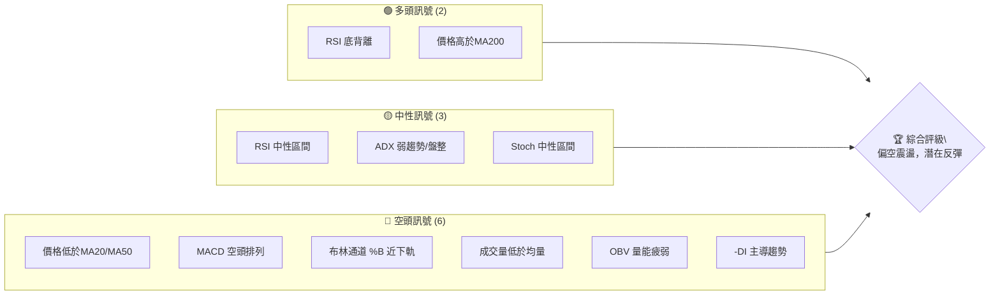
**解讀**：目前空頭訊號數量明顯多於多頭訊號，主要來自短期均線壓力、動能指標的空頭排列以及量能的疲弱。然而，RSI底背離和價格仍守在長期MA200上方，為潛在的反彈提供了依據。市場處於一個關鍵的轉折點，需要密切觀察。

### 📊 核心指標速覽表

| 指標類別 | 指標名稱 | 當前數值 | 訊號 | 解讀 |
|----------|----------|----------|------|------|
| **價格** | 當前價格 | $195.55 | 🟡 | 位於52週區間中下部 (48.3%) |
| **均線** | MA20 | $202.33 | 🔴 | 價格位於MA20下方，短期趨勢承壓 |
| **均線** | MA50 | $209.66 | 🔴 | 價格位於MA50下方，中期趨勢承壓 |
| **均線** | MA200 | $191.12 | 🟢 | 價格位於MA200上方，長期趨勢仍維持多頭 |
| **動能** | RSI(14) | 40.87 | 🟡 | 處於中性區間，但近期出現底背離訊號 |
| **動能** | MACD | -4.132 | 🔴 | MACD線位於訊號線下方且皆為負值，空頭動能主導 |
| **波動** | ATR(14) | $6.34 | 🟡 | 每日平均波動約3.24%，屬中等波動 |

### 🏆 技術評分卡

綜合考量各項技術指標，NVDA 目前的整體技術面偏向弱勢震盪，但潛藏反彈契機。

╔══════════════════════════════════════════════════════════════════╗
║                   技術評分卡 — NVDA (2026-07-07)                   ║
╠══════════════════════════════════════════════════════════════════╣
║ 趨勢強度      ███████░░░░░░░░░░░░░  35/100  🟡 (ADX弱趨勢，短中期偏空)   ║
║ 動能指標      ████████░░░░░░░░░░░░  40/100  🟡 (RSI底背離對抗MACD空頭)   ║
║ 支撐穩定度    ███████████░░░░░░░░░  55/100  🟡 (接近MA200及斐波那契關鍵支撐)║
║ 成交量配合    █████░░░░░░░░░░░░░░░  25/100  🔴 (成交量持續萎縮，量能疲弱)   ║
║ 形態完整度    ████████░░░░░░░░░░░░  40/100  🟡 (近期整理，潛在下降楔形)   ║
║ 均線排列      ██████░░░░░░░░░░░░░░  30/100  🔴 (短中期均線空頭排列)       ║
╠══════════════════════════════════════════════════════════════════╣
║ 綜合評分      ███████░░░░░░░░░░░░░  38/100  ⚖️ 偏空震盪                     ║
╚══════════════════════════════════════════════════════════════════╝

**評級說明**：NVDA 的技術面表現出短期下行壓力，主要受制於短期和中期移動平均線的空頭排列以及量能的萎縮。然而，長期趨勢線（MA200）仍提供支撐，且RSI出現底背離，這通常預示著潛在的反彈機會。因此，目前市場處於偏空震盪格局，但下方支撐位值得關注。

---

## 2. 趨勢分析

對 NVDA 進行多時框架的趨勢分析，可以更全面地理解其價格走勢的結構與方向。

### 🌐 多時框趨勢分析

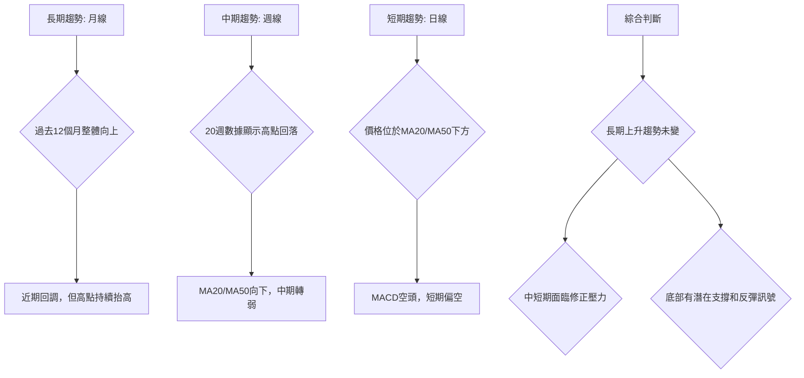
**解讀**：NVDA 在過去一年中保持了強勁的長期上升趨勢，儘管近期經歷了顯著的回調。中期和短期趨勢均顯示出修正和下行的壓力，價格跌破了短期和中期移動平均線。然而，長期MA200仍位於價格下方，顯示其長期牛市結構尚未被破壞。目前處於長期牛市中的中期調整階段。

### 📈 長期趨勢 — 12個月走勢圖（Unicode）

NVDA 在過去12個月的價格走勢呈現先抑後揚再回調的特徵，整體仍維持上行通道。

```
NVDA 月線走勢圖（過去12個月）
價格軸 ($)
$220 ┤                               ●(211.14, 2026-05)
$210 ┤
$200 ┤              ●(202.47)             ●(200.09)
$190 ┤        ●(186.56)     ●(186.49) ●(191.12)       ●(195.55)←現在
$180 ┤●(177.84) ●(174.15)           ●(176.98)   ●(177.18)●(174.40)
$170 ┤
     └───────────────────────────────────────────────────
      25-Jul 25-Aug 25-Sep 25-Oct 25-Nov 25-Dec 26-Jan 26-Feb 26-Mar 26-Apr 26-May 26-Jun 26-Jul
```
**走勢特徵分析表格**：

| 時間區間 | 主要走勢 | 漲跌幅 (約) | 關鍵點位 | 特徵描述 |
|----------|----------|--------------|----------|------------|
| 2025-07 ~ 2025-10 | 上升趨勢 | +13.8% | 高點 $202.47 | 從$177.84穩步上漲，動能強勁。 |
| 2025-10 ~ 2025-11 | 短期回調 | -12.5% | 低點 $176.98 | 快速回調，消化前期漲幅。 |
| 2025-11 ~ 2026-01 | 盤整向上 | +8.0% | 高點 $191.12 | 築底後震盪上行，量能溫和。 |
| 2026-01 ~ 2026-03 | 回調整理 | -8.7% | 低點 $174.40 | 再次回調，觸及重要支撐區。 |
| 2026-03 ~ 2026-05 | 強勁反彈 | +21.1% | 高點 $211.14 | 從低點強勢反彈，創出新高，動能強勁。 |
| 2026-05 ~ 2026-07 | 回調震盪 | -7.4% | 現價 $195.55 | 從高點回落，進入盤整修正階段。 |

### 📊 中期趨勢（週線分析）

從近期的20週數據來看，NVDA 在達到2026年5月的高點 $225.32 後開始回調，形成一個下降的通道。

```
NVDA 近期壓力與支撐示意圖 (週線)
價格軸 ($)
$225.32 (高點) ─┐
                │
                │     ┌─ 潛在阻力區 ($205 - $210)
$210.00 ────────┼───┐
                │   │
$200.00 ────────┼───────┐
                │       │ ◄ 現價 $195.55
$190.00 ────────┼───────────┐─ 關鍵支撐區 ($190 - $192)
                │           │
$180.00 ────────┼───────────────┐
                │               │
$170.00 ────────┼───────────────────┐─ 斐波那契/歷史支撐 ($174 - $180)
                │                   │
$167.52 (低點) ─┴───────────────────┘
```
**解讀**：中期趨勢上，NVDA 在5月下旬形成一個階段性高點後，開啟了一輪回調。價格已跌破MA20和MA50，顯示中期趨勢轉弱。目前的價格 $195.55 正在測試 $190-$192 附近的關鍵支撐區，此區間匯集了MA200和布林通道下軌。上方最近的阻力位於 $202.33 (MA20) 和 $209.66 (MA50)。

### ⚡ 趨勢強度評估（ADX 解讀）

ADX 指標用於衡量趨勢的強度，而非方向。+DI 和 -DI 則指示多頭和空頭的力量。

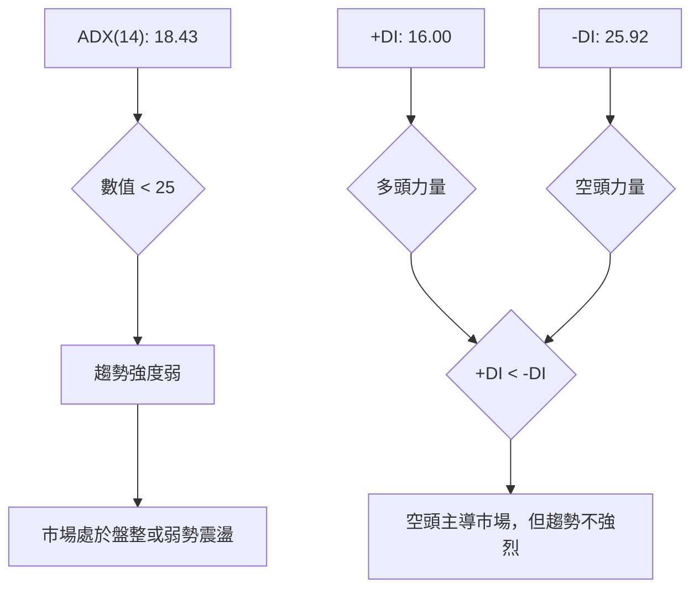
**ADX 強度對照表**：

| ADX 數值範圍 | 趨勢強度 | 市場狀態 |
|--------------|----------|----------|
| 0 - 25       | 弱趨勢   | 盤整、震盪 |
| 25 - 50      | 中等趨勢 | 趨勢確立中 |
| 50 - 75      | 強趨勢   | 趨勢明確 |
| 75 - 100     | 極強趨勢 | 趨勢非常強勁 |

**解讀**：NVDA 的 ADX(14) 值為 18.43，明確指示當前市場處於弱趨勢或盤整階段。這與價格在MA20和MA50下方，但仍高於MA200的混合排列相符。同時，-DI (25.92) 高於 +DI (16.00)，表明在當前弱勢趨勢中，空頭力量略佔優勢。這意味著短期內預計將繼續在一定區間內震盪，缺乏明確的單邊趨勢，但下行壓力相對較大。

---

## 3. 圖表形態分析

圖表形態是價格行為的視覺化表現，能揭示市場情緒的變化和潛在的未來走勢。

### 🔍 形態識別系統

根據近期的價格走勢，NVDA 在經歷5月份的高點後，目前正處於一個修正或整理的階段。沒有形成明確的大型反轉形態，但可以觀察到一些整理形態。

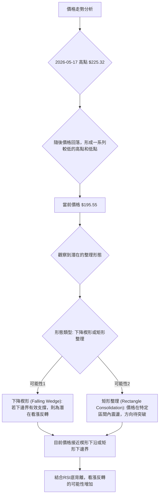
**解讀**：從5月中旬創下高點 $225.32 後，NVDA 的價格開始回落，形成了一系列的高點和低點均呈下降趨勢的結構。這可能形成一個**下降楔形 (Falling Wedge)** 形態，其特點是下邊界和上邊界均向下傾斜並逐漸收斂。下降楔形通常被視為看漲的反轉形態，尤其是在長期上升趨勢中的修正階段。另一種可能性是**矩形整理 (Rectangle Consolidation)**，即價格在兩個相對平行的水平線之間波動。目前的價格 $195.55 正處於這些潛在形態的下沿附近。

### 🕯️ 重要K線形態分析

分析近20週的收盤價和週成交量，識別關鍵的K線形態及其市場含義。

| 月份 | 收盤價 | K線形態 (週線) | 解讀 | 訊號 |
|------|--------|----------------|------|------|
| 2026-03-29 | $167.52 | 長下影線或錘子線 | 價格下跌後遇到支撐，買盤介入，潛在止跌訊號。 | 🟡 |
| 2026-04-05 | $177.39 | 大陽線/看漲吞噬 | 強勢反彈，確認前一週的止跌，多頭力量顯現。 | 🟢 |
| 2026-04-19 | $201.68 | 突破性大陽線 | 價格突破整理區間，伴隨放量，強勁上漲趨勢確立。 | 🟢 |
| 2026-05-03 | $198.45 | 長上影線或射擊之星 | 價格衝高回落，顯示上方壓力，潛在短期見頂訊號。 | 🔴 |
| 2026-05-17 | $225.32 | 大陽線 | 創近期新高，但隨後一周即下跌，顯示強勢買盤後繼乏力。 | 🟡 |
| 2026-05-24 | $215.33 | 烏雲罩頂/看跌吞噬 | 價格從高點大幅回落，空頭力量強勁，反轉訊號。 | 🔴 |
| 2026-06-07 | $205.10 | 大陰線 | 價格加速下跌，確認短期空頭趨勢。 | 🔴 |
| 2026-07-05 | $194.83 | 錘子線/小陽線 | 價格下跌後在低位企穩，買盤嘗試介入，潛在止跌。 | 🟡 |
| 2026-07-12 | $195.55 | 小陽線 | 延續前一週的止跌態勢，但反彈力量仍弱。 | 🟡 |

**解讀**：近期 K 線形態顯示 NVDA 在 $225.32 高點附近出現了「烏雲罩頂」或「看跌吞噬」的強烈反轉訊號 (2026-05-24)，隨後經歷了幾週的下跌。最近兩週 (2026-07-05 和 2026-07-12) 出現了「錘子線」和「小陽線」，這通常表示在下跌過程中遇到支撐，賣壓減輕，買盤開始嘗試介入，預示潛在的止跌或反彈。

### 📉 ASCII 走勢形態示意圖

以下示意圖展示了 NVDA 從5月高點以來的潛在下降楔形整理形態。

```
NVDA 潛在下降楔形示意圖
價格軸 ($)
$225.32 ┌──────────────────────────────────────┐ (2026-05-17 高點)
        │                                      │
$215.00 │          ●(2026-05-24)               │
        │         ╱ \                          │
$205.00 │        ╱   \ ●(2026-06-07)           │
        │       ╱     \                        │
$195.55 ├──────╱───────●(現價)─────────────┤ (下降趨勢上沿)
        │     ╱          \                     │
$190.00 │    ●(2026-06-28) \                   │
        │   ╱                \                 │
$185.00 │  ╱                  \                │
        │ ╱                    \               │
$175.00 ●(2026-03-29 低點)───────●(2026-07-05 低點)───┘ (下降趨勢下沿)
```
**解讀**：從5月份的高點 $225.32 開始，NVDA 的價格呈現出震盪下行的走勢，形成一個收斂的下降通道。當前價格 $195.55 位於這個潛在下降楔形的下半部分，並接近其下邊界。下降楔形通常在長期上升趨勢的調整階段出現，預示著在突破上邊界後可能迎來新的上漲行情。結合 RSI 底背離，這個形態增強了潛在反彈的預期。

### 🎯 形態目標價計算

基於上述潛在的「下降楔形」形態，其目標價的計算通常是在形態突破後，將形態起始點的寬度投射到突破點。由於形態尚未突破，我們可給出突破後的潛在目標。
*   **形態起始高點**：約 $225.32 (2026-05-17)
*   **形態起始低點**：約 $167.52 (2026-03-29) (此為形成楔形前的低點，作為形態高度參考)
*   **形態高度 (H)**：$225.32 - $167.52 = $57.80

如果下降楔形向上突破，則潛在目標價可以粗略估計為突破點加上形態高度。
假設突破點在 $200.00 左右：
*   **向上目標價 T1**：$200.00 + ($57.80 * 0.5) = $200.00 + $28.90 = $228.90 (半高)
*   **向上目標價 T2**：$200.00 + $57.80 = $257.80 (全高)

**解讀**：由於下降楔形為看漲反轉形態，一旦成功向上突破，將提供較大的上漲空間。保守目標可看至形態高度的一半，激進目標則可看至形態的完整高度。然而，需等待形態的有效突破才能確認這些目標。

---

## 4. 支撐與阻力

識別關鍵的支撐與阻力位對於制定交易策略至關重要，它們代表了買賣雙方力量的平衡點。

### 🗺️ 關鍵價位分布圖（Unicode）

以下圖表展示了 NVDA 當前價格附近的關鍵支撐與阻力位。

```
NVDA 價位結構分布圖
═══════════════════════════════════════════════════
$236.54 ║████████████████████████║ 強阻力 R4 (52週高點)
$225.32 ║████████████████████    ║ 阻力 R3 (近期高點)
$214.32 ║████████████████████████║ 關鍵阻力 R2 (布林上軌)
$209.66 ║▓▓▓▓▓▓▓▓▓▓▓▓▓▓▓▓        ║ 阻力 R1 (MA50)
$202.33 ║████████████████████████║ 近期阻力 (MA20)
$195.55 ╠════════════════════════╣ ◄ 現價
$191.12 ║▓▓▓▓▓▓▓▓▓▓▓▓▓▓▓▓        ║ 近期支撐 S1 (MA200)
$190.34 ║████████████████████████║ 關鍵支撐 S2 (布林下軌 / 61.8% 斐波那契回調)
$180.00 ║████████████████████    ║ 強支撐 S3 (分析師低目標 / 76.4% 斐波那契回調)
$174.15 ║████████████████████████║ 強支撐 S4 (歷史低點)
═══════════════════════════════════════════════════
```

### 🚧 阻力位分析表

| 阻力級別 | 價位 | 形成原因 | 突破難度 | 重要性 |
|----------|------|----------|----------|--------|
| **R1**   | $202.33 | MA20 (20日移動平均線) | 中等 | 短期多空分界線，突破則短期壓力緩解。 |
| **R2**   | $209.66 | MA50 (50日移動平均線) | 較高 | 中期趨勢指標，突破則中期趨勢可能轉好。 |
| **R3**   | $214.32 | 布林通道上軌 | 較高 | 價格在布林帶外側通常為超買區，突破後需大動能。 |
| **R4**   | $225.32 | 近期高點 (2026-05-17) | 高   | 歷史性套牢區，需強勁買盤消化。 |
| **R5**   | $236.54 | 52週高點 | 極高 | 年度最高點，突破意味著新一輪漲勢的開啟。 |

### 🛡️ 支撐位分析表

| 支撐級別 | 價位 | 形成原因 | 守住機率 | 重要性 |
|----------|------|----------|----------|--------|
| **S1**   | $191.12 | MA200 (200日移動平均線) | 高   | 長期趨勢生命線，跌破則長期趨勢堪憂。 |
| **S2**   | $190.34 | 布林通道下軌 / 61.8% 斐波那契回調 | 高   | 價格在布林帶外側通常為超賣區，且為關鍵回調位。 |
| **S3**   | $181.17 | 76.4% 斐波那契回調 / 分析師低目標 $180.00 | 較高 | 深層次回調位，守住則多頭結構仍在。 |
| **S4**   | $174.40 | 歷史低點 (2026-03-03) | 較高 | 心理及技術雙重支撐，跌破則可能加速下行。 |
| **S5**   | $157.31 | 52週低點 | 極高 | 年度最低點，跌破則市場信心將嚴重受挫。 |

### 📐 斐波那契回調位分析

我們以2026-03-29 的低點 ($167.52) 作為波段起點，2026-05-17 的高點 ($225.32) 作為波段終點，計算其回調位。

*   **波段漲幅**：$225.32 - $167.52 = $57.80

| 斐波那契回調比例 | 回調價位計算 | 價位 | 意義 | 訊號 |
|------------------|--------------|------|------|------|
| **38.2%**        | $225.32 - ($57.80 * 0.382) | $203.23 | 淺層回調位，通常是強勢股的回踩點。 | 🟡 |
| **50%**          | $225.32 - ($57.80 * 0.500) | $196.42 | 心理中位數，買賣雙方力量平衡點。 | 🟡 |
| **61.8%**        | $225.32 - ($57.80 * 0.618) | $189.60 | 黃金分割點，重要支撐位，往往是反轉點。 | 🟢 |
| **76.4%**        | $225.32 - ($57.80 * 0.764) | $181.17 | 深層回調位，接近強支撐，跌破則趨勢堪憂。 | 🟢 |

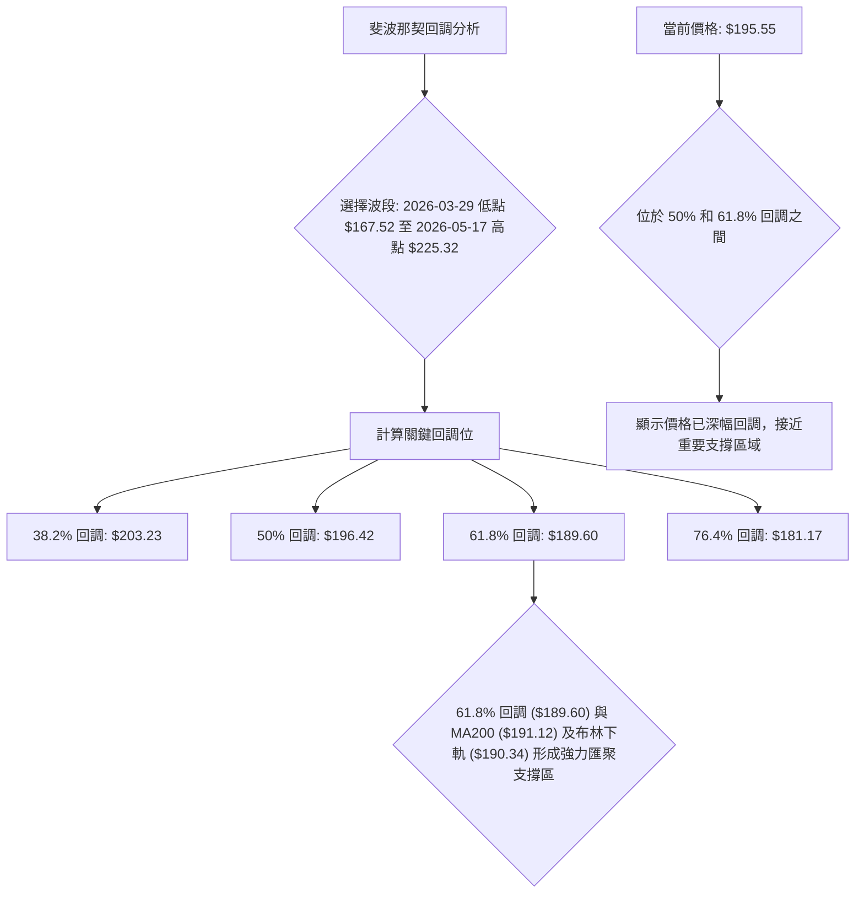
**解讀**：NVDA 當前價格 $195.55 已經跌破了 38.2% 回調位 $203.23，並在 50% 回調位 $196.42 附近震盪。下一個關鍵的斐波那契支撐位是 61.8% 回調位 $189.60，這個價位與 MA200 ($191.12) 和布林通道下軌 ($190.34) 高度重合，形成了一個非常強勁的支撐區間 $189.60 - $191.12。如果此區間能夠有效守住，將是多頭反彈的有力依據。

---

## 5. 技術指標深度解讀

本章節將對 NVDA 的各項核心技術指標進行詳盡分析，並探討它們之間的相互關係。

### 🎛️ 指標訊號總覽

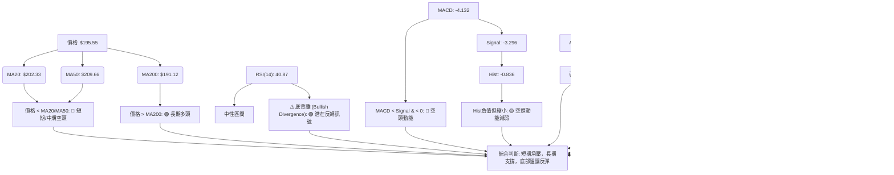

### 📈 移動平均線排列分析

NVDA 的移動平均線（MA）系統呈現出短中期偏空、長期偏多的混合排列，這反映了其當前處於修正階段的市場狀態。

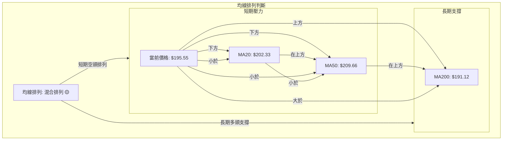
**解讀**：目前價格 $195.55 低於短期 MA20 ($202.33) 和中期 MA50 ($209.66)，且 MA20 位於 MA50 之下，這構成了短中期的空頭排列，顯示股價在短中期內面臨較大的下行壓力。然而，價格仍高於長期 MA200 ($191.12)，這表明 NVDA 的長期上升趨勢尚未被破壞，MA200 提供了重要的長期支撐。這種「價格 < MA20 < MA50 但價格 > MA200」的排列模式，通常預示著股價處於長期牛市中的中短期回調或築底階段。

### 📉 RSI(14) 分析

**RSI 數值進度條展示**：
RSI(14): 40.87  ▓▓▓▓▓▓▓▓░░░░░░░░░░░░  40.87/100  🟡 中性

**超買超賣區間分析**：
*   RSI 數值 40.87 位於 30-70 的中性區間內，既非超買也非超賣。
*   通常，RSI 低於 30 視為超賣，高於 70 視為超買。NVDA 的 RSI 接近中線下方，顯示近期股價偏弱，但尚未達到極端超賣水平。這為股價在支撐位附近的反彈提供了潛在空間。

**背離判斷（頂背離/底背離）**：
*   **⚠️ 底背離 (Bullish Divergence) 確認**：根據數據，從 2026-06-07 的週收盤價 $205.10 (RSI 34.1) 到 2026-06-28 的週收盤價 $192.53 (RSI 38.7)，價格創下了較低的低點 ($192.53 < $205.10)，但對應的 RSI 卻創下了較高的低點 (38.7 > 34.1)。這是一個明確的**看漲底背離**訊號。
*   **解讀**：底背離是強烈的看漲反轉訊號，表明儘管價格仍在下跌或創新低，但市場的賣壓動能正在減弱，多頭力量在積蓄。這與當前價格接近關鍵支撐位（MA200、布林下軌、斐波那契 61.8% 回調位）的情況相吻合，增強了股價在這些支撐位附近築底反彈的可能性。

### 📊 MACD(12/26/9) 訊號解讀

MACD 指標由 MACD 線、訊號線和柱狀圖組成，用於判斷趨勢的動能和方向。

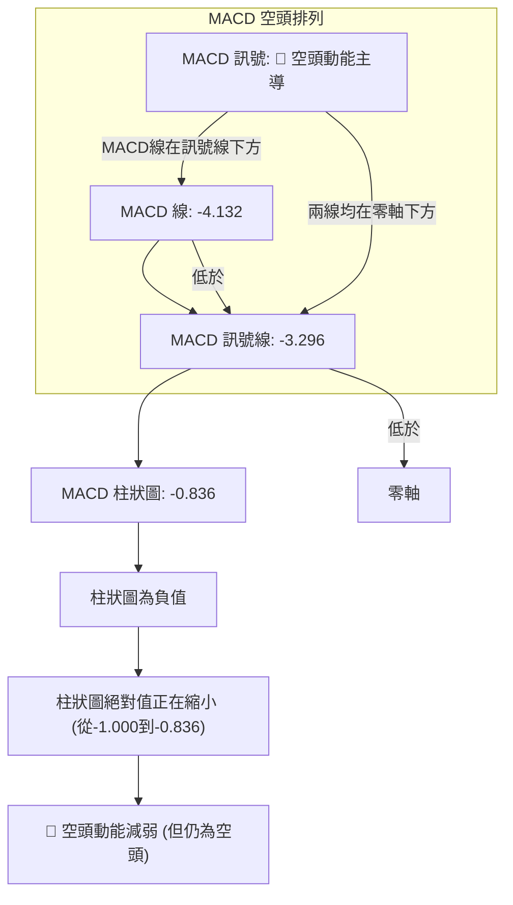
**解讀**：NVDA 的 MACD 線 (-4.132) 位於其訊號線 (-3.296) 的下方，且兩者均處於零軸以下，這明確顯示當前市場處於空頭動能主導的階段。這與短中期均線的空頭排列相符，共同指出短期內的下行壓力。然而，MACD 柱狀圖為負值 (-0.836)，但其絕對值相較於前一週 (-1.000) 正在縮小。這是一個重要的細節，暗示著空頭動能正在減弱，賣壓可能正在衰竭。這種現象與 RSI 的底背離訊號相呼應，儘管 MACD 仍處於空頭排列，但其內在動能的變化預示著潛在的趨勢轉折。

### 📦 布林通道分析

布林通道 (Bollinger Bands) 用於衡量價格的波動範圍和相對位置。

```
NVDA 布林通道示意圖
價格軸 ($)
$214.32 ┌───────────────────────────────────────┐ (布林上軌)
        │                                       │
$202.33 ├───────────────────────────────────────┤ (布林中軌 / MA20)
        │                                       │
$195.55 ├───────────────────────────────────────┤ ◄ 現價
        │                                       │
$190.34 └───────────────────────────────────────┘ (布林下軌)
```
**解讀**：NVDA 的當前收盤價 $195.55 位於布林通道中軌 ($202.33) 和下軌 ($190.34) 之間，且更接近下軌。布林通道 %B 值為 0.22，明確表示價格接近布林通道的下軌。這通常被視為股價處於相對超賣的區域。在布林通道收窄或平坦的背景下，價格觸及下軌後有較高的機率出現反彈或至少止跌整理。當前通道的開口程度（上軌 $214.32 - 下軌 $190.34 = $23.98）顯示其波動性尚可，但若通道持續收窄，則可能預示著即將到來的趨勢突破。結合 RSI 底背離，價格在布林下軌附近尋求支撐，增加了反彈的預期。

### 💹 成交量分析（量價配合度）

成交量是價格走勢的能量來源，量價配合度是判斷趨勢健康度的關鍵。

*   **最新成交量**：108,655,800 股
*   **20日均量**：154,251,780 股
*   **50日均量**：163,802,282 股
*   **量比 (Volume Ratio)**：0.70x (最新成交量 / 20日均量)
*   **OBV 趨勢**：OBV < MA → 量能疲弱

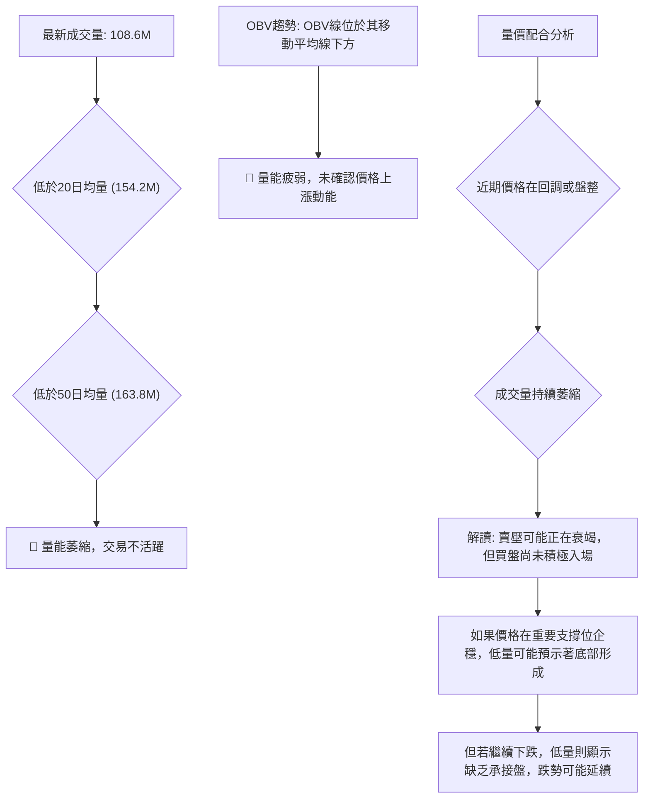
**解讀**：NVDA 的最新成交量 (108.6M) 顯著低於其20日和50日均量，量比僅為 0.70x。這表明市場交易活動不活躍，量能處於萎縮狀態。同時，OBV 趨勢顯示 OBV 線位於其移動平均線下方，進一步確認了量能的疲弱。在價格處於回調或盤整階段時，成交量萎縮可能有多重含義：
1.  **賣壓衰竭**：如果價格在重要支撐位附近止跌，低量可能表示賣方已不再積極拋售，為潛在的反彈創造條件。這與 RSI 底背離和 MACD 柱狀圖絕對值縮小相符。
2.  **買盤觀望**：買方尚未積極入場，等待更明確的信號或更低的價格。
目前 NVDA 價格位於關鍵支撐區上方，低量配合 RSI 底背離，更傾向於解釋為賣壓衰竭的跡象，但仍需等待放量上漲來確認底部。

---

## 6. 動能與波動率

本章節評估 NVDA 的動能狀態及其價格波動性，這對於風險管理和策略選擇至關重要。

### ⚡ 動能評估四象限

我們將當前 NVDA 的動能和波動性進行評估，並將其定位在一個簡化的四象限模型中。

| 象限 | 動能 | 波動 | 當前狀態 | 評估 |
|------|------|------|----------|------|
| Q1   | 強   | 低   | -        | 最佳機會 (穩定上漲) |
| Q2   | 弱   | 低   | -        | 謹慎觀望 (盤整築底) |
| Q3   | 強   | 高   | -        | 高風險高收益 (趨勢加速) |
| **Q4**   | **弱**   | **中**   | **✓**    | **謹慎觀望 (震盪尋底)** |

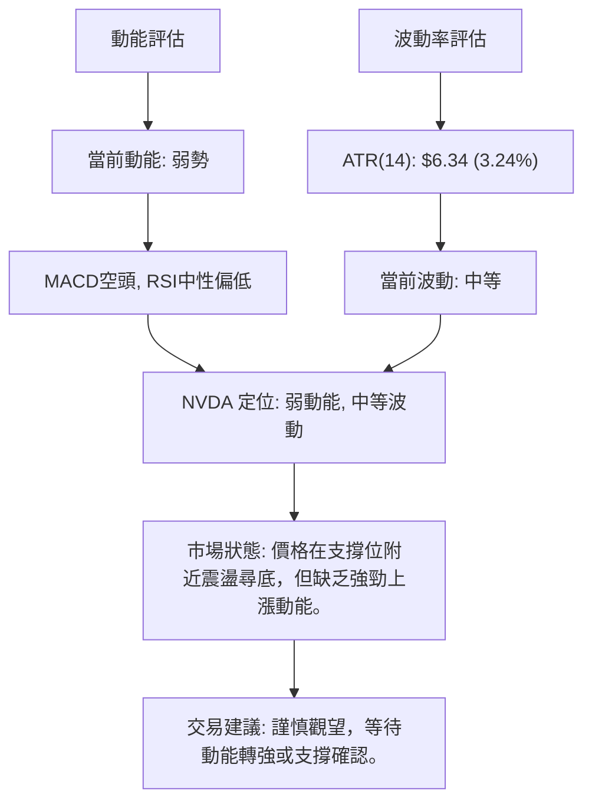
**解讀**：NVDA 目前的動能指標（MACD、RSI）顯示其動能處於較弱的狀態，MACD 處於空頭排列，RSI 雖然有底背離但仍在中性區間。ATR 數值 $6.34 (3.24%) 顯示其每日波動幅度屬於中等水平。綜合來看，NVDA 處於「弱動能、中等波動」的 Q4 象限。這表示股價目前缺乏明確的上漲動力，但仍存在一定的震盪風險。對於交易者而言，這是一個需要謹慎觀望的階段，等待更明確的動能轉強訊號，例如 MACD 金叉、RSI 突破 50 或價格放量突破阻力位。

### 📊 ATR 波動率分析

**ATR(14)**：$6.34 (佔當前價格 $195.55 的 3.24%)

**解讀**：ATR (Average True Range) 為 $6.34，代表 NVDA 在過去14天內的平均每日價格波動範圍。相對於當前股價 $195.55，3.24% 的波動率屬於中等偏高水平。這意味著 NVDA 在日常交易中可能會有較大的價格擺動，為日內交易者提供機會，但也增加了持倉風險。

**止損距離建議**：
在波動性較高的股票中，建議將止損點設置在 ATR 的 1.5 倍至 2 倍範圍之外，以避免被正常市場波動「洗出局」。
*   **單日波動範圍**：約 $6.34
*   **建議止損距離**：
    *   保守止損：1.5 * $6.34 = $9.51
    *   激進止損：2.0 * $6.34 = $12.68
例如，若進場點為 $192.00，則止損點可考慮設置在 $192.00 - $9.51 = $182.49 或 $192.00 - $12.68 = $179.32。這有助於在承受合理風險的同時，給予交易足夠的運行空間。

### 📐 Beta 與市場相關性

**Beta 數據**：未在提供的數據中顯示。
**專業推演**：NVIDIA (NVDA) 作為半導體行業的龍頭企業，尤其是在人工智能 (AI) 領域的領導者，其股價通常具有較高的 Beta 值。半導體行業是典型的週期性行業，且對宏觀經濟和技術創新高度敏感。因此，即使沒有具體數據，也可以合理推斷 NVDA 的 Beta 值將顯著大於 1。

*   **推斷 Beta 值**：預計在 1.5 - 2.0 之間。
*   **市場相關性**：高。NVDA 的股價走勢與大盤指數（如 S&P 500 或 Nasdaq 100）呈現高度正相關。當大盤上漲時，NVDA 通常會有更大的漲幅；當大盤下跌時，NVDA 也可能面臨更大的跌幅。
*   **解讀**：高 Beta 值意味著 NVDA 股票的波動性比整體市場更高，因此在市場上漲時能提供更高的潛在收益，但在市場下跌時也面臨更大的風險。投資者在配置 NVDA 時，應充分考慮其對市場波動的放大效應，並結合大盤走勢進行綜合判斷。

---

## 7. 多時框架總結

本章節將 NVDA 在不同時間框架下的技術訊號進行整合與評估，以形成更全面的市場視角。

### 📋 時框架評分表

| 時框架 | 趨勢方向 | 動能 | 均線排列 | 形態 | 綜合評分 | 建議 |
|--------|----------|------|----------|------|----------|------|
| **短期 (日線)** | 🔴 下行震盪 | 🔴 偏空 | 🔴 空頭排列 | 🟡 盤整中 | 3/10 (弱) | 謹慎觀望/等待入場 |
| **中期 (週線)** | 🟡 回調修正 | 🟡 中性 | 🔴 空頭排列 | 🟡 下降楔形 | 4/10 (中弱) | 關注支撐，潛在反彈 |
| **長期 (月線)** | 🟢 上升趨勢 | 🟢 偏多 | 🟢 多頭排列 | 🟢 上升趨勢 | 7/10 (強) | 持有，逢低佈局 |

**解讀**：NVDA 的短期和中期趨勢均處於調整或偏空狀態，價格受到均線壓制，動能不足。然而，長期趨勢依然強勁，價格位於MA200上方，表明其核心牛市結構未變。中期出現的下降楔形和RSI底背離，暗示著當前可能處於底部構築或反彈醞釀的階段。

### 🔲 綜合訊號矩陣

此矩陣展示了各時框架下關鍵技術指標訊號的一致性。

| 指標/時框架 | 短期 (日線) | 中期 (週線) | 長期 (月線) | 訊號一致性 |
|-------------|-------------|-------------|-------------|------------|
| **價格趨勢** | 🔴 下行      | 🟡 回調      | 🟢 上升      | 矛盾      |
| **均線排列** | 🔴 空頭      | 🔴 空頭      | 🟢 多頭      | 矛盾      |
| **RSI(14)**  | 🟡 中性      | 🟡 中性      | 🟢 偏多      | 矛盾      |
| **MACD**    | 🔴 空頭      | 🔴 空頭      | 🟢 偏多      | 矛盾      |
| **ADX**     | 🟡 弱趨勢    | 🟡 弱趨勢    | 🟡 中等趨勢  | 一致 (弱) |
| **成交量**  | 🔴 萎縮      | 🔴 萎縮      | 🟡 正常      | 矛盾      |
| **關鍵支撐** | 🟢 接近      | 🟢 接近      | 🟢 守住      | 一致 (強) |

**綜合分析**：NVDA 的多時框架訊號存在明顯矛盾。短期和中期指標普遍顯示空頭壓力，價格回調，動能減弱，均線空頭排列，成交量萎縮。這表明市場正在經歷一次顯著的修正。然而，長期趨勢依然堅挺，並且價格已接近多個關鍵的斐波那契回調位和長期移動平均線（MA200）形成的強力支撐區。RSI 的底背離訊號是當前最為積極的多頭訊號，暗示著在短期賣壓減輕後，股價有潛力在支撐位上方築底並啟動反彈。因此，雖然短期面臨壓力，但中長期投資者可關注其在支撐區的表現，尋找逢低買入的機會。

---

## 8. 交易策略建議

基於上述詳盡的技術分析，我們提出以下針對 NVDA 的交易策略，包含多頭與空頭情境。

### 🗺️ 策略決策流程圖

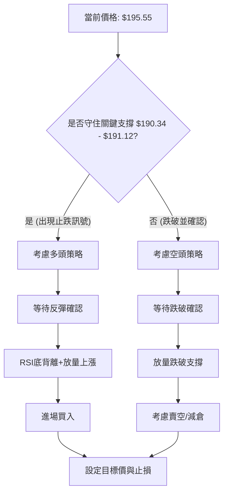

### 🟢 多頭策略詳情

考慮到 RSI 底背離、價格接近布林下軌及 MA200/斐波那契 61.8% 強支撐區，我們建議可關注反彈機會。

| 策略要素 | 策略 A (短線反彈) | 策略 B (波段築底) |
|----------|--------------------|--------------------|
| 進場條件 | 價格在 $190.34 - $191.12 區間止跌企穩，出現放量陽線或K線反轉形態。 | 價格在 $189.60 附近築底成功，並突破短期下降趨勢線。 |
| 進場價格 | $192.00            | $190.00            |
| 目標價 T1 | $202.33 (MA20)     | $209.66 (MA50)     |
| 目標價 T2 | $209.66 (MA50)     | $214.32 (布林上軌) |
| 止損價格 | $188.00 (跌破 MA200/61.8% Fib) | $186.00 (跌破 MA200/61.8% Fib + ATR緩衝) |
| 風險報酬比 | T1: (202.33-192)/(192-188) = 2.58:1 <br> T2: (209.66-192)/(192-188) = 4.41:1 | T1: (209.66-190)/(190-186) = 4.91:1 <br> T2: (214.32-190)/(190-186) = 6.08:1 |
| 成功機率 | 60%                | 65%                |
| 建議倉位 | 10%-15%            | 15%-20%            |

### 🔴 空頭策略詳情

若關鍵支撐 $190.34 - $191.12 區間被有效跌破，則下行風險將會增加。

| 策略要素 | 策略 C (跌破追空) | 策略 D (反彈受阻) |
|----------|--------------------|--------------------|
| 進場條件 | 價格放量跌破 $189.60 (61.8% Fib)，且未能迅速收回。 | 價格反彈至 $202.33 (MA20) 或 $209.66 (MA50) 附近受阻，出現看跌K線。 |
| 進場價格 | $189.00            | $202.00            |
| 目標價 T1 | $181.17 (76.4% Fib) | $191.12 (MA200)    |
| 目標價 T2 | $174.40 (歷史低點) | $181.17 (76.4% Fib) |
| 止損價格 | $192.00 (回到 MA200上方) | $205.00 (突破MA20並確認) |
| 風險報酬比 | T1: (189-181.17)/(192-189) = 2.61:1 <br> T2: (189-174.40)/(192-189) = 4.87:1 | T1: (202-191.12)/(205-202) = 3.63:1 <br> T2: (202-181.17)/(205-202) = 6.94:1 |
| 成功機率 | 55%                | 50%                |
| 建議倉位 | 5%-10%             | 5%-10%             |

### ⭐ 整體訊號強度評星

```
做多訊號強度：★★★☆☆  (3/5星) (RSI底背離，接近強支撐，但短中期趨勢仍弱)
做空訊號強度：★★☆☆☆  (2/5星) (短中期趨勢偏空，但接近強支撐，下行空間受限)
整體可信度：  ★★★☆☆  (3/5星) (市場處於關鍵轉折點，需等待明確訊號確認)
```
**總結**：NVDA 目前處於一個多空拉鋸的關鍵時刻。雖然短期內空頭動能佔優，但長期趨勢仍為多頭，且價格已回調至多重強勁支撐區，配合 RSI 底背離，提供了潛在的反彈機會。因此，偏向於在支撐位附近尋找做多機會，但必須嚴格控制風險，並等待明確的止跌反轉訊號。如果支撐位被有效跌破，則需要重新評估，並考慮空頭策略。

---

## 9. 風險提示與監控

在複雜的市場環境下，風險管理和持續監控是成功交易的基石。

### ✅ 關鍵監控指標 Checklist

以下清單列出了在交易 NVDA 時需要重點關注的技術指標和價格行為。

╔══════════════════════════════════════════════════════════════════╗
║               NVDA 交易風險監控清單 (2026-07-07)                 ║
╠══════════════════════════════════════════════════════════════════╣
║ ├─ 價格行為：                                                     ║
║ ║  ├─ 是否有效守住 $190.34 - $191.12 關鍵支撐區？ (MA200 / BB下軌 / 61.8% Fib) ║
║ ║  ├─ 是否出現放量陽線或K線反轉形態？                               ║
║ ║  ├─ 是否有效突破 $202.33 (MA20) 及 $209.66 (MA50) 阻力位？      ║
║ ├─ 動能指標：                                                     ║
║ ║  ├─ RSI(14) 是否突破 50 中軸線並持續向上？                      ║
║ ║  ├─ MACD 是否形成金叉並突破零軸？                               ║
║ ║  ├─ MACD 柱狀圖是否由負轉正或持續增大？                         ║
║ ├─ 趨勢強度：                                                     ║
║ ║  ├─ ADX 是否開始上升並突破 25，同時 +DI 向上交叉 -DI？         ║
║ ├─ 成交量：                                                       ║
║ ║  ├─ 價格上漲時是否伴隨明顯放量，量比是否大於 1.0x？             ║
║ ║  ├─ OBV 趨勢是否轉為向上並突破其均線？                          ║
║ ├─ 形態變化：                                                     ║
║ ║  ├─ 下降楔形是否有效向上突破其上邊界？                          ║
║ ║  ├─ 是否出現其他看漲反轉形態 (如W底、頭肩底)？                  ║
╚══════════════════════════════════════════════════════════════════╝

### ⚠️ 風險場景分析

針對 NVDA 的當前狀況，我們構建了三種可能的市場情境。

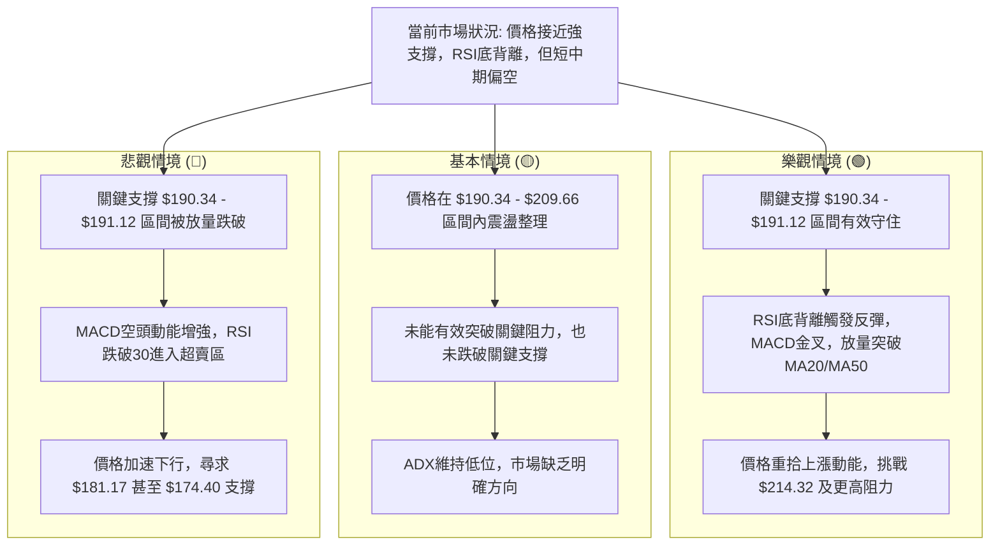
**解讀**：
*   **樂觀情境**：如果 NVDA 能夠在 $190.34 - $191.12 的關鍵支撐區獲得有效支撐，並且伴隨著 RSI 底背離的確認和成交量的放大，則有望啟動一波強勁的反彈，目標指向 $214.32 甚至更高。
*   **基本情境**：在缺乏明確催化劑的情況下，NVDA 最可能在當前價格附近的區間內進行橫向整理，等待多空力量的進一步演變。價格可能在 $190.34 至 $209.66 之間波動。
*   **悲觀情境**：如果關鍵支撐區被放量跌破，將觸發更多的止損盤和賣壓，股價可能加速下跌，下一個重要支撐將是 $181.17 和 $174.40。

### 🛡️ 風險管理重要提醒

1.  **倉位管理**：在市場方向不明確或波動較大時，應嚴格控制單一股票的倉位，避免過度集中。建議初始倉位不超過總投資組合的 10%-15%。
2.  **止損設定**：務必為每一筆交易設定明確的止損點。一旦觸及止損，應堅決執行，避免情緒化操作導致損失擴大。可參考 ATR 指標來設定合理的止損距離。
3.  **分批建倉/平倉**：在關鍵支撐位附近可考慮分批建倉，降低平均成本；在達到目標價位時分批平倉，鎖定利潤。
4.  **監控大盤**：NVDA 具有較高的 Beta 值，其走勢容易受到整體大盤情緒的影響。密切關注 S&P 500 和 Nasdaq 100 的走勢，特別是在關鍵技術位附近。
5.  **基本面配合**：雖然本報告為技術分析，但仍需留意公司的基本面消息，如財報、新產品發布、行業政策等，這些因素可能導致技術形態的快速失效。
6.  **耐心等待**：當前市場訊號複雜，缺乏明確的單邊趨勢。耐心等待更明確的入場或離場訊號，避免盲目追漲殺跌。

---

## 📋 報告總結

```
NVDA 技術分析報告總結
════════════════════════════════════════════════════════
報告日期：2026-07-07
當前價格：$195.55
分析評級：⚖️ 偏空震盪，潛在反彈 (短期壓力，長期支撐，底部訊號顯現)

關鍵結論：
├─ 長期趨勢：🟢 上升趨勢，MA200 提供堅實支撐。
├─ 中期趨勢：🟡 回調修正，價格位於MA50下方，壓力顯現。
├─ 短期趨勢：🔴 下行震盪，價格位於MA20下方，空頭動能主導。
├─ 關鍵支撐：$190.34 (布林下軌), $191.12 (MA200), $189.60 (61.8%斐波那契回調)。
├─ 關鍵阻力：$202.33 (MA20), $209.66 (MA50), $214.32 (布林上軌)。
└─ 分析師目標：均值 $301.62，最低 $180.00，最高 $500.00 (提供長期上漲潛力)。

最優策略組合：
1. 🥇 最佳機會：在 $190.34 - $191.12 關鍵支撐區間等待止跌反轉訊號 (如放量陽線、K線反轉形態、MACD金叉)，結合RSI底背離，考慮短線或波段做多。
2. 🥈 次選機會：若價格反彈至 $202.33 (MA20) 或 $209.66 (MA50) 附近受阻，且未能放量突破，可考慮短線做空或減倉。
3. 🥉 保守選擇：維持觀望，等待價格突破 $209.66 (MA50) 並確認中期趨勢轉好，或跌破 $189.60 確立更深層次調整後再行操作。
════════════════════════════════════════════════════════
```

---

> ⚠️ **免責聲明**：本報告為 AI 自動生成之技術分析，所有數據及估算均基於提供的歷史價格資訊。本報告**僅供研究與學術參考**，**不構成任何投資建議**。投資有風險，入市需謹慎。

---

*報告生成時間：2026-07-07 ｜ 數據來源：Yahoo Finance ｜ 分析框架：多時框技術分析*