<details>
<summary>📊 靜態圖表 (點擊展開)</summary>
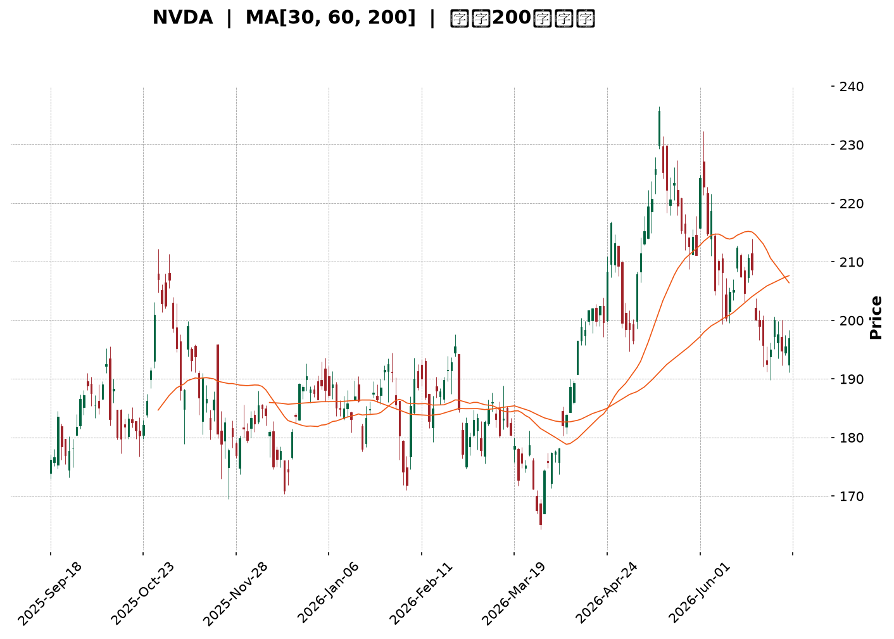
</details>

<html>
<head><meta charset="utf-8" /></head>
<body>
    <div style="height:500px; width:100%;">                        <script>window.PlotlyConfig = {MathJaxConfig: 'local'};</script>
        <script charset="utf-8" src="https://cdn.plot.ly/plotly-3.6.0.min.js" integrity="sha256-QaOVwtVY0T02VaHrr6pnoHLCwayMJp4O5n4YyaE3rJk=" crossorigin="anonymous"></script>                <div id="candlestick-chart" class="plotly-graph-div" style="height:100%; width:100%;"></div>            <script>                window.PLOTLYENV=window.PLOTLYENV || {};                                if (document.getElementById("candlestick-chart")) {                    Plotly.newPlot(                        "candlestick-chart",                        [{"close":{"dtype":"f8","bdata":"AAAAoA8HZkAAAACg0RRmQAAAAADg8mZAAAAAACJNZkAAAAAAax5mQAAAAMB0NWZAAAAAQHRFZkAAAADAj7pmQAAAAIDnUWdAAAAAwAVnZ0AAAAAA0ZtnQAAAAGAuc2dAAAAAwKAwZ0AAAABAoSBnQAAAAADbomdAAAAAQJARaEAAAAAAeuRmQAAAACCUiWdAAAAAwFOAZkAAAACg7XlmQAAAAABIuWZAAAAAgGXmZkAAAACg1tNmQAAAAMB7pGZAAAAAoFOIZkAAAADgesRmQAAAAECqR2dAAAAA4AHvZ0AAAAAAQSBpQAAAAICN4GlAAAAAYMRbaUAAAAAA+E5pQAAAAOBu22lAAAAAwGHVaEAAAADgCGZoQAAAAEDmgWdAAAAAoCOEZ0AAAACg5uBoQAAAAABxJGhAAAAAYOs4aEAAAAAA3VpnQAAAAIDFxGdAAAAAYItSZ0AAAAAA4qpmQAAAACD8T2dAAAAAYNiTZkAAAAAgiFtmQAAAAID10GZAAAAAgJ05ZkAAAADAr4dmQAAAAMBgH2ZAAAAA4M58ZkAAAAAgFa5mQAAAAMA\u002fcmZAAAAAwNfrZkAAAADgzcxmQAAAAGBHMWdAAAAAQLgeZ0AAAABApPhmQAAAAEBynWZAAAAAQFbgZUAAAACA+QhmQAAAAIC7NmZAAAAAwMhdZUAAAACgLcRlQAAAAOBdn2ZAAAAAAMP1ZkAAAACAZKZnQAAAAIAxk2dAAAAAQKHQZ0AAAADAtoZnQAAAAID0cGdAAAAAYK1PZ0AAAACA35pnQAAAAKCDg2dAAAAAIFtnZ0AAAABAMaNnQAAAAKD1IGdAAAAAIDMbZ0AAAACAwh1nQAAAACCZOWdAAAAAoCnkZkAAAADARmFnQAAAAIAJR2dAAAAAgO5BZkAAAABA7OlmQAAAAECPGmdAAAAAYB11Z0AAAACgt05nQAAAAEBQkGdAAAAAAE\u002fwZ0AAAACA\u002fA9oQAAAAEDU42dAAAAA4DIzZ0AAAABAkYpmQAAAAEDHxWVAAAAAwNx7ZUAAAACAzCxnQAAAAGDzwGdAAAAAAPSQZ0AAAABgRcFnQAAAAKDBXWdAAAAAgJrZZkAAAABAuB5nQAAAAMAIf2dAAAAAgHl8Z0AAAABg6blnQAAAAMBE8WdAAAAAwN0aaEAAAADAlHFoQAAAAOAoHGdAAAAAAMYlZkAAAABAC89mQAAAAMBJgWZAAAAAgPbgZkAAAAAAkOpmQAAAAKDuOWZAAAAAwHvUZkAAAAAAUhhnQAAAAMD1QGdAAAAA4HrkZkAAAAAAAIhmQAAAAEAK52ZAAAAAgMK9ZkAAAADAzIxmQAAAAIDrUWZAAAAAYGaWZUAAAADgevRlQAAAAGBm5mVAAAAAgMJVZkAAAAAgrmdlQAAAAOCj8GRAAAAAoHClZEAAAADAzMxlQAAAAAAA+GVAAAAA4HosZkAAAADgejRmQAAAAEAzQ2ZAAAAAYI\u002fCZkAAAADAHv1mQAAAAAAplGdAAAAAgOupZ0AAAADgUZBoQAAAAADX22hAAAAAQDPLaEAAAACAwjVpQAAAAIDrQWlAAAAAACn8aEAAAAAAAFBpQAAAAOB69GhAAAAA4KMIakAAAAAghRNrQAAAAKBwpWpAAAAAAAAoakAAAACAPfJoQAAAAGBmzmhAAAAAIFzPaEAAAAAAAJBoQAAAAGCP+mlAAAAAAABwakAAAABgZuZqQAAAAIAUbmtAAAAAwPWYa0AAAABgjzpsQAAAACCud21AAAAAgD0qbEAAAACAPcprQAAAACCFk2tAAAAAQArva0AAAADgUXBrQAAAAGCP6mpAAAAAIIXbakAAAABAM5NqQAAAAAAAyGpAAAAA4HpkakAAAAAghQtsQAAAAIA92mtAAAAAAADYakAAAADAHlVrQAAAAEAzo2lAAAAA4HoUakAAAACAFAZqQAAAAKBwDWlAAAAAANebaUAAAACAFKZpQAAAAGBmjmpAAAAAwB7taUAAAADAzJRpQAAAAIAUVmpAAAAAwMwUakAAAACgRwFpQAAAAAAA4GhAAAAAIK53aEAAAADA9RBoQAAAAEAKX2hAAAAAQOECaUAAAABgj7JoQAAAAGCPWmhAAAAAoJlxaEAAAACAwp1oQA=="},"high":{"dtype":"f8","bdata":"sTIA+pMiZkAUKyQb70FmQA0BlqfzEGdAhmMziczMZkD7iKv4U3hmQLDJgdCvh2ZA0QM+NAJ4ZkDqDCSRWv9mQCADpK6KamdAHJ7QsNGDZ0D\u002fObTO7eBnQMLlkgnaymdAStvhurNmZ0AKuK+CQaFnQLrdJq+IsmdAk9Y86+loaECJ5NoKJ3NoQGNL3CPawmdA0pQsVfMYZ0BPRHu3MBtnQFonlO1Q6GZAQ8lttY0CZ0A98aDSvyVnQD4\u002fjSij2GZAwkmBiG\u002ftZkCwMqMXUeBmQMa6OolhbmdAJS+PSlP\u002fZ0B47QcYFmRpQIAOyL5VhWpAG\u002fsBT2XEaUBgcjYyT\u002f5pQMKqyRwjampAhqf4v1J+aUB0bIcxulxpQP315Esls2hAt6LgOJSJZ0CRMByzYP1oQAQulNfAbGhArCbvvsp7aEDGNRNBaO1nQNsaf\u002f6l32dAt2RB91WfZ0APd+dn8xhnQOZbeyvcemdAXtC1rk9\u002faED34UeERRFnQDbhWAVb72ZAZPaucX5EZkBqHNk9etxmQDoYjVCmaGZAuwmLiPeIZkBSMLO4dzRnQH8El03CzWZAvN6xHlIQZ0BxiJ7gzBRnQD4o+qmsf2dAvizi6rc2Z0CBHgHfCS9nQNsStxPtqWZAQKFgauzZZkCTJlqOIU1mQGwzpwhfT2ZAd5s689oDZkBexbybfgRmQMdsyesVrmZAwbKdCs0EZ0Ck9mFyO6pnQMPM8v3KnGdARRHDCr8VaECiYqwi\u002fpdnQHTnd1tan2dAOXyIE5fRZ0BVW83wbB1oQNZJ1i7TM2hAoliLcBsFaEA0FGUfgutnQN\u002fLW6BFsWdAE\u002fPvl45KZ0A6Lo4IhGNnQGGo97oxg2dAJsEUimYOZ0BcMG1TErZnQELX0wHAzWdAFtN\u002fFtjLZkAgVUTW1itnQF0l9AgeRWdA+IfTJN+yZ0C5sGYzg6NnQJIt77erv2dAewfWAd4KaECFwd9RBi9oQKB4l+JXT2hA67r0S0XJZ0BKo5E+UUhnQHQgEbw\u002fcmZA9sv5Du8ZZkDNzG4LrV9nQAt8KOXINGhAULCgwAYPaEBlDrYz\u002fCdoQOf4A0svM2hAiz0E7KxvZ0BBdJjIeWRnQERCoZCCy2dA+u7iA2+NZ0ChfiMGO8pnQEs8w28QPmhAOR2V9004aEAHg+1U0bNoQFbdvnTxSGhAO1CPW5DSZkCBFc8QZ+5mQGzFd398nGZAx0angxQWZ0BgyFDumQFnQFasDM8A2GZAe0B7os3cZkBm5o7iwU1nQAAAAADXc2dAAAAAgBQeZ0AAAABA4UJnQAAAAAApnGdAAAAAwMwsZ0AAAAAAKexmQAAAACBcf2ZAAAAA4FFIZkAAAAAA10tmQAAAAEAKB2ZAAAAAQAqnZkAAAADgURBmQAAAAEAKX2VAAAAAYGYuZUAAAAAA19NlQAAAAADXK2ZAAAAAIK4vZkAAAACgRzlmQAAAACBcR2ZAAAAA4FEoZ0AAAABgjwJnQAAAAAAAwGdAAAAAwB61Z0AAAADgUZBoQAAAAMDMDGlAAAAAQDP7aEAAAABgZjZpQAAAAKBwRWlAAAAAAABYaUAAAAAAAFBpQAAAAGCPemlAAAAAYGZeakAAAABgjxprQAAAACBc12pAAAAAQAqXakAAAACgmUlqQAAAAAAAYGlAAAAAIFw3aUAAAAAgrgdpQAAAAOCjCGpAAAAAYGbGakAAAACgmTlrQAAAAKCZyWtAAAAAAAD4a0AAAABA4XpsQAAAAKBHkW1AAAAAAADwbEAAAAAAAMBsQAAAACBcD2xAAAAAAClEbEAAAADAzGxsQAAAAOBRoGtAAAAAgMJFa0AAAADAzMRqQAAAAOCj8GpAAAAAIIU7a0AAAAAA1xtsQAAAAMD1CG1AAAAAgD3aa0AAAABAM7NrQAAAAADX22pAAAAAQApPakAAAADAzGxqQAAAAEAK52lAAAAAwB61aUAAAACAPeJpQAAAAGC4lmpAAAAAIK5vakAAAABguCZqQAAAAOB6bGpAAAAAIK6\u002fakAAAADgo3hpQAAAAKBwNWlAAAAAoJkZaUAAAACgmXFoQAAAAIDChWhAAAAAACkUaUAAAABAM\u002ftoQAAAAIDrAWlAAAAAoJmxaEAAAADAHs1oQA=="},"hovertemplate":"\u003cb\u003e%{x|%Y-%m-%d}\u003c\u002fb\u003e\u003cbr\u003e\u958b: $%{open:.2f}\u003cbr\u003e\u9ad8: $%{high:.2f}\u003cbr\u003e\u4f4e: $%{low:.2f}\u003cbr\u003e\u6536: $%{close:.2f}\u003cextra\u003e\u003c\u002fextra\u003e","low":{"dtype":"f8","bdata":"xbUo0xyeZUBYcUrXJOVlQA8XBUEb1mVAvSo13xkGZkBNba3pLuxlQPUAgFmNo2VAnh6KLiXdZUCTBChgm4lmQBJntta4rmZAQw\u002flYCf8ZkA5NxdfQoFnQFeyYWOCK2dADfXXfOrpZkADAGKPWv9mQOJK38+fUGdAGZ\u002fHmz\u002fhZ0BBKpnf9cBmQGOwYR8RPmdAfw4FrMR1ZkBYAt4oqChmQJjXpDUCeGZAnk3FXl53ZkCYDoGxuLZmQGhzQtn3eGZArcpf6rIXZkBAENLhpXhmQGRd3tta72ZA9penABmNZ0Ck9TAzcvxnQN\u002f1HKg9mGlAoGrNlGksaUAsu7TAh0FpQIcuBZAysWlAqmYJbxC9aECKXePAHVRoQHnSVmeBS2dARfFA7n1cZkBm4examThoQEP6T4zt6GdAyWeRJn3jZ0Cy+EzVjfpmQPp3LOHskWZAA78brZcJZ0ACIL8pK3RmQHk0lPHq2WZA++rtdZF6ZkBF8eL5Jp1lQGwjFXW9DmZAytv0EAExZUAtwRfRDUdmQIrxKTNhD2ZAOuwdXCa1ZUAt80AQXn9mQMhagA7kYmZAy2Pqo2h+ZkBf+kCKzpxmQD6bdeV7zGZALXBBO+zpZkBnpYnl9sBmQEPLYqmIE2ZAW+VqjYnTZUAIF\u002fIuqOBlQB6O5D9\u002f3GVAdUd4B6BJZUDKlHdH8XllQGRq0Q+TCmZAeEozWOLKZkDvQBOse9xmQGVXR4WOUmdA4uk+n6x\u002fZ0AaOlhGzDxnQG9bN6VvXWdALy8igVtPZ0Cay\u002fti\u002fodnQM7tgz96RGdAnVGpr+pZZ0BRjojBmFFnQBOe4fZm9mZAQ9UhJx\u002f1ZkCb8u65UuBmQHVNhHF77GZAhXPDaUmZZkASY6rRPEpnQD9LCdE8QmdAjpY+VDYzZkD5Cz2ufUxmQNcFWedw\u002fWZAr52GoOpZZ0DonnK2Wz9nQI8tPAAUNmdAXe6YHo26Z0D7kEf8mEFnQB8rbzy2rmdAifLPEtcbZ0Drv77yDQdmQPba2YLSfGVA13yI4KlgZUAv3qHL5dJlQFtOKtMU\u002fmZAL2+wj4ODZ0AiCEMxUJhnQLFQzTD\u002fT2dA20FiypCyZkD2shkRc2VmQLUYhgr\u002fV2dA\u002fHIQfsw0Z0ClkjQYwj1nQDtTdl87smdA\u002fByQqnlsZ0AI6QCp8ThoQMIzt8DrCWdAn6jd29oLZkA2q4R5LdRlQEZFeCMiHWZA5GodspuBZkDLNnAr2jtmQCSTjRHvGWZA1dzqpJ3xZUBtRBc5AcBmQAAAAGBmDmdAAAAAAAC4ZkAAAACAFH5mQAAAAMAerWZAAAAAgMK1ZkAAAABgj4pmQAAAAKBH+WVAAAAAQAp3ZUAAAADgUdhlQAAAACBcv2VAAAAAQDMbZkAAAADgemRlQAAAAOBR4GRAAAAA4KOIZEAAAABguN5kQAAAAAAA2GVAAAAAANdrZUAAAADgUfhlQAAAAMAetWVAAAAAoJmJZkAAAAAA15NmQAAAAKCZCWdAAAAAIK43Z0AAAADgo9hnQAAAACCud2hAAAAAgOt5aEAAAADgo+hoQAAAAEDhumhAAAAAAADgaEAAAAAAAOBoQAAAAEAKp2hAAAAAgOv5aEAAAAAAKexpQAAAAGBmBmpAAAAAYI\u002fyaUAAAABgZtZoQAAAAADXo2hAAAAAIK5XaEAAAADA9YBoQAAAACCF02hAAAAAAADQaUAAAADgepxqQAAAAOB6vGpAAAAAoHDdakAAAACAPbJrQAAAAKCZqWxAAAAAIK4HbEAAAAAA10trQAAAAMAePWtAAAAAAACQa0AAAACAwj1rQAAAAKCZ2WpAAAAAAACAakAAAADA9RhqQAAAAEAKZ2pAAAAAAClkakAAAABgZvZqQAAAAEAzq2tAAAAA4FHQakAAAABACl9qQAAAAGCPimlAAAAAAADAaUAAAABA4epoQAAAAKBw\u002fWhAAAAAoEfxaEAAAACAFG5pQAAAAEDhCmpAAAAAoEfpaUAAAABgj2JpQAAAAAAA0GlAAAAAQAr3aUAAAAAAAABpQAAAAGCPkmhAAAAAACkEaEAAAABACudnQAAAAKCZuWdAAAAAIIVjaEAAAABgZi5oQAAAAEAzC2hAAAAAIK4\u002faEAAAADAzORnQA=="},"name":"\u50f9\u683c","open":{"dtype":"f8","bdata":"PE9TqL++ZUCLzFqvBfhlQJbNL\u002fn76GVAFOnSkGa+ZkAw8\u002fgaAnhmQGRyy0K\u002fzmVAfwKbZNBEZkCzW9dGII1mQB6CgozrwWZA8RdqjAcnZ0B7I4m8iLJnQO35xHZqpWdAAlU1KVkvZ0BHpxautEZnQCHD9aiVUWdAxmhPLq8GaECc0rjQoy9oQHhvljBhfmdAvq8VnP0XZ0CzF5ln8xhnQI8HTz+4xmZA\u002fhDKeyCFZkA+dDBPhONmQD4\u002fjSij2GZAwM0C+tejZkDtgLpQzoxmQBCkic07+mZAouFqOQO\u002fZ0Dw1soM7CBoQDQuqyeh\u002fmlAi9SVNxSkaUDN4DKwrM1pQFzFnivUAWpAA\u002fBeX0lfaUB4sags8ddoQLkxIgDAjGhATRTfiyYcZ0AEswqr1WJoQM\u002f8cjNvZGhAMUcQRlp2aECRm+e67eBnQPOq8pPg2mZAC9EY8WI+Z0CokN8OhOtmQGB4UG6hGGdAN7w5GrZ9aEBeqqYgC6dmQGg+S8AMb2ZABD1OXoHcZUD3yY+khbNmQDnpCtGwX2ZAh9iOw7TXZUBE7+harrdmQJIg+4jsoWZAiFqhh4azZkB3RwRYKfxmQH5OOeop1GZA98YKPZkxZ0DlDOc4uB5nQHv9zcmliGZA4aqIzDSjZkBusc6kxT1mQKtbnsUDCGZABNGhNuUCZkDZzrVTqNBlQJkeXEoiFWZAfmDgBR\u002f9ZkDSbyEkud5mQJQpDCzBfWdAv8lBZRy9Z0BEcOsZZXZnQCn6kbBah2dAFT3Qg+mxZ0AcbpsPjbpnQI\u002frAeP892dAXSHJa0\u002fQZ0Bf50\u002fd6ZFnQGRlRlIxo2dApXoERz0iZ0BJeTsDueZmQB2w7futH2dAfT37uesJZ0DgN2JerU9nQK\u002fdS3w7omdAPwgEDXy8ZkB3knxESmFmQPqCOAquF2dAih9O06xvZ0DE+7rRy2RnQJK6WhFbZ2dAjNFcHE\u002foZ0Bc+9RkjOpnQDgs65Zj5mdAs5ugaxNmZ0CuxPmBW0dnQM+psMlobmZAbcWe5XTdZUB0aEgexhVmQOio+y8ACGdAaAiHHdTrZ0AgbaIPEQ5oQLcp1yygIGhASB9JDglvZ0C6BG9tr7dmQEwVkkisl2dAHitGn5hhZ0DmbrrQ6lFnQCETBPF37GdAplFbOlnvZ0AUhw0eEE5oQNTbA7dNSGhAqBSJs6+nZkAY+YlPBOBlQC+gKvFeT2ZAorz\u002fhsSNZkDm7C9WIKVmQD\u002fHn3qRemZAD1G89EAaZkBAmtnse8xmQAAAAMAePWdAAAAAoJkBZ0AAAACgcB1nQAAAAEAK32ZAAAAAgOshZ0AAAAAgXM9mQAAAAOBRQGZAAAAAAABAZkAAAADgUShmQAAAAGCP2mVAAAAAQDMjZkAAAACAPQJmQAAAAAAAQGVAAAAAwPUYZUAAAABACt9kQAAAAAAAAGZAAAAAgMKFZUAAAADAHiVmQAAAACBc92VAAAAAAAAQZ0AAAABA4bpmQAAAAIDrCWdAAAAAwPVAZ0AAAABA4dpnQAAAAKBHkWhAAAAAgMKtaEAAAADAzPxoQAAAACBc\u002f2hAAAAAAClEaUAAAAAgrh9pQAAAAGC4TmlAAAAAYLj+aEAAAADAzDRqQAAAACCuL2pAAAAAYGaWakAAAACAwj1qQAAAAMD1KGlAAAAAAADwaEAAAACgmeloQAAAAOB6\u002fGhAAAAAQOEKakAAAADA9aBqQAAAAKBHwWpAAAAAoJlRa0AAAACAwh1sQAAAAEAzu2xAAAAA4FG4bEAAAAAA17tsQAAAAADXc2tAAAAAgMLla0AAAACgR8lrQAAAAMDMnGtAAAAAoEcRa0AAAAAA18NqQAAAAMD1aGpAAAAAYI\u002fSakAAAAAgXPdqQAAAAIDCZWxAAAAAQAq3a0AAAADAHr1qQAAAAMD10GpAAAAAgMJFakAAAAAA11NqQAAAAIDCjWlAAAAAIK4vaUAAAAAghZtpQAAAAKBwHWpAAAAAgMJlakAAAADA9RBqQAAAAGCP6mlAAAAAgBRuakAAAACgcEVpQAAAAADXA2lAAAAAYI8CaUAAAAAA1yNoQAAAAEAzO2hAAAAAIK6naEAAAABgZoZoQAAAAOB6pGhAAAAAoHBNaEAAAAAA1wtoQA=="},"x":["2025-09-18T00:00:00-04:00","2025-09-19T00:00:00-04:00","2025-09-22T00:00:00-04:00","2025-09-23T00:00:00-04:00","2025-09-24T00:00:00-04:00","2025-09-25T00:00:00-04:00","2025-09-26T00:00:00-04:00","2025-09-29T00:00:00-04:00","2025-09-30T00:00:00-04:00","2025-10-01T00:00:00-04:00","2025-10-02T00:00:00-04:00","2025-10-03T00:00:00-04:00","2025-10-06T00:00:00-04:00","2025-10-07T00:00:00-04:00","2025-10-08T00:00:00-04:00","2025-10-09T00:00:00-04:00","2025-10-10T00:00:00-04:00","2025-10-13T00:00:00-04:00","2025-10-14T00:00:00-04:00","2025-10-15T00:00:00-04:00","2025-10-16T00:00:00-04:00","2025-10-17T00:00:00-04:00","2025-10-20T00:00:00-04:00","2025-10-21T00:00:00-04:00","2025-10-22T00:00:00-04:00","2025-10-23T00:00:00-04:00","2025-10-24T00:00:00-04:00","2025-10-27T00:00:00-04:00","2025-10-28T00:00:00-04:00","2025-10-29T00:00:00-04:00","2025-10-30T00:00:00-04:00","2025-10-31T00:00:00-04:00","2025-11-03T00:00:00-05:00","2025-11-04T00:00:00-05:00","2025-11-05T00:00:00-05:00","2025-11-06T00:00:00-05:00","2025-11-07T00:00:00-05:00","2025-11-10T00:00:00-05:00","2025-11-11T00:00:00-05:00","2025-11-12T00:00:00-05:00","2025-11-13T00:00:00-05:00","2025-11-14T00:00:00-05:00","2025-11-17T00:00:00-05:00","2025-11-18T00:00:00-05:00","2025-11-19T00:00:00-05:00","2025-11-20T00:00:00-05:00","2025-11-21T00:00:00-05:00","2025-11-24T00:00:00-05:00","2025-11-25T00:00:00-05:00","2025-11-26T00:00:00-05:00","2025-11-28T00:00:00-05:00","2025-12-01T00:00:00-05:00","2025-12-02T00:00:00-05:00","2025-12-03T00:00:00-05:00","2025-12-04T00:00:00-05:00","2025-12-05T00:00:00-05:00","2025-12-08T00:00:00-05:00","2025-12-09T00:00:00-05:00","2025-12-10T00:00:00-05:00","2025-12-11T00:00:00-05:00","2025-12-12T00:00:00-05:00","2025-12-15T00:00:00-05:00","2025-12-16T00:00:00-05:00","2025-12-17T00:00:00-05:00","2025-12-18T00:00:00-05:00","2025-12-19T00:00:00-05:00","2025-12-22T00:00:00-05:00","2025-12-23T00:00:00-05:00","2025-12-24T00:00:00-05:00","2025-12-26T00:00:00-05:00","2025-12-29T00:00:00-05:00","2025-12-30T00:00:00-05:00","2025-12-31T00:00:00-05:00","2026-01-02T00:00:00-05:00","2026-01-05T00:00:00-05:00","2026-01-06T00:00:00-05:00","2026-01-07T00:00:00-05:00","2026-01-08T00:00:00-05:00","2026-01-09T00:00:00-05:00","2026-01-12T00:00:00-05:00","2026-01-13T00:00:00-05:00","2026-01-14T00:00:00-05:00","2026-01-15T00:00:00-05:00","2026-01-16T00:00:00-05:00","2026-01-20T00:00:00-05:00","2026-01-21T00:00:00-05:00","2026-01-22T00:00:00-05:00","2026-01-23T00:00:00-05:00","2026-01-26T00:00:00-05:00","2026-01-27T00:00:00-05:00","2026-01-28T00:00:00-05:00","2026-01-29T00:00:00-05:00","2026-01-30T00:00:00-05:00","2026-02-02T00:00:00-05:00","2026-02-03T00:00:00-05:00","2026-02-04T00:00:00-05:00","2026-02-05T00:00:00-05:00","2026-02-06T00:00:00-05:00","2026-02-09T00:00:00-05:00","2026-02-10T00:00:00-05:00","2026-02-11T00:00:00-05:00","2026-02-12T00:00:00-05:00","2026-02-13T00:00:00-05:00","2026-02-17T00:00:00-05:00","2026-02-18T00:00:00-05:00","2026-02-19T00:00:00-05:00","2026-02-20T00:00:00-05:00","2026-02-23T00:00:00-05:00","2026-02-24T00:00:00-05:00","2026-02-25T00:00:00-05:00","2026-02-26T00:00:00-05:00","2026-02-27T00:00:00-05:00","2026-03-02T00:00:00-05:00","2026-03-03T00:00:00-05:00","2026-03-04T00:00:00-05:00","2026-03-05T00:00:00-05:00","2026-03-06T00:00:00-05:00","2026-03-09T00:00:00-04:00","2026-03-10T00:00:00-04:00","2026-03-11T00:00:00-04:00","2026-03-12T00:00:00-04:00","2026-03-13T00:00:00-04:00","2026-03-16T00:00:00-04:00","2026-03-17T00:00:00-04:00","2026-03-18T00:00:00-04:00","2026-03-19T00:00:00-04:00","2026-03-20T00:00:00-04:00","2026-03-23T00:00:00-04:00","2026-03-24T00:00:00-04:00","2026-03-25T00:00:00-04:00","2026-03-26T00:00:00-04:00","2026-03-27T00:00:00-04:00","2026-03-30T00:00:00-04:00","2026-03-31T00:00:00-04:00","2026-04-01T00:00:00-04:00","2026-04-02T00:00:00-04:00","2026-04-06T00:00:00-04:00","2026-04-07T00:00:00-04:00","2026-04-08T00:00:00-04:00","2026-04-09T00:00:00-04:00","2026-04-10T00:00:00-04:00","2026-04-13T00:00:00-04:00","2026-04-14T00:00:00-04:00","2026-04-15T00:00:00-04:00","2026-04-16T00:00:00-04:00","2026-04-17T00:00:00-04:00","2026-04-20T00:00:00-04:00","2026-04-21T00:00:00-04:00","2026-04-22T00:00:00-04:00","2026-04-23T00:00:00-04:00","2026-04-24T00:00:00-04:00","2026-04-27T00:00:00-04:00","2026-04-28T00:00:00-04:00","2026-04-29T00:00:00-04:00","2026-04-30T00:00:00-04:00","2026-05-01T00:00:00-04:00","2026-05-04T00:00:00-04:00","2026-05-05T00:00:00-04:00","2026-05-06T00:00:00-04:00","2026-05-07T00:00:00-04:00","2026-05-08T00:00:00-04:00","2026-05-11T00:00:00-04:00","2026-05-12T00:00:00-04:00","2026-05-13T00:00:00-04:00","2026-05-14T00:00:00-04:00","2026-05-15T00:00:00-04:00","2026-05-18T00:00:00-04:00","2026-05-19T00:00:00-04:00","2026-05-20T00:00:00-04:00","2026-05-21T00:00:00-04:00","2026-05-22T00:00:00-04:00","2026-05-26T00:00:00-04:00","2026-05-27T00:00:00-04:00","2026-05-28T00:00:00-04:00","2026-05-29T00:00:00-04:00","2026-06-01T00:00:00-04:00","2026-06-02T00:00:00-04:00","2026-06-03T00:00:00-04:00","2026-06-04T00:00:00-04:00","2026-06-05T00:00:00-04:00","2026-06-08T00:00:00-04:00","2026-06-09T00:00:00-04:00","2026-06-10T00:00:00-04:00","2026-06-11T00:00:00-04:00","2026-06-12T00:00:00-04:00","2026-06-15T00:00:00-04:00","2026-06-16T00:00:00-04:00","2026-06-17T00:00:00-04:00","2026-06-18T00:00:00-04:00","2026-06-22T00:00:00-04:00","2026-06-23T00:00:00-04:00","2026-06-24T00:00:00-04:00","2026-06-25T00:00:00-04:00","2026-06-26T00:00:00-04:00","2026-06-29T00:00:00-04:00","2026-06-30T00:00:00-04:00","2026-07-01T00:00:00-04:00","2026-07-02T00:00:00-04:00","2026-07-06T00:00:00-04:00","2026-07-07T00:00:00-04:00"],"type":"candlestick"},{"hovertemplate":"MA30: $%{y:.2f}\u003cextra\u003e\u003c\u002fextra\u003e","line":{"color":"#2196F3","dash":"dash","width":2},"mode":"lines","name":"MA30","x":["2025-09-18T00:00:00-04:00","2025-09-19T00:00:00-04:00","2025-09-22T00:00:00-04:00","2025-09-23T00:00:00-04:00","2025-09-24T00:00:00-04:00","2025-09-25T00:00:00-04:00","2025-09-26T00:00:00-04:00","2025-09-29T00:00:00-04:00","2025-09-30T00:00:00-04:00","2025-10-01T00:00:00-04:00","2025-10-02T00:00:00-04:00","2025-10-03T00:00:00-04:00","2025-10-06T00:00:00-04:00","2025-10-07T00:00:00-04:00","2025-10-08T00:00:00-04:00","2025-10-09T00:00:00-04:00","2025-10-10T00:00:00-04:00","2025-10-13T00:00:00-04:00","2025-10-14T00:00:00-04:00","2025-10-15T00:00:00-04:00","2025-10-16T00:00:00-04:00","2025-10-17T00:00:00-04:00","2025-10-20T00:00:00-04:00","2025-10-21T00:00:00-04:00","2025-10-22T00:00:00-04:00","2025-10-23T00:00:00-04:00","2025-10-24T00:00:00-04:00","2025-10-27T00:00:00-04:00","2025-10-28T00:00:00-04:00","2025-10-29T00:00:00-04:00","2025-10-30T00:00:00-04:00","2025-10-31T00:00:00-04:00","2025-11-03T00:00:00-05:00","2025-11-04T00:00:00-05:00","2025-11-05T00:00:00-05:00","2025-11-06T00:00:00-05:00","2025-11-07T00:00:00-05:00","2025-11-10T00:00:00-05:00","2025-11-11T00:00:00-05:00","2025-11-12T00:00:00-05:00","2025-11-13T00:00:00-05:00","2025-11-14T00:00:00-05:00","2025-11-17T00:00:00-05:00","2025-11-18T00:00:00-05:00","2025-11-19T00:00:00-05:00","2025-11-20T00:00:00-05:00","2025-11-21T00:00:00-05:00","2025-11-24T00:00:00-05:00","2025-11-25T00:00:00-05:00","2025-11-26T00:00:00-05:00","2025-11-28T00:00:00-05:00","2025-12-01T00:00:00-05:00","2025-12-02T00:00:00-05:00","2025-12-03T00:00:00-05:00","2025-12-04T00:00:00-05:00","2025-12-05T00:00:00-05:00","2025-12-08T00:00:00-05:00","2025-12-09T00:00:00-05:00","2025-12-10T00:00:00-05:00","2025-12-11T00:00:00-05:00","2025-12-12T00:00:00-05:00","2025-12-15T00:00:00-05:00","2025-12-16T00:00:00-05:00","2025-12-17T00:00:00-05:00","2025-12-18T00:00:00-05:00","2025-12-19T00:00:00-05:00","2025-12-22T00:00:00-05:00","2025-12-23T00:00:00-05:00","2025-12-24T00:00:00-05:00","2025-12-26T00:00:00-05:00","2025-12-29T00:00:00-05:00","2025-12-30T00:00:00-05:00","2025-12-31T00:00:00-05:00","2026-01-02T00:00:00-05:00","2026-01-05T00:00:00-05:00","2026-01-06T00:00:00-05:00","2026-01-07T00:00:00-05:00","2026-01-08T00:00:00-05:00","2026-01-09T00:00:00-05:00","2026-01-12T00:00:00-05:00","2026-01-13T00:00:00-05:00","2026-01-14T00:00:00-05:00","2026-01-15T00:00:00-05:00","2026-01-16T00:00:00-05:00","2026-01-20T00:00:00-05:00","2026-01-21T00:00:00-05:00","2026-01-22T00:00:00-05:00","2026-01-23T00:00:00-05:00","2026-01-26T00:00:00-05:00","2026-01-27T00:00:00-05:00","2026-01-28T00:00:00-05:00","2026-01-29T00:00:00-05:00","2026-01-30T00:00:00-05:00","2026-02-02T00:00:00-05:00","2026-02-03T00:00:00-05:00","2026-02-04T00:00:00-05:00","2026-02-05T00:00:00-05:00","2026-02-06T00:00:00-05:00","2026-02-09T00:00:00-05:00","2026-02-10T00:00:00-05:00","2026-02-11T00:00:00-05:00","2026-02-12T00:00:00-05:00","2026-02-13T00:00:00-05:00","2026-02-17T00:00:00-05:00","2026-02-18T00:00:00-05:00","2026-02-19T00:00:00-05:00","2026-02-20T00:00:00-05:00","2026-02-23T00:00:00-05:00","2026-02-24T00:00:00-05:00","2026-02-25T00:00:00-05:00","2026-02-26T00:00:00-05:00","2026-02-27T00:00:00-05:00","2026-03-02T00:00:00-05:00","2026-03-03T00:00:00-05:00","2026-03-04T00:00:00-05:00","2026-03-05T00:00:00-05:00","2026-03-06T00:00:00-05:00","2026-03-09T00:00:00-04:00","2026-03-10T00:00:00-04:00","2026-03-11T00:00:00-04:00","2026-03-12T00:00:00-04:00","2026-03-13T00:00:00-04:00","2026-03-16T00:00:00-04:00","2026-03-17T00:00:00-04:00","2026-03-18T00:00:00-04:00","2026-03-19T00:00:00-04:00","2026-03-20T00:00:00-04:00","2026-03-23T00:00:00-04:00","2026-03-24T00:00:00-04:00","2026-03-25T00:00:00-04:00","2026-03-26T00:00:00-04:00","2026-03-27T00:00:00-04:00","2026-03-30T00:00:00-04:00","2026-03-31T00:00:00-04:00","2026-04-01T00:00:00-04:00","2026-04-02T00:00:00-04:00","2026-04-06T00:00:00-04:00","2026-04-07T00:00:00-04:00","2026-04-08T00:00:00-04:00","2026-04-09T00:00:00-04:00","2026-04-10T00:00:00-04:00","2026-04-13T00:00:00-04:00","2026-04-14T00:00:00-04:00","2026-04-15T00:00:00-04:00","2026-04-16T00:00:00-04:00","2026-04-17T00:00:00-04:00","2026-04-20T00:00:00-04:00","2026-04-21T00:00:00-04:00","2026-04-22T00:00:00-04:00","2026-04-23T00:00:00-04:00","2026-04-24T00:00:00-04:00","2026-04-27T00:00:00-04:00","2026-04-28T00:00:00-04:00","2026-04-29T00:00:00-04:00","2026-04-30T00:00:00-04:00","2026-05-01T00:00:00-04:00","2026-05-04T00:00:00-04:00","2026-05-05T00:00:00-04:00","2026-05-06T00:00:00-04:00","2026-05-07T00:00:00-04:00","2026-05-08T00:00:00-04:00","2026-05-11T00:00:00-04:00","2026-05-12T00:00:00-04:00","2026-05-13T00:00:00-04:00","2026-05-14T00:00:00-04:00","2026-05-15T00:00:00-04:00","2026-05-18T00:00:00-04:00","2026-05-19T00:00:00-04:00","2026-05-20T00:00:00-04:00","2026-05-21T00:00:00-04:00","2026-05-22T00:00:00-04:00","2026-05-26T00:00:00-04:00","2026-05-27T00:00:00-04:00","2026-05-28T00:00:00-04:00","2026-05-29T00:00:00-04:00","2026-06-01T00:00:00-04:00","2026-06-02T00:00:00-04:00","2026-06-03T00:00:00-04:00","2026-06-04T00:00:00-04:00","2026-06-05T00:00:00-04:00","2026-06-08T00:00:00-04:00","2026-06-09T00:00:00-04:00","2026-06-10T00:00:00-04:00","2026-06-11T00:00:00-04:00","2026-06-12T00:00:00-04:00","2026-06-15T00:00:00-04:00","2026-06-16T00:00:00-04:00","2026-06-17T00:00:00-04:00","2026-06-18T00:00:00-04:00","2026-06-22T00:00:00-04:00","2026-06-23T00:00:00-04:00","2026-06-24T00:00:00-04:00","2026-06-25T00:00:00-04:00","2026-06-26T00:00:00-04:00","2026-06-29T00:00:00-04:00","2026-06-30T00:00:00-04:00","2026-07-01T00:00:00-04:00","2026-07-02T00:00:00-04:00","2026-07-06T00:00:00-04:00","2026-07-07T00:00:00-04:00"],"y":{"dtype":"f8","bdata":"AAAAAAAA+H8AAAAAAAD4fwAAAAAAAPh\u002fAAAAAAAA+H8AAAAAAAD4fwAAAAAAAPh\u002fAAAAAAAA+H8AAAAAAAD4fwAAAAAAAPh\u002fAAAAAAAA+H8AAAAAAAD4fwAAAAAAAPh\u002fAAAAAAAA+H8AAAAAAAD4fwAAAAAAAPh\u002fAAAAAAAA+H8AAAAAAAD4fwAAAAAAAPh\u002fAAAAAAAA+H8AAAAAAAD4fwAAAAAAAPh\u002fAAAAAAAA+H8AAAAAAAD4fwAAAAAAAPh\u002fAAAAAAAA+H8AAAAAAAD4fwAAAAAAAPh\u002fAAAAAAAA+H8AAAAAAAD4f97d3S1mFWdAq6qqmtIxZ0CrqqpqXE1nQKuqqvotZmdAREREtMl7Z0BmZmbmPY9nQAAAAMBSmmdAIiIiMvKkZ0DNzMxsSrdnQCIiIgJPvmdAERERIU7FZ0DNzMzcI8NnQJqZmRncxWdAVVVVhf3GZ0Dv7u6+EMNnQFVVVZVNwGdAERERQZSzZ0CJiIioA69nQM3MzDzcqGdARERE1ICmZ0C8u7s79qZnQM3MzOzUoWdAd3d350+eZ0CJiIi4DZ1nQN7d3Q1hm2dAIiIiQrKeZ0CrqqpK+Z5nQDMzM0M6nmdAAAAA4EiXZ0CJiIjI5YRnQKuqqooPaWdAvLu7q1hLZ0CamZnJaS9nQN7d3b1SEGdAMzMzk7zyZkBVVVVVRtxmQBEREUG51GZAzczMTPrPZkDv7u5+fsVmQLy7uwunwGZAvLu7Gy29ZkDNzMxMo75mQBERERHYu2ZAmpmZmb+7ZkBERESEv8NmQLy7uzt3xWZAAAAAIITMZkCamZkpcNdmQFVVVdUa2mZAIiIi0p\u002fhZkAiIiJyoOZmQJqZmbkI8GZA7+7urnrzZkDe3d3Nc\u002flmQImIiJiLAGdAAAAAsOH6ZkCrqqoq2vtmQLy7u0sY+2ZAiYiIiPn9ZkC8u7sL2ABnQDMzM4PwCGdA7+7u3okaZ0BVVVXF1itnQFVVVWUkOmdAEREREcpJZ0DNzMz8ZlBnQLy7uzsmSWdA3t3dfY08Z0BERETkfzhnQKuqqloGOmdAq6qq+uY3Z0Crqqqq2jlnQGZmZtY2OWdAZmZmRkc1Z0BVVVXVIzFnQKuqqpr9MGdAERER0bExZ0AAAACwczJnQCIiIkJlOWdAIiIi8upBZ0ARERHBPk1nQLy7u4tDTGdARERE5OpFZ0CrqqoKC0FnQFVVVZVzOmdAZmZmpsA\u002fZ0C8u7sbxj9nQJqZmUlJOGdAERERke4yZ0ARERFhHjFnQKuqqjp5LmdAIiIiwoslZ0Dv7u7OehhnQM3MzKwNEGdAd3d3hyMMZ0BERESUNgxnQERERHTiEGdAiYiI6MQRZ0CamZnJWwdnQJqZmUmK92ZAMzMzowjtZkAAAAAQ+9hmQO\u002fu7t5GxGZAzczMrHixZkB3d3cXNaZmQEREREQsmWZAzczMHPmNZkBmZmb2\u002fYBmQLy7uwuocmZAd3d39y1nZkAiIiKiw1pmQDMzM6PDXmZAIiIi0rNrZkBERESkrXpmQKuqqmrDjmZAZmZmxhqfZkBmZmaGrbJmQJqZmUmLzGZA3t3d7e7eZkAREREh2\u002fFmQBEREZFfAGdAvLu7uy0bZ0AAAABw9kFnQImIiMjoYWdAd3d39wx\u002fZ0CJiIiof5NnQERERPS2qGdAzczMnDbEZ0CJiIjIdtpnQDMzM\u002fNE\u002fWdAAAAAAEcgaEAiIiICK09oQBEREaGMhmhA3t3d3d3BaEAAAACwufhoQFVVVfW2OGlAvLu7C9draUCrqqqqf5tpQKuqqrrXyGlAVVVV9f30aUAREREh9xpqQCIiIgJyN2pAzczM3LJSakAiIiKC3GNqQGZmZkZEdGpAvLu7y+iBakAzMzPzGZpqQBEREdE+sGpAERERURvAakAzMzMTWNFqQFVVVQUr12pA3t3dDZDXakBVVVXVlM5qQLy7uzv7wGpAMzMzM0+8akBVVVXVTcJqQERERMQ80WpAERERQcPaakDv7u6+dONqQHd3d7eB5mpAmpmZeXfjakCJiIjIS9NqQM3MzEx+vWpAZmZmtsiiakB3d3eXQ39qQJqZmanGU2pAAAAAMN04akBERESEeR5qQLy7u9v5AmpAZmZm1jHlaUDe3d39G81pQA=="},"type":"scatter"},{"hovertemplate":"MA60: $%{y:.2f}\u003cextra\u003e\u003c\u002fextra\u003e","line":{"color":"#9C27B0","dash":"dash","width":2},"mode":"lines","name":"MA60","x":["2025-09-18T00:00:00-04:00","2025-09-19T00:00:00-04:00","2025-09-22T00:00:00-04:00","2025-09-23T00:00:00-04:00","2025-09-24T00:00:00-04:00","2025-09-25T00:00:00-04:00","2025-09-26T00:00:00-04:00","2025-09-29T00:00:00-04:00","2025-09-30T00:00:00-04:00","2025-10-01T00:00:00-04:00","2025-10-02T00:00:00-04:00","2025-10-03T00:00:00-04:00","2025-10-06T00:00:00-04:00","2025-10-07T00:00:00-04:00","2025-10-08T00:00:00-04:00","2025-10-09T00:00:00-04:00","2025-10-10T00:00:00-04:00","2025-10-13T00:00:00-04:00","2025-10-14T00:00:00-04:00","2025-10-15T00:00:00-04:00","2025-10-16T00:00:00-04:00","2025-10-17T00:00:00-04:00","2025-10-20T00:00:00-04:00","2025-10-21T00:00:00-04:00","2025-10-22T00:00:00-04:00","2025-10-23T00:00:00-04:00","2025-10-24T00:00:00-04:00","2025-10-27T00:00:00-04:00","2025-10-28T00:00:00-04:00","2025-10-29T00:00:00-04:00","2025-10-30T00:00:00-04:00","2025-10-31T00:00:00-04:00","2025-11-03T00:00:00-05:00","2025-11-04T00:00:00-05:00","2025-11-05T00:00:00-05:00","2025-11-06T00:00:00-05:00","2025-11-07T00:00:00-05:00","2025-11-10T00:00:00-05:00","2025-11-11T00:00:00-05:00","2025-11-12T00:00:00-05:00","2025-11-13T00:00:00-05:00","2025-11-14T00:00:00-05:00","2025-11-17T00:00:00-05:00","2025-11-18T00:00:00-05:00","2025-11-19T00:00:00-05:00","2025-11-20T00:00:00-05:00","2025-11-21T00:00:00-05:00","2025-11-24T00:00:00-05:00","2025-11-25T00:00:00-05:00","2025-11-26T00:00:00-05:00","2025-11-28T00:00:00-05:00","2025-12-01T00:00:00-05:00","2025-12-02T00:00:00-05:00","2025-12-03T00:00:00-05:00","2025-12-04T00:00:00-05:00","2025-12-05T00:00:00-05:00","2025-12-08T00:00:00-05:00","2025-12-09T00:00:00-05:00","2025-12-10T00:00:00-05:00","2025-12-11T00:00:00-05:00","2025-12-12T00:00:00-05:00","2025-12-15T00:00:00-05:00","2025-12-16T00:00:00-05:00","2025-12-17T00:00:00-05:00","2025-12-18T00:00:00-05:00","2025-12-19T00:00:00-05:00","2025-12-22T00:00:00-05:00","2025-12-23T00:00:00-05:00","2025-12-24T00:00:00-05:00","2025-12-26T00:00:00-05:00","2025-12-29T00:00:00-05:00","2025-12-30T00:00:00-05:00","2025-12-31T00:00:00-05:00","2026-01-02T00:00:00-05:00","2026-01-05T00:00:00-05:00","2026-01-06T00:00:00-05:00","2026-01-07T00:00:00-05:00","2026-01-08T00:00:00-05:00","2026-01-09T00:00:00-05:00","2026-01-12T00:00:00-05:00","2026-01-13T00:00:00-05:00","2026-01-14T00:00:00-05:00","2026-01-15T00:00:00-05:00","2026-01-16T00:00:00-05:00","2026-01-20T00:00:00-05:00","2026-01-21T00:00:00-05:00","2026-01-22T00:00:00-05:00","2026-01-23T00:00:00-05:00","2026-01-26T00:00:00-05:00","2026-01-27T00:00:00-05:00","2026-01-28T00:00:00-05:00","2026-01-29T00:00:00-05:00","2026-01-30T00:00:00-05:00","2026-02-02T00:00:00-05:00","2026-02-03T00:00:00-05:00","2026-02-04T00:00:00-05:00","2026-02-05T00:00:00-05:00","2026-02-06T00:00:00-05:00","2026-02-09T00:00:00-05:00","2026-02-10T00:00:00-05:00","2026-02-11T00:00:00-05:00","2026-02-12T00:00:00-05:00","2026-02-13T00:00:00-05:00","2026-02-17T00:00:00-05:00","2026-02-18T00:00:00-05:00","2026-02-19T00:00:00-05:00","2026-02-20T00:00:00-05:00","2026-02-23T00:00:00-05:00","2026-02-24T00:00:00-05:00","2026-02-25T00:00:00-05:00","2026-02-26T00:00:00-05:00","2026-02-27T00:00:00-05:00","2026-03-02T00:00:00-05:00","2026-03-03T00:00:00-05:00","2026-03-04T00:00:00-05:00","2026-03-05T00:00:00-05:00","2026-03-06T00:00:00-05:00","2026-03-09T00:00:00-04:00","2026-03-10T00:00:00-04:00","2026-03-11T00:00:00-04:00","2026-03-12T00:00:00-04:00","2026-03-13T00:00:00-04:00","2026-03-16T00:00:00-04:00","2026-03-17T00:00:00-04:00","2026-03-18T00:00:00-04:00","2026-03-19T00:00:00-04:00","2026-03-20T00:00:00-04:00","2026-03-23T00:00:00-04:00","2026-03-24T00:00:00-04:00","2026-03-25T00:00:00-04:00","2026-03-26T00:00:00-04:00","2026-03-27T00:00:00-04:00","2026-03-30T00:00:00-04:00","2026-03-31T00:00:00-04:00","2026-04-01T00:00:00-04:00","2026-04-02T00:00:00-04:00","2026-04-06T00:00:00-04:00","2026-04-07T00:00:00-04:00","2026-04-08T00:00:00-04:00","2026-04-09T00:00:00-04:00","2026-04-10T00:00:00-04:00","2026-04-13T00:00:00-04:00","2026-04-14T00:00:00-04:00","2026-04-15T00:00:00-04:00","2026-04-16T00:00:00-04:00","2026-04-17T00:00:00-04:00","2026-04-20T00:00:00-04:00","2026-04-21T00:00:00-04:00","2026-04-22T00:00:00-04:00","2026-04-23T00:00:00-04:00","2026-04-24T00:00:00-04:00","2026-04-27T00:00:00-04:00","2026-04-28T00:00:00-04:00","2026-04-29T00:00:00-04:00","2026-04-30T00:00:00-04:00","2026-05-01T00:00:00-04:00","2026-05-04T00:00:00-04:00","2026-05-05T00:00:00-04:00","2026-05-06T00:00:00-04:00","2026-05-07T00:00:00-04:00","2026-05-08T00:00:00-04:00","2026-05-11T00:00:00-04:00","2026-05-12T00:00:00-04:00","2026-05-13T00:00:00-04:00","2026-05-14T00:00:00-04:00","2026-05-15T00:00:00-04:00","2026-05-18T00:00:00-04:00","2026-05-19T00:00:00-04:00","2026-05-20T00:00:00-04:00","2026-05-21T00:00:00-04:00","2026-05-22T00:00:00-04:00","2026-05-26T00:00:00-04:00","2026-05-27T00:00:00-04:00","2026-05-28T00:00:00-04:00","2026-05-29T00:00:00-04:00","2026-06-01T00:00:00-04:00","2026-06-02T00:00:00-04:00","2026-06-03T00:00:00-04:00","2026-06-04T00:00:00-04:00","2026-06-05T00:00:00-04:00","2026-06-08T00:00:00-04:00","2026-06-09T00:00:00-04:00","2026-06-10T00:00:00-04:00","2026-06-11T00:00:00-04:00","2026-06-12T00:00:00-04:00","2026-06-15T00:00:00-04:00","2026-06-16T00:00:00-04:00","2026-06-17T00:00:00-04:00","2026-06-18T00:00:00-04:00","2026-06-22T00:00:00-04:00","2026-06-23T00:00:00-04:00","2026-06-24T00:00:00-04:00","2026-06-25T00:00:00-04:00","2026-06-26T00:00:00-04:00","2026-06-29T00:00:00-04:00","2026-06-30T00:00:00-04:00","2026-07-01T00:00:00-04:00","2026-07-02T00:00:00-04:00","2026-07-06T00:00:00-04:00","2026-07-07T00:00:00-04:00"],"y":{"dtype":"f8","bdata":"AAAAAAAA+H8AAAAAAAD4fwAAAAAAAPh\u002fAAAAAAAA+H8AAAAAAAD4fwAAAAAAAPh\u002fAAAAAAAA+H8AAAAAAAD4fwAAAAAAAPh\u002fAAAAAAAA+H8AAAAAAAD4fwAAAAAAAPh\u002fAAAAAAAA+H8AAAAAAAD4fwAAAAAAAPh\u002fAAAAAAAA+H8AAAAAAAD4fwAAAAAAAPh\u002fAAAAAAAA+H8AAAAAAAD4fwAAAAAAAPh\u002fAAAAAAAA+H8AAAAAAAD4fwAAAAAAAPh\u002fAAAAAAAA+H8AAAAAAAD4fwAAAAAAAPh\u002fAAAAAAAA+H8AAAAAAAD4fwAAAAAAAPh\u002fAAAAAAAA+H8AAAAAAAD4fwAAAAAAAPh\u002fAAAAAAAA+H8AAAAAAAD4fwAAAAAAAPh\u002fAAAAAAAA+H8AAAAAAAD4fwAAAAAAAPh\u002fAAAAAAAA+H8AAAAAAAD4fwAAAAAAAPh\u002fAAAAAAAA+H8AAAAAAAD4fwAAAAAAAPh\u002fAAAAAAAA+H8AAAAAAAD4fwAAAAAAAPh\u002fAAAAAAAA+H8AAAAAAAD4fwAAAAAAAPh\u002fAAAAAAAA+H8AAAAAAAD4fwAAAAAAAPh\u002fAAAAAAAA+H8AAAAAAAD4fwAAAAAAAPh\u002fAAAAAAAA+H8AAAAAAAD4f0RERNw6P2dAMzMzo5U+Z0AiIiIaYz5nQERERFxAO2dAvLu7I0M3Z0De3d0dwjVnQImIiACGN2dAd3d3P3Y6Z0De3d11ZD5nQO\u002fu7gZ7P2dAZmZmnj1BZ0DNzMyU40BnQFVVVRXaQGdAd3d3j15BZ0CamZkhaENnQImIiGjiQmdAiYiIMAxAZ0ARERHpOUNnQBEREYl7QWdAMzMzUxBEZ0Dv7u5Wy0ZnQDMzM9PuSGdAMzMzS+VIZ0AzMzPDQEtnQDMzM1P2TWdAERER+clMZ0Crqqq6aU1nQHd3d0epTGdARERENKFKZ0AiIiLq3kJnQO\u002fu7gYAOWdAVVVVRfEyZ0B3d3dHoC1nQJqZmZE7JWdAIiIiUkMeZ0ARERGpVhZnQGZmZr7vDmdAVVVV5UMGZ0CamZkx\u002f\u002f5mQDMzM7NW\u002fWZAMzMzC4r6ZkC8u7v7PvxmQLy7u3OH+mZAAAAAcIP4ZkDNzMyscfpmQDMzM2s6+2ZAiYiI+Br\u002fZkDNzMzs8QRnQLy7uwvACWdAIiIiYsURZ0CamZmZ7xlnQKuqqiImHmdAmpmZybIcZ0BERERsPx1nQO\u002fu7pZ\u002fHWdAMzMzK1EdZ0AzMzMj0B1nQKuqqsqwGWdAzczMDHQYZ0BmZmY2+xhnQO\u002fu7t60G2dAiYiI0AogZ0AiIiLKKCJnQBEREQkZJWdAREREzPYqZ0CJiIjITi5nQAAAAFgELWdAMzMzMyknZ0Dv7u7W7R9nQCIiIlLIGGdA7+7uzncSZ0BVVVXdaglnQKuqqtq+\u002fmZAmpmZ+V\u002fzZkBmZmZ2rOtmQHd3d+8U5WZA7+7udtXfZkAzMzPTuNlmQO\u002fu7qYG1mZAzczMdIzUZkCamZkxAdRmQHd3d5eD1WZAMzMzW8\u002fYZkB3d3dX3N1mQAAAAICb5GZAZmZmtm3vZkARERHROflmQJqZmUlqAmdAd3d3v+4IZ0ARERHBfBFnQN7d3WVsF2dA7+7uvlwgZ0B3d3efOC1nQKuqqjr7OGdAd3d3P5hFZ0BmZmYe209nQERERLTMXGdAq6qqwv1qZ0ARERFJ6XBnQGZmZp5nemdAmpmZ0aeGZ0AREREJE5RnQAAAAMBppWdAVVVVRau5Z0C8u7tjd89nQM3MzJzx6GdAREREFOj8Z0CJiIjQPg5oQDMzM+O\u002fHWhAZmZm9hUuaECamZlh3TpoQKuqqtIaS2hAd3d3VzNfaEAzMzMTRW9oQImIiNiDgWhAERERyYGQaEDNzMy8Y6ZoQFVVVQ1lvmhAd3d3H4XPaEAiIiKameFoQDMzM0vF62hAzczM5F75aECrqqqiRQhpQCIiIgJyEWlAVVVVFa4daUDv7u6+5ippQERERNz5PGlA7+7u7nxPaUC8u7vD9V5pQFVVVVXjcWlAzczMPN+BaUBVVVVlO5FpQO\u002fu7nYFomlAIiIiSlOyaUC8u7uj\u002frtpQHd3d88+xmlA3t3dHVrSaUB3d3eX\u002fNxpQDMzM8vo5WlA3t3d5RftaUB3d3ePCfRpQA=="},"type":"scatter"},{"hovertemplate":"MA200: $%{y:.2f}\u003cextra\u003e\u003c\u002fextra\u003e","line":{"color":"#FF6F00","dash":"solid","width":2},"mode":"lines","name":"MA200","x":["2025-09-18T00:00:00-04:00","2025-09-19T00:00:00-04:00","2025-09-22T00:00:00-04:00","2025-09-23T00:00:00-04:00","2025-09-24T00:00:00-04:00","2025-09-25T00:00:00-04:00","2025-09-26T00:00:00-04:00","2025-09-29T00:00:00-04:00","2025-09-30T00:00:00-04:00","2025-10-01T00:00:00-04:00","2025-10-02T00:00:00-04:00","2025-10-03T00:00:00-04:00","2025-10-06T00:00:00-04:00","2025-10-07T00:00:00-04:00","2025-10-08T00:00:00-04:00","2025-10-09T00:00:00-04:00","2025-10-10T00:00:00-04:00","2025-10-13T00:00:00-04:00","2025-10-14T00:00:00-04:00","2025-10-15T00:00:00-04:00","2025-10-16T00:00:00-04:00","2025-10-17T00:00:00-04:00","2025-10-20T00:00:00-04:00","2025-10-21T00:00:00-04:00","2025-10-22T00:00:00-04:00","2025-10-23T00:00:00-04:00","2025-10-24T00:00:00-04:00","2025-10-27T00:00:00-04:00","2025-10-28T00:00:00-04:00","2025-10-29T00:00:00-04:00","2025-10-30T00:00:00-04:00","2025-10-31T00:00:00-04:00","2025-11-03T00:00:00-05:00","2025-11-04T00:00:00-05:00","2025-11-05T00:00:00-05:00","2025-11-06T00:00:00-05:00","2025-11-07T00:00:00-05:00","2025-11-10T00:00:00-05:00","2025-11-11T00:00:00-05:00","2025-11-12T00:00:00-05:00","2025-11-13T00:00:00-05:00","2025-11-14T00:00:00-05:00","2025-11-17T00:00:00-05:00","2025-11-18T00:00:00-05:00","2025-11-19T00:00:00-05:00","2025-11-20T00:00:00-05:00","2025-11-21T00:00:00-05:00","2025-11-24T00:00:00-05:00","2025-11-25T00:00:00-05:00","2025-11-26T00:00:00-05:00","2025-11-28T00:00:00-05:00","2025-12-01T00:00:00-05:00","2025-12-02T00:00:00-05:00","2025-12-03T00:00:00-05:00","2025-12-04T00:00:00-05:00","2025-12-05T00:00:00-05:00","2025-12-08T00:00:00-05:00","2025-12-09T00:00:00-05:00","2025-12-10T00:00:00-05:00","2025-12-11T00:00:00-05:00","2025-12-12T00:00:00-05:00","2025-12-15T00:00:00-05:00","2025-12-16T00:00:00-05:00","2025-12-17T00:00:00-05:00","2025-12-18T00:00:00-05:00","2025-12-19T00:00:00-05:00","2025-12-22T00:00:00-05:00","2025-12-23T00:00:00-05:00","2025-12-24T00:00:00-05:00","2025-12-26T00:00:00-05:00","2025-12-29T00:00:00-05:00","2025-12-30T00:00:00-05:00","2025-12-31T00:00:00-05:00","2026-01-02T00:00:00-05:00","2026-01-05T00:00:00-05:00","2026-01-06T00:00:00-05:00","2026-01-07T00:00:00-05:00","2026-01-08T00:00:00-05:00","2026-01-09T00:00:00-05:00","2026-01-12T00:00:00-05:00","2026-01-13T00:00:00-05:00","2026-01-14T00:00:00-05:00","2026-01-15T00:00:00-05:00","2026-01-16T00:00:00-05:00","2026-01-20T00:00:00-05:00","2026-01-21T00:00:00-05:00","2026-01-22T00:00:00-05:00","2026-01-23T00:00:00-05:00","2026-01-26T00:00:00-05:00","2026-01-27T00:00:00-05:00","2026-01-28T00:00:00-05:00","2026-01-29T00:00:00-05:00","2026-01-30T00:00:00-05:00","2026-02-02T00:00:00-05:00","2026-02-03T00:00:00-05:00","2026-02-04T00:00:00-05:00","2026-02-05T00:00:00-05:00","2026-02-06T00:00:00-05:00","2026-02-09T00:00:00-05:00","2026-02-10T00:00:00-05:00","2026-02-11T00:00:00-05:00","2026-02-12T00:00:00-05:00","2026-02-13T00:00:00-05:00","2026-02-17T00:00:00-05:00","2026-02-18T00:00:00-05:00","2026-02-19T00:00:00-05:00","2026-02-20T00:00:00-05:00","2026-02-23T00:00:00-05:00","2026-02-24T00:00:00-05:00","2026-02-25T00:00:00-05:00","2026-02-26T00:00:00-05:00","2026-02-27T00:00:00-05:00","2026-03-02T00:00:00-05:00","2026-03-03T00:00:00-05:00","2026-03-04T00:00:00-05:00","2026-03-05T00:00:00-05:00","2026-03-06T00:00:00-05:00","2026-03-09T00:00:00-04:00","2026-03-10T00:00:00-04:00","2026-03-11T00:00:00-04:00","2026-03-12T00:00:00-04:00","2026-03-13T00:00:00-04:00","2026-03-16T00:00:00-04:00","2026-03-17T00:00:00-04:00","2026-03-18T00:00:00-04:00","2026-03-19T00:00:00-04:00","2026-03-20T00:00:00-04:00","2026-03-23T00:00:00-04:00","2026-03-24T00:00:00-04:00","2026-03-25T00:00:00-04:00","2026-03-26T00:00:00-04:00","2026-03-27T00:00:00-04:00","2026-03-30T00:00:00-04:00","2026-03-31T00:00:00-04:00","2026-04-01T00:00:00-04:00","2026-04-02T00:00:00-04:00","2026-04-06T00:00:00-04:00","2026-04-07T00:00:00-04:00","2026-04-08T00:00:00-04:00","2026-04-09T00:00:00-04:00","2026-04-10T00:00:00-04:00","2026-04-13T00:00:00-04:00","2026-04-14T00:00:00-04:00","2026-04-15T00:00:00-04:00","2026-04-16T00:00:00-04:00","2026-04-17T00:00:00-04:00","2026-04-20T00:00:00-04:00","2026-04-21T00:00:00-04:00","2026-04-22T00:00:00-04:00","2026-04-23T00:00:00-04:00","2026-04-24T00:00:00-04:00","2026-04-27T00:00:00-04:00","2026-04-28T00:00:00-04:00","2026-04-29T00:00:00-04:00","2026-04-30T00:00:00-04:00","2026-05-01T00:00:00-04:00","2026-05-04T00:00:00-04:00","2026-05-05T00:00:00-04:00","2026-05-06T00:00:00-04:00","2026-05-07T00:00:00-04:00","2026-05-08T00:00:00-04:00","2026-05-11T00:00:00-04:00","2026-05-12T00:00:00-04:00","2026-05-13T00:00:00-04:00","2026-05-14T00:00:00-04:00","2026-05-15T00:00:00-04:00","2026-05-18T00:00:00-04:00","2026-05-19T00:00:00-04:00","2026-05-20T00:00:00-04:00","2026-05-21T00:00:00-04:00","2026-05-22T00:00:00-04:00","2026-05-26T00:00:00-04:00","2026-05-27T00:00:00-04:00","2026-05-28T00:00:00-04:00","2026-05-29T00:00:00-04:00","2026-06-01T00:00:00-04:00","2026-06-02T00:00:00-04:00","2026-06-03T00:00:00-04:00","2026-06-04T00:00:00-04:00","2026-06-05T00:00:00-04:00","2026-06-08T00:00:00-04:00","2026-06-09T00:00:00-04:00","2026-06-10T00:00:00-04:00","2026-06-11T00:00:00-04:00","2026-06-12T00:00:00-04:00","2026-06-15T00:00:00-04:00","2026-06-16T00:00:00-04:00","2026-06-17T00:00:00-04:00","2026-06-18T00:00:00-04:00","2026-06-22T00:00:00-04:00","2026-06-23T00:00:00-04:00","2026-06-24T00:00:00-04:00","2026-06-25T00:00:00-04:00","2026-06-26T00:00:00-04:00","2026-06-29T00:00:00-04:00","2026-06-30T00:00:00-04:00","2026-07-01T00:00:00-04:00","2026-07-02T00:00:00-04:00","2026-07-06T00:00:00-04:00","2026-07-07T00:00:00-04:00"],"y":{"dtype":"f8","bdata":"AAAAAAAA+H8AAAAAAAD4fwAAAAAAAPh\u002fAAAAAAAA+H8AAAAAAAD4fwAAAAAAAPh\u002fAAAAAAAA+H8AAAAAAAD4fwAAAAAAAPh\u002fAAAAAAAA+H8AAAAAAAD4fwAAAAAAAPh\u002fAAAAAAAA+H8AAAAAAAD4fwAAAAAAAPh\u002fAAAAAAAA+H8AAAAAAAD4fwAAAAAAAPh\u002fAAAAAAAA+H8AAAAAAAD4fwAAAAAAAPh\u002fAAAAAAAA+H8AAAAAAAD4fwAAAAAAAPh\u002fAAAAAAAA+H8AAAAAAAD4fwAAAAAAAPh\u002fAAAAAAAA+H8AAAAAAAD4fwAAAAAAAPh\u002fAAAAAAAA+H8AAAAAAAD4fwAAAAAAAPh\u002fAAAAAAAA+H8AAAAAAAD4fwAAAAAAAPh\u002fAAAAAAAA+H8AAAAAAAD4fwAAAAAAAPh\u002fAAAAAAAA+H8AAAAAAAD4fwAAAAAAAPh\u002fAAAAAAAA+H8AAAAAAAD4fwAAAAAAAPh\u002fAAAAAAAA+H8AAAAAAAD4fwAAAAAAAPh\u002fAAAAAAAA+H8AAAAAAAD4fwAAAAAAAPh\u002fAAAAAAAA+H8AAAAAAAD4fwAAAAAAAPh\u002fAAAAAAAA+H8AAAAAAAD4fwAAAAAAAPh\u002fAAAAAAAA+H8AAAAAAAD4fwAAAAAAAPh\u002fAAAAAAAA+H8AAAAAAAD4fwAAAAAAAPh\u002fAAAAAAAA+H8AAAAAAAD4fwAAAAAAAPh\u002fAAAAAAAA+H8AAAAAAAD4fwAAAAAAAPh\u002fAAAAAAAA+H8AAAAAAAD4fwAAAAAAAPh\u002fAAAAAAAA+H8AAAAAAAD4fwAAAAAAAPh\u002fAAAAAAAA+H8AAAAAAAD4fwAAAAAAAPh\u002fAAAAAAAA+H8AAAAAAAD4fwAAAAAAAPh\u002fAAAAAAAA+H8AAAAAAAD4fwAAAAAAAPh\u002fAAAAAAAA+H8AAAAAAAD4fwAAAAAAAPh\u002fAAAAAAAA+H8AAAAAAAD4fwAAAAAAAPh\u002fAAAAAAAA+H8AAAAAAAD4fwAAAAAAAPh\u002fAAAAAAAA+H8AAAAAAAD4fwAAAAAAAPh\u002fAAAAAAAA+H8AAAAAAAD4fwAAAAAAAPh\u002fAAAAAAAA+H8AAAAAAAD4fwAAAAAAAPh\u002fAAAAAAAA+H8AAAAAAAD4fwAAAAAAAPh\u002fAAAAAAAA+H8AAAAAAAD4fwAAAAAAAPh\u002fAAAAAAAA+H8AAAAAAAD4fwAAAAAAAPh\u002fAAAAAAAA+H8AAAAAAAD4fwAAAAAAAPh\u002fAAAAAAAA+H8AAAAAAAD4fwAAAAAAAPh\u002fAAAAAAAA+H8AAAAAAAD4fwAAAAAAAPh\u002fAAAAAAAA+H8AAAAAAAD4fwAAAAAAAPh\u002fAAAAAAAA+H8AAAAAAAD4fwAAAAAAAPh\u002fAAAAAAAA+H8AAAAAAAD4fwAAAAAAAPh\u002fAAAAAAAA+H8AAAAAAAD4fwAAAAAAAPh\u002fAAAAAAAA+H8AAAAAAAD4fwAAAAAAAPh\u002fAAAAAAAA+H8AAAAAAAD4fwAAAAAAAPh\u002fAAAAAAAA+H8AAAAAAAD4fwAAAAAAAPh\u002fAAAAAAAA+H8AAAAAAAD4fwAAAAAAAPh\u002fAAAAAAAA+H8AAAAAAAD4fwAAAAAAAPh\u002fAAAAAAAA+H8AAAAAAAD4fwAAAAAAAPh\u002fAAAAAAAA+H8AAAAAAAD4fwAAAAAAAPh\u002fAAAAAAAA+H8AAAAAAAD4fwAAAAAAAPh\u002fAAAAAAAA+H8AAAAAAAD4fwAAAAAAAPh\u002fAAAAAAAA+H8AAAAAAAD4fwAAAAAAAPh\u002fAAAAAAAA+H8AAAAAAAD4fwAAAAAAAPh\u002fAAAAAAAA+H8AAAAAAAD4fwAAAAAAAPh\u002fAAAAAAAA+H8AAAAAAAD4fwAAAAAAAPh\u002fAAAAAAAA+H8AAAAAAAD4fwAAAAAAAPh\u002fAAAAAAAA+H8AAAAAAAD4fwAAAAAAAPh\u002fAAAAAAAA+H8AAAAAAAD4fwAAAAAAAPh\u002fAAAAAAAA+H8AAAAAAAD4fwAAAAAAAPh\u002fAAAAAAAA+H8AAAAAAAD4fwAAAAAAAPh\u002fAAAAAAAA+H8AAAAAAAD4fwAAAAAAAPh\u002fAAAAAAAA+H8AAAAAAAD4fwAAAAAAAPh\u002fAAAAAAAA+H8AAAAAAAD4fwAAAAAAAPh\u002fAAAAAAAA+H8AAAAAAAD4fwAAAAAAAPh\u002fAAAAAAAA+H+kcD3KKOhnQA=="},"type":"scatter"}],                        {"template":{"data":{"barpolar":[{"marker":{"line":{"color":"rgb(17,17,17)","width":0.5},"pattern":{"fillmode":"overlay","size":10,"solidity":0.2}},"type":"barpolar"}],"bar":[{"error_x":{"color":"#f2f5fa"},"error_y":{"color":"#f2f5fa"},"marker":{"line":{"color":"rgb(17,17,17)","width":0.5},"pattern":{"fillmode":"overlay","size":10,"solidity":0.2}},"type":"bar"}],"carpet":[{"aaxis":{"endlinecolor":"#A2B1C6","gridcolor":"#506784","linecolor":"#506784","minorgridcolor":"#506784","startlinecolor":"#A2B1C6"},"baxis":{"endlinecolor":"#A2B1C6","gridcolor":"#506784","linecolor":"#506784","minorgridcolor":"#506784","startlinecolor":"#A2B1C6"},"type":"carpet"}],"choropleth":[{"colorbar":{"outlinewidth":0,"ticks":""},"type":"choropleth"}],"contourcarpet":[{"colorbar":{"outlinewidth":0,"ticks":""},"type":"contourcarpet"}],"contour":[{"colorbar":{"outlinewidth":0,"ticks":""},"colorscale":[[0.0,"#0d0887"],[0.1111111111111111,"#46039f"],[0.2222222222222222,"#7201a8"],[0.3333333333333333,"#9c179e"],[0.4444444444444444,"#bd3786"],[0.5555555555555556,"#d8576b"],[0.6666666666666666,"#ed7953"],[0.7777777777777778,"#fb9f3a"],[0.8888888888888888,"#fdca26"],[1.0,"#f0f921"]],"type":"contour"}],"heatmap":[{"colorbar":{"outlinewidth":0,"ticks":""},"colorscale":[[0.0,"#0d0887"],[0.1111111111111111,"#46039f"],[0.2222222222222222,"#7201a8"],[0.3333333333333333,"#9c179e"],[0.4444444444444444,"#bd3786"],[0.5555555555555556,"#d8576b"],[0.6666666666666666,"#ed7953"],[0.7777777777777778,"#fb9f3a"],[0.8888888888888888,"#fdca26"],[1.0,"#f0f921"]],"type":"heatmap"}],"histogram2dcontour":[{"colorbar":{"outlinewidth":0,"ticks":""},"colorscale":[[0.0,"#0d0887"],[0.1111111111111111,"#46039f"],[0.2222222222222222,"#7201a8"],[0.3333333333333333,"#9c179e"],[0.4444444444444444,"#bd3786"],[0.5555555555555556,"#d8576b"],[0.6666666666666666,"#ed7953"],[0.7777777777777778,"#fb9f3a"],[0.8888888888888888,"#fdca26"],[1.0,"#f0f921"]],"type":"histogram2dcontour"}],"histogram2d":[{"colorbar":{"outlinewidth":0,"ticks":""},"colorscale":[[0.0,"#0d0887"],[0.1111111111111111,"#46039f"],[0.2222222222222222,"#7201a8"],[0.3333333333333333,"#9c179e"],[0.4444444444444444,"#bd3786"],[0.5555555555555556,"#d8576b"],[0.6666666666666666,"#ed7953"],[0.7777777777777778,"#fb9f3a"],[0.8888888888888888,"#fdca26"],[1.0,"#f0f921"]],"type":"histogram2d"}],"histogram":[{"marker":{"pattern":{"fillmode":"overlay","size":10,"solidity":0.2}},"type":"histogram"}],"mesh3d":[{"colorbar":{"outlinewidth":0,"ticks":""},"type":"mesh3d"}],"parcoords":[{"line":{"colorbar":{"outlinewidth":0,"ticks":""}},"type":"parcoords"}],"pie":[{"automargin":true,"type":"pie"}],"scatter3d":[{"line":{"colorbar":{"outlinewidth":0,"ticks":""}},"marker":{"colorbar":{"outlinewidth":0,"ticks":""}},"type":"scatter3d"}],"scattercarpet":[{"marker":{"colorbar":{"outlinewidth":0,"ticks":""}},"type":"scattercarpet"}],"scattergeo":[{"marker":{"colorbar":{"outlinewidth":0,"ticks":""}},"type":"scattergeo"}],"scattergl":[{"marker":{"line":{"color":"#283442"}},"type":"scattergl"}],"scattermapbox":[{"marker":{"colorbar":{"outlinewidth":0,"ticks":""}},"type":"scattermapbox"}],"scattermap":[{"marker":{"colorbar":{"outlinewidth":0,"ticks":""}},"type":"scattermap"}],"scatterpolargl":[{"marker":{"colorbar":{"outlinewidth":0,"ticks":""}},"type":"scatterpolargl"}],"scatterpolar":[{"marker":{"colorbar":{"outlinewidth":0,"ticks":""}},"type":"scatterpolar"}],"scatter":[{"marker":{"line":{"color":"#283442"}},"type":"scatter"}],"scatterternary":[{"marker":{"colorbar":{"outlinewidth":0,"ticks":""}},"type":"scatterternary"}],"surface":[{"colorbar":{"outlinewidth":0,"ticks":""},"colorscale":[[0.0,"#0d0887"],[0.1111111111111111,"#46039f"],[0.2222222222222222,"#7201a8"],[0.3333333333333333,"#9c179e"],[0.4444444444444444,"#bd3786"],[0.5555555555555556,"#d8576b"],[0.6666666666666666,"#ed7953"],[0.7777777777777778,"#fb9f3a"],[0.8888888888888888,"#fdca26"],[1.0,"#f0f921"]],"type":"surface"}],"table":[{"cells":{"fill":{"color":"#506784"},"line":{"color":"rgb(17,17,17)"}},"header":{"fill":{"color":"#2a3f5f"},"line":{"color":"rgb(17,17,17)"}},"type":"table"}]},"layout":{"annotationdefaults":{"arrowcolor":"#f2f5fa","arrowhead":0,"arrowwidth":1},"autotypenumbers":"strict","coloraxis":{"colorbar":{"outlinewidth":0,"ticks":""}},"colorscale":{"diverging":[[0,"#8e0152"],[0.1,"#c51b7d"],[0.2,"#de77ae"],[0.3,"#f1b6da"],[0.4,"#fde0ef"],[0.5,"#f7f7f7"],[0.6,"#e6f5d0"],[0.7,"#b8e186"],[0.8,"#7fbc41"],[0.9,"#4d9221"],[1,"#276419"]],"sequential":[[0.0,"#0d0887"],[0.1111111111111111,"#46039f"],[0.2222222222222222,"#7201a8"],[0.3333333333333333,"#9c179e"],[0.4444444444444444,"#bd3786"],[0.5555555555555556,"#d8576b"],[0.6666666666666666,"#ed7953"],[0.7777777777777778,"#fb9f3a"],[0.8888888888888888,"#fdca26"],[1.0,"#f0f921"]],"sequentialminus":[[0.0,"#0d0887"],[0.1111111111111111,"#46039f"],[0.2222222222222222,"#7201a8"],[0.3333333333333333,"#9c179e"],[0.4444444444444444,"#bd3786"],[0.5555555555555556,"#d8576b"],[0.6666666666666666,"#ed7953"],[0.7777777777777778,"#fb9f3a"],[0.8888888888888888,"#fdca26"],[1.0,"#f0f921"]]},"colorway":["#636efa","#EF553B","#00cc96","#ab63fa","#FFA15A","#19d3f3","#FF6692","#B6E880","#FF97FF","#FECB52"],"font":{"color":"#f2f5fa"},"geo":{"bgcolor":"rgb(17,17,17)","lakecolor":"rgb(17,17,17)","landcolor":"rgb(17,17,17)","showlakes":true,"showland":true,"subunitcolor":"#506784"},"hoverlabel":{"align":"left"},"hovermode":"closest","mapbox":{"style":"dark"},"paper_bgcolor":"rgb(17,17,17)","plot_bgcolor":"rgb(17,17,17)","polar":{"angularaxis":{"gridcolor":"#506784","linecolor":"#506784","ticks":""},"bgcolor":"rgb(17,17,17)","radialaxis":{"gridcolor":"#506784","linecolor":"#506784","ticks":""}},"scene":{"xaxis":{"backgroundcolor":"rgb(17,17,17)","gridcolor":"#506784","gridwidth":2,"linecolor":"#506784","showbackground":true,"ticks":"","zerolinecolor":"#C8D4E3"},"yaxis":{"backgroundcolor":"rgb(17,17,17)","gridcolor":"#506784","gridwidth":2,"linecolor":"#506784","showbackground":true,"ticks":"","zerolinecolor":"#C8D4E3"},"zaxis":{"backgroundcolor":"rgb(17,17,17)","gridcolor":"#506784","gridwidth":2,"linecolor":"#506784","showbackground":true,"ticks":"","zerolinecolor":"#C8D4E3"}},"shapedefaults":{"line":{"color":"#f2f5fa"}},"sliderdefaults":{"bgcolor":"#C8D4E3","bordercolor":"rgb(17,17,17)","borderwidth":1,"tickwidth":0},"ternary":{"aaxis":{"gridcolor":"#506784","linecolor":"#506784","ticks":""},"baxis":{"gridcolor":"#506784","linecolor":"#506784","ticks":""},"bgcolor":"rgb(17,17,17)","caxis":{"gridcolor":"#506784","linecolor":"#506784","ticks":""}},"title":{"x":0.05},"updatemenudefaults":{"bgcolor":"#506784","borderwidth":0},"xaxis":{"automargin":true,"gridcolor":"#283442","linecolor":"#506784","ticks":"","title":{"standoff":15},"zerolinecolor":"#283442","zerolinewidth":2},"yaxis":{"automargin":true,"gridcolor":"#283442","linecolor":"#506784","ticks":"","title":{"standoff":15},"zerolinecolor":"#283442","zerolinewidth":2}}},"xaxis":{"rangeslider":{"visible":false},"title":{"text":"\u65e5\u671f"}},"font":{"size":11},"title":{"text":"NVDA  |  MA(30\u002f60\u002f200)  |  \u6700\u8fd1200\u4ea4\u6613\u65e5"},"yaxis":{"title":{"text":"\u80a1\u50f9 (USD)"}},"hovermode":"x unified","height":500},                        {"responsive": true}                    )                };            </script>        </div>
</body>
</html>

# NVDA 技術分析報告

> **報告日期**：2026-07-08 ｜ **語言**：繁體中文 ｜ **數據來源**：Yahoo Finance ｜ **當前價格**：$196.93

---

## 目錄

| 章節 | 內容 |
|------|------|
| [1. 技術面概覽](#1-技術面概覽) | 訊號儀表板、核心指標、評分卡 |
| [2. 趨勢分析](#2-趨勢分析) | 多時框趨勢、長中短期走勢 |
| [3. 圖表形態分析](#3-圖表形態分析) | 形態識別、K線組合、目標價 |
| [4. 支撐與阻力](#4-支撐與阻力) | 關鍵價位、斐波那契回調 |
| [5. 技術指標深度解讀](#5-技術指標深度解讀) | MA/RSI/MACD/布林/成交量 |
| [6. 動能與波動率](#6-動能與波動率) | 動能評估、ATR、Beta |
| [7. 多時框架總結](#7-多時框架總結) | 時框架評分矩陣 |
| [8. 交易策略建議](#8-交易策略建議) | 多空策略、風險報酬比 |
| [9. 風險提示與監控](#9-風險提示與監控) | 監控指標、風險場景 |

---

## 1. 技術面概覽

NVDA 目前股價為 $196.93，處於近期調整階段。從多個技術指標來看，短期動能偏弱，價格跌破了短期均線，但長期均線仍提供一定支撐。市場情緒相對謹慎，需要密切關注關鍵支撐位的表現。

### 🎯 技術訊號儀表板

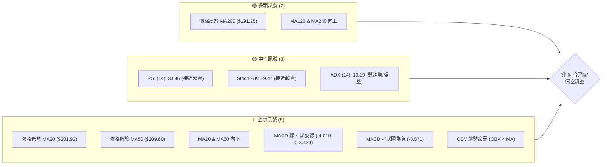
**解讀**：目前空頭訊號數量明顯多於多頭訊號，主要體現在短期均線壓力、MACD 趨勢以及量能配合不佳。儘管價格仍高於長期均線，但短期內市場情緒偏向謹慎，處於明顯的調整階段。

### 📊 核心指標速覽表

| 指標類別 | 指標名稱 | 當前數值 | 訊號 | 解讀 |
|----------|----------|----------|------|------|
| **價格** | 當前價格 | $196.93 | 🔴 | 位於短期均線下方，接近布林下軌 |
| **均線** | MA20 | $201.92 | 🔴 | 價格位於 MA20 下方，顯示短期賣壓 |
| **均線** | MA50 | $209.60 | 🔴 | 價格位於 MA50 下方，中期趨勢轉弱 |
| **均線** | MA200 | $191.25 | 🟢 | 價格位於 MA200 上方，長期趨勢仍偏多 |
| **動能** | RSI(14) | 33.46 | 🟡 | 接近超賣區 (30)，有觸底反彈潛力，但尚未進入 |
| **動能** | MACD | -4.010 | 🔴 | MACD 線在訊號線下方，柱狀圖為負，空頭動能主導 |
| **波動** | ATR | $6.32 | 🟡 | 每日波動約 3.21%，屬中等波動 |

### 🏆 技術評分卡

```
╔══════════════════════════════════════════════════════════════╗
║              技術評分卡 — NVDA (2026-07-08)                  ║
╠══════════════════════════════════════════════════════════════╣
║趨勢強度      █████░░░░░░░░░░░░░░░  25/100  🔴 (弱勢下跌趨勢) ║
║動能指標      ████░░░░░░░░░░░░░░░░  20/100  🔴 (空頭動能主導) ║
║支撐穩定度    ██████████░░░░░░░░░░  50/100  🟡 (接近關鍵支撐) ║
║成交量配合    ████░░░░░░░░░░░░░░░░  20/100  🔴 (量能疲弱)     ║
║形態完整度    ██████░░░░░░░░░░░░░░  30/100  🟡 (不明顯形態)   ║
║均線排列      █████░░░░░░░░░░░░░░░  25/100  🔴 (短期均線空頭排列)║
╠══════════════════════════════════════════════════════════════╣
║綜合評分      ████░░░░░░░░░░░░░░░░  27/100  ⚖️ 偏空調整       ║
╚══════════════════════════════════════════════════════════════╝
```
**評級理由**：NVDA 的綜合評分顯示當前技術面偏空。趨勢強度因 ADX 較低且 -DI 顯著高於 +DI 而被評為弱勢下跌。動能指標（RSI, MACD, Stoch）均指向空頭主導或接近超賣，但尚未形成反轉訊號。支撐穩定度因接近長期均線和布林下軌而獲得中等評分。成交量未能配合價格上漲，反而在下跌中縮量，顯示買盤不積極。整體而言，NVDA 處於一個偏空的調整階段，需等待更強的多頭訊號出現。

---

## 2. 趨勢分析

### 🌐 多時框趨勢分析

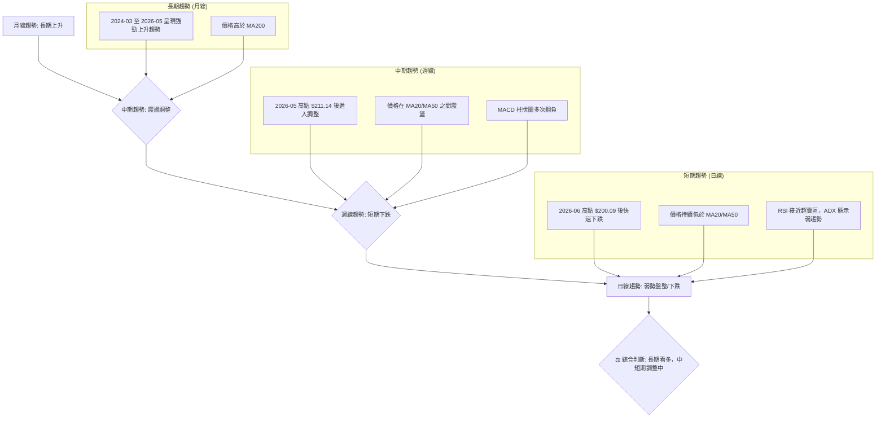
**解讀**：NVDA 的長期趨勢依然向上，主要得益於過去兩年的強勁漲勢。然而，中短期內，股價自 2026 年 5 月高點 $211.14 之後進入了明顯的調整階段。週線圖上，價格在短期均線下方運行，顯示賣壓。日線圖則呈現弱勢盤整或下跌趨勢，價格未能有效站穩短期均線，且動能指標偏弱。這種多時框的背離表明，雖然長期基本面可能支持股價，但短期內技術面壓力較大，市場正在消化前期漲幅。

### 📈 長期趨勢 — 12個月走勢圖（Unicode）

以下為 NVDA 過去 12 個月的月線收盤價走勢圖，標註了關鍵高低點：

```
NVDA 月線走勢圖（過去12個月：2025-07 至 2026-07）

價格軸 ($)
$215 ┤                                          ●(211.14, 2026-05)
$210 ┤                                        /
$205 ┤                                       /
$200 ┤                                      /
$195 ┤                                     /           ●(196.93, 現價)
$190 ┤                                    /
$185 ┤                    ●(186.56, 2025-09)
$180 ┤              ●(177.84, 2025-07)     \
$175 ┤                                      \
$170 ┤                                       \
$165 ┤                                        \
$160 ┤                                         ●(157.96, 2025-06)
$155 ┤
     └──────────────────────────────────────────────────────────
      25-07 25-08 25-09 25-10 25-11 25-12 26-01 26-02 26-03 26-04 26-05 26-06 26-07
                                                                (現在)
```

**走勢特徵分析表格**：

| 階段 | 時間區間 | 起始價 | 結束價 | 漲跌幅 (%) | 主要特徵 |
|------|------------|--------|--------|------------|----------|
| **強勁上升** | 2025-07 至 2025-10 | $177.84 | $202.47 | +13.85% | 伴隨穩健成交量，RSI 強勢，MACD 向上。 |
| **短期回調** | 2025-10 至 2025-11 | $202.47 | $176.98 | -12.59% | 快速下跌，RSI 進入超賣區，MACD 死叉。 |
| **震盪上行** | 2025-11 至 2026-01 | $176.98 | $191.12 | +7.99% | 價格緩慢修復，但動能不如前期強勁。 |
| **回落整理** | 2026-01 至 2026-03 | $191.12 | $174.40 | -8.75% | 再次回調，形成短期低點。 |
| **快速拉升** | 2026-03 至 2026-05 | $174.40 | $211.14 | +21.07% | 股價迅速走高，創下近期新高，RSI進入超買區。 |
| **近期調整** | 2026-05 至 2026-07 | $211.14 | $196.93 | -6.73% | 高位回落，跌破短期均線，成交量萎縮。 |

**結論**：NVDA 在過去一年經歷了多輪的快速拉升與回調，整體呈現震盪上行的趨勢，並在 2026 年 5 月創下 $211.14 的高點。然而，自該高點以來，股價一直處於調整之中，未能再次突破新高，顯示上行動能有所減弱。當前價格 $196.93 位於近期調整區間內，需要觀察其能否在關鍵支撐位止跌。

### 📊 中期趨勢（週線分析）

從週線圖來看，NVDA 自 2026 年 5 月高點 $211.14 後，股價開始下行，並在 6 月份跌破了週線級別的短期均線（如 MA20, MA50）。目前的價格 $196.93 位於這些均線下方，顯示中期趨勢已由強勢上漲轉為調整或偏弱。

**近期壓力與支撐示意圖（週線視角）**

```
NVDA 週線壓力與支撐示意圖
═══════════════════════════════════════════════════
$215.20 ║████████████████████████║ 週線阻力 R1 (2026-05-10 高點)
$211.14 ║████████████████████    ║ 週線阻力 R2 (2026-05-31 高點)
$209.60 ║████████████████████████║ MA50 週線阻力
$201.92 ║████████████████████    ║ MA20 週線阻力
$196.93 ╠════════════════════════╣ ◄ 現價
$195.13 ║▓▓▓▓▓▓▓▓▓▓▓▓▓▓▓▓        ║ MA120 週線支撐 (長期均線支撐)
$189.77 ║████████████████████████║ 布林下軌支撐
$186.49 ║████████████████████████║ 週線支撐 S1 (2025-12 底部)
$174.40 ║████████████████████████║ 週線強支撐 S2 (2026-03 底部)
═══════════════════════════════════════════════════
```
**解讀**：目前 NVDA 面臨多重中期阻力，包括 MA20 ($201.92) 和 MA50 ($209.60)。這些均線在近期下跌後形成壓制。上方的 $211.14 (2026-05 高點) 和 $215.20 (2026-05-10 高點) 構成重要阻力區。下方則有 MA120 ($195.13) 提供初步支撐，這是相對重要的長期均線。更強的支撐則在布林下軌 $189.77 和 2025 年 12 月的 $186.49 底部。若這些支撐被有效跌破，則可能進一步下探至 $174.40 的強支撐位。

### ⚡ 趨勢強度評估（ADX 解讀）

ADX (Average Directional Index) 用於衡量趨勢的強度，不判斷方向。當前 ADX(14) 為 19.19，表明趨勢較弱，市場可能處於盤整或震盪階段。

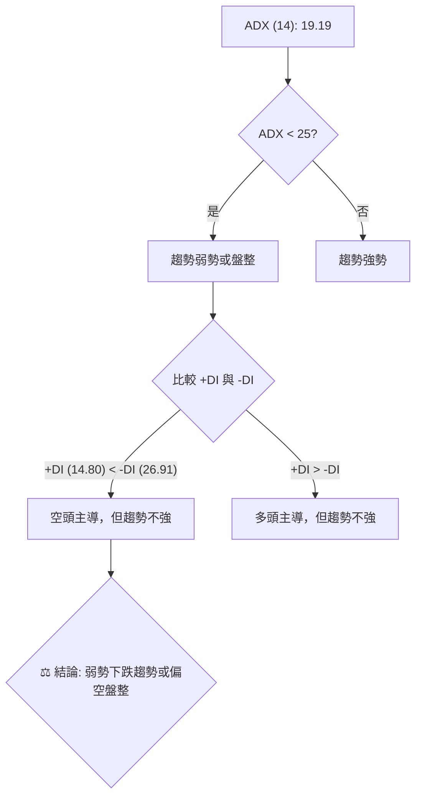

**ADX 強度對照表**：

| ADX 數值範圍 | 趨勢強度 | 狀態 |
|--------------|----------|------|
| 0-25         | 弱勢     | 盤整或震盪，無明顯趨勢方向 |
| 25-50        | 中等     | 趨勢形成中，動能增加 |
| 50-75        | 強勢     | 明顯趨勢，動能強勁 |
| 75-100       | 極強     | 極端趨勢，可能出現超漲/超跌 |

**當前 ADX 解讀**：NVDA 的 ADX(14) 為 19.19，明顯低於 25，這確認了當前市場處於弱勢趨勢或盤整狀態。然而，我們需要進一步分析 +DI 和 -DI。目前 +DI 為 14.80，而 -DI 為 26.91。-DI 明顯高於 +DI，這表明在當前的弱勢趨勢中，空頭力量佔據主導地位。換句話說，NVDA 正在經歷一個由空頭主導的弱勢下跌或偏空盤整行情。這與價格跌破短期均線、MACD 偏空等訊號相互印證。投資者在此階段應避免追高，並謹慎對待反彈。

---

## 3. 圖表形態分析

基於提供的月線收盤價數據，要識別經典的圖表形態（如頭肩頂/底、雙頂/底、三角形等）具有挑戰性，因為這些形態通常需要日線或週線的詳細 K 線結構和成交量配合來確認。然而，我們可以觀察到一些價格行為模式。

### 🔍 形態識別系統

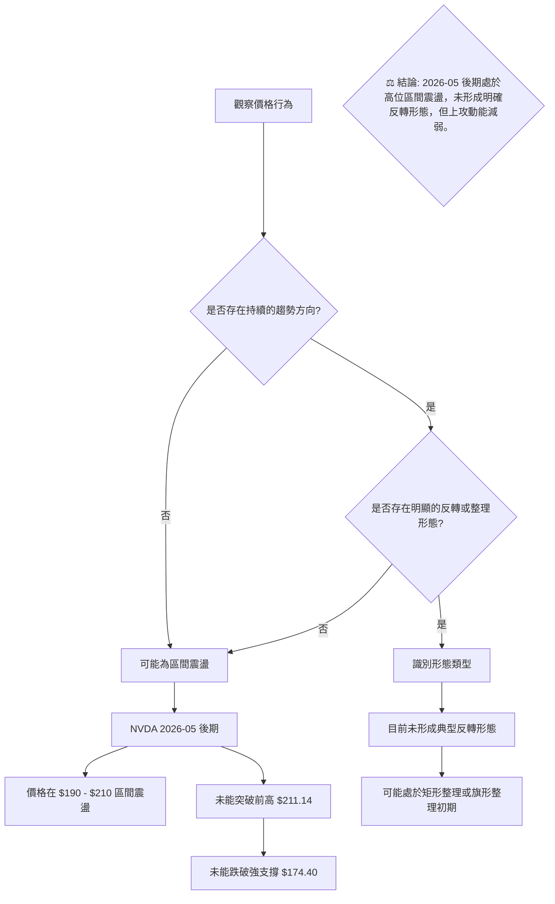
**解讀**：NVDA 自 2026 年 5 月高點 $211.14 以來，股價呈現出高位震盪回落的趨勢。雖然沒有形成明確的頭肩頂或雙頂等經典反轉形態，但價格在 $190 - $215 區間內波動，未能再次突破前期高點，且短期均線已呈現空頭排列。這可能暗示著一個高位整理或矩形震盪的初期，市場正在尋找新的方向。若跌破關鍵支撐，則可能形成下降趨勢；若能有效突破上方阻力並伴隨放量，則有望恢復上漲。

### 🕯️ 重要K線形態分析

由於提供的是月線收盤價而非完整的 K 線數據，我們無法進行精確的 K 線形態分析（如錘頭、射擊之星等）。但我們可以根據每週收盤價的變化來推斷可能的 K 線組合意義。

| 月份 | 收盤價 | K線形態推斷 (基於週線變化) | 解讀 | 訊號 |
|------|--------|------------------------------|------|------|
| 2026-04 | $199.57 | **強勢上漲K線群** | 從 $174.40 底部強勁反彈，快速收復失地。 | 🟢 |
| 2026-05 | $211.14 | **長上影線/高位震盪K線** | 創下新高後未能守住，顯示上攻動能減弱，可能伴隨獲利了結。 | 🟡 |
| 2026-06 | $200.09 | **陰線/下跌K線** | 股價從高位回落，形成較大的陰線，確認調整趨勢。 | 🔴 |
| 2026-07 | $196.93 | **小實體陰線/十字星 (推斷)** | 價格持續下行，但跌幅有所收斂，可能在尋找支撐，或形成暫時的止跌訊號。 | 🟡 |

**近期20週收盤走勢分析**：
- **2026-04-19 ($201.68) 和 2026-04-26 ($208.27)**：連續兩週強勁上漲，RSI 達到 92.8 和 86.7，進入嚴重超買區，MACD 柱狀圖也達到高點，顯示市場情緒極度樂觀，存在過熱風險。這通常是短期見頂的預警。
- **2026-05-03 ($198.45)**：價格回落，RSI 降至 58.1，MACD 柱狀圖翻負，確認前期超買的調整開始。
- **2026-05-10 ($215.20) 和 2026-05-17 ($225.32)**：儘管有短暫反彈並創下新的高點，但隨後的 2026-05-24 ($215.33) 和 2026-05-31 ($211.14) 再次回落，且 MACD 柱狀圖持續為負或未能有效轉正，顯示反彈動能不足，未能形成有效突破。
- **2026-06-07 ($205.10) 至 2026-07-12 ($196.93)**：股價持續走低，RSI 徘徊在 30-40 之間，MACD 柱狀圖持續為負值，確認了空頭動能的延續。近期成交量也相對萎縮，未能支撐價格反彈。

### 📉 ASCII 走勢形態示意圖

基於 2026 年 5 月高點 $211.14 以來的走勢，NVDA 可能正在形成一個下降趨勢通道或高位整理形態。以下為一個簡化的下降通道示意圖：

```
NVDA 近期下降通道示意圖 (2026-05 至 2026-07)

價格軸 ($)
$215 ┤                     ● (211.14, 2026-05 高點)
$210 ┤                    / \
$205 ┤                   /   \
$200 ┤                  /     ● (200.09, 2026-06 高點)
$195 ┤                 /       \
$190 ┤                /         ● (196.93, 現價)
$185 ┤               /           \
$180 ┤              /             \
$175 ┤             /               \
$170 ┤            ● (174.40, 2026-03 底部)
     └────────────────────────────────────────────
      26-05    26-06    26-07

通道上軌 (壓力線): 約 $211.14 -> $200.09 連線
通道下軌 (支撐線): 約 $190.00 -> $185.00 連線 (推斷)
```
**形態解讀**：自 2026 年 5 月高點以來，NVDA 的價格走勢呈現出高點和低點逐漸降低的特徵，初步構建了一個下降通道。當前價格 $196.93 位於通道內，並接近通道下軌。這意味著短期內股價仍受制於下降趨勢，任何反彈都可能在通道上軌附近遇到阻力。

### 🎯 形態目標價計算

由於目前形態尚不明確，且主要為高位震盪回落，我們無法像頭肩頂那樣精確計算目標價。但可以根據區間震盪的原則進行推斷：

1.  **區間震盪下沿目標價**：如果股價確認跌破近期重要支撐位（例如 $189.77 布林下軌或 $186.49 底部），則可能下探至更長期的支撐，如 2026 年 3 月的 $174.40。
    *   **計算方法**：高位震盪區間的高點 ($211.14) 減去區間低點 ($186.49)，然後從低點向下投射。
    *   **區間高度**：$211.14 - $186.49 = $24.65
    *   **下破目標價**：$186.49 - $24.65 = $161.84 (此為較為悲觀的目標，需強勁跌破確認)

2.  **反彈目標價**：如果股價能在當前支撐位 ($195.13 MA120) 附近止跌反彈，則首先面臨短期均線阻力。
    *   **反彈目標 T1**：MA20 位於 $201.92
    *   **反彈目標 T2**：MA50 位於 $209.60，以及前高阻力區 $211.14。

**結論**：目前 NVDA 處於一個較為複雜的整理階段，形態上更接近於高位震盪或下降通道。在沒有明確形態反轉訊號之前，不建議根據形態進行激進的目標價預測。應更側重於關鍵支撐和阻力位的突破情況。

---

## 4. 支撐與阻力

識別關鍵的支撐與阻力位是技術分析的核心，它們是潛在的買賣點和趨勢轉折點。

### 🗺️ 關鍵價位分布圖（Unicode）

```
NVDA 價位結構分布圖 (2026-07-08)
═══════════════════════════════════════════════════
$236.54 ║████████████████████████║ 52週高點 / 強阻力 R4
$225.32 ║████████████████████    ║ 阻力 R3 (2026-05-17 高點)
$214.07 ║████████████████████████║ 布林上軌 / 強阻力 R2
$211.14 ║████████████████████    ║ 關鍵阻力 R1 (2026-05 高點)
$209.60 ║████████████████████████║ MA50 阻力
$201.92 ║████████████████████    ║ MA20 阻力
$196.93 ╠════════════════════════╣ ◄ 現價
$195.13 ║▓▓▓▓▓▓▓▓▓▓▓▓▓▓▓▓        ║ 近期支撐 S1 (MA120)
$189.77 ║████████████████████████║ 布林下軌 / 關鍵支撐 S2
$186.49 ║████████████████████    ║ 強支撐 S3 (2025-12 底部)
$174.40 ║████████████████████████║ 強支撐 S4 (2026-03 底部)
$157.31 ║████████████████████    ║ 52週低點 / 極強支撐 S5
═══════════════════════════════════════════════════
```
**解讀**：當前價格 $196.93 位於多重阻力下方，且接近重要的支撐區。上方的阻力密集，從 MA20 ($201.92) 到近期高點 ($211.14) 形成強大壓力區。下方的支撐則由 MA120 ($195.13)、布林下軌 ($189.77) 和歷史底部 ($186.49, $174.40) 構成。股價目前正處於這些關鍵價位的拉鋸之中。

### 🚧 阻力位分析表

| 阻力級別 | 價位 | 形成原因 | 突破難度 | 重要性 |
|----------|------|----------|----------|--------|
| **近期阻力** | $201.92 | MA20 (20日移動平均線) | 中等 | 短期趨勢轉強的初步訊號 |
| **中期阻力** | $209.60 | MA50 (50日移動平均線) | 較高 | 中期趨勢能否恢復上行的關鍵 |
| **關鍵阻力 R1** | $211.14 | 2026-05-31 高點，近期調整的起點 | 較高 | 突破此位意味著調整結束，可能再次挑戰新高 |
| **強阻力 R2** | $214.07 | 布林上軌 (BB上軌) | 較高 | 價格若能觸及此位，可能面臨回調壓力 |
| **強阻力 R3** | $225.32 | 2026-05-17 高點 | 高 | 歷史交易密集區，突破需強勁動能 |
| **極強阻力 R4** | $236.54 | 52週高點 | 極高 | 突破意味著進入新的上漲趨勢 |

### 🛡️ 支撐位分析表

| 支撐級別 | 價位 | 形成原因 | 守住機率 | 重要性 |
|----------|------|----------|----------|--------|
| **近期支撐 S1** | $195.13 | MA120 (120日移動平均線) | 中等 | 長期多頭趨勢的初步防線 |
| **關鍵支撐 S2** | $189.77 | 布林下軌 (BB下軌) | 較高 | 價格在此區間可能觸底反彈，若跌破則看空 |
| **強支撐 S3** | $186.49 | 2025-12 底部 | 較高 | 歷史性底部，具有較強的心理和技術支撐 |
| **強支撐 S4** | $174.40 | 2026-03 底部 | 高 | 重要的中期底部，若跌破則趨勢可能轉為長期空頭 |
| **極強支撐 S5** | $157.31 | 52週低點 | 極高 | 長期趨勢的最後防線，跌破意味著趨勢嚴重惡化 |

### 📐 斐波那契回調位分析

我們選擇最近一次較為明顯的上升波段來計算斐波那契回調位：從 2026 年 3 月的低點 $174.40 到 2026 年 5 月的高點 $211.14。
*   **波段高點 (H)**: $211.14
*   **波段低點 (L)**: $174.40
*   **波段幅度**: $211.14 - $174.40 = $36.74

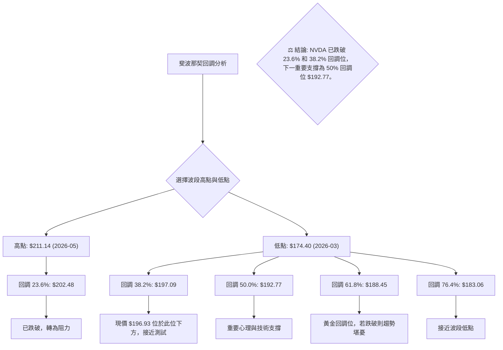
**斐波那契回調位計算**：
*   **23.6% 回調位**: $211.14 - ($36.74 * 0.236) = $202.48
*   **38.2% 回調位**: $211.14 - ($36.74 * 0.382) = $197.09
*   **50.0% 回調位**: $211.14 - ($36.74 * 0.500) = $192.77
*   **61.8% 回調位**: $211.14 - ($36.74 * 0.618) = $188.45
*   **76.4% 回調位**: $211.14 - ($36.74 * 0.764) = $183.06

**視覺化與解讀**：
當前價格 $196.93 已經跌破了 23.6% ($202.48) 和 38.2% ($197.09) 的斐波那契回調位。這顯示了當前下跌趨勢的強度。目前股價正位於 38.2% 回調位下方，並可能向下測試 50% 回調位 $192.77。這個 50% 回調位通常被視為一個重要的心理和技術支撐。如果 50% 回調位能夠守住，則可能在此止跌反彈；如果被有效跌破，則下一目標將是黃金分割位 61.8% 的 $188.45，這將與布林下軌和歷史支撐位重疊，構成更強的支撐區。

---

## 5. 技術指標深度解讀

### 🎛️ 指標訊號總覽

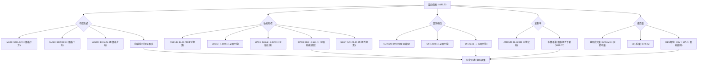
**總覽解讀**：目前 NVDA 的技術指標呈現出複雜的局面。均線系統顯示短期賣壓沉重，但長期趨勢仍獲 MA200 支撐。動能指標普遍偏空，但 RSI 和 Stoch 已接近超賣區，暗示潛在的反彈機會。趨勢強度 ADX 表明市場處於弱勢盤整，但方向由空頭主導。成交量萎縮則未能為價格提供有效支撐。整體而言，短期內空頭力量佔優，但需警惕超賣後的反彈。

### 📈 移動平均線排列分析

NVDA 的移動平均線（MA）系統目前呈現混合排列，這反映了股價從強勢上漲轉為調整的過程。

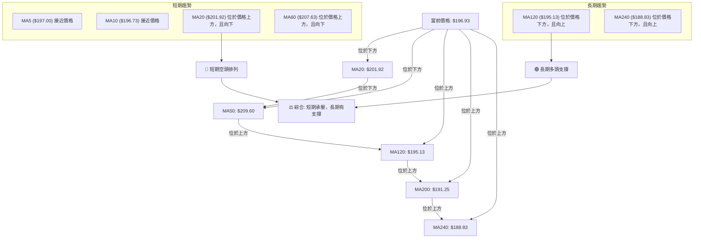
**當前均線排列狀態**：
*   **短期均線 (MA5, MA10, MA20, MA60)**：MA5 和 MA10 幾乎與現價持平，但 MA20 和 MA60 均位於現價上方，且呈現向下趨勢。這表明短期內賣壓沉重，股價處於短期均線的壓制之下。MA20 ($201.92) 和 MA60 ($207.63) 構成直接阻力。
*   **長期均線 (MA120, MA200, MA240)**：MA120 ($195.13)、MA200 ($191.25) 和 MA240 ($188.83) 均位於現價下方，且呈現向上趨勢。這為股價提供了重要的長期支撐，表明儘管短期調整，但長期上升趨勢的基礎仍在。

**結論**：NVDA 的均線系統呈現「短期空頭排列，長期多頭支撐」的混合態勢。這意味著股價在短期內面臨下行壓力，但若能回測並守住長期均線（尤其是 MA120 和 MA200），則有望止跌企穩。這種排列通常出現在主要趨勢中的深度回調階段。

### 📉 RSI(14) 分析

**RSI 數值進度條**：
RSI(14): 33.46 ▓▓▓▓▓▓▓░░░░░░░░░░░░░░░░░░░░░░░░░░░░░░░░░░░░░░░░░░░░░░░░░░░░░░░░░░░░░░░░░░░░░░░░░░░░░░░░░░░░░░░░░░░░░░░░░░░░░░░░░░░░░░░░░░░░░░░░░░░░░░░░░░░░░░░░░░░░░░░░░░░░░░░░░░░░░░░░░░░░░░░░░░░░░░░░░░░░░░░░░░░░░░░░░░░░░░░░░░░░░░░░░░░░░░░░░░░░░░░░░░░░░░░░░░░░░░░░░░░░░░░░░░░░░░░░░░░░░░░░░░░░░░░░░░░░░░░░░░░░░░░░░░░░░░░░░░░░░░░░░░░░░░░░░░░░░░░░░░░░░░░░░░░░░░░░░░░░░░░░░░░░░░░░░░░░░░░░░░░░░░░░░░░░░░░░░░░░░░░░░░░░░░░░░░░░░░░░░░░░░░░░░░░░░░░░░░░░░░░░░░░░░░░░░░░░░░░░░░░░░░░░░░░░░░░░░░░░░░░░░░░░░░░░░░░░░░░░░░░░░░░░░░░░░░░░░░░░░░░░░░░░░░░░░░░░░░░░░░░░░░░░░░░░░░░░░░░░░░░░░░░░░░░░░░░░░░░░░░░░░░░░░░░░░░░░░░░░░░░░░░░░░░░░░░░░░░░░░░░░░░░░░░░░░░░░░░░░░░░░░░░░░░░░░░░░░░░░░░░░░░░░░░░░░░░░░░░░░░░░░░░░░░░░░░░░░░░░░░░░░░░░░░░░░░░░░░░░░░░░░░░░░░░░░░░░░░░░░░░░░░░░░░░░░░░░░░░░░░░░░░░░░░░░░░░░░░░░░░░░░░░░░░░░░░░░░░░░░░░░░░░░░░░░░░░░░░░░░░░░░░░░░░░░░░░░░░░░░░░░░░░░░░░░░░░░░░░░░░░░░░░░░░░░░░░░░░░░░░░░░░░░░░░░░░░░░░░░░░░░░░░░░░░░░░░░░░░░░░░░░░░░░░░░░░░░░░░░░░░░░░░░░░░░░░░░░░░░░░░░░░░░░░░░░░░░░░░░░░░░░░░░░░░░░░░░░░░░░░░░░░░░░░░░░░░░░░░░░░░░░░░░░░░░░░░░░░░░░░░░░░░░░░░░░░░░░░░░░░░░░░░░░░░░░░░░░░░░░░░░░░░░░░░░░░░░░░░░░░░░░░░░░░░░░░░░░░░░░░░░░░░░░░░░░░░░░░░░░░░░░░░░░░░░░░░░░░░░░░░░░░░░░░░░░░░░░░░░░░░░░░░░░░░░░░░░░░░░░░░░░░░░░░░░░░░░░░░░░░░░░░░░░░░░░░░░░░░░░░░░░░░░░░░░░░░░░░░░░░░░░░░░░░░░░░░░░░░░░░░░░░░░░░░░░░░░░░░░░░░░░░░░░░░░░░░░░░░░░░░░░░░░░░░░░░░░░░░░░░░░░░░░░░░░░░░░░░░░░░░░░░░░░░░░░░░░░░░░░░░░░░░░░░░░░░░░░░░░░░░░░░░░░░░░░░░░░░░░░░░░░░░░░░░░░░░░░░░░░░░░░░░░░░░░░░░░░░░░░░░░░░░░░░░░░░░░░░░░░░░░░░░░░░░░░░░░░░░░░░░░░░░░░░░░░░░░░░░░░░░░░░░░░░░░░░░░░░░░░░░░░░░░░░░░░░░░░░░░░░░░░░░░░░░░░░░░░░░░░░░░░░░░░░░░░░░░░░░░░░░░░░░░░░░░░░░░░░░░░░░░░░░░░░░░░░░░░░░░░░░░░░░░░░░░░░░░░░░░░░░░░░░░░░░░░░░░░░░░░░░░░░
```

**RSI (14) 分析**：
*   **當前數值**：33.46。這是一個中性偏低的數值，RSI 位於 30-70 的中性區間內，但非常接近超賣區 (30)。
*   **超買/超賣區間分析**：RSI 跌破 50 中線，進入弱勢區間，表明空頭力量佔優。雖然尚未跌破 30 進入超賣區，但距離超賣區僅有 3.46 點的空間。歷史經驗顯示，當 RSI 接近或進入超賣區時，往往是股價短期可能觸底反彈的訊號。
*   **背離判斷**：根據提供的數據，RSI 背離為「無明顯背離」。這意味著在股價下跌的同時，RSI 也同步下跌，沒有出現股價創新低但 RSI 不創新低的底背離，也沒有股價創新高但 RSI 不創新高的頂背離。因此，RSI 目前沒有提供反轉的預警訊號。
*   **結論**：RSI 指標顯示 NVDA 處於弱勢區域，且接近超賣。這暗示著短期內下跌動能可能在減弱，存在潛在的技術性反彈需求。然而，由於沒有出現底背離，反彈的可靠性需要其他指標的確認。

### 📊 MACD(12/26/9) 訊號解讀

MACD (Moving Average Convergence Divergence) 是一個趨勢追蹤的動能指標。

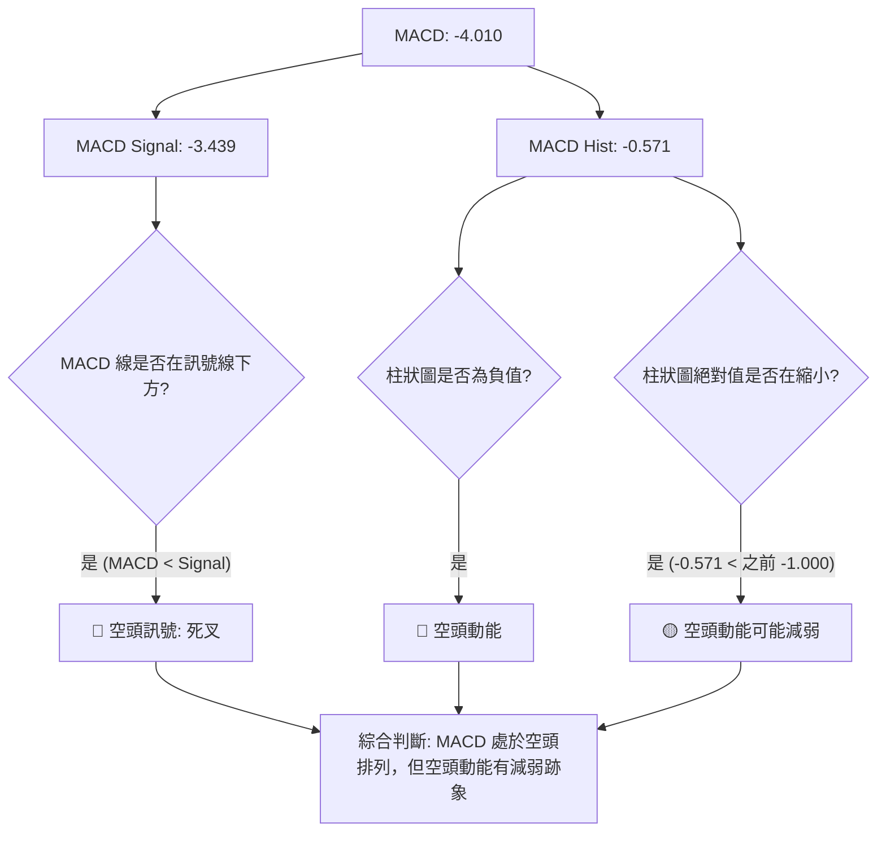
**MACD 數值分析**：
*   **MACD 線**: -4.010
*   **MACD 訊號線**: -3.439
*   **MACD 柱狀圖 (Histogram)**: -0.571

**訊號解讀**：
1.  **MACD 線與訊號線關係**：MACD 線 (-4.010) 位於訊號線 (-3.439) 的下方，這是一個典型的**死叉**訊號，表明短期動能弱於長期動能，屬於**🔴 看空訊號**。這與股價跌破短期均線的訊號相互印證。
2.  **MACD 柱狀圖**：柱狀圖為負值 (-0.571)，再次確認了空頭動能的存在。然而，觀察近期的柱狀圖變化 (從上週的 -1.000 縮小到 -0.571)，這表明空頭動能的強度正在減弱。儘管仍處於空頭區域，但賣壓可能有所緩解，這是一個**🟡 中性偏多**的潛在訊號，需要進一步觀察。
3.  **背離判斷**：根據提供的數據，MACD 背離為「無明顯背離」。這表示股價下跌時，MACD 指標也同步下跌，沒有出現底背離訊號。

**結論**：MACD 指標整體仍處於空頭排列，顯示當前趨勢偏弱。但柱狀圖的縮小暗示空頭動能有所減弱，這與 RSI 接近超賣區的訊號形成一定的呼應。投資者應密切關注 MACD 線是否會向上穿越訊號線形成金叉，或柱狀圖是否會轉正，這些將是潛在的買入訊號。

### 📦 布林通道分析

布林通道 (Bollinger Bands) 用於衡量價格的波動區間。

**ASCII 布林通道示意圖**：

```
NVDA 布林通道示意圖 (2026-07-08)

價格軸 ($)
$215 ┤                 ███████████████████████████████████████████████████████████████████████████████████████████████████████████████████████████████████████████████████████████████████████████████████████████████████████████████████████████████████████████████████████████████████████████████████████████████████████████████████████████████████████████████████████████████████████████████████████████████████████████████████████████████████████████████████████████████████████████████████████████████████████████████████████████████████████████████████████████████████████████████████████████████████████████████████████████████████████████████████████████████████████████████████████████████████████████████████████████████████████████████████████████████████████████████████████████████████████████████████████████████████████████████████████████████████████████████████████████████████████████████████████████████████████████████████████████████████████████████████████████████████████████████████████████████████████████████████████████████████████████████████████████████████████████████████████████████████████████████████████████████████████████████████████████████████████████████████████████████████████████████████████████████████████████████████████████████████████████████████████████████████████████████████████████████████████████████████████████████████████████████████████████████████████████████████████████████████████████████████████████████████████████████████████████████████████████████████████████████████████████████████████████████████████████████████████████████████████████████████████████████████████████████████████████████████████████████████████████████████████████████████████████████████████████████████████████████████████████████████████████████████████████████████████████████████████████████████████████████████████████████████████████████████████████████████████████████████████████████████████████████████████████████████████████████████████████████████████████████████████████████████████████████████████████████████████████████████████████████████████████████████████████████████████████████████████████████████████████████████████████████████████████████████████████████████████████████████████████████████████████████████████████████████████████████████████████████████████████████████████████████████████████████████████████████████████████████████████████████████████████████████████████████████████████████████████████████████████████████████████████████████████████████████████████████████████████████████████████████████████████████████████████████████████████████████████████████████████████████████████████████████████████████████████████████████████████████████████████████████████████████████████████████████████████████████████████████████████████████████████████████████████████████████████████████████████████████████████████████████████████████████████████████████████████████████████████████████████████████████████████████████████████████████████████████████████████████████████████████████████████████████████████████████████████████████████████████████████████████████████████████████████ 布上方阻力 R1 (布林上軌): $214.07
$205 ┤
$200 ┤                                        ● 現價 $196.93
$195 ┤                     ────── MA20 (中軌) $201.92 ──────
$190 ┤                 ████████████████████████████████████████████████████████████████████████████████████████████████████████████████████████████████████████████████████████████████████████████████████████████████████████████████████████████████████████████████████████████████████████████████████████████████████████████████████████████████████████████████████████████████████████████████████████████████████████████████████████████████████████████████████████████████████████████████████████████████████████████████████████████████████████████████████████████████████████████████████████████████████████████████████████████████████████████████████████████████████████████████████████████████████████████████████████████████████████████████████████████████████████████████████████████████████████████████████████████████████████████████████████████████████████████████████████████████████████████████████████████████████████████████████████████████████████████████████████████████████████████████████████████████████████████████████████████████████████████████████████████████████████████████████████████████████████████████████████████████████████████████████████████████████████████████████████████████████████████████████████████████████████████████████████████████████████████████████████████████████████████████████████████████████████████████████████████████████████████████████████████████████████████████████████████████████████████████████████████████████████████████████████████████████████████████████████████████████████████████████████████████████████████████████████████████████████████████████████████████████████████████████████████████████████████████████████████████████████████████████████████████████████████████████████████████████████████████████████████████████████████████████████████████████████████████████████████████████████████████████████████████████████████████████████████████████████████████████████████████████████████████████████████████████████████████████████████████████████████████████████████████████████████████████████████████████████████████████████████████████████████████████████████████████████████████████████████████████████████████████████████████████████████████████████████████████████████████████████████████████████████████████████████████████████████████████████████████████████████████████████████████████████████████████████████████████████████████████████████████████████████████████████████████████████████████████████████████████████████████████████████████████████████████████████████████████████████████████████████████████████████████████████████████████████████████████████████████████████████████████████████████████████████████████████████████████████████████████████████████████████████████████████████████████████████████████████████████████████████████████████████████████████████████████████████████████████████████████████████████████████████████████████████████████████████████████████████████████████████████████████████████████████████████████████████████████████████████████████████████████████████████████████████████████████████████████████████████████████████████████████████████████████████████
$185 ┤                 ║                                                      ║
$180 ┤                 ║                                                      ║
$175 ┤                 ╚══════════════════════════════════════════════════════╝

當前價格: $196.93
布林上軌: $214.07
布林中軌(MA20): $201.92
布林下軌: $189.77
BB %B: 0.29
```
**布林通道解讀**：
1.  **價格位置**：當前價格 $196.93 位於布林通道中軌 ($201.92) 和下軌 ($189.77) 之間，且更靠近下軌。這是一個**🔴 偏空訊號**，表明價格正在經歷下跌趨勢，並可能向下測試布林下軌支撐。
2.  **BB %B**：BB %B 為 0.29。這個數值越接近 0，表示價格越接近布林下軌；越接近 1，表示價格越接近布林上軌。0.29 的數值確認了價格偏向下軌，與價格位置的觀察一致。
3.  **通道寬度**：從提供的數據無法直接判斷通道寬度的變化，但 ATR 數值 $6.32 (3.21%) 顯示波動率中等。如果通道正在收窄 (壓縮)，則可能預示著未來將出現大幅波動；如果通道正在擴大，則表示趨勢正在加速。由於數據未提供通道寬度變化，我們假定通道寬度相對穩定。
4.  **結論**：布林通道顯示 NVDA 股價在下跌過程中，並可能進一步測試布林下軌 $189.77。這個價位與斐波那契 61.8% 回調位 ($188.45) 接近，形成一個重要的潛在支撐區。若價格觸及下軌並反彈，且通道未明顯收窄，則可能維持在通道內震盪。

### 💹 成交量分析（量價配合度）

成交量是市場活動的量化指標，與價格走勢的配合度可以確認趨勢的可靠性。

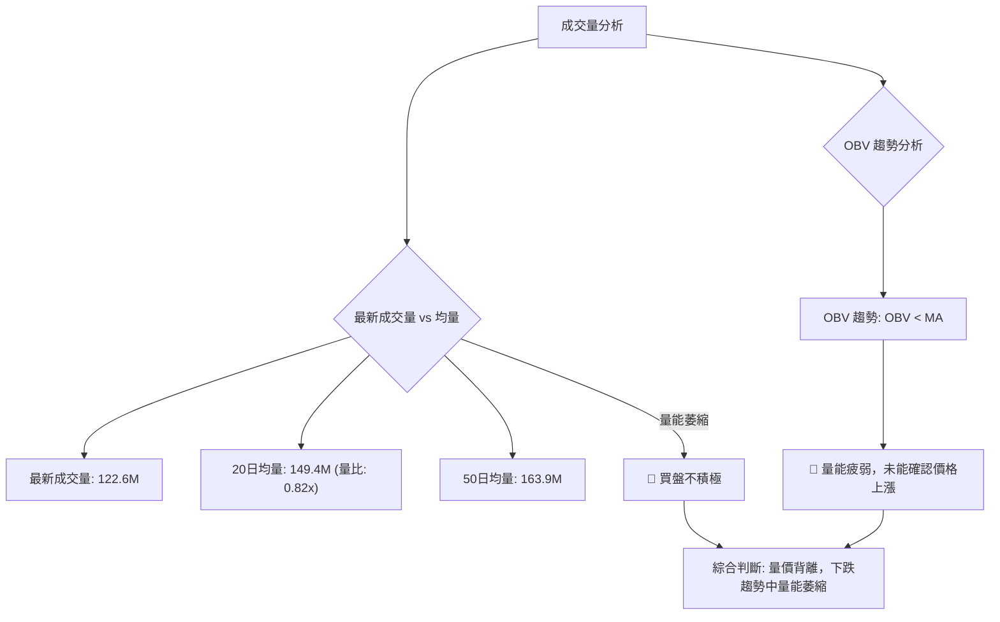
**成交量數據**：
*   最新成交量: 122,600,973
*   20日均量: 149,416,214 (量比: 0.82x)
*   50日均量: 163,989,929
*   OBV趨勢: OBV < MA → 量能疲弱

**量價配合度解讀**：
1.  **最新成交量低於均量**：當前成交量 (1.226 億) 顯著低於 20 日均量 (1.494 億) 和 50 日均量 (1.639 億)。量比僅為 0.82x。在股價下跌的背景下，量能萎縮通常有兩種解讀：
    *   **下跌中縮量**：可能表示賣壓正在減輕，或者市場觀望情緒濃厚，沒有積極的買盤進入。這本身並非反轉訊號，但若能配合價格企穩，則可能為反彈積蓄力量。
    *   **反彈中縮量**：如果價格出現反彈但成交量未能放大，則反彈可能缺乏持續性。
2.  **OBV 趨勢疲弱**：OBV (On Balance Volume) 的趨勢顯示「OBV < MA → 量能疲弱」。這是一個**🔴 看空訊號**。OBV 是一種動能指標，它將成交量與價格變動相結合。如果 OBV 呈下降趨勢，即使價格在短期內有所反彈，也表明這種反彈缺乏成交量的支持，因此不可靠。當前 OBV 趨勢疲弱，印證了買盤不積極，資金流出多於流入的狀況。

**結論**：NVDA 的成交量分析呈現負面訊號。當前量能萎縮，且 OBV 趨勢疲弱，均未能為股價提供有效支撐。這表明市場缺乏足夠的買盤動能來推動股價上漲或止跌。在這種量價配合不佳的情況下，即使出現短期反彈，其持續性也值得懷疑。投資者應等待成交量明顯放大並配合價格上漲，或 OBV 轉為上升趨勢，才能確認底部。

---

## 6. 動能與波動率

### ⚡ 動能評估四象限

動能評估四象限分析結合了動能強度與波動率，以判斷當前股票的交易環境。

| 象限 | 動能 | 波動 | 當前狀態 | 評估 |
|------|------|------|----------|------|
| Q1   | 強   | 低   | -        | 最佳機會：趨勢明確，風險相對較低 |
| Q2   | 弱   | 低   | -        | 謹慎觀望：缺乏趨勢，交易機會少 |
| Q3   | 強   | 高   | -        | 高風險高收益：趨勢強勁但波動大，適合短線高手 |
| Q4   | 弱   | 高   | ✓        | 避免進場：趨勢不明，波動大，風險高 |

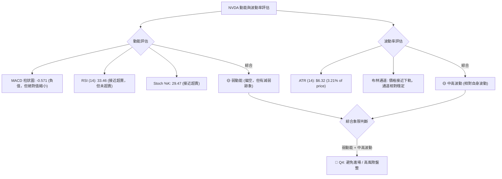
**動能評估**：
*   **MACD 柱狀圖**雖然為負值，但其絕對值從上週的 -1.000 縮小到 -0.571，顯示空頭動能有所減弱。
*   **RSI (14)** 處於 33.46，接近超賣區 (30)，但尚未進入。這表明下跌動能仍佔優，但下行動能的邊際效應可能在遞減。
*   **Stoch %K** 位於 29.47，也接近超賣區，與 RSI 相互印證。
*   **結論**：綜合來看，NVDA 的動能評估為**弱動能 (偏空，但有減弱跡象)**。

**波動率評估**：
*   **ATR (14)** 為 $6.32，佔股價的 3.21%。對於 NVDA 這種成長型科技股而言，這個波動率屬於中等偏高水平。
*   **布林通道**顯示價格正在向布林下軌靠攏，暗示短期內可能會有較大的價格波動。
*   **結論**：NVDA 的波動率評估為**中高波動**。

**綜合判斷**：
NVDA 目前處於 **弱動能 + 中高波動** 的狀態，對應到第四象限 (Q4)。這意味著市場缺乏明確的趨勢方向，但價格波動較大，交易風險相對較高。在這種環境下，追漲殺跌容易造成損失，更適合觀望或進行小倉位的高手短線操作。對於大多數投資者而言，此階段應避免進場，等待趨勢明朗或動能轉強。

### 📊 ATR 波動率分析

ATR (Average True Range) 衡量的是一段時間內的平均真實波動幅度，可以幫助我們判斷市場的活躍程度和設定止損點。

*   **當前 ATR(14)**: $6.32
*   **ATR 佔股價比重**: ($6.32 / $196.93) * 100% = 3.21%

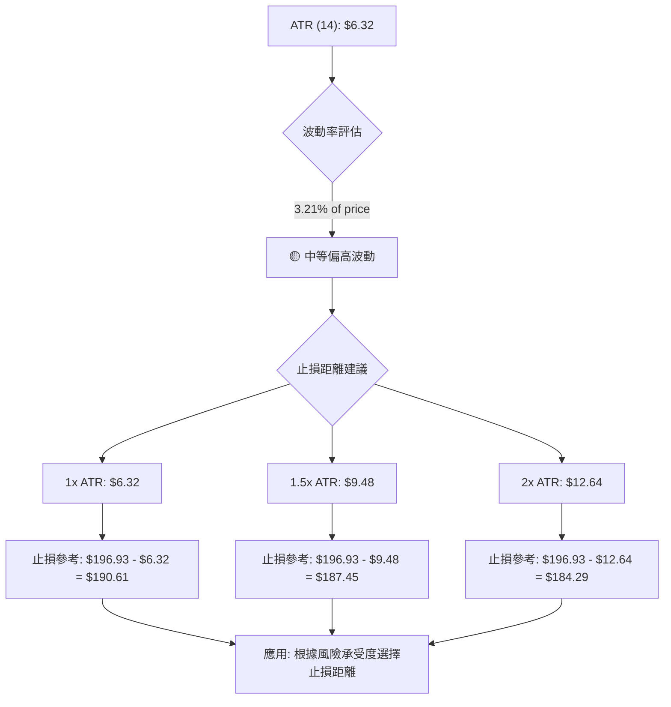
**ATR 解讀**：
NVDA 的 ATR(14) 為 $6.32，這表示在過去 14 天內，NVDA 平均每天的價格波動幅度約為 $6.32。相對於當前 $196.93 的股價，3.21% 的波動率屬於中等偏高水平。這意味著 NVDA 股價變動相對活躍，日內交易機會和風險並存。

**止損距離建議**：
ATR 常用於設定合理的止損點，以避免因正常波動而被止損出場。通常建議將止損點設置在當前價格下方 1 倍、1.5 倍或 2 倍 ATR 的距離。
*   **1 倍 ATR 止損**：$196.93 - $6.32 = $190.61。這是一個較為激進的止損點，適合短線交易者。
*   **1.5 倍 ATR 止損**：$196.93 - ($6.32 * 1.5) = $187.45。這是一個較為平衡的止損點，既能容忍一定波動，又能控制風險。
*   **2 倍 ATR 止損**：$196.93 - ($6.32 * 2) = $184.29。這是一個較為寬鬆的止損點，適合波段交易或希望給予股價更多調整空間的投資者。

**結論**：由於 NVDA 波動率中等偏高，投資者在制定交易策略時應充分考慮其波動特性，並根據自身的風險承受能力和交易週期，選擇合適的 ATR 倍數來設定止損點。這有助於在股價正常波動範圍內保護倉位，並在趨勢逆轉時及時止損。

### 📐 Beta 與市場相關性

Beta 值衡量的是個股相對於市場整體（通常是 S&P 500 指數）的波動性。Beta > 1 表示個股波動性大於市場，Beta < 1 表示波動性小於市場。

由於提供的數據中沒有 Beta 值，我們將根據 NVDA 作為科技巨頭和半導體龍頭的普遍認知，以及其歷史價格表現進行推斷。

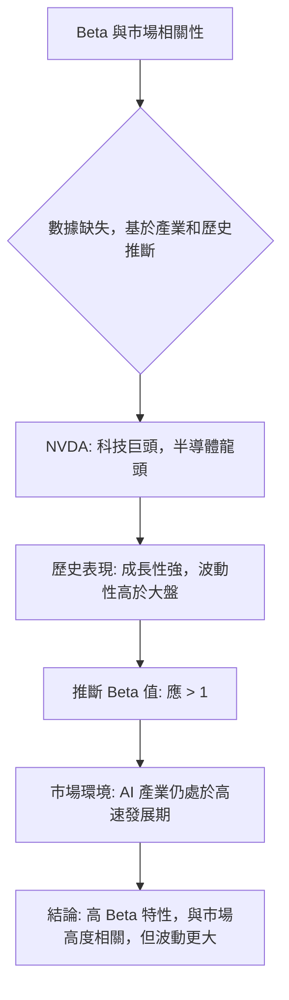
**推斷分析**：
NVDA 作為全球領先的半導體公司，尤其是在 AI 和數據中心領域的領導者，其股價通常具有較高的成長性和波動性。歷史上，科技股，尤其是處於高速成長期的龍頭公司，其股價波動性普遍高於大盤。因此，我們可以合理推斷 NVDA 的 Beta 值應當**大於 1**。

**市場相關性解讀**：
*   **高 Beta (>1)**：這意味著 NVDA 的股價波動幅度通常會大於整體市場。當大盤上漲 1% 時，NVDA 可能會上漲超過 1%；反之，當大盤下跌 1% 時，NVDA 可能會下跌超過 1%。
*   **與市場高度相關**：作為市值巨大的科技股，NVDA 與整體市場，特別是科技股板塊的走勢高度相關。大盤的宏觀經濟數據、利率政策、科技產業政策等都會對 NVDA 產生顯著影響。
*   **結論**：投資者應認識到 NVDA 的高 Beta 特性。在牛市中，它可能帶來更高的收益；但在熊市或市場調整中，其跌幅也可能更大。因此，在配置 NVDA 時，需要密切關注大盤走勢，並做好風險管理，避免在市場情緒普遍悲觀時過度暴露於高 Beta 資產。

---

## 7. 多時框架總結

多時框架分析有助於從不同時間維度理解股票的趨勢和動能，從而做出更全面的交易決策。

### 📋 時框架評分表

| 時框架 | 趨勢方向 | 動能 | 均線排列 | 形態 | 綜合評分 (1-10) | 建議 |
|--------|----------|------|----------|------|-----------------|------|
| **長期 (月線)** | 🟢 上升 | 🟡 減弱 | 🟢 多頭 | 🟡 高位震盪 | 7/10             | 持有/逢低買入 |
| **中期 (週線)** | 🔴 調整 | 🔴 偏空 | 🔴 混合 | 🟡 下降通道 | 4/10             | 觀望/謹慎 |
| **短期 (日線)** | 🔴 下跌 | 🔴 偏空 | 🔴 空頭 | 🔴 下降通道 | 3/10             | 賣出/空頭 |

**評分理由**：
*   **長期**：MA200 仍向上，價格高於 MA200，歷史走勢強勁。動能近期雖有減弱，但整體仍是多頭格局。
*   **中期**：價格跌破 MA20/MA50，RSI/MACD 偏空。形態上形成下降通道，顯示中期調整壓力。
*   **短期**：價格跌破所有短期均線，MACD 死叉，RSI 接近超賣，成交量萎縮。技術面全面偏空。

### 🔲 綜合訊號矩陣

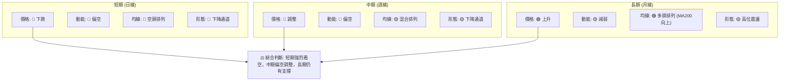
**一致性分析**：
*   **短期與中期訊號一致性極高**：日線和週線層面均顯示出明確的下跌或調整趨勢，動能偏空，均線排列不利。這表明 NVDA 正經歷一個較為強勁的短期和中期賣壓。
*   **長期與中短期訊號存在背離**：儘管中短期趨勢偏空，但長期趨勢（月線）依然維持上升，MA200 提供重要支撐。這暗示目前的下跌可能是一個深度回調，而非長期趨勢的逆轉。
*   **風險與機會**：這種背離既是風險（短期下跌可能加劇），也是機會（若能在長期支撐位企穩，則可能提供逢低買入的機會）。

**結論**：NVDA 目前處於一個多空拉鋸的關鍵時刻。短期和中期技術面全面偏空，建議投資者保持謹慎，避免盲目抄底。然而，長期趨勢的支撐仍存，若股價能夠在重要長期支撐位（如 $191.25 的 MA200 或 $189.77 的布林下軌）附近止跌並出現反轉訊號，則可考慮建立多頭倉位。在當前階段，偏空操作或觀望是較為穩妥的策略。

---

## 8. 交易策略建議

基於上述詳盡的技術分析，NVDA 目前處於短期偏空調整，中期承壓，但長期仍有支撐的複雜局面。因此，我們需要制定多空雙向的交易策略，並嚴格控制風險。

### 🗺️ 策略決策流程圖

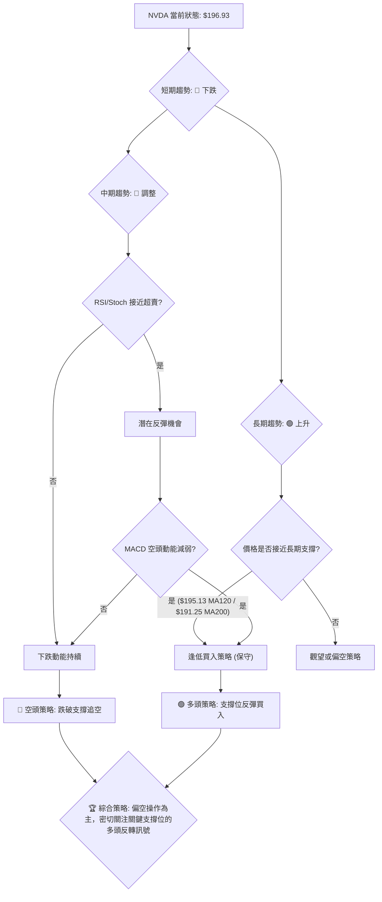

### 🟢 多頭策略詳情

考慮到長期趨勢仍為上升，且 RSI/MACD 顯示空頭動能可能減弱並接近超賣，可佈局保守的逢低買入策略。

| 策略要素 | 策略 A (保守反彈) | 策略 B (激進反彈) |
|----------|-------------------|-------------------|
| 進場條件 | 股價在 $191.25 (MA200) 附近企穩，並出現明顯止跌 K 線或 MACD 金叉。 | 股價在 $189.77 (布林下軌) 附近止跌，RSI 進入超賣區並向上拐頭，或出現放量反彈。 |
| 進場價格 | $191.50 - $192.50 | $189.00 - $190.00 |
| 目標價 T1 | $201.92 (MA20) | $201.92 (MA20) |
| 目標價 T2 | $209.60 (MA50) | $209.60 (MA50) |
| 止損價格 | $187.00 (略低於 MA200 和 50% 斐波那契回調位) | $183.00 (略低於布林下軌和 61.8% 斐波那契回調位) |
| 風險報酬比 | 1:2.5 (T1) / 1:4 (T2) | 1:2.0 (T1) / 1:3.5 (T2) |
| 成功機率 | 50% | 40% |
| 建議倉位 | 10-15% | 5-10% |

### 🔴 空頭策略詳情

當前短期和中期趨勢均偏空，下跌動能仍存，因此可考慮做空策略，尤其是在反彈受阻或關鍵支撐被跌破時。

| 策略要素 | 策略 C (反彈做空) | 策略 D (跌破追空) |
|----------|-------------------|-------------------|
| 進場條件 | 股價反彈至 MA20 ($201.92) 或 MA50 ($209.60) 附近受阻，並出現 K 線反轉訊號。 | 股價跌破 $189.77 (布林下軌) 或 $186.49 (強支撐 S3)，並伴隨放量。 |
| 進場價格 | $201.50 - $202.50 (靠近 MA20) | $189.50 - $188.50 (跌破 $189.77 後) |
| 目標價 T1 | $195.13 (MA120) | $174.40 (強支撐 S4) |
| 目標價 T2 | $189.77 (布林下軌) | $161.84 (形態下破目標) |
| 止損價格 | $205.00 (略高於 MA20 和 ATR 波動範圍) | $193.00 (略高於破位支撐和 ATR 波動範圍) |
| 風險報酬比 | 1:2.0 (T1) / 1:3.5 (T2) | 1:2.5 (T1) / 1:4 (T2) |
| 成功機率 | 60% | 55% |
| 建議倉位 | 10-15% | 5-10% |

### ⭐ 整體訊號強度評星

```
做多訊號強度：★★☆☆☆  (2/5星) (主要基於長期趨勢及接近超賣，短期無明確反轉)
做空訊號強度：★★★★☆  (4/5星) (短期趨勢明確，動能偏空，均線壓制)
整體可信度：  ★★★☆☆  (3/5星) (市場處於調整期，不確定性較高，需謹慎)
```
**結論**：目前 NVDA 的技術面偏空，做空策略在短期內具有較高的勝率。多頭策略則應保持極度保守，等待股價在重要長期支撐位上出現明確的止跌和反轉訊號。在任何情況下，嚴格的止損和倉位管理都是至關重要的。

---

## 9. 風險提示與監控

NVDA 作為市場熱點，其波動性較高，在當前調整階段，風險管理尤為關鍵。

### ✅ 關鍵監控指標 Checklist

```
╔══════════════════════════════════════════════════════════════╗
║              NVDA 關鍵監控指標 Checklist                     ║
╠══════════════════════════════════════════════════════════════╣
║ 1. 價格是否站穩 $195.13 (MA120)?                          [ ] ║
║ 2. 價格是否跌破 $189.77 (布林下軌)?                        [ ] ║
║ 3. RSI (14) 是否向上突破 40?                               [ ] ║
║ 4. MACD 是否形成金叉或柱狀圖轉正?                          [ ] ║
║ 5. ADX 是否向上突破 25 (+DI 是否領先 -DI)?                [ ] ║
║ 6. 成交量是否配合價格上漲而放大?                           [ ] ║
║ 7. 是否出現明顯的底部 K 線形態 (如錘頭、啟明星)?           [ ] ║
║ 8. 52週低點 $157.31 是否面臨考驗?                          [ ] ║
║ 9. 宏觀經濟或產業是否有重大利多/利空消息?                  [ ] ║
╚══════════════════════════════════════════════════════════════╝
```
**解讀**：投資者應每日或每週檢查這些關鍵指標的變化。勾選的項目越多，市場訊號就越明朗。在未有明確訊號前，應避免大規模操作。

### ⚠️ 風險場景分析

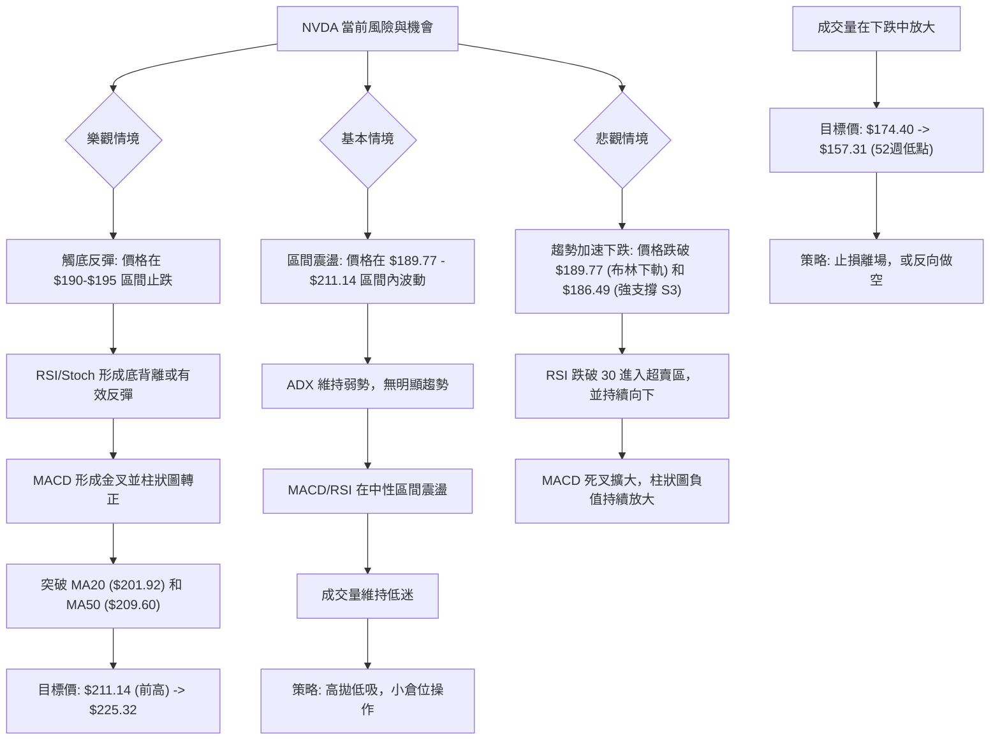
**情境分析**：
*   **樂觀情境 (機率 30%)**：若 NVDA 股價能在 $190-$195 區間成功築底並反彈，配合動能指標轉強，則有望挑戰前期高點。此時應關注 MA20 和 MA50 的突破情況。
*   **基本情境 (機率 50%)**：股價在當前區間 ($189.77 - $211.14) 內繼續盤整，等待更明確的方向。在這種情況下，高拋低吸的區間交易策略可能有效，但需嚴格控制倉位。
*   **悲觀情境 (機率 20%)**：若關鍵支撐位 $189.77 和 $186.49 被有效跌破，且伴隨放量，則意味著空頭力量強勁，股價可能加速下跌，甚至考驗 52 週低點。此時應果斷止損離場。

### 🛡️ 風險管理重要提醒

1.  **倉位管理**：鑑於當前市場的不確定性和 NVDA 的高波動性，建議採取小倉位或分批建倉策略。在趨勢未明朗前，避免重倉。
2.  **嚴格止損**：無論採取何種交易策略，都必須設定明確的止損點並嚴格執行。ATR 可作為設定止損點的參考依據。
3.  **多指標確認**：不要依賴單一指標的訊號。當多個指標（如價格行為、均線、動能、成交量）相互確認時，交易訊號的可靠性更高。
4.  **關注大盤**：NVDA 作為科技巨頭，其走勢與大盤高度相關。密切關注整體市場（如 S&P 500、納斯達克指數）的動態，以及宏觀經濟數據和產業新聞。
5.  **耐心等待**：在趨勢不明朗的盤整或調整階段，耐心等待是最好的策略。避免頻繁交易，減少不必要的交易成本和心理壓力。
6.  **基本面配合**：雖然本報告為技術分析，但長期投資仍需結合基本面。在技術面出現買入訊號時，若能有基本面利好消息配合，則可靠性更高。

---

## 📋 報告總結

```
╔══════════════════════════════════════════════════════════════╗
║              NVDA 技術分析報告總結                           ║
╠══════════════════════════════════════════════════════════════╣
║報告日期：2026-07-08                                          ║
║當前價格：$196.93                                             ║
║分析評級：⚖️ 偏空調整 (短期壓力大，長期仍有支撐)               ║
╠══════════════════════════════════════════════════════════════╣
║關鍵結論：                                                    ║
║├─ 長期趨勢：🟢 上升趨勢，MA200 ($191.25) 提供重要支撐。       ║
║├─ 中期趨勢：🔴 震盪調整，價格低於 MA20/MA50。                 ║
║├─ 短期趨勢：🔴 下跌趨勢，動能偏弱，成交量萎縮。               ║
║├─ 關鍵支撐：$195.13 (MA120), $189.77 (布林下軌), $186.49 (S3)。║
║├─ 關鍵阻力：$201.92 (MA20), $209.60 (MA50), $211.14 (前高)。  ║
║└─ 分析師目標：均值 $301.62 (長期看好，但短期存在背離)。       ║
╠══════════════════════════════════════════════════════════════╣
║最優策略組合：                                                ║
║1. 🥇 最佳機會：**等待並確認支撐位止跌反彈 (保守多頭)**。在 $190 - $195 區間關注止跌K線、MACD金叉、RSI超賣反轉訊號，並配合放量。進場後嚴格止損於 $187.00，目標看向 $201.92 及 $209.60。
║2. 🥈 次選機會：**反彈受阻後做空 (偏空)**。若股價反彈至 MA20 ($201.92) 或 MA50 ($209.60) 附近未能有效突破，並出現回落訊號，則可考慮做空。止損於 $205.00，目標看向 $195.13 及 $189.77。
║3. 🥉 保守選擇：**觀望**。在當前弱勢調整且趨勢不明朗的階段，不進行任何操作，等待市場給出更明確的方向。
╚══════════════════════════════════════════════════════════════╝
```

---

> ⚠️ **免責聲明**：本報告為 AI 自動生成之技術分析，所有數據及估算均基於提供的歷史價格資訊。本報告**僅供研究與學術參考**，**不構成任何投資建議**。投資有風險，入市需謹慎。

---

*報告生成時間：2026-07-08 ｜ 數據來源：Yahoo Finance ｜ 分析框架：多時框技術分析*