<details>
<summary>📊 靜態圖表 (點擊展開)</summary>
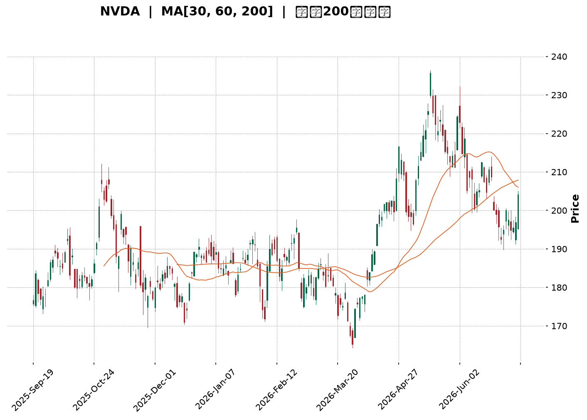
</details>

<html>
<head><meta charset="utf-8" /></head>
<body>
    <div style="height:500px; width:100%;">                        <script>window.PlotlyConfig = {MathJaxConfig: 'local'};</script>
        <script charset="utf-8" src="https://cdn.plot.ly/plotly-3.6.0.min.js" integrity="sha256-QaOVwtVY0T02VaHrr6pnoHLCwayMJp4O5n4YyaE3rJk=" crossorigin="anonymous"></script>                <div id="candlestick-chart" class="plotly-graph-div" style="height:100%; width:100%;"></div>            <script>                window.PLOTLYENV=window.PLOTLYENV || {};                                if (document.getElementById("candlestick-chart")) {                    Plotly.newPlot(                        "candlestick-chart",                        [{"close":{"dtype":"f8","bdata":"AAAAoNEUZkAAAAAA4PJmQAAAAAAiTWZAAAAAAGseZkAAAADAdDVmQAAAAEB0RWZAAAAAwI+6ZkAAAACA51FnQAAAAMAFZ2dAAAAAANGbZ0AAAABgLnNnQAAAAMCgMGdAAAAAQKEgZ0AAAAAA26JnQAAAAECQEWhAAAAAAHrkZkAAAAAglIlnQAAAAMBTgGZAAAAAoO15ZkAAAAAASLlmQAAAAIBl5mZAAAAAoNbTZkAAAADAe6RmQAAAAKBTiGZAAAAA4HrEZkAAAABAqkdnQAAAAOAB72dAAAAAAEEgaUAAAACAjeBpQAAAAGDEW2lAAAAAAPhOaUAAAADgbttpQAAAAMBh1WhAAAAA4AhmaEAAAABA5oFnQAAAAKAjhGdAAAAAoObgaEAAAAAAcSRoQAAAAGDrOGhAAAAAAN1aZ0AAAACAxcRnQAAAAGCLUmdAAAAAAOKqZkAAAAAg\u002fE9nQAAAAGDYk2ZAAAAAIIhbZkAAAACA9dBmQAAAAICdOWZAAAAAwK+HZkAAAADAYB9mQAAAAODOfGZAAAAAIBWuZkAAAADAP3JmQAAAAMDX62ZAAAAA4M3MZkAAAABgRzFnQAAAAEC4HmdAAAAAQKT4ZkAAAABAcp1mQAAAAEBW4GVAAAAAgPkIZkAAAACAuzZmQAAAAMDIXWVAAAAAoC3EZUAAAADgXZ9mQAAAAADD9WZAAAAAgGSmZ0AAAACAMZNnQAAAAECh0GdAAAAAwLaGZ0AAAACA9HBnQAAAAGCtT2dAAAAAgN+aZ0AAAACgg4NnQAAAACBbZ2dAAAAAQDGjZ0AAAACg9SBnQAAAACAzG2dAAAAAgMIdZ0AAAAAgmTlnQAAAAKAp5GZAAAAAwEZhZ0AAAACACUdnQAAAAIDuQWZAAAAAQOzpZkAAAABAjxpnQAAAAGAddWdAAAAAoLdOZ0AAAABAUJBnQAAAAABP8GdAAAAAgPwPaEAAAABA1ONnQAAAAOAyM2dAAAAAQJGKZkAAAABAx8VlQAAAAMDce2VAAAAAgMwsZ0AAAABg88BnQAAAAAD0kGdAAAAAYEXBZ0AAAACgwV1nQAAAAICa2WZAAAAAQLgeZ0AAAADACH9nQAAAAIB5fGdAAAAAYOm5Z0AAAADARPFnQAAAAMDdGmhAAAAAwJRxaEAAAADgKBxnQAAAAADGJWZAAAAAQAvPZkAAAADASYFmQAAAAID24GZAAAAAAJDqZkAAAACg7jlmQAAAAMB71GZAAAAAAFIYZ0AAAADA9UBnQAAAAOB65GZAAAAAAACIZkAAAABACudmQAAAAIDCvWZAAAAAwMyMZkAAAACA61FmQAAAAGBmlmVAAAAA4Hr0ZUAAAABgZuZlQAAAAIDCVWZAAAAAIK5nZUAAAADgo\u002fBkQAAAAKBwpWRAAAAAwMzMZUAAAAAAAPhlQAAAAOB6LGZAAAAA4Ho0ZkAAAABAM0NmQAAAAGCPwmZAAAAAwB79ZkAAAAAAKZRnQAAAAIDrqWdAAAAA4FGQaEAAAAAA19toQAAAAEAzy2hAAAAAgMI1aUAAAACA60FpQAAAAAAp\u002fGhAAAAAAABQaUAAAADgevRoQAAAAOCjCGpAAAAAIIUTa0AAAACgcKVqQAAAAAAAKGpAAAAAgD3yaEAAAABgZs5oQAAAACBcz2hAAAAAAACQaEAAAABgj\u002fppQAAAAAAAcGpAAAAAYGbmakAAAACAFG5rQAAAAMD1mGtAAAAAYI86bEAAAAAgrndtQAAAAIA9KmxAAAAAgD3Ka0AAAAAghZNrQAAAAEAK72tAAAAA4FFwa0AAAABgj+pqQAAAACCF22pAAAAAQDOTakAAAAAAAMhqQAAAAOB6ZGpAAAAAIIULbEAAAACAPdprQAAAAAAA2GpAAAAAwB5Va0AAAABAM6NpQAAAAOB6FGpAAAAAgBQGakAAAACgcA1pQAAAAADXm2lAAAAAgBSmaUAAAABgZo5qQAAAAMAe7WlAAAAAwMyUaUAAAACAFFZqQAAAAMDMFGpAAAAAoEcBaUAAAAAAAOBoQAAAACCud2hAAAAAwPUQaEAAAABACl9oQAAAAEDhAmlAAAAAYI+yaEAAAABgj1poQAAAAKCZcWhAAAAAgMKdaEAAAAAA14NpQA=="},"high":{"dtype":"f8","bdata":"FCskG+9BZkANAZan8xBnQIZjM4nMzGZA+4ir+FN4ZkCwyYHQr4dmQNEDPjQCeGZA6gwkkVr\u002fZkAgA6SuimpnQBye0LDRg2dA\u002fzm0zu3gZ0DC5ZIJ2spnQErb4bqzZmdACrivgkGhZ0C63SaviLJnQJPWPOvpaGhAieTaCidzaEBjS9wj2sJnQNKULFXzGGdAT0R7tzAbZ0BaJ5TtUOhmQEPJbbWNAmdAPfGg0r8lZ0A+P40oo9hmQMJJgYhv7WZAsDKjF1HgZkDGujqJYW5nQCUvj0pT\u002f2dAeO0HGBZkaUCADsi+VYVqQBv7AU9lxGlAYHI2Mk\u002f+aUDCqskcI2pqQIan+L9SfmlAdGyHMbpcaUD99eRLJbNoQLei4DiUiWdAkTAcs2D9aEAELpTXwGxoQKwm777Ke2hAxjUTQWjtZ0DbGn\u002f+pd9nQLdkQfdVn2dAD3fnZ\u002fMYZ0DmW3sr3HpnQF7Qta5Pf2hA9+FHhEURZ0A24VgFW+9mQGT2rnF+RGZAahzZPXrcZkA6GI1QpmhmQLsJi4j3iGZAUjCzuHc0Z0B\u002fBJdNws1mQLzesR5SEGdAcYie4MwUZ0A+KPqprH9nQL4s4uq3NmdAgR4B3wkvZ0DbErcT7almQEChYGrs2WZAkyZajiFNZkBsM6cIX09mQHebOvPaA2ZAXsW8m34EZkDHbMnrFa5mQMGynQrNBGdApPZhcjuqZ0DDzPL9ypxnQEURwwq\u002fFWhAomKsIv6XZ0B053dbWp9nQDl8iBOX0WdAVVvN8GwdaEDWSdYu0zNoQKJYi3AbBWhANBRlH4LrZ0Dfy1ugRbFnQBPz75eOSmdAOi6OCIRjZ0BhqPe6MYNnQCbBFIpmDmdAXDBtUxK2Z0BC19MBwM1nQBbTfxbYy2ZAIFVE1tYrZ0BdJfQIHkVnQPiH0yTfsmdAubBmM4OjZ0CSLe+3q79nQHsH1gHeCmhAhcHfUQYvaECgeJfiV09oQOu69EtFyWdASqORPlFIZ0B0IBG8P3JmQPbL+Q7vGWZAzcxuC61fZ0ALfCjlyDRoQFCwoMAGD2hAZQ62M\u002fwnaEDn+ANLLzNoQIs9BOysb2dAQXSYyHlkZ0BEQqGQgstnQPru4gNvjWdAoX4jBjvKZ0BLPMNvED5oQDkdlfdNOGhAB4PtVNGzaEBW3b508UhoQDtQj1uQ0mZAgRXPEGfuZkBsxXd\u002ffJxmQMdGp4MUFmdAYMhQ7pkBZ0BWrAzPANhmQHtAe6LN3GZAZuaO4sFNZ0AAAAAA13NnQAAAAIAUHmdAAAAAQOFCZ0AAAAAAKZxnQAAAAMDMLGdAAAAAACnsZkAAAAAgXH9mQAAAAOBRSGZAAAAAANdLZkAAAABACgdmQAAAAEAKp2ZAAAAA4FEQZkAAAABACl9lQAAAAGBmLmVAAAAAANfTZUAAAAAA1ytmQAAAACCuL2ZAAAAAoEc5ZkAAAAAgXEdmQAAAAOBRKGdAAAAAYI8CZ0AAAAAAAMBnQAAAAMAetWdAAAAA4FGQaEAAAADAzAxpQAAAAEAz+2hAAAAAYGY2aUAAAACgcEVpQAAAAAAAWGlAAAAAAABQaUAAAABgj3ppQAAAAGBmXmpAAAAAYI8aa0AAAAAgXNdqQAAAAEAKl2pAAAAAoJlJakAAAAAAAGBpQAAAACBcN2lAAAAAIK4HaUAAAADgowhqQAAAAGBmxmpAAAAAoJk5a0AAAACgmclrQAAAAAAA+GtAAAAAQOF6bEAAAACgR5FtQAAAAAAA8GxAAAAAAADAbEAAAAAgXA9sQAAAAAApRGxAAAAAwMxsbEAAAADgUaBrQAAAAIDCRWtAAAAAwMzEakAAAADgo\u002fBqQAAAACCFO2tAAAAAANcbbEAAAADA9QhtQAAAAIA92mtAAAAAQDOza0AAAAAA19tqQAAAAEAKT2pAAAAAwMxsakAAAABACudpQAAAAMAetWlAAAAAgD3iaUAAAABguJZqQAAAACCub2pAAAAAYLgmakAAAADgemxqQAAAACCuv2pAAAAA4KN4aUAAAACgcDVpQAAAAKCZGWlAAAAAoJlxaEAAAACAwoVoQAAAAAApFGlAAAAAQDP7aEAAAACA6wFpQAAAAKCZsWhAAAAAwB7NaEAAAADAHqVpQA=="},"hovertemplate":"\u003cb\u003e%{x|%Y-%m-%d}\u003c\u002fb\u003e\u003cbr\u003e\u958b: $%{open:.2f}\u003cbr\u003e\u9ad8: $%{high:.2f}\u003cbr\u003e\u4f4e: $%{low:.2f}\u003cbr\u003e\u6536: $%{close:.2f}\u003cextra\u003e\u003c\u002fextra\u003e","low":{"dtype":"f8","bdata":"WHFK1yTlZUAPFwVBG9ZlQL0qNd8ZBmZATW2t6S7sZUD1AIBZjaNlQJ4eii4l3WVAkwQoYJuJZkASZ7bWuK5mQEMP5WAn\u002fGZAOTcXX0KBZ0BXsmFjgitnQA3113zq6WZAAwBij1r\u002fZkDiSt\u002fPn1BnQBmfx5s\u002f4WdAQSqZ3\u002fXAZkBjsGEfET5nQH8OBazEdWZAWALeKKgoZkCY16Q1AnhmQJ5NxV5ed2ZAmA6Bsbi2ZkBoc0LZ93hmQK3KX+qyF2ZAQBDS4aV4ZkBkXd7bWu9mQPaXpwAZjWdApPUwM3L8Z0Df9RyoPZhpQKBqzZRpLGlALLu0wIdBaUCHLgWQMrFpQKpmCW8QvWhAil3jwB1UaEB50lZngUtnQEXxQO59XGZAZuHsWpk4aEBD+k+M7ehnQMlnkSZ942dAsvhM1Y36ZkD6dyzh7JFmQAO\u002fG62XCWdAAiC\u002fKSt0ZkB5NJTx6tlmQPvq7XWRemZARfHi+SadZUBsIxV1vQ5mQMrb9BABMWVALcEX0Q1HZkCK8SkzYQ9mQDrsHVwmtWVALfNAEF5\u002fZkDIWoAO5GJmQMtj6qNofmZAX\u002fpAis6cZkA+m3Xle8xmQC1wQTvs6WZAZ6WJ5fbAZkBDy2KpiBNmQFvlao2J02VACBfyLqjgZUAejuQ\u002ff9xlQHVHeAegSWVAypR3R\u002fF5ZUBkatEPkwpmQHhKM1jiymZA70ATrHvcZkBlV0eFjlJnQOLpPp+sf2dAGjpYRsw8Z0BvWzelb11nQC8vIoFbT2dAmsv7Yv6HZ0DO7YM\u002fekRnQJ1Rqa\u002fqWWdAUY6IwZhRZ0ATnuH2ZvZmQEPVIScf9WZAm\u002fLuuVLgZkB1TYRxe+xmQIVzw2lJmWZAEmOq0TxKZ0A\u002fSwnRPEJnQI6WPlQ2M2ZA+Qs9rn1MZkDXBVnncP1mQK+dhqDqWWdA6J5ytls\u002fZ0CPLTwAFDZnQF3umB6NumdA+5BH\u002fJhBZ0AfK288tq5nQInyzxLXG2dA67++8g0HZkD22tmC0nxlQNd8iOCpYGVAL96hy+XSZUBbTirTFP5mQC9vsI+Dg2dAIghDMVCYZ0CxUM0w\u002f09nQNtBYsqQsmZA9rIZEXNlZkC1GIYK\u002f1dnQPxyEH7MNGdApZI0GMI9Z0A7U3ZfO7JnQPwckKp5bGdACOkAqfE4aEDCM7fA6wlnQJ+o3dvaC2ZANquEeS3UZUBGRXgjIh1mQORqHbKbgWZAyzZwK9o7ZkAkk40R7xlmQNXc6qSd8WVAbUQXOQHAZkAAAABgZg5nQAAAAAAAuGZAAAAAgBR+ZkAAAADAHq1mQAAAAIDCtWZAAAAAYI+KZkAAAACgR\u002fllQAAAAEAKd2VAAAAA4FHYZUAAAAAgXL9lQAAAAEAzG2ZAAAAA4HpkZUAAAADgUeBkQAAAAOCjiGRAAAAAYLjeZEAAAAAAANhlQAAAAADXa2VAAAAA4FH4ZUAAAADAHrVlQAAAAKCZiWZAAAAAANeTZkAAAACgmQlnQAAAACCuN2dAAAAA4KPYZ0AAAAAgrndoQAAAAIDreWhAAAAA4KPoaEAAAABA4bpoQAAAAAAA4GhAAAAAAADgaEAAAABACqdoQAAAAIDr+WhAAAAAACnsaUAAAABgZgZqQAAAAGCP8mlAAAAAYGbWaEAAAAAA16NoQAAAACCuV2hAAAAAwPWAaEAAAAAghdNoQAAAAAAA0GlAAAAA4HqcakAAAADgerxqQAAAAKBw3WpAAAAAgD2ya0AAAACgmalsQAAAACCuB2xAAAAAANdLa0AAAADAHj1rQAAAAAAAkGtAAAAAgMI9a0AAAACgmdlqQAAAAAAAgGpAAAAAwPUYakAAAABACmdqQAAAAAApZGpAAAAAYGb2akAAAABAM6trQAAAAOBR0GpAAAAAQApfakAAAABgj4ppQAAAAAAAwGlAAAAAQOHqaEAAAACgcP1oQAAAAKBH8WhAAAAAgBRuaUAAAABA4QpqQAAAAKBH6WlAAAAAYI9iaUAAAAAAANBpQAAAAEAK92lAAAAAAAAAaUAAAABgj5JoQAAAAAApBGhAAAAAQArnZ0AAAACgmblnQAAAACCFY2hAAAAAYGYuaEAAAABAMwtoQAAAACCuP2hAAAAA4HrkZ0AAAACA62FoQA=="},"name":"\u50f9\u683c","open":{"dtype":"f8","bdata":"i8xarwX4ZUCWzS\u002f5++hlQBTp0pBmvmZAMPP4GgJ4ZkBkcstCv85lQH8Cm2TQRGZAs1vXRiCNZkAegoKM68FmQPEXaowHJ2dAeyOJvIiyZ0Dt+cR2aqVnQAJVNSlZL2dAR6cWrrRGZ0Ahw\u002fWolVFnQMZoTy6vBmhAnNK40KMvaEB4b5YwYX5nQL6vFZz9F2dAsxeZZ\u002fMYZ0CPB08\u002fuMZmQP4QynsghWZAPnQwT4TjZkA+P40oo9hmQMDNAvrXo2ZA7YC6UM6MZkAQpInNO\u002fpmQKLhajkDv2dA8NbKDOwgaEA0Lqsnof5pQIvUlTcUpGlAzeAysKzNaUBcxZ4r1AFqQAPwXl9JX2lAeLGoLPHXaEC5MSIAwIxoQE0U34smHGdABLMKq9ViaEDP\u002fHIzb2RoQDFHEEZadmhAkZvnuu3gZ0DzqvKT4NpmQAvRGPFiPmdAqJDfDoTrZkBgeFBuoRhnQDe8ORq2fWhAXqqmIAunZkBoPkvADG9mQAQ9Tl6B3GVA98mPpIWzZkA56QrRsF9mQIfYjsO012VARO\u002foWq63ZkCSIPuI7KFmQIhaoYeGs2ZAd0cEWCn8ZkB+TjnqKdRmQPfGCj2ZMWdA5QznOLgeZ0B7\u002fc3JpYhmQOGqiMw0o2ZAbrHOpMU9ZkCrW57FAwhmQATRoTblAmZA2c61U6jQZUCZHlxKIhVmQH5g4AUf\u002fWZA0m8hJLneZkCUKQwswX1nQL\u002fJQWUcvWdARHDrGWV2Z0Ap+pGwWodnQBU90IPpsWdAHG6bD426Z0CP6wHj\u002fPdnQF0hyWtP0GdAX+dP3emRZ0BkZUZSMaNnQKV6BEc9ImdASXk7A7nmZkAdsO37rR9nQH09+7nrCWdA4DdiXq1PZ0Cv3Ut8O6JnQD8IBA18vGZAd5J8REphZkD6gjgKrhdnQIofTtOsb2dAxPu60ctkZ0CSuloRW2dnQIzRXBxP6GdAXPvUZIzqZ0A4LOuWY+ZnQLOboGsTZmdArsT5gVtHZ0DPqbDJaG5mQG3FnuV03WVAdGhIHsYVZkDoqPsvAAhnQGgIhx3U62dAIG2iDxEOaEC3KdcsoCBoQEgfSQ4Jb2dAugRvba+3ZkBMFZJIrJdnQB4rRp+YYWdA5m660OpRZ0AhEwTxd+xnQKZRWzpZ72dAFIcNHhBOaEDU2wO3TUhoQKgUibOvp2ZAGPmJTwTgZUAvoCrxXk9mQKK8\u002f4bEjWZA5uwvViClZkA\u002fx596kXpmQA9RvPRAGmZAQJrZ7HvMZkAAAADAHj1nQAAAAKCZAWdAAAAAoHAdZ0AAAABACt9mQAAAAIDrIWdAAAAAIFzPZkAAAADgUUBmQAAAAAAAQGZAAAAA4FEoZkAAAABgj9plQAAAAEAzI2ZAAAAAgD0CZkAAAAAAAEBlQAAAAMD1GGVAAAAAQArfZEAAAAAAAABmQAAAAIDChWVAAAAAwB4lZkAAAAAgXPdlQAAAAAAAEGdAAAAAQOG6ZkAAAACA6wlnQAAAAMD1QGdAAAAAQOHaZ0AAAACgR5FoQAAAAIDCrWhAAAAAwMz8aEAAAAAgXP9oQAAAAAApRGlAAAAAIK4faUAAAABguE5pQAAAAGC4\u002fmhAAAAAwMw0akAAAAAgri9qQAAAAGBmlmpAAAAAgMI9akAAAADA9ShpQAAAAAAA8GhAAAAAoJnpaEAAAADgevxoQAAAAEDhCmpAAAAAwPWgakAAAACgR8FqQAAAAKCZUWtAAAAAgMIdbEAAAABAM7tsQAAAAOBRuGxAAAAAANe7bEAAAAAA13NrQAAAAIDC5WtAAAAAoEfJa0AAAADAzJxrQAAAAKBHEWtAAAAAANfDakAAAADA9WhqQAAAAGCP0mpAAAAAIFz3akAAAACAwmVsQAAAAEAKt2tAAAAAwB69akAAAADA9dBqQAAAAIDCRWpAAAAAANdTakAAAACAwo1pQAAAACCuL2lAAAAAIIWbaUAAAACgcB1qQAAAAIDCZWpAAAAAwPUQakAAAABgj+ppQAAAAIAUbmpAAAAAoHBFaUAAAAAA1wNpQAAAAGCPAmlAAAAAANcjaEAAAABAMztoQAAAACCup2hAAAAAYGaGaEAAAADgeqRoQAAAAKBwTWhAAAAAANcLaEAAAACAwmVoQA=="},"x":["2025-09-19T00:00:00-04:00","2025-09-22T00:00:00-04:00","2025-09-23T00:00:00-04:00","2025-09-24T00:00:00-04:00","2025-09-25T00:00:00-04:00","2025-09-26T00:00:00-04:00","2025-09-29T00:00:00-04:00","2025-09-30T00:00:00-04:00","2025-10-01T00:00:00-04:00","2025-10-02T00:00:00-04:00","2025-10-03T00:00:00-04:00","2025-10-06T00:00:00-04:00","2025-10-07T00:00:00-04:00","2025-10-08T00:00:00-04:00","2025-10-09T00:00:00-04:00","2025-10-10T00:00:00-04:00","2025-10-13T00:00:00-04:00","2025-10-14T00:00:00-04:00","2025-10-15T00:00:00-04:00","2025-10-16T00:00:00-04:00","2025-10-17T00:00:00-04:00","2025-10-20T00:00:00-04:00","2025-10-21T00:00:00-04:00","2025-10-22T00:00:00-04:00","2025-10-23T00:00:00-04:00","2025-10-24T00:00:00-04:00","2025-10-27T00:00:00-04:00","2025-10-28T00:00:00-04:00","2025-10-29T00:00:00-04:00","2025-10-30T00:00:00-04:00","2025-10-31T00:00:00-04:00","2025-11-03T00:00:00-05:00","2025-11-04T00:00:00-05:00","2025-11-05T00:00:00-05:00","2025-11-06T00:00:00-05:00","2025-11-07T00:00:00-05:00","2025-11-10T00:00:00-05:00","2025-11-11T00:00:00-05:00","2025-11-12T00:00:00-05:00","2025-11-13T00:00:00-05:00","2025-11-14T00:00:00-05:00","2025-11-17T00:00:00-05:00","2025-11-18T00:00:00-05:00","2025-11-19T00:00:00-05:00","2025-11-20T00:00:00-05:00","2025-11-21T00:00:00-05:00","2025-11-24T00:00:00-05:00","2025-11-25T00:00:00-05:00","2025-11-26T00:00:00-05:00","2025-11-28T00:00:00-05:00","2025-12-01T00:00:00-05:00","2025-12-02T00:00:00-05:00","2025-12-03T00:00:00-05:00","2025-12-04T00:00:00-05:00","2025-12-05T00:00:00-05:00","2025-12-08T00:00:00-05:00","2025-12-09T00:00:00-05:00","2025-12-10T00:00:00-05:00","2025-12-11T00:00:00-05:00","2025-12-12T00:00:00-05:00","2025-12-15T00:00:00-05:00","2025-12-16T00:00:00-05:00","2025-12-17T00:00:00-05:00","2025-12-18T00:00:00-05:00","2025-12-19T00:00:00-05:00","2025-12-22T00:00:00-05:00","2025-12-23T00:00:00-05:00","2025-12-24T00:00:00-05:00","2025-12-26T00:00:00-05:00","2025-12-29T00:00:00-05:00","2025-12-30T00:00:00-05:00","2025-12-31T00:00:00-05:00","2026-01-02T00:00:00-05:00","2026-01-05T00:00:00-05:00","2026-01-06T00:00:00-05:00","2026-01-07T00:00:00-05:00","2026-01-08T00:00:00-05:00","2026-01-09T00:00:00-05:00","2026-01-12T00:00:00-05:00","2026-01-13T00:00:00-05:00","2026-01-14T00:00:00-05:00","2026-01-15T00:00:00-05:00","2026-01-16T00:00:00-05:00","2026-01-20T00:00:00-05:00","2026-01-21T00:00:00-05:00","2026-01-22T00:00:00-05:00","2026-01-23T00:00:00-05:00","2026-01-26T00:00:00-05:00","2026-01-27T00:00:00-05:00","2026-01-28T00:00:00-05:00","2026-01-29T00:00:00-05:00","2026-01-30T00:00:00-05:00","2026-02-02T00:00:00-05:00","2026-02-03T00:00:00-05:00","2026-02-04T00:00:00-05:00","2026-02-05T00:00:00-05:00","2026-02-06T00:00:00-05:00","2026-02-09T00:00:00-05:00","2026-02-10T00:00:00-05:00","2026-02-11T00:00:00-05:00","2026-02-12T00:00:00-05:00","2026-02-13T00:00:00-05:00","2026-02-17T00:00:00-05:00","2026-02-18T00:00:00-05:00","2026-02-19T00:00:00-05:00","2026-02-20T00:00:00-05:00","2026-02-23T00:00:00-05:00","2026-02-24T00:00:00-05:00","2026-02-25T00:00:00-05:00","2026-02-26T00:00:00-05:00","2026-02-27T00:00:00-05:00","2026-03-02T00:00:00-05:00","2026-03-03T00:00:00-05:00","2026-03-04T00:00:00-05:00","2026-03-05T00:00:00-05:00","2026-03-06T00:00:00-05:00","2026-03-09T00:00:00-04:00","2026-03-10T00:00:00-04:00","2026-03-11T00:00:00-04:00","2026-03-12T00:00:00-04:00","2026-03-13T00:00:00-04:00","2026-03-16T00:00:00-04:00","2026-03-17T00:00:00-04:00","2026-03-18T00:00:00-04:00","2026-03-19T00:00:00-04:00","2026-03-20T00:00:00-04:00","2026-03-23T00:00:00-04:00","2026-03-24T00:00:00-04:00","2026-03-25T00:00:00-04:00","2026-03-26T00:00:00-04:00","2026-03-27T00:00:00-04:00","2026-03-30T00:00:00-04:00","2026-03-31T00:00:00-04:00","2026-04-01T00:00:00-04:00","2026-04-02T00:00:00-04:00","2026-04-06T00:00:00-04:00","2026-04-07T00:00:00-04:00","2026-04-08T00:00:00-04:00","2026-04-09T00:00:00-04:00","2026-04-10T00:00:00-04:00","2026-04-13T00:00:00-04:00","2026-04-14T00:00:00-04:00","2026-04-15T00:00:00-04:00","2026-04-16T00:00:00-04:00","2026-04-17T00:00:00-04:00","2026-04-20T00:00:00-04:00","2026-04-21T00:00:00-04:00","2026-04-22T00:00:00-04:00","2026-04-23T00:00:00-04:00","2026-04-24T00:00:00-04:00","2026-04-27T00:00:00-04:00","2026-04-28T00:00:00-04:00","2026-04-29T00:00:00-04:00","2026-04-30T00:00:00-04:00","2026-05-01T00:00:00-04:00","2026-05-04T00:00:00-04:00","2026-05-05T00:00:00-04:00","2026-05-06T00:00:00-04:00","2026-05-07T00:00:00-04:00","2026-05-08T00:00:00-04:00","2026-05-11T00:00:00-04:00","2026-05-12T00:00:00-04:00","2026-05-13T00:00:00-04:00","2026-05-14T00:00:00-04:00","2026-05-15T00:00:00-04:00","2026-05-18T00:00:00-04:00","2026-05-19T00:00:00-04:00","2026-05-20T00:00:00-04:00","2026-05-21T00:00:00-04:00","2026-05-22T00:00:00-04:00","2026-05-26T00:00:00-04:00","2026-05-27T00:00:00-04:00","2026-05-28T00:00:00-04:00","2026-05-29T00:00:00-04:00","2026-06-01T00:00:00-04:00","2026-06-02T00:00:00-04:00","2026-06-03T00:00:00-04:00","2026-06-04T00:00:00-04:00","2026-06-05T00:00:00-04:00","2026-06-08T00:00:00-04:00","2026-06-09T00:00:00-04:00","2026-06-10T00:00:00-04:00","2026-06-11T00:00:00-04:00","2026-06-12T00:00:00-04:00","2026-06-15T00:00:00-04:00","2026-06-16T00:00:00-04:00","2026-06-17T00:00:00-04:00","2026-06-18T00:00:00-04:00","2026-06-22T00:00:00-04:00","2026-06-23T00:00:00-04:00","2026-06-24T00:00:00-04:00","2026-06-25T00:00:00-04:00","2026-06-26T00:00:00-04:00","2026-06-29T00:00:00-04:00","2026-06-30T00:00:00-04:00","2026-07-01T00:00:00-04:00","2026-07-02T00:00:00-04:00","2026-07-06T00:00:00-04:00","2026-07-07T00:00:00-04:00","2026-07-08T00:00:00-04:00"],"type":"candlestick"},{"hovertemplate":"MA30: $%{y:.2f}\u003cextra\u003e\u003c\u002fextra\u003e","line":{"color":"#2196F3","dash":"dash","width":2},"mode":"lines","name":"MA30","x":["2025-09-19T00:00:00-04:00","2025-09-22T00:00:00-04:00","2025-09-23T00:00:00-04:00","2025-09-24T00:00:00-04:00","2025-09-25T00:00:00-04:00","2025-09-26T00:00:00-04:00","2025-09-29T00:00:00-04:00","2025-09-30T00:00:00-04:00","2025-10-01T00:00:00-04:00","2025-10-02T00:00:00-04:00","2025-10-03T00:00:00-04:00","2025-10-06T00:00:00-04:00","2025-10-07T00:00:00-04:00","2025-10-08T00:00:00-04:00","2025-10-09T00:00:00-04:00","2025-10-10T00:00:00-04:00","2025-10-13T00:00:00-04:00","2025-10-14T00:00:00-04:00","2025-10-15T00:00:00-04:00","2025-10-16T00:00:00-04:00","2025-10-17T00:00:00-04:00","2025-10-20T00:00:00-04:00","2025-10-21T00:00:00-04:00","2025-10-22T00:00:00-04:00","2025-10-23T00:00:00-04:00","2025-10-24T00:00:00-04:00","2025-10-27T00:00:00-04:00","2025-10-28T00:00:00-04:00","2025-10-29T00:00:00-04:00","2025-10-30T00:00:00-04:00","2025-10-31T00:00:00-04:00","2025-11-03T00:00:00-05:00","2025-11-04T00:00:00-05:00","2025-11-05T00:00:00-05:00","2025-11-06T00:00:00-05:00","2025-11-07T00:00:00-05:00","2025-11-10T00:00:00-05:00","2025-11-11T00:00:00-05:00","2025-11-12T00:00:00-05:00","2025-11-13T00:00:00-05:00","2025-11-14T00:00:00-05:00","2025-11-17T00:00:00-05:00","2025-11-18T00:00:00-05:00","2025-11-19T00:00:00-05:00","2025-11-20T00:00:00-05:00","2025-11-21T00:00:00-05:00","2025-11-24T00:00:00-05:00","2025-11-25T00:00:00-05:00","2025-11-26T00:00:00-05:00","2025-11-28T00:00:00-05:00","2025-12-01T00:00:00-05:00","2025-12-02T00:00:00-05:00","2025-12-03T00:00:00-05:00","2025-12-04T00:00:00-05:00","2025-12-05T00:00:00-05:00","2025-12-08T00:00:00-05:00","2025-12-09T00:00:00-05:00","2025-12-10T00:00:00-05:00","2025-12-11T00:00:00-05:00","2025-12-12T00:00:00-05:00","2025-12-15T00:00:00-05:00","2025-12-16T00:00:00-05:00","2025-12-17T00:00:00-05:00","2025-12-18T00:00:00-05:00","2025-12-19T00:00:00-05:00","2025-12-22T00:00:00-05:00","2025-12-23T00:00:00-05:00","2025-12-24T00:00:00-05:00","2025-12-26T00:00:00-05:00","2025-12-29T00:00:00-05:00","2025-12-30T00:00:00-05:00","2025-12-31T00:00:00-05:00","2026-01-02T00:00:00-05:00","2026-01-05T00:00:00-05:00","2026-01-06T00:00:00-05:00","2026-01-07T00:00:00-05:00","2026-01-08T00:00:00-05:00","2026-01-09T00:00:00-05:00","2026-01-12T00:00:00-05:00","2026-01-13T00:00:00-05:00","2026-01-14T00:00:00-05:00","2026-01-15T00:00:00-05:00","2026-01-16T00:00:00-05:00","2026-01-20T00:00:00-05:00","2026-01-21T00:00:00-05:00","2026-01-22T00:00:00-05:00","2026-01-23T00:00:00-05:00","2026-01-26T00:00:00-05:00","2026-01-27T00:00:00-05:00","2026-01-28T00:00:00-05:00","2026-01-29T00:00:00-05:00","2026-01-30T00:00:00-05:00","2026-02-02T00:00:00-05:00","2026-02-03T00:00:00-05:00","2026-02-04T00:00:00-05:00","2026-02-05T00:00:00-05:00","2026-02-06T00:00:00-05:00","2026-02-09T00:00:00-05:00","2026-02-10T00:00:00-05:00","2026-02-11T00:00:00-05:00","2026-02-12T00:00:00-05:00","2026-02-13T00:00:00-05:00","2026-02-17T00:00:00-05:00","2026-02-18T00:00:00-05:00","2026-02-19T00:00:00-05:00","2026-02-20T00:00:00-05:00","2026-02-23T00:00:00-05:00","2026-02-24T00:00:00-05:00","2026-02-25T00:00:00-05:00","2026-02-26T00:00:00-05:00","2026-02-27T00:00:00-05:00","2026-03-02T00:00:00-05:00","2026-03-03T00:00:00-05:00","2026-03-04T00:00:00-05:00","2026-03-05T00:00:00-05:00","2026-03-06T00:00:00-05:00","2026-03-09T00:00:00-04:00","2026-03-10T00:00:00-04:00","2026-03-11T00:00:00-04:00","2026-03-12T00:00:00-04:00","2026-03-13T00:00:00-04:00","2026-03-16T00:00:00-04:00","2026-03-17T00:00:00-04:00","2026-03-18T00:00:00-04:00","2026-03-19T00:00:00-04:00","2026-03-20T00:00:00-04:00","2026-03-23T00:00:00-04:00","2026-03-24T00:00:00-04:00","2026-03-25T00:00:00-04:00","2026-03-26T00:00:00-04:00","2026-03-27T00:00:00-04:00","2026-03-30T00:00:00-04:00","2026-03-31T00:00:00-04:00","2026-04-01T00:00:00-04:00","2026-04-02T00:00:00-04:00","2026-04-06T00:00:00-04:00","2026-04-07T00:00:00-04:00","2026-04-08T00:00:00-04:00","2026-04-09T00:00:00-04:00","2026-04-10T00:00:00-04:00","2026-04-13T00:00:00-04:00","2026-04-14T00:00:00-04:00","2026-04-15T00:00:00-04:00","2026-04-16T00:00:00-04:00","2026-04-17T00:00:00-04:00","2026-04-20T00:00:00-04:00","2026-04-21T00:00:00-04:00","2026-04-22T00:00:00-04:00","2026-04-23T00:00:00-04:00","2026-04-24T00:00:00-04:00","2026-04-27T00:00:00-04:00","2026-04-28T00:00:00-04:00","2026-04-29T00:00:00-04:00","2026-04-30T00:00:00-04:00","2026-05-01T00:00:00-04:00","2026-05-04T00:00:00-04:00","2026-05-05T00:00:00-04:00","2026-05-06T00:00:00-04:00","2026-05-07T00:00:00-04:00","2026-05-08T00:00:00-04:00","2026-05-11T00:00:00-04:00","2026-05-12T00:00:00-04:00","2026-05-13T00:00:00-04:00","2026-05-14T00:00:00-04:00","2026-05-15T00:00:00-04:00","2026-05-18T00:00:00-04:00","2026-05-19T00:00:00-04:00","2026-05-20T00:00:00-04:00","2026-05-21T00:00:00-04:00","2026-05-22T00:00:00-04:00","2026-05-26T00:00:00-04:00","2026-05-27T00:00:00-04:00","2026-05-28T00:00:00-04:00","2026-05-29T00:00:00-04:00","2026-06-01T00:00:00-04:00","2026-06-02T00:00:00-04:00","2026-06-03T00:00:00-04:00","2026-06-04T00:00:00-04:00","2026-06-05T00:00:00-04:00","2026-06-08T00:00:00-04:00","2026-06-09T00:00:00-04:00","2026-06-10T00:00:00-04:00","2026-06-11T00:00:00-04:00","2026-06-12T00:00:00-04:00","2026-06-15T00:00:00-04:00","2026-06-16T00:00:00-04:00","2026-06-17T00:00:00-04:00","2026-06-18T00:00:00-04:00","2026-06-22T00:00:00-04:00","2026-06-23T00:00:00-04:00","2026-06-24T00:00:00-04:00","2026-06-25T00:00:00-04:00","2026-06-26T00:00:00-04:00","2026-06-29T00:00:00-04:00","2026-06-30T00:00:00-04:00","2026-07-01T00:00:00-04:00","2026-07-02T00:00:00-04:00","2026-07-06T00:00:00-04:00","2026-07-07T00:00:00-04:00","2026-07-08T00:00:00-04:00"],"y":{"dtype":"f8","bdata":"AAAAAAAA+H8AAAAAAAD4fwAAAAAAAPh\u002fAAAAAAAA+H8AAAAAAAD4fwAAAAAAAPh\u002fAAAAAAAA+H8AAAAAAAD4fwAAAAAAAPh\u002fAAAAAAAA+H8AAAAAAAD4fwAAAAAAAPh\u002fAAAAAAAA+H8AAAAAAAD4fwAAAAAAAPh\u002fAAAAAAAA+H8AAAAAAAD4fwAAAAAAAPh\u002fAAAAAAAA+H8AAAAAAAD4fwAAAAAAAPh\u002fAAAAAAAA+H8AAAAAAAD4fwAAAAAAAPh\u002fAAAAAAAA+H8AAAAAAAD4fwAAAAAAAPh\u002fAAAAAAAA+H8AAAAAAAD4f6uqqprSMWdAq6qqalxNZ0Crqqr6LWZnQERERLTJe2dAZmZm5j2PZ0AAAADAUppnQCIiIjLypGdAzczMbEq3Z0AiIiICT75nQBERESFOxWdAzczM3CPDZ0CamZkZ3MVnQFVVVYX9xmdA7+7uvhDDZ0BVVVWVTcBnQBEREUGUs2dAiYiIqAOvZ0DNzMw83KhnQERERNSApmdAvLu7O\u002famZ0DNzMzs1KFnQHd3d+dPnmdAiYiIuA2dZ0De3d0NYZtnQCIiIkKynmdAq6qqSvmeZ0AzMzNDOp5nQAAAAOBIl2dAiYiIyOWEZ0CrqqqKD2lnQLy7u6tYS2dAmpmZyWkvZ0De3d29UhBnQDMzM5O88mZAVVVVVUbcZkARERFBudRmQM3MzEz6z2ZA7+7ufn7FZkC8u7sLp8BmQLy7uxstvWZAzczMTKO+ZkARERER2LtmQJqZmZm\u002fu2ZAREREhL\u002fDZkC8u7s7d8VmQAAAACCEzGZAmpmZKXDXZkBVVVXVGtpmQCIiItKf4WZAIiIicqDmZkCamZm5CPBmQO\u002fu7q5682ZA3t3dzXP5ZkCJiIiYiwBnQAAAALDh+mZAq6qqKtr7ZkC8u7tLGPtmQImIiIj5\u002fWZAvLu7C9gAZ0AzMzOD8AhnQO\u002fu7t6JGmdAVVVVxdYrZ0BVVVVlJDpnQBERERHKSWdAzczM\u002fGZQZ0C8u7s7JklnQN7d3X2NPGdARERE5H84Z0CrqqpaBjpnQKuqqvrmN2dAq6qqqto5Z0BmZmbWNjlnQGZmZkZHNWdAVVVV1SMxZ0Crqqqa\u002fTBnQBEREdGxMWdAAAAAsHMyZ0AiIiJCZTlnQCIiIvLqQWdAERERwT5NZ0C8u7uLQ0xnQEREROTqRWdAq6qqCgtBZ0BVVVWVczpnQGZmZqbAP2dAvLu7G8Y\u002fZ0CamZlJSThnQBEREZHuMmdAERERYR4xZ0Crqqo6eS5nQCIiIsKLJWdA7+7uznoYZ0DNzMysDRBnQHd3d4cjDGdARERElDYMZ0BERER04hBnQImIiOjEEWdAmpmZyVsHZ0CamZlJivdmQDMzM6MI7WZAAAAAEPvYZkDv7u7eRsRmQM3MzKx4sWZAd3d3FzWmZkBERERELJlmQM3MzBz5jWZAZmZm9v2AZkC8u7sLqHJmQHd3d\u002fctZ2ZAIiIiosNaZkAzMzOjw15mQCIiItKza2ZAREREpK16ZkCrqqpqw45mQGZmZsYan2ZAZmZmhq2yZkCamZlJi8xmQN7d3e3u3mZAERERIdvxZkARERGRXwBnQLy7u7stG2dAAAAAcPZBZ0CJiIjI6GFnQHd3d\u002fcMf2dAiYiIqH+TZ0BERET0tqhnQM3MzJw2xGdAiYiIyHbaZ0AzMzPzRP1nQAAAAABHIGhAIiIiAitPaEARERGhjIZoQN7d3d3dwWhAAAAAsLn4aEBVVVX1tjhpQLy7uwvXa2lAq6qqqn+baUCrqqq618hpQFVVVfX99GlAERERIfcaakAiIiICcjdqQM3MzNyyUmpAIiIigtxjakBmZmZGRHRqQLy7u8vogWpAMzMz8xmaakARERHRPrBqQBEREVEbwGpAMzMzE1jRakBVVVUFK9dqQN7d3Q2Q12pAVVVV1ZTOakC8u7s7+8BqQDMzMzNPvGpAVVVV1U3CakBERETEPNFqQBEREUHD2mpA7+7uvnTjakB3d3e3geZqQJqZmXl342pAiYiIyEvTakDNzMxMfr1qQGZmZrbIompAd3d3l0N\u002fakCamZmpxlNqQAAAADDdOGpAREREhHkeakC8u7vb+QJqQGZmZtYx5WlA3t3d\u002fRvNaUCamZnpJsFpQA=="},"type":"scatter"},{"hovertemplate":"MA60: $%{y:.2f}\u003cextra\u003e\u003c\u002fextra\u003e","line":{"color":"#9C27B0","dash":"dash","width":2},"mode":"lines","name":"MA60","x":["2025-09-19T00:00:00-04:00","2025-09-22T00:00:00-04:00","2025-09-23T00:00:00-04:00","2025-09-24T00:00:00-04:00","2025-09-25T00:00:00-04:00","2025-09-26T00:00:00-04:00","2025-09-29T00:00:00-04:00","2025-09-30T00:00:00-04:00","2025-10-01T00:00:00-04:00","2025-10-02T00:00:00-04:00","2025-10-03T00:00:00-04:00","2025-10-06T00:00:00-04:00","2025-10-07T00:00:00-04:00","2025-10-08T00:00:00-04:00","2025-10-09T00:00:00-04:00","2025-10-10T00:00:00-04:00","2025-10-13T00:00:00-04:00","2025-10-14T00:00:00-04:00","2025-10-15T00:00:00-04:00","2025-10-16T00:00:00-04:00","2025-10-17T00:00:00-04:00","2025-10-20T00:00:00-04:00","2025-10-21T00:00:00-04:00","2025-10-22T00:00:00-04:00","2025-10-23T00:00:00-04:00","2025-10-24T00:00:00-04:00","2025-10-27T00:00:00-04:00","2025-10-28T00:00:00-04:00","2025-10-29T00:00:00-04:00","2025-10-30T00:00:00-04:00","2025-10-31T00:00:00-04:00","2025-11-03T00:00:00-05:00","2025-11-04T00:00:00-05:00","2025-11-05T00:00:00-05:00","2025-11-06T00:00:00-05:00","2025-11-07T00:00:00-05:00","2025-11-10T00:00:00-05:00","2025-11-11T00:00:00-05:00","2025-11-12T00:00:00-05:00","2025-11-13T00:00:00-05:00","2025-11-14T00:00:00-05:00","2025-11-17T00:00:00-05:00","2025-11-18T00:00:00-05:00","2025-11-19T00:00:00-05:00","2025-11-20T00:00:00-05:00","2025-11-21T00:00:00-05:00","2025-11-24T00:00:00-05:00","2025-11-25T00:00:00-05:00","2025-11-26T00:00:00-05:00","2025-11-28T00:00:00-05:00","2025-12-01T00:00:00-05:00","2025-12-02T00:00:00-05:00","2025-12-03T00:00:00-05:00","2025-12-04T00:00:00-05:00","2025-12-05T00:00:00-05:00","2025-12-08T00:00:00-05:00","2025-12-09T00:00:00-05:00","2025-12-10T00:00:00-05:00","2025-12-11T00:00:00-05:00","2025-12-12T00:00:00-05:00","2025-12-15T00:00:00-05:00","2025-12-16T00:00:00-05:00","2025-12-17T00:00:00-05:00","2025-12-18T00:00:00-05:00","2025-12-19T00:00:00-05:00","2025-12-22T00:00:00-05:00","2025-12-23T00:00:00-05:00","2025-12-24T00:00:00-05:00","2025-12-26T00:00:00-05:00","2025-12-29T00:00:00-05:00","2025-12-30T00:00:00-05:00","2025-12-31T00:00:00-05:00","2026-01-02T00:00:00-05:00","2026-01-05T00:00:00-05:00","2026-01-06T00:00:00-05:00","2026-01-07T00:00:00-05:00","2026-01-08T00:00:00-05:00","2026-01-09T00:00:00-05:00","2026-01-12T00:00:00-05:00","2026-01-13T00:00:00-05:00","2026-01-14T00:00:00-05:00","2026-01-15T00:00:00-05:00","2026-01-16T00:00:00-05:00","2026-01-20T00:00:00-05:00","2026-01-21T00:00:00-05:00","2026-01-22T00:00:00-05:00","2026-01-23T00:00:00-05:00","2026-01-26T00:00:00-05:00","2026-01-27T00:00:00-05:00","2026-01-28T00:00:00-05:00","2026-01-29T00:00:00-05:00","2026-01-30T00:00:00-05:00","2026-02-02T00:00:00-05:00","2026-02-03T00:00:00-05:00","2026-02-04T00:00:00-05:00","2026-02-05T00:00:00-05:00","2026-02-06T00:00:00-05:00","2026-02-09T00:00:00-05:00","2026-02-10T00:00:00-05:00","2026-02-11T00:00:00-05:00","2026-02-12T00:00:00-05:00","2026-02-13T00:00:00-05:00","2026-02-17T00:00:00-05:00","2026-02-18T00:00:00-05:00","2026-02-19T00:00:00-05:00","2026-02-20T00:00:00-05:00","2026-02-23T00:00:00-05:00","2026-02-24T00:00:00-05:00","2026-02-25T00:00:00-05:00","2026-02-26T00:00:00-05:00","2026-02-27T00:00:00-05:00","2026-03-02T00:00:00-05:00","2026-03-03T00:00:00-05:00","2026-03-04T00:00:00-05:00","2026-03-05T00:00:00-05:00","2026-03-06T00:00:00-05:00","2026-03-09T00:00:00-04:00","2026-03-10T00:00:00-04:00","2026-03-11T00:00:00-04:00","2026-03-12T00:00:00-04:00","2026-03-13T00:00:00-04:00","2026-03-16T00:00:00-04:00","2026-03-17T00:00:00-04:00","2026-03-18T00:00:00-04:00","2026-03-19T00:00:00-04:00","2026-03-20T00:00:00-04:00","2026-03-23T00:00:00-04:00","2026-03-24T00:00:00-04:00","2026-03-25T00:00:00-04:00","2026-03-26T00:00:00-04:00","2026-03-27T00:00:00-04:00","2026-03-30T00:00:00-04:00","2026-03-31T00:00:00-04:00","2026-04-01T00:00:00-04:00","2026-04-02T00:00:00-04:00","2026-04-06T00:00:00-04:00","2026-04-07T00:00:00-04:00","2026-04-08T00:00:00-04:00","2026-04-09T00:00:00-04:00","2026-04-10T00:00:00-04:00","2026-04-13T00:00:00-04:00","2026-04-14T00:00:00-04:00","2026-04-15T00:00:00-04:00","2026-04-16T00:00:00-04:00","2026-04-17T00:00:00-04:00","2026-04-20T00:00:00-04:00","2026-04-21T00:00:00-04:00","2026-04-22T00:00:00-04:00","2026-04-23T00:00:00-04:00","2026-04-24T00:00:00-04:00","2026-04-27T00:00:00-04:00","2026-04-28T00:00:00-04:00","2026-04-29T00:00:00-04:00","2026-04-30T00:00:00-04:00","2026-05-01T00:00:00-04:00","2026-05-04T00:00:00-04:00","2026-05-05T00:00:00-04:00","2026-05-06T00:00:00-04:00","2026-05-07T00:00:00-04:00","2026-05-08T00:00:00-04:00","2026-05-11T00:00:00-04:00","2026-05-12T00:00:00-04:00","2026-05-13T00:00:00-04:00","2026-05-14T00:00:00-04:00","2026-05-15T00:00:00-04:00","2026-05-18T00:00:00-04:00","2026-05-19T00:00:00-04:00","2026-05-20T00:00:00-04:00","2026-05-21T00:00:00-04:00","2026-05-22T00:00:00-04:00","2026-05-26T00:00:00-04:00","2026-05-27T00:00:00-04:00","2026-05-28T00:00:00-04:00","2026-05-29T00:00:00-04:00","2026-06-01T00:00:00-04:00","2026-06-02T00:00:00-04:00","2026-06-03T00:00:00-04:00","2026-06-04T00:00:00-04:00","2026-06-05T00:00:00-04:00","2026-06-08T00:00:00-04:00","2026-06-09T00:00:00-04:00","2026-06-10T00:00:00-04:00","2026-06-11T00:00:00-04:00","2026-06-12T00:00:00-04:00","2026-06-15T00:00:00-04:00","2026-06-16T00:00:00-04:00","2026-06-17T00:00:00-04:00","2026-06-18T00:00:00-04:00","2026-06-22T00:00:00-04:00","2026-06-23T00:00:00-04:00","2026-06-24T00:00:00-04:00","2026-06-25T00:00:00-04:00","2026-06-26T00:00:00-04:00","2026-06-29T00:00:00-04:00","2026-06-30T00:00:00-04:00","2026-07-01T00:00:00-04:00","2026-07-02T00:00:00-04:00","2026-07-06T00:00:00-04:00","2026-07-07T00:00:00-04:00","2026-07-08T00:00:00-04:00"],"y":{"dtype":"f8","bdata":"AAAAAAAA+H8AAAAAAAD4fwAAAAAAAPh\u002fAAAAAAAA+H8AAAAAAAD4fwAAAAAAAPh\u002fAAAAAAAA+H8AAAAAAAD4fwAAAAAAAPh\u002fAAAAAAAA+H8AAAAAAAD4fwAAAAAAAPh\u002fAAAAAAAA+H8AAAAAAAD4fwAAAAAAAPh\u002fAAAAAAAA+H8AAAAAAAD4fwAAAAAAAPh\u002fAAAAAAAA+H8AAAAAAAD4fwAAAAAAAPh\u002fAAAAAAAA+H8AAAAAAAD4fwAAAAAAAPh\u002fAAAAAAAA+H8AAAAAAAD4fwAAAAAAAPh\u002fAAAAAAAA+H8AAAAAAAD4fwAAAAAAAPh\u002fAAAAAAAA+H8AAAAAAAD4fwAAAAAAAPh\u002fAAAAAAAA+H8AAAAAAAD4fwAAAAAAAPh\u002fAAAAAAAA+H8AAAAAAAD4fwAAAAAAAPh\u002fAAAAAAAA+H8AAAAAAAD4fwAAAAAAAPh\u002fAAAAAAAA+H8AAAAAAAD4fwAAAAAAAPh\u002fAAAAAAAA+H8AAAAAAAD4fwAAAAAAAPh\u002fAAAAAAAA+H8AAAAAAAD4fwAAAAAAAPh\u002fAAAAAAAA+H8AAAAAAAD4fwAAAAAAAPh\u002fAAAAAAAA+H8AAAAAAAD4fwAAAAAAAPh\u002fAAAAAAAA+H8AAAAAAAD4fzMzM6OVPmdAIiIiGmM+Z0BERERcQDtnQLy7uyNDN2dA3t3dHcI1Z0CJiIgAhjdnQHd3dz92OmdA3t3ddWQ+Z0Dv7u4Gez9nQGZmZp49QWdAzczMlONAZ0BVVVUV2kBnQHd3d49eQWdAmpmZIWhDZ0CJiIho4kJnQImIiDAMQGdAERER6TlDZ0ARERGJe0FnQDMzM1MQRGdA7+7uVstGZ0AzMzPT7khnQDMzM0vlSGdAMzMzw0BLZ0AzMzNT9k1nQBEREfnJTGdAq6qqumlNZ0B3d3dHqUxnQERERDShSmdAIiIi6t5CZ0Dv7u4GADlnQFVVVUXxMmdAd3d3R6AtZ0CamZmROyVnQCIiIlJDHmdAERERqVYWZ0BmZma+7w5nQFVVVeVDBmdAmpmZMf\u002f+ZkAzMzOzVv1mQDMzMwuK+mZAvLu7+z78ZkC8u7tzh\u002fpmQAAAAHCD+GZAzczMrHH6ZkAzMzNrOvtmQImIiPga\u002f2ZAzczM7PEEZ0C8u7sLwAlnQCIiImLFEWdAmpmZme8ZZ0CrqqoiJh5nQJqZmcmyHGdAREREbD8dZ0Dv7u6Wfx1nQDMzMytRHWdAMzMzI9AdZ0CrqqrKsBlnQM3MzAx0GGdAZmZmNvsYZ0Dv7u7etBtnQImIiNAKIGdAIiIiyigiZ0AREREJGSVnQERERMz2KmdAiYiIyE4uZ0AAAABYBC1nQDMzMzMpJ2dA7+7u1u0fZ0AiIiJSyBhnQO\u002fu7s53EmdAVVVV3WoJZ0Crqqravv5mQJqZmflf82ZAZmZmdqzrZkB3d3fvFOVmQO\u002fu7nbV32ZAMzMz07jZZkDv7u6mBtZmQM3MzHSM1GZAmpmZMQHUZkB3d3eXg9VmQDMzM1vP2GZAd3d3V9zdZkAAAACAm+RmQGZmZrZt72ZAERER0Tn5ZkCamZlJagJnQHd3d7\u002fuCGdAERERwXwRZ0De3d1lbBdnQO\u002fu7r5cIGdAd3d3nzgtZ0Crqqo6+zhnQHd3dz+YRWdAZmZmHttPZ0BERES0zFxnQKuqqsL9amdAERERSelwZ0BmZmaeZ3pnQJqZmdGnhmdAERERCROUZ0AAAADAaaVnQFVVVUWruWdAvLu7Y3fPZ0DNzMyc8ehnQERERBTo\u002fGdAiYiI0D4OaEAzMzPjvx1oQGZmZvYVLmhAmpmZYd06aECrqqrSGktoQHd3d1czX2hAMzMzE0VvaECJiIjYg4FoQBEREcmBkGhAzczMvGOmaEBVVVUNZb5oQHd3dx+Fz2hAIiIimpnhaEAzMzNLxetoQM3MzORe+WhAq6qqokUIaUAiIiICchFpQFVVVRWuHWlA7+7uvuYqaUBERETc+TxpQO\u002fu7u58T2lAvLu7w\u002fVeaUBVVVVV43FpQM3MzDzfgWlAVVVVZTuRaUDv7u52BaJpQCIiIkpTsmlAvLu7o\u002f67aUB3d3fPPsZpQN7d3R1a0mlAd3d3l\u002fzcaUAzMzPL6OVpQN7d3eUX7WlAd3d3jwn0aUDe3d11TPxpQA=="},"type":"scatter"},{"hovertemplate":"MA200: $%{y:.2f}\u003cextra\u003e\u003c\u002fextra\u003e","line":{"color":"#FF6F00","dash":"solid","width":2},"mode":"lines","name":"MA200","x":["2025-09-19T00:00:00-04:00","2025-09-22T00:00:00-04:00","2025-09-23T00:00:00-04:00","2025-09-24T00:00:00-04:00","2025-09-25T00:00:00-04:00","2025-09-26T00:00:00-04:00","2025-09-29T00:00:00-04:00","2025-09-30T00:00:00-04:00","2025-10-01T00:00:00-04:00","2025-10-02T00:00:00-04:00","2025-10-03T00:00:00-04:00","2025-10-06T00:00:00-04:00","2025-10-07T00:00:00-04:00","2025-10-08T00:00:00-04:00","2025-10-09T00:00:00-04:00","2025-10-10T00:00:00-04:00","2025-10-13T00:00:00-04:00","2025-10-14T00:00:00-04:00","2025-10-15T00:00:00-04:00","2025-10-16T00:00:00-04:00","2025-10-17T00:00:00-04:00","2025-10-20T00:00:00-04:00","2025-10-21T00:00:00-04:00","2025-10-22T00:00:00-04:00","2025-10-23T00:00:00-04:00","2025-10-24T00:00:00-04:00","2025-10-27T00:00:00-04:00","2025-10-28T00:00:00-04:00","2025-10-29T00:00:00-04:00","2025-10-30T00:00:00-04:00","2025-10-31T00:00:00-04:00","2025-11-03T00:00:00-05:00","2025-11-04T00:00:00-05:00","2025-11-05T00:00:00-05:00","2025-11-06T00:00:00-05:00","2025-11-07T00:00:00-05:00","2025-11-10T00:00:00-05:00","2025-11-11T00:00:00-05:00","2025-11-12T00:00:00-05:00","2025-11-13T00:00:00-05:00","2025-11-14T00:00:00-05:00","2025-11-17T00:00:00-05:00","2025-11-18T00:00:00-05:00","2025-11-19T00:00:00-05:00","2025-11-20T00:00:00-05:00","2025-11-21T00:00:00-05:00","2025-11-24T00:00:00-05:00","2025-11-25T00:00:00-05:00","2025-11-26T00:00:00-05:00","2025-11-28T00:00:00-05:00","2025-12-01T00:00:00-05:00","2025-12-02T00:00:00-05:00","2025-12-03T00:00:00-05:00","2025-12-04T00:00:00-05:00","2025-12-05T00:00:00-05:00","2025-12-08T00:00:00-05:00","2025-12-09T00:00:00-05:00","2025-12-10T00:00:00-05:00","2025-12-11T00:00:00-05:00","2025-12-12T00:00:00-05:00","2025-12-15T00:00:00-05:00","2025-12-16T00:00:00-05:00","2025-12-17T00:00:00-05:00","2025-12-18T00:00:00-05:00","2025-12-19T00:00:00-05:00","2025-12-22T00:00:00-05:00","2025-12-23T00:00:00-05:00","2025-12-24T00:00:00-05:00","2025-12-26T00:00:00-05:00","2025-12-29T00:00:00-05:00","2025-12-30T00:00:00-05:00","2025-12-31T00:00:00-05:00","2026-01-02T00:00:00-05:00","2026-01-05T00:00:00-05:00","2026-01-06T00:00:00-05:00","2026-01-07T00:00:00-05:00","2026-01-08T00:00:00-05:00","2026-01-09T00:00:00-05:00","2026-01-12T00:00:00-05:00","2026-01-13T00:00:00-05:00","2026-01-14T00:00:00-05:00","2026-01-15T00:00:00-05:00","2026-01-16T00:00:00-05:00","2026-01-20T00:00:00-05:00","2026-01-21T00:00:00-05:00","2026-01-22T00:00:00-05:00","2026-01-23T00:00:00-05:00","2026-01-26T00:00:00-05:00","2026-01-27T00:00:00-05:00","2026-01-28T00:00:00-05:00","2026-01-29T00:00:00-05:00","2026-01-30T00:00:00-05:00","2026-02-02T00:00:00-05:00","2026-02-03T00:00:00-05:00","2026-02-04T00:00:00-05:00","2026-02-05T00:00:00-05:00","2026-02-06T00:00:00-05:00","2026-02-09T00:00:00-05:00","2026-02-10T00:00:00-05:00","2026-02-11T00:00:00-05:00","2026-02-12T00:00:00-05:00","2026-02-13T00:00:00-05:00","2026-02-17T00:00:00-05:00","2026-02-18T00:00:00-05:00","2026-02-19T00:00:00-05:00","2026-02-20T00:00:00-05:00","2026-02-23T00:00:00-05:00","2026-02-24T00:00:00-05:00","2026-02-25T00:00:00-05:00","2026-02-26T00:00:00-05:00","2026-02-27T00:00:00-05:00","2026-03-02T00:00:00-05:00","2026-03-03T00:00:00-05:00","2026-03-04T00:00:00-05:00","2026-03-05T00:00:00-05:00","2026-03-06T00:00:00-05:00","2026-03-09T00:00:00-04:00","2026-03-10T00:00:00-04:00","2026-03-11T00:00:00-04:00","2026-03-12T00:00:00-04:00","2026-03-13T00:00:00-04:00","2026-03-16T00:00:00-04:00","2026-03-17T00:00:00-04:00","2026-03-18T00:00:00-04:00","2026-03-19T00:00:00-04:00","2026-03-20T00:00:00-04:00","2026-03-23T00:00:00-04:00","2026-03-24T00:00:00-04:00","2026-03-25T00:00:00-04:00","2026-03-26T00:00:00-04:00","2026-03-27T00:00:00-04:00","2026-03-30T00:00:00-04:00","2026-03-31T00:00:00-04:00","2026-04-01T00:00:00-04:00","2026-04-02T00:00:00-04:00","2026-04-06T00:00:00-04:00","2026-04-07T00:00:00-04:00","2026-04-08T00:00:00-04:00","2026-04-09T00:00:00-04:00","2026-04-10T00:00:00-04:00","2026-04-13T00:00:00-04:00","2026-04-14T00:00:00-04:00","2026-04-15T00:00:00-04:00","2026-04-16T00:00:00-04:00","2026-04-17T00:00:00-04:00","2026-04-20T00:00:00-04:00","2026-04-21T00:00:00-04:00","2026-04-22T00:00:00-04:00","2026-04-23T00:00:00-04:00","2026-04-24T00:00:00-04:00","2026-04-27T00:00:00-04:00","2026-04-28T00:00:00-04:00","2026-04-29T00:00:00-04:00","2026-04-30T00:00:00-04:00","2026-05-01T00:00:00-04:00","2026-05-04T00:00:00-04:00","2026-05-05T00:00:00-04:00","2026-05-06T00:00:00-04:00","2026-05-07T00:00:00-04:00","2026-05-08T00:00:00-04:00","2026-05-11T00:00:00-04:00","2026-05-12T00:00:00-04:00","2026-05-13T00:00:00-04:00","2026-05-14T00:00:00-04:00","2026-05-15T00:00:00-04:00","2026-05-18T00:00:00-04:00","2026-05-19T00:00:00-04:00","2026-05-20T00:00:00-04:00","2026-05-21T00:00:00-04:00","2026-05-22T00:00:00-04:00","2026-05-26T00:00:00-04:00","2026-05-27T00:00:00-04:00","2026-05-28T00:00:00-04:00","2026-05-29T00:00:00-04:00","2026-06-01T00:00:00-04:00","2026-06-02T00:00:00-04:00","2026-06-03T00:00:00-04:00","2026-06-04T00:00:00-04:00","2026-06-05T00:00:00-04:00","2026-06-08T00:00:00-04:00","2026-06-09T00:00:00-04:00","2026-06-10T00:00:00-04:00","2026-06-11T00:00:00-04:00","2026-06-12T00:00:00-04:00","2026-06-15T00:00:00-04:00","2026-06-16T00:00:00-04:00","2026-06-17T00:00:00-04:00","2026-06-18T00:00:00-04:00","2026-06-22T00:00:00-04:00","2026-06-23T00:00:00-04:00","2026-06-24T00:00:00-04:00","2026-06-25T00:00:00-04:00","2026-06-26T00:00:00-04:00","2026-06-29T00:00:00-04:00","2026-06-30T00:00:00-04:00","2026-07-01T00:00:00-04:00","2026-07-02T00:00:00-04:00","2026-07-06T00:00:00-04:00","2026-07-07T00:00:00-04:00","2026-07-08T00:00:00-04:00"],"y":{"dtype":"f8","bdata":"AAAAAAAA+H8AAAAAAAD4fwAAAAAAAPh\u002fAAAAAAAA+H8AAAAAAAD4fwAAAAAAAPh\u002fAAAAAAAA+H8AAAAAAAD4fwAAAAAAAPh\u002fAAAAAAAA+H8AAAAAAAD4fwAAAAAAAPh\u002fAAAAAAAA+H8AAAAAAAD4fwAAAAAAAPh\u002fAAAAAAAA+H8AAAAAAAD4fwAAAAAAAPh\u002fAAAAAAAA+H8AAAAAAAD4fwAAAAAAAPh\u002fAAAAAAAA+H8AAAAAAAD4fwAAAAAAAPh\u002fAAAAAAAA+H8AAAAAAAD4fwAAAAAAAPh\u002fAAAAAAAA+H8AAAAAAAD4fwAAAAAAAPh\u002fAAAAAAAA+H8AAAAAAAD4fwAAAAAAAPh\u002fAAAAAAAA+H8AAAAAAAD4fwAAAAAAAPh\u002fAAAAAAAA+H8AAAAAAAD4fwAAAAAAAPh\u002fAAAAAAAA+H8AAAAAAAD4fwAAAAAAAPh\u002fAAAAAAAA+H8AAAAAAAD4fwAAAAAAAPh\u002fAAAAAAAA+H8AAAAAAAD4fwAAAAAAAPh\u002fAAAAAAAA+H8AAAAAAAD4fwAAAAAAAPh\u002fAAAAAAAA+H8AAAAAAAD4fwAAAAAAAPh\u002fAAAAAAAA+H8AAAAAAAD4fwAAAAAAAPh\u002fAAAAAAAA+H8AAAAAAAD4fwAAAAAAAPh\u002fAAAAAAAA+H8AAAAAAAD4fwAAAAAAAPh\u002fAAAAAAAA+H8AAAAAAAD4fwAAAAAAAPh\u002fAAAAAAAA+H8AAAAAAAD4fwAAAAAAAPh\u002fAAAAAAAA+H8AAAAAAAD4fwAAAAAAAPh\u002fAAAAAAAA+H8AAAAAAAD4fwAAAAAAAPh\u002fAAAAAAAA+H8AAAAAAAD4fwAAAAAAAPh\u002fAAAAAAAA+H8AAAAAAAD4fwAAAAAAAPh\u002fAAAAAAAA+H8AAAAAAAD4fwAAAAAAAPh\u002fAAAAAAAA+H8AAAAAAAD4fwAAAAAAAPh\u002fAAAAAAAA+H8AAAAAAAD4fwAAAAAAAPh\u002fAAAAAAAA+H8AAAAAAAD4fwAAAAAAAPh\u002fAAAAAAAA+H8AAAAAAAD4fwAAAAAAAPh\u002fAAAAAAAA+H8AAAAAAAD4fwAAAAAAAPh\u002fAAAAAAAA+H8AAAAAAAD4fwAAAAAAAPh\u002fAAAAAAAA+H8AAAAAAAD4fwAAAAAAAPh\u002fAAAAAAAA+H8AAAAAAAD4fwAAAAAAAPh\u002fAAAAAAAA+H8AAAAAAAD4fwAAAAAAAPh\u002fAAAAAAAA+H8AAAAAAAD4fwAAAAAAAPh\u002fAAAAAAAA+H8AAAAAAAD4fwAAAAAAAPh\u002fAAAAAAAA+H8AAAAAAAD4fwAAAAAAAPh\u002fAAAAAAAA+H8AAAAAAAD4fwAAAAAAAPh\u002fAAAAAAAA+H8AAAAAAAD4fwAAAAAAAPh\u002fAAAAAAAA+H8AAAAAAAD4fwAAAAAAAPh\u002fAAAAAAAA+H8AAAAAAAD4fwAAAAAAAPh\u002fAAAAAAAA+H8AAAAAAAD4fwAAAAAAAPh\u002fAAAAAAAA+H8AAAAAAAD4fwAAAAAAAPh\u002fAAAAAAAA+H8AAAAAAAD4fwAAAAAAAPh\u002fAAAAAAAA+H8AAAAAAAD4fwAAAAAAAPh\u002fAAAAAAAA+H8AAAAAAAD4fwAAAAAAAPh\u002fAAAAAAAA+H8AAAAAAAD4fwAAAAAAAPh\u002fAAAAAAAA+H8AAAAAAAD4fwAAAAAAAPh\u002fAAAAAAAA+H8AAAAAAAD4fwAAAAAAAPh\u002fAAAAAAAA+H8AAAAAAAD4fwAAAAAAAPh\u002fAAAAAAAA+H8AAAAAAAD4fwAAAAAAAPh\u002fAAAAAAAA+H8AAAAAAAD4fwAAAAAAAPh\u002fAAAAAAAA+H8AAAAAAAD4fwAAAAAAAPh\u002fAAAAAAAA+H8AAAAAAAD4fwAAAAAAAPh\u002fAAAAAAAA+H8AAAAAAAD4fwAAAAAAAPh\u002fAAAAAAAA+H8AAAAAAAD4fwAAAAAAAPh\u002fAAAAAAAA+H8AAAAAAAD4fwAAAAAAAPh\u002fAAAAAAAA+H8AAAAAAAD4fwAAAAAAAPh\u002fAAAAAAAA+H8AAAAAAAD4fwAAAAAAAPh\u002fAAAAAAAA+H8AAAAAAAD4fwAAAAAAAPh\u002fAAAAAAAA+H8AAAAAAAD4fwAAAAAAAPh\u002fAAAAAAAA+H8AAAAAAAD4fwAAAAAAAPh\u002fAAAAAAAA+H8AAAAAAAD4fwAAAAAAAPh\u002fAAAAAAAA+H8AAACMn+xnQA=="},"type":"scatter"}],                        {"template":{"data":{"barpolar":[{"marker":{"line":{"color":"rgb(17,17,17)","width":0.5},"pattern":{"fillmode":"overlay","size":10,"solidity":0.2}},"type":"barpolar"}],"bar":[{"error_x":{"color":"#f2f5fa"},"error_y":{"color":"#f2f5fa"},"marker":{"line":{"color":"rgb(17,17,17)","width":0.5},"pattern":{"fillmode":"overlay","size":10,"solidity":0.2}},"type":"bar"}],"carpet":[{"aaxis":{"endlinecolor":"#A2B1C6","gridcolor":"#506784","linecolor":"#506784","minorgridcolor":"#506784","startlinecolor":"#A2B1C6"},"baxis":{"endlinecolor":"#A2B1C6","gridcolor":"#506784","linecolor":"#506784","minorgridcolor":"#506784","startlinecolor":"#A2B1C6"},"type":"carpet"}],"choropleth":[{"colorbar":{"outlinewidth":0,"ticks":""},"type":"choropleth"}],"contourcarpet":[{"colorbar":{"outlinewidth":0,"ticks":""},"type":"contourcarpet"}],"contour":[{"colorbar":{"outlinewidth":0,"ticks":""},"colorscale":[[0.0,"#0d0887"],[0.1111111111111111,"#46039f"],[0.2222222222222222,"#7201a8"],[0.3333333333333333,"#9c179e"],[0.4444444444444444,"#bd3786"],[0.5555555555555556,"#d8576b"],[0.6666666666666666,"#ed7953"],[0.7777777777777778,"#fb9f3a"],[0.8888888888888888,"#fdca26"],[1.0,"#f0f921"]],"type":"contour"}],"heatmap":[{"colorbar":{"outlinewidth":0,"ticks":""},"colorscale":[[0.0,"#0d0887"],[0.1111111111111111,"#46039f"],[0.2222222222222222,"#7201a8"],[0.3333333333333333,"#9c179e"],[0.4444444444444444,"#bd3786"],[0.5555555555555556,"#d8576b"],[0.6666666666666666,"#ed7953"],[0.7777777777777778,"#fb9f3a"],[0.8888888888888888,"#fdca26"],[1.0,"#f0f921"]],"type":"heatmap"}],"histogram2dcontour":[{"colorbar":{"outlinewidth":0,"ticks":""},"colorscale":[[0.0,"#0d0887"],[0.1111111111111111,"#46039f"],[0.2222222222222222,"#7201a8"],[0.3333333333333333,"#9c179e"],[0.4444444444444444,"#bd3786"],[0.5555555555555556,"#d8576b"],[0.6666666666666666,"#ed7953"],[0.7777777777777778,"#fb9f3a"],[0.8888888888888888,"#fdca26"],[1.0,"#f0f921"]],"type":"histogram2dcontour"}],"histogram2d":[{"colorbar":{"outlinewidth":0,"ticks":""},"colorscale":[[0.0,"#0d0887"],[0.1111111111111111,"#46039f"],[0.2222222222222222,"#7201a8"],[0.3333333333333333,"#9c179e"],[0.4444444444444444,"#bd3786"],[0.5555555555555556,"#d8576b"],[0.6666666666666666,"#ed7953"],[0.7777777777777778,"#fb9f3a"],[0.8888888888888888,"#fdca26"],[1.0,"#f0f921"]],"type":"histogram2d"}],"histogram":[{"marker":{"pattern":{"fillmode":"overlay","size":10,"solidity":0.2}},"type":"histogram"}],"mesh3d":[{"colorbar":{"outlinewidth":0,"ticks":""},"type":"mesh3d"}],"parcoords":[{"line":{"colorbar":{"outlinewidth":0,"ticks":""}},"type":"parcoords"}],"pie":[{"automargin":true,"type":"pie"}],"scatter3d":[{"line":{"colorbar":{"outlinewidth":0,"ticks":""}},"marker":{"colorbar":{"outlinewidth":0,"ticks":""}},"type":"scatter3d"}],"scattercarpet":[{"marker":{"colorbar":{"outlinewidth":0,"ticks":""}},"type":"scattercarpet"}],"scattergeo":[{"marker":{"colorbar":{"outlinewidth":0,"ticks":""}},"type":"scattergeo"}],"scattergl":[{"marker":{"line":{"color":"#283442"}},"type":"scattergl"}],"scattermapbox":[{"marker":{"colorbar":{"outlinewidth":0,"ticks":""}},"type":"scattermapbox"}],"scattermap":[{"marker":{"colorbar":{"outlinewidth":0,"ticks":""}},"type":"scattermap"}],"scatterpolargl":[{"marker":{"colorbar":{"outlinewidth":0,"ticks":""}},"type":"scatterpolargl"}],"scatterpolar":[{"marker":{"colorbar":{"outlinewidth":0,"ticks":""}},"type":"scatterpolar"}],"scatter":[{"marker":{"line":{"color":"#283442"}},"type":"scatter"}],"scatterternary":[{"marker":{"colorbar":{"outlinewidth":0,"ticks":""}},"type":"scatterternary"}],"surface":[{"colorbar":{"outlinewidth":0,"ticks":""},"colorscale":[[0.0,"#0d0887"],[0.1111111111111111,"#46039f"],[0.2222222222222222,"#7201a8"],[0.3333333333333333,"#9c179e"],[0.4444444444444444,"#bd3786"],[0.5555555555555556,"#d8576b"],[0.6666666666666666,"#ed7953"],[0.7777777777777778,"#fb9f3a"],[0.8888888888888888,"#fdca26"],[1.0,"#f0f921"]],"type":"surface"}],"table":[{"cells":{"fill":{"color":"#506784"},"line":{"color":"rgb(17,17,17)"}},"header":{"fill":{"color":"#2a3f5f"},"line":{"color":"rgb(17,17,17)"}},"type":"table"}]},"layout":{"annotationdefaults":{"arrowcolor":"#f2f5fa","arrowhead":0,"arrowwidth":1},"autotypenumbers":"strict","coloraxis":{"colorbar":{"outlinewidth":0,"ticks":""}},"colorscale":{"diverging":[[0,"#8e0152"],[0.1,"#c51b7d"],[0.2,"#de77ae"],[0.3,"#f1b6da"],[0.4,"#fde0ef"],[0.5,"#f7f7f7"],[0.6,"#e6f5d0"],[0.7,"#b8e186"],[0.8,"#7fbc41"],[0.9,"#4d9221"],[1,"#276419"]],"sequential":[[0.0,"#0d0887"],[0.1111111111111111,"#46039f"],[0.2222222222222222,"#7201a8"],[0.3333333333333333,"#9c179e"],[0.4444444444444444,"#bd3786"],[0.5555555555555556,"#d8576b"],[0.6666666666666666,"#ed7953"],[0.7777777777777778,"#fb9f3a"],[0.8888888888888888,"#fdca26"],[1.0,"#f0f921"]],"sequentialminus":[[0.0,"#0d0887"],[0.1111111111111111,"#46039f"],[0.2222222222222222,"#7201a8"],[0.3333333333333333,"#9c179e"],[0.4444444444444444,"#bd3786"],[0.5555555555555556,"#d8576b"],[0.6666666666666666,"#ed7953"],[0.7777777777777778,"#fb9f3a"],[0.8888888888888888,"#fdca26"],[1.0,"#f0f921"]]},"colorway":["#636efa","#EF553B","#00cc96","#ab63fa","#FFA15A","#19d3f3","#FF6692","#B6E880","#FF97FF","#FECB52"],"font":{"color":"#f2f5fa"},"geo":{"bgcolor":"rgb(17,17,17)","lakecolor":"rgb(17,17,17)","landcolor":"rgb(17,17,17)","showlakes":true,"showland":true,"subunitcolor":"#506784"},"hoverlabel":{"align":"left"},"hovermode":"closest","mapbox":{"style":"dark"},"paper_bgcolor":"rgb(17,17,17)","plot_bgcolor":"rgb(17,17,17)","polar":{"angularaxis":{"gridcolor":"#506784","linecolor":"#506784","ticks":""},"bgcolor":"rgb(17,17,17)","radialaxis":{"gridcolor":"#506784","linecolor":"#506784","ticks":""}},"scene":{"xaxis":{"backgroundcolor":"rgb(17,17,17)","gridcolor":"#506784","gridwidth":2,"linecolor":"#506784","showbackground":true,"ticks":"","zerolinecolor":"#C8D4E3"},"yaxis":{"backgroundcolor":"rgb(17,17,17)","gridcolor":"#506784","gridwidth":2,"linecolor":"#506784","showbackground":true,"ticks":"","zerolinecolor":"#C8D4E3"},"zaxis":{"backgroundcolor":"rgb(17,17,17)","gridcolor":"#506784","gridwidth":2,"linecolor":"#506784","showbackground":true,"ticks":"","zerolinecolor":"#C8D4E3"}},"shapedefaults":{"line":{"color":"#f2f5fa"}},"sliderdefaults":{"bgcolor":"#C8D4E3","bordercolor":"rgb(17,17,17)","borderwidth":1,"tickwidth":0},"ternary":{"aaxis":{"gridcolor":"#506784","linecolor":"#506784","ticks":""},"baxis":{"gridcolor":"#506784","linecolor":"#506784","ticks":""},"bgcolor":"rgb(17,17,17)","caxis":{"gridcolor":"#506784","linecolor":"#506784","ticks":""}},"title":{"x":0.05},"updatemenudefaults":{"bgcolor":"#506784","borderwidth":0},"xaxis":{"automargin":true,"gridcolor":"#283442","linecolor":"#506784","ticks":"","title":{"standoff":15},"zerolinecolor":"#283442","zerolinewidth":2},"yaxis":{"automargin":true,"gridcolor":"#283442","linecolor":"#506784","ticks":"","title":{"standoff":15},"zerolinecolor":"#283442","zerolinewidth":2}}},"xaxis":{"rangeslider":{"visible":false},"title":{"text":"\u65e5\u671f"}},"font":{"size":11},"title":{"text":"NVDA  |  MA(30\u002f60\u002f200)  |  \u6700\u8fd1200\u4ea4\u6613\u65e5"},"yaxis":{"title":{"text":"\u80a1\u50f9 (USD)"}},"hovermode":"x unified","height":500},                        {"responsive": true}                    )                };            </script>        </div>
</body>
</html>

# NVDA 技術分析報告

> **報告日期**：2026-07-09 ｜ **語言**：繁體中文 ｜ **數據來源**：Yahoo Finance ｜ **當前價格**：$204.12

---

## 目錄

| 章節 | 內容 |
|------|------|
| [1. 技術面概覽](#1-技術面概覽) | 訊號儀表板、核心指標、評分卡 |
| [2. 趨勢分析](#2-趨勢分析) | 多時框趨勢、長中短期走勢 |
| [3. 圖表形態分析](#3-圖表形態分析) | 形態識別、K線組合、目標價 |
| [4. 支撐與阻力](#4-支撐與阻力) | 關鍵價位、斐波那契回調 |
| [5. 技術指標深度解讀](#5-技術指標深度解讀) | MA/RSI/MACD/布林/成交量 |
| [6. 動能與波動率](#6-動能與波動率) | 動能評估、ATR、Beta |
| [7. 多時框架總結](#7-多時框架總結) | 時框架評分矩陣 |
| [8. 交易策略建議](#8-交易策略建議) | 多空策略、風險報酬比 |
| [9. 風險提示與監控](#9-風險提示與監控) | 監控指標、風險場景 |

---

## 1. 技術面概覽

本章節提供 NVDA 當前技術狀態的快速總覽，透過多個維度進行評估，以形成初步的交易偏向。

### 🎯 技術訊號儀表板

當前 NVDA 的多空訊號呈現混合狀態，但短期動能指標顯示出一定的反彈潛力。

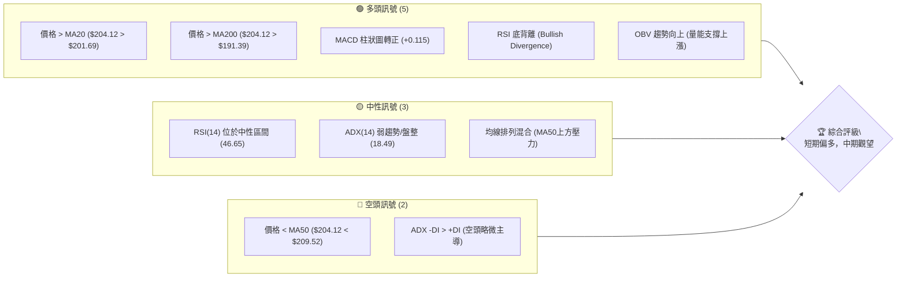

### 📊 核心指標速覽表

| 指標類別 | 指標名稱 | 當前數值 | 訊號 | 解讀 |
|----------|----------|----------|------|------|
| **價格** | 當前價格 | $204.12 | 🟢 | 位於近期支撐 S1 上方，嘗試反彈 |
| **均線** | MA20 | $201.69 | 🟢 | 價格站上短期均線，顯示短期買盤回歸 |
| **均線** | MA50 | $209.52 | 🔴 | 價格仍受中期均線壓制，上行阻力 |
| **均線** | MA200 | $191.39 | 🟢 | 價格遠高於長期均線，長期趨勢維持多頭 |
| **動能** | RSI(14) | 46.65 | 🟡 | 位於中性區間，未達超買或超賣 |
| **動能** | MACD | +0.115 (Hist) | 🟢 | MACD柱狀圖轉正，MACD線金叉訊號線，短線動能轉強 |
| **趨勢** | ADX(14) | 18.49 | 🟡 | 趨勢強度較弱，市場處於盤整或區間震盪 |
| **波動** | ATR(14) | $6.67 | 🟡 | 每日波動約 3.27%，屬於中等波動水平 |

### 🏆 技術評分卡

本評分卡綜合各項技術指標，對 NVDA 當前的技術健康狀況進行量化評估。

```
╔══════════════════════════════════════════════════════════════╗
║              技術評分卡 — NVDA (2026-07-09)                   ║
╠══════════════════════════════════════════════════════════════╣
║ 趨勢強度      ████░░░░░░░░░░░░░░░░  20/100  🟡 (ADX<25, 弱趨勢)  ║
║ 動能指標      ██████████░░░░░░░░░░  65/100  🟢 (MACD金叉, RSI底背離)║
║ 支撐穩定度    ████████████░░░░░░░░  70/100  🟢 (價格守住S1)      ║
║ 成交量配合    ████████████░░░░░░░░  75/100  🟢 (OBV支持上漲)    ║
║ 形態完整度    ██████░░░░░░░░░░░░░░  40/100  🟡 (盤整格局，形態不明顯)║
║ 均線排列      ██████░░░░░░░░░░░░░░  50/100  🟡 (混合排列，無明確多頭或空頭)║
╠══════════════════════════════════════════════════════════════╣
║ 綜合評分      ████████░░░░░░░░░░░░  58/100  🟡 (短期偏多，中期觀望)║
╚══════════════════════════════════════════════════════════════╝
```

綜合評分 58/100，顯示 NVDA 目前處於中性偏多的狀態，短期動能指標支持價格從近期低點反彈，但中期仍面臨一定的阻力，且整體趨勢強度不足。

---

## 2. 趨勢分析

本章節將從多個時間框架深入分析 NVDA 的價格趨勢，以確立其長期、中期及短期走勢。

### 🌐 多時框趨勢分析

透過月線、週線和日線的層層遞進分析，我們能更全面地理解 NVDA 的市場定位。

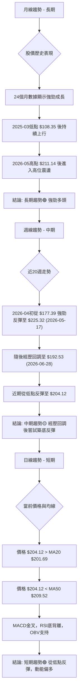

### 📈 長期趨勢 — 12個月走勢圖（Unicode）

NVDA 在過去 12 個月展現了顯著的成長，儘管近期經歷了波動，但整體上行趨勢保持不變。

```
NVDA 月線走勢圖（過去12個月）
價格軸 ($)
$240 ┤                                  ● $236.54 (52W High)
$220 ┤                               ● $211.14 (2026-05)
$200 ┤                     ● $202.47 (2025-10)     ● $204.12 (現在)
$180 ┤     ● $177.84 (2025-07)  ● $186.56 (2025-09)
$160 ┤● $158.36 (52W Low)
     └─────────────────────────────────────────────────────
      2025-07 08 09 10 11 12 2026-01 02 03 04 05 06 07
```

**走勢特徵分析表格**：

| 時間段 | 收盤價起點 | 收盤價終點 | 漲跌幅 | 走勢特徵 |
|--------|------------|------------|--------|----------|
| 2025-07 ~ 2025-10 | $177.84 | $202.47 | +13.85% | 穩健上漲，突破前期高點 |
| 2025-10 ~ 2025-11 | $202.47 | $176.98 | -12.59% | 短期回調，但未跌破重要支撐 |
| 2025-11 ~ 2026-01 | $176.98 | $191.12 | +7.99% | 恢復漲勢，再次接近前期高點 |
| 2026-01 ~ 2026-03 | $191.12 | $174.40 | -8.65% | 再次回調，動能有所減弱 |
| 2026-03 ~ 2026-05 | $174.40 | $211.14 | +21.07% | 強勁反彈，創出階段性新高 |
| 2026-05 ~ 2026-06 | $211.14 | $200.09 | -5.23% | 高位震盪回調，考驗支撐 |
| 2026-06 ~ 2026-07 | $200.09 | $204.12 | +2.01% | 短期反彈，試圖企穩 |

### 📊 中期趨勢（週線分析）

中期來看，NVDA 在經歷 2026 年 5 月高點 $211.14 之後，進入了一段回調期，並在 2026 年 6 月底觸及 $192.53 的低點。目前股價正處於從該低點反彈的階段。

```
NVDA 近期壓力與支撐示意圖 (週線視角)
價格軸 ($)
$230 ┤              R2 $232.28
$220 ┤           ▲ (高點 $225.32)
$210 ┤         R1 $214.33
$200 ┤─────────● $204.12 (現價)
$190 ┤       S1 $199.34
$180 ┤     S2 $194.74
$170 ┤   S3 $189.80
     └──────────────────────
      時間軸
```
從週線圖來看，NVDA 在 $214.33 (R1) 附近存在顯著的短期阻力，而 $199.34 (S1) 則構成近期強勁支撐。股價目前位於這些關鍵價位之間，反映出中期市場的猶豫與區間震盪特徵。

### ⚡ 趨勢強度評估（ADX 解讀）

ADX 指標用於評估趨勢的強度，而非方向。

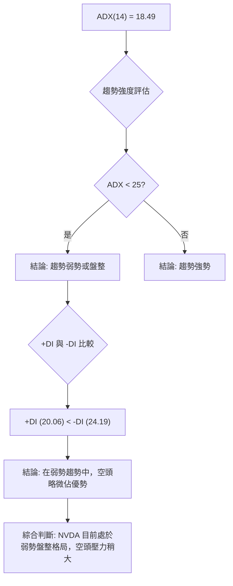

**ADX 強度對照表**：

| ADX 數值範圍 | 趨勢強度 | 市場解讀 |
|--------------|----------|----------|
| 0 - 25       | 弱勢     | 盤整、無趨勢、區間震盪 |
| 25 - 50      | 中等     | 明確趨勢形成，趨勢發展中 |
| 50 - 75      | 強勢     | 強勁趨勢，動能充沛 |
| 75 - 100     | 極強     | 極端強勢趨勢，可能過熱 |

NVDA 的 ADX(14) 值為 18.49，明確指示目前處於弱勢趨勢或盤整行情。在這種背景下，+DI (20.06) 略低於 -DI (24.19)，表明在當前的盤整格局中，空頭力量略佔上風，儘管趨勢本身並不強勁。這意味著市場缺乏明確的方向性動能，股價更容易在支撐與阻力之間來回震盪。

---

## 3. 圖表形態分析

在 ADX 指標顯示弱趨勢/盤整的市場環境下，尋找明確的幾何圖表形態會更具挑戰性。我們將專注於可觀察到的價格行為和 K 線組合。

### 🔍 形態識別系統

根據近期的價格走勢，我們觀察到 NVDA 在 2026-06-28 觸及 $192.53 的低點後，迅速反彈至 $204.12。這種走勢可能預示著一個短期底部形態，但尚未形成經典的雙底或頭肩底。

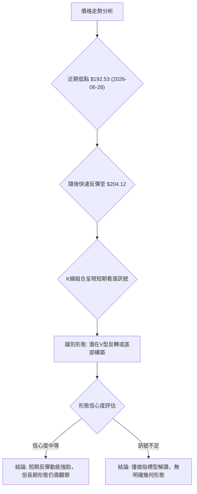

**已識別形態信心度表格**：

| 形態 | 信心度 | 判斷依據（引用數據） | 完成度 | 目標價（附計算式） |
|------|--------|----------------------|--------|--------------------|
| **V型反轉** (潛在) | 60% | 價格從 $192.53 (2026-06-28) 快速拉升至 $204.12 (2026-07-12)，MACD柱轉正，RSI底背離。顯示強勁買盤介入。 | 50% | **頸線突破目標**：若能突破近期高點 $211.14 (2026-05-31)，則形態高度 ($211.14 - $192.53 = $18.61) 可推算目標價為 $211.14 + $18.61 = $229.75。此目標價接近 R2 ($232.28)。 |
| **區間震盪** (主導) | 75% | ADX(14) = 18.49 顯示弱勢趨勢。價格在 $190-$215 區間內波動，受到 MA50 壓力與 S1 支撐。 | 90% | **區間上沿**：$214.33 (R1) / $213.48 (BB上軌) <br> **區間下沿**：$199.34 (S1) / $189.91 (BB下軌) |

*說明：由於 ADX 指示盤整，V 型反轉形態雖然動能強勁，但其後續能否持續突破，仍需時間驗證，故信心度為中等。區間震盪則為當前市場主要特徵。*

### 🕯️ 重要K線形態分析

近期週線 K 線組合顯示出短期多頭力量的集結。

| 月份 | 收盤價 | K線形態 | 解讀 | 訊號 |
|------|--------|---------|------|------|
| 2026-06-28 | $192.53 | 紡錘線/小實體陰線 | 經歷下跌後，空頭動能減弱，市場出現猶豫。 | 🟡 中性 |
| 2026-07-05 | $194.83 | 小陽線 | 股價開始反彈，收盤價高於前週，買盤嘗試介入。 | 🟢 偏多 |
| 2026-07-12 | $204.12 | 中陽線 | 股價進一步走高，收盤價突破 MA20，MACD柱狀圖轉正，確認短期反彈動能。 | 🟢 強多 |

### 📉 ASCII 走勢形態示意圖

以下示意圖展示了 NVDA 從近期低點反彈的走勢，暗示潛在的底部構築。

```
NVDA 近期走勢與潛在底部示意圖
價格軸 ($)
$215 ┤                                    R1 ($214.33)
$210 ┤
$205 ┤                                  ● $204.12 (現價)
$200 ┤                                S1 ($199.34)
$195 ┤                ● $194.83
$190 ┤              ● $192.53 (低點)
$185 ┤
     └──────────────────────────────────────────────────
      2026-06-28       2026-07-05       2026-07-12
      (低點形成)       (反彈啟動)       (動能確認)
```
圖中可見，股價在 $192.53 附近形成一個低點後，迅速向上反彈，並在 $199.34 (S1) 附近獲得支撐，顯示出短期買盤的積極性。

### 🎯 形態目標價計算

如上述 V 型反轉潛在形態，若能有效突破並站穩 $211.14 的頸線位置，則可計算其向上目標價：
*   **形態高度**：$211.14 (頸線) - $192.53 (低點) = $18.61
*   **目標價**：$211.14 (頸線) + $18.61 (形態高度) = $229.75

此 $229.75 的目標價位非常接近數據中提供的 R2 ($232.28)，增加了其可靠性。在區間震盪情境下，目標價則以區間上沿 R1 ($214.33) 或 BB上軌 ($213.48) 為主。

---

## 4. 支撐與阻力

本章節將詳細分析 NVDA 的關鍵支撐位與阻力位，這些價位是市場多空力量轉換的關鍵點，對於制定交易策略至關重要。

### 🗺️ 關鍵價位分布圖（Unicode）

以下圖示清晰展示了 NVDA 當前價格與其周邊關鍵支撐與阻力位的相對位置。

```
NVDA 價位結構分布圖
═══════════════════════════════════════════════════
$236.54 ║████████████████████████║ 強阻力 R3 (52W High)
$232.28 ║████████████████████    ║ 阻力 R2
$218.09 ║████████████████████████║ 斐波那契 23.6% 回調
$214.33 ║████████████████████████║ 關鍵阻力 R1
$209.52 ║████████████████████████║ MA50 (中期壓力)
$206.68 ║████████████████████████║ 斐波那契 38.2% 回調
$204.12 ╠════════════════════════╣ ◄ 現價
$201.69 ║▓▓▓▓▓▓▓▓▓▓▓▓▓▓▓▓        ║ MA20 (短期支撐)
$199.34 ║████████████████████████║ 近期支撐 S1
$197.45 ║████████████████████████║ 斐波那契 50.0% 回調
$194.74 ║████████████████████████║ 強支撐 S2
$191.39 ║████████████████████████║ MA200 (長期支撐)
$189.80 ║████████████████████████║ 極強支撐 S3
$188.23 ║████████████████████████║ 斐波那契 61.8% 回調
$175.09 ║████████████████████████║ 斐波那契 78.6% 回調
$158.36 ║████████████████████████║ 52W Low
═══════════════════════════════════════════════════
```

### 🚧 阻力位分析表

以下表格詳細列出了 NVDA 的關鍵阻力位及其重要性。這些價位是股價上行時可能遭遇賣壓的區域。

| 阻力級別 | 價位 | 形成原因 | 突破難度 | 重要性 |
|----------|------|----------|----------|--------|
| **R1**   | $214.33 | 近期波段高點聚類；接近布林通道上軌 ($213.48)；也接近斐波那契 23.6% 回調位 ($218.09)。 | 中等偏高 | **高**：突破此價位將確認短期反彈趨勢的延續，並可能吸引更多買盤。 |
| **R2**   | $232.28 | 過去一年波段高點聚類；V型反轉形態推算目標價 ($229.75) 接近此處。 | 高 | **中**：突破 R1 後的下一重要目標，代表股價回到較高水平。 |
| **R3**   | $236.54 | 52週高點；歷史高位區間，存在大量套牢盤壓力。 | 極高 | **高**：若能突破此價位，將打開新的上漲空間，但需要極強動能。 |

### 🛡️ 支撐位分析表

以下表格詳細列出了 NVDA 的關鍵支撐位及其重要性。這些價位是股價下行時可能獲得買盤支撐的區域。

| 支撐級別 | 價位 | 形成原因 | 守住機率 | 重要性 |
|----------|------|----------|----------|--------|
| **S1**   | $199.34 | 近期波段低點聚類；接近 MA20 ($201.69)；斐波那契 50.0% 回調位 ($197.45) 亦在此區間。 | 中等偏高 | **高**：短期反彈的關鍵防線，跌破 S1 可能會引發更多賣壓。 |
| **S2**   | $194.74 | 過去一年波段低點聚類；接近布林通道下軌 ($189.91)；斐波那契 61.8% 回調位 ($188.23) 亦在此區間。 | 中等 | **中**：若 S1 失守，S2 將成為下一道重要心理與技術防線。 |
| **S3**   | $189.80 | 過去一年波段低點聚類；接近 MA200 ($191.39) 和 52週低點 ($158.36) 上方的重要支撐。 | 高 | **高**：長期趨勢的關鍵支撐，跌破 S3 將嚴重削弱多頭信心，並可能預示中期趨勢轉弱。 |

### 📐 斐波那契回調位分析

斐波那契回調位基於 NVDA 過去 52 週的價格區間 ($158.36 至 $236.54) 計算，這些價位通常被視為潛在的支撐或阻力。

*   **0.0% (52W High)**: $236.54
*   **23.6%**: $218.09
*   **38.2%**: $206.68
*   **50.0%**: $197.45
*   **61.8%**: $188.23
*   **78.6%**: $175.09
*   **100.0% (52W Low)**: $158.36

當前價格 $204.12 位於斐波那契 38.2% 回調位 ($206.68) 和 50.0% 回調位 ($197.45) 之間。這表明股價在經歷一波下跌後，正試圖在 50% 回調位上方企穩，並挑戰 38.2% 回調位。若能有效突破並站穩 38.2% 回調位，將預示著更強勁的反彈，可能向 23.6% 回調位 ($218.09) 邁進。反之，若跌破 50% 回調位，則可能下探 61.8% 回調位 ($188.23)。

---

## 5. 技術指標深度解讀

本章節將對 NVDA 的各項技術指標進行詳細分析，並探討它們之間的相互關係，以提供更全面的市場洞察。

### 🎛️ 指標訊號總覽

以下 Mermaid 圖展示了各項指標的當前狀態及其對多空訊號的貢獻。

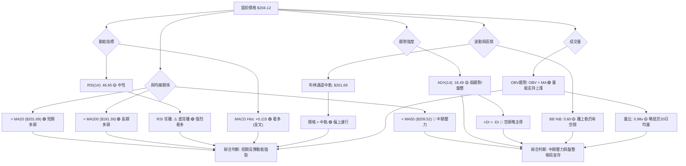

### 📈 移動平均線排列分析

NVDA 的均線系統呈現混合排列，反映了當前市場的盤整狀態，但長期支撐穩固。

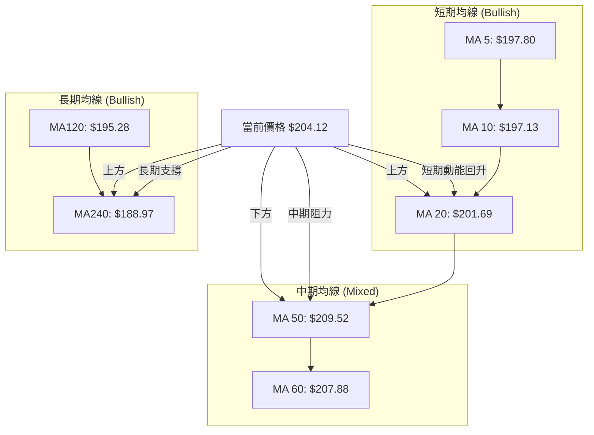

**均線排列狀態**：
*   **短期均線 (MA5, MA10, MA20)**：MA5 ($197.80) 和 MA10 ($197.13) 均低於 MA20 ($201.69)，而價格 ($204.12) 則位於 MA20 之上。這表明短期內價格已成功站穩 MA20，但更短期的均線尚未完全跟上，顯示短線反彈剛啟動。
*   **中期均線 (MA50, MA60)**：價格 $204.12 位於 MA50 ($209.52) 和 MA60 ($207.88) 之下。這意味著中期趨勢仍受到壓制，MA50 和 MA60 構成上行阻力。
*   **長期均線 (MA120, MA240)**：價格 $204.12 遠高於 MA120 ($195.28) 和 MA240 ($188.97)。這明確指出 NVDA 的長期趨勢依然強勁，這些長期均線提供了堅實的底部支撐。

**綜合解讀**：NVDA 的均線排列呈現「混合」狀態。短期內價格成功站上 MA20，顯示出反彈動能，但中期均線仍構成上行壓力。長期均線則保持多頭排列，為股價提供了強大的基礎支撐。這種結構支持了短期反彈但整體趨勢仍處於盤整的判斷。

### 📉 RSI(14) 分析

相對強弱指數 (RSI) 用於衡量價格變動的速度和幅度，判斷超買或超賣狀況。

**RSI 數值進度條**：
RSI(14): 46.65 ▓▓▓▓▓▓▓▓▓░░░░░░░░░░░░ 46.65% (中性)

*   **超買超賣區間分析**：當前 RSI 值為 46.65，位於 30-70 的中性區間內，既未達到超買 (>70) 也未達到超賣 (<30) 狀態。這表明股價在近期沒有出現過度買入或賣出的情況，為價格進一步變化提供了空間。
*   **背離判斷**：數據明確指出 "⚠️ 底背離 (Bullish Divergence)"。底背離通常發生在價格創下新低（或持平）而 RSI 指標未能創下新低，反而向上回升的情況。這是一種重要的看漲反轉訊號，表明儘管價格下跌，但下跌動能正在減弱，多頭力量正在積聚。對於 NVDA 而言，RSI 底背離是一個強烈的看漲訊號，預示著股價可能從低點反彈或形成底部。

### 📊 MACD(12/26/9) 訊號解讀

移動平均收斂擴散指標 (MACD) 用於識別趨勢的變化、方向、動量和持續時間。

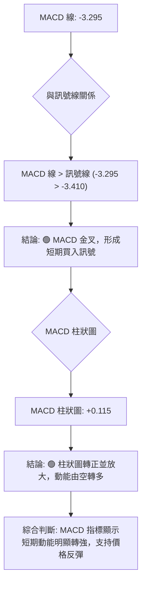
*   **MACD 線與訊號線**：MACD 線當前為 -3.295，訊號線為 -3.410。MACD 線已上穿訊號線，形成「金叉」買入訊號。這表明短期均線向上穿越長期均線，預示著股價的上升動能正在增強。
*   **MACD 柱狀圖**：MACD 柱狀圖當前數值為 +0.115，已由負轉正。這進一步確認了金叉訊號，並表明多頭動能正在積聚。柱狀圖的放大通常預示著趨勢的加速。

**綜合解讀**：MACD 指標明確發出看漲訊號，金叉與柱狀圖轉正共同支持短期價格的反彈。這與 RSI 底背離的看漲訊號相互印證，增強了短期反彈的可靠性。

### 📦 布林通道分析

布林通道 (Bollinger Bands) 用於衡量市場波動率和判斷超買超賣區域。

```
NVDA 布林通道示意圖
價格軸 ($)
$215 ┤                                  ● BB上軌 ($213.48)
$210 ┤
$205 ┤                      ● $204.12 (現價)
$200 ┤              ● BB中軌 ($201.69)
$195 ┤
$190 ┤           ● BB下軌 ($189.91)
     └───────────────────────────────────────
      時間軸
```

*   **布林通道數值**：
    *   BB 上軌: $213.48
    *   BB 中軌 (MA20): $201.69
    *   BB 下軌: $189.91
    *   BB %B: 0.60
*   **價格位置**：當前價格 $204.12 位於布林通道中軌 ($201.69) 和上軌 ($213.48) 之間。BB %B 值為 0.60，表示價格在中軌上方，但距離上軌仍有一定空間。
*   **市場解讀**：價格在中軌上方運行通常被視為偏多的訊號，表明短期內買盤力量佔優。然而，由於 ADX 指示弱勢趨勢，價格在通道內運行更可能表現為區間震盪，而非單邊強勁趨勢。價格向上方上軌 $213.48 測試的可能性較大，而中軌 $201.69 則成為重要的短期支撐。若價格能突破上軌，則可能預示著趨勢的增強，但目前看來，在弱趨勢背景下，價格觸及上軌後回調的機率較大。

### 💹 成交量分析（量價配合度）

成交量是判斷價格走勢可靠性的重要輔助指標。

*   **最新成交量**：146,904,500 股
*   **20日均量**：149,920,480 股 (量比: 0.98x)
*   **50日均量**：162,676,404 股
*   **OBV 趨勢**：OBV > MA → 量能支撐上漲 🟢

**量價配合分析**：
當前成交量 (146,904,500) 略低於 20 日均量 (149,920,480)，量比為 0.98x，表明近期反彈的量能並未顯著放大。然而，OBV 趨勢顯示 OBV 線位於其移動平均線之上，這是一個積極的訊號。OBV 的上升通常意味著資金流入，即使單日成交量略低於均量，但累積的買盤壓力仍在增加。這表明近期價格的反彈得到了量能的確認和支持，多頭力量正在逐步積累，但缺乏爆發性的放量。

**綜合解讀**：儘管成交量未見巨幅放大，但 OBV 的積極趨勢與價格反彈相配合，共同確認了短期多頭動能的有效性。在盤整市場中，即使是溫和的量能配合，也足以推動價格在區間內運行。

---

## 6. 動能與波動率

本章節將評估 NVDA 的動能強度和波動性特徵，這對於理解其短期交易機會和風險管理至關重要。

### ⚡ 動能評估四象限

動能評估四象限將股票分為四類，根據其動能強度和波動率提供不同的交易啟示。

| 象限 | 動能 | 波動 | 當前狀態 | 評估 | 訊號 |
|------|------|------|----------|------|------|
| Q1   | 強   | 低   | -        | 最佳機會 (強勁趨勢，低風險) | 🟢 |
| Q2   | 弱   | 低   | -        | 謹慎觀望 (缺乏方向，波動小) | 🟡 |
| Q3   | 強   | 高   | ✓        | 高風險高收益 (趨勢明確，波動大) | 🟡 |
| Q4   | 弱   | 高   | -        | 避免進場 (缺乏方向，波動大) | 🔴 |

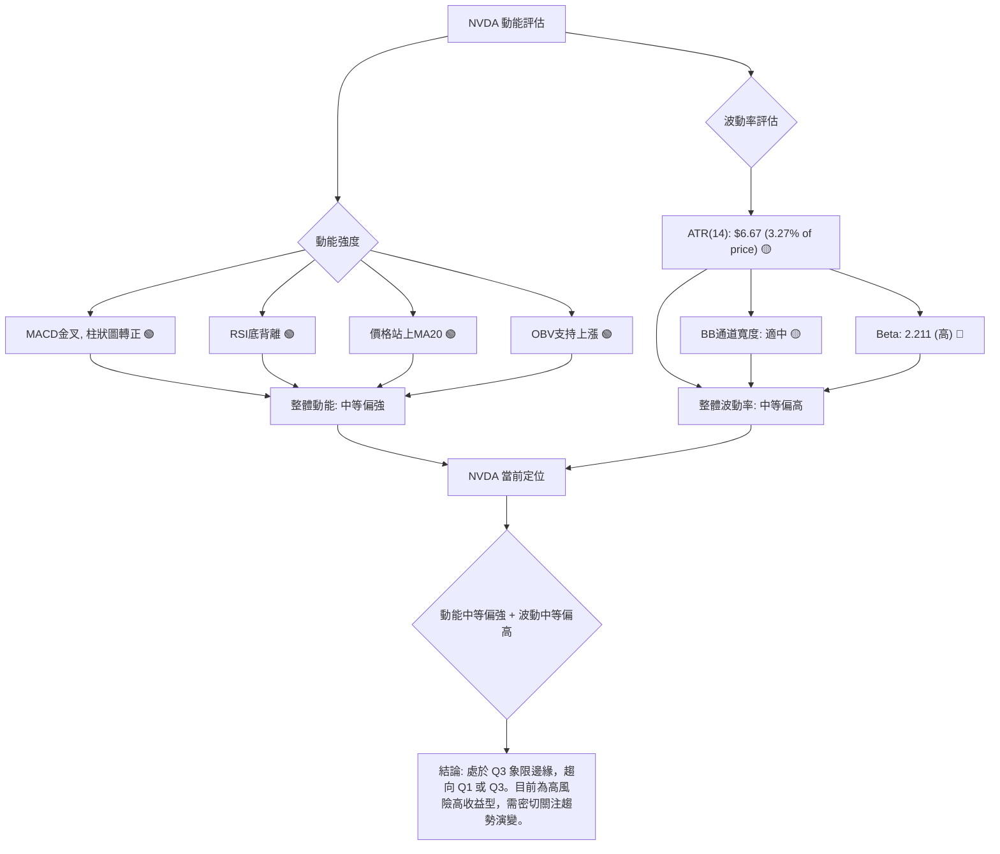
**綜合評估**：NVDA 目前的動能指標（MACD金叉、RSI底背離、OBV上漲）顯示出中等偏強的短期上升動能。同時，ATR 顯示中等波動，但高 Beta 值 (2.211) 意味著其相對於市場的波動性較高。綜合來看，NVDA 處於一個動能正在積聚且波動性相對較高的狀態，可將其定位在「高風險高收益」的 Q3 象限邊緣，並觀察其能否進一步強化動能並降低波動，向「最佳機會」Q1 象限發展。

### 📊 ATR 波動率分析

平均真實波幅 (ATR) 用於衡量市場的波動幅度，幫助交易者設定止損和目標。

*   **ATR(14)**: $6.67 (佔當前價格 $204.12 的 3.27%)

**分析**：NVDA 的 ATR 為 $6.67，這表示在過去 14 天內，NVDA 的平均每日價格波動範圍約為 $6.67。這個數值對於 $204.12 的股價而言，屬於中等偏高的波動水平 (約 3.27%)。
*   **止損距離建議**：對於短線交易者，可以將止損點設置在當前價格下方 1-2 倍 ATR 的距離。例如，若進場價為 $204.12，則 1 倍 ATR 止損為 $204.12 - $6.67 = $197.45 (接近斐波那契 50% 回調位)，2 倍 ATR 止損為 $204.12 - (2 * $6.67) = $190.78 (接近 S3 $189.80)。這能有效避免被日常波動震出，同時控制風險。
*   **交易區間參考**：ATR 也可用於估計每日的潛在交易區間。$6.67 的 ATR 意味著 NVDA 在一天內可能產生約 $6.67 的價格變化，交易者應據此調整預期收益和風險。

### 📐 Beta 與市場相關性

Beta 值衡量股票相對於整體市場的波動性，是評估系統性風險的重要指標。

*   **Beta**: 2.211

**分析**：NVDA 的 Beta 值為 2.211，這是一個非常高的數值。
*   **市場相關性**：Beta 值大於 1 表示 NVDA 的股價波動幅度大於整體市場。具體而言，2.211 的 Beta 意味著當整體市場（如標普 500 指數）上漲或下跌 1% 時，NVDA 的股價預計將上漲或下跌約 2.211%。
*   **影響**：
    *   **高風險高回報**：高 Beta 股票在牛市中可能帶來更高的回報，但在熊市或市場回調時，其跌幅也可能遠超市場。
    *   **波動性**：這解釋了 NVDA 股價的高波動性，交易者需要為其劇烈的價格波動做好準備。
    *   **策略考量**：由於其高 Beta 特性，NVDA 更適合那些願意承擔較高風險以追求更高回報的投資者。在市場情緒不穩時，其股價可能會表現出更大的不確定性。

---

## 7. 多時框架總結

本章節將彙整各時間框架的技術分析結果，透過評分表和綜合訊號矩陣，提供一個清晰的多時框架收斂結論。

### 📋 時框架評分表

| 時框架 | 趨勢方向 | 動能 | 均線排列 | 形態 | 綜合評分 | 建議 |
|--------|----------|------|----------|------|----------|------|
| **長期** (月線) | 🟢 強勁多頭 | 🟢 穩健向上 | 🟢 多頭排列 | 🟡 高位震盪 | 8/10 | 長期持有 |
| **中期** (週線) | 🟡 震盪回調後反彈 | 🟢 築底回升 | 🟡 混合排列 | 🟡 區間震盪 | 6/10 | 區間操作/觀望 |
| **短期** (日線) | 🟢 反彈向上 | 🟢 強勁動能 | 🟡 混合偏多 | 🟢 V型反轉潛在 | 7/10 | 短線偏多 |

### 🔲 綜合訊號矩陣

| 指標/時框 | 長期 (月線) | 中期 (週線) | 短期 (日線) | 一致性 |
|-----------|-------------|-------------|-------------|--------|
| **趨勢**  | 🟢 多頭      | 🟡 盤整      | 🟢 反彈      | 🟡 中性偏多 |
| **動能**  | 🟢 強勁      | 🟢 築底      | 🟢 強勁      | 🟢 高 |
| **均線**  | 🟢 多頭排列  | 🟡 混合排列  | 🟡 混合偏多  | 🟡 中性偏多 |
| **形態**  | 🟡 高位震盪  | 🟡 區間震盪  | 🟢 V型反轉潛在 | 🟡 中性偏多 |
| **RSI**   | 🟡 中性      | 🟡 中性      | 🟢 底背離    | 🟡 中性偏多 |
| **MACD**  | 🟢 多頭      | 🟡 震盪      | 🟢 金叉      | 🟢 高 |
| **ADX**   | 🟡 趨勢減弱  | 🟡 弱趨勢    | 🟡 弱趨勢    | 🟢 高 (一致弱) |
| **OBV**   | 🟢 上漲      | 🟢 上漲      | 🟢 上漲      | 🟢 高 |

### ⚖️ 多時框收斂結論

根據 ADX(14) 值為 18.49，明確指示 NVDA 目前處於**弱勢趨勢或盤整行情**。根據多時框架收斂規則，在盤整行情下，應以日線布林通道上下軌為主要交易區間，並以短期指標來尋找進場時機。

綜合分析：
*   **長期趨勢**：NVDA 仍處於強勁的多頭趨勢中，股價遠高於長期均線。
*   **中期趨勢**：經歷了一段回調後，目前正處於築底反彈階段，但上方仍有 MA50 等中期阻力。
*   **短期趨勢**：日線圖顯示價格已站上 MA20，MACD 形成金叉，RSI 呈現底背離，OBV 量能也支持上漲。這些指標共同發出強烈的短期看漲訊號。

**收斂結論**：儘管 NVDA 整體處於盤整格局 (ADX < 25)，但短期內多項技術指標（MACD金叉、RSI底背離、OBV上漲、價格站上MA20）均顯示出**強勁的短期反彈動能**。因此，在當前盤整區間內，主導策略應為**偏多操作**，尋求短期反彈的交易機會，並密切關注價格能否突破區間上沿。中期阻力位 MA50 ($209.52) 和 R1 ($214.33) 將是短期反彈的關鍵考驗。

---

## 8. 交易策略建議

本章節將根據多時框架分析的收斂結論，為 NVDA 制定具體的交易策略，並提供詳細的進場、止損和目標價位。

### 🗺️ 策略決策流程圖

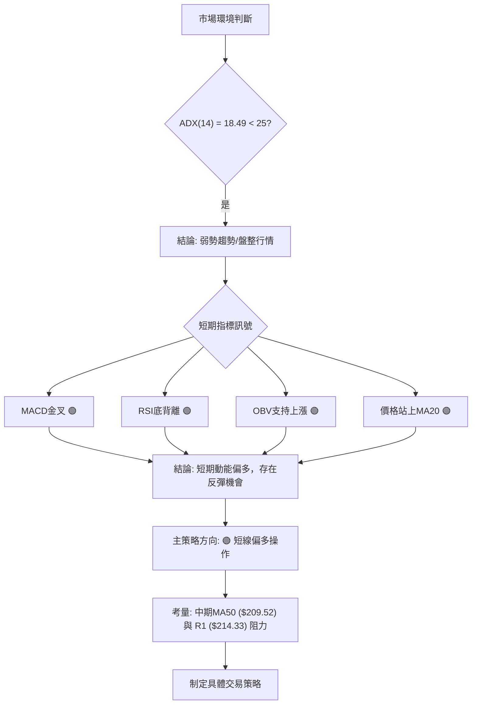

### 🧭 策略路由

**當前主策略方向 = 🟢 短線偏多操作 (依評分 58/100，短期動能強勁)**

基於技術評分卡和多時框架收斂結論，NVDA 目前處於短期反彈動能強勁的盤整格局。因此，主推多頭策略，旨在捕捉從近期低點反彈至上方阻力位的機會。空頭策略僅作為反轉風險的觸發點。

### 🎯 價格情境階梯（Price Scenarios）

以下情境劇本以當前價格 $204.12 為基準，描述了股價在不同條件下的潛在走向。

| 觸發條件 | 下一目標 | 後續延伸 | 情境含義 |
|----------|----------|----------|----------|
| **突破 R1 $214.33** | R2 $232.28 | R3 $236.54 | 短線轉強，有望挑戰中期高點，甚至 52 週新高。 |
| **站穩現價區間** | — | — | 股價在 $199.34 (S1) 和 $214.33 (R1) 之間震盪，等待突破。 |
| **跌破 S1 $199.34** | S2 $194.74 | S3 $189.80 | 短期反彈失敗，中期轉弱，可能重新探底。 |

### 📊 情境機率分佈

| 情境 | 機率 | 主要依據 |
|------|------|----------|
| 繼續上行 / 反彈 | 55% | MACD金叉、RSI底背離、OBV上漲、價格站上MA20。短期動能指標全面看多。 |
| 區間震盪 | 35% | ADX弱趨勢/盤整，MA50/MA60構成中期阻力，價格處於布林通道中上軌之間。 |
| 回落 / 再探底 | 10% | 若 S1 ($199.34) 失守，或市場整體情緒惡化，可能再次回調。 |

### 🟢 主策略詳情（短線偏多）

基於當前短期多頭訊號強勁且 ADX 處於盤整，我們建議採取短線多頭操作，目標區間上沿。

| 策略要素 | 策略 A (短線反彈) | 策略 B (突破追高 - 激進) |
|----------|-------------------|-------------------------|
| 進場條件 | 價格維持在 MA20 ($201.69) 上方，或回踩 MA20 獲得支撐 | 價格突破 R1 ($214.33) 並站穩 |
| 進場價格 | $202.00 - $204.12 (現價附近，接近 MA20) | 突破 $214.33 後追高，例如 $215.00 |
| 目標價 T1 | $214.33 (R1) | $232.28 (R2) |
| 目標價 T2 | $218.09 (斐波那契 23.6%) | $236.54 (R3 / 52W High) |
| 止損價格 | $199.34 (S1) | $210.00 (跌破 MA50 或 R1 回踩失敗) |
| 風險報酬比 | **策略 A**: (214.33 - 203.00) : (203.00 - 199.34) = 11.33 : 3.66 ≈ **3.1:1** | **策略 B**: (232.28 - 215.00) : (215.00 - 210.00) = 17.28 : 5.00 ≈ **3.4:1** |
| 成功機率 | 55% | 40% (需強勁突破動能) |
| 建議倉位 | 10-15% | 5-10% |

*   **策略 A 解釋**：在當前價格 ($204.12) 附近進場，止損設置在近期關鍵支撐 S1 ($199.34) 之下，以捕捉股價向 R1 ($214.33) 反彈的機會。此策略風險較低，報酬潛力可觀。
*   **策略 B 解釋**：若股價能放量突破 R1 ($214.33)，則確認短期強勢，可考慮追高至 R2 ($232.28) 或 R3 ($236.54)。此策略風險較高，但潛在報酬也更大，適合激進型交易者。

### 🔴 反向風險觸發點（對沖提示）

以下是可能推翻主策略的關鍵空頭訊號，供風險管理和對沖參考：

*   **跌破 S1 ($199.34)**：若股價跌破此關鍵支撐，將意味著短期反彈失敗，可能引發進一步下跌，需考慮止損或反向對沖。
*   **MACD 再次死叉**：若 MACD 線再次向下穿越訊號線，柱狀圖轉負，則短期動能將轉弱。
*   **RSI 跌破 40**：若 RSI 跌破 40，顯示市場力量偏向空頭。
*   **成交量萎縮同時價格下跌**：若在下跌過程中伴隨成交量放大，則空頭力量可能增強。

### ⭐ 整體訊號強度評星

```
做多訊號強度：★★★★☆  (4/5星)
做空訊號強度：★★☆☆☆  (2/5星)
整體可信度：  ★★★☆☆  (3/5星)
```
做多訊號強度較高，主要由於短期動能指標的強烈支持。做空訊號相對較弱，僅限於中期壓力與弱趨勢。整體可信度為中等，因為 ADX 指示盤整，上行空間可能受限於中期阻力。

---

## 9. 風險提示與監控

本章節將列出 NVDA 交易中需要關注的風險因素和監控指標，並提供風險管理建議。

### ✅ 關鍵監控指標 Checklist

以下是交易 NVDA 時應密切關注的技術指標清單，以確保及時調整策略。

```
╔══════════════════════════════════════════════════════════════╗
║              NVDA 關鍵監控指標清單                             ║
╠══════════════════════════════════════════════════════════════╣
║ ├─ 價格行為：是否能持續站穩 MA20 ($201.69) 和 S1 ($199.34)？     ║
║ ├─ 阻力突破：能否有效突破 R1 ($214.33) 和 MA50 ($209.52)？       ║
║ ├─ MACD 訊號：金叉是否維持，柱狀圖是否持續為正且放大？           ║
║ ├─ RSI 狀態：是否保持在中性區間上方，避免跌破 40？               ║
║ ├─ ADX 趨勢：ADX 是否開始向上突破 25，確認趨勢形成？             ║
║ ├─ 成交量：價格上漲時成交量是否有效放大，下跌時是否縮量？         ║
║ ├─ 布林通道：價格是否能保持在中軌上方，通道是否收斂或擴張？     ║
║ └─ 斐波那契：能否站穩 38.2% 回調位 ($206.68)？                   ║
╚══════════════════════════════════════════════════════════════╝
```

### ⚠️ 風險場景分析

針對 NVDA 未來走勢，我們設想以下三種情境：

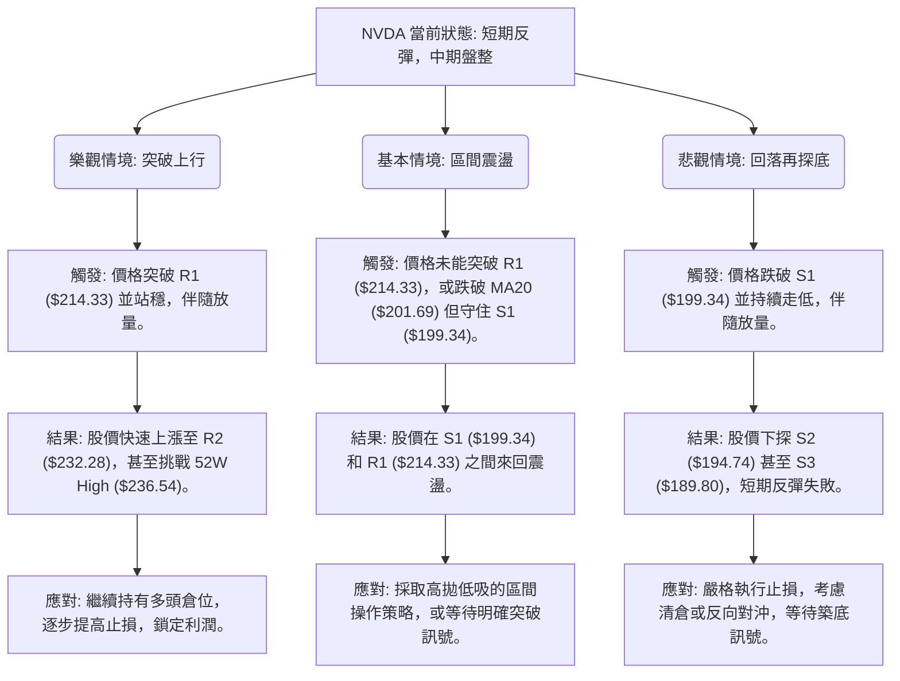

### 🛡️ 風險管理重要提醒

1.  **高 Beta 風險**：NVDA 的 Beta 值高達 2.211，意味著其股價波動遠大於市場。在市場整體情緒不佳時，NVDA 的跌幅可能更大，投資者需有心理準備並控制好倉位。
2.  **倉位管理**：鑑於當前市場處於盤整格局，且 NVDA 波動性較高，建議分批建倉，並嚴格控制單一股票的倉位比例，避免重倉。對於短期交易，建議將倉位控制在總資產的 5-15% 之間。
3.  **止損設定**：務必為每筆交易設定明確的止損點。一旦觸及止損，應堅決執行，避免因情緒影響而擴大虧損。 ATR 是一個很好的止損參考指標。
4.  **獲利了結**：在盤整市場中，價格往往難以形成單邊大趨勢。當股價達到目標價位時，建議分批獲利了結，鎖定利潤，避免因貪婪而錯失出場機會。
5.  **密切監控**：由於 ADX 指示弱趨勢，市場方向可能隨時轉變。需密切監控上述關鍵指標，尤其關注 MACD 和 RSI 的變化，以及成交量是否配合價格走勢。

---

## 📋 報告總結

```
NVDA 技術分析報告總結
════════════════════════════════════════════════════════
報告日期：2026-07-09
當前價格：$204.12
分析評級：⚖️ 短期偏多，中期觀望

關鍵結論：
├─ 長期趨勢：🟢 強勁多頭，基本面穩固。
├─ 中期趨勢：🟡 經歷回調後嘗試築底反彈，仍處於區間震盪。
├─ 短期趨勢：🟢 短期反彈動能強勁，多項指標發出看漲訊號。
├─ 關鍵支撐：S1 $199.34，S2 $194.74，MA20 ($201.69)。
├─ 關鍵阻力：R1 $214.33，MA50 ($209.52)，R2 $232.28。
└─ ADX 指示：ADX(14) 18.49，市場處於弱勢趨勢/盤整格局。

最優策略組合：
1. 🥇 最佳機會（短線反彈）：
   - 進場：$202.00 - $204.12
   - 止損：$199.34
   - 目標 T1：$214.33
   - 目標 T2：$218.09
   - 風險報酬比：約 3.1:1
2. 🥈 次選機會（區間操作）：
   - 在 S1 ($199.34) 附近低吸，R1 ($214.33) 附近高拋。
   - 需嚴格止損並分批操作。
3. 🥉 保守選擇（等待突破）：
   - 等待股價放量突破 R1 ($214.33) 並站穩，或跌破 S1 ($199.34) 確認趨勢。
   - 避免在盤整區間內盲目追漲殺跌。
════════════════════════════════════════════════════════
```

---

> ⚠️ **免責聲明**：本報告為 AI 自動生成之技術分析，所有數據及估算均基於提供的歷史價格資訊。本報告**僅供研究與學術參考**，**不構成任何投資建議**。投資有風險，入市需謹慎。

---

*報告生成時間：2026-07-09 ｜ 數據來源：Yahoo Finance ｜ 分析框架：多時框技術分析*