<details>
<summary>📊 靜態圖表 (點擊展開)</summary>
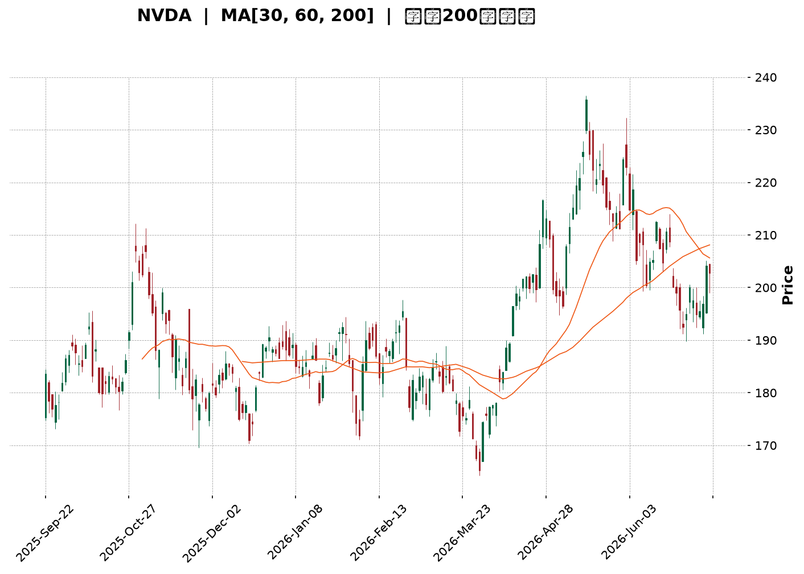
</details>

<html>
<head><meta charset="utf-8" /></head>
<body>
    <div style="height:500px; width:100%;">                        <script>window.PlotlyConfig = {MathJaxConfig: 'local'};</script>
        <script charset="utf-8" src="https://cdn.plot.ly/plotly-3.7.0.min.js" integrity="sha256-jvTGqxNp8AGWEcvNLVuKr+8j5dGe9Yw51LQkmDH+IYA=" crossorigin="anonymous"></script>                <div id="candlestick-chart" class="plotly-graph-div" style="height:100%; width:100%;"></div>            <script>                window.PLOTLYENV=window.PLOTLYENV || {};                                if (document.getElementById("candlestick-chart")) {                    Plotly.newPlot(                        "candlestick-chart",                        [{"close":{"dtype":"f8","bdata":"AAAAAODyZkAAAAAAIk1mQAAAAABrHmZAAAAAwHQ1ZkAAAABAdEVmQAAAAMCPumZAAAAAgOdRZ0AAAADABWdnQAAAAADRm2dAAAAAQC5zZ0AAAADAoDBnQAAAAEChIGdAAAAAANuiZ0AAAABAkBFoQAAAAAB65GZAAAAAIJSJZ0AAAADAU4BmQAAAAKDteWZAAAAAAEi5ZkAAAACAZeZmQAAAAKDW02ZAAAAAwHukZkAAAACgU4hmQAAAAOB6xGZAAAAAQKpHZ0AAAADgAe9nQAAAAABBIGlAAAAAgI3gaUAAAABgxFtpQAAAAAD4TmlAAAAA4G7baUAAAADAYdVoQAAAAOAIZmhAAAAAQOaBZ0AAAACgI4RnQAAAAKDm4GhAAAAAAHEkaEAAAABg6zhoQAAAAADdWmdAAAAAoMXEZ0AAAABgi1JnQAAAAADiqmZAAAAAAPxPZ0AAAABg2JNmQAAAACCIW2ZAAAAAgPXQZkAAAACAnTlmQAAAAMCvh2ZAAAAAwGAfZkAAAADgznxmQAAAACAVrmZAAAAAwD9yZkAAAADA1+tmQAAAAODNzGZAAAAAYEcxZ0AAAABAuB5nQAAAAECk+GZAAAAAQHKdZkAAAABAVuBlQAAAAID5CGZAAAAAgLs2ZkAAAADAyF1lQAAAAKAtxGVAAAAA4F2fZkAAAAAAw\u002fVmQAAAAIBkpmdAAAAAgDGTZ0AAAABAodBnQAAAAMC2hmdAAAAAgPRwZ0AAAABgrU9nQAAAAIDfmmdAAAAAoIODZ0AAAAAgW2dnQAAAAEAxo2dAAAAAoPUgZ0AAAAAgMxtnQAAAAIDCHWdAAAAAIJk5Z0AAAACgKeRmQAAAAMBGYWdAAAAAgAlHZ0AAAACA7kFmQAAAAEDs6WZAAAAAQI8aZ0AAAABgHXVnQAAAAKC3TmdAAAAAQFCQZ0AAAAAAT\u002fBnQAAAAID8D2hAAAAAQNTjZ0AAAADgMjNnQAAAAECRimZAAAAAQMfFZUAAAADA3HtlQAAAAIDMLGdAAAAAYPPAZ0AAAAAA9JBnQAAAAGBFwWdAAAAAoMFdZ0AAAACAmtlmQAAAAEC4HmdAAAAAwAh\u002fZ0AAAACAeXxnQAAAAGDpuWdAAAAAwETxZ0AAAADA3RpoQAAAAMCUcWhAAAAA4CgcZ0AAAAAAxiVmQAAAAEALz2ZAAAAAwEmBZkAAAACA9uBmQAAAAACQ6mZAAAAAoO45ZkAAAADAe9RmQAAAAABSGGdAAAAAwPVAZ0AAAADgeuRmQAAAAAAAiGZAAAAAQArnZkAAAACAwr1mQAAAAMDMjGZAAAAAgOtRZkAAAABgZpZlQAAAAOB69GVAAAAAYGbmZUAAAACAwlVmQAAAACCuZ2VAAAAA4KPwZEAAAACgcKVkQAAAAMDMzGVAAAAAAAD4ZUAAAADgeixmQAAAAOB6NGZAAAAAQDNDZkAAAABgj8JmQAAAAMAe\u002fWZAAAAAACmUZ0AAAACA66lnQAAAAOBRkGhAAAAAANfbaEAAAABAM8toQAAAAIDCNWlAAAAAgOtBaUAAAAAAKfxoQAAAAAAAUGlAAAAA4Hr0aEAAAADgowhqQAAAACCFE2tAAAAAoHClakAAAAAAAChqQAAAAIA98mhAAAAAYGbOaEAAAAAgXM9oQAAAAAAAkGhAAAAAYI\u002f6aUAAAAAAAHBqQAAAAGBm5mpAAAAAgBRua0AAAADA9ZhrQAAAAGCPOmxAAAAAIK53bUAAAACAPSpsQAAAAIA9ymtAAAAAIIWTa0AAAABACu9rQAAAAOBRcGtAAAAAYI\u002fqakAAAAAghdtqQAAAAEAzk2pAAAAAAADIakAAAADgemRqQAAAACCFC2xAAAAAgD3aa0AAAAAAANhqQAAAAMAeVWtAAAAAQDOjaUAAAADgehRqQAAAAIAUBmpAAAAAoHANaUAAAAAA15tpQAAAAIAUpmlAAAAAYGaOakAAAADAHu1pQAAAAMDMlGlAAAAAgBRWakAAAADAzBRqQAAAAKBHAWlAAAAAAADgaEAAAAAgrndoQAAAAMD1EGhAAAAAQApfaEAAAABA4QJpQAAAAGCPsmhAAAAAYI9aaEAAAACgmXFoQAAAAIDCnWhAAAAAANeDaUAAAADA9VhpQA=="},"high":{"dtype":"f8","bdata":"DQGWp\u002fMQZ0CGYzOJzMxmQPuIq\u002fhTeGZAsMmB0K+HZkDRAz40AnhmQOoMJJFa\u002f2ZAIAOkropqZ0AcntCw0YNnQP85tM7t4GdA60Ib6dnKZ0BK2+G6s2ZnQAq4r4JBoWdAut0mr4iyZ0CT1jzr6WhoQInk2gonc2hAY0vcI9rCZ0DSlCxV8xhnQE9Ee7cwG2dAWieU7VDoZkBDyW21jQJnQD3xoNK\u002fJWdAPj+NKKPYZkDCSYGIb+1mQLAyoxdR4GZAxro6iWFuZ0AlL49KU\u002f9nQHjtBxgWZGlAgA7IvlWFakAb+wFPZcRpQGByNjJP\u002fmlAwqrJHCNqakCGp\u002fi\u002fUn5pQHRshzG6XGlA\u002ffXkSyWzaEC3ouA4lIlnQJEwHLNg\u002fWhABC6U18BsaECsJu++yntoQMY1E0Fo7WdAJUqjHqbfZ0C3ZEH3VZ9nQA9352fzGGdAjIFAC9x6Z0Be0LWuT39oQPfhR4RFEWdANuFYBVvvZkBk9q5xfkRmQGoc2T163GZAOhiNUKZoZkC7CYuI94hmQFIws7h3NGdAfwSXTcLNZkC83rEeUhBnQHGInuDMFGdAPij6qax\u002fZ0C+LOLqtzZnQIEeAd8JL2dA2xK3E+2pZkBAoWBq7NlmQJMmWo4hTWZAbDOnCF9PZkB3mzrz2gNmQF7FvJt+BGZAx2zJ6xWuZkDBsp0KzQRnQKT2YXI7qmdAw8zy\u002fcqcZ0BFEcMKvxVoQKJirCL+l2dAdOd3W1qfZ0A5fIgTl9FnQFVbzfBsHWhA1knWLtMzaECiWItwGwVoQDQUZR+C62dA38tboEWxZ0AT8++XjkpnQDoujgiEY2dAYaj3ujGDZ0AmwRSKZg5nQFwwbVMStmdAQtfTAcDNZ0AW038W2MtmQCBVRNbWK2dAXSX0CB5FZ0D4h9Mk37JnQLmwZjODo2dAki3vt6u\u002fZ0B7B9YB3gpoQIXB31EGL2hAoHiX4ldPaEDruvRLRclnQEqjkT5RSGdAdCARvD9yZkD2y\u002fkO7xlmQM3MbgutX2dAC3wo5cg0aEBQsKDABg9oQGUOtjP8J2hA5\u002fgDSy8zaECLPQTsrG9nQEF0mMh5ZGdAREKhkILLZ0D67uIDb41nQKF+IwY7ymdASzzDbxA+aEA5HZX3TThoQAeD7VTRs2hAVt2+dPFIaEA7UI9bkNJmQIEVzxBn7mZAbMV3f3ycZkDHRqeDFBZnQGDIUO6ZAWdAVqwMzwDYZkB7QHuizdxmQGbmjuLBTWdAAAAAANdzZ0AAAACAFB5nQAAAAEDhQmdAAAAAACmcZ0AAAADAzCxnQAAAAAAp7GZAAAAAIFx\u002fZkAAAADgUUhmQAAAAADXS2ZAAAAAQAoHZkAAAABACqdmQAAAAOBREGZAAAAAQApfZUAAAABgZi5lQAAAAADX02VAAAAAANcrZkAAAAAgri9mQAAAAKBHOWZAAAAAIFxHZkAAAADgUShnQAAAAGCPAmdAAAAAAADAZ0AAAADAHrVnQAAAAOBRkGhAAAAAwMwMaUAAAABAM\u002ftoQAAAAGBmNmlAAAAAoHBFaUAAAAAAAFhpQAAAAAAAUGlAAAAAYI96aUAAAABgZl5qQAAAAGCPGmtAAAAAIFzXakAAAABACpdqQAAAAKCZSWpAAAAAAABgaUAAAAAgXDdpQAAAACCuB2lAAAAA4KMIakAAAABgZsZqQAAAAKCZOWtAAAAAoJnJa0AAAAAAAPhrQAAAAEDhemxAAAAAoEeRbUAAAAAAAPBsQAAAAAAAwGxAAAAAIFwPbEAAAAAAKURsQAAAAMDMbGxAAAAA4FGga0AAAACAwkVrQAAAAMDMxGpAAAAA4KPwakAAAAAghTtrQAAAAADXG2xAAAAAwPUIbUAAAACAPdprQAAAAEAzs2tAAAAAANfbakAAAABACk9qQAAAAMDMbGpAAAAAQArnaUAAAADAHrVpQAAAAIA94mlAAAAAYLiWakAAAAAgrm9qQAAAAGC4JmpAAAAA4HpsakAAAAAgrr9qQAAAAOCjeGlAAAAAoHA1aUAAAACgmRlpQAAAAKCZcWhAAAAAgMKFaEAAAAAAKRRpQAAAAEAz+2hAAAAAgOsBaUAAAACgmbFoQAAAAMAezWhAAAAAwB6laUAAAABA4ZJpQA=="},"hovertemplate":"\u003cb\u003e%{x|%Y-%m-%d}\u003c\u002fb\u003e\u003cbr\u003e\u958b: $%{open:.2f}\u003cbr\u003e\u9ad8: $%{high:.2f}\u003cbr\u003e\u4f4e: $%{low:.2f}\u003cbr\u003e\u6536: $%{close:.2f}\u003cextra\u003e\u003c\u002fextra\u003e","low":{"dtype":"f8","bdata":"DxcFQRvWZUC9KjXfGQZmQE1treku7GVA9QCAWY2jZUCeHoouJd1lQJMEKGCbiWZAEme21riuZkBDD+VgJ\u002fxmQDk3F19CgWdAL4DDQ4IrZ0AN9dd86ulmQAMAYo9a\u002f2ZA4krfz59QZ0AZn8ebP+FnQEEqmd\u002f1wGZAY7BhHxE+Z0B\u002fDgWsxHVmQFgC3iioKGZAmNekNQJ4ZkCeTcVeXndmQJgOgbG4tmZAaHNC2fd4ZkCtyl\u002fqshdmQEAQ0uGleGZAZF3e21rvZkD2l6cAGY1nQKT1MDNy\u002fGdA3\u002fUcqD2YaUCgas2UaSxpQCy7tMCHQWlAhy4FkDKxaUCqZglvEL1oQIpd48AdVGhAedJWZ4FLZ0BF8UDufVxmQGbh7FqZOGhAQ\u002fpPjO3oZ0DJZ5EmfeNnQLL4TNWN+mZAp1uP\u002f+yRZkADvxutlwlnQAIgvykrdGZATEU20urZZkD76u11kXpmQEXx4vkmnWVAbCMVdb0OZkDK2\u002fQQATFlQC3BF9ENR2ZAivEpM2EPZkA67B1cJrVlQC3zQBBef2ZAyFqADuRiZkDLY+qjaH5mQF\u002f6QIrOnGZAPpt15XvMZkAtcEE77OlmQGelieX2wGZAQ8tiqYgTZkBb5WqNidNlQAgX8i6o4GVAHo7kP3\u002fcZUB1R3gHoEllQMqUd0fxeWVAZGrRD5MKZkB4SjNY4spmQO9AE6x73GZAZVdHhY5SZ0Di6T6frH9nQBo6WEbMPGdAb1s3pW9dZ0AvLyKBW09nQJrL+2L+h2dAzu2DP3pEZ0CdUamv6llnQFGOiMGYUWdAE57h9mb2ZkBD1SEnH\u002fVmQJvy7rlS4GZAdU2EcXvsZkCFc8NpSZlmQBJjqtE8SmdAP0sJ0TxCZ0COlj5UNjNmQPkLPa59TGZA1wVZ53D9ZkCvnYag6llnQOiecrZbP2dAjy08ABQ2Z0Bd7pgejbpnQPuQR\u002fyYQWdAHytvPLauZ0CJ8s8S1xtnQOu\u002fvvINB2ZA9trZgtJ8ZUDXfIjgqWBlQC\u002feocvl0mVAW04q0xT+ZkAvb7CPg4NnQCIIQzFQmGdAsVDNMP9PZ0DbQWLKkLJmQPayGRFzZWZAtRiGCv9XZ0D8chB+zDRnQKWSNBjCPWdAO1N2XzuyZ0D8HJCqeWxnQAjpAKnxOGhAwjO3wOsJZ0CfqN3b2gtmQDarhHkt1GVARkV4IyIdZkDkah2ym4FmQMs2cCvaO2ZAJJONEe8ZZkDV3OqknfFlQG1EFzkBwGZAAAAAYGYOZ0AAAAAAALhmQAAAAIAUfmZAAAAAwB6tZkAAAACAwrVmQAAAAGCPimZAAAAAoEf5ZUAAAABACndlQAAAAOBR2GVAAAAAIFy\u002fZUAAAABAMxtmQAAAAOB6ZGVAAAAA4FHgZEAAAADgo4hkQAAAAGC43mRAAAAAAADYZUAAAAAA12tlQAAAAOBR+GVAAAAAwB61ZUAAAACgmYlmQAAAAADXk2ZAAAAAoJkJZ0AAAAAgrjdnQAAAAOCj2GdAAAAAIK53aEAAAACA63loQAAAAOCj6GhAAAAAQOG6aEAAAAAAAOBoQAAAAAAA4GhAAAAAQAqnaEAAAACA6\u002floQAAAAAAp7GlAAAAAYGYGakAAAABgj\u002fJpQAAAAGBm1mhAAAAAANejaEAAAAAgrldoQAAAAMD1gGhAAAAAIIXTaEAAAAAAANBpQAAAAOB6nGpAAAAA4Hq8akAAAACgcN1qQAAAAIA9smtAAAAAoJmpbEAAAAAgrgdsQAAAAADXS2tAAAAAwB49a0AAAAAAAJBrQAAAAIDCPWtAAAAAoJnZakAAAAAAAIBqQAAAAMD1GGpAAAAAQApnakAAAAAAKWRqQAAAAGBm9mpAAAAAQDOra0AAAADgUdBqQAAAAEAKX2pAAAAAYI+KaUAAAAAAAMBpQAAAAEDh6mhAAAAAoHD9aEAAAACgR\u002fFoQAAAAIAUbmlAAAAAQOEKakAAAACgR+lpQAAAAGCPYmlAAAAAAADQaUAAAABACvdpQAAAAAAAAGlAAAAAYI+SaEAAAAAAKQRoQAAAAEAK52dAAAAAoJm5Z0AAAAAghWNoQAAAAGBmLmhAAAAAQDMLaEAAAAAgrj9oQAAAAOB65GdAAAAAgOthaEAAAABguN5oQA=="},"name":"\u50f9\u683c","open":{"dtype":"f8","bdata":"ls0v+fvoZUAU6dKQZr5mQDDz+BoCeGZAZHLLQr\u002fOZUB\u002fAptk0ERmQLNb10YgjWZAHoKCjOvBZkDxF2qMBydnQHsjibyIsmdA7GyAVmqlZ0ACVTUpWS9nQEenFq60RmdAIcP1qJVRZ0DGaE8urwZoQJzSuNCjL2hAeG+WMGF+Z0C+rxWc\u002fRdnQLMXmWfzGGdAjwdPP7jGZkD+EMp7IIVmQD50ME+E42ZAPj+NKKPYZkDAzQL616NmQO2AulDOjGZAEKSJzTv6ZkCi4Wo5A79nQPDWygzsIGhANC6rJ6H+aUCL1JU3FKRpQM3gMrCszWlAXMWeK9QBakAD8F5fSV9pQHixqCzx12hAuTEiAMCMaEBNFN+LJhxnQASzCqvVYmhAz\u002fxyM29kaEAxRxBGWnZoQJGb57rt4GdA8MW3suDaZkAL0RjxYj5nQKiQ3w6E62ZA43OcTqEYZ0A3vDkatn1oQF6qpiALp2ZAaD5LwAxvZkAEPU5egdxlQPfJj6SFs2ZAOekK0bBfZkCH2I7DtNdlQETv6Fqut2ZAkiD7iOyhZkCIWqGHhrNmQHdHBFgp\u002fGZAfk456inUZkD3xgo9mTFnQOUM5zi4HmdAe\u002f3NyaWIZkDhqojMNKNmQG6xzqTFPWZAq1uexQMIZkAE0aE25QJmQNnOtVOo0GVAmR5cSiIVZkB+YOAFH\u002f1mQNJvISS53mZAlCkMLMF9Z0C\u002fyUFlHL1nQERw6xlldmdAKfqRsFqHZ0AVPdCD6bFnQBxumw+NumdAj+sB4\u002fz3Z0BdIclrT9BnQF\u002fnT93pkWdAZGVGUjGjZ0ClegRHPSJnQEl5OwO55mZAHbDt+60fZ0B9Pfu56wlnQOA3Yl6tT2dAr91LfDuiZ0A\u002fCAQNfLxmQHeSfERKYWZA+oI4Cq4XZ0CKH07TrG9nQMT7utHLZGdAkrpaEVtnZ0CM0VwcT+hnQFz71GSM6mdAOCzrlmPmZ0Czm6BrE2ZnQK7E+YFbR2dAz6mwyWhuZkBtxZ7ldN1lQHRoSB7GFWZA6Kj7LwAIZ0BoCIcd1OtnQCBtog8RDmhAtynXLKAgaEBIH0kOCW9nQLoEb22vt2ZATBWSSKyXZ0AeK0afmGFnQOZuutDqUWdAIRME8XfsZ0CmUVs6We9nQBSHDR4QTmhA1NsDt01IaECoFImzr6dmQBj5iU8E4GVAL6Aq8V5PZkCivP+GxI1mQObsL1YgpWZAP8efepF6ZkAPUbz0QBpmQECa2ex7zGZAAAAAwB49Z0AAAACgmQFnQAAAAKBwHWdAAAAAQArfZkAAAACA6yFnQAAAACBcz2ZAAAAA4FFAZkAAAAAAAEBmQAAAAOBRKGZAAAAAYI\u002faZUAAAABAMyNmQAAAAIA9AmZAAAAAAABAZUAAAADA9RhlQAAAAEAK32RAAAAAAAAAZkAAAACAwoVlQAAAAMAeJWZAAAAAIFz3ZUAAAAAAABBnQAAAAEDhumZAAAAAgOsJZ0AAAADA9UBnQAAAAEDh2mdAAAAAoEeRaEAAAACAwq1oQAAAAMDM\u002fGhAAAAAIFz\u002faEAAAAAAKURpQAAAACCuH2lAAAAAYLhOaUAAAABguP5oQAAAAMDMNGpAAAAAIK4vakAAAABgZpZqQAAAAIDCPWpAAAAAwPUoaUAAAAAAAPBoQAAAAKCZ6WhAAAAA4Hr8aEAAAABA4QpqQAAAAMD1oGpAAAAAoEfBakAAAACgmVFrQAAAAIDCHWxAAAAAQDO7bEAAAADgUbhsQAAAAADXu2xAAAAAANdza0AAAACAwuVrQAAAAKBHyWtAAAAAwMyca0AAAACgRxFrQAAAAADXw2pAAAAAwPVoakAAAABgj9JqQAAAACBc92pAAAAAgMJlbEAAAABACrdrQAAAAMAevWpAAAAAwPXQakAAAACAwkVqQAAAAADXU2pAAAAAgMKNaUAAAAAgri9pQAAAACCFm2lAAAAAoHAdakAAAACAwmVqQAAAAMD1EGpAAAAAYI\u002fqaUAAAACAFG5qQAAAAKBwRWlAAAAAANcDaUAAAABgjwJpQAAAAADXI2hAAAAAQDM7aEAAAAAgrqdoQAAAAGBmhmhAAAAA4HqkaEAAAACgcE1oQAAAAADXC2hAAAAAgMJlaEAAAABguI5pQA=="},"x":["2025-09-22T00:00:00-04:00","2025-09-23T00:00:00-04:00","2025-09-24T00:00:00-04:00","2025-09-25T00:00:00-04:00","2025-09-26T00:00:00-04:00","2025-09-29T00:00:00-04:00","2025-09-30T00:00:00-04:00","2025-10-01T00:00:00-04:00","2025-10-02T00:00:00-04:00","2025-10-03T00:00:00-04:00","2025-10-06T00:00:00-04:00","2025-10-07T00:00:00-04:00","2025-10-08T00:00:00-04:00","2025-10-09T00:00:00-04:00","2025-10-10T00:00:00-04:00","2025-10-13T00:00:00-04:00","2025-10-14T00:00:00-04:00","2025-10-15T00:00:00-04:00","2025-10-16T00:00:00-04:00","2025-10-17T00:00:00-04:00","2025-10-20T00:00:00-04:00","2025-10-21T00:00:00-04:00","2025-10-22T00:00:00-04:00","2025-10-23T00:00:00-04:00","2025-10-24T00:00:00-04:00","2025-10-27T00:00:00-04:00","2025-10-28T00:00:00-04:00","2025-10-29T00:00:00-04:00","2025-10-30T00:00:00-04:00","2025-10-31T00:00:00-04:00","2025-11-03T00:00:00-05:00","2025-11-04T00:00:00-05:00","2025-11-05T00:00:00-05:00","2025-11-06T00:00:00-05:00","2025-11-07T00:00:00-05:00","2025-11-10T00:00:00-05:00","2025-11-11T00:00:00-05:00","2025-11-12T00:00:00-05:00","2025-11-13T00:00:00-05:00","2025-11-14T00:00:00-05:00","2025-11-17T00:00:00-05:00","2025-11-18T00:00:00-05:00","2025-11-19T00:00:00-05:00","2025-11-20T00:00:00-05:00","2025-11-21T00:00:00-05:00","2025-11-24T00:00:00-05:00","2025-11-25T00:00:00-05:00","2025-11-26T00:00:00-05:00","2025-11-28T00:00:00-05:00","2025-12-01T00:00:00-05:00","2025-12-02T00:00:00-05:00","2025-12-03T00:00:00-05:00","2025-12-04T00:00:00-05:00","2025-12-05T00:00:00-05:00","2025-12-08T00:00:00-05:00","2025-12-09T00:00:00-05:00","2025-12-10T00:00:00-05:00","2025-12-11T00:00:00-05:00","2025-12-12T00:00:00-05:00","2025-12-15T00:00:00-05:00","2025-12-16T00:00:00-05:00","2025-12-17T00:00:00-05:00","2025-12-18T00:00:00-05:00","2025-12-19T00:00:00-05:00","2025-12-22T00:00:00-05:00","2025-12-23T00:00:00-05:00","2025-12-24T00:00:00-05:00","2025-12-26T00:00:00-05:00","2025-12-29T00:00:00-05:00","2025-12-30T00:00:00-05:00","2025-12-31T00:00:00-05:00","2026-01-02T00:00:00-05:00","2026-01-05T00:00:00-05:00","2026-01-06T00:00:00-05:00","2026-01-07T00:00:00-05:00","2026-01-08T00:00:00-05:00","2026-01-09T00:00:00-05:00","2026-01-12T00:00:00-05:00","2026-01-13T00:00:00-05:00","2026-01-14T00:00:00-05:00","2026-01-15T00:00:00-05:00","2026-01-16T00:00:00-05:00","2026-01-20T00:00:00-05:00","2026-01-21T00:00:00-05:00","2026-01-22T00:00:00-05:00","2026-01-23T00:00:00-05:00","2026-01-26T00:00:00-05:00","2026-01-27T00:00:00-05:00","2026-01-28T00:00:00-05:00","2026-01-29T00:00:00-05:00","2026-01-30T00:00:00-05:00","2026-02-02T00:00:00-05:00","2026-02-03T00:00:00-05:00","2026-02-04T00:00:00-05:00","2026-02-05T00:00:00-05:00","2026-02-06T00:00:00-05:00","2026-02-09T00:00:00-05:00","2026-02-10T00:00:00-05:00","2026-02-11T00:00:00-05:00","2026-02-12T00:00:00-05:00","2026-02-13T00:00:00-05:00","2026-02-17T00:00:00-05:00","2026-02-18T00:00:00-05:00","2026-02-19T00:00:00-05:00","2026-02-20T00:00:00-05:00","2026-02-23T00:00:00-05:00","2026-02-24T00:00:00-05:00","2026-02-25T00:00:00-05:00","2026-02-26T00:00:00-05:00","2026-02-27T00:00:00-05:00","2026-03-02T00:00:00-05:00","2026-03-03T00:00:00-05:00","2026-03-04T00:00:00-05:00","2026-03-05T00:00:00-05:00","2026-03-06T00:00:00-05:00","2026-03-09T00:00:00-04:00","2026-03-10T00:00:00-04:00","2026-03-11T00:00:00-04:00","2026-03-12T00:00:00-04:00","2026-03-13T00:00:00-04:00","2026-03-16T00:00:00-04:00","2026-03-17T00:00:00-04:00","2026-03-18T00:00:00-04:00","2026-03-19T00:00:00-04:00","2026-03-20T00:00:00-04:00","2026-03-23T00:00:00-04:00","2026-03-24T00:00:00-04:00","2026-03-25T00:00:00-04:00","2026-03-26T00:00:00-04:00","2026-03-27T00:00:00-04:00","2026-03-30T00:00:00-04:00","2026-03-31T00:00:00-04:00","2026-04-01T00:00:00-04:00","2026-04-02T00:00:00-04:00","2026-04-06T00:00:00-04:00","2026-04-07T00:00:00-04:00","2026-04-08T00:00:00-04:00","2026-04-09T00:00:00-04:00","2026-04-10T00:00:00-04:00","2026-04-13T00:00:00-04:00","2026-04-14T00:00:00-04:00","2026-04-15T00:00:00-04:00","2026-04-16T00:00:00-04:00","2026-04-17T00:00:00-04:00","2026-04-20T00:00:00-04:00","2026-04-21T00:00:00-04:00","2026-04-22T00:00:00-04:00","2026-04-23T00:00:00-04:00","2026-04-24T00:00:00-04:00","2026-04-27T00:00:00-04:00","2026-04-28T00:00:00-04:00","2026-04-29T00:00:00-04:00","2026-04-30T00:00:00-04:00","2026-05-01T00:00:00-04:00","2026-05-04T00:00:00-04:00","2026-05-05T00:00:00-04:00","2026-05-06T00:00:00-04:00","2026-05-07T00:00:00-04:00","2026-05-08T00:00:00-04:00","2026-05-11T00:00:00-04:00","2026-05-12T00:00:00-04:00","2026-05-13T00:00:00-04:00","2026-05-14T00:00:00-04:00","2026-05-15T00:00:00-04:00","2026-05-18T00:00:00-04:00","2026-05-19T00:00:00-04:00","2026-05-20T00:00:00-04:00","2026-05-21T00:00:00-04:00","2026-05-22T00:00:00-04:00","2026-05-26T00:00:00-04:00","2026-05-27T00:00:00-04:00","2026-05-28T00:00:00-04:00","2026-05-29T00:00:00-04:00","2026-06-01T00:00:00-04:00","2026-06-02T00:00:00-04:00","2026-06-03T00:00:00-04:00","2026-06-04T00:00:00-04:00","2026-06-05T00:00:00-04:00","2026-06-08T00:00:00-04:00","2026-06-09T00:00:00-04:00","2026-06-10T00:00:00-04:00","2026-06-11T00:00:00-04:00","2026-06-12T00:00:00-04:00","2026-06-15T00:00:00-04:00","2026-06-16T00:00:00-04:00","2026-06-17T00:00:00-04:00","2026-06-18T00:00:00-04:00","2026-06-22T00:00:00-04:00","2026-06-23T00:00:00-04:00","2026-06-24T00:00:00-04:00","2026-06-25T00:00:00-04:00","2026-06-26T00:00:00-04:00","2026-06-29T00:00:00-04:00","2026-06-30T00:00:00-04:00","2026-07-01T00:00:00-04:00","2026-07-02T00:00:00-04:00","2026-07-06T00:00:00-04:00","2026-07-07T00:00:00-04:00","2026-07-08T00:00:00-04:00","2026-07-09T00:00:00-04:00"],"type":"candlestick"},{"hovertemplate":"MA30: $%{y:.2f}\u003cextra\u003e\u003c\u002fextra\u003e","line":{"color":"#2196F3","dash":"dash","width":2},"mode":"lines","name":"MA30","x":["2025-09-22T00:00:00-04:00","2025-09-23T00:00:00-04:00","2025-09-24T00:00:00-04:00","2025-09-25T00:00:00-04:00","2025-09-26T00:00:00-04:00","2025-09-29T00:00:00-04:00","2025-09-30T00:00:00-04:00","2025-10-01T00:00:00-04:00","2025-10-02T00:00:00-04:00","2025-10-03T00:00:00-04:00","2025-10-06T00:00:00-04:00","2025-10-07T00:00:00-04:00","2025-10-08T00:00:00-04:00","2025-10-09T00:00:00-04:00","2025-10-10T00:00:00-04:00","2025-10-13T00:00:00-04:00","2025-10-14T00:00:00-04:00","2025-10-15T00:00:00-04:00","2025-10-16T00:00:00-04:00","2025-10-17T00:00:00-04:00","2025-10-20T00:00:00-04:00","2025-10-21T00:00:00-04:00","2025-10-22T00:00:00-04:00","2025-10-23T00:00:00-04:00","2025-10-24T00:00:00-04:00","2025-10-27T00:00:00-04:00","2025-10-28T00:00:00-04:00","2025-10-29T00:00:00-04:00","2025-10-30T00:00:00-04:00","2025-10-31T00:00:00-04:00","2025-11-03T00:00:00-05:00","2025-11-04T00:00:00-05:00","2025-11-05T00:00:00-05:00","2025-11-06T00:00:00-05:00","2025-11-07T00:00:00-05:00","2025-11-10T00:00:00-05:00","2025-11-11T00:00:00-05:00","2025-11-12T00:00:00-05:00","2025-11-13T00:00:00-05:00","2025-11-14T00:00:00-05:00","2025-11-17T00:00:00-05:00","2025-11-18T00:00:00-05:00","2025-11-19T00:00:00-05:00","2025-11-20T00:00:00-05:00","2025-11-21T00:00:00-05:00","2025-11-24T00:00:00-05:00","2025-11-25T00:00:00-05:00","2025-11-26T00:00:00-05:00","2025-11-28T00:00:00-05:00","2025-12-01T00:00:00-05:00","2025-12-02T00:00:00-05:00","2025-12-03T00:00:00-05:00","2025-12-04T00:00:00-05:00","2025-12-05T00:00:00-05:00","2025-12-08T00:00:00-05:00","2025-12-09T00:00:00-05:00","2025-12-10T00:00:00-05:00","2025-12-11T00:00:00-05:00","2025-12-12T00:00:00-05:00","2025-12-15T00:00:00-05:00","2025-12-16T00:00:00-05:00","2025-12-17T00:00:00-05:00","2025-12-18T00:00:00-05:00","2025-12-19T00:00:00-05:00","2025-12-22T00:00:00-05:00","2025-12-23T00:00:00-05:00","2025-12-24T00:00:00-05:00","2025-12-26T00:00:00-05:00","2025-12-29T00:00:00-05:00","2025-12-30T00:00:00-05:00","2025-12-31T00:00:00-05:00","2026-01-02T00:00:00-05:00","2026-01-05T00:00:00-05:00","2026-01-06T00:00:00-05:00","2026-01-07T00:00:00-05:00","2026-01-08T00:00:00-05:00","2026-01-09T00:00:00-05:00","2026-01-12T00:00:00-05:00","2026-01-13T00:00:00-05:00","2026-01-14T00:00:00-05:00","2026-01-15T00:00:00-05:00","2026-01-16T00:00:00-05:00","2026-01-20T00:00:00-05:00","2026-01-21T00:00:00-05:00","2026-01-22T00:00:00-05:00","2026-01-23T00:00:00-05:00","2026-01-26T00:00:00-05:00","2026-01-27T00:00:00-05:00","2026-01-28T00:00:00-05:00","2026-01-29T00:00:00-05:00","2026-01-30T00:00:00-05:00","2026-02-02T00:00:00-05:00","2026-02-03T00:00:00-05:00","2026-02-04T00:00:00-05:00","2026-02-05T00:00:00-05:00","2026-02-06T00:00:00-05:00","2026-02-09T00:00:00-05:00","2026-02-10T00:00:00-05:00","2026-02-11T00:00:00-05:00","2026-02-12T00:00:00-05:00","2026-02-13T00:00:00-05:00","2026-02-17T00:00:00-05:00","2026-02-18T00:00:00-05:00","2026-02-19T00:00:00-05:00","2026-02-20T00:00:00-05:00","2026-02-23T00:00:00-05:00","2026-02-24T00:00:00-05:00","2026-02-25T00:00:00-05:00","2026-02-26T00:00:00-05:00","2026-02-27T00:00:00-05:00","2026-03-02T00:00:00-05:00","2026-03-03T00:00:00-05:00","2026-03-04T00:00:00-05:00","2026-03-05T00:00:00-05:00","2026-03-06T00:00:00-05:00","2026-03-09T00:00:00-04:00","2026-03-10T00:00:00-04:00","2026-03-11T00:00:00-04:00","2026-03-12T00:00:00-04:00","2026-03-13T00:00:00-04:00","2026-03-16T00:00:00-04:00","2026-03-17T00:00:00-04:00","2026-03-18T00:00:00-04:00","2026-03-19T00:00:00-04:00","2026-03-20T00:00:00-04:00","2026-03-23T00:00:00-04:00","2026-03-24T00:00:00-04:00","2026-03-25T00:00:00-04:00","2026-03-26T00:00:00-04:00","2026-03-27T00:00:00-04:00","2026-03-30T00:00:00-04:00","2026-03-31T00:00:00-04:00","2026-04-01T00:00:00-04:00","2026-04-02T00:00:00-04:00","2026-04-06T00:00:00-04:00","2026-04-07T00:00:00-04:00","2026-04-08T00:00:00-04:00","2026-04-09T00:00:00-04:00","2026-04-10T00:00:00-04:00","2026-04-13T00:00:00-04:00","2026-04-14T00:00:00-04:00","2026-04-15T00:00:00-04:00","2026-04-16T00:00:00-04:00","2026-04-17T00:00:00-04:00","2026-04-20T00:00:00-04:00","2026-04-21T00:00:00-04:00","2026-04-22T00:00:00-04:00","2026-04-23T00:00:00-04:00","2026-04-24T00:00:00-04:00","2026-04-27T00:00:00-04:00","2026-04-28T00:00:00-04:00","2026-04-29T00:00:00-04:00","2026-04-30T00:00:00-04:00","2026-05-01T00:00:00-04:00","2026-05-04T00:00:00-04:00","2026-05-05T00:00:00-04:00","2026-05-06T00:00:00-04:00","2026-05-07T00:00:00-04:00","2026-05-08T00:00:00-04:00","2026-05-11T00:00:00-04:00","2026-05-12T00:00:00-04:00","2026-05-13T00:00:00-04:00","2026-05-14T00:00:00-04:00","2026-05-15T00:00:00-04:00","2026-05-18T00:00:00-04:00","2026-05-19T00:00:00-04:00","2026-05-20T00:00:00-04:00","2026-05-21T00:00:00-04:00","2026-05-22T00:00:00-04:00","2026-05-26T00:00:00-04:00","2026-05-27T00:00:00-04:00","2026-05-28T00:00:00-04:00","2026-05-29T00:00:00-04:00","2026-06-01T00:00:00-04:00","2026-06-02T00:00:00-04:00","2026-06-03T00:00:00-04:00","2026-06-04T00:00:00-04:00","2026-06-05T00:00:00-04:00","2026-06-08T00:00:00-04:00","2026-06-09T00:00:00-04:00","2026-06-10T00:00:00-04:00","2026-06-11T00:00:00-04:00","2026-06-12T00:00:00-04:00","2026-06-15T00:00:00-04:00","2026-06-16T00:00:00-04:00","2026-06-17T00:00:00-04:00","2026-06-18T00:00:00-04:00","2026-06-22T00:00:00-04:00","2026-06-23T00:00:00-04:00","2026-06-24T00:00:00-04:00","2026-06-25T00:00:00-04:00","2026-06-26T00:00:00-04:00","2026-06-29T00:00:00-04:00","2026-06-30T00:00:00-04:00","2026-07-01T00:00:00-04:00","2026-07-02T00:00:00-04:00","2026-07-06T00:00:00-04:00","2026-07-07T00:00:00-04:00","2026-07-08T00:00:00-04:00","2026-07-09T00:00:00-04:00"],"y":{"dtype":"f8","bdata":"AAAAAAAA+H8AAAAAAAD4fwAAAAAAAPh\u002fAAAAAAAA+H8AAAAAAAD4fwAAAAAAAPh\u002fAAAAAAAA+H8AAAAAAAD4fwAAAAAAAPh\u002fAAAAAAAA+H8AAAAAAAD4fwAAAAAAAPh\u002fAAAAAAAA+H8AAAAAAAD4fwAAAAAAAPh\u002fAAAAAAAA+H8AAAAAAAD4fwAAAAAAAPh\u002fAAAAAAAA+H8AAAAAAAD4fwAAAAAAAPh\u002fAAAAAAAA+H8AAAAAAAD4fwAAAAAAAPh\u002fAAAAAAAA+H8AAAAAAAD4fwAAAAAAAPh\u002fAAAAAAAA+H8AAAAAAAD4f5qZmWlcTWdAmpmZ+S1mZ0AzMzOzyXtnQFVVVeU9j2dA7+7uvlKaZ0AREREx8qRnQLy7u2tKt2dAERERAU++Z0AAAAAgTsVnQLy7u9sjw2dAq6qqGtzFZ0BmZmaG\u002fcZnQAAAAMAQw2dAVVVVlU3AZ0ARERFBlLNnQImIiKgDr2dAzczMPNyoZ0BERETUgKZnQLy7uzv2pmdAzczM7NShZ0B3d3fnT55nQImIiLgNnWdA3t3dDWGbZ0AiIiJCsp5nQKuqqkr5nmdAMzMzQzqeZ0AAAADgSJdnQImIiMjlhGdAq6qqig9pZ0C8u7urWEtnQJqZmclpL2dA3t3dvVIQZ0AzMzOTvPJmQFVVVVVG3GZAERERQbnUZkDNzMxM+s9mQO\u002fu7n5+xWZAvLu7C6fAZkC8u7sbLb1mQM3MzEyjvmZAAAAAENi7ZkCJiIiYv7tmQDMzM4O\u002fw2ZAvLu7O3fFZkAAAAAghMxmQJqZmSlw12ZAVVVV1RraZkAiIiLSn+FmQCIiInKg5mZAmpmZuQjwZkDv7u6uevNmQN7d3c1z+WZAiYiImIsAZ0AAAACw4fpmQKuqqira+2ZAvLu7Sxj7ZkCJiIiI+f1mQLy7uwvYAGdAMzMzg\u002fAIZ0Dv7u7eiRpnQFVVVcXWK2dAVVVVZSQ6Z0ARERERyklnQM3MzPxmUGdAvLu7OyZJZ0De3d19jTxnQEREROR\u002fOGdAq6qqWgY6Z0Crqqr65jdnQKuqqqraOWdAZmZm1jY5Z0BmZmZGRzVnQFVVVdUjMWdAq6qqmv0wZ0ARERHRsTFnQAAAALBzMmdAIiIiQmU5Z0AiIiLy6kFnQBEREcE+TWdAvLu7i0NMZ0BERETk6kVnQKuqqgoLQWdAVVVVlXM6Z0BmZmamwD9nQLy7uxvGP2dAmpmZSUk4Z0ARERGR7jJnQBEREWEeMWdAq6qqOnkuZ0AiIiLCiyVnQO\u002fu7s56GGdAzczMrA0QZ0B3d3eHIwxnQERERJQ2DGdAREREdOIQZ0CJiIjoxBFnQJqZmclbB2dAmpmZSYr3ZkAzMzOjCO1mQAAAABD72GZA7+7u3kbEZkDNzMyseLFmQHd3dxc1pmZARERERCyZZkDNzMwc+Y1mQGZmZvb9gGZAvLu7C6hyZkB3d3f3LWdmQCIiIqLDWmZAMzMzo8NeZkAiIiLSs2tmQERERKStemZAq6qqasOOZkBmZmbGGp9mQGZmZoatsmZAmpmZSYvMZkDe3d3t7t5mQBERESHb8WZAERERkV8AZ0C8u7u7LRtnQAAAAHD2QWdAiYiIyOhhZ0B3d3f3DH9nQImIiKh\u002fk2dARERE9LaoZ0DNzMycNsRnQImIiMh22mdAMzMz80T9Z0AAAAAARyBoQCIiIgIrT2hAERERoYyGaEDe3d3d3cFoQAAAALC5+GhAVVVV9bY4aUC8u7sL12tpQKuqqqp\u002fm2lAq6qqutfIaUBVVVX1\u002ffRpQBERESH3GmpAIiIiAnI3akDNzMzcslJqQCIiIoLcY2pAZmZmRkR0akC8u7vL6IFqQDMzM\u002fMZmmpAERER0T6wakARERFRG8BqQDMzMxNY0WpAVVVVBSvXakDe3d0NkNdqQFVVVdWUzmpAvLu7O\u002fvAakAzMzMzT7xqQFVVVdVNwmpARERExDzRakARERFBw9pqQO\u002fu7r5042pAd3d3t4HmakCamZl5d+NqQImIiMhL02pAzczMTH69akBmZma2yKJqQHd3d5dDf2pAmpmZqcZTakAAAAAw3ThqQERERIR5HmpAvLu72\u002fkCakBmZmbWMeVpQN7d3f0bzWlAmpmZ6SbBaUBERERERLRpQA=="},"type":"scatter"},{"hovertemplate":"MA60: $%{y:.2f}\u003cextra\u003e\u003c\u002fextra\u003e","line":{"color":"#9C27B0","dash":"dash","width":2},"mode":"lines","name":"MA60","x":["2025-09-22T00:00:00-04:00","2025-09-23T00:00:00-04:00","2025-09-24T00:00:00-04:00","2025-09-25T00:00:00-04:00","2025-09-26T00:00:00-04:00","2025-09-29T00:00:00-04:00","2025-09-30T00:00:00-04:00","2025-10-01T00:00:00-04:00","2025-10-02T00:00:00-04:00","2025-10-03T00:00:00-04:00","2025-10-06T00:00:00-04:00","2025-10-07T00:00:00-04:00","2025-10-08T00:00:00-04:00","2025-10-09T00:00:00-04:00","2025-10-10T00:00:00-04:00","2025-10-13T00:00:00-04:00","2025-10-14T00:00:00-04:00","2025-10-15T00:00:00-04:00","2025-10-16T00:00:00-04:00","2025-10-17T00:00:00-04:00","2025-10-20T00:00:00-04:00","2025-10-21T00:00:00-04:00","2025-10-22T00:00:00-04:00","2025-10-23T00:00:00-04:00","2025-10-24T00:00:00-04:00","2025-10-27T00:00:00-04:00","2025-10-28T00:00:00-04:00","2025-10-29T00:00:00-04:00","2025-10-30T00:00:00-04:00","2025-10-31T00:00:00-04:00","2025-11-03T00:00:00-05:00","2025-11-04T00:00:00-05:00","2025-11-05T00:00:00-05:00","2025-11-06T00:00:00-05:00","2025-11-07T00:00:00-05:00","2025-11-10T00:00:00-05:00","2025-11-11T00:00:00-05:00","2025-11-12T00:00:00-05:00","2025-11-13T00:00:00-05:00","2025-11-14T00:00:00-05:00","2025-11-17T00:00:00-05:00","2025-11-18T00:00:00-05:00","2025-11-19T00:00:00-05:00","2025-11-20T00:00:00-05:00","2025-11-21T00:00:00-05:00","2025-11-24T00:00:00-05:00","2025-11-25T00:00:00-05:00","2025-11-26T00:00:00-05:00","2025-11-28T00:00:00-05:00","2025-12-01T00:00:00-05:00","2025-12-02T00:00:00-05:00","2025-12-03T00:00:00-05:00","2025-12-04T00:00:00-05:00","2025-12-05T00:00:00-05:00","2025-12-08T00:00:00-05:00","2025-12-09T00:00:00-05:00","2025-12-10T00:00:00-05:00","2025-12-11T00:00:00-05:00","2025-12-12T00:00:00-05:00","2025-12-15T00:00:00-05:00","2025-12-16T00:00:00-05:00","2025-12-17T00:00:00-05:00","2025-12-18T00:00:00-05:00","2025-12-19T00:00:00-05:00","2025-12-22T00:00:00-05:00","2025-12-23T00:00:00-05:00","2025-12-24T00:00:00-05:00","2025-12-26T00:00:00-05:00","2025-12-29T00:00:00-05:00","2025-12-30T00:00:00-05:00","2025-12-31T00:00:00-05:00","2026-01-02T00:00:00-05:00","2026-01-05T00:00:00-05:00","2026-01-06T00:00:00-05:00","2026-01-07T00:00:00-05:00","2026-01-08T00:00:00-05:00","2026-01-09T00:00:00-05:00","2026-01-12T00:00:00-05:00","2026-01-13T00:00:00-05:00","2026-01-14T00:00:00-05:00","2026-01-15T00:00:00-05:00","2026-01-16T00:00:00-05:00","2026-01-20T00:00:00-05:00","2026-01-21T00:00:00-05:00","2026-01-22T00:00:00-05:00","2026-01-23T00:00:00-05:00","2026-01-26T00:00:00-05:00","2026-01-27T00:00:00-05:00","2026-01-28T00:00:00-05:00","2026-01-29T00:00:00-05:00","2026-01-30T00:00:00-05:00","2026-02-02T00:00:00-05:00","2026-02-03T00:00:00-05:00","2026-02-04T00:00:00-05:00","2026-02-05T00:00:00-05:00","2026-02-06T00:00:00-05:00","2026-02-09T00:00:00-05:00","2026-02-10T00:00:00-05:00","2026-02-11T00:00:00-05:00","2026-02-12T00:00:00-05:00","2026-02-13T00:00:00-05:00","2026-02-17T00:00:00-05:00","2026-02-18T00:00:00-05:00","2026-02-19T00:00:00-05:00","2026-02-20T00:00:00-05:00","2026-02-23T00:00:00-05:00","2026-02-24T00:00:00-05:00","2026-02-25T00:00:00-05:00","2026-02-26T00:00:00-05:00","2026-02-27T00:00:00-05:00","2026-03-02T00:00:00-05:00","2026-03-03T00:00:00-05:00","2026-03-04T00:00:00-05:00","2026-03-05T00:00:00-05:00","2026-03-06T00:00:00-05:00","2026-03-09T00:00:00-04:00","2026-03-10T00:00:00-04:00","2026-03-11T00:00:00-04:00","2026-03-12T00:00:00-04:00","2026-03-13T00:00:00-04:00","2026-03-16T00:00:00-04:00","2026-03-17T00:00:00-04:00","2026-03-18T00:00:00-04:00","2026-03-19T00:00:00-04:00","2026-03-20T00:00:00-04:00","2026-03-23T00:00:00-04:00","2026-03-24T00:00:00-04:00","2026-03-25T00:00:00-04:00","2026-03-26T00:00:00-04:00","2026-03-27T00:00:00-04:00","2026-03-30T00:00:00-04:00","2026-03-31T00:00:00-04:00","2026-04-01T00:00:00-04:00","2026-04-02T00:00:00-04:00","2026-04-06T00:00:00-04:00","2026-04-07T00:00:00-04:00","2026-04-08T00:00:00-04:00","2026-04-09T00:00:00-04:00","2026-04-10T00:00:00-04:00","2026-04-13T00:00:00-04:00","2026-04-14T00:00:00-04:00","2026-04-15T00:00:00-04:00","2026-04-16T00:00:00-04:00","2026-04-17T00:00:00-04:00","2026-04-20T00:00:00-04:00","2026-04-21T00:00:00-04:00","2026-04-22T00:00:00-04:00","2026-04-23T00:00:00-04:00","2026-04-24T00:00:00-04:00","2026-04-27T00:00:00-04:00","2026-04-28T00:00:00-04:00","2026-04-29T00:00:00-04:00","2026-04-30T00:00:00-04:00","2026-05-01T00:00:00-04:00","2026-05-04T00:00:00-04:00","2026-05-05T00:00:00-04:00","2026-05-06T00:00:00-04:00","2026-05-07T00:00:00-04:00","2026-05-08T00:00:00-04:00","2026-05-11T00:00:00-04:00","2026-05-12T00:00:00-04:00","2026-05-13T00:00:00-04:00","2026-05-14T00:00:00-04:00","2026-05-15T00:00:00-04:00","2026-05-18T00:00:00-04:00","2026-05-19T00:00:00-04:00","2026-05-20T00:00:00-04:00","2026-05-21T00:00:00-04:00","2026-05-22T00:00:00-04:00","2026-05-26T00:00:00-04:00","2026-05-27T00:00:00-04:00","2026-05-28T00:00:00-04:00","2026-05-29T00:00:00-04:00","2026-06-01T00:00:00-04:00","2026-06-02T00:00:00-04:00","2026-06-03T00:00:00-04:00","2026-06-04T00:00:00-04:00","2026-06-05T00:00:00-04:00","2026-06-08T00:00:00-04:00","2026-06-09T00:00:00-04:00","2026-06-10T00:00:00-04:00","2026-06-11T00:00:00-04:00","2026-06-12T00:00:00-04:00","2026-06-15T00:00:00-04:00","2026-06-16T00:00:00-04:00","2026-06-17T00:00:00-04:00","2026-06-18T00:00:00-04:00","2026-06-22T00:00:00-04:00","2026-06-23T00:00:00-04:00","2026-06-24T00:00:00-04:00","2026-06-25T00:00:00-04:00","2026-06-26T00:00:00-04:00","2026-06-29T00:00:00-04:00","2026-06-30T00:00:00-04:00","2026-07-01T00:00:00-04:00","2026-07-02T00:00:00-04:00","2026-07-06T00:00:00-04:00","2026-07-07T00:00:00-04:00","2026-07-08T00:00:00-04:00","2026-07-09T00:00:00-04:00"],"y":{"dtype":"f8","bdata":"AAAAAAAA+H8AAAAAAAD4fwAAAAAAAPh\u002fAAAAAAAA+H8AAAAAAAD4fwAAAAAAAPh\u002fAAAAAAAA+H8AAAAAAAD4fwAAAAAAAPh\u002fAAAAAAAA+H8AAAAAAAD4fwAAAAAAAPh\u002fAAAAAAAA+H8AAAAAAAD4fwAAAAAAAPh\u002fAAAAAAAA+H8AAAAAAAD4fwAAAAAAAPh\u002fAAAAAAAA+H8AAAAAAAD4fwAAAAAAAPh\u002fAAAAAAAA+H8AAAAAAAD4fwAAAAAAAPh\u002fAAAAAAAA+H8AAAAAAAD4fwAAAAAAAPh\u002fAAAAAAAA+H8AAAAAAAD4fwAAAAAAAPh\u002fAAAAAAAA+H8AAAAAAAD4fwAAAAAAAPh\u002fAAAAAAAA+H8AAAAAAAD4fwAAAAAAAPh\u002fAAAAAAAA+H8AAAAAAAD4fwAAAAAAAPh\u002fAAAAAAAA+H8AAAAAAAD4fwAAAAAAAPh\u002fAAAAAAAA+H8AAAAAAAD4fwAAAAAAAPh\u002fAAAAAAAA+H8AAAAAAAD4fwAAAAAAAPh\u002fAAAAAAAA+H8AAAAAAAD4fwAAAAAAAPh\u002fAAAAAAAA+H8AAAAAAAD4fwAAAAAAAPh\u002fAAAAAAAA+H8AAAAAAAD4fwAAAAAAAPh\u002fAAAAAAAA+H8AAAAAAAD4f5qZmRljPmdAvLu7W0A7Z0AzMzMjQzdnQFVVVR3CNWdAAAAAAIY3Z0Dv7u4+djpnQFVVVXVkPmdAZmZmBns\u002fZ0De3d2dPUFnQERERJTjQGdAVVVVFdpAZ0B3d3ePXkFnQJqZmSFoQ2dAiYiIaOJCZ0CJiIgwDEBnQBEREek5Q2dAERERiXtBZ0AzMzNTEERnQO\u002fu7lbLRmdAMzMz0+5IZ0AzMzNL5UhnQDMzM8NAS2dAMzMzU\u002fZNZ0ARERH5yUxnQKuqqrppTWdAd3d3R6lMZ0BEREQ0oUpnQCIiIureQmdA7+7uBgA5Z0BVVVVF8TJnQHd3d0egLWdAmpmZkTslZ0AiIiJSQx5nQBEREalWFmdAZmZmvu8OZ0BVVVXlQwZnQJqZmTH\u002f\u002fmZAMzMzs1b9ZkAzMzMLivpmQLy7u\u002fs+\u002fGZAMzMzc4f6ZkB3d3dvg\u002fhmQERERKxx+mZAMzMzazr7ZkCJiIj4Gv9mQM3MzOzxBGdAvLu7C8AJZ0AiIiJixRFnQJqZmZnvGWdAq6qqIiYeZ0CamZnJshxnQERERGw\u002fHWdA7+7uln8dZ0AzMzMrUR1nQDMzMyPQHWdAq6qqyrAZZ0DNzMwMdBhnQGZmZjb7GGdA7+7u3rQbZ0CJiIjQCiBnQCIiIsooImdAERERCRklZ0BERETM9ipnQImIiMhOLmdAAAAAWAQtZ0AzMzMzKSdnQO\u002fu7tbtH2dAIiIiUsgYZ0Dv7u7OdxJnQFVVVd1qCWdAq6qq2r7+ZkCamZn5X\u002fNmQGZmZnas62ZAd3d37xTlZkDv7u521d9mQDMzM9O42WZA7+7upgbWZkDNzMx0jNRmQJqZmTEB1GZAd3d3l4PVZkAzMzNbz9hmQHd3d1fc3WZAAAAAgJvkZkBmZma2be9mQBEREdE5+WZAmpmZSWoCZ0B3d3e\u002f7ghnQBEREcF8EWdA3t3dZWwXZ0Dv7u6+XCBnQHd3d584LWdAq6qqOvs4Z0B3d3c\u002fmEVnQGZmZh7bT2dAREREtMxcZ0CrqqrC\u002fWpnQBEREUnpcGdAZmZmnmd6Z0CamZnRp4ZnQBEREQkTlGdAAAAAwGmlZ0BVVVVFq7lnQLy7u2N3z2dAzczMnPHoZ0BEREQU6PxnQImIiNA+DmhAMzMz478daEBmZmb2FS5oQJqZmWHdOmhAq6qq0hpLaEB3d3dXM19oQDMzMxNFb2hAiYiI2IOBaEARERHJgZBoQM3MzLxjpmhAVVVVDWW+aEB3d3cfhc9oQCIiIpqZ4WhAMzMzS8XraEDNzMzkXvloQKuqqqJFCGlAIiIiAnIRaUBVVVUVrh1pQO\u002fu7r7mKmlARERE3Pk8aUDv7u7ufE9pQLy7u8P1XmlAVVVVVeNxaUDNzMw834FpQFVVVWU7kWlA7+7udgWiaUAiIiJKU7JpQLy7u6P+u2lAd3d3zz7GaUDe3d0dWtJpQHd3d5f83GlAMzMzy+jlaUDe3d3lF+1pQHd3d48J9GlA3t3ddUz8aUCJiIiQewNqQA=="},"type":"scatter"},{"hovertemplate":"MA200: $%{y:.2f}\u003cextra\u003e\u003c\u002fextra\u003e","line":{"color":"#FF6F00","dash":"solid","width":2},"mode":"lines","name":"MA200","x":["2025-09-22T00:00:00-04:00","2025-09-23T00:00:00-04:00","2025-09-24T00:00:00-04:00","2025-09-25T00:00:00-04:00","2025-09-26T00:00:00-04:00","2025-09-29T00:00:00-04:00","2025-09-30T00:00:00-04:00","2025-10-01T00:00:00-04:00","2025-10-02T00:00:00-04:00","2025-10-03T00:00:00-04:00","2025-10-06T00:00:00-04:00","2025-10-07T00:00:00-04:00","2025-10-08T00:00:00-04:00","2025-10-09T00:00:00-04:00","2025-10-10T00:00:00-04:00","2025-10-13T00:00:00-04:00","2025-10-14T00:00:00-04:00","2025-10-15T00:00:00-04:00","2025-10-16T00:00:00-04:00","2025-10-17T00:00:00-04:00","2025-10-20T00:00:00-04:00","2025-10-21T00:00:00-04:00","2025-10-22T00:00:00-04:00","2025-10-23T00:00:00-04:00","2025-10-24T00:00:00-04:00","2025-10-27T00:00:00-04:00","2025-10-28T00:00:00-04:00","2025-10-29T00:00:00-04:00","2025-10-30T00:00:00-04:00","2025-10-31T00:00:00-04:00","2025-11-03T00:00:00-05:00","2025-11-04T00:00:00-05:00","2025-11-05T00:00:00-05:00","2025-11-06T00:00:00-05:00","2025-11-07T00:00:00-05:00","2025-11-10T00:00:00-05:00","2025-11-11T00:00:00-05:00","2025-11-12T00:00:00-05:00","2025-11-13T00:00:00-05:00","2025-11-14T00:00:00-05:00","2025-11-17T00:00:00-05:00","2025-11-18T00:00:00-05:00","2025-11-19T00:00:00-05:00","2025-11-20T00:00:00-05:00","2025-11-21T00:00:00-05:00","2025-11-24T00:00:00-05:00","2025-11-25T00:00:00-05:00","2025-11-26T00:00:00-05:00","2025-11-28T00:00:00-05:00","2025-12-01T00:00:00-05:00","2025-12-02T00:00:00-05:00","2025-12-03T00:00:00-05:00","2025-12-04T00:00:00-05:00","2025-12-05T00:00:00-05:00","2025-12-08T00:00:00-05:00","2025-12-09T00:00:00-05:00","2025-12-10T00:00:00-05:00","2025-12-11T00:00:00-05:00","2025-12-12T00:00:00-05:00","2025-12-15T00:00:00-05:00","2025-12-16T00:00:00-05:00","2025-12-17T00:00:00-05:00","2025-12-18T00:00:00-05:00","2025-12-19T00:00:00-05:00","2025-12-22T00:00:00-05:00","2025-12-23T00:00:00-05:00","2025-12-24T00:00:00-05:00","2025-12-26T00:00:00-05:00","2025-12-29T00:00:00-05:00","2025-12-30T00:00:00-05:00","2025-12-31T00:00:00-05:00","2026-01-02T00:00:00-05:00","2026-01-05T00:00:00-05:00","2026-01-06T00:00:00-05:00","2026-01-07T00:00:00-05:00","2026-01-08T00:00:00-05:00","2026-01-09T00:00:00-05:00","2026-01-12T00:00:00-05:00","2026-01-13T00:00:00-05:00","2026-01-14T00:00:00-05:00","2026-01-15T00:00:00-05:00","2026-01-16T00:00:00-05:00","2026-01-20T00:00:00-05:00","2026-01-21T00:00:00-05:00","2026-01-22T00:00:00-05:00","2026-01-23T00:00:00-05:00","2026-01-26T00:00:00-05:00","2026-01-27T00:00:00-05:00","2026-01-28T00:00:00-05:00","2026-01-29T00:00:00-05:00","2026-01-30T00:00:00-05:00","2026-02-02T00:00:00-05:00","2026-02-03T00:00:00-05:00","2026-02-04T00:00:00-05:00","2026-02-05T00:00:00-05:00","2026-02-06T00:00:00-05:00","2026-02-09T00:00:00-05:00","2026-02-10T00:00:00-05:00","2026-02-11T00:00:00-05:00","2026-02-12T00:00:00-05:00","2026-02-13T00:00:00-05:00","2026-02-17T00:00:00-05:00","2026-02-18T00:00:00-05:00","2026-02-19T00:00:00-05:00","2026-02-20T00:00:00-05:00","2026-02-23T00:00:00-05:00","2026-02-24T00:00:00-05:00","2026-02-25T00:00:00-05:00","2026-02-26T00:00:00-05:00","2026-02-27T00:00:00-05:00","2026-03-02T00:00:00-05:00","2026-03-03T00:00:00-05:00","2026-03-04T00:00:00-05:00","2026-03-05T00:00:00-05:00","2026-03-06T00:00:00-05:00","2026-03-09T00:00:00-04:00","2026-03-10T00:00:00-04:00","2026-03-11T00:00:00-04:00","2026-03-12T00:00:00-04:00","2026-03-13T00:00:00-04:00","2026-03-16T00:00:00-04:00","2026-03-17T00:00:00-04:00","2026-03-18T00:00:00-04:00","2026-03-19T00:00:00-04:00","2026-03-20T00:00:00-04:00","2026-03-23T00:00:00-04:00","2026-03-24T00:00:00-04:00","2026-03-25T00:00:00-04:00","2026-03-26T00:00:00-04:00","2026-03-27T00:00:00-04:00","2026-03-30T00:00:00-04:00","2026-03-31T00:00:00-04:00","2026-04-01T00:00:00-04:00","2026-04-02T00:00:00-04:00","2026-04-06T00:00:00-04:00","2026-04-07T00:00:00-04:00","2026-04-08T00:00:00-04:00","2026-04-09T00:00:00-04:00","2026-04-10T00:00:00-04:00","2026-04-13T00:00:00-04:00","2026-04-14T00:00:00-04:00","2026-04-15T00:00:00-04:00","2026-04-16T00:00:00-04:00","2026-04-17T00:00:00-04:00","2026-04-20T00:00:00-04:00","2026-04-21T00:00:00-04:00","2026-04-22T00:00:00-04:00","2026-04-23T00:00:00-04:00","2026-04-24T00:00:00-04:00","2026-04-27T00:00:00-04:00","2026-04-28T00:00:00-04:00","2026-04-29T00:00:00-04:00","2026-04-30T00:00:00-04:00","2026-05-01T00:00:00-04:00","2026-05-04T00:00:00-04:00","2026-05-05T00:00:00-04:00","2026-05-06T00:00:00-04:00","2026-05-07T00:00:00-04:00","2026-05-08T00:00:00-04:00","2026-05-11T00:00:00-04:00","2026-05-12T00:00:00-04:00","2026-05-13T00:00:00-04:00","2026-05-14T00:00:00-04:00","2026-05-15T00:00:00-04:00","2026-05-18T00:00:00-04:00","2026-05-19T00:00:00-04:00","2026-05-20T00:00:00-04:00","2026-05-21T00:00:00-04:00","2026-05-22T00:00:00-04:00","2026-05-26T00:00:00-04:00","2026-05-27T00:00:00-04:00","2026-05-28T00:00:00-04:00","2026-05-29T00:00:00-04:00","2026-06-01T00:00:00-04:00","2026-06-02T00:00:00-04:00","2026-06-03T00:00:00-04:00","2026-06-04T00:00:00-04:00","2026-06-05T00:00:00-04:00","2026-06-08T00:00:00-04:00","2026-06-09T00:00:00-04:00","2026-06-10T00:00:00-04:00","2026-06-11T00:00:00-04:00","2026-06-12T00:00:00-04:00","2026-06-15T00:00:00-04:00","2026-06-16T00:00:00-04:00","2026-06-17T00:00:00-04:00","2026-06-18T00:00:00-04:00","2026-06-22T00:00:00-04:00","2026-06-23T00:00:00-04:00","2026-06-24T00:00:00-04:00","2026-06-25T00:00:00-04:00","2026-06-26T00:00:00-04:00","2026-06-29T00:00:00-04:00","2026-06-30T00:00:00-04:00","2026-07-01T00:00:00-04:00","2026-07-02T00:00:00-04:00","2026-07-06T00:00:00-04:00","2026-07-07T00:00:00-04:00","2026-07-08T00:00:00-04:00","2026-07-09T00:00:00-04:00"],"y":{"dtype":"f8","bdata":"AAAAAAAA+H8AAAAAAAD4fwAAAAAAAPh\u002fAAAAAAAA+H8AAAAAAAD4fwAAAAAAAPh\u002fAAAAAAAA+H8AAAAAAAD4fwAAAAAAAPh\u002fAAAAAAAA+H8AAAAAAAD4fwAAAAAAAPh\u002fAAAAAAAA+H8AAAAAAAD4fwAAAAAAAPh\u002fAAAAAAAA+H8AAAAAAAD4fwAAAAAAAPh\u002fAAAAAAAA+H8AAAAAAAD4fwAAAAAAAPh\u002fAAAAAAAA+H8AAAAAAAD4fwAAAAAAAPh\u002fAAAAAAAA+H8AAAAAAAD4fwAAAAAAAPh\u002fAAAAAAAA+H8AAAAAAAD4fwAAAAAAAPh\u002fAAAAAAAA+H8AAAAAAAD4fwAAAAAAAPh\u002fAAAAAAAA+H8AAAAAAAD4fwAAAAAAAPh\u002fAAAAAAAA+H8AAAAAAAD4fwAAAAAAAPh\u002fAAAAAAAA+H8AAAAAAAD4fwAAAAAAAPh\u002fAAAAAAAA+H8AAAAAAAD4fwAAAAAAAPh\u002fAAAAAAAA+H8AAAAAAAD4fwAAAAAAAPh\u002fAAAAAAAA+H8AAAAAAAD4fwAAAAAAAPh\u002fAAAAAAAA+H8AAAAAAAD4fwAAAAAAAPh\u002fAAAAAAAA+H8AAAAAAAD4fwAAAAAAAPh\u002fAAAAAAAA+H8AAAAAAAD4fwAAAAAAAPh\u002fAAAAAAAA+H8AAAAAAAD4fwAAAAAAAPh\u002fAAAAAAAA+H8AAAAAAAD4fwAAAAAAAPh\u002fAAAAAAAA+H8AAAAAAAD4fwAAAAAAAPh\u002fAAAAAAAA+H8AAAAAAAD4fwAAAAAAAPh\u002fAAAAAAAA+H8AAAAAAAD4fwAAAAAAAPh\u002fAAAAAAAA+H8AAAAAAAD4fwAAAAAAAPh\u002fAAAAAAAA+H8AAAAAAAD4fwAAAAAAAPh\u002fAAAAAAAA+H8AAAAAAAD4fwAAAAAAAPh\u002fAAAAAAAA+H8AAAAAAAD4fwAAAAAAAPh\u002fAAAAAAAA+H8AAAAAAAD4fwAAAAAAAPh\u002fAAAAAAAA+H8AAAAAAAD4fwAAAAAAAPh\u002fAAAAAAAA+H8AAAAAAAD4fwAAAAAAAPh\u002fAAAAAAAA+H8AAAAAAAD4fwAAAAAAAPh\u002fAAAAAAAA+H8AAAAAAAD4fwAAAAAAAPh\u002fAAAAAAAA+H8AAAAAAAD4fwAAAAAAAPh\u002fAAAAAAAA+H8AAAAAAAD4fwAAAAAAAPh\u002fAAAAAAAA+H8AAAAAAAD4fwAAAAAAAPh\u002fAAAAAAAA+H8AAAAAAAD4fwAAAAAAAPh\u002fAAAAAAAA+H8AAAAAAAD4fwAAAAAAAPh\u002fAAAAAAAA+H8AAAAAAAD4fwAAAAAAAPh\u002fAAAAAAAA+H8AAAAAAAD4fwAAAAAAAPh\u002fAAAAAAAA+H8AAAAAAAD4fwAAAAAAAPh\u002fAAAAAAAA+H8AAAAAAAD4fwAAAAAAAPh\u002fAAAAAAAA+H8AAAAAAAD4fwAAAAAAAPh\u002fAAAAAAAA+H8AAAAAAAD4fwAAAAAAAPh\u002fAAAAAAAA+H8AAAAAAAD4fwAAAAAAAPh\u002fAAAAAAAA+H8AAAAAAAD4fwAAAAAAAPh\u002fAAAAAAAA+H8AAAAAAAD4fwAAAAAAAPh\u002fAAAAAAAA+H8AAAAAAAD4fwAAAAAAAPh\u002fAAAAAAAA+H8AAAAAAAD4fwAAAAAAAPh\u002fAAAAAAAA+H8AAAAAAAD4fwAAAAAAAPh\u002fAAAAAAAA+H8AAAAAAAD4fwAAAAAAAPh\u002fAAAAAAAA+H8AAAAAAAD4fwAAAAAAAPh\u002fAAAAAAAA+H8AAAAAAAD4fwAAAAAAAPh\u002fAAAAAAAA+H8AAAAAAAD4fwAAAAAAAPh\u002fAAAAAAAA+H8AAAAAAAD4fwAAAAAAAPh\u002fAAAAAAAA+H8AAAAAAAD4fwAAAAAAAPh\u002fAAAAAAAA+H8AAAAAAAD4fwAAAAAAAPh\u002fAAAAAAAA+H8AAAAAAAD4fwAAAAAAAPh\u002fAAAAAAAA+H8AAAAAAAD4fwAAAAAAAPh\u002fAAAAAAAA+H8AAAAAAAD4fwAAAAAAAPh\u002fAAAAAAAA+H8AAAAAAAD4fwAAAAAAAPh\u002fAAAAAAAA+H8AAAAAAAD4fwAAAAAAAPh\u002fAAAAAAAA+H8AAAAAAAD4fwAAAAAAAPh\u002fAAAAAAAA+H8AAAAAAAD4fwAAAAAAAPh\u002fAAAAAAAA+H8AAAAAAAD4fwAAAAAAAPh\u002fAAAAAAAA+H8pXI\u002fOzfBnQA=="},"type":"scatter"}],                        {"template":{"data":{"barpolar":[{"marker":{"line":{"color":"rgb(17,17,17)","width":0.5},"pattern":{"fillmode":"overlay","size":10,"solidity":0.2}},"type":"barpolar"}],"bar":[{"error_x":{"color":"#f2f5fa"},"error_y":{"color":"#f2f5fa"},"marker":{"line":{"color":"rgb(17,17,17)","width":0.5},"pattern":{"fillmode":"overlay","size":10,"solidity":0.2}},"type":"bar"}],"carpet":[{"aaxis":{"endlinecolor":"#A2B1C6","gridcolor":"#506784","linecolor":"#506784","minorgridcolor":"#506784","startlinecolor":"#A2B1C6"},"baxis":{"endlinecolor":"#A2B1C6","gridcolor":"#506784","linecolor":"#506784","minorgridcolor":"#506784","startlinecolor":"#A2B1C6"},"type":"carpet"}],"choropleth":[{"colorbar":{"outlinewidth":0,"ticks":""},"type":"choropleth"}],"contourcarpet":[{"colorbar":{"outlinewidth":0,"ticks":""},"type":"contourcarpet"}],"contour":[{"colorbar":{"outlinewidth":0,"ticks":""},"colorscale":[[0.0,"#0d0887"],[0.1111111111111111,"#46039f"],[0.2222222222222222,"#7201a8"],[0.3333333333333333,"#9c179e"],[0.4444444444444444,"#bd3786"],[0.5555555555555556,"#d8576b"],[0.6666666666666666,"#ed7953"],[0.7777777777777778,"#fb9f3a"],[0.8888888888888888,"#fdca26"],[1.0,"#f0f921"]],"type":"contour"}],"heatmap":[{"colorbar":{"outlinewidth":0,"ticks":""},"colorscale":[[0.0,"#0d0887"],[0.1111111111111111,"#46039f"],[0.2222222222222222,"#7201a8"],[0.3333333333333333,"#9c179e"],[0.4444444444444444,"#bd3786"],[0.5555555555555556,"#d8576b"],[0.6666666666666666,"#ed7953"],[0.7777777777777778,"#fb9f3a"],[0.8888888888888888,"#fdca26"],[1.0,"#f0f921"]],"type":"heatmap"}],"histogram2dcontour":[{"colorbar":{"outlinewidth":0,"ticks":""},"colorscale":[[0.0,"#0d0887"],[0.1111111111111111,"#46039f"],[0.2222222222222222,"#7201a8"],[0.3333333333333333,"#9c179e"],[0.4444444444444444,"#bd3786"],[0.5555555555555556,"#d8576b"],[0.6666666666666666,"#ed7953"],[0.7777777777777778,"#fb9f3a"],[0.8888888888888888,"#fdca26"],[1.0,"#f0f921"]],"type":"histogram2dcontour"}],"histogram2d":[{"colorbar":{"outlinewidth":0,"ticks":""},"colorscale":[[0.0,"#0d0887"],[0.1111111111111111,"#46039f"],[0.2222222222222222,"#7201a8"],[0.3333333333333333,"#9c179e"],[0.4444444444444444,"#bd3786"],[0.5555555555555556,"#d8576b"],[0.6666666666666666,"#ed7953"],[0.7777777777777778,"#fb9f3a"],[0.8888888888888888,"#fdca26"],[1.0,"#f0f921"]],"type":"histogram2d"}],"histogram":[{"marker":{"pattern":{"fillmode":"overlay","size":10,"solidity":0.2}},"type":"histogram"}],"mesh3d":[{"colorbar":{"outlinewidth":0,"ticks":""},"type":"mesh3d"}],"parcoords":[{"line":{"colorbar":{"outlinewidth":0,"ticks":""}},"type":"parcoords"}],"pie":[{"automargin":true,"type":"pie"}],"scatter3d":[{"line":{"colorbar":{"outlinewidth":0,"ticks":""}},"marker":{"colorbar":{"outlinewidth":0,"ticks":""}},"type":"scatter3d"}],"scattercarpet":[{"marker":{"colorbar":{"outlinewidth":0,"ticks":""}},"type":"scattercarpet"}],"scattergeo":[{"marker":{"colorbar":{"outlinewidth":0,"ticks":""}},"type":"scattergeo"}],"scattergl":[{"marker":{"line":{"color":"#283442"}},"type":"scattergl"}],"scattermapbox":[{"marker":{"colorbar":{"outlinewidth":0,"ticks":""}},"type":"scattermapbox"}],"scattermap":[{"marker":{"colorbar":{"outlinewidth":0,"ticks":""}},"type":"scattermap"}],"scatterpolargl":[{"marker":{"colorbar":{"outlinewidth":0,"ticks":""}},"type":"scatterpolargl"}],"scatterpolar":[{"marker":{"colorbar":{"outlinewidth":0,"ticks":""}},"type":"scatterpolar"}],"scatter":[{"marker":{"line":{"color":"#283442"}},"type":"scatter"}],"scatterternary":[{"marker":{"colorbar":{"outlinewidth":0,"ticks":""}},"type":"scatterternary"}],"surface":[{"colorbar":{"outlinewidth":0,"ticks":""},"colorscale":[[0.0,"#0d0887"],[0.1111111111111111,"#46039f"],[0.2222222222222222,"#7201a8"],[0.3333333333333333,"#9c179e"],[0.4444444444444444,"#bd3786"],[0.5555555555555556,"#d8576b"],[0.6666666666666666,"#ed7953"],[0.7777777777777778,"#fb9f3a"],[0.8888888888888888,"#fdca26"],[1.0,"#f0f921"]],"type":"surface"}],"table":[{"cells":{"fill":{"color":"#506784"},"line":{"color":"rgb(17,17,17)"}},"header":{"fill":{"color":"#2a3f5f"},"line":{"color":"rgb(17,17,17)"}},"type":"table"}]},"layout":{"annotationdefaults":{"arrowcolor":"#f2f5fa","arrowhead":0,"arrowwidth":1},"autotypenumbers":"strict","coloraxis":{"colorbar":{"outlinewidth":0,"ticks":""}},"colorscale":{"diverging":[[0,"#8e0152"],[0.1,"#c51b7d"],[0.2,"#de77ae"],[0.3,"#f1b6da"],[0.4,"#fde0ef"],[0.5,"#f7f7f7"],[0.6,"#e6f5d0"],[0.7,"#b8e186"],[0.8,"#7fbc41"],[0.9,"#4d9221"],[1,"#276419"]],"sequential":[[0.0,"#0d0887"],[0.1111111111111111,"#46039f"],[0.2222222222222222,"#7201a8"],[0.3333333333333333,"#9c179e"],[0.4444444444444444,"#bd3786"],[0.5555555555555556,"#d8576b"],[0.6666666666666666,"#ed7953"],[0.7777777777777778,"#fb9f3a"],[0.8888888888888888,"#fdca26"],[1.0,"#f0f921"]],"sequentialminus":[[0.0,"#0d0887"],[0.1111111111111111,"#46039f"],[0.2222222222222222,"#7201a8"],[0.3333333333333333,"#9c179e"],[0.4444444444444444,"#bd3786"],[0.5555555555555556,"#d8576b"],[0.6666666666666666,"#ed7953"],[0.7777777777777778,"#fb9f3a"],[0.8888888888888888,"#fdca26"],[1.0,"#f0f921"]]},"colorway":["#636efa","#EF553B","#00cc96","#ab63fa","#FFA15A","#19d3f3","#FF6692","#B6E880","#FF97FF","#FECB52"],"font":{"color":"#f2f5fa"},"geo":{"bgcolor":"rgb(17,17,17)","lakecolor":"rgb(17,17,17)","landcolor":"rgb(17,17,17)","showlakes":true,"showland":true,"subunitcolor":"#506784"},"hoverlabel":{"align":"left"},"hovermode":"closest","mapbox":{"style":"dark"},"paper_bgcolor":"rgb(17,17,17)","plot_bgcolor":"rgb(17,17,17)","polar":{"angularaxis":{"gridcolor":"#506784","linecolor":"#506784","ticks":""},"bgcolor":"rgb(17,17,17)","radialaxis":{"gridcolor":"#506784","linecolor":"#506784","ticks":""}},"scene":{"xaxis":{"backgroundcolor":"rgb(17,17,17)","gridcolor":"#506784","gridwidth":2,"linecolor":"#506784","showbackground":true,"ticks":"","zerolinecolor":"#C8D4E3"},"yaxis":{"backgroundcolor":"rgb(17,17,17)","gridcolor":"#506784","gridwidth":2,"linecolor":"#506784","showbackground":true,"ticks":"","zerolinecolor":"#C8D4E3"},"zaxis":{"backgroundcolor":"rgb(17,17,17)","gridcolor":"#506784","gridwidth":2,"linecolor":"#506784","showbackground":true,"ticks":"","zerolinecolor":"#C8D4E3"}},"shapedefaults":{"line":{"color":"#f2f5fa"}},"sliderdefaults":{"bgcolor":"#C8D4E3","bordercolor":"rgb(17,17,17)","borderwidth":1,"tickwidth":0},"ternary":{"aaxis":{"gridcolor":"#506784","linecolor":"#506784","ticks":""},"baxis":{"gridcolor":"#506784","linecolor":"#506784","ticks":""},"bgcolor":"rgb(17,17,17)","caxis":{"gridcolor":"#506784","linecolor":"#506784","ticks":""}},"title":{"x":0.05},"updatemenudefaults":{"bgcolor":"#506784","borderwidth":0},"xaxis":{"automargin":true,"gridcolor":"#283442","linecolor":"#506784","ticks":"","title":{"standoff":15},"zerolinecolor":"#283442","zerolinewidth":2},"yaxis":{"automargin":true,"gridcolor":"#283442","linecolor":"#506784","ticks":"","title":{"standoff":15},"zerolinecolor":"#283442","zerolinewidth":2}}},"xaxis":{"rangeslider":{"visible":false},"title":{"text":"\u65e5\u671f"}},"font":{"size":11},"title":{"text":"NVDA  |  MA(30\u002f60\u002f200)  |  \u6700\u8fd1200\u4ea4\u6613\u65e5"},"yaxis":{"title":{"text":"\u80a1\u50f9 (USD)"}},"hovermode":"x unified","height":500},                        {"responsive": true}                    )                };            </script>        </div>
</body>
</html>

# NVDA 技術分析報告

> **報告日期**：2026-07-10 ｜ **語言**：繁體中文 ｜ **數據來源**：Yahoo Finance ｜ **當前價格**：$202.78

---

## 目錄

| 章節 | 內容 |
|------|------|
| [1. 技術面概覽](#1-技術面概覽) | 訊號儀表板、核心指標、評分卡 |
| [2. 趨勢分析](#2-趨勢分析) | 多時框趨勢、長中短期走勢 |
| [3. 圖表形態分析](#3-圖表形態分析) | 形態識別、K線組合、目標價 |
| [4. 支撐與阻力](#4-支撐與阻力) | 關鍵價位、斐波那契回調 |
| [5. 技術指標深度解讀](#5-技術指標深度解讀) | MA/RSI/MACD/布林/成交量 |
| [6. 動能與波動率](#6-動能與波動率) | 動能評估、ATR、Beta |
| [7. 多時框架總結](#7-多時框架總結) | 時框架評分矩陣 |
| [8. 交易策略建議](#8-交易策略建議) | 多空策略、風險報酬比 |
| [9. 風險提示與監控](#9-風險提示與監控) | 監控指標、風險場景 |

---

## 1. 技術面概覽

### 🎯 技術訊號儀表板

當前NVDA的技術訊號呈現短期偏多但中期趨勢不明朗的複雜局面。儘管價格近期有所反彈，但整體趨勢強度不足，市場處於盤整格局。

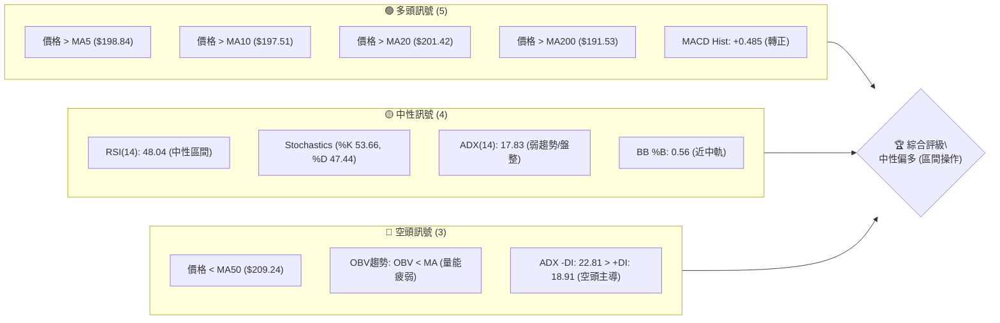

### 📊 核心指標速覽表

以下表格匯總了NVDA當前的關鍵技術指標狀態及其解讀：

| 指標類別 | 指標名稱 | 當前數值 | 訊號 | 解讀 |
|----------|----------|----------|------|------|
| **價格** | 當前價格 | $202.78 | 🟡 | 位於52週區間中上部 (55.2%) |
| **均線** | MA20 | $201.42 | 🟢 | 價格略高於短期均線，提供初步支撐 |
| **均線** | MA50 | $209.24 | 🔴 | 價格低於中期均線，構成上方阻力 |
| **均線** | MA200 | $191.53 | 🟢 | 價格遠高於長期均線，長期趨勢看多 |
| **動能** | RSI(14) | 48.04 | 🟡 | 處於中性區間，未顯示超買或超賣 |
| **動能** | MACD | +0.485 (Hist) | 🟢 | MACD柱狀圖由負轉正，短線動能轉強 |
| **波動** | ATR(14) | $6.63 | 🟡 | 日均波動約為3.27%，屬於中等波動水平 |
| **趨勢** | ADX(14) | 17.83 | 🟡 | 趨勢強度較弱，市場處於盤整狀態 |

### 🏆 技術評分卡

綜合考量各項技術指標，NVDA當前的技術面評分如下：

```
技術評分卡 — NVDA (2026-07-10)
════════════════════════════════════════════════════
趨勢強度      ████░░░░░░░░░░░░░░░░  40/100  🟡 (ADX低於25，趨勢不明)
動能指標      ███████░░░░░░░░░░░░░  70/100  🟢 (MACD柱狀圖轉正，短線動能增強)
支撐穩定度    ██████░░░░░░░░░░░░░░  60/100  🟡 (價格剛從支撐區反彈，穩定性有待考驗)
成交量配合    ███░░░░░░░░░░░░░░░░░  30/100  🔴 (量能疲弱，反彈缺乏量能確認)
形態完整度    ████░░░░░░░░░░░░░░░░  40/100  🟡 (無明確複雜形態，多為區間震盪)
均線排列      █████░░░░░░░░░░░░░░░  55/100  🟡 (短期多頭，中期空頭，長期多頭，混合排列)
════════════════════════════════════════════════════
綜合評分      █████░░░░░░░░░░░░░░░  49/100  🟡 中性 (區間操作為主)
════════════════════════════════════════════════════
```

## 2. 趨勢分析

### 🌐 多時框趨勢分析

NVDA在不同時間框架下的趨勢表現不一，需要綜合判斷。長期來看，價格遠高於MA200，顯示出強勁的上升趨勢。然而，中期趨勢則有所承壓，價格位於MA50下方。短期內，近期反彈使其站回MA20上方，但ADX顯示整體趨勢強度偏弱，市場處於盤整格局。

```mermaid
graph TD
    A["月線趨勢 - 長期"] --> |"價格遠高於MA200 ($191.53)"| B("🟢 強勁上升趨勢")
    B --> C{"當前價格: $202.78"}
    D["週線趨勢 - 中期"] --> |"價格低於MA50 ($209.24)"| E("🔴 承壓/回調")
    C --> F["日線趨勢 - 短期"]
    F --> |"價格高於MA20 ($201.42)"| G("🟢 短線反彈")
    F --> |"ADX("14") 17.83 < 25"| H("🟡 趨勢強度弱/盤整")
    G & H --> I("⚖️ 綜合判斷: 盤整區間內短線反彈")
```

### 📈 長期趨勢 — 12個月走勢圖（Unicode）

NVDA在過去12個月呈現出震盪上行的趨勢，儘管期間經歷多次調整，但整體重心逐步抬高。圖中標註了52週的高點和低點，顯示出股價在廣闊區間內波動。

```
NVDA 月線走勢圖（過去12個月）
價格軸 ($)
$236.54 ┤                                     ●(52W高點)
$220.00 ┤                                   ／
$211.14 ┤                        ●(2026-05)
$202.78 ┤                ●(2025-10)       ／＼
$200.00 ┤─────────────────────────●←現在 (2026-07)
$186.56 ┤              ●
$177.84 ┤●(2025-07)   ／＼    ●(2025-12)
$174.15 ┤  ＼●(2025-08)  ／
$161.13 ┤●(52W低點)
        └──────────────────────────────────────────
         25-07 25-09 25-11 26-01 26-03 26-05 26-07 (月份)
```

**走勢特徵分析表格**：

| 時間區間 | 走勢特徵 | 漲跌幅 | 備註 |
|----------|----------|--------|------|
| 2025-07至2025-10 | 震盪上行 | +13.88% | 從$177.84上漲至$202.47，期間有小幅回調。 |
| 2025-10至2026-03 | 區間震盪與回調 | -13.87% | 從高點$202.47回落至$174.40，消化前期漲幅。 |
| 2026-03至2026-05 | 強勁反彈 | +21.07% | 從低點$174.40迅速反彈至$211.14，動能強勁。 |
| 2026-05至2026-06 | 短期回調 | -5.23% | 從$211.14回落至$200.09，市場獲利了結。 |
| 2026-06至今 | 企穩反彈 | +1.34% | 從$200.09反彈至$202.78，試圖站穩腳跟。 |

長期來看，NVDA的股價在過去一年中呈現健康的上升趨勢，儘管近期有所回調，但仍保持在長期均線上方，顯示出市場對其未來成長的信心。

### 📊 中期趨勢（週線分析）

從近期的20週收盤數據來看，NVDA在中期呈現出一個先衝高後回落，再嘗試企穩反彈的走勢。股價在2026年5月達到$225.32的階段性高點後，經歷了一波較深的回調，最低觸及$192.53，隨後在$190-$200區間獲得支撐並開始反彈。目前價格正試圖挑戰中期阻力位。

```
NVDA 近期壓力與支撐示意圖 (週線)
價格軸 ($)
$230 ┤                                 ▲ 階段高點 ($225.32)
$220 ┤                               ／
$210 ┤                            ／
$202.78 ┤───────────────────────●← 現價
$200 ┤      ┌─────────────────┐
$190 ┤      └───────●─────────┘ ◄ 底部支撐區 ($192.53 - $194.83)
$180 ┤
     └────────────────────────────
      2026-03      2026-05      2026-07
```

### ⚡ 趨勢強度評估（ADX 解讀）

ADX指標用於衡量趨勢的強度，而非方向。當前NVDA的ADX(14)數值為17.83，明確指出市場處於弱趨勢或盤整狀態，缺乏強勁的單邊趨勢。

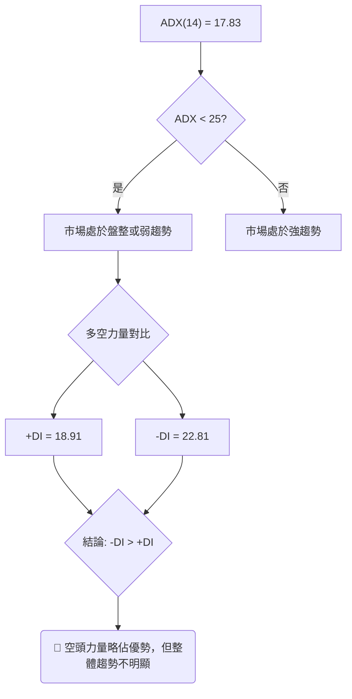

**ADX 強度對照表**：

| ADX 數值 | 趨勢強度 | 市場狀態 |
|----------|----------|----------|
| 0-25     | 弱趨勢   | 盤整/區間震盪 |
| 25-50    | 中等趨勢 | 有方向性趨勢 |
| 50-75    | 強趨勢   | 強勁單邊趨勢 |
| 75-100   | 極強趨勢 | 趨勢極度強勁 |

NVDA的ADX數值17.83表明，目前市場缺乏明確的方向性動能，更傾向於在一定區間內震盪。儘管-DI略高於+DI，暗示空頭力量在弱勢中稍佔上風，但幅度不大，不足以形成新的強勁下跌趨勢。因此，應以區間操作思維為主。

## 3. 圖表形態分析

### 🔍 形態識別系統

鑑於當前ADX(14)數值為17.83，市場處於弱趨勢或盤整狀態，且提供的數據主要為週線收盤價，難以精確識別複雜的日線圖表形態。目前NVDA的走勢更傾向於在一個較大的區間內震盪。我們觀察到近期股價在$190-$200區間獲得支撐後的反彈，這可被視為一個底部反彈形態，但尚未形成明確的V形或W形反轉。

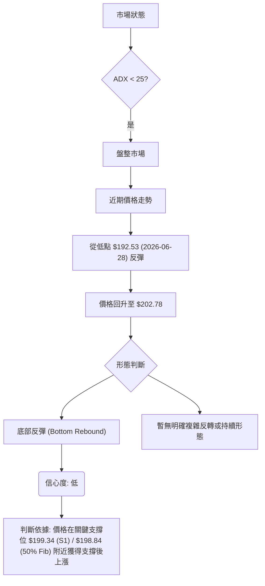

**形態信心度表格**：

| 形態 | 信心度 | 判斷依據（引用數據） | 完成度 | 目標價（附計算式） |
|------|--------|----------------------|--------|--------------------|
| 底部反彈 | 55% | 價格從 $192.53 (2026-06-28) 反彈至 $202.78，並在 $199.34 (S1) / $198.84 (50% Fib) 附近獲得初步支撐。 | 60% | 區間上沿 $212.83 (布林上軌) 或 $214.33 (R1) |
| 潛在區間震盪 | 70% | ADX(14) = 17.83 顯示趨勢強度弱，價格在 $190.02 (BB下軌) 和 $212.83 (BB上軌) 之間波動。 | 85% | 區間震盪，無單邊目標價，以區間邊緣為交易目標 |

**註**：由於數據中未提供詳細的日K線開高低收數據，且市場處於盤整狀態，強行識別複雜的幾何形態（如頭肩頂、三角形等）的信心度將非常低。因此，本報告主要將當前走勢解讀為在關鍵支撐位獲得反彈後的區間震盪。

### 🕯️ 重要K線形態分析

由於僅提供週收盤價數據，無法進行細緻的日K線形態分析。但我們可以從週線收盤價的變化中觀察到一些趨勢轉換的跡象。

| 月份 | 收盤價 | 週線走勢特徵 | 解讀 | 訊號 |
|------|--------|--------------|------|------|
| 2026-05-17 | $225.32 | 高點回落 | 價格達到階段性高點後開始回調，顯示上方賣壓。 | 🔴 |
| 2026-06-28 | $192.53 | 階段低點 | 價格觸及近期低點，隨後企穩，暗示下方買盤介入。 | 🟢 |
| 2026-07-05 | $194.83 | 止跌企穩 | 價格在低點附近盤整，跌勢暫緩。 | 🟡 |
| 2026-07-12 | $202.78 | 陽線反彈 | 價格從低點反彈，收復部分跌幅，顯示買方力量增強。 | 🟢 |

### 📉 ASCII 走勢形態示意圖

以下示意圖描繪了NVDA近期從低點反彈的走勢，並標註了關鍵的支撐與阻力區間。

```
NVDA 近期走勢與形態示意圖
價格軸 ($)
$214.33 ┤         ╔════════════════════════════════╗  ← 阻力 R1
$210.00 ┤         ║                                ║
$202.78 ┤─────────●← 現價 (2026-07-10)               ║
$200.00 ┤         ║          ▲ 反彈趨勢              ║
$199.34 ┤         ╠═════════●══════════════════════╣  ← 支撐 S1 / 斐波那契50%
$194.74 ┤         ║       ／                         ║
$190.00 ┤         ║     ●                           ║
$189.80 ┤         ╚════════════════════════════════╝  ← 支撐 S3
        └────────────────────────────────────────────
         2026-06-28   2026-07-05   2026-07-12
         (低點 $192.53) (反彈 $194.83) (現價 $202.78)
```
圖中顯示NVDA在 $190-$200 區間獲得支撐後呈現反彈，目前正向上測試 $207.73 (38.2% Fib) 和 $214.33 (R1) 的阻力。

### 🎯 形態目標價計算

由於當前市場處於盤整狀態，且沒有明確的複雜形態，我們主要將目標價設定為區間的邊界。

1.  **底部反彈至區間上沿目標**：
    *   若價格能有效站穩 $199.34 (S1) 和 $198.84 (50% 斐波那契回調位) 支撐，則反彈目標將是區間上沿。
    *   主要阻力位於 $207.73 (38.2% 斐波那契回調位) 和 $214.33 (R1)。
    *   計算式：當前反彈目標 = 區間上沿阻力。
    *   **目標價區間**：$207.73 至 $214.33

2.  **區間震盪策略目標**：
    *   在 ADX 顯示盤整的情況下，價格通常會在布林通道上下軌之間波動。
    *   布林上軌為 $212.83，布林下軌為 $190.02。
    *   若從下軌附近買入，目標可設為布林中軌 $201.42 或上軌 $212.83。
    *   若從上軌附近賣出，目標可設為布林中軌 $201.42 或下軌 $190.02。

綜合來看，NVDA目前處於從底部反彈的過程中，短期目標是測試 $207.73 和 $214.33 附近的阻力。若能有效突破並站穩，則可能挑戰更高的阻力位 $218.74 (23.6% Fib)。

## 4. 支撐與阻力

### 🗺️ 關鍵價位分布圖（Unicode）

NVDA的股價目前位於其斐波那契38.2%和50.0%回調位之間，上方有多重阻力，下方則有多重支撐。

```
NVDA 價位結構分布圖
═══════════════════════════════════════════════════
$236.54 ║████████████████████████║ 極強阻力 R3 (52W High)
$232.28 ║████████████████████    ║ 強阻力 R2
$218.74 ║████████████████████████║ 斐波那契 23.6%
$214.33 ║████████████████████████║ 關鍵阻力 R1 (布林上軌 $212.83 附近)
$207.73 ║████████████████████████║ 斐波那契 38.2%
$202.78 ╠════════════════════════╣ ◄ 現價
$201.42 ║▓▓▓▓▓▓▓▓▓▓▓▓▓▓▓▓        ║ 布林中軌 (MA20)
$199.34 ║▓▓▓▓▓▓▓▓▓▓▓▓▓▓▓▓        ║ 近期支撐 S1
$198.84 ║▓▓▓▓▓▓▓▓▓▓▓▓▓▓▓▓        ║ 斐波那契 50.0%
$194.74 ║████████████████████████║ 強支撐 S2
$191.53 ║████████████████████████║ MA200
$190.02 ║████████████████████████║ 布林下軌
$189.94 ║████████████████████████║ 斐波那契 61.8%
$189.80 ║████████████████████████║ 強支撐 S3
$177.27 ║████████████████████████║ 斐波那契 78.6%
$161.13 ║████████████████████████║ 極強支撐 (52W Low)
═══════════════════════════════════════════════════
```

### 🚧 阻力位分析表

NVDA上方存在多重阻力，其中R1至R3構成短期至中期的主要壓力區。突破這些阻力需要較大的買盤動能。

| 阻力級別 | 價位 | 形成原因 | 突破難度 | 重要性 |
|----------|------|----------|----------|--------|
| R1 (關鍵阻力) | $214.33 | 近期波段高點聚類，與布林上軌 $212.83 及斐波那契38.2%回調位 $207.73 形成阻力區。 | 中等偏高 | 🟢 短期趨勢轉強的關鍵 |
| R2 (強阻力) | $232.28 | 更高的波段高點聚類，接近52週高點。 | 高 | 🟡 中期多頭趨勢延續的標誌 |
| R3 (極強阻力) | $236.54 | 52週最高價，歷史高位附近，賣壓沉重。 | 極高 | 🔴 創新高需要極強動能 |

### 🛡️ 支撐位分析表

NVDA下方擁有穩固的支撐結構，特別是S1和S2，為股價提供了較強的緩衝。

| 支撐級別 | 價位 | 形成原因 | 守住機率 | 重要性 |
|----------|------|----------|----------|--------|
| S1 (近期支撐) | $199.34 | 近期波段低點聚類，與斐波那契50%回調位 $198.84 及布林中軌 $201.42 形成密集支撐區。 | 高 | 🟢 短期反彈的關鍵防線 |
| S2 (強支撐) | $194.74 | 較低波段低點聚類，以及MA200 $191.53 附近。 | 中等偏高 | 🟡 中期趨勢穩定的重要防線 |
| S3 (極強支撐) | $189.80 | 更低的波段低點聚類，與布林下軌 $190.02 及斐波那契61.8%回調位 $189.94 形成強支撐。 | 極高 | 🔴 跌破恐引發更深跌勢 |

### 📐 斐波那契回調位分析

斐波那契回調位是基於52週區間 ($161.13 至 $236.54) 計算得出，為判斷潛在支撐與阻力提供了重要參考。當前價格 $202.78 位於 38.2% ($207.73) 和 50.0% ($198.84) 回調位之間。

| 回調位 | 價位 | 意義 |
|--------|------|------|
| 0.0%   | $236.54 | 52週高點，潛在主要阻力。 |
| 23.6%  | $218.74 | 若突破R1，此為下一個潛在阻力。 |
| 38.2%  | $207.73 | 重要的阻力位，當前反彈的初步目標區。 |
| 50.0%  | $198.84 | 重要的心理與技術支撐位，與S1 $199.34 形成強支撐區。 |
| 61.8%  | $189.94 | 關鍵支撐位，與S3 $189.80 及布林下軌 $190.02 形成密集支撐。 |
| 78.6%  | $177.27 | 較深的支撐位，若市場嚴重回調可能測試。 |
| 100.0% | $161.13 | 52週低點，極強支撐。 |

當前價格 $202.78 位於斐波那契38.2%回調位 $207.73 之下，但高於50.0%回調位 $198.84。這意味著股價正處於一個關鍵的技術區間，50.0%回調位 ($198.84) 將作為重要的短期支撐，而38.2%回調位 ($207.73) 則構成近期反彈的潛在阻力。若能有效突破38.2%回調位，則有望進一步挑戰R1 ($214.33)。

## 5. 技術指標深度解讀

### 🎛️ 指標訊號總覽

以下Mermaid圖展示了NVDA當前各項技術指標的相互關係及所發出的訊號。

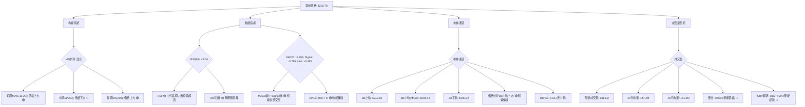

### 📈 移動平均線排列分析

NVDA的移動平均線排列呈現「混合排列」狀態，這通常發生在趨勢不明朗或進入盤整階段的市場中。

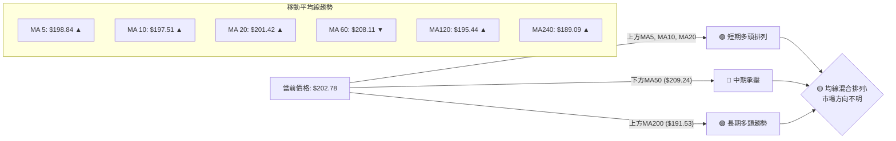

當前價格 $202.78 位於MA5 ($198.84)、MA10 ($197.51)、MA20 ($201.42) 和MA200 ($191.53) 之上，顯示短期和長期趨勢偏多。然而，價格卻位於MA50 ($209.24) 和MA60 ($208.11) 之下，這表明中期趨勢仍然承壓。這種混合排列印證了ADX所指示的「弱趨勢/盤整」市場狀態，提示投資者應謹慎看待單邊趨勢，更適合區間操作。

### 📉 RSI(14) 分析

RSI(14)指標當前數值為48.04，處於中性區間 (30-70)。

**RSI(14) 強度進度條**：
RSI強度：▓▓▓▓▓▓▓▓▓▓▓▓▓▓▓▓▓▓▓▓▓▓▓▓░░░░░░░░░░░░░░░░░░░░░░░░░░ 48.04%

-   **超買超賣區間分析**：RSI位於50附近，既未進入超買區 (RSI > 70)，也未進入超賣區 (RSI < 30)。這表示當前市場買賣雙方力量相對均衡，沒有明顯的極端情緒。
-   **背離判斷**：根據提供的數據，RSI並未顯示出明顯的頂背離或底背離訊號。在最近的價格反彈中，RSI也隨之上升，量價配合（雖然量能不足）並未出現明顯矛盾。因此，目前RSI維持中性，不提供強烈的多空方向指引。

### 📊 MACD(12/26/9) 訊號解讀

MACD指標當前顯示出短線多頭動能轉強的訊號。

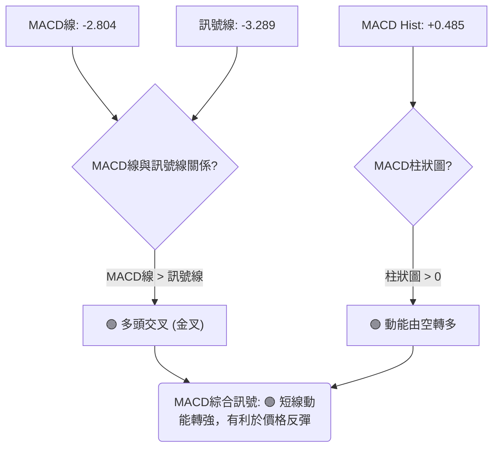

-   **MACD線與訊號線**：MACD線 (-2.804) 高於訊號線 (-3.289)，形成了多頭交叉（金叉）。這是一個短線的買入訊號，表明短期均線向上穿越長期均線，預示著股價可能進一步上漲。
-   **MACD柱狀圖**：MACD柱狀圖數值為+0.485，由負轉正。這進一步確認了多頭動能的恢復，表明買方力量正在增強。

綜合來看，MACD指標發出明確的短線看漲訊號，支持當前股價的底部反彈。

### 📦 布林通道分析

布林通道能有效顯示股價的波動範圍和相對位置。

```
NVDA 布林通道示意圖 (日線)
價格軸 ($)
$212.83 ┤───────────────────────────┐ ← 布林上軌 (BB Upper)
$210.00 ┤                             │
$205.00 ┤                             │
$202.78 ┤─────────●← 現價              │
$201.42 ┤───────────────┐           │ ← 布林中軌 (MA20)
$200.00 ┤               │           │
$195.00 ┤               │           │
$190.02 ┤───────────────┴───────────┘ ← 布林下軌 (BB Lower)
        └──────────────────────────────────
         (時間軸)
```

-   **通道位置**：當前價格 $202.78 位於布林中軌 $201.42 之上，但尚未觸及布林上軌 $212.83。這表明股價在經歷底部反彈後，正向通道上沿移動。
-   **通道帶寬**：布林通道的帶寬並未顯著收窄或擴張，與ADX所指示的弱趨勢/盤整狀態相符。
-   **BB %B**：BB %B 數值為0.56，表示價格位於布林通道的中上部。這確認了價格從中軌附近獲得支撐並開始向上運動。

布林通道分析表明，NVDA的股價目前在一個相對穩定的區間內波動。價格站穩中軌之上，短期內有望繼續向布林上軌測試，但若要形成強勁的單邊趨勢，則需要通道帶寬的顯著擴張。

### 💹 成交量分析（量價配合度）

成交量是確認價格走勢有效性的重要指標。

| 成交量指標 | 數值 | 解讀 | 訊號 |
|------------|------|------|------|
| 最新成交量 | 131,649,500 | 相對較低 | 🔴 |
| 20日均量   | 147,480,560 | 當前成交量低於均量 | 🔴 |
| 50日均量   | 161,576,238 | 當前成交量顯著低於均量 | 🔴 |
| 量比       | 0.89x | 量能萎縮，不足均量 | 🔴 |
| OBV趨勢    | OBV < MA | 買盤動能不足，量能疲弱 | 🔴 |

-   **量價配合情況**：當前價格 $202.78 相較於前一週 $194.83 有所上漲，但最新成交量 (131.6M) 卻低於20日均量 (147.4M) 和50日均量 (161.5M)。量比僅為0.89x，表明當前反彈缺乏足夠的成交量支持。
-   **OBV分析**：OBV趨勢顯示OBV線位於其移動平均線下方，這是一個看跌訊號，表明在價格上漲的過程中，買盤累積的量能不足，潛在的買盤力量疲弱。

綜合來看，NVDA的近期反彈雖然在價格上表現積極，但成交量未能有效配合。這種量價背離現象（價漲量縮）削弱了反彈的可靠性，提示投資者需警惕反彈可能面臨阻力。若要確認反彈的持續性，未來需觀察成交量能否放大。

## 6. 動能與波動率

### ⚡ 動能評估四象限

動能評估四象限分析結合了當前NVDA的動能強度和波動率，以提供更全面的市場視角。

| 象限 | 動能 (MACD, RSI) | 波動 (ATR) | 當前狀態 | 評估 |
|------|--------------------|------------|----------|------|
| Q1   | 強                 | 低         | -        | 最佳進場機會 (趨勢啟動，風險可控) |
| Q2   | 弱                 | 低         | -        | 謹慎觀望 (缺乏動能，等待機會) |
| Q3   | 強                 | 高         | -        | 高風險高收益 (趨勢強勁，但波動劇烈) |
| Q4   | 弱                 | 高         | ✓        | 避免進場 (方向不明，風險高) |

NVDA當前的動能評估：
-   **動能強度**：MACD柱狀圖轉正，短期均線多頭排列，顯示短線動能有所恢復。但RSI中性，ADX弱勢，OBV疲弱，整體動能強度應評為**中等偏弱**。
-   **波動率**：ATR(14)為 $6.63，佔股價的3.27%，屬於**中等波動**水平，未見極端波動。

基於此，NVDA目前傾向於介於 **Q2 (弱動能，低波動)** 和 **Q4 (弱動能，高波動)** 之間，更接近 Q4 的邊緣，但波動尚未到極高。這意味著雖然短線有反彈動能，但整體趨勢不明，且存在一定波動風險。

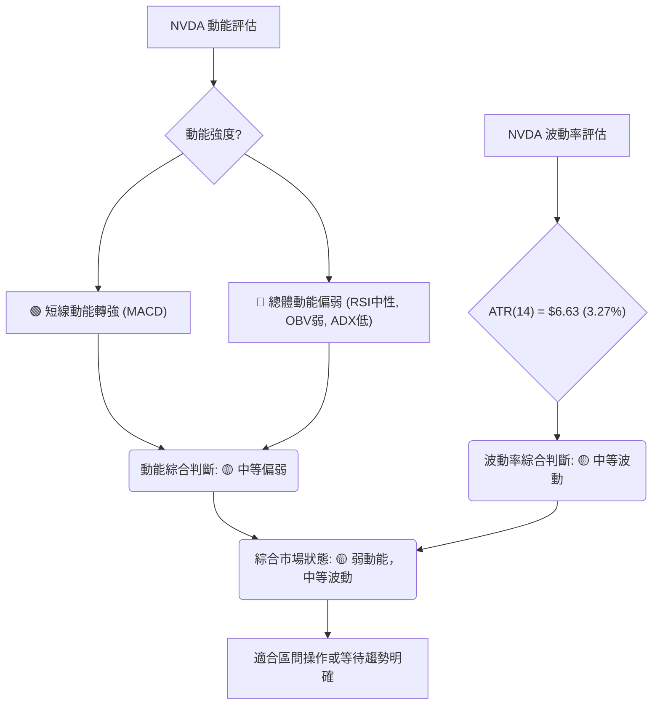

### 📊 ATR 波動率分析

平均真實波幅 (ATR) 是衡量股票波動性的指標。NVDA的ATR(14)為 $6.63。

-   **ATR 解讀**：這意味著在過去14天中，NVDA平均每天的價格波動範圍約為 $6.63。相對於當前價格 $202.78，每日波動率約為3.27%，屬於中等偏高水平。這表明NVDA的股價活躍，為短線交易者提供了機會，但同時也增加了風險。
-   **止損距離建議**：根據ATR，建議將止損距離設置為1.5至2倍的ATR，以避免被市場的正常波動所清洗出場。
    *   1.5x ATR = 1.5 * $6.63 = $9.945
    *   2.0x ATR = 2.0 * $6.63 = $13.26
    若在 $202.78 附近進場，止損點可考慮設置在 $202.78 - $9.95 = $192.83 或 $202.78 - $13.26 = $189.52 附近。這些點位應與關鍵支撐位結合考慮。例如，S2 ($194.74) 或S3 ($189.80) 都是合理的參考止損點。

### 📐 Beta 與市場相關性

NVDA的Beta值為2.211。

-   **Beta 解讀**：Beta值衡量股票相對於整體市場（通常指S&P 500指數）的波動性。Beta值為2.211意味著當市場整體波動1%時，NVDA的股價平均會波動2.211%。
-   **市場相關性**：
    *   **高相關性**：Beta值遠大於1，表明NVDA與大盤呈正相關，且波動幅度遠大於大盤。當大盤上漲時，NVDA通常會以更快的速度上漲；當大盤下跌時，NVDA也可能以更快的速度下跌。
    *   **高波動性**：高Beta值也意味著NVDA是一支高波動性股票。這對風險承受能力較高的投資者來說可能提供更高的潛在回報，但同時也伴隨著更高的風險。
-   **投資影響**：投資者在配置NVDA時，應充分考慮其高Beta特性，特別是在市場波動加劇時，NVDA的波動可能會被放大。在市場情緒樂觀時，高Beta股票表現可能優異；而在市場情緒悲觀或不確定時，其跌幅也可能更深。

## 7. 多時框架總結

### 📋 時框架評分表

本表綜合了NVDA在不同時間框架下的技術指標表現，並給出了相應的評分和建議。

| 時框架 | 趨勢方向 | 動能 | 均線排列 | 形態 | 綜合評分 | 建議 |
|--------|----------|------|----------|------|----------|------|
| 短期 (日線) | 🟢 反彈 | 🟢 轉強 | 🟢 多頭 | 🟡 底部反彈 | 70/100 | 逢低做多，關注阻力 |
| 中期 (週線) | 🟡 盤整 | 🟡 中性 | 🟡 混合 | 🟡 區間震盪 | 50/100 | 區間操作，等待方向 |
| 長期 (月線) | 🟢 上行 | 🟢 強勁 | 🟢 多頭 | 🟢 上升趨勢 | 80/100 | 長期持有，關注回調 |

### 🔲 綜合訊號矩陣

以下矩陣展示了不同時間框架下各技術指標訊號的一致性或矛盾點。

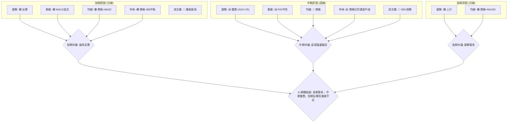

### ⚖️ 多時框收斂結論

根據「嚴格要求 14」的多時框收斂規則：當前NVDA的ADX(14)數值為17.83，明確低於25，這指示市場處於**盤整行情**。因此，我們將以日線布林通道的上下軌作為主要的交易區間，並結合短期指標尋找交易機會。

-   **主導時框**：在盤整行情中，日線圖上的區間邊界和短期指標（如布林通道、MACD）的訊號更具操作意義。週線和月線趨勢則提供大方向背景。
-   **訊號衝突處理**：短期指標（MA5, MA10, MA20多頭排列，MACD金叉）顯示價格正在從底部反彈，偏向多頭。然而，中期指標（價格低於MA50，OBV疲弱，ADX弱勢且-DI>+DI）則顯示中期趨勢承壓，整體量能不足。在盤整行情下，我們優先考慮短期反彈在區間內運行，並關注其向區間上沿測試的潛力，但同時警惕量能不足導致的反彈受阻。
-   **唯一方向性結論**：綜合來看，NVDA目前處於**中性偏多**的區間震盪格局。短期內有望延續底部反彈，向布林通道上軌和R1阻力位測試，但若量能未能有效放大，則可能面臨回調壓力。長期趨勢依然看好，但中期調整仍需時間消化。

## 8. 交易策略建議

### 🗺️ 策略決策流程圖

以下流程圖展示了基於當前市場狀況和技術評分，選擇交易策略的邏輯。

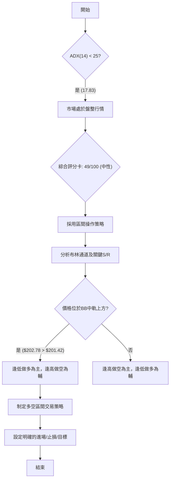

### 🧭 策略路由（依評分卡分流）

**當前主策略方向 = 🟡 中性偏多 (區間操作為主，評分 49/100)**

由於綜合評分卡顯示NVDA為「中性」評級（49/100），且ADX(14)指示市場處於盤整行情，因此我們將採用**區間操作策略**作為主策略。當前價格 $202.78 位於布林中軌 $201.42 之上，表明短線有反彈動能，因此在區間操作中，可優先考慮逢低做多，並關注上方阻力。

### 🎯 價格情境階梯（Price Scenarios）

以當前價格 $202.78 為基準，建立向上與向下的情境劇本。

| 觸發條件 | 下一目標 | 後續延伸 | 情境含義 |
|----------|----------|----------|----------|
| 突破 R1 $214.33 | R2 $232.28 | R3 $236.54 | **短期轉強**：若能帶量突破 $214.33 阻力，則反彈動能增強，可能結束盤整區間，向上挑戰更高阻力。 |
| 站穩現價區間 ($199.34 - $214.33) | — | — | **區間震盪**：若未能有效突破R1，也未跌破S1，則股價將在 $199.34 至 $214.33 (或布林上下軌 $190.02 - $212.83) 之間持續震盪。 |
| 跌破 S1 $199.34 | S2 $194.74 | S3 $189.80 | **中期轉弱**：若跌破 $199.34 (S1) 和 $198.84 (50% Fib) 的關鍵支撐，則反彈失敗，可能回探更深支撐位，甚至測試 $190.02 (布林下軌)。 |

### 📊 情境機率分佈

基於當前指標狀態，對未來三種情境的機率估計如下：

| 情境 | 機率 | 主要依據 |
|------|------|----------|
| 繼續上行 / 反彈 | 45% | MACD金叉，短期均線多頭排列，價格站穩布林中軌之上，顯示短線動能轉強。 |
| 區間震盪 | 40% | ADX(14) 17.83 顯示弱趨勢，OBV量能疲弱，價格受制於MA50，表明缺乏強勁單邊趨勢。 |
| 回落 / 再探底 | 15% | 成交量不足，若反彈受阻於R1且量能持續萎縮，則可能再次回落測試支撐。 |

### 🟢 主策略詳情：區間操作策略 (Range Trading Strategy)

當前市場處於盤整區間，ADX顯示趨勢強度不足。策略應聚焦於區間邊界操作。

| 策略要素 | 策略 A: 逢低做多 (Buy the Dip) | 策略 B: 逢高做空 (Sell the Rally) |
|----------|---------------------------------|---------------------------------|
| 進場條件 | 價格回落至斐波那契50%回調位或S1支撐區間並出現止跌訊號。 | 價格反彈至布林上軌或R1/38.2%斐波那契回調位，並出現受阻訊號 (如長上影線、量縮價滯)。 |
| 進場價格 | $198.84 (50% Fib) 至 $199.34 (S1) 區間 | $212.83 (BB上軌) 至 $214.33 (R1) 區間 |
| 目標價 T1 | $207.73 (38.2% Fib) | $201.42 (BB中軌) |
| 目標價 T2 | $212.83 (BB上軌) | $198.84 (50% Fib) (斐波那契50%回調位) |
| 止損價格 | $194.74 (S2) | $218.74 (23.6% Fib) |
| 風險報酬比 | 以 $199.00 進場，止損 $194.74 ($4.26風險)。目標 T1 $207.73 ($8.73報酬)。比率約 **2.05:1**。 | 以 $213.00 進場，止損 $218.74 ($5.74風險)。目標 T1 $201.42 ($11.58報酬)。比率約 **2.01:1**。 |
| 成功機率 | 60% | 55% |
| 建議倉位 | 15% | 10% |

### 🔴 反向風險觸發點（對沖提示）

-   **跌破關鍵支撐**：若股價有效跌破 $194.74 (S2)，並伴隨放量，將確認反彈失敗，空頭力量可能佔據主導，並可能測試 $189.80 (S3) 或 $189.94 (61.8% Fib)。
-   **指標惡化**：若MACD再次形成死叉，RSI跌破40並持續下行，OBV加速下跌，均線系統再次出現空頭排列，則應立即考慮減倉或對沖。

### ⭐ 整體訊號強度評星

```
做多訊號強度：★★★☆☆  (3/5星) (短線動能轉強，但量能不足，中期趨勢承壓)
做空訊號強度：★★☆☆☆  (2/5星) (中期有承壓跡象，但短期反彈，需等待反彈受阻)
整體可信度：  ★★★☆☆  (3/5星) (市場處於盤整，策略需靈活，依區間邊界操作)
```

## 9. 風險提示與監控

### ✅ 關鍵監控指標 Checklist

以下是交易NVDA時需要密切關注的關鍵技術指標清單：

```
╔══════════════════════════════════════════════════════════════╗
║                 NVDA 關鍵監控指標清單                        ║
╠══════════════════════════════════════════════════════════════╣
║ [ ] 價格行為：是否有效突破或跌破關鍵支撐/阻力位？            ║
║ [ ] 成交量：價格上漲是否伴隨放量？下跌是否伴隨縮量？         ║
║ [ ] ADX(14)：趨勢強度是否變化？(ADX > 25 或 < 25)            ║
║ [ ] MACD：是否出現金叉/死叉？柱狀圖變化？                    ║
║ [ ] RSI(14)：是否進入超買/超賣區？有無背離？                 ║
║ [ ] 布林通道：價格是否觸及上軌/下軌？通道帶寬變化？          ║
║ [ ] 斐波那契回調：價格是否在關鍵回調位獲得支撐或受阻？       ║
║ [ ] 均線排列：短期/中期/長期均線排列是否發生變化？           ║
║ [ ] 52週高/低：價格是否接近或突破這些極端點位？              ║
╚══════════════════════════════════════════════════════════════╝
```

### ⚠️ 風險場景分析

針對NVDA當前的技術面，我們分析以下三種潛在情境：

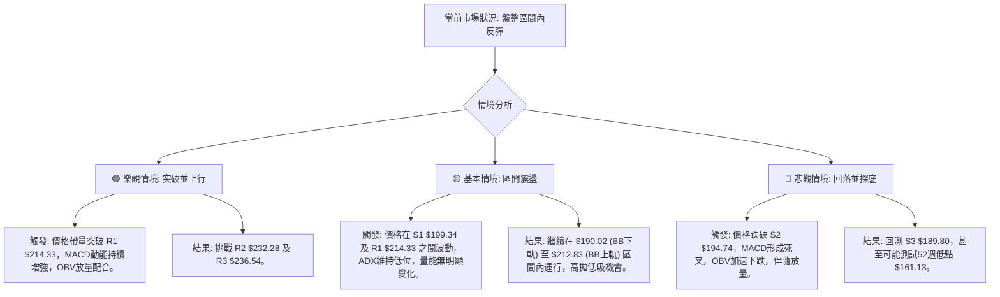

### 🛡️ 風險管理重要提醒

1.  **嚴格執行止損**：鑑於NVDA的高Beta值 (2.211) 和中等波動率 (ATR $6.63)，股價波動可能較大。務必在每次交易前設定明確的止損點，並嚴格執行，以控制潛在虧損。
2.  **倉位管理**：在盤整行情中，應採取較小的倉位，避免重倉。隨著趨勢的明確或突破的確認，再逐步增加倉位。
3.  **分批進場/出場**：可考慮分批進場以平均成本，分批出場以鎖定利潤並降低風險。
4.  **關注量能變化**：當前反彈量能不足是一個警訊。若價格上漲缺乏成交量配合，則反彈的持續性存疑。一旦出現價跌量增或價漲量縮的背離，應及時調整策略。
5.  **不追漲殺跌**：在盤整行情中，追漲殺跌往往容易被套。應耐心等待價格觸及區間邊緣或關鍵支撐/阻力位時再採取行動。
6.  **宏觀經濟風險**：儘管本報告側重技術分析，但仍需留意整體宏觀經濟環境、半導體產業政策以及公司基本面變化（如財報、分析師評級調整等），這些因素可能突然改變技術走勢。

---

## 📋 報告總結

```
NVDA 技術分析報告總結
════════════════════════════════════════════════════════
報告日期：2026-07-10
當前價格：$202.78
分析評級：⚖️ 中性偏多 (在盤整區間內短線反彈，需關注量能)

關鍵結論：
├─ 長期趨勢：🟢 上行趨勢穩固，價格遠高於MA200。
├─ 中期趨勢：🟡 盤整狀態，價格受制於MA50，缺乏明確方向。
├─ 短期趨勢：🟢 底部反彈，MACD金叉，價格站穩MA20和布林中軌。
├─ 關鍵支撐：$199.34 (S1) 與 $198.84 (50% Fib) 構成強支撐區。
├─ 關鍵阻力：$214.33 (R1) 與 $207.73 (38.2% Fib) 構成近期反彈阻力。
└─ 分析師目標：均價 $301.62 (遠高於現價，顯示長期潛力)。

最優策略組合：
1. 🥇 最佳機會：在 $198.84 - $199.34 區間逢低做多，目標 $207.73 - $212.83。
2. 🥈 次選機會：若價格帶量突破 $214.33 (R1)，可考慮追漲，目標 $218.74 - $232.28。
3. 🥉 保守選擇：在 $212.83 - $214.33 區間逢高做空，目標 $201.42 - $198.84。
════════════════════════════════════════════════════════
```

---

> ⚠️ **免責聲明**：本報告為 AI 自動生成之技術分析，所有數據及估算均基於提供的歷史價格資訊。本報告**僅供研究與學術參考**，**不構成任何投資建議**。投資有風險，入市需謹慎。

---

*報告生成時間：2026-07-10 ｜ 數據來源：Yahoo Finance ｜ 分析框架：多時框技術分析*