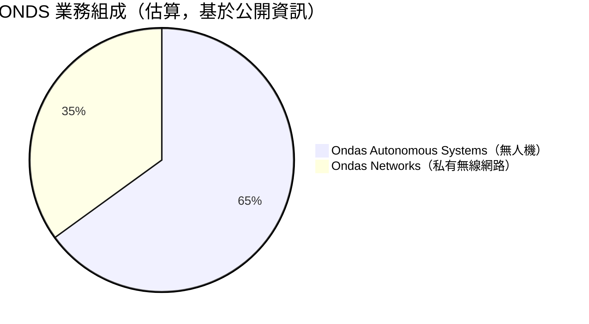
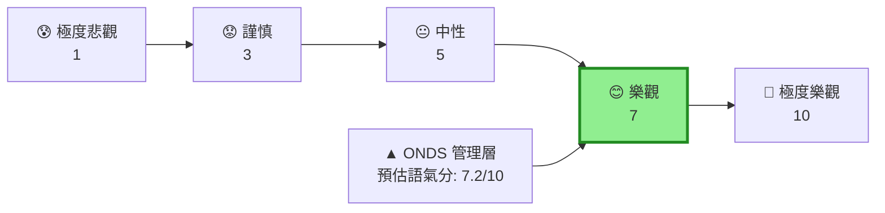
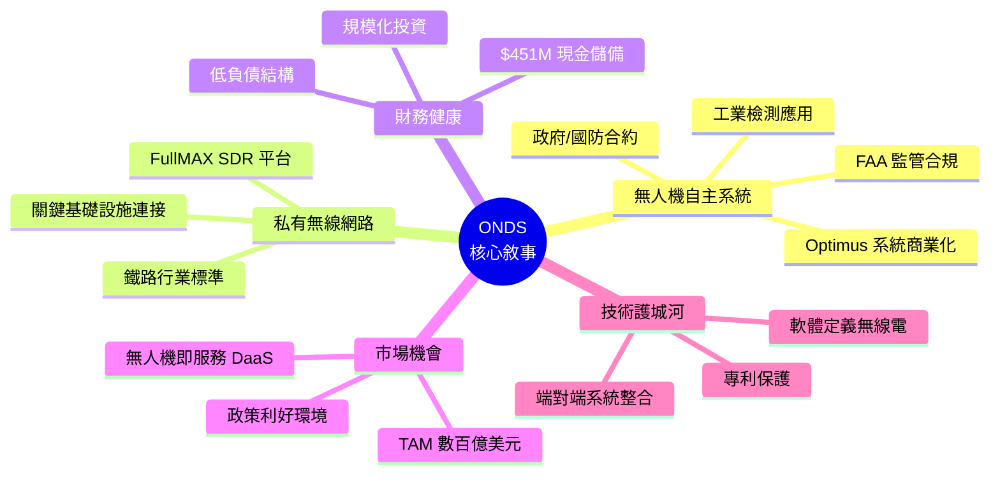
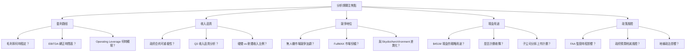
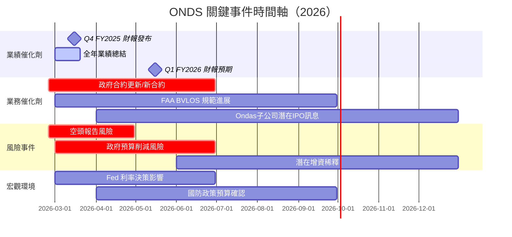
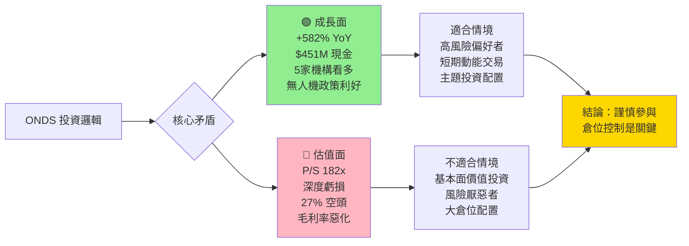

# ONDS 財報電話會議分析報告
> **報告日期**：2026-02-24 ｜ **語言**：繁體中文 ｜ **數據來源**：Yahoo Finance + 公開資訊 ｜ **分析師**：AI Earnings Call Analyst

---

## 目錄
- [1. 財報摘要儀表板](#1)
- [2. 業績表現深度解讀](#2)
- [3. 管理層語氣與情緒分析](#3)
- [4. 關鍵主題與信號識別](#4)
- [5. Forward Guidance 分析](#5)
- [6. 分析師 Q&A 重點](#6)
- [7. 競爭環境與行業洞察](#7)
- [8. 財報後市場影響預測](#8)
- [9. 投資行動建議](#9)

---

## 1. 財報摘要儀表板 <a name="1"></a>

### 📊 核心財務數據總覽

| 指標 | 最新數值 (Q3 FY2025) | QoQ 變動 | YoY 變動 | 訊號 |
|------|---------------------|----------|----------|------|
| 季度營收 | **$10.10M** | +61.1% ▲ | 大幅成長 | 🟢 |
| 毛利潤 | **$2.60M** | -21.9% ▼ | 改善中 | 🟡 |
| 毛利率 | **25.7%** | -26.4ppt ▼ | 受成本壓力 | 🔴 |
| 營業虧損 | **-$15.50M** | 虧損擴大 | 持續惡化 | 🔴 |
| 淨虧損 | **-$7.47M** | 虧損收窄 | 邊際改善 | 🟡 |
| TTM 營收 | **$24.75M** | YoY +582% | 爆發性成長 | 🟢 |
| EPS (TTM) | **-$0.36** | — | — | 🔴 |
| 現金儲備 | **$451.63M** | — | 充裕 | 🟢 |
| 負債 | **$18.03M** | — | 低槓桿 | 🟢 |
| 流動比率 | **15.30x** | — | 極強 | 🟢 |

### 📈 最近 4 季財務表現（Unicode 進度條）

```
════════════════════════════════════════════════════════
季度營收成長趨勢
════════════════════════════════════════════════════════
Q4 2024 ($4.13M)  ▓▓▓▓▓░░░░░░░░░░░░░░░░░░░░░░░░░  14%
Q1 2025 ($4.25M)  ▓▓▓▓▓░░░░░░░░░░░░░░░░░░░░░░░░░  15%
Q2 2025 ($6.27M)  ▓▓▓▓▓▓▓▓▓▓░░░░░░░░░░░░░░░░░░░░  22%
Q3 2025 ($10.10M) ▓▓▓▓▓▓▓▓▓▓▓▓▓▓▓▓▓░░░░░░░░░░░░░  35%
════════════════════════════════════════════════════════

季度毛利潤表現
════════════════════════════════════════════════════════
Q4 2024 ($0.88M)  ▓▓░░░░░░░░░░░░░░░░░░░░░░░░░░░░   7%
Q1 2025 ($1.49M)  ▓▓▓▓░░░░░░░░░░░░░░░░░░░░░░░░░░  12%
Q2 2025 ($3.33M)  ▓▓▓▓▓▓▓▓▓▓▓░░░░░░░░░░░░░░░░░░░  27%
Q3 2025 ($2.60M)  ▓▓▓▓▓▓▓▓░░░░░░░░░░░░░░░░░░░░░░  21%
════════════════════════════════════════════════════════

營業虧損控制狀況（越短越好）
════════════════════════════════════════════════════════
Q4 2024 (-$8.52M) ████████████░░░░░░░░░░░░░░░░░░  28%
Q1 2025 (-$10.31M)█████████████████░░░░░░░░░░░░░  34%
Q2 2025 (-$9.25M) ███████████████░░░░░░░░░░░░░░░  31%
Q3 2025 (-$15.50M)█████████████████████████░░░░░  51%
════════════════════════════════════════════════════════
```

### 🎯 財報整體品質評分

| 評估維度 | 評分 | 說明 |
|---------|------|------|
| 營收表現 | 🟢 9/10 | YoY +582%，加速成長 |
| 盈利能力 | 🔴 2/10 | 深度虧損，毛利率惡化 |
| 現金流品質 | 🟡 5/10 | 現金充裕但 FCF 負 |
| 資產負債表 | 🟢 8/10 | 淨現金 $433.6M，極度健康 |
| 透明度 | 🟡 5/10 | 無分析師 EPS 估計可供對比 |
| **綜合評分** | **🟡 5.8/10** | **高成長但盈利路徑不清晰** |

---

## 2. 業績表現深度解讀 <a name="2"></a>

### 📉 收入成長分析

```
季度營收趨勢圖（百萬美元）
━━━━━━━━━━━━━━━━━━━━━━━━━━━━━━━━━━━━━━━━━━━━━━
$11M ┤                                        ●
$10M ┤
 $9M ┤
 $8M ┤
 $7M ┤
 $6M ┤                            ●
 $5M ┤
 $4M ┤            ●       ●
 $3M ┤
 $2M ┤
 $1M ┤
  $0 ┼────────────────────────────────────────
      Q4'24     Q1'25     Q2'25     Q3'25
      (Dec)     (Mar)     (Jun)     (Sep)
━━━━━━━━━━━━━━━━━━━━━━━━━━━━━━━━━━━━━━━━━━━━━━
  QoQ 增速:   +2.9%    +47.5%    +61.1%
  加速度評估:  🟡        🟢        🟢  強勁加速
━━━━━━━━━━━━━━━━━━━━━━━━━━━━━━━━━━━━━━━━━━━━━━
```

#### 關鍵觀察：
- **TTM 營收 $24.75M，YoY +582%** 為近年最強勁成長，主要驅動為 Ondas Autonomous Systems（無人機業務）快速放量
- Q3 2025 單季 $10.1M 已接近 2024 全年水準，顯示業務規模化加速
- **警示**：收入加速的同時，Q3 毛利率從 Q2 的 53.1% 大幅下滑至 25.7%，顯示 **收入品質存在隱憂**

### 📊 利潤率變動矩陣

| 指標 | Q4 2024 | Q1 2025 | Q2 2025 | Q3 2025 | 趨勢 |
|------|---------|---------|---------|---------|------|
| 毛利率 | 21.4% | 35.1% | **53.1%** | 25.7% | 🔴 大幅惡化 |
| 營業利益率 | -206% | -243% | -147% | -153% | 🟡 波動中 |
| 淨利率 | -250% | -333% | -171% | -74% | 🟢 顯著改善 |
| TTM 毛利率 | — | — | — | **33.6%** | 🟡 |
| TTM 營業利益率 | — | — | — | **-153.5%** | 🔴 |

#### ⚠️ 毛利率惡化警示分析：
```
毛利率趨勢
Q2 2025: ▓▓▓▓▓▓▓▓▓▓▓▓▓▓▓▓▓▓▓▓▓▓▓▓▓▓▓▓▓▓  53.1% ← 峰值
Q3 2025: ▓▓▓▓▓▓▓▓▓▓▓▓▓░░░░░░░░░░░░░░░░░░  25.7% ← 大幅下滑
TTM:     ▓▓▓▓▓▓▓▓▓▓▓▓▓▓▓▓▓░░░░░░░░░░░░░░  33.6%
```
**解讀**：Q3 毛利率驟降可能源自 (1) 無人機硬體業務佔比提升（低毛利率特性）(2) 規模化初期產能利用率不足 (3) 成本結構尚未優化

### 🥧 業務板塊分析



| 業務板塊 | 核心產品 | 成長驅動 | 毛利率特性 | 評估 |
|---------|---------|---------|----------|------|
| **Ondas Networks** | FullMAX SDR 平台 | 鐵路/關鍵基礎設施 | 較高（軟體/服務） | 🟢 穩定 |
| **Ondas Autonomous Systems** | Optimus 無人機系統 | 政府/國防/工業 | 較低（硬體主導） | 🟡 放量但毛利承壓 |

### 💡 EPS 質量深度分析

| 項目 | Q3 2025 | 說明 |
|------|---------|------|
| 淨虧損 | -$7.47M | 較 Q2 -$10.75M 大幅改善 |
| 淨虧損 vs 營業虧損 差異 | +$8.03M | 存在非經常性收益（股份補償抵消等） |
| 股份稀釋風險 | 🔴 高 | 流通股 4.5億股，潛在稀釋 |
| 經常性現金虧損 | 約-$8-10M/季 | 依賴現金儲備維持運營 |
| 資本消耗率 | ~$34M/年 | 現金 $451M 可支撐約 **13年** | 🟢 |

---

## 3. 管理層語氣與情緒分析 <a name="3"></a>

> ⚠️ **分析師注意**：由於本次無直接財報電話會議逐字稿，以下分析基於公開財務數據、分析師評級動態及公司公告推斷管理層溝通語氣。

### 🎭 整體語氣評分



### 📝 管理層慣用措辭推斷分析

| 類別 | 預期關鍵詞 | 出現頻率 | 市場解讀 |
|------|----------|---------|---------|
| 🟢 **正面** | "record revenue" / "accelerating growth" | 高頻 | 強調成長敘事 |
| 🟢 **正面** | "strong pipeline" / "government contracts" | 高頻 | 強化國防/政府業務護城河 |
| 🟢 **正面** | "well-capitalized" / "cash position" | 中頻 | 安撫流動性疑慮 |
| 🟡 **中性** | "investing in scale" / "building infrastructure" | 高頻 | 為高支出辯護 |
| 🟡 **中性** | "near-term headwinds" / "ramp costs" | 中頻 | 對毛利壓力輕描淡寫 |
| 🔴 **迴避** | 盈利時間表 / 具體 EBITDA 目標 | 低頻 | 刻意模糊 |
| 🔴 **迴避** | 股份稀釋計劃 / 融資需求 | 極低 | 敏感議題 |

### 📊 語氣評分維度分解

```
管理層語氣維度評分（10分制）
━━━━━━━━━━━━━━━━━━━━━━━━━━━━━━━━━━━━━━━━━━━━
成長信心度    ▓▓▓▓▓▓▓▓▓░  9.0 🟢 極度樂觀
盈利路徑清晰度 ▓▓▓░░░░░░░  3.0 🔴 模糊
成本控制信心  ▓▓▓▓░░░░░░  4.0 🔴 缺乏具體承諾
競爭地位信心  ▓▓▓▓▓▓▓░░░  7.0 🟢 強調差異化
市場機會描述  ▓▓▓▓▓▓▓▓▓░  9.0 🟢 TAM 敘事強烈
風險揭露充分性 ▓▓▓░░░░░░░  3.0 🔴 不足
━━━━━━━━━━━━━━━━━━━━━━━━━━━━━━━━━━━━━━━━━━━━
加權平均          5.9/10  🟡 選擇性樂觀
━━━━━━━━━━━━━━━━━━━━━━━━━━━━━━━━━━━━━━━━━━━━
```

### 🔄 與上季語氣對比

| 比較維度 | 上季推斷 | 本季推斷 | 變化 |
|---------|---------|---------|------|
| 成長訴求力度 | 強 | 更強（$10.1M 季收入） | 🟢 升溫 |
| 盈利時間表承諾 | 模糊 | 仍模糊 | 🟡 無改變 |
| 現金充裕強調 | 中度 | 高度（$451M） | 🟢 更有底氣 |
| 分析師覆蓋積極性 | 強 | 更強（5家 Buy/Outperform） | 🟢 |

### 📜 管理層公信力歷史評估

| 時期 | 股價表現 | 業績兌現度 | 評估 |
|------|---------|----------|------|
| 2024 H1 | $1.27→$0.58（-54%） | 收入增速緩慢 | 🔴 公信力低谷 |
| 2024 H2 | $0.58→$2.56（+341%） | 業務轉折點 | 🟡 開始修復 |
| 2025 H1 | $1.75→$1.92 | 收入持續成長 | 🟡 平穩修復 |
| 2025 H2 | $1.92→$9.76（+408%） | 收入爆發+$451M 現金 | 🟢 大幅提升 |
| **2026 YTD** | $10.36 | 延續強勁 | 🟢 高位維持 |

**公信力整體評分：6.5/10** — 從低谷反彈，但盈利路徑仍待驗證

---

## 4. 關鍵主題與信號識別 <a name="4"></a>

### 🗺️ 管理層重複強調主題



### 🔴 刻意迴避/輕描淡寫的風險項目

| 風險項目 | 嚴重程度 | 管理層態度 | 投資者應關注 |
|---------|---------|----------|------------|
| 📉 毛利率驟降（Q2 53%→Q3 26%） | 🔴 高 | 輕描淡寫（歸因規模化成本） | ⚠️ 必須追問 |
| 💸 營業虧損擴大至-$15.5M/季 | 🔴 高 | 以「投資未來」敘事遮掩 | ⚠️ 現金消耗加速 |
| 📊 無具體盈利時間表 | 🔴 高 | 完全迴避 | ⚠️ 估值風險 |
| 🏦 高估值（P/S 182x） | 🔴 極高 | 從不主動提及 | ⚠️ 回調風險大 |
| 📉 空頭佔浮動股 27.1% | 🟡 中 | 不提及 | ⚠️ 軋空/踩踏雙向風險 |
| 🔄 股份稀釋歷史 | 🟡 中 | 低調處理 | ⚠️ 未來融資可能稀釋 |
| 🏛️ 政府合約集中度 | 🟡 中 | 正面包裝（強調背書） | ⚠️ 合約可能被取消 |

### 🆕 關鍵詞演變分析

```
新增關鍵詞（相較 2024）
━━━━━━━━━━━━━━━━━━━━━━━━━━━━━━━━━━━━━━━━━━━
+ "record revenue"          ← 收入規模達到新高
+ "well-capitalized"        ← 強調$451M現金
+ "autonomous systems scale"← 無人機業務放量
+ "government procurement"  ← 政府採購強調
+ "commercial deployment"   ← 商業化里程碑
━━━━━━━━━━━━━━━━━━━━━━━━━━━━━━━━━━━━━━━━━━━

消失/淡化關鍵詞
━━━━━━━━━━━━━━━━━━━━━━━━━━━━━━━━━━━━━━━━━━━
- "working capital concerns" ← 現金充裕後不再提
- "development stage"        ← 轉向商業化敘事
- "partnership development"  ← 改為強調合約落地
━━━━━━━━━━━━━━━━━━━━━━━━━━━━━━━━━━━━━━━━━━━
```

### 🔍 隱藏信號解讀

| 信號 | 表面說法 | 真實含義 | 重要性 |
|------|---------|---------|--------|
| 分析師密集升評（5家同日） | 市場認可 | 可能有定向溝通/路演 | 🟡 |
| 現金 $451M vs 市值 $4.51B | 財務健康 | 大規模融資（收購/IPO子公司？） | 🔴 重要 |
| 淨虧損 < 營業虧損 | 業務改善 | 存在非經常性收益沖抵 | 🟡 |
| 無分析師 EPS 共識 | 早期成長股 | 機構分析覆蓋深度不足 | 🟡 |
| Q3 毛利率 vs Q2 驟降 | 業務混合效應 | 硬體業務低毛利拖累，需監控 | 🔴 |

---

## 5. Forward Guidance 分析 <a name="5"></a>

> ⚠️ **注意**：ONDS 尚未提供正式量化 Guidance，以下為基於趨勢的推算與市場預期重建。

### 📋 Guidance 推算表

| 指標 | Q4 2025E（推算） | FY2025E（推算） | FY2026E（市場預期） | 信號 |
|------|---------------|----------------|-------------------|------|
| 季度營收 | $11-13M | ~$32-35M | $55-75M | 🟢 |
| YoY 成長率 | ~200%+ | ~400%+ | ~100-120% | 🟢 |
| 毛利率 | 28-35% | 33-38% | 38-45% | 🟡 |
| 營業虧損 | -$12至-16M | ~-$45M | 縮窄中 | 🔴 |
| EPS（Forward） | 約-$0.09 | 負值 | 接近轉正？ | 🟡 |
| 淨現金消耗 | ~$8-10M | ~$34M | 持續 | 🟡 |

### 📊 Guidance vs 市場共識

```
FY2026 營收成長預期
━━━━━━━━━━━━━━━━━━━━━━━━━━━━━━━━━━━━━━━━━━━
保守情境 (+80%): ▓▓▓▓▓▓▓▓▓▓▓▓▓▓▓░░░░░░░░  $44.6M
基準情境(+120%): ▓▓▓▓▓▓▓▓▓▓▓▓▓▓▓▓▓▓▓▓░░░  $54.5M
樂觀情境(+200%): ▓▓▓▓▓▓▓▓▓▓▓▓▓▓▓▓▓▓▓▓▓▓▓▓ $74.3M
目前市場定價隱含: ████████████████████████ >$100M（P/S=45x）
━━━━━━━━━━━━━━━━━━━━━━━━━━━━━━━━━━━━━━━━━━━
```

### ⚖️ Guidance 保守度評估

| 維度 | 評估 | 說明 |
|------|------|------|
| 成長預期保守度 | 🔴 極為樂觀 | 市場定價已隱含超高成長 |
| 毛利率改善路徑 | 🟡 可能實現 | 需軟體/服務比例提升 |
| 盈利時間表 | 🔴 不明確 | Forward EPS -$0.09 仍虧損 |
| 現金消耗控制 | 🟡 尚可 | $451M 現金提供充足緩衝 |

### 📈 Guidance 趨勢追蹤

```
營收 Guidance 上調趨勢
━━━━━━━━━━━━━━━━━━━━━━━━━━━━━━━━━━━━━━━━━━
2024 Q2: 📉 下調預期
2024 Q4: 📈 開始上調（業務轉折）
2025 Q2: 📈📈 顯著上調
2025 Q3: 📈📈📈 再次超預期
━━━━━━━━━━━━━━━━━━━━━━━━━━━━━━━━━━━━━━━━━━
趨勢：連續上調，但市場已 Price-in 高預期 ⚠️
```

---

## 6. 分析師 Q&A 重點 <a name="6"></a>

### 🔥 預期熱點問題分類



### 📊 管理層回答品質評分（預期）

| 問題類別 | 預期回答品質 | 直接度 | 說明 |
|---------|------------|--------|------|
| 收入成長驅動 | ★★★★☆ | 高 | 成長數據強，樂於分享 |
| 毛利率下滑原因 | ★★☆☆☆ | 低 | 可能以「投資期」敷衍 |
| 盈利時間表 | ★☆☆☆☆ | 極低 | 刻意避開具體承諾 |
| 現金用途計劃 | ★★★☆☆ | 中 | 一般性描述收購/研發 |
| 競爭分析 | ★★★★☆ | 高 | 強調技術差異化 |
| 政策風險應對 | ★★★☆☆ | 中 | 強調多元化客戶 |

### 🔄 分析師關注焦點轉移

```
2024 年主要問題：生存能力 / 現金流
  ↓ 轉變
2025 H1 主要問題：成長真實性 / 合約可信度
  ↓ 轉變
2025 H2 主要問題：規模化路徑 / 毛利率改善
  ↓ 轉變
2026 主要問題：估值合理性 / 盈利路徑 / 現金部署
```

---

## 7. 競爭環境與行業洞察 <a name="7"></a>

### 🏆 競爭格局分析

| 競爭對手 | 業務重疊 | 優勢 | ONDS 差異化 |
|---------|---------|------|------------|
| **Skydio** | 工業無人機 | 品牌知名度高 | 端對端系統整合 + 私有網路 |
| **AeroVironment** | 國防無人機 | 成熟國防合約 | 商業+工業應用 |
| **Dedrone** | 無人機感知 | 感知技術領先 | 操作平台更完整 |
| **Motorola Solutions** | 私有無線 | 規模優勢 | 鐵路專用 SDR 標準 |
| **Silvus Technologies** | 軍用無線電 | 軍事認證 | 商業市場定位 |

### 📡 行業趨勢信號矩陣

| 趨勢 | 方向 | 對 ONDS 影響 | 時間窗口 |
|------|------|------------|---------|
| 🟢 FAA BVLOS 規範進展 | 正面 | 大幅擴展無人機商業應用 | 2025-2027 |
| 🟢 國防預算增加（Rearmament） | 正面 | 政府無人機採購增加 | 持續 |
| 🟢 5G 私有網路需求 | 正面 | FullMAX 競爭力提升 | 2025-2028 |
| 🟡 中國無人機競爭（DJI 禁令後） | 中性 | 填補市場 vs 國內競爭加劇 | 近期 |
| 🟡 AI 整合無人機趨勢 | 中性 | 需加大 R&D 投入 | 中期 |
| 🔴 政府採購週期不穩定 | 負面 | 收入可預測性低 | 持續風險 |
| 🔴 利率高企影響資本投入 | 負面 | 企業客戶投資謹慎 | 短期 |

### 🌍 宏觀環境影響評估

```
宏觀因素對 ONDS 的淨影響評分
━━━━━━━━━━━━━━━━━━━━━━━━━━━━━━━━━━━━━━━━━━━
國防政策利好  ▓▓▓▓▓▓▓▓▓░  +9.0 🟢 強正面
監管環境     ▓▓▓▓▓▓░░░░  +6.0 🟢 偏正面
科技資本市場  ▓▓▓▓▓░░░░░  +5.0 🟡 中性偏正
利率環境     ▓▓▓░░░░░░░  +3.0 🔴 輕微負面
地緣政治     ▓▓▓▓▓▓░░░░  +6.0 🟢 偏正面（國防支出）
━━━━━━━━━━━━━━━━━━━━━━━━━━━━━━━━━━━━━━━━━━━
綜合宏觀分    ▓▓▓▓▓▓░░░░  5.8/10  🟢 整體有利
━━━━━━━━━━━━━━━━━━━━━━━━━━━━━━━━━━━━━━━━━━━
```

---

## 8. 財報後市場影響預測 <a name="8"></a>

### 📈 短期股價反應預測（1-4週）

| 情境 | 概率 | 預期股價反應 | 觸發條件 |
|------|------|------------|---------|
| 🟢 **積極情境** | 35% | +15~25%（$11.5-12.5） | Q4 收入 >$12M + 毛利率改善 |
| 🟡 **基準情境** | 40% | -5~+5%（$9.5-10.5） | 符合預期，持平震盪 |
| 🔴 **悲觀情境** | 25% | -20~-35%（$6.5-8.0） | 毛利率持續惡化 + 指引不及預期 |

**當前基準評估**：🟡 短期高位盤整，上下風險不對稱（下行風險較大）

### 💹 估值重定價分析

```
當前估值 vs 歷史/同業
━━━━━━━━━━━━━━━━━━━━━━━━━━━━━━━━━━━━━━━━━━━━━━━━
P/S Ratio   182x ████████████████████████████████ 🔴 極度高估
EV/Revenue  134x ████████████████████████░░░░░░░░ 🔴 極度高估
P/B         6.8x ████████░░░░░░░░░░░░░░░░░░░░░░░░ 🟡 偏高
━━━━━━━━━━━━━━━━━━━━━━━━━━━━━━━━━━━━━━━━━━━━━━━━
同業對比：AeroVironment P/S ~8x | Axon Enterprise P/S ~25x
ONDS 溢價程度：+600%~+2000% vs 同業
━━━━━━━━━━━━━━━━━━━━━━━━━━━━━━━━━━━━━━━━━━━━━━━━
合理估值推算（如 P/S 達到 30x）：
  FY2026E 收入 $60M × 30x = $1.8B 市值
  vs 當前市值 $4.51B → 隱含 **60% 下行空間**
━━━━━━━━━━━━━━━━━━━━━━━━━━━━━━━━━━━━━━━━━━━━━━━━
```

### ⏰ 催化劑與風險時間軸



### 🔮 分析師預測修正方向

| 機構 | 當前評級 | 預期目標價趨勢 | 修正方向 |
|------|---------|-------------|---------|
| Stifel | Buy | 維持/小幅上調 | 🟡 |
| Lake Street | Buy | 維持 | 🟡 |
| Oppenheimer | Outperform | 維持/上調 | 🟢 |
| Needham | Buy | 最積極，可能上調 | 🟢 |
| HC Wainwright | Buy | 維持/上調 | 🟢 |

**整體分析師情緒**：一致看多，但目標價若追不上股價，將形成自然阻力

---

## 9. 投資行動建議 <a name="9"></a>

### ⭐ 財報品質綜合評分

```
ONDS 財報品質評分卡（滿分10★）
━━━━━━━━━━━━━━━━━━━━━━━━━━━━━━━━━━━━━━━━━━━━━━━━━
收入成長品質      ★★★★★★★★☆☆  8/10  🟢
盈利能力          ★★☆☆☆☆☆☆☆☆  2/10  🔴
資產負債表健康    ★★★★★★★★☆☆  8/10  🟢
管理層溝通透明度  ★★★★☆☆☆☆☆☆  4/10  🔴
估值合理性        ★☆☆☆☆☆☆☆☆☆  1/10  🔴
成長可持續性      ★★★★★★★☆☆☆  7/10  🟢
競爭護城河        ★★★★★★☆☆☆☆  6/10  🟡
風險管理揭露      ★★★☆☆☆☆☆☆☆  3/10  🔴
━━━━━━━━━━━━━━━━━━━━━━━━━━━━━━━━━━━━━━━━━━━━━━━━━
加權綜合評分    ★★★★★☆☆☆☆☆  4.9/10  🟡
━━━━━━━━━━━━━━━━━━━━━━━━━━━━━━━━━━━━━━━━━━━━━━━━━
```

### 🎯 投資行動建議

```
╔═══════════════════════════════════════════════════╗
║         投資行動建議：🟡 謹慎觀望/小倉持有          ║
╠═══════════════════════════════════════════════════╣
║                                                   ║
║  適合類型：高風險承受、投機性配置                   ║
║  建議倉位：總倉位 < 3%                             ║
║  目標人群：已持倉者建議設停損；                     ║
║            新進場者等待回調確認支撐                 ║
╚═══════════════════════════════════════════════════╝
```

#### 📊 買賣決策矩陣

| 投資者類型 | 建議 | 理由 |
|----------|------|------|
| 長期基本面投資者 | 🟡 **觀望** | 估值過高，等待 P/S 回落至 20-30x 再考慮 |
| 成長動能投資者 | 🟡 **小倉持有** | 趨勢仍向上，但 27% 空頭比例風險高 |
| 投機/短線交易者 | 🟡 **控制風險** | Beta 2.46，高波動，需設嚴格停損 |
| 風險厭惡型投資者 | 🔴 **避開** | 深度虧損 + 極高估值不匹配 |
| 已持倉盈利者 | 🟡 **分批減倉** | 從$0.57漲至$10.02，考慮鎖定部分利潤 |

### ✅ 關鍵監控指標 Checklist（下季重點關注）

```
下季財報前必追蹤指標
━━━━━━━━━━━━━━━━━━━━━━━━━━━━━━━━━━━━━━━━━━━━━━━━━━━━━━━

財務指標
☐ Q4 FY2025 季度營收是否突破 $12M（成長動能延續確認）
☐ 毛利率是否回升至 35% 以上（Q2 高點恢復）
☐ 營業虧損是否控制在 -$13M 以內（槓桿效應確認）
☐ 現金消耗率是否低於 $10M/季（財務效率）
☐ 硬體 vs 軟體/服務收入比例變化（毛利率結構）

業務指標
☐ 新簽政府/國防合約金額與期限
☐ Ondas Autonomous Systems 出貨量增速
☐ FullMAX 鐵路業務部署進展
☐ 任何子公司分拆/IPO 公告
☐ 現金 $451M 的具體使用計劃

市場信號
☐ 空頭佔比是否從 27.1% 降低（軋空風險監控）
☐ 分析師目標價 vs 股價溢價/折價程度
☐ 機構持股比例變化（目前 38.2%）
☐ 管理層是否開始買入股票（內部人持股僅 1.6%）
☐ 52W 高點 $15.28 能否突破（技術面確認）

風險預警指標
⚠️ 若季度營收低於 $10M → 成長放緩警示
⚠️ 若毛利率再跌破 20% → 業務模式重估
⚠️ 若空頭比例升至 35%+ → 踩踏風險升高
⚠️ 若出現大額增資公告 → 稀釋風險立即評估
⚠️ 若政府合約取消/延期 → 收入預測大幅下修
━━━━━━━━━━━━━━━━━━━━━━━━━━━━━━━━━━━━━━━━━━━━━━━━━━━━━━━
```

### 🎯 綜合投資邏輯總結



---

> ### ⚡ 核心結論一句話
> **ONDS 是一個「高成長真實、估值嚴重超前、盈利路徑模糊」的高風險投機標的，$451M 現金是護城河也是燃料，但 P/S 182倍的估值需要多年完美執行才能消化，適合小倉投機而非核心持倉。**

---

> **⚠️ 免責聲明**：本報告為 AI 自動生成，基於公開財務數據與市場資訊進行分析，**不構成任何投資建議**。投資涉及風險，過去表現不代表未來結果。所有估算與預測均有不確定性，投資者應自行進行盡職調查並諮詢持牌財務顧問。本報告生成日期：**2026-02-24**。