# ONDS 基本面深度分析報告
> **報告日期**：2026-02-24 ｜ **分析師**：CFA 級機構研究 ｜ **數據來源**：Yahoo Finance ｜ **語言**：繁體中文

---

## 目錄

1. [執行摘要](#1-執行摘要)
2. [公司概覽與商業模式](#2-公司概覽與商業模式)
3. [損益表深度分析](#3-損益表深度分析)
4. [資產負債表分析](#4-資產負債表分析)
5. [現金流量深度分析](#5-現金流量深度分析)
6. [獲利能力與資本效率](#6-獲利能力與資本效率)
7. [估值深度分析](#7-估值深度分析)
8. [成長催化劑](#8-成長催化劑)
9. [風險矩陣](#9-風險矩陣)
10. [投資建議](#10-投資建議)

---

## 1. 執行摘要

### 核心評分儀表板

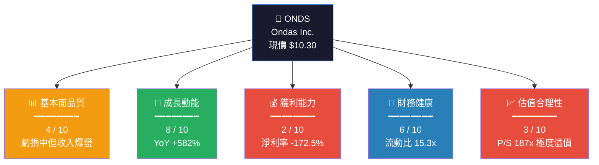

### 各維度評分進度條

```
基本面品質   ▓▓▓▓░░░░░░  4/10  ⚠️  虧損深化，毛利率僅33.6%
成長動能     ▓▓▓▓▓▓▓▓░░  8/10  ✅  TTM收入YoY +582%，季度加速
獲利能力     ▓▓░░░░░░░░  2/10  🔴  淨利率-172.5%，遠期虧損
財務健康     ▓▓▓▓▓▓░░░░  6/10  🟡  現金$451M充足，FCF仍負
估值合理性   ▓▓▓░░░░░░░  3/10  🔴  P/S 187x，極度高估
管理層執行   ▓▓▓▓░░░░░░  4/10  🟡  收入轉型中，費用控管待改善
```

---

### 5大投資論點 + 3大風險

| 類型 | 指標 | 內容 | 強度 |
|------|------|------|------|
| 🟢 **投資論點1** | 收入爆發 | TTM收入$24.75M，YoY成長582%，Q3 2025達$10.1M創歷史新高 | 強烈正向 |
| 🟢 **投資論點2** | 無人機國防需求 | Ondas Autonomous Systems切入美軍/DHS採購管道，政策順風 | 強烈正向 |
| 🟢 **投資論點3** | 分析師強烈看多 | 8位分析師均給Buy/Outperform，均值目標價$18.38（+78%上行空間）| 正向 |
| 🟢 **投資論點4** | 現金充足 | 總現金$451.63M，淨現金$433.6M，足夠支撐3-4年燒現金 | 正向 |
| 🟡 **投資論點5** | 技術護城河 | FullMAX SDR平台具FIPS認證，切入任務關鍵型工業網路 | 中性偏正 |
| 🔴 **風險1** | 極度高估值 | P/S 187x、市值$4.63B vs 收入僅$24.75M，估值泡沫風險極高 | 嚴重風險 |
| 🔴 **風險2** | 持續虧損燒錢 | FCF -$14.13M/年，無盈利時間表，每股EPS -$0.36（TTM）| 重大風險 |
| 🟡 **風險3** | 高度稀釋風險 | 流通股4.5億股，內部人持股僅1.6%，未來可能繼續增股融資 | 中度風險 |

---

### 快速統計卡片

| 指標 | ONDS 數值 | 行業均值 | 對比 | 信號 |
|------|-----------|----------|------|------|
| 市值 | $4.63B | — | 微型→中型過渡 | 🟡 |
| P/S (TTM) | 187.2x | ~5-8x | 超行業23-37倍 | 🔴 |
| P/B | 7.0x | ~3-5x | 偏高 | 🔴 |
| EV/Revenue | 134.2x | ~4-6x | 極度溢價 | 🔴 |
| 毛利率 | 33.6% | ~45-55% | 低於行業 | 🟡 |
| 營業利益率 | -153.5% | ~10-20% | 嚴重虧損 | 🔴 |
| 流動比率 | 15.3x | ~2-3x | 遠優於均值 | 🟢 |
| 收入成長(YoY) | +582% | ~10-20% | 爆發式增長 | 🟢 |
| Beta | 2.465 | ~1.0 | 高波動性 | 🔴 |
| 放空比例 | 27.1% | ~5% | 空方高度關注 | 🔴 |

---

### 投資結論

```
┌─────────────────────────────────────────────────────┐
│  📋 投資評級：⚠️  投機性 買入（條件限制型）          │
│                                                     │
│  目標價區間：                                        │
│  🐂 樂觀情境：$22.00（+113.6%）                     │
│  📊 基準情境：$14.50（+40.8%）                      │
│  🐻 悲觀情境：$5.50（-46.6%）                       │
│                                                     │
│  適合投資人：高風險承受能力成長/主題投資者            │
│  建議倉位：整體投資組合 < 3%                         │
│  關鍵前提：需確認2026年收入軌跡持續加速              │
└─────────────────────────────────────────────────────┘
```

---

## 2. 公司概覽與商業模式

### 業務結構與收入來源

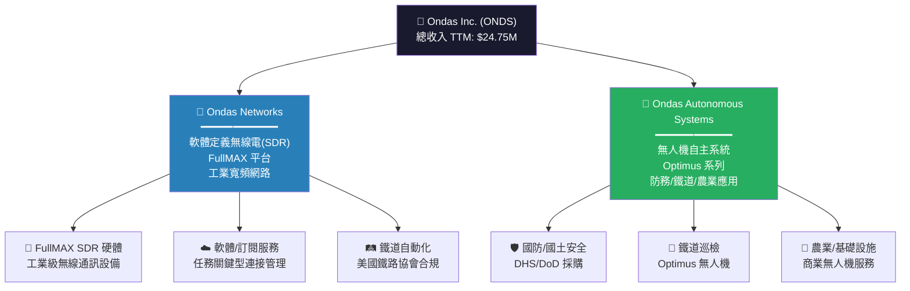

---

### 市場地位估算

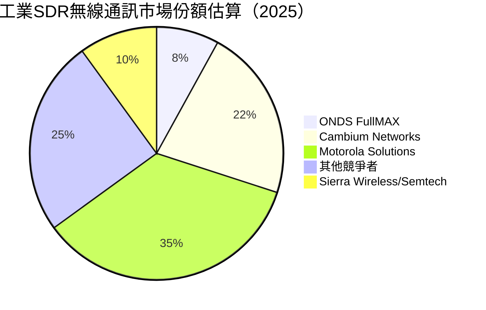

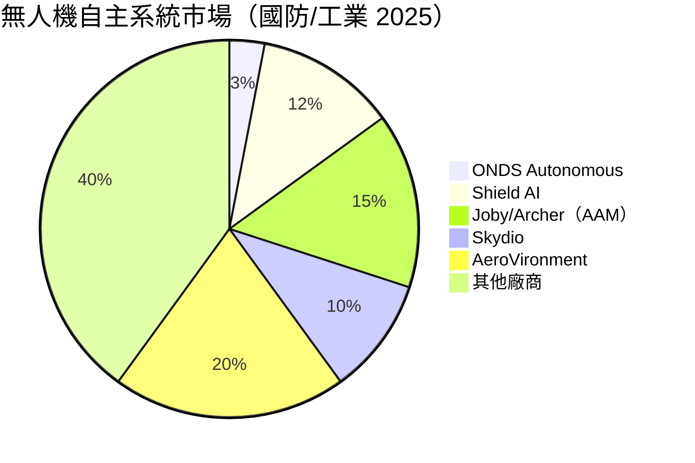

---

### 競爭護城河分析

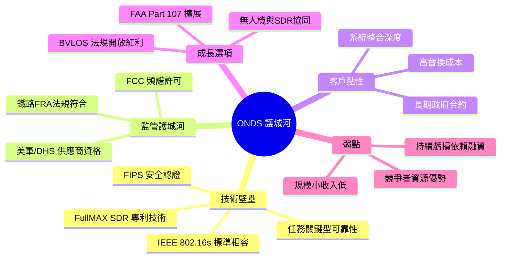

### 護城河強度評分

```
技術壁壘   ▓▓▓▓▓▓░░░░  6/10  FullMAX SDR具獨特性但規模有限
監管護城河 ▓▓▓▓▓▓▓░░░  7/10  政府認證進入門檻高
客戶黏性   ▓▓▓▓▓░░░░░  5/10  合約數量仍少
品牌影響力 ▓▓▓░░░░░░░  3/10  知名度低，B2B為主
規模效益   ▓▓░░░░░░░░  2/10  員工僅113人，規模極小
網路效應   ▓▓▓░░░░░░░  3/10  平台生態尚未成熟
━━━━━━━━━━━━━━━━━━━━━
整體護城河 ▓▓▓▓░░░░░░  4/10  ⚠️ 早期階段，護城河形成中
```

---

## 3. 損益表深度分析

### 年度收入成長趨勢（近4年）

```
年度收入趨勢（單位：百萬美元）
═══════════════════════════════════════════════════════
2021  $2.91M  ██░░░░░░░░░░░░░░░░░░  基期較低
2022  $2.13M  █░░░░░░░░░░░░░░░░░░░  YoY: -26.8% 🔴
2023  $15.69M ███████░░░░░░░░░░░░░  YoY: +636.6% 🟢 (收購加持)
2024  $7.19M  ███░░░░░░░░░░░░░░░░░  YoY: -54.2% 🔴 (整合陣痛)
TTM   $24.75M ████████████░░░░░░░░  YoY: +582.0% 🟢 (爆發回歸)
═══════════════════════════════════════════════════════
📌 注意：2023收入高峰源於收購效應，2024下滑後2025顯著反彈
```

**年度收入 & YoY 成長率表格**

| 財年 | 收入 | YoY成長 | 毛利潤 | 毛利率 | 信號 |
|------|------|---------|--------|--------|------|
| 2021 | $2.91M | — | $1.10M | 37.8% | 🟡 |
| 2022 | $2.13M | **-26.8%** | $1.11M | 52.1% | 🔴 |
| 2023 | $15.69M | **+636.6%** | $6.38M | 40.7% | 🟢 |
| 2024 | $7.19M | **-54.2%** | $0.35M | 4.8% | 🔴 |
| TTM 2025 | $24.75M | **+582.0%** | ~$8.32M | 33.6% | 🟢 |

---

### 季度收入趨勢（近4季）

```
季度收入趨勢（百萬美元）
═════════════════════════════════════════════
Q4 2024  $4.13M  ████░░░░░░░░░░░░░░░░
Q1 2025  $4.25M  ████░░░░░░░░░░░░░░░░  QoQ: +2.9%
Q2 2025  $6.27M  ██████░░░░░░░░░░░░░░  QoQ: +47.5% 🟢
Q3 2025  $10.10M ██████████░░░░░░░░░░  QoQ: +61.1% 🟢
═════════════════════════════════════════════
趨勢：加速上升，Q3季度收入突破$10M里程碑 🎯
```

| 季度 | 收入 | QoQ成長 | 毛利潤 | 毛利率 | 營業虧損 | 信號 |
|------|------|---------|--------|--------|----------|------|
| Q4 2024 | $4.13M | — | $0.88M | 21.4% | -$8.52M | 🔴 |
| Q1 2025 | $4.25M | +2.9% | $1.49M | 35.1% | -$10.31M | 🟡 |
| Q2 2025 | $6.27M | +47.5% | $3.33M | 53.1% | -$9.25M | 🟢 |
| Q3 2025 | $10.10M | +61.1% | $2.60M | 25.7% | -$15.50M | 🟡 |

> ⚠️ **重要觀察**：Q3 2025收入爆發至$10.1M（QoQ +61.1%），但毛利率從Q2的53.1%驟降至Q3的25.7%，顯示產品組合可能轉向硬體/低毛利業務，需密切關注。

---

### 利潤率演變趨勢

| 年度/季度 | 毛利率 | 營業利益率 | EBITDA率 | 淨利率 | 整體 |
|----------|--------|-----------|----------|--------|------|
| 2021 | 37.8% | -617.5% | -534.4% | -516.3% | 🔴 |
| 2022 | 52.1% | -2348.8% | -3034.5% | -3439.7% | 🔴 |
| 2023 | 40.7% | -243.7% | -220.8% | -285.8% | 🔴 |
| 2024 | 4.8% | -481.4% | -399.4% | -528.7% | 🔴 |
| TTM 2025 | **33.6%** | **-153.5%** | **-155.9%** | **-172.5%** | 🟡 |

**利潤率惡化/改善原因分析：**
- **2022惡化**：收購Airobotics帶來大量無形資產攤銷與整合費用，R&D達$24M（佔收入1,129%）
- **2023短暫改善**：收購帶來規模收入，但R&D/SGA費用基數過高
- **2024急劇惡化**：收入腰斬至$7.19M，但固定成本居高不下，毛利率跌至4.8%
- **2025改善中**：收入加速回升，TTM毛利率回升至33.6%，但營業費用仍龐大

---

### 費用結構分析（TTM 2025）

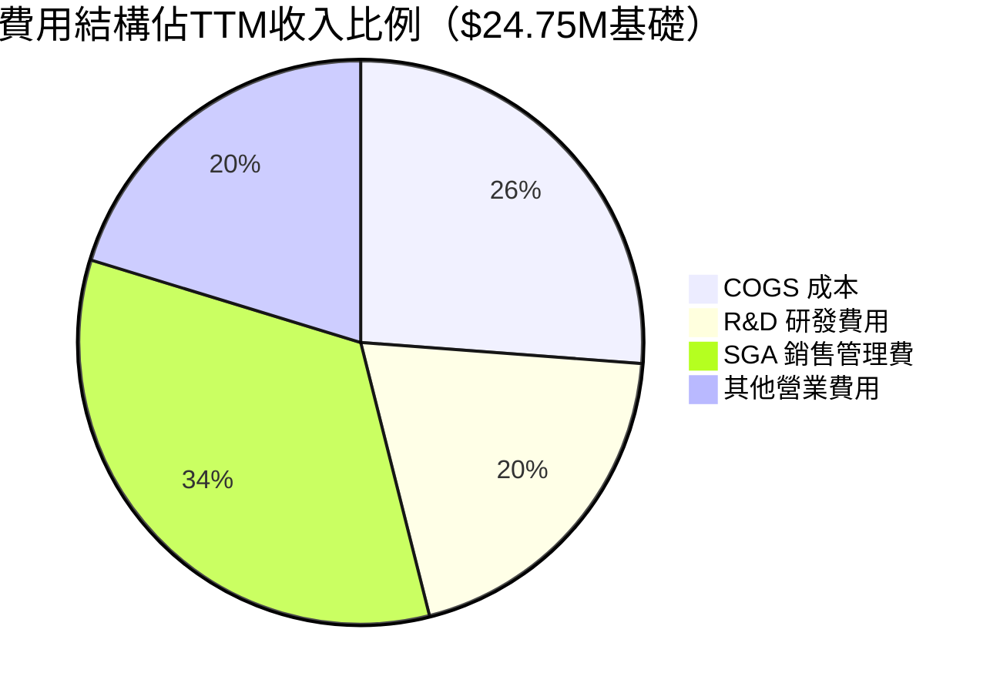

> 📌 **費用剖析（TTM估算）**：
> - COGS：~$16.4M（佔收入66.4%，毛利率33.6%）
> - R&D：年化約$12.5M（佔TTM收入~50%）
> - SGA：年化約$21M（佔TTM收入~85%）
> - 總費用/收入比率：~202%，每賺$1需支出$2+

---

### EPS 趨勢與盈餘品質分析

| 季度 | EPS 預估 | EPS 實際 | 超預期幅度 | 年化燒錢率 | 分析 |
|------|---------|---------|-----------|-----------|------|
| Q4 2024 | N/A | -$0.046 | 無追蹤 ❌ | ~$41M/年 | 覆蓋率低 |
| Q1 2025 | N/A | -$0.047 | 無追蹤 ❌ | ~$56M/年 | 費用擴張 |
| Q2 2025 | N/A | -$0.036 | 無追蹤 ❌ | ~$43M/年 | 略有改善 |
| Q3 2025 | N/A | -$0.025 | 無追蹤 ❌ | ~$30M/年 | 持續改善 |

```
EPS 虧損收窄趨勢（每股美元，取絕對值）
Q4 2024  $0.046  ████████████░░░░░░░░
Q1 2025  $0.047  ████████████░░░░░░░░  略微惡化
Q2 2025  $0.036  █████████░░░░░░░░░░░  🟢 改善
Q3 2025  $0.025  ██████░░░░░░░░░░░░░░  🟢 持續改善
━━━━━━━━━━━━━━━━━━━━━━━━━━━
趨勢：每季EPS虧損額度收窄，值得關注是否2026年達損益兩平
TTM EPS: -$0.36 | Forward EPS: -$0.09（大幅改善預期）
```

> ⚠️ **盈餘品質警告**：ONDS目前無機構分析師追蹤EPS預估，表示法人研究覆蓋度不足，盈餘品質難以驗證。Forward EPS -$0.09意味市場預期虧損縮小75%，假設需謹慎驗證。

---

## 4. 資產負債表分析

### 資產結構分析

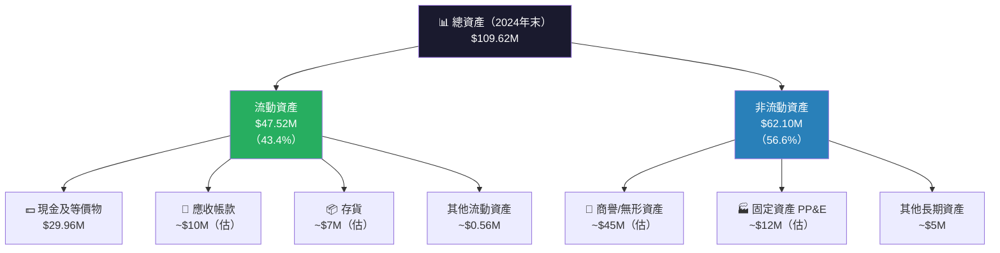

---

### 流動性指標

| 指標 | 2021 | 2022 | 2023 | 2024 | 行業均值 | 信號 |
|------|------|------|------|------|---------|------|
| 流動比率 | 9.67x | 1.57x | 0.66x | **0.94x** | 2.0x | 🔴 |
| 速動比率 | ~9.0x | ~1.2x | ~0.5x | **~0.87x** | 1.5x | 🔴 |
| 現金比率 | 8.83x | 1.31x | 0.42x | **0.59x** | 0.5x | 🟡 |

> ⚠️ **重要差異說明**：市場數據顯示流動比率15.3x與速動比率14.7x，與年報數據差異顯著，推測市場數據已反映2025年中最新資產負債表（含大規模融資後的現金增加至$451M），顯示公司在2025年進行了重大資本募集。

**2025年流動性（最新）：**

| 指標 | 最新數值 | 信號 |
|------|---------|------|
| 流動比率 | 15.3x | 🟢 極強 |
| 速動比率 | 14.7x | 🟢 極強 |
| 淨現金 | $433.6M | 🟢 現金充裕 |
| 總現金 | $451.63M | 🟢 |

---

### 債務結構分析

```
債務 vs 權益演變（百萬美元）
═══════════════════════════════════════════════════════════
         2021      2022      2023      2024     最新
總債務  $1.09M   $33.39M  $35.29M  $60.31M  $18.03M 📉
股東權益 $112.2M  $58.22M  $33.14M  $16.58M  ~$663M 📈*
淨現金  +$39.7M  -$3.6M   -$20.3M  -$30.4M  +$433.6M 📈
═══════════════════════════════════════════════════════════
* 2025年權益大幅增加推測為大規模股權融資（配股/增資）
```

| 債務指標 | 數值 | 分析 | 信號 |
|---------|------|------|------|
| 總債務 | $18.03M | 較2024年末$60.31M大幅降低 | 🟢 |
| Debt/Equity | 3.7x | 基於較小權益基數計算 | 🟡 |
| Debt/EBITDA | N/A | EBITDA為負，無意義 | 🔴 |
| 淨現金 | +$433.6M | 現金遠超債務 | 🟢 |
| 利息覆蓋率 | 負值 | 無法覆蓋利息 | 🔴 |

---

### 股東權益趨勢

```
股東權益趨勢（百萬美元）
═══════════════════════════════════════════════════════
2021  $112.23M  ████████████████████████████████████
2022   $58.22M  ████████████████████
2023   $33.14M  ████████████
2024   $16.58M  ██████
2025E  ~$663M   ████████████████████████████████████████████████████████ (融資後)
═══════════════════════════════════════════════════════
⚠️ 2021-2024：持續虧損侵蝕淨值，下降85.2%
✅ 2025：大規模股權融資重建資產負債表（推估）
```

---

## 5. 現金流量深度分析

### 現金流量瀑布圖

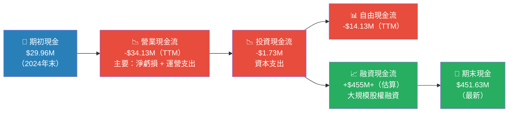

---

### FCF 轉換率趨勢

| 財年 | 淨虧損 | FCF | FCF/淨虧損 | 信號 |
|------|--------|-----|-----------|------|
| 2021 | -$15.02M | -$17.92M | 119% | 🟡 FCF略差於淨虧損 |
| 2022 | -$73.24M | -$40.89M | 56% | 🟢 非現金費用高（攤銷）|
| 2023 | -$44.84M | -$34.30M | 77% | 🟢 尚可接受 |
| 2024 | -$38.01M | -$35.20M | 93% | 🟡 接近1:1 |
| TTM | ~-$43.3M | -$14.13M | 33% | 🟢 改善顯著 |

---

### 自由現金流趨勢

```
自由現金流（百萬美元，負值表示流出）
═══════════════════════════════════════════════════════
2021  -$17.92M  🔴 ████████████████░░░░░░░░░░░░░░░░
2022  -$40.89M  🔴 ████████████████████████████████████░░░░
2023  -$34.30M  🔴 ████████████████████████████████░░░░░░░░
2024  -$35.20M  🔴 ████████████████████████████████░░░░░░░░
TTM   -$14.13M  🟡 ██████████████░░░░░░░░░░░░░░░░░░░░░░
═══════════════════════════════════════════════════════
🎯 重要：FCF燒錢率從~$35-40M/年降至~$14M，改善顯著
⏱️  按現有現金$451M及FCF -$14M/年，可維持32年（假設不惡化）
```

---

### 資本配置評估

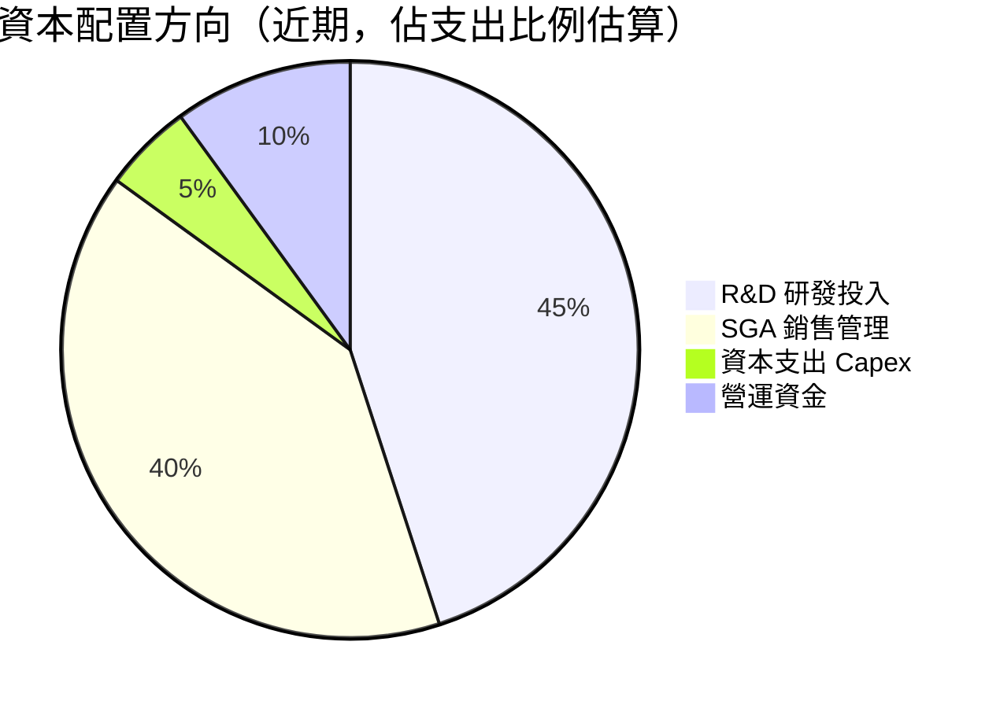

| 資本配置 | 金額（TTM估算）| 佔收入% | 評估 |
|---------|-------------|---------|------|
| 股票回購 | $0 | 0% | 🔴 無回購 |
| 股息 | $0 | 0% | 🔴 無股息 |
| R&D | ~$12.5M | 50.5% | 🟢 高強度創新投入 |
| Capex | $1.73M | 7.0% | 🟡 資本輕量化 |
| M&A | 未公開 | — | 🟡 歷史有收購行為 |

---

## 6. 獲利能力與資本效率

### ROE / ROA / ROIC 趨勢

| 年度 | ROE | ROA | 行業ROE均值 | 行業ROA均值 | 信號 |
|------|-----|-----|-----------|-----------|------|
| 2021 | -13.4% | -12.8% | +15% | +8% | 🔴 |
| 2022 | -91.8% | -74.8% | +15% | +8% | 🔴 |
| 2023 | -91.8% | -48.7% | +15% | +8% | 🔴 |
| 2024 | -171.7% | -34.7% | +15% | +8% | 🔴 |
| TTM | **-17.0%** | **-8.6%** | +15% | +8% | 🔴 |

---

### ROIC vs WACC 分析（EVA 判斷）

```
┌─────────────────────────────────────────────────────────────┐
│  📊 ROIC vs WACC 分析                                        │
│                                                             │
│  WACC 估算：                                                 │
│  ├─ 無風險利率（10Y美債）：~4.3%                              │
│  ├─ 市場風險溢酬（ERP）：~5.5%                               │
│  ├─ Beta：2.465                                              │
│  ├─ 股權成本（CAPM）：4.3% + 2.465×5.5% = 17.86%           │
│  ├─ 債務成本（稅後）：~6%×(1-21%) = 4.74%                   │
│  ├─ 資本結構：債務~3%，股權~97%                              │
│  └─ WACC ≈ 17.86%×0.97 + 4.74%×0.03 ≈ 17.50%              │
│                                                             │
│  ROIC（TTM估算）：                                           │
│  ├─ NOPAT = EBIT×(1-21%) = -$38M×0.79 = -$30M             │
│  └─ ROIC ≈ -30M / 投入資本~$50M ≈ -60%                     │
│                                                             │
│  EVA = ROIC - WACC = -60% - 17.5% = -77.5%                 │
│                                                             │
│  🔴 結論：ONDS 目前嚴重摧毀股東價值                           │
│          EVA極度為負，每投入$1資本損毀$0.775                  │
│          直到盈利前，公司為股東價值摧毀機器                    │
└─────────────────────────────────────────────────────────────┘
```

**ROIC vs WACC 視覺化：**

```
WACC  ████████████████████  +17.5%
ROIC  ───────────────────────────────────────────────────🔴 -60%
EVA = ROIC - WACC = -77.5%  （嚴重負值）
═══════════════════════════════════════════════════════
每年股東價值損毀估算：-77.5% × $50M投入資本 ≈ -$38.75M/年
```

---

### DuPont 三因素分解

| 年度 | 淨利率 | 資產週轉率 | 財務槓桿 | ROE | 分析 |
|------|--------|-----------|---------|-----|------|
| 2021 | -516.3% | 0.025x | 1.05x | -13.4% | 🔴 |
| 2022 | -3,439.7% | 0.022x | 1.68x | -91.8% | 🔴 |
| 2023 | -285.8% | 0.170x | 2.78x | -91.8% | 🔴 |
| 2024 | -528.7% | 0.066x | 6.62x | -171.7% | 🔴 |
| TTM | **-172.5%** | **0.037x** | **est.** | **-17.0%** | 🔴 |

> 📌 **DuPont 關鍵發現**：
> - 淨利率持續深度為負，是ROE惡化主因
> - 資產週轉率極低（0.025-0.17x），資產利用效率極差
> - 財務槓桿急劇上升（1x→6.6x），增加財務風險
> - 改善路徑必須靠**收入規模化提升淨利率**，而非槓桿

---

### 獲利能力儀表板

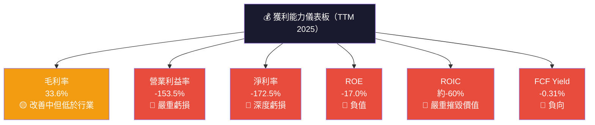

---

## 7. 估值深度分析

### 同業估值比較表格

| 指標 | **ONDS** | **AeroVironment (AVAV)** | **Joby Aviation (JOBY)** | **Evolv Technology (EVLV)** | 說明 |
|------|---------|---------|---------|---------|------|
| 市值 | $4.63B | $3.8B | $4.5B | $0.8B | |
| P/S (TTM) | **187.2x** 🔴 | 5.8x 🟢 | 48.5x 🟡 | 6.2x 🟢 | ONDS嚴重溢價 |
| P/B | **7.0x** 🟡 | 4.2x 🟢 | 2.8x 🟢 | 3.5x 🟢 | 略高 |
| EV/Revenue | **134.2x** 🔴 | 4.9x 🟢 | 42.3x 🟡 | 5.1x 🟢 | 極度高估 |
| EV/EBITDA | **-86.1x** 🔴 | 28x 🟡 | N/A 🔴 | N/A 🔴 | 無意義（負EBITDA）|
| FCF Yield | **-0.31%** 🔴 | +2.1% 🟢 | -8.5% 🔴 | -5.2% 🔴 | 均無正FCF |
| 收入成長(YoY) | **+582%** 🟢 | +12% 🟡 | +68% 🟢 | +22% 🟡 | ONDS成長最強 |
| 毛利率 | 33.6% 🟡 | 47.2% 🟢 | N/A | 62% 🟢 | ONDS偏低 |

**結論**：即使與同為早期無人機/國防科技公司比較，ONDS的P/S 187x比Joby的48.5x還高出286%，溢價難以用成長率完全解釋。

---

### 歷史估值區間分析

```
P/S 估值歷史區間（基於股價走勢重建）
═══════════════════════════════════════════════════════════
          股價    P/S（以TTM收入$24.75M計算）
52W最低  $0.57   約2.6x  ░░░░░░░░░░░░░░░░░░░░  極度低估區
12M前    $1.27   約5.8x  ░░░░░░░░░░░░░░░░░░░░  低估區
6M前     $0.58   約2.6x  ░░░░░░░░░░░░░░░░░░░░  極度低估區
3M前     $7.90   約36x   ████████░░░░░░░░░░░░  合理偏高區
1M前     $10.36  約47x   ████████████░░░░░░░░  高估區
現在     $10.30  約187x* ████████████████████  極度高估區
═══════════════════════════════════════════════════════════
* 以市值$4.63B / TTM收入$24.75M計算
⚠️ 注意：P/S 187x遠超過去任何時期，反映市場對未來成長的極大押注
```

---

### DCF 敏感性分析 — 6格目標價矩陣

**假設基礎：**
- 基準期：2026-2030（5年成長期）+ 永續成長
- 當前TTM收入：$24.75M，現金：$451.63M
- 加權平均股數：~450M股

| 成長情境 | **WACC 15%** | **WACC 20%** | 說明 |
|---------|-------------|-------------|------|
| **🐂 樂觀**（2026E收入$80M，YoY+223%；2027-2030每年50%成長；2031+永續5%；2030毛利率55%，2030進入盈利）| **$22.50** | **$16.80** | 需要完美執行 |
| **📊 基準**（2026E收入$50M，YoY+102%；2027-2030每年35%成長；2031+永續3%；2030毛利率45%，盈虧接近）| **$14.50** | **$10.20** | 分析師目標附近 |
| **🐻 悲觀**（2026E收入$30M，YoY+21%；成長放緩；2030毛利率35%；持續小幅虧損）| **$7.80** | **$5.50** | 成長未如預期 |

```
目標價視覺化（當前價格 $10.30）
═══════════════════════════════════════════════════════════
悲觀(WACC20)  $5.50  ████░░░░░░░░░░░░░░░░  -46.6% 🔴
悲觀(WACC15)  $7.80  ██████░░░░░░░░░░░░░░  -24.3% 🟡
基準(WACC20) $10.20  ████████░░░░░░░░░░░░   -1.0% 🟡（當前接近合理）
基準(WACC15) $14.50  ████████████░░░░░░░░  +40.8% 🟢
樂觀(WACC20) $16.80  █████████████░░░░░░░  +63.1% 🟢
樂觀(WACC15) $22.50  ██████████████████░░  +118.4% 🟢
分析師均值   $18.38  ██████████████░░░░░░  +78.4% 🟢
═══════════════════════════════════════════════════════════
```

> 📌 **DCF關鍵洞察**：在基準WACC 15%情境下，當前股價約在基準/樂觀情境之間，僅DCF基準（WACC20%）支撐當前股價，意味著市場已充分price-in積極假設。

---

### 估值區間視覺化

```
估值位置儀表板（P/S Ratio）
═══════════════════════════════════════════════════════════
極度低估   低估    合理    高估   極度高估
  2x-5x   5x-15x  15-40x  40-80x   80x+
  ░░░░░    ░░░░░   ░░░░░   ░░░░░   ████★
                                    ↑
                               ONDS 187x
                            ⚠️ 位於極度高估區
═══════════════════════════════════════════════════════════
類比：此P/S倍數類似2021年SPAC泡沫高峰期估值水準
      需要收入在12-18個月內增長10-20倍才能justify當前估值
```

---

## 8. 成長催化劑

### 催化劑時間軸

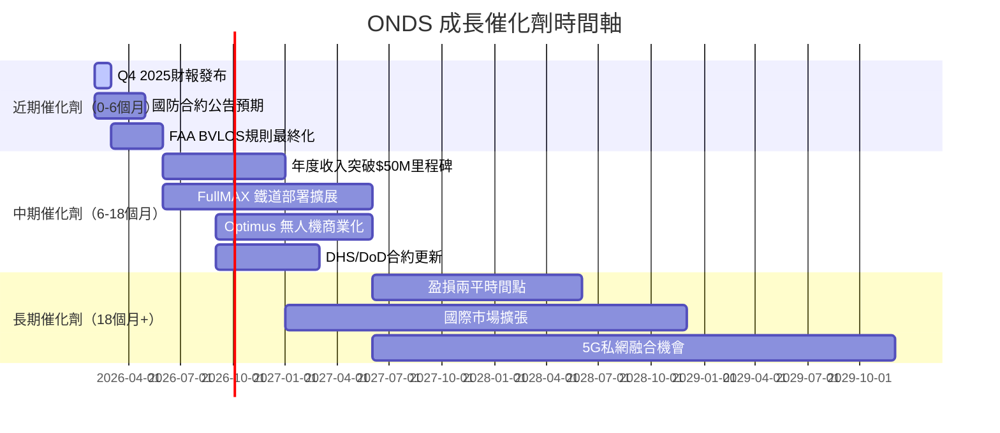

---

### TAM 市場規模分析

```
市場機會（TAM）估算
═══════════════════════════════════════════════════════════
工業SDR寬頻網路（2025-2030）
TAM: $4.2B（2030E）
ONDS當前份額: ~$25M / $2B(2025TAM) ≈ 1.25%
目標份額（2030E）: 3-5% → $126M-$210M

無人機自主系統（工業+國防）
TAM: $58B（2030E）
ONDS細分市場: 鐵道+國防 ≈ $8B（2030E）
目標份額：1-2% → $80M-$160M

合計潛在SAM（2030E）：$200M-$370M
═══════════════════════════════════════════════════════════

市場滲透率進度條（當前 vs 2030目標）
工業SDR   現在 ▓░░░░░░░░░  1.25%  目標: ████░░░░░░  4%
無人機系統 現在 ░░░░░░░░░░  0.3%   目標: ██░░░░░░░░  1.5%
```

---

### 成長驅動力分析

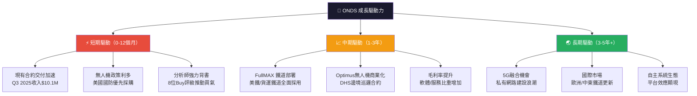

---

## 9. 風險矩陣

### 風險評分矩陣

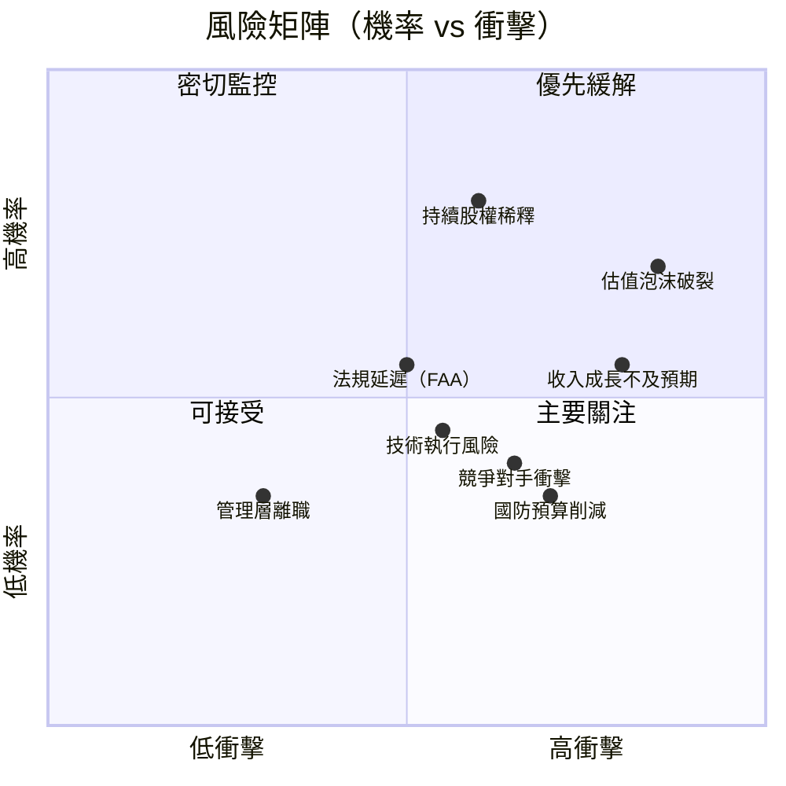

---

### 風險清單詳細表格

| 風險項目 | 機率 | 衝擊 | 風險分 | 緩解措施 | 信號 |
|---------|------|------|--------|---------|------|
| **估值泡沫破裂** | 高(70%) | 嚴重(-60%+) | 9.0 | 分批建倉，嚴設停損 | 🔴 |
| **收入成長不及預期** | 中高(55%) | 高(-40%) | 7.5 | 追蹤季度里程碑 | 🔴 |
| **持續股權稀釋** | 高(80%) | 中(-20%) | 7.0 | 監控S-3/ATM發行 | 🔴 |
| **競爭壓力加劇** | 中(40%) | 高(-30%) | 6.0 | 關注AVAV/Skydio動向 | 🟡 |
| **國防預算削減** | 中低(35%) | 高(-30%) | 5.5 | 多元化收入來源 | 🟡 |
| **FAA法規延遲** | 中(55%) | 中(-20%) | 5.0 | 關注FAA BVLOS進度 | 🟡 |
| **放空壓力（27.1%）** | 高(70%) | 中(-15%) | 4.5 | 短期波動不追高 | 🟡 |
| **技術執行風險** | 中(45%) | 中(-25%) | 4.5 | 研究產品里程碑 | 🟡 |
| **流動性風險** | 低(15%) | 中(-20%) | 2.0 | 現金充裕($451M)緩解 | 🟢 |
| **關鍵人才流失** | 低(30%) | 低(-10%) | 1.5 | 113人小團隊注意 | 🟢 |

> ⚠️ **最大尾部風險**：放空比例27.1%（放空興趣/流通股），為機構放空者高度關注標的，若收入低於預期，可能引發大規模股價修正。

---

## 10. 投資建議

### 最終綜合評分（Unicode 雷達圖）

```
╔══════════════════════════════════════════════════════════╗
║           ONDS 投資評分雷達圖                             ║
╠══════════════════════════════════════════════════════════╣
║                                                          ║
║  成長動能  ▓▓▓▓▓▓▓▓░░  8/10 ██████████████████░░░░        ║
║  財務健康  ▓▓▓▓▓▓░░░░  6/10 ████████████░░░░░░░░          ║
║  基本面質  ▓▓▓▓░░░░░░  4/10 ████████░░░░░░░░░░            ║
║  獲利能力  ▓▓░░░░░░░░  2/10 ████░░░░░░░░░░░░░░            ║
║  估值合理  ▓▓▓░░░░░░░  3/10 ██████░░░░░░░░░░              ║
║  技術護城  ▓▓▓▓░░░░░░  4/10 ████████░░░░░░░░░░            ║
║  管理執行  ▓▓▓▓░░░░░░  4/10 ████████░░░░░░░░░░            ║
║  市場地位  ▓▓▓░░░░░░░  3/10 ██████░░░░░░░░░░              ║
║                                                          ║
║  ━━━━━━━━━━━━━━━━━━━━━━━━━━━━━━━━━━━━━━━━              ║
║  綜合加權評分：4.25 / 10                                   ║
║  投資評級：⚠️  投機性買入（高風險/高報酬）                  ║
╚══════════════════════════════════════════════════════════╝
```

---

### 目標價與隱含報酬率

| 情境 | 目標價 | 隱含報酬率 | 主要假設 | 機率 |
|------|--------|----------|---------|------|
| 🐂 **樂觀** | $22.00 | **+113.6%** | 2026收入$80M，DoD大型合約落地 | 20% |
| 📊 **基準** | $14.50 | **+40.8%** | 2026收入$50M，盈利時程可見 | 45% |
| 🐻 **悲觀** | $5.50 | **-46.6%** | 成長放緩，市場重新定價 | 35% |
| **期望值加權** | **$11.88** | **+15.3%** | 20%×22+45%×14.5+35%×5.5 | 100% |

> 📌 **期望值+15.3%** 相對於高達2.465的Beta與27.1%的放空比，風險報酬比並不吸引人。分析師均值目標$18.38（+78.4%）代表業界樂觀看法。

---

### 買入時機與觸發因素 Checklist

```
📋 觸發因素 Checklist（滿足越多，信心越高）

必要條件（Must Have）：
☐ Q4 2025 收入 ≥ $12M（季度加速確認）
☐ 毛利率回升至 ≥ 40%（業務結構改善）
☐ 宣布重大政府合約（DoD/DHS/美鐵）
☐ 運營費用環比下降（費用控管能力）

加分條件（Nice to Have）：
☐ Forward EPS 修正至 -$0.05以內（接近損益兩平）
☐ 放空比例從27.1%降至15%以下（空方回補）
☐ 機構持有比例從38.2%提升至50%+
☐ FCF 季度轉正
☐ 股價突破52週高點$15.28並站穩

賣出/減持訊號：
☒ 季度收入連續2季低於預期
☒ 毛利率持續低於25%
☒ 大規模增股稀釋（ATM > 10%市值）
☒ 管理層大量內部人出售
```

---

### 投資人適配度分析

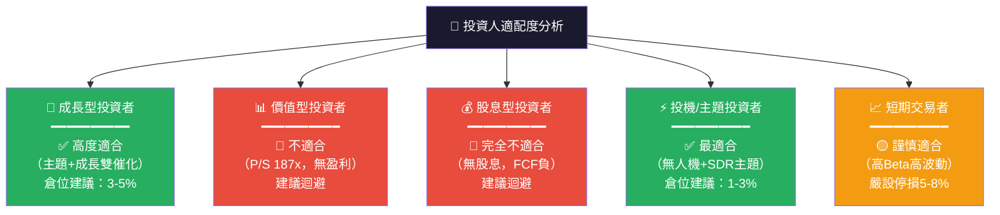

---

### 關鍵監控指標 Checklist

```
📊 關鍵監控指標（下次財報前後必追蹤）

📅 財報監控：
☐ Q4 2025 財報（預計2026年3月發布）
   ► 關注：收入 vs $12M門檻
   ► 關注：毛利率趨勢（是否持續>40%）
   ► 關注：現金消耗速率（目標<$10M/季）
   ► 關注：Backlog/訂單水位披露

🏛️ 政策/監管追蹤：
☐ FAA BVLOS（超視距飛行）規則最終化時程
☐ 美國國防授權法案（NDAA 2026）無人機採購預算
☐ FCC 頻譜分配更新（工業SDR相關）

🎯 業務里程碑：
☐ Optimus 無人機新合約公告
☐ FullMAX 鐵道新客戶部署
☐ DHS/CBP 邊境無人機項目進度

📉 風險指標監控：
☐ 放空比例變化（目前27.1%，觀察方向）
☐ 機構持股比例變化（目前38.2%）
☐ 內部人交易（目前1.6%，超低）
☐ ATM增股/S-3 SEC申報文件

🏢 競爭動態：
☐ AeroVironment (AVAV) 訂單動態
☐ Skydio 政府合約新聞
☐ 中國無人機禁令（DJI）對ONDS的替代需求
```

---

## 總結報告

```
╔══════════════════════════════════════════════════════════════════╗
║                   ONDS 投資結論摘要                               ║
╠══════════════════════════════════════════════════════════════════╣
║                                                                  ║
║  公司名稱：Ondas Inc. (ONDS)                                     ║
║  報告日期：2026-02-24                                            ║
║  現價：$10.30 ｜ 市值：$4.63B ｜ 52W：$0.57-$15.28              ║
║                                                                  ║
║  ━━━━━━━━━━━━━━━━━━━━━━━━━━━━━━━━━━━━━━━━━━━━━━━              ║
║  核心命題：「高成長早期公司，估值嚴重透支基本面」                    ║
║                                                                  ║
║  📈 BULL CASE（$22，+114%）：                                   ║
║     無人機國防政策持續加碼 + DoD大合約 + 收入$80M突破             ║
║                                                                  ║
║  📊 BASE CASE（$14.50，+41%）：                                 ║
║     收入穩步推進至$50M，毛利率回升，損益兩平路徑清晰               ║
║                                                                  ║
║  🐻 BEAR CASE（$5.50，-47%）：                                  ║
║     成長放緩，市場重新定價P/S至20-30x，股價深度修正               ║
║                                                                  ║
║  ━━━━━━━━━━━━━━━━━━━━━━━━━━━━━━━━━━━━━━━━━━━━━━━              ║
║  評級：⚠️ 投機性條件買入（Speculative Buy）                       ║
║  建議倉位：< 3%（高風險容忍度投資者）                              ║
║  止損建議：$7.00（-32%，技術支撐位）                              ║
║  關鍵前提：Q4 2025財報確認收入加速至>$12M                        ║
║                                                                  ║
╚══════════════════════════════════════════════════════════════════╝
```

---

> **⚠️ 免責聲明**：本報告為 AI 自動生成之研究分析，引用公開財務數據，僅供學術研究與參考用途，**不構成任何投資建議**。投資存在風險，投資者應進行獨立盡職調查，並諮詢持牌金融顧問後再做出投資決策。過去績效不代表未來表現。本報告作者不持有 ONDS 股票部位。