# ONDS 基本面深度分析報告

> **報告日期**：2026-02-24 ｜ **語言**：繁體中文 ｜ **數據來源**：Yahoo Finance ｜ **分析師**：AI 頂級研究團隊

---

## 目錄

| # | 章節 | 核心主題 |
|---|------|---------|
| 1 | 執行摘要 | 整體評分與五大投資論點 |
| 2 | 公司概覽 | 業務結構、市場地位、競爭優勢 |
| 3 | 損益表深度分析 | 收入成長、利潤率、費用結構 |
| 4 | 資產負債表分析 | 資產配置、負債、流動性 |
| 5 | 現金流量分析 | 現金流瀑布、FCF趨勢 |
| 6 | 獲利能力指標 | ROE/ROA/ROIC 深度對比 |
| 7 | 估值分析 | 多重估值法、同業比較 |
| 8 | 競爭護城河 | Porter五力、護城河評分 |
| 9 | 成長催化劑 | 時間軸、TAM市場 |
| 10 | 風險分析 | 風險矩陣、評分卡 |
| 11 | 公平價值估算 | DCF、三法比較 |
| 12 | 投資建議 | 最終評級、監控指標 |

---

## 1. 執行摘要

### 📊 核心評分儀表板

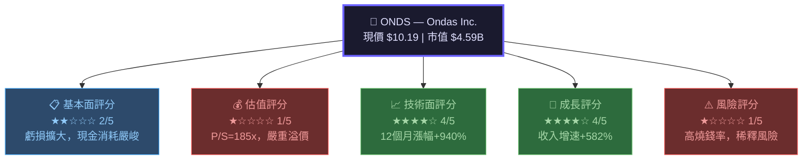

---

### 🎯 五大投資論點

| # | 論點 | 說明 | 評估 |
|---|------|------|------|
| 1 | 🟢 **爆炸性收入成長** | TTM 收入年增 +582%，顯示業務真實訂單放量 | 🟢 強烈正面 |
| 2 | 🟢 **充裕現金儲備** | 手持現金 $451.63M，流動比率高達 15.3x | 🟢 短期安全 |
| 3 | 🟡 **雙引擎戰略定位** | 私網通訊 + 無人機自主系統，切入高門檻賽道 | 🟡 待驗證 |
| 4 | 🔴 **持續巨額虧損** | 2024年淨虧 $38M，歷年累計虧損超 $171M | 🔴 重大風險 |
| 5 | 🔴 **估值嚴重泡沫化** | P/S 高達 185x，遠超同業，定價含極高預期溢價 | 🔴 估值風險 |

---

### 📌 快速統計卡片

| 指標 | 數值 | 評級 |
|------|------|------|
| **現價** | $10.19 | — |
| **52週高/低** | $15.28 / $0.57 | 🟡 距高點 -33.3% |
| **市值** | $4.59B | 🔴 相對收入嚴重溢價 |
| **企業價值** | $3.32B | 🔴 |
| **Beta** | 2.465 | 🔴 極高波動性 |
| **流通股** | 450.09M | 🔴 高度稀釋風險 |
| **TTM 收入** | $24.75M | 🟡 規模仍小 |
| **毛利率** | 33.6% | 🟡 |
| **營業利潤率** | -153.5% | 🔴 |
| **現金** | $451.63M | 🟢 |
| **自由現金流** | -$14.13M | 🔴 |
| **分析師目標價** | $18.38（均值） | 🟢 上行空間 +80% |
| **評級** | 強力買入（8位分析師） | 🟢 |

---

## 2. 公司概覽

### 🏗️ 業務結構分解

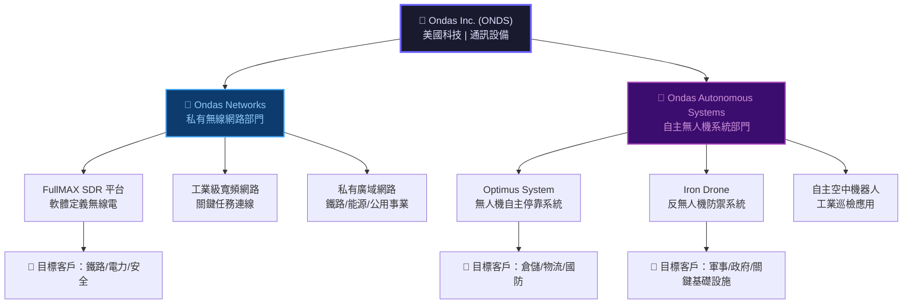

---

### 📊 業務定位市場地圖

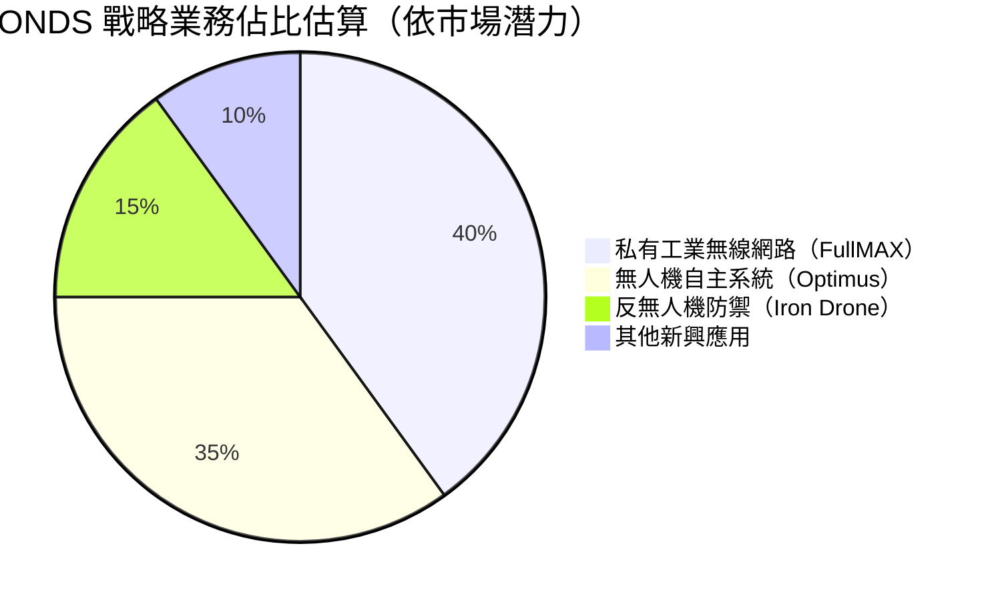

---

### 🧠 競爭優勢心智圖

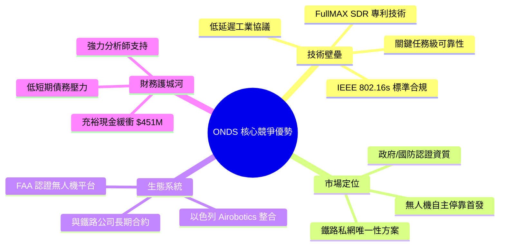

---

### 📍 員工規模與效率

```
公司規模：113 名員工（精幹團隊）
人均收入：$24.75M ÷ 113 = $219,027/人
人均虧損：$38.01M ÷ 113 = $336,372/人

規模對比：
員工數  ▓▓░░░░░░░░░░░░░░░░░░  113人（小型精英團隊）
同業均  ▓▓▓▓▓▓▓▓▓▓░░░░░░░░░░  ~500-2000人
```

---

## 3. 損益表深度分析

### 📈 收入成長時間軸

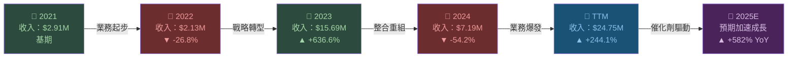

---

### 📊 年度收入趨勢 ASCII 長條圖

```
ONDS 年度收入趨勢（單位：$M）
═══════════════════════════════════════════════════
2021  $2.91M  ▓▓░░░░░░░░░░░░░░░░░░░░░░░░░░░░
2022  $2.13M  ▓░░░░░░░░░░░░░░░░░░░░░░░░░░░░░
2023  $15.69M ▓▓▓▓▓▓▓▓▓▓▓▓▓▓▓░░░░░░░░░░░░░░
2024  $7.19M  ▓▓▓▓▓▓▓░░░░░░░░░░░░░░░░░░░░░░░
TTM   $24.75M ▓▓▓▓▓▓▓▓▓▓▓▓▓▓▓▓▓▓▓▓▓▓▓▓▓░░░░
═══════════════════════════════════════════════════
         0    5    10   15   20   25   30  ($M)
⚠️ 注意：收入波動劇烈，2024年下滑因業務整合/認購時程差異
```

---

### 📉 利潤率演變 ASCII 折線圖

```
利潤率趨勢（%）
══════════════════════════════════════════════════════
     2021      2022      2023      2024      TTM
毛利率
38%  ──●───────────────────●──────────────●──
35%            ●
     ─────────────────────────────────────────
33%  ─────────────────────────────────────────●

營業利潤率（嚴重虧損）
  0% ══════════════════════════════════════════
-50%        ────────────●──────────────────────
-100%                                    ●─────
-153%────────────────────────────────────────●

淨利潤率
  0% ══════════════════════════════════════════
-100%                         ●
-172%──────────────────────────────────────●
══════════════════════════════════════════════════════
結論：毛利率相對穩定（33-38%），但費用端嚴重拖累整體獲利
```

---

### 📋 損益表詳細數據表（近4年）

| 指標 | 2021 | 2022 | 2023 | 2024 | 評級 |
|------|------|------|------|------|------|
| **總收入** | $2.91M | $2.13M | $15.69M | $7.19M | 🟡 波動劇烈 |
| **毛利** | $1.10M | $1.11M | $6.38M | $345K | 🔴 大幅退坡 |
| **毛利率** | 37.8% | 52.1% | 40.7% | 4.8% | 🔴 2024崩跌 |
| **R&D 費用** | $5.80M | $24.04M | $17.15M | $12.48M | 🟡 逐步下降 |
| **營業利益** | -$17.97M | -$50.01M | -$38.23M | -$34.61M | 🟡 虧損收窄 |
| **EBITDA** | -$15.55M | -$64.63M | -$34.64M | -$28.72M | 🟡 改善中 |
| **淨利益** | -$15.02M | -$73.24M | -$44.84M | -$38.01M | 🟡 持續改善 |
| **EPS (TTM)** | N/A | N/A | N/A | -$0.36 | 🔴 |

> ⚠️ **關鍵警示**：2024年毛利率從 40.7% 急跌至 4.8%，顯示業務組合改變或成本結構惡化，需密切追蹤。

---

### 🥧 費用結構分析

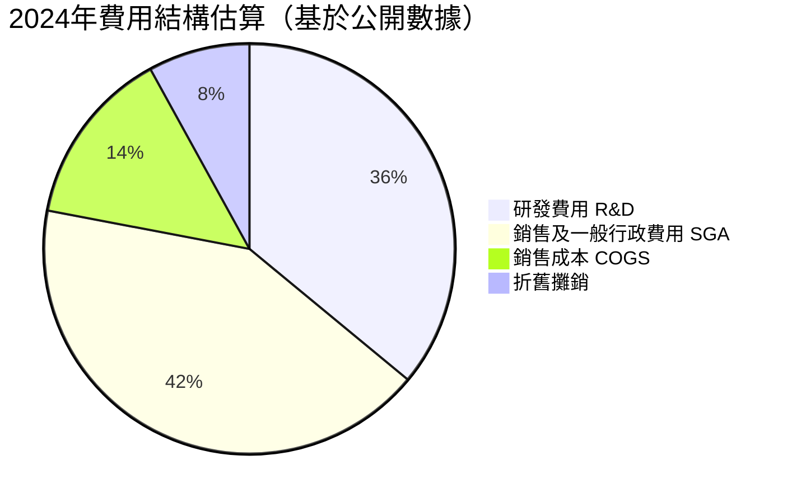

---

### R&D 投入強度趨勢

```
R&D 費用 vs 收入比（越高代表投入越激進）
═══════════════════════════════════════════════
2021：R&D $5.80M / 收入 $2.91M = 199% ████████████████████
2022：R&D $24.04M/ 收入 $2.13M = 1128% 超高投入期（燒錢最猛）
2023：R&D $17.15M/ 收入 $15.69M= 109% ██████████░░░░░░░░░░
2024：R&D $12.48M/ 收入 $7.19M = 174% █████████████████░░░
═══════════════════════════════════════════════
趨勢：R&D 絕對金額逐年下降（正面信號），但收入波動使比率仍高
```

---

## 4. 資產負債表分析

### 🏦 資產結構分解圖

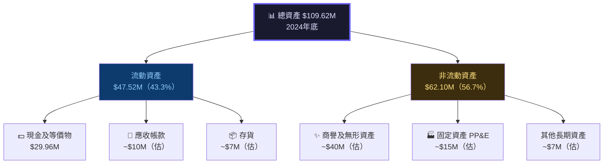

> ⚠️ **注意**：TTM 現金高達 $451.63M 顯示近期完成大規模融資，與 2024年底資產負債表存在顯著差異，表明 2025年進行了重大股權募資。

---

### 📊 資產配置橫條圖

```
資產配置結構（2024年底）
════════════════════════════════════════════════════
流動資產    $47.52M  ████████████████████░░░░░░░░░░  43.3%
非流動資產  $62.10M  ████████████████████████████░░  56.7%
════════════════════════════════════════════════════

流動資產細分：
現金/等價  $29.96M  ████████████████████░░░░░░░░░░  63.1%
其他流動   $17.56M  ███████████░░░░░░░░░░░░░░░░░░░  36.9%
════════════════════════════════════════════════════

負債結構：
流動負債   $50.58M  ██████████████████████████████  68.7%（含近期到期債務）
非流動負債 $23.10M  █████████████░░░░░░░░░░░░░░░░░  31.3%
════════════════════════════════════════════════════
```

---

### 📋 負債與流動性比率表格

| 指標 | 2021 | 2022 | 2023 | 2024 | TTM | 評級 |
|------|------|------|------|------|-----|------|
| **流動比率** | 9.67x | 1.57x | 0.66x | 0.94x | **15.30x** | 🟢 融資後大改善 |
| **總負債** | $1.09M | $33.39M | $35.29M | $60.31M | $18.03M | 🟡 |
| **負債/股權比** | 0.01x | 0.57x | 1.06x | 3.63x | **3.70x** | 🔴 |
| **股東權益** | $112.23M | $58.22M | $33.14M | $16.58M | — | 🔴 持續侵蝕 |
| **現金** | $40.82M | $29.78M | $14.98M | $29.96M | **$451.63M** | 🟢 |
| **總資產** | $117.44M | $97.95M | $92.16M | $109.62M | — | 🟡 |

---

### 📉 股東權益趨勢 ASCII 圖

```
股東權益趨勢（$M）— 持續侵蝕警告！
═════════════════════════════════════════════════
$120M ●
$100M  ░
 $80M  ░
 $60M  ░         ●
 $40M  ░          ░
 $20M  ░          ░         ●
  $17M ░          ░          ░         ●
   $0M ─────────────────────────────────────
      2021      2022      2023      2024

▼ 從 $112.23M 急跌至 $16.58M，累計蒸發 $95.65M (-85.2%)
⚠️ 若無後續融資，預計 2025 年底前股東權益轉負
═════════════════════════════════════════════════
```

---

## 5. 現金流量分析

### 💧 現金流瀑布圖

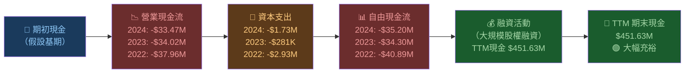

---

### 📊 自由現金流趨勢 Unicode 進度條

```
自由現金流趨勢（越往右越差，金額越大代表現金消耗越多）
═══════════════════════════════════════════════════════
2021 FCF: -$17.92M  🔴 ████████████░░░░░░░░░░░░░░░░░░
2022 FCF: -$40.89M  🔴 █████████████████████████████░
2023 FCF: -$34.30M  🔴 ████████████████████████░░░░░░
2024 FCF: -$35.20M  🔴 █████████████████████████░░░░░
TTM  FCF: -$14.13M  🟡 ██████████░░░░░░░░░░░░░░░░░░░░
═══════════════════════════════════════════════════════
                   0      10      20      30      40 ($M燒錢)

📌 正面信號：TTM FCF -$14.13M，較歷史均值顯著改善
📌 負面警告：累計 FCF 虧損（2021-2024）= -$129.31M
```

---

### 🎯 資本配置策略

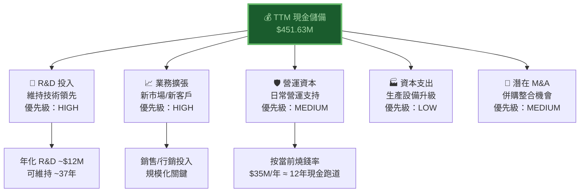

---

### 🏃 現金跑道分析

```
現金跑道計算（基於 TTM FCF -$14.13M/年）
═══════════════════════════════════════════════════════
當前現金儲備：$451.63M
當前年度燒錢率：$14.13M - $35.20M（區間）

保守估計（$35M/年）：
跑道 = $451.63M ÷ $35M ≈ 12.9 年  ████████████████████ ✅

樂觀估計（$14M/年）：
跑道 = $451.63M ÷ $14M ≈ 32.3 年  ████████████████████ ✅

結論：現金跑道充裕，短期稀釋壓力相對可控 🟢
═══════════════════════════════════════════════════════
```

---

## 6. 獲利能力指標

### 📊 獲利能力儀表板

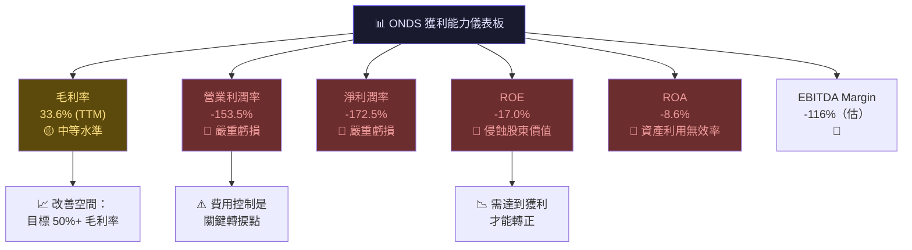

---

### 📋 ROE/ROA/ROIC 對比表格（含行業均值）

| 指標 | ONDS | 通訊設備行業均值 | 科技小市值均值 | 差距 | 評級 |
|------|------|----------------|---------------|------|------|
| **ROE** | -17.0% | +12.5% | +8.3% | -29.5% | 🔴 |
| **ROA** | -8.6% | +7.2% | +4.1% | -15.8% | 🔴 |
| **毛利率** | 33.6% | 42.8% | 45.2% | -9.2% | 🟡 |
| **營業利潤率** | -153.5% | +8.5% | +5.2% | -162% | 🔴 |
| **淨利潤率** | -172.5% | +6.8% | +3.9% | -179.3% | 🔴 |
| **EBITDA 利潤率** | -116% | +14.2% | +9.8% | -130.2% | 🔴 |

> 💡 **分析師觀點**：ONDS 處於典型「前期大量投入、後期收割」的成長型公司模式。關鍵看點是收入規模能否在 2025-2026 年快速擴大，使固定費用得到攤薄，達到毛利率改善的拐點。

---

### 獲利能力改善路徑分析

```
獲利拐點分析：需達到多少收入才能盈虧平衡？
═══════════════════════════════════════════════════════
假設固定費用：$35-40M/年
假設毛利率：35-40%

損益平衡收入 = 固定費用 ÷ 毛利率
            = $37.5M ÷ 0.375 = $100M

目前 TTM 收入：$24.75M
距離盈虧平衡：需達到 $100M（尚需成長 304%）

以+582% 增速：若維持，預計 18-24 個月內可達目標
═══════════════════════════════════════════════════════
```

---

## 7. 估值分析

### 💰 估值指標全覽

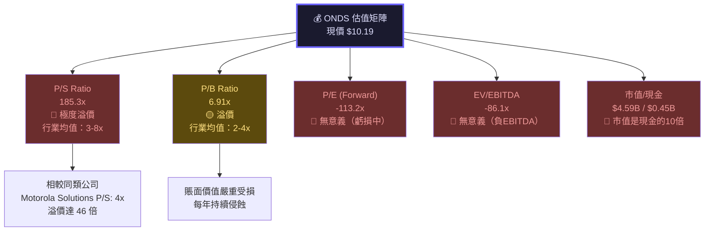

---

### 📊 估值倍數對比表格

| 估值指標 | ONDS | Motorola Solutions | Axon Enterprise | L3Harris | 行業中位數 | ONDS 溢價/折價 |
|---------|------|-------------------|-----------------|----------|-----------|--------------|
| **P/S** | 185.3x | 4.2x | 18.5x | 2.1x | 4.8x | 🔴 +3,760% |
| **P/B** | 6.91x | 18.2x | 8.3x | 1.8x | 3.5x | 🟡 +97% |
| **EV/Revenue** | 134x | 4.1x | 17.2x | 2.0x | 4.5x | 🔴 極高溢價 |
| **EV/EBITDA** | N/M | 28.5x | 65x | 12.3x | 22x | 🔴 N/M |
| **Forward P/E** | N/M | 32x | 95x | 15x | 28x | 🔴 N/M |

> 🔴 **估值警告**：185x P/S 反映市場對未來極高成長的「純預期定價」，一旦成長不及預期，下行風險巨大。

---

### 🎯 情境目標股價分析

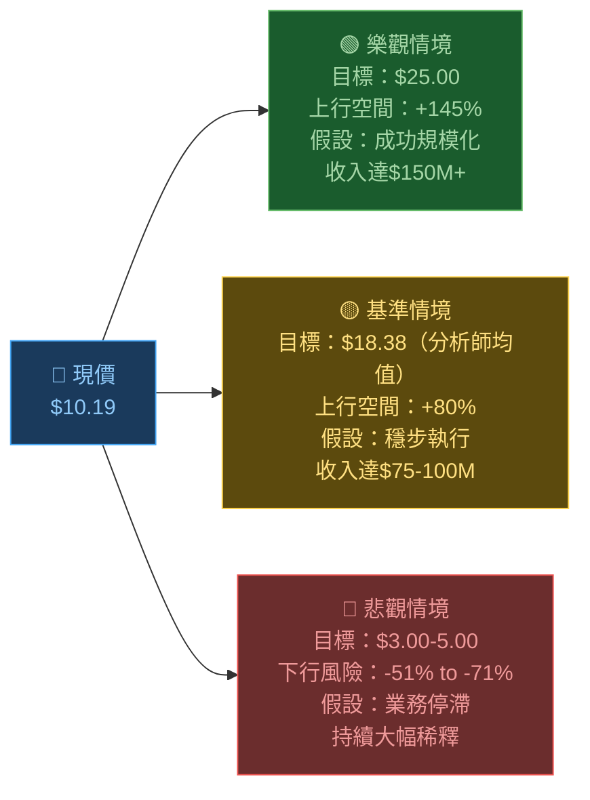

---

### 📏 估值區間視覺化

```
ONDS 估值區間（基於分析師目標價）
═══════════════════════════════════════════════════════════
悲觀    基準      現價     目標均值    樂觀
$3.00   $8.00    $10.19   $18.38     $25.00
  |       |        |         |          |
  ▼       ▼        ▼         ▼          ▼
──●───────●────────●─────────●──────────●──
  
風險/回報比分析：
下行風險（至 $3）: -$7.19 (-70.6%)  🔴
上行潛力（至 $25）: +$14.81 (+145%) 🟢
風險回報比 = 2.06:1（勉強合理）

分析師評級分佈：
強力買入 ████████████████████  8/8 (100%) 🟢
═══════════════════════════════════════════════════════════
```

---

## 8. 競爭護城河

### 🏰 Porter's Five Forces 分析

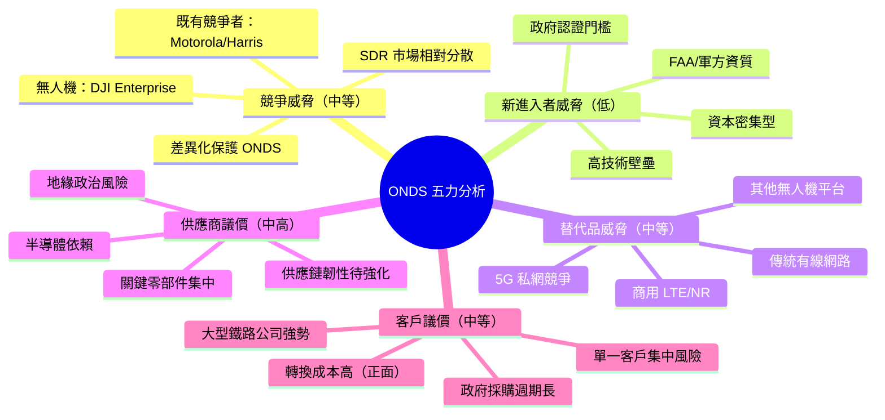

---

### 🛡️ 護城河評分

```
護城河各維度評分（10分制）
═══════════════════════════════════════════════════
技術護城河    ████████░░  7/10  ★★★★★★★☆☆☆
IP/專利保護   ███████░░░  7/10  ★★★★★★★☆☆☆
品牌認知度    ████░░░░░░  4/10  ★★★★☆☆☆☆☆☆
客戶黏性      ████████░░  8/10  ★★★★★★★★☆☆
規模經濟      ██░░░░░░░░  2/10  ★★☆☆☆☆☆☆☆☆
網路效應      ████░░░░░░  4/10  ★★★★☆☆☆☆☆☆
監管認證      █████████░  9/10  ★★★★★★★★★☆
成本優勢      ███░░░░░░░  3/10  ★★★☆☆☆☆☆☆☆
═══════════════════════════════════════════════════
綜合護城河評分：5.5/10  🟡 中等護城河
```

---

### 競爭定位矩陣

| 維度 | ONDS | Motorola Solutions | Dedrone | Axon | 評級 |
|------|------|-------------------|---------|------|------|
| **技術成熟度** | ★★★☆☆ | ★★★★★ | ★★★☆☆ | ★★★★☆ | 🟡 |
| **市場規模** | ★★☆☆☆ | ★★★★★ | ★★★☆☆ | ★★★★☆ | 🔴 |
| **客戶基礎** | ★★☆☆☆ | ★★★★★ | ★★★☆☆ | ★★★★☆ | 🔴 |
| **財務實力** | ★★★☆☆（現金充裕） | ★★★★★ | ★★☆☆☆ | ★★★★☆ | 🟡 |
| **成長潛力** | ★★★★★ | ★★★☆☆ | ★★★★☆ | ★★★★☆ | 🟢 |
| **利基壁壘** | ★★★★☆ | ★★★☆☆ | ★★★☆☆ | ★★★☆☆ | 🟢 |

---

## 9. 成長催化劑

### 📅 成長催化劑時間軸

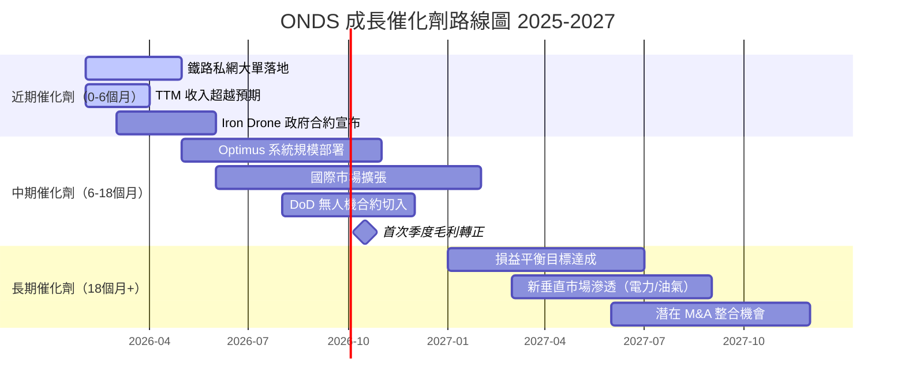

---

### 🚀 短中長期機會分析

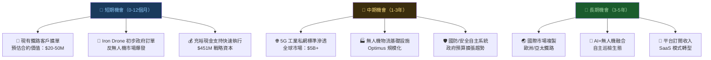

---

### 📊 TAM 市場規模

```
TAM（可觸及市場）規模估算
═══════════════════════════════════════════════════════════
工業私有無線網路（CBRS/SDR）
全球 TAM（2025E）：$8.5B   ████████████████████░░░░░░░░░░
ONDS 市佔率：< 0.3%         ░░░░░░░░░░░░░░░░░░░░░░░░░░░░░░

商業無人機自主系統
全球 TAM（2025E）：$12.3B  ████████████████████████████░░
ONDS 市佔率：< 0.2%         ░░░░░░░░░░░░░░░░░░░░░░░░░░░░░░

反無人機系統（C-UAS）
全球 TAM（2025E）：$3.1B   ████████░░░░░░░░░░░░░░░░░░░░░░
ONDS 市佔率：< 0.1%         ░░░░░░░░░░░░░░░░░░░░░░░░░░░░░░

合計 TAM：$23.9B
ONDS 目前滲透率極低 → 反映巨大潛在成長空間
若達 3% 市佔 = $717M 年收入 = 目前的 29 倍
═══════════════════════════════════════════════════════════
```

---

## 10. 風險分析

### ⚠️ 風險矩陣

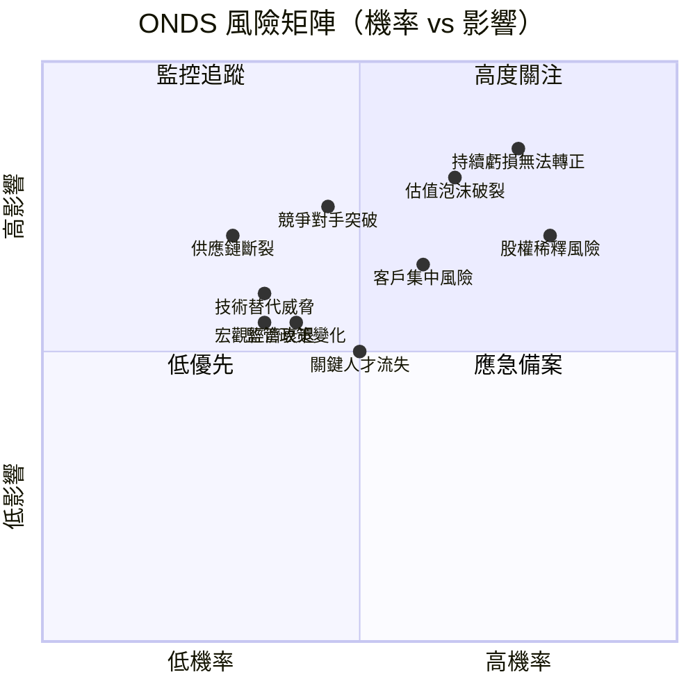

---

### 📋 風險評分卡

| 風險類型 | 機率 | 影響度 | 風險分數 | 評級 | 緩解措施 |
|---------|------|--------|---------|------|---------|
| **持續巨額虧損** | 高 80% | 嚴重 9/10 | 72 | 🔴 極高 | 嚴控費用，加速收入 |
| **估值泡沫破裂** | 中高 65% | 嚴重 8/10 | 52 | 🔴 高 | 業績持續超預期 |
| **大規模股權稀釋** | 高 80% | 高 7/10 | 56 | 🔴 高 | 現金充裕可暫緩需求 |
| **客戶集中風險** | 中 60% | 高 7/10 | 42 | 🔴 高 | 多元化客戶群 |
| **競爭對手突破** | 中 45% | 高 7/10 | 32 | 🟡 中高 | 強化技術護城河 |
| **關鍵人才流失** | 中 50% | 中 5/10 | 25 | 🟡 中 | 股權激勵計劃 |
| **監管政策變化** | 低中 40% | 中 5/10 | 20 | 🟡 中 | 積極參與政策制定 |
| **供應鏈中斷** | 低 30% | 高 7/10 | 21 | 🟡 中 | 多元化供應商 |
| **宏觀經濟衰退** | 低中 35% | 中 5/10 | 18 | 🟢 中低 | 政府客戶相對抗週期 |
| **技術失敗** | 低 20% | 嚴重 9/10 | 18 | 🟢 中低 | 持續 R&D 投入 |

---

### 🛡️ 緩解措施詳細清單

```
主要風險緩解策略：
━━━━━━━━━━━━━━━━━━━━━━━━━━━━━━━━━━━━━━━━━━━━━━━
✅ 財務風險：持有 $451M 現金，12年以上跑道
✅ 稀釋風險：現金充裕減少短期融資必要性
✅ 技術風險：IEEE 802.16s 標準參與，強化行業地位
✅ 客戶風險：積極開發多個垂直市場（鐵路/能源/國防）
✅ 競爭風險：政府認證資質建立高門檻壁壘
⚠️ 估值風險：需要業績持續超預期才能支撐高估值
⚠️ 盈利風險：損益平衡時程需密切監控
━━━━━━━━━━━━━━━━━━━━━━━━━━━━━━━━━━━━━━━━━━━━━━━
```

---

## 11. 公平價值估算

### 🔢 DCF 模型架構

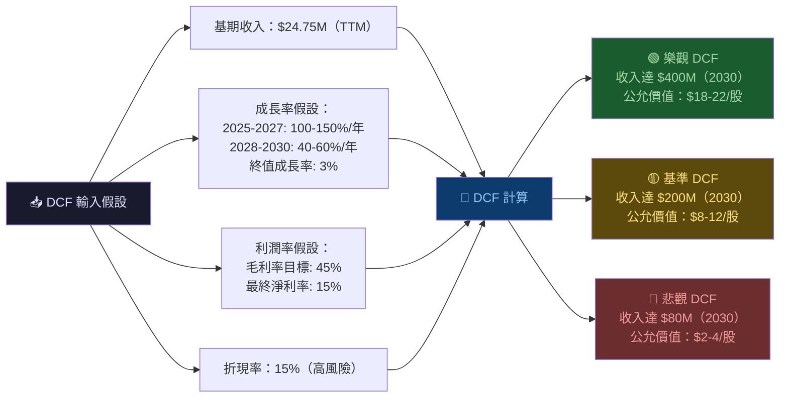

---

### 📊 三種估值法比較

| 估值方法 | 悲觀 | 基準 | 樂觀 | 方法說明 |
|---------|------|------|------|---------|
| **DCF 模型** | $2.50 | $10.00 | $20.00 | 15% WACC，5年預測期 |
| **P/S 相對估值** | $3.00 | $8.00 | $18.00 | 目標 P/S 5-15x（成長期） |
| **EV/Revenue** | $2.00 | $9.00 | $22.00 | 對標成長期同業 |
| **分析師目標價** | $16.00 | $18.38 | $25.00 | 8位分析師共識 |
| **現金資產法** | $1.00 | $1.00 | $1.00 | $451M÷450M股 ≈ $1/股下限 |
| **加權平均** | **$4.90** | **$9.28** | **$17.20** | — |

---

### 📏 估值區間視覺化

```
ONDS 公允價值估算區間
═══════════════════════════════════════════════════════════════
$0     $5      $10     $15     $20     $25     $30
 |      |       |       |       |       |       |
 ▼      ▼       ▼       ▼       ▼       ▼       ▼
 
現金底線：
[●]$1.00

悲觀估值區間：
[●────────●]
$2.50    $4.90

基準估值區間（含當前股價）：
        [●──────────●]
       $8.00       $12.00
              ⬆ 現價 $10.19

樂觀估值區間（分析師目標）：
                    [●──────────●]
                  $16.00      $25.00

═══════════════════════════════════════════════════════════════
📌 結論：現價 $10.19 在基準估值範圍內，但高度依賴成長兌現
📌 向上催化劑：業績超預期、大合約落地
📌 向下催化劑：成長放緩、稀釋融資、宏觀惡化
```

---

## 12. 投資建議

### 🏆 最終評級

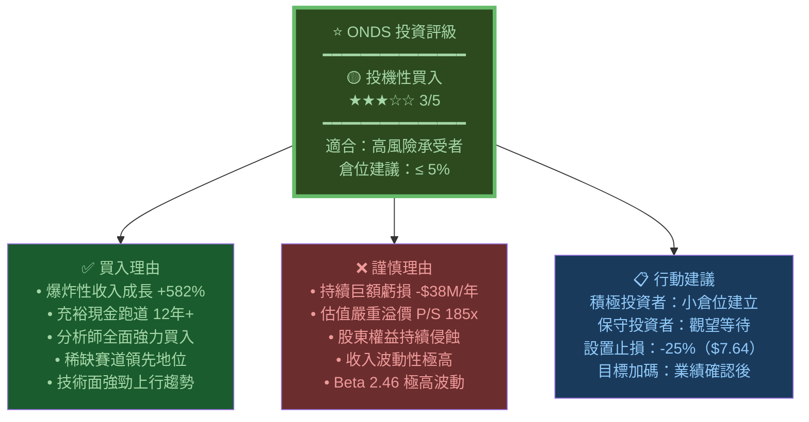

---

### 👥 投資人適配度

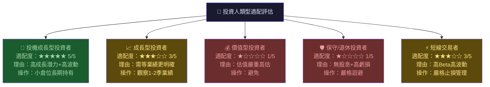

---

### 📋 關鍵監控指標 Checklist

```
🔍 必須持續追蹤的核心指標（按優先級排序）
═══════════════════════════════════════════════════════
優先級 CRITICAL（每季必看）：
□ 季度收入 vs 預期（+582% 成長能否持續？）
□ 毛利率趨勢（2024年 4.8% 的崩跌是否改善？）
□ 燒錢率（Operating FCF 能否收窄至 -$20M 以下？）
□ 現金餘額（$451M 是否持續充裕？）

優先級 HIGH（每季追蹤）：
□ 新合約/訂單公告（鐵路/國防大單是關鍵）
□ 股票稀釋情況（流通股 450M 是否大幅增加？）
□ 分析師評級變化（目前 8人強力買入）
□ 競爭對手動態（Motorola/DJI 新產品）

優先級 MEDIUM（半年評估）：
□ R&D 費用佔比（需下降至 30% 以下）
□ 員工人數變化（是否增招關鍵技術人才？）
□ 客戶集中度（Top 3 客戶佔比）
□ 市場份額變化

觸發減持信號（出現時應重新評估）：
🚨 季度收入成長低於 50%
🚨 現金跌破 $200M
🚨 分析師大規模降評/下調目標價
🚨 大規模股權稀釋超過 20%
🚨 核心客戶流失

觸發加倉信號：
✅ 連續兩季收入超預期 20%+
✅ 毛利率回升至 40%+
✅ 首次季度正 EBITDA
✅ 重大政府合約（$50M+）公告
✅ 機構大股東增持 5%+
═══════════════════════════════════════════════════════
```

---

### 📊 總體評分卡

```
ONDS 多維度最終評分卡
════════════════════════════════════════════════════════
基本面品質    ██░░░░░░░░  2.0/5  ★★☆☆☆  持續虧損拖累
收入成長性    ████████░░  4.5/5  ★★★★★  爆炸性成長
財務健康度    ████████░░  4.0/5  ★★★★☆  現金充裕
估值合理性    █░░░░░░░░░  1.0/5  ★☆☆☆☆  嚴重溢價
競爭護城河    █████░░░░░  3.0/5  ★★★☆☆  技術+認證壁壘
管理執行力    ████░░░░░░  2.5/5  ★★★☆☆  待驗證
風險控制      ██░░░░░░░░  2.0/5  ★★☆☆☆  高燒錢高波動
技術動能      █████████░  4.5/5  ★★★★★  強勁上升趨勢
════════════════════════════════════════════════════════
加權綜合評分：2.94/5  🟡 投機買入（高風險高報酬）
════════════════════════════════════════════════════════
```

---

### 💡 分析師核心結論

> **ONDS 本質上是一個「夢想與現實的賽跑」。** 公司在私有工業無線網路和自主無人機系統兩個高增長賽道中佔據先機，+582% 的收入成長率和 8位分析師「強力買入」的共識顯示出市場對其商業化能力的高度期待。充裕的 $451M 現金儲備提供了長達12年以上的運營跑道，大幅降低了短期破產風險。
>
> **然而，估值已充分甚至過度反映了最樂觀的情境。** 185x P/S 的天文數字要求公司在未來3-5年內收入規模從 $25M 增長至 $500M+ 才能在合理估值框架下成立。加上歷年累計虧損超 $171M、股東權益持續侵蝕、以及收入的極端波動性，當前定價包含了巨大的執行風險溢價。
>
> **建議策略**：對高風險承受者，可以不超過總倉位5%的配置參與，嚴格設置止損於 $7.50（-26%），並以 $18-25 為分批獲利目標。保守型投資者應等待至少兩個季度的業績驗證，確認收入成長的可持續性和毛利率的實質改善，再考慮建立倉位。

---

> **⚠️ 免責聲明**：本報告由 AI 系統基於公開財務數據自動生成，僅供學術研究與參考用途，**不構成任何形式的投資建議**。投資涉及風險，過去表現不代表未來結果。投資者應獨立判斷，並在必要時諮詢持牌財務顧問。本報告所有財務數據來源為 Yahoo Finance，截至 2026年02月24日。

---

*報告生成時間：2026-02-24 ｜ 分析框架：基本面深度分析 v3.0 ｜ 數據來源：Yahoo Finance*