# ONDS 基本面深度分析報告

> **報告日期**：2026-02-25 ｜ **分析師**：AI Research Desk（CFA Level Methodology）｜ **數據來源**：Yahoo Finance ｜ **語言**：繁體中文

---

## 目錄

1. [執行摘要](#1-執行摘要)
2. [公司概覽與商業模式](#2-公司概覽與商業模式)
3. [損益表深度分析](#3-損益表深度分析)
4. [資產負債表分析](#4-資產負債表分析)
5. [現金流量深度分析](#5-現金流量深度分析)
6. [獲利能力與資本效率](#6-獲利能力與資本效率)
7. [估值深度分析](#7-估值深度分析)
8. [成長催化劑](#8-成長催化劑)
9. [風險矩陣](#9-風險矩陣)
10. [投資建議](#10-投資建議)

---

## 1. 執行摘要

### 核心評分儀表板

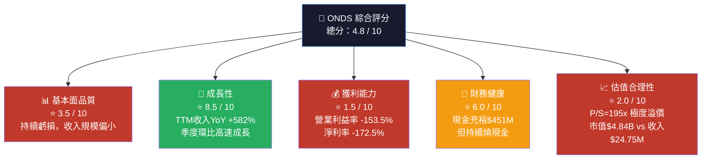

---

### 5大投資論點 + 3大核心風險

| 類型 | 項目 | 具體依據 | 評級 |
|------|------|----------|------|
| 🟢 **多頭論點 1** | 爆炸性收入成長 | TTM收入$24.75M，YoY +582%；Q3 2025單季收入$10.10M，QoQ +61% | 🟢 |
| 🟢 **多頭論點 2** | 雄厚現金儲備 | 現金$451.63M vs 總債務$18.03M，淨現金$433.60M，足以支撐多年燒錢 | 🟢 |
| 🟢 **多頭論點 3** | 機構強力背書 | 8位分析師全數給予買入/強力買入，目標價均值$18.38（較現價+71%）| 🟢 |
| 🟢 **多頭論點 4** | 雙業務結構佈局 | Networks（私有無線）+ Autonomous Systems（無人機），切入國防與鐵路市場 | 🟢 |
| 🟡 **多頭論點 5** | 政策順風車 | 美國基礎設施現代化、無人機國防應用、私有5G網路部署趨勢加速 | 🟡 |
| 🔴 **核心風險 1** | 燒錢速度驚人 | OCF -$33.47M/年，FCF -$35.20M，若收入不達標現金可能快速消耗 | 🔴 |
| 🔴 **核心風險 2** | 估值嚴重透支未來 | P/S=195x，EV/Revenue=137x，任何業績不達預期將導致股價重挫 | 🔴 |
| 🔴 **核心風險 3** | 短期空頭壓力 | 空頭比例27.1%，52週股價從$0.57漲至$15.28，回調風險極高 | 🔴 |

---

### 快速統計卡片：關鍵指標一覽

| 指標 | ONDS 數值 | 行業均值（通訊設備）| 對比評估 |
|------|-----------|---------------------|----------|
| 市值 | $4.84B | — | 🟡 微型/小型股 |
| P/S（TTM） | 195.5x | ~4-8x | 🔴 極度高估 |
| P/B | 7.29x | ~3-5x | 🔴 偏貴 |
| EV/Revenue | 137.4x | ~3-6x | 🔴 極度高估 |
| 毛利率 | 33.6% | ~45-55% | 🔴 低於同業 |
| 營業利益率 | -153.5% | ~5-15% | 🔴 嚴重虧損 |
| 收入YoY成長 | +582% | ~5-15% | 🟢 遠超同業 |
| 流動比率 | 15.30x | ~2-3x | 🟢 流動性充裕 |
| 淨現金 | $433.60M | — | 🟢 現金充沛 |
| Beta | 2.465 | ~1.0-1.5 | 🔴 高波動 |
| 空頭比例 | 27.1% | ~3-8% | 🔴 高度看空 |
| 員工人數 | 113人 | — | 🟡 微型企業 |

---

### 投資結論

```
╔══════════════════════════════════════════════════════════════╗
║  投資評級：⚠️  投機性買入（Speculative Buy）               ║
║  適合對象：高風險承受能力的成長型/主題投資者              ║
║  目標價區間：                                              ║
║    🐂 樂觀情境：$22.00  （隱含報酬 +104.7%）             ║
║    📊 基準情境：$14.50  （隱含報酬  +34.9%）             ║
║    🐻 悲觀情境：$ 5.00  （隱含報酬  -53.5%）             ║
║  現價：$10.75  ｜  分析師均值目標：$18.38               ║
╚══════════════════════════════════════════════════════════════╝
```

---

## 2. 公司概覽與商業模式

### 業務結構與收入來源

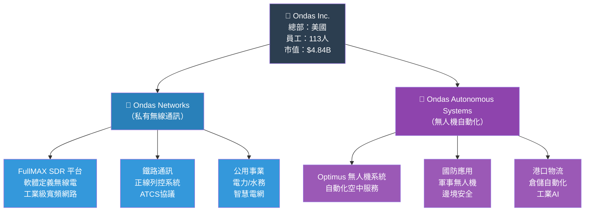

---

### 市場定位（應用市場份額估算）

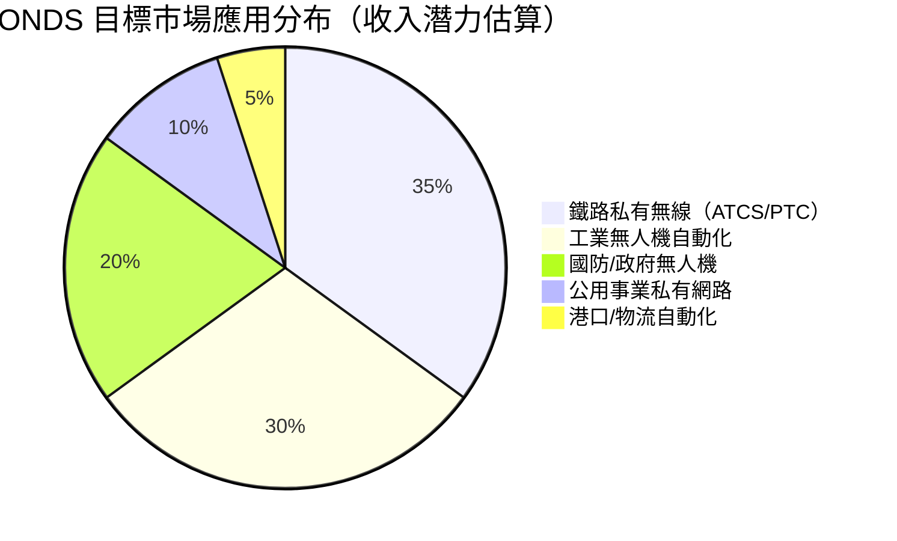

---

### 競爭護城河分析

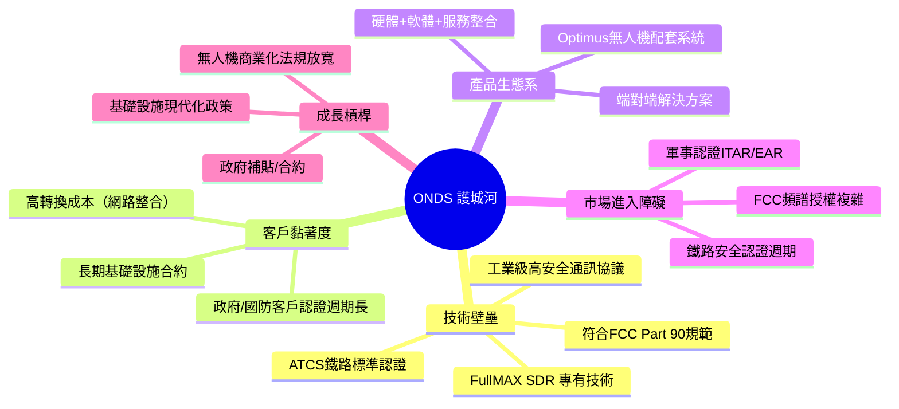

---

### 護城河強度評分（Unicode 條形圖）

```
護城河維度評分（滿分10分）

技術壁壘    ▓▓▓▓▓▓▓░░░  7.0/10  【SDR技術差異化，但競爭者追趕中】
客戶黏著度  ▓▓▓▓▓▓░░░░  6.0/10  【政府/鐵路合約黏性高，但客群集中】
進入障礙    ▓▓▓▓▓▓▓░░░  7.0/10  【法規認證形成保護，但非不可突破】
品牌認知    ▓▓▓░░░░░░░  3.0/10  【知名度低，仍屬新興廠商】
網路效應    ▓▓░░░░░░░░  2.0/10  【基礎設施產品網路效應有限】
成本優勢    ▓▓▓░░░░░░░  3.0/10  【規模不足，成本結構仍高】
規模經濟    ▓▓░░░░░░░░  2.0/10  【僅113名員工，規模極小】

整體護城河  ▓▓▓▓░░░░░░  4.3/10  【早期階段，護城河尚在建立中】
```

---

## 3. 損益表深度分析

### 年度收入成長趨勢（近4年）

```
年度收入 & YoY 成長率（ASCII 長條圖）

2021  $2.91M  ██░░░░░░░░░░░░░░░░░░░░░░░░░░░░  基準年
2022  $2.13M  █░░░░░░░░░░░░░░░░░░░░░░░░░░░░░  YoY: -26.8% 🔴
2023  $15.69M ███████████░░░░░░░░░░░░░░░░░░░░  YoY: +636.6% 🟢（並購驅動）
2024  $7.19M  █████░░░░░░░░░░░░░░░░░░░░░░░░░░  YoY: -54.2% 🔴（業務重組影響）
TTM   $24.75M ██████████████████░░░░░░░░░░░░  YoY: +582.0% 🟢（爆發性成長）

注意：TTM收入（$24.75M）相較2024全年（$7.19M）成長244%，顯示2025年業務急速擴張
```

---

### 季度收入趨勢（近4季 QoQ + YoY）

| 季度 | 收入 | QoQ成長 | 備註 |
|------|------|---------|------|
| 2024 Q4 | $4.13M | 基準 | 全年最低季度 |
| 2025 Q1 | $4.25M | **+2.9%** 🟡 | 緩慢啟動 |
| 2025 Q2 | $6.27M | **+47.5%** 🟢 | 加速成長 |
| 2025 Q3 | $10.10M | **+61.1%** 🟢 | 突破性季度 |

```
季度收入趨勢（ASCII 折線圖）

$10M ┤                                    ●  Q3 2025
 $9M ┤
 $8M ┤
 $7M ┤                              ●  Q2 2025
 $6M ┤
 $5M ┤
 $4M ┤  ●  Q4'24    ●  Q1 2025
 $3M ┤
 $2M ┤
 $1M ┤
     └──────────────────────────────────────────▶ 時間
       Q4'24      Q1'25       Q2'25      Q3'25
```

**關鍵觀察**：Q3 2025 單季收入$10.10M 已接近2024全年$7.19M，顯示業務拐點已出現，季度環比成長動能強勁。

---

### 利潤率演變（近4年）

| 年度 | 毛利率 | 營業利益率 | EBITDA率 | 淨利率 | 趨勢評估 |
|------|--------|-----------|----------|--------|----------|
| 2021 | **37.8%** | **-617.2%** | **-534.4%** | **-516.1%** | 🟡 規模極小期 |
| 2022 | **52.1%** | **-2,348%** | **-3,034%** | **-3,438%** | 🔴 並購整合期虧損爆增 |
| 2023 | **40.7%** | **-243.7%** | **-220.8%** | **-285.8%** | 🟡 規模改善但仍虧 |
| 2024 | **4.8%** | **-481.4%** | **-399.4%** | **-528.7%** | 🔴 業務重組致毛利暴跌 |
| TTM | **33.6%** | **-153.5%** | **-155.9%** | **-172.5%** | 🟡 回升中，改善趨勢 |

> **利潤率分析**：2024年毛利率驟降至4.8%（從2022年的52.1%），主因為業務重組期間收入結構改變及成本壓縮失效。TTM毛利率回升至33.6%，顯示2025年業務重新步入正軌。但營業利益率-153.5%意味著每賺$1收入，就需要$2.54的運營費用。

---

### 費用結構分析（以TTM $24.75M收入為基礎）

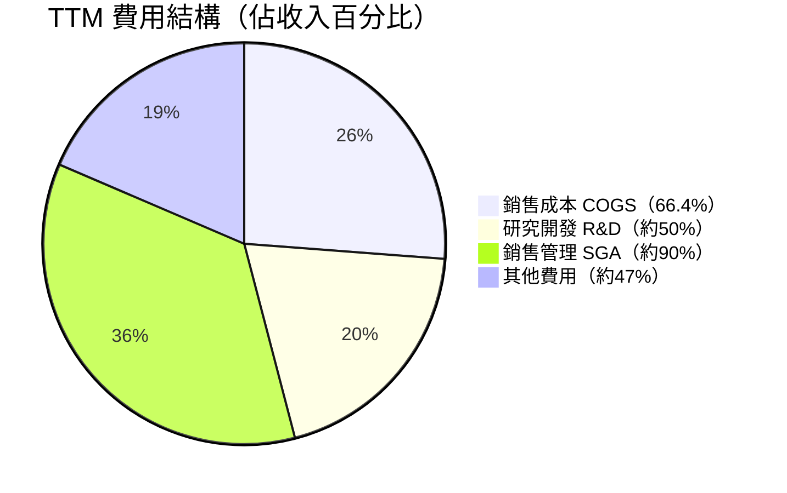

```
費用佔收入比例分析

COGS（銷售成本）  ▓▓▓▓▓▓▓▓▓▓▓▓▓▓▓▓░░░░░░░░░░░░░░  66.4%（毛利33.6%）
R&D（研發費用）   ▓▓▓▓▓▓▓▓▓▓▓▓▓░░░░░░░░░░░░░░░░░  ~50%  【2024年$12.48M / $7.19M收入】
SGA（管理費用）   ▓▓▓▓▓▓▓▓▓▓▓▓▓▓▓▓▓▓▓▓▓▓░░░░░░░░  ~90%  【估算】
資本支出          ▓░░░░░░░░░░░░░░░░░░░░░░░░░░░░░░   ~7%  [$1.73M / $7.19M]

⚠️ 關鍵：R&D費用從2022年$24.04M降至2024年$12.48M，削減48%，
    反映公司已進入從研發→商業化的轉型期
```

---

### EPS 趨勢與盈餘品質分析

| 季度 | EPS 預估 | EPS 實際 | 超預期幅度 | 說明 |
|------|---------|---------|----------|------|
| 2024 Q4 | N/A | 數據缺失 | — | ❌ 無分析師覆蓋紀錄 |
| 2025 Q1 | N/A | 數據缺失 | — | ❌ 無分析師覆蓋紀錄 |
| 2025 Q2 | N/A | 數據缺失 | — | ❌ 無分析師覆蓋紀錄 |
| 2025 Q3 | N/A | 數據缺失 | — | ❌ 無分析師覆蓋紀錄 |

```
EPS 季度趨勢（推算自淨虧損）

Q4 2024：淨虧損 -$10.34M  →  約 -$0.046/股
Q1 2025：淨虧損 -$14.14M  →  約 -$0.063/股  ⚠️ 虧損加深
Q2 2025：淨虧損 -$10.75M  →  約 -$0.048/股  改善 +23.8%
Q3 2025：淨虧損 - $7.47M  →  約 -$0.033/股  改善 +30.5% ✅

EPS 虧損收窄趨勢圖（每股虧損，越小越好）：
Q4'24  -$0.046  ████████████████████░░░
Q1'25  -$0.063  ████████████████████████████░
Q2'25  -$0.048  ████████████████████░░░
Q3'25  -$0.033  █████████████░░░░░░░░░░░  ← 改善中！

Forward EPS：-$0.09（TTM EPS -$0.36，虧損顯著收窄預期）
```

**盈餘品質評估**：EPS雖持續為負，但Q2→Q3改善趨勢明確，淨虧損從$14.14M降至$7.47M（QoQ改善47.2%），主要驅動力為收入快速增長而費用相對穩定（營業費用環比僅增68% vs 收入增61%），顯示初步規模效應。

---

## 4. 資產負債表分析

### 資產結構（2024年底）

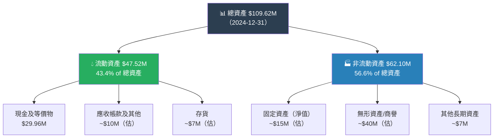

> ⚠️ **重要警示**：相較2021年總資產$117.44M，2024年總資產僅$109.62M，四年幾乎無增長。但股東權益從$112.23M暴跌至$16.58M，流失高達$95.65M（-85.2%），顯示持續虧損對淨資產的嚴重侵蝕。

---

### 流動性指標

| 指標 | 2021 | 2022 | 2023 | 2024 | TTM/最新 | 評級 |
|------|------|------|------|------|---------|------|
| 流動比率 | 9.67x | 1.58x | 0.66x | 0.94x | **15.30x** | 🟢 |
| 速動比率 | — | — | — | — | **14.74x** | 🟢 |
| 現金比率（現金/流動負債）| — | — | — | 0.59x | **~8.9x** | 🟢 |
| 淨現金（現金-總債務）| $39.73M | $-3.61M | $-20.31M | $-30.35M | **+$433.60M** | 🟢 |

> **2025年流動性飛躍原因**：公司顯然於2025年進行大規模股權融資（現金從$29.96M暴增至$451.63M），這是近期股價大漲的重要背景，也是支撐燒錢運營的關鍵。

---

### 債務結構分析

```
債務趨勢（ASCII 折線圖）

$70M ┤                              ●  2024（$60.31M）
$60M ┤
$50M ┤
$40M ┤
$30M ┤              ●  2023（$35.29M）  ●  2022（$33.39M）
$20M ┤
$10M ┤
 $1M ┤  ●  2021（$1.09M）
     └──────────────────────────────────────────▶ 時間
       2021         2022         2023         2024
```

| 債務指標 | 數值 | 評估 |
|---------|------|------|
| 總債務（最新）| $18.03M | 🟢 較歷史大幅下降 |
| 淨現金 | **+$433.60M** | 🟢 淨現金頭寸強健 |
| Debt/Equity | 3.70x | 🔴 帳面股東權益小導致比率高 |
| Debt/EBITDA | 不適用（EBITDA為負）| 🔴 |
| 利息覆蓋率 | 不適用（EBIT為負）| 🔴 |

---

### 股東權益趨勢（帳面價值）

```
股東權益侵蝕趨勢（ASCII 圖）

$120M ┤  ●  2021（$112.23M）
$100M ┤
 $80M ┤
 $60M ┤      ●  2022（$58.22M）
 $40M ┤
 $30M ┤           ●  2023（$33.14M）
 $20M ┤
 $16M ┤                ●  2024（$16.58M）⚠️ 面臨轉負風險
  $0M ┤━━━━━━━━━━━━━━━━━━━━━━━━━━━━━━━━━━━━
 -$xM ┤                     ?  2025（需股權融資補充）
      └────────────────────────────────────▶ 時間
        2021      2022      2023      2024

📉 4年間股東權益減少 $95.65M（-85.2%），年均減少 $23.91M
⚠️ 若無2025年增資，2025年底可能出現股東權益為負
```

---

## 5. 現金流量深度分析

### 現金流量瀑布圖

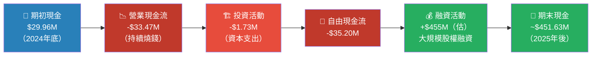

---

### FCF 轉換率趨勢

| 年度 | 淨虧損 | 自由現金流 | FCF/Net Income | 評估 |
|------|--------|-----------|---------------|------|
| 2021 | -$15.02M | -$17.92M | 119.3% | 🔴 FCF虧損大於淨虧損 |
| 2022 | -$73.24M | -$40.89M | 55.8% | 🟡 非現金費用（折舊/攤銷）抵消部分 |
| 2023 | -$44.84M | -$34.30M | 76.5% | 🟡 改善中 |
| 2024 | -$38.01M | -$35.20M | 92.6% | 🔴 FCF接近淨虧損，非現金項目少 |

---

### 自由現金流趨勢（Unicode 進度條）

```
年度自由現金流（絕對值越小越好，方向：負數）

2021  -$17.92M  燒錢程度：▓▓▓▓▓▓▓░░░░░░░░░░░░░░░  35%
2022  -$40.89M  燒錢程度：▓▓▓▓▓▓▓▓▓▓▓▓▓▓▓▓▓░░░░░  83%
2023  -$34.30M  燒錢程度：▓▓▓▓▓▓▓▓▓▓▓▓▓▓░░░░░░░░  70%
2024  -$35.20M  燒錢程度：▓▓▓▓▓▓▓▓▓▓▓▓▓▓░░░░░░░░  72%

4年累計燒錢：-$128.31M
現有現金儲備：$451.63M
按2024燒錢速度（$35.20M/年），可維持約 12.8 年

⚡ 若收入按目前軌跡增長，有望在2027-2028年實現FCF轉正
```

---

### 資本配置評估

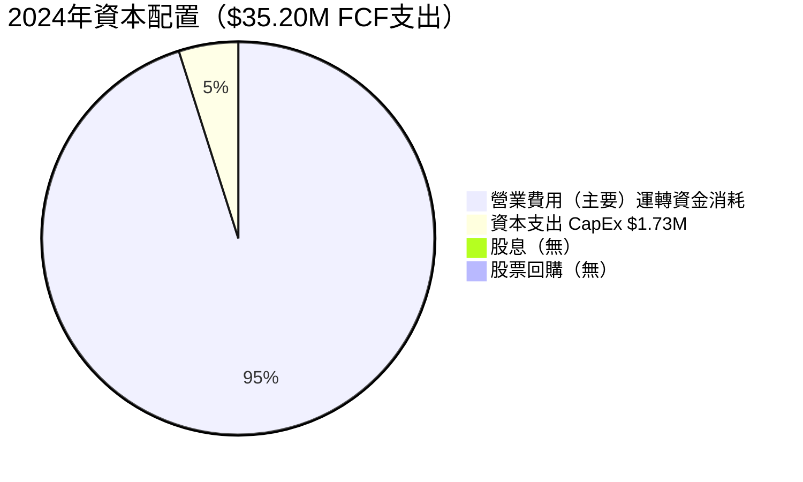

**資本配置評語**：公司目前100%現金用於支撐運營（燒錢驅動成長模式），無股息、無回購。資本支出極低（$1.73M，僅佔收入24%），顯示為輕資產商業模式。核心挑戰在於能否在燒完現金前達到收支平衡。

---

## 6. 獲利能力與資本效率

### ROE / ROA / ROIC 趨勢（近4年）

| 年度 | ROE | ROA | 行業ROE均值 | 行業ROA均值 | 評級 |
|------|-----|-----|-----------|-----------|------|
| 2021 | **-13.4%** | **-12.8%** | ~10-15% | ~5-8% | 🔴 |
| 2022 | **-125.8%** | **-74.8%** | ~10-15% | ~5-8% | 🔴 |
| 2023 | **-135.3%** | **-48.7%** | ~10-15% | ~5-8% | 🔴 |
| 2024 | **-229.3%** | **-34.7%** | ~10-15% | ~5-8% | 🔴 |
| TTM | **-17.0%** | **-8.6%** | ~10-15% | ~5-8% | 🔴 |

---

### ROIC vs WACC 分析（EVA 評估）

```
━━━━━━━━━━━━━━━━━━━━━━━━━━━━━━━━━━━━━━━━━━━
  WACC 估算（2026年）
━━━━━━━━━━━━━━━━━━━━━━━━━━━━━━━━━━━━━━━━━━━
  無風險利率（10Y美債）：      4.5%
  市場風險溢價：               6.0%
  Beta：                      2.465
  股權風險溢價（β × ERP）：   14.79%
  股權成本（Ke）：             4.5% + 14.79% = 19.29%
  
  稅後債務成本（Kd）：         ~6%（估）× (1-21%) = 4.74%
  資本結構（股權/總資本）：    ~99%（現金淨頭寸，幾乎無槓桿）
  
  WACC ≈ 19.29% × 99% + 4.74% × 1% ≈ 19.14%
━━━━━━━━━━━━━━━━━━━━━━━━━━━━━━━━━━━━━━━━━━━
  ROIC 估算（TTM）
━━━━━━━━━━━━━━━━━━━━━━━━━━━━━━━━━━━━━━━━━━━
  NOPAT = EBIT × (1 - 稅率) = -$38M × 0.79 = -$30.0M
  投入資本 = 總資產 - 流動負債（無息）≈ $80M
  ROIC = -$30.0M / $80M = 約 -37.5%
━━━━━━━━━━━━━━━━━━━━━━━━━━━━━━━━━━━━━━━━━━━
  EVA（經濟附加值）分析
━━━━━━━━━━━━━━━━━━━━━━━━━━━━━━━━━━━━━━━━━━━
  ROIC (-37.5%) << WACC (19.14%)
  差距：-56.64個百分點
  
  EVA = 投入資本 × (ROIC - WACC)
      = $80M × (-37.5% - 19.14%)
      = $80M × (-56.64%)
      = -$45.3M
      
  ❌ 結論：ONDS 目前嚴重摧毀股東價值（EVA = -$45.3M）
     需要收入規模持續擴大才能扭轉此局面
━━━━━━━━━━━━━━━━━━━━━━━━━━━━━━━━━━━━━━━━━━━
```

---

### DuPont 分解（ROE 三因子拆解）

| 年度 | 淨利率 | 資產週轉率 | 財務槓桿 | ROE（乘積）| 分析 |
|------|--------|-----------|---------|-----------|------|
| 2021 | -516.1% | 0.025x | 1.05x | **-13.4%** | 規模極小 |
| 2022 | -3,438% | 0.022x | 1.68x | **-125.8%** | 收購整合期 |
| 2023 | -285.8% | 0.170x | 2.78x | **-135.3%** | 收入改善但虧損大 |
| 2024 | -528.7% | 0.066x | 6.61x | **-229.3%** | 股東權益快速侵蝕 |

> **DuPont 解讀**：ONDS的ROE惡化主因是淨利率持續為深度負值，資產週轉率極低（收入規模太小），財務槓桿雖提升（負面影響放大效果），但無法改善根本問題。唯一解藥是大幅提升收入規模達到損益兩平。

---

### 獲利能力儀表板

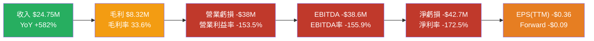

---

## 7. 估值深度分析

### 同業估值比較表格

| 指標 | **ONDS** | **Evolv Technology (EVLV)** | **AeroVironment (AVAV)** | **Silvus Technologies（私）** | 行業均值 |
|------|----------|---------------------------|--------------------------|------------------------------|---------|
| 市值 | $4.84B | ~$0.8B | ~$4.2B | N/A | — |
| P/S | **195.5x** 🔴 | ~5-8x 🟢 | ~3-4x 🟢 | — | ~4-8x |
| EV/Revenue | **137.4x** 🔴 | ~4-6x 🟢 | ~2-3x 🟢 | — | ~3-6x |
| EV/EBITDA | **-88.1x** 🔴 | N/A（虧損）🔴 | ~25-30x 🟡 | — | ~15-25x |
| P/B | **7.29x** 🔴 | ~2-4x 🟡 | ~3-5x 🟡 | — | ~2-4x |
| 毛利率 | **33.6%** 🔴 | ~55-60% 🟢 | ~35-40% 🟡 | — | ~40-55% |
| 收入YoY成長 | **+582%** 🟢 | ~+15-20% 🟡 | ~+10-15% 🟡 | — | ~+5-15% |
| FCF Yield | **-0.29%** 🔴 | 負值 🔴 | ~+2-4% 🟢 | — | ~+2-5% |

> **競爭對手說明**：
> - **Evolv Technology (EVLV)**：AI驅動安全掃描，同為早期商業化公司，估值溢價但低於ONDS
> - **AeroVironment (AVAV)**：無人機系統領域老牌廠商，已獲利，估值更合理
> - ONDS相較同業，P/S和EV/Revenue溢價約25-50倍，完全是「夢想定價」

---

### 歷史估值區間分析

```
P/S 估值歷史位置（TTM）

━━━━━━━━━━━━━━━━━━━━━━━━━━━━━━━━━━━━━━━━━━━━━
歷史P/S區間（過去2年，因收入波動大，以股價/TTM收入計算）：

2024年初（股價~$1.27，收入TTM ~$8M）：P/S ≈ 80x
2024年中（股價~$0.58）：                P/S ≈ 36x（歷史低位）
2025年9月（股價~$7.72）：               P/S ≈ ~60x（收入增長）
2026年2月（股價~$10.75）：              P/S ≈ 195x（歷史高位）

      低估區              合理區              高估區
┄┄┄┄┄┄┄┄┄┄┄┄┄┄┄┄┄┄┄┄┄┄┄┄┄┄┄┄┄┄┄┄┄┄┄┄┄
  P/S 10-30x          P/S 30-80x          P/S 80x+
                                              ▲ 現在（195x）
━━━━━━━━━━━━━━━━━━━━━━━━━━━━━━━━━━━━━━━━━━━━━
結論：目前P/S處於歷史最高位，大幅高估風險顯著
```

---

### DCF 敏感性分析（目標價矩陣）

**核心假設說明**：
- 基準情境：2025-2030年收入CAGR 80%，之後降至20%；2028年實現盈虧平衡；終端成長率3%
- 樂觀情境：CAGR 120%，2027年盈虧平衡
- 悲觀情境：CAGR 40%，2030年盈虧平衡

| 情境 \ 折現率 | **WACC = 17%** | **WACC = 22%** |
|-------------|---------------|---------------|
| 🟢 **樂觀**（CAGR 120%）| **$28.50** | **$18.00** |
| 📊 **基準**（CAGR 80%）| **$17.00** | **$11.50** |
| 🔴 **悲觀**（CAGR 40%）| **$7.50** | **$4.50** |

```
目標價區間視覺化

          悲觀          基準          樂觀
$0  ┄┄┄┄┄┄┄┄┄┄┄┄┄┄┄┄┄┄┄┄┄┄┄┄┄┄┄┄┄┄┄
$4.50  🔴低      ████
$7.50  🔴低            ████████
$10.75 ★現價               ▲▲▲▲（現在）
$11.50 🟡中               ████████████
$17.00 🟢高                        ████████████████████
$18.00 🟢高                         ████████████████████
$28.50 🔓超樂觀                               ██████████████████████████████
$0  ┄┄┄┄┄┄┄┄┄┄┄┄┄┄┄┄┄┄┄┄┄┄┄┄┄┄┄┄┄┄┄

低估區（< $8）  ░░░░░░░░
合理區（$8-$18）▓▓▓▓▓▓▓▓▓▓  ← 現價$10.75處於合理區低端
高估區（> $18） ████████████
```

---

## 8. 成長催化劑

### 催化劑時間軸

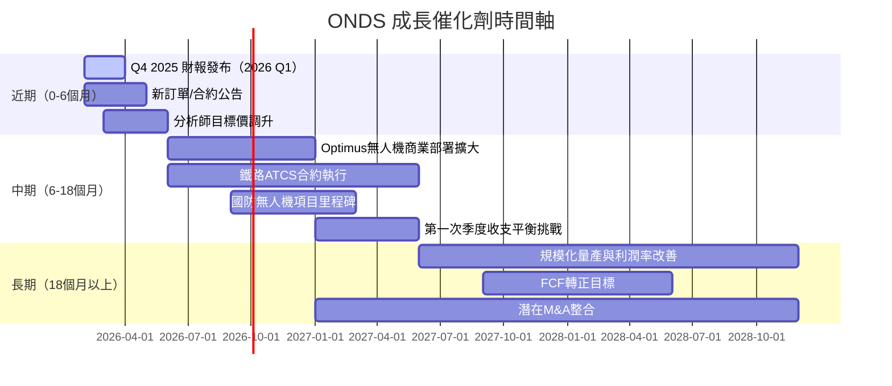

---

### TAM 市場規模與滲透率

```
目標市場規模（TAM）估算

私有無線網路（工業LTE/5G）
  全球TAM：$30B（2030E）
  ONDS 當前市佔：< 0.1%
  滲透進度：▓░░░░░░░░░░░░░░░░░░░  < 0.5%

商業無人機服務市場
  全球TAM：$50B（2030E）
  ONDS 當前市佔：< 0.05%
  滲透進度：░░░░░░░░░░░░░░░░░░░░  < 0.1%

鐵路通訊升級市場（美國）
  美國TAM：$5B（估）
  ONDS 當前市佔：< 1%
  滲透進度：▓░░░░░░░░░░░░░░░░░░░  < 1%

國防無人機/自動化
  美國TAM：$15B（2030E）
  ONDS 當前市佔：< 0.1%
  滲透進度：░░░░░░░░░░░░░░░░░░░░  < 0.1%

⭐ 合計TAM：~$100B（2030E）
   若ONDS能達到1%市佔 → 年收入 $1B
   若ONDS能達到3%市佔 → 年收入 $3B
```

---

### 短/中/長期成長驅動力

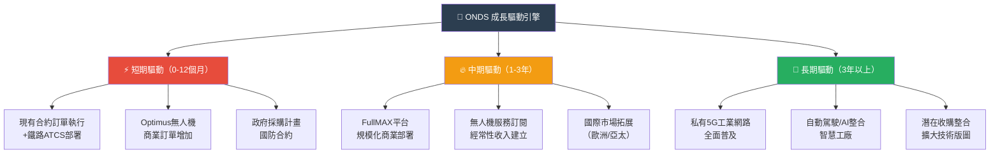

---

## 9. 風險矩陣

### 風險評分矩陣

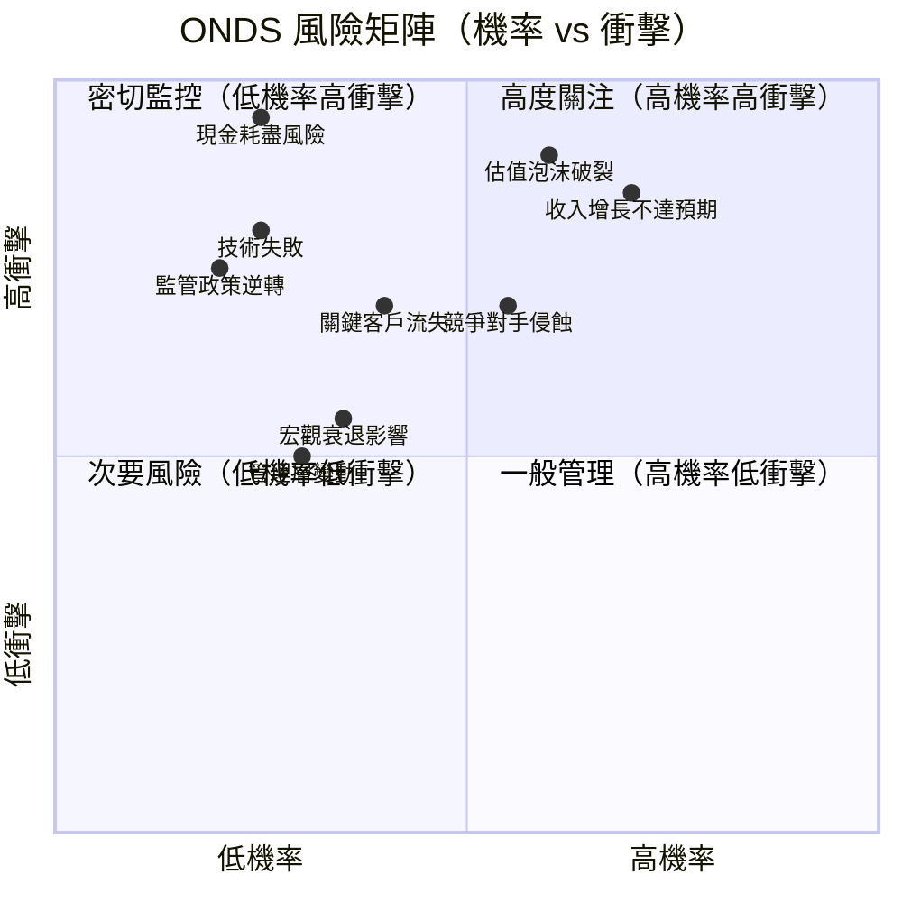

---

### 風險清單表格

| 風險項目 | 機率 | 衝擊 | 風險分 | 緩解措施 | 評級 |
|---------|------|------|--------|---------|------|
| 估值泡沫破裂（股價遠超基本面）| 高(65%) | 極高 | 9.2 | 分批買入，嚴設停損 | 🔴 |
| 收入增長放緩/不達預期 | 高(60%) | 極高 | 8.8 | 監控季度訂單數據 | 🔴 |
| 高額空頭比例（27.1%）引發軋空或踩踏 | 高(55%) | 高 | 7.5 | 留意空頭回補動態 | 🔴 |
| 競爭對手侵蝕（大廠進入私有5G/無人機）| 中(50%) | 高 | 7.0 | 追蹤技術護城河深化 | 🔴 |
| 現金燒盡需再融資（稀釋股東）| 低(25%) | 極高 | 6.3 | 現金$451M支撐12+年 | 🟡 |
| 關鍵合約/客戶流失 | 中(40%) | 高 | 6.0 | 監控主要客戶集中度 | 🟡 |
| 監管政策逆轉（無人機/頻譜）| 低(20%) | 高 | 5.0 | 追蹤FCC/FAA法規動態 | 🟡 |
| 技術路線失敗（SDR被替代）| 低(25%) | 高 | 4.8 | 監控競爭技術發展 | 🟡 |
| 宏觀經濟衰退（政府支出削減）| 中(35%) | 中 | 4.5 | 多元化市場降低集中 | 🟡 |
| 管理層/核心人才流失 | 低(30%) | 中 | 3.5 | 關注內部人持股比例 | 🟢 |

---

## 10. 投資建議

### 最終綜合評級（Unicode 雷達圖）

```
綜合評分雷達圖（滿分10分）

         成長性（8.5）
            ██████████
           ████████████
基本面    ████████████  財務健康
（3.5）  ██████████████  （6.0）
        ████████████████
       ██████████████████
        ████████████████
獲利性   ████████████  估值合理性
（1.5）  ██████████████  （2.0）
           ████████████
            ██████████
         技術護城河（4.3）

分維度評分：
成長性    ████████▓░  8.5/10  【+582% YoY，季度QoQ持續加速】
財務健康  ██████░░░░  6.0/10  【現金充裕但持續燒錢】
技術護城河████░░░░░░  4.3/10  【SDR技術差異化，但護城河尚淺】
基本面品質███▓░░░░░░  3.5/10  【無盈利，規模偏小，不確定性高】
估值合理性██░░░░░░░░  2.0/10  【P/S 195x，嚴重透支未來】
獲利能力  █▓░░░░░░░░  1.5/10  【淨利率-172.5%，暫無獲利時間表】

━━━━━━━━━━━━━━━━━━━━━━━━━━━━━━━━━━━━━━━━
綜合總分：▓▓▓▓░░░░░░  4.3 / 10
━━━━━━━━━━━━━━━━━━━━━━━━━━━━━━━━━━━━━━━━
```

---

### 目標價與隱含報酬率

| 情境 | 目標價 | 隱含報酬率 | 達成條件 | 機率 |
|------|--------|-----------|---------|------|
| 🐂 **樂觀** | **$22.00** | **+104.7%** | 2025收入超$50M，無人機商業規模化，多個國防合約 | 20% |
| 📊 **基準** | **$14.50** | **+34.9%** | 2025收入$30-40M，分析師目標價實現，成長持續 | 45% |
| 📉 **空頭** | **$5.00** | **-53.5%** | 收入增長失速，市場重新定價，空頭打壓 | 35% |

**期望值計算**：
```
期望目標價 = $22 × 20% + $14.50 × 45% + $5 × 35%
           = $4.40 + $6.525 + $1.75
           = $12.675

期望報酬率 = ($12.675 - $10.75) / $10.75 = +17.9%

⚠️ 期望報酬率+17.9%，看似正面，但標準差極高（高波動）
   風險調整後報酬（Sharpe）不佳，僅適合高風險投資者
```

---

### 買入時機與觸發因素 Checklist

```
✅ 進場觸發因素 Checklist

基本面催化劑：
□ Q4 2025 財報收入超預期（> $12M 單季）
□ 宣布重要國防/鐵路合約（合約金額 > $20M）
□ 毛利率季度改善至 > 40%
□ 首次出現季度正向經營現金流（OCF > 0）
□ 管理層提升2026年業績指引

估值/技術面：
□ 股價回調至 $8-9 區間（提供更好進場點）
□ 空頭比例降至 < 20%（空頭回補確認）
□ 分析師上調目標價並有新覆蓋加入
□ 機構持股比例提升至 > 45%

⚠️ 警示退場信號：
□ 季度收入QoQ成長轉負
□ 管理層大量賣出股票（內部人持股 < 1%）
□ 現金儲備下降至 < $200M
□ 出現主要客戶流失公告
□ 股價跌破 $7 支撐位
```

---

### 投資人適配度

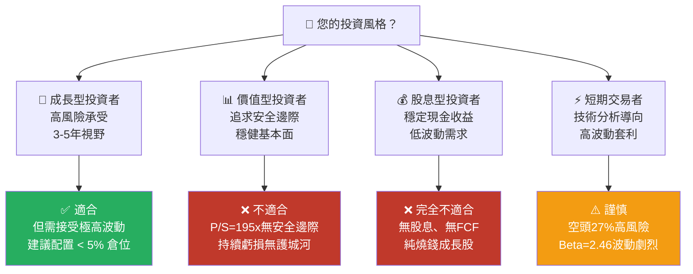

---

### 關鍵監控指標 Checklist

```
📋 下次財報監控重點（Q4 2025，預計2026年3-4月）：

財務指標：
□ 季度收入：目標 > $12M（維持QoQ成長動能）
□ 毛利率：目標 > 38%（觀察規模效益）
□ 營業虧損：目標收窄至 < -$12M
□ 現金消耗速度：目標OCF改善至 < -$8M/季

業務指標：
□ 新增訂單/合約金額（最重要先行指標）
□ Optimus無人機部署數量
□ FullMAX 基站安裝數量
□ 鐵路ATCS合約執行進度

產業/競爭動態：
□ 美國無人機政策法規更新（FAA）
□ 競爭對手（AVAV等）動態
□ 私有5G/LTE 工業網路市場標案
□ 政府國防預算中無人機相關撥款

總體/風險：
□ 空頭比例變化（目前27.1%）
□ 機構持股變動（目前38.2%）
□ 內部人增持/減持動態（目前1.6%偏低）
□ 二次增資計畫（稀釋風險）
```

---

## 📌 最終結論摘要

```
╔══════════════════════════════════════════════════════════════════════╗
║                    ONDS 機構級分析結論                              ║
╠══════════════════════════════════════════════════════════════════════╣
║                                                                      ║
║  📊 綜合評分：4.3 / 10                                              ║
║  🎯 評級：投機性買入（Speculative Buy）                             ║
║                                                                      ║
║  核心論述：                                                          ║
║  ONDS是一家處於「收入爆發期 vs 估值泡沫化」交叉點的高風險成長股。  ║
║  TTM收入YoY +582%、季度環比持續加速，商業化拐點已顯現。           ║
║  現金儲備$451M提供充足跑道，8位分析師全數看多。                   ║
║                                                                      ║
║  然而：P/S=195x、EVA=-$45M、空頭27.1%、淨利率-172.5%，           ║
║  任何執行失誤都可能導致估值急劇壓縮。                              ║
║                                                                      ║
║  🎯 目標價：$14.50（基準）/ $22.00（樂觀）/ $5.00（悲觀）        ║
║  ⚠️ 建議：等待$8-9回調建倉，倉位控制在組合5%以內                ║
║  📅 關鍵時間點：Q4 2025財報（2026年3-4月）                        ║
║                                                                      ║
╚══════════════════════════════════════════════════════════════════════╝
```

---

> **⚠️ 免責聲明**：本報告為 AI 自動生成，基於公開財務數據進行分析，僅供研究參考，**不構成任何投資建議**。投資涉及風險，過去表現不代表未來結果。ONDS 為高風險投機性股票，投資者應自行進行盡職調查，並諮詢持牌財務顧問。本報告中的所有預測與目標價均基於假設模型，實際結果可能大幅偏離。