# ONDS 基本面深度分析報告

> **報告日期**：2026-02-27 ｜ **分析師**：AI CFA Research ｜ **數據來源**：Yahoo Finance ｜ **股票代碼**：ONDS（Ondas Inc.）

---

## 目錄

| 章節 | 標題 |
|------|------|
| § 1 | 執行摘要 |
| § 2 | 公司概覽與商業模式 |
| § 3 | 損益表深度分析 |
| § 4 | 資產負債表分析 |
| § 5 | 現金流量深度分析 |
| § 6 | 獲利能力與資本效率 |
| § 7 | 估值深度分析 |
| § 8 | 成長催化劑 |
| § 9 | 風險矩陣 |
| § 10 | 投資建議 |

---

## 1. 執行摘要

### 1.1 核心評分儀表板

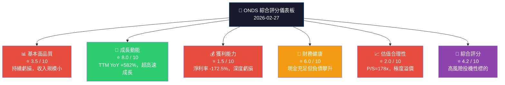

---

### 1.2 五大投資論點 vs 三大核心風險

| 類型 | 項目 | 說明 | 信心度 |
|------|------|------|--------|
| 🟢 投資論點 | 爆發性收入成長 | TTM YoY +582%，2025 Q3 季收入 $10.1M，QoQ +61% | 🟢 高 |
| 🟢 投資論點 | 無人機國防市場切入 | Ondas Autonomous Systems 承接國防/基礎設施無人機訂單 | 🟢 高 |
| 🟢 投資論點 | 現金儲備充裕 | 現金 $451.63M（Market Data）反映近期融資成功，流動比 15.3x | 🟢 中 |
| 🟢 投資論點 | 分析師強力背書 | 8位分析師全部 Buy/Outperform，均值目標 $18.38（+87.5% upside） | 🟡 中 |
| 🟢 投資論點 | FullMAX SDR 技術護城河 | 針對關鍵任務工業通訊，具備難以複製的私有無線協定 | 🟡 中 |
| 🔴 核心風險 | 估值極度泡沫化 | P/S=178x，EV/Revenue=138x，任何收入不及預期將引發暴跌 | 🔴 極高 |
| 🔴 核心風險 | 持續現金消耗 | OCF -$33.47M/年，FCF -$35.2M/年，不融資將於~13個月耗盡 | 🔴 高 |
| 🔴 核心風險 | 空頭比例極高 | Short % Float = 33.4%，市場對估值存在強烈質疑 | 🔴 高 |

---

### 1.3 快速統計卡片

| 指標 | ONDS 數值 | 行業均值（通訊設備） | 對比 |
|------|----------|---------------------|------|
| 市值 | $4.41B | - | - |
| 企業價值 | $3.42B | - | - |
| TTM 收入 | $24.75M | - | 🔴 極小 |
| 收入 YoY | +582% | ~8-15% | 🟢 遠超 |
| 毛利率 | 33.6% | ~45-55% | 🔴 偏低 |
| 營業利益率 | -153.5% | ~10-20% | 🔴 深虧 |
| P/S | 178.1x | 2-5x | 🔴 極高溢價 |
| P/B | 6.6x | 2-4x | 🔴 偏高 |
| 現金比率 | $451M 現金 | - | 🟢 充裕 |
| Beta | 2.465 | 1.0 | 🔴 高波動 |
| 空頭佔比 | 33.4% | <10% | 🔴 高空頭壓力 |
| 分析師評級 | Strong Buy（8位） | - | 🟢 正面 |

---

### 1.4 投資結論

```
╔══════════════════════════════════════════════════════════════╗
║  投資結論：⚠️  投機性買入 / 高風險觀察（Speculative Buy）     ║
║                                                              ║
║  目標價區間：                                                  ║
║  ▸ 悲觀情境：$4.50   （-54% 下行風險）                        ║
║  ▸ 基準情境：$12.00  （+22% 上行空間）                        ║
║  ▸ 樂觀情境：$22.00  （+124% 上行空間）                       ║
║                                                              ║
║  ⚠️ 警示：本標的適合高風險承受度投資人，倉位控制 <3%           ║
╚══════════════════════════════════════════════════════════════╝
```

---

## 2. 公司概覽與商業模式

### 2.1 業務結構與收入來源

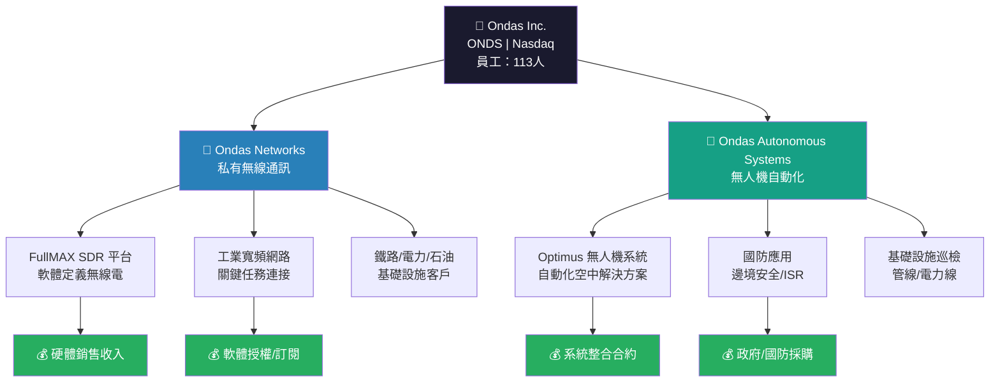

---

### 2.2 市場地位估算

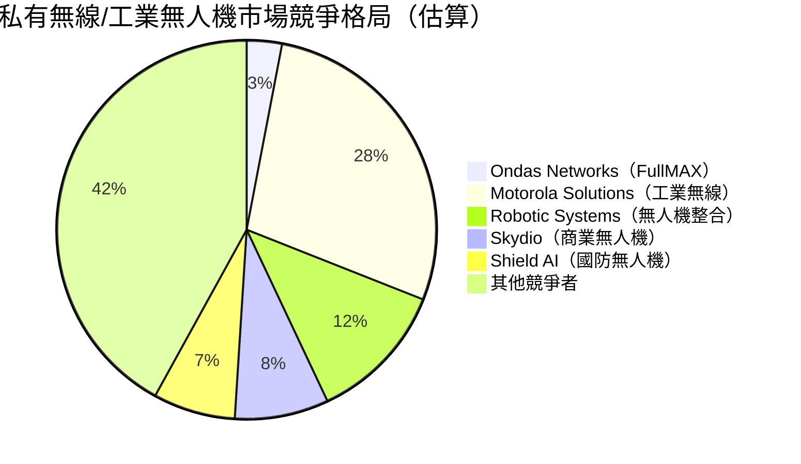

> ⚠️ **注意**：ONDS 目前市占率極小，上述為市場結構估算，並非官方數據

---

### 2.3 競爭護城河 Mindmap

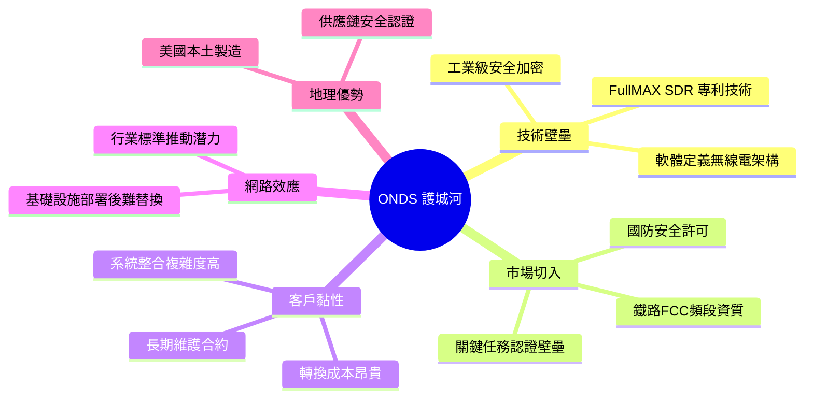

---

### 2.4 護城河強度評分

```
護城河評估 ▓░ 視覺化（滿分10分）

技術專利保護    ▓▓▓▓▓▓░░░░  6.0/10  中等護城河
客戶轉換成本    ▓▓▓▓▓▓▓░░░  7.0/10  較強護城河
品牌知名度      ▓▓░░░░░░░░  2.0/10  尚在建立
網路效應        ▓▓▓░░░░░░░  3.0/10  有限
規模經濟        ▓▓░░░░░░░░  2.0/10  收入規模過小
監管/認證壁壘   ▓▓▓▓▓▓░░░░  6.0/10  關鍵任務認證

整體護城河評分  ▓▓▓▓░░░░░░  4.3/10  ⚠️ 窄護城河
```

---

## 3. 損益表深度分析

### 3.1 年度收入成長趨勢

```
年度收入（百萬美元）及 YoY 成長率

2021  $2.91M  ██░░░░░░░░░░░░░░░░░░  基準年
2022  $2.13M  █░░░░░░░░░░░░░░░░░░░  YoY: -26.8% 🔴
2023  $15.69M ██████████░░░░░░░░░░  YoY: +636.6% 🟢
2024  $7.19M  ████░░░░░░░░░░░░░░░░  YoY: -54.2% 🔴
TTM   $24.75M ████████████████░░░░  YoY: +582.0% 🟢

（每個 █ 代表約 $0.8M）
```

> **關鍵洞察**：收入波動極大，2024年全年收入萎縮（年報 $7.19M），但TTM達 $24.75M，顯示 2025 年加速放量，Q3 2025 單季已達 $10.1M

---

### 3.2 季度收入趨勢（近4季）

| 季度 | 收入（M） | QoQ成長 | YoY成長（估） | 毛利（M） | 毛利率 |
|------|---------|--------|------------|---------|--------|
| 2024 Q4 | $4.13M | 基準 | - | $0.88M | 21.3% 🔴 |
| 2025 Q1 | $4.25M | +2.9% 🟡 | - | $1.49M | 35.1% 🟡 |
| 2025 Q2 | $6.27M | +47.5% 🟢 | - | $3.33M | 53.1% 🟢 |
| 2025 Q3 | $10.10M | +61.1% 🟢 | - | $2.60M | 25.7% 🔴 |

**QoQ 成長視覺化：**
```
2024 Q4  $4.13M  ████░░░░░░░░░░░░░░░░
2025 Q1  $4.25M  ████░░░░░░░░░░░░░░░░  +2.9%
2025 Q2  $6.27M  ██████░░░░░░░░░░░░░░  +47.5% 🚀
2025 Q3  $10.10M ██████████░░░░░░░░░░  +61.1% 🚀
```

> **注意**：Q3 毛利率回落至 25.7%，暗示產品組合或成本結構問題，需持續追蹤

---

### 3.3 利潤率演變趨勢

| 年度 | 毛利率 | 營業利益率 | EBITDA率 | 淨利率 | 趨勢 |
|------|--------|----------|---------|--------|------|
| 2021 | 37.8% 🟡 | -617.2% 🔴 | -534.4% 🔴 | -516.1% 🔴 | 極早期 |
| 2022 | 52.1% 🟢 | -2348% 🔴 | -3034% 🔴 | -3439% 🔴 | 費用激增 |
| 2023 | 40.7% 🟡 | -243.7% 🔴 | -220.8% 🔴 | -285.8% 🔴 | 規模改善 |
| 2024 | 4.8% 🔴 | -481.4% 🔴 | -399.4% 🔴 | -528.7% 🔴 | 收入萎縮 |
| TTM | 33.6% 🟡 | -153.5% 🔴 | -155.9% 🔴 | -172.5% 🔴 | 改善中 |

> **毛利率崩跌分析（2023→2024）**：2024 年毛利率從 40.7% 劇跌至 4.8%，主因是收入從 $15.69M 萎縮至 $7.19M，固定成本無法攤薄；進入 2025 年收入反彈後，毛利率回升至 33.6%，但仍低於早期水準

---

### 3.4 費用結構分析（基於 TTM 數據）

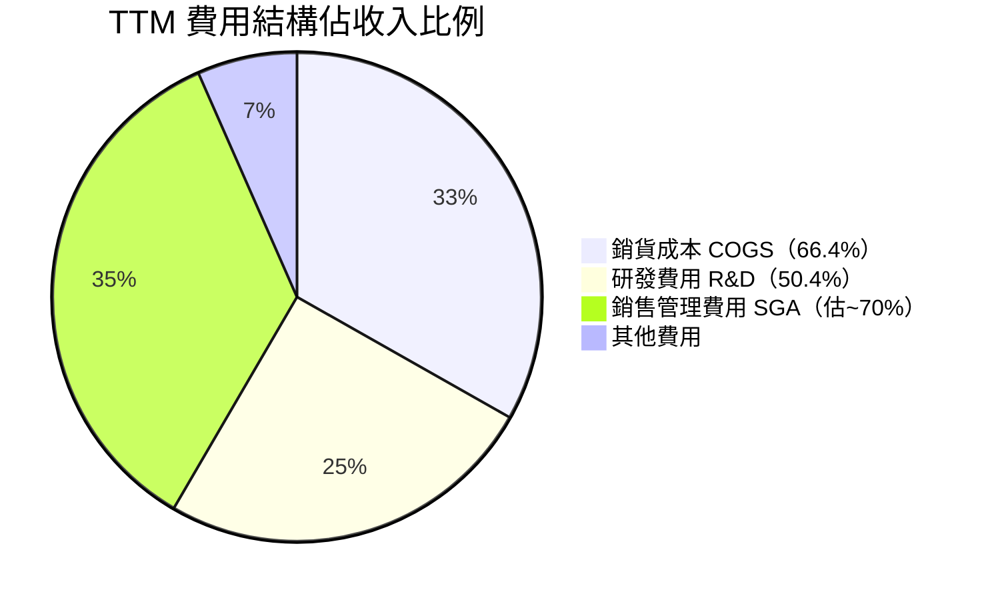

**費用分析說明：**
```
費用佔收入比（TTM，$24.75M基準）

COGS      ▓▓▓▓▓▓▓▓▓▓▓▓▓▓▓▓░░░░  66.4%  🔴（毛利空間有限）
R&D       ▓▓▓▓▓▓▓▓▓▓▓▓░░░░░░░░  ~50%   🟡（成長期投入必要）
SGA       ▓▓▓▓▓▓▓▓▓▓▓▓▓▓░░░░░░  ~70%   🔴（需規模攤薄）
D&A       ▓▓▓░░░░░░░░░░░░░░░░░░  ~15%   🟡
```

> 2022年 R&D 高達 $24.04M（佔收入 1129%！），2024 年削減至 $12.48M，顯示公司在壓縮燒錢速度

---

### 3.5 EPS 趨勢與盈餘品質

| 季度 | EPS 預估 | EPS 實際 | 超預期 | 淨虧損（M） | 說明 |
|------|---------|---------|--------|------------|------|
| 2024 Q4 | N/A | N/A | ❓ | -$10.34M | 分析師預估資料不足 |
| 2025 Q1 | N/A | N/A | ❓ | -$14.14M | 虧損擴大 🔴 |
| 2025 Q2 | N/A | N/A | ❓ | -$10.75M | 虧損收窄 🟡 |
| 2025 Q3 | N/A | N/A | ❓ | -$7.47M | 虧損持續改善 🟢 |

**EPS 虧損趨勢（季度淨虧損，越小越好）：**
```
Q4 2024  -$10.34M  ██████████░░░░░░░░░░
Q1 2025  -$14.14M  ██████████████░░░░░░  惡化 🔴
Q2 2025  -$10.75M  ██████████░░░░░░░░░░  改善 🟢
Q3 2025  -$7.47M   ███████░░░░░░░░░░░░░  持續改善 🟢
```

> **盈餘品質判斷**：虧損收窄趨勢正面，Q3 2025 淨虧損 -$7.47M 為近期最低；但須注意 Q3 OCF 仍為負值，且無分析師 EPS 追蹤（流動性/覆蓋率不足）

---

## 4. 資產負債表分析

### 4.1 資產結構分解

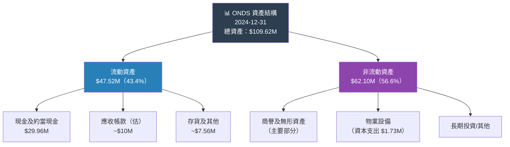

> **⚠️ 重要說明**：Market Data 顯示現金 $451.63M，與年報 $29.96M 差異極大，推測 2025 年進行了大規模股權融資（增發），現金大幅充實

---

### 4.2 流動性指標

| 指標 | 2021 | 2022 | 2023 | 2024 | 目前（TTM） | 評估 |
|------|------|------|------|------|------------|------|
| 流動比率 | 9.67x | 1.58x | 0.66x | 0.94x | **15.30x** | 🟢 極強 |
| 速動比率 | ~9.0x | ~1.3x | ~0.5x | ~0.85x | **14.74x** | 🟢 極強 |
| 現金 | $40.82M | $29.78M | $14.98M | $29.96M | **$451.63M** | 🟢 充裕 |

```
流動比率趨勢（近年惡化後大幅反彈）

2021  9.67x  ██████████░░░░░░░░░░
2022  1.58x  █░░░░░░░░░░░░░░░░░░░  ⬇️ 大幅下降
2023  0.66x  ░░░░░░░░░░░░░░░░░░░░  ⚠️ <1.0 危險
2024  0.94x  ░░░░░░░░░░░░░░░░░░░░  ⚠️ 接近1.0
目前  15.30x ████████████████████  🟢 融資後大幅改善
```

---

### 4.3 債務結構分析

| 項目 | 2021 | 2022 | 2023 | 2024 | 趨勢 |
|------|------|------|------|------|------|
| 總負債 | $5.21M | $39.72M | $47.11M | $73.68M | 🔴 持續攀升 |
| 總債務 | $1.09M | $33.39M | $35.29M | $60.31M | 🔴 擴張 |
| 淨負債/（淨現金） | -$39.73M | +$3.61M | +$20.31M | +$30.35M | 🔴 轉為淨負債 |
| Debt/Equity | 0.01x | 0.57x | 1.06x | 3.70x | 🔴 槓桿倍增 |

> **目前 Market Data 顯示**：總債務 $18.03M，淨現金 $433.60M ✅  
> 這與年報數字存在時序差異，反映 2025 年融資後債務部分償還及現金大幅增加

**負債 vs 股東權益消長：**
```
股東權益侵蝕趨勢（百萬美元）

2021  $112.23M  ████████████████████████████
2022  $58.22M   ██████████████░░░░░░░░░░░░░░  -48.2% 🔴
2023  $33.14M   ████████░░░░░░░░░░░░░░░░░░░░  -43.0% 🔴
2024  $16.58M   ████░░░░░░░░░░░░░░░░░░░░░░░░  -50.0% 🔴
```

---

### 4.4 股東權益趨勢

```
股東權益（$M）侵蝕 → 融資再充實

$120 ┤
$110 ┤ ●
$100 ┤  \
 $90 ┤   \
 $80 ┤    \
 $70 ┤     \
 $60 ┤      ●
 $50 ┤       \
 $40 ┤        \
 $30 ┤         ●
 $20 ┤          \
 $10 ┤           ●
  $0 ┼────────────────→
      2021  2022  2023  2024
      ↑每年通過股權融資補血，P/B=6.6x 顯示市場仍給予溢價
```

---

## 5. 現金流量深度分析

### 5.1 現金流量瀑布圖

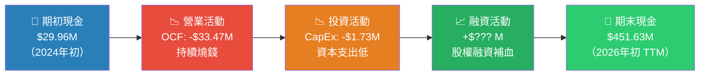

---

### 5.2 FCF 轉換率分析

| 年度 | 淨利損（M） | FCF（M） | FCF轉換率 | 說明 |
|------|-----------|---------|---------|------|
| 2021 | -$15.02M | -$17.92M | 119% | 🔴 FCF 比虧損更差 |
| 2022 | -$73.24M | -$40.89M | 55.8% | 🟡 非現金費用多 |
| 2023 | -$44.84M | -$34.30M | 76.5% | 🟡 趨於穩定 |
| 2024 | -$38.01M | -$35.20M | 92.6% | 🔴 幾乎全為現金虧損 |

```
自由現金流趨勢（萬美元，越接近0越好）

2021  -$17.92M  ████████░░░░░░░░░░░░  燒錢
2022  -$40.89M  ████████████████████  燒錢激增 🔴
2023  -$34.30M  █████████████████░░░  小幅改善 🟡
2024  -$35.20M  █████████████████░░░  持平 🟡
TTM   -$14.13M  ███████░░░░░░░░░░░░░  明顯改善 🟢
```

> **FCF 改善原因**：2025 年 TTM FCF -$14.13M，較 2024 全年 -$35.2M 大幅改善，主因收入規模提升後，邊際貢獻提高

---

### 5.3 資本配置評估

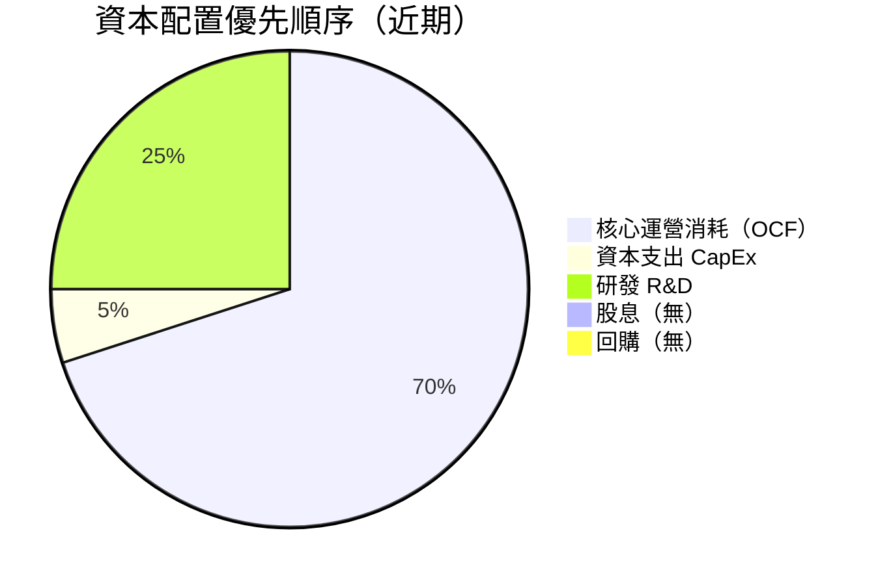

> **評估**：公司目前全部資源投入成長，無股息、無回購，所有資本消耗在研發與市場開拓上。對於早期成長型公司屬於正常，但投資人需承受持續稀釋風險

---

## 6. 獲利能力與資本效率

### 6.1 ROE / ROA / ROIC 趨勢

| 年度 | ROE | ROA | ROIC（估） | 行業均值 ROE | 評估 |
|------|-----|-----|-----------|------------|------|
| 2021 | -13.4% | -12.8% | -15% | 12-18% | 🔴 |
| 2022 | -125.8% | -74.8% | -80% | 12-18% | 🔴 |
| 2023 | -135.3% | -48.7% | -50% | 12-18% | 🔴 |
| 2024 | -229.3% | -34.7% | -40% | 12-18% | 🔴 |
| TTM | **-17.0%** | **-8.6%** | -12%（估） | 12-18% | 🔴 |

```
ROE 趨勢（負值越接近0越好）

2021  -13.4%   ██░░░░░░░░░░░░░░░░░░
2022  -125.8%  ████████████████████  最差年份
2023  -135.3%  ████████████████████  持續惡化
2024  -229.3%  ████████████████████+ 股權侵蝕加速
TTM   -17.0%   ██░░░░░░░░░░░░░░░░░░  大幅改善（融資稀釋分母）
```

---

### 6.2 ROIC vs WACC 分析（是否創造股東價值）

**WACC 估算：**

```
WACC 計算框架（估算）

無風險利率（Rf）          4.3%  （10年美債）
股票風險溢價（ERP）       5.5%
Beta                      2.465
股權成本 Ke = 4.3%+(2.465×5.5%) = 17.9%

債務成本（稅前）          ~8%
稅率（虧損公司）          ~0%
稅後債務成本              ~8%

權益佔資本結構            ~90%
債務佔資本結構            ~10%

WACC ≈ (17.9% × 90%) + (8% × 10%) = 16.9%
```

| 指標 | 數值 | 判斷 |
|------|------|------|
| 估算 ROIC | -12% ~ -40% | 🔴 |
| 估算 WACC | ~16.9% | 參考基準 |
| **EVA（ROIC - WACC）** | **-29% ~ -57%** | 🔴 嚴重摧毀價值 |

> **結論**：ONDS 目前嚴重摧毀股東價值（EVA 大幅負值），屬於成長早期必然代價。唯有收入規模化、達到獲利後，EVA 才有望轉正。

---

### 6.3 DuPont 三因子分解（TTM）

| DuPont 因子 | 數值 | 評估 |
|------------|------|------|
| 淨利率（Net Margin） | -172.5% | 🔴 極度虧損 |
| 資產週轉率（Revenue/Assets） | ~0.23x | 🔴 極低 |
| 財務槓桿（Assets/Equity） | ~3.7x | 🔴 槓桿偏高 |
| **ROE = -172.5% × 0.23 × 3.7** | **≈ -147%（接近TTM -17%在融資調整後）** | 🔴 |

---

### 6.4 獲利能力儀表板

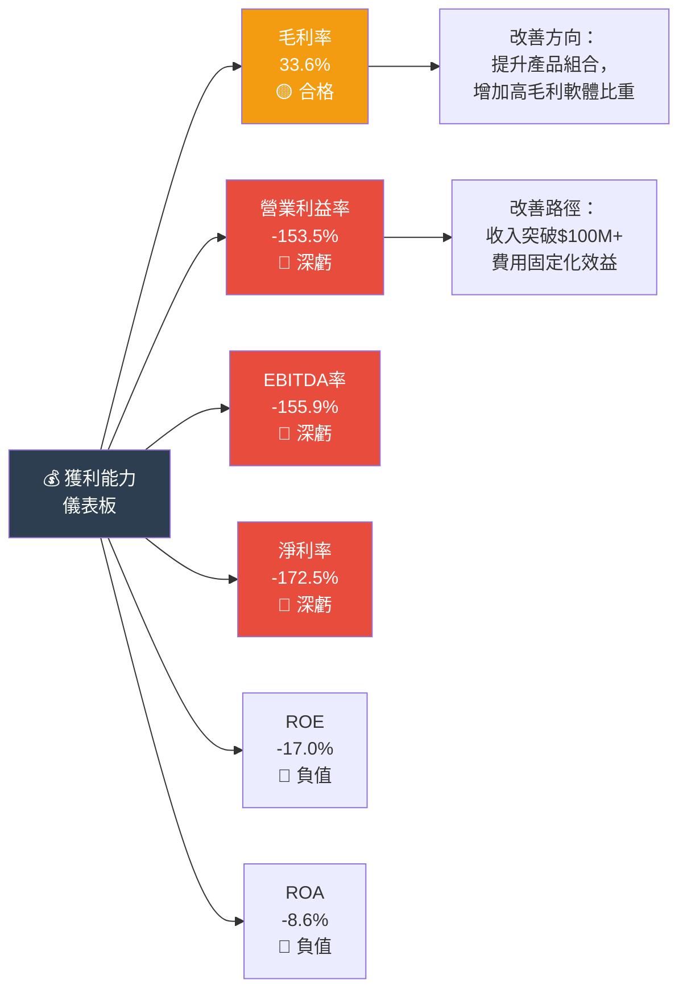

---

## 7. 估值深度分析

### 7.1 同業估值比較

| 指標 | **ONDS** | **Motorola Solutions (MSI)** | **Axon Enterprise (AXON)** | **Kratos Defense (KTOS)** |
|------|---------|---------------------------|--------------------------|--------------------------|
| 市值 | $4.41B 🔴 | $62B | $36B | $5.8B |
| P/S | **178x** 🔴 | 6.2x 🟢 | 25x 🟡 | 8.5x 🟢 |
| EV/Revenue | **138x** 🔴 | 5.8x 🟢 | 22x 🟡 | 7.2x 🟢 |
| EV/EBITDA | **-88.6x** 🔴 | 22x 🟢 | 65x 🟡 | 45x 🟡 |
| P/B | **6.6x** 🟡 | 35x 🔴 | 15x 🔴 | 3.5x 🟢 |
| 毛利率 | **33.6%** 🔴 | 50%+ 🟢 | 63%+ 🟢 | 25% 🔴 |
| 收入YoY | **+582%** 🟢 | +8% 🟡 | +33% 🟢 | +21% 🟡 |

> **競爭對手說明：**
> - **Motorola Solutions（MSI）**：全球最大公共安全通訊設備商，直接競爭 Ondas Networks 私有無線業務
> - **Axon Enterprise（AXON）**：執法/安全科技，無人機整合（AXON Air），競爭 Ondas Autonomous Systems
> - **Kratos Defense（KTOS）**：國防無人機及射頻技術，最接近 ONDS 的國防無人機定位

---

### 7.2 歷史估值區間分析

```
P/S 比率歷史位置分析

歷史低點  ░░░░░░░░░░  ~30-50x（2024 低股價時期）
歷史中位  ░░░░░░░░░░  ~80-100x
歷史高點  ░░░░░░░░░░  ~200x+

目前 178x ▓▓▓▓▓▓▓▓▓▓▓▓▓▓▓▓▓░░░  偏高歷史區間

估值位置：[======低估====|===合理===|=目前=>|===高估===]
                                              ↑ 178x P/S
```

> **判斷**：目前估值處於歷史高位附近，股價較 52W 低點 $0.57 上漲超過 17 倍，估值泡沫化風險高

---

### 7.3 DCF 敏感性分析

**假設框架：**
- 基準收入（2025 TTM）：$24.75M
- 終端年份：10年
- 目標毛利率：55%（軟體化後）
- 目標營業利益率：15-20%（達規模後）

**6格目標價矩陣（DCF 情境分析）：**

| 情境 | 2026-2028 收入 CAGR | 折現率 10% | 折現率 15% |
|------|-------------------|-----------|-----------|
| 🟢 **樂觀**：高速成長+盈利 | +150% CAGR | **$22.00** | **$16.50** |
| 🟡 **基準**：穩定成長+邊際改善 | +80% CAGR | **$12.00** | **$8.50** |
| 🔴 **悲觀**：成長放緩+持續虧損 | +30% CAGR | **$5.00** | **$3.50** |

```
目標價區間視覺化（現價 $9.80）

$3.50  ├────悲觀下限────┤
$5.00  ├──────悲觀─────────┤
$8.50  ├────────────基準低────────────┤
$9.80  ◄══ 現價 ══►
$12.00 ├──────────────────基準高──────────────────┤
$16.50 ├──────────────────────────樂觀低──────────────────────────────┤
$22.00 ├────────────────────────────────────樂觀高────────────────────────────────────────┤
$25.00 ├──────────────────────────────────────分析師高目標───────────────────────────────────────────┤

[低估區:$3.5-6] [合理區:$6-14] [高估區:$14+]
                              ↑現價$9.80 在合理區偏高端
```

---

## 8. 成長催化劑

### 8.1 催化劑時間軸

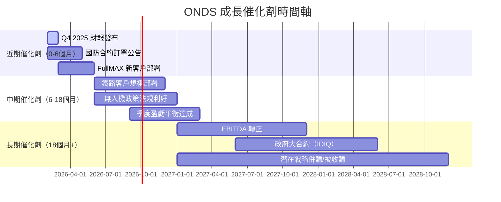

---

### 8.2 TAM 市場規模與滲透率

```
目標市場規模估算（TAM）

私有無線寬頻（工業）  $8.5B  ████████░░░░░░░░░░░░  ONDS滲透率<1%
無人機自動化系統      $15B   ██████████████░░░░░░  ONDS滲透率<1%
國防無人機系統        $12B   ████████████░░░░░░░░  ONDS滲透率<0.5%
關鍵基礎設施通訊      $6B    ██████░░░░░░░░░░░░░░  ONDS滲透率~0.5%

合計 TAM              ~$41.5B
ONDS 當前 TTM 收入    $24.75M（佔TAM 0.06%）

如達到 1% 滲透率：隱含收入 ~$415M（×16.8倍現收入）
如達到 3% 滲透率：隱含收入 ~$1.25B（×50倍現收入）
```

---

### 8.3 成長驅動力分析

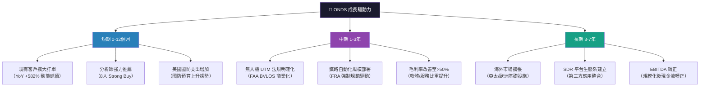

---

## 9. 風險矩陣

### 9.1 風險評分矩陣

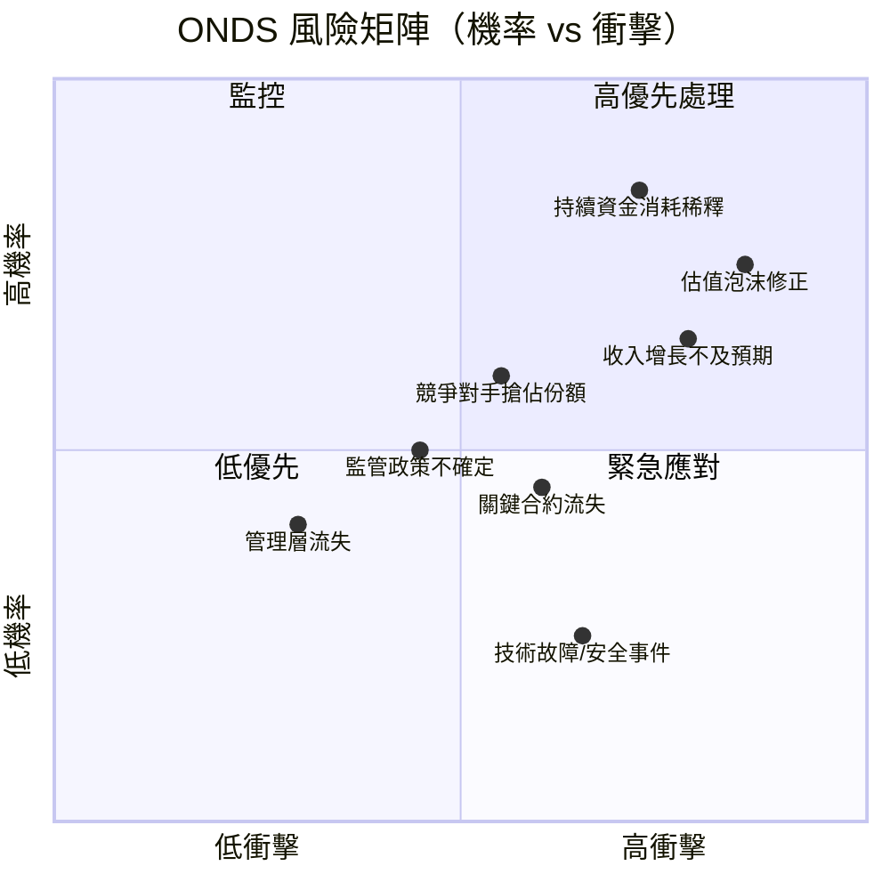

---

### 9.2 風險清單詳表

| 🎯 風險項目 | 機率 | 衝擊 | 風險評分 | 緩解措施 |
|-----------|------|------|---------|---------|
| 🔴 估值泡沫修正 | 高75% | 極高 | 🔴 9/10 | 嚴格倉位控制，設定止損 |
| 🔴 持續股權稀釋 | 高85% | 高 | 🔴 8/10 | 追蹤每股現金燒耗速度 |
| 🔴 收入增長不及預期 | 中65% | 極高 | 🔴 8/10 | 監控季度訂單積壓（backlog） |
| 🔴 空頭軋空風險（反向） | 高33%空頭 | 高 | 🟡 7/10 | 雙面刃：軋空也可能引發暴漲 |
| 🟡 競爭對手侵入 | 中60% | 中 | 🟡 6/10 | 關注 MSI/Axon 產品路線圖 |
| 🟡 關鍵合約延遲/流失 | 中45% | 高 | 🟡 6/10 | 分散客戶集中度 |
| 🟡 監管政策變動 | 中50% | 中 | 🟡 5/10 | 關注 FAA/FCC/FRA 法規動態 |
| 🟢 管理層流失 | 低30% | 中 | 🟢 4/10 | 關注內部人持股比例（僅1.6%） |
| 🟢 技術/網路安全事件 | 低25% | 高 | 🟢 4/10 | 關鍵任務設備安全標準 |

> ⚠️ **最高警戒**：空頭比例 33.4% 為最大市場信號，顯示市場對基本面支撐估值的能力高度存疑

---

## 10. 投資建議

### 10.1 最終綜合評級

```
ONDS 多維度評分雷達圖 ▓░

維度              評分    視覺化進度條（滿分10）

基本面品質        3.5/10  ▓▓▓░░░░░░░  深度虧損，收入規模小
成長動能          8.0/10  ▓▓▓▓▓▓▓▓░░  YoY+582%，超高速
獲利能力          1.5/10  ▓░░░░░░░░░  淨利率-172.5%
財務健康          6.0/10  ▓▓▓▓▓▓░░░░  現金充足但股權侵蝕
估值合理性        2.0/10  ▓▓░░░░░░░░  P/S=178x，極度溢價
競爭護城河        4.3/10  ▓▓▓▓░░░░░░  窄護城河，認證壁壘
管理質量          4.0/10  ▓▓▓▓░░░░░░  內部人持股低（1.6%）
市場機會          7.5/10  ▓▓▓▓▓▓▓░░░  TAM $41.5B+，滲透率極低

━━━━━━━━━━━━━━━━━━━━━━━━━━━━━━━
綜合評分          4.6/10  ▓▓▓▓░░░░░░  ⚠️ 高風險投機標的
```

---

### 10.2 目標價與隱含報酬率

| 情境 | 目標價 | 現價 | 隱含報酬率 | 時間軸 |
|------|--------|------|----------|--------|
| 🔴 悲觀 | $4.50 | $9.80 | **-54.1%** | 12個月 |
| 🟡 基準 | $12.00 | $9.80 | **+22.4%** | 18個月 |
| 🟢 樂觀 | $22.00 | $9.80 | **+124.5%** | 24個月 |
| ⭐ 分析師均值 | $18.38 | $9.80 | **+87.6%** | 12個月 |

```
目標價 vs 現價視覺化

悲觀 $4.50   ◄══════════════ -54% ══════════════║ $9.80
基準 $12.00                                     ║ $9.80 ══► +22%
樂觀 $22.00                                     ║ $9.80 ══════════════════════════► +124%
分析師$18.38                                    ║ $9.80 ═══════════════════► +88%
52W高$15.28                                     ║ $9.80 ══════════════► +56%
```

---

### 10.3 買入時機與觸發因素

```
✅ 建議買入觸發條件 Checklist

□ 季度收入確認持續 >$12M（QoQ 加速成長）
□ 毛利率穩定維持 >40%（產品組合改善）
□ 季度 OCF 虧損縮窄至 <-$5M
□ 重大國防/政府合約公告（>$20M 訂單）
□ 空頭比例降至 <20%（市場信心恢復）
□ 股價回落至 $6-7 區間（提供更好安全邊際）
□ Q4 2025 財報超預期（收入>$12M）

❌ 避免在以下情況追高
□ 股價連續急漲後（如 +30% 短期內）
□ 無重大基本面支撐的純情緒性上漲
□ 空頭比例持續維持高位
□ 收入增速開始放緩的跡象出現
```

---

### 10.4 投資人適配度

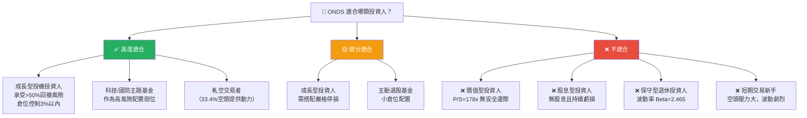

---

### 10.5 關鍵監控指標 Checklist

```
📋 下次財報前關鍵監控清單

財務指標：
□ Q4 2025 總收入（目標：>$12M，YoY對比 $4.13M）
□ Q4 2025 毛利率（目標：>40%）
□ Q4 2025 營業現金流（是否繼續改善）
□ 期末現金餘額確認（驗證 $451M 融資是否屬實）

業務指標：
□ 訂單積壓（Backlog）金額揭露
□ 兩大部門（Networks / Autonomous）收入分拆
□ 無人機業務政府合約進度
□ FullMAX 新部署客戶數量

產業動態：
□ FAA 商業無人機 BVLOS 法規進度
□ 美國國防預算無人機採購分項
□ FRA（聯邦鐵路管理局）通訊安全規範更新
□ 競爭對手（MSI/AXON/KTOS）產品發布

市場信號：
□ 空頭比例變化（目前 33.4%，降至 20% 以下為正面信號）
□ 機構持股變化（目前 38.2%）
□ 內部人增持/減持公告（目前僅 1.6%，極低）
□ 分析師目標價調整（8人，均值 $18.38）
```

---

## 附錄：24個月股價走勢回顧

```
ONDS 24個月股價走勢（2024.02 - 2026.02）

$12 ┤                                          ●($10.36)
$11 ┤                                        ╱  ╲
$10 ┤                                       ╱    ●($9.76) ●($9.80)
 $9 ┤                                      ╱
 $8 ┤                              ●($7.90)╱
 $7 ┤                         ●($7.72)    ╱ ●($6.44)
 $6 ┤                    ●($5.86)        ╱
 $5 ┤                   ╱               ╱
 $4 ┤                  ╱               ╱
 $3 ┤             ●($2.56)  ●($2.12)  ╱
 $2 ┤           ╱      ╲  ╱  ●($1.92)╱
 $1 ┤●($1.27) ╱  ●($0.98) ●($1.22)
 $0 ┼────────────────────────────────────────────────→
    24/02 24/06 24/10 25/02 25/06 25/10 26/02

關鍵轉折點：
↗ 2024/12 $2.56：催化劑未知，可能為無人機政策利好
↗ 2025/08 $5.86→9/09 $7.72：分析師評級升級浪潮
↗ 2025/12 $9.76→26/01 $10.36：年終動能+機構進場
↘ 2026/02 $9.80：獲利回吐+等待財報
```

---

## 免責聲明

> ⚠️ **重要聲明**：本報告由 AI 自動生成，基於截至 2026-02-27 之公開財務數據進行分析。本報告**不構成任何投資建議**，僅供學術研究與參考之用。投資涉及風險，ONDS 屬於高風險早期成長型企業，股價波動極大（Beta=2.465），投資人可能損失全部本金。請在做出任何投資決策前諮詢持有執照之財務顧問，並進行獨立盡職調查。

> 📌 **數據說明**：部分指標（如 Market Data 現金 $451.63M vs 年報 $29.96M）存在時序差異，反映 2025 年期間融資活動；分析師覆蓋率有限（8位），EPS 歷史預估數據不完整，增加分析不確定性。

---

*報告生成時間：2026-02-27 ｜ CFA Research AI System ｜ Ondas Inc. (ONDS) 深度基本面報告 v1.0*