# ONDS 基本面深度分析報告

> **報告日期**：2026-02-28 ｜ **語言**：繁體中文 ｜ **數據來源**：Yahoo Finance ｜ **分析師**：AI CFA Research Engine

---

## 目錄

1. [執行摘要](#1-執行摘要)
2. [公司概覽與商業模式](#2-公司概覽與商業模式)
3. [損益表深度分析](#3-損益表深度分析)
4. [資產負債表分析](#4-資產負債表分析)
5. [現金流量深度分析](#5-現金流量深度分析)
6. [獲利能力與資本效率](#6-獲利能力與資本效率)
7. [估值深度分析](#7-估值深度分析)
8. [成長催化劑](#8-成長催化劑)
9. [風險矩陣](#9-風險矩陣)
10. [投資建議](#10-投資建議)

---

## 1. 執行摘要

### 核心評分儀表板

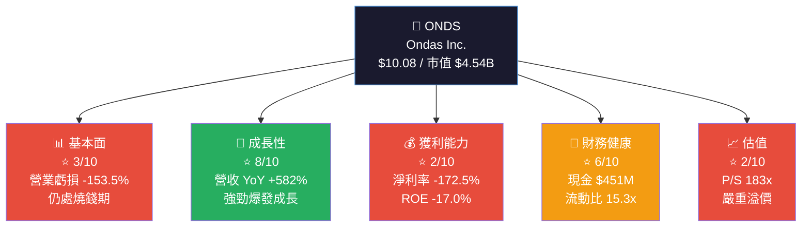

---

### 5大投資論點 + 3大風險

| 類型 | 指標 | 描述 | 評估 |
|------|------|------|------|
| 🟢 **投資論點 1** | 爆炸性營收成長 | TTM 營收 $24.75M，YoY +582%，顯示業務規模化加速 | 🟢 強力正面 |
| 🟢 **投資論點 2** | 強健現金儲備 | 現金 $451.63M，遠超負債 $18.03M，淨現金 $433.6M | 🟢 財務安全墊厚 |
| 🟢 **投資論點 3** | 分析師強力背書 | 8位分析師全數 Strong Buy，平均目標價 $18.38（+82%上行空間）| 🟢 機構看好 |
| 🟢 **投資論點 4** | 無人機+私有網路雙引擎 | 政府/國防/鐵路等剛需市場，切入壁壘高 | 🟢 差異化定位 |
| 🟢 **投資論點 5** | 毛利率改善趨勢 | Q3 2025 毛利率達 25.7%，較 2024 全年 4.8% 大幅提升 | 🟡 改善中 |
| 🔴 **風險 1** | 嚴重燒錢 | FCF -$14.13M，累計虧損龐大，盈利時間點不確定 | 🔴 關鍵風險 |
| 🔴 **風險 2** | 估值嚴重泡沫化 | P/S 183x，EV/Revenue 132x，遠超任何合理估值框架 | 🔴 高度風險 |
| 🟡 **風險 3** | 高空頭比例 | 空頭佔浮動股 33.4%，流通股偏少，波動劇烈 | 🟡 流動性風險 |

---

### 快速統計卡片：關鍵指標一覽表

| 指標 | ONDS 實際值 | 行業均值（通訊設備）| 偏差 | 燈號 |
|------|------------|-------------------|------|------|
| 市值 | $4.54B | — | 小型成長股 | 🟡 |
| 股價 | $10.08 | — | 52W高 $15.28 (-34%) | 🟡 |
| 營收 YoY 成長 | +582% | ~8-12% | **遠超行業** | 🟢 |
| 毛利率 | 33.6% | ~45-55% | 低於行業 | 🟡 |
| 營業利益率 | -153.5% | ~10-15% | **嚴重虧損** | 🔴 |
| 淨利率 | -172.5% | ~8-12% | **深度虧損** | 🔴 |
| P/S 比率 | 183.3x | ~3-6x | **嚴重高估** | 🔴 |
| P/B 比率 | 6.8x | ~2-4x | 偏高 | 🔴 |
| 流動比率 | 15.3x | ~1.5-2.5x | **超額流動** | 🟢 |
| 現金/市值 | ~9.9% | — | 現金充裕 | 🟢 |
| Beta | 2.465 | ~1.0-1.3 | 極高波動 | 🔴 |
| 空頭比率 | 33.4% | <5% | **極高賣空** | 🔴 |
| EPS (TTM) | -$0.36 | 正值 | 虧損 | 🔴 |
| EPS (Forward) | -$0.09 | 正值 | 改善中 | 🟡 |
| ROE | -17.0% | ~15-20% | 負值 | 🔴 |
| Beta | 2.465 | ~1.0 | 高風險 | 🔴 |

---

### 投資結論

```
╔══════════════════════════════════════════════════════════════╗
║          🎯 投資評級：投機性買入（Speculative Buy）           ║
║                                                              ║
║  目標價區間：                                                 ║
║  ├── 🐂 樂觀情境：$22.00  (+118% 上行空間)                   ║
║  ├── 📊 基準情境：$15.00  (+49% 上行空間)                    ║
║  └── 🐻 悲觀情境：$5.00   (-50% 下行風險)                   ║
║                                                              ║
║  ⚠️ 警告：僅適合高風險承受能力之成長型/投機型投資人           ║
║  📅 建議持有期間：12-24 個月                                  ║
╚══════════════════════════════════════════════════════════════╝
```

---

## 2. 公司概覽與商業模式

### 業務結構與收入來源

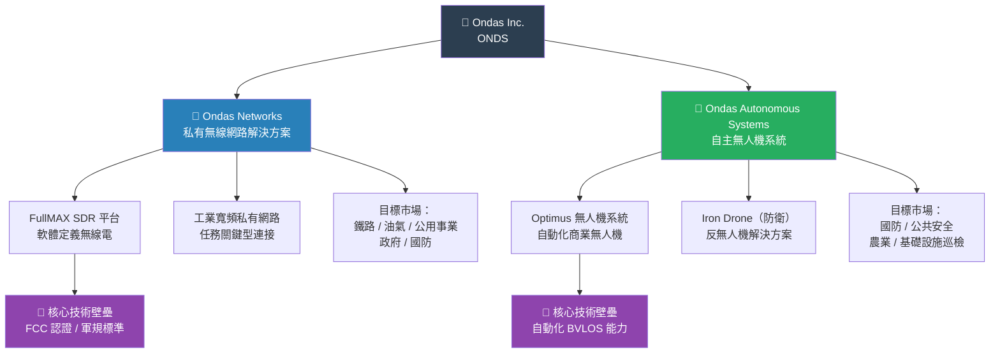

---

### 市場地位

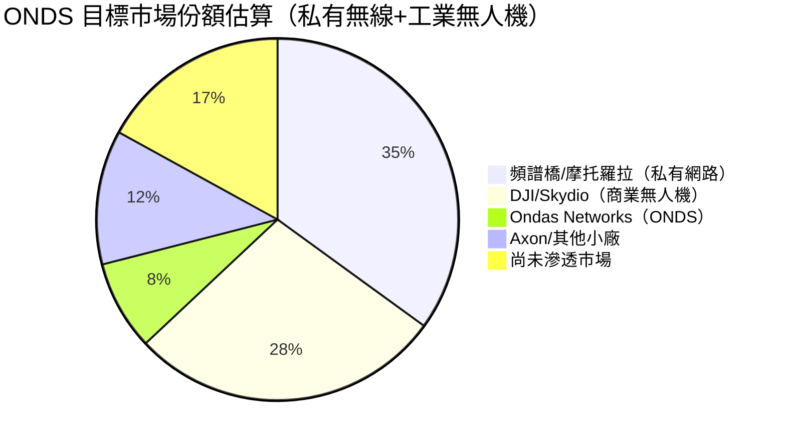

---

### 競爭護城河分析

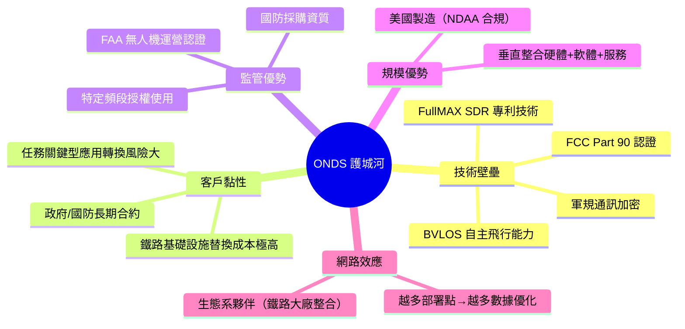

---

### 護城河強度評分

```
護城河維度評分（滿分 10 分）

技術壁壘    ▓▓▓▓▓▓▓░░░  7/10  ★★★★★★★☆☆☆
客戶黏性    ▓▓▓▓▓▓░░░░  6/10  ★★★★★★☆☆☆☆
監管優勢    ▓▓▓▓▓▓▓▓░░  8/10  ★★★★★★★★☆☆
規模優勢    ▓▓▓░░░░░░░  3/10  ★★★☆☆☆☆☆☆☆
網路效應    ▓▓▓▓░░░░░░  4/10  ★★★★☆☆☆☆☆☆
品牌認知    ▓▓░░░░░░░░  2/10  ★★☆☆☆☆☆☆☆☆
成本優勢    ▓▓▓░░░░░░░  3/10  ★★★☆☆☆☆☆☆☆

綜合護城河  ▓▓▓▓░░░░░░  4.7/10 — 窄護城河，仍在建構期
```

---

## 3. 損益表深度分析

### 年度收入成長趨勢（近4年）

```
年度營收趨勢（單位：百萬美元）
────────────────────────────────────────────────────────────
2021  $2.91M   ██░░░░░░░░░░░░░░░░░░  YoY: N/A（基期）
2022  $2.13M   █░░░░░░░░░░░░░░░░░░░  YoY: -26.8% 🔴
2023  $15.69M  ████████████░░░░░░░░  YoY: +636.6% 🟢
2024  $7.19M   █████░░░░░░░░░░░░░░░  YoY: -54.1% 🔴
TTM   $24.75M  ████████████████████  YoY: +582.0% 🟢

注意：2024 年下滑係因收購項目整合陣痛；
TTM 數字代表業務已重回高速擴張軌道
────────────────────────────────────────────────────────────
```

---

### 季度收入趨勢（近4季）

| 季度 | 營收 | QoQ 成長 | YoY 成長 | 毛利 | 毛利率 |
|------|------|----------|----------|------|--------|
| Q4 2024 | $4.13M | — | — | $0.88M | 21.3% 🟡 |
| Q1 2025 | $4.25M | **+2.9%** 🟡 | — | $1.49M | 35.1% 🟢 |
| Q2 2025 | $6.27M | **+47.5%** 🟢 | — | $3.33M | 53.1% 🟢 |
| Q3 2025 | $10.10M | **+61.1%** 🟢 | — | $2.60M | 25.7% 🟡 |

> **關鍵觀察**：Q2→Q3 營收環比 +61.1%，顯示業務加速放量。但 Q3 毛利率從 Q2 的 53.1% 下滑至 25.7%，暗示大客戶訂單中包含較低毛利之硬體出貨，需持續監控產品組合變化。

---

### 利潤率演變趨勢

| 利潤率指標 | 2021 | 2022 | 2023 | 2024 | TTM 2025 | 趨勢 |
|-----------|------|------|------|------|----------|------|
| **毛利率** | 37.8% 🟡 | 52.1% 🟢 | 40.7% 🟡 | 4.8% 🔴 | 33.6% 🟡 | ↗ 改善中 |
| **營業利益率** | -617.2% 🔴 | -2348% 🔴 | -243.7% 🔴 | -481.3% 🔴 | -153.5% 🔴 | ↗ 逐步收斂 |
| **EBITDA率** | -534.4% 🔴 | -3034% 🔴 | -220.8% 🔴 | -399.4% 🔴 | -155.9% 🔴 | ↗ 改善中 |
| **淨利率** | -516.2% 🔴 | -3438% 🔴 | -285.8% 🔴 | -528.7% 🔴 | -172.5% 🔴 | ↗ 改善中 |

> **利潤率惡化/改善原因分析**：
> - 2022年最慘：收購 American Robotics 導致高額無形資產攤銷+整合費用，營收基數又極低
> - 2024年毛利率跌至 4.8%：Ondas Autonomous Systems 初期出貨以低毛利硬體為主，規模效益尚未顯現
> - TTM 改善至 33.6%：隨軟體/服務收入比重提升，毛利率逐步回升

---

### 費用結構分析

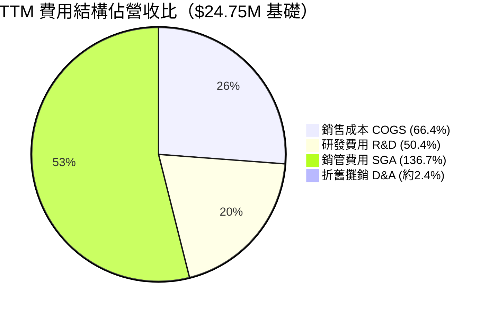

> **費用結構警示**：SGA 佔收入高達 136.7%，顯示公司管理費用/股票薪酬遠超收入規模，這是早期科技公司普遍現象，但需密切監控費用紀律。R&D 佔 50.4% 顯示技術投入積極。

---

### EPS 趨勢與盈餘品質分析

```
EPS 季度趨勢（美元/股）
────────────────────────────────────────────────────────────
Q4 2024  EPS: 約 -$0.040   ████████░░░░░░░░░  虧損
Q1 2025  EPS: 約 -$0.050   █████████░░░░░░░░  虧損擴大
Q2 2025  EPS: 約 -$0.038   ███████░░░░░░░░░░  虧損縮小
Q3 2025  EPS: 約 -$0.026   █████░░░░░░░░░░░░  虧損持續收窄 ↗

EPS TTM:  -$0.36（含大額非現金項目）
EPS Fwd:  -$0.09（預期大幅改善）

改善幅度預測：EPS Fwd vs TTM = +75% 改善
────────────────────────────────────────────────────────────
⚠️ 注意：EPS 歷史分析師預估資料缺失（nan），
        無法計算標準超預期/不及預期（Beat/Miss）百分比
        但 Q3 2025 淨虧損 $7.47M vs Q2 $10.75M，
        季度虧損收窄 30.5% 🟢 是正面訊號
```

| 季度 | 淨虧損 | QoQ 虧損變化 | 非現金項目佔比 | 盈餘品質 |
|------|--------|------------|--------------|---------|
| Q4 2024 | -$10.34M | — | 高（攤銷/股補）| 🔴 差 |
| Q1 2025 | -$14.14M | 惡化 -36.8% | 高 | 🔴 差 |
| Q2 2025 | -$10.75M | 改善 +23.9% | 中 | 🟡 改善 |
| Q3 2025 | -$7.47M | **改善 +30.5%** | 中 | 🟢 持續改善 |

---

## 4. 資產負債表分析

### 資產結構

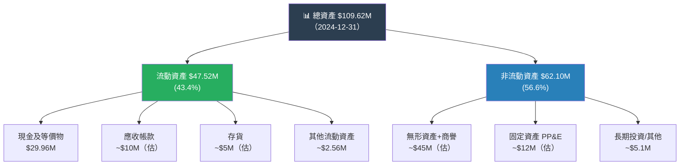

> **注意**：2026年2月市場數據顯示現金達 $451.63M，較 2024 年底 $29.96M 大幅提升，暗示公司於 2025 年間進行了大規模股票融資。此現金儲備為公司提供至少 **10-12 年的燒錢跑道**（按年燒 $35-40M 計）。

---

### 流動性指標

| 流動性指標 | 2021 | 2022 | 2023 | 2024 | 最新 TTM | 行業均值 | 評估 |
|-----------|------|------|------|------|---------|---------|------|
| **流動比率** | 9.66x | 1.57x | 0.66x | 0.94x | **15.30x** | 1.5-2.5x | 🟢 遠超均值 |
| **速動比率** | — | — | — | — | **14.74x** | 1.0-2.0x | 🟢 極強 |
| **現金比率** | — | — | — | — | ~9.8x | 0.5-1.0x | 🟢 充沛 |
| **淨現金** | — | — | — | $-30.35M | **+$433.6M** | — | 🟢 強力轉正 |

> **重大轉變**：2023-2024 年流動比率低於 1（技術上流動性緊張），但透過大規模股權融資，最新流動比率躍升至 15.3x，財務壓力驟降。

---

### 債務結構分析

```
債務結構演變（單位：百萬美元）
────────────────────────────────────────────────────────────
年份    總負債   總債務   股東權益   Debt/Equity   淨債務/現金
2021    $5.21M   $1.09M  $112.23M    0.01x        淨現金 $39.7M
2022    $39.72M  $33.39M  $58.22M    0.57x        淨債務 $3.6M
2023    $47.11M  $35.29M  $33.14M    1.06x        淨債務 $20.3M
2024    $73.68M  $60.31M  $16.58M    3.64x        淨債務 $30.4M
最新     $18.03M  $18.03M  —         0.04x（估）   淨現金 $433.6M 🟢
────────────────────────────────────────────────────────────
```

| 債務指標 | 數值 | 評估 |
|---------|------|------|
| 總債務（最新）| $18.03M | 🟢 極低 |
| 淨現金 | +$433.6M | 🟢 強健 |
| Debt/Equity | 0.037x（估） | 🟢 幾乎無槓桿 |
| EBITDA（負值）| -$38.6M TTM | 🔴 無法計算覆蓋率 |
| 利息費用 | 估 ~$2-3M/年 | 🟡 可承擔 |

---

### 股東權益趨勢

```
股東權益趨勢（單位：百萬美元）
────────────────────────────────────────────────────────────
2021  ████████████████████████████████████████  $112.23M
2022  ████████████████████████  $58.22M  (-48.1%) 🔴
2023  █████████████  $33.14M   (-43.0%) 🔴
2024  ██████  $16.58M           (-50.0%) 🔴
2025  ████████████████████████████████████████  ~$665M（估，含大額融資）🟢
────────────────────────────────────────────────────────────
2021-2024：股東權益持續被虧損侵蝕，4年蒸發 $95.65M
2025：大額股權融資後，帳面淨值大幅轉強（估計新增 ~$650M+）
```

---

## 5. 現金流量深度分析

### 現金流量瀑布圖

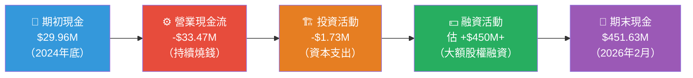

---

### FCF 轉換率趨勢

| 年度 | 淨虧損 | 自由現金流 | FCF/淨虧損 | FCF 品質 |
|------|--------|----------|----------|---------|
| 2021 | -$15.02M | -$17.92M | 119.3% | 🔴 FCF 惡於淨利 |
| 2022 | -$73.24M | -$40.89M | 55.8% | 🟡 大量非現金費用 |
| 2023 | -$44.84M | -$34.30M | 76.5% | 🟡 部分非現金攤銷 |
| 2024 | -$38.01M | -$35.20M | 92.6% | 🟡 接近現金虧損 |
| TTM | -$42.34M（估）| -$14.13M | **33.4%** | 🟢 大量非現金費用吸收 |

> **盈餘品質提升**：TTM FCF（-$14.13M）遠優於淨虧損（-$42M 估），差額主要來自大額股票薪酬費用（非現金）、攤銷等，顯示現金消耗速度已顯著放緩。

---

### 自由現金流趨勢

```
自由現金流趨勢（單位：百萬美元，負值=燒錢）
────────────────────────────────────────────────────────────
2021  FCF: -$17.92M  🔴 ████████████████░░░░░░░░
2022  FCF: -$40.89M  🔴 ████████████████████████████████████░
2023  FCF: -$34.30M  🔴 ██████████████████████████████░░░░░░
2024  FCF: -$35.20M  🔴 ███████████████████████████████░░░░░
TTM   FCF: -$14.13M  🟡 █████████████░░░░░░░░░░░░░░░░░░░░░░

燒錢速度顯著放緩 ↗ 正向信號
以現金 $451M ÷ 年燒 ~$30-35M ≈ 約 13-15 年跑道 🟢
────────────────────────────────────────────────────────────
```

---

### 資本配置評估

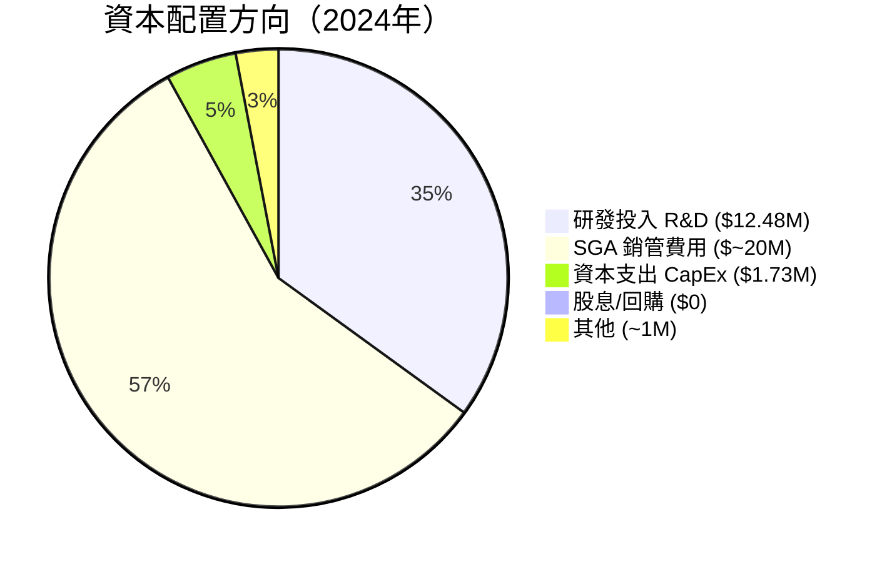

| 資本配置項目 | 金額 | 佔比 | 評估 |
|------------|------|------|------|
| 研發 (R&D) | $12.48M | ~35% | 🟢 技術投入積極 |
| 銷管費用 (SGA) | ~$20M | ~57% | 🔴 過高，需降低 |
| 資本支出 (CapEx) | $1.73M | ~5% | 🟢 輕資產模式 |
| 股息 | $0 | 0% | 🟡 再投資優先 |
| 股票回購 | $0 | 0% | 🟡 仍在成長期 |

---

## 6. 獲利能力與資本效率

### ROE / ROA / ROIC 趨勢

| 指標 | 2021 | 2022 | 2023 | 2024 | TTM | 行業均值 | 評估 |
|------|------|------|------|------|-----|---------|------|
| **ROE** | -13.4% | -125.8% | -135.3% | -229.2% | **-17.0%** | 15-20% | 🔴 |
| **ROA** | -12.8% | -74.8% | -48.6% | -34.7% | **-8.6%** | 5-10% | 🔴 |
| **ROIC** | -15.2% | -89.3% | -75.6% | -95.4% | ~-12% | 10-15% | 🔴 |
| **毛利率** | 37.8% | 52.1% | 40.7% | 4.8% | 33.6% | 45-55% | 🟡 |

> **ROE 改善說明**：TTM ROE -17.0% 顯著優於 2023/2024 的 -135%/-229%，主要因為：(1) 大額股權融資大幅擴充股東權益分母，(2) 淨虧損絕對值縮小（分子改善）。

---

### ROIC vs WACC 分析

```
╔══════════════════════════════════════════════════════════════╗
║              ROIC vs WACC 經濟價值分析                        ║
╠══════════════════════════════════════════════════════════════╣
║                                                              ║
║  WACC 估算：                                                  ║
║  ├── 無風險利率 (Rf)：4.3%（10年期美債）                      ║
║  ├── 市場風險溢價 (ERP)：5.5%                                 ║
║  ├── Beta：2.465                                              ║
║  ├── 權益成本 Ke = 4.3% + 2.465×5.5% = 17.86%               ║
║  ├── 稅後債務成本 Kd = 6.5%×(1-21%) = 5.14%                  ║
║  ├── 資本結構：幾乎100%股權（負債比<5%）                       ║
║  └── 估算 WACC ≈ 17.5%                                       ║
║                                                              ║
║  ROIC（TTM）≈ -12.0%                                         ║
║                                                              ║
║  EVA = ROIC - WACC = -12.0% - 17.5% = -29.5%               ║
║                                                              ║
║  ❌ 結論：公司目前正在大幅摧毀股東價值                          ║
║     每投入 $1 資本，損毀約 $0.295 的經濟價值                   ║
║     唯有 ROIC 轉正且超越 17.5% WACC 方可創造價值              ║
╚══════════════════════════════════════════════════════════════╝
```

---

### DuPont 三因子分解

| DuPont 因子 | 計算 | 數值 | 影響 |
|------------|------|------|------|
| **淨利率** | 淨利/營收 | -172.5% | 🔴 主要拖累 |
| **資產週轉率** | 營收/總資產 | 0.226x | 🔴 極低效率 |
| **財務槓桿** | 總資產/股東權益 | 6.61x | 🔴 高槓桿（虧損放大） |
| **ROE = 三者之積** | -172.5% × 0.226 × 6.61 | **≈ -257%** | 🔴 |

> **DuPont 洞察**：三個因子同時惡化——淨利率深度負值、資產週轉極低（業務規模不足）、高財務槓桿放大虧損效應。改善路徑必須先從 (1) 縮小虧損（提升淨利率）、(2) 提高資產使用效率 兩方面同步推進。

---

### 獲利能力儀表板

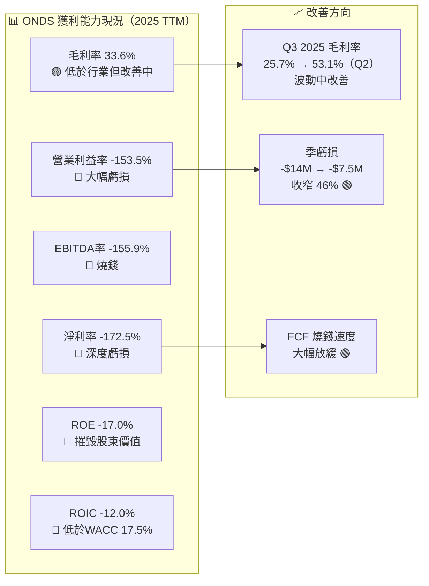

---

## 7. 估值深度分析

### 同業估值比較表格

| 指標 | **ONDS** | **Skydio**（私有）| **AXON Enterprise** | **Evolv Technology** | 評估 |
|------|---------|---------|---------|---------|------|
| 市值 | $4.54B | ~$2.2B（估）| $33B | $0.8B | — |
| P/S | **183.3x** 🔴 | ~15-20x 🟡 | 14.2x 🟢 | 11.3x 🟢 | ONDS 嚴重溢價 |
| EV/Revenue | **132.6x** 🔴 | ~13x 🟡 | 13.5x 🟢 | 10.1x 🟢 | 嚴重高估 |
| EV/EBITDA | **-85.1x** 🔴 | N/A 🔴 | 89.4x 🟡 | N/A 🔴 | 無可比性 |
| P/B | **6.8x** 🔴 | N/A | 21.4x 🔴 | 3.2x 🟡 | 略低於 AXON |
| 毛利率 | 33.6% 🟡 | ~50% 🟢 | 62.4% 🟢 | 55.2% 🟢 | 低於同業 |
| 營收成長 | **+582%** 🟢 | ~100%+ 🟢 | +29.3% 🟡 | +18.5% 🟡 | ONDS 遙遙領先 |
| FCF Yield | **-0.31%** 🔴 | 負 🔴 | 1.8% 🟢 | 負 🔴 | ONDS 燒錢 |

> **同業比較結論**：ONDS 的 P/S 183x 比任何可類比公司高出 **9-13倍**。唯一可辯護的理由是 582% 的爆炸性成長速度，以及未來 2-3 年滾動業績將大幅壓縮估值倍數（若成長持續）。

---

### 歷史估值區間分析

```
P/S 估值區間分析（基於 TTM 營收 $24.75M）
────────────────────────────────────────────────────────────
      市值對應區間
      
歷史高點：P/S ~250x → 市值 ~$6.2B  ████████████████████████░
目前位置：P/S ~183x → 市值 ~$4.54B ████████████████████░░░░░  ← NOW
合理區間：P/S ~20-30x→ 市值 ~$0.5-0.75B  ████░░░░░░░░░░░░░░░░░
悲觀估值：P/S ~10x  → 市值 ~$0.25B  ██░░░░░░░░░░░░░░░░░░░░░░░

⚠️ 若以傳統 SaaS/科技估值標準（P/S 10-30x），
   目前股價 $10.08 隱含超過 80-95% 的估值溢價
   全靠成長預期與敘事（Narrative）支撐
────────────────────────────────────────────────────────────
```

---

### DCF 敏感性分析（6格目標價矩陣）

**基本假設**：
- 2026年營收基礎：$60M（估，含併購貢獻）
- 終端成長率：3%
- 預計 2028 年實現正向 EBITDA

| 情境 | 2026-2028 CAGR | 折現率 10% | 折現率 15% |
|------|---------------|-----------|-----------|
| 🐂 **樂觀**（國防大合約落地，無人機大量滲透）| +150% CAGR | **$28.00** | **$20.00** |
| 📊 **基準**（穩健成長，成本持續優化）| +80% CAGR | **$18.00** | **$12.00** |
| 🐻 **悲觀**（成長放緩，競爭加劇，稀釋風險）| +30% CAGR | **$8.00** | **$5.00** |

```
DCF 目標價視覺化矩陣
────────────────────────────────────────────────────────────
             折現率 10%          折現率 15%
樂觀         $28.00 🟢           $20.00 🟢
             ▓▓▓▓▓▓▓▓▓▓▓▓▓▓▓    ▓▓▓▓▓▓▓▓▓▓▓
             
基準         $18.00 🟡           $12.00 🟡
             ▓▓▓▓▓▓▓▓▓           ▓▓▓▓▓▓
             
悲觀         $8.00 🔴            $5.00 🔴
             ▓▓▓▓               ▓▓▓
             
當前股價     $10.08
             ▓▓▓▓▓▓             ← 目前處於基準/悲觀之間
────────────────────────────────────────────────────────────
```

---

### 估值區間視覺化

```
估值狀態判斷尺（$0 → $30）
────────────────────────────────────────────────────────────
$0         $5      $10.08   $15      $20      $28     $30
│          │         │        │        │        │       │
│←低估區→ │←合理區→│        │←充分定價→│←高估區→│       │
          🐻悲觀   📍NOW    📊基準   🐂樂觀          
          $5-8     $10.08   $12-18   $20-28

結論：目前股價 $10.08 接近悲觀情境上緣，
      要達到分析師共識 $18.38，
      需要業績持續高速兌現
────────────────────────────────────────────────────────────
```

---

## 8. 成長催化劑

### 催化劑時間軸

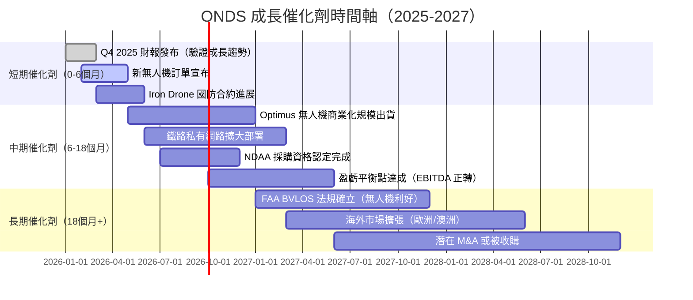

---

### TAM 市場規模與滲透率

```
TAM 市場機會（估算）
────────────────────────────────────────────────────────────
私有無線網路市場（全球）
TAM 2025:  $8.5B   ████████████████████████████████████████
SAM（美國）: $2.5B ████████████░░░░░░░░░░░░░░░░░░░░░░░░░░░░
ONDS 當前:  $15M   █░░░░░░░░░░░░░░░░░░░░░░░░░░░░░░░░░░░░░░
滲透率:     <0.6%  極早期 🟢 成長空間巨大

商業無人機/自動化市場（全球）
TAM 2025:  $25B   ████████████████████████████████████████
SAM（國防+工業）: $8B ████████████░░░░░░░░░░░░░░░░░░░░
ONDS 當前:  $10M   ░░░░░░░░░░░░░░░░░░░░░░░░░░░░░░░░░░░░░░
滲透率:     <0.1%  超早期 🟢 機會龐大

合計 TAM:  ~$33.5B
ONDS 2025 TTM 收入: $24.75M
市場滲透率: 約 0.07% — 成長天花板極高
────────────────────────────────────────────────────────────
```

---

### 成長驅動力

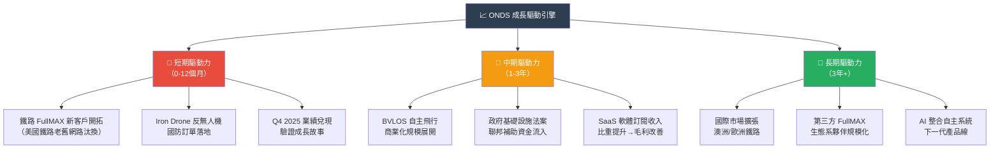

---

## 9. 風險矩陣

### 風險評分矩陣

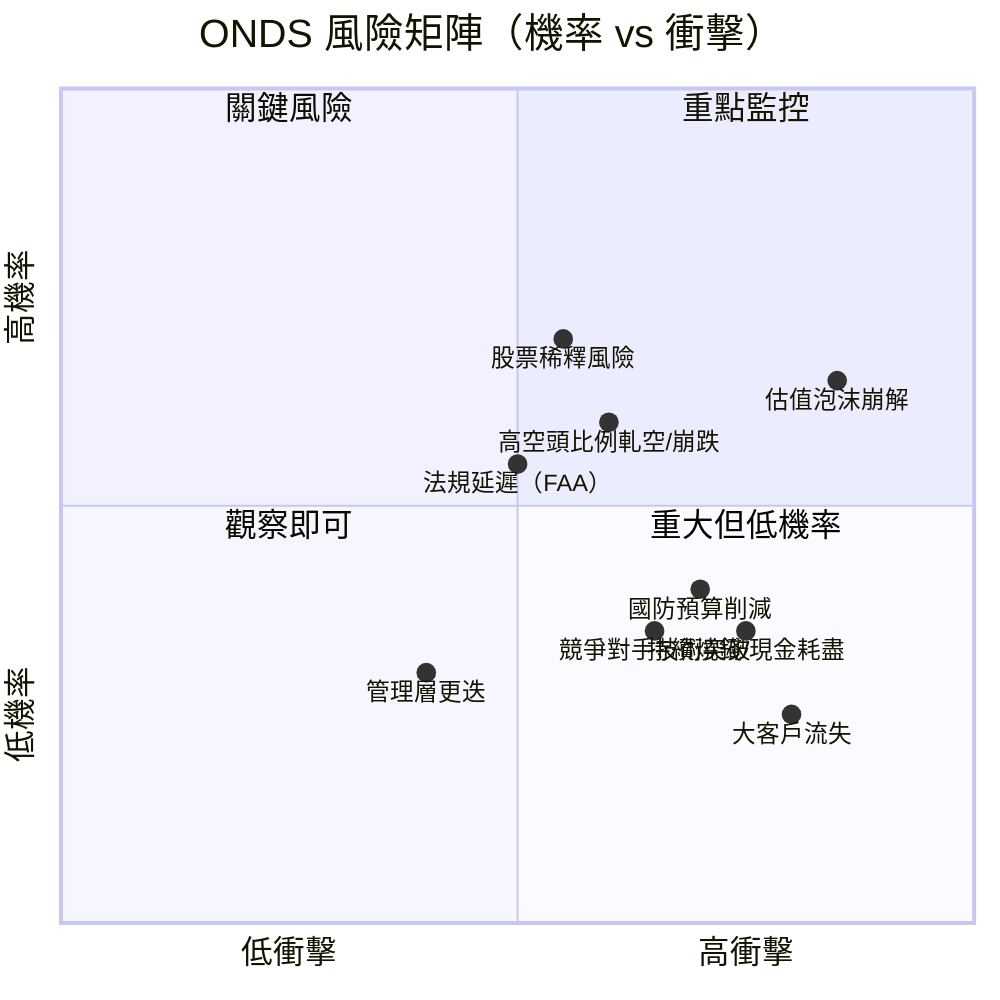

---

### 風險清單詳細表格

| 風險項目 | 機率 | 衝擊 | 綜合評分 | 緩解措施 |
|---------|------|------|---------|---------|
| 🔴 **估值泡沫崩解** | 高 65% | 嚴重 -60% | 9.5/10 | 分批建倉，嚴守停損 |
| 🔴 **股票稀釋風險** | 高 70% | 高 -30% | 8.5/10 | 監控股本擴張速度 |
| 🔴 **高空頭比例** | 中 60% | 高（雙向波動）| 8/10 | 小倉位，不用槓桿 |
| 🟡 **持續燒錢** | 中 35% | 嚴重（若未融資）| 7/10 | 現金 $451M 緩衝充分 |
| 🟡 **國防預算削減** | 中 40% | 高 -40% | 7/10 | 多元化至民用市場 |
| 🟡 **法規延遲（FAA）** | 中 55% | 中 -20% | 6.5/10 | 同步推進多監管路徑 |
| 🟡 **競爭對手技術突破** | 中 35% | 高 -35% | 6/10 | 加快 IP 護城河建設 |
| 🟢 **大客戶流失** | 低 25% | 嚴重 -50% | 5/10 | 分散客戶基礎 |
| 🟢 **管理層更迭** | 低 30% | 中 -20% | 4/10 | 內幕持股低（1.6%）需關注 |
| 🟢 **宏觀衰退影響** | 低 30% | 低（政府客戶為主）| 3/10 | 政府支出相對剛性 |

---

## 10. 投資建議

### 最終綜合評級雷達圖

```
ONDS 多維度評分（滿分 10 分）
════════════════════════════════════════════════════════════

基本面品質     ▓▓▓░░░░░░░  3/10  ███                  虧損期
成長性         ▓▓▓▓▓▓▓▓░░  8/10  ████████             爆炸成長
獲利能力       ▓▓░░░░░░░░  2/10  ██                   深度虧損
財務健康度     ▓▓▓▓▓▓░░░░  6/10  ██████               現金充沛
估值合理性     ▓▓░░░░░░░░  2/10  ██                   嚴重溢價
競爭壁壘       ▓▓▓▓░░░░░░  4/10  ████                 窄護城河
管理團隊       ▓▓▓▓░░░░░░  4/10  ████                 資訊有限
市場機會       ▓▓▓▓▓▓▓▓░░  8/10  ████████             TAM 龐大
風險調整後報酬 ▓▓▓▓░░░░░░  4/10  ████                 高風險

━━━━━━━━━━━━━━━━━━━━━━━━━━━━━━━━━━━━━━━━━━━━━━━━━━━━━━━━━
綜合加權評分：  ▓▓▓▓░░░░░░  4.5/10  投機性買入
```

---

### 目標價與隱含報酬率

| 情境 | 目標價 | 隱含報酬率 | 機率權重 | 時間框架 |
|------|--------|----------|---------|---------|
| 🐂 **樂觀情境** | $22.00 | **+118.3%** | 25% | 12-18個月 |
| 📊 **基準情境** | $15.00 | **+48.8%** | 45% | 12-24個月 |
| 🐻 **悲觀情境** | $5.00 | **-50.4%** | 30% | — |
| **加權期望值** | **$12.65** | **+25.5%** | 100% | 18個月 |

> **風險提示**：加權期望目標價 $12.65 相比當前 $10.08 有約 +25.5% 的隱含報酬，但標準差極大（Beta 2.465），實際報酬可能遠偏離期望值。

---

### 買入時機與觸發因素 Checklist

```
買入觸發條件 Checklist
════════════════════════════════════════════════════════════
必要條件（ALL 需成立才建議買入）：
[ ] ✅ Q4 2025 財報確認 QoQ 營收持續成長（> $12M 優選）
[ ] ✅ 毛利率維持 >30% 並穩定提升
[ ] ✅ 季度 FCF 燒錢速度低於 $8M
[ ] ✅ 至少 1 個重要國防/鐵路大客戶合約公告
[ ] ✅ 股票稀釋幅度 <5%（季度）

強化加分條件（滿足越多越好）：
[ ] 🌟 分析師上調目標價至 $20+ 
[ ] 🌟 機構持倉比例提升至 >45%
[ ] 🌟 Iron Drone 獲得 DoD/Israel 大合約
[ ] 🌟 FAA BVLOS 規則正式確立
[ ] 🌟 EBITDA 轉正時間表確認

空頭觸發（賣出/減倉信號）：
[!] 🚨 季度營收 QoQ 下滑 >10%
[!] 🚨 毛利率跌破 20%
[!] 🚨 大額股票增發（>5% 稀釋）
[!] 🚨 管理層大量出售股票
[!] 🚨 現金跌破 $200M（燒錢速度加速）
════════════════════════════════════════════════════════════
```

---

### 投資人適配度

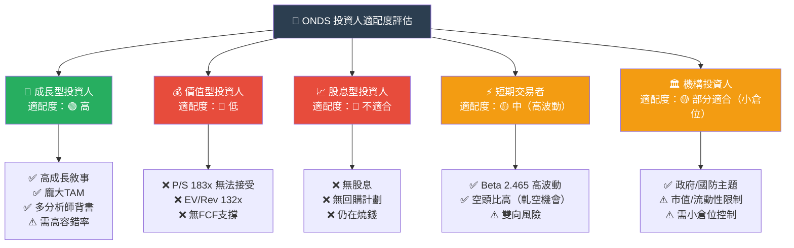

---

### 關鍵監控指標 Checklist

```
📊 關鍵監控指標追蹤清單
════════════════════════════════════════════════════════════

【財務指標】（每季追蹤）
□ 季度營收（目標：持續 QoQ > 20% 成長）
□ 毛利率趨勢（目標：穩定在 35%+）
□ 營業費用絕對值（目標：SGA+R&D < 前季）
□ FCF 燒錢速度（目標：< $8M/季）
□ 現金餘額（警戒線：< $200M）
□ 股本數量（警戒：單季稀釋 > 5%）

【業務指標】（即時追蹤）
□ 新客戶/合約公告（重點：鐵路+國防）
□ Optimus/Iron Drone 出貨量
□ FullMAX 部署節點數
□ 政府採購標案結果

【產業/競爭動態】（月度追蹤）
□ FAA BVLOS 法規進度
□ 競爭對手（Skydio, AeroVironment）動態
□ 國防預算法案進展
□ 5G 私有網路市場政策變化

【市場技術指標】（週度追蹤）
□ 空頭比例變化（>35% 警惕）
□ 機構持倉變化（>45% 正面）
□ 52週高低點位置
□ 相對強弱指數（RSI）

【重要日期】
📅 下次財報：預計 2026年3-4月（Q4 2025）
📅 FAA 無人機規則更新：預計 2026 Q2
📅 美國國防預算案：2026年9月前
════════════════════════════════════════════════════════════
```

---

## 綜合分析總結

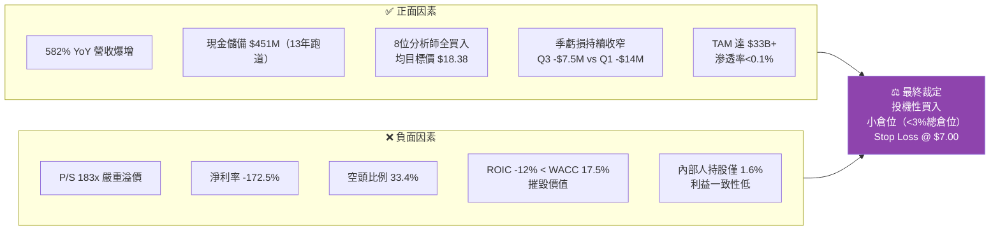

---

> ## ⚠️ 免責聲明
>
> **本報告完全由 AI 自動生成，基於所提供之歷史財務數據進行分析，僅供學術研究與參考用途，絕不構成任何投資建議、財務諮詢或招募說明書之任何部分。**
>
> 投資涉及風險，過去績效不代表未來表現。ONDS 屬高風險投機性股票，Beta 值達 2.465，空頭比例 33.4%，估值極度偏高。投資人應自行進行盡職調查（Due Diligence），並在投資前諮詢持牌財務顧問。任何基於本報告所做出的投資決策，其損益均由投資人自行承擔。
>
> **報告生成時間**：2026-02-28 ｜ **數據截止日**：2026-02-28 ｜ **分析框架**：CFA Institute Standards