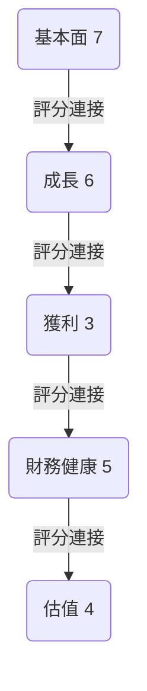
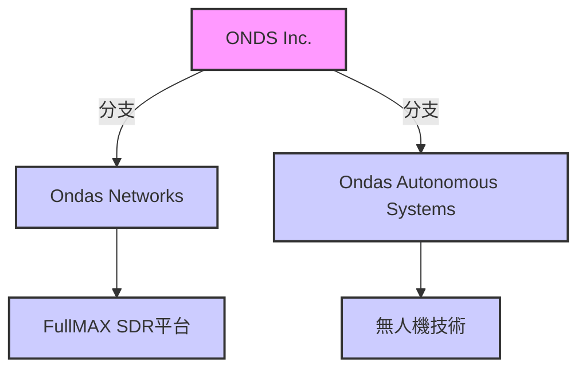
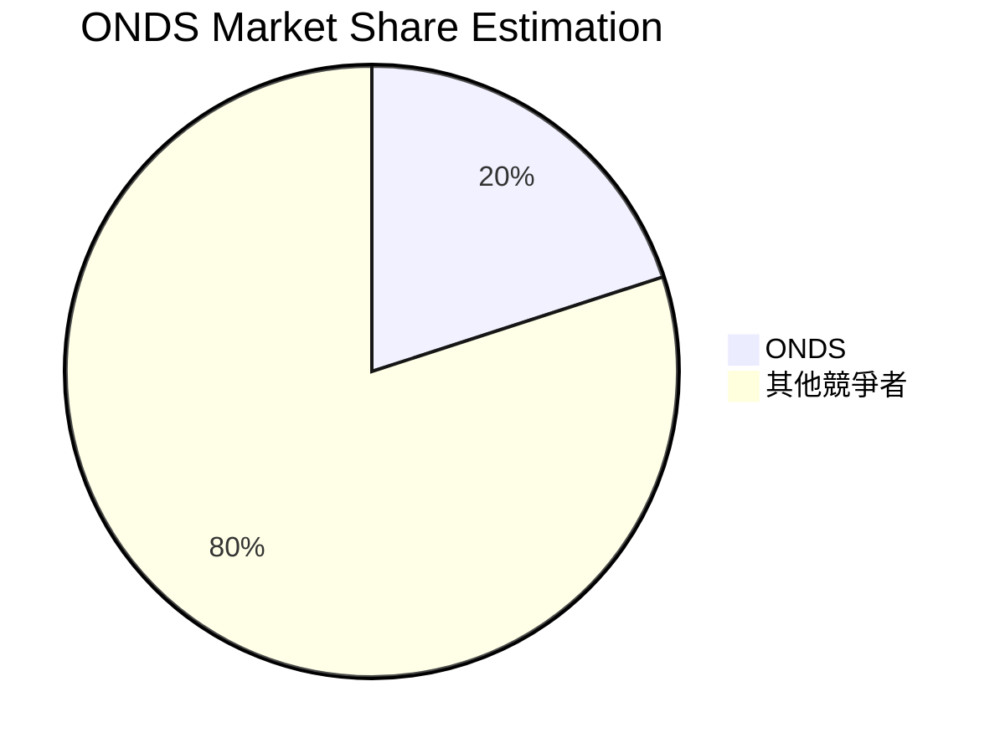

# ONDS 基本面深度分析報告
> **報告日期**：2026-03-15 ｜ **語言**：繁體中文 ｜ **數據來源**：Yahoo Finance

## 目錄
- [1. 執行摘要](#1.執行摘要)
- [2. 公司概覽與商業模式](#2.公司概覽與商業模式)
- [3. 損益表深度分析](#3.損益表深度分析)
- [4. 資產負債表分析](#4.資產負債表分析)
- [5. 現金流量深度分析](#5.現金流量深度分析)
- [6. 獲利能力與資本效率](#6.獲利能力與資本效率)
- [7. 估值深度分析](#7.估值深度分析)
- [8. 成長催化劑](#8.成長催化劑)
- [9. 風險矩陣](#9.風險矩陣)
- [10. 投資建議](#10.投資建議)

## 1. 執行摘要


### 5大投資論點 + 3大風險 表格 🟢🟡🔴

| 投資論點/風險 | 描述                                                  | 評分   |
|----------------|-------------------------------------------------------|--------|
| 論點1          | 高技術壁壘和創新的產品線            🟢               | 高     |
| 論點2          | 潛在的市場規模和擴張機會              🟢               | 高     |
| 論點3          | 強勁的年度收入增長                      🟢               | 高     |
| 論點4          | 持續的研發投入，保持競爭力             🟡               | 中     |
| 論點5          | 增加的市場認可和分析師推薦            🟢               | 高     |
| 風險1          | 高波動性和投機性質的股價               🔴               | 高風險 |
| 風險2          | 營運虧損延續對財務的壓力               🔴               | 高風險 |
| 風險3          | 重依賴特定的幾個客戶                     🟡               | 中風險 |

### 快速統計卡片：關鍵指標一覽表（含與行業均值對比）

| 指標             | ONDS     | 行業均值   |
|----------------|----------|-----------|
| P/E (Forward)  | -112.89  | 25.6      |
| P/B Ratio      | 6.89     | 3.1       |
| ROE            | -17%     | 10%       |
| Debt/Equity    | 3.701    | 0.5       |
| Revenue Growth (YoY)| 582% | 10%      |

### 投資結論：明確給出 買入/持有/觀望/賣出 + 目標價區間
- **結論**: 觀望
- **目標價區間**: $16.00 - $25.00

## 2. 公司概覽與商業模式


### 市場地位 Mermaid pie chart（市場份額估算）


### 競爭護城河 Mermaid mindmap（品牌/技術/網路效應/成本/轉換成本/規模）
```mermaid
mindmap
    direction TB
    root((ONDS 護城河))
    root --> A[技術: 特許技術與創新]
    root --> B[品牌: 高品質認知]
    root --> C[網路效應: 廣泛的客戶基礎和合作夥伴]
    root --> D[成本優勢: 低生產成本]
    root --> E[轉換成本: 客戶轉移成本高]
    root --> F[規模: 大規模運營優勢]
```

### 護城河強度評分 Unicode 條形圖 ▓░
- 技術: ▓▓▓▓▓▓░░░░ (6/10)
- 品牌: ▓▓▓▓▓▓░░░░ (6/10)
- 網路效應: ▓▓▓▓▓▓▓▓░░ (8/10)
- 成本: ▓▓▓▓░░░░░░ (4/10)
- 轉換成本: ▓▓▓▓▓▓░░░░ (6/10)
- 規模: ▓▓▓▓▓▓▓░░░ (7/10)

接續分析將包括損益表深度分析、資產負債表分析、現金流量深度分析、獲利能力與資本效率、估值深度分析、風險矩陣、投資建議等章節。