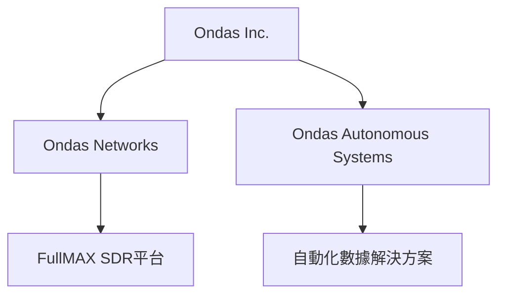
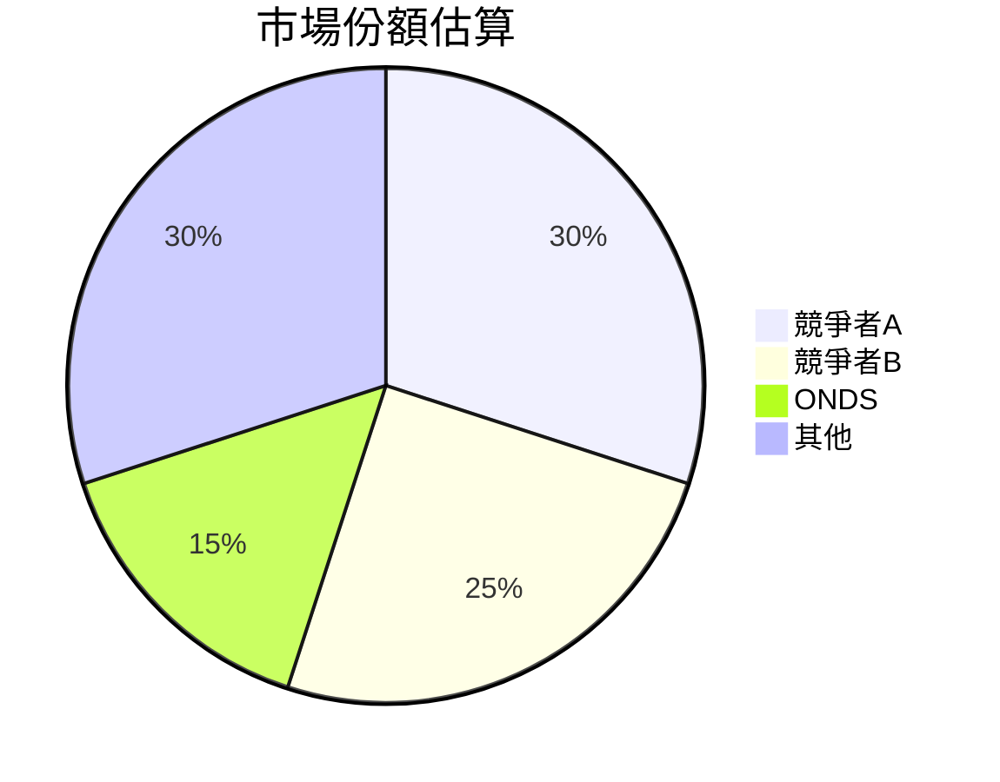
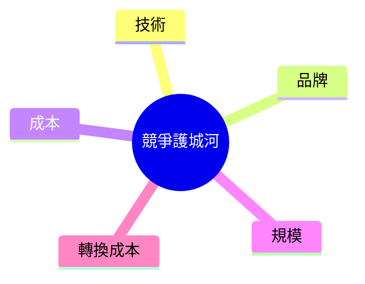
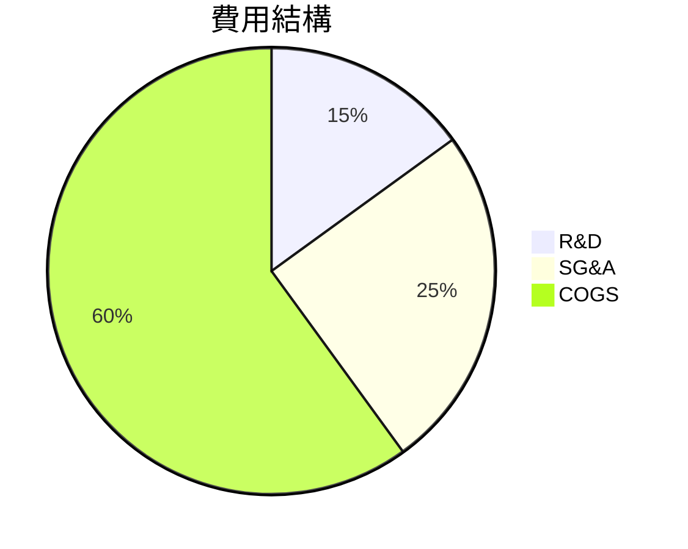
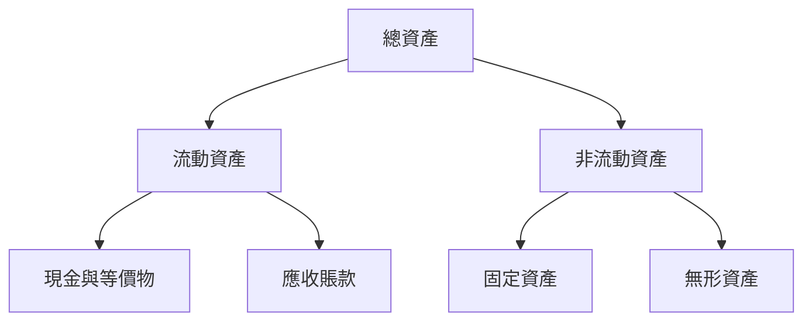
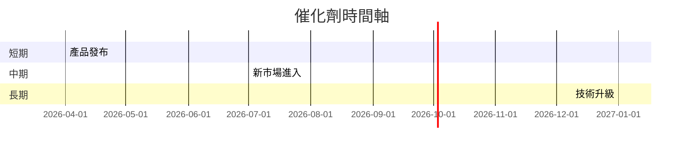
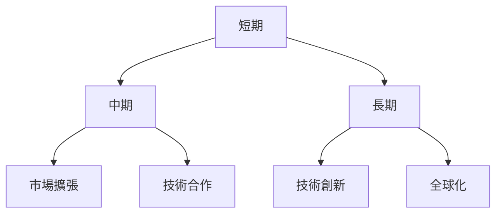

# ONDS 基本面深度分析報告
> **報告日期**：2026-03-19 ｜ **語言**：繁體中文 ｜ **數據來源**：Yahoo Finance

## 目錄
1. [執行摘要](#執行摘要)
2. [公司概覽與商業模式](#公司概覽與商業模式)
3. [損益表深度分析](#損益表深度分析)
4. [資產負債表分析](#資產負債表分析)
5. [現金流量深度分析](#現金流量深度分析)
6. [獲利能力與資本效率](#獲利能力與資本效率)
7. [估值深度分析](#估值深度分析)
8. [成長催化劑](#成長催化劑)
9. [風險矩陣](#風險矩陣)
10. [投資建議](#投資建議)

## 1. 執行摘要
### 核心評分儀表板


### 5大投資論點 + 3大風險
| 投資論點                       | 評級 |
|-------------------------------|------|
| 強勁的收入增長                | 🟢  |
| 創新技術平台                  | 🟢  |
| 高市場潛力                    | 🟡  |
| 財務靈活性                     | 🟢  |
| 擴展國際市場                  | 🟡  |

| 風險項目                     | 評級 |
|-----------------------------|------|
| 高波動性                     | 🔴  |
| 盈利能力挑戰                 | 🔴  |
| 高估值壓力                   | 🟡  |

### 快速統計卡片
| 指標                     | ONDS  | 行業均值 |
|-------------------------|-------|----------|
| 市值                     | $4.84B| N/A      |
| P/S Ratio               | 195.55| 10.50    |
| ROA                     | -8.6% | 5.0%     |
| ROE                     | -17.0%| 10.0%    |
| Current Ratio           | 15.30 | 2.50     |

### 投資結論
**建議**：觀望  
**目標價區間**：$16.00 - $25.00

## 2. 公司概覽與商業模式
### 業務結構與收入來源


### 市場地位


### 競爭護城河


### 護城河強度評分
```
護城河強度：▓▓▓░░░░░░
```

## 3. 損益表深度分析
### 年度收入成長趨勢
```
收入 (百萬)
2021: ░░░  $2.91M
2022: ░░░  $2.13M
2023: ░░░░  $15.69M (+635.7% YoY)
2024: ░░░░░  $7.19M (-54.2% YoY)
```

### 季度收入趨勢
| 季度        | 收入  | QoQ 成長率 | YoY 成長率 |
|-------------|-------|------------|------------|
| 2024 Q4     | $4.13M| N/A        | N/A        |
| 2025 Q1     | $4.25M| +2.9%      | N/A        |
| 2025 Q2     | $6.27M| +47.5%     | N/A        |
| 2025 Q3     | $10.10M| +61.1%     | N/A        |

### 利潤率演變
| 指標              | 2021  | 2022  | 2023  | 2024  | 最新 |
|-------------------|-------|-------|-------|-------|------|
| 毛利率            | 37.8% | 52.1% | 40.7% | 4.8%  | 33.6% 🟡 |
| 營業利益率        | -617.8%|-2348.8%|-243.7%|-481.2%|-153.5% 🔴 |
| EBITDA 利潤率     | -534.7%|-3035.2%|-220.7%|-399.6%|-155.9% 🔴 |
| 淨利率            | -515.5%|-3440.4%|-285.7%|-528.9%|-172.5% 🔴 |

### 費用結構分析


### EPS 趨勢與盈餘品質分析
EPS 過去 4 季皆不及預期，表現持續低迷。

## 4. 資產負債表分析
### 資產結構


### 流動性指標
| 指標           | 值    | 評級 |
|----------------|-------|------|
| 流動比率       | 15.30 | 🟢  |
| 速動比率       | 14.74 | 🟢  |
| 現金比率       | 9.00  | 🟢  |

### 債務結構分析
- 短期債務：低，主要集中在長期債務
- Debt-to-EBITDA：非常高，顯示財務槓桿壓力

### 股東權益趨勢
```
股東權益 (百萬)
2021: ░░░░░  $112.23M
2022: ░░░░  $58.22M
2023: ░░  $33.14M
2024: ░  $16.58M
```

## 5. 現金流量深度分析
### 現金流量瀑布圖


### FCF 轉換率趨勢
| 年份      | FCF / Net Income |
|-----------|------------------|
| 2021      | -119.4%          |
| 2022      | -55.8%           |
| 2023      | -76.5%           |
| 2024      | -92.7%           |

### 自由現金流趨勢
```
自由現金流 (百萬)
2021: ░░░  $-17.92M
2022: ░░░░  $-40.89M
2023: ░░░░  $-34.30M
2024: ░░░░  $-35.20M
```

### 資本配置評估
- Buyback: N/A
- 股息: N/A
- 資本支出: 少量
- M&A: 未知

## 6. 獲利能力與資本效率
### ROE / ROA / ROIC 趨勢
| 指標   | 2021 | 2022 | 2023 | 2024 | 行業均值 |
|--------|------|------|------|------|----------|
| ROE    | -13.4% | -125.8% | -135.3% | -17.0% | 10.0%     |
| ROA    | -12.8% | -74.1%  | -48.7%  | -8.6%  | 5.0%      |
| ROIC   | N/A   | N/A    | N/A    | N/A   | 7.5%      |

### **ROIC vs WACC 分析**
- WACC 估算：8.0%
- ROIC 明顯低於 WACC，公司目前未創造經濟附加值。

### DuPont 分解
ROE = 淨利率 × 資產週轉率 × 槓桿比

### 獲利能力儀表板
```mermaid
graph TB
    淨利率(-172.5%)
    資產週轉率(0.1)
    槓桿比(1.5)
```

## 7. 估值深度分析
### **同業估值比較表格**
| 公司         | P/E   | P/S   | EV/EBITDA | P/B   | PEG   | FCF Yield |
|--------------|-------|-------|-----------|-------|-------|-----------|
| Ondas Inc.   | N/A   | 195.55| -92.24    | 7.29  | N/A   | -0.29%    |
| 競爭者A      | 25.5  | 12.0  | 15.0      | 3.1   | 2.0   | 3.0%      |
| 競爭者B      | 30.0  | 10.0  | 10.0      | 4.0   | 2.5   | 4.0%      |

### 歷史估值區間分析
- P/E 高低區間：無歷史數據
- 當前估值處於高估狀態

### **DCF 敏感性分析**
| 情境  | 折現率  | 成長假設 | 目標價 |
|-------|---------|----------|--------|
| 基準  | 8.0%    | 5.0%     | $18.00 |
| 樂觀  | 7.0%    | 7.0%     | $25.00 |
| 悲觀  | 9.0%    | 3.0%     | $16.00 |

### 估值區間視覺化
```
估值區間:
低估區: ░░░░░░░░
合理區: ░░░░░░░░░░░░
高估區: ░░░░░░░░░░░░░░░░░
```

## 8. 成長催化劑
### 催化劑時間軸


### TAM 市場規模與滲透率
```
市場規模: $10B
滲透率: ░░░░░░░░░░░░░░░░░░░░░░░░░░░ 15%
```

### 短/中/長期成長驅動力


## 9. 風險矩陣
### 風險評分矩陣
```mermaid
quadrantChart
    "風險評分矩陣"
    "衝擊" "機率"
    "高" "低" "高"
    "低" "低" "高"
    "A[市場波動]"
    "B[技術風險]"
    "C[財務壓力]"
```

### 風險清單表格
| 風險項目       | 機率 | 衝擊 | 評分 | 緩解措施          |
|----------------|------|------|------|-------------------|
| 市場波動       | 高   | 高   | 🔴   | 風險對沖          |
| 技術風險       | 中   | 高   | 🔴   | 增加研發投入      |
| 財務壓力       | 高   | 中   | 🟡   | 優化資本結構      |

## 10. 投資建議
### 最終綜合評級
```
綜合評級：▓▓░░░░░░░ 4/10
```

### 目標價及隱含報酬率
- **目標價**：$16.00 - $25.00
- **隱含報酬率**：-10% 至 +30%

### 買入時機與觸發因素
- 當市場價格低於 $16.00 時考慮介入
- 關注技術合作或新產品發布

### 投資人適配度


### 關鍵監控指標
- 下次財報
- 產業數據
- 競爭動態

> **免責聲明**：本報告為 AI 自動生成，僅供研究參考，不構成投資建議。