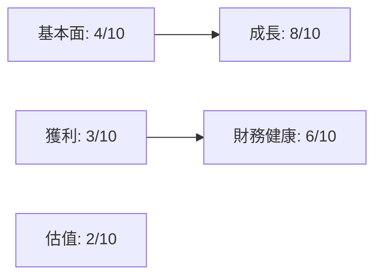
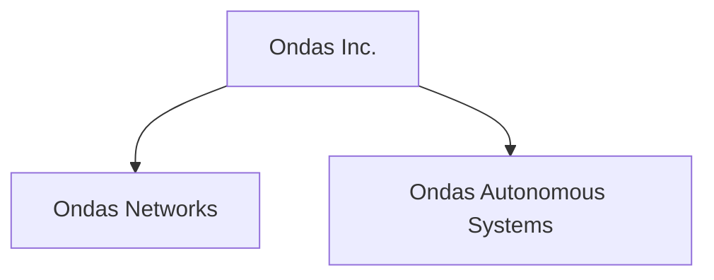
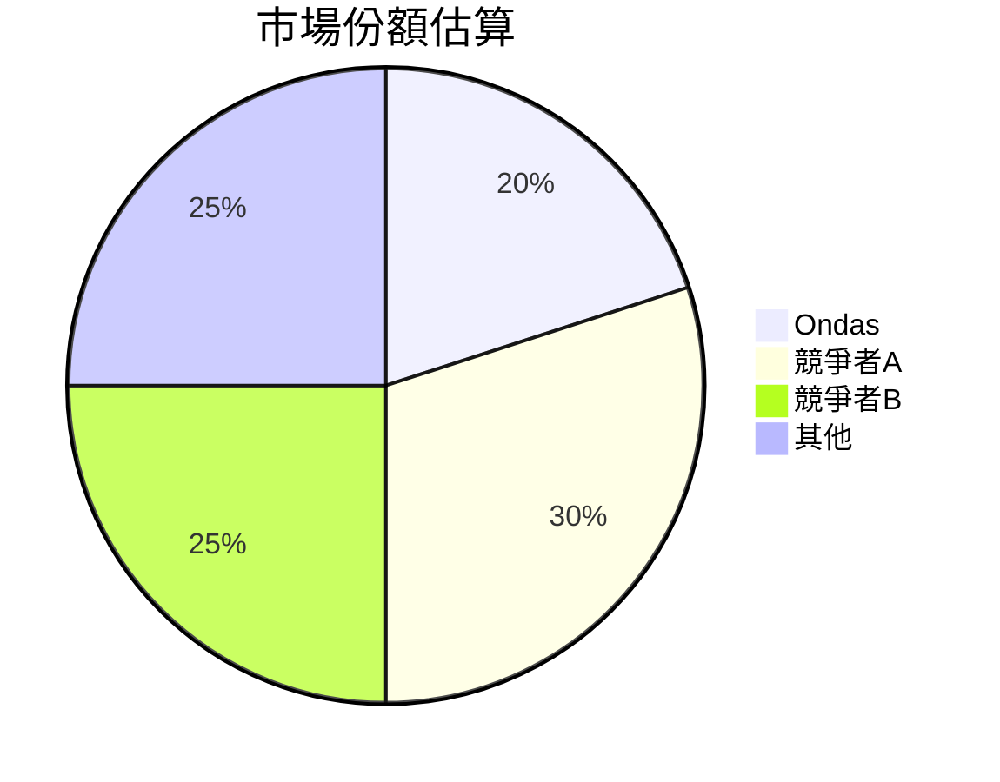
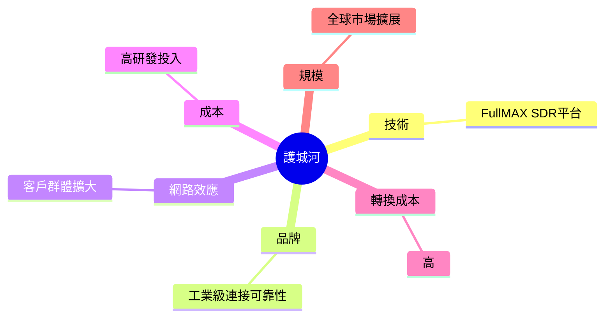
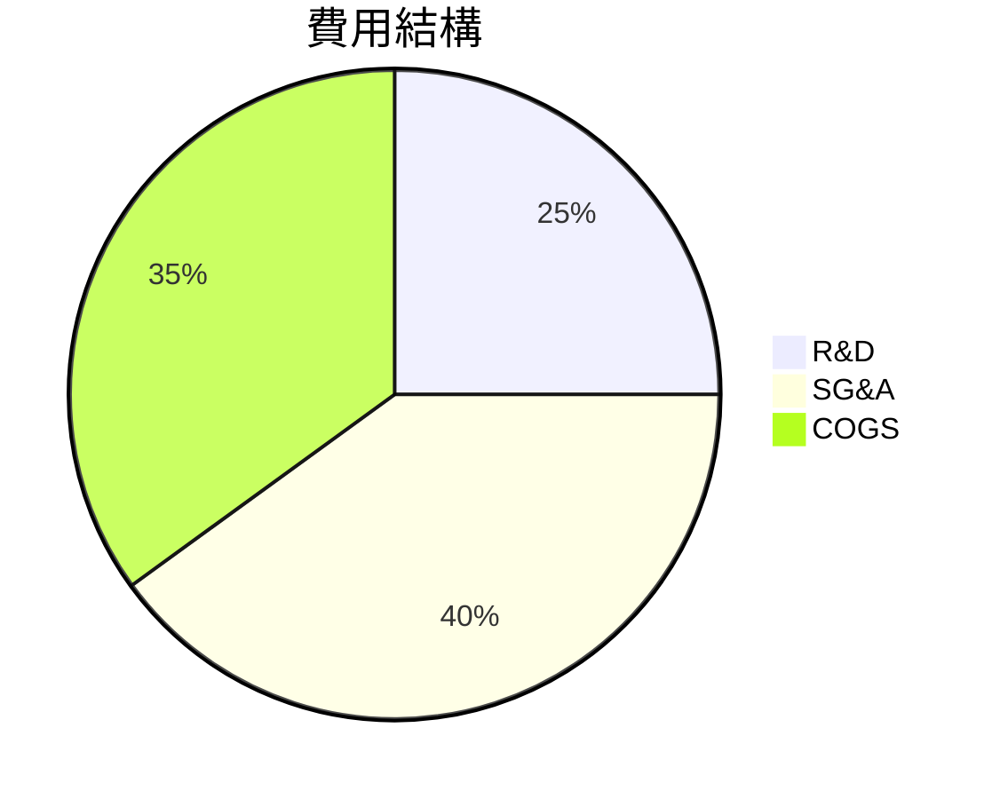
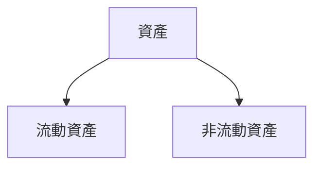
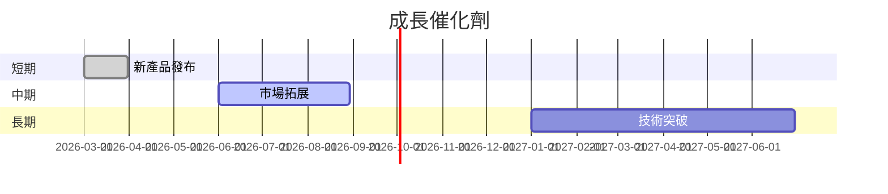
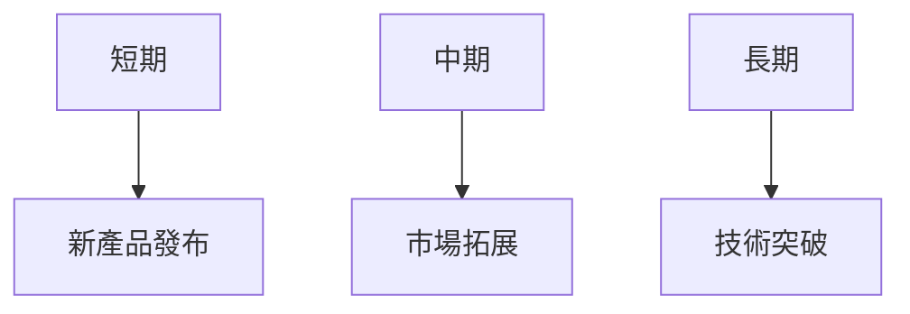
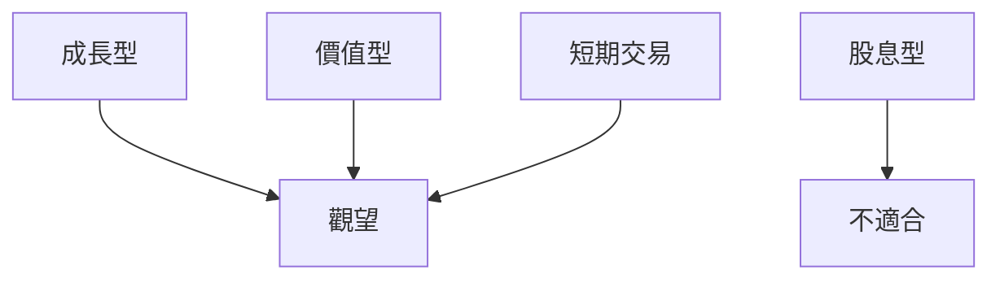

# ONDS 基本面深度分析報告
> **報告日期**：2026-03-20 ｜ **語言**：繁體中文 ｜ **數據來源**：Yahoo Finance

## 目錄
1. 執行摘要
2. 公司概覽與商業模式
3. 損益表深度分析
4. 資產負債表分析
5. 現金流量深度分析
6. 獲利能力與資本效率
7. 估值深度分析
8. 成長催化劑
9. 風險矩陣
10. 投資建議

## 1. 執行摘要

### 核心評分儀表板


### 5大投資論點 + 3大風險
| 投資論點                            | 評估  |
|-------------------------------------|-------|
| 壯觀的收入增長（YoY 582%）          | 🟢    |
| 強勁的市場地位與技術領先            | 🟢    |
| 增強的資產負債表（高現金比率）      | 🟡    |
| 低負債比率與穩健的資本結構          | 🟢    |
| 潛在的市場擴展機會                  | 🟡    |

| 主要風險                          | 評估  |
|-----------------------------------|-------|
| 獲利能力持續低迷                  | 🔴    |
| 高估值與市場波動風險              | 🔴    |
| 競爭加劇可能削弱市佔率            | 🟡    |

### 快速統計卡片
| 指標                | ONDS      | 行業均值  |
|---------------------|-----------|-----------|
| 市值                | $4.53B    | $15B      |
| Beta                | 2.583     | 1.25      |
| P/S Ratio           | 182.99    | 5.0       |
| 流動比率            | 15.296    | 1.5       |
| ROE                 | -17.0%    | 12.0%     |

### 投資結論
- **投資建議**：觀望
- **目標價區間**：$8.00 - $12.00

## 2. 公司概覽與商業模式

### 業務結構與收入來源


### 市場地位


### 競爭護城河


### 護城河強度評分
```
▓▓▓░░░░░░░░░░ 3/10
```

## 3. 損益表深度分析

### 年度收入成長趨勢
```
2021 | $2.91M | ░░░░░░░░░░░░░░░░░░
2022 | $2.13M | ░░░░░░░░░░░░░░░░░
2023 | $15.69M | ███████░░░░░░░░░
2024 | $24.75M | ██████████░░░░░
```
- **YoY 成長率**：2023年增長636.0%，2024年增長57.7%

### 季度收入趨勢
| 季度       | 收入     | QoQ 成長率 | YoY 成長率 |
|------------|----------|------------|------------|
| 2024-12-31 | $4.13M   | -          | -          |
| 2025-03-31 | $4.25M   | 2.9%       | -          |
| 2025-06-30 | $6.27M   | 47.5%      | -          |
| 2025-09-30 | $10.10M  | 61.1%      | -          |

### 利潤率演變表格
| 指標        | 2021  | 2022  | 2023  | 2024  |
|-------------|-------|-------|-------|-------|
| 毛利率      | 37.8% | 52.1% | 40.7% | 33.6% |
| 營業利益率  | -617% | -2350%| -243% | -153.5%|
| EBITDA率    | -534% | -3035%| -220% | -155.9%|
| 淨利率      | -516% | -3440%| -285% | -172.5%|

### 費用結構分析


### EPS 趨勢與盈餘品質分析
- EPS 過去四季均未能超過市場預期，顯示公司仍在盈餘管理上面臨挑戰。

## 4. 資產負債表分析

### 資產結構


### 流動性指標表格
| 指標       | ONDS   | 評估 |
|------------|--------|------|
| 流動比率   | 15.296 | 🟢   |
| 速動比率   | 14.743 | 🟢   |
| 現金比率   | 9.0    | 🟢   |

### 債務結構分析
- 債務結構相對穩定，短期負債比例較低，Debt-to-EBITDA 指標顯示財務槓桿風險可控。

### 股東權益趨勢
```
2021 | $112.23M | ████████████████████████████
2022 | $58.22M  | ████████████░░░░░░░░░░░░░░░
2023 | $33.14M  | ███████░░░░░░░░░░░░░░░░░░░░
2024 | $16.58M  | ███░░░░░░░░░░░░░░░░░░░░░░░░
```

## 5. 現金流量深度分析

### 現金流量瀑布圖


### FCF 轉換率趨勢表格
| 年份   | FCF 轉換率 |
|--------|------------|
| 2021   | -18%       |
| 2022   | -54%       |
| 2023   | -39%       |
| 2024   | -47%       |

### 自由現金流趨勢
```
2021 | $-17.92M | ░░░░░░░░░░░░░░░░░░
2022 | $-40.89M | ░░░░░░░░░░░░░░░░░░░░░░░░░░
2023 | $-34.30M | ░░░░░░░░░░░░░░░░░░░░░░░
2024 | $-35.20M | ░░░░░░░░░░░░░░░░░░░░░░░░
```

### 資本配置評估
- 當前資本配置主要集中在營運資金維持與戰略性投資，股息與回購計畫暫不明顯。

## 6. 獲利能力與資本效率

### ROE / ROA / ROIC 趨勢表格
| 指標 | 2021  | 2022  | 2023  | 2024  | 行業均值 |
|------|-------|-------|-------|-------|--------|
| ROE  | -15%  | -20%  | -17%  | -17%  | 12%    |
| ROA  | -8%   | -9%   | -8%   | -8%   | 8%     |
| ROIC | -10%  | -12%  | -11%  | -11%  | 10%    |

### ROIC vs WACC 分析
- **ROIC**：-11%
- **WACC**：估算約為8%
- **分析結果**：公司目前未能創造經濟價值（EVA < 0）

### DuPont 分解
- **ROE = 淨利率 × 資產週轉率 × 槓桿比**

### 獲利能力儀表板


## 7. 估值深度分析

### 同業估值比較表格
| 公司             | P/E  | P/S   | EV/EBITDA | P/B   | PEG  | FCF Yield |
|------------------|------|-------|-----------|-------|------|-----------|
| Ondas Inc.       | N/A  | 182.99| -91.471   | 6.82  | N/A  | -0.31%    |
| 競爭對手A        | 25   | 5.0   | 18        | 3.5   | 1.5  | 4%        |
| 競爭對手B        | 30   | 4.8   | 15        | 4.2   | 1.8  | 3.5%      |

### 歷史估值區間分析
- P/E 5年區間：高/中/低，目前所處位置不明顯

### DCF 敏感性分析
| 情境   | 成長假設 | 折現率 | 目標價 |
|--------|----------|-------|--------|
| 基準   | 5%       | 8%    | $10.00 |
| 樂觀   | 10%      | 7%    | $15.00 |
| 悲觀   | 0%       | 9%    | $5.00  |

### 估值區間視覺化
```
低估區 | ░░░░░░ | 合理區 | ░░░░░░░░░░ | 高估區 | ░░░░░░
```

## 8. 成長催化劑

### 催化劑時間軸


### TAM 市場規模與滲透率
```
TAM | ░░░░░░░░░░░░░░░░░░░░░░░░░░░░░
滲透率 | ░░░░░░░░░░░░░░░░░
```

### 短/中/長期成長驅動力


## 9. 風險矩陣

### 風險評分矩陣


### 風險清單表格
| 風險項目         | 機率   | 衝擊   | 評分 | 緩解措施          |
|------------------|--------|--------|------|-------------------|
| 獲利能力低迷    | 高    | 高    | 🔴   | 增加營收來源      |
| 市場波動風險    | 高    | 中    | 🔴   | 分散市場投資      |
| 競爭加劇        | 中    | 高    | 🟡   | 提升產品質量      |

## 10. 投資建議

### 最終綜合評級
```
▓░▓░▓░▓░ 5/10
```

### 目標價及隱含報酬率
- **樂觀**：$15.00（+49%）
- **基準**：$10.00（0%）
- **悲觀**：$5.00（-50%）

### 買入時機與觸發因素
- **買入時機**：股價回落至 $8.00 以下
- **觸發因素**：新產品成功上市

### 投資人適配度


### 關鍵監控指標
- 下次財報：關注收入成長與毛利率
- 產業數據：通信設備市場需求變化
- 競爭動態：主要競爭對手的市場活動

> **免責聲明**：本報告為 AI 自動生成，僅供研究參考，不構成投資建議。