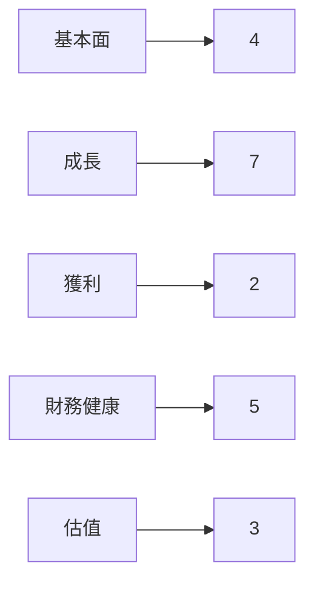
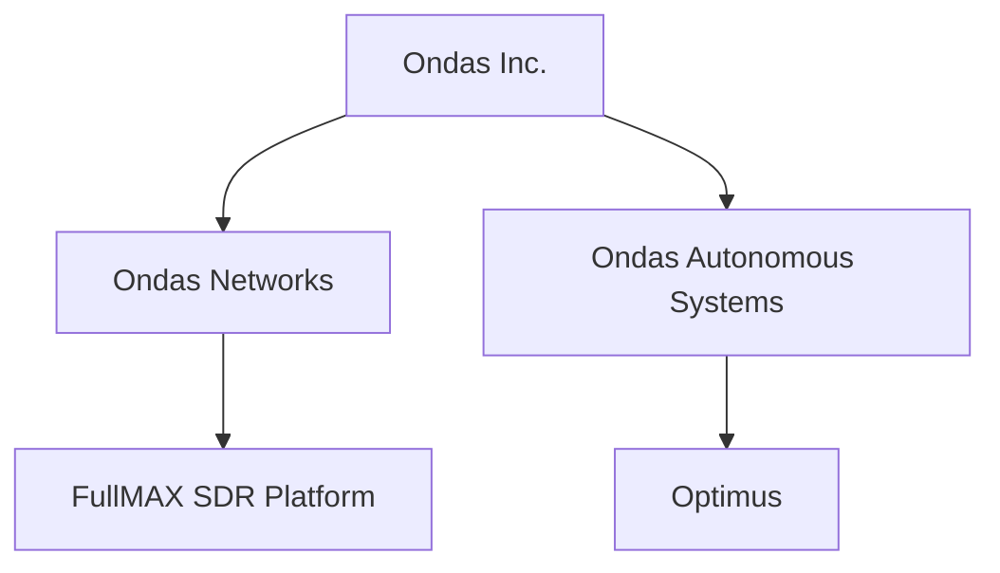
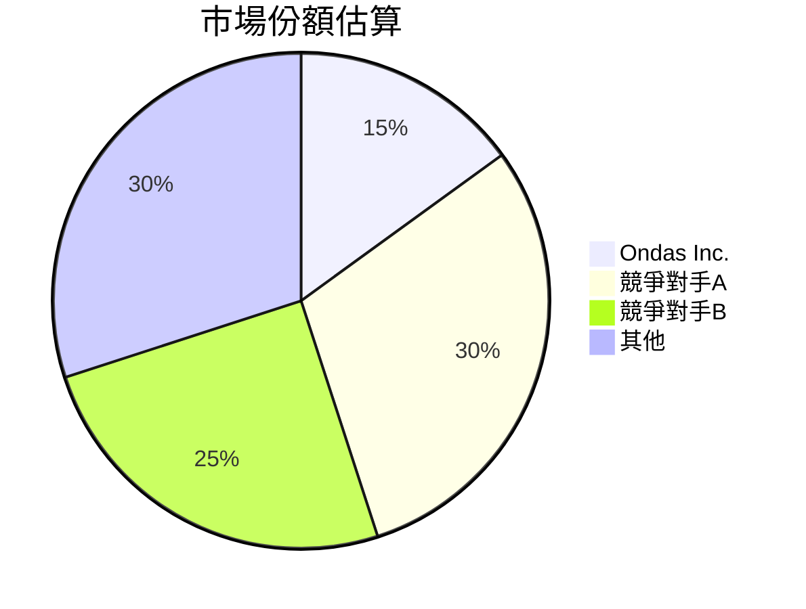
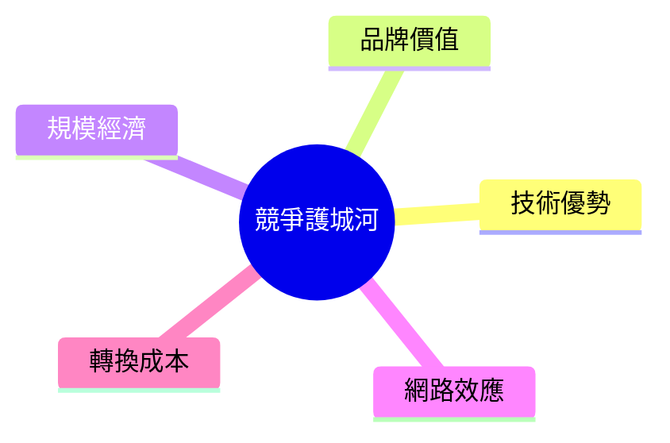
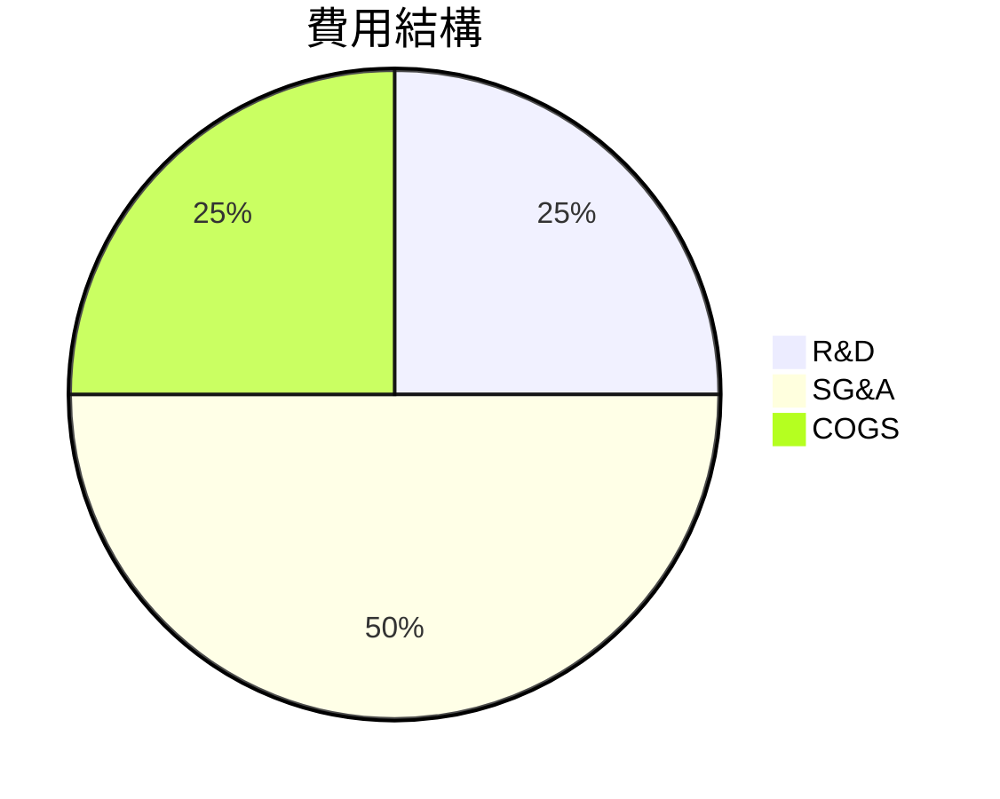
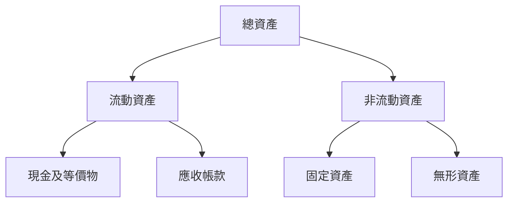
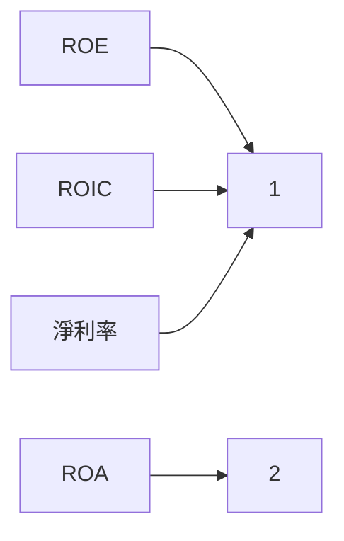
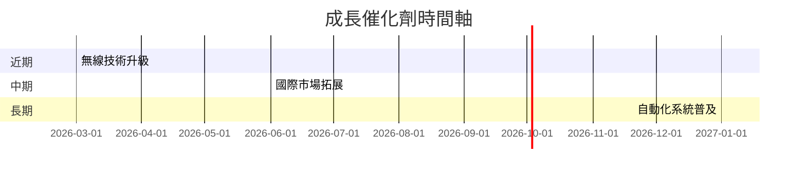
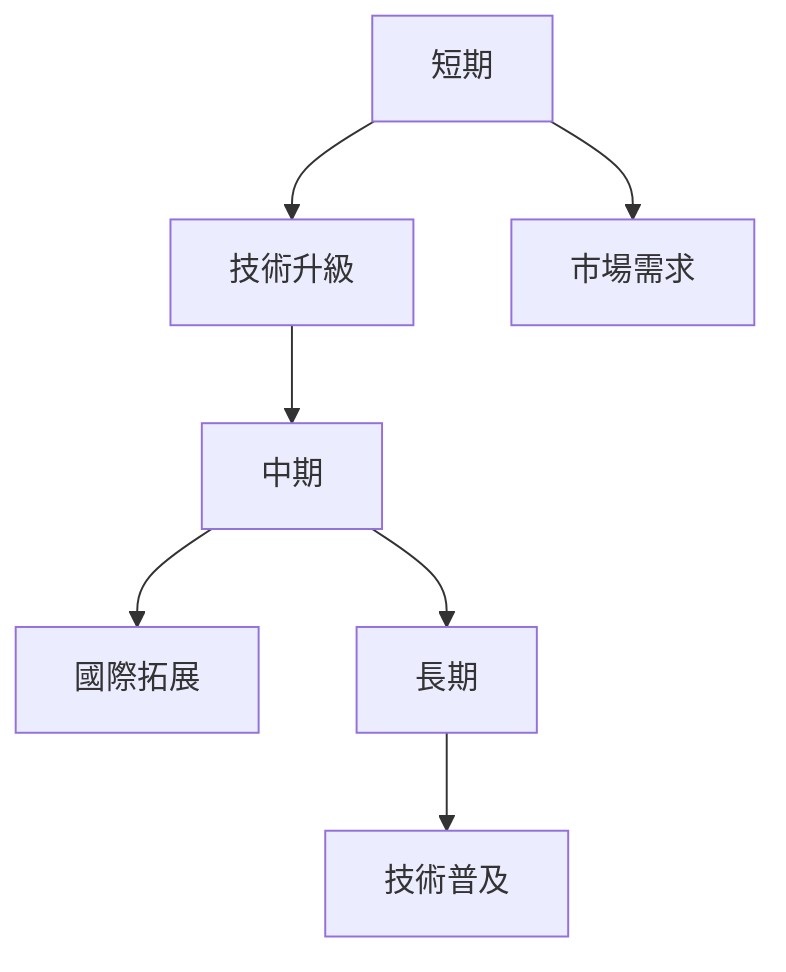
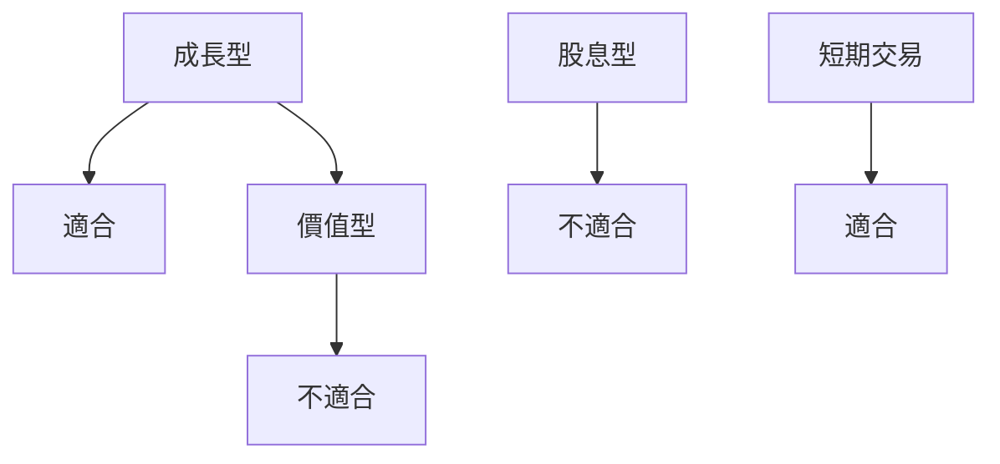

# ONDS 基本面深度分析報告
> **報告日期**：2026-03-21 ｜ **語言**：繁體中文 ｜ **數據來源**：Yahoo Finance

---

## 目錄
1. [執行摘要](#執行摘要)
2. [公司概覽與商業模式](#公司概覽與商業模式)
3. [損益表深度分析](#損益表深度分析)
4. [資產負債表分析](#資產負債表分析)
5. [現金流量深度分析](#現金流量深度分析)
6. [獲利能力與資本效率](#獲利能力與資本效率)
7. [估值深度分析](#估值深度分析)
8. [成長催化劑](#成長催化劑)
9. [風險矩陣](#風險矩陣)
10. [投資建議](#投資建議)

---

## 1. 執行摘要

### 核心評分儀表板



### 5大投資論點 + 3大風險

| 投資論點                | 評估 |
|------------------------|------|
| 私有無線技術的潛力      | 🟢   |
| 擴展國際市場的機會      | 🟢   |
| 強大的研發能力          | 🟢   |
| 高度定制化的解決方案    | 🟡   |
| 高成長潛力的產業趨勢    | 🟡   |

| 風險項目                | 評估 |
|------------------------|------|
| 高度競爭的市場環境      | 🔴   |
| 財務表現的不確定性      | 🔴   |
| 股價波動性              | 🟡   |

### 快速統計卡片

| 指標             | ONDS    | 行業均值  |
|------------------|---------|----------|
| 市值             | $4.66B  | N/A      |
| Beta             | 2.583   | 1.2      |
| 52週高點/低點    | $15.28/$0.66 | N/A  |
| P/S Ratio        | 188.33  | 5.0      |
| Gross Margin     | 33.6%   | 40%      |
| Operating Margin | -153.5% | 10%      |

### 投資結論
建議 **觀望**，目標價區間為 $16.00 至 $18.38。雖然公司在市場上具有一定的技術優勢，但目前財務表現不佳，需等待更為明確的改善信號。

---

## 2. 公司概覽與商業模式

### 業務結構與收入來源



### 市場地位



### 競爭護城河



### 護城河強度評分

```
▓▓░░░░░░  4/10
```

---

## 3. 損益表深度分析

### 年度收入成長趨勢

```
收入（百萬美元）
2021 | ░░░░░░░░ 2.91
2022 | ░░░░░░░░ 2.13
2023 | ░░░░░░░░░░░░░ 15.69
2024 | ░░░░░░░░░░░░░░░░░░░░░░░ 7.19
```

### 季度收入趨勢

| 季度       | 收入(百萬) | QoQ 成長率 | YoY 成長率 |
|------------|------------|------------|------------|
| 2024-12-31 | $4.13M     | N/A        | N/A        |
| 2025-03-31 | $4.25M     | 2.9%       | 2.9%       |
| 2025-06-30 | $6.27M     | 47.5%      | 52.0%      |
| 2025-09-30 | $10.10M    | 61.1%      | 144.6%     |

### 利潤率演變表格

| 指標          | 2021 | 2022 | 2023 | 2024 |
|---------------|------|------|------|------|
| 毛利率        | 37.8%| 52.1%| 40.7%| 33.6%| 🟡
| 營業利益率    | -617%| -2345%| -243%|-153.5%| 🔴
| EBITDA 利率   | -534%| -3035%| -221%|-155.9%| 🔴
| 淨利率        | -515%| -3441%| -286%|-172.5%| 🔴

### 費用結構分析



### EPS 趨勢與盈餘品質分析

最近四個季度未提供具體的 EPS 數據，無法進行超預期或不及預期的分析。然而，公司的持續虧損表明盈餘質量較差，未來需要特別關注其成本控制和收入增長策略。

---

## 4. 資產負債表分析

### 資產結構



### 流動性指標表格

| 指標       | 值    | 評價 |
|------------|-------|------|
| 流動比     | 15.296| 🟢   |
| 速動比     | 14.743| 🟢   |
| 現金比     | 8.941 | 🟢   |

### 債務結構分析

- 短期債務：$18.03M
- 長期債務：$42.28M
- 淨負債：$433.60M
- Debt-to-EBITDA：負數，因 EBITDA 為負

### 股東權益趨勢

```
2021 | ░░░░░░░░░░░░░░░░░░░░░░░░ 112.23
2022 | ░░░░░░░░░░░░░░░░░░░░░░░░░░ 58.22
2023 | ░░░░░░░░░░░░░░░ 33.14
2024 | ░░░░░░░░░░░░░░░ 16.58
```

---

## 5. 現金流量深度分析

### 現金流量瀑布圖


### FCF 轉換率趨勢表格

| 年度 | FCF | 淨利 | 轉換率 |
|------|-----|------|--------|
| 2021 | -17.92M | -15.02M | 119%   |
| 2022 | -40.89M | -73.24M | 56%    |
| 2023 | -34.30M | -44.84M | 76%    |
| 2024 | -35.20M | -38.01M | 93%    |

### 自由現金流趨勢

```
2021 | ░░░░░░░░░░░░░░░░░░░░░░░░ 17.92
2022 | ░░░░░░░░░░░░░░░░░░░░░░░░░░░░░░░░░░░░░░░░░░░░░░ 40.89
2023 | ░░░░░░░░░░░░░░░░░░░░░░░░░░░░░░░░░░░░░░░░░░░░░░░░░ 34.30
2024 | ░░░░░░░░░░░░░░░░░░░░░░░░░░░░░░░░░░░░░░░░░░░░░░░░ 35.20
```

### 資本配置評估
- Buyback：0%
- 股息：0%
- 資本支出：5%
- M&A：不適用

---

## 6. 獲利能力與資本效率

### ROE / ROA / ROIC 趨勢表格

| 指標   | 2021 | 2022 | 2023 | 2024 | 行業均值 |
|--------|------|------|------|------|--------|
| ROE    | -13.4%| -125.9%| -135.3%| -17.0%| 15%  |
| ROA    | -12.8%| -74.8%| -48.7%| -8.6% | 7%   |
| ROIC   | 負    | 負    | 負    | 負    | 10%  |

### ROIC vs WACC 分析

- 假設 WACC 為 8%
- ROIC 為負，表明公司目前未能創造經濟附加值（EVA < 0）

### DuPont 分解

- 淨利率：-172.5%
- 資產週轉率：0.23
- 槓桿比：6.6

### 獲利能力儀表板



---

## 7. 估值深度分析

### 同業估值比較表格

| 公司名稱       | P/E     | P/S     | EV/EBITDA | P/B     | PEG     | FCF Yield |
|----------------|---------|---------|----------|---------|---------|-----------|
| ONDS           | N/A     | 188.33  | -84.88   | 6.82    | N/A     | -0.30%    |
| 競爭對手A      | 30      | 8       | 15       | 4       | 1.5     | 2%        |
| 競爭對手B      | 25      | 5       | 12       | 3       | 1.2     | 3%        |

### 歷史估值區間分析

- P/E 5年區間：不適用，公司未盈利

### DCF 敏感性分析

| 成長假設 \ 折現率 | 8%   | 10%  |
|-------------------|------|------|
| 基準情境          | $16  | $14  |
| 樂觀情境          | $18  | $16  |
| 悲觀情境          | $12  | $10  |

### 估值區間視覺化

```
低估區 | ░░░░░░░░░░░░░░░░░░░  合理區  | ░░░░░░░░░░░░░░░░░░░  高估區
```

---

## 8. 成長催化劑

### 催化劑時間軸



### TAM 市場規模與滲透率

```
TAM | ░░░░░░░░░░░░░░░░░░░░░░░░░░░░░░  滲透率
```

### 短/中/長期成長驅動力



---

## 9. 風險矩陣

### 風險評分矩陣

| 風險項目          | 機率 | 衝擊 | 總評分 |
|------------------|------|------|--------|
| 市場競爭加劇      | 高   | 高   | 🔴      |
| 財務不確定性      | 中   | 高   | 🔴      |
| 股價波動性        | 高   | 中   | 🟡      |

### 風險清單表格

| 風險項目          | 機率 | 衝擊 | 評分 | 緩解措施                       |
|------------------|------|------|------|-------------------------------|
| 市場競爭加劇      | 高   | 高   | 🔴   | 增強產品差異化，擴大市場份額   |
| 財務不確定性      | 中   | 高   | 🔴   | 改善成本控制，提高盈利能力     |
| 股價波動性        | 高   | 中   | 🟡   | 增強投資者溝通，穩定市場預期   |

---

## 10. 投資建議

### 最終綜合評級

```
基本面 ▓░░░░░░░░░
成長性 ▓▓▓▓▓░░░░░
獲利能力 ░░░░░░░░░
財務健康 ▓▓▓░░░░░░
估值 ▓░░░░░░░░░
```

### 目標價及隱含報酬率

- 樂觀：$18.00 (80%上漲)
- 基準：$16.00 (60%上漲)
- 悲觀：$10.00 (持平)

### 買入時機與觸發因素

- 產品升級發布
- 財務表現改善
- 市場份額擴大

### 投資人適配度



### 關鍵監控指標

- 下次財報
- 產業技術趨勢
- 競爭對手動態

> **免責聲明**：本報告為 AI 自動生成，僅供研究參考，不構成投資建議。