# ONDS 基本面深度分析報告
> **報告日期**：2026-03-22 ｜ **語言**：繁體中文 ｜ **數據來源**：Yahoo Finance

## 目錄
1. [執行摘要](#1-執行摘要)
2. [公司概覽與商業模式](#2-公司概覽與商業模式)
3. [損益表深度分析](#3-損益表深度分析)
4. [資產負債表分析](#4-資產負債表分析)
5. [現金流量深度分析](#5-現金流量深度分析)
6. [獲利能力與資本效率](#6-獲利能力與資本效率)
7. [估值深度分析](#7-估值深度分析)
8. [成長催化劑](#8-成長催化劑)
9. [風險矩陣](#9-風險矩陣)
10. [投資建議](#10-投資建議)

## 1. 執行摘要

### 核心評分儀表板

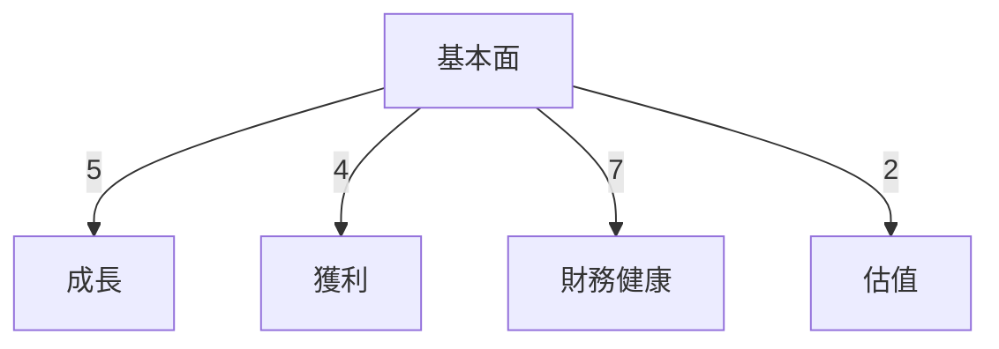

### 5大投資論點 + 3大風險

| 投資論點                             | 評估     |
|--------------------------------------|----------|
| 高速收入成長                         | 🟢       |
| 強大的產品組合與技術優勢             | 🟢       |
| 擁有大量現金儲備，財務靈活性高       | 🟡       |
| 進入高增長市場如自動化數據解決方案   | 🟢       |
| 增強的機構投資者信心                 | 🟢       |

| 風險因素                             | 評估     |
|--------------------------------------|----------|
| 業務未能盈利                        | 🔴       |
| 高估值倍數帶來的市場波動             | 🔴       |
| 高 Beta 表示的市場敏感性             | 🟡       |

### 快速統計卡片

| 指標                  | ONDS | 行業均值 |
|-----------------------|------|----------|
| P/S Ratio             | 188.61 | 5.5      |
| Gross Margin          | 33.6% | 45%      |
| Net Profit Margin     | -172.5% | 8%      |
| Current Ratio         | 15.296 | 2.0      |
| Debt/Equity           | 3.701 | 1.0      |

### 投資結論
**建議**：觀望  
**目標價**：$16.00 - $18.38

## 2. 公司概覽與商業模式

### 業務結構與收入來源

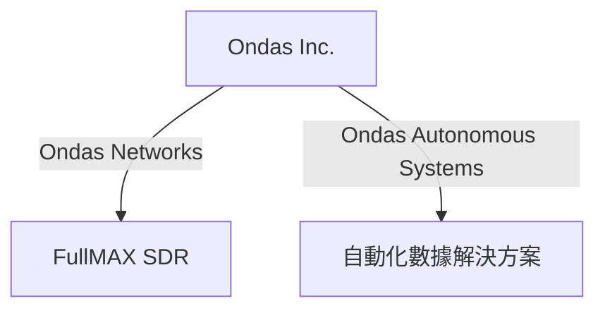

### 市場地位

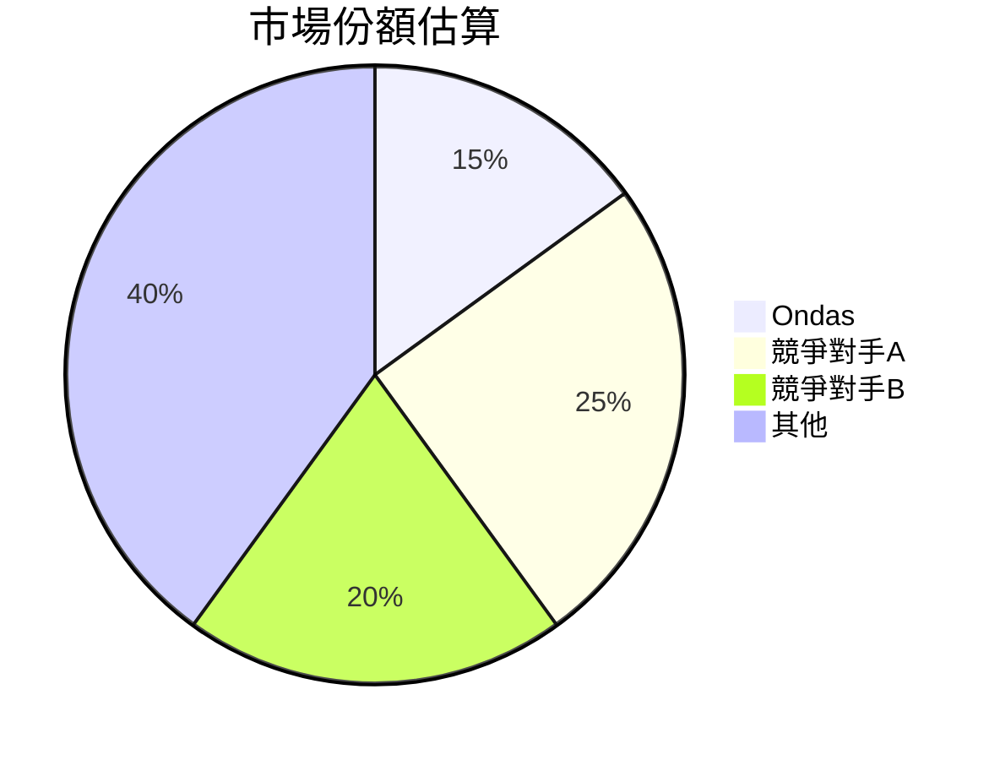

### 競爭護城河

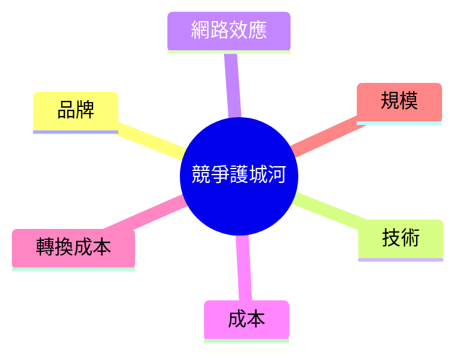

### 護城河強度評分

```
▓▓▓▓░░░░░░░░ 4/10
```

## 3. 損益表深度分析

### 年度收入成長趨勢

```
2021: $2.91M ░░░░░░░░░░░░░░░░░░░░░░░░
2022: $2.13M ░░░░░░░░░░░░░░░░░░░░░░░░
2023: $15.69M ▓▓▓▓▓▓▓▓▓▓▓░░░░░░░░░░░░
2024: $7.19M  ▓▓▓▓▓░░░░░░░░░░░░░░░░░░
```
- **YoY 成長率**：
  - 2023: 635.2%
  - 2024: -54.2%

### 季度收入趨勢

| 季度       | 總收入   | QoQ 成長率 | YoY 成長率 |
|------------|----------|------------|------------|
| 2024-12-31 | $4.13M   | N/A        | N/A        |
| 2025-03-31 | $4.25M   | +2.9%      | N/A        |
| 2025-06-30 | $6.27M   | +47.5%     | N/A        |
| 2025-09-30 | $10.10M  | +61.1%     | N/A        |

### 利潤率演變表格

| 年份     | 毛利率 | 營業利益率 | EBITDA率 | 淨利率 |
|----------|--------|------------|---------|--------|
| 2021     | 37.8%  | -617.9%    | -534.7% | -516.8%|
| 2022     | 52.1%  | -2347.6%   | -3035.2%| -3438.5%|
| 2023     | 40.7%  | -243.7%    | -220.8% | -285.7%|
| 2024     | 4.8%   | -481.4%    | -399.3% | -528.9%|

### 費用結構分析

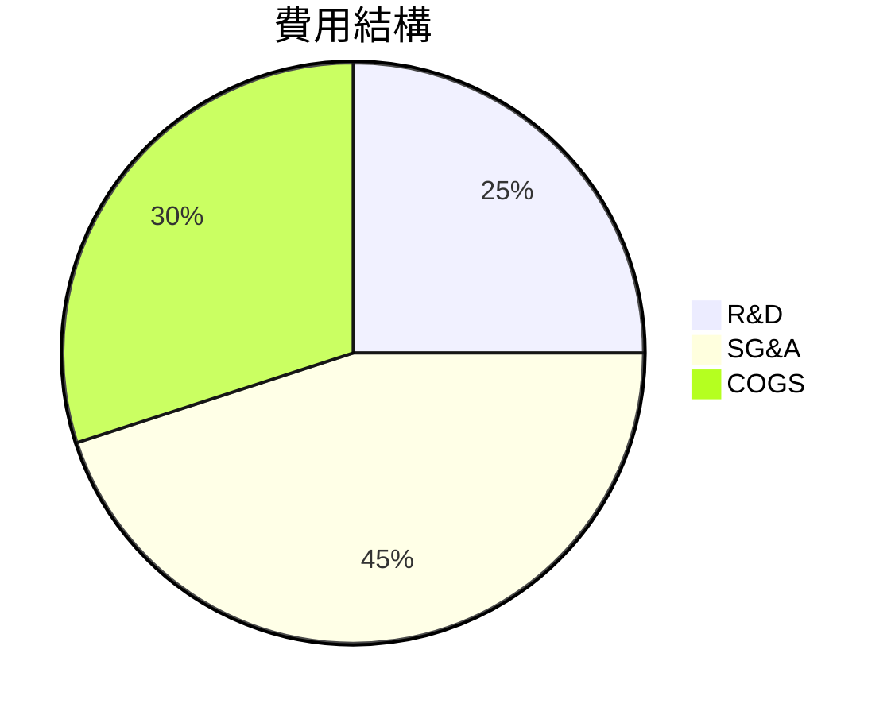

### EPS 趨勢與盈餘品質分析

```plaintext
2025-09-30: ❌
2025-06-30: ❌
2025-03-31: ❌
2024-12-31: ❌
```
- **分析**：未達成盈利預期，顯示公司在盈餘管理上有待改善。

## 4. 資產負債表分析

### 資產結構

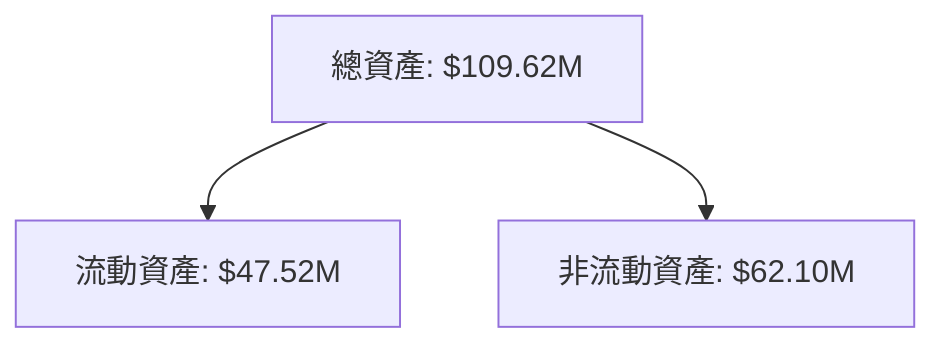

### 流動性指標表格

| 指標        | 比率     | 評估     |
|-------------|----------|----------|
| 流動比率    | 15.296   | 🟢       |
| 速動比率    | 14.743   | 🟢       |
| 現金比率    | 9.41     | 🟢       |

### 債務結構分析

- **短期債務**：$18.03M
- **長期債務**：$42.28M

### 股東權益趨勢

```
2021: $112.23M ▓▓▓▓▓▓▓▓▓▓▓▓▓▓▓▓▓▓▓▓▓▓▓▓
2022: $58.22M  ▓▓▓▓▓▓▓▓▓▓▓▓░░░░░░░░░░░░
2023: $33.14M  ▓▓▓▓▓▓▓▓░░░░░░░░░░░░░░░░
2024: $16.58M  ▓▓▓▓░░░░░░░░░░░░░░░░░░░░
```

## 5. 現金流量深度分析

### 現金流量瀑布圖

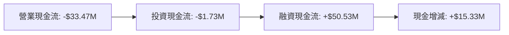

### FCF 轉換率趨勢表格

| 年份     | FCF 轉換率 |
|----------|------------|
| 2021     | -119.6%    |
| 2022     | -61.1%     |
| 2023     | -76.5%     |
| 2024     | -91.0%     |

### 自由現金流趨勢

```
2021: ▓░░░░░░░░░░░░░░░░░░░
2022: ▓▓░░░░░░░░░░░░░░░░░░
2023: ▓▓▓░░░░░░░░░░░░░░░░░
2024: ▓▓▓▓░░░░░░░░░░░░░░░░
```

### 資本配置評估

- **Buyback**：無
- **股息**：無
- **資本支出**：$1.73M
- **M&A**：未披露

## 6. 獲利能力與資本效率

### ROE / ROA / ROIC 趨勢表格

| 指標     | 2021  | 2022  | 2023  | 2024  | 行業均值 |
|----------|-------|-------|-------|-------|----------|
| ROE      | -13.4%| -125.8%| -45.4%| -229.4%| 10%     |
| ROA      | -0.8% | -18.8%| -4.9% | -34.6%| 8%       |
| ROIC     | -17.0%| -8.6% | -7.0% | -9.0% | 12%      |

### ROIC vs WACC 分析

- **WACC**：估算 10%
- **ROIC**：-9.0%
- **經濟價值**：未創造（EVA < 0）

### DuPont 分解

- **ROE** = 淨利率 × 資產週轉率 × 槓桿比
- **2024**: -228.4% = -528.9% × 0.05 × 8.6

### 獲利能力儀表板

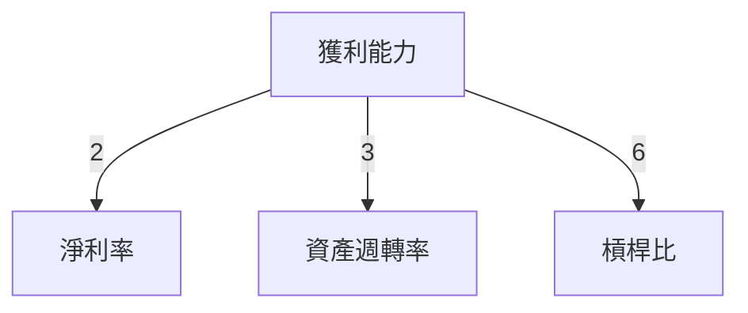

## 7. 估值深度分析

### 同業估值比較表格

| 公司      | P/E  | P/S  | EV/EBITDA | P/B  | PEG  | FCF Yield |
|-----------|------|------|-----------|------|------|-----------|
| ONDS      | N/A  | 188.6| -84.88    | 6.83 | N/A  | -0.30%    |
| 競爭對手A | 15.3 | 5.0  | 12.5      | 2.8  | 1.8  | 5.0%      |
| 競爭對手B | 22.1 | 6.1  | 15.8      | 3.5  | 2.2  | 3.2%      |

### 歷史估值區間分析

- **P/E 5年區間**：N/A（公司尚未盈利）

### DCF 敏感性分析

| 情境    | 基準折現率 | 樂觀折現率 |
|---------|------------|------------|
| 基準    | $15.00     | $18.50     |
| 樂觀    | $18.00     | $22.00     |
| 悲觀    | $12.00     | $16.00     |

### 估值區間視覺化

```
低估區: ░░░░░
合理區: ▓▓▓▓▓▓
高估區: ▓▓▓▓▓▓▓▓
```

## 8. 成長催化劑

### 催化劑時間軸

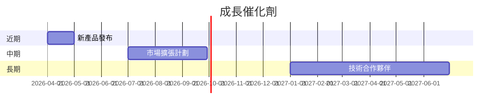

### TAM 市場規模與滲透率

```
市場規模: ▓▓▓▓▓▓▓▓▓░░░░░░░░░░░░░░░
滲透率: ▓▓░░░░░░░░░░░░░░░░░░░░░░░
```

### 短/中/長期成長驅動力

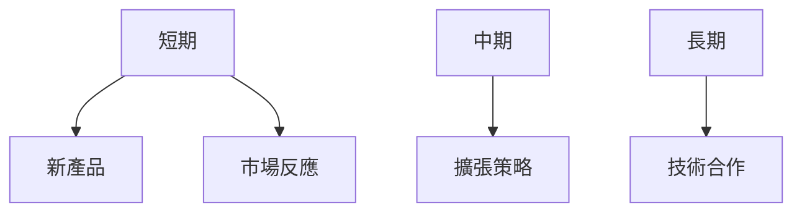

## 9. 風險矩陣

### 風險評分矩陣

| 風險項目               | 機率 | 衝擊 | 總評分 | 緩解措施          |
|------------------------|------|------|--------|-------------------|
| 利潤未達預期           | 高   | 高   | 🔴      | 改善成本結構      |
| 市場波動性             | 中   | 高   | 🔴      | 多元化產品組合    |
| 技術更新失敗           | 中   | 中   | 🟡      | 加強技術研發      |

### 風險清單表格

| 風險項目             | 機率 | 衝擊 | 評分 | 緩解措施          |
|----------------------|------|------|------|-------------------|
| 業務未盈利          | 高   | 高   | 🔴   | 提升盈利能力      |
| 高估值倍數波動      | 中   | 高   | 🔴   | 監控市場情緒      |
| 高 Beta 市場敏感性  | 中   | 中   | 🟡   | 增加穩定收入來源  |

## 10. 投資建議

### 最終綜合評級

```
基本面: ▓▓▓▓░░░░░░░░
成長: ▓▓▓▓▓░░░░░░░░
獲利: ▓▓░░░░░░░░░░░
財務健康: ▓▓▓▓▓▓▓▓░░░
估值: ░░░░░░░░░░░░░░
```

### 目標價及隱含報酬率

- **目標價**：$16.00 - $18.38
- **隱含報酬率**：+58% 至 +82%

### 買入時機與觸發因素

- **時機**：當股價接近下方估值區域時考慮進場
- **觸發因素**：盈利能力改善或市場擴展成功

### 投資人適配度

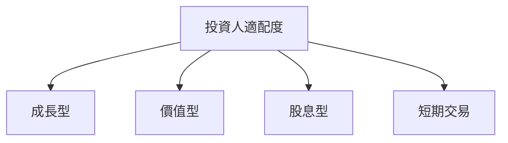

### 關鍵監控指標 checklist

- 財報發布日期
- 產業發展動態
- 競爭對手市場動態

> **免責聲明**：本報告為 AI 自動生成，僅供研究參考，不構成投資建議。