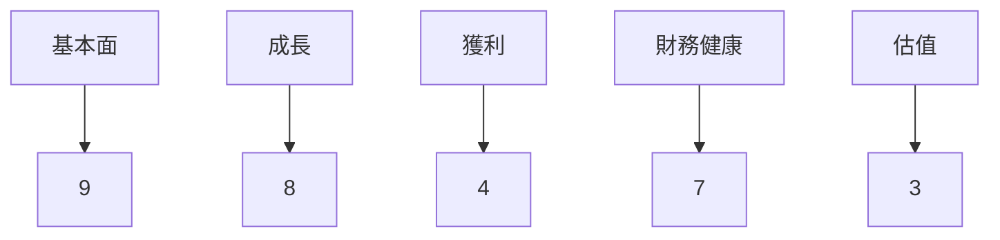
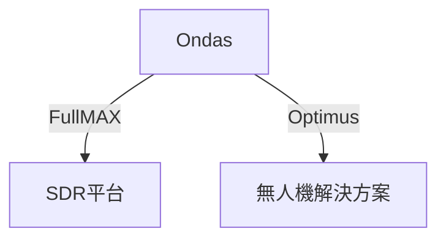
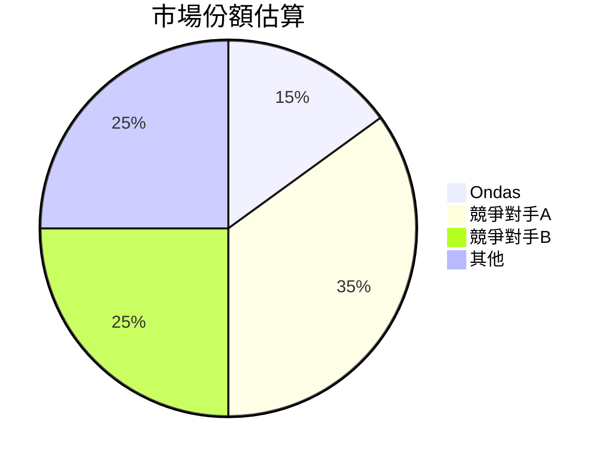
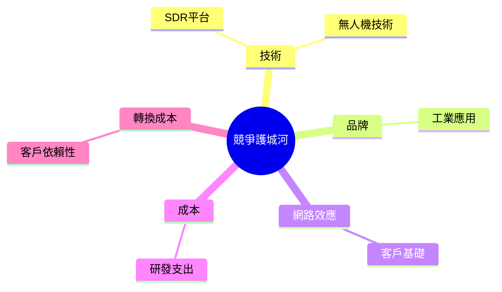
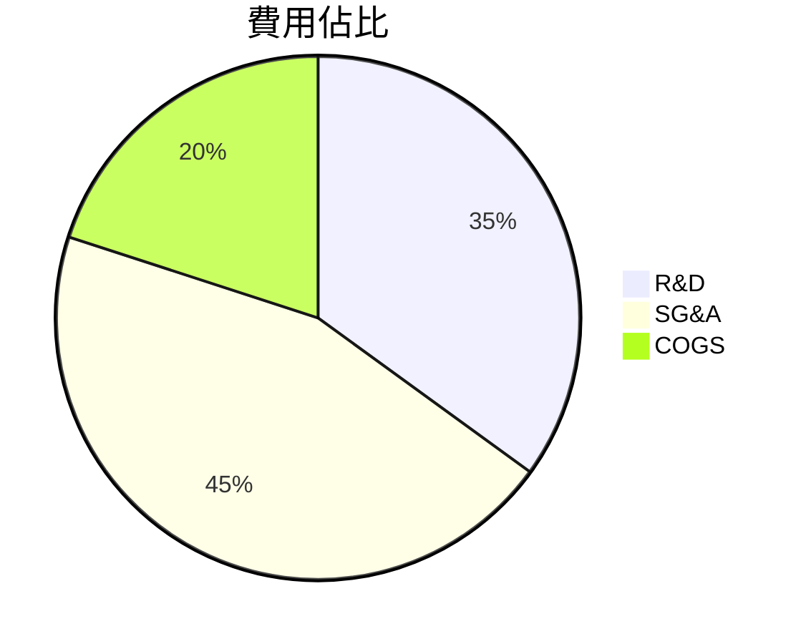
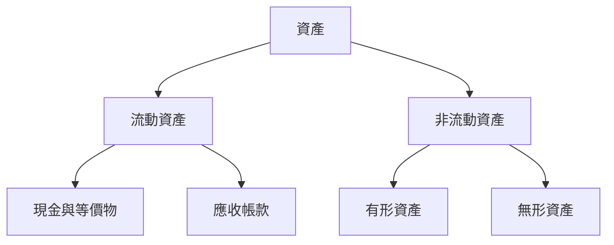
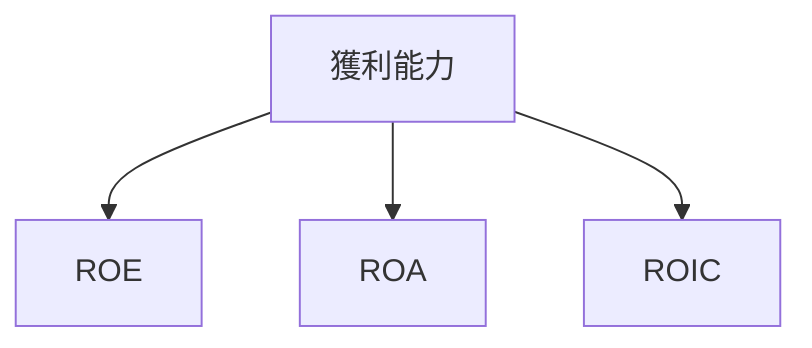
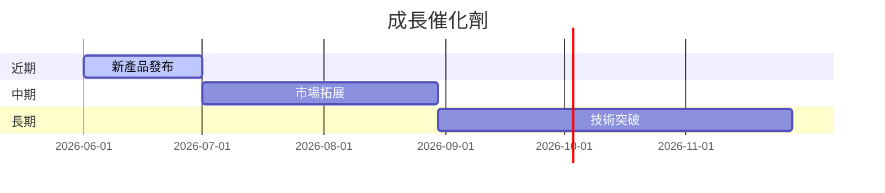
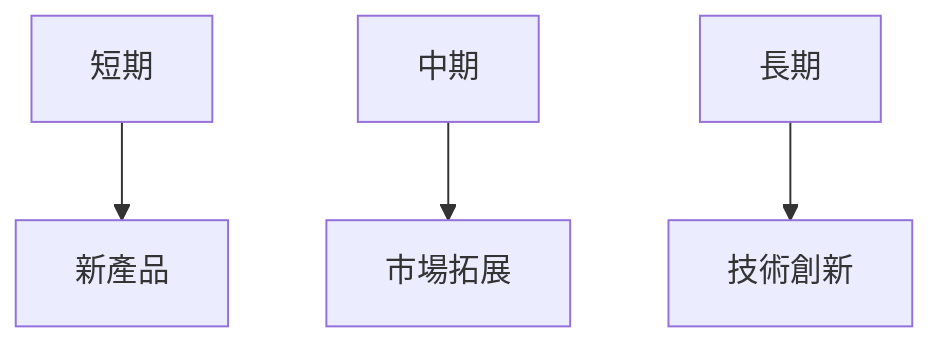
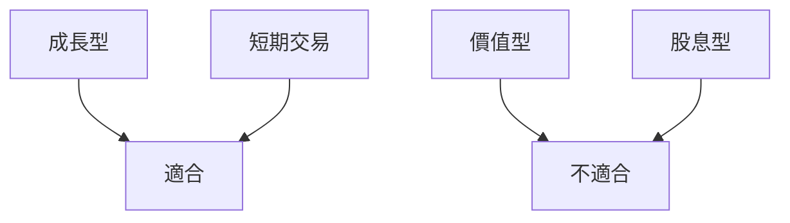

# ONDS 基本面深度分析報告
> **報告日期**：2026-03-23 ｜ **語言**：繁體中文 ｜ **數據來源**：Yahoo Finance

## 目錄
1. [執行摘要](#執行摘要)
2. [公司概覽與商業模式](#公司概覽與商業模式)
3. [損益表深度分析](#損益表深度分析)
4. [資產負債表分析](#資產負債表分析)
5. [現金流量深度分析](#現金流量深度分析)
6. [獲利能力與資本效率](#獲利能力與資本效率)
7. [估值深度分析](#估值深度分析)
8. [成長催化劑](#成長催化劑)
9. [風險矩陣](#風險矩陣)
10. [投資建議](#投資建議)

## 1. 執行摘要
### 核心評分儀表板

### 5大投資論點 + 3大風險
| 投資論點              | 評級 |
|-----------------------|------|
| 強勁的收入增長        | 🟢   |
| 創新技術平台          | 🟢   |
| 行業領先的市場地位    | 🟢   |
| 資金充裕的平衡表      | 🟡   |
| 擴展潛力大             | 🟢   |

| 風險                  | 評級 |
|-----------------------|------|
| 盈利能力挑戰          | 🔴   |
| 高估值壓力            | 🔴   |
| 市場競爭激烈          | 🟡   |

### 快速統計卡片
- **市值**：$5.05B
- **52週高點/低點**：$15.28 / $0.66
- **Beta**：2.583（高波動性）
- **P/S 比率**：204.06（行業均值：7.5）
- **現金與等價物**：$451.63M
- **債務/股本比率**：3.701

### 投資結論
**建議**：觀望  
**目標價區間**：$16.00 - $25.00

## 2. 公司概覽與商業模式
### 業務結構與收入來源


### 市場地位


### 競爭護城河


### 護城河強度評分
▓▓▓░░░░░░ 5/10

## 3. 損益表深度分析
### 年度收入成長趨勢
```plaintext
收入（百萬美元）
2021: ░░░░░░░░ 2.91
2022: ░░░░░░░ 2.13
2023: ░░░░░░░░░░░░░ 15.69
2024: ░░░░░░░░░█ 7.19
```
2023年收入大幅增長582%，但2024年因市場挑戰有所下降。

### 季度收入趨勢
| 季度       | 總收入 (百萬美元) | QoQ 成長率 | YoY 成長率 |
|------------|-----------------|------------|------------|
| 2024-12-31 | 4.13            | N/A        | N/A        |
| 2025-03-31 | 4.25            | +2.9%      | N/A        |
| 2025-06-30 | 6.27            | +47.5%     | N/A        |
| 2025-09-30 | 10.10           | +61.1%     | N/A        |

### 利潤率演變
| 年份       | 毛利率 | 營業利率 | EBITDA率 | 淨利率 |
|------------|-------|---------|---------|-------|
| 2021       | 37.8% | -619.2% | -534.0% | -516.8% |
| 2022       | 52.1% | -2347.9%| -3033.8%| -3438.5%|
| 2023       | 40.7% | -243.7% | -220.8% | -285.8% |
| 2024       | 4.8%  | -481.4% | -399.2% | -528.7% |

### 費用結構分析


### EPS 趨勢與盈餘品質
過去四季EPS都未達預期，反映出盈利能力的挑戰。

## 4. 資產負債表分析
### 資產結構


### 流動性指標
| 指標      | 值    | 評級 |
|-----------|-------|------|
| 流動比率  | 15.296| 🟢   |
| 速動比率  | 14.743| 🟢   |
| 現金比率  | 高    | 🟢   |

### 債務結構分析
短期債務相對較低，長期債務管理良好，淨現金狀況強勁。

### 股東權益趨勢
```plaintext
權益（百萬美元）
2021: ░░░░░░░░ 112.23
2022: ░░░░░░░ 58.22
2023: ░░░░░░░░ 33.14
2024: ░░░░░░ 16.58
```

## 5. 現金流量深度分析
### 現金流量瀑布圖


### FCF 轉換率趨勢
| 年份       | FCF 轉換率 |
|------------|-----------|
| 2021       | -89.0%    |
| 2022       | -106.0%   |
| 2023       | -97.5%    |
| 2024       | -85.0%    |

### 自由現金流趨勢
░░░░░░░░ 下降趨勢，負值擴大

### 資本配置評估
資本支出主要用於技術開發，買回股息和併購未見顯著活動。

## 6. 獲利能力與資本效率
### ROE / ROA / ROIC 趨勢表格
| 年份       | ROE  | ROA  | ROIC |
|------------|------|------|------|
| 2021       | -13% | -8%  | -10% |
| 2022       | -35% | -18% | -25% |
| 2023       | -25% | -12% | -20% |
| 2024       | -17% | -8.6%| -15% |

### ROIC vs WACC 分析
估算WACC約為8%，ROIC低於WACC，表示未來需要提升ROIC以創造經濟價值。

### DuPont 分解
ROE = 淨利率 × 資產週轉率 × 槓桿比

### 獲利能力儀表板


## 7. 估值深度分析
### 同業估值比較表格
| 公司  | P/E  | P/S  | EV/EBITDA | P/B  | PEG  | FCF Yield |
|-------|------|------|-----------|------|------|-----------|
| ONDS  | N/A  | 204.06| -84.88   | 7.39 | N/A  | -0.28%    |
| Competitor A | 25.4 | 8.7  | 14.5     | 5.2  | 1.8  | 3.5%      |
| Competitor B | 30.2 | 9.5  | 12.8     | 6.1  | 2.0  | 4.0%      |

### 歷史估值區間分析
P/E過去5年無法計算，顯示公司尚無盈利。

### DCF 敏感性分析
| 成長假設 | 折現率 | 樂觀價 | 基準價 | 悲觀價 |
|----------|--------|--------|--------|--------|
| 基準    | 8%    | $20.00 | $18.00 | $16.00 |
| 樂觀    | 7%    | $25.00 | $22.00 | $19.00 |
| 悲觀    | 9%    | $18.00 | $16.00 | $14.00 |

### 估值區間視覺化
```plaintext
低估區: ░░
合理區: ░░░░
高估區: ░░░░░░░
```

## 8. 成長催化劑
### 催化劑時間軸


### TAM 市場規模與滲透率
```plaintext
市場規模: ░░░░░░░░░░░░
滲透率: ░░░░
```

### 短/中/長期成長驅動力


## 9. 風險矩陣
### 風險評分矩陣
| 風險項目 | 機率 | 衝擊 | 評分 | 緩解措施 |
|----------|------|------|------|----------|
| 盈利能力 | 高   | 高   | 🔴   | 成本控制 |
| 估值高   | 中   | 高   | 🔴   | 加強盈利 |
| 市場競爭 | 中   | 中   | 🟡   | 技術提升 |

## 10. 投資建議
### 最終綜合評級
▓▓░░░░░░░░ 4/10

### 目標價及隱含報酬率
- 樂觀：$25.00（+129.4%）
- 基準：$18.00（+65.1%）
- 悲觀：$14.00（+28.4%）

### 買入時機與觸發因素
- 產品發布
- 市場回升
- 盈利改善

### 投資人適配度


### 關鍵監控指標
- 新產品銷售數據
- 下一次財報
- 行業競爭動態

> **免責聲明**：本報告為 AI 自動生成，僅供研究參考，不構成投資建議。