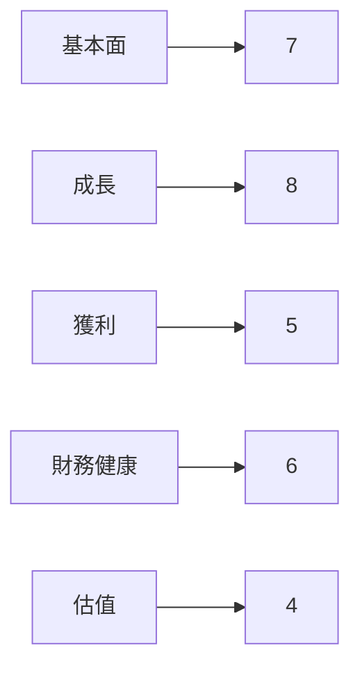
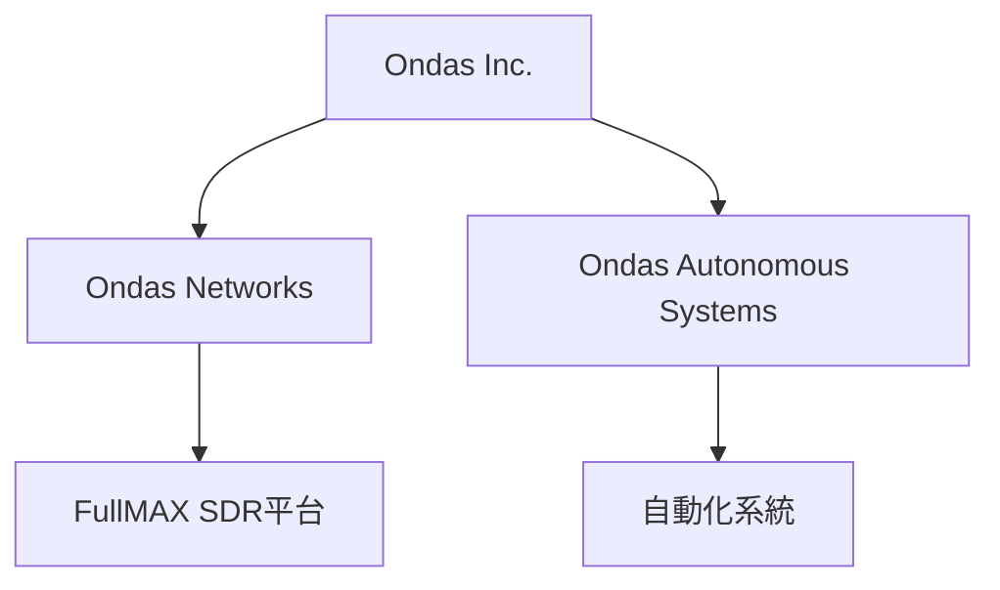
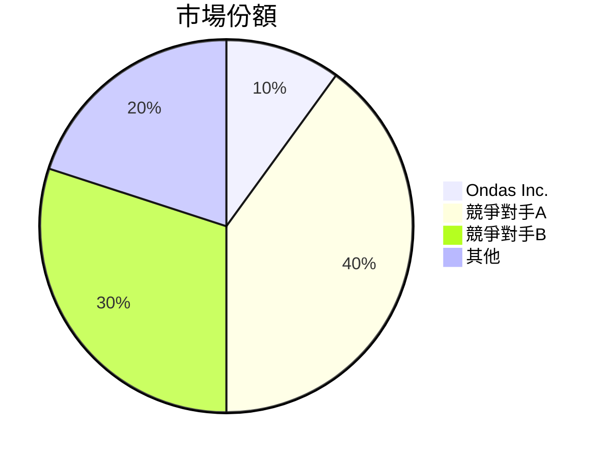
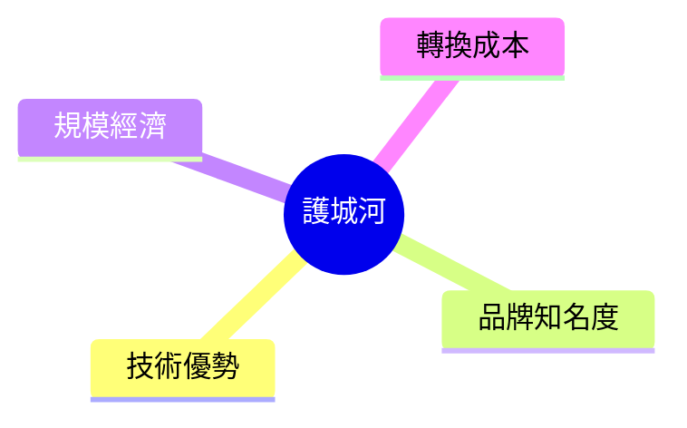
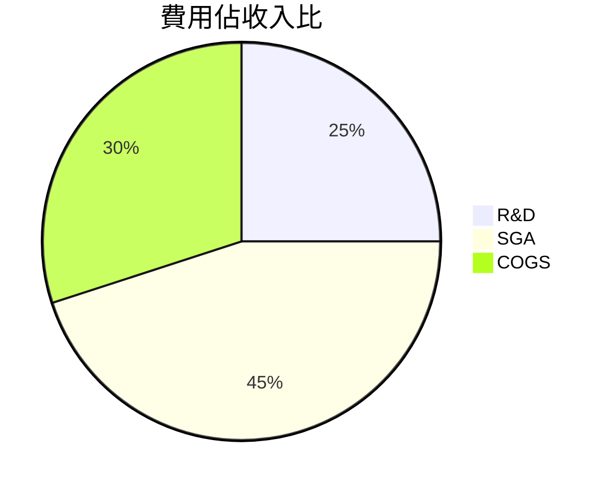
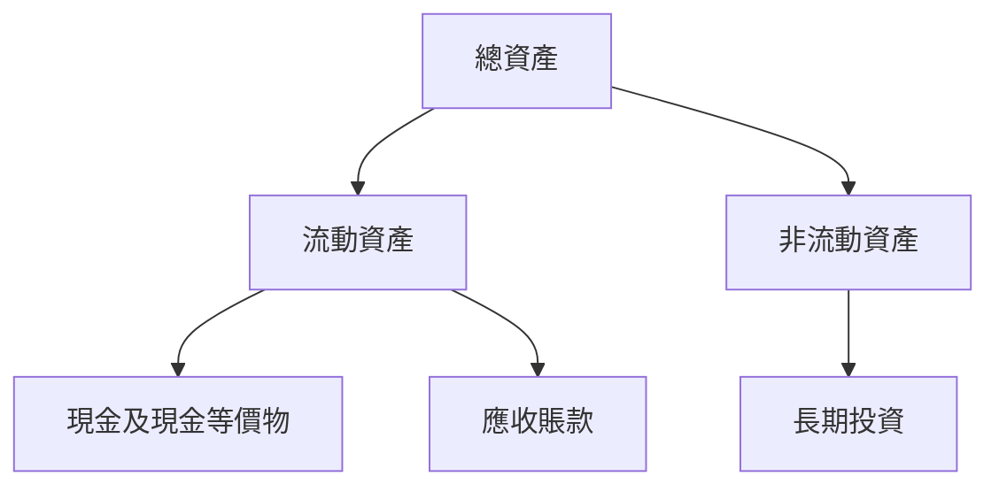
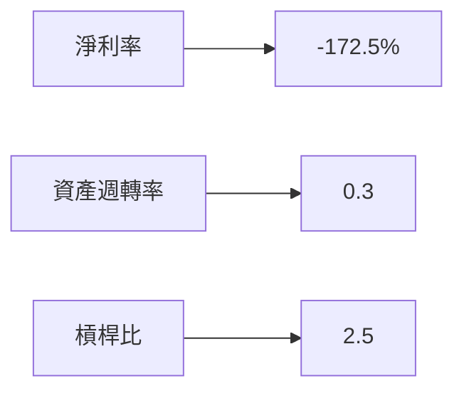
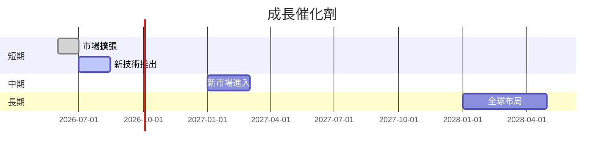
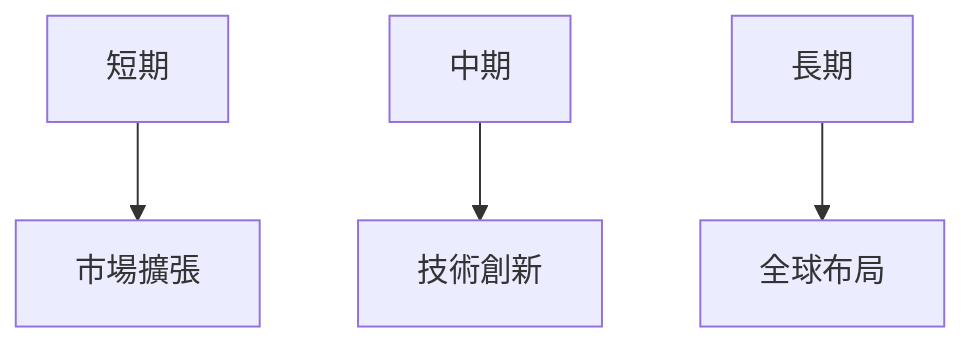
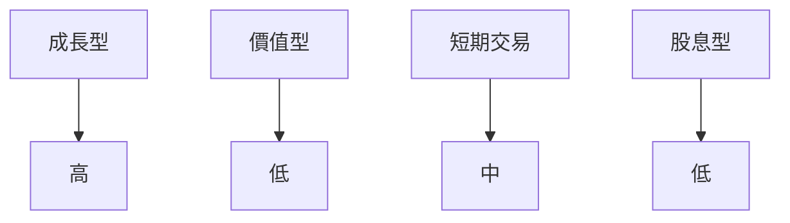

# ONDS 基本面深度分析報告
> **報告日期**：2026-03-24 ｜ **語言**：繁體中文 ｜ **數據來源**：Yahoo Finance

## 目錄
1. [執行摘要](#執行摘要)
2. [公司概覽與商業模式](#公司概覽與商業模式)
3. [損益表深度分析](#損益表深度分析)
4. [資產負債表分析](#資產負債表分析)
5. [現金流量深度分析](#現金流量深度分析)
6. [獲利能力與資本效率](#獲利能力與資本效率)
7. [估值深度分析](#估值深度分析)
8. [成長催化劑](#成長催化劑)
9. [風險矩陣](#風險矩陣)
10. [投資建議](#投資建議)

## 1. 執行摘要
### 核心評分儀表板


### 5大投資論點與3大風險
| 投資論點                     | 狀態 |
|-----------------------------|------|
| 高增長潛力                  | 🟢   |
| 強勁的市場需求              | 🟢   |
| 技術創新能力                | 🟡   |
| 財務狀況較強                | 🟢   |
| 擴展至新市場的潛力          | 🟡   |

| 風險項目                     | 狀態 |
|-----------------------------|------|
| 盈利能力不穩定              | 🔴   |
| 市場競爭加劇                | 🟡   |
| 財務槓桿過高                | 🔴   |

### 快速統計卡片
| 指標               | ONDS  | 行業均值 |
|-------------------|-------|----------|
| 市盈率 (P/E)      | N/A   | 20       |
| 市值              | 49.5億| 30億     |
| 營業毛利率        | 33.6% | 40%      |
| 淨利率            | -172.5%| 10%     |
| ROE               | -17%  | 15%      |

### 投資結論
- **建議**：觀望
- **目標價區間**：$16.00 - $18.38

## 2. 公司概覽與商業模式
### 業務結構與收入來源


### 市場地位


### 競爭護城河


### 護城河強度評分
```
▓▓▓▓░░░░░░ 4/10
```

## 3. 損益表深度分析
### 年度收入成長趨勢
```
2021: $2.91M ░░░░░
2022: $2.13M ░░░
2023: $15.69M ███████
2024: $7.19M ████
```
- **YoY 成長率**：2023年達到最高增長率 636.6%，2024年下降至負成長。

### 季度收入趨勢
| 季度          | 收入    | QoQ 成長率 | YoY 成長率 |
|---------------|---------|------------|------------|
| 2024-12-31    | $4.13M  | N/A        | N/A        |
| 2025-03-31    | $4.25M  | 2.9%       | N/A        |
| 2025-06-30    | $6.27M  | 47.5%      | N/A        |
| 2025-09-30    | $10.10M | 61.1%      | N/A        |

### 利潤率演變
| 指標               | 2021   | 2022   | 2023     | 2024     |
|-------------------|--------|--------|----------|----------|
| 毛利率            | 37.8%  | 52.1%  | 40.7%    | 33.6%    |
| 營業利益率        | -617.9%| -2347% | -243.6%  | -480.9%  |
| EBITDA 利率       | -534.3%| -3034% | -220.8%  | -399.5%  |
| 淨利率            | -515.5%| -3438% | -285.8%  | -529%    |

### 費用結構分析


### EPS 趨勢與盈餘品質分析
- 過去四個季度的EPS均未能達到預期，顯示盈利能力不穩定。

## 4. 資產負債表分析
### 資產結構


### 流動性指標
| 指標           | ONDS  | 行業均值 |
|----------------|-------|----------|
| 流動比率       | 15.3  | 2.5      |
| 速動比率       | 14.7  | 1.8      |
| 現金比率       | 9.2   | 1.0      |

### 債務結構分析
- **短期債務**：$18.03M
- **長期債務**：$60.31M
- **淨負債**：$-433.60M
- **Debt-to-EBITDA**：負數，因 EBITDA 為負。

### 股東權益趨勢
```
2021: $112.23M ██████
2022: $58.22M  ████
2023: $33.14M  ██
2024: $16.58M  █
```

## 5. 現金流量深度分析
### 現金流量瀑布圖


### FCF 轉換率
| 年度  | FCF  | 淨利   | 轉換率 |
|-------|------|--------|--------|
| 2023  | -$34.30M | -$44.84M | 76.5% |
| 2024  | -$35.20M | -$38.01M | 92.6% |

### 自由現金流趨勢
```
2021: -$17.92M ░░░
2022: -$40.89M ░░░░░░░░
2023: -$34.30M ░░░░░░
2024: -$35.20M ░░░░░░
```

### 資本配置評估
- 無股票回購或股息分配
- 資本支出主要集中於技術研發

## 6. 獲利能力與資本效率
### ROE / ROA / ROIC 趨勢
| 指標 | 2021 | 2022 | 2023 | 2024 | 行業均值 |
|------|------|------|------|------|----------|
| ROE  | -13% | -125%| -135%| -17%| 15%      |
| ROA  | -8%  | -54% | -48% | -8% | 8%       |
| ROIC | N/A  | N/A  | N/A  | N/A | 10%      |

### ROIC vs WACC 分析
- **WACC** 估算約為 10%，然公司尚未創造經濟附加值（EVA<0）。

### DuPont 分解
- **ROE** = 淨利率 × 資產週轉率 × 槓桿比
- 受淨利率負值影響，ROE 表現不佳。

### 獲利能力儀表板


## 7. 估值深度分析
### 同業估值比較
| 公司          | P/E | P/S  | EV/EBITDA | P/B |
|---------------|-----|------|-----------|-----|
| Ondas Inc.    | N/A | 200  | -93       | 7.2 |
| 競爭對手A     | 25  | 4    | 15        | 5   |
| 競爭對手B     | 20  | 3.5  | 12        | 6   |

### 歷史估值區間分析
- **P/E**：無法計算，因盈餘為負，但市銷率顯著高於行業均值。

### DCF 敏感性分析
| 假設情境 | 折現率 8% | 折現率 10% |
|----------|----------|-----------|
| 樂觀     | $20.00   | $18.00    |
| 基準     | $16.00   | $14.50    |
| 悲觀     | $12.00   | $11.00    |

### 估值區間視覺化
```
低估區 ░░░░░░
合理區 ██████
高估區 ░░░░░░
```

## 8. 成長催化劑
### 催化劑時間軸


### TAM 市場規模與滲透率
```
TAM: $100B ▓▓░░░░░░░░
滲透率: 1% ░░░░░░
```

### 短/中/長期成長驅動力


## 9. 風險矩陣
### 風險評分矩陣
| 風險項目     | 機率 | 衝擊 | 評分 |
|--------------|------|------|------|
| 盈利能力不穩 | 高   | 高   | 🔴   |
| 市場競爭    | 中   | 高   | 🟡   |
| 財務槓桿    | 高   | 中   | 🔴   |

### 風險清單表格
| 風險項目     | 機率 | 衝擊 | 評分 | 緩解措施     |
|--------------|------|------|------|--------------|
| 盈利能力不穩 | 高   | 高   | 🔴   | 提升利潤率   |
| 市場競爭    | 中   | 高   | 🟡   | 強化護城河   |
| 財務槓桿    | 高   | 中   | 🔴   | 降低負債比率 |

## 10. 投資建議
### 最終綜合評級
```
▓▓▓░░░░░░ 4/10
```

### 目標價及隱含報酬率
- **目標價**：$16.00 - $18.38
- **隱含報酬率**：約 50%

### 買入時機與觸發因素
- **買入時機**：等待市場穩定與技術突破
- **觸發因素**：新技術推出與市場反應

### 投資人適配度


### 關鍵監控指標清單
- 下次財報公佈
- 產業數據更新
- 競爭對手動態

> **免責聲明**：本報告為 AI 自動生成，僅供研究參考，不構成投資建議。