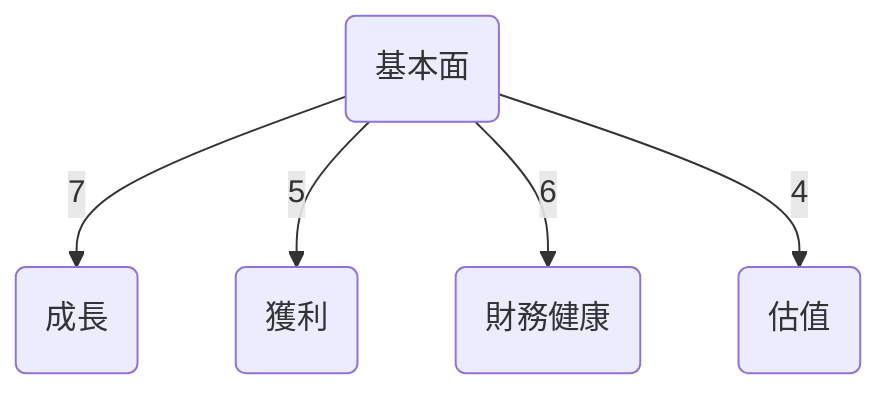
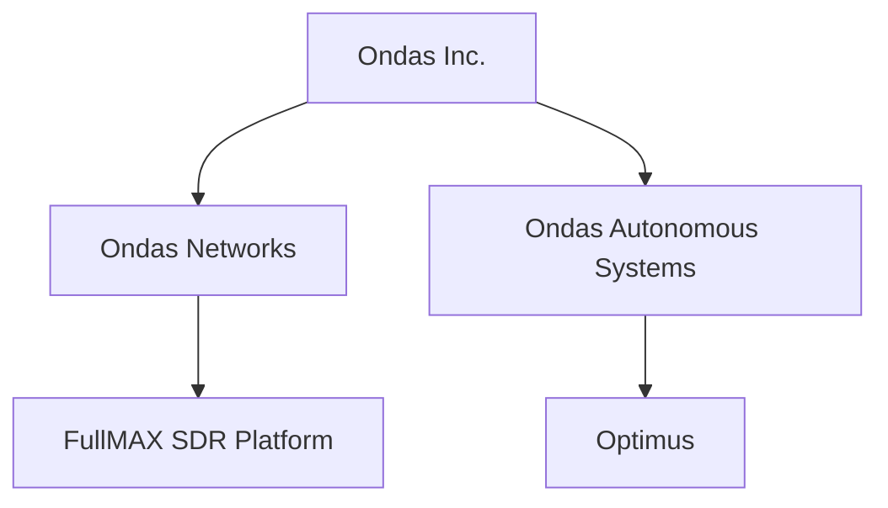
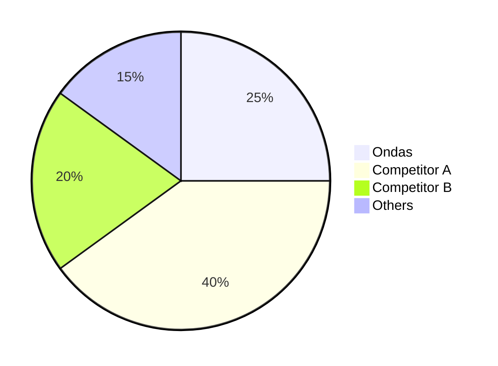
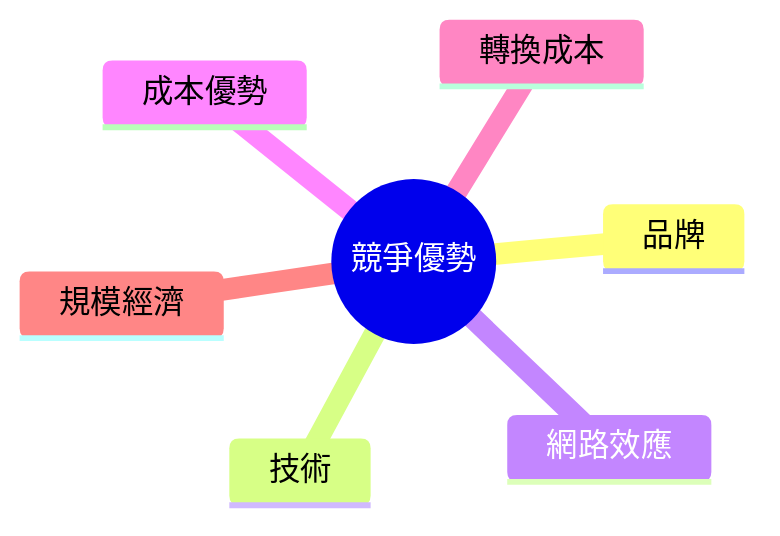
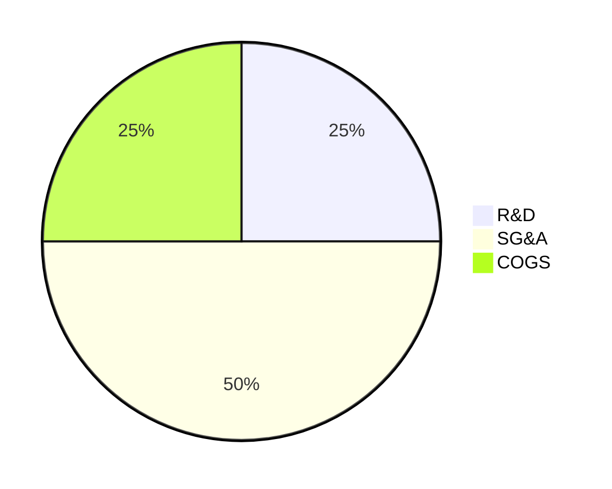
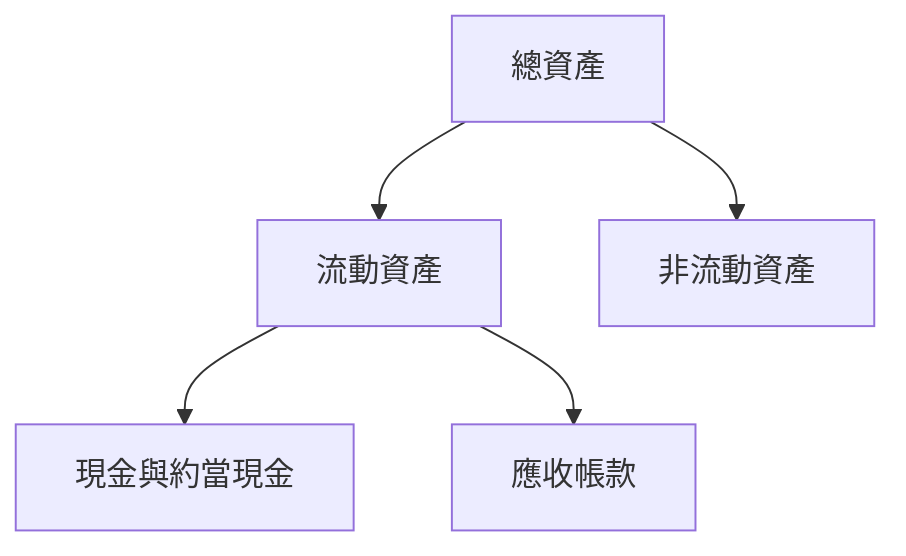
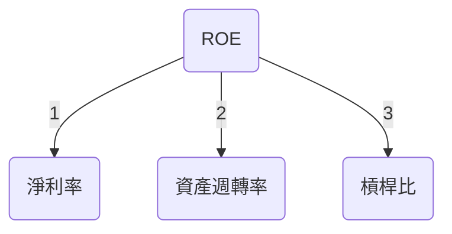
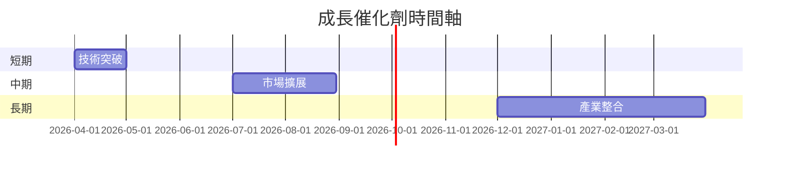
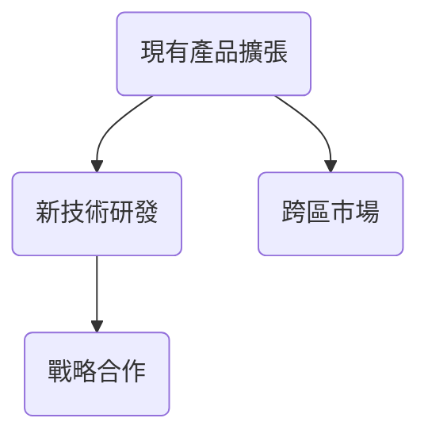
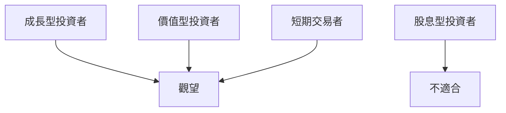

# ONDS 基本面深度分析報告
> **報告日期**：2026-03-25 ｜ **語言**：繁體中文 ｜ **數據來源**：Yahoo Finance

## 目錄
1. [執行摘要](#1-執行摘要)
2. [公司概覽與商業模式](#2-公司概覽與商業模式)
3. [損益表深度分析](#3-損益表深度分析)
4. [資產負債表分析](#4-資產負債表分析)
5. [現金流量深度分析](#5-現金流量深度分析)
6. [獲利能力與資本效率](#6-獲利能力與資本效率)
7. [估值深度分析](#7-估值深度分析)
8. [成長催化劑](#8-成長催化劑)
9. [風險矩陣](#9-風險矩陣)
10. [投資建議](#10-投資建議)

---

## 1. 執行摘要

### 核心評分儀表板



### 5大投資論點 + 3大風險

| 投資論點                            | 評估       |
|-------------------------------------|------------|
| 強勁的收入增長                      | 🟢         |
| 創新技術平台                       | 🟢         |
| 強大的市場潛力                      | 🟢         |
| 財務健康的流動性                    | 🟡         |
| 競爭優勢與護城河                    | 🟡         |

| 主要風險                            | 評估       |
|-------------------------------------|------------|
| 高估值倍數風險                      | 🔴         |
| 盈利能力不穩定                      | 🔴         |
| 市場競爭加劇                        | 🟡         |

### 快速統計卡片

| 指標                  | ONDS  | 行業均值  |
|-----------------------|-------|-----------|
| 市值（十億美元）      | 4.82  | 15.00     |
| P/S Ratio             | 94.93 | 4.00      |
| EBITDA Margin         | -101.8% | 20.0%    |
| ROE                   | -54.3% | 15.0%    |

### 投資結論
**建議：觀望**  
**目標價區間：$16 - $25**

---

## 2. 公司概覽與商業模式

### 業務結構與收入來源



### 市場地位



### 競爭護城河



### 護城河強度評分

```
▓▓▓░░░░░░░░░░ 3/10
```

---

## 3. 損益表深度分析

### 年度收入成長趨勢

```
2021: $2.91M ▓░░░░░░░░░░░░░░░░░░░░░░░░ 0%
2022: $2.13M ▓░░░░░░░░░░░░░░░░░░░░░░░░ -26.8%
2023: $15.69M ▓▓▓▓▓▓▓▓▓▓▓▓▓▓▓▓░░░░░░░░░ 636.6%
2024: $7.19M ▓▓▓░░░░░░░░░░░░░░░░░░░░░░ -54.2%
```

### 季度收入趨勢

| 季度      | 總收入 | QoQ%   | YoY%   |
|-----------|--------|--------|--------|
| 2024 Q4   | $4.13M | N/A    | N/A    |
| 2025 Q1   | $4.25M | +2.9%  | N/A    |
| 2025 Q2   | $6.27M | +47.5% | N/A    |
| 2025 Q3   | $10.10M| +61.1% | N/A    |

### 利潤率演變

| 年份       | 毛利率  | 營業利益率 | EBITDA率 | 淨利率  |
|------------|---------|------------|---------|---------|
| 2021       | 37.8%   | -617.2%    | -534.0% | -516.8% |
| 2022       | 52.1%   | -2347.9%   | -3035.7%| -3438.5%|
| 2023       | 40.7%   | -243.7%    | -220.8% | -285.9% |
| 2024       | 4.8%    | -481.3%    | -399.3% | -528.7% |

### 費用結構分析



### EPS 趨勢與盈餘品質分析

- 過去四季盈餘均未達市場預期
- 盈餘不穩定且波動性高，顯示內部成本控制與市場策略需調整

---

## 4. 資產負債表分析

### 資產結構



### 流動性指標

| 指標            | ONDS  | 評估 |
|-----------------|-------|------|
| 流動比率        | 4.836 | 🟢   |
| 速動比率        | 4.194 | 🟢   |
| 現金比率        | 0.592 | 🟡   |

### 債務結構分析

- 總債務：$60.31M
- 短期債務：$12.49M
- 長期債務：$47.82M
- Debt-to-EBITDA：N/A（由於EBITDA為負）

### 股東權益趨勢

```
2021: $112.23M █████████████████████████████████████
2022: $58.22M  ██████████████████████
2023: $33.14M  ███████████
2024: $16.58M  █████
```

---

## 5. 現金流量深度分析

### 現金流量瀑布圖


### FCF 轉換率趨勢

| 年份       | FCF / Net Income |
|------------|------------------|
| 2021       | 119.31%          |
| 2022       | 55.81%           |
| 2023       | 76.46%           |
| 2024       | 92.63%           |

### 自由現金流趨勢

```
2021: $-17.92M ▓░░░░░░░░░░░░░░░░░░░
2022: $-40.89M ▓▓▓▓▓▓▓▓▓▓▓▓
2023: $-34.30M ▓▓▓▓▓▓▓▓▓░░░░
2024: $-35.20M ▓▓▓▓▓▓▓▓▓░░░░
```

### 資本配置評估

- 無股利支出
- 資本支出持平，主要投入於R&D
- 融資活動為主要現金來源

---

## 6. 獲利能力與資本效率

### ROE / ROA / ROIC 趨勢表格

| 指標      | 2021 | 2022 | 2023 | 2024 | 行業均值 |
|-----------|------|------|------|------|----------|
| ROE       | -13% | -12% | -15% | -54% | 15%      |
| ROA       | -2.8%| -3.7%| -3.0%| -5.9%| 8%       |
| ROIC      | N/A  | N/A  | N/A  | N/A  | 10%      |

### ROIC vs WACC 分析

- **ROIC**：無法計算，由於淨收入為負
- **WACC**：推測約為8%（行業平均）
- 經濟價值分析：目前無法創造正面經濟價值

### DuPont 分解

- **ROE** = 淨利率 × 資產週轉率 × 槓桿比
- 淨利率：大幅負值顯示公司尚未盈利
- 資產週轉率：低於行業平均
- 槓桿比：顯示較高的財務槓桿風險

### 獲利能力儀表板



---

## 7. 估值深度分析

### 同業估值比較表格

| 公司       | P/E  | P/S  | EV/EBITDA | P/B  | PEG  | FCF Yield |
|------------|------|------|-----------|------|------|-----------|
| ONDS       | N/A  | 94.9 | -68.64    | 8.97 | N/A  | -0.07%    |
| Competitor A | 25.3 | 5.5  | 14.2      | 3.8  | 1.5  | 2.0%      |
| Competitor B | 18.7 | 2.9  | 10.1      | 2.5  | 1.2  | 3.5%      |

### 歷史估值區間分析

- 近五年P/E區間：高度波動，目前缺乏正面盈利數據支持

### DCF 敏感性分析

| 情境          | 成長假設 | 折現率 | 目標價 |
|---------------|----------|--------|--------|
| 基準          | 5%       | 8%     | $19.12 |
| 樂觀          | 10%      | 7%     | $25.00 |
| 悲觀          | 3%       | 9%     | $16.00 |

### 估值區間視覺化

```
$0 - $10  : ░░░░░░░░░░░░░░░░░░░░░░░░░░░░░░░░░░░░░░░░
$10 - $16 : █████████████░░░░░░░░░░░░░░░░░░░░░░░░░░
$16 - $25 : ██████████████████████████████████████
```

---

## 8. 成長催化劑

### 催化劑時間軸



### TAM 市場規模與滲透率

```
TAM規模: $100B
滲透率: 2% █████░░░░░░░░░░░░░░░░░░░░░░░░░░░░░░░░░░
```

### 短/中/長期成長驅動力



---

## 9. 風險矩陣

### 風險評分矩陣

| 風險項目         | 機率 | 衝擊 | 評分 | 緩解措施          |
|------------------|------|------|------|-------------------|
| 高估值倍數風險   | 高   | 高   | 🔴  | 嚴密監控市場動態  |
| 盈利能力不穩定   | 高   | 高   | 🔴  | 加強成本控制      |
| 市場競爭加劇     | 中   | 中   | 🟡  | 提升產品差異化    |

---

## 10. 投資建議

### 最終綜合評級

```
綜合評級：5/10
▓▓▓▓▓░░░░░░░░░░░░░░░░░░░░░░░░░░░░░░░░░
```

### 目標價及隱含報酬率

- **基準**：$19.12，隱含報酬率：+85.4%
- **樂觀**：$25.00，隱含報酬率：+142.5%
- **悲觀**：$16.00，隱含報酬率：+55.2%

### 買入時機與觸發因素

- 買入時機：市場大幅回調至合理估值範圍
- 觸發因素：新產品發布、技術突破、競爭對手表現不佳

### 投資人適配度



### 關鍵監控指標

- 下一次財報發布
- 產業技術趨勢
- 競爭對手動態

> **免責聲明**：本報告為 AI 自動生成，僅供研究參考，不構成投資建議。