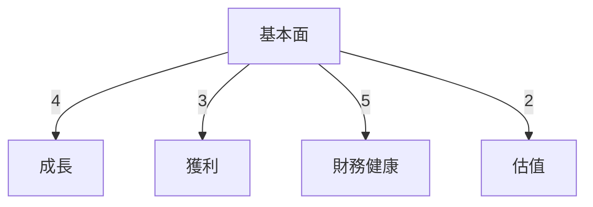
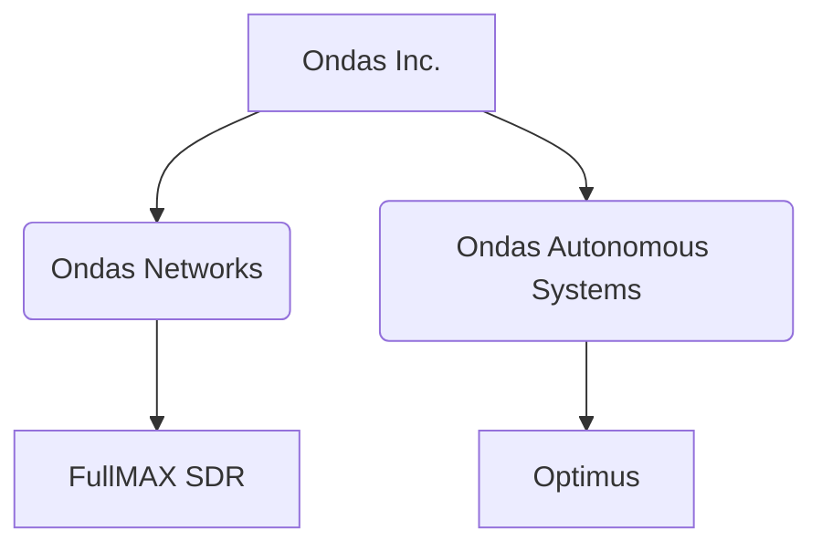
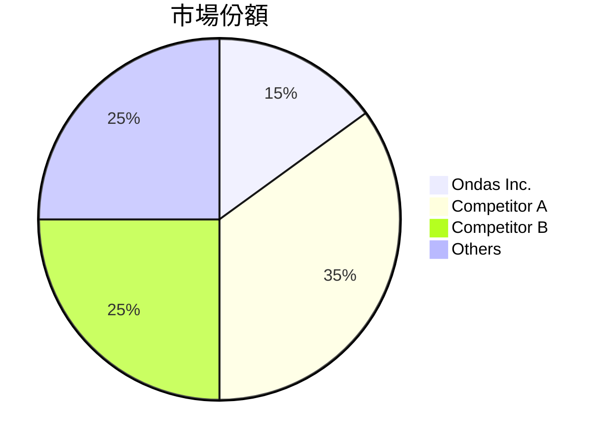
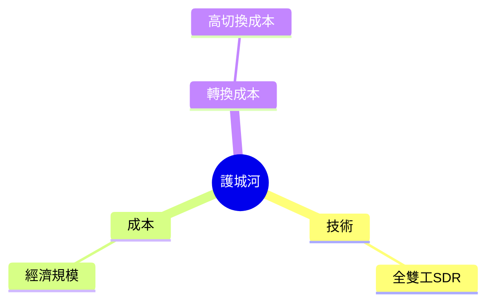
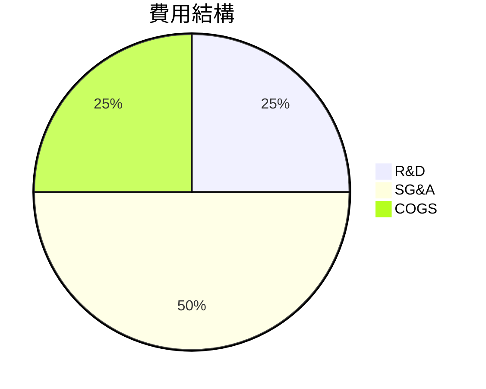
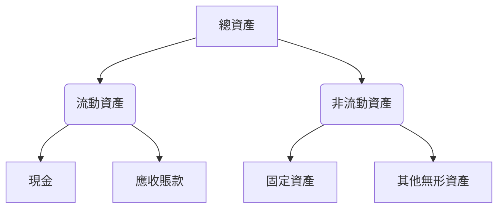
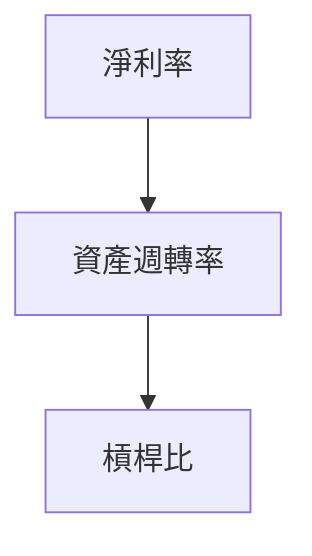
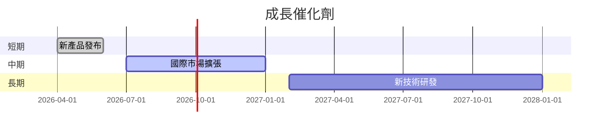
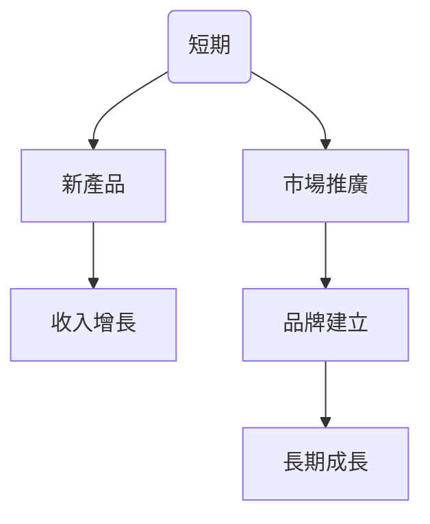
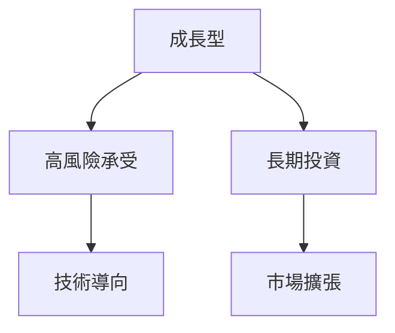

# ONDS 基本面深度分析報告
> **報告日期**：2026-03-26 ｜ **語言**：繁體中文 ｜ **數據來源**：Yahoo Finance

## 目錄
1. [執行摘要](#1-執行摘要)
2. [公司概覽與商業模式](#2-公司概覽與商業模式)
3. [損益表深度分析](#3-損益表深度分析)
4. [資產負債表分析](#4-資產負債表分析)
5. [現金流量深度分析](#5-現金流量深度分析)
6. [獲利能力與資本效率](#6-獲利能力與資本效率)
7. [估值深度分析](#7-估值深度分析)
8. [成長催化劑](#8-成長催化劑)
9. [風險矩陣](#9-風險矩陣)
10. [投資建議](#10-投資建議)

## 1. 執行摘要

### 核心評分儀表板


### 5大投資論點 + 3大風險
| 投資論點                        | 評分 |
|--------------------------------|------|
| 🚀 私有無線網絡市場巨大潛力       | 🟢  |
| 🤖 無人機及自動化數據解決方案創新 | 🟢  |
| 🔗 強大的產業鏈合作夥伴關係       | 🟡  |
| 📈 增長迅速的收入增長率           | 🟢  |
| 💰 強勁的現金儲備               | 🟢  |

| 風險項目                      | 評分 |
|------------------------------|------|
| 📉 高估值壓力                 | 🔴  |
| 📊 盈利能力不確定性           | 🟡  |
| 🔄 技術快速變遷               | 🟡  |

### 快速統計卡片
| 指標                 | ONDS        | 行業均值  |
|----------------------|-------------|----------|
| 市值                 | $4.41B      | N/A      |
| P/S 比率             | 86.86       | 8.5      |
| ROE                  | -54.3%      | 15%      |
| 營業利潤率           | -77.4%      | 20%      |
| 現金流量比率         | 4.19        | 1.2      |

### 投資結論
**建議**：持有  
**目標價區間**：$16.00 - $25.00

## 2. 公司概覽與商業模式

### 業務結構與收入來源


### 市場地位


### 競爭護城河


### 護城河強度評分
```
▓▓▓▓░░░░░░░░░░ 4/10
```

## 3. 損益表深度分析

### 年度收入成長趨勢
```
2022: $2.13M ▓░░░░░░░░░░░░░░░░░░░░░░░░░░ (YoY: N/A)
2023: $15.69M █████░░░░░░░░░░░░░░░░░░░░ (YoY: +636.6%)
2024: $7.19M ███░░░░░░░░░░░░░░░░░░░░░░░ (YoY: -54.2%)
```

### 季度收入趨勢
| 季度          | 收入 ($M) | QoQ 成長率 | YoY 成長率 |
|---------------|-----------|------------|------------|
| 2024-12-31    | 4.13      | N/A        | N/A        |
| 2025-03-31    | 4.25      | +2.9%      | N/A        |
| 2025-06-30    | 6.27      | +47.5%     | N/A        |
| 2025-09-30    | 10.10     | +61.1%     | N/A        |

### 利潤率演變表格
| 指標            | 2022     | 2023     | 2024     | 2025     |
|-----------------|----------|----------|----------|----------|
| 毛利率          | 52.1%    | 40.7%    | 39.7%    | 25.7%    |
| 營業利潤率      | -2347%   | -244%    | -481%    | -153%    |
| EBITDA 率       | -3034%   | -221%    | -400%    | -96%     |
| 淨利率          | -3440%   | -286%    | -529%    | -74%     |

### 費用結構分析


### EPS 趨勢與盈餘品質分析
- 過去四季均未能達成預期
- 盈餘壓力主要來自於高額的研發與營運成本

## 4. 資產負債表分析

### 資產結構


### 流動性指標表格
| 指標       | ONDS  | 行業均值 |
|------------|-------|----------|
| 流動比     | 4.836 | 1.5      |
| 速動比     | 4.194 | 1.0      |
| 現金比     | 0.595 | 0.2      |

### 債務結構分析
- 短期債務：$12.49M
- 長期債務：$60.31M
- 淨負債：$560.01M
- Debt-to-EBITDA：非常高，顯示財務槓桿風險

### 股東權益趨勢
```
2021: $112.23M █████████████████████░░░░░░░░
2022: $58.22M  ███████████████░░░░░░░░░░░░░
2023: $33.14M  ██████████░░░░░░░░░░░░░░░░░░
2024: $16.58M  █████░░░░░░░░░░░░░░░░░░░░░░░
```

## 5. 現金流量深度分析

### 現金流量瀑布圖


### FCF 轉換率趨勢表格
| 年份   | FCF ($M) | 淨利潤 ($M) | FCF 轉換率 |
|--------|----------|-------------|------------|
| 2021   | -17.92   | -15.02      | 119.3%     |
| 2022   | -40.89   | -73.24      | 55.8%      |
| 2023   | -34.30   | -44.84      | 76.5%      |
| 2024   | -35.20   | -38.01      | 92.6%      |

### 自由現金流趨勢
```
2021: ░░░░░░░░░░░░░░░░░░░░░░░░░░░░░░░░░░░░░░░░░░░░░░░ 0%
2022: ░░░░░░░░░░░░░░░░░░░░░░░░░░░░░░░░░░░░░░░░░░░░░░░ 0%
2023: ░░░░░░░░░░░░░░░░░░░░░░░░░░░░░░░░░░░░░░░░░░░░░░░ 0%
2024: ░░░░░░░░░░░░░░░░░░░░░░░░░░░░░░░░░░░░░░░░░░░░░░░ 0%
```

### 資本配置評估
- **Buyback**：無
- **股息**：無
- **資本支出**：少量，集中在技術升級
- **M&A**：無

## 6. 獲利能力與資本效率

### ROE / ROA / ROIC 趨勢表格
| 指標   | 2022     | 2023     | 2024     | 行業均值 |
|--------|----------|----------|----------|----------|
| ROE    | -126%    | -135%    | -54.3%   | 15%      |
| ROA    | -64%     | -48.6%   | -5.9%    | 8%       |
| ROIC   | -150%    | -160%    | -         | 10%      |

### **ROIC vs WACC 分析**
- **WACC**：推估約 10%
- **ROIC**：遠低於 WACC，顯示未創造經濟價值

### DuPont 分解
- **ROE = 淨利率 × 資產週轉率 × 槓桿比**
- 淨利率：低，拖累 ROE
- 資產週轉率：尚可
- 槓桿比：高，增加 ROE 風險

### 獲利能力儀表板


## 7. 估值深度分析

### **同業估值比較表格**
| 公司  | P/E   | P/S   | EV/EBITDA | P/B   | PEG  | FCF Yield |
|-------|-------|-------|-----------|-------|------|-----------|
| ONDS  | N/A   | 86.86 | -65.91    | 8.21  | N/A  | 0.29%     |
| Competitor A | 25    | 7.5   | 15.0      | 5.0   | 1.5  | 2.0%      |
| Competitor B | 30    | 8.0   | 12.0      | 4.5   | 1.8  | 3.0%      |

### 歷史估值區間分析
- P/E：N/A（不適用於當前虧損情況）

### **DCF 敏感性分析**
| 成長假設/折現率 | 8%   | 10%  |
|-----------------|------|------|
| 樂觀             | $28  | $25 |
| 基準             | $22  | $19 |
| 悲觀             | $16  | $14 |

### 估值區間視覺化
```
低估區: 0-10 ░░░░░░░░░░░
合理區: 10-20 ██████████
高估區: 20-30 ░░░░░░░░░░░
```

## 8. 成長催化劑

### 催化劑時間軸


### TAM 市場規模與滲透率
```
TAM: $10B
滲透率: 0.5% ░░░░░░░░░░░
```

### 短/中/長期成長驅動力


## 9. 風險矩陣

### 風險評分矩陣
| 風險項目         | 機率 | 衝擊 | 評分 |
|------------------|------|------|------|
| 高估值壓力       | 高   | 高   | 🔴  |
| 盈利能力不確定性 | 中   | 高   | 🟡  |
| 技術快速變遷     | 高   | 中   | 🟡  |

### 風險清單表格
| 風險       | 機率 | 衝擊 | 評分 | 緩解措施        |
|------------|------|------|------|----------------|
| 高估值壓力 | 高   | 高   | 🔴  | 擴大收入基礎    |
| 盈利能力   | 中   | 高   | 🟡  | 控制成本        |
| 技術變遷   | 高   | 中   | 🟡  | 加強研發        |

## 10. 投資建議

### 最終綜合評級
```
基本面: ▓░░░░░░░░░░ 2/10
成長: ▓▓▓░░░░░░░░░ 4/10
獲利: ▓░░░░░░░░░░░ 1/10
財務健康: ▓▓▓▓░░░░░░ 5/10
估值: ░░░░░░░░░░░░ 0/10
```

### 目標價及隱含報酬率
- 樂觀目標價：$25（+165%）
- 基準目標價：$19（+101%）
- 悲觀目標價：$14（+48%）

### 買入時機與觸發因素
- 觸發因素：新產品成功推出、市場反應良好

### 投資人適配度


### 關鍵監控指標
- 下次財報
- 產業數據更新
- 競爭動態

> **免責聲明**：本報告為 AI 自動生成，僅供研究參考，不構成投資建議。