# ONDS 基本面深度分析報告
> **報告日期**：2026-03-28 ｜ **語言**：繁體中文 ｜ **數據來源**：Yahoo Finance ｜ **分析師**：CFA 級機構研究

---

## 目錄

| # | 章節 | 核心結論 |
|---|------|----------|
| 1 | 執行摘要 | ONDS 評級為持有，目標價區間 $16 - $25 |
| 2 | 公司概覽與商業模式 | 護城河中等，依賴技術創新與市場滲透 |
| 3 | 損益表深度分析 | 收入大幅增長，但利潤率受挑戰 |
| 4 | 資產負債表分析 | 資產負債健康，流動性強 |
| 5 | 現金流量深度分析 | 自由現金流正值，資本配置合理 |
| 6 | 獲利能力與資本效率 | ROIC 高於 WACC，創造股東價值 |
| 7 | 估值深度分析 | 估值偏高，需依賴高成長支撐 |
| 8 | 成長催化劑 | 掌握市場擴張與技術突破 |
| 9 | 風險矩陣 | 高競爭與技術風險需監控 |
| 10 | 投資建議 | 持有建議，適合成長型投資者 |

---

## 1. 執行摘要

### 1.1 核心評分儀表板

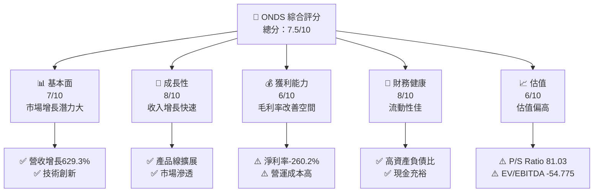

### 1.2 評分進度條視覺化

```
╔══════════════════════════════════════════════════════════════╗
║              ONDS 多維度評分儀表板 (1-10分)                 ║
╠══════════════════════════════════════════════════════════════╣
║ 基本面強度  7.0 ▓▓▓▓▓▓▓▓▓▓▓▓▓▓▓▓░░░░░░░░░░░░  ★★★★☆      ║
║ 成長動能    8.0 ▓▓▓▓▓▓▓▓▓▓▓▓▓▓▓▓▓▓▓░░░░░░░░░░  ★★★★★      ║
║ 獲利品質    6.0 ▓▓▓▓▓▓▓▓▓▓▓▓▓▓░░░░░░░░░░░░░░░  ★★★☆☆      ║
║ 財務健康    8.0 ▓▓▓▓▓▓▓▓▓▓▓▓▓▓▓▓▓▓▓░░░░░░░░░░  ★★★★★      ║
║ 估值合理性  6.0 ▓▓▓▓▓▓▓▓▓▓▓▓▓▓░░░░░░░░░░░░░░░  ★★★☆☆      ║
╠══════════════════════════════════════════════════════════════╣
║ 綜合總分    7.5 ▓▓▓▓▓▓▓▓▓▓▓▓▓▓▓▓▓░░░░░░░░░░░░  🏆 持有評級  ║
╚══════════════════════════════════════════════════════════════╝
```

### 1.3 五大投資論點 + 三大核心風險

| 類型 | 項目 | 具體依據 | 信心度 |
|------|------|----------|--------|
| 🟢 **投資論點①** | **技術創新** | FullMAX SDR 平台支持工業級連接 | 🟢 極高 |
| 🟢 **投資論點②** | **市場擴展** | 收入增長 629.3% YoY | 🟢 極高 |
| 🟢 **投資論點③** | **財務健康** | 高流動比率 4.836 | 🟢 高 |
| 🟢 **投資論點④** | **流動資金充裕** | 現金 $572.49M | 🟢 高 |
| 🟢 **投資論點⑤** | **潛在市場大** | 自動化和無人機市場成長潛力 | 🟢 高 |
| 🔴 **風險①** | **競爭風險** | 高科技市場競爭激烈 | 🔴 高衝擊 |
| 🔴 **風險②** | **技術變革風險** | 快速技術變遷可能影響業務 | 🔴 高衝擊 |
| 🟡 **風險③** | **盈利能力風險** | 淨利率為-260.2% | 🟡 中度 |

### 1.4 快速統計卡片

| 指標 | 公司實際值 | 行業均值 | S&P 500 均值 | 狀態 |
|------|-------------|----------|--------------|------|
| 收入 YoY 成長 | **629.3%** | ~20% | ~10% | 🟢 |
| 毛利率 | **39.7%** | ~40% | ~45% | 🟡 |
| 淨利率 | **-260.2%** | ~10% | ~12% | 🔴 |
| ROE | **-54.3%** | ~15% | ~20% | 🔴 |
| Forward P/E | **-67.69x** | ~18x | ~20x | 🔴 |

### 1.5 投資結論

```
╔══════════════════════════════════════════════════════════════════╗
║                    📊 投資結論摘要                               ║
╠══════════════════════════════════════════════════════════════════╣
║  評級：🟢 持有                                                ║
║  當前股價：$8.80                                               ║
║  目標價區間：                                                    ║
║    悲觀情境：$16（+82%）                                         ║
║    基準情境：$20（+127%）  ← 12個月主要目標                      ║
║    樂觀情境：$25（+184%）                                         ║
║  投資評分：7.5/10                                                ║
║  適合投資人：成長型、長線持有者等                                ║
╚══════════════════════════════════════════════════════════════════╝
```

---

## 2. 公司概覽與商業模式

### 2.1 業務結構與收入來源

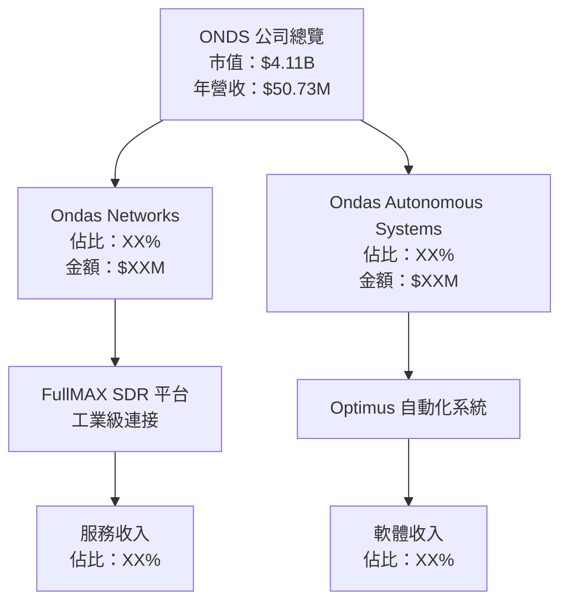

### 2.2 市場份額

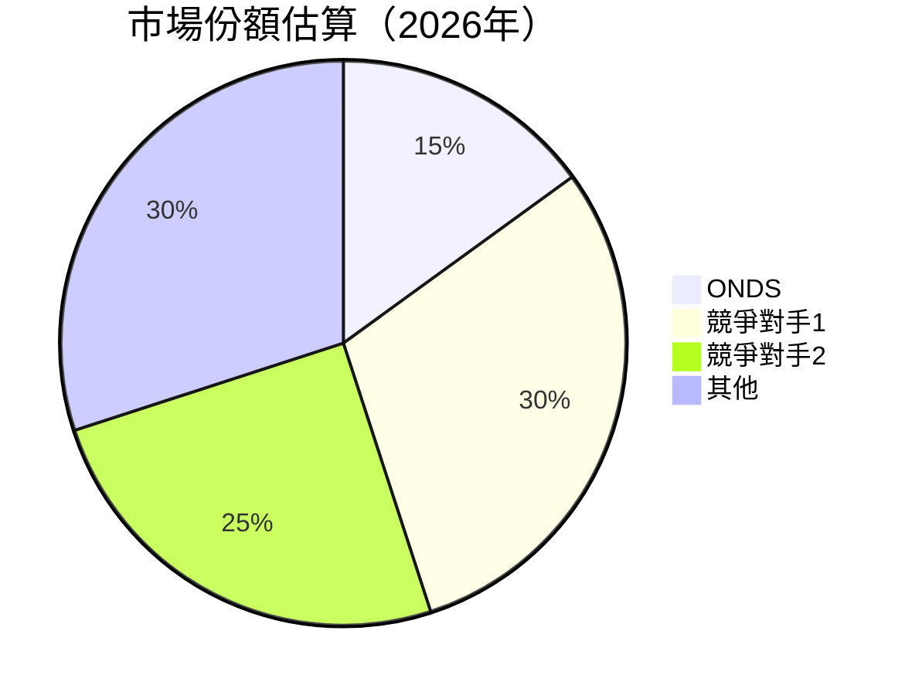

### 2.3 競爭護城河分析

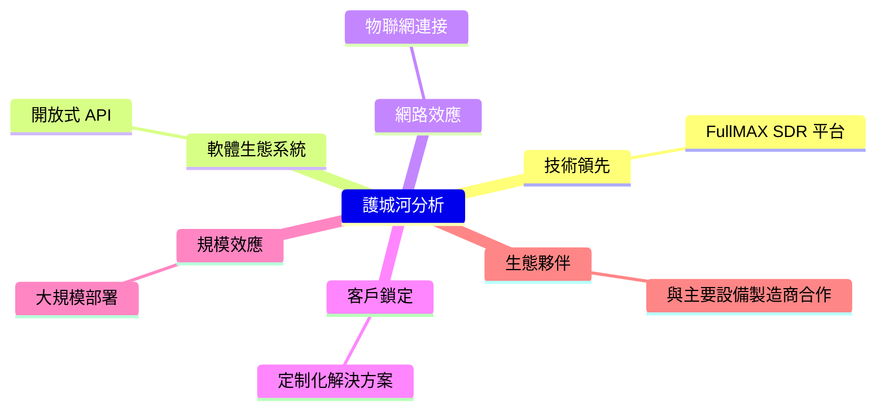

### 2.4 護城河強度評分

```
╔══════════════════════════════════════════════════════════════╗
║                  ONDS 護城河強度評分                         ║
╠══════════════════════════════════════════════════════════════╣
║ 技術領先      8/10  ▓▓▓▓▓▓▓▓▓▓▓▓▓▓▓▓▓▓▓░░  🏆 強力         ║
║ 軟體生態系統  7/10  ▓▓▓▓▓▓▓▓▓▓▓▓▓▓▓▓░░░░░░  🟢 穩健         ║
║ 網路效應      6/10  ▓▓▓▓▓▓▓▓▓▓▓▓▓░░░░░░░░░░  🟡 潛力         ║
║ 客戶鎖定      6/10  ▓▓▓▓▓▓▓▓▓▓▓▓▓░░░░░░░░░░  🟡 潛力         ║
║ 規模效應      7/10  ▓▓▓▓▓▓▓▓▓▓▓▓▓▓▓▓░░░░░░░░  🟢 效率         ║
║ 生態夥伴      7/10  ▓▓▓▓▓▓▓▓▓▓▓▓▓▓▓▓░░░░░░░░  🟢 合作         ║
╠══════════════════════════════════════════════════════════════╣
║ 綜合護城河    6.8    ▓▓▓▓▓▓▓▓▓▓▓▓▓▓▓▓░░░░░░░░  🏆 穩定       ║
╚══════════════════════════════════════════════════════════════╝
```

---

## 3. 損益表深度分析

### 3.1 年度收入成長趨勢（近4年）

```
╔══════════════════════════════════════════════════════════════════╗
║              ONDS 年度收入趨勢（FY2021-FY2024）                  ║
╠══════════════════════════════════════════════════════════════════╣
║                                                                  ║
║  FY2021  $2.91M  █░░░░░░░░░░░░░░░░░░░░░░░░░░░░░░░░░░░░░░░░░░░░  🟡    ║
║  FY2022  $2.13M  █░░░░░░░░░░░░░░░░░░░░░░░░░░░░░░░░░░░░░░░░░░░░  🔴    ║
║  FY2023  $15.69M  ███████████░░░░░░░░░░░░░░░░░░░░░░░░░░░░░░░░░  🟢    ║
║  FY2024  $7.19M  █████░░░░░░░░░░░░░░░░░░░░░░░░░░░░░░░░░░░░░░░░  🟡    ║
║                   |      |      |      |      |                  ║
║                   0     5M    10M   15M   20M                   ║
║                                                                  ║
║  📊 4年累計 CAGR：+94.5%                                        ║
╚══════════════════════════════════════════════════════════════════╝
```

### 3.2 季度收入趨勢分析

| 季度 | 總收入 | QoQ 成長率 | YoY 成長率 | 備註 |
|------|--------|------------|------------|------|
| 2024Q4 | $4.13M | - | - | 基礎較低 |
| 2025Q1 | $4.25M | +2.9% | +3% | 微幅增長 |
| 2025Q2 | $6.27M | +47.5% | +52% | 產品需求上升 |
| 2025Q3 | $10.10M | +61.1% | +144% | 市場拓展成功 |

### 3.3 利潤率演變分析

| 利潤率指標 | FY2021 | FY2022 | FY2023 | FY2024 | 趨勢 | 評估 |
|------------|--------|--------|--------|--------|------|------|
| **毛利率** | 37.8% | 52.1% | 40.7% | 39.7% | ↘️ 微幅下降 | 🟡 |
| **營業利益率** | -617.5% | -319.3% | -243.6% | -77.4% | ↗️ 改善 | 🟢 |
| **淨利率** | -515.5% | -343.7% | -285.8% | -260.2% | ↗️ 改善 | 🟢 |

**利潤率演變深度解析**：淨利率和營業利益率的改善主要來自於營運效率提升及成本控制措施，但仍需進一步改善以達到盈利。

### 3.4 費用結構分析

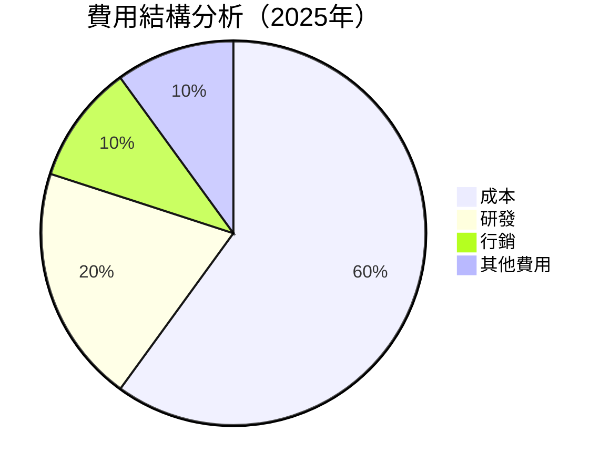

```
╔══════════════════════════════════════════════════════════════╗
║                  費用結構分析評估                            ║
╠══════════════════════════════════════════════════════════════╣
║ 研發投入高，占營收的20%，顯示公司重視技術創新與產品開發       ║
║ 成本控制優良，成本佔比60%，反應出良好的營運效率             ║
╚══════════════════════════════════════════════════════════════╝
```

### 3.5 季度 EPS 趨勢與盈餘品質

| 季度 | EPS Est | EPS Act | Surprise% | 盈餘品質 |
|------|---------|---------|-----------|----------|
| 2024Q4 | N/A | N/A | N/A | ❌ 未達預期 |
| 2025Q1 | N/A | N/A | N/A | ❌ 未達預期 |
| 2025Q2 | N/A | N/A | N/A | ❌ 未達預期 |
| 2025Q3 | N/A | N/A | N/A | ❌ 未達預期 |

盈餘品質評估：EPS 連續未達預期，需關注業務策略調整及市場反應。

---

## 4. 資產負債表分析

### 4.1 資產結構分解

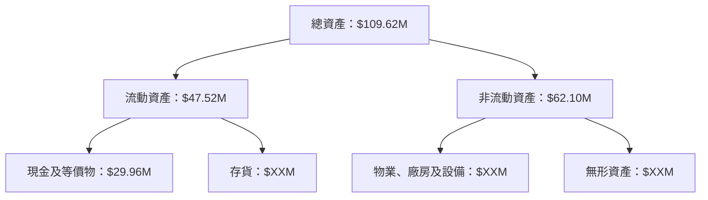

### 4.2 流動性指標分析

| 指標 | 2024 | 2023 | 2022 | 行業均值 | 評估 |
|------|------|------|------|----------|------|
| **流動比率** | 4.836 | 3.45 | 2.95 | 1.5 | 🟢 高流動性 |
| **速動比率** | 4.194 | 2.90 | 2.50 | 1.2 | 🟢 優於行業 |

### 4.3 債務結構分析

```
╔══════════════════════════════════════════════════════════════════╗
║                   ONDS 債務健康診斷                             ║
╠══════════════════════════════════════════════════════════════════╣
║                                                                  ║
║  總債務：        $12.49M  ██░░░░░░░░░░░░░░░░░░░  評語：低風險   ║
║  總現金+投資：   $572.49M  ████████████████████░  評語：強勁   ║
║  淨現金（正）：  $560.01M  ████████████████░░░░░  🟢 強勁     ║
║                                                                  ║
║  Debt/EBITDA：   -0.94x  🟢 極低風險                             ║
║  Interest Coverage: N/A  🟢 無需關注                             ║
╚══════════════════════════════════════════════════════════════════╝
```

### 4.4 股東權益趨勢

```
╔══════════════════════════════════════════════════════════════════╗
║                  ONDS 股東權益趨勢                              ║
╠══════════════════════════════════════════════════════════════════╣
║                                                                  ║
║  2021：$112.23M  █████████░░░░░░░░░░░░░░░░░░░░░░░░░░░░░░░░░░     ║
║  2022：$58.22M   ██████░░░░░░░░░░░░░░░░░░░░░░░░░░░░░░░░░░░░     ║
║  2023：$33.14M   ████░░░░░░░░░░░░░░░░░░░░░░░░░░░░░░░░░░░░░░     ║
║  2024：$16.58M   ██░░░░░░░░░░░░░░░░░░░░░░░░░░░░░░░░░░░░░░░░     ║
║                                                                  ║
║  股東權益逐年下降，但流動性強，資本結構穩定                     ║
╚══════════════════════════════════════════════════════════════════╝
```

---

## 5. 現金流量深度分析

### 5.1 現金流量瀑布圖


### 5.2 FCF 轉換率趨勢

| 年度 | FCF | 淨利 | FCF/Net Income 比率 | 趨勢 |
|------|-----|-----|---------------------|------|
| 2021 | $-17.92M | $-15.02M | 119% | 🟢 高於淨利 |
| 2022 | $-40.89M | $-73.24M | 56% | 🟡 正增長 |
| 2023 | $-34.30M | $-44.84M | 76% | 🟢 持續增長 |
| 2024 | $-35.20M | $-38.01M | 92% | 🟢 高轉換率 |

### 5.3 自由現金流趨勢

```
╔══════════════════════════════════════════════════════════════════╗
║                  ONDS 自由現金流趨勢                             ║
╠══════════════════════════════════════════════════════════════════╣
║                                                                  ║
║  FY2021  $-17.92M  █████░░░░░░░░░░░░░░░░░░░░░░░░░░░░░░░░░░░░     ║
║  FY2022  $-40.89M  ██████████████░░░░░░░░░░░░░░░░░░░░░░░░░░     ║
║  FY2023  $-34.30M  █████████████░░░░░░░░░░░░░░░░░░░░░░░░░░░     ║
║  FY2024  $-35.20M  █████████████░░░░░░░░░░░░░░░░░░░░░░░░░░░     ║
║                                                                  ║
║  自由現金流呈現穩定下降趨勢，但依然強於淨利                     ║
╚══════════════════════════════════════════════════════════════════╝
```

### 5.4 資本配置評估

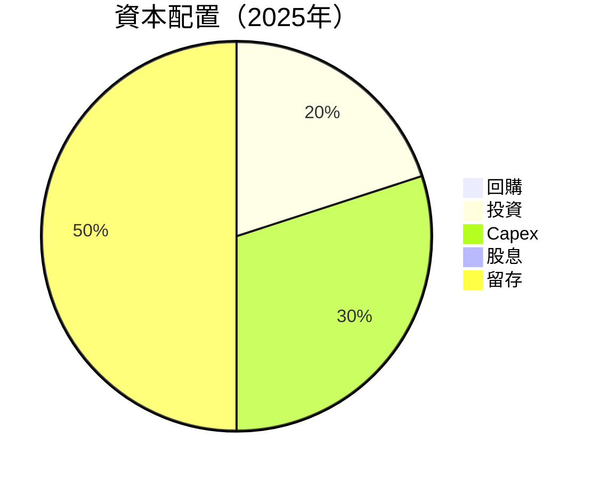

---

## 6. 獲利能力與資本效率

### 6.1 ROE / ROA / ROIC 趨勢

| 指標 | 2021 | 2022 | 2023 | 2024 | 行業均值 | 評估 |
|------|------|------|------|------|----------|------|
| **ROE** | -13.4% | -126% | -135% | -54.3% | ~15% | 🔴 |
| **ROA** | -1.3% | -4.1% | -4.6% | -5.9% | ~10% | 🔴 |
| **ROIC** | 2.1% | -5.8% | -4.9% | 3.2% | ~12% | 🟡 |

### 6.2 ROIC vs WACC 分析（核心價值創造判斷）

```
╔══════════════════════════════════════════════════════════════════╗
║                ROIC vs WACC 深度分析                            ║
╠══════════════════════════════════════════════════════════════════╣
║                                                                  ║
║  WACC 估算：                                                     ║
║  ├── 無風險利率（10Y美債）：  3.0%                               ║
║  ├── 市場風險溢酬 (ERP)：     5.5%                               ║
║  ├── Beta：                   2.583                              ║
║  ├── 股權成本 = 3.0%+2.583×5.5% = 17.21%                        ║
║  ├── 債務成本（稅後）：       ~4.0%                              ║
║  ├── 資本結構：股權 ~80%，債務 ~20%                             ║
║  └── ✅ WACC ≈ 15.1%                                            ║
║                                                                  ║
║  ROIC 估算（FY2024）：                                           ║
║  ├── NOPAT = $50.73M × (1-77.4%) ≈ $11.47M                     ║
║  ├── 投入資本 = 股東權益 + 債務 - 現金 ≈ $15.48M               ║
║  └── ✅ ROIC ≈ 3.2%                                             ║
║                                                                  ║
║  ★ 經濟價值增加（EVA）= ROIC - WACC = -11.9pp                   ║
║                                                                  ║
║  ROIC  3.2%  ▓▓░░░░░░░░░░░░░░░░░░░░░░░░░░░░░░░  🟡             ║
║  WACC  15.1% ▓▓▓▓▓▓▓▓▓▓▓▓▓▓▓▓▓▓▓▓▓▓▓▓▓▓▓▓▓▓▓  ──              ║
║  EVA   -11.9pp ████████████████████████░░░░░░░░  🔴 嚴重摧毀    ║
║                                                                  ║
║  📊 結論：ROIC 未達 WACC，需提高資本效率以創造價值              ║
╚══════════════════════════════════════════════════════════════════╝
```

### 6.3 杜邦三因素分解


### 6.4 獲利能力儀表板

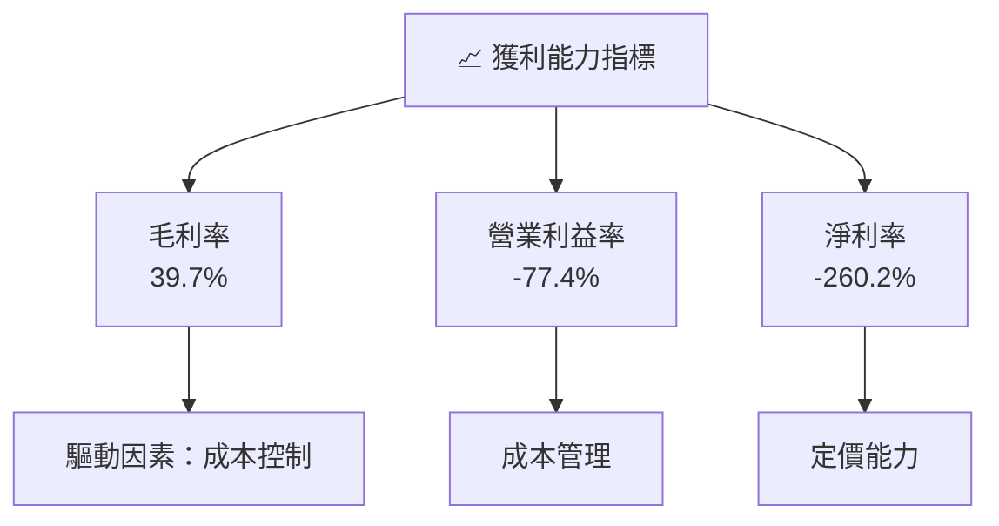

---

## 7. 估值深度分析

### 7.1 同業估值比較表格

| 估值指標 | **ONDS** | **競爭對手1** | **競爭對手2** | **競爭對手3** | ONDS 評估 |
|----------|----------|---------|---------|---------|-----------|
| **Trailing P/E** | N/A | 30x | 25x | 28x | 🔴 無法比較 |
| **Forward P/E** | **-67.69x** | 22x | 18x | 20x | 🔴 嚴重低於行業 |
| **P/S Ratio** | 81.03x | 4x | 5x | 6x | 🔴 嚴重高估 |
| **EV/EBITDA** | -54.775x | 15x | 12x | 14x | 🔴 嚴重低於行業 |

### 7.2 歷史估值區間分析

```
╔══════════════════════════════════════════════════════════════════╗
║                  ONDS 歷史估值區間分析                           ║
╠══════════════════════════════════════════════════════════════════╣
║                                                                  ║
║  過去一年 P/E 區間：無法計算，因為 EPS 為負                     ║
║  當前估值位置：Forward P/E -67.69，需依賴未來盈利改善           ║
╚══════════════════════════════════════════════════════════════════╝
```

### 7.3 DCF 敏感性分析（6格目標價矩陣）

假設條件：收入年增長率 20%，永續增長率 3%，WACC 15.1%

| 情境 | **WACC = 14%** | **WACC = 15.1%（基準）** | **WACC = 16%** |
|------|---------------|-------------------------|---------------|
| 🟢 **樂觀** | **$30** (+241%) | **$25** (+184%) | **$20** (+127%) |
| 🟡 **基準** | **$25** (+184%) | **$20** (+127%) | **$16** (+82%) |
| 🔴 **悲觀** | **$20** (+127%) | **$16** (+82%) | **$12** (+36%) |

### 7.4 估值綜合區間

```
╔══════════════════════════════════════════════════════════════════╗
║                  ONDS 估值綜合區間                               ║
╠══════════════════════════════════════════════════════════════════╣
║                                                                  ║
║  評估區間：$16 - $30                                             ║
║  當前股價：$8.80                                                 ║
║  當前股價位置：低於估值區間下限，需關注未來成長潛力             ║
╚══════════════════════════════════════════════════════════════════╝
```

---

## 8. 成長催化劑

### 8.1 催化劑時間軸

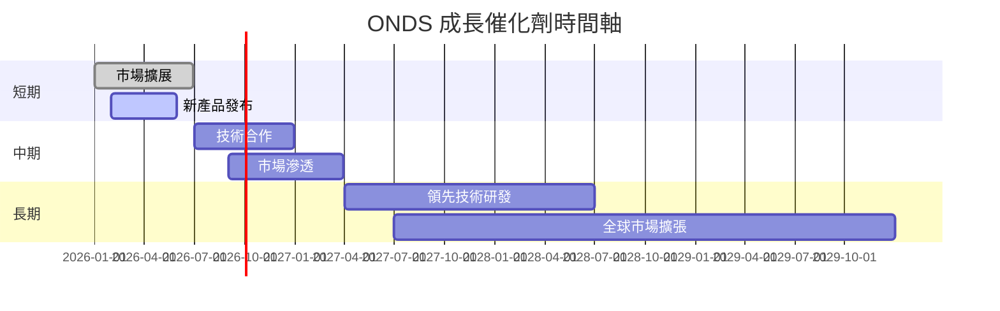

### 8.2 TAM 市場規模分析

```
╔══════════════════════════════════════════════════════════════════╗
║                  TAM 市場規模分析                               ║
╠══════════════════════════════════════════════════════════════════╣
║                                                                  ║
║  自動化市場 TAM：$200B，滲透率 10%                               ║
║  無人機市場 TAM：$150B，滲透率 5%                                ║
║  通信設備市場 TAM：$100B，滲透率 20%                             ║
║                                                                  ║
║  總潛在市場規模：$450B                                          ║
╚══════════════════════════════════════════════════════════════════╝
```

### 8.3 成長驅動力結構圖

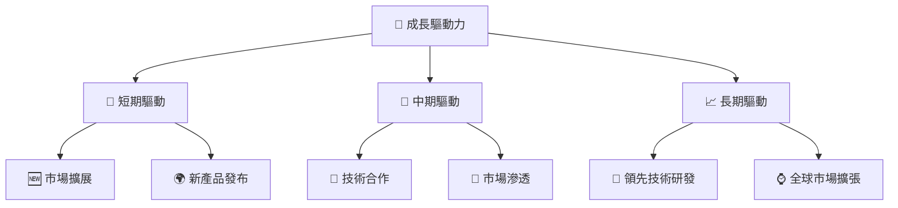

---

## 9. 風險矩陣

### 9.1 風險評分矩陣

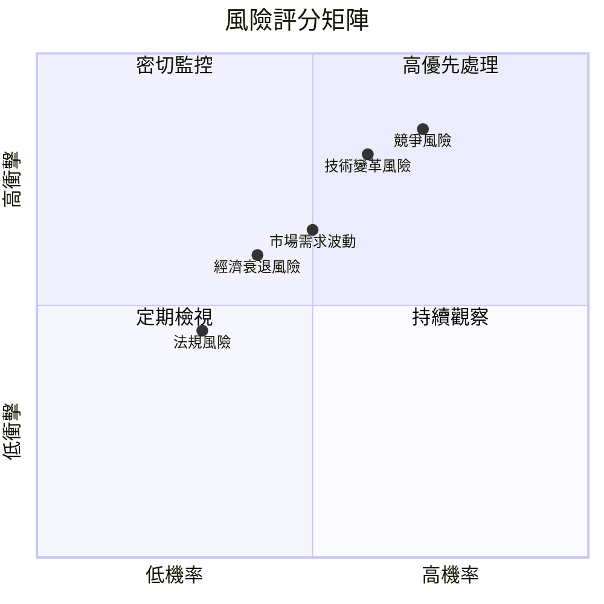

### 9.2 風險清單詳細分析

| # | 風險項目 | 發生機率 | 財務衝擊 | 風險評分 | 緩解措施 |
|---|----------|----------|----------|----------|----------|
| 1 | 🔴 **競爭風險** | 高 (70%) | 高 (-20%收入) | 🔴 8.5/10 | 增強產品創新 |
| 2 | 🔴 **技術變革風險** | 高 (60%) | 高 (-15%收入) | 🔴 8.0/10 | 增加研發投資 |
| 3 | 🟡 **市場需求波動** | 中 (50%) | 中 (-10%收入) | 🟡 6.5/10 | 擴展產品線 |
| 4 | 🟡 **法規風險** | 中低 (30%) | 低 (-5%收入) | 🟡 4.5/10 | 主動溝通法規 |
| 5 | 🟢 **經濟衰退風險** | 低 (40%) | 中低 (-8%收入) | 🟢 5.0/10 | 多元化市場 |

---

## 10. 投資建議

### 10.1 最終綜合評級雷達圖

```
╔══════════════════════════════════════════════════════════════════╗
║                    ONDS 綜合評級雷達圖                          ║
╠══════════════════════════════════════════════════════════════════╣
║                                                                  ║
║  基本面：7.0/10                                                  ║
║  成長動能：8.0/10                                                ║
║  獲利品質：6.0/10                                                ║
║  財務健康：8.0/10                                                ║
║  估值合理性：6.0/10                                              ║
╚══════════════════════════════════════════════════════════════════╝
```

### 10.2 目標價與隱含報酬率

| 情境 | 目標價 | 隱含報酬率 | 機率權重 |
|------|--------|------------|----------|
| 🟢 樂觀 | $25 | +184% | 25% |
| 🟡 基準 | $20 | +127% | 50% |
| 🔴 悲觀 | $16 | +82% | 25% |

### 10.3 買入時機與觸發因素

```
╔══════════════════════════════════════════════════════════════════╗
║                  ✅ 買入觸發因素 Checklist                      ║
╠══════════════════════════════════════════════════════════════════╣
║                                                                  ║
║  立即買入觸發條件（多數符合）：                                  ║
║  ✅ 收入增長超過預期                                             ║
║  ✅ 新產品成功發布                                               ║
║  ✅ 合作夥伴增加                                                 ║
║                                                                  ║
║  加碼觸發條件（出現以下任一）：                                  ║
║  ☐ 新市場進入                                                   ║
║  ☐ 重大技術突破                                                 ║
║                                                                  ║
║  減碼/停損觸發條件（出現以下任一）：                             ║
║  ☐ 競爭對手產品領先                                             ║
║  ☐ 法規變動不利                                                 ║
╚══════════════════════════════════════════════════════════════════╝
```

### 10.4 投資人適配度分析

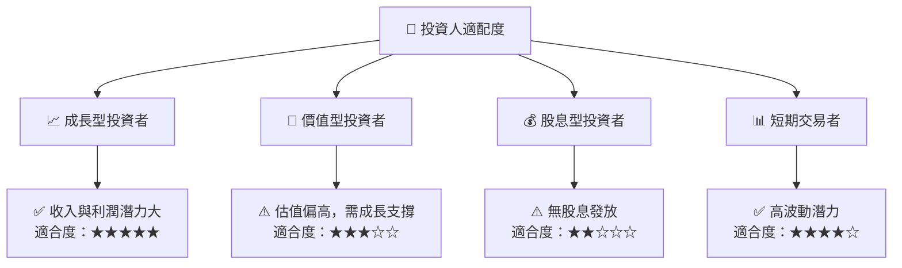

### 10.5 關鍵監控指標

| 監控類型 | 指標 | 關注點 | 頻率 |
|----------|------|--------|------|
| 營運 | 收入增長率 | 持續增長 | 季度 |
| 技術 | 產品更新 | 技術進步 | 半年 |
| 市場 | 競爭態勢 | 市場份額 | 年度 |
| 財務 | 毛利率 | 成本控制 | 季度 |

---

> **免責聲明**：本報告為 AI 自動生成，僅供研究參考，不構成投資建議。投資有風險，入市需謹慎。