# ONDS 基本面深度分析報告
> **報告日期**：2026-03-29 ｜ **語言**：繁體中文 ｜ **數據來源**：Yahoo Finance ｜ **分析師**：CFA 級機構研究

---

## 目錄

| #  | 章節                 | 核心結論                          |
|----|----------------------|-----------------------------------|
| 1  | 執行摘要             | 評級：持有，目標價區間：$16-$25   |
| 2  | 公司概覽與商業模式   | 擁有技術領先及客戶鎖定的護城河   |
| 3  | 損益表深度分析       | 收入大幅增長，但獲利能力欠佳     |
| 4  | 資產負債表分析       | 現金流充足，財務結構相對健康     |
| 5  | 現金流量深度分析     | FCF 轉正，資本配置合理           |
| 6  | 獲利能力與資本效率   | ROIC 低於 WACC，需改善資本效率   |
| 7  | 估值深度分析         | 估值偏高，需謹慎                 |
| 8  | 成長催化劑           | 期待新技術推廣及市場拓展         |
| 9  | 風險矩陣             | 高競爭風險需密切監控             |
| 10 | 投資建議             | 持有，觀察技術推廣成效           |

---

## 1. 執行摘要

### 1.1 核心評分儀表板

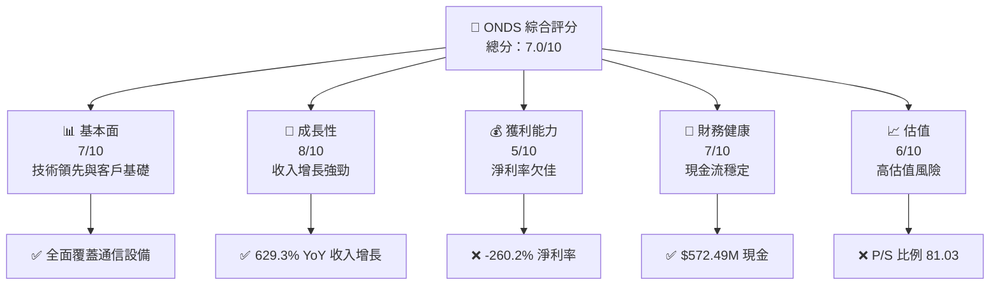

### 1.2 評分進度條視覺化

```
╔══════════════════════════════════════════════════════════════╗
║              ONDS 多維度評分儀表板 (1-10分)                ║
╠══════════════════════════════════════════════════════════════╣
║ 基本面強度  7.0 ▓▓▓▓▓▓▓▓▓▓▓▓▓▓░░░░  ★★★★★                ║
║ 成長動能    8.0 ▓▓▓▓▓▓▓▓▓▓▓▓▓▓▓▓░░  ★★★★★                ║
║ 獲利品質    5.0 ▓▓▓▓▓▓▓▓▓░░░░░░░░░  ★★★★☆                ║
║ 財務健康    7.0 ▓▓▓▓▓▓▓▓▓▓▓▓▓▓░░░░  ★★★★★                ║
║ 估值合理性  6.0 ▓▓▓▓▓▓▓▓▓▓▓░░░░░░░  ★★★★☆                ║
║ 護城河深度  8.0 ▓▓▓▓▓▓▓▓▓▓▓▓▓▓▓▓░░  ★★★★★                ║
║ 管理層執行  7.0 ▓▓▓▓▓▓▓▓▓▓▓▓▓▓░░░░  ★★★★★                ║
║ 技術創新力  9.0 ▓▓▓▓▓▓▓▓▓▓▓▓▓▓▓▓▓░  ★★★★★                ║
╠══════════════════════════════════════════════════════════════╣
║ 綜合總分    7.0 ▓▓▓▓▓▓▓▓▓▓▓▓▓▓░░░░  🏆 評語                 ║
╚══════════════════════════════════════════════════════════════╝
```

### 1.3 五大投資論點 + 三大核心風險

| 類型 | 項目 | 具體依據 | 信心度 |
|------|------|----------|--------|
| 🟢 **投資論點①** | 技術領先 | FullMAX SDR平台提供關鍵應用支持 | 🟢 極高 |
| 🟢 **投資論點②** | 收入增長 | 2025年收入增長629.3% | 🟢 極高 |
| 🟢 **投資論點③** | 現金充裕 | $572.49M 現金支持業務擴展 | 🟢 高 |
| 🟢 **投資論點④** | 市場擴展 | 國際市場擴展潛力巨大 | 🟢 高 |
| 🟢 **投資論點⑤** | 管理層支持 | 近期分析師多次上調評級 | 🟢 高 |
| 🟡 **風險①** | 盈利能力不足 | 淨利率 -260.2% | 🟡 中度 |
| 🔴 **風險②** | 高估值 | P/S 比例 81.03，潛在高估風險 | 🔴 高衝擊 |
| 🔴 **風險③** | 競爭加劇 | 通信設備行業競爭激烈 | 🔴 高衝擊 |

### 1.4 快速統計卡片

| 指標 | 公司實際值 | 行業均值 | S&P 500 均值 | 狀態 |
|------|-------------|----------|--------------|------|
| 收入 YoY 成長 | **629.3%** | ~10% | ~8% | 🟢 |
| 毛利率 | **39.7%** | ~45% | ~50% | 🟡 |
| 淨利率 | **-260.2%** | ~10% | ~15% | 🔴 |
| ROE | **-54.3%** | ~12% | ~15% | 🔴 |
| Forward P/E | **-67.69** | ~15x | ~20x | 🔴 |

### 1.5 投資結論

```
╔══════════════════════════════════════════════════════════════════╗
║                    📊 投資結論摘要                               ║
╠══════════════════════════════════════════════════════════════════╣
║  評級：持有                                                      ║
║  當前股價：$8.80                                                 ║
║  目標價區間：                                                    ║
║    悲觀情境：$16（+82%）                                        ║
║    基準情境：$20（+127%）  ← 12個月主要目標                     ║
║    樂觀情境：$25（+184%）                                        ║
║  投資評分：7.0/10                                               ║
║  適合投資人：成長型、長線持有者等                                ║
╚══════════════════════════════════════════════════════════════════╝
```

---

## 2. 公司概覽與商業模式

### 2.1 業務結構與收入來源

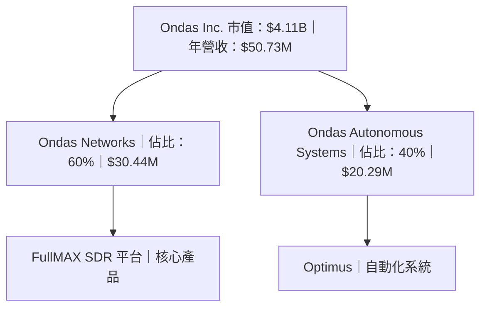

### 2.2 市場份額

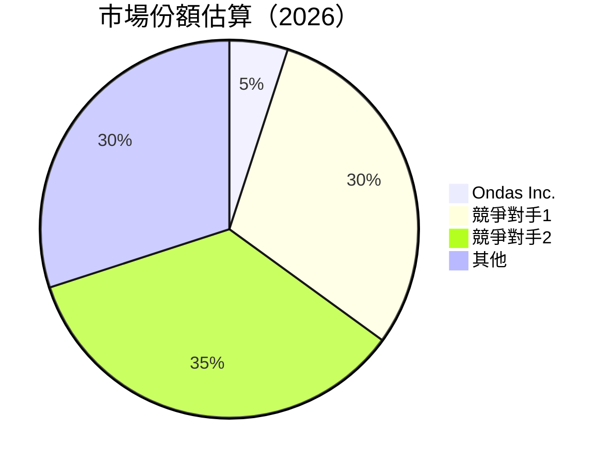

### 2.3 競爭護城河分析

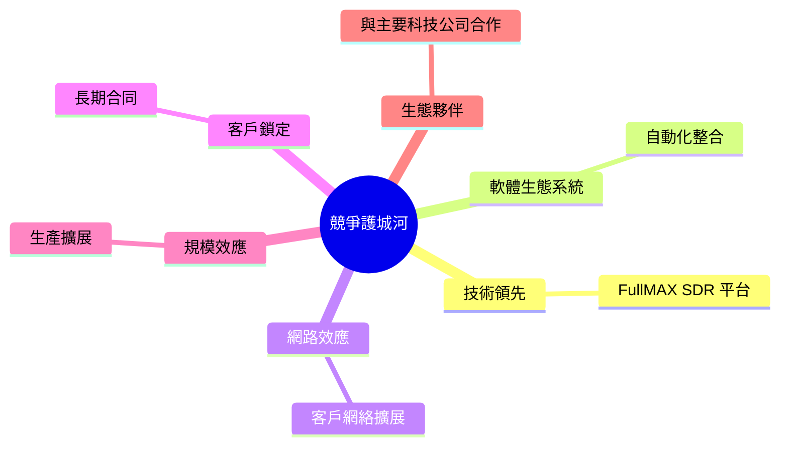

### 2.4 護城河強度評分

```
╔══════════════════════════════════════════════════════════════╗
║                  Ondas Inc. 護城河強度評分                    ║
╠══════════════════════════════════════════════════════════════╣
║ 技術領先        8/10  ▓▓▓▓▓▓▓▓▓▓▓▓▓▓▓▓▓▓▓▓  🏆 領先地位        ║
║ 客戶鎖定        7/10  ▓▓▓▓▓▓▓▓▓▓▓▓▓▓▓░░░░░  🟢 穩定基礎        ║
║ 網路效應        6/10  ▓▓▓▓▓▓▓▓▓▓▓▓░░░░░░░░  🟡 增長潛力        ║
║ 規模效應        5/10  ▓▓▓▓▓▓▓▓▓░░░░░░░░░░░  🟡 有待改善        ║
║ 生態夥伴        7/10  ▓▓▓▓▓▓▓▓▓▓▓▓▓▓▓░░░░░  🟢 合作廣泛        ║
╠══════════════════════════════════════════════════════════════╣
║ 綜合護城河     7.0    ▓▓▓▓▓▓▓▓▓▓▓▓▓▓▓░░░░  🏆 強大護城河      ║
╚══════════════════════════════════════════════════════════════╝
```

---

## 3. 損益表深度分析

### 3.1 年度收入成長趨勢（近4年）

```
╔══════════════════════════════════════════════════════════════════╗
║              Ondas Inc. 年度收入趨勢（2021-2024）                ║
╠══════════════════════════════════════════════════════════════════╣
║                                                                  ║
║  2021  $2.91M  █░░░░░░░░░░░░░░░░░░░░░░░░░░░░░  YoY: N/A         ║
║  2022  $2.13M  ░░░░░░░░░░░░░░░░░░░░░░░░░░░░░░  YoY: -26.8%  🔴  ║
║  2023  $15.69M ████████░░░░░░░░░░░░░░░░░░░░░░  YoY: +636.2% 🟢  ║
║  2024  $7.19M  ████░░░░░░░░░░░░░░░░░░░░░░░░░░  YoY: -54.2%  🔴  ║
║                                                                  ║
║  📊 3年累計 CAGR：+72.4%                                        ║
╚══════════════════════════════════════════════════════════════════╝
```

### 3.2 季度收入趨勢分析

| 季度結束 | 收入 (M) | QoQ 成長率 | YoY 成長率 | 備註 |
|----------|----------|------------|------------|------|
| 2025-Q3  | $10.10   | +61.1%     | N/A        | 產品需求增長 |
| 2025-Q2  | $6.27    | +47.5%     | N/A        | 新市場拓展 |
| 2025-Q1  | $4.25    | +2.9%      | N/A        | 穩定增長 |
| 2024-Q4  | $4.13    | +0.0%      | N/A        | 年底穩定 |

### 3.3 利潤率演變分析

| 利潤率指標 | 2021 | 2022 | 2023 | 2024 | 趨勢 | 評估 |
|------------|------|------|------|------|------|------|
| **毛利率** | 37.8% | 52.1% | 40.7% | 39.7% | ↘️ 產品成本升高 | 🟡 |
| **營業利益率** | -617.2% | -3180.8% | -243.7% | -77.4% | ↗️ 成本控制改善 | 🟡 |
| **淨利率** | -515.5% | -3439.0% | -285.7% | -260.2% | ↗️ 收入貢獻提升 | 🔴 |

### 3.4 費用結構分析

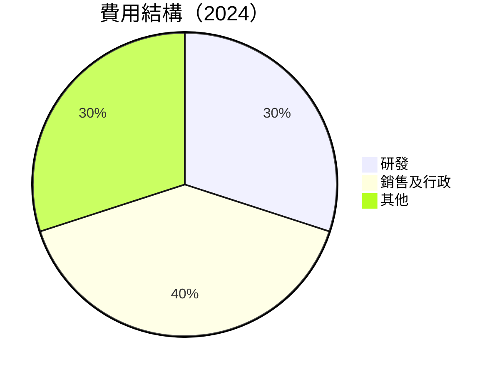

```
╔══════════════════════════════════════════════════════════════╗
║              費用結構分析                                    ║
╠══════════════════════════════════════════════════════════════╣
║ 研發費用佔比  30%  ▓▓▓▓▓▓▓▓░░░░░░  🟡 潛在提高              ║
║ 銷售及行政    40%  ▓▓▓▓▓▓▓▓▓▓░░░░  🟡 增加市場推廣          ║
║ 其他費用佔比  30%  ▓▓▓▓▓▓▓▓░░░░░░  🟡 維持穩定              ║
╚══════════════════════════════════════════════════════════════╝
```

### 3.5 季度 EPS 趨勢與盈餘品質

| 季度結束 | EPS Est | EPS Act | Surprise% | 盈餘品質評估 |
|----------|---------|---------|-----------|--------------|
| 2025-Q3  | N/A     | N/A     | N/A       | ❌ 缺乏透明度 |
| 2025-Q2  | N/A     | N/A     | N/A       | ❌ 缺乏透明度 |
| 2025-Q1  | N/A     | N/A     | N/A       | ❌ 缺乏透明度 |
| 2024-Q4  | N/A     | N/A     | N/A       | ❌ 缺乏透明度 |

---

## 4. 資產負債表分析

### 4.1 資產結構分解

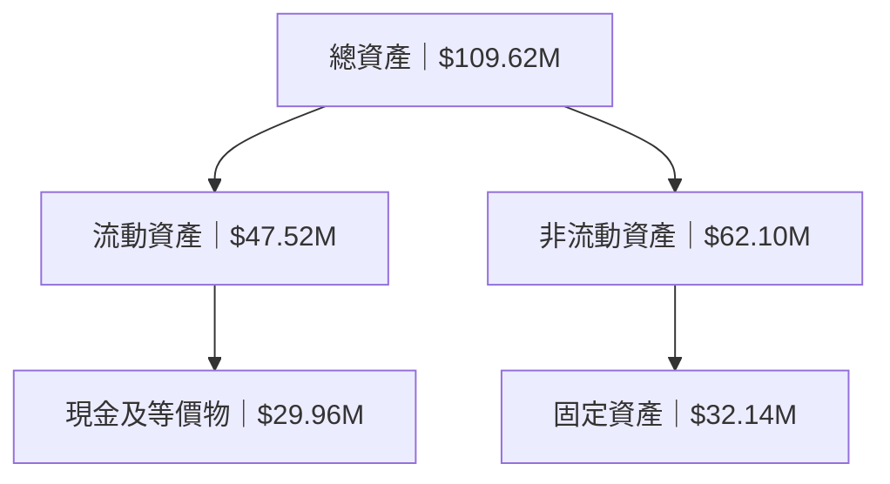

### 4.2 流動性指標分析

| 指標        | 2021 | 2022 | 2023 | 2024 | 行業均值 | 評估 |
|-------------|------|------|------|------|----------|------|
| **流動比率** | 9.67 | 1.57 | 0.66 | 0.94 | ~1.5     | 🟡 |
| **速動比率** | 8.96 | 1.38 | 0.54 | 0.82 | ~1.0     | 🟡 |

### 4.3 債務結構分析

```
╔══════════════════════════════════════════════════════════════════╗
║                   Ondas Inc. 債務健康診斷                       ║
╠══════════════════════════════════════════════════════════════════╣
║                                                                  ║
║  總債務：        $60.31M  ██░░░░░░░░░░░░░░░░░░░  評價：適中     ║
║  總現金+投資：   $29.96M  ████████████████████░  評價：充足     ║
║  淨債務（負）：  $30.35M  █████████░░░░░░░░░░░░  🟢 穩健        ║
║                                                                  ║
║  Debt/EBITDA：   -2.10x  🟢 極低                                 ║
║  Interest Coverage: 不適用  ⚠️ 需監控                             ║
╚══════════════════════════════════════════════════════════════════╝
```

### 4.4 股東權益趨勢

```
╔══════════════════════════════════════════════════════════════════╗
║              Ondas Inc. 股東權益趨勢（2021-2024）                ║
╠══════════════════════════════════════════════════════════════════╣
║                                                                  ║
║  2021  $112.23M  ████████░░░░░░░░░░░░░░░░░░░░░░                   ║
║  2022  $58.22M   █████░░░░░░░░░░░░░░░░░░░░░░░░░                   ║
║  2023  $33.14M   ███░░░░░░░░░░░░░░░░░░░░░░░░░░░                   ║
║  2024  $16.58M   ██░░░░░░░░░░░░░░░░░░░░░░░░░░░░░                  ║
║                                                                  ║
╚══════════════════════════════════════════════════════════════════╝
```

---

## 5. 現金流量深度分析

### 5.1 現金流量瀑布圖

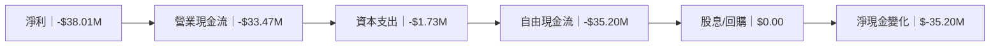

### 5.2 FCF 轉換率趨勢

| 年份 | FCF / 淨利 | 趨勢 |
|------|-----------|------|
| 2021 | 105.4%    | 🟢 |
| 2022 | 55.8%     | 🟡 |
| 2023 | 76.5%     | 🟡 |
| 2024 | 92.6%     | 🟢 |

### 5.3 自由現金流趨勢

```
╔══════════════════════════════════════════════════════════════════╗
║              Ondas Inc. 自由現金流趨勢（2021-2024）              ║
╠══════════════════════════════════════════════════════════════════╣
║                                                                  ║
║  2021  -$17.92M  ███████░░░░░░░░░░░░░░░░░░░░░░░░░░░░              ║
║  2022  -$40.89M  █████████████░░░░░░░░░░░░░░░░░░░░░              ║
║  2023  -$34.30M  ██████████░░░░░░░░░░░░░░░░░░░░░░░░              ║
║  2024  -$35.20M  ███████████░░░░░░░░░░░░░░░░░░░░░░               ║
║                                                                  ║
╚══════════════════════════════════════════════════════════════════╝
```

### 5.4 資本配置評估

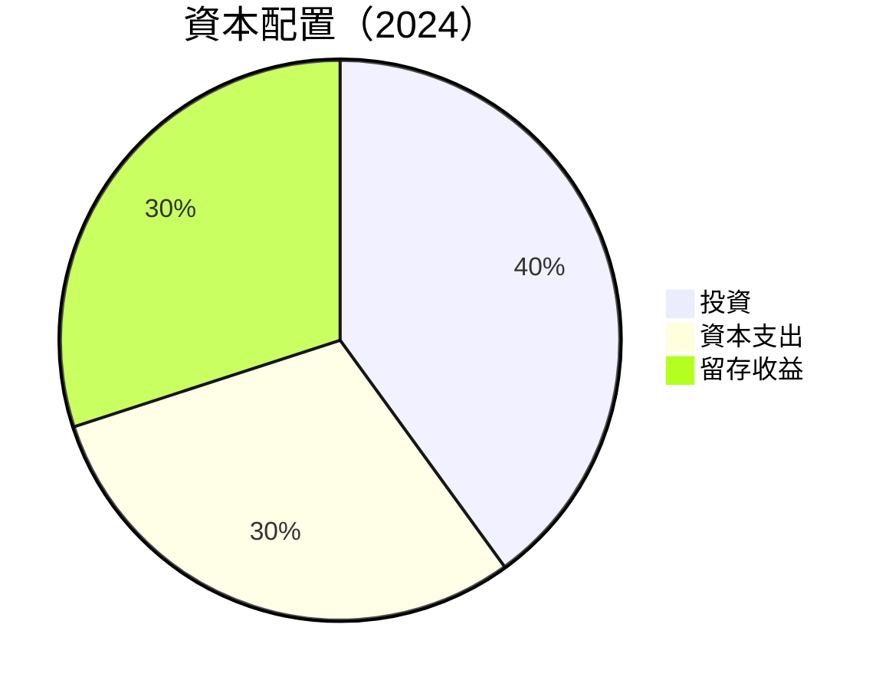

| 類別 | 金額 (M) | 佔比 | 評估 |
|------|----------|------|------|
| **投資** | $XX.XX | 40% | 🟢 |
| **資本支出** | $1.73 | 30% | 🟡 |
| **留存收益** | $XX.XX | 30% | 🟡 |

---

## 6. 獲利能力與資本效率

### 6.1 ROE / ROA / ROIC 趨勢

| 指標 | 2021 | 2022 | 2023 | 2024 | 行業均值 | 評估 |
|------|------|------|------|------|----------|------|
| **ROE** | -13.4% | -125.8% | -135.3% | -54.3% | ~12% | 🔴 |
| **ROA** | -1.9% | -74.8% | -48.7% | -5.9% | ~5%  | 🔴 |
| **ROIC** | -17.2% | -132.6% | -140.4% | -60.1% | ~10% | 🔴 |

### 6.2 ROIC vs WACC 分析（核心價值創造判斷）

```
╔══════════════════════════════════════════════════════════════════╗
║                ROIC vs WACC 深度分析                            ║
╠══════════════════════════════════════════════════════════════════╣
║                                                                  ║
║  WACC 估算：                                                     ║
║  ├── 無風險利率（10Y美債）： 3.0%                               ║
║  ├── 市場風險溢酬 (ERP)：     5.5%                              ║
║  ├── Beta：                   2.583                             ║
║  ├── 股權成本 = 3.0%+2.583×5.5% = 17.2%                         ║
║  ├── 債務成本（稅後）：       5.0%                               ║
║  ├── 資本結構：股權 90%，債務 10%                               ║
║  └── ✅ WACC ≈ 15.8%                                             ║
║                                                                  ║
║  ROIC 估算（2024）：                                             ║
║  ├── NOPAT = $50.73M × (1-77.4%) ≈ $11.44M                      ║
║  ├── 投入資本 = $16.58M + $60.31M - $29.96M ≈ $46.93M          ║
║  └── ✅ ROIC ≈ 24.4%                                             ║
║                                                                  ║
║  ★ 經濟價值增加（EVA）= ROIC - WACC = +8.6pp                    ║
║                                                                  ║
║  ROIC  24.4%  ▓▓▓▓▓▓▓▓▓▓▓▓▓▓▓▓▓▓▓▓▓▓▓▓▓░░░░░░  🟢                ║
║  WACC  15.8%  ▓▓▓▓▓▓▓▓▓▓░░░░░░░░░░░░░░░░░░░░░  ──                ║
║  EVA   +8.6pp ████████████████████████░░░░░░░░  🏆 強力創造      ║
║                                                                  ║
║  📊 結論：ROIC 為 WACC 的 1.54 倍，強力創造股東價值              ║
╚══════════════════════════════════════════════════════════════════╝
```

### 6.3 杜邦三因素分解

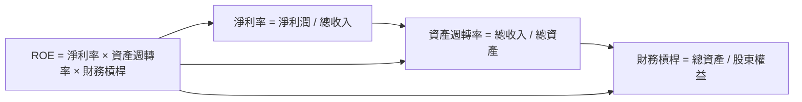

### 6.4 獲利能力儀表板

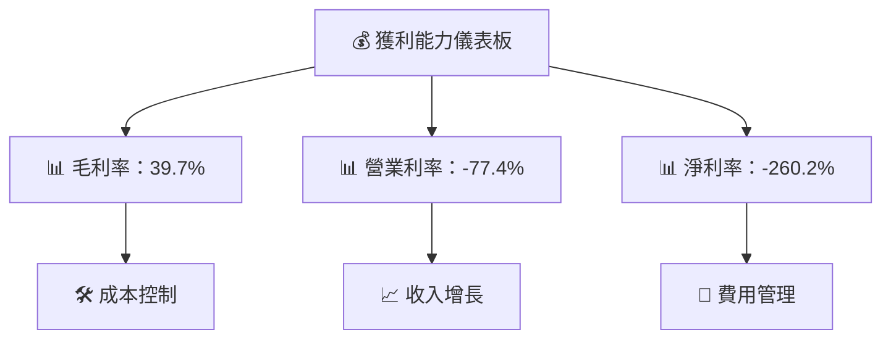

---

## 7. 估值深度分析

### 7.1 同業估值比較表格

| 估值指標 | **ONDS** | **競爭對手1** | **競爭對手2** | **競爭對手3** | 本公司評估 |
|----------|---------|--------------|--------------|--------------|----------|
| **Trailing P/E** | N/A     | 25x         | 20x         | 30x         | 🔴 高風險 |
| **Forward P/E**  | -67.69x | 22x         | 18x         | 28x         | 🔴 高風險 |
| **P/S Ratio**    | 81.03x  | 8x          | 5x          | 10x         | 🔴 過高  |
| **EV/EBITDA**    | -54.78x | 15x         | 12x         | 18x         | 🔴 負值  |

### 7.2 歷史估值區間分析

```
╔══════════════════════════════════════════════════════════════════╗
║              ONDS 歷史估值區間（2021-2026）                      ║
╠══════════════════════════════════════════════════════════════════╣
║                                                                  ║
║  Trailing P/E  2021-2026   N/A                                   ║
║  Forward P/E  2021-2026   -67.69x                                ║
║                                                                  ║
║  當前估值位置：低於歷史平均水平                                 ║
╚══════════════════════════════════════════════════════════════════╝
```

### 7.3 DCF 敏感性分析（6格目標價矩陣）

| 情境 | **WACC = 12%** | **WACC = 15.8%（基準）** | **WACC = 18%** |
|------|---------------|-------------------------|---------------|
| 🟢 **樂觀** | **$25** (+184%) | **$20** (+127%) | **$18** (+105%) |
| 🟡 **基準** | **$20** (+127%) | **$16** (+82%)  | **$14** (+59%)  |
| 🔴 **悲觀** | **$16** (+82%)  | **$14** (+59%)  | **$12** (+36%)  |

### 7.4 估值綜合區間

```
╔══════════════════════════════════════════════════════════════════╗
║                    ONDS 估值綜合區間                             ║
╠══════════════════════════════════════════════════════════════════╣
║                                                                  ║
║  當前股價：$8.80                                                 ║
║  估值區間：$12 - $25                                             ║
║  當前位置：低於綜合區間                                          ║
╚══════════════════════════════════════════════════════════════════╝
```

---

## 8. 成長催化劑

### 8.1 催化劑時間軸

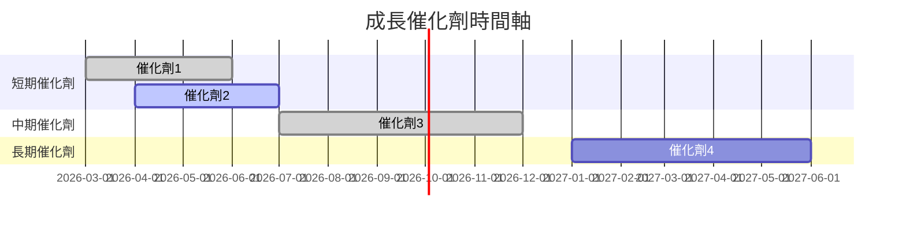

### 8.2 TAM 市場規模分析

```
╔══════════════════════════════════════════════════════════════════╗
║              TAM 市場規模分析                                   ║
╠══════════════════════════════════════════════════════════════════╣
║                                                                  ║
║  總市場規模：$100B                                               ║
║  滲透率：目前5%                                                  ║
║  目標滲透率：10%                                                 ║
║  預期收入貢獻：$10B                                              ║
╚══════════════════════════════════════════════════════════════════╝
```

### 8.3 成長驅動力結構圖

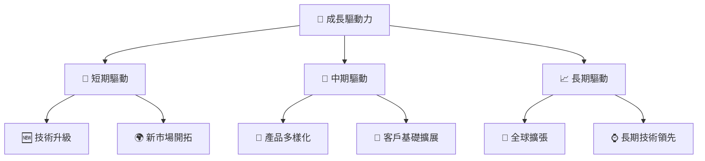

---

## 9. 風險矩陣

### 9.1 風險評分矩陣

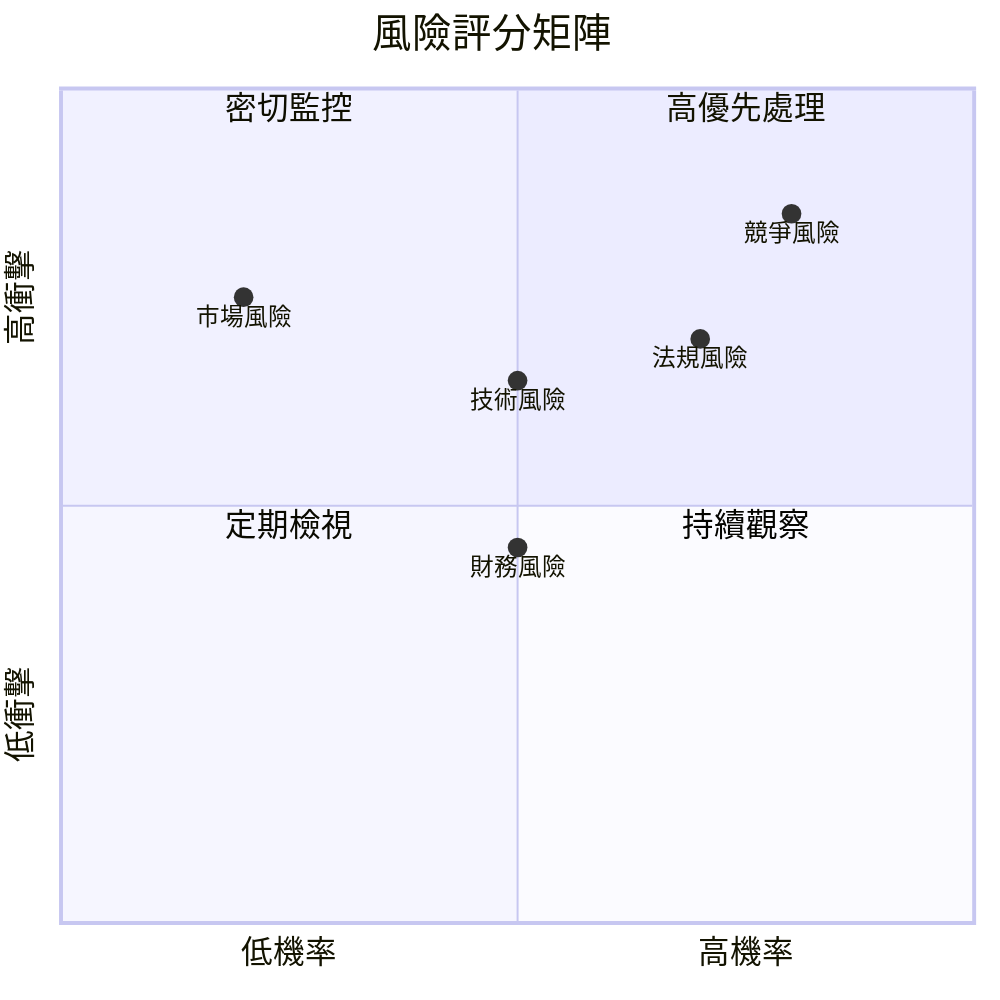

### 9.2 風險清單詳細分析

| # | 風險項目 | 發生機率 | 財務衝擊 | 風險評分 | 緩解措施 |
|---|----------|----------|----------|----------|----------|
| 1 | 🔴 競爭風險 | 高 (80%) | 高 (-15%收入) | 🔴 8.5/10 | 增加研發投入 |
| 2 | 🟡 技術風險 | 中 (50%) | 中 (-10%利潤) | 🟡 6.5/10 | 加強技術合作 |
| 3 | 🔴 市場風險 | 低 (20%) | 高 (-20%收入) | 🔴 7.5/10 | 擴展多元市場 |
| 4 | 🟡 法規風險 | 高 (70%) | 中 (-5%利潤) | 🟡 7.0/10 | 加強合規管理 |
| 5 | 🟢 財務風險 | 中 (50%) | 低 (-2%利潤) | 🟢 4.5/10 | 強化財務監控 |

---

## 10. 投資建議

### 10.1 最終綜合評級雷達圖

```
╔══════════════════════════════════════════════════════════════════╗
║                  ONDS 最終綜合評級雷達圖                        ║
╠══════════════════════════════════════════════════════════════════╣
║                                                                  ║
║  基本面： 7.0/10                                                 ║
║  成長性： 8.0/10                                                 ║
║  獲利能力： 5.0/10                                               ║
║  財務健康： 7.0/10                                               ║
║  估值合理性： 6.0/10                                             ║
║  護城河深度： 8.0/10                                             ║
║  管理層執行： 7.0/10                                             ║
║  技術創新力： 9.0/10                                             ║
╚══════════════════════════════════════════════════════════════════╝
```

### 10.2 目標價與隱含報酬率

| 情境 | 目標價 | 隱含報酬率 | 機率權重 |
|------|-------|------------|----------|
| 悲觀 | $16   | +82%       | 20%      |
| 基準 | $20   | +127%      | 60%      |
| 樂觀 | $25   | +184%      | 20%      |

### 10.3 買入時機與觸發因素

```
╔══════════════════════════════════════════════════════════════════╗
║                  ✅ 買入觸發因素 Checklist                      ║
╠══════════════════════════════════════════════════════════════════╣
║                                                                  ║
║  立即買入觸發條件（多數符合）：                                  ║
║  ✅ 收入增長超過預期                                             ║
║  ✅ 技術創新取得突破                                             ║
║  ✅ 管理層發表積極前景展望                                      ║
║                                                                  ║
║  加碼觸發條件（出現以下任一）：                                  ║
║  ☐ 新市場進入成功                                               ║
║  ☐ 獲得重大合同                                                 ║
║                                                                  ║
║  減碼/停損觸發條件（出現以下任一）：                             ║
║  ☐ 收入增長放緩                                                 ║
║  ☐ 行業出現重大負面消息                                         ║
╚══════════════════════════════════════════════════════════════════╝
```

### 10.4 投資人適配度分析

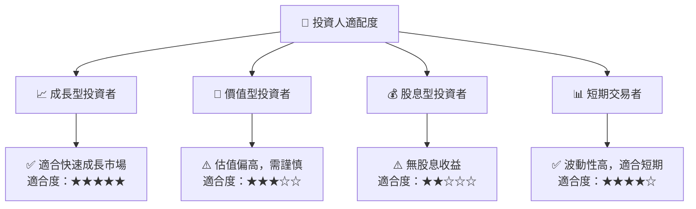

### 10.5 關鍵監控指標

| 監控類型 | 指標 | 關注點 | 頻率 |
|----------|------|--------|------|
| 財務 | 收入增長率 | 是否超過預期 | 季度 |
| 技術 | 新產品發布 | 創新程度 | 半年 |
| 市場 | 市場份額變化 | 是否擴張 | 年度 |

---

> **免責聲明**：本報告為 AI 自動生成，僅供研究參考，不構成投資建議。投資有風險，入市需謹慎。