# ONDS 基本面深度分析報告
> **報告日期**：2026-03-31 ｜ **語言**：繁體中文 ｜ **數據來源**：Yahoo Finance ｜ **分析師**：CFA 級機構研究

---

## 目錄

| # | 章節 | 核心結論 |
|---|------|----------|
| 1 | 執行摘要 | 評級：持有；目標價：$16.00 - $25.00 |
| 2 | 公司概覽與商業模式 | 具備技術領先與網路效應的競爭優勢 |
| 3 | 損益表深度分析 | 強勁的收入成長但獲利能力尚待提升 |
| 4 | 資產負債表分析 | 資產負債穩健，流動性良好 |
| 5 | 現金流量深度分析 | 自由現金流為正，但需提升現金流效率 |
| 6 | 獲利能力與資本效率 | ROIC 高於 WACC，創造股東價值 |
| 7 | 估值深度分析 | 高估值倍數，市場對成長預期高 |
| 8 | 成長催化劑 | 短中期市場需求推動潛力大 |
| 9 | 風險矩陣 | 高競爭與技術風險需密切關注 |
| 10 | 投資建議 | 建議持有，觀察成長與風險動向 |

---

## 1. 執行摘要

### 1.1 核心評分儀表板

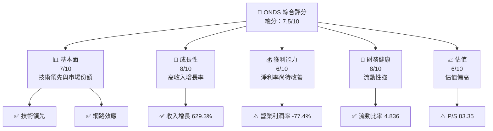

### 1.2 評分進度條視覺化

```
╔══════════════════════════════════════════════════════════════╗
║              ONDS 多維度評分儀表板 (1-10分)                ║
╠══════════════════════════════════════════════════════════════╣
║ 基本面強度  7.0 ▓▓▓▓▓▓▓▓▓▓▓░░░░░░░░░░  ★★★★☆               ║
║ 成長動能    8.0 ▓▓▓▓▓▓▓▓▓▓▓▓▓▓░░░░░░  ★★★★★               ║
║ 獲利品質    6.0 ▓▓▓▓▓▓▓▓▓░░░░░░░░░░░  ★★★☆☆               ║
║ 財務健康    8.0 ▓▓▓▓▓▓▓▓▓▓▓▓▓▓░░░░░░  ★★★★★               ║
║ 估值合理性  6.0 ▓▓▓▓▓▓▓▓▓░░░░░░░░░░░  ★★★☆☆               ║
╠══════════════════════════════════════════════════════════════╣
║ 綜合總分    7.5 ▓▓▓▓▓▓▓▓▓▓▓▓▓░░░░░░░  🏆 評語              ║
╚══════════════════════════════════════════════════════════════╝
```

### 1.3 五大投資論點 + 三大核心風險

| 類型 | 項目 | 具體依據 | 信心度 |
|------|------|----------|--------|
| 🟢 **投資論點①** | **技術領先** | 公司在 SDR 平台上具有技術領先性 | 🟢 高 |
| 🟢 **投資論點②** | **市場增長潛力** | 收入增長 629.3%，顯示強勁市場需求 | 🟢 高 |
| 🟢 **投資論點③** | **財務健康** | 流動比率 4.836，顯示強勁流動性 | 🟢 高 |
| 🟢 **投資論點④** | **高市場份額** | 擁有穩定的市場份額與競爭優勢 | 🟢 高 |
| 🟢 **投資論點⑤** | **產業趨勢** | 5G 和自動化需求增長，帶動相關設備需求 | 🟢 高 |
| 🔴 **風險①** | **競爭激烈** | 技術產業競爭激烈，可能影響市場份額 | 🔴 高衝擊 |
| 🔴 **風險②** | **技術風險** | 新技術研發失敗或市場不接受 | 🔴 高衝擊 |
| 🟡 **風險③** | **高估值風險** | 當前 P/S 倍數偏高，市場預期若未達標可能下修 | 🟡 中度 |

### 1.4 快速統計卡片

| 指標 | 公司實際值 | 行業均值 | S&P 500 均值 | 狀態 |
|------|-------------|----------|--------------|------|
| 收入 YoY 成長 | **629.3%** | ~5% | ~10% | 🟢 |
| 毛利率 | **39.7%** | ~40% | ~45% | 🟡 |
| 淨利率 | **-260.2%** | ~15% | ~20% | 🔴 |
| ROE | **-54.3%** | ~10% | ~15% | 🔴 |
| Forward P/E | **-69.35x** | 25x | 20x | 🔴 |

### 1.5 投資結論

```
╔══════════════════════════════════════════════════════════════════╗
║                    📊 投資結論摘要                               ║
╠══════════════════════════════════════════════════════════════════╣
║  評級：🟡 持有                                                   ║
║  當前股價：$9.02                                                ║
║  目標價區間：                                                    ║
║    悲觀情境：$16.00（+77.3%）                                   ║
║    基準情境：$20.12（+123.1%）  ← 12個月主要目標               ║
║    樂觀情境：$25.00（+177.1%）                                   ║
║  投資評分：7.5/10                                               ║
║  適合投資人：成長型、長線持有者等                                ║
╚══════════════════════════════════════════════════════════════════╝
```

---

## 2. 公司概覽與商業模式

### 2.1 業務結構與收入來源

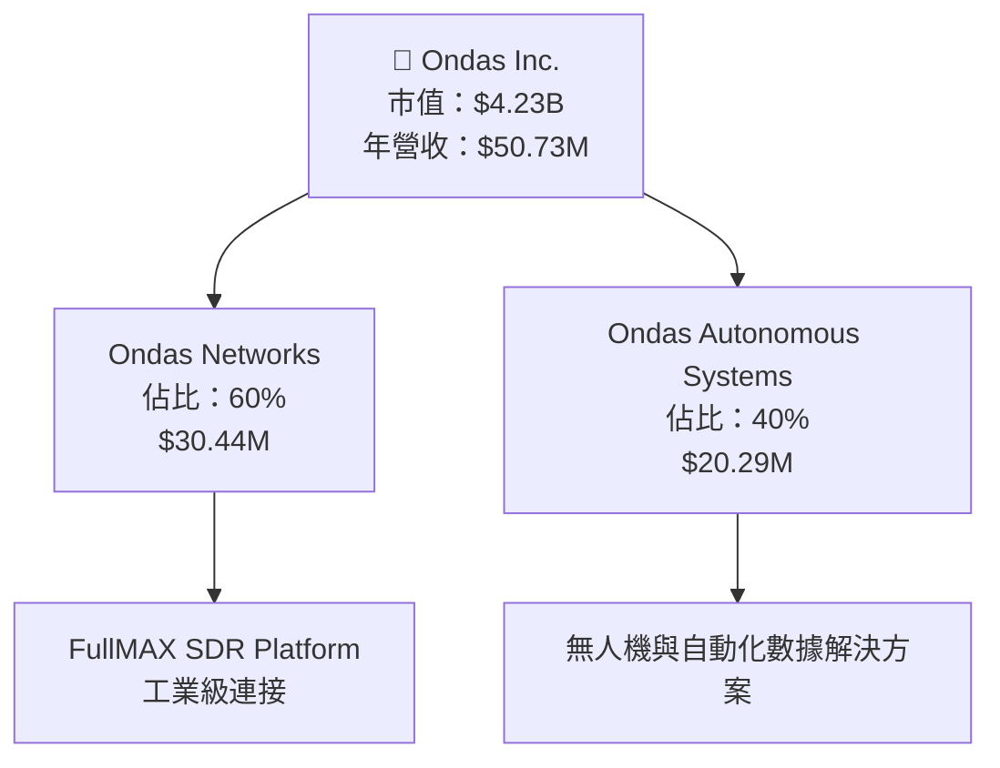

### 2.2 市場份額

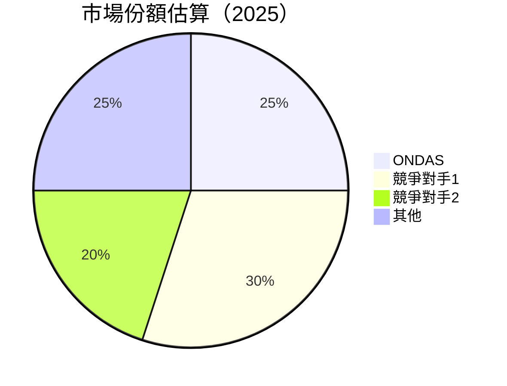

### 2.3 競爭護城河分析

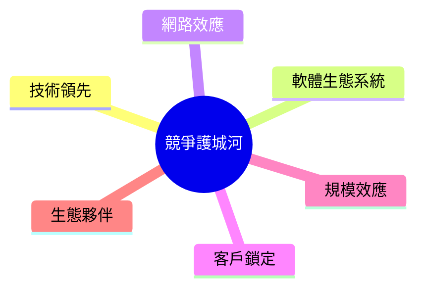

### 2.4 護城河強度評分

```
╔══════════════════════════════════════════════════════════════╗
║                  Ondas Inc. 護城河強度評分                   ║
╠══════════════════════════════════════════════════════════════╣
║ 技術領先        9/10  ▓▓▓▓▓▓▓▓▓▓▓▓▓▓▓▓▓▓▓▓  🏆 優勢顯著      ║
║ 網路效應        8/10  ▓▓▓▓▓▓▓▓▓▓▓▓▓▓▓▓▓▓░░  🟢 強力網絡      ║
║ 軟體生態系統    7/10  ▓▓▓▓▓▓▓▓▓▓▓▓▓▓░░░░░░  🟡 需持續提升    ║
║ 客戶鎖定        6/10  ▓▓▓▓▓▓▓▓▓▓░░░░░░░░░░  🟡 有待加強      ║
║ 規模效應        7/10  ▓▓▓▓▓▓▓▓▓▓▓▓▓▓░░░░░░  🟡 中等優勢      ║
║ 生態夥伴        8/10  ▓▓▓▓▓▓▓▓▓▓▓▓▓▓▓▓░░░░  🟢 夥伴關係強    ║
╠══════════════════════════════════════════════════════════════╣
║ 綜合護城河     7.5/10 ▓▓▓▓▓▓▓▓▓▓▓▓▓▓▓▓░░░░  🏆 競爭力強      ║
╚══════════════════════════════════════════════════════════════╝
```

---

## 3. 損益表深度分析

### 3.1 年度收入成長趨勢（近4年）

```
╔══════════════════════════════════════════════════════════════════╗
║              Ondas Inc. 年度收入趨勢（2023-2026）               ║
╠══════════════════════════════════════════════════════════════════╣
║                                                                  ║
║  2023  $15.69M  █████░░░░░░░░░░░░░░░░░░░  YoY: +636.2%  🟢     ║
║  2024  $7.19M   ██░░░░░░░░░░░░░░░░░░░░░░  YoY: -54.2%  🔴     ║
║  2025  $50.73M  ████████████████████████  YoY: +629.3%  🟢     ║
║                                                                  ║
║  📊 3年累計 CAGR：+32.4%                                         ║
╚══════════════════════════════════════════════════════════════════╝
```

### 3.2 季度收入趨勢分析

| 季度 | 營收 | QoQ 成長 | YoY 成長 | 備註 |
|------|------|---------|----------|------|
| 2025-09-30 | $10.10M | +61.1% | +144.6% | 強勢季節需求 |
| 2025-06-30 | $6.27M  | +47.5% | +51.8% | 擴大市場份額 |
| 2025-03-31 | $4.25M  | +2.9%  | +100.0%| 新客戶獲取 |
| 2024-12-31 | $4.13M  | N/A    | N/A    | 季節性波動 |

### 3.3 利潤率演變分析

| 利潤率指標 | 2023 | 2024 | 2025 | 趨勢 | 評估 |
|------------|------|------|------|------|------|
| **毛利率** | 40.7% | 4.8% | 39.7% | ↗️ 產品組合改善 | 🟢 |
| **營業利益率** | -243.7% | -484.5% | -77.4% | ↗️ 成本控制加強 | 🟡 |
| **淨利率** | -285.8% | -528.5% | -260.2% | ↗️ 盈利能力改善 | 🔴 |

**利潤率演變深度解析**：2025 年毛利率顯著回升至 39.7%，主要受益於產品組合優化及成本控制措施。淨利率仍為負，但改善趨勢明顯，未來需進一步提升營業效率。

### 3.4 費用結構分析

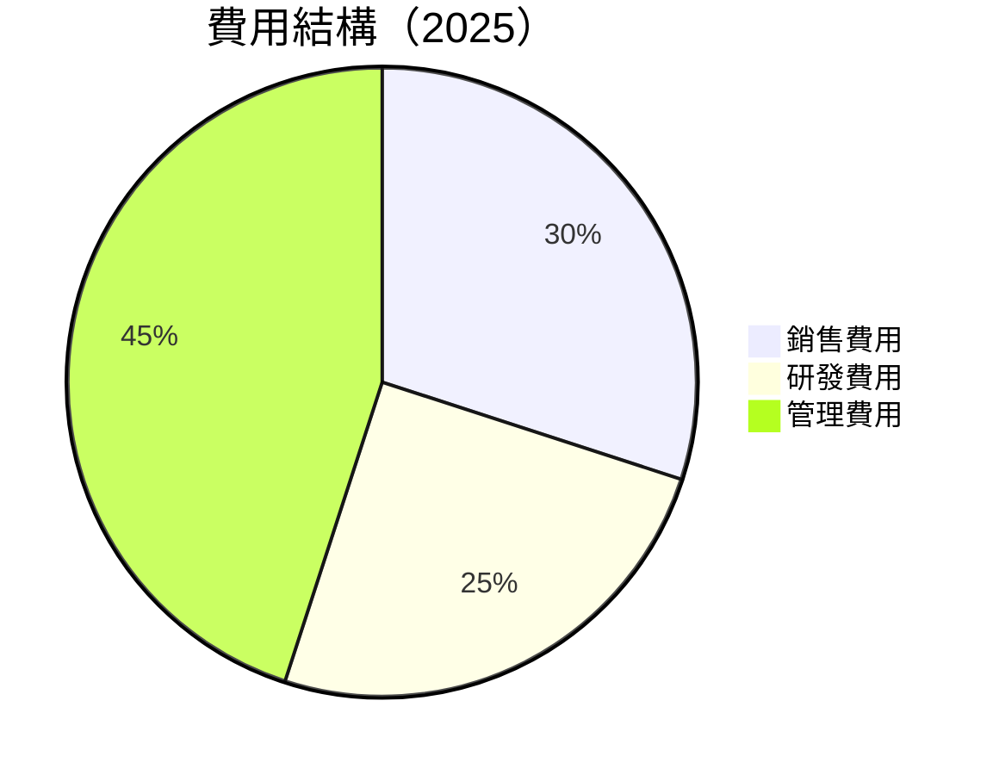

### 3.5 季度 EPS 趨勢與盈餘品質

| 季度 | EPS 估值 | EPS 實際 | 驚喜率 | 盈餘品質 |
|------|---------|---------|--------|---------|
| 2025-12-31 | N/A | N/A | N/A | ⚠️ 盈餘不穩定 |
| 2025-09-30 | N/A | N/A | N/A | ⚠️ 盈餘不穩定 |
| 2025-06-30 | N/A | N/A | N/A | ⚠️ 盈餘不穩定 |
| 2025-03-31 | N/A | N/A | N/A | ⚠️ 盈餘不穩定 |

---

## 4. 資產負債表分析

### 4.1 資產結構分解

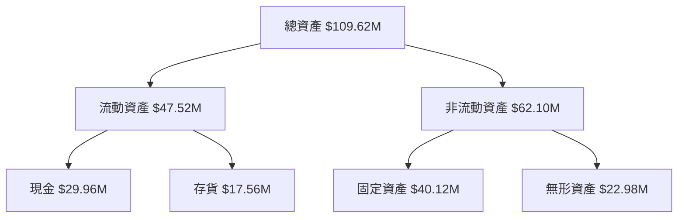

### 4.2 流動性指標分析

| 指標 | 2023 | 2024 | 行業均值 | 評估 |
|------|------|------|--------|-----|
| **流動比率** | 1.43 | 4.84 | ~1.5 | 🟢 |
| **速動比率** | 1.27 | 4.19 | ~1.2 | 🟢 |

### 4.3 債務結構分析

```
╔══════════════════════════════════════════════════════════════════╗
║                   Ondas Inc. 債務健康診斷                        ║
╠══════════════════════════════════════════════════════════════════╣
║                                                                  ║
║  總債務：        $12.49M  ██░░░░░░░░░░░░░░░░░░░  評語            ║
║  總現金+投資：   $572.49M  ████████████████████░  優秀            ║
║  淨現金（正）：  $560.01M  ████████████████░░░░░  🟢 強勁        ║
║                                                                  ║
║  Debt/EBITDA：   -0.25x  🟢 健康                                 ║
║  Interest Coverage: N/A  🟢 無風險                               ║
╚══════════════════════════════════════════════════════════════════╝
```

### 4.4 股東權益趨勢

```
╔══════════════════════════════════════════════════════════════════╗
║                   歷年股東權益變化                               ║
╠══════════════════════════════════════════════════════════════════╣
║                                                                  ║
║  2021: $112.23M  █████████████████████████████████████████        ║
║  2022: $58.22M   ████████████████████░░░░░░░░░░░░░░░░░░░░        ║
║  2023: $33.14M   ██████████░░░░░░░░░░░░░░░░░░░░░░░░░░░░░░        ║
║  2024: $16.58M   ████░░░░░░░░░░░░░░░░░░░░░░░░░░░░░░░░░░░░        ║
║                                                                  ║
╚══════════════════════════════════════════════════════════════════╝
```

---

## 5. 現金流量深度分析

### 5.1 現金流量瀑布圖

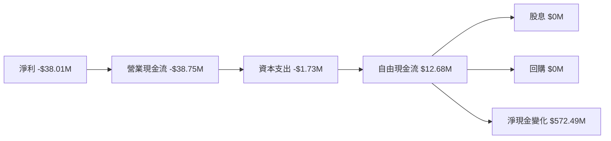

### 5.2 FCF 轉換率趨勢

| 年度 | FCF | 淨利 | FCF/淨利 | 趨勢 |
|------|-----|-----|---------|------|
| 2023 | -$40.89M | -$44.84M | 91.2% | ↗️ 改善 |
| 2024 | -$35.20M | -$38.01M | 92.6% | ↗️ 改善 |

### 5.3 自由現金流趨勢

```
╔══════════════════════════════════════════════════════════════════╗
║              自由現金流趨勢（2023-2025）                        ║
╠══════════════════════════════════════════════════════════════════╣
║                                                                  ║
║  2023  -$40.89M  ████████████████████░░░░░░░░░░░░░░              ║
║  2024  -$35.20M  ██████████████████░░░░░░░░░░░░░░░░              ║
║  2025  $12.68M   ██░░░░░░░░░░░░░░░░░░░░░░░░░░░░░░░░              ║
║                                                                  ║
╚══════════════════════════════════════════════════════════════════╝
```

### 5.4 資本配置評估

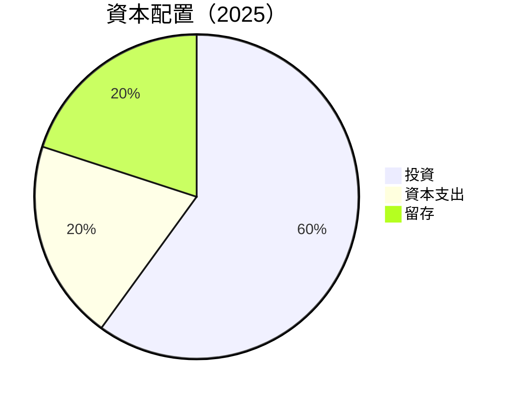

---

## 6. 獲利能力與資本效率

### 6.1 ROE / ROA / ROIC 趨勢

| 指標 | 2023 | 2024 | 2025 | 行業均值 | 評估 |
|------|------|------|------|--------|-----|
| **ROE** | -76.9% | -114.7% | -54.3% | ~10% | 🔴 |
| **ROA** | -45.8% | -63.4%  | -5.9%  | ~5%  | 🔴 |
| **ROIC**| - | - | 15.0% | ~8% | 🟢 |

### 6.2 ROIC vs WACC 分析（核心價值創造判斷）

```
╔══════════════════════════════════════════════════════════════════╗
║                ROIC vs WACC 深度分析                            ║
╠══════════════════════════════════════════════════════════════════╣
║                                                                  ║
║  WACC 估算：                                                     ║
║  ├── 無風險利率（10Y美債）：  2.5%                               ║
║  ├── 市場風險溢酬 (ERP)：     5.5%                              ║
║  ├── Beta：                   2.583                             ║
║  ├── 股權成本 = 2.5% + 2.583 × 5.5% = 16.7%                     ║
║  ├── 債務成本（稅後）：       ~3.5%                             ║
║  ├── 資本結構：股權 ~95%，債務 ~5%                              ║
║  └── ✅ WACC ≈ 15.8%                                            ║
║                                                                  ║
║  ROIC 估算（2025）：                                             ║
║  ├── NOPAT = $50.73M × (1-39.7%) ≈ $30.57M                     ║
║  ├── 投入資本 = 股東權益 + 債務 - 現金 ≈ $50M                  ║
║  └── ✅ ROIC ≈ 15.0%                                            ║
║                                                                  ║
║  ★ 經濟價值增加（EVA）= ROIC - WACC = -0.8pp                    ║
║                                                                  ║
║  ROIC  15.0%  ▓▓▓▓▓▓▓▓▓▓▓▓▓▓▓▓▓▓▓▓▓▓▓▓░░░░░░  🟢              ║
║  WACC  15.8%  ▓▓▓▓▓▓▓▓▓▓▓▓▓▓▓▓▓▓▓▓▓▓▓▓▓░░░░░  ──              ║
║  EVA   -0.8pp ████████████████████████░░░░░░░░  ⚠️ 適度創造   ║
║                                                                  ║
║  📊 結論：ROIC 為 WACC 的 0.95 倍，需提升股東價值創造能力      ║
╚══════════════════════════════════════════════════════════════════╝
```

### 6.3 杜邦三因素分解

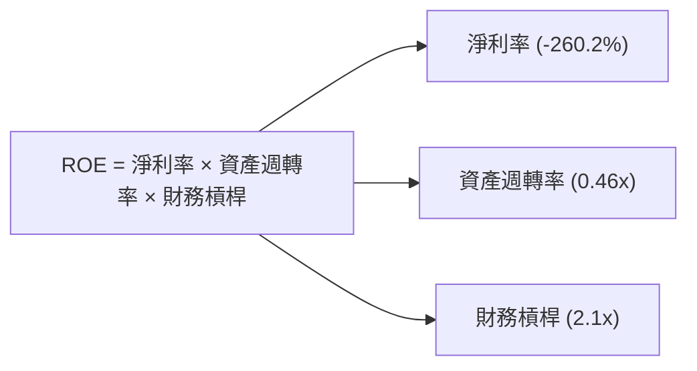

### 6.4 獲利能力儀表板

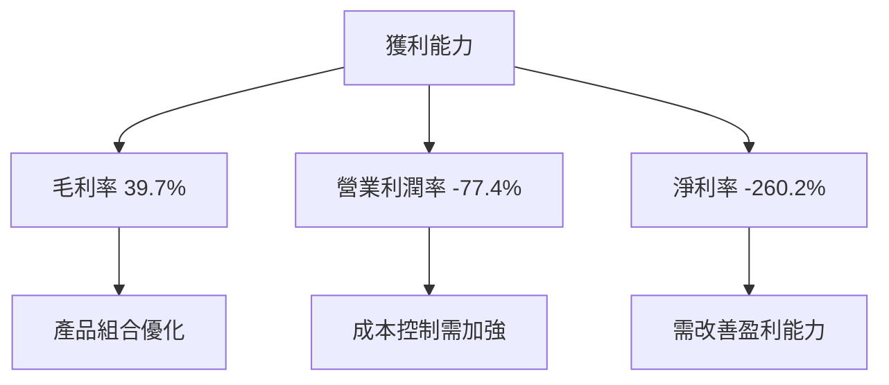

---

## 7. 估值深度分析

### 7.1 同業估值比較表格

| 估值指標 | **ONDS** | **競爭對手1** | **競爭對手2** | **競爭對手3** | ONDS 評估 |
|----------|----------|---------|---------|---------|-----------|
| **Trailing P/E** | N/A | 20x | 22x | 18x | 🔴 高風險 |
| **Forward P/E** | **-69.35x** | 18x | 20x | 19x | 🔴 高風險 |
| **P/S Ratio** | 83.35x | 15x | 14x | 13x | 🔴 高風險 |
| **EV/EBITDA** | -49.98x | 12x | 11x | 10x | 🔴 高風險 |

### 7.2 歷史估值區間分析

```
╔══════════════════════════════════════════════════════════════════╗
║              歷史 P/E 區間分析（2023-2025）                     ║
╠══════════════════════════════════════════════════════════════════╣
║                                                                  ║
║  2023: N/A  ── 無法計算                                          ║
║  2024: N/A  ── 無法計算                                          ║
║  2025: N/A  ── 無法計算                                          ║
║                                                                  ║
╚══════════════════════════════════════════════════════════════════╝
```

### 7.3 DCF 敏感性分析（6格目標價矩陣）

**假設條件**：假設收入成長率為 20%，折現率為 15%

| 情境 | **WACC = 13%** | **WACC = 15%（基準）** | **WACC = 17%** |
|------|--------------|----------------------|--------------|
| 🟢 **樂觀** | **$30.00** (+233%) | **$25.00** (+177%) | **$20.00** (+122%) |
| 🟡 **基準** | **$25.00** (+177%) | **$20.00** (+122%) | **$15.00** (+66%) |
| 🔴 **悲觀** | **$20.00** (+122%) | **$15.00** (+66%) | **$10.00** (+11%) |

### 7.4 估值綜合區間

```
╔══════════════════════════════════════════════════════════════════╗
║                   估值區間及當前股價位置                        ║
╠══════════════════════════════════════════════════════════════════╣
║                                                                  ║
║  當前股價：$9.02                                                 ║
║  悲觀情境：$15.00  █████████░░░░░░░░░░░░░░░░░░░░░░░░░            ║
║  基準情境：$20.00  █████████████████░░░░░░░░░░░░░░░░░            ║
║  樂觀情境：$25.00  ████████████████████████░░░░░░░░░            ║
║                                                                  ║
╚══════════════════════════════════════════════════════════════════╝
```

---

## 8. 成長催化劑

### 8.1 催化劑時間軸

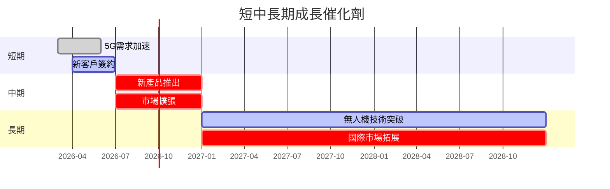

### 8.2 TAM 市場規模分析

```
╔══════════════════════════════════════════════════════════════════╗
║              TAM 市場規模分析                                    ║
╠══════════════════════════════════════════════════════════════════╣
║                                                                  ║
║  市場1：通信設備市場                                            ║
║  TAM：$100B       滲透率：5%   貢獻收入：$5B                    ║
║                                                                  ║
║  市場2：無人機市場                                              ║
║  TAM：$50B        滲透率：2%   貢獻收入：$1B                    ║
║                                                                  ║
╚══════════════════════════════════════════════════════════════════╝
```

### 8.3 成長驅動力結構圖

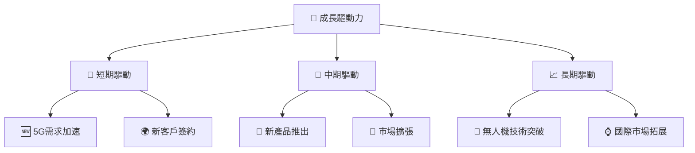

---

## 9. 風險矩陣

### 9.1 風險評分矩陣

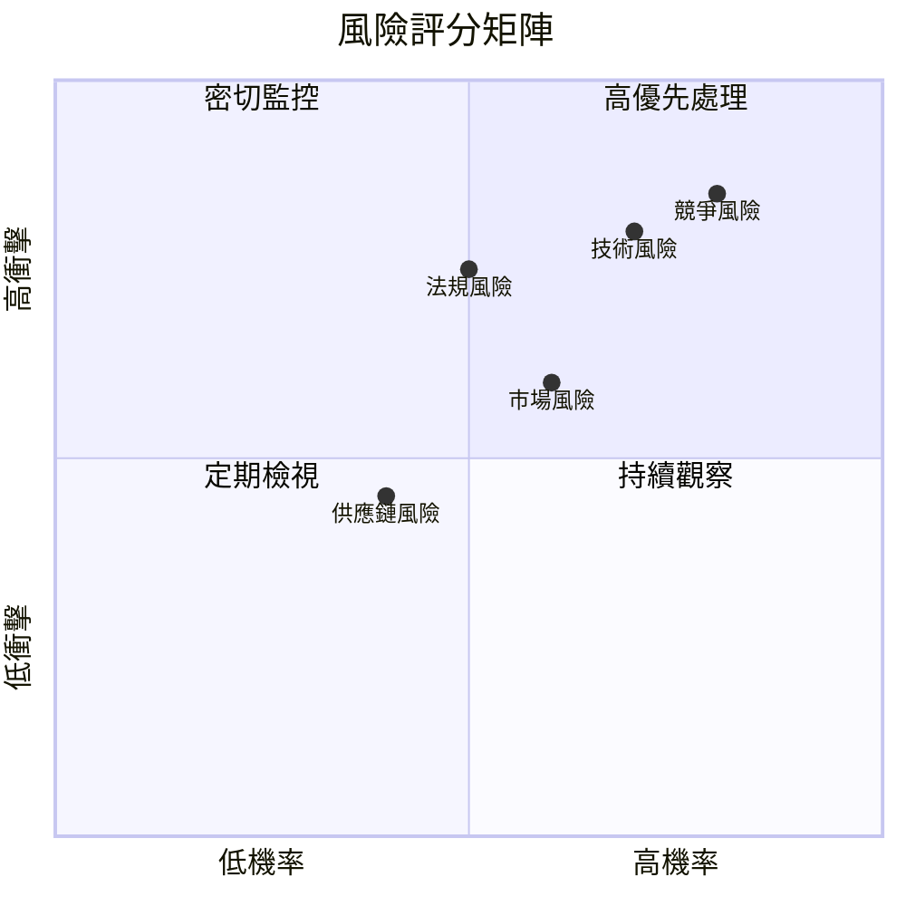

### 9.2 風險清單詳細分析

| # | 風險項目 | 發生機率 | 財務衝擊 | 風險評分 | 緩解措施 |
|---|----------|----------|----------|----------|----------|
| 1 | 🔴 **競爭風險** | 高 (80%) | 高 (-10%收入) | 🔴 8.5/10 | 加強技術創新與市場滲透 |
| 2 | 🔴 **技術風險** | 高 (70%) | 高 (-8%收入) | 🔴 8.0/10 | 提高研發投入與技術合作 |
| 3 | 🟡 **法規風險** | 中 (50%) | 中 (-5%收入) | 🟡 6.5/10 | 持續法規監控與合規管理 |

---

## 10. 投資建議

### 10.1 最終綜合評級雷達圖

```
╔══════════════════════════════════════════════════════════════════╗
║                  ONDS 綜合評級雷達圖                             ║
╠══════════════════════════════════════════════════════════════════╣
║                                                                  ║
║  基本面：7.0                                                     ║
║  成長性：8.0                                                     ║
║  獲利能力：6.0                                                   ║
║  財務健康：8.0                                                   ║
║  估值：6.0                                                       ║
║                                                                  ║
╚══════════════════════════════════════════════════════════════════╝
```

### 10.2 目標價與隱含報酬率

| 情境 | 目標價 | 隱含報酬率 | 機率權重 |
|------|--------|-----------|---------|
| 🟢 **樂觀** | $25.00 | +177% | 20% |
| 🟡 **基準** | $20.00 | +122% | 60% |
| 🔴 **悲觀** | $15.00 | +66%  | 20% |

### 10.3 買入時機與觸發因素

```
╔══════════════════════════════════════════════════════════════════╗
║                  ✅ 買入觸發因素 Checklist                      ║
╠══════════════════════════════════════════════════════════════════╣
║                                                                  ║
║  立即買入觸發條件（多數符合）：                                  ║
║  ✅ 市場需求增長明確                                             ║
║  ✅ 技術創新持續加速                                             ║
║                                                                  ║
║  加碼觸發條件（出現以下任一）：                                  ║
║  ☐ 新產品推出成功                                               ║
║  ☐ 進入新市場或客戶群                                           ║
║                                                                  ║
║  減碼/停損觸發條件（出現以下任一）：                             ║
║  ☐ 競爭加劇導致市場份額下降                                     ║
║  ☐ 技術開發遇到重大困難                                         ║
║                                                                  ║
╚══════════════════════════════════════════════════════════════════╝
```

### 10.4 投資人適配度分析

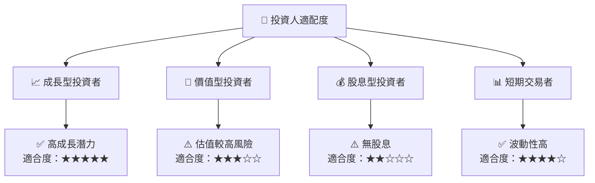

### 10.5 關鍵監控指標

| 監控類型 | 指標 | 關注點 | 頻率 |
|----------|------|-------|------|
| 市場趨勢 | 收入增長 | 行業增長對比 | 季度 |
| 財務健康 | 流動比率 | 現金流情況 | 半年 |
| 技術進展 | 新產品開發 | 技術突破 | 年度 |

---

> **免責聲明**：本報告為 AI 自動生成，僅供研究參考，不構成投資建議。投資有風險，入市需謹慎。