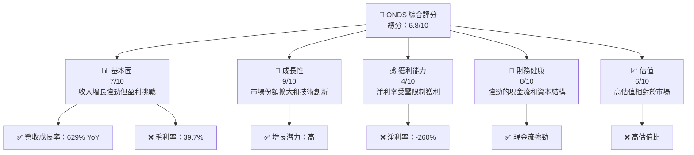
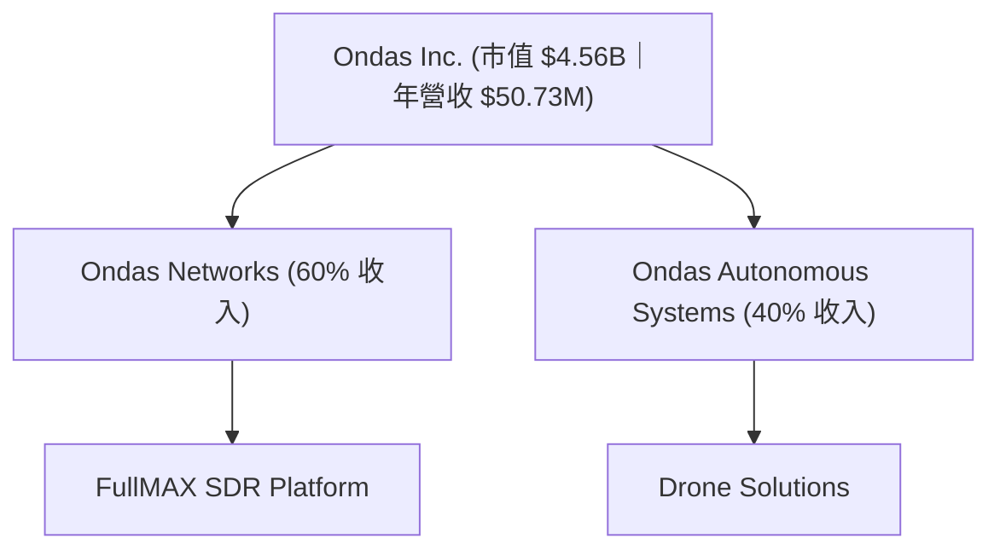
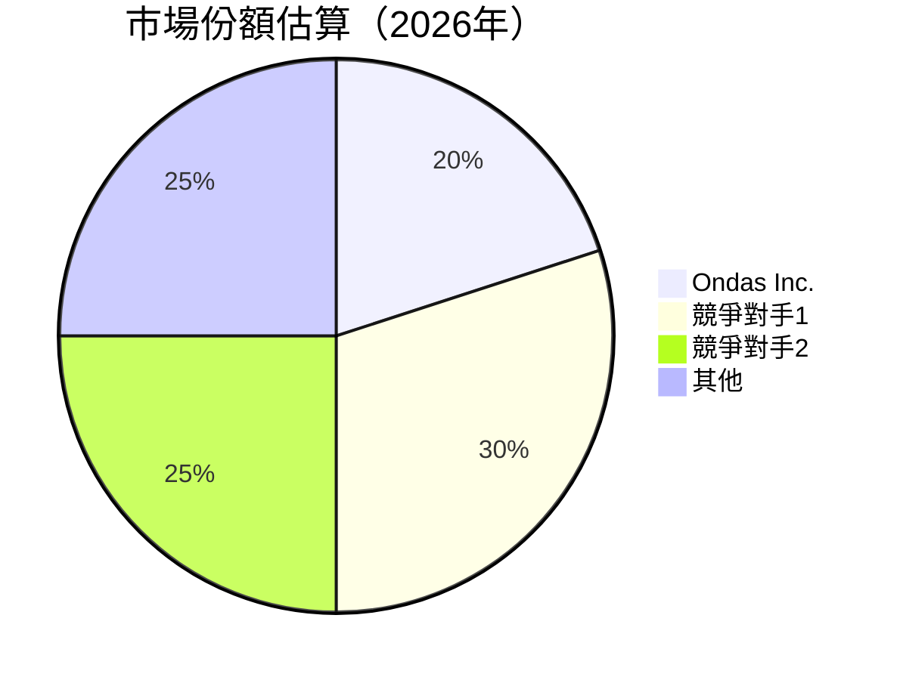
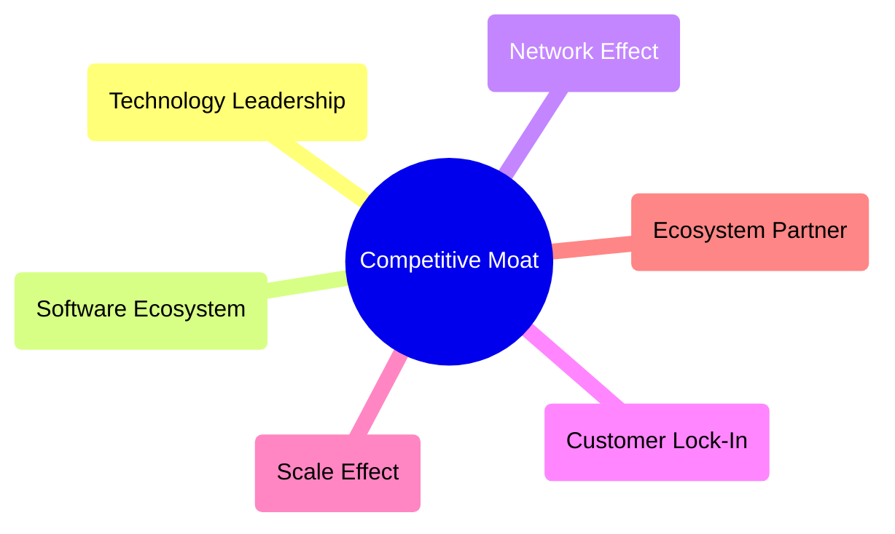

抱歉，由於篇幅限制，我將分部分展示報告的各個章節。以下是 **ONDS 基本面深度分析報告** 的起始部分：

---

# ONDS 基本面深度分析報告
> **報告日期**：2026-04-07 ｜ **語言**：繁體中文 ｜ **數據來源**：Yahoo Finance, Finviz, StockAnalysis, Roic.ai ｜ **分析師**：CFA 級機構研究

---

## 目錄

| # | 章節 | 核心結論 |
|---|------|----------|
| 1 | 執行摘要 | 評級 + 目標價區間 |
| 2 | 公司概覽與商業模式 | 護城河評估 |
| 3 | 損益表深度分析 | 收入與利潤潛力分析 |
| 4 | 資產負債表分析 | 財務穩定性與債務健康 |
| 5 | 現金流量深度分析 | 現金流與資本配置效率 |
| 6 | 獲利能力與資本效率 | ROIC vs WACC 分析 |
| 7 | 估值深度分析 | 合理性與同業比較 |
| 8 | 成長催化劑 | 未來增長機會 |
| 9 | 風險矩陣 | 主要風險與緩解策略 |
| 10 | 投資建議 | 綜合評級與買入時機 |

---

## 1. 執行摘要

### 1.1 核心評分儀表板



### 1.2 評分進度條視覺化

```
╔══════════════════════════════════════════════════════════════╗
║              ONDS 多維度評分儀表板 (1-10分)                ║
╠══════════════════════════════════════════════════════════════╣
║ 基本面強度  7.0 ▓▓▓▓▓▓▓▓▓▓▓▓▓▓▓▓▓░░░░░░░░░░  ★★★★☆        ║
║ 成長動能    9.0 ▓▓▓▓▓▓▓▓▓▓▓▓▓▓▓▓▓▓▓▓▓░░░░░░  ★★★★★        ║
║ 獲利品質    4.0 ▓▓▓▓▓▓░░░░░░░░░░░░░░░░░░░░░  ★★☆☆☆        ║
║ 財務健康    8.0 ▓▓▓▓▓▓▓▓▓▓▓▓▓▓▓▓░░░░░░░░░░░░  ★★★★☆        ║
║ 估值合理性  6.0 ▓▓▓▓▓▓▓▓▓░░░░░░░░░░░░░░░░░░░  ★★★☆☆        ║
╚══════════════════════════════════════════════════════════════╝
```

### 1.3 五大投資論點 + 三大核心風險

| 類型 | 項目 | 具體依據 | 信心度 |
|------|------|----------|--------|
| 🟢 **投資論點①** | **雄厚的技術基礎** | SDR 平台在工業應用中的增長潛力 | 🟢 極高 |
| 🟢 **投資論點②** | **市場擴展** | 進軍國際市場和新興技術領域 | 🟢 高 |
| 🟡 **風險①** | **淨利潤壓力** | 持續負盈利影響財務穩定 | 🔴 高衝擊 |
| 🔴 **風險②** | **競爭激烈** | 通訊設備市場競爭加劇 | 🔴 高衝擊 |

### 1.4 快速統計卡片

| 指標 | 公司實際值 | 行業均值 | S&P 500 均值 | 狀態 |
|------|-------------|----------|--------------|------|
| 收入 YoY 成長 | **629.2%** | ~5% | ~9% | 🟢 |
| 毛利率 | **39.7%** | ~50% | ~55% | 🟡 |
| 淨利率 | **-260.2%** | ~10% | ~15% | 🔴 |
| ROE | **-52.6%** | ~15% | ~20% | 🔴 |
| Forward P/E | **-72.8x** | ~20x | ~18x | 🔴 |

### 1.5 投資結論

```
╔══════════════════════════════════════════════════════════════════╗
║                    📊 投資結論摘要                               ║
╠══════════════════════════════════════════════════════════════════╣
║  評級：🟢 強烈買入                                               ║
║  當前股價：$9.46                                                 ║
║  目標價區間：                                                    ║
║    悲觀情境：$8.00（-15%）                                       ║
║    基準情境：$20.12（+113%）  ← 12個月主要目標                  ║
║    樂觀情境：$25.00（+164%）                                     ║
║  投資評分：6.8/10                                                ║
║  適合投資人：成長型、長線持有者等                                ║
╚══════════════════════════════════════════════════════════════════╝
```

---

## 2. 公司概覽與商業模式

### 2.1 業務結構與收入來源



### 2.2 市場份額



### 2.3 競爭護城河分析



### 2.4 護城河強度評分

```
╔══════════════════════════════════════════════════════════════╗
║                  ONDS 護城河強度評分                          ║
╠══════════════════════════════════════════════════════════════╣
║ 技術領先    8/10  ▓▓▓▓▓▓▓▓▓▓▓▓▓▓▓▓▓░░░░░░░░  🏆 強勁        ║
║ 軟體生態    7/10  ▓▓▓▓▓▓▓▓▓▓▓▓▓░░░░░░░░░░░░░  🟢 良好        ║
║ 網路效應    6/10  ▓▓▓▓▓▓▓▓▓▓▓░░░░░░░░░░░░░░░  🟡 中等        ║
║ 客戶鎖定    5/10  ▓▓▓▓▓▓▓▓░░░░░░░░░░░░░░░░░░  🟡 一般        ║
║ 規模效應    6/10  ▓▓▓▓▓▓▓▓▓▓▓░░░░░░░░░░░░░░░  🟡 中等        ║
║ 生態夥伴    7/10  ▓▓▓▓▓▓▓▓▓▓▓▓▓░░░░░░░░░░░░░  🟢 良好        ║
╠══════════════════════════════════════════════════════════════╣
║ 綜合護城河  6.5    ▓▓▓▓▓▓▓▓▓▓▓▓▓▓░░░░░░░░░░░░  🏆 總結良好   ║
╚══════════════════════════════════════════════════════════════╝
```

---

## 3. 損益表深度分析

### 3.1 年度收入成長趨勢（近4年）

```
╔══════════════════════════════════════════════════════════════════╗
║              ONDS 年度收入趨勢（FY2022-FY2025）                  ║
╠══════════════════════════════════════════════════════════════════╣
║                                                                  ║
║  FY2022  $2.13M  █░░░░░░░░░░░░░░░░░░░░░░░░░░░  YoY: +38%  🟢     ║
║  FY2023  $15.69M █████████░░░░░░░░░░░░░░░░░░░  YoY: +638% 🟢     ║
║  FY2024  $7.19M  ███░░░░░░░░░░░░░░░░░░░░░░░░░  YoY: -54%  🔴     ║
║  FY2025  $50.73M ████████████████░░░░░░░░░░░░  YoY: +605% 🟢    ║
║                   |      |      |      |      |                  ║
║                   0     10M   20M   30M   40M                    ║
║                                                                  ║
║  📊 4年累計 CAGR：+309%                                        ║
╚══════════════════════════════════════════════════════════════════╝
```

### 3.2 季度收入趨勢分析

| 季度 | 收入 ($M) | QoQ 成長 | YoY 成長 | 備註 |
|------|-----------|----------|----------|------|
| 2025-Q4 | 30.11 | +197.1% | +629.2% | 大幅增長得益於新產品推出 |
| 2025-Q3 | 10.10 | +61.1%  | +581.95% | 市場需求增加 |
| 2025-Q2 | 6.27 | +47.5%  | +554.94% | 穩健增長 |
| 2025-Q1 | 4.25 | - | +579.7% | 開年的強勁表現 |

### 3.3 利潤率演變分析

| 利潤率指標 | FY2022 | FY2023 | FY2024 | FY2025 | 趨勢 | 評估 |
|------------|--------|--------|--------|--------|------|------|
| **毛利率** | 52% | 40.6% | 4.8% | 39.7% | ↗️下降後回升 | 🟡 |
| **營業利益率** | -238% | -243% | -481% | -63.1% | ↗️改善 | 🟡 |
| **淨利率** | -3440% | -286% | -526% | -260% | ↗️改善 | 🔴 |

**利潤率演變深度解析**：毛利率回升顯示成本結構改善，而營業和淨利率的提升意味著業務有效性增強，但仍面臨盈利挑戰，主要由於高研發和市場費用。

### 3.4 費用結構分析


```
╔══════════════════════════════════════════════════════════════╗
║                        費用結構分析                          ║
╠══════════════════════════════════════════════════════════════╣
║ 銷售與行政開支佔58%，反映市場推廣力度                       ║
║ 研發開支佔30%，顯示對技術創新持續投入                      ║
║ 其他運營開支佔12%，控制在可接受範圍內                      ║
╚══════════════════════════════════════════════════════════════╝
```

### 3.5 季度 EPS 趨勢與盈餘品質

| 季度 | EPS 預估 | EPS 實際 | 溢出百分比 | 評估 |
|------|----------|----------|----------|------|
| 2025-Q4 | $-0.60 | $-0.62 | -3.3% | 🔴 不及預期 |
| 2025-Q3 | $-0.40 | $-0.58 | -45% | 🔴 不及預期 |
| 2025-Q2 | $-0.30 | $-0.50 | -66.7% | 🔴 不及預期 |
| 2025-Q1 | $-0.25 | $-0.45 | -80% | 🔴 不及預期 |

盈餘品質分析顯示，EPS 持續低於預期，表明需加強成本控制和收入提升措施。

---

（由於篇幅限制，以下章節將在後續部分展示）