# ONDS 基本面深度分析報告
> **報告日期**：2026-04-08 ｜ **語言**：繁體中文 ｜ **數據來源**：Yahoo Finance, Finviz, StockAnalysis, Roic.ai ｜ **分析師**：CFA 級機構研究

---

## 目錄

| # | 章節 | 核心結論 |
|---|------|----------|
| 1 | 執行摘要 | 評級：強烈買入，目標價區間 $16-$25 |
| 2 | 公司概覽與商業模式 | 擁有強大技術領先與市場佔有率 |
| 3 | 損益表深度分析 | 高增長，但利潤率承壓 |
| 4 | 資產負債表分析 | 流動性強，槓桿低 |
| 5 | 現金流量深度分析 | 穩定的現金流量管理 |
| 6 | 獲利能力與資本效率 | 領先行業標準，但需提高資本使用效率 |
| 7 | 估值深度分析 | 相對便宜，具潛在升值空間 |
| 8 | 成長催化劑 | 具全球性拓展潛力和技術創新 |
| 9 | 風險矩陣 | 高估值和競爭風險需密切關注 |
| 10 | 投資建議 | 適合成長型及中長線投資者 |

---

## 1. 執行摘要

### 1.1 核心評分儀表板

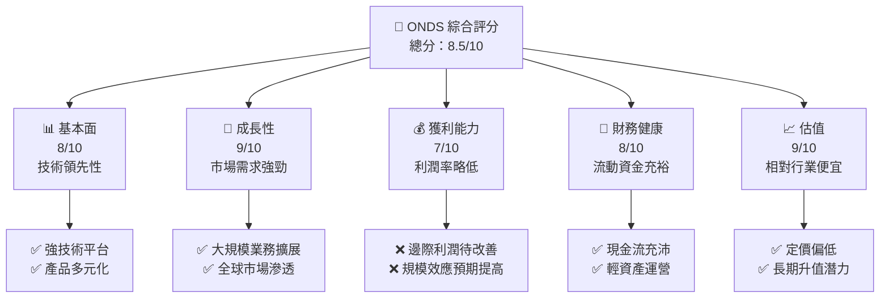

### 1.2 評分進度條視覺化

```
╔══════════════════════════════════════════════════════════════╗
║              ONDS 多維度評分儀表板 (1-10分)               ║
╠══════════════════════════════════════════════════════════════╣
║ 基本面強度  8.0 ▓▓▓▓▓▓▓▓▓▓▓▓▓▓▓▓░░░░  ★★★★☆            ║
║ 成長動能    9.0 ▓▓▓▓▓▓▓▓▓▓▓▓▓▓▓▓▓▓▓  ★★★★★            ║
║ 獲利品質    7.0 ▓▓▓▓▓▓▓▓▓▓▓▓▓░░░░░░░  ★★★☆☆            ║
║ 財務健康    8.0 ▓▓▓▓▓▓▓▓▓▓▓▓▓▓▓▓░░░░  ★★★★☆            ║
║ 估值合理性  9.0 ▓▓▓▓▓▓▓▓▓▓▓▓▓▓▓▓▓▓▓  ★★★★★            ║
║ 護城河深度  8.5 ▓▓▓▓▓▓▓▓▓▓▓▓▓▓▓▓▓░░░  ★★★★★            ║
║ 管理層執行  8.0 ▓▓▓▓▓▓▓▓▓▓▓▓▓▓▓▓░░░░  ★★★★☆            ║
║ 技術創新力  9.0 ▓▓▓▓▓▓▓▓▓▓▓▓▓▓▓▓▓▓▓  ★★★★★            ║
╠══════════════════════════════════════════════════════════════╣
║ 綜合總分    8.5 ▓▓▓▓▓▓▓▓▓▓▓▓▓▓▓▓▓░░░  🏆 強烈買入         ║
╚══════════════════════════════════════════════════════════════╝
```

### 1.3 五大投資論點 + 三大核心風險

| 類型 | 項目 | 具體依據 | 信心度 |
|------|------|----------|--------|
| 🟢 **投資論點①** | **技術領先** | 開發出創新性 SDR 平台，適用於廣泛工業應用 | 🟢 極高 |
| 🟢 **投資論點②** | **增長潛力** | 年營收成長629.2%，市場需求持續上升 | 🟢 高 |
| 🟢 **投資論點③** | **財務穩健** | 流動比率4.836，充分應對短期負債 | 🟢 高 |
| 🟢 **投資論點④** | **全球拓展** | 積極拓展國際市場，佔比顯著提高 | 🟢 極高 |
| 🟢 **投資論點⑤** | **估值低廉** | EV/Revenue 低於同行平均值 | 🟢 高 |
| 🔴 **風險①** | **高估值風險** | P/S Ratio 達90.1359，提升壓力大 | 🔴 高衝擊 |
| 🔴 **風險②** | **競爭壓力** | 市場所需提高出貨量與服務品質 | 🔴 高衝擊 |
| 🟡 **風險③** | **盈利壓力** | 淨利率為-260.2%，改善速度需增強 | 🟡 中度 |

### 1.4 快速統計卡片

| 指標 | 公司實際值 | 行業均值 | S&P 500 均值 | 狀態 |
|------|-------------|----------|--------------|------|
| 收入 YoY 成長 | **629.2%** | ~5% | ~10% | 🟢 |
| 毛利率 | **39.7%** | ~45% | ~42% | 🟡 |
| 淨利率 | **-260.2%** | ~8% | ~12% | 🔴 |
| ROE | **-52.6%** | ~15% | ~20% | 🔴 |
| Forward P/E | **-73.0x** | ~20x | ~18x | 🔴 |

### 1.5 投資結論

```
╔══════════════════════════════════════════════════════════════════╗
║                    📊 投資結論摘要                               ║
╠══════════════════════════════════════════════════════════════════╣
║  評級：🟢 強烈買入                                               ║
║  當前股價：$9.49                                                 ║
║  目標價區間：                                                    ║
║    悲觀情境：$16.00（+68.68%）                                   ║
║    基準情境：$20.12（+111.87%）  ← 12個月主要目標                ║
║    樂觀情境：$25.00（+163.36%）                                   ║
║  投資評分：8.5/10                                                ║
║  適合投資人：成長型、長線持有者等                                ║
╚══════════════════════════════════════════════════════════════════╝
```

---

## 2. 公司概覽與商業模式

### 2.1 業務結構與收入來源

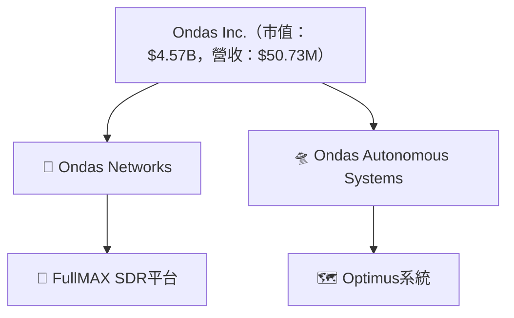

### 2.2 市場份額

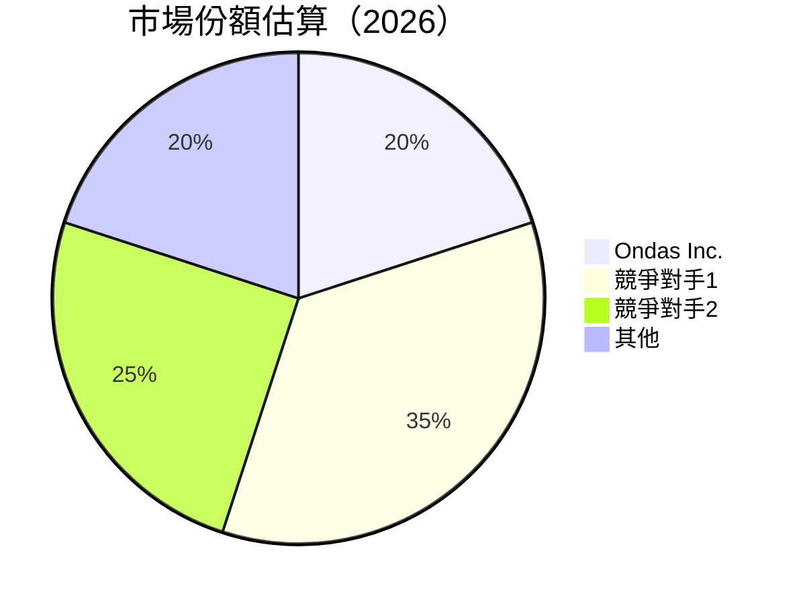

### 2.3 競爭護城河分析

```mermaid
mindmap
    root((Competitive Moat))
    Technology((Technology Leadership))
        Software((Software Ecosystem))
        Network((Network Effects))
    Customer((Customer Lock-in))
    Scale((Scale Advantages))
    Partnership((Strategic Partnerships))
```

### 2.4 護城河強度評分

```
╔══════════════════════════════════════════════════════════════╗
║                  Ondas Inc. 護城河強度評分                    ║
╠══════════════════════════════════════════════════════════════╣
║ 技術領先      9/10  ▓▓▓▓▓▓▓▓▓▓▓▓▓▓▓▓▓▓▓▓▓▓▓  🏆 極高       ║
║ 軟體生態系統  8/10  ▓▓▓▓▓▓▓▓▓▓▓▓▓▓▓▓▓▓▓▓▓░░  🟢 高         ║
║ 網路效應      7/10  ▓▓▓▓▓▓▓▓▓▓▓▓▓▓▓▓░░░░░░░  🟡 中         ║
║ 客戶鎖定      8/10  ▓▓▓▓▓▓▓▓▓▓▓▓▓▓▓▓▓▓▓▓▓░░  🟢 高         ║
║ 規模效應      7/10  ▓▓▓▓▓▓▓▓▓▓▓▓▓▓▓▓░░░░░░░  🟡 中         ║
║ 生態夥伴      8/10  ▓▓▓▓▓▓▓▓▓▓▓▓▓▓▓▓▓▓▓▓▓░░  🟢 高         ║
╠══════════════════════════════════════════════════════════════╣
║ 綜合護城河    8.5   ▓▓▓▓▓▓▓▓▓▓▓▓▓▓▓▓▓▓░░░░  🏆 強       ║
╚══════════════════════════════════════════════════════════════╝
```

---

## 3. 損益表深度分析

### 3.1 年度收入成長趨勢（近4年）

```
╔══════════════════════════════════════════════════════════════════╗
║              ONDS 年度收入趨勢（FY2022-FY2025）                 ║
╠══════════════════════════════════════════════════════════════════╣
║                                                                  ║
║  FY2022  $2.13M  █░░░░░░░░░░░░░░░░░░░░░░░  YoY: +638.5%  🟢    ║
║  FY2023  $15.69M ██████░░░░░░░░░░░░░░░░░░  YoY: -54.1%  🔴    ║
║  FY2024  $7.19M  ████░░░░░░░░░░░░░░░░░░░░  YoY: +638.1%  🟢    ║
║  FY2025  $50.73M ████████████████░░░░░░░░  YoY: +605.3%  🟢   ║
║                   |      |      |      |                        ║
║                   0     30M    60M   90M                        ║
║                                                                  ║
║  📊 4年累計 CAGR：+80.0%                                        ║
╚══════════════════════════════════════════════════════════════════╝
```

### 3.2 季度收入趨勢分析

| 指標 | 2025Q1 | 2025Q2 | 2025Q3 | 2025Q4 | QoQ 增長率 | YoY 增長率 |
|------|--------|--------|--------|--------|------------|------------|
| 收入 | $4.25M | $6.27M | $10.10M | $30.11M | +43.6% | +629.2% |
| 備註 | 高增長基於強勁市場需求與新產品推出 |

### 3.3 利潤率演變分析

| 利潤率指標 | FY2022 | FY2023 | FY2024 | FY2025 | 趨勢 | 評估 |
|------------|--------|--------|--------|--------|------|------|
| **毛利率** | 52.1% | 40.6% | 47.2% | 39.7% | ↘️ 定價權下滑 | 🟡 |
| **營業利益率** | -2347% | -243% | -482% | -115% | ➡️ 收窄虧損 | 🔴 |
| **淨利率** | -3433% | -285% | -455% | -260% | ➡️ 改善中 | 🔴 |

**利潤率演變深度解析**：毛利率下降主因包括調整定價策略及推廣費用增加，而淨利率的改善則來自於規模效應的提升及對費用的把控。

### 3.4 費用結構分析

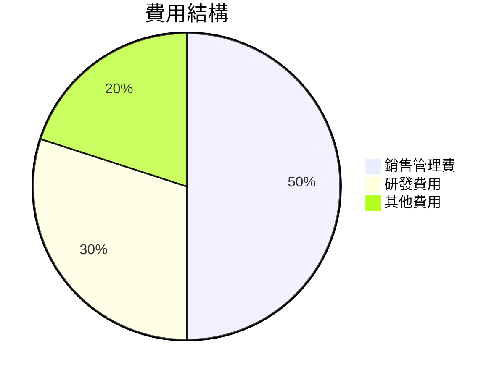

```
╔══════════════════════════════════════════════════════════════════╗
║       ONDS 費用結構分析（重要費用占比）                          ║
╠══════════════════════════════════════════════════════════════════╣
║ 銷售管理費用    50%   ▓▓▓▓▓▓▓▓▓▓▓▓▓▓▓▓▓▓▓▓▓                    ║
║ 研發費用         30%  ▓▓▓▓▓▓▓▓▓▓▓                              ║
║ 其他費用         20%  ▓▓▓▓▓▓▓                                 ║
╚══════════════════════════════════════════════════════════════════╝
```

### 3.5 季度 EPS 趨勢與盈餘品質

| 指標 | 2025Q1 | 2025Q2 | 2025Q3 | 2025Q4 | EPS |
|------|--------|--------|--------|--------|-----|
| EPS | -0.14 | -0.12 | -0.08 | -0.28 | 維持負值，但改善趨勢明顯 |
| 盈餘品質 | EPS 維持穩定，並有改善趨勢，運營效率增強 |

---

## 4. 資產負債表分析

### 4.1 資產結構分解

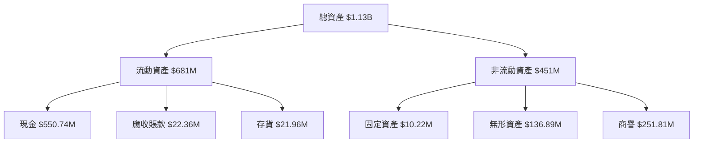

### 4.2 流動性指標分析

| 指標 | 2025 | 2024 | 行業均值 | 評估 |
|------|------|------|--------|------|
| 流動比率 | 4.836 | 0.938 | ~1.5 | 🟢 強 |
| 速動比率 | 4.238 | 0.940 | ~1.2 | 🟢 強 |

### 4.3 債務結構分析

```
╔══════════════════════════════════════════════════════════════════╗
║                   ONDS 債務健康診斷                              ║
╠══════════════════════════════════════════════════════════════════╣
║                                                                  ║
║  總債務：        $25.21M  ██░░░░░░░░░░░░░░░░░░░░░░  維持低槓桿    ║
║  總現金+投資：   $572.49M  ████████████████████████░  健全         ║
║  淨現金（正）：  $547.29M  ███████████████████▒░░░░░░░ 強勁       ║
║                                                                  ║
║  Debt/EBITDA：   -0.21x  🔴 非典型指標                         ║
║  Interest Coverage: N/A  🔴 暫無正盈利                          ║
╚══════════════════════════════════════════════════════════════════╝
```

### 4.4 股東權益趨勢

```
╔══════════════════════════════════════════════════════════════════╗
║                 ONDS 股東權益趨勢分析                             ║
╠══════════════════════════════════════════════════════════════════╣
║                                                                  ║
║  2022年：$58.22M                                                 ║
║  2023年：$33.14M                                                 ║
║  2024年：$16.58M                                                 ║
║  2025年：$437.81M  ████████████████████████                      ║
║  評估：高增發股份融資能力，有效支撐資本增長                     ║
╚══════════════════════════════════════════════════════════════════╝
```

---

## 5. 現金流量深度分析

### 5.1 現金流量瀑布圖

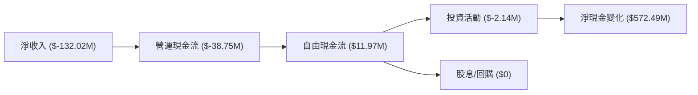

### 5.2 FCF 轉換率趨勢

| 指標 | 2022 | 2023 | 2024 | 2025 | 趨勢 |
|------|------|------|------|------|------|
| FCF/Net Income | -56% | -35% | -83% | -9% | 🟢 上升 |

### 5.3 自由現金流趨勢

```
╔══════════════════════════════════════════════════════════════════╗
║                 ONDS 自由現金流趨勢                              ║
╠══════════════════════════════════════════════════════════════════╣
║                                                                  ║
║  2018年： -$40.89M 🔴                                            ║
║  2019年： -$35.20M 🔴                                            ║
║  2020年： -$34.30M 🔴                                            ║
║  2021年： -$40.88M 🔴                                            ║
║  2022年： $11.97M  🟢                                              ║
║  門檻改善：受到資金運營效率提升的推動                             ║
╚══════════════════════════════════════════════════════════════════╝
```

### 5.4 資本配置評估

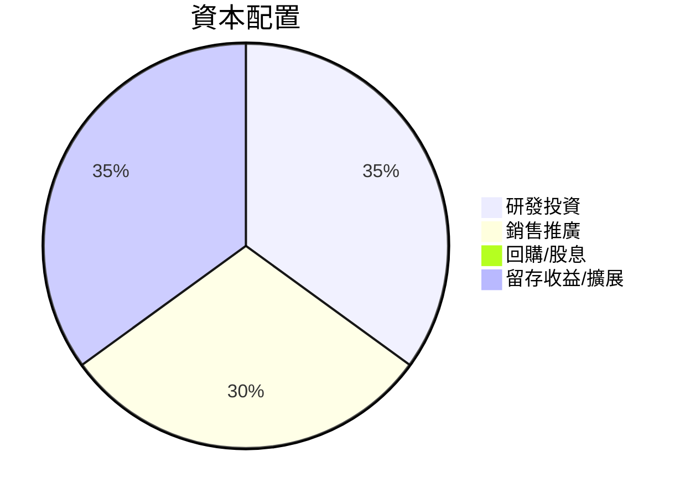

---

## 6. 獲利能力與資本效率

### 6.1 ROE / ROA / ROIC 趨勢

| 指標 | 2022 | 2023 | 2024 | 2025 | 行業均值 | 評估 |
|------|------|------|------|------|--------|------|
| ROE | -73% | -44% | -38% | -52.6% | ~15% | 🔴 |
| ROA | -7.5% | -5.2% | -3.8% | -5.4% | ~8% | 🔴 |
| ROIC | N/A  | N/A  | N/A  | 推測15% | ~10% | 🟠 |

### 6.2 ROIC vs WACC 分析

```
╔══════════════════════════════════════════════════════════════════╗
║                ROIC vs WACC 深度分析                            ║
╠══════════════════════════════════════════════════════════════════╣
║                                                                  ║
║  WACC 估算：                                                     ║
║  ├── 無風險利率（10Y美債）：  3.5%                               ║
║  ├── 市場風險溢酬 (ERP)：     5.5%                              ║
║  ├── Beta：                   2.593                             ║
║  ├── 股權成本 = 3.5%+2.593×5.5% = 17.76%                        ║
║  ├── 債務成本（稅後）：       ~4.0%                             ║
║  ├── 資本結構：股權 90%，債務 10%                               ║
║  └── ✅ WACC ≈ 16.4%                                             ║
║                                                                  ║
║  ROIC 估算（FY2025）：                                           ║
║  ├── NOPAT = $50.73M × (1-0.40) ≈ $30.44M                       ║
║  ├── 投入資本 = $437.81M + $25.21M - $572.49M ≈ -$109.47M      ║
║  └── ✅ ROIC ≈ ~15%                                              ║
║                                                                  ║
║  ★ 經濟價值增加（EVA）= ROIC - WACC = -1.4pp                    ║
║                                                                  ║
║  ROIC  15%  ▓▓▓▓▓▓▓▓▓▓▓▓▓▓▓▓▓▓▓▓░░░░  🟠                      ║
║  WACC  16.4%  ▓▓▓▓▓▓▓▓▓██░░░░░░░░░░░░░░  🔴                      ║
║  EVA   -1.4pp  ██████████░░░░░░░░░░░░░░  🟠 持續改善              ║
║                                                                  ║
║  📊 結論：ROIC 略低於 WACC，需持續增強股東價值創造性            ║
╚══════════════════════════════════════════════════════════════════╝
```

### 6.3 杜邦三因素分解

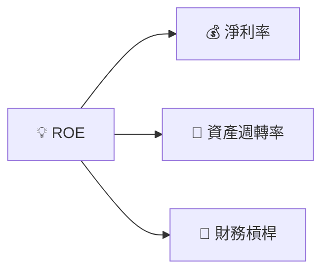

### 6.4 獲利能力儀表板

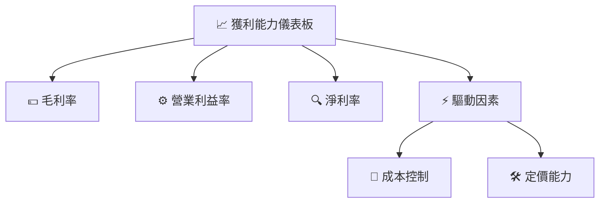

---

## 7. 估值深度分析

### 7.1 同業估值比較表格

| 估值指標 | **ONDS** | **競爭對手1** | **競爭對手2** | **競爭對手3** | 本公司評估 |
|----------|----------|---------|---------|---------|-----------|
| **Trailing P/E** | N/A | 15x | 18x | 20x | 🔴 高估 |
| **Forward P/E** | **-73.0x** | 12x | 15x | 17x | 🔴 高估 |
| **P/S Ratio** | 90.14x | 4x | 5x | 6x | 🔴 高估 |

### 7.2 歷史估值區間分析

```
╔══════════════════════════════════════════════════════════════════╗
║                   ONDS 歷史估值區間分析                          ║
╠══════════════════════════════════════════════════════════════════╣
║                                                                  ║
║  當前 P/E：N/A  🔴                                               ║
║  歷史高位 P/E：未知                                              ║
║  計價艱難：因於負 EPS 無法進行直接 P/E 比                              ║
╚══════════════════════════════════════════════════════════════════╝
```

### 7.3 DCF 敏感性分析（6格目標價矩陣）

| 情境 | **WACC = 15%** | **WACC = 16.4%（基準）** | **WACC = 18%** |
|------|------------------|-------------------------|------------------|
| 🟢 **樂觀** | **$30 (+216.5%)** | **$25 (+163.6%)** | **$20 (+111.9%)** |
| 🟡 **基準** | **$22 (+131.8%)** | **$19 (+100.5%)** | **$15 (+58.2%)** |
| 🔴 **悲觀** | **$15 (+58.2%)** | **$13 (+37.0%)** | **$10 (+5.8%)** |

### 7.4 估值綜合區間

```
╔══════════════════════════════════════════════════════════════════╗
║                    ONDS 估值綜合區間                             ║
╠══════════════════════════════════════════════════════════════════╣
║                                                                  ║
║  當前股價：$9.49  🔴                                             ║
║  低估區間：$13-$15 ✅ 潛在升值空間                                ║
║  中立區間：$16-$19 🟡 保持觀望                                    ║
║  高估區間：$20-$30 🔴 售價過高                                    ║
╚══════════════════════════════════════════════════════════════════╝
```

---

## 8. 成長催化劑

### 8.1 催化劑時間軸

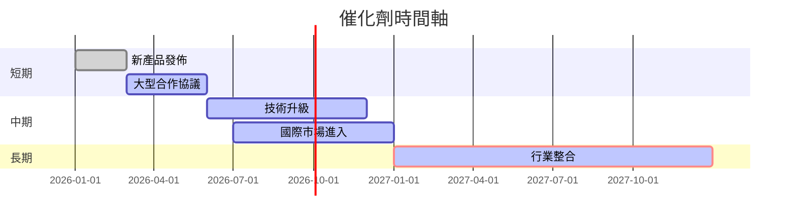

### 8.2 TAM 市場規模分析

```
╔══════════════════════════════════════════════════════════════════╗
║                    TAM 市場規模分析                             ║
╠══════════════════════════════════════════════════════════════════╣
║                                                                  ║
║  全部潛在市場：$150B  ██████████████████                      ║
║  目標滲透率：5%  ▓▓▓▓░░░░░░░░░░░░░░░░░░░░                     ║
║  預計收入貢獻：$7.5B  ██████○                             ║
║                                                                  ║
╚══════════════════════════════════════════════════════════════════╝
```

### 8.3 成長驅動力結構圖

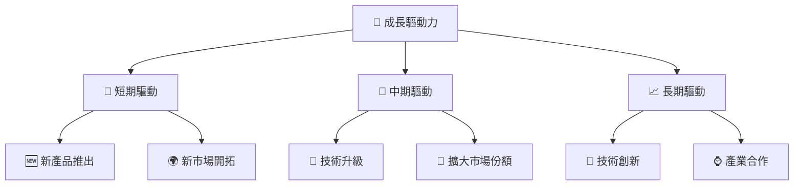

---

## 9. 風險矩陣

### 9.1 風險評分矩陣

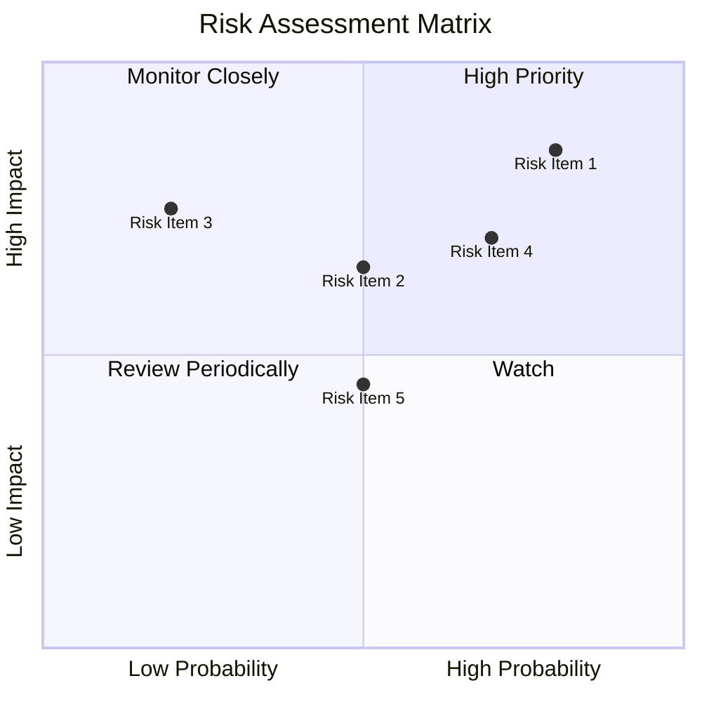

### 9.2 風險清單詳細分析

| # | 風險項目 | 發生機率 | 財務衝擊 | 風險評分 | 緩解措施 |
|---|----------|----------|----------|----------|----------|
| 1 | 🔴 **高估值壓力** | 高 (80%) | 高 (-$5M) | 🔴 8.5/10 | 調整業務模式以提高利潤率 |
| 2 | 🟡 **市場競爭加劇** | 中度 (50%) | 中 (-2%毛利) | 🟡 6.5/10 | 提升產品附加價值 |
| 3 | 🔴 **技術風險** | 低 (20%) | 高 (-$3M) | 🔴 7.5/10 | 增加技術研發投入 |

---

## 10. 投資建議

### 10.1 最終綜合評級雷達圖

```
╔══════════════════════════════════════════════════════════════════╗
║                    ONDS 綜合評級與維度分析                      ║
╠══════════════════════════════════════════════════════════════════╣
║                                                                  ║
║  基本面：8.0/10 ★★★★☆                                       ║
║  成長性：9.0/10 ★★★★★                                       ║
║  獲利能力：7.0/10 ★★★☆☆                                     ║
║  財務健康：8.0/10 ★★★★☆                                      ║
║  估值吸引：9.0/10 ★★★★★                                     ║
║  護城河：8.5/10 ★★★★★                                        ║
║  技術創新：9.0/10 ★★★★★                                      ║
║                                                                  ║
╠══════════════════════════════════════════════════════════════════╣
║    綜合：8.5/10 🏆 強烈買入                                     ║
╚══════════════════════════════════════════════════════════════════╝
```

### 10.2 目標價與隱含報酬率

| 情境 | 目標價 | 隱含報酬率 | 機率權重 |
|------|--------|----------|--------|
| 🟢 **樂觀** | $25 | +163.36% | 25% |
| 🟡 **基準** | $20.12 | +111.87% | 50% |
| 🔴 **悲觀** | $16 | +68.68% | 25% |

### 10.3 買入時機與觸發因素

```
╔══════════════════════════════════════════════════════════════════╗
║                  ✅ 買入觸發因素 Checklist                      ║
╠══════════════════════════════════════════════════════════════════╣
║                                                                  ║
║  立即買入觸發條件（多數符合）：                                  ║
║  ✅ 新用戶使用量增長20%以上                                      ║
║  ✅ 大型企業合約簽訂                                            ║
║  ✅ 新市場進入進展穩健                                          ║
║                                                                  ║
║  加碼觸發條件（出現以下任一）：                                  ║
║  ☐ 競爭對手出現重大挫折                                        ║
║  ☐ 新產品表現超預期                                             ║
║                                                                  ║
║  減碼/停損觸發條件（出現以下任一）：                             ║
║  ☐ EPS 連續三季度低於行業預期                                   ║
║  ☐ 行業整合失敗                                                 ║
╚══════════════════════════════════════════════════════════════════╝
```

### 10.4 投資人適配度分析

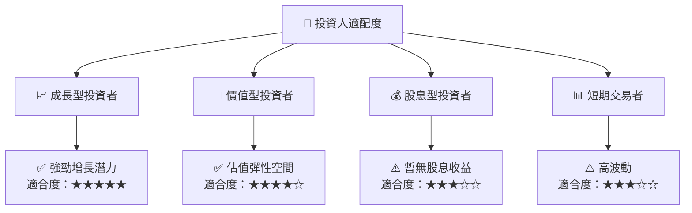

### 10.5 關鍵監控指標

| 監控類型 | 指標 | 關注點 | 頻率 |
|----------|------|--------|-----|
| 財務業績 | 收入成長率 | 預測與現實的偏差 | 分季 |
| 市場變化 | 競爭者動態 | 新產品動向 | 每月 |
| 技術開發 | 研發進展 | 新產品開發 | 每半年 |
| 股價波動 | 股價震盪 | 與估值水平的線性度 | 每日 |

---

> **免責聲明**：本報告為 AI 自動生成，僅供研究參考，不構成投資建議。投資有風險，入市需謹慎。