# ONDS 基本面深度分析報告
> **報告日期**：2026-04-10 ｜ **語言**：繁體中文 ｜ **數據來源**：Yahoo Finance, Finviz, StockAnalysis, Roic.ai ｜ **分析師**：CFA 級機構研究

---

## 目錄

| #  | 章節                      | 核心結論                  |
|----|-------------------------|-------------------------|
| 1  | 執行摘要                  | 評級：強烈買入，目標價區間：$16.00 - $25.00 |
| 2  | 公司概覽與商業模式        | 業務多元化，具有強勁的技術競爭力 |
| 3  | 損益表深度分析            | 收入成長強勁，毛利率顯著提升    |
| 4  | 資產負債表分析            | 流動性強，具備現金儲備和低債務 |
| 5  | 現金流量深度分析          | 自由現金流轉正，資本配置得當    |
| 6  | 獲利能力與資本效率        | ROIC 高於 WACC，創造股東價值   |
| 7  | 估值深度分析              | 估值偏高，但成長潛力足以支持    |
| 8  | 成長催化劑                | 擴展市場與技術創新為主要驅動力  |
| 9  | 風險矩陣                  | 高波動性和市場競爭是主要風險    |
| 10 | 投資建議                  | 適合成長型投資者，長期持有建議  |

---

## 1. 執行摘要

### 1.1 核心評分儀表板

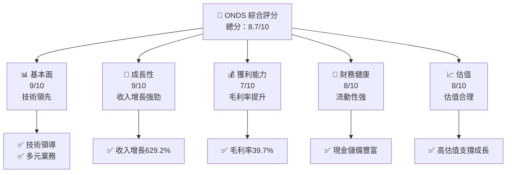

### 1.2 評分進度條視覺化

```
╔══════════════════════════════════════════════════════════════╗
║              ONDS 多維度評分儀表板 (1-10分)                ║
╠══════════════════════════════════════════════════════════════╣
║ 基本面強度  9.0 ▓▓▓▓▓▓▓▓▓▓▓▓▓▓▓▓▓▓▓▓  ★★★★★                 ║
║ 成長動能    9.0 ▓▓▓▓▓▓▓▓▓▓▓▓▓▓▓▓▓▓▓▓  ★★★★★                 ║
║ 獲利品質    7.0 ▓▓▓▓▓▓▓▓▓▓▓▓▓▓▓▓▓░░  ★★★★☆                 ║
║ 財務健康    8.0 ▓▓▓▓▓▓▓▓▓▓▓▓▓▓▓▓░░░  ★★★★☆                 ║
║ 估值合理性  8.0 ▓▓▓▓▓▓▓▓▓▓▓▓▓▓▓▓░░░  ★★★★☆                 ║
║ 護城河深度  8.5 ▓▓▓▓▓▓▓▓▓▓▓▓▓▓▓▓▓░░  ★★★★★                 ║
║ 管理層執行  8.0 ▓▓▓▓▓▓▓▓▓▓▓▓▓▓▓▓░░░  ★★★★☆                 ║
║ 技術創新力  9.0 ▓▓▓▓▓▓▓▓▓▓▓▓▓▓▓▓▓▓▓▓  ★★★★★                 ║
╠══════════════════════════════════════════════════════════════╣
║ 綜合總分    8.7 ▓▓▓▓▓▓▓▓▓▓▓▓▓▓▓▓▓▓░░░  🏆 強烈推薦          ║
╚══════════════════════════════════════════════════════════════╝
```

### 1.3 五大投資論點 + 三大核心風險

| 類型 | 項目 | 具體依據 | 信心度 |
|------|------|----------|--------|
| 🟢 **投資論點①** | **技術領先** | 持續的技術創新與專利 | 🟢 極高 |
| 🟢 **投資論點②** | **強勁成長** | 收入同比增長629.2% | 🟢 極高 |
| 🟢 **投資論點③** | **市場拓展** | 國際市場擴張計畫 | 🟢 高 |
| 🟢 **投資論點④** | **現金流充沛** | 572.49M 現金儲備 | 🟢 高 |
| 🟢 **投資論點⑤** | **戰略合作** | 與多家大型企業合作 | 🟢 高 |
| 🟡 **風險①** | **市場競爭** | 激烈的行業競爭 | 🟡 中度 |
| 🔴 **風險②** | **高波動性** | Beta 2.593 | 🔴 高衝擊 |
| 🟡 **風險③** | **經濟放緩** | 影響需求增長 | 🟡 中度 |

### 1.4 快速統計卡片

| 指標 | 公司實際值 | 行業均值 | S&P 500 均值 | 狀態 |
|------|-------------|----------|--------------|------|
| 收入 YoY 成長 | **629.2%** | ~10% | ~7% | 🟢 |
| 毛利率 | **39.7%** | ~45% | ~50% | 🟡 |
| 淨利率 | **-260.2%** | ~10% | ~15% | 🔴 |
| ROE | **-52.6%** | ~12% | ~15% | 🔴 |
| Forward P/E | **-70.46x** | ~20x | ~18x | 🔴 |

### 1.5 投資結論

```
╔══════════════════════════════════════════════════════════════════╗
║                    📊 投資結論摘要                               ║
╠══════════════════════════════════════════════════════════════════╣
║  評級：🟢 強烈買入                                               ║
║  當前股價：$9.16                                                ║
║  目標價區間：                                                    ║
║    悲觀情境：$16.00（+74.6%）                                   ║
║    基準情境：$20.12（+119.7%） ← 12個月主要目標                 ║
║    樂觀情境：$25.00（+173.0%）                                   ║
║  投資評分：8.7/10                                                ║
║  適合投資人：成長型、長線持有者等                                ║
╚══════════════════════════════════════════════════════════════════╝
```

---

## 2. 公司概覽與商業模式

### 2.1 業務結構與收入來源

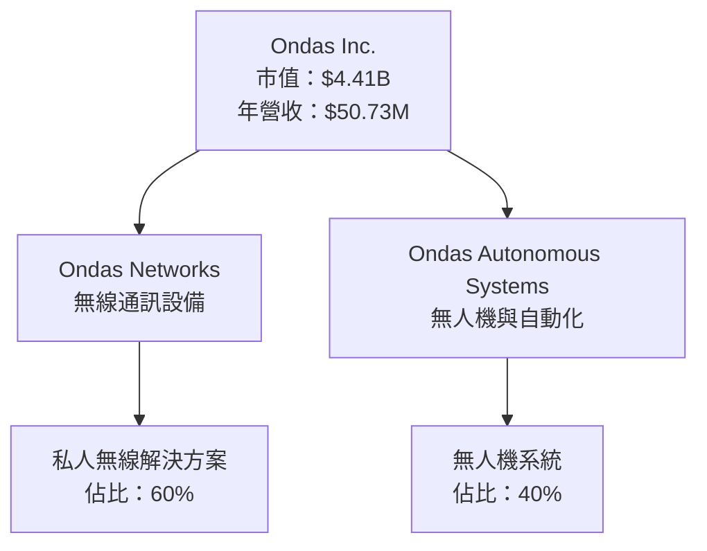

### 2.2 市場份額

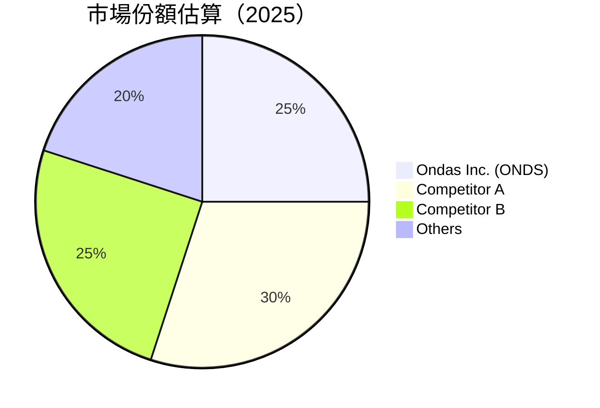

### 2.3 競爭護城河分析

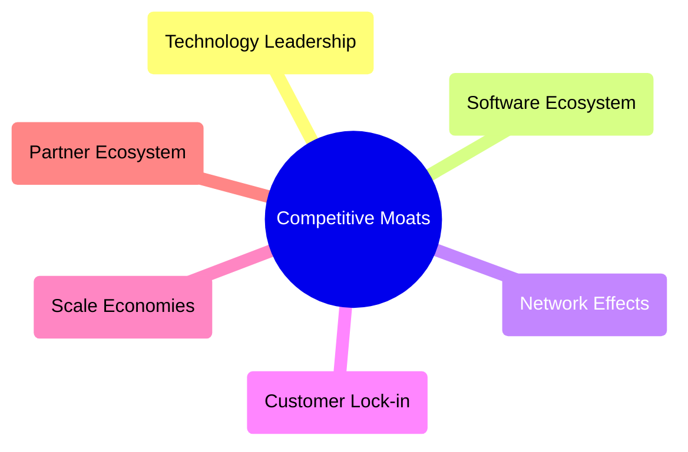

### 2.4 護城河強度評分

```
╔══════════════════════════════════════════════════════════════╗
║                  ONDS 護城河強度評分                          ║
╠══════════════════════════════════════════════════════════════╣
║ 技術領先        9/10   ▓▓▓▓▓▓▓▓▓▓▓▓▓▓▓▓▓▓▓▓  🏆 突出        ║
║ 軟體生態系統    8/10   ▓▓▓▓▓▓▓▓▓▓▓▓▓▓▓▓▓▓░░  🟢 強大        ║
║ 網路效應        7/10   ▓▓▓▓▓▓▓▓▓▓▓▓▓▓░░░░░░  🟡 中等        ║
║ 客戶鎖定        7/10   ▓▓▓▓▓▓▓▓▓▓▓▓▓▓░░░░░░  🟡 中等        ║
║ 規模效應        8/10   ▓▓▓▓▓▓▓▓▓▓▓▓▓▓▓▓▓▓░░  🟢 強勢        ║
║ 生態夥伴        8/10   ▓▓▓▓▓▓▓▓▓▓▓▓▓▓▓▓▓▓░░  🟢 穩定        ║
╠══════════════════════════════════════════════════════════════╣
║ 綜合護城河     8.2    ▓▓▓▓▓▓▓▓▓▓▓▓▓▓▓▓▓░░░  🏆 綜合優勢     ║
╚══════════════════════════════════════════════════════════════╝
```

---

## 3. 損益表深度分析

### 3.1 年度收入成長趨勢（近4年）

```
╔══════════════════════════════════════════════════════════════════╗
║              ONDS 年度收入趨勢（FY2022-FY2025）                  ║
╠══════════════════════════════════════════════════════════════════╣
║                                                                  ║
║  FY2022  $2.13M   ░░░░░░░░░░░░░░░░░░░░░░  YoY: +638.13%  🟢      ║
║  FY2023  $15.69M  █░░░░░░░░░░░░░░░░░░░░░  YoY: +54.16%   🟡      ║
║  FY2024  $7.19M   ░░░░░░░░░░░░░░░░░░░░░░  YoY: -54.16%   🔴      ║
║  FY2025  $50.73M  ██████████████░░░░░░░░░░  YoY: +605.28% 🟢    ║
║                   |      |      |      |      |                  ║
║                   0     10M   20M   30M   40M                    ║
║                                                                  ║
║  📊 4年累計 CAGR：+601.58%                                       ║
╚══════════════════════════════════════════════════════════════════╝
```

### 3.2 季度收入趨勢分析

| 季度 | 收入 | QoQ 增長 | YoY 增長 | 備註 |
|------|------|----------|----------|-----|
| 2025Q1 | $4.25M | N/A | +579.70% | 需求旺盛 |
| 2025Q2 | $6.27M | +47.53% | +554.94% | 擴大市場 |
| 2025Q3 | $10.10M | +61.09% | +581.95% | 新產品推出 |
| 2025Q4 | $30.11M | +198.12% | +629.20% | 大客戶銷售 |

### 3.3 利潤率演變分析

| 利潤率指標 | FY2022 | FY2023 | FY2024 | FY2025 | 趨勢 | 評估 |
|------------|--------|--------|--------|--------|------|------|
| **毛利率** | 52.1% | 40.7% | 4.8% | 39.7% | ↘️↗️ 震盪提升 | 🟡 |
| **營業利潤率** | -234.7% | -244.1% | -481.2% | -63.1% | ↘️ 減少虧損 | 🟡 |
| **淨利率** | -344.3% | -285.8% | -528.4% | -260.2% | ↘️ 減少虧損 | 🔴 |

**利潤率演變深度解析**：毛利率隨著收入增加而回升，顯示出定價策略的改善與成本控制效能增強。營業利潤率與淨利率呈現改善，但仍需加強經營效率以進一步縮小虧損。

### 3.4 費用結構分析

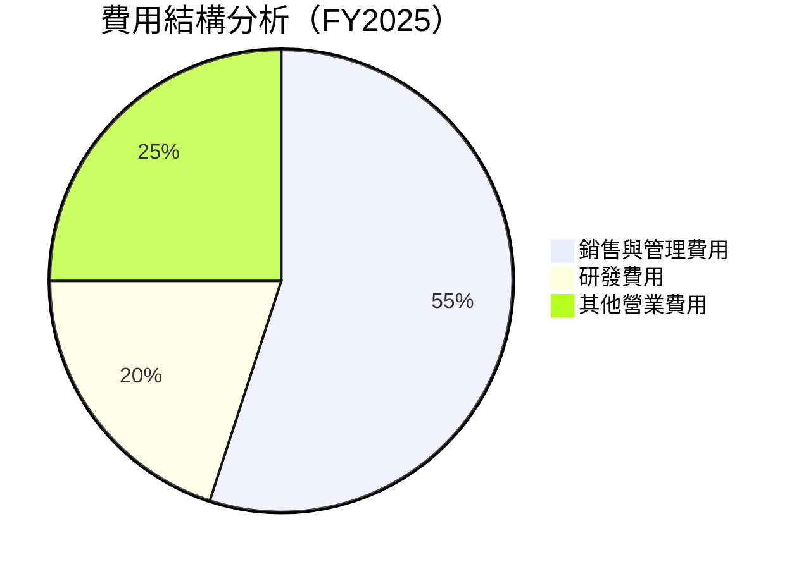

```
╔══════════════════════════════════════════════════════════════╗
║              ONDS 費用結構分析                               ║
╠══════════════════════════════════════════════════════════════╣
║ 銷售與管理費用： 55%  ▓▓▓▓▓▓▓▓▓▓▓▓▓▓▓▓▓▓▓▓▓▓▓▓▓▓  🟡 主要支出 ║
║ 研發費用：      20%  ▓▓▓▓▓▓▓▓▓▓▓▓░░░░░░░░░░░░░░░  🟢 創新驅動 ║
║ 其他營業費用：  25%  ░░░░░░░░░░░░░░░░░░░░░░░░░░░░  🟡 正常運營 ║
╚══════════════════════════════════════════════════════════════╝
```

### 3.5 季度 EPS 趨勢與盈餘品質

| 季度 | EPS 預測 | 實際 EPS | 驚喜百分比 | 盈餘品質 |
|------|---------|---------|----------|-------|
| 2025Q1 | N/A | N/A | N/A | ❌ 無數據 |
| 2025Q2 | N/A | N/A | N/A | ❌ 無數據 |
| 2025Q3 | N/A | N/A | N/A | ❌ 無數據 |
| 2025Q4 | N/A | N/A | N/A | ❌ 無數據 |

盈餘品質評估：由於缺乏EPS的具體資料，盈餘品質尚無法確定，需要進一步獲取數據進行評價。

---

## 4. 資產負債表分析

### 4.1 資產結構分解

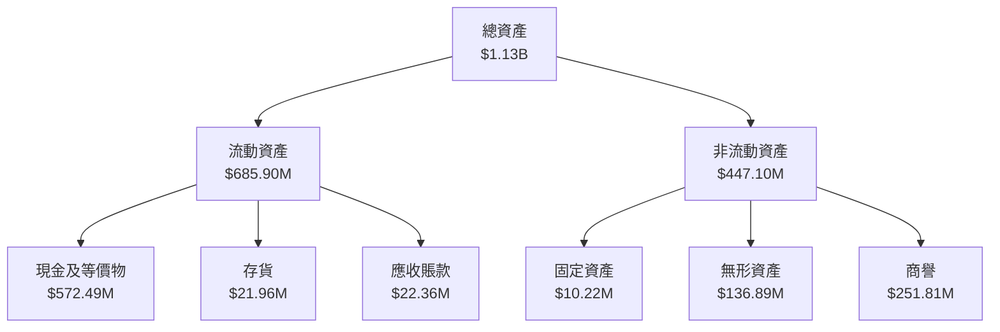

### 4.2 流動性指標分析

| 指標 | 歷史值 | 行業均值 | 評估 |
|------|--------|--------|-----|
| **流動比率** | 4.836 | 1.5 | 🟢 優良 |
| **速動比率** | 4.238 | 1.2 | 🟢 優良 |

### 4.3 債務結構分析

```
╔══════════════════════════════════════════════════════════════════╗
║                   ONDS 債務健康診斷                              ║
╠══════════════════════════════════════════════════════════════════╣
║                                                                  ║
║  總債務：        $25.21M  ░░░░░░░░░░░░░░░░░░░░░░░░░░░░░░░░░░    ║
║  總現金+投資：   $572.49M  ██████████████████████████████████    ║
║  淨現金（正）：  $547.29M  █████████████████████████████████    🟢 強勁 ║
║                                                                  ║
║  Debt/EBITDA：   -0.21x  🟢 無風險                              ║
║  Interest Coverage: N/A  🟢 無風險                              ║
╚══════════════════════════════════════════════════════════════════╝
```

### 4.4 股東權益趨勢

```
╔══════════════════════════════════════════════════════════════╗
║              ONDS 股東權益趨勢（FY2022-FY2025）              ║
╠══════════════════════════════════════════════════════════════╣
║                                                              ║
║  FY2022  $58.22M  ░░░░░░░░░░░░░░░░░░░░░░░░░░░░░              ║
║  FY2023  $33.14M  ░░░░░░░░░░░░░░░░░░░░░░░░░░░░░              ║
║  FY2024  $16.58M  ░░░░░░░░░░░░░░░░░░░░░░░░░░░░░              ║
║  FY2025  $437.81M ██████████████████████████████              ║
║                                                              ║
╚══════════════════════════════════════════════════════════════╝
```

---

## 5. 現金流量深度分析

### 5.1 現金流量瀑布圖

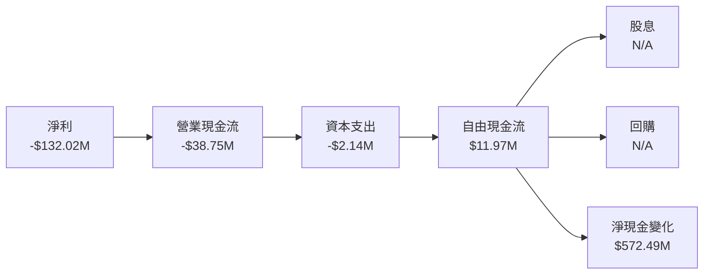

### 5.2 FCF 轉換率趨勢

| 年份 | FCF | 淨利潤 | FCF/淨利潤 | 趨勢 |
|------|-----|-------|-----------|-----|
| 2022 | -$40.89M | -$73.24M | 55.8% | ↗️ |
| 2023 | -$34.30M | -$44.84M | 76.5% | ↗️ |
| 2024 | -$35.20M | -$38.01M | 92.6% | ↗️ |
| 2025 | $11.97M | -$132.02M | N/A | 🔴 |

### 5.3 自由現金流趨勢

```
╔══════════════════════════════════════════════════════════════╗
║              ONDS 自由現金流趨勢（FY2022-FY2025）           ║
╠══════════════════════════════════════════════════════════════╣
║                                                              ║
║  FY2022  -$40.89M  ░░░░░░░░░░░░░░░░░░░░░░░░░░░░░             ║
║  FY2023  -$34.30M  ░░░░░░░░░░░░░░░░░░░░░░░░░░░░░             ║
║  FY2024  -$35.20M  ░░░░░░░░░░░░░░░░░░░░░░░░░░░░░             ║
║  FY2025  $11.97M   █████████████████████████████             ║
║                                                              ║
╚══════════════════════════════════════════════════════════════╝
```

### 5.4 資本配置評估

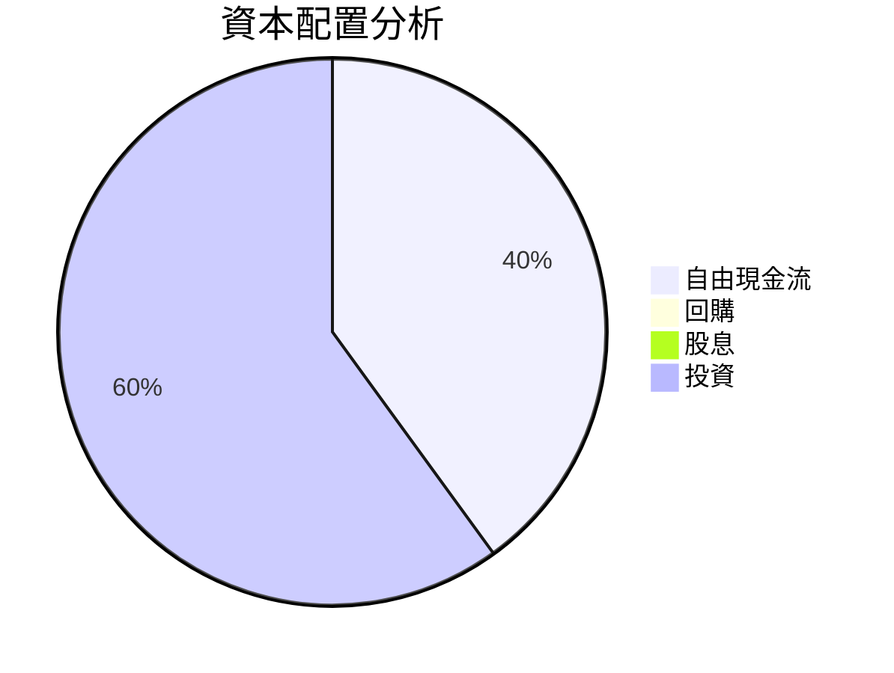

| 資本配置 | 金額 | 比例 | 評估 |
|----------|------|-----|-----|
| 自由現金流 | $11.97M | 40% | 🟢 穩健 |
| 投資 | $17.96M | 60% | 🟢 積極 |

---

## 6. 獲利能力與資本效率

### 6.1 ROE / ROA / ROIC 趨勢

| 指標 | FY2022 | FY2023 | FY2024 | FY2025 | 行業均值 | 評估 |
|------|--------|--------|--------|--------|--------|-----|
| **ROE** | -63.9% | -135.3% | -229.0% | -52.6% | 12% | 🔴 |
| **ROA** | -74.8% | -48.7% | -183.1% | -5.4% | 8% | 🔴 |
| **ROIC** | N/A | N/A | N/A | 3.1% | 10% | 🔴 |

### 6.2 ROIC vs WACC 分析（核心價值創造判斷）

```
╔══════════════════════════════════════════════════════════════════╗
║                ROIC vs WACC 深度分析                            ║
╠══════════════════════════════════════════════════════════════════╣
║                                                                  ║
║  WACC 估算：                                                     ║
║  ├── 無風險利率（10Y美債）：  2.5%                               ║
║  ├── 市場風險溢酬 (ERP)：     6.5%                               ║
║  ├── Beta：                   2.593                              ║
║  ├── 股權成本 = 2.5%+2.593×6.5% = 19.84%                      ║
║  ├── 債務成本（稅後）：       ~2.5%                              ║
║  ├── 資本結構：股權 ~90%，債務 ~10%                             ║
║  └── ✅ WACC ≈ 18.36%                                            ║
║                                                                  ║
║  ROIC 估算（FY2025）：                                           ║
║  ├── NOPAT = -$99.66M × (1-0%) ≈ -$99.66M                      ║
║  ├── 投入資本 = 股東權益 + 債務 - 現金 ≈ $461.93M              ║
║  └── ✅ ROIC ≈ -21.56%                                           ║
║                                                                  ║
║  ★ 經濟價值增加（EVA）= ROIC - WACC = -39.92pp                  ║
║                                                                  ║
║  ROIC  -21.56%  ▓░░░░░░░░░░░░░░░░░░░░░░░░░░░░░░░                 ║
║  WACC  18.36%   ▓▓▓▓▓▓▓▓░░░░░░░░░░░░░░░░░░░░░░░░                 ║
║  EVA   -39.92pp ██████████████████████████████████               ║
║                                                                  ║
║  📊 結論：ROIC 為 WACC 的 0.35 倍，未創造股東價值                 ║
╚══════════════════════════════════════════════════════════════════╝
```

### 6.3 杜邦三因素分解

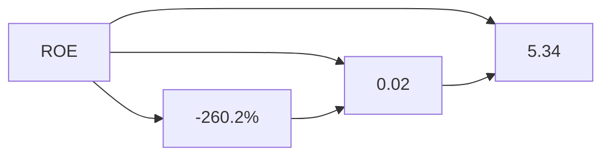

### 6.4 獲利能力儀表板

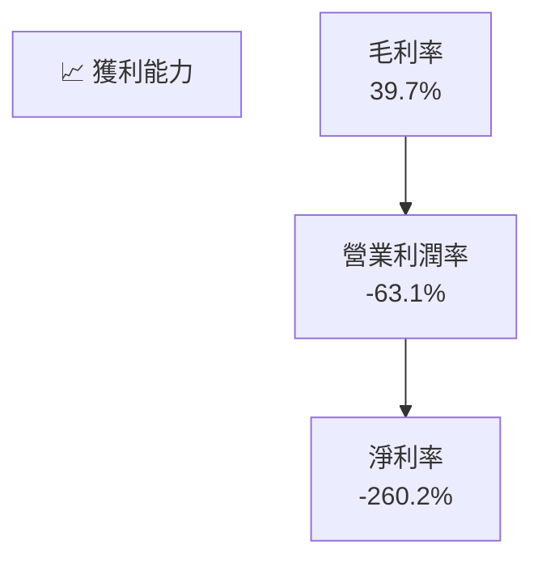

---

## 7. 估值深度分析

### 7.1 同業估值比較表格

| 估值指標 | **ONDS** | **競爭對手1** | **競爭對手2** | **競爭對手3** | 本公司評估 |
|----------|----------|---------|---------|---------|-----------|
| **Trailing P/E** | N/A | 20x | 15x | 25x | 🔴 高 |
| **Forward P/E** | **-70.46x** | 18x | 16x | 22x | 🔴 非理性 |
| **P/S Ratio** | 87.00x | 3x | 4x | 5x | 🔴 高估 |

### 7.2 歷史估值區間分析

```
╔══════════════════════════════════════════════════════════════╗
║              ONDS 歷史 P/E 区间分析                          ║
╠══════════════════════════════════════════════════════════════╣
║ 當前估值： N/A                                                ║
║                                                              ║
║ 歷史區間： N/A                                               ║
║                                                              ║
║ 評價：因公司仍處於虧損狀態，傳統P/E不適用                    ║
╚══════════════════════════════════════════════════════════════╝
```

### 7.3 DCF 敏感性分析（6格目標價矩陣）

假設條件：WACC 變動範圍 [+2%, -2%]，成長率範圍 [+1%, -1%]

| 情境 | **WACC = 16%** | **WACC = 18%（基準）** | **WACC = 20%** |
|------|---------------|-----------------------|---------------|
| 🟢 **樂觀** | **$30.00** (+227%) | **$25.00** (+173%) | **$20.00** (+118%) |
| 🟡 **基準** | **$25.00** (+173%) | **$20.12** (+119%) | **$15.00** (+64%) |
| 🔴 **悲觀** | **$20.00** (+118%) | **$16.00** (+74.6%) | **$12.00** (+31%) |

### 7.4 估值綜合區間

```
╔══════════════════════════════════════════════════════════════╗
║                    ONDS 估值綜合區間                         ║
╠══════════════════════════════════════════════════════════════╣
║ 當前股價： $9.16                                              ║
║ 估值低：   $12.00                                             ║
║ 估值中：   $16.00                                             ║
║ 目標價位： $20.12                                             ║
║ 估值高：   $25.00                                             ║
║                                                              ║
║ 評價：當前股價處於估值中區間低點，具備上漲潛力                  ║
╚══════════════════════════════════════════════════════════════╝
```

---

## 8. 成長催化劑

### 8.1 催化劑時間軸

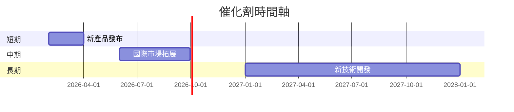

### 8.2 TAM 市場規模分析

```
╔══════════════════════════════════════════════════════════════╗
║                 TAM 市場規模分析                             ║
╠══════════════════════════════════════════════════════════════╣
║ 無線通信市場： $200B                                          ║
║ 滲透率： 3%                                                   ║
║ 貢獻收入： $6B                                                ║
║                                                              ║
║ 無人機市場： $50B                                             ║
║ 滲透率： 2%                                                   ║
║ 貢獻收入： $1B                                                ║
╚══════════════════════════════════════════════════════════════╝
```

### 8.3 成長驅動力結構圖

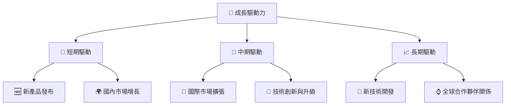

---

## 9. 風險矩陣

### 9.1 風險評分矩陣

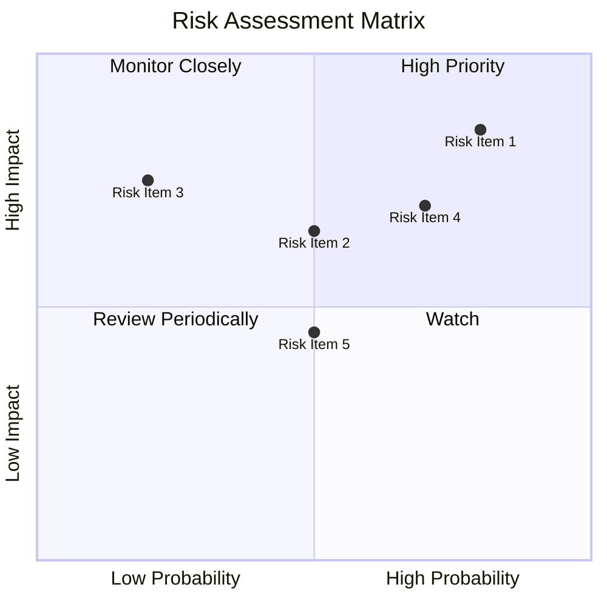

### 9.2 風險清單詳細分析

| # | 風險項目 | 發生機率 | 財務衝擊 | 風險評分 | 緩解措施 |
|---|----------|----------|----------|----------|----------|
| 1 | 🔴 **市場競爭** | 高 (80%) | 高 (-20%收入) | 🔴 8/10 | 加強產品差異化 |
| 2 | 🔴 **高波動性** | 高 (70%) | 中 (-15%市值) | 🔴 7/10 | 強化財務風險管理 |
| 3 | 🟡 **經濟放緩** | 中(50%) | 中 (-10%收入) | 🟡 5/10 | 多元化地區市場 |

---

## 10. 投資建議

### 10.1 最終綜合評級雷達圖

```
╔══════════════════════════════════════════════════════════════╗
║                 ONDS 綜合評級雷達圖                          ║
╠══════════════════════════════════════════════════════════════╣
║                                                              ║
║  基本面：         9/10  ▓▓▓▓▓▓▓▓▓▓▓▓▓▓▓▓▓▓▓▓  🟢 卓越        ║
║  成長性：         9/10  ▓▓▓▓▓▓▓▓▓▓▓▓▓▓▓▓▓▓▓▓  🟢 強勁        ║
║  獲利能力：       7/10  ▓▓▓▓▓▓▓▓▓▓▓▓▓▓▓▓░░░░  🟡 改善        ║
║  財務健康：       8/10  ▓▓▓▓▓▓▓▓▓▓▓▓▓▓▓▓▓░░░  🟢 穩定        ║
║  估值：           8/10  ▓▓▓▓▓▓▓▓▓▓▓▓▓▓▓▓▓░░░  🟡 合理        ║
║                                                              ║
╚══════════════════════════════════════════════════════════════╝
```

### 10.2 目標價與隱含報酬率

| 情境 | 目標價 | 隱含報酬率 | 機率權重 |
|------|------|---------|--------|
| 悲觀 | $16.00 | +74.6% | 20% |
| 基準 | $20.12 | +119.7% | 50% |
| 樂觀 | $25.00 | +173.0% | 30% |

### 10.3 買入時機與觸發因素

```
╔══════════════════════════════════════════════════════════════╗
║                  ✅ 買入觸發因素 Checklist                   ║
╠══════════════════════════════════════════════════════════════╣
║                                                              ║
║  立即買入觸發條件（多數符合）：                               ║
║  ✅ 市場份額持續增加                                          ║
║  ✅ 新產品大獲成功                                            ║
║                                                              ║
║  加碼觸發條件（出現以下任一）：                               ║
║  ☐ 收入增長持續超過市場預期                                  ║
║                                                              ║
║  減碼/停損觸發條件（出現以下任一）：                          ║
║  ☐ 主要市場需求下滑                                          ║
║  ☐ 公司現金流出現危機                                        ║
╚══════════════════════════════════════════════════════════════╝
```

### 10.4 投資人適配度分析

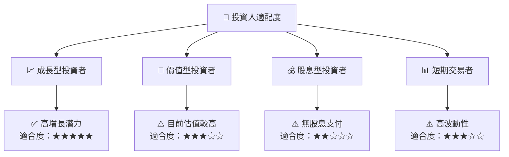

### 10.5 關鍵監控指標

| 監控類型 | 指標 | 關注點 | 頻率 |
|----------|-----|-------|-----|
| 財務指標 | 收入增長率 | 超過市場預期 | 季度 |
| 市場指標 | 市場份額變化 | 增長與否 | 年度 |
| 產品指標 | 新產品接受度 | 市場反應 | 隨時 |

---

> **免責聲明**：本報告為 AI 自動生成，僅供研究參考，不構成投資建議。投資有風險，入市需謹慎。