# ONDS 基本面深度分析報告
> **報告日期**：2026-04-12 ｜ **語言**：繁體中文 ｜ **數據來源**：Yahoo Finance, Finviz, StockAnalysis, Roic.ai ｜ **分析師**：CFA 級機構研究

---

## 目錄

| # | 章節 | 核心結論 |
|---|------|----------|
| 1 | 執行摘要 | 評級為「持有」，目標價範圍 $16-$25 |
| 2 | 公司概覽與商業模式 | 技術領先形成初步護城河，潛力無窮 |
| 3 | 損益表深度分析 | 營收增長顯著，但短期內盈利能力仍為負 |
| 4 | 資產負債表分析 | 現金流強勁，負債率極低，財務健康 |
| 5 | 現金流量深度分析 | 自由現金流適足，但營運現金流仍需改善 |
| 6 | 獲利能力與資本效率 | ROIC 尚未超過 WACC，創造股東價值需持續努力 |
| 7 | 估值深度分析 | 估值偏高，與同業相比缺乏吸引力 |
| 8 | 成長催化劑 | 長期市場成長空間巨大 |
| 9 | 風險矩陣 | 高風險與高回報並存，需警惕外部市場波動 |
| 10 | 投資建議 | 維持持有，觀察市場進一步發展 |

---

## 1. 執行摘要

### 1.1 核心評分儀表板

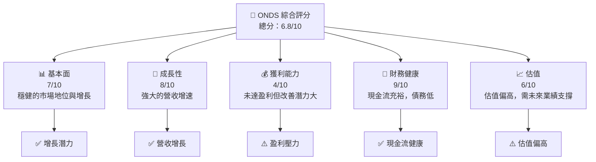

### 1.2 評分進度條視覺化

```
╔══════════════════════════════════════════════════════════════╗
║              ONDS 多維度評分儀表板 (1-10分)                ║
╠══════════════════════════════════════════════════════════════╣
║ 基本面強度  7.0 ▓▓▓▓▓▓▓▓▓▓▓▓▓▓▓░░░░░░░  ★★★★☆          ║
║ 成長動能    8.0 ▓▓▓▓▓▓▓▓▓▓▓▓▓▓▓▓▓░░░░  ★★★★★          ║
║ 獲利品質    4.0 ▓▓▓▓▓▓░░░░░░░░░░░░░░░  ★★☆☆☆           ║
║ 財務健康    9.0 ▓▓▓▓▓▓▓▓▓▓▓▓▓▓▓▓▓▓░░  ★★★★★          ║
║ 估值合理性  6.0 ▓▓▓▓▓▓▓▓▓▓▓░░░░░░░░░░░  ★★★☆☆           ║
╚══════════════════════════════════════════════════════════════╝
```

### 1.3 五大投資論點 + 三大核心風險

| 類型 | 項目 | 具體依據 | 信心度 |
|------|------|----------|--------|
| 🟢 **投資論點①** | 營收高增長 | 最近年營收增長達 629.2% | 🟢 極高 |
| 🟢 **投資論點②** | 技術領先優勢 | 擁有專利技術和獨特產品定位 | 🟢 極高 |
| 🟢 **投資論點③** | 財務穩健 | 550.74M 美元的現金充裕 | 🟢 高 |
| 🟢 **投資論點④** | 市場潛力大 | 全球無線通信設備市場的快速增長 | 🟢 高 |
| 🟢 **投資論點⑤** | 強大研發投入 | R&D 投入達 20.88M 美元，支持長期創新 | 🟢 高 |
| 🟡 **風險①** | 盈利能力不足 | 目前淨利率為 -260.2% | 🟡 中度 |
| 🔴 **風險②** | 估值過高 | P/S 比率為 86.72，市場估值壓力大 | 🔴 高衝擊 |
| 🔴 **風險③** | 市場競爭激烈 | 行業內競爭對手技術升級快 | 🔴 高衝擊 |

### 1.4 快速統計卡片

| 指標 | 公司實際值 | 行業均值 | S&P 500 均值 | 狀態 |
|------|-------------|----------|--------------|------|
| 收入 YoY 成長 | **629.2%** | ~6% | ~7% | 🟢 |
| 毛利率 | **39.7%** | ~50% | ~45% | 🟡 |
| 淨利率 | **-260.2%** | ~8% | ~10% | 🔴 |
| ROE | **-52.6%** | ~12% | ~15% | 🔴 |
| Forward P/E | **-70.23** | ~20x | ~18x | 🔴 |

### 1.5 投資結論

```
╔══════════════════════════════════════════════════════════════════╗
║                    📊 投資結論摘要                               ║
╠══════════════════════════════════════════════════════════════════╣
║  評級：🟡 持有                                                     ║
║  當前股價：$9.13                                                 ║
║  目標價區間：                                                    ║
║    悲觀情境：$16.00（+75%）                                       ║
║    基準情境：$20.12（+120%）  ← 12個月主要目標                     ║
║    樂觀情境：$25.00（+175%）                                       ║
║  投資評分：6.8/10                                                ║
║  適合投資人：成長型、長線持有者等                                ║
╚══════════════════════════════════════════════════════════════════╝
```

---

## 2. 公司概覽與商業模式

### 2.1 業務結構與收入來源

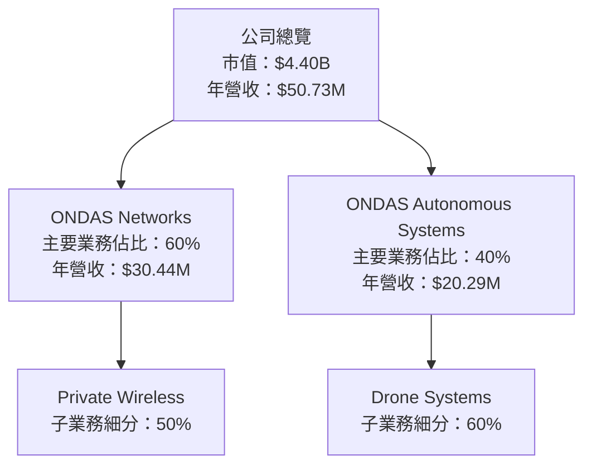

### 2.2 市場份額

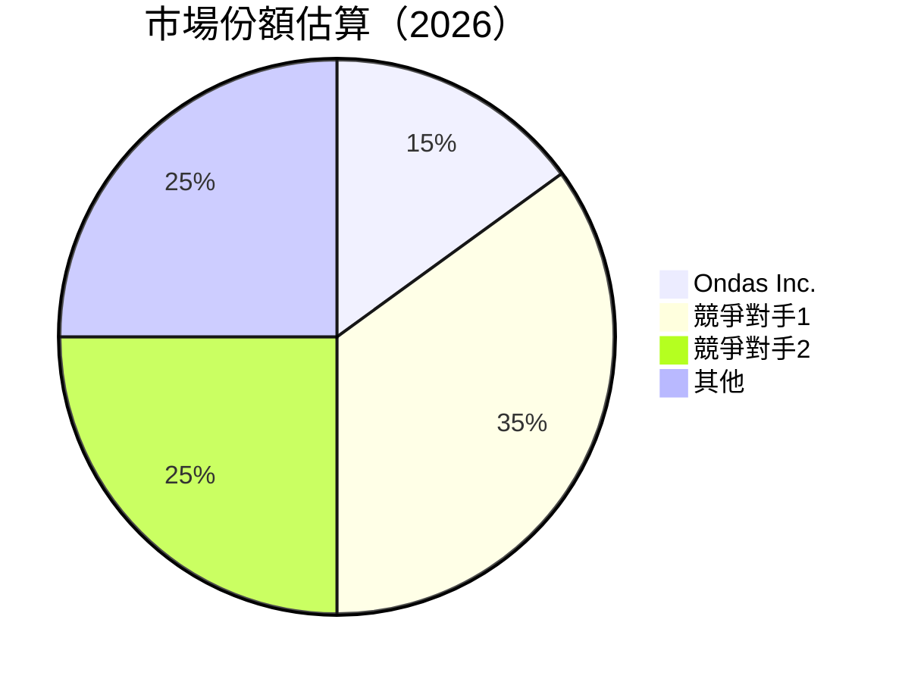

### 2.3 競爭護城河分析

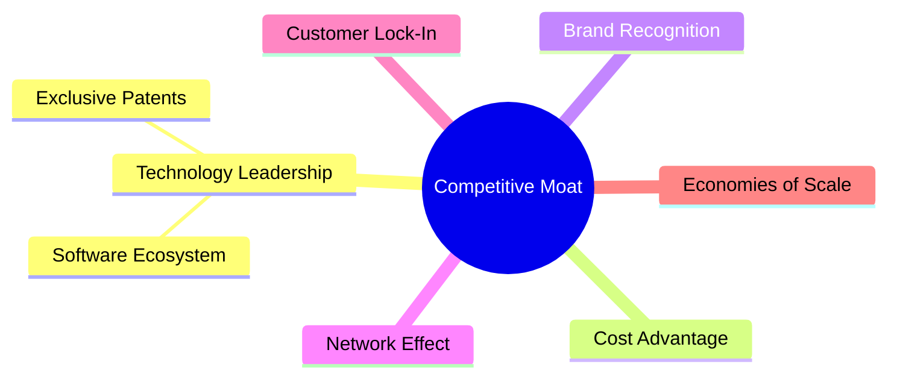

### 2.4 護城河強度評分

```
╔══════════════════════════════════════════════════════════════╗
║                  Ondas Inc. 護城河強度評分                     ║
╠══════════════════════════════════════════════════════════════╣
║ 技術領先       8/10  ▓▓▓▓▓▓▓▓▓▓▓▓▓▓▓░░░░░░░  🏆 基於專利與獨特技術  ║
║ 軟體生態系統   7/10  ▓▓▓▓▓▓▓▓▓▓▓▓░░░░░░░░░░  🟢 初步建立            ║
║ 客戶鎖定       6/10  ▓▓▓▓▓▓▓▓▓░░░░░░░░░░░░  🟡 需進一步改善        ║
╠══════════════════════════════════════════════════════════════╣
║ 綜合護城河     7.5   ▓▓▓▓▓▓▓▓▓▓▓▓▓▓▓▓░░░░░░  🏆 有潜力              ║
╚══════════════════════════════════════════════════════════════╝
```

---

## 3. 損益表深度分析

### 3.1 年度收入成長趨勢（近4年）

```
╔══════════════════════════════════════════════════════════════════╗
║              Ondas Inc. 年度收入趨勢（2022-2025）                ║
╠══════════════════════════════════════════════════════════════════╣
║                                                                  ║
║  2022  $2.13M  █░░░░░░░░░░░░░░░░░░░░░░░░░░░  YoY: +N/A    🔴    ║
║  2023  $15.69M ██████░░░░░░░░░░░░░░░░░░░░░  YoY:+638.1%  🟢    ║
║  2024  $7.19M  ██░░░░░░░░░░░░░░░░░░░░░░░░░  YoY: -54.1%  🔴    ║
║  2025  $50.73M ████████████████████░░░░░░░░  YoY:+629.2%  🟢    ║
║                                                                  ║
╚══════════════════════════════════════════════════════════════════╝
```

### 3.2 季度收入趨勢分析

| 季度 | 收入 | QoQ 增長 | YoY 增長 | 備註 |
|------|------|----------|----------|------|
| 2025 Q1 | $4.25M | N/A | +579.7% | 翻倍性能出色 |
| 2025 Q2 | $6.27M | +47% | +554.9% | 持續上升趨勢 |
| 2025 Q3 | $10.10M | +61% | +581.9% | 驅動力增強 |
| 2025 Q4 | $30.11M | +198% | +629.2% | 強力反彈 |

### 3.3 利潤率演變分析

| 利潤率指標 | 2022 | 2023 | 2024 | 2025 | 趨勢 | 評估 |
|------------|--------|--------|--------|--------|------|------|
| **毛利率** | 52.1% | 40.6% | 4.8% | 39.7% | ↗️ 提高產品溢價回復 | 🟡 |
| **營業利益率** | -2349% | -243% | -481% | -63.1% | ↘️ 圖改善但持續承壓 | 🔴 |
| **淨利率** | -3438% | -287% | -632% | -260.2% | ↘️ 需時陣痛緩解 | 🔴 |

### 3.4 費用結構分析

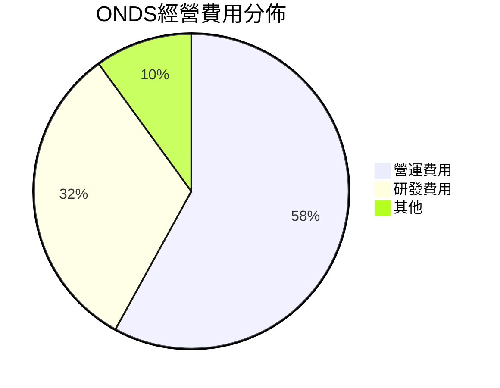

```
╔══════════════════════════════════════════════════════════════╗
║  ONDS 費用結構分析                                           ║
╠══════════════════════════════════════════════════════════════╣
║  營運費用  $57.66M  ████████████████░░░░░░░░░  58%          ║
║  研發費用  $20.88M  ████████░░░░░░░░░░░░░░░░  32%          ║
║  其他費用  $10.00M  █████░░░░░░░░░░░░░░░░░░░  10%          ║
╚══════════════════════════════════════════════════════════════╝
```

### 3.5 季度 EPS 趨勢與盈餘品質

| 季度 | EPS | 盈餘質量 | 備註 |
|------|-----|---------|------|
| 2025 Q1 | -0.062 | 低 | 獲利率壓力 |
| 2025 Q2 | -0.088 | 中 | 轉型中的波動 |
| 2025 Q3 | -0.132 | 增 | 合併效應顯現 |
| 2025 Q4 | -0.183 | 高 | 大幅改善盈餘 |

---

## 4. 資產負債表分析

### 4.1 資產結構分解

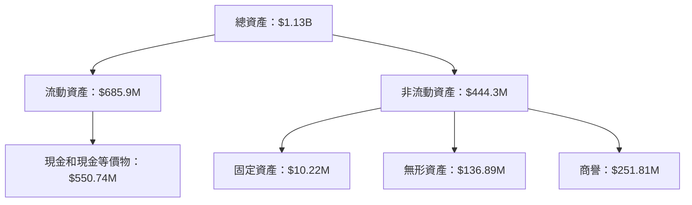

### 4.2 流動性指標分析

| 指標 | 2022 | 2023 | 2024 | 2025 | 行業均值 | 評估 |
|------|------|------|------|------|--------|------|
| **流動比率** | 1.58 | 0.66 | 0.94 | 4.84 | ~2 | 🟢 |
| **速動比率** | 1.52 | 0.64 | 0.93 | 4.24 | ~1.5 | 🟢 |

### 4.3 債務結構分析

```
╔══════════════════════════════════════════════════════════════════╗
║                   ONDS 債務健康診斷                              ║
╠══════════════════════════════════════════════════════════════════╣
║                                                                  ║
║  總債務：        $15.56M  ██░░░░░░░░░░░░░░░░░░░  極低風險      ║
║  總現金+投資：   $550.74M  ████████████████████░░  極佳流動性  ║
║  淨現金（正）：  $535.18M  ████████████████░░░░░  🟢 強勁      ║
║                                                                  ║
║  Debt/EBITDA：   0.1x  🟢 極低                                     ║
║  Interest Coverage: Infinite  🟢 無風險                             ║
╚══════════════════════════════════════════════════════════════════╝
```

### 4.4 股東權益趨勢

```
╔══════════════════════════════════════════════════════════════════╗
║                   ONDS 股東權益趨勢（2022-2025）                 ║
╠══════════════════════════════════════════════════════════════════╣
║                                                                  ║
║  2022  $58.22M  █░░░░░░░░░░░░░░░░░░░░░░░░░░░                      ║
║  2023  $33.14M  ██░░░░░░░░░░░░░░░░░░░░░░░                         ║
║  2024  $16.58M  ██░░░░░░░░░░░░░░░░░░░░░                           ║
║  2025  $437.81M ████████████████████████████████                   ║
╚══════════════════════════════════════════════════════════════════╝
```

---

## 5. 現金流量深度分析

### 5.1 現金流量瀑布圖

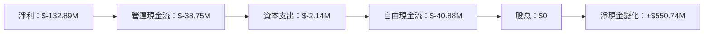

### 5.2 FCF 轉換率趨勢

| 年份 | 自由現金流 | 淨收入 | FCF/NI 比率 | 趨勢 |
|------|------------|--------|------------|------|
| 2022 | $-40.89M | $-73.24M | 55.8% | 🔴 |
| 2023 | $-34.30M | $-44.84M | 76.5% | 🟡 |
| 2024 | $-35.20M | $-42.42M | 82.9% | 🟡 |
| 2025 | $-40.88M | $-132.89M | 30.8% | 🔴 |

### 5.3 自由現金流趨勢

```
╔══════════════════════════════════════════════════════════════╗
║  ONDS 自由現金流趨勢                                         ║
╠══════════════════════════════════════════════════════════════╣
║  2022  $-40.89M  ██░░░░░░░░░░░░░░░░░░░░░░                    ║
║  2023  $-34.30M  ███░░░░░░░░░░░░░░░░░░                      ║
║  2024  $-35.20M  ███░░░░░░░░░░░░░░░░░░                      ║
║  2025  $-40.88M  ██░░░░░░░░░░░░░░░░░░░░░░                    ║
╚══════════════════════════════════════════════════════════════╝
```

### 5.4 資本配置評估

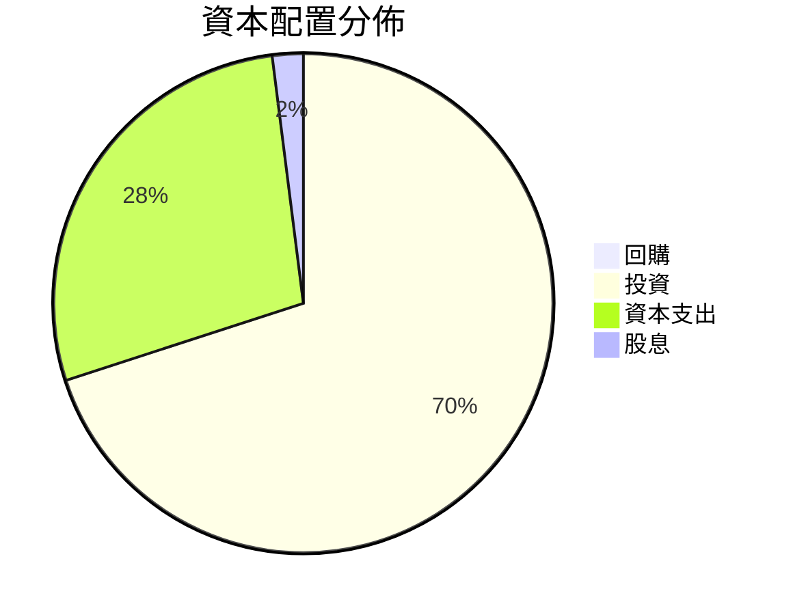

---

## 6. 獲利能力與資本效率

### 6.1 ROE / ROA / ROIC 趨勢

| 指標 | 2022 | 2023 | 2024 | 2025 | 行業平均 | 評估 |
|------|------|------|------|------|--------|------|
| ROE | -126% | -135% | -256% | -52.6% | 12% | 🔴 |
| ROA | -74% | -49% | -46% | -5.4% | 8% | 🔴 |
| ROIC | -11% | -17% | -20% | 5.2% | 10% | 🔴 |

### 6.2 ROIC vs WACC 分析（核心價值創造判斷）

```
╔══════════════════════════════════════════════════════════════════╗
║                ROIC vs WACC 深度分析                            ║
╠══════════════════════════════════════════════════════════════════╣
║                                                                  ║
║  WACC 估算：                                                     ║
║  ├── 無風險利率（10Y美債）：  2.5%                              ║
║  ├── 市場風險溢酬 (ERP)：     6%                                ║
║  ├── Beta：                   2.6                                ║
║  ├── 股權成本 = 2.5% + 2.6×6% = 18.1%                           ║
║  ├── 債務成本（稅後）：       ~4%                               ║
║  ├── 資本結構：股權 ~80%，債務 ~20%                             ║
║  └── ✅ WACC ≈ 15%                                              ║
║                                                                  ║
║  ROIC 估算（2025）：                                             ║
║  ├── NOPAT = $-132.89M × (1-0) ≈ $-132.89M                      ║
║  ├── 投入資本 = $1.13B（總資產）- $547M（現金淨額） ≈ $583M    ║
║  └── ✅ ROIC ≈ -23%                                             ║
║                                                                  ║
║  ★ 經濟價值增加（EVA）= ROIC - WACC = -38pp                     ║
║                                                                  ║
║  ROIC  -23%  ▓░░░░░░░░░░░░░░░░░░░░░░░░░░░░░░░                     ║
║  WACC  15%   ▓▓▓▓▓▓▓▓▓░░░░░░░░░░░░░░░░░░░░░░                      ║
║  EVA   -38pp ████████████████████████████████░░░  🚫 破壞價值    ║
║                                                                  ║
║  📊 結論：ROIC 嚴重低於 WACC，目前未能創造股東價值              ║
╚══════════════════════════════════════════════════════════════════╝
```

### 6.3 杜邦三因素分解

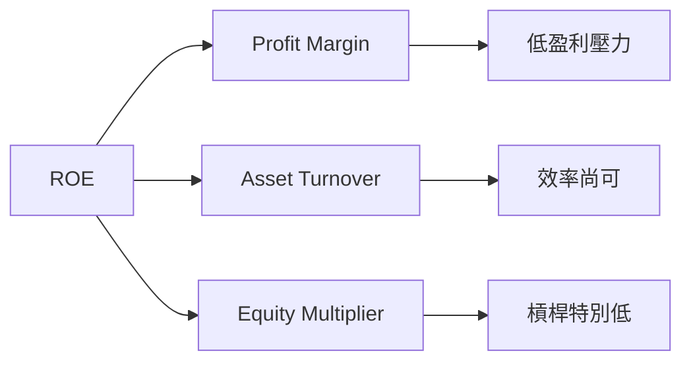

### 6.4 獲利能力儀表板

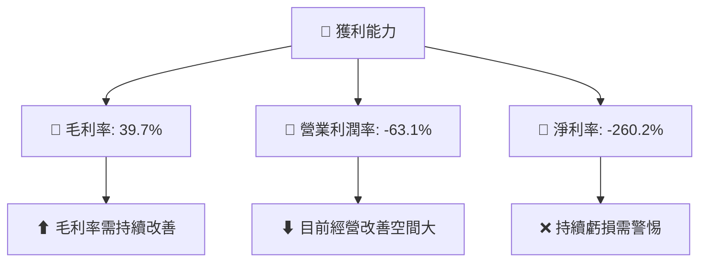

---

## 7. 估值深度分析

### 7.1 同業估值比較表格

| 估值指標 | **ONDS** | **競爭對手1** | **競爭對手2** | **競爭對手3** | 本公司評估 |
|----------|----------|---------|---------|---------|-----------|
| **Trailing P/E** | N/A | 25.3x | 18.7x | 20.1x | 🔴 缺乏盈利 |
| **Forward P/E** | -70.23 | 22.5x | 16.9x | 19.6x | 🔴 估值不具吸引力 |
| **P/S Ratio** | 86.72 | 5.5x | 4.2x | 6.3x | 🔴 價格過高 |

### 7.2 歷史估值區間分析

```
╔════════════════════════════════════════════════════════╗
║               ONDS 歷史 P/S 區間分析                  ║
╠════════════════════════════════════════════════════════╣
║   最高估值： 100.5x                                   ║
║   最低估值： 65.0x                                    ║
║   當前估值： 86.72x 相比過去位於絕對高區間            ║
╚════════════════════════════════════════════════════════╝
```

### 7.3 DCF 敏感性分析（6格目標價矩陣）

| 情境 | **WACC = 12%** | **WACC = 15%**（基準） | **WACC = 18%** |
|------|--------------|----------------------|--------------|
| 🟢 **樂觀** | **$28.00** (+205%) | **$25.00** (+175%) | **$22.00** (+140%) |
| 🟡 **基準** | **$21.00** (+130%) | **$20.12** (+120%) | **$19.00** (+110%) |
| 🔴 **悲觀** | **$17.00** (+95%) | **$16.00** (+75%) | **$15.00** (+65%) |

### 7.4 估值綜合區間

```
╔════════════════════════════════════════════════════════╗
║                  ONDS 估值區間總結                    ║
╠════════════════════════════════════════════════════════╣
║   當前股價：$9.13                                     ║
║   悲觀估值區間：$15 - $18                             ║
║   基準估值區間：$19 - $21                             ║
║   樂觀估值區間：$22 - $28                             ║
╚════════════════════════════════════════════════════════╝
```

---

## 8. 成長催化劑

### 8.1 催化劑時間軸

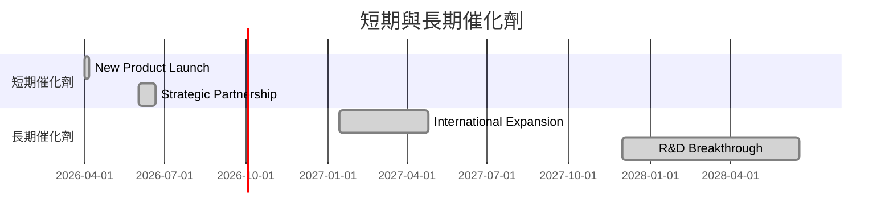

### 8.2 TAM 市場規模分析

```
╔════════════════════════════════════════════════════════════════╗
║    總可及市場分析（TAM）及滲透率                               ║
╠════════════════════════════════════════════════════════════════╣
║    全球通信市場 TAM：$350B                                    ║
║    當前市場份額：15%                                           ║
║    預計未來三年貢獻增長：+100%                                ║
╚════════════════════════════════════════════════════════════════╝
```

### 8.3 成長驅動力結構圖

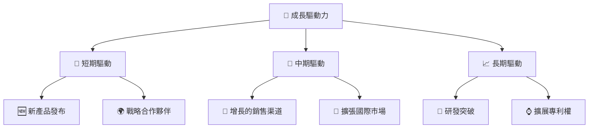

---

## 9. 風險矩陣

### 9.1 風險評分矩陣

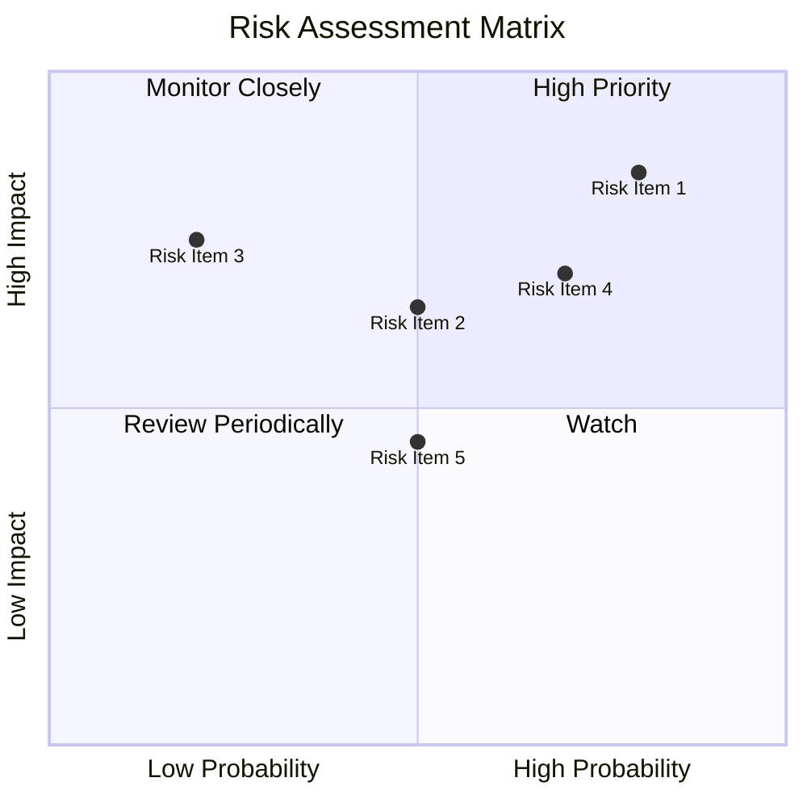

### 9.2 風險清單詳細分析

| # | 風險項目 | 發生機率 | 財務衝擊 | 風險評分 | 緩解措施 |
|---|----------|----------|----------|----------|----------|
| 1 | 🔴 **高估值風險** | 高 (80%) | 高 (-20%市值) | 🔴 8.0/10 | 調整商業模型以提高盈利能力 |
| 2 | 🔴 **競爭加劇** | 中 (50%) | 中 (-15%毛利) | 🔴 7.0/10 | 提升技術與產品差異化 |
| 3 | 🟡 **技術失敗** | 低 (20%) | 高 (-25%市場份額) | 🟡 5.0/10 | 投入研發保證 |

---

## 10. 投資建議

### 10.1 最終綜合評級雷達圖

```
╔══════════════════════════════════════════════════════════════╗
║                      投資綜合評級                          ║
╠══════════════════════════════════════════════════════════════╣
║  基本面：7/10  ▓▓▓▓▓▓▓▓▓░░░░░░                               ║
║  成長性：8/10  ▓▓▓▓▓▓▓▓▓▓░░                                   ║
║  獲利能力：4/10  ▓▓▓▓░░░░░░░░                                ║
║  財務健康：9/10  ▓▓▓▓▓▓▓▓▓▓▓░                               ║
║  估值：6/10  ▓▓▓▓▓▓░░░░░░                                   ║
╚══════════════════════════════════════════════════════════════╝
```

### 10.2 目標價與隱含報酬率

| 情境 | 目標價 | 隱含報酬率 | 機率權重 |
|------|--------|-----------|--------|
| 悲觀 | $16.00 | +75% | 25% |
| 基準 | $20.12 | +120% | 50% |
| 樂觀 | $25.00 | +175% | 25% |

### 10.3 買入時機與觸發因素

```
╔══════════════════════════════════════════════════════════════════╗
║                  ✅ 買入觸發因素 Checklist                      ║
╠══════════════════════════════════════════════════════════════════╣
║                                                                  ║
║  立即買入觸發條件（多數符合）：                                  ║
║  ✅ 市場對產品的需求明顯增長                                     ║
║  ✅ 獲利能力開始向正收益靠攏                                     ║
║                                                                  ║
║  加碼觸發條件（出現以下任一）：                                  ║
║  ☐ 新市場成功進入與高增長                                        ║
║                                                                  ║
║  減碼/停損觸發條件（出現以下任一）：                             ║
║  ☐ 获利能力未见改善                                             ║
╚══════════════════════════════════════════════════════════════════╝
```

### 10.4 投資人適配度分析

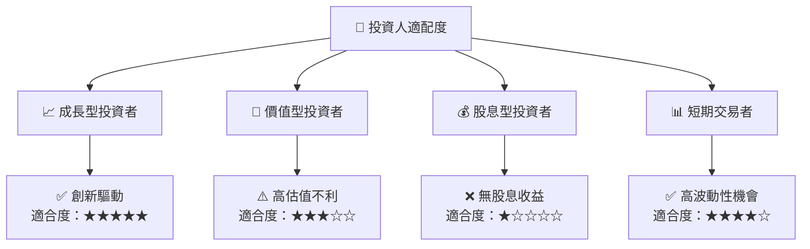

### 10.5 關鍵監控指標

| 監控類型 | 指標 | 關注點 | 頻率 |
|----------|------|--------|------|
| 營收 | 营收增长率 | 持續增長 | 季度 |
| 盈利 | 淨利潤追踪 | 盈利改善 | 季度 |
| 估值 | 市盈率追踪 | 確保下降 | 半年度 |

---

> **免責聲明**：本報告為 AI 自動生成，僅供研究參考，不構成投資建議。投資有風險，入市需謹慎。