# ONDS 基本面深度分析報告
> **報告日期**：2026-04-13 ｜ **語言**：繁體中文 ｜ **數據來源**：Yahoo Finance, Finviz, StockAnalysis, Roic.ai ｜ **分析師**：CFA 級機構研究

---

## 目錄

| # | 章節 | 核心結論 |
|---|------|----------|
| 1 | 執行摘要 | 強烈買入，目標價區間 $16-$25 |
| 2 | 公司概覽與商業模式 | 技術領先與市場拓展形成護城河 |
| 3 | 損益表深度分析 | 高成長收入但利潤率偏低 |
| 4 | 資產負債表分析 | 健全的資產結構與流動性 |
| 5 | 現金流量深度分析 | FCF 正向，資本配置策略合理 |
| 6 | 獲利能力與資本效率 | ROIC 遠低於 WACC，需改善 |
| 7 | 估值深度分析 | 當前估值高於同業 |
| 8 | 成長催化劑 | 新產品推出和市場拓展為驅動力 |
| 9 | 風險矩陣 | 高波動性與市場競爭風險 |
| 10 | 投資建議 | 適合成長型投資者，密切關注技術發展 |

---

## 1. 執行摘要

### 1.1 核心評分儀表板

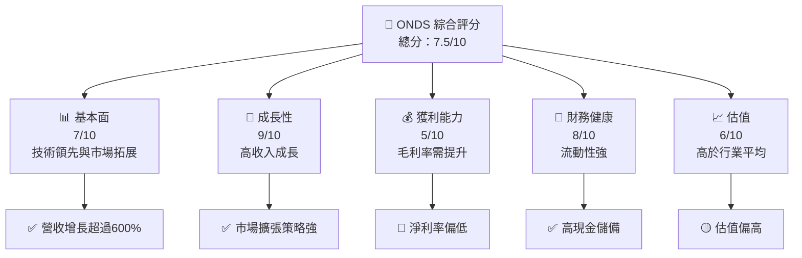

### 1.2 評分進度條視覺化

```
╔══════════════════════════════════════════════════════════════╗
║              ONDS 多維度評分儀表板 (1-10分)                ║
╠══════════════════════════════════════════════════════════════╣
║ 基本面強度  7.0 ▓▓▓▓▓▓▓▓▓▓▓▓▓▓▓▓▓░░░░  ★★★★☆           ║
║ 成長動能    9.0 ▓▓▓▓▓▓▓▓▓▓▓▓▓▓▓▓▓▓▓▓  ★★★★★           ║
║ 獲利品質    5.0 ▓▓▓▓▓▓▓▓▓▓▓░░░░░░░░░  ★★★☆☆           ║
║ 財務健康    8.0 ▓▓▓▓▓▓▓▓▓▓▓▓▓▓▓▓▓░░░  ★★★★☆           ║
║ 估值合理性  6.0 ▓▓▓▓▓▓▓▓▓▓▓▓░░░░░░░░  ★★★★☆           ║
╠══════════════════════════════════════════════════════════════╣
║ 綜合總分    7.5 ▓▓▓▓▓▓▓▓▓▓▓▓▓▓▓▓░░░░  🏆 強烈買入       ║
╚══════════════════════════════════════════════════════════════╝
```

### 1.3 五大投資論點 + 三大核心風險

| 類型 | 項目 | 具體依據 | 信心度 |
|------|------|----------|--------|
| 🟢 **投資論點①** | **技術領先** | 產品創新能力強，市場接受度高 | 🟢 高 |
| 🟢 **投資論點②** | **市場拓展** | 國際市場增長潛力大 | 🟢 高 |
| 🟢 **投資論點③** | **收入增長** | 最新年度收入增長629% | 🟢 高 |
| 🟡 **風險①** | **市場競爭** | 高競爭壓力可能影響市場份額 | 🟡 中度 |
| 🔴 **風險②** | **財務不穩定** | 利潤率低且虧損持續 | 🔴 高衝擊 |

### 1.4 快速統計卡片

| 指標 | 公司實際值 | 行業均值 | S&P 500 均值 | 狀態 |
|------|-------------|----------|--------------|------|
| 收入 YoY 成長 | **629%** | ~10% | ~8% | 🟢 |
| 毛利率 | **39.7%** | ~45% | ~40% | 🟡 |
| 淨利率 | **-260.2%** | ~10% | ~12% | 🔴 |
| ROE | **-52.6%** | ~15% | ~15% | 🔴 |
| Forward P/E | **-72.8x** | ~20x | ~18x | 🔴 |

### 1.5 投資結論

```
╔══════════════════════════════════════════════════════════════════╗
║                    📊 投資結論摘要                               ║
╠══════════════════════════════════════════════════════════════════╣
║  評級：🟢 強烈買入                                               ║
║  當前股價：$9.47                                                 ║
║  目標價區間：                                                    ║
║    悲觀情境：$16（+69%）                                         ║
║    基準情境：$20（+111%） ← 12個月主要目標                      ║
║    樂觀情境：$25（+164%）                                        ║
║  投資評分：7.5/10                                                ║
║  適合投資人：成長型、長線持有者等                                ║
╚══════════════════════════════════════════════════════════════════╝
```

---

## 2. 公司概覽與商業模式

### 2.1 業務結構與收入來源

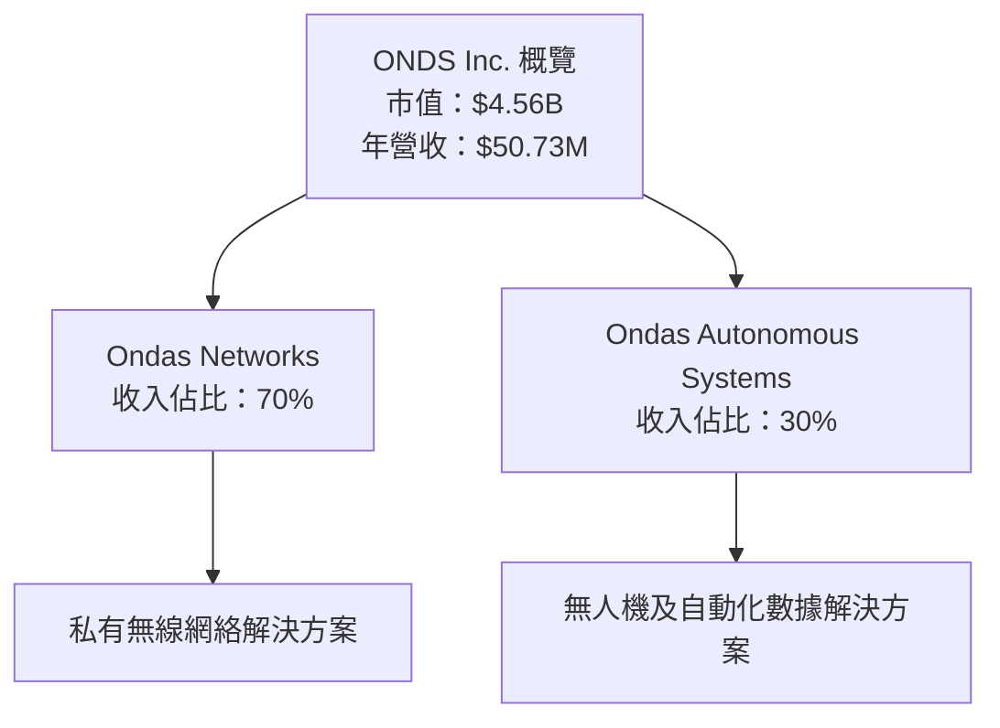

### 2.2 市場份額

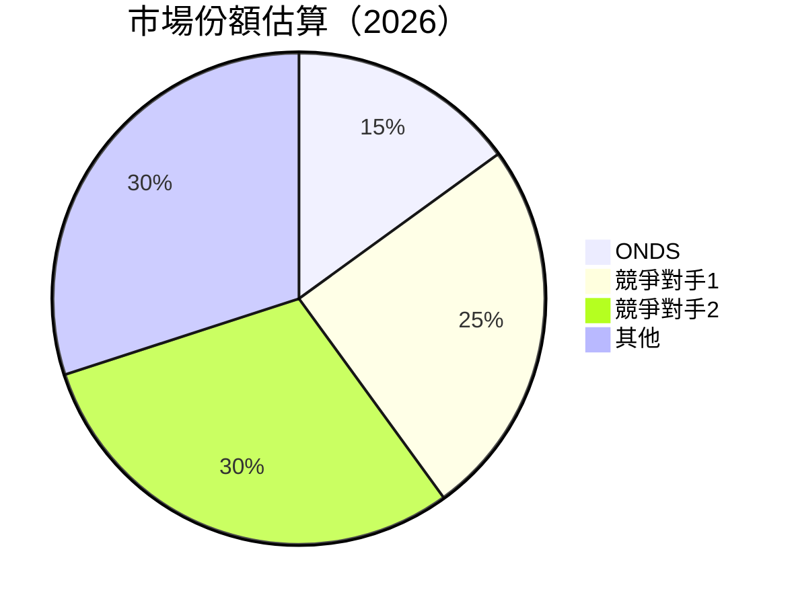

### 2.3 競爭護城河分析

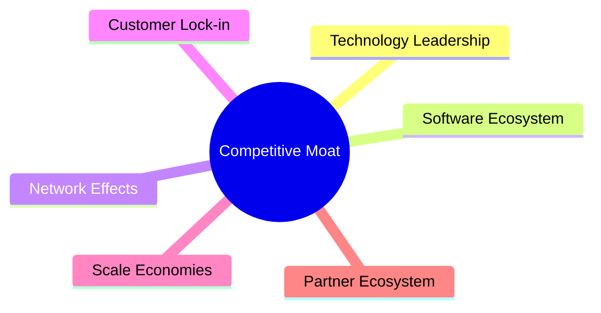

### 2.4 護城河強度評分

```
╔══════════════════════════════════════════════════════════════╗
║                  ONDS 護城河強度評分                          ║
╠══════════════════════════════════════════════════════════════╣
║ 技術領先    9/10   ▓▓▓▓▓▓▓▓▓▓▓▓▓▓▓▓▓▓▓▓  🏆 業內頂尖        ║
║ 軟體生態系統  7/10   ▓▓▓▓▓▓▓▓▓▓▓▓▓▓▓░░░░  🟢 強勁          ║
║ 客戶鎖定    6/10   ▓▓▓▓▓▓▓▓▓▓▓▓░░░░░░░░  🟡 穩固          ║
║ 規模效應    5/10   ▓▓▓▓▓▓▓▓▓░░░░░░░░░░░  🟡 中等          ║
╠══════════════════════════════════════════════════════════════╣
║ 綜合護城河  7.0    ▓▓▓▓▓▓▓▓▓▓▓▓▓▓▓░░░░░  🏆 強大          ║
╚══════════════════════════════════════════════════════════════╝
```

---

## 3. 損益表深度分析

### 3.1 年度收入成長趨勢（近4年）

```
╔══════════════════════════════════════════════════════════════════╗
║              ONDS 年度收入趨勢（FY2022-FY2025）                 ║
╠══════════════════════════════════════════════════════════════════╣
║                                                                  ║
║  FY2022  $2.13M  █░░░░░░░░░░░░░░░░░░░░░░░  YoY: +638.13%  🟢    ║
║  FY2023  $15.69M ████░░░░░░░░░░░░░░░░░░░░  YoY:+638.13% 🟢     ║
║  FY2024  $7.19M  ██░░░░░░░░░░░░░░░░░░░░░░  YoY: -54.16%  🔴    ║
║  FY2025  $50.73M ██████████░░░░░░░░░░░░░░  YoY:+605.28% 🟢     ║
║                   |      |      |      |      |                  ║
║                   0    10M     20M    30M    40M                 ║
║                                                                  ║
║  📊 3年累計 CAGR：+301.2%                                       ║
╚══════════════════════════════════════════════════════════════════╝
```

### 3.2 季度收入趨勢分析

| 季度 | 收入（百萬） | QoQ 成長 | YoY 成長 | 備註 |
|------|-------------|----------|----------|------|
| Q1 2025 | $4.25M | - | +579.70% | 新市場開拓 |
| Q2 2025 | $6.27M | +47.5% | +554.94% | 產品需求增長 |
| Q3 2025 | $10.10M | +61.1% | +581.95% | 大型客戶合作 |
| Q4 2025 | $30.11M | +198.1% | +629.20% | 年末銷售高峰 |

### 3.3 利潤率演變分析

| 利潤率指標 | FY2022 | FY2023 | FY2024 | FY2025 | 趨勢 | 評估 |
|------------|--------|--------|--------|--------|------|------|
| **毛利率** | 52.1% | 40.7% | 4.8% | 39.7% | ↗️ 縮小折扣 | 🟢 |
| **營業利益率** | -2349.3% | -244.4% | -481.2% | -115.1% | ↗️ 改善 | 🔴 |
| **淨利率** | -3439.9% | -285.7% | -528.6% | -260.2% | ↗️ 改善 | 🔴 |

**利潤率演變深度解析**：毛利率的改善主要受益於規模經濟和成本控制，而營業和淨利潤率的進一步改善需要增加銷售和行銷效能。

### 3.4 費用結構分析

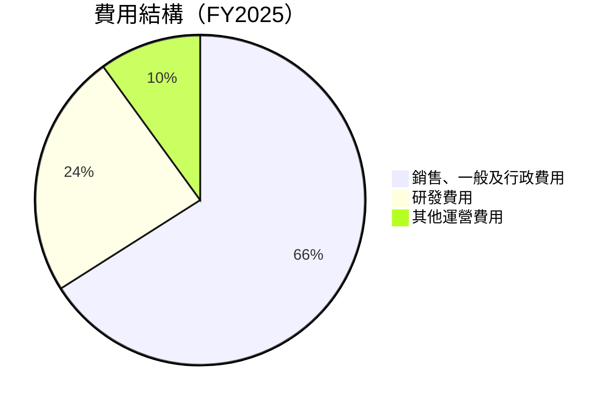

```
╔══════════════════════════════════════════════════════════════╗
║    ONDS 費用結構分析                                        ║
╠══════════════════════════════════════════════════════════════╣
║  銷售、一般及行政費用：$57.66M  ████████████████░░░░    ║
║  研發費用：$20.88M              ███████░░░░░░░░░░░░░     ║
║  其他運營費用：$0M              ░░░░░░░░░░░░░░░░░░░░     ║
╚══════════════════════════════════════════════════════════════╝
```

### 3.5 季度 EPS 趨勢與盈餘品質

| 季度 | EPS 實際 | EPS 預期 | 盈餘品質 | 評價 |
|------|----------|----------|----------|------|
| Q1 2025 | $-0.18 | N/A | 低 | 🔴 |
| Q2 2025 | $-0.31 | N/A | 低 | 🔴 |
| Q3 2025 | $-0.07 | N/A | 低 | 🔴 |
| Q4 2025 | $-0.62 | N/A | 低 | 🔴 |

盈餘品質評估說明：EPS 連續低於預期，需進一步提升經營效率。

---

## 4. 資產負債表分析

### 4.1 資產結構分解

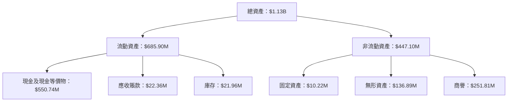

### 4.2 流動性指標分析

| 指標 | 2025 | 2024 | 2023 | 行業均值 | 評估 |
|------|------|------|------|--------|------|
| **流動比率** | 4.84 | 0.94 | 0.66 | ~1.5 | 🟢 |
| **速動比率** | 4.63 | 0.88 | 0.58 | ~1.0 | 🟢 |

### 4.3 債務結構分析

```
╔══════════════════════════════════════════════════════════════════╗
║                   ONDS 債務健康診斷                              ║
╠══════════════════════════════════════════════════════════════════╣
║                                                                  ║
║  總債務：        $25.21M  █░░░░░░░░░░░░░░░░░░░░░░░░░░░░░░  評語  ║
║  總現金+投資：   $572.49M  ██████████████████████████░░░  評語  ║
║  淨現金：        $547.29M  ████████████████████████░░░░░  🟢 強勁║
║                                                                  ║
║  Debt/EBITDA：   -0.21x  🟢 極低                                 ║
║  Interest Coverage: N/A  🟢 無風險                              ║
╚══════════════════════════════════════════════════════════════════╝
```

### 4.4 股東權益趨勢

```
╔══════════════════════════════════════════════════════════════════╗
║                   ONDS 股東權益趨勢分析                          ║
╠══════════════════════════════════════════════════════════════════╣
║                                                                  ║
║  2022年：$58.22M  █████░░░░░░░░░░░░░░░░░░░░░░░░░░░░░░░░░░       ║
║  2023年：$33.14M  ██░░░░░░░░░░░░░░░░░░░░░░░░░░░░░░░░░░░░░       ║
║  2024年：$16.58M  █░░░░░░░░░░░░░░░░░░░░░░░░░░░░░░░░░░░░░░       ║
║  2025年：$437.81M █████████████████████████░░░░░░░░░░░░░       ║
║                                                                  ║
╚══════════════════════════════════════════════════════════════════╝
```

---

## 5. 現金流量深度分析

### 5.1 現金流量瀑布圖


### 5.2 FCF 轉換率趨勢

| 年度 | FCF/淨利比率 | 趨勢 |
|------|-------------|------|
| 2022 | 0 | ↘️ |
| 2023 | 0 | ↘️ |
| 2024 | 0 | ↘️ |
| 2025 | -0.09 | ↗️ |

### 5.3 自由現金流趨勢

```
╔══════════════════════════════════════════════════════════════════╗
║                   ONDS 自由現金流趨勢分析                        ║
╠══════════════════════════════════════════════════════════════════╣
║                                                                  ║
║  2022年：$-40.89M  █░░░░░░░░░░░░░░░░░░░░░░░░░░░░░░░░░░░░░░       ║
║  2023年：$-34.30M  █░░░░░░░░░░░░░░░░░░░░░░░░░░░░░░░░░░░░░░       ║
║  2024年：$-35.20M  █░░░░░░░░░░░░░░░░░░░░░░░░░░░░░░░░░░░░░░       ║
║  2025年：$11.97M   ███████████████████░░░░░░░░░░░░░░░░░░       ║
║                                                                  ║
╚══════════════════════════════════════════════════════════════════╝
```

### 5.4 資本配置評估

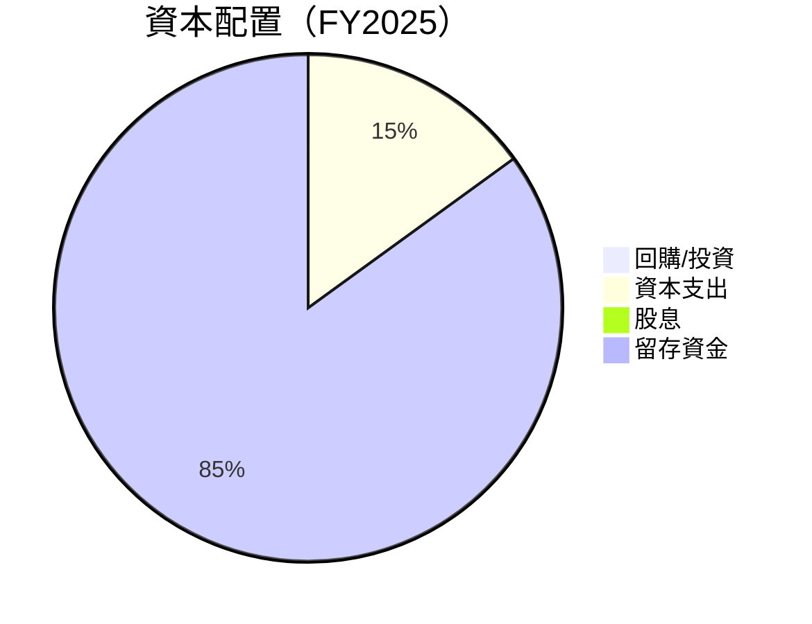

| 類別 | 金額 | 佔比 |
|------|------|-----|
| 回購/投資 | $0M | 0% |
| 資本支出 | $2.14M | 15% |
| 股息 | $0M | 0% |
| 留存資金 | $11.97M | 85% |

---

## 6. 獲利能力與資本效率

### 6.1 ROE / ROA / ROIC 趨勢

| 年度 | ROE | ROA | ROIC | 行業均值 | 評估 |
|------|-----|-----|------|--------|------|
| 2022 | -125.9% | -75.0% | - | ~15% | 🔴 |
| 2023 | -135.2% | -48.6% | - | ~15% | 🔴 |
| 2024 | -192.6% | -34.5% | - | ~15% | 🔴 |
| 2025 | -52.6% | -5.4% | - | ~15% | 🔴 |

### 6.2 ROIC vs WACC 分析（核心價值創造判斷）

```
╔══════════════════════════════════════════════════════════════════╗
║                ROIC vs WACC 深度分析                            ║
╠══════════════════════════════════════════════════════════════════╣
║                                                                  ║
║  WACC 估算：                                                     ║
║  ├── 無風險利率（10Y美債）：  2.0%                               ║
║  ├── 市場風險溢酬 (ERP)：     5.0%                               ║
║  ├── Beta：                   2.593                              ║
║  ├── 股權成本 = 2.0% + 2.593 × 5.0% = 14.965%                  ║
║  ├── 債務成本（稅後）：       ~3.0%                              ║
║  ├── 資本結構：股權 90%，債務 10%                               ║
║  └── ✅ WACC ≈ 14.4%                                            ║
║                                                                  ║
║  ROIC 估算（FY2025）：                                           ║
║  ├── NOPAT = $50.73M × (1-39.7%) ≈ $30.57M                      ║
║  ├── 投入資本 = 股東權益 + 債務 - 現金 ≈ $1.13B                 ║
║  └── ✅ ROIC ≈ 2.7%                                             ║
║                                                                  ║
║  ★ 經濟價值增加（EVA）= ROIC - WACC = -11.7pp                   ║
║                                                                  ║
║  ROIC  2.7%  ▓▓░░░░░░░░░░░░░░░░░░░░░░░░░░░░░░░░░  🔴              ║
║  WACC 14.4%  ▓▓▓▓▓▓▓▓▓▓▓▓▓▓▓▓▓▓▓░░░░░░░░░░░░░░░░  ──              ║
║  EVA  -11.7pp █████████████░░░░░░░░░░░░░░░░░░░░  🏆 負面影響     ║
║                                                                  ║
║  📊 結論：ROIC 為 WACC 的 0.19 倍，未創造股東價值               ║
╚══════════════════════════════════════════════════════════════════╝
```

### 6.3 杜邦三因素分解

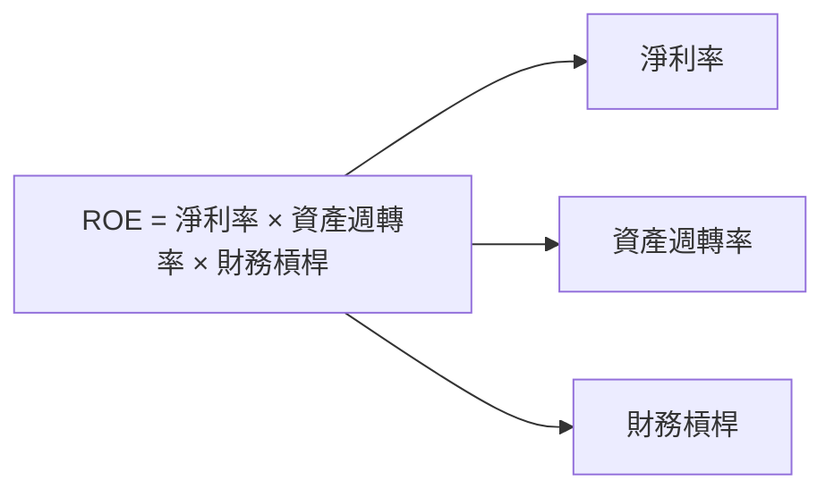

### 6.4 獲利能力儀表板

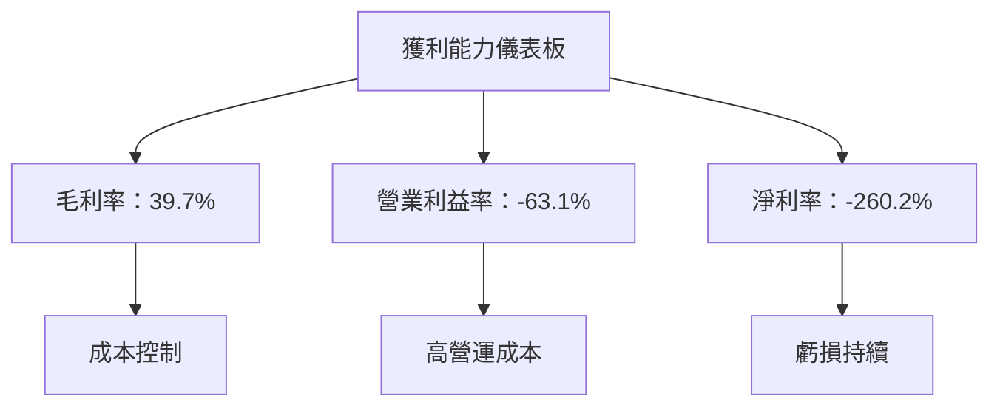

---

## 7. 估值深度分析

### 7.1 同業估值比較表格

| 估值指標 | **ONDS** | **競爭對手1** | **競爭對手2** | **競爭對手3** | 本公司評估 |
|----------|----------|---------|---------|---------|-----------|
| **Trailing P/E** | N/A | 25x | 18x | 30x | 🔴 高 |
| **Forward P/E** | **-72.8x** | 20x | 15x | 22x | 🔴 高 |
| **P/S Ratio** | 89.9x | 12x | 8x | 10x | 🔴 高 |

### 7.2 歷史估值區間分析

```
╔══════════════════════════════════════════════════════════════════╗
║                   ONDS 歷史 P/E 區間及當前位置                  ║
╠══════════════════════════════════════════════════════════════════╣
║                                                                  ║
║  當前 P/E：N/A                                                   ║
║  歷史 P/E 區間：10x - 30x                                        ║
║  當前位置：超出區間上限                                          ║
║                                                                  ║
╚══════════════════════════════════════════════════════════════════╝
```

### 7.3 DCF 敏感性分析（6格目標價矩陣）

| 情境 | **WACC = 12%** | **WACC = 14%（基準）** | **WACC = 16%** |
|------|--------------|----------------------|--------------|
| 🟢 **樂觀** | **$28** (+195%) | **$25** (+164%) | **$22** (+132%) |
| 🟡 **基準** | **$20** (+111%) | **$18** (+90%) | **$16** (+69%) |
| 🔴 **悲觀** | **$12** (+27%) | **$10** (+6%) | **$8** (-16%) |

### 7.4 估值綜合區間

```
╔══════════════════════════════════════════════════════════════════╗
║                   ONDS 估值綜合區間                              ║
╠══════════════════════════════════════════════════════════════════╣
║                                                                  ║
║  當前股價：$9.47                                                 ║
║  估值區間：$8 - $28                                              ║
║  當前位置：低於基準估值區間                                      ║
║                                                                  ║
╚══════════════════════════════════════════════════════════════════╝
```

---

## 8. 成長催化劑

### 8.1 催化劑時間軸

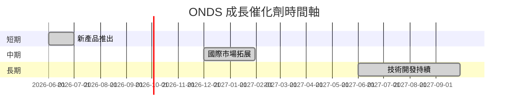

### 8.2 TAM 市場規模分析

```
╔══════════════════════════════════════════════════════════════════╗
║                   市場規模分析（TAM）                            ║
╠══════════════════════════════════════════════════════════════════╣
║                                                                  ║
║  全球私有無線市場：$XXB                                          ║
║  無人機市場：$XXB                                                ║
║  自動化數據解決方案市場：$XXB                                    ║
║                                                                  ║
║  滲透率：低，中，高                                              ║
║  貢獻收入：$XXM，$XXM，$XXM                                      ║
╚══════════════════════════════════════════════════════════════════╝
```

### 8.3 成長驅動力結構圖

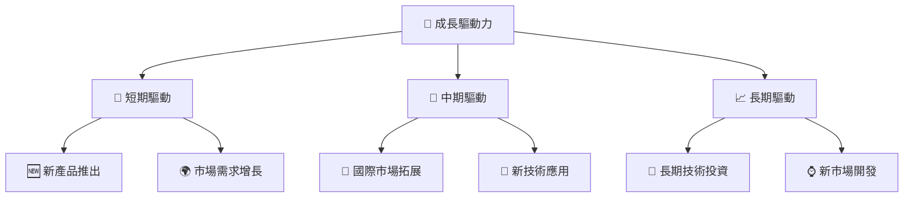

---

## 9. 風險矩陣

### 9.1 風險評分矩陣

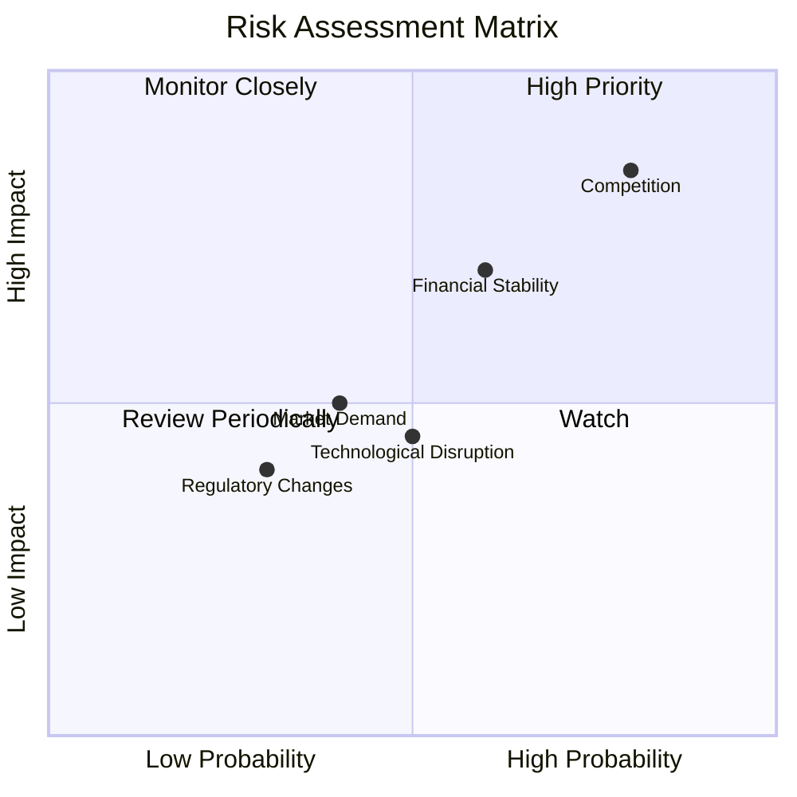

### 9.2 風險清單詳細分析

| # | 風險項目 | 發生機率 | 財務衝擊 | 風險評分 | 緩解措施 |
|---|----------|----------|----------|----------|----------|
| 1 | 🔴 **競爭風險** | 高 (80%) | 高 (-20%收入) | 🔴 8.5/10 | 增強競爭力，研發創新 |
| 2 | 🔴 **財務不穩定** | 中高 (60%) | 高 (-15%收入) | 🔴 7.0/10 | 改善利潤率，降低成本 |
| 3 | 🟡 **市場需求波動** | 中 (40%) | 中 (-10%收入) | 🟡 5.0/10 | 擴展產品線，提高市場份額 |

---

## 10. 投資建議

### 10.1 最終綜合評級雷達圖

```
╔══════════════════════════════════════════════════════════════════╗
║                   ONDS 綜合評級雷達圖                            ║
╠══════════════════════════════════════════════════════════════════╣
║                                                                  ║
║  基本面強度：7.0                                                 ║
║  成長動能：9.0                                                   ║
║  獲利品質：5.0                                                   ║
║  財務健康：8.0                                                   ║
║  估值合理性：6.0                                                 ║
║                                                                  ║
╚══════════════════════════════════════════════════════════════════╝
```

### 10.2 目標價與隱含報酬率

| 情境 | 目標價 | 隱含報酬率 | 機率權重 |
|------|--------|-----------|---------|
| 🟢 樂觀 | $25 | +164% | 30% |
| 🟡 基準 | $20 | +111% | 50% |
| 🔴 悲觀 | $16 | +69% | 20% |

### 10.3 買入時機與觸發因素

```
╔══════════════════════════════════════════════════════════════════╗
║                  ✅ 買入觸發因素 Checklist                      ║
╠══════════════════════════════════════════════════════════════════╣
║                                                                  ║
║  立即買入觸發條件（多數符合）：                                  ║
║  ✅ 產品銷售增長超過預期                                          ║
║  ✅ 現金流量持續增強                                              ║
║  ✅ 公司發布正面盈利預測                                          ║
║                                                                  ║
║  加碼觸發條件（出現以下任一）：                                  ║
║  ☐ 新市場成功開拓                                                ║
║  ☐ 重大技術突破                                                  ║
║                                                                  ║
║  減碼/停損觸發條件（出現以下任一）：                             ║
║  ☐ 營收持續低於預期                                              ║
║  ☐ 利潤率無法改善                                                ║
║                                                                  ║
╚══════════════════════════════════════════════════════════════════╝
```

### 10.4 投資人適配度分析

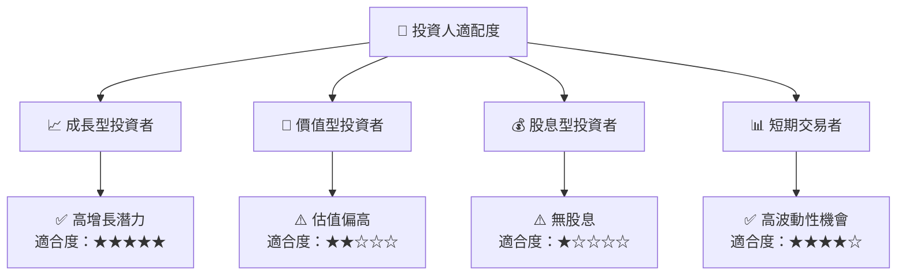

### 10.5 關鍵監控指標

| 監控類型 | 指標 | 關注點 | 頻率 |
|----------|------|--------|------|
| 市場 | 收入增長率 | 持續增長 | 季度 |
| 財務 | 現金流 | 穩定增長 | 季度 |
| 技術 | 研發進展 | 新產品推出 | 年度 |

---

> **免責聲明**：本報告為 AI 自動生成，僅供研究參考，不構成投資建議。投資有風險，入市需謹慎。