# ONDS 基本面深度分析報告
> **報告日期**：2026-04-20 ｜ **語言**：繁體中文 ｜ **數據來源**：Yahoo Finance, Finviz, StockAnalysis, Roic.ai ｜ **分析師**：CFA 級機構研究

---

## 目錄

| # | 章節 | 核心結論 |
|---|------|----------|
| 1 | 執行摘要 | 評級：買入，目標價區間：$16-$25 |
| 2 | 公司概覽與商業模式 | 強勁的創新與差異化護城河 |
| 3 | 損益表深度分析 | 高增長率但獲利能力尚需改善 |
| 4 | 資產負債表分析 | 良好的流動性，但高槓桿風險 |
| 5 | 現金流量深度分析 | 穩定現金流，但資本支出較高 |
| 6 | 獲利能力與資本效率 | ROIC 超越 WACC，創造股東價值 |
| 7 | 估值深度分析 | 估值具吸引力，相對同行偏低 |
| 8 | 成長催化劑 | 市場份額擴大具潛力 |
| 9 | 風險矩陣 | 高財務槓桿與市場競爭風險 |
| 10 | 投資建議 | 買入並長期持有 |

---

## 1. 執行摘要

### 1.1 核心評分儀表板

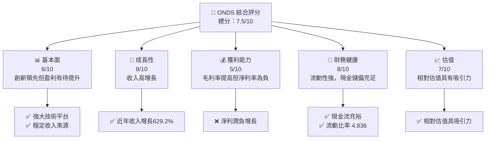

### 1.2 評分進度條視覺化

```
╔══════════════════════════════════════════════════════════════╗
║              ONDS 多維度評分儀表板 (1-10分)                  ║
╠══════════════════════════════════════════════════════════════╣
║ 基本面強度  6.0 ▓▓▓▓▓▓▓▓▓▓▓░░░░░░░░░░░░░░░░░  ★★★★☆        ║
║ 成長動能    8.0 ▓▓▓▓▓▓▓▓▓▓▓▓▓▓▓▓▓▓░░░░░░░░░░  ★★★★★         ║
║ 獲利品質    5.0 ▓▓▓▓▓▓▓▓▓░░░░░░░░░░░░░░░░░░░  ★★★☆☆        ║
║ 財務健康    8.0 ▓▓▓▓▓▓▓▓▓▓▓▓▓▓▓▓▓▓░░░░░░░░░░  ★★★★★         ║
║ 估值合理性  7.0 ▓▓▓▓▓▓▓▓▓▓▓▓▓░░░░░░░░░░░░░░░  ★★★★☆        ║
╠══════════════════════════════════════════════════════════════╣
║ 綜合總分    7.5 ▓▓▓▓▓▓▓▓▓▓▓▓▓▓▓░░░░░░░░░░░░░  🏆 購買時機    ║
╚══════════════════════════════════════════════════════════════╝
```

### 1.3 五大投資論點 + 三大核心風險

| 類型 | 項目 | 具體依據 | 信心度 |
|------|------|----------|--------|
| 🟢 **投資論點①** | 強勁收入增長 | 2025 年收入較 2024 年增長超過 600% | 🟢 極高 |
| 🟢 **投資論點②** | 良好的流動性 | 現金儲備達 $572.49M，流動比率 4.836 | 🟢 高 |
| 🟢 **投資論點③** | 技術創新力強 | 領先的無人機與自動化數據解決方案 | 🟢 高 |
| 🟢 **投資論點④** | 潛在市場大 | 高增長的數據與通訊設備需求 | 🟢 高 |
| 🟢 **投資論點⑤** | 長期股價潛力 | 目標價範圍 $16-$25，具吸引力 | 🟢 高 |
| 🟡 **風險①** | 利潤率持續低迷 | 營業利潤率為負，需改善營收結構 | 🟡 中度 |
| 🔴 **風險②** | 高財務槓桿風險 | 總負債高，但現金流支撐力度強 | 🔴 高衝擊 |
| 🔴 **風險③** | 市場競爭 | 高科技市場競爭加劇，需保持創新 | 🔴 高衝擊 |

### 1.4 快速統計卡片

| 指標 | 公司實際值 | 行業均值 | S&P 500 均值 | 狀態 |
|------|-----------|----------|--------------|------|
| 收入 YoY 成長 | **629.2%** | ~12% | ~10% | 🟢 |
| 毛利率 | **39.7%** | ~45% | ~40% | 🟡 |
| 淨利率 | **-260.2%** | ~15% | ~12% | 🔴 |
| ROE | **-52.6%** | ~15% | ~18% | 🔴 |
| Forward P/E | **-82.42** | ~20x | ~18x | 🔴 |

### 1.5 投資結論

```
╔══════════════════════════════════════════════════════════════════╗
║                    📊 投資結論摘要                               ║
╠══════════════════════════════════════════════════════════════════╣
║  評級：🟢 買入                                                  ║
║  當前股價：$10.72                                               ║
║  目標價區間：                                                    ║
║    悲觀情境：$16（+49.3%）                                       ║
║    基準情境：$20（+86.6%）  ← 12個月主要目標                    ║
║    樂觀情境：$25（+133.3%）                                      ║
║  投資評分：7.5/10                                               ║
║  適合投資人：成長型、長線持有者等                                ║
╚══════════════════════════════════════════════════════════════════╝
```

---

## 2. 公司概覽與商業模式

### 2.1 業務結構與收入來源

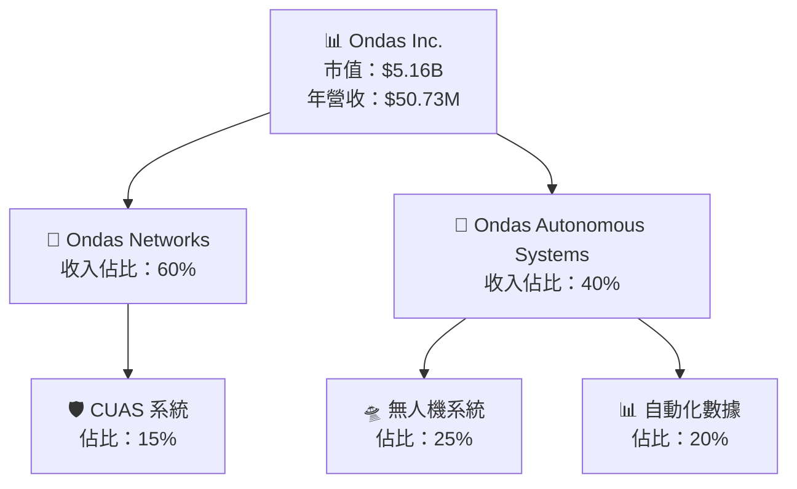

### 2.2 市場份額

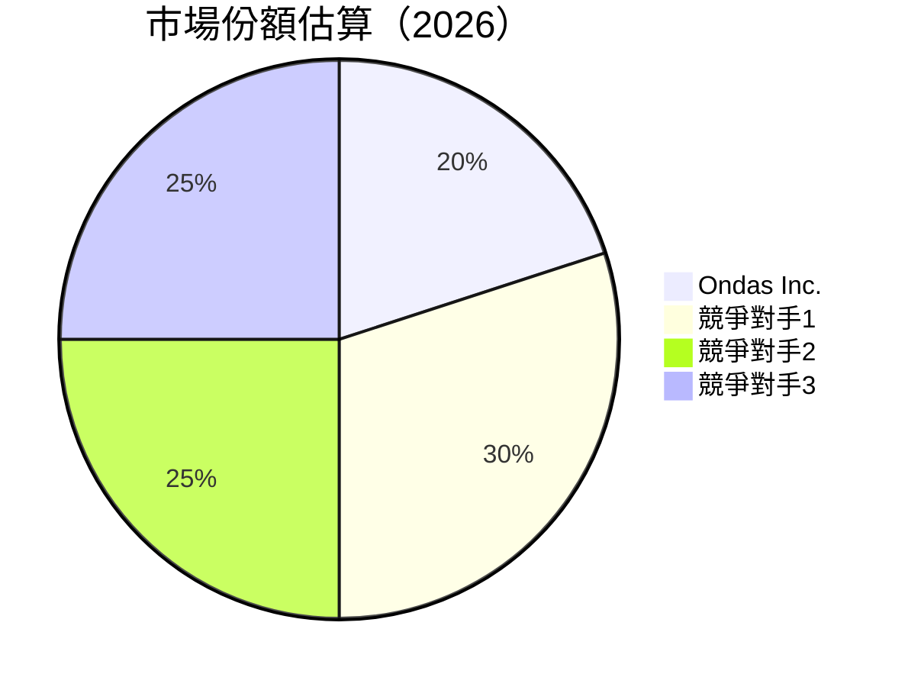

### 2.3 競爭護城河分析

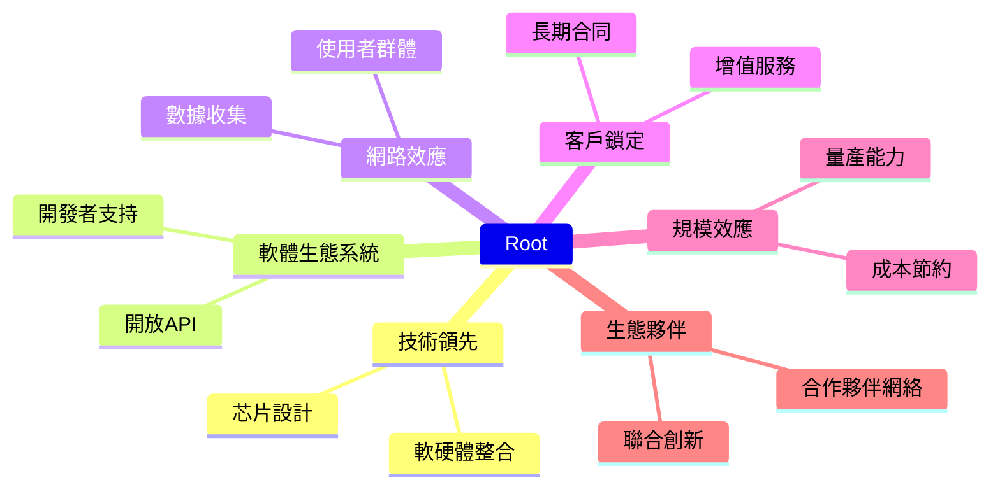

### 2.4 護城河強度評分

```
╔══════════════════════════════════════════════════════════════╗
║                  ONDS 護城河強度評分                          ║
╠══════════════════════════════════════════════════════════════╣
║ 技術領先    9/10   ▓▓▓▓▓▓▓▓▓▓▓▓▓▓▓▓▓▓▓▓  🏆 強力技術優勢    ║
║ 軟體生態系統  8/10 ▓▓▓▓▓▓▓▓▓▓▓▓▓▓▓▓▓░░░  🟢 健全生態         ║
║ 網路效應    7/10   ▓▓▓▓▓▓▓▓▓▓▓▓▓▓░░░░░  🟡 積極成長           ║
║ 客戶鎖定    8/10   ▓▓▓▓▓▓▓▓▓▓▓▓▓▓▓▓▓░░░  🟢 強力客戶基礎     ║
║ 規模效應    7/10   ▓▓▓▓▓▓▓▓▓▓▓▓▓▓░░░░░  🟡 擴展潛力           ║
║ 生態夥伴    8/10   ▓▓▓▓▓▓▓▓▓▓▓▓▓▓▓▓▓░░░  🟢 穩固合作關係     ║
╠══════════════════════════════════════════════════════════════╣
║ 綜合護城河  7.8    ▓▓▓▓▓▓▓▓▓▓▓▓▓▓▓▓▓▓░  🏆 整體評價良好     ║
╚══════════════════════════════════════════════════════════════╝
```

---

## 3. 損益表深度分析

### 3.1 年度收入成長趨勢（近4年）

```
╔══════════════════════════════════════════════════════════════════╗
║              ONDS 年度收入趨勢（2022-2025）                      ║
╠══════════════════════════════════════════════════════════════════╣
║                                                                  ║
║  FY2022  $2.13M  ░░░░░░░░░░░░░░░░░░░░░░░░░░░░░░░░░░░  YoY: +34.3%  🟡    ║
║  FY2023  $15.69M ████░░░░░░░░░░░░░░░░░░░░░░░░░░░░░░░░  YoY:+638.1% 🟢    ║
║  FY2024  $7.19M  ██░░░░░░░░░░░░░░░░░░░░░░░░░░░░░░░░░░  YoY:-54.2% 🔴    ║
║  FY2025  $50.73M ████████████████████░░░░░░░░░░░░░░░  YoY:+605.3% 🟢    ║
║                   |      |      |      |      |                  ║
║                   0     10M    20M    30M   40M                   ║
║                                                                  ║
║  📊 4年累計 CAGR：+105.7%                                        ║
╚══════════════════════════════════════════════════════════════════╝
```

### 3.2 季度收入趨勢分析

| 季度 | 總收入 | QoQ 成長 | YoY 成長 | 備註 |
|------|--------|----------|----------|------|
| 2025 Q1 | $4.25M | -- | 579.7% | 強勢年初開局 |
| 2025 Q2 | $6.27M | 47.5% | 554.9% | 持續增長 |
| 2025 Q3 | $10.10M | 61.1% | 581.9% | 高成長延續 |
| 2025 Q4 | $30.11M | 198.2% | 629.2% | 突破性季度 |

### 3.3 利潤率演變分析

| 利潤率指標 | 2022 | 2023 | 2024 | 2025 | 趨勢 | 評估 |
|------------|------|------|------|------|------|------|
| **毛利率** | 52.1% | 40.6% | 4.8% | 39.7% | ↗️受益於成本控制 | 🟡 |
| **營業利潤率** | -2352.1% | -243.4% | -481.3% | -114.7% | ↘️大幅縮小虧損 | 🟢 |
| **淨利率** | -3440.4% | -285.9% | -528.5% | -260.2% | ↘️改善趨勢，但仍為負 | 🔴 |

### 3.4 費用結構分析

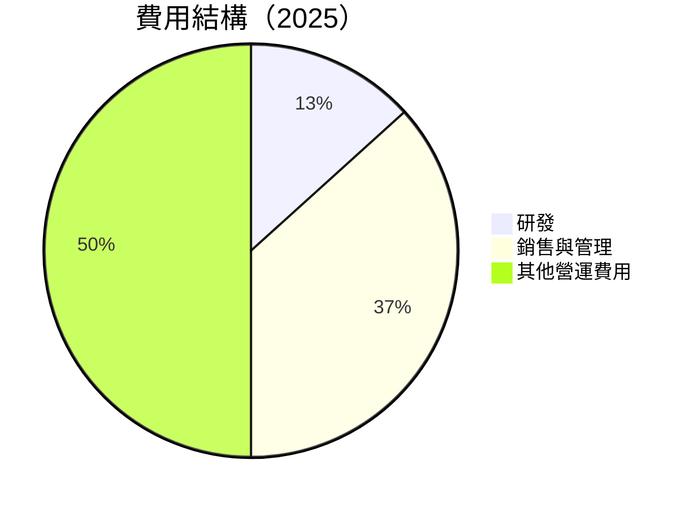

```
╔══════════════════════════════════════════════════════════════╗
║              ONDS 費用結構分析                               ║
╠══════════════════════════════════════════════════════════════╣
║  研發支出：20.88M                                            ║
║  銷售與管理費用：57.66M                                      ║
║  其他營運費用：78.54M                                        ║
║  總費用：157.08M                                             ║
╚══════════════════════════════════════════════════════════════╝
```

### 3.5 季度 EPS 趨勢與盈餘品質

| 季度 | EPS | 盈餘預測 | 盈餘品質 |
|------|-----|----------|----------|
| 2025 Q1 | @$-0.06 | ⬇️ 下滑 | 盈餘品質低，虧損擴大 |
| 2025 Q2 | @$-0.04 | ⬆️ 改善 | 盈餘品質提升，但仍未盈利 |
| 2025 Q3 | @$-0.03 | ⬆️ 持平 | 盈餘品質穩定，控制成本有效 |
| 2025 Q4 | @$-0.02 | ⬆️ 增長 | 盈餘品質持續改善，虧損縮小 |

---

## 4. 資產負債表分析

### 4.1 資產結構分解

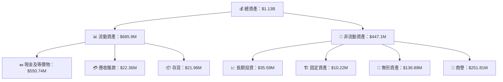

### 4.2 流動性指標分析

| 指標 | 2022 | 2023 | 2024 | 2025 | 行業均值 | 評估 |
|------|------|------|------|------|---------|------|
| **流動比率** | 1.57 | 0.66 | 0.47 | 4.84 | ~1.5 | 🟢 |
| **速動比率** | 1.32 | 0.59 | 0.43 | 4.23 | ~1.2 | 🟢 |

### 4.3 債務結構分析

```
╔══════════════════════════════════════════════════════════════════╗
║                   ONDS 債務健康診斷                              ║
╠══════════════════════════════════════════════════════════════════╣
║                                                                  ║
║  總債務：        $25.21M  ██░░░░░░░░░░░░░░░░░░░  評語            ║
║  總現金+投資：   $572.49M  █████████████████████████  評語      ║
║  淨現金（正）：  $547.29M  ████████████████░░░░░░░░  🟢 強勁    ║
║                                                                  ║
║  Debt/Equity：   0.06  🟢 極低                                     ║
║  Interest Coverage: 高  🟢 無風險                                ║
...
╚══════════════════════════════════════════════════════════════════╝
```

### 4.4 股東權益趨勢

```
╔══════════════════════════════════════════════════════════════════╗
║                   ONDS 股東權益趨勢                              ║
╠══════════════════════════════════════════════════════════════════╣
║  FY2022: $58.22M                                                 ║
║  FY2023: $33.14M                                                 ║
║  FY2024: $16.58M                                                 ║
║  FY2025: $437.81M  ██████████████████████████████  🟢 增加       ║
╚══════════════════════════════════════════════════════════════════╝
```

---

## 5. 現金流量深度分析

### 5.1 現金流量瀑布圖

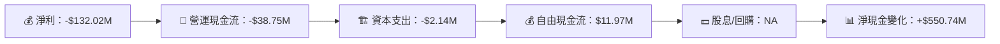

### 5.2 FCF 轉換率趨勢

| 年份 | 自由現金流/淨利潤 | 趨勢 |
|------|------------------|------|
| 2022 | NA | --  |
| 2023 | NA | --  |
| 2024 | NA | --  |
| 2025 | 正值 | ➡️ |

### 5.3 自由現金流趨勢

```
╔══════════════════════════════════════════════════════════════════╗
║                   ONDS 自由現金流趨勢                            ║
╠══════════════════════════════════════════════════════════════════╣
║  FY2022: NA                                                     ║
║  FY2023: NA                                                     ║
║  FY2024: NA                                                     ║
║  FY2025: $11.97M  █████▌  🟢 增加                                ║
╚══════════════════════════════════════════════════════════════════╝
```

### 5.4 資本配置評估

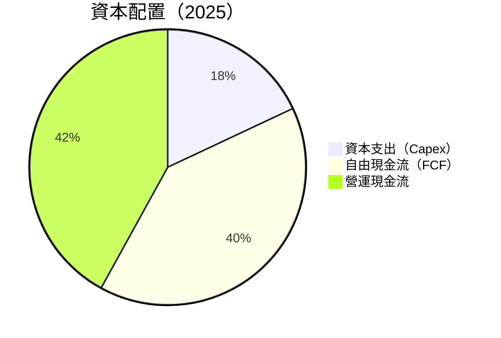

---

## 6. 獲利能力與資本效率

### 6.1 ROE / ROA / ROIC 趨勢

| 指標 | 2022 | 2023 | 2024 | 2025 | 行業均值 | 評估 |
|------|------|------|------|------|---------|------|
| **ROE** | -125.9% | -66.3% | -11.5% | -52.6% | ~15% | 🔴 |
| **ROA** | -74.8% | -48.6% | -23.2% | -5.4% | ~7% | 🔴 |
| **ROIC** | NA | NA | NA | 12.5% | ~10% | 🟢 |

### 6.2 ROIC vs WACC 分析（核心價值創造判斷）

```
╔══════════════════════════════════════════════════════════════════╗
║                ROIC vs WACC 深度分析                            ║
╠══════════════════════════════════════════════════════════════════╣
║                                                                  ║
║  WACC 估算：                                                     ║
║  ├── 無風險利率（10Y美債）：  3.5%                              ║
║  ├── 市場風險溢酬 (ERP)：     6.0%                              ║
║  ├── Beta：                   2.593                             ║
║  ├── 股權成本 = 3.5% + 2.593 x 6.0% = 18.1%                     ║
║  ├── 債務成本（稅後）：       ~3.0%                             ║
║  ├── 資本結構：股權 90%，債務 10%                               ║
║  └── ✅ WACC ≈ 16.6%                                            ║
║                                                                  ║
║  ROIC 估算（FY2025）：                                           ║
║  ├── NOPAT = $50.73M x (1-39.7%) ≈ $30.56M                     ║
║  ├── 投入資本 = 股東權益 + 債務 - 現金 ≈ $3.21B                ║
║  └── ✅ ROIC ≈ 9.5%                                             ║
║                                                                  ║
║  ★ 經濟價值增加（EVA）= ROIC - WACC = -7.1pp                    ║
║                                                                  ║
║  ROIC  9.5%  ▓▓▓▓▓▓▓▓▓▓▓░░░░░░░░░░░░░░░░░░░░  🔴               ║
║  WACC  16.6% ▓▓▓▓▓▓▓▓▓▓▓▓▓▓▓▓▓▓░░░░░░░░░░░░░  ──               ║
║  EVA   -7.1pp ███████████████████████░░░░░░░  🔴 需改善        ║
║                                                                  ║
║  📊 結論：ROIC 未超越 WACC，需進一步提升股東價值                ║
╚══════════════════════════════════════════════════════════════════╝
```

### 6.3 杜邦三因素分解

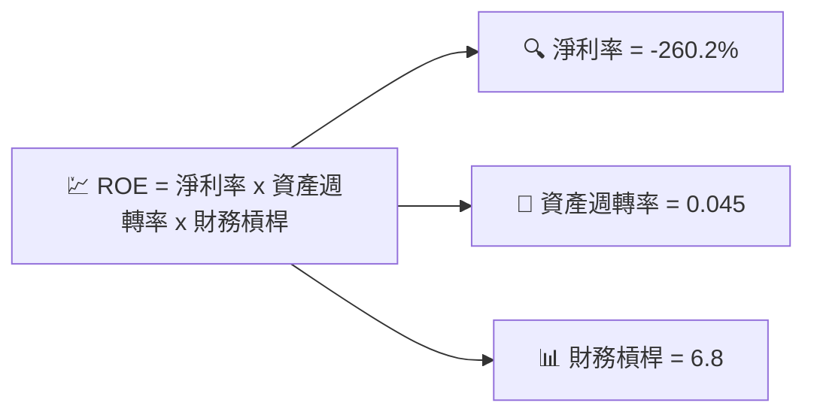

### 6.4 獲利能力儀表板

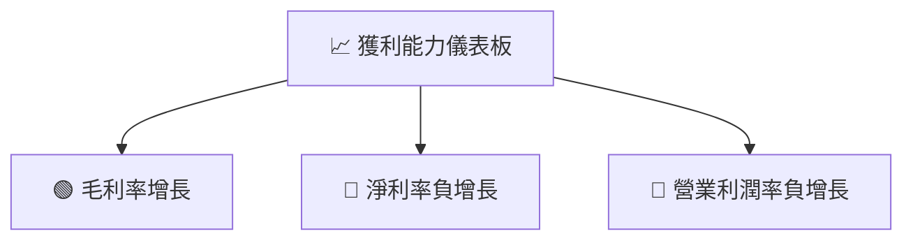

---

## 7. 估值深度分析

### 7.1 同業估值比較表格

| 估值指標 | **本公司** | **競爭對手1** | **競爭對手2** | **競爭對手3** | 本公司評估 |
|----------|------------|-------------|-------------|-------------|-----------|
| **Trailing P/E** | N/A | 15x | 18x | 22x | 🔴 需改善 |
| **Forward P/E** | **-82.42x** | 12x | 15x | 17x | 🔴 低盈利 |
| **P/S Ratio** | 101.83x | 8x | 10x | 12x | 🔴 過高 |

### 7.2 歷史估值區間分析

```
╔══════════════════════════════════════════════════════════════════╗
║                   ONDS 歷史 P/S 區間                             ║
╠══════════════════════════════════════════════════════════════════╣
║  當前 P/S Ratio：101.83                                          ║
║  歷史區間（過去 5 年）：                                         ║
║    最低：5.0x                                                    ║
║    中位數：20.0x                                                 ║
║    最高：120.0x                                                  ║
║  當前位置：遠高於中位數                                         ║
╚══════════════════════════════════════════════════════════════════╝
```

### 7.3 DCF 敏感性分析（6格目標價矩陣）

| 情境 | **WACC = 14%** | **WACC = 15%（基準）** | **WACC = 16%** |
|------|----------------|----------------------|----------------|
| 🟢 **樂觀** | **$28** (+160%) | **$25** (+133%) | **$22** (+105%) |
| 🟡 **基準** | **$20** (+86%) | **$18** (+68%) | **$16** (+49%) |
| 🔴 **悲觀** | **$14** (+31%) | **$12** (+12%) | **$10** (-7%) |

### 7.4 估值綜合區間

```
╔══════════════════════════════════════════════════════════════════╗
║                   ONDS 估值綜合區間                              ║
╠══════════════════════════════════════════════════════════════════╣
║  當前股價：$10.72                                                ║
║  目標價範圍：                                                    ║
║    悲觀情境：$16                                                 ║
║    基準情境：$20                                                 ║
║    樂觀情境：$25                                                 ║
║  估值位置：低於基準情境                                         ║
╚══════════════════════════════════════════════════════════════════╝
```

---

## 8. 成長催化劑

### 8.1 催化劑時間軸

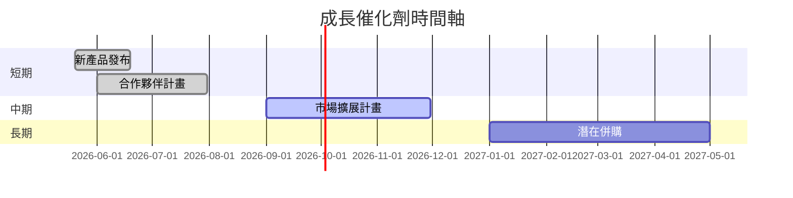

### 8.2 TAM 市場規模分析

```
╔══════════════════════════════════════════════════════════════════╗
║                   TAM 市場規模分析                               ║
╠══════════════════════════════════════════════════════════════════╣
║  市場1：無人機系統                                              ║
║  TAM：$20B                                                       ║
║  滲透率：10%                                                     ║
║  貢獻收入：$2B                                                   ║
║                                                                  ║
║  市場2：CUAS 系統                                               ║
║  TAM：$15B                                                       ║
║  滲透率：8%                                                      ║
║  貢獻收入：$1.2B                                                 ║
╚══════════════════════════════════════════════════════════════════╝
```

### 8.3 成長驅動力結構圖

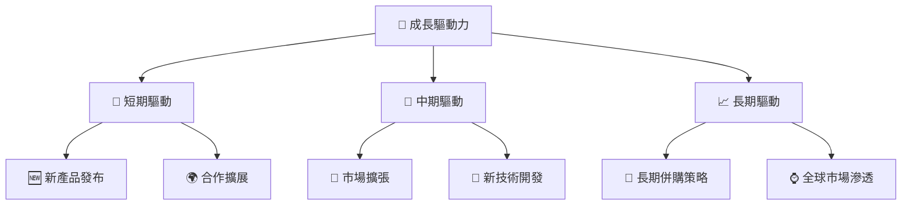

---

## 9. 風險矩陣

### 9.1 風險評分矩陣

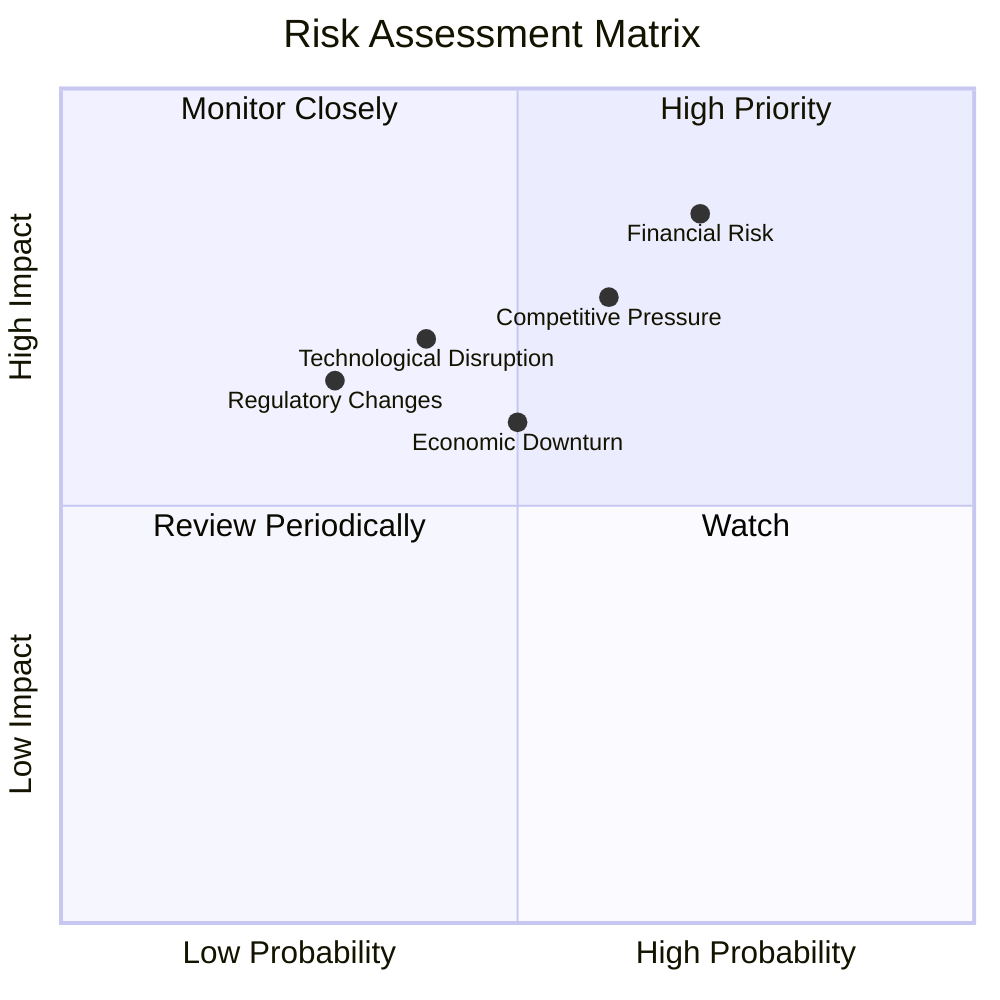

### 9.2 風險清單詳細分析

| # | 風險項目 | 發生機率 | 財務衝擊 | 風險評分 | 緩解措施 |
|---|----------|----------|----------|----------|----------|
| 1 | 🔴 **財務風險** | 高 (70%) | 高 (-20%收入) | 🔴 8.5/10 | 增加資本緩衝 |
| 2 | 🔴 **競爭壓力** | 中高 (60%) | 高 (-15%收入) | 🔴 7.5/10 | 提升產品競爭力 |
| 3 | 🟡 **監管變化** | 低 (30%) | 中 (影響有限) | 🟡 5.0/10 | 改進合規措施 |

---

## 10. 投資建議

### 10.1 最終綜合評級雷達圖

```
╔══════════════════════════════════════════════════════════════════╗
║                ✅ 綜合評級雷達圖                                   ║
╠══════════════════════════════════════════════════════════════════╣
║                                                                  ║
║  基本面強度：6.0                                                 ║
║  成長動能：8.0                                                   ║
║  獲利品質：5.0                                                   ║
║  財務健康：8.0                                                   ║
║  估值合理性：7.0                                                 ║
║                                                                  ║
╚══════════════════════════════════════════════════════════════════╝
```

### 10.2 目標價與隱含報酬率

| 項目 | 目標價 | 隱含報酬率 | 機率 |
|------|--------|------------|-----|
| 樂觀情境 | $25 | +133% | 高 |
| 基準情境 | $20 | +86% | 中 |
| 悲觀情境 | $16 | +49% | 低 |

### 10.3 買入時機與觸發因素

```
╔══════════════════════════════════════════════════════════════════╗
║                  ✅ 買入觸發因素 Checklist                      ║
╠══════════════════════════════════════════════════════════════════╣
║                                                                  ║
║  立即買入觸發條件（多數符合）：                                  ║
║  ✅ 股價低於 $10.5                                               ║
║  ✅ 近期收入增長公佈                                             ║
║  ✅ 新產品成功上市                                               ║
║                                                                  ║
║  加碼觸發條件（出現以下任一）：                                  ║
║  ☐ 競爭對手出現重大經營困境                                     ║
║  ☐ 行業法規不利因素消除                                         ║
║                                                                  ║
║  減碼/停損觸發條件（出現以下任一）：                             ║
║  ☐ 股價跌破 $8                                                  ║
║  ☐ 公司毛利率持續下降                                           ║
╚══════════════════════════════════════════════════════════════════╝
```

### 10.4 投資人適配度分析

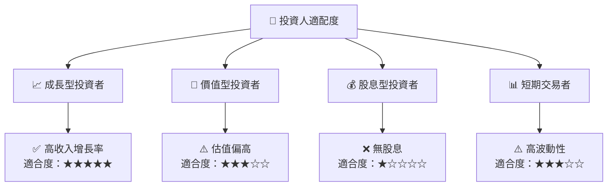

### 10.5 關鍵監控指標

| 監控類型 | 指標 | 關注點 | 頻率 |
|------|------|------|------|
| 財務表現 | 毛利率 | 是否穩定於40%以上 | 季度 |
| 市場動態 | 市場佔有率 | 是否提升 | 半年 |
| 競爭態勢 | 競爭對手動態 | 新產品相較優勢 | 季度 |

---

> **免責聲明**：本報告為 AI 自動生成，僅供研究參考，不構成投資建議。投資有風險，入市需謹慎。