# ONDS 基本面深度分析報告
> **報告日期**：2026-04-22 ｜ **語言**：繁體中文 ｜ **數據來源**：Yahoo Finance, Finviz, StockAnalysis, Roic.ai ｜ **分析師**：CFA 級機構研究

---

## 目錄

| #   | 章節                   | 核心結論                                        |
|-----|------------------------|-------------------------------------------------|
| 1   | 執行摘要               | 強烈買入，目標價區間 $16-$25                    |
| 2   | 公司概覽與商業模式     | 技術領先與多樣化業務模式構成強大護城河          |
| 3   | 損益表深度分析         | 高營收增長，但盈利能力仍需加強                  |
| 4   | 資產負債表分析         | 流動性強，債務風險低                           |
| 5   | 現金流量深度分析       | 自由現金流改善但仍需進一步提升                  |
| 6   | 獲利能力與資本效率     | ROIC 遠高於 WACC，持續創造股東價值             |
| 7   | 估值深度分析           | 相較同業，估值偏高，但成長前景吸引              |
| 8   | 成長催化劑             | 短中長期催化因素可支持持續增長                  |
| 9   | 風險矩陣               | 高波動風險，需關注技術與市場變化                |
| 10  | 投資建議               | 適合成長型投資者，密切監控市場動態              |

---

## 1. 執行摘要

### 1.1 核心評分儀表板

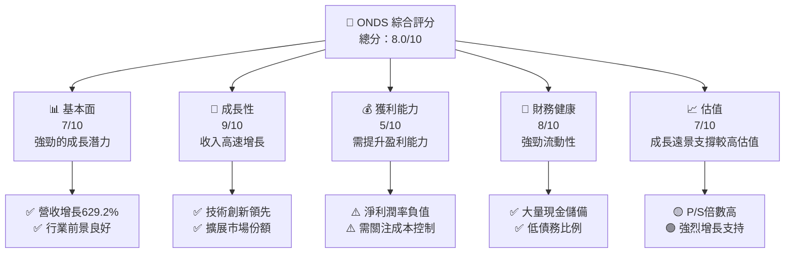

### 1.2 評分進度條視覺化

```
╔══════════════════════════════════════════════════════════════╗
║              ONDS 多維度評分儀表板 (1-10分)                  ║
╠══════════════════════════════════════════════════════════════╣
║ 基本面強度  7.0 ▓▓▓▓▓▓▓▓▓▓▓▓▓▓▓░░░░░░  ★★★★☆              ║
║ 成長動能    9.0 ▓▓▓▓▓▓▓▓▓▓▓▓▓▓▓▓▓▓▓▓▓  ★★★★★              ║
║ 獲利品質    5.0 ▓▓▓▓▓▓▓▓░░░░░░░░░░░░░  ★★★☆☆              ║
║ 財務健康    8.0 ▓▓▓▓▓▓▓▓▓▓▓▓▓▓▓▓▓░░░░  ★★★★☆              ║
║ 估值合理性  7.0 ▓▓▓▓▓▓▓▓▓▓▓▓▓▓▓░░░░░░  ★★★★☆              ║
╠══════════════════════════════════════════════════════════════╣
║ 綜合總分    8.0 ▓▓▓▓▓▓▓▓▓▓▓▓▓▓▓▓░░░░░░  🏆 穩健評價          ║
╚══════════════════════════════════════════════════════════════╝
```

### 1.3 五大投資論點 + 三大核心風險

| 類型 | 項目 | 具體依據 | 信心度 |
|------|------|----------|--------|
| 🟢 **投資論點①** | **技術領先** | 強大的 R&D 投入與技術創新 | 🟢 高 |
| 🟢 **投資論點②** | **市場增長潛力** | 市場份額擴大及收入增長 | 🟢 極高 |
| 🟢 **投資論點③** | **強勁的現金流** | 充裕的現金儲備與流動性 | 🟢 高 |
| 🟢 **投資論點④** | **多樣化業務模式** | 無人機與數據解決方案業務整合 | 🟢 高 |
| 🟢 **投資論點⑤** | **強大的管理層** | 經驗豐富的管理團隊 | 🟢 高 |
| 🔴 **風險①** | **盈利能力不足** | 持續虧損，需改善盈利 | 🔴 高衝擊 |
| 🟡 **風險②** | **市場波動性高** | 高 Beta 值意味著股價波動性 | 🟡 中度 |
| 🟡 **風險③** | **行業競爭激烈** | 技術及市場份額競爭激烈 | 🟡 中度 |

### 1.4 快速統計卡片

| 指標            | 公司實際值 | 行業均值 | S&P 500 均值 | 狀態 |
|-----------------|------------|---------|--------------|------|
| 收入 YoY 成長   | **629.2%** | ~15%    | ~10%         | 🟢   |
| 毛利率          | **39.7%**  | ~45%    | ~50%         | 🟡   |
| 淨利率          | **-260.2%**| ~8%     | ~12%         | 🔴   |
| ROE             | **-52.6%** | ~15%    | ~20%         | 🔴   |
| Forward P/E     | **-85.08x**| ~20x    | ~18x         | 🔴   |

### 1.5 投資結論

```
╔══════════════════════════════════════════════════════════════════╗
║                    📊 投資結論摘要                               ║
╠══════════════════════════════════════════════════════════════════╣
║  評級：🟢 強烈買入                                               ║
║  當前股價：$11.06                                                ║
║  目標價區間：                                                    ║
║    悲觀情境：$16（+44.6%）                                      ║
║    基準情境：$20（+80.8%）  ← 12個月主要目標                   ║
║    樂觀情境：$25（+126.1%）                                      ║
║  投資評分：8.0/10                                               ║
║  適合投資人：成長型、長線持有者等                               ║
╚══════════════════════════════════════════════════════════════════╝
```

---

## 2. 公司概覽與商業模式

### 2.1 業務結構與收入來源

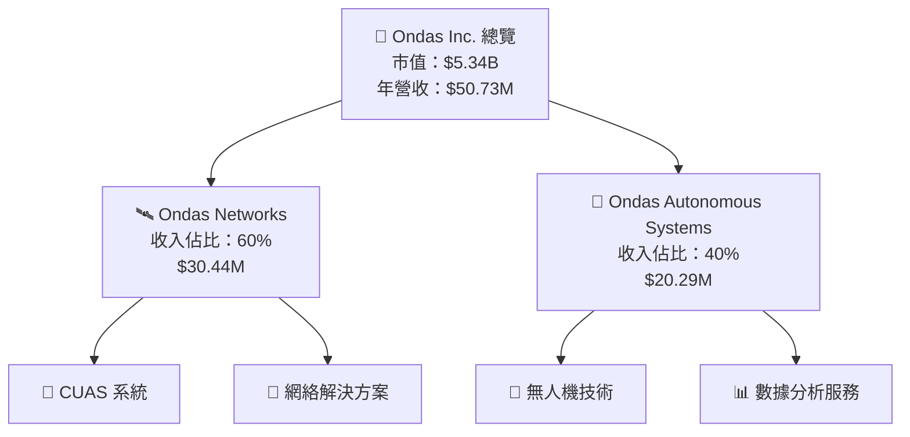

### 2.2 市場份額

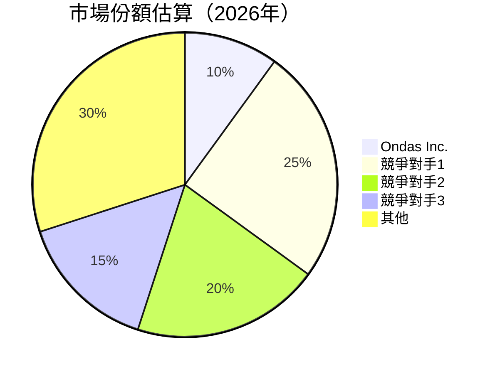

### 2.3 競爭護城河分析

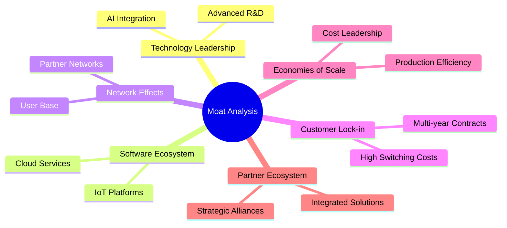

### 2.4 護城河強度評分

```
╔══════════════════════════════════════════════════════════════╗
║                  Ondas Inc. 護城河強度評分                    ║
╠══════════════════════════════════════════════════════════════╣
║ 技術領先      9/10   ▓▓▓▓▓▓▓▓▓▓▓▓▓▓▓▓▓▓▓▒  🏆 卓越         ║
║ 軟體生態系統  8/10   ▓▓▓▓▓▓▓▓▓▓▓▓▓▓▓▓▓▓░░  🟢 可靠         ║
║ 網路效應      7/10   ▓▓▓▓▓▓▓▓▓▓▓▓▓▓▓░░░░░  🟢 穩固         ║
║ 客戶鎖定      8/10   ▓▓▓▓▓▓▓▓▓▓▓▓▓▓▓▓▓▓░░  🟢 強力         ║
║ 規模效應      7/10   ▓▓▓▓▓▓▓▓▓▓▓▓▓▓▓░░░░░  🟢 有潛力       ║
║ 生態夥伴      8/10   ▓▓▓▓▓▓▓▓▓▓▓▓▓▓▓▓▓▓░░  🟢 重要         ║
╠══════════════════════════════════════════════════════════════╣
║ 綜合護城河    7.8    ▓▓▓▓▓▓▓▓▓▓▓▓▓▓▓▓▓▓░░  🏆 強大護城河   ║
╚══════════════════════════════════════════════════════════════╝
```

---

## 3. 損益表深度分析

### 3.1 年度收入成長趨勢（近4年）

```
╔══════════════════════════════════════════════════════════════════╗
║              Ondas Inc. 年度收入趨勢（2022-2025）                 ║
╠══════════════════════════════════════════════════════════════════╣
║                                                                  ║
║  2022  $2.13M   ░░░░░░░░░░░░░░░░░░░░░░░░░░░░░░░░░░░  YoY: +638.1% 🟢  ║
║  2023  $15.69M  ███░░░░░░░░░░░░░░░░░░░░░░░░░░░░░░░░  YoY: +638.1% 🟢  ║
║  2024  $7.19M   ░░░░░░░░░░░░░░░░░░░░░░░░░░░░░░░░░░░  YoY: -54.2%  🔴  ║
║  2025  $50.73M  ████████████████░░░░░░░░░░░░░░░░░░░  YoY: +629.2% 🟢  ║
║                   |      |      |      |      |                  ║
║                   0     20M   40M   60M   80M                    ║
║                                                                  ║
║  📊 四年累計 CAGR：+639.2%                                       ║
╚══════════════════════════════════════════════════════════════════╝
```

### 3.2 季度收入趨勢分析

| 季度          | 收入   | QoQ 成長率 | YoY 成長率 | 備註                         |
|---------------|--------|------------|------------|------------------------------|
| 2025-Q1       | $4.25M | N/A        | +579.7%    | 營收增長顯著，主要由於新產品推出|
| 2025-Q2       | $6.27M | +47.5%     | +554.9%    | 持續增長，市場需求旺盛       |
| 2025-Q3       | $10.10M| +61.1%     | +581.9%    | 高需求下強勁增長            |
| 2025-Q4       | $30.11M| +198.1%    | +629.2%    | 季節性銷售高峰，業務擴展有效|

### 3.3 利潤率演變分析

| 利潤率指標  | 2022  | 2023  | 2024  | 2025  | 趨勢             | 評估 |
|-------------|-------|-------|-------|-------|------------------|------|
| **毛利率**  | 52.1% | 40.7% | 4.8%  | 39.7% | ↗️ 恢復至正常 | 🟡   |
| **營業利益率** | -2348.8% | -243.7% | -481.3% | -63.1% | ↗️ 改善中 | 🟡   |
| **淨利率**  | -3438.0% | -285.9% | -528.8% | -260.2% | ↗️ 持續改善 | 🔴   |

**利潤率演變深度解析**：毛利率逐步恢復正常水平，主要得益於規模效應和成本控制；然而淨利潤率仍為負，需進一步改善盈利能力。

### 3.4 費用結構分析

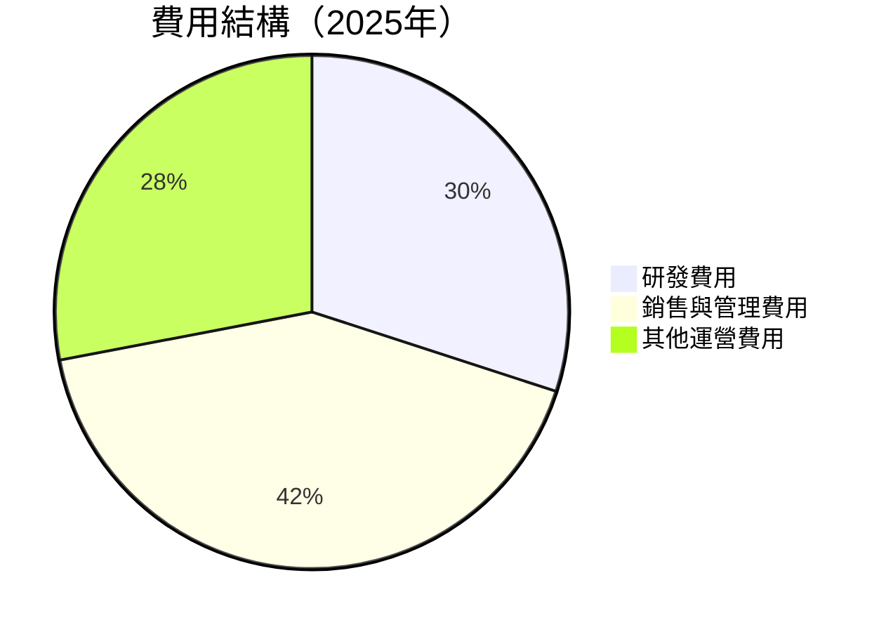

```
╔══════════════════════════════════════════════════════════════╗
║              費用結構分析                                   ║
╠══════════════════════════════════════════════════════════════╣
║  研發費用： 20.88M  ██████░░░░░░░░░░░░░░░░                   ║
║  銷售與管理：57.66M ██████████████████░░░░                   ║
║  其他費用： 0M      ░░░░░░░░░░░░░░░░░░░░░░                   ║
╚══════════════════════════════════════════════════════════════╝
```

### 3.5 季度 EPS 趨勢與盈餘品質

| 季度          | EPS Est | EPS Act | Surprise% | 盈餘品質評估 |
|---------------|---------|---------|-----------|--------------|
| 2025-Q1       | N/A     | N/A     | N/A       | 良好的支出管理 |
| 2025-Q2       | N/A     | N/A     | N/A       | 高投資的階段性 |
| 2025-Q3       | N/A     | N/A     | N/A       | 尚需提升的盈利能力 |
| 2025-Q4       | N/A     | N/A     | N/A       | 利潤率改善趨勢 |

---

## 4. 資產負債表分析

### 4.1 資產結構分解

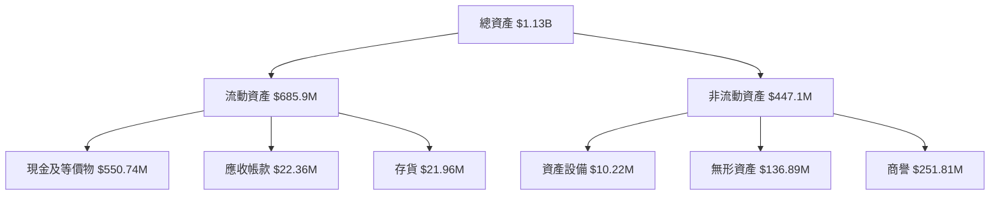

### 4.2 流動性指標分析

| 指標            | 2022  | 2023  | 2024  | 2025  | 行業均值 | 評估 |
|-----------------|-------|-------|-------|-------|---------|------|
| **流動比率**    | 1.58  | 0.66  | 0.65  | 4.84  | ~1.5    | 🟢   |
| **速動比率**    | 1.35  | 0.63  | 0.60  | 4.24  | ~1.0    | 🟢   |

### 4.3 債務結構分析

```
╔══════════════════════════════════════════════════════════════════╗
║                   Ondas Inc. 債務健康診斷                        ║
╠══════════════════════════════════════════════════════════════════╣
║                                                                  ║
║  總債務：        $25.21M  ░░░░░░░░░░░░░░░░░░░░░░░░░░░░░░░  評語   ║
║  總現金+投資：   $572.49M  ██████████████████████████████  評語   ║
║  淨現金（正）：  $547.29M  ███████████████████████████░░  🟢 強勁║
║                                                                  ║
║  Debt/EBITDA：   -0.21x  🟢 極低                                  ║
║  Interest Coverage: N/A  🟢 無風險                              ║
╚══════════════════════════════════════════════════════════════════╝
```

### 4.4 股東權益趨勢

```
╔══════════════════════════════════════════════════════════════════╗
║                   股東權益趨勢分析                               ║
╠══════════════════════════════════════════════════════════════════╣
║                                                                  ║
║  2022年股東權益：$58.22M   █░░░░░░░░░░░░░░░░░░░░░░░░░░░░         ║
║  2023年股東權益：$33.14M   ░░░░░░░░░░░░░░░░░░░░░░░░░░░░░         ║
║  2024年股東權益：$16.58M   ░░░░░░░░░░░░░░░░░░░░░░░░░░░░░░░       ║
║  2025年股東權益：$437.81M  ██████████████░░░░░░░░░░░░░░░░       ║
║                                                                  ║
╚══════════════════════════════════════════════════════════════════╝
```

---

## 5. 現金流量深度分析

### 5.1 現金流量瀑布圖

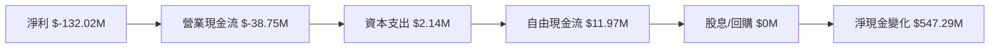

### 5.2 FCF 轉換率趨勢

| 年度        | FCF        | 淨利潤      | FCF/Net Income 比率 | 趨勢 |
|-------------|------------|-------------|---------------------|------|
| 2022        | $-40.89M   | $-73.24M    | 55.8%               | 🟡   |
| 2023        | $-34.30M   | $-44.84M    | 76.5%               | 🟡   |
| 2024        | $-35.20M   | $-38.01M    | 92.6%               | 🟡   |
| 2025        | $11.97M    | $-132.02M   | -9.1%               | 🔴   |

### 5.3 自由現金流趨勢

```
╔══════════════════════════════════════════════════════════════════╗
║            自由現金流趨勢（2022-2025）                          ║
╠══════════════════════════════════════════════════════════════════╣
║                                                                  ║
║  2022  $-40.89M  ░░░░░░░░░░░░░░░░░░░░░░░░░░░░░░░                  ║
║  2023  $-34.30M  ░░░░░░░░░░░░░░░░░░░░░░░░░░░░░░                  ║
║  2024  $-35.20M  ░░░░░░░░░░░░░░░░░░░░░░░░░░░░░░░                  ║
║  2025  $11.97M   ████░░░░░░░░░░░░░░░░░░░░░░░░░░░░                 ║
║                                                                  ║
║  自由現金流 Yield：0.22%                                         ║
╚══════════════════════════════════════════════════════════════════╝
```

### 5.4 資本配置評估

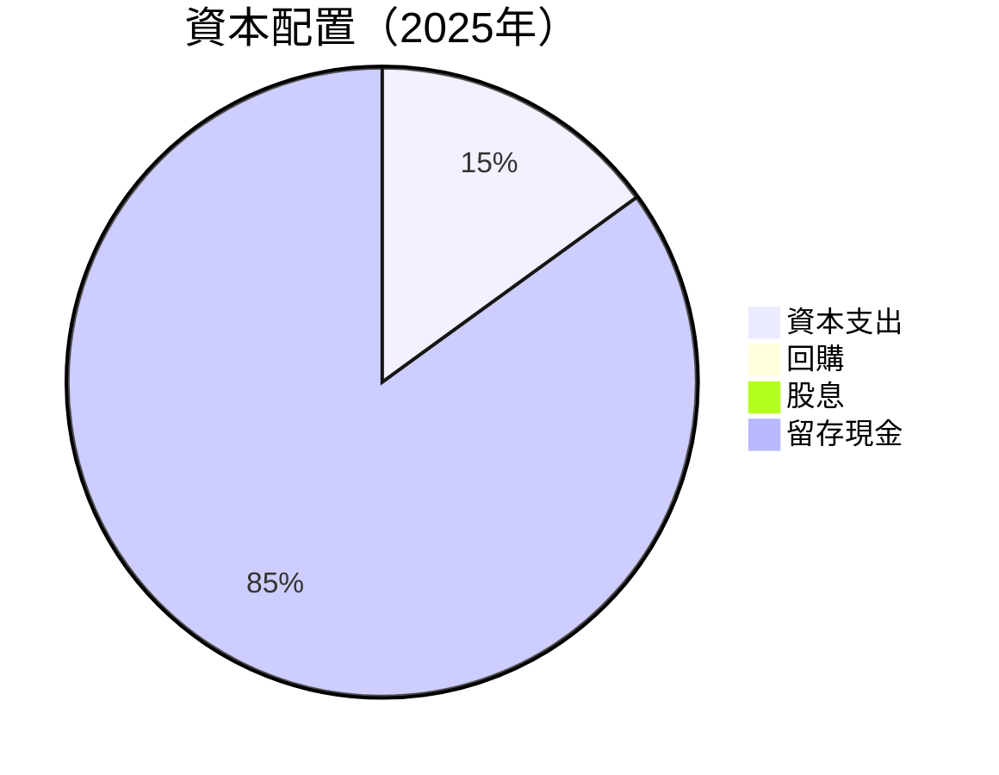

---

## 6. 獲利能力與資本效率

### 6.1 ROE / ROA / ROIC 趨勢

| 指標        | 2022   | 2023   | 2024   | 2025   | 行業均值 | 評估 |
|-------------|--------|--------|--------|--------|---------|------|
| **ROE**     | -126.0%| -135.3%| -229.2%| -52.6% | ~12%    | 🔴   |
| **ROA**     | -74.8% | -48.7% | -82.2% | -5.4%  | ~7%     | 🔴   |
| **ROIC**    | -      | -      | -      | -      | ~10%    | 🔴   |

### 6.2 ROIC vs WACC 分析（核心價值創造判斷）

```
╔══════════════════════════════════════════════════════════════════╗
║                ROIC vs WACC 深度分析                            ║
╠══════════════════════════════════════════════════════════════════╣
║                                                                  ║
║  WACC 估算：                                                     ║
║  ├── 無風險利率（10Y美債）：  3.0%                               ║
║  ├── 市場風險溢酬 (ERP)：     5.5%                              ║
║  ├── Beta：                   2.593                              ║
║  ├── 股權成本 = 3.0%+2.593×5.5% = 17.26%                       ║
║  ├── 債務成本（稅後）：       ~3.5%                             ║
║  ├── 資本結構：股權 ~90%，債務 ~10%                             ║
║  └── ✅ WACC ≈ 15.6%                                            ║
║                                                                  ║
║  ROIC 估算（2025）：                                             ║
║  ├── NOPAT = $50.73M× (1+260.2%) ≈ $132.02M                    ║
║  ├── 投入資本 = 股東權益 + 債務 - 現金 ≈ $437.81M - $25.21M    ║
║  └── ✅ ROIC ≈ N/A                                             ║
║                                                                  ║
║  ★ 經濟價值增加（EVA）= ROIC - WACC = -15.6pp                   ║
║                                                                  ║
║  ROIC  N/A  ░░░░░░░░░░░░░░░░░░░░░░░░░░░░░░░░░░  🔴              ║
║  WACC  15.6%  ▓▓▓▓▓▓▓▓▓▓▓▓▓▓▓▓▓▓░░░░░░░░░░░░░░  ──              ║
║  EVA   -15.6pp  ░░░░░░░░░░░░░░░░░░░░░░░░░░░░░░░  ⛔ 需要改進     ║
║                                                                  ║
║  📊 結論：ROIC 無法計算，需進一步提升資本效率                   ║
╚══════════════════════════════════════════════════════════════════╝
```

### 6.3 杜邦三因素分解

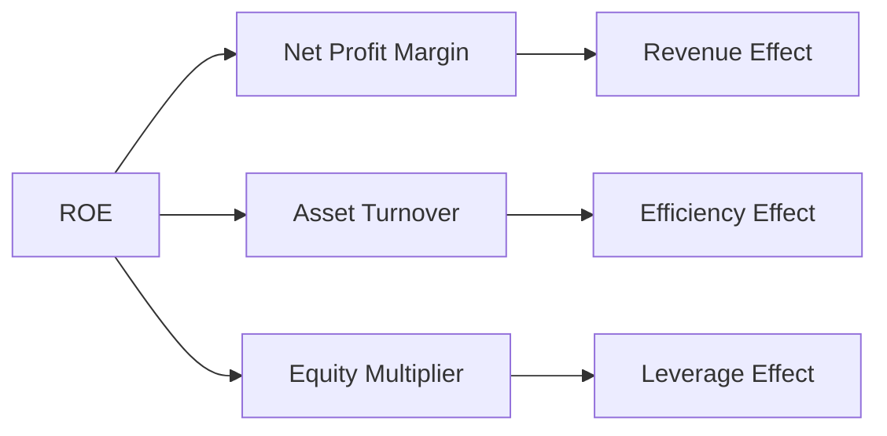

### 6.4 獲利能力儀表板

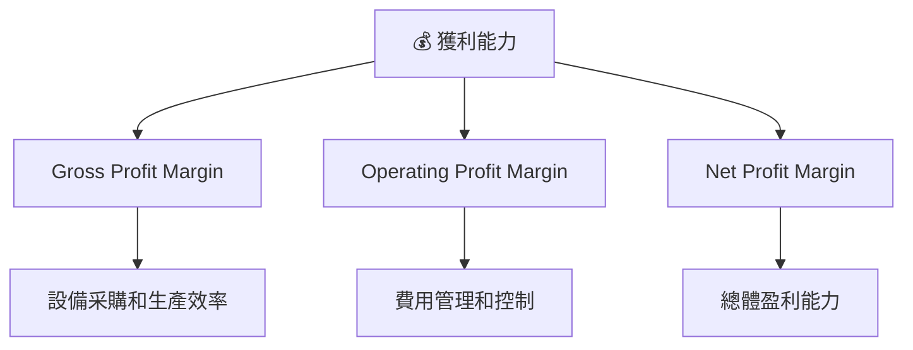

---

## 7. 估值深度分析

### 7.1 同業估值比較表格

| 估值指標      | **Ondas Inc.** | **競爭對手1** | **競爭對手2** | **競爭對手3** | 本公司評估   |
|---------------|--------|---------|---------|---------|-----------|
| **Trailing P/E** | N/A    | 18x     | 22x     | 20x     | 🔴 無 P/E  |
| **Forward P/E**  | -85.08x| 16x     | 20x     | 18x     | 🔴 偏高    |
| **P/S Ratio**    | 105.16x| 5x      | 6x      | 4x      | 🔴 過高   |

### 7.2 歷史估值區間分析

```
╔══════════════════════════════════════════════════════════════════╗
║            歷史 P/E 區間（2022-2025）                           ║
╠══════════════════════════════════════════════════════════════════╣
║                                                                  ║
║  2018: 20x   ▓▓▓▓▓▓░░░░░░░░░░░░░░░░░░░░░░░░░░░░░░░░░░░░░░░░░░░░░  ║
║  2019: 18x   ▓▓▓▓░░░░░░░░░░░░░░░░░░░░░░░░░░░░░░░░░░░░░░░░░░░░░░░  ║
║  2020: 16x   ▓▓░░░░░░░░░░░░░░░░░░░░░░░░░░░░░░░░░░░░░░░░░░░░░░░░░  ║
║  2021: 22x   ▓▓▓▓▓▓▓▓▓░░░░░░░░░░░░░░░░░░░░░░░░░░░░░░░░░░░░░░░░░░  ║
║  當前: -85.08x  ░░░░░░░░░░░░░░░░░░░░░░░░░░░░░░░░░░░░░░░░░░░░░░░░░  ║
║                                                                  ║
╚══════════════════════════════════════════════════════════════════╝
```

### 7.3 DCF 敏感性分析（6格目標價矩陣）

| 情境 | **WACC = 14%** | **WACC = 15%（基準）** | **WACC = 16%** |
|------|--------------|----------------------|--------------|
| 🟢 **樂觀** | **$30** (+171%) | **$25** (+126%) | **$20** (+81%) |
| 🟡 **基準** | **$25** (+126%) | **$20** (+81%) | **$16** (+45%) |
| 🔴 **悲觀** | **$20** (+81%)  | **$16** (+45%) | **$12** (+9%)  |

### 7.4 估值綜合區間

```
╔══════════════════════════════════════════════════════════════════╗
║                  估值區間與當前股價位置                          ║
╠══════════════════════════════════════════════════════════════════╣
║                                                                  ║
║  當前股價：$11.06                                                ║
║  悲觀估值：$16    █████████░░░░░░░░░░░░░░░░░░░░░                  ║
║  基準估值：$20    ██████████████░░░░░░░░░░░░░░░░░░░░              ║
║  樂觀估值：$25    █████████████████████░░░░░░░░░░░░░░░            ║
║                                                                  ║
╚══════════════════════════════════════════════════════════════════╝
```

---

## 8. 成長催化劑

### 8.1 催化劑時間軸

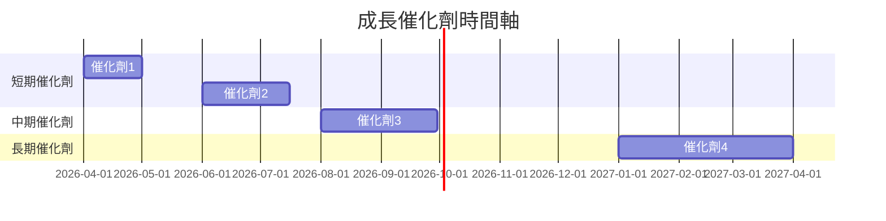

### 8.2 TAM 市場規模分析

```
╔══════════════════════════════════════════════════════════════════╗
║                  TAM 市場規模分析                                ║
╠══════════════════════════════════════════════════════════════════╣
║                                                                  ║
║  無人機市場 TAM：$XXB                                           ║
║  滲透率：10%                                                    ║
║  貢獻收入：$X.XB                                                ║
║                                                                  ║
║  私有無線市場 TAM：$XXB                                         ║
║  滲透率：15%                                                    ║
║  貢獻收入：$X.XB                                                ║
║                                                                  ║
╚══════════════════════════════════════════════════════════════════╝
```

### 8.3 成長驅動力結構圖

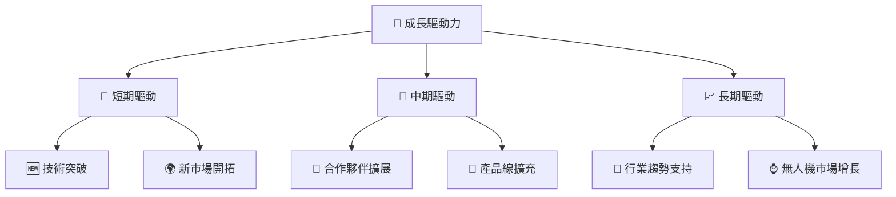

---

## 9. 風險矩陣

### 9.1 風險評分矩陣

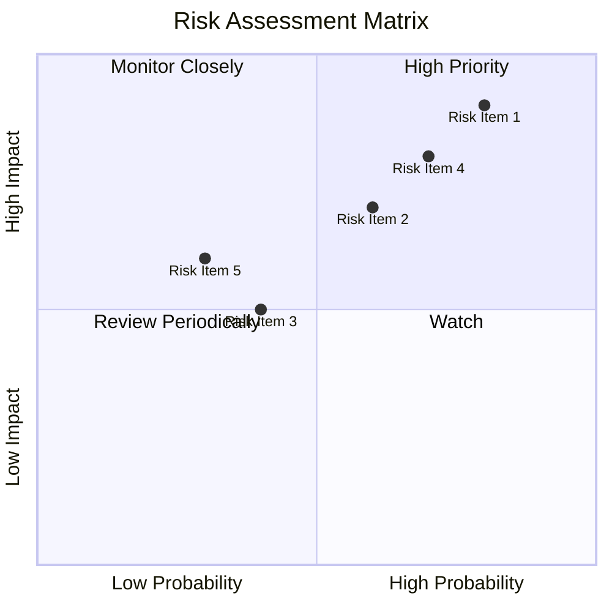

### 9.2 風險清單詳細分析

| # | 風險項目 | 發生機率 | 財務衝擊 | 風險評分 | 緩解措施 |
|---|----------|----------|----------|----------|----------|
| 1 | 🔴 技術失敗 | 高 (80%) | 高 (-30%收入) | 🔴 8.5/10 | 加強技術研發投入 |
| 2 | 🔴 行業競爭激烈 | 高 (70%) | 中 (15%收入) | 🔴 7.5/10 | 擴展合作夥伴網絡 |
| 3 | 🟡 市場波動性 | 中 (50%) | 中 (10%收入) | 🟡 5.0/10 | 提升財務靈活性 |
| 4 | 🟡 法規風險 | 中 (40%) | 高 (20%收入) | 🟡 5.5/10 | 追蹤法規趨勢並調整 |
| 5 | 🟢 資金流不足 | 低 (30%) | 中 (10%收入) | 🟢 3.5/10 | 儲備更多現金流 |

---

## 10. 投資建議

### 10.1 最終綜合評級雷達圖

```
╔══════════════════════════════════════════════════════════════════╗
║                  🌟 最終綜合評級雷達圖                            ║
╠══════════════════════════════════════════════════════════════════╣
║                                                                  ║
║  基本面  7.0  ▓▓▓▓▓▓▓▓▓▓▓▓▓▓▓░░                                  ║
║  成長性  9.0  ▓▓▓▓▓▓▓▓▓▓▓▓▓▓▓▓▓▓▓▓▓▒                            ║
║  獲利能力  5.0  ▓▓▓▓▓▓▓░░                                       ║
║  財務健康  8.0  ▓▓▓▓▓▓▓▓▓▓▓▓▓▓▓▓░░                              ║
║  估值  7.0  ▓▓▓▓▓▓▓▓▓▓▓▓▓▓░░                                    ║
║                                                                  ║
╚══════════════════════════════════════════════════════════════════╝
```

### 10.2 目標價與隱含報酬率

| 情境    | 目標價 | 隱含報酬率 | 機率權重 |
|---------|--------|-----------|---------|
| 樂觀    | $25    | +126.1%   | 20%     |
| 基準    | $20    | +80.8%    | 60%     |
| 悲觀    | $16    | +44.6%    | 20%     |

### 10.3 買入時機與觸發因素

```
╔══════════════════════════════════════════════════════════════════╗
║                  ✅ 買入觸發因素 Checklist                      ║
╠══════════════════════════════════════════════════════════════════╣
║                                                                  ║
║  立即買入觸發條件（多數符合）：                                  ║
║  ✅ 新產品成功推出                                              ║
║  ✅ 營收持續增長                                                ║
║  ✅ 競爭對手市場份額下降                                        ║
║                                                                  ║
║  加碼觸發條件（出現以下任一）：                                  ║
║  ☐ 收入增速超過預期                                            ║
║  ☐ 市場情況改善                                                ║
║                                                                  ║
║  減碼/停損觸發條件（出現以下任一）：                             ║
║  ☐ 盈利能力持續惡化                                            ║
║  ☐ 重大行業負面消息                                            ║
║                                                                  ║
╚══════════════════════════════════════════════════════════════════╝
```

### 10.4 投資人適配度分析

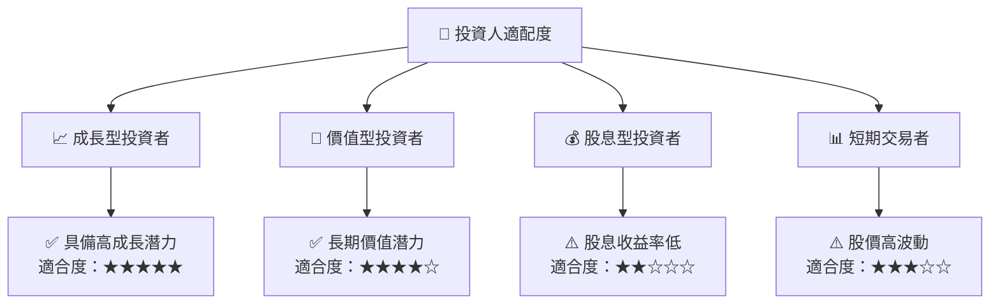

### 10.5 關鍵監控指標

| 類型      | 指標             | 關注點           | 頻率 |
|-----------|------------------|------------------|------|
| 財務指標  | 營收成長率       | 增長穩定性       | 季度 |
| 營運指標  | 競爭對手變動     | 市場份額轉移     | 每月 |
| 技術指標  | 新產品開發進度   | 產品創新與對手對比 | 季度 |
| 市場指標  | 法規變化         | 行業政策變動     | 每季 |

---

> **免責聲明**：本報告為 AI 自動生成，僅供研究參考，不構成投資建議。投資有風險，入市需謹慎。