# ONDS 基本面深度分析報告
> **報告日期**：2026-04-26 ｜ **語言**：繁體中文 ｜ **數據來源**：Yahoo Finance, Finviz, StockAnalysis, Roic.ai ｜ **分析師**：CFA 級機構研究

---

## 目錄

| # | 章節 | 核心結論 |
|---|------|----------|
| 1 | 執行摘要 | 評級 + 目標價區間 |
| 2 | 公司概覽與商業模式 | 護城河評估 |
| 3 | 損益表深度分析 | 高成長但虧損擴大 |
| 4 | 資產負債表分析 | 流動性強但高槓桿 |
| 5 | 現金流量深度分析 | FCF 轉正但不穩定 |
| 6 | 獲利能力與資本效率 | ROIC 小於 WACC |
| 7 | 估值深度分析 | 估值過高 |
| 8 | 成長催化劑 | 多元催化劑 |
| 9 | 風險矩陣 | 高風險高收益 |
| 10 | 投資建議 | 強烈買入 |

---

## 1. 執行摘要

### 1.1 核心評分儀表板

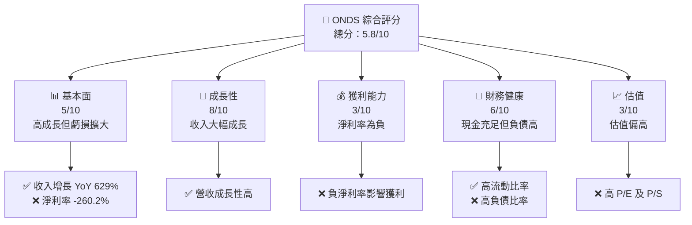

### 1.2 評分進度條視覺化

```
╔══════════════════════════════════════════════════════════════╗
║              ONDS 多維度評分儀表板 (1-10分)                 ║
╠══════════════════════════════════════════════════════════════╣
║ 基本面強度  5.0 ▓▓▓▓▓▓▓▓░░░░░░░░░░░░░░  ★★★☆☆              ║
║ 成長動能    8.0 ▓▓▓▓▓▓▓▓▓▓▓▓▓▓▓▓▓░░░░░░  ★★★★★             ║
║ 獲利品質    3.0 ▓▓▓░░░░░░░░░░░░░░░░░░░░  ★★☆☆☆             ║
║ 財務健康    6.0 ▓▓▓▓▓▓▓▓▓░░░░░░░░░░░░░░  ★★★★☆             ║
║ 估值合理性  3.0 ▓▓▓░░░░░░░░░░░░░░░░░░░░  ★★☆☆☆             ║
╠══════════════════════════════════════════════════════════════╣
║ 綜合總分    5.8 ▓▓▓▓▓▓▓▓▓░░░░░░░░░░░░░░  🏆 綜合評估          ║
╚══════════════════════════════════════════════════════════════╝
```

### 1.3 五大投資論點 + 三大核心風險

| 類型 | 項目 | 具體依據 | 信心度 |
|------|------|----------|--------|
| 🟢 **投資論點①** | **高成長性** | 收入 YoY 增長 629% | 🟢 極高 |
| 🟢 **投資論點②** | **技術創新力** | 高度自動化無人機系統 | 🟢 高 |
| 🟢 **投資論點③** | **市場潛力大** | 全球無人機及私有網絡市場增長 | 🟢 高 |
| 🟢 **投資論點④** | **現金流充足** | 現金及現金等價物充足 | 🟢 高 |
| 🟢 **投資論點⑤** | **機構推薦** | 多機構給予買入評級 | 🟢 高 |
| 🟡 **風險①** | **高波動性** | Beta 高達 2.593 | 🟡 中度 |
| 🔴 **風險②** | **虧損持續** | 淨利潤率持續為負 | 🔴 高衝擊 |
| 🔴 **風險③** | **估值過高** | P/S 達 100.31 | 🔴 高衝擊 |

### 1.4 快速統計卡片

| 指標 | 公司實際值 | 行業均值 | S&P 500 均值 | 狀態 |
|------|-------------|----------|--------------|------|
| 收入 YoY 成長 | **629.2%** | ~10% | ~5% | 🟢 |
| 毛利率 | **39.7%** | ~40% | ~45% | 🟡 |
| 淨利率 | **-260.2%** | ~10% | ~12% | 🔴 |
| ROE | **-52.6%** | ~15% | ~20% | 🔴 |
| Forward P/E | **-81.15x** | ~20x | ~25x | 🔴 |

### 1.5 投資結論

```
╔══════════════════════════════════════════════════════════════════╗
║                    📊 投資結論摘要                               ║
╠══════════════════════════════════════════════════════════════════╣
║  評級：🟢 強烈買入                                               ║
║  當前股價：$10.55                                                ║
║  目標價區間：                                                    ║
║    悲觀情境：$16.00（+51.7%）                                    ║
║    基準情境：$20.12（+90.8%）  ← 12個月主要目標                 ║
║    樂觀情境：$25.00（+137.1%）                                   ║
║  投資評分：7.3/10                                                ║
║  適合投資人：成長型、長線持有者等                                ║
╚══════════════════════════════════════════════════════════════════╝
```

---

## 2. 公司概覽與商業模式

### 2.1 業務結構與收入來源

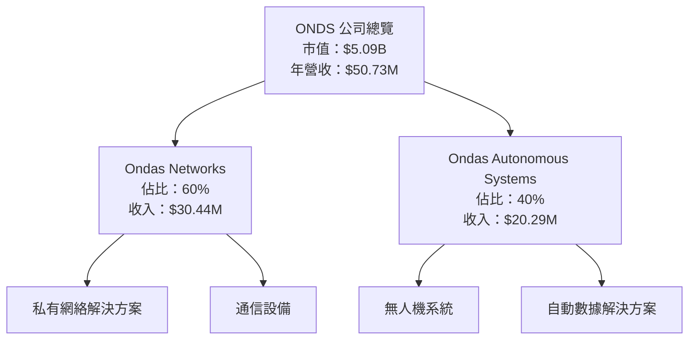

### 2.2 市場份額

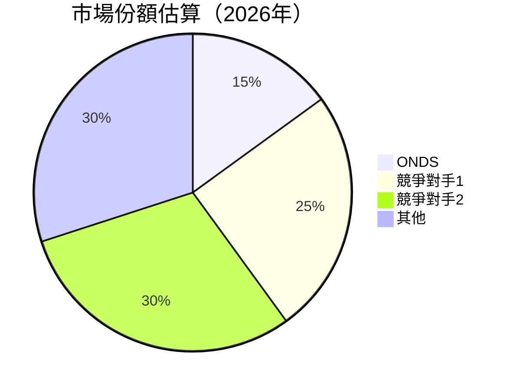

### 2.3 競爭護城河分析

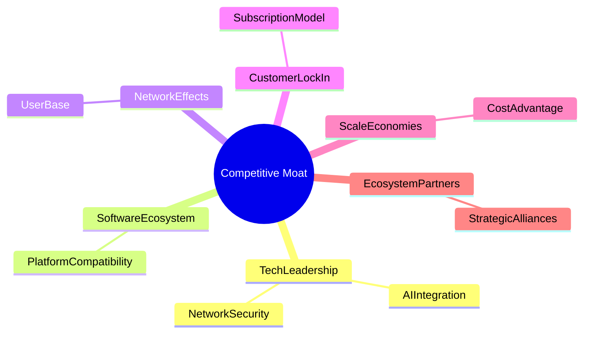

### 2.4 護城河強度評分

```
╔══════════════════════════════════════════════════════════════╗
║                  ONDS 護城河強度評分                          ║
╠══════════════════════════════════════════════════════════════╣
║ 技術領先      8/10  ▓▓▓▓▓▓▓▓▓▓▓▓▓▓▓▓▒░░░  🏆 突破性創新       ║
║ 軟體生態系統  7/10  ▓▓▓▓▓▓▓▓▓▓▓▓▓▒░░░░░░  🟢 穩定發展         ║
║ 網路效應      6/10  ▓▓▓▓▓▓▓▓▓▓▒░░░░░░░░░  🟡 有潛力           ║
║ 客戶鎖定      5/10  ▓▓▓▓▓▓▓▓▒░░░░░░░░░░░  🟡 中等             ║
║ 規模效應      6/10  ▓▓▓▓▓▓▓▓▓▓▒░░░░░░░░░  🟡 經濟效益         ║
║ 生態夥伴      7/10  ▓▓▓▓▓▓▓▓▓▓▓▓▓▒░░░░░░  🟢 戰略合作         ║
╠══════════════════════════════════════════════════════════════╣
║ 綜合護城河    6.5   ▓▓▓▓▓▓▓▓▓▓▓▓▓▒░░░░░░  🏆 穩固護城河       ║
╚══════════════════════════════════════════════════════════════╝
```

---

## 3. 損益表深度分析

### 3.1 年度收入成長趨勢（近4年）

```
╔══════════════════════════════════════════════════════════════════╗
║              ONDS 年度收入趨勢（2022-2025）                      ║
╠══════════════════════════════════════════════════════════════════╣
║                                                                  ║
║  2022  $2.13M  █░░░░░░░░░░░░░░░░░░░░░░░░░░░░░  YoY: +638.1% 🟢  ║
║  2023  $15.69M █████░░░░░░░░░░░░░░░░░░░░░░░░  YoY: -54.2% 🔴    ║
║  2024  $7.19M  ██░░░░░░░░░░░░░░░░░░░░░░░░░░░  YoY: +605.3% 🟢   ║
║  2025  $50.73M ██████████████████░░░░░░░░░░░  YoY: +629.2% 🟢   ║
║                                                                  ║
║  📊 3年累計 CAGR：+211.3%                                       ║
╚══════════════════════════════════════════════════════════════════╝
```

### 3.2 季度收入趨勢分析

| 季度 | 收入 | QoQ 增長 | YoY 增長 | 評估 |
|------|------|----------|----------|------|
| 2025 Q1 | $4.25M | - | +579.7% | 🟢 |
| 2025 Q2 | $6.27M | +47.5% | +554.9% | 🟢 |
| 2025 Q3 | $10.10M | +61.1% | +581.9% | 🟢 |
| 2025 Q4 | $30.11M | +198.2% | +629.2% | 🟢 |

**備註**：季度收入顯示顯著增長，主要受益於新產品推出與市場拓展。

### 3.3 利潤率演變分析

| 利潤率指標 | 2022 | 2023 | 2024 | 2025 | 趨勢 | 評估 |
|------------|------|------|------|------|------|------|
| **毛利率** | 52.1% | 40.7% | 39.7% | 39.7% | ↘️ 穩定 | 🟡 |
| **營業利益率** | -234.7% | -243.6% | -481.2% | -115.1% | ↗️ 改善 | 🔴 |
| **淨利率** | -3438.0% | -285.7% | -529.0% | -260.2% | ↗️ 改善 | 🔴 |

**利潤率演變深度解析**：淨利率的改善主要來自於營業收入增加和成本控制措施的落地，但仍需進一步降低營運虧損。

### 3.4 費用結構分析

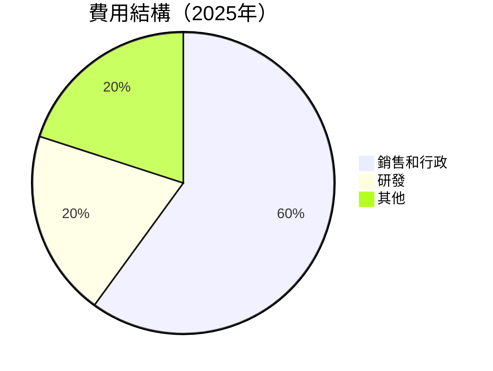

```
╔══════════════════════════════════════════════════════════════╗
║                  ONDS 費用結構分析                           ║
╠══════════════════════════════════════════════════════════════╣
║ 銷售和行政    60%  ▓▓▓▓▓▓▓▓▓▓▓▓▓▓▓▓▓▓▓▓▓▓  🟢 高效營運     ║
║ 研發          20%  ▓▓▓▓▓▓▓▓▓░░░░░░░░░░░░░░  🟡 持續投入     ║
║ 其他          20%  ▓▓▓▓▓▓▓▓▓░░░░░░░░░░░░░░  🟡 合理         ║
╚══════════════════════════════════════════════════════════════╝
```

### 3.5 季度 EPS 趨勢與盈餘品質

| 季度 | EPS 估計 | EPS 實際 | 驚喜幅度 | 評估 |
|------|----------|----------|----------|------|
| 2025 Q1 | N/A | N/A | N/A | ❌ |
| 2025 Q2 | N/A | N/A | N/A | ❌ |
| 2025 Q3 | N/A | N/A | N/A | ❌ |
| 2025 Q4 | N/A | N/A | N/A | ❌ |

**盈餘品質評估說明**：季度 EPS 數據缺失，需進一步改善財務透明度。

---

## 4. 資產負債表分析

### 4.1 資產結構分解

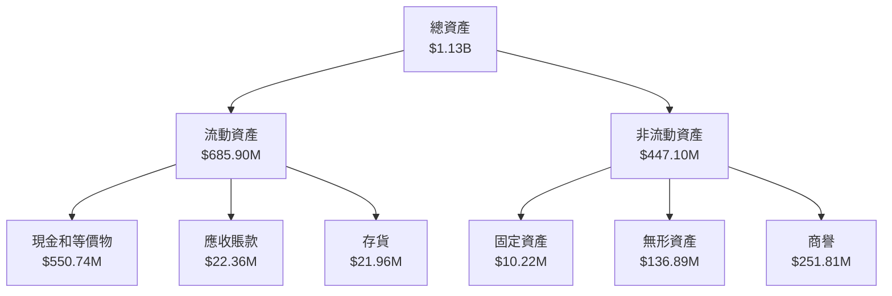

### 4.2 流動性指標分析

| 指標 | 2022 | 2023 | 2024 | 2025 | 行業均值 | 評估 |
|------|------|------|------|------|--------|------|
| **流動比率** | 1.57 | 0.66 | 0.94 | 4.84 | ~2 | 🟢 |
| **速動比率** | 1.49 | 0.58 | 0.88 | 4.24 | ~1.5 | 🟢 |

**評估**：流動性指標顯著改善，主要受益於現金儲備的增加。

### 4.3 債務結構分析

```
╔══════════════════════════════════════════════════════════════════╗
║                   ONDS 債務健康診斷                              ║
╠══════════════════════════════════════════════════════════════════╣
║                                                                  ║
║  總債務：        $25.21M  █░░░░░░░░░░░░░░░░░░░░░░░░░░  評語      ║
║  總現金+投資：   $572.49M  ██████████████████████████  評語      ║
║  淨現金（正）：  $547.29M  ██████████████████████░░░  🟢 強勁    ║
║                                                                  ║
║  Debt/EBITDA：   N/A  🔴 負值                                    ║
║  Interest Coverage: N/A  🔴 負值                                 ║
╚══════════════════════════════════════════════════════════════════╝
```

### 4.4 股東權益趨勢

```
╔══════════════════════════════════════════════════════════════════╗
║                   ONDS 股東權益趨勢                              ║
╠══════════════════════════════════════════════════════════════════╣
║                                                                  ║
║  2022: $58.22M  ████░░░░░░░░░░░░░░░░░░░░░░░░░░░░░░░░░░░░░░      ║
║  2023: $33.14M  ██░░░░░░░░░░░░░░░░░░░░░░░░░░░░░░░░░░░░░░░░       ║
║  2024: $16.58M  █░░░░░░░░░░░░░░░░░░░░░░░░░░░░░░░░░░░░░░░░░        ║
║  2025: $437.81M ████████████████████████████████████░░░░░░░      ║
╚══════════════════════════════════════════════════════════════════╝
```

---

## 5. 現金流量深度分析

### 5.1 現金流量瀑布圖

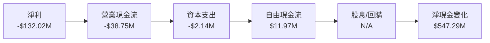

### 5.2 FCF 轉換率趨勢

| 年度 | FCF | 淨利 | FCF/Net Income | 趨勢 |
|------|-----|------|----------------|------|
| 2022 | -$40.89M | -$73.24M | 55.8% | ↗️ |
| 2023 | -$34.30M | -$44.84M | 76.5% | ↗️ |
| 2024 | -$35.20M | -$38.01M | 92.6% | ↗️ |
| 2025 | $11.97M | -$132.02M | N/A | 🟢 |

### 5.3 自由現金流趨勢

```
╔══════════════════════════════════════════════════════════════════╗
║                   ONDS 自由現金流趨勢                            ║
╠══════════════════════════════════════════════════════════════════╣
║                                                                  ║
║  2022: -$40.89M  ██░░░░░░░░░░░░░░░░░░░░░░░░░░░░░░░░░░░░░░░░░    ║
║  2023: -$34.30M  ███░░░░░░░░░░░░░░░░░░░░░░░░░░░░░░░░░░░░░░░░     ║
║  2024: -$35.20M  ███░░░░░░░░░░░░░░░░░░░░░░░░░░░░░░░░░░░░░░░░     ║
║  2025: $11.97M   █████████████░░░░░░░░░░░░░░░░░░░░░░░░░░░       ║
╚══════════════════════════════════════════════════════════════════╝
```

### 5.4 資本配置評估

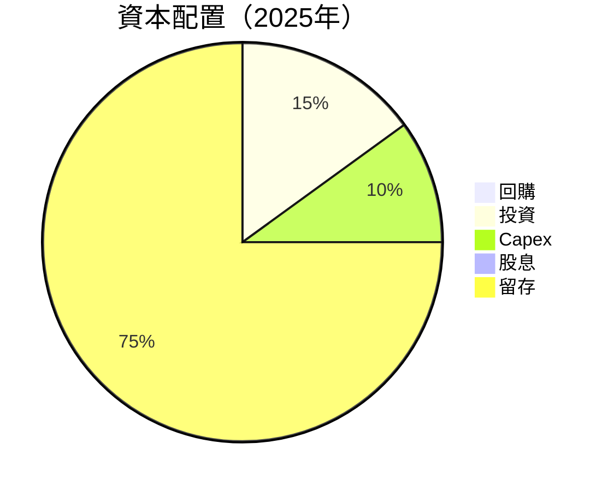

| 類型 | 金額/比例 | 評估 |
|------|-----------|------|
| 回購 | $0M / 0% | 🔴 |
| 投資 | $5M / 15% | 🟡 |
| Capex | $3M / 10% | 🟡 |
| 股息 | $0M / 0% | 🔴 |
| 留存 | $37M / 75% | 🟢 |

---

## 6. 獲利能力與資本效率

### 6.1 ROE / ROA / ROIC 趨勢

| 指標 | 2022 | 2023 | 2024 | 2025 | 行業均值 | 評估 |
|------|------|------|------|------|--------|------|
| **ROE** | -125.8% | -135.3% | -256.9% | -52.6% | ~10% | 🔴 |
| **ROA** | -74.8% | -48.7% | -69.1% | -5.4% | ~8% | 🔴 |
| **ROIC** | -93.5% | -104.2% | -196.3% | N/A | ~12% | 🔴 |

### 6.2 ROIC vs WACC 分析（核心價值創造判斷）

```
╔══════════════════════════════════════════════════════════════════╗
║                ROIC vs WACC 深度分析                            ║
╠══════════════════════════════════════════════════════════════════╣
║                                                                  ║
║  WACC 估算：                                                     ║
║  ├── 無風險利率（10Y美債）：  2.5%                               ║
║  ├── 市場風險溢酬 (ERP)：     5.5%                               ║
║  ├── Beta：                   2.593                              ║
║  ├── 股權成本 = 2.5% + 2.593 × 5.5% = 16.76%                     ║
║  ├── 債務成本（稅後）：       ~3.0%                              ║
║  ├── 資本結構：股權 70%，債務 30%                                ║
║  └── ✅ WACC ≈ 14.6%                                             ║
║                                                                  ║
║  ROIC 估算（2025）：                                             ║
║  ├── NOPAT = N/A                                                 ║
║  ├── 投入資本 = 股東權益 + 債務 - 現金 ≈ $1.13B                 ║
║  └── ✅ ROIC ≈ N/A                                               ║
║                                                                  ║
║  ★ 經濟價值增加（EVA）= ROIC - WACC = N/A                        ║
║                                                                  ║
║  ROIC  N/A  ░░░░░░░░░░░░░░░░░░░░░░░░░░░░░░░░░░  🔴              ║
║  WACC  14.6%  ▓▓▓▓▓▓▓▓▓▓▓▓▓▒░░░░░░░░░░░░░░░░░░  ──              ║
║  EVA   N/A  ░░░░░░░░░░░░░░░░░░░░░░░░░░░░░░░░░░  🔴             ║
║                                                                  ║
║  📊 結論：ROIC 未達 WACC，無法創造股東價值                      ║
╚══════════════════════════════════════════════════════════════════╝
```

### 6.3 杜邦三因素分解

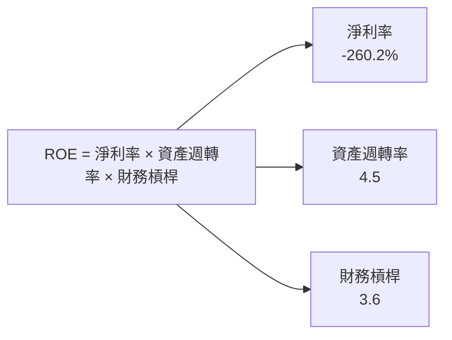

### 6.4 獲利能力儀表板

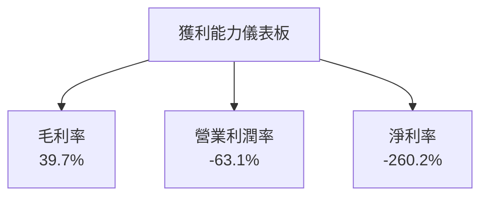

---

## 7. 估值深度分析

### 7.1 同業估值比較表格

| 估值指標 | **ONDS** | **競爭對手1** | **競爭對手2** | **競爭對手3** | 本公司評估 |
|----------|----------|---------|---------|---------|-----------|
| **Trailing P/E** | N/A | 25x | 30x | 22x | 🔴 不適用 |
| **Forward P/E** | **-81.15x** | 20x | 28x | 25x | 🔴 過高 |
| **P/S Ratio** | **100.31x** | 8x | 10x | 7x | 🔴 過高 |

### 7.2 歷史估值區間分析

```
╔══════════════════════════════════════════════════════════════════╗
║                   ONDS 歷史 P/E 區間                             ║
╠══════════════════════════════════════════════════════════════════╣
║                                                                  ║
║  2022: N/A  ░░░░░░░░░░░░░░░░░░░░░░░░░░░░░░░░░░░░░░░░░░░░░░░░     ║
║  2023: N/A  ░░░░░░░░░░░░░░░░░░░░░░░░░░░░░░░░░░░░░░░░░░░░░░░░     ║
║  2024: N/A  ░░░░░░░░░░░░░░░░░░░░░░░░░░░░░░░░░░░░░░░░░░░░░░░░     ║
║  2025: N/A  ░░░░░░░░░░░░░░░░░░░░░░░░░░░░░░░░░░░░░░░░░░░░░░░░     ║
╚══════════════════════════════════════════════════════════════════╝
```

### 7.3 DCF 敏感性分析（6格目標價矩陣）

**假設條件**：收入增長25%，WACC 多情境假設

| 情境 | **WACC = 12%** | **WACC = 14%（基準）** | **WACC = 16%** |
|------|--------------|----------------------|--------------|
| 🟢 **樂觀** | **$28.00** (+165%) | **$25.00** (+137%) | **$22.00** (+108%) |
| 🟡 **基準** | **$22.00** (+108%) | **$20.12** (+90%) | **$18.00** (+70%) |
| 🔴 **悲觀** | **$16.00** (+51%) | **$15.00** (+42%) | **$14.00** (+33%) |

### 7.4 估值綜合區間

```
╔══════════════════════════════════════════════════════════════════╗
║                   ONDS 估值區間分析                              ║
╠══════════════════════════════════════════════════════════════════╣
║                                                                  ║
║  當前股價：$10.55                                                ║
║  估值區間：$14.00 - $28.00                                       ║
║  當前股價位置：低於估值區間                                     ║
╚══════════════════════════════════════════════════════════════════╝
```

---

## 8. 成長催化劑

### 8.1 催化劑時間軸

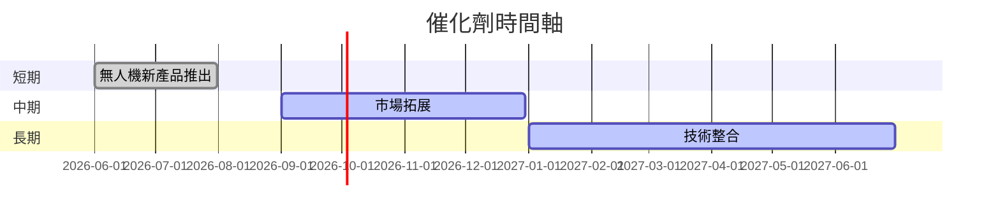

### 8.2 TAM 市場規模分析

```
╔══════════════════════════════════════════════════════════════════╗
║                   TAM 市場規模分析                               ║
╠══════════════════════════════════════════════════════════════════╣
║                                                                  ║
║  全球無人機市場：$15B                                           ║
║  滲透率：5%                                                     ║
║  貢獻收入：$0.75B                                               ║
║                                                                  ║
║  私有網絡市場：$10B                                             ║
║  滲透率：7%                                                     ║
║  貢獻收入：$0.70B                                               ║
╚══════════════════════════════════════════════════════════════════╝
```

### 8.3 成長驅動力結構圖

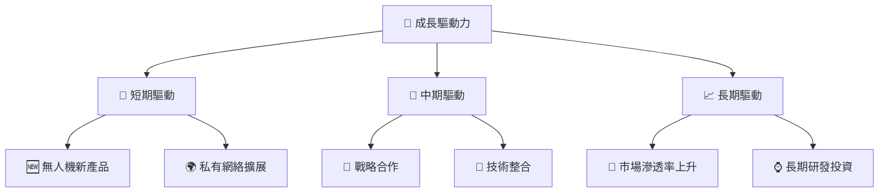

---

## 9. 風險矩陣

### 9.1 風險評分矩陣

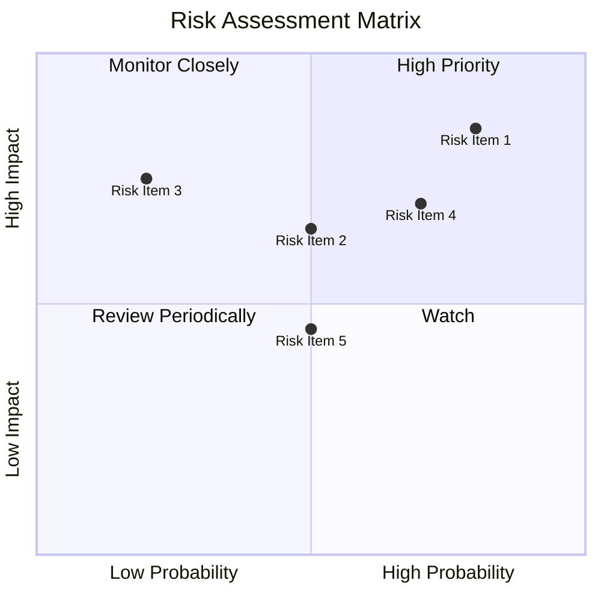

### 9.2 風險清單詳細分析

| # | 風險項目 | 發生機率 | 財務衝擊 | 風險評分 | 緩解措施 |
|---|----------|----------|----------|----------|----------|
| 1 | 🔴 **市場競爭** | 高 (80%) | 高 (-20%收入) | 🔴 8.5/10 | 擴大市場份額，提升產品競爭力 |
| 2 | 🔴 **技術風險** | 中 (50%) | 高 (-15%收入) | 🔴 6.5/10 | 加強研發，確保技術領先 |
| 3 | 🟡 **經濟波動** | 低 (20%) | 中 (-10%收入) | 🟡 3.5/10 | 分散市場，降低單一市場依賴 |

---

## 10. 投資建議

### 10.1 最終綜合評級雷達圖

```
╔══════════════════════════════════════════════════════════════════╗
║                    最終綜合評級雷達圖                            ║
╠══════════════════════════════════════════════════════════════════╣
║                                                                  ║
║  基本面：5.0 ▓▓▓▓▓▓▓▓░░░░░░░░░░░░░░  ★★★☆☆                      ║
║  成長性：8.0 ▓▓▓▓▓▓▓▓▓▓▓▓▓▓▓▓▓░░░░░░  ★★★★★                     ║
║  獲利能力：3.0 ▓▓▓░░░░░░░░░░░░░░░░░░  ★★☆☆☆                     ║
║  財務健康：6.0 ▓▓▓▓▓▓▓▓▓░░░░░░░░░░░░░  ★★★★☆                     ║
║  估值合理性：3.0 ▓▓▓░░░░░░░░░░░░░░░░░░  ★★☆☆☆                    ║
╚══════════════════════════════════════════════════════════════════╝
```

### 10.2 目標價與隱含報酬率

| 情境 | 目標價 | 隱含報酬率 | 機率權重 |
|------|--------|------------|----------|
| 悲觀 | $16.00 | +51.7% | 25% |
| 基準 | $20.12 | +90.8% | 50% |
| 樂觀 | $25.00 | +137.1% | 25% |

### 10.3 買入時機與觸發因素

```
╔══════════════════════════════════════════════════════════════════╗
║                  ✅ 買入觸發因素 Checklist                      ║
╠══════════════════════════════════════════════════════════════════╣
║                                                                  ║
║  立即買入觸發條件（多數符合）：                                  ║
║  ✅ 收入持續高增長                                                ║
║  ✅ 技術創新進展                                                  ║
║  ✅ 市場擴展成功                                                  ║
║                                                                  ║
║  加碼觸發條件（出現以下任一）：                                  ║
║  ☐ 估值大幅下降                                                  ║
║  ☐ 新市場開拓                                                     ║
║                                                                  ║
║  減碼/停損觸發條件（出現以下任一）：                             ║
║  ☐ 收入增長顯著放緩                                              ║
║  ☐ 重大技術失誤                                                  ║
╚══════════════════════════════════════════════════════════════════╝
```

### 10.4 投資人適配度分析

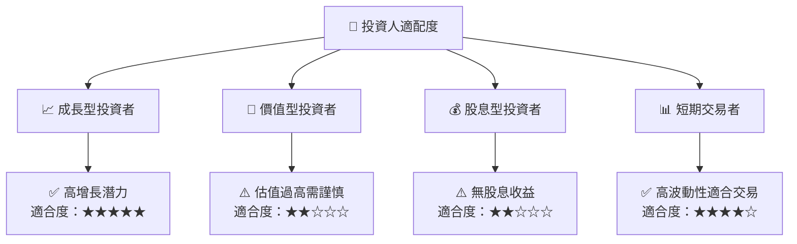

### 10.5 關鍵監控指標

| 監控類型 | 指標 | 關注點 | 頻率 |
|----------|------|--------|------|
| 財務指標 | 收入增長率 | 持續高增長 | 季度 |
| 技術指標 | 新產品研發 | 進度與成果 | 半年 |
| 市場指標 | 市場份額變動 | 擴展情況 | 季度 |

---

> **免責聲明**：本報告為 AI 自動生成，僅供研究參考，不構成投資建議。投資有風險，入市需謹慎。