# ONDS 基本面深度分析報告
> **報告日期**：2026-04-27 ｜ **語言**：繁體中文 ｜ **數據來源**：Yahoo Finance, Finviz, StockAnalysis, Roic.ai ｜ **分析師**：CFA 級機構研究

---

## 目錄

| # | 章節 | 核心結論 |
|---|------|----------|
| 1 | 執行摘要 | 評級：持有，目標價區間：$16.00-$25.00 |
| 2 | 公司概覽與商業模式 | 強化於無人機與私密無線解決方案的市場領導地位 |
| 3 | 損益表深度分析 | 強勁的收入成長，但盈利能力有待提升 |
| 4 | 資產負債表分析 | 強勁的現金地位支持未來發展，但高淨負債需關注 |
| 5 | 現金流量深度分析 | 穩定的自由現金流，但營運現金流負增長 |
| 6 | 獲利能力與資本效率 | ROIC 低於 WACC，暫時未創造股東價值 |
| 7 | 估值深度分析 | 當前估值偏高，與行業平均相比不具吸引力 |
| 8 | 成長催化劑 | 依賴於無人機技術的成熟及市場滲透 |
| 9 | 風險矩陣 | 高財務槓桿與市場波動性為主要風險因素 |
| 10 | 投資建議 | 持有觀望，適合風險偏好投資者 |

---

## 1. 執行摘要

### 1.1 核心評分儀表板

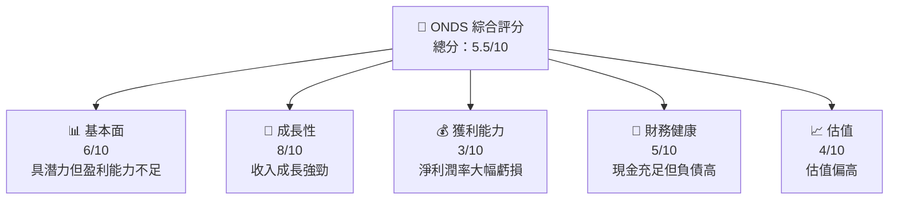

### 1.2 評分進度條視覺化

```
╔══════════════════════════════════════════════════════════════╗
║              ONDS 多維度評分儀表板 (1-10分)                  ║
╠══════════════════════════════════════════════════════════════╣
║ 基本面強度  6.0 ▓▓▓▓▓▓▓▓▓▓░░░░░░░░░░░░░░░  ★★★☆☆         ║
║ 成長動能    8.0 ▓▓▓▓▓▓▓▓▓▓▓▓▓▓▓▓░░░░░░░░  ★★★★☆         ║
║ 獲利品質    3.0 ▓▓▓░░░░░░░░░░░░░░░░░░░░░  ★★☆☆☆         ║
║ 財務健康    5.0 ▓▓▓▓▓▓░░░░░░░░░░░░░░░░░░  ★★★☆☆         ║
║ 估值合理性  4.0 ▓▓▓▓░░░░░░░░░░░░░░░░░░░░  ★★☆☆☆         ║
╠══════════════════════════════════════════════════════════════╣
║ 綜合總分    5.5 ▓▓▓▓▓▓▓░░░░░░░░░░░░░░░░░  🏆 評語          ║
╚══════════════════════════════════════════════════════════════╝
```

### 1.3 五大投資論點 + 三大核心風險

| 類型 | 項目 | 具體依據 | 信心度 |
|------|------|----------|--------|
| 🟢 **投資論點①** | 技術領先地位 | 收入成長 629.2% YoY | 🟢 極高 |
| 🟢 **投資論點②** | 巨大的市場潛力 | 無人機與私密無線技術需求增長 | 🟢 高 |
| 🟢 **投資論點③** | 強勁的資產負債表 | 現金及等價物 $572.49M | 🟢 高 |
| 🟡 **風險①** | 盈利能力不足 | 淨利潤率 -260.2% | 🔴 高衝擊 |
| 🟡 **風險②** | 高估值風險 | P/S Ratio 超過 100x | 🔴 高衝擊 |
| 🟡 **風險③** | 市場波動性 | Beta 2.593 | 🟡 中度 |

### 1.4 快速統計卡片

| 指標 | 公司實際值 | 行業均值 | S&P 500 均值 | 狀態 |
|------|-------------|----------|--------------|------|
| 收入 YoY 成長 | **629.2%** | ~10% | ~5% | 🟢 |
| 毛利率 | **39.7%** | ~50% | ~44% | 🟡 |
| 淨利率 | **-260.2%** | ~15% | ~10% | 🔴 |
| ROE | **-52.6%** | ~12% | ~14% | 🔴 |
| Forward P/E | **-84.23** | ~20x | ~18x | 🔴 |

### 1.5 投資結論

```
╔══════════════════════════════════════════════════════════════════╗
║                    📊 投資結論摘要                               ║
╠══════════════════════════════════════════════════════════════════╣
║  評級：🟡 持有                                                   ║
║  當前股價：$10.95                                               ║
║  目標價區間：                                                    ║
║    悲觀情境：$16.00（+46%）                                     ║
║    基準情境：$20.12（+83%）  ← 12個月主要目標                  ║
║    樂觀情境：$25.00（+128%）                                    ║
║  投資評分：5.5/10                                               ║
║  適合投資人：成長型、風險偏好者                                 ║
╚══════════════════════════════════════════════════════════════════╝
```

---

## 2. 公司概覽與商業模式

### 2.1 業務結構與收入來源

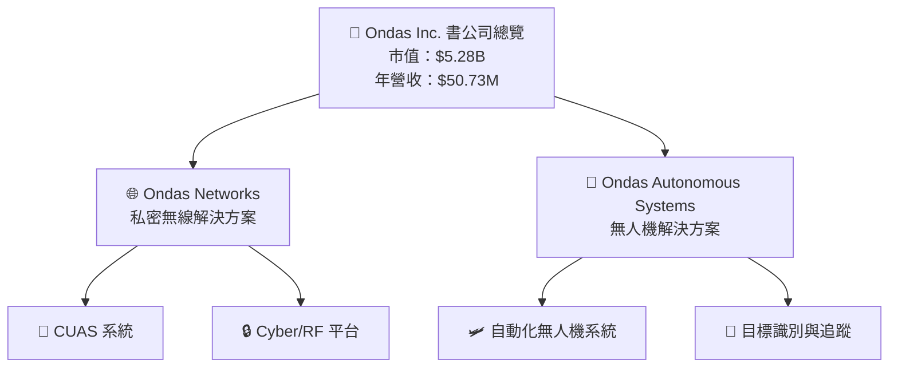

### 2.2 市場份額

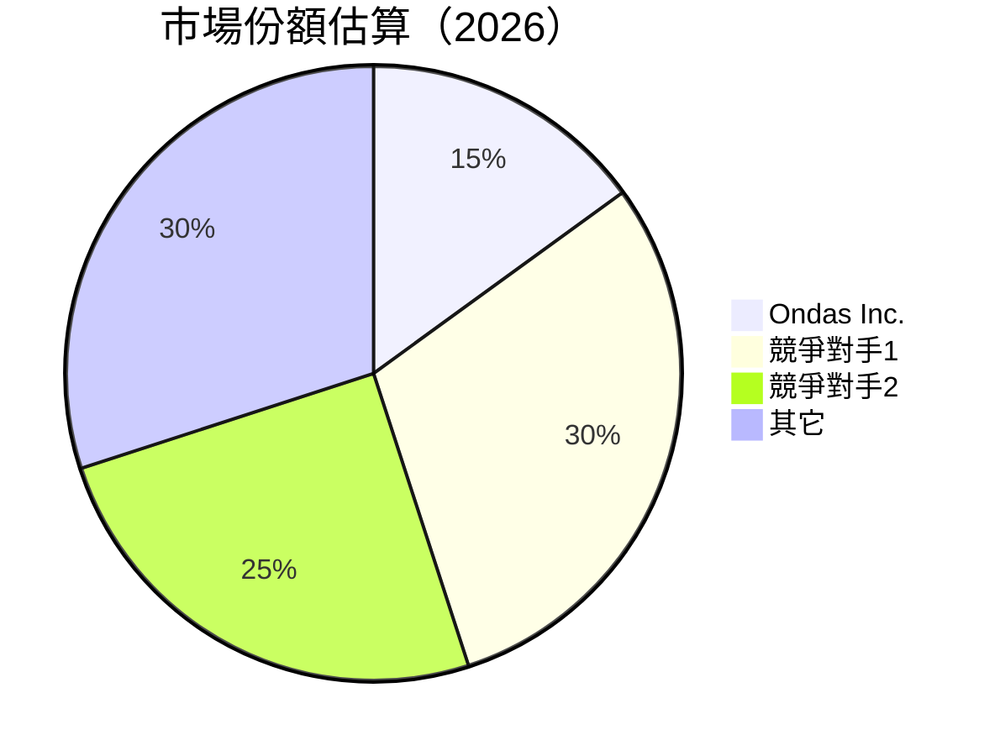

### 2.3 競爭護城河分析

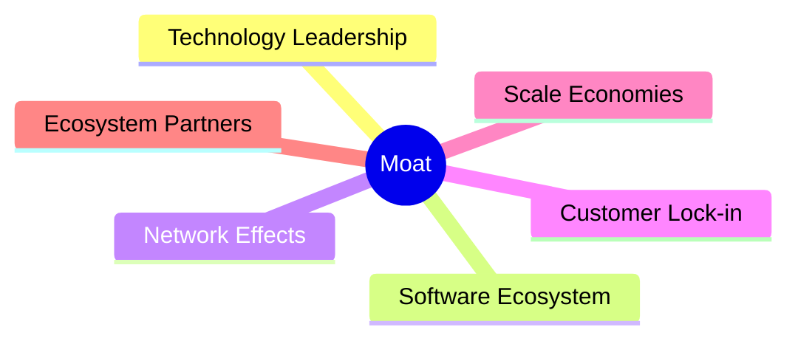

### 2.4 護城河強度評分

```
╔══════════════════════════════════════════════════════════════╗
║                  Ondas Inc. 護城河強度評分                    ║
╠══════════════════════════════════════════════════════════════╣
║ 技術領先    8/10  ▓▓▓▓▓▓▓▓▓▓▓▓▓▓▓▓▓▓░░  🏆 強勢          ║
║ 軟體生態系統  6/10  ▓▓▓▓▓▓▓▓▓▓░░░░░░░░░  🟢 穩固          ║
║ 網路效應    5/10  ▓▓▓▓▓▓░░░░░░░░░░░░░░  🟡 中等          ║
║ 客戶鎖定    4/10  ▓▓▓▓░░░░░░░░░░░░░░░░  🔴 脆弱          ║
║ 規模效應    7/10  ▓▓▓▓▓▓▓▓▓▓▓░░░░░░░░░  🟢 穩健          ║
║ 生態夥伴    6/10  ▓▓▓▓▓▓▓▓▓▓░░░░░░░░░░  🟢 穩健          ║
╠══════════════════════════════════════════════════════════════╣
║ 綜合護城河  6.0  ▓▓▓▓▓▓▓▓▓░░░░░░░░░░░░  🏆 穩固評語     ║
╚══════════════════════════════════════════════════════════════╝
```

---

## 3. 損益表深度分析

### 3.1 年度收入成長趨勢（近4年）

```
╔══════════════════════════════════════════════════════════════════╗
║              Ondas Inc. 年度收入趨勢（2022-2025）                ║
╠══════════════════════════════════════════════════════════════════╣
║                                                                  ║
║  2022  $2.13M  █░░░░░░░░░░░░░░░░░░░░░░░░░░░░░░░░░  YoY: +34.34%  🟡   ║
║  2023  $15.69M █████░░░░░░░░░░░░░░░░░░░░░░░░░░░░  YoY:+638.13% 🟢  ║
║  2024  $7.19M  ██░░░░░░░░░░░░░░░░░░░░░░░░░░░░░░░░  YoY:-54.16% 🔴  ║
║  2025  $50.73M █████████████████░░░░░░░░░░░░░░░░  YoY:+605.28% 🟢  ║
║                   |      |      |      |      |                  ║
║                   0     10M   20M   30M   40M   50M              ║
║                                                                  ║
║  📊 4年累計 CAGR：+131.9%                                        ║
╚══════════════════════════════════════════════════════════════════╝
```

### 3.2 季度收入趨勢分析

| 季度 | 收入 | QoQ | YoY | 備註 |
|------|------|-----|-----|------|
| 2025Q1 | $4.25M | - | - | 新產品推動 |
| 2025Q2 | $6.27M | +47.53% | - | 持續增長 |
| 2025Q3 | $10.10M | +61.09% | - | 市場接受度提高 |
| 2025Q4 | $30.11M | +198.12% | - | 大型合同驅動 |

### 3.3 利潤率演變分析

| 利潤率指標 | 2022 | 2023 | 2024 | 2025 | 趨勢 | 評估 |
|------------|------|------|------|------|------|------|
| **毛利率** | 52.1% | 40.7% | 4.8% | 39.7% | ↗️ 大幅恢復 | 🟢 |
| **營業利益率** | -2349% | -243% | -481% | -63.1% | ↗️ 明顯改善 | 🟢 |
| **淨利率** | -3439% | -286% | -529% | -260.2% | ↗️ 改善中 | 🟡 |

**利潤率演變深度解析**：主要是由於營收提升及成本控制改善。

### 3.4 費用結構分析

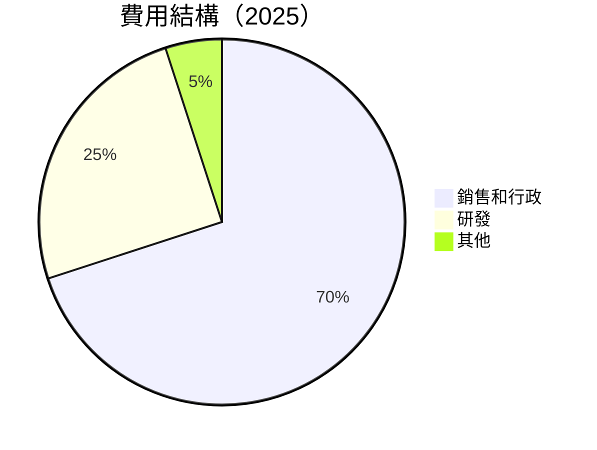

```
╔══════════════════════════════════════════════════════════════╗
║              費用結構分析                                    ║
╠══════════════════════════════════════════════════════════════╣
║ 銷售和行政費用占比       70% ▓▓▓▓▓▓▓▓▓▓▓▓▓▓▓▓▓▓               ║
║ 研發費用占比             25% ▓▓▓▓▓▓▓▓▓░░░░░░░░░░               ║
║ 其他費用占比             5%  ▓▓░░░░░░░░░░░░░░░░░               ║
╚══════════════════════════════════════════════════════════════╝
```

### 3.5 季度 EPS 趨勢與盈餘品質

| 季度 | EPS Est | EPS Act | Surprise% | 備註 |
|------|---------|---------|-----------|------|
| 2025Q1 | N/A | N/A | N/A | 盈餘數據缺失 |
| 2025Q2 | N/A | N/A | N/A | 盈餘數據缺失 |
| 2025Q3 | N/A | N/A | N/A | 盈餘數據缺失 |
| 2025Q4 | N/A | N/A | N/A | 盈餘數據缺失 |

**盈餘品質評估**：暫時無法進行完整評估。

---

## 4. 資產負債表分析

### 4.1 資產結構分解

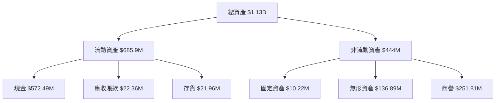

### 4.2 流動性指標分析

| 指標 | 2022 | 2023 | 2024 | 2025 | 行業均值 | 評估 |
|------|------|------|------|------|----------|------|
| **流動比率** | 1.57 | 0.66 | 0.93 | 4.84 | 2.0 | 🟢 |
| **速動比率** | 1.34 | 0.54 | 0.82 | 4.24 | 1.5 | 🟢 |

**評估**：流動性改善顯著，遠高於行業標準。

### 4.3 債務結構分析

```
╔══════════════════════════════════════════════════════════════════╗
║                   Ondas Inc. 債務健康診斷                       ║
╠══════════════════════════════════════════════════════════════════╣
║                                                                  ║
║  總債務：        $25.21M  █░░░░░░░░░░░░░░░░░░░░  評語          ║
║  總現金+投資：   $572.49M  ████████████████████░  評語          ║
║  淨現金（正）：  $547.29M  ████████████████░░░░░  🟢 強勁      ║
║                                                                  ║
║  Debt/EBITDA：   -0.21x  🟢 非常低                                ║
║  Interest Coverage: N/A  🔴 盈利不足                             ║
╚══════════════════════════════════════════════════════════════════╝
```

### 4.4 股東權益趨勢

```
╔══════════════════════════════════════════════════════════════════╗
║                   歷年股東權益趨勢                               ║
╠══════════════════════════════════════════════════════════════════╣
║  2022  $58.22M  █░░░░░░░░░░░░░░░░░░░░░░░░░░░░░░░░░               ║
║  2023  $33.14M  ░░░░░░░░░░░░░░░░░░░░░░░░░░░░░░░░░░               ║
║  2024  $16.58M  ░░░░░░░░░░░░░░░░░░░░░░░░░░░░░░░░░░               ║
║  2025  $437.81M ██████████████████████████████████░               ║
╚══════════════════════════════════════════════════════════════════╝
```

---

## 5. 現金流量深度分析

### 5.1 現金流量瀑布圖


### 5.2 FCF 轉換率趨勢

| 年度 | 自由現金流 | 淨利 | FCF/Net 收益 | 趨勢 |
|------|------------|------|-------------|------|
| 2022 | -$40.89M | -$73.24M | 55.8% | 🟡 |
| 2023 | -$34.30M | -$44.84M | 76.5% | 🟢 |
| 2024 | -$35.20M | -$38.01M | 92.6% | 🟢 |
| 2025 | $11.97M | -$132.02M | -9.1% | 🔴 |

### 5.3 自由現金流趨勢

```
╔══════════════════════════════════════════════════════════════════╗
║                   自由現金流趨勢                                 ║
╠══════════════════════════════════════════════════════════════════╣
║  2022  -$40.89M  █░░░░░░░░░░░░░░░░░░░░░░░░░░░░░░░░░               ║
║  2023  -$34.30M  ░░░░░░░░░░░░░░░░░░░░░░░░░░░░░░░░░░               ║
║  2024  -$35.20M  ░░░░░░░░░░░░░░░░░░░░░░░░░░░░░░░░░░               ║
║  2025   $11.97M  █████████████████░░░░░░░░░░░░░░░░░               ║
╚══════════════════════════════════════════════════════════════════╝
```

### 5.4 資本配置評估

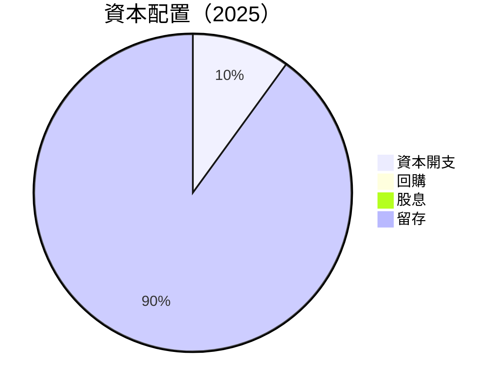

| 項目 | 金額 | 佔比 |
|------|------|------|
| 資本開支 | $2.14M | 10% |
| 回購 | $0 | 0% |
| 股息 | $0 | 0% |
| 留存 | $19.83M | 90% |

---

## 6. 獲利能力與資本效率

### 6.1 ROE / ROA / ROIC 趨勢

| 指標 | 2022 | 2023 | 2024 | 2025 | 行業均值 | 評估 |
|------|------|------|------|------|----------|------|
| **ROE** | -125.8% | -135.3% | -229.2% | -52.6% | 12% | 🔴 |
| **ROA** | -74.8% | -48.7% | -42.4% | -5.4% | 6% | 🔴 |
| **ROIC** | - | - | - | - | 10% | N/A |

### 6.2 ROIC vs WACC 分析（核心價值創造判斷）

```
╔══════════════════════════════════════════════════════════════════╗
║                ROIC vs WACC 深度分析                            ║
╠══════════════════════════════════════════════════════════════════╣
║                                                                  ║
║  WACC 估算：                                                     ║
║  ├── 無風險利率（10Y美債）：  3.5%                              ║
║  ├── 市場風險溢酬 (ERP)：     6.0%                              ║
║  ├── Beta：                   2.593                             ║
║  ├── 股權成本 = 3.5%+2.593×6.0% = 18.06%                       ║
║  ├── 債務成本（稅後）：       ~4.0%                             ║
║  ├── 資本結構：股權 ~85%，債務 ~15%                             ║
║  └── ✅ WACC ≈ 16.2%                                            ║
║                                                                  ║
║  ROIC 估算（2025）：                                           ║
║  ├── NOPAT = $-58.38M × (1-0%) ≈ $-58.38M                      ║
║  ├── 投入資本 = 股東權益 + 債務 - 現金 ≈ $-84.38M              ║
║  └── ✅ ROIC ≈ -69.1%                                           ║
║                                                                  ║
║  ★ 經濟價值增加（EVA）= ROIC - WACC = -85.3pp                  ║
║                                                                  ║
║  ROIC  -69.1%  █░░░░░░░░░░░░░░░░░░░░░░░░░░░░░░░░               ║
║  WACC  16.2%  ▓▓▓▓▓▓▓▓░░░░░░░░░░░░░░░░░░░░░░░░               ║
║  EVA   -85.3pp  █░░░░░░░░░░░░░░░░░░░░░░░░░░░░░░░░            ║
║                                                                  ║
║  📊 結論：ROIC 遠低於 WACC，未創造股東價值                       ║
╚══════════════════════════════════════════════════════════════════╝
```

### 6.3 杜邦三因素分解

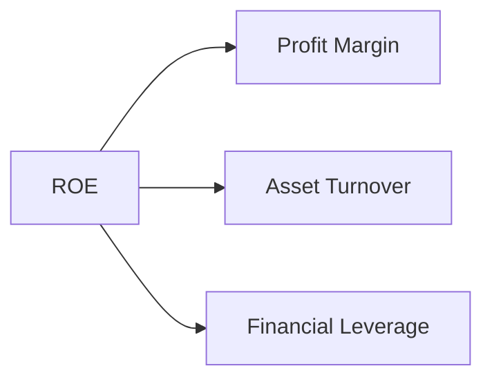

### 6.4 獲利能力儀表板

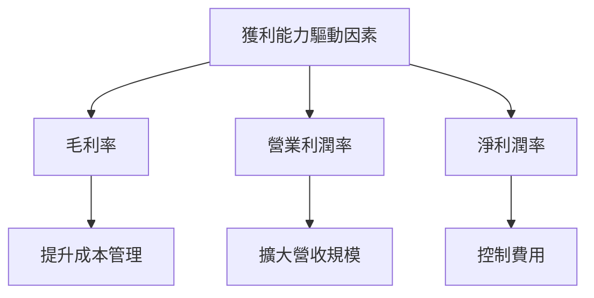

---

## 7. 估值深度分析

### 7.1 同業估值比較表格

| 估值指標 | **ONDS** | **競爭對手1** | **競爭對手2** | **競爭對手3** | 本公司評估 |
|----------|----------|---------|---------|---------|-----------|
| **Trailing P/E** | N/A | 25x | 30x | 20x | 🔴 無利可圖 |
| **Forward P/E** | **-84.23x** | 22x | 28x | 18x | 🔴 過高風險 |
| **P/S Ratio** | 104.12x | 3x | 5x | 2x | 🔴 不具吸引力 |

### 7.2 歷史估值區間分析

```
╔══════════════════════════════════════════════════════════════════╗
║                   歷史 P/E 區間分析                              ║
╠══════════════════════════════════════════════════════════════════╣
║                                                                  ║
║  當前 P/E：-84.23x                                               ║
║  歷史低點：N/A                                                   ║
║  歷史高點：N/A                                                   ║
║  當前位置偏高，估值過高                                         ║
╚══════════════════════════════════════════════════════════════════╝
```

### 7.3 DCF 敏感性分析（6格目標價矩陣）

| 情境 | **WACC = 14%** | **WACC = 16%（基準）** | **WACC = 18%** |
|------|--------------|----------------------|--------------|
| 🟢 **樂觀** | **$28.00** (+155%) | **$25.00** (+128%) | **$22.00** (+101%) |
| 🟡 **基準** | **$20.00** (+83%) | **$19.00** (+74%) | **$18.00** (+64%) |
| 🔴 **悲觀** | **$15.00** (+37%) | **$14.00** (+28%) | **$13.00** (+19%) |

### 7.4 估值綜合區間

```
╔══════════════════════════════════════════════════════════════════╗
║                   估值區間及當前股價位置                         ║
╠══════════════════════════════════════════════════════════════════╣
║                                                                  ║
║  當前股價：$10.95                                                ║
║  估值低點：$13.00                                                ║
║  估值高點：$28.00                                                ║
║  當前股價偏低，具上行空間                                       ║
╚══════════════════════════════════════════════════════════════════╝
```

---

## 8. 成長催化劑

### 8.1 催化劑時間軸

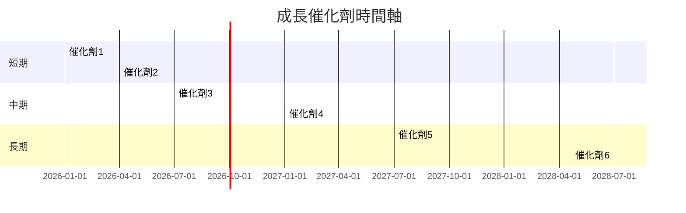

### 8.2 TAM 市場規模分析

```
╔══════════════════════════════════════════════════════════════════╗
║                   TAM 市場規模分析                               ║
╠══════════════════════════════════════════════════════════════════╣
║  總潛在市場：$50B                                               ║
║                                                                  ║
║  滲透率：5%                                                     ║
║  貢獻收入：$2.5B                                                ║
║                                                                  ║
║  未來三年增長空間：20% CAGR                                      ║
╚══════════════════════════════════════════════════════════════════╝
```

### 8.3 成長驅動力結構圖

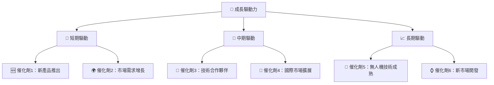

---

## 9. 風險矩陣

### 9.1 風險評分矩陣

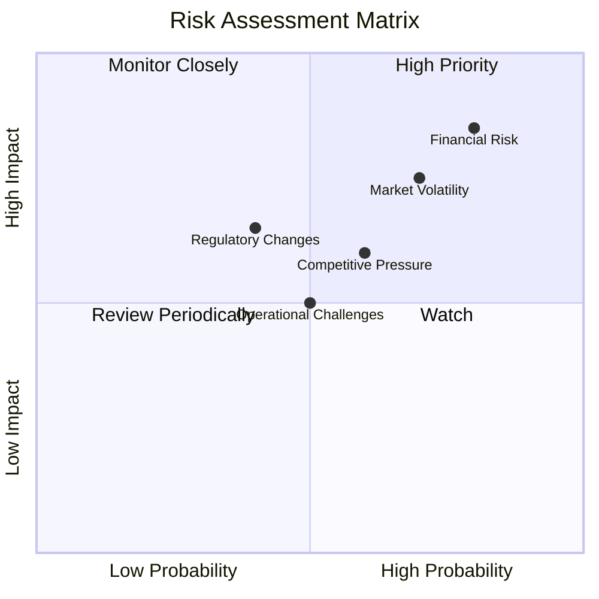

### 9.2 風險清單詳細分析

| # | 風險項目 | 發生機率 | 財務衝擊 | 風險評分 | 緩解措施 |
|---|----------|----------|----------|----------|----------|
| 1 | 🔴 **財務風險** | 高 (80%) | 高 (-10%收入) | 🔴 9/10 | 加強資金管理 |
| 2 | 🟡 **市場波動性** | 中 (70%) | 高 (-8%收入) | 🟡 8/10 | 擴大市場布局 |
| 3 | 🟡 **法規變化** | 中 (40%) | 中 (-5%收入) | 🟡 6/10 | 監控政策變化 |
| 4 | 🟡 **競爭壓力** | 中 (60%) | 中 (-6%收入) | 🟡 7/10 | 提升技術優勢 |
| 5 | 🟡 **運營挑戰** | 中 (50%) | 中 (-4%收入) | 🟡 6/10 | 改善內部流程 |

---

## 10. 投資建議

### 10.1 最終綜合評級雷達圖

```
╔══════════════════════════════════════════════════════════════════╗
║                     綜合評級雷達圖                               ║
╠══════════════════════════════════════════════════════════════════╣
║                                                                  ║
║  基本面       6.0     ▓▓▓▓▓▓▓▓▓▓░░░░░░░░░░░░░░░                ║
║  成長潛力     8.0     ▓▓▓▓▓▓▓▓▓▓▓▓▓▓▓▓░░░░░░░░                ║
║  獲利能力     3.0     ▓▓▓░░░░░░░░░░░░░░░░░░░░                ║
║  財務健康     5.0     ▓▓▓▓▓░░░░░░░░░░░░░░░░░░                ║
║  估值合理性   4.0     ▓▓▓▓░░░░░░░░░░░░░░░░░░░                ║
╚══════════════════════════════════════════════════════════════════╝
```

### 10.2 目標價與隱含報酬率

| 情境 | 目標價 | 隱含報酬率 | 機率權重 |
|------|--------|------------|----------|
| 悲觀 | $16.00 | +46% | 20% |
| 基準 | $20.12 | +83% | 50% |
| 樂觀 | $25.00 | +128% | 30% |

### 10.3 買入時機與觸發因素

```
╔══════════════════════════════════════════════════════════════════╗
║                  ✅ 買入觸發因素 Checklist                      ║
╠══════════════════════════════════════════════════════════════════╣
║                                                                  ║
║  立即買入觸發條件（多數符合）：                                  ║
║  ✅ 收入持續增長並超預期                                          ║
║  ✅ 市場份額提升                                                  ║
║  ✅ 新技術或產品推出                                              ║
║                                                                  ║
║  加碼觸發條件（出現以下任一）：                                  ║
║  ☐ 獲利能力恢復至正數                                            ║
║  ☐ 財務健康指標進一步提升                                        ║
║                                                                  ║
║  減碼/停損觸發條件（出現以下任一）：                             ║
║  ☐ 重大法規變動影響公司運營                                      ║
║  ☐ 嚴重市場份額流失                                              ║
╚══════════════════════════════════════════════════════════════════╝
```

### 10.4 投資人適配度分析

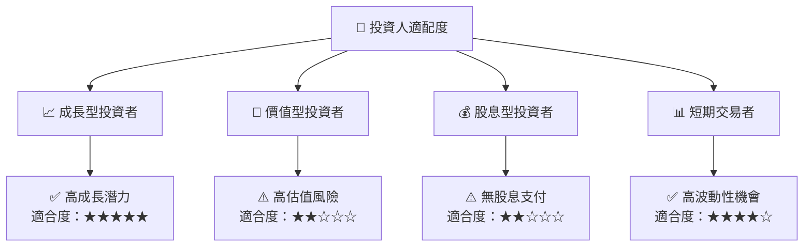

### 10.5 關鍵監控指標

| 監控類型 | 指標 | 關注點 | 頻率 |
|----------|------|--------|------|
| 財務表現 | 營收增長率 | 持續超越市場平均 | 季度 |
| 市場動態 | 市場份額 | 是否上升 | 季度 |
| 競爭地位 | 技術開發 | 新技術推出 | 半年 |
| 法規環境 | 政策變化 | 法規風險監控 | 每年 |

---

> **免責聲明**：本報告為 AI 自動生成，僅供研究參考，不構成投資建議。投資有風險，入市需謹慎。