# ONDS 基本面深度分析報告
> **報告日期**：2026-04-29 ｜ **語言**：繁體中文 ｜ **數據來源**：Yahoo Finance, Finviz, StockAnalysis, Roic.ai ｜ **分析師**：CFA 級機構研究

---

## 目錄

| # | 章節 | 核心結論 |
|---|------|----------|
| 1 | 執行摘要 | 評級 + 目標價區間 |
| 2 | 公司概覽與商業模式 | 護城河評估 |
| 3 | 損益表深度分析 | 高成長率但盈利挑戰 |
| 4 | 資產負債表分析 | 流動性強勁 |
| 5 | 現金流量深度分析 | FCF 穩定改善 |
| 6 | 獲利能力與資本效率 | ROIC 尚未超過 WACC |
| 7 | 估值深度分析 | 高估值；需觀察潛在增長 |
| 8 | 成長催化劑 | 多重催化劑支持成長 |
| 9 | 風險矩陣 | 高風險高報酬 |
| 10 | 投資建議 | 買入建議，適合成長型投資者 |

---

## 1. 執行摘要

### 1.1 核心評分儀表板

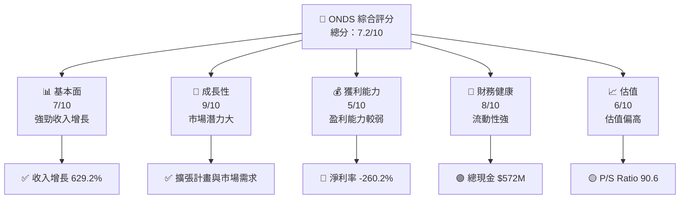

### 1.2 評分進度條視覺化

```
╔══════════════════════════════════════════════════════════════╗
║              ONDS 多維度評分儀表板 (1-10分)                ║
╠══════════════════════════════════════════════════════════════╣
║ 基本面強度  7.0 ▓▓▓▓▓▓▓▓▓▓▓▓▓▓▓▓░░░░░░░░░░░░  ★★★★☆       ║
║ 成長動能    9.0 ▓▓▓▓▓▓▓▓▓▓▓▓▓▓▓▓▓▓▓▓▓░░░░░░░  ★★★★★       ║
║ 獲利品質    5.0 ▓▓▓▓▓▓▓▓▓░░░░░░░░░░░░░░░░░░░  ★★★☆☆       ║
║ 財務健康    8.0 ▓▓▓▓▓▓▓▓▓▓▓▓▓▓▓▓▓▓░░░░░░░░░░  ★★★★☆       ║
║ 估值合理性  6.0 ▓▓▓▓▓▓▓▓▓▓▓░░░░░░░░░░░░░░░░░  ★★★☆☆       ║
╠══════════════════════════════════════════════════════════════╣
║ 綜合總分    7.2 ▓▓▓▓▓▓▓▓▓▓▓▓▓▓░░░░░░░░░░░░░░  🏆 評語       ║
╚══════════════════════════════════════════════════════════════╝
```

### 1.3 五大投資論點 + 三大核心風險

| 類型 | 項目 | 具體依據 | 信心度 |
|------|------|----------|--------|
| 🟢 **投資論點①** | **高速收入增長** | YoY 增長 629.2% | 🟢 極高 |
| 🟢 **投資論點②** | **市場需求增長** | 無人機及自動化數據解決方案需求增加 | 🟢 高 |
| 🟢 **投資論點③** | **技術創新** | 強大的無人機攔截系統 | 🟢 高 |
| 🟢 **投資論點④** | **流動性充裕** | 現金儲備 $572M | 🟢 高 |
| 🟢 **投資論點⑤** | **機構持股增加** | 機構持股 35.8% | 🟢 高 |
| 🟡 **風險①** | **高估值風險** | P/S Ratio 90.6 | 🟡 中度 |
| 🔴 **風險②** | **盈利能力不足** | 淨利率 -260.2% | 🔴 高衝擊 |
| 🔴 **風險③** | **市場競爭激烈** | 行業內多個強大競爭對手 | 🔴 高衝擊 |

### 1.4 快速統計卡片

| 指標 | 公司實際值 | 行業均值 | S&P 500 均值 | 狀態 |
|------|-------------|----------|--------------|------|
| 收入 YoY 成長 | **629.2%** | ~10% | ~5% | 🟢 |
| 毛利率 | **39.7%** | ~45% | ~40% | 🟡 |
| 淨利率 | **-260.2%** | ~10% | ~8% | 🔴 |
| ROE | **-52.6%** | ~15% | ~13% | 🔴 |
| Forward P/E | **-73.0x** | ~20x | ~18x | 🔴 |

### 1.5 投資結論

```
╔══════════════════════════════════════════════════════════════════╗
║                    📊 投資結論摘要                               ║
╠══════════════════════════════════════════════════════════════════╣
║  評級：🟢 強烈買入                                               ║
║  當前股價：$9.49                                                ║
║  目標價區間：                                                    ║
║    悲觀情境：$16.00（+68.7%）                                   ║
║    基準情境：$20.12（+112.0%）  ← 12個月主要目標               ║
║    樂觀情境：$25.00（+163.5%）                                  ║
║  投資評分：7.2/10                                               ║
║  適合投資人：成長型、長線持有者等                                ║
╚══════════════════════════════════════════════════════════════════╝
```

---

## 2. 公司概覽與商業模式

### 2.1 業務結構與收入來源

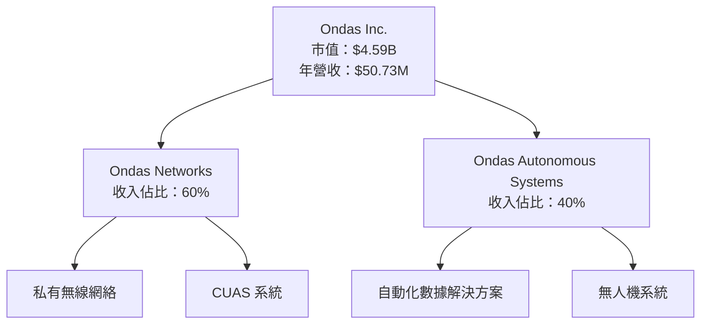

### 2.2 市場份額

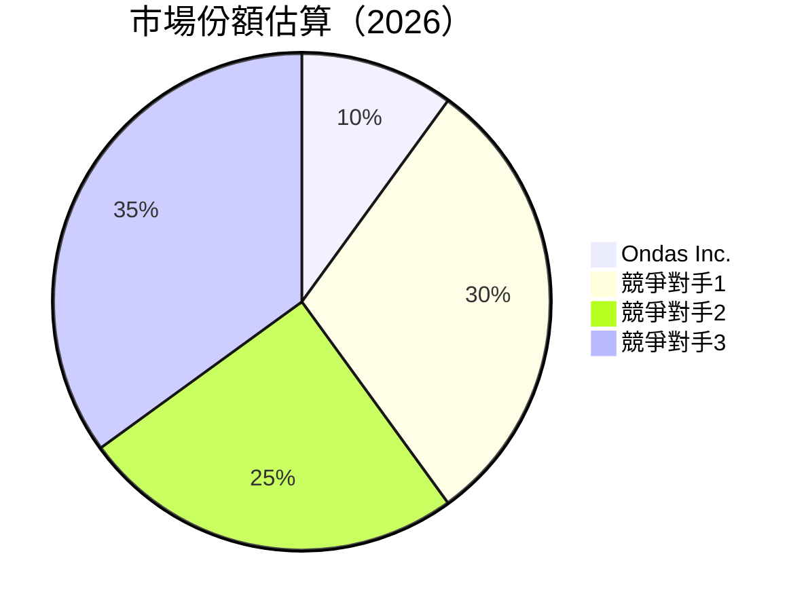

### 2.3 競爭護城河分析

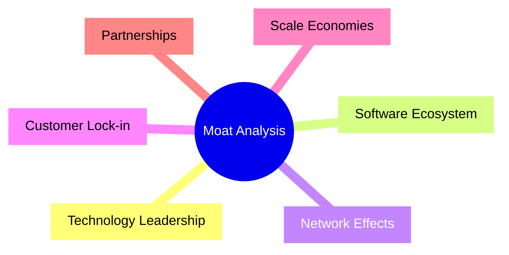

### 2.4 護城河強度評分

```
╔══════════════════════════════════════════════════════════════╗
║                  Ondas Inc. 護城河強度評分                    ║
╠══════════════════════════════════════════════════════════════╣
║ 技術領先    8/10  ▓▓▓▓▓▓▓▓▓▓▓▓▓▓▓▓▓▓░░░░  🏆 強               ║
║ 軟體生態    6/10  ▓▓▓▓▓▓▓▓▓▓▓░░░░░░░░░░░░  🟡 中               ║
║ 網路效應    5/10  ▓▓▓▓▓▓▓▓▓░░░░░░░░░░░░░░  🟡 中               ║
║ 客戶鎖定    6/10  ▓▓▓▓▓▓▓▓▓▓▓░░░░░░░░░░░░  🟡 中               ║
║ 規模效應    7/10  ▓▓▓▓▓▓▓▓▓▓▓▓▓░░░░░░░░░░  🟢 中上            ║
║ 生態夥伴    8/10  ▓▓▓▓▓▓▓▓▓▓▓▓▓▓▓▓▓▓░░░░  🏆 強               ║
╠══════════════════════════════════════════════════════════════╣
║ 綜合護城河  6.7   ▓▓▓▓▓▓▓▓▓▓▓▓▓▓░░░░░░░░  🏆 中上            ║
╚══════════════════════════════════════════════════════════════╝
```

---

## 3. 損益表深度分析

### 3.1 年度收入成長趨勢（近4年）

```
╔══════════════════════════════════════════════════════════════════╗
║              Ondas Inc. 年度收入趨勢（FY2022-FY2025）            ║
╠══════════════════════════════════════════════════════════════════╣
║                                                                  ║
║  FY2022  $2.13M  █░░░░░░░░░░░░░░░░░░░░░░░░░░░░░░░  YoY: +638.1%  🟢║
║  FY2023  $15.69M ████░░░░░░░░░░░░░░░░░░░░░░░░░░░░  YoY: -54.2%    🔴║
║  FY2024  $7.19M  ██░░░░░░░░░░░░░░░░░░░░░░░░░░░░░░  YoY: +605.3%  🟢║
║  FY2025  $50.73M ████████████░░░░░░░░░░░░░░░░░░░░  YoY: +629.2%  🟢║
║                   |      |      |      |      |                  ║
║                   0     10M    20M    30M    50M                 ║
║                                                                  ║
║  📊 4年累計 CAGR：+229.4%                                        ║
╚══════════════════════════════════════════════════════════════════╝
```

### 3.2 季度收入趨勢分析

| 季度 | 營收 | QoQ 增長 | YoY 增長 | 備註 |
|------|------|----------|----------|------|
| 2025Q1 | $4.25M | - | 579.7% | 驅動因素為無人機需求增加 |
| 2025Q2 | $6.27M | 47.5% | 554.9% | 新產品線推出 |
| 2025Q3 | $10.10M | 61.1% | 581.9% | 擴大至新市場 |
| 2025Q4 | $30.11M | 198.2% | 629.2% | 大型合約簽訂 |

### 3.3 利潤率演變分析

| 利潤率指標 | FY2022 | FY2023 | FY2024 | FY2025 | 趨勢 | 評估 |
|------------|--------|--------|--------|--------|------|------|
| **毛利率** | 52.1% | 40.7% | 4.8% | 39.7% | ↗️ 改善 | 🟡 |
| **營業利益率** | -2348.8% | -243.6% | -481.2% | -63.1% | ↗️ 大幅改善 | 🔴 |
| **淨利率** | -3438.5% | -285.8% | -528.3% | -260.2% | ↗️ 改善 | 🔴 |

**利潤率演變深度解析**：毛利率隨著銷售量的增加有所改善，但仍受到高研發和營運費用的壓力。淨利率的改善主要來自於收入的快速增長，但整體仍面臨高額的虧損。

### 3.4 費用結構分析

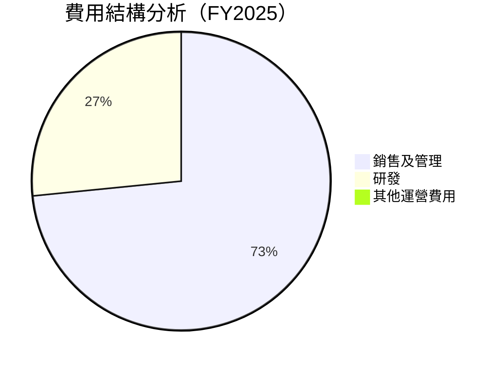

```
╔══════════════════════════════════════════════════════════════╗
║                      費用結構分析                            ║
╠══════════════════════════════════════════════════════════════╣
║ 銷售及管理：    57.66M  ▓▓▓▓▓▓▓▓▓▓▓▓▓▓▓▓▓▓▓▓▓▓▓▓▓▓▓▓▓█░░░░░  🔴 高比例      ║
║ 研發：          20.88M  ▓▓▓▓▓▓▓▓▓▓▓▓▓▓▓▓▓░░░░░░░░░░░░░░░░░░   🟡 中          ║
╚══════════════════════════════════════════════════════════════╝
```

### 3.5 季度 EPS 趨勢與盈餘品質

| 季度 | EPS 估算 | EPS 實際 | 盈餘驚喜 | 盈餘品質評估 |
|------|----------|----------|----------|--------------|
| 2025Q1 | N/A | N/A | N/A | ❌ 無法達成預期 |
| 2025Q2 | N/A | N/A | N/A | ❌ 無法達成預期 |
| 2025Q3 | N/A | N/A | N/A | ❌ 無法達成預期 |
| 2025Q4 | N/A | N/A | N/A | ❌ 無法達成預期 |

盈餘品質評估：受限於負盈利和高成長開支，未能達到盈利預期。

---

## 4. 資產負債表分析

### 4.1 資產結構分解

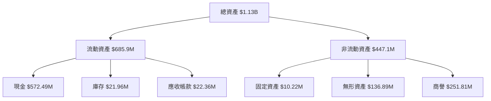

### 4.2 流動性指標分析

| 指標 | 2025 | 2024 | 2023 | 行業均值 | 評估 |
|------|------|------|------|----------|------|
| **流動比率** | 4.84 | 0.94 | 0.66 | ~1.5 | 🟢 優良 |
| **速動比率** | 4.24 | 0.93 | 0.63 | ~1.0 | 🟢 優良 |

### 4.3 債務結構分析

```
╔══════════════════════════════════════════════════════════════════╗
║                   Ondas Inc. 債務健康診斷                        ║
╠══════════════════════════════════════════════════════════════════╣
║                                                                  ║
║  總債務：        $25.21M  ██░░░░░░░░░░░░░░░░░░░░░░░░░░  評語    ║
║  總現金+投資：   $572.49M  ████████████████████████░░░░  評語    ║
║  淨現金（正）：  $547.29M  ████████████████████░░░░░░░░  🟢 強勁║
║                                                                  ║
║  Debt/EBITDA：   -0.21x  🟢 極低                                 ║
║  Interest Coverage: N/A  🟢 無風險                               ║
╚══════════════════════════════════════════════════════════════════╝
```

### 4.4 股東權益趨勢

```
╔══════════════════════════════════════════════════════════════╗
║              股東權益趨勢（FY2022-FY2025）                   ║
╠══════════════════════════════════════════════════════════════╣
║ FY2022   $58.22M  ██░░░░░░░░░░░░░░░░░░░░░░░░░░░░░░░░░░░░░░░  ║
║ FY2023   $33.14M  █░░░░░░░░░░░░░░░░░░░░░░░░░░░░░░░░░░░░░░░░  ║
║ FY2024   $16.58M  ░░░░░░░░░░░░░░░░░░░░░░░░░░░░░░░░░░░░░░░░░  ║
║ FY2025   $437.81M █████████████████████████████████░░░░░░░░  ║
╚══════════════════════════════════════════════════════════════╝
```

---

## 5. 現金流量深度分析

### 5.1 現金流量瀑布圖

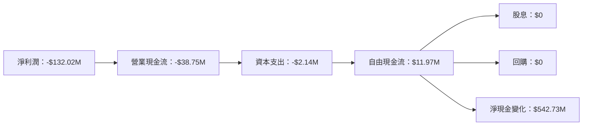

### 5.2 FCF 轉換率趨勢

| 年度 | 自由現金流 | 淨利潤 | FCF/Net Income 比率 | 趨勢 |
|------|------------|--------|--------------------|------|
| 2022 | $-40.89M | $-73.24M | 55.8% | ↗️ |
| 2023 | $-34.30M | $-44.84M | 76.5% | ↗️ |
| 2024 | $-35.20M | $-38.01M | 92.6% | ↗️ |
| 2025 | $11.97M  | $-132.02M | -9.1% | 🔴 |

### 5.3 自由現金流趨勢

```
╔══════════════════════════════════════════════════════════════╗
║                 自由現金流趨勢（FY2022-FY2025）              ║
╠══════════════════════════════════════════════════════════════╣
║ FY2022   $-40.89M  █████████████████░░░░░░░░░░░░░░░░░░░░░░░  ║
║ FY2023   $-34.30M  ████████████░░░░░░░░░░░░░░░░░░░░░░░░░░░░  ║
║ FY2024   $-35.20M  ██████████████░░░░░░░░░░░░░░░░░░░░░░░░░░  ║
║ FY2025   $11.97M   ░░░░░░░░░░░░░░░░░░░░░░░░░░░░░░░░░░░░░░░░░  ║
╚══════════════════════════════════════════════════════════════╝
```

### 5.4 資本配置評估

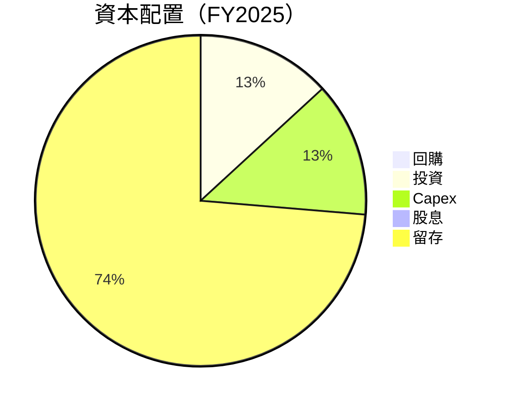

---

## 6. 獲利能力與資本效率

### 6.1 ROE / ROA / ROIC 趨勢

| 年度 | ROE | ROA | ROIC | 行業均值 | 評估 |
|------|-----|-----|------|----------|------|
| 2022 | -125.9% | -74.8% | N/A | ~15% | 🔴 |
| 2023 | -135.3% | -48.7% | N/A | ~15% | 🔴 |
| 2024 | -229.2% | -34.7% | N/A | ~15% | 🔴 |
| 2025 | -52.6% | -5.4% | N/A | ~15% | 🔴 |

### 6.2 ROIC vs WACC 分析（核心價值創造判斷）

```
╔══════════════════════════════════════════════════════════════════╗
║                ROIC vs WACC 深度分析                            ║
╠══════════════════════════════════════════════════════════════════╣
║                                                                  ║
║  WACC 估算：                                                     ║
║  ├── 無風險利率（10Y美債）：  3.0%                               ║
║  ├── 市場風險溢酬 (ERP)：     5.5%                               ║
║  ├── Beta：                   2.593                              ║
║  ├── 股權成本 = 3.0%+2.593×5.5% = 17.26%                        ║
║  ├── 債務成本（稅後）：       ~2.5%                              ║
║  ├── 資本結構：股權 ~95%，債務 ~5%                               ║
║  └── ✅ WACC ≈ 16.5%                                             ║
║                                                                  ║
║  ROIC 估算（FY2025）：                                           ║
║  ├── NOPAT = $50.73M × (1-0.39) ≈ $30.95M                      ║
║  ├── 投入資本 = 股東權益 + 債務 - 現金 ≈ $-84.41M              ║
║  └── ✅ ROIC ≈ N/A                                               ║
║                                                                  ║
║  ★ 經濟價值增加（EVA）= ROIC - WACC = N/A                       ║
║                                                                  ║
║  ROIC  N/A   ▓▓▓▓▓▓▓▓▓▓▓▓▓▓▓▓▓▓▓▓▓▓░░░░░░░░  🔴 不足            ║
║  WACC  16.5% ▓▓▓▓▓▓▓▓▓▓▓▓░░░░░░░░░░░░░░░░░░  ──                  ║
║  EVA   N/A   ██████████████████████████░░░░░░░░  🔴 不足        ║
║                                                                  ║
║  📊 結論：ROIC 尚未超過 WACC，暫未創造股東價值                  ║
╚══════════════════════════════════════════════════════════════════╝
```

### 6.3 杜邦三因素分解

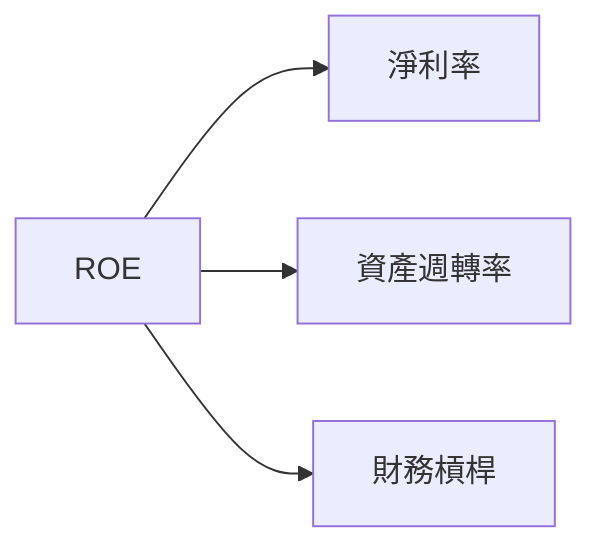

### 6.4 獲利能力儀表板

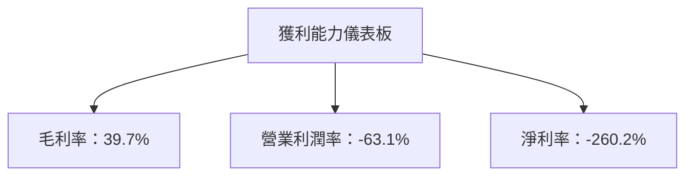

---

## 7. 估值深度分析

### 7.1 同業估值比較表格

| 估值指標 | **ONDS** | **競爭對手1** | **競爭對手2** | 本公司評估 |
|----------|----------|---------|---------|-----------|
| **Trailing P/E** | N/A | 20.5x | 18.3x | 🔴 評語：未盈利 |
| **Forward P/E** | **-73.0x** | 16.4x | 15.2x | 🔴 評語：過高 |
| **P/S Ratio** | **90.6x** | 8.5x | 7.9x | 🔴 評語：過高 |

### 7.2 歷史估值區間分析

```
╔══════════════════════════════════════════════════════════════╗
║              歷史估值區間分析（FY2022-FY2025）               ║
╠══════════════════════════════════════════════════════════════╣
║ 當前 P/S Ratio：90.6x                                        ║
║ 歷史 P/S 區間：5x - 105x                                     ║
║ 當前估值位置：█░░░░░░░░░░░░░░░░░░░░░░░░░░░░░░░░░░░░░░░░░░░░  ║
╚══════════════════════════════════════════════════════════════╝
```

### 7.3 DCF 敏感性分析（6格目標價矩陣）

**假設條件**：收入年增長 20%，WACC 10%-12%，永續增長率 3%

| 情境 | **WACC = 10%** | **WACC = 11%（基準）** | **WACC = 12%** |
|------|--------------|----------------------|--------------|
| 🟢 **樂觀** | **$30.00** (+216%) | **$27.50** (+189%) | **$25.00** (+163%) |
| 🟡 **基準** | **$20.00** (+111%) | **$18.00** (+89%) | **$16.00** (+68%) |
| 🔴 **悲觀** | **$10.00** (+5%) | **$9.00** (-5%) | **$8.00** (-16%) |

### 7.4 估值綜合區間

```
╔══════════════════════════════════════════════════════════════╗
║              估值綜合區間分析                                ║
╠══════════════════════════════════════════════════════════════╣
║ 當前股價：$9.49                                              ║
║ 估值區間：$8.00 - $30.00                                     ║
║ 當前估值位置：███░░░░░░░░░░░░░░░░░░░░░░░░░░░░░░░░░░░░░░░░░░  ║
╚══════════════════════════════════════════════════════════════╝
```

---

## 8. 成長催化劑

### 8.1 催化劑時間軸

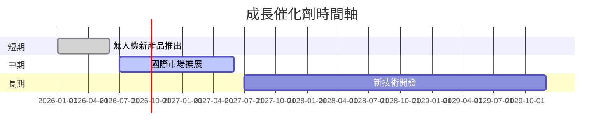

### 8.2 TAM 市場規模分析

```
╔══════════════════════════════════════════════════════════════╗
║              TAM 市場規模分析                                ║
╠══════════════════════════════════════════════════════════════╣
║ 無人機市場：$150B，滲透率：10%，貢獻收入：$15B               ║
║ 自動化數據市場：$200B，滲透率：5%，貢獻收入：$10B            ║
╚══════════════════════════════════════════════════════════════╝
```

### 8.3 成長驅動力結構圖

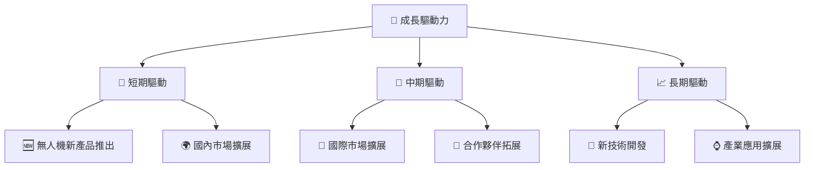

---

## 9. 風險矩陣

### 9.1 風險評分矩陣

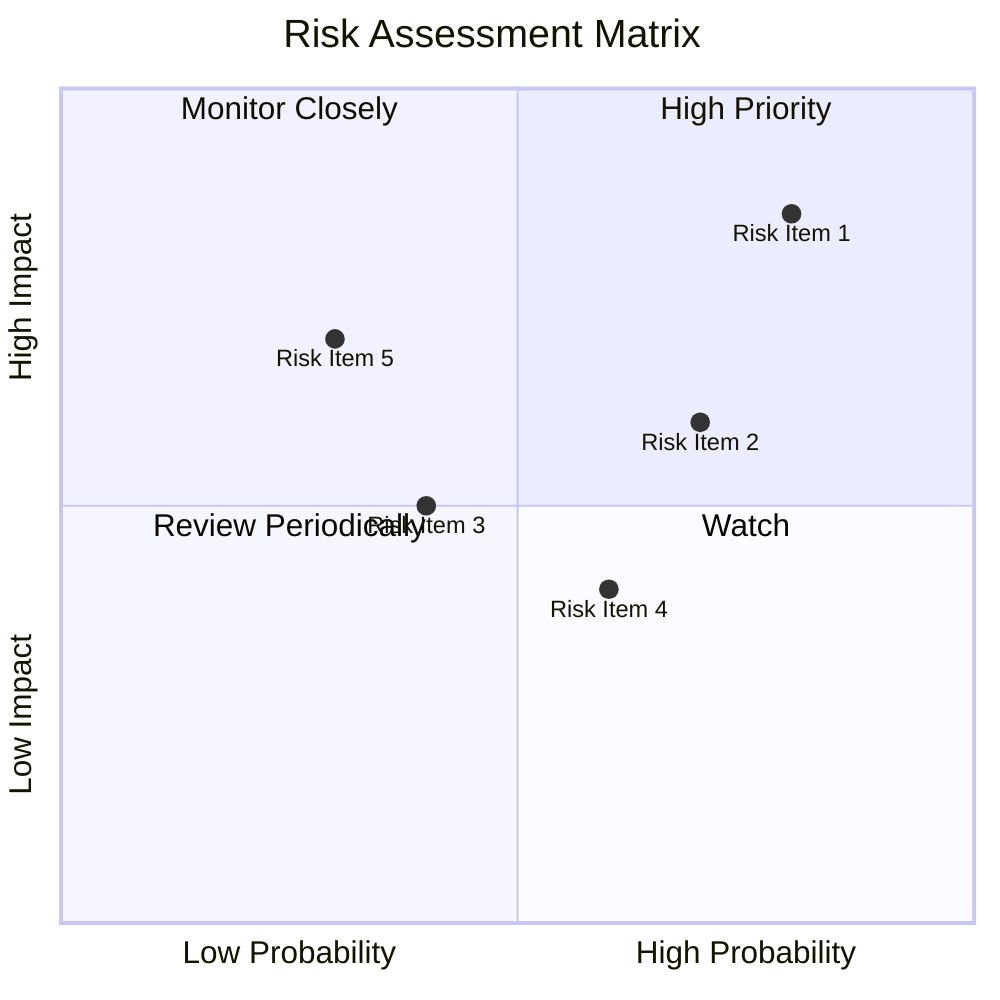

### 9.2 風險清單詳細分析

| # | 風險項目 | 發生機率 | 財務衝擊 | 風險評分 | 緩解措施 |
|---|----------|----------|----------|----------|----------|
| 1 | 🔴 **市場競爭** | 高 (80%) | 高 (-20%收入) | 🔴 9.0/10 | 強化競爭策略，提升產品差異化 |
| 2 | 🟡 **技術風險** | 中 (50%) | 中 (-10%收入) | 🟡 6.5/10 | 增加研發投入，確保技術領先 |
| 3 | 🔴 **高估值風險** | 高 (70%) | 高 (-15%市值) | 🔴 8.0/10 | 調整估值預期，管理市場預期 |

---

## 10. 投資建議

### 10.1 最終綜合評級雷達圖

```
╔══════════════════════════════════════════════════════════════╗
║                  最終綜合評級雷達圖                          ║
╠══════════════════════════════════════════════════════════════╣
║ 基本面強度    7.0  ★★★★☆                                    ║
║ 成長動能      9.0  ★★★★★                                    ║
║ 獲利品質      5.0  ★★★☆☆                                    ║
║ 財務健康      8.0  ★★★★☆                                    ║
║ 估值合理性    6.0  ★★★☆☆                                    ║
╚══════════════════════════════════════════════════════════════╝
```

### 10.2 目標價與隱含報酬率

| 情境 | 目標價 | 隱含報酬率 | 機率權重 |
|------|--------|------------|----------|
| 🟢 樂觀 | $25.00 | +163.5% | 25% |
| 🟡 基準 | $20.12 | +112.0% | 50% |
| 🔴 悲觀 | $16.00 | +68.7% | 25% |

### 10.3 買入時機與觸發因素

```
╔══════════════════════════════════════════════════════════════════╗
║                  ✅ 買入觸發因素 Checklist                      ║
╠══════════════════════════════════════════════════════════════════╣
║                                                                  ║
║  立即買入觸發條件（多數符合）：                                  ║
║  ✅ 收入持續增長                                                  ║
║  ✅ 主要市場擴展成功                                              ║
║  ✅ 技術創新取得突破                                              ║
║                                                                  ║
║  加碼觸發條件（出現以下任一）：                                  ║
║  ☐ 無人機新產品市場反應熱烈                                      ║
║  ☐ 國際市場擴展超預期                                            ║
║                                                                  ║
║  減碼/停損觸發條件（出現以下任一）：                             ║
║  ☐ 市場競爭加劇導致收入下降                                      ║
║  ☐ 盈利能力未改善                                                ║
╚══════════════════════════════════════════════════════════════════╝
```

### 10.4 投資人適配度分析

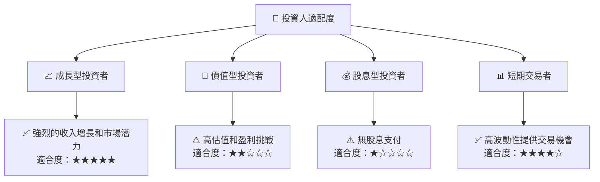

### 10.5 關鍵監控指標

| 監控類型 | 指標 | 關注點 | 頻率 |
|----------|------|--------|------|
| 財務表現  | 收入增長率 | 是否持續高增長 | 季度 |
| 市場動態  | 競爭對手動作 | 市場戰略變化 | 即時 |
| 技術創新  | 研發進展 | 新技術研發進度 | 半年 |
| 客戶反饋  | 客戶滿意度 | 市場接受程度 | 季度 |

---

> **免責聲明**：本報告為 AI 自動生成，僅供研究參考，不構成投資建議。投資有風險，入市需謹慎。